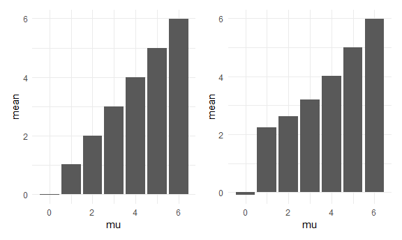

Homework 5
================
Eric Sun

Initial Setup:

``` r
library(tidyverse)
```

    ## -- Attaching packages -------------------------------------------------------------- tidyverse 1.3.0 --

    ## v ggplot2 3.3.2     v purrr   0.3.4
    ## v tibble  3.0.3     v dplyr   1.0.2
    ## v tidyr   1.1.2     v stringr 1.4.0
    ## v readr   1.3.1     v forcats 0.5.0

    ## -- Conflicts ----------------------------------------------------------------- tidyverse_conflicts() --
    ## x dplyr::filter() masks stats::filter()
    ## x dplyr::lag()    masks stats::lag()

``` r
knitr::opts_chunk$set(
  fig.width = 6,
  fig.asp = .6,
  out.width = "90%"
)

theme_set(theme_minimal() + theme(legend.position = "bottom"))

options(
  ggplot2.continuous.colour = "viridis",
  ggplot2.continuous.fill = "viridis"
)

scale_colour_discrete = scale_colour_viridis_d
scale_fill_discrete = scale_fill_viridis_d
```

# Problem 1

Read in the data.

``` r
homicide_df = 
  read_csv("homicide_data/homicide-data.csv") %>% 
  mutate(
    city_state = str_c(city, state, sep = "_"),
    resolved = case_when(
      disposition == "Closed without arrest" ~ "unsolved",
      disposition == "Open/No arrest"        ~ "unsolved",
      disposition == "Closed by arrest"      ~ "solved",
    )
  ) %>% 
  select(city_state, resolved) %>% 
  filter(city_state != "Tulsa_AL")
```

    ## Parsed with column specification:
    ## cols(
    ##   uid = col_character(),
    ##   reported_date = col_double(),
    ##   victim_last = col_character(),
    ##   victim_first = col_character(),
    ##   victim_race = col_character(),
    ##   victim_age = col_character(),
    ##   victim_sex = col_character(),
    ##   city = col_character(),
    ##   state = col_character(),
    ##   lat = col_double(),
    ##   lon = col_double(),
    ##   disposition = col_character()
    ## )

Let’s look at this a bit

``` r
aggregate_df = 
  homicide_df %>% 
  group_by(city_state) %>% 
  summarize(
    hom_total = n(),
    hom_unsolved = sum(resolved == "unsolved")
  )
```

    ## `summarise()` ungrouping output (override with `.groups` argument)

Can I do a prop test for a single city?

``` r
prop.test(
  aggregate_df %>% filter(city_state == "Baltimore_MD") %>% pull(hom_unsolved), 
  aggregate_df %>% filter(city_state == "Baltimore_MD") %>% pull(hom_total)) %>% 
  broom::tidy()
```

    ## # A tibble: 1 x 8
    ##   estimate statistic  p.value parameter conf.low conf.high method    alternative
    ##      <dbl>     <dbl>    <dbl>     <int>    <dbl>     <dbl> <chr>     <chr>      
    ## 1    0.646      239. 6.46e-54         1    0.628     0.663 1-sample~ two.sided

Try to iterate ……..

``` r
results_df = 
  aggregate_df %>% 
  mutate(
    prop_tests = map2(.x = hom_unsolved, .y = hom_total, ~prop.test(x = .x, n = .y)),
    tidy_tests = map(.x = prop_tests, ~broom::tidy(.x))
  ) %>% 
  select(-prop_tests) %>% 
  unnest(tidy_tests) %>% 
  select(city_state, estimate, conf.low, conf.high)
```

``` r
results_df %>% 
  mutate(city_state = fct_reorder(city_state, estimate)) %>% 
  ggplot(aes(x = city_state, y = estimate)) +
  geom_point() + 
  geom_errorbar(aes(ymin = conf.low, ymax = conf.high)) + 
  theme(axis.text.x = element_text(angle = 90, vjust = 0.5, hjust = 1))
```


# Problem 2

Import multiple datasets. Clean names and tidy data.

``` r
path_df = 
  tibble(
    path = list.files("data")
  )  %>%
  mutate(
    path = str_c("data/", path),
    data = map(path, read_csv)
  ) %>%
  unnest(data) %>%
  separate(path, into = c("arm","id"), sep="_") %>%
  mutate(
    arm = str_replace(arm,"data/",""),
    id = str_replace(id, ".csv","")
  ) %>% pivot_longer(week_1:week_8,names_to = "week", names_prefix = "week_", values_to = "observation") %>%
  mutate(
    week = as.numeric(week)
  )
```

    ## Parsed with column specification:
    ## cols(
    ##   week_1 = col_double(),
    ##   week_2 = col_double(),
    ##   week_3 = col_double(),
    ##   week_4 = col_double(),
    ##   week_5 = col_double(),
    ##   week_6 = col_double(),
    ##   week_7 = col_double(),
    ##   week_8 = col_double()
    ## )
    ## Parsed with column specification:
    ## cols(
    ##   week_1 = col_double(),
    ##   week_2 = col_double(),
    ##   week_3 = col_double(),
    ##   week_4 = col_double(),
    ##   week_5 = col_double(),
    ##   week_6 = col_double(),
    ##   week_7 = col_double(),
    ##   week_8 = col_double()
    ## )
    ## Parsed with column specification:
    ## cols(
    ##   week_1 = col_double(),
    ##   week_2 = col_double(),
    ##   week_3 = col_double(),
    ##   week_4 = col_double(),
    ##   week_5 = col_double(),
    ##   week_6 = col_double(),
    ##   week_7 = col_double(),
    ##   week_8 = col_double()
    ## )
    ## Parsed with column specification:
    ## cols(
    ##   week_1 = col_double(),
    ##   week_2 = col_double(),
    ##   week_3 = col_double(),
    ##   week_4 = col_double(),
    ##   week_5 = col_double(),
    ##   week_6 = col_double(),
    ##   week_7 = col_double(),
    ##   week_8 = col_double()
    ## )
    ## Parsed with column specification:
    ## cols(
    ##   week_1 = col_double(),
    ##   week_2 = col_double(),
    ##   week_3 = col_double(),
    ##   week_4 = col_double(),
    ##   week_5 = col_double(),
    ##   week_6 = col_double(),
    ##   week_7 = col_double(),
    ##   week_8 = col_double()
    ## )
    ## Parsed with column specification:
    ## cols(
    ##   week_1 = col_double(),
    ##   week_2 = col_double(),
    ##   week_3 = col_double(),
    ##   week_4 = col_double(),
    ##   week_5 = col_double(),
    ##   week_6 = col_double(),
    ##   week_7 = col_double(),
    ##   week_8 = col_double()
    ## )
    ## Parsed with column specification:
    ## cols(
    ##   week_1 = col_double(),
    ##   week_2 = col_double(),
    ##   week_3 = col_double(),
    ##   week_4 = col_double(),
    ##   week_5 = col_double(),
    ##   week_6 = col_double(),
    ##   week_7 = col_double(),
    ##   week_8 = col_double()
    ## )
    ## Parsed with column specification:
    ## cols(
    ##   week_1 = col_double(),
    ##   week_2 = col_double(),
    ##   week_3 = col_double(),
    ##   week_4 = col_double(),
    ##   week_5 = col_double(),
    ##   week_6 = col_double(),
    ##   week_7 = col_double(),
    ##   week_8 = col_double()
    ## )
    ## Parsed with column specification:
    ## cols(
    ##   week_1 = col_double(),
    ##   week_2 = col_double(),
    ##   week_3 = col_double(),
    ##   week_4 = col_double(),
    ##   week_5 = col_double(),
    ##   week_6 = col_double(),
    ##   week_7 = col_double(),
    ##   week_8 = col_double()
    ## )
    ## Parsed with column specification:
    ## cols(
    ##   week_1 = col_double(),
    ##   week_2 = col_double(),
    ##   week_3 = col_double(),
    ##   week_4 = col_double(),
    ##   week_5 = col_double(),
    ##   week_6 = col_double(),
    ##   week_7 = col_double(),
    ##   week_8 = col_double()
    ## )
    ## Parsed with column specification:
    ## cols(
    ##   week_1 = col_double(),
    ##   week_2 = col_double(),
    ##   week_3 = col_double(),
    ##   week_4 = col_double(),
    ##   week_5 = col_double(),
    ##   week_6 = col_double(),
    ##   week_7 = col_double(),
    ##   week_8 = col_double()
    ## )
    ## Parsed with column specification:
    ## cols(
    ##   week_1 = col_double(),
    ##   week_2 = col_double(),
    ##   week_3 = col_double(),
    ##   week_4 = col_double(),
    ##   week_5 = col_double(),
    ##   week_6 = col_double(),
    ##   week_7 = col_double(),
    ##   week_8 = col_double()
    ## )
    ## Parsed with column specification:
    ## cols(
    ##   week_1 = col_double(),
    ##   week_2 = col_double(),
    ##   week_3 = col_double(),
    ##   week_4 = col_double(),
    ##   week_5 = col_double(),
    ##   week_6 = col_double(),
    ##   week_7 = col_double(),
    ##   week_8 = col_double()
    ## )
    ## Parsed with column specification:
    ## cols(
    ##   week_1 = col_double(),
    ##   week_2 = col_double(),
    ##   week_3 = col_double(),
    ##   week_4 = col_double(),
    ##   week_5 = col_double(),
    ##   week_6 = col_double(),
    ##   week_7 = col_double(),
    ##   week_8 = col_double()
    ## )
    ## Parsed with column specification:
    ## cols(
    ##   week_1 = col_double(),
    ##   week_2 = col_double(),
    ##   week_3 = col_double(),
    ##   week_4 = col_double(),
    ##   week_5 = col_double(),
    ##   week_6 = col_double(),
    ##   week_7 = col_double(),
    ##   week_8 = col_double()
    ## )
    ## Parsed with column specification:
    ## cols(
    ##   week_1 = col_double(),
    ##   week_2 = col_double(),
    ##   week_3 = col_double(),
    ##   week_4 = col_double(),
    ##   week_5 = col_double(),
    ##   week_6 = col_double(),
    ##   week_7 = col_double(),
    ##   week_8 = col_double()
    ## )
    ## Parsed with column specification:
    ## cols(
    ##   week_1 = col_double(),
    ##   week_2 = col_double(),
    ##   week_3 = col_double(),
    ##   week_4 = col_double(),
    ##   week_5 = col_double(),
    ##   week_6 = col_double(),
    ##   week_7 = col_double(),
    ##   week_8 = col_double()
    ## )
    ## Parsed with column specification:
    ## cols(
    ##   week_1 = col_double(),
    ##   week_2 = col_double(),
    ##   week_3 = col_double(),
    ##   week_4 = col_double(),
    ##   week_5 = col_double(),
    ##   week_6 = col_double(),
    ##   week_7 = col_double(),
    ##   week_8 = col_double()
    ## )
    ## Parsed with column specification:
    ## cols(
    ##   week_1 = col_double(),
    ##   week_2 = col_double(),
    ##   week_3 = col_double(),
    ##   week_4 = col_double(),
    ##   week_5 = col_double(),
    ##   week_6 = col_double(),
    ##   week_7 = col_double(),
    ##   week_8 = col_double()
    ## )
    ## Parsed with column specification:
    ## cols(
    ##   week_1 = col_double(),
    ##   week_2 = col_double(),
    ##   week_3 = col_double(),
    ##   week_4 = col_double(),
    ##   week_5 = col_double(),
    ##   week_6 = col_double(),
    ##   week_7 = col_double(),
    ##   week_8 = col_double()
    ## )

Spaghetti graph of observations on each subject over time

``` r
path_df %>%
  ggplot(aes(x = week, y = observation, color = id, group = id)) +
  geom_line(size = 1, alpha = .5) +
  facet_grid(. ~ arm)
```


The exposed group has higher observations that rise over the weeks
compared to the control group that has observations that stay relatively
constant over the 8 weeks.

# Problem 3

Create a function to generate datasets

``` r
sample_fn = function(n, mean, sd){
  samp_data = tibble(
    samp = rnorm(n, mean, sd)
  )
  
  samp_result = samp_data %>%
    nest() %>%
   mutate(
    t_test = map(.x = samp_data, ~t.test(x = .x,mu=0, alternative = 'two.sided', paired = FALSE, conf.level = 0.95))
  ) %>%
    mutate(tidy_t_test = map(.x = t_test, ~broom::tidy(.x))) %>%
    select(-t_test) %>%
    unnest(tidy_t_test) %>%
    select(estimate, p.value)
  
  
  return(samp_result)
}
```

Test function

``` r
sim_results = rerun(5, sample_fn(30,0,5)) %>%
  bind_rows() %>%
  mutate(mu = 0)
```

    ## Warning: `...` must not be empty for ungrouped data frames.
    ## Did you want `data = everything()`?
    
    ## Warning: `...` must not be empty for ungrouped data frames.
    ## Did you want `data = everything()`?
    
    ## Warning: `...` must not be empty for ungrouped data frames.
    ## Did you want `data = everything()`?
    
    ## Warning: `...` must not be empty for ungrouped data frames.
    ## Did you want `data = everything()`?
    
    ## Warning: `...` must not be empty for ungrouped data frames.
    ## Did you want `data = everything()`?

Generate datasets for different mu and combine into final power dataset

``` r
mu_0 = rerun(5000, sample_fn(30,0,5)) %>%
  bind_rows() %>%
  mutate(mu = 0)
```

    ## Warning: `...` must not be empty for ungrouped data frames.
    ## Did you want `data = everything()`?
    
    ## Warning: `...` must not be empty for ungrouped data frames.
    ## Did you want `data = everything()`?
    
    ## Warning: `...` must not be empty for ungrouped data frames.
    ## Did you want `data = everything()`?
    
    ## Warning: `...` must not be empty for ungrouped data frames.
    ## Did you want `data = everything()`?
    
    ## Warning: `...` must not be empty for ungrouped data frames.
    ## Did you want `data = everything()`?
    
    ## Warning: `...` must not be empty for ungrouped data frames.
    ## Did you want `data = everything()`?
    
    ## Warning: `...` must not be empty for ungrouped data frames.
    ## Did you want `data = everything()`?
    
    ## Warning: `...` must not be empty for ungrouped data frames.
    ## Did you want `data = everything()`?
    
    ## Warning: `...` must not be empty for ungrouped data frames.
    ## Did you want `data = everything()`?
    
    ## Warning: `...` must not be empty for ungrouped data frames.
    ## Did you want `data = everything()`?
    
    ## Warning: `...` must not be empty for ungrouped data frames.
    ## Did you want `data = everything()`?
    
    ## Warning: `...` must not be empty for ungrouped data frames.
    ## Did you want `data = everything()`?
    
    ## Warning: `...` must not be empty for ungrouped data frames.
    ## Did you want `data = everything()`?
    
    ## Warning: `...` must not be empty for ungrouped data frames.
    ## Did you want `data = everything()`?
    
    ## Warning: `...` must not be empty for ungrouped data frames.
    ## Did you want `data = everything()`?
    
    ## Warning: `...` must not be empty for ungrouped data frames.
    ## Did you want `data = everything()`?
    
    ## Warning: `...` must not be empty for ungrouped data frames.
    ## Did you want `data = everything()`?
    
    ## Warning: `...` must not be empty for ungrouped data frames.
    ## Did you want `data = everything()`?
    
    ## Warning: `...` must not be empty for ungrouped data frames.
    ## Did you want `data = everything()`?
    
    ## Warning: `...` must not be empty for ungrouped data frames.
    ## Did you want `data = everything()`?
    
    ## Warning: `...` must not be empty for ungrouped data frames.
    ## Did you want `data = everything()`?
    
    ## Warning: `...` must not be empty for ungrouped data frames.
    ## Did you want `data = everything()`?
    
    ## Warning: `...` must not be empty for ungrouped data frames.
    ## Did you want `data = everything()`?
    
    ## Warning: `...` must not be empty for ungrouped data frames.
    ## Did you want `data = everything()`?
    
    ## Warning: `...` must not be empty for ungrouped data frames.
    ## Did you want `data = everything()`?
    
    ## Warning: `...` must not be empty for ungrouped data frames.
    ## Did you want `data = everything()`?
    
    ## Warning: `...` must not be empty for ungrouped data frames.
    ## Did you want `data = everything()`?
    
    ## Warning: `...` must not be empty for ungrouped data frames.
    ## Did you want `data = everything()`?
    
    ## Warning: `...` must not be empty for ungrouped data frames.
    ## Did you want `data = everything()`?
    
    ## Warning: `...` must not be empty for ungrouped data frames.
    ## Did you want `data = everything()`?
    
    ## Warning: `...` must not be empty for ungrouped data frames.
    ## Did you want `data = everything()`?
    
    ## Warning: `...` must not be empty for ungrouped data frames.
    ## Did you want `data = everything()`?
    
    ## Warning: `...` must not be empty for ungrouped data frames.
    ## Did you want `data = everything()`?
    
    ## Warning: `...` must not be empty for ungrouped data frames.
    ## Did you want `data = everything()`?
    
    ## Warning: `...` must not be empty for ungrouped data frames.
    ## Did you want `data = everything()`?
    
    ## Warning: `...` must not be empty for ungrouped data frames.
    ## Did you want `data = everything()`?
    
    ## Warning: `...` must not be empty for ungrouped data frames.
    ## Did you want `data = everything()`?
    
    ## Warning: `...` must not be empty for ungrouped data frames.
    ## Did you want `data = everything()`?
    
    ## Warning: `...` must not be empty for ungrouped data frames.
    ## Did you want `data = everything()`?
    
    ## Warning: `...` must not be empty for ungrouped data frames.
    ## Did you want `data = everything()`?
    
    ## Warning: `...` must not be empty for ungrouped data frames.
    ## Did you want `data = everything()`?
    
    ## Warning: `...` must not be empty for ungrouped data frames.
    ## Did you want `data = everything()`?
    
    ## Warning: `...` must not be empty for ungrouped data frames.
    ## Did you want `data = everything()`?
    
    ## Warning: `...` must not be empty for ungrouped data frames.
    ## Did you want `data = everything()`?
    
    ## Warning: `...` must not be empty for ungrouped data frames.
    ## Did you want `data = everything()`?
    
    ## Warning: `...` must not be empty for ungrouped data frames.
    ## Did you want `data = everything()`?
    
    ## Warning: `...` must not be empty for ungrouped data frames.
    ## Did you want `data = everything()`?
    
    ## Warning: `...` must not be empty for ungrouped data frames.
    ## Did you want `data = everything()`?
    
    ## Warning: `...` must not be empty for ungrouped data frames.
    ## Did you want `data = everything()`?
    
    ## Warning: `...` must not be empty for ungrouped data frames.
    ## Did you want `data = everything()`?
    
    ## Warning: `...` must not be empty for ungrouped data frames.
    ## Did you want `data = everything()`?
    
    ## Warning: `...` must not be empty for ungrouped data frames.
    ## Did you want `data = everything()`?
    
    ## Warning: `...` must not be empty for ungrouped data frames.
    ## Did you want `data = everything()`?
    
    ## Warning: `...` must not be empty for ungrouped data frames.
    ## Did you want `data = everything()`?
    
    ## Warning: `...` must not be empty for ungrouped data frames.
    ## Did you want `data = everything()`?
    
    ## Warning: `...` must not be empty for ungrouped data frames.
    ## Did you want `data = everything()`?
    
    ## Warning: `...` must not be empty for ungrouped data frames.
    ## Did you want `data = everything()`?
    
    ## Warning: `...` must not be empty for ungrouped data frames.
    ## Did you want `data = everything()`?
    
    ## Warning: `...` must not be empty for ungrouped data frames.
    ## Did you want `data = everything()`?
    
    ## Warning: `...` must not be empty for ungrouped data frames.
    ## Did you want `data = everything()`?
    
    ## Warning: `...` must not be empty for ungrouped data frames.
    ## Did you want `data = everything()`?
    
    ## Warning: `...` must not be empty for ungrouped data frames.
    ## Did you want `data = everything()`?
    
    ## Warning: `...` must not be empty for ungrouped data frames.
    ## Did you want `data = everything()`?
    
    ## Warning: `...` must not be empty for ungrouped data frames.
    ## Did you want `data = everything()`?
    
    ## Warning: `...` must not be empty for ungrouped data frames.
    ## Did you want `data = everything()`?
    
    ## Warning: `...` must not be empty for ungrouped data frames.
    ## Did you want `data = everything()`?
    
    ## Warning: `...` must not be empty for ungrouped data frames.
    ## Did you want `data = everything()`?
    
    ## Warning: `...` must not be empty for ungrouped data frames.
    ## Did you want `data = everything()`?
    
    ## Warning: `...` must not be empty for ungrouped data frames.
    ## Did you want `data = everything()`?
    
    ## Warning: `...` must not be empty for ungrouped data frames.
    ## Did you want `data = everything()`?
    
    ## Warning: `...` must not be empty for ungrouped data frames.
    ## Did you want `data = everything()`?
    
    ## Warning: `...` must not be empty for ungrouped data frames.
    ## Did you want `data = everything()`?
    
    ## Warning: `...` must not be empty for ungrouped data frames.
    ## Did you want `data = everything()`?
    
    ## Warning: `...` must not be empty for ungrouped data frames.
    ## Did you want `data = everything()`?
    
    ## Warning: `...` must not be empty for ungrouped data frames.
    ## Did you want `data = everything()`?
    
    ## Warning: `...` must not be empty for ungrouped data frames.
    ## Did you want `data = everything()`?
    
    ## Warning: `...` must not be empty for ungrouped data frames.
    ## Did you want `data = everything()`?
    
    ## Warning: `...` must not be empty for ungrouped data frames.
    ## Did you want `data = everything()`?
    
    ## Warning: `...` must not be empty for ungrouped data frames.
    ## Did you want `data = everything()`?
    
    ## Warning: `...` must not be empty for ungrouped data frames.
    ## Did you want `data = everything()`?
    
    ## Warning: `...` must not be empty for ungrouped data frames.
    ## Did you want `data = everything()`?
    
    ## Warning: `...` must not be empty for ungrouped data frames.
    ## Did you want `data = everything()`?
    
    ## Warning: `...` must not be empty for ungrouped data frames.
    ## Did you want `data = everything()`?
    
    ## Warning: `...` must not be empty for ungrouped data frames.
    ## Did you want `data = everything()`?
    
    ## Warning: `...` must not be empty for ungrouped data frames.
    ## Did you want `data = everything()`?
    
    ## Warning: `...` must not be empty for ungrouped data frames.
    ## Did you want `data = everything()`?
    
    ## Warning: `...` must not be empty for ungrouped data frames.
    ## Did you want `data = everything()`?
    
    ## Warning: `...` must not be empty for ungrouped data frames.
    ## Did you want `data = everything()`?
    
    ## Warning: `...` must not be empty for ungrouped data frames.
    ## Did you want `data = everything()`?
    
    ## Warning: `...` must not be empty for ungrouped data frames.
    ## Did you want `data = everything()`?
    
    ## Warning: `...` must not be empty for ungrouped data frames.
    ## Did you want `data = everything()`?
    
    ## Warning: `...` must not be empty for ungrouped data frames.
    ## Did you want `data = everything()`?
    
    ## Warning: `...` must not be empty for ungrouped data frames.
    ## Did you want `data = everything()`?
    
    ## Warning: `...` must not be empty for ungrouped data frames.
    ## Did you want `data = everything()`?
    
    ## Warning: `...` must not be empty for ungrouped data frames.
    ## Did you want `data = everything()`?
    
    ## Warning: `...` must not be empty for ungrouped data frames.
    ## Did you want `data = everything()`?
    
    ## Warning: `...` must not be empty for ungrouped data frames.
    ## Did you want `data = everything()`?
    
    ## Warning: `...` must not be empty for ungrouped data frames.
    ## Did you want `data = everything()`?
    
    ## Warning: `...` must not be empty for ungrouped data frames.
    ## Did you want `data = everything()`?
    
    ## Warning: `...` must not be empty for ungrouped data frames.
    ## Did you want `data = everything()`?
    
    ## Warning: `...` must not be empty for ungrouped data frames.
    ## Did you want `data = everything()`?
    
    ## Warning: `...` must not be empty for ungrouped data frames.
    ## Did you want `data = everything()`?
    
    ## Warning: `...` must not be empty for ungrouped data frames.
    ## Did you want `data = everything()`?
    
    ## Warning: `...` must not be empty for ungrouped data frames.
    ## Did you want `data = everything()`?
    
    ## Warning: `...` must not be empty for ungrouped data frames.
    ## Did you want `data = everything()`?
    
    ## Warning: `...` must not be empty for ungrouped data frames.
    ## Did you want `data = everything()`?
    
    ## Warning: `...` must not be empty for ungrouped data frames.
    ## Did you want `data = everything()`?
    
    ## Warning: `...` must not be empty for ungrouped data frames.
    ## Did you want `data = everything()`?
    
    ## Warning: `...` must not be empty for ungrouped data frames.
    ## Did you want `data = everything()`?
    
    ## Warning: `...` must not be empty for ungrouped data frames.
    ## Did you want `data = everything()`?
    
    ## Warning: `...` must not be empty for ungrouped data frames.
    ## Did you want `data = everything()`?
    
    ## Warning: `...` must not be empty for ungrouped data frames.
    ## Did you want `data = everything()`?
    
    ## Warning: `...` must not be empty for ungrouped data frames.
    ## Did you want `data = everything()`?
    
    ## Warning: `...` must not be empty for ungrouped data frames.
    ## Did you want `data = everything()`?
    
    ## Warning: `...` must not be empty for ungrouped data frames.
    ## Did you want `data = everything()`?
    
    ## Warning: `...` must not be empty for ungrouped data frames.
    ## Did you want `data = everything()`?
    
    ## Warning: `...` must not be empty for ungrouped data frames.
    ## Did you want `data = everything()`?
    
    ## Warning: `...` must not be empty for ungrouped data frames.
    ## Did you want `data = everything()`?
    
    ## Warning: `...` must not be empty for ungrouped data frames.
    ## Did you want `data = everything()`?
    
    ## Warning: `...` must not be empty for ungrouped data frames.
    ## Did you want `data = everything()`?
    
    ## Warning: `...` must not be empty for ungrouped data frames.
    ## Did you want `data = everything()`?
    
    ## Warning: `...` must not be empty for ungrouped data frames.
    ## Did you want `data = everything()`?
    
    ## Warning: `...` must not be empty for ungrouped data frames.
    ## Did you want `data = everything()`?
    
    ## Warning: `...` must not be empty for ungrouped data frames.
    ## Did you want `data = everything()`?
    
    ## Warning: `...` must not be empty for ungrouped data frames.
    ## Did you want `data = everything()`?
    
    ## Warning: `...` must not be empty for ungrouped data frames.
    ## Did you want `data = everything()`?
    
    ## Warning: `...` must not be empty for ungrouped data frames.
    ## Did you want `data = everything()`?
    
    ## Warning: `...` must not be empty for ungrouped data frames.
    ## Did you want `data = everything()`?
    
    ## Warning: `...` must not be empty for ungrouped data frames.
    ## Did you want `data = everything()`?
    
    ## Warning: `...` must not be empty for ungrouped data frames.
    ## Did you want `data = everything()`?
    
    ## Warning: `...` must not be empty for ungrouped data frames.
    ## Did you want `data = everything()`?
    
    ## Warning: `...` must not be empty for ungrouped data frames.
    ## Did you want `data = everything()`?
    
    ## Warning: `...` must not be empty for ungrouped data frames.
    ## Did you want `data = everything()`?
    
    ## Warning: `...` must not be empty for ungrouped data frames.
    ## Did you want `data = everything()`?
    
    ## Warning: `...` must not be empty for ungrouped data frames.
    ## Did you want `data = everything()`?
    
    ## Warning: `...` must not be empty for ungrouped data frames.
    ## Did you want `data = everything()`?
    
    ## Warning: `...` must not be empty for ungrouped data frames.
    ## Did you want `data = everything()`?
    
    ## Warning: `...` must not be empty for ungrouped data frames.
    ## Did you want `data = everything()`?
    
    ## Warning: `...` must not be empty for ungrouped data frames.
    ## Did you want `data = everything()`?
    
    ## Warning: `...` must not be empty for ungrouped data frames.
    ## Did you want `data = everything()`?
    
    ## Warning: `...` must not be empty for ungrouped data frames.
    ## Did you want `data = everything()`?
    
    ## Warning: `...` must not be empty for ungrouped data frames.
    ## Did you want `data = everything()`?
    
    ## Warning: `...` must not be empty for ungrouped data frames.
    ## Did you want `data = everything()`?
    
    ## Warning: `...` must not be empty for ungrouped data frames.
    ## Did you want `data = everything()`?
    
    ## Warning: `...` must not be empty for ungrouped data frames.
    ## Did you want `data = everything()`?
    
    ## Warning: `...` must not be empty for ungrouped data frames.
    ## Did you want `data = everything()`?
    
    ## Warning: `...` must not be empty for ungrouped data frames.
    ## Did you want `data = everything()`?
    
    ## Warning: `...` must not be empty for ungrouped data frames.
    ## Did you want `data = everything()`?
    
    ## Warning: `...` must not be empty for ungrouped data frames.
    ## Did you want `data = everything()`?
    
    ## Warning: `...` must not be empty for ungrouped data frames.
    ## Did you want `data = everything()`?
    
    ## Warning: `...` must not be empty for ungrouped data frames.
    ## Did you want `data = everything()`?
    
    ## Warning: `...` must not be empty for ungrouped data frames.
    ## Did you want `data = everything()`?
    
    ## Warning: `...` must not be empty for ungrouped data frames.
    ## Did you want `data = everything()`?
    
    ## Warning: `...` must not be empty for ungrouped data frames.
    ## Did you want `data = everything()`?
    
    ## Warning: `...` must not be empty for ungrouped data frames.
    ## Did you want `data = everything()`?
    
    ## Warning: `...` must not be empty for ungrouped data frames.
    ## Did you want `data = everything()`?
    
    ## Warning: `...` must not be empty for ungrouped data frames.
    ## Did you want `data = everything()`?
    
    ## Warning: `...` must not be empty for ungrouped data frames.
    ## Did you want `data = everything()`?
    
    ## Warning: `...` must not be empty for ungrouped data frames.
    ## Did you want `data = everything()`?
    
    ## Warning: `...` must not be empty for ungrouped data frames.
    ## Did you want `data = everything()`?
    
    ## Warning: `...` must not be empty for ungrouped data frames.
    ## Did you want `data = everything()`?
    
    ## Warning: `...` must not be empty for ungrouped data frames.
    ## Did you want `data = everything()`?
    
    ## Warning: `...` must not be empty for ungrouped data frames.
    ## Did you want `data = everything()`?
    
    ## Warning: `...` must not be empty for ungrouped data frames.
    ## Did you want `data = everything()`?
    
    ## Warning: `...` must not be empty for ungrouped data frames.
    ## Did you want `data = everything()`?
    
    ## Warning: `...` must not be empty for ungrouped data frames.
    ## Did you want `data = everything()`?
    
    ## Warning: `...` must not be empty for ungrouped data frames.
    ## Did you want `data = everything()`?
    
    ## Warning: `...` must not be empty for ungrouped data frames.
    ## Did you want `data = everything()`?
    
    ## Warning: `...` must not be empty for ungrouped data frames.
    ## Did you want `data = everything()`?
    
    ## Warning: `...` must not be empty for ungrouped data frames.
    ## Did you want `data = everything()`?
    
    ## Warning: `...` must not be empty for ungrouped data frames.
    ## Did you want `data = everything()`?
    
    ## Warning: `...` must not be empty for ungrouped data frames.
    ## Did you want `data = everything()`?
    
    ## Warning: `...` must not be empty for ungrouped data frames.
    ## Did you want `data = everything()`?
    
    ## Warning: `...` must not be empty for ungrouped data frames.
    ## Did you want `data = everything()`?
    
    ## Warning: `...` must not be empty for ungrouped data frames.
    ## Did you want `data = everything()`?
    
    ## Warning: `...` must not be empty for ungrouped data frames.
    ## Did you want `data = everything()`?
    
    ## Warning: `...` must not be empty for ungrouped data frames.
    ## Did you want `data = everything()`?
    
    ## Warning: `...` must not be empty for ungrouped data frames.
    ## Did you want `data = everything()`?
    
    ## Warning: `...` must not be empty for ungrouped data frames.
    ## Did you want `data = everything()`?
    
    ## Warning: `...` must not be empty for ungrouped data frames.
    ## Did you want `data = everything()`?
    
    ## Warning: `...` must not be empty for ungrouped data frames.
    ## Did you want `data = everything()`?
    
    ## Warning: `...` must not be empty for ungrouped data frames.
    ## Did you want `data = everything()`?
    
    ## Warning: `...` must not be empty for ungrouped data frames.
    ## Did you want `data = everything()`?
    
    ## Warning: `...` must not be empty for ungrouped data frames.
    ## Did you want `data = everything()`?
    
    ## Warning: `...` must not be empty for ungrouped data frames.
    ## Did you want `data = everything()`?
    
    ## Warning: `...` must not be empty for ungrouped data frames.
    ## Did you want `data = everything()`?
    
    ## Warning: `...` must not be empty for ungrouped data frames.
    ## Did you want `data = everything()`?
    
    ## Warning: `...` must not be empty for ungrouped data frames.
    ## Did you want `data = everything()`?
    
    ## Warning: `...` must not be empty for ungrouped data frames.
    ## Did you want `data = everything()`?
    
    ## Warning: `...` must not be empty for ungrouped data frames.
    ## Did you want `data = everything()`?
    
    ## Warning: `...` must not be empty for ungrouped data frames.
    ## Did you want `data = everything()`?
    
    ## Warning: `...` must not be empty for ungrouped data frames.
    ## Did you want `data = everything()`?
    
    ## Warning: `...` must not be empty for ungrouped data frames.
    ## Did you want `data = everything()`?
    
    ## Warning: `...` must not be empty for ungrouped data frames.
    ## Did you want `data = everything()`?
    
    ## Warning: `...` must not be empty for ungrouped data frames.
    ## Did you want `data = everything()`?
    
    ## Warning: `...` must not be empty for ungrouped data frames.
    ## Did you want `data = everything()`?
    
    ## Warning: `...` must not be empty for ungrouped data frames.
    ## Did you want `data = everything()`?
    
    ## Warning: `...` must not be empty for ungrouped data frames.
    ## Did you want `data = everything()`?
    
    ## Warning: `...` must not be empty for ungrouped data frames.
    ## Did you want `data = everything()`?
    
    ## Warning: `...` must not be empty for ungrouped data frames.
    ## Did you want `data = everything()`?
    
    ## Warning: `...` must not be empty for ungrouped data frames.
    ## Did you want `data = everything()`?
    
    ## Warning: `...` must not be empty for ungrouped data frames.
    ## Did you want `data = everything()`?
    
    ## Warning: `...` must not be empty for ungrouped data frames.
    ## Did you want `data = everything()`?
    
    ## Warning: `...` must not be empty for ungrouped data frames.
    ## Did you want `data = everything()`?
    
    ## Warning: `...` must not be empty for ungrouped data frames.
    ## Did you want `data = everything()`?
    
    ## Warning: `...` must not be empty for ungrouped data frames.
    ## Did you want `data = everything()`?
    
    ## Warning: `...` must not be empty for ungrouped data frames.
    ## Did you want `data = everything()`?
    
    ## Warning: `...` must not be empty for ungrouped data frames.
    ## Did you want `data = everything()`?
    
    ## Warning: `...` must not be empty for ungrouped data frames.
    ## Did you want `data = everything()`?
    
    ## Warning: `...` must not be empty for ungrouped data frames.
    ## Did you want `data = everything()`?
    
    ## Warning: `...` must not be empty for ungrouped data frames.
    ## Did you want `data = everything()`?
    
    ## Warning: `...` must not be empty for ungrouped data frames.
    ## Did you want `data = everything()`?
    
    ## Warning: `...` must not be empty for ungrouped data frames.
    ## Did you want `data = everything()`?
    
    ## Warning: `...` must not be empty for ungrouped data frames.
    ## Did you want `data = everything()`?
    
    ## Warning: `...` must not be empty for ungrouped data frames.
    ## Did you want `data = everything()`?
    
    ## Warning: `...` must not be empty for ungrouped data frames.
    ## Did you want `data = everything()`?
    
    ## Warning: `...` must not be empty for ungrouped data frames.
    ## Did you want `data = everything()`?
    
    ## Warning: `...` must not be empty for ungrouped data frames.
    ## Did you want `data = everything()`?
    
    ## Warning: `...` must not be empty for ungrouped data frames.
    ## Did you want `data = everything()`?
    
    ## Warning: `...` must not be empty for ungrouped data frames.
    ## Did you want `data = everything()`?
    
    ## Warning: `...` must not be empty for ungrouped data frames.
    ## Did you want `data = everything()`?
    
    ## Warning: `...` must not be empty for ungrouped data frames.
    ## Did you want `data = everything()`?
    
    ## Warning: `...` must not be empty for ungrouped data frames.
    ## Did you want `data = everything()`?
    
    ## Warning: `...` must not be empty for ungrouped data frames.
    ## Did you want `data = everything()`?
    
    ## Warning: `...` must not be empty for ungrouped data frames.
    ## Did you want `data = everything()`?
    
    ## Warning: `...` must not be empty for ungrouped data frames.
    ## Did you want `data = everything()`?
    
    ## Warning: `...` must not be empty for ungrouped data frames.
    ## Did you want `data = everything()`?
    
    ## Warning: `...` must not be empty for ungrouped data frames.
    ## Did you want `data = everything()`?
    
    ## Warning: `...` must not be empty for ungrouped data frames.
    ## Did you want `data = everything()`?
    
    ## Warning: `...` must not be empty for ungrouped data frames.
    ## Did you want `data = everything()`?
    
    ## Warning: `...` must not be empty for ungrouped data frames.
    ## Did you want `data = everything()`?
    
    ## Warning: `...` must not be empty for ungrouped data frames.
    ## Did you want `data = everything()`?
    
    ## Warning: `...` must not be empty for ungrouped data frames.
    ## Did you want `data = everything()`?
    
    ## Warning: `...` must not be empty for ungrouped data frames.
    ## Did you want `data = everything()`?
    
    ## Warning: `...` must not be empty for ungrouped data frames.
    ## Did you want `data = everything()`?
    
    ## Warning: `...` must not be empty for ungrouped data frames.
    ## Did you want `data = everything()`?
    
    ## Warning: `...` must not be empty for ungrouped data frames.
    ## Did you want `data = everything()`?
    
    ## Warning: `...` must not be empty for ungrouped data frames.
    ## Did you want `data = everything()`?
    
    ## Warning: `...` must not be empty for ungrouped data frames.
    ## Did you want `data = everything()`?
    
    ## Warning: `...` must not be empty for ungrouped data frames.
    ## Did you want `data = everything()`?
    
    ## Warning: `...` must not be empty for ungrouped data frames.
    ## Did you want `data = everything()`?
    
    ## Warning: `...` must not be empty for ungrouped data frames.
    ## Did you want `data = everything()`?
    
    ## Warning: `...` must not be empty for ungrouped data frames.
    ## Did you want `data = everything()`?
    
    ## Warning: `...` must not be empty for ungrouped data frames.
    ## Did you want `data = everything()`?
    
    ## Warning: `...` must not be empty for ungrouped data frames.
    ## Did you want `data = everything()`?
    
    ## Warning: `...` must not be empty for ungrouped data frames.
    ## Did you want `data = everything()`?
    
    ## Warning: `...` must not be empty for ungrouped data frames.
    ## Did you want `data = everything()`?
    
    ## Warning: `...` must not be empty for ungrouped data frames.
    ## Did you want `data = everything()`?
    
    ## Warning: `...` must not be empty for ungrouped data frames.
    ## Did you want `data = everything()`?
    
    ## Warning: `...` must not be empty for ungrouped data frames.
    ## Did you want `data = everything()`?
    
    ## Warning: `...` must not be empty for ungrouped data frames.
    ## Did you want `data = everything()`?
    
    ## Warning: `...` must not be empty for ungrouped data frames.
    ## Did you want `data = everything()`?
    
    ## Warning: `...` must not be empty for ungrouped data frames.
    ## Did you want `data = everything()`?
    
    ## Warning: `...` must not be empty for ungrouped data frames.
    ## Did you want `data = everything()`?
    
    ## Warning: `...` must not be empty for ungrouped data frames.
    ## Did you want `data = everything()`?
    
    ## Warning: `...` must not be empty for ungrouped data frames.
    ## Did you want `data = everything()`?
    
    ## Warning: `...` must not be empty for ungrouped data frames.
    ## Did you want `data = everything()`?
    
    ## Warning: `...` must not be empty for ungrouped data frames.
    ## Did you want `data = everything()`?
    
    ## Warning: `...` must not be empty for ungrouped data frames.
    ## Did you want `data = everything()`?
    
    ## Warning: `...` must not be empty for ungrouped data frames.
    ## Did you want `data = everything()`?
    
    ## Warning: `...` must not be empty for ungrouped data frames.
    ## Did you want `data = everything()`?
    
    ## Warning: `...` must not be empty for ungrouped data frames.
    ## Did you want `data = everything()`?
    
    ## Warning: `...` must not be empty for ungrouped data frames.
    ## Did you want `data = everything()`?
    
    ## Warning: `...` must not be empty for ungrouped data frames.
    ## Did you want `data = everything()`?
    
    ## Warning: `...` must not be empty for ungrouped data frames.
    ## Did you want `data = everything()`?
    
    ## Warning: `...` must not be empty for ungrouped data frames.
    ## Did you want `data = everything()`?
    
    ## Warning: `...` must not be empty for ungrouped data frames.
    ## Did you want `data = everything()`?
    
    ## Warning: `...` must not be empty for ungrouped data frames.
    ## Did you want `data = everything()`?
    
    ## Warning: `...` must not be empty for ungrouped data frames.
    ## Did you want `data = everything()`?
    
    ## Warning: `...` must not be empty for ungrouped data frames.
    ## Did you want `data = everything()`?
    
    ## Warning: `...` must not be empty for ungrouped data frames.
    ## Did you want `data = everything()`?
    
    ## Warning: `...` must not be empty for ungrouped data frames.
    ## Did you want `data = everything()`?
    
    ## Warning: `...` must not be empty for ungrouped data frames.
    ## Did you want `data = everything()`?
    
    ## Warning: `...` must not be empty for ungrouped data frames.
    ## Did you want `data = everything()`?
    
    ## Warning: `...` must not be empty for ungrouped data frames.
    ## Did you want `data = everything()`?
    
    ## Warning: `...` must not be empty for ungrouped data frames.
    ## Did you want `data = everything()`?
    
    ## Warning: `...` must not be empty for ungrouped data frames.
    ## Did you want `data = everything()`?
    
    ## Warning: `...` must not be empty for ungrouped data frames.
    ## Did you want `data = everything()`?
    
    ## Warning: `...` must not be empty for ungrouped data frames.
    ## Did you want `data = everything()`?
    
    ## Warning: `...` must not be empty for ungrouped data frames.
    ## Did you want `data = everything()`?
    
    ## Warning: `...` must not be empty for ungrouped data frames.
    ## Did you want `data = everything()`?
    
    ## Warning: `...` must not be empty for ungrouped data frames.
    ## Did you want `data = everything()`?
    
    ## Warning: `...` must not be empty for ungrouped data frames.
    ## Did you want `data = everything()`?
    
    ## Warning: `...` must not be empty for ungrouped data frames.
    ## Did you want `data = everything()`?
    
    ## Warning: `...` must not be empty for ungrouped data frames.
    ## Did you want `data = everything()`?
    
    ## Warning: `...` must not be empty for ungrouped data frames.
    ## Did you want `data = everything()`?
    
    ## Warning: `...` must not be empty for ungrouped data frames.
    ## Did you want `data = everything()`?
    
    ## Warning: `...` must not be empty for ungrouped data frames.
    ## Did you want `data = everything()`?
    
    ## Warning: `...` must not be empty for ungrouped data frames.
    ## Did you want `data = everything()`?
    
    ## Warning: `...` must not be empty for ungrouped data frames.
    ## Did you want `data = everything()`?
    
    ## Warning: `...` must not be empty for ungrouped data frames.
    ## Did you want `data = everything()`?
    
    ## Warning: `...` must not be empty for ungrouped data frames.
    ## Did you want `data = everything()`?
    
    ## Warning: `...` must not be empty for ungrouped data frames.
    ## Did you want `data = everything()`?
    
    ## Warning: `...` must not be empty for ungrouped data frames.
    ## Did you want `data = everything()`?
    
    ## Warning: `...` must not be empty for ungrouped data frames.
    ## Did you want `data = everything()`?
    
    ## Warning: `...` must not be empty for ungrouped data frames.
    ## Did you want `data = everything()`?
    
    ## Warning: `...` must not be empty for ungrouped data frames.
    ## Did you want `data = everything()`?
    
    ## Warning: `...` must not be empty for ungrouped data frames.
    ## Did you want `data = everything()`?
    
    ## Warning: `...` must not be empty for ungrouped data frames.
    ## Did you want `data = everything()`?
    
    ## Warning: `...` must not be empty for ungrouped data frames.
    ## Did you want `data = everything()`?
    
    ## Warning: `...` must not be empty for ungrouped data frames.
    ## Did you want `data = everything()`?
    
    ## Warning: `...` must not be empty for ungrouped data frames.
    ## Did you want `data = everything()`?
    
    ## Warning: `...` must not be empty for ungrouped data frames.
    ## Did you want `data = everything()`?
    
    ## Warning: `...` must not be empty for ungrouped data frames.
    ## Did you want `data = everything()`?
    
    ## Warning: `...` must not be empty for ungrouped data frames.
    ## Did you want `data = everything()`?
    
    ## Warning: `...` must not be empty for ungrouped data frames.
    ## Did you want `data = everything()`?
    
    ## Warning: `...` must not be empty for ungrouped data frames.
    ## Did you want `data = everything()`?
    
    ## Warning: `...` must not be empty for ungrouped data frames.
    ## Did you want `data = everything()`?
    
    ## Warning: `...` must not be empty for ungrouped data frames.
    ## Did you want `data = everything()`?
    
    ## Warning: `...` must not be empty for ungrouped data frames.
    ## Did you want `data = everything()`?
    
    ## Warning: `...` must not be empty for ungrouped data frames.
    ## Did you want `data = everything()`?
    
    ## Warning: `...` must not be empty for ungrouped data frames.
    ## Did you want `data = everything()`?
    
    ## Warning: `...` must not be empty for ungrouped data frames.
    ## Did you want `data = everything()`?
    
    ## Warning: `...` must not be empty for ungrouped data frames.
    ## Did you want `data = everything()`?
    
    ## Warning: `...` must not be empty for ungrouped data frames.
    ## Did you want `data = everything()`?
    
    ## Warning: `...` must not be empty for ungrouped data frames.
    ## Did you want `data = everything()`?
    
    ## Warning: `...` must not be empty for ungrouped data frames.
    ## Did you want `data = everything()`?
    
    ## Warning: `...` must not be empty for ungrouped data frames.
    ## Did you want `data = everything()`?
    
    ## Warning: `...` must not be empty for ungrouped data frames.
    ## Did you want `data = everything()`?
    
    ## Warning: `...` must not be empty for ungrouped data frames.
    ## Did you want `data = everything()`?
    
    ## Warning: `...` must not be empty for ungrouped data frames.
    ## Did you want `data = everything()`?
    
    ## Warning: `...` must not be empty for ungrouped data frames.
    ## Did you want `data = everything()`?
    
    ## Warning: `...` must not be empty for ungrouped data frames.
    ## Did you want `data = everything()`?
    
    ## Warning: `...` must not be empty for ungrouped data frames.
    ## Did you want `data = everything()`?
    
    ## Warning: `...` must not be empty for ungrouped data frames.
    ## Did you want `data = everything()`?
    
    ## Warning: `...` must not be empty for ungrouped data frames.
    ## Did you want `data = everything()`?
    
    ## Warning: `...` must not be empty for ungrouped data frames.
    ## Did you want `data = everything()`?
    
    ## Warning: `...` must not be empty for ungrouped data frames.
    ## Did you want `data = everything()`?
    
    ## Warning: `...` must not be empty for ungrouped data frames.
    ## Did you want `data = everything()`?
    
    ## Warning: `...` must not be empty for ungrouped data frames.
    ## Did you want `data = everything()`?
    
    ## Warning: `...` must not be empty for ungrouped data frames.
    ## Did you want `data = everything()`?
    
    ## Warning: `...` must not be empty for ungrouped data frames.
    ## Did you want `data = everything()`?
    
    ## Warning: `...` must not be empty for ungrouped data frames.
    ## Did you want `data = everything()`?
    
    ## Warning: `...` must not be empty for ungrouped data frames.
    ## Did you want `data = everything()`?
    
    ## Warning: `...` must not be empty for ungrouped data frames.
    ## Did you want `data = everything()`?
    
    ## Warning: `...` must not be empty for ungrouped data frames.
    ## Did you want `data = everything()`?
    
    ## Warning: `...` must not be empty for ungrouped data frames.
    ## Did you want `data = everything()`?
    
    ## Warning: `...` must not be empty for ungrouped data frames.
    ## Did you want `data = everything()`?
    
    ## Warning: `...` must not be empty for ungrouped data frames.
    ## Did you want `data = everything()`?
    
    ## Warning: `...` must not be empty for ungrouped data frames.
    ## Did you want `data = everything()`?
    
    ## Warning: `...` must not be empty for ungrouped data frames.
    ## Did you want `data = everything()`?
    
    ## Warning: `...` must not be empty for ungrouped data frames.
    ## Did you want `data = everything()`?
    
    ## Warning: `...` must not be empty for ungrouped data frames.
    ## Did you want `data = everything()`?
    
    ## Warning: `...` must not be empty for ungrouped data frames.
    ## Did you want `data = everything()`?
    
    ## Warning: `...` must not be empty for ungrouped data frames.
    ## Did you want `data = everything()`?
    
    ## Warning: `...` must not be empty for ungrouped data frames.
    ## Did you want `data = everything()`?
    
    ## Warning: `...` must not be empty for ungrouped data frames.
    ## Did you want `data = everything()`?
    
    ## Warning: `...` must not be empty for ungrouped data frames.
    ## Did you want `data = everything()`?
    
    ## Warning: `...` must not be empty for ungrouped data frames.
    ## Did you want `data = everything()`?
    
    ## Warning: `...` must not be empty for ungrouped data frames.
    ## Did you want `data = everything()`?
    
    ## Warning: `...` must not be empty for ungrouped data frames.
    ## Did you want `data = everything()`?
    
    ## Warning: `...` must not be empty for ungrouped data frames.
    ## Did you want `data = everything()`?
    
    ## Warning: `...` must not be empty for ungrouped data frames.
    ## Did you want `data = everything()`?
    
    ## Warning: `...` must not be empty for ungrouped data frames.
    ## Did you want `data = everything()`?
    
    ## Warning: `...` must not be empty for ungrouped data frames.
    ## Did you want `data = everything()`?
    
    ## Warning: `...` must not be empty for ungrouped data frames.
    ## Did you want `data = everything()`?
    
    ## Warning: `...` must not be empty for ungrouped data frames.
    ## Did you want `data = everything()`?
    
    ## Warning: `...` must not be empty for ungrouped data frames.
    ## Did you want `data = everything()`?
    
    ## Warning: `...` must not be empty for ungrouped data frames.
    ## Did you want `data = everything()`?
    
    ## Warning: `...` must not be empty for ungrouped data frames.
    ## Did you want `data = everything()`?
    
    ## Warning: `...` must not be empty for ungrouped data frames.
    ## Did you want `data = everything()`?
    
    ## Warning: `...` must not be empty for ungrouped data frames.
    ## Did you want `data = everything()`?
    
    ## Warning: `...` must not be empty for ungrouped data frames.
    ## Did you want `data = everything()`?
    
    ## Warning: `...` must not be empty for ungrouped data frames.
    ## Did you want `data = everything()`?
    
    ## Warning: `...` must not be empty for ungrouped data frames.
    ## Did you want `data = everything()`?
    
    ## Warning: `...` must not be empty for ungrouped data frames.
    ## Did you want `data = everything()`?
    
    ## Warning: `...` must not be empty for ungrouped data frames.
    ## Did you want `data = everything()`?
    
    ## Warning: `...` must not be empty for ungrouped data frames.
    ## Did you want `data = everything()`?
    
    ## Warning: `...` must not be empty for ungrouped data frames.
    ## Did you want `data = everything()`?
    
    ## Warning: `...` must not be empty for ungrouped data frames.
    ## Did you want `data = everything()`?
    
    ## Warning: `...` must not be empty for ungrouped data frames.
    ## Did you want `data = everything()`?
    
    ## Warning: `...` must not be empty for ungrouped data frames.
    ## Did you want `data = everything()`?
    
    ## Warning: `...` must not be empty for ungrouped data frames.
    ## Did you want `data = everything()`?
    
    ## Warning: `...` must not be empty for ungrouped data frames.
    ## Did you want `data = everything()`?
    
    ## Warning: `...` must not be empty for ungrouped data frames.
    ## Did you want `data = everything()`?
    
    ## Warning: `...` must not be empty for ungrouped data frames.
    ## Did you want `data = everything()`?
    
    ## Warning: `...` must not be empty for ungrouped data frames.
    ## Did you want `data = everything()`?
    
    ## Warning: `...` must not be empty for ungrouped data frames.
    ## Did you want `data = everything()`?
    
    ## Warning: `...` must not be empty for ungrouped data frames.
    ## Did you want `data = everything()`?
    
    ## Warning: `...` must not be empty for ungrouped data frames.
    ## Did you want `data = everything()`?
    
    ## Warning: `...` must not be empty for ungrouped data frames.
    ## Did you want `data = everything()`?
    
    ## Warning: `...` must not be empty for ungrouped data frames.
    ## Did you want `data = everything()`?
    
    ## Warning: `...` must not be empty for ungrouped data frames.
    ## Did you want `data = everything()`?
    
    ## Warning: `...` must not be empty for ungrouped data frames.
    ## Did you want `data = everything()`?
    
    ## Warning: `...` must not be empty for ungrouped data frames.
    ## Did you want `data = everything()`?
    
    ## Warning: `...` must not be empty for ungrouped data frames.
    ## Did you want `data = everything()`?
    
    ## Warning: `...` must not be empty for ungrouped data frames.
    ## Did you want `data = everything()`?
    
    ## Warning: `...` must not be empty for ungrouped data frames.
    ## Did you want `data = everything()`?
    
    ## Warning: `...` must not be empty for ungrouped data frames.
    ## Did you want `data = everything()`?
    
    ## Warning: `...` must not be empty for ungrouped data frames.
    ## Did you want `data = everything()`?
    
    ## Warning: `...` must not be empty for ungrouped data frames.
    ## Did you want `data = everything()`?
    
    ## Warning: `...` must not be empty for ungrouped data frames.
    ## Did you want `data = everything()`?
    
    ## Warning: `...` must not be empty for ungrouped data frames.
    ## Did you want `data = everything()`?
    
    ## Warning: `...` must not be empty for ungrouped data frames.
    ## Did you want `data = everything()`?
    
    ## Warning: `...` must not be empty for ungrouped data frames.
    ## Did you want `data = everything()`?
    
    ## Warning: `...` must not be empty for ungrouped data frames.
    ## Did you want `data = everything()`?
    
    ## Warning: `...` must not be empty for ungrouped data frames.
    ## Did you want `data = everything()`?
    
    ## Warning: `...` must not be empty for ungrouped data frames.
    ## Did you want `data = everything()`?
    
    ## Warning: `...` must not be empty for ungrouped data frames.
    ## Did you want `data = everything()`?
    
    ## Warning: `...` must not be empty for ungrouped data frames.
    ## Did you want `data = everything()`?
    
    ## Warning: `...` must not be empty for ungrouped data frames.
    ## Did you want `data = everything()`?
    
    ## Warning: `...` must not be empty for ungrouped data frames.
    ## Did you want `data = everything()`?
    
    ## Warning: `...` must not be empty for ungrouped data frames.
    ## Did you want `data = everything()`?
    
    ## Warning: `...` must not be empty for ungrouped data frames.
    ## Did you want `data = everything()`?
    
    ## Warning: `...` must not be empty for ungrouped data frames.
    ## Did you want `data = everything()`?
    
    ## Warning: `...` must not be empty for ungrouped data frames.
    ## Did you want `data = everything()`?
    
    ## Warning: `...` must not be empty for ungrouped data frames.
    ## Did you want `data = everything()`?
    
    ## Warning: `...` must not be empty for ungrouped data frames.
    ## Did you want `data = everything()`?
    
    ## Warning: `...` must not be empty for ungrouped data frames.
    ## Did you want `data = everything()`?
    
    ## Warning: `...` must not be empty for ungrouped data frames.
    ## Did you want `data = everything()`?
    
    ## Warning: `...` must not be empty for ungrouped data frames.
    ## Did you want `data = everything()`?
    
    ## Warning: `...` must not be empty for ungrouped data frames.
    ## Did you want `data = everything()`?
    
    ## Warning: `...` must not be empty for ungrouped data frames.
    ## Did you want `data = everything()`?
    
    ## Warning: `...` must not be empty for ungrouped data frames.
    ## Did you want `data = everything()`?
    
    ## Warning: `...` must not be empty for ungrouped data frames.
    ## Did you want `data = everything()`?
    
    ## Warning: `...` must not be empty for ungrouped data frames.
    ## Did you want `data = everything()`?
    
    ## Warning: `...` must not be empty for ungrouped data frames.
    ## Did you want `data = everything()`?
    
    ## Warning: `...` must not be empty for ungrouped data frames.
    ## Did you want `data = everything()`?
    
    ## Warning: `...` must not be empty for ungrouped data frames.
    ## Did you want `data = everything()`?
    
    ## Warning: `...` must not be empty for ungrouped data frames.
    ## Did you want `data = everything()`?
    
    ## Warning: `...` must not be empty for ungrouped data frames.
    ## Did you want `data = everything()`?
    
    ## Warning: `...` must not be empty for ungrouped data frames.
    ## Did you want `data = everything()`?
    
    ## Warning: `...` must not be empty for ungrouped data frames.
    ## Did you want `data = everything()`?
    
    ## Warning: `...` must not be empty for ungrouped data frames.
    ## Did you want `data = everything()`?
    
    ## Warning: `...` must not be empty for ungrouped data frames.
    ## Did you want `data = everything()`?
    
    ## Warning: `...` must not be empty for ungrouped data frames.
    ## Did you want `data = everything()`?
    
    ## Warning: `...` must not be empty for ungrouped data frames.
    ## Did you want `data = everything()`?
    
    ## Warning: `...` must not be empty for ungrouped data frames.
    ## Did you want `data = everything()`?
    
    ## Warning: `...` must not be empty for ungrouped data frames.
    ## Did you want `data = everything()`?
    
    ## Warning: `...` must not be empty for ungrouped data frames.
    ## Did you want `data = everything()`?
    
    ## Warning: `...` must not be empty for ungrouped data frames.
    ## Did you want `data = everything()`?
    
    ## Warning: `...` must not be empty for ungrouped data frames.
    ## Did you want `data = everything()`?
    
    ## Warning: `...` must not be empty for ungrouped data frames.
    ## Did you want `data = everything()`?
    
    ## Warning: `...` must not be empty for ungrouped data frames.
    ## Did you want `data = everything()`?
    
    ## Warning: `...` must not be empty for ungrouped data frames.
    ## Did you want `data = everything()`?
    
    ## Warning: `...` must not be empty for ungrouped data frames.
    ## Did you want `data = everything()`?
    
    ## Warning: `...` must not be empty for ungrouped data frames.
    ## Did you want `data = everything()`?
    
    ## Warning: `...` must not be empty for ungrouped data frames.
    ## Did you want `data = everything()`?
    
    ## Warning: `...` must not be empty for ungrouped data frames.
    ## Did you want `data = everything()`?
    
    ## Warning: `...` must not be empty for ungrouped data frames.
    ## Did you want `data = everything()`?
    
    ## Warning: `...` must not be empty for ungrouped data frames.
    ## Did you want `data = everything()`?
    
    ## Warning: `...` must not be empty for ungrouped data frames.
    ## Did you want `data = everything()`?
    
    ## Warning: `...` must not be empty for ungrouped data frames.
    ## Did you want `data = everything()`?
    
    ## Warning: `...` must not be empty for ungrouped data frames.
    ## Did you want `data = everything()`?
    
    ## Warning: `...` must not be empty for ungrouped data frames.
    ## Did you want `data = everything()`?
    
    ## Warning: `...` must not be empty for ungrouped data frames.
    ## Did you want `data = everything()`?
    
    ## Warning: `...` must not be empty for ungrouped data frames.
    ## Did you want `data = everything()`?
    
    ## Warning: `...` must not be empty for ungrouped data frames.
    ## Did you want `data = everything()`?
    
    ## Warning: `...` must not be empty for ungrouped data frames.
    ## Did you want `data = everything()`?
    
    ## Warning: `...` must not be empty for ungrouped data frames.
    ## Did you want `data = everything()`?
    
    ## Warning: `...` must not be empty for ungrouped data frames.
    ## Did you want `data = everything()`?
    
    ## Warning: `...` must not be empty for ungrouped data frames.
    ## Did you want `data = everything()`?
    
    ## Warning: `...` must not be empty for ungrouped data frames.
    ## Did you want `data = everything()`?
    
    ## Warning: `...` must not be empty for ungrouped data frames.
    ## Did you want `data = everything()`?
    
    ## Warning: `...` must not be empty for ungrouped data frames.
    ## Did you want `data = everything()`?
    
    ## Warning: `...` must not be empty for ungrouped data frames.
    ## Did you want `data = everything()`?
    
    ## Warning: `...` must not be empty for ungrouped data frames.
    ## Did you want `data = everything()`?
    
    ## Warning: `...` must not be empty for ungrouped data frames.
    ## Did you want `data = everything()`?
    
    ## Warning: `...` must not be empty for ungrouped data frames.
    ## Did you want `data = everything()`?
    
    ## Warning: `...` must not be empty for ungrouped data frames.
    ## Did you want `data = everything()`?
    
    ## Warning: `...` must not be empty for ungrouped data frames.
    ## Did you want `data = everything()`?
    
    ## Warning: `...` must not be empty for ungrouped data frames.
    ## Did you want `data = everything()`?
    
    ## Warning: `...` must not be empty for ungrouped data frames.
    ## Did you want `data = everything()`?
    
    ## Warning: `...` must not be empty for ungrouped data frames.
    ## Did you want `data = everything()`?
    
    ## Warning: `...` must not be empty for ungrouped data frames.
    ## Did you want `data = everything()`?
    
    ## Warning: `...` must not be empty for ungrouped data frames.
    ## Did you want `data = everything()`?
    
    ## Warning: `...` must not be empty for ungrouped data frames.
    ## Did you want `data = everything()`?
    
    ## Warning: `...` must not be empty for ungrouped data frames.
    ## Did you want `data = everything()`?
    
    ## Warning: `...` must not be empty for ungrouped data frames.
    ## Did you want `data = everything()`?
    
    ## Warning: `...` must not be empty for ungrouped data frames.
    ## Did you want `data = everything()`?
    
    ## Warning: `...` must not be empty for ungrouped data frames.
    ## Did you want `data = everything()`?
    
    ## Warning: `...` must not be empty for ungrouped data frames.
    ## Did you want `data = everything()`?
    
    ## Warning: `...` must not be empty for ungrouped data frames.
    ## Did you want `data = everything()`?
    
    ## Warning: `...` must not be empty for ungrouped data frames.
    ## Did you want `data = everything()`?
    
    ## Warning: `...` must not be empty for ungrouped data frames.
    ## Did you want `data = everything()`?
    
    ## Warning: `...` must not be empty for ungrouped data frames.
    ## Did you want `data = everything()`?
    
    ## Warning: `...` must not be empty for ungrouped data frames.
    ## Did you want `data = everything()`?
    
    ## Warning: `...` must not be empty for ungrouped data frames.
    ## Did you want `data = everything()`?
    
    ## Warning: `...` must not be empty for ungrouped data frames.
    ## Did you want `data = everything()`?
    
    ## Warning: `...` must not be empty for ungrouped data frames.
    ## Did you want `data = everything()`?
    
    ## Warning: `...` must not be empty for ungrouped data frames.
    ## Did you want `data = everything()`?
    
    ## Warning: `...` must not be empty for ungrouped data frames.
    ## Did you want `data = everything()`?
    
    ## Warning: `...` must not be empty for ungrouped data frames.
    ## Did you want `data = everything()`?
    
    ## Warning: `...` must not be empty for ungrouped data frames.
    ## Did you want `data = everything()`?
    
    ## Warning: `...` must not be empty for ungrouped data frames.
    ## Did you want `data = everything()`?
    
    ## Warning: `...` must not be empty for ungrouped data frames.
    ## Did you want `data = everything()`?
    
    ## Warning: `...` must not be empty for ungrouped data frames.
    ## Did you want `data = everything()`?
    
    ## Warning: `...` must not be empty for ungrouped data frames.
    ## Did you want `data = everything()`?
    
    ## Warning: `...` must not be empty for ungrouped data frames.
    ## Did you want `data = everything()`?
    
    ## Warning: `...` must not be empty for ungrouped data frames.
    ## Did you want `data = everything()`?
    
    ## Warning: `...` must not be empty for ungrouped data frames.
    ## Did you want `data = everything()`?
    
    ## Warning: `...` must not be empty for ungrouped data frames.
    ## Did you want `data = everything()`?
    
    ## Warning: `...` must not be empty for ungrouped data frames.
    ## Did you want `data = everything()`?
    
    ## Warning: `...` must not be empty for ungrouped data frames.
    ## Did you want `data = everything()`?
    
    ## Warning: `...` must not be empty for ungrouped data frames.
    ## Did you want `data = everything()`?
    
    ## Warning: `...` must not be empty for ungrouped data frames.
    ## Did you want `data = everything()`?
    
    ## Warning: `...` must not be empty for ungrouped data frames.
    ## Did you want `data = everything()`?
    
    ## Warning: `...` must not be empty for ungrouped data frames.
    ## Did you want `data = everything()`?
    
    ## Warning: `...` must not be empty for ungrouped data frames.
    ## Did you want `data = everything()`?
    
    ## Warning: `...` must not be empty for ungrouped data frames.
    ## Did you want `data = everything()`?
    
    ## Warning: `...` must not be empty for ungrouped data frames.
    ## Did you want `data = everything()`?
    
    ## Warning: `...` must not be empty for ungrouped data frames.
    ## Did you want `data = everything()`?
    
    ## Warning: `...` must not be empty for ungrouped data frames.
    ## Did you want `data = everything()`?
    
    ## Warning: `...` must not be empty for ungrouped data frames.
    ## Did you want `data = everything()`?
    
    ## Warning: `...` must not be empty for ungrouped data frames.
    ## Did you want `data = everything()`?
    
    ## Warning: `...` must not be empty for ungrouped data frames.
    ## Did you want `data = everything()`?
    
    ## Warning: `...` must not be empty for ungrouped data frames.
    ## Did you want `data = everything()`?
    
    ## Warning: `...` must not be empty for ungrouped data frames.
    ## Did you want `data = everything()`?
    
    ## Warning: `...` must not be empty for ungrouped data frames.
    ## Did you want `data = everything()`?
    
    ## Warning: `...` must not be empty for ungrouped data frames.
    ## Did you want `data = everything()`?
    
    ## Warning: `...` must not be empty for ungrouped data frames.
    ## Did you want `data = everything()`?
    
    ## Warning: `...` must not be empty for ungrouped data frames.
    ## Did you want `data = everything()`?
    
    ## Warning: `...` must not be empty for ungrouped data frames.
    ## Did you want `data = everything()`?
    
    ## Warning: `...` must not be empty for ungrouped data frames.
    ## Did you want `data = everything()`?
    
    ## Warning: `...` must not be empty for ungrouped data frames.
    ## Did you want `data = everything()`?
    
    ## Warning: `...` must not be empty for ungrouped data frames.
    ## Did you want `data = everything()`?
    
    ## Warning: `...` must not be empty for ungrouped data frames.
    ## Did you want `data = everything()`?
    
    ## Warning: `...` must not be empty for ungrouped data frames.
    ## Did you want `data = everything()`?
    
    ## Warning: `...` must not be empty for ungrouped data frames.
    ## Did you want `data = everything()`?
    
    ## Warning: `...` must not be empty for ungrouped data frames.
    ## Did you want `data = everything()`?
    
    ## Warning: `...` must not be empty for ungrouped data frames.
    ## Did you want `data = everything()`?
    
    ## Warning: `...` must not be empty for ungrouped data frames.
    ## Did you want `data = everything()`?
    
    ## Warning: `...` must not be empty for ungrouped data frames.
    ## Did you want `data = everything()`?
    
    ## Warning: `...` must not be empty for ungrouped data frames.
    ## Did you want `data = everything()`?
    
    ## Warning: `...` must not be empty for ungrouped data frames.
    ## Did you want `data = everything()`?
    
    ## Warning: `...` must not be empty for ungrouped data frames.
    ## Did you want `data = everything()`?
    
    ## Warning: `...` must not be empty for ungrouped data frames.
    ## Did you want `data = everything()`?
    
    ## Warning: `...` must not be empty for ungrouped data frames.
    ## Did you want `data = everything()`?
    
    ## Warning: `...` must not be empty for ungrouped data frames.
    ## Did you want `data = everything()`?
    
    ## Warning: `...` must not be empty for ungrouped data frames.
    ## Did you want `data = everything()`?
    
    ## Warning: `...` must not be empty for ungrouped data frames.
    ## Did you want `data = everything()`?
    
    ## Warning: `...` must not be empty for ungrouped data frames.
    ## Did you want `data = everything()`?
    
    ## Warning: `...` must not be empty for ungrouped data frames.
    ## Did you want `data = everything()`?
    
    ## Warning: `...` must not be empty for ungrouped data frames.
    ## Did you want `data = everything()`?
    
    ## Warning: `...` must not be empty for ungrouped data frames.
    ## Did you want `data = everything()`?
    
    ## Warning: `...` must not be empty for ungrouped data frames.
    ## Did you want `data = everything()`?
    
    ## Warning: `...` must not be empty for ungrouped data frames.
    ## Did you want `data = everything()`?
    
    ## Warning: `...` must not be empty for ungrouped data frames.
    ## Did you want `data = everything()`?
    
    ## Warning: `...` must not be empty for ungrouped data frames.
    ## Did you want `data = everything()`?
    
    ## Warning: `...` must not be empty for ungrouped data frames.
    ## Did you want `data = everything()`?
    
    ## Warning: `...` must not be empty for ungrouped data frames.
    ## Did you want `data = everything()`?
    
    ## Warning: `...` must not be empty for ungrouped data frames.
    ## Did you want `data = everything()`?
    
    ## Warning: `...` must not be empty for ungrouped data frames.
    ## Did you want `data = everything()`?
    
    ## Warning: `...` must not be empty for ungrouped data frames.
    ## Did you want `data = everything()`?
    
    ## Warning: `...` must not be empty for ungrouped data frames.
    ## Did you want `data = everything()`?
    
    ## Warning: `...` must not be empty for ungrouped data frames.
    ## Did you want `data = everything()`?
    
    ## Warning: `...` must not be empty for ungrouped data frames.
    ## Did you want `data = everything()`?
    
    ## Warning: `...` must not be empty for ungrouped data frames.
    ## Did you want `data = everything()`?
    
    ## Warning: `...` must not be empty for ungrouped data frames.
    ## Did you want `data = everything()`?
    
    ## Warning: `...` must not be empty for ungrouped data frames.
    ## Did you want `data = everything()`?
    
    ## Warning: `...` must not be empty for ungrouped data frames.
    ## Did you want `data = everything()`?
    
    ## Warning: `...` must not be empty for ungrouped data frames.
    ## Did you want `data = everything()`?
    
    ## Warning: `...` must not be empty for ungrouped data frames.
    ## Did you want `data = everything()`?
    
    ## Warning: `...` must not be empty for ungrouped data frames.
    ## Did you want `data = everything()`?
    
    ## Warning: `...` must not be empty for ungrouped data frames.
    ## Did you want `data = everything()`?
    
    ## Warning: `...` must not be empty for ungrouped data frames.
    ## Did you want `data = everything()`?
    
    ## Warning: `...` must not be empty for ungrouped data frames.
    ## Did you want `data = everything()`?
    
    ## Warning: `...` must not be empty for ungrouped data frames.
    ## Did you want `data = everything()`?
    
    ## Warning: `...` must not be empty for ungrouped data frames.
    ## Did you want `data = everything()`?
    
    ## Warning: `...` must not be empty for ungrouped data frames.
    ## Did you want `data = everything()`?
    
    ## Warning: `...` must not be empty for ungrouped data frames.
    ## Did you want `data = everything()`?
    
    ## Warning: `...` must not be empty for ungrouped data frames.
    ## Did you want `data = everything()`?
    
    ## Warning: `...` must not be empty for ungrouped data frames.
    ## Did you want `data = everything()`?
    
    ## Warning: `...` must not be empty for ungrouped data frames.
    ## Did you want `data = everything()`?
    
    ## Warning: `...` must not be empty for ungrouped data frames.
    ## Did you want `data = everything()`?
    
    ## Warning: `...` must not be empty for ungrouped data frames.
    ## Did you want `data = everything()`?
    
    ## Warning: `...` must not be empty for ungrouped data frames.
    ## Did you want `data = everything()`?
    
    ## Warning: `...` must not be empty for ungrouped data frames.
    ## Did you want `data = everything()`?
    
    ## Warning: `...` must not be empty for ungrouped data frames.
    ## Did you want `data = everything()`?
    
    ## Warning: `...` must not be empty for ungrouped data frames.
    ## Did you want `data = everything()`?
    
    ## Warning: `...` must not be empty for ungrouped data frames.
    ## Did you want `data = everything()`?
    
    ## Warning: `...` must not be empty for ungrouped data frames.
    ## Did you want `data = everything()`?
    
    ## Warning: `...` must not be empty for ungrouped data frames.
    ## Did you want `data = everything()`?
    
    ## Warning: `...` must not be empty for ungrouped data frames.
    ## Did you want `data = everything()`?
    
    ## Warning: `...` must not be empty for ungrouped data frames.
    ## Did you want `data = everything()`?
    
    ## Warning: `...` must not be empty for ungrouped data frames.
    ## Did you want `data = everything()`?
    
    ## Warning: `...` must not be empty for ungrouped data frames.
    ## Did you want `data = everything()`?
    
    ## Warning: `...` must not be empty for ungrouped data frames.
    ## Did you want `data = everything()`?
    
    ## Warning: `...` must not be empty for ungrouped data frames.
    ## Did you want `data = everything()`?
    
    ## Warning: `...` must not be empty for ungrouped data frames.
    ## Did you want `data = everything()`?
    
    ## Warning: `...` must not be empty for ungrouped data frames.
    ## Did you want `data = everything()`?
    
    ## Warning: `...` must not be empty for ungrouped data frames.
    ## Did you want `data = everything()`?
    
    ## Warning: `...` must not be empty for ungrouped data frames.
    ## Did you want `data = everything()`?
    
    ## Warning: `...` must not be empty for ungrouped data frames.
    ## Did you want `data = everything()`?
    
    ## Warning: `...` must not be empty for ungrouped data frames.
    ## Did you want `data = everything()`?
    
    ## Warning: `...` must not be empty for ungrouped data frames.
    ## Did you want `data = everything()`?
    
    ## Warning: `...` must not be empty for ungrouped data frames.
    ## Did you want `data = everything()`?
    
    ## Warning: `...` must not be empty for ungrouped data frames.
    ## Did you want `data = everything()`?
    
    ## Warning: `...` must not be empty for ungrouped data frames.
    ## Did you want `data = everything()`?
    
    ## Warning: `...` must not be empty for ungrouped data frames.
    ## Did you want `data = everything()`?
    
    ## Warning: `...` must not be empty for ungrouped data frames.
    ## Did you want `data = everything()`?
    
    ## Warning: `...` must not be empty for ungrouped data frames.
    ## Did you want `data = everything()`?
    
    ## Warning: `...` must not be empty for ungrouped data frames.
    ## Did you want `data = everything()`?
    
    ## Warning: `...` must not be empty for ungrouped data frames.
    ## Did you want `data = everything()`?
    
    ## Warning: `...` must not be empty for ungrouped data frames.
    ## Did you want `data = everything()`?
    
    ## Warning: `...` must not be empty for ungrouped data frames.
    ## Did you want `data = everything()`?
    
    ## Warning: `...` must not be empty for ungrouped data frames.
    ## Did you want `data = everything()`?
    
    ## Warning: `...` must not be empty for ungrouped data frames.
    ## Did you want `data = everything()`?
    
    ## Warning: `...` must not be empty for ungrouped data frames.
    ## Did you want `data = everything()`?
    
    ## Warning: `...` must not be empty for ungrouped data frames.
    ## Did you want `data = everything()`?
    
    ## Warning: `...` must not be empty for ungrouped data frames.
    ## Did you want `data = everything()`?
    
    ## Warning: `...` must not be empty for ungrouped data frames.
    ## Did you want `data = everything()`?
    
    ## Warning: `...` must not be empty for ungrouped data frames.
    ## Did you want `data = everything()`?
    
    ## Warning: `...` must not be empty for ungrouped data frames.
    ## Did you want `data = everything()`?
    
    ## Warning: `...` must not be empty for ungrouped data frames.
    ## Did you want `data = everything()`?
    
    ## Warning: `...` must not be empty for ungrouped data frames.
    ## Did you want `data = everything()`?
    
    ## Warning: `...` must not be empty for ungrouped data frames.
    ## Did you want `data = everything()`?
    
    ## Warning: `...` must not be empty for ungrouped data frames.
    ## Did you want `data = everything()`?
    
    ## Warning: `...` must not be empty for ungrouped data frames.
    ## Did you want `data = everything()`?
    
    ## Warning: `...` must not be empty for ungrouped data frames.
    ## Did you want `data = everything()`?
    
    ## Warning: `...` must not be empty for ungrouped data frames.
    ## Did you want `data = everything()`?
    
    ## Warning: `...` must not be empty for ungrouped data frames.
    ## Did you want `data = everything()`?
    
    ## Warning: `...` must not be empty for ungrouped data frames.
    ## Did you want `data = everything()`?
    
    ## Warning: `...` must not be empty for ungrouped data frames.
    ## Did you want `data = everything()`?
    
    ## Warning: `...` must not be empty for ungrouped data frames.
    ## Did you want `data = everything()`?
    
    ## Warning: `...` must not be empty for ungrouped data frames.
    ## Did you want `data = everything()`?
    
    ## Warning: `...` must not be empty for ungrouped data frames.
    ## Did you want `data = everything()`?
    
    ## Warning: `...` must not be empty for ungrouped data frames.
    ## Did you want `data = everything()`?
    
    ## Warning: `...` must not be empty for ungrouped data frames.
    ## Did you want `data = everything()`?
    
    ## Warning: `...` must not be empty for ungrouped data frames.
    ## Did you want `data = everything()`?
    
    ## Warning: `...` must not be empty for ungrouped data frames.
    ## Did you want `data = everything()`?
    
    ## Warning: `...` must not be empty for ungrouped data frames.
    ## Did you want `data = everything()`?
    
    ## Warning: `...` must not be empty for ungrouped data frames.
    ## Did you want `data = everything()`?
    
    ## Warning: `...` must not be empty for ungrouped data frames.
    ## Did you want `data = everything()`?
    
    ## Warning: `...` must not be empty for ungrouped data frames.
    ## Did you want `data = everything()`?
    
    ## Warning: `...` must not be empty for ungrouped data frames.
    ## Did you want `data = everything()`?
    
    ## Warning: `...` must not be empty for ungrouped data frames.
    ## Did you want `data = everything()`?
    
    ## Warning: `...` must not be empty for ungrouped data frames.
    ## Did you want `data = everything()`?
    
    ## Warning: `...` must not be empty for ungrouped data frames.
    ## Did you want `data = everything()`?
    
    ## Warning: `...` must not be empty for ungrouped data frames.
    ## Did you want `data = everything()`?
    
    ## Warning: `...` must not be empty for ungrouped data frames.
    ## Did you want `data = everything()`?
    
    ## Warning: `...` must not be empty for ungrouped data frames.
    ## Did you want `data = everything()`?
    
    ## Warning: `...` must not be empty for ungrouped data frames.
    ## Did you want `data = everything()`?
    
    ## Warning: `...` must not be empty for ungrouped data frames.
    ## Did you want `data = everything()`?
    
    ## Warning: `...` must not be empty for ungrouped data frames.
    ## Did you want `data = everything()`?
    
    ## Warning: `...` must not be empty for ungrouped data frames.
    ## Did you want `data = everything()`?
    
    ## Warning: `...` must not be empty for ungrouped data frames.
    ## Did you want `data = everything()`?
    
    ## Warning: `...` must not be empty for ungrouped data frames.
    ## Did you want `data = everything()`?
    
    ## Warning: `...` must not be empty for ungrouped data frames.
    ## Did you want `data = everything()`?
    
    ## Warning: `...` must not be empty for ungrouped data frames.
    ## Did you want `data = everything()`?
    
    ## Warning: `...` must not be empty for ungrouped data frames.
    ## Did you want `data = everything()`?
    
    ## Warning: `...` must not be empty for ungrouped data frames.
    ## Did you want `data = everything()`?
    
    ## Warning: `...` must not be empty for ungrouped data frames.
    ## Did you want `data = everything()`?
    
    ## Warning: `...` must not be empty for ungrouped data frames.
    ## Did you want `data = everything()`?
    
    ## Warning: `...` must not be empty for ungrouped data frames.
    ## Did you want `data = everything()`?
    
    ## Warning: `...` must not be empty for ungrouped data frames.
    ## Did you want `data = everything()`?
    
    ## Warning: `...` must not be empty for ungrouped data frames.
    ## Did you want `data = everything()`?
    
    ## Warning: `...` must not be empty for ungrouped data frames.
    ## Did you want `data = everything()`?
    
    ## Warning: `...` must not be empty for ungrouped data frames.
    ## Did you want `data = everything()`?
    
    ## Warning: `...` must not be empty for ungrouped data frames.
    ## Did you want `data = everything()`?
    
    ## Warning: `...` must not be empty for ungrouped data frames.
    ## Did you want `data = everything()`?
    
    ## Warning: `...` must not be empty for ungrouped data frames.
    ## Did you want `data = everything()`?
    
    ## Warning: `...` must not be empty for ungrouped data frames.
    ## Did you want `data = everything()`?
    
    ## Warning: `...` must not be empty for ungrouped data frames.
    ## Did you want `data = everything()`?
    
    ## Warning: `...` must not be empty for ungrouped data frames.
    ## Did you want `data = everything()`?
    
    ## Warning: `...` must not be empty for ungrouped data frames.
    ## Did you want `data = everything()`?
    
    ## Warning: `...` must not be empty for ungrouped data frames.
    ## Did you want `data = everything()`?
    
    ## Warning: `...` must not be empty for ungrouped data frames.
    ## Did you want `data = everything()`?
    
    ## Warning: `...` must not be empty for ungrouped data frames.
    ## Did you want `data = everything()`?
    
    ## Warning: `...` must not be empty for ungrouped data frames.
    ## Did you want `data = everything()`?
    
    ## Warning: `...` must not be empty for ungrouped data frames.
    ## Did you want `data = everything()`?
    
    ## Warning: `...` must not be empty for ungrouped data frames.
    ## Did you want `data = everything()`?
    
    ## Warning: `...` must not be empty for ungrouped data frames.
    ## Did you want `data = everything()`?
    
    ## Warning: `...` must not be empty for ungrouped data frames.
    ## Did you want `data = everything()`?
    
    ## Warning: `...` must not be empty for ungrouped data frames.
    ## Did you want `data = everything()`?
    
    ## Warning: `...` must not be empty for ungrouped data frames.
    ## Did you want `data = everything()`?
    
    ## Warning: `...` must not be empty for ungrouped data frames.
    ## Did you want `data = everything()`?
    
    ## Warning: `...` must not be empty for ungrouped data frames.
    ## Did you want `data = everything()`?
    
    ## Warning: `...` must not be empty for ungrouped data frames.
    ## Did you want `data = everything()`?
    
    ## Warning: `...` must not be empty for ungrouped data frames.
    ## Did you want `data = everything()`?
    
    ## Warning: `...` must not be empty for ungrouped data frames.
    ## Did you want `data = everything()`?
    
    ## Warning: `...` must not be empty for ungrouped data frames.
    ## Did you want `data = everything()`?
    
    ## Warning: `...` must not be empty for ungrouped data frames.
    ## Did you want `data = everything()`?
    
    ## Warning: `...` must not be empty for ungrouped data frames.
    ## Did you want `data = everything()`?
    
    ## Warning: `...` must not be empty for ungrouped data frames.
    ## Did you want `data = everything()`?
    
    ## Warning: `...` must not be empty for ungrouped data frames.
    ## Did you want `data = everything()`?
    
    ## Warning: `...` must not be empty for ungrouped data frames.
    ## Did you want `data = everything()`?
    
    ## Warning: `...` must not be empty for ungrouped data frames.
    ## Did you want `data = everything()`?
    
    ## Warning: `...` must not be empty for ungrouped data frames.
    ## Did you want `data = everything()`?
    
    ## Warning: `...` must not be empty for ungrouped data frames.
    ## Did you want `data = everything()`?
    
    ## Warning: `...` must not be empty for ungrouped data frames.
    ## Did you want `data = everything()`?
    
    ## Warning: `...` must not be empty for ungrouped data frames.
    ## Did you want `data = everything()`?
    
    ## Warning: `...` must not be empty for ungrouped data frames.
    ## Did you want `data = everything()`?
    
    ## Warning: `...` must not be empty for ungrouped data frames.
    ## Did you want `data = everything()`?
    
    ## Warning: `...` must not be empty for ungrouped data frames.
    ## Did you want `data = everything()`?
    
    ## Warning: `...` must not be empty for ungrouped data frames.
    ## Did you want `data = everything()`?
    
    ## Warning: `...` must not be empty for ungrouped data frames.
    ## Did you want `data = everything()`?
    
    ## Warning: `...` must not be empty for ungrouped data frames.
    ## Did you want `data = everything()`?
    
    ## Warning: `...` must not be empty for ungrouped data frames.
    ## Did you want `data = everything()`?
    
    ## Warning: `...` must not be empty for ungrouped data frames.
    ## Did you want `data = everything()`?
    
    ## Warning: `...` must not be empty for ungrouped data frames.
    ## Did you want `data = everything()`?
    
    ## Warning: `...` must not be empty for ungrouped data frames.
    ## Did you want `data = everything()`?
    
    ## Warning: `...` must not be empty for ungrouped data frames.
    ## Did you want `data = everything()`?
    
    ## Warning: `...` must not be empty for ungrouped data frames.
    ## Did you want `data = everything()`?
    
    ## Warning: `...` must not be empty for ungrouped data frames.
    ## Did you want `data = everything()`?
    
    ## Warning: `...` must not be empty for ungrouped data frames.
    ## Did you want `data = everything()`?
    
    ## Warning: `...` must not be empty for ungrouped data frames.
    ## Did you want `data = everything()`?
    
    ## Warning: `...` must not be empty for ungrouped data frames.
    ## Did you want `data = everything()`?
    
    ## Warning: `...` must not be empty for ungrouped data frames.
    ## Did you want `data = everything()`?
    
    ## Warning: `...` must not be empty for ungrouped data frames.
    ## Did you want `data = everything()`?
    
    ## Warning: `...` must not be empty for ungrouped data frames.
    ## Did you want `data = everything()`?
    
    ## Warning: `...` must not be empty for ungrouped data frames.
    ## Did you want `data = everything()`?
    
    ## Warning: `...` must not be empty for ungrouped data frames.
    ## Did you want `data = everything()`?
    
    ## Warning: `...` must not be empty for ungrouped data frames.
    ## Did you want `data = everything()`?
    
    ## Warning: `...` must not be empty for ungrouped data frames.
    ## Did you want `data = everything()`?
    
    ## Warning: `...` must not be empty for ungrouped data frames.
    ## Did you want `data = everything()`?
    
    ## Warning: `...` must not be empty for ungrouped data frames.
    ## Did you want `data = everything()`?
    
    ## Warning: `...` must not be empty for ungrouped data frames.
    ## Did you want `data = everything()`?
    
    ## Warning: `...` must not be empty for ungrouped data frames.
    ## Did you want `data = everything()`?
    
    ## Warning: `...` must not be empty for ungrouped data frames.
    ## Did you want `data = everything()`?
    
    ## Warning: `...` must not be empty for ungrouped data frames.
    ## Did you want `data = everything()`?
    
    ## Warning: `...` must not be empty for ungrouped data frames.
    ## Did you want `data = everything()`?
    
    ## Warning: `...` must not be empty for ungrouped data frames.
    ## Did you want `data = everything()`?
    
    ## Warning: `...` must not be empty for ungrouped data frames.
    ## Did you want `data = everything()`?
    
    ## Warning: `...` must not be empty for ungrouped data frames.
    ## Did you want `data = everything()`?
    
    ## Warning: `...` must not be empty for ungrouped data frames.
    ## Did you want `data = everything()`?
    
    ## Warning: `...` must not be empty for ungrouped data frames.
    ## Did you want `data = everything()`?
    
    ## Warning: `...` must not be empty for ungrouped data frames.
    ## Did you want `data = everything()`?
    
    ## Warning: `...` must not be empty for ungrouped data frames.
    ## Did you want `data = everything()`?
    
    ## Warning: `...` must not be empty for ungrouped data frames.
    ## Did you want `data = everything()`?
    
    ## Warning: `...` must not be empty for ungrouped data frames.
    ## Did you want `data = everything()`?
    
    ## Warning: `...` must not be empty for ungrouped data frames.
    ## Did you want `data = everything()`?
    
    ## Warning: `...` must not be empty for ungrouped data frames.
    ## Did you want `data = everything()`?
    
    ## Warning: `...` must not be empty for ungrouped data frames.
    ## Did you want `data = everything()`?
    
    ## Warning: `...` must not be empty for ungrouped data frames.
    ## Did you want `data = everything()`?
    
    ## Warning: `...` must not be empty for ungrouped data frames.
    ## Did you want `data = everything()`?
    
    ## Warning: `...` must not be empty for ungrouped data frames.
    ## Did you want `data = everything()`?
    
    ## Warning: `...` must not be empty for ungrouped data frames.
    ## Did you want `data = everything()`?
    
    ## Warning: `...` must not be empty for ungrouped data frames.
    ## Did you want `data = everything()`?
    
    ## Warning: `...` must not be empty for ungrouped data frames.
    ## Did you want `data = everything()`?
    
    ## Warning: `...` must not be empty for ungrouped data frames.
    ## Did you want `data = everything()`?
    
    ## Warning: `...` must not be empty for ungrouped data frames.
    ## Did you want `data = everything()`?
    
    ## Warning: `...` must not be empty for ungrouped data frames.
    ## Did you want `data = everything()`?
    
    ## Warning: `...` must not be empty for ungrouped data frames.
    ## Did you want `data = everything()`?
    
    ## Warning: `...` must not be empty for ungrouped data frames.
    ## Did you want `data = everything()`?
    
    ## Warning: `...` must not be empty for ungrouped data frames.
    ## Did you want `data = everything()`?
    
    ## Warning: `...` must not be empty for ungrouped data frames.
    ## Did you want `data = everything()`?
    
    ## Warning: `...` must not be empty for ungrouped data frames.
    ## Did you want `data = everything()`?
    
    ## Warning: `...` must not be empty for ungrouped data frames.
    ## Did you want `data = everything()`?
    
    ## Warning: `...` must not be empty for ungrouped data frames.
    ## Did you want `data = everything()`?
    
    ## Warning: `...` must not be empty for ungrouped data frames.
    ## Did you want `data = everything()`?
    
    ## Warning: `...` must not be empty for ungrouped data frames.
    ## Did you want `data = everything()`?
    
    ## Warning: `...` must not be empty for ungrouped data frames.
    ## Did you want `data = everything()`?
    
    ## Warning: `...` must not be empty for ungrouped data frames.
    ## Did you want `data = everything()`?
    
    ## Warning: `...` must not be empty for ungrouped data frames.
    ## Did you want `data = everything()`?
    
    ## Warning: `...` must not be empty for ungrouped data frames.
    ## Did you want `data = everything()`?
    
    ## Warning: `...` must not be empty for ungrouped data frames.
    ## Did you want `data = everything()`?
    
    ## Warning: `...` must not be empty for ungrouped data frames.
    ## Did you want `data = everything()`?
    
    ## Warning: `...` must not be empty for ungrouped data frames.
    ## Did you want `data = everything()`?
    
    ## Warning: `...` must not be empty for ungrouped data frames.
    ## Did you want `data = everything()`?
    
    ## Warning: `...` must not be empty for ungrouped data frames.
    ## Did you want `data = everything()`?
    
    ## Warning: `...` must not be empty for ungrouped data frames.
    ## Did you want `data = everything()`?
    
    ## Warning: `...` must not be empty for ungrouped data frames.
    ## Did you want `data = everything()`?
    
    ## Warning: `...` must not be empty for ungrouped data frames.
    ## Did you want `data = everything()`?
    
    ## Warning: `...` must not be empty for ungrouped data frames.
    ## Did you want `data = everything()`?
    
    ## Warning: `...` must not be empty for ungrouped data frames.
    ## Did you want `data = everything()`?
    
    ## Warning: `...` must not be empty for ungrouped data frames.
    ## Did you want `data = everything()`?
    
    ## Warning: `...` must not be empty for ungrouped data frames.
    ## Did you want `data = everything()`?
    
    ## Warning: `...` must not be empty for ungrouped data frames.
    ## Did you want `data = everything()`?
    
    ## Warning: `...` must not be empty for ungrouped data frames.
    ## Did you want `data = everything()`?
    
    ## Warning: `...` must not be empty for ungrouped data frames.
    ## Did you want `data = everything()`?
    
    ## Warning: `...` must not be empty for ungrouped data frames.
    ## Did you want `data = everything()`?
    
    ## Warning: `...` must not be empty for ungrouped data frames.
    ## Did you want `data = everything()`?
    
    ## Warning: `...` must not be empty for ungrouped data frames.
    ## Did you want `data = everything()`?
    
    ## Warning: `...` must not be empty for ungrouped data frames.
    ## Did you want `data = everything()`?
    
    ## Warning: `...` must not be empty for ungrouped data frames.
    ## Did you want `data = everything()`?
    
    ## Warning: `...` must not be empty for ungrouped data frames.
    ## Did you want `data = everything()`?
    
    ## Warning: `...` must not be empty for ungrouped data frames.
    ## Did you want `data = everything()`?
    
    ## Warning: `...` must not be empty for ungrouped data frames.
    ## Did you want `data = everything()`?
    
    ## Warning: `...` must not be empty for ungrouped data frames.
    ## Did you want `data = everything()`?
    
    ## Warning: `...` must not be empty for ungrouped data frames.
    ## Did you want `data = everything()`?
    
    ## Warning: `...` must not be empty for ungrouped data frames.
    ## Did you want `data = everything()`?
    
    ## Warning: `...` must not be empty for ungrouped data frames.
    ## Did you want `data = everything()`?
    
    ## Warning: `...` must not be empty for ungrouped data frames.
    ## Did you want `data = everything()`?
    
    ## Warning: `...` must not be empty for ungrouped data frames.
    ## Did you want `data = everything()`?
    
    ## Warning: `...` must not be empty for ungrouped data frames.
    ## Did you want `data = everything()`?
    
    ## Warning: `...` must not be empty for ungrouped data frames.
    ## Did you want `data = everything()`?
    
    ## Warning: `...` must not be empty for ungrouped data frames.
    ## Did you want `data = everything()`?
    
    ## Warning: `...` must not be empty for ungrouped data frames.
    ## Did you want `data = everything()`?
    
    ## Warning: `...` must not be empty for ungrouped data frames.
    ## Did you want `data = everything()`?
    
    ## Warning: `...` must not be empty for ungrouped data frames.
    ## Did you want `data = everything()`?
    
    ## Warning: `...` must not be empty for ungrouped data frames.
    ## Did you want `data = everything()`?
    
    ## Warning: `...` must not be empty for ungrouped data frames.
    ## Did you want `data = everything()`?
    
    ## Warning: `...` must not be empty for ungrouped data frames.
    ## Did you want `data = everything()`?
    
    ## Warning: `...` must not be empty for ungrouped data frames.
    ## Did you want `data = everything()`?
    
    ## Warning: `...` must not be empty for ungrouped data frames.
    ## Did you want `data = everything()`?
    
    ## Warning: `...` must not be empty for ungrouped data frames.
    ## Did you want `data = everything()`?
    
    ## Warning: `...` must not be empty for ungrouped data frames.
    ## Did you want `data = everything()`?
    
    ## Warning: `...` must not be empty for ungrouped data frames.
    ## Did you want `data = everything()`?
    
    ## Warning: `...` must not be empty for ungrouped data frames.
    ## Did you want `data = everything()`?
    
    ## Warning: `...` must not be empty for ungrouped data frames.
    ## Did you want `data = everything()`?
    
    ## Warning: `...` must not be empty for ungrouped data frames.
    ## Did you want `data = everything()`?
    
    ## Warning: `...` must not be empty for ungrouped data frames.
    ## Did you want `data = everything()`?
    
    ## Warning: `...` must not be empty for ungrouped data frames.
    ## Did you want `data = everything()`?
    
    ## Warning: `...` must not be empty for ungrouped data frames.
    ## Did you want `data = everything()`?
    
    ## Warning: `...` must not be empty for ungrouped data frames.
    ## Did you want `data = everything()`?
    
    ## Warning: `...` must not be empty for ungrouped data frames.
    ## Did you want `data = everything()`?
    
    ## Warning: `...` must not be empty for ungrouped data frames.
    ## Did you want `data = everything()`?
    
    ## Warning: `...` must not be empty for ungrouped data frames.
    ## Did you want `data = everything()`?
    
    ## Warning: `...` must not be empty for ungrouped data frames.
    ## Did you want `data = everything()`?
    
    ## Warning: `...` must not be empty for ungrouped data frames.
    ## Did you want `data = everything()`?
    
    ## Warning: `...` must not be empty for ungrouped data frames.
    ## Did you want `data = everything()`?
    
    ## Warning: `...` must not be empty for ungrouped data frames.
    ## Did you want `data = everything()`?
    
    ## Warning: `...` must not be empty for ungrouped data frames.
    ## Did you want `data = everything()`?
    
    ## Warning: `...` must not be empty for ungrouped data frames.
    ## Did you want `data = everything()`?
    
    ## Warning: `...` must not be empty for ungrouped data frames.
    ## Did you want `data = everything()`?
    
    ## Warning: `...` must not be empty for ungrouped data frames.
    ## Did you want `data = everything()`?
    
    ## Warning: `...` must not be empty for ungrouped data frames.
    ## Did you want `data = everything()`?
    
    ## Warning: `...` must not be empty for ungrouped data frames.
    ## Did you want `data = everything()`?
    
    ## Warning: `...` must not be empty for ungrouped data frames.
    ## Did you want `data = everything()`?
    
    ## Warning: `...` must not be empty for ungrouped data frames.
    ## Did you want `data = everything()`?
    
    ## Warning: `...` must not be empty for ungrouped data frames.
    ## Did you want `data = everything()`?
    
    ## Warning: `...` must not be empty for ungrouped data frames.
    ## Did you want `data = everything()`?
    
    ## Warning: `...` must not be empty for ungrouped data frames.
    ## Did you want `data = everything()`?
    
    ## Warning: `...` must not be empty for ungrouped data frames.
    ## Did you want `data = everything()`?
    
    ## Warning: `...` must not be empty for ungrouped data frames.
    ## Did you want `data = everything()`?
    
    ## Warning: `...` must not be empty for ungrouped data frames.
    ## Did you want `data = everything()`?
    
    ## Warning: `...` must not be empty for ungrouped data frames.
    ## Did you want `data = everything()`?
    
    ## Warning: `...` must not be empty for ungrouped data frames.
    ## Did you want `data = everything()`?
    
    ## Warning: `...` must not be empty for ungrouped data frames.
    ## Did you want `data = everything()`?
    
    ## Warning: `...` must not be empty for ungrouped data frames.
    ## Did you want `data = everything()`?
    
    ## Warning: `...` must not be empty for ungrouped data frames.
    ## Did you want `data = everything()`?
    
    ## Warning: `...` must not be empty for ungrouped data frames.
    ## Did you want `data = everything()`?
    
    ## Warning: `...` must not be empty for ungrouped data frames.
    ## Did you want `data = everything()`?
    
    ## Warning: `...` must not be empty for ungrouped data frames.
    ## Did you want `data = everything()`?
    
    ## Warning: `...` must not be empty for ungrouped data frames.
    ## Did you want `data = everything()`?
    
    ## Warning: `...` must not be empty for ungrouped data frames.
    ## Did you want `data = everything()`?
    
    ## Warning: `...` must not be empty for ungrouped data frames.
    ## Did you want `data = everything()`?
    
    ## Warning: `...` must not be empty for ungrouped data frames.
    ## Did you want `data = everything()`?
    
    ## Warning: `...` must not be empty for ungrouped data frames.
    ## Did you want `data = everything()`?
    
    ## Warning: `...` must not be empty for ungrouped data frames.
    ## Did you want `data = everything()`?
    
    ## Warning: `...` must not be empty for ungrouped data frames.
    ## Did you want `data = everything()`?
    
    ## Warning: `...` must not be empty for ungrouped data frames.
    ## Did you want `data = everything()`?
    
    ## Warning: `...` must not be empty for ungrouped data frames.
    ## Did you want `data = everything()`?
    
    ## Warning: `...` must not be empty for ungrouped data frames.
    ## Did you want `data = everything()`?
    
    ## Warning: `...` must not be empty for ungrouped data frames.
    ## Did you want `data = everything()`?
    
    ## Warning: `...` must not be empty for ungrouped data frames.
    ## Did you want `data = everything()`?
    
    ## Warning: `...` must not be empty for ungrouped data frames.
    ## Did you want `data = everything()`?
    
    ## Warning: `...` must not be empty for ungrouped data frames.
    ## Did you want `data = everything()`?
    
    ## Warning: `...` must not be empty for ungrouped data frames.
    ## Did you want `data = everything()`?
    
    ## Warning: `...` must not be empty for ungrouped data frames.
    ## Did you want `data = everything()`?
    
    ## Warning: `...` must not be empty for ungrouped data frames.
    ## Did you want `data = everything()`?
    
    ## Warning: `...` must not be empty for ungrouped data frames.
    ## Did you want `data = everything()`?
    
    ## Warning: `...` must not be empty for ungrouped data frames.
    ## Did you want `data = everything()`?
    
    ## Warning: `...` must not be empty for ungrouped data frames.
    ## Did you want `data = everything()`?
    
    ## Warning: `...` must not be empty for ungrouped data frames.
    ## Did you want `data = everything()`?
    
    ## Warning: `...` must not be empty for ungrouped data frames.
    ## Did you want `data = everything()`?
    
    ## Warning: `...` must not be empty for ungrouped data frames.
    ## Did you want `data = everything()`?
    
    ## Warning: `...` must not be empty for ungrouped data frames.
    ## Did you want `data = everything()`?
    
    ## Warning: `...` must not be empty for ungrouped data frames.
    ## Did you want `data = everything()`?
    
    ## Warning: `...` must not be empty for ungrouped data frames.
    ## Did you want `data = everything()`?
    
    ## Warning: `...` must not be empty for ungrouped data frames.
    ## Did you want `data = everything()`?
    
    ## Warning: `...` must not be empty for ungrouped data frames.
    ## Did you want `data = everything()`?
    
    ## Warning: `...` must not be empty for ungrouped data frames.
    ## Did you want `data = everything()`?
    
    ## Warning: `...` must not be empty for ungrouped data frames.
    ## Did you want `data = everything()`?
    
    ## Warning: `...` must not be empty for ungrouped data frames.
    ## Did you want `data = everything()`?
    
    ## Warning: `...` must not be empty for ungrouped data frames.
    ## Did you want `data = everything()`?
    
    ## Warning: `...` must not be empty for ungrouped data frames.
    ## Did you want `data = everything()`?
    
    ## Warning: `...` must not be empty for ungrouped data frames.
    ## Did you want `data = everything()`?
    
    ## Warning: `...` must not be empty for ungrouped data frames.
    ## Did you want `data = everything()`?
    
    ## Warning: `...` must not be empty for ungrouped data frames.
    ## Did you want `data = everything()`?
    
    ## Warning: `...` must not be empty for ungrouped data frames.
    ## Did you want `data = everything()`?
    
    ## Warning: `...` must not be empty for ungrouped data frames.
    ## Did you want `data = everything()`?
    
    ## Warning: `...` must not be empty for ungrouped data frames.
    ## Did you want `data = everything()`?
    
    ## Warning: `...` must not be empty for ungrouped data frames.
    ## Did you want `data = everything()`?
    
    ## Warning: `...` must not be empty for ungrouped data frames.
    ## Did you want `data = everything()`?
    
    ## Warning: `...` must not be empty for ungrouped data frames.
    ## Did you want `data = everything()`?
    
    ## Warning: `...` must not be empty for ungrouped data frames.
    ## Did you want `data = everything()`?
    
    ## Warning: `...` must not be empty for ungrouped data frames.
    ## Did you want `data = everything()`?
    
    ## Warning: `...` must not be empty for ungrouped data frames.
    ## Did you want `data = everything()`?
    
    ## Warning: `...` must not be empty for ungrouped data frames.
    ## Did you want `data = everything()`?
    
    ## Warning: `...` must not be empty for ungrouped data frames.
    ## Did you want `data = everything()`?
    
    ## Warning: `...` must not be empty for ungrouped data frames.
    ## Did you want `data = everything()`?
    
    ## Warning: `...` must not be empty for ungrouped data frames.
    ## Did you want `data = everything()`?
    
    ## Warning: `...` must not be empty for ungrouped data frames.
    ## Did you want `data = everything()`?
    
    ## Warning: `...` must not be empty for ungrouped data frames.
    ## Did you want `data = everything()`?
    
    ## Warning: `...` must not be empty for ungrouped data frames.
    ## Did you want `data = everything()`?
    
    ## Warning: `...` must not be empty for ungrouped data frames.
    ## Did you want `data = everything()`?
    
    ## Warning: `...` must not be empty for ungrouped data frames.
    ## Did you want `data = everything()`?
    
    ## Warning: `...` must not be empty for ungrouped data frames.
    ## Did you want `data = everything()`?
    
    ## Warning: `...` must not be empty for ungrouped data frames.
    ## Did you want `data = everything()`?
    
    ## Warning: `...` must not be empty for ungrouped data frames.
    ## Did you want `data = everything()`?
    
    ## Warning: `...` must not be empty for ungrouped data frames.
    ## Did you want `data = everything()`?
    
    ## Warning: `...` must not be empty for ungrouped data frames.
    ## Did you want `data = everything()`?
    
    ## Warning: `...` must not be empty for ungrouped data frames.
    ## Did you want `data = everything()`?
    
    ## Warning: `...` must not be empty for ungrouped data frames.
    ## Did you want `data = everything()`?
    
    ## Warning: `...` must not be empty for ungrouped data frames.
    ## Did you want `data = everything()`?
    
    ## Warning: `...` must not be empty for ungrouped data frames.
    ## Did you want `data = everything()`?
    
    ## Warning: `...` must not be empty for ungrouped data frames.
    ## Did you want `data = everything()`?
    
    ## Warning: `...` must not be empty for ungrouped data frames.
    ## Did you want `data = everything()`?
    
    ## Warning: `...` must not be empty for ungrouped data frames.
    ## Did you want `data = everything()`?
    
    ## Warning: `...` must not be empty for ungrouped data frames.
    ## Did you want `data = everything()`?
    
    ## Warning: `...` must not be empty for ungrouped data frames.
    ## Did you want `data = everything()`?
    
    ## Warning: `...` must not be empty for ungrouped data frames.
    ## Did you want `data = everything()`?
    
    ## Warning: `...` must not be empty for ungrouped data frames.
    ## Did you want `data = everything()`?
    
    ## Warning: `...` must not be empty for ungrouped data frames.
    ## Did you want `data = everything()`?
    
    ## Warning: `...` must not be empty for ungrouped data frames.
    ## Did you want `data = everything()`?
    
    ## Warning: `...` must not be empty for ungrouped data frames.
    ## Did you want `data = everything()`?
    
    ## Warning: `...` must not be empty for ungrouped data frames.
    ## Did you want `data = everything()`?
    
    ## Warning: `...` must not be empty for ungrouped data frames.
    ## Did you want `data = everything()`?
    
    ## Warning: `...` must not be empty for ungrouped data frames.
    ## Did you want `data = everything()`?
    
    ## Warning: `...` must not be empty for ungrouped data frames.
    ## Did you want `data = everything()`?
    
    ## Warning: `...` must not be empty for ungrouped data frames.
    ## Did you want `data = everything()`?
    
    ## Warning: `...` must not be empty for ungrouped data frames.
    ## Did you want `data = everything()`?
    
    ## Warning: `...` must not be empty for ungrouped data frames.
    ## Did you want `data = everything()`?
    
    ## Warning: `...` must not be empty for ungrouped data frames.
    ## Did you want `data = everything()`?
    
    ## Warning: `...` must not be empty for ungrouped data frames.
    ## Did you want `data = everything()`?
    
    ## Warning: `...` must not be empty for ungrouped data frames.
    ## Did you want `data = everything()`?
    
    ## Warning: `...` must not be empty for ungrouped data frames.
    ## Did you want `data = everything()`?
    
    ## Warning: `...` must not be empty for ungrouped data frames.
    ## Did you want `data = everything()`?
    
    ## Warning: `...` must not be empty for ungrouped data frames.
    ## Did you want `data = everything()`?
    
    ## Warning: `...` must not be empty for ungrouped data frames.
    ## Did you want `data = everything()`?
    
    ## Warning: `...` must not be empty for ungrouped data frames.
    ## Did you want `data = everything()`?
    
    ## Warning: `...` must not be empty for ungrouped data frames.
    ## Did you want `data = everything()`?
    
    ## Warning: `...` must not be empty for ungrouped data frames.
    ## Did you want `data = everything()`?
    
    ## Warning: `...` must not be empty for ungrouped data frames.
    ## Did you want `data = everything()`?
    
    ## Warning: `...` must not be empty for ungrouped data frames.
    ## Did you want `data = everything()`?
    
    ## Warning: `...` must not be empty for ungrouped data frames.
    ## Did you want `data = everything()`?
    
    ## Warning: `...` must not be empty for ungrouped data frames.
    ## Did you want `data = everything()`?
    
    ## Warning: `...` must not be empty for ungrouped data frames.
    ## Did you want `data = everything()`?
    
    ## Warning: `...` must not be empty for ungrouped data frames.
    ## Did you want `data = everything()`?
    
    ## Warning: `...` must not be empty for ungrouped data frames.
    ## Did you want `data = everything()`?
    
    ## Warning: `...` must not be empty for ungrouped data frames.
    ## Did you want `data = everything()`?
    
    ## Warning: `...` must not be empty for ungrouped data frames.
    ## Did you want `data = everything()`?
    
    ## Warning: `...` must not be empty for ungrouped data frames.
    ## Did you want `data = everything()`?
    
    ## Warning: `...` must not be empty for ungrouped data frames.
    ## Did you want `data = everything()`?
    
    ## Warning: `...` must not be empty for ungrouped data frames.
    ## Did you want `data = everything()`?
    
    ## Warning: `...` must not be empty for ungrouped data frames.
    ## Did you want `data = everything()`?
    
    ## Warning: `...` must not be empty for ungrouped data frames.
    ## Did you want `data = everything()`?
    
    ## Warning: `...` must not be empty for ungrouped data frames.
    ## Did you want `data = everything()`?
    
    ## Warning: `...` must not be empty for ungrouped data frames.
    ## Did you want `data = everything()`?
    
    ## Warning: `...` must not be empty for ungrouped data frames.
    ## Did you want `data = everything()`?
    
    ## Warning: `...` must not be empty for ungrouped data frames.
    ## Did you want `data = everything()`?
    
    ## Warning: `...` must not be empty for ungrouped data frames.
    ## Did you want `data = everything()`?
    
    ## Warning: `...` must not be empty for ungrouped data frames.
    ## Did you want `data = everything()`?
    
    ## Warning: `...` must not be empty for ungrouped data frames.
    ## Did you want `data = everything()`?
    
    ## Warning: `...` must not be empty for ungrouped data frames.
    ## Did you want `data = everything()`?
    
    ## Warning: `...` must not be empty for ungrouped data frames.
    ## Did you want `data = everything()`?
    
    ## Warning: `...` must not be empty for ungrouped data frames.
    ## Did you want `data = everything()`?
    
    ## Warning: `...` must not be empty for ungrouped data frames.
    ## Did you want `data = everything()`?
    
    ## Warning: `...` must not be empty for ungrouped data frames.
    ## Did you want `data = everything()`?
    
    ## Warning: `...` must not be empty for ungrouped data frames.
    ## Did you want `data = everything()`?
    
    ## Warning: `...` must not be empty for ungrouped data frames.
    ## Did you want `data = everything()`?
    
    ## Warning: `...` must not be empty for ungrouped data frames.
    ## Did you want `data = everything()`?
    
    ## Warning: `...` must not be empty for ungrouped data frames.
    ## Did you want `data = everything()`?
    
    ## Warning: `...` must not be empty for ungrouped data frames.
    ## Did you want `data = everything()`?
    
    ## Warning: `...` must not be empty for ungrouped data frames.
    ## Did you want `data = everything()`?
    
    ## Warning: `...` must not be empty for ungrouped data frames.
    ## Did you want `data = everything()`?
    
    ## Warning: `...` must not be empty for ungrouped data frames.
    ## Did you want `data = everything()`?
    
    ## Warning: `...` must not be empty for ungrouped data frames.
    ## Did you want `data = everything()`?
    
    ## Warning: `...` must not be empty for ungrouped data frames.
    ## Did you want `data = everything()`?
    
    ## Warning: `...` must not be empty for ungrouped data frames.
    ## Did you want `data = everything()`?
    
    ## Warning: `...` must not be empty for ungrouped data frames.
    ## Did you want `data = everything()`?
    
    ## Warning: `...` must not be empty for ungrouped data frames.
    ## Did you want `data = everything()`?
    
    ## Warning: `...` must not be empty for ungrouped data frames.
    ## Did you want `data = everything()`?
    
    ## Warning: `...` must not be empty for ungrouped data frames.
    ## Did you want `data = everything()`?
    
    ## Warning: `...` must not be empty for ungrouped data frames.
    ## Did you want `data = everything()`?
    
    ## Warning: `...` must not be empty for ungrouped data frames.
    ## Did you want `data = everything()`?
    
    ## Warning: `...` must not be empty for ungrouped data frames.
    ## Did you want `data = everything()`?
    
    ## Warning: `...` must not be empty for ungrouped data frames.
    ## Did you want `data = everything()`?
    
    ## Warning: `...` must not be empty for ungrouped data frames.
    ## Did you want `data = everything()`?
    
    ## Warning: `...` must not be empty for ungrouped data frames.
    ## Did you want `data = everything()`?
    
    ## Warning: `...` must not be empty for ungrouped data frames.
    ## Did you want `data = everything()`?
    
    ## Warning: `...` must not be empty for ungrouped data frames.
    ## Did you want `data = everything()`?
    
    ## Warning: `...` must not be empty for ungrouped data frames.
    ## Did you want `data = everything()`?
    
    ## Warning: `...` must not be empty for ungrouped data frames.
    ## Did you want `data = everything()`?
    
    ## Warning: `...` must not be empty for ungrouped data frames.
    ## Did you want `data = everything()`?
    
    ## Warning: `...` must not be empty for ungrouped data frames.
    ## Did you want `data = everything()`?
    
    ## Warning: `...` must not be empty for ungrouped data frames.
    ## Did you want `data = everything()`?
    
    ## Warning: `...` must not be empty for ungrouped data frames.
    ## Did you want `data = everything()`?
    
    ## Warning: `...` must not be empty for ungrouped data frames.
    ## Did you want `data = everything()`?
    
    ## Warning: `...` must not be empty for ungrouped data frames.
    ## Did you want `data = everything()`?
    
    ## Warning: `...` must not be empty for ungrouped data frames.
    ## Did you want `data = everything()`?
    
    ## Warning: `...` must not be empty for ungrouped data frames.
    ## Did you want `data = everything()`?
    
    ## Warning: `...` must not be empty for ungrouped data frames.
    ## Did you want `data = everything()`?
    
    ## Warning: `...` must not be empty for ungrouped data frames.
    ## Did you want `data = everything()`?
    
    ## Warning: `...` must not be empty for ungrouped data frames.
    ## Did you want `data = everything()`?
    
    ## Warning: `...` must not be empty for ungrouped data frames.
    ## Did you want `data = everything()`?
    
    ## Warning: `...` must not be empty for ungrouped data frames.
    ## Did you want `data = everything()`?
    
    ## Warning: `...` must not be empty for ungrouped data frames.
    ## Did you want `data = everything()`?
    
    ## Warning: `...` must not be empty for ungrouped data frames.
    ## Did you want `data = everything()`?
    
    ## Warning: `...` must not be empty for ungrouped data frames.
    ## Did you want `data = everything()`?
    
    ## Warning: `...` must not be empty for ungrouped data frames.
    ## Did you want `data = everything()`?
    
    ## Warning: `...` must not be empty for ungrouped data frames.
    ## Did you want `data = everything()`?
    
    ## Warning: `...` must not be empty for ungrouped data frames.
    ## Did you want `data = everything()`?
    
    ## Warning: `...` must not be empty for ungrouped data frames.
    ## Did you want `data = everything()`?
    
    ## Warning: `...` must not be empty for ungrouped data frames.
    ## Did you want `data = everything()`?
    
    ## Warning: `...` must not be empty for ungrouped data frames.
    ## Did you want `data = everything()`?
    
    ## Warning: `...` must not be empty for ungrouped data frames.
    ## Did you want `data = everything()`?
    
    ## Warning: `...` must not be empty for ungrouped data frames.
    ## Did you want `data = everything()`?
    
    ## Warning: `...` must not be empty for ungrouped data frames.
    ## Did you want `data = everything()`?
    
    ## Warning: `...` must not be empty for ungrouped data frames.
    ## Did you want `data = everything()`?
    
    ## Warning: `...` must not be empty for ungrouped data frames.
    ## Did you want `data = everything()`?
    
    ## Warning: `...` must not be empty for ungrouped data frames.
    ## Did you want `data = everything()`?
    
    ## Warning: `...` must not be empty for ungrouped data frames.
    ## Did you want `data = everything()`?
    
    ## Warning: `...` must not be empty for ungrouped data frames.
    ## Did you want `data = everything()`?
    
    ## Warning: `...` must not be empty for ungrouped data frames.
    ## Did you want `data = everything()`?
    
    ## Warning: `...` must not be empty for ungrouped data frames.
    ## Did you want `data = everything()`?
    
    ## Warning: `...` must not be empty for ungrouped data frames.
    ## Did you want `data = everything()`?
    
    ## Warning: `...` must not be empty for ungrouped data frames.
    ## Did you want `data = everything()`?
    
    ## Warning: `...` must not be empty for ungrouped data frames.
    ## Did you want `data = everything()`?
    
    ## Warning: `...` must not be empty for ungrouped data frames.
    ## Did you want `data = everything()`?
    
    ## Warning: `...` must not be empty for ungrouped data frames.
    ## Did you want `data = everything()`?
    
    ## Warning: `...` must not be empty for ungrouped data frames.
    ## Did you want `data = everything()`?
    
    ## Warning: `...` must not be empty for ungrouped data frames.
    ## Did you want `data = everything()`?
    
    ## Warning: `...` must not be empty for ungrouped data frames.
    ## Did you want `data = everything()`?
    
    ## Warning: `...` must not be empty for ungrouped data frames.
    ## Did you want `data = everything()`?
    
    ## Warning: `...` must not be empty for ungrouped data frames.
    ## Did you want `data = everything()`?
    
    ## Warning: `...` must not be empty for ungrouped data frames.
    ## Did you want `data = everything()`?
    
    ## Warning: `...` must not be empty for ungrouped data frames.
    ## Did you want `data = everything()`?
    
    ## Warning: `...` must not be empty for ungrouped data frames.
    ## Did you want `data = everything()`?
    
    ## Warning: `...` must not be empty for ungrouped data frames.
    ## Did you want `data = everything()`?
    
    ## Warning: `...` must not be empty for ungrouped data frames.
    ## Did you want `data = everything()`?
    
    ## Warning: `...` must not be empty for ungrouped data frames.
    ## Did you want `data = everything()`?
    
    ## Warning: `...` must not be empty for ungrouped data frames.
    ## Did you want `data = everything()`?
    
    ## Warning: `...` must not be empty for ungrouped data frames.
    ## Did you want `data = everything()`?
    
    ## Warning: `...` must not be empty for ungrouped data frames.
    ## Did you want `data = everything()`?
    
    ## Warning: `...` must not be empty for ungrouped data frames.
    ## Did you want `data = everything()`?
    
    ## Warning: `...` must not be empty for ungrouped data frames.
    ## Did you want `data = everything()`?
    
    ## Warning: `...` must not be empty for ungrouped data frames.
    ## Did you want `data = everything()`?
    
    ## Warning: `...` must not be empty for ungrouped data frames.
    ## Did you want `data = everything()`?
    
    ## Warning: `...` must not be empty for ungrouped data frames.
    ## Did you want `data = everything()`?
    
    ## Warning: `...` must not be empty for ungrouped data frames.
    ## Did you want `data = everything()`?
    
    ## Warning: `...` must not be empty for ungrouped data frames.
    ## Did you want `data = everything()`?
    
    ## Warning: `...` must not be empty for ungrouped data frames.
    ## Did you want `data = everything()`?
    
    ## Warning: `...` must not be empty for ungrouped data frames.
    ## Did you want `data = everything()`?
    
    ## Warning: `...` must not be empty for ungrouped data frames.
    ## Did you want `data = everything()`?
    
    ## Warning: `...` must not be empty for ungrouped data frames.
    ## Did you want `data = everything()`?
    
    ## Warning: `...` must not be empty for ungrouped data frames.
    ## Did you want `data = everything()`?
    
    ## Warning: `...` must not be empty for ungrouped data frames.
    ## Did you want `data = everything()`?
    
    ## Warning: `...` must not be empty for ungrouped data frames.
    ## Did you want `data = everything()`?
    
    ## Warning: `...` must not be empty for ungrouped data frames.
    ## Did you want `data = everything()`?
    
    ## Warning: `...` must not be empty for ungrouped data frames.
    ## Did you want `data = everything()`?
    
    ## Warning: `...` must not be empty for ungrouped data frames.
    ## Did you want `data = everything()`?
    
    ## Warning: `...` must not be empty for ungrouped data frames.
    ## Did you want `data = everything()`?
    
    ## Warning: `...` must not be empty for ungrouped data frames.
    ## Did you want `data = everything()`?
    
    ## Warning: `...` must not be empty for ungrouped data frames.
    ## Did you want `data = everything()`?
    
    ## Warning: `...` must not be empty for ungrouped data frames.
    ## Did you want `data = everything()`?
    
    ## Warning: `...` must not be empty for ungrouped data frames.
    ## Did you want `data = everything()`?
    
    ## Warning: `...` must not be empty for ungrouped data frames.
    ## Did you want `data = everything()`?
    
    ## Warning: `...` must not be empty for ungrouped data frames.
    ## Did you want `data = everything()`?
    
    ## Warning: `...` must not be empty for ungrouped data frames.
    ## Did you want `data = everything()`?
    
    ## Warning: `...` must not be empty for ungrouped data frames.
    ## Did you want `data = everything()`?
    
    ## Warning: `...` must not be empty for ungrouped data frames.
    ## Did you want `data = everything()`?
    
    ## Warning: `...` must not be empty for ungrouped data frames.
    ## Did you want `data = everything()`?
    
    ## Warning: `...` must not be empty for ungrouped data frames.
    ## Did you want `data = everything()`?
    
    ## Warning: `...` must not be empty for ungrouped data frames.
    ## Did you want `data = everything()`?
    
    ## Warning: `...` must not be empty for ungrouped data frames.
    ## Did you want `data = everything()`?
    
    ## Warning: `...` must not be empty for ungrouped data frames.
    ## Did you want `data = everything()`?
    
    ## Warning: `...` must not be empty for ungrouped data frames.
    ## Did you want `data = everything()`?
    
    ## Warning: `...` must not be empty for ungrouped data frames.
    ## Did you want `data = everything()`?
    
    ## Warning: `...` must not be empty for ungrouped data frames.
    ## Did you want `data = everything()`?
    
    ## Warning: `...` must not be empty for ungrouped data frames.
    ## Did you want `data = everything()`?
    
    ## Warning: `...` must not be empty for ungrouped data frames.
    ## Did you want `data = everything()`?
    
    ## Warning: `...` must not be empty for ungrouped data frames.
    ## Did you want `data = everything()`?
    
    ## Warning: `...` must not be empty for ungrouped data frames.
    ## Did you want `data = everything()`?
    
    ## Warning: `...` must not be empty for ungrouped data frames.
    ## Did you want `data = everything()`?
    
    ## Warning: `...` must not be empty for ungrouped data frames.
    ## Did you want `data = everything()`?
    
    ## Warning: `...` must not be empty for ungrouped data frames.
    ## Did you want `data = everything()`?
    
    ## Warning: `...` must not be empty for ungrouped data frames.
    ## Did you want `data = everything()`?
    
    ## Warning: `...` must not be empty for ungrouped data frames.
    ## Did you want `data = everything()`?
    
    ## Warning: `...` must not be empty for ungrouped data frames.
    ## Did you want `data = everything()`?
    
    ## Warning: `...` must not be empty for ungrouped data frames.
    ## Did you want `data = everything()`?
    
    ## Warning: `...` must not be empty for ungrouped data frames.
    ## Did you want `data = everything()`?
    
    ## Warning: `...` must not be empty for ungrouped data frames.
    ## Did you want `data = everything()`?
    
    ## Warning: `...` must not be empty for ungrouped data frames.
    ## Did you want `data = everything()`?
    
    ## Warning: `...` must not be empty for ungrouped data frames.
    ## Did you want `data = everything()`?
    
    ## Warning: `...` must not be empty for ungrouped data frames.
    ## Did you want `data = everything()`?
    
    ## Warning: `...` must not be empty for ungrouped data frames.
    ## Did you want `data = everything()`?
    
    ## Warning: `...` must not be empty for ungrouped data frames.
    ## Did you want `data = everything()`?
    
    ## Warning: `...` must not be empty for ungrouped data frames.
    ## Did you want `data = everything()`?
    
    ## Warning: `...` must not be empty for ungrouped data frames.
    ## Did you want `data = everything()`?
    
    ## Warning: `...` must not be empty for ungrouped data frames.
    ## Did you want `data = everything()`?
    
    ## Warning: `...` must not be empty for ungrouped data frames.
    ## Did you want `data = everything()`?
    
    ## Warning: `...` must not be empty for ungrouped data frames.
    ## Did you want `data = everything()`?
    
    ## Warning: `...` must not be empty for ungrouped data frames.
    ## Did you want `data = everything()`?
    
    ## Warning: `...` must not be empty for ungrouped data frames.
    ## Did you want `data = everything()`?
    
    ## Warning: `...` must not be empty for ungrouped data frames.
    ## Did you want `data = everything()`?
    
    ## Warning: `...` must not be empty for ungrouped data frames.
    ## Did you want `data = everything()`?
    
    ## Warning: `...` must not be empty for ungrouped data frames.
    ## Did you want `data = everything()`?
    
    ## Warning: `...` must not be empty for ungrouped data frames.
    ## Did you want `data = everything()`?
    
    ## Warning: `...` must not be empty for ungrouped data frames.
    ## Did you want `data = everything()`?
    
    ## Warning: `...` must not be empty for ungrouped data frames.
    ## Did you want `data = everything()`?
    
    ## Warning: `...` must not be empty for ungrouped data frames.
    ## Did you want `data = everything()`?
    
    ## Warning: `...` must not be empty for ungrouped data frames.
    ## Did you want `data = everything()`?
    
    ## Warning: `...` must not be empty for ungrouped data frames.
    ## Did you want `data = everything()`?
    
    ## Warning: `...` must not be empty for ungrouped data frames.
    ## Did you want `data = everything()`?
    
    ## Warning: `...` must not be empty for ungrouped data frames.
    ## Did you want `data = everything()`?
    
    ## Warning: `...` must not be empty for ungrouped data frames.
    ## Did you want `data = everything()`?
    
    ## Warning: `...` must not be empty for ungrouped data frames.
    ## Did you want `data = everything()`?
    
    ## Warning: `...` must not be empty for ungrouped data frames.
    ## Did you want `data = everything()`?
    
    ## Warning: `...` must not be empty for ungrouped data frames.
    ## Did you want `data = everything()`?
    
    ## Warning: `...` must not be empty for ungrouped data frames.
    ## Did you want `data = everything()`?
    
    ## Warning: `...` must not be empty for ungrouped data frames.
    ## Did you want `data = everything()`?
    
    ## Warning: `...` must not be empty for ungrouped data frames.
    ## Did you want `data = everything()`?
    
    ## Warning: `...` must not be empty for ungrouped data frames.
    ## Did you want `data = everything()`?
    
    ## Warning: `...` must not be empty for ungrouped data frames.
    ## Did you want `data = everything()`?
    
    ## Warning: `...` must not be empty for ungrouped data frames.
    ## Did you want `data = everything()`?
    
    ## Warning: `...` must not be empty for ungrouped data frames.
    ## Did you want `data = everything()`?
    
    ## Warning: `...` must not be empty for ungrouped data frames.
    ## Did you want `data = everything()`?
    
    ## Warning: `...` must not be empty for ungrouped data frames.
    ## Did you want `data = everything()`?
    
    ## Warning: `...` must not be empty for ungrouped data frames.
    ## Did you want `data = everything()`?
    
    ## Warning: `...` must not be empty for ungrouped data frames.
    ## Did you want `data = everything()`?
    
    ## Warning: `...` must not be empty for ungrouped data frames.
    ## Did you want `data = everything()`?
    
    ## Warning: `...` must not be empty for ungrouped data frames.
    ## Did you want `data = everything()`?
    
    ## Warning: `...` must not be empty for ungrouped data frames.
    ## Did you want `data = everything()`?
    
    ## Warning: `...` must not be empty for ungrouped data frames.
    ## Did you want `data = everything()`?
    
    ## Warning: `...` must not be empty for ungrouped data frames.
    ## Did you want `data = everything()`?
    
    ## Warning: `...` must not be empty for ungrouped data frames.
    ## Did you want `data = everything()`?
    
    ## Warning: `...` must not be empty for ungrouped data frames.
    ## Did you want `data = everything()`?
    
    ## Warning: `...` must not be empty for ungrouped data frames.
    ## Did you want `data = everything()`?
    
    ## Warning: `...` must not be empty for ungrouped data frames.
    ## Did you want `data = everything()`?
    
    ## Warning: `...` must not be empty for ungrouped data frames.
    ## Did you want `data = everything()`?
    
    ## Warning: `...` must not be empty for ungrouped data frames.
    ## Did you want `data = everything()`?
    
    ## Warning: `...` must not be empty for ungrouped data frames.
    ## Did you want `data = everything()`?
    
    ## Warning: `...` must not be empty for ungrouped data frames.
    ## Did you want `data = everything()`?
    
    ## Warning: `...` must not be empty for ungrouped data frames.
    ## Did you want `data = everything()`?
    
    ## Warning: `...` must not be empty for ungrouped data frames.
    ## Did you want `data = everything()`?
    
    ## Warning: `...` must not be empty for ungrouped data frames.
    ## Did you want `data = everything()`?
    
    ## Warning: `...` must not be empty for ungrouped data frames.
    ## Did you want `data = everything()`?
    
    ## Warning: `...` must not be empty for ungrouped data frames.
    ## Did you want `data = everything()`?
    
    ## Warning: `...` must not be empty for ungrouped data frames.
    ## Did you want `data = everything()`?
    
    ## Warning: `...` must not be empty for ungrouped data frames.
    ## Did you want `data = everything()`?
    
    ## Warning: `...` must not be empty for ungrouped data frames.
    ## Did you want `data = everything()`?
    
    ## Warning: `...` must not be empty for ungrouped data frames.
    ## Did you want `data = everything()`?
    
    ## Warning: `...` must not be empty for ungrouped data frames.
    ## Did you want `data = everything()`?
    
    ## Warning: `...` must not be empty for ungrouped data frames.
    ## Did you want `data = everything()`?
    
    ## Warning: `...` must not be empty for ungrouped data frames.
    ## Did you want `data = everything()`?
    
    ## Warning: `...` must not be empty for ungrouped data frames.
    ## Did you want `data = everything()`?
    
    ## Warning: `...` must not be empty for ungrouped data frames.
    ## Did you want `data = everything()`?
    
    ## Warning: `...` must not be empty for ungrouped data frames.
    ## Did you want `data = everything()`?
    
    ## Warning: `...` must not be empty for ungrouped data frames.
    ## Did you want `data = everything()`?
    
    ## Warning: `...` must not be empty for ungrouped data frames.
    ## Did you want `data = everything()`?
    
    ## Warning: `...` must not be empty for ungrouped data frames.
    ## Did you want `data = everything()`?
    
    ## Warning: `...` must not be empty for ungrouped data frames.
    ## Did you want `data = everything()`?
    
    ## Warning: `...` must not be empty for ungrouped data frames.
    ## Did you want `data = everything()`?
    
    ## Warning: `...` must not be empty for ungrouped data frames.
    ## Did you want `data = everything()`?
    
    ## Warning: `...` must not be empty for ungrouped data frames.
    ## Did you want `data = everything()`?
    
    ## Warning: `...` must not be empty for ungrouped data frames.
    ## Did you want `data = everything()`?
    
    ## Warning: `...` must not be empty for ungrouped data frames.
    ## Did you want `data = everything()`?
    
    ## Warning: `...` must not be empty for ungrouped data frames.
    ## Did you want `data = everything()`?
    
    ## Warning: `...` must not be empty for ungrouped data frames.
    ## Did you want `data = everything()`?
    
    ## Warning: `...` must not be empty for ungrouped data frames.
    ## Did you want `data = everything()`?
    
    ## Warning: `...` must not be empty for ungrouped data frames.
    ## Did you want `data = everything()`?
    
    ## Warning: `...` must not be empty for ungrouped data frames.
    ## Did you want `data = everything()`?
    
    ## Warning: `...` must not be empty for ungrouped data frames.
    ## Did you want `data = everything()`?
    
    ## Warning: `...` must not be empty for ungrouped data frames.
    ## Did you want `data = everything()`?
    
    ## Warning: `...` must not be empty for ungrouped data frames.
    ## Did you want `data = everything()`?
    
    ## Warning: `...` must not be empty for ungrouped data frames.
    ## Did you want `data = everything()`?
    
    ## Warning: `...` must not be empty for ungrouped data frames.
    ## Did you want `data = everything()`?
    
    ## Warning: `...` must not be empty for ungrouped data frames.
    ## Did you want `data = everything()`?
    
    ## Warning: `...` must not be empty for ungrouped data frames.
    ## Did you want `data = everything()`?
    
    ## Warning: `...` must not be empty for ungrouped data frames.
    ## Did you want `data = everything()`?
    
    ## Warning: `...` must not be empty for ungrouped data frames.
    ## Did you want `data = everything()`?
    
    ## Warning: `...` must not be empty for ungrouped data frames.
    ## Did you want `data = everything()`?
    
    ## Warning: `...` must not be empty for ungrouped data frames.
    ## Did you want `data = everything()`?
    
    ## Warning: `...` must not be empty for ungrouped data frames.
    ## Did you want `data = everything()`?
    
    ## Warning: `...` must not be empty for ungrouped data frames.
    ## Did you want `data = everything()`?
    
    ## Warning: `...` must not be empty for ungrouped data frames.
    ## Did you want `data = everything()`?
    
    ## Warning: `...` must not be empty for ungrouped data frames.
    ## Did you want `data = everything()`?
    
    ## Warning: `...` must not be empty for ungrouped data frames.
    ## Did you want `data = everything()`?
    
    ## Warning: `...` must not be empty for ungrouped data frames.
    ## Did you want `data = everything()`?
    
    ## Warning: `...` must not be empty for ungrouped data frames.
    ## Did you want `data = everything()`?
    
    ## Warning: `...` must not be empty for ungrouped data frames.
    ## Did you want `data = everything()`?
    
    ## Warning: `...` must not be empty for ungrouped data frames.
    ## Did you want `data = everything()`?
    
    ## Warning: `...` must not be empty for ungrouped data frames.
    ## Did you want `data = everything()`?
    
    ## Warning: `...` must not be empty for ungrouped data frames.
    ## Did you want `data = everything()`?
    
    ## Warning: `...` must not be empty for ungrouped data frames.
    ## Did you want `data = everything()`?
    
    ## Warning: `...` must not be empty for ungrouped data frames.
    ## Did you want `data = everything()`?
    
    ## Warning: `...` must not be empty for ungrouped data frames.
    ## Did you want `data = everything()`?
    
    ## Warning: `...` must not be empty for ungrouped data frames.
    ## Did you want `data = everything()`?
    
    ## Warning: `...` must not be empty for ungrouped data frames.
    ## Did you want `data = everything()`?
    
    ## Warning: `...` must not be empty for ungrouped data frames.
    ## Did you want `data = everything()`?
    
    ## Warning: `...` must not be empty for ungrouped data frames.
    ## Did you want `data = everything()`?
    
    ## Warning: `...` must not be empty for ungrouped data frames.
    ## Did you want `data = everything()`?
    
    ## Warning: `...` must not be empty for ungrouped data frames.
    ## Did you want `data = everything()`?
    
    ## Warning: `...` must not be empty for ungrouped data frames.
    ## Did you want `data = everything()`?
    
    ## Warning: `...` must not be empty for ungrouped data frames.
    ## Did you want `data = everything()`?
    
    ## Warning: `...` must not be empty for ungrouped data frames.
    ## Did you want `data = everything()`?
    
    ## Warning: `...` must not be empty for ungrouped data frames.
    ## Did you want `data = everything()`?
    
    ## Warning: `...` must not be empty for ungrouped data frames.
    ## Did you want `data = everything()`?
    
    ## Warning: `...` must not be empty for ungrouped data frames.
    ## Did you want `data = everything()`?
    
    ## Warning: `...` must not be empty for ungrouped data frames.
    ## Did you want `data = everything()`?
    
    ## Warning: `...` must not be empty for ungrouped data frames.
    ## Did you want `data = everything()`?
    
    ## Warning: `...` must not be empty for ungrouped data frames.
    ## Did you want `data = everything()`?
    
    ## Warning: `...` must not be empty for ungrouped data frames.
    ## Did you want `data = everything()`?
    
    ## Warning: `...` must not be empty for ungrouped data frames.
    ## Did you want `data = everything()`?
    
    ## Warning: `...` must not be empty for ungrouped data frames.
    ## Did you want `data = everything()`?
    
    ## Warning: `...` must not be empty for ungrouped data frames.
    ## Did you want `data = everything()`?
    
    ## Warning: `...` must not be empty for ungrouped data frames.
    ## Did you want `data = everything()`?
    
    ## Warning: `...` must not be empty for ungrouped data frames.
    ## Did you want `data = everything()`?
    
    ## Warning: `...` must not be empty for ungrouped data frames.
    ## Did you want `data = everything()`?
    
    ## Warning: `...` must not be empty for ungrouped data frames.
    ## Did you want `data = everything()`?
    
    ## Warning: `...` must not be empty for ungrouped data frames.
    ## Did you want `data = everything()`?
    
    ## Warning: `...` must not be empty for ungrouped data frames.
    ## Did you want `data = everything()`?
    
    ## Warning: `...` must not be empty for ungrouped data frames.
    ## Did you want `data = everything()`?
    
    ## Warning: `...` must not be empty for ungrouped data frames.
    ## Did you want `data = everything()`?
    
    ## Warning: `...` must not be empty for ungrouped data frames.
    ## Did you want `data = everything()`?
    
    ## Warning: `...` must not be empty for ungrouped data frames.
    ## Did you want `data = everything()`?
    
    ## Warning: `...` must not be empty for ungrouped data frames.
    ## Did you want `data = everything()`?
    
    ## Warning: `...` must not be empty for ungrouped data frames.
    ## Did you want `data = everything()`?
    
    ## Warning: `...` must not be empty for ungrouped data frames.
    ## Did you want `data = everything()`?
    
    ## Warning: `...` must not be empty for ungrouped data frames.
    ## Did you want `data = everything()`?
    
    ## Warning: `...` must not be empty for ungrouped data frames.
    ## Did you want `data = everything()`?
    
    ## Warning: `...` must not be empty for ungrouped data frames.
    ## Did you want `data = everything()`?
    
    ## Warning: `...` must not be empty for ungrouped data frames.
    ## Did you want `data = everything()`?
    
    ## Warning: `...` must not be empty for ungrouped data frames.
    ## Did you want `data = everything()`?
    
    ## Warning: `...` must not be empty for ungrouped data frames.
    ## Did you want `data = everything()`?
    
    ## Warning: `...` must not be empty for ungrouped data frames.
    ## Did you want `data = everything()`?
    
    ## Warning: `...` must not be empty for ungrouped data frames.
    ## Did you want `data = everything()`?
    
    ## Warning: `...` must not be empty for ungrouped data frames.
    ## Did you want `data = everything()`?
    
    ## Warning: `...` must not be empty for ungrouped data frames.
    ## Did you want `data = everything()`?
    
    ## Warning: `...` must not be empty for ungrouped data frames.
    ## Did you want `data = everything()`?
    
    ## Warning: `...` must not be empty for ungrouped data frames.
    ## Did you want `data = everything()`?
    
    ## Warning: `...` must not be empty for ungrouped data frames.
    ## Did you want `data = everything()`?
    
    ## Warning: `...` must not be empty for ungrouped data frames.
    ## Did you want `data = everything()`?
    
    ## Warning: `...` must not be empty for ungrouped data frames.
    ## Did you want `data = everything()`?
    
    ## Warning: `...` must not be empty for ungrouped data frames.
    ## Did you want `data = everything()`?
    
    ## Warning: `...` must not be empty for ungrouped data frames.
    ## Did you want `data = everything()`?
    
    ## Warning: `...` must not be empty for ungrouped data frames.
    ## Did you want `data = everything()`?
    
    ## Warning: `...` must not be empty for ungrouped data frames.
    ## Did you want `data = everything()`?
    
    ## Warning: `...` must not be empty for ungrouped data frames.
    ## Did you want `data = everything()`?
    
    ## Warning: `...` must not be empty for ungrouped data frames.
    ## Did you want `data = everything()`?
    
    ## Warning: `...` must not be empty for ungrouped data frames.
    ## Did you want `data = everything()`?
    
    ## Warning: `...` must not be empty for ungrouped data frames.
    ## Did you want `data = everything()`?
    
    ## Warning: `...` must not be empty for ungrouped data frames.
    ## Did you want `data = everything()`?
    
    ## Warning: `...` must not be empty for ungrouped data frames.
    ## Did you want `data = everything()`?
    
    ## Warning: `...` must not be empty for ungrouped data frames.
    ## Did you want `data = everything()`?
    
    ## Warning: `...` must not be empty for ungrouped data frames.
    ## Did you want `data = everything()`?
    
    ## Warning: `...` must not be empty for ungrouped data frames.
    ## Did you want `data = everything()`?
    
    ## Warning: `...` must not be empty for ungrouped data frames.
    ## Did you want `data = everything()`?
    
    ## Warning: `...` must not be empty for ungrouped data frames.
    ## Did you want `data = everything()`?
    
    ## Warning: `...` must not be empty for ungrouped data frames.
    ## Did you want `data = everything()`?
    
    ## Warning: `...` must not be empty for ungrouped data frames.
    ## Did you want `data = everything()`?
    
    ## Warning: `...` must not be empty for ungrouped data frames.
    ## Did you want `data = everything()`?
    
    ## Warning: `...` must not be empty for ungrouped data frames.
    ## Did you want `data = everything()`?
    
    ## Warning: `...` must not be empty for ungrouped data frames.
    ## Did you want `data = everything()`?
    
    ## Warning: `...` must not be empty for ungrouped data frames.
    ## Did you want `data = everything()`?
    
    ## Warning: `...` must not be empty for ungrouped data frames.
    ## Did you want `data = everything()`?
    
    ## Warning: `...` must not be empty for ungrouped data frames.
    ## Did you want `data = everything()`?
    
    ## Warning: `...` must not be empty for ungrouped data frames.
    ## Did you want `data = everything()`?
    
    ## Warning: `...` must not be empty for ungrouped data frames.
    ## Did you want `data = everything()`?
    
    ## Warning: `...` must not be empty for ungrouped data frames.
    ## Did you want `data = everything()`?
    
    ## Warning: `...` must not be empty for ungrouped data frames.
    ## Did you want `data = everything()`?
    
    ## Warning: `...` must not be empty for ungrouped data frames.
    ## Did you want `data = everything()`?
    
    ## Warning: `...` must not be empty for ungrouped data frames.
    ## Did you want `data = everything()`?
    
    ## Warning: `...` must not be empty for ungrouped data frames.
    ## Did you want `data = everything()`?
    
    ## Warning: `...` must not be empty for ungrouped data frames.
    ## Did you want `data = everything()`?
    
    ## Warning: `...` must not be empty for ungrouped data frames.
    ## Did you want `data = everything()`?
    
    ## Warning: `...` must not be empty for ungrouped data frames.
    ## Did you want `data = everything()`?
    
    ## Warning: `...` must not be empty for ungrouped data frames.
    ## Did you want `data = everything()`?
    
    ## Warning: `...` must not be empty for ungrouped data frames.
    ## Did you want `data = everything()`?
    
    ## Warning: `...` must not be empty for ungrouped data frames.
    ## Did you want `data = everything()`?
    
    ## Warning: `...` must not be empty for ungrouped data frames.
    ## Did you want `data = everything()`?
    
    ## Warning: `...` must not be empty for ungrouped data frames.
    ## Did you want `data = everything()`?
    
    ## Warning: `...` must not be empty for ungrouped data frames.
    ## Did you want `data = everything()`?
    
    ## Warning: `...` must not be empty for ungrouped data frames.
    ## Did you want `data = everything()`?
    
    ## Warning: `...` must not be empty for ungrouped data frames.
    ## Did you want `data = everything()`?
    
    ## Warning: `...` must not be empty for ungrouped data frames.
    ## Did you want `data = everything()`?
    
    ## Warning: `...` must not be empty for ungrouped data frames.
    ## Did you want `data = everything()`?
    
    ## Warning: `...` must not be empty for ungrouped data frames.
    ## Did you want `data = everything()`?
    
    ## Warning: `...` must not be empty for ungrouped data frames.
    ## Did you want `data = everything()`?
    
    ## Warning: `...` must not be empty for ungrouped data frames.
    ## Did you want `data = everything()`?
    
    ## Warning: `...` must not be empty for ungrouped data frames.
    ## Did you want `data = everything()`?
    
    ## Warning: `...` must not be empty for ungrouped data frames.
    ## Did you want `data = everything()`?
    
    ## Warning: `...` must not be empty for ungrouped data frames.
    ## Did you want `data = everything()`?
    
    ## Warning: `...` must not be empty for ungrouped data frames.
    ## Did you want `data = everything()`?
    
    ## Warning: `...` must not be empty for ungrouped data frames.
    ## Did you want `data = everything()`?
    
    ## Warning: `...` must not be empty for ungrouped data frames.
    ## Did you want `data = everything()`?
    
    ## Warning: `...` must not be empty for ungrouped data frames.
    ## Did you want `data = everything()`?
    
    ## Warning: `...` must not be empty for ungrouped data frames.
    ## Did you want `data = everything()`?
    
    ## Warning: `...` must not be empty for ungrouped data frames.
    ## Did you want `data = everything()`?
    
    ## Warning: `...` must not be empty for ungrouped data frames.
    ## Did you want `data = everything()`?
    
    ## Warning: `...` must not be empty for ungrouped data frames.
    ## Did you want `data = everything()`?
    
    ## Warning: `...` must not be empty for ungrouped data frames.
    ## Did you want `data = everything()`?
    
    ## Warning: `...` must not be empty for ungrouped data frames.
    ## Did you want `data = everything()`?
    
    ## Warning: `...` must not be empty for ungrouped data frames.
    ## Did you want `data = everything()`?
    
    ## Warning: `...` must not be empty for ungrouped data frames.
    ## Did you want `data = everything()`?
    
    ## Warning: `...` must not be empty for ungrouped data frames.
    ## Did you want `data = everything()`?
    
    ## Warning: `...` must not be empty for ungrouped data frames.
    ## Did you want `data = everything()`?
    
    ## Warning: `...` must not be empty for ungrouped data frames.
    ## Did you want `data = everything()`?
    
    ## Warning: `...` must not be empty for ungrouped data frames.
    ## Did you want `data = everything()`?
    
    ## Warning: `...` must not be empty for ungrouped data frames.
    ## Did you want `data = everything()`?
    
    ## Warning: `...` must not be empty for ungrouped data frames.
    ## Did you want `data = everything()`?
    
    ## Warning: `...` must not be empty for ungrouped data frames.
    ## Did you want `data = everything()`?
    
    ## Warning: `...` must not be empty for ungrouped data frames.
    ## Did you want `data = everything()`?
    
    ## Warning: `...` must not be empty for ungrouped data frames.
    ## Did you want `data = everything()`?
    
    ## Warning: `...` must not be empty for ungrouped data frames.
    ## Did you want `data = everything()`?
    
    ## Warning: `...` must not be empty for ungrouped data frames.
    ## Did you want `data = everything()`?
    
    ## Warning: `...` must not be empty for ungrouped data frames.
    ## Did you want `data = everything()`?
    
    ## Warning: `...` must not be empty for ungrouped data frames.
    ## Did you want `data = everything()`?
    
    ## Warning: `...` must not be empty for ungrouped data frames.
    ## Did you want `data = everything()`?
    
    ## Warning: `...` must not be empty for ungrouped data frames.
    ## Did you want `data = everything()`?
    
    ## Warning: `...` must not be empty for ungrouped data frames.
    ## Did you want `data = everything()`?
    
    ## Warning: `...` must not be empty for ungrouped data frames.
    ## Did you want `data = everything()`?
    
    ## Warning: `...` must not be empty for ungrouped data frames.
    ## Did you want `data = everything()`?
    
    ## Warning: `...` must not be empty for ungrouped data frames.
    ## Did you want `data = everything()`?
    
    ## Warning: `...` must not be empty for ungrouped data frames.
    ## Did you want `data = everything()`?
    
    ## Warning: `...` must not be empty for ungrouped data frames.
    ## Did you want `data = everything()`?
    
    ## Warning: `...` must not be empty for ungrouped data frames.
    ## Did you want `data = everything()`?
    
    ## Warning: `...` must not be empty for ungrouped data frames.
    ## Did you want `data = everything()`?
    
    ## Warning: `...` must not be empty for ungrouped data frames.
    ## Did you want `data = everything()`?
    
    ## Warning: `...` must not be empty for ungrouped data frames.
    ## Did you want `data = everything()`?
    
    ## Warning: `...` must not be empty for ungrouped data frames.
    ## Did you want `data = everything()`?
    
    ## Warning: `...` must not be empty for ungrouped data frames.
    ## Did you want `data = everything()`?
    
    ## Warning: `...` must not be empty for ungrouped data frames.
    ## Did you want `data = everything()`?
    
    ## Warning: `...` must not be empty for ungrouped data frames.
    ## Did you want `data = everything()`?
    
    ## Warning: `...` must not be empty for ungrouped data frames.
    ## Did you want `data = everything()`?
    
    ## Warning: `...` must not be empty for ungrouped data frames.
    ## Did you want `data = everything()`?
    
    ## Warning: `...` must not be empty for ungrouped data frames.
    ## Did you want `data = everything()`?
    
    ## Warning: `...` must not be empty for ungrouped data frames.
    ## Did you want `data = everything()`?
    
    ## Warning: `...` must not be empty for ungrouped data frames.
    ## Did you want `data = everything()`?
    
    ## Warning: `...` must not be empty for ungrouped data frames.
    ## Did you want `data = everything()`?
    
    ## Warning: `...` must not be empty for ungrouped data frames.
    ## Did you want `data = everything()`?
    
    ## Warning: `...` must not be empty for ungrouped data frames.
    ## Did you want `data = everything()`?
    
    ## Warning: `...` must not be empty for ungrouped data frames.
    ## Did you want `data = everything()`?
    
    ## Warning: `...` must not be empty for ungrouped data frames.
    ## Did you want `data = everything()`?
    
    ## Warning: `...` must not be empty for ungrouped data frames.
    ## Did you want `data = everything()`?
    
    ## Warning: `...` must not be empty for ungrouped data frames.
    ## Did you want `data = everything()`?
    
    ## Warning: `...` must not be empty for ungrouped data frames.
    ## Did you want `data = everything()`?
    
    ## Warning: `...` must not be empty for ungrouped data frames.
    ## Did you want `data = everything()`?
    
    ## Warning: `...` must not be empty for ungrouped data frames.
    ## Did you want `data = everything()`?
    
    ## Warning: `...` must not be empty for ungrouped data frames.
    ## Did you want `data = everything()`?
    
    ## Warning: `...` must not be empty for ungrouped data frames.
    ## Did you want `data = everything()`?
    
    ## Warning: `...` must not be empty for ungrouped data frames.
    ## Did you want `data = everything()`?
    
    ## Warning: `...` must not be empty for ungrouped data frames.
    ## Did you want `data = everything()`?
    
    ## Warning: `...` must not be empty for ungrouped data frames.
    ## Did you want `data = everything()`?
    
    ## Warning: `...` must not be empty for ungrouped data frames.
    ## Did you want `data = everything()`?
    
    ## Warning: `...` must not be empty for ungrouped data frames.
    ## Did you want `data = everything()`?
    
    ## Warning: `...` must not be empty for ungrouped data frames.
    ## Did you want `data = everything()`?
    
    ## Warning: `...` must not be empty for ungrouped data frames.
    ## Did you want `data = everything()`?
    
    ## Warning: `...` must not be empty for ungrouped data frames.
    ## Did you want `data = everything()`?
    
    ## Warning: `...` must not be empty for ungrouped data frames.
    ## Did you want `data = everything()`?
    
    ## Warning: `...` must not be empty for ungrouped data frames.
    ## Did you want `data = everything()`?
    
    ## Warning: `...` must not be empty for ungrouped data frames.
    ## Did you want `data = everything()`?
    
    ## Warning: `...` must not be empty for ungrouped data frames.
    ## Did you want `data = everything()`?
    
    ## Warning: `...` must not be empty for ungrouped data frames.
    ## Did you want `data = everything()`?
    
    ## Warning: `...` must not be empty for ungrouped data frames.
    ## Did you want `data = everything()`?
    
    ## Warning: `...` must not be empty for ungrouped data frames.
    ## Did you want `data = everything()`?
    
    ## Warning: `...` must not be empty for ungrouped data frames.
    ## Did you want `data = everything()`?
    
    ## Warning: `...` must not be empty for ungrouped data frames.
    ## Did you want `data = everything()`?
    
    ## Warning: `...` must not be empty for ungrouped data frames.
    ## Did you want `data = everything()`?
    
    ## Warning: `...` must not be empty for ungrouped data frames.
    ## Did you want `data = everything()`?
    
    ## Warning: `...` must not be empty for ungrouped data frames.
    ## Did you want `data = everything()`?
    
    ## Warning: `...` must not be empty for ungrouped data frames.
    ## Did you want `data = everything()`?
    
    ## Warning: `...` must not be empty for ungrouped data frames.
    ## Did you want `data = everything()`?
    
    ## Warning: `...` must not be empty for ungrouped data frames.
    ## Did you want `data = everything()`?
    
    ## Warning: `...` must not be empty for ungrouped data frames.
    ## Did you want `data = everything()`?
    
    ## Warning: `...` must not be empty for ungrouped data frames.
    ## Did you want `data = everything()`?
    
    ## Warning: `...` must not be empty for ungrouped data frames.
    ## Did you want `data = everything()`?
    
    ## Warning: `...` must not be empty for ungrouped data frames.
    ## Did you want `data = everything()`?
    
    ## Warning: `...` must not be empty for ungrouped data frames.
    ## Did you want `data = everything()`?
    
    ## Warning: `...` must not be empty for ungrouped data frames.
    ## Did you want `data = everything()`?
    
    ## Warning: `...` must not be empty for ungrouped data frames.
    ## Did you want `data = everything()`?
    
    ## Warning: `...` must not be empty for ungrouped data frames.
    ## Did you want `data = everything()`?
    
    ## Warning: `...` must not be empty for ungrouped data frames.
    ## Did you want `data = everything()`?
    
    ## Warning: `...` must not be empty for ungrouped data frames.
    ## Did you want `data = everything()`?
    
    ## Warning: `...` must not be empty for ungrouped data frames.
    ## Did you want `data = everything()`?
    
    ## Warning: `...` must not be empty for ungrouped data frames.
    ## Did you want `data = everything()`?
    
    ## Warning: `...` must not be empty for ungrouped data frames.
    ## Did you want `data = everything()`?
    
    ## Warning: `...` must not be empty for ungrouped data frames.
    ## Did you want `data = everything()`?
    
    ## Warning: `...` must not be empty for ungrouped data frames.
    ## Did you want `data = everything()`?
    
    ## Warning: `...` must not be empty for ungrouped data frames.
    ## Did you want `data = everything()`?
    
    ## Warning: `...` must not be empty for ungrouped data frames.
    ## Did you want `data = everything()`?
    
    ## Warning: `...` must not be empty for ungrouped data frames.
    ## Did you want `data = everything()`?
    
    ## Warning: `...` must not be empty for ungrouped data frames.
    ## Did you want `data = everything()`?
    
    ## Warning: `...` must not be empty for ungrouped data frames.
    ## Did you want `data = everything()`?
    
    ## Warning: `...` must not be empty for ungrouped data frames.
    ## Did you want `data = everything()`?
    
    ## Warning: `...` must not be empty for ungrouped data frames.
    ## Did you want `data = everything()`?
    
    ## Warning: `...` must not be empty for ungrouped data frames.
    ## Did you want `data = everything()`?
    
    ## Warning: `...` must not be empty for ungrouped data frames.
    ## Did you want `data = everything()`?
    
    ## Warning: `...` must not be empty for ungrouped data frames.
    ## Did you want `data = everything()`?
    
    ## Warning: `...` must not be empty for ungrouped data frames.
    ## Did you want `data = everything()`?
    
    ## Warning: `...` must not be empty for ungrouped data frames.
    ## Did you want `data = everything()`?
    
    ## Warning: `...` must not be empty for ungrouped data frames.
    ## Did you want `data = everything()`?
    
    ## Warning: `...` must not be empty for ungrouped data frames.
    ## Did you want `data = everything()`?
    
    ## Warning: `...` must not be empty for ungrouped data frames.
    ## Did you want `data = everything()`?
    
    ## Warning: `...` must not be empty for ungrouped data frames.
    ## Did you want `data = everything()`?
    
    ## Warning: `...` must not be empty for ungrouped data frames.
    ## Did you want `data = everything()`?
    
    ## Warning: `...` must not be empty for ungrouped data frames.
    ## Did you want `data = everything()`?
    
    ## Warning: `...` must not be empty for ungrouped data frames.
    ## Did you want `data = everything()`?
    
    ## Warning: `...` must not be empty for ungrouped data frames.
    ## Did you want `data = everything()`?
    
    ## Warning: `...` must not be empty for ungrouped data frames.
    ## Did you want `data = everything()`?
    
    ## Warning: `...` must not be empty for ungrouped data frames.
    ## Did you want `data = everything()`?
    
    ## Warning: `...` must not be empty for ungrouped data frames.
    ## Did you want `data = everything()`?
    
    ## Warning: `...` must not be empty for ungrouped data frames.
    ## Did you want `data = everything()`?
    
    ## Warning: `...` must not be empty for ungrouped data frames.
    ## Did you want `data = everything()`?
    
    ## Warning: `...` must not be empty for ungrouped data frames.
    ## Did you want `data = everything()`?
    
    ## Warning: `...` must not be empty for ungrouped data frames.
    ## Did you want `data = everything()`?
    
    ## Warning: `...` must not be empty for ungrouped data frames.
    ## Did you want `data = everything()`?
    
    ## Warning: `...` must not be empty for ungrouped data frames.
    ## Did you want `data = everything()`?
    
    ## Warning: `...` must not be empty for ungrouped data frames.
    ## Did you want `data = everything()`?
    
    ## Warning: `...` must not be empty for ungrouped data frames.
    ## Did you want `data = everything()`?
    
    ## Warning: `...` must not be empty for ungrouped data frames.
    ## Did you want `data = everything()`?
    
    ## Warning: `...` must not be empty for ungrouped data frames.
    ## Did you want `data = everything()`?
    
    ## Warning: `...` must not be empty for ungrouped data frames.
    ## Did you want `data = everything()`?
    
    ## Warning: `...` must not be empty for ungrouped data frames.
    ## Did you want `data = everything()`?
    
    ## Warning: `...` must not be empty for ungrouped data frames.
    ## Did you want `data = everything()`?
    
    ## Warning: `...` must not be empty for ungrouped data frames.
    ## Did you want `data = everything()`?
    
    ## Warning: `...` must not be empty for ungrouped data frames.
    ## Did you want `data = everything()`?
    
    ## Warning: `...` must not be empty for ungrouped data frames.
    ## Did you want `data = everything()`?
    
    ## Warning: `...` must not be empty for ungrouped data frames.
    ## Did you want `data = everything()`?
    
    ## Warning: `...` must not be empty for ungrouped data frames.
    ## Did you want `data = everything()`?
    
    ## Warning: `...` must not be empty for ungrouped data frames.
    ## Did you want `data = everything()`?
    
    ## Warning: `...` must not be empty for ungrouped data frames.
    ## Did you want `data = everything()`?
    
    ## Warning: `...` must not be empty for ungrouped data frames.
    ## Did you want `data = everything()`?
    
    ## Warning: `...` must not be empty for ungrouped data frames.
    ## Did you want `data = everything()`?
    
    ## Warning: `...` must not be empty for ungrouped data frames.
    ## Did you want `data = everything()`?
    
    ## Warning: `...` must not be empty for ungrouped data frames.
    ## Did you want `data = everything()`?
    
    ## Warning: `...` must not be empty for ungrouped data frames.
    ## Did you want `data = everything()`?
    
    ## Warning: `...` must not be empty for ungrouped data frames.
    ## Did you want `data = everything()`?
    
    ## Warning: `...` must not be empty for ungrouped data frames.
    ## Did you want `data = everything()`?
    
    ## Warning: `...` must not be empty for ungrouped data frames.
    ## Did you want `data = everything()`?
    
    ## Warning: `...` must not be empty for ungrouped data frames.
    ## Did you want `data = everything()`?
    
    ## Warning: `...` must not be empty for ungrouped data frames.
    ## Did you want `data = everything()`?
    
    ## Warning: `...` must not be empty for ungrouped data frames.
    ## Did you want `data = everything()`?
    
    ## Warning: `...` must not be empty for ungrouped data frames.
    ## Did you want `data = everything()`?
    
    ## Warning: `...` must not be empty for ungrouped data frames.
    ## Did you want `data = everything()`?
    
    ## Warning: `...` must not be empty for ungrouped data frames.
    ## Did you want `data = everything()`?
    
    ## Warning: `...` must not be empty for ungrouped data frames.
    ## Did you want `data = everything()`?
    
    ## Warning: `...` must not be empty for ungrouped data frames.
    ## Did you want `data = everything()`?
    
    ## Warning: `...` must not be empty for ungrouped data frames.
    ## Did you want `data = everything()`?
    
    ## Warning: `...` must not be empty for ungrouped data frames.
    ## Did you want `data = everything()`?
    
    ## Warning: `...` must not be empty for ungrouped data frames.
    ## Did you want `data = everything()`?
    
    ## Warning: `...` must not be empty for ungrouped data frames.
    ## Did you want `data = everything()`?
    
    ## Warning: `...` must not be empty for ungrouped data frames.
    ## Did you want `data = everything()`?
    
    ## Warning: `...` must not be empty for ungrouped data frames.
    ## Did you want `data = everything()`?
    
    ## Warning: `...` must not be empty for ungrouped data frames.
    ## Did you want `data = everything()`?
    
    ## Warning: `...` must not be empty for ungrouped data frames.
    ## Did you want `data = everything()`?
    
    ## Warning: `...` must not be empty for ungrouped data frames.
    ## Did you want `data = everything()`?
    
    ## Warning: `...` must not be empty for ungrouped data frames.
    ## Did you want `data = everything()`?
    
    ## Warning: `...` must not be empty for ungrouped data frames.
    ## Did you want `data = everything()`?
    
    ## Warning: `...` must not be empty for ungrouped data frames.
    ## Did you want `data = everything()`?
    
    ## Warning: `...` must not be empty for ungrouped data frames.
    ## Did you want `data = everything()`?
    
    ## Warning: `...` must not be empty for ungrouped data frames.
    ## Did you want `data = everything()`?
    
    ## Warning: `...` must not be empty for ungrouped data frames.
    ## Did you want `data = everything()`?
    
    ## Warning: `...` must not be empty for ungrouped data frames.
    ## Did you want `data = everything()`?
    
    ## Warning: `...` must not be empty for ungrouped data frames.
    ## Did you want `data = everything()`?
    
    ## Warning: `...` must not be empty for ungrouped data frames.
    ## Did you want `data = everything()`?
    
    ## Warning: `...` must not be empty for ungrouped data frames.
    ## Did you want `data = everything()`?
    
    ## Warning: `...` must not be empty for ungrouped data frames.
    ## Did you want `data = everything()`?
    
    ## Warning: `...` must not be empty for ungrouped data frames.
    ## Did you want `data = everything()`?
    
    ## Warning: `...` must not be empty for ungrouped data frames.
    ## Did you want `data = everything()`?
    
    ## Warning: `...` must not be empty for ungrouped data frames.
    ## Did you want `data = everything()`?
    
    ## Warning: `...` must not be empty for ungrouped data frames.
    ## Did you want `data = everything()`?
    
    ## Warning: `...` must not be empty for ungrouped data frames.
    ## Did you want `data = everything()`?
    
    ## Warning: `...` must not be empty for ungrouped data frames.
    ## Did you want `data = everything()`?
    
    ## Warning: `...` must not be empty for ungrouped data frames.
    ## Did you want `data = everything()`?
    
    ## Warning: `...` must not be empty for ungrouped data frames.
    ## Did you want `data = everything()`?
    
    ## Warning: `...` must not be empty for ungrouped data frames.
    ## Did you want `data = everything()`?
    
    ## Warning: `...` must not be empty for ungrouped data frames.
    ## Did you want `data = everything()`?
    
    ## Warning: `...` must not be empty for ungrouped data frames.
    ## Did you want `data = everything()`?
    
    ## Warning: `...` must not be empty for ungrouped data frames.
    ## Did you want `data = everything()`?
    
    ## Warning: `...` must not be empty for ungrouped data frames.
    ## Did you want `data = everything()`?
    
    ## Warning: `...` must not be empty for ungrouped data frames.
    ## Did you want `data = everything()`?
    
    ## Warning: `...` must not be empty for ungrouped data frames.
    ## Did you want `data = everything()`?
    
    ## Warning: `...` must not be empty for ungrouped data frames.
    ## Did you want `data = everything()`?
    
    ## Warning: `...` must not be empty for ungrouped data frames.
    ## Did you want `data = everything()`?
    
    ## Warning: `...` must not be empty for ungrouped data frames.
    ## Did you want `data = everything()`?
    
    ## Warning: `...` must not be empty for ungrouped data frames.
    ## Did you want `data = everything()`?
    
    ## Warning: `...` must not be empty for ungrouped data frames.
    ## Did you want `data = everything()`?
    
    ## Warning: `...` must not be empty for ungrouped data frames.
    ## Did you want `data = everything()`?
    
    ## Warning: `...` must not be empty for ungrouped data frames.
    ## Did you want `data = everything()`?
    
    ## Warning: `...` must not be empty for ungrouped data frames.
    ## Did you want `data = everything()`?
    
    ## Warning: `...` must not be empty for ungrouped data frames.
    ## Did you want `data = everything()`?
    
    ## Warning: `...` must not be empty for ungrouped data frames.
    ## Did you want `data = everything()`?
    
    ## Warning: `...` must not be empty for ungrouped data frames.
    ## Did you want `data = everything()`?
    
    ## Warning: `...` must not be empty for ungrouped data frames.
    ## Did you want `data = everything()`?
    
    ## Warning: `...` must not be empty for ungrouped data frames.
    ## Did you want `data = everything()`?
    
    ## Warning: `...` must not be empty for ungrouped data frames.
    ## Did you want `data = everything()`?
    
    ## Warning: `...` must not be empty for ungrouped data frames.
    ## Did you want `data = everything()`?
    
    ## Warning: `...` must not be empty for ungrouped data frames.
    ## Did you want `data = everything()`?
    
    ## Warning: `...` must not be empty for ungrouped data frames.
    ## Did you want `data = everything()`?
    
    ## Warning: `...` must not be empty for ungrouped data frames.
    ## Did you want `data = everything()`?
    
    ## Warning: `...` must not be empty for ungrouped data frames.
    ## Did you want `data = everything()`?
    
    ## Warning: `...` must not be empty for ungrouped data frames.
    ## Did you want `data = everything()`?
    
    ## Warning: `...` must not be empty for ungrouped data frames.
    ## Did you want `data = everything()`?
    
    ## Warning: `...` must not be empty for ungrouped data frames.
    ## Did you want `data = everything()`?
    
    ## Warning: `...` must not be empty for ungrouped data frames.
    ## Did you want `data = everything()`?
    
    ## Warning: `...` must not be empty for ungrouped data frames.
    ## Did you want `data = everything()`?
    
    ## Warning: `...` must not be empty for ungrouped data frames.
    ## Did you want `data = everything()`?
    
    ## Warning: `...` must not be empty for ungrouped data frames.
    ## Did you want `data = everything()`?
    
    ## Warning: `...` must not be empty for ungrouped data frames.
    ## Did you want `data = everything()`?
    
    ## Warning: `...` must not be empty for ungrouped data frames.
    ## Did you want `data = everything()`?
    
    ## Warning: `...` must not be empty for ungrouped data frames.
    ## Did you want `data = everything()`?
    
    ## Warning: `...` must not be empty for ungrouped data frames.
    ## Did you want `data = everything()`?
    
    ## Warning: `...` must not be empty for ungrouped data frames.
    ## Did you want `data = everything()`?
    
    ## Warning: `...` must not be empty for ungrouped data frames.
    ## Did you want `data = everything()`?
    
    ## Warning: `...` must not be empty for ungrouped data frames.
    ## Did you want `data = everything()`?
    
    ## Warning: `...` must not be empty for ungrouped data frames.
    ## Did you want `data = everything()`?
    
    ## Warning: `...` must not be empty for ungrouped data frames.
    ## Did you want `data = everything()`?
    
    ## Warning: `...` must not be empty for ungrouped data frames.
    ## Did you want `data = everything()`?
    
    ## Warning: `...` must not be empty for ungrouped data frames.
    ## Did you want `data = everything()`?
    
    ## Warning: `...` must not be empty for ungrouped data frames.
    ## Did you want `data = everything()`?
    
    ## Warning: `...` must not be empty for ungrouped data frames.
    ## Did you want `data = everything()`?
    
    ## Warning: `...` must not be empty for ungrouped data frames.
    ## Did you want `data = everything()`?
    
    ## Warning: `...` must not be empty for ungrouped data frames.
    ## Did you want `data = everything()`?
    
    ## Warning: `...` must not be empty for ungrouped data frames.
    ## Did you want `data = everything()`?
    
    ## Warning: `...` must not be empty for ungrouped data frames.
    ## Did you want `data = everything()`?
    
    ## Warning: `...` must not be empty for ungrouped data frames.
    ## Did you want `data = everything()`?
    
    ## Warning: `...` must not be empty for ungrouped data frames.
    ## Did you want `data = everything()`?
    
    ## Warning: `...` must not be empty for ungrouped data frames.
    ## Did you want `data = everything()`?
    
    ## Warning: `...` must not be empty for ungrouped data frames.
    ## Did you want `data = everything()`?
    
    ## Warning: `...` must not be empty for ungrouped data frames.
    ## Did you want `data = everything()`?
    
    ## Warning: `...` must not be empty for ungrouped data frames.
    ## Did you want `data = everything()`?
    
    ## Warning: `...` must not be empty for ungrouped data frames.
    ## Did you want `data = everything()`?
    
    ## Warning: `...` must not be empty for ungrouped data frames.
    ## Did you want `data = everything()`?
    
    ## Warning: `...` must not be empty for ungrouped data frames.
    ## Did you want `data = everything()`?
    
    ## Warning: `...` must not be empty for ungrouped data frames.
    ## Did you want `data = everything()`?
    
    ## Warning: `...` must not be empty for ungrouped data frames.
    ## Did you want `data = everything()`?
    
    ## Warning: `...` must not be empty for ungrouped data frames.
    ## Did you want `data = everything()`?
    
    ## Warning: `...` must not be empty for ungrouped data frames.
    ## Did you want `data = everything()`?
    
    ## Warning: `...` must not be empty for ungrouped data frames.
    ## Did you want `data = everything()`?
    
    ## Warning: `...` must not be empty for ungrouped data frames.
    ## Did you want `data = everything()`?
    
    ## Warning: `...` must not be empty for ungrouped data frames.
    ## Did you want `data = everything()`?
    
    ## Warning: `...` must not be empty for ungrouped data frames.
    ## Did you want `data = everything()`?
    
    ## Warning: `...` must not be empty for ungrouped data frames.
    ## Did you want `data = everything()`?
    
    ## Warning: `...` must not be empty for ungrouped data frames.
    ## Did you want `data = everything()`?
    
    ## Warning: `...` must not be empty for ungrouped data frames.
    ## Did you want `data = everything()`?
    
    ## Warning: `...` must not be empty for ungrouped data frames.
    ## Did you want `data = everything()`?
    
    ## Warning: `...` must not be empty for ungrouped data frames.
    ## Did you want `data = everything()`?
    
    ## Warning: `...` must not be empty for ungrouped data frames.
    ## Did you want `data = everything()`?
    
    ## Warning: `...` must not be empty for ungrouped data frames.
    ## Did you want `data = everything()`?
    
    ## Warning: `...` must not be empty for ungrouped data frames.
    ## Did you want `data = everything()`?
    
    ## Warning: `...` must not be empty for ungrouped data frames.
    ## Did you want `data = everything()`?
    
    ## Warning: `...` must not be empty for ungrouped data frames.
    ## Did you want `data = everything()`?
    
    ## Warning: `...` must not be empty for ungrouped data frames.
    ## Did you want `data = everything()`?
    
    ## Warning: `...` must not be empty for ungrouped data frames.
    ## Did you want `data = everything()`?
    
    ## Warning: `...` must not be empty for ungrouped data frames.
    ## Did you want `data = everything()`?
    
    ## Warning: `...` must not be empty for ungrouped data frames.
    ## Did you want `data = everything()`?
    
    ## Warning: `...` must not be empty for ungrouped data frames.
    ## Did you want `data = everything()`?
    
    ## Warning: `...` must not be empty for ungrouped data frames.
    ## Did you want `data = everything()`?
    
    ## Warning: `...` must not be empty for ungrouped data frames.
    ## Did you want `data = everything()`?
    
    ## Warning: `...` must not be empty for ungrouped data frames.
    ## Did you want `data = everything()`?
    
    ## Warning: `...` must not be empty for ungrouped data frames.
    ## Did you want `data = everything()`?
    
    ## Warning: `...` must not be empty for ungrouped data frames.
    ## Did you want `data = everything()`?
    
    ## Warning: `...` must not be empty for ungrouped data frames.
    ## Did you want `data = everything()`?
    
    ## Warning: `...` must not be empty for ungrouped data frames.
    ## Did you want `data = everything()`?
    
    ## Warning: `...` must not be empty for ungrouped data frames.
    ## Did you want `data = everything()`?
    
    ## Warning: `...` must not be empty for ungrouped data frames.
    ## Did you want `data = everything()`?
    
    ## Warning: `...` must not be empty for ungrouped data frames.
    ## Did you want `data = everything()`?
    
    ## Warning: `...` must not be empty for ungrouped data frames.
    ## Did you want `data = everything()`?
    
    ## Warning: `...` must not be empty for ungrouped data frames.
    ## Did you want `data = everything()`?
    
    ## Warning: `...` must not be empty for ungrouped data frames.
    ## Did you want `data = everything()`?
    
    ## Warning: `...` must not be empty for ungrouped data frames.
    ## Did you want `data = everything()`?
    
    ## Warning: `...` must not be empty for ungrouped data frames.
    ## Did you want `data = everything()`?
    
    ## Warning: `...` must not be empty for ungrouped data frames.
    ## Did you want `data = everything()`?
    
    ## Warning: `...` must not be empty for ungrouped data frames.
    ## Did you want `data = everything()`?
    
    ## Warning: `...` must not be empty for ungrouped data frames.
    ## Did you want `data = everything()`?
    
    ## Warning: `...` must not be empty for ungrouped data frames.
    ## Did you want `data = everything()`?
    
    ## Warning: `...` must not be empty for ungrouped data frames.
    ## Did you want `data = everything()`?
    
    ## Warning: `...` must not be empty for ungrouped data frames.
    ## Did you want `data = everything()`?
    
    ## Warning: `...` must not be empty for ungrouped data frames.
    ## Did you want `data = everything()`?
    
    ## Warning: `...` must not be empty for ungrouped data frames.
    ## Did you want `data = everything()`?
    
    ## Warning: `...` must not be empty for ungrouped data frames.
    ## Did you want `data = everything()`?
    
    ## Warning: `...` must not be empty for ungrouped data frames.
    ## Did you want `data = everything()`?
    
    ## Warning: `...` must not be empty for ungrouped data frames.
    ## Did you want `data = everything()`?
    
    ## Warning: `...` must not be empty for ungrouped data frames.
    ## Did you want `data = everything()`?
    
    ## Warning: `...` must not be empty for ungrouped data frames.
    ## Did you want `data = everything()`?
    
    ## Warning: `...` must not be empty for ungrouped data frames.
    ## Did you want `data = everything()`?
    
    ## Warning: `...` must not be empty for ungrouped data frames.
    ## Did you want `data = everything()`?
    
    ## Warning: `...` must not be empty for ungrouped data frames.
    ## Did you want `data = everything()`?
    
    ## Warning: `...` must not be empty for ungrouped data frames.
    ## Did you want `data = everything()`?
    
    ## Warning: `...` must not be empty for ungrouped data frames.
    ## Did you want `data = everything()`?
    
    ## Warning: `...` must not be empty for ungrouped data frames.
    ## Did you want `data = everything()`?
    
    ## Warning: `...` must not be empty for ungrouped data frames.
    ## Did you want `data = everything()`?
    
    ## Warning: `...` must not be empty for ungrouped data frames.
    ## Did you want `data = everything()`?
    
    ## Warning: `...` must not be empty for ungrouped data frames.
    ## Did you want `data = everything()`?
    
    ## Warning: `...` must not be empty for ungrouped data frames.
    ## Did you want `data = everything()`?
    
    ## Warning: `...` must not be empty for ungrouped data frames.
    ## Did you want `data = everything()`?
    
    ## Warning: `...` must not be empty for ungrouped data frames.
    ## Did you want `data = everything()`?
    
    ## Warning: `...` must not be empty for ungrouped data frames.
    ## Did you want `data = everything()`?
    
    ## Warning: `...` must not be empty for ungrouped data frames.
    ## Did you want `data = everything()`?
    
    ## Warning: `...` must not be empty for ungrouped data frames.
    ## Did you want `data = everything()`?
    
    ## Warning: `...` must not be empty for ungrouped data frames.
    ## Did you want `data = everything()`?
    
    ## Warning: `...` must not be empty for ungrouped data frames.
    ## Did you want `data = everything()`?
    
    ## Warning: `...` must not be empty for ungrouped data frames.
    ## Did you want `data = everything()`?
    
    ## Warning: `...` must not be empty for ungrouped data frames.
    ## Did you want `data = everything()`?
    
    ## Warning: `...` must not be empty for ungrouped data frames.
    ## Did you want `data = everything()`?
    
    ## Warning: `...` must not be empty for ungrouped data frames.
    ## Did you want `data = everything()`?
    
    ## Warning: `...` must not be empty for ungrouped data frames.
    ## Did you want `data = everything()`?
    
    ## Warning: `...` must not be empty for ungrouped data frames.
    ## Did you want `data = everything()`?
    
    ## Warning: `...` must not be empty for ungrouped data frames.
    ## Did you want `data = everything()`?
    
    ## Warning: `...` must not be empty for ungrouped data frames.
    ## Did you want `data = everything()`?
    
    ## Warning: `...` must not be empty for ungrouped data frames.
    ## Did you want `data = everything()`?
    
    ## Warning: `...` must not be empty for ungrouped data frames.
    ## Did you want `data = everything()`?
    
    ## Warning: `...` must not be empty for ungrouped data frames.
    ## Did you want `data = everything()`?
    
    ## Warning: `...` must not be empty for ungrouped data frames.
    ## Did you want `data = everything()`?
    
    ## Warning: `...` must not be empty for ungrouped data frames.
    ## Did you want `data = everything()`?
    
    ## Warning: `...` must not be empty for ungrouped data frames.
    ## Did you want `data = everything()`?
    
    ## Warning: `...` must not be empty for ungrouped data frames.
    ## Did you want `data = everything()`?
    
    ## Warning: `...` must not be empty for ungrouped data frames.
    ## Did you want `data = everything()`?
    
    ## Warning: `...` must not be empty for ungrouped data frames.
    ## Did you want `data = everything()`?
    
    ## Warning: `...` must not be empty for ungrouped data frames.
    ## Did you want `data = everything()`?
    
    ## Warning: `...` must not be empty for ungrouped data frames.
    ## Did you want `data = everything()`?
    
    ## Warning: `...` must not be empty for ungrouped data frames.
    ## Did you want `data = everything()`?
    
    ## Warning: `...` must not be empty for ungrouped data frames.
    ## Did you want `data = everything()`?
    
    ## Warning: `...` must not be empty for ungrouped data frames.
    ## Did you want `data = everything()`?
    
    ## Warning: `...` must not be empty for ungrouped data frames.
    ## Did you want `data = everything()`?
    
    ## Warning: `...` must not be empty for ungrouped data frames.
    ## Did you want `data = everything()`?
    
    ## Warning: `...` must not be empty for ungrouped data frames.
    ## Did you want `data = everything()`?
    
    ## Warning: `...` must not be empty for ungrouped data frames.
    ## Did you want `data = everything()`?
    
    ## Warning: `...` must not be empty for ungrouped data frames.
    ## Did you want `data = everything()`?
    
    ## Warning: `...` must not be empty for ungrouped data frames.
    ## Did you want `data = everything()`?
    
    ## Warning: `...` must not be empty for ungrouped data frames.
    ## Did you want `data = everything()`?
    
    ## Warning: `...` must not be empty for ungrouped data frames.
    ## Did you want `data = everything()`?
    
    ## Warning: `...` must not be empty for ungrouped data frames.
    ## Did you want `data = everything()`?
    
    ## Warning: `...` must not be empty for ungrouped data frames.
    ## Did you want `data = everything()`?
    
    ## Warning: `...` must not be empty for ungrouped data frames.
    ## Did you want `data = everything()`?
    
    ## Warning: `...` must not be empty for ungrouped data frames.
    ## Did you want `data = everything()`?
    
    ## Warning: `...` must not be empty for ungrouped data frames.
    ## Did you want `data = everything()`?
    
    ## Warning: `...` must not be empty for ungrouped data frames.
    ## Did you want `data = everything()`?
    
    ## Warning: `...` must not be empty for ungrouped data frames.
    ## Did you want `data = everything()`?
    
    ## Warning: `...` must not be empty for ungrouped data frames.
    ## Did you want `data = everything()`?
    
    ## Warning: `...` must not be empty for ungrouped data frames.
    ## Did you want `data = everything()`?
    
    ## Warning: `...` must not be empty for ungrouped data frames.
    ## Did you want `data = everything()`?
    
    ## Warning: `...` must not be empty for ungrouped data frames.
    ## Did you want `data = everything()`?
    
    ## Warning: `...` must not be empty for ungrouped data frames.
    ## Did you want `data = everything()`?
    
    ## Warning: `...` must not be empty for ungrouped data frames.
    ## Did you want `data = everything()`?
    
    ## Warning: `...` must not be empty for ungrouped data frames.
    ## Did you want `data = everything()`?
    
    ## Warning: `...` must not be empty for ungrouped data frames.
    ## Did you want `data = everything()`?
    
    ## Warning: `...` must not be empty for ungrouped data frames.
    ## Did you want `data = everything()`?
    
    ## Warning: `...` must not be empty for ungrouped data frames.
    ## Did you want `data = everything()`?
    
    ## Warning: `...` must not be empty for ungrouped data frames.
    ## Did you want `data = everything()`?
    
    ## Warning: `...` must not be empty for ungrouped data frames.
    ## Did you want `data = everything()`?
    
    ## Warning: `...` must not be empty for ungrouped data frames.
    ## Did you want `data = everything()`?
    
    ## Warning: `...` must not be empty for ungrouped data frames.
    ## Did you want `data = everything()`?
    
    ## Warning: `...` must not be empty for ungrouped data frames.
    ## Did you want `data = everything()`?
    
    ## Warning: `...` must not be empty for ungrouped data frames.
    ## Did you want `data = everything()`?
    
    ## Warning: `...` must not be empty for ungrouped data frames.
    ## Did you want `data = everything()`?
    
    ## Warning: `...` must not be empty for ungrouped data frames.
    ## Did you want `data = everything()`?
    
    ## Warning: `...` must not be empty for ungrouped data frames.
    ## Did you want `data = everything()`?
    
    ## Warning: `...` must not be empty for ungrouped data frames.
    ## Did you want `data = everything()`?
    
    ## Warning: `...` must not be empty for ungrouped data frames.
    ## Did you want `data = everything()`?
    
    ## Warning: `...` must not be empty for ungrouped data frames.
    ## Did you want `data = everything()`?
    
    ## Warning: `...` must not be empty for ungrouped data frames.
    ## Did you want `data = everything()`?
    
    ## Warning: `...` must not be empty for ungrouped data frames.
    ## Did you want `data = everything()`?
    
    ## Warning: `...` must not be empty for ungrouped data frames.
    ## Did you want `data = everything()`?
    
    ## Warning: `...` must not be empty for ungrouped data frames.
    ## Did you want `data = everything()`?
    
    ## Warning: `...` must not be empty for ungrouped data frames.
    ## Did you want `data = everything()`?
    
    ## Warning: `...` must not be empty for ungrouped data frames.
    ## Did you want `data = everything()`?
    
    ## Warning: `...` must not be empty for ungrouped data frames.
    ## Did you want `data = everything()`?
    
    ## Warning: `...` must not be empty for ungrouped data frames.
    ## Did you want `data = everything()`?
    
    ## Warning: `...` must not be empty for ungrouped data frames.
    ## Did you want `data = everything()`?
    
    ## Warning: `...` must not be empty for ungrouped data frames.
    ## Did you want `data = everything()`?
    
    ## Warning: `...` must not be empty for ungrouped data frames.
    ## Did you want `data = everything()`?
    
    ## Warning: `...` must not be empty for ungrouped data frames.
    ## Did you want `data = everything()`?
    
    ## Warning: `...` must not be empty for ungrouped data frames.
    ## Did you want `data = everything()`?
    
    ## Warning: `...` must not be empty for ungrouped data frames.
    ## Did you want `data = everything()`?
    
    ## Warning: `...` must not be empty for ungrouped data frames.
    ## Did you want `data = everything()`?
    
    ## Warning: `...` must not be empty for ungrouped data frames.
    ## Did you want `data = everything()`?
    
    ## Warning: `...` must not be empty for ungrouped data frames.
    ## Did you want `data = everything()`?
    
    ## Warning: `...` must not be empty for ungrouped data frames.
    ## Did you want `data = everything()`?
    
    ## Warning: `...` must not be empty for ungrouped data frames.
    ## Did you want `data = everything()`?
    
    ## Warning: `...` must not be empty for ungrouped data frames.
    ## Did you want `data = everything()`?
    
    ## Warning: `...` must not be empty for ungrouped data frames.
    ## Did you want `data = everything()`?
    
    ## Warning: `...` must not be empty for ungrouped data frames.
    ## Did you want `data = everything()`?
    
    ## Warning: `...` must not be empty for ungrouped data frames.
    ## Did you want `data = everything()`?
    
    ## Warning: `...` must not be empty for ungrouped data frames.
    ## Did you want `data = everything()`?
    
    ## Warning: `...` must not be empty for ungrouped data frames.
    ## Did you want `data = everything()`?
    
    ## Warning: `...` must not be empty for ungrouped data frames.
    ## Did you want `data = everything()`?
    
    ## Warning: `...` must not be empty for ungrouped data frames.
    ## Did you want `data = everything()`?
    
    ## Warning: `...` must not be empty for ungrouped data frames.
    ## Did you want `data = everything()`?
    
    ## Warning: `...` must not be empty for ungrouped data frames.
    ## Did you want `data = everything()`?
    
    ## Warning: `...` must not be empty for ungrouped data frames.
    ## Did you want `data = everything()`?
    
    ## Warning: `...` must not be empty for ungrouped data frames.
    ## Did you want `data = everything()`?
    
    ## Warning: `...` must not be empty for ungrouped data frames.
    ## Did you want `data = everything()`?
    
    ## Warning: `...` must not be empty for ungrouped data frames.
    ## Did you want `data = everything()`?
    
    ## Warning: `...` must not be empty for ungrouped data frames.
    ## Did you want `data = everything()`?
    
    ## Warning: `...` must not be empty for ungrouped data frames.
    ## Did you want `data = everything()`?
    
    ## Warning: `...` must not be empty for ungrouped data frames.
    ## Did you want `data = everything()`?
    
    ## Warning: `...` must not be empty for ungrouped data frames.
    ## Did you want `data = everything()`?
    
    ## Warning: `...` must not be empty for ungrouped data frames.
    ## Did you want `data = everything()`?
    
    ## Warning: `...` must not be empty for ungrouped data frames.
    ## Did you want `data = everything()`?
    
    ## Warning: `...` must not be empty for ungrouped data frames.
    ## Did you want `data = everything()`?
    
    ## Warning: `...` must not be empty for ungrouped data frames.
    ## Did you want `data = everything()`?
    
    ## Warning: `...` must not be empty for ungrouped data frames.
    ## Did you want `data = everything()`?
    
    ## Warning: `...` must not be empty for ungrouped data frames.
    ## Did you want `data = everything()`?
    
    ## Warning: `...` must not be empty for ungrouped data frames.
    ## Did you want `data = everything()`?
    
    ## Warning: `...` must not be empty for ungrouped data frames.
    ## Did you want `data = everything()`?
    
    ## Warning: `...` must not be empty for ungrouped data frames.
    ## Did you want `data = everything()`?
    
    ## Warning: `...` must not be empty for ungrouped data frames.
    ## Did you want `data = everything()`?
    
    ## Warning: `...` must not be empty for ungrouped data frames.
    ## Did you want `data = everything()`?
    
    ## Warning: `...` must not be empty for ungrouped data frames.
    ## Did you want `data = everything()`?
    
    ## Warning: `...` must not be empty for ungrouped data frames.
    ## Did you want `data = everything()`?
    
    ## Warning: `...` must not be empty for ungrouped data frames.
    ## Did you want `data = everything()`?
    
    ## Warning: `...` must not be empty for ungrouped data frames.
    ## Did you want `data = everything()`?
    
    ## Warning: `...` must not be empty for ungrouped data frames.
    ## Did you want `data = everything()`?
    
    ## Warning: `...` must not be empty for ungrouped data frames.
    ## Did you want `data = everything()`?
    
    ## Warning: `...` must not be empty for ungrouped data frames.
    ## Did you want `data = everything()`?
    
    ## Warning: `...` must not be empty for ungrouped data frames.
    ## Did you want `data = everything()`?
    
    ## Warning: `...` must not be empty for ungrouped data frames.
    ## Did you want `data = everything()`?
    
    ## Warning: `...` must not be empty for ungrouped data frames.
    ## Did you want `data = everything()`?
    
    ## Warning: `...` must not be empty for ungrouped data frames.
    ## Did you want `data = everything()`?
    
    ## Warning: `...` must not be empty for ungrouped data frames.
    ## Did you want `data = everything()`?
    
    ## Warning: `...` must not be empty for ungrouped data frames.
    ## Did you want `data = everything()`?
    
    ## Warning: `...` must not be empty for ungrouped data frames.
    ## Did you want `data = everything()`?
    
    ## Warning: `...` must not be empty for ungrouped data frames.
    ## Did you want `data = everything()`?
    
    ## Warning: `...` must not be empty for ungrouped data frames.
    ## Did you want `data = everything()`?
    
    ## Warning: `...` must not be empty for ungrouped data frames.
    ## Did you want `data = everything()`?
    
    ## Warning: `...` must not be empty for ungrouped data frames.
    ## Did you want `data = everything()`?
    
    ## Warning: `...` must not be empty for ungrouped data frames.
    ## Did you want `data = everything()`?
    
    ## Warning: `...` must not be empty for ungrouped data frames.
    ## Did you want `data = everything()`?
    
    ## Warning: `...` must not be empty for ungrouped data frames.
    ## Did you want `data = everything()`?
    
    ## Warning: `...` must not be empty for ungrouped data frames.
    ## Did you want `data = everything()`?
    
    ## Warning: `...` must not be empty for ungrouped data frames.
    ## Did you want `data = everything()`?
    
    ## Warning: `...` must not be empty for ungrouped data frames.
    ## Did you want `data = everything()`?
    
    ## Warning: `...` must not be empty for ungrouped data frames.
    ## Did you want `data = everything()`?
    
    ## Warning: `...` must not be empty for ungrouped data frames.
    ## Did you want `data = everything()`?
    
    ## Warning: `...` must not be empty for ungrouped data frames.
    ## Did you want `data = everything()`?
    
    ## Warning: `...` must not be empty for ungrouped data frames.
    ## Did you want `data = everything()`?
    
    ## Warning: `...` must not be empty for ungrouped data frames.
    ## Did you want `data = everything()`?
    
    ## Warning: `...` must not be empty for ungrouped data frames.
    ## Did you want `data = everything()`?
    
    ## Warning: `...` must not be empty for ungrouped data frames.
    ## Did you want `data = everything()`?
    
    ## Warning: `...` must not be empty for ungrouped data frames.
    ## Did you want `data = everything()`?
    
    ## Warning: `...` must not be empty for ungrouped data frames.
    ## Did you want `data = everything()`?
    
    ## Warning: `...` must not be empty for ungrouped data frames.
    ## Did you want `data = everything()`?
    
    ## Warning: `...` must not be empty for ungrouped data frames.
    ## Did you want `data = everything()`?
    
    ## Warning: `...` must not be empty for ungrouped data frames.
    ## Did you want `data = everything()`?
    
    ## Warning: `...` must not be empty for ungrouped data frames.
    ## Did you want `data = everything()`?
    
    ## Warning: `...` must not be empty for ungrouped data frames.
    ## Did you want `data = everything()`?
    
    ## Warning: `...` must not be empty for ungrouped data frames.
    ## Did you want `data = everything()`?
    
    ## Warning: `...` must not be empty for ungrouped data frames.
    ## Did you want `data = everything()`?
    
    ## Warning: `...` must not be empty for ungrouped data frames.
    ## Did you want `data = everything()`?
    
    ## Warning: `...` must not be empty for ungrouped data frames.
    ## Did you want `data = everything()`?
    
    ## Warning: `...` must not be empty for ungrouped data frames.
    ## Did you want `data = everything()`?
    
    ## Warning: `...` must not be empty for ungrouped data frames.
    ## Did you want `data = everything()`?
    
    ## Warning: `...` must not be empty for ungrouped data frames.
    ## Did you want `data = everything()`?
    
    ## Warning: `...` must not be empty for ungrouped data frames.
    ## Did you want `data = everything()`?
    
    ## Warning: `...` must not be empty for ungrouped data frames.
    ## Did you want `data = everything()`?
    
    ## Warning: `...` must not be empty for ungrouped data frames.
    ## Did you want `data = everything()`?
    
    ## Warning: `...` must not be empty for ungrouped data frames.
    ## Did you want `data = everything()`?
    
    ## Warning: `...` must not be empty for ungrouped data frames.
    ## Did you want `data = everything()`?
    
    ## Warning: `...` must not be empty for ungrouped data frames.
    ## Did you want `data = everything()`?
    
    ## Warning: `...` must not be empty for ungrouped data frames.
    ## Did you want `data = everything()`?
    
    ## Warning: `...` must not be empty for ungrouped data frames.
    ## Did you want `data = everything()`?
    
    ## Warning: `...` must not be empty for ungrouped data frames.
    ## Did you want `data = everything()`?
    
    ## Warning: `...` must not be empty for ungrouped data frames.
    ## Did you want `data = everything()`?
    
    ## Warning: `...` must not be empty for ungrouped data frames.
    ## Did you want `data = everything()`?
    
    ## Warning: `...` must not be empty for ungrouped data frames.
    ## Did you want `data = everything()`?
    
    ## Warning: `...` must not be empty for ungrouped data frames.
    ## Did you want `data = everything()`?
    
    ## Warning: `...` must not be empty for ungrouped data frames.
    ## Did you want `data = everything()`?
    
    ## Warning: `...` must not be empty for ungrouped data frames.
    ## Did you want `data = everything()`?
    
    ## Warning: `...` must not be empty for ungrouped data frames.
    ## Did you want `data = everything()`?
    
    ## Warning: `...` must not be empty for ungrouped data frames.
    ## Did you want `data = everything()`?
    
    ## Warning: `...` must not be empty for ungrouped data frames.
    ## Did you want `data = everything()`?
    
    ## Warning: `...` must not be empty for ungrouped data frames.
    ## Did you want `data = everything()`?
    
    ## Warning: `...` must not be empty for ungrouped data frames.
    ## Did you want `data = everything()`?
    
    ## Warning: `...` must not be empty for ungrouped data frames.
    ## Did you want `data = everything()`?
    
    ## Warning: `...` must not be empty for ungrouped data frames.
    ## Did you want `data = everything()`?
    
    ## Warning: `...` must not be empty for ungrouped data frames.
    ## Did you want `data = everything()`?
    
    ## Warning: `...` must not be empty for ungrouped data frames.
    ## Did you want `data = everything()`?
    
    ## Warning: `...` must not be empty for ungrouped data frames.
    ## Did you want `data = everything()`?
    
    ## Warning: `...` must not be empty for ungrouped data frames.
    ## Did you want `data = everything()`?
    
    ## Warning: `...` must not be empty for ungrouped data frames.
    ## Did you want `data = everything()`?
    
    ## Warning: `...` must not be empty for ungrouped data frames.
    ## Did you want `data = everything()`?
    
    ## Warning: `...` must not be empty for ungrouped data frames.
    ## Did you want `data = everything()`?
    
    ## Warning: `...` must not be empty for ungrouped data frames.
    ## Did you want `data = everything()`?
    
    ## Warning: `...` must not be empty for ungrouped data frames.
    ## Did you want `data = everything()`?
    
    ## Warning: `...` must not be empty for ungrouped data frames.
    ## Did you want `data = everything()`?
    
    ## Warning: `...` must not be empty for ungrouped data frames.
    ## Did you want `data = everything()`?
    
    ## Warning: `...` must not be empty for ungrouped data frames.
    ## Did you want `data = everything()`?
    
    ## Warning: `...` must not be empty for ungrouped data frames.
    ## Did you want `data = everything()`?
    
    ## Warning: `...` must not be empty for ungrouped data frames.
    ## Did you want `data = everything()`?
    
    ## Warning: `...` must not be empty for ungrouped data frames.
    ## Did you want `data = everything()`?
    
    ## Warning: `...` must not be empty for ungrouped data frames.
    ## Did you want `data = everything()`?
    
    ## Warning: `...` must not be empty for ungrouped data frames.
    ## Did you want `data = everything()`?
    
    ## Warning: `...` must not be empty for ungrouped data frames.
    ## Did you want `data = everything()`?
    
    ## Warning: `...` must not be empty for ungrouped data frames.
    ## Did you want `data = everything()`?
    
    ## Warning: `...` must not be empty for ungrouped data frames.
    ## Did you want `data = everything()`?
    
    ## Warning: `...` must not be empty for ungrouped data frames.
    ## Did you want `data = everything()`?
    
    ## Warning: `...` must not be empty for ungrouped data frames.
    ## Did you want `data = everything()`?
    
    ## Warning: `...` must not be empty for ungrouped data frames.
    ## Did you want `data = everything()`?
    
    ## Warning: `...` must not be empty for ungrouped data frames.
    ## Did you want `data = everything()`?
    
    ## Warning: `...` must not be empty for ungrouped data frames.
    ## Did you want `data = everything()`?
    
    ## Warning: `...` must not be empty for ungrouped data frames.
    ## Did you want `data = everything()`?
    
    ## Warning: `...` must not be empty for ungrouped data frames.
    ## Did you want `data = everything()`?
    
    ## Warning: `...` must not be empty for ungrouped data frames.
    ## Did you want `data = everything()`?
    
    ## Warning: `...` must not be empty for ungrouped data frames.
    ## Did you want `data = everything()`?
    
    ## Warning: `...` must not be empty for ungrouped data frames.
    ## Did you want `data = everything()`?
    
    ## Warning: `...` must not be empty for ungrouped data frames.
    ## Did you want `data = everything()`?
    
    ## Warning: `...` must not be empty for ungrouped data frames.
    ## Did you want `data = everything()`?
    
    ## Warning: `...` must not be empty for ungrouped data frames.
    ## Did you want `data = everything()`?
    
    ## Warning: `...` must not be empty for ungrouped data frames.
    ## Did you want `data = everything()`?
    
    ## Warning: `...` must not be empty for ungrouped data frames.
    ## Did you want `data = everything()`?
    
    ## Warning: `...` must not be empty for ungrouped data frames.
    ## Did you want `data = everything()`?
    
    ## Warning: `...` must not be empty for ungrouped data frames.
    ## Did you want `data = everything()`?
    
    ## Warning: `...` must not be empty for ungrouped data frames.
    ## Did you want `data = everything()`?
    
    ## Warning: `...` must not be empty for ungrouped data frames.
    ## Did you want `data = everything()`?
    
    ## Warning: `...` must not be empty for ungrouped data frames.
    ## Did you want `data = everything()`?
    
    ## Warning: `...` must not be empty for ungrouped data frames.
    ## Did you want `data = everything()`?
    
    ## Warning: `...` must not be empty for ungrouped data frames.
    ## Did you want `data = everything()`?
    
    ## Warning: `...` must not be empty for ungrouped data frames.
    ## Did you want `data = everything()`?
    
    ## Warning: `...` must not be empty for ungrouped data frames.
    ## Did you want `data = everything()`?
    
    ## Warning: `...` must not be empty for ungrouped data frames.
    ## Did you want `data = everything()`?
    
    ## Warning: `...` must not be empty for ungrouped data frames.
    ## Did you want `data = everything()`?
    
    ## Warning: `...` must not be empty for ungrouped data frames.
    ## Did you want `data = everything()`?
    
    ## Warning: `...` must not be empty for ungrouped data frames.
    ## Did you want `data = everything()`?
    
    ## Warning: `...` must not be empty for ungrouped data frames.
    ## Did you want `data = everything()`?
    
    ## Warning: `...` must not be empty for ungrouped data frames.
    ## Did you want `data = everything()`?
    
    ## Warning: `...` must not be empty for ungrouped data frames.
    ## Did you want `data = everything()`?
    
    ## Warning: `...` must not be empty for ungrouped data frames.
    ## Did you want `data = everything()`?
    
    ## Warning: `...` must not be empty for ungrouped data frames.
    ## Did you want `data = everything()`?
    
    ## Warning: `...` must not be empty for ungrouped data frames.
    ## Did you want `data = everything()`?
    
    ## Warning: `...` must not be empty for ungrouped data frames.
    ## Did you want `data = everything()`?
    
    ## Warning: `...` must not be empty for ungrouped data frames.
    ## Did you want `data = everything()`?
    
    ## Warning: `...` must not be empty for ungrouped data frames.
    ## Did you want `data = everything()`?
    
    ## Warning: `...` must not be empty for ungrouped data frames.
    ## Did you want `data = everything()`?
    
    ## Warning: `...` must not be empty for ungrouped data frames.
    ## Did you want `data = everything()`?
    
    ## Warning: `...` must not be empty for ungrouped data frames.
    ## Did you want `data = everything()`?
    
    ## Warning: `...` must not be empty for ungrouped data frames.
    ## Did you want `data = everything()`?
    
    ## Warning: `...` must not be empty for ungrouped data frames.
    ## Did you want `data = everything()`?
    
    ## Warning: `...` must not be empty for ungrouped data frames.
    ## Did you want `data = everything()`?
    
    ## Warning: `...` must not be empty for ungrouped data frames.
    ## Did you want `data = everything()`?
    
    ## Warning: `...` must not be empty for ungrouped data frames.
    ## Did you want `data = everything()`?
    
    ## Warning: `...` must not be empty for ungrouped data frames.
    ## Did you want `data = everything()`?
    
    ## Warning: `...` must not be empty for ungrouped data frames.
    ## Did you want `data = everything()`?
    
    ## Warning: `...` must not be empty for ungrouped data frames.
    ## Did you want `data = everything()`?
    
    ## Warning: `...` must not be empty for ungrouped data frames.
    ## Did you want `data = everything()`?
    
    ## Warning: `...` must not be empty for ungrouped data frames.
    ## Did you want `data = everything()`?
    
    ## Warning: `...` must not be empty for ungrouped data frames.
    ## Did you want `data = everything()`?
    
    ## Warning: `...` must not be empty for ungrouped data frames.
    ## Did you want `data = everything()`?
    
    ## Warning: `...` must not be empty for ungrouped data frames.
    ## Did you want `data = everything()`?
    
    ## Warning: `...` must not be empty for ungrouped data frames.
    ## Did you want `data = everything()`?
    
    ## Warning: `...` must not be empty for ungrouped data frames.
    ## Did you want `data = everything()`?
    
    ## Warning: `...` must not be empty for ungrouped data frames.
    ## Did you want `data = everything()`?
    
    ## Warning: `...` must not be empty for ungrouped data frames.
    ## Did you want `data = everything()`?
    
    ## Warning: `...` must not be empty for ungrouped data frames.
    ## Did you want `data = everything()`?
    
    ## Warning: `...` must not be empty for ungrouped data frames.
    ## Did you want `data = everything()`?
    
    ## Warning: `...` must not be empty for ungrouped data frames.
    ## Did you want `data = everything()`?
    
    ## Warning: `...` must not be empty for ungrouped data frames.
    ## Did you want `data = everything()`?
    
    ## Warning: `...` must not be empty for ungrouped data frames.
    ## Did you want `data = everything()`?
    
    ## Warning: `...` must not be empty for ungrouped data frames.
    ## Did you want `data = everything()`?
    
    ## Warning: `...` must not be empty for ungrouped data frames.
    ## Did you want `data = everything()`?
    
    ## Warning: `...` must not be empty for ungrouped data frames.
    ## Did you want `data = everything()`?
    
    ## Warning: `...` must not be empty for ungrouped data frames.
    ## Did you want `data = everything()`?
    
    ## Warning: `...` must not be empty for ungrouped data frames.
    ## Did you want `data = everything()`?
    
    ## Warning: `...` must not be empty for ungrouped data frames.
    ## Did you want `data = everything()`?
    
    ## Warning: `...` must not be empty for ungrouped data frames.
    ## Did you want `data = everything()`?
    
    ## Warning: `...` must not be empty for ungrouped data frames.
    ## Did you want `data = everything()`?
    
    ## Warning: `...` must not be empty for ungrouped data frames.
    ## Did you want `data = everything()`?
    
    ## Warning: `...` must not be empty for ungrouped data frames.
    ## Did you want `data = everything()`?
    
    ## Warning: `...` must not be empty for ungrouped data frames.
    ## Did you want `data = everything()`?
    
    ## Warning: `...` must not be empty for ungrouped data frames.
    ## Did you want `data = everything()`?
    
    ## Warning: `...` must not be empty for ungrouped data frames.
    ## Did you want `data = everything()`?
    
    ## Warning: `...` must not be empty for ungrouped data frames.
    ## Did you want `data = everything()`?
    
    ## Warning: `...` must not be empty for ungrouped data frames.
    ## Did you want `data = everything()`?
    
    ## Warning: `...` must not be empty for ungrouped data frames.
    ## Did you want `data = everything()`?
    
    ## Warning: `...` must not be empty for ungrouped data frames.
    ## Did you want `data = everything()`?
    
    ## Warning: `...` must not be empty for ungrouped data frames.
    ## Did you want `data = everything()`?
    
    ## Warning: `...` must not be empty for ungrouped data frames.
    ## Did you want `data = everything()`?
    
    ## Warning: `...` must not be empty for ungrouped data frames.
    ## Did you want `data = everything()`?
    
    ## Warning: `...` must not be empty for ungrouped data frames.
    ## Did you want `data = everything()`?
    
    ## Warning: `...` must not be empty for ungrouped data frames.
    ## Did you want `data = everything()`?
    
    ## Warning: `...` must not be empty for ungrouped data frames.
    ## Did you want `data = everything()`?
    
    ## Warning: `...` must not be empty for ungrouped data frames.
    ## Did you want `data = everything()`?
    
    ## Warning: `...` must not be empty for ungrouped data frames.
    ## Did you want `data = everything()`?
    
    ## Warning: `...` must not be empty for ungrouped data frames.
    ## Did you want `data = everything()`?
    
    ## Warning: `...` must not be empty for ungrouped data frames.
    ## Did you want `data = everything()`?
    
    ## Warning: `...` must not be empty for ungrouped data frames.
    ## Did you want `data = everything()`?
    
    ## Warning: `...` must not be empty for ungrouped data frames.
    ## Did you want `data = everything()`?
    
    ## Warning: `...` must not be empty for ungrouped data frames.
    ## Did you want `data = everything()`?
    
    ## Warning: `...` must not be empty for ungrouped data frames.
    ## Did you want `data = everything()`?
    
    ## Warning: `...` must not be empty for ungrouped data frames.
    ## Did you want `data = everything()`?
    
    ## Warning: `...` must not be empty for ungrouped data frames.
    ## Did you want `data = everything()`?
    
    ## Warning: `...` must not be empty for ungrouped data frames.
    ## Did you want `data = everything()`?
    
    ## Warning: `...` must not be empty for ungrouped data frames.
    ## Did you want `data = everything()`?
    
    ## Warning: `...` must not be empty for ungrouped data frames.
    ## Did you want `data = everything()`?
    
    ## Warning: `...` must not be empty for ungrouped data frames.
    ## Did you want `data = everything()`?
    
    ## Warning: `...` must not be empty for ungrouped data frames.
    ## Did you want `data = everything()`?
    
    ## Warning: `...` must not be empty for ungrouped data frames.
    ## Did you want `data = everything()`?
    
    ## Warning: `...` must not be empty for ungrouped data frames.
    ## Did you want `data = everything()`?
    
    ## Warning: `...` must not be empty for ungrouped data frames.
    ## Did you want `data = everything()`?
    
    ## Warning: `...` must not be empty for ungrouped data frames.
    ## Did you want `data = everything()`?
    
    ## Warning: `...` must not be empty for ungrouped data frames.
    ## Did you want `data = everything()`?
    
    ## Warning: `...` must not be empty for ungrouped data frames.
    ## Did you want `data = everything()`?
    
    ## Warning: `...` must not be empty for ungrouped data frames.
    ## Did you want `data = everything()`?
    
    ## Warning: `...` must not be empty for ungrouped data frames.
    ## Did you want `data = everything()`?
    
    ## Warning: `...` must not be empty for ungrouped data frames.
    ## Did you want `data = everything()`?
    
    ## Warning: `...` must not be empty for ungrouped data frames.
    ## Did you want `data = everything()`?
    
    ## Warning: `...` must not be empty for ungrouped data frames.
    ## Did you want `data = everything()`?
    
    ## Warning: `...` must not be empty for ungrouped data frames.
    ## Did you want `data = everything()`?
    
    ## Warning: `...` must not be empty for ungrouped data frames.
    ## Did you want `data = everything()`?
    
    ## Warning: `...` must not be empty for ungrouped data frames.
    ## Did you want `data = everything()`?
    
    ## Warning: `...` must not be empty for ungrouped data frames.
    ## Did you want `data = everything()`?
    
    ## Warning: `...` must not be empty for ungrouped data frames.
    ## Did you want `data = everything()`?
    
    ## Warning: `...` must not be empty for ungrouped data frames.
    ## Did you want `data = everything()`?
    
    ## Warning: `...` must not be empty for ungrouped data frames.
    ## Did you want `data = everything()`?
    
    ## Warning: `...` must not be empty for ungrouped data frames.
    ## Did you want `data = everything()`?
    
    ## Warning: `...` must not be empty for ungrouped data frames.
    ## Did you want `data = everything()`?
    
    ## Warning: `...` must not be empty for ungrouped data frames.
    ## Did you want `data = everything()`?
    
    ## Warning: `...` must not be empty for ungrouped data frames.
    ## Did you want `data = everything()`?
    
    ## Warning: `...` must not be empty for ungrouped data frames.
    ## Did you want `data = everything()`?
    
    ## Warning: `...` must not be empty for ungrouped data frames.
    ## Did you want `data = everything()`?
    
    ## Warning: `...` must not be empty for ungrouped data frames.
    ## Did you want `data = everything()`?
    
    ## Warning: `...` must not be empty for ungrouped data frames.
    ## Did you want `data = everything()`?
    
    ## Warning: `...` must not be empty for ungrouped data frames.
    ## Did you want `data = everything()`?
    
    ## Warning: `...` must not be empty for ungrouped data frames.
    ## Did you want `data = everything()`?
    
    ## Warning: `...` must not be empty for ungrouped data frames.
    ## Did you want `data = everything()`?
    
    ## Warning: `...` must not be empty for ungrouped data frames.
    ## Did you want `data = everything()`?
    
    ## Warning: `...` must not be empty for ungrouped data frames.
    ## Did you want `data = everything()`?
    
    ## Warning: `...` must not be empty for ungrouped data frames.
    ## Did you want `data = everything()`?
    
    ## Warning: `...` must not be empty for ungrouped data frames.
    ## Did you want `data = everything()`?
    
    ## Warning: `...` must not be empty for ungrouped data frames.
    ## Did you want `data = everything()`?
    
    ## Warning: `...` must not be empty for ungrouped data frames.
    ## Did you want `data = everything()`?
    
    ## Warning: `...` must not be empty for ungrouped data frames.
    ## Did you want `data = everything()`?
    
    ## Warning: `...` must not be empty for ungrouped data frames.
    ## Did you want `data = everything()`?
    
    ## Warning: `...` must not be empty for ungrouped data frames.
    ## Did you want `data = everything()`?
    
    ## Warning: `...` must not be empty for ungrouped data frames.
    ## Did you want `data = everything()`?
    
    ## Warning: `...` must not be empty for ungrouped data frames.
    ## Did you want `data = everything()`?
    
    ## Warning: `...` must not be empty for ungrouped data frames.
    ## Did you want `data = everything()`?
    
    ## Warning: `...` must not be empty for ungrouped data frames.
    ## Did you want `data = everything()`?
    
    ## Warning: `...` must not be empty for ungrouped data frames.
    ## Did you want `data = everything()`?
    
    ## Warning: `...` must not be empty for ungrouped data frames.
    ## Did you want `data = everything()`?
    
    ## Warning: `...` must not be empty for ungrouped data frames.
    ## Did you want `data = everything()`?
    
    ## Warning: `...` must not be empty for ungrouped data frames.
    ## Did you want `data = everything()`?
    
    ## Warning: `...` must not be empty for ungrouped data frames.
    ## Did you want `data = everything()`?
    
    ## Warning: `...` must not be empty for ungrouped data frames.
    ## Did you want `data = everything()`?
    
    ## Warning: `...` must not be empty for ungrouped data frames.
    ## Did you want `data = everything()`?
    
    ## Warning: `...` must not be empty for ungrouped data frames.
    ## Did you want `data = everything()`?
    
    ## Warning: `...` must not be empty for ungrouped data frames.
    ## Did you want `data = everything()`?
    
    ## Warning: `...` must not be empty for ungrouped data frames.
    ## Did you want `data = everything()`?
    
    ## Warning: `...` must not be empty for ungrouped data frames.
    ## Did you want `data = everything()`?
    
    ## Warning: `...` must not be empty for ungrouped data frames.
    ## Did you want `data = everything()`?
    
    ## Warning: `...` must not be empty for ungrouped data frames.
    ## Did you want `data = everything()`?
    
    ## Warning: `...` must not be empty for ungrouped data frames.
    ## Did you want `data = everything()`?
    
    ## Warning: `...` must not be empty for ungrouped data frames.
    ## Did you want `data = everything()`?
    
    ## Warning: `...` must not be empty for ungrouped data frames.
    ## Did you want `data = everything()`?
    
    ## Warning: `...` must not be empty for ungrouped data frames.
    ## Did you want `data = everything()`?
    
    ## Warning: `...` must not be empty for ungrouped data frames.
    ## Did you want `data = everything()`?
    
    ## Warning: `...` must not be empty for ungrouped data frames.
    ## Did you want `data = everything()`?
    
    ## Warning: `...` must not be empty for ungrouped data frames.
    ## Did you want `data = everything()`?
    
    ## Warning: `...` must not be empty for ungrouped data frames.
    ## Did you want `data = everything()`?
    
    ## Warning: `...` must not be empty for ungrouped data frames.
    ## Did you want `data = everything()`?
    
    ## Warning: `...` must not be empty for ungrouped data frames.
    ## Did you want `data = everything()`?
    
    ## Warning: `...` must not be empty for ungrouped data frames.
    ## Did you want `data = everything()`?
    
    ## Warning: `...` must not be empty for ungrouped data frames.
    ## Did you want `data = everything()`?
    
    ## Warning: `...` must not be empty for ungrouped data frames.
    ## Did you want `data = everything()`?
    
    ## Warning: `...` must not be empty for ungrouped data frames.
    ## Did you want `data = everything()`?
    
    ## Warning: `...` must not be empty for ungrouped data frames.
    ## Did you want `data = everything()`?
    
    ## Warning: `...` must not be empty for ungrouped data frames.
    ## Did you want `data = everything()`?
    
    ## Warning: `...` must not be empty for ungrouped data frames.
    ## Did you want `data = everything()`?
    
    ## Warning: `...` must not be empty for ungrouped data frames.
    ## Did you want `data = everything()`?
    
    ## Warning: `...` must not be empty for ungrouped data frames.
    ## Did you want `data = everything()`?
    
    ## Warning: `...` must not be empty for ungrouped data frames.
    ## Did you want `data = everything()`?
    
    ## Warning: `...` must not be empty for ungrouped data frames.
    ## Did you want `data = everything()`?
    
    ## Warning: `...` must not be empty for ungrouped data frames.
    ## Did you want `data = everything()`?
    
    ## Warning: `...` must not be empty for ungrouped data frames.
    ## Did you want `data = everything()`?
    
    ## Warning: `...` must not be empty for ungrouped data frames.
    ## Did you want `data = everything()`?
    
    ## Warning: `...` must not be empty for ungrouped data frames.
    ## Did you want `data = everything()`?
    
    ## Warning: `...` must not be empty for ungrouped data frames.
    ## Did you want `data = everything()`?
    
    ## Warning: `...` must not be empty for ungrouped data frames.
    ## Did you want `data = everything()`?
    
    ## Warning: `...` must not be empty for ungrouped data frames.
    ## Did you want `data = everything()`?
    
    ## Warning: `...` must not be empty for ungrouped data frames.
    ## Did you want `data = everything()`?
    
    ## Warning: `...` must not be empty for ungrouped data frames.
    ## Did you want `data = everything()`?
    
    ## Warning: `...` must not be empty for ungrouped data frames.
    ## Did you want `data = everything()`?
    
    ## Warning: `...` must not be empty for ungrouped data frames.
    ## Did you want `data = everything()`?
    
    ## Warning: `...` must not be empty for ungrouped data frames.
    ## Did you want `data = everything()`?
    
    ## Warning: `...` must not be empty for ungrouped data frames.
    ## Did you want `data = everything()`?
    
    ## Warning: `...` must not be empty for ungrouped data frames.
    ## Did you want `data = everything()`?
    
    ## Warning: `...` must not be empty for ungrouped data frames.
    ## Did you want `data = everything()`?
    
    ## Warning: `...` must not be empty for ungrouped data frames.
    ## Did you want `data = everything()`?
    
    ## Warning: `...` must not be empty for ungrouped data frames.
    ## Did you want `data = everything()`?
    
    ## Warning: `...` must not be empty for ungrouped data frames.
    ## Did you want `data = everything()`?
    
    ## Warning: `...` must not be empty for ungrouped data frames.
    ## Did you want `data = everything()`?
    
    ## Warning: `...` must not be empty for ungrouped data frames.
    ## Did you want `data = everything()`?
    
    ## Warning: `...` must not be empty for ungrouped data frames.
    ## Did you want `data = everything()`?
    
    ## Warning: `...` must not be empty for ungrouped data frames.
    ## Did you want `data = everything()`?
    
    ## Warning: `...` must not be empty for ungrouped data frames.
    ## Did you want `data = everything()`?
    
    ## Warning: `...` must not be empty for ungrouped data frames.
    ## Did you want `data = everything()`?
    
    ## Warning: `...` must not be empty for ungrouped data frames.
    ## Did you want `data = everything()`?
    
    ## Warning: `...` must not be empty for ungrouped data frames.
    ## Did you want `data = everything()`?
    
    ## Warning: `...` must not be empty for ungrouped data frames.
    ## Did you want `data = everything()`?
    
    ## Warning: `...` must not be empty for ungrouped data frames.
    ## Did you want `data = everything()`?
    
    ## Warning: `...` must not be empty for ungrouped data frames.
    ## Did you want `data = everything()`?
    
    ## Warning: `...` must not be empty for ungrouped data frames.
    ## Did you want `data = everything()`?
    
    ## Warning: `...` must not be empty for ungrouped data frames.
    ## Did you want `data = everything()`?
    
    ## Warning: `...` must not be empty for ungrouped data frames.
    ## Did you want `data = everything()`?
    
    ## Warning: `...` must not be empty for ungrouped data frames.
    ## Did you want `data = everything()`?
    
    ## Warning: `...` must not be empty for ungrouped data frames.
    ## Did you want `data = everything()`?
    
    ## Warning: `...` must not be empty for ungrouped data frames.
    ## Did you want `data = everything()`?
    
    ## Warning: `...` must not be empty for ungrouped data frames.
    ## Did you want `data = everything()`?
    
    ## Warning: `...` must not be empty for ungrouped data frames.
    ## Did you want `data = everything()`?
    
    ## Warning: `...` must not be empty for ungrouped data frames.
    ## Did you want `data = everything()`?
    
    ## Warning: `...` must not be empty for ungrouped data frames.
    ## Did you want `data = everything()`?
    
    ## Warning: `...` must not be empty for ungrouped data frames.
    ## Did you want `data = everything()`?
    
    ## Warning: `...` must not be empty for ungrouped data frames.
    ## Did you want `data = everything()`?
    
    ## Warning: `...` must not be empty for ungrouped data frames.
    ## Did you want `data = everything()`?
    
    ## Warning: `...` must not be empty for ungrouped data frames.
    ## Did you want `data = everything()`?
    
    ## Warning: `...` must not be empty for ungrouped data frames.
    ## Did you want `data = everything()`?
    
    ## Warning: `...` must not be empty for ungrouped data frames.
    ## Did you want `data = everything()`?
    
    ## Warning: `...` must not be empty for ungrouped data frames.
    ## Did you want `data = everything()`?
    
    ## Warning: `...` must not be empty for ungrouped data frames.
    ## Did you want `data = everything()`?
    
    ## Warning: `...` must not be empty for ungrouped data frames.
    ## Did you want `data = everything()`?
    
    ## Warning: `...` must not be empty for ungrouped data frames.
    ## Did you want `data = everything()`?
    
    ## Warning: `...` must not be empty for ungrouped data frames.
    ## Did you want `data = everything()`?
    
    ## Warning: `...` must not be empty for ungrouped data frames.
    ## Did you want `data = everything()`?
    
    ## Warning: `...` must not be empty for ungrouped data frames.
    ## Did you want `data = everything()`?
    
    ## Warning: `...` must not be empty for ungrouped data frames.
    ## Did you want `data = everything()`?
    
    ## Warning: `...` must not be empty for ungrouped data frames.
    ## Did you want `data = everything()`?
    
    ## Warning: `...` must not be empty for ungrouped data frames.
    ## Did you want `data = everything()`?
    
    ## Warning: `...` must not be empty for ungrouped data frames.
    ## Did you want `data = everything()`?
    
    ## Warning: `...` must not be empty for ungrouped data frames.
    ## Did you want `data = everything()`?
    
    ## Warning: `...` must not be empty for ungrouped data frames.
    ## Did you want `data = everything()`?
    
    ## Warning: `...` must not be empty for ungrouped data frames.
    ## Did you want `data = everything()`?
    
    ## Warning: `...` must not be empty for ungrouped data frames.
    ## Did you want `data = everything()`?
    
    ## Warning: `...` must not be empty for ungrouped data frames.
    ## Did you want `data = everything()`?
    
    ## Warning: `...` must not be empty for ungrouped data frames.
    ## Did you want `data = everything()`?
    
    ## Warning: `...` must not be empty for ungrouped data frames.
    ## Did you want `data = everything()`?
    
    ## Warning: `...` must not be empty for ungrouped data frames.
    ## Did you want `data = everything()`?
    
    ## Warning: `...` must not be empty for ungrouped data frames.
    ## Did you want `data = everything()`?
    
    ## Warning: `...` must not be empty for ungrouped data frames.
    ## Did you want `data = everything()`?
    
    ## Warning: `...` must not be empty for ungrouped data frames.
    ## Did you want `data = everything()`?
    
    ## Warning: `...` must not be empty for ungrouped data frames.
    ## Did you want `data = everything()`?
    
    ## Warning: `...` must not be empty for ungrouped data frames.
    ## Did you want `data = everything()`?
    
    ## Warning: `...` must not be empty for ungrouped data frames.
    ## Did you want `data = everything()`?
    
    ## Warning: `...` must not be empty for ungrouped data frames.
    ## Did you want `data = everything()`?
    
    ## Warning: `...` must not be empty for ungrouped data frames.
    ## Did you want `data = everything()`?
    
    ## Warning: `...` must not be empty for ungrouped data frames.
    ## Did you want `data = everything()`?
    
    ## Warning: `...` must not be empty for ungrouped data frames.
    ## Did you want `data = everything()`?
    
    ## Warning: `...` must not be empty for ungrouped data frames.
    ## Did you want `data = everything()`?
    
    ## Warning: `...` must not be empty for ungrouped data frames.
    ## Did you want `data = everything()`?
    
    ## Warning: `...` must not be empty for ungrouped data frames.
    ## Did you want `data = everything()`?
    
    ## Warning: `...` must not be empty for ungrouped data frames.
    ## Did you want `data = everything()`?
    
    ## Warning: `...` must not be empty for ungrouped data frames.
    ## Did you want `data = everything()`?
    
    ## Warning: `...` must not be empty for ungrouped data frames.
    ## Did you want `data = everything()`?
    
    ## Warning: `...` must not be empty for ungrouped data frames.
    ## Did you want `data = everything()`?
    
    ## Warning: `...` must not be empty for ungrouped data frames.
    ## Did you want `data = everything()`?
    
    ## Warning: `...` must not be empty for ungrouped data frames.
    ## Did you want `data = everything()`?
    
    ## Warning: `...` must not be empty for ungrouped data frames.
    ## Did you want `data = everything()`?
    
    ## Warning: `...` must not be empty for ungrouped data frames.
    ## Did you want `data = everything()`?
    
    ## Warning: `...` must not be empty for ungrouped data frames.
    ## Did you want `data = everything()`?
    
    ## Warning: `...` must not be empty for ungrouped data frames.
    ## Did you want `data = everything()`?
    
    ## Warning: `...` must not be empty for ungrouped data frames.
    ## Did you want `data = everything()`?
    
    ## Warning: `...` must not be empty for ungrouped data frames.
    ## Did you want `data = everything()`?
    
    ## Warning: `...` must not be empty for ungrouped data frames.
    ## Did you want `data = everything()`?
    
    ## Warning: `...` must not be empty for ungrouped data frames.
    ## Did you want `data = everything()`?
    
    ## Warning: `...` must not be empty for ungrouped data frames.
    ## Did you want `data = everything()`?
    
    ## Warning: `...` must not be empty for ungrouped data frames.
    ## Did you want `data = everything()`?
    
    ## Warning: `...` must not be empty for ungrouped data frames.
    ## Did you want `data = everything()`?
    
    ## Warning: `...` must not be empty for ungrouped data frames.
    ## Did you want `data = everything()`?
    
    ## Warning: `...` must not be empty for ungrouped data frames.
    ## Did you want `data = everything()`?
    
    ## Warning: `...` must not be empty for ungrouped data frames.
    ## Did you want `data = everything()`?
    
    ## Warning: `...` must not be empty for ungrouped data frames.
    ## Did you want `data = everything()`?
    
    ## Warning: `...` must not be empty for ungrouped data frames.
    ## Did you want `data = everything()`?
    
    ## Warning: `...` must not be empty for ungrouped data frames.
    ## Did you want `data = everything()`?
    
    ## Warning: `...` must not be empty for ungrouped data frames.
    ## Did you want `data = everything()`?
    
    ## Warning: `...` must not be empty for ungrouped data frames.
    ## Did you want `data = everything()`?
    
    ## Warning: `...` must not be empty for ungrouped data frames.
    ## Did you want `data = everything()`?
    
    ## Warning: `...` must not be empty for ungrouped data frames.
    ## Did you want `data = everything()`?
    
    ## Warning: `...` must not be empty for ungrouped data frames.
    ## Did you want `data = everything()`?
    
    ## Warning: `...` must not be empty for ungrouped data frames.
    ## Did you want `data = everything()`?
    
    ## Warning: `...` must not be empty for ungrouped data frames.
    ## Did you want `data = everything()`?
    
    ## Warning: `...` must not be empty for ungrouped data frames.
    ## Did you want `data = everything()`?
    
    ## Warning: `...` must not be empty for ungrouped data frames.
    ## Did you want `data = everything()`?
    
    ## Warning: `...` must not be empty for ungrouped data frames.
    ## Did you want `data = everything()`?
    
    ## Warning: `...` must not be empty for ungrouped data frames.
    ## Did you want `data = everything()`?
    
    ## Warning: `...` must not be empty for ungrouped data frames.
    ## Did you want `data = everything()`?
    
    ## Warning: `...` must not be empty for ungrouped data frames.
    ## Did you want `data = everything()`?
    
    ## Warning: `...` must not be empty for ungrouped data frames.
    ## Did you want `data = everything()`?
    
    ## Warning: `...` must not be empty for ungrouped data frames.
    ## Did you want `data = everything()`?
    
    ## Warning: `...` must not be empty for ungrouped data frames.
    ## Did you want `data = everything()`?
    
    ## Warning: `...` must not be empty for ungrouped data frames.
    ## Did you want `data = everything()`?
    
    ## Warning: `...` must not be empty for ungrouped data frames.
    ## Did you want `data = everything()`?
    
    ## Warning: `...` must not be empty for ungrouped data frames.
    ## Did you want `data = everything()`?
    
    ## Warning: `...` must not be empty for ungrouped data frames.
    ## Did you want `data = everything()`?
    
    ## Warning: `...` must not be empty for ungrouped data frames.
    ## Did you want `data = everything()`?
    
    ## Warning: `...` must not be empty for ungrouped data frames.
    ## Did you want `data = everything()`?
    
    ## Warning: `...` must not be empty for ungrouped data frames.
    ## Did you want `data = everything()`?
    
    ## Warning: `...` must not be empty for ungrouped data frames.
    ## Did you want `data = everything()`?
    
    ## Warning: `...` must not be empty for ungrouped data frames.
    ## Did you want `data = everything()`?
    
    ## Warning: `...` must not be empty for ungrouped data frames.
    ## Did you want `data = everything()`?
    
    ## Warning: `...` must not be empty for ungrouped data frames.
    ## Did you want `data = everything()`?
    
    ## Warning: `...` must not be empty for ungrouped data frames.
    ## Did you want `data = everything()`?
    
    ## Warning: `...` must not be empty for ungrouped data frames.
    ## Did you want `data = everything()`?
    
    ## Warning: `...` must not be empty for ungrouped data frames.
    ## Did you want `data = everything()`?
    
    ## Warning: `...` must not be empty for ungrouped data frames.
    ## Did you want `data = everything()`?
    
    ## Warning: `...` must not be empty for ungrouped data frames.
    ## Did you want `data = everything()`?
    
    ## Warning: `...` must not be empty for ungrouped data frames.
    ## Did you want `data = everything()`?
    
    ## Warning: `...` must not be empty for ungrouped data frames.
    ## Did you want `data = everything()`?
    
    ## Warning: `...` must not be empty for ungrouped data frames.
    ## Did you want `data = everything()`?
    
    ## Warning: `...` must not be empty for ungrouped data frames.
    ## Did you want `data = everything()`?
    
    ## Warning: `...` must not be empty for ungrouped data frames.
    ## Did you want `data = everything()`?
    
    ## Warning: `...` must not be empty for ungrouped data frames.
    ## Did you want `data = everything()`?
    
    ## Warning: `...` must not be empty for ungrouped data frames.
    ## Did you want `data = everything()`?
    
    ## Warning: `...` must not be empty for ungrouped data frames.
    ## Did you want `data = everything()`?
    
    ## Warning: `...` must not be empty for ungrouped data frames.
    ## Did you want `data = everything()`?
    
    ## Warning: `...` must not be empty for ungrouped data frames.
    ## Did you want `data = everything()`?
    
    ## Warning: `...` must not be empty for ungrouped data frames.
    ## Did you want `data = everything()`?
    
    ## Warning: `...` must not be empty for ungrouped data frames.
    ## Did you want `data = everything()`?
    
    ## Warning: `...` must not be empty for ungrouped data frames.
    ## Did you want `data = everything()`?
    
    ## Warning: `...` must not be empty for ungrouped data frames.
    ## Did you want `data = everything()`?
    
    ## Warning: `...` must not be empty for ungrouped data frames.
    ## Did you want `data = everything()`?
    
    ## Warning: `...` must not be empty for ungrouped data frames.
    ## Did you want `data = everything()`?
    
    ## Warning: `...` must not be empty for ungrouped data frames.
    ## Did you want `data = everything()`?
    
    ## Warning: `...` must not be empty for ungrouped data frames.
    ## Did you want `data = everything()`?
    
    ## Warning: `...` must not be empty for ungrouped data frames.
    ## Did you want `data = everything()`?
    
    ## Warning: `...` must not be empty for ungrouped data frames.
    ## Did you want `data = everything()`?
    
    ## Warning: `...` must not be empty for ungrouped data frames.
    ## Did you want `data = everything()`?
    
    ## Warning: `...` must not be empty for ungrouped data frames.
    ## Did you want `data = everything()`?
    
    ## Warning: `...` must not be empty for ungrouped data frames.
    ## Did you want `data = everything()`?
    
    ## Warning: `...` must not be empty for ungrouped data frames.
    ## Did you want `data = everything()`?
    
    ## Warning: `...` must not be empty for ungrouped data frames.
    ## Did you want `data = everything()`?
    
    ## Warning: `...` must not be empty for ungrouped data frames.
    ## Did you want `data = everything()`?
    
    ## Warning: `...` must not be empty for ungrouped data frames.
    ## Did you want `data = everything()`?
    
    ## Warning: `...` must not be empty for ungrouped data frames.
    ## Did you want `data = everything()`?
    
    ## Warning: `...` must not be empty for ungrouped data frames.
    ## Did you want `data = everything()`?
    
    ## Warning: `...` must not be empty for ungrouped data frames.
    ## Did you want `data = everything()`?
    
    ## Warning: `...` must not be empty for ungrouped data frames.
    ## Did you want `data = everything()`?
    
    ## Warning: `...` must not be empty for ungrouped data frames.
    ## Did you want `data = everything()`?
    
    ## Warning: `...` must not be empty for ungrouped data frames.
    ## Did you want `data = everything()`?
    
    ## Warning: `...` must not be empty for ungrouped data frames.
    ## Did you want `data = everything()`?
    
    ## Warning: `...` must not be empty for ungrouped data frames.
    ## Did you want `data = everything()`?
    
    ## Warning: `...` must not be empty for ungrouped data frames.
    ## Did you want `data = everything()`?
    
    ## Warning: `...` must not be empty for ungrouped data frames.
    ## Did you want `data = everything()`?
    
    ## Warning: `...` must not be empty for ungrouped data frames.
    ## Did you want `data = everything()`?
    
    ## Warning: `...` must not be empty for ungrouped data frames.
    ## Did you want `data = everything()`?
    
    ## Warning: `...` must not be empty for ungrouped data frames.
    ## Did you want `data = everything()`?
    
    ## Warning: `...` must not be empty for ungrouped data frames.
    ## Did you want `data = everything()`?
    
    ## Warning: `...` must not be empty for ungrouped data frames.
    ## Did you want `data = everything()`?
    
    ## Warning: `...` must not be empty for ungrouped data frames.
    ## Did you want `data = everything()`?
    
    ## Warning: `...` must not be empty for ungrouped data frames.
    ## Did you want `data = everything()`?
    
    ## Warning: `...` must not be empty for ungrouped data frames.
    ## Did you want `data = everything()`?
    
    ## Warning: `...` must not be empty for ungrouped data frames.
    ## Did you want `data = everything()`?
    
    ## Warning: `...` must not be empty for ungrouped data frames.
    ## Did you want `data = everything()`?
    
    ## Warning: `...` must not be empty for ungrouped data frames.
    ## Did you want `data = everything()`?
    
    ## Warning: `...` must not be empty for ungrouped data frames.
    ## Did you want `data = everything()`?
    
    ## Warning: `...` must not be empty for ungrouped data frames.
    ## Did you want `data = everything()`?
    
    ## Warning: `...` must not be empty for ungrouped data frames.
    ## Did you want `data = everything()`?
    
    ## Warning: `...` must not be empty for ungrouped data frames.
    ## Did you want `data = everything()`?
    
    ## Warning: `...` must not be empty for ungrouped data frames.
    ## Did you want `data = everything()`?
    
    ## Warning: `...` must not be empty for ungrouped data frames.
    ## Did you want `data = everything()`?
    
    ## Warning: `...` must not be empty for ungrouped data frames.
    ## Did you want `data = everything()`?
    
    ## Warning: `...` must not be empty for ungrouped data frames.
    ## Did you want `data = everything()`?
    
    ## Warning: `...` must not be empty for ungrouped data frames.
    ## Did you want `data = everything()`?
    
    ## Warning: `...` must not be empty for ungrouped data frames.
    ## Did you want `data = everything()`?
    
    ## Warning: `...` must not be empty for ungrouped data frames.
    ## Did you want `data = everything()`?
    
    ## Warning: `...` must not be empty for ungrouped data frames.
    ## Did you want `data = everything()`?
    
    ## Warning: `...` must not be empty for ungrouped data frames.
    ## Did you want `data = everything()`?
    
    ## Warning: `...` must not be empty for ungrouped data frames.
    ## Did you want `data = everything()`?
    
    ## Warning: `...` must not be empty for ungrouped data frames.
    ## Did you want `data = everything()`?
    
    ## Warning: `...` must not be empty for ungrouped data frames.
    ## Did you want `data = everything()`?
    
    ## Warning: `...` must not be empty for ungrouped data frames.
    ## Did you want `data = everything()`?
    
    ## Warning: `...` must not be empty for ungrouped data frames.
    ## Did you want `data = everything()`?
    
    ## Warning: `...` must not be empty for ungrouped data frames.
    ## Did you want `data = everything()`?
    
    ## Warning: `...` must not be empty for ungrouped data frames.
    ## Did you want `data = everything()`?
    
    ## Warning: `...` must not be empty for ungrouped data frames.
    ## Did you want `data = everything()`?
    
    ## Warning: `...` must not be empty for ungrouped data frames.
    ## Did you want `data = everything()`?
    
    ## Warning: `...` must not be empty for ungrouped data frames.
    ## Did you want `data = everything()`?
    
    ## Warning: `...` must not be empty for ungrouped data frames.
    ## Did you want `data = everything()`?
    
    ## Warning: `...` must not be empty for ungrouped data frames.
    ## Did you want `data = everything()`?
    
    ## Warning: `...` must not be empty for ungrouped data frames.
    ## Did you want `data = everything()`?
    
    ## Warning: `...` must not be empty for ungrouped data frames.
    ## Did you want `data = everything()`?
    
    ## Warning: `...` must not be empty for ungrouped data frames.
    ## Did you want `data = everything()`?
    
    ## Warning: `...` must not be empty for ungrouped data frames.
    ## Did you want `data = everything()`?
    
    ## Warning: `...` must not be empty for ungrouped data frames.
    ## Did you want `data = everything()`?
    
    ## Warning: `...` must not be empty for ungrouped data frames.
    ## Did you want `data = everything()`?
    
    ## Warning: `...` must not be empty for ungrouped data frames.
    ## Did you want `data = everything()`?
    
    ## Warning: `...` must not be empty for ungrouped data frames.
    ## Did you want `data = everything()`?
    
    ## Warning: `...` must not be empty for ungrouped data frames.
    ## Did you want `data = everything()`?
    
    ## Warning: `...` must not be empty for ungrouped data frames.
    ## Did you want `data = everything()`?
    
    ## Warning: `...` must not be empty for ungrouped data frames.
    ## Did you want `data = everything()`?
    
    ## Warning: `...` must not be empty for ungrouped data frames.
    ## Did you want `data = everything()`?
    
    ## Warning: `...` must not be empty for ungrouped data frames.
    ## Did you want `data = everything()`?
    
    ## Warning: `...` must not be empty for ungrouped data frames.
    ## Did you want `data = everything()`?
    
    ## Warning: `...` must not be empty for ungrouped data frames.
    ## Did you want `data = everything()`?
    
    ## Warning: `...` must not be empty for ungrouped data frames.
    ## Did you want `data = everything()`?
    
    ## Warning: `...` must not be empty for ungrouped data frames.
    ## Did you want `data = everything()`?
    
    ## Warning: `...` must not be empty for ungrouped data frames.
    ## Did you want `data = everything()`?
    
    ## Warning: `...` must not be empty for ungrouped data frames.
    ## Did you want `data = everything()`?
    
    ## Warning: `...` must not be empty for ungrouped data frames.
    ## Did you want `data = everything()`?
    
    ## Warning: `...` must not be empty for ungrouped data frames.
    ## Did you want `data = everything()`?
    
    ## Warning: `...` must not be empty for ungrouped data frames.
    ## Did you want `data = everything()`?
    
    ## Warning: `...` must not be empty for ungrouped data frames.
    ## Did you want `data = everything()`?
    
    ## Warning: `...` must not be empty for ungrouped data frames.
    ## Did you want `data = everything()`?
    
    ## Warning: `...` must not be empty for ungrouped data frames.
    ## Did you want `data = everything()`?
    
    ## Warning: `...` must not be empty for ungrouped data frames.
    ## Did you want `data = everything()`?
    
    ## Warning: `...` must not be empty for ungrouped data frames.
    ## Did you want `data = everything()`?
    
    ## Warning: `...` must not be empty for ungrouped data frames.
    ## Did you want `data = everything()`?
    
    ## Warning: `...` must not be empty for ungrouped data frames.
    ## Did you want `data = everything()`?
    
    ## Warning: `...` must not be empty for ungrouped data frames.
    ## Did you want `data = everything()`?
    
    ## Warning: `...` must not be empty for ungrouped data frames.
    ## Did you want `data = everything()`?
    
    ## Warning: `...` must not be empty for ungrouped data frames.
    ## Did you want `data = everything()`?
    
    ## Warning: `...` must not be empty for ungrouped data frames.
    ## Did you want `data = everything()`?
    
    ## Warning: `...` must not be empty for ungrouped data frames.
    ## Did you want `data = everything()`?
    
    ## Warning: `...` must not be empty for ungrouped data frames.
    ## Did you want `data = everything()`?
    
    ## Warning: `...` must not be empty for ungrouped data frames.
    ## Did you want `data = everything()`?
    
    ## Warning: `...` must not be empty for ungrouped data frames.
    ## Did you want `data = everything()`?
    
    ## Warning: `...` must not be empty for ungrouped data frames.
    ## Did you want `data = everything()`?
    
    ## Warning: `...` must not be empty for ungrouped data frames.
    ## Did you want `data = everything()`?
    
    ## Warning: `...` must not be empty for ungrouped data frames.
    ## Did you want `data = everything()`?
    
    ## Warning: `...` must not be empty for ungrouped data frames.
    ## Did you want `data = everything()`?
    
    ## Warning: `...` must not be empty for ungrouped data frames.
    ## Did you want `data = everything()`?
    
    ## Warning: `...` must not be empty for ungrouped data frames.
    ## Did you want `data = everything()`?
    
    ## Warning: `...` must not be empty for ungrouped data frames.
    ## Did you want `data = everything()`?
    
    ## Warning: `...` must not be empty for ungrouped data frames.
    ## Did you want `data = everything()`?
    
    ## Warning: `...` must not be empty for ungrouped data frames.
    ## Did you want `data = everything()`?
    
    ## Warning: `...` must not be empty for ungrouped data frames.
    ## Did you want `data = everything()`?
    
    ## Warning: `...` must not be empty for ungrouped data frames.
    ## Did you want `data = everything()`?
    
    ## Warning: `...` must not be empty for ungrouped data frames.
    ## Did you want `data = everything()`?
    
    ## Warning: `...` must not be empty for ungrouped data frames.
    ## Did you want `data = everything()`?
    
    ## Warning: `...` must not be empty for ungrouped data frames.
    ## Did you want `data = everything()`?
    
    ## Warning: `...` must not be empty for ungrouped data frames.
    ## Did you want `data = everything()`?
    
    ## Warning: `...` must not be empty for ungrouped data frames.
    ## Did you want `data = everything()`?
    
    ## Warning: `...` must not be empty for ungrouped data frames.
    ## Did you want `data = everything()`?
    
    ## Warning: `...` must not be empty for ungrouped data frames.
    ## Did you want `data = everything()`?
    
    ## Warning: `...` must not be empty for ungrouped data frames.
    ## Did you want `data = everything()`?
    
    ## Warning: `...` must not be empty for ungrouped data frames.
    ## Did you want `data = everything()`?
    
    ## Warning: `...` must not be empty for ungrouped data frames.
    ## Did you want `data = everything()`?
    
    ## Warning: `...` must not be empty for ungrouped data frames.
    ## Did you want `data = everything()`?
    
    ## Warning: `...` must not be empty for ungrouped data frames.
    ## Did you want `data = everything()`?
    
    ## Warning: `...` must not be empty for ungrouped data frames.
    ## Did you want `data = everything()`?
    
    ## Warning: `...` must not be empty for ungrouped data frames.
    ## Did you want `data = everything()`?
    
    ## Warning: `...` must not be empty for ungrouped data frames.
    ## Did you want `data = everything()`?
    
    ## Warning: `...` must not be empty for ungrouped data frames.
    ## Did you want `data = everything()`?
    
    ## Warning: `...` must not be empty for ungrouped data frames.
    ## Did you want `data = everything()`?
    
    ## Warning: `...` must not be empty for ungrouped data frames.
    ## Did you want `data = everything()`?
    
    ## Warning: `...` must not be empty for ungrouped data frames.
    ## Did you want `data = everything()`?
    
    ## Warning: `...` must not be empty for ungrouped data frames.
    ## Did you want `data = everything()`?
    
    ## Warning: `...` must not be empty for ungrouped data frames.
    ## Did you want `data = everything()`?
    
    ## Warning: `...` must not be empty for ungrouped data frames.
    ## Did you want `data = everything()`?
    
    ## Warning: `...` must not be empty for ungrouped data frames.
    ## Did you want `data = everything()`?
    
    ## Warning: `...` must not be empty for ungrouped data frames.
    ## Did you want `data = everything()`?
    
    ## Warning: `...` must not be empty for ungrouped data frames.
    ## Did you want `data = everything()`?
    
    ## Warning: `...` must not be empty for ungrouped data frames.
    ## Did you want `data = everything()`?
    
    ## Warning: `...` must not be empty for ungrouped data frames.
    ## Did you want `data = everything()`?
    
    ## Warning: `...` must not be empty for ungrouped data frames.
    ## Did you want `data = everything()`?
    
    ## Warning: `...` must not be empty for ungrouped data frames.
    ## Did you want `data = everything()`?
    
    ## Warning: `...` must not be empty for ungrouped data frames.
    ## Did you want `data = everything()`?
    
    ## Warning: `...` must not be empty for ungrouped data frames.
    ## Did you want `data = everything()`?
    
    ## Warning: `...` must not be empty for ungrouped data frames.
    ## Did you want `data = everything()`?
    
    ## Warning: `...` must not be empty for ungrouped data frames.
    ## Did you want `data = everything()`?
    
    ## Warning: `...` must not be empty for ungrouped data frames.
    ## Did you want `data = everything()`?
    
    ## Warning: `...` must not be empty for ungrouped data frames.
    ## Did you want `data = everything()`?
    
    ## Warning: `...` must not be empty for ungrouped data frames.
    ## Did you want `data = everything()`?
    
    ## Warning: `...` must not be empty for ungrouped data frames.
    ## Did you want `data = everything()`?
    
    ## Warning: `...` must not be empty for ungrouped data frames.
    ## Did you want `data = everything()`?
    
    ## Warning: `...` must not be empty for ungrouped data frames.
    ## Did you want `data = everything()`?
    
    ## Warning: `...` must not be empty for ungrouped data frames.
    ## Did you want `data = everything()`?
    
    ## Warning: `...` must not be empty for ungrouped data frames.
    ## Did you want `data = everything()`?
    
    ## Warning: `...` must not be empty for ungrouped data frames.
    ## Did you want `data = everything()`?
    
    ## Warning: `...` must not be empty for ungrouped data frames.
    ## Did you want `data = everything()`?
    
    ## Warning: `...` must not be empty for ungrouped data frames.
    ## Did you want `data = everything()`?
    
    ## Warning: `...` must not be empty for ungrouped data frames.
    ## Did you want `data = everything()`?
    
    ## Warning: `...` must not be empty for ungrouped data frames.
    ## Did you want `data = everything()`?
    
    ## Warning: `...` must not be empty for ungrouped data frames.
    ## Did you want `data = everything()`?
    
    ## Warning: `...` must not be empty for ungrouped data frames.
    ## Did you want `data = everything()`?
    
    ## Warning: `...` must not be empty for ungrouped data frames.
    ## Did you want `data = everything()`?
    
    ## Warning: `...` must not be empty for ungrouped data frames.
    ## Did you want `data = everything()`?
    
    ## Warning: `...` must not be empty for ungrouped data frames.
    ## Did you want `data = everything()`?
    
    ## Warning: `...` must not be empty for ungrouped data frames.
    ## Did you want `data = everything()`?
    
    ## Warning: `...` must not be empty for ungrouped data frames.
    ## Did you want `data = everything()`?
    
    ## Warning: `...` must not be empty for ungrouped data frames.
    ## Did you want `data = everything()`?
    
    ## Warning: `...` must not be empty for ungrouped data frames.
    ## Did you want `data = everything()`?
    
    ## Warning: `...` must not be empty for ungrouped data frames.
    ## Did you want `data = everything()`?
    
    ## Warning: `...` must not be empty for ungrouped data frames.
    ## Did you want `data = everything()`?
    
    ## Warning: `...` must not be empty for ungrouped data frames.
    ## Did you want `data = everything()`?
    
    ## Warning: `...` must not be empty for ungrouped data frames.
    ## Did you want `data = everything()`?
    
    ## Warning: `...` must not be empty for ungrouped data frames.
    ## Did you want `data = everything()`?
    
    ## Warning: `...` must not be empty for ungrouped data frames.
    ## Did you want `data = everything()`?
    
    ## Warning: `...` must not be empty for ungrouped data frames.
    ## Did you want `data = everything()`?
    
    ## Warning: `...` must not be empty for ungrouped data frames.
    ## Did you want `data = everything()`?
    
    ## Warning: `...` must not be empty for ungrouped data frames.
    ## Did you want `data = everything()`?
    
    ## Warning: `...` must not be empty for ungrouped data frames.
    ## Did you want `data = everything()`?
    
    ## Warning: `...` must not be empty for ungrouped data frames.
    ## Did you want `data = everything()`?
    
    ## Warning: `...` must not be empty for ungrouped data frames.
    ## Did you want `data = everything()`?
    
    ## Warning: `...` must not be empty for ungrouped data frames.
    ## Did you want `data = everything()`?
    
    ## Warning: `...` must not be empty for ungrouped data frames.
    ## Did you want `data = everything()`?
    
    ## Warning: `...` must not be empty for ungrouped data frames.
    ## Did you want `data = everything()`?
    
    ## Warning: `...` must not be empty for ungrouped data frames.
    ## Did you want `data = everything()`?
    
    ## Warning: `...` must not be empty for ungrouped data frames.
    ## Did you want `data = everything()`?
    
    ## Warning: `...` must not be empty for ungrouped data frames.
    ## Did you want `data = everything()`?
    
    ## Warning: `...` must not be empty for ungrouped data frames.
    ## Did you want `data = everything()`?
    
    ## Warning: `...` must not be empty for ungrouped data frames.
    ## Did you want `data = everything()`?
    
    ## Warning: `...` must not be empty for ungrouped data frames.
    ## Did you want `data = everything()`?
    
    ## Warning: `...` must not be empty for ungrouped data frames.
    ## Did you want `data = everything()`?
    
    ## Warning: `...` must not be empty for ungrouped data frames.
    ## Did you want `data = everything()`?
    
    ## Warning: `...` must not be empty for ungrouped data frames.
    ## Did you want `data = everything()`?
    
    ## Warning: `...` must not be empty for ungrouped data frames.
    ## Did you want `data = everything()`?
    
    ## Warning: `...` must not be empty for ungrouped data frames.
    ## Did you want `data = everything()`?
    
    ## Warning: `...` must not be empty for ungrouped data frames.
    ## Did you want `data = everything()`?
    
    ## Warning: `...` must not be empty for ungrouped data frames.
    ## Did you want `data = everything()`?
    
    ## Warning: `...` must not be empty for ungrouped data frames.
    ## Did you want `data = everything()`?
    
    ## Warning: `...` must not be empty for ungrouped data frames.
    ## Did you want `data = everything()`?
    
    ## Warning: `...` must not be empty for ungrouped data frames.
    ## Did you want `data = everything()`?
    
    ## Warning: `...` must not be empty for ungrouped data frames.
    ## Did you want `data = everything()`?
    
    ## Warning: `...` must not be empty for ungrouped data frames.
    ## Did you want `data = everything()`?
    
    ## Warning: `...` must not be empty for ungrouped data frames.
    ## Did you want `data = everything()`?
    
    ## Warning: `...` must not be empty for ungrouped data frames.
    ## Did you want `data = everything()`?
    
    ## Warning: `...` must not be empty for ungrouped data frames.
    ## Did you want `data = everything()`?
    
    ## Warning: `...` must not be empty for ungrouped data frames.
    ## Did you want `data = everything()`?
    
    ## Warning: `...` must not be empty for ungrouped data frames.
    ## Did you want `data = everything()`?
    
    ## Warning: `...` must not be empty for ungrouped data frames.
    ## Did you want `data = everything()`?
    
    ## Warning: `...` must not be empty for ungrouped data frames.
    ## Did you want `data = everything()`?
    
    ## Warning: `...` must not be empty for ungrouped data frames.
    ## Did you want `data = everything()`?
    
    ## Warning: `...` must not be empty for ungrouped data frames.
    ## Did you want `data = everything()`?
    
    ## Warning: `...` must not be empty for ungrouped data frames.
    ## Did you want `data = everything()`?
    
    ## Warning: `...` must not be empty for ungrouped data frames.
    ## Did you want `data = everything()`?
    
    ## Warning: `...` must not be empty for ungrouped data frames.
    ## Did you want `data = everything()`?
    
    ## Warning: `...` must not be empty for ungrouped data frames.
    ## Did you want `data = everything()`?
    
    ## Warning: `...` must not be empty for ungrouped data frames.
    ## Did you want `data = everything()`?
    
    ## Warning: `...` must not be empty for ungrouped data frames.
    ## Did you want `data = everything()`?
    
    ## Warning: `...` must not be empty for ungrouped data frames.
    ## Did you want `data = everything()`?
    
    ## Warning: `...` must not be empty for ungrouped data frames.
    ## Did you want `data = everything()`?
    
    ## Warning: `...` must not be empty for ungrouped data frames.
    ## Did you want `data = everything()`?
    
    ## Warning: `...` must not be empty for ungrouped data frames.
    ## Did you want `data = everything()`?
    
    ## Warning: `...` must not be empty for ungrouped data frames.
    ## Did you want `data = everything()`?
    
    ## Warning: `...` must not be empty for ungrouped data frames.
    ## Did you want `data = everything()`?
    
    ## Warning: `...` must not be empty for ungrouped data frames.
    ## Did you want `data = everything()`?
    
    ## Warning: `...` must not be empty for ungrouped data frames.
    ## Did you want `data = everything()`?
    
    ## Warning: `...` must not be empty for ungrouped data frames.
    ## Did you want `data = everything()`?
    
    ## Warning: `...` must not be empty for ungrouped data frames.
    ## Did you want `data = everything()`?
    
    ## Warning: `...` must not be empty for ungrouped data frames.
    ## Did you want `data = everything()`?
    
    ## Warning: `...` must not be empty for ungrouped data frames.
    ## Did you want `data = everything()`?
    
    ## Warning: `...` must not be empty for ungrouped data frames.
    ## Did you want `data = everything()`?
    
    ## Warning: `...` must not be empty for ungrouped data frames.
    ## Did you want `data = everything()`?
    
    ## Warning: `...` must not be empty for ungrouped data frames.
    ## Did you want `data = everything()`?
    
    ## Warning: `...` must not be empty for ungrouped data frames.
    ## Did you want `data = everything()`?
    
    ## Warning: `...` must not be empty for ungrouped data frames.
    ## Did you want `data = everything()`?
    
    ## Warning: `...` must not be empty for ungrouped data frames.
    ## Did you want `data = everything()`?
    
    ## Warning: `...` must not be empty for ungrouped data frames.
    ## Did you want `data = everything()`?
    
    ## Warning: `...` must not be empty for ungrouped data frames.
    ## Did you want `data = everything()`?
    
    ## Warning: `...` must not be empty for ungrouped data frames.
    ## Did you want `data = everything()`?
    
    ## Warning: `...` must not be empty for ungrouped data frames.
    ## Did you want `data = everything()`?
    
    ## Warning: `...` must not be empty for ungrouped data frames.
    ## Did you want `data = everything()`?
    
    ## Warning: `...` must not be empty for ungrouped data frames.
    ## Did you want `data = everything()`?
    
    ## Warning: `...` must not be empty for ungrouped data frames.
    ## Did you want `data = everything()`?
    
    ## Warning: `...` must not be empty for ungrouped data frames.
    ## Did you want `data = everything()`?
    
    ## Warning: `...` must not be empty for ungrouped data frames.
    ## Did you want `data = everything()`?
    
    ## Warning: `...` must not be empty for ungrouped data frames.
    ## Did you want `data = everything()`?
    
    ## Warning: `...` must not be empty for ungrouped data frames.
    ## Did you want `data = everything()`?
    
    ## Warning: `...` must not be empty for ungrouped data frames.
    ## Did you want `data = everything()`?
    
    ## Warning: `...` must not be empty for ungrouped data frames.
    ## Did you want `data = everything()`?
    
    ## Warning: `...` must not be empty for ungrouped data frames.
    ## Did you want `data = everything()`?
    
    ## Warning: `...` must not be empty for ungrouped data frames.
    ## Did you want `data = everything()`?
    
    ## Warning: `...` must not be empty for ungrouped data frames.
    ## Did you want `data = everything()`?
    
    ## Warning: `...` must not be empty for ungrouped data frames.
    ## Did you want `data = everything()`?
    
    ## Warning: `...` must not be empty for ungrouped data frames.
    ## Did you want `data = everything()`?
    
    ## Warning: `...` must not be empty for ungrouped data frames.
    ## Did you want `data = everything()`?
    
    ## Warning: `...` must not be empty for ungrouped data frames.
    ## Did you want `data = everything()`?
    
    ## Warning: `...` must not be empty for ungrouped data frames.
    ## Did you want `data = everything()`?
    
    ## Warning: `...` must not be empty for ungrouped data frames.
    ## Did you want `data = everything()`?
    
    ## Warning: `...` must not be empty for ungrouped data frames.
    ## Did you want `data = everything()`?
    
    ## Warning: `...` must not be empty for ungrouped data frames.
    ## Did you want `data = everything()`?
    
    ## Warning: `...` must not be empty for ungrouped data frames.
    ## Did you want `data = everything()`?
    
    ## Warning: `...` must not be empty for ungrouped data frames.
    ## Did you want `data = everything()`?
    
    ## Warning: `...` must not be empty for ungrouped data frames.
    ## Did you want `data = everything()`?
    
    ## Warning: `...` must not be empty for ungrouped data frames.
    ## Did you want `data = everything()`?
    
    ## Warning: `...` must not be empty for ungrouped data frames.
    ## Did you want `data = everything()`?
    
    ## Warning: `...` must not be empty for ungrouped data frames.
    ## Did you want `data = everything()`?
    
    ## Warning: `...` must not be empty for ungrouped data frames.
    ## Did you want `data = everything()`?
    
    ## Warning: `...` must not be empty for ungrouped data frames.
    ## Did you want `data = everything()`?
    
    ## Warning: `...` must not be empty for ungrouped data frames.
    ## Did you want `data = everything()`?
    
    ## Warning: `...` must not be empty for ungrouped data frames.
    ## Did you want `data = everything()`?
    
    ## Warning: `...` must not be empty for ungrouped data frames.
    ## Did you want `data = everything()`?
    
    ## Warning: `...` must not be empty for ungrouped data frames.
    ## Did you want `data = everything()`?
    
    ## Warning: `...` must not be empty for ungrouped data frames.
    ## Did you want `data = everything()`?
    
    ## Warning: `...` must not be empty for ungrouped data frames.
    ## Did you want `data = everything()`?
    
    ## Warning: `...` must not be empty for ungrouped data frames.
    ## Did you want `data = everything()`?
    
    ## Warning: `...` must not be empty for ungrouped data frames.
    ## Did you want `data = everything()`?
    
    ## Warning: `...` must not be empty for ungrouped data frames.
    ## Did you want `data = everything()`?
    
    ## Warning: `...` must not be empty for ungrouped data frames.
    ## Did you want `data = everything()`?
    
    ## Warning: `...` must not be empty for ungrouped data frames.
    ## Did you want `data = everything()`?
    
    ## Warning: `...` must not be empty for ungrouped data frames.
    ## Did you want `data = everything()`?
    
    ## Warning: `...` must not be empty for ungrouped data frames.
    ## Did you want `data = everything()`?
    
    ## Warning: `...` must not be empty for ungrouped data frames.
    ## Did you want `data = everything()`?
    
    ## Warning: `...` must not be empty for ungrouped data frames.
    ## Did you want `data = everything()`?
    
    ## Warning: `...` must not be empty for ungrouped data frames.
    ## Did you want `data = everything()`?
    
    ## Warning: `...` must not be empty for ungrouped data frames.
    ## Did you want `data = everything()`?
    
    ## Warning: `...` must not be empty for ungrouped data frames.
    ## Did you want `data = everything()`?
    
    ## Warning: `...` must not be empty for ungrouped data frames.
    ## Did you want `data = everything()`?
    
    ## Warning: `...` must not be empty for ungrouped data frames.
    ## Did you want `data = everything()`?
    
    ## Warning: `...` must not be empty for ungrouped data frames.
    ## Did you want `data = everything()`?
    
    ## Warning: `...` must not be empty for ungrouped data frames.
    ## Did you want `data = everything()`?
    
    ## Warning: `...` must not be empty for ungrouped data frames.
    ## Did you want `data = everything()`?
    
    ## Warning: `...` must not be empty for ungrouped data frames.
    ## Did you want `data = everything()`?
    
    ## Warning: `...` must not be empty for ungrouped data frames.
    ## Did you want `data = everything()`?
    
    ## Warning: `...` must not be empty for ungrouped data frames.
    ## Did you want `data = everything()`?
    
    ## Warning: `...` must not be empty for ungrouped data frames.
    ## Did you want `data = everything()`?
    
    ## Warning: `...` must not be empty for ungrouped data frames.
    ## Did you want `data = everything()`?
    
    ## Warning: `...` must not be empty for ungrouped data frames.
    ## Did you want `data = everything()`?
    
    ## Warning: `...` must not be empty for ungrouped data frames.
    ## Did you want `data = everything()`?
    
    ## Warning: `...` must not be empty for ungrouped data frames.
    ## Did you want `data = everything()`?
    
    ## Warning: `...` must not be empty for ungrouped data frames.
    ## Did you want `data = everything()`?
    
    ## Warning: `...` must not be empty for ungrouped data frames.
    ## Did you want `data = everything()`?
    
    ## Warning: `...` must not be empty for ungrouped data frames.
    ## Did you want `data = everything()`?
    
    ## Warning: `...` must not be empty for ungrouped data frames.
    ## Did you want `data = everything()`?
    
    ## Warning: `...` must not be empty for ungrouped data frames.
    ## Did you want `data = everything()`?
    
    ## Warning: `...` must not be empty for ungrouped data frames.
    ## Did you want `data = everything()`?
    
    ## Warning: `...` must not be empty for ungrouped data frames.
    ## Did you want `data = everything()`?
    
    ## Warning: `...` must not be empty for ungrouped data frames.
    ## Did you want `data = everything()`?
    
    ## Warning: `...` must not be empty for ungrouped data frames.
    ## Did you want `data = everything()`?
    
    ## Warning: `...` must not be empty for ungrouped data frames.
    ## Did you want `data = everything()`?
    
    ## Warning: `...` must not be empty for ungrouped data frames.
    ## Did you want `data = everything()`?
    
    ## Warning: `...` must not be empty for ungrouped data frames.
    ## Did you want `data = everything()`?
    
    ## Warning: `...` must not be empty for ungrouped data frames.
    ## Did you want `data = everything()`?
    
    ## Warning: `...` must not be empty for ungrouped data frames.
    ## Did you want `data = everything()`?
    
    ## Warning: `...` must not be empty for ungrouped data frames.
    ## Did you want `data = everything()`?
    
    ## Warning: `...` must not be empty for ungrouped data frames.
    ## Did you want `data = everything()`?
    
    ## Warning: `...` must not be empty for ungrouped data frames.
    ## Did you want `data = everything()`?
    
    ## Warning: `...` must not be empty for ungrouped data frames.
    ## Did you want `data = everything()`?
    
    ## Warning: `...` must not be empty for ungrouped data frames.
    ## Did you want `data = everything()`?
    
    ## Warning: `...` must not be empty for ungrouped data frames.
    ## Did you want `data = everything()`?
    
    ## Warning: `...` must not be empty for ungrouped data frames.
    ## Did you want `data = everything()`?
    
    ## Warning: `...` must not be empty for ungrouped data frames.
    ## Did you want `data = everything()`?
    
    ## Warning: `...` must not be empty for ungrouped data frames.
    ## Did you want `data = everything()`?
    
    ## Warning: `...` must not be empty for ungrouped data frames.
    ## Did you want `data = everything()`?
    
    ## Warning: `...` must not be empty for ungrouped data frames.
    ## Did you want `data = everything()`?
    
    ## Warning: `...` must not be empty for ungrouped data frames.
    ## Did you want `data = everything()`?
    
    ## Warning: `...` must not be empty for ungrouped data frames.
    ## Did you want `data = everything()`?
    
    ## Warning: `...` must not be empty for ungrouped data frames.
    ## Did you want `data = everything()`?
    
    ## Warning: `...` must not be empty for ungrouped data frames.
    ## Did you want `data = everything()`?
    
    ## Warning: `...` must not be empty for ungrouped data frames.
    ## Did you want `data = everything()`?
    
    ## Warning: `...` must not be empty for ungrouped data frames.
    ## Did you want `data = everything()`?
    
    ## Warning: `...` must not be empty for ungrouped data frames.
    ## Did you want `data = everything()`?
    
    ## Warning: `...` must not be empty for ungrouped data frames.
    ## Did you want `data = everything()`?
    
    ## Warning: `...` must not be empty for ungrouped data frames.
    ## Did you want `data = everything()`?
    
    ## Warning: `...` must not be empty for ungrouped data frames.
    ## Did you want `data = everything()`?
    
    ## Warning: `...` must not be empty for ungrouped data frames.
    ## Did you want `data = everything()`?
    
    ## Warning: `...` must not be empty for ungrouped data frames.
    ## Did you want `data = everything()`?
    
    ## Warning: `...` must not be empty for ungrouped data frames.
    ## Did you want `data = everything()`?
    
    ## Warning: `...` must not be empty for ungrouped data frames.
    ## Did you want `data = everything()`?
    
    ## Warning: `...` must not be empty for ungrouped data frames.
    ## Did you want `data = everything()`?
    
    ## Warning: `...` must not be empty for ungrouped data frames.
    ## Did you want `data = everything()`?
    
    ## Warning: `...` must not be empty for ungrouped data frames.
    ## Did you want `data = everything()`?
    
    ## Warning: `...` must not be empty for ungrouped data frames.
    ## Did you want `data = everything()`?
    
    ## Warning: `...` must not be empty for ungrouped data frames.
    ## Did you want `data = everything()`?
    
    ## Warning: `...` must not be empty for ungrouped data frames.
    ## Did you want `data = everything()`?
    
    ## Warning: `...` must not be empty for ungrouped data frames.
    ## Did you want `data = everything()`?
    
    ## Warning: `...` must not be empty for ungrouped data frames.
    ## Did you want `data = everything()`?
    
    ## Warning: `...` must not be empty for ungrouped data frames.
    ## Did you want `data = everything()`?
    
    ## Warning: `...` must not be empty for ungrouped data frames.
    ## Did you want `data = everything()`?
    
    ## Warning: `...` must not be empty for ungrouped data frames.
    ## Did you want `data = everything()`?
    
    ## Warning: `...` must not be empty for ungrouped data frames.
    ## Did you want `data = everything()`?
    
    ## Warning: `...` must not be empty for ungrouped data frames.
    ## Did you want `data = everything()`?
    
    ## Warning: `...` must not be empty for ungrouped data frames.
    ## Did you want `data = everything()`?
    
    ## Warning: `...` must not be empty for ungrouped data frames.
    ## Did you want `data = everything()`?
    
    ## Warning: `...` must not be empty for ungrouped data frames.
    ## Did you want `data = everything()`?
    
    ## Warning: `...` must not be empty for ungrouped data frames.
    ## Did you want `data = everything()`?
    
    ## Warning: `...` must not be empty for ungrouped data frames.
    ## Did you want `data = everything()`?
    
    ## Warning: `...` must not be empty for ungrouped data frames.
    ## Did you want `data = everything()`?
    
    ## Warning: `...` must not be empty for ungrouped data frames.
    ## Did you want `data = everything()`?
    
    ## Warning: `...` must not be empty for ungrouped data frames.
    ## Did you want `data = everything()`?
    
    ## Warning: `...` must not be empty for ungrouped data frames.
    ## Did you want `data = everything()`?
    
    ## Warning: `...` must not be empty for ungrouped data frames.
    ## Did you want `data = everything()`?
    
    ## Warning: `...` must not be empty for ungrouped data frames.
    ## Did you want `data = everything()`?
    
    ## Warning: `...` must not be empty for ungrouped data frames.
    ## Did you want `data = everything()`?
    
    ## Warning: `...` must not be empty for ungrouped data frames.
    ## Did you want `data = everything()`?
    
    ## Warning: `...` must not be empty for ungrouped data frames.
    ## Did you want `data = everything()`?
    
    ## Warning: `...` must not be empty for ungrouped data frames.
    ## Did you want `data = everything()`?
    
    ## Warning: `...` must not be empty for ungrouped data frames.
    ## Did you want `data = everything()`?
    
    ## Warning: `...` must not be empty for ungrouped data frames.
    ## Did you want `data = everything()`?
    
    ## Warning: `...` must not be empty for ungrouped data frames.
    ## Did you want `data = everything()`?
    
    ## Warning: `...` must not be empty for ungrouped data frames.
    ## Did you want `data = everything()`?
    
    ## Warning: `...` must not be empty for ungrouped data frames.
    ## Did you want `data = everything()`?
    
    ## Warning: `...` must not be empty for ungrouped data frames.
    ## Did you want `data = everything()`?
    
    ## Warning: `...` must not be empty for ungrouped data frames.
    ## Did you want `data = everything()`?
    
    ## Warning: `...` must not be empty for ungrouped data frames.
    ## Did you want `data = everything()`?
    
    ## Warning: `...` must not be empty for ungrouped data frames.
    ## Did you want `data = everything()`?
    
    ## Warning: `...` must not be empty for ungrouped data frames.
    ## Did you want `data = everything()`?
    
    ## Warning: `...` must not be empty for ungrouped data frames.
    ## Did you want `data = everything()`?
    
    ## Warning: `...` must not be empty for ungrouped data frames.
    ## Did you want `data = everything()`?
    
    ## Warning: `...` must not be empty for ungrouped data frames.
    ## Did you want `data = everything()`?
    
    ## Warning: `...` must not be empty for ungrouped data frames.
    ## Did you want `data = everything()`?
    
    ## Warning: `...` must not be empty for ungrouped data frames.
    ## Did you want `data = everything()`?
    
    ## Warning: `...` must not be empty for ungrouped data frames.
    ## Did you want `data = everything()`?
    
    ## Warning: `...` must not be empty for ungrouped data frames.
    ## Did you want `data = everything()`?
    
    ## Warning: `...` must not be empty for ungrouped data frames.
    ## Did you want `data = everything()`?
    
    ## Warning: `...` must not be empty for ungrouped data frames.
    ## Did you want `data = everything()`?
    
    ## Warning: `...` must not be empty for ungrouped data frames.
    ## Did you want `data = everything()`?
    
    ## Warning: `...` must not be empty for ungrouped data frames.
    ## Did you want `data = everything()`?
    
    ## Warning: `...` must not be empty for ungrouped data frames.
    ## Did you want `data = everything()`?
    
    ## Warning: `...` must not be empty for ungrouped data frames.
    ## Did you want `data = everything()`?
    
    ## Warning: `...` must not be empty for ungrouped data frames.
    ## Did you want `data = everything()`?
    
    ## Warning: `...` must not be empty for ungrouped data frames.
    ## Did you want `data = everything()`?
    
    ## Warning: `...` must not be empty for ungrouped data frames.
    ## Did you want `data = everything()`?
    
    ## Warning: `...` must not be empty for ungrouped data frames.
    ## Did you want `data = everything()`?
    
    ## Warning: `...` must not be empty for ungrouped data frames.
    ## Did you want `data = everything()`?
    
    ## Warning: `...` must not be empty for ungrouped data frames.
    ## Did you want `data = everything()`?
    
    ## Warning: `...` must not be empty for ungrouped data frames.
    ## Did you want `data = everything()`?
    
    ## Warning: `...` must not be empty for ungrouped data frames.
    ## Did you want `data = everything()`?
    
    ## Warning: `...` must not be empty for ungrouped data frames.
    ## Did you want `data = everything()`?
    
    ## Warning: `...` must not be empty for ungrouped data frames.
    ## Did you want `data = everything()`?
    
    ## Warning: `...` must not be empty for ungrouped data frames.
    ## Did you want `data = everything()`?
    
    ## Warning: `...` must not be empty for ungrouped data frames.
    ## Did you want `data = everything()`?
    
    ## Warning: `...` must not be empty for ungrouped data frames.
    ## Did you want `data = everything()`?
    
    ## Warning: `...` must not be empty for ungrouped data frames.
    ## Did you want `data = everything()`?
    
    ## Warning: `...` must not be empty for ungrouped data frames.
    ## Did you want `data = everything()`?
    
    ## Warning: `...` must not be empty for ungrouped data frames.
    ## Did you want `data = everything()`?
    
    ## Warning: `...` must not be empty for ungrouped data frames.
    ## Did you want `data = everything()`?
    
    ## Warning: `...` must not be empty for ungrouped data frames.
    ## Did you want `data = everything()`?
    
    ## Warning: `...` must not be empty for ungrouped data frames.
    ## Did you want `data = everything()`?
    
    ## Warning: `...` must not be empty for ungrouped data frames.
    ## Did you want `data = everything()`?
    
    ## Warning: `...` must not be empty for ungrouped data frames.
    ## Did you want `data = everything()`?
    
    ## Warning: `...` must not be empty for ungrouped data frames.
    ## Did you want `data = everything()`?
    
    ## Warning: `...` must not be empty for ungrouped data frames.
    ## Did you want `data = everything()`?
    
    ## Warning: `...` must not be empty for ungrouped data frames.
    ## Did you want `data = everything()`?
    
    ## Warning: `...` must not be empty for ungrouped data frames.
    ## Did you want `data = everything()`?
    
    ## Warning: `...` must not be empty for ungrouped data frames.
    ## Did you want `data = everything()`?
    
    ## Warning: `...` must not be empty for ungrouped data frames.
    ## Did you want `data = everything()`?
    
    ## Warning: `...` must not be empty for ungrouped data frames.
    ## Did you want `data = everything()`?
    
    ## Warning: `...` must not be empty for ungrouped data frames.
    ## Did you want `data = everything()`?
    
    ## Warning: `...` must not be empty for ungrouped data frames.
    ## Did you want `data = everything()`?
    
    ## Warning: `...` must not be empty for ungrouped data frames.
    ## Did you want `data = everything()`?
    
    ## Warning: `...` must not be empty for ungrouped data frames.
    ## Did you want `data = everything()`?
    
    ## Warning: `...` must not be empty for ungrouped data frames.
    ## Did you want `data = everything()`?
    
    ## Warning: `...` must not be empty for ungrouped data frames.
    ## Did you want `data = everything()`?
    
    ## Warning: `...` must not be empty for ungrouped data frames.
    ## Did you want `data = everything()`?
    
    ## Warning: `...` must not be empty for ungrouped data frames.
    ## Did you want `data = everything()`?
    
    ## Warning: `...` must not be empty for ungrouped data frames.
    ## Did you want `data = everything()`?
    
    ## Warning: `...` must not be empty for ungrouped data frames.
    ## Did you want `data = everything()`?
    
    ## Warning: `...` must not be empty for ungrouped data frames.
    ## Did you want `data = everything()`?
    
    ## Warning: `...` must not be empty for ungrouped data frames.
    ## Did you want `data = everything()`?
    
    ## Warning: `...` must not be empty for ungrouped data frames.
    ## Did you want `data = everything()`?
    
    ## Warning: `...` must not be empty for ungrouped data frames.
    ## Did you want `data = everything()`?
    
    ## Warning: `...` must not be empty for ungrouped data frames.
    ## Did you want `data = everything()`?
    
    ## Warning: `...` must not be empty for ungrouped data frames.
    ## Did you want `data = everything()`?
    
    ## Warning: `...` must not be empty for ungrouped data frames.
    ## Did you want `data = everything()`?
    
    ## Warning: `...` must not be empty for ungrouped data frames.
    ## Did you want `data = everything()`?
    
    ## Warning: `...` must not be empty for ungrouped data frames.
    ## Did you want `data = everything()`?
    
    ## Warning: `...` must not be empty for ungrouped data frames.
    ## Did you want `data = everything()`?
    
    ## Warning: `...` must not be empty for ungrouped data frames.
    ## Did you want `data = everything()`?
    
    ## Warning: `...` must not be empty for ungrouped data frames.
    ## Did you want `data = everything()`?
    
    ## Warning: `...` must not be empty for ungrouped data frames.
    ## Did you want `data = everything()`?
    
    ## Warning: `...` must not be empty for ungrouped data frames.
    ## Did you want `data = everything()`?
    
    ## Warning: `...` must not be empty for ungrouped data frames.
    ## Did you want `data = everything()`?
    
    ## Warning: `...` must not be empty for ungrouped data frames.
    ## Did you want `data = everything()`?
    
    ## Warning: `...` must not be empty for ungrouped data frames.
    ## Did you want `data = everything()`?
    
    ## Warning: `...` must not be empty for ungrouped data frames.
    ## Did you want `data = everything()`?
    
    ## Warning: `...` must not be empty for ungrouped data frames.
    ## Did you want `data = everything()`?
    
    ## Warning: `...` must not be empty for ungrouped data frames.
    ## Did you want `data = everything()`?
    
    ## Warning: `...` must not be empty for ungrouped data frames.
    ## Did you want `data = everything()`?
    
    ## Warning: `...` must not be empty for ungrouped data frames.
    ## Did you want `data = everything()`?
    
    ## Warning: `...` must not be empty for ungrouped data frames.
    ## Did you want `data = everything()`?
    
    ## Warning: `...` must not be empty for ungrouped data frames.
    ## Did you want `data = everything()`?
    
    ## Warning: `...` must not be empty for ungrouped data frames.
    ## Did you want `data = everything()`?
    
    ## Warning: `...` must not be empty for ungrouped data frames.
    ## Did you want `data = everything()`?
    
    ## Warning: `...` must not be empty for ungrouped data frames.
    ## Did you want `data = everything()`?
    
    ## Warning: `...` must not be empty for ungrouped data frames.
    ## Did you want `data = everything()`?
    
    ## Warning: `...` must not be empty for ungrouped data frames.
    ## Did you want `data = everything()`?
    
    ## Warning: `...` must not be empty for ungrouped data frames.
    ## Did you want `data = everything()`?
    
    ## Warning: `...` must not be empty for ungrouped data frames.
    ## Did you want `data = everything()`?
    
    ## Warning: `...` must not be empty for ungrouped data frames.
    ## Did you want `data = everything()`?
    
    ## Warning: `...` must not be empty for ungrouped data frames.
    ## Did you want `data = everything()`?
    
    ## Warning: `...` must not be empty for ungrouped data frames.
    ## Did you want `data = everything()`?
    
    ## Warning: `...` must not be empty for ungrouped data frames.
    ## Did you want `data = everything()`?
    
    ## Warning: `...` must not be empty for ungrouped data frames.
    ## Did you want `data = everything()`?
    
    ## Warning: `...` must not be empty for ungrouped data frames.
    ## Did you want `data = everything()`?
    
    ## Warning: `...` must not be empty for ungrouped data frames.
    ## Did you want `data = everything()`?
    
    ## Warning: `...` must not be empty for ungrouped data frames.
    ## Did you want `data = everything()`?
    
    ## Warning: `...` must not be empty for ungrouped data frames.
    ## Did you want `data = everything()`?
    
    ## Warning: `...` must not be empty for ungrouped data frames.
    ## Did you want `data = everything()`?
    
    ## Warning: `...` must not be empty for ungrouped data frames.
    ## Did you want `data = everything()`?
    
    ## Warning: `...` must not be empty for ungrouped data frames.
    ## Did you want `data = everything()`?
    
    ## Warning: `...` must not be empty for ungrouped data frames.
    ## Did you want `data = everything()`?
    
    ## Warning: `...` must not be empty for ungrouped data frames.
    ## Did you want `data = everything()`?
    
    ## Warning: `...` must not be empty for ungrouped data frames.
    ## Did you want `data = everything()`?
    
    ## Warning: `...` must not be empty for ungrouped data frames.
    ## Did you want `data = everything()`?
    
    ## Warning: `...` must not be empty for ungrouped data frames.
    ## Did you want `data = everything()`?
    
    ## Warning: `...` must not be empty for ungrouped data frames.
    ## Did you want `data = everything()`?
    
    ## Warning: `...` must not be empty for ungrouped data frames.
    ## Did you want `data = everything()`?
    
    ## Warning: `...` must not be empty for ungrouped data frames.
    ## Did you want `data = everything()`?
    
    ## Warning: `...` must not be empty for ungrouped data frames.
    ## Did you want `data = everything()`?
    
    ## Warning: `...` must not be empty for ungrouped data frames.
    ## Did you want `data = everything()`?
    
    ## Warning: `...` must not be empty for ungrouped data frames.
    ## Did you want `data = everything()`?
    
    ## Warning: `...` must not be empty for ungrouped data frames.
    ## Did you want `data = everything()`?
    
    ## Warning: `...` must not be empty for ungrouped data frames.
    ## Did you want `data = everything()`?
    
    ## Warning: `...` must not be empty for ungrouped data frames.
    ## Did you want `data = everything()`?
    
    ## Warning: `...` must not be empty for ungrouped data frames.
    ## Did you want `data = everything()`?
    
    ## Warning: `...` must not be empty for ungrouped data frames.
    ## Did you want `data = everything()`?
    
    ## Warning: `...` must not be empty for ungrouped data frames.
    ## Did you want `data = everything()`?
    
    ## Warning: `...` must not be empty for ungrouped data frames.
    ## Did you want `data = everything()`?
    
    ## Warning: `...` must not be empty for ungrouped data frames.
    ## Did you want `data = everything()`?
    
    ## Warning: `...` must not be empty for ungrouped data frames.
    ## Did you want `data = everything()`?
    
    ## Warning: `...` must not be empty for ungrouped data frames.
    ## Did you want `data = everything()`?
    
    ## Warning: `...` must not be empty for ungrouped data frames.
    ## Did you want `data = everything()`?
    
    ## Warning: `...` must not be empty for ungrouped data frames.
    ## Did you want `data = everything()`?
    
    ## Warning: `...` must not be empty for ungrouped data frames.
    ## Did you want `data = everything()`?
    
    ## Warning: `...` must not be empty for ungrouped data frames.
    ## Did you want `data = everything()`?
    
    ## Warning: `...` must not be empty for ungrouped data frames.
    ## Did you want `data = everything()`?
    
    ## Warning: `...` must not be empty for ungrouped data frames.
    ## Did you want `data = everything()`?
    
    ## Warning: `...` must not be empty for ungrouped data frames.
    ## Did you want `data = everything()`?
    
    ## Warning: `...` must not be empty for ungrouped data frames.
    ## Did you want `data = everything()`?
    
    ## Warning: `...` must not be empty for ungrouped data frames.
    ## Did you want `data = everything()`?
    
    ## Warning: `...` must not be empty for ungrouped data frames.
    ## Did you want `data = everything()`?
    
    ## Warning: `...` must not be empty for ungrouped data frames.
    ## Did you want `data = everything()`?
    
    ## Warning: `...` must not be empty for ungrouped data frames.
    ## Did you want `data = everything()`?
    
    ## Warning: `...` must not be empty for ungrouped data frames.
    ## Did you want `data = everything()`?
    
    ## Warning: `...` must not be empty for ungrouped data frames.
    ## Did you want `data = everything()`?
    
    ## Warning: `...` must not be empty for ungrouped data frames.
    ## Did you want `data = everything()`?
    
    ## Warning: `...` must not be empty for ungrouped data frames.
    ## Did you want `data = everything()`?
    
    ## Warning: `...` must not be empty for ungrouped data frames.
    ## Did you want `data = everything()`?
    
    ## Warning: `...` must not be empty for ungrouped data frames.
    ## Did you want `data = everything()`?
    
    ## Warning: `...` must not be empty for ungrouped data frames.
    ## Did you want `data = everything()`?
    
    ## Warning: `...` must not be empty for ungrouped data frames.
    ## Did you want `data = everything()`?
    
    ## Warning: `...` must not be empty for ungrouped data frames.
    ## Did you want `data = everything()`?
    
    ## Warning: `...` must not be empty for ungrouped data frames.
    ## Did you want `data = everything()`?
    
    ## Warning: `...` must not be empty for ungrouped data frames.
    ## Did you want `data = everything()`?
    
    ## Warning: `...` must not be empty for ungrouped data frames.
    ## Did you want `data = everything()`?
    
    ## Warning: `...` must not be empty for ungrouped data frames.
    ## Did you want `data = everything()`?
    
    ## Warning: `...` must not be empty for ungrouped data frames.
    ## Did you want `data = everything()`?
    
    ## Warning: `...` must not be empty for ungrouped data frames.
    ## Did you want `data = everything()`?
    
    ## Warning: `...` must not be empty for ungrouped data frames.
    ## Did you want `data = everything()`?
    
    ## Warning: `...` must not be empty for ungrouped data frames.
    ## Did you want `data = everything()`?
    
    ## Warning: `...` must not be empty for ungrouped data frames.
    ## Did you want `data = everything()`?
    
    ## Warning: `...` must not be empty for ungrouped data frames.
    ## Did you want `data = everything()`?
    
    ## Warning: `...` must not be empty for ungrouped data frames.
    ## Did you want `data = everything()`?
    
    ## Warning: `...` must not be empty for ungrouped data frames.
    ## Did you want `data = everything()`?
    
    ## Warning: `...` must not be empty for ungrouped data frames.
    ## Did you want `data = everything()`?
    
    ## Warning: `...` must not be empty for ungrouped data frames.
    ## Did you want `data = everything()`?
    
    ## Warning: `...` must not be empty for ungrouped data frames.
    ## Did you want `data = everything()`?
    
    ## Warning: `...` must not be empty for ungrouped data frames.
    ## Did you want `data = everything()`?
    
    ## Warning: `...` must not be empty for ungrouped data frames.
    ## Did you want `data = everything()`?
    
    ## Warning: `...` must not be empty for ungrouped data frames.
    ## Did you want `data = everything()`?
    
    ## Warning: `...` must not be empty for ungrouped data frames.
    ## Did you want `data = everything()`?
    
    ## Warning: `...` must not be empty for ungrouped data frames.
    ## Did you want `data = everything()`?
    
    ## Warning: `...` must not be empty for ungrouped data frames.
    ## Did you want `data = everything()`?
    
    ## Warning: `...` must not be empty for ungrouped data frames.
    ## Did you want `data = everything()`?
    
    ## Warning: `...` must not be empty for ungrouped data frames.
    ## Did you want `data = everything()`?
    
    ## Warning: `...` must not be empty for ungrouped data frames.
    ## Did you want `data = everything()`?
    
    ## Warning: `...` must not be empty for ungrouped data frames.
    ## Did you want `data = everything()`?
    
    ## Warning: `...` must not be empty for ungrouped data frames.
    ## Did you want `data = everything()`?
    
    ## Warning: `...` must not be empty for ungrouped data frames.
    ## Did you want `data = everything()`?
    
    ## Warning: `...` must not be empty for ungrouped data frames.
    ## Did you want `data = everything()`?
    
    ## Warning: `...` must not be empty for ungrouped data frames.
    ## Did you want `data = everything()`?
    
    ## Warning: `...` must not be empty for ungrouped data frames.
    ## Did you want `data = everything()`?
    
    ## Warning: `...` must not be empty for ungrouped data frames.
    ## Did you want `data = everything()`?
    
    ## Warning: `...` must not be empty for ungrouped data frames.
    ## Did you want `data = everything()`?
    
    ## Warning: `...` must not be empty for ungrouped data frames.
    ## Did you want `data = everything()`?
    
    ## Warning: `...` must not be empty for ungrouped data frames.
    ## Did you want `data = everything()`?
    
    ## Warning: `...` must not be empty for ungrouped data frames.
    ## Did you want `data = everything()`?
    
    ## Warning: `...` must not be empty for ungrouped data frames.
    ## Did you want `data = everything()`?
    
    ## Warning: `...` must not be empty for ungrouped data frames.
    ## Did you want `data = everything()`?
    
    ## Warning: `...` must not be empty for ungrouped data frames.
    ## Did you want `data = everything()`?
    
    ## Warning: `...` must not be empty for ungrouped data frames.
    ## Did you want `data = everything()`?
    
    ## Warning: `...` must not be empty for ungrouped data frames.
    ## Did you want `data = everything()`?
    
    ## Warning: `...` must not be empty for ungrouped data frames.
    ## Did you want `data = everything()`?
    
    ## Warning: `...` must not be empty for ungrouped data frames.
    ## Did you want `data = everything()`?
    
    ## Warning: `...` must not be empty for ungrouped data frames.
    ## Did you want `data = everything()`?
    
    ## Warning: `...` must not be empty for ungrouped data frames.
    ## Did you want `data = everything()`?
    
    ## Warning: `...` must not be empty for ungrouped data frames.
    ## Did you want `data = everything()`?
    
    ## Warning: `...` must not be empty for ungrouped data frames.
    ## Did you want `data = everything()`?
    
    ## Warning: `...` must not be empty for ungrouped data frames.
    ## Did you want `data = everything()`?
    
    ## Warning: `...` must not be empty for ungrouped data frames.
    ## Did you want `data = everything()`?
    
    ## Warning: `...` must not be empty for ungrouped data frames.
    ## Did you want `data = everything()`?
    
    ## Warning: `...` must not be empty for ungrouped data frames.
    ## Did you want `data = everything()`?
    
    ## Warning: `...` must not be empty for ungrouped data frames.
    ## Did you want `data = everything()`?
    
    ## Warning: `...` must not be empty for ungrouped data frames.
    ## Did you want `data = everything()`?
    
    ## Warning: `...` must not be empty for ungrouped data frames.
    ## Did you want `data = everything()`?
    
    ## Warning: `...` must not be empty for ungrouped data frames.
    ## Did you want `data = everything()`?
    
    ## Warning: `...` must not be empty for ungrouped data frames.
    ## Did you want `data = everything()`?
    
    ## Warning: `...` must not be empty for ungrouped data frames.
    ## Did you want `data = everything()`?
    
    ## Warning: `...` must not be empty for ungrouped data frames.
    ## Did you want `data = everything()`?
    
    ## Warning: `...` must not be empty for ungrouped data frames.
    ## Did you want `data = everything()`?
    
    ## Warning: `...` must not be empty for ungrouped data frames.
    ## Did you want `data = everything()`?
    
    ## Warning: `...` must not be empty for ungrouped data frames.
    ## Did you want `data = everything()`?
    
    ## Warning: `...` must not be empty for ungrouped data frames.
    ## Did you want `data = everything()`?
    
    ## Warning: `...` must not be empty for ungrouped data frames.
    ## Did you want `data = everything()`?
    
    ## Warning: `...` must not be empty for ungrouped data frames.
    ## Did you want `data = everything()`?
    
    ## Warning: `...` must not be empty for ungrouped data frames.
    ## Did you want `data = everything()`?
    
    ## Warning: `...` must not be empty for ungrouped data frames.
    ## Did you want `data = everything()`?
    
    ## Warning: `...` must not be empty for ungrouped data frames.
    ## Did you want `data = everything()`?
    
    ## Warning: `...` must not be empty for ungrouped data frames.
    ## Did you want `data = everything()`?
    
    ## Warning: `...` must not be empty for ungrouped data frames.
    ## Did you want `data = everything()`?
    
    ## Warning: `...` must not be empty for ungrouped data frames.
    ## Did you want `data = everything()`?
    
    ## Warning: `...` must not be empty for ungrouped data frames.
    ## Did you want `data = everything()`?
    
    ## Warning: `...` must not be empty for ungrouped data frames.
    ## Did you want `data = everything()`?
    
    ## Warning: `...` must not be empty for ungrouped data frames.
    ## Did you want `data = everything()`?
    
    ## Warning: `...` must not be empty for ungrouped data frames.
    ## Did you want `data = everything()`?
    
    ## Warning: `...` must not be empty for ungrouped data frames.
    ## Did you want `data = everything()`?
    
    ## Warning: `...` must not be empty for ungrouped data frames.
    ## Did you want `data = everything()`?
    
    ## Warning: `...` must not be empty for ungrouped data frames.
    ## Did you want `data = everything()`?
    
    ## Warning: `...` must not be empty for ungrouped data frames.
    ## Did you want `data = everything()`?
    
    ## Warning: `...` must not be empty for ungrouped data frames.
    ## Did you want `data = everything()`?
    
    ## Warning: `...` must not be empty for ungrouped data frames.
    ## Did you want `data = everything()`?
    
    ## Warning: `...` must not be empty for ungrouped data frames.
    ## Did you want `data = everything()`?
    
    ## Warning: `...` must not be empty for ungrouped data frames.
    ## Did you want `data = everything()`?
    
    ## Warning: `...` must not be empty for ungrouped data frames.
    ## Did you want `data = everything()`?
    
    ## Warning: `...` must not be empty for ungrouped data frames.
    ## Did you want `data = everything()`?
    
    ## Warning: `...` must not be empty for ungrouped data frames.
    ## Did you want `data = everything()`?
    
    ## Warning: `...` must not be empty for ungrouped data frames.
    ## Did you want `data = everything()`?
    
    ## Warning: `...` must not be empty for ungrouped data frames.
    ## Did you want `data = everything()`?
    
    ## Warning: `...` must not be empty for ungrouped data frames.
    ## Did you want `data = everything()`?
    
    ## Warning: `...` must not be empty for ungrouped data frames.
    ## Did you want `data = everything()`?
    
    ## Warning: `...` must not be empty for ungrouped data frames.
    ## Did you want `data = everything()`?
    
    ## Warning: `...` must not be empty for ungrouped data frames.
    ## Did you want `data = everything()`?
    
    ## Warning: `...` must not be empty for ungrouped data frames.
    ## Did you want `data = everything()`?
    
    ## Warning: `...` must not be empty for ungrouped data frames.
    ## Did you want `data = everything()`?
    
    ## Warning: `...` must not be empty for ungrouped data frames.
    ## Did you want `data = everything()`?
    
    ## Warning: `...` must not be empty for ungrouped data frames.
    ## Did you want `data = everything()`?
    
    ## Warning: `...` must not be empty for ungrouped data frames.
    ## Did you want `data = everything()`?
    
    ## Warning: `...` must not be empty for ungrouped data frames.
    ## Did you want `data = everything()`?
    
    ## Warning: `...` must not be empty for ungrouped data frames.
    ## Did you want `data = everything()`?
    
    ## Warning: `...` must not be empty for ungrouped data frames.
    ## Did you want `data = everything()`?
    
    ## Warning: `...` must not be empty for ungrouped data frames.
    ## Did you want `data = everything()`?
    
    ## Warning: `...` must not be empty for ungrouped data frames.
    ## Did you want `data = everything()`?
    
    ## Warning: `...` must not be empty for ungrouped data frames.
    ## Did you want `data = everything()`?
    
    ## Warning: `...` must not be empty for ungrouped data frames.
    ## Did you want `data = everything()`?
    
    ## Warning: `...` must not be empty for ungrouped data frames.
    ## Did you want `data = everything()`?
    
    ## Warning: `...` must not be empty for ungrouped data frames.
    ## Did you want `data = everything()`?
    
    ## Warning: `...` must not be empty for ungrouped data frames.
    ## Did you want `data = everything()`?
    
    ## Warning: `...` must not be empty for ungrouped data frames.
    ## Did you want `data = everything()`?
    
    ## Warning: `...` must not be empty for ungrouped data frames.
    ## Did you want `data = everything()`?
    
    ## Warning: `...` must not be empty for ungrouped data frames.
    ## Did you want `data = everything()`?
    
    ## Warning: `...` must not be empty for ungrouped data frames.
    ## Did you want `data = everything()`?
    
    ## Warning: `...` must not be empty for ungrouped data frames.
    ## Did you want `data = everything()`?
    
    ## Warning: `...` must not be empty for ungrouped data frames.
    ## Did you want `data = everything()`?
    
    ## Warning: `...` must not be empty for ungrouped data frames.
    ## Did you want `data = everything()`?
    
    ## Warning: `...` must not be empty for ungrouped data frames.
    ## Did you want `data = everything()`?
    
    ## Warning: `...` must not be empty for ungrouped data frames.
    ## Did you want `data = everything()`?
    
    ## Warning: `...` must not be empty for ungrouped data frames.
    ## Did you want `data = everything()`?
    
    ## Warning: `...` must not be empty for ungrouped data frames.
    ## Did you want `data = everything()`?
    
    ## Warning: `...` must not be empty for ungrouped data frames.
    ## Did you want `data = everything()`?
    
    ## Warning: `...` must not be empty for ungrouped data frames.
    ## Did you want `data = everything()`?
    
    ## Warning: `...` must not be empty for ungrouped data frames.
    ## Did you want `data = everything()`?
    
    ## Warning: `...` must not be empty for ungrouped data frames.
    ## Did you want `data = everything()`?
    
    ## Warning: `...` must not be empty for ungrouped data frames.
    ## Did you want `data = everything()`?
    
    ## Warning: `...` must not be empty for ungrouped data frames.
    ## Did you want `data = everything()`?
    
    ## Warning: `...` must not be empty for ungrouped data frames.
    ## Did you want `data = everything()`?
    
    ## Warning: `...` must not be empty for ungrouped data frames.
    ## Did you want `data = everything()`?
    
    ## Warning: `...` must not be empty for ungrouped data frames.
    ## Did you want `data = everything()`?
    
    ## Warning: `...` must not be empty for ungrouped data frames.
    ## Did you want `data = everything()`?
    
    ## Warning: `...` must not be empty for ungrouped data frames.
    ## Did you want `data = everything()`?
    
    ## Warning: `...` must not be empty for ungrouped data frames.
    ## Did you want `data = everything()`?
    
    ## Warning: `...` must not be empty for ungrouped data frames.
    ## Did you want `data = everything()`?
    
    ## Warning: `...` must not be empty for ungrouped data frames.
    ## Did you want `data = everything()`?
    
    ## Warning: `...` must not be empty for ungrouped data frames.
    ## Did you want `data = everything()`?
    
    ## Warning: `...` must not be empty for ungrouped data frames.
    ## Did you want `data = everything()`?
    
    ## Warning: `...` must not be empty for ungrouped data frames.
    ## Did you want `data = everything()`?
    
    ## Warning: `...` must not be empty for ungrouped data frames.
    ## Did you want `data = everything()`?
    
    ## Warning: `...` must not be empty for ungrouped data frames.
    ## Did you want `data = everything()`?
    
    ## Warning: `...` must not be empty for ungrouped data frames.
    ## Did you want `data = everything()`?
    
    ## Warning: `...` must not be empty for ungrouped data frames.
    ## Did you want `data = everything()`?
    
    ## Warning: `...` must not be empty for ungrouped data frames.
    ## Did you want `data = everything()`?
    
    ## Warning: `...` must not be empty for ungrouped data frames.
    ## Did you want `data = everything()`?
    
    ## Warning: `...` must not be empty for ungrouped data frames.
    ## Did you want `data = everything()`?
    
    ## Warning: `...` must not be empty for ungrouped data frames.
    ## Did you want `data = everything()`?
    
    ## Warning: `...` must not be empty for ungrouped data frames.
    ## Did you want `data = everything()`?
    
    ## Warning: `...` must not be empty for ungrouped data frames.
    ## Did you want `data = everything()`?
    
    ## Warning: `...` must not be empty for ungrouped data frames.
    ## Did you want `data = everything()`?
    
    ## Warning: `...` must not be empty for ungrouped data frames.
    ## Did you want `data = everything()`?
    
    ## Warning: `...` must not be empty for ungrouped data frames.
    ## Did you want `data = everything()`?
    
    ## Warning: `...` must not be empty for ungrouped data frames.
    ## Did you want `data = everything()`?
    
    ## Warning: `...` must not be empty for ungrouped data frames.
    ## Did you want `data = everything()`?
    
    ## Warning: `...` must not be empty for ungrouped data frames.
    ## Did you want `data = everything()`?
    
    ## Warning: `...` must not be empty for ungrouped data frames.
    ## Did you want `data = everything()`?
    
    ## Warning: `...` must not be empty for ungrouped data frames.
    ## Did you want `data = everything()`?
    
    ## Warning: `...` must not be empty for ungrouped data frames.
    ## Did you want `data = everything()`?
    
    ## Warning: `...` must not be empty for ungrouped data frames.
    ## Did you want `data = everything()`?
    
    ## Warning: `...` must not be empty for ungrouped data frames.
    ## Did you want `data = everything()`?
    
    ## Warning: `...` must not be empty for ungrouped data frames.
    ## Did you want `data = everything()`?
    
    ## Warning: `...` must not be empty for ungrouped data frames.
    ## Did you want `data = everything()`?
    
    ## Warning: `...` must not be empty for ungrouped data frames.
    ## Did you want `data = everything()`?
    
    ## Warning: `...` must not be empty for ungrouped data frames.
    ## Did you want `data = everything()`?
    
    ## Warning: `...` must not be empty for ungrouped data frames.
    ## Did you want `data = everything()`?
    
    ## Warning: `...` must not be empty for ungrouped data frames.
    ## Did you want `data = everything()`?
    
    ## Warning: `...` must not be empty for ungrouped data frames.
    ## Did you want `data = everything()`?
    
    ## Warning: `...` must not be empty for ungrouped data frames.
    ## Did you want `data = everything()`?
    
    ## Warning: `...` must not be empty for ungrouped data frames.
    ## Did you want `data = everything()`?
    
    ## Warning: `...` must not be empty for ungrouped data frames.
    ## Did you want `data = everything()`?
    
    ## Warning: `...` must not be empty for ungrouped data frames.
    ## Did you want `data = everything()`?
    
    ## Warning: `...` must not be empty for ungrouped data frames.
    ## Did you want `data = everything()`?
    
    ## Warning: `...` must not be empty for ungrouped data frames.
    ## Did you want `data = everything()`?
    
    ## Warning: `...` must not be empty for ungrouped data frames.
    ## Did you want `data = everything()`?
    
    ## Warning: `...` must not be empty for ungrouped data frames.
    ## Did you want `data = everything()`?
    
    ## Warning: `...` must not be empty for ungrouped data frames.
    ## Did you want `data = everything()`?
    
    ## Warning: `...` must not be empty for ungrouped data frames.
    ## Did you want `data = everything()`?
    
    ## Warning: `...` must not be empty for ungrouped data frames.
    ## Did you want `data = everything()`?
    
    ## Warning: `...` must not be empty for ungrouped data frames.
    ## Did you want `data = everything()`?
    
    ## Warning: `...` must not be empty for ungrouped data frames.
    ## Did you want `data = everything()`?
    
    ## Warning: `...` must not be empty for ungrouped data frames.
    ## Did you want `data = everything()`?
    
    ## Warning: `...` must not be empty for ungrouped data frames.
    ## Did you want `data = everything()`?
    
    ## Warning: `...` must not be empty for ungrouped data frames.
    ## Did you want `data = everything()`?
    
    ## Warning: `...` must not be empty for ungrouped data frames.
    ## Did you want `data = everything()`?
    
    ## Warning: `...` must not be empty for ungrouped data frames.
    ## Did you want `data = everything()`?
    
    ## Warning: `...` must not be empty for ungrouped data frames.
    ## Did you want `data = everything()`?
    
    ## Warning: `...` must not be empty for ungrouped data frames.
    ## Did you want `data = everything()`?
    
    ## Warning: `...` must not be empty for ungrouped data frames.
    ## Did you want `data = everything()`?
    
    ## Warning: `...` must not be empty for ungrouped data frames.
    ## Did you want `data = everything()`?
    
    ## Warning: `...` must not be empty for ungrouped data frames.
    ## Did you want `data = everything()`?
    
    ## Warning: `...` must not be empty for ungrouped data frames.
    ## Did you want `data = everything()`?
    
    ## Warning: `...` must not be empty for ungrouped data frames.
    ## Did you want `data = everything()`?
    
    ## Warning: `...` must not be empty for ungrouped data frames.
    ## Did you want `data = everything()`?
    
    ## Warning: `...` must not be empty for ungrouped data frames.
    ## Did you want `data = everything()`?
    
    ## Warning: `...` must not be empty for ungrouped data frames.
    ## Did you want `data = everything()`?
    
    ## Warning: `...` must not be empty for ungrouped data frames.
    ## Did you want `data = everything()`?
    
    ## Warning: `...` must not be empty for ungrouped data frames.
    ## Did you want `data = everything()`?
    
    ## Warning: `...` must not be empty for ungrouped data frames.
    ## Did you want `data = everything()`?
    
    ## Warning: `...` must not be empty for ungrouped data frames.
    ## Did you want `data = everything()`?
    
    ## Warning: `...` must not be empty for ungrouped data frames.
    ## Did you want `data = everything()`?
    
    ## Warning: `...` must not be empty for ungrouped data frames.
    ## Did you want `data = everything()`?
    
    ## Warning: `...` must not be empty for ungrouped data frames.
    ## Did you want `data = everything()`?
    
    ## Warning: `...` must not be empty for ungrouped data frames.
    ## Did you want `data = everything()`?
    
    ## Warning: `...` must not be empty for ungrouped data frames.
    ## Did you want `data = everything()`?
    
    ## Warning: `...` must not be empty for ungrouped data frames.
    ## Did you want `data = everything()`?
    
    ## Warning: `...` must not be empty for ungrouped data frames.
    ## Did you want `data = everything()`?
    
    ## Warning: `...` must not be empty for ungrouped data frames.
    ## Did you want `data = everything()`?
    
    ## Warning: `...` must not be empty for ungrouped data frames.
    ## Did you want `data = everything()`?
    
    ## Warning: `...` must not be empty for ungrouped data frames.
    ## Did you want `data = everything()`?
    
    ## Warning: `...` must not be empty for ungrouped data frames.
    ## Did you want `data = everything()`?
    
    ## Warning: `...` must not be empty for ungrouped data frames.
    ## Did you want `data = everything()`?
    
    ## Warning: `...` must not be empty for ungrouped data frames.
    ## Did you want `data = everything()`?
    
    ## Warning: `...` must not be empty for ungrouped data frames.
    ## Did you want `data = everything()`?
    
    ## Warning: `...` must not be empty for ungrouped data frames.
    ## Did you want `data = everything()`?
    
    ## Warning: `...` must not be empty for ungrouped data frames.
    ## Did you want `data = everything()`?
    
    ## Warning: `...` must not be empty for ungrouped data frames.
    ## Did you want `data = everything()`?
    
    ## Warning: `...` must not be empty for ungrouped data frames.
    ## Did you want `data = everything()`?
    
    ## Warning: `...` must not be empty for ungrouped data frames.
    ## Did you want `data = everything()`?
    
    ## Warning: `...` must not be empty for ungrouped data frames.
    ## Did you want `data = everything()`?
    
    ## Warning: `...` must not be empty for ungrouped data frames.
    ## Did you want `data = everything()`?
    
    ## Warning: `...` must not be empty for ungrouped data frames.
    ## Did you want `data = everything()`?
    
    ## Warning: `...` must not be empty for ungrouped data frames.
    ## Did you want `data = everything()`?
    
    ## Warning: `...` must not be empty for ungrouped data frames.
    ## Did you want `data = everything()`?
    
    ## Warning: `...` must not be empty for ungrouped data frames.
    ## Did you want `data = everything()`?
    
    ## Warning: `...` must not be empty for ungrouped data frames.
    ## Did you want `data = everything()`?
    
    ## Warning: `...` must not be empty for ungrouped data frames.
    ## Did you want `data = everything()`?
    
    ## Warning: `...` must not be empty for ungrouped data frames.
    ## Did you want `data = everything()`?
    
    ## Warning: `...` must not be empty for ungrouped data frames.
    ## Did you want `data = everything()`?
    
    ## Warning: `...` must not be empty for ungrouped data frames.
    ## Did you want `data = everything()`?
    
    ## Warning: `...` must not be empty for ungrouped data frames.
    ## Did you want `data = everything()`?
    
    ## Warning: `...` must not be empty for ungrouped data frames.
    ## Did you want `data = everything()`?
    
    ## Warning: `...` must not be empty for ungrouped data frames.
    ## Did you want `data = everything()`?
    
    ## Warning: `...` must not be empty for ungrouped data frames.
    ## Did you want `data = everything()`?
    
    ## Warning: `...` must not be empty for ungrouped data frames.
    ## Did you want `data = everything()`?
    
    ## Warning: `...` must not be empty for ungrouped data frames.
    ## Did you want `data = everything()`?
    
    ## Warning: `...` must not be empty for ungrouped data frames.
    ## Did you want `data = everything()`?
    
    ## Warning: `...` must not be empty for ungrouped data frames.
    ## Did you want `data = everything()`?
    
    ## Warning: `...` must not be empty for ungrouped data frames.
    ## Did you want `data = everything()`?
    
    ## Warning: `...` must not be empty for ungrouped data frames.
    ## Did you want `data = everything()`?
    
    ## Warning: `...` must not be empty for ungrouped data frames.
    ## Did you want `data = everything()`?
    
    ## Warning: `...` must not be empty for ungrouped data frames.
    ## Did you want `data = everything()`?
    
    ## Warning: `...` must not be empty for ungrouped data frames.
    ## Did you want `data = everything()`?
    
    ## Warning: `...` must not be empty for ungrouped data frames.
    ## Did you want `data = everything()`?
    
    ## Warning: `...` must not be empty for ungrouped data frames.
    ## Did you want `data = everything()`?
    
    ## Warning: `...` must not be empty for ungrouped data frames.
    ## Did you want `data = everything()`?
    
    ## Warning: `...` must not be empty for ungrouped data frames.
    ## Did you want `data = everything()`?
    
    ## Warning: `...` must not be empty for ungrouped data frames.
    ## Did you want `data = everything()`?
    
    ## Warning: `...` must not be empty for ungrouped data frames.
    ## Did you want `data = everything()`?
    
    ## Warning: `...` must not be empty for ungrouped data frames.
    ## Did you want `data = everything()`?
    
    ## Warning: `...` must not be empty for ungrouped data frames.
    ## Did you want `data = everything()`?
    
    ## Warning: `...` must not be empty for ungrouped data frames.
    ## Did you want `data = everything()`?
    
    ## Warning: `...` must not be empty for ungrouped data frames.
    ## Did you want `data = everything()`?
    
    ## Warning: `...` must not be empty for ungrouped data frames.
    ## Did you want `data = everything()`?
    
    ## Warning: `...` must not be empty for ungrouped data frames.
    ## Did you want `data = everything()`?
    
    ## Warning: `...` must not be empty for ungrouped data frames.
    ## Did you want `data = everything()`?
    
    ## Warning: `...` must not be empty for ungrouped data frames.
    ## Did you want `data = everything()`?
    
    ## Warning: `...` must not be empty for ungrouped data frames.
    ## Did you want `data = everything()`?
    
    ## Warning: `...` must not be empty for ungrouped data frames.
    ## Did you want `data = everything()`?
    
    ## Warning: `...` must not be empty for ungrouped data frames.
    ## Did you want `data = everything()`?
    
    ## Warning: `...` must not be empty for ungrouped data frames.
    ## Did you want `data = everything()`?
    
    ## Warning: `...` must not be empty for ungrouped data frames.
    ## Did you want `data = everything()`?
    
    ## Warning: `...` must not be empty for ungrouped data frames.
    ## Did you want `data = everything()`?
    
    ## Warning: `...` must not be empty for ungrouped data frames.
    ## Did you want `data = everything()`?
    
    ## Warning: `...` must not be empty for ungrouped data frames.
    ## Did you want `data = everything()`?
    
    ## Warning: `...` must not be empty for ungrouped data frames.
    ## Did you want `data = everything()`?
    
    ## Warning: `...` must not be empty for ungrouped data frames.
    ## Did you want `data = everything()`?
    
    ## Warning: `...` must not be empty for ungrouped data frames.
    ## Did you want `data = everything()`?
    
    ## Warning: `...` must not be empty for ungrouped data frames.
    ## Did you want `data = everything()`?
    
    ## Warning: `...` must not be empty for ungrouped data frames.
    ## Did you want `data = everything()`?
    
    ## Warning: `...` must not be empty for ungrouped data frames.
    ## Did you want `data = everything()`?
    
    ## Warning: `...` must not be empty for ungrouped data frames.
    ## Did you want `data = everything()`?
    
    ## Warning: `...` must not be empty for ungrouped data frames.
    ## Did you want `data = everything()`?
    
    ## Warning: `...` must not be empty for ungrouped data frames.
    ## Did you want `data = everything()`?
    
    ## Warning: `...` must not be empty for ungrouped data frames.
    ## Did you want `data = everything()`?
    
    ## Warning: `...` must not be empty for ungrouped data frames.
    ## Did you want `data = everything()`?
    
    ## Warning: `...` must not be empty for ungrouped data frames.
    ## Did you want `data = everything()`?
    
    ## Warning: `...` must not be empty for ungrouped data frames.
    ## Did you want `data = everything()`?
    
    ## Warning: `...` must not be empty for ungrouped data frames.
    ## Did you want `data = everything()`?
    
    ## Warning: `...` must not be empty for ungrouped data frames.
    ## Did you want `data = everything()`?
    
    ## Warning: `...` must not be empty for ungrouped data frames.
    ## Did you want `data = everything()`?
    
    ## Warning: `...` must not be empty for ungrouped data frames.
    ## Did you want `data = everything()`?
    
    ## Warning: `...` must not be empty for ungrouped data frames.
    ## Did you want `data = everything()`?
    
    ## Warning: `...` must not be empty for ungrouped data frames.
    ## Did you want `data = everything()`?
    
    ## Warning: `...` must not be empty for ungrouped data frames.
    ## Did you want `data = everything()`?
    
    ## Warning: `...` must not be empty for ungrouped data frames.
    ## Did you want `data = everything()`?
    
    ## Warning: `...` must not be empty for ungrouped data frames.
    ## Did you want `data = everything()`?
    
    ## Warning: `...` must not be empty for ungrouped data frames.
    ## Did you want `data = everything()`?
    
    ## Warning: `...` must not be empty for ungrouped data frames.
    ## Did you want `data = everything()`?
    
    ## Warning: `...` must not be empty for ungrouped data frames.
    ## Did you want `data = everything()`?
    
    ## Warning: `...` must not be empty for ungrouped data frames.
    ## Did you want `data = everything()`?
    
    ## Warning: `...` must not be empty for ungrouped data frames.
    ## Did you want `data = everything()`?
    
    ## Warning: `...` must not be empty for ungrouped data frames.
    ## Did you want `data = everything()`?
    
    ## Warning: `...` must not be empty for ungrouped data frames.
    ## Did you want `data = everything()`?
    
    ## Warning: `...` must not be empty for ungrouped data frames.
    ## Did you want `data = everything()`?
    
    ## Warning: `...` must not be empty for ungrouped data frames.
    ## Did you want `data = everything()`?
    
    ## Warning: `...` must not be empty for ungrouped data frames.
    ## Did you want `data = everything()`?
    
    ## Warning: `...` must not be empty for ungrouped data frames.
    ## Did you want `data = everything()`?
    
    ## Warning: `...` must not be empty for ungrouped data frames.
    ## Did you want `data = everything()`?
    
    ## Warning: `...` must not be empty for ungrouped data frames.
    ## Did you want `data = everything()`?
    
    ## Warning: `...` must not be empty for ungrouped data frames.
    ## Did you want `data = everything()`?
    
    ## Warning: `...` must not be empty for ungrouped data frames.
    ## Did you want `data = everything()`?
    
    ## Warning: `...` must not be empty for ungrouped data frames.
    ## Did you want `data = everything()`?
    
    ## Warning: `...` must not be empty for ungrouped data frames.
    ## Did you want `data = everything()`?
    
    ## Warning: `...` must not be empty for ungrouped data frames.
    ## Did you want `data = everything()`?
    
    ## Warning: `...` must not be empty for ungrouped data frames.
    ## Did you want `data = everything()`?
    
    ## Warning: `...` must not be empty for ungrouped data frames.
    ## Did you want `data = everything()`?
    
    ## Warning: `...` must not be empty for ungrouped data frames.
    ## Did you want `data = everything()`?
    
    ## Warning: `...` must not be empty for ungrouped data frames.
    ## Did you want `data = everything()`?
    
    ## Warning: `...` must not be empty for ungrouped data frames.
    ## Did you want `data = everything()`?
    
    ## Warning: `...` must not be empty for ungrouped data frames.
    ## Did you want `data = everything()`?
    
    ## Warning: `...` must not be empty for ungrouped data frames.
    ## Did you want `data = everything()`?
    
    ## Warning: `...` must not be empty for ungrouped data frames.
    ## Did you want `data = everything()`?
    
    ## Warning: `...` must not be empty for ungrouped data frames.
    ## Did you want `data = everything()`?
    
    ## Warning: `...` must not be empty for ungrouped data frames.
    ## Did you want `data = everything()`?
    
    ## Warning: `...` must not be empty for ungrouped data frames.
    ## Did you want `data = everything()`?
    
    ## Warning: `...` must not be empty for ungrouped data frames.
    ## Did you want `data = everything()`?
    
    ## Warning: `...` must not be empty for ungrouped data frames.
    ## Did you want `data = everything()`?
    
    ## Warning: `...` must not be empty for ungrouped data frames.
    ## Did you want `data = everything()`?
    
    ## Warning: `...` must not be empty for ungrouped data frames.
    ## Did you want `data = everything()`?
    
    ## Warning: `...` must not be empty for ungrouped data frames.
    ## Did you want `data = everything()`?
    
    ## Warning: `...` must not be empty for ungrouped data frames.
    ## Did you want `data = everything()`?
    
    ## Warning: `...` must not be empty for ungrouped data frames.
    ## Did you want `data = everything()`?
    
    ## Warning: `...` must not be empty for ungrouped data frames.
    ## Did you want `data = everything()`?
    
    ## Warning: `...` must not be empty for ungrouped data frames.
    ## Did you want `data = everything()`?
    
    ## Warning: `...` must not be empty for ungrouped data frames.
    ## Did you want `data = everything()`?
    
    ## Warning: `...` must not be empty for ungrouped data frames.
    ## Did you want `data = everything()`?
    
    ## Warning: `...` must not be empty for ungrouped data frames.
    ## Did you want `data = everything()`?
    
    ## Warning: `...` must not be empty for ungrouped data frames.
    ## Did you want `data = everything()`?
    
    ## Warning: `...` must not be empty for ungrouped data frames.
    ## Did you want `data = everything()`?
    
    ## Warning: `...` must not be empty for ungrouped data frames.
    ## Did you want `data = everything()`?
    
    ## Warning: `...` must not be empty for ungrouped data frames.
    ## Did you want `data = everything()`?
    
    ## Warning: `...` must not be empty for ungrouped data frames.
    ## Did you want `data = everything()`?
    
    ## Warning: `...` must not be empty for ungrouped data frames.
    ## Did you want `data = everything()`?
    
    ## Warning: `...` must not be empty for ungrouped data frames.
    ## Did you want `data = everything()`?
    
    ## Warning: `...` must not be empty for ungrouped data frames.
    ## Did you want `data = everything()`?
    
    ## Warning: `...` must not be empty for ungrouped data frames.
    ## Did you want `data = everything()`?
    
    ## Warning: `...` must not be empty for ungrouped data frames.
    ## Did you want `data = everything()`?
    
    ## Warning: `...` must not be empty for ungrouped data frames.
    ## Did you want `data = everything()`?
    
    ## Warning: `...` must not be empty for ungrouped data frames.
    ## Did you want `data = everything()`?
    
    ## Warning: `...` must not be empty for ungrouped data frames.
    ## Did you want `data = everything()`?
    
    ## Warning: `...` must not be empty for ungrouped data frames.
    ## Did you want `data = everything()`?
    
    ## Warning: `...` must not be empty for ungrouped data frames.
    ## Did you want `data = everything()`?
    
    ## Warning: `...` must not be empty for ungrouped data frames.
    ## Did you want `data = everything()`?
    
    ## Warning: `...` must not be empty for ungrouped data frames.
    ## Did you want `data = everything()`?
    
    ## Warning: `...` must not be empty for ungrouped data frames.
    ## Did you want `data = everything()`?
    
    ## Warning: `...` must not be empty for ungrouped data frames.
    ## Did you want `data = everything()`?
    
    ## Warning: `...` must not be empty for ungrouped data frames.
    ## Did you want `data = everything()`?
    
    ## Warning: `...` must not be empty for ungrouped data frames.
    ## Did you want `data = everything()`?
    
    ## Warning: `...` must not be empty for ungrouped data frames.
    ## Did you want `data = everything()`?
    
    ## Warning: `...` must not be empty for ungrouped data frames.
    ## Did you want `data = everything()`?
    
    ## Warning: `...` must not be empty for ungrouped data frames.
    ## Did you want `data = everything()`?
    
    ## Warning: `...` must not be empty for ungrouped data frames.
    ## Did you want `data = everything()`?
    
    ## Warning: `...` must not be empty for ungrouped data frames.
    ## Did you want `data = everything()`?
    
    ## Warning: `...` must not be empty for ungrouped data frames.
    ## Did you want `data = everything()`?
    
    ## Warning: `...` must not be empty for ungrouped data frames.
    ## Did you want `data = everything()`?
    
    ## Warning: `...` must not be empty for ungrouped data frames.
    ## Did you want `data = everything()`?
    
    ## Warning: `...` must not be empty for ungrouped data frames.
    ## Did you want `data = everything()`?
    
    ## Warning: `...` must not be empty for ungrouped data frames.
    ## Did you want `data = everything()`?
    
    ## Warning: `...` must not be empty for ungrouped data frames.
    ## Did you want `data = everything()`?
    
    ## Warning: `...` must not be empty for ungrouped data frames.
    ## Did you want `data = everything()`?
    
    ## Warning: `...` must not be empty for ungrouped data frames.
    ## Did you want `data = everything()`?
    
    ## Warning: `...` must not be empty for ungrouped data frames.
    ## Did you want `data = everything()`?
    
    ## Warning: `...` must not be empty for ungrouped data frames.
    ## Did you want `data = everything()`?
    
    ## Warning: `...` must not be empty for ungrouped data frames.
    ## Did you want `data = everything()`?
    
    ## Warning: `...` must not be empty for ungrouped data frames.
    ## Did you want `data = everything()`?
    
    ## Warning: `...` must not be empty for ungrouped data frames.
    ## Did you want `data = everything()`?
    
    ## Warning: `...` must not be empty for ungrouped data frames.
    ## Did you want `data = everything()`?
    
    ## Warning: `...` must not be empty for ungrouped data frames.
    ## Did you want `data = everything()`?
    
    ## Warning: `...` must not be empty for ungrouped data frames.
    ## Did you want `data = everything()`?
    
    ## Warning: `...` must not be empty for ungrouped data frames.
    ## Did you want `data = everything()`?
    
    ## Warning: `...` must not be empty for ungrouped data frames.
    ## Did you want `data = everything()`?
    
    ## Warning: `...` must not be empty for ungrouped data frames.
    ## Did you want `data = everything()`?
    
    ## Warning: `...` must not be empty for ungrouped data frames.
    ## Did you want `data = everything()`?
    
    ## Warning: `...` must not be empty for ungrouped data frames.
    ## Did you want `data = everything()`?
    
    ## Warning: `...` must not be empty for ungrouped data frames.
    ## Did you want `data = everything()`?
    
    ## Warning: `...` must not be empty for ungrouped data frames.
    ## Did you want `data = everything()`?
    
    ## Warning: `...` must not be empty for ungrouped data frames.
    ## Did you want `data = everything()`?
    
    ## Warning: `...` must not be empty for ungrouped data frames.
    ## Did you want `data = everything()`?
    
    ## Warning: `...` must not be empty for ungrouped data frames.
    ## Did you want `data = everything()`?
    
    ## Warning: `...` must not be empty for ungrouped data frames.
    ## Did you want `data = everything()`?
    
    ## Warning: `...` must not be empty for ungrouped data frames.
    ## Did you want `data = everything()`?
    
    ## Warning: `...` must not be empty for ungrouped data frames.
    ## Did you want `data = everything()`?
    
    ## Warning: `...` must not be empty for ungrouped data frames.
    ## Did you want `data = everything()`?
    
    ## Warning: `...` must not be empty for ungrouped data frames.
    ## Did you want `data = everything()`?
    
    ## Warning: `...` must not be empty for ungrouped data frames.
    ## Did you want `data = everything()`?
    
    ## Warning: `...` must not be empty for ungrouped data frames.
    ## Did you want `data = everything()`?
    
    ## Warning: `...` must not be empty for ungrouped data frames.
    ## Did you want `data = everything()`?
    
    ## Warning: `...` must not be empty for ungrouped data frames.
    ## Did you want `data = everything()`?
    
    ## Warning: `...` must not be empty for ungrouped data frames.
    ## Did you want `data = everything()`?
    
    ## Warning: `...` must not be empty for ungrouped data frames.
    ## Did you want `data = everything()`?
    
    ## Warning: `...` must not be empty for ungrouped data frames.
    ## Did you want `data = everything()`?
    
    ## Warning: `...` must not be empty for ungrouped data frames.
    ## Did you want `data = everything()`?
    
    ## Warning: `...` must not be empty for ungrouped data frames.
    ## Did you want `data = everything()`?
    
    ## Warning: `...` must not be empty for ungrouped data frames.
    ## Did you want `data = everything()`?
    
    ## Warning: `...` must not be empty for ungrouped data frames.
    ## Did you want `data = everything()`?
    
    ## Warning: `...` must not be empty for ungrouped data frames.
    ## Did you want `data = everything()`?
    
    ## Warning: `...` must not be empty for ungrouped data frames.
    ## Did you want `data = everything()`?
    
    ## Warning: `...` must not be empty for ungrouped data frames.
    ## Did you want `data = everything()`?
    
    ## Warning: `...` must not be empty for ungrouped data frames.
    ## Did you want `data = everything()`?
    
    ## Warning: `...` must not be empty for ungrouped data frames.
    ## Did you want `data = everything()`?
    
    ## Warning: `...` must not be empty for ungrouped data frames.
    ## Did you want `data = everything()`?
    
    ## Warning: `...` must not be empty for ungrouped data frames.
    ## Did you want `data = everything()`?
    
    ## Warning: `...` must not be empty for ungrouped data frames.
    ## Did you want `data = everything()`?
    
    ## Warning: `...` must not be empty for ungrouped data frames.
    ## Did you want `data = everything()`?
    
    ## Warning: `...` must not be empty for ungrouped data frames.
    ## Did you want `data = everything()`?
    
    ## Warning: `...` must not be empty for ungrouped data frames.
    ## Did you want `data = everything()`?
    
    ## Warning: `...` must not be empty for ungrouped data frames.
    ## Did you want `data = everything()`?
    
    ## Warning: `...` must not be empty for ungrouped data frames.
    ## Did you want `data = everything()`?
    
    ## Warning: `...` must not be empty for ungrouped data frames.
    ## Did you want `data = everything()`?
    
    ## Warning: `...` must not be empty for ungrouped data frames.
    ## Did you want `data = everything()`?
    
    ## Warning: `...` must not be empty for ungrouped data frames.
    ## Did you want `data = everything()`?
    
    ## Warning: `...` must not be empty for ungrouped data frames.
    ## Did you want `data = everything()`?
    
    ## Warning: `...` must not be empty for ungrouped data frames.
    ## Did you want `data = everything()`?
    
    ## Warning: `...` must not be empty for ungrouped data frames.
    ## Did you want `data = everything()`?
    
    ## Warning: `...` must not be empty for ungrouped data frames.
    ## Did you want `data = everything()`?
    
    ## Warning: `...` must not be empty for ungrouped data frames.
    ## Did you want `data = everything()`?
    
    ## Warning: `...` must not be empty for ungrouped data frames.
    ## Did you want `data = everything()`?
    
    ## Warning: `...` must not be empty for ungrouped data frames.
    ## Did you want `data = everything()`?
    
    ## Warning: `...` must not be empty for ungrouped data frames.
    ## Did you want `data = everything()`?
    
    ## Warning: `...` must not be empty for ungrouped data frames.
    ## Did you want `data = everything()`?
    
    ## Warning: `...` must not be empty for ungrouped data frames.
    ## Did you want `data = everything()`?
    
    ## Warning: `...` must not be empty for ungrouped data frames.
    ## Did you want `data = everything()`?
    
    ## Warning: `...` must not be empty for ungrouped data frames.
    ## Did you want `data = everything()`?
    
    ## Warning: `...` must not be empty for ungrouped data frames.
    ## Did you want `data = everything()`?
    
    ## Warning: `...` must not be empty for ungrouped data frames.
    ## Did you want `data = everything()`?
    
    ## Warning: `...` must not be empty for ungrouped data frames.
    ## Did you want `data = everything()`?
    
    ## Warning: `...` must not be empty for ungrouped data frames.
    ## Did you want `data = everything()`?
    
    ## Warning: `...` must not be empty for ungrouped data frames.
    ## Did you want `data = everything()`?
    
    ## Warning: `...` must not be empty for ungrouped data frames.
    ## Did you want `data = everything()`?
    
    ## Warning: `...` must not be empty for ungrouped data frames.
    ## Did you want `data = everything()`?
    
    ## Warning: `...` must not be empty for ungrouped data frames.
    ## Did you want `data = everything()`?
    
    ## Warning: `...` must not be empty for ungrouped data frames.
    ## Did you want `data = everything()`?
    
    ## Warning: `...` must not be empty for ungrouped data frames.
    ## Did you want `data = everything()`?
    
    ## Warning: `...` must not be empty for ungrouped data frames.
    ## Did you want `data = everything()`?
    
    ## Warning: `...` must not be empty for ungrouped data frames.
    ## Did you want `data = everything()`?
    
    ## Warning: `...` must not be empty for ungrouped data frames.
    ## Did you want `data = everything()`?
    
    ## Warning: `...` must not be empty for ungrouped data frames.
    ## Did you want `data = everything()`?
    
    ## Warning: `...` must not be empty for ungrouped data frames.
    ## Did you want `data = everything()`?
    
    ## Warning: `...` must not be empty for ungrouped data frames.
    ## Did you want `data = everything()`?
    
    ## Warning: `...` must not be empty for ungrouped data frames.
    ## Did you want `data = everything()`?
    
    ## Warning: `...` must not be empty for ungrouped data frames.
    ## Did you want `data = everything()`?
    
    ## Warning: `...` must not be empty for ungrouped data frames.
    ## Did you want `data = everything()`?
    
    ## Warning: `...` must not be empty for ungrouped data frames.
    ## Did you want `data = everything()`?
    
    ## Warning: `...` must not be empty for ungrouped data frames.
    ## Did you want `data = everything()`?
    
    ## Warning: `...` must not be empty for ungrouped data frames.
    ## Did you want `data = everything()`?
    
    ## Warning: `...` must not be empty for ungrouped data frames.
    ## Did you want `data = everything()`?
    
    ## Warning: `...` must not be empty for ungrouped data frames.
    ## Did you want `data = everything()`?
    
    ## Warning: `...` must not be empty for ungrouped data frames.
    ## Did you want `data = everything()`?
    
    ## Warning: `...` must not be empty for ungrouped data frames.
    ## Did you want `data = everything()`?
    
    ## Warning: `...` must not be empty for ungrouped data frames.
    ## Did you want `data = everything()`?
    
    ## Warning: `...` must not be empty for ungrouped data frames.
    ## Did you want `data = everything()`?
    
    ## Warning: `...` must not be empty for ungrouped data frames.
    ## Did you want `data = everything()`?
    
    ## Warning: `...` must not be empty for ungrouped data frames.
    ## Did you want `data = everything()`?
    
    ## Warning: `...` must not be empty for ungrouped data frames.
    ## Did you want `data = everything()`?
    
    ## Warning: `...` must not be empty for ungrouped data frames.
    ## Did you want `data = everything()`?
    
    ## Warning: `...` must not be empty for ungrouped data frames.
    ## Did you want `data = everything()`?
    
    ## Warning: `...` must not be empty for ungrouped data frames.
    ## Did you want `data = everything()`?
    
    ## Warning: `...` must not be empty for ungrouped data frames.
    ## Did you want `data = everything()`?
    
    ## Warning: `...` must not be empty for ungrouped data frames.
    ## Did you want `data = everything()`?
    
    ## Warning: `...` must not be empty for ungrouped data frames.
    ## Did you want `data = everything()`?
    
    ## Warning: `...` must not be empty for ungrouped data frames.
    ## Did you want `data = everything()`?
    
    ## Warning: `...` must not be empty for ungrouped data frames.
    ## Did you want `data = everything()`?
    
    ## Warning: `...` must not be empty for ungrouped data frames.
    ## Did you want `data = everything()`?
    
    ## Warning: `...` must not be empty for ungrouped data frames.
    ## Did you want `data = everything()`?
    
    ## Warning: `...` must not be empty for ungrouped data frames.
    ## Did you want `data = everything()`?
    
    ## Warning: `...` must not be empty for ungrouped data frames.
    ## Did you want `data = everything()`?
    
    ## Warning: `...` must not be empty for ungrouped data frames.
    ## Did you want `data = everything()`?
    
    ## Warning: `...` must not be empty for ungrouped data frames.
    ## Did you want `data = everything()`?
    
    ## Warning: `...` must not be empty for ungrouped data frames.
    ## Did you want `data = everything()`?
    
    ## Warning: `...` must not be empty for ungrouped data frames.
    ## Did you want `data = everything()`?
    
    ## Warning: `...` must not be empty for ungrouped data frames.
    ## Did you want `data = everything()`?
    
    ## Warning: `...` must not be empty for ungrouped data frames.
    ## Did you want `data = everything()`?
    
    ## Warning: `...` must not be empty for ungrouped data frames.
    ## Did you want `data = everything()`?
    
    ## Warning: `...` must not be empty for ungrouped data frames.
    ## Did you want `data = everything()`?
    
    ## Warning: `...` must not be empty for ungrouped data frames.
    ## Did you want `data = everything()`?
    
    ## Warning: `...` must not be empty for ungrouped data frames.
    ## Did you want `data = everything()`?
    
    ## Warning: `...` must not be empty for ungrouped data frames.
    ## Did you want `data = everything()`?
    
    ## Warning: `...` must not be empty for ungrouped data frames.
    ## Did you want `data = everything()`?
    
    ## Warning: `...` must not be empty for ungrouped data frames.
    ## Did you want `data = everything()`?
    
    ## Warning: `...` must not be empty for ungrouped data frames.
    ## Did you want `data = everything()`?
    
    ## Warning: `...` must not be empty for ungrouped data frames.
    ## Did you want `data = everything()`?
    
    ## Warning: `...` must not be empty for ungrouped data frames.
    ## Did you want `data = everything()`?
    
    ## Warning: `...` must not be empty for ungrouped data frames.
    ## Did you want `data = everything()`?
    
    ## Warning: `...` must not be empty for ungrouped data frames.
    ## Did you want `data = everything()`?
    
    ## Warning: `...` must not be empty for ungrouped data frames.
    ## Did you want `data = everything()`?
    
    ## Warning: `...` must not be empty for ungrouped data frames.
    ## Did you want `data = everything()`?
    
    ## Warning: `...` must not be empty for ungrouped data frames.
    ## Did you want `data = everything()`?
    
    ## Warning: `...` must not be empty for ungrouped data frames.
    ## Did you want `data = everything()`?
    
    ## Warning: `...` must not be empty for ungrouped data frames.
    ## Did you want `data = everything()`?
    
    ## Warning: `...` must not be empty for ungrouped data frames.
    ## Did you want `data = everything()`?
    
    ## Warning: `...` must not be empty for ungrouped data frames.
    ## Did you want `data = everything()`?
    
    ## Warning: `...` must not be empty for ungrouped data frames.
    ## Did you want `data = everything()`?
    
    ## Warning: `...` must not be empty for ungrouped data frames.
    ## Did you want `data = everything()`?
    
    ## Warning: `...` must not be empty for ungrouped data frames.
    ## Did you want `data = everything()`?
    
    ## Warning: `...` must not be empty for ungrouped data frames.
    ## Did you want `data = everything()`?
    
    ## Warning: `...` must not be empty for ungrouped data frames.
    ## Did you want `data = everything()`?
    
    ## Warning: `...` must not be empty for ungrouped data frames.
    ## Did you want `data = everything()`?
    
    ## Warning: `...` must not be empty for ungrouped data frames.
    ## Did you want `data = everything()`?
    
    ## Warning: `...` must not be empty for ungrouped data frames.
    ## Did you want `data = everything()`?
    
    ## Warning: `...` must not be empty for ungrouped data frames.
    ## Did you want `data = everything()`?
    
    ## Warning: `...` must not be empty for ungrouped data frames.
    ## Did you want `data = everything()`?
    
    ## Warning: `...` must not be empty for ungrouped data frames.
    ## Did you want `data = everything()`?
    
    ## Warning: `...` must not be empty for ungrouped data frames.
    ## Did you want `data = everything()`?
    
    ## Warning: `...` must not be empty for ungrouped data frames.
    ## Did you want `data = everything()`?
    
    ## Warning: `...` must not be empty for ungrouped data frames.
    ## Did you want `data = everything()`?
    
    ## Warning: `...` must not be empty for ungrouped data frames.
    ## Did you want `data = everything()`?
    
    ## Warning: `...` must not be empty for ungrouped data frames.
    ## Did you want `data = everything()`?
    
    ## Warning: `...` must not be empty for ungrouped data frames.
    ## Did you want `data = everything()`?
    
    ## Warning: `...` must not be empty for ungrouped data frames.
    ## Did you want `data = everything()`?
    
    ## Warning: `...` must not be empty for ungrouped data frames.
    ## Did you want `data = everything()`?
    
    ## Warning: `...` must not be empty for ungrouped data frames.
    ## Did you want `data = everything()`?
    
    ## Warning: `...` must not be empty for ungrouped data frames.
    ## Did you want `data = everything()`?
    
    ## Warning: `...` must not be empty for ungrouped data frames.
    ## Did you want `data = everything()`?
    
    ## Warning: `...` must not be empty for ungrouped data frames.
    ## Did you want `data = everything()`?
    
    ## Warning: `...` must not be empty for ungrouped data frames.
    ## Did you want `data = everything()`?
    
    ## Warning: `...` must not be empty for ungrouped data frames.
    ## Did you want `data = everything()`?
    
    ## Warning: `...` must not be empty for ungrouped data frames.
    ## Did you want `data = everything()`?
    
    ## Warning: `...` must not be empty for ungrouped data frames.
    ## Did you want `data = everything()`?
    
    ## Warning: `...` must not be empty for ungrouped data frames.
    ## Did you want `data = everything()`?
    
    ## Warning: `...` must not be empty for ungrouped data frames.
    ## Did you want `data = everything()`?
    
    ## Warning: `...` must not be empty for ungrouped data frames.
    ## Did you want `data = everything()`?
    
    ## Warning: `...` must not be empty for ungrouped data frames.
    ## Did you want `data = everything()`?
    
    ## Warning: `...` must not be empty for ungrouped data frames.
    ## Did you want `data = everything()`?
    
    ## Warning: `...` must not be empty for ungrouped data frames.
    ## Did you want `data = everything()`?
    
    ## Warning: `...` must not be empty for ungrouped data frames.
    ## Did you want `data = everything()`?
    
    ## Warning: `...` must not be empty for ungrouped data frames.
    ## Did you want `data = everything()`?
    
    ## Warning: `...` must not be empty for ungrouped data frames.
    ## Did you want `data = everything()`?
    
    ## Warning: `...` must not be empty for ungrouped data frames.
    ## Did you want `data = everything()`?
    
    ## Warning: `...` must not be empty for ungrouped data frames.
    ## Did you want `data = everything()`?
    
    ## Warning: `...` must not be empty for ungrouped data frames.
    ## Did you want `data = everything()`?
    
    ## Warning: `...` must not be empty for ungrouped data frames.
    ## Did you want `data = everything()`?
    
    ## Warning: `...` must not be empty for ungrouped data frames.
    ## Did you want `data = everything()`?
    
    ## Warning: `...` must not be empty for ungrouped data frames.
    ## Did you want `data = everything()`?
    
    ## Warning: `...` must not be empty for ungrouped data frames.
    ## Did you want `data = everything()`?
    
    ## Warning: `...` must not be empty for ungrouped data frames.
    ## Did you want `data = everything()`?
    
    ## Warning: `...` must not be empty for ungrouped data frames.
    ## Did you want `data = everything()`?
    
    ## Warning: `...` must not be empty for ungrouped data frames.
    ## Did you want `data = everything()`?
    
    ## Warning: `...` must not be empty for ungrouped data frames.
    ## Did you want `data = everything()`?
    
    ## Warning: `...` must not be empty for ungrouped data frames.
    ## Did you want `data = everything()`?
    
    ## Warning: `...` must not be empty for ungrouped data frames.
    ## Did you want `data = everything()`?
    
    ## Warning: `...` must not be empty for ungrouped data frames.
    ## Did you want `data = everything()`?
    
    ## Warning: `...` must not be empty for ungrouped data frames.
    ## Did you want `data = everything()`?
    
    ## Warning: `...` must not be empty for ungrouped data frames.
    ## Did you want `data = everything()`?
    
    ## Warning: `...` must not be empty for ungrouped data frames.
    ## Did you want `data = everything()`?
    
    ## Warning: `...` must not be empty for ungrouped data frames.
    ## Did you want `data = everything()`?
    
    ## Warning: `...` must not be empty for ungrouped data frames.
    ## Did you want `data = everything()`?
    
    ## Warning: `...` must not be empty for ungrouped data frames.
    ## Did you want `data = everything()`?
    
    ## Warning: `...` must not be empty for ungrouped data frames.
    ## Did you want `data = everything()`?
    
    ## Warning: `...` must not be empty for ungrouped data frames.
    ## Did you want `data = everything()`?
    
    ## Warning: `...` must not be empty for ungrouped data frames.
    ## Did you want `data = everything()`?
    
    ## Warning: `...` must not be empty for ungrouped data frames.
    ## Did you want `data = everything()`?
    
    ## Warning: `...` must not be empty for ungrouped data frames.
    ## Did you want `data = everything()`?
    
    ## Warning: `...` must not be empty for ungrouped data frames.
    ## Did you want `data = everything()`?
    
    ## Warning: `...` must not be empty for ungrouped data frames.
    ## Did you want `data = everything()`?
    
    ## Warning: `...` must not be empty for ungrouped data frames.
    ## Did you want `data = everything()`?
    
    ## Warning: `...` must not be empty for ungrouped data frames.
    ## Did you want `data = everything()`?
    
    ## Warning: `...` must not be empty for ungrouped data frames.
    ## Did you want `data = everything()`?
    
    ## Warning: `...` must not be empty for ungrouped data frames.
    ## Did you want `data = everything()`?
    
    ## Warning: `...` must not be empty for ungrouped data frames.
    ## Did you want `data = everything()`?
    
    ## Warning: `...` must not be empty for ungrouped data frames.
    ## Did you want `data = everything()`?
    
    ## Warning: `...` must not be empty for ungrouped data frames.
    ## Did you want `data = everything()`?
    
    ## Warning: `...` must not be empty for ungrouped data frames.
    ## Did you want `data = everything()`?
    
    ## Warning: `...` must not be empty for ungrouped data frames.
    ## Did you want `data = everything()`?
    
    ## Warning: `...` must not be empty for ungrouped data frames.
    ## Did you want `data = everything()`?
    
    ## Warning: `...` must not be empty for ungrouped data frames.
    ## Did you want `data = everything()`?
    
    ## Warning: `...` must not be empty for ungrouped data frames.
    ## Did you want `data = everything()`?
    
    ## Warning: `...` must not be empty for ungrouped data frames.
    ## Did you want `data = everything()`?
    
    ## Warning: `...` must not be empty for ungrouped data frames.
    ## Did you want `data = everything()`?
    
    ## Warning: `...` must not be empty for ungrouped data frames.
    ## Did you want `data = everything()`?
    
    ## Warning: `...` must not be empty for ungrouped data frames.
    ## Did you want `data = everything()`?
    
    ## Warning: `...` must not be empty for ungrouped data frames.
    ## Did you want `data = everything()`?
    
    ## Warning: `...` must not be empty for ungrouped data frames.
    ## Did you want `data = everything()`?
    
    ## Warning: `...` must not be empty for ungrouped data frames.
    ## Did you want `data = everything()`?
    
    ## Warning: `...` must not be empty for ungrouped data frames.
    ## Did you want `data = everything()`?
    
    ## Warning: `...` must not be empty for ungrouped data frames.
    ## Did you want `data = everything()`?
    
    ## Warning: `...` must not be empty for ungrouped data frames.
    ## Did you want `data = everything()`?
    
    ## Warning: `...` must not be empty for ungrouped data frames.
    ## Did you want `data = everything()`?
    
    ## Warning: `...` must not be empty for ungrouped data frames.
    ## Did you want `data = everything()`?
    
    ## Warning: `...` must not be empty for ungrouped data frames.
    ## Did you want `data = everything()`?
    
    ## Warning: `...` must not be empty for ungrouped data frames.
    ## Did you want `data = everything()`?
    
    ## Warning: `...` must not be empty for ungrouped data frames.
    ## Did you want `data = everything()`?
    
    ## Warning: `...` must not be empty for ungrouped data frames.
    ## Did you want `data = everything()`?
    
    ## Warning: `...` must not be empty for ungrouped data frames.
    ## Did you want `data = everything()`?
    
    ## Warning: `...` must not be empty for ungrouped data frames.
    ## Did you want `data = everything()`?
    
    ## Warning: `...` must not be empty for ungrouped data frames.
    ## Did you want `data = everything()`?
    
    ## Warning: `...` must not be empty for ungrouped data frames.
    ## Did you want `data = everything()`?
    
    ## Warning: `...` must not be empty for ungrouped data frames.
    ## Did you want `data = everything()`?
    
    ## Warning: `...` must not be empty for ungrouped data frames.
    ## Did you want `data = everything()`?
    
    ## Warning: `...` must not be empty for ungrouped data frames.
    ## Did you want `data = everything()`?
    
    ## Warning: `...` must not be empty for ungrouped data frames.
    ## Did you want `data = everything()`?
    
    ## Warning: `...` must not be empty for ungrouped data frames.
    ## Did you want `data = everything()`?
    
    ## Warning: `...` must not be empty for ungrouped data frames.
    ## Did you want `data = everything()`?
    
    ## Warning: `...` must not be empty for ungrouped data frames.
    ## Did you want `data = everything()`?
    
    ## Warning: `...` must not be empty for ungrouped data frames.
    ## Did you want `data = everything()`?
    
    ## Warning: `...` must not be empty for ungrouped data frames.
    ## Did you want `data = everything()`?
    
    ## Warning: `...` must not be empty for ungrouped data frames.
    ## Did you want `data = everything()`?
    
    ## Warning: `...` must not be empty for ungrouped data frames.
    ## Did you want `data = everything()`?
    
    ## Warning: `...` must not be empty for ungrouped data frames.
    ## Did you want `data = everything()`?
    
    ## Warning: `...` must not be empty for ungrouped data frames.
    ## Did you want `data = everything()`?
    
    ## Warning: `...` must not be empty for ungrouped data frames.
    ## Did you want `data = everything()`?
    
    ## Warning: `...` must not be empty for ungrouped data frames.
    ## Did you want `data = everything()`?
    
    ## Warning: `...` must not be empty for ungrouped data frames.
    ## Did you want `data = everything()`?
    
    ## Warning: `...` must not be empty for ungrouped data frames.
    ## Did you want `data = everything()`?
    
    ## Warning: `...` must not be empty for ungrouped data frames.
    ## Did you want `data = everything()`?
    
    ## Warning: `...` must not be empty for ungrouped data frames.
    ## Did you want `data = everything()`?
    
    ## Warning: `...` must not be empty for ungrouped data frames.
    ## Did you want `data = everything()`?
    
    ## Warning: `...` must not be empty for ungrouped data frames.
    ## Did you want `data = everything()`?
    
    ## Warning: `...` must not be empty for ungrouped data frames.
    ## Did you want `data = everything()`?
    
    ## Warning: `...` must not be empty for ungrouped data frames.
    ## Did you want `data = everything()`?
    
    ## Warning: `...` must not be empty for ungrouped data frames.
    ## Did you want `data = everything()`?
    
    ## Warning: `...` must not be empty for ungrouped data frames.
    ## Did you want `data = everything()`?
    
    ## Warning: `...` must not be empty for ungrouped data frames.
    ## Did you want `data = everything()`?
    
    ## Warning: `...` must not be empty for ungrouped data frames.
    ## Did you want `data = everything()`?
    
    ## Warning: `...` must not be empty for ungrouped data frames.
    ## Did you want `data = everything()`?
    
    ## Warning: `...` must not be empty for ungrouped data frames.
    ## Did you want `data = everything()`?
    
    ## Warning: `...` must not be empty for ungrouped data frames.
    ## Did you want `data = everything()`?
    
    ## Warning: `...` must not be empty for ungrouped data frames.
    ## Did you want `data = everything()`?
    
    ## Warning: `...` must not be empty for ungrouped data frames.
    ## Did you want `data = everything()`?
    
    ## Warning: `...` must not be empty for ungrouped data frames.
    ## Did you want `data = everything()`?
    
    ## Warning: `...` must not be empty for ungrouped data frames.
    ## Did you want `data = everything()`?
    
    ## Warning: `...` must not be empty for ungrouped data frames.
    ## Did you want `data = everything()`?
    
    ## Warning: `...` must not be empty for ungrouped data frames.
    ## Did you want `data = everything()`?
    
    ## Warning: `...` must not be empty for ungrouped data frames.
    ## Did you want `data = everything()`?
    
    ## Warning: `...` must not be empty for ungrouped data frames.
    ## Did you want `data = everything()`?
    
    ## Warning: `...` must not be empty for ungrouped data frames.
    ## Did you want `data = everything()`?
    
    ## Warning: `...` must not be empty for ungrouped data frames.
    ## Did you want `data = everything()`?
    
    ## Warning: `...` must not be empty for ungrouped data frames.
    ## Did you want `data = everything()`?
    
    ## Warning: `...` must not be empty for ungrouped data frames.
    ## Did you want `data = everything()`?
    
    ## Warning: `...` must not be empty for ungrouped data frames.
    ## Did you want `data = everything()`?
    
    ## Warning: `...` must not be empty for ungrouped data frames.
    ## Did you want `data = everything()`?
    
    ## Warning: `...` must not be empty for ungrouped data frames.
    ## Did you want `data = everything()`?
    
    ## Warning: `...` must not be empty for ungrouped data frames.
    ## Did you want `data = everything()`?
    
    ## Warning: `...` must not be empty for ungrouped data frames.
    ## Did you want `data = everything()`?
    
    ## Warning: `...` must not be empty for ungrouped data frames.
    ## Did you want `data = everything()`?
    
    ## Warning: `...` must not be empty for ungrouped data frames.
    ## Did you want `data = everything()`?
    
    ## Warning: `...` must not be empty for ungrouped data frames.
    ## Did you want `data = everything()`?
    
    ## Warning: `...` must not be empty for ungrouped data frames.
    ## Did you want `data = everything()`?
    
    ## Warning: `...` must not be empty for ungrouped data frames.
    ## Did you want `data = everything()`?
    
    ## Warning: `...` must not be empty for ungrouped data frames.
    ## Did you want `data = everything()`?
    
    ## Warning: `...` must not be empty for ungrouped data frames.
    ## Did you want `data = everything()`?
    
    ## Warning: `...` must not be empty for ungrouped data frames.
    ## Did you want `data = everything()`?
    
    ## Warning: `...` must not be empty for ungrouped data frames.
    ## Did you want `data = everything()`?
    
    ## Warning: `...` must not be empty for ungrouped data frames.
    ## Did you want `data = everything()`?
    
    ## Warning: `...` must not be empty for ungrouped data frames.
    ## Did you want `data = everything()`?
    
    ## Warning: `...` must not be empty for ungrouped data frames.
    ## Did you want `data = everything()`?
    
    ## Warning: `...` must not be empty for ungrouped data frames.
    ## Did you want `data = everything()`?
    
    ## Warning: `...` must not be empty for ungrouped data frames.
    ## Did you want `data = everything()`?
    
    ## Warning: `...` must not be empty for ungrouped data frames.
    ## Did you want `data = everything()`?
    
    ## Warning: `...` must not be empty for ungrouped data frames.
    ## Did you want `data = everything()`?
    
    ## Warning: `...` must not be empty for ungrouped data frames.
    ## Did you want `data = everything()`?
    
    ## Warning: `...` must not be empty for ungrouped data frames.
    ## Did you want `data = everything()`?
    
    ## Warning: `...` must not be empty for ungrouped data frames.
    ## Did you want `data = everything()`?
    
    ## Warning: `...` must not be empty for ungrouped data frames.
    ## Did you want `data = everything()`?
    
    ## Warning: `...` must not be empty for ungrouped data frames.
    ## Did you want `data = everything()`?
    
    ## Warning: `...` must not be empty for ungrouped data frames.
    ## Did you want `data = everything()`?
    
    ## Warning: `...` must not be empty for ungrouped data frames.
    ## Did you want `data = everything()`?
    
    ## Warning: `...` must not be empty for ungrouped data frames.
    ## Did you want `data = everything()`?
    
    ## Warning: `...` must not be empty for ungrouped data frames.
    ## Did you want `data = everything()`?
    
    ## Warning: `...` must not be empty for ungrouped data frames.
    ## Did you want `data = everything()`?
    
    ## Warning: `...` must not be empty for ungrouped data frames.
    ## Did you want `data = everything()`?
    
    ## Warning: `...` must not be empty for ungrouped data frames.
    ## Did you want `data = everything()`?
    
    ## Warning: `...` must not be empty for ungrouped data frames.
    ## Did you want `data = everything()`?
    
    ## Warning: `...` must not be empty for ungrouped data frames.
    ## Did you want `data = everything()`?
    
    ## Warning: `...` must not be empty for ungrouped data frames.
    ## Did you want `data = everything()`?
    
    ## Warning: `...` must not be empty for ungrouped data frames.
    ## Did you want `data = everything()`?
    
    ## Warning: `...` must not be empty for ungrouped data frames.
    ## Did you want `data = everything()`?
    
    ## Warning: `...` must not be empty for ungrouped data frames.
    ## Did you want `data = everything()`?
    
    ## Warning: `...` must not be empty for ungrouped data frames.
    ## Did you want `data = everything()`?
    
    ## Warning: `...` must not be empty for ungrouped data frames.
    ## Did you want `data = everything()`?
    
    ## Warning: `...` must not be empty for ungrouped data frames.
    ## Did you want `data = everything()`?
    
    ## Warning: `...` must not be empty for ungrouped data frames.
    ## Did you want `data = everything()`?
    
    ## Warning: `...` must not be empty for ungrouped data frames.
    ## Did you want `data = everything()`?
    
    ## Warning: `...` must not be empty for ungrouped data frames.
    ## Did you want `data = everything()`?
    
    ## Warning: `...` must not be empty for ungrouped data frames.
    ## Did you want `data = everything()`?
    
    ## Warning: `...` must not be empty for ungrouped data frames.
    ## Did you want `data = everything()`?
    
    ## Warning: `...` must not be empty for ungrouped data frames.
    ## Did you want `data = everything()`?
    
    ## Warning: `...` must not be empty for ungrouped data frames.
    ## Did you want `data = everything()`?
    
    ## Warning: `...` must not be empty for ungrouped data frames.
    ## Did you want `data = everything()`?
    
    ## Warning: `...` must not be empty for ungrouped data frames.
    ## Did you want `data = everything()`?
    
    ## Warning: `...` must not be empty for ungrouped data frames.
    ## Did you want `data = everything()`?
    
    ## Warning: `...` must not be empty for ungrouped data frames.
    ## Did you want `data = everything()`?
    
    ## Warning: `...` must not be empty for ungrouped data frames.
    ## Did you want `data = everything()`?
    
    ## Warning: `...` must not be empty for ungrouped data frames.
    ## Did you want `data = everything()`?
    
    ## Warning: `...` must not be empty for ungrouped data frames.
    ## Did you want `data = everything()`?
    
    ## Warning: `...` must not be empty for ungrouped data frames.
    ## Did you want `data = everything()`?
    
    ## Warning: `...` must not be empty for ungrouped data frames.
    ## Did you want `data = everything()`?
    
    ## Warning: `...` must not be empty for ungrouped data frames.
    ## Did you want `data = everything()`?
    
    ## Warning: `...` must not be empty for ungrouped data frames.
    ## Did you want `data = everything()`?
    
    ## Warning: `...` must not be empty for ungrouped data frames.
    ## Did you want `data = everything()`?
    
    ## Warning: `...` must not be empty for ungrouped data frames.
    ## Did you want `data = everything()`?
    
    ## Warning: `...` must not be empty for ungrouped data frames.
    ## Did you want `data = everything()`?
    
    ## Warning: `...` must not be empty for ungrouped data frames.
    ## Did you want `data = everything()`?
    
    ## Warning: `...` must not be empty for ungrouped data frames.
    ## Did you want `data = everything()`?
    
    ## Warning: `...` must not be empty for ungrouped data frames.
    ## Did you want `data = everything()`?
    
    ## Warning: `...` must not be empty for ungrouped data frames.
    ## Did you want `data = everything()`?
    
    ## Warning: `...` must not be empty for ungrouped data frames.
    ## Did you want `data = everything()`?
    
    ## Warning: `...` must not be empty for ungrouped data frames.
    ## Did you want `data = everything()`?
    
    ## Warning: `...` must not be empty for ungrouped data frames.
    ## Did you want `data = everything()`?
    
    ## Warning: `...` must not be empty for ungrouped data frames.
    ## Did you want `data = everything()`?
    
    ## Warning: `...` must not be empty for ungrouped data frames.
    ## Did you want `data = everything()`?
    
    ## Warning: `...` must not be empty for ungrouped data frames.
    ## Did you want `data = everything()`?
    
    ## Warning: `...` must not be empty for ungrouped data frames.
    ## Did you want `data = everything()`?
    
    ## Warning: `...` must not be empty for ungrouped data frames.
    ## Did you want `data = everything()`?
    
    ## Warning: `...` must not be empty for ungrouped data frames.
    ## Did you want `data = everything()`?
    
    ## Warning: `...` must not be empty for ungrouped data frames.
    ## Did you want `data = everything()`?
    
    ## Warning: `...` must not be empty for ungrouped data frames.
    ## Did you want `data = everything()`?
    
    ## Warning: `...` must not be empty for ungrouped data frames.
    ## Did you want `data = everything()`?
    
    ## Warning: `...` must not be empty for ungrouped data frames.
    ## Did you want `data = everything()`?
    
    ## Warning: `...` must not be empty for ungrouped data frames.
    ## Did you want `data = everything()`?
    
    ## Warning: `...` must not be empty for ungrouped data frames.
    ## Did you want `data = everything()`?
    
    ## Warning: `...` must not be empty for ungrouped data frames.
    ## Did you want `data = everything()`?
    
    ## Warning: `...` must not be empty for ungrouped data frames.
    ## Did you want `data = everything()`?
    
    ## Warning: `...` must not be empty for ungrouped data frames.
    ## Did you want `data = everything()`?
    
    ## Warning: `...` must not be empty for ungrouped data frames.
    ## Did you want `data = everything()`?
    
    ## Warning: `...` must not be empty for ungrouped data frames.
    ## Did you want `data = everything()`?
    
    ## Warning: `...` must not be empty for ungrouped data frames.
    ## Did you want `data = everything()`?
    
    ## Warning: `...` must not be empty for ungrouped data frames.
    ## Did you want `data = everything()`?
    
    ## Warning: `...` must not be empty for ungrouped data frames.
    ## Did you want `data = everything()`?
    
    ## Warning: `...` must not be empty for ungrouped data frames.
    ## Did you want `data = everything()`?
    
    ## Warning: `...` must not be empty for ungrouped data frames.
    ## Did you want `data = everything()`?
    
    ## Warning: `...` must not be empty for ungrouped data frames.
    ## Did you want `data = everything()`?
    
    ## Warning: `...` must not be empty for ungrouped data frames.
    ## Did you want `data = everything()`?
    
    ## Warning: `...` must not be empty for ungrouped data frames.
    ## Did you want `data = everything()`?
    
    ## Warning: `...` must not be empty for ungrouped data frames.
    ## Did you want `data = everything()`?
    
    ## Warning: `...` must not be empty for ungrouped data frames.
    ## Did you want `data = everything()`?
    
    ## Warning: `...` must not be empty for ungrouped data frames.
    ## Did you want `data = everything()`?
    
    ## Warning: `...` must not be empty for ungrouped data frames.
    ## Did you want `data = everything()`?
    
    ## Warning: `...` must not be empty for ungrouped data frames.
    ## Did you want `data = everything()`?
    
    ## Warning: `...` must not be empty for ungrouped data frames.
    ## Did you want `data = everything()`?
    
    ## Warning: `...` must not be empty for ungrouped data frames.
    ## Did you want `data = everything()`?
    
    ## Warning: `...` must not be empty for ungrouped data frames.
    ## Did you want `data = everything()`?
    
    ## Warning: `...` must not be empty for ungrouped data frames.
    ## Did you want `data = everything()`?
    
    ## Warning: `...` must not be empty for ungrouped data frames.
    ## Did you want `data = everything()`?
    
    ## Warning: `...` must not be empty for ungrouped data frames.
    ## Did you want `data = everything()`?
    
    ## Warning: `...` must not be empty for ungrouped data frames.
    ## Did you want `data = everything()`?
    
    ## Warning: `...` must not be empty for ungrouped data frames.
    ## Did you want `data = everything()`?
    
    ## Warning: `...` must not be empty for ungrouped data frames.
    ## Did you want `data = everything()`?
    
    ## Warning: `...` must not be empty for ungrouped data frames.
    ## Did you want `data = everything()`?
    
    ## Warning: `...` must not be empty for ungrouped data frames.
    ## Did you want `data = everything()`?
    
    ## Warning: `...` must not be empty for ungrouped data frames.
    ## Did you want `data = everything()`?
    
    ## Warning: `...` must not be empty for ungrouped data frames.
    ## Did you want `data = everything()`?
    
    ## Warning: `...` must not be empty for ungrouped data frames.
    ## Did you want `data = everything()`?
    
    ## Warning: `...` must not be empty for ungrouped data frames.
    ## Did you want `data = everything()`?
    
    ## Warning: `...` must not be empty for ungrouped data frames.
    ## Did you want `data = everything()`?
    
    ## Warning: `...` must not be empty for ungrouped data frames.
    ## Did you want `data = everything()`?
    
    ## Warning: `...` must not be empty for ungrouped data frames.
    ## Did you want `data = everything()`?
    
    ## Warning: `...` must not be empty for ungrouped data frames.
    ## Did you want `data = everything()`?
    
    ## Warning: `...` must not be empty for ungrouped data frames.
    ## Did you want `data = everything()`?
    
    ## Warning: `...` must not be empty for ungrouped data frames.
    ## Did you want `data = everything()`?
    
    ## Warning: `...` must not be empty for ungrouped data frames.
    ## Did you want `data = everything()`?
    
    ## Warning: `...` must not be empty for ungrouped data frames.
    ## Did you want `data = everything()`?
    
    ## Warning: `...` must not be empty for ungrouped data frames.
    ## Did you want `data = everything()`?
    
    ## Warning: `...` must not be empty for ungrouped data frames.
    ## Did you want `data = everything()`?
    
    ## Warning: `...` must not be empty for ungrouped data frames.
    ## Did you want `data = everything()`?
    
    ## Warning: `...` must not be empty for ungrouped data frames.
    ## Did you want `data = everything()`?
    
    ## Warning: `...` must not be empty for ungrouped data frames.
    ## Did you want `data = everything()`?
    
    ## Warning: `...` must not be empty for ungrouped data frames.
    ## Did you want `data = everything()`?
    
    ## Warning: `...` must not be empty for ungrouped data frames.
    ## Did you want `data = everything()`?
    
    ## Warning: `...` must not be empty for ungrouped data frames.
    ## Did you want `data = everything()`?
    
    ## Warning: `...` must not be empty for ungrouped data frames.
    ## Did you want `data = everything()`?
    
    ## Warning: `...` must not be empty for ungrouped data frames.
    ## Did you want `data = everything()`?
    
    ## Warning: `...` must not be empty for ungrouped data frames.
    ## Did you want `data = everything()`?
    
    ## Warning: `...` must not be empty for ungrouped data frames.
    ## Did you want `data = everything()`?
    
    ## Warning: `...` must not be empty for ungrouped data frames.
    ## Did you want `data = everything()`?
    
    ## Warning: `...` must not be empty for ungrouped data frames.
    ## Did you want `data = everything()`?
    
    ## Warning: `...` must not be empty for ungrouped data frames.
    ## Did you want `data = everything()`?
    
    ## Warning: `...` must not be empty for ungrouped data frames.
    ## Did you want `data = everything()`?
    
    ## Warning: `...` must not be empty for ungrouped data frames.
    ## Did you want `data = everything()`?
    
    ## Warning: `...` must not be empty for ungrouped data frames.
    ## Did you want `data = everything()`?
    
    ## Warning: `...` must not be empty for ungrouped data frames.
    ## Did you want `data = everything()`?
    
    ## Warning: `...` must not be empty for ungrouped data frames.
    ## Did you want `data = everything()`?
    
    ## Warning: `...` must not be empty for ungrouped data frames.
    ## Did you want `data = everything()`?
    
    ## Warning: `...` must not be empty for ungrouped data frames.
    ## Did you want `data = everything()`?
    
    ## Warning: `...` must not be empty for ungrouped data frames.
    ## Did you want `data = everything()`?
    
    ## Warning: `...` must not be empty for ungrouped data frames.
    ## Did you want `data = everything()`?
    
    ## Warning: `...` must not be empty for ungrouped data frames.
    ## Did you want `data = everything()`?
    
    ## Warning: `...` must not be empty for ungrouped data frames.
    ## Did you want `data = everything()`?
    
    ## Warning: `...` must not be empty for ungrouped data frames.
    ## Did you want `data = everything()`?
    
    ## Warning: `...` must not be empty for ungrouped data frames.
    ## Did you want `data = everything()`?
    
    ## Warning: `...` must not be empty for ungrouped data frames.
    ## Did you want `data = everything()`?
    
    ## Warning: `...` must not be empty for ungrouped data frames.
    ## Did you want `data = everything()`?
    
    ## Warning: `...` must not be empty for ungrouped data frames.
    ## Did you want `data = everything()`?
    
    ## Warning: `...` must not be empty for ungrouped data frames.
    ## Did you want `data = everything()`?
    
    ## Warning: `...` must not be empty for ungrouped data frames.
    ## Did you want `data = everything()`?
    
    ## Warning: `...` must not be empty for ungrouped data frames.
    ## Did you want `data = everything()`?
    
    ## Warning: `...` must not be empty for ungrouped data frames.
    ## Did you want `data = everything()`?
    
    ## Warning: `...` must not be empty for ungrouped data frames.
    ## Did you want `data = everything()`?
    
    ## Warning: `...` must not be empty for ungrouped data frames.
    ## Did you want `data = everything()`?
    
    ## Warning: `...` must not be empty for ungrouped data frames.
    ## Did you want `data = everything()`?
    
    ## Warning: `...` must not be empty for ungrouped data frames.
    ## Did you want `data = everything()`?
    
    ## Warning: `...` must not be empty for ungrouped data frames.
    ## Did you want `data = everything()`?
    
    ## Warning: `...` must not be empty for ungrouped data frames.
    ## Did you want `data = everything()`?
    
    ## Warning: `...` must not be empty for ungrouped data frames.
    ## Did you want `data = everything()`?
    
    ## Warning: `...` must not be empty for ungrouped data frames.
    ## Did you want `data = everything()`?
    
    ## Warning: `...` must not be empty for ungrouped data frames.
    ## Did you want `data = everything()`?
    
    ## Warning: `...` must not be empty for ungrouped data frames.
    ## Did you want `data = everything()`?
    
    ## Warning: `...` must not be empty for ungrouped data frames.
    ## Did you want `data = everything()`?
    
    ## Warning: `...` must not be empty for ungrouped data frames.
    ## Did you want `data = everything()`?
    
    ## Warning: `...` must not be empty for ungrouped data frames.
    ## Did you want `data = everything()`?
    
    ## Warning: `...` must not be empty for ungrouped data frames.
    ## Did you want `data = everything()`?
    
    ## Warning: `...` must not be empty for ungrouped data frames.
    ## Did you want `data = everything()`?
    
    ## Warning: `...` must not be empty for ungrouped data frames.
    ## Did you want `data = everything()`?
    
    ## Warning: `...` must not be empty for ungrouped data frames.
    ## Did you want `data = everything()`?
    
    ## Warning: `...` must not be empty for ungrouped data frames.
    ## Did you want `data = everything()`?
    
    ## Warning: `...` must not be empty for ungrouped data frames.
    ## Did you want `data = everything()`?
    
    ## Warning: `...` must not be empty for ungrouped data frames.
    ## Did you want `data = everything()`?
    
    ## Warning: `...` must not be empty for ungrouped data frames.
    ## Did you want `data = everything()`?
    
    ## Warning: `...` must not be empty for ungrouped data frames.
    ## Did you want `data = everything()`?
    
    ## Warning: `...` must not be empty for ungrouped data frames.
    ## Did you want `data = everything()`?
    
    ## Warning: `...` must not be empty for ungrouped data frames.
    ## Did you want `data = everything()`?
    
    ## Warning: `...` must not be empty for ungrouped data frames.
    ## Did you want `data = everything()`?
    
    ## Warning: `...` must not be empty for ungrouped data frames.
    ## Did you want `data = everything()`?
    
    ## Warning: `...` must not be empty for ungrouped data frames.
    ## Did you want `data = everything()`?
    
    ## Warning: `...` must not be empty for ungrouped data frames.
    ## Did you want `data = everything()`?
    
    ## Warning: `...` must not be empty for ungrouped data frames.
    ## Did you want `data = everything()`?
    
    ## Warning: `...` must not be empty for ungrouped data frames.
    ## Did you want `data = everything()`?
    
    ## Warning: `...` must not be empty for ungrouped data frames.
    ## Did you want `data = everything()`?
    
    ## Warning: `...` must not be empty for ungrouped data frames.
    ## Did you want `data = everything()`?
    
    ## Warning: `...` must not be empty for ungrouped data frames.
    ## Did you want `data = everything()`?
    
    ## Warning: `...` must not be empty for ungrouped data frames.
    ## Did you want `data = everything()`?
    
    ## Warning: `...` must not be empty for ungrouped data frames.
    ## Did you want `data = everything()`?
    
    ## Warning: `...` must not be empty for ungrouped data frames.
    ## Did you want `data = everything()`?
    
    ## Warning: `...` must not be empty for ungrouped data frames.
    ## Did you want `data = everything()`?
    
    ## Warning: `...` must not be empty for ungrouped data frames.
    ## Did you want `data = everything()`?
    
    ## Warning: `...` must not be empty for ungrouped data frames.
    ## Did you want `data = everything()`?
    
    ## Warning: `...` must not be empty for ungrouped data frames.
    ## Did you want `data = everything()`?
    
    ## Warning: `...` must not be empty for ungrouped data frames.
    ## Did you want `data = everything()`?
    
    ## Warning: `...` must not be empty for ungrouped data frames.
    ## Did you want `data = everything()`?
    
    ## Warning: `...` must not be empty for ungrouped data frames.
    ## Did you want `data = everything()`?
    
    ## Warning: `...` must not be empty for ungrouped data frames.
    ## Did you want `data = everything()`?
    
    ## Warning: `...` must not be empty for ungrouped data frames.
    ## Did you want `data = everything()`?
    
    ## Warning: `...` must not be empty for ungrouped data frames.
    ## Did you want `data = everything()`?
    
    ## Warning: `...` must not be empty for ungrouped data frames.
    ## Did you want `data = everything()`?
    
    ## Warning: `...` must not be empty for ungrouped data frames.
    ## Did you want `data = everything()`?
    
    ## Warning: `...` must not be empty for ungrouped data frames.
    ## Did you want `data = everything()`?
    
    ## Warning: `...` must not be empty for ungrouped data frames.
    ## Did you want `data = everything()`?
    
    ## Warning: `...` must not be empty for ungrouped data frames.
    ## Did you want `data = everything()`?
    
    ## Warning: `...` must not be empty for ungrouped data frames.
    ## Did you want `data = everything()`?
    
    ## Warning: `...` must not be empty for ungrouped data frames.
    ## Did you want `data = everything()`?
    
    ## Warning: `...` must not be empty for ungrouped data frames.
    ## Did you want `data = everything()`?
    
    ## Warning: `...` must not be empty for ungrouped data frames.
    ## Did you want `data = everything()`?
    
    ## Warning: `...` must not be empty for ungrouped data frames.
    ## Did you want `data = everything()`?
    
    ## Warning: `...` must not be empty for ungrouped data frames.
    ## Did you want `data = everything()`?
    
    ## Warning: `...` must not be empty for ungrouped data frames.
    ## Did you want `data = everything()`?
    
    ## Warning: `...` must not be empty for ungrouped data frames.
    ## Did you want `data = everything()`?
    
    ## Warning: `...` must not be empty for ungrouped data frames.
    ## Did you want `data = everything()`?
    
    ## Warning: `...` must not be empty for ungrouped data frames.
    ## Did you want `data = everything()`?
    
    ## Warning: `...` must not be empty for ungrouped data frames.
    ## Did you want `data = everything()`?
    
    ## Warning: `...` must not be empty for ungrouped data frames.
    ## Did you want `data = everything()`?
    
    ## Warning: `...` must not be empty for ungrouped data frames.
    ## Did you want `data = everything()`?
    
    ## Warning: `...` must not be empty for ungrouped data frames.
    ## Did you want `data = everything()`?
    
    ## Warning: `...` must not be empty for ungrouped data frames.
    ## Did you want `data = everything()`?
    
    ## Warning: `...` must not be empty for ungrouped data frames.
    ## Did you want `data = everything()`?
    
    ## Warning: `...` must not be empty for ungrouped data frames.
    ## Did you want `data = everything()`?
    
    ## Warning: `...` must not be empty for ungrouped data frames.
    ## Did you want `data = everything()`?
    
    ## Warning: `...` must not be empty for ungrouped data frames.
    ## Did you want `data = everything()`?
    
    ## Warning: `...` must not be empty for ungrouped data frames.
    ## Did you want `data = everything()`?
    
    ## Warning: `...` must not be empty for ungrouped data frames.
    ## Did you want `data = everything()`?
    
    ## Warning: `...` must not be empty for ungrouped data frames.
    ## Did you want `data = everything()`?
    
    ## Warning: `...` must not be empty for ungrouped data frames.
    ## Did you want `data = everything()`?
    
    ## Warning: `...` must not be empty for ungrouped data frames.
    ## Did you want `data = everything()`?
    
    ## Warning: `...` must not be empty for ungrouped data frames.
    ## Did you want `data = everything()`?
    
    ## Warning: `...` must not be empty for ungrouped data frames.
    ## Did you want `data = everything()`?
    
    ## Warning: `...` must not be empty for ungrouped data frames.
    ## Did you want `data = everything()`?
    
    ## Warning: `...` must not be empty for ungrouped data frames.
    ## Did you want `data = everything()`?
    
    ## Warning: `...` must not be empty for ungrouped data frames.
    ## Did you want `data = everything()`?
    
    ## Warning: `...` must not be empty for ungrouped data frames.
    ## Did you want `data = everything()`?
    
    ## Warning: `...` must not be empty for ungrouped data frames.
    ## Did you want `data = everything()`?
    
    ## Warning: `...` must not be empty for ungrouped data frames.
    ## Did you want `data = everything()`?
    
    ## Warning: `...` must not be empty for ungrouped data frames.
    ## Did you want `data = everything()`?
    
    ## Warning: `...` must not be empty for ungrouped data frames.
    ## Did you want `data = everything()`?
    
    ## Warning: `...` must not be empty for ungrouped data frames.
    ## Did you want `data = everything()`?
    
    ## Warning: `...` must not be empty for ungrouped data frames.
    ## Did you want `data = everything()`?
    
    ## Warning: `...` must not be empty for ungrouped data frames.
    ## Did you want `data = everything()`?
    
    ## Warning: `...` must not be empty for ungrouped data frames.
    ## Did you want `data = everything()`?
    
    ## Warning: `...` must not be empty for ungrouped data frames.
    ## Did you want `data = everything()`?
    
    ## Warning: `...` must not be empty for ungrouped data frames.
    ## Did you want `data = everything()`?
    
    ## Warning: `...` must not be empty for ungrouped data frames.
    ## Did you want `data = everything()`?
    
    ## Warning: `...` must not be empty for ungrouped data frames.
    ## Did you want `data = everything()`?
    
    ## Warning: `...` must not be empty for ungrouped data frames.
    ## Did you want `data = everything()`?
    
    ## Warning: `...` must not be empty for ungrouped data frames.
    ## Did you want `data = everything()`?
    
    ## Warning: `...` must not be empty for ungrouped data frames.
    ## Did you want `data = everything()`?
    
    ## Warning: `...` must not be empty for ungrouped data frames.
    ## Did you want `data = everything()`?
    
    ## Warning: `...` must not be empty for ungrouped data frames.
    ## Did you want `data = everything()`?
    
    ## Warning: `...` must not be empty for ungrouped data frames.
    ## Did you want `data = everything()`?
    
    ## Warning: `...` must not be empty for ungrouped data frames.
    ## Did you want `data = everything()`?
    
    ## Warning: `...` must not be empty for ungrouped data frames.
    ## Did you want `data = everything()`?
    
    ## Warning: `...` must not be empty for ungrouped data frames.
    ## Did you want `data = everything()`?
    
    ## Warning: `...` must not be empty for ungrouped data frames.
    ## Did you want `data = everything()`?
    
    ## Warning: `...` must not be empty for ungrouped data frames.
    ## Did you want `data = everything()`?
    
    ## Warning: `...` must not be empty for ungrouped data frames.
    ## Did you want `data = everything()`?
    
    ## Warning: `...` must not be empty for ungrouped data frames.
    ## Did you want `data = everything()`?
    
    ## Warning: `...` must not be empty for ungrouped data frames.
    ## Did you want `data = everything()`?
    
    ## Warning: `...` must not be empty for ungrouped data frames.
    ## Did you want `data = everything()`?
    
    ## Warning: `...` must not be empty for ungrouped data frames.
    ## Did you want `data = everything()`?
    
    ## Warning: `...` must not be empty for ungrouped data frames.
    ## Did you want `data = everything()`?
    
    ## Warning: `...` must not be empty for ungrouped data frames.
    ## Did you want `data = everything()`?
    
    ## Warning: `...` must not be empty for ungrouped data frames.
    ## Did you want `data = everything()`?
    
    ## Warning: `...` must not be empty for ungrouped data frames.
    ## Did you want `data = everything()`?
    
    ## Warning: `...` must not be empty for ungrouped data frames.
    ## Did you want `data = everything()`?
    
    ## Warning: `...` must not be empty for ungrouped data frames.
    ## Did you want `data = everything()`?
    
    ## Warning: `...` must not be empty for ungrouped data frames.
    ## Did you want `data = everything()`?
    
    ## Warning: `...` must not be empty for ungrouped data frames.
    ## Did you want `data = everything()`?
    
    ## Warning: `...` must not be empty for ungrouped data frames.
    ## Did you want `data = everything()`?
    
    ## Warning: `...` must not be empty for ungrouped data frames.
    ## Did you want `data = everything()`?
    
    ## Warning: `...` must not be empty for ungrouped data frames.
    ## Did you want `data = everything()`?
    
    ## Warning: `...` must not be empty for ungrouped data frames.
    ## Did you want `data = everything()`?
    
    ## Warning: `...` must not be empty for ungrouped data frames.
    ## Did you want `data = everything()`?
    
    ## Warning: `...` must not be empty for ungrouped data frames.
    ## Did you want `data = everything()`?
    
    ## Warning: `...` must not be empty for ungrouped data frames.
    ## Did you want `data = everything()`?
    
    ## Warning: `...` must not be empty for ungrouped data frames.
    ## Did you want `data = everything()`?
    
    ## Warning: `...` must not be empty for ungrouped data frames.
    ## Did you want `data = everything()`?
    
    ## Warning: `...` must not be empty for ungrouped data frames.
    ## Did you want `data = everything()`?
    
    ## Warning: `...` must not be empty for ungrouped data frames.
    ## Did you want `data = everything()`?
    
    ## Warning: `...` must not be empty for ungrouped data frames.
    ## Did you want `data = everything()`?
    
    ## Warning: `...` must not be empty for ungrouped data frames.
    ## Did you want `data = everything()`?
    
    ## Warning: `...` must not be empty for ungrouped data frames.
    ## Did you want `data = everything()`?
    
    ## Warning: `...` must not be empty for ungrouped data frames.
    ## Did you want `data = everything()`?
    
    ## Warning: `...` must not be empty for ungrouped data frames.
    ## Did you want `data = everything()`?
    
    ## Warning: `...` must not be empty for ungrouped data frames.
    ## Did you want `data = everything()`?
    
    ## Warning: `...` must not be empty for ungrouped data frames.
    ## Did you want `data = everything()`?
    
    ## Warning: `...` must not be empty for ungrouped data frames.
    ## Did you want `data = everything()`?
    
    ## Warning: `...` must not be empty for ungrouped data frames.
    ## Did you want `data = everything()`?
    
    ## Warning: `...` must not be empty for ungrouped data frames.
    ## Did you want `data = everything()`?
    
    ## Warning: `...` must not be empty for ungrouped data frames.
    ## Did you want `data = everything()`?
    
    ## Warning: `...` must not be empty for ungrouped data frames.
    ## Did you want `data = everything()`?
    
    ## Warning: `...` must not be empty for ungrouped data frames.
    ## Did you want `data = everything()`?
    
    ## Warning: `...` must not be empty for ungrouped data frames.
    ## Did you want `data = everything()`?
    
    ## Warning: `...` must not be empty for ungrouped data frames.
    ## Did you want `data = everything()`?
    
    ## Warning: `...` must not be empty for ungrouped data frames.
    ## Did you want `data = everything()`?
    
    ## Warning: `...` must not be empty for ungrouped data frames.
    ## Did you want `data = everything()`?
    
    ## Warning: `...` must not be empty for ungrouped data frames.
    ## Did you want `data = everything()`?
    
    ## Warning: `...` must not be empty for ungrouped data frames.
    ## Did you want `data = everything()`?
    
    ## Warning: `...` must not be empty for ungrouped data frames.
    ## Did you want `data = everything()`?
    
    ## Warning: `...` must not be empty for ungrouped data frames.
    ## Did you want `data = everything()`?
    
    ## Warning: `...` must not be empty for ungrouped data frames.
    ## Did you want `data = everything()`?
    
    ## Warning: `...` must not be empty for ungrouped data frames.
    ## Did you want `data = everything()`?
    
    ## Warning: `...` must not be empty for ungrouped data frames.
    ## Did you want `data = everything()`?
    
    ## Warning: `...` must not be empty for ungrouped data frames.
    ## Did you want `data = everything()`?
    
    ## Warning: `...` must not be empty for ungrouped data frames.
    ## Did you want `data = everything()`?
    
    ## Warning: `...` must not be empty for ungrouped data frames.
    ## Did you want `data = everything()`?
    
    ## Warning: `...` must not be empty for ungrouped data frames.
    ## Did you want `data = everything()`?
    
    ## Warning: `...` must not be empty for ungrouped data frames.
    ## Did you want `data = everything()`?
    
    ## Warning: `...` must not be empty for ungrouped data frames.
    ## Did you want `data = everything()`?
    
    ## Warning: `...` must not be empty for ungrouped data frames.
    ## Did you want `data = everything()`?
    
    ## Warning: `...` must not be empty for ungrouped data frames.
    ## Did you want `data = everything()`?
    
    ## Warning: `...` must not be empty for ungrouped data frames.
    ## Did you want `data = everything()`?
    
    ## Warning: `...` must not be empty for ungrouped data frames.
    ## Did you want `data = everything()`?
    
    ## Warning: `...` must not be empty for ungrouped data frames.
    ## Did you want `data = everything()`?
    
    ## Warning: `...` must not be empty for ungrouped data frames.
    ## Did you want `data = everything()`?
    
    ## Warning: `...` must not be empty for ungrouped data frames.
    ## Did you want `data = everything()`?
    
    ## Warning: `...` must not be empty for ungrouped data frames.
    ## Did you want `data = everything()`?
    
    ## Warning: `...` must not be empty for ungrouped data frames.
    ## Did you want `data = everything()`?
    
    ## Warning: `...` must not be empty for ungrouped data frames.
    ## Did you want `data = everything()`?
    
    ## Warning: `...` must not be empty for ungrouped data frames.
    ## Did you want `data = everything()`?
    
    ## Warning: `...` must not be empty for ungrouped data frames.
    ## Did you want `data = everything()`?
    
    ## Warning: `...` must not be empty for ungrouped data frames.
    ## Did you want `data = everything()`?
    
    ## Warning: `...` must not be empty for ungrouped data frames.
    ## Did you want `data = everything()`?
    
    ## Warning: `...` must not be empty for ungrouped data frames.
    ## Did you want `data = everything()`?
    
    ## Warning: `...` must not be empty for ungrouped data frames.
    ## Did you want `data = everything()`?
    
    ## Warning: `...` must not be empty for ungrouped data frames.
    ## Did you want `data = everything()`?
    
    ## Warning: `...` must not be empty for ungrouped data frames.
    ## Did you want `data = everything()`?
    
    ## Warning: `...` must not be empty for ungrouped data frames.
    ## Did you want `data = everything()`?
    
    ## Warning: `...` must not be empty for ungrouped data frames.
    ## Did you want `data = everything()`?
    
    ## Warning: `...` must not be empty for ungrouped data frames.
    ## Did you want `data = everything()`?
    
    ## Warning: `...` must not be empty for ungrouped data frames.
    ## Did you want `data = everything()`?
    
    ## Warning: `...` must not be empty for ungrouped data frames.
    ## Did you want `data = everything()`?
    
    ## Warning: `...` must not be empty for ungrouped data frames.
    ## Did you want `data = everything()`?
    
    ## Warning: `...` must not be empty for ungrouped data frames.
    ## Did you want `data = everything()`?
    
    ## Warning: `...` must not be empty for ungrouped data frames.
    ## Did you want `data = everything()`?
    
    ## Warning: `...` must not be empty for ungrouped data frames.
    ## Did you want `data = everything()`?
    
    ## Warning: `...` must not be empty for ungrouped data frames.
    ## Did you want `data = everything()`?
    
    ## Warning: `...` must not be empty for ungrouped data frames.
    ## Did you want `data = everything()`?
    
    ## Warning: `...` must not be empty for ungrouped data frames.
    ## Did you want `data = everything()`?
    
    ## Warning: `...` must not be empty for ungrouped data frames.
    ## Did you want `data = everything()`?
    
    ## Warning: `...` must not be empty for ungrouped data frames.
    ## Did you want `data = everything()`?
    
    ## Warning: `...` must not be empty for ungrouped data frames.
    ## Did you want `data = everything()`?
    
    ## Warning: `...` must not be empty for ungrouped data frames.
    ## Did you want `data = everything()`?
    
    ## Warning: `...` must not be empty for ungrouped data frames.
    ## Did you want `data = everything()`?
    
    ## Warning: `...` must not be empty for ungrouped data frames.
    ## Did you want `data = everything()`?
    
    ## Warning: `...` must not be empty for ungrouped data frames.
    ## Did you want `data = everything()`?
    
    ## Warning: `...` must not be empty for ungrouped data frames.
    ## Did you want `data = everything()`?
    
    ## Warning: `...` must not be empty for ungrouped data frames.
    ## Did you want `data = everything()`?
    
    ## Warning: `...` must not be empty for ungrouped data frames.
    ## Did you want `data = everything()`?
    
    ## Warning: `...` must not be empty for ungrouped data frames.
    ## Did you want `data = everything()`?
    
    ## Warning: `...` must not be empty for ungrouped data frames.
    ## Did you want `data = everything()`?
    
    ## Warning: `...` must not be empty for ungrouped data frames.
    ## Did you want `data = everything()`?
    
    ## Warning: `...` must not be empty for ungrouped data frames.
    ## Did you want `data = everything()`?
    
    ## Warning: `...` must not be empty for ungrouped data frames.
    ## Did you want `data = everything()`?
    
    ## Warning: `...` must not be empty for ungrouped data frames.
    ## Did you want `data = everything()`?
    
    ## Warning: `...` must not be empty for ungrouped data frames.
    ## Did you want `data = everything()`?
    
    ## Warning: `...` must not be empty for ungrouped data frames.
    ## Did you want `data = everything()`?
    
    ## Warning: `...` must not be empty for ungrouped data frames.
    ## Did you want `data = everything()`?
    
    ## Warning: `...` must not be empty for ungrouped data frames.
    ## Did you want `data = everything()`?
    
    ## Warning: `...` must not be empty for ungrouped data frames.
    ## Did you want `data = everything()`?
    
    ## Warning: `...` must not be empty for ungrouped data frames.
    ## Did you want `data = everything()`?
    
    ## Warning: `...` must not be empty for ungrouped data frames.
    ## Did you want `data = everything()`?
    
    ## Warning: `...` must not be empty for ungrouped data frames.
    ## Did you want `data = everything()`?
    
    ## Warning: `...` must not be empty for ungrouped data frames.
    ## Did you want `data = everything()`?
    
    ## Warning: `...` must not be empty for ungrouped data frames.
    ## Did you want `data = everything()`?
    
    ## Warning: `...` must not be empty for ungrouped data frames.
    ## Did you want `data = everything()`?
    
    ## Warning: `...` must not be empty for ungrouped data frames.
    ## Did you want `data = everything()`?
    
    ## Warning: `...` must not be empty for ungrouped data frames.
    ## Did you want `data = everything()`?
    
    ## Warning: `...` must not be empty for ungrouped data frames.
    ## Did you want `data = everything()`?
    
    ## Warning: `...` must not be empty for ungrouped data frames.
    ## Did you want `data = everything()`?
    
    ## Warning: `...` must not be empty for ungrouped data frames.
    ## Did you want `data = everything()`?
    
    ## Warning: `...` must not be empty for ungrouped data frames.
    ## Did you want `data = everything()`?
    
    ## Warning: `...` must not be empty for ungrouped data frames.
    ## Did you want `data = everything()`?
    
    ## Warning: `...` must not be empty for ungrouped data frames.
    ## Did you want `data = everything()`?
    
    ## Warning: `...` must not be empty for ungrouped data frames.
    ## Did you want `data = everything()`?
    
    ## Warning: `...` must not be empty for ungrouped data frames.
    ## Did you want `data = everything()`?
    
    ## Warning: `...` must not be empty for ungrouped data frames.
    ## Did you want `data = everything()`?
    
    ## Warning: `...` must not be empty for ungrouped data frames.
    ## Did you want `data = everything()`?
    
    ## Warning: `...` must not be empty for ungrouped data frames.
    ## Did you want `data = everything()`?
    
    ## Warning: `...` must not be empty for ungrouped data frames.
    ## Did you want `data = everything()`?
    
    ## Warning: `...` must not be empty for ungrouped data frames.
    ## Did you want `data = everything()`?
    
    ## Warning: `...` must not be empty for ungrouped data frames.
    ## Did you want `data = everything()`?
    
    ## Warning: `...` must not be empty for ungrouped data frames.
    ## Did you want `data = everything()`?
    
    ## Warning: `...` must not be empty for ungrouped data frames.
    ## Did you want `data = everything()`?
    
    ## Warning: `...` must not be empty for ungrouped data frames.
    ## Did you want `data = everything()`?
    
    ## Warning: `...` must not be empty for ungrouped data frames.
    ## Did you want `data = everything()`?
    
    ## Warning: `...` must not be empty for ungrouped data frames.
    ## Did you want `data = everything()`?
    
    ## Warning: `...` must not be empty for ungrouped data frames.
    ## Did you want `data = everything()`?
    
    ## Warning: `...` must not be empty for ungrouped data frames.
    ## Did you want `data = everything()`?
    
    ## Warning: `...` must not be empty for ungrouped data frames.
    ## Did you want `data = everything()`?
    
    ## Warning: `...` must not be empty for ungrouped data frames.
    ## Did you want `data = everything()`?
    
    ## Warning: `...` must not be empty for ungrouped data frames.
    ## Did you want `data = everything()`?
    
    ## Warning: `...` must not be empty for ungrouped data frames.
    ## Did you want `data = everything()`?
    
    ## Warning: `...` must not be empty for ungrouped data frames.
    ## Did you want `data = everything()`?
    
    ## Warning: `...` must not be empty for ungrouped data frames.
    ## Did you want `data = everything()`?
    
    ## Warning: `...` must not be empty for ungrouped data frames.
    ## Did you want `data = everything()`?
    
    ## Warning: `...` must not be empty for ungrouped data frames.
    ## Did you want `data = everything()`?
    
    ## Warning: `...` must not be empty for ungrouped data frames.
    ## Did you want `data = everything()`?
    
    ## Warning: `...` must not be empty for ungrouped data frames.
    ## Did you want `data = everything()`?
    
    ## Warning: `...` must not be empty for ungrouped data frames.
    ## Did you want `data = everything()`?
    
    ## Warning: `...` must not be empty for ungrouped data frames.
    ## Did you want `data = everything()`?
    
    ## Warning: `...` must not be empty for ungrouped data frames.
    ## Did you want `data = everything()`?
    
    ## Warning: `...` must not be empty for ungrouped data frames.
    ## Did you want `data = everything()`?
    
    ## Warning: `...` must not be empty for ungrouped data frames.
    ## Did you want `data = everything()`?
    
    ## Warning: `...` must not be empty for ungrouped data frames.
    ## Did you want `data = everything()`?
    
    ## Warning: `...` must not be empty for ungrouped data frames.
    ## Did you want `data = everything()`?
    
    ## Warning: `...` must not be empty for ungrouped data frames.
    ## Did you want `data = everything()`?
    
    ## Warning: `...` must not be empty for ungrouped data frames.
    ## Did you want `data = everything()`?
    
    ## Warning: `...` must not be empty for ungrouped data frames.
    ## Did you want `data = everything()`?
    
    ## Warning: `...` must not be empty for ungrouped data frames.
    ## Did you want `data = everything()`?
    
    ## Warning: `...` must not be empty for ungrouped data frames.
    ## Did you want `data = everything()`?
    
    ## Warning: `...` must not be empty for ungrouped data frames.
    ## Did you want `data = everything()`?
    
    ## Warning: `...` must not be empty for ungrouped data frames.
    ## Did you want `data = everything()`?
    
    ## Warning: `...` must not be empty for ungrouped data frames.
    ## Did you want `data = everything()`?
    
    ## Warning: `...` must not be empty for ungrouped data frames.
    ## Did you want `data = everything()`?
    
    ## Warning: `...` must not be empty for ungrouped data frames.
    ## Did you want `data = everything()`?
    
    ## Warning: `...` must not be empty for ungrouped data frames.
    ## Did you want `data = everything()`?
    
    ## Warning: `...` must not be empty for ungrouped data frames.
    ## Did you want `data = everything()`?
    
    ## Warning: `...` must not be empty for ungrouped data frames.
    ## Did you want `data = everything()`?
    
    ## Warning: `...` must not be empty for ungrouped data frames.
    ## Did you want `data = everything()`?
    
    ## Warning: `...` must not be empty for ungrouped data frames.
    ## Did you want `data = everything()`?
    
    ## Warning: `...` must not be empty for ungrouped data frames.
    ## Did you want `data = everything()`?
    
    ## Warning: `...` must not be empty for ungrouped data frames.
    ## Did you want `data = everything()`?
    
    ## Warning: `...` must not be empty for ungrouped data frames.
    ## Did you want `data = everything()`?
    
    ## Warning: `...` must not be empty for ungrouped data frames.
    ## Did you want `data = everything()`?
    
    ## Warning: `...` must not be empty for ungrouped data frames.
    ## Did you want `data = everything()`?
    
    ## Warning: `...` must not be empty for ungrouped data frames.
    ## Did you want `data = everything()`?
    
    ## Warning: `...` must not be empty for ungrouped data frames.
    ## Did you want `data = everything()`?
    
    ## Warning: `...` must not be empty for ungrouped data frames.
    ## Did you want `data = everything()`?
    
    ## Warning: `...` must not be empty for ungrouped data frames.
    ## Did you want `data = everything()`?
    
    ## Warning: `...` must not be empty for ungrouped data frames.
    ## Did you want `data = everything()`?
    
    ## Warning: `...` must not be empty for ungrouped data frames.
    ## Did you want `data = everything()`?
    
    ## Warning: `...` must not be empty for ungrouped data frames.
    ## Did you want `data = everything()`?
    
    ## Warning: `...` must not be empty for ungrouped data frames.
    ## Did you want `data = everything()`?
    
    ## Warning: `...` must not be empty for ungrouped data frames.
    ## Did you want `data = everything()`?
    
    ## Warning: `...` must not be empty for ungrouped data frames.
    ## Did you want `data = everything()`?
    
    ## Warning: `...` must not be empty for ungrouped data frames.
    ## Did you want `data = everything()`?
    
    ## Warning: `...` must not be empty for ungrouped data frames.
    ## Did you want `data = everything()`?
    
    ## Warning: `...` must not be empty for ungrouped data frames.
    ## Did you want `data = everything()`?
    
    ## Warning: `...` must not be empty for ungrouped data frames.
    ## Did you want `data = everything()`?
    
    ## Warning: `...` must not be empty for ungrouped data frames.
    ## Did you want `data = everything()`?
    
    ## Warning: `...` must not be empty for ungrouped data frames.
    ## Did you want `data = everything()`?
    
    ## Warning: `...` must not be empty for ungrouped data frames.
    ## Did you want `data = everything()`?
    
    ## Warning: `...` must not be empty for ungrouped data frames.
    ## Did you want `data = everything()`?
    
    ## Warning: `...` must not be empty for ungrouped data frames.
    ## Did you want `data = everything()`?
    
    ## Warning: `...` must not be empty for ungrouped data frames.
    ## Did you want `data = everything()`?
    
    ## Warning: `...` must not be empty for ungrouped data frames.
    ## Did you want `data = everything()`?
    
    ## Warning: `...` must not be empty for ungrouped data frames.
    ## Did you want `data = everything()`?
    
    ## Warning: `...` must not be empty for ungrouped data frames.
    ## Did you want `data = everything()`?
    
    ## Warning: `...` must not be empty for ungrouped data frames.
    ## Did you want `data = everything()`?
    
    ## Warning: `...` must not be empty for ungrouped data frames.
    ## Did you want `data = everything()`?
    
    ## Warning: `...` must not be empty for ungrouped data frames.
    ## Did you want `data = everything()`?
    
    ## Warning: `...` must not be empty for ungrouped data frames.
    ## Did you want `data = everything()`?
    
    ## Warning: `...` must not be empty for ungrouped data frames.
    ## Did you want `data = everything()`?
    
    ## Warning: `...` must not be empty for ungrouped data frames.
    ## Did you want `data = everything()`?
    
    ## Warning: `...` must not be empty for ungrouped data frames.
    ## Did you want `data = everything()`?
    
    ## Warning: `...` must not be empty for ungrouped data frames.
    ## Did you want `data = everything()`?
    
    ## Warning: `...` must not be empty for ungrouped data frames.
    ## Did you want `data = everything()`?
    
    ## Warning: `...` must not be empty for ungrouped data frames.
    ## Did you want `data = everything()`?
    
    ## Warning: `...` must not be empty for ungrouped data frames.
    ## Did you want `data = everything()`?
    
    ## Warning: `...` must not be empty for ungrouped data frames.
    ## Did you want `data = everything()`?
    
    ## Warning: `...` must not be empty for ungrouped data frames.
    ## Did you want `data = everything()`?
    
    ## Warning: `...` must not be empty for ungrouped data frames.
    ## Did you want `data = everything()`?
    
    ## Warning: `...` must not be empty for ungrouped data frames.
    ## Did you want `data = everything()`?
    
    ## Warning: `...` must not be empty for ungrouped data frames.
    ## Did you want `data = everything()`?
    
    ## Warning: `...` must not be empty for ungrouped data frames.
    ## Did you want `data = everything()`?
    
    ## Warning: `...` must not be empty for ungrouped data frames.
    ## Did you want `data = everything()`?
    
    ## Warning: `...` must not be empty for ungrouped data frames.
    ## Did you want `data = everything()`?
    
    ## Warning: `...` must not be empty for ungrouped data frames.
    ## Did you want `data = everything()`?
    
    ## Warning: `...` must not be empty for ungrouped data frames.
    ## Did you want `data = everything()`?
    
    ## Warning: `...` must not be empty for ungrouped data frames.
    ## Did you want `data = everything()`?
    
    ## Warning: `...` must not be empty for ungrouped data frames.
    ## Did you want `data = everything()`?
    
    ## Warning: `...` must not be empty for ungrouped data frames.
    ## Did you want `data = everything()`?
    
    ## Warning: `...` must not be empty for ungrouped data frames.
    ## Did you want `data = everything()`?
    
    ## Warning: `...` must not be empty for ungrouped data frames.
    ## Did you want `data = everything()`?
    
    ## Warning: `...` must not be empty for ungrouped data frames.
    ## Did you want `data = everything()`?
    
    ## Warning: `...` must not be empty for ungrouped data frames.
    ## Did you want `data = everything()`?
    
    ## Warning: `...` must not be empty for ungrouped data frames.
    ## Did you want `data = everything()`?
    
    ## Warning: `...` must not be empty for ungrouped data frames.
    ## Did you want `data = everything()`?
    
    ## Warning: `...` must not be empty for ungrouped data frames.
    ## Did you want `data = everything()`?
    
    ## Warning: `...` must not be empty for ungrouped data frames.
    ## Did you want `data = everything()`?
    
    ## Warning: `...` must not be empty for ungrouped data frames.
    ## Did you want `data = everything()`?
    
    ## Warning: `...` must not be empty for ungrouped data frames.
    ## Did you want `data = everything()`?
    
    ## Warning: `...` must not be empty for ungrouped data frames.
    ## Did you want `data = everything()`?
    
    ## Warning: `...` must not be empty for ungrouped data frames.
    ## Did you want `data = everything()`?
    
    ## Warning: `...` must not be empty for ungrouped data frames.
    ## Did you want `data = everything()`?
    
    ## Warning: `...` must not be empty for ungrouped data frames.
    ## Did you want `data = everything()`?
    
    ## Warning: `...` must not be empty for ungrouped data frames.
    ## Did you want `data = everything()`?
    
    ## Warning: `...` must not be empty for ungrouped data frames.
    ## Did you want `data = everything()`?
    
    ## Warning: `...` must not be empty for ungrouped data frames.
    ## Did you want `data = everything()`?
    
    ## Warning: `...` must not be empty for ungrouped data frames.
    ## Did you want `data = everything()`?
    
    ## Warning: `...` must not be empty for ungrouped data frames.
    ## Did you want `data = everything()`?
    
    ## Warning: `...` must not be empty for ungrouped data frames.
    ## Did you want `data = everything()`?
    
    ## Warning: `...` must not be empty for ungrouped data frames.
    ## Did you want `data = everything()`?
    
    ## Warning: `...` must not be empty for ungrouped data frames.
    ## Did you want `data = everything()`?
    
    ## Warning: `...` must not be empty for ungrouped data frames.
    ## Did you want `data = everything()`?
    
    ## Warning: `...` must not be empty for ungrouped data frames.
    ## Did you want `data = everything()`?
    
    ## Warning: `...` must not be empty for ungrouped data frames.
    ## Did you want `data = everything()`?
    
    ## Warning: `...` must not be empty for ungrouped data frames.
    ## Did you want `data = everything()`?
    
    ## Warning: `...` must not be empty for ungrouped data frames.
    ## Did you want `data = everything()`?
    
    ## Warning: `...` must not be empty for ungrouped data frames.
    ## Did you want `data = everything()`?
    
    ## Warning: `...` must not be empty for ungrouped data frames.
    ## Did you want `data = everything()`?
    
    ## Warning: `...` must not be empty for ungrouped data frames.
    ## Did you want `data = everything()`?
    
    ## Warning: `...` must not be empty for ungrouped data frames.
    ## Did you want `data = everything()`?
    
    ## Warning: `...` must not be empty for ungrouped data frames.
    ## Did you want `data = everything()`?
    
    ## Warning: `...` must not be empty for ungrouped data frames.
    ## Did you want `data = everything()`?
    
    ## Warning: `...` must not be empty for ungrouped data frames.
    ## Did you want `data = everything()`?
    
    ## Warning: `...` must not be empty for ungrouped data frames.
    ## Did you want `data = everything()`?
    
    ## Warning: `...` must not be empty for ungrouped data frames.
    ## Did you want `data = everything()`?
    
    ## Warning: `...` must not be empty for ungrouped data frames.
    ## Did you want `data = everything()`?
    
    ## Warning: `...` must not be empty for ungrouped data frames.
    ## Did you want `data = everything()`?
    
    ## Warning: `...` must not be empty for ungrouped data frames.
    ## Did you want `data = everything()`?
    
    ## Warning: `...` must not be empty for ungrouped data frames.
    ## Did you want `data = everything()`?
    
    ## Warning: `...` must not be empty for ungrouped data frames.
    ## Did you want `data = everything()`?
    
    ## Warning: `...` must not be empty for ungrouped data frames.
    ## Did you want `data = everything()`?
    
    ## Warning: `...` must not be empty for ungrouped data frames.
    ## Did you want `data = everything()`?
    
    ## Warning: `...` must not be empty for ungrouped data frames.
    ## Did you want `data = everything()`?
    
    ## Warning: `...` must not be empty for ungrouped data frames.
    ## Did you want `data = everything()`?
    
    ## Warning: `...` must not be empty for ungrouped data frames.
    ## Did you want `data = everything()`?
    
    ## Warning: `...` must not be empty for ungrouped data frames.
    ## Did you want `data = everything()`?
    
    ## Warning: `...` must not be empty for ungrouped data frames.
    ## Did you want `data = everything()`?
    
    ## Warning: `...` must not be empty for ungrouped data frames.
    ## Did you want `data = everything()`?
    
    ## Warning: `...` must not be empty for ungrouped data frames.
    ## Did you want `data = everything()`?
    
    ## Warning: `...` must not be empty for ungrouped data frames.
    ## Did you want `data = everything()`?
    
    ## Warning: `...` must not be empty for ungrouped data frames.
    ## Did you want `data = everything()`?
    
    ## Warning: `...` must not be empty for ungrouped data frames.
    ## Did you want `data = everything()`?
    
    ## Warning: `...` must not be empty for ungrouped data frames.
    ## Did you want `data = everything()`?
    
    ## Warning: `...` must not be empty for ungrouped data frames.
    ## Did you want `data = everything()`?
    
    ## Warning: `...` must not be empty for ungrouped data frames.
    ## Did you want `data = everything()`?
    
    ## Warning: `...` must not be empty for ungrouped data frames.
    ## Did you want `data = everything()`?
    
    ## Warning: `...` must not be empty for ungrouped data frames.
    ## Did you want `data = everything()`?
    
    ## Warning: `...` must not be empty for ungrouped data frames.
    ## Did you want `data = everything()`?
    
    ## Warning: `...` must not be empty for ungrouped data frames.
    ## Did you want `data = everything()`?
    
    ## Warning: `...` must not be empty for ungrouped data frames.
    ## Did you want `data = everything()`?
    
    ## Warning: `...` must not be empty for ungrouped data frames.
    ## Did you want `data = everything()`?
    
    ## Warning: `...` must not be empty for ungrouped data frames.
    ## Did you want `data = everything()`?
    
    ## Warning: `...` must not be empty for ungrouped data frames.
    ## Did you want `data = everything()`?
    
    ## Warning: `...` must not be empty for ungrouped data frames.
    ## Did you want `data = everything()`?
    
    ## Warning: `...` must not be empty for ungrouped data frames.
    ## Did you want `data = everything()`?
    
    ## Warning: `...` must not be empty for ungrouped data frames.
    ## Did you want `data = everything()`?
    
    ## Warning: `...` must not be empty for ungrouped data frames.
    ## Did you want `data = everything()`?
    
    ## Warning: `...` must not be empty for ungrouped data frames.
    ## Did you want `data = everything()`?
    
    ## Warning: `...` must not be empty for ungrouped data frames.
    ## Did you want `data = everything()`?
    
    ## Warning: `...` must not be empty for ungrouped data frames.
    ## Did you want `data = everything()`?
    
    ## Warning: `...` must not be empty for ungrouped data frames.
    ## Did you want `data = everything()`?
    
    ## Warning: `...` must not be empty for ungrouped data frames.
    ## Did you want `data = everything()`?
    
    ## Warning: `...` must not be empty for ungrouped data frames.
    ## Did you want `data = everything()`?
    
    ## Warning: `...` must not be empty for ungrouped data frames.
    ## Did you want `data = everything()`?
    
    ## Warning: `...` must not be empty for ungrouped data frames.
    ## Did you want `data = everything()`?
    
    ## Warning: `...` must not be empty for ungrouped data frames.
    ## Did you want `data = everything()`?
    
    ## Warning: `...` must not be empty for ungrouped data frames.
    ## Did you want `data = everything()`?
    
    ## Warning: `...` must not be empty for ungrouped data frames.
    ## Did you want `data = everything()`?
    
    ## Warning: `...` must not be empty for ungrouped data frames.
    ## Did you want `data = everything()`?
    
    ## Warning: `...` must not be empty for ungrouped data frames.
    ## Did you want `data = everything()`?
    
    ## Warning: `...` must not be empty for ungrouped data frames.
    ## Did you want `data = everything()`?
    
    ## Warning: `...` must not be empty for ungrouped data frames.
    ## Did you want `data = everything()`?
    
    ## Warning: `...` must not be empty for ungrouped data frames.
    ## Did you want `data = everything()`?
    
    ## Warning: `...` must not be empty for ungrouped data frames.
    ## Did you want `data = everything()`?
    
    ## Warning: `...` must not be empty for ungrouped data frames.
    ## Did you want `data = everything()`?
    
    ## Warning: `...` must not be empty for ungrouped data frames.
    ## Did you want `data = everything()`?
    
    ## Warning: `...` must not be empty for ungrouped data frames.
    ## Did you want `data = everything()`?
    
    ## Warning: `...` must not be empty for ungrouped data frames.
    ## Did you want `data = everything()`?
    
    ## Warning: `...` must not be empty for ungrouped data frames.
    ## Did you want `data = everything()`?
    
    ## Warning: `...` must not be empty for ungrouped data frames.
    ## Did you want `data = everything()`?
    
    ## Warning: `...` must not be empty for ungrouped data frames.
    ## Did you want `data = everything()`?
    
    ## Warning: `...` must not be empty for ungrouped data frames.
    ## Did you want `data = everything()`?
    
    ## Warning: `...` must not be empty for ungrouped data frames.
    ## Did you want `data = everything()`?
    
    ## Warning: `...` must not be empty for ungrouped data frames.
    ## Did you want `data = everything()`?
    
    ## Warning: `...` must not be empty for ungrouped data frames.
    ## Did you want `data = everything()`?
    
    ## Warning: `...` must not be empty for ungrouped data frames.
    ## Did you want `data = everything()`?
    
    ## Warning: `...` must not be empty for ungrouped data frames.
    ## Did you want `data = everything()`?
    
    ## Warning: `...` must not be empty for ungrouped data frames.
    ## Did you want `data = everything()`?
    
    ## Warning: `...` must not be empty for ungrouped data frames.
    ## Did you want `data = everything()`?
    
    ## Warning: `...` must not be empty for ungrouped data frames.
    ## Did you want `data = everything()`?
    
    ## Warning: `...` must not be empty for ungrouped data frames.
    ## Did you want `data = everything()`?
    
    ## Warning: `...` must not be empty for ungrouped data frames.
    ## Did you want `data = everything()`?
    
    ## Warning: `...` must not be empty for ungrouped data frames.
    ## Did you want `data = everything()`?
    
    ## Warning: `...` must not be empty for ungrouped data frames.
    ## Did you want `data = everything()`?
    
    ## Warning: `...` must not be empty for ungrouped data frames.
    ## Did you want `data = everything()`?
    
    ## Warning: `...` must not be empty for ungrouped data frames.
    ## Did you want `data = everything()`?
    
    ## Warning: `...` must not be empty for ungrouped data frames.
    ## Did you want `data = everything()`?
    
    ## Warning: `...` must not be empty for ungrouped data frames.
    ## Did you want `data = everything()`?
    
    ## Warning: `...` must not be empty for ungrouped data frames.
    ## Did you want `data = everything()`?
    
    ## Warning: `...` must not be empty for ungrouped data frames.
    ## Did you want `data = everything()`?
    
    ## Warning: `...` must not be empty for ungrouped data frames.
    ## Did you want `data = everything()`?
    
    ## Warning: `...` must not be empty for ungrouped data frames.
    ## Did you want `data = everything()`?
    
    ## Warning: `...` must not be empty for ungrouped data frames.
    ## Did you want `data = everything()`?
    
    ## Warning: `...` must not be empty for ungrouped data frames.
    ## Did you want `data = everything()`?
    
    ## Warning: `...` must not be empty for ungrouped data frames.
    ## Did you want `data = everything()`?
    
    ## Warning: `...` must not be empty for ungrouped data frames.
    ## Did you want `data = everything()`?
    
    ## Warning: `...` must not be empty for ungrouped data frames.
    ## Did you want `data = everything()`?
    
    ## Warning: `...` must not be empty for ungrouped data frames.
    ## Did you want `data = everything()`?
    
    ## Warning: `...` must not be empty for ungrouped data frames.
    ## Did you want `data = everything()`?
    
    ## Warning: `...` must not be empty for ungrouped data frames.
    ## Did you want `data = everything()`?
    
    ## Warning: `...` must not be empty for ungrouped data frames.
    ## Did you want `data = everything()`?
    
    ## Warning: `...` must not be empty for ungrouped data frames.
    ## Did you want `data = everything()`?
    
    ## Warning: `...` must not be empty for ungrouped data frames.
    ## Did you want `data = everything()`?
    
    ## Warning: `...` must not be empty for ungrouped data frames.
    ## Did you want `data = everything()`?
    
    ## Warning: `...` must not be empty for ungrouped data frames.
    ## Did you want `data = everything()`?
    
    ## Warning: `...` must not be empty for ungrouped data frames.
    ## Did you want `data = everything()`?
    
    ## Warning: `...` must not be empty for ungrouped data frames.
    ## Did you want `data = everything()`?
    
    ## Warning: `...` must not be empty for ungrouped data frames.
    ## Did you want `data = everything()`?
    
    ## Warning: `...` must not be empty for ungrouped data frames.
    ## Did you want `data = everything()`?
    
    ## Warning: `...` must not be empty for ungrouped data frames.
    ## Did you want `data = everything()`?
    
    ## Warning: `...` must not be empty for ungrouped data frames.
    ## Did you want `data = everything()`?
    
    ## Warning: `...` must not be empty for ungrouped data frames.
    ## Did you want `data = everything()`?
    
    ## Warning: `...` must not be empty for ungrouped data frames.
    ## Did you want `data = everything()`?
    
    ## Warning: `...` must not be empty for ungrouped data frames.
    ## Did you want `data = everything()`?
    
    ## Warning: `...` must not be empty for ungrouped data frames.
    ## Did you want `data = everything()`?
    
    ## Warning: `...` must not be empty for ungrouped data frames.
    ## Did you want `data = everything()`?
    
    ## Warning: `...` must not be empty for ungrouped data frames.
    ## Did you want `data = everything()`?
    
    ## Warning: `...` must not be empty for ungrouped data frames.
    ## Did you want `data = everything()`?
    
    ## Warning: `...` must not be empty for ungrouped data frames.
    ## Did you want `data = everything()`?
    
    ## Warning: `...` must not be empty for ungrouped data frames.
    ## Did you want `data = everything()`?
    
    ## Warning: `...` must not be empty for ungrouped data frames.
    ## Did you want `data = everything()`?
    
    ## Warning: `...` must not be empty for ungrouped data frames.
    ## Did you want `data = everything()`?
    
    ## Warning: `...` must not be empty for ungrouped data frames.
    ## Did you want `data = everything()`?
    
    ## Warning: `...` must not be empty for ungrouped data frames.
    ## Did you want `data = everything()`?
    
    ## Warning: `...` must not be empty for ungrouped data frames.
    ## Did you want `data = everything()`?
    
    ## Warning: `...` must not be empty for ungrouped data frames.
    ## Did you want `data = everything()`?
    
    ## Warning: `...` must not be empty for ungrouped data frames.
    ## Did you want `data = everything()`?
    
    ## Warning: `...` must not be empty for ungrouped data frames.
    ## Did you want `data = everything()`?
    
    ## Warning: `...` must not be empty for ungrouped data frames.
    ## Did you want `data = everything()`?
    
    ## Warning: `...` must not be empty for ungrouped data frames.
    ## Did you want `data = everything()`?
    
    ## Warning: `...` must not be empty for ungrouped data frames.
    ## Did you want `data = everything()`?
    
    ## Warning: `...` must not be empty for ungrouped data frames.
    ## Did you want `data = everything()`?
    
    ## Warning: `...` must not be empty for ungrouped data frames.
    ## Did you want `data = everything()`?
    
    ## Warning: `...` must not be empty for ungrouped data frames.
    ## Did you want `data = everything()`?
    
    ## Warning: `...` must not be empty for ungrouped data frames.
    ## Did you want `data = everything()`?
    
    ## Warning: `...` must not be empty for ungrouped data frames.
    ## Did you want `data = everything()`?
    
    ## Warning: `...` must not be empty for ungrouped data frames.
    ## Did you want `data = everything()`?
    
    ## Warning: `...` must not be empty for ungrouped data frames.
    ## Did you want `data = everything()`?
    
    ## Warning: `...` must not be empty for ungrouped data frames.
    ## Did you want `data = everything()`?
    
    ## Warning: `...` must not be empty for ungrouped data frames.
    ## Did you want `data = everything()`?
    
    ## Warning: `...` must not be empty for ungrouped data frames.
    ## Did you want `data = everything()`?
    
    ## Warning: `...` must not be empty for ungrouped data frames.
    ## Did you want `data = everything()`?
    
    ## Warning: `...` must not be empty for ungrouped data frames.
    ## Did you want `data = everything()`?
    
    ## Warning: `...` must not be empty for ungrouped data frames.
    ## Did you want `data = everything()`?
    
    ## Warning: `...` must not be empty for ungrouped data frames.
    ## Did you want `data = everything()`?
    
    ## Warning: `...` must not be empty for ungrouped data frames.
    ## Did you want `data = everything()`?
    
    ## Warning: `...` must not be empty for ungrouped data frames.
    ## Did you want `data = everything()`?
    
    ## Warning: `...` must not be empty for ungrouped data frames.
    ## Did you want `data = everything()`?
    
    ## Warning: `...` must not be empty for ungrouped data frames.
    ## Did you want `data = everything()`?
    
    ## Warning: `...` must not be empty for ungrouped data frames.
    ## Did you want `data = everything()`?
    
    ## Warning: `...` must not be empty for ungrouped data frames.
    ## Did you want `data = everything()`?
    
    ## Warning: `...` must not be empty for ungrouped data frames.
    ## Did you want `data = everything()`?
    
    ## Warning: `...` must not be empty for ungrouped data frames.
    ## Did you want `data = everything()`?
    
    ## Warning: `...` must not be empty for ungrouped data frames.
    ## Did you want `data = everything()`?
    
    ## Warning: `...` must not be empty for ungrouped data frames.
    ## Did you want `data = everything()`?
    
    ## Warning: `...` must not be empty for ungrouped data frames.
    ## Did you want `data = everything()`?
    
    ## Warning: `...` must not be empty for ungrouped data frames.
    ## Did you want `data = everything()`?
    
    ## Warning: `...` must not be empty for ungrouped data frames.
    ## Did you want `data = everything()`?
    
    ## Warning: `...` must not be empty for ungrouped data frames.
    ## Did you want `data = everything()`?
    
    ## Warning: `...` must not be empty for ungrouped data frames.
    ## Did you want `data = everything()`?
    
    ## Warning: `...` must not be empty for ungrouped data frames.
    ## Did you want `data = everything()`?
    
    ## Warning: `...` must not be empty for ungrouped data frames.
    ## Did you want `data = everything()`?
    
    ## Warning: `...` must not be empty for ungrouped data frames.
    ## Did you want `data = everything()`?
    
    ## Warning: `...` must not be empty for ungrouped data frames.
    ## Did you want `data = everything()`?
    
    ## Warning: `...` must not be empty for ungrouped data frames.
    ## Did you want `data = everything()`?
    
    ## Warning: `...` must not be empty for ungrouped data frames.
    ## Did you want `data = everything()`?
    
    ## Warning: `...` must not be empty for ungrouped data frames.
    ## Did you want `data = everything()`?
    
    ## Warning: `...` must not be empty for ungrouped data frames.
    ## Did you want `data = everything()`?
    
    ## Warning: `...` must not be empty for ungrouped data frames.
    ## Did you want `data = everything()`?
    
    ## Warning: `...` must not be empty for ungrouped data frames.
    ## Did you want `data = everything()`?
    
    ## Warning: `...` must not be empty for ungrouped data frames.
    ## Did you want `data = everything()`?
    
    ## Warning: `...` must not be empty for ungrouped data frames.
    ## Did you want `data = everything()`?
    
    ## Warning: `...` must not be empty for ungrouped data frames.
    ## Did you want `data = everything()`?
    
    ## Warning: `...` must not be empty for ungrouped data frames.
    ## Did you want `data = everything()`?
    
    ## Warning: `...` must not be empty for ungrouped data frames.
    ## Did you want `data = everything()`?
    
    ## Warning: `...` must not be empty for ungrouped data frames.
    ## Did you want `data = everything()`?
    
    ## Warning: `...` must not be empty for ungrouped data frames.
    ## Did you want `data = everything()`?
    
    ## Warning: `...` must not be empty for ungrouped data frames.
    ## Did you want `data = everything()`?
    
    ## Warning: `...` must not be empty for ungrouped data frames.
    ## Did you want `data = everything()`?
    
    ## Warning: `...` must not be empty for ungrouped data frames.
    ## Did you want `data = everything()`?
    
    ## Warning: `...` must not be empty for ungrouped data frames.
    ## Did you want `data = everything()`?
    
    ## Warning: `...` must not be empty for ungrouped data frames.
    ## Did you want `data = everything()`?
    
    ## Warning: `...` must not be empty for ungrouped data frames.
    ## Did you want `data = everything()`?
    
    ## Warning: `...` must not be empty for ungrouped data frames.
    ## Did you want `data = everything()`?
    
    ## Warning: `...` must not be empty for ungrouped data frames.
    ## Did you want `data = everything()`?
    
    ## Warning: `...` must not be empty for ungrouped data frames.
    ## Did you want `data = everything()`?
    
    ## Warning: `...` must not be empty for ungrouped data frames.
    ## Did you want `data = everything()`?
    
    ## Warning: `...` must not be empty for ungrouped data frames.
    ## Did you want `data = everything()`?
    
    ## Warning: `...` must not be empty for ungrouped data frames.
    ## Did you want `data = everything()`?
    
    ## Warning: `...` must not be empty for ungrouped data frames.
    ## Did you want `data = everything()`?
    
    ## Warning: `...` must not be empty for ungrouped data frames.
    ## Did you want `data = everything()`?
    
    ## Warning: `...` must not be empty for ungrouped data frames.
    ## Did you want `data = everything()`?
    
    ## Warning: `...` must not be empty for ungrouped data frames.
    ## Did you want `data = everything()`?
    
    ## Warning: `...` must not be empty for ungrouped data frames.
    ## Did you want `data = everything()`?
    
    ## Warning: `...` must not be empty for ungrouped data frames.
    ## Did you want `data = everything()`?
    
    ## Warning: `...` must not be empty for ungrouped data frames.
    ## Did you want `data = everything()`?
    
    ## Warning: `...` must not be empty for ungrouped data frames.
    ## Did you want `data = everything()`?
    
    ## Warning: `...` must not be empty for ungrouped data frames.
    ## Did you want `data = everything()`?
    
    ## Warning: `...` must not be empty for ungrouped data frames.
    ## Did you want `data = everything()`?
    
    ## Warning: `...` must not be empty for ungrouped data frames.
    ## Did you want `data = everything()`?
    
    ## Warning: `...` must not be empty for ungrouped data frames.
    ## Did you want `data = everything()`?
    
    ## Warning: `...` must not be empty for ungrouped data frames.
    ## Did you want `data = everything()`?
    
    ## Warning: `...` must not be empty for ungrouped data frames.
    ## Did you want `data = everything()`?
    
    ## Warning: `...` must not be empty for ungrouped data frames.
    ## Did you want `data = everything()`?
    
    ## Warning: `...` must not be empty for ungrouped data frames.
    ## Did you want `data = everything()`?
    
    ## Warning: `...` must not be empty for ungrouped data frames.
    ## Did you want `data = everything()`?
    
    ## Warning: `...` must not be empty for ungrouped data frames.
    ## Did you want `data = everything()`?
    
    ## Warning: `...` must not be empty for ungrouped data frames.
    ## Did you want `data = everything()`?
    
    ## Warning: `...` must not be empty for ungrouped data frames.
    ## Did you want `data = everything()`?
    
    ## Warning: `...` must not be empty for ungrouped data frames.
    ## Did you want `data = everything()`?
    
    ## Warning: `...` must not be empty for ungrouped data frames.
    ## Did you want `data = everything()`?
    
    ## Warning: `...` must not be empty for ungrouped data frames.
    ## Did you want `data = everything()`?
    
    ## Warning: `...` must not be empty for ungrouped data frames.
    ## Did you want `data = everything()`?
    
    ## Warning: `...` must not be empty for ungrouped data frames.
    ## Did you want `data = everything()`?
    
    ## Warning: `...` must not be empty for ungrouped data frames.
    ## Did you want `data = everything()`?
    
    ## Warning: `...` must not be empty for ungrouped data frames.
    ## Did you want `data = everything()`?
    
    ## Warning: `...` must not be empty for ungrouped data frames.
    ## Did you want `data = everything()`?
    
    ## Warning: `...` must not be empty for ungrouped data frames.
    ## Did you want `data = everything()`?
    
    ## Warning: `...` must not be empty for ungrouped data frames.
    ## Did you want `data = everything()`?
    
    ## Warning: `...` must not be empty for ungrouped data frames.
    ## Did you want `data = everything()`?
    
    ## Warning: `...` must not be empty for ungrouped data frames.
    ## Did you want `data = everything()`?
    
    ## Warning: `...` must not be empty for ungrouped data frames.
    ## Did you want `data = everything()`?
    
    ## Warning: `...` must not be empty for ungrouped data frames.
    ## Did you want `data = everything()`?
    
    ## Warning: `...` must not be empty for ungrouped data frames.
    ## Did you want `data = everything()`?
    
    ## Warning: `...` must not be empty for ungrouped data frames.
    ## Did you want `data = everything()`?
    
    ## Warning: `...` must not be empty for ungrouped data frames.
    ## Did you want `data = everything()`?
    
    ## Warning: `...` must not be empty for ungrouped data frames.
    ## Did you want `data = everything()`?
    
    ## Warning: `...` must not be empty for ungrouped data frames.
    ## Did you want `data = everything()`?
    
    ## Warning: `...` must not be empty for ungrouped data frames.
    ## Did you want `data = everything()`?
    
    ## Warning: `...` must not be empty for ungrouped data frames.
    ## Did you want `data = everything()`?
    
    ## Warning: `...` must not be empty for ungrouped data frames.
    ## Did you want `data = everything()`?
    
    ## Warning: `...` must not be empty for ungrouped data frames.
    ## Did you want `data = everything()`?
    
    ## Warning: `...` must not be empty for ungrouped data frames.
    ## Did you want `data = everything()`?
    
    ## Warning: `...` must not be empty for ungrouped data frames.
    ## Did you want `data = everything()`?
    
    ## Warning: `...` must not be empty for ungrouped data frames.
    ## Did you want `data = everything()`?
    
    ## Warning: `...` must not be empty for ungrouped data frames.
    ## Did you want `data = everything()`?
    
    ## Warning: `...` must not be empty for ungrouped data frames.
    ## Did you want `data = everything()`?
    
    ## Warning: `...` must not be empty for ungrouped data frames.
    ## Did you want `data = everything()`?
    
    ## Warning: `...` must not be empty for ungrouped data frames.
    ## Did you want `data = everything()`?
    
    ## Warning: `...` must not be empty for ungrouped data frames.
    ## Did you want `data = everything()`?
    
    ## Warning: `...` must not be empty for ungrouped data frames.
    ## Did you want `data = everything()`?
    
    ## Warning: `...` must not be empty for ungrouped data frames.
    ## Did you want `data = everything()`?
    
    ## Warning: `...` must not be empty for ungrouped data frames.
    ## Did you want `data = everything()`?
    
    ## Warning: `...` must not be empty for ungrouped data frames.
    ## Did you want `data = everything()`?
    
    ## Warning: `...` must not be empty for ungrouped data frames.
    ## Did you want `data = everything()`?
    
    ## Warning: `...` must not be empty for ungrouped data frames.
    ## Did you want `data = everything()`?
    
    ## Warning: `...` must not be empty for ungrouped data frames.
    ## Did you want `data = everything()`?
    
    ## Warning: `...` must not be empty for ungrouped data frames.
    ## Did you want `data = everything()`?
    
    ## Warning: `...` must not be empty for ungrouped data frames.
    ## Did you want `data = everything()`?
    
    ## Warning: `...` must not be empty for ungrouped data frames.
    ## Did you want `data = everything()`?
    
    ## Warning: `...` must not be empty for ungrouped data frames.
    ## Did you want `data = everything()`?
    
    ## Warning: `...` must not be empty for ungrouped data frames.
    ## Did you want `data = everything()`?
    
    ## Warning: `...` must not be empty for ungrouped data frames.
    ## Did you want `data = everything()`?
    
    ## Warning: `...` must not be empty for ungrouped data frames.
    ## Did you want `data = everything()`?
    
    ## Warning: `...` must not be empty for ungrouped data frames.
    ## Did you want `data = everything()`?
    
    ## Warning: `...` must not be empty for ungrouped data frames.
    ## Did you want `data = everything()`?
    
    ## Warning: `...` must not be empty for ungrouped data frames.
    ## Did you want `data = everything()`?
    
    ## Warning: `...` must not be empty for ungrouped data frames.
    ## Did you want `data = everything()`?
    
    ## Warning: `...` must not be empty for ungrouped data frames.
    ## Did you want `data = everything()`?
    
    ## Warning: `...` must not be empty for ungrouped data frames.
    ## Did you want `data = everything()`?
    
    ## Warning: `...` must not be empty for ungrouped data frames.
    ## Did you want `data = everything()`?
    
    ## Warning: `...` must not be empty for ungrouped data frames.
    ## Did you want `data = everything()`?
    
    ## Warning: `...` must not be empty for ungrouped data frames.
    ## Did you want `data = everything()`?
    
    ## Warning: `...` must not be empty for ungrouped data frames.
    ## Did you want `data = everything()`?
    
    ## Warning: `...` must not be empty for ungrouped data frames.
    ## Did you want `data = everything()`?
    
    ## Warning: `...` must not be empty for ungrouped data frames.
    ## Did you want `data = everything()`?
    
    ## Warning: `...` must not be empty for ungrouped data frames.
    ## Did you want `data = everything()`?
    
    ## Warning: `...` must not be empty for ungrouped data frames.
    ## Did you want `data = everything()`?
    
    ## Warning: `...` must not be empty for ungrouped data frames.
    ## Did you want `data = everything()`?
    
    ## Warning: `...` must not be empty for ungrouped data frames.
    ## Did you want `data = everything()`?
    
    ## Warning: `...` must not be empty for ungrouped data frames.
    ## Did you want `data = everything()`?
    
    ## Warning: `...` must not be empty for ungrouped data frames.
    ## Did you want `data = everything()`?
    
    ## Warning: `...` must not be empty for ungrouped data frames.
    ## Did you want `data = everything()`?
    
    ## Warning: `...` must not be empty for ungrouped data frames.
    ## Did you want `data = everything()`?
    
    ## Warning: `...` must not be empty for ungrouped data frames.
    ## Did you want `data = everything()`?
    
    ## Warning: `...` must not be empty for ungrouped data frames.
    ## Did you want `data = everything()`?
    
    ## Warning: `...` must not be empty for ungrouped data frames.
    ## Did you want `data = everything()`?
    
    ## Warning: `...` must not be empty for ungrouped data frames.
    ## Did you want `data = everything()`?
    
    ## Warning: `...` must not be empty for ungrouped data frames.
    ## Did you want `data = everything()`?
    
    ## Warning: `...` must not be empty for ungrouped data frames.
    ## Did you want `data = everything()`?
    
    ## Warning: `...` must not be empty for ungrouped data frames.
    ## Did you want `data = everything()`?
    
    ## Warning: `...` must not be empty for ungrouped data frames.
    ## Did you want `data = everything()`?
    
    ## Warning: `...` must not be empty for ungrouped data frames.
    ## Did you want `data = everything()`?
    
    ## Warning: `...` must not be empty for ungrouped data frames.
    ## Did you want `data = everything()`?
    
    ## Warning: `...` must not be empty for ungrouped data frames.
    ## Did you want `data = everything()`?
    
    ## Warning: `...` must not be empty for ungrouped data frames.
    ## Did you want `data = everything()`?
    
    ## Warning: `...` must not be empty for ungrouped data frames.
    ## Did you want `data = everything()`?
    
    ## Warning: `...` must not be empty for ungrouped data frames.
    ## Did you want `data = everything()`?
    
    ## Warning: `...` must not be empty for ungrouped data frames.
    ## Did you want `data = everything()`?
    
    ## Warning: `...` must not be empty for ungrouped data frames.
    ## Did you want `data = everything()`?
    
    ## Warning: `...` must not be empty for ungrouped data frames.
    ## Did you want `data = everything()`?
    
    ## Warning: `...` must not be empty for ungrouped data frames.
    ## Did you want `data = everything()`?
    
    ## Warning: `...` must not be empty for ungrouped data frames.
    ## Did you want `data = everything()`?
    
    ## Warning: `...` must not be empty for ungrouped data frames.
    ## Did you want `data = everything()`?
    
    ## Warning: `...` must not be empty for ungrouped data frames.
    ## Did you want `data = everything()`?
    
    ## Warning: `...` must not be empty for ungrouped data frames.
    ## Did you want `data = everything()`?
    
    ## Warning: `...` must not be empty for ungrouped data frames.
    ## Did you want `data = everything()`?
    
    ## Warning: `...` must not be empty for ungrouped data frames.
    ## Did you want `data = everything()`?
    
    ## Warning: `...` must not be empty for ungrouped data frames.
    ## Did you want `data = everything()`?
    
    ## Warning: `...` must not be empty for ungrouped data frames.
    ## Did you want `data = everything()`?
    
    ## Warning: `...` must not be empty for ungrouped data frames.
    ## Did you want `data = everything()`?
    
    ## Warning: `...` must not be empty for ungrouped data frames.
    ## Did you want `data = everything()`?
    
    ## Warning: `...` must not be empty for ungrouped data frames.
    ## Did you want `data = everything()`?
    
    ## Warning: `...` must not be empty for ungrouped data frames.
    ## Did you want `data = everything()`?
    
    ## Warning: `...` must not be empty for ungrouped data frames.
    ## Did you want `data = everything()`?
    
    ## Warning: `...` must not be empty for ungrouped data frames.
    ## Did you want `data = everything()`?
    
    ## Warning: `...` must not be empty for ungrouped data frames.
    ## Did you want `data = everything()`?
    
    ## Warning: `...` must not be empty for ungrouped data frames.
    ## Did you want `data = everything()`?
    
    ## Warning: `...` must not be empty for ungrouped data frames.
    ## Did you want `data = everything()`?
    
    ## Warning: `...` must not be empty for ungrouped data frames.
    ## Did you want `data = everything()`?
    
    ## Warning: `...` must not be empty for ungrouped data frames.
    ## Did you want `data = everything()`?
    
    ## Warning: `...` must not be empty for ungrouped data frames.
    ## Did you want `data = everything()`?
    
    ## Warning: `...` must not be empty for ungrouped data frames.
    ## Did you want `data = everything()`?
    
    ## Warning: `...` must not be empty for ungrouped data frames.
    ## Did you want `data = everything()`?
    
    ## Warning: `...` must not be empty for ungrouped data frames.
    ## Did you want `data = everything()`?
    
    ## Warning: `...` must not be empty for ungrouped data frames.
    ## Did you want `data = everything()`?
    
    ## Warning: `...` must not be empty for ungrouped data frames.
    ## Did you want `data = everything()`?
    
    ## Warning: `...` must not be empty for ungrouped data frames.
    ## Did you want `data = everything()`?
    
    ## Warning: `...` must not be empty for ungrouped data frames.
    ## Did you want `data = everything()`?
    
    ## Warning: `...` must not be empty for ungrouped data frames.
    ## Did you want `data = everything()`?
    
    ## Warning: `...` must not be empty for ungrouped data frames.
    ## Did you want `data = everything()`?
    
    ## Warning: `...` must not be empty for ungrouped data frames.
    ## Did you want `data = everything()`?
    
    ## Warning: `...` must not be empty for ungrouped data frames.
    ## Did you want `data = everything()`?
    
    ## Warning: `...` must not be empty for ungrouped data frames.
    ## Did you want `data = everything()`?
    
    ## Warning: `...` must not be empty for ungrouped data frames.
    ## Did you want `data = everything()`?
    
    ## Warning: `...` must not be empty for ungrouped data frames.
    ## Did you want `data = everything()`?
    
    ## Warning: `...` must not be empty for ungrouped data frames.
    ## Did you want `data = everything()`?
    
    ## Warning: `...` must not be empty for ungrouped data frames.
    ## Did you want `data = everything()`?
    
    ## Warning: `...` must not be empty for ungrouped data frames.
    ## Did you want `data = everything()`?
    
    ## Warning: `...` must not be empty for ungrouped data frames.
    ## Did you want `data = everything()`?
    
    ## Warning: `...` must not be empty for ungrouped data frames.
    ## Did you want `data = everything()`?
    
    ## Warning: `...` must not be empty for ungrouped data frames.
    ## Did you want `data = everything()`?
    
    ## Warning: `...` must not be empty for ungrouped data frames.
    ## Did you want `data = everything()`?
    
    ## Warning: `...` must not be empty for ungrouped data frames.
    ## Did you want `data = everything()`?
    
    ## Warning: `...` must not be empty for ungrouped data frames.
    ## Did you want `data = everything()`?
    
    ## Warning: `...` must not be empty for ungrouped data frames.
    ## Did you want `data = everything()`?
    
    ## Warning: `...` must not be empty for ungrouped data frames.
    ## Did you want `data = everything()`?
    
    ## Warning: `...` must not be empty for ungrouped data frames.
    ## Did you want `data = everything()`?
    
    ## Warning: `...` must not be empty for ungrouped data frames.
    ## Did you want `data = everything()`?
    
    ## Warning: `...` must not be empty for ungrouped data frames.
    ## Did you want `data = everything()`?
    
    ## Warning: `...` must not be empty for ungrouped data frames.
    ## Did you want `data = everything()`?
    
    ## Warning: `...` must not be empty for ungrouped data frames.
    ## Did you want `data = everything()`?
    
    ## Warning: `...` must not be empty for ungrouped data frames.
    ## Did you want `data = everything()`?
    
    ## Warning: `...` must not be empty for ungrouped data frames.
    ## Did you want `data = everything()`?
    
    ## Warning: `...` must not be empty for ungrouped data frames.
    ## Did you want `data = everything()`?
    
    ## Warning: `...` must not be empty for ungrouped data frames.
    ## Did you want `data = everything()`?
    
    ## Warning: `...` must not be empty for ungrouped data frames.
    ## Did you want `data = everything()`?
    
    ## Warning: `...` must not be empty for ungrouped data frames.
    ## Did you want `data = everything()`?
    
    ## Warning: `...` must not be empty for ungrouped data frames.
    ## Did you want `data = everything()`?
    
    ## Warning: `...` must not be empty for ungrouped data frames.
    ## Did you want `data = everything()`?
    
    ## Warning: `...` must not be empty for ungrouped data frames.
    ## Did you want `data = everything()`?
    
    ## Warning: `...` must not be empty for ungrouped data frames.
    ## Did you want `data = everything()`?
    
    ## Warning: `...` must not be empty for ungrouped data frames.
    ## Did you want `data = everything()`?
    
    ## Warning: `...` must not be empty for ungrouped data frames.
    ## Did you want `data = everything()`?
    
    ## Warning: `...` must not be empty for ungrouped data frames.
    ## Did you want `data = everything()`?
    
    ## Warning: `...` must not be empty for ungrouped data frames.
    ## Did you want `data = everything()`?
    
    ## Warning: `...` must not be empty for ungrouped data frames.
    ## Did you want `data = everything()`?
    
    ## Warning: `...` must not be empty for ungrouped data frames.
    ## Did you want `data = everything()`?
    
    ## Warning: `...` must not be empty for ungrouped data frames.
    ## Did you want `data = everything()`?
    
    ## Warning: `...` must not be empty for ungrouped data frames.
    ## Did you want `data = everything()`?
    
    ## Warning: `...` must not be empty for ungrouped data frames.
    ## Did you want `data = everything()`?
    
    ## Warning: `...` must not be empty for ungrouped data frames.
    ## Did you want `data = everything()`?
    
    ## Warning: `...` must not be empty for ungrouped data frames.
    ## Did you want `data = everything()`?
    
    ## Warning: `...` must not be empty for ungrouped data frames.
    ## Did you want `data = everything()`?
    
    ## Warning: `...` must not be empty for ungrouped data frames.
    ## Did you want `data = everything()`?
    
    ## Warning: `...` must not be empty for ungrouped data frames.
    ## Did you want `data = everything()`?
    
    ## Warning: `...` must not be empty for ungrouped data frames.
    ## Did you want `data = everything()`?
    
    ## Warning: `...` must not be empty for ungrouped data frames.
    ## Did you want `data = everything()`?
    
    ## Warning: `...` must not be empty for ungrouped data frames.
    ## Did you want `data = everything()`?
    
    ## Warning: `...` must not be empty for ungrouped data frames.
    ## Did you want `data = everything()`?
    
    ## Warning: `...` must not be empty for ungrouped data frames.
    ## Did you want `data = everything()`?
    
    ## Warning: `...` must not be empty for ungrouped data frames.
    ## Did you want `data = everything()`?
    
    ## Warning: `...` must not be empty for ungrouped data frames.
    ## Did you want `data = everything()`?
    
    ## Warning: `...` must not be empty for ungrouped data frames.
    ## Did you want `data = everything()`?
    
    ## Warning: `...` must not be empty for ungrouped data frames.
    ## Did you want `data = everything()`?
    
    ## Warning: `...` must not be empty for ungrouped data frames.
    ## Did you want `data = everything()`?
    
    ## Warning: `...` must not be empty for ungrouped data frames.
    ## Did you want `data = everything()`?
    
    ## Warning: `...` must not be empty for ungrouped data frames.
    ## Did you want `data = everything()`?
    
    ## Warning: `...` must not be empty for ungrouped data frames.
    ## Did you want `data = everything()`?
    
    ## Warning: `...` must not be empty for ungrouped data frames.
    ## Did you want `data = everything()`?
    
    ## Warning: `...` must not be empty for ungrouped data frames.
    ## Did you want `data = everything()`?
    
    ## Warning: `...` must not be empty for ungrouped data frames.
    ## Did you want `data = everything()`?
    
    ## Warning: `...` must not be empty for ungrouped data frames.
    ## Did you want `data = everything()`?
    
    ## Warning: `...` must not be empty for ungrouped data frames.
    ## Did you want `data = everything()`?
    
    ## Warning: `...` must not be empty for ungrouped data frames.
    ## Did you want `data = everything()`?
    
    ## Warning: `...` must not be empty for ungrouped data frames.
    ## Did you want `data = everything()`?
    
    ## Warning: `...` must not be empty for ungrouped data frames.
    ## Did you want `data = everything()`?
    
    ## Warning: `...` must not be empty for ungrouped data frames.
    ## Did you want `data = everything()`?
    
    ## Warning: `...` must not be empty for ungrouped data frames.
    ## Did you want `data = everything()`?
    
    ## Warning: `...` must not be empty for ungrouped data frames.
    ## Did you want `data = everything()`?
    
    ## Warning: `...` must not be empty for ungrouped data frames.
    ## Did you want `data = everything()`?
    
    ## Warning: `...` must not be empty for ungrouped data frames.
    ## Did you want `data = everything()`?
    
    ## Warning: `...` must not be empty for ungrouped data frames.
    ## Did you want `data = everything()`?
    
    ## Warning: `...` must not be empty for ungrouped data frames.
    ## Did you want `data = everything()`?
    
    ## Warning: `...` must not be empty for ungrouped data frames.
    ## Did you want `data = everything()`?
    
    ## Warning: `...` must not be empty for ungrouped data frames.
    ## Did you want `data = everything()`?
    
    ## Warning: `...` must not be empty for ungrouped data frames.
    ## Did you want `data = everything()`?
    
    ## Warning: `...` must not be empty for ungrouped data frames.
    ## Did you want `data = everything()`?
    
    ## Warning: `...` must not be empty for ungrouped data frames.
    ## Did you want `data = everything()`?
    
    ## Warning: `...` must not be empty for ungrouped data frames.
    ## Did you want `data = everything()`?
    
    ## Warning: `...` must not be empty for ungrouped data frames.
    ## Did you want `data = everything()`?
    
    ## Warning: `...` must not be empty for ungrouped data frames.
    ## Did you want `data = everything()`?
    
    ## Warning: `...` must not be empty for ungrouped data frames.
    ## Did you want `data = everything()`?
    
    ## Warning: `...` must not be empty for ungrouped data frames.
    ## Did you want `data = everything()`?
    
    ## Warning: `...` must not be empty for ungrouped data frames.
    ## Did you want `data = everything()`?
    
    ## Warning: `...` must not be empty for ungrouped data frames.
    ## Did you want `data = everything()`?
    
    ## Warning: `...` must not be empty for ungrouped data frames.
    ## Did you want `data = everything()`?
    
    ## Warning: `...` must not be empty for ungrouped data frames.
    ## Did you want `data = everything()`?
    
    ## Warning: `...` must not be empty for ungrouped data frames.
    ## Did you want `data = everything()`?
    
    ## Warning: `...` must not be empty for ungrouped data frames.
    ## Did you want `data = everything()`?
    
    ## Warning: `...` must not be empty for ungrouped data frames.
    ## Did you want `data = everything()`?
    
    ## Warning: `...` must not be empty for ungrouped data frames.
    ## Did you want `data = everything()`?
    
    ## Warning: `...` must not be empty for ungrouped data frames.
    ## Did you want `data = everything()`?
    
    ## Warning: `...` must not be empty for ungrouped data frames.
    ## Did you want `data = everything()`?
    
    ## Warning: `...` must not be empty for ungrouped data frames.
    ## Did you want `data = everything()`?
    
    ## Warning: `...` must not be empty for ungrouped data frames.
    ## Did you want `data = everything()`?
    
    ## Warning: `...` must not be empty for ungrouped data frames.
    ## Did you want `data = everything()`?
    
    ## Warning: `...` must not be empty for ungrouped data frames.
    ## Did you want `data = everything()`?
    
    ## Warning: `...` must not be empty for ungrouped data frames.
    ## Did you want `data = everything()`?
    
    ## Warning: `...` must not be empty for ungrouped data frames.
    ## Did you want `data = everything()`?
    
    ## Warning: `...` must not be empty for ungrouped data frames.
    ## Did you want `data = everything()`?
    
    ## Warning: `...` must not be empty for ungrouped data frames.
    ## Did you want `data = everything()`?
    
    ## Warning: `...` must not be empty for ungrouped data frames.
    ## Did you want `data = everything()`?
    
    ## Warning: `...` must not be empty for ungrouped data frames.
    ## Did you want `data = everything()`?
    
    ## Warning: `...` must not be empty for ungrouped data frames.
    ## Did you want `data = everything()`?
    
    ## Warning: `...` must not be empty for ungrouped data frames.
    ## Did you want `data = everything()`?
    
    ## Warning: `...` must not be empty for ungrouped data frames.
    ## Did you want `data = everything()`?
    
    ## Warning: `...` must not be empty for ungrouped data frames.
    ## Did you want `data = everything()`?
    
    ## Warning: `...` must not be empty for ungrouped data frames.
    ## Did you want `data = everything()`?
    
    ## Warning: `...` must not be empty for ungrouped data frames.
    ## Did you want `data = everything()`?
    
    ## Warning: `...` must not be empty for ungrouped data frames.
    ## Did you want `data = everything()`?
    
    ## Warning: `...` must not be empty for ungrouped data frames.
    ## Did you want `data = everything()`?
    
    ## Warning: `...` must not be empty for ungrouped data frames.
    ## Did you want `data = everything()`?
    
    ## Warning: `...` must not be empty for ungrouped data frames.
    ## Did you want `data = everything()`?
    
    ## Warning: `...` must not be empty for ungrouped data frames.
    ## Did you want `data = everything()`?
    
    ## Warning: `...` must not be empty for ungrouped data frames.
    ## Did you want `data = everything()`?
    
    ## Warning: `...` must not be empty for ungrouped data frames.
    ## Did you want `data = everything()`?
    
    ## Warning: `...` must not be empty for ungrouped data frames.
    ## Did you want `data = everything()`?
    
    ## Warning: `...` must not be empty for ungrouped data frames.
    ## Did you want `data = everything()`?
    
    ## Warning: `...` must not be empty for ungrouped data frames.
    ## Did you want `data = everything()`?
    
    ## Warning: `...` must not be empty for ungrouped data frames.
    ## Did you want `data = everything()`?
    
    ## Warning: `...` must not be empty for ungrouped data frames.
    ## Did you want `data = everything()`?
    
    ## Warning: `...` must not be empty for ungrouped data frames.
    ## Did you want `data = everything()`?
    
    ## Warning: `...` must not be empty for ungrouped data frames.
    ## Did you want `data = everything()`?
    
    ## Warning: `...` must not be empty for ungrouped data frames.
    ## Did you want `data = everything()`?
    
    ## Warning: `...` must not be empty for ungrouped data frames.
    ## Did you want `data = everything()`?
    
    ## Warning: `...` must not be empty for ungrouped data frames.
    ## Did you want `data = everything()`?
    
    ## Warning: `...` must not be empty for ungrouped data frames.
    ## Did you want `data = everything()`?
    
    ## Warning: `...` must not be empty for ungrouped data frames.
    ## Did you want `data = everything()`?
    
    ## Warning: `...` must not be empty for ungrouped data frames.
    ## Did you want `data = everything()`?
    
    ## Warning: `...` must not be empty for ungrouped data frames.
    ## Did you want `data = everything()`?
    
    ## Warning: `...` must not be empty for ungrouped data frames.
    ## Did you want `data = everything()`?
    
    ## Warning: `...` must not be empty for ungrouped data frames.
    ## Did you want `data = everything()`?
    
    ## Warning: `...` must not be empty for ungrouped data frames.
    ## Did you want `data = everything()`?
    
    ## Warning: `...` must not be empty for ungrouped data frames.
    ## Did you want `data = everything()`?
    
    ## Warning: `...` must not be empty for ungrouped data frames.
    ## Did you want `data = everything()`?
    
    ## Warning: `...` must not be empty for ungrouped data frames.
    ## Did you want `data = everything()`?
    
    ## Warning: `...` must not be empty for ungrouped data frames.
    ## Did you want `data = everything()`?
    
    ## Warning: `...` must not be empty for ungrouped data frames.
    ## Did you want `data = everything()`?
    
    ## Warning: `...` must not be empty for ungrouped data frames.
    ## Did you want `data = everything()`?
    
    ## Warning: `...` must not be empty for ungrouped data frames.
    ## Did you want `data = everything()`?
    
    ## Warning: `...` must not be empty for ungrouped data frames.
    ## Did you want `data = everything()`?
    
    ## Warning: `...` must not be empty for ungrouped data frames.
    ## Did you want `data = everything()`?
    
    ## Warning: `...` must not be empty for ungrouped data frames.
    ## Did you want `data = everything()`?
    
    ## Warning: `...` must not be empty for ungrouped data frames.
    ## Did you want `data = everything()`?
    
    ## Warning: `...` must not be empty for ungrouped data frames.
    ## Did you want `data = everything()`?
    
    ## Warning: `...` must not be empty for ungrouped data frames.
    ## Did you want `data = everything()`?
    
    ## Warning: `...` must not be empty for ungrouped data frames.
    ## Did you want `data = everything()`?
    
    ## Warning: `...` must not be empty for ungrouped data frames.
    ## Did you want `data = everything()`?
    
    ## Warning: `...` must not be empty for ungrouped data frames.
    ## Did you want `data = everything()`?
    
    ## Warning: `...` must not be empty for ungrouped data frames.
    ## Did you want `data = everything()`?
    
    ## Warning: `...` must not be empty for ungrouped data frames.
    ## Did you want `data = everything()`?
    
    ## Warning: `...` must not be empty for ungrouped data frames.
    ## Did you want `data = everything()`?
    
    ## Warning: `...` must not be empty for ungrouped data frames.
    ## Did you want `data = everything()`?
    
    ## Warning: `...` must not be empty for ungrouped data frames.
    ## Did you want `data = everything()`?
    
    ## Warning: `...` must not be empty for ungrouped data frames.
    ## Did you want `data = everything()`?
    
    ## Warning: `...` must not be empty for ungrouped data frames.
    ## Did you want `data = everything()`?
    
    ## Warning: `...` must not be empty for ungrouped data frames.
    ## Did you want `data = everything()`?
    
    ## Warning: `...` must not be empty for ungrouped data frames.
    ## Did you want `data = everything()`?
    
    ## Warning: `...` must not be empty for ungrouped data frames.
    ## Did you want `data = everything()`?
    
    ## Warning: `...` must not be empty for ungrouped data frames.
    ## Did you want `data = everything()`?
    
    ## Warning: `...` must not be empty for ungrouped data frames.
    ## Did you want `data = everything()`?
    
    ## Warning: `...` must not be empty for ungrouped data frames.
    ## Did you want `data = everything()`?
    
    ## Warning: `...` must not be empty for ungrouped data frames.
    ## Did you want `data = everything()`?
    
    ## Warning: `...` must not be empty for ungrouped data frames.
    ## Did you want `data = everything()`?
    
    ## Warning: `...` must not be empty for ungrouped data frames.
    ## Did you want `data = everything()`?
    
    ## Warning: `...` must not be empty for ungrouped data frames.
    ## Did you want `data = everything()`?
    
    ## Warning: `...` must not be empty for ungrouped data frames.
    ## Did you want `data = everything()`?
    
    ## Warning: `...` must not be empty for ungrouped data frames.
    ## Did you want `data = everything()`?
    
    ## Warning: `...` must not be empty for ungrouped data frames.
    ## Did you want `data = everything()`?
    
    ## Warning: `...` must not be empty for ungrouped data frames.
    ## Did you want `data = everything()`?
    
    ## Warning: `...` must not be empty for ungrouped data frames.
    ## Did you want `data = everything()`?
    
    ## Warning: `...` must not be empty for ungrouped data frames.
    ## Did you want `data = everything()`?
    
    ## Warning: `...` must not be empty for ungrouped data frames.
    ## Did you want `data = everything()`?
    
    ## Warning: `...` must not be empty for ungrouped data frames.
    ## Did you want `data = everything()`?
    
    ## Warning: `...` must not be empty for ungrouped data frames.
    ## Did you want `data = everything()`?
    
    ## Warning: `...` must not be empty for ungrouped data frames.
    ## Did you want `data = everything()`?
    
    ## Warning: `...` must not be empty for ungrouped data frames.
    ## Did you want `data = everything()`?
    
    ## Warning: `...` must not be empty for ungrouped data frames.
    ## Did you want `data = everything()`?
    
    ## Warning: `...` must not be empty for ungrouped data frames.
    ## Did you want `data = everything()`?
    
    ## Warning: `...` must not be empty for ungrouped data frames.
    ## Did you want `data = everything()`?
    
    ## Warning: `...` must not be empty for ungrouped data frames.
    ## Did you want `data = everything()`?
    
    ## Warning: `...` must not be empty for ungrouped data frames.
    ## Did you want `data = everything()`?
    
    ## Warning: `...` must not be empty for ungrouped data frames.
    ## Did you want `data = everything()`?
    
    ## Warning: `...` must not be empty for ungrouped data frames.
    ## Did you want `data = everything()`?
    
    ## Warning: `...` must not be empty for ungrouped data frames.
    ## Did you want `data = everything()`?
    
    ## Warning: `...` must not be empty for ungrouped data frames.
    ## Did you want `data = everything()`?
    
    ## Warning: `...` must not be empty for ungrouped data frames.
    ## Did you want `data = everything()`?
    
    ## Warning: `...` must not be empty for ungrouped data frames.
    ## Did you want `data = everything()`?
    
    ## Warning: `...` must not be empty for ungrouped data frames.
    ## Did you want `data = everything()`?
    
    ## Warning: `...` must not be empty for ungrouped data frames.
    ## Did you want `data = everything()`?
    
    ## Warning: `...` must not be empty for ungrouped data frames.
    ## Did you want `data = everything()`?
    
    ## Warning: `...` must not be empty for ungrouped data frames.
    ## Did you want `data = everything()`?
    
    ## Warning: `...` must not be empty for ungrouped data frames.
    ## Did you want `data = everything()`?
    
    ## Warning: `...` must not be empty for ungrouped data frames.
    ## Did you want `data = everything()`?
    
    ## Warning: `...` must not be empty for ungrouped data frames.
    ## Did you want `data = everything()`?
    
    ## Warning: `...` must not be empty for ungrouped data frames.
    ## Did you want `data = everything()`?
    
    ## Warning: `...` must not be empty for ungrouped data frames.
    ## Did you want `data = everything()`?
    
    ## Warning: `...` must not be empty for ungrouped data frames.
    ## Did you want `data = everything()`?
    
    ## Warning: `...` must not be empty for ungrouped data frames.
    ## Did you want `data = everything()`?
    
    ## Warning: `...` must not be empty for ungrouped data frames.
    ## Did you want `data = everything()`?
    
    ## Warning: `...` must not be empty for ungrouped data frames.
    ## Did you want `data = everything()`?
    
    ## Warning: `...` must not be empty for ungrouped data frames.
    ## Did you want `data = everything()`?
    
    ## Warning: `...` must not be empty for ungrouped data frames.
    ## Did you want `data = everything()`?
    
    ## Warning: `...` must not be empty for ungrouped data frames.
    ## Did you want `data = everything()`?
    
    ## Warning: `...` must not be empty for ungrouped data frames.
    ## Did you want `data = everything()`?
    
    ## Warning: `...` must not be empty for ungrouped data frames.
    ## Did you want `data = everything()`?
    
    ## Warning: `...` must not be empty for ungrouped data frames.
    ## Did you want `data = everything()`?
    
    ## Warning: `...` must not be empty for ungrouped data frames.
    ## Did you want `data = everything()`?
    
    ## Warning: `...` must not be empty for ungrouped data frames.
    ## Did you want `data = everything()`?
    
    ## Warning: `...` must not be empty for ungrouped data frames.
    ## Did you want `data = everything()`?
    
    ## Warning: `...` must not be empty for ungrouped data frames.
    ## Did you want `data = everything()`?
    
    ## Warning: `...` must not be empty for ungrouped data frames.
    ## Did you want `data = everything()`?
    
    ## Warning: `...` must not be empty for ungrouped data frames.
    ## Did you want `data = everything()`?
    
    ## Warning: `...` must not be empty for ungrouped data frames.
    ## Did you want `data = everything()`?
    
    ## Warning: `...` must not be empty for ungrouped data frames.
    ## Did you want `data = everything()`?
    
    ## Warning: `...` must not be empty for ungrouped data frames.
    ## Did you want `data = everything()`?
    
    ## Warning: `...` must not be empty for ungrouped data frames.
    ## Did you want `data = everything()`?
    
    ## Warning: `...` must not be empty for ungrouped data frames.
    ## Did you want `data = everything()`?
    
    ## Warning: `...` must not be empty for ungrouped data frames.
    ## Did you want `data = everything()`?
    
    ## Warning: `...` must not be empty for ungrouped data frames.
    ## Did you want `data = everything()`?
    
    ## Warning: `...` must not be empty for ungrouped data frames.
    ## Did you want `data = everything()`?
    
    ## Warning: `...` must not be empty for ungrouped data frames.
    ## Did you want `data = everything()`?
    
    ## Warning: `...` must not be empty for ungrouped data frames.
    ## Did you want `data = everything()`?
    
    ## Warning: `...` must not be empty for ungrouped data frames.
    ## Did you want `data = everything()`?
    
    ## Warning: `...` must not be empty for ungrouped data frames.
    ## Did you want `data = everything()`?
    
    ## Warning: `...` must not be empty for ungrouped data frames.
    ## Did you want `data = everything()`?
    
    ## Warning: `...` must not be empty for ungrouped data frames.
    ## Did you want `data = everything()`?
    
    ## Warning: `...` must not be empty for ungrouped data frames.
    ## Did you want `data = everything()`?
    
    ## Warning: `...` must not be empty for ungrouped data frames.
    ## Did you want `data = everything()`?
    
    ## Warning: `...` must not be empty for ungrouped data frames.
    ## Did you want `data = everything()`?
    
    ## Warning: `...` must not be empty for ungrouped data frames.
    ## Did you want `data = everything()`?
    
    ## Warning: `...` must not be empty for ungrouped data frames.
    ## Did you want `data = everything()`?
    
    ## Warning: `...` must not be empty for ungrouped data frames.
    ## Did you want `data = everything()`?
    
    ## Warning: `...` must not be empty for ungrouped data frames.
    ## Did you want `data = everything()`?
    
    ## Warning: `...` must not be empty for ungrouped data frames.
    ## Did you want `data = everything()`?
    
    ## Warning: `...` must not be empty for ungrouped data frames.
    ## Did you want `data = everything()`?
    
    ## Warning: `...` must not be empty for ungrouped data frames.
    ## Did you want `data = everything()`?
    
    ## Warning: `...` must not be empty for ungrouped data frames.
    ## Did you want `data = everything()`?
    
    ## Warning: `...` must not be empty for ungrouped data frames.
    ## Did you want `data = everything()`?
    
    ## Warning: `...` must not be empty for ungrouped data frames.
    ## Did you want `data = everything()`?
    
    ## Warning: `...` must not be empty for ungrouped data frames.
    ## Did you want `data = everything()`?
    
    ## Warning: `...` must not be empty for ungrouped data frames.
    ## Did you want `data = everything()`?
    
    ## Warning: `...` must not be empty for ungrouped data frames.
    ## Did you want `data = everything()`?
    
    ## Warning: `...` must not be empty for ungrouped data frames.
    ## Did you want `data = everything()`?
    
    ## Warning: `...` must not be empty for ungrouped data frames.
    ## Did you want `data = everything()`?
    
    ## Warning: `...` must not be empty for ungrouped data frames.
    ## Did you want `data = everything()`?
    
    ## Warning: `...` must not be empty for ungrouped data frames.
    ## Did you want `data = everything()`?
    
    ## Warning: `...` must not be empty for ungrouped data frames.
    ## Did you want `data = everything()`?
    
    ## Warning: `...` must not be empty for ungrouped data frames.
    ## Did you want `data = everything()`?
    
    ## Warning: `...` must not be empty for ungrouped data frames.
    ## Did you want `data = everything()`?
    
    ## Warning: `...` must not be empty for ungrouped data frames.
    ## Did you want `data = everything()`?
    
    ## Warning: `...` must not be empty for ungrouped data frames.
    ## Did you want `data = everything()`?
    
    ## Warning: `...` must not be empty for ungrouped data frames.
    ## Did you want `data = everything()`?
    
    ## Warning: `...` must not be empty for ungrouped data frames.
    ## Did you want `data = everything()`?
    
    ## Warning: `...` must not be empty for ungrouped data frames.
    ## Did you want `data = everything()`?
    
    ## Warning: `...` must not be empty for ungrouped data frames.
    ## Did you want `data = everything()`?
    
    ## Warning: `...` must not be empty for ungrouped data frames.
    ## Did you want `data = everything()`?
    
    ## Warning: `...` must not be empty for ungrouped data frames.
    ## Did you want `data = everything()`?
    
    ## Warning: `...` must not be empty for ungrouped data frames.
    ## Did you want `data = everything()`?
    
    ## Warning: `...` must not be empty for ungrouped data frames.
    ## Did you want `data = everything()`?
    
    ## Warning: `...` must not be empty for ungrouped data frames.
    ## Did you want `data = everything()`?
    
    ## Warning: `...` must not be empty for ungrouped data frames.
    ## Did you want `data = everything()`?
    
    ## Warning: `...` must not be empty for ungrouped data frames.
    ## Did you want `data = everything()`?
    
    ## Warning: `...` must not be empty for ungrouped data frames.
    ## Did you want `data = everything()`?
    
    ## Warning: `...` must not be empty for ungrouped data frames.
    ## Did you want `data = everything()`?
    
    ## Warning: `...` must not be empty for ungrouped data frames.
    ## Did you want `data = everything()`?
    
    ## Warning: `...` must not be empty for ungrouped data frames.
    ## Did you want `data = everything()`?
    
    ## Warning: `...` must not be empty for ungrouped data frames.
    ## Did you want `data = everything()`?
    
    ## Warning: `...` must not be empty for ungrouped data frames.
    ## Did you want `data = everything()`?
    
    ## Warning: `...` must not be empty for ungrouped data frames.
    ## Did you want `data = everything()`?
    
    ## Warning: `...` must not be empty for ungrouped data frames.
    ## Did you want `data = everything()`?
    
    ## Warning: `...` must not be empty for ungrouped data frames.
    ## Did you want `data = everything()`?
    
    ## Warning: `...` must not be empty for ungrouped data frames.
    ## Did you want `data = everything()`?
    
    ## Warning: `...` must not be empty for ungrouped data frames.
    ## Did you want `data = everything()`?
    
    ## Warning: `...` must not be empty for ungrouped data frames.
    ## Did you want `data = everything()`?
    
    ## Warning: `...` must not be empty for ungrouped data frames.
    ## Did you want `data = everything()`?
    
    ## Warning: `...` must not be empty for ungrouped data frames.
    ## Did you want `data = everything()`?
    
    ## Warning: `...` must not be empty for ungrouped data frames.
    ## Did you want `data = everything()`?
    
    ## Warning: `...` must not be empty for ungrouped data frames.
    ## Did you want `data = everything()`?
    
    ## Warning: `...` must not be empty for ungrouped data frames.
    ## Did you want `data = everything()`?
    
    ## Warning: `...` must not be empty for ungrouped data frames.
    ## Did you want `data = everything()`?
    
    ## Warning: `...` must not be empty for ungrouped data frames.
    ## Did you want `data = everything()`?
    
    ## Warning: `...` must not be empty for ungrouped data frames.
    ## Did you want `data = everything()`?
    
    ## Warning: `...` must not be empty for ungrouped data frames.
    ## Did you want `data = everything()`?
    
    ## Warning: `...` must not be empty for ungrouped data frames.
    ## Did you want `data = everything()`?
    
    ## Warning: `...` must not be empty for ungrouped data frames.
    ## Did you want `data = everything()`?
    
    ## Warning: `...` must not be empty for ungrouped data frames.
    ## Did you want `data = everything()`?
    
    ## Warning: `...` must not be empty for ungrouped data frames.
    ## Did you want `data = everything()`?
    
    ## Warning: `...` must not be empty for ungrouped data frames.
    ## Did you want `data = everything()`?
    
    ## Warning: `...` must not be empty for ungrouped data frames.
    ## Did you want `data = everything()`?
    
    ## Warning: `...` must not be empty for ungrouped data frames.
    ## Did you want `data = everything()`?
    
    ## Warning: `...` must not be empty for ungrouped data frames.
    ## Did you want `data = everything()`?
    
    ## Warning: `...` must not be empty for ungrouped data frames.
    ## Did you want `data = everything()`?
    
    ## Warning: `...` must not be empty for ungrouped data frames.
    ## Did you want `data = everything()`?
    
    ## Warning: `...` must not be empty for ungrouped data frames.
    ## Did you want `data = everything()`?
    
    ## Warning: `...` must not be empty for ungrouped data frames.
    ## Did you want `data = everything()`?
    
    ## Warning: `...` must not be empty for ungrouped data frames.
    ## Did you want `data = everything()`?
    
    ## Warning: `...` must not be empty for ungrouped data frames.
    ## Did you want `data = everything()`?
    
    ## Warning: `...` must not be empty for ungrouped data frames.
    ## Did you want `data = everything()`?
    
    ## Warning: `...` must not be empty for ungrouped data frames.
    ## Did you want `data = everything()`?
    
    ## Warning: `...` must not be empty for ungrouped data frames.
    ## Did you want `data = everything()`?
    
    ## Warning: `...` must not be empty for ungrouped data frames.
    ## Did you want `data = everything()`?
    
    ## Warning: `...` must not be empty for ungrouped data frames.
    ## Did you want `data = everything()`?
    
    ## Warning: `...` must not be empty for ungrouped data frames.
    ## Did you want `data = everything()`?
    
    ## Warning: `...` must not be empty for ungrouped data frames.
    ## Did you want `data = everything()`?
    
    ## Warning: `...` must not be empty for ungrouped data frames.
    ## Did you want `data = everything()`?
    
    ## Warning: `...` must not be empty for ungrouped data frames.
    ## Did you want `data = everything()`?
    
    ## Warning: `...` must not be empty for ungrouped data frames.
    ## Did you want `data = everything()`?
    
    ## Warning: `...` must not be empty for ungrouped data frames.
    ## Did you want `data = everything()`?
    
    ## Warning: `...` must not be empty for ungrouped data frames.
    ## Did you want `data = everything()`?
    
    ## Warning: `...` must not be empty for ungrouped data frames.
    ## Did you want `data = everything()`?
    
    ## Warning: `...` must not be empty for ungrouped data frames.
    ## Did you want `data = everything()`?
    
    ## Warning: `...` must not be empty for ungrouped data frames.
    ## Did you want `data = everything()`?
    
    ## Warning: `...` must not be empty for ungrouped data frames.
    ## Did you want `data = everything()`?
    
    ## Warning: `...` must not be empty for ungrouped data frames.
    ## Did you want `data = everything()`?
    
    ## Warning: `...` must not be empty for ungrouped data frames.
    ## Did you want `data = everything()`?
    
    ## Warning: `...` must not be empty for ungrouped data frames.
    ## Did you want `data = everything()`?
    
    ## Warning: `...` must not be empty for ungrouped data frames.
    ## Did you want `data = everything()`?
    
    ## Warning: `...` must not be empty for ungrouped data frames.
    ## Did you want `data = everything()`?
    
    ## Warning: `...` must not be empty for ungrouped data frames.
    ## Did you want `data = everything()`?
    
    ## Warning: `...` must not be empty for ungrouped data frames.
    ## Did you want `data = everything()`?
    
    ## Warning: `...` must not be empty for ungrouped data frames.
    ## Did you want `data = everything()`?
    
    ## Warning: `...` must not be empty for ungrouped data frames.
    ## Did you want `data = everything()`?
    
    ## Warning: `...` must not be empty for ungrouped data frames.
    ## Did you want `data = everything()`?
    
    ## Warning: `...` must not be empty for ungrouped data frames.
    ## Did you want `data = everything()`?
    
    ## Warning: `...` must not be empty for ungrouped data frames.
    ## Did you want `data = everything()`?
    
    ## Warning: `...` must not be empty for ungrouped data frames.
    ## Did you want `data = everything()`?
    
    ## Warning: `...` must not be empty for ungrouped data frames.
    ## Did you want `data = everything()`?
    
    ## Warning: `...` must not be empty for ungrouped data frames.
    ## Did you want `data = everything()`?
    
    ## Warning: `...` must not be empty for ungrouped data frames.
    ## Did you want `data = everything()`?
    
    ## Warning: `...` must not be empty for ungrouped data frames.
    ## Did you want `data = everything()`?
    
    ## Warning: `...` must not be empty for ungrouped data frames.
    ## Did you want `data = everything()`?
    
    ## Warning: `...` must not be empty for ungrouped data frames.
    ## Did you want `data = everything()`?
    
    ## Warning: `...` must not be empty for ungrouped data frames.
    ## Did you want `data = everything()`?
    
    ## Warning: `...` must not be empty for ungrouped data frames.
    ## Did you want `data = everything()`?
    
    ## Warning: `...` must not be empty for ungrouped data frames.
    ## Did you want `data = everything()`?
    
    ## Warning: `...` must not be empty for ungrouped data frames.
    ## Did you want `data = everything()`?
    
    ## Warning: `...` must not be empty for ungrouped data frames.
    ## Did you want `data = everything()`?
    
    ## Warning: `...` must not be empty for ungrouped data frames.
    ## Did you want `data = everything()`?
    
    ## Warning: `...` must not be empty for ungrouped data frames.
    ## Did you want `data = everything()`?
    
    ## Warning: `...` must not be empty for ungrouped data frames.
    ## Did you want `data = everything()`?
    
    ## Warning: `...` must not be empty for ungrouped data frames.
    ## Did you want `data = everything()`?
    
    ## Warning: `...` must not be empty for ungrouped data frames.
    ## Did you want `data = everything()`?
    
    ## Warning: `...` must not be empty for ungrouped data frames.
    ## Did you want `data = everything()`?
    
    ## Warning: `...` must not be empty for ungrouped data frames.
    ## Did you want `data = everything()`?
    
    ## Warning: `...` must not be empty for ungrouped data frames.
    ## Did you want `data = everything()`?
    
    ## Warning: `...` must not be empty for ungrouped data frames.
    ## Did you want `data = everything()`?
    
    ## Warning: `...` must not be empty for ungrouped data frames.
    ## Did you want `data = everything()`?
    
    ## Warning: `...` must not be empty for ungrouped data frames.
    ## Did you want `data = everything()`?
    
    ## Warning: `...` must not be empty for ungrouped data frames.
    ## Did you want `data = everything()`?
    
    ## Warning: `...` must not be empty for ungrouped data frames.
    ## Did you want `data = everything()`?
    
    ## Warning: `...` must not be empty for ungrouped data frames.
    ## Did you want `data = everything()`?
    
    ## Warning: `...` must not be empty for ungrouped data frames.
    ## Did you want `data = everything()`?
    
    ## Warning: `...` must not be empty for ungrouped data frames.
    ## Did you want `data = everything()`?
    
    ## Warning: `...` must not be empty for ungrouped data frames.
    ## Did you want `data = everything()`?
    
    ## Warning: `...` must not be empty for ungrouped data frames.
    ## Did you want `data = everything()`?
    
    ## Warning: `...` must not be empty for ungrouped data frames.
    ## Did you want `data = everything()`?
    
    ## Warning: `...` must not be empty for ungrouped data frames.
    ## Did you want `data = everything()`?
    
    ## Warning: `...` must not be empty for ungrouped data frames.
    ## Did you want `data = everything()`?
    
    ## Warning: `...` must not be empty for ungrouped data frames.
    ## Did you want `data = everything()`?
    
    ## Warning: `...` must not be empty for ungrouped data frames.
    ## Did you want `data = everything()`?
    
    ## Warning: `...` must not be empty for ungrouped data frames.
    ## Did you want `data = everything()`?
    
    ## Warning: `...` must not be empty for ungrouped data frames.
    ## Did you want `data = everything()`?
    
    ## Warning: `...` must not be empty for ungrouped data frames.
    ## Did you want `data = everything()`?
    
    ## Warning: `...` must not be empty for ungrouped data frames.
    ## Did you want `data = everything()`?
    
    ## Warning: `...` must not be empty for ungrouped data frames.
    ## Did you want `data = everything()`?
    
    ## Warning: `...` must not be empty for ungrouped data frames.
    ## Did you want `data = everything()`?
    
    ## Warning: `...` must not be empty for ungrouped data frames.
    ## Did you want `data = everything()`?
    
    ## Warning: `...` must not be empty for ungrouped data frames.
    ## Did you want `data = everything()`?
    
    ## Warning: `...` must not be empty for ungrouped data frames.
    ## Did you want `data = everything()`?
    
    ## Warning: `...` must not be empty for ungrouped data frames.
    ## Did you want `data = everything()`?
    
    ## Warning: `...` must not be empty for ungrouped data frames.
    ## Did you want `data = everything()`?
    
    ## Warning: `...` must not be empty for ungrouped data frames.
    ## Did you want `data = everything()`?
    
    ## Warning: `...` must not be empty for ungrouped data frames.
    ## Did you want `data = everything()`?
    
    ## Warning: `...` must not be empty for ungrouped data frames.
    ## Did you want `data = everything()`?
    
    ## Warning: `...` must not be empty for ungrouped data frames.
    ## Did you want `data = everything()`?
    
    ## Warning: `...` must not be empty for ungrouped data frames.
    ## Did you want `data = everything()`?
    
    ## Warning: `...` must not be empty for ungrouped data frames.
    ## Did you want `data = everything()`?
    
    ## Warning: `...` must not be empty for ungrouped data frames.
    ## Did you want `data = everything()`?
    
    ## Warning: `...` must not be empty for ungrouped data frames.
    ## Did you want `data = everything()`?
    
    ## Warning: `...` must not be empty for ungrouped data frames.
    ## Did you want `data = everything()`?
    
    ## Warning: `...` must not be empty for ungrouped data frames.
    ## Did you want `data = everything()`?
    
    ## Warning: `...` must not be empty for ungrouped data frames.
    ## Did you want `data = everything()`?
    
    ## Warning: `...` must not be empty for ungrouped data frames.
    ## Did you want `data = everything()`?
    
    ## Warning: `...` must not be empty for ungrouped data frames.
    ## Did you want `data = everything()`?
    
    ## Warning: `...` must not be empty for ungrouped data frames.
    ## Did you want `data = everything()`?
    
    ## Warning: `...` must not be empty for ungrouped data frames.
    ## Did you want `data = everything()`?
    
    ## Warning: `...` must not be empty for ungrouped data frames.
    ## Did you want `data = everything()`?
    
    ## Warning: `...` must not be empty for ungrouped data frames.
    ## Did you want `data = everything()`?
    
    ## Warning: `...` must not be empty for ungrouped data frames.
    ## Did you want `data = everything()`?
    
    ## Warning: `...` must not be empty for ungrouped data frames.
    ## Did you want `data = everything()`?
    
    ## Warning: `...` must not be empty for ungrouped data frames.
    ## Did you want `data = everything()`?
    
    ## Warning: `...` must not be empty for ungrouped data frames.
    ## Did you want `data = everything()`?
    
    ## Warning: `...` must not be empty for ungrouped data frames.
    ## Did you want `data = everything()`?
    
    ## Warning: `...` must not be empty for ungrouped data frames.
    ## Did you want `data = everything()`?
    
    ## Warning: `...` must not be empty for ungrouped data frames.
    ## Did you want `data = everything()`?
    
    ## Warning: `...` must not be empty for ungrouped data frames.
    ## Did you want `data = everything()`?
    
    ## Warning: `...` must not be empty for ungrouped data frames.
    ## Did you want `data = everything()`?
    
    ## Warning: `...` must not be empty for ungrouped data frames.
    ## Did you want `data = everything()`?
    
    ## Warning: `...` must not be empty for ungrouped data frames.
    ## Did you want `data = everything()`?
    
    ## Warning: `...` must not be empty for ungrouped data frames.
    ## Did you want `data = everything()`?
    
    ## Warning: `...` must not be empty for ungrouped data frames.
    ## Did you want `data = everything()`?
    
    ## Warning: `...` must not be empty for ungrouped data frames.
    ## Did you want `data = everything()`?
    
    ## Warning: `...` must not be empty for ungrouped data frames.
    ## Did you want `data = everything()`?
    
    ## Warning: `...` must not be empty for ungrouped data frames.
    ## Did you want `data = everything()`?
    
    ## Warning: `...` must not be empty for ungrouped data frames.
    ## Did you want `data = everything()`?
    
    ## Warning: `...` must not be empty for ungrouped data frames.
    ## Did you want `data = everything()`?
    
    ## Warning: `...` must not be empty for ungrouped data frames.
    ## Did you want `data = everything()`?
    
    ## Warning: `...` must not be empty for ungrouped data frames.
    ## Did you want `data = everything()`?
    
    ## Warning: `...` must not be empty for ungrouped data frames.
    ## Did you want `data = everything()`?
    
    ## Warning: `...` must not be empty for ungrouped data frames.
    ## Did you want `data = everything()`?
    
    ## Warning: `...` must not be empty for ungrouped data frames.
    ## Did you want `data = everything()`?
    
    ## Warning: `...` must not be empty for ungrouped data frames.
    ## Did you want `data = everything()`?
    
    ## Warning: `...` must not be empty for ungrouped data frames.
    ## Did you want `data = everything()`?
    
    ## Warning: `...` must not be empty for ungrouped data frames.
    ## Did you want `data = everything()`?
    
    ## Warning: `...` must not be empty for ungrouped data frames.
    ## Did you want `data = everything()`?
    
    ## Warning: `...` must not be empty for ungrouped data frames.
    ## Did you want `data = everything()`?
    
    ## Warning: `...` must not be empty for ungrouped data frames.
    ## Did you want `data = everything()`?
    
    ## Warning: `...` must not be empty for ungrouped data frames.
    ## Did you want `data = everything()`?
    
    ## Warning: `...` must not be empty for ungrouped data frames.
    ## Did you want `data = everything()`?
    
    ## Warning: `...` must not be empty for ungrouped data frames.
    ## Did you want `data = everything()`?
    
    ## Warning: `...` must not be empty for ungrouped data frames.
    ## Did you want `data = everything()`?
    
    ## Warning: `...` must not be empty for ungrouped data frames.
    ## Did you want `data = everything()`?
    
    ## Warning: `...` must not be empty for ungrouped data frames.
    ## Did you want `data = everything()`?
    
    ## Warning: `...` must not be empty for ungrouped data frames.
    ## Did you want `data = everything()`?
    
    ## Warning: `...` must not be empty for ungrouped data frames.
    ## Did you want `data = everything()`?
    
    ## Warning: `...` must not be empty for ungrouped data frames.
    ## Did you want `data = everything()`?
    
    ## Warning: `...` must not be empty for ungrouped data frames.
    ## Did you want `data = everything()`?
    
    ## Warning: `...` must not be empty for ungrouped data frames.
    ## Did you want `data = everything()`?
    
    ## Warning: `...` must not be empty for ungrouped data frames.
    ## Did you want `data = everything()`?
    
    ## Warning: `...` must not be empty for ungrouped data frames.
    ## Did you want `data = everything()`?
    
    ## Warning: `...` must not be empty for ungrouped data frames.
    ## Did you want `data = everything()`?
    
    ## Warning: `...` must not be empty for ungrouped data frames.
    ## Did you want `data = everything()`?
    
    ## Warning: `...` must not be empty for ungrouped data frames.
    ## Did you want `data = everything()`?
    
    ## Warning: `...` must not be empty for ungrouped data frames.
    ## Did you want `data = everything()`?
    
    ## Warning: `...` must not be empty for ungrouped data frames.
    ## Did you want `data = everything()`?
    
    ## Warning: `...` must not be empty for ungrouped data frames.
    ## Did you want `data = everything()`?
    
    ## Warning: `...` must not be empty for ungrouped data frames.
    ## Did you want `data = everything()`?
    
    ## Warning: `...` must not be empty for ungrouped data frames.
    ## Did you want `data = everything()`?
    
    ## Warning: `...` must not be empty for ungrouped data frames.
    ## Did you want `data = everything()`?
    
    ## Warning: `...` must not be empty for ungrouped data frames.
    ## Did you want `data = everything()`?
    
    ## Warning: `...` must not be empty for ungrouped data frames.
    ## Did you want `data = everything()`?
    
    ## Warning: `...` must not be empty for ungrouped data frames.
    ## Did you want `data = everything()`?
    
    ## Warning: `...` must not be empty for ungrouped data frames.
    ## Did you want `data = everything()`?
    
    ## Warning: `...` must not be empty for ungrouped data frames.
    ## Did you want `data = everything()`?
    
    ## Warning: `...` must not be empty for ungrouped data frames.
    ## Did you want `data = everything()`?
    
    ## Warning: `...` must not be empty for ungrouped data frames.
    ## Did you want `data = everything()`?
    
    ## Warning: `...` must not be empty for ungrouped data frames.
    ## Did you want `data = everything()`?
    
    ## Warning: `...` must not be empty for ungrouped data frames.
    ## Did you want `data = everything()`?
    
    ## Warning: `...` must not be empty for ungrouped data frames.
    ## Did you want `data = everything()`?
    
    ## Warning: `...` must not be empty for ungrouped data frames.
    ## Did you want `data = everything()`?
    
    ## Warning: `...` must not be empty for ungrouped data frames.
    ## Did you want `data = everything()`?
    
    ## Warning: `...` must not be empty for ungrouped data frames.
    ## Did you want `data = everything()`?
    
    ## Warning: `...` must not be empty for ungrouped data frames.
    ## Did you want `data = everything()`?
    
    ## Warning: `...` must not be empty for ungrouped data frames.
    ## Did you want `data = everything()`?
    
    ## Warning: `...` must not be empty for ungrouped data frames.
    ## Did you want `data = everything()`?
    
    ## Warning: `...` must not be empty for ungrouped data frames.
    ## Did you want `data = everything()`?
    
    ## Warning: `...` must not be empty for ungrouped data frames.
    ## Did you want `data = everything()`?
    
    ## Warning: `...` must not be empty for ungrouped data frames.
    ## Did you want `data = everything()`?
    
    ## Warning: `...` must not be empty for ungrouped data frames.
    ## Did you want `data = everything()`?
    
    ## Warning: `...` must not be empty for ungrouped data frames.
    ## Did you want `data = everything()`?
    
    ## Warning: `...` must not be empty for ungrouped data frames.
    ## Did you want `data = everything()`?
    
    ## Warning: `...` must not be empty for ungrouped data frames.
    ## Did you want `data = everything()`?
    
    ## Warning: `...` must not be empty for ungrouped data frames.
    ## Did you want `data = everything()`?
    
    ## Warning: `...` must not be empty for ungrouped data frames.
    ## Did you want `data = everything()`?
    
    ## Warning: `...` must not be empty for ungrouped data frames.
    ## Did you want `data = everything()`?
    
    ## Warning: `...` must not be empty for ungrouped data frames.
    ## Did you want `data = everything()`?
    
    ## Warning: `...` must not be empty for ungrouped data frames.
    ## Did you want `data = everything()`?
    
    ## Warning: `...` must not be empty for ungrouped data frames.
    ## Did you want `data = everything()`?
    
    ## Warning: `...` must not be empty for ungrouped data frames.
    ## Did you want `data = everything()`?
    
    ## Warning: `...` must not be empty for ungrouped data frames.
    ## Did you want `data = everything()`?
    
    ## Warning: `...` must not be empty for ungrouped data frames.
    ## Did you want `data = everything()`?
    
    ## Warning: `...` must not be empty for ungrouped data frames.
    ## Did you want `data = everything()`?
    
    ## Warning: `...` must not be empty for ungrouped data frames.
    ## Did you want `data = everything()`?
    
    ## Warning: `...` must not be empty for ungrouped data frames.
    ## Did you want `data = everything()`?
    
    ## Warning: `...` must not be empty for ungrouped data frames.
    ## Did you want `data = everything()`?
    
    ## Warning: `...` must not be empty for ungrouped data frames.
    ## Did you want `data = everything()`?
    
    ## Warning: `...` must not be empty for ungrouped data frames.
    ## Did you want `data = everything()`?
    
    ## Warning: `...` must not be empty for ungrouped data frames.
    ## Did you want `data = everything()`?
    
    ## Warning: `...` must not be empty for ungrouped data frames.
    ## Did you want `data = everything()`?
    
    ## Warning: `...` must not be empty for ungrouped data frames.
    ## Did you want `data = everything()`?
    
    ## Warning: `...` must not be empty for ungrouped data frames.
    ## Did you want `data = everything()`?
    
    ## Warning: `...` must not be empty for ungrouped data frames.
    ## Did you want `data = everything()`?
    
    ## Warning: `...` must not be empty for ungrouped data frames.
    ## Did you want `data = everything()`?
    
    ## Warning: `...` must not be empty for ungrouped data frames.
    ## Did you want `data = everything()`?
    
    ## Warning: `...` must not be empty for ungrouped data frames.
    ## Did you want `data = everything()`?
    
    ## Warning: `...` must not be empty for ungrouped data frames.
    ## Did you want `data = everything()`?
    
    ## Warning: `...` must not be empty for ungrouped data frames.
    ## Did you want `data = everything()`?
    
    ## Warning: `...` must not be empty for ungrouped data frames.
    ## Did you want `data = everything()`?
    
    ## Warning: `...` must not be empty for ungrouped data frames.
    ## Did you want `data = everything()`?
    
    ## Warning: `...` must not be empty for ungrouped data frames.
    ## Did you want `data = everything()`?
    
    ## Warning: `...` must not be empty for ungrouped data frames.
    ## Did you want `data = everything()`?
    
    ## Warning: `...` must not be empty for ungrouped data frames.
    ## Did you want `data = everything()`?
    
    ## Warning: `...` must not be empty for ungrouped data frames.
    ## Did you want `data = everything()`?
    
    ## Warning: `...` must not be empty for ungrouped data frames.
    ## Did you want `data = everything()`?
    
    ## Warning: `...` must not be empty for ungrouped data frames.
    ## Did you want `data = everything()`?
    
    ## Warning: `...` must not be empty for ungrouped data frames.
    ## Did you want `data = everything()`?
    
    ## Warning: `...` must not be empty for ungrouped data frames.
    ## Did you want `data = everything()`?
    
    ## Warning: `...` must not be empty for ungrouped data frames.
    ## Did you want `data = everything()`?
    
    ## Warning: `...` must not be empty for ungrouped data frames.
    ## Did you want `data = everything()`?
    
    ## Warning: `...` must not be empty for ungrouped data frames.
    ## Did you want `data = everything()`?
    
    ## Warning: `...` must not be empty for ungrouped data frames.
    ## Did you want `data = everything()`?
    
    ## Warning: `...` must not be empty for ungrouped data frames.
    ## Did you want `data = everything()`?
    
    ## Warning: `...` must not be empty for ungrouped data frames.
    ## Did you want `data = everything()`?
    
    ## Warning: `...` must not be empty for ungrouped data frames.
    ## Did you want `data = everything()`?
    
    ## Warning: `...` must not be empty for ungrouped data frames.
    ## Did you want `data = everything()`?
    
    ## Warning: `...` must not be empty for ungrouped data frames.
    ## Did you want `data = everything()`?
    
    ## Warning: `...` must not be empty for ungrouped data frames.
    ## Did you want `data = everything()`?
    
    ## Warning: `...` must not be empty for ungrouped data frames.
    ## Did you want `data = everything()`?
    
    ## Warning: `...` must not be empty for ungrouped data frames.
    ## Did you want `data = everything()`?
    
    ## Warning: `...` must not be empty for ungrouped data frames.
    ## Did you want `data = everything()`?
    
    ## Warning: `...` must not be empty for ungrouped data frames.
    ## Did you want `data = everything()`?
    
    ## Warning: `...` must not be empty for ungrouped data frames.
    ## Did you want `data = everything()`?
    
    ## Warning: `...` must not be empty for ungrouped data frames.
    ## Did you want `data = everything()`?
    
    ## Warning: `...` must not be empty for ungrouped data frames.
    ## Did you want `data = everything()`?
    
    ## Warning: `...` must not be empty for ungrouped data frames.
    ## Did you want `data = everything()`?
    
    ## Warning: `...` must not be empty for ungrouped data frames.
    ## Did you want `data = everything()`?
    
    ## Warning: `...` must not be empty for ungrouped data frames.
    ## Did you want `data = everything()`?
    
    ## Warning: `...` must not be empty for ungrouped data frames.
    ## Did you want `data = everything()`?
    
    ## Warning: `...` must not be empty for ungrouped data frames.
    ## Did you want `data = everything()`?
    
    ## Warning: `...` must not be empty for ungrouped data frames.
    ## Did you want `data = everything()`?
    
    ## Warning: `...` must not be empty for ungrouped data frames.
    ## Did you want `data = everything()`?
    
    ## Warning: `...` must not be empty for ungrouped data frames.
    ## Did you want `data = everything()`?
    
    ## Warning: `...` must not be empty for ungrouped data frames.
    ## Did you want `data = everything()`?
    
    ## Warning: `...` must not be empty for ungrouped data frames.
    ## Did you want `data = everything()`?
    
    ## Warning: `...` must not be empty for ungrouped data frames.
    ## Did you want `data = everything()`?
    
    ## Warning: `...` must not be empty for ungrouped data frames.
    ## Did you want `data = everything()`?
    
    ## Warning: `...` must not be empty for ungrouped data frames.
    ## Did you want `data = everything()`?
    
    ## Warning: `...` must not be empty for ungrouped data frames.
    ## Did you want `data = everything()`?
    
    ## Warning: `...` must not be empty for ungrouped data frames.
    ## Did you want `data = everything()`?
    
    ## Warning: `...` must not be empty for ungrouped data frames.
    ## Did you want `data = everything()`?
    
    ## Warning: `...` must not be empty for ungrouped data frames.
    ## Did you want `data = everything()`?
    
    ## Warning: `...` must not be empty for ungrouped data frames.
    ## Did you want `data = everything()`?
    
    ## Warning: `...` must not be empty for ungrouped data frames.
    ## Did you want `data = everything()`?
    
    ## Warning: `...` must not be empty for ungrouped data frames.
    ## Did you want `data = everything()`?
    
    ## Warning: `...` must not be empty for ungrouped data frames.
    ## Did you want `data = everything()`?
    
    ## Warning: `...` must not be empty for ungrouped data frames.
    ## Did you want `data = everything()`?
    
    ## Warning: `...` must not be empty for ungrouped data frames.
    ## Did you want `data = everything()`?
    
    ## Warning: `...` must not be empty for ungrouped data frames.
    ## Did you want `data = everything()`?
    
    ## Warning: `...` must not be empty for ungrouped data frames.
    ## Did you want `data = everything()`?
    
    ## Warning: `...` must not be empty for ungrouped data frames.
    ## Did you want `data = everything()`?
    
    ## Warning: `...` must not be empty for ungrouped data frames.
    ## Did you want `data = everything()`?
    
    ## Warning: `...` must not be empty for ungrouped data frames.
    ## Did you want `data = everything()`?
    
    ## Warning: `...` must not be empty for ungrouped data frames.
    ## Did you want `data = everything()`?
    
    ## Warning: `...` must not be empty for ungrouped data frames.
    ## Did you want `data = everything()`?
    
    ## Warning: `...` must not be empty for ungrouped data frames.
    ## Did you want `data = everything()`?
    
    ## Warning: `...` must not be empty for ungrouped data frames.
    ## Did you want `data = everything()`?
    
    ## Warning: `...` must not be empty for ungrouped data frames.
    ## Did you want `data = everything()`?
    
    ## Warning: `...` must not be empty for ungrouped data frames.
    ## Did you want `data = everything()`?
    
    ## Warning: `...` must not be empty for ungrouped data frames.
    ## Did you want `data = everything()`?
    
    ## Warning: `...` must not be empty for ungrouped data frames.
    ## Did you want `data = everything()`?
    
    ## Warning: `...` must not be empty for ungrouped data frames.
    ## Did you want `data = everything()`?
    
    ## Warning: `...` must not be empty for ungrouped data frames.
    ## Did you want `data = everything()`?
    
    ## Warning: `...` must not be empty for ungrouped data frames.
    ## Did you want `data = everything()`?
    
    ## Warning: `...` must not be empty for ungrouped data frames.
    ## Did you want `data = everything()`?
    
    ## Warning: `...` must not be empty for ungrouped data frames.
    ## Did you want `data = everything()`?
    
    ## Warning: `...` must not be empty for ungrouped data frames.
    ## Did you want `data = everything()`?
    
    ## Warning: `...` must not be empty for ungrouped data frames.
    ## Did you want `data = everything()`?
    
    ## Warning: `...` must not be empty for ungrouped data frames.
    ## Did you want `data = everything()`?
    
    ## Warning: `...` must not be empty for ungrouped data frames.
    ## Did you want `data = everything()`?
    
    ## Warning: `...` must not be empty for ungrouped data frames.
    ## Did you want `data = everything()`?
    
    ## Warning: `...` must not be empty for ungrouped data frames.
    ## Did you want `data = everything()`?
    
    ## Warning: `...` must not be empty for ungrouped data frames.
    ## Did you want `data = everything()`?
    
    ## Warning: `...` must not be empty for ungrouped data frames.
    ## Did you want `data = everything()`?
    
    ## Warning: `...` must not be empty for ungrouped data frames.
    ## Did you want `data = everything()`?
    
    ## Warning: `...` must not be empty for ungrouped data frames.
    ## Did you want `data = everything()`?
    
    ## Warning: `...` must not be empty for ungrouped data frames.
    ## Did you want `data = everything()`?
    
    ## Warning: `...` must not be empty for ungrouped data frames.
    ## Did you want `data = everything()`?
    
    ## Warning: `...` must not be empty for ungrouped data frames.
    ## Did you want `data = everything()`?
    
    ## Warning: `...` must not be empty for ungrouped data frames.
    ## Did you want `data = everything()`?
    
    ## Warning: `...` must not be empty for ungrouped data frames.
    ## Did you want `data = everything()`?
    
    ## Warning: `...` must not be empty for ungrouped data frames.
    ## Did you want `data = everything()`?
    
    ## Warning: `...` must not be empty for ungrouped data frames.
    ## Did you want `data = everything()`?
    
    ## Warning: `...` must not be empty for ungrouped data frames.
    ## Did you want `data = everything()`?
    
    ## Warning: `...` must not be empty for ungrouped data frames.
    ## Did you want `data = everything()`?
    
    ## Warning: `...` must not be empty for ungrouped data frames.
    ## Did you want `data = everything()`?
    
    ## Warning: `...` must not be empty for ungrouped data frames.
    ## Did you want `data = everything()`?
    
    ## Warning: `...` must not be empty for ungrouped data frames.
    ## Did you want `data = everything()`?
    
    ## Warning: `...` must not be empty for ungrouped data frames.
    ## Did you want `data = everything()`?
    
    ## Warning: `...` must not be empty for ungrouped data frames.
    ## Did you want `data = everything()`?
    
    ## Warning: `...` must not be empty for ungrouped data frames.
    ## Did you want `data = everything()`?
    
    ## Warning: `...` must not be empty for ungrouped data frames.
    ## Did you want `data = everything()`?
    
    ## Warning: `...` must not be empty for ungrouped data frames.
    ## Did you want `data = everything()`?
    
    ## Warning: `...` must not be empty for ungrouped data frames.
    ## Did you want `data = everything()`?
    
    ## Warning: `...` must not be empty for ungrouped data frames.
    ## Did you want `data = everything()`?
    
    ## Warning: `...` must not be empty for ungrouped data frames.
    ## Did you want `data = everything()`?
    
    ## Warning: `...` must not be empty for ungrouped data frames.
    ## Did you want `data = everything()`?
    
    ## Warning: `...` must not be empty for ungrouped data frames.
    ## Did you want `data = everything()`?
    
    ## Warning: `...` must not be empty for ungrouped data frames.
    ## Did you want `data = everything()`?
    
    ## Warning: `...` must not be empty for ungrouped data frames.
    ## Did you want `data = everything()`?
    
    ## Warning: `...` must not be empty for ungrouped data frames.
    ## Did you want `data = everything()`?
    
    ## Warning: `...` must not be empty for ungrouped data frames.
    ## Did you want `data = everything()`?
    
    ## Warning: `...` must not be empty for ungrouped data frames.
    ## Did you want `data = everything()`?
    
    ## Warning: `...` must not be empty for ungrouped data frames.
    ## Did you want `data = everything()`?
    
    ## Warning: `...` must not be empty for ungrouped data frames.
    ## Did you want `data = everything()`?
    
    ## Warning: `...` must not be empty for ungrouped data frames.
    ## Did you want `data = everything()`?
    
    ## Warning: `...` must not be empty for ungrouped data frames.
    ## Did you want `data = everything()`?
    
    ## Warning: `...` must not be empty for ungrouped data frames.
    ## Did you want `data = everything()`?
    
    ## Warning: `...` must not be empty for ungrouped data frames.
    ## Did you want `data = everything()`?
    
    ## Warning: `...` must not be empty for ungrouped data frames.
    ## Did you want `data = everything()`?
    
    ## Warning: `...` must not be empty for ungrouped data frames.
    ## Did you want `data = everything()`?
    
    ## Warning: `...` must not be empty for ungrouped data frames.
    ## Did you want `data = everything()`?
    
    ## Warning: `...` must not be empty for ungrouped data frames.
    ## Did you want `data = everything()`?
    
    ## Warning: `...` must not be empty for ungrouped data frames.
    ## Did you want `data = everything()`?
    
    ## Warning: `...` must not be empty for ungrouped data frames.
    ## Did you want `data = everything()`?
    
    ## Warning: `...` must not be empty for ungrouped data frames.
    ## Did you want `data = everything()`?
    
    ## Warning: `...` must not be empty for ungrouped data frames.
    ## Did you want `data = everything()`?
    
    ## Warning: `...` must not be empty for ungrouped data frames.
    ## Did you want `data = everything()`?
    
    ## Warning: `...` must not be empty for ungrouped data frames.
    ## Did you want `data = everything()`?
    
    ## Warning: `...` must not be empty for ungrouped data frames.
    ## Did you want `data = everything()`?
    
    ## Warning: `...` must not be empty for ungrouped data frames.
    ## Did you want `data = everything()`?
    
    ## Warning: `...` must not be empty for ungrouped data frames.
    ## Did you want `data = everything()`?
    
    ## Warning: `...` must not be empty for ungrouped data frames.
    ## Did you want `data = everything()`?
    
    ## Warning: `...` must not be empty for ungrouped data frames.
    ## Did you want `data = everything()`?
    
    ## Warning: `...` must not be empty for ungrouped data frames.
    ## Did you want `data = everything()`?
    
    ## Warning: `...` must not be empty for ungrouped data frames.
    ## Did you want `data = everything()`?
    
    ## Warning: `...` must not be empty for ungrouped data frames.
    ## Did you want `data = everything()`?
    
    ## Warning: `...` must not be empty for ungrouped data frames.
    ## Did you want `data = everything()`?
    
    ## Warning: `...` must not be empty for ungrouped data frames.
    ## Did you want `data = everything()`?
    
    ## Warning: `...` must not be empty for ungrouped data frames.
    ## Did you want `data = everything()`?
    
    ## Warning: `...` must not be empty for ungrouped data frames.
    ## Did you want `data = everything()`?
    
    ## Warning: `...` must not be empty for ungrouped data frames.
    ## Did you want `data = everything()`?
    
    ## Warning: `...` must not be empty for ungrouped data frames.
    ## Did you want `data = everything()`?
    
    ## Warning: `...` must not be empty for ungrouped data frames.
    ## Did you want `data = everything()`?
    
    ## Warning: `...` must not be empty for ungrouped data frames.
    ## Did you want `data = everything()`?
    
    ## Warning: `...` must not be empty for ungrouped data frames.
    ## Did you want `data = everything()`?
    
    ## Warning: `...` must not be empty for ungrouped data frames.
    ## Did you want `data = everything()`?
    
    ## Warning: `...` must not be empty for ungrouped data frames.
    ## Did you want `data = everything()`?
    
    ## Warning: `...` must not be empty for ungrouped data frames.
    ## Did you want `data = everything()`?
    
    ## Warning: `...` must not be empty for ungrouped data frames.
    ## Did you want `data = everything()`?
    
    ## Warning: `...` must not be empty for ungrouped data frames.
    ## Did you want `data = everything()`?
    
    ## Warning: `...` must not be empty for ungrouped data frames.
    ## Did you want `data = everything()`?
    
    ## Warning: `...` must not be empty for ungrouped data frames.
    ## Did you want `data = everything()`?
    
    ## Warning: `...` must not be empty for ungrouped data frames.
    ## Did you want `data = everything()`?
    
    ## Warning: `...` must not be empty for ungrouped data frames.
    ## Did you want `data = everything()`?
    
    ## Warning: `...` must not be empty for ungrouped data frames.
    ## Did you want `data = everything()`?
    
    ## Warning: `...` must not be empty for ungrouped data frames.
    ## Did you want `data = everything()`?
    
    ## Warning: `...` must not be empty for ungrouped data frames.
    ## Did you want `data = everything()`?
    
    ## Warning: `...` must not be empty for ungrouped data frames.
    ## Did you want `data = everything()`?
    
    ## Warning: `...` must not be empty for ungrouped data frames.
    ## Did you want `data = everything()`?
    
    ## Warning: `...` must not be empty for ungrouped data frames.
    ## Did you want `data = everything()`?
    
    ## Warning: `...` must not be empty for ungrouped data frames.
    ## Did you want `data = everything()`?
    
    ## Warning: `...` must not be empty for ungrouped data frames.
    ## Did you want `data = everything()`?
    
    ## Warning: `...` must not be empty for ungrouped data frames.
    ## Did you want `data = everything()`?
    
    ## Warning: `...` must not be empty for ungrouped data frames.
    ## Did you want `data = everything()`?
    
    ## Warning: `...` must not be empty for ungrouped data frames.
    ## Did you want `data = everything()`?
    
    ## Warning: `...` must not be empty for ungrouped data frames.
    ## Did you want `data = everything()`?
    
    ## Warning: `...` must not be empty for ungrouped data frames.
    ## Did you want `data = everything()`?
    
    ## Warning: `...` must not be empty for ungrouped data frames.
    ## Did you want `data = everything()`?
    
    ## Warning: `...` must not be empty for ungrouped data frames.
    ## Did you want `data = everything()`?
    
    ## Warning: `...` must not be empty for ungrouped data frames.
    ## Did you want `data = everything()`?
    
    ## Warning: `...` must not be empty for ungrouped data frames.
    ## Did you want `data = everything()`?
    
    ## Warning: `...` must not be empty for ungrouped data frames.
    ## Did you want `data = everything()`?
    
    ## Warning: `...` must not be empty for ungrouped data frames.
    ## Did you want `data = everything()`?
    
    ## Warning: `...` must not be empty for ungrouped data frames.
    ## Did you want `data = everything()`?
    
    ## Warning: `...` must not be empty for ungrouped data frames.
    ## Did you want `data = everything()`?
    
    ## Warning: `...` must not be empty for ungrouped data frames.
    ## Did you want `data = everything()`?
    
    ## Warning: `...` must not be empty for ungrouped data frames.
    ## Did you want `data = everything()`?
    
    ## Warning: `...` must not be empty for ungrouped data frames.
    ## Did you want `data = everything()`?
    
    ## Warning: `...` must not be empty for ungrouped data frames.
    ## Did you want `data = everything()`?
    
    ## Warning: `...` must not be empty for ungrouped data frames.
    ## Did you want `data = everything()`?
    
    ## Warning: `...` must not be empty for ungrouped data frames.
    ## Did you want `data = everything()`?
    
    ## Warning: `...` must not be empty for ungrouped data frames.
    ## Did you want `data = everything()`?
    
    ## Warning: `...` must not be empty for ungrouped data frames.
    ## Did you want `data = everything()`?
    
    ## Warning: `...` must not be empty for ungrouped data frames.
    ## Did you want `data = everything()`?
    
    ## Warning: `...` must not be empty for ungrouped data frames.
    ## Did you want `data = everything()`?
    
    ## Warning: `...` must not be empty for ungrouped data frames.
    ## Did you want `data = everything()`?
    
    ## Warning: `...` must not be empty for ungrouped data frames.
    ## Did you want `data = everything()`?
    
    ## Warning: `...` must not be empty for ungrouped data frames.
    ## Did you want `data = everything()`?
    
    ## Warning: `...` must not be empty for ungrouped data frames.
    ## Did you want `data = everything()`?
    
    ## Warning: `...` must not be empty for ungrouped data frames.
    ## Did you want `data = everything()`?
    
    ## Warning: `...` must not be empty for ungrouped data frames.
    ## Did you want `data = everything()`?
    
    ## Warning: `...` must not be empty for ungrouped data frames.
    ## Did you want `data = everything()`?
    
    ## Warning: `...` must not be empty for ungrouped data frames.
    ## Did you want `data = everything()`?
    
    ## Warning: `...` must not be empty for ungrouped data frames.
    ## Did you want `data = everything()`?
    
    ## Warning: `...` must not be empty for ungrouped data frames.
    ## Did you want `data = everything()`?
    
    ## Warning: `...` must not be empty for ungrouped data frames.
    ## Did you want `data = everything()`?
    
    ## Warning: `...` must not be empty for ungrouped data frames.
    ## Did you want `data = everything()`?
    
    ## Warning: `...` must not be empty for ungrouped data frames.
    ## Did you want `data = everything()`?
    
    ## Warning: `...` must not be empty for ungrouped data frames.
    ## Did you want `data = everything()`?
    
    ## Warning: `...` must not be empty for ungrouped data frames.
    ## Did you want `data = everything()`?
    
    ## Warning: `...` must not be empty for ungrouped data frames.
    ## Did you want `data = everything()`?
    
    ## Warning: `...` must not be empty for ungrouped data frames.
    ## Did you want `data = everything()`?
    
    ## Warning: `...` must not be empty for ungrouped data frames.
    ## Did you want `data = everything()`?
    
    ## Warning: `...` must not be empty for ungrouped data frames.
    ## Did you want `data = everything()`?
    
    ## Warning: `...` must not be empty for ungrouped data frames.
    ## Did you want `data = everything()`?
    
    ## Warning: `...` must not be empty for ungrouped data frames.
    ## Did you want `data = everything()`?
    
    ## Warning: `...` must not be empty for ungrouped data frames.
    ## Did you want `data = everything()`?
    
    ## Warning: `...` must not be empty for ungrouped data frames.
    ## Did you want `data = everything()`?
    
    ## Warning: `...` must not be empty for ungrouped data frames.
    ## Did you want `data = everything()`?
    
    ## Warning: `...` must not be empty for ungrouped data frames.
    ## Did you want `data = everything()`?
    
    ## Warning: `...` must not be empty for ungrouped data frames.
    ## Did you want `data = everything()`?
    
    ## Warning: `...` must not be empty for ungrouped data frames.
    ## Did you want `data = everything()`?
    
    ## Warning: `...` must not be empty for ungrouped data frames.
    ## Did you want `data = everything()`?
    
    ## Warning: `...` must not be empty for ungrouped data frames.
    ## Did you want `data = everything()`?
    
    ## Warning: `...` must not be empty for ungrouped data frames.
    ## Did you want `data = everything()`?
    
    ## Warning: `...` must not be empty for ungrouped data frames.
    ## Did you want `data = everything()`?
    
    ## Warning: `...` must not be empty for ungrouped data frames.
    ## Did you want `data = everything()`?
    
    ## Warning: `...` must not be empty for ungrouped data frames.
    ## Did you want `data = everything()`?
    
    ## Warning: `...` must not be empty for ungrouped data frames.
    ## Did you want `data = everything()`?
    
    ## Warning: `...` must not be empty for ungrouped data frames.
    ## Did you want `data = everything()`?
    
    ## Warning: `...` must not be empty for ungrouped data frames.
    ## Did you want `data = everything()`?
    
    ## Warning: `...` must not be empty for ungrouped data frames.
    ## Did you want `data = everything()`?
    
    ## Warning: `...` must not be empty for ungrouped data frames.
    ## Did you want `data = everything()`?
    
    ## Warning: `...` must not be empty for ungrouped data frames.
    ## Did you want `data = everything()`?
    
    ## Warning: `...` must not be empty for ungrouped data frames.
    ## Did you want `data = everything()`?
    
    ## Warning: `...` must not be empty for ungrouped data frames.
    ## Did you want `data = everything()`?
    
    ## Warning: `...` must not be empty for ungrouped data frames.
    ## Did you want `data = everything()`?
    
    ## Warning: `...` must not be empty for ungrouped data frames.
    ## Did you want `data = everything()`?
    
    ## Warning: `...` must not be empty for ungrouped data frames.
    ## Did you want `data = everything()`?
    
    ## Warning: `...` must not be empty for ungrouped data frames.
    ## Did you want `data = everything()`?
    
    ## Warning: `...` must not be empty for ungrouped data frames.
    ## Did you want `data = everything()`?
    
    ## Warning: `...` must not be empty for ungrouped data frames.
    ## Did you want `data = everything()`?
    
    ## Warning: `...` must not be empty for ungrouped data frames.
    ## Did you want `data = everything()`?
    
    ## Warning: `...` must not be empty for ungrouped data frames.
    ## Did you want `data = everything()`?
    
    ## Warning: `...` must not be empty for ungrouped data frames.
    ## Did you want `data = everything()`?
    
    ## Warning: `...` must not be empty for ungrouped data frames.
    ## Did you want `data = everything()`?
    
    ## Warning: `...` must not be empty for ungrouped data frames.
    ## Did you want `data = everything()`?
    
    ## Warning: `...` must not be empty for ungrouped data frames.
    ## Did you want `data = everything()`?
    
    ## Warning: `...` must not be empty for ungrouped data frames.
    ## Did you want `data = everything()`?
    
    ## Warning: `...` must not be empty for ungrouped data frames.
    ## Did you want `data = everything()`?
    
    ## Warning: `...` must not be empty for ungrouped data frames.
    ## Did you want `data = everything()`?
    
    ## Warning: `...` must not be empty for ungrouped data frames.
    ## Did you want `data = everything()`?
    
    ## Warning: `...` must not be empty for ungrouped data frames.
    ## Did you want `data = everything()`?
    
    ## Warning: `...` must not be empty for ungrouped data frames.
    ## Did you want `data = everything()`?
    
    ## Warning: `...` must not be empty for ungrouped data frames.
    ## Did you want `data = everything()`?
    
    ## Warning: `...` must not be empty for ungrouped data frames.
    ## Did you want `data = everything()`?
    
    ## Warning: `...` must not be empty for ungrouped data frames.
    ## Did you want `data = everything()`?
    
    ## Warning: `...` must not be empty for ungrouped data frames.
    ## Did you want `data = everything()`?
    
    ## Warning: `...` must not be empty for ungrouped data frames.
    ## Did you want `data = everything()`?
    
    ## Warning: `...` must not be empty for ungrouped data frames.
    ## Did you want `data = everything()`?
    
    ## Warning: `...` must not be empty for ungrouped data frames.
    ## Did you want `data = everything()`?
    
    ## Warning: `...` must not be empty for ungrouped data frames.
    ## Did you want `data = everything()`?
    
    ## Warning: `...` must not be empty for ungrouped data frames.
    ## Did you want `data = everything()`?
    
    ## Warning: `...` must not be empty for ungrouped data frames.
    ## Did you want `data = everything()`?
    
    ## Warning: `...` must not be empty for ungrouped data frames.
    ## Did you want `data = everything()`?
    
    ## Warning: `...` must not be empty for ungrouped data frames.
    ## Did you want `data = everything()`?
    
    ## Warning: `...` must not be empty for ungrouped data frames.
    ## Did you want `data = everything()`?
    
    ## Warning: `...` must not be empty for ungrouped data frames.
    ## Did you want `data = everything()`?
    
    ## Warning: `...` must not be empty for ungrouped data frames.
    ## Did you want `data = everything()`?
    
    ## Warning: `...` must not be empty for ungrouped data frames.
    ## Did you want `data = everything()`?
    
    ## Warning: `...` must not be empty for ungrouped data frames.
    ## Did you want `data = everything()`?
    
    ## Warning: `...` must not be empty for ungrouped data frames.
    ## Did you want `data = everything()`?
    
    ## Warning: `...` must not be empty for ungrouped data frames.
    ## Did you want `data = everything()`?
    
    ## Warning: `...` must not be empty for ungrouped data frames.
    ## Did you want `data = everything()`?
    
    ## Warning: `...` must not be empty for ungrouped data frames.
    ## Did you want `data = everything()`?
    
    ## Warning: `...` must not be empty for ungrouped data frames.
    ## Did you want `data = everything()`?
    
    ## Warning: `...` must not be empty for ungrouped data frames.
    ## Did you want `data = everything()`?
    
    ## Warning: `...` must not be empty for ungrouped data frames.
    ## Did you want `data = everything()`?
    
    ## Warning: `...` must not be empty for ungrouped data frames.
    ## Did you want `data = everything()`?
    
    ## Warning: `...` must not be empty for ungrouped data frames.
    ## Did you want `data = everything()`?
    
    ## Warning: `...` must not be empty for ungrouped data frames.
    ## Did you want `data = everything()`?
    
    ## Warning: `...` must not be empty for ungrouped data frames.
    ## Did you want `data = everything()`?
    
    ## Warning: `...` must not be empty for ungrouped data frames.
    ## Did you want `data = everything()`?
    
    ## Warning: `...` must not be empty for ungrouped data frames.
    ## Did you want `data = everything()`?
    
    ## Warning: `...` must not be empty for ungrouped data frames.
    ## Did you want `data = everything()`?
    
    ## Warning: `...` must not be empty for ungrouped data frames.
    ## Did you want `data = everything()`?
    
    ## Warning: `...` must not be empty for ungrouped data frames.
    ## Did you want `data = everything()`?
    
    ## Warning: `...` must not be empty for ungrouped data frames.
    ## Did you want `data = everything()`?
    
    ## Warning: `...` must not be empty for ungrouped data frames.
    ## Did you want `data = everything()`?
    
    ## Warning: `...` must not be empty for ungrouped data frames.
    ## Did you want `data = everything()`?
    
    ## Warning: `...` must not be empty for ungrouped data frames.
    ## Did you want `data = everything()`?
    
    ## Warning: `...` must not be empty for ungrouped data frames.
    ## Did you want `data = everything()`?
    
    ## Warning: `...` must not be empty for ungrouped data frames.
    ## Did you want `data = everything()`?
    
    ## Warning: `...` must not be empty for ungrouped data frames.
    ## Did you want `data = everything()`?
    
    ## Warning: `...` must not be empty for ungrouped data frames.
    ## Did you want `data = everything()`?
    
    ## Warning: `...` must not be empty for ungrouped data frames.
    ## Did you want `data = everything()`?
    
    ## Warning: `...` must not be empty for ungrouped data frames.
    ## Did you want `data = everything()`?
    
    ## Warning: `...` must not be empty for ungrouped data frames.
    ## Did you want `data = everything()`?
    
    ## Warning: `...` must not be empty for ungrouped data frames.
    ## Did you want `data = everything()`?
    
    ## Warning: `...` must not be empty for ungrouped data frames.
    ## Did you want `data = everything()`?
    
    ## Warning: `...` must not be empty for ungrouped data frames.
    ## Did you want `data = everything()`?
    
    ## Warning: `...` must not be empty for ungrouped data frames.
    ## Did you want `data = everything()`?
    
    ## Warning: `...` must not be empty for ungrouped data frames.
    ## Did you want `data = everything()`?
    
    ## Warning: `...` must not be empty for ungrouped data frames.
    ## Did you want `data = everything()`?
    
    ## Warning: `...` must not be empty for ungrouped data frames.
    ## Did you want `data = everything()`?
    
    ## Warning: `...` must not be empty for ungrouped data frames.
    ## Did you want `data = everything()`?
    
    ## Warning: `...` must not be empty for ungrouped data frames.
    ## Did you want `data = everything()`?
    
    ## Warning: `...` must not be empty for ungrouped data frames.
    ## Did you want `data = everything()`?
    
    ## Warning: `...` must not be empty for ungrouped data frames.
    ## Did you want `data = everything()`?
    
    ## Warning: `...` must not be empty for ungrouped data frames.
    ## Did you want `data = everything()`?
    
    ## Warning: `...` must not be empty for ungrouped data frames.
    ## Did you want `data = everything()`?
    
    ## Warning: `...` must not be empty for ungrouped data frames.
    ## Did you want `data = everything()`?
    
    ## Warning: `...` must not be empty for ungrouped data frames.
    ## Did you want `data = everything()`?
    
    ## Warning: `...` must not be empty for ungrouped data frames.
    ## Did you want `data = everything()`?
    
    ## Warning: `...` must not be empty for ungrouped data frames.
    ## Did you want `data = everything()`?
    
    ## Warning: `...` must not be empty for ungrouped data frames.
    ## Did you want `data = everything()`?
    
    ## Warning: `...` must not be empty for ungrouped data frames.
    ## Did you want `data = everything()`?
    
    ## Warning: `...` must not be empty for ungrouped data frames.
    ## Did you want `data = everything()`?
    
    ## Warning: `...` must not be empty for ungrouped data frames.
    ## Did you want `data = everything()`?
    
    ## Warning: `...` must not be empty for ungrouped data frames.
    ## Did you want `data = everything()`?
    
    ## Warning: `...` must not be empty for ungrouped data frames.
    ## Did you want `data = everything()`?
    
    ## Warning: `...` must not be empty for ungrouped data frames.
    ## Did you want `data = everything()`?
    
    ## Warning: `...` must not be empty for ungrouped data frames.
    ## Did you want `data = everything()`?
    
    ## Warning: `...` must not be empty for ungrouped data frames.
    ## Did you want `data = everything()`?
    
    ## Warning: `...` must not be empty for ungrouped data frames.
    ## Did you want `data = everything()`?
    
    ## Warning: `...` must not be empty for ungrouped data frames.
    ## Did you want `data = everything()`?
    
    ## Warning: `...` must not be empty for ungrouped data frames.
    ## Did you want `data = everything()`?
    
    ## Warning: `...` must not be empty for ungrouped data frames.
    ## Did you want `data = everything()`?
    
    ## Warning: `...` must not be empty for ungrouped data frames.
    ## Did you want `data = everything()`?
    
    ## Warning: `...` must not be empty for ungrouped data frames.
    ## Did you want `data = everything()`?
    
    ## Warning: `...` must not be empty for ungrouped data frames.
    ## Did you want `data = everything()`?
    
    ## Warning: `...` must not be empty for ungrouped data frames.
    ## Did you want `data = everything()`?
    
    ## Warning: `...` must not be empty for ungrouped data frames.
    ## Did you want `data = everything()`?
    
    ## Warning: `...` must not be empty for ungrouped data frames.
    ## Did you want `data = everything()`?
    
    ## Warning: `...` must not be empty for ungrouped data frames.
    ## Did you want `data = everything()`?
    
    ## Warning: `...` must not be empty for ungrouped data frames.
    ## Did you want `data = everything()`?
    
    ## Warning: `...` must not be empty for ungrouped data frames.
    ## Did you want `data = everything()`?
    
    ## Warning: `...` must not be empty for ungrouped data frames.
    ## Did you want `data = everything()`?
    
    ## Warning: `...` must not be empty for ungrouped data frames.
    ## Did you want `data = everything()`?
    
    ## Warning: `...` must not be empty for ungrouped data frames.
    ## Did you want `data = everything()`?
    
    ## Warning: `...` must not be empty for ungrouped data frames.
    ## Did you want `data = everything()`?
    
    ## Warning: `...` must not be empty for ungrouped data frames.
    ## Did you want `data = everything()`?
    
    ## Warning: `...` must not be empty for ungrouped data frames.
    ## Did you want `data = everything()`?
    
    ## Warning: `...` must not be empty for ungrouped data frames.
    ## Did you want `data = everything()`?
    
    ## Warning: `...` must not be empty for ungrouped data frames.
    ## Did you want `data = everything()`?
    
    ## Warning: `...` must not be empty for ungrouped data frames.
    ## Did you want `data = everything()`?
    
    ## Warning: `...` must not be empty for ungrouped data frames.
    ## Did you want `data = everything()`?
    
    ## Warning: `...` must not be empty for ungrouped data frames.
    ## Did you want `data = everything()`?
    
    ## Warning: `...` must not be empty for ungrouped data frames.
    ## Did you want `data = everything()`?
    
    ## Warning: `...` must not be empty for ungrouped data frames.
    ## Did you want `data = everything()`?
    
    ## Warning: `...` must not be empty for ungrouped data frames.
    ## Did you want `data = everything()`?
    
    ## Warning: `...` must not be empty for ungrouped data frames.
    ## Did you want `data = everything()`?
    
    ## Warning: `...` must not be empty for ungrouped data frames.
    ## Did you want `data = everything()`?
    
    ## Warning: `...` must not be empty for ungrouped data frames.
    ## Did you want `data = everything()`?
    
    ## Warning: `...` must not be empty for ungrouped data frames.
    ## Did you want `data = everything()`?
    
    ## Warning: `...` must not be empty for ungrouped data frames.
    ## Did you want `data = everything()`?
    
    ## Warning: `...` must not be empty for ungrouped data frames.
    ## Did you want `data = everything()`?
    
    ## Warning: `...` must not be empty for ungrouped data frames.
    ## Did you want `data = everything()`?
    
    ## Warning: `...` must not be empty for ungrouped data frames.
    ## Did you want `data = everything()`?
    
    ## Warning: `...` must not be empty for ungrouped data frames.
    ## Did you want `data = everything()`?
    
    ## Warning: `...` must not be empty for ungrouped data frames.
    ## Did you want `data = everything()`?
    
    ## Warning: `...` must not be empty for ungrouped data frames.
    ## Did you want `data = everything()`?
    
    ## Warning: `...` must not be empty for ungrouped data frames.
    ## Did you want `data = everything()`?
    
    ## Warning: `...` must not be empty for ungrouped data frames.
    ## Did you want `data = everything()`?
    
    ## Warning: `...` must not be empty for ungrouped data frames.
    ## Did you want `data = everything()`?
    
    ## Warning: `...` must not be empty for ungrouped data frames.
    ## Did you want `data = everything()`?
    
    ## Warning: `...` must not be empty for ungrouped data frames.
    ## Did you want `data = everything()`?
    
    ## Warning: `...` must not be empty for ungrouped data frames.
    ## Did you want `data = everything()`?
    
    ## Warning: `...` must not be empty for ungrouped data frames.
    ## Did you want `data = everything()`?
    
    ## Warning: `...` must not be empty for ungrouped data frames.
    ## Did you want `data = everything()`?
    
    ## Warning: `...` must not be empty for ungrouped data frames.
    ## Did you want `data = everything()`?
    
    ## Warning: `...` must not be empty for ungrouped data frames.
    ## Did you want `data = everything()`?
    
    ## Warning: `...` must not be empty for ungrouped data frames.
    ## Did you want `data = everything()`?
    
    ## Warning: `...` must not be empty for ungrouped data frames.
    ## Did you want `data = everything()`?
    
    ## Warning: `...` must not be empty for ungrouped data frames.
    ## Did you want `data = everything()`?
    
    ## Warning: `...` must not be empty for ungrouped data frames.
    ## Did you want `data = everything()`?
    
    ## Warning: `...` must not be empty for ungrouped data frames.
    ## Did you want `data = everything()`?
    
    ## Warning: `...` must not be empty for ungrouped data frames.
    ## Did you want `data = everything()`?
    
    ## Warning: `...` must not be empty for ungrouped data frames.
    ## Did you want `data = everything()`?
    
    ## Warning: `...` must not be empty for ungrouped data frames.
    ## Did you want `data = everything()`?
    
    ## Warning: `...` must not be empty for ungrouped data frames.
    ## Did you want `data = everything()`?
    
    ## Warning: `...` must not be empty for ungrouped data frames.
    ## Did you want `data = everything()`?
    
    ## Warning: `...` must not be empty for ungrouped data frames.
    ## Did you want `data = everything()`?
    
    ## Warning: `...` must not be empty for ungrouped data frames.
    ## Did you want `data = everything()`?
    
    ## Warning: `...` must not be empty for ungrouped data frames.
    ## Did you want `data = everything()`?
    
    ## Warning: `...` must not be empty for ungrouped data frames.
    ## Did you want `data = everything()`?
    
    ## Warning: `...` must not be empty for ungrouped data frames.
    ## Did you want `data = everything()`?
    
    ## Warning: `...` must not be empty for ungrouped data frames.
    ## Did you want `data = everything()`?
    
    ## Warning: `...` must not be empty for ungrouped data frames.
    ## Did you want `data = everything()`?
    
    ## Warning: `...` must not be empty for ungrouped data frames.
    ## Did you want `data = everything()`?
    
    ## Warning: `...` must not be empty for ungrouped data frames.
    ## Did you want `data = everything()`?
    
    ## Warning: `...` must not be empty for ungrouped data frames.
    ## Did you want `data = everything()`?
    
    ## Warning: `...` must not be empty for ungrouped data frames.
    ## Did you want `data = everything()`?
    
    ## Warning: `...` must not be empty for ungrouped data frames.
    ## Did you want `data = everything()`?
    
    ## Warning: `...` must not be empty for ungrouped data frames.
    ## Did you want `data = everything()`?
    
    ## Warning: `...` must not be empty for ungrouped data frames.
    ## Did you want `data = everything()`?
    
    ## Warning: `...` must not be empty for ungrouped data frames.
    ## Did you want `data = everything()`?
    
    ## Warning: `...` must not be empty for ungrouped data frames.
    ## Did you want `data = everything()`?
    
    ## Warning: `...` must not be empty for ungrouped data frames.
    ## Did you want `data = everything()`?
    
    ## Warning: `...` must not be empty for ungrouped data frames.
    ## Did you want `data = everything()`?
    
    ## Warning: `...` must not be empty for ungrouped data frames.
    ## Did you want `data = everything()`?
    
    ## Warning: `...` must not be empty for ungrouped data frames.
    ## Did you want `data = everything()`?
    
    ## Warning: `...` must not be empty for ungrouped data frames.
    ## Did you want `data = everything()`?
    
    ## Warning: `...` must not be empty for ungrouped data frames.
    ## Did you want `data = everything()`?
    
    ## Warning: `...` must not be empty for ungrouped data frames.
    ## Did you want `data = everything()`?
    
    ## Warning: `...` must not be empty for ungrouped data frames.
    ## Did you want `data = everything()`?
    
    ## Warning: `...` must not be empty for ungrouped data frames.
    ## Did you want `data = everything()`?
    
    ## Warning: `...` must not be empty for ungrouped data frames.
    ## Did you want `data = everything()`?
    
    ## Warning: `...` must not be empty for ungrouped data frames.
    ## Did you want `data = everything()`?
    
    ## Warning: `...` must not be empty for ungrouped data frames.
    ## Did you want `data = everything()`?
    
    ## Warning: `...` must not be empty for ungrouped data frames.
    ## Did you want `data = everything()`?
    
    ## Warning: `...` must not be empty for ungrouped data frames.
    ## Did you want `data = everything()`?
    
    ## Warning: `...` must not be empty for ungrouped data frames.
    ## Did you want `data = everything()`?
    
    ## Warning: `...` must not be empty for ungrouped data frames.
    ## Did you want `data = everything()`?
    
    ## Warning: `...` must not be empty for ungrouped data frames.
    ## Did you want `data = everything()`?
    
    ## Warning: `...` must not be empty for ungrouped data frames.
    ## Did you want `data = everything()`?
    
    ## Warning: `...` must not be empty for ungrouped data frames.
    ## Did you want `data = everything()`?
    
    ## Warning: `...` must not be empty for ungrouped data frames.
    ## Did you want `data = everything()`?
    
    ## Warning: `...` must not be empty for ungrouped data frames.
    ## Did you want `data = everything()`?
    
    ## Warning: `...` must not be empty for ungrouped data frames.
    ## Did you want `data = everything()`?
    
    ## Warning: `...` must not be empty for ungrouped data frames.
    ## Did you want `data = everything()`?
    
    ## Warning: `...` must not be empty for ungrouped data frames.
    ## Did you want `data = everything()`?
    
    ## Warning: `...` must not be empty for ungrouped data frames.
    ## Did you want `data = everything()`?
    
    ## Warning: `...` must not be empty for ungrouped data frames.
    ## Did you want `data = everything()`?
    
    ## Warning: `...` must not be empty for ungrouped data frames.
    ## Did you want `data = everything()`?
    
    ## Warning: `...` must not be empty for ungrouped data frames.
    ## Did you want `data = everything()`?
    
    ## Warning: `...` must not be empty for ungrouped data frames.
    ## Did you want `data = everything()`?
    
    ## Warning: `...` must not be empty for ungrouped data frames.
    ## Did you want `data = everything()`?
    
    ## Warning: `...` must not be empty for ungrouped data frames.
    ## Did you want `data = everything()`?
    
    ## Warning: `...` must not be empty for ungrouped data frames.
    ## Did you want `data = everything()`?
    
    ## Warning: `...` must not be empty for ungrouped data frames.
    ## Did you want `data = everything()`?
    
    ## Warning: `...` must not be empty for ungrouped data frames.
    ## Did you want `data = everything()`?
    
    ## Warning: `...` must not be empty for ungrouped data frames.
    ## Did you want `data = everything()`?
    
    ## Warning: `...` must not be empty for ungrouped data frames.
    ## Did you want `data = everything()`?
    
    ## Warning: `...` must not be empty for ungrouped data frames.
    ## Did you want `data = everything()`?
    
    ## Warning: `...` must not be empty for ungrouped data frames.
    ## Did you want `data = everything()`?
    
    ## Warning: `...` must not be empty for ungrouped data frames.
    ## Did you want `data = everything()`?
    
    ## Warning: `...` must not be empty for ungrouped data frames.
    ## Did you want `data = everything()`?
    
    ## Warning: `...` must not be empty for ungrouped data frames.
    ## Did you want `data = everything()`?
    
    ## Warning: `...` must not be empty for ungrouped data frames.
    ## Did you want `data = everything()`?
    
    ## Warning: `...` must not be empty for ungrouped data frames.
    ## Did you want `data = everything()`?
    
    ## Warning: `...` must not be empty for ungrouped data frames.
    ## Did you want `data = everything()`?
    
    ## Warning: `...` must not be empty for ungrouped data frames.
    ## Did you want `data = everything()`?
    
    ## Warning: `...` must not be empty for ungrouped data frames.
    ## Did you want `data = everything()`?
    
    ## Warning: `...` must not be empty for ungrouped data frames.
    ## Did you want `data = everything()`?
    
    ## Warning: `...` must not be empty for ungrouped data frames.
    ## Did you want `data = everything()`?
    
    ## Warning: `...` must not be empty for ungrouped data frames.
    ## Did you want `data = everything()`?
    
    ## Warning: `...` must not be empty for ungrouped data frames.
    ## Did you want `data = everything()`?
    
    ## Warning: `...` must not be empty for ungrouped data frames.
    ## Did you want `data = everything()`?
    
    ## Warning: `...` must not be empty for ungrouped data frames.
    ## Did you want `data = everything()`?
    
    ## Warning: `...` must not be empty for ungrouped data frames.
    ## Did you want `data = everything()`?
    
    ## Warning: `...` must not be empty for ungrouped data frames.
    ## Did you want `data = everything()`?
    
    ## Warning: `...` must not be empty for ungrouped data frames.
    ## Did you want `data = everything()`?
    
    ## Warning: `...` must not be empty for ungrouped data frames.
    ## Did you want `data = everything()`?
    
    ## Warning: `...` must not be empty for ungrouped data frames.
    ## Did you want `data = everything()`?
    
    ## Warning: `...` must not be empty for ungrouped data frames.
    ## Did you want `data = everything()`?
    
    ## Warning: `...` must not be empty for ungrouped data frames.
    ## Did you want `data = everything()`?
    
    ## Warning: `...` must not be empty for ungrouped data frames.
    ## Did you want `data = everything()`?
    
    ## Warning: `...` must not be empty for ungrouped data frames.
    ## Did you want `data = everything()`?
    
    ## Warning: `...` must not be empty for ungrouped data frames.
    ## Did you want `data = everything()`?
    
    ## Warning: `...` must not be empty for ungrouped data frames.
    ## Did you want `data = everything()`?
    
    ## Warning: `...` must not be empty for ungrouped data frames.
    ## Did you want `data = everything()`?
    
    ## Warning: `...` must not be empty for ungrouped data frames.
    ## Did you want `data = everything()`?
    
    ## Warning: `...` must not be empty for ungrouped data frames.
    ## Did you want `data = everything()`?
    
    ## Warning: `...` must not be empty for ungrouped data frames.
    ## Did you want `data = everything()`?
    
    ## Warning: `...` must not be empty for ungrouped data frames.
    ## Did you want `data = everything()`?
    
    ## Warning: `...` must not be empty for ungrouped data frames.
    ## Did you want `data = everything()`?
    
    ## Warning: `...` must not be empty for ungrouped data frames.
    ## Did you want `data = everything()`?
    
    ## Warning: `...` must not be empty for ungrouped data frames.
    ## Did you want `data = everything()`?
    
    ## Warning: `...` must not be empty for ungrouped data frames.
    ## Did you want `data = everything()`?
    
    ## Warning: `...` must not be empty for ungrouped data frames.
    ## Did you want `data = everything()`?
    
    ## Warning: `...` must not be empty for ungrouped data frames.
    ## Did you want `data = everything()`?
    
    ## Warning: `...` must not be empty for ungrouped data frames.
    ## Did you want `data = everything()`?
    
    ## Warning: `...` must not be empty for ungrouped data frames.
    ## Did you want `data = everything()`?
    
    ## Warning: `...` must not be empty for ungrouped data frames.
    ## Did you want `data = everything()`?
    
    ## Warning: `...` must not be empty for ungrouped data frames.
    ## Did you want `data = everything()`?
    
    ## Warning: `...` must not be empty for ungrouped data frames.
    ## Did you want `data = everything()`?
    
    ## Warning: `...` must not be empty for ungrouped data frames.
    ## Did you want `data = everything()`?
    
    ## Warning: `...` must not be empty for ungrouped data frames.
    ## Did you want `data = everything()`?
    
    ## Warning: `...` must not be empty for ungrouped data frames.
    ## Did you want `data = everything()`?
    
    ## Warning: `...` must not be empty for ungrouped data frames.
    ## Did you want `data = everything()`?
    
    ## Warning: `...` must not be empty for ungrouped data frames.
    ## Did you want `data = everything()`?
    
    ## Warning: `...` must not be empty for ungrouped data frames.
    ## Did you want `data = everything()`?
    
    ## Warning: `...` must not be empty for ungrouped data frames.
    ## Did you want `data = everything()`?
    
    ## Warning: `...` must not be empty for ungrouped data frames.
    ## Did you want `data = everything()`?
    
    ## Warning: `...` must not be empty for ungrouped data frames.
    ## Did you want `data = everything()`?
    
    ## Warning: `...` must not be empty for ungrouped data frames.
    ## Did you want `data = everything()`?
    
    ## Warning: `...` must not be empty for ungrouped data frames.
    ## Did you want `data = everything()`?
    
    ## Warning: `...` must not be empty for ungrouped data frames.
    ## Did you want `data = everything()`?

``` r
mu_1 = rerun(5000, sample_fn(30,1,5)) %>%
  bind_rows() %>%
  mutate(mu = 1)
```

    ## Warning: `...` must not be empty for ungrouped data frames.
    ## Did you want `data = everything()`?
    
    ## Warning: `...` must not be empty for ungrouped data frames.
    ## Did you want `data = everything()`?
    
    ## Warning: `...` must not be empty for ungrouped data frames.
    ## Did you want `data = everything()`?
    
    ## Warning: `...` must not be empty for ungrouped data frames.
    ## Did you want `data = everything()`?
    
    ## Warning: `...` must not be empty for ungrouped data frames.
    ## Did you want `data = everything()`?
    
    ## Warning: `...` must not be empty for ungrouped data frames.
    ## Did you want `data = everything()`?
    
    ## Warning: `...` must not be empty for ungrouped data frames.
    ## Did you want `data = everything()`?
    
    ## Warning: `...` must not be empty for ungrouped data frames.
    ## Did you want `data = everything()`?
    
    ## Warning: `...` must not be empty for ungrouped data frames.
    ## Did you want `data = everything()`?
    
    ## Warning: `...` must not be empty for ungrouped data frames.
    ## Did you want `data = everything()`?
    
    ## Warning: `...` must not be empty for ungrouped data frames.
    ## Did you want `data = everything()`?
    
    ## Warning: `...` must not be empty for ungrouped data frames.
    ## Did you want `data = everything()`?
    
    ## Warning: `...` must not be empty for ungrouped data frames.
    ## Did you want `data = everything()`?
    
    ## Warning: `...` must not be empty for ungrouped data frames.
    ## Did you want `data = everything()`?
    
    ## Warning: `...` must not be empty for ungrouped data frames.
    ## Did you want `data = everything()`?
    
    ## Warning: `...` must not be empty for ungrouped data frames.
    ## Did you want `data = everything()`?
    
    ## Warning: `...` must not be empty for ungrouped data frames.
    ## Did you want `data = everything()`?
    
    ## Warning: `...` must not be empty for ungrouped data frames.
    ## Did you want `data = everything()`?
    
    ## Warning: `...` must not be empty for ungrouped data frames.
    ## Did you want `data = everything()`?
    
    ## Warning: `...` must not be empty for ungrouped data frames.
    ## Did you want `data = everything()`?
    
    ## Warning: `...` must not be empty for ungrouped data frames.
    ## Did you want `data = everything()`?
    
    ## Warning: `...` must not be empty for ungrouped data frames.
    ## Did you want `data = everything()`?
    
    ## Warning: `...` must not be empty for ungrouped data frames.
    ## Did you want `data = everything()`?
    
    ## Warning: `...` must not be empty for ungrouped data frames.
    ## Did you want `data = everything()`?
    
    ## Warning: `...` must not be empty for ungrouped data frames.
    ## Did you want `data = everything()`?
    
    ## Warning: `...` must not be empty for ungrouped data frames.
    ## Did you want `data = everything()`?
    
    ## Warning: `...` must not be empty for ungrouped data frames.
    ## Did you want `data = everything()`?
    
    ## Warning: `...` must not be empty for ungrouped data frames.
    ## Did you want `data = everything()`?
    
    ## Warning: `...` must not be empty for ungrouped data frames.
    ## Did you want `data = everything()`?
    
    ## Warning: `...` must not be empty for ungrouped data frames.
    ## Did you want `data = everything()`?
    
    ## Warning: `...` must not be empty for ungrouped data frames.
    ## Did you want `data = everything()`?
    
    ## Warning: `...` must not be empty for ungrouped data frames.
    ## Did you want `data = everything()`?
    
    ## Warning: `...` must not be empty for ungrouped data frames.
    ## Did you want `data = everything()`?
    
    ## Warning: `...` must not be empty for ungrouped data frames.
    ## Did you want `data = everything()`?
    
    ## Warning: `...` must not be empty for ungrouped data frames.
    ## Did you want `data = everything()`?
    
    ## Warning: `...` must not be empty for ungrouped data frames.
    ## Did you want `data = everything()`?
    
    ## Warning: `...` must not be empty for ungrouped data frames.
    ## Did you want `data = everything()`?
    
    ## Warning: `...` must not be empty for ungrouped data frames.
    ## Did you want `data = everything()`?
    
    ## Warning: `...` must not be empty for ungrouped data frames.
    ## Did you want `data = everything()`?
    
    ## Warning: `...` must not be empty for ungrouped data frames.
    ## Did you want `data = everything()`?
    
    ## Warning: `...` must not be empty for ungrouped data frames.
    ## Did you want `data = everything()`?
    
    ## Warning: `...` must not be empty for ungrouped data frames.
    ## Did you want `data = everything()`?
    
    ## Warning: `...` must not be empty for ungrouped data frames.
    ## Did you want `data = everything()`?
    
    ## Warning: `...` must not be empty for ungrouped data frames.
    ## Did you want `data = everything()`?
    
    ## Warning: `...` must not be empty for ungrouped data frames.
    ## Did you want `data = everything()`?
    
    ## Warning: `...` must not be empty for ungrouped data frames.
    ## Did you want `data = everything()`?
    
    ## Warning: `...` must not be empty for ungrouped data frames.
    ## Did you want `data = everything()`?
    
    ## Warning: `...` must not be empty for ungrouped data frames.
    ## Did you want `data = everything()`?
    
    ## Warning: `...` must not be empty for ungrouped data frames.
    ## Did you want `data = everything()`?
    
    ## Warning: `...` must not be empty for ungrouped data frames.
    ## Did you want `data = everything()`?
    
    ## Warning: `...` must not be empty for ungrouped data frames.
    ## Did you want `data = everything()`?
    
    ## Warning: `...` must not be empty for ungrouped data frames.
    ## Did you want `data = everything()`?
    
    ## Warning: `...` must not be empty for ungrouped data frames.
    ## Did you want `data = everything()`?
    
    ## Warning: `...` must not be empty for ungrouped data frames.
    ## Did you want `data = everything()`?
    
    ## Warning: `...` must not be empty for ungrouped data frames.
    ## Did you want `data = everything()`?
    
    ## Warning: `...` must not be empty for ungrouped data frames.
    ## Did you want `data = everything()`?
    
    ## Warning: `...` must not be empty for ungrouped data frames.
    ## Did you want `data = everything()`?
    
    ## Warning: `...` must not be empty for ungrouped data frames.
    ## Did you want `data = everything()`?
    
    ## Warning: `...` must not be empty for ungrouped data frames.
    ## Did you want `data = everything()`?
    
    ## Warning: `...` must not be empty for ungrouped data frames.
    ## Did you want `data = everything()`?
    
    ## Warning: `...` must not be empty for ungrouped data frames.
    ## Did you want `data = everything()`?
    
    ## Warning: `...` must not be empty for ungrouped data frames.
    ## Did you want `data = everything()`?
    
    ## Warning: `...` must not be empty for ungrouped data frames.
    ## Did you want `data = everything()`?
    
    ## Warning: `...` must not be empty for ungrouped data frames.
    ## Did you want `data = everything()`?
    
    ## Warning: `...` must not be empty for ungrouped data frames.
    ## Did you want `data = everything()`?
    
    ## Warning: `...` must not be empty for ungrouped data frames.
    ## Did you want `data = everything()`?
    
    ## Warning: `...` must not be empty for ungrouped data frames.
    ## Did you want `data = everything()`?
    
    ## Warning: `...` must not be empty for ungrouped data frames.
    ## Did you want `data = everything()`?
    
    ## Warning: `...` must not be empty for ungrouped data frames.
    ## Did you want `data = everything()`?
    
    ## Warning: `...` must not be empty for ungrouped data frames.
    ## Did you want `data = everything()`?
    
    ## Warning: `...` must not be empty for ungrouped data frames.
    ## Did you want `data = everything()`?
    
    ## Warning: `...` must not be empty for ungrouped data frames.
    ## Did you want `data = everything()`?
    
    ## Warning: `...` must not be empty for ungrouped data frames.
    ## Did you want `data = everything()`?
    
    ## Warning: `...` must not be empty for ungrouped data frames.
    ## Did you want `data = everything()`?
    
    ## Warning: `...` must not be empty for ungrouped data frames.
    ## Did you want `data = everything()`?
    
    ## Warning: `...` must not be empty for ungrouped data frames.
    ## Did you want `data = everything()`?
    
    ## Warning: `...` must not be empty for ungrouped data frames.
    ## Did you want `data = everything()`?
    
    ## Warning: `...` must not be empty for ungrouped data frames.
    ## Did you want `data = everything()`?
    
    ## Warning: `...` must not be empty for ungrouped data frames.
    ## Did you want `data = everything()`?
    
    ## Warning: `...` must not be empty for ungrouped data frames.
    ## Did you want `data = everything()`?
    
    ## Warning: `...` must not be empty for ungrouped data frames.
    ## Did you want `data = everything()`?
    
    ## Warning: `...` must not be empty for ungrouped data frames.
    ## Did you want `data = everything()`?
    
    ## Warning: `...` must not be empty for ungrouped data frames.
    ## Did you want `data = everything()`?
    
    ## Warning: `...` must not be empty for ungrouped data frames.
    ## Did you want `data = everything()`?
    
    ## Warning: `...` must not be empty for ungrouped data frames.
    ## Did you want `data = everything()`?
    
    ## Warning: `...` must not be empty for ungrouped data frames.
    ## Did you want `data = everything()`?
    
    ## Warning: `...` must not be empty for ungrouped data frames.
    ## Did you want `data = everything()`?
    
    ## Warning: `...` must not be empty for ungrouped data frames.
    ## Did you want `data = everything()`?
    
    ## Warning: `...` must not be empty for ungrouped data frames.
    ## Did you want `data = everything()`?
    
    ## Warning: `...` must not be empty for ungrouped data frames.
    ## Did you want `data = everything()`?
    
    ## Warning: `...` must not be empty for ungrouped data frames.
    ## Did you want `data = everything()`?
    
    ## Warning: `...` must not be empty for ungrouped data frames.
    ## Did you want `data = everything()`?
    
    ## Warning: `...` must not be empty for ungrouped data frames.
    ## Did you want `data = everything()`?
    
    ## Warning: `...` must not be empty for ungrouped data frames.
    ## Did you want `data = everything()`?
    
    ## Warning: `...` must not be empty for ungrouped data frames.
    ## Did you want `data = everything()`?
    
    ## Warning: `...` must not be empty for ungrouped data frames.
    ## Did you want `data = everything()`?
    
    ## Warning: `...` must not be empty for ungrouped data frames.
    ## Did you want `data = everything()`?
    
    ## Warning: `...` must not be empty for ungrouped data frames.
    ## Did you want `data = everything()`?
    
    ## Warning: `...` must not be empty for ungrouped data frames.
    ## Did you want `data = everything()`?
    
    ## Warning: `...` must not be empty for ungrouped data frames.
    ## Did you want `data = everything()`?
    
    ## Warning: `...` must not be empty for ungrouped data frames.
    ## Did you want `data = everything()`?
    
    ## Warning: `...` must not be empty for ungrouped data frames.
    ## Did you want `data = everything()`?
    
    ## Warning: `...` must not be empty for ungrouped data frames.
    ## Did you want `data = everything()`?
    
    ## Warning: `...` must not be empty for ungrouped data frames.
    ## Did you want `data = everything()`?
    
    ## Warning: `...` must not be empty for ungrouped data frames.
    ## Did you want `data = everything()`?
    
    ## Warning: `...` must not be empty for ungrouped data frames.
    ## Did you want `data = everything()`?
    
    ## Warning: `...` must not be empty for ungrouped data frames.
    ## Did you want `data = everything()`?
    
    ## Warning: `...` must not be empty for ungrouped data frames.
    ## Did you want `data = everything()`?
    
    ## Warning: `...` must not be empty for ungrouped data frames.
    ## Did you want `data = everything()`?
    
    ## Warning: `...` must not be empty for ungrouped data frames.
    ## Did you want `data = everything()`?
    
    ## Warning: `...` must not be empty for ungrouped data frames.
    ## Did you want `data = everything()`?
    
    ## Warning: `...` must not be empty for ungrouped data frames.
    ## Did you want `data = everything()`?
    
    ## Warning: `...` must not be empty for ungrouped data frames.
    ## Did you want `data = everything()`?
    
    ## Warning: `...` must not be empty for ungrouped data frames.
    ## Did you want `data = everything()`?
    
    ## Warning: `...` must not be empty for ungrouped data frames.
    ## Did you want `data = everything()`?
    
    ## Warning: `...` must not be empty for ungrouped data frames.
    ## Did you want `data = everything()`?
    
    ## Warning: `...` must not be empty for ungrouped data frames.
    ## Did you want `data = everything()`?
    
    ## Warning: `...` must not be empty for ungrouped data frames.
    ## Did you want `data = everything()`?
    
    ## Warning: `...` must not be empty for ungrouped data frames.
    ## Did you want `data = everything()`?
    
    ## Warning: `...` must not be empty for ungrouped data frames.
    ## Did you want `data = everything()`?
    
    ## Warning: `...` must not be empty for ungrouped data frames.
    ## Did you want `data = everything()`?
    
    ## Warning: `...` must not be empty for ungrouped data frames.
    ## Did you want `data = everything()`?
    
    ## Warning: `...` must not be empty for ungrouped data frames.
    ## Did you want `data = everything()`?
    
    ## Warning: `...` must not be empty for ungrouped data frames.
    ## Did you want `data = everything()`?
    
    ## Warning: `...` must not be empty for ungrouped data frames.
    ## Did you want `data = everything()`?
    
    ## Warning: `...` must not be empty for ungrouped data frames.
    ## Did you want `data = everything()`?
    
    ## Warning: `...` must not be empty for ungrouped data frames.
    ## Did you want `data = everything()`?
    
    ## Warning: `...` must not be empty for ungrouped data frames.
    ## Did you want `data = everything()`?
    
    ## Warning: `...` must not be empty for ungrouped data frames.
    ## Did you want `data = everything()`?
    
    ## Warning: `...` must not be empty for ungrouped data frames.
    ## Did you want `data = everything()`?
    
    ## Warning: `...` must not be empty for ungrouped data frames.
    ## Did you want `data = everything()`?
    
    ## Warning: `...` must not be empty for ungrouped data frames.
    ## Did you want `data = everything()`?
    
    ## Warning: `...` must not be empty for ungrouped data frames.
    ## Did you want `data = everything()`?
    
    ## Warning: `...` must not be empty for ungrouped data frames.
    ## Did you want `data = everything()`?
    
    ## Warning: `...` must not be empty for ungrouped data frames.
    ## Did you want `data = everything()`?
    
    ## Warning: `...` must not be empty for ungrouped data frames.
    ## Did you want `data = everything()`?
    
    ## Warning: `...` must not be empty for ungrouped data frames.
    ## Did you want `data = everything()`?
    
    ## Warning: `...` must not be empty for ungrouped data frames.
    ## Did you want `data = everything()`?
    
    ## Warning: `...` must not be empty for ungrouped data frames.
    ## Did you want `data = everything()`?
    
    ## Warning: `...` must not be empty for ungrouped data frames.
    ## Did you want `data = everything()`?
    
    ## Warning: `...` must not be empty for ungrouped data frames.
    ## Did you want `data = everything()`?
    
    ## Warning: `...` must not be empty for ungrouped data frames.
    ## Did you want `data = everything()`?
    
    ## Warning: `...` must not be empty for ungrouped data frames.
    ## Did you want `data = everything()`?
    
    ## Warning: `...` must not be empty for ungrouped data frames.
    ## Did you want `data = everything()`?
    
    ## Warning: `...` must not be empty for ungrouped data frames.
    ## Did you want `data = everything()`?
    
    ## Warning: `...` must not be empty for ungrouped data frames.
    ## Did you want `data = everything()`?
    
    ## Warning: `...` must not be empty for ungrouped data frames.
    ## Did you want `data = everything()`?
    
    ## Warning: `...` must not be empty for ungrouped data frames.
    ## Did you want `data = everything()`?
    
    ## Warning: `...` must not be empty for ungrouped data frames.
    ## Did you want `data = everything()`?
    
    ## Warning: `...` must not be empty for ungrouped data frames.
    ## Did you want `data = everything()`?
    
    ## Warning: `...` must not be empty for ungrouped data frames.
    ## Did you want `data = everything()`?
    
    ## Warning: `...` must not be empty for ungrouped data frames.
    ## Did you want `data = everything()`?
    
    ## Warning: `...` must not be empty for ungrouped data frames.
    ## Did you want `data = everything()`?
    
    ## Warning: `...` must not be empty for ungrouped data frames.
    ## Did you want `data = everything()`?
    
    ## Warning: `...` must not be empty for ungrouped data frames.
    ## Did you want `data = everything()`?
    
    ## Warning: `...` must not be empty for ungrouped data frames.
    ## Did you want `data = everything()`?
    
    ## Warning: `...` must not be empty for ungrouped data frames.
    ## Did you want `data = everything()`?
    
    ## Warning: `...` must not be empty for ungrouped data frames.
    ## Did you want `data = everything()`?
    
    ## Warning: `...` must not be empty for ungrouped data frames.
    ## Did you want `data = everything()`?
    
    ## Warning: `...` must not be empty for ungrouped data frames.
    ## Did you want `data = everything()`?
    
    ## Warning: `...` must not be empty for ungrouped data frames.
    ## Did you want `data = everything()`?
    
    ## Warning: `...` must not be empty for ungrouped data frames.
    ## Did you want `data = everything()`?
    
    ## Warning: `...` must not be empty for ungrouped data frames.
    ## Did you want `data = everything()`?
    
    ## Warning: `...` must not be empty for ungrouped data frames.
    ## Did you want `data = everything()`?
    
    ## Warning: `...` must not be empty for ungrouped data frames.
    ## Did you want `data = everything()`?
    
    ## Warning: `...` must not be empty for ungrouped data frames.
    ## Did you want `data = everything()`?
    
    ## Warning: `...` must not be empty for ungrouped data frames.
    ## Did you want `data = everything()`?
    
    ## Warning: `...` must not be empty for ungrouped data frames.
    ## Did you want `data = everything()`?
    
    ## Warning: `...` must not be empty for ungrouped data frames.
    ## Did you want `data = everything()`?
    
    ## Warning: `...` must not be empty for ungrouped data frames.
    ## Did you want `data = everything()`?
    
    ## Warning: `...` must not be empty for ungrouped data frames.
    ## Did you want `data = everything()`?
    
    ## Warning: `...` must not be empty for ungrouped data frames.
    ## Did you want `data = everything()`?
    
    ## Warning: `...` must not be empty for ungrouped data frames.
    ## Did you want `data = everything()`?
    
    ## Warning: `...` must not be empty for ungrouped data frames.
    ## Did you want `data = everything()`?
    
    ## Warning: `...` must not be empty for ungrouped data frames.
    ## Did you want `data = everything()`?
    
    ## Warning: `...` must not be empty for ungrouped data frames.
    ## Did you want `data = everything()`?
    
    ## Warning: `...` must not be empty for ungrouped data frames.
    ## Did you want `data = everything()`?
    
    ## Warning: `...` must not be empty for ungrouped data frames.
    ## Did you want `data = everything()`?
    
    ## Warning: `...` must not be empty for ungrouped data frames.
    ## Did you want `data = everything()`?
    
    ## Warning: `...` must not be empty for ungrouped data frames.
    ## Did you want `data = everything()`?
    
    ## Warning: `...` must not be empty for ungrouped data frames.
    ## Did you want `data = everything()`?
    
    ## Warning: `...` must not be empty for ungrouped data frames.
    ## Did you want `data = everything()`?
    
    ## Warning: `...` must not be empty for ungrouped data frames.
    ## Did you want `data = everything()`?
    
    ## Warning: `...` must not be empty for ungrouped data frames.
    ## Did you want `data = everything()`?
    
    ## Warning: `...` must not be empty for ungrouped data frames.
    ## Did you want `data = everything()`?
    
    ## Warning: `...` must not be empty for ungrouped data frames.
    ## Did you want `data = everything()`?
    
    ## Warning: `...` must not be empty for ungrouped data frames.
    ## Did you want `data = everything()`?
    
    ## Warning: `...` must not be empty for ungrouped data frames.
    ## Did you want `data = everything()`?
    
    ## Warning: `...` must not be empty for ungrouped data frames.
    ## Did you want `data = everything()`?
    
    ## Warning: `...` must not be empty for ungrouped data frames.
    ## Did you want `data = everything()`?
    
    ## Warning: `...` must not be empty for ungrouped data frames.
    ## Did you want `data = everything()`?
    
    ## Warning: `...` must not be empty for ungrouped data frames.
    ## Did you want `data = everything()`?
    
    ## Warning: `...` must not be empty for ungrouped data frames.
    ## Did you want `data = everything()`?
    
    ## Warning: `...` must not be empty for ungrouped data frames.
    ## Did you want `data = everything()`?
    
    ## Warning: `...` must not be empty for ungrouped data frames.
    ## Did you want `data = everything()`?
    
    ## Warning: `...` must not be empty for ungrouped data frames.
    ## Did you want `data = everything()`?
    
    ## Warning: `...` must not be empty for ungrouped data frames.
    ## Did you want `data = everything()`?
    
    ## Warning: `...` must not be empty for ungrouped data frames.
    ## Did you want `data = everything()`?
    
    ## Warning: `...` must not be empty for ungrouped data frames.
    ## Did you want `data = everything()`?
    
    ## Warning: `...` must not be empty for ungrouped data frames.
    ## Did you want `data = everything()`?
    
    ## Warning: `...` must not be empty for ungrouped data frames.
    ## Did you want `data = everything()`?
    
    ## Warning: `...` must not be empty for ungrouped data frames.
    ## Did you want `data = everything()`?
    
    ## Warning: `...` must not be empty for ungrouped data frames.
    ## Did you want `data = everything()`?
    
    ## Warning: `...` must not be empty for ungrouped data frames.
    ## Did you want `data = everything()`?
    
    ## Warning: `...` must not be empty for ungrouped data frames.
    ## Did you want `data = everything()`?
    
    ## Warning: `...` must not be empty for ungrouped data frames.
    ## Did you want `data = everything()`?
    
    ## Warning: `...` must not be empty for ungrouped data frames.
    ## Did you want `data = everything()`?
    
    ## Warning: `...` must not be empty for ungrouped data frames.
    ## Did you want `data = everything()`?
    
    ## Warning: `...` must not be empty for ungrouped data frames.
    ## Did you want `data = everything()`?
    
    ## Warning: `...` must not be empty for ungrouped data frames.
    ## Did you want `data = everything()`?
    
    ## Warning: `...` must not be empty for ungrouped data frames.
    ## Did you want `data = everything()`?
    
    ## Warning: `...` must not be empty for ungrouped data frames.
    ## Did you want `data = everything()`?
    
    ## Warning: `...` must not be empty for ungrouped data frames.
    ## Did you want `data = everything()`?
    
    ## Warning: `...` must not be empty for ungrouped data frames.
    ## Did you want `data = everything()`?
    
    ## Warning: `...` must not be empty for ungrouped data frames.
    ## Did you want `data = everything()`?
    
    ## Warning: `...` must not be empty for ungrouped data frames.
    ## Did you want `data = everything()`?
    
    ## Warning: `...` must not be empty for ungrouped data frames.
    ## Did you want `data = everything()`?
    
    ## Warning: `...` must not be empty for ungrouped data frames.
    ## Did you want `data = everything()`?
    
    ## Warning: `...` must not be empty for ungrouped data frames.
    ## Did you want `data = everything()`?
    
    ## Warning: `...` must not be empty for ungrouped data frames.
    ## Did you want `data = everything()`?
    
    ## Warning: `...` must not be empty for ungrouped data frames.
    ## Did you want `data = everything()`?
    
    ## Warning: `...` must not be empty for ungrouped data frames.
    ## Did you want `data = everything()`?
    
    ## Warning: `...` must not be empty for ungrouped data frames.
    ## Did you want `data = everything()`?
    
    ## Warning: `...` must not be empty for ungrouped data frames.
    ## Did you want `data = everything()`?
    
    ## Warning: `...` must not be empty for ungrouped data frames.
    ## Did you want `data = everything()`?
    
    ## Warning: `...` must not be empty for ungrouped data frames.
    ## Did you want `data = everything()`?
    
    ## Warning: `...` must not be empty for ungrouped data frames.
    ## Did you want `data = everything()`?
    
    ## Warning: `...` must not be empty for ungrouped data frames.
    ## Did you want `data = everything()`?
    
    ## Warning: `...` must not be empty for ungrouped data frames.
    ## Did you want `data = everything()`?
    
    ## Warning: `...` must not be empty for ungrouped data frames.
    ## Did you want `data = everything()`?
    
    ## Warning: `...` must not be empty for ungrouped data frames.
    ## Did you want `data = everything()`?
    
    ## Warning: `...` must not be empty for ungrouped data frames.
    ## Did you want `data = everything()`?
    
    ## Warning: `...` must not be empty for ungrouped data frames.
    ## Did you want `data = everything()`?
    
    ## Warning: `...` must not be empty for ungrouped data frames.
    ## Did you want `data = everything()`?
    
    ## Warning: `...` must not be empty for ungrouped data frames.
    ## Did you want `data = everything()`?
    
    ## Warning: `...` must not be empty for ungrouped data frames.
    ## Did you want `data = everything()`?
    
    ## Warning: `...` must not be empty for ungrouped data frames.
    ## Did you want `data = everything()`?
    
    ## Warning: `...` must not be empty for ungrouped data frames.
    ## Did you want `data = everything()`?
    
    ## Warning: `...` must not be empty for ungrouped data frames.
    ## Did you want `data = everything()`?
    
    ## Warning: `...` must not be empty for ungrouped data frames.
    ## Did you want `data = everything()`?
    
    ## Warning: `...` must not be empty for ungrouped data frames.
    ## Did you want `data = everything()`?
    
    ## Warning: `...` must not be empty for ungrouped data frames.
    ## Did you want `data = everything()`?
    
    ## Warning: `...` must not be empty for ungrouped data frames.
    ## Did you want `data = everything()`?
    
    ## Warning: `...` must not be empty for ungrouped data frames.
    ## Did you want `data = everything()`?
    
    ## Warning: `...` must not be empty for ungrouped data frames.
    ## Did you want `data = everything()`?
    
    ## Warning: `...` must not be empty for ungrouped data frames.
    ## Did you want `data = everything()`?
    
    ## Warning: `...` must not be empty for ungrouped data frames.
    ## Did you want `data = everything()`?
    
    ## Warning: `...` must not be empty for ungrouped data frames.
    ## Did you want `data = everything()`?
    
    ## Warning: `...` must not be empty for ungrouped data frames.
    ## Did you want `data = everything()`?
    
    ## Warning: `...` must not be empty for ungrouped data frames.
    ## Did you want `data = everything()`?
    
    ## Warning: `...` must not be empty for ungrouped data frames.
    ## Did you want `data = everything()`?
    
    ## Warning: `...` must not be empty for ungrouped data frames.
    ## Did you want `data = everything()`?
    
    ## Warning: `...` must not be empty for ungrouped data frames.
    ## Did you want `data = everything()`?
    
    ## Warning: `...` must not be empty for ungrouped data frames.
    ## Did you want `data = everything()`?
    
    ## Warning: `...` must not be empty for ungrouped data frames.
    ## Did you want `data = everything()`?
    
    ## Warning: `...` must not be empty for ungrouped data frames.
    ## Did you want `data = everything()`?
    
    ## Warning: `...` must not be empty for ungrouped data frames.
    ## Did you want `data = everything()`?
    
    ## Warning: `...` must not be empty for ungrouped data frames.
    ## Did you want `data = everything()`?
    
    ## Warning: `...` must not be empty for ungrouped data frames.
    ## Did you want `data = everything()`?
    
    ## Warning: `...` must not be empty for ungrouped data frames.
    ## Did you want `data = everything()`?
    
    ## Warning: `...` must not be empty for ungrouped data frames.
    ## Did you want `data = everything()`?
    
    ## Warning: `...` must not be empty for ungrouped data frames.
    ## Did you want `data = everything()`?
    
    ## Warning: `...` must not be empty for ungrouped data frames.
    ## Did you want `data = everything()`?
    
    ## Warning: `...` must not be empty for ungrouped data frames.
    ## Did you want `data = everything()`?
    
    ## Warning: `...` must not be empty for ungrouped data frames.
    ## Did you want `data = everything()`?
    
    ## Warning: `...` must not be empty for ungrouped data frames.
    ## Did you want `data = everything()`?
    
    ## Warning: `...` must not be empty for ungrouped data frames.
    ## Did you want `data = everything()`?
    
    ## Warning: `...` must not be empty for ungrouped data frames.
    ## Did you want `data = everything()`?
    
    ## Warning: `...` must not be empty for ungrouped data frames.
    ## Did you want `data = everything()`?
    
    ## Warning: `...` must not be empty for ungrouped data frames.
    ## Did you want `data = everything()`?
    
    ## Warning: `...` must not be empty for ungrouped data frames.
    ## Did you want `data = everything()`?
    
    ## Warning: `...` must not be empty for ungrouped data frames.
    ## Did you want `data = everything()`?
    
    ## Warning: `...` must not be empty for ungrouped data frames.
    ## Did you want `data = everything()`?
    
    ## Warning: `...` must not be empty for ungrouped data frames.
    ## Did you want `data = everything()`?
    
    ## Warning: `...` must not be empty for ungrouped data frames.
    ## Did you want `data = everything()`?
    
    ## Warning: `...` must not be empty for ungrouped data frames.
    ## Did you want `data = everything()`?
    
    ## Warning: `...` must not be empty for ungrouped data frames.
    ## Did you want `data = everything()`?
    
    ## Warning: `...` must not be empty for ungrouped data frames.
    ## Did you want `data = everything()`?
    
    ## Warning: `...` must not be empty for ungrouped data frames.
    ## Did you want `data = everything()`?
    
    ## Warning: `...` must not be empty for ungrouped data frames.
    ## Did you want `data = everything()`?
    
    ## Warning: `...` must not be empty for ungrouped data frames.
    ## Did you want `data = everything()`?
    
    ## Warning: `...` must not be empty for ungrouped data frames.
    ## Did you want `data = everything()`?
    
    ## Warning: `...` must not be empty for ungrouped data frames.
    ## Did you want `data = everything()`?
    
    ## Warning: `...` must not be empty for ungrouped data frames.
    ## Did you want `data = everything()`?
    
    ## Warning: `...` must not be empty for ungrouped data frames.
    ## Did you want `data = everything()`?
    
    ## Warning: `...` must not be empty for ungrouped data frames.
    ## Did you want `data = everything()`?
    
    ## Warning: `...` must not be empty for ungrouped data frames.
    ## Did you want `data = everything()`?
    
    ## Warning: `...` must not be empty for ungrouped data frames.
    ## Did you want `data = everything()`?
    
    ## Warning: `...` must not be empty for ungrouped data frames.
    ## Did you want `data = everything()`?
    
    ## Warning: `...` must not be empty for ungrouped data frames.
    ## Did you want `data = everything()`?
    
    ## Warning: `...` must not be empty for ungrouped data frames.
    ## Did you want `data = everything()`?
    
    ## Warning: `...` must not be empty for ungrouped data frames.
    ## Did you want `data = everything()`?
    
    ## Warning: `...` must not be empty for ungrouped data frames.
    ## Did you want `data = everything()`?
    
    ## Warning: `...` must not be empty for ungrouped data frames.
    ## Did you want `data = everything()`?
    
    ## Warning: `...` must not be empty for ungrouped data frames.
    ## Did you want `data = everything()`?
    
    ## Warning: `...` must not be empty for ungrouped data frames.
    ## Did you want `data = everything()`?
    
    ## Warning: `...` must not be empty for ungrouped data frames.
    ## Did you want `data = everything()`?
    
    ## Warning: `...` must not be empty for ungrouped data frames.
    ## Did you want `data = everything()`?
    
    ## Warning: `...` must not be empty for ungrouped data frames.
    ## Did you want `data = everything()`?
    
    ## Warning: `...` must not be empty for ungrouped data frames.
    ## Did you want `data = everything()`?
    
    ## Warning: `...` must not be empty for ungrouped data frames.
    ## Did you want `data = everything()`?
    
    ## Warning: `...` must not be empty for ungrouped data frames.
    ## Did you want `data = everything()`?
    
    ## Warning: `...` must not be empty for ungrouped data frames.
    ## Did you want `data = everything()`?
    
    ## Warning: `...` must not be empty for ungrouped data frames.
    ## Did you want `data = everything()`?
    
    ## Warning: `...` must not be empty for ungrouped data frames.
    ## Did you want `data = everything()`?
    
    ## Warning: `...` must not be empty for ungrouped data frames.
    ## Did you want `data = everything()`?
    
    ## Warning: `...` must not be empty for ungrouped data frames.
    ## Did you want `data = everything()`?
    
    ## Warning: `...` must not be empty for ungrouped data frames.
    ## Did you want `data = everything()`?
    
    ## Warning: `...` must not be empty for ungrouped data frames.
    ## Did you want `data = everything()`?
    
    ## Warning: `...` must not be empty for ungrouped data frames.
    ## Did you want `data = everything()`?
    
    ## Warning: `...` must not be empty for ungrouped data frames.
    ## Did you want `data = everything()`?
    
    ## Warning: `...` must not be empty for ungrouped data frames.
    ## Did you want `data = everything()`?
    
    ## Warning: `...` must not be empty for ungrouped data frames.
    ## Did you want `data = everything()`?
    
    ## Warning: `...` must not be empty for ungrouped data frames.
    ## Did you want `data = everything()`?
    
    ## Warning: `...` must not be empty for ungrouped data frames.
    ## Did you want `data = everything()`?
    
    ## Warning: `...` must not be empty for ungrouped data frames.
    ## Did you want `data = everything()`?
    
    ## Warning: `...` must not be empty for ungrouped data frames.
    ## Did you want `data = everything()`?
    
    ## Warning: `...` must not be empty for ungrouped data frames.
    ## Did you want `data = everything()`?
    
    ## Warning: `...` must not be empty for ungrouped data frames.
    ## Did you want `data = everything()`?
    
    ## Warning: `...` must not be empty for ungrouped data frames.
    ## Did you want `data = everything()`?
    
    ## Warning: `...` must not be empty for ungrouped data frames.
    ## Did you want `data = everything()`?
    
    ## Warning: `...` must not be empty for ungrouped data frames.
    ## Did you want `data = everything()`?
    
    ## Warning: `...` must not be empty for ungrouped data frames.
    ## Did you want `data = everything()`?
    
    ## Warning: `...` must not be empty for ungrouped data frames.
    ## Did you want `data = everything()`?
    
    ## Warning: `...` must not be empty for ungrouped data frames.
    ## Did you want `data = everything()`?
    
    ## Warning: `...` must not be empty for ungrouped data frames.
    ## Did you want `data = everything()`?
    
    ## Warning: `...` must not be empty for ungrouped data frames.
    ## Did you want `data = everything()`?
    
    ## Warning: `...` must not be empty for ungrouped data frames.
    ## Did you want `data = everything()`?
    
    ## Warning: `...` must not be empty for ungrouped data frames.
    ## Did you want `data = everything()`?
    
    ## Warning: `...` must not be empty for ungrouped data frames.
    ## Did you want `data = everything()`?
    
    ## Warning: `...` must not be empty for ungrouped data frames.
    ## Did you want `data = everything()`?
    
    ## Warning: `...` must not be empty for ungrouped data frames.
    ## Did you want `data = everything()`?
    
    ## Warning: `...` must not be empty for ungrouped data frames.
    ## Did you want `data = everything()`?
    
    ## Warning: `...` must not be empty for ungrouped data frames.
    ## Did you want `data = everything()`?
    
    ## Warning: `...` must not be empty for ungrouped data frames.
    ## Did you want `data = everything()`?
    
    ## Warning: `...` must not be empty for ungrouped data frames.
    ## Did you want `data = everything()`?
    
    ## Warning: `...` must not be empty for ungrouped data frames.
    ## Did you want `data = everything()`?
    
    ## Warning: `...` must not be empty for ungrouped data frames.
    ## Did you want `data = everything()`?
    
    ## Warning: `...` must not be empty for ungrouped data frames.
    ## Did you want `data = everything()`?
    
    ## Warning: `...` must not be empty for ungrouped data frames.
    ## Did you want `data = everything()`?
    
    ## Warning: `...` must not be empty for ungrouped data frames.
    ## Did you want `data = everything()`?
    
    ## Warning: `...` must not be empty for ungrouped data frames.
    ## Did you want `data = everything()`?
    
    ## Warning: `...` must not be empty for ungrouped data frames.
    ## Did you want `data = everything()`?
    
    ## Warning: `...` must not be empty for ungrouped data frames.
    ## Did you want `data = everything()`?
    
    ## Warning: `...` must not be empty for ungrouped data frames.
    ## Did you want `data = everything()`?
    
    ## Warning: `...` must not be empty for ungrouped data frames.
    ## Did you want `data = everything()`?
    
    ## Warning: `...` must not be empty for ungrouped data frames.
    ## Did you want `data = everything()`?
    
    ## Warning: `...` must not be empty for ungrouped data frames.
    ## Did you want `data = everything()`?
    
    ## Warning: `...` must not be empty for ungrouped data frames.
    ## Did you want `data = everything()`?
    
    ## Warning: `...` must not be empty for ungrouped data frames.
    ## Did you want `data = everything()`?
    
    ## Warning: `...` must not be empty for ungrouped data frames.
    ## Did you want `data = everything()`?
    
    ## Warning: `...` must not be empty for ungrouped data frames.
    ## Did you want `data = everything()`?
    
    ## Warning: `...` must not be empty for ungrouped data frames.
    ## Did you want `data = everything()`?
    
    ## Warning: `...` must not be empty for ungrouped data frames.
    ## Did you want `data = everything()`?
    
    ## Warning: `...` must not be empty for ungrouped data frames.
    ## Did you want `data = everything()`?
    
    ## Warning: `...` must not be empty for ungrouped data frames.
    ## Did you want `data = everything()`?
    
    ## Warning: `...` must not be empty for ungrouped data frames.
    ## Did you want `data = everything()`?
    
    ## Warning: `...` must not be empty for ungrouped data frames.
    ## Did you want `data = everything()`?
    
    ## Warning: `...` must not be empty for ungrouped data frames.
    ## Did you want `data = everything()`?
    
    ## Warning: `...` must not be empty for ungrouped data frames.
    ## Did you want `data = everything()`?
    
    ## Warning: `...` must not be empty for ungrouped data frames.
    ## Did you want `data = everything()`?
    
    ## Warning: `...` must not be empty for ungrouped data frames.
    ## Did you want `data = everything()`?
    
    ## Warning: `...` must not be empty for ungrouped data frames.
    ## Did you want `data = everything()`?
    
    ## Warning: `...` must not be empty for ungrouped data frames.
    ## Did you want `data = everything()`?
    
    ## Warning: `...` must not be empty for ungrouped data frames.
    ## Did you want `data = everything()`?
    
    ## Warning: `...` must not be empty for ungrouped data frames.
    ## Did you want `data = everything()`?
    
    ## Warning: `...` must not be empty for ungrouped data frames.
    ## Did you want `data = everything()`?
    
    ## Warning: `...` must not be empty for ungrouped data frames.
    ## Did you want `data = everything()`?
    
    ## Warning: `...` must not be empty for ungrouped data frames.
    ## Did you want `data = everything()`?
    
    ## Warning: `...` must not be empty for ungrouped data frames.
    ## Did you want `data = everything()`?
    
    ## Warning: `...` must not be empty for ungrouped data frames.
    ## Did you want `data = everything()`?
    
    ## Warning: `...` must not be empty for ungrouped data frames.
    ## Did you want `data = everything()`?
    
    ## Warning: `...` must not be empty for ungrouped data frames.
    ## Did you want `data = everything()`?
    
    ## Warning: `...` must not be empty for ungrouped data frames.
    ## Did you want `data = everything()`?
    
    ## Warning: `...` must not be empty for ungrouped data frames.
    ## Did you want `data = everything()`?
    
    ## Warning: `...` must not be empty for ungrouped data frames.
    ## Did you want `data = everything()`?
    
    ## Warning: `...` must not be empty for ungrouped data frames.
    ## Did you want `data = everything()`?
    
    ## Warning: `...` must not be empty for ungrouped data frames.
    ## Did you want `data = everything()`?
    
    ## Warning: `...` must not be empty for ungrouped data frames.
    ## Did you want `data = everything()`?
    
    ## Warning: `...` must not be empty for ungrouped data frames.
    ## Did you want `data = everything()`?
    
    ## Warning: `...` must not be empty for ungrouped data frames.
    ## Did you want `data = everything()`?
    
    ## Warning: `...` must not be empty for ungrouped data frames.
    ## Did you want `data = everything()`?
    
    ## Warning: `...` must not be empty for ungrouped data frames.
    ## Did you want `data = everything()`?
    
    ## Warning: `...` must not be empty for ungrouped data frames.
    ## Did you want `data = everything()`?
    
    ## Warning: `...` must not be empty for ungrouped data frames.
    ## Did you want `data = everything()`?
    
    ## Warning: `...` must not be empty for ungrouped data frames.
    ## Did you want `data = everything()`?
    
    ## Warning: `...` must not be empty for ungrouped data frames.
    ## Did you want `data = everything()`?
    
    ## Warning: `...` must not be empty for ungrouped data frames.
    ## Did you want `data = everything()`?
    
    ## Warning: `...` must not be empty for ungrouped data frames.
    ## Did you want `data = everything()`?
    
    ## Warning: `...` must not be empty for ungrouped data frames.
    ## Did you want `data = everything()`?
    
    ## Warning: `...` must not be empty for ungrouped data frames.
    ## Did you want `data = everything()`?
    
    ## Warning: `...` must not be empty for ungrouped data frames.
    ## Did you want `data = everything()`?
    
    ## Warning: `...` must not be empty for ungrouped data frames.
    ## Did you want `data = everything()`?
    
    ## Warning: `...` must not be empty for ungrouped data frames.
    ## Did you want `data = everything()`?
    
    ## Warning: `...` must not be empty for ungrouped data frames.
    ## Did you want `data = everything()`?
    
    ## Warning: `...` must not be empty for ungrouped data frames.
    ## Did you want `data = everything()`?
    
    ## Warning: `...` must not be empty for ungrouped data frames.
    ## Did you want `data = everything()`?
    
    ## Warning: `...` must not be empty for ungrouped data frames.
    ## Did you want `data = everything()`?
    
    ## Warning: `...` must not be empty for ungrouped data frames.
    ## Did you want `data = everything()`?
    
    ## Warning: `...` must not be empty for ungrouped data frames.
    ## Did you want `data = everything()`?
    
    ## Warning: `...` must not be empty for ungrouped data frames.
    ## Did you want `data = everything()`?
    
    ## Warning: `...` must not be empty for ungrouped data frames.
    ## Did you want `data = everything()`?
    
    ## Warning: `...` must not be empty for ungrouped data frames.
    ## Did you want `data = everything()`?
    
    ## Warning: `...` must not be empty for ungrouped data frames.
    ## Did you want `data = everything()`?
    
    ## Warning: `...` must not be empty for ungrouped data frames.
    ## Did you want `data = everything()`?
    
    ## Warning: `...` must not be empty for ungrouped data frames.
    ## Did you want `data = everything()`?
    
    ## Warning: `...` must not be empty for ungrouped data frames.
    ## Did you want `data = everything()`?
    
    ## Warning: `...` must not be empty for ungrouped data frames.
    ## Did you want `data = everything()`?
    
    ## Warning: `...` must not be empty for ungrouped data frames.
    ## Did you want `data = everything()`?
    
    ## Warning: `...` must not be empty for ungrouped data frames.
    ## Did you want `data = everything()`?
    
    ## Warning: `...` must not be empty for ungrouped data frames.
    ## Did you want `data = everything()`?
    
    ## Warning: `...` must not be empty for ungrouped data frames.
    ## Did you want `data = everything()`?
    
    ## Warning: `...` must not be empty for ungrouped data frames.
    ## Did you want `data = everything()`?
    
    ## Warning: `...` must not be empty for ungrouped data frames.
    ## Did you want `data = everything()`?
    
    ## Warning: `...` must not be empty for ungrouped data frames.
    ## Did you want `data = everything()`?
    
    ## Warning: `...` must not be empty for ungrouped data frames.
    ## Did you want `data = everything()`?
    
    ## Warning: `...` must not be empty for ungrouped data frames.
    ## Did you want `data = everything()`?
    
    ## Warning: `...` must not be empty for ungrouped data frames.
    ## Did you want `data = everything()`?
    
    ## Warning: `...` must not be empty for ungrouped data frames.
    ## Did you want `data = everything()`?
    
    ## Warning: `...` must not be empty for ungrouped data frames.
    ## Did you want `data = everything()`?
    
    ## Warning: `...` must not be empty for ungrouped data frames.
    ## Did you want `data = everything()`?
    
    ## Warning: `...` must not be empty for ungrouped data frames.
    ## Did you want `data = everything()`?
    
    ## Warning: `...` must not be empty for ungrouped data frames.
    ## Did you want `data = everything()`?
    
    ## Warning: `...` must not be empty for ungrouped data frames.
    ## Did you want `data = everything()`?
    
    ## Warning: `...` must not be empty for ungrouped data frames.
    ## Did you want `data = everything()`?
    
    ## Warning: `...` must not be empty for ungrouped data frames.
    ## Did you want `data = everything()`?
    
    ## Warning: `...` must not be empty for ungrouped data frames.
    ## Did you want `data = everything()`?
    
    ## Warning: `...` must not be empty for ungrouped data frames.
    ## Did you want `data = everything()`?
    
    ## Warning: `...` must not be empty for ungrouped data frames.
    ## Did you want `data = everything()`?
    
    ## Warning: `...` must not be empty for ungrouped data frames.
    ## Did you want `data = everything()`?
    
    ## Warning: `...` must not be empty for ungrouped data frames.
    ## Did you want `data = everything()`?
    
    ## Warning: `...` must not be empty for ungrouped data frames.
    ## Did you want `data = everything()`?
    
    ## Warning: `...` must not be empty for ungrouped data frames.
    ## Did you want `data = everything()`?
    
    ## Warning: `...` must not be empty for ungrouped data frames.
    ## Did you want `data = everything()`?
    
    ## Warning: `...` must not be empty for ungrouped data frames.
    ## Did you want `data = everything()`?
    
    ## Warning: `...` must not be empty for ungrouped data frames.
    ## Did you want `data = everything()`?
    
    ## Warning: `...` must not be empty for ungrouped data frames.
    ## Did you want `data = everything()`?
    
    ## Warning: `...` must not be empty for ungrouped data frames.
    ## Did you want `data = everything()`?
    
    ## Warning: `...` must not be empty for ungrouped data frames.
    ## Did you want `data = everything()`?
    
    ## Warning: `...` must not be empty for ungrouped data frames.
    ## Did you want `data = everything()`?
    
    ## Warning: `...` must not be empty for ungrouped data frames.
    ## Did you want `data = everything()`?
    
    ## Warning: `...` must not be empty for ungrouped data frames.
    ## Did you want `data = everything()`?
    
    ## Warning: `...` must not be empty for ungrouped data frames.
    ## Did you want `data = everything()`?
    
    ## Warning: `...` must not be empty for ungrouped data frames.
    ## Did you want `data = everything()`?
    
    ## Warning: `...` must not be empty for ungrouped data frames.
    ## Did you want `data = everything()`?
    
    ## Warning: `...` must not be empty for ungrouped data frames.
    ## Did you want `data = everything()`?
    
    ## Warning: `...` must not be empty for ungrouped data frames.
    ## Did you want `data = everything()`?
    
    ## Warning: `...` must not be empty for ungrouped data frames.
    ## Did you want `data = everything()`?
    
    ## Warning: `...` must not be empty for ungrouped data frames.
    ## Did you want `data = everything()`?
    
    ## Warning: `...` must not be empty for ungrouped data frames.
    ## Did you want `data = everything()`?
    
    ## Warning: `...` must not be empty for ungrouped data frames.
    ## Did you want `data = everything()`?
    
    ## Warning: `...` must not be empty for ungrouped data frames.
    ## Did you want `data = everything()`?
    
    ## Warning: `...` must not be empty for ungrouped data frames.
    ## Did you want `data = everything()`?
    
    ## Warning: `...` must not be empty for ungrouped data frames.
    ## Did you want `data = everything()`?
    
    ## Warning: `...` must not be empty for ungrouped data frames.
    ## Did you want `data = everything()`?
    
    ## Warning: `...` must not be empty for ungrouped data frames.
    ## Did you want `data = everything()`?
    
    ## Warning: `...` must not be empty for ungrouped data frames.
    ## Did you want `data = everything()`?
    
    ## Warning: `...` must not be empty for ungrouped data frames.
    ## Did you want `data = everything()`?
    
    ## Warning: `...` must not be empty for ungrouped data frames.
    ## Did you want `data = everything()`?
    
    ## Warning: `...` must not be empty for ungrouped data frames.
    ## Did you want `data = everything()`?
    
    ## Warning: `...` must not be empty for ungrouped data frames.
    ## Did you want `data = everything()`?
    
    ## Warning: `...` must not be empty for ungrouped data frames.
    ## Did you want `data = everything()`?
    
    ## Warning: `...` must not be empty for ungrouped data frames.
    ## Did you want `data = everything()`?
    
    ## Warning: `...` must not be empty for ungrouped data frames.
    ## Did you want `data = everything()`?
    
    ## Warning: `...` must not be empty for ungrouped data frames.
    ## Did you want `data = everything()`?
    
    ## Warning: `...` must not be empty for ungrouped data frames.
    ## Did you want `data = everything()`?
    
    ## Warning: `...` must not be empty for ungrouped data frames.
    ## Did you want `data = everything()`?
    
    ## Warning: `...` must not be empty for ungrouped data frames.
    ## Did you want `data = everything()`?
    
    ## Warning: `...` must not be empty for ungrouped data frames.
    ## Did you want `data = everything()`?
    
    ## Warning: `...` must not be empty for ungrouped data frames.
    ## Did you want `data = everything()`?
    
    ## Warning: `...` must not be empty for ungrouped data frames.
    ## Did you want `data = everything()`?
    
    ## Warning: `...` must not be empty for ungrouped data frames.
    ## Did you want `data = everything()`?
    
    ## Warning: `...` must not be empty for ungrouped data frames.
    ## Did you want `data = everything()`?
    
    ## Warning: `...` must not be empty for ungrouped data frames.
    ## Did you want `data = everything()`?
    
    ## Warning: `...` must not be empty for ungrouped data frames.
    ## Did you want `data = everything()`?
    
    ## Warning: `...` must not be empty for ungrouped data frames.
    ## Did you want `data = everything()`?
    
    ## Warning: `...` must not be empty for ungrouped data frames.
    ## Did you want `data = everything()`?
    
    ## Warning: `...` must not be empty for ungrouped data frames.
    ## Did you want `data = everything()`?
    
    ## Warning: `...` must not be empty for ungrouped data frames.
    ## Did you want `data = everything()`?
    
    ## Warning: `...` must not be empty for ungrouped data frames.
    ## Did you want `data = everything()`?
    
    ## Warning: `...` must not be empty for ungrouped data frames.
    ## Did you want `data = everything()`?
    
    ## Warning: `...` must not be empty for ungrouped data frames.
    ## Did you want `data = everything()`?
    
    ## Warning: `...` must not be empty for ungrouped data frames.
    ## Did you want `data = everything()`?
    
    ## Warning: `...` must not be empty for ungrouped data frames.
    ## Did you want `data = everything()`?
    
    ## Warning: `...` must not be empty for ungrouped data frames.
    ## Did you want `data = everything()`?
    
    ## Warning: `...` must not be empty for ungrouped data frames.
    ## Did you want `data = everything()`?
    
    ## Warning: `...` must not be empty for ungrouped data frames.
    ## Did you want `data = everything()`?
    
    ## Warning: `...` must not be empty for ungrouped data frames.
    ## Did you want `data = everything()`?
    
    ## Warning: `...` must not be empty for ungrouped data frames.
    ## Did you want `data = everything()`?
    
    ## Warning: `...` must not be empty for ungrouped data frames.
    ## Did you want `data = everything()`?
    
    ## Warning: `...` must not be empty for ungrouped data frames.
    ## Did you want `data = everything()`?
    
    ## Warning: `...` must not be empty for ungrouped data frames.
    ## Did you want `data = everything()`?
    
    ## Warning: `...` must not be empty for ungrouped data frames.
    ## Did you want `data = everything()`?
    
    ## Warning: `...` must not be empty for ungrouped data frames.
    ## Did you want `data = everything()`?
    
    ## Warning: `...` must not be empty for ungrouped data frames.
    ## Did you want `data = everything()`?
    
    ## Warning: `...` must not be empty for ungrouped data frames.
    ## Did you want `data = everything()`?
    
    ## Warning: `...` must not be empty for ungrouped data frames.
    ## Did you want `data = everything()`?
    
    ## Warning: `...` must not be empty for ungrouped data frames.
    ## Did you want `data = everything()`?
    
    ## Warning: `...` must not be empty for ungrouped data frames.
    ## Did you want `data = everything()`?
    
    ## Warning: `...` must not be empty for ungrouped data frames.
    ## Did you want `data = everything()`?
    
    ## Warning: `...` must not be empty for ungrouped data frames.
    ## Did you want `data = everything()`?
    
    ## Warning: `...` must not be empty for ungrouped data frames.
    ## Did you want `data = everything()`?
    
    ## Warning: `...` must not be empty for ungrouped data frames.
    ## Did you want `data = everything()`?
    
    ## Warning: `...` must not be empty for ungrouped data frames.
    ## Did you want `data = everything()`?
    
    ## Warning: `...` must not be empty for ungrouped data frames.
    ## Did you want `data = everything()`?
    
    ## Warning: `...` must not be empty for ungrouped data frames.
    ## Did you want `data = everything()`?
    
    ## Warning: `...` must not be empty for ungrouped data frames.
    ## Did you want `data = everything()`?
    
    ## Warning: `...` must not be empty for ungrouped data frames.
    ## Did you want `data = everything()`?
    
    ## Warning: `...` must not be empty for ungrouped data frames.
    ## Did you want `data = everything()`?
    
    ## Warning: `...` must not be empty for ungrouped data frames.
    ## Did you want `data = everything()`?
    
    ## Warning: `...` must not be empty for ungrouped data frames.
    ## Did you want `data = everything()`?
    
    ## Warning: `...` must not be empty for ungrouped data frames.
    ## Did you want `data = everything()`?
    
    ## Warning: `...` must not be empty for ungrouped data frames.
    ## Did you want `data = everything()`?
    
    ## Warning: `...` must not be empty for ungrouped data frames.
    ## Did you want `data = everything()`?
    
    ## Warning: `...` must not be empty for ungrouped data frames.
    ## Did you want `data = everything()`?
    
    ## Warning: `...` must not be empty for ungrouped data frames.
    ## Did you want `data = everything()`?
    
    ## Warning: `...` must not be empty for ungrouped data frames.
    ## Did you want `data = everything()`?
    
    ## Warning: `...` must not be empty for ungrouped data frames.
    ## Did you want `data = everything()`?
    
    ## Warning: `...` must not be empty for ungrouped data frames.
    ## Did you want `data = everything()`?
    
    ## Warning: `...` must not be empty for ungrouped data frames.
    ## Did you want `data = everything()`?
    
    ## Warning: `...` must not be empty for ungrouped data frames.
    ## Did you want `data = everything()`?
    
    ## Warning: `...` must not be empty for ungrouped data frames.
    ## Did you want `data = everything()`?
    
    ## Warning: `...` must not be empty for ungrouped data frames.
    ## Did you want `data = everything()`?
    
    ## Warning: `...` must not be empty for ungrouped data frames.
    ## Did you want `data = everything()`?
    
    ## Warning: `...` must not be empty for ungrouped data frames.
    ## Did you want `data = everything()`?
    
    ## Warning: `...` must not be empty for ungrouped data frames.
    ## Did you want `data = everything()`?
    
    ## Warning: `...` must not be empty for ungrouped data frames.
    ## Did you want `data = everything()`?
    
    ## Warning: `...` must not be empty for ungrouped data frames.
    ## Did you want `data = everything()`?
    
    ## Warning: `...` must not be empty for ungrouped data frames.
    ## Did you want `data = everything()`?
    
    ## Warning: `...` must not be empty for ungrouped data frames.
    ## Did you want `data = everything()`?
    
    ## Warning: `...` must not be empty for ungrouped data frames.
    ## Did you want `data = everything()`?
    
    ## Warning: `...` must not be empty for ungrouped data frames.
    ## Did you want `data = everything()`?
    
    ## Warning: `...` must not be empty for ungrouped data frames.
    ## Did you want `data = everything()`?
    
    ## Warning: `...` must not be empty for ungrouped data frames.
    ## Did you want `data = everything()`?
    
    ## Warning: `...` must not be empty for ungrouped data frames.
    ## Did you want `data = everything()`?
    
    ## Warning: `...` must not be empty for ungrouped data frames.
    ## Did you want `data = everything()`?
    
    ## Warning: `...` must not be empty for ungrouped data frames.
    ## Did you want `data = everything()`?
    
    ## Warning: `...` must not be empty for ungrouped data frames.
    ## Did you want `data = everything()`?
    
    ## Warning: `...` must not be empty for ungrouped data frames.
    ## Did you want `data = everything()`?
    
    ## Warning: `...` must not be empty for ungrouped data frames.
    ## Did you want `data = everything()`?
    
    ## Warning: `...` must not be empty for ungrouped data frames.
    ## Did you want `data = everything()`?
    
    ## Warning: `...` must not be empty for ungrouped data frames.
    ## Did you want `data = everything()`?
    
    ## Warning: `...` must not be empty for ungrouped data frames.
    ## Did you want `data = everything()`?
    
    ## Warning: `...` must not be empty for ungrouped data frames.
    ## Did you want `data = everything()`?
    
    ## Warning: `...` must not be empty for ungrouped data frames.
    ## Did you want `data = everything()`?
    
    ## Warning: `...` must not be empty for ungrouped data frames.
    ## Did you want `data = everything()`?
    
    ## Warning: `...` must not be empty for ungrouped data frames.
    ## Did you want `data = everything()`?
    
    ## Warning: `...` must not be empty for ungrouped data frames.
    ## Did you want `data = everything()`?
    
    ## Warning: `...` must not be empty for ungrouped data frames.
    ## Did you want `data = everything()`?
    
    ## Warning: `...` must not be empty for ungrouped data frames.
    ## Did you want `data = everything()`?
    
    ## Warning: `...` must not be empty for ungrouped data frames.
    ## Did you want `data = everything()`?
    
    ## Warning: `...` must not be empty for ungrouped data frames.
    ## Did you want `data = everything()`?
    
    ## Warning: `...` must not be empty for ungrouped data frames.
    ## Did you want `data = everything()`?
    
    ## Warning: `...` must not be empty for ungrouped data frames.
    ## Did you want `data = everything()`?
    
    ## Warning: `...` must not be empty for ungrouped data frames.
    ## Did you want `data = everything()`?
    
    ## Warning: `...` must not be empty for ungrouped data frames.
    ## Did you want `data = everything()`?
    
    ## Warning: `...` must not be empty for ungrouped data frames.
    ## Did you want `data = everything()`?
    
    ## Warning: `...` must not be empty for ungrouped data frames.
    ## Did you want `data = everything()`?
    
    ## Warning: `...` must not be empty for ungrouped data frames.
    ## Did you want `data = everything()`?
    
    ## Warning: `...` must not be empty for ungrouped data frames.
    ## Did you want `data = everything()`?
    
    ## Warning: `...` must not be empty for ungrouped data frames.
    ## Did you want `data = everything()`?
    
    ## Warning: `...` must not be empty for ungrouped data frames.
    ## Did you want `data = everything()`?
    
    ## Warning: `...` must not be empty for ungrouped data frames.
    ## Did you want `data = everything()`?
    
    ## Warning: `...` must not be empty for ungrouped data frames.
    ## Did you want `data = everything()`?
    
    ## Warning: `...` must not be empty for ungrouped data frames.
    ## Did you want `data = everything()`?
    
    ## Warning: `...` must not be empty for ungrouped data frames.
    ## Did you want `data = everything()`?
    
    ## Warning: `...` must not be empty for ungrouped data frames.
    ## Did you want `data = everything()`?
    
    ## Warning: `...` must not be empty for ungrouped data frames.
    ## Did you want `data = everything()`?
    
    ## Warning: `...` must not be empty for ungrouped data frames.
    ## Did you want `data = everything()`?
    
    ## Warning: `...` must not be empty for ungrouped data frames.
    ## Did you want `data = everything()`?
    
    ## Warning: `...` must not be empty for ungrouped data frames.
    ## Did you want `data = everything()`?
    
    ## Warning: `...` must not be empty for ungrouped data frames.
    ## Did you want `data = everything()`?
    
    ## Warning: `...` must not be empty for ungrouped data frames.
    ## Did you want `data = everything()`?
    
    ## Warning: `...` must not be empty for ungrouped data frames.
    ## Did you want `data = everything()`?
    
    ## Warning: `...` must not be empty for ungrouped data frames.
    ## Did you want `data = everything()`?
    
    ## Warning: `...` must not be empty for ungrouped data frames.
    ## Did you want `data = everything()`?
    
    ## Warning: `...` must not be empty for ungrouped data frames.
    ## Did you want `data = everything()`?
    
    ## Warning: `...` must not be empty for ungrouped data frames.
    ## Did you want `data = everything()`?
    
    ## Warning: `...` must not be empty for ungrouped data frames.
    ## Did you want `data = everything()`?
    
    ## Warning: `...` must not be empty for ungrouped data frames.
    ## Did you want `data = everything()`?
    
    ## Warning: `...` must not be empty for ungrouped data frames.
    ## Did you want `data = everything()`?
    
    ## Warning: `...` must not be empty for ungrouped data frames.
    ## Did you want `data = everything()`?
    
    ## Warning: `...` must not be empty for ungrouped data frames.
    ## Did you want `data = everything()`?
    
    ## Warning: `...` must not be empty for ungrouped data frames.
    ## Did you want `data = everything()`?
    
    ## Warning: `...` must not be empty for ungrouped data frames.
    ## Did you want `data = everything()`?
    
    ## Warning: `...` must not be empty for ungrouped data frames.
    ## Did you want `data = everything()`?
    
    ## Warning: `...` must not be empty for ungrouped data frames.
    ## Did you want `data = everything()`?
    
    ## Warning: `...` must not be empty for ungrouped data frames.
    ## Did you want `data = everything()`?
    
    ## Warning: `...` must not be empty for ungrouped data frames.
    ## Did you want `data = everything()`?
    
    ## Warning: `...` must not be empty for ungrouped data frames.
    ## Did you want `data = everything()`?
    
    ## Warning: `...` must not be empty for ungrouped data frames.
    ## Did you want `data = everything()`?
    
    ## Warning: `...` must not be empty for ungrouped data frames.
    ## Did you want `data = everything()`?
    
    ## Warning: `...` must not be empty for ungrouped data frames.
    ## Did you want `data = everything()`?
    
    ## Warning: `...` must not be empty for ungrouped data frames.
    ## Did you want `data = everything()`?
    
    ## Warning: `...` must not be empty for ungrouped data frames.
    ## Did you want `data = everything()`?
    
    ## Warning: `...` must not be empty for ungrouped data frames.
    ## Did you want `data = everything()`?
    
    ## Warning: `...` must not be empty for ungrouped data frames.
    ## Did you want `data = everything()`?
    
    ## Warning: `...` must not be empty for ungrouped data frames.
    ## Did you want `data = everything()`?
    
    ## Warning: `...` must not be empty for ungrouped data frames.
    ## Did you want `data = everything()`?
    
    ## Warning: `...` must not be empty for ungrouped data frames.
    ## Did you want `data = everything()`?
    
    ## Warning: `...` must not be empty for ungrouped data frames.
    ## Did you want `data = everything()`?
    
    ## Warning: `...` must not be empty for ungrouped data frames.
    ## Did you want `data = everything()`?
    
    ## Warning: `...` must not be empty for ungrouped data frames.
    ## Did you want `data = everything()`?
    
    ## Warning: `...` must not be empty for ungrouped data frames.
    ## Did you want `data = everything()`?
    
    ## Warning: `...` must not be empty for ungrouped data frames.
    ## Did you want `data = everything()`?
    
    ## Warning: `...` must not be empty for ungrouped data frames.
    ## Did you want `data = everything()`?
    
    ## Warning: `...` must not be empty for ungrouped data frames.
    ## Did you want `data = everything()`?
    
    ## Warning: `...` must not be empty for ungrouped data frames.
    ## Did you want `data = everything()`?
    
    ## Warning: `...` must not be empty for ungrouped data frames.
    ## Did you want `data = everything()`?
    
    ## Warning: `...` must not be empty for ungrouped data frames.
    ## Did you want `data = everything()`?
    
    ## Warning: `...` must not be empty for ungrouped data frames.
    ## Did you want `data = everything()`?
    
    ## Warning: `...` must not be empty for ungrouped data frames.
    ## Did you want `data = everything()`?
    
    ## Warning: `...` must not be empty for ungrouped data frames.
    ## Did you want `data = everything()`?
    
    ## Warning: `...` must not be empty for ungrouped data frames.
    ## Did you want `data = everything()`?
    
    ## Warning: `...` must not be empty for ungrouped data frames.
    ## Did you want `data = everything()`?
    
    ## Warning: `...` must not be empty for ungrouped data frames.
    ## Did you want `data = everything()`?
    
    ## Warning: `...` must not be empty for ungrouped data frames.
    ## Did you want `data = everything()`?
    
    ## Warning: `...` must not be empty for ungrouped data frames.
    ## Did you want `data = everything()`?
    
    ## Warning: `...` must not be empty for ungrouped data frames.
    ## Did you want `data = everything()`?
    
    ## Warning: `...` must not be empty for ungrouped data frames.
    ## Did you want `data = everything()`?
    
    ## Warning: `...` must not be empty for ungrouped data frames.
    ## Did you want `data = everything()`?
    
    ## Warning: `...` must not be empty for ungrouped data frames.
    ## Did you want `data = everything()`?
    
    ## Warning: `...` must not be empty for ungrouped data frames.
    ## Did you want `data = everything()`?
    
    ## Warning: `...` must not be empty for ungrouped data frames.
    ## Did you want `data = everything()`?
    
    ## Warning: `...` must not be empty for ungrouped data frames.
    ## Did you want `data = everything()`?
    
    ## Warning: `...` must not be empty for ungrouped data frames.
    ## Did you want `data = everything()`?
    
    ## Warning: `...` must not be empty for ungrouped data frames.
    ## Did you want `data = everything()`?
    
    ## Warning: `...` must not be empty for ungrouped data frames.
    ## Did you want `data = everything()`?
    
    ## Warning: `...` must not be empty for ungrouped data frames.
    ## Did you want `data = everything()`?
    
    ## Warning: `...` must not be empty for ungrouped data frames.
    ## Did you want `data = everything()`?
    
    ## Warning: `...` must not be empty for ungrouped data frames.
    ## Did you want `data = everything()`?
    
    ## Warning: `...` must not be empty for ungrouped data frames.
    ## Did you want `data = everything()`?
    
    ## Warning: `...` must not be empty for ungrouped data frames.
    ## Did you want `data = everything()`?
    
    ## Warning: `...` must not be empty for ungrouped data frames.
    ## Did you want `data = everything()`?
    
    ## Warning: `...` must not be empty for ungrouped data frames.
    ## Did you want `data = everything()`?
    
    ## Warning: `...` must not be empty for ungrouped data frames.
    ## Did you want `data = everything()`?
    
    ## Warning: `...` must not be empty for ungrouped data frames.
    ## Did you want `data = everything()`?
    
    ## Warning: `...` must not be empty for ungrouped data frames.
    ## Did you want `data = everything()`?
    
    ## Warning: `...` must not be empty for ungrouped data frames.
    ## Did you want `data = everything()`?
    
    ## Warning: `...` must not be empty for ungrouped data frames.
    ## Did you want `data = everything()`?
    
    ## Warning: `...` must not be empty for ungrouped data frames.
    ## Did you want `data = everything()`?
    
    ## Warning: `...` must not be empty for ungrouped data frames.
    ## Did you want `data = everything()`?
    
    ## Warning: `...` must not be empty for ungrouped data frames.
    ## Did you want `data = everything()`?
    
    ## Warning: `...` must not be empty for ungrouped data frames.
    ## Did you want `data = everything()`?
    
    ## Warning: `...` must not be empty for ungrouped data frames.
    ## Did you want `data = everything()`?
    
    ## Warning: `...` must not be empty for ungrouped data frames.
    ## Did you want `data = everything()`?
    
    ## Warning: `...` must not be empty for ungrouped data frames.
    ## Did you want `data = everything()`?
    
    ## Warning: `...` must not be empty for ungrouped data frames.
    ## Did you want `data = everything()`?
    
    ## Warning: `...` must not be empty for ungrouped data frames.
    ## Did you want `data = everything()`?
    
    ## Warning: `...` must not be empty for ungrouped data frames.
    ## Did you want `data = everything()`?
    
    ## Warning: `...` must not be empty for ungrouped data frames.
    ## Did you want `data = everything()`?
    
    ## Warning: `...` must not be empty for ungrouped data frames.
    ## Did you want `data = everything()`?
    
    ## Warning: `...` must not be empty for ungrouped data frames.
    ## Did you want `data = everything()`?
    
    ## Warning: `...` must not be empty for ungrouped data frames.
    ## Did you want `data = everything()`?
    
    ## Warning: `...` must not be empty for ungrouped data frames.
    ## Did you want `data = everything()`?
    
    ## Warning: `...` must not be empty for ungrouped data frames.
    ## Did you want `data = everything()`?
    
    ## Warning: `...` must not be empty for ungrouped data frames.
    ## Did you want `data = everything()`?
    
    ## Warning: `...` must not be empty for ungrouped data frames.
    ## Did you want `data = everything()`?
    
    ## Warning: `...` must not be empty for ungrouped data frames.
    ## Did you want `data = everything()`?
    
    ## Warning: `...` must not be empty for ungrouped data frames.
    ## Did you want `data = everything()`?
    
    ## Warning: `...` must not be empty for ungrouped data frames.
    ## Did you want `data = everything()`?
    
    ## Warning: `...` must not be empty for ungrouped data frames.
    ## Did you want `data = everything()`?
    
    ## Warning: `...` must not be empty for ungrouped data frames.
    ## Did you want `data = everything()`?
    
    ## Warning: `...` must not be empty for ungrouped data frames.
    ## Did you want `data = everything()`?
    
    ## Warning: `...` must not be empty for ungrouped data frames.
    ## Did you want `data = everything()`?
    
    ## Warning: `...` must not be empty for ungrouped data frames.
    ## Did you want `data = everything()`?
    
    ## Warning: `...` must not be empty for ungrouped data frames.
    ## Did you want `data = everything()`?
    
    ## Warning: `...` must not be empty for ungrouped data frames.
    ## Did you want `data = everything()`?
    
    ## Warning: `...` must not be empty for ungrouped data frames.
    ## Did you want `data = everything()`?
    
    ## Warning: `...` must not be empty for ungrouped data frames.
    ## Did you want `data = everything()`?
    
    ## Warning: `...` must not be empty for ungrouped data frames.
    ## Did you want `data = everything()`?
    
    ## Warning: `...` must not be empty for ungrouped data frames.
    ## Did you want `data = everything()`?
    
    ## Warning: `...` must not be empty for ungrouped data frames.
    ## Did you want `data = everything()`?
    
    ## Warning: `...` must not be empty for ungrouped data frames.
    ## Did you want `data = everything()`?
    
    ## Warning: `...` must not be empty for ungrouped data frames.
    ## Did you want `data = everything()`?
    
    ## Warning: `...` must not be empty for ungrouped data frames.
    ## Did you want `data = everything()`?
    
    ## Warning: `...` must not be empty for ungrouped data frames.
    ## Did you want `data = everything()`?
    
    ## Warning: `...` must not be empty for ungrouped data frames.
    ## Did you want `data = everything()`?
    
    ## Warning: `...` must not be empty for ungrouped data frames.
    ## Did you want `data = everything()`?
    
    ## Warning: `...` must not be empty for ungrouped data frames.
    ## Did you want `data = everything()`?
    
    ## Warning: `...` must not be empty for ungrouped data frames.
    ## Did you want `data = everything()`?
    
    ## Warning: `...` must not be empty for ungrouped data frames.
    ## Did you want `data = everything()`?
    
    ## Warning: `...` must not be empty for ungrouped data frames.
    ## Did you want `data = everything()`?
    
    ## Warning: `...` must not be empty for ungrouped data frames.
    ## Did you want `data = everything()`?
    
    ## Warning: `...` must not be empty for ungrouped data frames.
    ## Did you want `data = everything()`?
    
    ## Warning: `...` must not be empty for ungrouped data frames.
    ## Did you want `data = everything()`?
    
    ## Warning: `...` must not be empty for ungrouped data frames.
    ## Did you want `data = everything()`?
    
    ## Warning: `...` must not be empty for ungrouped data frames.
    ## Did you want `data = everything()`?
    
    ## Warning: `...` must not be empty for ungrouped data frames.
    ## Did you want `data = everything()`?
    
    ## Warning: `...` must not be empty for ungrouped data frames.
    ## Did you want `data = everything()`?
    
    ## Warning: `...` must not be empty for ungrouped data frames.
    ## Did you want `data = everything()`?
    
    ## Warning: `...` must not be empty for ungrouped data frames.
    ## Did you want `data = everything()`?
    
    ## Warning: `...` must not be empty for ungrouped data frames.
    ## Did you want `data = everything()`?
    
    ## Warning: `...` must not be empty for ungrouped data frames.
    ## Did you want `data = everything()`?
    
    ## Warning: `...` must not be empty for ungrouped data frames.
    ## Did you want `data = everything()`?
    
    ## Warning: `...` must not be empty for ungrouped data frames.
    ## Did you want `data = everything()`?
    
    ## Warning: `...` must not be empty for ungrouped data frames.
    ## Did you want `data = everything()`?
    
    ## Warning: `...` must not be empty for ungrouped data frames.
    ## Did you want `data = everything()`?
    
    ## Warning: `...` must not be empty for ungrouped data frames.
    ## Did you want `data = everything()`?
    
    ## Warning: `...` must not be empty for ungrouped data frames.
    ## Did you want `data = everything()`?
    
    ## Warning: `...` must not be empty for ungrouped data frames.
    ## Did you want `data = everything()`?
    
    ## Warning: `...` must not be empty for ungrouped data frames.
    ## Did you want `data = everything()`?
    
    ## Warning: `...` must not be empty for ungrouped data frames.
    ## Did you want `data = everything()`?
    
    ## Warning: `...` must not be empty for ungrouped data frames.
    ## Did you want `data = everything()`?
    
    ## Warning: `...` must not be empty for ungrouped data frames.
    ## Did you want `data = everything()`?
    
    ## Warning: `...` must not be empty for ungrouped data frames.
    ## Did you want `data = everything()`?
    
    ## Warning: `...` must not be empty for ungrouped data frames.
    ## Did you want `data = everything()`?
    
    ## Warning: `...` must not be empty for ungrouped data frames.
    ## Did you want `data = everything()`?
    
    ## Warning: `...` must not be empty for ungrouped data frames.
    ## Did you want `data = everything()`?
    
    ## Warning: `...` must not be empty for ungrouped data frames.
    ## Did you want `data = everything()`?
    
    ## Warning: `...` must not be empty for ungrouped data frames.
    ## Did you want `data = everything()`?
    
    ## Warning: `...` must not be empty for ungrouped data frames.
    ## Did you want `data = everything()`?
    
    ## Warning: `...` must not be empty for ungrouped data frames.
    ## Did you want `data = everything()`?
    
    ## Warning: `...` must not be empty for ungrouped data frames.
    ## Did you want `data = everything()`?
    
    ## Warning: `...` must not be empty for ungrouped data frames.
    ## Did you want `data = everything()`?
    
    ## Warning: `...` must not be empty for ungrouped data frames.
    ## Did you want `data = everything()`?
    
    ## Warning: `...` must not be empty for ungrouped data frames.
    ## Did you want `data = everything()`?
    
    ## Warning: `...` must not be empty for ungrouped data frames.
    ## Did you want `data = everything()`?
    
    ## Warning: `...` must not be empty for ungrouped data frames.
    ## Did you want `data = everything()`?
    
    ## Warning: `...` must not be empty for ungrouped data frames.
    ## Did you want `data = everything()`?
    
    ## Warning: `...` must not be empty for ungrouped data frames.
    ## Did you want `data = everything()`?
    
    ## Warning: `...` must not be empty for ungrouped data frames.
    ## Did you want `data = everything()`?
    
    ## Warning: `...` must not be empty for ungrouped data frames.
    ## Did you want `data = everything()`?
    
    ## Warning: `...` must not be empty for ungrouped data frames.
    ## Did you want `data = everything()`?
    
    ## Warning: `...` must not be empty for ungrouped data frames.
    ## Did you want `data = everything()`?
    
    ## Warning: `...` must not be empty for ungrouped data frames.
    ## Did you want `data = everything()`?
    
    ## Warning: `...` must not be empty for ungrouped data frames.
    ## Did you want `data = everything()`?
    
    ## Warning: `...` must not be empty for ungrouped data frames.
    ## Did you want `data = everything()`?
    
    ## Warning: `...` must not be empty for ungrouped data frames.
    ## Did you want `data = everything()`?
    
    ## Warning: `...` must not be empty for ungrouped data frames.
    ## Did you want `data = everything()`?
    
    ## Warning: `...` must not be empty for ungrouped data frames.
    ## Did you want `data = everything()`?
    
    ## Warning: `...` must not be empty for ungrouped data frames.
    ## Did you want `data = everything()`?
    
    ## Warning: `...` must not be empty for ungrouped data frames.
    ## Did you want `data = everything()`?
    
    ## Warning: `...` must not be empty for ungrouped data frames.
    ## Did you want `data = everything()`?
    
    ## Warning: `...` must not be empty for ungrouped data frames.
    ## Did you want `data = everything()`?
    
    ## Warning: `...` must not be empty for ungrouped data frames.
    ## Did you want `data = everything()`?
    
    ## Warning: `...` must not be empty for ungrouped data frames.
    ## Did you want `data = everything()`?
    
    ## Warning: `...` must not be empty for ungrouped data frames.
    ## Did you want `data = everything()`?
    
    ## Warning: `...` must not be empty for ungrouped data frames.
    ## Did you want `data = everything()`?
    
    ## Warning: `...` must not be empty for ungrouped data frames.
    ## Did you want `data = everything()`?
    
    ## Warning: `...` must not be empty for ungrouped data frames.
    ## Did you want `data = everything()`?
    
    ## Warning: `...` must not be empty for ungrouped data frames.
    ## Did you want `data = everything()`?
    
    ## Warning: `...` must not be empty for ungrouped data frames.
    ## Did you want `data = everything()`?
    
    ## Warning: `...` must not be empty for ungrouped data frames.
    ## Did you want `data = everything()`?
    
    ## Warning: `...` must not be empty for ungrouped data frames.
    ## Did you want `data = everything()`?
    
    ## Warning: `...` must not be empty for ungrouped data frames.
    ## Did you want `data = everything()`?
    
    ## Warning: `...` must not be empty for ungrouped data frames.
    ## Did you want `data = everything()`?
    
    ## Warning: `...` must not be empty for ungrouped data frames.
    ## Did you want `data = everything()`?
    
    ## Warning: `...` must not be empty for ungrouped data frames.
    ## Did you want `data = everything()`?
    
    ## Warning: `...` must not be empty for ungrouped data frames.
    ## Did you want `data = everything()`?
    
    ## Warning: `...` must not be empty for ungrouped data frames.
    ## Did you want `data = everything()`?
    
    ## Warning: `...` must not be empty for ungrouped data frames.
    ## Did you want `data = everything()`?
    
    ## Warning: `...` must not be empty for ungrouped data frames.
    ## Did you want `data = everything()`?
    
    ## Warning: `...` must not be empty for ungrouped data frames.
    ## Did you want `data = everything()`?
    
    ## Warning: `...` must not be empty for ungrouped data frames.
    ## Did you want `data = everything()`?
    
    ## Warning: `...` must not be empty for ungrouped data frames.
    ## Did you want `data = everything()`?
    
    ## Warning: `...` must not be empty for ungrouped data frames.
    ## Did you want `data = everything()`?
    
    ## Warning: `...` must not be empty for ungrouped data frames.
    ## Did you want `data = everything()`?
    
    ## Warning: `...` must not be empty for ungrouped data frames.
    ## Did you want `data = everything()`?
    
    ## Warning: `...` must not be empty for ungrouped data frames.
    ## Did you want `data = everything()`?
    
    ## Warning: `...` must not be empty for ungrouped data frames.
    ## Did you want `data = everything()`?
    
    ## Warning: `...` must not be empty for ungrouped data frames.
    ## Did you want `data = everything()`?
    
    ## Warning: `...` must not be empty for ungrouped data frames.
    ## Did you want `data = everything()`?
    
    ## Warning: `...` must not be empty for ungrouped data frames.
    ## Did you want `data = everything()`?
    
    ## Warning: `...` must not be empty for ungrouped data frames.
    ## Did you want `data = everything()`?
    
    ## Warning: `...` must not be empty for ungrouped data frames.
    ## Did you want `data = everything()`?
    
    ## Warning: `...` must not be empty for ungrouped data frames.
    ## Did you want `data = everything()`?
    
    ## Warning: `...` must not be empty for ungrouped data frames.
    ## Did you want `data = everything()`?
    
    ## Warning: `...` must not be empty for ungrouped data frames.
    ## Did you want `data = everything()`?
    
    ## Warning: `...` must not be empty for ungrouped data frames.
    ## Did you want `data = everything()`?
    
    ## Warning: `...` must not be empty for ungrouped data frames.
    ## Did you want `data = everything()`?
    
    ## Warning: `...` must not be empty for ungrouped data frames.
    ## Did you want `data = everything()`?
    
    ## Warning: `...` must not be empty for ungrouped data frames.
    ## Did you want `data = everything()`?
    
    ## Warning: `...` must not be empty for ungrouped data frames.
    ## Did you want `data = everything()`?
    
    ## Warning: `...` must not be empty for ungrouped data frames.
    ## Did you want `data = everything()`?
    
    ## Warning: `...` must not be empty for ungrouped data frames.
    ## Did you want `data = everything()`?
    
    ## Warning: `...` must not be empty for ungrouped data frames.
    ## Did you want `data = everything()`?
    
    ## Warning: `...` must not be empty for ungrouped data frames.
    ## Did you want `data = everything()`?
    
    ## Warning: `...` must not be empty for ungrouped data frames.
    ## Did you want `data = everything()`?
    
    ## Warning: `...` must not be empty for ungrouped data frames.
    ## Did you want `data = everything()`?
    
    ## Warning: `...` must not be empty for ungrouped data frames.
    ## Did you want `data = everything()`?
    
    ## Warning: `...` must not be empty for ungrouped data frames.
    ## Did you want `data = everything()`?
    
    ## Warning: `...` must not be empty for ungrouped data frames.
    ## Did you want `data = everything()`?
    
    ## Warning: `...` must not be empty for ungrouped data frames.
    ## Did you want `data = everything()`?
    
    ## Warning: `...` must not be empty for ungrouped data frames.
    ## Did you want `data = everything()`?
    
    ## Warning: `...` must not be empty for ungrouped data frames.
    ## Did you want `data = everything()`?
    
    ## Warning: `...` must not be empty for ungrouped data frames.
    ## Did you want `data = everything()`?
    
    ## Warning: `...` must not be empty for ungrouped data frames.
    ## Did you want `data = everything()`?
    
    ## Warning: `...` must not be empty for ungrouped data frames.
    ## Did you want `data = everything()`?
    
    ## Warning: `...` must not be empty for ungrouped data frames.
    ## Did you want `data = everything()`?
    
    ## Warning: `...` must not be empty for ungrouped data frames.
    ## Did you want `data = everything()`?
    
    ## Warning: `...` must not be empty for ungrouped data frames.
    ## Did you want `data = everything()`?
    
    ## Warning: `...` must not be empty for ungrouped data frames.
    ## Did you want `data = everything()`?
    
    ## Warning: `...` must not be empty for ungrouped data frames.
    ## Did you want `data = everything()`?
    
    ## Warning: `...` must not be empty for ungrouped data frames.
    ## Did you want `data = everything()`?
    
    ## Warning: `...` must not be empty for ungrouped data frames.
    ## Did you want `data = everything()`?
    
    ## Warning: `...` must not be empty for ungrouped data frames.
    ## Did you want `data = everything()`?
    
    ## Warning: `...` must not be empty for ungrouped data frames.
    ## Did you want `data = everything()`?
    
    ## Warning: `...` must not be empty for ungrouped data frames.
    ## Did you want `data = everything()`?
    
    ## Warning: `...` must not be empty for ungrouped data frames.
    ## Did you want `data = everything()`?
    
    ## Warning: `...` must not be empty for ungrouped data frames.
    ## Did you want `data = everything()`?
    
    ## Warning: `...` must not be empty for ungrouped data frames.
    ## Did you want `data = everything()`?
    
    ## Warning: `...` must not be empty for ungrouped data frames.
    ## Did you want `data = everything()`?
    
    ## Warning: `...` must not be empty for ungrouped data frames.
    ## Did you want `data = everything()`?
    
    ## Warning: `...` must not be empty for ungrouped data frames.
    ## Did you want `data = everything()`?
    
    ## Warning: `...` must not be empty for ungrouped data frames.
    ## Did you want `data = everything()`?
    
    ## Warning: `...` must not be empty for ungrouped data frames.
    ## Did you want `data = everything()`?
    
    ## Warning: `...` must not be empty for ungrouped data frames.
    ## Did you want `data = everything()`?
    
    ## Warning: `...` must not be empty for ungrouped data frames.
    ## Did you want `data = everything()`?
    
    ## Warning: `...` must not be empty for ungrouped data frames.
    ## Did you want `data = everything()`?
    
    ## Warning: `...` must not be empty for ungrouped data frames.
    ## Did you want `data = everything()`?
    
    ## Warning: `...` must not be empty for ungrouped data frames.
    ## Did you want `data = everything()`?
    
    ## Warning: `...` must not be empty for ungrouped data frames.
    ## Did you want `data = everything()`?
    
    ## Warning: `...` must not be empty for ungrouped data frames.
    ## Did you want `data = everything()`?
    
    ## Warning: `...` must not be empty for ungrouped data frames.
    ## Did you want `data = everything()`?
    
    ## Warning: `...` must not be empty for ungrouped data frames.
    ## Did you want `data = everything()`?
    
    ## Warning: `...` must not be empty for ungrouped data frames.
    ## Did you want `data = everything()`?
    
    ## Warning: `...` must not be empty for ungrouped data frames.
    ## Did you want `data = everything()`?
    
    ## Warning: `...` must not be empty for ungrouped data frames.
    ## Did you want `data = everything()`?
    
    ## Warning: `...` must not be empty for ungrouped data frames.
    ## Did you want `data = everything()`?
    
    ## Warning: `...` must not be empty for ungrouped data frames.
    ## Did you want `data = everything()`?
    
    ## Warning: `...` must not be empty for ungrouped data frames.
    ## Did you want `data = everything()`?
    
    ## Warning: `...` must not be empty for ungrouped data frames.
    ## Did you want `data = everything()`?
    
    ## Warning: `...` must not be empty for ungrouped data frames.
    ## Did you want `data = everything()`?
    
    ## Warning: `...` must not be empty for ungrouped data frames.
    ## Did you want `data = everything()`?
    
    ## Warning: `...` must not be empty for ungrouped data frames.
    ## Did you want `data = everything()`?
    
    ## Warning: `...` must not be empty for ungrouped data frames.
    ## Did you want `data = everything()`?
    
    ## Warning: `...` must not be empty for ungrouped data frames.
    ## Did you want `data = everything()`?
    
    ## Warning: `...` must not be empty for ungrouped data frames.
    ## Did you want `data = everything()`?
    
    ## Warning: `...` must not be empty for ungrouped data frames.
    ## Did you want `data = everything()`?
    
    ## Warning: `...` must not be empty for ungrouped data frames.
    ## Did you want `data = everything()`?
    
    ## Warning: `...` must not be empty for ungrouped data frames.
    ## Did you want `data = everything()`?
    
    ## Warning: `...` must not be empty for ungrouped data frames.
    ## Did you want `data = everything()`?
    
    ## Warning: `...` must not be empty for ungrouped data frames.
    ## Did you want `data = everything()`?
    
    ## Warning: `...` must not be empty for ungrouped data frames.
    ## Did you want `data = everything()`?
    
    ## Warning: `...` must not be empty for ungrouped data frames.
    ## Did you want `data = everything()`?
    
    ## Warning: `...` must not be empty for ungrouped data frames.
    ## Did you want `data = everything()`?
    
    ## Warning: `...` must not be empty for ungrouped data frames.
    ## Did you want `data = everything()`?
    
    ## Warning: `...` must not be empty for ungrouped data frames.
    ## Did you want `data = everything()`?
    
    ## Warning: `...` must not be empty for ungrouped data frames.
    ## Did you want `data = everything()`?
    
    ## Warning: `...` must not be empty for ungrouped data frames.
    ## Did you want `data = everything()`?
    
    ## Warning: `...` must not be empty for ungrouped data frames.
    ## Did you want `data = everything()`?
    
    ## Warning: `...` must not be empty for ungrouped data frames.
    ## Did you want `data = everything()`?
    
    ## Warning: `...` must not be empty for ungrouped data frames.
    ## Did you want `data = everything()`?
    
    ## Warning: `...` must not be empty for ungrouped data frames.
    ## Did you want `data = everything()`?
    
    ## Warning: `...` must not be empty for ungrouped data frames.
    ## Did you want `data = everything()`?
    
    ## Warning: `...` must not be empty for ungrouped data frames.
    ## Did you want `data = everything()`?
    
    ## Warning: `...` must not be empty for ungrouped data frames.
    ## Did you want `data = everything()`?
    
    ## Warning: `...` must not be empty for ungrouped data frames.
    ## Did you want `data = everything()`?
    
    ## Warning: `...` must not be empty for ungrouped data frames.
    ## Did you want `data = everything()`?
    
    ## Warning: `...` must not be empty for ungrouped data frames.
    ## Did you want `data = everything()`?
    
    ## Warning: `...` must not be empty for ungrouped data frames.
    ## Did you want `data = everything()`?
    
    ## Warning: `...` must not be empty for ungrouped data frames.
    ## Did you want `data = everything()`?
    
    ## Warning: `...` must not be empty for ungrouped data frames.
    ## Did you want `data = everything()`?
    
    ## Warning: `...` must not be empty for ungrouped data frames.
    ## Did you want `data = everything()`?
    
    ## Warning: `...` must not be empty for ungrouped data frames.
    ## Did you want `data = everything()`?
    
    ## Warning: `...` must not be empty for ungrouped data frames.
    ## Did you want `data = everything()`?
    
    ## Warning: `...` must not be empty for ungrouped data frames.
    ## Did you want `data = everything()`?
    
    ## Warning: `...` must not be empty for ungrouped data frames.
    ## Did you want `data = everything()`?
    
    ## Warning: `...` must not be empty for ungrouped data frames.
    ## Did you want `data = everything()`?
    
    ## Warning: `...` must not be empty for ungrouped data frames.
    ## Did you want `data = everything()`?
    
    ## Warning: `...` must not be empty for ungrouped data frames.
    ## Did you want `data = everything()`?
    
    ## Warning: `...` must not be empty for ungrouped data frames.
    ## Did you want `data = everything()`?
    
    ## Warning: `...` must not be empty for ungrouped data frames.
    ## Did you want `data = everything()`?
    
    ## Warning: `...` must not be empty for ungrouped data frames.
    ## Did you want `data = everything()`?
    
    ## Warning: `...` must not be empty for ungrouped data frames.
    ## Did you want `data = everything()`?
    
    ## Warning: `...` must not be empty for ungrouped data frames.
    ## Did you want `data = everything()`?
    
    ## Warning: `...` must not be empty for ungrouped data frames.
    ## Did you want `data = everything()`?
    
    ## Warning: `...` must not be empty for ungrouped data frames.
    ## Did you want `data = everything()`?
    
    ## Warning: `...` must not be empty for ungrouped data frames.
    ## Did you want `data = everything()`?
    
    ## Warning: `...` must not be empty for ungrouped data frames.
    ## Did you want `data = everything()`?
    
    ## Warning: `...` must not be empty for ungrouped data frames.
    ## Did you want `data = everything()`?
    
    ## Warning: `...` must not be empty for ungrouped data frames.
    ## Did you want `data = everything()`?
    
    ## Warning: `...` must not be empty for ungrouped data frames.
    ## Did you want `data = everything()`?
    
    ## Warning: `...` must not be empty for ungrouped data frames.
    ## Did you want `data = everything()`?
    
    ## Warning: `...` must not be empty for ungrouped data frames.
    ## Did you want `data = everything()`?
    
    ## Warning: `...` must not be empty for ungrouped data frames.
    ## Did you want `data = everything()`?
    
    ## Warning: `...` must not be empty for ungrouped data frames.
    ## Did you want `data = everything()`?
    
    ## Warning: `...` must not be empty for ungrouped data frames.
    ## Did you want `data = everything()`?
    
    ## Warning: `...` must not be empty for ungrouped data frames.
    ## Did you want `data = everything()`?
    
    ## Warning: `...` must not be empty for ungrouped data frames.
    ## Did you want `data = everything()`?
    
    ## Warning: `...` must not be empty for ungrouped data frames.
    ## Did you want `data = everything()`?
    
    ## Warning: `...` must not be empty for ungrouped data frames.
    ## Did you want `data = everything()`?
    
    ## Warning: `...` must not be empty for ungrouped data frames.
    ## Did you want `data = everything()`?
    
    ## Warning: `...` must not be empty for ungrouped data frames.
    ## Did you want `data = everything()`?
    
    ## Warning: `...` must not be empty for ungrouped data frames.
    ## Did you want `data = everything()`?
    
    ## Warning: `...` must not be empty for ungrouped data frames.
    ## Did you want `data = everything()`?
    
    ## Warning: `...` must not be empty for ungrouped data frames.
    ## Did you want `data = everything()`?
    
    ## Warning: `...` must not be empty for ungrouped data frames.
    ## Did you want `data = everything()`?
    
    ## Warning: `...` must not be empty for ungrouped data frames.
    ## Did you want `data = everything()`?
    
    ## Warning: `...` must not be empty for ungrouped data frames.
    ## Did you want `data = everything()`?
    
    ## Warning: `...` must not be empty for ungrouped data frames.
    ## Did you want `data = everything()`?
    
    ## Warning: `...` must not be empty for ungrouped data frames.
    ## Did you want `data = everything()`?
    
    ## Warning: `...` must not be empty for ungrouped data frames.
    ## Did you want `data = everything()`?
    
    ## Warning: `...` must not be empty for ungrouped data frames.
    ## Did you want `data = everything()`?
    
    ## Warning: `...` must not be empty for ungrouped data frames.
    ## Did you want `data = everything()`?
    
    ## Warning: `...` must not be empty for ungrouped data frames.
    ## Did you want `data = everything()`?
    
    ## Warning: `...` must not be empty for ungrouped data frames.
    ## Did you want `data = everything()`?
    
    ## Warning: `...` must not be empty for ungrouped data frames.
    ## Did you want `data = everything()`?
    
    ## Warning: `...` must not be empty for ungrouped data frames.
    ## Did you want `data = everything()`?
    
    ## Warning: `...` must not be empty for ungrouped data frames.
    ## Did you want `data = everything()`?
    
    ## Warning: `...` must not be empty for ungrouped data frames.
    ## Did you want `data = everything()`?
    
    ## Warning: `...` must not be empty for ungrouped data frames.
    ## Did you want `data = everything()`?
    
    ## Warning: `...` must not be empty for ungrouped data frames.
    ## Did you want `data = everything()`?
    
    ## Warning: `...` must not be empty for ungrouped data frames.
    ## Did you want `data = everything()`?
    
    ## Warning: `...` must not be empty for ungrouped data frames.
    ## Did you want `data = everything()`?
    
    ## Warning: `...` must not be empty for ungrouped data frames.
    ## Did you want `data = everything()`?
    
    ## Warning: `...` must not be empty for ungrouped data frames.
    ## Did you want `data = everything()`?
    
    ## Warning: `...` must not be empty for ungrouped data frames.
    ## Did you want `data = everything()`?
    
    ## Warning: `...` must not be empty for ungrouped data frames.
    ## Did you want `data = everything()`?
    
    ## Warning: `...` must not be empty for ungrouped data frames.
    ## Did you want `data = everything()`?
    
    ## Warning: `...` must not be empty for ungrouped data frames.
    ## Did you want `data = everything()`?
    
    ## Warning: `...` must not be empty for ungrouped data frames.
    ## Did you want `data = everything()`?
    
    ## Warning: `...` must not be empty for ungrouped data frames.
    ## Did you want `data = everything()`?
    
    ## Warning: `...` must not be empty for ungrouped data frames.
    ## Did you want `data = everything()`?
    
    ## Warning: `...` must not be empty for ungrouped data frames.
    ## Did you want `data = everything()`?
    
    ## Warning: `...` must not be empty for ungrouped data frames.
    ## Did you want `data = everything()`?
    
    ## Warning: `...` must not be empty for ungrouped data frames.
    ## Did you want `data = everything()`?
    
    ## Warning: `...` must not be empty for ungrouped data frames.
    ## Did you want `data = everything()`?
    
    ## Warning: `...` must not be empty for ungrouped data frames.
    ## Did you want `data = everything()`?
    
    ## Warning: `...` must not be empty for ungrouped data frames.
    ## Did you want `data = everything()`?
    
    ## Warning: `...` must not be empty for ungrouped data frames.
    ## Did you want `data = everything()`?
    
    ## Warning: `...` must not be empty for ungrouped data frames.
    ## Did you want `data = everything()`?
    
    ## Warning: `...` must not be empty for ungrouped data frames.
    ## Did you want `data = everything()`?
    
    ## Warning: `...` must not be empty for ungrouped data frames.
    ## Did you want `data = everything()`?
    
    ## Warning: `...` must not be empty for ungrouped data frames.
    ## Did you want `data = everything()`?
    
    ## Warning: `...` must not be empty for ungrouped data frames.
    ## Did you want `data = everything()`?
    
    ## Warning: `...` must not be empty for ungrouped data frames.
    ## Did you want `data = everything()`?
    
    ## Warning: `...` must not be empty for ungrouped data frames.
    ## Did you want `data = everything()`?
    
    ## Warning: `...` must not be empty for ungrouped data frames.
    ## Did you want `data = everything()`?
    
    ## Warning: `...` must not be empty for ungrouped data frames.
    ## Did you want `data = everything()`?
    
    ## Warning: `...` must not be empty for ungrouped data frames.
    ## Did you want `data = everything()`?
    
    ## Warning: `...` must not be empty for ungrouped data frames.
    ## Did you want `data = everything()`?
    
    ## Warning: `...` must not be empty for ungrouped data frames.
    ## Did you want `data = everything()`?
    
    ## Warning: `...` must not be empty for ungrouped data frames.
    ## Did you want `data = everything()`?
    
    ## Warning: `...` must not be empty for ungrouped data frames.
    ## Did you want `data = everything()`?
    
    ## Warning: `...` must not be empty for ungrouped data frames.
    ## Did you want `data = everything()`?
    
    ## Warning: `...` must not be empty for ungrouped data frames.
    ## Did you want `data = everything()`?
    
    ## Warning: `...` must not be empty for ungrouped data frames.
    ## Did you want `data = everything()`?
    
    ## Warning: `...` must not be empty for ungrouped data frames.
    ## Did you want `data = everything()`?
    
    ## Warning: `...` must not be empty for ungrouped data frames.
    ## Did you want `data = everything()`?
    
    ## Warning: `...` must not be empty for ungrouped data frames.
    ## Did you want `data = everything()`?
    
    ## Warning: `...` must not be empty for ungrouped data frames.
    ## Did you want `data = everything()`?
    
    ## Warning: `...` must not be empty for ungrouped data frames.
    ## Did you want `data = everything()`?
    
    ## Warning: `...` must not be empty for ungrouped data frames.
    ## Did you want `data = everything()`?
    
    ## Warning: `...` must not be empty for ungrouped data frames.
    ## Did you want `data = everything()`?
    
    ## Warning: `...` must not be empty for ungrouped data frames.
    ## Did you want `data = everything()`?
    
    ## Warning: `...` must not be empty for ungrouped data frames.
    ## Did you want `data = everything()`?
    
    ## Warning: `...` must not be empty for ungrouped data frames.
    ## Did you want `data = everything()`?
    
    ## Warning: `...` must not be empty for ungrouped data frames.
    ## Did you want `data = everything()`?
    
    ## Warning: `...` must not be empty for ungrouped data frames.
    ## Did you want `data = everything()`?
    
    ## Warning: `...` must not be empty for ungrouped data frames.
    ## Did you want `data = everything()`?
    
    ## Warning: `...` must not be empty for ungrouped data frames.
    ## Did you want `data = everything()`?
    
    ## Warning: `...` must not be empty for ungrouped data frames.
    ## Did you want `data = everything()`?
    
    ## Warning: `...` must not be empty for ungrouped data frames.
    ## Did you want `data = everything()`?
    
    ## Warning: `...` must not be empty for ungrouped data frames.
    ## Did you want `data = everything()`?
    
    ## Warning: `...` must not be empty for ungrouped data frames.
    ## Did you want `data = everything()`?
    
    ## Warning: `...` must not be empty for ungrouped data frames.
    ## Did you want `data = everything()`?
    
    ## Warning: `...` must not be empty for ungrouped data frames.
    ## Did you want `data = everything()`?
    
    ## Warning: `...` must not be empty for ungrouped data frames.
    ## Did you want `data = everything()`?
    
    ## Warning: `...` must not be empty for ungrouped data frames.
    ## Did you want `data = everything()`?
    
    ## Warning: `...` must not be empty for ungrouped data frames.
    ## Did you want `data = everything()`?
    
    ## Warning: `...` must not be empty for ungrouped data frames.
    ## Did you want `data = everything()`?
    
    ## Warning: `...` must not be empty for ungrouped data frames.
    ## Did you want `data = everything()`?
    
    ## Warning: `...` must not be empty for ungrouped data frames.
    ## Did you want `data = everything()`?
    
    ## Warning: `...` must not be empty for ungrouped data frames.
    ## Did you want `data = everything()`?
    
    ## Warning: `...` must not be empty for ungrouped data frames.
    ## Did you want `data = everything()`?
    
    ## Warning: `...` must not be empty for ungrouped data frames.
    ## Did you want `data = everything()`?
    
    ## Warning: `...` must not be empty for ungrouped data frames.
    ## Did you want `data = everything()`?
    
    ## Warning: `...` must not be empty for ungrouped data frames.
    ## Did you want `data = everything()`?
    
    ## Warning: `...` must not be empty for ungrouped data frames.
    ## Did you want `data = everything()`?
    
    ## Warning: `...` must not be empty for ungrouped data frames.
    ## Did you want `data = everything()`?
    
    ## Warning: `...` must not be empty for ungrouped data frames.
    ## Did you want `data = everything()`?
    
    ## Warning: `...` must not be empty for ungrouped data frames.
    ## Did you want `data = everything()`?
    
    ## Warning: `...` must not be empty for ungrouped data frames.
    ## Did you want `data = everything()`?
    
    ## Warning: `...` must not be empty for ungrouped data frames.
    ## Did you want `data = everything()`?
    
    ## Warning: `...` must not be empty for ungrouped data frames.
    ## Did you want `data = everything()`?
    
    ## Warning: `...` must not be empty for ungrouped data frames.
    ## Did you want `data = everything()`?
    
    ## Warning: `...` must not be empty for ungrouped data frames.
    ## Did you want `data = everything()`?
    
    ## Warning: `...` must not be empty for ungrouped data frames.
    ## Did you want `data = everything()`?
    
    ## Warning: `...` must not be empty for ungrouped data frames.
    ## Did you want `data = everything()`?
    
    ## Warning: `...` must not be empty for ungrouped data frames.
    ## Did you want `data = everything()`?
    
    ## Warning: `...` must not be empty for ungrouped data frames.
    ## Did you want `data = everything()`?
    
    ## Warning: `...` must not be empty for ungrouped data frames.
    ## Did you want `data = everything()`?
    
    ## Warning: `...` must not be empty for ungrouped data frames.
    ## Did you want `data = everything()`?
    
    ## Warning: `...` must not be empty for ungrouped data frames.
    ## Did you want `data = everything()`?
    
    ## Warning: `...` must not be empty for ungrouped data frames.
    ## Did you want `data = everything()`?
    
    ## Warning: `...` must not be empty for ungrouped data frames.
    ## Did you want `data = everything()`?
    
    ## Warning: `...` must not be empty for ungrouped data frames.
    ## Did you want `data = everything()`?
    
    ## Warning: `...` must not be empty for ungrouped data frames.
    ## Did you want `data = everything()`?
    
    ## Warning: `...` must not be empty for ungrouped data frames.
    ## Did you want `data = everything()`?
    
    ## Warning: `...` must not be empty for ungrouped data frames.
    ## Did you want `data = everything()`?
    
    ## Warning: `...` must not be empty for ungrouped data frames.
    ## Did you want `data = everything()`?
    
    ## Warning: `...` must not be empty for ungrouped data frames.
    ## Did you want `data = everything()`?
    
    ## Warning: `...` must not be empty for ungrouped data frames.
    ## Did you want `data = everything()`?
    
    ## Warning: `...` must not be empty for ungrouped data frames.
    ## Did you want `data = everything()`?
    
    ## Warning: `...` must not be empty for ungrouped data frames.
    ## Did you want `data = everything()`?
    
    ## Warning: `...` must not be empty for ungrouped data frames.
    ## Did you want `data = everything()`?
    
    ## Warning: `...` must not be empty for ungrouped data frames.
    ## Did you want `data = everything()`?
    
    ## Warning: `...` must not be empty for ungrouped data frames.
    ## Did you want `data = everything()`?
    
    ## Warning: `...` must not be empty for ungrouped data frames.
    ## Did you want `data = everything()`?
    
    ## Warning: `...` must not be empty for ungrouped data frames.
    ## Did you want `data = everything()`?
    
    ## Warning: `...` must not be empty for ungrouped data frames.
    ## Did you want `data = everything()`?
    
    ## Warning: `...` must not be empty for ungrouped data frames.
    ## Did you want `data = everything()`?
    
    ## Warning: `...` must not be empty for ungrouped data frames.
    ## Did you want `data = everything()`?
    
    ## Warning: `...` must not be empty for ungrouped data frames.
    ## Did you want `data = everything()`?
    
    ## Warning: `...` must not be empty for ungrouped data frames.
    ## Did you want `data = everything()`?
    
    ## Warning: `...` must not be empty for ungrouped data frames.
    ## Did you want `data = everything()`?
    
    ## Warning: `...` must not be empty for ungrouped data frames.
    ## Did you want `data = everything()`?
    
    ## Warning: `...` must not be empty for ungrouped data frames.
    ## Did you want `data = everything()`?
    
    ## Warning: `...` must not be empty for ungrouped data frames.
    ## Did you want `data = everything()`?
    
    ## Warning: `...` must not be empty for ungrouped data frames.
    ## Did you want `data = everything()`?
    
    ## Warning: `...` must not be empty for ungrouped data frames.
    ## Did you want `data = everything()`?
    
    ## Warning: `...` must not be empty for ungrouped data frames.
    ## Did you want `data = everything()`?
    
    ## Warning: `...` must not be empty for ungrouped data frames.
    ## Did you want `data = everything()`?
    
    ## Warning: `...` must not be empty for ungrouped data frames.
    ## Did you want `data = everything()`?
    
    ## Warning: `...` must not be empty for ungrouped data frames.
    ## Did you want `data = everything()`?
    
    ## Warning: `...` must not be empty for ungrouped data frames.
    ## Did you want `data = everything()`?
    
    ## Warning: `...` must not be empty for ungrouped data frames.
    ## Did you want `data = everything()`?
    
    ## Warning: `...` must not be empty for ungrouped data frames.
    ## Did you want `data = everything()`?
    
    ## Warning: `...` must not be empty for ungrouped data frames.
    ## Did you want `data = everything()`?
    
    ## Warning: `...` must not be empty for ungrouped data frames.
    ## Did you want `data = everything()`?
    
    ## Warning: `...` must not be empty for ungrouped data frames.
    ## Did you want `data = everything()`?
    
    ## Warning: `...` must not be empty for ungrouped data frames.
    ## Did you want `data = everything()`?
    
    ## Warning: `...` must not be empty for ungrouped data frames.
    ## Did you want `data = everything()`?
    
    ## Warning: `...` must not be empty for ungrouped data frames.
    ## Did you want `data = everything()`?
    
    ## Warning: `...` must not be empty for ungrouped data frames.
    ## Did you want `data = everything()`?
    
    ## Warning: `...` must not be empty for ungrouped data frames.
    ## Did you want `data = everything()`?
    
    ## Warning: `...` must not be empty for ungrouped data frames.
    ## Did you want `data = everything()`?
    
    ## Warning: `...` must not be empty for ungrouped data frames.
    ## Did you want `data = everything()`?
    
    ## Warning: `...` must not be empty for ungrouped data frames.
    ## Did you want `data = everything()`?
    
    ## Warning: `...` must not be empty for ungrouped data frames.
    ## Did you want `data = everything()`?
    
    ## Warning: `...` must not be empty for ungrouped data frames.
    ## Did you want `data = everything()`?
    
    ## Warning: `...` must not be empty for ungrouped data frames.
    ## Did you want `data = everything()`?
    
    ## Warning: `...` must not be empty for ungrouped data frames.
    ## Did you want `data = everything()`?
    
    ## Warning: `...` must not be empty for ungrouped data frames.
    ## Did you want `data = everything()`?
    
    ## Warning: `...` must not be empty for ungrouped data frames.
    ## Did you want `data = everything()`?
    
    ## Warning: `...` must not be empty for ungrouped data frames.
    ## Did you want `data = everything()`?
    
    ## Warning: `...` must not be empty for ungrouped data frames.
    ## Did you want `data = everything()`?
    
    ## Warning: `...` must not be empty for ungrouped data frames.
    ## Did you want `data = everything()`?
    
    ## Warning: `...` must not be empty for ungrouped data frames.
    ## Did you want `data = everything()`?
    
    ## Warning: `...` must not be empty for ungrouped data frames.
    ## Did you want `data = everything()`?
    
    ## Warning: `...` must not be empty for ungrouped data frames.
    ## Did you want `data = everything()`?
    
    ## Warning: `...` must not be empty for ungrouped data frames.
    ## Did you want `data = everything()`?
    
    ## Warning: `...` must not be empty for ungrouped data frames.
    ## Did you want `data = everything()`?
    
    ## Warning: `...` must not be empty for ungrouped data frames.
    ## Did you want `data = everything()`?
    
    ## Warning: `...` must not be empty for ungrouped data frames.
    ## Did you want `data = everything()`?
    
    ## Warning: `...` must not be empty for ungrouped data frames.
    ## Did you want `data = everything()`?
    
    ## Warning: `...` must not be empty for ungrouped data frames.
    ## Did you want `data = everything()`?
    
    ## Warning: `...` must not be empty for ungrouped data frames.
    ## Did you want `data = everything()`?
    
    ## Warning: `...` must not be empty for ungrouped data frames.
    ## Did you want `data = everything()`?
    
    ## Warning: `...` must not be empty for ungrouped data frames.
    ## Did you want `data = everything()`?
    
    ## Warning: `...` must not be empty for ungrouped data frames.
    ## Did you want `data = everything()`?
    
    ## Warning: `...` must not be empty for ungrouped data frames.
    ## Did you want `data = everything()`?
    
    ## Warning: `...` must not be empty for ungrouped data frames.
    ## Did you want `data = everything()`?
    
    ## Warning: `...` must not be empty for ungrouped data frames.
    ## Did you want `data = everything()`?
    
    ## Warning: `...` must not be empty for ungrouped data frames.
    ## Did you want `data = everything()`?
    
    ## Warning: `...` must not be empty for ungrouped data frames.
    ## Did you want `data = everything()`?
    
    ## Warning: `...` must not be empty for ungrouped data frames.
    ## Did you want `data = everything()`?
    
    ## Warning: `...` must not be empty for ungrouped data frames.
    ## Did you want `data = everything()`?
    
    ## Warning: `...` must not be empty for ungrouped data frames.
    ## Did you want `data = everything()`?
    
    ## Warning: `...` must not be empty for ungrouped data frames.
    ## Did you want `data = everything()`?
    
    ## Warning: `...` must not be empty for ungrouped data frames.
    ## Did you want `data = everything()`?
    
    ## Warning: `...` must not be empty for ungrouped data frames.
    ## Did you want `data = everything()`?
    
    ## Warning: `...` must not be empty for ungrouped data frames.
    ## Did you want `data = everything()`?
    
    ## Warning: `...` must not be empty for ungrouped data frames.
    ## Did you want `data = everything()`?
    
    ## Warning: `...` must not be empty for ungrouped data frames.
    ## Did you want `data = everything()`?
    
    ## Warning: `...` must not be empty for ungrouped data frames.
    ## Did you want `data = everything()`?
    
    ## Warning: `...` must not be empty for ungrouped data frames.
    ## Did you want `data = everything()`?
    
    ## Warning: `...` must not be empty for ungrouped data frames.
    ## Did you want `data = everything()`?
    
    ## Warning: `...` must not be empty for ungrouped data frames.
    ## Did you want `data = everything()`?
    
    ## Warning: `...` must not be empty for ungrouped data frames.
    ## Did you want `data = everything()`?
    
    ## Warning: `...` must not be empty for ungrouped data frames.
    ## Did you want `data = everything()`?
    
    ## Warning: `...` must not be empty for ungrouped data frames.
    ## Did you want `data = everything()`?
    
    ## Warning: `...` must not be empty for ungrouped data frames.
    ## Did you want `data = everything()`?
    
    ## Warning: `...` must not be empty for ungrouped data frames.
    ## Did you want `data = everything()`?
    
    ## Warning: `...` must not be empty for ungrouped data frames.
    ## Did you want `data = everything()`?
    
    ## Warning: `...` must not be empty for ungrouped data frames.
    ## Did you want `data = everything()`?
    
    ## Warning: `...` must not be empty for ungrouped data frames.
    ## Did you want `data = everything()`?
    
    ## Warning: `...` must not be empty for ungrouped data frames.
    ## Did you want `data = everything()`?
    
    ## Warning: `...` must not be empty for ungrouped data frames.
    ## Did you want `data = everything()`?
    
    ## Warning: `...` must not be empty for ungrouped data frames.
    ## Did you want `data = everything()`?
    
    ## Warning: `...` must not be empty for ungrouped data frames.
    ## Did you want `data = everything()`?
    
    ## Warning: `...` must not be empty for ungrouped data frames.
    ## Did you want `data = everything()`?
    
    ## Warning: `...` must not be empty for ungrouped data frames.
    ## Did you want `data = everything()`?
    
    ## Warning: `...` must not be empty for ungrouped data frames.
    ## Did you want `data = everything()`?
    
    ## Warning: `...` must not be empty for ungrouped data frames.
    ## Did you want `data = everything()`?
    
    ## Warning: `...` must not be empty for ungrouped data frames.
    ## Did you want `data = everything()`?
    
    ## Warning: `...` must not be empty for ungrouped data frames.
    ## Did you want `data = everything()`?
    
    ## Warning: `...` must not be empty for ungrouped data frames.
    ## Did you want `data = everything()`?
    
    ## Warning: `...` must not be empty for ungrouped data frames.
    ## Did you want `data = everything()`?
    
    ## Warning: `...` must not be empty for ungrouped data frames.
    ## Did you want `data = everything()`?
    
    ## Warning: `...` must not be empty for ungrouped data frames.
    ## Did you want `data = everything()`?
    
    ## Warning: `...` must not be empty for ungrouped data frames.
    ## Did you want `data = everything()`?
    
    ## Warning: `...` must not be empty for ungrouped data frames.
    ## Did you want `data = everything()`?
    
    ## Warning: `...` must not be empty for ungrouped data frames.
    ## Did you want `data = everything()`?
    
    ## Warning: `...` must not be empty for ungrouped data frames.
    ## Did you want `data = everything()`?
    
    ## Warning: `...` must not be empty for ungrouped data frames.
    ## Did you want `data = everything()`?
    
    ## Warning: `...` must not be empty for ungrouped data frames.
    ## Did you want `data = everything()`?
    
    ## Warning: `...` must not be empty for ungrouped data frames.
    ## Did you want `data = everything()`?
    
    ## Warning: `...` must not be empty for ungrouped data frames.
    ## Did you want `data = everything()`?
    
    ## Warning: `...` must not be empty for ungrouped data frames.
    ## Did you want `data = everything()`?
    
    ## Warning: `...` must not be empty for ungrouped data frames.
    ## Did you want `data = everything()`?
    
    ## Warning: `...` must not be empty for ungrouped data frames.
    ## Did you want `data = everything()`?
    
    ## Warning: `...` must not be empty for ungrouped data frames.
    ## Did you want `data = everything()`?
    
    ## Warning: `...` must not be empty for ungrouped data frames.
    ## Did you want `data = everything()`?
    
    ## Warning: `...` must not be empty for ungrouped data frames.
    ## Did you want `data = everything()`?
    
    ## Warning: `...` must not be empty for ungrouped data frames.
    ## Did you want `data = everything()`?
    
    ## Warning: `...` must not be empty for ungrouped data frames.
    ## Did you want `data = everything()`?
    
    ## Warning: `...` must not be empty for ungrouped data frames.
    ## Did you want `data = everything()`?
    
    ## Warning: `...` must not be empty for ungrouped data frames.
    ## Did you want `data = everything()`?
    
    ## Warning: `...` must not be empty for ungrouped data frames.
    ## Did you want `data = everything()`?
    
    ## Warning: `...` must not be empty for ungrouped data frames.
    ## Did you want `data = everything()`?
    
    ## Warning: `...` must not be empty for ungrouped data frames.
    ## Did you want `data = everything()`?
    
    ## Warning: `...` must not be empty for ungrouped data frames.
    ## Did you want `data = everything()`?
    
    ## Warning: `...` must not be empty for ungrouped data frames.
    ## Did you want `data = everything()`?
    
    ## Warning: `...` must not be empty for ungrouped data frames.
    ## Did you want `data = everything()`?
    
    ## Warning: `...` must not be empty for ungrouped data frames.
    ## Did you want `data = everything()`?
    
    ## Warning: `...` must not be empty for ungrouped data frames.
    ## Did you want `data = everything()`?
    
    ## Warning: `...` must not be empty for ungrouped data frames.
    ## Did you want `data = everything()`?
    
    ## Warning: `...` must not be empty for ungrouped data frames.
    ## Did you want `data = everything()`?
    
    ## Warning: `...` must not be empty for ungrouped data frames.
    ## Did you want `data = everything()`?
    
    ## Warning: `...` must not be empty for ungrouped data frames.
    ## Did you want `data = everything()`?
    
    ## Warning: `...` must not be empty for ungrouped data frames.
    ## Did you want `data = everything()`?
    
    ## Warning: `...` must not be empty for ungrouped data frames.
    ## Did you want `data = everything()`?
    
    ## Warning: `...` must not be empty for ungrouped data frames.
    ## Did you want `data = everything()`?
    
    ## Warning: `...` must not be empty for ungrouped data frames.
    ## Did you want `data = everything()`?
    
    ## Warning: `...` must not be empty for ungrouped data frames.
    ## Did you want `data = everything()`?
    
    ## Warning: `...` must not be empty for ungrouped data frames.
    ## Did you want `data = everything()`?
    
    ## Warning: `...` must not be empty for ungrouped data frames.
    ## Did you want `data = everything()`?
    
    ## Warning: `...` must not be empty for ungrouped data frames.
    ## Did you want `data = everything()`?
    
    ## Warning: `...` must not be empty for ungrouped data frames.
    ## Did you want `data = everything()`?
    
    ## Warning: `...` must not be empty for ungrouped data frames.
    ## Did you want `data = everything()`?
    
    ## Warning: `...` must not be empty for ungrouped data frames.
    ## Did you want `data = everything()`?
    
    ## Warning: `...` must not be empty for ungrouped data frames.
    ## Did you want `data = everything()`?
    
    ## Warning: `...` must not be empty for ungrouped data frames.
    ## Did you want `data = everything()`?
    
    ## Warning: `...` must not be empty for ungrouped data frames.
    ## Did you want `data = everything()`?
    
    ## Warning: `...` must not be empty for ungrouped data frames.
    ## Did you want `data = everything()`?
    
    ## Warning: `...` must not be empty for ungrouped data frames.
    ## Did you want `data = everything()`?
    
    ## Warning: `...` must not be empty for ungrouped data frames.
    ## Did you want `data = everything()`?
    
    ## Warning: `...` must not be empty for ungrouped data frames.
    ## Did you want `data = everything()`?
    
    ## Warning: `...` must not be empty for ungrouped data frames.
    ## Did you want `data = everything()`?
    
    ## Warning: `...` must not be empty for ungrouped data frames.
    ## Did you want `data = everything()`?
    
    ## Warning: `...` must not be empty for ungrouped data frames.
    ## Did you want `data = everything()`?
    
    ## Warning: `...` must not be empty for ungrouped data frames.
    ## Did you want `data = everything()`?
    
    ## Warning: `...` must not be empty for ungrouped data frames.
    ## Did you want `data = everything()`?
    
    ## Warning: `...` must not be empty for ungrouped data frames.
    ## Did you want `data = everything()`?
    
    ## Warning: `...` must not be empty for ungrouped data frames.
    ## Did you want `data = everything()`?
    
    ## Warning: `...` must not be empty for ungrouped data frames.
    ## Did you want `data = everything()`?
    
    ## Warning: `...` must not be empty for ungrouped data frames.
    ## Did you want `data = everything()`?
    
    ## Warning: `...` must not be empty for ungrouped data frames.
    ## Did you want `data = everything()`?
    
    ## Warning: `...` must not be empty for ungrouped data frames.
    ## Did you want `data = everything()`?
    
    ## Warning: `...` must not be empty for ungrouped data frames.
    ## Did you want `data = everything()`?
    
    ## Warning: `...` must not be empty for ungrouped data frames.
    ## Did you want `data = everything()`?
    
    ## Warning: `...` must not be empty for ungrouped data frames.
    ## Did you want `data = everything()`?
    
    ## Warning: `...` must not be empty for ungrouped data frames.
    ## Did you want `data = everything()`?
    
    ## Warning: `...` must not be empty for ungrouped data frames.
    ## Did you want `data = everything()`?
    
    ## Warning: `...` must not be empty for ungrouped data frames.
    ## Did you want `data = everything()`?
    
    ## Warning: `...` must not be empty for ungrouped data frames.
    ## Did you want `data = everything()`?
    
    ## Warning: `...` must not be empty for ungrouped data frames.
    ## Did you want `data = everything()`?
    
    ## Warning: `...` must not be empty for ungrouped data frames.
    ## Did you want `data = everything()`?
    
    ## Warning: `...` must not be empty for ungrouped data frames.
    ## Did you want `data = everything()`?
    
    ## Warning: `...` must not be empty for ungrouped data frames.
    ## Did you want `data = everything()`?
    
    ## Warning: `...` must not be empty for ungrouped data frames.
    ## Did you want `data = everything()`?
    
    ## Warning: `...` must not be empty for ungrouped data frames.
    ## Did you want `data = everything()`?
    
    ## Warning: `...` must not be empty for ungrouped data frames.
    ## Did you want `data = everything()`?
    
    ## Warning: `...` must not be empty for ungrouped data frames.
    ## Did you want `data = everything()`?
    
    ## Warning: `...` must not be empty for ungrouped data frames.
    ## Did you want `data = everything()`?
    
    ## Warning: `...` must not be empty for ungrouped data frames.
    ## Did you want `data = everything()`?
    
    ## Warning: `...` must not be empty for ungrouped data frames.
    ## Did you want `data = everything()`?
    
    ## Warning: `...` must not be empty for ungrouped data frames.
    ## Did you want `data = everything()`?
    
    ## Warning: `...` must not be empty for ungrouped data frames.
    ## Did you want `data = everything()`?
    
    ## Warning: `...` must not be empty for ungrouped data frames.
    ## Did you want `data = everything()`?
    
    ## Warning: `...` must not be empty for ungrouped data frames.
    ## Did you want `data = everything()`?
    
    ## Warning: `...` must not be empty for ungrouped data frames.
    ## Did you want `data = everything()`?
    
    ## Warning: `...` must not be empty for ungrouped data frames.
    ## Did you want `data = everything()`?
    
    ## Warning: `...` must not be empty for ungrouped data frames.
    ## Did you want `data = everything()`?
    
    ## Warning: `...` must not be empty for ungrouped data frames.
    ## Did you want `data = everything()`?
    
    ## Warning: `...` must not be empty for ungrouped data frames.
    ## Did you want `data = everything()`?
    
    ## Warning: `...` must not be empty for ungrouped data frames.
    ## Did you want `data = everything()`?
    
    ## Warning: `...` must not be empty for ungrouped data frames.
    ## Did you want `data = everything()`?
    
    ## Warning: `...` must not be empty for ungrouped data frames.
    ## Did you want `data = everything()`?
    
    ## Warning: `...` must not be empty for ungrouped data frames.
    ## Did you want `data = everything()`?
    
    ## Warning: `...` must not be empty for ungrouped data frames.
    ## Did you want `data = everything()`?
    
    ## Warning: `...` must not be empty for ungrouped data frames.
    ## Did you want `data = everything()`?
    
    ## Warning: `...` must not be empty for ungrouped data frames.
    ## Did you want `data = everything()`?
    
    ## Warning: `...` must not be empty for ungrouped data frames.
    ## Did you want `data = everything()`?
    
    ## Warning: `...` must not be empty for ungrouped data frames.
    ## Did you want `data = everything()`?
    
    ## Warning: `...` must not be empty for ungrouped data frames.
    ## Did you want `data = everything()`?
    
    ## Warning: `...` must not be empty for ungrouped data frames.
    ## Did you want `data = everything()`?
    
    ## Warning: `...` must not be empty for ungrouped data frames.
    ## Did you want `data = everything()`?
    
    ## Warning: `...` must not be empty for ungrouped data frames.
    ## Did you want `data = everything()`?
    
    ## Warning: `...` must not be empty for ungrouped data frames.
    ## Did you want `data = everything()`?
    
    ## Warning: `...` must not be empty for ungrouped data frames.
    ## Did you want `data = everything()`?
    
    ## Warning: `...` must not be empty for ungrouped data frames.
    ## Did you want `data = everything()`?
    
    ## Warning: `...` must not be empty for ungrouped data frames.
    ## Did you want `data = everything()`?
    
    ## Warning: `...` must not be empty for ungrouped data frames.
    ## Did you want `data = everything()`?
    
    ## Warning: `...` must not be empty for ungrouped data frames.
    ## Did you want `data = everything()`?
    
    ## Warning: `...` must not be empty for ungrouped data frames.
    ## Did you want `data = everything()`?
    
    ## Warning: `...` must not be empty for ungrouped data frames.
    ## Did you want `data = everything()`?
    
    ## Warning: `...` must not be empty for ungrouped data frames.
    ## Did you want `data = everything()`?
    
    ## Warning: `...` must not be empty for ungrouped data frames.
    ## Did you want `data = everything()`?
    
    ## Warning: `...` must not be empty for ungrouped data frames.
    ## Did you want `data = everything()`?
    
    ## Warning: `...` must not be empty for ungrouped data frames.
    ## Did you want `data = everything()`?
    
    ## Warning: `...` must not be empty for ungrouped data frames.
    ## Did you want `data = everything()`?
    
    ## Warning: `...` must not be empty for ungrouped data frames.
    ## Did you want `data = everything()`?
    
    ## Warning: `...` must not be empty for ungrouped data frames.
    ## Did you want `data = everything()`?
    
    ## Warning: `...` must not be empty for ungrouped data frames.
    ## Did you want `data = everything()`?
    
    ## Warning: `...` must not be empty for ungrouped data frames.
    ## Did you want `data = everything()`?
    
    ## Warning: `...` must not be empty for ungrouped data frames.
    ## Did you want `data = everything()`?
    
    ## Warning: `...` must not be empty for ungrouped data frames.
    ## Did you want `data = everything()`?
    
    ## Warning: `...` must not be empty for ungrouped data frames.
    ## Did you want `data = everything()`?
    
    ## Warning: `...` must not be empty for ungrouped data frames.
    ## Did you want `data = everything()`?
    
    ## Warning: `...` must not be empty for ungrouped data frames.
    ## Did you want `data = everything()`?
    
    ## Warning: `...` must not be empty for ungrouped data frames.
    ## Did you want `data = everything()`?
    
    ## Warning: `...` must not be empty for ungrouped data frames.
    ## Did you want `data = everything()`?
    
    ## Warning: `...` must not be empty for ungrouped data frames.
    ## Did you want `data = everything()`?
    
    ## Warning: `...` must not be empty for ungrouped data frames.
    ## Did you want `data = everything()`?
    
    ## Warning: `...` must not be empty for ungrouped data frames.
    ## Did you want `data = everything()`?
    
    ## Warning: `...` must not be empty for ungrouped data frames.
    ## Did you want `data = everything()`?
    
    ## Warning: `...` must not be empty for ungrouped data frames.
    ## Did you want `data = everything()`?
    
    ## Warning: `...` must not be empty for ungrouped data frames.
    ## Did you want `data = everything()`?
    
    ## Warning: `...` must not be empty for ungrouped data frames.
    ## Did you want `data = everything()`?
    
    ## Warning: `...` must not be empty for ungrouped data frames.
    ## Did you want `data = everything()`?
    
    ## Warning: `...` must not be empty for ungrouped data frames.
    ## Did you want `data = everything()`?
    
    ## Warning: `...` must not be empty for ungrouped data frames.
    ## Did you want `data = everything()`?
    
    ## Warning: `...` must not be empty for ungrouped data frames.
    ## Did you want `data = everything()`?
    
    ## Warning: `...` must not be empty for ungrouped data frames.
    ## Did you want `data = everything()`?
    
    ## Warning: `...` must not be empty for ungrouped data frames.
    ## Did you want `data = everything()`?
    
    ## Warning: `...` must not be empty for ungrouped data frames.
    ## Did you want `data = everything()`?
    
    ## Warning: `...` must not be empty for ungrouped data frames.
    ## Did you want `data = everything()`?
    
    ## Warning: `...` must not be empty for ungrouped data frames.
    ## Did you want `data = everything()`?
    
    ## Warning: `...` must not be empty for ungrouped data frames.
    ## Did you want `data = everything()`?
    
    ## Warning: `...` must not be empty for ungrouped data frames.
    ## Did you want `data = everything()`?
    
    ## Warning: `...` must not be empty for ungrouped data frames.
    ## Did you want `data = everything()`?
    
    ## Warning: `...` must not be empty for ungrouped data frames.
    ## Did you want `data = everything()`?
    
    ## Warning: `...` must not be empty for ungrouped data frames.
    ## Did you want `data = everything()`?
    
    ## Warning: `...` must not be empty for ungrouped data frames.
    ## Did you want `data = everything()`?
    
    ## Warning: `...` must not be empty for ungrouped data frames.
    ## Did you want `data = everything()`?
    
    ## Warning: `...` must not be empty for ungrouped data frames.
    ## Did you want `data = everything()`?
    
    ## Warning: `...` must not be empty for ungrouped data frames.
    ## Did you want `data = everything()`?
    
    ## Warning: `...` must not be empty for ungrouped data frames.
    ## Did you want `data = everything()`?
    
    ## Warning: `...` must not be empty for ungrouped data frames.
    ## Did you want `data = everything()`?
    
    ## Warning: `...` must not be empty for ungrouped data frames.
    ## Did you want `data = everything()`?
    
    ## Warning: `...` must not be empty for ungrouped data frames.
    ## Did you want `data = everything()`?
    
    ## Warning: `...` must not be empty for ungrouped data frames.
    ## Did you want `data = everything()`?
    
    ## Warning: `...` must not be empty for ungrouped data frames.
    ## Did you want `data = everything()`?
    
    ## Warning: `...` must not be empty for ungrouped data frames.
    ## Did you want `data = everything()`?
    
    ## Warning: `...` must not be empty for ungrouped data frames.
    ## Did you want `data = everything()`?
    
    ## Warning: `...` must not be empty for ungrouped data frames.
    ## Did you want `data = everything()`?
    
    ## Warning: `...` must not be empty for ungrouped data frames.
    ## Did you want `data = everything()`?
    
    ## Warning: `...` must not be empty for ungrouped data frames.
    ## Did you want `data = everything()`?
    
    ## Warning: `...` must not be empty for ungrouped data frames.
    ## Did you want `data = everything()`?
    
    ## Warning: `...` must not be empty for ungrouped data frames.
    ## Did you want `data = everything()`?
    
    ## Warning: `...` must not be empty for ungrouped data frames.
    ## Did you want `data = everything()`?
    
    ## Warning: `...` must not be empty for ungrouped data frames.
    ## Did you want `data = everything()`?
    
    ## Warning: `...` must not be empty for ungrouped data frames.
    ## Did you want `data = everything()`?
    
    ## Warning: `...` must not be empty for ungrouped data frames.
    ## Did you want `data = everything()`?
    
    ## Warning: `...` must not be empty for ungrouped data frames.
    ## Did you want `data = everything()`?
    
    ## Warning: `...` must not be empty for ungrouped data frames.
    ## Did you want `data = everything()`?
    
    ## Warning: `...` must not be empty for ungrouped data frames.
    ## Did you want `data = everything()`?
    
    ## Warning: `...` must not be empty for ungrouped data frames.
    ## Did you want `data = everything()`?
    
    ## Warning: `...` must not be empty for ungrouped data frames.
    ## Did you want `data = everything()`?
    
    ## Warning: `...` must not be empty for ungrouped data frames.
    ## Did you want `data = everything()`?
    
    ## Warning: `...` must not be empty for ungrouped data frames.
    ## Did you want `data = everything()`?
    
    ## Warning: `...` must not be empty for ungrouped data frames.
    ## Did you want `data = everything()`?
    
    ## Warning: `...` must not be empty for ungrouped data frames.
    ## Did you want `data = everything()`?
    
    ## Warning: `...` must not be empty for ungrouped data frames.
    ## Did you want `data = everything()`?
    
    ## Warning: `...` must not be empty for ungrouped data frames.
    ## Did you want `data = everything()`?
    
    ## Warning: `...` must not be empty for ungrouped data frames.
    ## Did you want `data = everything()`?
    
    ## Warning: `...` must not be empty for ungrouped data frames.
    ## Did you want `data = everything()`?
    
    ## Warning: `...` must not be empty for ungrouped data frames.
    ## Did you want `data = everything()`?
    
    ## Warning: `...` must not be empty for ungrouped data frames.
    ## Did you want `data = everything()`?
    
    ## Warning: `...` must not be empty for ungrouped data frames.
    ## Did you want `data = everything()`?
    
    ## Warning: `...` must not be empty for ungrouped data frames.
    ## Did you want `data = everything()`?
    
    ## Warning: `...` must not be empty for ungrouped data frames.
    ## Did you want `data = everything()`?
    
    ## Warning: `...` must not be empty for ungrouped data frames.
    ## Did you want `data = everything()`?
    
    ## Warning: `...` must not be empty for ungrouped data frames.
    ## Did you want `data = everything()`?
    
    ## Warning: `...` must not be empty for ungrouped data frames.
    ## Did you want `data = everything()`?
    
    ## Warning: `...` must not be empty for ungrouped data frames.
    ## Did you want `data = everything()`?
    
    ## Warning: `...` must not be empty for ungrouped data frames.
    ## Did you want `data = everything()`?
    
    ## Warning: `...` must not be empty for ungrouped data frames.
    ## Did you want `data = everything()`?
    
    ## Warning: `...` must not be empty for ungrouped data frames.
    ## Did you want `data = everything()`?
    
    ## Warning: `...` must not be empty for ungrouped data frames.
    ## Did you want `data = everything()`?
    
    ## Warning: `...` must not be empty for ungrouped data frames.
    ## Did you want `data = everything()`?
    
    ## Warning: `...` must not be empty for ungrouped data frames.
    ## Did you want `data = everything()`?
    
    ## Warning: `...` must not be empty for ungrouped data frames.
    ## Did you want `data = everything()`?
    
    ## Warning: `...` must not be empty for ungrouped data frames.
    ## Did you want `data = everything()`?
    
    ## Warning: `...` must not be empty for ungrouped data frames.
    ## Did you want `data = everything()`?
    
    ## Warning: `...` must not be empty for ungrouped data frames.
    ## Did you want `data = everything()`?
    
    ## Warning: `...` must not be empty for ungrouped data frames.
    ## Did you want `data = everything()`?
    
    ## Warning: `...` must not be empty for ungrouped data frames.
    ## Did you want `data = everything()`?
    
    ## Warning: `...` must not be empty for ungrouped data frames.
    ## Did you want `data = everything()`?
    
    ## Warning: `...` must not be empty for ungrouped data frames.
    ## Did you want `data = everything()`?
    
    ## Warning: `...` must not be empty for ungrouped data frames.
    ## Did you want `data = everything()`?
    
    ## Warning: `...` must not be empty for ungrouped data frames.
    ## Did you want `data = everything()`?
    
    ## Warning: `...` must not be empty for ungrouped data frames.
    ## Did you want `data = everything()`?
    
    ## Warning: `...` must not be empty for ungrouped data frames.
    ## Did you want `data = everything()`?
    
    ## Warning: `...` must not be empty for ungrouped data frames.
    ## Did you want `data = everything()`?
    
    ## Warning: `...` must not be empty for ungrouped data frames.
    ## Did you want `data = everything()`?
    
    ## Warning: `...` must not be empty for ungrouped data frames.
    ## Did you want `data = everything()`?
    
    ## Warning: `...` must not be empty for ungrouped data frames.
    ## Did you want `data = everything()`?
    
    ## Warning: `...` must not be empty for ungrouped data frames.
    ## Did you want `data = everything()`?
    
    ## Warning: `...` must not be empty for ungrouped data frames.
    ## Did you want `data = everything()`?
    
    ## Warning: `...` must not be empty for ungrouped data frames.
    ## Did you want `data = everything()`?
    
    ## Warning: `...` must not be empty for ungrouped data frames.
    ## Did you want `data = everything()`?
    
    ## Warning: `...` must not be empty for ungrouped data frames.
    ## Did you want `data = everything()`?
    
    ## Warning: `...` must not be empty for ungrouped data frames.
    ## Did you want `data = everything()`?
    
    ## Warning: `...` must not be empty for ungrouped data frames.
    ## Did you want `data = everything()`?
    
    ## Warning: `...` must not be empty for ungrouped data frames.
    ## Did you want `data = everything()`?
    
    ## Warning: `...` must not be empty for ungrouped data frames.
    ## Did you want `data = everything()`?
    
    ## Warning: `...` must not be empty for ungrouped data frames.
    ## Did you want `data = everything()`?
    
    ## Warning: `...` must not be empty for ungrouped data frames.
    ## Did you want `data = everything()`?
    
    ## Warning: `...` must not be empty for ungrouped data frames.
    ## Did you want `data = everything()`?
    
    ## Warning: `...` must not be empty for ungrouped data frames.
    ## Did you want `data = everything()`?
    
    ## Warning: `...` must not be empty for ungrouped data frames.
    ## Did you want `data = everything()`?
    
    ## Warning: `...` must not be empty for ungrouped data frames.
    ## Did you want `data = everything()`?
    
    ## Warning: `...` must not be empty for ungrouped data frames.
    ## Did you want `data = everything()`?
    
    ## Warning: `...` must not be empty for ungrouped data frames.
    ## Did you want `data = everything()`?
    
    ## Warning: `...` must not be empty for ungrouped data frames.
    ## Did you want `data = everything()`?
    
    ## Warning: `...` must not be empty for ungrouped data frames.
    ## Did you want `data = everything()`?
    
    ## Warning: `...` must not be empty for ungrouped data frames.
    ## Did you want `data = everything()`?
    
    ## Warning: `...` must not be empty for ungrouped data frames.
    ## Did you want `data = everything()`?
    
    ## Warning: `...` must not be empty for ungrouped data frames.
    ## Did you want `data = everything()`?
    
    ## Warning: `...` must not be empty for ungrouped data frames.
    ## Did you want `data = everything()`?
    
    ## Warning: `...` must not be empty for ungrouped data frames.
    ## Did you want `data = everything()`?
    
    ## Warning: `...` must not be empty for ungrouped data frames.
    ## Did you want `data = everything()`?
    
    ## Warning: `...` must not be empty for ungrouped data frames.
    ## Did you want `data = everything()`?
    
    ## Warning: `...` must not be empty for ungrouped data frames.
    ## Did you want `data = everything()`?
    
    ## Warning: `...` must not be empty for ungrouped data frames.
    ## Did you want `data = everything()`?
    
    ## Warning: `...` must not be empty for ungrouped data frames.
    ## Did you want `data = everything()`?
    
    ## Warning: `...` must not be empty for ungrouped data frames.
    ## Did you want `data = everything()`?
    
    ## Warning: `...` must not be empty for ungrouped data frames.
    ## Did you want `data = everything()`?
    
    ## Warning: `...` must not be empty for ungrouped data frames.
    ## Did you want `data = everything()`?
    
    ## Warning: `...` must not be empty for ungrouped data frames.
    ## Did you want `data = everything()`?
    
    ## Warning: `...` must not be empty for ungrouped data frames.
    ## Did you want `data = everything()`?
    
    ## Warning: `...` must not be empty for ungrouped data frames.
    ## Did you want `data = everything()`?
    
    ## Warning: `...` must not be empty for ungrouped data frames.
    ## Did you want `data = everything()`?
    
    ## Warning: `...` must not be empty for ungrouped data frames.
    ## Did you want `data = everything()`?
    
    ## Warning: `...` must not be empty for ungrouped data frames.
    ## Did you want `data = everything()`?
    
    ## Warning: `...` must not be empty for ungrouped data frames.
    ## Did you want `data = everything()`?
    
    ## Warning: `...` must not be empty for ungrouped data frames.
    ## Did you want `data = everything()`?
    
    ## Warning: `...` must not be empty for ungrouped data frames.
    ## Did you want `data = everything()`?
    
    ## Warning: `...` must not be empty for ungrouped data frames.
    ## Did you want `data = everything()`?
    
    ## Warning: `...` must not be empty for ungrouped data frames.
    ## Did you want `data = everything()`?
    
    ## Warning: `...` must not be empty for ungrouped data frames.
    ## Did you want `data = everything()`?
    
    ## Warning: `...` must not be empty for ungrouped data frames.
    ## Did you want `data = everything()`?
    
    ## Warning: `...` must not be empty for ungrouped data frames.
    ## Did you want `data = everything()`?
    
    ## Warning: `...` must not be empty for ungrouped data frames.
    ## Did you want `data = everything()`?
    
    ## Warning: `...` must not be empty for ungrouped data frames.
    ## Did you want `data = everything()`?
    
    ## Warning: `...` must not be empty for ungrouped data frames.
    ## Did you want `data = everything()`?
    
    ## Warning: `...` must not be empty for ungrouped data frames.
    ## Did you want `data = everything()`?
    
    ## Warning: `...` must not be empty for ungrouped data frames.
    ## Did you want `data = everything()`?
    
    ## Warning: `...` must not be empty for ungrouped data frames.
    ## Did you want `data = everything()`?
    
    ## Warning: `...` must not be empty for ungrouped data frames.
    ## Did you want `data = everything()`?
    
    ## Warning: `...` must not be empty for ungrouped data frames.
    ## Did you want `data = everything()`?
    
    ## Warning: `...` must not be empty for ungrouped data frames.
    ## Did you want `data = everything()`?
    
    ## Warning: `...` must not be empty for ungrouped data frames.
    ## Did you want `data = everything()`?
    
    ## Warning: `...` must not be empty for ungrouped data frames.
    ## Did you want `data = everything()`?
    
    ## Warning: `...` must not be empty for ungrouped data frames.
    ## Did you want `data = everything()`?
    
    ## Warning: `...` must not be empty for ungrouped data frames.
    ## Did you want `data = everything()`?
    
    ## Warning: `...` must not be empty for ungrouped data frames.
    ## Did you want `data = everything()`?
    
    ## Warning: `...` must not be empty for ungrouped data frames.
    ## Did you want `data = everything()`?
    
    ## Warning: `...` must not be empty for ungrouped data frames.
    ## Did you want `data = everything()`?
    
    ## Warning: `...` must not be empty for ungrouped data frames.
    ## Did you want `data = everything()`?
    
    ## Warning: `...` must not be empty for ungrouped data frames.
    ## Did you want `data = everything()`?
    
    ## Warning: `...` must not be empty for ungrouped data frames.
    ## Did you want `data = everything()`?
    
    ## Warning: `...` must not be empty for ungrouped data frames.
    ## Did you want `data = everything()`?
    
    ## Warning: `...` must not be empty for ungrouped data frames.
    ## Did you want `data = everything()`?
    
    ## Warning: `...` must not be empty for ungrouped data frames.
    ## Did you want `data = everything()`?
    
    ## Warning: `...` must not be empty for ungrouped data frames.
    ## Did you want `data = everything()`?
    
    ## Warning: `...` must not be empty for ungrouped data frames.
    ## Did you want `data = everything()`?
    
    ## Warning: `...` must not be empty for ungrouped data frames.
    ## Did you want `data = everything()`?
    
    ## Warning: `...` must not be empty for ungrouped data frames.
    ## Did you want `data = everything()`?
    
    ## Warning: `...` must not be empty for ungrouped data frames.
    ## Did you want `data = everything()`?
    
    ## Warning: `...` must not be empty for ungrouped data frames.
    ## Did you want `data = everything()`?
    
    ## Warning: `...` must not be empty for ungrouped data frames.
    ## Did you want `data = everything()`?
    
    ## Warning: `...` must not be empty for ungrouped data frames.
    ## Did you want `data = everything()`?
    
    ## Warning: `...` must not be empty for ungrouped data frames.
    ## Did you want `data = everything()`?
    
    ## Warning: `...` must not be empty for ungrouped data frames.
    ## Did you want `data = everything()`?
    
    ## Warning: `...` must not be empty for ungrouped data frames.
    ## Did you want `data = everything()`?
    
    ## Warning: `...` must not be empty for ungrouped data frames.
    ## Did you want `data = everything()`?
    
    ## Warning: `...` must not be empty for ungrouped data frames.
    ## Did you want `data = everything()`?
    
    ## Warning: `...` must not be empty for ungrouped data frames.
    ## Did you want `data = everything()`?
    
    ## Warning: `...` must not be empty for ungrouped data frames.
    ## Did you want `data = everything()`?
    
    ## Warning: `...` must not be empty for ungrouped data frames.
    ## Did you want `data = everything()`?
    
    ## Warning: `...` must not be empty for ungrouped data frames.
    ## Did you want `data = everything()`?
    
    ## Warning: `...` must not be empty for ungrouped data frames.
    ## Did you want `data = everything()`?
    
    ## Warning: `...` must not be empty for ungrouped data frames.
    ## Did you want `data = everything()`?
    
    ## Warning: `...` must not be empty for ungrouped data frames.
    ## Did you want `data = everything()`?
    
    ## Warning: `...` must not be empty for ungrouped data frames.
    ## Did you want `data = everything()`?
    
    ## Warning: `...` must not be empty for ungrouped data frames.
    ## Did you want `data = everything()`?
    
    ## Warning: `...` must not be empty for ungrouped data frames.
    ## Did you want `data = everything()`?
    
    ## Warning: `...` must not be empty for ungrouped data frames.
    ## Did you want `data = everything()`?
    
    ## Warning: `...` must not be empty for ungrouped data frames.
    ## Did you want `data = everything()`?
    
    ## Warning: `...` must not be empty for ungrouped data frames.
    ## Did you want `data = everything()`?
    
    ## Warning: `...` must not be empty for ungrouped data frames.
    ## Did you want `data = everything()`?
    
    ## Warning: `...` must not be empty for ungrouped data frames.
    ## Did you want `data = everything()`?
    
    ## Warning: `...` must not be empty for ungrouped data frames.
    ## Did you want `data = everything()`?
    
    ## Warning: `...` must not be empty for ungrouped data frames.
    ## Did you want `data = everything()`?
    
    ## Warning: `...` must not be empty for ungrouped data frames.
    ## Did you want `data = everything()`?
    
    ## Warning: `...` must not be empty for ungrouped data frames.
    ## Did you want `data = everything()`?
    
    ## Warning: `...` must not be empty for ungrouped data frames.
    ## Did you want `data = everything()`?
    
    ## Warning: `...` must not be empty for ungrouped data frames.
    ## Did you want `data = everything()`?
    
    ## Warning: `...` must not be empty for ungrouped data frames.
    ## Did you want `data = everything()`?
    
    ## Warning: `...` must not be empty for ungrouped data frames.
    ## Did you want `data = everything()`?
    
    ## Warning: `...` must not be empty for ungrouped data frames.
    ## Did you want `data = everything()`?
    
    ## Warning: `...` must not be empty for ungrouped data frames.
    ## Did you want `data = everything()`?
    
    ## Warning: `...` must not be empty for ungrouped data frames.
    ## Did you want `data = everything()`?
    
    ## Warning: `...` must not be empty for ungrouped data frames.
    ## Did you want `data = everything()`?
    
    ## Warning: `...` must not be empty for ungrouped data frames.
    ## Did you want `data = everything()`?
    
    ## Warning: `...` must not be empty for ungrouped data frames.
    ## Did you want `data = everything()`?
    
    ## Warning: `...` must not be empty for ungrouped data frames.
    ## Did you want `data = everything()`?
    
    ## Warning: `...` must not be empty for ungrouped data frames.
    ## Did you want `data = everything()`?
    
    ## Warning: `...` must not be empty for ungrouped data frames.
    ## Did you want `data = everything()`?
    
    ## Warning: `...` must not be empty for ungrouped data frames.
    ## Did you want `data = everything()`?
    
    ## Warning: `...` must not be empty for ungrouped data frames.
    ## Did you want `data = everything()`?
    
    ## Warning: `...` must not be empty for ungrouped data frames.
    ## Did you want `data = everything()`?
    
    ## Warning: `...` must not be empty for ungrouped data frames.
    ## Did you want `data = everything()`?
    
    ## Warning: `...` must not be empty for ungrouped data frames.
    ## Did you want `data = everything()`?
    
    ## Warning: `...` must not be empty for ungrouped data frames.
    ## Did you want `data = everything()`?
    
    ## Warning: `...` must not be empty for ungrouped data frames.
    ## Did you want `data = everything()`?
    
    ## Warning: `...` must not be empty for ungrouped data frames.
    ## Did you want `data = everything()`?
    
    ## Warning: `...` must not be empty for ungrouped data frames.
    ## Did you want `data = everything()`?
    
    ## Warning: `...` must not be empty for ungrouped data frames.
    ## Did you want `data = everything()`?
    
    ## Warning: `...` must not be empty for ungrouped data frames.
    ## Did you want `data = everything()`?
    
    ## Warning: `...` must not be empty for ungrouped data frames.
    ## Did you want `data = everything()`?
    
    ## Warning: `...` must not be empty for ungrouped data frames.
    ## Did you want `data = everything()`?
    
    ## Warning: `...` must not be empty for ungrouped data frames.
    ## Did you want `data = everything()`?
    
    ## Warning: `...` must not be empty for ungrouped data frames.
    ## Did you want `data = everything()`?
    
    ## Warning: `...` must not be empty for ungrouped data frames.
    ## Did you want `data = everything()`?
    
    ## Warning: `...` must not be empty for ungrouped data frames.
    ## Did you want `data = everything()`?
    
    ## Warning: `...` must not be empty for ungrouped data frames.
    ## Did you want `data = everything()`?
    
    ## Warning: `...` must not be empty for ungrouped data frames.
    ## Did you want `data = everything()`?
    
    ## Warning: `...` must not be empty for ungrouped data frames.
    ## Did you want `data = everything()`?
    
    ## Warning: `...` must not be empty for ungrouped data frames.
    ## Did you want `data = everything()`?
    
    ## Warning: `...` must not be empty for ungrouped data frames.
    ## Did you want `data = everything()`?
    
    ## Warning: `...` must not be empty for ungrouped data frames.
    ## Did you want `data = everything()`?
    
    ## Warning: `...` must not be empty for ungrouped data frames.
    ## Did you want `data = everything()`?
    
    ## Warning: `...` must not be empty for ungrouped data frames.
    ## Did you want `data = everything()`?
    
    ## Warning: `...` must not be empty for ungrouped data frames.
    ## Did you want `data = everything()`?
    
    ## Warning: `...` must not be empty for ungrouped data frames.
    ## Did you want `data = everything()`?
    
    ## Warning: `...` must not be empty for ungrouped data frames.
    ## Did you want `data = everything()`?
    
    ## Warning: `...` must not be empty for ungrouped data frames.
    ## Did you want `data = everything()`?
    
    ## Warning: `...` must not be empty for ungrouped data frames.
    ## Did you want `data = everything()`?
    
    ## Warning: `...` must not be empty for ungrouped data frames.
    ## Did you want `data = everything()`?
    
    ## Warning: `...` must not be empty for ungrouped data frames.
    ## Did you want `data = everything()`?
    
    ## Warning: `...` must not be empty for ungrouped data frames.
    ## Did you want `data = everything()`?
    
    ## Warning: `...` must not be empty for ungrouped data frames.
    ## Did you want `data = everything()`?
    
    ## Warning: `...` must not be empty for ungrouped data frames.
    ## Did you want `data = everything()`?
    
    ## Warning: `...` must not be empty for ungrouped data frames.
    ## Did you want `data = everything()`?
    
    ## Warning: `...` must not be empty for ungrouped data frames.
    ## Did you want `data = everything()`?
    
    ## Warning: `...` must not be empty for ungrouped data frames.
    ## Did you want `data = everything()`?
    
    ## Warning: `...` must not be empty for ungrouped data frames.
    ## Did you want `data = everything()`?
    
    ## Warning: `...` must not be empty for ungrouped data frames.
    ## Did you want `data = everything()`?
    
    ## Warning: `...` must not be empty for ungrouped data frames.
    ## Did you want `data = everything()`?
    
    ## Warning: `...` must not be empty for ungrouped data frames.
    ## Did you want `data = everything()`?
    
    ## Warning: `...` must not be empty for ungrouped data frames.
    ## Did you want `data = everything()`?
    
    ## Warning: `...` must not be empty for ungrouped data frames.
    ## Did you want `data = everything()`?
    
    ## Warning: `...` must not be empty for ungrouped data frames.
    ## Did you want `data = everything()`?
    
    ## Warning: `...` must not be empty for ungrouped data frames.
    ## Did you want `data = everything()`?
    
    ## Warning: `...` must not be empty for ungrouped data frames.
    ## Did you want `data = everything()`?
    
    ## Warning: `...` must not be empty for ungrouped data frames.
    ## Did you want `data = everything()`?
    
    ## Warning: `...` must not be empty for ungrouped data frames.
    ## Did you want `data = everything()`?
    
    ## Warning: `...` must not be empty for ungrouped data frames.
    ## Did you want `data = everything()`?
    
    ## Warning: `...` must not be empty for ungrouped data frames.
    ## Did you want `data = everything()`?
    
    ## Warning: `...` must not be empty for ungrouped data frames.
    ## Did you want `data = everything()`?
    
    ## Warning: `...` must not be empty for ungrouped data frames.
    ## Did you want `data = everything()`?
    
    ## Warning: `...` must not be empty for ungrouped data frames.
    ## Did you want `data = everything()`?
    
    ## Warning: `...` must not be empty for ungrouped data frames.
    ## Did you want `data = everything()`?
    
    ## Warning: `...` must not be empty for ungrouped data frames.
    ## Did you want `data = everything()`?
    
    ## Warning: `...` must not be empty for ungrouped data frames.
    ## Did you want `data = everything()`?
    
    ## Warning: `...` must not be empty for ungrouped data frames.
    ## Did you want `data = everything()`?
    
    ## Warning: `...` must not be empty for ungrouped data frames.
    ## Did you want `data = everything()`?
    
    ## Warning: `...` must not be empty for ungrouped data frames.
    ## Did you want `data = everything()`?
    
    ## Warning: `...` must not be empty for ungrouped data frames.
    ## Did you want `data = everything()`?
    
    ## Warning: `...` must not be empty for ungrouped data frames.
    ## Did you want `data = everything()`?
    
    ## Warning: `...` must not be empty for ungrouped data frames.
    ## Did you want `data = everything()`?
    
    ## Warning: `...` must not be empty for ungrouped data frames.
    ## Did you want `data = everything()`?
    
    ## Warning: `...` must not be empty for ungrouped data frames.
    ## Did you want `data = everything()`?
    
    ## Warning: `...` must not be empty for ungrouped data frames.
    ## Did you want `data = everything()`?
    
    ## Warning: `...` must not be empty for ungrouped data frames.
    ## Did you want `data = everything()`?
    
    ## Warning: `...` must not be empty for ungrouped data frames.
    ## Did you want `data = everything()`?
    
    ## Warning: `...` must not be empty for ungrouped data frames.
    ## Did you want `data = everything()`?
    
    ## Warning: `...` must not be empty for ungrouped data frames.
    ## Did you want `data = everything()`?
    
    ## Warning: `...` must not be empty for ungrouped data frames.
    ## Did you want `data = everything()`?
    
    ## Warning: `...` must not be empty for ungrouped data frames.
    ## Did you want `data = everything()`?
    
    ## Warning: `...` must not be empty for ungrouped data frames.
    ## Did you want `data = everything()`?
    
    ## Warning: `...` must not be empty for ungrouped data frames.
    ## Did you want `data = everything()`?
    
    ## Warning: `...` must not be empty for ungrouped data frames.
    ## Did you want `data = everything()`?
    
    ## Warning: `...` must not be empty for ungrouped data frames.
    ## Did you want `data = everything()`?
    
    ## Warning: `...` must not be empty for ungrouped data frames.
    ## Did you want `data = everything()`?
    
    ## Warning: `...` must not be empty for ungrouped data frames.
    ## Did you want `data = everything()`?
    
    ## Warning: `...` must not be empty for ungrouped data frames.
    ## Did you want `data = everything()`?
    
    ## Warning: `...` must not be empty for ungrouped data frames.
    ## Did you want `data = everything()`?
    
    ## Warning: `...` must not be empty for ungrouped data frames.
    ## Did you want `data = everything()`?
    
    ## Warning: `...` must not be empty for ungrouped data frames.
    ## Did you want `data = everything()`?
    
    ## Warning: `...` must not be empty for ungrouped data frames.
    ## Did you want `data = everything()`?
    
    ## Warning: `...` must not be empty for ungrouped data frames.
    ## Did you want `data = everything()`?
    
    ## Warning: `...` must not be empty for ungrouped data frames.
    ## Did you want `data = everything()`?
    
    ## Warning: `...` must not be empty for ungrouped data frames.
    ## Did you want `data = everything()`?
    
    ## Warning: `...` must not be empty for ungrouped data frames.
    ## Did you want `data = everything()`?
    
    ## Warning: `...` must not be empty for ungrouped data frames.
    ## Did you want `data = everything()`?
    
    ## Warning: `...` must not be empty for ungrouped data frames.
    ## Did you want `data = everything()`?
    
    ## Warning: `...` must not be empty for ungrouped data frames.
    ## Did you want `data = everything()`?
    
    ## Warning: `...` must not be empty for ungrouped data frames.
    ## Did you want `data = everything()`?
    
    ## Warning: `...` must not be empty for ungrouped data frames.
    ## Did you want `data = everything()`?
    
    ## Warning: `...` must not be empty for ungrouped data frames.
    ## Did you want `data = everything()`?
    
    ## Warning: `...` must not be empty for ungrouped data frames.
    ## Did you want `data = everything()`?
    
    ## Warning: `...` must not be empty for ungrouped data frames.
    ## Did you want `data = everything()`?
    
    ## Warning: `...` must not be empty for ungrouped data frames.
    ## Did you want `data = everything()`?
    
    ## Warning: `...` must not be empty for ungrouped data frames.
    ## Did you want `data = everything()`?
    
    ## Warning: `...` must not be empty for ungrouped data frames.
    ## Did you want `data = everything()`?
    
    ## Warning: `...` must not be empty for ungrouped data frames.
    ## Did you want `data = everything()`?
    
    ## Warning: `...` must not be empty for ungrouped data frames.
    ## Did you want `data = everything()`?
    
    ## Warning: `...` must not be empty for ungrouped data frames.
    ## Did you want `data = everything()`?
    
    ## Warning: `...` must not be empty for ungrouped data frames.
    ## Did you want `data = everything()`?
    
    ## Warning: `...` must not be empty for ungrouped data frames.
    ## Did you want `data = everything()`?
    
    ## Warning: `...` must not be empty for ungrouped data frames.
    ## Did you want `data = everything()`?
    
    ## Warning: `...` must not be empty for ungrouped data frames.
    ## Did you want `data = everything()`?
    
    ## Warning: `...` must not be empty for ungrouped data frames.
    ## Did you want `data = everything()`?
    
    ## Warning: `...` must not be empty for ungrouped data frames.
    ## Did you want `data = everything()`?
    
    ## Warning: `...` must not be empty for ungrouped data frames.
    ## Did you want `data = everything()`?
    
    ## Warning: `...` must not be empty for ungrouped data frames.
    ## Did you want `data = everything()`?
    
    ## Warning: `...` must not be empty for ungrouped data frames.
    ## Did you want `data = everything()`?
    
    ## Warning: `...` must not be empty for ungrouped data frames.
    ## Did you want `data = everything()`?
    
    ## Warning: `...` must not be empty for ungrouped data frames.
    ## Did you want `data = everything()`?
    
    ## Warning: `...` must not be empty for ungrouped data frames.
    ## Did you want `data = everything()`?
    
    ## Warning: `...` must not be empty for ungrouped data frames.
    ## Did you want `data = everything()`?
    
    ## Warning: `...` must not be empty for ungrouped data frames.
    ## Did you want `data = everything()`?
    
    ## Warning: `...` must not be empty for ungrouped data frames.
    ## Did you want `data = everything()`?
    
    ## Warning: `...` must not be empty for ungrouped data frames.
    ## Did you want `data = everything()`?
    
    ## Warning: `...` must not be empty for ungrouped data frames.
    ## Did you want `data = everything()`?
    
    ## Warning: `...` must not be empty for ungrouped data frames.
    ## Did you want `data = everything()`?
    
    ## Warning: `...` must not be empty for ungrouped data frames.
    ## Did you want `data = everything()`?
    
    ## Warning: `...` must not be empty for ungrouped data frames.
    ## Did you want `data = everything()`?
    
    ## Warning: `...` must not be empty for ungrouped data frames.
    ## Did you want `data = everything()`?
    
    ## Warning: `...` must not be empty for ungrouped data frames.
    ## Did you want `data = everything()`?
    
    ## Warning: `...` must not be empty for ungrouped data frames.
    ## Did you want `data = everything()`?
    
    ## Warning: `...` must not be empty for ungrouped data frames.
    ## Did you want `data = everything()`?
    
    ## Warning: `...` must not be empty for ungrouped data frames.
    ## Did you want `data = everything()`?
    
    ## Warning: `...` must not be empty for ungrouped data frames.
    ## Did you want `data = everything()`?
    
    ## Warning: `...` must not be empty for ungrouped data frames.
    ## Did you want `data = everything()`?
    
    ## Warning: `...` must not be empty for ungrouped data frames.
    ## Did you want `data = everything()`?
    
    ## Warning: `...` must not be empty for ungrouped data frames.
    ## Did you want `data = everything()`?
    
    ## Warning: `...` must not be empty for ungrouped data frames.
    ## Did you want `data = everything()`?
    
    ## Warning: `...` must not be empty for ungrouped data frames.
    ## Did you want `data = everything()`?
    
    ## Warning: `...` must not be empty for ungrouped data frames.
    ## Did you want `data = everything()`?
    
    ## Warning: `...` must not be empty for ungrouped data frames.
    ## Did you want `data = everything()`?
    
    ## Warning: `...` must not be empty for ungrouped data frames.
    ## Did you want `data = everything()`?
    
    ## Warning: `...` must not be empty for ungrouped data frames.
    ## Did you want `data = everything()`?
    
    ## Warning: `...` must not be empty for ungrouped data frames.
    ## Did you want `data = everything()`?
    
    ## Warning: `...` must not be empty for ungrouped data frames.
    ## Did you want `data = everything()`?
    
    ## Warning: `...` must not be empty for ungrouped data frames.
    ## Did you want `data = everything()`?
    
    ## Warning: `...` must not be empty for ungrouped data frames.
    ## Did you want `data = everything()`?
    
    ## Warning: `...` must not be empty for ungrouped data frames.
    ## Did you want `data = everything()`?
    
    ## Warning: `...` must not be empty for ungrouped data frames.
    ## Did you want `data = everything()`?
    
    ## Warning: `...` must not be empty for ungrouped data frames.
    ## Did you want `data = everything()`?
    
    ## Warning: `...` must not be empty for ungrouped data frames.
    ## Did you want `data = everything()`?
    
    ## Warning: `...` must not be empty for ungrouped data frames.
    ## Did you want `data = everything()`?
    
    ## Warning: `...` must not be empty for ungrouped data frames.
    ## Did you want `data = everything()`?
    
    ## Warning: `...` must not be empty for ungrouped data frames.
    ## Did you want `data = everything()`?
    
    ## Warning: `...` must not be empty for ungrouped data frames.
    ## Did you want `data = everything()`?
    
    ## Warning: `...` must not be empty for ungrouped data frames.
    ## Did you want `data = everything()`?
    
    ## Warning: `...` must not be empty for ungrouped data frames.
    ## Did you want `data = everything()`?
    
    ## Warning: `...` must not be empty for ungrouped data frames.
    ## Did you want `data = everything()`?
    
    ## Warning: `...` must not be empty for ungrouped data frames.
    ## Did you want `data = everything()`?
    
    ## Warning: `...` must not be empty for ungrouped data frames.
    ## Did you want `data = everything()`?
    
    ## Warning: `...` must not be empty for ungrouped data frames.
    ## Did you want `data = everything()`?
    
    ## Warning: `...` must not be empty for ungrouped data frames.
    ## Did you want `data = everything()`?
    
    ## Warning: `...` must not be empty for ungrouped data frames.
    ## Did you want `data = everything()`?
    
    ## Warning: `...` must not be empty for ungrouped data frames.
    ## Did you want `data = everything()`?
    
    ## Warning: `...` must not be empty for ungrouped data frames.
    ## Did you want `data = everything()`?
    
    ## Warning: `...` must not be empty for ungrouped data frames.
    ## Did you want `data = everything()`?
    
    ## Warning: `...` must not be empty for ungrouped data frames.
    ## Did you want `data = everything()`?
    
    ## Warning: `...` must not be empty for ungrouped data frames.
    ## Did you want `data = everything()`?
    
    ## Warning: `...` must not be empty for ungrouped data frames.
    ## Did you want `data = everything()`?
    
    ## Warning: `...` must not be empty for ungrouped data frames.
    ## Did you want `data = everything()`?
    
    ## Warning: `...` must not be empty for ungrouped data frames.
    ## Did you want `data = everything()`?
    
    ## Warning: `...` must not be empty for ungrouped data frames.
    ## Did you want `data = everything()`?
    
    ## Warning: `...` must not be empty for ungrouped data frames.
    ## Did you want `data = everything()`?
    
    ## Warning: `...` must not be empty for ungrouped data frames.
    ## Did you want `data = everything()`?
    
    ## Warning: `...` must not be empty for ungrouped data frames.
    ## Did you want `data = everything()`?
    
    ## Warning: `...` must not be empty for ungrouped data frames.
    ## Did you want `data = everything()`?
    
    ## Warning: `...` must not be empty for ungrouped data frames.
    ## Did you want `data = everything()`?
    
    ## Warning: `...` must not be empty for ungrouped data frames.
    ## Did you want `data = everything()`?
    
    ## Warning: `...` must not be empty for ungrouped data frames.
    ## Did you want `data = everything()`?
    
    ## Warning: `...` must not be empty for ungrouped data frames.
    ## Did you want `data = everything()`?
    
    ## Warning: `...` must not be empty for ungrouped data frames.
    ## Did you want `data = everything()`?
    
    ## Warning: `...` must not be empty for ungrouped data frames.
    ## Did you want `data = everything()`?
    
    ## Warning: `...` must not be empty for ungrouped data frames.
    ## Did you want `data = everything()`?
    
    ## Warning: `...` must not be empty for ungrouped data frames.
    ## Did you want `data = everything()`?
    
    ## Warning: `...` must not be empty for ungrouped data frames.
    ## Did you want `data = everything()`?
    
    ## Warning: `...` must not be empty for ungrouped data frames.
    ## Did you want `data = everything()`?
    
    ## Warning: `...` must not be empty for ungrouped data frames.
    ## Did you want `data = everything()`?
    
    ## Warning: `...` must not be empty for ungrouped data frames.
    ## Did you want `data = everything()`?
    
    ## Warning: `...` must not be empty for ungrouped data frames.
    ## Did you want `data = everything()`?
    
    ## Warning: `...` must not be empty for ungrouped data frames.
    ## Did you want `data = everything()`?
    
    ## Warning: `...` must not be empty for ungrouped data frames.
    ## Did you want `data = everything()`?
    
    ## Warning: `...` must not be empty for ungrouped data frames.
    ## Did you want `data = everything()`?
    
    ## Warning: `...` must not be empty for ungrouped data frames.
    ## Did you want `data = everything()`?
    
    ## Warning: `...` must not be empty for ungrouped data frames.
    ## Did you want `data = everything()`?
    
    ## Warning: `...` must not be empty for ungrouped data frames.
    ## Did you want `data = everything()`?
    
    ## Warning: `...` must not be empty for ungrouped data frames.
    ## Did you want `data = everything()`?
    
    ## Warning: `...` must not be empty for ungrouped data frames.
    ## Did you want `data = everything()`?
    
    ## Warning: `...` must not be empty for ungrouped data frames.
    ## Did you want `data = everything()`?
    
    ## Warning: `...` must not be empty for ungrouped data frames.
    ## Did you want `data = everything()`?
    
    ## Warning: `...` must not be empty for ungrouped data frames.
    ## Did you want `data = everything()`?
    
    ## Warning: `...` must not be empty for ungrouped data frames.
    ## Did you want `data = everything()`?
    
    ## Warning: `...` must not be empty for ungrouped data frames.
    ## Did you want `data = everything()`?
    
    ## Warning: `...` must not be empty for ungrouped data frames.
    ## Did you want `data = everything()`?
    
    ## Warning: `...` must not be empty for ungrouped data frames.
    ## Did you want `data = everything()`?
    
    ## Warning: `...` must not be empty for ungrouped data frames.
    ## Did you want `data = everything()`?
    
    ## Warning: `...` must not be empty for ungrouped data frames.
    ## Did you want `data = everything()`?
    
    ## Warning: `...` must not be empty for ungrouped data frames.
    ## Did you want `data = everything()`?
    
    ## Warning: `...` must not be empty for ungrouped data frames.
    ## Did you want `data = everything()`?
    
    ## Warning: `...` must not be empty for ungrouped data frames.
    ## Did you want `data = everything()`?
    
    ## Warning: `...` must not be empty for ungrouped data frames.
    ## Did you want `data = everything()`?
    
    ## Warning: `...` must not be empty for ungrouped data frames.
    ## Did you want `data = everything()`?
    
    ## Warning: `...` must not be empty for ungrouped data frames.
    ## Did you want `data = everything()`?
    
    ## Warning: `...` must not be empty for ungrouped data frames.
    ## Did you want `data = everything()`?
    
    ## Warning: `...` must not be empty for ungrouped data frames.
    ## Did you want `data = everything()`?
    
    ## Warning: `...` must not be empty for ungrouped data frames.
    ## Did you want `data = everything()`?
    
    ## Warning: `...` must not be empty for ungrouped data frames.
    ## Did you want `data = everything()`?
    
    ## Warning: `...` must not be empty for ungrouped data frames.
    ## Did you want `data = everything()`?
    
    ## Warning: `...` must not be empty for ungrouped data frames.
    ## Did you want `data = everything()`?
    
    ## Warning: `...` must not be empty for ungrouped data frames.
    ## Did you want `data = everything()`?
    
    ## Warning: `...` must not be empty for ungrouped data frames.
    ## Did you want `data = everything()`?
    
    ## Warning: `...` must not be empty for ungrouped data frames.
    ## Did you want `data = everything()`?
    
    ## Warning: `...` must not be empty for ungrouped data frames.
    ## Did you want `data = everything()`?
    
    ## Warning: `...` must not be empty for ungrouped data frames.
    ## Did you want `data = everything()`?
    
    ## Warning: `...` must not be empty for ungrouped data frames.
    ## Did you want `data = everything()`?
    
    ## Warning: `...` must not be empty for ungrouped data frames.
    ## Did you want `data = everything()`?
    
    ## Warning: `...` must not be empty for ungrouped data frames.
    ## Did you want `data = everything()`?
    
    ## Warning: `...` must not be empty for ungrouped data frames.
    ## Did you want `data = everything()`?
    
    ## Warning: `...` must not be empty for ungrouped data frames.
    ## Did you want `data = everything()`?
    
    ## Warning: `...` must not be empty for ungrouped data frames.
    ## Did you want `data = everything()`?
    
    ## Warning: `...` must not be empty for ungrouped data frames.
    ## Did you want `data = everything()`?
    
    ## Warning: `...` must not be empty for ungrouped data frames.
    ## Did you want `data = everything()`?
    
    ## Warning: `...` must not be empty for ungrouped data frames.
    ## Did you want `data = everything()`?
    
    ## Warning: `...` must not be empty for ungrouped data frames.
    ## Did you want `data = everything()`?
    
    ## Warning: `...` must not be empty for ungrouped data frames.
    ## Did you want `data = everything()`?
    
    ## Warning: `...` must not be empty for ungrouped data frames.
    ## Did you want `data = everything()`?
    
    ## Warning: `...` must not be empty for ungrouped data frames.
    ## Did you want `data = everything()`?
    
    ## Warning: `...` must not be empty for ungrouped data frames.
    ## Did you want `data = everything()`?
    
    ## Warning: `...` must not be empty for ungrouped data frames.
    ## Did you want `data = everything()`?
    
    ## Warning: `...` must not be empty for ungrouped data frames.
    ## Did you want `data = everything()`?
    
    ## Warning: `...` must not be empty for ungrouped data frames.
    ## Did you want `data = everything()`?
    
    ## Warning: `...` must not be empty for ungrouped data frames.
    ## Did you want `data = everything()`?
    
    ## Warning: `...` must not be empty for ungrouped data frames.
    ## Did you want `data = everything()`?
    
    ## Warning: `...` must not be empty for ungrouped data frames.
    ## Did you want `data = everything()`?
    
    ## Warning: `...` must not be empty for ungrouped data frames.
    ## Did you want `data = everything()`?
    
    ## Warning: `...` must not be empty for ungrouped data frames.
    ## Did you want `data = everything()`?
    
    ## Warning: `...` must not be empty for ungrouped data frames.
    ## Did you want `data = everything()`?
    
    ## Warning: `...` must not be empty for ungrouped data frames.
    ## Did you want `data = everything()`?
    
    ## Warning: `...` must not be empty for ungrouped data frames.
    ## Did you want `data = everything()`?
    
    ## Warning: `...` must not be empty for ungrouped data frames.
    ## Did you want `data = everything()`?
    
    ## Warning: `...` must not be empty for ungrouped data frames.
    ## Did you want `data = everything()`?
    
    ## Warning: `...` must not be empty for ungrouped data frames.
    ## Did you want `data = everything()`?
    
    ## Warning: `...` must not be empty for ungrouped data frames.
    ## Did you want `data = everything()`?
    
    ## Warning: `...` must not be empty for ungrouped data frames.
    ## Did you want `data = everything()`?
    
    ## Warning: `...` must not be empty for ungrouped data frames.
    ## Did you want `data = everything()`?
    
    ## Warning: `...` must not be empty for ungrouped data frames.
    ## Did you want `data = everything()`?
    
    ## Warning: `...` must not be empty for ungrouped data frames.
    ## Did you want `data = everything()`?
    
    ## Warning: `...` must not be empty for ungrouped data frames.
    ## Did you want `data = everything()`?
    
    ## Warning: `...` must not be empty for ungrouped data frames.
    ## Did you want `data = everything()`?
    
    ## Warning: `...` must not be empty for ungrouped data frames.
    ## Did you want `data = everything()`?
    
    ## Warning: `...` must not be empty for ungrouped data frames.
    ## Did you want `data = everything()`?
    
    ## Warning: `...` must not be empty for ungrouped data frames.
    ## Did you want `data = everything()`?
    
    ## Warning: `...` must not be empty for ungrouped data frames.
    ## Did you want `data = everything()`?
    
    ## Warning: `...` must not be empty for ungrouped data frames.
    ## Did you want `data = everything()`?
    
    ## Warning: `...` must not be empty for ungrouped data frames.
    ## Did you want `data = everything()`?
    
    ## Warning: `...` must not be empty for ungrouped data frames.
    ## Did you want `data = everything()`?
    
    ## Warning: `...` must not be empty for ungrouped data frames.
    ## Did you want `data = everything()`?
    
    ## Warning: `...` must not be empty for ungrouped data frames.
    ## Did you want `data = everything()`?
    
    ## Warning: `...` must not be empty for ungrouped data frames.
    ## Did you want `data = everything()`?
    
    ## Warning: `...` must not be empty for ungrouped data frames.
    ## Did you want `data = everything()`?
    
    ## Warning: `...` must not be empty for ungrouped data frames.
    ## Did you want `data = everything()`?
    
    ## Warning: `...` must not be empty for ungrouped data frames.
    ## Did you want `data = everything()`?
    
    ## Warning: `...` must not be empty for ungrouped data frames.
    ## Did you want `data = everything()`?
    
    ## Warning: `...` must not be empty for ungrouped data frames.
    ## Did you want `data = everything()`?
    
    ## Warning: `...` must not be empty for ungrouped data frames.
    ## Did you want `data = everything()`?
    
    ## Warning: `...` must not be empty for ungrouped data frames.
    ## Did you want `data = everything()`?
    
    ## Warning: `...` must not be empty for ungrouped data frames.
    ## Did you want `data = everything()`?
    
    ## Warning: `...` must not be empty for ungrouped data frames.
    ## Did you want `data = everything()`?
    
    ## Warning: `...` must not be empty for ungrouped data frames.
    ## Did you want `data = everything()`?
    
    ## Warning: `...` must not be empty for ungrouped data frames.
    ## Did you want `data = everything()`?
    
    ## Warning: `...` must not be empty for ungrouped data frames.
    ## Did you want `data = everything()`?
    
    ## Warning: `...` must not be empty for ungrouped data frames.
    ## Did you want `data = everything()`?
    
    ## Warning: `...` must not be empty for ungrouped data frames.
    ## Did you want `data = everything()`?
    
    ## Warning: `...` must not be empty for ungrouped data frames.
    ## Did you want `data = everything()`?
    
    ## Warning: `...` must not be empty for ungrouped data frames.
    ## Did you want `data = everything()`?
    
    ## Warning: `...` must not be empty for ungrouped data frames.
    ## Did you want `data = everything()`?
    
    ## Warning: `...` must not be empty for ungrouped data frames.
    ## Did you want `data = everything()`?
    
    ## Warning: `...` must not be empty for ungrouped data frames.
    ## Did you want `data = everything()`?
    
    ## Warning: `...` must not be empty for ungrouped data frames.
    ## Did you want `data = everything()`?
    
    ## Warning: `...` must not be empty for ungrouped data frames.
    ## Did you want `data = everything()`?
    
    ## Warning: `...` must not be empty for ungrouped data frames.
    ## Did you want `data = everything()`?
    
    ## Warning: `...` must not be empty for ungrouped data frames.
    ## Did you want `data = everything()`?
    
    ## Warning: `...` must not be empty for ungrouped data frames.
    ## Did you want `data = everything()`?
    
    ## Warning: `...` must not be empty for ungrouped data frames.
    ## Did you want `data = everything()`?
    
    ## Warning: `...` must not be empty for ungrouped data frames.
    ## Did you want `data = everything()`?
    
    ## Warning: `...` must not be empty for ungrouped data frames.
    ## Did you want `data = everything()`?
    
    ## Warning: `...` must not be empty for ungrouped data frames.
    ## Did you want `data = everything()`?
    
    ## Warning: `...` must not be empty for ungrouped data frames.
    ## Did you want `data = everything()`?
    
    ## Warning: `...` must not be empty for ungrouped data frames.
    ## Did you want `data = everything()`?
    
    ## Warning: `...` must not be empty for ungrouped data frames.
    ## Did you want `data = everything()`?
    
    ## Warning: `...` must not be empty for ungrouped data frames.
    ## Did you want `data = everything()`?
    
    ## Warning: `...` must not be empty for ungrouped data frames.
    ## Did you want `data = everything()`?
    
    ## Warning: `...` must not be empty for ungrouped data frames.
    ## Did you want `data = everything()`?
    
    ## Warning: `...` must not be empty for ungrouped data frames.
    ## Did you want `data = everything()`?
    
    ## Warning: `...` must not be empty for ungrouped data frames.
    ## Did you want `data = everything()`?
    
    ## Warning: `...` must not be empty for ungrouped data frames.
    ## Did you want `data = everything()`?
    
    ## Warning: `...` must not be empty for ungrouped data frames.
    ## Did you want `data = everything()`?
    
    ## Warning: `...` must not be empty for ungrouped data frames.
    ## Did you want `data = everything()`?
    
    ## Warning: `...` must not be empty for ungrouped data frames.
    ## Did you want `data = everything()`?
    
    ## Warning: `...` must not be empty for ungrouped data frames.
    ## Did you want `data = everything()`?
    
    ## Warning: `...` must not be empty for ungrouped data frames.
    ## Did you want `data = everything()`?
    
    ## Warning: `...` must not be empty for ungrouped data frames.
    ## Did you want `data = everything()`?
    
    ## Warning: `...` must not be empty for ungrouped data frames.
    ## Did you want `data = everything()`?
    
    ## Warning: `...` must not be empty for ungrouped data frames.
    ## Did you want `data = everything()`?
    
    ## Warning: `...` must not be empty for ungrouped data frames.
    ## Did you want `data = everything()`?
    
    ## Warning: `...` must not be empty for ungrouped data frames.
    ## Did you want `data = everything()`?
    
    ## Warning: `...` must not be empty for ungrouped data frames.
    ## Did you want `data = everything()`?
    
    ## Warning: `...` must not be empty for ungrouped data frames.
    ## Did you want `data = everything()`?
    
    ## Warning: `...` must not be empty for ungrouped data frames.
    ## Did you want `data = everything()`?
    
    ## Warning: `...` must not be empty for ungrouped data frames.
    ## Did you want `data = everything()`?
    
    ## Warning: `...` must not be empty for ungrouped data frames.
    ## Did you want `data = everything()`?
    
    ## Warning: `...` must not be empty for ungrouped data frames.
    ## Did you want `data = everything()`?
    
    ## Warning: `...` must not be empty for ungrouped data frames.
    ## Did you want `data = everything()`?
    
    ## Warning: `...` must not be empty for ungrouped data frames.
    ## Did you want `data = everything()`?
    
    ## Warning: `...` must not be empty for ungrouped data frames.
    ## Did you want `data = everything()`?
    
    ## Warning: `...` must not be empty for ungrouped data frames.
    ## Did you want `data = everything()`?
    
    ## Warning: `...` must not be empty for ungrouped data frames.
    ## Did you want `data = everything()`?
    
    ## Warning: `...` must not be empty for ungrouped data frames.
    ## Did you want `data = everything()`?
    
    ## Warning: `...` must not be empty for ungrouped data frames.
    ## Did you want `data = everything()`?
    
    ## Warning: `...` must not be empty for ungrouped data frames.
    ## Did you want `data = everything()`?
    
    ## Warning: `...` must not be empty for ungrouped data frames.
    ## Did you want `data = everything()`?
    
    ## Warning: `...` must not be empty for ungrouped data frames.
    ## Did you want `data = everything()`?
    
    ## Warning: `...` must not be empty for ungrouped data frames.
    ## Did you want `data = everything()`?
    
    ## Warning: `...` must not be empty for ungrouped data frames.
    ## Did you want `data = everything()`?
    
    ## Warning: `...` must not be empty for ungrouped data frames.
    ## Did you want `data = everything()`?
    
    ## Warning: `...` must not be empty for ungrouped data frames.
    ## Did you want `data = everything()`?
    
    ## Warning: `...` must not be empty for ungrouped data frames.
    ## Did you want `data = everything()`?
    
    ## Warning: `...` must not be empty for ungrouped data frames.
    ## Did you want `data = everything()`?
    
    ## Warning: `...` must not be empty for ungrouped data frames.
    ## Did you want `data = everything()`?
    
    ## Warning: `...` must not be empty for ungrouped data frames.
    ## Did you want `data = everything()`?
    
    ## Warning: `...` must not be empty for ungrouped data frames.
    ## Did you want `data = everything()`?
    
    ## Warning: `...` must not be empty for ungrouped data frames.
    ## Did you want `data = everything()`?
    
    ## Warning: `...` must not be empty for ungrouped data frames.
    ## Did you want `data = everything()`?
    
    ## Warning: `...` must not be empty for ungrouped data frames.
    ## Did you want `data = everything()`?
    
    ## Warning: `...` must not be empty for ungrouped data frames.
    ## Did you want `data = everything()`?
    
    ## Warning: `...` must not be empty for ungrouped data frames.
    ## Did you want `data = everything()`?
    
    ## Warning: `...` must not be empty for ungrouped data frames.
    ## Did you want `data = everything()`?
    
    ## Warning: `...` must not be empty for ungrouped data frames.
    ## Did you want `data = everything()`?
    
    ## Warning: `...` must not be empty for ungrouped data frames.
    ## Did you want `data = everything()`?
    
    ## Warning: `...` must not be empty for ungrouped data frames.
    ## Did you want `data = everything()`?
    
    ## Warning: `...` must not be empty for ungrouped data frames.
    ## Did you want `data = everything()`?
    
    ## Warning: `...` must not be empty for ungrouped data frames.
    ## Did you want `data = everything()`?
    
    ## Warning: `...` must not be empty for ungrouped data frames.
    ## Did you want `data = everything()`?
    
    ## Warning: `...` must not be empty for ungrouped data frames.
    ## Did you want `data = everything()`?
    
    ## Warning: `...` must not be empty for ungrouped data frames.
    ## Did you want `data = everything()`?
    
    ## Warning: `...` must not be empty for ungrouped data frames.
    ## Did you want `data = everything()`?
    
    ## Warning: `...` must not be empty for ungrouped data frames.
    ## Did you want `data = everything()`?
    
    ## Warning: `...` must not be empty for ungrouped data frames.
    ## Did you want `data = everything()`?
    
    ## Warning: `...` must not be empty for ungrouped data frames.
    ## Did you want `data = everything()`?
    
    ## Warning: `...` must not be empty for ungrouped data frames.
    ## Did you want `data = everything()`?
    
    ## Warning: `...` must not be empty for ungrouped data frames.
    ## Did you want `data = everything()`?
    
    ## Warning: `...` must not be empty for ungrouped data frames.
    ## Did you want `data = everything()`?
    
    ## Warning: `...` must not be empty for ungrouped data frames.
    ## Did you want `data = everything()`?
    
    ## Warning: `...` must not be empty for ungrouped data frames.
    ## Did you want `data = everything()`?
    
    ## Warning: `...` must not be empty for ungrouped data frames.
    ## Did you want `data = everything()`?
    
    ## Warning: `...` must not be empty for ungrouped data frames.
    ## Did you want `data = everything()`?
    
    ## Warning: `...` must not be empty for ungrouped data frames.
    ## Did you want `data = everything()`?
    
    ## Warning: `...` must not be empty for ungrouped data frames.
    ## Did you want `data = everything()`?
    
    ## Warning: `...` must not be empty for ungrouped data frames.
    ## Did you want `data = everything()`?
    
    ## Warning: `...` must not be empty for ungrouped data frames.
    ## Did you want `data = everything()`?
    
    ## Warning: `...` must not be empty for ungrouped data frames.
    ## Did you want `data = everything()`?
    
    ## Warning: `...` must not be empty for ungrouped data frames.
    ## Did you want `data = everything()`?
    
    ## Warning: `...` must not be empty for ungrouped data frames.
    ## Did you want `data = everything()`?
    
    ## Warning: `...` must not be empty for ungrouped data frames.
    ## Did you want `data = everything()`?
    
    ## Warning: `...` must not be empty for ungrouped data frames.
    ## Did you want `data = everything()`?
    
    ## Warning: `...` must not be empty for ungrouped data frames.
    ## Did you want `data = everything()`?
    
    ## Warning: `...` must not be empty for ungrouped data frames.
    ## Did you want `data = everything()`?
    
    ## Warning: `...` must not be empty for ungrouped data frames.
    ## Did you want `data = everything()`?
    
    ## Warning: `...` must not be empty for ungrouped data frames.
    ## Did you want `data = everything()`?
    
    ## Warning: `...` must not be empty for ungrouped data frames.
    ## Did you want `data = everything()`?
    
    ## Warning: `...` must not be empty for ungrouped data frames.
    ## Did you want `data = everything()`?
    
    ## Warning: `...` must not be empty for ungrouped data frames.
    ## Did you want `data = everything()`?
    
    ## Warning: `...` must not be empty for ungrouped data frames.
    ## Did you want `data = everything()`?
    
    ## Warning: `...` must not be empty for ungrouped data frames.
    ## Did you want `data = everything()`?
    
    ## Warning: `...` must not be empty for ungrouped data frames.
    ## Did you want `data = everything()`?
    
    ## Warning: `...` must not be empty for ungrouped data frames.
    ## Did you want `data = everything()`?
    
    ## Warning: `...` must not be empty for ungrouped data frames.
    ## Did you want `data = everything()`?
    
    ## Warning: `...` must not be empty for ungrouped data frames.
    ## Did you want `data = everything()`?
    
    ## Warning: `...` must not be empty for ungrouped data frames.
    ## Did you want `data = everything()`?
    
    ## Warning: `...` must not be empty for ungrouped data frames.
    ## Did you want `data = everything()`?
    
    ## Warning: `...` must not be empty for ungrouped data frames.
    ## Did you want `data = everything()`?
    
    ## Warning: `...` must not be empty for ungrouped data frames.
    ## Did you want `data = everything()`?
    
    ## Warning: `...` must not be empty for ungrouped data frames.
    ## Did you want `data = everything()`?
    
    ## Warning: `...` must not be empty for ungrouped data frames.
    ## Did you want `data = everything()`?
    
    ## Warning: `...` must not be empty for ungrouped data frames.
    ## Did you want `data = everything()`?
    
    ## Warning: `...` must not be empty for ungrouped data frames.
    ## Did you want `data = everything()`?
    
    ## Warning: `...` must not be empty for ungrouped data frames.
    ## Did you want `data = everything()`?
    
    ## Warning: `...` must not be empty for ungrouped data frames.
    ## Did you want `data = everything()`?
    
    ## Warning: `...` must not be empty for ungrouped data frames.
    ## Did you want `data = everything()`?
    
    ## Warning: `...` must not be empty for ungrouped data frames.
    ## Did you want `data = everything()`?
    
    ## Warning: `...` must not be empty for ungrouped data frames.
    ## Did you want `data = everything()`?
    
    ## Warning: `...` must not be empty for ungrouped data frames.
    ## Did you want `data = everything()`?
    
    ## Warning: `...` must not be empty for ungrouped data frames.
    ## Did you want `data = everything()`?
    
    ## Warning: `...` must not be empty for ungrouped data frames.
    ## Did you want `data = everything()`?
    
    ## Warning: `...` must not be empty for ungrouped data frames.
    ## Did you want `data = everything()`?
    
    ## Warning: `...` must not be empty for ungrouped data frames.
    ## Did you want `data = everything()`?
    
    ## Warning: `...` must not be empty for ungrouped data frames.
    ## Did you want `data = everything()`?
    
    ## Warning: `...` must not be empty for ungrouped data frames.
    ## Did you want `data = everything()`?
    
    ## Warning: `...` must not be empty for ungrouped data frames.
    ## Did you want `data = everything()`?
    
    ## Warning: `...` must not be empty for ungrouped data frames.
    ## Did you want `data = everything()`?
    
    ## Warning: `...` must not be empty for ungrouped data frames.
    ## Did you want `data = everything()`?
    
    ## Warning: `...` must not be empty for ungrouped data frames.
    ## Did you want `data = everything()`?
    
    ## Warning: `...` must not be empty for ungrouped data frames.
    ## Did you want `data = everything()`?
    
    ## Warning: `...` must not be empty for ungrouped data frames.
    ## Did you want `data = everything()`?
    
    ## Warning: `...` must not be empty for ungrouped data frames.
    ## Did you want `data = everything()`?
    
    ## Warning: `...` must not be empty for ungrouped data frames.
    ## Did you want `data = everything()`?
    
    ## Warning: `...` must not be empty for ungrouped data frames.
    ## Did you want `data = everything()`?
    
    ## Warning: `...` must not be empty for ungrouped data frames.
    ## Did you want `data = everything()`?
    
    ## Warning: `...` must not be empty for ungrouped data frames.
    ## Did you want `data = everything()`?
    
    ## Warning: `...` must not be empty for ungrouped data frames.
    ## Did you want `data = everything()`?
    
    ## Warning: `...` must not be empty for ungrouped data frames.
    ## Did you want `data = everything()`?
    
    ## Warning: `...` must not be empty for ungrouped data frames.
    ## Did you want `data = everything()`?
    
    ## Warning: `...` must not be empty for ungrouped data frames.
    ## Did you want `data = everything()`?
    
    ## Warning: `...` must not be empty for ungrouped data frames.
    ## Did you want `data = everything()`?
    
    ## Warning: `...` must not be empty for ungrouped data frames.
    ## Did you want `data = everything()`?
    
    ## Warning: `...` must not be empty for ungrouped data frames.
    ## Did you want `data = everything()`?
    
    ## Warning: `...` must not be empty for ungrouped data frames.
    ## Did you want `data = everything()`?
    
    ## Warning: `...` must not be empty for ungrouped data frames.
    ## Did you want `data = everything()`?
    
    ## Warning: `...` must not be empty for ungrouped data frames.
    ## Did you want `data = everything()`?
    
    ## Warning: `...` must not be empty for ungrouped data frames.
    ## Did you want `data = everything()`?
    
    ## Warning: `...` must not be empty for ungrouped data frames.
    ## Did you want `data = everything()`?
    
    ## Warning: `...` must not be empty for ungrouped data frames.
    ## Did you want `data = everything()`?
    
    ## Warning: `...` must not be empty for ungrouped data frames.
    ## Did you want `data = everything()`?
    
    ## Warning: `...` must not be empty for ungrouped data frames.
    ## Did you want `data = everything()`?
    
    ## Warning: `...` must not be empty for ungrouped data frames.
    ## Did you want `data = everything()`?
    
    ## Warning: `...` must not be empty for ungrouped data frames.
    ## Did you want `data = everything()`?
    
    ## Warning: `...` must not be empty for ungrouped data frames.
    ## Did you want `data = everything()`?
    
    ## Warning: `...` must not be empty for ungrouped data frames.
    ## Did you want `data = everything()`?
    
    ## Warning: `...` must not be empty for ungrouped data frames.
    ## Did you want `data = everything()`?
    
    ## Warning: `...` must not be empty for ungrouped data frames.
    ## Did you want `data = everything()`?
    
    ## Warning: `...` must not be empty for ungrouped data frames.
    ## Did you want `data = everything()`?
    
    ## Warning: `...` must not be empty for ungrouped data frames.
    ## Did you want `data = everything()`?
    
    ## Warning: `...` must not be empty for ungrouped data frames.
    ## Did you want `data = everything()`?
    
    ## Warning: `...` must not be empty for ungrouped data frames.
    ## Did you want `data = everything()`?
    
    ## Warning: `...` must not be empty for ungrouped data frames.
    ## Did you want `data = everything()`?
    
    ## Warning: `...` must not be empty for ungrouped data frames.
    ## Did you want `data = everything()`?
    
    ## Warning: `...` must not be empty for ungrouped data frames.
    ## Did you want `data = everything()`?
    
    ## Warning: `...` must not be empty for ungrouped data frames.
    ## Did you want `data = everything()`?
    
    ## Warning: `...` must not be empty for ungrouped data frames.
    ## Did you want `data = everything()`?
    
    ## Warning: `...` must not be empty for ungrouped data frames.
    ## Did you want `data = everything()`?
    
    ## Warning: `...` must not be empty for ungrouped data frames.
    ## Did you want `data = everything()`?
    
    ## Warning: `...` must not be empty for ungrouped data frames.
    ## Did you want `data = everything()`?
    
    ## Warning: `...` must not be empty for ungrouped data frames.
    ## Did you want `data = everything()`?
    
    ## Warning: `...` must not be empty for ungrouped data frames.
    ## Did you want `data = everything()`?
    
    ## Warning: `...` must not be empty for ungrouped data frames.
    ## Did you want `data = everything()`?
    
    ## Warning: `...` must not be empty for ungrouped data frames.
    ## Did you want `data = everything()`?
    
    ## Warning: `...` must not be empty for ungrouped data frames.
    ## Did you want `data = everything()`?
    
    ## Warning: `...` must not be empty for ungrouped data frames.
    ## Did you want `data = everything()`?
    
    ## Warning: `...` must not be empty for ungrouped data frames.
    ## Did you want `data = everything()`?
    
    ## Warning: `...` must not be empty for ungrouped data frames.
    ## Did you want `data = everything()`?
    
    ## Warning: `...` must not be empty for ungrouped data frames.
    ## Did you want `data = everything()`?
    
    ## Warning: `...` must not be empty for ungrouped data frames.
    ## Did you want `data = everything()`?
    
    ## Warning: `...` must not be empty for ungrouped data frames.
    ## Did you want `data = everything()`?
    
    ## Warning: `...` must not be empty for ungrouped data frames.
    ## Did you want `data = everything()`?
    
    ## Warning: `...` must not be empty for ungrouped data frames.
    ## Did you want `data = everything()`?
    
    ## Warning: `...` must not be empty for ungrouped data frames.
    ## Did you want `data = everything()`?
    
    ## Warning: `...` must not be empty for ungrouped data frames.
    ## Did you want `data = everything()`?
    
    ## Warning: `...` must not be empty for ungrouped data frames.
    ## Did you want `data = everything()`?
    
    ## Warning: `...` must not be empty for ungrouped data frames.
    ## Did you want `data = everything()`?
    
    ## Warning: `...` must not be empty for ungrouped data frames.
    ## Did you want `data = everything()`?
    
    ## Warning: `...` must not be empty for ungrouped data frames.
    ## Did you want `data = everything()`?
    
    ## Warning: `...` must not be empty for ungrouped data frames.
    ## Did you want `data = everything()`?
    
    ## Warning: `...` must not be empty for ungrouped data frames.
    ## Did you want `data = everything()`?
    
    ## Warning: `...` must not be empty for ungrouped data frames.
    ## Did you want `data = everything()`?
    
    ## Warning: `...` must not be empty for ungrouped data frames.
    ## Did you want `data = everything()`?
    
    ## Warning: `...` must not be empty for ungrouped data frames.
    ## Did you want `data = everything()`?
    
    ## Warning: `...` must not be empty for ungrouped data frames.
    ## Did you want `data = everything()`?
    
    ## Warning: `...` must not be empty for ungrouped data frames.
    ## Did you want `data = everything()`?
    
    ## Warning: `...` must not be empty for ungrouped data frames.
    ## Did you want `data = everything()`?
    
    ## Warning: `...` must not be empty for ungrouped data frames.
    ## Did you want `data = everything()`?
    
    ## Warning: `...` must not be empty for ungrouped data frames.
    ## Did you want `data = everything()`?
    
    ## Warning: `...` must not be empty for ungrouped data frames.
    ## Did you want `data = everything()`?
    
    ## Warning: `...` must not be empty for ungrouped data frames.
    ## Did you want `data = everything()`?
    
    ## Warning: `...` must not be empty for ungrouped data frames.
    ## Did you want `data = everything()`?
    
    ## Warning: `...` must not be empty for ungrouped data frames.
    ## Did you want `data = everything()`?
    
    ## Warning: `...` must not be empty for ungrouped data frames.
    ## Did you want `data = everything()`?
    
    ## Warning: `...` must not be empty for ungrouped data frames.
    ## Did you want `data = everything()`?
    
    ## Warning: `...` must not be empty for ungrouped data frames.
    ## Did you want `data = everything()`?
    
    ## Warning: `...` must not be empty for ungrouped data frames.
    ## Did you want `data = everything()`?
    
    ## Warning: `...` must not be empty for ungrouped data frames.
    ## Did you want `data = everything()`?
    
    ## Warning: `...` must not be empty for ungrouped data frames.
    ## Did you want `data = everything()`?
    
    ## Warning: `...` must not be empty for ungrouped data frames.
    ## Did you want `data = everything()`?
    
    ## Warning: `...` must not be empty for ungrouped data frames.
    ## Did you want `data = everything()`?
    
    ## Warning: `...` must not be empty for ungrouped data frames.
    ## Did you want `data = everything()`?
    
    ## Warning: `...` must not be empty for ungrouped data frames.
    ## Did you want `data = everything()`?
    
    ## Warning: `...` must not be empty for ungrouped data frames.
    ## Did you want `data = everything()`?
    
    ## Warning: `...` must not be empty for ungrouped data frames.
    ## Did you want `data = everything()`?
    
    ## Warning: `...` must not be empty for ungrouped data frames.
    ## Did you want `data = everything()`?
    
    ## Warning: `...` must not be empty for ungrouped data frames.
    ## Did you want `data = everything()`?
    
    ## Warning: `...` must not be empty for ungrouped data frames.
    ## Did you want `data = everything()`?
    
    ## Warning: `...` must not be empty for ungrouped data frames.
    ## Did you want `data = everything()`?
    
    ## Warning: `...` must not be empty for ungrouped data frames.
    ## Did you want `data = everything()`?
    
    ## Warning: `...` must not be empty for ungrouped data frames.
    ## Did you want `data = everything()`?
    
    ## Warning: `...` must not be empty for ungrouped data frames.
    ## Did you want `data = everything()`?
    
    ## Warning: `...` must not be empty for ungrouped data frames.
    ## Did you want `data = everything()`?
    
    ## Warning: `...` must not be empty for ungrouped data frames.
    ## Did you want `data = everything()`?
    
    ## Warning: `...` must not be empty for ungrouped data frames.
    ## Did you want `data = everything()`?
    
    ## Warning: `...` must not be empty for ungrouped data frames.
    ## Did you want `data = everything()`?
    
    ## Warning: `...` must not be empty for ungrouped data frames.
    ## Did you want `data = everything()`?
    
    ## Warning: `...` must not be empty for ungrouped data frames.
    ## Did you want `data = everything()`?
    
    ## Warning: `...` must not be empty for ungrouped data frames.
    ## Did you want `data = everything()`?
    
    ## Warning: `...` must not be empty for ungrouped data frames.
    ## Did you want `data = everything()`?
    
    ## Warning: `...` must not be empty for ungrouped data frames.
    ## Did you want `data = everything()`?
    
    ## Warning: `...` must not be empty for ungrouped data frames.
    ## Did you want `data = everything()`?
    
    ## Warning: `...` must not be empty for ungrouped data frames.
    ## Did you want `data = everything()`?
    
    ## Warning: `...` must not be empty for ungrouped data frames.
    ## Did you want `data = everything()`?
    
    ## Warning: `...` must not be empty for ungrouped data frames.
    ## Did you want `data = everything()`?
    
    ## Warning: `...` must not be empty for ungrouped data frames.
    ## Did you want `data = everything()`?
    
    ## Warning: `...` must not be empty for ungrouped data frames.
    ## Did you want `data = everything()`?
    
    ## Warning: `...` must not be empty for ungrouped data frames.
    ## Did you want `data = everything()`?
    
    ## Warning: `...` must not be empty for ungrouped data frames.
    ## Did you want `data = everything()`?
    
    ## Warning: `...` must not be empty for ungrouped data frames.
    ## Did you want `data = everything()`?
    
    ## Warning: `...` must not be empty for ungrouped data frames.
    ## Did you want `data = everything()`?
    
    ## Warning: `...` must not be empty for ungrouped data frames.
    ## Did you want `data = everything()`?
    
    ## Warning: `...` must not be empty for ungrouped data frames.
    ## Did you want `data = everything()`?
    
    ## Warning: `...` must not be empty for ungrouped data frames.
    ## Did you want `data = everything()`?
    
    ## Warning: `...` must not be empty for ungrouped data frames.
    ## Did you want `data = everything()`?
    
    ## Warning: `...` must not be empty for ungrouped data frames.
    ## Did you want `data = everything()`?
    
    ## Warning: `...` must not be empty for ungrouped data frames.
    ## Did you want `data = everything()`?
    
    ## Warning: `...` must not be empty for ungrouped data frames.
    ## Did you want `data = everything()`?
    
    ## Warning: `...` must not be empty for ungrouped data frames.
    ## Did you want `data = everything()`?
    
    ## Warning: `...` must not be empty for ungrouped data frames.
    ## Did you want `data = everything()`?
    
    ## Warning: `...` must not be empty for ungrouped data frames.
    ## Did you want `data = everything()`?
    
    ## Warning: `...` must not be empty for ungrouped data frames.
    ## Did you want `data = everything()`?
    
    ## Warning: `...` must not be empty for ungrouped data frames.
    ## Did you want `data = everything()`?
    
    ## Warning: `...` must not be empty for ungrouped data frames.
    ## Did you want `data = everything()`?
    
    ## Warning: `...` must not be empty for ungrouped data frames.
    ## Did you want `data = everything()`?
    
    ## Warning: `...` must not be empty for ungrouped data frames.
    ## Did you want `data = everything()`?
    
    ## Warning: `...` must not be empty for ungrouped data frames.
    ## Did you want `data = everything()`?
    
    ## Warning: `...` must not be empty for ungrouped data frames.
    ## Did you want `data = everything()`?
    
    ## Warning: `...` must not be empty for ungrouped data frames.
    ## Did you want `data = everything()`?
    
    ## Warning: `...` must not be empty for ungrouped data frames.
    ## Did you want `data = everything()`?
    
    ## Warning: `...` must not be empty for ungrouped data frames.
    ## Did you want `data = everything()`?
    
    ## Warning: `...` must not be empty for ungrouped data frames.
    ## Did you want `data = everything()`?
    
    ## Warning: `...` must not be empty for ungrouped data frames.
    ## Did you want `data = everything()`?
    
    ## Warning: `...` must not be empty for ungrouped data frames.
    ## Did you want `data = everything()`?
    
    ## Warning: `...` must not be empty for ungrouped data frames.
    ## Did you want `data = everything()`?
    
    ## Warning: `...` must not be empty for ungrouped data frames.
    ## Did you want `data = everything()`?
    
    ## Warning: `...` must not be empty for ungrouped data frames.
    ## Did you want `data = everything()`?
    
    ## Warning: `...` must not be empty for ungrouped data frames.
    ## Did you want `data = everything()`?
    
    ## Warning: `...` must not be empty for ungrouped data frames.
    ## Did you want `data = everything()`?
    
    ## Warning: `...` must not be empty for ungrouped data frames.
    ## Did you want `data = everything()`?
    
    ## Warning: `...` must not be empty for ungrouped data frames.
    ## Did you want `data = everything()`?
    
    ## Warning: `...` must not be empty for ungrouped data frames.
    ## Did you want `data = everything()`?
    
    ## Warning: `...` must not be empty for ungrouped data frames.
    ## Did you want `data = everything()`?
    
    ## Warning: `...` must not be empty for ungrouped data frames.
    ## Did you want `data = everything()`?
    
    ## Warning: `...` must not be empty for ungrouped data frames.
    ## Did you want `data = everything()`?
    
    ## Warning: `...` must not be empty for ungrouped data frames.
    ## Did you want `data = everything()`?
    
    ## Warning: `...` must not be empty for ungrouped data frames.
    ## Did you want `data = everything()`?
    
    ## Warning: `...` must not be empty for ungrouped data frames.
    ## Did you want `data = everything()`?
    
    ## Warning: `...` must not be empty for ungrouped data frames.
    ## Did you want `data = everything()`?
    
    ## Warning: `...` must not be empty for ungrouped data frames.
    ## Did you want `data = everything()`?
    
    ## Warning: `...` must not be empty for ungrouped data frames.
    ## Did you want `data = everything()`?
    
    ## Warning: `...` must not be empty for ungrouped data frames.
    ## Did you want `data = everything()`?
    
    ## Warning: `...` must not be empty for ungrouped data frames.
    ## Did you want `data = everything()`?
    
    ## Warning: `...` must not be empty for ungrouped data frames.
    ## Did you want `data = everything()`?
    
    ## Warning: `...` must not be empty for ungrouped data frames.
    ## Did you want `data = everything()`?
    
    ## Warning: `...` must not be empty for ungrouped data frames.
    ## Did you want `data = everything()`?
    
    ## Warning: `...` must not be empty for ungrouped data frames.
    ## Did you want `data = everything()`?
    
    ## Warning: `...` must not be empty for ungrouped data frames.
    ## Did you want `data = everything()`?
    
    ## Warning: `...` must not be empty for ungrouped data frames.
    ## Did you want `data = everything()`?
    
    ## Warning: `...` must not be empty for ungrouped data frames.
    ## Did you want `data = everything()`?
    
    ## Warning: `...` must not be empty for ungrouped data frames.
    ## Did you want `data = everything()`?
    
    ## Warning: `...` must not be empty for ungrouped data frames.
    ## Did you want `data = everything()`?
    
    ## Warning: `...` must not be empty for ungrouped data frames.
    ## Did you want `data = everything()`?
    
    ## Warning: `...` must not be empty for ungrouped data frames.
    ## Did you want `data = everything()`?
    
    ## Warning: `...` must not be empty for ungrouped data frames.
    ## Did you want `data = everything()`?
    
    ## Warning: `...` must not be empty for ungrouped data frames.
    ## Did you want `data = everything()`?
    
    ## Warning: `...` must not be empty for ungrouped data frames.
    ## Did you want `data = everything()`?
    
    ## Warning: `...` must not be empty for ungrouped data frames.
    ## Did you want `data = everything()`?
    
    ## Warning: `...` must not be empty for ungrouped data frames.
    ## Did you want `data = everything()`?
    
    ## Warning: `...` must not be empty for ungrouped data frames.
    ## Did you want `data = everything()`?
    
    ## Warning: `...` must not be empty for ungrouped data frames.
    ## Did you want `data = everything()`?
    
    ## Warning: `...` must not be empty for ungrouped data frames.
    ## Did you want `data = everything()`?
    
    ## Warning: `...` must not be empty for ungrouped data frames.
    ## Did you want `data = everything()`?
    
    ## Warning: `...` must not be empty for ungrouped data frames.
    ## Did you want `data = everything()`?
    
    ## Warning: `...` must not be empty for ungrouped data frames.
    ## Did you want `data = everything()`?
    
    ## Warning: `...` must not be empty for ungrouped data frames.
    ## Did you want `data = everything()`?
    
    ## Warning: `...` must not be empty for ungrouped data frames.
    ## Did you want `data = everything()`?
    
    ## Warning: `...` must not be empty for ungrouped data frames.
    ## Did you want `data = everything()`?
    
    ## Warning: `...` must not be empty for ungrouped data frames.
    ## Did you want `data = everything()`?
    
    ## Warning: `...` must not be empty for ungrouped data frames.
    ## Did you want `data = everything()`?
    
    ## Warning: `...` must not be empty for ungrouped data frames.
    ## Did you want `data = everything()`?
    
    ## Warning: `...` must not be empty for ungrouped data frames.
    ## Did you want `data = everything()`?
    
    ## Warning: `...` must not be empty for ungrouped data frames.
    ## Did you want `data = everything()`?
    
    ## Warning: `...` must not be empty for ungrouped data frames.
    ## Did you want `data = everything()`?
    
    ## Warning: `...` must not be empty for ungrouped data frames.
    ## Did you want `data = everything()`?
    
    ## Warning: `...` must not be empty for ungrouped data frames.
    ## Did you want `data = everything()`?
    
    ## Warning: `...` must not be empty for ungrouped data frames.
    ## Did you want `data = everything()`?
    
    ## Warning: `...` must not be empty for ungrouped data frames.
    ## Did you want `data = everything()`?
    
    ## Warning: `...` must not be empty for ungrouped data frames.
    ## Did you want `data = everything()`?
    
    ## Warning: `...` must not be empty for ungrouped data frames.
    ## Did you want `data = everything()`?
    
    ## Warning: `...` must not be empty for ungrouped data frames.
    ## Did you want `data = everything()`?
    
    ## Warning: `...` must not be empty for ungrouped data frames.
    ## Did you want `data = everything()`?
    
    ## Warning: `...` must not be empty for ungrouped data frames.
    ## Did you want `data = everything()`?
    
    ## Warning: `...` must not be empty for ungrouped data frames.
    ## Did you want `data = everything()`?
    
    ## Warning: `...` must not be empty for ungrouped data frames.
    ## Did you want `data = everything()`?
    
    ## Warning: `...` must not be empty for ungrouped data frames.
    ## Did you want `data = everything()`?
    
    ## Warning: `...` must not be empty for ungrouped data frames.
    ## Did you want `data = everything()`?
    
    ## Warning: `...` must not be empty for ungrouped data frames.
    ## Did you want `data = everything()`?
    
    ## Warning: `...` must not be empty for ungrouped data frames.
    ## Did you want `data = everything()`?
    
    ## Warning: `...` must not be empty for ungrouped data frames.
    ## Did you want `data = everything()`?
    
    ## Warning: `...` must not be empty for ungrouped data frames.
    ## Did you want `data = everything()`?
    
    ## Warning: `...` must not be empty for ungrouped data frames.
    ## Did you want `data = everything()`?
    
    ## Warning: `...` must not be empty for ungrouped data frames.
    ## Did you want `data = everything()`?
    
    ## Warning: `...` must not be empty for ungrouped data frames.
    ## Did you want `data = everything()`?
    
    ## Warning: `...` must not be empty for ungrouped data frames.
    ## Did you want `data = everything()`?
    
    ## Warning: `...` must not be empty for ungrouped data frames.
    ## Did you want `data = everything()`?
    
    ## Warning: `...` must not be empty for ungrouped data frames.
    ## Did you want `data = everything()`?
    
    ## Warning: `...` must not be empty for ungrouped data frames.
    ## Did you want `data = everything()`?
    
    ## Warning: `...` must not be empty for ungrouped data frames.
    ## Did you want `data = everything()`?
    
    ## Warning: `...` must not be empty for ungrouped data frames.
    ## Did you want `data = everything()`?
    
    ## Warning: `...` must not be empty for ungrouped data frames.
    ## Did you want `data = everything()`?
    
    ## Warning: `...` must not be empty for ungrouped data frames.
    ## Did you want `data = everything()`?
    
    ## Warning: `...` must not be empty for ungrouped data frames.
    ## Did you want `data = everything()`?
    
    ## Warning: `...` must not be empty for ungrouped data frames.
    ## Did you want `data = everything()`?
    
    ## Warning: `...` must not be empty for ungrouped data frames.
    ## Did you want `data = everything()`?
    
    ## Warning: `...` must not be empty for ungrouped data frames.
    ## Did you want `data = everything()`?
    
    ## Warning: `...` must not be empty for ungrouped data frames.
    ## Did you want `data = everything()`?
    
    ## Warning: `...` must not be empty for ungrouped data frames.
    ## Did you want `data = everything()`?
    
    ## Warning: `...` must not be empty for ungrouped data frames.
    ## Did you want `data = everything()`?
    
    ## Warning: `...` must not be empty for ungrouped data frames.
    ## Did you want `data = everything()`?
    
    ## Warning: `...` must not be empty for ungrouped data frames.
    ## Did you want `data = everything()`?
    
    ## Warning: `...` must not be empty for ungrouped data frames.
    ## Did you want `data = everything()`?
    
    ## Warning: `...` must not be empty for ungrouped data frames.
    ## Did you want `data = everything()`?
    
    ## Warning: `...` must not be empty for ungrouped data frames.
    ## Did you want `data = everything()`?
    
    ## Warning: `...` must not be empty for ungrouped data frames.
    ## Did you want `data = everything()`?
    
    ## Warning: `...` must not be empty for ungrouped data frames.
    ## Did you want `data = everything()`?
    
    ## Warning: `...` must not be empty for ungrouped data frames.
    ## Did you want `data = everything()`?
    
    ## Warning: `...` must not be empty for ungrouped data frames.
    ## Did you want `data = everything()`?
    
    ## Warning: `...` must not be empty for ungrouped data frames.
    ## Did you want `data = everything()`?
    
    ## Warning: `...` must not be empty for ungrouped data frames.
    ## Did you want `data = everything()`?
    
    ## Warning: `...` must not be empty for ungrouped data frames.
    ## Did you want `data = everything()`?
    
    ## Warning: `...` must not be empty for ungrouped data frames.
    ## Did you want `data = everything()`?
    
    ## Warning: `...` must not be empty for ungrouped data frames.
    ## Did you want `data = everything()`?
    
    ## Warning: `...` must not be empty for ungrouped data frames.
    ## Did you want `data = everything()`?
    
    ## Warning: `...` must not be empty for ungrouped data frames.
    ## Did you want `data = everything()`?
    
    ## Warning: `...` must not be empty for ungrouped data frames.
    ## Did you want `data = everything()`?
    
    ## Warning: `...` must not be empty for ungrouped data frames.
    ## Did you want `data = everything()`?
    
    ## Warning: `...` must not be empty for ungrouped data frames.
    ## Did you want `data = everything()`?
    
    ## Warning: `...` must not be empty for ungrouped data frames.
    ## Did you want `data = everything()`?
    
    ## Warning: `...` must not be empty for ungrouped data frames.
    ## Did you want `data = everything()`?
    
    ## Warning: `...` must not be empty for ungrouped data frames.
    ## Did you want `data = everything()`?
    
    ## Warning: `...` must not be empty for ungrouped data frames.
    ## Did you want `data = everything()`?
    
    ## Warning: `...` must not be empty for ungrouped data frames.
    ## Did you want `data = everything()`?
    
    ## Warning: `...` must not be empty for ungrouped data frames.
    ## Did you want `data = everything()`?
    
    ## Warning: `...` must not be empty for ungrouped data frames.
    ## Did you want `data = everything()`?
    
    ## Warning: `...` must not be empty for ungrouped data frames.
    ## Did you want `data = everything()`?
    
    ## Warning: `...` must not be empty for ungrouped data frames.
    ## Did you want `data = everything()`?
    
    ## Warning: `...` must not be empty for ungrouped data frames.
    ## Did you want `data = everything()`?
    
    ## Warning: `...` must not be empty for ungrouped data frames.
    ## Did you want `data = everything()`?
    
    ## Warning: `...` must not be empty for ungrouped data frames.
    ## Did you want `data = everything()`?
    
    ## Warning: `...` must not be empty for ungrouped data frames.
    ## Did you want `data = everything()`?
    
    ## Warning: `...` must not be empty for ungrouped data frames.
    ## Did you want `data = everything()`?
    
    ## Warning: `...` must not be empty for ungrouped data frames.
    ## Did you want `data = everything()`?
    
    ## Warning: `...` must not be empty for ungrouped data frames.
    ## Did you want `data = everything()`?
    
    ## Warning: `...` must not be empty for ungrouped data frames.
    ## Did you want `data = everything()`?
    
    ## Warning: `...` must not be empty for ungrouped data frames.
    ## Did you want `data = everything()`?
    
    ## Warning: `...` must not be empty for ungrouped data frames.
    ## Did you want `data = everything()`?
    
    ## Warning: `...` must not be empty for ungrouped data frames.
    ## Did you want `data = everything()`?
    
    ## Warning: `...` must not be empty for ungrouped data frames.
    ## Did you want `data = everything()`?
    
    ## Warning: `...` must not be empty for ungrouped data frames.
    ## Did you want `data = everything()`?
    
    ## Warning: `...` must not be empty for ungrouped data frames.
    ## Did you want `data = everything()`?
    
    ## Warning: `...` must not be empty for ungrouped data frames.
    ## Did you want `data = everything()`?
    
    ## Warning: `...` must not be empty for ungrouped data frames.
    ## Did you want `data = everything()`?
    
    ## Warning: `...` must not be empty for ungrouped data frames.
    ## Did you want `data = everything()`?
    
    ## Warning: `...` must not be empty for ungrouped data frames.
    ## Did you want `data = everything()`?
    
    ## Warning: `...` must not be empty for ungrouped data frames.
    ## Did you want `data = everything()`?
    
    ## Warning: `...` must not be empty for ungrouped data frames.
    ## Did you want `data = everything()`?
    
    ## Warning: `...` must not be empty for ungrouped data frames.
    ## Did you want `data = everything()`?
    
    ## Warning: `...` must not be empty for ungrouped data frames.
    ## Did you want `data = everything()`?
    
    ## Warning: `...` must not be empty for ungrouped data frames.
    ## Did you want `data = everything()`?
    
    ## Warning: `...` must not be empty for ungrouped data frames.
    ## Did you want `data = everything()`?
    
    ## Warning: `...` must not be empty for ungrouped data frames.
    ## Did you want `data = everything()`?
    
    ## Warning: `...` must not be empty for ungrouped data frames.
    ## Did you want `data = everything()`?
    
    ## Warning: `...` must not be empty for ungrouped data frames.
    ## Did you want `data = everything()`?
    
    ## Warning: `...` must not be empty for ungrouped data frames.
    ## Did you want `data = everything()`?
    
    ## Warning: `...` must not be empty for ungrouped data frames.
    ## Did you want `data = everything()`?
    
    ## Warning: `...` must not be empty for ungrouped data frames.
    ## Did you want `data = everything()`?
    
    ## Warning: `...` must not be empty for ungrouped data frames.
    ## Did you want `data = everything()`?
    
    ## Warning: `...` must not be empty for ungrouped data frames.
    ## Did you want `data = everything()`?
    
    ## Warning: `...` must not be empty for ungrouped data frames.
    ## Did you want `data = everything()`?
    
    ## Warning: `...` must not be empty for ungrouped data frames.
    ## Did you want `data = everything()`?
    
    ## Warning: `...` must not be empty for ungrouped data frames.
    ## Did you want `data = everything()`?
    
    ## Warning: `...` must not be empty for ungrouped data frames.
    ## Did you want `data = everything()`?
    
    ## Warning: `...` must not be empty for ungrouped data frames.
    ## Did you want `data = everything()`?
    
    ## Warning: `...` must not be empty for ungrouped data frames.
    ## Did you want `data = everything()`?
    
    ## Warning: `...` must not be empty for ungrouped data frames.
    ## Did you want `data = everything()`?
    
    ## Warning: `...` must not be empty for ungrouped data frames.
    ## Did you want `data = everything()`?
    
    ## Warning: `...` must not be empty for ungrouped data frames.
    ## Did you want `data = everything()`?
    
    ## Warning: `...` must not be empty for ungrouped data frames.
    ## Did you want `data = everything()`?
    
    ## Warning: `...` must not be empty for ungrouped data frames.
    ## Did you want `data = everything()`?
    
    ## Warning: `...` must not be empty for ungrouped data frames.
    ## Did you want `data = everything()`?
    
    ## Warning: `...` must not be empty for ungrouped data frames.
    ## Did you want `data = everything()`?
    
    ## Warning: `...` must not be empty for ungrouped data frames.
    ## Did you want `data = everything()`?
    
    ## Warning: `...` must not be empty for ungrouped data frames.
    ## Did you want `data = everything()`?
    
    ## Warning: `...` must not be empty for ungrouped data frames.
    ## Did you want `data = everything()`?
    
    ## Warning: `...` must not be empty for ungrouped data frames.
    ## Did you want `data = everything()`?
    
    ## Warning: `...` must not be empty for ungrouped data frames.
    ## Did you want `data = everything()`?
    
    ## Warning: `...` must not be empty for ungrouped data frames.
    ## Did you want `data = everything()`?
    
    ## Warning: `...` must not be empty for ungrouped data frames.
    ## Did you want `data = everything()`?
    
    ## Warning: `...` must not be empty for ungrouped data frames.
    ## Did you want `data = everything()`?
    
    ## Warning: `...` must not be empty for ungrouped data frames.
    ## Did you want `data = everything()`?
    
    ## Warning: `...` must not be empty for ungrouped data frames.
    ## Did you want `data = everything()`?
    
    ## Warning: `...` must not be empty for ungrouped data frames.
    ## Did you want `data = everything()`?
    
    ## Warning: `...` must not be empty for ungrouped data frames.
    ## Did you want `data = everything()`?
    
    ## Warning: `...` must not be empty for ungrouped data frames.
    ## Did you want `data = everything()`?
    
    ## Warning: `...` must not be empty for ungrouped data frames.
    ## Did you want `data = everything()`?
    
    ## Warning: `...` must not be empty for ungrouped data frames.
    ## Did you want `data = everything()`?
    
    ## Warning: `...` must not be empty for ungrouped data frames.
    ## Did you want `data = everything()`?
    
    ## Warning: `...` must not be empty for ungrouped data frames.
    ## Did you want `data = everything()`?
    
    ## Warning: `...` must not be empty for ungrouped data frames.
    ## Did you want `data = everything()`?
    
    ## Warning: `...` must not be empty for ungrouped data frames.
    ## Did you want `data = everything()`?
    
    ## Warning: `...` must not be empty for ungrouped data frames.
    ## Did you want `data = everything()`?
    
    ## Warning: `...` must not be empty for ungrouped data frames.
    ## Did you want `data = everything()`?
    
    ## Warning: `...` must not be empty for ungrouped data frames.
    ## Did you want `data = everything()`?
    
    ## Warning: `...` must not be empty for ungrouped data frames.
    ## Did you want `data = everything()`?
    
    ## Warning: `...` must not be empty for ungrouped data frames.
    ## Did you want `data = everything()`?
    
    ## Warning: `...` must not be empty for ungrouped data frames.
    ## Did you want `data = everything()`?
    
    ## Warning: `...` must not be empty for ungrouped data frames.
    ## Did you want `data = everything()`?
    
    ## Warning: `...` must not be empty for ungrouped data frames.
    ## Did you want `data = everything()`?
    
    ## Warning: `...` must not be empty for ungrouped data frames.
    ## Did you want `data = everything()`?
    
    ## Warning: `...` must not be empty for ungrouped data frames.
    ## Did you want `data = everything()`?
    
    ## Warning: `...` must not be empty for ungrouped data frames.
    ## Did you want `data = everything()`?
    
    ## Warning: `...` must not be empty for ungrouped data frames.
    ## Did you want `data = everything()`?
    
    ## Warning: `...` must not be empty for ungrouped data frames.
    ## Did you want `data = everything()`?
    
    ## Warning: `...` must not be empty for ungrouped data frames.
    ## Did you want `data = everything()`?
    
    ## Warning: `...` must not be empty for ungrouped data frames.
    ## Did you want `data = everything()`?
    
    ## Warning: `...` must not be empty for ungrouped data frames.
    ## Did you want `data = everything()`?
    
    ## Warning: `...` must not be empty for ungrouped data frames.
    ## Did you want `data = everything()`?
    
    ## Warning: `...` must not be empty for ungrouped data frames.
    ## Did you want `data = everything()`?
    
    ## Warning: `...` must not be empty for ungrouped data frames.
    ## Did you want `data = everything()`?
    
    ## Warning: `...` must not be empty for ungrouped data frames.
    ## Did you want `data = everything()`?
    
    ## Warning: `...` must not be empty for ungrouped data frames.
    ## Did you want `data = everything()`?
    
    ## Warning: `...` must not be empty for ungrouped data frames.
    ## Did you want `data = everything()`?
    
    ## Warning: `...` must not be empty for ungrouped data frames.
    ## Did you want `data = everything()`?
    
    ## Warning: `...` must not be empty for ungrouped data frames.
    ## Did you want `data = everything()`?
    
    ## Warning: `...` must not be empty for ungrouped data frames.
    ## Did you want `data = everything()`?
    
    ## Warning: `...` must not be empty for ungrouped data frames.
    ## Did you want `data = everything()`?
    
    ## Warning: `...` must not be empty for ungrouped data frames.
    ## Did you want `data = everything()`?
    
    ## Warning: `...` must not be empty for ungrouped data frames.
    ## Did you want `data = everything()`?
    
    ## Warning: `...` must not be empty for ungrouped data frames.
    ## Did you want `data = everything()`?
    
    ## Warning: `...` must not be empty for ungrouped data frames.
    ## Did you want `data = everything()`?
    
    ## Warning: `...` must not be empty for ungrouped data frames.
    ## Did you want `data = everything()`?
    
    ## Warning: `...` must not be empty for ungrouped data frames.
    ## Did you want `data = everything()`?
    
    ## Warning: `...` must not be empty for ungrouped data frames.
    ## Did you want `data = everything()`?
    
    ## Warning: `...` must not be empty for ungrouped data frames.
    ## Did you want `data = everything()`?
    
    ## Warning: `...` must not be empty for ungrouped data frames.
    ## Did you want `data = everything()`?
    
    ## Warning: `...` must not be empty for ungrouped data frames.
    ## Did you want `data = everything()`?
    
    ## Warning: `...` must not be empty for ungrouped data frames.
    ## Did you want `data = everything()`?
    
    ## Warning: `...` must not be empty for ungrouped data frames.
    ## Did you want `data = everything()`?
    
    ## Warning: `...` must not be empty for ungrouped data frames.
    ## Did you want `data = everything()`?
    
    ## Warning: `...` must not be empty for ungrouped data frames.
    ## Did you want `data = everything()`?
    
    ## Warning: `...` must not be empty for ungrouped data frames.
    ## Did you want `data = everything()`?
    
    ## Warning: `...` must not be empty for ungrouped data frames.
    ## Did you want `data = everything()`?
    
    ## Warning: `...` must not be empty for ungrouped data frames.
    ## Did you want `data = everything()`?
    
    ## Warning: `...` must not be empty for ungrouped data frames.
    ## Did you want `data = everything()`?
    
    ## Warning: `...` must not be empty for ungrouped data frames.
    ## Did you want `data = everything()`?
    
    ## Warning: `...` must not be empty for ungrouped data frames.
    ## Did you want `data = everything()`?
    
    ## Warning: `...` must not be empty for ungrouped data frames.
    ## Did you want `data = everything()`?
    
    ## Warning: `...` must not be empty for ungrouped data frames.
    ## Did you want `data = everything()`?
    
    ## Warning: `...` must not be empty for ungrouped data frames.
    ## Did you want `data = everything()`?
    
    ## Warning: `...` must not be empty for ungrouped data frames.
    ## Did you want `data = everything()`?
    
    ## Warning: `...` must not be empty for ungrouped data frames.
    ## Did you want `data = everything()`?
    
    ## Warning: `...` must not be empty for ungrouped data frames.
    ## Did you want `data = everything()`?
    
    ## Warning: `...` must not be empty for ungrouped data frames.
    ## Did you want `data = everything()`?
    
    ## Warning: `...` must not be empty for ungrouped data frames.
    ## Did you want `data = everything()`?
    
    ## Warning: `...` must not be empty for ungrouped data frames.
    ## Did you want `data = everything()`?
    
    ## Warning: `...` must not be empty for ungrouped data frames.
    ## Did you want `data = everything()`?
    
    ## Warning: `...` must not be empty for ungrouped data frames.
    ## Did you want `data = everything()`?
    
    ## Warning: `...` must not be empty for ungrouped data frames.
    ## Did you want `data = everything()`?
    
    ## Warning: `...` must not be empty for ungrouped data frames.
    ## Did you want `data = everything()`?
    
    ## Warning: `...` must not be empty for ungrouped data frames.
    ## Did you want `data = everything()`?
    
    ## Warning: `...` must not be empty for ungrouped data frames.
    ## Did you want `data = everything()`?
    
    ## Warning: `...` must not be empty for ungrouped data frames.
    ## Did you want `data = everything()`?
    
    ## Warning: `...` must not be empty for ungrouped data frames.
    ## Did you want `data = everything()`?
    
    ## Warning: `...` must not be empty for ungrouped data frames.
    ## Did you want `data = everything()`?
    
    ## Warning: `...` must not be empty for ungrouped data frames.
    ## Did you want `data = everything()`?
    
    ## Warning: `...` must not be empty for ungrouped data frames.
    ## Did you want `data = everything()`?
    
    ## Warning: `...` must not be empty for ungrouped data frames.
    ## Did you want `data = everything()`?
    
    ## Warning: `...` must not be empty for ungrouped data frames.
    ## Did you want `data = everything()`?
    
    ## Warning: `...` must not be empty for ungrouped data frames.
    ## Did you want `data = everything()`?
    
    ## Warning: `...` must not be empty for ungrouped data frames.
    ## Did you want `data = everything()`?
    
    ## Warning: `...` must not be empty for ungrouped data frames.
    ## Did you want `data = everything()`?
    
    ## Warning: `...` must not be empty for ungrouped data frames.
    ## Did you want `data = everything()`?
    
    ## Warning: `...` must not be empty for ungrouped data frames.
    ## Did you want `data = everything()`?
    
    ## Warning: `...` must not be empty for ungrouped data frames.
    ## Did you want `data = everything()`?
    
    ## Warning: `...` must not be empty for ungrouped data frames.
    ## Did you want `data = everything()`?
    
    ## Warning: `...` must not be empty for ungrouped data frames.
    ## Did you want `data = everything()`?
    
    ## Warning: `...` must not be empty for ungrouped data frames.
    ## Did you want `data = everything()`?
    
    ## Warning: `...` must not be empty for ungrouped data frames.
    ## Did you want `data = everything()`?
    
    ## Warning: `...` must not be empty for ungrouped data frames.
    ## Did you want `data = everything()`?
    
    ## Warning: `...` must not be empty for ungrouped data frames.
    ## Did you want `data = everything()`?
    
    ## Warning: `...` must not be empty for ungrouped data frames.
    ## Did you want `data = everything()`?
    
    ## Warning: `...` must not be empty for ungrouped data frames.
    ## Did you want `data = everything()`?
    
    ## Warning: `...` must not be empty for ungrouped data frames.
    ## Did you want `data = everything()`?
    
    ## Warning: `...` must not be empty for ungrouped data frames.
    ## Did you want `data = everything()`?
    
    ## Warning: `...` must not be empty for ungrouped data frames.
    ## Did you want `data = everything()`?
    
    ## Warning: `...` must not be empty for ungrouped data frames.
    ## Did you want `data = everything()`?
    
    ## Warning: `...` must not be empty for ungrouped data frames.
    ## Did you want `data = everything()`?
    
    ## Warning: `...` must not be empty for ungrouped data frames.
    ## Did you want `data = everything()`?
    
    ## Warning: `...` must not be empty for ungrouped data frames.
    ## Did you want `data = everything()`?
    
    ## Warning: `...` must not be empty for ungrouped data frames.
    ## Did you want `data = everything()`?
    
    ## Warning: `...` must not be empty for ungrouped data frames.
    ## Did you want `data = everything()`?
    
    ## Warning: `...` must not be empty for ungrouped data frames.
    ## Did you want `data = everything()`?
    
    ## Warning: `...` must not be empty for ungrouped data frames.
    ## Did you want `data = everything()`?
    
    ## Warning: `...` must not be empty for ungrouped data frames.
    ## Did you want `data = everything()`?
    
    ## Warning: `...` must not be empty for ungrouped data frames.
    ## Did you want `data = everything()`?
    
    ## Warning: `...` must not be empty for ungrouped data frames.
    ## Did you want `data = everything()`?
    
    ## Warning: `...` must not be empty for ungrouped data frames.
    ## Did you want `data = everything()`?
    
    ## Warning: `...` must not be empty for ungrouped data frames.
    ## Did you want `data = everything()`?
    
    ## Warning: `...` must not be empty for ungrouped data frames.
    ## Did you want `data = everything()`?
    
    ## Warning: `...` must not be empty for ungrouped data frames.
    ## Did you want `data = everything()`?
    
    ## Warning: `...` must not be empty for ungrouped data frames.
    ## Did you want `data = everything()`?
    
    ## Warning: `...` must not be empty for ungrouped data frames.
    ## Did you want `data = everything()`?
    
    ## Warning: `...` must not be empty for ungrouped data frames.
    ## Did you want `data = everything()`?
    
    ## Warning: `...` must not be empty for ungrouped data frames.
    ## Did you want `data = everything()`?
    
    ## Warning: `...` must not be empty for ungrouped data frames.
    ## Did you want `data = everything()`?
    
    ## Warning: `...` must not be empty for ungrouped data frames.
    ## Did you want `data = everything()`?
    
    ## Warning: `...` must not be empty for ungrouped data frames.
    ## Did you want `data = everything()`?
    
    ## Warning: `...` must not be empty for ungrouped data frames.
    ## Did you want `data = everything()`?
    
    ## Warning: `...` must not be empty for ungrouped data frames.
    ## Did you want `data = everything()`?
    
    ## Warning: `...` must not be empty for ungrouped data frames.
    ## Did you want `data = everything()`?
    
    ## Warning: `...` must not be empty for ungrouped data frames.
    ## Did you want `data = everything()`?
    
    ## Warning: `...` must not be empty for ungrouped data frames.
    ## Did you want `data = everything()`?
    
    ## Warning: `...` must not be empty for ungrouped data frames.
    ## Did you want `data = everything()`?
    
    ## Warning: `...` must not be empty for ungrouped data frames.
    ## Did you want `data = everything()`?
    
    ## Warning: `...` must not be empty for ungrouped data frames.
    ## Did you want `data = everything()`?
    
    ## Warning: `...` must not be empty for ungrouped data frames.
    ## Did you want `data = everything()`?
    
    ## Warning: `...` must not be empty for ungrouped data frames.
    ## Did you want `data = everything()`?
    
    ## Warning: `...` must not be empty for ungrouped data frames.
    ## Did you want `data = everything()`?
    
    ## Warning: `...` must not be empty for ungrouped data frames.
    ## Did you want `data = everything()`?
    
    ## Warning: `...` must not be empty for ungrouped data frames.
    ## Did you want `data = everything()`?
    
    ## Warning: `...` must not be empty for ungrouped data frames.
    ## Did you want `data = everything()`?
    
    ## Warning: `...` must not be empty for ungrouped data frames.
    ## Did you want `data = everything()`?
    
    ## Warning: `...` must not be empty for ungrouped data frames.
    ## Did you want `data = everything()`?
    
    ## Warning: `...` must not be empty for ungrouped data frames.
    ## Did you want `data = everything()`?
    
    ## Warning: `...` must not be empty for ungrouped data frames.
    ## Did you want `data = everything()`?
    
    ## Warning: `...` must not be empty for ungrouped data frames.
    ## Did you want `data = everything()`?
    
    ## Warning: `...` must not be empty for ungrouped data frames.
    ## Did you want `data = everything()`?
    
    ## Warning: `...` must not be empty for ungrouped data frames.
    ## Did you want `data = everything()`?
    
    ## Warning: `...` must not be empty for ungrouped data frames.
    ## Did you want `data = everything()`?
    
    ## Warning: `...` must not be empty for ungrouped data frames.
    ## Did you want `data = everything()`?
    
    ## Warning: `...` must not be empty for ungrouped data frames.
    ## Did you want `data = everything()`?
    
    ## Warning: `...` must not be empty for ungrouped data frames.
    ## Did you want `data = everything()`?
    
    ## Warning: `...` must not be empty for ungrouped data frames.
    ## Did you want `data = everything()`?
    
    ## Warning: `...` must not be empty for ungrouped data frames.
    ## Did you want `data = everything()`?
    
    ## Warning: `...` must not be empty for ungrouped data frames.
    ## Did you want `data = everything()`?
    
    ## Warning: `...` must not be empty for ungrouped data frames.
    ## Did you want `data = everything()`?
    
    ## Warning: `...` must not be empty for ungrouped data frames.
    ## Did you want `data = everything()`?
    
    ## Warning: `...` must not be empty for ungrouped data frames.
    ## Did you want `data = everything()`?
    
    ## Warning: `...` must not be empty for ungrouped data frames.
    ## Did you want `data = everything()`?
    
    ## Warning: `...` must not be empty for ungrouped data frames.
    ## Did you want `data = everything()`?
    
    ## Warning: `...` must not be empty for ungrouped data frames.
    ## Did you want `data = everything()`?
    
    ## Warning: `...` must not be empty for ungrouped data frames.
    ## Did you want `data = everything()`?
    
    ## Warning: `...` must not be empty for ungrouped data frames.
    ## Did you want `data = everything()`?
    
    ## Warning: `...` must not be empty for ungrouped data frames.
    ## Did you want `data = everything()`?
    
    ## Warning: `...` must not be empty for ungrouped data frames.
    ## Did you want `data = everything()`?
    
    ## Warning: `...` must not be empty for ungrouped data frames.
    ## Did you want `data = everything()`?
    
    ## Warning: `...` must not be empty for ungrouped data frames.
    ## Did you want `data = everything()`?
    
    ## Warning: `...` must not be empty for ungrouped data frames.
    ## Did you want `data = everything()`?
    
    ## Warning: `...` must not be empty for ungrouped data frames.
    ## Did you want `data = everything()`?
    
    ## Warning: `...` must not be empty for ungrouped data frames.
    ## Did you want `data = everything()`?
    
    ## Warning: `...` must not be empty for ungrouped data frames.
    ## Did you want `data = everything()`?
    
    ## Warning: `...` must not be empty for ungrouped data frames.
    ## Did you want `data = everything()`?
    
    ## Warning: `...` must not be empty for ungrouped data frames.
    ## Did you want `data = everything()`?
    
    ## Warning: `...` must not be empty for ungrouped data frames.
    ## Did you want `data = everything()`?
    
    ## Warning: `...` must not be empty for ungrouped data frames.
    ## Did you want `data = everything()`?
    
    ## Warning: `...` must not be empty for ungrouped data frames.
    ## Did you want `data = everything()`?
    
    ## Warning: `...` must not be empty for ungrouped data frames.
    ## Did you want `data = everything()`?
    
    ## Warning: `...` must not be empty for ungrouped data frames.
    ## Did you want `data = everything()`?
    
    ## Warning: `...` must not be empty for ungrouped data frames.
    ## Did you want `data = everything()`?
    
    ## Warning: `...` must not be empty for ungrouped data frames.
    ## Did you want `data = everything()`?
    
    ## Warning: `...` must not be empty for ungrouped data frames.
    ## Did you want `data = everything()`?
    
    ## Warning: `...` must not be empty for ungrouped data frames.
    ## Did you want `data = everything()`?
    
    ## Warning: `...` must not be empty for ungrouped data frames.
    ## Did you want `data = everything()`?
    
    ## Warning: `...` must not be empty for ungrouped data frames.
    ## Did you want `data = everything()`?
    
    ## Warning: `...` must not be empty for ungrouped data frames.
    ## Did you want `data = everything()`?
    
    ## Warning: `...` must not be empty for ungrouped data frames.
    ## Did you want `data = everything()`?
    
    ## Warning: `...` must not be empty for ungrouped data frames.
    ## Did you want `data = everything()`?
    
    ## Warning: `...` must not be empty for ungrouped data frames.
    ## Did you want `data = everything()`?
    
    ## Warning: `...` must not be empty for ungrouped data frames.
    ## Did you want `data = everything()`?
    
    ## Warning: `...` must not be empty for ungrouped data frames.
    ## Did you want `data = everything()`?
    
    ## Warning: `...` must not be empty for ungrouped data frames.
    ## Did you want `data = everything()`?
    
    ## Warning: `...` must not be empty for ungrouped data frames.
    ## Did you want `data = everything()`?
    
    ## Warning: `...` must not be empty for ungrouped data frames.
    ## Did you want `data = everything()`?
    
    ## Warning: `...` must not be empty for ungrouped data frames.
    ## Did you want `data = everything()`?
    
    ## Warning: `...` must not be empty for ungrouped data frames.
    ## Did you want `data = everything()`?
    
    ## Warning: `...` must not be empty for ungrouped data frames.
    ## Did you want `data = everything()`?
    
    ## Warning: `...` must not be empty for ungrouped data frames.
    ## Did you want `data = everything()`?
    
    ## Warning: `...` must not be empty for ungrouped data frames.
    ## Did you want `data = everything()`?
    
    ## Warning: `...` must not be empty for ungrouped data frames.
    ## Did you want `data = everything()`?
    
    ## Warning: `...` must not be empty for ungrouped data frames.
    ## Did you want `data = everything()`?
    
    ## Warning: `...` must not be empty for ungrouped data frames.
    ## Did you want `data = everything()`?
    
    ## Warning: `...` must not be empty for ungrouped data frames.
    ## Did you want `data = everything()`?
    
    ## Warning: `...` must not be empty for ungrouped data frames.
    ## Did you want `data = everything()`?
    
    ## Warning: `...` must not be empty for ungrouped data frames.
    ## Did you want `data = everything()`?
    
    ## Warning: `...` must not be empty for ungrouped data frames.
    ## Did you want `data = everything()`?
    
    ## Warning: `...` must not be empty for ungrouped data frames.
    ## Did you want `data = everything()`?
    
    ## Warning: `...` must not be empty for ungrouped data frames.
    ## Did you want `data = everything()`?
    
    ## Warning: `...` must not be empty for ungrouped data frames.
    ## Did you want `data = everything()`?
    
    ## Warning: `...` must not be empty for ungrouped data frames.
    ## Did you want `data = everything()`?
    
    ## Warning: `...` must not be empty for ungrouped data frames.
    ## Did you want `data = everything()`?
    
    ## Warning: `...` must not be empty for ungrouped data frames.
    ## Did you want `data = everything()`?
    
    ## Warning: `...` must not be empty for ungrouped data frames.
    ## Did you want `data = everything()`?
    
    ## Warning: `...` must not be empty for ungrouped data frames.
    ## Did you want `data = everything()`?
    
    ## Warning: `...` must not be empty for ungrouped data frames.
    ## Did you want `data = everything()`?
    
    ## Warning: `...` must not be empty for ungrouped data frames.
    ## Did you want `data = everything()`?
    
    ## Warning: `...` must not be empty for ungrouped data frames.
    ## Did you want `data = everything()`?
    
    ## Warning: `...` must not be empty for ungrouped data frames.
    ## Did you want `data = everything()`?
    
    ## Warning: `...` must not be empty for ungrouped data frames.
    ## Did you want `data = everything()`?
    
    ## Warning: `...` must not be empty for ungrouped data frames.
    ## Did you want `data = everything()`?
    
    ## Warning: `...` must not be empty for ungrouped data frames.
    ## Did you want `data = everything()`?
    
    ## Warning: `...` must not be empty for ungrouped data frames.
    ## Did you want `data = everything()`?
    
    ## Warning: `...` must not be empty for ungrouped data frames.
    ## Did you want `data = everything()`?
    
    ## Warning: `...` must not be empty for ungrouped data frames.
    ## Did you want `data = everything()`?
    
    ## Warning: `...` must not be empty for ungrouped data frames.
    ## Did you want `data = everything()`?
    
    ## Warning: `...` must not be empty for ungrouped data frames.
    ## Did you want `data = everything()`?
    
    ## Warning: `...` must not be empty for ungrouped data frames.
    ## Did you want `data = everything()`?
    
    ## Warning: `...` must not be empty for ungrouped data frames.
    ## Did you want `data = everything()`?
    
    ## Warning: `...` must not be empty for ungrouped data frames.
    ## Did you want `data = everything()`?
    
    ## Warning: `...` must not be empty for ungrouped data frames.
    ## Did you want `data = everything()`?
    
    ## Warning: `...` must not be empty for ungrouped data frames.
    ## Did you want `data = everything()`?
    
    ## Warning: `...` must not be empty for ungrouped data frames.
    ## Did you want `data = everything()`?
    
    ## Warning: `...` must not be empty for ungrouped data frames.
    ## Did you want `data = everything()`?
    
    ## Warning: `...` must not be empty for ungrouped data frames.
    ## Did you want `data = everything()`?
    
    ## Warning: `...` must not be empty for ungrouped data frames.
    ## Did you want `data = everything()`?
    
    ## Warning: `...` must not be empty for ungrouped data frames.
    ## Did you want `data = everything()`?
    
    ## Warning: `...` must not be empty for ungrouped data frames.
    ## Did you want `data = everything()`?
    
    ## Warning: `...` must not be empty for ungrouped data frames.
    ## Did you want `data = everything()`?
    
    ## Warning: `...` must not be empty for ungrouped data frames.
    ## Did you want `data = everything()`?
    
    ## Warning: `...` must not be empty for ungrouped data frames.
    ## Did you want `data = everything()`?
    
    ## Warning: `...` must not be empty for ungrouped data frames.
    ## Did you want `data = everything()`?
    
    ## Warning: `...` must not be empty for ungrouped data frames.
    ## Did you want `data = everything()`?
    
    ## Warning: `...` must not be empty for ungrouped data frames.
    ## Did you want `data = everything()`?
    
    ## Warning: `...` must not be empty for ungrouped data frames.
    ## Did you want `data = everything()`?
    
    ## Warning: `...` must not be empty for ungrouped data frames.
    ## Did you want `data = everything()`?
    
    ## Warning: `...` must not be empty for ungrouped data frames.
    ## Did you want `data = everything()`?
    
    ## Warning: `...` must not be empty for ungrouped data frames.
    ## Did you want `data = everything()`?
    
    ## Warning: `...` must not be empty for ungrouped data frames.
    ## Did you want `data = everything()`?
    
    ## Warning: `...` must not be empty for ungrouped data frames.
    ## Did you want `data = everything()`?
    
    ## Warning: `...` must not be empty for ungrouped data frames.
    ## Did you want `data = everything()`?
    
    ## Warning: `...` must not be empty for ungrouped data frames.
    ## Did you want `data = everything()`?
    
    ## Warning: `...` must not be empty for ungrouped data frames.
    ## Did you want `data = everything()`?
    
    ## Warning: `...` must not be empty for ungrouped data frames.
    ## Did you want `data = everything()`?
    
    ## Warning: `...` must not be empty for ungrouped data frames.
    ## Did you want `data = everything()`?
    
    ## Warning: `...` must not be empty for ungrouped data frames.
    ## Did you want `data = everything()`?
    
    ## Warning: `...` must not be empty for ungrouped data frames.
    ## Did you want `data = everything()`?
    
    ## Warning: `...` must not be empty for ungrouped data frames.
    ## Did you want `data = everything()`?
    
    ## Warning: `...` must not be empty for ungrouped data frames.
    ## Did you want `data = everything()`?
    
    ## Warning: `...` must not be empty for ungrouped data frames.
    ## Did you want `data = everything()`?
    
    ## Warning: `...` must not be empty for ungrouped data frames.
    ## Did you want `data = everything()`?
    
    ## Warning: `...` must not be empty for ungrouped data frames.
    ## Did you want `data = everything()`?
    
    ## Warning: `...` must not be empty for ungrouped data frames.
    ## Did you want `data = everything()`?
    
    ## Warning: `...` must not be empty for ungrouped data frames.
    ## Did you want `data = everything()`?
    
    ## Warning: `...` must not be empty for ungrouped data frames.
    ## Did you want `data = everything()`?
    
    ## Warning: `...` must not be empty for ungrouped data frames.
    ## Did you want `data = everything()`?
    
    ## Warning: `...` must not be empty for ungrouped data frames.
    ## Did you want `data = everything()`?
    
    ## Warning: `...` must not be empty for ungrouped data frames.
    ## Did you want `data = everything()`?
    
    ## Warning: `...` must not be empty for ungrouped data frames.
    ## Did you want `data = everything()`?
    
    ## Warning: `...` must not be empty for ungrouped data frames.
    ## Did you want `data = everything()`?
    
    ## Warning: `...` must not be empty for ungrouped data frames.
    ## Did you want `data = everything()`?
    
    ## Warning: `...` must not be empty for ungrouped data frames.
    ## Did you want `data = everything()`?
    
    ## Warning: `...` must not be empty for ungrouped data frames.
    ## Did you want `data = everything()`?
    
    ## Warning: `...` must not be empty for ungrouped data frames.
    ## Did you want `data = everything()`?
    
    ## Warning: `...` must not be empty for ungrouped data frames.
    ## Did you want `data = everything()`?
    
    ## Warning: `...` must not be empty for ungrouped data frames.
    ## Did you want `data = everything()`?
    
    ## Warning: `...` must not be empty for ungrouped data frames.
    ## Did you want `data = everything()`?
    
    ## Warning: `...` must not be empty for ungrouped data frames.
    ## Did you want `data = everything()`?
    
    ## Warning: `...` must not be empty for ungrouped data frames.
    ## Did you want `data = everything()`?
    
    ## Warning: `...` must not be empty for ungrouped data frames.
    ## Did you want `data = everything()`?
    
    ## Warning: `...` must not be empty for ungrouped data frames.
    ## Did you want `data = everything()`?
    
    ## Warning: `...` must not be empty for ungrouped data frames.
    ## Did you want `data = everything()`?
    
    ## Warning: `...` must not be empty for ungrouped data frames.
    ## Did you want `data = everything()`?
    
    ## Warning: `...` must not be empty for ungrouped data frames.
    ## Did you want `data = everything()`?
    
    ## Warning: `...` must not be empty for ungrouped data frames.
    ## Did you want `data = everything()`?
    
    ## Warning: `...` must not be empty for ungrouped data frames.
    ## Did you want `data = everything()`?
    
    ## Warning: `...` must not be empty for ungrouped data frames.
    ## Did you want `data = everything()`?
    
    ## Warning: `...` must not be empty for ungrouped data frames.
    ## Did you want `data = everything()`?
    
    ## Warning: `...` must not be empty for ungrouped data frames.
    ## Did you want `data = everything()`?
    
    ## Warning: `...` must not be empty for ungrouped data frames.
    ## Did you want `data = everything()`?
    
    ## Warning: `...` must not be empty for ungrouped data frames.
    ## Did you want `data = everything()`?
    
    ## Warning: `...` must not be empty for ungrouped data frames.
    ## Did you want `data = everything()`?
    
    ## Warning: `...` must not be empty for ungrouped data frames.
    ## Did you want `data = everything()`?
    
    ## Warning: `...` must not be empty for ungrouped data frames.
    ## Did you want `data = everything()`?
    
    ## Warning: `...` must not be empty for ungrouped data frames.
    ## Did you want `data = everything()`?
    
    ## Warning: `...` must not be empty for ungrouped data frames.
    ## Did you want `data = everything()`?
    
    ## Warning: `...` must not be empty for ungrouped data frames.
    ## Did you want `data = everything()`?
    
    ## Warning: `...` must not be empty for ungrouped data frames.
    ## Did you want `data = everything()`?
    
    ## Warning: `...` must not be empty for ungrouped data frames.
    ## Did you want `data = everything()`?
    
    ## Warning: `...` must not be empty for ungrouped data frames.
    ## Did you want `data = everything()`?
    
    ## Warning: `...` must not be empty for ungrouped data frames.
    ## Did you want `data = everything()`?
    
    ## Warning: `...` must not be empty for ungrouped data frames.
    ## Did you want `data = everything()`?
    
    ## Warning: `...` must not be empty for ungrouped data frames.
    ## Did you want `data = everything()`?
    
    ## Warning: `...` must not be empty for ungrouped data frames.
    ## Did you want `data = everything()`?
    
    ## Warning: `...` must not be empty for ungrouped data frames.
    ## Did you want `data = everything()`?
    
    ## Warning: `...` must not be empty for ungrouped data frames.
    ## Did you want `data = everything()`?
    
    ## Warning: `...` must not be empty for ungrouped data frames.
    ## Did you want `data = everything()`?
    
    ## Warning: `...` must not be empty for ungrouped data frames.
    ## Did you want `data = everything()`?
    
    ## Warning: `...` must not be empty for ungrouped data frames.
    ## Did you want `data = everything()`?
    
    ## Warning: `...` must not be empty for ungrouped data frames.
    ## Did you want `data = everything()`?
    
    ## Warning: `...` must not be empty for ungrouped data frames.
    ## Did you want `data = everything()`?
    
    ## Warning: `...` must not be empty for ungrouped data frames.
    ## Did you want `data = everything()`?
    
    ## Warning: `...` must not be empty for ungrouped data frames.
    ## Did you want `data = everything()`?
    
    ## Warning: `...` must not be empty for ungrouped data frames.
    ## Did you want `data = everything()`?
    
    ## Warning: `...` must not be empty for ungrouped data frames.
    ## Did you want `data = everything()`?
    
    ## Warning: `...` must not be empty for ungrouped data frames.
    ## Did you want `data = everything()`?
    
    ## Warning: `...` must not be empty for ungrouped data frames.
    ## Did you want `data = everything()`?
    
    ## Warning: `...` must not be empty for ungrouped data frames.
    ## Did you want `data = everything()`?
    
    ## Warning: `...` must not be empty for ungrouped data frames.
    ## Did you want `data = everything()`?
    
    ## Warning: `...` must not be empty for ungrouped data frames.
    ## Did you want `data = everything()`?
    
    ## Warning: `...` must not be empty for ungrouped data frames.
    ## Did you want `data = everything()`?
    
    ## Warning: `...` must not be empty for ungrouped data frames.
    ## Did you want `data = everything()`?
    
    ## Warning: `...` must not be empty for ungrouped data frames.
    ## Did you want `data = everything()`?
    
    ## Warning: `...` must not be empty for ungrouped data frames.
    ## Did you want `data = everything()`?
    
    ## Warning: `...` must not be empty for ungrouped data frames.
    ## Did you want `data = everything()`?
    
    ## Warning: `...` must not be empty for ungrouped data frames.
    ## Did you want `data = everything()`?
    
    ## Warning: `...` must not be empty for ungrouped data frames.
    ## Did you want `data = everything()`?
    
    ## Warning: `...` must not be empty for ungrouped data frames.
    ## Did you want `data = everything()`?
    
    ## Warning: `...` must not be empty for ungrouped data frames.
    ## Did you want `data = everything()`?
    
    ## Warning: `...` must not be empty for ungrouped data frames.
    ## Did you want `data = everything()`?
    
    ## Warning: `...` must not be empty for ungrouped data frames.
    ## Did you want `data = everything()`?
    
    ## Warning: `...` must not be empty for ungrouped data frames.
    ## Did you want `data = everything()`?
    
    ## Warning: `...` must not be empty for ungrouped data frames.
    ## Did you want `data = everything()`?
    
    ## Warning: `...` must not be empty for ungrouped data frames.
    ## Did you want `data = everything()`?
    
    ## Warning: `...` must not be empty for ungrouped data frames.
    ## Did you want `data = everything()`?
    
    ## Warning: `...` must not be empty for ungrouped data frames.
    ## Did you want `data = everything()`?
    
    ## Warning: `...` must not be empty for ungrouped data frames.
    ## Did you want `data = everything()`?
    
    ## Warning: `...` must not be empty for ungrouped data frames.
    ## Did you want `data = everything()`?
    
    ## Warning: `...` must not be empty for ungrouped data frames.
    ## Did you want `data = everything()`?
    
    ## Warning: `...` must not be empty for ungrouped data frames.
    ## Did you want `data = everything()`?
    
    ## Warning: `...` must not be empty for ungrouped data frames.
    ## Did you want `data = everything()`?
    
    ## Warning: `...` must not be empty for ungrouped data frames.
    ## Did you want `data = everything()`?
    
    ## Warning: `...` must not be empty for ungrouped data frames.
    ## Did you want `data = everything()`?
    
    ## Warning: `...` must not be empty for ungrouped data frames.
    ## Did you want `data = everything()`?
    
    ## Warning: `...` must not be empty for ungrouped data frames.
    ## Did you want `data = everything()`?
    
    ## Warning: `...` must not be empty for ungrouped data frames.
    ## Did you want `data = everything()`?
    
    ## Warning: `...` must not be empty for ungrouped data frames.
    ## Did you want `data = everything()`?
    
    ## Warning: `...` must not be empty for ungrouped data frames.
    ## Did you want `data = everything()`?
    
    ## Warning: `...` must not be empty for ungrouped data frames.
    ## Did you want `data = everything()`?
    
    ## Warning: `...` must not be empty for ungrouped data frames.
    ## Did you want `data = everything()`?
    
    ## Warning: `...` must not be empty for ungrouped data frames.
    ## Did you want `data = everything()`?
    
    ## Warning: `...` must not be empty for ungrouped data frames.
    ## Did you want `data = everything()`?
    
    ## Warning: `...` must not be empty for ungrouped data frames.
    ## Did you want `data = everything()`?
    
    ## Warning: `...` must not be empty for ungrouped data frames.
    ## Did you want `data = everything()`?
    
    ## Warning: `...` must not be empty for ungrouped data frames.
    ## Did you want `data = everything()`?
    
    ## Warning: `...` must not be empty for ungrouped data frames.
    ## Did you want `data = everything()`?
    
    ## Warning: `...` must not be empty for ungrouped data frames.
    ## Did you want `data = everything()`?
    
    ## Warning: `...` must not be empty for ungrouped data frames.
    ## Did you want `data = everything()`?
    
    ## Warning: `...` must not be empty for ungrouped data frames.
    ## Did you want `data = everything()`?
    
    ## Warning: `...` must not be empty for ungrouped data frames.
    ## Did you want `data = everything()`?
    
    ## Warning: `...` must not be empty for ungrouped data frames.
    ## Did you want `data = everything()`?
    
    ## Warning: `...` must not be empty for ungrouped data frames.
    ## Did you want `data = everything()`?
    
    ## Warning: `...` must not be empty for ungrouped data frames.
    ## Did you want `data = everything()`?
    
    ## Warning: `...` must not be empty for ungrouped data frames.
    ## Did you want `data = everything()`?
    
    ## Warning: `...` must not be empty for ungrouped data frames.
    ## Did you want `data = everything()`?
    
    ## Warning: `...` must not be empty for ungrouped data frames.
    ## Did you want `data = everything()`?
    
    ## Warning: `...` must not be empty for ungrouped data frames.
    ## Did you want `data = everything()`?
    
    ## Warning: `...` must not be empty for ungrouped data frames.
    ## Did you want `data = everything()`?
    
    ## Warning: `...` must not be empty for ungrouped data frames.
    ## Did you want `data = everything()`?
    
    ## Warning: `...` must not be empty for ungrouped data frames.
    ## Did you want `data = everything()`?
    
    ## Warning: `...` must not be empty for ungrouped data frames.
    ## Did you want `data = everything()`?
    
    ## Warning: `...` must not be empty for ungrouped data frames.
    ## Did you want `data = everything()`?
    
    ## Warning: `...` must not be empty for ungrouped data frames.
    ## Did you want `data = everything()`?
    
    ## Warning: `...` must not be empty for ungrouped data frames.
    ## Did you want `data = everything()`?
    
    ## Warning: `...` must not be empty for ungrouped data frames.
    ## Did you want `data = everything()`?
    
    ## Warning: `...` must not be empty for ungrouped data frames.
    ## Did you want `data = everything()`?
    
    ## Warning: `...` must not be empty for ungrouped data frames.
    ## Did you want `data = everything()`?
    
    ## Warning: `...` must not be empty for ungrouped data frames.
    ## Did you want `data = everything()`?
    
    ## Warning: `...` must not be empty for ungrouped data frames.
    ## Did you want `data = everything()`?
    
    ## Warning: `...` must not be empty for ungrouped data frames.
    ## Did you want `data = everything()`?
    
    ## Warning: `...` must not be empty for ungrouped data frames.
    ## Did you want `data = everything()`?
    
    ## Warning: `...` must not be empty for ungrouped data frames.
    ## Did you want `data = everything()`?
    
    ## Warning: `...` must not be empty for ungrouped data frames.
    ## Did you want `data = everything()`?
    
    ## Warning: `...` must not be empty for ungrouped data frames.
    ## Did you want `data = everything()`?
    
    ## Warning: `...` must not be empty for ungrouped data frames.
    ## Did you want `data = everything()`?
    
    ## Warning: `...` must not be empty for ungrouped data frames.
    ## Did you want `data = everything()`?
    
    ## Warning: `...` must not be empty for ungrouped data frames.
    ## Did you want `data = everything()`?
    
    ## Warning: `...` must not be empty for ungrouped data frames.
    ## Did you want `data = everything()`?
    
    ## Warning: `...` must not be empty for ungrouped data frames.
    ## Did you want `data = everything()`?
    
    ## Warning: `...` must not be empty for ungrouped data frames.
    ## Did you want `data = everything()`?
    
    ## Warning: `...` must not be empty for ungrouped data frames.
    ## Did you want `data = everything()`?
    
    ## Warning: `...` must not be empty for ungrouped data frames.
    ## Did you want `data = everything()`?
    
    ## Warning: `...` must not be empty for ungrouped data frames.
    ## Did you want `data = everything()`?
    
    ## Warning: `...` must not be empty for ungrouped data frames.
    ## Did you want `data = everything()`?
    
    ## Warning: `...` must not be empty for ungrouped data frames.
    ## Did you want `data = everything()`?
    
    ## Warning: `...` must not be empty for ungrouped data frames.
    ## Did you want `data = everything()`?
    
    ## Warning: `...` must not be empty for ungrouped data frames.
    ## Did you want `data = everything()`?
    
    ## Warning: `...` must not be empty for ungrouped data frames.
    ## Did you want `data = everything()`?
    
    ## Warning: `...` must not be empty for ungrouped data frames.
    ## Did you want `data = everything()`?
    
    ## Warning: `...` must not be empty for ungrouped data frames.
    ## Did you want `data = everything()`?
    
    ## Warning: `...` must not be empty for ungrouped data frames.
    ## Did you want `data = everything()`?
    
    ## Warning: `...` must not be empty for ungrouped data frames.
    ## Did you want `data = everything()`?
    
    ## Warning: `...` must not be empty for ungrouped data frames.
    ## Did you want `data = everything()`?
    
    ## Warning: `...` must not be empty for ungrouped data frames.
    ## Did you want `data = everything()`?
    
    ## Warning: `...` must not be empty for ungrouped data frames.
    ## Did you want `data = everything()`?
    
    ## Warning: `...` must not be empty for ungrouped data frames.
    ## Did you want `data = everything()`?
    
    ## Warning: `...` must not be empty for ungrouped data frames.
    ## Did you want `data = everything()`?
    
    ## Warning: `...` must not be empty for ungrouped data frames.
    ## Did you want `data = everything()`?
    
    ## Warning: `...` must not be empty for ungrouped data frames.
    ## Did you want `data = everything()`?
    
    ## Warning: `...` must not be empty for ungrouped data frames.
    ## Did you want `data = everything()`?
    
    ## Warning: `...` must not be empty for ungrouped data frames.
    ## Did you want `data = everything()`?
    
    ## Warning: `...` must not be empty for ungrouped data frames.
    ## Did you want `data = everything()`?
    
    ## Warning: `...` must not be empty for ungrouped data frames.
    ## Did you want `data = everything()`?
    
    ## Warning: `...` must not be empty for ungrouped data frames.
    ## Did you want `data = everything()`?
    
    ## Warning: `...` must not be empty for ungrouped data frames.
    ## Did you want `data = everything()`?
    
    ## Warning: `...` must not be empty for ungrouped data frames.
    ## Did you want `data = everything()`?
    
    ## Warning: `...` must not be empty for ungrouped data frames.
    ## Did you want `data = everything()`?
    
    ## Warning: `...` must not be empty for ungrouped data frames.
    ## Did you want `data = everything()`?
    
    ## Warning: `...` must not be empty for ungrouped data frames.
    ## Did you want `data = everything()`?
    
    ## Warning: `...` must not be empty for ungrouped data frames.
    ## Did you want `data = everything()`?
    
    ## Warning: `...` must not be empty for ungrouped data frames.
    ## Did you want `data = everything()`?
    
    ## Warning: `...` must not be empty for ungrouped data frames.
    ## Did you want `data = everything()`?
    
    ## Warning: `...` must not be empty for ungrouped data frames.
    ## Did you want `data = everything()`?
    
    ## Warning: `...` must not be empty for ungrouped data frames.
    ## Did you want `data = everything()`?
    
    ## Warning: `...` must not be empty for ungrouped data frames.
    ## Did you want `data = everything()`?
    
    ## Warning: `...` must not be empty for ungrouped data frames.
    ## Did you want `data = everything()`?
    
    ## Warning: `...` must not be empty for ungrouped data frames.
    ## Did you want `data = everything()`?
    
    ## Warning: `...` must not be empty for ungrouped data frames.
    ## Did you want `data = everything()`?
    
    ## Warning: `...` must not be empty for ungrouped data frames.
    ## Did you want `data = everything()`?
    
    ## Warning: `...` must not be empty for ungrouped data frames.
    ## Did you want `data = everything()`?
    
    ## Warning: `...` must not be empty for ungrouped data frames.
    ## Did you want `data = everything()`?
    
    ## Warning: `...` must not be empty for ungrouped data frames.
    ## Did you want `data = everything()`?
    
    ## Warning: `...` must not be empty for ungrouped data frames.
    ## Did you want `data = everything()`?
    
    ## Warning: `...` must not be empty for ungrouped data frames.
    ## Did you want `data = everything()`?
    
    ## Warning: `...` must not be empty for ungrouped data frames.
    ## Did you want `data = everything()`?
    
    ## Warning: `...` must not be empty for ungrouped data frames.
    ## Did you want `data = everything()`?
    
    ## Warning: `...` must not be empty for ungrouped data frames.
    ## Did you want `data = everything()`?
    
    ## Warning: `...` must not be empty for ungrouped data frames.
    ## Did you want `data = everything()`?
    
    ## Warning: `...` must not be empty for ungrouped data frames.
    ## Did you want `data = everything()`?
    
    ## Warning: `...` must not be empty for ungrouped data frames.
    ## Did you want `data = everything()`?
    
    ## Warning: `...` must not be empty for ungrouped data frames.
    ## Did you want `data = everything()`?
    
    ## Warning: `...` must not be empty for ungrouped data frames.
    ## Did you want `data = everything()`?
    
    ## Warning: `...` must not be empty for ungrouped data frames.
    ## Did you want `data = everything()`?
    
    ## Warning: `...` must not be empty for ungrouped data frames.
    ## Did you want `data = everything()`?
    
    ## Warning: `...` must not be empty for ungrouped data frames.
    ## Did you want `data = everything()`?
    
    ## Warning: `...` must not be empty for ungrouped data frames.
    ## Did you want `data = everything()`?
    
    ## Warning: `...` must not be empty for ungrouped data frames.
    ## Did you want `data = everything()`?
    
    ## Warning: `...` must not be empty for ungrouped data frames.
    ## Did you want `data = everything()`?
    
    ## Warning: `...` must not be empty for ungrouped data frames.
    ## Did you want `data = everything()`?
    
    ## Warning: `...` must not be empty for ungrouped data frames.
    ## Did you want `data = everything()`?
    
    ## Warning: `...` must not be empty for ungrouped data frames.
    ## Did you want `data = everything()`?
    
    ## Warning: `...` must not be empty for ungrouped data frames.
    ## Did you want `data = everything()`?
    
    ## Warning: `...` must not be empty for ungrouped data frames.
    ## Did you want `data = everything()`?
    
    ## Warning: `...` must not be empty for ungrouped data frames.
    ## Did you want `data = everything()`?
    
    ## Warning: `...` must not be empty for ungrouped data frames.
    ## Did you want `data = everything()`?
    
    ## Warning: `...` must not be empty for ungrouped data frames.
    ## Did you want `data = everything()`?
    
    ## Warning: `...` must not be empty for ungrouped data frames.
    ## Did you want `data = everything()`?
    
    ## Warning: `...` must not be empty for ungrouped data frames.
    ## Did you want `data = everything()`?
    
    ## Warning: `...` must not be empty for ungrouped data frames.
    ## Did you want `data = everything()`?
    
    ## Warning: `...` must not be empty for ungrouped data frames.
    ## Did you want `data = everything()`?
    
    ## Warning: `...` must not be empty for ungrouped data frames.
    ## Did you want `data = everything()`?
    
    ## Warning: `...` must not be empty for ungrouped data frames.
    ## Did you want `data = everything()`?
    
    ## Warning: `...` must not be empty for ungrouped data frames.
    ## Did you want `data = everything()`?
    
    ## Warning: `...` must not be empty for ungrouped data frames.
    ## Did you want `data = everything()`?
    
    ## Warning: `...` must not be empty for ungrouped data frames.
    ## Did you want `data = everything()`?
    
    ## Warning: `...` must not be empty for ungrouped data frames.
    ## Did you want `data = everything()`?
    
    ## Warning: `...` must not be empty for ungrouped data frames.
    ## Did you want `data = everything()`?
    
    ## Warning: `...` must not be empty for ungrouped data frames.
    ## Did you want `data = everything()`?
    
    ## Warning: `...` must not be empty for ungrouped data frames.
    ## Did you want `data = everything()`?
    
    ## Warning: `...` must not be empty for ungrouped data frames.
    ## Did you want `data = everything()`?
    
    ## Warning: `...` must not be empty for ungrouped data frames.
    ## Did you want `data = everything()`?
    
    ## Warning: `...` must not be empty for ungrouped data frames.
    ## Did you want `data = everything()`?
    
    ## Warning: `...` must not be empty for ungrouped data frames.
    ## Did you want `data = everything()`?
    
    ## Warning: `...` must not be empty for ungrouped data frames.
    ## Did you want `data = everything()`?
    
    ## Warning: `...` must not be empty for ungrouped data frames.
    ## Did you want `data = everything()`?
    
    ## Warning: `...` must not be empty for ungrouped data frames.
    ## Did you want `data = everything()`?
    
    ## Warning: `...` must not be empty for ungrouped data frames.
    ## Did you want `data = everything()`?
    
    ## Warning: `...` must not be empty for ungrouped data frames.
    ## Did you want `data = everything()`?
    
    ## Warning: `...` must not be empty for ungrouped data frames.
    ## Did you want `data = everything()`?
    
    ## Warning: `...` must not be empty for ungrouped data frames.
    ## Did you want `data = everything()`?
    
    ## Warning: `...` must not be empty for ungrouped data frames.
    ## Did you want `data = everything()`?
    
    ## Warning: `...` must not be empty for ungrouped data frames.
    ## Did you want `data = everything()`?
    
    ## Warning: `...` must not be empty for ungrouped data frames.
    ## Did you want `data = everything()`?
    
    ## Warning: `...` must not be empty for ungrouped data frames.
    ## Did you want `data = everything()`?
    
    ## Warning: `...` must not be empty for ungrouped data frames.
    ## Did you want `data = everything()`?
    
    ## Warning: `...` must not be empty for ungrouped data frames.
    ## Did you want `data = everything()`?
    
    ## Warning: `...` must not be empty for ungrouped data frames.
    ## Did you want `data = everything()`?
    
    ## Warning: `...` must not be empty for ungrouped data frames.
    ## Did you want `data = everything()`?
    
    ## Warning: `...` must not be empty for ungrouped data frames.
    ## Did you want `data = everything()`?
    
    ## Warning: `...` must not be empty for ungrouped data frames.
    ## Did you want `data = everything()`?
    
    ## Warning: `...` must not be empty for ungrouped data frames.
    ## Did you want `data = everything()`?
    
    ## Warning: `...` must not be empty for ungrouped data frames.
    ## Did you want `data = everything()`?
    
    ## Warning: `...` must not be empty for ungrouped data frames.
    ## Did you want `data = everything()`?
    
    ## Warning: `...` must not be empty for ungrouped data frames.
    ## Did you want `data = everything()`?
    
    ## Warning: `...` must not be empty for ungrouped data frames.
    ## Did you want `data = everything()`?
    
    ## Warning: `...` must not be empty for ungrouped data frames.
    ## Did you want `data = everything()`?
    
    ## Warning: `...` must not be empty for ungrouped data frames.
    ## Did you want `data = everything()`?
    
    ## Warning: `...` must not be empty for ungrouped data frames.
    ## Did you want `data = everything()`?
    
    ## Warning: `...` must not be empty for ungrouped data frames.
    ## Did you want `data = everything()`?
    
    ## Warning: `...` must not be empty for ungrouped data frames.
    ## Did you want `data = everything()`?
    
    ## Warning: `...` must not be empty for ungrouped data frames.
    ## Did you want `data = everything()`?
    
    ## Warning: `...` must not be empty for ungrouped data frames.
    ## Did you want `data = everything()`?
    
    ## Warning: `...` must not be empty for ungrouped data frames.
    ## Did you want `data = everything()`?
    
    ## Warning: `...` must not be empty for ungrouped data frames.
    ## Did you want `data = everything()`?
    
    ## Warning: `...` must not be empty for ungrouped data frames.
    ## Did you want `data = everything()`?
    
    ## Warning: `...` must not be empty for ungrouped data frames.
    ## Did you want `data = everything()`?
    
    ## Warning: `...` must not be empty for ungrouped data frames.
    ## Did you want `data = everything()`?
    
    ## Warning: `...` must not be empty for ungrouped data frames.
    ## Did you want `data = everything()`?
    
    ## Warning: `...` must not be empty for ungrouped data frames.
    ## Did you want `data = everything()`?
    
    ## Warning: `...` must not be empty for ungrouped data frames.
    ## Did you want `data = everything()`?
    
    ## Warning: `...` must not be empty for ungrouped data frames.
    ## Did you want `data = everything()`?
    
    ## Warning: `...` must not be empty for ungrouped data frames.
    ## Did you want `data = everything()`?
    
    ## Warning: `...` must not be empty for ungrouped data frames.
    ## Did you want `data = everything()`?
    
    ## Warning: `...` must not be empty for ungrouped data frames.
    ## Did you want `data = everything()`?
    
    ## Warning: `...` must not be empty for ungrouped data frames.
    ## Did you want `data = everything()`?
    
    ## Warning: `...` must not be empty for ungrouped data frames.
    ## Did you want `data = everything()`?
    
    ## Warning: `...` must not be empty for ungrouped data frames.
    ## Did you want `data = everything()`?
    
    ## Warning: `...` must not be empty for ungrouped data frames.
    ## Did you want `data = everything()`?
    
    ## Warning: `...` must not be empty for ungrouped data frames.
    ## Did you want `data = everything()`?
    
    ## Warning: `...` must not be empty for ungrouped data frames.
    ## Did you want `data = everything()`?
    
    ## Warning: `...` must not be empty for ungrouped data frames.
    ## Did you want `data = everything()`?
    
    ## Warning: `...` must not be empty for ungrouped data frames.
    ## Did you want `data = everything()`?
    
    ## Warning: `...` must not be empty for ungrouped data frames.
    ## Did you want `data = everything()`?
    
    ## Warning: `...` must not be empty for ungrouped data frames.
    ## Did you want `data = everything()`?
    
    ## Warning: `...` must not be empty for ungrouped data frames.
    ## Did you want `data = everything()`?
    
    ## Warning: `...` must not be empty for ungrouped data frames.
    ## Did you want `data = everything()`?
    
    ## Warning: `...` must not be empty for ungrouped data frames.
    ## Did you want `data = everything()`?
    
    ## Warning: `...` must not be empty for ungrouped data frames.
    ## Did you want `data = everything()`?
    
    ## Warning: `...` must not be empty for ungrouped data frames.
    ## Did you want `data = everything()`?
    
    ## Warning: `...` must not be empty for ungrouped data frames.
    ## Did you want `data = everything()`?
    
    ## Warning: `...` must not be empty for ungrouped data frames.
    ## Did you want `data = everything()`?
    
    ## Warning: `...` must not be empty for ungrouped data frames.
    ## Did you want `data = everything()`?
    
    ## Warning: `...` must not be empty for ungrouped data frames.
    ## Did you want `data = everything()`?
    
    ## Warning: `...` must not be empty for ungrouped data frames.
    ## Did you want `data = everything()`?
    
    ## Warning: `...` must not be empty for ungrouped data frames.
    ## Did you want `data = everything()`?
    
    ## Warning: `...` must not be empty for ungrouped data frames.
    ## Did you want `data = everything()`?
    
    ## Warning: `...` must not be empty for ungrouped data frames.
    ## Did you want `data = everything()`?
    
    ## Warning: `...` must not be empty for ungrouped data frames.
    ## Did you want `data = everything()`?
    
    ## Warning: `...` must not be empty for ungrouped data frames.
    ## Did you want `data = everything()`?
    
    ## Warning: `...` must not be empty for ungrouped data frames.
    ## Did you want `data = everything()`?
    
    ## Warning: `...` must not be empty for ungrouped data frames.
    ## Did you want `data = everything()`?
    
    ## Warning: `...` must not be empty for ungrouped data frames.
    ## Did you want `data = everything()`?
    
    ## Warning: `...` must not be empty for ungrouped data frames.
    ## Did you want `data = everything()`?
    
    ## Warning: `...` must not be empty for ungrouped data frames.
    ## Did you want `data = everything()`?
    
    ## Warning: `...` must not be empty for ungrouped data frames.
    ## Did you want `data = everything()`?
    
    ## Warning: `...` must not be empty for ungrouped data frames.
    ## Did you want `data = everything()`?
    
    ## Warning: `...` must not be empty for ungrouped data frames.
    ## Did you want `data = everything()`?
    
    ## Warning: `...` must not be empty for ungrouped data frames.
    ## Did you want `data = everything()`?
    
    ## Warning: `...` must not be empty for ungrouped data frames.
    ## Did you want `data = everything()`?
    
    ## Warning: `...` must not be empty for ungrouped data frames.
    ## Did you want `data = everything()`?
    
    ## Warning: `...` must not be empty for ungrouped data frames.
    ## Did you want `data = everything()`?
    
    ## Warning: `...` must not be empty for ungrouped data frames.
    ## Did you want `data = everything()`?
    
    ## Warning: `...` must not be empty for ungrouped data frames.
    ## Did you want `data = everything()`?
    
    ## Warning: `...` must not be empty for ungrouped data frames.
    ## Did you want `data = everything()`?
    
    ## Warning: `...` must not be empty for ungrouped data frames.
    ## Did you want `data = everything()`?
    
    ## Warning: `...` must not be empty for ungrouped data frames.
    ## Did you want `data = everything()`?
    
    ## Warning: `...` must not be empty for ungrouped data frames.
    ## Did you want `data = everything()`?
    
    ## Warning: `...` must not be empty for ungrouped data frames.
    ## Did you want `data = everything()`?
    
    ## Warning: `...` must not be empty for ungrouped data frames.
    ## Did you want `data = everything()`?
    
    ## Warning: `...` must not be empty for ungrouped data frames.
    ## Did you want `data = everything()`?
    
    ## Warning: `...` must not be empty for ungrouped data frames.
    ## Did you want `data = everything()`?
    
    ## Warning: `...` must not be empty for ungrouped data frames.
    ## Did you want `data = everything()`?
    
    ## Warning: `...` must not be empty for ungrouped data frames.
    ## Did you want `data = everything()`?
    
    ## Warning: `...` must not be empty for ungrouped data frames.
    ## Did you want `data = everything()`?
    
    ## Warning: `...` must not be empty for ungrouped data frames.
    ## Did you want `data = everything()`?
    
    ## Warning: `...` must not be empty for ungrouped data frames.
    ## Did you want `data = everything()`?
    
    ## Warning: `...` must not be empty for ungrouped data frames.
    ## Did you want `data = everything()`?
    
    ## Warning: `...` must not be empty for ungrouped data frames.
    ## Did you want `data = everything()`?
    
    ## Warning: `...` must not be empty for ungrouped data frames.
    ## Did you want `data = everything()`?
    
    ## Warning: `...` must not be empty for ungrouped data frames.
    ## Did you want `data = everything()`?
    
    ## Warning: `...` must not be empty for ungrouped data frames.
    ## Did you want `data = everything()`?
    
    ## Warning: `...` must not be empty for ungrouped data frames.
    ## Did you want `data = everything()`?
    
    ## Warning: `...` must not be empty for ungrouped data frames.
    ## Did you want `data = everything()`?
    
    ## Warning: `...` must not be empty for ungrouped data frames.
    ## Did you want `data = everything()`?
    
    ## Warning: `...` must not be empty for ungrouped data frames.
    ## Did you want `data = everything()`?
    
    ## Warning: `...` must not be empty for ungrouped data frames.
    ## Did you want `data = everything()`?
    
    ## Warning: `...` must not be empty for ungrouped data frames.
    ## Did you want `data = everything()`?
    
    ## Warning: `...` must not be empty for ungrouped data frames.
    ## Did you want `data = everything()`?
    
    ## Warning: `...` must not be empty for ungrouped data frames.
    ## Did you want `data = everything()`?
    
    ## Warning: `...` must not be empty for ungrouped data frames.
    ## Did you want `data = everything()`?
    
    ## Warning: `...` must not be empty for ungrouped data frames.
    ## Did you want `data = everything()`?
    
    ## Warning: `...` must not be empty for ungrouped data frames.
    ## Did you want `data = everything()`?
    
    ## Warning: `...` must not be empty for ungrouped data frames.
    ## Did you want `data = everything()`?
    
    ## Warning: `...` must not be empty for ungrouped data frames.
    ## Did you want `data = everything()`?
    
    ## Warning: `...` must not be empty for ungrouped data frames.
    ## Did you want `data = everything()`?
    
    ## Warning: `...` must not be empty for ungrouped data frames.
    ## Did you want `data = everything()`?
    
    ## Warning: `...` must not be empty for ungrouped data frames.
    ## Did you want `data = everything()`?
    
    ## Warning: `...` must not be empty for ungrouped data frames.
    ## Did you want `data = everything()`?
    
    ## Warning: `...` must not be empty for ungrouped data frames.
    ## Did you want `data = everything()`?
    
    ## Warning: `...` must not be empty for ungrouped data frames.
    ## Did you want `data = everything()`?
    
    ## Warning: `...` must not be empty for ungrouped data frames.
    ## Did you want `data = everything()`?
    
    ## Warning: `...` must not be empty for ungrouped data frames.
    ## Did you want `data = everything()`?
    
    ## Warning: `...` must not be empty for ungrouped data frames.
    ## Did you want `data = everything()`?
    
    ## Warning: `...` must not be empty for ungrouped data frames.
    ## Did you want `data = everything()`?
    
    ## Warning: `...` must not be empty for ungrouped data frames.
    ## Did you want `data = everything()`?
    
    ## Warning: `...` must not be empty for ungrouped data frames.
    ## Did you want `data = everything()`?
    
    ## Warning: `...` must not be empty for ungrouped data frames.
    ## Did you want `data = everything()`?
    
    ## Warning: `...` must not be empty for ungrouped data frames.
    ## Did you want `data = everything()`?
    
    ## Warning: `...` must not be empty for ungrouped data frames.
    ## Did you want `data = everything()`?
    
    ## Warning: `...` must not be empty for ungrouped data frames.
    ## Did you want `data = everything()`?
    
    ## Warning: `...` must not be empty for ungrouped data frames.
    ## Did you want `data = everything()`?
    
    ## Warning: `...` must not be empty for ungrouped data frames.
    ## Did you want `data = everything()`?
    
    ## Warning: `...` must not be empty for ungrouped data frames.
    ## Did you want `data = everything()`?
    
    ## Warning: `...` must not be empty for ungrouped data frames.
    ## Did you want `data = everything()`?
    
    ## Warning: `...` must not be empty for ungrouped data frames.
    ## Did you want `data = everything()`?
    
    ## Warning: `...` must not be empty for ungrouped data frames.
    ## Did you want `data = everything()`?
    
    ## Warning: `...` must not be empty for ungrouped data frames.
    ## Did you want `data = everything()`?
    
    ## Warning: `...` must not be empty for ungrouped data frames.
    ## Did you want `data = everything()`?
    
    ## Warning: `...` must not be empty for ungrouped data frames.
    ## Did you want `data = everything()`?
    
    ## Warning: `...` must not be empty for ungrouped data frames.
    ## Did you want `data = everything()`?
    
    ## Warning: `...` must not be empty for ungrouped data frames.
    ## Did you want `data = everything()`?
    
    ## Warning: `...` must not be empty for ungrouped data frames.
    ## Did you want `data = everything()`?
    
    ## Warning: `...` must not be empty for ungrouped data frames.
    ## Did you want `data = everything()`?
    
    ## Warning: `...` must not be empty for ungrouped data frames.
    ## Did you want `data = everything()`?
    
    ## Warning: `...` must not be empty for ungrouped data frames.
    ## Did you want `data = everything()`?
    
    ## Warning: `...` must not be empty for ungrouped data frames.
    ## Did you want `data = everything()`?
    
    ## Warning: `...` must not be empty for ungrouped data frames.
    ## Did you want `data = everything()`?
    
    ## Warning: `...` must not be empty for ungrouped data frames.
    ## Did you want `data = everything()`?
    
    ## Warning: `...` must not be empty for ungrouped data frames.
    ## Did you want `data = everything()`?
    
    ## Warning: `...` must not be empty for ungrouped data frames.
    ## Did you want `data = everything()`?
    
    ## Warning: `...` must not be empty for ungrouped data frames.
    ## Did you want `data = everything()`?
    
    ## Warning: `...` must not be empty for ungrouped data frames.
    ## Did you want `data = everything()`?
    
    ## Warning: `...` must not be empty for ungrouped data frames.
    ## Did you want `data = everything()`?
    
    ## Warning: `...` must not be empty for ungrouped data frames.
    ## Did you want `data = everything()`?
    
    ## Warning: `...` must not be empty for ungrouped data frames.
    ## Did you want `data = everything()`?
    
    ## Warning: `...` must not be empty for ungrouped data frames.
    ## Did you want `data = everything()`?
    
    ## Warning: `...` must not be empty for ungrouped data frames.
    ## Did you want `data = everything()`?
    
    ## Warning: `...` must not be empty for ungrouped data frames.
    ## Did you want `data = everything()`?
    
    ## Warning: `...` must not be empty for ungrouped data frames.
    ## Did you want `data = everything()`?
    
    ## Warning: `...` must not be empty for ungrouped data frames.
    ## Did you want `data = everything()`?
    
    ## Warning: `...` must not be empty for ungrouped data frames.
    ## Did you want `data = everything()`?
    
    ## Warning: `...` must not be empty for ungrouped data frames.
    ## Did you want `data = everything()`?
    
    ## Warning: `...` must not be empty for ungrouped data frames.
    ## Did you want `data = everything()`?
    
    ## Warning: `...` must not be empty for ungrouped data frames.
    ## Did you want `data = everything()`?
    
    ## Warning: `...` must not be empty for ungrouped data frames.
    ## Did you want `data = everything()`?
    
    ## Warning: `...` must not be empty for ungrouped data frames.
    ## Did you want `data = everything()`?
    
    ## Warning: `...` must not be empty for ungrouped data frames.
    ## Did you want `data = everything()`?
    
    ## Warning: `...` must not be empty for ungrouped data frames.
    ## Did you want `data = everything()`?
    
    ## Warning: `...` must not be empty for ungrouped data frames.
    ## Did you want `data = everything()`?
    
    ## Warning: `...` must not be empty for ungrouped data frames.
    ## Did you want `data = everything()`?
    
    ## Warning: `...` must not be empty for ungrouped data frames.
    ## Did you want `data = everything()`?
    
    ## Warning: `...` must not be empty for ungrouped data frames.
    ## Did you want `data = everything()`?
    
    ## Warning: `...` must not be empty for ungrouped data frames.
    ## Did you want `data = everything()`?
    
    ## Warning: `...` must not be empty for ungrouped data frames.
    ## Did you want `data = everything()`?
    
    ## Warning: `...` must not be empty for ungrouped data frames.
    ## Did you want `data = everything()`?
    
    ## Warning: `...` must not be empty for ungrouped data frames.
    ## Did you want `data = everything()`?
    
    ## Warning: `...` must not be empty for ungrouped data frames.
    ## Did you want `data = everything()`?
    
    ## Warning: `...` must not be empty for ungrouped data frames.
    ## Did you want `data = everything()`?
    
    ## Warning: `...` must not be empty for ungrouped data frames.
    ## Did you want `data = everything()`?
    
    ## Warning: `...` must not be empty for ungrouped data frames.
    ## Did you want `data = everything()`?
    
    ## Warning: `...` must not be empty for ungrouped data frames.
    ## Did you want `data = everything()`?
    
    ## Warning: `...` must not be empty for ungrouped data frames.
    ## Did you want `data = everything()`?
    
    ## Warning: `...` must not be empty for ungrouped data frames.
    ## Did you want `data = everything()`?
    
    ## Warning: `...` must not be empty for ungrouped data frames.
    ## Did you want `data = everything()`?
    
    ## Warning: `...` must not be empty for ungrouped data frames.
    ## Did you want `data = everything()`?
    
    ## Warning: `...` must not be empty for ungrouped data frames.
    ## Did you want `data = everything()`?
    
    ## Warning: `...` must not be empty for ungrouped data frames.
    ## Did you want `data = everything()`?
    
    ## Warning: `...` must not be empty for ungrouped data frames.
    ## Did you want `data = everything()`?
    
    ## Warning: `...` must not be empty for ungrouped data frames.
    ## Did you want `data = everything()`?
    
    ## Warning: `...` must not be empty for ungrouped data frames.
    ## Did you want `data = everything()`?
    
    ## Warning: `...` must not be empty for ungrouped data frames.
    ## Did you want `data = everything()`?
    
    ## Warning: `...` must not be empty for ungrouped data frames.
    ## Did you want `data = everything()`?
    
    ## Warning: `...` must not be empty for ungrouped data frames.
    ## Did you want `data = everything()`?
    
    ## Warning: `...` must not be empty for ungrouped data frames.
    ## Did you want `data = everything()`?
    
    ## Warning: `...` must not be empty for ungrouped data frames.
    ## Did you want `data = everything()`?
    
    ## Warning: `...` must not be empty for ungrouped data frames.
    ## Did you want `data = everything()`?
    
    ## Warning: `...` must not be empty for ungrouped data frames.
    ## Did you want `data = everything()`?
    
    ## Warning: `...` must not be empty for ungrouped data frames.
    ## Did you want `data = everything()`?
    
    ## Warning: `...` must not be empty for ungrouped data frames.
    ## Did you want `data = everything()`?
    
    ## Warning: `...` must not be empty for ungrouped data frames.
    ## Did you want `data = everything()`?
    
    ## Warning: `...` must not be empty for ungrouped data frames.
    ## Did you want `data = everything()`?
    
    ## Warning: `...` must not be empty for ungrouped data frames.
    ## Did you want `data = everything()`?
    
    ## Warning: `...` must not be empty for ungrouped data frames.
    ## Did you want `data = everything()`?
    
    ## Warning: `...` must not be empty for ungrouped data frames.
    ## Did you want `data = everything()`?
    
    ## Warning: `...` must not be empty for ungrouped data frames.
    ## Did you want `data = everything()`?
    
    ## Warning: `...` must not be empty for ungrouped data frames.
    ## Did you want `data = everything()`?
    
    ## Warning: `...` must not be empty for ungrouped data frames.
    ## Did you want `data = everything()`?
    
    ## Warning: `...` must not be empty for ungrouped data frames.
    ## Did you want `data = everything()`?
    
    ## Warning: `...` must not be empty for ungrouped data frames.
    ## Did you want `data = everything()`?
    
    ## Warning: `...` must not be empty for ungrouped data frames.
    ## Did you want `data = everything()`?
    
    ## Warning: `...` must not be empty for ungrouped data frames.
    ## Did you want `data = everything()`?
    
    ## Warning: `...` must not be empty for ungrouped data frames.
    ## Did you want `data = everything()`?
    
    ## Warning: `...` must not be empty for ungrouped data frames.
    ## Did you want `data = everything()`?
    
    ## Warning: `...` must not be empty for ungrouped data frames.
    ## Did you want `data = everything()`?
    
    ## Warning: `...` must not be empty for ungrouped data frames.
    ## Did you want `data = everything()`?
    
    ## Warning: `...` must not be empty for ungrouped data frames.
    ## Did you want `data = everything()`?
    
    ## Warning: `...` must not be empty for ungrouped data frames.
    ## Did you want `data = everything()`?
    
    ## Warning: `...` must not be empty for ungrouped data frames.
    ## Did you want `data = everything()`?
    
    ## Warning: `...` must not be empty for ungrouped data frames.
    ## Did you want `data = everything()`?
    
    ## Warning: `...` must not be empty for ungrouped data frames.
    ## Did you want `data = everything()`?
    
    ## Warning: `...` must not be empty for ungrouped data frames.
    ## Did you want `data = everything()`?
    
    ## Warning: `...` must not be empty for ungrouped data frames.
    ## Did you want `data = everything()`?
    
    ## Warning: `...` must not be empty for ungrouped data frames.
    ## Did you want `data = everything()`?
    
    ## Warning: `...` must not be empty for ungrouped data frames.
    ## Did you want `data = everything()`?
    
    ## Warning: `...` must not be empty for ungrouped data frames.
    ## Did you want `data = everything()`?
    
    ## Warning: `...` must not be empty for ungrouped data frames.
    ## Did you want `data = everything()`?
    
    ## Warning: `...` must not be empty for ungrouped data frames.
    ## Did you want `data = everything()`?
    
    ## Warning: `...` must not be empty for ungrouped data frames.
    ## Did you want `data = everything()`?
    
    ## Warning: `...` must not be empty for ungrouped data frames.
    ## Did you want `data = everything()`?
    
    ## Warning: `...` must not be empty for ungrouped data frames.
    ## Did you want `data = everything()`?
    
    ## Warning: `...` must not be empty for ungrouped data frames.
    ## Did you want `data = everything()`?
    
    ## Warning: `...` must not be empty for ungrouped data frames.
    ## Did you want `data = everything()`?
    
    ## Warning: `...` must not be empty for ungrouped data frames.
    ## Did you want `data = everything()`?
    
    ## Warning: `...` must not be empty for ungrouped data frames.
    ## Did you want `data = everything()`?
    
    ## Warning: `...` must not be empty for ungrouped data frames.
    ## Did you want `data = everything()`?
    
    ## Warning: `...` must not be empty for ungrouped data frames.
    ## Did you want `data = everything()`?
    
    ## Warning: `...` must not be empty for ungrouped data frames.
    ## Did you want `data = everything()`?
    
    ## Warning: `...` must not be empty for ungrouped data frames.
    ## Did you want `data = everything()`?
    
    ## Warning: `...` must not be empty for ungrouped data frames.
    ## Did you want `data = everything()`?
    
    ## Warning: `...` must not be empty for ungrouped data frames.
    ## Did you want `data = everything()`?
    
    ## Warning: `...` must not be empty for ungrouped data frames.
    ## Did you want `data = everything()`?
    
    ## Warning: `...` must not be empty for ungrouped data frames.
    ## Did you want `data = everything()`?
    
    ## Warning: `...` must not be empty for ungrouped data frames.
    ## Did you want `data = everything()`?
    
    ## Warning: `...` must not be empty for ungrouped data frames.
    ## Did you want `data = everything()`?
    
    ## Warning: `...` must not be empty for ungrouped data frames.
    ## Did you want `data = everything()`?
    
    ## Warning: `...` must not be empty for ungrouped data frames.
    ## Did you want `data = everything()`?
    
    ## Warning: `...` must not be empty for ungrouped data frames.
    ## Did you want `data = everything()`?
    
    ## Warning: `...` must not be empty for ungrouped data frames.
    ## Did you want `data = everything()`?
    
    ## Warning: `...` must not be empty for ungrouped data frames.
    ## Did you want `data = everything()`?
    
    ## Warning: `...` must not be empty for ungrouped data frames.
    ## Did you want `data = everything()`?
    
    ## Warning: `...` must not be empty for ungrouped data frames.
    ## Did you want `data = everything()`?
    
    ## Warning: `...` must not be empty for ungrouped data frames.
    ## Did you want `data = everything()`?
    
    ## Warning: `...` must not be empty for ungrouped data frames.
    ## Did you want `data = everything()`?
    
    ## Warning: `...` must not be empty for ungrouped data frames.
    ## Did you want `data = everything()`?
    
    ## Warning: `...` must not be empty for ungrouped data frames.
    ## Did you want `data = everything()`?
    
    ## Warning: `...` must not be empty for ungrouped data frames.
    ## Did you want `data = everything()`?
    
    ## Warning: `...` must not be empty for ungrouped data frames.
    ## Did you want `data = everything()`?
    
    ## Warning: `...` must not be empty for ungrouped data frames.
    ## Did you want `data = everything()`?
    
    ## Warning: `...` must not be empty for ungrouped data frames.
    ## Did you want `data = everything()`?
    
    ## Warning: `...` must not be empty for ungrouped data frames.
    ## Did you want `data = everything()`?
    
    ## Warning: `...` must not be empty for ungrouped data frames.
    ## Did you want `data = everything()`?
    
    ## Warning: `...` must not be empty for ungrouped data frames.
    ## Did you want `data = everything()`?
    
    ## Warning: `...` must not be empty for ungrouped data frames.
    ## Did you want `data = everything()`?
    
    ## Warning: `...` must not be empty for ungrouped data frames.
    ## Did you want `data = everything()`?
    
    ## Warning: `...` must not be empty for ungrouped data frames.
    ## Did you want `data = everything()`?
    
    ## Warning: `...` must not be empty for ungrouped data frames.
    ## Did you want `data = everything()`?
    
    ## Warning: `...` must not be empty for ungrouped data frames.
    ## Did you want `data = everything()`?
    
    ## Warning: `...` must not be empty for ungrouped data frames.
    ## Did you want `data = everything()`?
    
    ## Warning: `...` must not be empty for ungrouped data frames.
    ## Did you want `data = everything()`?
    
    ## Warning: `...` must not be empty for ungrouped data frames.
    ## Did you want `data = everything()`?
    
    ## Warning: `...` must not be empty for ungrouped data frames.
    ## Did you want `data = everything()`?
    
    ## Warning: `...` must not be empty for ungrouped data frames.
    ## Did you want `data = everything()`?
    
    ## Warning: `...` must not be empty for ungrouped data frames.
    ## Did you want `data = everything()`?
    
    ## Warning: `...` must not be empty for ungrouped data frames.
    ## Did you want `data = everything()`?
    
    ## Warning: `...` must not be empty for ungrouped data frames.
    ## Did you want `data = everything()`?
    
    ## Warning: `...` must not be empty for ungrouped data frames.
    ## Did you want `data = everything()`?
    
    ## Warning: `...` must not be empty for ungrouped data frames.
    ## Did you want `data = everything()`?
    
    ## Warning: `...` must not be empty for ungrouped data frames.
    ## Did you want `data = everything()`?
    
    ## Warning: `...` must not be empty for ungrouped data frames.
    ## Did you want `data = everything()`?
    
    ## Warning: `...` must not be empty for ungrouped data frames.
    ## Did you want `data = everything()`?
    
    ## Warning: `...` must not be empty for ungrouped data frames.
    ## Did you want `data = everything()`?
    
    ## Warning: `...` must not be empty for ungrouped data frames.
    ## Did you want `data = everything()`?
    
    ## Warning: `...` must not be empty for ungrouped data frames.
    ## Did you want `data = everything()`?
    
    ## Warning: `...` must not be empty for ungrouped data frames.
    ## Did you want `data = everything()`?
    
    ## Warning: `...` must not be empty for ungrouped data frames.
    ## Did you want `data = everything()`?
    
    ## Warning: `...` must not be empty for ungrouped data frames.
    ## Did you want `data = everything()`?
    
    ## Warning: `...` must not be empty for ungrouped data frames.
    ## Did you want `data = everything()`?
    
    ## Warning: `...` must not be empty for ungrouped data frames.
    ## Did you want `data = everything()`?
    
    ## Warning: `...` must not be empty for ungrouped data frames.
    ## Did you want `data = everything()`?
    
    ## Warning: `...` must not be empty for ungrouped data frames.
    ## Did you want `data = everything()`?
    
    ## Warning: `...` must not be empty for ungrouped data frames.
    ## Did you want `data = everything()`?
    
    ## Warning: `...` must not be empty for ungrouped data frames.
    ## Did you want `data = everything()`?
    
    ## Warning: `...` must not be empty for ungrouped data frames.
    ## Did you want `data = everything()`?
    
    ## Warning: `...` must not be empty for ungrouped data frames.
    ## Did you want `data = everything()`?
    
    ## Warning: `...` must not be empty for ungrouped data frames.
    ## Did you want `data = everything()`?
    
    ## Warning: `...` must not be empty for ungrouped data frames.
    ## Did you want `data = everything()`?
    
    ## Warning: `...` must not be empty for ungrouped data frames.
    ## Did you want `data = everything()`?
    
    ## Warning: `...` must not be empty for ungrouped data frames.
    ## Did you want `data = everything()`?
    
    ## Warning: `...` must not be empty for ungrouped data frames.
    ## Did you want `data = everything()`?
    
    ## Warning: `...` must not be empty for ungrouped data frames.
    ## Did you want `data = everything()`?
    
    ## Warning: `...` must not be empty for ungrouped data frames.
    ## Did you want `data = everything()`?
    
    ## Warning: `...` must not be empty for ungrouped data frames.
    ## Did you want `data = everything()`?
    
    ## Warning: `...` must not be empty for ungrouped data frames.
    ## Did you want `data = everything()`?
    
    ## Warning: `...` must not be empty for ungrouped data frames.
    ## Did you want `data = everything()`?
    
    ## Warning: `...` must not be empty for ungrouped data frames.
    ## Did you want `data = everything()`?
    
    ## Warning: `...` must not be empty for ungrouped data frames.
    ## Did you want `data = everything()`?
    
    ## Warning: `...` must not be empty for ungrouped data frames.
    ## Did you want `data = everything()`?
    
    ## Warning: `...` must not be empty for ungrouped data frames.
    ## Did you want `data = everything()`?
    
    ## Warning: `...` must not be empty for ungrouped data frames.
    ## Did you want `data = everything()`?
    
    ## Warning: `...` must not be empty for ungrouped data frames.
    ## Did you want `data = everything()`?
    
    ## Warning: `...` must not be empty for ungrouped data frames.
    ## Did you want `data = everything()`?
    
    ## Warning: `...` must not be empty for ungrouped data frames.
    ## Did you want `data = everything()`?
    
    ## Warning: `...` must not be empty for ungrouped data frames.
    ## Did you want `data = everything()`?
    
    ## Warning: `...` must not be empty for ungrouped data frames.
    ## Did you want `data = everything()`?
    
    ## Warning: `...` must not be empty for ungrouped data frames.
    ## Did you want `data = everything()`?
    
    ## Warning: `...` must not be empty for ungrouped data frames.
    ## Did you want `data = everything()`?
    
    ## Warning: `...` must not be empty for ungrouped data frames.
    ## Did you want `data = everything()`?
    
    ## Warning: `...` must not be empty for ungrouped data frames.
    ## Did you want `data = everything()`?
    
    ## Warning: `...` must not be empty for ungrouped data frames.
    ## Did you want `data = everything()`?
    
    ## Warning: `...` must not be empty for ungrouped data frames.
    ## Did you want `data = everything()`?
    
    ## Warning: `...` must not be empty for ungrouped data frames.
    ## Did you want `data = everything()`?
    
    ## Warning: `...` must not be empty for ungrouped data frames.
    ## Did you want `data = everything()`?
    
    ## Warning: `...` must not be empty for ungrouped data frames.
    ## Did you want `data = everything()`?
    
    ## Warning: `...` must not be empty for ungrouped data frames.
    ## Did you want `data = everything()`?
    
    ## Warning: `...` must not be empty for ungrouped data frames.
    ## Did you want `data = everything()`?
    
    ## Warning: `...` must not be empty for ungrouped data frames.
    ## Did you want `data = everything()`?
    
    ## Warning: `...` must not be empty for ungrouped data frames.
    ## Did you want `data = everything()`?
    
    ## Warning: `...` must not be empty for ungrouped data frames.
    ## Did you want `data = everything()`?
    
    ## Warning: `...` must not be empty for ungrouped data frames.
    ## Did you want `data = everything()`?
    
    ## Warning: `...` must not be empty for ungrouped data frames.
    ## Did you want `data = everything()`?
    
    ## Warning: `...` must not be empty for ungrouped data frames.
    ## Did you want `data = everything()`?
    
    ## Warning: `...` must not be empty for ungrouped data frames.
    ## Did you want `data = everything()`?
    
    ## Warning: `...` must not be empty for ungrouped data frames.
    ## Did you want `data = everything()`?
    
    ## Warning: `...` must not be empty for ungrouped data frames.
    ## Did you want `data = everything()`?
    
    ## Warning: `...` must not be empty for ungrouped data frames.
    ## Did you want `data = everything()`?
    
    ## Warning: `...` must not be empty for ungrouped data frames.
    ## Did you want `data = everything()`?
    
    ## Warning: `...` must not be empty for ungrouped data frames.
    ## Did you want `data = everything()`?
    
    ## Warning: `...` must not be empty for ungrouped data frames.
    ## Did you want `data = everything()`?
    
    ## Warning: `...` must not be empty for ungrouped data frames.
    ## Did you want `data = everything()`?
    
    ## Warning: `...` must not be empty for ungrouped data frames.
    ## Did you want `data = everything()`?
    
    ## Warning: `...` must not be empty for ungrouped data frames.
    ## Did you want `data = everything()`?
    
    ## Warning: `...` must not be empty for ungrouped data frames.
    ## Did you want `data = everything()`?
    
    ## Warning: `...` must not be empty for ungrouped data frames.
    ## Did you want `data = everything()`?
    
    ## Warning: `...` must not be empty for ungrouped data frames.
    ## Did you want `data = everything()`?
    
    ## Warning: `...` must not be empty for ungrouped data frames.
    ## Did you want `data = everything()`?
    
    ## Warning: `...` must not be empty for ungrouped data frames.
    ## Did you want `data = everything()`?
    
    ## Warning: `...` must not be empty for ungrouped data frames.
    ## Did you want `data = everything()`?
    
    ## Warning: `...` must not be empty for ungrouped data frames.
    ## Did you want `data = everything()`?
    
    ## Warning: `...` must not be empty for ungrouped data frames.
    ## Did you want `data = everything()`?
    
    ## Warning: `...` must not be empty for ungrouped data frames.
    ## Did you want `data = everything()`?
    
    ## Warning: `...` must not be empty for ungrouped data frames.
    ## Did you want `data = everything()`?
    
    ## Warning: `...` must not be empty for ungrouped data frames.
    ## Did you want `data = everything()`?
    
    ## Warning: `...` must not be empty for ungrouped data frames.
    ## Did you want `data = everything()`?
    
    ## Warning: `...` must not be empty for ungrouped data frames.
    ## Did you want `data = everything()`?
    
    ## Warning: `...` must not be empty for ungrouped data frames.
    ## Did you want `data = everything()`?
    
    ## Warning: `...` must not be empty for ungrouped data frames.
    ## Did you want `data = everything()`?
    
    ## Warning: `...` must not be empty for ungrouped data frames.
    ## Did you want `data = everything()`?
    
    ## Warning: `...` must not be empty for ungrouped data frames.
    ## Did you want `data = everything()`?
    
    ## Warning: `...` must not be empty for ungrouped data frames.
    ## Did you want `data = everything()`?
    
    ## Warning: `...` must not be empty for ungrouped data frames.
    ## Did you want `data = everything()`?
    
    ## Warning: `...` must not be empty for ungrouped data frames.
    ## Did you want `data = everything()`?
    
    ## Warning: `...` must not be empty for ungrouped data frames.
    ## Did you want `data = everything()`?
    
    ## Warning: `...` must not be empty for ungrouped data frames.
    ## Did you want `data = everything()`?
    
    ## Warning: `...` must not be empty for ungrouped data frames.
    ## Did you want `data = everything()`?
    
    ## Warning: `...` must not be empty for ungrouped data frames.
    ## Did you want `data = everything()`?
    
    ## Warning: `...` must not be empty for ungrouped data frames.
    ## Did you want `data = everything()`?
    
    ## Warning: `...` must not be empty for ungrouped data frames.
    ## Did you want `data = everything()`?
    
    ## Warning: `...` must not be empty for ungrouped data frames.
    ## Did you want `data = everything()`?
    
    ## Warning: `...` must not be empty for ungrouped data frames.
    ## Did you want `data = everything()`?
    
    ## Warning: `...` must not be empty for ungrouped data frames.
    ## Did you want `data = everything()`?
    
    ## Warning: `...` must not be empty for ungrouped data frames.
    ## Did you want `data = everything()`?
    
    ## Warning: `...` must not be empty for ungrouped data frames.
    ## Did you want `data = everything()`?
    
    ## Warning: `...` must not be empty for ungrouped data frames.
    ## Did you want `data = everything()`?
    
    ## Warning: `...` must not be empty for ungrouped data frames.
    ## Did you want `data = everything()`?
    
    ## Warning: `...` must not be empty for ungrouped data frames.
    ## Did you want `data = everything()`?
    
    ## Warning: `...` must not be empty for ungrouped data frames.
    ## Did you want `data = everything()`?
    
    ## Warning: `...` must not be empty for ungrouped data frames.
    ## Did you want `data = everything()`?
    
    ## Warning: `...` must not be empty for ungrouped data frames.
    ## Did you want `data = everything()`?
    
    ## Warning: `...` must not be empty for ungrouped data frames.
    ## Did you want `data = everything()`?
    
    ## Warning: `...` must not be empty for ungrouped data frames.
    ## Did you want `data = everything()`?
    
    ## Warning: `...` must not be empty for ungrouped data frames.
    ## Did you want `data = everything()`?
    
    ## Warning: `...` must not be empty for ungrouped data frames.
    ## Did you want `data = everything()`?
    
    ## Warning: `...` must not be empty for ungrouped data frames.
    ## Did you want `data = everything()`?
    
    ## Warning: `...` must not be empty for ungrouped data frames.
    ## Did you want `data = everything()`?
    
    ## Warning: `...` must not be empty for ungrouped data frames.
    ## Did you want `data = everything()`?
    
    ## Warning: `...` must not be empty for ungrouped data frames.
    ## Did you want `data = everything()`?
    
    ## Warning: `...` must not be empty for ungrouped data frames.
    ## Did you want `data = everything()`?
    
    ## Warning: `...` must not be empty for ungrouped data frames.
    ## Did you want `data = everything()`?
    
    ## Warning: `...` must not be empty for ungrouped data frames.
    ## Did you want `data = everything()`?
    
    ## Warning: `...` must not be empty for ungrouped data frames.
    ## Did you want `data = everything()`?
    
    ## Warning: `...` must not be empty for ungrouped data frames.
    ## Did you want `data = everything()`?
    
    ## Warning: `...` must not be empty for ungrouped data frames.
    ## Did you want `data = everything()`?
    
    ## Warning: `...` must not be empty for ungrouped data frames.
    ## Did you want `data = everything()`?
    
    ## Warning: `...` must not be empty for ungrouped data frames.
    ## Did you want `data = everything()`?
    
    ## Warning: `...` must not be empty for ungrouped data frames.
    ## Did you want `data = everything()`?
    
    ## Warning: `...` must not be empty for ungrouped data frames.
    ## Did you want `data = everything()`?
    
    ## Warning: `...` must not be empty for ungrouped data frames.
    ## Did you want `data = everything()`?
    
    ## Warning: `...` must not be empty for ungrouped data frames.
    ## Did you want `data = everything()`?
    
    ## Warning: `...` must not be empty for ungrouped data frames.
    ## Did you want `data = everything()`?
    
    ## Warning: `...` must not be empty for ungrouped data frames.
    ## Did you want `data = everything()`?
    
    ## Warning: `...` must not be empty for ungrouped data frames.
    ## Did you want `data = everything()`?
    
    ## Warning: `...` must not be empty for ungrouped data frames.
    ## Did you want `data = everything()`?
    
    ## Warning: `...` must not be empty for ungrouped data frames.
    ## Did you want `data = everything()`?
    
    ## Warning: `...` must not be empty for ungrouped data frames.
    ## Did you want `data = everything()`?
    
    ## Warning: `...` must not be empty for ungrouped data frames.
    ## Did you want `data = everything()`?
    
    ## Warning: `...` must not be empty for ungrouped data frames.
    ## Did you want `data = everything()`?
    
    ## Warning: `...` must not be empty for ungrouped data frames.
    ## Did you want `data = everything()`?
    
    ## Warning: `...` must not be empty for ungrouped data frames.
    ## Did you want `data = everything()`?
    
    ## Warning: `...` must not be empty for ungrouped data frames.
    ## Did you want `data = everything()`?
    
    ## Warning: `...` must not be empty for ungrouped data frames.
    ## Did you want `data = everything()`?
    
    ## Warning: `...` must not be empty for ungrouped data frames.
    ## Did you want `data = everything()`?
    
    ## Warning: `...` must not be empty for ungrouped data frames.
    ## Did you want `data = everything()`?
    
    ## Warning: `...` must not be empty for ungrouped data frames.
    ## Did you want `data = everything()`?
    
    ## Warning: `...` must not be empty for ungrouped data frames.
    ## Did you want `data = everything()`?
    
    ## Warning: `...` must not be empty for ungrouped data frames.
    ## Did you want `data = everything()`?
    
    ## Warning: `...` must not be empty for ungrouped data frames.
    ## Did you want `data = everything()`?
    
    ## Warning: `...` must not be empty for ungrouped data frames.
    ## Did you want `data = everything()`?
    
    ## Warning: `...` must not be empty for ungrouped data frames.
    ## Did you want `data = everything()`?
    
    ## Warning: `...` must not be empty for ungrouped data frames.
    ## Did you want `data = everything()`?
    
    ## Warning: `...` must not be empty for ungrouped data frames.
    ## Did you want `data = everything()`?
    
    ## Warning: `...` must not be empty for ungrouped data frames.
    ## Did you want `data = everything()`?
    
    ## Warning: `...` must not be empty for ungrouped data frames.
    ## Did you want `data = everything()`?
    
    ## Warning: `...` must not be empty for ungrouped data frames.
    ## Did you want `data = everything()`?
    
    ## Warning: `...` must not be empty for ungrouped data frames.
    ## Did you want `data = everything()`?
    
    ## Warning: `...` must not be empty for ungrouped data frames.
    ## Did you want `data = everything()`?
    
    ## Warning: `...` must not be empty for ungrouped data frames.
    ## Did you want `data = everything()`?
    
    ## Warning: `...` must not be empty for ungrouped data frames.
    ## Did you want `data = everything()`?
    
    ## Warning: `...` must not be empty for ungrouped data frames.
    ## Did you want `data = everything()`?
    
    ## Warning: `...` must not be empty for ungrouped data frames.
    ## Did you want `data = everything()`?
    
    ## Warning: `...` must not be empty for ungrouped data frames.
    ## Did you want `data = everything()`?
    
    ## Warning: `...` must not be empty for ungrouped data frames.
    ## Did you want `data = everything()`?
    
    ## Warning: `...` must not be empty for ungrouped data frames.
    ## Did you want `data = everything()`?
    
    ## Warning: `...` must not be empty for ungrouped data frames.
    ## Did you want `data = everything()`?
    
    ## Warning: `...` must not be empty for ungrouped data frames.
    ## Did you want `data = everything()`?
    
    ## Warning: `...` must not be empty for ungrouped data frames.
    ## Did you want `data = everything()`?
    
    ## Warning: `...` must not be empty for ungrouped data frames.
    ## Did you want `data = everything()`?
    
    ## Warning: `...` must not be empty for ungrouped data frames.
    ## Did you want `data = everything()`?
    
    ## Warning: `...` must not be empty for ungrouped data frames.
    ## Did you want `data = everything()`?
    
    ## Warning: `...` must not be empty for ungrouped data frames.
    ## Did you want `data = everything()`?
    
    ## Warning: `...` must not be empty for ungrouped data frames.
    ## Did you want `data = everything()`?
    
    ## Warning: `...` must not be empty for ungrouped data frames.
    ## Did you want `data = everything()`?
    
    ## Warning: `...` must not be empty for ungrouped data frames.
    ## Did you want `data = everything()`?
    
    ## Warning: `...` must not be empty for ungrouped data frames.
    ## Did you want `data = everything()`?
    
    ## Warning: `...` must not be empty for ungrouped data frames.
    ## Did you want `data = everything()`?
    
    ## Warning: `...` must not be empty for ungrouped data frames.
    ## Did you want `data = everything()`?
    
    ## Warning: `...` must not be empty for ungrouped data frames.
    ## Did you want `data = everything()`?
    
    ## Warning: `...` must not be empty for ungrouped data frames.
    ## Did you want `data = everything()`?
    
    ## Warning: `...` must not be empty for ungrouped data frames.
    ## Did you want `data = everything()`?
    
    ## Warning: `...` must not be empty for ungrouped data frames.
    ## Did you want `data = everything()`?
    
    ## Warning: `...` must not be empty for ungrouped data frames.
    ## Did you want `data = everything()`?
    
    ## Warning: `...` must not be empty for ungrouped data frames.
    ## Did you want `data = everything()`?
    
    ## Warning: `...` must not be empty for ungrouped data frames.
    ## Did you want `data = everything()`?
    
    ## Warning: `...` must not be empty for ungrouped data frames.
    ## Did you want `data = everything()`?
    
    ## Warning: `...` must not be empty for ungrouped data frames.
    ## Did you want `data = everything()`?
    
    ## Warning: `...` must not be empty for ungrouped data frames.
    ## Did you want `data = everything()`?
    
    ## Warning: `...` must not be empty for ungrouped data frames.
    ## Did you want `data = everything()`?
    
    ## Warning: `...` must not be empty for ungrouped data frames.
    ## Did you want `data = everything()`?
    
    ## Warning: `...` must not be empty for ungrouped data frames.
    ## Did you want `data = everything()`?
    
    ## Warning: `...` must not be empty for ungrouped data frames.
    ## Did you want `data = everything()`?
    
    ## Warning: `...` must not be empty for ungrouped data frames.
    ## Did you want `data = everything()`?
    
    ## Warning: `...` must not be empty for ungrouped data frames.
    ## Did you want `data = everything()`?
    
    ## Warning: `...` must not be empty for ungrouped data frames.
    ## Did you want `data = everything()`?
    
    ## Warning: `...` must not be empty for ungrouped data frames.
    ## Did you want `data = everything()`?
    
    ## Warning: `...` must not be empty for ungrouped data frames.
    ## Did you want `data = everything()`?
    
    ## Warning: `...` must not be empty for ungrouped data frames.
    ## Did you want `data = everything()`?
    
    ## Warning: `...` must not be empty for ungrouped data frames.
    ## Did you want `data = everything()`?
    
    ## Warning: `...` must not be empty for ungrouped data frames.
    ## Did you want `data = everything()`?
    
    ## Warning: `...` must not be empty for ungrouped data frames.
    ## Did you want `data = everything()`?
    
    ## Warning: `...` must not be empty for ungrouped data frames.
    ## Did you want `data = everything()`?
    
    ## Warning: `...` must not be empty for ungrouped data frames.
    ## Did you want `data = everything()`?
    
    ## Warning: `...` must not be empty for ungrouped data frames.
    ## Did you want `data = everything()`?
    
    ## Warning: `...` must not be empty for ungrouped data frames.
    ## Did you want `data = everything()`?
    
    ## Warning: `...` must not be empty for ungrouped data frames.
    ## Did you want `data = everything()`?
    
    ## Warning: `...` must not be empty for ungrouped data frames.
    ## Did you want `data = everything()`?
    
    ## Warning: `...` must not be empty for ungrouped data frames.
    ## Did you want `data = everything()`?
    
    ## Warning: `...` must not be empty for ungrouped data frames.
    ## Did you want `data = everything()`?
    
    ## Warning: `...` must not be empty for ungrouped data frames.
    ## Did you want `data = everything()`?
    
    ## Warning: `...` must not be empty for ungrouped data frames.
    ## Did you want `data = everything()`?
    
    ## Warning: `...` must not be empty for ungrouped data frames.
    ## Did you want `data = everything()`?
    
    ## Warning: `...` must not be empty for ungrouped data frames.
    ## Did you want `data = everything()`?
    
    ## Warning: `...` must not be empty for ungrouped data frames.
    ## Did you want `data = everything()`?
    
    ## Warning: `...` must not be empty for ungrouped data frames.
    ## Did you want `data = everything()`?
    
    ## Warning: `...` must not be empty for ungrouped data frames.
    ## Did you want `data = everything()`?
    
    ## Warning: `...` must not be empty for ungrouped data frames.
    ## Did you want `data = everything()`?
    
    ## Warning: `...` must not be empty for ungrouped data frames.
    ## Did you want `data = everything()`?
    
    ## Warning: `...` must not be empty for ungrouped data frames.
    ## Did you want `data = everything()`?
    
    ## Warning: `...` must not be empty for ungrouped data frames.
    ## Did you want `data = everything()`?
    
    ## Warning: `...` must not be empty for ungrouped data frames.
    ## Did you want `data = everything()`?
    
    ## Warning: `...` must not be empty for ungrouped data frames.
    ## Did you want `data = everything()`?
    
    ## Warning: `...` must not be empty for ungrouped data frames.
    ## Did you want `data = everything()`?
    
    ## Warning: `...` must not be empty for ungrouped data frames.
    ## Did you want `data = everything()`?
    
    ## Warning: `...` must not be empty for ungrouped data frames.
    ## Did you want `data = everything()`?
    
    ## Warning: `...` must not be empty for ungrouped data frames.
    ## Did you want `data = everything()`?
    
    ## Warning: `...` must not be empty for ungrouped data frames.
    ## Did you want `data = everything()`?
    
    ## Warning: `...` must not be empty for ungrouped data frames.
    ## Did you want `data = everything()`?
    
    ## Warning: `...` must not be empty for ungrouped data frames.
    ## Did you want `data = everything()`?
    
    ## Warning: `...` must not be empty for ungrouped data frames.
    ## Did you want `data = everything()`?
    
    ## Warning: `...` must not be empty for ungrouped data frames.
    ## Did you want `data = everything()`?
    
    ## Warning: `...` must not be empty for ungrouped data frames.
    ## Did you want `data = everything()`?
    
    ## Warning: `...` must not be empty for ungrouped data frames.
    ## Did you want `data = everything()`?
    
    ## Warning: `...` must not be empty for ungrouped data frames.
    ## Did you want `data = everything()`?
    
    ## Warning: `...` must not be empty for ungrouped data frames.
    ## Did you want `data = everything()`?
    
    ## Warning: `...` must not be empty for ungrouped data frames.
    ## Did you want `data = everything()`?
    
    ## Warning: `...` must not be empty for ungrouped data frames.
    ## Did you want `data = everything()`?
    
    ## Warning: `...` must not be empty for ungrouped data frames.
    ## Did you want `data = everything()`?
    
    ## Warning: `...` must not be empty for ungrouped data frames.
    ## Did you want `data = everything()`?
    
    ## Warning: `...` must not be empty for ungrouped data frames.
    ## Did you want `data = everything()`?
    
    ## Warning: `...` must not be empty for ungrouped data frames.
    ## Did you want `data = everything()`?
    
    ## Warning: `...` must not be empty for ungrouped data frames.
    ## Did you want `data = everything()`?
    
    ## Warning: `...` must not be empty for ungrouped data frames.
    ## Did you want `data = everything()`?
    
    ## Warning: `...` must not be empty for ungrouped data frames.
    ## Did you want `data = everything()`?
    
    ## Warning: `...` must not be empty for ungrouped data frames.
    ## Did you want `data = everything()`?
    
    ## Warning: `...` must not be empty for ungrouped data frames.
    ## Did you want `data = everything()`?
    
    ## Warning: `...` must not be empty for ungrouped data frames.
    ## Did you want `data = everything()`?
    
    ## Warning: `...` must not be empty for ungrouped data frames.
    ## Did you want `data = everything()`?
    
    ## Warning: `...` must not be empty for ungrouped data frames.
    ## Did you want `data = everything()`?
    
    ## Warning: `...` must not be empty for ungrouped data frames.
    ## Did you want `data = everything()`?
    
    ## Warning: `...` must not be empty for ungrouped data frames.
    ## Did you want `data = everything()`?
    
    ## Warning: `...` must not be empty for ungrouped data frames.
    ## Did you want `data = everything()`?
    
    ## Warning: `...` must not be empty for ungrouped data frames.
    ## Did you want `data = everything()`?
    
    ## Warning: `...` must not be empty for ungrouped data frames.
    ## Did you want `data = everything()`?
    
    ## Warning: `...` must not be empty for ungrouped data frames.
    ## Did you want `data = everything()`?
    
    ## Warning: `...` must not be empty for ungrouped data frames.
    ## Did you want `data = everything()`?
    
    ## Warning: `...` must not be empty for ungrouped data frames.
    ## Did you want `data = everything()`?
    
    ## Warning: `...` must not be empty for ungrouped data frames.
    ## Did you want `data = everything()`?
    
    ## Warning: `...` must not be empty for ungrouped data frames.
    ## Did you want `data = everything()`?
    
    ## Warning: `...` must not be empty for ungrouped data frames.
    ## Did you want `data = everything()`?
    
    ## Warning: `...` must not be empty for ungrouped data frames.
    ## Did you want `data = everything()`?
    
    ## Warning: `...` must not be empty for ungrouped data frames.
    ## Did you want `data = everything()`?
    
    ## Warning: `...` must not be empty for ungrouped data frames.
    ## Did you want `data = everything()`?
    
    ## Warning: `...` must not be empty for ungrouped data frames.
    ## Did you want `data = everything()`?
    
    ## Warning: `...` must not be empty for ungrouped data frames.
    ## Did you want `data = everything()`?
    
    ## Warning: `...` must not be empty for ungrouped data frames.
    ## Did you want `data = everything()`?
    
    ## Warning: `...` must not be empty for ungrouped data frames.
    ## Did you want `data = everything()`?
    
    ## Warning: `...` must not be empty for ungrouped data frames.
    ## Did you want `data = everything()`?
    
    ## Warning: `...` must not be empty for ungrouped data frames.
    ## Did you want `data = everything()`?
    
    ## Warning: `...` must not be empty for ungrouped data frames.
    ## Did you want `data = everything()`?
    
    ## Warning: `...` must not be empty for ungrouped data frames.
    ## Did you want `data = everything()`?
    
    ## Warning: `...` must not be empty for ungrouped data frames.
    ## Did you want `data = everything()`?
    
    ## Warning: `...` must not be empty for ungrouped data frames.
    ## Did you want `data = everything()`?
    
    ## Warning: `...` must not be empty for ungrouped data frames.
    ## Did you want `data = everything()`?
    
    ## Warning: `...` must not be empty for ungrouped data frames.
    ## Did you want `data = everything()`?
    
    ## Warning: `...` must not be empty for ungrouped data frames.
    ## Did you want `data = everything()`?
    
    ## Warning: `...` must not be empty for ungrouped data frames.
    ## Did you want `data = everything()`?
    
    ## Warning: `...` must not be empty for ungrouped data frames.
    ## Did you want `data = everything()`?
    
    ## Warning: `...` must not be empty for ungrouped data frames.
    ## Did you want `data = everything()`?
    
    ## Warning: `...` must not be empty for ungrouped data frames.
    ## Did you want `data = everything()`?
    
    ## Warning: `...` must not be empty for ungrouped data frames.
    ## Did you want `data = everything()`?
    
    ## Warning: `...` must not be empty for ungrouped data frames.
    ## Did you want `data = everything()`?
    
    ## Warning: `...` must not be empty for ungrouped data frames.
    ## Did you want `data = everything()`?
    
    ## Warning: `...` must not be empty for ungrouped data frames.
    ## Did you want `data = everything()`?
    
    ## Warning: `...` must not be empty for ungrouped data frames.
    ## Did you want `data = everything()`?
    
    ## Warning: `...` must not be empty for ungrouped data frames.
    ## Did you want `data = everything()`?
    
    ## Warning: `...` must not be empty for ungrouped data frames.
    ## Did you want `data = everything()`?
    
    ## Warning: `...` must not be empty for ungrouped data frames.
    ## Did you want `data = everything()`?
    
    ## Warning: `...` must not be empty for ungrouped data frames.
    ## Did you want `data = everything()`?
    
    ## Warning: `...` must not be empty for ungrouped data frames.
    ## Did you want `data = everything()`?
    
    ## Warning: `...` must not be empty for ungrouped data frames.
    ## Did you want `data = everything()`?
    
    ## Warning: `...` must not be empty for ungrouped data frames.
    ## Did you want `data = everything()`?
    
    ## Warning: `...` must not be empty for ungrouped data frames.
    ## Did you want `data = everything()`?
    
    ## Warning: `...` must not be empty for ungrouped data frames.
    ## Did you want `data = everything()`?
    
    ## Warning: `...` must not be empty for ungrouped data frames.
    ## Did you want `data = everything()`?
    
    ## Warning: `...` must not be empty for ungrouped data frames.
    ## Did you want `data = everything()`?
    
    ## Warning: `...` must not be empty for ungrouped data frames.
    ## Did you want `data = everything()`?
    
    ## Warning: `...` must not be empty for ungrouped data frames.
    ## Did you want `data = everything()`?
    
    ## Warning: `...` must not be empty for ungrouped data frames.
    ## Did you want `data = everything()`?
    
    ## Warning: `...` must not be empty for ungrouped data frames.
    ## Did you want `data = everything()`?
    
    ## Warning: `...` must not be empty for ungrouped data frames.
    ## Did you want `data = everything()`?
    
    ## Warning: `...` must not be empty for ungrouped data frames.
    ## Did you want `data = everything()`?
    
    ## Warning: `...` must not be empty for ungrouped data frames.
    ## Did you want `data = everything()`?
    
    ## Warning: `...` must not be empty for ungrouped data frames.
    ## Did you want `data = everything()`?
    
    ## Warning: `...` must not be empty for ungrouped data frames.
    ## Did you want `data = everything()`?
    
    ## Warning: `...` must not be empty for ungrouped data frames.
    ## Did you want `data = everything()`?
    
    ## Warning: `...` must not be empty for ungrouped data frames.
    ## Did you want `data = everything()`?
    
    ## Warning: `...` must not be empty for ungrouped data frames.
    ## Did you want `data = everything()`?
    
    ## Warning: `...` must not be empty for ungrouped data frames.
    ## Did you want `data = everything()`?
    
    ## Warning: `...` must not be empty for ungrouped data frames.
    ## Did you want `data = everything()`?
    
    ## Warning: `...` must not be empty for ungrouped data frames.
    ## Did you want `data = everything()`?
    
    ## Warning: `...` must not be empty for ungrouped data frames.
    ## Did you want `data = everything()`?
    
    ## Warning: `...` must not be empty for ungrouped data frames.
    ## Did you want `data = everything()`?
    
    ## Warning: `...` must not be empty for ungrouped data frames.
    ## Did you want `data = everything()`?
    
    ## Warning: `...` must not be empty for ungrouped data frames.
    ## Did you want `data = everything()`?
    
    ## Warning: `...` must not be empty for ungrouped data frames.
    ## Did you want `data = everything()`?
    
    ## Warning: `...` must not be empty for ungrouped data frames.
    ## Did you want `data = everything()`?
    
    ## Warning: `...` must not be empty for ungrouped data frames.
    ## Did you want `data = everything()`?
    
    ## Warning: `...` must not be empty for ungrouped data frames.
    ## Did you want `data = everything()`?
    
    ## Warning: `...` must not be empty for ungrouped data frames.
    ## Did you want `data = everything()`?
    
    ## Warning: `...` must not be empty for ungrouped data frames.
    ## Did you want `data = everything()`?
    
    ## Warning: `...` must not be empty for ungrouped data frames.
    ## Did you want `data = everything()`?
    
    ## Warning: `...` must not be empty for ungrouped data frames.
    ## Did you want `data = everything()`?
    
    ## Warning: `...` must not be empty for ungrouped data frames.
    ## Did you want `data = everything()`?
    
    ## Warning: `...` must not be empty for ungrouped data frames.
    ## Did you want `data = everything()`?
    
    ## Warning: `...` must not be empty for ungrouped data frames.
    ## Did you want `data = everything()`?
    
    ## Warning: `...` must not be empty for ungrouped data frames.
    ## Did you want `data = everything()`?
    
    ## Warning: `...` must not be empty for ungrouped data frames.
    ## Did you want `data = everything()`?
    
    ## Warning: `...` must not be empty for ungrouped data frames.
    ## Did you want `data = everything()`?
    
    ## Warning: `...` must not be empty for ungrouped data frames.
    ## Did you want `data = everything()`?
    
    ## Warning: `...` must not be empty for ungrouped data frames.
    ## Did you want `data = everything()`?
    
    ## Warning: `...` must not be empty for ungrouped data frames.
    ## Did you want `data = everything()`?
    
    ## Warning: `...` must not be empty for ungrouped data frames.
    ## Did you want `data = everything()`?
    
    ## Warning: `...` must not be empty for ungrouped data frames.
    ## Did you want `data = everything()`?
    
    ## Warning: `...` must not be empty for ungrouped data frames.
    ## Did you want `data = everything()`?
    
    ## Warning: `...` must not be empty for ungrouped data frames.
    ## Did you want `data = everything()`?
    
    ## Warning: `...` must not be empty for ungrouped data frames.
    ## Did you want `data = everything()`?
    
    ## Warning: `...` must not be empty for ungrouped data frames.
    ## Did you want `data = everything()`?
    
    ## Warning: `...` must not be empty for ungrouped data frames.
    ## Did you want `data = everything()`?
    
    ## Warning: `...` must not be empty for ungrouped data frames.
    ## Did you want `data = everything()`?
    
    ## Warning: `...` must not be empty for ungrouped data frames.
    ## Did you want `data = everything()`?
    
    ## Warning: `...` must not be empty for ungrouped data frames.
    ## Did you want `data = everything()`?
    
    ## Warning: `...` must not be empty for ungrouped data frames.
    ## Did you want `data = everything()`?
    
    ## Warning: `...` must not be empty for ungrouped data frames.
    ## Did you want `data = everything()`?
    
    ## Warning: `...` must not be empty for ungrouped data frames.
    ## Did you want `data = everything()`?
    
    ## Warning: `...` must not be empty for ungrouped data frames.
    ## Did you want `data = everything()`?
    
    ## Warning: `...` must not be empty for ungrouped data frames.
    ## Did you want `data = everything()`?
    
    ## Warning: `...` must not be empty for ungrouped data frames.
    ## Did you want `data = everything()`?
    
    ## Warning: `...` must not be empty for ungrouped data frames.
    ## Did you want `data = everything()`?
    
    ## Warning: `...` must not be empty for ungrouped data frames.
    ## Did you want `data = everything()`?
    
    ## Warning: `...` must not be empty for ungrouped data frames.
    ## Did you want `data = everything()`?
    
    ## Warning: `...` must not be empty for ungrouped data frames.
    ## Did you want `data = everything()`?
    
    ## Warning: `...` must not be empty for ungrouped data frames.
    ## Did you want `data = everything()`?
    
    ## Warning: `...` must not be empty for ungrouped data frames.
    ## Did you want `data = everything()`?
    
    ## Warning: `...` must not be empty for ungrouped data frames.
    ## Did you want `data = everything()`?
    
    ## Warning: `...` must not be empty for ungrouped data frames.
    ## Did you want `data = everything()`?
    
    ## Warning: `...` must not be empty for ungrouped data frames.
    ## Did you want `data = everything()`?
    
    ## Warning: `...` must not be empty for ungrouped data frames.
    ## Did you want `data = everything()`?
    
    ## Warning: `...` must not be empty for ungrouped data frames.
    ## Did you want `data = everything()`?
    
    ## Warning: `...` must not be empty for ungrouped data frames.
    ## Did you want `data = everything()`?
    
    ## Warning: `...` must not be empty for ungrouped data frames.
    ## Did you want `data = everything()`?
    
    ## Warning: `...` must not be empty for ungrouped data frames.
    ## Did you want `data = everything()`?
    
    ## Warning: `...` must not be empty for ungrouped data frames.
    ## Did you want `data = everything()`?
    
    ## Warning: `...` must not be empty for ungrouped data frames.
    ## Did you want `data = everything()`?
    
    ## Warning: `...` must not be empty for ungrouped data frames.
    ## Did you want `data = everything()`?
    
    ## Warning: `...` must not be empty for ungrouped data frames.
    ## Did you want `data = everything()`?
    
    ## Warning: `...` must not be empty for ungrouped data frames.
    ## Did you want `data = everything()`?
    
    ## Warning: `...` must not be empty for ungrouped data frames.
    ## Did you want `data = everything()`?
    
    ## Warning: `...` must not be empty for ungrouped data frames.
    ## Did you want `data = everything()`?
    
    ## Warning: `...` must not be empty for ungrouped data frames.
    ## Did you want `data = everything()`?
    
    ## Warning: `...` must not be empty for ungrouped data frames.
    ## Did you want `data = everything()`?
    
    ## Warning: `...` must not be empty for ungrouped data frames.
    ## Did you want `data = everything()`?
    
    ## Warning: `...` must not be empty for ungrouped data frames.
    ## Did you want `data = everything()`?
    
    ## Warning: `...` must not be empty for ungrouped data frames.
    ## Did you want `data = everything()`?
    
    ## Warning: `...` must not be empty for ungrouped data frames.
    ## Did you want `data = everything()`?
    
    ## Warning: `...` must not be empty for ungrouped data frames.
    ## Did you want `data = everything()`?
    
    ## Warning: `...` must not be empty for ungrouped data frames.
    ## Did you want `data = everything()`?
    
    ## Warning: `...` must not be empty for ungrouped data frames.
    ## Did you want `data = everything()`?
    
    ## Warning: `...` must not be empty for ungrouped data frames.
    ## Did you want `data = everything()`?
    
    ## Warning: `...` must not be empty for ungrouped data frames.
    ## Did you want `data = everything()`?
    
    ## Warning: `...` must not be empty for ungrouped data frames.
    ## Did you want `data = everything()`?
    
    ## Warning: `...` must not be empty for ungrouped data frames.
    ## Did you want `data = everything()`?
    
    ## Warning: `...` must not be empty for ungrouped data frames.
    ## Did you want `data = everything()`?
    
    ## Warning: `...` must not be empty for ungrouped data frames.
    ## Did you want `data = everything()`?
    
    ## Warning: `...` must not be empty for ungrouped data frames.
    ## Did you want `data = everything()`?
    
    ## Warning: `...` must not be empty for ungrouped data frames.
    ## Did you want `data = everything()`?
    
    ## Warning: `...` must not be empty for ungrouped data frames.
    ## Did you want `data = everything()`?
    
    ## Warning: `...` must not be empty for ungrouped data frames.
    ## Did you want `data = everything()`?
    
    ## Warning: `...` must not be empty for ungrouped data frames.
    ## Did you want `data = everything()`?
    
    ## Warning: `...` must not be empty for ungrouped data frames.
    ## Did you want `data = everything()`?
    
    ## Warning: `...` must not be empty for ungrouped data frames.
    ## Did you want `data = everything()`?
    
    ## Warning: `...` must not be empty for ungrouped data frames.
    ## Did you want `data = everything()`?
    
    ## Warning: `...` must not be empty for ungrouped data frames.
    ## Did you want `data = everything()`?
    
    ## Warning: `...` must not be empty for ungrouped data frames.
    ## Did you want `data = everything()`?
    
    ## Warning: `...` must not be empty for ungrouped data frames.
    ## Did you want `data = everything()`?
    
    ## Warning: `...` must not be empty for ungrouped data frames.
    ## Did you want `data = everything()`?
    
    ## Warning: `...` must not be empty for ungrouped data frames.
    ## Did you want `data = everything()`?
    
    ## Warning: `...` must not be empty for ungrouped data frames.
    ## Did you want `data = everything()`?
    
    ## Warning: `...` must not be empty for ungrouped data frames.
    ## Did you want `data = everything()`?
    
    ## Warning: `...` must not be empty for ungrouped data frames.
    ## Did you want `data = everything()`?
    
    ## Warning: `...` must not be empty for ungrouped data frames.
    ## Did you want `data = everything()`?
    
    ## Warning: `...` must not be empty for ungrouped data frames.
    ## Did you want `data = everything()`?
    
    ## Warning: `...` must not be empty for ungrouped data frames.
    ## Did you want `data = everything()`?
    
    ## Warning: `...` must not be empty for ungrouped data frames.
    ## Did you want `data = everything()`?
    
    ## Warning: `...` must not be empty for ungrouped data frames.
    ## Did you want `data = everything()`?
    
    ## Warning: `...` must not be empty for ungrouped data frames.
    ## Did you want `data = everything()`?
    
    ## Warning: `...` must not be empty for ungrouped data frames.
    ## Did you want `data = everything()`?
    
    ## Warning: `...` must not be empty for ungrouped data frames.
    ## Did you want `data = everything()`?
    
    ## Warning: `...` must not be empty for ungrouped data frames.
    ## Did you want `data = everything()`?
    
    ## Warning: `...` must not be empty for ungrouped data frames.
    ## Did you want `data = everything()`?
    
    ## Warning: `...` must not be empty for ungrouped data frames.
    ## Did you want `data = everything()`?
    
    ## Warning: `...` must not be empty for ungrouped data frames.
    ## Did you want `data = everything()`?
    
    ## Warning: `...` must not be empty for ungrouped data frames.
    ## Did you want `data = everything()`?
    
    ## Warning: `...` must not be empty for ungrouped data frames.
    ## Did you want `data = everything()`?
    
    ## Warning: `...` must not be empty for ungrouped data frames.
    ## Did you want `data = everything()`?
    
    ## Warning: `...` must not be empty for ungrouped data frames.
    ## Did you want `data = everything()`?
    
    ## Warning: `...` must not be empty for ungrouped data frames.
    ## Did you want `data = everything()`?
    
    ## Warning: `...` must not be empty for ungrouped data frames.
    ## Did you want `data = everything()`?
    
    ## Warning: `...` must not be empty for ungrouped data frames.
    ## Did you want `data = everything()`?
    
    ## Warning: `...` must not be empty for ungrouped data frames.
    ## Did you want `data = everything()`?
    
    ## Warning: `...` must not be empty for ungrouped data frames.
    ## Did you want `data = everything()`?
    
    ## Warning: `...` must not be empty for ungrouped data frames.
    ## Did you want `data = everything()`?
    
    ## Warning: `...` must not be empty for ungrouped data frames.
    ## Did you want `data = everything()`?
    
    ## Warning: `...` must not be empty for ungrouped data frames.
    ## Did you want `data = everything()`?
    
    ## Warning: `...` must not be empty for ungrouped data frames.
    ## Did you want `data = everything()`?
    
    ## Warning: `...` must not be empty for ungrouped data frames.
    ## Did you want `data = everything()`?
    
    ## Warning: `...` must not be empty for ungrouped data frames.
    ## Did you want `data = everything()`?
    
    ## Warning: `...` must not be empty for ungrouped data frames.
    ## Did you want `data = everything()`?
    
    ## Warning: `...` must not be empty for ungrouped data frames.
    ## Did you want `data = everything()`?
    
    ## Warning: `...` must not be empty for ungrouped data frames.
    ## Did you want `data = everything()`?
    
    ## Warning: `...` must not be empty for ungrouped data frames.
    ## Did you want `data = everything()`?
    
    ## Warning: `...` must not be empty for ungrouped data frames.
    ## Did you want `data = everything()`?
    
    ## Warning: `...` must not be empty for ungrouped data frames.
    ## Did you want `data = everything()`?
    
    ## Warning: `...` must not be empty for ungrouped data frames.
    ## Did you want `data = everything()`?
    
    ## Warning: `...` must not be empty for ungrouped data frames.
    ## Did you want `data = everything()`?
    
    ## Warning: `...` must not be empty for ungrouped data frames.
    ## Did you want `data = everything()`?
    
    ## Warning: `...` must not be empty for ungrouped data frames.
    ## Did you want `data = everything()`?
    
    ## Warning: `...` must not be empty for ungrouped data frames.
    ## Did you want `data = everything()`?
    
    ## Warning: `...` must not be empty for ungrouped data frames.
    ## Did you want `data = everything()`?
    
    ## Warning: `...` must not be empty for ungrouped data frames.
    ## Did you want `data = everything()`?
    
    ## Warning: `...` must not be empty for ungrouped data frames.
    ## Did you want `data = everything()`?
    
    ## Warning: `...` must not be empty for ungrouped data frames.
    ## Did you want `data = everything()`?
    
    ## Warning: `...` must not be empty for ungrouped data frames.
    ## Did you want `data = everything()`?
    
    ## Warning: `...` must not be empty for ungrouped data frames.
    ## Did you want `data = everything()`?
    
    ## Warning: `...` must not be empty for ungrouped data frames.
    ## Did you want `data = everything()`?
    
    ## Warning: `...` must not be empty for ungrouped data frames.
    ## Did you want `data = everything()`?
    
    ## Warning: `...` must not be empty for ungrouped data frames.
    ## Did you want `data = everything()`?
    
    ## Warning: `...` must not be empty for ungrouped data frames.
    ## Did you want `data = everything()`?
    
    ## Warning: `...` must not be empty for ungrouped data frames.
    ## Did you want `data = everything()`?
    
    ## Warning: `...` must not be empty for ungrouped data frames.
    ## Did you want `data = everything()`?
    
    ## Warning: `...` must not be empty for ungrouped data frames.
    ## Did you want `data = everything()`?
    
    ## Warning: `...` must not be empty for ungrouped data frames.
    ## Did you want `data = everything()`?
    
    ## Warning: `...` must not be empty for ungrouped data frames.
    ## Did you want `data = everything()`?
    
    ## Warning: `...` must not be empty for ungrouped data frames.
    ## Did you want `data = everything()`?
    
    ## Warning: `...` must not be empty for ungrouped data frames.
    ## Did you want `data = everything()`?
    
    ## Warning: `...` must not be empty for ungrouped data frames.
    ## Did you want `data = everything()`?
    
    ## Warning: `...` must not be empty for ungrouped data frames.
    ## Did you want `data = everything()`?
    
    ## Warning: `...` must not be empty for ungrouped data frames.
    ## Did you want `data = everything()`?
    
    ## Warning: `...` must not be empty for ungrouped data frames.
    ## Did you want `data = everything()`?
    
    ## Warning: `...` must not be empty for ungrouped data frames.
    ## Did you want `data = everything()`?
    
    ## Warning: `...` must not be empty for ungrouped data frames.
    ## Did you want `data = everything()`?
    
    ## Warning: `...` must not be empty for ungrouped data frames.
    ## Did you want `data = everything()`?
    
    ## Warning: `...` must not be empty for ungrouped data frames.
    ## Did you want `data = everything()`?
    
    ## Warning: `...` must not be empty for ungrouped data frames.
    ## Did you want `data = everything()`?
    
    ## Warning: `...` must not be empty for ungrouped data frames.
    ## Did you want `data = everything()`?
    
    ## Warning: `...` must not be empty for ungrouped data frames.
    ## Did you want `data = everything()`?
    
    ## Warning: `...` must not be empty for ungrouped data frames.
    ## Did you want `data = everything()`?
    
    ## Warning: `...` must not be empty for ungrouped data frames.
    ## Did you want `data = everything()`?
    
    ## Warning: `...` must not be empty for ungrouped data frames.
    ## Did you want `data = everything()`?
    
    ## Warning: `...` must not be empty for ungrouped data frames.
    ## Did you want `data = everything()`?
    
    ## Warning: `...` must not be empty for ungrouped data frames.
    ## Did you want `data = everything()`?
    
    ## Warning: `...` must not be empty for ungrouped data frames.
    ## Did you want `data = everything()`?
    
    ## Warning: `...` must not be empty for ungrouped data frames.
    ## Did you want `data = everything()`?
    
    ## Warning: `...` must not be empty for ungrouped data frames.
    ## Did you want `data = everything()`?
    
    ## Warning: `...` must not be empty for ungrouped data frames.
    ## Did you want `data = everything()`?
    
    ## Warning: `...` must not be empty for ungrouped data frames.
    ## Did you want `data = everything()`?
    
    ## Warning: `...` must not be empty for ungrouped data frames.
    ## Did you want `data = everything()`?
    
    ## Warning: `...` must not be empty for ungrouped data frames.
    ## Did you want `data = everything()`?
    
    ## Warning: `...` must not be empty for ungrouped data frames.
    ## Did you want `data = everything()`?
    
    ## Warning: `...` must not be empty for ungrouped data frames.
    ## Did you want `data = everything()`?
    
    ## Warning: `...` must not be empty for ungrouped data frames.
    ## Did you want `data = everything()`?
    
    ## Warning: `...` must not be empty for ungrouped data frames.
    ## Did you want `data = everything()`?
    
    ## Warning: `...` must not be empty for ungrouped data frames.
    ## Did you want `data = everything()`?
    
    ## Warning: `...` must not be empty for ungrouped data frames.
    ## Did you want `data = everything()`?
    
    ## Warning: `...` must not be empty for ungrouped data frames.
    ## Did you want `data = everything()`?
    
    ## Warning: `...` must not be empty for ungrouped data frames.
    ## Did you want `data = everything()`?
    
    ## Warning: `...` must not be empty for ungrouped data frames.
    ## Did you want `data = everything()`?
    
    ## Warning: `...` must not be empty for ungrouped data frames.
    ## Did you want `data = everything()`?
    
    ## Warning: `...` must not be empty for ungrouped data frames.
    ## Did you want `data = everything()`?
    
    ## Warning: `...` must not be empty for ungrouped data frames.
    ## Did you want `data = everything()`?
    
    ## Warning: `...` must not be empty for ungrouped data frames.
    ## Did you want `data = everything()`?
    
    ## Warning: `...` must not be empty for ungrouped data frames.
    ## Did you want `data = everything()`?
    
    ## Warning: `...` must not be empty for ungrouped data frames.
    ## Did you want `data = everything()`?
    
    ## Warning: `...` must not be empty for ungrouped data frames.
    ## Did you want `data = everything()`?
    
    ## Warning: `...` must not be empty for ungrouped data frames.
    ## Did you want `data = everything()`?
    
    ## Warning: `...` must not be empty for ungrouped data frames.
    ## Did you want `data = everything()`?
    
    ## Warning: `...` must not be empty for ungrouped data frames.
    ## Did you want `data = everything()`?
    
    ## Warning: `...` must not be empty for ungrouped data frames.
    ## Did you want `data = everything()`?
    
    ## Warning: `...` must not be empty for ungrouped data frames.
    ## Did you want `data = everything()`?
    
    ## Warning: `...` must not be empty for ungrouped data frames.
    ## Did you want `data = everything()`?
    
    ## Warning: `...` must not be empty for ungrouped data frames.
    ## Did you want `data = everything()`?
    
    ## Warning: `...` must not be empty for ungrouped data frames.
    ## Did you want `data = everything()`?
    
    ## Warning: `...` must not be empty for ungrouped data frames.
    ## Did you want `data = everything()`?
    
    ## Warning: `...` must not be empty for ungrouped data frames.
    ## Did you want `data = everything()`?
    
    ## Warning: `...` must not be empty for ungrouped data frames.
    ## Did you want `data = everything()`?
    
    ## Warning: `...` must not be empty for ungrouped data frames.
    ## Did you want `data = everything()`?
    
    ## Warning: `...` must not be empty for ungrouped data frames.
    ## Did you want `data = everything()`?
    
    ## Warning: `...` must not be empty for ungrouped data frames.
    ## Did you want `data = everything()`?
    
    ## Warning: `...` must not be empty for ungrouped data frames.
    ## Did you want `data = everything()`?
    
    ## Warning: `...` must not be empty for ungrouped data frames.
    ## Did you want `data = everything()`?
    
    ## Warning: `...` must not be empty for ungrouped data frames.
    ## Did you want `data = everything()`?
    
    ## Warning: `...` must not be empty for ungrouped data frames.
    ## Did you want `data = everything()`?
    
    ## Warning: `...` must not be empty for ungrouped data frames.
    ## Did you want `data = everything()`?
    
    ## Warning: `...` must not be empty for ungrouped data frames.
    ## Did you want `data = everything()`?
    
    ## Warning: `...` must not be empty for ungrouped data frames.
    ## Did you want `data = everything()`?
    
    ## Warning: `...` must not be empty for ungrouped data frames.
    ## Did you want `data = everything()`?
    
    ## Warning: `...` must not be empty for ungrouped data frames.
    ## Did you want `data = everything()`?
    
    ## Warning: `...` must not be empty for ungrouped data frames.
    ## Did you want `data = everything()`?
    
    ## Warning: `...` must not be empty for ungrouped data frames.
    ## Did you want `data = everything()`?
    
    ## Warning: `...` must not be empty for ungrouped data frames.
    ## Did you want `data = everything()`?
    
    ## Warning: `...` must not be empty for ungrouped data frames.
    ## Did you want `data = everything()`?
    
    ## Warning: `...` must not be empty for ungrouped data frames.
    ## Did you want `data = everything()`?
    
    ## Warning: `...` must not be empty for ungrouped data frames.
    ## Did you want `data = everything()`?
    
    ## Warning: `...` must not be empty for ungrouped data frames.
    ## Did you want `data = everything()`?
    
    ## Warning: `...` must not be empty for ungrouped data frames.
    ## Did you want `data = everything()`?
    
    ## Warning: `...` must not be empty for ungrouped data frames.
    ## Did you want `data = everything()`?
    
    ## Warning: `...` must not be empty for ungrouped data frames.
    ## Did you want `data = everything()`?
    
    ## Warning: `...` must not be empty for ungrouped data frames.
    ## Did you want `data = everything()`?
    
    ## Warning: `...` must not be empty for ungrouped data frames.
    ## Did you want `data = everything()`?
    
    ## Warning: `...` must not be empty for ungrouped data frames.
    ## Did you want `data = everything()`?
    
    ## Warning: `...` must not be empty for ungrouped data frames.
    ## Did you want `data = everything()`?
    
    ## Warning: `...` must not be empty for ungrouped data frames.
    ## Did you want `data = everything()`?
    
    ## Warning: `...` must not be empty for ungrouped data frames.
    ## Did you want `data = everything()`?
    
    ## Warning: `...` must not be empty for ungrouped data frames.
    ## Did you want `data = everything()`?
    
    ## Warning: `...` must not be empty for ungrouped data frames.
    ## Did you want `data = everything()`?
    
    ## Warning: `...` must not be empty for ungrouped data frames.
    ## Did you want `data = everything()`?
    
    ## Warning: `...` must not be empty for ungrouped data frames.
    ## Did you want `data = everything()`?
    
    ## Warning: `...` must not be empty for ungrouped data frames.
    ## Did you want `data = everything()`?
    
    ## Warning: `...` must not be empty for ungrouped data frames.
    ## Did you want `data = everything()`?
    
    ## Warning: `...` must not be empty for ungrouped data frames.
    ## Did you want `data = everything()`?
    
    ## Warning: `...` must not be empty for ungrouped data frames.
    ## Did you want `data = everything()`?
    
    ## Warning: `...` must not be empty for ungrouped data frames.
    ## Did you want `data = everything()`?
    
    ## Warning: `...` must not be empty for ungrouped data frames.
    ## Did you want `data = everything()`?
    
    ## Warning: `...` must not be empty for ungrouped data frames.
    ## Did you want `data = everything()`?
    
    ## Warning: `...` must not be empty for ungrouped data frames.
    ## Did you want `data = everything()`?
    
    ## Warning: `...` must not be empty for ungrouped data frames.
    ## Did you want `data = everything()`?
    
    ## Warning: `...` must not be empty for ungrouped data frames.
    ## Did you want `data = everything()`?
    
    ## Warning: `...` must not be empty for ungrouped data frames.
    ## Did you want `data = everything()`?
    
    ## Warning: `...` must not be empty for ungrouped data frames.
    ## Did you want `data = everything()`?
    
    ## Warning: `...` must not be empty for ungrouped data frames.
    ## Did you want `data = everything()`?
    
    ## Warning: `...` must not be empty for ungrouped data frames.
    ## Did you want `data = everything()`?
    
    ## Warning: `...` must not be empty for ungrouped data frames.
    ## Did you want `data = everything()`?
    
    ## Warning: `...` must not be empty for ungrouped data frames.
    ## Did you want `data = everything()`?
    
    ## Warning: `...` must not be empty for ungrouped data frames.
    ## Did you want `data = everything()`?
    
    ## Warning: `...` must not be empty for ungrouped data frames.
    ## Did you want `data = everything()`?
    
    ## Warning: `...` must not be empty for ungrouped data frames.
    ## Did you want `data = everything()`?
    
    ## Warning: `...` must not be empty for ungrouped data frames.
    ## Did you want `data = everything()`?
    
    ## Warning: `...` must not be empty for ungrouped data frames.
    ## Did you want `data = everything()`?
    
    ## Warning: `...` must not be empty for ungrouped data frames.
    ## Did you want `data = everything()`?
    
    ## Warning: `...` must not be empty for ungrouped data frames.
    ## Did you want `data = everything()`?
    
    ## Warning: `...` must not be empty for ungrouped data frames.
    ## Did you want `data = everything()`?
    
    ## Warning: `...` must not be empty for ungrouped data frames.
    ## Did you want `data = everything()`?
    
    ## Warning: `...` must not be empty for ungrouped data frames.
    ## Did you want `data = everything()`?
    
    ## Warning: `...` must not be empty for ungrouped data frames.
    ## Did you want `data = everything()`?
    
    ## Warning: `...` must not be empty for ungrouped data frames.
    ## Did you want `data = everything()`?
    
    ## Warning: `...` must not be empty for ungrouped data frames.
    ## Did you want `data = everything()`?
    
    ## Warning: `...` must not be empty for ungrouped data frames.
    ## Did you want `data = everything()`?
    
    ## Warning: `...` must not be empty for ungrouped data frames.
    ## Did you want `data = everything()`?
    
    ## Warning: `...` must not be empty for ungrouped data frames.
    ## Did you want `data = everything()`?
    
    ## Warning: `...` must not be empty for ungrouped data frames.
    ## Did you want `data = everything()`?
    
    ## Warning: `...` must not be empty for ungrouped data frames.
    ## Did you want `data = everything()`?
    
    ## Warning: `...` must not be empty for ungrouped data frames.
    ## Did you want `data = everything()`?
    
    ## Warning: `...` must not be empty for ungrouped data frames.
    ## Did you want `data = everything()`?
    
    ## Warning: `...` must not be empty for ungrouped data frames.
    ## Did you want `data = everything()`?
    
    ## Warning: `...` must not be empty for ungrouped data frames.
    ## Did you want `data = everything()`?
    
    ## Warning: `...` must not be empty for ungrouped data frames.
    ## Did you want `data = everything()`?
    
    ## Warning: `...` must not be empty for ungrouped data frames.
    ## Did you want `data = everything()`?
    
    ## Warning: `...` must not be empty for ungrouped data frames.
    ## Did you want `data = everything()`?
    
    ## Warning: `...` must not be empty for ungrouped data frames.
    ## Did you want `data = everything()`?
    
    ## Warning: `...` must not be empty for ungrouped data frames.
    ## Did you want `data = everything()`?
    
    ## Warning: `...` must not be empty for ungrouped data frames.
    ## Did you want `data = everything()`?
    
    ## Warning: `...` must not be empty for ungrouped data frames.
    ## Did you want `data = everything()`?
    
    ## Warning: `...` must not be empty for ungrouped data frames.
    ## Did you want `data = everything()`?
    
    ## Warning: `...` must not be empty for ungrouped data frames.
    ## Did you want `data = everything()`?
    
    ## Warning: `...` must not be empty for ungrouped data frames.
    ## Did you want `data = everything()`?
    
    ## Warning: `...` must not be empty for ungrouped data frames.
    ## Did you want `data = everything()`?
    
    ## Warning: `...` must not be empty for ungrouped data frames.
    ## Did you want `data = everything()`?
    
    ## Warning: `...` must not be empty for ungrouped data frames.
    ## Did you want `data = everything()`?
    
    ## Warning: `...` must not be empty for ungrouped data frames.
    ## Did you want `data = everything()`?
    
    ## Warning: `...` must not be empty for ungrouped data frames.
    ## Did you want `data = everything()`?
    
    ## Warning: `...` must not be empty for ungrouped data frames.
    ## Did you want `data = everything()`?
    
    ## Warning: `...` must not be empty for ungrouped data frames.
    ## Did you want `data = everything()`?
    
    ## Warning: `...` must not be empty for ungrouped data frames.
    ## Did you want `data = everything()`?
    
    ## Warning: `...` must not be empty for ungrouped data frames.
    ## Did you want `data = everything()`?
    
    ## Warning: `...` must not be empty for ungrouped data frames.
    ## Did you want `data = everything()`?
    
    ## Warning: `...` must not be empty for ungrouped data frames.
    ## Did you want `data = everything()`?
    
    ## Warning: `...` must not be empty for ungrouped data frames.
    ## Did you want `data = everything()`?
    
    ## Warning: `...` must not be empty for ungrouped data frames.
    ## Did you want `data = everything()`?
    
    ## Warning: `...` must not be empty for ungrouped data frames.
    ## Did you want `data = everything()`?
    
    ## Warning: `...` must not be empty for ungrouped data frames.
    ## Did you want `data = everything()`?
    
    ## Warning: `...` must not be empty for ungrouped data frames.
    ## Did you want `data = everything()`?
    
    ## Warning: `...` must not be empty for ungrouped data frames.
    ## Did you want `data = everything()`?
    
    ## Warning: `...` must not be empty for ungrouped data frames.
    ## Did you want `data = everything()`?
    
    ## Warning: `...` must not be empty for ungrouped data frames.
    ## Did you want `data = everything()`?
    
    ## Warning: `...` must not be empty for ungrouped data frames.
    ## Did you want `data = everything()`?
    
    ## Warning: `...` must not be empty for ungrouped data frames.
    ## Did you want `data = everything()`?
    
    ## Warning: `...` must not be empty for ungrouped data frames.
    ## Did you want `data = everything()`?
    
    ## Warning: `...` must not be empty for ungrouped data frames.
    ## Did you want `data = everything()`?
    
    ## Warning: `...` must not be empty for ungrouped data frames.
    ## Did you want `data = everything()`?
    
    ## Warning: `...` must not be empty for ungrouped data frames.
    ## Did you want `data = everything()`?
    
    ## Warning: `...` must not be empty for ungrouped data frames.
    ## Did you want `data = everything()`?
    
    ## Warning: `...` must not be empty for ungrouped data frames.
    ## Did you want `data = everything()`?
    
    ## Warning: `...` must not be empty for ungrouped data frames.
    ## Did you want `data = everything()`?
    
    ## Warning: `...` must not be empty for ungrouped data frames.
    ## Did you want `data = everything()`?
    
    ## Warning: `...` must not be empty for ungrouped data frames.
    ## Did you want `data = everything()`?
    
    ## Warning: `...` must not be empty for ungrouped data frames.
    ## Did you want `data = everything()`?
    
    ## Warning: `...` must not be empty for ungrouped data frames.
    ## Did you want `data = everything()`?
    
    ## Warning: `...` must not be empty for ungrouped data frames.
    ## Did you want `data = everything()`?
    
    ## Warning: `...` must not be empty for ungrouped data frames.
    ## Did you want `data = everything()`?
    
    ## Warning: `...` must not be empty for ungrouped data frames.
    ## Did you want `data = everything()`?
    
    ## Warning: `...` must not be empty for ungrouped data frames.
    ## Did you want `data = everything()`?
    
    ## Warning: `...` must not be empty for ungrouped data frames.
    ## Did you want `data = everything()`?
    
    ## Warning: `...` must not be empty for ungrouped data frames.
    ## Did you want `data = everything()`?
    
    ## Warning: `...` must not be empty for ungrouped data frames.
    ## Did you want `data = everything()`?
    
    ## Warning: `...` must not be empty for ungrouped data frames.
    ## Did you want `data = everything()`?
    
    ## Warning: `...` must not be empty for ungrouped data frames.
    ## Did you want `data = everything()`?
    
    ## Warning: `...` must not be empty for ungrouped data frames.
    ## Did you want `data = everything()`?
    
    ## Warning: `...` must not be empty for ungrouped data frames.
    ## Did you want `data = everything()`?
    
    ## Warning: `...` must not be empty for ungrouped data frames.
    ## Did you want `data = everything()`?
    
    ## Warning: `...` must not be empty for ungrouped data frames.
    ## Did you want `data = everything()`?
    
    ## Warning: `...` must not be empty for ungrouped data frames.
    ## Did you want `data = everything()`?
    
    ## Warning: `...` must not be empty for ungrouped data frames.
    ## Did you want `data = everything()`?
    
    ## Warning: `...` must not be empty for ungrouped data frames.
    ## Did you want `data = everything()`?
    
    ## Warning: `...` must not be empty for ungrouped data frames.
    ## Did you want `data = everything()`?
    
    ## Warning: `...` must not be empty for ungrouped data frames.
    ## Did you want `data = everything()`?
    
    ## Warning: `...` must not be empty for ungrouped data frames.
    ## Did you want `data = everything()`?
    
    ## Warning: `...` must not be empty for ungrouped data frames.
    ## Did you want `data = everything()`?
    
    ## Warning: `...` must not be empty for ungrouped data frames.
    ## Did you want `data = everything()`?
    
    ## Warning: `...` must not be empty for ungrouped data frames.
    ## Did you want `data = everything()`?
    
    ## Warning: `...` must not be empty for ungrouped data frames.
    ## Did you want `data = everything()`?
    
    ## Warning: `...` must not be empty for ungrouped data frames.
    ## Did you want `data = everything()`?
    
    ## Warning: `...` must not be empty for ungrouped data frames.
    ## Did you want `data = everything()`?
    
    ## Warning: `...` must not be empty for ungrouped data frames.
    ## Did you want `data = everything()`?
    
    ## Warning: `...` must not be empty for ungrouped data frames.
    ## Did you want `data = everything()`?
    
    ## Warning: `...` must not be empty for ungrouped data frames.
    ## Did you want `data = everything()`?
    
    ## Warning: `...` must not be empty for ungrouped data frames.
    ## Did you want `data = everything()`?
    
    ## Warning: `...` must not be empty for ungrouped data frames.
    ## Did you want `data = everything()`?
    
    ## Warning: `...` must not be empty for ungrouped data frames.
    ## Did you want `data = everything()`?
    
    ## Warning: `...` must not be empty for ungrouped data frames.
    ## Did you want `data = everything()`?
    
    ## Warning: `...` must not be empty for ungrouped data frames.
    ## Did you want `data = everything()`?
    
    ## Warning: `...` must not be empty for ungrouped data frames.
    ## Did you want `data = everything()`?
    
    ## Warning: `...` must not be empty for ungrouped data frames.
    ## Did you want `data = everything()`?
    
    ## Warning: `...` must not be empty for ungrouped data frames.
    ## Did you want `data = everything()`?
    
    ## Warning: `...` must not be empty for ungrouped data frames.
    ## Did you want `data = everything()`?
    
    ## Warning: `...` must not be empty for ungrouped data frames.
    ## Did you want `data = everything()`?
    
    ## Warning: `...` must not be empty for ungrouped data frames.
    ## Did you want `data = everything()`?
    
    ## Warning: `...` must not be empty for ungrouped data frames.
    ## Did you want `data = everything()`?
    
    ## Warning: `...` must not be empty for ungrouped data frames.
    ## Did you want `data = everything()`?
    
    ## Warning: `...` must not be empty for ungrouped data frames.
    ## Did you want `data = everything()`?
    
    ## Warning: `...` must not be empty for ungrouped data frames.
    ## Did you want `data = everything()`?
    
    ## Warning: `...` must not be empty for ungrouped data frames.
    ## Did you want `data = everything()`?
    
    ## Warning: `...` must not be empty for ungrouped data frames.
    ## Did you want `data = everything()`?
    
    ## Warning: `...` must not be empty for ungrouped data frames.
    ## Did you want `data = everything()`?
    
    ## Warning: `...` must not be empty for ungrouped data frames.
    ## Did you want `data = everything()`?
    
    ## Warning: `...` must not be empty for ungrouped data frames.
    ## Did you want `data = everything()`?
    
    ## Warning: `...` must not be empty for ungrouped data frames.
    ## Did you want `data = everything()`?
    
    ## Warning: `...` must not be empty for ungrouped data frames.
    ## Did you want `data = everything()`?
    
    ## Warning: `...` must not be empty for ungrouped data frames.
    ## Did you want `data = everything()`?
    
    ## Warning: `...` must not be empty for ungrouped data frames.
    ## Did you want `data = everything()`?
    
    ## Warning: `...` must not be empty for ungrouped data frames.
    ## Did you want `data = everything()`?
    
    ## Warning: `...` must not be empty for ungrouped data frames.
    ## Did you want `data = everything()`?
    
    ## Warning: `...` must not be empty for ungrouped data frames.
    ## Did you want `data = everything()`?
    
    ## Warning: `...` must not be empty for ungrouped data frames.
    ## Did you want `data = everything()`?
    
    ## Warning: `...` must not be empty for ungrouped data frames.
    ## Did you want `data = everything()`?
    
    ## Warning: `...` must not be empty for ungrouped data frames.
    ## Did you want `data = everything()`?
    
    ## Warning: `...` must not be empty for ungrouped data frames.
    ## Did you want `data = everything()`?
    
    ## Warning: `...` must not be empty for ungrouped data frames.
    ## Did you want `data = everything()`?
    
    ## Warning: `...` must not be empty for ungrouped data frames.
    ## Did you want `data = everything()`?
    
    ## Warning: `...` must not be empty for ungrouped data frames.
    ## Did you want `data = everything()`?
    
    ## Warning: `...` must not be empty for ungrouped data frames.
    ## Did you want `data = everything()`?
    
    ## Warning: `...` must not be empty for ungrouped data frames.
    ## Did you want `data = everything()`?
    
    ## Warning: `...` must not be empty for ungrouped data frames.
    ## Did you want `data = everything()`?
    
    ## Warning: `...` must not be empty for ungrouped data frames.
    ## Did you want `data = everything()`?
    
    ## Warning: `...` must not be empty for ungrouped data frames.
    ## Did you want `data = everything()`?
    
    ## Warning: `...` must not be empty for ungrouped data frames.
    ## Did you want `data = everything()`?
    
    ## Warning: `...` must not be empty for ungrouped data frames.
    ## Did you want `data = everything()`?
    
    ## Warning: `...` must not be empty for ungrouped data frames.
    ## Did you want `data = everything()`?
    
    ## Warning: `...` must not be empty for ungrouped data frames.
    ## Did you want `data = everything()`?
    
    ## Warning: `...` must not be empty for ungrouped data frames.
    ## Did you want `data = everything()`?
    
    ## Warning: `...` must not be empty for ungrouped data frames.
    ## Did you want `data = everything()`?
    
    ## Warning: `...` must not be empty for ungrouped data frames.
    ## Did you want `data = everything()`?
    
    ## Warning: `...` must not be empty for ungrouped data frames.
    ## Did you want `data = everything()`?
    
    ## Warning: `...` must not be empty for ungrouped data frames.
    ## Did you want `data = everything()`?
    
    ## Warning: `...` must not be empty for ungrouped data frames.
    ## Did you want `data = everything()`?
    
    ## Warning: `...` must not be empty for ungrouped data frames.
    ## Did you want `data = everything()`?
    
    ## Warning: `...` must not be empty for ungrouped data frames.
    ## Did you want `data = everything()`?
    
    ## Warning: `...` must not be empty for ungrouped data frames.
    ## Did you want `data = everything()`?
    
    ## Warning: `...` must not be empty for ungrouped data frames.
    ## Did you want `data = everything()`?
    
    ## Warning: `...` must not be empty for ungrouped data frames.
    ## Did you want `data = everything()`?
    
    ## Warning: `...` must not be empty for ungrouped data frames.
    ## Did you want `data = everything()`?
    
    ## Warning: `...` must not be empty for ungrouped data frames.
    ## Did you want `data = everything()`?
    
    ## Warning: `...` must not be empty for ungrouped data frames.
    ## Did you want `data = everything()`?
    
    ## Warning: `...` must not be empty for ungrouped data frames.
    ## Did you want `data = everything()`?
    
    ## Warning: `...` must not be empty for ungrouped data frames.
    ## Did you want `data = everything()`?
    
    ## Warning: `...` must not be empty for ungrouped data frames.
    ## Did you want `data = everything()`?
    
    ## Warning: `...` must not be empty for ungrouped data frames.
    ## Did you want `data = everything()`?
    
    ## Warning: `...` must not be empty for ungrouped data frames.
    ## Did you want `data = everything()`?
    
    ## Warning: `...` must not be empty for ungrouped data frames.
    ## Did you want `data = everything()`?
    
    ## Warning: `...` must not be empty for ungrouped data frames.
    ## Did you want `data = everything()`?
    
    ## Warning: `...` must not be empty for ungrouped data frames.
    ## Did you want `data = everything()`?
    
    ## Warning: `...` must not be empty for ungrouped data frames.
    ## Did you want `data = everything()`?
    
    ## Warning: `...` must not be empty for ungrouped data frames.
    ## Did you want `data = everything()`?
    
    ## Warning: `...` must not be empty for ungrouped data frames.
    ## Did you want `data = everything()`?
    
    ## Warning: `...` must not be empty for ungrouped data frames.
    ## Did you want `data = everything()`?
    
    ## Warning: `...` must not be empty for ungrouped data frames.
    ## Did you want `data = everything()`?
    
    ## Warning: `...` must not be empty for ungrouped data frames.
    ## Did you want `data = everything()`?
    
    ## Warning: `...` must not be empty for ungrouped data frames.
    ## Did you want `data = everything()`?
    
    ## Warning: `...` must not be empty for ungrouped data frames.
    ## Did you want `data = everything()`?
    
    ## Warning: `...` must not be empty for ungrouped data frames.
    ## Did you want `data = everything()`?
    
    ## Warning: `...` must not be empty for ungrouped data frames.
    ## Did you want `data = everything()`?
    
    ## Warning: `...` must not be empty for ungrouped data frames.
    ## Did you want `data = everything()`?
    
    ## Warning: `...` must not be empty for ungrouped data frames.
    ## Did you want `data = everything()`?
    
    ## Warning: `...` must not be empty for ungrouped data frames.
    ## Did you want `data = everything()`?
    
    ## Warning: `...` must not be empty for ungrouped data frames.
    ## Did you want `data = everything()`?
    
    ## Warning: `...` must not be empty for ungrouped data frames.
    ## Did you want `data = everything()`?
    
    ## Warning: `...` must not be empty for ungrouped data frames.
    ## Did you want `data = everything()`?
    
    ## Warning: `...` must not be empty for ungrouped data frames.
    ## Did you want `data = everything()`?
    
    ## Warning: `...` must not be empty for ungrouped data frames.
    ## Did you want `data = everything()`?
    
    ## Warning: `...` must not be empty for ungrouped data frames.
    ## Did you want `data = everything()`?
    
    ## Warning: `...` must not be empty for ungrouped data frames.
    ## Did you want `data = everything()`?
    
    ## Warning: `...` must not be empty for ungrouped data frames.
    ## Did you want `data = everything()`?
    
    ## Warning: `...` must not be empty for ungrouped data frames.
    ## Did you want `data = everything()`?
    
    ## Warning: `...` must not be empty for ungrouped data frames.
    ## Did you want `data = everything()`?
    
    ## Warning: `...` must not be empty for ungrouped data frames.
    ## Did you want `data = everything()`?
    
    ## Warning: `...` must not be empty for ungrouped data frames.
    ## Did you want `data = everything()`?
    
    ## Warning: `...` must not be empty for ungrouped data frames.
    ## Did you want `data = everything()`?
    
    ## Warning: `...` must not be empty for ungrouped data frames.
    ## Did you want `data = everything()`?
    
    ## Warning: `...` must not be empty for ungrouped data frames.
    ## Did you want `data = everything()`?
    
    ## Warning: `...` must not be empty for ungrouped data frames.
    ## Did you want `data = everything()`?
    
    ## Warning: `...` must not be empty for ungrouped data frames.
    ## Did you want `data = everything()`?
    
    ## Warning: `...` must not be empty for ungrouped data frames.
    ## Did you want `data = everything()`?
    
    ## Warning: `...` must not be empty for ungrouped data frames.
    ## Did you want `data = everything()`?
    
    ## Warning: `...` must not be empty for ungrouped data frames.
    ## Did you want `data = everything()`?
    
    ## Warning: `...` must not be empty for ungrouped data frames.
    ## Did you want `data = everything()`?
    
    ## Warning: `...` must not be empty for ungrouped data frames.
    ## Did you want `data = everything()`?
    
    ## Warning: `...` must not be empty for ungrouped data frames.
    ## Did you want `data = everything()`?
    
    ## Warning: `...` must not be empty for ungrouped data frames.
    ## Did you want `data = everything()`?
    
    ## Warning: `...` must not be empty for ungrouped data frames.
    ## Did you want `data = everything()`?
    
    ## Warning: `...` must not be empty for ungrouped data frames.
    ## Did you want `data = everything()`?
    
    ## Warning: `...` must not be empty for ungrouped data frames.
    ## Did you want `data = everything()`?
    
    ## Warning: `...` must not be empty for ungrouped data frames.
    ## Did you want `data = everything()`?
    
    ## Warning: `...` must not be empty for ungrouped data frames.
    ## Did you want `data = everything()`?
    
    ## Warning: `...` must not be empty for ungrouped data frames.
    ## Did you want `data = everything()`?
    
    ## Warning: `...` must not be empty for ungrouped data frames.
    ## Did you want `data = everything()`?
    
    ## Warning: `...` must not be empty for ungrouped data frames.
    ## Did you want `data = everything()`?
    
    ## Warning: `...` must not be empty for ungrouped data frames.
    ## Did you want `data = everything()`?
    
    ## Warning: `...` must not be empty for ungrouped data frames.
    ## Did you want `data = everything()`?
    
    ## Warning: `...` must not be empty for ungrouped data frames.
    ## Did you want `data = everything()`?
    
    ## Warning: `...` must not be empty for ungrouped data frames.
    ## Did you want `data = everything()`?
    
    ## Warning: `...` must not be empty for ungrouped data frames.
    ## Did you want `data = everything()`?
    
    ## Warning: `...` must not be empty for ungrouped data frames.
    ## Did you want `data = everything()`?
    
    ## Warning: `...` must not be empty for ungrouped data frames.
    ## Did you want `data = everything()`?
    
    ## Warning: `...` must not be empty for ungrouped data frames.
    ## Did you want `data = everything()`?
    
    ## Warning: `...` must not be empty for ungrouped data frames.
    ## Did you want `data = everything()`?
    
    ## Warning: `...` must not be empty for ungrouped data frames.
    ## Did you want `data = everything()`?
    
    ## Warning: `...` must not be empty for ungrouped data frames.
    ## Did you want `data = everything()`?
    
    ## Warning: `...` must not be empty for ungrouped data frames.
    ## Did you want `data = everything()`?
    
    ## Warning: `...` must not be empty for ungrouped data frames.
    ## Did you want `data = everything()`?
    
    ## Warning: `...` must not be empty for ungrouped data frames.
    ## Did you want `data = everything()`?
    
    ## Warning: `...` must not be empty for ungrouped data frames.
    ## Did you want `data = everything()`?
    
    ## Warning: `...` must not be empty for ungrouped data frames.
    ## Did you want `data = everything()`?
    
    ## Warning: `...` must not be empty for ungrouped data frames.
    ## Did you want `data = everything()`?
    
    ## Warning: `...` must not be empty for ungrouped data frames.
    ## Did you want `data = everything()`?
    
    ## Warning: `...` must not be empty for ungrouped data frames.
    ## Did you want `data = everything()`?
    
    ## Warning: `...` must not be empty for ungrouped data frames.
    ## Did you want `data = everything()`?
    
    ## Warning: `...` must not be empty for ungrouped data frames.
    ## Did you want `data = everything()`?
    
    ## Warning: `...` must not be empty for ungrouped data frames.
    ## Did you want `data = everything()`?
    
    ## Warning: `...` must not be empty for ungrouped data frames.
    ## Did you want `data = everything()`?
    
    ## Warning: `...` must not be empty for ungrouped data frames.
    ## Did you want `data = everything()`?
    
    ## Warning: `...` must not be empty for ungrouped data frames.
    ## Did you want `data = everything()`?
    
    ## Warning: `...` must not be empty for ungrouped data frames.
    ## Did you want `data = everything()`?
    
    ## Warning: `...` must not be empty for ungrouped data frames.
    ## Did you want `data = everything()`?
    
    ## Warning: `...` must not be empty for ungrouped data frames.
    ## Did you want `data = everything()`?
    
    ## Warning: `...` must not be empty for ungrouped data frames.
    ## Did you want `data = everything()`?
    
    ## Warning: `...` must not be empty for ungrouped data frames.
    ## Did you want `data = everything()`?
    
    ## Warning: `...` must not be empty for ungrouped data frames.
    ## Did you want `data = everything()`?
    
    ## Warning: `...` must not be empty for ungrouped data frames.
    ## Did you want `data = everything()`?
    
    ## Warning: `...` must not be empty for ungrouped data frames.
    ## Did you want `data = everything()`?
    
    ## Warning: `...` must not be empty for ungrouped data frames.
    ## Did you want `data = everything()`?
    
    ## Warning: `...` must not be empty for ungrouped data frames.
    ## Did you want `data = everything()`?
    
    ## Warning: `...` must not be empty for ungrouped data frames.
    ## Did you want `data = everything()`?
    
    ## Warning: `...` must not be empty for ungrouped data frames.
    ## Did you want `data = everything()`?
    
    ## Warning: `...` must not be empty for ungrouped data frames.
    ## Did you want `data = everything()`?
    
    ## Warning: `...` must not be empty for ungrouped data frames.
    ## Did you want `data = everything()`?
    
    ## Warning: `...` must not be empty for ungrouped data frames.
    ## Did you want `data = everything()`?
    
    ## Warning: `...` must not be empty for ungrouped data frames.
    ## Did you want `data = everything()`?
    
    ## Warning: `...` must not be empty for ungrouped data frames.
    ## Did you want `data = everything()`?
    
    ## Warning: `...` must not be empty for ungrouped data frames.
    ## Did you want `data = everything()`?
    
    ## Warning: `...` must not be empty for ungrouped data frames.
    ## Did you want `data = everything()`?
    
    ## Warning: `...` must not be empty for ungrouped data frames.
    ## Did you want `data = everything()`?
    
    ## Warning: `...` must not be empty for ungrouped data frames.
    ## Did you want `data = everything()`?
    
    ## Warning: `...` must not be empty for ungrouped data frames.
    ## Did you want `data = everything()`?
    
    ## Warning: `...` must not be empty for ungrouped data frames.
    ## Did you want `data = everything()`?
    
    ## Warning: `...` must not be empty for ungrouped data frames.
    ## Did you want `data = everything()`?
    
    ## Warning: `...` must not be empty for ungrouped data frames.
    ## Did you want `data = everything()`?
    
    ## Warning: `...` must not be empty for ungrouped data frames.
    ## Did you want `data = everything()`?
    
    ## Warning: `...` must not be empty for ungrouped data frames.
    ## Did you want `data = everything()`?
    
    ## Warning: `...` must not be empty for ungrouped data frames.
    ## Did you want `data = everything()`?
    
    ## Warning: `...` must not be empty for ungrouped data frames.
    ## Did you want `data = everything()`?
    
    ## Warning: `...` must not be empty for ungrouped data frames.
    ## Did you want `data = everything()`?
    
    ## Warning: `...` must not be empty for ungrouped data frames.
    ## Did you want `data = everything()`?
    
    ## Warning: `...` must not be empty for ungrouped data frames.
    ## Did you want `data = everything()`?
    
    ## Warning: `...` must not be empty for ungrouped data frames.
    ## Did you want `data = everything()`?
    
    ## Warning: `...` must not be empty for ungrouped data frames.
    ## Did you want `data = everything()`?
    
    ## Warning: `...` must not be empty for ungrouped data frames.
    ## Did you want `data = everything()`?
    
    ## Warning: `...` must not be empty for ungrouped data frames.
    ## Did you want `data = everything()`?
    
    ## Warning: `...` must not be empty for ungrouped data frames.
    ## Did you want `data = everything()`?
    
    ## Warning: `...` must not be empty for ungrouped data frames.
    ## Did you want `data = everything()`?
    
    ## Warning: `...` must not be empty for ungrouped data frames.
    ## Did you want `data = everything()`?
    
    ## Warning: `...` must not be empty for ungrouped data frames.
    ## Did you want `data = everything()`?
    
    ## Warning: `...` must not be empty for ungrouped data frames.
    ## Did you want `data = everything()`?
    
    ## Warning: `...` must not be empty for ungrouped data frames.
    ## Did you want `data = everything()`?
    
    ## Warning: `...` must not be empty for ungrouped data frames.
    ## Did you want `data = everything()`?
    
    ## Warning: `...` must not be empty for ungrouped data frames.
    ## Did you want `data = everything()`?
    
    ## Warning: `...` must not be empty for ungrouped data frames.
    ## Did you want `data = everything()`?
    
    ## Warning: `...` must not be empty for ungrouped data frames.
    ## Did you want `data = everything()`?
    
    ## Warning: `...` must not be empty for ungrouped data frames.
    ## Did you want `data = everything()`?
    
    ## Warning: `...` must not be empty for ungrouped data frames.
    ## Did you want `data = everything()`?
    
    ## Warning: `...` must not be empty for ungrouped data frames.
    ## Did you want `data = everything()`?
    
    ## Warning: `...` must not be empty for ungrouped data frames.
    ## Did you want `data = everything()`?
    
    ## Warning: `...` must not be empty for ungrouped data frames.
    ## Did you want `data = everything()`?
    
    ## Warning: `...` must not be empty for ungrouped data frames.
    ## Did you want `data = everything()`?
    
    ## Warning: `...` must not be empty for ungrouped data frames.
    ## Did you want `data = everything()`?
    
    ## Warning: `...` must not be empty for ungrouped data frames.
    ## Did you want `data = everything()`?
    
    ## Warning: `...` must not be empty for ungrouped data frames.
    ## Did you want `data = everything()`?
    
    ## Warning: `...` must not be empty for ungrouped data frames.
    ## Did you want `data = everything()`?
    
    ## Warning: `...` must not be empty for ungrouped data frames.
    ## Did you want `data = everything()`?
    
    ## Warning: `...` must not be empty for ungrouped data frames.
    ## Did you want `data = everything()`?
    
    ## Warning: `...` must not be empty for ungrouped data frames.
    ## Did you want `data = everything()`?
    
    ## Warning: `...` must not be empty for ungrouped data frames.
    ## Did you want `data = everything()`?
    
    ## Warning: `...` must not be empty for ungrouped data frames.
    ## Did you want `data = everything()`?
    
    ## Warning: `...` must not be empty for ungrouped data frames.
    ## Did you want `data = everything()`?
    
    ## Warning: `...` must not be empty for ungrouped data frames.
    ## Did you want `data = everything()`?
    
    ## Warning: `...` must not be empty for ungrouped data frames.
    ## Did you want `data = everything()`?
    
    ## Warning: `...` must not be empty for ungrouped data frames.
    ## Did you want `data = everything()`?
    
    ## Warning: `...` must not be empty for ungrouped data frames.
    ## Did you want `data = everything()`?
    
    ## Warning: `...` must not be empty for ungrouped data frames.
    ## Did you want `data = everything()`?
    
    ## Warning: `...` must not be empty for ungrouped data frames.
    ## Did you want `data = everything()`?
    
    ## Warning: `...` must not be empty for ungrouped data frames.
    ## Did you want `data = everything()`?
    
    ## Warning: `...` must not be empty for ungrouped data frames.
    ## Did you want `data = everything()`?
    
    ## Warning: `...` must not be empty for ungrouped data frames.
    ## Did you want `data = everything()`?
    
    ## Warning: `...` must not be empty for ungrouped data frames.
    ## Did you want `data = everything()`?
    
    ## Warning: `...` must not be empty for ungrouped data frames.
    ## Did you want `data = everything()`?
    
    ## Warning: `...` must not be empty for ungrouped data frames.
    ## Did you want `data = everything()`?
    
    ## Warning: `...` must not be empty for ungrouped data frames.
    ## Did you want `data = everything()`?
    
    ## Warning: `...` must not be empty for ungrouped data frames.
    ## Did you want `data = everything()`?
    
    ## Warning: `...` must not be empty for ungrouped data frames.
    ## Did you want `data = everything()`?
    
    ## Warning: `...` must not be empty for ungrouped data frames.
    ## Did you want `data = everything()`?
    
    ## Warning: `...` must not be empty for ungrouped data frames.
    ## Did you want `data = everything()`?
    
    ## Warning: `...` must not be empty for ungrouped data frames.
    ## Did you want `data = everything()`?
    
    ## Warning: `...` must not be empty for ungrouped data frames.
    ## Did you want `data = everything()`?
    
    ## Warning: `...` must not be empty for ungrouped data frames.
    ## Did you want `data = everything()`?
    
    ## Warning: `...` must not be empty for ungrouped data frames.
    ## Did you want `data = everything()`?
    
    ## Warning: `...` must not be empty for ungrouped data frames.
    ## Did you want `data = everything()`?
    
    ## Warning: `...` must not be empty for ungrouped data frames.
    ## Did you want `data = everything()`?
    
    ## Warning: `...` must not be empty for ungrouped data frames.
    ## Did you want `data = everything()`?
    
    ## Warning: `...` must not be empty for ungrouped data frames.
    ## Did you want `data = everything()`?
    
    ## Warning: `...` must not be empty for ungrouped data frames.
    ## Did you want `data = everything()`?
    
    ## Warning: `...` must not be empty for ungrouped data frames.
    ## Did you want `data = everything()`?
    
    ## Warning: `...` must not be empty for ungrouped data frames.
    ## Did you want `data = everything()`?
    
    ## Warning: `...` must not be empty for ungrouped data frames.
    ## Did you want `data = everything()`?
    
    ## Warning: `...` must not be empty for ungrouped data frames.
    ## Did you want `data = everything()`?
    
    ## Warning: `...` must not be empty for ungrouped data frames.
    ## Did you want `data = everything()`?
    
    ## Warning: `...` must not be empty for ungrouped data frames.
    ## Did you want `data = everything()`?
    
    ## Warning: `...` must not be empty for ungrouped data frames.
    ## Did you want `data = everything()`?
    
    ## Warning: `...` must not be empty for ungrouped data frames.
    ## Did you want `data = everything()`?
    
    ## Warning: `...` must not be empty for ungrouped data frames.
    ## Did you want `data = everything()`?
    
    ## Warning: `...` must not be empty for ungrouped data frames.
    ## Did you want `data = everything()`?
    
    ## Warning: `...` must not be empty for ungrouped data frames.
    ## Did you want `data = everything()`?
    
    ## Warning: `...` must not be empty for ungrouped data frames.
    ## Did you want `data = everything()`?
    
    ## Warning: `...` must not be empty for ungrouped data frames.
    ## Did you want `data = everything()`?
    
    ## Warning: `...` must not be empty for ungrouped data frames.
    ## Did you want `data = everything()`?
    
    ## Warning: `...` must not be empty for ungrouped data frames.
    ## Did you want `data = everything()`?
    
    ## Warning: `...` must not be empty for ungrouped data frames.
    ## Did you want `data = everything()`?
    
    ## Warning: `...` must not be empty for ungrouped data frames.
    ## Did you want `data = everything()`?
    
    ## Warning: `...` must not be empty for ungrouped data frames.
    ## Did you want `data = everything()`?
    
    ## Warning: `...` must not be empty for ungrouped data frames.
    ## Did you want `data = everything()`?
    
    ## Warning: `...` must not be empty for ungrouped data frames.
    ## Did you want `data = everything()`?
    
    ## Warning: `...` must not be empty for ungrouped data frames.
    ## Did you want `data = everything()`?
    
    ## Warning: `...` must not be empty for ungrouped data frames.
    ## Did you want `data = everything()`?
    
    ## Warning: `...` must not be empty for ungrouped data frames.
    ## Did you want `data = everything()`?
    
    ## Warning: `...` must not be empty for ungrouped data frames.
    ## Did you want `data = everything()`?
    
    ## Warning: `...` must not be empty for ungrouped data frames.
    ## Did you want `data = everything()`?
    
    ## Warning: `...` must not be empty for ungrouped data frames.
    ## Did you want `data = everything()`?
    
    ## Warning: `...` must not be empty for ungrouped data frames.
    ## Did you want `data = everything()`?
    
    ## Warning: `...` must not be empty for ungrouped data frames.
    ## Did you want `data = everything()`?
    
    ## Warning: `...` must not be empty for ungrouped data frames.
    ## Did you want `data = everything()`?
    
    ## Warning: `...` must not be empty for ungrouped data frames.
    ## Did you want `data = everything()`?
    
    ## Warning: `...` must not be empty for ungrouped data frames.
    ## Did you want `data = everything()`?
    
    ## Warning: `...` must not be empty for ungrouped data frames.
    ## Did you want `data = everything()`?
    
    ## Warning: `...` must not be empty for ungrouped data frames.
    ## Did you want `data = everything()`?
    
    ## Warning: `...` must not be empty for ungrouped data frames.
    ## Did you want `data = everything()`?
    
    ## Warning: `...` must not be empty for ungrouped data frames.
    ## Did you want `data = everything()`?
    
    ## Warning: `...` must not be empty for ungrouped data frames.
    ## Did you want `data = everything()`?
    
    ## Warning: `...` must not be empty for ungrouped data frames.
    ## Did you want `data = everything()`?
    
    ## Warning: `...` must not be empty for ungrouped data frames.
    ## Did you want `data = everything()`?
    
    ## Warning: `...` must not be empty for ungrouped data frames.
    ## Did you want `data = everything()`?
    
    ## Warning: `...` must not be empty for ungrouped data frames.
    ## Did you want `data = everything()`?
    
    ## Warning: `...` must not be empty for ungrouped data frames.
    ## Did you want `data = everything()`?
    
    ## Warning: `...` must not be empty for ungrouped data frames.
    ## Did you want `data = everything()`?
    
    ## Warning: `...` must not be empty for ungrouped data frames.
    ## Did you want `data = everything()`?
    
    ## Warning: `...` must not be empty for ungrouped data frames.
    ## Did you want `data = everything()`?
    
    ## Warning: `...` must not be empty for ungrouped data frames.
    ## Did you want `data = everything()`?
    
    ## Warning: `...` must not be empty for ungrouped data frames.
    ## Did you want `data = everything()`?
    
    ## Warning: `...` must not be empty for ungrouped data frames.
    ## Did you want `data = everything()`?
    
    ## Warning: `...` must not be empty for ungrouped data frames.
    ## Did you want `data = everything()`?
    
    ## Warning: `...` must not be empty for ungrouped data frames.
    ## Did you want `data = everything()`?
    
    ## Warning: `...` must not be empty for ungrouped data frames.
    ## Did you want `data = everything()`?
    
    ## Warning: `...` must not be empty for ungrouped data frames.
    ## Did you want `data = everything()`?
    
    ## Warning: `...` must not be empty for ungrouped data frames.
    ## Did you want `data = everything()`?
    
    ## Warning: `...` must not be empty for ungrouped data frames.
    ## Did you want `data = everything()`?
    
    ## Warning: `...` must not be empty for ungrouped data frames.
    ## Did you want `data = everything()`?
    
    ## Warning: `...` must not be empty for ungrouped data frames.
    ## Did you want `data = everything()`?
    
    ## Warning: `...` must not be empty for ungrouped data frames.
    ## Did you want `data = everything()`?
    
    ## Warning: `...` must not be empty for ungrouped data frames.
    ## Did you want `data = everything()`?
    
    ## Warning: `...` must not be empty for ungrouped data frames.
    ## Did you want `data = everything()`?
    
    ## Warning: `...` must not be empty for ungrouped data frames.
    ## Did you want `data = everything()`?
    
    ## Warning: `...` must not be empty for ungrouped data frames.
    ## Did you want `data = everything()`?
    
    ## Warning: `...` must not be empty for ungrouped data frames.
    ## Did you want `data = everything()`?
    
    ## Warning: `...` must not be empty for ungrouped data frames.
    ## Did you want `data = everything()`?
    
    ## Warning: `...` must not be empty for ungrouped data frames.
    ## Did you want `data = everything()`?
    
    ## Warning: `...` must not be empty for ungrouped data frames.
    ## Did you want `data = everything()`?
    
    ## Warning: `...` must not be empty for ungrouped data frames.
    ## Did you want `data = everything()`?
    
    ## Warning: `...` must not be empty for ungrouped data frames.
    ## Did you want `data = everything()`?
    
    ## Warning: `...` must not be empty for ungrouped data frames.
    ## Did you want `data = everything()`?
    
    ## Warning: `...` must not be empty for ungrouped data frames.
    ## Did you want `data = everything()`?
    
    ## Warning: `...` must not be empty for ungrouped data frames.
    ## Did you want `data = everything()`?
    
    ## Warning: `...` must not be empty for ungrouped data frames.
    ## Did you want `data = everything()`?
    
    ## Warning: `...` must not be empty for ungrouped data frames.
    ## Did you want `data = everything()`?
    
    ## Warning: `...` must not be empty for ungrouped data frames.
    ## Did you want `data = everything()`?
    
    ## Warning: `...` must not be empty for ungrouped data frames.
    ## Did you want `data = everything()`?
    
    ## Warning: `...` must not be empty for ungrouped data frames.
    ## Did you want `data = everything()`?
    
    ## Warning: `...` must not be empty for ungrouped data frames.
    ## Did you want `data = everything()`?
    
    ## Warning: `...` must not be empty for ungrouped data frames.
    ## Did you want `data = everything()`?
    
    ## Warning: `...` must not be empty for ungrouped data frames.
    ## Did you want `data = everything()`?
    
    ## Warning: `...` must not be empty for ungrouped data frames.
    ## Did you want `data = everything()`?
    
    ## Warning: `...` must not be empty for ungrouped data frames.
    ## Did you want `data = everything()`?
    
    ## Warning: `...` must not be empty for ungrouped data frames.
    ## Did you want `data = everything()`?
    
    ## Warning: `...` must not be empty for ungrouped data frames.
    ## Did you want `data = everything()`?
    
    ## Warning: `...` must not be empty for ungrouped data frames.
    ## Did you want `data = everything()`?
    
    ## Warning: `...` must not be empty for ungrouped data frames.
    ## Did you want `data = everything()`?
    
    ## Warning: `...` must not be empty for ungrouped data frames.
    ## Did you want `data = everything()`?
    
    ## Warning: `...` must not be empty for ungrouped data frames.
    ## Did you want `data = everything()`?
    
    ## Warning: `...` must not be empty for ungrouped data frames.
    ## Did you want `data = everything()`?
    
    ## Warning: `...` must not be empty for ungrouped data frames.
    ## Did you want `data = everything()`?
    
    ## Warning: `...` must not be empty for ungrouped data frames.
    ## Did you want `data = everything()`?
    
    ## Warning: `...` must not be empty for ungrouped data frames.
    ## Did you want `data = everything()`?
    
    ## Warning: `...` must not be empty for ungrouped data frames.
    ## Did you want `data = everything()`?
    
    ## Warning: `...` must not be empty for ungrouped data frames.
    ## Did you want `data = everything()`?
    
    ## Warning: `...` must not be empty for ungrouped data frames.
    ## Did you want `data = everything()`?
    
    ## Warning: `...` must not be empty for ungrouped data frames.
    ## Did you want `data = everything()`?
    
    ## Warning: `...` must not be empty for ungrouped data frames.
    ## Did you want `data = everything()`?
    
    ## Warning: `...` must not be empty for ungrouped data frames.
    ## Did you want `data = everything()`?
    
    ## Warning: `...` must not be empty for ungrouped data frames.
    ## Did you want `data = everything()`?
    
    ## Warning: `...` must not be empty for ungrouped data frames.
    ## Did you want `data = everything()`?
    
    ## Warning: `...` must not be empty for ungrouped data frames.
    ## Did you want `data = everything()`?
    
    ## Warning: `...` must not be empty for ungrouped data frames.
    ## Did you want `data = everything()`?
    
    ## Warning: `...` must not be empty for ungrouped data frames.
    ## Did you want `data = everything()`?
    
    ## Warning: `...` must not be empty for ungrouped data frames.
    ## Did you want `data = everything()`?
    
    ## Warning: `...` must not be empty for ungrouped data frames.
    ## Did you want `data = everything()`?
    
    ## Warning: `...` must not be empty for ungrouped data frames.
    ## Did you want `data = everything()`?
    
    ## Warning: `...` must not be empty for ungrouped data frames.
    ## Did you want `data = everything()`?
    
    ## Warning: `...` must not be empty for ungrouped data frames.
    ## Did you want `data = everything()`?
    
    ## Warning: `...` must not be empty for ungrouped data frames.
    ## Did you want `data = everything()`?
    
    ## Warning: `...` must not be empty for ungrouped data frames.
    ## Did you want `data = everything()`?
    
    ## Warning: `...` must not be empty for ungrouped data frames.
    ## Did you want `data = everything()`?
    
    ## Warning: `...` must not be empty for ungrouped data frames.
    ## Did you want `data = everything()`?
    
    ## Warning: `...` must not be empty for ungrouped data frames.
    ## Did you want `data = everything()`?
    
    ## Warning: `...` must not be empty for ungrouped data frames.
    ## Did you want `data = everything()`?
    
    ## Warning: `...` must not be empty for ungrouped data frames.
    ## Did you want `data = everything()`?
    
    ## Warning: `...` must not be empty for ungrouped data frames.
    ## Did you want `data = everything()`?
    
    ## Warning: `...` must not be empty for ungrouped data frames.
    ## Did you want `data = everything()`?
    
    ## Warning: `...` must not be empty for ungrouped data frames.
    ## Did you want `data = everything()`?
    
    ## Warning: `...` must not be empty for ungrouped data frames.
    ## Did you want `data = everything()`?
    
    ## Warning: `...` must not be empty for ungrouped data frames.
    ## Did you want `data = everything()`?
    
    ## Warning: `...` must not be empty for ungrouped data frames.
    ## Did you want `data = everything()`?
    
    ## Warning: `...` must not be empty for ungrouped data frames.
    ## Did you want `data = everything()`?
    
    ## Warning: `...` must not be empty for ungrouped data frames.
    ## Did you want `data = everything()`?
    
    ## Warning: `...` must not be empty for ungrouped data frames.
    ## Did you want `data = everything()`?
    
    ## Warning: `...` must not be empty for ungrouped data frames.
    ## Did you want `data = everything()`?
    
    ## Warning: `...` must not be empty for ungrouped data frames.
    ## Did you want `data = everything()`?
    
    ## Warning: `...` must not be empty for ungrouped data frames.
    ## Did you want `data = everything()`?
    
    ## Warning: `...` must not be empty for ungrouped data frames.
    ## Did you want `data = everything()`?
    
    ## Warning: `...` must not be empty for ungrouped data frames.
    ## Did you want `data = everything()`?
    
    ## Warning: `...` must not be empty for ungrouped data frames.
    ## Did you want `data = everything()`?
    
    ## Warning: `...` must not be empty for ungrouped data frames.
    ## Did you want `data = everything()`?
    
    ## Warning: `...` must not be empty for ungrouped data frames.
    ## Did you want `data = everything()`?
    
    ## Warning: `...` must not be empty for ungrouped data frames.
    ## Did you want `data = everything()`?
    
    ## Warning: `...` must not be empty for ungrouped data frames.
    ## Did you want `data = everything()`?
    
    ## Warning: `...` must not be empty for ungrouped data frames.
    ## Did you want `data = everything()`?
    
    ## Warning: `...` must not be empty for ungrouped data frames.
    ## Did you want `data = everything()`?
    
    ## Warning: `...` must not be empty for ungrouped data frames.
    ## Did you want `data = everything()`?
    
    ## Warning: `...` must not be empty for ungrouped data frames.
    ## Did you want `data = everything()`?
    
    ## Warning: `...` must not be empty for ungrouped data frames.
    ## Did you want `data = everything()`?
    
    ## Warning: `...` must not be empty for ungrouped data frames.
    ## Did you want `data = everything()`?
    
    ## Warning: `...` must not be empty for ungrouped data frames.
    ## Did you want `data = everything()`?
    
    ## Warning: `...` must not be empty for ungrouped data frames.
    ## Did you want `data = everything()`?
    
    ## Warning: `...` must not be empty for ungrouped data frames.
    ## Did you want `data = everything()`?
    
    ## Warning: `...` must not be empty for ungrouped data frames.
    ## Did you want `data = everything()`?
    
    ## Warning: `...` must not be empty for ungrouped data frames.
    ## Did you want `data = everything()`?
    
    ## Warning: `...` must not be empty for ungrouped data frames.
    ## Did you want `data = everything()`?
    
    ## Warning: `...` must not be empty for ungrouped data frames.
    ## Did you want `data = everything()`?
    
    ## Warning: `...` must not be empty for ungrouped data frames.
    ## Did you want `data = everything()`?
    
    ## Warning: `...` must not be empty for ungrouped data frames.
    ## Did you want `data = everything()`?
    
    ## Warning: `...` must not be empty for ungrouped data frames.
    ## Did you want `data = everything()`?
    
    ## Warning: `...` must not be empty for ungrouped data frames.
    ## Did you want `data = everything()`?
    
    ## Warning: `...` must not be empty for ungrouped data frames.
    ## Did you want `data = everything()`?
    
    ## Warning: `...` must not be empty for ungrouped data frames.
    ## Did you want `data = everything()`?
    
    ## Warning: `...` must not be empty for ungrouped data frames.
    ## Did you want `data = everything()`?
    
    ## Warning: `...` must not be empty for ungrouped data frames.
    ## Did you want `data = everything()`?
    
    ## Warning: `...` must not be empty for ungrouped data frames.
    ## Did you want `data = everything()`?
    
    ## Warning: `...` must not be empty for ungrouped data frames.
    ## Did you want `data = everything()`?
    
    ## Warning: `...` must not be empty for ungrouped data frames.
    ## Did you want `data = everything()`?
    
    ## Warning: `...` must not be empty for ungrouped data frames.
    ## Did you want `data = everything()`?
    
    ## Warning: `...` must not be empty for ungrouped data frames.
    ## Did you want `data = everything()`?
    
    ## Warning: `...` must not be empty for ungrouped data frames.
    ## Did you want `data = everything()`?
    
    ## Warning: `...` must not be empty for ungrouped data frames.
    ## Did you want `data = everything()`?
    
    ## Warning: `...` must not be empty for ungrouped data frames.
    ## Did you want `data = everything()`?
    
    ## Warning: `...` must not be empty for ungrouped data frames.
    ## Did you want `data = everything()`?
    
    ## Warning: `...` must not be empty for ungrouped data frames.
    ## Did you want `data = everything()`?
    
    ## Warning: `...` must not be empty for ungrouped data frames.
    ## Did you want `data = everything()`?
    
    ## Warning: `...` must not be empty for ungrouped data frames.
    ## Did you want `data = everything()`?
    
    ## Warning: `...` must not be empty for ungrouped data frames.
    ## Did you want `data = everything()`?
    
    ## Warning: `...` must not be empty for ungrouped data frames.
    ## Did you want `data = everything()`?
    
    ## Warning: `...` must not be empty for ungrouped data frames.
    ## Did you want `data = everything()`?
    
    ## Warning: `...` must not be empty for ungrouped data frames.
    ## Did you want `data = everything()`?
    
    ## Warning: `...` must not be empty for ungrouped data frames.
    ## Did you want `data = everything()`?
    
    ## Warning: `...` must not be empty for ungrouped data frames.
    ## Did you want `data = everything()`?
    
    ## Warning: `...` must not be empty for ungrouped data frames.
    ## Did you want `data = everything()`?
    
    ## Warning: `...` must not be empty for ungrouped data frames.
    ## Did you want `data = everything()`?
    
    ## Warning: `...` must not be empty for ungrouped data frames.
    ## Did you want `data = everything()`?
    
    ## Warning: `...` must not be empty for ungrouped data frames.
    ## Did you want `data = everything()`?
    
    ## Warning: `...` must not be empty for ungrouped data frames.
    ## Did you want `data = everything()`?
    
    ## Warning: `...` must not be empty for ungrouped data frames.
    ## Did you want `data = everything()`?
    
    ## Warning: `...` must not be empty for ungrouped data frames.
    ## Did you want `data = everything()`?
    
    ## Warning: `...` must not be empty for ungrouped data frames.
    ## Did you want `data = everything()`?
    
    ## Warning: `...` must not be empty for ungrouped data frames.
    ## Did you want `data = everything()`?
    
    ## Warning: `...` must not be empty for ungrouped data frames.
    ## Did you want `data = everything()`?
    
    ## Warning: `...` must not be empty for ungrouped data frames.
    ## Did you want `data = everything()`?
    
    ## Warning: `...` must not be empty for ungrouped data frames.
    ## Did you want `data = everything()`?
    
    ## Warning: `...` must not be empty for ungrouped data frames.
    ## Did you want `data = everything()`?
    
    ## Warning: `...` must not be empty for ungrouped data frames.
    ## Did you want `data = everything()`?
    
    ## Warning: `...` must not be empty for ungrouped data frames.
    ## Did you want `data = everything()`?
    
    ## Warning: `...` must not be empty for ungrouped data frames.
    ## Did you want `data = everything()`?
    
    ## Warning: `...` must not be empty for ungrouped data frames.
    ## Did you want `data = everything()`?
    
    ## Warning: `...` must not be empty for ungrouped data frames.
    ## Did you want `data = everything()`?
    
    ## Warning: `...` must not be empty for ungrouped data frames.
    ## Did you want `data = everything()`?
    
    ## Warning: `...` must not be empty for ungrouped data frames.
    ## Did you want `data = everything()`?
    
    ## Warning: `...` must not be empty for ungrouped data frames.
    ## Did you want `data = everything()`?
    
    ## Warning: `...` must not be empty for ungrouped data frames.
    ## Did you want `data = everything()`?
    
    ## Warning: `...` must not be empty for ungrouped data frames.
    ## Did you want `data = everything()`?
    
    ## Warning: `...` must not be empty for ungrouped data frames.
    ## Did you want `data = everything()`?
    
    ## Warning: `...` must not be empty for ungrouped data frames.
    ## Did you want `data = everything()`?
    
    ## Warning: `...` must not be empty for ungrouped data frames.
    ## Did you want `data = everything()`?
    
    ## Warning: `...` must not be empty for ungrouped data frames.
    ## Did you want `data = everything()`?
    
    ## Warning: `...` must not be empty for ungrouped data frames.
    ## Did you want `data = everything()`?
    
    ## Warning: `...` must not be empty for ungrouped data frames.
    ## Did you want `data = everything()`?
    
    ## Warning: `...` must not be empty for ungrouped data frames.
    ## Did you want `data = everything()`?
    
    ## Warning: `...` must not be empty for ungrouped data frames.
    ## Did you want `data = everything()`?
    
    ## Warning: `...` must not be empty for ungrouped data frames.
    ## Did you want `data = everything()`?
    
    ## Warning: `...` must not be empty for ungrouped data frames.
    ## Did you want `data = everything()`?
    
    ## Warning: `...` must not be empty for ungrouped data frames.
    ## Did you want `data = everything()`?
    
    ## Warning: `...` must not be empty for ungrouped data frames.
    ## Did you want `data = everything()`?
    
    ## Warning: `...` must not be empty for ungrouped data frames.
    ## Did you want `data = everything()`?
    
    ## Warning: `...` must not be empty for ungrouped data frames.
    ## Did you want `data = everything()`?
    
    ## Warning: `...` must not be empty for ungrouped data frames.
    ## Did you want `data = everything()`?
    
    ## Warning: `...` must not be empty for ungrouped data frames.
    ## Did you want `data = everything()`?
    
    ## Warning: `...` must not be empty for ungrouped data frames.
    ## Did you want `data = everything()`?
    
    ## Warning: `...` must not be empty for ungrouped data frames.
    ## Did you want `data = everything()`?
    
    ## Warning: `...` must not be empty for ungrouped data frames.
    ## Did you want `data = everything()`?
    
    ## Warning: `...` must not be empty for ungrouped data frames.
    ## Did you want `data = everything()`?
    
    ## Warning: `...` must not be empty for ungrouped data frames.
    ## Did you want `data = everything()`?
    
    ## Warning: `...` must not be empty for ungrouped data frames.
    ## Did you want `data = everything()`?
    
    ## Warning: `...` must not be empty for ungrouped data frames.
    ## Did you want `data = everything()`?
    
    ## Warning: `...` must not be empty for ungrouped data frames.
    ## Did you want `data = everything()`?
    
    ## Warning: `...` must not be empty for ungrouped data frames.
    ## Did you want `data = everything()`?
    
    ## Warning: `...` must not be empty for ungrouped data frames.
    ## Did you want `data = everything()`?
    
    ## Warning: `...` must not be empty for ungrouped data frames.
    ## Did you want `data = everything()`?
    
    ## Warning: `...` must not be empty for ungrouped data frames.
    ## Did you want `data = everything()`?
    
    ## Warning: `...` must not be empty for ungrouped data frames.
    ## Did you want `data = everything()`?
    
    ## Warning: `...` must not be empty for ungrouped data frames.
    ## Did you want `data = everything()`?
    
    ## Warning: `...` must not be empty for ungrouped data frames.
    ## Did you want `data = everything()`?
    
    ## Warning: `...` must not be empty for ungrouped data frames.
    ## Did you want `data = everything()`?
    
    ## Warning: `...` must not be empty for ungrouped data frames.
    ## Did you want `data = everything()`?
    
    ## Warning: `...` must not be empty for ungrouped data frames.
    ## Did you want `data = everything()`?
    
    ## Warning: `...` must not be empty for ungrouped data frames.
    ## Did you want `data = everything()`?
    
    ## Warning: `...` must not be empty for ungrouped data frames.
    ## Did you want `data = everything()`?
    
    ## Warning: `...` must not be empty for ungrouped data frames.
    ## Did you want `data = everything()`?
    
    ## Warning: `...` must not be empty for ungrouped data frames.
    ## Did you want `data = everything()`?
    
    ## Warning: `...` must not be empty for ungrouped data frames.
    ## Did you want `data = everything()`?
    
    ## Warning: `...` must not be empty for ungrouped data frames.
    ## Did you want `data = everything()`?
    
    ## Warning: `...` must not be empty for ungrouped data frames.
    ## Did you want `data = everything()`?
    
    ## Warning: `...` must not be empty for ungrouped data frames.
    ## Did you want `data = everything()`?
    
    ## Warning: `...` must not be empty for ungrouped data frames.
    ## Did you want `data = everything()`?
    
    ## Warning: `...` must not be empty for ungrouped data frames.
    ## Did you want `data = everything()`?
    
    ## Warning: `...` must not be empty for ungrouped data frames.
    ## Did you want `data = everything()`?
    
    ## Warning: `...` must not be empty for ungrouped data frames.
    ## Did you want `data = everything()`?
    
    ## Warning: `...` must not be empty for ungrouped data frames.
    ## Did you want `data = everything()`?
    
    ## Warning: `...` must not be empty for ungrouped data frames.
    ## Did you want `data = everything()`?
    
    ## Warning: `...` must not be empty for ungrouped data frames.
    ## Did you want `data = everything()`?
    
    ## Warning: `...` must not be empty for ungrouped data frames.
    ## Did you want `data = everything()`?
    
    ## Warning: `...` must not be empty for ungrouped data frames.
    ## Did you want `data = everything()`?
    
    ## Warning: `...` must not be empty for ungrouped data frames.
    ## Did you want `data = everything()`?
    
    ## Warning: `...` must not be empty for ungrouped data frames.
    ## Did you want `data = everything()`?
    
    ## Warning: `...` must not be empty for ungrouped data frames.
    ## Did you want `data = everything()`?
    
    ## Warning: `...` must not be empty for ungrouped data frames.
    ## Did you want `data = everything()`?
    
    ## Warning: `...` must not be empty for ungrouped data frames.
    ## Did you want `data = everything()`?
    
    ## Warning: `...` must not be empty for ungrouped data frames.
    ## Did you want `data = everything()`?
    
    ## Warning: `...` must not be empty for ungrouped data frames.
    ## Did you want `data = everything()`?
    
    ## Warning: `...` must not be empty for ungrouped data frames.
    ## Did you want `data = everything()`?
    
    ## Warning: `...` must not be empty for ungrouped data frames.
    ## Did you want `data = everything()`?
    
    ## Warning: `...` must not be empty for ungrouped data frames.
    ## Did you want `data = everything()`?
    
    ## Warning: `...` must not be empty for ungrouped data frames.
    ## Did you want `data = everything()`?
    
    ## Warning: `...` must not be empty for ungrouped data frames.
    ## Did you want `data = everything()`?
    
    ## Warning: `...` must not be empty for ungrouped data frames.
    ## Did you want `data = everything()`?
    
    ## Warning: `...` must not be empty for ungrouped data frames.
    ## Did you want `data = everything()`?
    
    ## Warning: `...` must not be empty for ungrouped data frames.
    ## Did you want `data = everything()`?
    
    ## Warning: `...` must not be empty for ungrouped data frames.
    ## Did you want `data = everything()`?
    
    ## Warning: `...` must not be empty for ungrouped data frames.
    ## Did you want `data = everything()`?
    
    ## Warning: `...` must not be empty for ungrouped data frames.
    ## Did you want `data = everything()`?
    
    ## Warning: `...` must not be empty for ungrouped data frames.
    ## Did you want `data = everything()`?
    
    ## Warning: `...` must not be empty for ungrouped data frames.
    ## Did you want `data = everything()`?
    
    ## Warning: `...` must not be empty for ungrouped data frames.
    ## Did you want `data = everything()`?
    
    ## Warning: `...` must not be empty for ungrouped data frames.
    ## Did you want `data = everything()`?
    
    ## Warning: `...` must not be empty for ungrouped data frames.
    ## Did you want `data = everything()`?
    
    ## Warning: `...` must not be empty for ungrouped data frames.
    ## Did you want `data = everything()`?
    
    ## Warning: `...` must not be empty for ungrouped data frames.
    ## Did you want `data = everything()`?
    
    ## Warning: `...` must not be empty for ungrouped data frames.
    ## Did you want `data = everything()`?
    
    ## Warning: `...` must not be empty for ungrouped data frames.
    ## Did you want `data = everything()`?
    
    ## Warning: `...` must not be empty for ungrouped data frames.
    ## Did you want `data = everything()`?
    
    ## Warning: `...` must not be empty for ungrouped data frames.
    ## Did you want `data = everything()`?
    
    ## Warning: `...` must not be empty for ungrouped data frames.
    ## Did you want `data = everything()`?
    
    ## Warning: `...` must not be empty for ungrouped data frames.
    ## Did you want `data = everything()`?
    
    ## Warning: `...` must not be empty for ungrouped data frames.
    ## Did you want `data = everything()`?
    
    ## Warning: `...` must not be empty for ungrouped data frames.
    ## Did you want `data = everything()`?
    
    ## Warning: `...` must not be empty for ungrouped data frames.
    ## Did you want `data = everything()`?
    
    ## Warning: `...` must not be empty for ungrouped data frames.
    ## Did you want `data = everything()`?
    
    ## Warning: `...` must not be empty for ungrouped data frames.
    ## Did you want `data = everything()`?
    
    ## Warning: `...` must not be empty for ungrouped data frames.
    ## Did you want `data = everything()`?
    
    ## Warning: `...` must not be empty for ungrouped data frames.
    ## Did you want `data = everything()`?
    
    ## Warning: `...` must not be empty for ungrouped data frames.
    ## Did you want `data = everything()`?
    
    ## Warning: `...` must not be empty for ungrouped data frames.
    ## Did you want `data = everything()`?
    
    ## Warning: `...` must not be empty for ungrouped data frames.
    ## Did you want `data = everything()`?
    
    ## Warning: `...` must not be empty for ungrouped data frames.
    ## Did you want `data = everything()`?
    
    ## Warning: `...` must not be empty for ungrouped data frames.
    ## Did you want `data = everything()`?
    
    ## Warning: `...` must not be empty for ungrouped data frames.
    ## Did you want `data = everything()`?
    
    ## Warning: `...` must not be empty for ungrouped data frames.
    ## Did you want `data = everything()`?
    
    ## Warning: `...` must not be empty for ungrouped data frames.
    ## Did you want `data = everything()`?
    
    ## Warning: `...` must not be empty for ungrouped data frames.
    ## Did you want `data = everything()`?
    
    ## Warning: `...` must not be empty for ungrouped data frames.
    ## Did you want `data = everything()`?
    
    ## Warning: `...` must not be empty for ungrouped data frames.
    ## Did you want `data = everything()`?
    
    ## Warning: `...` must not be empty for ungrouped data frames.
    ## Did you want `data = everything()`?
    
    ## Warning: `...` must not be empty for ungrouped data frames.
    ## Did you want `data = everything()`?
    
    ## Warning: `...` must not be empty for ungrouped data frames.
    ## Did you want `data = everything()`?
    
    ## Warning: `...` must not be empty for ungrouped data frames.
    ## Did you want `data = everything()`?
    
    ## Warning: `...` must not be empty for ungrouped data frames.
    ## Did you want `data = everything()`?
    
    ## Warning: `...` must not be empty for ungrouped data frames.
    ## Did you want `data = everything()`?
    
    ## Warning: `...` must not be empty for ungrouped data frames.
    ## Did you want `data = everything()`?
    
    ## Warning: `...` must not be empty for ungrouped data frames.
    ## Did you want `data = everything()`?
    
    ## Warning: `...` must not be empty for ungrouped data frames.
    ## Did you want `data = everything()`?
    
    ## Warning: `...` must not be empty for ungrouped data frames.
    ## Did you want `data = everything()`?
    
    ## Warning: `...` must not be empty for ungrouped data frames.
    ## Did you want `data = everything()`?
    
    ## Warning: `...` must not be empty for ungrouped data frames.
    ## Did you want `data = everything()`?
    
    ## Warning: `...` must not be empty for ungrouped data frames.
    ## Did you want `data = everything()`?
    
    ## Warning: `...` must not be empty for ungrouped data frames.
    ## Did you want `data = everything()`?
    
    ## Warning: `...` must not be empty for ungrouped data frames.
    ## Did you want `data = everything()`?
    
    ## Warning: `...` must not be empty for ungrouped data frames.
    ## Did you want `data = everything()`?
    
    ## Warning: `...` must not be empty for ungrouped data frames.
    ## Did you want `data = everything()`?
    
    ## Warning: `...` must not be empty for ungrouped data frames.
    ## Did you want `data = everything()`?
    
    ## Warning: `...` must not be empty for ungrouped data frames.
    ## Did you want `data = everything()`?
    
    ## Warning: `...` must not be empty for ungrouped data frames.
    ## Did you want `data = everything()`?
    
    ## Warning: `...` must not be empty for ungrouped data frames.
    ## Did you want `data = everything()`?
    
    ## Warning: `...` must not be empty for ungrouped data frames.
    ## Did you want `data = everything()`?
    
    ## Warning: `...` must not be empty for ungrouped data frames.
    ## Did you want `data = everything()`?
    
    ## Warning: `...` must not be empty for ungrouped data frames.
    ## Did you want `data = everything()`?
    
    ## Warning: `...` must not be empty for ungrouped data frames.
    ## Did you want `data = everything()`?
    
    ## Warning: `...` must not be empty for ungrouped data frames.
    ## Did you want `data = everything()`?
    
    ## Warning: `...` must not be empty for ungrouped data frames.
    ## Did you want `data = everything()`?
    
    ## Warning: `...` must not be empty for ungrouped data frames.
    ## Did you want `data = everything()`?
    
    ## Warning: `...` must not be empty for ungrouped data frames.
    ## Did you want `data = everything()`?
    
    ## Warning: `...` must not be empty for ungrouped data frames.
    ## Did you want `data = everything()`?
    
    ## Warning: `...` must not be empty for ungrouped data frames.
    ## Did you want `data = everything()`?
    
    ## Warning: `...` must not be empty for ungrouped data frames.
    ## Did you want `data = everything()`?
    
    ## Warning: `...` must not be empty for ungrouped data frames.
    ## Did you want `data = everything()`?
    
    ## Warning: `...` must not be empty for ungrouped data frames.
    ## Did you want `data = everything()`?
    
    ## Warning: `...` must not be empty for ungrouped data frames.
    ## Did you want `data = everything()`?
    
    ## Warning: `...` must not be empty for ungrouped data frames.
    ## Did you want `data = everything()`?
    
    ## Warning: `...` must not be empty for ungrouped data frames.
    ## Did you want `data = everything()`?
    
    ## Warning: `...` must not be empty for ungrouped data frames.
    ## Did you want `data = everything()`?
    
    ## Warning: `...` must not be empty for ungrouped data frames.
    ## Did you want `data = everything()`?
    
    ## Warning: `...` must not be empty for ungrouped data frames.
    ## Did you want `data = everything()`?
    
    ## Warning: `...` must not be empty for ungrouped data frames.
    ## Did you want `data = everything()`?
    
    ## Warning: `...` must not be empty for ungrouped data frames.
    ## Did you want `data = everything()`?
    
    ## Warning: `...` must not be empty for ungrouped data frames.
    ## Did you want `data = everything()`?
    
    ## Warning: `...` must not be empty for ungrouped data frames.
    ## Did you want `data = everything()`?
    
    ## Warning: `...` must not be empty for ungrouped data frames.
    ## Did you want `data = everything()`?
    
    ## Warning: `...` must not be empty for ungrouped data frames.
    ## Did you want `data = everything()`?
    
    ## Warning: `...` must not be empty for ungrouped data frames.
    ## Did you want `data = everything()`?
    
    ## Warning: `...` must not be empty for ungrouped data frames.
    ## Did you want `data = everything()`?
    
    ## Warning: `...` must not be empty for ungrouped data frames.
    ## Did you want `data = everything()`?
    
    ## Warning: `...` must not be empty for ungrouped data frames.
    ## Did you want `data = everything()`?
    
    ## Warning: `...` must not be empty for ungrouped data frames.
    ## Did you want `data = everything()`?
    
    ## Warning: `...` must not be empty for ungrouped data frames.
    ## Did you want `data = everything()`?
    
    ## Warning: `...` must not be empty for ungrouped data frames.
    ## Did you want `data = everything()`?
    
    ## Warning: `...` must not be empty for ungrouped data frames.
    ## Did you want `data = everything()`?
    
    ## Warning: `...` must not be empty for ungrouped data frames.
    ## Did you want `data = everything()`?
    
    ## Warning: `...` must not be empty for ungrouped data frames.
    ## Did you want `data = everything()`?
    
    ## Warning: `...` must not be empty for ungrouped data frames.
    ## Did you want `data = everything()`?
    
    ## Warning: `...` must not be empty for ungrouped data frames.
    ## Did you want `data = everything()`?
    
    ## Warning: `...` must not be empty for ungrouped data frames.
    ## Did you want `data = everything()`?
    
    ## Warning: `...` must not be empty for ungrouped data frames.
    ## Did you want `data = everything()`?
    
    ## Warning: `...` must not be empty for ungrouped data frames.
    ## Did you want `data = everything()`?
    
    ## Warning: `...` must not be empty for ungrouped data frames.
    ## Did you want `data = everything()`?
    
    ## Warning: `...` must not be empty for ungrouped data frames.
    ## Did you want `data = everything()`?
    
    ## Warning: `...` must not be empty for ungrouped data frames.
    ## Did you want `data = everything()`?
    
    ## Warning: `...` must not be empty for ungrouped data frames.
    ## Did you want `data = everything()`?
    
    ## Warning: `...` must not be empty for ungrouped data frames.
    ## Did you want `data = everything()`?
    
    ## Warning: `...` must not be empty for ungrouped data frames.
    ## Did you want `data = everything()`?
    
    ## Warning: `...` must not be empty for ungrouped data frames.
    ## Did you want `data = everything()`?
    
    ## Warning: `...` must not be empty for ungrouped data frames.
    ## Did you want `data = everything()`?
    
    ## Warning: `...` must not be empty for ungrouped data frames.
    ## Did you want `data = everything()`?
    
    ## Warning: `...` must not be empty for ungrouped data frames.
    ## Did you want `data = everything()`?
    
    ## Warning: `...` must not be empty for ungrouped data frames.
    ## Did you want `data = everything()`?
    
    ## Warning: `...` must not be empty for ungrouped data frames.
    ## Did you want `data = everything()`?
    
    ## Warning: `...` must not be empty for ungrouped data frames.
    ## Did you want `data = everything()`?
    
    ## Warning: `...` must not be empty for ungrouped data frames.
    ## Did you want `data = everything()`?
    
    ## Warning: `...` must not be empty for ungrouped data frames.
    ## Did you want `data = everything()`?
    
    ## Warning: `...` must not be empty for ungrouped data frames.
    ## Did you want `data = everything()`?
    
    ## Warning: `...` must not be empty for ungrouped data frames.
    ## Did you want `data = everything()`?
    
    ## Warning: `...` must not be empty for ungrouped data frames.
    ## Did you want `data = everything()`?
    
    ## Warning: `...` must not be empty for ungrouped data frames.
    ## Did you want `data = everything()`?
    
    ## Warning: `...` must not be empty for ungrouped data frames.
    ## Did you want `data = everything()`?
    
    ## Warning: `...` must not be empty for ungrouped data frames.
    ## Did you want `data = everything()`?
    
    ## Warning: `...` must not be empty for ungrouped data frames.
    ## Did you want `data = everything()`?
    
    ## Warning: `...` must not be empty for ungrouped data frames.
    ## Did you want `data = everything()`?
    
    ## Warning: `...` must not be empty for ungrouped data frames.
    ## Did you want `data = everything()`?
    
    ## Warning: `...` must not be empty for ungrouped data frames.
    ## Did you want `data = everything()`?
    
    ## Warning: `...` must not be empty for ungrouped data frames.
    ## Did you want `data = everything()`?
    
    ## Warning: `...` must not be empty for ungrouped data frames.
    ## Did you want `data = everything()`?
    
    ## Warning: `...` must not be empty for ungrouped data frames.
    ## Did you want `data = everything()`?
    
    ## Warning: `...` must not be empty for ungrouped data frames.
    ## Did you want `data = everything()`?
    
    ## Warning: `...` must not be empty for ungrouped data frames.
    ## Did you want `data = everything()`?
    
    ## Warning: `...` must not be empty for ungrouped data frames.
    ## Did you want `data = everything()`?
    
    ## Warning: `...` must not be empty for ungrouped data frames.
    ## Did you want `data = everything()`?
    
    ## Warning: `...` must not be empty for ungrouped data frames.
    ## Did you want `data = everything()`?
    
    ## Warning: `...` must not be empty for ungrouped data frames.
    ## Did you want `data = everything()`?
    
    ## Warning: `...` must not be empty for ungrouped data frames.
    ## Did you want `data = everything()`?
    
    ## Warning: `...` must not be empty for ungrouped data frames.
    ## Did you want `data = everything()`?
    
    ## Warning: `...` must not be empty for ungrouped data frames.
    ## Did you want `data = everything()`?
    
    ## Warning: `...` must not be empty for ungrouped data frames.
    ## Did you want `data = everything()`?
    
    ## Warning: `...` must not be empty for ungrouped data frames.
    ## Did you want `data = everything()`?
    
    ## Warning: `...` must not be empty for ungrouped data frames.
    ## Did you want `data = everything()`?
    
    ## Warning: `...` must not be empty for ungrouped data frames.
    ## Did you want `data = everything()`?
    
    ## Warning: `...` must not be empty for ungrouped data frames.
    ## Did you want `data = everything()`?
    
    ## Warning: `...` must not be empty for ungrouped data frames.
    ## Did you want `data = everything()`?
    
    ## Warning: `...` must not be empty for ungrouped data frames.
    ## Did you want `data = everything()`?
    
    ## Warning: `...` must not be empty for ungrouped data frames.
    ## Did you want `data = everything()`?
    
    ## Warning: `...` must not be empty for ungrouped data frames.
    ## Did you want `data = everything()`?
    
    ## Warning: `...` must not be empty for ungrouped data frames.
    ## Did you want `data = everything()`?
    
    ## Warning: `...` must not be empty for ungrouped data frames.
    ## Did you want `data = everything()`?
    
    ## Warning: `...` must not be empty for ungrouped data frames.
    ## Did you want `data = everything()`?
    
    ## Warning: `...` must not be empty for ungrouped data frames.
    ## Did you want `data = everything()`?
    
    ## Warning: `...` must not be empty for ungrouped data frames.
    ## Did you want `data = everything()`?
    
    ## Warning: `...` must not be empty for ungrouped data frames.
    ## Did you want `data = everything()`?
    
    ## Warning: `...` must not be empty for ungrouped data frames.
    ## Did you want `data = everything()`?
    
    ## Warning: `...` must not be empty for ungrouped data frames.
    ## Did you want `data = everything()`?
    
    ## Warning: `...` must not be empty for ungrouped data frames.
    ## Did you want `data = everything()`?
    
    ## Warning: `...` must not be empty for ungrouped data frames.
    ## Did you want `data = everything()`?
    
    ## Warning: `...` must not be empty for ungrouped data frames.
    ## Did you want `data = everything()`?
    
    ## Warning: `...` must not be empty for ungrouped data frames.
    ## Did you want `data = everything()`?
    
    ## Warning: `...` must not be empty for ungrouped data frames.
    ## Did you want `data = everything()`?
    
    ## Warning: `...` must not be empty for ungrouped data frames.
    ## Did you want `data = everything()`?
    
    ## Warning: `...` must not be empty for ungrouped data frames.
    ## Did you want `data = everything()`?
    
    ## Warning: `...` must not be empty for ungrouped data frames.
    ## Did you want `data = everything()`?
    
    ## Warning: `...` must not be empty for ungrouped data frames.
    ## Did you want `data = everything()`?
    
    ## Warning: `...` must not be empty for ungrouped data frames.
    ## Did you want `data = everything()`?
    
    ## Warning: `...` must not be empty for ungrouped data frames.
    ## Did you want `data = everything()`?
    
    ## Warning: `...` must not be empty for ungrouped data frames.
    ## Did you want `data = everything()`?
    
    ## Warning: `...` must not be empty for ungrouped data frames.
    ## Did you want `data = everything()`?
    
    ## Warning: `...` must not be empty for ungrouped data frames.
    ## Did you want `data = everything()`?
    
    ## Warning: `...` must not be empty for ungrouped data frames.
    ## Did you want `data = everything()`?
    
    ## Warning: `...` must not be empty for ungrouped data frames.
    ## Did you want `data = everything()`?
    
    ## Warning: `...` must not be empty for ungrouped data frames.
    ## Did you want `data = everything()`?
    
    ## Warning: `...` must not be empty for ungrouped data frames.
    ## Did you want `data = everything()`?
    
    ## Warning: `...` must not be empty for ungrouped data frames.
    ## Did you want `data = everything()`?
    
    ## Warning: `...` must not be empty for ungrouped data frames.
    ## Did you want `data = everything()`?
    
    ## Warning: `...` must not be empty for ungrouped data frames.
    ## Did you want `data = everything()`?
    
    ## Warning: `...` must not be empty for ungrouped data frames.
    ## Did you want `data = everything()`?
    
    ## Warning: `...` must not be empty for ungrouped data frames.
    ## Did you want `data = everything()`?
    
    ## Warning: `...` must not be empty for ungrouped data frames.
    ## Did you want `data = everything()`?
    
    ## Warning: `...` must not be empty for ungrouped data frames.
    ## Did you want `data = everything()`?
    
    ## Warning: `...` must not be empty for ungrouped data frames.
    ## Did you want `data = everything()`?
    
    ## Warning: `...` must not be empty for ungrouped data frames.
    ## Did you want `data = everything()`?
    
    ## Warning: `...` must not be empty for ungrouped data frames.
    ## Did you want `data = everything()`?
    
    ## Warning: `...` must not be empty for ungrouped data frames.
    ## Did you want `data = everything()`?
    
    ## Warning: `...` must not be empty for ungrouped data frames.
    ## Did you want `data = everything()`?
    
    ## Warning: `...` must not be empty for ungrouped data frames.
    ## Did you want `data = everything()`?
    
    ## Warning: `...` must not be empty for ungrouped data frames.
    ## Did you want `data = everything()`?
    
    ## Warning: `...` must not be empty for ungrouped data frames.
    ## Did you want `data = everything()`?
    
    ## Warning: `...` must not be empty for ungrouped data frames.
    ## Did you want `data = everything()`?
    
    ## Warning: `...` must not be empty for ungrouped data frames.
    ## Did you want `data = everything()`?
    
    ## Warning: `...` must not be empty for ungrouped data frames.
    ## Did you want `data = everything()`?
    
    ## Warning: `...` must not be empty for ungrouped data frames.
    ## Did you want `data = everything()`?
    
    ## Warning: `...` must not be empty for ungrouped data frames.
    ## Did you want `data = everything()`?
    
    ## Warning: `...` must not be empty for ungrouped data frames.
    ## Did you want `data = everything()`?
    
    ## Warning: `...` must not be empty for ungrouped data frames.
    ## Did you want `data = everything()`?
    
    ## Warning: `...` must not be empty for ungrouped data frames.
    ## Did you want `data = everything()`?
    
    ## Warning: `...` must not be empty for ungrouped data frames.
    ## Did you want `data = everything()`?
    
    ## Warning: `...` must not be empty for ungrouped data frames.
    ## Did you want `data = everything()`?
    
    ## Warning: `...` must not be empty for ungrouped data frames.
    ## Did you want `data = everything()`?
    
    ## Warning: `...` must not be empty for ungrouped data frames.
    ## Did you want `data = everything()`?
    
    ## Warning: `...` must not be empty for ungrouped data frames.
    ## Did you want `data = everything()`?
    
    ## Warning: `...` must not be empty for ungrouped data frames.
    ## Did you want `data = everything()`?
    
    ## Warning: `...` must not be empty for ungrouped data frames.
    ## Did you want `data = everything()`?
    
    ## Warning: `...` must not be empty for ungrouped data frames.
    ## Did you want `data = everything()`?
    
    ## Warning: `...` must not be empty for ungrouped data frames.
    ## Did you want `data = everything()`?
    
    ## Warning: `...` must not be empty for ungrouped data frames.
    ## Did you want `data = everything()`?
    
    ## Warning: `...` must not be empty for ungrouped data frames.
    ## Did you want `data = everything()`?
    
    ## Warning: `...` must not be empty for ungrouped data frames.
    ## Did you want `data = everything()`?
    
    ## Warning: `...` must not be empty for ungrouped data frames.
    ## Did you want `data = everything()`?
    
    ## Warning: `...` must not be empty for ungrouped data frames.
    ## Did you want `data = everything()`?
    
    ## Warning: `...` must not be empty for ungrouped data frames.
    ## Did you want `data = everything()`?
    
    ## Warning: `...` must not be empty for ungrouped data frames.
    ## Did you want `data = everything()`?
    
    ## Warning: `...` must not be empty for ungrouped data frames.
    ## Did you want `data = everything()`?
    
    ## Warning: `...` must not be empty for ungrouped data frames.
    ## Did you want `data = everything()`?
    
    ## Warning: `...` must not be empty for ungrouped data frames.
    ## Did you want `data = everything()`?
    
    ## Warning: `...` must not be empty for ungrouped data frames.
    ## Did you want `data = everything()`?
    
    ## Warning: `...` must not be empty for ungrouped data frames.
    ## Did you want `data = everything()`?
    
    ## Warning: `...` must not be empty for ungrouped data frames.
    ## Did you want `data = everything()`?
    
    ## Warning: `...` must not be empty for ungrouped data frames.
    ## Did you want `data = everything()`?
    
    ## Warning: `...` must not be empty for ungrouped data frames.
    ## Did you want `data = everything()`?
    
    ## Warning: `...` must not be empty for ungrouped data frames.
    ## Did you want `data = everything()`?
    
    ## Warning: `...` must not be empty for ungrouped data frames.
    ## Did you want `data = everything()`?
    
    ## Warning: `...` must not be empty for ungrouped data frames.
    ## Did you want `data = everything()`?
    
    ## Warning: `...` must not be empty for ungrouped data frames.
    ## Did you want `data = everything()`?
    
    ## Warning: `...` must not be empty for ungrouped data frames.
    ## Did you want `data = everything()`?
    
    ## Warning: `...` must not be empty for ungrouped data frames.
    ## Did you want `data = everything()`?
    
    ## Warning: `...` must not be empty for ungrouped data frames.
    ## Did you want `data = everything()`?
    
    ## Warning: `...` must not be empty for ungrouped data frames.
    ## Did you want `data = everything()`?
    
    ## Warning: `...` must not be empty for ungrouped data frames.
    ## Did you want `data = everything()`?
    
    ## Warning: `...` must not be empty for ungrouped data frames.
    ## Did you want `data = everything()`?
    
    ## Warning: `...` must not be empty for ungrouped data frames.
    ## Did you want `data = everything()`?
    
    ## Warning: `...` must not be empty for ungrouped data frames.
    ## Did you want `data = everything()`?
    
    ## Warning: `...` must not be empty for ungrouped data frames.
    ## Did you want `data = everything()`?
    
    ## Warning: `...` must not be empty for ungrouped data frames.
    ## Did you want `data = everything()`?
    
    ## Warning: `...` must not be empty for ungrouped data frames.
    ## Did you want `data = everything()`?
    
    ## Warning: `...` must not be empty for ungrouped data frames.
    ## Did you want `data = everything()`?
    
    ## Warning: `...` must not be empty for ungrouped data frames.
    ## Did you want `data = everything()`?
    
    ## Warning: `...` must not be empty for ungrouped data frames.
    ## Did you want `data = everything()`?
    
    ## Warning: `...` must not be empty for ungrouped data frames.
    ## Did you want `data = everything()`?
    
    ## Warning: `...` must not be empty for ungrouped data frames.
    ## Did you want `data = everything()`?
    
    ## Warning: `...` must not be empty for ungrouped data frames.
    ## Did you want `data = everything()`?
    
    ## Warning: `...` must not be empty for ungrouped data frames.
    ## Did you want `data = everything()`?
    
    ## Warning: `...` must not be empty for ungrouped data frames.
    ## Did you want `data = everything()`?
    
    ## Warning: `...` must not be empty for ungrouped data frames.
    ## Did you want `data = everything()`?
    
    ## Warning: `...` must not be empty for ungrouped data frames.
    ## Did you want `data = everything()`?
    
    ## Warning: `...` must not be empty for ungrouped data frames.
    ## Did you want `data = everything()`?
    
    ## Warning: `...` must not be empty for ungrouped data frames.
    ## Did you want `data = everything()`?
    
    ## Warning: `...` must not be empty for ungrouped data frames.
    ## Did you want `data = everything()`?
    
    ## Warning: `...` must not be empty for ungrouped data frames.
    ## Did you want `data = everything()`?
    
    ## Warning: `...` must not be empty for ungrouped data frames.
    ## Did you want `data = everything()`?
    
    ## Warning: `...` must not be empty for ungrouped data frames.
    ## Did you want `data = everything()`?
    
    ## Warning: `...` must not be empty for ungrouped data frames.
    ## Did you want `data = everything()`?
    
    ## Warning: `...` must not be empty for ungrouped data frames.
    ## Did you want `data = everything()`?
    
    ## Warning: `...` must not be empty for ungrouped data frames.
    ## Did you want `data = everything()`?
    
    ## Warning: `...` must not be empty for ungrouped data frames.
    ## Did you want `data = everything()`?
    
    ## Warning: `...` must not be empty for ungrouped data frames.
    ## Did you want `data = everything()`?
    
    ## Warning: `...` must not be empty for ungrouped data frames.
    ## Did you want `data = everything()`?
    
    ## Warning: `...` must not be empty for ungrouped data frames.
    ## Did you want `data = everything()`?
    
    ## Warning: `...` must not be empty for ungrouped data frames.
    ## Did you want `data = everything()`?
    
    ## Warning: `...` must not be empty for ungrouped data frames.
    ## Did you want `data = everything()`?
    
    ## Warning: `...` must not be empty for ungrouped data frames.
    ## Did you want `data = everything()`?
    
    ## Warning: `...` must not be empty for ungrouped data frames.
    ## Did you want `data = everything()`?
    
    ## Warning: `...` must not be empty for ungrouped data frames.
    ## Did you want `data = everything()`?
    
    ## Warning: `...` must not be empty for ungrouped data frames.
    ## Did you want `data = everything()`?
    
    ## Warning: `...` must not be empty for ungrouped data frames.
    ## Did you want `data = everything()`?
    
    ## Warning: `...` must not be empty for ungrouped data frames.
    ## Did you want `data = everything()`?
    
    ## Warning: `...` must not be empty for ungrouped data frames.
    ## Did you want `data = everything()`?
    
    ## Warning: `...` must not be empty for ungrouped data frames.
    ## Did you want `data = everything()`?
    
    ## Warning: `...` must not be empty for ungrouped data frames.
    ## Did you want `data = everything()`?
    
    ## Warning: `...` must not be empty for ungrouped data frames.
    ## Did you want `data = everything()`?
    
    ## Warning: `...` must not be empty for ungrouped data frames.
    ## Did you want `data = everything()`?
    
    ## Warning: `...` must not be empty for ungrouped data frames.
    ## Did you want `data = everything()`?
    
    ## Warning: `...` must not be empty for ungrouped data frames.
    ## Did you want `data = everything()`?
    
    ## Warning: `...` must not be empty for ungrouped data frames.
    ## Did you want `data = everything()`?
    
    ## Warning: `...` must not be empty for ungrouped data frames.
    ## Did you want `data = everything()`?
    
    ## Warning: `...` must not be empty for ungrouped data frames.
    ## Did you want `data = everything()`?
    
    ## Warning: `...` must not be empty for ungrouped data frames.
    ## Did you want `data = everything()`?
    
    ## Warning: `...` must not be empty for ungrouped data frames.
    ## Did you want `data = everything()`?
    
    ## Warning: `...` must not be empty for ungrouped data frames.
    ## Did you want `data = everything()`?
    
    ## Warning: `...` must not be empty for ungrouped data frames.
    ## Did you want `data = everything()`?
    
    ## Warning: `...` must not be empty for ungrouped data frames.
    ## Did you want `data = everything()`?
    
    ## Warning: `...` must not be empty for ungrouped data frames.
    ## Did you want `data = everything()`?
    
    ## Warning: `...` must not be empty for ungrouped data frames.
    ## Did you want `data = everything()`?
    
    ## Warning: `...` must not be empty for ungrouped data frames.
    ## Did you want `data = everything()`?
    
    ## Warning: `...` must not be empty for ungrouped data frames.
    ## Did you want `data = everything()`?
    
    ## Warning: `...` must not be empty for ungrouped data frames.
    ## Did you want `data = everything()`?
    
    ## Warning: `...` must not be empty for ungrouped data frames.
    ## Did you want `data = everything()`?
    
    ## Warning: `...` must not be empty for ungrouped data frames.
    ## Did you want `data = everything()`?
    
    ## Warning: `...` must not be empty for ungrouped data frames.
    ## Did you want `data = everything()`?
    
    ## Warning: `...` must not be empty for ungrouped data frames.
    ## Did you want `data = everything()`?
    
    ## Warning: `...` must not be empty for ungrouped data frames.
    ## Did you want `data = everything()`?
    
    ## Warning: `...` must not be empty for ungrouped data frames.
    ## Did you want `data = everything()`?
    
    ## Warning: `...` must not be empty for ungrouped data frames.
    ## Did you want `data = everything()`?
    
    ## Warning: `...` must not be empty for ungrouped data frames.
    ## Did you want `data = everything()`?
    
    ## Warning: `...` must not be empty for ungrouped data frames.
    ## Did you want `data = everything()`?
    
    ## Warning: `...` must not be empty for ungrouped data frames.
    ## Did you want `data = everything()`?
    
    ## Warning: `...` must not be empty for ungrouped data frames.
    ## Did you want `data = everything()`?
    
    ## Warning: `...` must not be empty for ungrouped data frames.
    ## Did you want `data = everything()`?
    
    ## Warning: `...` must not be empty for ungrouped data frames.
    ## Did you want `data = everything()`?
    
    ## Warning: `...` must not be empty for ungrouped data frames.
    ## Did you want `data = everything()`?
    
    ## Warning: `...` must not be empty for ungrouped data frames.
    ## Did you want `data = everything()`?
    
    ## Warning: `...` must not be empty for ungrouped data frames.
    ## Did you want `data = everything()`?
    
    ## Warning: `...` must not be empty for ungrouped data frames.
    ## Did you want `data = everything()`?
    
    ## Warning: `...` must not be empty for ungrouped data frames.
    ## Did you want `data = everything()`?
    
    ## Warning: `...` must not be empty for ungrouped data frames.
    ## Did you want `data = everything()`?
    
    ## Warning: `...` must not be empty for ungrouped data frames.
    ## Did you want `data = everything()`?
    
    ## Warning: `...` must not be empty for ungrouped data frames.
    ## Did you want `data = everything()`?
    
    ## Warning: `...` must not be empty for ungrouped data frames.
    ## Did you want `data = everything()`?
    
    ## Warning: `...` must not be empty for ungrouped data frames.
    ## Did you want `data = everything()`?
    
    ## Warning: `...` must not be empty for ungrouped data frames.
    ## Did you want `data = everything()`?
    
    ## Warning: `...` must not be empty for ungrouped data frames.
    ## Did you want `data = everything()`?
    
    ## Warning: `...` must not be empty for ungrouped data frames.
    ## Did you want `data = everything()`?
    
    ## Warning: `...` must not be empty for ungrouped data frames.
    ## Did you want `data = everything()`?
    
    ## Warning: `...` must not be empty for ungrouped data frames.
    ## Did you want `data = everything()`?
    
    ## Warning: `...` must not be empty for ungrouped data frames.
    ## Did you want `data = everything()`?
    
    ## Warning: `...` must not be empty for ungrouped data frames.
    ## Did you want `data = everything()`?
    
    ## Warning: `...` must not be empty for ungrouped data frames.
    ## Did you want `data = everything()`?
    
    ## Warning: `...` must not be empty for ungrouped data frames.
    ## Did you want `data = everything()`?
    
    ## Warning: `...` must not be empty for ungrouped data frames.
    ## Did you want `data = everything()`?
    
    ## Warning: `...` must not be empty for ungrouped data frames.
    ## Did you want `data = everything()`?
    
    ## Warning: `...` must not be empty for ungrouped data frames.
    ## Did you want `data = everything()`?
    
    ## Warning: `...` must not be empty for ungrouped data frames.
    ## Did you want `data = everything()`?
    
    ## Warning: `...` must not be empty for ungrouped data frames.
    ## Did you want `data = everything()`?
    
    ## Warning: `...` must not be empty for ungrouped data frames.
    ## Did you want `data = everything()`?
    
    ## Warning: `...` must not be empty for ungrouped data frames.
    ## Did you want `data = everything()`?
    
    ## Warning: `...` must not be empty for ungrouped data frames.
    ## Did you want `data = everything()`?
    
    ## Warning: `...` must not be empty for ungrouped data frames.
    ## Did you want `data = everything()`?
    
    ## Warning: `...` must not be empty for ungrouped data frames.
    ## Did you want `data = everything()`?
    
    ## Warning: `...` must not be empty for ungrouped data frames.
    ## Did you want `data = everything()`?
    
    ## Warning: `...` must not be empty for ungrouped data frames.
    ## Did you want `data = everything()`?
    
    ## Warning: `...` must not be empty for ungrouped data frames.
    ## Did you want `data = everything()`?
    
    ## Warning: `...` must not be empty for ungrouped data frames.
    ## Did you want `data = everything()`?
    
    ## Warning: `...` must not be empty for ungrouped data frames.
    ## Did you want `data = everything()`?
    
    ## Warning: `...` must not be empty for ungrouped data frames.
    ## Did you want `data = everything()`?
    
    ## Warning: `...` must not be empty for ungrouped data frames.
    ## Did you want `data = everything()`?
    
    ## Warning: `...` must not be empty for ungrouped data frames.
    ## Did you want `data = everything()`?
    
    ## Warning: `...` must not be empty for ungrouped data frames.
    ## Did you want `data = everything()`?
    
    ## Warning: `...` must not be empty for ungrouped data frames.
    ## Did you want `data = everything()`?
    
    ## Warning: `...` must not be empty for ungrouped data frames.
    ## Did you want `data = everything()`?
    
    ## Warning: `...` must not be empty for ungrouped data frames.
    ## Did you want `data = everything()`?
    
    ## Warning: `...` must not be empty for ungrouped data frames.
    ## Did you want `data = everything()`?
    
    ## Warning: `...` must not be empty for ungrouped data frames.
    ## Did you want `data = everything()`?
    
    ## Warning: `...` must not be empty for ungrouped data frames.
    ## Did you want `data = everything()`?
    
    ## Warning: `...` must not be empty for ungrouped data frames.
    ## Did you want `data = everything()`?
    
    ## Warning: `...` must not be empty for ungrouped data frames.
    ## Did you want `data = everything()`?
    
    ## Warning: `...` must not be empty for ungrouped data frames.
    ## Did you want `data = everything()`?
    
    ## Warning: `...` must not be empty for ungrouped data frames.
    ## Did you want `data = everything()`?
    
    ## Warning: `...` must not be empty for ungrouped data frames.
    ## Did you want `data = everything()`?
    
    ## Warning: `...` must not be empty for ungrouped data frames.
    ## Did you want `data = everything()`?
    
    ## Warning: `...` must not be empty for ungrouped data frames.
    ## Did you want `data = everything()`?
    
    ## Warning: `...` must not be empty for ungrouped data frames.
    ## Did you want `data = everything()`?
    
    ## Warning: `...` must not be empty for ungrouped data frames.
    ## Did you want `data = everything()`?
    
    ## Warning: `...` must not be empty for ungrouped data frames.
    ## Did you want `data = everything()`?
    
    ## Warning: `...` must not be empty for ungrouped data frames.
    ## Did you want `data = everything()`?
    
    ## Warning: `...` must not be empty for ungrouped data frames.
    ## Did you want `data = everything()`?
    
    ## Warning: `...` must not be empty for ungrouped data frames.
    ## Did you want `data = everything()`?
    
    ## Warning: `...` must not be empty for ungrouped data frames.
    ## Did you want `data = everything()`?
    
    ## Warning: `...` must not be empty for ungrouped data frames.
    ## Did you want `data = everything()`?
    
    ## Warning: `...` must not be empty for ungrouped data frames.
    ## Did you want `data = everything()`?
    
    ## Warning: `...` must not be empty for ungrouped data frames.
    ## Did you want `data = everything()`?
    
    ## Warning: `...` must not be empty for ungrouped data frames.
    ## Did you want `data = everything()`?
    
    ## Warning: `...` must not be empty for ungrouped data frames.
    ## Did you want `data = everything()`?
    
    ## Warning: `...` must not be empty for ungrouped data frames.
    ## Did you want `data = everything()`?
    
    ## Warning: `...` must not be empty for ungrouped data frames.
    ## Did you want `data = everything()`?
    
    ## Warning: `...` must not be empty for ungrouped data frames.
    ## Did you want `data = everything()`?
    
    ## Warning: `...` must not be empty for ungrouped data frames.
    ## Did you want `data = everything()`?
    
    ## Warning: `...` must not be empty for ungrouped data frames.
    ## Did you want `data = everything()`?
    
    ## Warning: `...` must not be empty for ungrouped data frames.
    ## Did you want `data = everything()`?
    
    ## Warning: `...` must not be empty for ungrouped data frames.
    ## Did you want `data = everything()`?
    
    ## Warning: `...` must not be empty for ungrouped data frames.
    ## Did you want `data = everything()`?
    
    ## Warning: `...` must not be empty for ungrouped data frames.
    ## Did you want `data = everything()`?
    
    ## Warning: `...` must not be empty for ungrouped data frames.
    ## Did you want `data = everything()`?
    
    ## Warning: `...` must not be empty for ungrouped data frames.
    ## Did you want `data = everything()`?
    
    ## Warning: `...` must not be empty for ungrouped data frames.
    ## Did you want `data = everything()`?
    
    ## Warning: `...` must not be empty for ungrouped data frames.
    ## Did you want `data = everything()`?
    
    ## Warning: `...` must not be empty for ungrouped data frames.
    ## Did you want `data = everything()`?
    
    ## Warning: `...` must not be empty for ungrouped data frames.
    ## Did you want `data = everything()`?
    
    ## Warning: `...` must not be empty for ungrouped data frames.
    ## Did you want `data = everything()`?
    
    ## Warning: `...` must not be empty for ungrouped data frames.
    ## Did you want `data = everything()`?
    
    ## Warning: `...` must not be empty for ungrouped data frames.
    ## Did you want `data = everything()`?
    
    ## Warning: `...` must not be empty for ungrouped data frames.
    ## Did you want `data = everything()`?
    
    ## Warning: `...` must not be empty for ungrouped data frames.
    ## Did you want `data = everything()`?
    
    ## Warning: `...` must not be empty for ungrouped data frames.
    ## Did you want `data = everything()`?
    
    ## Warning: `...` must not be empty for ungrouped data frames.
    ## Did you want `data = everything()`?
    
    ## Warning: `...` must not be empty for ungrouped data frames.
    ## Did you want `data = everything()`?
    
    ## Warning: `...` must not be empty for ungrouped data frames.
    ## Did you want `data = everything()`?
    
    ## Warning: `...` must not be empty for ungrouped data frames.
    ## Did you want `data = everything()`?
    
    ## Warning: `...` must not be empty for ungrouped data frames.
    ## Did you want `data = everything()`?
    
    ## Warning: `...` must not be empty for ungrouped data frames.
    ## Did you want `data = everything()`?
    
    ## Warning: `...` must not be empty for ungrouped data frames.
    ## Did you want `data = everything()`?
    
    ## Warning: `...` must not be empty for ungrouped data frames.
    ## Did you want `data = everything()`?
    
    ## Warning: `...` must not be empty for ungrouped data frames.
    ## Did you want `data = everything()`?
    
    ## Warning: `...` must not be empty for ungrouped data frames.
    ## Did you want `data = everything()`?
    
    ## Warning: `...` must not be empty for ungrouped data frames.
    ## Did you want `data = everything()`?
    
    ## Warning: `...` must not be empty for ungrouped data frames.
    ## Did you want `data = everything()`?
    
    ## Warning: `...` must not be empty for ungrouped data frames.
    ## Did you want `data = everything()`?
    
    ## Warning: `...` must not be empty for ungrouped data frames.
    ## Did you want `data = everything()`?
    
    ## Warning: `...` must not be empty for ungrouped data frames.
    ## Did you want `data = everything()`?
    
    ## Warning: `...` must not be empty for ungrouped data frames.
    ## Did you want `data = everything()`?
    
    ## Warning: `...` must not be empty for ungrouped data frames.
    ## Did you want `data = everything()`?
    
    ## Warning: `...` must not be empty for ungrouped data frames.
    ## Did you want `data = everything()`?
    
    ## Warning: `...` must not be empty for ungrouped data frames.
    ## Did you want `data = everything()`?
    
    ## Warning: `...` must not be empty for ungrouped data frames.
    ## Did you want `data = everything()`?
    
    ## Warning: `...` must not be empty for ungrouped data frames.
    ## Did you want `data = everything()`?
    
    ## Warning: `...` must not be empty for ungrouped data frames.
    ## Did you want `data = everything()`?
    
    ## Warning: `...` must not be empty for ungrouped data frames.
    ## Did you want `data = everything()`?
    
    ## Warning: `...` must not be empty for ungrouped data frames.
    ## Did you want `data = everything()`?
    
    ## Warning: `...` must not be empty for ungrouped data frames.
    ## Did you want `data = everything()`?
    
    ## Warning: `...` must not be empty for ungrouped data frames.
    ## Did you want `data = everything()`?
    
    ## Warning: `...` must not be empty for ungrouped data frames.
    ## Did you want `data = everything()`?
    
    ## Warning: `...` must not be empty for ungrouped data frames.
    ## Did you want `data = everything()`?
    
    ## Warning: `...` must not be empty for ungrouped data frames.
    ## Did you want `data = everything()`?
    
    ## Warning: `...` must not be empty for ungrouped data frames.
    ## Did you want `data = everything()`?
    
    ## Warning: `...` must not be empty for ungrouped data frames.
    ## Did you want `data = everything()`?
    
    ## Warning: `...` must not be empty for ungrouped data frames.
    ## Did you want `data = everything()`?
    
    ## Warning: `...` must not be empty for ungrouped data frames.
    ## Did you want `data = everything()`?
    
    ## Warning: `...` must not be empty for ungrouped data frames.
    ## Did you want `data = everything()`?
    
    ## Warning: `...` must not be empty for ungrouped data frames.
    ## Did you want `data = everything()`?
    
    ## Warning: `...` must not be empty for ungrouped data frames.
    ## Did you want `data = everything()`?
    
    ## Warning: `...` must not be empty for ungrouped data frames.
    ## Did you want `data = everything()`?
    
    ## Warning: `...` must not be empty for ungrouped data frames.
    ## Did you want `data = everything()`?
    
    ## Warning: `...` must not be empty for ungrouped data frames.
    ## Did you want `data = everything()`?
    
    ## Warning: `...` must not be empty for ungrouped data frames.
    ## Did you want `data = everything()`?
    
    ## Warning: `...` must not be empty for ungrouped data frames.
    ## Did you want `data = everything()`?
    
    ## Warning: `...` must not be empty for ungrouped data frames.
    ## Did you want `data = everything()`?
    
    ## Warning: `...` must not be empty for ungrouped data frames.
    ## Did you want `data = everything()`?
    
    ## Warning: `...` must not be empty for ungrouped data frames.
    ## Did you want `data = everything()`?
    
    ## Warning: `...` must not be empty for ungrouped data frames.
    ## Did you want `data = everything()`?
    
    ## Warning: `...` must not be empty for ungrouped data frames.
    ## Did you want `data = everything()`?
    
    ## Warning: `...` must not be empty for ungrouped data frames.
    ## Did you want `data = everything()`?
    
    ## Warning: `...` must not be empty for ungrouped data frames.
    ## Did you want `data = everything()`?
    
    ## Warning: `...` must not be empty for ungrouped data frames.
    ## Did you want `data = everything()`?
    
    ## Warning: `...` must not be empty for ungrouped data frames.
    ## Did you want `data = everything()`?
    
    ## Warning: `...` must not be empty for ungrouped data frames.
    ## Did you want `data = everything()`?
    
    ## Warning: `...` must not be empty for ungrouped data frames.
    ## Did you want `data = everything()`?
    
    ## Warning: `...` must not be empty for ungrouped data frames.
    ## Did you want `data = everything()`?
    
    ## Warning: `...` must not be empty for ungrouped data frames.
    ## Did you want `data = everything()`?
    
    ## Warning: `...` must not be empty for ungrouped data frames.
    ## Did you want `data = everything()`?
    
    ## Warning: `...` must not be empty for ungrouped data frames.
    ## Did you want `data = everything()`?
    
    ## Warning: `...` must not be empty for ungrouped data frames.
    ## Did you want `data = everything()`?
    
    ## Warning: `...` must not be empty for ungrouped data frames.
    ## Did you want `data = everything()`?
    
    ## Warning: `...` must not be empty for ungrouped data frames.
    ## Did you want `data = everything()`?
    
    ## Warning: `...` must not be empty for ungrouped data frames.
    ## Did you want `data = everything()`?
    
    ## Warning: `...` must not be empty for ungrouped data frames.
    ## Did you want `data = everything()`?
    
    ## Warning: `...` must not be empty for ungrouped data frames.
    ## Did you want `data = everything()`?
    
    ## Warning: `...` must not be empty for ungrouped data frames.
    ## Did you want `data = everything()`?
    
    ## Warning: `...` must not be empty for ungrouped data frames.
    ## Did you want `data = everything()`?
    
    ## Warning: `...` must not be empty for ungrouped data frames.
    ## Did you want `data = everything()`?
    
    ## Warning: `...` must not be empty for ungrouped data frames.
    ## Did you want `data = everything()`?
    
    ## Warning: `...` must not be empty for ungrouped data frames.
    ## Did you want `data = everything()`?
    
    ## Warning: `...` must not be empty for ungrouped data frames.
    ## Did you want `data = everything()`?
    
    ## Warning: `...` must not be empty for ungrouped data frames.
    ## Did you want `data = everything()`?
    
    ## Warning: `...` must not be empty for ungrouped data frames.
    ## Did you want `data = everything()`?
    
    ## Warning: `...` must not be empty for ungrouped data frames.
    ## Did you want `data = everything()`?
    
    ## Warning: `...` must not be empty for ungrouped data frames.
    ## Did you want `data = everything()`?
    
    ## Warning: `...` must not be empty for ungrouped data frames.
    ## Did you want `data = everything()`?
    
    ## Warning: `...` must not be empty for ungrouped data frames.
    ## Did you want `data = everything()`?
    
    ## Warning: `...` must not be empty for ungrouped data frames.
    ## Did you want `data = everything()`?
    
    ## Warning: `...` must not be empty for ungrouped data frames.
    ## Did you want `data = everything()`?
    
    ## Warning: `...` must not be empty for ungrouped data frames.
    ## Did you want `data = everything()`?
    
    ## Warning: `...` must not be empty for ungrouped data frames.
    ## Did you want `data = everything()`?
    
    ## Warning: `...` must not be empty for ungrouped data frames.
    ## Did you want `data = everything()`?
    
    ## Warning: `...` must not be empty for ungrouped data frames.
    ## Did you want `data = everything()`?
    
    ## Warning: `...` must not be empty for ungrouped data frames.
    ## Did you want `data = everything()`?
    
    ## Warning: `...` must not be empty for ungrouped data frames.
    ## Did you want `data = everything()`?
    
    ## Warning: `...` must not be empty for ungrouped data frames.
    ## Did you want `data = everything()`?
    
    ## Warning: `...` must not be empty for ungrouped data frames.
    ## Did you want `data = everything()`?
    
    ## Warning: `...` must not be empty for ungrouped data frames.
    ## Did you want `data = everything()`?
    
    ## Warning: `...` must not be empty for ungrouped data frames.
    ## Did you want `data = everything()`?
    
    ## Warning: `...` must not be empty for ungrouped data frames.
    ## Did you want `data = everything()`?
    
    ## Warning: `...` must not be empty for ungrouped data frames.
    ## Did you want `data = everything()`?
    
    ## Warning: `...` must not be empty for ungrouped data frames.
    ## Did you want `data = everything()`?
    
    ## Warning: `...` must not be empty for ungrouped data frames.
    ## Did you want `data = everything()`?
    
    ## Warning: `...` must not be empty for ungrouped data frames.
    ## Did you want `data = everything()`?
    
    ## Warning: `...` must not be empty for ungrouped data frames.
    ## Did you want `data = everything()`?
    
    ## Warning: `...` must not be empty for ungrouped data frames.
    ## Did you want `data = everything()`?
    
    ## Warning: `...` must not be empty for ungrouped data frames.
    ## Did you want `data = everything()`?
    
    ## Warning: `...` must not be empty for ungrouped data frames.
    ## Did you want `data = everything()`?
    
    ## Warning: `...` must not be empty for ungrouped data frames.
    ## Did you want `data = everything()`?
    
    ## Warning: `...` must not be empty for ungrouped data frames.
    ## Did you want `data = everything()`?
    
    ## Warning: `...` must not be empty for ungrouped data frames.
    ## Did you want `data = everything()`?
    
    ## Warning: `...` must not be empty for ungrouped data frames.
    ## Did you want `data = everything()`?
    
    ## Warning: `...` must not be empty for ungrouped data frames.
    ## Did you want `data = everything()`?
    
    ## Warning: `...` must not be empty for ungrouped data frames.
    ## Did you want `data = everything()`?
    
    ## Warning: `...` must not be empty for ungrouped data frames.
    ## Did you want `data = everything()`?
    
    ## Warning: `...` must not be empty for ungrouped data frames.
    ## Did you want `data = everything()`?
    
    ## Warning: `...` must not be empty for ungrouped data frames.
    ## Did you want `data = everything()`?
    
    ## Warning: `...` must not be empty for ungrouped data frames.
    ## Did you want `data = everything()`?
    
    ## Warning: `...` must not be empty for ungrouped data frames.
    ## Did you want `data = everything()`?
    
    ## Warning: `...` must not be empty for ungrouped data frames.
    ## Did you want `data = everything()`?
    
    ## Warning: `...` must not be empty for ungrouped data frames.
    ## Did you want `data = everything()`?
    
    ## Warning: `...` must not be empty for ungrouped data frames.
    ## Did you want `data = everything()`?
    
    ## Warning: `...` must not be empty for ungrouped data frames.
    ## Did you want `data = everything()`?
    
    ## Warning: `...` must not be empty for ungrouped data frames.
    ## Did you want `data = everything()`?
    
    ## Warning: `...` must not be empty for ungrouped data frames.
    ## Did you want `data = everything()`?
    
    ## Warning: `...` must not be empty for ungrouped data frames.
    ## Did you want `data = everything()`?
    
    ## Warning: `...` must not be empty for ungrouped data frames.
    ## Did you want `data = everything()`?
    
    ## Warning: `...` must not be empty for ungrouped data frames.
    ## Did you want `data = everything()`?
    
    ## Warning: `...` must not be empty for ungrouped data frames.
    ## Did you want `data = everything()`?
    
    ## Warning: `...` must not be empty for ungrouped data frames.
    ## Did you want `data = everything()`?
    
    ## Warning: `...` must not be empty for ungrouped data frames.
    ## Did you want `data = everything()`?
    
    ## Warning: `...` must not be empty for ungrouped data frames.
    ## Did you want `data = everything()`?
    
    ## Warning: `...` must not be empty for ungrouped data frames.
    ## Did you want `data = everything()`?
    
    ## Warning: `...` must not be empty for ungrouped data frames.
    ## Did you want `data = everything()`?
    
    ## Warning: `...` must not be empty for ungrouped data frames.
    ## Did you want `data = everything()`?
    
    ## Warning: `...` must not be empty for ungrouped data frames.
    ## Did you want `data = everything()`?
    
    ## Warning: `...` must not be empty for ungrouped data frames.
    ## Did you want `data = everything()`?
    
    ## Warning: `...` must not be empty for ungrouped data frames.
    ## Did you want `data = everything()`?
    
    ## Warning: `...` must not be empty for ungrouped data frames.
    ## Did you want `data = everything()`?
    
    ## Warning: `...` must not be empty for ungrouped data frames.
    ## Did you want `data = everything()`?
    
    ## Warning: `...` must not be empty for ungrouped data frames.
    ## Did you want `data = everything()`?
    
    ## Warning: `...` must not be empty for ungrouped data frames.
    ## Did you want `data = everything()`?
    
    ## Warning: `...` must not be empty for ungrouped data frames.
    ## Did you want `data = everything()`?
    
    ## Warning: `...` must not be empty for ungrouped data frames.
    ## Did you want `data = everything()`?
    
    ## Warning: `...` must not be empty for ungrouped data frames.
    ## Did you want `data = everything()`?
    
    ## Warning: `...` must not be empty for ungrouped data frames.
    ## Did you want `data = everything()`?
    
    ## Warning: `...` must not be empty for ungrouped data frames.
    ## Did you want `data = everything()`?
    
    ## Warning: `...` must not be empty for ungrouped data frames.
    ## Did you want `data = everything()`?
    
    ## Warning: `...` must not be empty for ungrouped data frames.
    ## Did you want `data = everything()`?
    
    ## Warning: `...` must not be empty for ungrouped data frames.
    ## Did you want `data = everything()`?
    
    ## Warning: `...` must not be empty for ungrouped data frames.
    ## Did you want `data = everything()`?
    
    ## Warning: `...` must not be empty for ungrouped data frames.
    ## Did you want `data = everything()`?
    
    ## Warning: `...` must not be empty for ungrouped data frames.
    ## Did you want `data = everything()`?
    
    ## Warning: `...` must not be empty for ungrouped data frames.
    ## Did you want `data = everything()`?
    
    ## Warning: `...` must not be empty for ungrouped data frames.
    ## Did you want `data = everything()`?
    
    ## Warning: `...` must not be empty for ungrouped data frames.
    ## Did you want `data = everything()`?
    
    ## Warning: `...` must not be empty for ungrouped data frames.
    ## Did you want `data = everything()`?
    
    ## Warning: `...` must not be empty for ungrouped data frames.
    ## Did you want `data = everything()`?
    
    ## Warning: `...` must not be empty for ungrouped data frames.
    ## Did you want `data = everything()`?
    
    ## Warning: `...` must not be empty for ungrouped data frames.
    ## Did you want `data = everything()`?
    
    ## Warning: `...` must not be empty for ungrouped data frames.
    ## Did you want `data = everything()`?
    
    ## Warning: `...` must not be empty for ungrouped data frames.
    ## Did you want `data = everything()`?
    
    ## Warning: `...` must not be empty for ungrouped data frames.
    ## Did you want `data = everything()`?
    
    ## Warning: `...` must not be empty for ungrouped data frames.
    ## Did you want `data = everything()`?
    
    ## Warning: `...` must not be empty for ungrouped data frames.
    ## Did you want `data = everything()`?
    
    ## Warning: `...` must not be empty for ungrouped data frames.
    ## Did you want `data = everything()`?
    
    ## Warning: `...` must not be empty for ungrouped data frames.
    ## Did you want `data = everything()`?
    
    ## Warning: `...` must not be empty for ungrouped data frames.
    ## Did you want `data = everything()`?
    
    ## Warning: `...` must not be empty for ungrouped data frames.
    ## Did you want `data = everything()`?
    
    ## Warning: `...` must not be empty for ungrouped data frames.
    ## Did you want `data = everything()`?
    
    ## Warning: `...` must not be empty for ungrouped data frames.
    ## Did you want `data = everything()`?
    
    ## Warning: `...` must not be empty for ungrouped data frames.
    ## Did you want `data = everything()`?
    
    ## Warning: `...` must not be empty for ungrouped data frames.
    ## Did you want `data = everything()`?
    
    ## Warning: `...` must not be empty for ungrouped data frames.
    ## Did you want `data = everything()`?
    
    ## Warning: `...` must not be empty for ungrouped data frames.
    ## Did you want `data = everything()`?
    
    ## Warning: `...` must not be empty for ungrouped data frames.
    ## Did you want `data = everything()`?
    
    ## Warning: `...` must not be empty for ungrouped data frames.
    ## Did you want `data = everything()`?
    
    ## Warning: `...` must not be empty for ungrouped data frames.
    ## Did you want `data = everything()`?
    
    ## Warning: `...` must not be empty for ungrouped data frames.
    ## Did you want `data = everything()`?
    
    ## Warning: `...` must not be empty for ungrouped data frames.
    ## Did you want `data = everything()`?
    
    ## Warning: `...` must not be empty for ungrouped data frames.
    ## Did you want `data = everything()`?
    
    ## Warning: `...` must not be empty for ungrouped data frames.
    ## Did you want `data = everything()`?
    
    ## Warning: `...` must not be empty for ungrouped data frames.
    ## Did you want `data = everything()`?
    
    ## Warning: `...` must not be empty for ungrouped data frames.
    ## Did you want `data = everything()`?
    
    ## Warning: `...` must not be empty for ungrouped data frames.
    ## Did you want `data = everything()`?
    
    ## Warning: `...` must not be empty for ungrouped data frames.
    ## Did you want `data = everything()`?
    
    ## Warning: `...` must not be empty for ungrouped data frames.
    ## Did you want `data = everything()`?
    
    ## Warning: `...` must not be empty for ungrouped data frames.
    ## Did you want `data = everything()`?
    
    ## Warning: `...` must not be empty for ungrouped data frames.
    ## Did you want `data = everything()`?
    
    ## Warning: `...` must not be empty for ungrouped data frames.
    ## Did you want `data = everything()`?
    
    ## Warning: `...` must not be empty for ungrouped data frames.
    ## Did you want `data = everything()`?
    
    ## Warning: `...` must not be empty for ungrouped data frames.
    ## Did you want `data = everything()`?
    
    ## Warning: `...` must not be empty for ungrouped data frames.
    ## Did you want `data = everything()`?
    
    ## Warning: `...` must not be empty for ungrouped data frames.
    ## Did you want `data = everything()`?
    
    ## Warning: `...` must not be empty for ungrouped data frames.
    ## Did you want `data = everything()`?
    
    ## Warning: `...` must not be empty for ungrouped data frames.
    ## Did you want `data = everything()`?
    
    ## Warning: `...` must not be empty for ungrouped data frames.
    ## Did you want `data = everything()`?
    
    ## Warning: `...` must not be empty for ungrouped data frames.
    ## Did you want `data = everything()`?
    
    ## Warning: `...` must not be empty for ungrouped data frames.
    ## Did you want `data = everything()`?
    
    ## Warning: `...` must not be empty for ungrouped data frames.
    ## Did you want `data = everything()`?
    
    ## Warning: `...` must not be empty for ungrouped data frames.
    ## Did you want `data = everything()`?
    
    ## Warning: `...` must not be empty for ungrouped data frames.
    ## Did you want `data = everything()`?
    
    ## Warning: `...` must not be empty for ungrouped data frames.
    ## Did you want `data = everything()`?
    
    ## Warning: `...` must not be empty for ungrouped data frames.
    ## Did you want `data = everything()`?
    
    ## Warning: `...` must not be empty for ungrouped data frames.
    ## Did you want `data = everything()`?
    
    ## Warning: `...` must not be empty for ungrouped data frames.
    ## Did you want `data = everything()`?
    
    ## Warning: `...` must not be empty for ungrouped data frames.
    ## Did you want `data = everything()`?
    
    ## Warning: `...` must not be empty for ungrouped data frames.
    ## Did you want `data = everything()`?
    
    ## Warning: `...` must not be empty for ungrouped data frames.
    ## Did you want `data = everything()`?
    
    ## Warning: `...` must not be empty for ungrouped data frames.
    ## Did you want `data = everything()`?
    
    ## Warning: `...` must not be empty for ungrouped data frames.
    ## Did you want `data = everything()`?
    
    ## Warning: `...` must not be empty for ungrouped data frames.
    ## Did you want `data = everything()`?
    
    ## Warning: `...` must not be empty for ungrouped data frames.
    ## Did you want `data = everything()`?
    
    ## Warning: `...` must not be empty for ungrouped data frames.
    ## Did you want `data = everything()`?
    
    ## Warning: `...` must not be empty for ungrouped data frames.
    ## Did you want `data = everything()`?
    
    ## Warning: `...` must not be empty for ungrouped data frames.
    ## Did you want `data = everything()`?
    
    ## Warning: `...` must not be empty for ungrouped data frames.
    ## Did you want `data = everything()`?
    
    ## Warning: `...` must not be empty for ungrouped data frames.
    ## Did you want `data = everything()`?
    
    ## Warning: `...` must not be empty for ungrouped data frames.
    ## Did you want `data = everything()`?
    
    ## Warning: `...` must not be empty for ungrouped data frames.
    ## Did you want `data = everything()`?
    
    ## Warning: `...` must not be empty for ungrouped data frames.
    ## Did you want `data = everything()`?
    
    ## Warning: `...` must not be empty for ungrouped data frames.
    ## Did you want `data = everything()`?
    
    ## Warning: `...` must not be empty for ungrouped data frames.
    ## Did you want `data = everything()`?
    
    ## Warning: `...` must not be empty for ungrouped data frames.
    ## Did you want `data = everything()`?
    
    ## Warning: `...` must not be empty for ungrouped data frames.
    ## Did you want `data = everything()`?
    
    ## Warning: `...` must not be empty for ungrouped data frames.
    ## Did you want `data = everything()`?
    
    ## Warning: `...` must not be empty for ungrouped data frames.
    ## Did you want `data = everything()`?
    
    ## Warning: `...` must not be empty for ungrouped data frames.
    ## Did you want `data = everything()`?
    
    ## Warning: `...` must not be empty for ungrouped data frames.
    ## Did you want `data = everything()`?
    
    ## Warning: `...` must not be empty for ungrouped data frames.
    ## Did you want `data = everything()`?
    
    ## Warning: `...` must not be empty for ungrouped data frames.
    ## Did you want `data = everything()`?
    
    ## Warning: `...` must not be empty for ungrouped data frames.
    ## Did you want `data = everything()`?
    
    ## Warning: `...` must not be empty for ungrouped data frames.
    ## Did you want `data = everything()`?
    
    ## Warning: `...` must not be empty for ungrouped data frames.
    ## Did you want `data = everything()`?
    
    ## Warning: `...` must not be empty for ungrouped data frames.
    ## Did you want `data = everything()`?
    
    ## Warning: `...` must not be empty for ungrouped data frames.
    ## Did you want `data = everything()`?
    
    ## Warning: `...` must not be empty for ungrouped data frames.
    ## Did you want `data = everything()`?
    
    ## Warning: `...` must not be empty for ungrouped data frames.
    ## Did you want `data = everything()`?
    
    ## Warning: `...` must not be empty for ungrouped data frames.
    ## Did you want `data = everything()`?
    
    ## Warning: `...` must not be empty for ungrouped data frames.
    ## Did you want `data = everything()`?
    
    ## Warning: `...` must not be empty for ungrouped data frames.
    ## Did you want `data = everything()`?
    
    ## Warning: `...` must not be empty for ungrouped data frames.
    ## Did you want `data = everything()`?
    
    ## Warning: `...` must not be empty for ungrouped data frames.
    ## Did you want `data = everything()`?
    
    ## Warning: `...` must not be empty for ungrouped data frames.
    ## Did you want `data = everything()`?
    
    ## Warning: `...` must not be empty for ungrouped data frames.
    ## Did you want `data = everything()`?
    
    ## Warning: `...` must not be empty for ungrouped data frames.
    ## Did you want `data = everything()`?
    
    ## Warning: `...` must not be empty for ungrouped data frames.
    ## Did you want `data = everything()`?
    
    ## Warning: `...` must not be empty for ungrouped data frames.
    ## Did you want `data = everything()`?
    
    ## Warning: `...` must not be empty for ungrouped data frames.
    ## Did you want `data = everything()`?
    
    ## Warning: `...` must not be empty for ungrouped data frames.
    ## Did you want `data = everything()`?
    
    ## Warning: `...` must not be empty for ungrouped data frames.
    ## Did you want `data = everything()`?
    
    ## Warning: `...` must not be empty for ungrouped data frames.
    ## Did you want `data = everything()`?
    
    ## Warning: `...` must not be empty for ungrouped data frames.
    ## Did you want `data = everything()`?
    
    ## Warning: `...` must not be empty for ungrouped data frames.
    ## Did you want `data = everything()`?
    
    ## Warning: `...` must not be empty for ungrouped data frames.
    ## Did you want `data = everything()`?
    
    ## Warning: `...` must not be empty for ungrouped data frames.
    ## Did you want `data = everything()`?
    
    ## Warning: `...` must not be empty for ungrouped data frames.
    ## Did you want `data = everything()`?
    
    ## Warning: `...` must not be empty for ungrouped data frames.
    ## Did you want `data = everything()`?
    
    ## Warning: `...` must not be empty for ungrouped data frames.
    ## Did you want `data = everything()`?
    
    ## Warning: `...` must not be empty for ungrouped data frames.
    ## Did you want `data = everything()`?
    
    ## Warning: `...` must not be empty for ungrouped data frames.
    ## Did you want `data = everything()`?
    
    ## Warning: `...` must not be empty for ungrouped data frames.
    ## Did you want `data = everything()`?
    
    ## Warning: `...` must not be empty for ungrouped data frames.
    ## Did you want `data = everything()`?
    
    ## Warning: `...` must not be empty for ungrouped data frames.
    ## Did you want `data = everything()`?
    
    ## Warning: `...` must not be empty for ungrouped data frames.
    ## Did you want `data = everything()`?
    
    ## Warning: `...` must not be empty for ungrouped data frames.
    ## Did you want `data = everything()`?
    
    ## Warning: `...` must not be empty for ungrouped data frames.
    ## Did you want `data = everything()`?
    
    ## Warning: `...` must not be empty for ungrouped data frames.
    ## Did you want `data = everything()`?
    
    ## Warning: `...` must not be empty for ungrouped data frames.
    ## Did you want `data = everything()`?
    
    ## Warning: `...` must not be empty for ungrouped data frames.
    ## Did you want `data = everything()`?
    
    ## Warning: `...` must not be empty for ungrouped data frames.
    ## Did you want `data = everything()`?
    
    ## Warning: `...` must not be empty for ungrouped data frames.
    ## Did you want `data = everything()`?
    
    ## Warning: `...` must not be empty for ungrouped data frames.
    ## Did you want `data = everything()`?
    
    ## Warning: `...` must not be empty for ungrouped data frames.
    ## Did you want `data = everything()`?
    
    ## Warning: `...` must not be empty for ungrouped data frames.
    ## Did you want `data = everything()`?
    
    ## Warning: `...` must not be empty for ungrouped data frames.
    ## Did you want `data = everything()`?
    
    ## Warning: `...` must not be empty for ungrouped data frames.
    ## Did you want `data = everything()`?
    
    ## Warning: `...` must not be empty for ungrouped data frames.
    ## Did you want `data = everything()`?
    
    ## Warning: `...` must not be empty for ungrouped data frames.
    ## Did you want `data = everything()`?
    
    ## Warning: `...` must not be empty for ungrouped data frames.
    ## Did you want `data = everything()`?
    
    ## Warning: `...` must not be empty for ungrouped data frames.
    ## Did you want `data = everything()`?
    
    ## Warning: `...` must not be empty for ungrouped data frames.
    ## Did you want `data = everything()`?
    
    ## Warning: `...` must not be empty for ungrouped data frames.
    ## Did you want `data = everything()`?
    
    ## Warning: `...` must not be empty for ungrouped data frames.
    ## Did you want `data = everything()`?
    
    ## Warning: `...` must not be empty for ungrouped data frames.
    ## Did you want `data = everything()`?
    
    ## Warning: `...` must not be empty for ungrouped data frames.
    ## Did you want `data = everything()`?
    
    ## Warning: `...` must not be empty for ungrouped data frames.
    ## Did you want `data = everything()`?
    
    ## Warning: `...` must not be empty for ungrouped data frames.
    ## Did you want `data = everything()`?
    
    ## Warning: `...` must not be empty for ungrouped data frames.
    ## Did you want `data = everything()`?
    
    ## Warning: `...` must not be empty for ungrouped data frames.
    ## Did you want `data = everything()`?
    
    ## Warning: `...` must not be empty for ungrouped data frames.
    ## Did you want `data = everything()`?
    
    ## Warning: `...` must not be empty for ungrouped data frames.
    ## Did you want `data = everything()`?
    
    ## Warning: `...` must not be empty for ungrouped data frames.
    ## Did you want `data = everything()`?
    
    ## Warning: `...` must not be empty for ungrouped data frames.
    ## Did you want `data = everything()`?
    
    ## Warning: `...` must not be empty for ungrouped data frames.
    ## Did you want `data = everything()`?
    
    ## Warning: `...` must not be empty for ungrouped data frames.
    ## Did you want `data = everything()`?
    
    ## Warning: `...` must not be empty for ungrouped data frames.
    ## Did you want `data = everything()`?
    
    ## Warning: `...` must not be empty for ungrouped data frames.
    ## Did you want `data = everything()`?
    
    ## Warning: `...` must not be empty for ungrouped data frames.
    ## Did you want `data = everything()`?
    
    ## Warning: `...` must not be empty for ungrouped data frames.
    ## Did you want `data = everything()`?
    
    ## Warning: `...` must not be empty for ungrouped data frames.
    ## Did you want `data = everything()`?
    
    ## Warning: `...` must not be empty for ungrouped data frames.
    ## Did you want `data = everything()`?
    
    ## Warning: `...` must not be empty for ungrouped data frames.
    ## Did you want `data = everything()`?
    
    ## Warning: `...` must not be empty for ungrouped data frames.
    ## Did you want `data = everything()`?
    
    ## Warning: `...` must not be empty for ungrouped data frames.
    ## Did you want `data = everything()`?
    
    ## Warning: `...` must not be empty for ungrouped data frames.
    ## Did you want `data = everything()`?
    
    ## Warning: `...` must not be empty for ungrouped data frames.
    ## Did you want `data = everything()`?
    
    ## Warning: `...` must not be empty for ungrouped data frames.
    ## Did you want `data = everything()`?
    
    ## Warning: `...` must not be empty for ungrouped data frames.
    ## Did you want `data = everything()`?
    
    ## Warning: `...` must not be empty for ungrouped data frames.
    ## Did you want `data = everything()`?
    
    ## Warning: `...` must not be empty for ungrouped data frames.
    ## Did you want `data = everything()`?
    
    ## Warning: `...` must not be empty for ungrouped data frames.
    ## Did you want `data = everything()`?
    
    ## Warning: `...` must not be empty for ungrouped data frames.
    ## Did you want `data = everything()`?
    
    ## Warning: `...` must not be empty for ungrouped data frames.
    ## Did you want `data = everything()`?
    
    ## Warning: `...` must not be empty for ungrouped data frames.
    ## Did you want `data = everything()`?
    
    ## Warning: `...` must not be empty for ungrouped data frames.
    ## Did you want `data = everything()`?
    
    ## Warning: `...` must not be empty for ungrouped data frames.
    ## Did you want `data = everything()`?
    
    ## Warning: `...` must not be empty for ungrouped data frames.
    ## Did you want `data = everything()`?
    
    ## Warning: `...` must not be empty for ungrouped data frames.
    ## Did you want `data = everything()`?
    
    ## Warning: `...` must not be empty for ungrouped data frames.
    ## Did you want `data = everything()`?
    
    ## Warning: `...` must not be empty for ungrouped data frames.
    ## Did you want `data = everything()`?
    
    ## Warning: `...` must not be empty for ungrouped data frames.
    ## Did you want `data = everything()`?
    
    ## Warning: `...` must not be empty for ungrouped data frames.
    ## Did you want `data = everything()`?
    
    ## Warning: `...` must not be empty for ungrouped data frames.
    ## Did you want `data = everything()`?
    
    ## Warning: `...` must not be empty for ungrouped data frames.
    ## Did you want `data = everything()`?
    
    ## Warning: `...` must not be empty for ungrouped data frames.
    ## Did you want `data = everything()`?
    
    ## Warning: `...` must not be empty for ungrouped data frames.
    ## Did you want `data = everything()`?
    
    ## Warning: `...` must not be empty for ungrouped data frames.
    ## Did you want `data = everything()`?
    
    ## Warning: `...` must not be empty for ungrouped data frames.
    ## Did you want `data = everything()`?
    
    ## Warning: `...` must not be empty for ungrouped data frames.
    ## Did you want `data = everything()`?
    
    ## Warning: `...` must not be empty for ungrouped data frames.
    ## Did you want `data = everything()`?
    
    ## Warning: `...` must not be empty for ungrouped data frames.
    ## Did you want `data = everything()`?
    
    ## Warning: `...` must not be empty for ungrouped data frames.
    ## Did you want `data = everything()`?
    
    ## Warning: `...` must not be empty for ungrouped data frames.
    ## Did you want `data = everything()`?
    
    ## Warning: `...` must not be empty for ungrouped data frames.
    ## Did you want `data = everything()`?
    
    ## Warning: `...` must not be empty for ungrouped data frames.
    ## Did you want `data = everything()`?
    
    ## Warning: `...` must not be empty for ungrouped data frames.
    ## Did you want `data = everything()`?
    
    ## Warning: `...` must not be empty for ungrouped data frames.
    ## Did you want `data = everything()`?
    
    ## Warning: `...` must not be empty for ungrouped data frames.
    ## Did you want `data = everything()`?
    
    ## Warning: `...` must not be empty for ungrouped data frames.
    ## Did you want `data = everything()`?
    
    ## Warning: `...` must not be empty for ungrouped data frames.
    ## Did you want `data = everything()`?
    
    ## Warning: `...` must not be empty for ungrouped data frames.
    ## Did you want `data = everything()`?
    
    ## Warning: `...` must not be empty for ungrouped data frames.
    ## Did you want `data = everything()`?
    
    ## Warning: `...` must not be empty for ungrouped data frames.
    ## Did you want `data = everything()`?
    
    ## Warning: `...` must not be empty for ungrouped data frames.
    ## Did you want `data = everything()`?
    
    ## Warning: `...` must not be empty for ungrouped data frames.
    ## Did you want `data = everything()`?
    
    ## Warning: `...` must not be empty for ungrouped data frames.
    ## Did you want `data = everything()`?
    
    ## Warning: `...` must not be empty for ungrouped data frames.
    ## Did you want `data = everything()`?
    
    ## Warning: `...` must not be empty for ungrouped data frames.
    ## Did you want `data = everything()`?
    
    ## Warning: `...` must not be empty for ungrouped data frames.
    ## Did you want `data = everything()`?
    
    ## Warning: `...` must not be empty for ungrouped data frames.
    ## Did you want `data = everything()`?
    
    ## Warning: `...` must not be empty for ungrouped data frames.
    ## Did you want `data = everything()`?
    
    ## Warning: `...` must not be empty for ungrouped data frames.
    ## Did you want `data = everything()`?
    
    ## Warning: `...` must not be empty for ungrouped data frames.
    ## Did you want `data = everything()`?
    
    ## Warning: `...` must not be empty for ungrouped data frames.
    ## Did you want `data = everything()`?
    
    ## Warning: `...` must not be empty for ungrouped data frames.
    ## Did you want `data = everything()`?
    
    ## Warning: `...` must not be empty for ungrouped data frames.
    ## Did you want `data = everything()`?
    
    ## Warning: `...` must not be empty for ungrouped data frames.
    ## Did you want `data = everything()`?
    
    ## Warning: `...` must not be empty for ungrouped data frames.
    ## Did you want `data = everything()`?
    
    ## Warning: `...` must not be empty for ungrouped data frames.
    ## Did you want `data = everything()`?
    
    ## Warning: `...` must not be empty for ungrouped data frames.
    ## Did you want `data = everything()`?
    
    ## Warning: `...` must not be empty for ungrouped data frames.
    ## Did you want `data = everything()`?
    
    ## Warning: `...` must not be empty for ungrouped data frames.
    ## Did you want `data = everything()`?
    
    ## Warning: `...` must not be empty for ungrouped data frames.
    ## Did you want `data = everything()`?
    
    ## Warning: `...` must not be empty for ungrouped data frames.
    ## Did you want `data = everything()`?
    
    ## Warning: `...` must not be empty for ungrouped data frames.
    ## Did you want `data = everything()`?
    
    ## Warning: `...` must not be empty for ungrouped data frames.
    ## Did you want `data = everything()`?
    
    ## Warning: `...` must not be empty for ungrouped data frames.
    ## Did you want `data = everything()`?
    
    ## Warning: `...` must not be empty for ungrouped data frames.
    ## Did you want `data = everything()`?
    
    ## Warning: `...` must not be empty for ungrouped data frames.
    ## Did you want `data = everything()`?
    
    ## Warning: `...` must not be empty for ungrouped data frames.
    ## Did you want `data = everything()`?
    
    ## Warning: `...` must not be empty for ungrouped data frames.
    ## Did you want `data = everything()`?
    
    ## Warning: `...` must not be empty for ungrouped data frames.
    ## Did you want `data = everything()`?
    
    ## Warning: `...` must not be empty for ungrouped data frames.
    ## Did you want `data = everything()`?
    
    ## Warning: `...` must not be empty for ungrouped data frames.
    ## Did you want `data = everything()`?
    
    ## Warning: `...` must not be empty for ungrouped data frames.
    ## Did you want `data = everything()`?
    
    ## Warning: `...` must not be empty for ungrouped data frames.
    ## Did you want `data = everything()`?
    
    ## Warning: `...` must not be empty for ungrouped data frames.
    ## Did you want `data = everything()`?
    
    ## Warning: `...` must not be empty for ungrouped data frames.
    ## Did you want `data = everything()`?
    
    ## Warning: `...` must not be empty for ungrouped data frames.
    ## Did you want `data = everything()`?
    
    ## Warning: `...` must not be empty for ungrouped data frames.
    ## Did you want `data = everything()`?
    
    ## Warning: `...` must not be empty for ungrouped data frames.
    ## Did you want `data = everything()`?
    
    ## Warning: `...` must not be empty for ungrouped data frames.
    ## Did you want `data = everything()`?
    
    ## Warning: `...` must not be empty for ungrouped data frames.
    ## Did you want `data = everything()`?
    
    ## Warning: `...` must not be empty for ungrouped data frames.
    ## Did you want `data = everything()`?
    
    ## Warning: `...` must not be empty for ungrouped data frames.
    ## Did you want `data = everything()`?
    
    ## Warning: `...` must not be empty for ungrouped data frames.
    ## Did you want `data = everything()`?
    
    ## Warning: `...` must not be empty for ungrouped data frames.
    ## Did you want `data = everything()`?
    
    ## Warning: `...` must not be empty for ungrouped data frames.
    ## Did you want `data = everything()`?
    
    ## Warning: `...` must not be empty for ungrouped data frames.
    ## Did you want `data = everything()`?
    
    ## Warning: `...` must not be empty for ungrouped data frames.
    ## Did you want `data = everything()`?
    
    ## Warning: `...` must not be empty for ungrouped data frames.
    ## Did you want `data = everything()`?
    
    ## Warning: `...` must not be empty for ungrouped data frames.
    ## Did you want `data = everything()`?
    
    ## Warning: `...` must not be empty for ungrouped data frames.
    ## Did you want `data = everything()`?
    
    ## Warning: `...` must not be empty for ungrouped data frames.
    ## Did you want `data = everything()`?
    
    ## Warning: `...` must not be empty for ungrouped data frames.
    ## Did you want `data = everything()`?
    
    ## Warning: `...` must not be empty for ungrouped data frames.
    ## Did you want `data = everything()`?
    
    ## Warning: `...` must not be empty for ungrouped data frames.
    ## Did you want `data = everything()`?
    
    ## Warning: `...` must not be empty for ungrouped data frames.
    ## Did you want `data = everything()`?
    
    ## Warning: `...` must not be empty for ungrouped data frames.
    ## Did you want `data = everything()`?
    
    ## Warning: `...` must not be empty for ungrouped data frames.
    ## Did you want `data = everything()`?
    
    ## Warning: `...` must not be empty for ungrouped data frames.
    ## Did you want `data = everything()`?
    
    ## Warning: `...` must not be empty for ungrouped data frames.
    ## Did you want `data = everything()`?
    
    ## Warning: `...` must not be empty for ungrouped data frames.
    ## Did you want `data = everything()`?
    
    ## Warning: `...` must not be empty for ungrouped data frames.
    ## Did you want `data = everything()`?
    
    ## Warning: `...` must not be empty for ungrouped data frames.
    ## Did you want `data = everything()`?
    
    ## Warning: `...` must not be empty for ungrouped data frames.
    ## Did you want `data = everything()`?
    
    ## Warning: `...` must not be empty for ungrouped data frames.
    ## Did you want `data = everything()`?
    
    ## Warning: `...` must not be empty for ungrouped data frames.
    ## Did you want `data = everything()`?
    
    ## Warning: `...` must not be empty for ungrouped data frames.
    ## Did you want `data = everything()`?
    
    ## Warning: `...` must not be empty for ungrouped data frames.
    ## Did you want `data = everything()`?
    
    ## Warning: `...` must not be empty for ungrouped data frames.
    ## Did you want `data = everything()`?
    
    ## Warning: `...` must not be empty for ungrouped data frames.
    ## Did you want `data = everything()`?
    
    ## Warning: `...` must not be empty for ungrouped data frames.
    ## Did you want `data = everything()`?
    
    ## Warning: `...` must not be empty for ungrouped data frames.
    ## Did you want `data = everything()`?
    
    ## Warning: `...` must not be empty for ungrouped data frames.
    ## Did you want `data = everything()`?
    
    ## Warning: `...` must not be empty for ungrouped data frames.
    ## Did you want `data = everything()`?
    
    ## Warning: `...` must not be empty for ungrouped data frames.
    ## Did you want `data = everything()`?
    
    ## Warning: `...` must not be empty for ungrouped data frames.
    ## Did you want `data = everything()`?
    
    ## Warning: `...` must not be empty for ungrouped data frames.
    ## Did you want `data = everything()`?
    
    ## Warning: `...` must not be empty for ungrouped data frames.
    ## Did you want `data = everything()`?
    
    ## Warning: `...` must not be empty for ungrouped data frames.
    ## Did you want `data = everything()`?
    
    ## Warning: `...` must not be empty for ungrouped data frames.
    ## Did you want `data = everything()`?
    
    ## Warning: `...` must not be empty for ungrouped data frames.
    ## Did you want `data = everything()`?
    
    ## Warning: `...` must not be empty for ungrouped data frames.
    ## Did you want `data = everything()`?
    
    ## Warning: `...` must not be empty for ungrouped data frames.
    ## Did you want `data = everything()`?
    
    ## Warning: `...` must not be empty for ungrouped data frames.
    ## Did you want `data = everything()`?
    
    ## Warning: `...` must not be empty for ungrouped data frames.
    ## Did you want `data = everything()`?
    
    ## Warning: `...` must not be empty for ungrouped data frames.
    ## Did you want `data = everything()`?
    
    ## Warning: `...` must not be empty for ungrouped data frames.
    ## Did you want `data = everything()`?
    
    ## Warning: `...` must not be empty for ungrouped data frames.
    ## Did you want `data = everything()`?
    
    ## Warning: `...` must not be empty for ungrouped data frames.
    ## Did you want `data = everything()`?
    
    ## Warning: `...` must not be empty for ungrouped data frames.
    ## Did you want `data = everything()`?
    
    ## Warning: `...` must not be empty for ungrouped data frames.
    ## Did you want `data = everything()`?
    
    ## Warning: `...` must not be empty for ungrouped data frames.
    ## Did you want `data = everything()`?
    
    ## Warning: `...` must not be empty for ungrouped data frames.
    ## Did you want `data = everything()`?
    
    ## Warning: `...` must not be empty for ungrouped data frames.
    ## Did you want `data = everything()`?
    
    ## Warning: `...` must not be empty for ungrouped data frames.
    ## Did you want `data = everything()`?
    
    ## Warning: `...` must not be empty for ungrouped data frames.
    ## Did you want `data = everything()`?
    
    ## Warning: `...` must not be empty for ungrouped data frames.
    ## Did you want `data = everything()`?
    
    ## Warning: `...` must not be empty for ungrouped data frames.
    ## Did you want `data = everything()`?
    
    ## Warning: `...` must not be empty for ungrouped data frames.
    ## Did you want `data = everything()`?
    
    ## Warning: `...` must not be empty for ungrouped data frames.
    ## Did you want `data = everything()`?
    
    ## Warning: `...` must not be empty for ungrouped data frames.
    ## Did you want `data = everything()`?
    
    ## Warning: `...` must not be empty for ungrouped data frames.
    ## Did you want `data = everything()`?
    
    ## Warning: `...` must not be empty for ungrouped data frames.
    ## Did you want `data = everything()`?
    
    ## Warning: `...` must not be empty for ungrouped data frames.
    ## Did you want `data = everything()`?
    
    ## Warning: `...` must not be empty for ungrouped data frames.
    ## Did you want `data = everything()`?
    
    ## Warning: `...` must not be empty for ungrouped data frames.
    ## Did you want `data = everything()`?
    
    ## Warning: `...` must not be empty for ungrouped data frames.
    ## Did you want `data = everything()`?
    
    ## Warning: `...` must not be empty for ungrouped data frames.
    ## Did you want `data = everything()`?
    
    ## Warning: `...` must not be empty for ungrouped data frames.
    ## Did you want `data = everything()`?
    
    ## Warning: `...` must not be empty for ungrouped data frames.
    ## Did you want `data = everything()`?
    
    ## Warning: `...` must not be empty for ungrouped data frames.
    ## Did you want `data = everything()`?
    
    ## Warning: `...` must not be empty for ungrouped data frames.
    ## Did you want `data = everything()`?
    
    ## Warning: `...` must not be empty for ungrouped data frames.
    ## Did you want `data = everything()`?
    
    ## Warning: `...` must not be empty for ungrouped data frames.
    ## Did you want `data = everything()`?
    
    ## Warning: `...` must not be empty for ungrouped data frames.
    ## Did you want `data = everything()`?
    
    ## Warning: `...` must not be empty for ungrouped data frames.
    ## Did you want `data = everything()`?
    
    ## Warning: `...` must not be empty for ungrouped data frames.
    ## Did you want `data = everything()`?
    
    ## Warning: `...` must not be empty for ungrouped data frames.
    ## Did you want `data = everything()`?
    
    ## Warning: `...` must not be empty for ungrouped data frames.
    ## Did you want `data = everything()`?
    
    ## Warning: `...` must not be empty for ungrouped data frames.
    ## Did you want `data = everything()`?
    
    ## Warning: `...` must not be empty for ungrouped data frames.
    ## Did you want `data = everything()`?
    
    ## Warning: `...` must not be empty for ungrouped data frames.
    ## Did you want `data = everything()`?
    
    ## Warning: `...` must not be empty for ungrouped data frames.
    ## Did you want `data = everything()`?
    
    ## Warning: `...` must not be empty for ungrouped data frames.
    ## Did you want `data = everything()`?
    
    ## Warning: `...` must not be empty for ungrouped data frames.
    ## Did you want `data = everything()`?
    
    ## Warning: `...` must not be empty for ungrouped data frames.
    ## Did you want `data = everything()`?
    
    ## Warning: `...` must not be empty for ungrouped data frames.
    ## Did you want `data = everything()`?
    
    ## Warning: `...` must not be empty for ungrouped data frames.
    ## Did you want `data = everything()`?
    
    ## Warning: `...` must not be empty for ungrouped data frames.
    ## Did you want `data = everything()`?
    
    ## Warning: `...` must not be empty for ungrouped data frames.
    ## Did you want `data = everything()`?
    
    ## Warning: `...` must not be empty for ungrouped data frames.
    ## Did you want `data = everything()`?
    
    ## Warning: `...` must not be empty for ungrouped data frames.
    ## Did you want `data = everything()`?
    
    ## Warning: `...` must not be empty for ungrouped data frames.
    ## Did you want `data = everything()`?
    
    ## Warning: `...` must not be empty for ungrouped data frames.
    ## Did you want `data = everything()`?
    
    ## Warning: `...` must not be empty for ungrouped data frames.
    ## Did you want `data = everything()`?
    
    ## Warning: `...` must not be empty for ungrouped data frames.
    ## Did you want `data = everything()`?
    
    ## Warning: `...` must not be empty for ungrouped data frames.
    ## Did you want `data = everything()`?
    
    ## Warning: `...` must not be empty for ungrouped data frames.
    ## Did you want `data = everything()`?
    
    ## Warning: `...` must not be empty for ungrouped data frames.
    ## Did you want `data = everything()`?
    
    ## Warning: `...` must not be empty for ungrouped data frames.
    ## Did you want `data = everything()`?
    
    ## Warning: `...` must not be empty for ungrouped data frames.
    ## Did you want `data = everything()`?
    
    ## Warning: `...` must not be empty for ungrouped data frames.
    ## Did you want `data = everything()`?
    
    ## Warning: `...` must not be empty for ungrouped data frames.
    ## Did you want `data = everything()`?
    
    ## Warning: `...` must not be empty for ungrouped data frames.
    ## Did you want `data = everything()`?
    
    ## Warning: `...` must not be empty for ungrouped data frames.
    ## Did you want `data = everything()`?
    
    ## Warning: `...` must not be empty for ungrouped data frames.
    ## Did you want `data = everything()`?
    
    ## Warning: `...` must not be empty for ungrouped data frames.
    ## Did you want `data = everything()`?
    
    ## Warning: `...` must not be empty for ungrouped data frames.
    ## Did you want `data = everything()`?
    
    ## Warning: `...` must not be empty for ungrouped data frames.
    ## Did you want `data = everything()`?
    
    ## Warning: `...` must not be empty for ungrouped data frames.
    ## Did you want `data = everything()`?
    
    ## Warning: `...` must not be empty for ungrouped data frames.
    ## Did you want `data = everything()`?
    
    ## Warning: `...` must not be empty for ungrouped data frames.
    ## Did you want `data = everything()`?
    
    ## Warning: `...` must not be empty for ungrouped data frames.
    ## Did you want `data = everything()`?
    
    ## Warning: `...` must not be empty for ungrouped data frames.
    ## Did you want `data = everything()`?
    
    ## Warning: `...` must not be empty for ungrouped data frames.
    ## Did you want `data = everything()`?
    
    ## Warning: `...` must not be empty for ungrouped data frames.
    ## Did you want `data = everything()`?
    
    ## Warning: `...` must not be empty for ungrouped data frames.
    ## Did you want `data = everything()`?
    
    ## Warning: `...` must not be empty for ungrouped data frames.
    ## Did you want `data = everything()`?
    
    ## Warning: `...` must not be empty for ungrouped data frames.
    ## Did you want `data = everything()`?
    
    ## Warning: `...` must not be empty for ungrouped data frames.
    ## Did you want `data = everything()`?
    
    ## Warning: `...` must not be empty for ungrouped data frames.
    ## Did you want `data = everything()`?
    
    ## Warning: `...` must not be empty for ungrouped data frames.
    ## Did you want `data = everything()`?
    
    ## Warning: `...` must not be empty for ungrouped data frames.
    ## Did you want `data = everything()`?
    
    ## Warning: `...` must not be empty for ungrouped data frames.
    ## Did you want `data = everything()`?
    
    ## Warning: `...` must not be empty for ungrouped data frames.
    ## Did you want `data = everything()`?
    
    ## Warning: `...` must not be empty for ungrouped data frames.
    ## Did you want `data = everything()`?
    
    ## Warning: `...` must not be empty for ungrouped data frames.
    ## Did you want `data = everything()`?
    
    ## Warning: `...` must not be empty for ungrouped data frames.
    ## Did you want `data = everything()`?
    
    ## Warning: `...` must not be empty for ungrouped data frames.
    ## Did you want `data = everything()`?
    
    ## Warning: `...` must not be empty for ungrouped data frames.
    ## Did you want `data = everything()`?
    
    ## Warning: `...` must not be empty for ungrouped data frames.
    ## Did you want `data = everything()`?
    
    ## Warning: `...` must not be empty for ungrouped data frames.
    ## Did you want `data = everything()`?
    
    ## Warning: `...` must not be empty for ungrouped data frames.
    ## Did you want `data = everything()`?
    
    ## Warning: `...` must not be empty for ungrouped data frames.
    ## Did you want `data = everything()`?
    
    ## Warning: `...` must not be empty for ungrouped data frames.
    ## Did you want `data = everything()`?
    
    ## Warning: `...` must not be empty for ungrouped data frames.
    ## Did you want `data = everything()`?
    
    ## Warning: `...` must not be empty for ungrouped data frames.
    ## Did you want `data = everything()`?
    
    ## Warning: `...` must not be empty for ungrouped data frames.
    ## Did you want `data = everything()`?
    
    ## Warning: `...` must not be empty for ungrouped data frames.
    ## Did you want `data = everything()`?
    
    ## Warning: `...` must not be empty for ungrouped data frames.
    ## Did you want `data = everything()`?
    
    ## Warning: `...` must not be empty for ungrouped data frames.
    ## Did you want `data = everything()`?
    
    ## Warning: `...` must not be empty for ungrouped data frames.
    ## Did you want `data = everything()`?
    
    ## Warning: `...` must not be empty for ungrouped data frames.
    ## Did you want `data = everything()`?
    
    ## Warning: `...` must not be empty for ungrouped data frames.
    ## Did you want `data = everything()`?
    
    ## Warning: `...` must not be empty for ungrouped data frames.
    ## Did you want `data = everything()`?
    
    ## Warning: `...` must not be empty for ungrouped data frames.
    ## Did you want `data = everything()`?
    
    ## Warning: `...` must not be empty for ungrouped data frames.
    ## Did you want `data = everything()`?
    
    ## Warning: `...` must not be empty for ungrouped data frames.
    ## Did you want `data = everything()`?
    
    ## Warning: `...` must not be empty for ungrouped data frames.
    ## Did you want `data = everything()`?
    
    ## Warning: `...` must not be empty for ungrouped data frames.
    ## Did you want `data = everything()`?
    
    ## Warning: `...` must not be empty for ungrouped data frames.
    ## Did you want `data = everything()`?
    
    ## Warning: `...` must not be empty for ungrouped data frames.
    ## Did you want `data = everything()`?
    
    ## Warning: `...` must not be empty for ungrouped data frames.
    ## Did you want `data = everything()`?
    
    ## Warning: `...` must not be empty for ungrouped data frames.
    ## Did you want `data = everything()`?
    
    ## Warning: `...` must not be empty for ungrouped data frames.
    ## Did you want `data = everything()`?
    
    ## Warning: `...` must not be empty for ungrouped data frames.
    ## Did you want `data = everything()`?
    
    ## Warning: `...` must not be empty for ungrouped data frames.
    ## Did you want `data = everything()`?
    
    ## Warning: `...` must not be empty for ungrouped data frames.
    ## Did you want `data = everything()`?
    
    ## Warning: `...` must not be empty for ungrouped data frames.
    ## Did you want `data = everything()`?
    
    ## Warning: `...` must not be empty for ungrouped data frames.
    ## Did you want `data = everything()`?
    
    ## Warning: `...` must not be empty for ungrouped data frames.
    ## Did you want `data = everything()`?
    
    ## Warning: `...` must not be empty for ungrouped data frames.
    ## Did you want `data = everything()`?
    
    ## Warning: `...` must not be empty for ungrouped data frames.
    ## Did you want `data = everything()`?
    
    ## Warning: `...` must not be empty for ungrouped data frames.
    ## Did you want `data = everything()`?
    
    ## Warning: `...` must not be empty for ungrouped data frames.
    ## Did you want `data = everything()`?
    
    ## Warning: `...` must not be empty for ungrouped data frames.
    ## Did you want `data = everything()`?
    
    ## Warning: `...` must not be empty for ungrouped data frames.
    ## Did you want `data = everything()`?
    
    ## Warning: `...` must not be empty for ungrouped data frames.
    ## Did you want `data = everything()`?
    
    ## Warning: `...` must not be empty for ungrouped data frames.
    ## Did you want `data = everything()`?
    
    ## Warning: `...` must not be empty for ungrouped data frames.
    ## Did you want `data = everything()`?
    
    ## Warning: `...` must not be empty for ungrouped data frames.
    ## Did you want `data = everything()`?
    
    ## Warning: `...` must not be empty for ungrouped data frames.
    ## Did you want `data = everything()`?
    
    ## Warning: `...` must not be empty for ungrouped data frames.
    ## Did you want `data = everything()`?
    
    ## Warning: `...` must not be empty for ungrouped data frames.
    ## Did you want `data = everything()`?
    
    ## Warning: `...` must not be empty for ungrouped data frames.
    ## Did you want `data = everything()`?
    
    ## Warning: `...` must not be empty for ungrouped data frames.
    ## Did you want `data = everything()`?
    
    ## Warning: `...` must not be empty for ungrouped data frames.
    ## Did you want `data = everything()`?
    
    ## Warning: `...` must not be empty for ungrouped data frames.
    ## Did you want `data = everything()`?
    
    ## Warning: `...` must not be empty for ungrouped data frames.
    ## Did you want `data = everything()`?
    
    ## Warning: `...` must not be empty for ungrouped data frames.
    ## Did you want `data = everything()`?
    
    ## Warning: `...` must not be empty for ungrouped data frames.
    ## Did you want `data = everything()`?
    
    ## Warning: `...` must not be empty for ungrouped data frames.
    ## Did you want `data = everything()`?
    
    ## Warning: `...` must not be empty for ungrouped data frames.
    ## Did you want `data = everything()`?
    
    ## Warning: `...` must not be empty for ungrouped data frames.
    ## Did you want `data = everything()`?
    
    ## Warning: `...` must not be empty for ungrouped data frames.
    ## Did you want `data = everything()`?
    
    ## Warning: `...` must not be empty for ungrouped data frames.
    ## Did you want `data = everything()`?
    
    ## Warning: `...` must not be empty for ungrouped data frames.
    ## Did you want `data = everything()`?
    
    ## Warning: `...` must not be empty for ungrouped data frames.
    ## Did you want `data = everything()`?
    
    ## Warning: `...` must not be empty for ungrouped data frames.
    ## Did you want `data = everything()`?
    
    ## Warning: `...` must not be empty for ungrouped data frames.
    ## Did you want `data = everything()`?
    
    ## Warning: `...` must not be empty for ungrouped data frames.
    ## Did you want `data = everything()`?
    
    ## Warning: `...` must not be empty for ungrouped data frames.
    ## Did you want `data = everything()`?
    
    ## Warning: `...` must not be empty for ungrouped data frames.
    ## Did you want `data = everything()`?
    
    ## Warning: `...` must not be empty for ungrouped data frames.
    ## Did you want `data = everything()`?
    
    ## Warning: `...` must not be empty for ungrouped data frames.
    ## Did you want `data = everything()`?
    
    ## Warning: `...` must not be empty for ungrouped data frames.
    ## Did you want `data = everything()`?
    
    ## Warning: `...` must not be empty for ungrouped data frames.
    ## Did you want `data = everything()`?
    
    ## Warning: `...` must not be empty for ungrouped data frames.
    ## Did you want `data = everything()`?
    
    ## Warning: `...` must not be empty for ungrouped data frames.
    ## Did you want `data = everything()`?
    
    ## Warning: `...` must not be empty for ungrouped data frames.
    ## Did you want `data = everything()`?
    
    ## Warning: `...` must not be empty for ungrouped data frames.
    ## Did you want `data = everything()`?
    
    ## Warning: `...` must not be empty for ungrouped data frames.
    ## Did you want `data = everything()`?
    
    ## Warning: `...` must not be empty for ungrouped data frames.
    ## Did you want `data = everything()`?
    
    ## Warning: `...` must not be empty for ungrouped data frames.
    ## Did you want `data = everything()`?
    
    ## Warning: `...` must not be empty for ungrouped data frames.
    ## Did you want `data = everything()`?
    
    ## Warning: `...` must not be empty for ungrouped data frames.
    ## Did you want `data = everything()`?
    
    ## Warning: `...` must not be empty for ungrouped data frames.
    ## Did you want `data = everything()`?
    
    ## Warning: `...` must not be empty for ungrouped data frames.
    ## Did you want `data = everything()`?
    
    ## Warning: `...` must not be empty for ungrouped data frames.
    ## Did you want `data = everything()`?
    
    ## Warning: `...` must not be empty for ungrouped data frames.
    ## Did you want `data = everything()`?
    
    ## Warning: `...` must not be empty for ungrouped data frames.
    ## Did you want `data = everything()`?
    
    ## Warning: `...` must not be empty for ungrouped data frames.
    ## Did you want `data = everything()`?
    
    ## Warning: `...` must not be empty for ungrouped data frames.
    ## Did you want `data = everything()`?
    
    ## Warning: `...` must not be empty for ungrouped data frames.
    ## Did you want `data = everything()`?
    
    ## Warning: `...` must not be empty for ungrouped data frames.
    ## Did you want `data = everything()`?
    
    ## Warning: `...` must not be empty for ungrouped data frames.
    ## Did you want `data = everything()`?
    
    ## Warning: `...` must not be empty for ungrouped data frames.
    ## Did you want `data = everything()`?
    
    ## Warning: `...` must not be empty for ungrouped data frames.
    ## Did you want `data = everything()`?
    
    ## Warning: `...` must not be empty for ungrouped data frames.
    ## Did you want `data = everything()`?
    
    ## Warning: `...` must not be empty for ungrouped data frames.
    ## Did you want `data = everything()`?
    
    ## Warning: `...` must not be empty for ungrouped data frames.
    ## Did you want `data = everything()`?
    
    ## Warning: `...` must not be empty for ungrouped data frames.
    ## Did you want `data = everything()`?
    
    ## Warning: `...` must not be empty for ungrouped data frames.
    ## Did you want `data = everything()`?
    
    ## Warning: `...` must not be empty for ungrouped data frames.
    ## Did you want `data = everything()`?
    
    ## Warning: `...` must not be empty for ungrouped data frames.
    ## Did you want `data = everything()`?
    
    ## Warning: `...` must not be empty for ungrouped data frames.
    ## Did you want `data = everything()`?
    
    ## Warning: `...` must not be empty for ungrouped data frames.
    ## Did you want `data = everything()`?
    
    ## Warning: `...` must not be empty for ungrouped data frames.
    ## Did you want `data = everything()`?
    
    ## Warning: `...` must not be empty for ungrouped data frames.
    ## Did you want `data = everything()`?
    
    ## Warning: `...` must not be empty for ungrouped data frames.
    ## Did you want `data = everything()`?
    
    ## Warning: `...` must not be empty for ungrouped data frames.
    ## Did you want `data = everything()`?
    
    ## Warning: `...` must not be empty for ungrouped data frames.
    ## Did you want `data = everything()`?
    
    ## Warning: `...` must not be empty for ungrouped data frames.
    ## Did you want `data = everything()`?
    
    ## Warning: `...` must not be empty for ungrouped data frames.
    ## Did you want `data = everything()`?
    
    ## Warning: `...` must not be empty for ungrouped data frames.
    ## Did you want `data = everything()`?
    
    ## Warning: `...` must not be empty for ungrouped data frames.
    ## Did you want `data = everything()`?
    
    ## Warning: `...` must not be empty for ungrouped data frames.
    ## Did you want `data = everything()`?
    
    ## Warning: `...` must not be empty for ungrouped data frames.
    ## Did you want `data = everything()`?
    
    ## Warning: `...` must not be empty for ungrouped data frames.
    ## Did you want `data = everything()`?
    
    ## Warning: `...` must not be empty for ungrouped data frames.
    ## Did you want `data = everything()`?
    
    ## Warning: `...` must not be empty for ungrouped data frames.
    ## Did you want `data = everything()`?
    
    ## Warning: `...` must not be empty for ungrouped data frames.
    ## Did you want `data = everything()`?
    
    ## Warning: `...` must not be empty for ungrouped data frames.
    ## Did you want `data = everything()`?
    
    ## Warning: `...` must not be empty for ungrouped data frames.
    ## Did you want `data = everything()`?
    
    ## Warning: `...` must not be empty for ungrouped data frames.
    ## Did you want `data = everything()`?
    
    ## Warning: `...` must not be empty for ungrouped data frames.
    ## Did you want `data = everything()`?
    
    ## Warning: `...` must not be empty for ungrouped data frames.
    ## Did you want `data = everything()`?
    
    ## Warning: `...` must not be empty for ungrouped data frames.
    ## Did you want `data = everything()`?
    
    ## Warning: `...` must not be empty for ungrouped data frames.
    ## Did you want `data = everything()`?
    
    ## Warning: `...` must not be empty for ungrouped data frames.
    ## Did you want `data = everything()`?
    
    ## Warning: `...` must not be empty for ungrouped data frames.
    ## Did you want `data = everything()`?
    
    ## Warning: `...` must not be empty for ungrouped data frames.
    ## Did you want `data = everything()`?
    
    ## Warning: `...` must not be empty for ungrouped data frames.
    ## Did you want `data = everything()`?
    
    ## Warning: `...` must not be empty for ungrouped data frames.
    ## Did you want `data = everything()`?
    
    ## Warning: `...` must not be empty for ungrouped data frames.
    ## Did you want `data = everything()`?
    
    ## Warning: `...` must not be empty for ungrouped data frames.
    ## Did you want `data = everything()`?
    
    ## Warning: `...` must not be empty for ungrouped data frames.
    ## Did you want `data = everything()`?
    
    ## Warning: `...` must not be empty for ungrouped data frames.
    ## Did you want `data = everything()`?
    
    ## Warning: `...` must not be empty for ungrouped data frames.
    ## Did you want `data = everything()`?
    
    ## Warning: `...` must not be empty for ungrouped data frames.
    ## Did you want `data = everything()`?
    
    ## Warning: `...` must not be empty for ungrouped data frames.
    ## Did you want `data = everything()`?
    
    ## Warning: `...` must not be empty for ungrouped data frames.
    ## Did you want `data = everything()`?
    
    ## Warning: `...` must not be empty for ungrouped data frames.
    ## Did you want `data = everything()`?
    
    ## Warning: `...` must not be empty for ungrouped data frames.
    ## Did you want `data = everything()`?
    
    ## Warning: `...` must not be empty for ungrouped data frames.
    ## Did you want `data = everything()`?
    
    ## Warning: `...` must not be empty for ungrouped data frames.
    ## Did you want `data = everything()`?
    
    ## Warning: `...` must not be empty for ungrouped data frames.
    ## Did you want `data = everything()`?
    
    ## Warning: `...` must not be empty for ungrouped data frames.
    ## Did you want `data = everything()`?
    
    ## Warning: `...` must not be empty for ungrouped data frames.
    ## Did you want `data = everything()`?
    
    ## Warning: `...` must not be empty for ungrouped data frames.
    ## Did you want `data = everything()`?
    
    ## Warning: `...` must not be empty for ungrouped data frames.
    ## Did you want `data = everything()`?
    
    ## Warning: `...` must not be empty for ungrouped data frames.
    ## Did you want `data = everything()`?
    
    ## Warning: `...` must not be empty for ungrouped data frames.
    ## Did you want `data = everything()`?
    
    ## Warning: `...` must not be empty for ungrouped data frames.
    ## Did you want `data = everything()`?
    
    ## Warning: `...` must not be empty for ungrouped data frames.
    ## Did you want `data = everything()`?
    
    ## Warning: `...` must not be empty for ungrouped data frames.
    ## Did you want `data = everything()`?
    
    ## Warning: `...` must not be empty for ungrouped data frames.
    ## Did you want `data = everything()`?
    
    ## Warning: `...` must not be empty for ungrouped data frames.
    ## Did you want `data = everything()`?
    
    ## Warning: `...` must not be empty for ungrouped data frames.
    ## Did you want `data = everything()`?
    
    ## Warning: `...` must not be empty for ungrouped data frames.
    ## Did you want `data = everything()`?
    
    ## Warning: `...` must not be empty for ungrouped data frames.
    ## Did you want `data = everything()`?

``` r
mu_2 = rerun(5000, sample_fn(30,2,5)) %>%
  bind_rows() %>%
  mutate(mu = 2)
```

    ## Warning: `...` must not be empty for ungrouped data frames.
    ## Did you want `data = everything()`?
    
    ## Warning: `...` must not be empty for ungrouped data frames.
    ## Did you want `data = everything()`?
    
    ## Warning: `...` must not be empty for ungrouped data frames.
    ## Did you want `data = everything()`?
    
    ## Warning: `...` must not be empty for ungrouped data frames.
    ## Did you want `data = everything()`?
    
    ## Warning: `...` must not be empty for ungrouped data frames.
    ## Did you want `data = everything()`?
    
    ## Warning: `...` must not be empty for ungrouped data frames.
    ## Did you want `data = everything()`?
    
    ## Warning: `...` must not be empty for ungrouped data frames.
    ## Did you want `data = everything()`?
    
    ## Warning: `...` must not be empty for ungrouped data frames.
    ## Did you want `data = everything()`?
    
    ## Warning: `...` must not be empty for ungrouped data frames.
    ## Did you want `data = everything()`?
    
    ## Warning: `...` must not be empty for ungrouped data frames.
    ## Did you want `data = everything()`?
    
    ## Warning: `...` must not be empty for ungrouped data frames.
    ## Did you want `data = everything()`?
    
    ## Warning: `...` must not be empty for ungrouped data frames.
    ## Did you want `data = everything()`?
    
    ## Warning: `...` must not be empty for ungrouped data frames.
    ## Did you want `data = everything()`?
    
    ## Warning: `...` must not be empty for ungrouped data frames.
    ## Did you want `data = everything()`?
    
    ## Warning: `...` must not be empty for ungrouped data frames.
    ## Did you want `data = everything()`?
    
    ## Warning: `...` must not be empty for ungrouped data frames.
    ## Did you want `data = everything()`?
    
    ## Warning: `...` must not be empty for ungrouped data frames.
    ## Did you want `data = everything()`?
    
    ## Warning: `...` must not be empty for ungrouped data frames.
    ## Did you want `data = everything()`?
    
    ## Warning: `...` must not be empty for ungrouped data frames.
    ## Did you want `data = everything()`?
    
    ## Warning: `...` must not be empty for ungrouped data frames.
    ## Did you want `data = everything()`?
    
    ## Warning: `...` must not be empty for ungrouped data frames.
    ## Did you want `data = everything()`?
    
    ## Warning: `...` must not be empty for ungrouped data frames.
    ## Did you want `data = everything()`?
    
    ## Warning: `...` must not be empty for ungrouped data frames.
    ## Did you want `data = everything()`?
    
    ## Warning: `...` must not be empty for ungrouped data frames.
    ## Did you want `data = everything()`?
    
    ## Warning: `...` must not be empty for ungrouped data frames.
    ## Did you want `data = everything()`?
    
    ## Warning: `...` must not be empty for ungrouped data frames.
    ## Did you want `data = everything()`?
    
    ## Warning: `...` must not be empty for ungrouped data frames.
    ## Did you want `data = everything()`?
    
    ## Warning: `...` must not be empty for ungrouped data frames.
    ## Did you want `data = everything()`?
    
    ## Warning: `...` must not be empty for ungrouped data frames.
    ## Did you want `data = everything()`?
    
    ## Warning: `...` must not be empty for ungrouped data frames.
    ## Did you want `data = everything()`?
    
    ## Warning: `...` must not be empty for ungrouped data frames.
    ## Did you want `data = everything()`?
    
    ## Warning: `...` must not be empty for ungrouped data frames.
    ## Did you want `data = everything()`?
    
    ## Warning: `...` must not be empty for ungrouped data frames.
    ## Did you want `data = everything()`?
    
    ## Warning: `...` must not be empty for ungrouped data frames.
    ## Did you want `data = everything()`?
    
    ## Warning: `...` must not be empty for ungrouped data frames.
    ## Did you want `data = everything()`?
    
    ## Warning: `...` must not be empty for ungrouped data frames.
    ## Did you want `data = everything()`?
    
    ## Warning: `...` must not be empty for ungrouped data frames.
    ## Did you want `data = everything()`?
    
    ## Warning: `...` must not be empty for ungrouped data frames.
    ## Did you want `data = everything()`?
    
    ## Warning: `...` must not be empty for ungrouped data frames.
    ## Did you want `data = everything()`?
    
    ## Warning: `...` must not be empty for ungrouped data frames.
    ## Did you want `data = everything()`?
    
    ## Warning: `...` must not be empty for ungrouped data frames.
    ## Did you want `data = everything()`?
    
    ## Warning: `...` must not be empty for ungrouped data frames.
    ## Did you want `data = everything()`?
    
    ## Warning: `...` must not be empty for ungrouped data frames.
    ## Did you want `data = everything()`?
    
    ## Warning: `...` must not be empty for ungrouped data frames.
    ## Did you want `data = everything()`?
    
    ## Warning: `...` must not be empty for ungrouped data frames.
    ## Did you want `data = everything()`?
    
    ## Warning: `...` must not be empty for ungrouped data frames.
    ## Did you want `data = everything()`?
    
    ## Warning: `...` must not be empty for ungrouped data frames.
    ## Did you want `data = everything()`?
    
    ## Warning: `...` must not be empty for ungrouped data frames.
    ## Did you want `data = everything()`?
    
    ## Warning: `...` must not be empty for ungrouped data frames.
    ## Did you want `data = everything()`?
    
    ## Warning: `...` must not be empty for ungrouped data frames.
    ## Did you want `data = everything()`?
    
    ## Warning: `...` must not be empty for ungrouped data frames.
    ## Did you want `data = everything()`?
    
    ## Warning: `...` must not be empty for ungrouped data frames.
    ## Did you want `data = everything()`?
    
    ## Warning: `...` must not be empty for ungrouped data frames.
    ## Did you want `data = everything()`?
    
    ## Warning: `...` must not be empty for ungrouped data frames.
    ## Did you want `data = everything()`?
    
    ## Warning: `...` must not be empty for ungrouped data frames.
    ## Did you want `data = everything()`?
    
    ## Warning: `...` must not be empty for ungrouped data frames.
    ## Did you want `data = everything()`?
    
    ## Warning: `...` must not be empty for ungrouped data frames.
    ## Did you want `data = everything()`?
    
    ## Warning: `...` must not be empty for ungrouped data frames.
    ## Did you want `data = everything()`?
    
    ## Warning: `...` must not be empty for ungrouped data frames.
    ## Did you want `data = everything()`?
    
    ## Warning: `...` must not be empty for ungrouped data frames.
    ## Did you want `data = everything()`?
    
    ## Warning: `...` must not be empty for ungrouped data frames.
    ## Did you want `data = everything()`?
    
    ## Warning: `...` must not be empty for ungrouped data frames.
    ## Did you want `data = everything()`?
    
    ## Warning: `...` must not be empty for ungrouped data frames.
    ## Did you want `data = everything()`?
    
    ## Warning: `...` must not be empty for ungrouped data frames.
    ## Did you want `data = everything()`?
    
    ## Warning: `...` must not be empty for ungrouped data frames.
    ## Did you want `data = everything()`?
    
    ## Warning: `...` must not be empty for ungrouped data frames.
    ## Did you want `data = everything()`?
    
    ## Warning: `...` must not be empty for ungrouped data frames.
    ## Did you want `data = everything()`?
    
    ## Warning: `...` must not be empty for ungrouped data frames.
    ## Did you want `data = everything()`?
    
    ## Warning: `...` must not be empty for ungrouped data frames.
    ## Did you want `data = everything()`?
    
    ## Warning: `...` must not be empty for ungrouped data frames.
    ## Did you want `data = everything()`?
    
    ## Warning: `...` must not be empty for ungrouped data frames.
    ## Did you want `data = everything()`?
    
    ## Warning: `...` must not be empty for ungrouped data frames.
    ## Did you want `data = everything()`?
    
    ## Warning: `...` must not be empty for ungrouped data frames.
    ## Did you want `data = everything()`?
    
    ## Warning: `...` must not be empty for ungrouped data frames.
    ## Did you want `data = everything()`?
    
    ## Warning: `...` must not be empty for ungrouped data frames.
    ## Did you want `data = everything()`?
    
    ## Warning: `...` must not be empty for ungrouped data frames.
    ## Did you want `data = everything()`?
    
    ## Warning: `...` must not be empty for ungrouped data frames.
    ## Did you want `data = everything()`?
    
    ## Warning: `...` must not be empty for ungrouped data frames.
    ## Did you want `data = everything()`?
    
    ## Warning: `...` must not be empty for ungrouped data frames.
    ## Did you want `data = everything()`?
    
    ## Warning: `...` must not be empty for ungrouped data frames.
    ## Did you want `data = everything()`?
    
    ## Warning: `...` must not be empty for ungrouped data frames.
    ## Did you want `data = everything()`?
    
    ## Warning: `...` must not be empty for ungrouped data frames.
    ## Did you want `data = everything()`?
    
    ## Warning: `...` must not be empty for ungrouped data frames.
    ## Did you want `data = everything()`?
    
    ## Warning: `...` must not be empty for ungrouped data frames.
    ## Did you want `data = everything()`?
    
    ## Warning: `...` must not be empty for ungrouped data frames.
    ## Did you want `data = everything()`?
    
    ## Warning: `...` must not be empty for ungrouped data frames.
    ## Did you want `data = everything()`?
    
    ## Warning: `...` must not be empty for ungrouped data frames.
    ## Did you want `data = everything()`?
    
    ## Warning: `...` must not be empty for ungrouped data frames.
    ## Did you want `data = everything()`?
    
    ## Warning: `...` must not be empty for ungrouped data frames.
    ## Did you want `data = everything()`?
    
    ## Warning: `...` must not be empty for ungrouped data frames.
    ## Did you want `data = everything()`?
    
    ## Warning: `...` must not be empty for ungrouped data frames.
    ## Did you want `data = everything()`?
    
    ## Warning: `...` must not be empty for ungrouped data frames.
    ## Did you want `data = everything()`?
    
    ## Warning: `...` must not be empty for ungrouped data frames.
    ## Did you want `data = everything()`?
    
    ## Warning: `...` must not be empty for ungrouped data frames.
    ## Did you want `data = everything()`?
    
    ## Warning: `...` must not be empty for ungrouped data frames.
    ## Did you want `data = everything()`?
    
    ## Warning: `...` must not be empty for ungrouped data frames.
    ## Did you want `data = everything()`?
    
    ## Warning: `...` must not be empty for ungrouped data frames.
    ## Did you want `data = everything()`?
    
    ## Warning: `...` must not be empty for ungrouped data frames.
    ## Did you want `data = everything()`?
    
    ## Warning: `...` must not be empty for ungrouped data frames.
    ## Did you want `data = everything()`?
    
    ## Warning: `...` must not be empty for ungrouped data frames.
    ## Did you want `data = everything()`?
    
    ## Warning: `...` must not be empty for ungrouped data frames.
    ## Did you want `data = everything()`?
    
    ## Warning: `...` must not be empty for ungrouped data frames.
    ## Did you want `data = everything()`?
    
    ## Warning: `...` must not be empty for ungrouped data frames.
    ## Did you want `data = everything()`?
    
    ## Warning: `...` must not be empty for ungrouped data frames.
    ## Did you want `data = everything()`?
    
    ## Warning: `...` must not be empty for ungrouped data frames.
    ## Did you want `data = everything()`?
    
    ## Warning: `...` must not be empty for ungrouped data frames.
    ## Did you want `data = everything()`?
    
    ## Warning: `...` must not be empty for ungrouped data frames.
    ## Did you want `data = everything()`?
    
    ## Warning: `...` must not be empty for ungrouped data frames.
    ## Did you want `data = everything()`?
    
    ## Warning: `...` must not be empty for ungrouped data frames.
    ## Did you want `data = everything()`?
    
    ## Warning: `...` must not be empty for ungrouped data frames.
    ## Did you want `data = everything()`?
    
    ## Warning: `...` must not be empty for ungrouped data frames.
    ## Did you want `data = everything()`?
    
    ## Warning: `...` must not be empty for ungrouped data frames.
    ## Did you want `data = everything()`?
    
    ## Warning: `...` must not be empty for ungrouped data frames.
    ## Did you want `data = everything()`?
    
    ## Warning: `...` must not be empty for ungrouped data frames.
    ## Did you want `data = everything()`?
    
    ## Warning: `...` must not be empty for ungrouped data frames.
    ## Did you want `data = everything()`?
    
    ## Warning: `...` must not be empty for ungrouped data frames.
    ## Did you want `data = everything()`?
    
    ## Warning: `...` must not be empty for ungrouped data frames.
    ## Did you want `data = everything()`?
    
    ## Warning: `...` must not be empty for ungrouped data frames.
    ## Did you want `data = everything()`?
    
    ## Warning: `...` must not be empty for ungrouped data frames.
    ## Did you want `data = everything()`?
    
    ## Warning: `...` must not be empty for ungrouped data frames.
    ## Did you want `data = everything()`?
    
    ## Warning: `...` must not be empty for ungrouped data frames.
    ## Did you want `data = everything()`?
    
    ## Warning: `...` must not be empty for ungrouped data frames.
    ## Did you want `data = everything()`?
    
    ## Warning: `...` must not be empty for ungrouped data frames.
    ## Did you want `data = everything()`?
    
    ## Warning: `...` must not be empty for ungrouped data frames.
    ## Did you want `data = everything()`?
    
    ## Warning: `...` must not be empty for ungrouped data frames.
    ## Did you want `data = everything()`?
    
    ## Warning: `...` must not be empty for ungrouped data frames.
    ## Did you want `data = everything()`?
    
    ## Warning: `...` must not be empty for ungrouped data frames.
    ## Did you want `data = everything()`?
    
    ## Warning: `...` must not be empty for ungrouped data frames.
    ## Did you want `data = everything()`?
    
    ## Warning: `...` must not be empty for ungrouped data frames.
    ## Did you want `data = everything()`?
    
    ## Warning: `...` must not be empty for ungrouped data frames.
    ## Did you want `data = everything()`?
    
    ## Warning: `...` must not be empty for ungrouped data frames.
    ## Did you want `data = everything()`?
    
    ## Warning: `...` must not be empty for ungrouped data frames.
    ## Did you want `data = everything()`?
    
    ## Warning: `...` must not be empty for ungrouped data frames.
    ## Did you want `data = everything()`?
    
    ## Warning: `...` must not be empty for ungrouped data frames.
    ## Did you want `data = everything()`?
    
    ## Warning: `...` must not be empty for ungrouped data frames.
    ## Did you want `data = everything()`?
    
    ## Warning: `...` must not be empty for ungrouped data frames.
    ## Did you want `data = everything()`?
    
    ## Warning: `...` must not be empty for ungrouped data frames.
    ## Did you want `data = everything()`?
    
    ## Warning: `...` must not be empty for ungrouped data frames.
    ## Did you want `data = everything()`?
    
    ## Warning: `...` must not be empty for ungrouped data frames.
    ## Did you want `data = everything()`?
    
    ## Warning: `...` must not be empty for ungrouped data frames.
    ## Did you want `data = everything()`?
    
    ## Warning: `...` must not be empty for ungrouped data frames.
    ## Did you want `data = everything()`?
    
    ## Warning: `...` must not be empty for ungrouped data frames.
    ## Did you want `data = everything()`?
    
    ## Warning: `...` must not be empty for ungrouped data frames.
    ## Did you want `data = everything()`?
    
    ## Warning: `...` must not be empty for ungrouped data frames.
    ## Did you want `data = everything()`?
    
    ## Warning: `...` must not be empty for ungrouped data frames.
    ## Did you want `data = everything()`?
    
    ## Warning: `...` must not be empty for ungrouped data frames.
    ## Did you want `data = everything()`?
    
    ## Warning: `...` must not be empty for ungrouped data frames.
    ## Did you want `data = everything()`?
    
    ## Warning: `...` must not be empty for ungrouped data frames.
    ## Did you want `data = everything()`?
    
    ## Warning: `...` must not be empty for ungrouped data frames.
    ## Did you want `data = everything()`?
    
    ## Warning: `...` must not be empty for ungrouped data frames.
    ## Did you want `data = everything()`?
    
    ## Warning: `...` must not be empty for ungrouped data frames.
    ## Did you want `data = everything()`?
    
    ## Warning: `...` must not be empty for ungrouped data frames.
    ## Did you want `data = everything()`?
    
    ## Warning: `...` must not be empty for ungrouped data frames.
    ## Did you want `data = everything()`?
    
    ## Warning: `...` must not be empty for ungrouped data frames.
    ## Did you want `data = everything()`?
    
    ## Warning: `...` must not be empty for ungrouped data frames.
    ## Did you want `data = everything()`?
    
    ## Warning: `...` must not be empty for ungrouped data frames.
    ## Did you want `data = everything()`?
    
    ## Warning: `...` must not be empty for ungrouped data frames.
    ## Did you want `data = everything()`?
    
    ## Warning: `...` must not be empty for ungrouped data frames.
    ## Did you want `data = everything()`?
    
    ## Warning: `...` must not be empty for ungrouped data frames.
    ## Did you want `data = everything()`?
    
    ## Warning: `...` must not be empty for ungrouped data frames.
    ## Did you want `data = everything()`?
    
    ## Warning: `...` must not be empty for ungrouped data frames.
    ## Did you want `data = everything()`?
    
    ## Warning: `...` must not be empty for ungrouped data frames.
    ## Did you want `data = everything()`?
    
    ## Warning: `...` must not be empty for ungrouped data frames.
    ## Did you want `data = everything()`?
    
    ## Warning: `...` must not be empty for ungrouped data frames.
    ## Did you want `data = everything()`?
    
    ## Warning: `...` must not be empty for ungrouped data frames.
    ## Did you want `data = everything()`?
    
    ## Warning: `...` must not be empty for ungrouped data frames.
    ## Did you want `data = everything()`?
    
    ## Warning: `...` must not be empty for ungrouped data frames.
    ## Did you want `data = everything()`?
    
    ## Warning: `...` must not be empty for ungrouped data frames.
    ## Did you want `data = everything()`?
    
    ## Warning: `...` must not be empty for ungrouped data frames.
    ## Did you want `data = everything()`?
    
    ## Warning: `...` must not be empty for ungrouped data frames.
    ## Did you want `data = everything()`?
    
    ## Warning: `...` must not be empty for ungrouped data frames.
    ## Did you want `data = everything()`?
    
    ## Warning: `...` must not be empty for ungrouped data frames.
    ## Did you want `data = everything()`?
    
    ## Warning: `...` must not be empty for ungrouped data frames.
    ## Did you want `data = everything()`?
    
    ## Warning: `...` must not be empty for ungrouped data frames.
    ## Did you want `data = everything()`?
    
    ## Warning: `...` must not be empty for ungrouped data frames.
    ## Did you want `data = everything()`?
    
    ## Warning: `...` must not be empty for ungrouped data frames.
    ## Did you want `data = everything()`?
    
    ## Warning: `...` must not be empty for ungrouped data frames.
    ## Did you want `data = everything()`?
    
    ## Warning: `...` must not be empty for ungrouped data frames.
    ## Did you want `data = everything()`?
    
    ## Warning: `...` must not be empty for ungrouped data frames.
    ## Did you want `data = everything()`?
    
    ## Warning: `...` must not be empty for ungrouped data frames.
    ## Did you want `data = everything()`?
    
    ## Warning: `...` must not be empty for ungrouped data frames.
    ## Did you want `data = everything()`?
    
    ## Warning: `...` must not be empty for ungrouped data frames.
    ## Did you want `data = everything()`?
    
    ## Warning: `...` must not be empty for ungrouped data frames.
    ## Did you want `data = everything()`?
    
    ## Warning: `...` must not be empty for ungrouped data frames.
    ## Did you want `data = everything()`?
    
    ## Warning: `...` must not be empty for ungrouped data frames.
    ## Did you want `data = everything()`?
    
    ## Warning: `...` must not be empty for ungrouped data frames.
    ## Did you want `data = everything()`?
    
    ## Warning: `...` must not be empty for ungrouped data frames.
    ## Did you want `data = everything()`?
    
    ## Warning: `...` must not be empty for ungrouped data frames.
    ## Did you want `data = everything()`?
    
    ## Warning: `...` must not be empty for ungrouped data frames.
    ## Did you want `data = everything()`?
    
    ## Warning: `...` must not be empty for ungrouped data frames.
    ## Did you want `data = everything()`?
    
    ## Warning: `...` must not be empty for ungrouped data frames.
    ## Did you want `data = everything()`?
    
    ## Warning: `...` must not be empty for ungrouped data frames.
    ## Did you want `data = everything()`?
    
    ## Warning: `...` must not be empty for ungrouped data frames.
    ## Did you want `data = everything()`?
    
    ## Warning: `...` must not be empty for ungrouped data frames.
    ## Did you want `data = everything()`?
    
    ## Warning: `...` must not be empty for ungrouped data frames.
    ## Did you want `data = everything()`?
    
    ## Warning: `...` must not be empty for ungrouped data frames.
    ## Did you want `data = everything()`?
    
    ## Warning: `...` must not be empty for ungrouped data frames.
    ## Did you want `data = everything()`?
    
    ## Warning: `...` must not be empty for ungrouped data frames.
    ## Did you want `data = everything()`?
    
    ## Warning: `...` must not be empty for ungrouped data frames.
    ## Did you want `data = everything()`?
    
    ## Warning: `...` must not be empty for ungrouped data frames.
    ## Did you want `data = everything()`?
    
    ## Warning: `...` must not be empty for ungrouped data frames.
    ## Did you want `data = everything()`?
    
    ## Warning: `...` must not be empty for ungrouped data frames.
    ## Did you want `data = everything()`?
    
    ## Warning: `...` must not be empty for ungrouped data frames.
    ## Did you want `data = everything()`?
    
    ## Warning: `...` must not be empty for ungrouped data frames.
    ## Did you want `data = everything()`?
    
    ## Warning: `...` must not be empty for ungrouped data frames.
    ## Did you want `data = everything()`?
    
    ## Warning: `...` must not be empty for ungrouped data frames.
    ## Did you want `data = everything()`?
    
    ## Warning: `...` must not be empty for ungrouped data frames.
    ## Did you want `data = everything()`?
    
    ## Warning: `...` must not be empty for ungrouped data frames.
    ## Did you want `data = everything()`?
    
    ## Warning: `...` must not be empty for ungrouped data frames.
    ## Did you want `data = everything()`?
    
    ## Warning: `...` must not be empty for ungrouped data frames.
    ## Did you want `data = everything()`?
    
    ## Warning: `...` must not be empty for ungrouped data frames.
    ## Did you want `data = everything()`?
    
    ## Warning: `...` must not be empty for ungrouped data frames.
    ## Did you want `data = everything()`?
    
    ## Warning: `...` must not be empty for ungrouped data frames.
    ## Did you want `data = everything()`?
    
    ## Warning: `...` must not be empty for ungrouped data frames.
    ## Did you want `data = everything()`?
    
    ## Warning: `...` must not be empty for ungrouped data frames.
    ## Did you want `data = everything()`?
    
    ## Warning: `...` must not be empty for ungrouped data frames.
    ## Did you want `data = everything()`?
    
    ## Warning: `...` must not be empty for ungrouped data frames.
    ## Did you want `data = everything()`?
    
    ## Warning: `...` must not be empty for ungrouped data frames.
    ## Did you want `data = everything()`?
    
    ## Warning: `...` must not be empty for ungrouped data frames.
    ## Did you want `data = everything()`?
    
    ## Warning: `...` must not be empty for ungrouped data frames.
    ## Did you want `data = everything()`?
    
    ## Warning: `...` must not be empty for ungrouped data frames.
    ## Did you want `data = everything()`?
    
    ## Warning: `...` must not be empty for ungrouped data frames.
    ## Did you want `data = everything()`?
    
    ## Warning: `...` must not be empty for ungrouped data frames.
    ## Did you want `data = everything()`?
    
    ## Warning: `...` must not be empty for ungrouped data frames.
    ## Did you want `data = everything()`?
    
    ## Warning: `...` must not be empty for ungrouped data frames.
    ## Did you want `data = everything()`?
    
    ## Warning: `...` must not be empty for ungrouped data frames.
    ## Did you want `data = everything()`?
    
    ## Warning: `...` must not be empty for ungrouped data frames.
    ## Did you want `data = everything()`?
    
    ## Warning: `...` must not be empty for ungrouped data frames.
    ## Did you want `data = everything()`?
    
    ## Warning: `...` must not be empty for ungrouped data frames.
    ## Did you want `data = everything()`?
    
    ## Warning: `...` must not be empty for ungrouped data frames.
    ## Did you want `data = everything()`?
    
    ## Warning: `...` must not be empty for ungrouped data frames.
    ## Did you want `data = everything()`?
    
    ## Warning: `...` must not be empty for ungrouped data frames.
    ## Did you want `data = everything()`?
    
    ## Warning: `...` must not be empty for ungrouped data frames.
    ## Did you want `data = everything()`?
    
    ## Warning: `...` must not be empty for ungrouped data frames.
    ## Did you want `data = everything()`?
    
    ## Warning: `...` must not be empty for ungrouped data frames.
    ## Did you want `data = everything()`?
    
    ## Warning: `...` must not be empty for ungrouped data frames.
    ## Did you want `data = everything()`?
    
    ## Warning: `...` must not be empty for ungrouped data frames.
    ## Did you want `data = everything()`?
    
    ## Warning: `...` must not be empty for ungrouped data frames.
    ## Did you want `data = everything()`?
    
    ## Warning: `...` must not be empty for ungrouped data frames.
    ## Did you want `data = everything()`?
    
    ## Warning: `...` must not be empty for ungrouped data frames.
    ## Did you want `data = everything()`?
    
    ## Warning: `...` must not be empty for ungrouped data frames.
    ## Did you want `data = everything()`?
    
    ## Warning: `...` must not be empty for ungrouped data frames.
    ## Did you want `data = everything()`?
    
    ## Warning: `...` must not be empty for ungrouped data frames.
    ## Did you want `data = everything()`?
    
    ## Warning: `...` must not be empty for ungrouped data frames.
    ## Did you want `data = everything()`?
    
    ## Warning: `...` must not be empty for ungrouped data frames.
    ## Did you want `data = everything()`?
    
    ## Warning: `...` must not be empty for ungrouped data frames.
    ## Did you want `data = everything()`?
    
    ## Warning: `...` must not be empty for ungrouped data frames.
    ## Did you want `data = everything()`?
    
    ## Warning: `...` must not be empty for ungrouped data frames.
    ## Did you want `data = everything()`?
    
    ## Warning: `...` must not be empty for ungrouped data frames.
    ## Did you want `data = everything()`?
    
    ## Warning: `...` must not be empty for ungrouped data frames.
    ## Did you want `data = everything()`?
    
    ## Warning: `...` must not be empty for ungrouped data frames.
    ## Did you want `data = everything()`?
    
    ## Warning: `...` must not be empty for ungrouped data frames.
    ## Did you want `data = everything()`?
    
    ## Warning: `...` must not be empty for ungrouped data frames.
    ## Did you want `data = everything()`?
    
    ## Warning: `...` must not be empty for ungrouped data frames.
    ## Did you want `data = everything()`?
    
    ## Warning: `...` must not be empty for ungrouped data frames.
    ## Did you want `data = everything()`?
    
    ## Warning: `...` must not be empty for ungrouped data frames.
    ## Did you want `data = everything()`?
    
    ## Warning: `...` must not be empty for ungrouped data frames.
    ## Did you want `data = everything()`?
    
    ## Warning: `...` must not be empty for ungrouped data frames.
    ## Did you want `data = everything()`?
    
    ## Warning: `...` must not be empty for ungrouped data frames.
    ## Did you want `data = everything()`?
    
    ## Warning: `...` must not be empty for ungrouped data frames.
    ## Did you want `data = everything()`?
    
    ## Warning: `...` must not be empty for ungrouped data frames.
    ## Did you want `data = everything()`?
    
    ## Warning: `...` must not be empty for ungrouped data frames.
    ## Did you want `data = everything()`?
    
    ## Warning: `...` must not be empty for ungrouped data frames.
    ## Did you want `data = everything()`?
    
    ## Warning: `...` must not be empty for ungrouped data frames.
    ## Did you want `data = everything()`?
    
    ## Warning: `...` must not be empty for ungrouped data frames.
    ## Did you want `data = everything()`?
    
    ## Warning: `...` must not be empty for ungrouped data frames.
    ## Did you want `data = everything()`?
    
    ## Warning: `...` must not be empty for ungrouped data frames.
    ## Did you want `data = everything()`?
    
    ## Warning: `...` must not be empty for ungrouped data frames.
    ## Did you want `data = everything()`?
    
    ## Warning: `...` must not be empty for ungrouped data frames.
    ## Did you want `data = everything()`?
    
    ## Warning: `...` must not be empty for ungrouped data frames.
    ## Did you want `data = everything()`?
    
    ## Warning: `...` must not be empty for ungrouped data frames.
    ## Did you want `data = everything()`?
    
    ## Warning: `...` must not be empty for ungrouped data frames.
    ## Did you want `data = everything()`?
    
    ## Warning: `...` must not be empty for ungrouped data frames.
    ## Did you want `data = everything()`?
    
    ## Warning: `...` must not be empty for ungrouped data frames.
    ## Did you want `data = everything()`?
    
    ## Warning: `...` must not be empty for ungrouped data frames.
    ## Did you want `data = everything()`?
    
    ## Warning: `...` must not be empty for ungrouped data frames.
    ## Did you want `data = everything()`?
    
    ## Warning: `...` must not be empty for ungrouped data frames.
    ## Did you want `data = everything()`?
    
    ## Warning: `...` must not be empty for ungrouped data frames.
    ## Did you want `data = everything()`?
    
    ## Warning: `...` must not be empty for ungrouped data frames.
    ## Did you want `data = everything()`?
    
    ## Warning: `...` must not be empty for ungrouped data frames.
    ## Did you want `data = everything()`?
    
    ## Warning: `...` must not be empty for ungrouped data frames.
    ## Did you want `data = everything()`?
    
    ## Warning: `...` must not be empty for ungrouped data frames.
    ## Did you want `data = everything()`?
    
    ## Warning: `...` must not be empty for ungrouped data frames.
    ## Did you want `data = everything()`?
    
    ## Warning: `...` must not be empty for ungrouped data frames.
    ## Did you want `data = everything()`?
    
    ## Warning: `...` must not be empty for ungrouped data frames.
    ## Did you want `data = everything()`?
    
    ## Warning: `...` must not be empty for ungrouped data frames.
    ## Did you want `data = everything()`?
    
    ## Warning: `...` must not be empty for ungrouped data frames.
    ## Did you want `data = everything()`?
    
    ## Warning: `...` must not be empty for ungrouped data frames.
    ## Did you want `data = everything()`?
    
    ## Warning: `...` must not be empty for ungrouped data frames.
    ## Did you want `data = everything()`?
    
    ## Warning: `...` must not be empty for ungrouped data frames.
    ## Did you want `data = everything()`?
    
    ## Warning: `...` must not be empty for ungrouped data frames.
    ## Did you want `data = everything()`?
    
    ## Warning: `...` must not be empty for ungrouped data frames.
    ## Did you want `data = everything()`?
    
    ## Warning: `...` must not be empty for ungrouped data frames.
    ## Did you want `data = everything()`?
    
    ## Warning: `...` must not be empty for ungrouped data frames.
    ## Did you want `data = everything()`?
    
    ## Warning: `...` must not be empty for ungrouped data frames.
    ## Did you want `data = everything()`?
    
    ## Warning: `...` must not be empty for ungrouped data frames.
    ## Did you want `data = everything()`?
    
    ## Warning: `...` must not be empty for ungrouped data frames.
    ## Did you want `data = everything()`?
    
    ## Warning: `...` must not be empty for ungrouped data frames.
    ## Did you want `data = everything()`?
    
    ## Warning: `...` must not be empty for ungrouped data frames.
    ## Did you want `data = everything()`?
    
    ## Warning: `...` must not be empty for ungrouped data frames.
    ## Did you want `data = everything()`?
    
    ## Warning: `...` must not be empty for ungrouped data frames.
    ## Did you want `data = everything()`?
    
    ## Warning: `...` must not be empty for ungrouped data frames.
    ## Did you want `data = everything()`?
    
    ## Warning: `...` must not be empty for ungrouped data frames.
    ## Did you want `data = everything()`?
    
    ## Warning: `...` must not be empty for ungrouped data frames.
    ## Did you want `data = everything()`?
    
    ## Warning: `...` must not be empty for ungrouped data frames.
    ## Did you want `data = everything()`?
    
    ## Warning: `...` must not be empty for ungrouped data frames.
    ## Did you want `data = everything()`?
    
    ## Warning: `...` must not be empty for ungrouped data frames.
    ## Did you want `data = everything()`?
    
    ## Warning: `...` must not be empty for ungrouped data frames.
    ## Did you want `data = everything()`?
    
    ## Warning: `...` must not be empty for ungrouped data frames.
    ## Did you want `data = everything()`?
    
    ## Warning: `...` must not be empty for ungrouped data frames.
    ## Did you want `data = everything()`?
    
    ## Warning: `...` must not be empty for ungrouped data frames.
    ## Did you want `data = everything()`?
    
    ## Warning: `...` must not be empty for ungrouped data frames.
    ## Did you want `data = everything()`?
    
    ## Warning: `...` must not be empty for ungrouped data frames.
    ## Did you want `data = everything()`?
    
    ## Warning: `...` must not be empty for ungrouped data frames.
    ## Did you want `data = everything()`?
    
    ## Warning: `...` must not be empty for ungrouped data frames.
    ## Did you want `data = everything()`?
    
    ## Warning: `...` must not be empty for ungrouped data frames.
    ## Did you want `data = everything()`?
    
    ## Warning: `...` must not be empty for ungrouped data frames.
    ## Did you want `data = everything()`?
    
    ## Warning: `...` must not be empty for ungrouped data frames.
    ## Did you want `data = everything()`?
    
    ## Warning: `...` must not be empty for ungrouped data frames.
    ## Did you want `data = everything()`?
    
    ## Warning: `...` must not be empty for ungrouped data frames.
    ## Did you want `data = everything()`?
    
    ## Warning: `...` must not be empty for ungrouped data frames.
    ## Did you want `data = everything()`?
    
    ## Warning: `...` must not be empty for ungrouped data frames.
    ## Did you want `data = everything()`?
    
    ## Warning: `...` must not be empty for ungrouped data frames.
    ## Did you want `data = everything()`?
    
    ## Warning: `...` must not be empty for ungrouped data frames.
    ## Did you want `data = everything()`?
    
    ## Warning: `...` must not be empty for ungrouped data frames.
    ## Did you want `data = everything()`?
    
    ## Warning: `...` must not be empty for ungrouped data frames.
    ## Did you want `data = everything()`?
    
    ## Warning: `...` must not be empty for ungrouped data frames.
    ## Did you want `data = everything()`?
    
    ## Warning: `...` must not be empty for ungrouped data frames.
    ## Did you want `data = everything()`?
    
    ## Warning: `...` must not be empty for ungrouped data frames.
    ## Did you want `data = everything()`?
    
    ## Warning: `...` must not be empty for ungrouped data frames.
    ## Did you want `data = everything()`?
    
    ## Warning: `...` must not be empty for ungrouped data frames.
    ## Did you want `data = everything()`?
    
    ## Warning: `...` must not be empty for ungrouped data frames.
    ## Did you want `data = everything()`?
    
    ## Warning: `...` must not be empty for ungrouped data frames.
    ## Did you want `data = everything()`?
    
    ## Warning: `...` must not be empty for ungrouped data frames.
    ## Did you want `data = everything()`?
    
    ## Warning: `...` must not be empty for ungrouped data frames.
    ## Did you want `data = everything()`?
    
    ## Warning: `...` must not be empty for ungrouped data frames.
    ## Did you want `data = everything()`?
    
    ## Warning: `...` must not be empty for ungrouped data frames.
    ## Did you want `data = everything()`?
    
    ## Warning: `...` must not be empty for ungrouped data frames.
    ## Did you want `data = everything()`?
    
    ## Warning: `...` must not be empty for ungrouped data frames.
    ## Did you want `data = everything()`?
    
    ## Warning: `...` must not be empty for ungrouped data frames.
    ## Did you want `data = everything()`?
    
    ## Warning: `...` must not be empty for ungrouped data frames.
    ## Did you want `data = everything()`?
    
    ## Warning: `...` must not be empty for ungrouped data frames.
    ## Did you want `data = everything()`?
    
    ## Warning: `...` must not be empty for ungrouped data frames.
    ## Did you want `data = everything()`?
    
    ## Warning: `...` must not be empty for ungrouped data frames.
    ## Did you want `data = everything()`?
    
    ## Warning: `...` must not be empty for ungrouped data frames.
    ## Did you want `data = everything()`?
    
    ## Warning: `...` must not be empty for ungrouped data frames.
    ## Did you want `data = everything()`?
    
    ## Warning: `...` must not be empty for ungrouped data frames.
    ## Did you want `data = everything()`?
    
    ## Warning: `...` must not be empty for ungrouped data frames.
    ## Did you want `data = everything()`?
    
    ## Warning: `...` must not be empty for ungrouped data frames.
    ## Did you want `data = everything()`?
    
    ## Warning: `...` must not be empty for ungrouped data frames.
    ## Did you want `data = everything()`?
    
    ## Warning: `...` must not be empty for ungrouped data frames.
    ## Did you want `data = everything()`?
    
    ## Warning: `...` must not be empty for ungrouped data frames.
    ## Did you want `data = everything()`?
    
    ## Warning: `...` must not be empty for ungrouped data frames.
    ## Did you want `data = everything()`?
    
    ## Warning: `...` must not be empty for ungrouped data frames.
    ## Did you want `data = everything()`?
    
    ## Warning: `...` must not be empty for ungrouped data frames.
    ## Did you want `data = everything()`?
    
    ## Warning: `...` must not be empty for ungrouped data frames.
    ## Did you want `data = everything()`?
    
    ## Warning: `...` must not be empty for ungrouped data frames.
    ## Did you want `data = everything()`?
    
    ## Warning: `...` must not be empty for ungrouped data frames.
    ## Did you want `data = everything()`?
    
    ## Warning: `...` must not be empty for ungrouped data frames.
    ## Did you want `data = everything()`?
    
    ## Warning: `...` must not be empty for ungrouped data frames.
    ## Did you want `data = everything()`?
    
    ## Warning: `...` must not be empty for ungrouped data frames.
    ## Did you want `data = everything()`?
    
    ## Warning: `...` must not be empty for ungrouped data frames.
    ## Did you want `data = everything()`?
    
    ## Warning: `...` must not be empty for ungrouped data frames.
    ## Did you want `data = everything()`?
    
    ## Warning: `...` must not be empty for ungrouped data frames.
    ## Did you want `data = everything()`?
    
    ## Warning: `...` must not be empty for ungrouped data frames.
    ## Did you want `data = everything()`?
    
    ## Warning: `...` must not be empty for ungrouped data frames.
    ## Did you want `data = everything()`?
    
    ## Warning: `...` must not be empty for ungrouped data frames.
    ## Did you want `data = everything()`?
    
    ## Warning: `...` must not be empty for ungrouped data frames.
    ## Did you want `data = everything()`?
    
    ## Warning: `...` must not be empty for ungrouped data frames.
    ## Did you want `data = everything()`?
    
    ## Warning: `...` must not be empty for ungrouped data frames.
    ## Did you want `data = everything()`?
    
    ## Warning: `...` must not be empty for ungrouped data frames.
    ## Did you want `data = everything()`?
    
    ## Warning: `...` must not be empty for ungrouped data frames.
    ## Did you want `data = everything()`?
    
    ## Warning: `...` must not be empty for ungrouped data frames.
    ## Did you want `data = everything()`?
    
    ## Warning: `...` must not be empty for ungrouped data frames.
    ## Did you want `data = everything()`?
    
    ## Warning: `...` must not be empty for ungrouped data frames.
    ## Did you want `data = everything()`?
    
    ## Warning: `...` must not be empty for ungrouped data frames.
    ## Did you want `data = everything()`?
    
    ## Warning: `...` must not be empty for ungrouped data frames.
    ## Did you want `data = everything()`?
    
    ## Warning: `...` must not be empty for ungrouped data frames.
    ## Did you want `data = everything()`?
    
    ## Warning: `...` must not be empty for ungrouped data frames.
    ## Did you want `data = everything()`?
    
    ## Warning: `...` must not be empty for ungrouped data frames.
    ## Did you want `data = everything()`?
    
    ## Warning: `...` must not be empty for ungrouped data frames.
    ## Did you want `data = everything()`?
    
    ## Warning: `...` must not be empty for ungrouped data frames.
    ## Did you want `data = everything()`?
    
    ## Warning: `...` must not be empty for ungrouped data frames.
    ## Did you want `data = everything()`?
    
    ## Warning: `...` must not be empty for ungrouped data frames.
    ## Did you want `data = everything()`?
    
    ## Warning: `...` must not be empty for ungrouped data frames.
    ## Did you want `data = everything()`?
    
    ## Warning: `...` must not be empty for ungrouped data frames.
    ## Did you want `data = everything()`?
    
    ## Warning: `...` must not be empty for ungrouped data frames.
    ## Did you want `data = everything()`?
    
    ## Warning: `...` must not be empty for ungrouped data frames.
    ## Did you want `data = everything()`?
    
    ## Warning: `...` must not be empty for ungrouped data frames.
    ## Did you want `data = everything()`?
    
    ## Warning: `...` must not be empty for ungrouped data frames.
    ## Did you want `data = everything()`?
    
    ## Warning: `...` must not be empty for ungrouped data frames.
    ## Did you want `data = everything()`?
    
    ## Warning: `...` must not be empty for ungrouped data frames.
    ## Did you want `data = everything()`?
    
    ## Warning: `...` must not be empty for ungrouped data frames.
    ## Did you want `data = everything()`?
    
    ## Warning: `...` must not be empty for ungrouped data frames.
    ## Did you want `data = everything()`?
    
    ## Warning: `...` must not be empty for ungrouped data frames.
    ## Did you want `data = everything()`?
    
    ## Warning: `...` must not be empty for ungrouped data frames.
    ## Did you want `data = everything()`?
    
    ## Warning: `...` must not be empty for ungrouped data frames.
    ## Did you want `data = everything()`?
    
    ## Warning: `...` must not be empty for ungrouped data frames.
    ## Did you want `data = everything()`?
    
    ## Warning: `...` must not be empty for ungrouped data frames.
    ## Did you want `data = everything()`?
    
    ## Warning: `...` must not be empty for ungrouped data frames.
    ## Did you want `data = everything()`?
    
    ## Warning: `...` must not be empty for ungrouped data frames.
    ## Did you want `data = everything()`?
    
    ## Warning: `...` must not be empty for ungrouped data frames.
    ## Did you want `data = everything()`?
    
    ## Warning: `...` must not be empty for ungrouped data frames.
    ## Did you want `data = everything()`?
    
    ## Warning: `...` must not be empty for ungrouped data frames.
    ## Did you want `data = everything()`?
    
    ## Warning: `...` must not be empty for ungrouped data frames.
    ## Did you want `data = everything()`?
    
    ## Warning: `...` must not be empty for ungrouped data frames.
    ## Did you want `data = everything()`?
    
    ## Warning: `...` must not be empty for ungrouped data frames.
    ## Did you want `data = everything()`?
    
    ## Warning: `...` must not be empty for ungrouped data frames.
    ## Did you want `data = everything()`?
    
    ## Warning: `...` must not be empty for ungrouped data frames.
    ## Did you want `data = everything()`?
    
    ## Warning: `...` must not be empty for ungrouped data frames.
    ## Did you want `data = everything()`?
    
    ## Warning: `...` must not be empty for ungrouped data frames.
    ## Did you want `data = everything()`?
    
    ## Warning: `...` must not be empty for ungrouped data frames.
    ## Did you want `data = everything()`?
    
    ## Warning: `...` must not be empty for ungrouped data frames.
    ## Did you want `data = everything()`?
    
    ## Warning: `...` must not be empty for ungrouped data frames.
    ## Did you want `data = everything()`?
    
    ## Warning: `...` must not be empty for ungrouped data frames.
    ## Did you want `data = everything()`?
    
    ## Warning: `...` must not be empty for ungrouped data frames.
    ## Did you want `data = everything()`?
    
    ## Warning: `...` must not be empty for ungrouped data frames.
    ## Did you want `data = everything()`?
    
    ## Warning: `...` must not be empty for ungrouped data frames.
    ## Did you want `data = everything()`?
    
    ## Warning: `...` must not be empty for ungrouped data frames.
    ## Did you want `data = everything()`?
    
    ## Warning: `...` must not be empty for ungrouped data frames.
    ## Did you want `data = everything()`?
    
    ## Warning: `...` must not be empty for ungrouped data frames.
    ## Did you want `data = everything()`?
    
    ## Warning: `...` must not be empty for ungrouped data frames.
    ## Did you want `data = everything()`?
    
    ## Warning: `...` must not be empty for ungrouped data frames.
    ## Did you want `data = everything()`?
    
    ## Warning: `...` must not be empty for ungrouped data frames.
    ## Did you want `data = everything()`?
    
    ## Warning: `...` must not be empty for ungrouped data frames.
    ## Did you want `data = everything()`?
    
    ## Warning: `...` must not be empty for ungrouped data frames.
    ## Did you want `data = everything()`?
    
    ## Warning: `...` must not be empty for ungrouped data frames.
    ## Did you want `data = everything()`?
    
    ## Warning: `...` must not be empty for ungrouped data frames.
    ## Did you want `data = everything()`?
    
    ## Warning: `...` must not be empty for ungrouped data frames.
    ## Did you want `data = everything()`?
    
    ## Warning: `...` must not be empty for ungrouped data frames.
    ## Did you want `data = everything()`?
    
    ## Warning: `...` must not be empty for ungrouped data frames.
    ## Did you want `data = everything()`?
    
    ## Warning: `...` must not be empty for ungrouped data frames.
    ## Did you want `data = everything()`?
    
    ## Warning: `...` must not be empty for ungrouped data frames.
    ## Did you want `data = everything()`?
    
    ## Warning: `...` must not be empty for ungrouped data frames.
    ## Did you want `data = everything()`?
    
    ## Warning: `...` must not be empty for ungrouped data frames.
    ## Did you want `data = everything()`?
    
    ## Warning: `...` must not be empty for ungrouped data frames.
    ## Did you want `data = everything()`?
    
    ## Warning: `...` must not be empty for ungrouped data frames.
    ## Did you want `data = everything()`?
    
    ## Warning: `...` must not be empty for ungrouped data frames.
    ## Did you want `data = everything()`?
    
    ## Warning: `...` must not be empty for ungrouped data frames.
    ## Did you want `data = everything()`?
    
    ## Warning: `...` must not be empty for ungrouped data frames.
    ## Did you want `data = everything()`?
    
    ## Warning: `...` must not be empty for ungrouped data frames.
    ## Did you want `data = everything()`?
    
    ## Warning: `...` must not be empty for ungrouped data frames.
    ## Did you want `data = everything()`?
    
    ## Warning: `...` must not be empty for ungrouped data frames.
    ## Did you want `data = everything()`?
    
    ## Warning: `...` must not be empty for ungrouped data frames.
    ## Did you want `data = everything()`?
    
    ## Warning: `...` must not be empty for ungrouped data frames.
    ## Did you want `data = everything()`?
    
    ## Warning: `...` must not be empty for ungrouped data frames.
    ## Did you want `data = everything()`?
    
    ## Warning: `...` must not be empty for ungrouped data frames.
    ## Did you want `data = everything()`?
    
    ## Warning: `...` must not be empty for ungrouped data frames.
    ## Did you want `data = everything()`?
    
    ## Warning: `...` must not be empty for ungrouped data frames.
    ## Did you want `data = everything()`?
    
    ## Warning: `...` must not be empty for ungrouped data frames.
    ## Did you want `data = everything()`?
    
    ## Warning: `...` must not be empty for ungrouped data frames.
    ## Did you want `data = everything()`?
    
    ## Warning: `...` must not be empty for ungrouped data frames.
    ## Did you want `data = everything()`?
    
    ## Warning: `...` must not be empty for ungrouped data frames.
    ## Did you want `data = everything()`?
    
    ## Warning: `...` must not be empty for ungrouped data frames.
    ## Did you want `data = everything()`?
    
    ## Warning: `...` must not be empty for ungrouped data frames.
    ## Did you want `data = everything()`?
    
    ## Warning: `...` must not be empty for ungrouped data frames.
    ## Did you want `data = everything()`?
    
    ## Warning: `...` must not be empty for ungrouped data frames.
    ## Did you want `data = everything()`?
    
    ## Warning: `...` must not be empty for ungrouped data frames.
    ## Did you want `data = everything()`?
    
    ## Warning: `...` must not be empty for ungrouped data frames.
    ## Did you want `data = everything()`?
    
    ## Warning: `...` must not be empty for ungrouped data frames.
    ## Did you want `data = everything()`?
    
    ## Warning: `...` must not be empty for ungrouped data frames.
    ## Did you want `data = everything()`?
    
    ## Warning: `...` must not be empty for ungrouped data frames.
    ## Did you want `data = everything()`?
    
    ## Warning: `...` must not be empty for ungrouped data frames.
    ## Did you want `data = everything()`?
    
    ## Warning: `...` must not be empty for ungrouped data frames.
    ## Did you want `data = everything()`?
    
    ## Warning: `...` must not be empty for ungrouped data frames.
    ## Did you want `data = everything()`?
    
    ## Warning: `...` must not be empty for ungrouped data frames.
    ## Did you want `data = everything()`?
    
    ## Warning: `...` must not be empty for ungrouped data frames.
    ## Did you want `data = everything()`?
    
    ## Warning: `...` must not be empty for ungrouped data frames.
    ## Did you want `data = everything()`?
    
    ## Warning: `...` must not be empty for ungrouped data frames.
    ## Did you want `data = everything()`?
    
    ## Warning: `...` must not be empty for ungrouped data frames.
    ## Did you want `data = everything()`?
    
    ## Warning: `...` must not be empty for ungrouped data frames.
    ## Did you want `data = everything()`?
    
    ## Warning: `...` must not be empty for ungrouped data frames.
    ## Did you want `data = everything()`?
    
    ## Warning: `...` must not be empty for ungrouped data frames.
    ## Did you want `data = everything()`?
    
    ## Warning: `...` must not be empty for ungrouped data frames.
    ## Did you want `data = everything()`?
    
    ## Warning: `...` must not be empty for ungrouped data frames.
    ## Did you want `data = everything()`?
    
    ## Warning: `...` must not be empty for ungrouped data frames.
    ## Did you want `data = everything()`?
    
    ## Warning: `...` must not be empty for ungrouped data frames.
    ## Did you want `data = everything()`?
    
    ## Warning: `...` must not be empty for ungrouped data frames.
    ## Did you want `data = everything()`?
    
    ## Warning: `...` must not be empty for ungrouped data frames.
    ## Did you want `data = everything()`?
    
    ## Warning: `...` must not be empty for ungrouped data frames.
    ## Did you want `data = everything()`?
    
    ## Warning: `...` must not be empty for ungrouped data frames.
    ## Did you want `data = everything()`?
    
    ## Warning: `...` must not be empty for ungrouped data frames.
    ## Did you want `data = everything()`?
    
    ## Warning: `...` must not be empty for ungrouped data frames.
    ## Did you want `data = everything()`?
    
    ## Warning: `...` must not be empty for ungrouped data frames.
    ## Did you want `data = everything()`?
    
    ## Warning: `...` must not be empty for ungrouped data frames.
    ## Did you want `data = everything()`?
    
    ## Warning: `...` must not be empty for ungrouped data frames.
    ## Did you want `data = everything()`?
    
    ## Warning: `...` must not be empty for ungrouped data frames.
    ## Did you want `data = everything()`?
    
    ## Warning: `...` must not be empty for ungrouped data frames.
    ## Did you want `data = everything()`?
    
    ## Warning: `...` must not be empty for ungrouped data frames.
    ## Did you want `data = everything()`?
    
    ## Warning: `...` must not be empty for ungrouped data frames.
    ## Did you want `data = everything()`?
    
    ## Warning: `...` must not be empty for ungrouped data frames.
    ## Did you want `data = everything()`?
    
    ## Warning: `...` must not be empty for ungrouped data frames.
    ## Did you want `data = everything()`?
    
    ## Warning: `...` must not be empty for ungrouped data frames.
    ## Did you want `data = everything()`?
    
    ## Warning: `...` must not be empty for ungrouped data frames.
    ## Did you want `data = everything()`?
    
    ## Warning: `...` must not be empty for ungrouped data frames.
    ## Did you want `data = everything()`?
    
    ## Warning: `...` must not be empty for ungrouped data frames.
    ## Did you want `data = everything()`?
    
    ## Warning: `...` must not be empty for ungrouped data frames.
    ## Did you want `data = everything()`?
    
    ## Warning: `...` must not be empty for ungrouped data frames.
    ## Did you want `data = everything()`?
    
    ## Warning: `...` must not be empty for ungrouped data frames.
    ## Did you want `data = everything()`?
    
    ## Warning: `...` must not be empty for ungrouped data frames.
    ## Did you want `data = everything()`?
    
    ## Warning: `...` must not be empty for ungrouped data frames.
    ## Did you want `data = everything()`?
    
    ## Warning: `...` must not be empty for ungrouped data frames.
    ## Did you want `data = everything()`?
    
    ## Warning: `...` must not be empty for ungrouped data frames.
    ## Did you want `data = everything()`?
    
    ## Warning: `...` must not be empty for ungrouped data frames.
    ## Did you want `data = everything()`?
    
    ## Warning: `...` must not be empty for ungrouped data frames.
    ## Did you want `data = everything()`?
    
    ## Warning: `...` must not be empty for ungrouped data frames.
    ## Did you want `data = everything()`?
    
    ## Warning: `...` must not be empty for ungrouped data frames.
    ## Did you want `data = everything()`?
    
    ## Warning: `...` must not be empty for ungrouped data frames.
    ## Did you want `data = everything()`?
    
    ## Warning: `...` must not be empty for ungrouped data frames.
    ## Did you want `data = everything()`?
    
    ## Warning: `...` must not be empty for ungrouped data frames.
    ## Did you want `data = everything()`?
    
    ## Warning: `...` must not be empty for ungrouped data frames.
    ## Did you want `data = everything()`?
    
    ## Warning: `...` must not be empty for ungrouped data frames.
    ## Did you want `data = everything()`?
    
    ## Warning: `...` must not be empty for ungrouped data frames.
    ## Did you want `data = everything()`?
    
    ## Warning: `...` must not be empty for ungrouped data frames.
    ## Did you want `data = everything()`?
    
    ## Warning: `...` must not be empty for ungrouped data frames.
    ## Did you want `data = everything()`?
    
    ## Warning: `...` must not be empty for ungrouped data frames.
    ## Did you want `data = everything()`?
    
    ## Warning: `...` must not be empty for ungrouped data frames.
    ## Did you want `data = everything()`?
    
    ## Warning: `...` must not be empty for ungrouped data frames.
    ## Did you want `data = everything()`?
    
    ## Warning: `...` must not be empty for ungrouped data frames.
    ## Did you want `data = everything()`?
    
    ## Warning: `...` must not be empty for ungrouped data frames.
    ## Did you want `data = everything()`?
    
    ## Warning: `...` must not be empty for ungrouped data frames.
    ## Did you want `data = everything()`?
    
    ## Warning: `...` must not be empty for ungrouped data frames.
    ## Did you want `data = everything()`?
    
    ## Warning: `...` must not be empty for ungrouped data frames.
    ## Did you want `data = everything()`?
    
    ## Warning: `...` must not be empty for ungrouped data frames.
    ## Did you want `data = everything()`?
    
    ## Warning: `...` must not be empty for ungrouped data frames.
    ## Did you want `data = everything()`?
    
    ## Warning: `...` must not be empty for ungrouped data frames.
    ## Did you want `data = everything()`?
    
    ## Warning: `...` must not be empty for ungrouped data frames.
    ## Did you want `data = everything()`?
    
    ## Warning: `...` must not be empty for ungrouped data frames.
    ## Did you want `data = everything()`?
    
    ## Warning: `...` must not be empty for ungrouped data frames.
    ## Did you want `data = everything()`?
    
    ## Warning: `...` must not be empty for ungrouped data frames.
    ## Did you want `data = everything()`?
    
    ## Warning: `...` must not be empty for ungrouped data frames.
    ## Did you want `data = everything()`?
    
    ## Warning: `...` must not be empty for ungrouped data frames.
    ## Did you want `data = everything()`?
    
    ## Warning: `...` must not be empty for ungrouped data frames.
    ## Did you want `data = everything()`?
    
    ## Warning: `...` must not be empty for ungrouped data frames.
    ## Did you want `data = everything()`?
    
    ## Warning: `...` must not be empty for ungrouped data frames.
    ## Did you want `data = everything()`?
    
    ## Warning: `...` must not be empty for ungrouped data frames.
    ## Did you want `data = everything()`?
    
    ## Warning: `...` must not be empty for ungrouped data frames.
    ## Did you want `data = everything()`?
    
    ## Warning: `...` must not be empty for ungrouped data frames.
    ## Did you want `data = everything()`?
    
    ## Warning: `...` must not be empty for ungrouped data frames.
    ## Did you want `data = everything()`?
    
    ## Warning: `...` must not be empty for ungrouped data frames.
    ## Did you want `data = everything()`?
    
    ## Warning: `...` must not be empty for ungrouped data frames.
    ## Did you want `data = everything()`?
    
    ## Warning: `...` must not be empty for ungrouped data frames.
    ## Did you want `data = everything()`?
    
    ## Warning: `...` must not be empty for ungrouped data frames.
    ## Did you want `data = everything()`?
    
    ## Warning: `...` must not be empty for ungrouped data frames.
    ## Did you want `data = everything()`?
    
    ## Warning: `...` must not be empty for ungrouped data frames.
    ## Did you want `data = everything()`?
    
    ## Warning: `...` must not be empty for ungrouped data frames.
    ## Did you want `data = everything()`?
    
    ## Warning: `...` must not be empty for ungrouped data frames.
    ## Did you want `data = everything()`?
    
    ## Warning: `...` must not be empty for ungrouped data frames.
    ## Did you want `data = everything()`?
    
    ## Warning: `...` must not be empty for ungrouped data frames.
    ## Did you want `data = everything()`?
    
    ## Warning: `...` must not be empty for ungrouped data frames.
    ## Did you want `data = everything()`?
    
    ## Warning: `...` must not be empty for ungrouped data frames.
    ## Did you want `data = everything()`?
    
    ## Warning: `...` must not be empty for ungrouped data frames.
    ## Did you want `data = everything()`?
    
    ## Warning: `...` must not be empty for ungrouped data frames.
    ## Did you want `data = everything()`?
    
    ## Warning: `...` must not be empty for ungrouped data frames.
    ## Did you want `data = everything()`?
    
    ## Warning: `...` must not be empty for ungrouped data frames.
    ## Did you want `data = everything()`?
    
    ## Warning: `...` must not be empty for ungrouped data frames.
    ## Did you want `data = everything()`?
    
    ## Warning: `...` must not be empty for ungrouped data frames.
    ## Did you want `data = everything()`?
    
    ## Warning: `...` must not be empty for ungrouped data frames.
    ## Did you want `data = everything()`?
    
    ## Warning: `...` must not be empty for ungrouped data frames.
    ## Did you want `data = everything()`?
    
    ## Warning: `...` must not be empty for ungrouped data frames.
    ## Did you want `data = everything()`?
    
    ## Warning: `...` must not be empty for ungrouped data frames.
    ## Did you want `data = everything()`?
    
    ## Warning: `...` must not be empty for ungrouped data frames.
    ## Did you want `data = everything()`?
    
    ## Warning: `...` must not be empty for ungrouped data frames.
    ## Did you want `data = everything()`?
    
    ## Warning: `...` must not be empty for ungrouped data frames.
    ## Did you want `data = everything()`?
    
    ## Warning: `...` must not be empty for ungrouped data frames.
    ## Did you want `data = everything()`?
    
    ## Warning: `...` must not be empty for ungrouped data frames.
    ## Did you want `data = everything()`?
    
    ## Warning: `...` must not be empty for ungrouped data frames.
    ## Did you want `data = everything()`?
    
    ## Warning: `...` must not be empty for ungrouped data frames.
    ## Did you want `data = everything()`?
    
    ## Warning: `...` must not be empty for ungrouped data frames.
    ## Did you want `data = everything()`?
    
    ## Warning: `...` must not be empty for ungrouped data frames.
    ## Did you want `data = everything()`?
    
    ## Warning: `...` must not be empty for ungrouped data frames.
    ## Did you want `data = everything()`?
    
    ## Warning: `...` must not be empty for ungrouped data frames.
    ## Did you want `data = everything()`?
    
    ## Warning: `...` must not be empty for ungrouped data frames.
    ## Did you want `data = everything()`?
    
    ## Warning: `...` must not be empty for ungrouped data frames.
    ## Did you want `data = everything()`?
    
    ## Warning: `...` must not be empty for ungrouped data frames.
    ## Did you want `data = everything()`?
    
    ## Warning: `...` must not be empty for ungrouped data frames.
    ## Did you want `data = everything()`?
    
    ## Warning: `...` must not be empty for ungrouped data frames.
    ## Did you want `data = everything()`?
    
    ## Warning: `...` must not be empty for ungrouped data frames.
    ## Did you want `data = everything()`?
    
    ## Warning: `...` must not be empty for ungrouped data frames.
    ## Did you want `data = everything()`?
    
    ## Warning: `...` must not be empty for ungrouped data frames.
    ## Did you want `data = everything()`?
    
    ## Warning: `...` must not be empty for ungrouped data frames.
    ## Did you want `data = everything()`?
    
    ## Warning: `...` must not be empty for ungrouped data frames.
    ## Did you want `data = everything()`?
    
    ## Warning: `...` must not be empty for ungrouped data frames.
    ## Did you want `data = everything()`?
    
    ## Warning: `...` must not be empty for ungrouped data frames.
    ## Did you want `data = everything()`?
    
    ## Warning: `...` must not be empty for ungrouped data frames.
    ## Did you want `data = everything()`?
    
    ## Warning: `...` must not be empty for ungrouped data frames.
    ## Did you want `data = everything()`?
    
    ## Warning: `...` must not be empty for ungrouped data frames.
    ## Did you want `data = everything()`?
    
    ## Warning: `...` must not be empty for ungrouped data frames.
    ## Did you want `data = everything()`?
    
    ## Warning: `...` must not be empty for ungrouped data frames.
    ## Did you want `data = everything()`?
    
    ## Warning: `...` must not be empty for ungrouped data frames.
    ## Did you want `data = everything()`?
    
    ## Warning: `...` must not be empty for ungrouped data frames.
    ## Did you want `data = everything()`?
    
    ## Warning: `...` must not be empty for ungrouped data frames.
    ## Did you want `data = everything()`?
    
    ## Warning: `...` must not be empty for ungrouped data frames.
    ## Did you want `data = everything()`?
    
    ## Warning: `...` must not be empty for ungrouped data frames.
    ## Did you want `data = everything()`?
    
    ## Warning: `...` must not be empty for ungrouped data frames.
    ## Did you want `data = everything()`?
    
    ## Warning: `...` must not be empty for ungrouped data frames.
    ## Did you want `data = everything()`?
    
    ## Warning: `...` must not be empty for ungrouped data frames.
    ## Did you want `data = everything()`?
    
    ## Warning: `...` must not be empty for ungrouped data frames.
    ## Did you want `data = everything()`?
    
    ## Warning: `...` must not be empty for ungrouped data frames.
    ## Did you want `data = everything()`?
    
    ## Warning: `...` must not be empty for ungrouped data frames.
    ## Did you want `data = everything()`?
    
    ## Warning: `...` must not be empty for ungrouped data frames.
    ## Did you want `data = everything()`?
    
    ## Warning: `...` must not be empty for ungrouped data frames.
    ## Did you want `data = everything()`?
    
    ## Warning: `...` must not be empty for ungrouped data frames.
    ## Did you want `data = everything()`?
    
    ## Warning: `...` must not be empty for ungrouped data frames.
    ## Did you want `data = everything()`?
    
    ## Warning: `...` must not be empty for ungrouped data frames.
    ## Did you want `data = everything()`?
    
    ## Warning: `...` must not be empty for ungrouped data frames.
    ## Did you want `data = everything()`?
    
    ## Warning: `...` must not be empty for ungrouped data frames.
    ## Did you want `data = everything()`?
    
    ## Warning: `...` must not be empty for ungrouped data frames.
    ## Did you want `data = everything()`?
    
    ## Warning: `...` must not be empty for ungrouped data frames.
    ## Did you want `data = everything()`?
    
    ## Warning: `...` must not be empty for ungrouped data frames.
    ## Did you want `data = everything()`?
    
    ## Warning: `...` must not be empty for ungrouped data frames.
    ## Did you want `data = everything()`?
    
    ## Warning: `...` must not be empty for ungrouped data frames.
    ## Did you want `data = everything()`?
    
    ## Warning: `...` must not be empty for ungrouped data frames.
    ## Did you want `data = everything()`?
    
    ## Warning: `...` must not be empty for ungrouped data frames.
    ## Did you want `data = everything()`?
    
    ## Warning: `...` must not be empty for ungrouped data frames.
    ## Did you want `data = everything()`?
    
    ## Warning: `...` must not be empty for ungrouped data frames.
    ## Did you want `data = everything()`?
    
    ## Warning: `...` must not be empty for ungrouped data frames.
    ## Did you want `data = everything()`?
    
    ## Warning: `...` must not be empty for ungrouped data frames.
    ## Did you want `data = everything()`?
    
    ## Warning: `...` must not be empty for ungrouped data frames.
    ## Did you want `data = everything()`?
    
    ## Warning: `...` must not be empty for ungrouped data frames.
    ## Did you want `data = everything()`?
    
    ## Warning: `...` must not be empty for ungrouped data frames.
    ## Did you want `data = everything()`?
    
    ## Warning: `...` must not be empty for ungrouped data frames.
    ## Did you want `data = everything()`?
    
    ## Warning: `...` must not be empty for ungrouped data frames.
    ## Did you want `data = everything()`?
    
    ## Warning: `...` must not be empty for ungrouped data frames.
    ## Did you want `data = everything()`?
    
    ## Warning: `...` must not be empty for ungrouped data frames.
    ## Did you want `data = everything()`?
    
    ## Warning: `...` must not be empty for ungrouped data frames.
    ## Did you want `data = everything()`?
    
    ## Warning: `...` must not be empty for ungrouped data frames.
    ## Did you want `data = everything()`?
    
    ## Warning: `...` must not be empty for ungrouped data frames.
    ## Did you want `data = everything()`?
    
    ## Warning: `...` must not be empty for ungrouped data frames.
    ## Did you want `data = everything()`?
    
    ## Warning: `...` must not be empty for ungrouped data frames.
    ## Did you want `data = everything()`?
    
    ## Warning: `...` must not be empty for ungrouped data frames.
    ## Did you want `data = everything()`?
    
    ## Warning: `...` must not be empty for ungrouped data frames.
    ## Did you want `data = everything()`?
    
    ## Warning: `...` must not be empty for ungrouped data frames.
    ## Did you want `data = everything()`?
    
    ## Warning: `...` must not be empty for ungrouped data frames.
    ## Did you want `data = everything()`?
    
    ## Warning: `...` must not be empty for ungrouped data frames.
    ## Did you want `data = everything()`?
    
    ## Warning: `...` must not be empty for ungrouped data frames.
    ## Did you want `data = everything()`?
    
    ## Warning: `...` must not be empty for ungrouped data frames.
    ## Did you want `data = everything()`?
    
    ## Warning: `...` must not be empty for ungrouped data frames.
    ## Did you want `data = everything()`?
    
    ## Warning: `...` must not be empty for ungrouped data frames.
    ## Did you want `data = everything()`?
    
    ## Warning: `...` must not be empty for ungrouped data frames.
    ## Did you want `data = everything()`?
    
    ## Warning: `...` must not be empty for ungrouped data frames.
    ## Did you want `data = everything()`?
    
    ## Warning: `...` must not be empty for ungrouped data frames.
    ## Did you want `data = everything()`?
    
    ## Warning: `...` must not be empty for ungrouped data frames.
    ## Did you want `data = everything()`?
    
    ## Warning: `...` must not be empty for ungrouped data frames.
    ## Did you want `data = everything()`?
    
    ## Warning: `...` must not be empty for ungrouped data frames.
    ## Did you want `data = everything()`?
    
    ## Warning: `...` must not be empty for ungrouped data frames.
    ## Did you want `data = everything()`?
    
    ## Warning: `...` must not be empty for ungrouped data frames.
    ## Did you want `data = everything()`?
    
    ## Warning: `...` must not be empty for ungrouped data frames.
    ## Did you want `data = everything()`?
    
    ## Warning: `...` must not be empty for ungrouped data frames.
    ## Did you want `data = everything()`?
    
    ## Warning: `...` must not be empty for ungrouped data frames.
    ## Did you want `data = everything()`?
    
    ## Warning: `...` must not be empty for ungrouped data frames.
    ## Did you want `data = everything()`?
    
    ## Warning: `...` must not be empty for ungrouped data frames.
    ## Did you want `data = everything()`?
    
    ## Warning: `...` must not be empty for ungrouped data frames.
    ## Did you want `data = everything()`?
    
    ## Warning: `...` must not be empty for ungrouped data frames.
    ## Did you want `data = everything()`?
    
    ## Warning: `...` must not be empty for ungrouped data frames.
    ## Did you want `data = everything()`?
    
    ## Warning: `...` must not be empty for ungrouped data frames.
    ## Did you want `data = everything()`?
    
    ## Warning: `...` must not be empty for ungrouped data frames.
    ## Did you want `data = everything()`?
    
    ## Warning: `...` must not be empty for ungrouped data frames.
    ## Did you want `data = everything()`?
    
    ## Warning: `...` must not be empty for ungrouped data frames.
    ## Did you want `data = everything()`?
    
    ## Warning: `...` must not be empty for ungrouped data frames.
    ## Did you want `data = everything()`?
    
    ## Warning: `...` must not be empty for ungrouped data frames.
    ## Did you want `data = everything()`?
    
    ## Warning: `...` must not be empty for ungrouped data frames.
    ## Did you want `data = everything()`?
    
    ## Warning: `...` must not be empty for ungrouped data frames.
    ## Did you want `data = everything()`?
    
    ## Warning: `...` must not be empty for ungrouped data frames.
    ## Did you want `data = everything()`?
    
    ## Warning: `...` must not be empty for ungrouped data frames.
    ## Did you want `data = everything()`?
    
    ## Warning: `...` must not be empty for ungrouped data frames.
    ## Did you want `data = everything()`?
    
    ## Warning: `...` must not be empty for ungrouped data frames.
    ## Did you want `data = everything()`?
    
    ## Warning: `...` must not be empty for ungrouped data frames.
    ## Did you want `data = everything()`?
    
    ## Warning: `...` must not be empty for ungrouped data frames.
    ## Did you want `data = everything()`?
    
    ## Warning: `...` must not be empty for ungrouped data frames.
    ## Did you want `data = everything()`?
    
    ## Warning: `...` must not be empty for ungrouped data frames.
    ## Did you want `data = everything()`?
    
    ## Warning: `...` must not be empty for ungrouped data frames.
    ## Did you want `data = everything()`?
    
    ## Warning: `...` must not be empty for ungrouped data frames.
    ## Did you want `data = everything()`?
    
    ## Warning: `...` must not be empty for ungrouped data frames.
    ## Did you want `data = everything()`?
    
    ## Warning: `...` must not be empty for ungrouped data frames.
    ## Did you want `data = everything()`?
    
    ## Warning: `...` must not be empty for ungrouped data frames.
    ## Did you want `data = everything()`?
    
    ## Warning: `...` must not be empty for ungrouped data frames.
    ## Did you want `data = everything()`?
    
    ## Warning: `...` must not be empty for ungrouped data frames.
    ## Did you want `data = everything()`?
    
    ## Warning: `...` must not be empty for ungrouped data frames.
    ## Did you want `data = everything()`?
    
    ## Warning: `...` must not be empty for ungrouped data frames.
    ## Did you want `data = everything()`?
    
    ## Warning: `...` must not be empty for ungrouped data frames.
    ## Did you want `data = everything()`?
    
    ## Warning: `...` must not be empty for ungrouped data frames.
    ## Did you want `data = everything()`?
    
    ## Warning: `...` must not be empty for ungrouped data frames.
    ## Did you want `data = everything()`?
    
    ## Warning: `...` must not be empty for ungrouped data frames.
    ## Did you want `data = everything()`?
    
    ## Warning: `...` must not be empty for ungrouped data frames.
    ## Did you want `data = everything()`?
    
    ## Warning: `...` must not be empty for ungrouped data frames.
    ## Did you want `data = everything()`?
    
    ## Warning: `...` must not be empty for ungrouped data frames.
    ## Did you want `data = everything()`?
    
    ## Warning: `...` must not be empty for ungrouped data frames.
    ## Did you want `data = everything()`?
    
    ## Warning: `...` must not be empty for ungrouped data frames.
    ## Did you want `data = everything()`?
    
    ## Warning: `...` must not be empty for ungrouped data frames.
    ## Did you want `data = everything()`?
    
    ## Warning: `...` must not be empty for ungrouped data frames.
    ## Did you want `data = everything()`?
    
    ## Warning: `...` must not be empty for ungrouped data frames.
    ## Did you want `data = everything()`?
    
    ## Warning: `...` must not be empty for ungrouped data frames.
    ## Did you want `data = everything()`?
    
    ## Warning: `...` must not be empty for ungrouped data frames.
    ## Did you want `data = everything()`?
    
    ## Warning: `...` must not be empty for ungrouped data frames.
    ## Did you want `data = everything()`?
    
    ## Warning: `...` must not be empty for ungrouped data frames.
    ## Did you want `data = everything()`?
    
    ## Warning: `...` must not be empty for ungrouped data frames.
    ## Did you want `data = everything()`?
    
    ## Warning: `...` must not be empty for ungrouped data frames.
    ## Did you want `data = everything()`?
    
    ## Warning: `...` must not be empty for ungrouped data frames.
    ## Did you want `data = everything()`?
    
    ## Warning: `...` must not be empty for ungrouped data frames.
    ## Did you want `data = everything()`?
    
    ## Warning: `...` must not be empty for ungrouped data frames.
    ## Did you want `data = everything()`?
    
    ## Warning: `...` must not be empty for ungrouped data frames.
    ## Did you want `data = everything()`?
    
    ## Warning: `...` must not be empty for ungrouped data frames.
    ## Did you want `data = everything()`?
    
    ## Warning: `...` must not be empty for ungrouped data frames.
    ## Did you want `data = everything()`?
    
    ## Warning: `...` must not be empty for ungrouped data frames.
    ## Did you want `data = everything()`?
    
    ## Warning: `...` must not be empty for ungrouped data frames.
    ## Did you want `data = everything()`?
    
    ## Warning: `...` must not be empty for ungrouped data frames.
    ## Did you want `data = everything()`?
    
    ## Warning: `...` must not be empty for ungrouped data frames.
    ## Did you want `data = everything()`?
    
    ## Warning: `...` must not be empty for ungrouped data frames.
    ## Did you want `data = everything()`?
    
    ## Warning: `...` must not be empty for ungrouped data frames.
    ## Did you want `data = everything()`?
    
    ## Warning: `...` must not be empty for ungrouped data frames.
    ## Did you want `data = everything()`?
    
    ## Warning: `...` must not be empty for ungrouped data frames.
    ## Did you want `data = everything()`?
    
    ## Warning: `...` must not be empty for ungrouped data frames.
    ## Did you want `data = everything()`?
    
    ## Warning: `...` must not be empty for ungrouped data frames.
    ## Did you want `data = everything()`?
    
    ## Warning: `...` must not be empty for ungrouped data frames.
    ## Did you want `data = everything()`?
    
    ## Warning: `...` must not be empty for ungrouped data frames.
    ## Did you want `data = everything()`?
    
    ## Warning: `...` must not be empty for ungrouped data frames.
    ## Did you want `data = everything()`?
    
    ## Warning: `...` must not be empty for ungrouped data frames.
    ## Did you want `data = everything()`?
    
    ## Warning: `...` must not be empty for ungrouped data frames.
    ## Did you want `data = everything()`?
    
    ## Warning: `...` must not be empty for ungrouped data frames.
    ## Did you want `data = everything()`?
    
    ## Warning: `...` must not be empty for ungrouped data frames.
    ## Did you want `data = everything()`?
    
    ## Warning: `...` must not be empty for ungrouped data frames.
    ## Did you want `data = everything()`?
    
    ## Warning: `...` must not be empty for ungrouped data frames.
    ## Did you want `data = everything()`?
    
    ## Warning: `...` must not be empty for ungrouped data frames.
    ## Did you want `data = everything()`?
    
    ## Warning: `...` must not be empty for ungrouped data frames.
    ## Did you want `data = everything()`?
    
    ## Warning: `...` must not be empty for ungrouped data frames.
    ## Did you want `data = everything()`?
    
    ## Warning: `...` must not be empty for ungrouped data frames.
    ## Did you want `data = everything()`?
    
    ## Warning: `...` must not be empty for ungrouped data frames.
    ## Did you want `data = everything()`?
    
    ## Warning: `...` must not be empty for ungrouped data frames.
    ## Did you want `data = everything()`?
    
    ## Warning: `...` must not be empty for ungrouped data frames.
    ## Did you want `data = everything()`?
    
    ## Warning: `...` must not be empty for ungrouped data frames.
    ## Did you want `data = everything()`?
    
    ## Warning: `...` must not be empty for ungrouped data frames.
    ## Did you want `data = everything()`?
    
    ## Warning: `...` must not be empty for ungrouped data frames.
    ## Did you want `data = everything()`?
    
    ## Warning: `...` must not be empty for ungrouped data frames.
    ## Did you want `data = everything()`?
    
    ## Warning: `...` must not be empty for ungrouped data frames.
    ## Did you want `data = everything()`?
    
    ## Warning: `...` must not be empty for ungrouped data frames.
    ## Did you want `data = everything()`?
    
    ## Warning: `...` must not be empty for ungrouped data frames.
    ## Did you want `data = everything()`?
    
    ## Warning: `...` must not be empty for ungrouped data frames.
    ## Did you want `data = everything()`?
    
    ## Warning: `...` must not be empty for ungrouped data frames.
    ## Did you want `data = everything()`?
    
    ## Warning: `...` must not be empty for ungrouped data frames.
    ## Did you want `data = everything()`?
    
    ## Warning: `...` must not be empty for ungrouped data frames.
    ## Did you want `data = everything()`?
    
    ## Warning: `...` must not be empty for ungrouped data frames.
    ## Did you want `data = everything()`?
    
    ## Warning: `...` must not be empty for ungrouped data frames.
    ## Did you want `data = everything()`?
    
    ## Warning: `...` must not be empty for ungrouped data frames.
    ## Did you want `data = everything()`?
    
    ## Warning: `...` must not be empty for ungrouped data frames.
    ## Did you want `data = everything()`?
    
    ## Warning: `...` must not be empty for ungrouped data frames.
    ## Did you want `data = everything()`?
    
    ## Warning: `...` must not be empty for ungrouped data frames.
    ## Did you want `data = everything()`?
    
    ## Warning: `...` must not be empty for ungrouped data frames.
    ## Did you want `data = everything()`?
    
    ## Warning: `...` must not be empty for ungrouped data frames.
    ## Did you want `data = everything()`?
    
    ## Warning: `...` must not be empty for ungrouped data frames.
    ## Did you want `data = everything()`?
    
    ## Warning: `...` must not be empty for ungrouped data frames.
    ## Did you want `data = everything()`?
    
    ## Warning: `...` must not be empty for ungrouped data frames.
    ## Did you want `data = everything()`?
    
    ## Warning: `...` must not be empty for ungrouped data frames.
    ## Did you want `data = everything()`?
    
    ## Warning: `...` must not be empty for ungrouped data frames.
    ## Did you want `data = everything()`?
    
    ## Warning: `...` must not be empty for ungrouped data frames.
    ## Did you want `data = everything()`?
    
    ## Warning: `...` must not be empty for ungrouped data frames.
    ## Did you want `data = everything()`?
    
    ## Warning: `...` must not be empty for ungrouped data frames.
    ## Did you want `data = everything()`?
    
    ## Warning: `...` must not be empty for ungrouped data frames.
    ## Did you want `data = everything()`?
    
    ## Warning: `...` must not be empty for ungrouped data frames.
    ## Did you want `data = everything()`?
    
    ## Warning: `...` must not be empty for ungrouped data frames.
    ## Did you want `data = everything()`?
    
    ## Warning: `...` must not be empty for ungrouped data frames.
    ## Did you want `data = everything()`?
    
    ## Warning: `...` must not be empty for ungrouped data frames.
    ## Did you want `data = everything()`?
    
    ## Warning: `...` must not be empty for ungrouped data frames.
    ## Did you want `data = everything()`?
    
    ## Warning: `...` must not be empty for ungrouped data frames.
    ## Did you want `data = everything()`?
    
    ## Warning: `...` must not be empty for ungrouped data frames.
    ## Did you want `data = everything()`?
    
    ## Warning: `...` must not be empty for ungrouped data frames.
    ## Did you want `data = everything()`?
    
    ## Warning: `...` must not be empty for ungrouped data frames.
    ## Did you want `data = everything()`?
    
    ## Warning: `...` must not be empty for ungrouped data frames.
    ## Did you want `data = everything()`?
    
    ## Warning: `...` must not be empty for ungrouped data frames.
    ## Did you want `data = everything()`?
    
    ## Warning: `...` must not be empty for ungrouped data frames.
    ## Did you want `data = everything()`?
    
    ## Warning: `...` must not be empty for ungrouped data frames.
    ## Did you want `data = everything()`?
    
    ## Warning: `...` must not be empty for ungrouped data frames.
    ## Did you want `data = everything()`?
    
    ## Warning: `...` must not be empty for ungrouped data frames.
    ## Did you want `data = everything()`?
    
    ## Warning: `...` must not be empty for ungrouped data frames.
    ## Did you want `data = everything()`?
    
    ## Warning: `...` must not be empty for ungrouped data frames.
    ## Did you want `data = everything()`?
    
    ## Warning: `...` must not be empty for ungrouped data frames.
    ## Did you want `data = everything()`?
    
    ## Warning: `...` must not be empty for ungrouped data frames.
    ## Did you want `data = everything()`?
    
    ## Warning: `...` must not be empty for ungrouped data frames.
    ## Did you want `data = everything()`?
    
    ## Warning: `...` must not be empty for ungrouped data frames.
    ## Did you want `data = everything()`?
    
    ## Warning: `...` must not be empty for ungrouped data frames.
    ## Did you want `data = everything()`?
    
    ## Warning: `...` must not be empty for ungrouped data frames.
    ## Did you want `data = everything()`?
    
    ## Warning: `...` must not be empty for ungrouped data frames.
    ## Did you want `data = everything()`?
    
    ## Warning: `...` must not be empty for ungrouped data frames.
    ## Did you want `data = everything()`?
    
    ## Warning: `...` must not be empty for ungrouped data frames.
    ## Did you want `data = everything()`?
    
    ## Warning: `...` must not be empty for ungrouped data frames.
    ## Did you want `data = everything()`?
    
    ## Warning: `...` must not be empty for ungrouped data frames.
    ## Did you want `data = everything()`?
    
    ## Warning: `...` must not be empty for ungrouped data frames.
    ## Did you want `data = everything()`?
    
    ## Warning: `...` must not be empty for ungrouped data frames.
    ## Did you want `data = everything()`?
    
    ## Warning: `...` must not be empty for ungrouped data frames.
    ## Did you want `data = everything()`?
    
    ## Warning: `...` must not be empty for ungrouped data frames.
    ## Did you want `data = everything()`?
    
    ## Warning: `...` must not be empty for ungrouped data frames.
    ## Did you want `data = everything()`?
    
    ## Warning: `...` must not be empty for ungrouped data frames.
    ## Did you want `data = everything()`?
    
    ## Warning: `...` must not be empty for ungrouped data frames.
    ## Did you want `data = everything()`?
    
    ## Warning: `...` must not be empty for ungrouped data frames.
    ## Did you want `data = everything()`?
    
    ## Warning: `...` must not be empty for ungrouped data frames.
    ## Did you want `data = everything()`?
    
    ## Warning: `...` must not be empty for ungrouped data frames.
    ## Did you want `data = everything()`?
    
    ## Warning: `...` must not be empty for ungrouped data frames.
    ## Did you want `data = everything()`?
    
    ## Warning: `...` must not be empty for ungrouped data frames.
    ## Did you want `data = everything()`?
    
    ## Warning: `...` must not be empty for ungrouped data frames.
    ## Did you want `data = everything()`?
    
    ## Warning: `...` must not be empty for ungrouped data frames.
    ## Did you want `data = everything()`?
    
    ## Warning: `...` must not be empty for ungrouped data frames.
    ## Did you want `data = everything()`?
    
    ## Warning: `...` must not be empty for ungrouped data frames.
    ## Did you want `data = everything()`?
    
    ## Warning: `...` must not be empty for ungrouped data frames.
    ## Did you want `data = everything()`?
    
    ## Warning: `...` must not be empty for ungrouped data frames.
    ## Did you want `data = everything()`?
    
    ## Warning: `...` must not be empty for ungrouped data frames.
    ## Did you want `data = everything()`?
    
    ## Warning: `...` must not be empty for ungrouped data frames.
    ## Did you want `data = everything()`?
    
    ## Warning: `...` must not be empty for ungrouped data frames.
    ## Did you want `data = everything()`?
    
    ## Warning: `...` must not be empty for ungrouped data frames.
    ## Did you want `data = everything()`?
    
    ## Warning: `...` must not be empty for ungrouped data frames.
    ## Did you want `data = everything()`?
    
    ## Warning: `...` must not be empty for ungrouped data frames.
    ## Did you want `data = everything()`?
    
    ## Warning: `...` must not be empty for ungrouped data frames.
    ## Did you want `data = everything()`?
    
    ## Warning: `...` must not be empty for ungrouped data frames.
    ## Did you want `data = everything()`?
    
    ## Warning: `...` must not be empty for ungrouped data frames.
    ## Did you want `data = everything()`?
    
    ## Warning: `...` must not be empty for ungrouped data frames.
    ## Did you want `data = everything()`?
    
    ## Warning: `...` must not be empty for ungrouped data frames.
    ## Did you want `data = everything()`?
    
    ## Warning: `...` must not be empty for ungrouped data frames.
    ## Did you want `data = everything()`?
    
    ## Warning: `...` must not be empty for ungrouped data frames.
    ## Did you want `data = everything()`?
    
    ## Warning: `...` must not be empty for ungrouped data frames.
    ## Did you want `data = everything()`?
    
    ## Warning: `...` must not be empty for ungrouped data frames.
    ## Did you want `data = everything()`?
    
    ## Warning: `...` must not be empty for ungrouped data frames.
    ## Did you want `data = everything()`?
    
    ## Warning: `...` must not be empty for ungrouped data frames.
    ## Did you want `data = everything()`?
    
    ## Warning: `...` must not be empty for ungrouped data frames.
    ## Did you want `data = everything()`?
    
    ## Warning: `...` must not be empty for ungrouped data frames.
    ## Did you want `data = everything()`?
    
    ## Warning: `...` must not be empty for ungrouped data frames.
    ## Did you want `data = everything()`?
    
    ## Warning: `...` must not be empty for ungrouped data frames.
    ## Did you want `data = everything()`?
    
    ## Warning: `...` must not be empty for ungrouped data frames.
    ## Did you want `data = everything()`?
    
    ## Warning: `...` must not be empty for ungrouped data frames.
    ## Did you want `data = everything()`?
    
    ## Warning: `...` must not be empty for ungrouped data frames.
    ## Did you want `data = everything()`?
    
    ## Warning: `...` must not be empty for ungrouped data frames.
    ## Did you want `data = everything()`?
    
    ## Warning: `...` must not be empty for ungrouped data frames.
    ## Did you want `data = everything()`?
    
    ## Warning: `...` must not be empty for ungrouped data frames.
    ## Did you want `data = everything()`?
    
    ## Warning: `...` must not be empty for ungrouped data frames.
    ## Did you want `data = everything()`?
    
    ## Warning: `...` must not be empty for ungrouped data frames.
    ## Did you want `data = everything()`?
    
    ## Warning: `...` must not be empty for ungrouped data frames.
    ## Did you want `data = everything()`?
    
    ## Warning: `...` must not be empty for ungrouped data frames.
    ## Did you want `data = everything()`?
    
    ## Warning: `...` must not be empty for ungrouped data frames.
    ## Did you want `data = everything()`?
    
    ## Warning: `...` must not be empty for ungrouped data frames.
    ## Did you want `data = everything()`?
    
    ## Warning: `...` must not be empty for ungrouped data frames.
    ## Did you want `data = everything()`?
    
    ## Warning: `...` must not be empty for ungrouped data frames.
    ## Did you want `data = everything()`?
    
    ## Warning: `...` must not be empty for ungrouped data frames.
    ## Did you want `data = everything()`?
    
    ## Warning: `...` must not be empty for ungrouped data frames.
    ## Did you want `data = everything()`?
    
    ## Warning: `...` must not be empty for ungrouped data frames.
    ## Did you want `data = everything()`?
    
    ## Warning: `...` must not be empty for ungrouped data frames.
    ## Did you want `data = everything()`?
    
    ## Warning: `...` must not be empty for ungrouped data frames.
    ## Did you want `data = everything()`?
    
    ## Warning: `...` must not be empty for ungrouped data frames.
    ## Did you want `data = everything()`?
    
    ## Warning: `...` must not be empty for ungrouped data frames.
    ## Did you want `data = everything()`?
    
    ## Warning: `...` must not be empty for ungrouped data frames.
    ## Did you want `data = everything()`?
    
    ## Warning: `...` must not be empty for ungrouped data frames.
    ## Did you want `data = everything()`?
    
    ## Warning: `...` must not be empty for ungrouped data frames.
    ## Did you want `data = everything()`?
    
    ## Warning: `...` must not be empty for ungrouped data frames.
    ## Did you want `data = everything()`?
    
    ## Warning: `...` must not be empty for ungrouped data frames.
    ## Did you want `data = everything()`?
    
    ## Warning: `...` must not be empty for ungrouped data frames.
    ## Did you want `data = everything()`?
    
    ## Warning: `...` must not be empty for ungrouped data frames.
    ## Did you want `data = everything()`?
    
    ## Warning: `...` must not be empty for ungrouped data frames.
    ## Did you want `data = everything()`?
    
    ## Warning: `...` must not be empty for ungrouped data frames.
    ## Did you want `data = everything()`?
    
    ## Warning: `...` must not be empty for ungrouped data frames.
    ## Did you want `data = everything()`?
    
    ## Warning: `...` must not be empty for ungrouped data frames.
    ## Did you want `data = everything()`?
    
    ## Warning: `...` must not be empty for ungrouped data frames.
    ## Did you want `data = everything()`?
    
    ## Warning: `...` must not be empty for ungrouped data frames.
    ## Did you want `data = everything()`?
    
    ## Warning: `...` must not be empty for ungrouped data frames.
    ## Did you want `data = everything()`?
    
    ## Warning: `...` must not be empty for ungrouped data frames.
    ## Did you want `data = everything()`?
    
    ## Warning: `...` must not be empty for ungrouped data frames.
    ## Did you want `data = everything()`?
    
    ## Warning: `...` must not be empty for ungrouped data frames.
    ## Did you want `data = everything()`?
    
    ## Warning: `...` must not be empty for ungrouped data frames.
    ## Did you want `data = everything()`?
    
    ## Warning: `...` must not be empty for ungrouped data frames.
    ## Did you want `data = everything()`?
    
    ## Warning: `...` must not be empty for ungrouped data frames.
    ## Did you want `data = everything()`?
    
    ## Warning: `...` must not be empty for ungrouped data frames.
    ## Did you want `data = everything()`?
    
    ## Warning: `...` must not be empty for ungrouped data frames.
    ## Did you want `data = everything()`?
    
    ## Warning: `...` must not be empty for ungrouped data frames.
    ## Did you want `data = everything()`?
    
    ## Warning: `...` must not be empty for ungrouped data frames.
    ## Did you want `data = everything()`?
    
    ## Warning: `...` must not be empty for ungrouped data frames.
    ## Did you want `data = everything()`?
    
    ## Warning: `...` must not be empty for ungrouped data frames.
    ## Did you want `data = everything()`?
    
    ## Warning: `...` must not be empty for ungrouped data frames.
    ## Did you want `data = everything()`?
    
    ## Warning: `...` must not be empty for ungrouped data frames.
    ## Did you want `data = everything()`?
    
    ## Warning: `...` must not be empty for ungrouped data frames.
    ## Did you want `data = everything()`?
    
    ## Warning: `...` must not be empty for ungrouped data frames.
    ## Did you want `data = everything()`?
    
    ## Warning: `...` must not be empty for ungrouped data frames.
    ## Did you want `data = everything()`?
    
    ## Warning: `...` must not be empty for ungrouped data frames.
    ## Did you want `data = everything()`?
    
    ## Warning: `...` must not be empty for ungrouped data frames.
    ## Did you want `data = everything()`?
    
    ## Warning: `...` must not be empty for ungrouped data frames.
    ## Did you want `data = everything()`?
    
    ## Warning: `...` must not be empty for ungrouped data frames.
    ## Did you want `data = everything()`?
    
    ## Warning: `...` must not be empty for ungrouped data frames.
    ## Did you want `data = everything()`?
    
    ## Warning: `...` must not be empty for ungrouped data frames.
    ## Did you want `data = everything()`?
    
    ## Warning: `...` must not be empty for ungrouped data frames.
    ## Did you want `data = everything()`?
    
    ## Warning: `...` must not be empty for ungrouped data frames.
    ## Did you want `data = everything()`?
    
    ## Warning: `...` must not be empty for ungrouped data frames.
    ## Did you want `data = everything()`?
    
    ## Warning: `...` must not be empty for ungrouped data frames.
    ## Did you want `data = everything()`?
    
    ## Warning: `...` must not be empty for ungrouped data frames.
    ## Did you want `data = everything()`?
    
    ## Warning: `...` must not be empty for ungrouped data frames.
    ## Did you want `data = everything()`?
    
    ## Warning: `...` must not be empty for ungrouped data frames.
    ## Did you want `data = everything()`?
    
    ## Warning: `...` must not be empty for ungrouped data frames.
    ## Did you want `data = everything()`?
    
    ## Warning: `...` must not be empty for ungrouped data frames.
    ## Did you want `data = everything()`?
    
    ## Warning: `...` must not be empty for ungrouped data frames.
    ## Did you want `data = everything()`?
    
    ## Warning: `...` must not be empty for ungrouped data frames.
    ## Did you want `data = everything()`?
    
    ## Warning: `...` must not be empty for ungrouped data frames.
    ## Did you want `data = everything()`?
    
    ## Warning: `...` must not be empty for ungrouped data frames.
    ## Did you want `data = everything()`?
    
    ## Warning: `...` must not be empty for ungrouped data frames.
    ## Did you want `data = everything()`?
    
    ## Warning: `...` must not be empty for ungrouped data frames.
    ## Did you want `data = everything()`?
    
    ## Warning: `...` must not be empty for ungrouped data frames.
    ## Did you want `data = everything()`?
    
    ## Warning: `...` must not be empty for ungrouped data frames.
    ## Did you want `data = everything()`?
    
    ## Warning: `...` must not be empty for ungrouped data frames.
    ## Did you want `data = everything()`?
    
    ## Warning: `...` must not be empty for ungrouped data frames.
    ## Did you want `data = everything()`?
    
    ## Warning: `...` must not be empty for ungrouped data frames.
    ## Did you want `data = everything()`?
    
    ## Warning: `...` must not be empty for ungrouped data frames.
    ## Did you want `data = everything()`?
    
    ## Warning: `...` must not be empty for ungrouped data frames.
    ## Did you want `data = everything()`?
    
    ## Warning: `...` must not be empty for ungrouped data frames.
    ## Did you want `data = everything()`?
    
    ## Warning: `...` must not be empty for ungrouped data frames.
    ## Did you want `data = everything()`?
    
    ## Warning: `...` must not be empty for ungrouped data frames.
    ## Did you want `data = everything()`?
    
    ## Warning: `...` must not be empty for ungrouped data frames.
    ## Did you want `data = everything()`?
    
    ## Warning: `...` must not be empty for ungrouped data frames.
    ## Did you want `data = everything()`?
    
    ## Warning: `...` must not be empty for ungrouped data frames.
    ## Did you want `data = everything()`?
    
    ## Warning: `...` must not be empty for ungrouped data frames.
    ## Did you want `data = everything()`?
    
    ## Warning: `...` must not be empty for ungrouped data frames.
    ## Did you want `data = everything()`?
    
    ## Warning: `...` must not be empty for ungrouped data frames.
    ## Did you want `data = everything()`?
    
    ## Warning: `...` must not be empty for ungrouped data frames.
    ## Did you want `data = everything()`?
    
    ## Warning: `...` must not be empty for ungrouped data frames.
    ## Did you want `data = everything()`?
    
    ## Warning: `...` must not be empty for ungrouped data frames.
    ## Did you want `data = everything()`?
    
    ## Warning: `...` must not be empty for ungrouped data frames.
    ## Did you want `data = everything()`?
    
    ## Warning: `...` must not be empty for ungrouped data frames.
    ## Did you want `data = everything()`?
    
    ## Warning: `...` must not be empty for ungrouped data frames.
    ## Did you want `data = everything()`?
    
    ## Warning: `...` must not be empty for ungrouped data frames.
    ## Did you want `data = everything()`?
    
    ## Warning: `...` must not be empty for ungrouped data frames.
    ## Did you want `data = everything()`?
    
    ## Warning: `...` must not be empty for ungrouped data frames.
    ## Did you want `data = everything()`?
    
    ## Warning: `...` must not be empty for ungrouped data frames.
    ## Did you want `data = everything()`?
    
    ## Warning: `...` must not be empty for ungrouped data frames.
    ## Did you want `data = everything()`?
    
    ## Warning: `...` must not be empty for ungrouped data frames.
    ## Did you want `data = everything()`?
    
    ## Warning: `...` must not be empty for ungrouped data frames.
    ## Did you want `data = everything()`?
    
    ## Warning: `...` must not be empty for ungrouped data frames.
    ## Did you want `data = everything()`?
    
    ## Warning: `...` must not be empty for ungrouped data frames.
    ## Did you want `data = everything()`?
    
    ## Warning: `...` must not be empty for ungrouped data frames.
    ## Did you want `data = everything()`?
    
    ## Warning: `...` must not be empty for ungrouped data frames.
    ## Did you want `data = everything()`?
    
    ## Warning: `...` must not be empty for ungrouped data frames.
    ## Did you want `data = everything()`?
    
    ## Warning: `...` must not be empty for ungrouped data frames.
    ## Did you want `data = everything()`?
    
    ## Warning: `...` must not be empty for ungrouped data frames.
    ## Did you want `data = everything()`?
    
    ## Warning: `...` must not be empty for ungrouped data frames.
    ## Did you want `data = everything()`?
    
    ## Warning: `...` must not be empty for ungrouped data frames.
    ## Did you want `data = everything()`?
    
    ## Warning: `...` must not be empty for ungrouped data frames.
    ## Did you want `data = everything()`?
    
    ## Warning: `...` must not be empty for ungrouped data frames.
    ## Did you want `data = everything()`?
    
    ## Warning: `...` must not be empty for ungrouped data frames.
    ## Did you want `data = everything()`?
    
    ## Warning: `...` must not be empty for ungrouped data frames.
    ## Did you want `data = everything()`?
    
    ## Warning: `...` must not be empty for ungrouped data frames.
    ## Did you want `data = everything()`?
    
    ## Warning: `...` must not be empty for ungrouped data frames.
    ## Did you want `data = everything()`?
    
    ## Warning: `...` must not be empty for ungrouped data frames.
    ## Did you want `data = everything()`?
    
    ## Warning: `...` must not be empty for ungrouped data frames.
    ## Did you want `data = everything()`?
    
    ## Warning: `...` must not be empty for ungrouped data frames.
    ## Did you want `data = everything()`?
    
    ## Warning: `...` must not be empty for ungrouped data frames.
    ## Did you want `data = everything()`?
    
    ## Warning: `...` must not be empty for ungrouped data frames.
    ## Did you want `data = everything()`?
    
    ## Warning: `...` must not be empty for ungrouped data frames.
    ## Did you want `data = everything()`?
    
    ## Warning: `...` must not be empty for ungrouped data frames.
    ## Did you want `data = everything()`?
    
    ## Warning: `...` must not be empty for ungrouped data frames.
    ## Did you want `data = everything()`?
    
    ## Warning: `...` must not be empty for ungrouped data frames.
    ## Did you want `data = everything()`?
    
    ## Warning: `...` must not be empty for ungrouped data frames.
    ## Did you want `data = everything()`?
    
    ## Warning: `...` must not be empty for ungrouped data frames.
    ## Did you want `data = everything()`?
    
    ## Warning: `...` must not be empty for ungrouped data frames.
    ## Did you want `data = everything()`?
    
    ## Warning: `...` must not be empty for ungrouped data frames.
    ## Did you want `data = everything()`?
    
    ## Warning: `...` must not be empty for ungrouped data frames.
    ## Did you want `data = everything()`?
    
    ## Warning: `...` must not be empty for ungrouped data frames.
    ## Did you want `data = everything()`?
    
    ## Warning: `...` must not be empty for ungrouped data frames.
    ## Did you want `data = everything()`?
    
    ## Warning: `...` must not be empty for ungrouped data frames.
    ## Did you want `data = everything()`?
    
    ## Warning: `...` must not be empty for ungrouped data frames.
    ## Did you want `data = everything()`?
    
    ## Warning: `...` must not be empty for ungrouped data frames.
    ## Did you want `data = everything()`?
    
    ## Warning: `...` must not be empty for ungrouped data frames.
    ## Did you want `data = everything()`?
    
    ## Warning: `...` must not be empty for ungrouped data frames.
    ## Did you want `data = everything()`?
    
    ## Warning: `...` must not be empty for ungrouped data frames.
    ## Did you want `data = everything()`?
    
    ## Warning: `...` must not be empty for ungrouped data frames.
    ## Did you want `data = everything()`?
    
    ## Warning: `...` must not be empty for ungrouped data frames.
    ## Did you want `data = everything()`?
    
    ## Warning: `...` must not be empty for ungrouped data frames.
    ## Did you want `data = everything()`?
    
    ## Warning: `...` must not be empty for ungrouped data frames.
    ## Did you want `data = everything()`?
    
    ## Warning: `...` must not be empty for ungrouped data frames.
    ## Did you want `data = everything()`?
    
    ## Warning: `...` must not be empty for ungrouped data frames.
    ## Did you want `data = everything()`?
    
    ## Warning: `...` must not be empty for ungrouped data frames.
    ## Did you want `data = everything()`?
    
    ## Warning: `...` must not be empty for ungrouped data frames.
    ## Did you want `data = everything()`?
    
    ## Warning: `...` must not be empty for ungrouped data frames.
    ## Did you want `data = everything()`?
    
    ## Warning: `...` must not be empty for ungrouped data frames.
    ## Did you want `data = everything()`?
    
    ## Warning: `...` must not be empty for ungrouped data frames.
    ## Did you want `data = everything()`?
    
    ## Warning: `...` must not be empty for ungrouped data frames.
    ## Did you want `data = everything()`?
    
    ## Warning: `...` must not be empty for ungrouped data frames.
    ## Did you want `data = everything()`?
    
    ## Warning: `...` must not be empty for ungrouped data frames.
    ## Did you want `data = everything()`?
    
    ## Warning: `...` must not be empty for ungrouped data frames.
    ## Did you want `data = everything()`?
    
    ## Warning: `...` must not be empty for ungrouped data frames.
    ## Did you want `data = everything()`?
    
    ## Warning: `...` must not be empty for ungrouped data frames.
    ## Did you want `data = everything()`?
    
    ## Warning: `...` must not be empty for ungrouped data frames.
    ## Did you want `data = everything()`?
    
    ## Warning: `...` must not be empty for ungrouped data frames.
    ## Did you want `data = everything()`?
    
    ## Warning: `...` must not be empty for ungrouped data frames.
    ## Did you want `data = everything()`?
    
    ## Warning: `...` must not be empty for ungrouped data frames.
    ## Did you want `data = everything()`?
    
    ## Warning: `...` must not be empty for ungrouped data frames.
    ## Did you want `data = everything()`?
    
    ## Warning: `...` must not be empty for ungrouped data frames.
    ## Did you want `data = everything()`?
    
    ## Warning: `...` must not be empty for ungrouped data frames.
    ## Did you want `data = everything()`?
    
    ## Warning: `...` must not be empty for ungrouped data frames.
    ## Did you want `data = everything()`?
    
    ## Warning: `...` must not be empty for ungrouped data frames.
    ## Did you want `data = everything()`?
    
    ## Warning: `...` must not be empty for ungrouped data frames.
    ## Did you want `data = everything()`?
    
    ## Warning: `...` must not be empty for ungrouped data frames.
    ## Did you want `data = everything()`?
    
    ## Warning: `...` must not be empty for ungrouped data frames.
    ## Did you want `data = everything()`?
    
    ## Warning: `...` must not be empty for ungrouped data frames.
    ## Did you want `data = everything()`?
    
    ## Warning: `...` must not be empty for ungrouped data frames.
    ## Did you want `data = everything()`?
    
    ## Warning: `...` must not be empty for ungrouped data frames.
    ## Did you want `data = everything()`?
    
    ## Warning: `...` must not be empty for ungrouped data frames.
    ## Did you want `data = everything()`?
    
    ## Warning: `...` must not be empty for ungrouped data frames.
    ## Did you want `data = everything()`?
    
    ## Warning: `...` must not be empty for ungrouped data frames.
    ## Did you want `data = everything()`?
    
    ## Warning: `...` must not be empty for ungrouped data frames.
    ## Did you want `data = everything()`?
    
    ## Warning: `...` must not be empty for ungrouped data frames.
    ## Did you want `data = everything()`?
    
    ## Warning: `...` must not be empty for ungrouped data frames.
    ## Did you want `data = everything()`?
    
    ## Warning: `...` must not be empty for ungrouped data frames.
    ## Did you want `data = everything()`?
    
    ## Warning: `...` must not be empty for ungrouped data frames.
    ## Did you want `data = everything()`?
    
    ## Warning: `...` must not be empty for ungrouped data frames.
    ## Did you want `data = everything()`?
    
    ## Warning: `...` must not be empty for ungrouped data frames.
    ## Did you want `data = everything()`?
    
    ## Warning: `...` must not be empty for ungrouped data frames.
    ## Did you want `data = everything()`?
    
    ## Warning: `...` must not be empty for ungrouped data frames.
    ## Did you want `data = everything()`?
    
    ## Warning: `...` must not be empty for ungrouped data frames.
    ## Did you want `data = everything()`?
    
    ## Warning: `...` must not be empty for ungrouped data frames.
    ## Did you want `data = everything()`?
    
    ## Warning: `...` must not be empty for ungrouped data frames.
    ## Did you want `data = everything()`?
    
    ## Warning: `...` must not be empty for ungrouped data frames.
    ## Did you want `data = everything()`?
    
    ## Warning: `...` must not be empty for ungrouped data frames.
    ## Did you want `data = everything()`?
    
    ## Warning: `...` must not be empty for ungrouped data frames.
    ## Did you want `data = everything()`?
    
    ## Warning: `...` must not be empty for ungrouped data frames.
    ## Did you want `data = everything()`?
    
    ## Warning: `...` must not be empty for ungrouped data frames.
    ## Did you want `data = everything()`?
    
    ## Warning: `...` must not be empty for ungrouped data frames.
    ## Did you want `data = everything()`?
    
    ## Warning: `...` must not be empty for ungrouped data frames.
    ## Did you want `data = everything()`?
    
    ## Warning: `...` must not be empty for ungrouped data frames.
    ## Did you want `data = everything()`?
    
    ## Warning: `...` must not be empty for ungrouped data frames.
    ## Did you want `data = everything()`?
    
    ## Warning: `...` must not be empty for ungrouped data frames.
    ## Did you want `data = everything()`?
    
    ## Warning: `...` must not be empty for ungrouped data frames.
    ## Did you want `data = everything()`?
    
    ## Warning: `...` must not be empty for ungrouped data frames.
    ## Did you want `data = everything()`?
    
    ## Warning: `...` must not be empty for ungrouped data frames.
    ## Did you want `data = everything()`?
    
    ## Warning: `...` must not be empty for ungrouped data frames.
    ## Did you want `data = everything()`?
    
    ## Warning: `...` must not be empty for ungrouped data frames.
    ## Did you want `data = everything()`?
    
    ## Warning: `...` must not be empty for ungrouped data frames.
    ## Did you want `data = everything()`?
    
    ## Warning: `...` must not be empty for ungrouped data frames.
    ## Did you want `data = everything()`?
    
    ## Warning: `...` must not be empty for ungrouped data frames.
    ## Did you want `data = everything()`?
    
    ## Warning: `...` must not be empty for ungrouped data frames.
    ## Did you want `data = everything()`?
    
    ## Warning: `...` must not be empty for ungrouped data frames.
    ## Did you want `data = everything()`?
    
    ## Warning: `...` must not be empty for ungrouped data frames.
    ## Did you want `data = everything()`?
    
    ## Warning: `...` must not be empty for ungrouped data frames.
    ## Did you want `data = everything()`?
    
    ## Warning: `...` must not be empty for ungrouped data frames.
    ## Did you want `data = everything()`?
    
    ## Warning: `...` must not be empty for ungrouped data frames.
    ## Did you want `data = everything()`?
    
    ## Warning: `...` must not be empty for ungrouped data frames.
    ## Did you want `data = everything()`?
    
    ## Warning: `...` must not be empty for ungrouped data frames.
    ## Did you want `data = everything()`?
    
    ## Warning: `...` must not be empty for ungrouped data frames.
    ## Did you want `data = everything()`?
    
    ## Warning: `...` must not be empty for ungrouped data frames.
    ## Did you want `data = everything()`?
    
    ## Warning: `...` must not be empty for ungrouped data frames.
    ## Did you want `data = everything()`?
    
    ## Warning: `...` must not be empty for ungrouped data frames.
    ## Did you want `data = everything()`?
    
    ## Warning: `...` must not be empty for ungrouped data frames.
    ## Did you want `data = everything()`?
    
    ## Warning: `...` must not be empty for ungrouped data frames.
    ## Did you want `data = everything()`?
    
    ## Warning: `...` must not be empty for ungrouped data frames.
    ## Did you want `data = everything()`?
    
    ## Warning: `...` must not be empty for ungrouped data frames.
    ## Did you want `data = everything()`?
    
    ## Warning: `...` must not be empty for ungrouped data frames.
    ## Did you want `data = everything()`?
    
    ## Warning: `...` must not be empty for ungrouped data frames.
    ## Did you want `data = everything()`?
    
    ## Warning: `...` must not be empty for ungrouped data frames.
    ## Did you want `data = everything()`?
    
    ## Warning: `...` must not be empty for ungrouped data frames.
    ## Did you want `data = everything()`?
    
    ## Warning: `...` must not be empty for ungrouped data frames.
    ## Did you want `data = everything()`?
    
    ## Warning: `...` must not be empty for ungrouped data frames.
    ## Did you want `data = everything()`?
    
    ## Warning: `...` must not be empty for ungrouped data frames.
    ## Did you want `data = everything()`?
    
    ## Warning: `...` must not be empty for ungrouped data frames.
    ## Did you want `data = everything()`?
    
    ## Warning: `...` must not be empty for ungrouped data frames.
    ## Did you want `data = everything()`?
    
    ## Warning: `...` must not be empty for ungrouped data frames.
    ## Did you want `data = everything()`?
    
    ## Warning: `...` must not be empty for ungrouped data frames.
    ## Did you want `data = everything()`?
    
    ## Warning: `...` must not be empty for ungrouped data frames.
    ## Did you want `data = everything()`?
    
    ## Warning: `...` must not be empty for ungrouped data frames.
    ## Did you want `data = everything()`?
    
    ## Warning: `...` must not be empty for ungrouped data frames.
    ## Did you want `data = everything()`?
    
    ## Warning: `...` must not be empty for ungrouped data frames.
    ## Did you want `data = everything()`?
    
    ## Warning: `...` must not be empty for ungrouped data frames.
    ## Did you want `data = everything()`?
    
    ## Warning: `...` must not be empty for ungrouped data frames.
    ## Did you want `data = everything()`?
    
    ## Warning: `...` must not be empty for ungrouped data frames.
    ## Did you want `data = everything()`?
    
    ## Warning: `...` must not be empty for ungrouped data frames.
    ## Did you want `data = everything()`?
    
    ## Warning: `...` must not be empty for ungrouped data frames.
    ## Did you want `data = everything()`?
    
    ## Warning: `...` must not be empty for ungrouped data frames.
    ## Did you want `data = everything()`?
    
    ## Warning: `...` must not be empty for ungrouped data frames.
    ## Did you want `data = everything()`?
    
    ## Warning: `...` must not be empty for ungrouped data frames.
    ## Did you want `data = everything()`?
    
    ## Warning: `...` must not be empty for ungrouped data frames.
    ## Did you want `data = everything()`?
    
    ## Warning: `...` must not be empty for ungrouped data frames.
    ## Did you want `data = everything()`?
    
    ## Warning: `...` must not be empty for ungrouped data frames.
    ## Did you want `data = everything()`?
    
    ## Warning: `...` must not be empty for ungrouped data frames.
    ## Did you want `data = everything()`?
    
    ## Warning: `...` must not be empty for ungrouped data frames.
    ## Did you want `data = everything()`?
    
    ## Warning: `...` must not be empty for ungrouped data frames.
    ## Did you want `data = everything()`?
    
    ## Warning: `...` must not be empty for ungrouped data frames.
    ## Did you want `data = everything()`?
    
    ## Warning: `...` must not be empty for ungrouped data frames.
    ## Did you want `data = everything()`?
    
    ## Warning: `...` must not be empty for ungrouped data frames.
    ## Did you want `data = everything()`?
    
    ## Warning: `...` must not be empty for ungrouped data frames.
    ## Did you want `data = everything()`?
    
    ## Warning: `...` must not be empty for ungrouped data frames.
    ## Did you want `data = everything()`?
    
    ## Warning: `...` must not be empty for ungrouped data frames.
    ## Did you want `data = everything()`?
    
    ## Warning: `...` must not be empty for ungrouped data frames.
    ## Did you want `data = everything()`?
    
    ## Warning: `...` must not be empty for ungrouped data frames.
    ## Did you want `data = everything()`?
    
    ## Warning: `...` must not be empty for ungrouped data frames.
    ## Did you want `data = everything()`?
    
    ## Warning: `...` must not be empty for ungrouped data frames.
    ## Did you want `data = everything()`?
    
    ## Warning: `...` must not be empty for ungrouped data frames.
    ## Did you want `data = everything()`?
    
    ## Warning: `...` must not be empty for ungrouped data frames.
    ## Did you want `data = everything()`?
    
    ## Warning: `...` must not be empty for ungrouped data frames.
    ## Did you want `data = everything()`?
    
    ## Warning: `...` must not be empty for ungrouped data frames.
    ## Did you want `data = everything()`?
    
    ## Warning: `...` must not be empty for ungrouped data frames.
    ## Did you want `data = everything()`?
    
    ## Warning: `...` must not be empty for ungrouped data frames.
    ## Did you want `data = everything()`?
    
    ## Warning: `...` must not be empty for ungrouped data frames.
    ## Did you want `data = everything()`?
    
    ## Warning: `...` must not be empty for ungrouped data frames.
    ## Did you want `data = everything()`?
    
    ## Warning: `...` must not be empty for ungrouped data frames.
    ## Did you want `data = everything()`?
    
    ## Warning: `...` must not be empty for ungrouped data frames.
    ## Did you want `data = everything()`?
    
    ## Warning: `...` must not be empty for ungrouped data frames.
    ## Did you want `data = everything()`?
    
    ## Warning: `...` must not be empty for ungrouped data frames.
    ## Did you want `data = everything()`?
    
    ## Warning: `...` must not be empty for ungrouped data frames.
    ## Did you want `data = everything()`?
    
    ## Warning: `...` must not be empty for ungrouped data frames.
    ## Did you want `data = everything()`?
    
    ## Warning: `...` must not be empty for ungrouped data frames.
    ## Did you want `data = everything()`?
    
    ## Warning: `...` must not be empty for ungrouped data frames.
    ## Did you want `data = everything()`?
    
    ## Warning: `...` must not be empty for ungrouped data frames.
    ## Did you want `data = everything()`?
    
    ## Warning: `...` must not be empty for ungrouped data frames.
    ## Did you want `data = everything()`?
    
    ## Warning: `...` must not be empty for ungrouped data frames.
    ## Did you want `data = everything()`?
    
    ## Warning: `...` must not be empty for ungrouped data frames.
    ## Did you want `data = everything()`?
    
    ## Warning: `...` must not be empty for ungrouped data frames.
    ## Did you want `data = everything()`?
    
    ## Warning: `...` must not be empty for ungrouped data frames.
    ## Did you want `data = everything()`?
    
    ## Warning: `...` must not be empty for ungrouped data frames.
    ## Did you want `data = everything()`?
    
    ## Warning: `...` must not be empty for ungrouped data frames.
    ## Did you want `data = everything()`?
    
    ## Warning: `...` must not be empty for ungrouped data frames.
    ## Did you want `data = everything()`?
    
    ## Warning: `...` must not be empty for ungrouped data frames.
    ## Did you want `data = everything()`?
    
    ## Warning: `...` must not be empty for ungrouped data frames.
    ## Did you want `data = everything()`?
    
    ## Warning: `...` must not be empty for ungrouped data frames.
    ## Did you want `data = everything()`?
    
    ## Warning: `...` must not be empty for ungrouped data frames.
    ## Did you want `data = everything()`?
    
    ## Warning: `...` must not be empty for ungrouped data frames.
    ## Did you want `data = everything()`?
    
    ## Warning: `...` must not be empty for ungrouped data frames.
    ## Did you want `data = everything()`?
    
    ## Warning: `...` must not be empty for ungrouped data frames.
    ## Did you want `data = everything()`?
    
    ## Warning: `...` must not be empty for ungrouped data frames.
    ## Did you want `data = everything()`?
    
    ## Warning: `...` must not be empty for ungrouped data frames.
    ## Did you want `data = everything()`?
    
    ## Warning: `...` must not be empty for ungrouped data frames.
    ## Did you want `data = everything()`?
    
    ## Warning: `...` must not be empty for ungrouped data frames.
    ## Did you want `data = everything()`?
    
    ## Warning: `...` must not be empty for ungrouped data frames.
    ## Did you want `data = everything()`?
    
    ## Warning: `...` must not be empty for ungrouped data frames.
    ## Did you want `data = everything()`?
    
    ## Warning: `...` must not be empty for ungrouped data frames.
    ## Did you want `data = everything()`?
    
    ## Warning: `...` must not be empty for ungrouped data frames.
    ## Did you want `data = everything()`?
    
    ## Warning: `...` must not be empty for ungrouped data frames.
    ## Did you want `data = everything()`?
    
    ## Warning: `...` must not be empty for ungrouped data frames.
    ## Did you want `data = everything()`?
    
    ## Warning: `...` must not be empty for ungrouped data frames.
    ## Did you want `data = everything()`?
    
    ## Warning: `...` must not be empty for ungrouped data frames.
    ## Did you want `data = everything()`?
    
    ## Warning: `...` must not be empty for ungrouped data frames.
    ## Did you want `data = everything()`?
    
    ## Warning: `...` must not be empty for ungrouped data frames.
    ## Did you want `data = everything()`?
    
    ## Warning: `...` must not be empty for ungrouped data frames.
    ## Did you want `data = everything()`?
    
    ## Warning: `...` must not be empty for ungrouped data frames.
    ## Did you want `data = everything()`?
    
    ## Warning: `...` must not be empty for ungrouped data frames.
    ## Did you want `data = everything()`?
    
    ## Warning: `...` must not be empty for ungrouped data frames.
    ## Did you want `data = everything()`?
    
    ## Warning: `...` must not be empty for ungrouped data frames.
    ## Did you want `data = everything()`?
    
    ## Warning: `...` must not be empty for ungrouped data frames.
    ## Did you want `data = everything()`?
    
    ## Warning: `...` must not be empty for ungrouped data frames.
    ## Did you want `data = everything()`?
    
    ## Warning: `...` must not be empty for ungrouped data frames.
    ## Did you want `data = everything()`?
    
    ## Warning: `...` must not be empty for ungrouped data frames.
    ## Did you want `data = everything()`?
    
    ## Warning: `...` must not be empty for ungrouped data frames.
    ## Did you want `data = everything()`?
    
    ## Warning: `...` must not be empty for ungrouped data frames.
    ## Did you want `data = everything()`?
    
    ## Warning: `...` must not be empty for ungrouped data frames.
    ## Did you want `data = everything()`?
    
    ## Warning: `...` must not be empty for ungrouped data frames.
    ## Did you want `data = everything()`?
    
    ## Warning: `...` must not be empty for ungrouped data frames.
    ## Did you want `data = everything()`?
    
    ## Warning: `...` must not be empty for ungrouped data frames.
    ## Did you want `data = everything()`?
    
    ## Warning: `...` must not be empty for ungrouped data frames.
    ## Did you want `data = everything()`?
    
    ## Warning: `...` must not be empty for ungrouped data frames.
    ## Did you want `data = everything()`?
    
    ## Warning: `...` must not be empty for ungrouped data frames.
    ## Did you want `data = everything()`?
    
    ## Warning: `...` must not be empty for ungrouped data frames.
    ## Did you want `data = everything()`?
    
    ## Warning: `...` must not be empty for ungrouped data frames.
    ## Did you want `data = everything()`?
    
    ## Warning: `...` must not be empty for ungrouped data frames.
    ## Did you want `data = everything()`?
    
    ## Warning: `...` must not be empty for ungrouped data frames.
    ## Did you want `data = everything()`?
    
    ## Warning: `...` must not be empty for ungrouped data frames.
    ## Did you want `data = everything()`?
    
    ## Warning: `...` must not be empty for ungrouped data frames.
    ## Did you want `data = everything()`?
    
    ## Warning: `...` must not be empty for ungrouped data frames.
    ## Did you want `data = everything()`?
    
    ## Warning: `...` must not be empty for ungrouped data frames.
    ## Did you want `data = everything()`?
    
    ## Warning: `...` must not be empty for ungrouped data frames.
    ## Did you want `data = everything()`?
    
    ## Warning: `...` must not be empty for ungrouped data frames.
    ## Did you want `data = everything()`?
    
    ## Warning: `...` must not be empty for ungrouped data frames.
    ## Did you want `data = everything()`?
    
    ## Warning: `...` must not be empty for ungrouped data frames.
    ## Did you want `data = everything()`?
    
    ## Warning: `...` must not be empty for ungrouped data frames.
    ## Did you want `data = everything()`?
    
    ## Warning: `...` must not be empty for ungrouped data frames.
    ## Did you want `data = everything()`?
    
    ## Warning: `...` must not be empty for ungrouped data frames.
    ## Did you want `data = everything()`?
    
    ## Warning: `...` must not be empty for ungrouped data frames.
    ## Did you want `data = everything()`?
    
    ## Warning: `...` must not be empty for ungrouped data frames.
    ## Did you want `data = everything()`?
    
    ## Warning: `...` must not be empty for ungrouped data frames.
    ## Did you want `data = everything()`?
    
    ## Warning: `...` must not be empty for ungrouped data frames.
    ## Did you want `data = everything()`?
    
    ## Warning: `...` must not be empty for ungrouped data frames.
    ## Did you want `data = everything()`?
    
    ## Warning: `...` must not be empty for ungrouped data frames.
    ## Did you want `data = everything()`?
    
    ## Warning: `...` must not be empty for ungrouped data frames.
    ## Did you want `data = everything()`?
    
    ## Warning: `...` must not be empty for ungrouped data frames.
    ## Did you want `data = everything()`?
    
    ## Warning: `...` must not be empty for ungrouped data frames.
    ## Did you want `data = everything()`?
    
    ## Warning: `...` must not be empty for ungrouped data frames.
    ## Did you want `data = everything()`?
    
    ## Warning: `...` must not be empty for ungrouped data frames.
    ## Did you want `data = everything()`?
    
    ## Warning: `...` must not be empty for ungrouped data frames.
    ## Did you want `data = everything()`?
    
    ## Warning: `...` must not be empty for ungrouped data frames.
    ## Did you want `data = everything()`?
    
    ## Warning: `...` must not be empty for ungrouped data frames.
    ## Did you want `data = everything()`?
    
    ## Warning: `...` must not be empty for ungrouped data frames.
    ## Did you want `data = everything()`?
    
    ## Warning: `...` must not be empty for ungrouped data frames.
    ## Did you want `data = everything()`?
    
    ## Warning: `...` must not be empty for ungrouped data frames.
    ## Did you want `data = everything()`?
    
    ## Warning: `...` must not be empty for ungrouped data frames.
    ## Did you want `data = everything()`?
    
    ## Warning: `...` must not be empty for ungrouped data frames.
    ## Did you want `data = everything()`?
    
    ## Warning: `...` must not be empty for ungrouped data frames.
    ## Did you want `data = everything()`?
    
    ## Warning: `...` must not be empty for ungrouped data frames.
    ## Did you want `data = everything()`?
    
    ## Warning: `...` must not be empty for ungrouped data frames.
    ## Did you want `data = everything()`?
    
    ## Warning: `...` must not be empty for ungrouped data frames.
    ## Did you want `data = everything()`?
    
    ## Warning: `...` must not be empty for ungrouped data frames.
    ## Did you want `data = everything()`?
    
    ## Warning: `...` must not be empty for ungrouped data frames.
    ## Did you want `data = everything()`?
    
    ## Warning: `...` must not be empty for ungrouped data frames.
    ## Did you want `data = everything()`?
    
    ## Warning: `...` must not be empty for ungrouped data frames.
    ## Did you want `data = everything()`?
    
    ## Warning: `...` must not be empty for ungrouped data frames.
    ## Did you want `data = everything()`?
    
    ## Warning: `...` must not be empty for ungrouped data frames.
    ## Did you want `data = everything()`?
    
    ## Warning: `...` must not be empty for ungrouped data frames.
    ## Did you want `data = everything()`?
    
    ## Warning: `...` must not be empty for ungrouped data frames.
    ## Did you want `data = everything()`?
    
    ## Warning: `...` must not be empty for ungrouped data frames.
    ## Did you want `data = everything()`?
    
    ## Warning: `...` must not be empty for ungrouped data frames.
    ## Did you want `data = everything()`?
    
    ## Warning: `...` must not be empty for ungrouped data frames.
    ## Did you want `data = everything()`?
    
    ## Warning: `...` must not be empty for ungrouped data frames.
    ## Did you want `data = everything()`?
    
    ## Warning: `...` must not be empty for ungrouped data frames.
    ## Did you want `data = everything()`?
    
    ## Warning: `...` must not be empty for ungrouped data frames.
    ## Did you want `data = everything()`?
    
    ## Warning: `...` must not be empty for ungrouped data frames.
    ## Did you want `data = everything()`?
    
    ## Warning: `...` must not be empty for ungrouped data frames.
    ## Did you want `data = everything()`?
    
    ## Warning: `...` must not be empty for ungrouped data frames.
    ## Did you want `data = everything()`?
    
    ## Warning: `...` must not be empty for ungrouped data frames.
    ## Did you want `data = everything()`?
    
    ## Warning: `...` must not be empty for ungrouped data frames.
    ## Did you want `data = everything()`?
    
    ## Warning: `...` must not be empty for ungrouped data frames.
    ## Did you want `data = everything()`?
    
    ## Warning: `...` must not be empty for ungrouped data frames.
    ## Did you want `data = everything()`?
    
    ## Warning: `...` must not be empty for ungrouped data frames.
    ## Did you want `data = everything()`?
    
    ## Warning: `...` must not be empty for ungrouped data frames.
    ## Did you want `data = everything()`?
    
    ## Warning: `...` must not be empty for ungrouped data frames.
    ## Did you want `data = everything()`?
    
    ## Warning: `...` must not be empty for ungrouped data frames.
    ## Did you want `data = everything()`?
    
    ## Warning: `...` must not be empty for ungrouped data frames.
    ## Did you want `data = everything()`?
    
    ## Warning: `...` must not be empty for ungrouped data frames.
    ## Did you want `data = everything()`?
    
    ## Warning: `...` must not be empty for ungrouped data frames.
    ## Did you want `data = everything()`?
    
    ## Warning: `...` must not be empty for ungrouped data frames.
    ## Did you want `data = everything()`?
    
    ## Warning: `...` must not be empty for ungrouped data frames.
    ## Did you want `data = everything()`?
    
    ## Warning: `...` must not be empty for ungrouped data frames.
    ## Did you want `data = everything()`?
    
    ## Warning: `...` must not be empty for ungrouped data frames.
    ## Did you want `data = everything()`?
    
    ## Warning: `...` must not be empty for ungrouped data frames.
    ## Did you want `data = everything()`?
    
    ## Warning: `...` must not be empty for ungrouped data frames.
    ## Did you want `data = everything()`?
    
    ## Warning: `...` must not be empty for ungrouped data frames.
    ## Did you want `data = everything()`?
    
    ## Warning: `...` must not be empty for ungrouped data frames.
    ## Did you want `data = everything()`?
    
    ## Warning: `...` must not be empty for ungrouped data frames.
    ## Did you want `data = everything()`?
    
    ## Warning: `...` must not be empty for ungrouped data frames.
    ## Did you want `data = everything()`?
    
    ## Warning: `...` must not be empty for ungrouped data frames.
    ## Did you want `data = everything()`?
    
    ## Warning: `...` must not be empty for ungrouped data frames.
    ## Did you want `data = everything()`?
    
    ## Warning: `...` must not be empty for ungrouped data frames.
    ## Did you want `data = everything()`?
    
    ## Warning: `...` must not be empty for ungrouped data frames.
    ## Did you want `data = everything()`?
    
    ## Warning: `...` must not be empty for ungrouped data frames.
    ## Did you want `data = everything()`?
    
    ## Warning: `...` must not be empty for ungrouped data frames.
    ## Did you want `data = everything()`?
    
    ## Warning: `...` must not be empty for ungrouped data frames.
    ## Did you want `data = everything()`?
    
    ## Warning: `...` must not be empty for ungrouped data frames.
    ## Did you want `data = everything()`?
    
    ## Warning: `...` must not be empty for ungrouped data frames.
    ## Did you want `data = everything()`?
    
    ## Warning: `...` must not be empty for ungrouped data frames.
    ## Did you want `data = everything()`?
    
    ## Warning: `...` must not be empty for ungrouped data frames.
    ## Did you want `data = everything()`?
    
    ## Warning: `...` must not be empty for ungrouped data frames.
    ## Did you want `data = everything()`?
    
    ## Warning: `...` must not be empty for ungrouped data frames.
    ## Did you want `data = everything()`?
    
    ## Warning: `...` must not be empty for ungrouped data frames.
    ## Did you want `data = everything()`?
    
    ## Warning: `...` must not be empty for ungrouped data frames.
    ## Did you want `data = everything()`?
    
    ## Warning: `...` must not be empty for ungrouped data frames.
    ## Did you want `data = everything()`?
    
    ## Warning: `...` must not be empty for ungrouped data frames.
    ## Did you want `data = everything()`?
    
    ## Warning: `...` must not be empty for ungrouped data frames.
    ## Did you want `data = everything()`?
    
    ## Warning: `...` must not be empty for ungrouped data frames.
    ## Did you want `data = everything()`?
    
    ## Warning: `...` must not be empty for ungrouped data frames.
    ## Did you want `data = everything()`?
    
    ## Warning: `...` must not be empty for ungrouped data frames.
    ## Did you want `data = everything()`?
    
    ## Warning: `...` must not be empty for ungrouped data frames.
    ## Did you want `data = everything()`?
    
    ## Warning: `...` must not be empty for ungrouped data frames.
    ## Did you want `data = everything()`?
    
    ## Warning: `...` must not be empty for ungrouped data frames.
    ## Did you want `data = everything()`?
    
    ## Warning: `...` must not be empty for ungrouped data frames.
    ## Did you want `data = everything()`?
    
    ## Warning: `...` must not be empty for ungrouped data frames.
    ## Did you want `data = everything()`?
    
    ## Warning: `...` must not be empty for ungrouped data frames.
    ## Did you want `data = everything()`?
    
    ## Warning: `...` must not be empty for ungrouped data frames.
    ## Did you want `data = everything()`?
    
    ## Warning: `...` must not be empty for ungrouped data frames.
    ## Did you want `data = everything()`?
    
    ## Warning: `...` must not be empty for ungrouped data frames.
    ## Did you want `data = everything()`?
    
    ## Warning: `...` must not be empty for ungrouped data frames.
    ## Did you want `data = everything()`?
    
    ## Warning: `...` must not be empty for ungrouped data frames.
    ## Did you want `data = everything()`?
    
    ## Warning: `...` must not be empty for ungrouped data frames.
    ## Did you want `data = everything()`?
    
    ## Warning: `...` must not be empty for ungrouped data frames.
    ## Did you want `data = everything()`?
    
    ## Warning: `...` must not be empty for ungrouped data frames.
    ## Did you want `data = everything()`?
    
    ## Warning: `...` must not be empty for ungrouped data frames.
    ## Did you want `data = everything()`?
    
    ## Warning: `...` must not be empty for ungrouped data frames.
    ## Did you want `data = everything()`?
    
    ## Warning: `...` must not be empty for ungrouped data frames.
    ## Did you want `data = everything()`?
    
    ## Warning: `...` must not be empty for ungrouped data frames.
    ## Did you want `data = everything()`?
    
    ## Warning: `...` must not be empty for ungrouped data frames.
    ## Did you want `data = everything()`?
    
    ## Warning: `...` must not be empty for ungrouped data frames.
    ## Did you want `data = everything()`?
    
    ## Warning: `...` must not be empty for ungrouped data frames.
    ## Did you want `data = everything()`?
    
    ## Warning: `...` must not be empty for ungrouped data frames.
    ## Did you want `data = everything()`?
    
    ## Warning: `...` must not be empty for ungrouped data frames.
    ## Did you want `data = everything()`?
    
    ## Warning: `...` must not be empty for ungrouped data frames.
    ## Did you want `data = everything()`?
    
    ## Warning: `...` must not be empty for ungrouped data frames.
    ## Did you want `data = everything()`?
    
    ## Warning: `...` must not be empty for ungrouped data frames.
    ## Did you want `data = everything()`?
    
    ## Warning: `...` must not be empty for ungrouped data frames.
    ## Did you want `data = everything()`?
    
    ## Warning: `...` must not be empty for ungrouped data frames.
    ## Did you want `data = everything()`?
    
    ## Warning: `...` must not be empty for ungrouped data frames.
    ## Did you want `data = everything()`?
    
    ## Warning: `...` must not be empty for ungrouped data frames.
    ## Did you want `data = everything()`?
    
    ## Warning: `...` must not be empty for ungrouped data frames.
    ## Did you want `data = everything()`?
    
    ## Warning: `...` must not be empty for ungrouped data frames.
    ## Did you want `data = everything()`?
    
    ## Warning: `...` must not be empty for ungrouped data frames.
    ## Did you want `data = everything()`?
    
    ## Warning: `...` must not be empty for ungrouped data frames.
    ## Did you want `data = everything()`?
    
    ## Warning: `...` must not be empty for ungrouped data frames.
    ## Did you want `data = everything()`?
    
    ## Warning: `...` must not be empty for ungrouped data frames.
    ## Did you want `data = everything()`?
    
    ## Warning: `...` must not be empty for ungrouped data frames.
    ## Did you want `data = everything()`?
    
    ## Warning: `...` must not be empty for ungrouped data frames.
    ## Did you want `data = everything()`?
    
    ## Warning: `...` must not be empty for ungrouped data frames.
    ## Did you want `data = everything()`?
    
    ## Warning: `...` must not be empty for ungrouped data frames.
    ## Did you want `data = everything()`?
    
    ## Warning: `...` must not be empty for ungrouped data frames.
    ## Did you want `data = everything()`?
    
    ## Warning: `...` must not be empty for ungrouped data frames.
    ## Did you want `data = everything()`?
    
    ## Warning: `...` must not be empty for ungrouped data frames.
    ## Did you want `data = everything()`?
    
    ## Warning: `...` must not be empty for ungrouped data frames.
    ## Did you want `data = everything()`?
    
    ## Warning: `...` must not be empty for ungrouped data frames.
    ## Did you want `data = everything()`?
    
    ## Warning: `...` must not be empty for ungrouped data frames.
    ## Did you want `data = everything()`?
    
    ## Warning: `...` must not be empty for ungrouped data frames.
    ## Did you want `data = everything()`?
    
    ## Warning: `...` must not be empty for ungrouped data frames.
    ## Did you want `data = everything()`?
    
    ## Warning: `...` must not be empty for ungrouped data frames.
    ## Did you want `data = everything()`?
    
    ## Warning: `...` must not be empty for ungrouped data frames.
    ## Did you want `data = everything()`?
    
    ## Warning: `...` must not be empty for ungrouped data frames.
    ## Did you want `data = everything()`?
    
    ## Warning: `...` must not be empty for ungrouped data frames.
    ## Did you want `data = everything()`?
    
    ## Warning: `...` must not be empty for ungrouped data frames.
    ## Did you want `data = everything()`?
    
    ## Warning: `...` must not be empty for ungrouped data frames.
    ## Did you want `data = everything()`?
    
    ## Warning: `...` must not be empty for ungrouped data frames.
    ## Did you want `data = everything()`?
    
    ## Warning: `...` must not be empty for ungrouped data frames.
    ## Did you want `data = everything()`?
    
    ## Warning: `...` must not be empty for ungrouped data frames.
    ## Did you want `data = everything()`?
    
    ## Warning: `...` must not be empty for ungrouped data frames.
    ## Did you want `data = everything()`?
    
    ## Warning: `...` must not be empty for ungrouped data frames.
    ## Did you want `data = everything()`?
    
    ## Warning: `...` must not be empty for ungrouped data frames.
    ## Did you want `data = everything()`?
    
    ## Warning: `...` must not be empty for ungrouped data frames.
    ## Did you want `data = everything()`?
    
    ## Warning: `...` must not be empty for ungrouped data frames.
    ## Did you want `data = everything()`?
    
    ## Warning: `...` must not be empty for ungrouped data frames.
    ## Did you want `data = everything()`?
    
    ## Warning: `...` must not be empty for ungrouped data frames.
    ## Did you want `data = everything()`?
    
    ## Warning: `...` must not be empty for ungrouped data frames.
    ## Did you want `data = everything()`?
    
    ## Warning: `...` must not be empty for ungrouped data frames.
    ## Did you want `data = everything()`?
    
    ## Warning: `...` must not be empty for ungrouped data frames.
    ## Did you want `data = everything()`?
    
    ## Warning: `...` must not be empty for ungrouped data frames.
    ## Did you want `data = everything()`?
    
    ## Warning: `...` must not be empty for ungrouped data frames.
    ## Did you want `data = everything()`?
    
    ## Warning: `...` must not be empty for ungrouped data frames.
    ## Did you want `data = everything()`?
    
    ## Warning: `...` must not be empty for ungrouped data frames.
    ## Did you want `data = everything()`?
    
    ## Warning: `...` must not be empty for ungrouped data frames.
    ## Did you want `data = everything()`?
    
    ## Warning: `...` must not be empty for ungrouped data frames.
    ## Did you want `data = everything()`?
    
    ## Warning: `...` must not be empty for ungrouped data frames.
    ## Did you want `data = everything()`?
    
    ## Warning: `...` must not be empty for ungrouped data frames.
    ## Did you want `data = everything()`?
    
    ## Warning: `...` must not be empty for ungrouped data frames.
    ## Did you want `data = everything()`?
    
    ## Warning: `...` must not be empty for ungrouped data frames.
    ## Did you want `data = everything()`?
    
    ## Warning: `...` must not be empty for ungrouped data frames.
    ## Did you want `data = everything()`?
    
    ## Warning: `...` must not be empty for ungrouped data frames.
    ## Did you want `data = everything()`?
    
    ## Warning: `...` must not be empty for ungrouped data frames.
    ## Did you want `data = everything()`?
    
    ## Warning: `...` must not be empty for ungrouped data frames.
    ## Did you want `data = everything()`?
    
    ## Warning: `...` must not be empty for ungrouped data frames.
    ## Did you want `data = everything()`?
    
    ## Warning: `...` must not be empty for ungrouped data frames.
    ## Did you want `data = everything()`?
    
    ## Warning: `...` must not be empty for ungrouped data frames.
    ## Did you want `data = everything()`?
    
    ## Warning: `...` must not be empty for ungrouped data frames.
    ## Did you want `data = everything()`?
    
    ## Warning: `...` must not be empty for ungrouped data frames.
    ## Did you want `data = everything()`?
    
    ## Warning: `...` must not be empty for ungrouped data frames.
    ## Did you want `data = everything()`?
    
    ## Warning: `...` must not be empty for ungrouped data frames.
    ## Did you want `data = everything()`?
    
    ## Warning: `...` must not be empty for ungrouped data frames.
    ## Did you want `data = everything()`?
    
    ## Warning: `...` must not be empty for ungrouped data frames.
    ## Did you want `data = everything()`?
    
    ## Warning: `...` must not be empty for ungrouped data frames.
    ## Did you want `data = everything()`?
    
    ## Warning: `...` must not be empty for ungrouped data frames.
    ## Did you want `data = everything()`?
    
    ## Warning: `...` must not be empty for ungrouped data frames.
    ## Did you want `data = everything()`?
    
    ## Warning: `...` must not be empty for ungrouped data frames.
    ## Did you want `data = everything()`?
    
    ## Warning: `...` must not be empty for ungrouped data frames.
    ## Did you want `data = everything()`?
    
    ## Warning: `...` must not be empty for ungrouped data frames.
    ## Did you want `data = everything()`?
    
    ## Warning: `...` must not be empty for ungrouped data frames.
    ## Did you want `data = everything()`?
    
    ## Warning: `...` must not be empty for ungrouped data frames.
    ## Did you want `data = everything()`?
    
    ## Warning: `...` must not be empty for ungrouped data frames.
    ## Did you want `data = everything()`?
    
    ## Warning: `...` must not be empty for ungrouped data frames.
    ## Did you want `data = everything()`?
    
    ## Warning: `...` must not be empty for ungrouped data frames.
    ## Did you want `data = everything()`?
    
    ## Warning: `...` must not be empty for ungrouped data frames.
    ## Did you want `data = everything()`?
    
    ## Warning: `...` must not be empty for ungrouped data frames.
    ## Did you want `data = everything()`?
    
    ## Warning: `...` must not be empty for ungrouped data frames.
    ## Did you want `data = everything()`?
    
    ## Warning: `...` must not be empty for ungrouped data frames.
    ## Did you want `data = everything()`?
    
    ## Warning: `...` must not be empty for ungrouped data frames.
    ## Did you want `data = everything()`?
    
    ## Warning: `...` must not be empty for ungrouped data frames.
    ## Did you want `data = everything()`?
    
    ## Warning: `...` must not be empty for ungrouped data frames.
    ## Did you want `data = everything()`?
    
    ## Warning: `...` must not be empty for ungrouped data frames.
    ## Did you want `data = everything()`?
    
    ## Warning: `...` must not be empty for ungrouped data frames.
    ## Did you want `data = everything()`?
    
    ## Warning: `...` must not be empty for ungrouped data frames.
    ## Did you want `data = everything()`?
    
    ## Warning: `...` must not be empty for ungrouped data frames.
    ## Did you want `data = everything()`?
    
    ## Warning: `...` must not be empty for ungrouped data frames.
    ## Did you want `data = everything()`?
    
    ## Warning: `...` must not be empty for ungrouped data frames.
    ## Did you want `data = everything()`?
    
    ## Warning: `...` must not be empty for ungrouped data frames.
    ## Did you want `data = everything()`?
    
    ## Warning: `...` must not be empty for ungrouped data frames.
    ## Did you want `data = everything()`?
    
    ## Warning: `...` must not be empty for ungrouped data frames.
    ## Did you want `data = everything()`?
    
    ## Warning: `...` must not be empty for ungrouped data frames.
    ## Did you want `data = everything()`?
    
    ## Warning: `...` must not be empty for ungrouped data frames.
    ## Did you want `data = everything()`?
    
    ## Warning: `...` must not be empty for ungrouped data frames.
    ## Did you want `data = everything()`?
    
    ## Warning: `...` must not be empty for ungrouped data frames.
    ## Did you want `data = everything()`?
    
    ## Warning: `...` must not be empty for ungrouped data frames.
    ## Did you want `data = everything()`?
    
    ## Warning: `...` must not be empty for ungrouped data frames.
    ## Did you want `data = everything()`?
    
    ## Warning: `...` must not be empty for ungrouped data frames.
    ## Did you want `data = everything()`?
    
    ## Warning: `...` must not be empty for ungrouped data frames.
    ## Did you want `data = everything()`?
    
    ## Warning: `...` must not be empty for ungrouped data frames.
    ## Did you want `data = everything()`?
    
    ## Warning: `...` must not be empty for ungrouped data frames.
    ## Did you want `data = everything()`?
    
    ## Warning: `...` must not be empty for ungrouped data frames.
    ## Did you want `data = everything()`?
    
    ## Warning: `...` must not be empty for ungrouped data frames.
    ## Did you want `data = everything()`?
    
    ## Warning: `...` must not be empty for ungrouped data frames.
    ## Did you want `data = everything()`?
    
    ## Warning: `...` must not be empty for ungrouped data frames.
    ## Did you want `data = everything()`?
    
    ## Warning: `...` must not be empty for ungrouped data frames.
    ## Did you want `data = everything()`?
    
    ## Warning: `...` must not be empty for ungrouped data frames.
    ## Did you want `data = everything()`?
    
    ## Warning: `...` must not be empty for ungrouped data frames.
    ## Did you want `data = everything()`?
    
    ## Warning: `...` must not be empty for ungrouped data frames.
    ## Did you want `data = everything()`?
    
    ## Warning: `...` must not be empty for ungrouped data frames.
    ## Did you want `data = everything()`?
    
    ## Warning: `...` must not be empty for ungrouped data frames.
    ## Did you want `data = everything()`?
    
    ## Warning: `...` must not be empty for ungrouped data frames.
    ## Did you want `data = everything()`?
    
    ## Warning: `...` must not be empty for ungrouped data frames.
    ## Did you want `data = everything()`?
    
    ## Warning: `...` must not be empty for ungrouped data frames.
    ## Did you want `data = everything()`?
    
    ## Warning: `...` must not be empty for ungrouped data frames.
    ## Did you want `data = everything()`?
    
    ## Warning: `...` must not be empty for ungrouped data frames.
    ## Did you want `data = everything()`?
    
    ## Warning: `...` must not be empty for ungrouped data frames.
    ## Did you want `data = everything()`?
    
    ## Warning: `...` must not be empty for ungrouped data frames.
    ## Did you want `data = everything()`?
    
    ## Warning: `...` must not be empty for ungrouped data frames.
    ## Did you want `data = everything()`?
    
    ## Warning: `...` must not be empty for ungrouped data frames.
    ## Did you want `data = everything()`?
    
    ## Warning: `...` must not be empty for ungrouped data frames.
    ## Did you want `data = everything()`?
    
    ## Warning: `...` must not be empty for ungrouped data frames.
    ## Did you want `data = everything()`?
    
    ## Warning: `...` must not be empty for ungrouped data frames.
    ## Did you want `data = everything()`?
    
    ## Warning: `...` must not be empty for ungrouped data frames.
    ## Did you want `data = everything()`?
    
    ## Warning: `...` must not be empty for ungrouped data frames.
    ## Did you want `data = everything()`?
    
    ## Warning: `...` must not be empty for ungrouped data frames.
    ## Did you want `data = everything()`?
    
    ## Warning: `...` must not be empty for ungrouped data frames.
    ## Did you want `data = everything()`?
    
    ## Warning: `...` must not be empty for ungrouped data frames.
    ## Did you want `data = everything()`?
    
    ## Warning: `...` must not be empty for ungrouped data frames.
    ## Did you want `data = everything()`?
    
    ## Warning: `...` must not be empty for ungrouped data frames.
    ## Did you want `data = everything()`?
    
    ## Warning: `...` must not be empty for ungrouped data frames.
    ## Did you want `data = everything()`?
    
    ## Warning: `...` must not be empty for ungrouped data frames.
    ## Did you want `data = everything()`?
    
    ## Warning: `...` must not be empty for ungrouped data frames.
    ## Did you want `data = everything()`?
    
    ## Warning: `...` must not be empty for ungrouped data frames.
    ## Did you want `data = everything()`?
    
    ## Warning: `...` must not be empty for ungrouped data frames.
    ## Did you want `data = everything()`?
    
    ## Warning: `...` must not be empty for ungrouped data frames.
    ## Did you want `data = everything()`?
    
    ## Warning: `...` must not be empty for ungrouped data frames.
    ## Did you want `data = everything()`?
    
    ## Warning: `...` must not be empty for ungrouped data frames.
    ## Did you want `data = everything()`?
    
    ## Warning: `...` must not be empty for ungrouped data frames.
    ## Did you want `data = everything()`?
    
    ## Warning: `...` must not be empty for ungrouped data frames.
    ## Did you want `data = everything()`?
    
    ## Warning: `...` must not be empty for ungrouped data frames.
    ## Did you want `data = everything()`?
    
    ## Warning: `...` must not be empty for ungrouped data frames.
    ## Did you want `data = everything()`?
    
    ## Warning: `...` must not be empty for ungrouped data frames.
    ## Did you want `data = everything()`?
    
    ## Warning: `...` must not be empty for ungrouped data frames.
    ## Did you want `data = everything()`?
    
    ## Warning: `...` must not be empty for ungrouped data frames.
    ## Did you want `data = everything()`?
    
    ## Warning: `...` must not be empty for ungrouped data frames.
    ## Did you want `data = everything()`?
    
    ## Warning: `...` must not be empty for ungrouped data frames.
    ## Did you want `data = everything()`?
    
    ## Warning: `...` must not be empty for ungrouped data frames.
    ## Did you want `data = everything()`?
    
    ## Warning: `...` must not be empty for ungrouped data frames.
    ## Did you want `data = everything()`?
    
    ## Warning: `...` must not be empty for ungrouped data frames.
    ## Did you want `data = everything()`?
    
    ## Warning: `...` must not be empty for ungrouped data frames.
    ## Did you want `data = everything()`?
    
    ## Warning: `...` must not be empty for ungrouped data frames.
    ## Did you want `data = everything()`?
    
    ## Warning: `...` must not be empty for ungrouped data frames.
    ## Did you want `data = everything()`?
    
    ## Warning: `...` must not be empty for ungrouped data frames.
    ## Did you want `data = everything()`?
    
    ## Warning: `...` must not be empty for ungrouped data frames.
    ## Did you want `data = everything()`?
    
    ## Warning: `...` must not be empty for ungrouped data frames.
    ## Did you want `data = everything()`?
    
    ## Warning: `...` must not be empty for ungrouped data frames.
    ## Did you want `data = everything()`?
    
    ## Warning: `...` must not be empty for ungrouped data frames.
    ## Did you want `data = everything()`?
    
    ## Warning: `...` must not be empty for ungrouped data frames.
    ## Did you want `data = everything()`?
    
    ## Warning: `...` must not be empty for ungrouped data frames.
    ## Did you want `data = everything()`?
    
    ## Warning: `...` must not be empty for ungrouped data frames.
    ## Did you want `data = everything()`?
    
    ## Warning: `...` must not be empty for ungrouped data frames.
    ## Did you want `data = everything()`?
    
    ## Warning: `...` must not be empty for ungrouped data frames.
    ## Did you want `data = everything()`?
    
    ## Warning: `...` must not be empty for ungrouped data frames.
    ## Did you want `data = everything()`?
    
    ## Warning: `...` must not be empty for ungrouped data frames.
    ## Did you want `data = everything()`?
    
    ## Warning: `...` must not be empty for ungrouped data frames.
    ## Did you want `data = everything()`?
    
    ## Warning: `...` must not be empty for ungrouped data frames.
    ## Did you want `data = everything()`?
    
    ## Warning: `...` must not be empty for ungrouped data frames.
    ## Did you want `data = everything()`?
    
    ## Warning: `...` must not be empty for ungrouped data frames.
    ## Did you want `data = everything()`?
    
    ## Warning: `...` must not be empty for ungrouped data frames.
    ## Did you want `data = everything()`?
    
    ## Warning: `...` must not be empty for ungrouped data frames.
    ## Did you want `data = everything()`?
    
    ## Warning: `...` must not be empty for ungrouped data frames.
    ## Did you want `data = everything()`?
    
    ## Warning: `...` must not be empty for ungrouped data frames.
    ## Did you want `data = everything()`?
    
    ## Warning: `...` must not be empty for ungrouped data frames.
    ## Did you want `data = everything()`?
    
    ## Warning: `...` must not be empty for ungrouped data frames.
    ## Did you want `data = everything()`?
    
    ## Warning: `...` must not be empty for ungrouped data frames.
    ## Did you want `data = everything()`?
    
    ## Warning: `...` must not be empty for ungrouped data frames.
    ## Did you want `data = everything()`?
    
    ## Warning: `...` must not be empty for ungrouped data frames.
    ## Did you want `data = everything()`?
    
    ## Warning: `...` must not be empty for ungrouped data frames.
    ## Did you want `data = everything()`?
    
    ## Warning: `...` must not be empty for ungrouped data frames.
    ## Did you want `data = everything()`?
    
    ## Warning: `...` must not be empty for ungrouped data frames.
    ## Did you want `data = everything()`?
    
    ## Warning: `...` must not be empty for ungrouped data frames.
    ## Did you want `data = everything()`?
    
    ## Warning: `...` must not be empty for ungrouped data frames.
    ## Did you want `data = everything()`?
    
    ## Warning: `...` must not be empty for ungrouped data frames.
    ## Did you want `data = everything()`?
    
    ## Warning: `...` must not be empty for ungrouped data frames.
    ## Did you want `data = everything()`?
    
    ## Warning: `...` must not be empty for ungrouped data frames.
    ## Did you want `data = everything()`?
    
    ## Warning: `...` must not be empty for ungrouped data frames.
    ## Did you want `data = everything()`?
    
    ## Warning: `...` must not be empty for ungrouped data frames.
    ## Did you want `data = everything()`?
    
    ## Warning: `...` must not be empty for ungrouped data frames.
    ## Did you want `data = everything()`?
    
    ## Warning: `...` must not be empty for ungrouped data frames.
    ## Did you want `data = everything()`?
    
    ## Warning: `...` must not be empty for ungrouped data frames.
    ## Did you want `data = everything()`?
    
    ## Warning: `...` must not be empty for ungrouped data frames.
    ## Did you want `data = everything()`?
    
    ## Warning: `...` must not be empty for ungrouped data frames.
    ## Did you want `data = everything()`?
    
    ## Warning: `...` must not be empty for ungrouped data frames.
    ## Did you want `data = everything()`?
    
    ## Warning: `...` must not be empty for ungrouped data frames.
    ## Did you want `data = everything()`?
    
    ## Warning: `...` must not be empty for ungrouped data frames.
    ## Did you want `data = everything()`?
    
    ## Warning: `...` must not be empty for ungrouped data frames.
    ## Did you want `data = everything()`?
    
    ## Warning: `...` must not be empty for ungrouped data frames.
    ## Did you want `data = everything()`?
    
    ## Warning: `...` must not be empty for ungrouped data frames.
    ## Did you want `data = everything()`?
    
    ## Warning: `...` must not be empty for ungrouped data frames.
    ## Did you want `data = everything()`?
    
    ## Warning: `...` must not be empty for ungrouped data frames.
    ## Did you want `data = everything()`?
    
    ## Warning: `...` must not be empty for ungrouped data frames.
    ## Did you want `data = everything()`?
    
    ## Warning: `...` must not be empty for ungrouped data frames.
    ## Did you want `data = everything()`?
    
    ## Warning: `...` must not be empty for ungrouped data frames.
    ## Did you want `data = everything()`?
    
    ## Warning: `...` must not be empty for ungrouped data frames.
    ## Did you want `data = everything()`?
    
    ## Warning: `...` must not be empty for ungrouped data frames.
    ## Did you want `data = everything()`?
    
    ## Warning: `...` must not be empty for ungrouped data frames.
    ## Did you want `data = everything()`?
    
    ## Warning: `...` must not be empty for ungrouped data frames.
    ## Did you want `data = everything()`?
    
    ## Warning: `...` must not be empty for ungrouped data frames.
    ## Did you want `data = everything()`?
    
    ## Warning: `...` must not be empty for ungrouped data frames.
    ## Did you want `data = everything()`?
    
    ## Warning: `...` must not be empty for ungrouped data frames.
    ## Did you want `data = everything()`?
    
    ## Warning: `...` must not be empty for ungrouped data frames.
    ## Did you want `data = everything()`?
    
    ## Warning: `...` must not be empty for ungrouped data frames.
    ## Did you want `data = everything()`?
    
    ## Warning: `...` must not be empty for ungrouped data frames.
    ## Did you want `data = everything()`?
    
    ## Warning: `...` must not be empty for ungrouped data frames.
    ## Did you want `data = everything()`?
    
    ## Warning: `...` must not be empty for ungrouped data frames.
    ## Did you want `data = everything()`?
    
    ## Warning: `...` must not be empty for ungrouped data frames.
    ## Did you want `data = everything()`?
    
    ## Warning: `...` must not be empty for ungrouped data frames.
    ## Did you want `data = everything()`?
    
    ## Warning: `...` must not be empty for ungrouped data frames.
    ## Did you want `data = everything()`?
    
    ## Warning: `...` must not be empty for ungrouped data frames.
    ## Did you want `data = everything()`?
    
    ## Warning: `...` must not be empty for ungrouped data frames.
    ## Did you want `data = everything()`?
    
    ## Warning: `...` must not be empty for ungrouped data frames.
    ## Did you want `data = everything()`?
    
    ## Warning: `...` must not be empty for ungrouped data frames.
    ## Did you want `data = everything()`?
    
    ## Warning: `...` must not be empty for ungrouped data frames.
    ## Did you want `data = everything()`?
    
    ## Warning: `...` must not be empty for ungrouped data frames.
    ## Did you want `data = everything()`?
    
    ## Warning: `...` must not be empty for ungrouped data frames.
    ## Did you want `data = everything()`?
    
    ## Warning: `...` must not be empty for ungrouped data frames.
    ## Did you want `data = everything()`?
    
    ## Warning: `...` must not be empty for ungrouped data frames.
    ## Did you want `data = everything()`?
    
    ## Warning: `...` must not be empty for ungrouped data frames.
    ## Did you want `data = everything()`?
    
    ## Warning: `...` must not be empty for ungrouped data frames.
    ## Did you want `data = everything()`?
    
    ## Warning: `...` must not be empty for ungrouped data frames.
    ## Did you want `data = everything()`?
    
    ## Warning: `...` must not be empty for ungrouped data frames.
    ## Did you want `data = everything()`?
    
    ## Warning: `...` must not be empty for ungrouped data frames.
    ## Did you want `data = everything()`?
    
    ## Warning: `...` must not be empty for ungrouped data frames.
    ## Did you want `data = everything()`?
    
    ## Warning: `...` must not be empty for ungrouped data frames.
    ## Did you want `data = everything()`?
    
    ## Warning: `...` must not be empty for ungrouped data frames.
    ## Did you want `data = everything()`?
    
    ## Warning: `...` must not be empty for ungrouped data frames.
    ## Did you want `data = everything()`?
    
    ## Warning: `...` must not be empty for ungrouped data frames.
    ## Did you want `data = everything()`?
    
    ## Warning: `...` must not be empty for ungrouped data frames.
    ## Did you want `data = everything()`?
    
    ## Warning: `...` must not be empty for ungrouped data frames.
    ## Did you want `data = everything()`?
    
    ## Warning: `...` must not be empty for ungrouped data frames.
    ## Did you want `data = everything()`?
    
    ## Warning: `...` must not be empty for ungrouped data frames.
    ## Did you want `data = everything()`?
    
    ## Warning: `...` must not be empty for ungrouped data frames.
    ## Did you want `data = everything()`?
    
    ## Warning: `...` must not be empty for ungrouped data frames.
    ## Did you want `data = everything()`?
    
    ## Warning: `...` must not be empty for ungrouped data frames.
    ## Did you want `data = everything()`?
    
    ## Warning: `...` must not be empty for ungrouped data frames.
    ## Did you want `data = everything()`?
    
    ## Warning: `...` must not be empty for ungrouped data frames.
    ## Did you want `data = everything()`?
    
    ## Warning: `...` must not be empty for ungrouped data frames.
    ## Did you want `data = everything()`?
    
    ## Warning: `...` must not be empty for ungrouped data frames.
    ## Did you want `data = everything()`?
    
    ## Warning: `...` must not be empty for ungrouped data frames.
    ## Did you want `data = everything()`?
    
    ## Warning: `...` must not be empty for ungrouped data frames.
    ## Did you want `data = everything()`?
    
    ## Warning: `...` must not be empty for ungrouped data frames.
    ## Did you want `data = everything()`?
    
    ## Warning: `...` must not be empty for ungrouped data frames.
    ## Did you want `data = everything()`?
    
    ## Warning: `...` must not be empty for ungrouped data frames.
    ## Did you want `data = everything()`?
    
    ## Warning: `...` must not be empty for ungrouped data frames.
    ## Did you want `data = everything()`?
    
    ## Warning: `...` must not be empty for ungrouped data frames.
    ## Did you want `data = everything()`?
    
    ## Warning: `...` must not be empty for ungrouped data frames.
    ## Did you want `data = everything()`?
    
    ## Warning: `...` must not be empty for ungrouped data frames.
    ## Did you want `data = everything()`?
    
    ## Warning: `...` must not be empty for ungrouped data frames.
    ## Did you want `data = everything()`?
    
    ## Warning: `...` must not be empty for ungrouped data frames.
    ## Did you want `data = everything()`?
    
    ## Warning: `...` must not be empty for ungrouped data frames.
    ## Did you want `data = everything()`?
    
    ## Warning: `...` must not be empty for ungrouped data frames.
    ## Did you want `data = everything()`?
    
    ## Warning: `...` must not be empty for ungrouped data frames.
    ## Did you want `data = everything()`?
    
    ## Warning: `...` must not be empty for ungrouped data frames.
    ## Did you want `data = everything()`?
    
    ## Warning: `...` must not be empty for ungrouped data frames.
    ## Did you want `data = everything()`?
    
    ## Warning: `...` must not be empty for ungrouped data frames.
    ## Did you want `data = everything()`?
    
    ## Warning: `...` must not be empty for ungrouped data frames.
    ## Did you want `data = everything()`?
    
    ## Warning: `...` must not be empty for ungrouped data frames.
    ## Did you want `data = everything()`?
    
    ## Warning: `...` must not be empty for ungrouped data frames.
    ## Did you want `data = everything()`?
    
    ## Warning: `...` must not be empty for ungrouped data frames.
    ## Did you want `data = everything()`?
    
    ## Warning: `...` must not be empty for ungrouped data frames.
    ## Did you want `data = everything()`?
    
    ## Warning: `...` must not be empty for ungrouped data frames.
    ## Did you want `data = everything()`?
    
    ## Warning: `...` must not be empty for ungrouped data frames.
    ## Did you want `data = everything()`?
    
    ## Warning: `...` must not be empty for ungrouped data frames.
    ## Did you want `data = everything()`?
    
    ## Warning: `...` must not be empty for ungrouped data frames.
    ## Did you want `data = everything()`?
    
    ## Warning: `...` must not be empty for ungrouped data frames.
    ## Did you want `data = everything()`?
    
    ## Warning: `...` must not be empty for ungrouped data frames.
    ## Did you want `data = everything()`?
    
    ## Warning: `...` must not be empty for ungrouped data frames.
    ## Did you want `data = everything()`?
    
    ## Warning: `...` must not be empty for ungrouped data frames.
    ## Did you want `data = everything()`?
    
    ## Warning: `...` must not be empty for ungrouped data frames.
    ## Did you want `data = everything()`?
    
    ## Warning: `...` must not be empty for ungrouped data frames.
    ## Did you want `data = everything()`?
    
    ## Warning: `...` must not be empty for ungrouped data frames.
    ## Did you want `data = everything()`?
    
    ## Warning: `...` must not be empty for ungrouped data frames.
    ## Did you want `data = everything()`?
    
    ## Warning: `...` must not be empty for ungrouped data frames.
    ## Did you want `data = everything()`?
    
    ## Warning: `...` must not be empty for ungrouped data frames.
    ## Did you want `data = everything()`?
    
    ## Warning: `...` must not be empty for ungrouped data frames.
    ## Did you want `data = everything()`?
    
    ## Warning: `...` must not be empty for ungrouped data frames.
    ## Did you want `data = everything()`?
    
    ## Warning: `...` must not be empty for ungrouped data frames.
    ## Did you want `data = everything()`?
    
    ## Warning: `...` must not be empty for ungrouped data frames.
    ## Did you want `data = everything()`?
    
    ## Warning: `...` must not be empty for ungrouped data frames.
    ## Did you want `data = everything()`?
    
    ## Warning: `...` must not be empty for ungrouped data frames.
    ## Did you want `data = everything()`?
    
    ## Warning: `...` must not be empty for ungrouped data frames.
    ## Did you want `data = everything()`?
    
    ## Warning: `...` must not be empty for ungrouped data frames.
    ## Did you want `data = everything()`?
    
    ## Warning: `...` must not be empty for ungrouped data frames.
    ## Did you want `data = everything()`?
    
    ## Warning: `...` must not be empty for ungrouped data frames.
    ## Did you want `data = everything()`?
    
    ## Warning: `...` must not be empty for ungrouped data frames.
    ## Did you want `data = everything()`?
    
    ## Warning: `...` must not be empty for ungrouped data frames.
    ## Did you want `data = everything()`?
    
    ## Warning: `...` must not be empty for ungrouped data frames.
    ## Did you want `data = everything()`?
    
    ## Warning: `...` must not be empty for ungrouped data frames.
    ## Did you want `data = everything()`?
    
    ## Warning: `...` must not be empty for ungrouped data frames.
    ## Did you want `data = everything()`?
    
    ## Warning: `...` must not be empty for ungrouped data frames.
    ## Did you want `data = everything()`?
    
    ## Warning: `...` must not be empty for ungrouped data frames.
    ## Did you want `data = everything()`?
    
    ## Warning: `...` must not be empty for ungrouped data frames.
    ## Did you want `data = everything()`?
    
    ## Warning: `...` must not be empty for ungrouped data frames.
    ## Did you want `data = everything()`?
    
    ## Warning: `...` must not be empty for ungrouped data frames.
    ## Did you want `data = everything()`?
    
    ## Warning: `...` must not be empty for ungrouped data frames.
    ## Did you want `data = everything()`?
    
    ## Warning: `...` must not be empty for ungrouped data frames.
    ## Did you want `data = everything()`?
    
    ## Warning: `...` must not be empty for ungrouped data frames.
    ## Did you want `data = everything()`?
    
    ## Warning: `...` must not be empty for ungrouped data frames.
    ## Did you want `data = everything()`?
    
    ## Warning: `...` must not be empty for ungrouped data frames.
    ## Did you want `data = everything()`?
    
    ## Warning: `...` must not be empty for ungrouped data frames.
    ## Did you want `data = everything()`?
    
    ## Warning: `...` must not be empty for ungrouped data frames.
    ## Did you want `data = everything()`?
    
    ## Warning: `...` must not be empty for ungrouped data frames.
    ## Did you want `data = everything()`?
    
    ## Warning: `...` must not be empty for ungrouped data frames.
    ## Did you want `data = everything()`?
    
    ## Warning: `...` must not be empty for ungrouped data frames.
    ## Did you want `data = everything()`?
    
    ## Warning: `...` must not be empty for ungrouped data frames.
    ## Did you want `data = everything()`?
    
    ## Warning: `...` must not be empty for ungrouped data frames.
    ## Did you want `data = everything()`?
    
    ## Warning: `...` must not be empty for ungrouped data frames.
    ## Did you want `data = everything()`?
    
    ## Warning: `...` must not be empty for ungrouped data frames.
    ## Did you want `data = everything()`?
    
    ## Warning: `...` must not be empty for ungrouped data frames.
    ## Did you want `data = everything()`?
    
    ## Warning: `...` must not be empty for ungrouped data frames.
    ## Did you want `data = everything()`?
    
    ## Warning: `...` must not be empty for ungrouped data frames.
    ## Did you want `data = everything()`?
    
    ## Warning: `...` must not be empty for ungrouped data frames.
    ## Did you want `data = everything()`?
    
    ## Warning: `...` must not be empty for ungrouped data frames.
    ## Did you want `data = everything()`?
    
    ## Warning: `...` must not be empty for ungrouped data frames.
    ## Did you want `data = everything()`?
    
    ## Warning: `...` must not be empty for ungrouped data frames.
    ## Did you want `data = everything()`?
    
    ## Warning: `...` must not be empty for ungrouped data frames.
    ## Did you want `data = everything()`?
    
    ## Warning: `...` must not be empty for ungrouped data frames.
    ## Did you want `data = everything()`?
    
    ## Warning: `...` must not be empty for ungrouped data frames.
    ## Did you want `data = everything()`?
    
    ## Warning: `...` must not be empty for ungrouped data frames.
    ## Did you want `data = everything()`?
    
    ## Warning: `...` must not be empty for ungrouped data frames.
    ## Did you want `data = everything()`?
    
    ## Warning: `...` must not be empty for ungrouped data frames.
    ## Did you want `data = everything()`?
    
    ## Warning: `...` must not be empty for ungrouped data frames.
    ## Did you want `data = everything()`?
    
    ## Warning: `...` must not be empty for ungrouped data frames.
    ## Did you want `data = everything()`?
    
    ## Warning: `...` must not be empty for ungrouped data frames.
    ## Did you want `data = everything()`?
    
    ## Warning: `...` must not be empty for ungrouped data frames.
    ## Did you want `data = everything()`?
    
    ## Warning: `...` must not be empty for ungrouped data frames.
    ## Did you want `data = everything()`?
    
    ## Warning: `...` must not be empty for ungrouped data frames.
    ## Did you want `data = everything()`?
    
    ## Warning: `...` must not be empty for ungrouped data frames.
    ## Did you want `data = everything()`?
    
    ## Warning: `...` must not be empty for ungrouped data frames.
    ## Did you want `data = everything()`?
    
    ## Warning: `...` must not be empty for ungrouped data frames.
    ## Did you want `data = everything()`?
    
    ## Warning: `...` must not be empty for ungrouped data frames.
    ## Did you want `data = everything()`?
    
    ## Warning: `...` must not be empty for ungrouped data frames.
    ## Did you want `data = everything()`?
    
    ## Warning: `...` must not be empty for ungrouped data frames.
    ## Did you want `data = everything()`?
    
    ## Warning: `...` must not be empty for ungrouped data frames.
    ## Did you want `data = everything()`?
    
    ## Warning: `...` must not be empty for ungrouped data frames.
    ## Did you want `data = everything()`?
    
    ## Warning: `...` must not be empty for ungrouped data frames.
    ## Did you want `data = everything()`?
    
    ## Warning: `...` must not be empty for ungrouped data frames.
    ## Did you want `data = everything()`?
    
    ## Warning: `...` must not be empty for ungrouped data frames.
    ## Did you want `data = everything()`?
    
    ## Warning: `...` must not be empty for ungrouped data frames.
    ## Did you want `data = everything()`?
    
    ## Warning: `...` must not be empty for ungrouped data frames.
    ## Did you want `data = everything()`?
    
    ## Warning: `...` must not be empty for ungrouped data frames.
    ## Did you want `data = everything()`?
    
    ## Warning: `...` must not be empty for ungrouped data frames.
    ## Did you want `data = everything()`?
    
    ## Warning: `...` must not be empty for ungrouped data frames.
    ## Did you want `data = everything()`?
    
    ## Warning: `...` must not be empty for ungrouped data frames.
    ## Did you want `data = everything()`?
    
    ## Warning: `...` must not be empty for ungrouped data frames.
    ## Did you want `data = everything()`?
    
    ## Warning: `...` must not be empty for ungrouped data frames.
    ## Did you want `data = everything()`?
    
    ## Warning: `...` must not be empty for ungrouped data frames.
    ## Did you want `data = everything()`?
    
    ## Warning: `...` must not be empty for ungrouped data frames.
    ## Did you want `data = everything()`?
    
    ## Warning: `...` must not be empty for ungrouped data frames.
    ## Did you want `data = everything()`?
    
    ## Warning: `...` must not be empty for ungrouped data frames.
    ## Did you want `data = everything()`?
    
    ## Warning: `...` must not be empty for ungrouped data frames.
    ## Did you want `data = everything()`?
    
    ## Warning: `...` must not be empty for ungrouped data frames.
    ## Did you want `data = everything()`?
    
    ## Warning: `...` must not be empty for ungrouped data frames.
    ## Did you want `data = everything()`?
    
    ## Warning: `...` must not be empty for ungrouped data frames.
    ## Did you want `data = everything()`?
    
    ## Warning: `...` must not be empty for ungrouped data frames.
    ## Did you want `data = everything()`?
    
    ## Warning: `...` must not be empty for ungrouped data frames.
    ## Did you want `data = everything()`?
    
    ## Warning: `...` must not be empty for ungrouped data frames.
    ## Did you want `data = everything()`?
    
    ## Warning: `...` must not be empty for ungrouped data frames.
    ## Did you want `data = everything()`?
    
    ## Warning: `...` must not be empty for ungrouped data frames.
    ## Did you want `data = everything()`?
    
    ## Warning: `...` must not be empty for ungrouped data frames.
    ## Did you want `data = everything()`?
    
    ## Warning: `...` must not be empty for ungrouped data frames.
    ## Did you want `data = everything()`?
    
    ## Warning: `...` must not be empty for ungrouped data frames.
    ## Did you want `data = everything()`?
    
    ## Warning: `...` must not be empty for ungrouped data frames.
    ## Did you want `data = everything()`?
    
    ## Warning: `...` must not be empty for ungrouped data frames.
    ## Did you want `data = everything()`?
    
    ## Warning: `...` must not be empty for ungrouped data frames.
    ## Did you want `data = everything()`?
    
    ## Warning: `...` must not be empty for ungrouped data frames.
    ## Did you want `data = everything()`?
    
    ## Warning: `...` must not be empty for ungrouped data frames.
    ## Did you want `data = everything()`?
    
    ## Warning: `...` must not be empty for ungrouped data frames.
    ## Did you want `data = everything()`?
    
    ## Warning: `...` must not be empty for ungrouped data frames.
    ## Did you want `data = everything()`?
    
    ## Warning: `...` must not be empty for ungrouped data frames.
    ## Did you want `data = everything()`?
    
    ## Warning: `...` must not be empty for ungrouped data frames.
    ## Did you want `data = everything()`?
    
    ## Warning: `...` must not be empty for ungrouped data frames.
    ## Did you want `data = everything()`?
    
    ## Warning: `...` must not be empty for ungrouped data frames.
    ## Did you want `data = everything()`?
    
    ## Warning: `...` must not be empty for ungrouped data frames.
    ## Did you want `data = everything()`?
    
    ## Warning: `...` must not be empty for ungrouped data frames.
    ## Did you want `data = everything()`?
    
    ## Warning: `...` must not be empty for ungrouped data frames.
    ## Did you want `data = everything()`?
    
    ## Warning: `...` must not be empty for ungrouped data frames.
    ## Did you want `data = everything()`?
    
    ## Warning: `...` must not be empty for ungrouped data frames.
    ## Did you want `data = everything()`?
    
    ## Warning: `...` must not be empty for ungrouped data frames.
    ## Did you want `data = everything()`?
    
    ## Warning: `...` must not be empty for ungrouped data frames.
    ## Did you want `data = everything()`?
    
    ## Warning: `...` must not be empty for ungrouped data frames.
    ## Did you want `data = everything()`?
    
    ## Warning: `...` must not be empty for ungrouped data frames.
    ## Did you want `data = everything()`?
    
    ## Warning: `...` must not be empty for ungrouped data frames.
    ## Did you want `data = everything()`?
    
    ## Warning: `...` must not be empty for ungrouped data frames.
    ## Did you want `data = everything()`?
    
    ## Warning: `...` must not be empty for ungrouped data frames.
    ## Did you want `data = everything()`?
    
    ## Warning: `...` must not be empty for ungrouped data frames.
    ## Did you want `data = everything()`?
    
    ## Warning: `...` must not be empty for ungrouped data frames.
    ## Did you want `data = everything()`?
    
    ## Warning: `...` must not be empty for ungrouped data frames.
    ## Did you want `data = everything()`?
    
    ## Warning: `...` must not be empty for ungrouped data frames.
    ## Did you want `data = everything()`?
    
    ## Warning: `...` must not be empty for ungrouped data frames.
    ## Did you want `data = everything()`?
    
    ## Warning: `...` must not be empty for ungrouped data frames.
    ## Did you want `data = everything()`?
    
    ## Warning: `...` must not be empty for ungrouped data frames.
    ## Did you want `data = everything()`?
    
    ## Warning: `...` must not be empty for ungrouped data frames.
    ## Did you want `data = everything()`?
    
    ## Warning: `...` must not be empty for ungrouped data frames.
    ## Did you want `data = everything()`?
    
    ## Warning: `...` must not be empty for ungrouped data frames.
    ## Did you want `data = everything()`?
    
    ## Warning: `...` must not be empty for ungrouped data frames.
    ## Did you want `data = everything()`?
    
    ## Warning: `...` must not be empty for ungrouped data frames.
    ## Did you want `data = everything()`?
    
    ## Warning: `...` must not be empty for ungrouped data frames.
    ## Did you want `data = everything()`?
    
    ## Warning: `...` must not be empty for ungrouped data frames.
    ## Did you want `data = everything()`?
    
    ## Warning: `...` must not be empty for ungrouped data frames.
    ## Did you want `data = everything()`?
    
    ## Warning: `...` must not be empty for ungrouped data frames.
    ## Did you want `data = everything()`?
    
    ## Warning: `...` must not be empty for ungrouped data frames.
    ## Did you want `data = everything()`?
    
    ## Warning: `...` must not be empty for ungrouped data frames.
    ## Did you want `data = everything()`?
    
    ## Warning: `...` must not be empty for ungrouped data frames.
    ## Did you want `data = everything()`?
    
    ## Warning: `...` must not be empty for ungrouped data frames.
    ## Did you want `data = everything()`?
    
    ## Warning: `...` must not be empty for ungrouped data frames.
    ## Did you want `data = everything()`?
    
    ## Warning: `...` must not be empty for ungrouped data frames.
    ## Did you want `data = everything()`?
    
    ## Warning: `...` must not be empty for ungrouped data frames.
    ## Did you want `data = everything()`?
    
    ## Warning: `...` must not be empty for ungrouped data frames.
    ## Did you want `data = everything()`?
    
    ## Warning: `...` must not be empty for ungrouped data frames.
    ## Did you want `data = everything()`?
    
    ## Warning: `...` must not be empty for ungrouped data frames.
    ## Did you want `data = everything()`?
    
    ## Warning: `...` must not be empty for ungrouped data frames.
    ## Did you want `data = everything()`?
    
    ## Warning: `...` must not be empty for ungrouped data frames.
    ## Did you want `data = everything()`?
    
    ## Warning: `...` must not be empty for ungrouped data frames.
    ## Did you want `data = everything()`?
    
    ## Warning: `...` must not be empty for ungrouped data frames.
    ## Did you want `data = everything()`?
    
    ## Warning: `...` must not be empty for ungrouped data frames.
    ## Did you want `data = everything()`?
    
    ## Warning: `...` must not be empty for ungrouped data frames.
    ## Did you want `data = everything()`?
    
    ## Warning: `...` must not be empty for ungrouped data frames.
    ## Did you want `data = everything()`?
    
    ## Warning: `...` must not be empty for ungrouped data frames.
    ## Did you want `data = everything()`?
    
    ## Warning: `...` must not be empty for ungrouped data frames.
    ## Did you want `data = everything()`?
    
    ## Warning: `...` must not be empty for ungrouped data frames.
    ## Did you want `data = everything()`?
    
    ## Warning: `...` must not be empty for ungrouped data frames.
    ## Did you want `data = everything()`?
    
    ## Warning: `...` must not be empty for ungrouped data frames.
    ## Did you want `data = everything()`?
    
    ## Warning: `...` must not be empty for ungrouped data frames.
    ## Did you want `data = everything()`?
    
    ## Warning: `...` must not be empty for ungrouped data frames.
    ## Did you want `data = everything()`?
    
    ## Warning: `...` must not be empty for ungrouped data frames.
    ## Did you want `data = everything()`?
    
    ## Warning: `...` must not be empty for ungrouped data frames.
    ## Did you want `data = everything()`?
    
    ## Warning: `...` must not be empty for ungrouped data frames.
    ## Did you want `data = everything()`?
    
    ## Warning: `...` must not be empty for ungrouped data frames.
    ## Did you want `data = everything()`?
    
    ## Warning: `...` must not be empty for ungrouped data frames.
    ## Did you want `data = everything()`?
    
    ## Warning: `...` must not be empty for ungrouped data frames.
    ## Did you want `data = everything()`?
    
    ## Warning: `...` must not be empty for ungrouped data frames.
    ## Did you want `data = everything()`?
    
    ## Warning: `...` must not be empty for ungrouped data frames.
    ## Did you want `data = everything()`?
    
    ## Warning: `...` must not be empty for ungrouped data frames.
    ## Did you want `data = everything()`?
    
    ## Warning: `...` must not be empty for ungrouped data frames.
    ## Did you want `data = everything()`?
    
    ## Warning: `...` must not be empty for ungrouped data frames.
    ## Did you want `data = everything()`?
    
    ## Warning: `...` must not be empty for ungrouped data frames.
    ## Did you want `data = everything()`?
    
    ## Warning: `...` must not be empty for ungrouped data frames.
    ## Did you want `data = everything()`?
    
    ## Warning: `...` must not be empty for ungrouped data frames.
    ## Did you want `data = everything()`?
    
    ## Warning: `...` must not be empty for ungrouped data frames.
    ## Did you want `data = everything()`?
    
    ## Warning: `...` must not be empty for ungrouped data frames.
    ## Did you want `data = everything()`?
    
    ## Warning: `...` must not be empty for ungrouped data frames.
    ## Did you want `data = everything()`?
    
    ## Warning: `...` must not be empty for ungrouped data frames.
    ## Did you want `data = everything()`?
    
    ## Warning: `...` must not be empty for ungrouped data frames.
    ## Did you want `data = everything()`?
    
    ## Warning: `...` must not be empty for ungrouped data frames.
    ## Did you want `data = everything()`?
    
    ## Warning: `...` must not be empty for ungrouped data frames.
    ## Did you want `data = everything()`?
    
    ## Warning: `...` must not be empty for ungrouped data frames.
    ## Did you want `data = everything()`?
    
    ## Warning: `...` must not be empty for ungrouped data frames.
    ## Did you want `data = everything()`?
    
    ## Warning: `...` must not be empty for ungrouped data frames.
    ## Did you want `data = everything()`?
    
    ## Warning: `...` must not be empty for ungrouped data frames.
    ## Did you want `data = everything()`?
    
    ## Warning: `...` must not be empty for ungrouped data frames.
    ## Did you want `data = everything()`?
    
    ## Warning: `...` must not be empty for ungrouped data frames.
    ## Did you want `data = everything()`?
    
    ## Warning: `...` must not be empty for ungrouped data frames.
    ## Did you want `data = everything()`?
    
    ## Warning: `...` must not be empty for ungrouped data frames.
    ## Did you want `data = everything()`?
    
    ## Warning: `...` must not be empty for ungrouped data frames.
    ## Did you want `data = everything()`?
    
    ## Warning: `...` must not be empty for ungrouped data frames.
    ## Did you want `data = everything()`?
    
    ## Warning: `...` must not be empty for ungrouped data frames.
    ## Did you want `data = everything()`?
    
    ## Warning: `...` must not be empty for ungrouped data frames.
    ## Did you want `data = everything()`?
    
    ## Warning: `...` must not be empty for ungrouped data frames.
    ## Did you want `data = everything()`?
    
    ## Warning: `...` must not be empty for ungrouped data frames.
    ## Did you want `data = everything()`?
    
    ## Warning: `...` must not be empty for ungrouped data frames.
    ## Did you want `data = everything()`?
    
    ## Warning: `...` must not be empty for ungrouped data frames.
    ## Did you want `data = everything()`?
    
    ## Warning: `...` must not be empty for ungrouped data frames.
    ## Did you want `data = everything()`?
    
    ## Warning: `...` must not be empty for ungrouped data frames.
    ## Did you want `data = everything()`?
    
    ## Warning: `...` must not be empty for ungrouped data frames.
    ## Did you want `data = everything()`?
    
    ## Warning: `...` must not be empty for ungrouped data frames.
    ## Did you want `data = everything()`?
    
    ## Warning: `...` must not be empty for ungrouped data frames.
    ## Did you want `data = everything()`?
    
    ## Warning: `...` must not be empty for ungrouped data frames.
    ## Did you want `data = everything()`?
    
    ## Warning: `...` must not be empty for ungrouped data frames.
    ## Did you want `data = everything()`?
    
    ## Warning: `...` must not be empty for ungrouped data frames.
    ## Did you want `data = everything()`?
    
    ## Warning: `...` must not be empty for ungrouped data frames.
    ## Did you want `data = everything()`?
    
    ## Warning: `...` must not be empty for ungrouped data frames.
    ## Did you want `data = everything()`?
    
    ## Warning: `...` must not be empty for ungrouped data frames.
    ## Did you want `data = everything()`?
    
    ## Warning: `...` must not be empty for ungrouped data frames.
    ## Did you want `data = everything()`?
    
    ## Warning: `...` must not be empty for ungrouped data frames.
    ## Did you want `data = everything()`?
    
    ## Warning: `...` must not be empty for ungrouped data frames.
    ## Did you want `data = everything()`?
    
    ## Warning: `...` must not be empty for ungrouped data frames.
    ## Did you want `data = everything()`?
    
    ## Warning: `...` must not be empty for ungrouped data frames.
    ## Did you want `data = everything()`?
    
    ## Warning: `...` must not be empty for ungrouped data frames.
    ## Did you want `data = everything()`?
    
    ## Warning: `...` must not be empty for ungrouped data frames.
    ## Did you want `data = everything()`?
    
    ## Warning: `...` must not be empty for ungrouped data frames.
    ## Did you want `data = everything()`?
    
    ## Warning: `...` must not be empty for ungrouped data frames.
    ## Did you want `data = everything()`?
    
    ## Warning: `...` must not be empty for ungrouped data frames.
    ## Did you want `data = everything()`?
    
    ## Warning: `...` must not be empty for ungrouped data frames.
    ## Did you want `data = everything()`?
    
    ## Warning: `...` must not be empty for ungrouped data frames.
    ## Did you want `data = everything()`?
    
    ## Warning: `...` must not be empty for ungrouped data frames.
    ## Did you want `data = everything()`?
    
    ## Warning: `...` must not be empty for ungrouped data frames.
    ## Did you want `data = everything()`?
    
    ## Warning: `...` must not be empty for ungrouped data frames.
    ## Did you want `data = everything()`?
    
    ## Warning: `...` must not be empty for ungrouped data frames.
    ## Did you want `data = everything()`?
    
    ## Warning: `...` must not be empty for ungrouped data frames.
    ## Did you want `data = everything()`?
    
    ## Warning: `...` must not be empty for ungrouped data frames.
    ## Did you want `data = everything()`?
    
    ## Warning: `...` must not be empty for ungrouped data frames.
    ## Did you want `data = everything()`?
    
    ## Warning: `...` must not be empty for ungrouped data frames.
    ## Did you want `data = everything()`?
    
    ## Warning: `...` must not be empty for ungrouped data frames.
    ## Did you want `data = everything()`?
    
    ## Warning: `...` must not be empty for ungrouped data frames.
    ## Did you want `data = everything()`?
    
    ## Warning: `...` must not be empty for ungrouped data frames.
    ## Did you want `data = everything()`?
    
    ## Warning: `...` must not be empty for ungrouped data frames.
    ## Did you want `data = everything()`?
    
    ## Warning: `...` must not be empty for ungrouped data frames.
    ## Did you want `data = everything()`?
    
    ## Warning: `...` must not be empty for ungrouped data frames.
    ## Did you want `data = everything()`?
    
    ## Warning: `...` must not be empty for ungrouped data frames.
    ## Did you want `data = everything()`?
    
    ## Warning: `...` must not be empty for ungrouped data frames.
    ## Did you want `data = everything()`?
    
    ## Warning: `...` must not be empty for ungrouped data frames.
    ## Did you want `data = everything()`?
    
    ## Warning: `...` must not be empty for ungrouped data frames.
    ## Did you want `data = everything()`?
    
    ## Warning: `...` must not be empty for ungrouped data frames.
    ## Did you want `data = everything()`?
    
    ## Warning: `...` must not be empty for ungrouped data frames.
    ## Did you want `data = everything()`?
    
    ## Warning: `...` must not be empty for ungrouped data frames.
    ## Did you want `data = everything()`?
    
    ## Warning: `...` must not be empty for ungrouped data frames.
    ## Did you want `data = everything()`?
    
    ## Warning: `...` must not be empty for ungrouped data frames.
    ## Did you want `data = everything()`?
    
    ## Warning: `...` must not be empty for ungrouped data frames.
    ## Did you want `data = everything()`?
    
    ## Warning: `...` must not be empty for ungrouped data frames.
    ## Did you want `data = everything()`?
    
    ## Warning: `...` must not be empty for ungrouped data frames.
    ## Did you want `data = everything()`?
    
    ## Warning: `...` must not be empty for ungrouped data frames.
    ## Did you want `data = everything()`?
    
    ## Warning: `...` must not be empty for ungrouped data frames.
    ## Did you want `data = everything()`?
    
    ## Warning: `...` must not be empty for ungrouped data frames.
    ## Did you want `data = everything()`?
    
    ## Warning: `...` must not be empty for ungrouped data frames.
    ## Did you want `data = everything()`?
    
    ## Warning: `...` must not be empty for ungrouped data frames.
    ## Did you want `data = everything()`?
    
    ## Warning: `...` must not be empty for ungrouped data frames.
    ## Did you want `data = everything()`?
    
    ## Warning: `...` must not be empty for ungrouped data frames.
    ## Did you want `data = everything()`?
    
    ## Warning: `...` must not be empty for ungrouped data frames.
    ## Did you want `data = everything()`?
    
    ## Warning: `...` must not be empty for ungrouped data frames.
    ## Did you want `data = everything()`?
    
    ## Warning: `...` must not be empty for ungrouped data frames.
    ## Did you want `data = everything()`?
    
    ## Warning: `...` must not be empty for ungrouped data frames.
    ## Did you want `data = everything()`?
    
    ## Warning: `...` must not be empty for ungrouped data frames.
    ## Did you want `data = everything()`?
    
    ## Warning: `...` must not be empty for ungrouped data frames.
    ## Did you want `data = everything()`?
    
    ## Warning: `...` must not be empty for ungrouped data frames.
    ## Did you want `data = everything()`?
    
    ## Warning: `...` must not be empty for ungrouped data frames.
    ## Did you want `data = everything()`?
    
    ## Warning: `...` must not be empty for ungrouped data frames.
    ## Did you want `data = everything()`?
    
    ## Warning: `...` must not be empty for ungrouped data frames.
    ## Did you want `data = everything()`?
    
    ## Warning: `...` must not be empty for ungrouped data frames.
    ## Did you want `data = everything()`?
    
    ## Warning: `...` must not be empty for ungrouped data frames.
    ## Did you want `data = everything()`?
    
    ## Warning: `...` must not be empty for ungrouped data frames.
    ## Did you want `data = everything()`?
    
    ## Warning: `...` must not be empty for ungrouped data frames.
    ## Did you want `data = everything()`?
    
    ## Warning: `...` must not be empty for ungrouped data frames.
    ## Did you want `data = everything()`?
    
    ## Warning: `...` must not be empty for ungrouped data frames.
    ## Did you want `data = everything()`?
    
    ## Warning: `...` must not be empty for ungrouped data frames.
    ## Did you want `data = everything()`?
    
    ## Warning: `...` must not be empty for ungrouped data frames.
    ## Did you want `data = everything()`?
    
    ## Warning: `...` must not be empty for ungrouped data frames.
    ## Did you want `data = everything()`?
    
    ## Warning: `...` must not be empty for ungrouped data frames.
    ## Did you want `data = everything()`?
    
    ## Warning: `...` must not be empty for ungrouped data frames.
    ## Did you want `data = everything()`?
    
    ## Warning: `...` must not be empty for ungrouped data frames.
    ## Did you want `data = everything()`?
    
    ## Warning: `...` must not be empty for ungrouped data frames.
    ## Did you want `data = everything()`?
    
    ## Warning: `...` must not be empty for ungrouped data frames.
    ## Did you want `data = everything()`?
    
    ## Warning: `...` must not be empty for ungrouped data frames.
    ## Did you want `data = everything()`?
    
    ## Warning: `...` must not be empty for ungrouped data frames.
    ## Did you want `data = everything()`?
    
    ## Warning: `...` must not be empty for ungrouped data frames.
    ## Did you want `data = everything()`?
    
    ## Warning: `...` must not be empty for ungrouped data frames.
    ## Did you want `data = everything()`?
    
    ## Warning: `...` must not be empty for ungrouped data frames.
    ## Did you want `data = everything()`?
    
    ## Warning: `...` must not be empty for ungrouped data frames.
    ## Did you want `data = everything()`?
    
    ## Warning: `...` must not be empty for ungrouped data frames.
    ## Did you want `data = everything()`?
    
    ## Warning: `...` must not be empty for ungrouped data frames.
    ## Did you want `data = everything()`?
    
    ## Warning: `...` must not be empty for ungrouped data frames.
    ## Did you want `data = everything()`?
    
    ## Warning: `...` must not be empty for ungrouped data frames.
    ## Did you want `data = everything()`?
    
    ## Warning: `...` must not be empty for ungrouped data frames.
    ## Did you want `data = everything()`?
    
    ## Warning: `...` must not be empty for ungrouped data frames.
    ## Did you want `data = everything()`?
    
    ## Warning: `...` must not be empty for ungrouped data frames.
    ## Did you want `data = everything()`?
    
    ## Warning: `...` must not be empty for ungrouped data frames.
    ## Did you want `data = everything()`?
    
    ## Warning: `...` must not be empty for ungrouped data frames.
    ## Did you want `data = everything()`?
    
    ## Warning: `...` must not be empty for ungrouped data frames.
    ## Did you want `data = everything()`?
    
    ## Warning: `...` must not be empty for ungrouped data frames.
    ## Did you want `data = everything()`?
    
    ## Warning: `...` must not be empty for ungrouped data frames.
    ## Did you want `data = everything()`?
    
    ## Warning: `...` must not be empty for ungrouped data frames.
    ## Did you want `data = everything()`?
    
    ## Warning: `...` must not be empty for ungrouped data frames.
    ## Did you want `data = everything()`?
    
    ## Warning: `...` must not be empty for ungrouped data frames.
    ## Did you want `data = everything()`?
    
    ## Warning: `...` must not be empty for ungrouped data frames.
    ## Did you want `data = everything()`?
    
    ## Warning: `...` must not be empty for ungrouped data frames.
    ## Did you want `data = everything()`?
    
    ## Warning: `...` must not be empty for ungrouped data frames.
    ## Did you want `data = everything()`?
    
    ## Warning: `...` must not be empty for ungrouped data frames.
    ## Did you want `data = everything()`?
    
    ## Warning: `...` must not be empty for ungrouped data frames.
    ## Did you want `data = everything()`?
    
    ## Warning: `...` must not be empty for ungrouped data frames.
    ## Did you want `data = everything()`?
    
    ## Warning: `...` must not be empty for ungrouped data frames.
    ## Did you want `data = everything()`?
    
    ## Warning: `...` must not be empty for ungrouped data frames.
    ## Did you want `data = everything()`?
    
    ## Warning: `...` must not be empty for ungrouped data frames.
    ## Did you want `data = everything()`?
    
    ## Warning: `...` must not be empty for ungrouped data frames.
    ## Did you want `data = everything()`?
    
    ## Warning: `...` must not be empty for ungrouped data frames.
    ## Did you want `data = everything()`?
    
    ## Warning: `...` must not be empty for ungrouped data frames.
    ## Did you want `data = everything()`?
    
    ## Warning: `...` must not be empty for ungrouped data frames.
    ## Did you want `data = everything()`?
    
    ## Warning: `...` must not be empty for ungrouped data frames.
    ## Did you want `data = everything()`?
    
    ## Warning: `...` must not be empty for ungrouped data frames.
    ## Did you want `data = everything()`?
    
    ## Warning: `...` must not be empty for ungrouped data frames.
    ## Did you want `data = everything()`?
    
    ## Warning: `...` must not be empty for ungrouped data frames.
    ## Did you want `data = everything()`?
    
    ## Warning: `...` must not be empty for ungrouped data frames.
    ## Did you want `data = everything()`?
    
    ## Warning: `...` must not be empty for ungrouped data frames.
    ## Did you want `data = everything()`?
    
    ## Warning: `...` must not be empty for ungrouped data frames.
    ## Did you want `data = everything()`?
    
    ## Warning: `...` must not be empty for ungrouped data frames.
    ## Did you want `data = everything()`?
    
    ## Warning: `...` must not be empty for ungrouped data frames.
    ## Did you want `data = everything()`?
    
    ## Warning: `...` must not be empty for ungrouped data frames.
    ## Did you want `data = everything()`?
    
    ## Warning: `...` must not be empty for ungrouped data frames.
    ## Did you want `data = everything()`?
    
    ## Warning: `...` must not be empty for ungrouped data frames.
    ## Did you want `data = everything()`?
    
    ## Warning: `...` must not be empty for ungrouped data frames.
    ## Did you want `data = everything()`?
    
    ## Warning: `...` must not be empty for ungrouped data frames.
    ## Did you want `data = everything()`?
    
    ## Warning: `...` must not be empty for ungrouped data frames.
    ## Did you want `data = everything()`?
    
    ## Warning: `...` must not be empty for ungrouped data frames.
    ## Did you want `data = everything()`?
    
    ## Warning: `...` must not be empty for ungrouped data frames.
    ## Did you want `data = everything()`?
    
    ## Warning: `...` must not be empty for ungrouped data frames.
    ## Did you want `data = everything()`?
    
    ## Warning: `...` must not be empty for ungrouped data frames.
    ## Did you want `data = everything()`?
    
    ## Warning: `...` must not be empty for ungrouped data frames.
    ## Did you want `data = everything()`?
    
    ## Warning: `...` must not be empty for ungrouped data frames.
    ## Did you want `data = everything()`?
    
    ## Warning: `...` must not be empty for ungrouped data frames.
    ## Did you want `data = everything()`?
    
    ## Warning: `...` must not be empty for ungrouped data frames.
    ## Did you want `data = everything()`?
    
    ## Warning: `...` must not be empty for ungrouped data frames.
    ## Did you want `data = everything()`?
    
    ## Warning: `...` must not be empty for ungrouped data frames.
    ## Did you want `data = everything()`?
    
    ## Warning: `...` must not be empty for ungrouped data frames.
    ## Did you want `data = everything()`?
    
    ## Warning: `...` must not be empty for ungrouped data frames.
    ## Did you want `data = everything()`?
    
    ## Warning: `...` must not be empty for ungrouped data frames.
    ## Did you want `data = everything()`?
    
    ## Warning: `...` must not be empty for ungrouped data frames.
    ## Did you want `data = everything()`?
    
    ## Warning: `...` must not be empty for ungrouped data frames.
    ## Did you want `data = everything()`?
    
    ## Warning: `...` must not be empty for ungrouped data frames.
    ## Did you want `data = everything()`?
    
    ## Warning: `...` must not be empty for ungrouped data frames.
    ## Did you want `data = everything()`?
    
    ## Warning: `...` must not be empty for ungrouped data frames.
    ## Did you want `data = everything()`?
    
    ## Warning: `...` must not be empty for ungrouped data frames.
    ## Did you want `data = everything()`?
    
    ## Warning: `...` must not be empty for ungrouped data frames.
    ## Did you want `data = everything()`?
    
    ## Warning: `...` must not be empty for ungrouped data frames.
    ## Did you want `data = everything()`?
    
    ## Warning: `...` must not be empty for ungrouped data frames.
    ## Did you want `data = everything()`?
    
    ## Warning: `...` must not be empty for ungrouped data frames.
    ## Did you want `data = everything()`?
    
    ## Warning: `...` must not be empty for ungrouped data frames.
    ## Did you want `data = everything()`?
    
    ## Warning: `...` must not be empty for ungrouped data frames.
    ## Did you want `data = everything()`?
    
    ## Warning: `...` must not be empty for ungrouped data frames.
    ## Did you want `data = everything()`?
    
    ## Warning: `...` must not be empty for ungrouped data frames.
    ## Did you want `data = everything()`?
    
    ## Warning: `...` must not be empty for ungrouped data frames.
    ## Did you want `data = everything()`?
    
    ## Warning: `...` must not be empty for ungrouped data frames.
    ## Did you want `data = everything()`?
    
    ## Warning: `...` must not be empty for ungrouped data frames.
    ## Did you want `data = everything()`?
    
    ## Warning: `...` must not be empty for ungrouped data frames.
    ## Did you want `data = everything()`?
    
    ## Warning: `...` must not be empty for ungrouped data frames.
    ## Did you want `data = everything()`?
    
    ## Warning: `...` must not be empty for ungrouped data frames.
    ## Did you want `data = everything()`?
    
    ## Warning: `...` must not be empty for ungrouped data frames.
    ## Did you want `data = everything()`?
    
    ## Warning: `...` must not be empty for ungrouped data frames.
    ## Did you want `data = everything()`?
    
    ## Warning: `...` must not be empty for ungrouped data frames.
    ## Did you want `data = everything()`?
    
    ## Warning: `...` must not be empty for ungrouped data frames.
    ## Did you want `data = everything()`?
    
    ## Warning: `...` must not be empty for ungrouped data frames.
    ## Did you want `data = everything()`?
    
    ## Warning: `...` must not be empty for ungrouped data frames.
    ## Did you want `data = everything()`?
    
    ## Warning: `...` must not be empty for ungrouped data frames.
    ## Did you want `data = everything()`?
    
    ## Warning: `...` must not be empty for ungrouped data frames.
    ## Did you want `data = everything()`?
    
    ## Warning: `...` must not be empty for ungrouped data frames.
    ## Did you want `data = everything()`?
    
    ## Warning: `...` must not be empty for ungrouped data frames.
    ## Did you want `data = everything()`?
    
    ## Warning: `...` must not be empty for ungrouped data frames.
    ## Did you want `data = everything()`?
    
    ## Warning: `...` must not be empty for ungrouped data frames.
    ## Did you want `data = everything()`?
    
    ## Warning: `...` must not be empty for ungrouped data frames.
    ## Did you want `data = everything()`?
    
    ## Warning: `...` must not be empty for ungrouped data frames.
    ## Did you want `data = everything()`?
    
    ## Warning: `...` must not be empty for ungrouped data frames.
    ## Did you want `data = everything()`?
    
    ## Warning: `...` must not be empty for ungrouped data frames.
    ## Did you want `data = everything()`?
    
    ## Warning: `...` must not be empty for ungrouped data frames.
    ## Did you want `data = everything()`?
    
    ## Warning: `...` must not be empty for ungrouped data frames.
    ## Did you want `data = everything()`?
    
    ## Warning: `...` must not be empty for ungrouped data frames.
    ## Did you want `data = everything()`?
    
    ## Warning: `...` must not be empty for ungrouped data frames.
    ## Did you want `data = everything()`?
    
    ## Warning: `...` must not be empty for ungrouped data frames.
    ## Did you want `data = everything()`?
    
    ## Warning: `...` must not be empty for ungrouped data frames.
    ## Did you want `data = everything()`?
    
    ## Warning: `...` must not be empty for ungrouped data frames.
    ## Did you want `data = everything()`?
    
    ## Warning: `...` must not be empty for ungrouped data frames.
    ## Did you want `data = everything()`?
    
    ## Warning: `...` must not be empty for ungrouped data frames.
    ## Did you want `data = everything()`?
    
    ## Warning: `...` must not be empty for ungrouped data frames.
    ## Did you want `data = everything()`?
    
    ## Warning: `...` must not be empty for ungrouped data frames.
    ## Did you want `data = everything()`?
    
    ## Warning: `...` must not be empty for ungrouped data frames.
    ## Did you want `data = everything()`?
    
    ## Warning: `...` must not be empty for ungrouped data frames.
    ## Did you want `data = everything()`?
    
    ## Warning: `...` must not be empty for ungrouped data frames.
    ## Did you want `data = everything()`?
    
    ## Warning: `...` must not be empty for ungrouped data frames.
    ## Did you want `data = everything()`?
    
    ## Warning: `...` must not be empty for ungrouped data frames.
    ## Did you want `data = everything()`?
    
    ## Warning: `...` must not be empty for ungrouped data frames.
    ## Did you want `data = everything()`?
    
    ## Warning: `...` must not be empty for ungrouped data frames.
    ## Did you want `data = everything()`?
    
    ## Warning: `...` must not be empty for ungrouped data frames.
    ## Did you want `data = everything()`?
    
    ## Warning: `...` must not be empty for ungrouped data frames.
    ## Did you want `data = everything()`?
    
    ## Warning: `...` must not be empty for ungrouped data frames.
    ## Did you want `data = everything()`?
    
    ## Warning: `...` must not be empty for ungrouped data frames.
    ## Did you want `data = everything()`?
    
    ## Warning: `...` must not be empty for ungrouped data frames.
    ## Did you want `data = everything()`?
    
    ## Warning: `...` must not be empty for ungrouped data frames.
    ## Did you want `data = everything()`?
    
    ## Warning: `...` must not be empty for ungrouped data frames.
    ## Did you want `data = everything()`?
    
    ## Warning: `...` must not be empty for ungrouped data frames.
    ## Did you want `data = everything()`?
    
    ## Warning: `...` must not be empty for ungrouped data frames.
    ## Did you want `data = everything()`?
    
    ## Warning: `...` must not be empty for ungrouped data frames.
    ## Did you want `data = everything()`?
    
    ## Warning: `...` must not be empty for ungrouped data frames.
    ## Did you want `data = everything()`?
    
    ## Warning: `...` must not be empty for ungrouped data frames.
    ## Did you want `data = everything()`?
    
    ## Warning: `...` must not be empty for ungrouped data frames.
    ## Did you want `data = everything()`?
    
    ## Warning: `...` must not be empty for ungrouped data frames.
    ## Did you want `data = everything()`?
    
    ## Warning: `...` must not be empty for ungrouped data frames.
    ## Did you want `data = everything()`?
    
    ## Warning: `...` must not be empty for ungrouped data frames.
    ## Did you want `data = everything()`?
    
    ## Warning: `...` must not be empty for ungrouped data frames.
    ## Did you want `data = everything()`?
    
    ## Warning: `...` must not be empty for ungrouped data frames.
    ## Did you want `data = everything()`?
    
    ## Warning: `...` must not be empty for ungrouped data frames.
    ## Did you want `data = everything()`?
    
    ## Warning: `...` must not be empty for ungrouped data frames.
    ## Did you want `data = everything()`?
    
    ## Warning: `...` must not be empty for ungrouped data frames.
    ## Did you want `data = everything()`?
    
    ## Warning: `...` must not be empty for ungrouped data frames.
    ## Did you want `data = everything()`?
    
    ## Warning: `...` must not be empty for ungrouped data frames.
    ## Did you want `data = everything()`?
    
    ## Warning: `...` must not be empty for ungrouped data frames.
    ## Did you want `data = everything()`?
    
    ## Warning: `...` must not be empty for ungrouped data frames.
    ## Did you want `data = everything()`?
    
    ## Warning: `...` must not be empty for ungrouped data frames.
    ## Did you want `data = everything()`?
    
    ## Warning: `...` must not be empty for ungrouped data frames.
    ## Did you want `data = everything()`?
    
    ## Warning: `...` must not be empty for ungrouped data frames.
    ## Did you want `data = everything()`?
    
    ## Warning: `...` must not be empty for ungrouped data frames.
    ## Did you want `data = everything()`?
    
    ## Warning: `...` must not be empty for ungrouped data frames.
    ## Did you want `data = everything()`?
    
    ## Warning: `...` must not be empty for ungrouped data frames.
    ## Did you want `data = everything()`?
    
    ## Warning: `...` must not be empty for ungrouped data frames.
    ## Did you want `data = everything()`?
    
    ## Warning: `...` must not be empty for ungrouped data frames.
    ## Did you want `data = everything()`?
    
    ## Warning: `...` must not be empty for ungrouped data frames.
    ## Did you want `data = everything()`?
    
    ## Warning: `...` must not be empty for ungrouped data frames.
    ## Did you want `data = everything()`?
    
    ## Warning: `...` must not be empty for ungrouped data frames.
    ## Did you want `data = everything()`?
    
    ## Warning: `...` must not be empty for ungrouped data frames.
    ## Did you want `data = everything()`?
    
    ## Warning: `...` must not be empty for ungrouped data frames.
    ## Did you want `data = everything()`?
    
    ## Warning: `...` must not be empty for ungrouped data frames.
    ## Did you want `data = everything()`?
    
    ## Warning: `...` must not be empty for ungrouped data frames.
    ## Did you want `data = everything()`?
    
    ## Warning: `...` must not be empty for ungrouped data frames.
    ## Did you want `data = everything()`?
    
    ## Warning: `...` must not be empty for ungrouped data frames.
    ## Did you want `data = everything()`?
    
    ## Warning: `...` must not be empty for ungrouped data frames.
    ## Did you want `data = everything()`?
    
    ## Warning: `...` must not be empty for ungrouped data frames.
    ## Did you want `data = everything()`?
    
    ## Warning: `...` must not be empty for ungrouped data frames.
    ## Did you want `data = everything()`?
    
    ## Warning: `...` must not be empty for ungrouped data frames.
    ## Did you want `data = everything()`?
    
    ## Warning: `...` must not be empty for ungrouped data frames.
    ## Did you want `data = everything()`?
    
    ## Warning: `...` must not be empty for ungrouped data frames.
    ## Did you want `data = everything()`?
    
    ## Warning: `...` must not be empty for ungrouped data frames.
    ## Did you want `data = everything()`?
    
    ## Warning: `...` must not be empty for ungrouped data frames.
    ## Did you want `data = everything()`?
    
    ## Warning: `...` must not be empty for ungrouped data frames.
    ## Did you want `data = everything()`?
    
    ## Warning: `...` must not be empty for ungrouped data frames.
    ## Did you want `data = everything()`?
    
    ## Warning: `...` must not be empty for ungrouped data frames.
    ## Did you want `data = everything()`?
    
    ## Warning: `...` must not be empty for ungrouped data frames.
    ## Did you want `data = everything()`?
    
    ## Warning: `...` must not be empty for ungrouped data frames.
    ## Did you want `data = everything()`?
    
    ## Warning: `...` must not be empty for ungrouped data frames.
    ## Did you want `data = everything()`?
    
    ## Warning: `...` must not be empty for ungrouped data frames.
    ## Did you want `data = everything()`?
    
    ## Warning: `...` must not be empty for ungrouped data frames.
    ## Did you want `data = everything()`?
    
    ## Warning: `...` must not be empty for ungrouped data frames.
    ## Did you want `data = everything()`?
    
    ## Warning: `...` must not be empty for ungrouped data frames.
    ## Did you want `data = everything()`?
    
    ## Warning: `...` must not be empty for ungrouped data frames.
    ## Did you want `data = everything()`?
    
    ## Warning: `...` must not be empty for ungrouped data frames.
    ## Did you want `data = everything()`?
    
    ## Warning: `...` must not be empty for ungrouped data frames.
    ## Did you want `data = everything()`?
    
    ## Warning: `...` must not be empty for ungrouped data frames.
    ## Did you want `data = everything()`?
    
    ## Warning: `...` must not be empty for ungrouped data frames.
    ## Did you want `data = everything()`?
    
    ## Warning: `...` must not be empty for ungrouped data frames.
    ## Did you want `data = everything()`?
    
    ## Warning: `...` must not be empty for ungrouped data frames.
    ## Did you want `data = everything()`?
    
    ## Warning: `...` must not be empty for ungrouped data frames.
    ## Did you want `data = everything()`?
    
    ## Warning: `...` must not be empty for ungrouped data frames.
    ## Did you want `data = everything()`?
    
    ## Warning: `...` must not be empty for ungrouped data frames.
    ## Did you want `data = everything()`?
    
    ## Warning: `...` must not be empty for ungrouped data frames.
    ## Did you want `data = everything()`?
    
    ## Warning: `...` must not be empty for ungrouped data frames.
    ## Did you want `data = everything()`?
    
    ## Warning: `...` must not be empty for ungrouped data frames.
    ## Did you want `data = everything()`?
    
    ## Warning: `...` must not be empty for ungrouped data frames.
    ## Did you want `data = everything()`?
    
    ## Warning: `...` must not be empty for ungrouped data frames.
    ## Did you want `data = everything()`?
    
    ## Warning: `...` must not be empty for ungrouped data frames.
    ## Did you want `data = everything()`?
    
    ## Warning: `...` must not be empty for ungrouped data frames.
    ## Did you want `data = everything()`?
    
    ## Warning: `...` must not be empty for ungrouped data frames.
    ## Did you want `data = everything()`?
    
    ## Warning: `...` must not be empty for ungrouped data frames.
    ## Did you want `data = everything()`?
    
    ## Warning: `...` must not be empty for ungrouped data frames.
    ## Did you want `data = everything()`?
    
    ## Warning: `...` must not be empty for ungrouped data frames.
    ## Did you want `data = everything()`?
    
    ## Warning: `...` must not be empty for ungrouped data frames.
    ## Did you want `data = everything()`?
    
    ## Warning: `...` must not be empty for ungrouped data frames.
    ## Did you want `data = everything()`?
    
    ## Warning: `...` must not be empty for ungrouped data frames.
    ## Did you want `data = everything()`?
    
    ## Warning: `...` must not be empty for ungrouped data frames.
    ## Did you want `data = everything()`?
    
    ## Warning: `...` must not be empty for ungrouped data frames.
    ## Did you want `data = everything()`?
    
    ## Warning: `...` must not be empty for ungrouped data frames.
    ## Did you want `data = everything()`?
    
    ## Warning: `...` must not be empty for ungrouped data frames.
    ## Did you want `data = everything()`?
    
    ## Warning: `...` must not be empty for ungrouped data frames.
    ## Did you want `data = everything()`?
    
    ## Warning: `...` must not be empty for ungrouped data frames.
    ## Did you want `data = everything()`?
    
    ## Warning: `...` must not be empty for ungrouped data frames.
    ## Did you want `data = everything()`?
    
    ## Warning: `...` must not be empty for ungrouped data frames.
    ## Did you want `data = everything()`?
    
    ## Warning: `...` must not be empty for ungrouped data frames.
    ## Did you want `data = everything()`?
    
    ## Warning: `...` must not be empty for ungrouped data frames.
    ## Did you want `data = everything()`?
    
    ## Warning: `...` must not be empty for ungrouped data frames.
    ## Did you want `data = everything()`?
    
    ## Warning: `...` must not be empty for ungrouped data frames.
    ## Did you want `data = everything()`?
    
    ## Warning: `...` must not be empty for ungrouped data frames.
    ## Did you want `data = everything()`?
    
    ## Warning: `...` must not be empty for ungrouped data frames.
    ## Did you want `data = everything()`?
    
    ## Warning: `...` must not be empty for ungrouped data frames.
    ## Did you want `data = everything()`?
    
    ## Warning: `...` must not be empty for ungrouped data frames.
    ## Did you want `data = everything()`?
    
    ## Warning: `...` must not be empty for ungrouped data frames.
    ## Did you want `data = everything()`?
    
    ## Warning: `...` must not be empty for ungrouped data frames.
    ## Did you want `data = everything()`?
    
    ## Warning: `...` must not be empty for ungrouped data frames.
    ## Did you want `data = everything()`?
    
    ## Warning: `...` must not be empty for ungrouped data frames.
    ## Did you want `data = everything()`?
    
    ## Warning: `...` must not be empty for ungrouped data frames.
    ## Did you want `data = everything()`?
    
    ## Warning: `...` must not be empty for ungrouped data frames.
    ## Did you want `data = everything()`?
    
    ## Warning: `...` must not be empty for ungrouped data frames.
    ## Did you want `data = everything()`?
    
    ## Warning: `...` must not be empty for ungrouped data frames.
    ## Did you want `data = everything()`?
    
    ## Warning: `...` must not be empty for ungrouped data frames.
    ## Did you want `data = everything()`?
    
    ## Warning: `...` must not be empty for ungrouped data frames.
    ## Did you want `data = everything()`?
    
    ## Warning: `...` must not be empty for ungrouped data frames.
    ## Did you want `data = everything()`?
    
    ## Warning: `...` must not be empty for ungrouped data frames.
    ## Did you want `data = everything()`?
    
    ## Warning: `...` must not be empty for ungrouped data frames.
    ## Did you want `data = everything()`?
    
    ## Warning: `...` must not be empty for ungrouped data frames.
    ## Did you want `data = everything()`?
    
    ## Warning: `...` must not be empty for ungrouped data frames.
    ## Did you want `data = everything()`?
    
    ## Warning: `...` must not be empty for ungrouped data frames.
    ## Did you want `data = everything()`?
    
    ## Warning: `...` must not be empty for ungrouped data frames.
    ## Did you want `data = everything()`?
    
    ## Warning: `...` must not be empty for ungrouped data frames.
    ## Did you want `data = everything()`?
    
    ## Warning: `...` must not be empty for ungrouped data frames.
    ## Did you want `data = everything()`?
    
    ## Warning: `...` must not be empty for ungrouped data frames.
    ## Did you want `data = everything()`?
    
    ## Warning: `...` must not be empty for ungrouped data frames.
    ## Did you want `data = everything()`?
    
    ## Warning: `...` must not be empty for ungrouped data frames.
    ## Did you want `data = everything()`?
    
    ## Warning: `...` must not be empty for ungrouped data frames.
    ## Did you want `data = everything()`?
    
    ## Warning: `...` must not be empty for ungrouped data frames.
    ## Did you want `data = everything()`?
    
    ## Warning: `...` must not be empty for ungrouped data frames.
    ## Did you want `data = everything()`?
    
    ## Warning: `...` must not be empty for ungrouped data frames.
    ## Did you want `data = everything()`?
    
    ## Warning: `...` must not be empty for ungrouped data frames.
    ## Did you want `data = everything()`?
    
    ## Warning: `...` must not be empty for ungrouped data frames.
    ## Did you want `data = everything()`?
    
    ## Warning: `...` must not be empty for ungrouped data frames.
    ## Did you want `data = everything()`?
    
    ## Warning: `...` must not be empty for ungrouped data frames.
    ## Did you want `data = everything()`?
    
    ## Warning: `...` must not be empty for ungrouped data frames.
    ## Did you want `data = everything()`?
    
    ## Warning: `...` must not be empty for ungrouped data frames.
    ## Did you want `data = everything()`?
    
    ## Warning: `...` must not be empty for ungrouped data frames.
    ## Did you want `data = everything()`?
    
    ## Warning: `...` must not be empty for ungrouped data frames.
    ## Did you want `data = everything()`?
    
    ## Warning: `...` must not be empty for ungrouped data frames.
    ## Did you want `data = everything()`?
    
    ## Warning: `...` must not be empty for ungrouped data frames.
    ## Did you want `data = everything()`?
    
    ## Warning: `...` must not be empty for ungrouped data frames.
    ## Did you want `data = everything()`?
    
    ## Warning: `...` must not be empty for ungrouped data frames.
    ## Did you want `data = everything()`?
    
    ## Warning: `...` must not be empty for ungrouped data frames.
    ## Did you want `data = everything()`?
    
    ## Warning: `...` must not be empty for ungrouped data frames.
    ## Did you want `data = everything()`?
    
    ## Warning: `...` must not be empty for ungrouped data frames.
    ## Did you want `data = everything()`?
    
    ## Warning: `...` must not be empty for ungrouped data frames.
    ## Did you want `data = everything()`?
    
    ## Warning: `...` must not be empty for ungrouped data frames.
    ## Did you want `data = everything()`?
    
    ## Warning: `...` must not be empty for ungrouped data frames.
    ## Did you want `data = everything()`?
    
    ## Warning: `...` must not be empty for ungrouped data frames.
    ## Did you want `data = everything()`?
    
    ## Warning: `...` must not be empty for ungrouped data frames.
    ## Did you want `data = everything()`?
    
    ## Warning: `...` must not be empty for ungrouped data frames.
    ## Did you want `data = everything()`?
    
    ## Warning: `...` must not be empty for ungrouped data frames.
    ## Did you want `data = everything()`?
    
    ## Warning: `...` must not be empty for ungrouped data frames.
    ## Did you want `data = everything()`?
    
    ## Warning: `...` must not be empty for ungrouped data frames.
    ## Did you want `data = everything()`?
    
    ## Warning: `...` must not be empty for ungrouped data frames.
    ## Did you want `data = everything()`?
    
    ## Warning: `...` must not be empty for ungrouped data frames.
    ## Did you want `data = everything()`?
    
    ## Warning: `...` must not be empty for ungrouped data frames.
    ## Did you want `data = everything()`?
    
    ## Warning: `...` must not be empty for ungrouped data frames.
    ## Did you want `data = everything()`?
    
    ## Warning: `...` must not be empty for ungrouped data frames.
    ## Did you want `data = everything()`?
    
    ## Warning: `...` must not be empty for ungrouped data frames.
    ## Did you want `data = everything()`?
    
    ## Warning: `...` must not be empty for ungrouped data frames.
    ## Did you want `data = everything()`?
    
    ## Warning: `...` must not be empty for ungrouped data frames.
    ## Did you want `data = everything()`?
    
    ## Warning: `...` must not be empty for ungrouped data frames.
    ## Did you want `data = everything()`?
    
    ## Warning: `...` must not be empty for ungrouped data frames.
    ## Did you want `data = everything()`?
    
    ## Warning: `...` must not be empty for ungrouped data frames.
    ## Did you want `data = everything()`?
    
    ## Warning: `...` must not be empty for ungrouped data frames.
    ## Did you want `data = everything()`?
    
    ## Warning: `...` must not be empty for ungrouped data frames.
    ## Did you want `data = everything()`?
    
    ## Warning: `...` must not be empty for ungrouped data frames.
    ## Did you want `data = everything()`?
    
    ## Warning: `...` must not be empty for ungrouped data frames.
    ## Did you want `data = everything()`?
    
    ## Warning: `...` must not be empty for ungrouped data frames.
    ## Did you want `data = everything()`?
    
    ## Warning: `...` must not be empty for ungrouped data frames.
    ## Did you want `data = everything()`?
    
    ## Warning: `...` must not be empty for ungrouped data frames.
    ## Did you want `data = everything()`?
    
    ## Warning: `...` must not be empty for ungrouped data frames.
    ## Did you want `data = everything()`?
    
    ## Warning: `...` must not be empty for ungrouped data frames.
    ## Did you want `data = everything()`?
    
    ## Warning: `...` must not be empty for ungrouped data frames.
    ## Did you want `data = everything()`?
    
    ## Warning: `...` must not be empty for ungrouped data frames.
    ## Did you want `data = everything()`?
    
    ## Warning: `...` must not be empty for ungrouped data frames.
    ## Did you want `data = everything()`?
    
    ## Warning: `...` must not be empty for ungrouped data frames.
    ## Did you want `data = everything()`?
    
    ## Warning: `...` must not be empty for ungrouped data frames.
    ## Did you want `data = everything()`?
    
    ## Warning: `...` must not be empty for ungrouped data frames.
    ## Did you want `data = everything()`?
    
    ## Warning: `...` must not be empty for ungrouped data frames.
    ## Did you want `data = everything()`?
    
    ## Warning: `...` must not be empty for ungrouped data frames.
    ## Did you want `data = everything()`?
    
    ## Warning: `...` must not be empty for ungrouped data frames.
    ## Did you want `data = everything()`?
    
    ## Warning: `...` must not be empty for ungrouped data frames.
    ## Did you want `data = everything()`?
    
    ## Warning: `...` must not be empty for ungrouped data frames.
    ## Did you want `data = everything()`?
    
    ## Warning: `...` must not be empty for ungrouped data frames.
    ## Did you want `data = everything()`?
    
    ## Warning: `...` must not be empty for ungrouped data frames.
    ## Did you want `data = everything()`?
    
    ## Warning: `...` must not be empty for ungrouped data frames.
    ## Did you want `data = everything()`?
    
    ## Warning: `...` must not be empty for ungrouped data frames.
    ## Did you want `data = everything()`?
    
    ## Warning: `...` must not be empty for ungrouped data frames.
    ## Did you want `data = everything()`?
    
    ## Warning: `...` must not be empty for ungrouped data frames.
    ## Did you want `data = everything()`?
    
    ## Warning: `...` must not be empty for ungrouped data frames.
    ## Did you want `data = everything()`?
    
    ## Warning: `...` must not be empty for ungrouped data frames.
    ## Did you want `data = everything()`?
    
    ## Warning: `...` must not be empty for ungrouped data frames.
    ## Did you want `data = everything()`?
    
    ## Warning: `...` must not be empty for ungrouped data frames.
    ## Did you want `data = everything()`?
    
    ## Warning: `...` must not be empty for ungrouped data frames.
    ## Did you want `data = everything()`?
    
    ## Warning: `...` must not be empty for ungrouped data frames.
    ## Did you want `data = everything()`?
    
    ## Warning: `...` must not be empty for ungrouped data frames.
    ## Did you want `data = everything()`?
    
    ## Warning: `...` must not be empty for ungrouped data frames.
    ## Did you want `data = everything()`?
    
    ## Warning: `...` must not be empty for ungrouped data frames.
    ## Did you want `data = everything()`?
    
    ## Warning: `...` must not be empty for ungrouped data frames.
    ## Did you want `data = everything()`?
    
    ## Warning: `...` must not be empty for ungrouped data frames.
    ## Did you want `data = everything()`?
    
    ## Warning: `...` must not be empty for ungrouped data frames.
    ## Did you want `data = everything()`?
    
    ## Warning: `...` must not be empty for ungrouped data frames.
    ## Did you want `data = everything()`?
    
    ## Warning: `...` must not be empty for ungrouped data frames.
    ## Did you want `data = everything()`?
    
    ## Warning: `...` must not be empty for ungrouped data frames.
    ## Did you want `data = everything()`?
    
    ## Warning: `...` must not be empty for ungrouped data frames.
    ## Did you want `data = everything()`?
    
    ## Warning: `...` must not be empty for ungrouped data frames.
    ## Did you want `data = everything()`?
    
    ## Warning: `...` must not be empty for ungrouped data frames.
    ## Did you want `data = everything()`?
    
    ## Warning: `...` must not be empty for ungrouped data frames.
    ## Did you want `data = everything()`?
    
    ## Warning: `...` must not be empty for ungrouped data frames.
    ## Did you want `data = everything()`?
    
    ## Warning: `...` must not be empty for ungrouped data frames.
    ## Did you want `data = everything()`?
    
    ## Warning: `...` must not be empty for ungrouped data frames.
    ## Did you want `data = everything()`?
    
    ## Warning: `...` must not be empty for ungrouped data frames.
    ## Did you want `data = everything()`?
    
    ## Warning: `...` must not be empty for ungrouped data frames.
    ## Did you want `data = everything()`?
    
    ## Warning: `...` must not be empty for ungrouped data frames.
    ## Did you want `data = everything()`?
    
    ## Warning: `...` must not be empty for ungrouped data frames.
    ## Did you want `data = everything()`?
    
    ## Warning: `...` must not be empty for ungrouped data frames.
    ## Did you want `data = everything()`?
    
    ## Warning: `...` must not be empty for ungrouped data frames.
    ## Did you want `data = everything()`?
    
    ## Warning: `...` must not be empty for ungrouped data frames.
    ## Did you want `data = everything()`?
    
    ## Warning: `...` must not be empty for ungrouped data frames.
    ## Did you want `data = everything()`?
    
    ## Warning: `...` must not be empty for ungrouped data frames.
    ## Did you want `data = everything()`?
    
    ## Warning: `...` must not be empty for ungrouped data frames.
    ## Did you want `data = everything()`?
    
    ## Warning: `...` must not be empty for ungrouped data frames.
    ## Did you want `data = everything()`?
    
    ## Warning: `...` must not be empty for ungrouped data frames.
    ## Did you want `data = everything()`?
    
    ## Warning: `...` must not be empty for ungrouped data frames.
    ## Did you want `data = everything()`?
    
    ## Warning: `...` must not be empty for ungrouped data frames.
    ## Did you want `data = everything()`?
    
    ## Warning: `...` must not be empty for ungrouped data frames.
    ## Did you want `data = everything()`?
    
    ## Warning: `...` must not be empty for ungrouped data frames.
    ## Did you want `data = everything()`?
    
    ## Warning: `...` must not be empty for ungrouped data frames.
    ## Did you want `data = everything()`?
    
    ## Warning: `...` must not be empty for ungrouped data frames.
    ## Did you want `data = everything()`?
    
    ## Warning: `...` must not be empty for ungrouped data frames.
    ## Did you want `data = everything()`?
    
    ## Warning: `...` must not be empty for ungrouped data frames.
    ## Did you want `data = everything()`?
    
    ## Warning: `...` must not be empty for ungrouped data frames.
    ## Did you want `data = everything()`?
    
    ## Warning: `...` must not be empty for ungrouped data frames.
    ## Did you want `data = everything()`?
    
    ## Warning: `...` must not be empty for ungrouped data frames.
    ## Did you want `data = everything()`?
    
    ## Warning: `...` must not be empty for ungrouped data frames.
    ## Did you want `data = everything()`?
    
    ## Warning: `...` must not be empty for ungrouped data frames.
    ## Did you want `data = everything()`?
    
    ## Warning: `...` must not be empty for ungrouped data frames.
    ## Did you want `data = everything()`?
    
    ## Warning: `...` must not be empty for ungrouped data frames.
    ## Did you want `data = everything()`?
    
    ## Warning: `...` must not be empty for ungrouped data frames.
    ## Did you want `data = everything()`?
    
    ## Warning: `...` must not be empty for ungrouped data frames.
    ## Did you want `data = everything()`?
    
    ## Warning: `...` must not be empty for ungrouped data frames.
    ## Did you want `data = everything()`?
    
    ## Warning: `...` must not be empty for ungrouped data frames.
    ## Did you want `data = everything()`?
    
    ## Warning: `...` must not be empty for ungrouped data frames.
    ## Did you want `data = everything()`?
    
    ## Warning: `...` must not be empty for ungrouped data frames.
    ## Did you want `data = everything()`?
    
    ## Warning: `...` must not be empty for ungrouped data frames.
    ## Did you want `data = everything()`?
    
    ## Warning: `...` must not be empty for ungrouped data frames.
    ## Did you want `data = everything()`?
    
    ## Warning: `...` must not be empty for ungrouped data frames.
    ## Did you want `data = everything()`?
    
    ## Warning: `...` must not be empty for ungrouped data frames.
    ## Did you want `data = everything()`?
    
    ## Warning: `...` must not be empty for ungrouped data frames.
    ## Did you want `data = everything()`?
    
    ## Warning: `...` must not be empty for ungrouped data frames.
    ## Did you want `data = everything()`?
    
    ## Warning: `...` must not be empty for ungrouped data frames.
    ## Did you want `data = everything()`?
    
    ## Warning: `...` must not be empty for ungrouped data frames.
    ## Did you want `data = everything()`?
    
    ## Warning: `...` must not be empty for ungrouped data frames.
    ## Did you want `data = everything()`?
    
    ## Warning: `...` must not be empty for ungrouped data frames.
    ## Did you want `data = everything()`?
    
    ## Warning: `...` must not be empty for ungrouped data frames.
    ## Did you want `data = everything()`?
    
    ## Warning: `...` must not be empty for ungrouped data frames.
    ## Did you want `data = everything()`?
    
    ## Warning: `...` must not be empty for ungrouped data frames.
    ## Did you want `data = everything()`?
    
    ## Warning: `...` must not be empty for ungrouped data frames.
    ## Did you want `data = everything()`?
    
    ## Warning: `...` must not be empty for ungrouped data frames.
    ## Did you want `data = everything()`?
    
    ## Warning: `...` must not be empty for ungrouped data frames.
    ## Did you want `data = everything()`?
    
    ## Warning: `...` must not be empty for ungrouped data frames.
    ## Did you want `data = everything()`?
    
    ## Warning: `...` must not be empty for ungrouped data frames.
    ## Did you want `data = everything()`?
    
    ## Warning: `...` must not be empty for ungrouped data frames.
    ## Did you want `data = everything()`?
    
    ## Warning: `...` must not be empty for ungrouped data frames.
    ## Did you want `data = everything()`?
    
    ## Warning: `...` must not be empty for ungrouped data frames.
    ## Did you want `data = everything()`?
    
    ## Warning: `...` must not be empty for ungrouped data frames.
    ## Did you want `data = everything()`?
    
    ## Warning: `...` must not be empty for ungrouped data frames.
    ## Did you want `data = everything()`?
    
    ## Warning: `...` must not be empty for ungrouped data frames.
    ## Did you want `data = everything()`?
    
    ## Warning: `...` must not be empty for ungrouped data frames.
    ## Did you want `data = everything()`?
    
    ## Warning: `...` must not be empty for ungrouped data frames.
    ## Did you want `data = everything()`?
    
    ## Warning: `...` must not be empty for ungrouped data frames.
    ## Did you want `data = everything()`?
    
    ## Warning: `...` must not be empty for ungrouped data frames.
    ## Did you want `data = everything()`?
    
    ## Warning: `...` must not be empty for ungrouped data frames.
    ## Did you want `data = everything()`?
    
    ## Warning: `...` must not be empty for ungrouped data frames.
    ## Did you want `data = everything()`?
    
    ## Warning: `...` must not be empty for ungrouped data frames.
    ## Did you want `data = everything()`?
    
    ## Warning: `...` must not be empty for ungrouped data frames.
    ## Did you want `data = everything()`?
    
    ## Warning: `...` must not be empty for ungrouped data frames.
    ## Did you want `data = everything()`?
    
    ## Warning: `...` must not be empty for ungrouped data frames.
    ## Did you want `data = everything()`?
    
    ## Warning: `...` must not be empty for ungrouped data frames.
    ## Did you want `data = everything()`?
    
    ## Warning: `...` must not be empty for ungrouped data frames.
    ## Did you want `data = everything()`?
    
    ## Warning: `...` must not be empty for ungrouped data frames.
    ## Did you want `data = everything()`?
    
    ## Warning: `...` must not be empty for ungrouped data frames.
    ## Did you want `data = everything()`?
    
    ## Warning: `...` must not be empty for ungrouped data frames.
    ## Did you want `data = everything()`?
    
    ## Warning: `...` must not be empty for ungrouped data frames.
    ## Did you want `data = everything()`?
    
    ## Warning: `...` must not be empty for ungrouped data frames.
    ## Did you want `data = everything()`?
    
    ## Warning: `...` must not be empty for ungrouped data frames.
    ## Did you want `data = everything()`?
    
    ## Warning: `...` must not be empty for ungrouped data frames.
    ## Did you want `data = everything()`?
    
    ## Warning: `...` must not be empty for ungrouped data frames.
    ## Did you want `data = everything()`?
    
    ## Warning: `...` must not be empty for ungrouped data frames.
    ## Did you want `data = everything()`?
    
    ## Warning: `...` must not be empty for ungrouped data frames.
    ## Did you want `data = everything()`?
    
    ## Warning: `...` must not be empty for ungrouped data frames.
    ## Did you want `data = everything()`?
    
    ## Warning: `...` must not be empty for ungrouped data frames.
    ## Did you want `data = everything()`?
    
    ## Warning: `...` must not be empty for ungrouped data frames.
    ## Did you want `data = everything()`?
    
    ## Warning: `...` must not be empty for ungrouped data frames.
    ## Did you want `data = everything()`?
    
    ## Warning: `...` must not be empty for ungrouped data frames.
    ## Did you want `data = everything()`?
    
    ## Warning: `...` must not be empty for ungrouped data frames.
    ## Did you want `data = everything()`?
    
    ## Warning: `...` must not be empty for ungrouped data frames.
    ## Did you want `data = everything()`?
    
    ## Warning: `...` must not be empty for ungrouped data frames.
    ## Did you want `data = everything()`?
    
    ## Warning: `...` must not be empty for ungrouped data frames.
    ## Did you want `data = everything()`?
    
    ## Warning: `...` must not be empty for ungrouped data frames.
    ## Did you want `data = everything()`?
    
    ## Warning: `...` must not be empty for ungrouped data frames.
    ## Did you want `data = everything()`?
    
    ## Warning: `...` must not be empty for ungrouped data frames.
    ## Did you want `data = everything()`?
    
    ## Warning: `...` must not be empty for ungrouped data frames.
    ## Did you want `data = everything()`?
    
    ## Warning: `...` must not be empty for ungrouped data frames.
    ## Did you want `data = everything()`?
    
    ## Warning: `...` must not be empty for ungrouped data frames.
    ## Did you want `data = everything()`?
    
    ## Warning: `...` must not be empty for ungrouped data frames.
    ## Did you want `data = everything()`?
    
    ## Warning: `...` must not be empty for ungrouped data frames.
    ## Did you want `data = everything()`?
    
    ## Warning: `...` must not be empty for ungrouped data frames.
    ## Did you want `data = everything()`?
    
    ## Warning: `...` must not be empty for ungrouped data frames.
    ## Did you want `data = everything()`?
    
    ## Warning: `...` must not be empty for ungrouped data frames.
    ## Did you want `data = everything()`?
    
    ## Warning: `...` must not be empty for ungrouped data frames.
    ## Did you want `data = everything()`?
    
    ## Warning: `...` must not be empty for ungrouped data frames.
    ## Did you want `data = everything()`?
    
    ## Warning: `...` must not be empty for ungrouped data frames.
    ## Did you want `data = everything()`?
    
    ## Warning: `...` must not be empty for ungrouped data frames.
    ## Did you want `data = everything()`?
    
    ## Warning: `...` must not be empty for ungrouped data frames.
    ## Did you want `data = everything()`?
    
    ## Warning: `...` must not be empty for ungrouped data frames.
    ## Did you want `data = everything()`?
    
    ## Warning: `...` must not be empty for ungrouped data frames.
    ## Did you want `data = everything()`?
    
    ## Warning: `...` must not be empty for ungrouped data frames.
    ## Did you want `data = everything()`?
    
    ## Warning: `...` must not be empty for ungrouped data frames.
    ## Did you want `data = everything()`?
    
    ## Warning: `...` must not be empty for ungrouped data frames.
    ## Did you want `data = everything()`?
    
    ## Warning: `...` must not be empty for ungrouped data frames.
    ## Did you want `data = everything()`?
    
    ## Warning: `...` must not be empty for ungrouped data frames.
    ## Did you want `data = everything()`?
    
    ## Warning: `...` must not be empty for ungrouped data frames.
    ## Did you want `data = everything()`?
    
    ## Warning: `...` must not be empty for ungrouped data frames.
    ## Did you want `data = everything()`?
    
    ## Warning: `...` must not be empty for ungrouped data frames.
    ## Did you want `data = everything()`?
    
    ## Warning: `...` must not be empty for ungrouped data frames.
    ## Did you want `data = everything()`?
    
    ## Warning: `...` must not be empty for ungrouped data frames.
    ## Did you want `data = everything()`?
    
    ## Warning: `...` must not be empty for ungrouped data frames.
    ## Did you want `data = everything()`?
    
    ## Warning: `...` must not be empty for ungrouped data frames.
    ## Did you want `data = everything()`?
    
    ## Warning: `...` must not be empty for ungrouped data frames.
    ## Did you want `data = everything()`?
    
    ## Warning: `...` must not be empty for ungrouped data frames.
    ## Did you want `data = everything()`?
    
    ## Warning: `...` must not be empty for ungrouped data frames.
    ## Did you want `data = everything()`?
    
    ## Warning: `...` must not be empty for ungrouped data frames.
    ## Did you want `data = everything()`?
    
    ## Warning: `...` must not be empty for ungrouped data frames.
    ## Did you want `data = everything()`?
    
    ## Warning: `...` must not be empty for ungrouped data frames.
    ## Did you want `data = everything()`?
    
    ## Warning: `...` must not be empty for ungrouped data frames.
    ## Did you want `data = everything()`?
    
    ## Warning: `...` must not be empty for ungrouped data frames.
    ## Did you want `data = everything()`?
    
    ## Warning: `...` must not be empty for ungrouped data frames.
    ## Did you want `data = everything()`?
    
    ## Warning: `...` must not be empty for ungrouped data frames.
    ## Did you want `data = everything()`?
    
    ## Warning: `...` must not be empty for ungrouped data frames.
    ## Did you want `data = everything()`?
    
    ## Warning: `...` must not be empty for ungrouped data frames.
    ## Did you want `data = everything()`?
    
    ## Warning: `...` must not be empty for ungrouped data frames.
    ## Did you want `data = everything()`?
    
    ## Warning: `...` must not be empty for ungrouped data frames.
    ## Did you want `data = everything()`?
    
    ## Warning: `...` must not be empty for ungrouped data frames.
    ## Did you want `data = everything()`?
    
    ## Warning: `...` must not be empty for ungrouped data frames.
    ## Did you want `data = everything()`?
    
    ## Warning: `...` must not be empty for ungrouped data frames.
    ## Did you want `data = everything()`?
    
    ## Warning: `...` must not be empty for ungrouped data frames.
    ## Did you want `data = everything()`?
    
    ## Warning: `...` must not be empty for ungrouped data frames.
    ## Did you want `data = everything()`?
    
    ## Warning: `...` must not be empty for ungrouped data frames.
    ## Did you want `data = everything()`?
    
    ## Warning: `...` must not be empty for ungrouped data frames.
    ## Did you want `data = everything()`?
    
    ## Warning: `...` must not be empty for ungrouped data frames.
    ## Did you want `data = everything()`?
    
    ## Warning: `...` must not be empty for ungrouped data frames.
    ## Did you want `data = everything()`?
    
    ## Warning: `...` must not be empty for ungrouped data frames.
    ## Did you want `data = everything()`?
    
    ## Warning: `...` must not be empty for ungrouped data frames.
    ## Did you want `data = everything()`?
    
    ## Warning: `...` must not be empty for ungrouped data frames.
    ## Did you want `data = everything()`?
    
    ## Warning: `...` must not be empty for ungrouped data frames.
    ## Did you want `data = everything()`?
    
    ## Warning: `...` must not be empty for ungrouped data frames.
    ## Did you want `data = everything()`?
    
    ## Warning: `...` must not be empty for ungrouped data frames.
    ## Did you want `data = everything()`?
    
    ## Warning: `...` must not be empty for ungrouped data frames.
    ## Did you want `data = everything()`?
    
    ## Warning: `...` must not be empty for ungrouped data frames.
    ## Did you want `data = everything()`?
    
    ## Warning: `...` must not be empty for ungrouped data frames.
    ## Did you want `data = everything()`?
    
    ## Warning: `...` must not be empty for ungrouped data frames.
    ## Did you want `data = everything()`?
    
    ## Warning: `...` must not be empty for ungrouped data frames.
    ## Did you want `data = everything()`?
    
    ## Warning: `...` must not be empty for ungrouped data frames.
    ## Did you want `data = everything()`?
    
    ## Warning: `...` must not be empty for ungrouped data frames.
    ## Did you want `data = everything()`?
    
    ## Warning: `...` must not be empty for ungrouped data frames.
    ## Did you want `data = everything()`?
    
    ## Warning: `...` must not be empty for ungrouped data frames.
    ## Did you want `data = everything()`?
    
    ## Warning: `...` must not be empty for ungrouped data frames.
    ## Did you want `data = everything()`?
    
    ## Warning: `...` must not be empty for ungrouped data frames.
    ## Did you want `data = everything()`?
    
    ## Warning: `...` must not be empty for ungrouped data frames.
    ## Did you want `data = everything()`?
    
    ## Warning: `...` must not be empty for ungrouped data frames.
    ## Did you want `data = everything()`?
    
    ## Warning: `...` must not be empty for ungrouped data frames.
    ## Did you want `data = everything()`?
    
    ## Warning: `...` must not be empty for ungrouped data frames.
    ## Did you want `data = everything()`?
    
    ## Warning: `...` must not be empty for ungrouped data frames.
    ## Did you want `data = everything()`?
    
    ## Warning: `...` must not be empty for ungrouped data frames.
    ## Did you want `data = everything()`?
    
    ## Warning: `...` must not be empty for ungrouped data frames.
    ## Did you want `data = everything()`?
    
    ## Warning: `...` must not be empty for ungrouped data frames.
    ## Did you want `data = everything()`?
    
    ## Warning: `...` must not be empty for ungrouped data frames.
    ## Did you want `data = everything()`?
    
    ## Warning: `...` must not be empty for ungrouped data frames.
    ## Did you want `data = everything()`?
    
    ## Warning: `...` must not be empty for ungrouped data frames.
    ## Did you want `data = everything()`?
    
    ## Warning: `...` must not be empty for ungrouped data frames.
    ## Did you want `data = everything()`?
    
    ## Warning: `...` must not be empty for ungrouped data frames.
    ## Did you want `data = everything()`?
    
    ## Warning: `...` must not be empty for ungrouped data frames.
    ## Did you want `data = everything()`?
    
    ## Warning: `...` must not be empty for ungrouped data frames.
    ## Did you want `data = everything()`?
    
    ## Warning: `...` must not be empty for ungrouped data frames.
    ## Did you want `data = everything()`?
    
    ## Warning: `...` must not be empty for ungrouped data frames.
    ## Did you want `data = everything()`?
    
    ## Warning: `...` must not be empty for ungrouped data frames.
    ## Did you want `data = everything()`?
    
    ## Warning: `...` must not be empty for ungrouped data frames.
    ## Did you want `data = everything()`?
    
    ## Warning: `...` must not be empty for ungrouped data frames.
    ## Did you want `data = everything()`?
    
    ## Warning: `...` must not be empty for ungrouped data frames.
    ## Did you want `data = everything()`?
    
    ## Warning: `...` must not be empty for ungrouped data frames.
    ## Did you want `data = everything()`?
    
    ## Warning: `...` must not be empty for ungrouped data frames.
    ## Did you want `data = everything()`?
    
    ## Warning: `...` must not be empty for ungrouped data frames.
    ## Did you want `data = everything()`?
    
    ## Warning: `...` must not be empty for ungrouped data frames.
    ## Did you want `data = everything()`?
    
    ## Warning: `...` must not be empty for ungrouped data frames.
    ## Did you want `data = everything()`?
    
    ## Warning: `...` must not be empty for ungrouped data frames.
    ## Did you want `data = everything()`?
    
    ## Warning: `...` must not be empty for ungrouped data frames.
    ## Did you want `data = everything()`?
    
    ## Warning: `...` must not be empty for ungrouped data frames.
    ## Did you want `data = everything()`?
    
    ## Warning: `...` must not be empty for ungrouped data frames.
    ## Did you want `data = everything()`?
    
    ## Warning: `...` must not be empty for ungrouped data frames.
    ## Did you want `data = everything()`?
    
    ## Warning: `...` must not be empty for ungrouped data frames.
    ## Did you want `data = everything()`?
    
    ## Warning: `...` must not be empty for ungrouped data frames.
    ## Did you want `data = everything()`?
    
    ## Warning: `...` must not be empty for ungrouped data frames.
    ## Did you want `data = everything()`?
    
    ## Warning: `...` must not be empty for ungrouped data frames.
    ## Did you want `data = everything()`?
    
    ## Warning: `...` must not be empty for ungrouped data frames.
    ## Did you want `data = everything()`?
    
    ## Warning: `...` must not be empty for ungrouped data frames.
    ## Did you want `data = everything()`?
    
    ## Warning: `...` must not be empty for ungrouped data frames.
    ## Did you want `data = everything()`?
    
    ## Warning: `...` must not be empty for ungrouped data frames.
    ## Did you want `data = everything()`?
    
    ## Warning: `...` must not be empty for ungrouped data frames.
    ## Did you want `data = everything()`?
    
    ## Warning: `...` must not be empty for ungrouped data frames.
    ## Did you want `data = everything()`?
    
    ## Warning: `...` must not be empty for ungrouped data frames.
    ## Did you want `data = everything()`?
    
    ## Warning: `...` must not be empty for ungrouped data frames.
    ## Did you want `data = everything()`?
    
    ## Warning: `...` must not be empty for ungrouped data frames.
    ## Did you want `data = everything()`?
    
    ## Warning: `...` must not be empty for ungrouped data frames.
    ## Did you want `data = everything()`?
    
    ## Warning: `...` must not be empty for ungrouped data frames.
    ## Did you want `data = everything()`?
    
    ## Warning: `...` must not be empty for ungrouped data frames.
    ## Did you want `data = everything()`?
    
    ## Warning: `...` must not be empty for ungrouped data frames.
    ## Did you want `data = everything()`?
    
    ## Warning: `...` must not be empty for ungrouped data frames.
    ## Did you want `data = everything()`?
    
    ## Warning: `...` must not be empty for ungrouped data frames.
    ## Did you want `data = everything()`?
    
    ## Warning: `...` must not be empty for ungrouped data frames.
    ## Did you want `data = everything()`?
    
    ## Warning: `...` must not be empty for ungrouped data frames.
    ## Did you want `data = everything()`?
    
    ## Warning: `...` must not be empty for ungrouped data frames.
    ## Did you want `data = everything()`?
    
    ## Warning: `...` must not be empty for ungrouped data frames.
    ## Did you want `data = everything()`?
    
    ## Warning: `...` must not be empty for ungrouped data frames.
    ## Did you want `data = everything()`?
    
    ## Warning: `...` must not be empty for ungrouped data frames.
    ## Did you want `data = everything()`?
    
    ## Warning: `...` must not be empty for ungrouped data frames.
    ## Did you want `data = everything()`?
    
    ## Warning: `...` must not be empty for ungrouped data frames.
    ## Did you want `data = everything()`?
    
    ## Warning: `...` must not be empty for ungrouped data frames.
    ## Did you want `data = everything()`?
    
    ## Warning: `...` must not be empty for ungrouped data frames.
    ## Did you want `data = everything()`?
    
    ## Warning: `...` must not be empty for ungrouped data frames.
    ## Did you want `data = everything()`?
    
    ## Warning: `...` must not be empty for ungrouped data frames.
    ## Did you want `data = everything()`?
    
    ## Warning: `...` must not be empty for ungrouped data frames.
    ## Did you want `data = everything()`?
    
    ## Warning: `...` must not be empty for ungrouped data frames.
    ## Did you want `data = everything()`?
    
    ## Warning: `...` must not be empty for ungrouped data frames.
    ## Did you want `data = everything()`?
    
    ## Warning: `...` must not be empty for ungrouped data frames.
    ## Did you want `data = everything()`?
    
    ## Warning: `...` must not be empty for ungrouped data frames.
    ## Did you want `data = everything()`?
    
    ## Warning: `...` must not be empty for ungrouped data frames.
    ## Did you want `data = everything()`?
    
    ## Warning: `...` must not be empty for ungrouped data frames.
    ## Did you want `data = everything()`?
    
    ## Warning: `...` must not be empty for ungrouped data frames.
    ## Did you want `data = everything()`?
    
    ## Warning: `...` must not be empty for ungrouped data frames.
    ## Did you want `data = everything()`?
    
    ## Warning: `...` must not be empty for ungrouped data frames.
    ## Did you want `data = everything()`?
    
    ## Warning: `...` must not be empty for ungrouped data frames.
    ## Did you want `data = everything()`?
    
    ## Warning: `...` must not be empty for ungrouped data frames.
    ## Did you want `data = everything()`?
    
    ## Warning: `...` must not be empty for ungrouped data frames.
    ## Did you want `data = everything()`?
    
    ## Warning: `...` must not be empty for ungrouped data frames.
    ## Did you want `data = everything()`?
    
    ## Warning: `...` must not be empty for ungrouped data frames.
    ## Did you want `data = everything()`?
    
    ## Warning: `...` must not be empty for ungrouped data frames.
    ## Did you want `data = everything()`?
    
    ## Warning: `...` must not be empty for ungrouped data frames.
    ## Did you want `data = everything()`?
    
    ## Warning: `...` must not be empty for ungrouped data frames.
    ## Did you want `data = everything()`?
    
    ## Warning: `...` must not be empty for ungrouped data frames.
    ## Did you want `data = everything()`?
    
    ## Warning: `...` must not be empty for ungrouped data frames.
    ## Did you want `data = everything()`?
    
    ## Warning: `...` must not be empty for ungrouped data frames.
    ## Did you want `data = everything()`?
    
    ## Warning: `...` must not be empty for ungrouped data frames.
    ## Did you want `data = everything()`?
    
    ## Warning: `...` must not be empty for ungrouped data frames.
    ## Did you want `data = everything()`?
    
    ## Warning: `...` must not be empty for ungrouped data frames.
    ## Did you want `data = everything()`?
    
    ## Warning: `...` must not be empty for ungrouped data frames.
    ## Did you want `data = everything()`?
    
    ## Warning: `...` must not be empty for ungrouped data frames.
    ## Did you want `data = everything()`?
    
    ## Warning: `...` must not be empty for ungrouped data frames.
    ## Did you want `data = everything()`?
    
    ## Warning: `...` must not be empty for ungrouped data frames.
    ## Did you want `data = everything()`?
    
    ## Warning: `...` must not be empty for ungrouped data frames.
    ## Did you want `data = everything()`?
    
    ## Warning: `...` must not be empty for ungrouped data frames.
    ## Did you want `data = everything()`?
    
    ## Warning: `...` must not be empty for ungrouped data frames.
    ## Did you want `data = everything()`?
    
    ## Warning: `...` must not be empty for ungrouped data frames.
    ## Did you want `data = everything()`?
    
    ## Warning: `...` must not be empty for ungrouped data frames.
    ## Did you want `data = everything()`?
    
    ## Warning: `...` must not be empty for ungrouped data frames.
    ## Did you want `data = everything()`?
    
    ## Warning: `...` must not be empty for ungrouped data frames.
    ## Did you want `data = everything()`?
    
    ## Warning: `...` must not be empty for ungrouped data frames.
    ## Did you want `data = everything()`?
    
    ## Warning: `...` must not be empty for ungrouped data frames.
    ## Did you want `data = everything()`?
    
    ## Warning: `...` must not be empty for ungrouped data frames.
    ## Did you want `data = everything()`?
    
    ## Warning: `...` must not be empty for ungrouped data frames.
    ## Did you want `data = everything()`?
    
    ## Warning: `...` must not be empty for ungrouped data frames.
    ## Did you want `data = everything()`?
    
    ## Warning: `...` must not be empty for ungrouped data frames.
    ## Did you want `data = everything()`?
    
    ## Warning: `...` must not be empty for ungrouped data frames.
    ## Did you want `data = everything()`?
    
    ## Warning: `...` must not be empty for ungrouped data frames.
    ## Did you want `data = everything()`?
    
    ## Warning: `...` must not be empty for ungrouped data frames.
    ## Did you want `data = everything()`?
    
    ## Warning: `...` must not be empty for ungrouped data frames.
    ## Did you want `data = everything()`?
    
    ## Warning: `...` must not be empty for ungrouped data frames.
    ## Did you want `data = everything()`?
    
    ## Warning: `...` must not be empty for ungrouped data frames.
    ## Did you want `data = everything()`?
    
    ## Warning: `...` must not be empty for ungrouped data frames.
    ## Did you want `data = everything()`?
    
    ## Warning: `...` must not be empty for ungrouped data frames.
    ## Did you want `data = everything()`?
    
    ## Warning: `...` must not be empty for ungrouped data frames.
    ## Did you want `data = everything()`?
    
    ## Warning: `...` must not be empty for ungrouped data frames.
    ## Did you want `data = everything()`?
    
    ## Warning: `...` must not be empty for ungrouped data frames.
    ## Did you want `data = everything()`?
    
    ## Warning: `...` must not be empty for ungrouped data frames.
    ## Did you want `data = everything()`?
    
    ## Warning: `...` must not be empty for ungrouped data frames.
    ## Did you want `data = everything()`?
    
    ## Warning: `...` must not be empty for ungrouped data frames.
    ## Did you want `data = everything()`?
    
    ## Warning: `...` must not be empty for ungrouped data frames.
    ## Did you want `data = everything()`?
    
    ## Warning: `...` must not be empty for ungrouped data frames.
    ## Did you want `data = everything()`?
    
    ## Warning: `...` must not be empty for ungrouped data frames.
    ## Did you want `data = everything()`?
    
    ## Warning: `...` must not be empty for ungrouped data frames.
    ## Did you want `data = everything()`?
    
    ## Warning: `...` must not be empty for ungrouped data frames.
    ## Did you want `data = everything()`?
    
    ## Warning: `...` must not be empty for ungrouped data frames.
    ## Did you want `data = everything()`?
    
    ## Warning: `...` must not be empty for ungrouped data frames.
    ## Did you want `data = everything()`?
    
    ## Warning: `...` must not be empty for ungrouped data frames.
    ## Did you want `data = everything()`?
    
    ## Warning: `...` must not be empty for ungrouped data frames.
    ## Did you want `data = everything()`?
    
    ## Warning: `...` must not be empty for ungrouped data frames.
    ## Did you want `data = everything()`?
    
    ## Warning: `...` must not be empty for ungrouped data frames.
    ## Did you want `data = everything()`?
    
    ## Warning: `...` must not be empty for ungrouped data frames.
    ## Did you want `data = everything()`?
    
    ## Warning: `...` must not be empty for ungrouped data frames.
    ## Did you want `data = everything()`?
    
    ## Warning: `...` must not be empty for ungrouped data frames.
    ## Did you want `data = everything()`?
    
    ## Warning: `...` must not be empty for ungrouped data frames.
    ## Did you want `data = everything()`?
    
    ## Warning: `...` must not be empty for ungrouped data frames.
    ## Did you want `data = everything()`?
    
    ## Warning: `...` must not be empty for ungrouped data frames.
    ## Did you want `data = everything()`?
    
    ## Warning: `...` must not be empty for ungrouped data frames.
    ## Did you want `data = everything()`?
    
    ## Warning: `...` must not be empty for ungrouped data frames.
    ## Did you want `data = everything()`?
    
    ## Warning: `...` must not be empty for ungrouped data frames.
    ## Did you want `data = everything()`?
    
    ## Warning: `...` must not be empty for ungrouped data frames.
    ## Did you want `data = everything()`?
    
    ## Warning: `...` must not be empty for ungrouped data frames.
    ## Did you want `data = everything()`?
    
    ## Warning: `...` must not be empty for ungrouped data frames.
    ## Did you want `data = everything()`?
    
    ## Warning: `...` must not be empty for ungrouped data frames.
    ## Did you want `data = everything()`?
    
    ## Warning: `...` must not be empty for ungrouped data frames.
    ## Did you want `data = everything()`?
    
    ## Warning: `...` must not be empty for ungrouped data frames.
    ## Did you want `data = everything()`?
    
    ## Warning: `...` must not be empty for ungrouped data frames.
    ## Did you want `data = everything()`?
    
    ## Warning: `...` must not be empty for ungrouped data frames.
    ## Did you want `data = everything()`?
    
    ## Warning: `...` must not be empty for ungrouped data frames.
    ## Did you want `data = everything()`?
    
    ## Warning: `...` must not be empty for ungrouped data frames.
    ## Did you want `data = everything()`?
    
    ## Warning: `...` must not be empty for ungrouped data frames.
    ## Did you want `data = everything()`?
    
    ## Warning: `...` must not be empty for ungrouped data frames.
    ## Did you want `data = everything()`?
    
    ## Warning: `...` must not be empty for ungrouped data frames.
    ## Did you want `data = everything()`?
    
    ## Warning: `...` must not be empty for ungrouped data frames.
    ## Did you want `data = everything()`?
    
    ## Warning: `...` must not be empty for ungrouped data frames.
    ## Did you want `data = everything()`?
    
    ## Warning: `...` must not be empty for ungrouped data frames.
    ## Did you want `data = everything()`?
    
    ## Warning: `...` must not be empty for ungrouped data frames.
    ## Did you want `data = everything()`?
    
    ## Warning: `...` must not be empty for ungrouped data frames.
    ## Did you want `data = everything()`?
    
    ## Warning: `...` must not be empty for ungrouped data frames.
    ## Did you want `data = everything()`?
    
    ## Warning: `...` must not be empty for ungrouped data frames.
    ## Did you want `data = everything()`?
    
    ## Warning: `...` must not be empty for ungrouped data frames.
    ## Did you want `data = everything()`?
    
    ## Warning: `...` must not be empty for ungrouped data frames.
    ## Did you want `data = everything()`?
    
    ## Warning: `...` must not be empty for ungrouped data frames.
    ## Did you want `data = everything()`?
    
    ## Warning: `...` must not be empty for ungrouped data frames.
    ## Did you want `data = everything()`?
    
    ## Warning: `...` must not be empty for ungrouped data frames.
    ## Did you want `data = everything()`?
    
    ## Warning: `...` must not be empty for ungrouped data frames.
    ## Did you want `data = everything()`?
    
    ## Warning: `...` must not be empty for ungrouped data frames.
    ## Did you want `data = everything()`?
    
    ## Warning: `...` must not be empty for ungrouped data frames.
    ## Did you want `data = everything()`?
    
    ## Warning: `...` must not be empty for ungrouped data frames.
    ## Did you want `data = everything()`?
    
    ## Warning: `...` must not be empty for ungrouped data frames.
    ## Did you want `data = everything()`?
    
    ## Warning: `...` must not be empty for ungrouped data frames.
    ## Did you want `data = everything()`?
    
    ## Warning: `...` must not be empty for ungrouped data frames.
    ## Did you want `data = everything()`?
    
    ## Warning: `...` must not be empty for ungrouped data frames.
    ## Did you want `data = everything()`?
    
    ## Warning: `...` must not be empty for ungrouped data frames.
    ## Did you want `data = everything()`?
    
    ## Warning: `...` must not be empty for ungrouped data frames.
    ## Did you want `data = everything()`?
    
    ## Warning: `...` must not be empty for ungrouped data frames.
    ## Did you want `data = everything()`?
    
    ## Warning: `...` must not be empty for ungrouped data frames.
    ## Did you want `data = everything()`?
    
    ## Warning: `...` must not be empty for ungrouped data frames.
    ## Did you want `data = everything()`?
    
    ## Warning: `...` must not be empty for ungrouped data frames.
    ## Did you want `data = everything()`?
    
    ## Warning: `...` must not be empty for ungrouped data frames.
    ## Did you want `data = everything()`?
    
    ## Warning: `...` must not be empty for ungrouped data frames.
    ## Did you want `data = everything()`?
    
    ## Warning: `...` must not be empty for ungrouped data frames.
    ## Did you want `data = everything()`?
    
    ## Warning: `...` must not be empty for ungrouped data frames.
    ## Did you want `data = everything()`?
    
    ## Warning: `...` must not be empty for ungrouped data frames.
    ## Did you want `data = everything()`?
    
    ## Warning: `...` must not be empty for ungrouped data frames.
    ## Did you want `data = everything()`?
    
    ## Warning: `...` must not be empty for ungrouped data frames.
    ## Did you want `data = everything()`?
    
    ## Warning: `...` must not be empty for ungrouped data frames.
    ## Did you want `data = everything()`?
    
    ## Warning: `...` must not be empty for ungrouped data frames.
    ## Did you want `data = everything()`?
    
    ## Warning: `...` must not be empty for ungrouped data frames.
    ## Did you want `data = everything()`?
    
    ## Warning: `...` must not be empty for ungrouped data frames.
    ## Did you want `data = everything()`?
    
    ## Warning: `...` must not be empty for ungrouped data frames.
    ## Did you want `data = everything()`?
    
    ## Warning: `...` must not be empty for ungrouped data frames.
    ## Did you want `data = everything()`?
    
    ## Warning: `...` must not be empty for ungrouped data frames.
    ## Did you want `data = everything()`?
    
    ## Warning: `...` must not be empty for ungrouped data frames.
    ## Did you want `data = everything()`?
    
    ## Warning: `...` must not be empty for ungrouped data frames.
    ## Did you want `data = everything()`?
    
    ## Warning: `...` must not be empty for ungrouped data frames.
    ## Did you want `data = everything()`?
    
    ## Warning: `...` must not be empty for ungrouped data frames.
    ## Did you want `data = everything()`?
    
    ## Warning: `...` must not be empty for ungrouped data frames.
    ## Did you want `data = everything()`?
    
    ## Warning: `...` must not be empty for ungrouped data frames.
    ## Did you want `data = everything()`?
    
    ## Warning: `...` must not be empty for ungrouped data frames.
    ## Did you want `data = everything()`?
    
    ## Warning: `...` must not be empty for ungrouped data frames.
    ## Did you want `data = everything()`?
    
    ## Warning: `...` must not be empty for ungrouped data frames.
    ## Did you want `data = everything()`?
    
    ## Warning: `...` must not be empty for ungrouped data frames.
    ## Did you want `data = everything()`?
    
    ## Warning: `...` must not be empty for ungrouped data frames.
    ## Did you want `data = everything()`?
    
    ## Warning: `...` must not be empty for ungrouped data frames.
    ## Did you want `data = everything()`?
    
    ## Warning: `...` must not be empty for ungrouped data frames.
    ## Did you want `data = everything()`?
    
    ## Warning: `...` must not be empty for ungrouped data frames.
    ## Did you want `data = everything()`?
    
    ## Warning: `...` must not be empty for ungrouped data frames.
    ## Did you want `data = everything()`?
    
    ## Warning: `...` must not be empty for ungrouped data frames.
    ## Did you want `data = everything()`?
    
    ## Warning: `...` must not be empty for ungrouped data frames.
    ## Did you want `data = everything()`?
    
    ## Warning: `...` must not be empty for ungrouped data frames.
    ## Did you want `data = everything()`?
    
    ## Warning: `...` must not be empty for ungrouped data frames.
    ## Did you want `data = everything()`?
    
    ## Warning: `...` must not be empty for ungrouped data frames.
    ## Did you want `data = everything()`?
    
    ## Warning: `...` must not be empty for ungrouped data frames.
    ## Did you want `data = everything()`?
    
    ## Warning: `...` must not be empty for ungrouped data frames.
    ## Did you want `data = everything()`?
    
    ## Warning: `...` must not be empty for ungrouped data frames.
    ## Did you want `data = everything()`?
    
    ## Warning: `...` must not be empty for ungrouped data frames.
    ## Did you want `data = everything()`?
    
    ## Warning: `...` must not be empty for ungrouped data frames.
    ## Did you want `data = everything()`?
    
    ## Warning: `...` must not be empty for ungrouped data frames.
    ## Did you want `data = everything()`?
    
    ## Warning: `...` must not be empty for ungrouped data frames.
    ## Did you want `data = everything()`?
    
    ## Warning: `...` must not be empty for ungrouped data frames.
    ## Did you want `data = everything()`?
    
    ## Warning: `...` must not be empty for ungrouped data frames.
    ## Did you want `data = everything()`?
    
    ## Warning: `...` must not be empty for ungrouped data frames.
    ## Did you want `data = everything()`?
    
    ## Warning: `...` must not be empty for ungrouped data frames.
    ## Did you want `data = everything()`?
    
    ## Warning: `...` must not be empty for ungrouped data frames.
    ## Did you want `data = everything()`?
    
    ## Warning: `...` must not be empty for ungrouped data frames.
    ## Did you want `data = everything()`?
    
    ## Warning: `...` must not be empty for ungrouped data frames.
    ## Did you want `data = everything()`?
    
    ## Warning: `...` must not be empty for ungrouped data frames.
    ## Did you want `data = everything()`?
    
    ## Warning: `...` must not be empty for ungrouped data frames.
    ## Did you want `data = everything()`?
    
    ## Warning: `...` must not be empty for ungrouped data frames.
    ## Did you want `data = everything()`?
    
    ## Warning: `...` must not be empty for ungrouped data frames.
    ## Did you want `data = everything()`?
    
    ## Warning: `...` must not be empty for ungrouped data frames.
    ## Did you want `data = everything()`?
    
    ## Warning: `...` must not be empty for ungrouped data frames.
    ## Did you want `data = everything()`?
    
    ## Warning: `...` must not be empty for ungrouped data frames.
    ## Did you want `data = everything()`?
    
    ## Warning: `...` must not be empty for ungrouped data frames.
    ## Did you want `data = everything()`?
    
    ## Warning: `...` must not be empty for ungrouped data frames.
    ## Did you want `data = everything()`?
    
    ## Warning: `...` must not be empty for ungrouped data frames.
    ## Did you want `data = everything()`?
    
    ## Warning: `...` must not be empty for ungrouped data frames.
    ## Did you want `data = everything()`?
    
    ## Warning: `...` must not be empty for ungrouped data frames.
    ## Did you want `data = everything()`?
    
    ## Warning: `...` must not be empty for ungrouped data frames.
    ## Did you want `data = everything()`?
    
    ## Warning: `...` must not be empty for ungrouped data frames.
    ## Did you want `data = everything()`?
    
    ## Warning: `...` must not be empty for ungrouped data frames.
    ## Did you want `data = everything()`?
    
    ## Warning: `...` must not be empty for ungrouped data frames.
    ## Did you want `data = everything()`?
    
    ## Warning: `...` must not be empty for ungrouped data frames.
    ## Did you want `data = everything()`?
    
    ## Warning: `...` must not be empty for ungrouped data frames.
    ## Did you want `data = everything()`?
    
    ## Warning: `...` must not be empty for ungrouped data frames.
    ## Did you want `data = everything()`?
    
    ## Warning: `...` must not be empty for ungrouped data frames.
    ## Did you want `data = everything()`?
    
    ## Warning: `...` must not be empty for ungrouped data frames.
    ## Did you want `data = everything()`?
    
    ## Warning: `...` must not be empty for ungrouped data frames.
    ## Did you want `data = everything()`?
    
    ## Warning: `...` must not be empty for ungrouped data frames.
    ## Did you want `data = everything()`?
    
    ## Warning: `...` must not be empty for ungrouped data frames.
    ## Did you want `data = everything()`?
    
    ## Warning: `...` must not be empty for ungrouped data frames.
    ## Did you want `data = everything()`?
    
    ## Warning: `...` must not be empty for ungrouped data frames.
    ## Did you want `data = everything()`?
    
    ## Warning: `...` must not be empty for ungrouped data frames.
    ## Did you want `data = everything()`?
    
    ## Warning: `...` must not be empty for ungrouped data frames.
    ## Did you want `data = everything()`?
    
    ## Warning: `...` must not be empty for ungrouped data frames.
    ## Did you want `data = everything()`?
    
    ## Warning: `...` must not be empty for ungrouped data frames.
    ## Did you want `data = everything()`?
    
    ## Warning: `...` must not be empty for ungrouped data frames.
    ## Did you want `data = everything()`?
    
    ## Warning: `...` must not be empty for ungrouped data frames.
    ## Did you want `data = everything()`?
    
    ## Warning: `...` must not be empty for ungrouped data frames.
    ## Did you want `data = everything()`?
    
    ## Warning: `...` must not be empty for ungrouped data frames.
    ## Did you want `data = everything()`?
    
    ## Warning: `...` must not be empty for ungrouped data frames.
    ## Did you want `data = everything()`?
    
    ## Warning: `...` must not be empty for ungrouped data frames.
    ## Did you want `data = everything()`?
    
    ## Warning: `...` must not be empty for ungrouped data frames.
    ## Did you want `data = everything()`?
    
    ## Warning: `...` must not be empty for ungrouped data frames.
    ## Did you want `data = everything()`?
    
    ## Warning: `...` must not be empty for ungrouped data frames.
    ## Did you want `data = everything()`?
    
    ## Warning: `...` must not be empty for ungrouped data frames.
    ## Did you want `data = everything()`?
    
    ## Warning: `...` must not be empty for ungrouped data frames.
    ## Did you want `data = everything()`?
    
    ## Warning: `...` must not be empty for ungrouped data frames.
    ## Did you want `data = everything()`?
    
    ## Warning: `...` must not be empty for ungrouped data frames.
    ## Did you want `data = everything()`?
    
    ## Warning: `...` must not be empty for ungrouped data frames.
    ## Did you want `data = everything()`?
    
    ## Warning: `...` must not be empty for ungrouped data frames.
    ## Did you want `data = everything()`?
    
    ## Warning: `...` must not be empty for ungrouped data frames.
    ## Did you want `data = everything()`?
    
    ## Warning: `...` must not be empty for ungrouped data frames.
    ## Did you want `data = everything()`?
    
    ## Warning: `...` must not be empty for ungrouped data frames.
    ## Did you want `data = everything()`?
    
    ## Warning: `...` must not be empty for ungrouped data frames.
    ## Did you want `data = everything()`?
    
    ## Warning: `...` must not be empty for ungrouped data frames.
    ## Did you want `data = everything()`?
    
    ## Warning: `...` must not be empty for ungrouped data frames.
    ## Did you want `data = everything()`?
    
    ## Warning: `...` must not be empty for ungrouped data frames.
    ## Did you want `data = everything()`?
    
    ## Warning: `...` must not be empty for ungrouped data frames.
    ## Did you want `data = everything()`?
    
    ## Warning: `...` must not be empty for ungrouped data frames.
    ## Did you want `data = everything()`?
    
    ## Warning: `...` must not be empty for ungrouped data frames.
    ## Did you want `data = everything()`?
    
    ## Warning: `...` must not be empty for ungrouped data frames.
    ## Did you want `data = everything()`?
    
    ## Warning: `...` must not be empty for ungrouped data frames.
    ## Did you want `data = everything()`?
    
    ## Warning: `...` must not be empty for ungrouped data frames.
    ## Did you want `data = everything()`?
    
    ## Warning: `...` must not be empty for ungrouped data frames.
    ## Did you want `data = everything()`?
    
    ## Warning: `...` must not be empty for ungrouped data frames.
    ## Did you want `data = everything()`?
    
    ## Warning: `...` must not be empty for ungrouped data frames.
    ## Did you want `data = everything()`?
    
    ## Warning: `...` must not be empty for ungrouped data frames.
    ## Did you want `data = everything()`?
    
    ## Warning: `...` must not be empty for ungrouped data frames.
    ## Did you want `data = everything()`?
    
    ## Warning: `...` must not be empty for ungrouped data frames.
    ## Did you want `data = everything()`?
    
    ## Warning: `...` must not be empty for ungrouped data frames.
    ## Did you want `data = everything()`?
    
    ## Warning: `...` must not be empty for ungrouped data frames.
    ## Did you want `data = everything()`?
    
    ## Warning: `...` must not be empty for ungrouped data frames.
    ## Did you want `data = everything()`?
    
    ## Warning: `...` must not be empty for ungrouped data frames.
    ## Did you want `data = everything()`?
    
    ## Warning: `...` must not be empty for ungrouped data frames.
    ## Did you want `data = everything()`?
    
    ## Warning: `...` must not be empty for ungrouped data frames.
    ## Did you want `data = everything()`?
    
    ## Warning: `...` must not be empty for ungrouped data frames.
    ## Did you want `data = everything()`?
    
    ## Warning: `...` must not be empty for ungrouped data frames.
    ## Did you want `data = everything()`?
    
    ## Warning: `...` must not be empty for ungrouped data frames.
    ## Did you want `data = everything()`?
    
    ## Warning: `...` must not be empty for ungrouped data frames.
    ## Did you want `data = everything()`?
    
    ## Warning: `...` must not be empty for ungrouped data frames.
    ## Did you want `data = everything()`?
    
    ## Warning: `...` must not be empty for ungrouped data frames.
    ## Did you want `data = everything()`?
    
    ## Warning: `...` must not be empty for ungrouped data frames.
    ## Did you want `data = everything()`?
    
    ## Warning: `...` must not be empty for ungrouped data frames.
    ## Did you want `data = everything()`?
    
    ## Warning: `...` must not be empty for ungrouped data frames.
    ## Did you want `data = everything()`?
    
    ## Warning: `...` must not be empty for ungrouped data frames.
    ## Did you want `data = everything()`?
    
    ## Warning: `...` must not be empty for ungrouped data frames.
    ## Did you want `data = everything()`?
    
    ## Warning: `...` must not be empty for ungrouped data frames.
    ## Did you want `data = everything()`?
    
    ## Warning: `...` must not be empty for ungrouped data frames.
    ## Did you want `data = everything()`?
    
    ## Warning: `...` must not be empty for ungrouped data frames.
    ## Did you want `data = everything()`?
    
    ## Warning: `...` must not be empty for ungrouped data frames.
    ## Did you want `data = everything()`?
    
    ## Warning: `...` must not be empty for ungrouped data frames.
    ## Did you want `data = everything()`?
    
    ## Warning: `...` must not be empty for ungrouped data frames.
    ## Did you want `data = everything()`?
    
    ## Warning: `...` must not be empty for ungrouped data frames.
    ## Did you want `data = everything()`?
    
    ## Warning: `...` must not be empty for ungrouped data frames.
    ## Did you want `data = everything()`?
    
    ## Warning: `...` must not be empty for ungrouped data frames.
    ## Did you want `data = everything()`?
    
    ## Warning: `...` must not be empty for ungrouped data frames.
    ## Did you want `data = everything()`?
    
    ## Warning: `...` must not be empty for ungrouped data frames.
    ## Did you want `data = everything()`?
    
    ## Warning: `...` must not be empty for ungrouped data frames.
    ## Did you want `data = everything()`?
    
    ## Warning: `...` must not be empty for ungrouped data frames.
    ## Did you want `data = everything()`?
    
    ## Warning: `...` must not be empty for ungrouped data frames.
    ## Did you want `data = everything()`?
    
    ## Warning: `...` must not be empty for ungrouped data frames.
    ## Did you want `data = everything()`?
    
    ## Warning: `...` must not be empty for ungrouped data frames.
    ## Did you want `data = everything()`?
    
    ## Warning: `...` must not be empty for ungrouped data frames.
    ## Did you want `data = everything()`?
    
    ## Warning: `...` must not be empty for ungrouped data frames.
    ## Did you want `data = everything()`?
    
    ## Warning: `...` must not be empty for ungrouped data frames.
    ## Did you want `data = everything()`?
    
    ## Warning: `...` must not be empty for ungrouped data frames.
    ## Did you want `data = everything()`?
    
    ## Warning: `...` must not be empty for ungrouped data frames.
    ## Did you want `data = everything()`?
    
    ## Warning: `...` must not be empty for ungrouped data frames.
    ## Did you want `data = everything()`?
    
    ## Warning: `...` must not be empty for ungrouped data frames.
    ## Did you want `data = everything()`?
    
    ## Warning: `...` must not be empty for ungrouped data frames.
    ## Did you want `data = everything()`?
    
    ## Warning: `...` must not be empty for ungrouped data frames.
    ## Did you want `data = everything()`?
    
    ## Warning: `...` must not be empty for ungrouped data frames.
    ## Did you want `data = everything()`?
    
    ## Warning: `...` must not be empty for ungrouped data frames.
    ## Did you want `data = everything()`?
    
    ## Warning: `...` must not be empty for ungrouped data frames.
    ## Did you want `data = everything()`?
    
    ## Warning: `...` must not be empty for ungrouped data frames.
    ## Did you want `data = everything()`?
    
    ## Warning: `...` must not be empty for ungrouped data frames.
    ## Did you want `data = everything()`?
    
    ## Warning: `...` must not be empty for ungrouped data frames.
    ## Did you want `data = everything()`?
    
    ## Warning: `...` must not be empty for ungrouped data frames.
    ## Did you want `data = everything()`?
    
    ## Warning: `...` must not be empty for ungrouped data frames.
    ## Did you want `data = everything()`?
    
    ## Warning: `...` must not be empty for ungrouped data frames.
    ## Did you want `data = everything()`?
    
    ## Warning: `...` must not be empty for ungrouped data frames.
    ## Did you want `data = everything()`?
    
    ## Warning: `...` must not be empty for ungrouped data frames.
    ## Did you want `data = everything()`?
    
    ## Warning: `...` must not be empty for ungrouped data frames.
    ## Did you want `data = everything()`?
    
    ## Warning: `...` must not be empty for ungrouped data frames.
    ## Did you want `data = everything()`?
    
    ## Warning: `...` must not be empty for ungrouped data frames.
    ## Did you want `data = everything()`?
    
    ## Warning: `...` must not be empty for ungrouped data frames.
    ## Did you want `data = everything()`?
    
    ## Warning: `...` must not be empty for ungrouped data frames.
    ## Did you want `data = everything()`?
    
    ## Warning: `...` must not be empty for ungrouped data frames.
    ## Did you want `data = everything()`?
    
    ## Warning: `...` must not be empty for ungrouped data frames.
    ## Did you want `data = everything()`?
    
    ## Warning: `...` must not be empty for ungrouped data frames.
    ## Did you want `data = everything()`?
    
    ## Warning: `...` must not be empty for ungrouped data frames.
    ## Did you want `data = everything()`?
    
    ## Warning: `...` must not be empty for ungrouped data frames.
    ## Did you want `data = everything()`?
    
    ## Warning: `...` must not be empty for ungrouped data frames.
    ## Did you want `data = everything()`?
    
    ## Warning: `...` must not be empty for ungrouped data frames.
    ## Did you want `data = everything()`?
    
    ## Warning: `...` must not be empty for ungrouped data frames.
    ## Did you want `data = everything()`?
    
    ## Warning: `...` must not be empty for ungrouped data frames.
    ## Did you want `data = everything()`?
    
    ## Warning: `...` must not be empty for ungrouped data frames.
    ## Did you want `data = everything()`?
    
    ## Warning: `...` must not be empty for ungrouped data frames.
    ## Did you want `data = everything()`?
    
    ## Warning: `...` must not be empty for ungrouped data frames.
    ## Did you want `data = everything()`?
    
    ## Warning: `...` must not be empty for ungrouped data frames.
    ## Did you want `data = everything()`?
    
    ## Warning: `...` must not be empty for ungrouped data frames.
    ## Did you want `data = everything()`?
    
    ## Warning: `...` must not be empty for ungrouped data frames.
    ## Did you want `data = everything()`?
    
    ## Warning: `...` must not be empty for ungrouped data frames.
    ## Did you want `data = everything()`?
    
    ## Warning: `...` must not be empty for ungrouped data frames.
    ## Did you want `data = everything()`?
    
    ## Warning: `...` must not be empty for ungrouped data frames.
    ## Did you want `data = everything()`?
    
    ## Warning: `...` must not be empty for ungrouped data frames.
    ## Did you want `data = everything()`?
    
    ## Warning: `...` must not be empty for ungrouped data frames.
    ## Did you want `data = everything()`?
    
    ## Warning: `...` must not be empty for ungrouped data frames.
    ## Did you want `data = everything()`?
    
    ## Warning: `...` must not be empty for ungrouped data frames.
    ## Did you want `data = everything()`?
    
    ## Warning: `...` must not be empty for ungrouped data frames.
    ## Did you want `data = everything()`?
    
    ## Warning: `...` must not be empty for ungrouped data frames.
    ## Did you want `data = everything()`?
    
    ## Warning: `...` must not be empty for ungrouped data frames.
    ## Did you want `data = everything()`?
    
    ## Warning: `...` must not be empty for ungrouped data frames.
    ## Did you want `data = everything()`?
    
    ## Warning: `...` must not be empty for ungrouped data frames.
    ## Did you want `data = everything()`?
    
    ## Warning: `...` must not be empty for ungrouped data frames.
    ## Did you want `data = everything()`?
    
    ## Warning: `...` must not be empty for ungrouped data frames.
    ## Did you want `data = everything()`?
    
    ## Warning: `...` must not be empty for ungrouped data frames.
    ## Did you want `data = everything()`?
    
    ## Warning: `...` must not be empty for ungrouped data frames.
    ## Did you want `data = everything()`?
    
    ## Warning: `...` must not be empty for ungrouped data frames.
    ## Did you want `data = everything()`?
    
    ## Warning: `...` must not be empty for ungrouped data frames.
    ## Did you want `data = everything()`?
    
    ## Warning: `...` must not be empty for ungrouped data frames.
    ## Did you want `data = everything()`?
    
    ## Warning: `...` must not be empty for ungrouped data frames.
    ## Did you want `data = everything()`?
    
    ## Warning: `...` must not be empty for ungrouped data frames.
    ## Did you want `data = everything()`?
    
    ## Warning: `...` must not be empty for ungrouped data frames.
    ## Did you want `data = everything()`?
    
    ## Warning: `...` must not be empty for ungrouped data frames.
    ## Did you want `data = everything()`?
    
    ## Warning: `...` must not be empty for ungrouped data frames.
    ## Did you want `data = everything()`?
    
    ## Warning: `...` must not be empty for ungrouped data frames.
    ## Did you want `data = everything()`?
    
    ## Warning: `...` must not be empty for ungrouped data frames.
    ## Did you want `data = everything()`?
    
    ## Warning: `...` must not be empty for ungrouped data frames.
    ## Did you want `data = everything()`?
    
    ## Warning: `...` must not be empty for ungrouped data frames.
    ## Did you want `data = everything()`?
    
    ## Warning: `...` must not be empty for ungrouped data frames.
    ## Did you want `data = everything()`?
    
    ## Warning: `...` must not be empty for ungrouped data frames.
    ## Did you want `data = everything()`?
    
    ## Warning: `...` must not be empty for ungrouped data frames.
    ## Did you want `data = everything()`?
    
    ## Warning: `...` must not be empty for ungrouped data frames.
    ## Did you want `data = everything()`?
    
    ## Warning: `...` must not be empty for ungrouped data frames.
    ## Did you want `data = everything()`?
    
    ## Warning: `...` must not be empty for ungrouped data frames.
    ## Did you want `data = everything()`?
    
    ## Warning: `...` must not be empty for ungrouped data frames.
    ## Did you want `data = everything()`?
    
    ## Warning: `...` must not be empty for ungrouped data frames.
    ## Did you want `data = everything()`?
    
    ## Warning: `...` must not be empty for ungrouped data frames.
    ## Did you want `data = everything()`?
    
    ## Warning: `...` must not be empty for ungrouped data frames.
    ## Did you want `data = everything()`?
    
    ## Warning: `...` must not be empty for ungrouped data frames.
    ## Did you want `data = everything()`?
    
    ## Warning: `...` must not be empty for ungrouped data frames.
    ## Did you want `data = everything()`?
    
    ## Warning: `...` must not be empty for ungrouped data frames.
    ## Did you want `data = everything()`?
    
    ## Warning: `...` must not be empty for ungrouped data frames.
    ## Did you want `data = everything()`?
    
    ## Warning: `...` must not be empty for ungrouped data frames.
    ## Did you want `data = everything()`?
    
    ## Warning: `...` must not be empty for ungrouped data frames.
    ## Did you want `data = everything()`?
    
    ## Warning: `...` must not be empty for ungrouped data frames.
    ## Did you want `data = everything()`?
    
    ## Warning: `...` must not be empty for ungrouped data frames.
    ## Did you want `data = everything()`?
    
    ## Warning: `...` must not be empty for ungrouped data frames.
    ## Did you want `data = everything()`?
    
    ## Warning: `...` must not be empty for ungrouped data frames.
    ## Did you want `data = everything()`?
    
    ## Warning: `...` must not be empty for ungrouped data frames.
    ## Did you want `data = everything()`?
    
    ## Warning: `...` must not be empty for ungrouped data frames.
    ## Did you want `data = everything()`?
    
    ## Warning: `...` must not be empty for ungrouped data frames.
    ## Did you want `data = everything()`?
    
    ## Warning: `...` must not be empty for ungrouped data frames.
    ## Did you want `data = everything()`?
    
    ## Warning: `...` must not be empty for ungrouped data frames.
    ## Did you want `data = everything()`?
    
    ## Warning: `...` must not be empty for ungrouped data frames.
    ## Did you want `data = everything()`?
    
    ## Warning: `...` must not be empty for ungrouped data frames.
    ## Did you want `data = everything()`?
    
    ## Warning: `...` must not be empty for ungrouped data frames.
    ## Did you want `data = everything()`?
    
    ## Warning: `...` must not be empty for ungrouped data frames.
    ## Did you want `data = everything()`?
    
    ## Warning: `...` must not be empty for ungrouped data frames.
    ## Did you want `data = everything()`?
    
    ## Warning: `...` must not be empty for ungrouped data frames.
    ## Did you want `data = everything()`?
    
    ## Warning: `...` must not be empty for ungrouped data frames.
    ## Did you want `data = everything()`?
    
    ## Warning: `...` must not be empty for ungrouped data frames.
    ## Did you want `data = everything()`?
    
    ## Warning: `...` must not be empty for ungrouped data frames.
    ## Did you want `data = everything()`?
    
    ## Warning: `...` must not be empty for ungrouped data frames.
    ## Did you want `data = everything()`?
    
    ## Warning: `...` must not be empty for ungrouped data frames.
    ## Did you want `data = everything()`?
    
    ## Warning: `...` must not be empty for ungrouped data frames.
    ## Did you want `data = everything()`?
    
    ## Warning: `...` must not be empty for ungrouped data frames.
    ## Did you want `data = everything()`?
    
    ## Warning: `...` must not be empty for ungrouped data frames.
    ## Did you want `data = everything()`?
    
    ## Warning: `...` must not be empty for ungrouped data frames.
    ## Did you want `data = everything()`?
    
    ## Warning: `...` must not be empty for ungrouped data frames.
    ## Did you want `data = everything()`?
    
    ## Warning: `...` must not be empty for ungrouped data frames.
    ## Did you want `data = everything()`?
    
    ## Warning: `...` must not be empty for ungrouped data frames.
    ## Did you want `data = everything()`?
    
    ## Warning: `...` must not be empty for ungrouped data frames.
    ## Did you want `data = everything()`?
    
    ## Warning: `...` must not be empty for ungrouped data frames.
    ## Did you want `data = everything()`?
    
    ## Warning: `...` must not be empty for ungrouped data frames.
    ## Did you want `data = everything()`?
    
    ## Warning: `...` must not be empty for ungrouped data frames.
    ## Did you want `data = everything()`?
    
    ## Warning: `...` must not be empty for ungrouped data frames.
    ## Did you want `data = everything()`?
    
    ## Warning: `...` must not be empty for ungrouped data frames.
    ## Did you want `data = everything()`?
    
    ## Warning: `...` must not be empty for ungrouped data frames.
    ## Did you want `data = everything()`?
    
    ## Warning: `...` must not be empty for ungrouped data frames.
    ## Did you want `data = everything()`?
    
    ## Warning: `...` must not be empty for ungrouped data frames.
    ## Did you want `data = everything()`?
    
    ## Warning: `...` must not be empty for ungrouped data frames.
    ## Did you want `data = everything()`?
    
    ## Warning: `...` must not be empty for ungrouped data frames.
    ## Did you want `data = everything()`?
    
    ## Warning: `...` must not be empty for ungrouped data frames.
    ## Did you want `data = everything()`?
    
    ## Warning: `...` must not be empty for ungrouped data frames.
    ## Did you want `data = everything()`?
    
    ## Warning: `...` must not be empty for ungrouped data frames.
    ## Did you want `data = everything()`?
    
    ## Warning: `...` must not be empty for ungrouped data frames.
    ## Did you want `data = everything()`?
    
    ## Warning: `...` must not be empty for ungrouped data frames.
    ## Did you want `data = everything()`?
    
    ## Warning: `...` must not be empty for ungrouped data frames.
    ## Did you want `data = everything()`?
    
    ## Warning: `...` must not be empty for ungrouped data frames.
    ## Did you want `data = everything()`?
    
    ## Warning: `...` must not be empty for ungrouped data frames.
    ## Did you want `data = everything()`?
    
    ## Warning: `...` must not be empty for ungrouped data frames.
    ## Did you want `data = everything()`?
    
    ## Warning: `...` must not be empty for ungrouped data frames.
    ## Did you want `data = everything()`?
    
    ## Warning: `...` must not be empty for ungrouped data frames.
    ## Did you want `data = everything()`?
    
    ## Warning: `...` must not be empty for ungrouped data frames.
    ## Did you want `data = everything()`?
    
    ## Warning: `...` must not be empty for ungrouped data frames.
    ## Did you want `data = everything()`?
    
    ## Warning: `...` must not be empty for ungrouped data frames.
    ## Did you want `data = everything()`?
    
    ## Warning: `...` must not be empty for ungrouped data frames.
    ## Did you want `data = everything()`?
    
    ## Warning: `...` must not be empty for ungrouped data frames.
    ## Did you want `data = everything()`?
    
    ## Warning: `...` must not be empty for ungrouped data frames.
    ## Did you want `data = everything()`?
    
    ## Warning: `...` must not be empty for ungrouped data frames.
    ## Did you want `data = everything()`?
    
    ## Warning: `...` must not be empty for ungrouped data frames.
    ## Did you want `data = everything()`?
    
    ## Warning: `...` must not be empty for ungrouped data frames.
    ## Did you want `data = everything()`?
    
    ## Warning: `...` must not be empty for ungrouped data frames.
    ## Did you want `data = everything()`?
    
    ## Warning: `...` must not be empty for ungrouped data frames.
    ## Did you want `data = everything()`?
    
    ## Warning: `...` must not be empty for ungrouped data frames.
    ## Did you want `data = everything()`?
    
    ## Warning: `...` must not be empty for ungrouped data frames.
    ## Did you want `data = everything()`?
    
    ## Warning: `...` must not be empty for ungrouped data frames.
    ## Did you want `data = everything()`?
    
    ## Warning: `...` must not be empty for ungrouped data frames.
    ## Did you want `data = everything()`?
    
    ## Warning: `...` must not be empty for ungrouped data frames.
    ## Did you want `data = everything()`?
    
    ## Warning: `...` must not be empty for ungrouped data frames.
    ## Did you want `data = everything()`?
    
    ## Warning: `...` must not be empty for ungrouped data frames.
    ## Did you want `data = everything()`?
    
    ## Warning: `...` must not be empty for ungrouped data frames.
    ## Did you want `data = everything()`?
    
    ## Warning: `...` must not be empty for ungrouped data frames.
    ## Did you want `data = everything()`?
    
    ## Warning: `...` must not be empty for ungrouped data frames.
    ## Did you want `data = everything()`?
    
    ## Warning: `...` must not be empty for ungrouped data frames.
    ## Did you want `data = everything()`?
    
    ## Warning: `...` must not be empty for ungrouped data frames.
    ## Did you want `data = everything()`?
    
    ## Warning: `...` must not be empty for ungrouped data frames.
    ## Did you want `data = everything()`?
    
    ## Warning: `...` must not be empty for ungrouped data frames.
    ## Did you want `data = everything()`?
    
    ## Warning: `...` must not be empty for ungrouped data frames.
    ## Did you want `data = everything()`?
    
    ## Warning: `...` must not be empty for ungrouped data frames.
    ## Did you want `data = everything()`?
    
    ## Warning: `...` must not be empty for ungrouped data frames.
    ## Did you want `data = everything()`?
    
    ## Warning: `...` must not be empty for ungrouped data frames.
    ## Did you want `data = everything()`?
    
    ## Warning: `...` must not be empty for ungrouped data frames.
    ## Did you want `data = everything()`?
    
    ## Warning: `...` must not be empty for ungrouped data frames.
    ## Did you want `data = everything()`?
    
    ## Warning: `...` must not be empty for ungrouped data frames.
    ## Did you want `data = everything()`?
    
    ## Warning: `...` must not be empty for ungrouped data frames.
    ## Did you want `data = everything()`?
    
    ## Warning: `...` must not be empty for ungrouped data frames.
    ## Did you want `data = everything()`?
    
    ## Warning: `...` must not be empty for ungrouped data frames.
    ## Did you want `data = everything()`?
    
    ## Warning: `...` must not be empty for ungrouped data frames.
    ## Did you want `data = everything()`?
    
    ## Warning: `...` must not be empty for ungrouped data frames.
    ## Did you want `data = everything()`?
    
    ## Warning: `...` must not be empty for ungrouped data frames.
    ## Did you want `data = everything()`?
    
    ## Warning: `...` must not be empty for ungrouped data frames.
    ## Did you want `data = everything()`?
    
    ## Warning: `...` must not be empty for ungrouped data frames.
    ## Did you want `data = everything()`?
    
    ## Warning: `...` must not be empty for ungrouped data frames.
    ## Did you want `data = everything()`?
    
    ## Warning: `...` must not be empty for ungrouped data frames.
    ## Did you want `data = everything()`?
    
    ## Warning: `...` must not be empty for ungrouped data frames.
    ## Did you want `data = everything()`?
    
    ## Warning: `...` must not be empty for ungrouped data frames.
    ## Did you want `data = everything()`?
    
    ## Warning: `...` must not be empty for ungrouped data frames.
    ## Did you want `data = everything()`?
    
    ## Warning: `...` must not be empty for ungrouped data frames.
    ## Did you want `data = everything()`?
    
    ## Warning: `...` must not be empty for ungrouped data frames.
    ## Did you want `data = everything()`?
    
    ## Warning: `...` must not be empty for ungrouped data frames.
    ## Did you want `data = everything()`?
    
    ## Warning: `...` must not be empty for ungrouped data frames.
    ## Did you want `data = everything()`?
    
    ## Warning: `...` must not be empty for ungrouped data frames.
    ## Did you want `data = everything()`?
    
    ## Warning: `...` must not be empty for ungrouped data frames.
    ## Did you want `data = everything()`?
    
    ## Warning: `...` must not be empty for ungrouped data frames.
    ## Did you want `data = everything()`?
    
    ## Warning: `...` must not be empty for ungrouped data frames.
    ## Did you want `data = everything()`?
    
    ## Warning: `...` must not be empty for ungrouped data frames.
    ## Did you want `data = everything()`?
    
    ## Warning: `...` must not be empty for ungrouped data frames.
    ## Did you want `data = everything()`?
    
    ## Warning: `...` must not be empty for ungrouped data frames.
    ## Did you want `data = everything()`?
    
    ## Warning: `...` must not be empty for ungrouped data frames.
    ## Did you want `data = everything()`?
    
    ## Warning: `...` must not be empty for ungrouped data frames.
    ## Did you want `data = everything()`?
    
    ## Warning: `...` must not be empty for ungrouped data frames.
    ## Did you want `data = everything()`?
    
    ## Warning: `...` must not be empty for ungrouped data frames.
    ## Did you want `data = everything()`?
    
    ## Warning: `...` must not be empty for ungrouped data frames.
    ## Did you want `data = everything()`?
    
    ## Warning: `...` must not be empty for ungrouped data frames.
    ## Did you want `data = everything()`?
    
    ## Warning: `...` must not be empty for ungrouped data frames.
    ## Did you want `data = everything()`?
    
    ## Warning: `...` must not be empty for ungrouped data frames.
    ## Did you want `data = everything()`?
    
    ## Warning: `...` must not be empty for ungrouped data frames.
    ## Did you want `data = everything()`?
    
    ## Warning: `...` must not be empty for ungrouped data frames.
    ## Did you want `data = everything()`?
    
    ## Warning: `...` must not be empty for ungrouped data frames.
    ## Did you want `data = everything()`?
    
    ## Warning: `...` must not be empty for ungrouped data frames.
    ## Did you want `data = everything()`?
    
    ## Warning: `...` must not be empty for ungrouped data frames.
    ## Did you want `data = everything()`?
    
    ## Warning: `...` must not be empty for ungrouped data frames.
    ## Did you want `data = everything()`?
    
    ## Warning: `...` must not be empty for ungrouped data frames.
    ## Did you want `data = everything()`?
    
    ## Warning: `...` must not be empty for ungrouped data frames.
    ## Did you want `data = everything()`?
    
    ## Warning: `...` must not be empty for ungrouped data frames.
    ## Did you want `data = everything()`?
    
    ## Warning: `...` must not be empty for ungrouped data frames.
    ## Did you want `data = everything()`?
    
    ## Warning: `...` must not be empty for ungrouped data frames.
    ## Did you want `data = everything()`?
    
    ## Warning: `...` must not be empty for ungrouped data frames.
    ## Did you want `data = everything()`?
    
    ## Warning: `...` must not be empty for ungrouped data frames.
    ## Did you want `data = everything()`?
    
    ## Warning: `...` must not be empty for ungrouped data frames.
    ## Did you want `data = everything()`?
    
    ## Warning: `...` must not be empty for ungrouped data frames.
    ## Did you want `data = everything()`?
    
    ## Warning: `...` must not be empty for ungrouped data frames.
    ## Did you want `data = everything()`?
    
    ## Warning: `...` must not be empty for ungrouped data frames.
    ## Did you want `data = everything()`?
    
    ## Warning: `...` must not be empty for ungrouped data frames.
    ## Did you want `data = everything()`?
    
    ## Warning: `...` must not be empty for ungrouped data frames.
    ## Did you want `data = everything()`?
    
    ## Warning: `...` must not be empty for ungrouped data frames.
    ## Did you want `data = everything()`?
    
    ## Warning: `...` must not be empty for ungrouped data frames.
    ## Did you want `data = everything()`?
    
    ## Warning: `...` must not be empty for ungrouped data frames.
    ## Did you want `data = everything()`?
    
    ## Warning: `...` must not be empty for ungrouped data frames.
    ## Did you want `data = everything()`?
    
    ## Warning: `...` must not be empty for ungrouped data frames.
    ## Did you want `data = everything()`?
    
    ## Warning: `...` must not be empty for ungrouped data frames.
    ## Did you want `data = everything()`?
    
    ## Warning: `...` must not be empty for ungrouped data frames.
    ## Did you want `data = everything()`?
    
    ## Warning: `...` must not be empty for ungrouped data frames.
    ## Did you want `data = everything()`?
    
    ## Warning: `...` must not be empty for ungrouped data frames.
    ## Did you want `data = everything()`?
    
    ## Warning: `...` must not be empty for ungrouped data frames.
    ## Did you want `data = everything()`?
    
    ## Warning: `...` must not be empty for ungrouped data frames.
    ## Did you want `data = everything()`?
    
    ## Warning: `...` must not be empty for ungrouped data frames.
    ## Did you want `data = everything()`?
    
    ## Warning: `...` must not be empty for ungrouped data frames.
    ## Did you want `data = everything()`?
    
    ## Warning: `...` must not be empty for ungrouped data frames.
    ## Did you want `data = everything()`?
    
    ## Warning: `...` must not be empty for ungrouped data frames.
    ## Did you want `data = everything()`?
    
    ## Warning: `...` must not be empty for ungrouped data frames.
    ## Did you want `data = everything()`?
    
    ## Warning: `...` must not be empty for ungrouped data frames.
    ## Did you want `data = everything()`?
    
    ## Warning: `...` must not be empty for ungrouped data frames.
    ## Did you want `data = everything()`?
    
    ## Warning: `...` must not be empty for ungrouped data frames.
    ## Did you want `data = everything()`?
    
    ## Warning: `...` must not be empty for ungrouped data frames.
    ## Did you want `data = everything()`?
    
    ## Warning: `...` must not be empty for ungrouped data frames.
    ## Did you want `data = everything()`?
    
    ## Warning: `...` must not be empty for ungrouped data frames.
    ## Did you want `data = everything()`?
    
    ## Warning: `...` must not be empty for ungrouped data frames.
    ## Did you want `data = everything()`?
    
    ## Warning: `...` must not be empty for ungrouped data frames.
    ## Did you want `data = everything()`?
    
    ## Warning: `...` must not be empty for ungrouped data frames.
    ## Did you want `data = everything()`?
    
    ## Warning: `...` must not be empty for ungrouped data frames.
    ## Did you want `data = everything()`?
    
    ## Warning: `...` must not be empty for ungrouped data frames.
    ## Did you want `data = everything()`?
    
    ## Warning: `...` must not be empty for ungrouped data frames.
    ## Did you want `data = everything()`?
    
    ## Warning: `...` must not be empty for ungrouped data frames.
    ## Did you want `data = everything()`?
    
    ## Warning: `...` must not be empty for ungrouped data frames.
    ## Did you want `data = everything()`?
    
    ## Warning: `...` must not be empty for ungrouped data frames.
    ## Did you want `data = everything()`?
    
    ## Warning: `...` must not be empty for ungrouped data frames.
    ## Did you want `data = everything()`?
    
    ## Warning: `...` must not be empty for ungrouped data frames.
    ## Did you want `data = everything()`?
    
    ## Warning: `...` must not be empty for ungrouped data frames.
    ## Did you want `data = everything()`?
    
    ## Warning: `...` must not be empty for ungrouped data frames.
    ## Did you want `data = everything()`?
    
    ## Warning: `...` must not be empty for ungrouped data frames.
    ## Did you want `data = everything()`?
    
    ## Warning: `...` must not be empty for ungrouped data frames.
    ## Did you want `data = everything()`?
    
    ## Warning: `...` must not be empty for ungrouped data frames.
    ## Did you want `data = everything()`?
    
    ## Warning: `...` must not be empty for ungrouped data frames.
    ## Did you want `data = everything()`?
    
    ## Warning: `...` must not be empty for ungrouped data frames.
    ## Did you want `data = everything()`?
    
    ## Warning: `...` must not be empty for ungrouped data frames.
    ## Did you want `data = everything()`?
    
    ## Warning: `...` must not be empty for ungrouped data frames.
    ## Did you want `data = everything()`?
    
    ## Warning: `...` must not be empty for ungrouped data frames.
    ## Did you want `data = everything()`?
    
    ## Warning: `...` must not be empty for ungrouped data frames.
    ## Did you want `data = everything()`?
    
    ## Warning: `...` must not be empty for ungrouped data frames.
    ## Did you want `data = everything()`?
    
    ## Warning: `...` must not be empty for ungrouped data frames.
    ## Did you want `data = everything()`?
    
    ## Warning: `...` must not be empty for ungrouped data frames.
    ## Did you want `data = everything()`?
    
    ## Warning: `...` must not be empty for ungrouped data frames.
    ## Did you want `data = everything()`?
    
    ## Warning: `...` must not be empty for ungrouped data frames.
    ## Did you want `data = everything()`?
    
    ## Warning: `...` must not be empty for ungrouped data frames.
    ## Did you want `data = everything()`?
    
    ## Warning: `...` must not be empty for ungrouped data frames.
    ## Did you want `data = everything()`?
    
    ## Warning: `...` must not be empty for ungrouped data frames.
    ## Did you want `data = everything()`?
    
    ## Warning: `...` must not be empty for ungrouped data frames.
    ## Did you want `data = everything()`?
    
    ## Warning: `...` must not be empty for ungrouped data frames.
    ## Did you want `data = everything()`?
    
    ## Warning: `...` must not be empty for ungrouped data frames.
    ## Did you want `data = everything()`?
    
    ## Warning: `...` must not be empty for ungrouped data frames.
    ## Did you want `data = everything()`?
    
    ## Warning: `...` must not be empty for ungrouped data frames.
    ## Did you want `data = everything()`?
    
    ## Warning: `...` must not be empty for ungrouped data frames.
    ## Did you want `data = everything()`?
    
    ## Warning: `...` must not be empty for ungrouped data frames.
    ## Did you want `data = everything()`?
    
    ## Warning: `...` must not be empty for ungrouped data frames.
    ## Did you want `data = everything()`?
    
    ## Warning: `...` must not be empty for ungrouped data frames.
    ## Did you want `data = everything()`?
    
    ## Warning: `...` must not be empty for ungrouped data frames.
    ## Did you want `data = everything()`?
    
    ## Warning: `...` must not be empty for ungrouped data frames.
    ## Did you want `data = everything()`?
    
    ## Warning: `...` must not be empty for ungrouped data frames.
    ## Did you want `data = everything()`?
    
    ## Warning: `...` must not be empty for ungrouped data frames.
    ## Did you want `data = everything()`?
    
    ## Warning: `...` must not be empty for ungrouped data frames.
    ## Did you want `data = everything()`?
    
    ## Warning: `...` must not be empty for ungrouped data frames.
    ## Did you want `data = everything()`?
    
    ## Warning: `...` must not be empty for ungrouped data frames.
    ## Did you want `data = everything()`?
    
    ## Warning: `...` must not be empty for ungrouped data frames.
    ## Did you want `data = everything()`?
    
    ## Warning: `...` must not be empty for ungrouped data frames.
    ## Did you want `data = everything()`?
    
    ## Warning: `...` must not be empty for ungrouped data frames.
    ## Did you want `data = everything()`?
    
    ## Warning: `...` must not be empty for ungrouped data frames.
    ## Did you want `data = everything()`?
    
    ## Warning: `...` must not be empty for ungrouped data frames.
    ## Did you want `data = everything()`?
    
    ## Warning: `...` must not be empty for ungrouped data frames.
    ## Did you want `data = everything()`?
    
    ## Warning: `...` must not be empty for ungrouped data frames.
    ## Did you want `data = everything()`?
    
    ## Warning: `...` must not be empty for ungrouped data frames.
    ## Did you want `data = everything()`?
    
    ## Warning: `...` must not be empty for ungrouped data frames.
    ## Did you want `data = everything()`?
    
    ## Warning: `...` must not be empty for ungrouped data frames.
    ## Did you want `data = everything()`?
    
    ## Warning: `...` must not be empty for ungrouped data frames.
    ## Did you want `data = everything()`?
    
    ## Warning: `...` must not be empty for ungrouped data frames.
    ## Did you want `data = everything()`?
    
    ## Warning: `...` must not be empty for ungrouped data frames.
    ## Did you want `data = everything()`?
    
    ## Warning: `...` must not be empty for ungrouped data frames.
    ## Did you want `data = everything()`?
    
    ## Warning: `...` must not be empty for ungrouped data frames.
    ## Did you want `data = everything()`?
    
    ## Warning: `...` must not be empty for ungrouped data frames.
    ## Did you want `data = everything()`?
    
    ## Warning: `...` must not be empty for ungrouped data frames.
    ## Did you want `data = everything()`?
    
    ## Warning: `...` must not be empty for ungrouped data frames.
    ## Did you want `data = everything()`?
    
    ## Warning: `...` must not be empty for ungrouped data frames.
    ## Did you want `data = everything()`?
    
    ## Warning: `...` must not be empty for ungrouped data frames.
    ## Did you want `data = everything()`?
    
    ## Warning: `...` must not be empty for ungrouped data frames.
    ## Did you want `data = everything()`?
    
    ## Warning: `...` must not be empty for ungrouped data frames.
    ## Did you want `data = everything()`?
    
    ## Warning: `...` must not be empty for ungrouped data frames.
    ## Did you want `data = everything()`?
    
    ## Warning: `...` must not be empty for ungrouped data frames.
    ## Did you want `data = everything()`?
    
    ## Warning: `...` must not be empty for ungrouped data frames.
    ## Did you want `data = everything()`?
    
    ## Warning: `...` must not be empty for ungrouped data frames.
    ## Did you want `data = everything()`?
    
    ## Warning: `...` must not be empty for ungrouped data frames.
    ## Did you want `data = everything()`?
    
    ## Warning: `...` must not be empty for ungrouped data frames.
    ## Did you want `data = everything()`?
    
    ## Warning: `...` must not be empty for ungrouped data frames.
    ## Did you want `data = everything()`?
    
    ## Warning: `...` must not be empty for ungrouped data frames.
    ## Did you want `data = everything()`?
    
    ## Warning: `...` must not be empty for ungrouped data frames.
    ## Did you want `data = everything()`?
    
    ## Warning: `...` must not be empty for ungrouped data frames.
    ## Did you want `data = everything()`?
    
    ## Warning: `...` must not be empty for ungrouped data frames.
    ## Did you want `data = everything()`?
    
    ## Warning: `...` must not be empty for ungrouped data frames.
    ## Did you want `data = everything()`?
    
    ## Warning: `...` must not be empty for ungrouped data frames.
    ## Did you want `data = everything()`?
    
    ## Warning: `...` must not be empty for ungrouped data frames.
    ## Did you want `data = everything()`?
    
    ## Warning: `...` must not be empty for ungrouped data frames.
    ## Did you want `data = everything()`?
    
    ## Warning: `...` must not be empty for ungrouped data frames.
    ## Did you want `data = everything()`?
    
    ## Warning: `...` must not be empty for ungrouped data frames.
    ## Did you want `data = everything()`?
    
    ## Warning: `...` must not be empty for ungrouped data frames.
    ## Did you want `data = everything()`?
    
    ## Warning: `...` must not be empty for ungrouped data frames.
    ## Did you want `data = everything()`?
    
    ## Warning: `...` must not be empty for ungrouped data frames.
    ## Did you want `data = everything()`?
    
    ## Warning: `...` must not be empty for ungrouped data frames.
    ## Did you want `data = everything()`?
    
    ## Warning: `...` must not be empty for ungrouped data frames.
    ## Did you want `data = everything()`?
    
    ## Warning: `...` must not be empty for ungrouped data frames.
    ## Did you want `data = everything()`?
    
    ## Warning: `...` must not be empty for ungrouped data frames.
    ## Did you want `data = everything()`?
    
    ## Warning: `...` must not be empty for ungrouped data frames.
    ## Did you want `data = everything()`?
    
    ## Warning: `...` must not be empty for ungrouped data frames.
    ## Did you want `data = everything()`?
    
    ## Warning: `...` must not be empty for ungrouped data frames.
    ## Did you want `data = everything()`?
    
    ## Warning: `...` must not be empty for ungrouped data frames.
    ## Did you want `data = everything()`?
    
    ## Warning: `...` must not be empty for ungrouped data frames.
    ## Did you want `data = everything()`?
    
    ## Warning: `...` must not be empty for ungrouped data frames.
    ## Did you want `data = everything()`?
    
    ## Warning: `...` must not be empty for ungrouped data frames.
    ## Did you want `data = everything()`?
    
    ## Warning: `...` must not be empty for ungrouped data frames.
    ## Did you want `data = everything()`?
    
    ## Warning: `...` must not be empty for ungrouped data frames.
    ## Did you want `data = everything()`?
    
    ## Warning: `...` must not be empty for ungrouped data frames.
    ## Did you want `data = everything()`?
    
    ## Warning: `...` must not be empty for ungrouped data frames.
    ## Did you want `data = everything()`?
    
    ## Warning: `...` must not be empty for ungrouped data frames.
    ## Did you want `data = everything()`?
    
    ## Warning: `...` must not be empty for ungrouped data frames.
    ## Did you want `data = everything()`?
    
    ## Warning: `...` must not be empty for ungrouped data frames.
    ## Did you want `data = everything()`?
    
    ## Warning: `...` must not be empty for ungrouped data frames.
    ## Did you want `data = everything()`?
    
    ## Warning: `...` must not be empty for ungrouped data frames.
    ## Did you want `data = everything()`?
    
    ## Warning: `...` must not be empty for ungrouped data frames.
    ## Did you want `data = everything()`?
    
    ## Warning: `...` must not be empty for ungrouped data frames.
    ## Did you want `data = everything()`?
    
    ## Warning: `...` must not be empty for ungrouped data frames.
    ## Did you want `data = everything()`?
    
    ## Warning: `...` must not be empty for ungrouped data frames.
    ## Did you want `data = everything()`?
    
    ## Warning: `...` must not be empty for ungrouped data frames.
    ## Did you want `data = everything()`?
    
    ## Warning: `...` must not be empty for ungrouped data frames.
    ## Did you want `data = everything()`?
    
    ## Warning: `...` must not be empty for ungrouped data frames.
    ## Did you want `data = everything()`?
    
    ## Warning: `...` must not be empty for ungrouped data frames.
    ## Did you want `data = everything()`?
    
    ## Warning: `...` must not be empty for ungrouped data frames.
    ## Did you want `data = everything()`?
    
    ## Warning: `...` must not be empty for ungrouped data frames.
    ## Did you want `data = everything()`?
    
    ## Warning: `...` must not be empty for ungrouped data frames.
    ## Did you want `data = everything()`?
    
    ## Warning: `...` must not be empty for ungrouped data frames.
    ## Did you want `data = everything()`?
    
    ## Warning: `...` must not be empty for ungrouped data frames.
    ## Did you want `data = everything()`?
    
    ## Warning: `...` must not be empty for ungrouped data frames.
    ## Did you want `data = everything()`?
    
    ## Warning: `...` must not be empty for ungrouped data frames.
    ## Did you want `data = everything()`?
    
    ## Warning: `...` must not be empty for ungrouped data frames.
    ## Did you want `data = everything()`?
    
    ## Warning: `...` must not be empty for ungrouped data frames.
    ## Did you want `data = everything()`?
    
    ## Warning: `...` must not be empty for ungrouped data frames.
    ## Did you want `data = everything()`?
    
    ## Warning: `...` must not be empty for ungrouped data frames.
    ## Did you want `data = everything()`?
    
    ## Warning: `...` must not be empty for ungrouped data frames.
    ## Did you want `data = everything()`?
    
    ## Warning: `...` must not be empty for ungrouped data frames.
    ## Did you want `data = everything()`?
    
    ## Warning: `...` must not be empty for ungrouped data frames.
    ## Did you want `data = everything()`?
    
    ## Warning: `...` must not be empty for ungrouped data frames.
    ## Did you want `data = everything()`?
    
    ## Warning: `...` must not be empty for ungrouped data frames.
    ## Did you want `data = everything()`?
    
    ## Warning: `...` must not be empty for ungrouped data frames.
    ## Did you want `data = everything()`?
    
    ## Warning: `...` must not be empty for ungrouped data frames.
    ## Did you want `data = everything()`?
    
    ## Warning: `...` must not be empty for ungrouped data frames.
    ## Did you want `data = everything()`?
    
    ## Warning: `...` must not be empty for ungrouped data frames.
    ## Did you want `data = everything()`?
    
    ## Warning: `...` must not be empty for ungrouped data frames.
    ## Did you want `data = everything()`?
    
    ## Warning: `...` must not be empty for ungrouped data frames.
    ## Did you want `data = everything()`?
    
    ## Warning: `...` must not be empty for ungrouped data frames.
    ## Did you want `data = everything()`?
    
    ## Warning: `...` must not be empty for ungrouped data frames.
    ## Did you want `data = everything()`?
    
    ## Warning: `...` must not be empty for ungrouped data frames.
    ## Did you want `data = everything()`?
    
    ## Warning: `...` must not be empty for ungrouped data frames.
    ## Did you want `data = everything()`?
    
    ## Warning: `...` must not be empty for ungrouped data frames.
    ## Did you want `data = everything()`?
    
    ## Warning: `...` must not be empty for ungrouped data frames.
    ## Did you want `data = everything()`?
    
    ## Warning: `...` must not be empty for ungrouped data frames.
    ## Did you want `data = everything()`?
    
    ## Warning: `...` must not be empty for ungrouped data frames.
    ## Did you want `data = everything()`?
    
    ## Warning: `...` must not be empty for ungrouped data frames.
    ## Did you want `data = everything()`?
    
    ## Warning: `...` must not be empty for ungrouped data frames.
    ## Did you want `data = everything()`?
    
    ## Warning: `...` must not be empty for ungrouped data frames.
    ## Did you want `data = everything()`?
    
    ## Warning: `...` must not be empty for ungrouped data frames.
    ## Did you want `data = everything()`?
    
    ## Warning: `...` must not be empty for ungrouped data frames.
    ## Did you want `data = everything()`?
    
    ## Warning: `...` must not be empty for ungrouped data frames.
    ## Did you want `data = everything()`?
    
    ## Warning: `...` must not be empty for ungrouped data frames.
    ## Did you want `data = everything()`?
    
    ## Warning: `...` must not be empty for ungrouped data frames.
    ## Did you want `data = everything()`?
    
    ## Warning: `...` must not be empty for ungrouped data frames.
    ## Did you want `data = everything()`?
    
    ## Warning: `...` must not be empty for ungrouped data frames.
    ## Did you want `data = everything()`?
    
    ## Warning: `...` must not be empty for ungrouped data frames.
    ## Did you want `data = everything()`?
    
    ## Warning: `...` must not be empty for ungrouped data frames.
    ## Did you want `data = everything()`?
    
    ## Warning: `...` must not be empty for ungrouped data frames.
    ## Did you want `data = everything()`?
    
    ## Warning: `...` must not be empty for ungrouped data frames.
    ## Did you want `data = everything()`?
    
    ## Warning: `...` must not be empty for ungrouped data frames.
    ## Did you want `data = everything()`?
    
    ## Warning: `...` must not be empty for ungrouped data frames.
    ## Did you want `data = everything()`?
    
    ## Warning: `...` must not be empty for ungrouped data frames.
    ## Did you want `data = everything()`?
    
    ## Warning: `...` must not be empty for ungrouped data frames.
    ## Did you want `data = everything()`?
    
    ## Warning: `...` must not be empty for ungrouped data frames.
    ## Did you want `data = everything()`?
    
    ## Warning: `...` must not be empty for ungrouped data frames.
    ## Did you want `data = everything()`?
    
    ## Warning: `...` must not be empty for ungrouped data frames.
    ## Did you want `data = everything()`?
    
    ## Warning: `...` must not be empty for ungrouped data frames.
    ## Did you want `data = everything()`?
    
    ## Warning: `...` must not be empty for ungrouped data frames.
    ## Did you want `data = everything()`?
    
    ## Warning: `...` must not be empty for ungrouped data frames.
    ## Did you want `data = everything()`?
    
    ## Warning: `...` must not be empty for ungrouped data frames.
    ## Did you want `data = everything()`?
    
    ## Warning: `...` must not be empty for ungrouped data frames.
    ## Did you want `data = everything()`?
    
    ## Warning: `...` must not be empty for ungrouped data frames.
    ## Did you want `data = everything()`?
    
    ## Warning: `...` must not be empty for ungrouped data frames.
    ## Did you want `data = everything()`?
    
    ## Warning: `...` must not be empty for ungrouped data frames.
    ## Did you want `data = everything()`?
    
    ## Warning: `...` must not be empty for ungrouped data frames.
    ## Did you want `data = everything()`?
    
    ## Warning: `...` must not be empty for ungrouped data frames.
    ## Did you want `data = everything()`?
    
    ## Warning: `...` must not be empty for ungrouped data frames.
    ## Did you want `data = everything()`?
    
    ## Warning: `...` must not be empty for ungrouped data frames.
    ## Did you want `data = everything()`?
    
    ## Warning: `...` must not be empty for ungrouped data frames.
    ## Did you want `data = everything()`?
    
    ## Warning: `...` must not be empty for ungrouped data frames.
    ## Did you want `data = everything()`?
    
    ## Warning: `...` must not be empty for ungrouped data frames.
    ## Did you want `data = everything()`?
    
    ## Warning: `...` must not be empty for ungrouped data frames.
    ## Did you want `data = everything()`?
    
    ## Warning: `...` must not be empty for ungrouped data frames.
    ## Did you want `data = everything()`?
    
    ## Warning: `...` must not be empty for ungrouped data frames.
    ## Did you want `data = everything()`?
    
    ## Warning: `...` must not be empty for ungrouped data frames.
    ## Did you want `data = everything()`?
    
    ## Warning: `...` must not be empty for ungrouped data frames.
    ## Did you want `data = everything()`?
    
    ## Warning: `...` must not be empty for ungrouped data frames.
    ## Did you want `data = everything()`?
    
    ## Warning: `...` must not be empty for ungrouped data frames.
    ## Did you want `data = everything()`?
    
    ## Warning: `...` must not be empty for ungrouped data frames.
    ## Did you want `data = everything()`?
    
    ## Warning: `...` must not be empty for ungrouped data frames.
    ## Did you want `data = everything()`?
    
    ## Warning: `...` must not be empty for ungrouped data frames.
    ## Did you want `data = everything()`?
    
    ## Warning: `...` must not be empty for ungrouped data frames.
    ## Did you want `data = everything()`?
    
    ## Warning: `...` must not be empty for ungrouped data frames.
    ## Did you want `data = everything()`?
    
    ## Warning: `...` must not be empty for ungrouped data frames.
    ## Did you want `data = everything()`?
    
    ## Warning: `...` must not be empty for ungrouped data frames.
    ## Did you want `data = everything()`?
    
    ## Warning: `...` must not be empty for ungrouped data frames.
    ## Did you want `data = everything()`?
    
    ## Warning: `...` must not be empty for ungrouped data frames.
    ## Did you want `data = everything()`?
    
    ## Warning: `...` must not be empty for ungrouped data frames.
    ## Did you want `data = everything()`?
    
    ## Warning: `...` must not be empty for ungrouped data frames.
    ## Did you want `data = everything()`?
    
    ## Warning: `...` must not be empty for ungrouped data frames.
    ## Did you want `data = everything()`?
    
    ## Warning: `...` must not be empty for ungrouped data frames.
    ## Did you want `data = everything()`?
    
    ## Warning: `...` must not be empty for ungrouped data frames.
    ## Did you want `data = everything()`?
    
    ## Warning: `...` must not be empty for ungrouped data frames.
    ## Did you want `data = everything()`?
    
    ## Warning: `...` must not be empty for ungrouped data frames.
    ## Did you want `data = everything()`?
    
    ## Warning: `...` must not be empty for ungrouped data frames.
    ## Did you want `data = everything()`?
    
    ## Warning: `...` must not be empty for ungrouped data frames.
    ## Did you want `data = everything()`?
    
    ## Warning: `...` must not be empty for ungrouped data frames.
    ## Did you want `data = everything()`?
    
    ## Warning: `...` must not be empty for ungrouped data frames.
    ## Did you want `data = everything()`?
    
    ## Warning: `...` must not be empty for ungrouped data frames.
    ## Did you want `data = everything()`?
    
    ## Warning: `...` must not be empty for ungrouped data frames.
    ## Did you want `data = everything()`?
    
    ## Warning: `...` must not be empty for ungrouped data frames.
    ## Did you want `data = everything()`?
    
    ## Warning: `...` must not be empty for ungrouped data frames.
    ## Did you want `data = everything()`?
    
    ## Warning: `...` must not be empty for ungrouped data frames.
    ## Did you want `data = everything()`?
    
    ## Warning: `...` must not be empty for ungrouped data frames.
    ## Did you want `data = everything()`?
    
    ## Warning: `...` must not be empty for ungrouped data frames.
    ## Did you want `data = everything()`?
    
    ## Warning: `...` must not be empty for ungrouped data frames.
    ## Did you want `data = everything()`?
    
    ## Warning: `...` must not be empty for ungrouped data frames.
    ## Did you want `data = everything()`?
    
    ## Warning: `...` must not be empty for ungrouped data frames.
    ## Did you want `data = everything()`?
    
    ## Warning: `...` must not be empty for ungrouped data frames.
    ## Did you want `data = everything()`?
    
    ## Warning: `...` must not be empty for ungrouped data frames.
    ## Did you want `data = everything()`?
    
    ## Warning: `...` must not be empty for ungrouped data frames.
    ## Did you want `data = everything()`?
    
    ## Warning: `...` must not be empty for ungrouped data frames.
    ## Did you want `data = everything()`?
    
    ## Warning: `...` must not be empty for ungrouped data frames.
    ## Did you want `data = everything()`?
    
    ## Warning: `...` must not be empty for ungrouped data frames.
    ## Did you want `data = everything()`?
    
    ## Warning: `...` must not be empty for ungrouped data frames.
    ## Did you want `data = everything()`?
    
    ## Warning: `...` must not be empty for ungrouped data frames.
    ## Did you want `data = everything()`?
    
    ## Warning: `...` must not be empty for ungrouped data frames.
    ## Did you want `data = everything()`?
    
    ## Warning: `...` must not be empty for ungrouped data frames.
    ## Did you want `data = everything()`?
    
    ## Warning: `...` must not be empty for ungrouped data frames.
    ## Did you want `data = everything()`?
    
    ## Warning: `...` must not be empty for ungrouped data frames.
    ## Did you want `data = everything()`?
    
    ## Warning: `...` must not be empty for ungrouped data frames.
    ## Did you want `data = everything()`?
    
    ## Warning: `...` must not be empty for ungrouped data frames.
    ## Did you want `data = everything()`?
    
    ## Warning: `...` must not be empty for ungrouped data frames.
    ## Did you want `data = everything()`?
    
    ## Warning: `...` must not be empty for ungrouped data frames.
    ## Did you want `data = everything()`?
    
    ## Warning: `...` must not be empty for ungrouped data frames.
    ## Did you want `data = everything()`?
    
    ## Warning: `...` must not be empty for ungrouped data frames.
    ## Did you want `data = everything()`?
    
    ## Warning: `...` must not be empty for ungrouped data frames.
    ## Did you want `data = everything()`?
    
    ## Warning: `...` must not be empty for ungrouped data frames.
    ## Did you want `data = everything()`?
    
    ## Warning: `...` must not be empty for ungrouped data frames.
    ## Did you want `data = everything()`?
    
    ## Warning: `...` must not be empty for ungrouped data frames.
    ## Did you want `data = everything()`?
    
    ## Warning: `...` must not be empty for ungrouped data frames.
    ## Did you want `data = everything()`?
    
    ## Warning: `...` must not be empty for ungrouped data frames.
    ## Did you want `data = everything()`?
    
    ## Warning: `...` must not be empty for ungrouped data frames.
    ## Did you want `data = everything()`?
    
    ## Warning: `...` must not be empty for ungrouped data frames.
    ## Did you want `data = everything()`?
    
    ## Warning: `...` must not be empty for ungrouped data frames.
    ## Did you want `data = everything()`?
    
    ## Warning: `...` must not be empty for ungrouped data frames.
    ## Did you want `data = everything()`?
    
    ## Warning: `...` must not be empty for ungrouped data frames.
    ## Did you want `data = everything()`?
    
    ## Warning: `...` must not be empty for ungrouped data frames.
    ## Did you want `data = everything()`?
    
    ## Warning: `...` must not be empty for ungrouped data frames.
    ## Did you want `data = everything()`?
    
    ## Warning: `...` must not be empty for ungrouped data frames.
    ## Did you want `data = everything()`?
    
    ## Warning: `...` must not be empty for ungrouped data frames.
    ## Did you want `data = everything()`?
    
    ## Warning: `...` must not be empty for ungrouped data frames.
    ## Did you want `data = everything()`?
    
    ## Warning: `...` must not be empty for ungrouped data frames.
    ## Did you want `data = everything()`?
    
    ## Warning: `...` must not be empty for ungrouped data frames.
    ## Did you want `data = everything()`?
    
    ## Warning: `...` must not be empty for ungrouped data frames.
    ## Did you want `data = everything()`?
    
    ## Warning: `...` must not be empty for ungrouped data frames.
    ## Did you want `data = everything()`?
    
    ## Warning: `...` must not be empty for ungrouped data frames.
    ## Did you want `data = everything()`?
    
    ## Warning: `...` must not be empty for ungrouped data frames.
    ## Did you want `data = everything()`?
    
    ## Warning: `...` must not be empty for ungrouped data frames.
    ## Did you want `data = everything()`?
    
    ## Warning: `...` must not be empty for ungrouped data frames.
    ## Did you want `data = everything()`?
    
    ## Warning: `...` must not be empty for ungrouped data frames.
    ## Did you want `data = everything()`?
    
    ## Warning: `...` must not be empty for ungrouped data frames.
    ## Did you want `data = everything()`?
    
    ## Warning: `...` must not be empty for ungrouped data frames.
    ## Did you want `data = everything()`?
    
    ## Warning: `...` must not be empty for ungrouped data frames.
    ## Did you want `data = everything()`?
    
    ## Warning: `...` must not be empty for ungrouped data frames.
    ## Did you want `data = everything()`?
    
    ## Warning: `...` must not be empty for ungrouped data frames.
    ## Did you want `data = everything()`?
    
    ## Warning: `...` must not be empty for ungrouped data frames.
    ## Did you want `data = everything()`?
    
    ## Warning: `...` must not be empty for ungrouped data frames.
    ## Did you want `data = everything()`?
    
    ## Warning: `...` must not be empty for ungrouped data frames.
    ## Did you want `data = everything()`?
    
    ## Warning: `...` must not be empty for ungrouped data frames.
    ## Did you want `data = everything()`?
    
    ## Warning: `...` must not be empty for ungrouped data frames.
    ## Did you want `data = everything()`?
    
    ## Warning: `...` must not be empty for ungrouped data frames.
    ## Did you want `data = everything()`?
    
    ## Warning: `...` must not be empty for ungrouped data frames.
    ## Did you want `data = everything()`?
    
    ## Warning: `...` must not be empty for ungrouped data frames.
    ## Did you want `data = everything()`?
    
    ## Warning: `...` must not be empty for ungrouped data frames.
    ## Did you want `data = everything()`?
    
    ## Warning: `...` must not be empty for ungrouped data frames.
    ## Did you want `data = everything()`?
    
    ## Warning: `...` must not be empty for ungrouped data frames.
    ## Did you want `data = everything()`?
    
    ## Warning: `...` must not be empty for ungrouped data frames.
    ## Did you want `data = everything()`?
    
    ## Warning: `...` must not be empty for ungrouped data frames.
    ## Did you want `data = everything()`?
    
    ## Warning: `...` must not be empty for ungrouped data frames.
    ## Did you want `data = everything()`?
    
    ## Warning: `...` must not be empty for ungrouped data frames.
    ## Did you want `data = everything()`?
    
    ## Warning: `...` must not be empty for ungrouped data frames.
    ## Did you want `data = everything()`?
    
    ## Warning: `...` must not be empty for ungrouped data frames.
    ## Did you want `data = everything()`?
    
    ## Warning: `...` must not be empty for ungrouped data frames.
    ## Did you want `data = everything()`?
    
    ## Warning: `...` must not be empty for ungrouped data frames.
    ## Did you want `data = everything()`?
    
    ## Warning: `...` must not be empty for ungrouped data frames.
    ## Did you want `data = everything()`?
    
    ## Warning: `...` must not be empty for ungrouped data frames.
    ## Did you want `data = everything()`?
    
    ## Warning: `...` must not be empty for ungrouped data frames.
    ## Did you want `data = everything()`?
    
    ## Warning: `...` must not be empty for ungrouped data frames.
    ## Did you want `data = everything()`?
    
    ## Warning: `...` must not be empty for ungrouped data frames.
    ## Did you want `data = everything()`?
    
    ## Warning: `...` must not be empty for ungrouped data frames.
    ## Did you want `data = everything()`?
    
    ## Warning: `...` must not be empty for ungrouped data frames.
    ## Did you want `data = everything()`?
    
    ## Warning: `...` must not be empty for ungrouped data frames.
    ## Did you want `data = everything()`?
    
    ## Warning: `...` must not be empty for ungrouped data frames.
    ## Did you want `data = everything()`?
    
    ## Warning: `...` must not be empty for ungrouped data frames.
    ## Did you want `data = everything()`?
    
    ## Warning: `...` must not be empty for ungrouped data frames.
    ## Did you want `data = everything()`?
    
    ## Warning: `...` must not be empty for ungrouped data frames.
    ## Did you want `data = everything()`?
    
    ## Warning: `...` must not be empty for ungrouped data frames.
    ## Did you want `data = everything()`?
    
    ## Warning: `...` must not be empty for ungrouped data frames.
    ## Did you want `data = everything()`?
    
    ## Warning: `...` must not be empty for ungrouped data frames.
    ## Did you want `data = everything()`?
    
    ## Warning: `...` must not be empty for ungrouped data frames.
    ## Did you want `data = everything()`?
    
    ## Warning: `...` must not be empty for ungrouped data frames.
    ## Did you want `data = everything()`?
    
    ## Warning: `...` must not be empty for ungrouped data frames.
    ## Did you want `data = everything()`?
    
    ## Warning: `...` must not be empty for ungrouped data frames.
    ## Did you want `data = everything()`?
    
    ## Warning: `...` must not be empty for ungrouped data frames.
    ## Did you want `data = everything()`?
    
    ## Warning: `...` must not be empty for ungrouped data frames.
    ## Did you want `data = everything()`?
    
    ## Warning: `...` must not be empty for ungrouped data frames.
    ## Did you want `data = everything()`?
    
    ## Warning: `...` must not be empty for ungrouped data frames.
    ## Did you want `data = everything()`?
    
    ## Warning: `...` must not be empty for ungrouped data frames.
    ## Did you want `data = everything()`?
    
    ## Warning: `...` must not be empty for ungrouped data frames.
    ## Did you want `data = everything()`?
    
    ## Warning: `...` must not be empty for ungrouped data frames.
    ## Did you want `data = everything()`?
    
    ## Warning: `...` must not be empty for ungrouped data frames.
    ## Did you want `data = everything()`?
    
    ## Warning: `...` must not be empty for ungrouped data frames.
    ## Did you want `data = everything()`?
    
    ## Warning: `...` must not be empty for ungrouped data frames.
    ## Did you want `data = everything()`?
    
    ## Warning: `...` must not be empty for ungrouped data frames.
    ## Did you want `data = everything()`?
    
    ## Warning: `...` must not be empty for ungrouped data frames.
    ## Did you want `data = everything()`?
    
    ## Warning: `...` must not be empty for ungrouped data frames.
    ## Did you want `data = everything()`?
    
    ## Warning: `...` must not be empty for ungrouped data frames.
    ## Did you want `data = everything()`?
    
    ## Warning: `...` must not be empty for ungrouped data frames.
    ## Did you want `data = everything()`?
    
    ## Warning: `...` must not be empty for ungrouped data frames.
    ## Did you want `data = everything()`?
    
    ## Warning: `...` must not be empty for ungrouped data frames.
    ## Did you want `data = everything()`?
    
    ## Warning: `...` must not be empty for ungrouped data frames.
    ## Did you want `data = everything()`?
    
    ## Warning: `...` must not be empty for ungrouped data frames.
    ## Did you want `data = everything()`?
    
    ## Warning: `...` must not be empty for ungrouped data frames.
    ## Did you want `data = everything()`?
    
    ## Warning: `...` must not be empty for ungrouped data frames.
    ## Did you want `data = everything()`?
    
    ## Warning: `...` must not be empty for ungrouped data frames.
    ## Did you want `data = everything()`?
    
    ## Warning: `...` must not be empty for ungrouped data frames.
    ## Did you want `data = everything()`?
    
    ## Warning: `...` must not be empty for ungrouped data frames.
    ## Did you want `data = everything()`?
    
    ## Warning: `...` must not be empty for ungrouped data frames.
    ## Did you want `data = everything()`?
    
    ## Warning: `...` must not be empty for ungrouped data frames.
    ## Did you want `data = everything()`?
    
    ## Warning: `...` must not be empty for ungrouped data frames.
    ## Did you want `data = everything()`?
    
    ## Warning: `...` must not be empty for ungrouped data frames.
    ## Did you want `data = everything()`?
    
    ## Warning: `...` must not be empty for ungrouped data frames.
    ## Did you want `data = everything()`?
    
    ## Warning: `...` must not be empty for ungrouped data frames.
    ## Did you want `data = everything()`?
    
    ## Warning: `...` must not be empty for ungrouped data frames.
    ## Did you want `data = everything()`?
    
    ## Warning: `...` must not be empty for ungrouped data frames.
    ## Did you want `data = everything()`?
    
    ## Warning: `...` must not be empty for ungrouped data frames.
    ## Did you want `data = everything()`?
    
    ## Warning: `...` must not be empty for ungrouped data frames.
    ## Did you want `data = everything()`?
    
    ## Warning: `...` must not be empty for ungrouped data frames.
    ## Did you want `data = everything()`?
    
    ## Warning: `...` must not be empty for ungrouped data frames.
    ## Did you want `data = everything()`?
    
    ## Warning: `...` must not be empty for ungrouped data frames.
    ## Did you want `data = everything()`?
    
    ## Warning: `...` must not be empty for ungrouped data frames.
    ## Did you want `data = everything()`?
    
    ## Warning: `...` must not be empty for ungrouped data frames.
    ## Did you want `data = everything()`?
    
    ## Warning: `...` must not be empty for ungrouped data frames.
    ## Did you want `data = everything()`?
    
    ## Warning: `...` must not be empty for ungrouped data frames.
    ## Did you want `data = everything()`?
    
    ## Warning: `...` must not be empty for ungrouped data frames.
    ## Did you want `data = everything()`?
    
    ## Warning: `...` must not be empty for ungrouped data frames.
    ## Did you want `data = everything()`?
    
    ## Warning: `...` must not be empty for ungrouped data frames.
    ## Did you want `data = everything()`?
    
    ## Warning: `...` must not be empty for ungrouped data frames.
    ## Did you want `data = everything()`?
    
    ## Warning: `...` must not be empty for ungrouped data frames.
    ## Did you want `data = everything()`?
    
    ## Warning: `...` must not be empty for ungrouped data frames.
    ## Did you want `data = everything()`?
    
    ## Warning: `...` must not be empty for ungrouped data frames.
    ## Did you want `data = everything()`?
    
    ## Warning: `...` must not be empty for ungrouped data frames.
    ## Did you want `data = everything()`?
    
    ## Warning: `...` must not be empty for ungrouped data frames.
    ## Did you want `data = everything()`?
    
    ## Warning: `...` must not be empty for ungrouped data frames.
    ## Did you want `data = everything()`?
    
    ## Warning: `...` must not be empty for ungrouped data frames.
    ## Did you want `data = everything()`?
    
    ## Warning: `...` must not be empty for ungrouped data frames.
    ## Did you want `data = everything()`?
    
    ## Warning: `...` must not be empty for ungrouped data frames.
    ## Did you want `data = everything()`?
    
    ## Warning: `...` must not be empty for ungrouped data frames.
    ## Did you want `data = everything()`?
    
    ## Warning: `...` must not be empty for ungrouped data frames.
    ## Did you want `data = everything()`?
    
    ## Warning: `...` must not be empty for ungrouped data frames.
    ## Did you want `data = everything()`?
    
    ## Warning: `...` must not be empty for ungrouped data frames.
    ## Did you want `data = everything()`?
    
    ## Warning: `...` must not be empty for ungrouped data frames.
    ## Did you want `data = everything()`?
    
    ## Warning: `...` must not be empty for ungrouped data frames.
    ## Did you want `data = everything()`?
    
    ## Warning: `...` must not be empty for ungrouped data frames.
    ## Did you want `data = everything()`?
    
    ## Warning: `...` must not be empty for ungrouped data frames.
    ## Did you want `data = everything()`?
    
    ## Warning: `...` must not be empty for ungrouped data frames.
    ## Did you want `data = everything()`?
    
    ## Warning: `...` must not be empty for ungrouped data frames.
    ## Did you want `data = everything()`?
    
    ## Warning: `...` must not be empty for ungrouped data frames.
    ## Did you want `data = everything()`?
    
    ## Warning: `...` must not be empty for ungrouped data frames.
    ## Did you want `data = everything()`?
    
    ## Warning: `...` must not be empty for ungrouped data frames.
    ## Did you want `data = everything()`?
    
    ## Warning: `...` must not be empty for ungrouped data frames.
    ## Did you want `data = everything()`?
    
    ## Warning: `...` must not be empty for ungrouped data frames.
    ## Did you want `data = everything()`?
    
    ## Warning: `...` must not be empty for ungrouped data frames.
    ## Did you want `data = everything()`?
    
    ## Warning: `...` must not be empty for ungrouped data frames.
    ## Did you want `data = everything()`?
    
    ## Warning: `...` must not be empty for ungrouped data frames.
    ## Did you want `data = everything()`?
    
    ## Warning: `...` must not be empty for ungrouped data frames.
    ## Did you want `data = everything()`?
    
    ## Warning: `...` must not be empty for ungrouped data frames.
    ## Did you want `data = everything()`?
    
    ## Warning: `...` must not be empty for ungrouped data frames.
    ## Did you want `data = everything()`?
    
    ## Warning: `...` must not be empty for ungrouped data frames.
    ## Did you want `data = everything()`?
    
    ## Warning: `...` must not be empty for ungrouped data frames.
    ## Did you want `data = everything()`?
    
    ## Warning: `...` must not be empty for ungrouped data frames.
    ## Did you want `data = everything()`?
    
    ## Warning: `...` must not be empty for ungrouped data frames.
    ## Did you want `data = everything()`?
    
    ## Warning: `...` must not be empty for ungrouped data frames.
    ## Did you want `data = everything()`?
    
    ## Warning: `...` must not be empty for ungrouped data frames.
    ## Did you want `data = everything()`?
    
    ## Warning: `...` must not be empty for ungrouped data frames.
    ## Did you want `data = everything()`?
    
    ## Warning: `...` must not be empty for ungrouped data frames.
    ## Did you want `data = everything()`?
    
    ## Warning: `...` must not be empty for ungrouped data frames.
    ## Did you want `data = everything()`?
    
    ## Warning: `...` must not be empty for ungrouped data frames.
    ## Did you want `data = everything()`?
    
    ## Warning: `...` must not be empty for ungrouped data frames.
    ## Did you want `data = everything()`?
    
    ## Warning: `...` must not be empty for ungrouped data frames.
    ## Did you want `data = everything()`?
    
    ## Warning: `...` must not be empty for ungrouped data frames.
    ## Did you want `data = everything()`?
    
    ## Warning: `...` must not be empty for ungrouped data frames.
    ## Did you want `data = everything()`?
    
    ## Warning: `...` must not be empty for ungrouped data frames.
    ## Did you want `data = everything()`?
    
    ## Warning: `...` must not be empty for ungrouped data frames.
    ## Did you want `data = everything()`?
    
    ## Warning: `...` must not be empty for ungrouped data frames.
    ## Did you want `data = everything()`?
    
    ## Warning: `...` must not be empty for ungrouped data frames.
    ## Did you want `data = everything()`?
    
    ## Warning: `...` must not be empty for ungrouped data frames.
    ## Did you want `data = everything()`?
    
    ## Warning: `...` must not be empty for ungrouped data frames.
    ## Did you want `data = everything()`?
    
    ## Warning: `...` must not be empty for ungrouped data frames.
    ## Did you want `data = everything()`?
    
    ## Warning: `...` must not be empty for ungrouped data frames.
    ## Did you want `data = everything()`?
    
    ## Warning: `...` must not be empty for ungrouped data frames.
    ## Did you want `data = everything()`?
    
    ## Warning: `...` must not be empty for ungrouped data frames.
    ## Did you want `data = everything()`?
    
    ## Warning: `...` must not be empty for ungrouped data frames.
    ## Did you want `data = everything()`?
    
    ## Warning: `...` must not be empty for ungrouped data frames.
    ## Did you want `data = everything()`?
    
    ## Warning: `...` must not be empty for ungrouped data frames.
    ## Did you want `data = everything()`?
    
    ## Warning: `...` must not be empty for ungrouped data frames.
    ## Did you want `data = everything()`?
    
    ## Warning: `...` must not be empty for ungrouped data frames.
    ## Did you want `data = everything()`?
    
    ## Warning: `...` must not be empty for ungrouped data frames.
    ## Did you want `data = everything()`?
    
    ## Warning: `...` must not be empty for ungrouped data frames.
    ## Did you want `data = everything()`?
    
    ## Warning: `...` must not be empty for ungrouped data frames.
    ## Did you want `data = everything()`?
    
    ## Warning: `...` must not be empty for ungrouped data frames.
    ## Did you want `data = everything()`?
    
    ## Warning: `...` must not be empty for ungrouped data frames.
    ## Did you want `data = everything()`?
    
    ## Warning: `...` must not be empty for ungrouped data frames.
    ## Did you want `data = everything()`?
    
    ## Warning: `...` must not be empty for ungrouped data frames.
    ## Did you want `data = everything()`?
    
    ## Warning: `...` must not be empty for ungrouped data frames.
    ## Did you want `data = everything()`?
    
    ## Warning: `...` must not be empty for ungrouped data frames.
    ## Did you want `data = everything()`?
    
    ## Warning: `...` must not be empty for ungrouped data frames.
    ## Did you want `data = everything()`?
    
    ## Warning: `...` must not be empty for ungrouped data frames.
    ## Did you want `data = everything()`?
    
    ## Warning: `...` must not be empty for ungrouped data frames.
    ## Did you want `data = everything()`?
    
    ## Warning: `...` must not be empty for ungrouped data frames.
    ## Did you want `data = everything()`?
    
    ## Warning: `...` must not be empty for ungrouped data frames.
    ## Did you want `data = everything()`?
    
    ## Warning: `...` must not be empty for ungrouped data frames.
    ## Did you want `data = everything()`?
    
    ## Warning: `...` must not be empty for ungrouped data frames.
    ## Did you want `data = everything()`?
    
    ## Warning: `...` must not be empty for ungrouped data frames.
    ## Did you want `data = everything()`?
    
    ## Warning: `...` must not be empty for ungrouped data frames.
    ## Did you want `data = everything()`?
    
    ## Warning: `...` must not be empty for ungrouped data frames.
    ## Did you want `data = everything()`?
    
    ## Warning: `...` must not be empty for ungrouped data frames.
    ## Did you want `data = everything()`?
    
    ## Warning: `...` must not be empty for ungrouped data frames.
    ## Did you want `data = everything()`?
    
    ## Warning: `...` must not be empty for ungrouped data frames.
    ## Did you want `data = everything()`?
    
    ## Warning: `...` must not be empty for ungrouped data frames.
    ## Did you want `data = everything()`?
    
    ## Warning: `...` must not be empty for ungrouped data frames.
    ## Did you want `data = everything()`?
    
    ## Warning: `...` must not be empty for ungrouped data frames.
    ## Did you want `data = everything()`?
    
    ## Warning: `...` must not be empty for ungrouped data frames.
    ## Did you want `data = everything()`?
    
    ## Warning: `...` must not be empty for ungrouped data frames.
    ## Did you want `data = everything()`?
    
    ## Warning: `...` must not be empty for ungrouped data frames.
    ## Did you want `data = everything()`?
    
    ## Warning: `...` must not be empty for ungrouped data frames.
    ## Did you want `data = everything()`?
    
    ## Warning: `...` must not be empty for ungrouped data frames.
    ## Did you want `data = everything()`?
    
    ## Warning: `...` must not be empty for ungrouped data frames.
    ## Did you want `data = everything()`?
    
    ## Warning: `...` must not be empty for ungrouped data frames.
    ## Did you want `data = everything()`?
    
    ## Warning: `...` must not be empty for ungrouped data frames.
    ## Did you want `data = everything()`?
    
    ## Warning: `...` must not be empty for ungrouped data frames.
    ## Did you want `data = everything()`?
    
    ## Warning: `...` must not be empty for ungrouped data frames.
    ## Did you want `data = everything()`?
    
    ## Warning: `...` must not be empty for ungrouped data frames.
    ## Did you want `data = everything()`?
    
    ## Warning: `...` must not be empty for ungrouped data frames.
    ## Did you want `data = everything()`?
    
    ## Warning: `...` must not be empty for ungrouped data frames.
    ## Did you want `data = everything()`?
    
    ## Warning: `...` must not be empty for ungrouped data frames.
    ## Did you want `data = everything()`?
    
    ## Warning: `...` must not be empty for ungrouped data frames.
    ## Did you want `data = everything()`?
    
    ## Warning: `...` must not be empty for ungrouped data frames.
    ## Did you want `data = everything()`?
    
    ## Warning: `...` must not be empty for ungrouped data frames.
    ## Did you want `data = everything()`?
    
    ## Warning: `...` must not be empty for ungrouped data frames.
    ## Did you want `data = everything()`?
    
    ## Warning: `...` must not be empty for ungrouped data frames.
    ## Did you want `data = everything()`?
    
    ## Warning: `...` must not be empty for ungrouped data frames.
    ## Did you want `data = everything()`?
    
    ## Warning: `...` must not be empty for ungrouped data frames.
    ## Did you want `data = everything()`?
    
    ## Warning: `...` must not be empty for ungrouped data frames.
    ## Did you want `data = everything()`?
    
    ## Warning: `...` must not be empty for ungrouped data frames.
    ## Did you want `data = everything()`?
    
    ## Warning: `...` must not be empty for ungrouped data frames.
    ## Did you want `data = everything()`?
    
    ## Warning: `...` must not be empty for ungrouped data frames.
    ## Did you want `data = everything()`?
    
    ## Warning: `...` must not be empty for ungrouped data frames.
    ## Did you want `data = everything()`?
    
    ## Warning: `...` must not be empty for ungrouped data frames.
    ## Did you want `data = everything()`?
    
    ## Warning: `...` must not be empty for ungrouped data frames.
    ## Did you want `data = everything()`?
    
    ## Warning: `...` must not be empty for ungrouped data frames.
    ## Did you want `data = everything()`?
    
    ## Warning: `...` must not be empty for ungrouped data frames.
    ## Did you want `data = everything()`?
    
    ## Warning: `...` must not be empty for ungrouped data frames.
    ## Did you want `data = everything()`?
    
    ## Warning: `...` must not be empty for ungrouped data frames.
    ## Did you want `data = everything()`?
    
    ## Warning: `...` must not be empty for ungrouped data frames.
    ## Did you want `data = everything()`?
    
    ## Warning: `...` must not be empty for ungrouped data frames.
    ## Did you want `data = everything()`?
    
    ## Warning: `...` must not be empty for ungrouped data frames.
    ## Did you want `data = everything()`?
    
    ## Warning: `...` must not be empty for ungrouped data frames.
    ## Did you want `data = everything()`?
    
    ## Warning: `...` must not be empty for ungrouped data frames.
    ## Did you want `data = everything()`?
    
    ## Warning: `...` must not be empty for ungrouped data frames.
    ## Did you want `data = everything()`?
    
    ## Warning: `...` must not be empty for ungrouped data frames.
    ## Did you want `data = everything()`?
    
    ## Warning: `...` must not be empty for ungrouped data frames.
    ## Did you want `data = everything()`?
    
    ## Warning: `...` must not be empty for ungrouped data frames.
    ## Did you want `data = everything()`?
    
    ## Warning: `...` must not be empty for ungrouped data frames.
    ## Did you want `data = everything()`?
    
    ## Warning: `...` must not be empty for ungrouped data frames.
    ## Did you want `data = everything()`?
    
    ## Warning: `...` must not be empty for ungrouped data frames.
    ## Did you want `data = everything()`?
    
    ## Warning: `...` must not be empty for ungrouped data frames.
    ## Did you want `data = everything()`?
    
    ## Warning: `...` must not be empty for ungrouped data frames.
    ## Did you want `data = everything()`?
    
    ## Warning: `...` must not be empty for ungrouped data frames.
    ## Did you want `data = everything()`?
    
    ## Warning: `...` must not be empty for ungrouped data frames.
    ## Did you want `data = everything()`?
    
    ## Warning: `...` must not be empty for ungrouped data frames.
    ## Did you want `data = everything()`?
    
    ## Warning: `...` must not be empty for ungrouped data frames.
    ## Did you want `data = everything()`?
    
    ## Warning: `...` must not be empty for ungrouped data frames.
    ## Did you want `data = everything()`?
    
    ## Warning: `...` must not be empty for ungrouped data frames.
    ## Did you want `data = everything()`?
    
    ## Warning: `...` must not be empty for ungrouped data frames.
    ## Did you want `data = everything()`?
    
    ## Warning: `...` must not be empty for ungrouped data frames.
    ## Did you want `data = everything()`?
    
    ## Warning: `...` must not be empty for ungrouped data frames.
    ## Did you want `data = everything()`?
    
    ## Warning: `...` must not be empty for ungrouped data frames.
    ## Did you want `data = everything()`?
    
    ## Warning: `...` must not be empty for ungrouped data frames.
    ## Did you want `data = everything()`?
    
    ## Warning: `...` must not be empty for ungrouped data frames.
    ## Did you want `data = everything()`?
    
    ## Warning: `...` must not be empty for ungrouped data frames.
    ## Did you want `data = everything()`?
    
    ## Warning: `...` must not be empty for ungrouped data frames.
    ## Did you want `data = everything()`?
    
    ## Warning: `...` must not be empty for ungrouped data frames.
    ## Did you want `data = everything()`?
    
    ## Warning: `...` must not be empty for ungrouped data frames.
    ## Did you want `data = everything()`?
    
    ## Warning: `...` must not be empty for ungrouped data frames.
    ## Did you want `data = everything()`?
    
    ## Warning: `...` must not be empty for ungrouped data frames.
    ## Did you want `data = everything()`?
    
    ## Warning: `...` must not be empty for ungrouped data frames.
    ## Did you want `data = everything()`?
    
    ## Warning: `...` must not be empty for ungrouped data frames.
    ## Did you want `data = everything()`?
    
    ## Warning: `...` must not be empty for ungrouped data frames.
    ## Did you want `data = everything()`?
    
    ## Warning: `...` must not be empty for ungrouped data frames.
    ## Did you want `data = everything()`?
    
    ## Warning: `...` must not be empty for ungrouped data frames.
    ## Did you want `data = everything()`?
    
    ## Warning: `...` must not be empty for ungrouped data frames.
    ## Did you want `data = everything()`?
    
    ## Warning: `...` must not be empty for ungrouped data frames.
    ## Did you want `data = everything()`?
    
    ## Warning: `...` must not be empty for ungrouped data frames.
    ## Did you want `data = everything()`?
    
    ## Warning: `...` must not be empty for ungrouped data frames.
    ## Did you want `data = everything()`?
    
    ## Warning: `...` must not be empty for ungrouped data frames.
    ## Did you want `data = everything()`?
    
    ## Warning: `...` must not be empty for ungrouped data frames.
    ## Did you want `data = everything()`?
    
    ## Warning: `...` must not be empty for ungrouped data frames.
    ## Did you want `data = everything()`?
    
    ## Warning: `...` must not be empty for ungrouped data frames.
    ## Did you want `data = everything()`?
    
    ## Warning: `...` must not be empty for ungrouped data frames.
    ## Did you want `data = everything()`?
    
    ## Warning: `...` must not be empty for ungrouped data frames.
    ## Did you want `data = everything()`?
    
    ## Warning: `...` must not be empty for ungrouped data frames.
    ## Did you want `data = everything()`?
    
    ## Warning: `...` must not be empty for ungrouped data frames.
    ## Did you want `data = everything()`?
    
    ## Warning: `...` must not be empty for ungrouped data frames.
    ## Did you want `data = everything()`?
    
    ## Warning: `...` must not be empty for ungrouped data frames.
    ## Did you want `data = everything()`?
    
    ## Warning: `...` must not be empty for ungrouped data frames.
    ## Did you want `data = everything()`?
    
    ## Warning: `...` must not be empty for ungrouped data frames.
    ## Did you want `data = everything()`?
    
    ## Warning: `...` must not be empty for ungrouped data frames.
    ## Did you want `data = everything()`?
    
    ## Warning: `...` must not be empty for ungrouped data frames.
    ## Did you want `data = everything()`?
    
    ## Warning: `...` must not be empty for ungrouped data frames.
    ## Did you want `data = everything()`?
    
    ## Warning: `...` must not be empty for ungrouped data frames.
    ## Did you want `data = everything()`?
    
    ## Warning: `...` must not be empty for ungrouped data frames.
    ## Did you want `data = everything()`?
    
    ## Warning: `...` must not be empty for ungrouped data frames.
    ## Did you want `data = everything()`?
    
    ## Warning: `...` must not be empty for ungrouped data frames.
    ## Did you want `data = everything()`?
    
    ## Warning: `...` must not be empty for ungrouped data frames.
    ## Did you want `data = everything()`?
    
    ## Warning: `...` must not be empty for ungrouped data frames.
    ## Did you want `data = everything()`?
    
    ## Warning: `...` must not be empty for ungrouped data frames.
    ## Did you want `data = everything()`?
    
    ## Warning: `...` must not be empty for ungrouped data frames.
    ## Did you want `data = everything()`?
    
    ## Warning: `...` must not be empty for ungrouped data frames.
    ## Did you want `data = everything()`?
    
    ## Warning: `...` must not be empty for ungrouped data frames.
    ## Did you want `data = everything()`?
    
    ## Warning: `...` must not be empty for ungrouped data frames.
    ## Did you want `data = everything()`?
    
    ## Warning: `...` must not be empty for ungrouped data frames.
    ## Did you want `data = everything()`?
    
    ## Warning: `...` must not be empty for ungrouped data frames.
    ## Did you want `data = everything()`?
    
    ## Warning: `...` must not be empty for ungrouped data frames.
    ## Did you want `data = everything()`?
    
    ## Warning: `...` must not be empty for ungrouped data frames.
    ## Did you want `data = everything()`?
    
    ## Warning: `...` must not be empty for ungrouped data frames.
    ## Did you want `data = everything()`?
    
    ## Warning: `...` must not be empty for ungrouped data frames.
    ## Did you want `data = everything()`?
    
    ## Warning: `...` must not be empty for ungrouped data frames.
    ## Did you want `data = everything()`?
    
    ## Warning: `...` must not be empty for ungrouped data frames.
    ## Did you want `data = everything()`?
    
    ## Warning: `...` must not be empty for ungrouped data frames.
    ## Did you want `data = everything()`?
    
    ## Warning: `...` must not be empty for ungrouped data frames.
    ## Did you want `data = everything()`?
    
    ## Warning: `...` must not be empty for ungrouped data frames.
    ## Did you want `data = everything()`?
    
    ## Warning: `...` must not be empty for ungrouped data frames.
    ## Did you want `data = everything()`?
    
    ## Warning: `...` must not be empty for ungrouped data frames.
    ## Did you want `data = everything()`?
    
    ## Warning: `...` must not be empty for ungrouped data frames.
    ## Did you want `data = everything()`?
    
    ## Warning: `...` must not be empty for ungrouped data frames.
    ## Did you want `data = everything()`?
    
    ## Warning: `...` must not be empty for ungrouped data frames.
    ## Did you want `data = everything()`?
    
    ## Warning: `...` must not be empty for ungrouped data frames.
    ## Did you want `data = everything()`?
    
    ## Warning: `...` must not be empty for ungrouped data frames.
    ## Did you want `data = everything()`?
    
    ## Warning: `...` must not be empty for ungrouped data frames.
    ## Did you want `data = everything()`?
    
    ## Warning: `...` must not be empty for ungrouped data frames.
    ## Did you want `data = everything()`?
    
    ## Warning: `...` must not be empty for ungrouped data frames.
    ## Did you want `data = everything()`?
    
    ## Warning: `...` must not be empty for ungrouped data frames.
    ## Did you want `data = everything()`?
    
    ## Warning: `...` must not be empty for ungrouped data frames.
    ## Did you want `data = everything()`?
    
    ## Warning: `...` must not be empty for ungrouped data frames.
    ## Did you want `data = everything()`?
    
    ## Warning: `...` must not be empty for ungrouped data frames.
    ## Did you want `data = everything()`?
    
    ## Warning: `...` must not be empty for ungrouped data frames.
    ## Did you want `data = everything()`?
    
    ## Warning: `...` must not be empty for ungrouped data frames.
    ## Did you want `data = everything()`?
    
    ## Warning: `...` must not be empty for ungrouped data frames.
    ## Did you want `data = everything()`?
    
    ## Warning: `...` must not be empty for ungrouped data frames.
    ## Did you want `data = everything()`?
    
    ## Warning: `...` must not be empty for ungrouped data frames.
    ## Did you want `data = everything()`?
    
    ## Warning: `...` must not be empty for ungrouped data frames.
    ## Did you want `data = everything()`?
    
    ## Warning: `...` must not be empty for ungrouped data frames.
    ## Did you want `data = everything()`?
    
    ## Warning: `...` must not be empty for ungrouped data frames.
    ## Did you want `data = everything()`?
    
    ## Warning: `...` must not be empty for ungrouped data frames.
    ## Did you want `data = everything()`?
    
    ## Warning: `...` must not be empty for ungrouped data frames.
    ## Did you want `data = everything()`?
    
    ## Warning: `...` must not be empty for ungrouped data frames.
    ## Did you want `data = everything()`?
    
    ## Warning: `...` must not be empty for ungrouped data frames.
    ## Did you want `data = everything()`?
    
    ## Warning: `...` must not be empty for ungrouped data frames.
    ## Did you want `data = everything()`?
    
    ## Warning: `...` must not be empty for ungrouped data frames.
    ## Did you want `data = everything()`?
    
    ## Warning: `...` must not be empty for ungrouped data frames.
    ## Did you want `data = everything()`?
    
    ## Warning: `...` must not be empty for ungrouped data frames.
    ## Did you want `data = everything()`?
    
    ## Warning: `...` must not be empty for ungrouped data frames.
    ## Did you want `data = everything()`?
    
    ## Warning: `...` must not be empty for ungrouped data frames.
    ## Did you want `data = everything()`?
    
    ## Warning: `...` must not be empty for ungrouped data frames.
    ## Did you want `data = everything()`?
    
    ## Warning: `...` must not be empty for ungrouped data frames.
    ## Did you want `data = everything()`?
    
    ## Warning: `...` must not be empty for ungrouped data frames.
    ## Did you want `data = everything()`?
    
    ## Warning: `...` must not be empty for ungrouped data frames.
    ## Did you want `data = everything()`?
    
    ## Warning: `...` must not be empty for ungrouped data frames.
    ## Did you want `data = everything()`?
    
    ## Warning: `...` must not be empty for ungrouped data frames.
    ## Did you want `data = everything()`?
    
    ## Warning: `...` must not be empty for ungrouped data frames.
    ## Did you want `data = everything()`?
    
    ## Warning: `...` must not be empty for ungrouped data frames.
    ## Did you want `data = everything()`?
    
    ## Warning: `...` must not be empty for ungrouped data frames.
    ## Did you want `data = everything()`?
    
    ## Warning: `...` must not be empty for ungrouped data frames.
    ## Did you want `data = everything()`?
    
    ## Warning: `...` must not be empty for ungrouped data frames.
    ## Did you want `data = everything()`?
    
    ## Warning: `...` must not be empty for ungrouped data frames.
    ## Did you want `data = everything()`?
    
    ## Warning: `...` must not be empty for ungrouped data frames.
    ## Did you want `data = everything()`?
    
    ## Warning: `...` must not be empty for ungrouped data frames.
    ## Did you want `data = everything()`?
    
    ## Warning: `...` must not be empty for ungrouped data frames.
    ## Did you want `data = everything()`?
    
    ## Warning: `...` must not be empty for ungrouped data frames.
    ## Did you want `data = everything()`?
    
    ## Warning: `...` must not be empty for ungrouped data frames.
    ## Did you want `data = everything()`?
    
    ## Warning: `...` must not be empty for ungrouped data frames.
    ## Did you want `data = everything()`?
    
    ## Warning: `...` must not be empty for ungrouped data frames.
    ## Did you want `data = everything()`?
    
    ## Warning: `...` must not be empty for ungrouped data frames.
    ## Did you want `data = everything()`?
    
    ## Warning: `...` must not be empty for ungrouped data frames.
    ## Did you want `data = everything()`?
    
    ## Warning: `...` must not be empty for ungrouped data frames.
    ## Did you want `data = everything()`?
    
    ## Warning: `...` must not be empty for ungrouped data frames.
    ## Did you want `data = everything()`?
    
    ## Warning: `...` must not be empty for ungrouped data frames.
    ## Did you want `data = everything()`?
    
    ## Warning: `...` must not be empty for ungrouped data frames.
    ## Did you want `data = everything()`?
    
    ## Warning: `...` must not be empty for ungrouped data frames.
    ## Did you want `data = everything()`?
    
    ## Warning: `...` must not be empty for ungrouped data frames.
    ## Did you want `data = everything()`?
    
    ## Warning: `...` must not be empty for ungrouped data frames.
    ## Did you want `data = everything()`?
    
    ## Warning: `...` must not be empty for ungrouped data frames.
    ## Did you want `data = everything()`?
    
    ## Warning: `...` must not be empty for ungrouped data frames.
    ## Did you want `data = everything()`?
    
    ## Warning: `...` must not be empty for ungrouped data frames.
    ## Did you want `data = everything()`?
    
    ## Warning: `...` must not be empty for ungrouped data frames.
    ## Did you want `data = everything()`?
    
    ## Warning: `...` must not be empty for ungrouped data frames.
    ## Did you want `data = everything()`?
    
    ## Warning: `...` must not be empty for ungrouped data frames.
    ## Did you want `data = everything()`?
    
    ## Warning: `...` must not be empty for ungrouped data frames.
    ## Did you want `data = everything()`?
    
    ## Warning: `...` must not be empty for ungrouped data frames.
    ## Did you want `data = everything()`?
    
    ## Warning: `...` must not be empty for ungrouped data frames.
    ## Did you want `data = everything()`?
    
    ## Warning: `...` must not be empty for ungrouped data frames.
    ## Did you want `data = everything()`?
    
    ## Warning: `...` must not be empty for ungrouped data frames.
    ## Did you want `data = everything()`?
    
    ## Warning: `...` must not be empty for ungrouped data frames.
    ## Did you want `data = everything()`?
    
    ## Warning: `...` must not be empty for ungrouped data frames.
    ## Did you want `data = everything()`?
    
    ## Warning: `...` must not be empty for ungrouped data frames.
    ## Did you want `data = everything()`?
    
    ## Warning: `...` must not be empty for ungrouped data frames.
    ## Did you want `data = everything()`?
    
    ## Warning: `...` must not be empty for ungrouped data frames.
    ## Did you want `data = everything()`?
    
    ## Warning: `...` must not be empty for ungrouped data frames.
    ## Did you want `data = everything()`?
    
    ## Warning: `...` must not be empty for ungrouped data frames.
    ## Did you want `data = everything()`?
    
    ## Warning: `...` must not be empty for ungrouped data frames.
    ## Did you want `data = everything()`?
    
    ## Warning: `...` must not be empty for ungrouped data frames.
    ## Did you want `data = everything()`?
    
    ## Warning: `...` must not be empty for ungrouped data frames.
    ## Did you want `data = everything()`?
    
    ## Warning: `...` must not be empty for ungrouped data frames.
    ## Did you want `data = everything()`?
    
    ## Warning: `...` must not be empty for ungrouped data frames.
    ## Did you want `data = everything()`?
    
    ## Warning: `...` must not be empty for ungrouped data frames.
    ## Did you want `data = everything()`?
    
    ## Warning: `...` must not be empty for ungrouped data frames.
    ## Did you want `data = everything()`?
    
    ## Warning: `...` must not be empty for ungrouped data frames.
    ## Did you want `data = everything()`?
    
    ## Warning: `...` must not be empty for ungrouped data frames.
    ## Did you want `data = everything()`?
    
    ## Warning: `...` must not be empty for ungrouped data frames.
    ## Did you want `data = everything()`?
    
    ## Warning: `...` must not be empty for ungrouped data frames.
    ## Did you want `data = everything()`?
    
    ## Warning: `...` must not be empty for ungrouped data frames.
    ## Did you want `data = everything()`?
    
    ## Warning: `...` must not be empty for ungrouped data frames.
    ## Did you want `data = everything()`?
    
    ## Warning: `...` must not be empty for ungrouped data frames.
    ## Did you want `data = everything()`?
    
    ## Warning: `...` must not be empty for ungrouped data frames.
    ## Did you want `data = everything()`?
    
    ## Warning: `...` must not be empty for ungrouped data frames.
    ## Did you want `data = everything()`?
    
    ## Warning: `...` must not be empty for ungrouped data frames.
    ## Did you want `data = everything()`?
    
    ## Warning: `...` must not be empty for ungrouped data frames.
    ## Did you want `data = everything()`?
    
    ## Warning: `...` must not be empty for ungrouped data frames.
    ## Did you want `data = everything()`?
    
    ## Warning: `...` must not be empty for ungrouped data frames.
    ## Did you want `data = everything()`?
    
    ## Warning: `...` must not be empty for ungrouped data frames.
    ## Did you want `data = everything()`?
    
    ## Warning: `...` must not be empty for ungrouped data frames.
    ## Did you want `data = everything()`?
    
    ## Warning: `...` must not be empty for ungrouped data frames.
    ## Did you want `data = everything()`?
    
    ## Warning: `...` must not be empty for ungrouped data frames.
    ## Did you want `data = everything()`?
    
    ## Warning: `...` must not be empty for ungrouped data frames.
    ## Did you want `data = everything()`?
    
    ## Warning: `...` must not be empty for ungrouped data frames.
    ## Did you want `data = everything()`?
    
    ## Warning: `...` must not be empty for ungrouped data frames.
    ## Did you want `data = everything()`?
    
    ## Warning: `...` must not be empty for ungrouped data frames.
    ## Did you want `data = everything()`?
    
    ## Warning: `...` must not be empty for ungrouped data frames.
    ## Did you want `data = everything()`?
    
    ## Warning: `...` must not be empty for ungrouped data frames.
    ## Did you want `data = everything()`?
    
    ## Warning: `...` must not be empty for ungrouped data frames.
    ## Did you want `data = everything()`?
    
    ## Warning: `...` must not be empty for ungrouped data frames.
    ## Did you want `data = everything()`?
    
    ## Warning: `...` must not be empty for ungrouped data frames.
    ## Did you want `data = everything()`?
    
    ## Warning: `...` must not be empty for ungrouped data frames.
    ## Did you want `data = everything()`?
    
    ## Warning: `...` must not be empty for ungrouped data frames.
    ## Did you want `data = everything()`?
    
    ## Warning: `...` must not be empty for ungrouped data frames.
    ## Did you want `data = everything()`?
    
    ## Warning: `...` must not be empty for ungrouped data frames.
    ## Did you want `data = everything()`?
    
    ## Warning: `...` must not be empty for ungrouped data frames.
    ## Did you want `data = everything()`?
    
    ## Warning: `...` must not be empty for ungrouped data frames.
    ## Did you want `data = everything()`?
    
    ## Warning: `...` must not be empty for ungrouped data frames.
    ## Did you want `data = everything()`?
    
    ## Warning: `...` must not be empty for ungrouped data frames.
    ## Did you want `data = everything()`?
    
    ## Warning: `...` must not be empty for ungrouped data frames.
    ## Did you want `data = everything()`?
    
    ## Warning: `...` must not be empty for ungrouped data frames.
    ## Did you want `data = everything()`?
    
    ## Warning: `...` must not be empty for ungrouped data frames.
    ## Did you want `data = everything()`?
    
    ## Warning: `...` must not be empty for ungrouped data frames.
    ## Did you want `data = everything()`?
    
    ## Warning: `...` must not be empty for ungrouped data frames.
    ## Did you want `data = everything()`?
    
    ## Warning: `...` must not be empty for ungrouped data frames.
    ## Did you want `data = everything()`?
    
    ## Warning: `...` must not be empty for ungrouped data frames.
    ## Did you want `data = everything()`?
    
    ## Warning: `...` must not be empty for ungrouped data frames.
    ## Did you want `data = everything()`?
    
    ## Warning: `...` must not be empty for ungrouped data frames.
    ## Did you want `data = everything()`?
    
    ## Warning: `...` must not be empty for ungrouped data frames.
    ## Did you want `data = everything()`?
    
    ## Warning: `...` must not be empty for ungrouped data frames.
    ## Did you want `data = everything()`?
    
    ## Warning: `...` must not be empty for ungrouped data frames.
    ## Did you want `data = everything()`?
    
    ## Warning: `...` must not be empty for ungrouped data frames.
    ## Did you want `data = everything()`?
    
    ## Warning: `...` must not be empty for ungrouped data frames.
    ## Did you want `data = everything()`?
    
    ## Warning: `...` must not be empty for ungrouped data frames.
    ## Did you want `data = everything()`?
    
    ## Warning: `...` must not be empty for ungrouped data frames.
    ## Did you want `data = everything()`?
    
    ## Warning: `...` must not be empty for ungrouped data frames.
    ## Did you want `data = everything()`?
    
    ## Warning: `...` must not be empty for ungrouped data frames.
    ## Did you want `data = everything()`?
    
    ## Warning: `...` must not be empty for ungrouped data frames.
    ## Did you want `data = everything()`?
    
    ## Warning: `...` must not be empty for ungrouped data frames.
    ## Did you want `data = everything()`?
    
    ## Warning: `...` must not be empty for ungrouped data frames.
    ## Did you want `data = everything()`?
    
    ## Warning: `...` must not be empty for ungrouped data frames.
    ## Did you want `data = everything()`?
    
    ## Warning: `...` must not be empty for ungrouped data frames.
    ## Did you want `data = everything()`?
    
    ## Warning: `...` must not be empty for ungrouped data frames.
    ## Did you want `data = everything()`?
    
    ## Warning: `...` must not be empty for ungrouped data frames.
    ## Did you want `data = everything()`?
    
    ## Warning: `...` must not be empty for ungrouped data frames.
    ## Did you want `data = everything()`?
    
    ## Warning: `...` must not be empty for ungrouped data frames.
    ## Did you want `data = everything()`?
    
    ## Warning: `...` must not be empty for ungrouped data frames.
    ## Did you want `data = everything()`?
    
    ## Warning: `...` must not be empty for ungrouped data frames.
    ## Did you want `data = everything()`?
    
    ## Warning: `...` must not be empty for ungrouped data frames.
    ## Did you want `data = everything()`?
    
    ## Warning: `...` must not be empty for ungrouped data frames.
    ## Did you want `data = everything()`?
    
    ## Warning: `...` must not be empty for ungrouped data frames.
    ## Did you want `data = everything()`?
    
    ## Warning: `...` must not be empty for ungrouped data frames.
    ## Did you want `data = everything()`?
    
    ## Warning: `...` must not be empty for ungrouped data frames.
    ## Did you want `data = everything()`?
    
    ## Warning: `...` must not be empty for ungrouped data frames.
    ## Did you want `data = everything()`?
    
    ## Warning: `...` must not be empty for ungrouped data frames.
    ## Did you want `data = everything()`?
    
    ## Warning: `...` must not be empty for ungrouped data frames.
    ## Did you want `data = everything()`?
    
    ## Warning: `...` must not be empty for ungrouped data frames.
    ## Did you want `data = everything()`?
    
    ## Warning: `...` must not be empty for ungrouped data frames.
    ## Did you want `data = everything()`?
    
    ## Warning: `...` must not be empty for ungrouped data frames.
    ## Did you want `data = everything()`?
    
    ## Warning: `...` must not be empty for ungrouped data frames.
    ## Did you want `data = everything()`?
    
    ## Warning: `...` must not be empty for ungrouped data frames.
    ## Did you want `data = everything()`?
    
    ## Warning: `...` must not be empty for ungrouped data frames.
    ## Did you want `data = everything()`?
    
    ## Warning: `...` must not be empty for ungrouped data frames.
    ## Did you want `data = everything()`?
    
    ## Warning: `...` must not be empty for ungrouped data frames.
    ## Did you want `data = everything()`?
    
    ## Warning: `...` must not be empty for ungrouped data frames.
    ## Did you want `data = everything()`?
    
    ## Warning: `...` must not be empty for ungrouped data frames.
    ## Did you want `data = everything()`?
    
    ## Warning: `...` must not be empty for ungrouped data frames.
    ## Did you want `data = everything()`?
    
    ## Warning: `...` must not be empty for ungrouped data frames.
    ## Did you want `data = everything()`?
    
    ## Warning: `...` must not be empty for ungrouped data frames.
    ## Did you want `data = everything()`?
    
    ## Warning: `...` must not be empty for ungrouped data frames.
    ## Did you want `data = everything()`?
    
    ## Warning: `...` must not be empty for ungrouped data frames.
    ## Did you want `data = everything()`?
    
    ## Warning: `...` must not be empty for ungrouped data frames.
    ## Did you want `data = everything()`?
    
    ## Warning: `...` must not be empty for ungrouped data frames.
    ## Did you want `data = everything()`?
    
    ## Warning: `...` must not be empty for ungrouped data frames.
    ## Did you want `data = everything()`?
    
    ## Warning: `...` must not be empty for ungrouped data frames.
    ## Did you want `data = everything()`?
    
    ## Warning: `...` must not be empty for ungrouped data frames.
    ## Did you want `data = everything()`?
    
    ## Warning: `...` must not be empty for ungrouped data frames.
    ## Did you want `data = everything()`?
    
    ## Warning: `...` must not be empty for ungrouped data frames.
    ## Did you want `data = everything()`?
    
    ## Warning: `...` must not be empty for ungrouped data frames.
    ## Did you want `data = everything()`?
    
    ## Warning: `...` must not be empty for ungrouped data frames.
    ## Did you want `data = everything()`?
    
    ## Warning: `...` must not be empty for ungrouped data frames.
    ## Did you want `data = everything()`?
    
    ## Warning: `...` must not be empty for ungrouped data frames.
    ## Did you want `data = everything()`?
    
    ## Warning: `...` must not be empty for ungrouped data frames.
    ## Did you want `data = everything()`?
    
    ## Warning: `...` must not be empty for ungrouped data frames.
    ## Did you want `data = everything()`?
    
    ## Warning: `...` must not be empty for ungrouped data frames.
    ## Did you want `data = everything()`?
    
    ## Warning: `...` must not be empty for ungrouped data frames.
    ## Did you want `data = everything()`?
    
    ## Warning: `...` must not be empty for ungrouped data frames.
    ## Did you want `data = everything()`?
    
    ## Warning: `...` must not be empty for ungrouped data frames.
    ## Did you want `data = everything()`?
    
    ## Warning: `...` must not be empty for ungrouped data frames.
    ## Did you want `data = everything()`?
    
    ## Warning: `...` must not be empty for ungrouped data frames.
    ## Did you want `data = everything()`?
    
    ## Warning: `...` must not be empty for ungrouped data frames.
    ## Did you want `data = everything()`?
    
    ## Warning: `...` must not be empty for ungrouped data frames.
    ## Did you want `data = everything()`?
    
    ## Warning: `...` must not be empty for ungrouped data frames.
    ## Did you want `data = everything()`?
    
    ## Warning: `...` must not be empty for ungrouped data frames.
    ## Did you want `data = everything()`?
    
    ## Warning: `...` must not be empty for ungrouped data frames.
    ## Did you want `data = everything()`?
    
    ## Warning: `...` must not be empty for ungrouped data frames.
    ## Did you want `data = everything()`?
    
    ## Warning: `...` must not be empty for ungrouped data frames.
    ## Did you want `data = everything()`?
    
    ## Warning: `...` must not be empty for ungrouped data frames.
    ## Did you want `data = everything()`?
    
    ## Warning: `...` must not be empty for ungrouped data frames.
    ## Did you want `data = everything()`?
    
    ## Warning: `...` must not be empty for ungrouped data frames.
    ## Did you want `data = everything()`?
    
    ## Warning: `...` must not be empty for ungrouped data frames.
    ## Did you want `data = everything()`?
    
    ## Warning: `...` must not be empty for ungrouped data frames.
    ## Did you want `data = everything()`?
    
    ## Warning: `...` must not be empty for ungrouped data frames.
    ## Did you want `data = everything()`?
    
    ## Warning: `...` must not be empty for ungrouped data frames.
    ## Did you want `data = everything()`?
    
    ## Warning: `...` must not be empty for ungrouped data frames.
    ## Did you want `data = everything()`?
    
    ## Warning: `...` must not be empty for ungrouped data frames.
    ## Did you want `data = everything()`?
    
    ## Warning: `...` must not be empty for ungrouped data frames.
    ## Did you want `data = everything()`?
    
    ## Warning: `...` must not be empty for ungrouped data frames.
    ## Did you want `data = everything()`?
    
    ## Warning: `...` must not be empty for ungrouped data frames.
    ## Did you want `data = everything()`?
    
    ## Warning: `...` must not be empty for ungrouped data frames.
    ## Did you want `data = everything()`?
    
    ## Warning: `...` must not be empty for ungrouped data frames.
    ## Did you want `data = everything()`?
    
    ## Warning: `...` must not be empty for ungrouped data frames.
    ## Did you want `data = everything()`?
    
    ## Warning: `...` must not be empty for ungrouped data frames.
    ## Did you want `data = everything()`?
    
    ## Warning: `...` must not be empty for ungrouped data frames.
    ## Did you want `data = everything()`?
    
    ## Warning: `...` must not be empty for ungrouped data frames.
    ## Did you want `data = everything()`?
    
    ## Warning: `...` must not be empty for ungrouped data frames.
    ## Did you want `data = everything()`?
    
    ## Warning: `...` must not be empty for ungrouped data frames.
    ## Did you want `data = everything()`?
    
    ## Warning: `...` must not be empty for ungrouped data frames.
    ## Did you want `data = everything()`?
    
    ## Warning: `...` must not be empty for ungrouped data frames.
    ## Did you want `data = everything()`?
    
    ## Warning: `...` must not be empty for ungrouped data frames.
    ## Did you want `data = everything()`?
    
    ## Warning: `...` must not be empty for ungrouped data frames.
    ## Did you want `data = everything()`?
    
    ## Warning: `...` must not be empty for ungrouped data frames.
    ## Did you want `data = everything()`?
    
    ## Warning: `...` must not be empty for ungrouped data frames.
    ## Did you want `data = everything()`?
    
    ## Warning: `...` must not be empty for ungrouped data frames.
    ## Did you want `data = everything()`?
    
    ## Warning: `...` must not be empty for ungrouped data frames.
    ## Did you want `data = everything()`?
    
    ## Warning: `...` must not be empty for ungrouped data frames.
    ## Did you want `data = everything()`?
    
    ## Warning: `...` must not be empty for ungrouped data frames.
    ## Did you want `data = everything()`?
    
    ## Warning: `...` must not be empty for ungrouped data frames.
    ## Did you want `data = everything()`?
    
    ## Warning: `...` must not be empty for ungrouped data frames.
    ## Did you want `data = everything()`?
    
    ## Warning: `...` must not be empty for ungrouped data frames.
    ## Did you want `data = everything()`?
    
    ## Warning: `...` must not be empty for ungrouped data frames.
    ## Did you want `data = everything()`?
    
    ## Warning: `...` must not be empty for ungrouped data frames.
    ## Did you want `data = everything()`?
    
    ## Warning: `...` must not be empty for ungrouped data frames.
    ## Did you want `data = everything()`?
    
    ## Warning: `...` must not be empty for ungrouped data frames.
    ## Did you want `data = everything()`?
    
    ## Warning: `...` must not be empty for ungrouped data frames.
    ## Did you want `data = everything()`?
    
    ## Warning: `...` must not be empty for ungrouped data frames.
    ## Did you want `data = everything()`?
    
    ## Warning: `...` must not be empty for ungrouped data frames.
    ## Did you want `data = everything()`?
    
    ## Warning: `...` must not be empty for ungrouped data frames.
    ## Did you want `data = everything()`?
    
    ## Warning: `...` must not be empty for ungrouped data frames.
    ## Did you want `data = everything()`?
    
    ## Warning: `...` must not be empty for ungrouped data frames.
    ## Did you want `data = everything()`?
    
    ## Warning: `...` must not be empty for ungrouped data frames.
    ## Did you want `data = everything()`?
    
    ## Warning: `...` must not be empty for ungrouped data frames.
    ## Did you want `data = everything()`?
    
    ## Warning: `...` must not be empty for ungrouped data frames.
    ## Did you want `data = everything()`?
    
    ## Warning: `...` must not be empty for ungrouped data frames.
    ## Did you want `data = everything()`?
    
    ## Warning: `...` must not be empty for ungrouped data frames.
    ## Did you want `data = everything()`?
    
    ## Warning: `...` must not be empty for ungrouped data frames.
    ## Did you want `data = everything()`?
    
    ## Warning: `...` must not be empty for ungrouped data frames.
    ## Did you want `data = everything()`?
    
    ## Warning: `...` must not be empty for ungrouped data frames.
    ## Did you want `data = everything()`?
    
    ## Warning: `...` must not be empty for ungrouped data frames.
    ## Did you want `data = everything()`?
    
    ## Warning: `...` must not be empty for ungrouped data frames.
    ## Did you want `data = everything()`?
    
    ## Warning: `...` must not be empty for ungrouped data frames.
    ## Did you want `data = everything()`?
    
    ## Warning: `...` must not be empty for ungrouped data frames.
    ## Did you want `data = everything()`?
    
    ## Warning: `...` must not be empty for ungrouped data frames.
    ## Did you want `data = everything()`?
    
    ## Warning: `...` must not be empty for ungrouped data frames.
    ## Did you want `data = everything()`?
    
    ## Warning: `...` must not be empty for ungrouped data frames.
    ## Did you want `data = everything()`?
    
    ## Warning: `...` must not be empty for ungrouped data frames.
    ## Did you want `data = everything()`?
    
    ## Warning: `...` must not be empty for ungrouped data frames.
    ## Did you want `data = everything()`?
    
    ## Warning: `...` must not be empty for ungrouped data frames.
    ## Did you want `data = everything()`?
    
    ## Warning: `...` must not be empty for ungrouped data frames.
    ## Did you want `data = everything()`?
    
    ## Warning: `...` must not be empty for ungrouped data frames.
    ## Did you want `data = everything()`?
    
    ## Warning: `...` must not be empty for ungrouped data frames.
    ## Did you want `data = everything()`?
    
    ## Warning: `...` must not be empty for ungrouped data frames.
    ## Did you want `data = everything()`?
    
    ## Warning: `...` must not be empty for ungrouped data frames.
    ## Did you want `data = everything()`?
    
    ## Warning: `...` must not be empty for ungrouped data frames.
    ## Did you want `data = everything()`?
    
    ## Warning: `...` must not be empty for ungrouped data frames.
    ## Did you want `data = everything()`?
    
    ## Warning: `...` must not be empty for ungrouped data frames.
    ## Did you want `data = everything()`?
    
    ## Warning: `...` must not be empty for ungrouped data frames.
    ## Did you want `data = everything()`?
    
    ## Warning: `...` must not be empty for ungrouped data frames.
    ## Did you want `data = everything()`?
    
    ## Warning: `...` must not be empty for ungrouped data frames.
    ## Did you want `data = everything()`?
    
    ## Warning: `...` must not be empty for ungrouped data frames.
    ## Did you want `data = everything()`?
    
    ## Warning: `...` must not be empty for ungrouped data frames.
    ## Did you want `data = everything()`?
    
    ## Warning: `...` must not be empty for ungrouped data frames.
    ## Did you want `data = everything()`?
    
    ## Warning: `...` must not be empty for ungrouped data frames.
    ## Did you want `data = everything()`?
    
    ## Warning: `...` must not be empty for ungrouped data frames.
    ## Did you want `data = everything()`?
    
    ## Warning: `...` must not be empty for ungrouped data frames.
    ## Did you want `data = everything()`?
    
    ## Warning: `...` must not be empty for ungrouped data frames.
    ## Did you want `data = everything()`?
    
    ## Warning: `...` must not be empty for ungrouped data frames.
    ## Did you want `data = everything()`?
    
    ## Warning: `...` must not be empty for ungrouped data frames.
    ## Did you want `data = everything()`?
    
    ## Warning: `...` must not be empty for ungrouped data frames.
    ## Did you want `data = everything()`?
    
    ## Warning: `...` must not be empty for ungrouped data frames.
    ## Did you want `data = everything()`?
    
    ## Warning: `...` must not be empty for ungrouped data frames.
    ## Did you want `data = everything()`?
    
    ## Warning: `...` must not be empty for ungrouped data frames.
    ## Did you want `data = everything()`?
    
    ## Warning: `...` must not be empty for ungrouped data frames.
    ## Did you want `data = everything()`?
    
    ## Warning: `...` must not be empty for ungrouped data frames.
    ## Did you want `data = everything()`?
    
    ## Warning: `...` must not be empty for ungrouped data frames.
    ## Did you want `data = everything()`?
    
    ## Warning: `...` must not be empty for ungrouped data frames.
    ## Did you want `data = everything()`?
    
    ## Warning: `...` must not be empty for ungrouped data frames.
    ## Did you want `data = everything()`?
    
    ## Warning: `...` must not be empty for ungrouped data frames.
    ## Did you want `data = everything()`?
    
    ## Warning: `...` must not be empty for ungrouped data frames.
    ## Did you want `data = everything()`?
    
    ## Warning: `...` must not be empty for ungrouped data frames.
    ## Did you want `data = everything()`?
    
    ## Warning: `...` must not be empty for ungrouped data frames.
    ## Did you want `data = everything()`?
    
    ## Warning: `...` must not be empty for ungrouped data frames.
    ## Did you want `data = everything()`?
    
    ## Warning: `...` must not be empty for ungrouped data frames.
    ## Did you want `data = everything()`?
    
    ## Warning: `...` must not be empty for ungrouped data frames.
    ## Did you want `data = everything()`?
    
    ## Warning: `...` must not be empty for ungrouped data frames.
    ## Did you want `data = everything()`?
    
    ## Warning: `...` must not be empty for ungrouped data frames.
    ## Did you want `data = everything()`?
    
    ## Warning: `...` must not be empty for ungrouped data frames.
    ## Did you want `data = everything()`?
    
    ## Warning: `...` must not be empty for ungrouped data frames.
    ## Did you want `data = everything()`?
    
    ## Warning: `...` must not be empty for ungrouped data frames.
    ## Did you want `data = everything()`?
    
    ## Warning: `...` must not be empty for ungrouped data frames.
    ## Did you want `data = everything()`?
    
    ## Warning: `...` must not be empty for ungrouped data frames.
    ## Did you want `data = everything()`?
    
    ## Warning: `...` must not be empty for ungrouped data frames.
    ## Did you want `data = everything()`?
    
    ## Warning: `...` must not be empty for ungrouped data frames.
    ## Did you want `data = everything()`?
    
    ## Warning: `...` must not be empty for ungrouped data frames.
    ## Did you want `data = everything()`?
    
    ## Warning: `...` must not be empty for ungrouped data frames.
    ## Did you want `data = everything()`?
    
    ## Warning: `...` must not be empty for ungrouped data frames.
    ## Did you want `data = everything()`?
    
    ## Warning: `...` must not be empty for ungrouped data frames.
    ## Did you want `data = everything()`?
    
    ## Warning: `...` must not be empty for ungrouped data frames.
    ## Did you want `data = everything()`?
    
    ## Warning: `...` must not be empty for ungrouped data frames.
    ## Did you want `data = everything()`?
    
    ## Warning: `...` must not be empty for ungrouped data frames.
    ## Did you want `data = everything()`?
    
    ## Warning: `...` must not be empty for ungrouped data frames.
    ## Did you want `data = everything()`?
    
    ## Warning: `...` must not be empty for ungrouped data frames.
    ## Did you want `data = everything()`?
    
    ## Warning: `...` must not be empty for ungrouped data frames.
    ## Did you want `data = everything()`?
    
    ## Warning: `...` must not be empty for ungrouped data frames.
    ## Did you want `data = everything()`?
    
    ## Warning: `...` must not be empty for ungrouped data frames.
    ## Did you want `data = everything()`?
    
    ## Warning: `...` must not be empty for ungrouped data frames.
    ## Did you want `data = everything()`?
    
    ## Warning: `...` must not be empty for ungrouped data frames.
    ## Did you want `data = everything()`?
    
    ## Warning: `...` must not be empty for ungrouped data frames.
    ## Did you want `data = everything()`?
    
    ## Warning: `...` must not be empty for ungrouped data frames.
    ## Did you want `data = everything()`?
    
    ## Warning: `...` must not be empty for ungrouped data frames.
    ## Did you want `data = everything()`?
    
    ## Warning: `...` must not be empty for ungrouped data frames.
    ## Did you want `data = everything()`?
    
    ## Warning: `...` must not be empty for ungrouped data frames.
    ## Did you want `data = everything()`?
    
    ## Warning: `...` must not be empty for ungrouped data frames.
    ## Did you want `data = everything()`?
    
    ## Warning: `...` must not be empty for ungrouped data frames.
    ## Did you want `data = everything()`?
    
    ## Warning: `...` must not be empty for ungrouped data frames.
    ## Did you want `data = everything()`?
    
    ## Warning: `...` must not be empty for ungrouped data frames.
    ## Did you want `data = everything()`?
    
    ## Warning: `...` must not be empty for ungrouped data frames.
    ## Did you want `data = everything()`?
    
    ## Warning: `...` must not be empty for ungrouped data frames.
    ## Did you want `data = everything()`?
    
    ## Warning: `...` must not be empty for ungrouped data frames.
    ## Did you want `data = everything()`?
    
    ## Warning: `...` must not be empty for ungrouped data frames.
    ## Did you want `data = everything()`?
    
    ## Warning: `...` must not be empty for ungrouped data frames.
    ## Did you want `data = everything()`?
    
    ## Warning: `...` must not be empty for ungrouped data frames.
    ## Did you want `data = everything()`?
    
    ## Warning: `...` must not be empty for ungrouped data frames.
    ## Did you want `data = everything()`?
    
    ## Warning: `...` must not be empty for ungrouped data frames.
    ## Did you want `data = everything()`?
    
    ## Warning: `...` must not be empty for ungrouped data frames.
    ## Did you want `data = everything()`?
    
    ## Warning: `...` must not be empty for ungrouped data frames.
    ## Did you want `data = everything()`?
    
    ## Warning: `...` must not be empty for ungrouped data frames.
    ## Did you want `data = everything()`?
    
    ## Warning: `...` must not be empty for ungrouped data frames.
    ## Did you want `data = everything()`?
    
    ## Warning: `...` must not be empty for ungrouped data frames.
    ## Did you want `data = everything()`?
    
    ## Warning: `...` must not be empty for ungrouped data frames.
    ## Did you want `data = everything()`?
    
    ## Warning: `...` must not be empty for ungrouped data frames.
    ## Did you want `data = everything()`?
    
    ## Warning: `...` must not be empty for ungrouped data frames.
    ## Did you want `data = everything()`?
    
    ## Warning: `...` must not be empty for ungrouped data frames.
    ## Did you want `data = everything()`?
    
    ## Warning: `...` must not be empty for ungrouped data frames.
    ## Did you want `data = everything()`?
    
    ## Warning: `...` must not be empty for ungrouped data frames.
    ## Did you want `data = everything()`?
    
    ## Warning: `...` must not be empty for ungrouped data frames.
    ## Did you want `data = everything()`?
    
    ## Warning: `...` must not be empty for ungrouped data frames.
    ## Did you want `data = everything()`?
    
    ## Warning: `...` must not be empty for ungrouped data frames.
    ## Did you want `data = everything()`?
    
    ## Warning: `...` must not be empty for ungrouped data frames.
    ## Did you want `data = everything()`?
    
    ## Warning: `...` must not be empty for ungrouped data frames.
    ## Did you want `data = everything()`?
    
    ## Warning: `...` must not be empty for ungrouped data frames.
    ## Did you want `data = everything()`?
    
    ## Warning: `...` must not be empty for ungrouped data frames.
    ## Did you want `data = everything()`?
    
    ## Warning: `...` must not be empty for ungrouped data frames.
    ## Did you want `data = everything()`?
    
    ## Warning: `...` must not be empty for ungrouped data frames.
    ## Did you want `data = everything()`?
    
    ## Warning: `...` must not be empty for ungrouped data frames.
    ## Did you want `data = everything()`?
    
    ## Warning: `...` must not be empty for ungrouped data frames.
    ## Did you want `data = everything()`?
    
    ## Warning: `...` must not be empty for ungrouped data frames.
    ## Did you want `data = everything()`?
    
    ## Warning: `...` must not be empty for ungrouped data frames.
    ## Did you want `data = everything()`?
    
    ## Warning: `...` must not be empty for ungrouped data frames.
    ## Did you want `data = everything()`?
    
    ## Warning: `...` must not be empty for ungrouped data frames.
    ## Did you want `data = everything()`?
    
    ## Warning: `...` must not be empty for ungrouped data frames.
    ## Did you want `data = everything()`?
    
    ## Warning: `...` must not be empty for ungrouped data frames.
    ## Did you want `data = everything()`?
    
    ## Warning: `...` must not be empty for ungrouped data frames.
    ## Did you want `data = everything()`?
    
    ## Warning: `...` must not be empty for ungrouped data frames.
    ## Did you want `data = everything()`?
    
    ## Warning: `...` must not be empty for ungrouped data frames.
    ## Did you want `data = everything()`?
    
    ## Warning: `...` must not be empty for ungrouped data frames.
    ## Did you want `data = everything()`?
    
    ## Warning: `...` must not be empty for ungrouped data frames.
    ## Did you want `data = everything()`?
    
    ## Warning: `...` must not be empty for ungrouped data frames.
    ## Did you want `data = everything()`?
    
    ## Warning: `...` must not be empty for ungrouped data frames.
    ## Did you want `data = everything()`?
    
    ## Warning: `...` must not be empty for ungrouped data frames.
    ## Did you want `data = everything()`?
    
    ## Warning: `...` must not be empty for ungrouped data frames.
    ## Did you want `data = everything()`?
    
    ## Warning: `...` must not be empty for ungrouped data frames.
    ## Did you want `data = everything()`?
    
    ## Warning: `...` must not be empty for ungrouped data frames.
    ## Did you want `data = everything()`?
    
    ## Warning: `...` must not be empty for ungrouped data frames.
    ## Did you want `data = everything()`?
    
    ## Warning: `...` must not be empty for ungrouped data frames.
    ## Did you want `data = everything()`?
    
    ## Warning: `...` must not be empty for ungrouped data frames.
    ## Did you want `data = everything()`?
    
    ## Warning: `...` must not be empty for ungrouped data frames.
    ## Did you want `data = everything()`?
    
    ## Warning: `...` must not be empty for ungrouped data frames.
    ## Did you want `data = everything()`?
    
    ## Warning: `...` must not be empty for ungrouped data frames.
    ## Did you want `data = everything()`?
    
    ## Warning: `...` must not be empty for ungrouped data frames.
    ## Did you want `data = everything()`?
    
    ## Warning: `...` must not be empty for ungrouped data frames.
    ## Did you want `data = everything()`?
    
    ## Warning: `...` must not be empty for ungrouped data frames.
    ## Did you want `data = everything()`?
    
    ## Warning: `...` must not be empty for ungrouped data frames.
    ## Did you want `data = everything()`?
    
    ## Warning: `...` must not be empty for ungrouped data frames.
    ## Did you want `data = everything()`?
    
    ## Warning: `...` must not be empty for ungrouped data frames.
    ## Did you want `data = everything()`?
    
    ## Warning: `...` must not be empty for ungrouped data frames.
    ## Did you want `data = everything()`?
    
    ## Warning: `...` must not be empty for ungrouped data frames.
    ## Did you want `data = everything()`?
    
    ## Warning: `...` must not be empty for ungrouped data frames.
    ## Did you want `data = everything()`?
    
    ## Warning: `...` must not be empty for ungrouped data frames.
    ## Did you want `data = everything()`?
    
    ## Warning: `...` must not be empty for ungrouped data frames.
    ## Did you want `data = everything()`?
    
    ## Warning: `...` must not be empty for ungrouped data frames.
    ## Did you want `data = everything()`?
    
    ## Warning: `...` must not be empty for ungrouped data frames.
    ## Did you want `data = everything()`?
    
    ## Warning: `...` must not be empty for ungrouped data frames.
    ## Did you want `data = everything()`?
    
    ## Warning: `...` must not be empty for ungrouped data frames.
    ## Did you want `data = everything()`?
    
    ## Warning: `...` must not be empty for ungrouped data frames.
    ## Did you want `data = everything()`?
    
    ## Warning: `...` must not be empty for ungrouped data frames.
    ## Did you want `data = everything()`?
    
    ## Warning: `...` must not be empty for ungrouped data frames.
    ## Did you want `data = everything()`?
    
    ## Warning: `...` must not be empty for ungrouped data frames.
    ## Did you want `data = everything()`?
    
    ## Warning: `...` must not be empty for ungrouped data frames.
    ## Did you want `data = everything()`?
    
    ## Warning: `...` must not be empty for ungrouped data frames.
    ## Did you want `data = everything()`?
    
    ## Warning: `...` must not be empty for ungrouped data frames.
    ## Did you want `data = everything()`?
    
    ## Warning: `...` must not be empty for ungrouped data frames.
    ## Did you want `data = everything()`?
    
    ## Warning: `...` must not be empty for ungrouped data frames.
    ## Did you want `data = everything()`?
    
    ## Warning: `...` must not be empty for ungrouped data frames.
    ## Did you want `data = everything()`?
    
    ## Warning: `...` must not be empty for ungrouped data frames.
    ## Did you want `data = everything()`?
    
    ## Warning: `...` must not be empty for ungrouped data frames.
    ## Did you want `data = everything()`?
    
    ## Warning: `...` must not be empty for ungrouped data frames.
    ## Did you want `data = everything()`?
    
    ## Warning: `...` must not be empty for ungrouped data frames.
    ## Did you want `data = everything()`?
    
    ## Warning: `...` must not be empty for ungrouped data frames.
    ## Did you want `data = everything()`?
    
    ## Warning: `...` must not be empty for ungrouped data frames.
    ## Did you want `data = everything()`?
    
    ## Warning: `...` must not be empty for ungrouped data frames.
    ## Did you want `data = everything()`?
    
    ## Warning: `...` must not be empty for ungrouped data frames.
    ## Did you want `data = everything()`?
    
    ## Warning: `...` must not be empty for ungrouped data frames.
    ## Did you want `data = everything()`?
    
    ## Warning: `...` must not be empty for ungrouped data frames.
    ## Did you want `data = everything()`?
    
    ## Warning: `...` must not be empty for ungrouped data frames.
    ## Did you want `data = everything()`?
    
    ## Warning: `...` must not be empty for ungrouped data frames.
    ## Did you want `data = everything()`?
    
    ## Warning: `...` must not be empty for ungrouped data frames.
    ## Did you want `data = everything()`?
    
    ## Warning: `...` must not be empty for ungrouped data frames.
    ## Did you want `data = everything()`?
    
    ## Warning: `...` must not be empty for ungrouped data frames.
    ## Did you want `data = everything()`?
    
    ## Warning: `...` must not be empty for ungrouped data frames.
    ## Did you want `data = everything()`?
    
    ## Warning: `...` must not be empty for ungrouped data frames.
    ## Did you want `data = everything()`?
    
    ## Warning: `...` must not be empty for ungrouped data frames.
    ## Did you want `data = everything()`?
    
    ## Warning: `...` must not be empty for ungrouped data frames.
    ## Did you want `data = everything()`?
    
    ## Warning: `...` must not be empty for ungrouped data frames.
    ## Did you want `data = everything()`?
    
    ## Warning: `...` must not be empty for ungrouped data frames.
    ## Did you want `data = everything()`?
    
    ## Warning: `...` must not be empty for ungrouped data frames.
    ## Did you want `data = everything()`?
    
    ## Warning: `...` must not be empty for ungrouped data frames.
    ## Did you want `data = everything()`?
    
    ## Warning: `...` must not be empty for ungrouped data frames.
    ## Did you want `data = everything()`?
    
    ## Warning: `...` must not be empty for ungrouped data frames.
    ## Did you want `data = everything()`?
    
    ## Warning: `...` must not be empty for ungrouped data frames.
    ## Did you want `data = everything()`?
    
    ## Warning: `...` must not be empty for ungrouped data frames.
    ## Did you want `data = everything()`?
    
    ## Warning: `...` must not be empty for ungrouped data frames.
    ## Did you want `data = everything()`?
    
    ## Warning: `...` must not be empty for ungrouped data frames.
    ## Did you want `data = everything()`?
    
    ## Warning: `...` must not be empty for ungrouped data frames.
    ## Did you want `data = everything()`?
    
    ## Warning: `...` must not be empty for ungrouped data frames.
    ## Did you want `data = everything()`?
    
    ## Warning: `...` must not be empty for ungrouped data frames.
    ## Did you want `data = everything()`?
    
    ## Warning: `...` must not be empty for ungrouped data frames.
    ## Did you want `data = everything()`?
    
    ## Warning: `...` must not be empty for ungrouped data frames.
    ## Did you want `data = everything()`?
    
    ## Warning: `...` must not be empty for ungrouped data frames.
    ## Did you want `data = everything()`?
    
    ## Warning: `...` must not be empty for ungrouped data frames.
    ## Did you want `data = everything()`?
    
    ## Warning: `...` must not be empty for ungrouped data frames.
    ## Did you want `data = everything()`?
    
    ## Warning: `...` must not be empty for ungrouped data frames.
    ## Did you want `data = everything()`?
    
    ## Warning: `...` must not be empty for ungrouped data frames.
    ## Did you want `data = everything()`?
    
    ## Warning: `...` must not be empty for ungrouped data frames.
    ## Did you want `data = everything()`?
    
    ## Warning: `...` must not be empty for ungrouped data frames.
    ## Did you want `data = everything()`?
    
    ## Warning: `...` must not be empty for ungrouped data frames.
    ## Did you want `data = everything()`?
    
    ## Warning: `...` must not be empty for ungrouped data frames.
    ## Did you want `data = everything()`?
    
    ## Warning: `...` must not be empty for ungrouped data frames.
    ## Did you want `data = everything()`?
    
    ## Warning: `...` must not be empty for ungrouped data frames.
    ## Did you want `data = everything()`?
    
    ## Warning: `...` must not be empty for ungrouped data frames.
    ## Did you want `data = everything()`?
    
    ## Warning: `...` must not be empty for ungrouped data frames.
    ## Did you want `data = everything()`?
    
    ## Warning: `...` must not be empty for ungrouped data frames.
    ## Did you want `data = everything()`?
    
    ## Warning: `...` must not be empty for ungrouped data frames.
    ## Did you want `data = everything()`?
    
    ## Warning: `...` must not be empty for ungrouped data frames.
    ## Did you want `data = everything()`?
    
    ## Warning: `...` must not be empty for ungrouped data frames.
    ## Did you want `data = everything()`?
    
    ## Warning: `...` must not be empty for ungrouped data frames.
    ## Did you want `data = everything()`?
    
    ## Warning: `...` must not be empty for ungrouped data frames.
    ## Did you want `data = everything()`?
    
    ## Warning: `...` must not be empty for ungrouped data frames.
    ## Did you want `data = everything()`?
    
    ## Warning: `...` must not be empty for ungrouped data frames.
    ## Did you want `data = everything()`?
    
    ## Warning: `...` must not be empty for ungrouped data frames.
    ## Did you want `data = everything()`?
    
    ## Warning: `...` must not be empty for ungrouped data frames.
    ## Did you want `data = everything()`?
    
    ## Warning: `...` must not be empty for ungrouped data frames.
    ## Did you want `data = everything()`?
    
    ## Warning: `...` must not be empty for ungrouped data frames.
    ## Did you want `data = everything()`?
    
    ## Warning: `...` must not be empty for ungrouped data frames.
    ## Did you want `data = everything()`?
    
    ## Warning: `...` must not be empty for ungrouped data frames.
    ## Did you want `data = everything()`?
    
    ## Warning: `...` must not be empty for ungrouped data frames.
    ## Did you want `data = everything()`?
    
    ## Warning: `...` must not be empty for ungrouped data frames.
    ## Did you want `data = everything()`?
    
    ## Warning: `...` must not be empty for ungrouped data frames.
    ## Did you want `data = everything()`?
    
    ## Warning: `...` must not be empty for ungrouped data frames.
    ## Did you want `data = everything()`?
    
    ## Warning: `...` must not be empty for ungrouped data frames.
    ## Did you want `data = everything()`?
    
    ## Warning: `...` must not be empty for ungrouped data frames.
    ## Did you want `data = everything()`?
    
    ## Warning: `...` must not be empty for ungrouped data frames.
    ## Did you want `data = everything()`?
    
    ## Warning: `...` must not be empty for ungrouped data frames.
    ## Did you want `data = everything()`?
    
    ## Warning: `...` must not be empty for ungrouped data frames.
    ## Did you want `data = everything()`?
    
    ## Warning: `...` must not be empty for ungrouped data frames.
    ## Did you want `data = everything()`?
    
    ## Warning: `...` must not be empty for ungrouped data frames.
    ## Did you want `data = everything()`?
    
    ## Warning: `...` must not be empty for ungrouped data frames.
    ## Did you want `data = everything()`?
    
    ## Warning: `...` must not be empty for ungrouped data frames.
    ## Did you want `data = everything()`?
    
    ## Warning: `...` must not be empty for ungrouped data frames.
    ## Did you want `data = everything()`?
    
    ## Warning: `...` must not be empty for ungrouped data frames.
    ## Did you want `data = everything()`?
    
    ## Warning: `...` must not be empty for ungrouped data frames.
    ## Did you want `data = everything()`?
    
    ## Warning: `...` must not be empty for ungrouped data frames.
    ## Did you want `data = everything()`?
    
    ## Warning: `...` must not be empty for ungrouped data frames.
    ## Did you want `data = everything()`?
    
    ## Warning: `...` must not be empty for ungrouped data frames.
    ## Did you want `data = everything()`?
    
    ## Warning: `...` must not be empty for ungrouped data frames.
    ## Did you want `data = everything()`?
    
    ## Warning: `...` must not be empty for ungrouped data frames.
    ## Did you want `data = everything()`?
    
    ## Warning: `...` must not be empty for ungrouped data frames.
    ## Did you want `data = everything()`?
    
    ## Warning: `...` must not be empty for ungrouped data frames.
    ## Did you want `data = everything()`?
    
    ## Warning: `...` must not be empty for ungrouped data frames.
    ## Did you want `data = everything()`?
    
    ## Warning: `...` must not be empty for ungrouped data frames.
    ## Did you want `data = everything()`?
    
    ## Warning: `...` must not be empty for ungrouped data frames.
    ## Did you want `data = everything()`?
    
    ## Warning: `...` must not be empty for ungrouped data frames.
    ## Did you want `data = everything()`?
    
    ## Warning: `...` must not be empty for ungrouped data frames.
    ## Did you want `data = everything()`?
    
    ## Warning: `...` must not be empty for ungrouped data frames.
    ## Did you want `data = everything()`?
    
    ## Warning: `...` must not be empty for ungrouped data frames.
    ## Did you want `data = everything()`?
    
    ## Warning: `...` must not be empty for ungrouped data frames.
    ## Did you want `data = everything()`?
    
    ## Warning: `...` must not be empty for ungrouped data frames.
    ## Did you want `data = everything()`?
    
    ## Warning: `...` must not be empty for ungrouped data frames.
    ## Did you want `data = everything()`?
    
    ## Warning: `...` must not be empty for ungrouped data frames.
    ## Did you want `data = everything()`?
    
    ## Warning: `...` must not be empty for ungrouped data frames.
    ## Did you want `data = everything()`?
    
    ## Warning: `...` must not be empty for ungrouped data frames.
    ## Did you want `data = everything()`?
    
    ## Warning: `...` must not be empty for ungrouped data frames.
    ## Did you want `data = everything()`?
    
    ## Warning: `...` must not be empty for ungrouped data frames.
    ## Did you want `data = everything()`?
    
    ## Warning: `...` must not be empty for ungrouped data frames.
    ## Did you want `data = everything()`?
    
    ## Warning: `...` must not be empty for ungrouped data frames.
    ## Did you want `data = everything()`?
    
    ## Warning: `...` must not be empty for ungrouped data frames.
    ## Did you want `data = everything()`?
    
    ## Warning: `...` must not be empty for ungrouped data frames.
    ## Did you want `data = everything()`?
    
    ## Warning: `...` must not be empty for ungrouped data frames.
    ## Did you want `data = everything()`?
    
    ## Warning: `...` must not be empty for ungrouped data frames.
    ## Did you want `data = everything()`?
    
    ## Warning: `...` must not be empty for ungrouped data frames.
    ## Did you want `data = everything()`?
    
    ## Warning: `...` must not be empty for ungrouped data frames.
    ## Did you want `data = everything()`?
    
    ## Warning: `...` must not be empty for ungrouped data frames.
    ## Did you want `data = everything()`?
    
    ## Warning: `...` must not be empty for ungrouped data frames.
    ## Did you want `data = everything()`?
    
    ## Warning: `...` must not be empty for ungrouped data frames.
    ## Did you want `data = everything()`?
    
    ## Warning: `...` must not be empty for ungrouped data frames.
    ## Did you want `data = everything()`?
    
    ## Warning: `...` must not be empty for ungrouped data frames.
    ## Did you want `data = everything()`?
    
    ## Warning: `...` must not be empty for ungrouped data frames.
    ## Did you want `data = everything()`?
    
    ## Warning: `...` must not be empty for ungrouped data frames.
    ## Did you want `data = everything()`?
    
    ## Warning: `...` must not be empty for ungrouped data frames.
    ## Did you want `data = everything()`?
    
    ## Warning: `...` must not be empty for ungrouped data frames.
    ## Did you want `data = everything()`?
    
    ## Warning: `...` must not be empty for ungrouped data frames.
    ## Did you want `data = everything()`?
    
    ## Warning: `...` must not be empty for ungrouped data frames.
    ## Did you want `data = everything()`?
    
    ## Warning: `...` must not be empty for ungrouped data frames.
    ## Did you want `data = everything()`?
    
    ## Warning: `...` must not be empty for ungrouped data frames.
    ## Did you want `data = everything()`?
    
    ## Warning: `...` must not be empty for ungrouped data frames.
    ## Did you want `data = everything()`?
    
    ## Warning: `...` must not be empty for ungrouped data frames.
    ## Did you want `data = everything()`?
    
    ## Warning: `...` must not be empty for ungrouped data frames.
    ## Did you want `data = everything()`?
    
    ## Warning: `...` must not be empty for ungrouped data frames.
    ## Did you want `data = everything()`?
    
    ## Warning: `...` must not be empty for ungrouped data frames.
    ## Did you want `data = everything()`?
    
    ## Warning: `...` must not be empty for ungrouped data frames.
    ## Did you want `data = everything()`?
    
    ## Warning: `...` must not be empty for ungrouped data frames.
    ## Did you want `data = everything()`?
    
    ## Warning: `...` must not be empty for ungrouped data frames.
    ## Did you want `data = everything()`?
    
    ## Warning: `...` must not be empty for ungrouped data frames.
    ## Did you want `data = everything()`?
    
    ## Warning: `...` must not be empty for ungrouped data frames.
    ## Did you want `data = everything()`?
    
    ## Warning: `...` must not be empty for ungrouped data frames.
    ## Did you want `data = everything()`?
    
    ## Warning: `...` must not be empty for ungrouped data frames.
    ## Did you want `data = everything()`?
    
    ## Warning: `...` must not be empty for ungrouped data frames.
    ## Did you want `data = everything()`?
    
    ## Warning: `...` must not be empty for ungrouped data frames.
    ## Did you want `data = everything()`?
    
    ## Warning: `...` must not be empty for ungrouped data frames.
    ## Did you want `data = everything()`?
    
    ## Warning: `...` must not be empty for ungrouped data frames.
    ## Did you want `data = everything()`?
    
    ## Warning: `...` must not be empty for ungrouped data frames.
    ## Did you want `data = everything()`?
    
    ## Warning: `...` must not be empty for ungrouped data frames.
    ## Did you want `data = everything()`?
    
    ## Warning: `...` must not be empty for ungrouped data frames.
    ## Did you want `data = everything()`?
    
    ## Warning: `...` must not be empty for ungrouped data frames.
    ## Did you want `data = everything()`?
    
    ## Warning: `...` must not be empty for ungrouped data frames.
    ## Did you want `data = everything()`?
    
    ## Warning: `...` must not be empty for ungrouped data frames.
    ## Did you want `data = everything()`?
    
    ## Warning: `...` must not be empty for ungrouped data frames.
    ## Did you want `data = everything()`?
    
    ## Warning: `...` must not be empty for ungrouped data frames.
    ## Did you want `data = everything()`?
    
    ## Warning: `...` must not be empty for ungrouped data frames.
    ## Did you want `data = everything()`?
    
    ## Warning: `...` must not be empty for ungrouped data frames.
    ## Did you want `data = everything()`?
    
    ## Warning: `...` must not be empty for ungrouped data frames.
    ## Did you want `data = everything()`?
    
    ## Warning: `...` must not be empty for ungrouped data frames.
    ## Did you want `data = everything()`?
    
    ## Warning: `...` must not be empty for ungrouped data frames.
    ## Did you want `data = everything()`?
    
    ## Warning: `...` must not be empty for ungrouped data frames.
    ## Did you want `data = everything()`?
    
    ## Warning: `...` must not be empty for ungrouped data frames.
    ## Did you want `data = everything()`?
    
    ## Warning: `...` must not be empty for ungrouped data frames.
    ## Did you want `data = everything()`?
    
    ## Warning: `...` must not be empty for ungrouped data frames.
    ## Did you want `data = everything()`?
    
    ## Warning: `...` must not be empty for ungrouped data frames.
    ## Did you want `data = everything()`?
    
    ## Warning: `...` must not be empty for ungrouped data frames.
    ## Did you want `data = everything()`?
    
    ## Warning: `...` must not be empty for ungrouped data frames.
    ## Did you want `data = everything()`?
    
    ## Warning: `...` must not be empty for ungrouped data frames.
    ## Did you want `data = everything()`?
    
    ## Warning: `...` must not be empty for ungrouped data frames.
    ## Did you want `data = everything()`?
    
    ## Warning: `...` must not be empty for ungrouped data frames.
    ## Did you want `data = everything()`?
    
    ## Warning: `...` must not be empty for ungrouped data frames.
    ## Did you want `data = everything()`?
    
    ## Warning: `...` must not be empty for ungrouped data frames.
    ## Did you want `data = everything()`?
    
    ## Warning: `...` must not be empty for ungrouped data frames.
    ## Did you want `data = everything()`?
    
    ## Warning: `...` must not be empty for ungrouped data frames.
    ## Did you want `data = everything()`?
    
    ## Warning: `...` must not be empty for ungrouped data frames.
    ## Did you want `data = everything()`?
    
    ## Warning: `...` must not be empty for ungrouped data frames.
    ## Did you want `data = everything()`?
    
    ## Warning: `...` must not be empty for ungrouped data frames.
    ## Did you want `data = everything()`?
    
    ## Warning: `...` must not be empty for ungrouped data frames.
    ## Did you want `data = everything()`?
    
    ## Warning: `...` must not be empty for ungrouped data frames.
    ## Did you want `data = everything()`?
    
    ## Warning: `...` must not be empty for ungrouped data frames.
    ## Did you want `data = everything()`?
    
    ## Warning: `...` must not be empty for ungrouped data frames.
    ## Did you want `data = everything()`?
    
    ## Warning: `...` must not be empty for ungrouped data frames.
    ## Did you want `data = everything()`?
    
    ## Warning: `...` must not be empty for ungrouped data frames.
    ## Did you want `data = everything()`?
    
    ## Warning: `...` must not be empty for ungrouped data frames.
    ## Did you want `data = everything()`?
    
    ## Warning: `...` must not be empty for ungrouped data frames.
    ## Did you want `data = everything()`?
    
    ## Warning: `...` must not be empty for ungrouped data frames.
    ## Did you want `data = everything()`?
    
    ## Warning: `...` must not be empty for ungrouped data frames.
    ## Did you want `data = everything()`?
    
    ## Warning: `...` must not be empty for ungrouped data frames.
    ## Did you want `data = everything()`?
    
    ## Warning: `...` must not be empty for ungrouped data frames.
    ## Did you want `data = everything()`?
    
    ## Warning: `...` must not be empty for ungrouped data frames.
    ## Did you want `data = everything()`?
    
    ## Warning: `...` must not be empty for ungrouped data frames.
    ## Did you want `data = everything()`?
    
    ## Warning: `...` must not be empty for ungrouped data frames.
    ## Did you want `data = everything()`?
    
    ## Warning: `...` must not be empty for ungrouped data frames.
    ## Did you want `data = everything()`?
    
    ## Warning: `...` must not be empty for ungrouped data frames.
    ## Did you want `data = everything()`?
    
    ## Warning: `...` must not be empty for ungrouped data frames.
    ## Did you want `data = everything()`?
    
    ## Warning: `...` must not be empty for ungrouped data frames.
    ## Did you want `data = everything()`?
    
    ## Warning: `...` must not be empty for ungrouped data frames.
    ## Did you want `data = everything()`?
    
    ## Warning: `...` must not be empty for ungrouped data frames.
    ## Did you want `data = everything()`?
    
    ## Warning: `...` must not be empty for ungrouped data frames.
    ## Did you want `data = everything()`?
    
    ## Warning: `...` must not be empty for ungrouped data frames.
    ## Did you want `data = everything()`?
    
    ## Warning: `...` must not be empty for ungrouped data frames.
    ## Did you want `data = everything()`?
    
    ## Warning: `...` must not be empty for ungrouped data frames.
    ## Did you want `data = everything()`?
    
    ## Warning: `...` must not be empty for ungrouped data frames.
    ## Did you want `data = everything()`?
    
    ## Warning: `...` must not be empty for ungrouped data frames.
    ## Did you want `data = everything()`?
    
    ## Warning: `...` must not be empty for ungrouped data frames.
    ## Did you want `data = everything()`?
    
    ## Warning: `...` must not be empty for ungrouped data frames.
    ## Did you want `data = everything()`?
    
    ## Warning: `...` must not be empty for ungrouped data frames.
    ## Did you want `data = everything()`?
    
    ## Warning: `...` must not be empty for ungrouped data frames.
    ## Did you want `data = everything()`?
    
    ## Warning: `...` must not be empty for ungrouped data frames.
    ## Did you want `data = everything()`?
    
    ## Warning: `...` must not be empty for ungrouped data frames.
    ## Did you want `data = everything()`?
    
    ## Warning: `...` must not be empty for ungrouped data frames.
    ## Did you want `data = everything()`?
    
    ## Warning: `...` must not be empty for ungrouped data frames.
    ## Did you want `data = everything()`?
    
    ## Warning: `...` must not be empty for ungrouped data frames.
    ## Did you want `data = everything()`?
    
    ## Warning: `...` must not be empty for ungrouped data frames.
    ## Did you want `data = everything()`?
    
    ## Warning: `...` must not be empty for ungrouped data frames.
    ## Did you want `data = everything()`?
    
    ## Warning: `...` must not be empty for ungrouped data frames.
    ## Did you want `data = everything()`?
    
    ## Warning: `...` must not be empty for ungrouped data frames.
    ## Did you want `data = everything()`?
    
    ## Warning: `...` must not be empty for ungrouped data frames.
    ## Did you want `data = everything()`?
    
    ## Warning: `...` must not be empty for ungrouped data frames.
    ## Did you want `data = everything()`?
    
    ## Warning: `...` must not be empty for ungrouped data frames.
    ## Did you want `data = everything()`?
    
    ## Warning: `...` must not be empty for ungrouped data frames.
    ## Did you want `data = everything()`?
    
    ## Warning: `...` must not be empty for ungrouped data frames.
    ## Did you want `data = everything()`?
    
    ## Warning: `...` must not be empty for ungrouped data frames.
    ## Did you want `data = everything()`?
    
    ## Warning: `...` must not be empty for ungrouped data frames.
    ## Did you want `data = everything()`?
    
    ## Warning: `...` must not be empty for ungrouped data frames.
    ## Did you want `data = everything()`?
    
    ## Warning: `...` must not be empty for ungrouped data frames.
    ## Did you want `data = everything()`?
    
    ## Warning: `...` must not be empty for ungrouped data frames.
    ## Did you want `data = everything()`?
    
    ## Warning: `...` must not be empty for ungrouped data frames.
    ## Did you want `data = everything()`?
    
    ## Warning: `...` must not be empty for ungrouped data frames.
    ## Did you want `data = everything()`?
    
    ## Warning: `...` must not be empty for ungrouped data frames.
    ## Did you want `data = everything()`?
    
    ## Warning: `...` must not be empty for ungrouped data frames.
    ## Did you want `data = everything()`?
    
    ## Warning: `...` must not be empty for ungrouped data frames.
    ## Did you want `data = everything()`?
    
    ## Warning: `...` must not be empty for ungrouped data frames.
    ## Did you want `data = everything()`?
    
    ## Warning: `...` must not be empty for ungrouped data frames.
    ## Did you want `data = everything()`?
    
    ## Warning: `...` must not be empty for ungrouped data frames.
    ## Did you want `data = everything()`?
    
    ## Warning: `...` must not be empty for ungrouped data frames.
    ## Did you want `data = everything()`?
    
    ## Warning: `...` must not be empty for ungrouped data frames.
    ## Did you want `data = everything()`?
    
    ## Warning: `...` must not be empty for ungrouped data frames.
    ## Did you want `data = everything()`?
    
    ## Warning: `...` must not be empty for ungrouped data frames.
    ## Did you want `data = everything()`?
    
    ## Warning: `...` must not be empty for ungrouped data frames.
    ## Did you want `data = everything()`?
    
    ## Warning: `...` must not be empty for ungrouped data frames.
    ## Did you want `data = everything()`?
    
    ## Warning: `...` must not be empty for ungrouped data frames.
    ## Did you want `data = everything()`?
    
    ## Warning: `...` must not be empty for ungrouped data frames.
    ## Did you want `data = everything()`?
    
    ## Warning: `...` must not be empty for ungrouped data frames.
    ## Did you want `data = everything()`?
    
    ## Warning: `...` must not be empty for ungrouped data frames.
    ## Did you want `data = everything()`?
    
    ## Warning: `...` must not be empty for ungrouped data frames.
    ## Did you want `data = everything()`?
    
    ## Warning: `...` must not be empty for ungrouped data frames.
    ## Did you want `data = everything()`?
    
    ## Warning: `...` must not be empty for ungrouped data frames.
    ## Did you want `data = everything()`?
    
    ## Warning: `...` must not be empty for ungrouped data frames.
    ## Did you want `data = everything()`?
    
    ## Warning: `...` must not be empty for ungrouped data frames.
    ## Did you want `data = everything()`?
    
    ## Warning: `...` must not be empty for ungrouped data frames.
    ## Did you want `data = everything()`?
    
    ## Warning: `...` must not be empty for ungrouped data frames.
    ## Did you want `data = everything()`?
    
    ## Warning: `...` must not be empty for ungrouped data frames.
    ## Did you want `data = everything()`?
    
    ## Warning: `...` must not be empty for ungrouped data frames.
    ## Did you want `data = everything()`?
    
    ## Warning: `...` must not be empty for ungrouped data frames.
    ## Did you want `data = everything()`?
    
    ## Warning: `...` must not be empty for ungrouped data frames.
    ## Did you want `data = everything()`?
    
    ## Warning: `...` must not be empty for ungrouped data frames.
    ## Did you want `data = everything()`?
    
    ## Warning: `...` must not be empty for ungrouped data frames.
    ## Did you want `data = everything()`?
    
    ## Warning: `...` must not be empty for ungrouped data frames.
    ## Did you want `data = everything()`?
    
    ## Warning: `...` must not be empty for ungrouped data frames.
    ## Did you want `data = everything()`?
    
    ## Warning: `...` must not be empty for ungrouped data frames.
    ## Did you want `data = everything()`?
    
    ## Warning: `...` must not be empty for ungrouped data frames.
    ## Did you want `data = everything()`?
    
    ## Warning: `...` must not be empty for ungrouped data frames.
    ## Did you want `data = everything()`?
    
    ## Warning: `...` must not be empty for ungrouped data frames.
    ## Did you want `data = everything()`?
    
    ## Warning: `...` must not be empty for ungrouped data frames.
    ## Did you want `data = everything()`?
    
    ## Warning: `...` must not be empty for ungrouped data frames.
    ## Did you want `data = everything()`?
    
    ## Warning: `...` must not be empty for ungrouped data frames.
    ## Did you want `data = everything()`?
    
    ## Warning: `...` must not be empty for ungrouped data frames.
    ## Did you want `data = everything()`?
    
    ## Warning: `...` must not be empty for ungrouped data frames.
    ## Did you want `data = everything()`?
    
    ## Warning: `...` must not be empty for ungrouped data frames.
    ## Did you want `data = everything()`?
    
    ## Warning: `...` must not be empty for ungrouped data frames.
    ## Did you want `data = everything()`?
    
    ## Warning: `...` must not be empty for ungrouped data frames.
    ## Did you want `data = everything()`?
    
    ## Warning: `...` must not be empty for ungrouped data frames.
    ## Did you want `data = everything()`?
    
    ## Warning: `...` must not be empty for ungrouped data frames.
    ## Did you want `data = everything()`?
    
    ## Warning: `...` must not be empty for ungrouped data frames.
    ## Did you want `data = everything()`?
    
    ## Warning: `...` must not be empty for ungrouped data frames.
    ## Did you want `data = everything()`?
    
    ## Warning: `...` must not be empty for ungrouped data frames.
    ## Did you want `data = everything()`?
    
    ## Warning: `...` must not be empty for ungrouped data frames.
    ## Did you want `data = everything()`?
    
    ## Warning: `...` must not be empty for ungrouped data frames.
    ## Did you want `data = everything()`?
    
    ## Warning: `...` must not be empty for ungrouped data frames.
    ## Did you want `data = everything()`?
    
    ## Warning: `...` must not be empty for ungrouped data frames.
    ## Did you want `data = everything()`?
    
    ## Warning: `...` must not be empty for ungrouped data frames.
    ## Did you want `data = everything()`?
    
    ## Warning: `...` must not be empty for ungrouped data frames.
    ## Did you want `data = everything()`?
    
    ## Warning: `...` must not be empty for ungrouped data frames.
    ## Did you want `data = everything()`?
    
    ## Warning: `...` must not be empty for ungrouped data frames.
    ## Did you want `data = everything()`?
    
    ## Warning: `...` must not be empty for ungrouped data frames.
    ## Did you want `data = everything()`?
    
    ## Warning: `...` must not be empty for ungrouped data frames.
    ## Did you want `data = everything()`?
    
    ## Warning: `...` must not be empty for ungrouped data frames.
    ## Did you want `data = everything()`?
    
    ## Warning: `...` must not be empty for ungrouped data frames.
    ## Did you want `data = everything()`?
    
    ## Warning: `...` must not be empty for ungrouped data frames.
    ## Did you want `data = everything()`?
    
    ## Warning: `...` must not be empty for ungrouped data frames.
    ## Did you want `data = everything()`?
    
    ## Warning: `...` must not be empty for ungrouped data frames.
    ## Did you want `data = everything()`?
    
    ## Warning: `...` must not be empty for ungrouped data frames.
    ## Did you want `data = everything()`?
    
    ## Warning: `...` must not be empty for ungrouped data frames.
    ## Did you want `data = everything()`?
    
    ## Warning: `...` must not be empty for ungrouped data frames.
    ## Did you want `data = everything()`?
    
    ## Warning: `...` must not be empty for ungrouped data frames.
    ## Did you want `data = everything()`?
    
    ## Warning: `...` must not be empty for ungrouped data frames.
    ## Did you want `data = everything()`?
    
    ## Warning: `...` must not be empty for ungrouped data frames.
    ## Did you want `data = everything()`?
    
    ## Warning: `...` must not be empty for ungrouped data frames.
    ## Did you want `data = everything()`?
    
    ## Warning: `...` must not be empty for ungrouped data frames.
    ## Did you want `data = everything()`?
    
    ## Warning: `...` must not be empty for ungrouped data frames.
    ## Did you want `data = everything()`?
    
    ## Warning: `...` must not be empty for ungrouped data frames.
    ## Did you want `data = everything()`?
    
    ## Warning: `...` must not be empty for ungrouped data frames.
    ## Did you want `data = everything()`?
    
    ## Warning: `...` must not be empty for ungrouped data frames.
    ## Did you want `data = everything()`?
    
    ## Warning: `...` must not be empty for ungrouped data frames.
    ## Did you want `data = everything()`?
    
    ## Warning: `...` must not be empty for ungrouped data frames.
    ## Did you want `data = everything()`?
    
    ## Warning: `...` must not be empty for ungrouped data frames.
    ## Did you want `data = everything()`?
    
    ## Warning: `...` must not be empty for ungrouped data frames.
    ## Did you want `data = everything()`?
    
    ## Warning: `...` must not be empty for ungrouped data frames.
    ## Did you want `data = everything()`?
    
    ## Warning: `...` must not be empty for ungrouped data frames.
    ## Did you want `data = everything()`?
    
    ## Warning: `...` must not be empty for ungrouped data frames.
    ## Did you want `data = everything()`?
    
    ## Warning: `...` must not be empty for ungrouped data frames.
    ## Did you want `data = everything()`?
    
    ## Warning: `...` must not be empty for ungrouped data frames.
    ## Did you want `data = everything()`?
    
    ## Warning: `...` must not be empty for ungrouped data frames.
    ## Did you want `data = everything()`?
    
    ## Warning: `...` must not be empty for ungrouped data frames.
    ## Did you want `data = everything()`?
    
    ## Warning: `...` must not be empty for ungrouped data frames.
    ## Did you want `data = everything()`?
    
    ## Warning: `...` must not be empty for ungrouped data frames.
    ## Did you want `data = everything()`?
    
    ## Warning: `...` must not be empty for ungrouped data frames.
    ## Did you want `data = everything()`?
    
    ## Warning: `...` must not be empty for ungrouped data frames.
    ## Did you want `data = everything()`?
    
    ## Warning: `...` must not be empty for ungrouped data frames.
    ## Did you want `data = everything()`?
    
    ## Warning: `...` must not be empty for ungrouped data frames.
    ## Did you want `data = everything()`?
    
    ## Warning: `...` must not be empty for ungrouped data frames.
    ## Did you want `data = everything()`?
    
    ## Warning: `...` must not be empty for ungrouped data frames.
    ## Did you want `data = everything()`?
    
    ## Warning: `...` must not be empty for ungrouped data frames.
    ## Did you want `data = everything()`?
    
    ## Warning: `...` must not be empty for ungrouped data frames.
    ## Did you want `data = everything()`?
    
    ## Warning: `...` must not be empty for ungrouped data frames.
    ## Did you want `data = everything()`?
    
    ## Warning: `...` must not be empty for ungrouped data frames.
    ## Did you want `data = everything()`?
    
    ## Warning: `...` must not be empty for ungrouped data frames.
    ## Did you want `data = everything()`?
    
    ## Warning: `...` must not be empty for ungrouped data frames.
    ## Did you want `data = everything()`?
    
    ## Warning: `...` must not be empty for ungrouped data frames.
    ## Did you want `data = everything()`?
    
    ## Warning: `...` must not be empty for ungrouped data frames.
    ## Did you want `data = everything()`?
    
    ## Warning: `...` must not be empty for ungrouped data frames.
    ## Did you want `data = everything()`?
    
    ## Warning: `...` must not be empty for ungrouped data frames.
    ## Did you want `data = everything()`?
    
    ## Warning: `...` must not be empty for ungrouped data frames.
    ## Did you want `data = everything()`?
    
    ## Warning: `...` must not be empty for ungrouped data frames.
    ## Did you want `data = everything()`?
    
    ## Warning: `...` must not be empty for ungrouped data frames.
    ## Did you want `data = everything()`?
    
    ## Warning: `...` must not be empty for ungrouped data frames.
    ## Did you want `data = everything()`?
    
    ## Warning: `...` must not be empty for ungrouped data frames.
    ## Did you want `data = everything()`?
    
    ## Warning: `...` must not be empty for ungrouped data frames.
    ## Did you want `data = everything()`?
    
    ## Warning: `...` must not be empty for ungrouped data frames.
    ## Did you want `data = everything()`?
    
    ## Warning: `...` must not be empty for ungrouped data frames.
    ## Did you want `data = everything()`?
    
    ## Warning: `...` must not be empty for ungrouped data frames.
    ## Did you want `data = everything()`?
    
    ## Warning: `...` must not be empty for ungrouped data frames.
    ## Did you want `data = everything()`?
    
    ## Warning: `...` must not be empty for ungrouped data frames.
    ## Did you want `data = everything()`?
    
    ## Warning: `...` must not be empty for ungrouped data frames.
    ## Did you want `data = everything()`?
    
    ## Warning: `...` must not be empty for ungrouped data frames.
    ## Did you want `data = everything()`?
    
    ## Warning: `...` must not be empty for ungrouped data frames.
    ## Did you want `data = everything()`?
    
    ## Warning: `...` must not be empty for ungrouped data frames.
    ## Did you want `data = everything()`?
    
    ## Warning: `...` must not be empty for ungrouped data frames.
    ## Did you want `data = everything()`?
    
    ## Warning: `...` must not be empty for ungrouped data frames.
    ## Did you want `data = everything()`?
    
    ## Warning: `...` must not be empty for ungrouped data frames.
    ## Did you want `data = everything()`?
    
    ## Warning: `...` must not be empty for ungrouped data frames.
    ## Did you want `data = everything()`?
    
    ## Warning: `...` must not be empty for ungrouped data frames.
    ## Did you want `data = everything()`?
    
    ## Warning: `...` must not be empty for ungrouped data frames.
    ## Did you want `data = everything()`?
    
    ## Warning: `...` must not be empty for ungrouped data frames.
    ## Did you want `data = everything()`?
    
    ## Warning: `...` must not be empty for ungrouped data frames.
    ## Did you want `data = everything()`?
    
    ## Warning: `...` must not be empty for ungrouped data frames.
    ## Did you want `data = everything()`?
    
    ## Warning: `...` must not be empty for ungrouped data frames.
    ## Did you want `data = everything()`?
    
    ## Warning: `...` must not be empty for ungrouped data frames.
    ## Did you want `data = everything()`?
    
    ## Warning: `...` must not be empty for ungrouped data frames.
    ## Did you want `data = everything()`?
    
    ## Warning: `...` must not be empty for ungrouped data frames.
    ## Did you want `data = everything()`?
    
    ## Warning: `...` must not be empty for ungrouped data frames.
    ## Did you want `data = everything()`?
    
    ## Warning: `...` must not be empty for ungrouped data frames.
    ## Did you want `data = everything()`?
    
    ## Warning: `...` must not be empty for ungrouped data frames.
    ## Did you want `data = everything()`?
    
    ## Warning: `...` must not be empty for ungrouped data frames.
    ## Did you want `data = everything()`?
    
    ## Warning: `...` must not be empty for ungrouped data frames.
    ## Did you want `data = everything()`?
    
    ## Warning: `...` must not be empty for ungrouped data frames.
    ## Did you want `data = everything()`?
    
    ## Warning: `...` must not be empty for ungrouped data frames.
    ## Did you want `data = everything()`?
    
    ## Warning: `...` must not be empty for ungrouped data frames.
    ## Did you want `data = everything()`?
    
    ## Warning: `...` must not be empty for ungrouped data frames.
    ## Did you want `data = everything()`?
    
    ## Warning: `...` must not be empty for ungrouped data frames.
    ## Did you want `data = everything()`?
    
    ## Warning: `...` must not be empty for ungrouped data frames.
    ## Did you want `data = everything()`?
    
    ## Warning: `...` must not be empty for ungrouped data frames.
    ## Did you want `data = everything()`?
    
    ## Warning: `...` must not be empty for ungrouped data frames.
    ## Did you want `data = everything()`?
    
    ## Warning: `...` must not be empty for ungrouped data frames.
    ## Did you want `data = everything()`?
    
    ## Warning: `...` must not be empty for ungrouped data frames.
    ## Did you want `data = everything()`?
    
    ## Warning: `...` must not be empty for ungrouped data frames.
    ## Did you want `data = everything()`?
    
    ## Warning: `...` must not be empty for ungrouped data frames.
    ## Did you want `data = everything()`?
    
    ## Warning: `...` must not be empty for ungrouped data frames.
    ## Did you want `data = everything()`?
    
    ## Warning: `...` must not be empty for ungrouped data frames.
    ## Did you want `data = everything()`?
    
    ## Warning: `...` must not be empty for ungrouped data frames.
    ## Did you want `data = everything()`?
    
    ## Warning: `...` must not be empty for ungrouped data frames.
    ## Did you want `data = everything()`?
    
    ## Warning: `...` must not be empty for ungrouped data frames.
    ## Did you want `data = everything()`?
    
    ## Warning: `...` must not be empty for ungrouped data frames.
    ## Did you want `data = everything()`?
    
    ## Warning: `...` must not be empty for ungrouped data frames.
    ## Did you want `data = everything()`?
    
    ## Warning: `...` must not be empty for ungrouped data frames.
    ## Did you want `data = everything()`?
    
    ## Warning: `...` must not be empty for ungrouped data frames.
    ## Did you want `data = everything()`?
    
    ## Warning: `...` must not be empty for ungrouped data frames.
    ## Did you want `data = everything()`?
    
    ## Warning: `...` must not be empty for ungrouped data frames.
    ## Did you want `data = everything()`?
    
    ## Warning: `...` must not be empty for ungrouped data frames.
    ## Did you want `data = everything()`?
    
    ## Warning: `...` must not be empty for ungrouped data frames.
    ## Did you want `data = everything()`?
    
    ## Warning: `...` must not be empty for ungrouped data frames.
    ## Did you want `data = everything()`?
    
    ## Warning: `...` must not be empty for ungrouped data frames.
    ## Did you want `data = everything()`?
    
    ## Warning: `...` must not be empty for ungrouped data frames.
    ## Did you want `data = everything()`?
    
    ## Warning: `...` must not be empty for ungrouped data frames.
    ## Did you want `data = everything()`?
    
    ## Warning: `...` must not be empty for ungrouped data frames.
    ## Did you want `data = everything()`?
    
    ## Warning: `...` must not be empty for ungrouped data frames.
    ## Did you want `data = everything()`?
    
    ## Warning: `...` must not be empty for ungrouped data frames.
    ## Did you want `data = everything()`?
    
    ## Warning: `...` must not be empty for ungrouped data frames.
    ## Did you want `data = everything()`?
    
    ## Warning: `...` must not be empty for ungrouped data frames.
    ## Did you want `data = everything()`?
    
    ## Warning: `...` must not be empty for ungrouped data frames.
    ## Did you want `data = everything()`?
    
    ## Warning: `...` must not be empty for ungrouped data frames.
    ## Did you want `data = everything()`?
    
    ## Warning: `...` must not be empty for ungrouped data frames.
    ## Did you want `data = everything()`?
    
    ## Warning: `...` must not be empty for ungrouped data frames.
    ## Did you want `data = everything()`?
    
    ## Warning: `...` must not be empty for ungrouped data frames.
    ## Did you want `data = everything()`?
    
    ## Warning: `...` must not be empty for ungrouped data frames.
    ## Did you want `data = everything()`?
    
    ## Warning: `...` must not be empty for ungrouped data frames.
    ## Did you want `data = everything()`?
    
    ## Warning: `...` must not be empty for ungrouped data frames.
    ## Did you want `data = everything()`?
    
    ## Warning: `...` must not be empty for ungrouped data frames.
    ## Did you want `data = everything()`?
    
    ## Warning: `...` must not be empty for ungrouped data frames.
    ## Did you want `data = everything()`?
    
    ## Warning: `...` must not be empty for ungrouped data frames.
    ## Did you want `data = everything()`?
    
    ## Warning: `...` must not be empty for ungrouped data frames.
    ## Did you want `data = everything()`?
    
    ## Warning: `...` must not be empty for ungrouped data frames.
    ## Did you want `data = everything()`?
    
    ## Warning: `...` must not be empty for ungrouped data frames.
    ## Did you want `data = everything()`?
    
    ## Warning: `...` must not be empty for ungrouped data frames.
    ## Did you want `data = everything()`?
    
    ## Warning: `...` must not be empty for ungrouped data frames.
    ## Did you want `data = everything()`?
    
    ## Warning: `...` must not be empty for ungrouped data frames.
    ## Did you want `data = everything()`?
    
    ## Warning: `...` must not be empty for ungrouped data frames.
    ## Did you want `data = everything()`?
    
    ## Warning: `...` must not be empty for ungrouped data frames.
    ## Did you want `data = everything()`?
    
    ## Warning: `...` must not be empty for ungrouped data frames.
    ## Did you want `data = everything()`?
    
    ## Warning: `...` must not be empty for ungrouped data frames.
    ## Did you want `data = everything()`?
    
    ## Warning: `...` must not be empty for ungrouped data frames.
    ## Did you want `data = everything()`?
    
    ## Warning: `...` must not be empty for ungrouped data frames.
    ## Did you want `data = everything()`?
    
    ## Warning: `...` must not be empty for ungrouped data frames.
    ## Did you want `data = everything()`?
    
    ## Warning: `...` must not be empty for ungrouped data frames.
    ## Did you want `data = everything()`?
    
    ## Warning: `...` must not be empty for ungrouped data frames.
    ## Did you want `data = everything()`?
    
    ## Warning: `...` must not be empty for ungrouped data frames.
    ## Did you want `data = everything()`?
    
    ## Warning: `...` must not be empty for ungrouped data frames.
    ## Did you want `data = everything()`?
    
    ## Warning: `...` must not be empty for ungrouped data frames.
    ## Did you want `data = everything()`?
    
    ## Warning: `...` must not be empty for ungrouped data frames.
    ## Did you want `data = everything()`?
    
    ## Warning: `...` must not be empty for ungrouped data frames.
    ## Did you want `data = everything()`?
    
    ## Warning: `...` must not be empty for ungrouped data frames.
    ## Did you want `data = everything()`?
    
    ## Warning: `...` must not be empty for ungrouped data frames.
    ## Did you want `data = everything()`?
    
    ## Warning: `...` must not be empty for ungrouped data frames.
    ## Did you want `data = everything()`?
    
    ## Warning: `...` must not be empty for ungrouped data frames.
    ## Did you want `data = everything()`?
    
    ## Warning: `...` must not be empty for ungrouped data frames.
    ## Did you want `data = everything()`?
    
    ## Warning: `...` must not be empty for ungrouped data frames.
    ## Did you want `data = everything()`?
    
    ## Warning: `...` must not be empty for ungrouped data frames.
    ## Did you want `data = everything()`?
    
    ## Warning: `...` must not be empty for ungrouped data frames.
    ## Did you want `data = everything()`?
    
    ## Warning: `...` must not be empty for ungrouped data frames.
    ## Did you want `data = everything()`?
    
    ## Warning: `...` must not be empty for ungrouped data frames.
    ## Did you want `data = everything()`?
    
    ## Warning: `...` must not be empty for ungrouped data frames.
    ## Did you want `data = everything()`?
    
    ## Warning: `...` must not be empty for ungrouped data frames.
    ## Did you want `data = everything()`?
    
    ## Warning: `...` must not be empty for ungrouped data frames.
    ## Did you want `data = everything()`?
    
    ## Warning: `...` must not be empty for ungrouped data frames.
    ## Did you want `data = everything()`?
    
    ## Warning: `...` must not be empty for ungrouped data frames.
    ## Did you want `data = everything()`?
    
    ## Warning: `...` must not be empty for ungrouped data frames.
    ## Did you want `data = everything()`?
    
    ## Warning: `...` must not be empty for ungrouped data frames.
    ## Did you want `data = everything()`?
    
    ## Warning: `...` must not be empty for ungrouped data frames.
    ## Did you want `data = everything()`?
    
    ## Warning: `...` must not be empty for ungrouped data frames.
    ## Did you want `data = everything()`?
    
    ## Warning: `...` must not be empty for ungrouped data frames.
    ## Did you want `data = everything()`?
    
    ## Warning: `...` must not be empty for ungrouped data frames.
    ## Did you want `data = everything()`?
    
    ## Warning: `...` must not be empty for ungrouped data frames.
    ## Did you want `data = everything()`?
    
    ## Warning: `...` must not be empty for ungrouped data frames.
    ## Did you want `data = everything()`?
    
    ## Warning: `...` must not be empty for ungrouped data frames.
    ## Did you want `data = everything()`?
    
    ## Warning: `...` must not be empty for ungrouped data frames.
    ## Did you want `data = everything()`?
    
    ## Warning: `...` must not be empty for ungrouped data frames.
    ## Did you want `data = everything()`?
    
    ## Warning: `...` must not be empty for ungrouped data frames.
    ## Did you want `data = everything()`?
    
    ## Warning: `...` must not be empty for ungrouped data frames.
    ## Did you want `data = everything()`?
    
    ## Warning: `...` must not be empty for ungrouped data frames.
    ## Did you want `data = everything()`?
    
    ## Warning: `...` must not be empty for ungrouped data frames.
    ## Did you want `data = everything()`?
    
    ## Warning: `...` must not be empty for ungrouped data frames.
    ## Did you want `data = everything()`?
    
    ## Warning: `...` must not be empty for ungrouped data frames.
    ## Did you want `data = everything()`?
    
    ## Warning: `...` must not be empty for ungrouped data frames.
    ## Did you want `data = everything()`?
    
    ## Warning: `...` must not be empty for ungrouped data frames.
    ## Did you want `data = everything()`?
    
    ## Warning: `...` must not be empty for ungrouped data frames.
    ## Did you want `data = everything()`?
    
    ## Warning: `...` must not be empty for ungrouped data frames.
    ## Did you want `data = everything()`?
    
    ## Warning: `...` must not be empty for ungrouped data frames.
    ## Did you want `data = everything()`?
    
    ## Warning: `...` must not be empty for ungrouped data frames.
    ## Did you want `data = everything()`?
    
    ## Warning: `...` must not be empty for ungrouped data frames.
    ## Did you want `data = everything()`?
    
    ## Warning: `...` must not be empty for ungrouped data frames.
    ## Did you want `data = everything()`?
    
    ## Warning: `...` must not be empty for ungrouped data frames.
    ## Did you want `data = everything()`?
    
    ## Warning: `...` must not be empty for ungrouped data frames.
    ## Did you want `data = everything()`?
    
    ## Warning: `...` must not be empty for ungrouped data frames.
    ## Did you want `data = everything()`?
    
    ## Warning: `...` must not be empty for ungrouped data frames.
    ## Did you want `data = everything()`?
    
    ## Warning: `...` must not be empty for ungrouped data frames.
    ## Did you want `data = everything()`?
    
    ## Warning: `...` must not be empty for ungrouped data frames.
    ## Did you want `data = everything()`?
    
    ## Warning: `...` must not be empty for ungrouped data frames.
    ## Did you want `data = everything()`?
    
    ## Warning: `...` must not be empty for ungrouped data frames.
    ## Did you want `data = everything()`?
    
    ## Warning: `...` must not be empty for ungrouped data frames.
    ## Did you want `data = everything()`?
    
    ## Warning: `...` must not be empty for ungrouped data frames.
    ## Did you want `data = everything()`?
    
    ## Warning: `...` must not be empty for ungrouped data frames.
    ## Did you want `data = everything()`?
    
    ## Warning: `...` must not be empty for ungrouped data frames.
    ## Did you want `data = everything()`?
    
    ## Warning: `...` must not be empty for ungrouped data frames.
    ## Did you want `data = everything()`?
    
    ## Warning: `...` must not be empty for ungrouped data frames.
    ## Did you want `data = everything()`?
    
    ## Warning: `...` must not be empty for ungrouped data frames.
    ## Did you want `data = everything()`?
    
    ## Warning: `...` must not be empty for ungrouped data frames.
    ## Did you want `data = everything()`?
    
    ## Warning: `...` must not be empty for ungrouped data frames.
    ## Did you want `data = everything()`?
    
    ## Warning: `...` must not be empty for ungrouped data frames.
    ## Did you want `data = everything()`?
    
    ## Warning: `...` must not be empty for ungrouped data frames.
    ## Did you want `data = everything()`?
    
    ## Warning: `...` must not be empty for ungrouped data frames.
    ## Did you want `data = everything()`?
    
    ## Warning: `...` must not be empty for ungrouped data frames.
    ## Did you want `data = everything()`?
    
    ## Warning: `...` must not be empty for ungrouped data frames.
    ## Did you want `data = everything()`?
    
    ## Warning: `...` must not be empty for ungrouped data frames.
    ## Did you want `data = everything()`?
    
    ## Warning: `...` must not be empty for ungrouped data frames.
    ## Did you want `data = everything()`?
    
    ## Warning: `...` must not be empty for ungrouped data frames.
    ## Did you want `data = everything()`?
    
    ## Warning: `...` must not be empty for ungrouped data frames.
    ## Did you want `data = everything()`?
    
    ## Warning: `...` must not be empty for ungrouped data frames.
    ## Did you want `data = everything()`?
    
    ## Warning: `...` must not be empty for ungrouped data frames.
    ## Did you want `data = everything()`?
    
    ## Warning: `...` must not be empty for ungrouped data frames.
    ## Did you want `data = everything()`?
    
    ## Warning: `...` must not be empty for ungrouped data frames.
    ## Did you want `data = everything()`?
    
    ## Warning: `...` must not be empty for ungrouped data frames.
    ## Did you want `data = everything()`?
    
    ## Warning: `...` must not be empty for ungrouped data frames.
    ## Did you want `data = everything()`?
    
    ## Warning: `...` must not be empty for ungrouped data frames.
    ## Did you want `data = everything()`?
    
    ## Warning: `...` must not be empty for ungrouped data frames.
    ## Did you want `data = everything()`?
    
    ## Warning: `...` must not be empty for ungrouped data frames.
    ## Did you want `data = everything()`?
    
    ## Warning: `...` must not be empty for ungrouped data frames.
    ## Did you want `data = everything()`?
    
    ## Warning: `...` must not be empty for ungrouped data frames.
    ## Did you want `data = everything()`?
    
    ## Warning: `...` must not be empty for ungrouped data frames.
    ## Did you want `data = everything()`?
    
    ## Warning: `...` must not be empty for ungrouped data frames.
    ## Did you want `data = everything()`?
    
    ## Warning: `...` must not be empty for ungrouped data frames.
    ## Did you want `data = everything()`?
    
    ## Warning: `...` must not be empty for ungrouped data frames.
    ## Did you want `data = everything()`?
    
    ## Warning: `...` must not be empty for ungrouped data frames.
    ## Did you want `data = everything()`?
    
    ## Warning: `...` must not be empty for ungrouped data frames.
    ## Did you want `data = everything()`?
    
    ## Warning: `...` must not be empty for ungrouped data frames.
    ## Did you want `data = everything()`?
    
    ## Warning: `...` must not be empty for ungrouped data frames.
    ## Did you want `data = everything()`?
    
    ## Warning: `...` must not be empty for ungrouped data frames.
    ## Did you want `data = everything()`?
    
    ## Warning: `...` must not be empty for ungrouped data frames.
    ## Did you want `data = everything()`?
    
    ## Warning: `...` must not be empty for ungrouped data frames.
    ## Did you want `data = everything()`?
    
    ## Warning: `...` must not be empty for ungrouped data frames.
    ## Did you want `data = everything()`?
    
    ## Warning: `...` must not be empty for ungrouped data frames.
    ## Did you want `data = everything()`?
    
    ## Warning: `...` must not be empty for ungrouped data frames.
    ## Did you want `data = everything()`?
    
    ## Warning: `...` must not be empty for ungrouped data frames.
    ## Did you want `data = everything()`?
    
    ## Warning: `...` must not be empty for ungrouped data frames.
    ## Did you want `data = everything()`?
    
    ## Warning: `...` must not be empty for ungrouped data frames.
    ## Did you want `data = everything()`?
    
    ## Warning: `...` must not be empty for ungrouped data frames.
    ## Did you want `data = everything()`?
    
    ## Warning: `...` must not be empty for ungrouped data frames.
    ## Did you want `data = everything()`?
    
    ## Warning: `...` must not be empty for ungrouped data frames.
    ## Did you want `data = everything()`?
    
    ## Warning: `...` must not be empty for ungrouped data frames.
    ## Did you want `data = everything()`?
    
    ## Warning: `...` must not be empty for ungrouped data frames.
    ## Did you want `data = everything()`?
    
    ## Warning: `...` must not be empty for ungrouped data frames.
    ## Did you want `data = everything()`?
    
    ## Warning: `...` must not be empty for ungrouped data frames.
    ## Did you want `data = everything()`?
    
    ## Warning: `...` must not be empty for ungrouped data frames.
    ## Did you want `data = everything()`?
    
    ## Warning: `...` must not be empty for ungrouped data frames.
    ## Did you want `data = everything()`?
    
    ## Warning: `...` must not be empty for ungrouped data frames.
    ## Did you want `data = everything()`?
    
    ## Warning: `...` must not be empty for ungrouped data frames.
    ## Did you want `data = everything()`?
    
    ## Warning: `...` must not be empty for ungrouped data frames.
    ## Did you want `data = everything()`?
    
    ## Warning: `...` must not be empty for ungrouped data frames.
    ## Did you want `data = everything()`?
    
    ## Warning: `...` must not be empty for ungrouped data frames.
    ## Did you want `data = everything()`?
    
    ## Warning: `...` must not be empty for ungrouped data frames.
    ## Did you want `data = everything()`?
    
    ## Warning: `...` must not be empty for ungrouped data frames.
    ## Did you want `data = everything()`?
    
    ## Warning: `...` must not be empty for ungrouped data frames.
    ## Did you want `data = everything()`?
    
    ## Warning: `...` must not be empty for ungrouped data frames.
    ## Did you want `data = everything()`?
    
    ## Warning: `...` must not be empty for ungrouped data frames.
    ## Did you want `data = everything()`?
    
    ## Warning: `...` must not be empty for ungrouped data frames.
    ## Did you want `data = everything()`?
    
    ## Warning: `...` must not be empty for ungrouped data frames.
    ## Did you want `data = everything()`?
    
    ## Warning: `...` must not be empty for ungrouped data frames.
    ## Did you want `data = everything()`?
    
    ## Warning: `...` must not be empty for ungrouped data frames.
    ## Did you want `data = everything()`?
    
    ## Warning: `...` must not be empty for ungrouped data frames.
    ## Did you want `data = everything()`?
    
    ## Warning: `...` must not be empty for ungrouped data frames.
    ## Did you want `data = everything()`?
    
    ## Warning: `...` must not be empty for ungrouped data frames.
    ## Did you want `data = everything()`?
    
    ## Warning: `...` must not be empty for ungrouped data frames.
    ## Did you want `data = everything()`?
    
    ## Warning: `...` must not be empty for ungrouped data frames.
    ## Did you want `data = everything()`?
    
    ## Warning: `...` must not be empty for ungrouped data frames.
    ## Did you want `data = everything()`?
    
    ## Warning: `...` must not be empty for ungrouped data frames.
    ## Did you want `data = everything()`?
    
    ## Warning: `...` must not be empty for ungrouped data frames.
    ## Did you want `data = everything()`?
    
    ## Warning: `...` must not be empty for ungrouped data frames.
    ## Did you want `data = everything()`?
    
    ## Warning: `...` must not be empty for ungrouped data frames.
    ## Did you want `data = everything()`?
    
    ## Warning: `...` must not be empty for ungrouped data frames.
    ## Did you want `data = everything()`?
    
    ## Warning: `...` must not be empty for ungrouped data frames.
    ## Did you want `data = everything()`?
    
    ## Warning: `...` must not be empty for ungrouped data frames.
    ## Did you want `data = everything()`?
    
    ## Warning: `...` must not be empty for ungrouped data frames.
    ## Did you want `data = everything()`?
    
    ## Warning: `...` must not be empty for ungrouped data frames.
    ## Did you want `data = everything()`?
    
    ## Warning: `...` must not be empty for ungrouped data frames.
    ## Did you want `data = everything()`?
    
    ## Warning: `...` must not be empty for ungrouped data frames.
    ## Did you want `data = everything()`?
    
    ## Warning: `...` must not be empty for ungrouped data frames.
    ## Did you want `data = everything()`?
    
    ## Warning: `...` must not be empty for ungrouped data frames.
    ## Did you want `data = everything()`?
    
    ## Warning: `...` must not be empty for ungrouped data frames.
    ## Did you want `data = everything()`?
    
    ## Warning: `...` must not be empty for ungrouped data frames.
    ## Did you want `data = everything()`?
    
    ## Warning: `...` must not be empty for ungrouped data frames.
    ## Did you want `data = everything()`?
    
    ## Warning: `...` must not be empty for ungrouped data frames.
    ## Did you want `data = everything()`?
    
    ## Warning: `...` must not be empty for ungrouped data frames.
    ## Did you want `data = everything()`?
    
    ## Warning: `...` must not be empty for ungrouped data frames.
    ## Did you want `data = everything()`?
    
    ## Warning: `...` must not be empty for ungrouped data frames.
    ## Did you want `data = everything()`?
    
    ## Warning: `...` must not be empty for ungrouped data frames.
    ## Did you want `data = everything()`?
    
    ## Warning: `...` must not be empty for ungrouped data frames.
    ## Did you want `data = everything()`?
    
    ## Warning: `...` must not be empty for ungrouped data frames.
    ## Did you want `data = everything()`?
    
    ## Warning: `...` must not be empty for ungrouped data frames.
    ## Did you want `data = everything()`?
    
    ## Warning: `...` must not be empty for ungrouped data frames.
    ## Did you want `data = everything()`?
    
    ## Warning: `...` must not be empty for ungrouped data frames.
    ## Did you want `data = everything()`?
    
    ## Warning: `...` must not be empty for ungrouped data frames.
    ## Did you want `data = everything()`?
    
    ## Warning: `...` must not be empty for ungrouped data frames.
    ## Did you want `data = everything()`?
    
    ## Warning: `...` must not be empty for ungrouped data frames.
    ## Did you want `data = everything()`?
    
    ## Warning: `...` must not be empty for ungrouped data frames.
    ## Did you want `data = everything()`?
    
    ## Warning: `...` must not be empty for ungrouped data frames.
    ## Did you want `data = everything()`?
    
    ## Warning: `...` must not be empty for ungrouped data frames.
    ## Did you want `data = everything()`?
    
    ## Warning: `...` must not be empty for ungrouped data frames.
    ## Did you want `data = everything()`?
    
    ## Warning: `...` must not be empty for ungrouped data frames.
    ## Did you want `data = everything()`?
    
    ## Warning: `...` must not be empty for ungrouped data frames.
    ## Did you want `data = everything()`?
    
    ## Warning: `...` must not be empty for ungrouped data frames.
    ## Did you want `data = everything()`?
    
    ## Warning: `...` must not be empty for ungrouped data frames.
    ## Did you want `data = everything()`?
    
    ## Warning: `...` must not be empty for ungrouped data frames.
    ## Did you want `data = everything()`?
    
    ## Warning: `...` must not be empty for ungrouped data frames.
    ## Did you want `data = everything()`?
    
    ## Warning: `...` must not be empty for ungrouped data frames.
    ## Did you want `data = everything()`?
    
    ## Warning: `...` must not be empty for ungrouped data frames.
    ## Did you want `data = everything()`?
    
    ## Warning: `...` must not be empty for ungrouped data frames.
    ## Did you want `data = everything()`?
    
    ## Warning: `...` must not be empty for ungrouped data frames.
    ## Did you want `data = everything()`?
    
    ## Warning: `...` must not be empty for ungrouped data frames.
    ## Did you want `data = everything()`?
    
    ## Warning: `...` must not be empty for ungrouped data frames.
    ## Did you want `data = everything()`?
    
    ## Warning: `...` must not be empty for ungrouped data frames.
    ## Did you want `data = everything()`?
    
    ## Warning: `...` must not be empty for ungrouped data frames.
    ## Did you want `data = everything()`?
    
    ## Warning: `...` must not be empty for ungrouped data frames.
    ## Did you want `data = everything()`?
    
    ## Warning: `...` must not be empty for ungrouped data frames.
    ## Did you want `data = everything()`?
    
    ## Warning: `...` must not be empty for ungrouped data frames.
    ## Did you want `data = everything()`?
    
    ## Warning: `...` must not be empty for ungrouped data frames.
    ## Did you want `data = everything()`?
    
    ## Warning: `...` must not be empty for ungrouped data frames.
    ## Did you want `data = everything()`?
    
    ## Warning: `...` must not be empty for ungrouped data frames.
    ## Did you want `data = everything()`?
    
    ## Warning: `...` must not be empty for ungrouped data frames.
    ## Did you want `data = everything()`?
    
    ## Warning: `...` must not be empty for ungrouped data frames.
    ## Did you want `data = everything()`?
    
    ## Warning: `...` must not be empty for ungrouped data frames.
    ## Did you want `data = everything()`?
    
    ## Warning: `...` must not be empty for ungrouped data frames.
    ## Did you want `data = everything()`?
    
    ## Warning: `...` must not be empty for ungrouped data frames.
    ## Did you want `data = everything()`?
    
    ## Warning: `...` must not be empty for ungrouped data frames.
    ## Did you want `data = everything()`?
    
    ## Warning: `...` must not be empty for ungrouped data frames.
    ## Did you want `data = everything()`?
    
    ## Warning: `...` must not be empty for ungrouped data frames.
    ## Did you want `data = everything()`?
    
    ## Warning: `...` must not be empty for ungrouped data frames.
    ## Did you want `data = everything()`?
    
    ## Warning: `...` must not be empty for ungrouped data frames.
    ## Did you want `data = everything()`?
    
    ## Warning: `...` must not be empty for ungrouped data frames.
    ## Did you want `data = everything()`?
    
    ## Warning: `...` must not be empty for ungrouped data frames.
    ## Did you want `data = everything()`?
    
    ## Warning: `...` must not be empty for ungrouped data frames.
    ## Did you want `data = everything()`?
    
    ## Warning: `...` must not be empty for ungrouped data frames.
    ## Did you want `data = everything()`?
    
    ## Warning: `...` must not be empty for ungrouped data frames.
    ## Did you want `data = everything()`?
    
    ## Warning: `...` must not be empty for ungrouped data frames.
    ## Did you want `data = everything()`?
    
    ## Warning: `...` must not be empty for ungrouped data frames.
    ## Did you want `data = everything()`?
    
    ## Warning: `...` must not be empty for ungrouped data frames.
    ## Did you want `data = everything()`?
    
    ## Warning: `...` must not be empty for ungrouped data frames.
    ## Did you want `data = everything()`?
    
    ## Warning: `...` must not be empty for ungrouped data frames.
    ## Did you want `data = everything()`?
    
    ## Warning: `...` must not be empty for ungrouped data frames.
    ## Did you want `data = everything()`?
    
    ## Warning: `...` must not be empty for ungrouped data frames.
    ## Did you want `data = everything()`?
    
    ## Warning: `...` must not be empty for ungrouped data frames.
    ## Did you want `data = everything()`?
    
    ## Warning: `...` must not be empty for ungrouped data frames.
    ## Did you want `data = everything()`?
    
    ## Warning: `...` must not be empty for ungrouped data frames.
    ## Did you want `data = everything()`?
    
    ## Warning: `...` must not be empty for ungrouped data frames.
    ## Did you want `data = everything()`?
    
    ## Warning: `...` must not be empty for ungrouped data frames.
    ## Did you want `data = everything()`?
    
    ## Warning: `...` must not be empty for ungrouped data frames.
    ## Did you want `data = everything()`?
    
    ## Warning: `...` must not be empty for ungrouped data frames.
    ## Did you want `data = everything()`?
    
    ## Warning: `...` must not be empty for ungrouped data frames.
    ## Did you want `data = everything()`?
    
    ## Warning: `...` must not be empty for ungrouped data frames.
    ## Did you want `data = everything()`?
    
    ## Warning: `...` must not be empty for ungrouped data frames.
    ## Did you want `data = everything()`?
    
    ## Warning: `...` must not be empty for ungrouped data frames.
    ## Did you want `data = everything()`?
    
    ## Warning: `...` must not be empty for ungrouped data frames.
    ## Did you want `data = everything()`?
    
    ## Warning: `...` must not be empty for ungrouped data frames.
    ## Did you want `data = everything()`?
    
    ## Warning: `...` must not be empty for ungrouped data frames.
    ## Did you want `data = everything()`?
    
    ## Warning: `...` must not be empty for ungrouped data frames.
    ## Did you want `data = everything()`?
    
    ## Warning: `...` must not be empty for ungrouped data frames.
    ## Did you want `data = everything()`?
    
    ## Warning: `...` must not be empty for ungrouped data frames.
    ## Did you want `data = everything()`?
    
    ## Warning: `...` must not be empty for ungrouped data frames.
    ## Did you want `data = everything()`?
    
    ## Warning: `...` must not be empty for ungrouped data frames.
    ## Did you want `data = everything()`?
    
    ## Warning: `...` must not be empty for ungrouped data frames.
    ## Did you want `data = everything()`?
    
    ## Warning: `...` must not be empty for ungrouped data frames.
    ## Did you want `data = everything()`?
    
    ## Warning: `...` must not be empty for ungrouped data frames.
    ## Did you want `data = everything()`?
    
    ## Warning: `...` must not be empty for ungrouped data frames.
    ## Did you want `data = everything()`?
    
    ## Warning: `...` must not be empty for ungrouped data frames.
    ## Did you want `data = everything()`?
    
    ## Warning: `...` must not be empty for ungrouped data frames.
    ## Did you want `data = everything()`?
    
    ## Warning: `...` must not be empty for ungrouped data frames.
    ## Did you want `data = everything()`?
    
    ## Warning: `...` must not be empty for ungrouped data frames.
    ## Did you want `data = everything()`?
    
    ## Warning: `...` must not be empty for ungrouped data frames.
    ## Did you want `data = everything()`?
    
    ## Warning: `...` must not be empty for ungrouped data frames.
    ## Did you want `data = everything()`?
    
    ## Warning: `...` must not be empty for ungrouped data frames.
    ## Did you want `data = everything()`?
    
    ## Warning: `...` must not be empty for ungrouped data frames.
    ## Did you want `data = everything()`?
    
    ## Warning: `...` must not be empty for ungrouped data frames.
    ## Did you want `data = everything()`?
    
    ## Warning: `...` must not be empty for ungrouped data frames.
    ## Did you want `data = everything()`?
    
    ## Warning: `...` must not be empty for ungrouped data frames.
    ## Did you want `data = everything()`?
    
    ## Warning: `...` must not be empty for ungrouped data frames.
    ## Did you want `data = everything()`?
    
    ## Warning: `...` must not be empty for ungrouped data frames.
    ## Did you want `data = everything()`?
    
    ## Warning: `...` must not be empty for ungrouped data frames.
    ## Did you want `data = everything()`?
    
    ## Warning: `...` must not be empty for ungrouped data frames.
    ## Did you want `data = everything()`?
    
    ## Warning: `...` must not be empty for ungrouped data frames.
    ## Did you want `data = everything()`?
    
    ## Warning: `...` must not be empty for ungrouped data frames.
    ## Did you want `data = everything()`?
    
    ## Warning: `...` must not be empty for ungrouped data frames.
    ## Did you want `data = everything()`?
    
    ## Warning: `...` must not be empty for ungrouped data frames.
    ## Did you want `data = everything()`?
    
    ## Warning: `...` must not be empty for ungrouped data frames.
    ## Did you want `data = everything()`?
    
    ## Warning: `...` must not be empty for ungrouped data frames.
    ## Did you want `data = everything()`?
    
    ## Warning: `...` must not be empty for ungrouped data frames.
    ## Did you want `data = everything()`?
    
    ## Warning: `...` must not be empty for ungrouped data frames.
    ## Did you want `data = everything()`?
    
    ## Warning: `...` must not be empty for ungrouped data frames.
    ## Did you want `data = everything()`?
    
    ## Warning: `...` must not be empty for ungrouped data frames.
    ## Did you want `data = everything()`?
    
    ## Warning: `...` must not be empty for ungrouped data frames.
    ## Did you want `data = everything()`?
    
    ## Warning: `...` must not be empty for ungrouped data frames.
    ## Did you want `data = everything()`?
    
    ## Warning: `...` must not be empty for ungrouped data frames.
    ## Did you want `data = everything()`?
    
    ## Warning: `...` must not be empty for ungrouped data frames.
    ## Did you want `data = everything()`?
    
    ## Warning: `...` must not be empty for ungrouped data frames.
    ## Did you want `data = everything()`?
    
    ## Warning: `...` must not be empty for ungrouped data frames.
    ## Did you want `data = everything()`?
    
    ## Warning: `...` must not be empty for ungrouped data frames.
    ## Did you want `data = everything()`?
    
    ## Warning: `...` must not be empty for ungrouped data frames.
    ## Did you want `data = everything()`?
    
    ## Warning: `...` must not be empty for ungrouped data frames.
    ## Did you want `data = everything()`?
    
    ## Warning: `...` must not be empty for ungrouped data frames.
    ## Did you want `data = everything()`?
    
    ## Warning: `...` must not be empty for ungrouped data frames.
    ## Did you want `data = everything()`?
    
    ## Warning: `...` must not be empty for ungrouped data frames.
    ## Did you want `data = everything()`?
    
    ## Warning: `...` must not be empty for ungrouped data frames.
    ## Did you want `data = everything()`?
    
    ## Warning: `...` must not be empty for ungrouped data frames.
    ## Did you want `data = everything()`?
    
    ## Warning: `...` must not be empty for ungrouped data frames.
    ## Did you want `data = everything()`?
    
    ## Warning: `...` must not be empty for ungrouped data frames.
    ## Did you want `data = everything()`?
    
    ## Warning: `...` must not be empty for ungrouped data frames.
    ## Did you want `data = everything()`?
    
    ## Warning: `...` must not be empty for ungrouped data frames.
    ## Did you want `data = everything()`?
    
    ## Warning: `...` must not be empty for ungrouped data frames.
    ## Did you want `data = everything()`?
    
    ## Warning: `...` must not be empty for ungrouped data frames.
    ## Did you want `data = everything()`?
    
    ## Warning: `...` must not be empty for ungrouped data frames.
    ## Did you want `data = everything()`?
    
    ## Warning: `...` must not be empty for ungrouped data frames.
    ## Did you want `data = everything()`?
    
    ## Warning: `...` must not be empty for ungrouped data frames.
    ## Did you want `data = everything()`?
    
    ## Warning: `...` must not be empty for ungrouped data frames.
    ## Did you want `data = everything()`?
    
    ## Warning: `...` must not be empty for ungrouped data frames.
    ## Did you want `data = everything()`?
    
    ## Warning: `...` must not be empty for ungrouped data frames.
    ## Did you want `data = everything()`?
    
    ## Warning: `...` must not be empty for ungrouped data frames.
    ## Did you want `data = everything()`?
    
    ## Warning: `...` must not be empty for ungrouped data frames.
    ## Did you want `data = everything()`?
    
    ## Warning: `...` must not be empty for ungrouped data frames.
    ## Did you want `data = everything()`?
    
    ## Warning: `...` must not be empty for ungrouped data frames.
    ## Did you want `data = everything()`?
    
    ## Warning: `...` must not be empty for ungrouped data frames.
    ## Did you want `data = everything()`?
    
    ## Warning: `...` must not be empty for ungrouped data frames.
    ## Did you want `data = everything()`?
    
    ## Warning: `...` must not be empty for ungrouped data frames.
    ## Did you want `data = everything()`?
    
    ## Warning: `...` must not be empty for ungrouped data frames.
    ## Did you want `data = everything()`?
    
    ## Warning: `...` must not be empty for ungrouped data frames.
    ## Did you want `data = everything()`?
    
    ## Warning: `...` must not be empty for ungrouped data frames.
    ## Did you want `data = everything()`?
    
    ## Warning: `...` must not be empty for ungrouped data frames.
    ## Did you want `data = everything()`?
    
    ## Warning: `...` must not be empty for ungrouped data frames.
    ## Did you want `data = everything()`?
    
    ## Warning: `...` must not be empty for ungrouped data frames.
    ## Did you want `data = everything()`?
    
    ## Warning: `...` must not be empty for ungrouped data frames.
    ## Did you want `data = everything()`?
    
    ## Warning: `...` must not be empty for ungrouped data frames.
    ## Did you want `data = everything()`?
    
    ## Warning: `...` must not be empty for ungrouped data frames.
    ## Did you want `data = everything()`?
    
    ## Warning: `...` must not be empty for ungrouped data frames.
    ## Did you want `data = everything()`?
    
    ## Warning: `...` must not be empty for ungrouped data frames.
    ## Did you want `data = everything()`?
    
    ## Warning: `...` must not be empty for ungrouped data frames.
    ## Did you want `data = everything()`?
    
    ## Warning: `...` must not be empty for ungrouped data frames.
    ## Did you want `data = everything()`?
    
    ## Warning: `...` must not be empty for ungrouped data frames.
    ## Did you want `data = everything()`?
    
    ## Warning: `...` must not be empty for ungrouped data frames.
    ## Did you want `data = everything()`?
    
    ## Warning: `...` must not be empty for ungrouped data frames.
    ## Did you want `data = everything()`?
    
    ## Warning: `...` must not be empty for ungrouped data frames.
    ## Did you want `data = everything()`?
    
    ## Warning: `...` must not be empty for ungrouped data frames.
    ## Did you want `data = everything()`?
    
    ## Warning: `...` must not be empty for ungrouped data frames.
    ## Did you want `data = everything()`?
    
    ## Warning: `...` must not be empty for ungrouped data frames.
    ## Did you want `data = everything()`?
    
    ## Warning: `...` must not be empty for ungrouped data frames.
    ## Did you want `data = everything()`?
    
    ## Warning: `...` must not be empty for ungrouped data frames.
    ## Did you want `data = everything()`?
    
    ## Warning: `...` must not be empty for ungrouped data frames.
    ## Did you want `data = everything()`?
    
    ## Warning: `...` must not be empty for ungrouped data frames.
    ## Did you want `data = everything()`?
    
    ## Warning: `...` must not be empty for ungrouped data frames.
    ## Did you want `data = everything()`?
    
    ## Warning: `...` must not be empty for ungrouped data frames.
    ## Did you want `data = everything()`?
    
    ## Warning: `...` must not be empty for ungrouped data frames.
    ## Did you want `data = everything()`?
    
    ## Warning: `...` must not be empty for ungrouped data frames.
    ## Did you want `data = everything()`?
    
    ## Warning: `...` must not be empty for ungrouped data frames.
    ## Did you want `data = everything()`?
    
    ## Warning: `...` must not be empty for ungrouped data frames.
    ## Did you want `data = everything()`?
    
    ## Warning: `...` must not be empty for ungrouped data frames.
    ## Did you want `data = everything()`?
    
    ## Warning: `...` must not be empty for ungrouped data frames.
    ## Did you want `data = everything()`?
    
    ## Warning: `...` must not be empty for ungrouped data frames.
    ## Did you want `data = everything()`?
    
    ## Warning: `...` must not be empty for ungrouped data frames.
    ## Did you want `data = everything()`?
    
    ## Warning: `...` must not be empty for ungrouped data frames.
    ## Did you want `data = everything()`?
    
    ## Warning: `...` must not be empty for ungrouped data frames.
    ## Did you want `data = everything()`?
    
    ## Warning: `...` must not be empty for ungrouped data frames.
    ## Did you want `data = everything()`?
    
    ## Warning: `...` must not be empty for ungrouped data frames.
    ## Did you want `data = everything()`?
    
    ## Warning: `...` must not be empty for ungrouped data frames.
    ## Did you want `data = everything()`?
    
    ## Warning: `...` must not be empty for ungrouped data frames.
    ## Did you want `data = everything()`?
    
    ## Warning: `...` must not be empty for ungrouped data frames.
    ## Did you want `data = everything()`?
    
    ## Warning: `...` must not be empty for ungrouped data frames.
    ## Did you want `data = everything()`?
    
    ## Warning: `...` must not be empty for ungrouped data frames.
    ## Did you want `data = everything()`?
    
    ## Warning: `...` must not be empty for ungrouped data frames.
    ## Did you want `data = everything()`?
    
    ## Warning: `...` must not be empty for ungrouped data frames.
    ## Did you want `data = everything()`?
    
    ## Warning: `...` must not be empty for ungrouped data frames.
    ## Did you want `data = everything()`?
    
    ## Warning: `...` must not be empty for ungrouped data frames.
    ## Did you want `data = everything()`?
    
    ## Warning: `...` must not be empty for ungrouped data frames.
    ## Did you want `data = everything()`?
    
    ## Warning: `...` must not be empty for ungrouped data frames.
    ## Did you want `data = everything()`?
    
    ## Warning: `...` must not be empty for ungrouped data frames.
    ## Did you want `data = everything()`?
    
    ## Warning: `...` must not be empty for ungrouped data frames.
    ## Did you want `data = everything()`?
    
    ## Warning: `...` must not be empty for ungrouped data frames.
    ## Did you want `data = everything()`?
    
    ## Warning: `...` must not be empty for ungrouped data frames.
    ## Did you want `data = everything()`?
    
    ## Warning: `...` must not be empty for ungrouped data frames.
    ## Did you want `data = everything()`?
    
    ## Warning: `...` must not be empty for ungrouped data frames.
    ## Did you want `data = everything()`?
    
    ## Warning: `...` must not be empty for ungrouped data frames.
    ## Did you want `data = everything()`?
    
    ## Warning: `...` must not be empty for ungrouped data frames.
    ## Did you want `data = everything()`?
    
    ## Warning: `...` must not be empty for ungrouped data frames.
    ## Did you want `data = everything()`?
    
    ## Warning: `...` must not be empty for ungrouped data frames.
    ## Did you want `data = everything()`?
    
    ## Warning: `...` must not be empty for ungrouped data frames.
    ## Did you want `data = everything()`?
    
    ## Warning: `...` must not be empty for ungrouped data frames.
    ## Did you want `data = everything()`?
    
    ## Warning: `...` must not be empty for ungrouped data frames.
    ## Did you want `data = everything()`?
    
    ## Warning: `...` must not be empty for ungrouped data frames.
    ## Did you want `data = everything()`?
    
    ## Warning: `...` must not be empty for ungrouped data frames.
    ## Did you want `data = everything()`?
    
    ## Warning: `...` must not be empty for ungrouped data frames.
    ## Did you want `data = everything()`?
    
    ## Warning: `...` must not be empty for ungrouped data frames.
    ## Did you want `data = everything()`?
    
    ## Warning: `...` must not be empty for ungrouped data frames.
    ## Did you want `data = everything()`?
    
    ## Warning: `...` must not be empty for ungrouped data frames.
    ## Did you want `data = everything()`?
    
    ## Warning: `...` must not be empty for ungrouped data frames.
    ## Did you want `data = everything()`?
    
    ## Warning: `...` must not be empty for ungrouped data frames.
    ## Did you want `data = everything()`?
    
    ## Warning: `...` must not be empty for ungrouped data frames.
    ## Did you want `data = everything()`?
    
    ## Warning: `...` must not be empty for ungrouped data frames.
    ## Did you want `data = everything()`?
    
    ## Warning: `...` must not be empty for ungrouped data frames.
    ## Did you want `data = everything()`?
    
    ## Warning: `...` must not be empty for ungrouped data frames.
    ## Did you want `data = everything()`?
    
    ## Warning: `...` must not be empty for ungrouped data frames.
    ## Did you want `data = everything()`?
    
    ## Warning: `...` must not be empty for ungrouped data frames.
    ## Did you want `data = everything()`?
    
    ## Warning: `...` must not be empty for ungrouped data frames.
    ## Did you want `data = everything()`?
    
    ## Warning: `...` must not be empty for ungrouped data frames.
    ## Did you want `data = everything()`?
    
    ## Warning: `...` must not be empty for ungrouped data frames.
    ## Did you want `data = everything()`?
    
    ## Warning: `...` must not be empty for ungrouped data frames.
    ## Did you want `data = everything()`?
    
    ## Warning: `...` must not be empty for ungrouped data frames.
    ## Did you want `data = everything()`?
    
    ## Warning: `...` must not be empty for ungrouped data frames.
    ## Did you want `data = everything()`?
    
    ## Warning: `...` must not be empty for ungrouped data frames.
    ## Did you want `data = everything()`?
    
    ## Warning: `...` must not be empty for ungrouped data frames.
    ## Did you want `data = everything()`?
    
    ## Warning: `...` must not be empty for ungrouped data frames.
    ## Did you want `data = everything()`?
    
    ## Warning: `...` must not be empty for ungrouped data frames.
    ## Did you want `data = everything()`?
    
    ## Warning: `...` must not be empty for ungrouped data frames.
    ## Did you want `data = everything()`?
    
    ## Warning: `...` must not be empty for ungrouped data frames.
    ## Did you want `data = everything()`?
    
    ## Warning: `...` must not be empty for ungrouped data frames.
    ## Did you want `data = everything()`?
    
    ## Warning: `...` must not be empty for ungrouped data frames.
    ## Did you want `data = everything()`?
    
    ## Warning: `...` must not be empty for ungrouped data frames.
    ## Did you want `data = everything()`?
    
    ## Warning: `...` must not be empty for ungrouped data frames.
    ## Did you want `data = everything()`?
    
    ## Warning: `...` must not be empty for ungrouped data frames.
    ## Did you want `data = everything()`?
    
    ## Warning: `...` must not be empty for ungrouped data frames.
    ## Did you want `data = everything()`?
    
    ## Warning: `...` must not be empty for ungrouped data frames.
    ## Did you want `data = everything()`?
    
    ## Warning: `...` must not be empty for ungrouped data frames.
    ## Did you want `data = everything()`?
    
    ## Warning: `...` must not be empty for ungrouped data frames.
    ## Did you want `data = everything()`?
    
    ## Warning: `...` must not be empty for ungrouped data frames.
    ## Did you want `data = everything()`?
    
    ## Warning: `...` must not be empty for ungrouped data frames.
    ## Did you want `data = everything()`?
    
    ## Warning: `...` must not be empty for ungrouped data frames.
    ## Did you want `data = everything()`?
    
    ## Warning: `...` must not be empty for ungrouped data frames.
    ## Did you want `data = everything()`?
    
    ## Warning: `...` must not be empty for ungrouped data frames.
    ## Did you want `data = everything()`?
    
    ## Warning: `...` must not be empty for ungrouped data frames.
    ## Did you want `data = everything()`?
    
    ## Warning: `...` must not be empty for ungrouped data frames.
    ## Did you want `data = everything()`?
    
    ## Warning: `...` must not be empty for ungrouped data frames.
    ## Did you want `data = everything()`?
    
    ## Warning: `...` must not be empty for ungrouped data frames.
    ## Did you want `data = everything()`?
    
    ## Warning: `...` must not be empty for ungrouped data frames.
    ## Did you want `data = everything()`?
    
    ## Warning: `...` must not be empty for ungrouped data frames.
    ## Did you want `data = everything()`?
    
    ## Warning: `...` must not be empty for ungrouped data frames.
    ## Did you want `data = everything()`?
    
    ## Warning: `...` must not be empty for ungrouped data frames.
    ## Did you want `data = everything()`?
    
    ## Warning: `...` must not be empty for ungrouped data frames.
    ## Did you want `data = everything()`?
    
    ## Warning: `...` must not be empty for ungrouped data frames.
    ## Did you want `data = everything()`?
    
    ## Warning: `...` must not be empty for ungrouped data frames.
    ## Did you want `data = everything()`?
    
    ## Warning: `...` must not be empty for ungrouped data frames.
    ## Did you want `data = everything()`?
    
    ## Warning: `...` must not be empty for ungrouped data frames.
    ## Did you want `data = everything()`?
    
    ## Warning: `...` must not be empty for ungrouped data frames.
    ## Did you want `data = everything()`?
    
    ## Warning: `...` must not be empty for ungrouped data frames.
    ## Did you want `data = everything()`?
    
    ## Warning: `...` must not be empty for ungrouped data frames.
    ## Did you want `data = everything()`?
    
    ## Warning: `...` must not be empty for ungrouped data frames.
    ## Did you want `data = everything()`?
    
    ## Warning: `...` must not be empty for ungrouped data frames.
    ## Did you want `data = everything()`?
    
    ## Warning: `...` must not be empty for ungrouped data frames.
    ## Did you want `data = everything()`?
    
    ## Warning: `...` must not be empty for ungrouped data frames.
    ## Did you want `data = everything()`?
    
    ## Warning: `...` must not be empty for ungrouped data frames.
    ## Did you want `data = everything()`?
    
    ## Warning: `...` must not be empty for ungrouped data frames.
    ## Did you want `data = everything()`?
    
    ## Warning: `...` must not be empty for ungrouped data frames.
    ## Did you want `data = everything()`?
    
    ## Warning: `...` must not be empty for ungrouped data frames.
    ## Did you want `data = everything()`?
    
    ## Warning: `...` must not be empty for ungrouped data frames.
    ## Did you want `data = everything()`?
    
    ## Warning: `...` must not be empty for ungrouped data frames.
    ## Did you want `data = everything()`?
    
    ## Warning: `...` must not be empty for ungrouped data frames.
    ## Did you want `data = everything()`?
    
    ## Warning: `...` must not be empty for ungrouped data frames.
    ## Did you want `data = everything()`?
    
    ## Warning: `...` must not be empty for ungrouped data frames.
    ## Did you want `data = everything()`?
    
    ## Warning: `...` must not be empty for ungrouped data frames.
    ## Did you want `data = everything()`?
    
    ## Warning: `...` must not be empty for ungrouped data frames.
    ## Did you want `data = everything()`?
    
    ## Warning: `...` must not be empty for ungrouped data frames.
    ## Did you want `data = everything()`?
    
    ## Warning: `...` must not be empty for ungrouped data frames.
    ## Did you want `data = everything()`?
    
    ## Warning: `...` must not be empty for ungrouped data frames.
    ## Did you want `data = everything()`?
    
    ## Warning: `...` must not be empty for ungrouped data frames.
    ## Did you want `data = everything()`?
    
    ## Warning: `...` must not be empty for ungrouped data frames.
    ## Did you want `data = everything()`?
    
    ## Warning: `...` must not be empty for ungrouped data frames.
    ## Did you want `data = everything()`?
    
    ## Warning: `...` must not be empty for ungrouped data frames.
    ## Did you want `data = everything()`?
    
    ## Warning: `...` must not be empty for ungrouped data frames.
    ## Did you want `data = everything()`?
    
    ## Warning: `...` must not be empty for ungrouped data frames.
    ## Did you want `data = everything()`?
    
    ## Warning: `...` must not be empty for ungrouped data frames.
    ## Did you want `data = everything()`?
    
    ## Warning: `...` must not be empty for ungrouped data frames.
    ## Did you want `data = everything()`?
    
    ## Warning: `...` must not be empty for ungrouped data frames.
    ## Did you want `data = everything()`?
    
    ## Warning: `...` must not be empty for ungrouped data frames.
    ## Did you want `data = everything()`?
    
    ## Warning: `...` must not be empty for ungrouped data frames.
    ## Did you want `data = everything()`?
    
    ## Warning: `...` must not be empty for ungrouped data frames.
    ## Did you want `data = everything()`?
    
    ## Warning: `...` must not be empty for ungrouped data frames.
    ## Did you want `data = everything()`?
    
    ## Warning: `...` must not be empty for ungrouped data frames.
    ## Did you want `data = everything()`?
    
    ## Warning: `...` must not be empty for ungrouped data frames.
    ## Did you want `data = everything()`?
    
    ## Warning: `...` must not be empty for ungrouped data frames.
    ## Did you want `data = everything()`?
    
    ## Warning: `...` must not be empty for ungrouped data frames.
    ## Did you want `data = everything()`?
    
    ## Warning: `...` must not be empty for ungrouped data frames.
    ## Did you want `data = everything()`?
    
    ## Warning: `...` must not be empty for ungrouped data frames.
    ## Did you want `data = everything()`?
    
    ## Warning: `...` must not be empty for ungrouped data frames.
    ## Did you want `data = everything()`?
    
    ## Warning: `...` must not be empty for ungrouped data frames.
    ## Did you want `data = everything()`?
    
    ## Warning: `...` must not be empty for ungrouped data frames.
    ## Did you want `data = everything()`?
    
    ## Warning: `...` must not be empty for ungrouped data frames.
    ## Did you want `data = everything()`?
    
    ## Warning: `...` must not be empty for ungrouped data frames.
    ## Did you want `data = everything()`?
    
    ## Warning: `...` must not be empty for ungrouped data frames.
    ## Did you want `data = everything()`?
    
    ## Warning: `...` must not be empty for ungrouped data frames.
    ## Did you want `data = everything()`?
    
    ## Warning: `...` must not be empty for ungrouped data frames.
    ## Did you want `data = everything()`?
    
    ## Warning: `...` must not be empty for ungrouped data frames.
    ## Did you want `data = everything()`?
    
    ## Warning: `...` must not be empty for ungrouped data frames.
    ## Did you want `data = everything()`?
    
    ## Warning: `...` must not be empty for ungrouped data frames.
    ## Did you want `data = everything()`?
    
    ## Warning: `...` must not be empty for ungrouped data frames.
    ## Did you want `data = everything()`?
    
    ## Warning: `...` must not be empty for ungrouped data frames.
    ## Did you want `data = everything()`?
    
    ## Warning: `...` must not be empty for ungrouped data frames.
    ## Did you want `data = everything()`?
    
    ## Warning: `...` must not be empty for ungrouped data frames.
    ## Did you want `data = everything()`?
    
    ## Warning: `...` must not be empty for ungrouped data frames.
    ## Did you want `data = everything()`?
    
    ## Warning: `...` must not be empty for ungrouped data frames.
    ## Did you want `data = everything()`?
    
    ## Warning: `...` must not be empty for ungrouped data frames.
    ## Did you want `data = everything()`?
    
    ## Warning: `...` must not be empty for ungrouped data frames.
    ## Did you want `data = everything()`?
    
    ## Warning: `...` must not be empty for ungrouped data frames.
    ## Did you want `data = everything()`?
    
    ## Warning: `...` must not be empty for ungrouped data frames.
    ## Did you want `data = everything()`?
    
    ## Warning: `...` must not be empty for ungrouped data frames.
    ## Did you want `data = everything()`?
    
    ## Warning: `...` must not be empty for ungrouped data frames.
    ## Did you want `data = everything()`?
    
    ## Warning: `...` must not be empty for ungrouped data frames.
    ## Did you want `data = everything()`?
    
    ## Warning: `...` must not be empty for ungrouped data frames.
    ## Did you want `data = everything()`?
    
    ## Warning: `...` must not be empty for ungrouped data frames.
    ## Did you want `data = everything()`?
    
    ## Warning: `...` must not be empty for ungrouped data frames.
    ## Did you want `data = everything()`?
    
    ## Warning: `...` must not be empty for ungrouped data frames.
    ## Did you want `data = everything()`?
    
    ## Warning: `...` must not be empty for ungrouped data frames.
    ## Did you want `data = everything()`?
    
    ## Warning: `...` must not be empty for ungrouped data frames.
    ## Did you want `data = everything()`?
    
    ## Warning: `...` must not be empty for ungrouped data frames.
    ## Did you want `data = everything()`?
    
    ## Warning: `...` must not be empty for ungrouped data frames.
    ## Did you want `data = everything()`?
    
    ## Warning: `...` must not be empty for ungrouped data frames.
    ## Did you want `data = everything()`?
    
    ## Warning: `...` must not be empty for ungrouped data frames.
    ## Did you want `data = everything()`?
    
    ## Warning: `...` must not be empty for ungrouped data frames.
    ## Did you want `data = everything()`?
    
    ## Warning: `...` must not be empty for ungrouped data frames.
    ## Did you want `data = everything()`?
    
    ## Warning: `...` must not be empty for ungrouped data frames.
    ## Did you want `data = everything()`?
    
    ## Warning: `...` must not be empty for ungrouped data frames.
    ## Did you want `data = everything()`?
    
    ## Warning: `...` must not be empty for ungrouped data frames.
    ## Did you want `data = everything()`?
    
    ## Warning: `...` must not be empty for ungrouped data frames.
    ## Did you want `data = everything()`?
    
    ## Warning: `...` must not be empty for ungrouped data frames.
    ## Did you want `data = everything()`?
    
    ## Warning: `...` must not be empty for ungrouped data frames.
    ## Did you want `data = everything()`?
    
    ## Warning: `...` must not be empty for ungrouped data frames.
    ## Did you want `data = everything()`?
    
    ## Warning: `...` must not be empty for ungrouped data frames.
    ## Did you want `data = everything()`?
    
    ## Warning: `...` must not be empty for ungrouped data frames.
    ## Did you want `data = everything()`?
    
    ## Warning: `...` must not be empty for ungrouped data frames.
    ## Did you want `data = everything()`?
    
    ## Warning: `...` must not be empty for ungrouped data frames.
    ## Did you want `data = everything()`?
    
    ## Warning: `...` must not be empty for ungrouped data frames.
    ## Did you want `data = everything()`?
    
    ## Warning: `...` must not be empty for ungrouped data frames.
    ## Did you want `data = everything()`?
    
    ## Warning: `...` must not be empty for ungrouped data frames.
    ## Did you want `data = everything()`?
    
    ## Warning: `...` must not be empty for ungrouped data frames.
    ## Did you want `data = everything()`?
    
    ## Warning: `...` must not be empty for ungrouped data frames.
    ## Did you want `data = everything()`?
    
    ## Warning: `...` must not be empty for ungrouped data frames.
    ## Did you want `data = everything()`?
    
    ## Warning: `...` must not be empty for ungrouped data frames.
    ## Did you want `data = everything()`?
    
    ## Warning: `...` must not be empty for ungrouped data frames.
    ## Did you want `data = everything()`?
    
    ## Warning: `...` must not be empty for ungrouped data frames.
    ## Did you want `data = everything()`?
    
    ## Warning: `...` must not be empty for ungrouped data frames.
    ## Did you want `data = everything()`?
    
    ## Warning: `...` must not be empty for ungrouped data frames.
    ## Did you want `data = everything()`?
    
    ## Warning: `...` must not be empty for ungrouped data frames.
    ## Did you want `data = everything()`?
    
    ## Warning: `...` must not be empty for ungrouped data frames.
    ## Did you want `data = everything()`?
    
    ## Warning: `...` must not be empty for ungrouped data frames.
    ## Did you want `data = everything()`?
    
    ## Warning: `...` must not be empty for ungrouped data frames.
    ## Did you want `data = everything()`?
    
    ## Warning: `...` must not be empty for ungrouped data frames.
    ## Did you want `data = everything()`?
    
    ## Warning: `...` must not be empty for ungrouped data frames.
    ## Did you want `data = everything()`?
    
    ## Warning: `...` must not be empty for ungrouped data frames.
    ## Did you want `data = everything()`?
    
    ## Warning: `...` must not be empty for ungrouped data frames.
    ## Did you want `data = everything()`?
    
    ## Warning: `...` must not be empty for ungrouped data frames.
    ## Did you want `data = everything()`?
    
    ## Warning: `...` must not be empty for ungrouped data frames.
    ## Did you want `data = everything()`?
    
    ## Warning: `...` must not be empty for ungrouped data frames.
    ## Did you want `data = everything()`?
    
    ## Warning: `...` must not be empty for ungrouped data frames.
    ## Did you want `data = everything()`?
    
    ## Warning: `...` must not be empty for ungrouped data frames.
    ## Did you want `data = everything()`?
    
    ## Warning: `...` must not be empty for ungrouped data frames.
    ## Did you want `data = everything()`?
    
    ## Warning: `...` must not be empty for ungrouped data frames.
    ## Did you want `data = everything()`?
    
    ## Warning: `...` must not be empty for ungrouped data frames.
    ## Did you want `data = everything()`?
    
    ## Warning: `...` must not be empty for ungrouped data frames.
    ## Did you want `data = everything()`?
    
    ## Warning: `...` must not be empty for ungrouped data frames.
    ## Did you want `data = everything()`?
    
    ## Warning: `...` must not be empty for ungrouped data frames.
    ## Did you want `data = everything()`?
    
    ## Warning: `...` must not be empty for ungrouped data frames.
    ## Did you want `data = everything()`?
    
    ## Warning: `...` must not be empty for ungrouped data frames.
    ## Did you want `data = everything()`?
    
    ## Warning: `...` must not be empty for ungrouped data frames.
    ## Did you want `data = everything()`?
    
    ## Warning: `...` must not be empty for ungrouped data frames.
    ## Did you want `data = everything()`?
    
    ## Warning: `...` must not be empty for ungrouped data frames.
    ## Did you want `data = everything()`?
    
    ## Warning: `...` must not be empty for ungrouped data frames.
    ## Did you want `data = everything()`?
    
    ## Warning: `...` must not be empty for ungrouped data frames.
    ## Did you want `data = everything()`?
    
    ## Warning: `...` must not be empty for ungrouped data frames.
    ## Did you want `data = everything()`?
    
    ## Warning: `...` must not be empty for ungrouped data frames.
    ## Did you want `data = everything()`?
    
    ## Warning: `...` must not be empty for ungrouped data frames.
    ## Did you want `data = everything()`?
    
    ## Warning: `...` must not be empty for ungrouped data frames.
    ## Did you want `data = everything()`?
    
    ## Warning: `...` must not be empty for ungrouped data frames.
    ## Did you want `data = everything()`?
    
    ## Warning: `...` must not be empty for ungrouped data frames.
    ## Did you want `data = everything()`?
    
    ## Warning: `...` must not be empty for ungrouped data frames.
    ## Did you want `data = everything()`?
    
    ## Warning: `...` must not be empty for ungrouped data frames.
    ## Did you want `data = everything()`?
    
    ## Warning: `...` must not be empty for ungrouped data frames.
    ## Did you want `data = everything()`?
    
    ## Warning: `...` must not be empty for ungrouped data frames.
    ## Did you want `data = everything()`?
    
    ## Warning: `...` must not be empty for ungrouped data frames.
    ## Did you want `data = everything()`?
    
    ## Warning: `...` must not be empty for ungrouped data frames.
    ## Did you want `data = everything()`?
    
    ## Warning: `...` must not be empty for ungrouped data frames.
    ## Did you want `data = everything()`?
    
    ## Warning: `...` must not be empty for ungrouped data frames.
    ## Did you want `data = everything()`?
    
    ## Warning: `...` must not be empty for ungrouped data frames.
    ## Did you want `data = everything()`?
    
    ## Warning: `...` must not be empty for ungrouped data frames.
    ## Did you want `data = everything()`?
    
    ## Warning: `...` must not be empty for ungrouped data frames.
    ## Did you want `data = everything()`?
    
    ## Warning: `...` must not be empty for ungrouped data frames.
    ## Did you want `data = everything()`?
    
    ## Warning: `...` must not be empty for ungrouped data frames.
    ## Did you want `data = everything()`?
    
    ## Warning: `...` must not be empty for ungrouped data frames.
    ## Did you want `data = everything()`?
    
    ## Warning: `...` must not be empty for ungrouped data frames.
    ## Did you want `data = everything()`?
    
    ## Warning: `...` must not be empty for ungrouped data frames.
    ## Did you want `data = everything()`?
    
    ## Warning: `...` must not be empty for ungrouped data frames.
    ## Did you want `data = everything()`?
    
    ## Warning: `...` must not be empty for ungrouped data frames.
    ## Did you want `data = everything()`?
    
    ## Warning: `...` must not be empty for ungrouped data frames.
    ## Did you want `data = everything()`?
    
    ## Warning: `...` must not be empty for ungrouped data frames.
    ## Did you want `data = everything()`?
    
    ## Warning: `...` must not be empty for ungrouped data frames.
    ## Did you want `data = everything()`?
    
    ## Warning: `...` must not be empty for ungrouped data frames.
    ## Did you want `data = everything()`?
    
    ## Warning: `...` must not be empty for ungrouped data frames.
    ## Did you want `data = everything()`?
    
    ## Warning: `...` must not be empty for ungrouped data frames.
    ## Did you want `data = everything()`?
    
    ## Warning: `...` must not be empty for ungrouped data frames.
    ## Did you want `data = everything()`?
    
    ## Warning: `...` must not be empty for ungrouped data frames.
    ## Did you want `data = everything()`?
    
    ## Warning: `...` must not be empty for ungrouped data frames.
    ## Did you want `data = everything()`?
    
    ## Warning: `...` must not be empty for ungrouped data frames.
    ## Did you want `data = everything()`?
    
    ## Warning: `...` must not be empty for ungrouped data frames.
    ## Did you want `data = everything()`?
    
    ## Warning: `...` must not be empty for ungrouped data frames.
    ## Did you want `data = everything()`?
    
    ## Warning: `...` must not be empty for ungrouped data frames.
    ## Did you want `data = everything()`?
    
    ## Warning: `...` must not be empty for ungrouped data frames.
    ## Did you want `data = everything()`?
    
    ## Warning: `...` must not be empty for ungrouped data frames.
    ## Did you want `data = everything()`?
    
    ## Warning: `...` must not be empty for ungrouped data frames.
    ## Did you want `data = everything()`?
    
    ## Warning: `...` must not be empty for ungrouped data frames.
    ## Did you want `data = everything()`?
    
    ## Warning: `...` must not be empty for ungrouped data frames.
    ## Did you want `data = everything()`?
    
    ## Warning: `...` must not be empty for ungrouped data frames.
    ## Did you want `data = everything()`?
    
    ## Warning: `...` must not be empty for ungrouped data frames.
    ## Did you want `data = everything()`?
    
    ## Warning: `...` must not be empty for ungrouped data frames.
    ## Did you want `data = everything()`?
    
    ## Warning: `...` must not be empty for ungrouped data frames.
    ## Did you want `data = everything()`?
    
    ## Warning: `...` must not be empty for ungrouped data frames.
    ## Did you want `data = everything()`?
    
    ## Warning: `...` must not be empty for ungrouped data frames.
    ## Did you want `data = everything()`?
    
    ## Warning: `...` must not be empty for ungrouped data frames.
    ## Did you want `data = everything()`?
    
    ## Warning: `...` must not be empty for ungrouped data frames.
    ## Did you want `data = everything()`?
    
    ## Warning: `...` must not be empty for ungrouped data frames.
    ## Did you want `data = everything()`?
    
    ## Warning: `...` must not be empty for ungrouped data frames.
    ## Did you want `data = everything()`?
    
    ## Warning: `...` must not be empty for ungrouped data frames.
    ## Did you want `data = everything()`?
    
    ## Warning: `...` must not be empty for ungrouped data frames.
    ## Did you want `data = everything()`?
    
    ## Warning: `...` must not be empty for ungrouped data frames.
    ## Did you want `data = everything()`?
    
    ## Warning: `...` must not be empty for ungrouped data frames.
    ## Did you want `data = everything()`?
    
    ## Warning: `...` must not be empty for ungrouped data frames.
    ## Did you want `data = everything()`?
    
    ## Warning: `...` must not be empty for ungrouped data frames.
    ## Did you want `data = everything()`?
    
    ## Warning: `...` must not be empty for ungrouped data frames.
    ## Did you want `data = everything()`?
    
    ## Warning: `...` must not be empty for ungrouped data frames.
    ## Did you want `data = everything()`?
    
    ## Warning: `...` must not be empty for ungrouped data frames.
    ## Did you want `data = everything()`?
    
    ## Warning: `...` must not be empty for ungrouped data frames.
    ## Did you want `data = everything()`?
    
    ## Warning: `...` must not be empty for ungrouped data frames.
    ## Did you want `data = everything()`?
    
    ## Warning: `...` must not be empty for ungrouped data frames.
    ## Did you want `data = everything()`?
    
    ## Warning: `...` must not be empty for ungrouped data frames.
    ## Did you want `data = everything()`?
    
    ## Warning: `...` must not be empty for ungrouped data frames.
    ## Did you want `data = everything()`?
    
    ## Warning: `...` must not be empty for ungrouped data frames.
    ## Did you want `data = everything()`?
    
    ## Warning: `...` must not be empty for ungrouped data frames.
    ## Did you want `data = everything()`?
    
    ## Warning: `...` must not be empty for ungrouped data frames.
    ## Did you want `data = everything()`?
    
    ## Warning: `...` must not be empty for ungrouped data frames.
    ## Did you want `data = everything()`?
    
    ## Warning: `...` must not be empty for ungrouped data frames.
    ## Did you want `data = everything()`?
    
    ## Warning: `...` must not be empty for ungrouped data frames.
    ## Did you want `data = everything()`?
    
    ## Warning: `...` must not be empty for ungrouped data frames.
    ## Did you want `data = everything()`?
    
    ## Warning: `...` must not be empty for ungrouped data frames.
    ## Did you want `data = everything()`?
    
    ## Warning: `...` must not be empty for ungrouped data frames.
    ## Did you want `data = everything()`?
    
    ## Warning: `...` must not be empty for ungrouped data frames.
    ## Did you want `data = everything()`?
    
    ## Warning: `...` must not be empty for ungrouped data frames.
    ## Did you want `data = everything()`?
    
    ## Warning: `...` must not be empty for ungrouped data frames.
    ## Did you want `data = everything()`?
    
    ## Warning: `...` must not be empty for ungrouped data frames.
    ## Did you want `data = everything()`?
    
    ## Warning: `...` must not be empty for ungrouped data frames.
    ## Did you want `data = everything()`?
    
    ## Warning: `...` must not be empty for ungrouped data frames.
    ## Did you want `data = everything()`?
    
    ## Warning: `...` must not be empty for ungrouped data frames.
    ## Did you want `data = everything()`?
    
    ## Warning: `...` must not be empty for ungrouped data frames.
    ## Did you want `data = everything()`?
    
    ## Warning: `...` must not be empty for ungrouped data frames.
    ## Did you want `data = everything()`?
    
    ## Warning: `...` must not be empty for ungrouped data frames.
    ## Did you want `data = everything()`?
    
    ## Warning: `...` must not be empty for ungrouped data frames.
    ## Did you want `data = everything()`?
    
    ## Warning: `...` must not be empty for ungrouped data frames.
    ## Did you want `data = everything()`?
    
    ## Warning: `...` must not be empty for ungrouped data frames.
    ## Did you want `data = everything()`?
    
    ## Warning: `...` must not be empty for ungrouped data frames.
    ## Did you want `data = everything()`?
    
    ## Warning: `...` must not be empty for ungrouped data frames.
    ## Did you want `data = everything()`?
    
    ## Warning: `...` must not be empty for ungrouped data frames.
    ## Did you want `data = everything()`?
    
    ## Warning: `...` must not be empty for ungrouped data frames.
    ## Did you want `data = everything()`?
    
    ## Warning: `...` must not be empty for ungrouped data frames.
    ## Did you want `data = everything()`?
    
    ## Warning: `...` must not be empty for ungrouped data frames.
    ## Did you want `data = everything()`?
    
    ## Warning: `...` must not be empty for ungrouped data frames.
    ## Did you want `data = everything()`?
    
    ## Warning: `...` must not be empty for ungrouped data frames.
    ## Did you want `data = everything()`?
    
    ## Warning: `...` must not be empty for ungrouped data frames.
    ## Did you want `data = everything()`?
    
    ## Warning: `...` must not be empty for ungrouped data frames.
    ## Did you want `data = everything()`?
    
    ## Warning: `...` must not be empty for ungrouped data frames.
    ## Did you want `data = everything()`?
    
    ## Warning: `...` must not be empty for ungrouped data frames.
    ## Did you want `data = everything()`?
    
    ## Warning: `...` must not be empty for ungrouped data frames.
    ## Did you want `data = everything()`?
    
    ## Warning: `...` must not be empty for ungrouped data frames.
    ## Did you want `data = everything()`?
    
    ## Warning: `...` must not be empty for ungrouped data frames.
    ## Did you want `data = everything()`?
    
    ## Warning: `...` must not be empty for ungrouped data frames.
    ## Did you want `data = everything()`?
    
    ## Warning: `...` must not be empty for ungrouped data frames.
    ## Did you want `data = everything()`?
    
    ## Warning: `...` must not be empty for ungrouped data frames.
    ## Did you want `data = everything()`?
    
    ## Warning: `...` must not be empty for ungrouped data frames.
    ## Did you want `data = everything()`?
    
    ## Warning: `...` must not be empty for ungrouped data frames.
    ## Did you want `data = everything()`?
    
    ## Warning: `...` must not be empty for ungrouped data frames.
    ## Did you want `data = everything()`?
    
    ## Warning: `...` must not be empty for ungrouped data frames.
    ## Did you want `data = everything()`?
    
    ## Warning: `...` must not be empty for ungrouped data frames.
    ## Did you want `data = everything()`?
    
    ## Warning: `...` must not be empty for ungrouped data frames.
    ## Did you want `data = everything()`?
    
    ## Warning: `...` must not be empty for ungrouped data frames.
    ## Did you want `data = everything()`?
    
    ## Warning: `...` must not be empty for ungrouped data frames.
    ## Did you want `data = everything()`?
    
    ## Warning: `...` must not be empty for ungrouped data frames.
    ## Did you want `data = everything()`?
    
    ## Warning: `...` must not be empty for ungrouped data frames.
    ## Did you want `data = everything()`?
    
    ## Warning: `...` must not be empty for ungrouped data frames.
    ## Did you want `data = everything()`?
    
    ## Warning: `...` must not be empty for ungrouped data frames.
    ## Did you want `data = everything()`?
    
    ## Warning: `...` must not be empty for ungrouped data frames.
    ## Did you want `data = everything()`?
    
    ## Warning: `...` must not be empty for ungrouped data frames.
    ## Did you want `data = everything()`?
    
    ## Warning: `...` must not be empty for ungrouped data frames.
    ## Did you want `data = everything()`?
    
    ## Warning: `...` must not be empty for ungrouped data frames.
    ## Did you want `data = everything()`?
    
    ## Warning: `...` must not be empty for ungrouped data frames.
    ## Did you want `data = everything()`?
    
    ## Warning: `...` must not be empty for ungrouped data frames.
    ## Did you want `data = everything()`?
    
    ## Warning: `...` must not be empty for ungrouped data frames.
    ## Did you want `data = everything()`?
    
    ## Warning: `...` must not be empty for ungrouped data frames.
    ## Did you want `data = everything()`?
    
    ## Warning: `...` must not be empty for ungrouped data frames.
    ## Did you want `data = everything()`?
    
    ## Warning: `...` must not be empty for ungrouped data frames.
    ## Did you want `data = everything()`?
    
    ## Warning: `...` must not be empty for ungrouped data frames.
    ## Did you want `data = everything()`?
    
    ## Warning: `...` must not be empty for ungrouped data frames.
    ## Did you want `data = everything()`?
    
    ## Warning: `...` must not be empty for ungrouped data frames.
    ## Did you want `data = everything()`?
    
    ## Warning: `...` must not be empty for ungrouped data frames.
    ## Did you want `data = everything()`?
    
    ## Warning: `...` must not be empty for ungrouped data frames.
    ## Did you want `data = everything()`?
    
    ## Warning: `...` must not be empty for ungrouped data frames.
    ## Did you want `data = everything()`?
    
    ## Warning: `...` must not be empty for ungrouped data frames.
    ## Did you want `data = everything()`?
    
    ## Warning: `...` must not be empty for ungrouped data frames.
    ## Did you want `data = everything()`?
    
    ## Warning: `...` must not be empty for ungrouped data frames.
    ## Did you want `data = everything()`?
    
    ## Warning: `...` must not be empty for ungrouped data frames.
    ## Did you want `data = everything()`?
    
    ## Warning: `...` must not be empty for ungrouped data frames.
    ## Did you want `data = everything()`?
    
    ## Warning: `...` must not be empty for ungrouped data frames.
    ## Did you want `data = everything()`?
    
    ## Warning: `...` must not be empty for ungrouped data frames.
    ## Did you want `data = everything()`?
    
    ## Warning: `...` must not be empty for ungrouped data frames.
    ## Did you want `data = everything()`?
    
    ## Warning: `...` must not be empty for ungrouped data frames.
    ## Did you want `data = everything()`?
    
    ## Warning: `...` must not be empty for ungrouped data frames.
    ## Did you want `data = everything()`?
    
    ## Warning: `...` must not be empty for ungrouped data frames.
    ## Did you want `data = everything()`?
    
    ## Warning: `...` must not be empty for ungrouped data frames.
    ## Did you want `data = everything()`?
    
    ## Warning: `...` must not be empty for ungrouped data frames.
    ## Did you want `data = everything()`?
    
    ## Warning: `...` must not be empty for ungrouped data frames.
    ## Did you want `data = everything()`?
    
    ## Warning: `...` must not be empty for ungrouped data frames.
    ## Did you want `data = everything()`?
    
    ## Warning: `...` must not be empty for ungrouped data frames.
    ## Did you want `data = everything()`?
    
    ## Warning: `...` must not be empty for ungrouped data frames.
    ## Did you want `data = everything()`?
    
    ## Warning: `...` must not be empty for ungrouped data frames.
    ## Did you want `data = everything()`?
    
    ## Warning: `...` must not be empty for ungrouped data frames.
    ## Did you want `data = everything()`?
    
    ## Warning: `...` must not be empty for ungrouped data frames.
    ## Did you want `data = everything()`?
    
    ## Warning: `...` must not be empty for ungrouped data frames.
    ## Did you want `data = everything()`?
    
    ## Warning: `...` must not be empty for ungrouped data frames.
    ## Did you want `data = everything()`?
    
    ## Warning: `...` must not be empty for ungrouped data frames.
    ## Did you want `data = everything()`?
    
    ## Warning: `...` must not be empty for ungrouped data frames.
    ## Did you want `data = everything()`?
    
    ## Warning: `...` must not be empty for ungrouped data frames.
    ## Did you want `data = everything()`?
    
    ## Warning: `...` must not be empty for ungrouped data frames.
    ## Did you want `data = everything()`?
    
    ## Warning: `...` must not be empty for ungrouped data frames.
    ## Did you want `data = everything()`?
    
    ## Warning: `...` must not be empty for ungrouped data frames.
    ## Did you want `data = everything()`?
    
    ## Warning: `...` must not be empty for ungrouped data frames.
    ## Did you want `data = everything()`?
    
    ## Warning: `...` must not be empty for ungrouped data frames.
    ## Did you want `data = everything()`?
    
    ## Warning: `...` must not be empty for ungrouped data frames.
    ## Did you want `data = everything()`?
    
    ## Warning: `...` must not be empty for ungrouped data frames.
    ## Did you want `data = everything()`?
    
    ## Warning: `...` must not be empty for ungrouped data frames.
    ## Did you want `data = everything()`?
    
    ## Warning: `...` must not be empty for ungrouped data frames.
    ## Did you want `data = everything()`?
    
    ## Warning: `...` must not be empty for ungrouped data frames.
    ## Did you want `data = everything()`?
    
    ## Warning: `...` must not be empty for ungrouped data frames.
    ## Did you want `data = everything()`?
    
    ## Warning: `...` must not be empty for ungrouped data frames.
    ## Did you want `data = everything()`?
    
    ## Warning: `...` must not be empty for ungrouped data frames.
    ## Did you want `data = everything()`?
    
    ## Warning: `...` must not be empty for ungrouped data frames.
    ## Did you want `data = everything()`?
    
    ## Warning: `...` must not be empty for ungrouped data frames.
    ## Did you want `data = everything()`?
    
    ## Warning: `...` must not be empty for ungrouped data frames.
    ## Did you want `data = everything()`?
    
    ## Warning: `...` must not be empty for ungrouped data frames.
    ## Did you want `data = everything()`?
    
    ## Warning: `...` must not be empty for ungrouped data frames.
    ## Did you want `data = everything()`?
    
    ## Warning: `...` must not be empty for ungrouped data frames.
    ## Did you want `data = everything()`?
    
    ## Warning: `...` must not be empty for ungrouped data frames.
    ## Did you want `data = everything()`?
    
    ## Warning: `...` must not be empty for ungrouped data frames.
    ## Did you want `data = everything()`?
    
    ## Warning: `...` must not be empty for ungrouped data frames.
    ## Did you want `data = everything()`?
    
    ## Warning: `...` must not be empty for ungrouped data frames.
    ## Did you want `data = everything()`?
    
    ## Warning: `...` must not be empty for ungrouped data frames.
    ## Did you want `data = everything()`?
    
    ## Warning: `...` must not be empty for ungrouped data frames.
    ## Did you want `data = everything()`?
    
    ## Warning: `...` must not be empty for ungrouped data frames.
    ## Did you want `data = everything()`?
    
    ## Warning: `...` must not be empty for ungrouped data frames.
    ## Did you want `data = everything()`?
    
    ## Warning: `...` must not be empty for ungrouped data frames.
    ## Did you want `data = everything()`?
    
    ## Warning: `...` must not be empty for ungrouped data frames.
    ## Did you want `data = everything()`?
    
    ## Warning: `...` must not be empty for ungrouped data frames.
    ## Did you want `data = everything()`?
    
    ## Warning: `...` must not be empty for ungrouped data frames.
    ## Did you want `data = everything()`?
    
    ## Warning: `...` must not be empty for ungrouped data frames.
    ## Did you want `data = everything()`?
    
    ## Warning: `...` must not be empty for ungrouped data frames.
    ## Did you want `data = everything()`?
    
    ## Warning: `...` must not be empty for ungrouped data frames.
    ## Did you want `data = everything()`?
    
    ## Warning: `...` must not be empty for ungrouped data frames.
    ## Did you want `data = everything()`?
    
    ## Warning: `...` must not be empty for ungrouped data frames.
    ## Did you want `data = everything()`?
    
    ## Warning: `...` must not be empty for ungrouped data frames.
    ## Did you want `data = everything()`?
    
    ## Warning: `...` must not be empty for ungrouped data frames.
    ## Did you want `data = everything()`?
    
    ## Warning: `...` must not be empty for ungrouped data frames.
    ## Did you want `data = everything()`?
    
    ## Warning: `...` must not be empty for ungrouped data frames.
    ## Did you want `data = everything()`?
    
    ## Warning: `...` must not be empty for ungrouped data frames.
    ## Did you want `data = everything()`?
    
    ## Warning: `...` must not be empty for ungrouped data frames.
    ## Did you want `data = everything()`?
    
    ## Warning: `...` must not be empty for ungrouped data frames.
    ## Did you want `data = everything()`?
    
    ## Warning: `...` must not be empty for ungrouped data frames.
    ## Did you want `data = everything()`?
    
    ## Warning: `...` must not be empty for ungrouped data frames.
    ## Did you want `data = everything()`?
    
    ## Warning: `...` must not be empty for ungrouped data frames.
    ## Did you want `data = everything()`?
    
    ## Warning: `...` must not be empty for ungrouped data frames.
    ## Did you want `data = everything()`?
    
    ## Warning: `...` must not be empty for ungrouped data frames.
    ## Did you want `data = everything()`?
    
    ## Warning: `...` must not be empty for ungrouped data frames.
    ## Did you want `data = everything()`?
    
    ## Warning: `...` must not be empty for ungrouped data frames.
    ## Did you want `data = everything()`?
    
    ## Warning: `...` must not be empty for ungrouped data frames.
    ## Did you want `data = everything()`?
    
    ## Warning: `...` must not be empty for ungrouped data frames.
    ## Did you want `data = everything()`?
    
    ## Warning: `...` must not be empty for ungrouped data frames.
    ## Did you want `data = everything()`?
    
    ## Warning: `...` must not be empty for ungrouped data frames.
    ## Did you want `data = everything()`?
    
    ## Warning: `...` must not be empty for ungrouped data frames.
    ## Did you want `data = everything()`?
    
    ## Warning: `...` must not be empty for ungrouped data frames.
    ## Did you want `data = everything()`?
    
    ## Warning: `...` must not be empty for ungrouped data frames.
    ## Did you want `data = everything()`?
    
    ## Warning: `...` must not be empty for ungrouped data frames.
    ## Did you want `data = everything()`?
    
    ## Warning: `...` must not be empty for ungrouped data frames.
    ## Did you want `data = everything()`?
    
    ## Warning: `...` must not be empty for ungrouped data frames.
    ## Did you want `data = everything()`?
    
    ## Warning: `...` must not be empty for ungrouped data frames.
    ## Did you want `data = everything()`?
    
    ## Warning: `...` must not be empty for ungrouped data frames.
    ## Did you want `data = everything()`?
    
    ## Warning: `...` must not be empty for ungrouped data frames.
    ## Did you want `data = everything()`?
    
    ## Warning: `...` must not be empty for ungrouped data frames.
    ## Did you want `data = everything()`?
    
    ## Warning: `...` must not be empty for ungrouped data frames.
    ## Did you want `data = everything()`?
    
    ## Warning: `...` must not be empty for ungrouped data frames.
    ## Did you want `data = everything()`?
    
    ## Warning: `...` must not be empty for ungrouped data frames.
    ## Did you want `data = everything()`?
    
    ## Warning: `...` must not be empty for ungrouped data frames.
    ## Did you want `data = everything()`?
    
    ## Warning: `...` must not be empty for ungrouped data frames.
    ## Did you want `data = everything()`?
    
    ## Warning: `...` must not be empty for ungrouped data frames.
    ## Did you want `data = everything()`?
    
    ## Warning: `...` must not be empty for ungrouped data frames.
    ## Did you want `data = everything()`?
    
    ## Warning: `...` must not be empty for ungrouped data frames.
    ## Did you want `data = everything()`?
    
    ## Warning: `...` must not be empty for ungrouped data frames.
    ## Did you want `data = everything()`?
    
    ## Warning: `...` must not be empty for ungrouped data frames.
    ## Did you want `data = everything()`?
    
    ## Warning: `...` must not be empty for ungrouped data frames.
    ## Did you want `data = everything()`?
    
    ## Warning: `...` must not be empty for ungrouped data frames.
    ## Did you want `data = everything()`?
    
    ## Warning: `...` must not be empty for ungrouped data frames.
    ## Did you want `data = everything()`?
    
    ## Warning: `...` must not be empty for ungrouped data frames.
    ## Did you want `data = everything()`?
    
    ## Warning: `...` must not be empty for ungrouped data frames.
    ## Did you want `data = everything()`?
    
    ## Warning: `...` must not be empty for ungrouped data frames.
    ## Did you want `data = everything()`?
    
    ## Warning: `...` must not be empty for ungrouped data frames.
    ## Did you want `data = everything()`?
    
    ## Warning: `...` must not be empty for ungrouped data frames.
    ## Did you want `data = everything()`?
    
    ## Warning: `...` must not be empty for ungrouped data frames.
    ## Did you want `data = everything()`?
    
    ## Warning: `...` must not be empty for ungrouped data frames.
    ## Did you want `data = everything()`?
    
    ## Warning: `...` must not be empty for ungrouped data frames.
    ## Did you want `data = everything()`?
    
    ## Warning: `...` must not be empty for ungrouped data frames.
    ## Did you want `data = everything()`?
    
    ## Warning: `...` must not be empty for ungrouped data frames.
    ## Did you want `data = everything()`?
    
    ## Warning: `...` must not be empty for ungrouped data frames.
    ## Did you want `data = everything()`?
    
    ## Warning: `...` must not be empty for ungrouped data frames.
    ## Did you want `data = everything()`?

``` r
mu_3 = rerun(5000, sample_fn(30,3,5)) %>%
  bind_rows() %>%
  mutate(mu = 3)
```

    ## Warning: `...` must not be empty for ungrouped data frames.
    ## Did you want `data = everything()`?
    
    ## Warning: `...` must not be empty for ungrouped data frames.
    ## Did you want `data = everything()`?
    
    ## Warning: `...` must not be empty for ungrouped data frames.
    ## Did you want `data = everything()`?
    
    ## Warning: `...` must not be empty for ungrouped data frames.
    ## Did you want `data = everything()`?
    
    ## Warning: `...` must not be empty for ungrouped data frames.
    ## Did you want `data = everything()`?
    
    ## Warning: `...` must not be empty for ungrouped data frames.
    ## Did you want `data = everything()`?
    
    ## Warning: `...` must not be empty for ungrouped data frames.
    ## Did you want `data = everything()`?
    
    ## Warning: `...` must not be empty for ungrouped data frames.
    ## Did you want `data = everything()`?
    
    ## Warning: `...` must not be empty for ungrouped data frames.
    ## Did you want `data = everything()`?
    
    ## Warning: `...` must not be empty for ungrouped data frames.
    ## Did you want `data = everything()`?
    
    ## Warning: `...` must not be empty for ungrouped data frames.
    ## Did you want `data = everything()`?
    
    ## Warning: `...` must not be empty for ungrouped data frames.
    ## Did you want `data = everything()`?
    
    ## Warning: `...` must not be empty for ungrouped data frames.
    ## Did you want `data = everything()`?
    
    ## Warning: `...` must not be empty for ungrouped data frames.
    ## Did you want `data = everything()`?
    
    ## Warning: `...` must not be empty for ungrouped data frames.
    ## Did you want `data = everything()`?
    
    ## Warning: `...` must not be empty for ungrouped data frames.
    ## Did you want `data = everything()`?
    
    ## Warning: `...` must not be empty for ungrouped data frames.
    ## Did you want `data = everything()`?
    
    ## Warning: `...` must not be empty for ungrouped data frames.
    ## Did you want `data = everything()`?
    
    ## Warning: `...` must not be empty for ungrouped data frames.
    ## Did you want `data = everything()`?
    
    ## Warning: `...` must not be empty for ungrouped data frames.
    ## Did you want `data = everything()`?
    
    ## Warning: `...` must not be empty for ungrouped data frames.
    ## Did you want `data = everything()`?
    
    ## Warning: `...` must not be empty for ungrouped data frames.
    ## Did you want `data = everything()`?
    
    ## Warning: `...` must not be empty for ungrouped data frames.
    ## Did you want `data = everything()`?
    
    ## Warning: `...` must not be empty for ungrouped data frames.
    ## Did you want `data = everything()`?
    
    ## Warning: `...` must not be empty for ungrouped data frames.
    ## Did you want `data = everything()`?
    
    ## Warning: `...` must not be empty for ungrouped data frames.
    ## Did you want `data = everything()`?
    
    ## Warning: `...` must not be empty for ungrouped data frames.
    ## Did you want `data = everything()`?
    
    ## Warning: `...` must not be empty for ungrouped data frames.
    ## Did you want `data = everything()`?
    
    ## Warning: `...` must not be empty for ungrouped data frames.
    ## Did you want `data = everything()`?
    
    ## Warning: `...` must not be empty for ungrouped data frames.
    ## Did you want `data = everything()`?
    
    ## Warning: `...` must not be empty for ungrouped data frames.
    ## Did you want `data = everything()`?
    
    ## Warning: `...` must not be empty for ungrouped data frames.
    ## Did you want `data = everything()`?
    
    ## Warning: `...` must not be empty for ungrouped data frames.
    ## Did you want `data = everything()`?
    
    ## Warning: `...` must not be empty for ungrouped data frames.
    ## Did you want `data = everything()`?
    
    ## Warning: `...` must not be empty for ungrouped data frames.
    ## Did you want `data = everything()`?
    
    ## Warning: `...` must not be empty for ungrouped data frames.
    ## Did you want `data = everything()`?
    
    ## Warning: `...` must not be empty for ungrouped data frames.
    ## Did you want `data = everything()`?
    
    ## Warning: `...` must not be empty for ungrouped data frames.
    ## Did you want `data = everything()`?
    
    ## Warning: `...` must not be empty for ungrouped data frames.
    ## Did you want `data = everything()`?
    
    ## Warning: `...` must not be empty for ungrouped data frames.
    ## Did you want `data = everything()`?
    
    ## Warning: `...` must not be empty for ungrouped data frames.
    ## Did you want `data = everything()`?
    
    ## Warning: `...` must not be empty for ungrouped data frames.
    ## Did you want `data = everything()`?
    
    ## Warning: `...` must not be empty for ungrouped data frames.
    ## Did you want `data = everything()`?
    
    ## Warning: `...` must not be empty for ungrouped data frames.
    ## Did you want `data = everything()`?
    
    ## Warning: `...` must not be empty for ungrouped data frames.
    ## Did you want `data = everything()`?
    
    ## Warning: `...` must not be empty for ungrouped data frames.
    ## Did you want `data = everything()`?
    
    ## Warning: `...` must not be empty for ungrouped data frames.
    ## Did you want `data = everything()`?
    
    ## Warning: `...` must not be empty for ungrouped data frames.
    ## Did you want `data = everything()`?
    
    ## Warning: `...` must not be empty for ungrouped data frames.
    ## Did you want `data = everything()`?
    
    ## Warning: `...` must not be empty for ungrouped data frames.
    ## Did you want `data = everything()`?
    
    ## Warning: `...` must not be empty for ungrouped data frames.
    ## Did you want `data = everything()`?
    
    ## Warning: `...` must not be empty for ungrouped data frames.
    ## Did you want `data = everything()`?
    
    ## Warning: `...` must not be empty for ungrouped data frames.
    ## Did you want `data = everything()`?
    
    ## Warning: `...` must not be empty for ungrouped data frames.
    ## Did you want `data = everything()`?
    
    ## Warning: `...` must not be empty for ungrouped data frames.
    ## Did you want `data = everything()`?
    
    ## Warning: `...` must not be empty for ungrouped data frames.
    ## Did you want `data = everything()`?
    
    ## Warning: `...` must not be empty for ungrouped data frames.
    ## Did you want `data = everything()`?
    
    ## Warning: `...` must not be empty for ungrouped data frames.
    ## Did you want `data = everything()`?
    
    ## Warning: `...` must not be empty for ungrouped data frames.
    ## Did you want `data = everything()`?
    
    ## Warning: `...` must not be empty for ungrouped data frames.
    ## Did you want `data = everything()`?
    
    ## Warning: `...` must not be empty for ungrouped data frames.
    ## Did you want `data = everything()`?
    
    ## Warning: `...` must not be empty for ungrouped data frames.
    ## Did you want `data = everything()`?
    
    ## Warning: `...` must not be empty for ungrouped data frames.
    ## Did you want `data = everything()`?
    
    ## Warning: `...` must not be empty for ungrouped data frames.
    ## Did you want `data = everything()`?
    
    ## Warning: `...` must not be empty for ungrouped data frames.
    ## Did you want `data = everything()`?
    
    ## Warning: `...` must not be empty for ungrouped data frames.
    ## Did you want `data = everything()`?
    
    ## Warning: `...` must not be empty for ungrouped data frames.
    ## Did you want `data = everything()`?
    
    ## Warning: `...` must not be empty for ungrouped data frames.
    ## Did you want `data = everything()`?
    
    ## Warning: `...` must not be empty for ungrouped data frames.
    ## Did you want `data = everything()`?
    
    ## Warning: `...` must not be empty for ungrouped data frames.
    ## Did you want `data = everything()`?
    
    ## Warning: `...` must not be empty for ungrouped data frames.
    ## Did you want `data = everything()`?
    
    ## Warning: `...` must not be empty for ungrouped data frames.
    ## Did you want `data = everything()`?
    
    ## Warning: `...` must not be empty for ungrouped data frames.
    ## Did you want `data = everything()`?
    
    ## Warning: `...` must not be empty for ungrouped data frames.
    ## Did you want `data = everything()`?
    
    ## Warning: `...` must not be empty for ungrouped data frames.
    ## Did you want `data = everything()`?
    
    ## Warning: `...` must not be empty for ungrouped data frames.
    ## Did you want `data = everything()`?
    
    ## Warning: `...` must not be empty for ungrouped data frames.
    ## Did you want `data = everything()`?
    
    ## Warning: `...` must not be empty for ungrouped data frames.
    ## Did you want `data = everything()`?
    
    ## Warning: `...` must not be empty for ungrouped data frames.
    ## Did you want `data = everything()`?
    
    ## Warning: `...` must not be empty for ungrouped data frames.
    ## Did you want `data = everything()`?
    
    ## Warning: `...` must not be empty for ungrouped data frames.
    ## Did you want `data = everything()`?
    
    ## Warning: `...` must not be empty for ungrouped data frames.
    ## Did you want `data = everything()`?
    
    ## Warning: `...` must not be empty for ungrouped data frames.
    ## Did you want `data = everything()`?
    
    ## Warning: `...` must not be empty for ungrouped data frames.
    ## Did you want `data = everything()`?
    
    ## Warning: `...` must not be empty for ungrouped data frames.
    ## Did you want `data = everything()`?
    
    ## Warning: `...` must not be empty for ungrouped data frames.
    ## Did you want `data = everything()`?
    
    ## Warning: `...` must not be empty for ungrouped data frames.
    ## Did you want `data = everything()`?
    
    ## Warning: `...` must not be empty for ungrouped data frames.
    ## Did you want `data = everything()`?
    
    ## Warning: `...` must not be empty for ungrouped data frames.
    ## Did you want `data = everything()`?
    
    ## Warning: `...` must not be empty for ungrouped data frames.
    ## Did you want `data = everything()`?
    
    ## Warning: `...` must not be empty for ungrouped data frames.
    ## Did you want `data = everything()`?
    
    ## Warning: `...` must not be empty for ungrouped data frames.
    ## Did you want `data = everything()`?
    
    ## Warning: `...` must not be empty for ungrouped data frames.
    ## Did you want `data = everything()`?
    
    ## Warning: `...` must not be empty for ungrouped data frames.
    ## Did you want `data = everything()`?
    
    ## Warning: `...` must not be empty for ungrouped data frames.
    ## Did you want `data = everything()`?
    
    ## Warning: `...` must not be empty for ungrouped data frames.
    ## Did you want `data = everything()`?
    
    ## Warning: `...` must not be empty for ungrouped data frames.
    ## Did you want `data = everything()`?
    
    ## Warning: `...` must not be empty for ungrouped data frames.
    ## Did you want `data = everything()`?
    
    ## Warning: `...` must not be empty for ungrouped data frames.
    ## Did you want `data = everything()`?
    
    ## Warning: `...` must not be empty for ungrouped data frames.
    ## Did you want `data = everything()`?
    
    ## Warning: `...` must not be empty for ungrouped data frames.
    ## Did you want `data = everything()`?
    
    ## Warning: `...` must not be empty for ungrouped data frames.
    ## Did you want `data = everything()`?
    
    ## Warning: `...` must not be empty for ungrouped data frames.
    ## Did you want `data = everything()`?
    
    ## Warning: `...` must not be empty for ungrouped data frames.
    ## Did you want `data = everything()`?
    
    ## Warning: `...` must not be empty for ungrouped data frames.
    ## Did you want `data = everything()`?
    
    ## Warning: `...` must not be empty for ungrouped data frames.
    ## Did you want `data = everything()`?
    
    ## Warning: `...` must not be empty for ungrouped data frames.
    ## Did you want `data = everything()`?
    
    ## Warning: `...` must not be empty for ungrouped data frames.
    ## Did you want `data = everything()`?
    
    ## Warning: `...` must not be empty for ungrouped data frames.
    ## Did you want `data = everything()`?
    
    ## Warning: `...` must not be empty for ungrouped data frames.
    ## Did you want `data = everything()`?
    
    ## Warning: `...` must not be empty for ungrouped data frames.
    ## Did you want `data = everything()`?
    
    ## Warning: `...` must not be empty for ungrouped data frames.
    ## Did you want `data = everything()`?
    
    ## Warning: `...` must not be empty for ungrouped data frames.
    ## Did you want `data = everything()`?
    
    ## Warning: `...` must not be empty for ungrouped data frames.
    ## Did you want `data = everything()`?
    
    ## Warning: `...` must not be empty for ungrouped data frames.
    ## Did you want `data = everything()`?
    
    ## Warning: `...` must not be empty for ungrouped data frames.
    ## Did you want `data = everything()`?
    
    ## Warning: `...` must not be empty for ungrouped data frames.
    ## Did you want `data = everything()`?
    
    ## Warning: `...` must not be empty for ungrouped data frames.
    ## Did you want `data = everything()`?
    
    ## Warning: `...` must not be empty for ungrouped data frames.
    ## Did you want `data = everything()`?
    
    ## Warning: `...` must not be empty for ungrouped data frames.
    ## Did you want `data = everything()`?
    
    ## Warning: `...` must not be empty for ungrouped data frames.
    ## Did you want `data = everything()`?
    
    ## Warning: `...` must not be empty for ungrouped data frames.
    ## Did you want `data = everything()`?
    
    ## Warning: `...` must not be empty for ungrouped data frames.
    ## Did you want `data = everything()`?
    
    ## Warning: `...` must not be empty for ungrouped data frames.
    ## Did you want `data = everything()`?
    
    ## Warning: `...` must not be empty for ungrouped data frames.
    ## Did you want `data = everything()`?
    
    ## Warning: `...` must not be empty for ungrouped data frames.
    ## Did you want `data = everything()`?
    
    ## Warning: `...` must not be empty for ungrouped data frames.
    ## Did you want `data = everything()`?
    
    ## Warning: `...` must not be empty for ungrouped data frames.
    ## Did you want `data = everything()`?
    
    ## Warning: `...` must not be empty for ungrouped data frames.
    ## Did you want `data = everything()`?
    
    ## Warning: `...` must not be empty for ungrouped data frames.
    ## Did you want `data = everything()`?
    
    ## Warning: `...` must not be empty for ungrouped data frames.
    ## Did you want `data = everything()`?
    
    ## Warning: `...` must not be empty for ungrouped data frames.
    ## Did you want `data = everything()`?
    
    ## Warning: `...` must not be empty for ungrouped data frames.
    ## Did you want `data = everything()`?
    
    ## Warning: `...` must not be empty for ungrouped data frames.
    ## Did you want `data = everything()`?
    
    ## Warning: `...` must not be empty for ungrouped data frames.
    ## Did you want `data = everything()`?
    
    ## Warning: `...` must not be empty for ungrouped data frames.
    ## Did you want `data = everything()`?
    
    ## Warning: `...` must not be empty for ungrouped data frames.
    ## Did you want `data = everything()`?
    
    ## Warning: `...` must not be empty for ungrouped data frames.
    ## Did you want `data = everything()`?
    
    ## Warning: `...` must not be empty for ungrouped data frames.
    ## Did you want `data = everything()`?
    
    ## Warning: `...` must not be empty for ungrouped data frames.
    ## Did you want `data = everything()`?
    
    ## Warning: `...` must not be empty for ungrouped data frames.
    ## Did you want `data = everything()`?
    
    ## Warning: `...` must not be empty for ungrouped data frames.
    ## Did you want `data = everything()`?
    
    ## Warning: `...` must not be empty for ungrouped data frames.
    ## Did you want `data = everything()`?
    
    ## Warning: `...` must not be empty for ungrouped data frames.
    ## Did you want `data = everything()`?
    
    ## Warning: `...` must not be empty for ungrouped data frames.
    ## Did you want `data = everything()`?
    
    ## Warning: `...` must not be empty for ungrouped data frames.
    ## Did you want `data = everything()`?
    
    ## Warning: `...` must not be empty for ungrouped data frames.
    ## Did you want `data = everything()`?
    
    ## Warning: `...` must not be empty for ungrouped data frames.
    ## Did you want `data = everything()`?
    
    ## Warning: `...` must not be empty for ungrouped data frames.
    ## Did you want `data = everything()`?
    
    ## Warning: `...` must not be empty for ungrouped data frames.
    ## Did you want `data = everything()`?
    
    ## Warning: `...` must not be empty for ungrouped data frames.
    ## Did you want `data = everything()`?
    
    ## Warning: `...` must not be empty for ungrouped data frames.
    ## Did you want `data = everything()`?
    
    ## Warning: `...` must not be empty for ungrouped data frames.
    ## Did you want `data = everything()`?
    
    ## Warning: `...` must not be empty for ungrouped data frames.
    ## Did you want `data = everything()`?
    
    ## Warning: `...` must not be empty for ungrouped data frames.
    ## Did you want `data = everything()`?
    
    ## Warning: `...` must not be empty for ungrouped data frames.
    ## Did you want `data = everything()`?
    
    ## Warning: `...` must not be empty for ungrouped data frames.
    ## Did you want `data = everything()`?
    
    ## Warning: `...` must not be empty for ungrouped data frames.
    ## Did you want `data = everything()`?
    
    ## Warning: `...` must not be empty for ungrouped data frames.
    ## Did you want `data = everything()`?
    
    ## Warning: `...` must not be empty for ungrouped data frames.
    ## Did you want `data = everything()`?
    
    ## Warning: `...` must not be empty for ungrouped data frames.
    ## Did you want `data = everything()`?
    
    ## Warning: `...` must not be empty for ungrouped data frames.
    ## Did you want `data = everything()`?
    
    ## Warning: `...` must not be empty for ungrouped data frames.
    ## Did you want `data = everything()`?
    
    ## Warning: `...` must not be empty for ungrouped data frames.
    ## Did you want `data = everything()`?
    
    ## Warning: `...` must not be empty for ungrouped data frames.
    ## Did you want `data = everything()`?
    
    ## Warning: `...` must not be empty for ungrouped data frames.
    ## Did you want `data = everything()`?
    
    ## Warning: `...` must not be empty for ungrouped data frames.
    ## Did you want `data = everything()`?
    
    ## Warning: `...` must not be empty for ungrouped data frames.
    ## Did you want `data = everything()`?
    
    ## Warning: `...` must not be empty for ungrouped data frames.
    ## Did you want `data = everything()`?
    
    ## Warning: `...` must not be empty for ungrouped data frames.
    ## Did you want `data = everything()`?
    
    ## Warning: `...` must not be empty for ungrouped data frames.
    ## Did you want `data = everything()`?
    
    ## Warning: `...` must not be empty for ungrouped data frames.
    ## Did you want `data = everything()`?
    
    ## Warning: `...` must not be empty for ungrouped data frames.
    ## Did you want `data = everything()`?
    
    ## Warning: `...` must not be empty for ungrouped data frames.
    ## Did you want `data = everything()`?
    
    ## Warning: `...` must not be empty for ungrouped data frames.
    ## Did you want `data = everything()`?
    
    ## Warning: `...` must not be empty for ungrouped data frames.
    ## Did you want `data = everything()`?
    
    ## Warning: `...` must not be empty for ungrouped data frames.
    ## Did you want `data = everything()`?
    
    ## Warning: `...` must not be empty for ungrouped data frames.
    ## Did you want `data = everything()`?
    
    ## Warning: `...` must not be empty for ungrouped data frames.
    ## Did you want `data = everything()`?
    
    ## Warning: `...` must not be empty for ungrouped data frames.
    ## Did you want `data = everything()`?
    
    ## Warning: `...` must not be empty for ungrouped data frames.
    ## Did you want `data = everything()`?
    
    ## Warning: `...` must not be empty for ungrouped data frames.
    ## Did you want `data = everything()`?
    
    ## Warning: `...` must not be empty for ungrouped data frames.
    ## Did you want `data = everything()`?
    
    ## Warning: `...` must not be empty for ungrouped data frames.
    ## Did you want `data = everything()`?
    
    ## Warning: `...` must not be empty for ungrouped data frames.
    ## Did you want `data = everything()`?
    
    ## Warning: `...` must not be empty for ungrouped data frames.
    ## Did you want `data = everything()`?
    
    ## Warning: `...` must not be empty for ungrouped data frames.
    ## Did you want `data = everything()`?
    
    ## Warning: `...` must not be empty for ungrouped data frames.
    ## Did you want `data = everything()`?
    
    ## Warning: `...` must not be empty for ungrouped data frames.
    ## Did you want `data = everything()`?
    
    ## Warning: `...` must not be empty for ungrouped data frames.
    ## Did you want `data = everything()`?
    
    ## Warning: `...` must not be empty for ungrouped data frames.
    ## Did you want `data = everything()`?
    
    ## Warning: `...` must not be empty for ungrouped data frames.
    ## Did you want `data = everything()`?
    
    ## Warning: `...` must not be empty for ungrouped data frames.
    ## Did you want `data = everything()`?
    
    ## Warning: `...` must not be empty for ungrouped data frames.
    ## Did you want `data = everything()`?
    
    ## Warning: `...` must not be empty for ungrouped data frames.
    ## Did you want `data = everything()`?
    
    ## Warning: `...` must not be empty for ungrouped data frames.
    ## Did you want `data = everything()`?
    
    ## Warning: `...` must not be empty for ungrouped data frames.
    ## Did you want `data = everything()`?
    
    ## Warning: `...` must not be empty for ungrouped data frames.
    ## Did you want `data = everything()`?
    
    ## Warning: `...` must not be empty for ungrouped data frames.
    ## Did you want `data = everything()`?
    
    ## Warning: `...` must not be empty for ungrouped data frames.
    ## Did you want `data = everything()`?
    
    ## Warning: `...` must not be empty for ungrouped data frames.
    ## Did you want `data = everything()`?
    
    ## Warning: `...` must not be empty for ungrouped data frames.
    ## Did you want `data = everything()`?
    
    ## Warning: `...` must not be empty for ungrouped data frames.
    ## Did you want `data = everything()`?
    
    ## Warning: `...` must not be empty for ungrouped data frames.
    ## Did you want `data = everything()`?
    
    ## Warning: `...` must not be empty for ungrouped data frames.
    ## Did you want `data = everything()`?
    
    ## Warning: `...` must not be empty for ungrouped data frames.
    ## Did you want `data = everything()`?
    
    ## Warning: `...` must not be empty for ungrouped data frames.
    ## Did you want `data = everything()`?
    
    ## Warning: `...` must not be empty for ungrouped data frames.
    ## Did you want `data = everything()`?
    
    ## Warning: `...` must not be empty for ungrouped data frames.
    ## Did you want `data = everything()`?
    
    ## Warning: `...` must not be empty for ungrouped data frames.
    ## Did you want `data = everything()`?
    
    ## Warning: `...` must not be empty for ungrouped data frames.
    ## Did you want `data = everything()`?
    
    ## Warning: `...` must not be empty for ungrouped data frames.
    ## Did you want `data = everything()`?
    
    ## Warning: `...` must not be empty for ungrouped data frames.
    ## Did you want `data = everything()`?
    
    ## Warning: `...` must not be empty for ungrouped data frames.
    ## Did you want `data = everything()`?
    
    ## Warning: `...` must not be empty for ungrouped data frames.
    ## Did you want `data = everything()`?
    
    ## Warning: `...` must not be empty for ungrouped data frames.
    ## Did you want `data = everything()`?
    
    ## Warning: `...` must not be empty for ungrouped data frames.
    ## Did you want `data = everything()`?
    
    ## Warning: `...` must not be empty for ungrouped data frames.
    ## Did you want `data = everything()`?
    
    ## Warning: `...` must not be empty for ungrouped data frames.
    ## Did you want `data = everything()`?
    
    ## Warning: `...` must not be empty for ungrouped data frames.
    ## Did you want `data = everything()`?
    
    ## Warning: `...` must not be empty for ungrouped data frames.
    ## Did you want `data = everything()`?
    
    ## Warning: `...` must not be empty for ungrouped data frames.
    ## Did you want `data = everything()`?
    
    ## Warning: `...` must not be empty for ungrouped data frames.
    ## Did you want `data = everything()`?
    
    ## Warning: `...` must not be empty for ungrouped data frames.
    ## Did you want `data = everything()`?
    
    ## Warning: `...` must not be empty for ungrouped data frames.
    ## Did you want `data = everything()`?
    
    ## Warning: `...` must not be empty for ungrouped data frames.
    ## Did you want `data = everything()`?
    
    ## Warning: `...` must not be empty for ungrouped data frames.
    ## Did you want `data = everything()`?
    
    ## Warning: `...` must not be empty for ungrouped data frames.
    ## Did you want `data = everything()`?
    
    ## Warning: `...` must not be empty for ungrouped data frames.
    ## Did you want `data = everything()`?
    
    ## Warning: `...` must not be empty for ungrouped data frames.
    ## Did you want `data = everything()`?
    
    ## Warning: `...` must not be empty for ungrouped data frames.
    ## Did you want `data = everything()`?
    
    ## Warning: `...` must not be empty for ungrouped data frames.
    ## Did you want `data = everything()`?
    
    ## Warning: `...` must not be empty for ungrouped data frames.
    ## Did you want `data = everything()`?
    
    ## Warning: `...` must not be empty for ungrouped data frames.
    ## Did you want `data = everything()`?
    
    ## Warning: `...` must not be empty for ungrouped data frames.
    ## Did you want `data = everything()`?
    
    ## Warning: `...` must not be empty for ungrouped data frames.
    ## Did you want `data = everything()`?
    
    ## Warning: `...` must not be empty for ungrouped data frames.
    ## Did you want `data = everything()`?
    
    ## Warning: `...` must not be empty for ungrouped data frames.
    ## Did you want `data = everything()`?
    
    ## Warning: `...` must not be empty for ungrouped data frames.
    ## Did you want `data = everything()`?
    
    ## Warning: `...` must not be empty for ungrouped data frames.
    ## Did you want `data = everything()`?
    
    ## Warning: `...` must not be empty for ungrouped data frames.
    ## Did you want `data = everything()`?
    
    ## Warning: `...` must not be empty for ungrouped data frames.
    ## Did you want `data = everything()`?
    
    ## Warning: `...` must not be empty for ungrouped data frames.
    ## Did you want `data = everything()`?
    
    ## Warning: `...` must not be empty for ungrouped data frames.
    ## Did you want `data = everything()`?
    
    ## Warning: `...` must not be empty for ungrouped data frames.
    ## Did you want `data = everything()`?
    
    ## Warning: `...` must not be empty for ungrouped data frames.
    ## Did you want `data = everything()`?
    
    ## Warning: `...` must not be empty for ungrouped data frames.
    ## Did you want `data = everything()`?
    
    ## Warning: `...` must not be empty for ungrouped data frames.
    ## Did you want `data = everything()`?
    
    ## Warning: `...` must not be empty for ungrouped data frames.
    ## Did you want `data = everything()`?
    
    ## Warning: `...` must not be empty for ungrouped data frames.
    ## Did you want `data = everything()`?
    
    ## Warning: `...` must not be empty for ungrouped data frames.
    ## Did you want `data = everything()`?
    
    ## Warning: `...` must not be empty for ungrouped data frames.
    ## Did you want `data = everything()`?
    
    ## Warning: `...` must not be empty for ungrouped data frames.
    ## Did you want `data = everything()`?
    
    ## Warning: `...` must not be empty for ungrouped data frames.
    ## Did you want `data = everything()`?
    
    ## Warning: `...` must not be empty for ungrouped data frames.
    ## Did you want `data = everything()`?
    
    ## Warning: `...` must not be empty for ungrouped data frames.
    ## Did you want `data = everything()`?
    
    ## Warning: `...` must not be empty for ungrouped data frames.
    ## Did you want `data = everything()`?
    
    ## Warning: `...` must not be empty for ungrouped data frames.
    ## Did you want `data = everything()`?
    
    ## Warning: `...` must not be empty for ungrouped data frames.
    ## Did you want `data = everything()`?
    
    ## Warning: `...` must not be empty for ungrouped data frames.
    ## Did you want `data = everything()`?
    
    ## Warning: `...` must not be empty for ungrouped data frames.
    ## Did you want `data = everything()`?
    
    ## Warning: `...` must not be empty for ungrouped data frames.
    ## Did you want `data = everything()`?
    
    ## Warning: `...` must not be empty for ungrouped data frames.
    ## Did you want `data = everything()`?
    
    ## Warning: `...` must not be empty for ungrouped data frames.
    ## Did you want `data = everything()`?
    
    ## Warning: `...` must not be empty for ungrouped data frames.
    ## Did you want `data = everything()`?
    
    ## Warning: `...` must not be empty for ungrouped data frames.
    ## Did you want `data = everything()`?
    
    ## Warning: `...` must not be empty for ungrouped data frames.
    ## Did you want `data = everything()`?
    
    ## Warning: `...` must not be empty for ungrouped data frames.
    ## Did you want `data = everything()`?
    
    ## Warning: `...` must not be empty for ungrouped data frames.
    ## Did you want `data = everything()`?
    
    ## Warning: `...` must not be empty for ungrouped data frames.
    ## Did you want `data = everything()`?
    
    ## Warning: `...` must not be empty for ungrouped data frames.
    ## Did you want `data = everything()`?
    
    ## Warning: `...` must not be empty for ungrouped data frames.
    ## Did you want `data = everything()`?
    
    ## Warning: `...` must not be empty for ungrouped data frames.
    ## Did you want `data = everything()`?
    
    ## Warning: `...` must not be empty for ungrouped data frames.
    ## Did you want `data = everything()`?
    
    ## Warning: `...` must not be empty for ungrouped data frames.
    ## Did you want `data = everything()`?
    
    ## Warning: `...` must not be empty for ungrouped data frames.
    ## Did you want `data = everything()`?
    
    ## Warning: `...` must not be empty for ungrouped data frames.
    ## Did you want `data = everything()`?
    
    ## Warning: `...` must not be empty for ungrouped data frames.
    ## Did you want `data = everything()`?
    
    ## Warning: `...` must not be empty for ungrouped data frames.
    ## Did you want `data = everything()`?
    
    ## Warning: `...` must not be empty for ungrouped data frames.
    ## Did you want `data = everything()`?
    
    ## Warning: `...` must not be empty for ungrouped data frames.
    ## Did you want `data = everything()`?
    
    ## Warning: `...` must not be empty for ungrouped data frames.
    ## Did you want `data = everything()`?
    
    ## Warning: `...` must not be empty for ungrouped data frames.
    ## Did you want `data = everything()`?
    
    ## Warning: `...` must not be empty for ungrouped data frames.
    ## Did you want `data = everything()`?
    
    ## Warning: `...` must not be empty for ungrouped data frames.
    ## Did you want `data = everything()`?
    
    ## Warning: `...` must not be empty for ungrouped data frames.
    ## Did you want `data = everything()`?
    
    ## Warning: `...` must not be empty for ungrouped data frames.
    ## Did you want `data = everything()`?
    
    ## Warning: `...` must not be empty for ungrouped data frames.
    ## Did you want `data = everything()`?
    
    ## Warning: `...` must not be empty for ungrouped data frames.
    ## Did you want `data = everything()`?
    
    ## Warning: `...` must not be empty for ungrouped data frames.
    ## Did you want `data = everything()`?
    
    ## Warning: `...` must not be empty for ungrouped data frames.
    ## Did you want `data = everything()`?
    
    ## Warning: `...` must not be empty for ungrouped data frames.
    ## Did you want `data = everything()`?
    
    ## Warning: `...` must not be empty for ungrouped data frames.
    ## Did you want `data = everything()`?
    
    ## Warning: `...` must not be empty for ungrouped data frames.
    ## Did you want `data = everything()`?
    
    ## Warning: `...` must not be empty for ungrouped data frames.
    ## Did you want `data = everything()`?
    
    ## Warning: `...` must not be empty for ungrouped data frames.
    ## Did you want `data = everything()`?
    
    ## Warning: `...` must not be empty for ungrouped data frames.
    ## Did you want `data = everything()`?
    
    ## Warning: `...` must not be empty for ungrouped data frames.
    ## Did you want `data = everything()`?
    
    ## Warning: `...` must not be empty for ungrouped data frames.
    ## Did you want `data = everything()`?
    
    ## Warning: `...` must not be empty for ungrouped data frames.
    ## Did you want `data = everything()`?
    
    ## Warning: `...` must not be empty for ungrouped data frames.
    ## Did you want `data = everything()`?
    
    ## Warning: `...` must not be empty for ungrouped data frames.
    ## Did you want `data = everything()`?
    
    ## Warning: `...` must not be empty for ungrouped data frames.
    ## Did you want `data = everything()`?
    
    ## Warning: `...` must not be empty for ungrouped data frames.
    ## Did you want `data = everything()`?
    
    ## Warning: `...` must not be empty for ungrouped data frames.
    ## Did you want `data = everything()`?
    
    ## Warning: `...` must not be empty for ungrouped data frames.
    ## Did you want `data = everything()`?
    
    ## Warning: `...` must not be empty for ungrouped data frames.
    ## Did you want `data = everything()`?
    
    ## Warning: `...` must not be empty for ungrouped data frames.
    ## Did you want `data = everything()`?
    
    ## Warning: `...` must not be empty for ungrouped data frames.
    ## Did you want `data = everything()`?
    
    ## Warning: `...` must not be empty for ungrouped data frames.
    ## Did you want `data = everything()`?
    
    ## Warning: `...` must not be empty for ungrouped data frames.
    ## Did you want `data = everything()`?
    
    ## Warning: `...` must not be empty for ungrouped data frames.
    ## Did you want `data = everything()`?
    
    ## Warning: `...` must not be empty for ungrouped data frames.
    ## Did you want `data = everything()`?
    
    ## Warning: `...` must not be empty for ungrouped data frames.
    ## Did you want `data = everything()`?
    
    ## Warning: `...` must not be empty for ungrouped data frames.
    ## Did you want `data = everything()`?
    
    ## Warning: `...` must not be empty for ungrouped data frames.
    ## Did you want `data = everything()`?
    
    ## Warning: `...` must not be empty for ungrouped data frames.
    ## Did you want `data = everything()`?
    
    ## Warning: `...` must not be empty for ungrouped data frames.
    ## Did you want `data = everything()`?
    
    ## Warning: `...` must not be empty for ungrouped data frames.
    ## Did you want `data = everything()`?
    
    ## Warning: `...` must not be empty for ungrouped data frames.
    ## Did you want `data = everything()`?
    
    ## Warning: `...` must not be empty for ungrouped data frames.
    ## Did you want `data = everything()`?
    
    ## Warning: `...` must not be empty for ungrouped data frames.
    ## Did you want `data = everything()`?
    
    ## Warning: `...` must not be empty for ungrouped data frames.
    ## Did you want `data = everything()`?
    
    ## Warning: `...` must not be empty for ungrouped data frames.
    ## Did you want `data = everything()`?
    
    ## Warning: `...` must not be empty for ungrouped data frames.
    ## Did you want `data = everything()`?
    
    ## Warning: `...` must not be empty for ungrouped data frames.
    ## Did you want `data = everything()`?
    
    ## Warning: `...` must not be empty for ungrouped data frames.
    ## Did you want `data = everything()`?
    
    ## Warning: `...` must not be empty for ungrouped data frames.
    ## Did you want `data = everything()`?
    
    ## Warning: `...` must not be empty for ungrouped data frames.
    ## Did you want `data = everything()`?
    
    ## Warning: `...` must not be empty for ungrouped data frames.
    ## Did you want `data = everything()`?
    
    ## Warning: `...` must not be empty for ungrouped data frames.
    ## Did you want `data = everything()`?
    
    ## Warning: `...` must not be empty for ungrouped data frames.
    ## Did you want `data = everything()`?
    
    ## Warning: `...` must not be empty for ungrouped data frames.
    ## Did you want `data = everything()`?
    
    ## Warning: `...` must not be empty for ungrouped data frames.
    ## Did you want `data = everything()`?
    
    ## Warning: `...` must not be empty for ungrouped data frames.
    ## Did you want `data = everything()`?
    
    ## Warning: `...` must not be empty for ungrouped data frames.
    ## Did you want `data = everything()`?
    
    ## Warning: `...` must not be empty for ungrouped data frames.
    ## Did you want `data = everything()`?
    
    ## Warning: `...` must not be empty for ungrouped data frames.
    ## Did you want `data = everything()`?
    
    ## Warning: `...` must not be empty for ungrouped data frames.
    ## Did you want `data = everything()`?
    
    ## Warning: `...` must not be empty for ungrouped data frames.
    ## Did you want `data = everything()`?
    
    ## Warning: `...` must not be empty for ungrouped data frames.
    ## Did you want `data = everything()`?
    
    ## Warning: `...` must not be empty for ungrouped data frames.
    ## Did you want `data = everything()`?
    
    ## Warning: `...` must not be empty for ungrouped data frames.
    ## Did you want `data = everything()`?
    
    ## Warning: `...` must not be empty for ungrouped data frames.
    ## Did you want `data = everything()`?
    
    ## Warning: `...` must not be empty for ungrouped data frames.
    ## Did you want `data = everything()`?
    
    ## Warning: `...` must not be empty for ungrouped data frames.
    ## Did you want `data = everything()`?
    
    ## Warning: `...` must not be empty for ungrouped data frames.
    ## Did you want `data = everything()`?
    
    ## Warning: `...` must not be empty for ungrouped data frames.
    ## Did you want `data = everything()`?
    
    ## Warning: `...` must not be empty for ungrouped data frames.
    ## Did you want `data = everything()`?
    
    ## Warning: `...` must not be empty for ungrouped data frames.
    ## Did you want `data = everything()`?
    
    ## Warning: `...` must not be empty for ungrouped data frames.
    ## Did you want `data = everything()`?
    
    ## Warning: `...` must not be empty for ungrouped data frames.
    ## Did you want `data = everything()`?
    
    ## Warning: `...` must not be empty for ungrouped data frames.
    ## Did you want `data = everything()`?
    
    ## Warning: `...` must not be empty for ungrouped data frames.
    ## Did you want `data = everything()`?
    
    ## Warning: `...` must not be empty for ungrouped data frames.
    ## Did you want `data = everything()`?
    
    ## Warning: `...` must not be empty for ungrouped data frames.
    ## Did you want `data = everything()`?
    
    ## Warning: `...` must not be empty for ungrouped data frames.
    ## Did you want `data = everything()`?
    
    ## Warning: `...` must not be empty for ungrouped data frames.
    ## Did you want `data = everything()`?
    
    ## Warning: `...` must not be empty for ungrouped data frames.
    ## Did you want `data = everything()`?
    
    ## Warning: `...` must not be empty for ungrouped data frames.
    ## Did you want `data = everything()`?
    
    ## Warning: `...` must not be empty for ungrouped data frames.
    ## Did you want `data = everything()`?
    
    ## Warning: `...` must not be empty for ungrouped data frames.
    ## Did you want `data = everything()`?
    
    ## Warning: `...` must not be empty for ungrouped data frames.
    ## Did you want `data = everything()`?
    
    ## Warning: `...` must not be empty for ungrouped data frames.
    ## Did you want `data = everything()`?
    
    ## Warning: `...` must not be empty for ungrouped data frames.
    ## Did you want `data = everything()`?
    
    ## Warning: `...` must not be empty for ungrouped data frames.
    ## Did you want `data = everything()`?
    
    ## Warning: `...` must not be empty for ungrouped data frames.
    ## Did you want `data = everything()`?
    
    ## Warning: `...` must not be empty for ungrouped data frames.
    ## Did you want `data = everything()`?
    
    ## Warning: `...` must not be empty for ungrouped data frames.
    ## Did you want `data = everything()`?
    
    ## Warning: `...` must not be empty for ungrouped data frames.
    ## Did you want `data = everything()`?
    
    ## Warning: `...` must not be empty for ungrouped data frames.
    ## Did you want `data = everything()`?
    
    ## Warning: `...` must not be empty for ungrouped data frames.
    ## Did you want `data = everything()`?
    
    ## Warning: `...` must not be empty for ungrouped data frames.
    ## Did you want `data = everything()`?
    
    ## Warning: `...` must not be empty for ungrouped data frames.
    ## Did you want `data = everything()`?
    
    ## Warning: `...` must not be empty for ungrouped data frames.
    ## Did you want `data = everything()`?
    
    ## Warning: `...` must not be empty for ungrouped data frames.
    ## Did you want `data = everything()`?
    
    ## Warning: `...` must not be empty for ungrouped data frames.
    ## Did you want `data = everything()`?
    
    ## Warning: `...` must not be empty for ungrouped data frames.
    ## Did you want `data = everything()`?
    
    ## Warning: `...` must not be empty for ungrouped data frames.
    ## Did you want `data = everything()`?
    
    ## Warning: `...` must not be empty for ungrouped data frames.
    ## Did you want `data = everything()`?
    
    ## Warning: `...` must not be empty for ungrouped data frames.
    ## Did you want `data = everything()`?
    
    ## Warning: `...` must not be empty for ungrouped data frames.
    ## Did you want `data = everything()`?
    
    ## Warning: `...` must not be empty for ungrouped data frames.
    ## Did you want `data = everything()`?
    
    ## Warning: `...` must not be empty for ungrouped data frames.
    ## Did you want `data = everything()`?
    
    ## Warning: `...` must not be empty for ungrouped data frames.
    ## Did you want `data = everything()`?
    
    ## Warning: `...` must not be empty for ungrouped data frames.
    ## Did you want `data = everything()`?
    
    ## Warning: `...` must not be empty for ungrouped data frames.
    ## Did you want `data = everything()`?
    
    ## Warning: `...` must not be empty for ungrouped data frames.
    ## Did you want `data = everything()`?
    
    ## Warning: `...` must not be empty for ungrouped data frames.
    ## Did you want `data = everything()`?
    
    ## Warning: `...` must not be empty for ungrouped data frames.
    ## Did you want `data = everything()`?
    
    ## Warning: `...` must not be empty for ungrouped data frames.
    ## Did you want `data = everything()`?
    
    ## Warning: `...` must not be empty for ungrouped data frames.
    ## Did you want `data = everything()`?
    
    ## Warning: `...` must not be empty for ungrouped data frames.
    ## Did you want `data = everything()`?
    
    ## Warning: `...` must not be empty for ungrouped data frames.
    ## Did you want `data = everything()`?
    
    ## Warning: `...` must not be empty for ungrouped data frames.
    ## Did you want `data = everything()`?
    
    ## Warning: `...` must not be empty for ungrouped data frames.
    ## Did you want `data = everything()`?
    
    ## Warning: `...` must not be empty for ungrouped data frames.
    ## Did you want `data = everything()`?
    
    ## Warning: `...` must not be empty for ungrouped data frames.
    ## Did you want `data = everything()`?
    
    ## Warning: `...` must not be empty for ungrouped data frames.
    ## Did you want `data = everything()`?
    
    ## Warning: `...` must not be empty for ungrouped data frames.
    ## Did you want `data = everything()`?
    
    ## Warning: `...` must not be empty for ungrouped data frames.
    ## Did you want `data = everything()`?
    
    ## Warning: `...` must not be empty for ungrouped data frames.
    ## Did you want `data = everything()`?
    
    ## Warning: `...` must not be empty for ungrouped data frames.
    ## Did you want `data = everything()`?
    
    ## Warning: `...` must not be empty for ungrouped data frames.
    ## Did you want `data = everything()`?
    
    ## Warning: `...` must not be empty for ungrouped data frames.
    ## Did you want `data = everything()`?
    
    ## Warning: `...` must not be empty for ungrouped data frames.
    ## Did you want `data = everything()`?
    
    ## Warning: `...` must not be empty for ungrouped data frames.
    ## Did you want `data = everything()`?
    
    ## Warning: `...` must not be empty for ungrouped data frames.
    ## Did you want `data = everything()`?
    
    ## Warning: `...` must not be empty for ungrouped data frames.
    ## Did you want `data = everything()`?
    
    ## Warning: `...` must not be empty for ungrouped data frames.
    ## Did you want `data = everything()`?
    
    ## Warning: `...` must not be empty for ungrouped data frames.
    ## Did you want `data = everything()`?
    
    ## Warning: `...` must not be empty for ungrouped data frames.
    ## Did you want `data = everything()`?
    
    ## Warning: `...` must not be empty for ungrouped data frames.
    ## Did you want `data = everything()`?
    
    ## Warning: `...` must not be empty for ungrouped data frames.
    ## Did you want `data = everything()`?
    
    ## Warning: `...` must not be empty for ungrouped data frames.
    ## Did you want `data = everything()`?
    
    ## Warning: `...` must not be empty for ungrouped data frames.
    ## Did you want `data = everything()`?
    
    ## Warning: `...` must not be empty for ungrouped data frames.
    ## Did you want `data = everything()`?
    
    ## Warning: `...` must not be empty for ungrouped data frames.
    ## Did you want `data = everything()`?
    
    ## Warning: `...` must not be empty for ungrouped data frames.
    ## Did you want `data = everything()`?
    
    ## Warning: `...` must not be empty for ungrouped data frames.
    ## Did you want `data = everything()`?
    
    ## Warning: `...` must not be empty for ungrouped data frames.
    ## Did you want `data = everything()`?
    
    ## Warning: `...` must not be empty for ungrouped data frames.
    ## Did you want `data = everything()`?
    
    ## Warning: `...` must not be empty for ungrouped data frames.
    ## Did you want `data = everything()`?
    
    ## Warning: `...` must not be empty for ungrouped data frames.
    ## Did you want `data = everything()`?
    
    ## Warning: `...` must not be empty for ungrouped data frames.
    ## Did you want `data = everything()`?
    
    ## Warning: `...` must not be empty for ungrouped data frames.
    ## Did you want `data = everything()`?
    
    ## Warning: `...` must not be empty for ungrouped data frames.
    ## Did you want `data = everything()`?
    
    ## Warning: `...` must not be empty for ungrouped data frames.
    ## Did you want `data = everything()`?
    
    ## Warning: `...` must not be empty for ungrouped data frames.
    ## Did you want `data = everything()`?
    
    ## Warning: `...` must not be empty for ungrouped data frames.
    ## Did you want `data = everything()`?
    
    ## Warning: `...` must not be empty for ungrouped data frames.
    ## Did you want `data = everything()`?
    
    ## Warning: `...` must not be empty for ungrouped data frames.
    ## Did you want `data = everything()`?
    
    ## Warning: `...` must not be empty for ungrouped data frames.
    ## Did you want `data = everything()`?
    
    ## Warning: `...` must not be empty for ungrouped data frames.
    ## Did you want `data = everything()`?
    
    ## Warning: `...` must not be empty for ungrouped data frames.
    ## Did you want `data = everything()`?
    
    ## Warning: `...` must not be empty for ungrouped data frames.
    ## Did you want `data = everything()`?
    
    ## Warning: `...` must not be empty for ungrouped data frames.
    ## Did you want `data = everything()`?
    
    ## Warning: `...` must not be empty for ungrouped data frames.
    ## Did you want `data = everything()`?
    
    ## Warning: `...` must not be empty for ungrouped data frames.
    ## Did you want `data = everything()`?
    
    ## Warning: `...` must not be empty for ungrouped data frames.
    ## Did you want `data = everything()`?
    
    ## Warning: `...` must not be empty for ungrouped data frames.
    ## Did you want `data = everything()`?
    
    ## Warning: `...` must not be empty for ungrouped data frames.
    ## Did you want `data = everything()`?
    
    ## Warning: `...` must not be empty for ungrouped data frames.
    ## Did you want `data = everything()`?
    
    ## Warning: `...` must not be empty for ungrouped data frames.
    ## Did you want `data = everything()`?
    
    ## Warning: `...` must not be empty for ungrouped data frames.
    ## Did you want `data = everything()`?
    
    ## Warning: `...` must not be empty for ungrouped data frames.
    ## Did you want `data = everything()`?
    
    ## Warning: `...` must not be empty for ungrouped data frames.
    ## Did you want `data = everything()`?
    
    ## Warning: `...` must not be empty for ungrouped data frames.
    ## Did you want `data = everything()`?
    
    ## Warning: `...` must not be empty for ungrouped data frames.
    ## Did you want `data = everything()`?
    
    ## Warning: `...` must not be empty for ungrouped data frames.
    ## Did you want `data = everything()`?
    
    ## Warning: `...` must not be empty for ungrouped data frames.
    ## Did you want `data = everything()`?
    
    ## Warning: `...` must not be empty for ungrouped data frames.
    ## Did you want `data = everything()`?
    
    ## Warning: `...` must not be empty for ungrouped data frames.
    ## Did you want `data = everything()`?
    
    ## Warning: `...` must not be empty for ungrouped data frames.
    ## Did you want `data = everything()`?
    
    ## Warning: `...` must not be empty for ungrouped data frames.
    ## Did you want `data = everything()`?
    
    ## Warning: `...` must not be empty for ungrouped data frames.
    ## Did you want `data = everything()`?
    
    ## Warning: `...` must not be empty for ungrouped data frames.
    ## Did you want `data = everything()`?
    
    ## Warning: `...` must not be empty for ungrouped data frames.
    ## Did you want `data = everything()`?
    
    ## Warning: `...` must not be empty for ungrouped data frames.
    ## Did you want `data = everything()`?
    
    ## Warning: `...` must not be empty for ungrouped data frames.
    ## Did you want `data = everything()`?
    
    ## Warning: `...` must not be empty for ungrouped data frames.
    ## Did you want `data = everything()`?
    
    ## Warning: `...` must not be empty for ungrouped data frames.
    ## Did you want `data = everything()`?
    
    ## Warning: `...` must not be empty for ungrouped data frames.
    ## Did you want `data = everything()`?
    
    ## Warning: `...` must not be empty for ungrouped data frames.
    ## Did you want `data = everything()`?
    
    ## Warning: `...` must not be empty for ungrouped data frames.
    ## Did you want `data = everything()`?
    
    ## Warning: `...` must not be empty for ungrouped data frames.
    ## Did you want `data = everything()`?
    
    ## Warning: `...` must not be empty for ungrouped data frames.
    ## Did you want `data = everything()`?
    
    ## Warning: `...` must not be empty for ungrouped data frames.
    ## Did you want `data = everything()`?
    
    ## Warning: `...` must not be empty for ungrouped data frames.
    ## Did you want `data = everything()`?
    
    ## Warning: `...` must not be empty for ungrouped data frames.
    ## Did you want `data = everything()`?
    
    ## Warning: `...` must not be empty for ungrouped data frames.
    ## Did you want `data = everything()`?
    
    ## Warning: `...` must not be empty for ungrouped data frames.
    ## Did you want `data = everything()`?
    
    ## Warning: `...` must not be empty for ungrouped data frames.
    ## Did you want `data = everything()`?
    
    ## Warning: `...` must not be empty for ungrouped data frames.
    ## Did you want `data = everything()`?
    
    ## Warning: `...` must not be empty for ungrouped data frames.
    ## Did you want `data = everything()`?
    
    ## Warning: `...` must not be empty for ungrouped data frames.
    ## Did you want `data = everything()`?
    
    ## Warning: `...` must not be empty for ungrouped data frames.
    ## Did you want `data = everything()`?
    
    ## Warning: `...` must not be empty for ungrouped data frames.
    ## Did you want `data = everything()`?
    
    ## Warning: `...` must not be empty for ungrouped data frames.
    ## Did you want `data = everything()`?
    
    ## Warning: `...` must not be empty for ungrouped data frames.
    ## Did you want `data = everything()`?
    
    ## Warning: `...` must not be empty for ungrouped data frames.
    ## Did you want `data = everything()`?
    
    ## Warning: `...` must not be empty for ungrouped data frames.
    ## Did you want `data = everything()`?
    
    ## Warning: `...` must not be empty for ungrouped data frames.
    ## Did you want `data = everything()`?
    
    ## Warning: `...` must not be empty for ungrouped data frames.
    ## Did you want `data = everything()`?
    
    ## Warning: `...` must not be empty for ungrouped data frames.
    ## Did you want `data = everything()`?
    
    ## Warning: `...` must not be empty for ungrouped data frames.
    ## Did you want `data = everything()`?
    
    ## Warning: `...` must not be empty for ungrouped data frames.
    ## Did you want `data = everything()`?
    
    ## Warning: `...` must not be empty for ungrouped data frames.
    ## Did you want `data = everything()`?
    
    ## Warning: `...` must not be empty for ungrouped data frames.
    ## Did you want `data = everything()`?
    
    ## Warning: `...` must not be empty for ungrouped data frames.
    ## Did you want `data = everything()`?
    
    ## Warning: `...` must not be empty for ungrouped data frames.
    ## Did you want `data = everything()`?
    
    ## Warning: `...` must not be empty for ungrouped data frames.
    ## Did you want `data = everything()`?
    
    ## Warning: `...` must not be empty for ungrouped data frames.
    ## Did you want `data = everything()`?
    
    ## Warning: `...` must not be empty for ungrouped data frames.
    ## Did you want `data = everything()`?
    
    ## Warning: `...` must not be empty for ungrouped data frames.
    ## Did you want `data = everything()`?
    
    ## Warning: `...` must not be empty for ungrouped data frames.
    ## Did you want `data = everything()`?
    
    ## Warning: `...` must not be empty for ungrouped data frames.
    ## Did you want `data = everything()`?
    
    ## Warning: `...` must not be empty for ungrouped data frames.
    ## Did you want `data = everything()`?
    
    ## Warning: `...` must not be empty for ungrouped data frames.
    ## Did you want `data = everything()`?
    
    ## Warning: `...` must not be empty for ungrouped data frames.
    ## Did you want `data = everything()`?
    
    ## Warning: `...` must not be empty for ungrouped data frames.
    ## Did you want `data = everything()`?
    
    ## Warning: `...` must not be empty for ungrouped data frames.
    ## Did you want `data = everything()`?
    
    ## Warning: `...` must not be empty for ungrouped data frames.
    ## Did you want `data = everything()`?
    
    ## Warning: `...` must not be empty for ungrouped data frames.
    ## Did you want `data = everything()`?
    
    ## Warning: `...` must not be empty for ungrouped data frames.
    ## Did you want `data = everything()`?
    
    ## Warning: `...` must not be empty for ungrouped data frames.
    ## Did you want `data = everything()`?
    
    ## Warning: `...` must not be empty for ungrouped data frames.
    ## Did you want `data = everything()`?
    
    ## Warning: `...` must not be empty for ungrouped data frames.
    ## Did you want `data = everything()`?
    
    ## Warning: `...` must not be empty for ungrouped data frames.
    ## Did you want `data = everything()`?
    
    ## Warning: `...` must not be empty for ungrouped data frames.
    ## Did you want `data = everything()`?
    
    ## Warning: `...` must not be empty for ungrouped data frames.
    ## Did you want `data = everything()`?
    
    ## Warning: `...` must not be empty for ungrouped data frames.
    ## Did you want `data = everything()`?
    
    ## Warning: `...` must not be empty for ungrouped data frames.
    ## Did you want `data = everything()`?
    
    ## Warning: `...` must not be empty for ungrouped data frames.
    ## Did you want `data = everything()`?
    
    ## Warning: `...` must not be empty for ungrouped data frames.
    ## Did you want `data = everything()`?
    
    ## Warning: `...` must not be empty for ungrouped data frames.
    ## Did you want `data = everything()`?
    
    ## Warning: `...` must not be empty for ungrouped data frames.
    ## Did you want `data = everything()`?
    
    ## Warning: `...` must not be empty for ungrouped data frames.
    ## Did you want `data = everything()`?
    
    ## Warning: `...` must not be empty for ungrouped data frames.
    ## Did you want `data = everything()`?
    
    ## Warning: `...` must not be empty for ungrouped data frames.
    ## Did you want `data = everything()`?
    
    ## Warning: `...` must not be empty for ungrouped data frames.
    ## Did you want `data = everything()`?
    
    ## Warning: `...` must not be empty for ungrouped data frames.
    ## Did you want `data = everything()`?
    
    ## Warning: `...` must not be empty for ungrouped data frames.
    ## Did you want `data = everything()`?
    
    ## Warning: `...` must not be empty for ungrouped data frames.
    ## Did you want `data = everything()`?
    
    ## Warning: `...` must not be empty for ungrouped data frames.
    ## Did you want `data = everything()`?
    
    ## Warning: `...` must not be empty for ungrouped data frames.
    ## Did you want `data = everything()`?
    
    ## Warning: `...` must not be empty for ungrouped data frames.
    ## Did you want `data = everything()`?
    
    ## Warning: `...` must not be empty for ungrouped data frames.
    ## Did you want `data = everything()`?
    
    ## Warning: `...` must not be empty for ungrouped data frames.
    ## Did you want `data = everything()`?
    
    ## Warning: `...` must not be empty for ungrouped data frames.
    ## Did you want `data = everything()`?
    
    ## Warning: `...` must not be empty for ungrouped data frames.
    ## Did you want `data = everything()`?
    
    ## Warning: `...` must not be empty for ungrouped data frames.
    ## Did you want `data = everything()`?
    
    ## Warning: `...` must not be empty for ungrouped data frames.
    ## Did you want `data = everything()`?
    
    ## Warning: `...` must not be empty for ungrouped data frames.
    ## Did you want `data = everything()`?
    
    ## Warning: `...` must not be empty for ungrouped data frames.
    ## Did you want `data = everything()`?
    
    ## Warning: `...` must not be empty for ungrouped data frames.
    ## Did you want `data = everything()`?
    
    ## Warning: `...` must not be empty for ungrouped data frames.
    ## Did you want `data = everything()`?
    
    ## Warning: `...` must not be empty for ungrouped data frames.
    ## Did you want `data = everything()`?
    
    ## Warning: `...` must not be empty for ungrouped data frames.
    ## Did you want `data = everything()`?
    
    ## Warning: `...` must not be empty for ungrouped data frames.
    ## Did you want `data = everything()`?
    
    ## Warning: `...` must not be empty for ungrouped data frames.
    ## Did you want `data = everything()`?
    
    ## Warning: `...` must not be empty for ungrouped data frames.
    ## Did you want `data = everything()`?
    
    ## Warning: `...` must not be empty for ungrouped data frames.
    ## Did you want `data = everything()`?
    
    ## Warning: `...` must not be empty for ungrouped data frames.
    ## Did you want `data = everything()`?
    
    ## Warning: `...` must not be empty for ungrouped data frames.
    ## Did you want `data = everything()`?
    
    ## Warning: `...` must not be empty for ungrouped data frames.
    ## Did you want `data = everything()`?
    
    ## Warning: `...` must not be empty for ungrouped data frames.
    ## Did you want `data = everything()`?
    
    ## Warning: `...` must not be empty for ungrouped data frames.
    ## Did you want `data = everything()`?
    
    ## Warning: `...` must not be empty for ungrouped data frames.
    ## Did you want `data = everything()`?
    
    ## Warning: `...` must not be empty for ungrouped data frames.
    ## Did you want `data = everything()`?
    
    ## Warning: `...` must not be empty for ungrouped data frames.
    ## Did you want `data = everything()`?
    
    ## Warning: `...` must not be empty for ungrouped data frames.
    ## Did you want `data = everything()`?
    
    ## Warning: `...` must not be empty for ungrouped data frames.
    ## Did you want `data = everything()`?
    
    ## Warning: `...` must not be empty for ungrouped data frames.
    ## Did you want `data = everything()`?
    
    ## Warning: `...` must not be empty for ungrouped data frames.
    ## Did you want `data = everything()`?
    
    ## Warning: `...` must not be empty for ungrouped data frames.
    ## Did you want `data = everything()`?
    
    ## Warning: `...` must not be empty for ungrouped data frames.
    ## Did you want `data = everything()`?
    
    ## Warning: `...` must not be empty for ungrouped data frames.
    ## Did you want `data = everything()`?
    
    ## Warning: `...` must not be empty for ungrouped data frames.
    ## Did you want `data = everything()`?
    
    ## Warning: `...` must not be empty for ungrouped data frames.
    ## Did you want `data = everything()`?
    
    ## Warning: `...` must not be empty for ungrouped data frames.
    ## Did you want `data = everything()`?
    
    ## Warning: `...` must not be empty for ungrouped data frames.
    ## Did you want `data = everything()`?
    
    ## Warning: `...` must not be empty for ungrouped data frames.
    ## Did you want `data = everything()`?
    
    ## Warning: `...` must not be empty for ungrouped data frames.
    ## Did you want `data = everything()`?
    
    ## Warning: `...` must not be empty for ungrouped data frames.
    ## Did you want `data = everything()`?
    
    ## Warning: `...` must not be empty for ungrouped data frames.
    ## Did you want `data = everything()`?
    
    ## Warning: `...` must not be empty for ungrouped data frames.
    ## Did you want `data = everything()`?
    
    ## Warning: `...` must not be empty for ungrouped data frames.
    ## Did you want `data = everything()`?
    
    ## Warning: `...` must not be empty for ungrouped data frames.
    ## Did you want `data = everything()`?
    
    ## Warning: `...` must not be empty for ungrouped data frames.
    ## Did you want `data = everything()`?
    
    ## Warning: `...` must not be empty for ungrouped data frames.
    ## Did you want `data = everything()`?
    
    ## Warning: `...` must not be empty for ungrouped data frames.
    ## Did you want `data = everything()`?
    
    ## Warning: `...` must not be empty for ungrouped data frames.
    ## Did you want `data = everything()`?
    
    ## Warning: `...` must not be empty for ungrouped data frames.
    ## Did you want `data = everything()`?
    
    ## Warning: `...` must not be empty for ungrouped data frames.
    ## Did you want `data = everything()`?
    
    ## Warning: `...` must not be empty for ungrouped data frames.
    ## Did you want `data = everything()`?
    
    ## Warning: `...` must not be empty for ungrouped data frames.
    ## Did you want `data = everything()`?
    
    ## Warning: `...` must not be empty for ungrouped data frames.
    ## Did you want `data = everything()`?
    
    ## Warning: `...` must not be empty for ungrouped data frames.
    ## Did you want `data = everything()`?
    
    ## Warning: `...` must not be empty for ungrouped data frames.
    ## Did you want `data = everything()`?
    
    ## Warning: `...` must not be empty for ungrouped data frames.
    ## Did you want `data = everything()`?
    
    ## Warning: `...` must not be empty for ungrouped data frames.
    ## Did you want `data = everything()`?
    
    ## Warning: `...` must not be empty for ungrouped data frames.
    ## Did you want `data = everything()`?
    
    ## Warning: `...` must not be empty for ungrouped data frames.
    ## Did you want `data = everything()`?
    
    ## Warning: `...` must not be empty for ungrouped data frames.
    ## Did you want `data = everything()`?
    
    ## Warning: `...` must not be empty for ungrouped data frames.
    ## Did you want `data = everything()`?
    
    ## Warning: `...` must not be empty for ungrouped data frames.
    ## Did you want `data = everything()`?
    
    ## Warning: `...` must not be empty for ungrouped data frames.
    ## Did you want `data = everything()`?
    
    ## Warning: `...` must not be empty for ungrouped data frames.
    ## Did you want `data = everything()`?
    
    ## Warning: `...` must not be empty for ungrouped data frames.
    ## Did you want `data = everything()`?
    
    ## Warning: `...` must not be empty for ungrouped data frames.
    ## Did you want `data = everything()`?
    
    ## Warning: `...` must not be empty for ungrouped data frames.
    ## Did you want `data = everything()`?
    
    ## Warning: `...` must not be empty for ungrouped data frames.
    ## Did you want `data = everything()`?
    
    ## Warning: `...` must not be empty for ungrouped data frames.
    ## Did you want `data = everything()`?
    
    ## Warning: `...` must not be empty for ungrouped data frames.
    ## Did you want `data = everything()`?
    
    ## Warning: `...` must not be empty for ungrouped data frames.
    ## Did you want `data = everything()`?
    
    ## Warning: `...` must not be empty for ungrouped data frames.
    ## Did you want `data = everything()`?
    
    ## Warning: `...` must not be empty for ungrouped data frames.
    ## Did you want `data = everything()`?
    
    ## Warning: `...` must not be empty for ungrouped data frames.
    ## Did you want `data = everything()`?
    
    ## Warning: `...` must not be empty for ungrouped data frames.
    ## Did you want `data = everything()`?
    
    ## Warning: `...` must not be empty for ungrouped data frames.
    ## Did you want `data = everything()`?
    
    ## Warning: `...` must not be empty for ungrouped data frames.
    ## Did you want `data = everything()`?
    
    ## Warning: `...` must not be empty for ungrouped data frames.
    ## Did you want `data = everything()`?
    
    ## Warning: `...` must not be empty for ungrouped data frames.
    ## Did you want `data = everything()`?
    
    ## Warning: `...` must not be empty for ungrouped data frames.
    ## Did you want `data = everything()`?
    
    ## Warning: `...` must not be empty for ungrouped data frames.
    ## Did you want `data = everything()`?
    
    ## Warning: `...` must not be empty for ungrouped data frames.
    ## Did you want `data = everything()`?
    
    ## Warning: `...` must not be empty for ungrouped data frames.
    ## Did you want `data = everything()`?
    
    ## Warning: `...` must not be empty for ungrouped data frames.
    ## Did you want `data = everything()`?
    
    ## Warning: `...` must not be empty for ungrouped data frames.
    ## Did you want `data = everything()`?
    
    ## Warning: `...` must not be empty for ungrouped data frames.
    ## Did you want `data = everything()`?
    
    ## Warning: `...` must not be empty for ungrouped data frames.
    ## Did you want `data = everything()`?
    
    ## Warning: `...` must not be empty for ungrouped data frames.
    ## Did you want `data = everything()`?
    
    ## Warning: `...` must not be empty for ungrouped data frames.
    ## Did you want `data = everything()`?
    
    ## Warning: `...` must not be empty for ungrouped data frames.
    ## Did you want `data = everything()`?
    
    ## Warning: `...` must not be empty for ungrouped data frames.
    ## Did you want `data = everything()`?
    
    ## Warning: `...` must not be empty for ungrouped data frames.
    ## Did you want `data = everything()`?
    
    ## Warning: `...` must not be empty for ungrouped data frames.
    ## Did you want `data = everything()`?
    
    ## Warning: `...` must not be empty for ungrouped data frames.
    ## Did you want `data = everything()`?
    
    ## Warning: `...` must not be empty for ungrouped data frames.
    ## Did you want `data = everything()`?
    
    ## Warning: `...` must not be empty for ungrouped data frames.
    ## Did you want `data = everything()`?
    
    ## Warning: `...` must not be empty for ungrouped data frames.
    ## Did you want `data = everything()`?
    
    ## Warning: `...` must not be empty for ungrouped data frames.
    ## Did you want `data = everything()`?
    
    ## Warning: `...` must not be empty for ungrouped data frames.
    ## Did you want `data = everything()`?
    
    ## Warning: `...` must not be empty for ungrouped data frames.
    ## Did you want `data = everything()`?
    
    ## Warning: `...` must not be empty for ungrouped data frames.
    ## Did you want `data = everything()`?
    
    ## Warning: `...` must not be empty for ungrouped data frames.
    ## Did you want `data = everything()`?
    
    ## Warning: `...` must not be empty for ungrouped data frames.
    ## Did you want `data = everything()`?
    
    ## Warning: `...` must not be empty for ungrouped data frames.
    ## Did you want `data = everything()`?
    
    ## Warning: `...` must not be empty for ungrouped data frames.
    ## Did you want `data = everything()`?
    
    ## Warning: `...` must not be empty for ungrouped data frames.
    ## Did you want `data = everything()`?
    
    ## Warning: `...` must not be empty for ungrouped data frames.
    ## Did you want `data = everything()`?
    
    ## Warning: `...` must not be empty for ungrouped data frames.
    ## Did you want `data = everything()`?
    
    ## Warning: `...` must not be empty for ungrouped data frames.
    ## Did you want `data = everything()`?
    
    ## Warning: `...` must not be empty for ungrouped data frames.
    ## Did you want `data = everything()`?
    
    ## Warning: `...` must not be empty for ungrouped data frames.
    ## Did you want `data = everything()`?
    
    ## Warning: `...` must not be empty for ungrouped data frames.
    ## Did you want `data = everything()`?
    
    ## Warning: `...` must not be empty for ungrouped data frames.
    ## Did you want `data = everything()`?
    
    ## Warning: `...` must not be empty for ungrouped data frames.
    ## Did you want `data = everything()`?
    
    ## Warning: `...` must not be empty for ungrouped data frames.
    ## Did you want `data = everything()`?
    
    ## Warning: `...` must not be empty for ungrouped data frames.
    ## Did you want `data = everything()`?
    
    ## Warning: `...` must not be empty for ungrouped data frames.
    ## Did you want `data = everything()`?
    
    ## Warning: `...` must not be empty for ungrouped data frames.
    ## Did you want `data = everything()`?
    
    ## Warning: `...` must not be empty for ungrouped data frames.
    ## Did you want `data = everything()`?
    
    ## Warning: `...` must not be empty for ungrouped data frames.
    ## Did you want `data = everything()`?
    
    ## Warning: `...` must not be empty for ungrouped data frames.
    ## Did you want `data = everything()`?
    
    ## Warning: `...` must not be empty for ungrouped data frames.
    ## Did you want `data = everything()`?
    
    ## Warning: `...` must not be empty for ungrouped data frames.
    ## Did you want `data = everything()`?
    
    ## Warning: `...` must not be empty for ungrouped data frames.
    ## Did you want `data = everything()`?
    
    ## Warning: `...` must not be empty for ungrouped data frames.
    ## Did you want `data = everything()`?
    
    ## Warning: `...` must not be empty for ungrouped data frames.
    ## Did you want `data = everything()`?
    
    ## Warning: `...` must not be empty for ungrouped data frames.
    ## Did you want `data = everything()`?
    
    ## Warning: `...` must not be empty for ungrouped data frames.
    ## Did you want `data = everything()`?
    
    ## Warning: `...` must not be empty for ungrouped data frames.
    ## Did you want `data = everything()`?
    
    ## Warning: `...` must not be empty for ungrouped data frames.
    ## Did you want `data = everything()`?
    
    ## Warning: `...` must not be empty for ungrouped data frames.
    ## Did you want `data = everything()`?
    
    ## Warning: `...` must not be empty for ungrouped data frames.
    ## Did you want `data = everything()`?
    
    ## Warning: `...` must not be empty for ungrouped data frames.
    ## Did you want `data = everything()`?
    
    ## Warning: `...` must not be empty for ungrouped data frames.
    ## Did you want `data = everything()`?
    
    ## Warning: `...` must not be empty for ungrouped data frames.
    ## Did you want `data = everything()`?
    
    ## Warning: `...` must not be empty for ungrouped data frames.
    ## Did you want `data = everything()`?
    
    ## Warning: `...` must not be empty for ungrouped data frames.
    ## Did you want `data = everything()`?
    
    ## Warning: `...` must not be empty for ungrouped data frames.
    ## Did you want `data = everything()`?
    
    ## Warning: `...` must not be empty for ungrouped data frames.
    ## Did you want `data = everything()`?
    
    ## Warning: `...` must not be empty for ungrouped data frames.
    ## Did you want `data = everything()`?
    
    ## Warning: `...` must not be empty for ungrouped data frames.
    ## Did you want `data = everything()`?
    
    ## Warning: `...` must not be empty for ungrouped data frames.
    ## Did you want `data = everything()`?
    
    ## Warning: `...` must not be empty for ungrouped data frames.
    ## Did you want `data = everything()`?
    
    ## Warning: `...` must not be empty for ungrouped data frames.
    ## Did you want `data = everything()`?
    
    ## Warning: `...` must not be empty for ungrouped data frames.
    ## Did you want `data = everything()`?
    
    ## Warning: `...` must not be empty for ungrouped data frames.
    ## Did you want `data = everything()`?
    
    ## Warning: `...` must not be empty for ungrouped data frames.
    ## Did you want `data = everything()`?
    
    ## Warning: `...` must not be empty for ungrouped data frames.
    ## Did you want `data = everything()`?
    
    ## Warning: `...` must not be empty for ungrouped data frames.
    ## Did you want `data = everything()`?
    
    ## Warning: `...` must not be empty for ungrouped data frames.
    ## Did you want `data = everything()`?
    
    ## Warning: `...` must not be empty for ungrouped data frames.
    ## Did you want `data = everything()`?
    
    ## Warning: `...` must not be empty for ungrouped data frames.
    ## Did you want `data = everything()`?
    
    ## Warning: `...` must not be empty for ungrouped data frames.
    ## Did you want `data = everything()`?
    
    ## Warning: `...` must not be empty for ungrouped data frames.
    ## Did you want `data = everything()`?
    
    ## Warning: `...` must not be empty for ungrouped data frames.
    ## Did you want `data = everything()`?
    
    ## Warning: `...` must not be empty for ungrouped data frames.
    ## Did you want `data = everything()`?
    
    ## Warning: `...` must not be empty for ungrouped data frames.
    ## Did you want `data = everything()`?
    
    ## Warning: `...` must not be empty for ungrouped data frames.
    ## Did you want `data = everything()`?
    
    ## Warning: `...` must not be empty for ungrouped data frames.
    ## Did you want `data = everything()`?
    
    ## Warning: `...` must not be empty for ungrouped data frames.
    ## Did you want `data = everything()`?
    
    ## Warning: `...` must not be empty for ungrouped data frames.
    ## Did you want `data = everything()`?
    
    ## Warning: `...` must not be empty for ungrouped data frames.
    ## Did you want `data = everything()`?
    
    ## Warning: `...` must not be empty for ungrouped data frames.
    ## Did you want `data = everything()`?
    
    ## Warning: `...` must not be empty for ungrouped data frames.
    ## Did you want `data = everything()`?
    
    ## Warning: `...` must not be empty for ungrouped data frames.
    ## Did you want `data = everything()`?
    
    ## Warning: `...` must not be empty for ungrouped data frames.
    ## Did you want `data = everything()`?
    
    ## Warning: `...` must not be empty for ungrouped data frames.
    ## Did you want `data = everything()`?
    
    ## Warning: `...` must not be empty for ungrouped data frames.
    ## Did you want `data = everything()`?
    
    ## Warning: `...` must not be empty for ungrouped data frames.
    ## Did you want `data = everything()`?
    
    ## Warning: `...` must not be empty for ungrouped data frames.
    ## Did you want `data = everything()`?
    
    ## Warning: `...` must not be empty for ungrouped data frames.
    ## Did you want `data = everything()`?
    
    ## Warning: `...` must not be empty for ungrouped data frames.
    ## Did you want `data = everything()`?
    
    ## Warning: `...` must not be empty for ungrouped data frames.
    ## Did you want `data = everything()`?
    
    ## Warning: `...` must not be empty for ungrouped data frames.
    ## Did you want `data = everything()`?
    
    ## Warning: `...` must not be empty for ungrouped data frames.
    ## Did you want `data = everything()`?
    
    ## Warning: `...` must not be empty for ungrouped data frames.
    ## Did you want `data = everything()`?
    
    ## Warning: `...` must not be empty for ungrouped data frames.
    ## Did you want `data = everything()`?
    
    ## Warning: `...` must not be empty for ungrouped data frames.
    ## Did you want `data = everything()`?
    
    ## Warning: `...` must not be empty for ungrouped data frames.
    ## Did you want `data = everything()`?
    
    ## Warning: `...` must not be empty for ungrouped data frames.
    ## Did you want `data = everything()`?
    
    ## Warning: `...` must not be empty for ungrouped data frames.
    ## Did you want `data = everything()`?
    
    ## Warning: `...` must not be empty for ungrouped data frames.
    ## Did you want `data = everything()`?
    
    ## Warning: `...` must not be empty for ungrouped data frames.
    ## Did you want `data = everything()`?
    
    ## Warning: `...` must not be empty for ungrouped data frames.
    ## Did you want `data = everything()`?
    
    ## Warning: `...` must not be empty for ungrouped data frames.
    ## Did you want `data = everything()`?
    
    ## Warning: `...` must not be empty for ungrouped data frames.
    ## Did you want `data = everything()`?
    
    ## Warning: `...` must not be empty for ungrouped data frames.
    ## Did you want `data = everything()`?
    
    ## Warning: `...` must not be empty for ungrouped data frames.
    ## Did you want `data = everything()`?
    
    ## Warning: `...` must not be empty for ungrouped data frames.
    ## Did you want `data = everything()`?
    
    ## Warning: `...` must not be empty for ungrouped data frames.
    ## Did you want `data = everything()`?
    
    ## Warning: `...` must not be empty for ungrouped data frames.
    ## Did you want `data = everything()`?
    
    ## Warning: `...` must not be empty for ungrouped data frames.
    ## Did you want `data = everything()`?
    
    ## Warning: `...` must not be empty for ungrouped data frames.
    ## Did you want `data = everything()`?
    
    ## Warning: `...` must not be empty for ungrouped data frames.
    ## Did you want `data = everything()`?
    
    ## Warning: `...` must not be empty for ungrouped data frames.
    ## Did you want `data = everything()`?
    
    ## Warning: `...` must not be empty for ungrouped data frames.
    ## Did you want `data = everything()`?
    
    ## Warning: `...` must not be empty for ungrouped data frames.
    ## Did you want `data = everything()`?
    
    ## Warning: `...` must not be empty for ungrouped data frames.
    ## Did you want `data = everything()`?
    
    ## Warning: `...` must not be empty for ungrouped data frames.
    ## Did you want `data = everything()`?
    
    ## Warning: `...` must not be empty for ungrouped data frames.
    ## Did you want `data = everything()`?
    
    ## Warning: `...` must not be empty for ungrouped data frames.
    ## Did you want `data = everything()`?
    
    ## Warning: `...` must not be empty for ungrouped data frames.
    ## Did you want `data = everything()`?
    
    ## Warning: `...` must not be empty for ungrouped data frames.
    ## Did you want `data = everything()`?
    
    ## Warning: `...` must not be empty for ungrouped data frames.
    ## Did you want `data = everything()`?
    
    ## Warning: `...` must not be empty for ungrouped data frames.
    ## Did you want `data = everything()`?
    
    ## Warning: `...` must not be empty for ungrouped data frames.
    ## Did you want `data = everything()`?
    
    ## Warning: `...` must not be empty for ungrouped data frames.
    ## Did you want `data = everything()`?
    
    ## Warning: `...` must not be empty for ungrouped data frames.
    ## Did you want `data = everything()`?
    
    ## Warning: `...` must not be empty for ungrouped data frames.
    ## Did you want `data = everything()`?
    
    ## Warning: `...` must not be empty for ungrouped data frames.
    ## Did you want `data = everything()`?
    
    ## Warning: `...` must not be empty for ungrouped data frames.
    ## Did you want `data = everything()`?
    
    ## Warning: `...` must not be empty for ungrouped data frames.
    ## Did you want `data = everything()`?
    
    ## Warning: `...` must not be empty for ungrouped data frames.
    ## Did you want `data = everything()`?
    
    ## Warning: `...` must not be empty for ungrouped data frames.
    ## Did you want `data = everything()`?
    
    ## Warning: `...` must not be empty for ungrouped data frames.
    ## Did you want `data = everything()`?
    
    ## Warning: `...` must not be empty for ungrouped data frames.
    ## Did you want `data = everything()`?
    
    ## Warning: `...` must not be empty for ungrouped data frames.
    ## Did you want `data = everything()`?
    
    ## Warning: `...` must not be empty for ungrouped data frames.
    ## Did you want `data = everything()`?
    
    ## Warning: `...` must not be empty for ungrouped data frames.
    ## Did you want `data = everything()`?
    
    ## Warning: `...` must not be empty for ungrouped data frames.
    ## Did you want `data = everything()`?
    
    ## Warning: `...` must not be empty for ungrouped data frames.
    ## Did you want `data = everything()`?
    
    ## Warning: `...` must not be empty for ungrouped data frames.
    ## Did you want `data = everything()`?
    
    ## Warning: `...` must not be empty for ungrouped data frames.
    ## Did you want `data = everything()`?
    
    ## Warning: `...` must not be empty for ungrouped data frames.
    ## Did you want `data = everything()`?
    
    ## Warning: `...` must not be empty for ungrouped data frames.
    ## Did you want `data = everything()`?
    
    ## Warning: `...` must not be empty for ungrouped data frames.
    ## Did you want `data = everything()`?
    
    ## Warning: `...` must not be empty for ungrouped data frames.
    ## Did you want `data = everything()`?
    
    ## Warning: `...` must not be empty for ungrouped data frames.
    ## Did you want `data = everything()`?
    
    ## Warning: `...` must not be empty for ungrouped data frames.
    ## Did you want `data = everything()`?
    
    ## Warning: `...` must not be empty for ungrouped data frames.
    ## Did you want `data = everything()`?
    
    ## Warning: `...` must not be empty for ungrouped data frames.
    ## Did you want `data = everything()`?
    
    ## Warning: `...` must not be empty for ungrouped data frames.
    ## Did you want `data = everything()`?
    
    ## Warning: `...` must not be empty for ungrouped data frames.
    ## Did you want `data = everything()`?
    
    ## Warning: `...` must not be empty for ungrouped data frames.
    ## Did you want `data = everything()`?
    
    ## Warning: `...` must not be empty for ungrouped data frames.
    ## Did you want `data = everything()`?
    
    ## Warning: `...` must not be empty for ungrouped data frames.
    ## Did you want `data = everything()`?
    
    ## Warning: `...` must not be empty for ungrouped data frames.
    ## Did you want `data = everything()`?
    
    ## Warning: `...` must not be empty for ungrouped data frames.
    ## Did you want `data = everything()`?
    
    ## Warning: `...` must not be empty for ungrouped data frames.
    ## Did you want `data = everything()`?
    
    ## Warning: `...` must not be empty for ungrouped data frames.
    ## Did you want `data = everything()`?
    
    ## Warning: `...` must not be empty for ungrouped data frames.
    ## Did you want `data = everything()`?
    
    ## Warning: `...` must not be empty for ungrouped data frames.
    ## Did you want `data = everything()`?
    
    ## Warning: `...` must not be empty for ungrouped data frames.
    ## Did you want `data = everything()`?
    
    ## Warning: `...` must not be empty for ungrouped data frames.
    ## Did you want `data = everything()`?
    
    ## Warning: `...` must not be empty for ungrouped data frames.
    ## Did you want `data = everything()`?
    
    ## Warning: `...` must not be empty for ungrouped data frames.
    ## Did you want `data = everything()`?
    
    ## Warning: `...` must not be empty for ungrouped data frames.
    ## Did you want `data = everything()`?
    
    ## Warning: `...` must not be empty for ungrouped data frames.
    ## Did you want `data = everything()`?
    
    ## Warning: `...` must not be empty for ungrouped data frames.
    ## Did you want `data = everything()`?
    
    ## Warning: `...` must not be empty for ungrouped data frames.
    ## Did you want `data = everything()`?
    
    ## Warning: `...` must not be empty for ungrouped data frames.
    ## Did you want `data = everything()`?
    
    ## Warning: `...` must not be empty for ungrouped data frames.
    ## Did you want `data = everything()`?
    
    ## Warning: `...` must not be empty for ungrouped data frames.
    ## Did you want `data = everything()`?
    
    ## Warning: `...` must not be empty for ungrouped data frames.
    ## Did you want `data = everything()`?
    
    ## Warning: `...` must not be empty for ungrouped data frames.
    ## Did you want `data = everything()`?
    
    ## Warning: `...` must not be empty for ungrouped data frames.
    ## Did you want `data = everything()`?
    
    ## Warning: `...` must not be empty for ungrouped data frames.
    ## Did you want `data = everything()`?
    
    ## Warning: `...` must not be empty for ungrouped data frames.
    ## Did you want `data = everything()`?
    
    ## Warning: `...` must not be empty for ungrouped data frames.
    ## Did you want `data = everything()`?
    
    ## Warning: `...` must not be empty for ungrouped data frames.
    ## Did you want `data = everything()`?
    
    ## Warning: `...` must not be empty for ungrouped data frames.
    ## Did you want `data = everything()`?
    
    ## Warning: `...` must not be empty for ungrouped data frames.
    ## Did you want `data = everything()`?
    
    ## Warning: `...` must not be empty for ungrouped data frames.
    ## Did you want `data = everything()`?
    
    ## Warning: `...` must not be empty for ungrouped data frames.
    ## Did you want `data = everything()`?
    
    ## Warning: `...` must not be empty for ungrouped data frames.
    ## Did you want `data = everything()`?
    
    ## Warning: `...` must not be empty for ungrouped data frames.
    ## Did you want `data = everything()`?
    
    ## Warning: `...` must not be empty for ungrouped data frames.
    ## Did you want `data = everything()`?
    
    ## Warning: `...` must not be empty for ungrouped data frames.
    ## Did you want `data = everything()`?
    
    ## Warning: `...` must not be empty for ungrouped data frames.
    ## Did you want `data = everything()`?
    
    ## Warning: `...` must not be empty for ungrouped data frames.
    ## Did you want `data = everything()`?
    
    ## Warning: `...` must not be empty for ungrouped data frames.
    ## Did you want `data = everything()`?
    
    ## Warning: `...` must not be empty for ungrouped data frames.
    ## Did you want `data = everything()`?
    
    ## Warning: `...` must not be empty for ungrouped data frames.
    ## Did you want `data = everything()`?
    
    ## Warning: `...` must not be empty for ungrouped data frames.
    ## Did you want `data = everything()`?
    
    ## Warning: `...` must not be empty for ungrouped data frames.
    ## Did you want `data = everything()`?
    
    ## Warning: `...` must not be empty for ungrouped data frames.
    ## Did you want `data = everything()`?
    
    ## Warning: `...` must not be empty for ungrouped data frames.
    ## Did you want `data = everything()`?
    
    ## Warning: `...` must not be empty for ungrouped data frames.
    ## Did you want `data = everything()`?
    
    ## Warning: `...` must not be empty for ungrouped data frames.
    ## Did you want `data = everything()`?
    
    ## Warning: `...` must not be empty for ungrouped data frames.
    ## Did you want `data = everything()`?
    
    ## Warning: `...` must not be empty for ungrouped data frames.
    ## Did you want `data = everything()`?
    
    ## Warning: `...` must not be empty for ungrouped data frames.
    ## Did you want `data = everything()`?
    
    ## Warning: `...` must not be empty for ungrouped data frames.
    ## Did you want `data = everything()`?
    
    ## Warning: `...` must not be empty for ungrouped data frames.
    ## Did you want `data = everything()`?
    
    ## Warning: `...` must not be empty for ungrouped data frames.
    ## Did you want `data = everything()`?
    
    ## Warning: `...` must not be empty for ungrouped data frames.
    ## Did you want `data = everything()`?
    
    ## Warning: `...` must not be empty for ungrouped data frames.
    ## Did you want `data = everything()`?
    
    ## Warning: `...` must not be empty for ungrouped data frames.
    ## Did you want `data = everything()`?
    
    ## Warning: `...` must not be empty for ungrouped data frames.
    ## Did you want `data = everything()`?
    
    ## Warning: `...` must not be empty for ungrouped data frames.
    ## Did you want `data = everything()`?
    
    ## Warning: `...` must not be empty for ungrouped data frames.
    ## Did you want `data = everything()`?
    
    ## Warning: `...` must not be empty for ungrouped data frames.
    ## Did you want `data = everything()`?
    
    ## Warning: `...` must not be empty for ungrouped data frames.
    ## Did you want `data = everything()`?
    
    ## Warning: `...` must not be empty for ungrouped data frames.
    ## Did you want `data = everything()`?
    
    ## Warning: `...` must not be empty for ungrouped data frames.
    ## Did you want `data = everything()`?
    
    ## Warning: `...` must not be empty for ungrouped data frames.
    ## Did you want `data = everything()`?
    
    ## Warning: `...` must not be empty for ungrouped data frames.
    ## Did you want `data = everything()`?
    
    ## Warning: `...` must not be empty for ungrouped data frames.
    ## Did you want `data = everything()`?
    
    ## Warning: `...` must not be empty for ungrouped data frames.
    ## Did you want `data = everything()`?
    
    ## Warning: `...` must not be empty for ungrouped data frames.
    ## Did you want `data = everything()`?
    
    ## Warning: `...` must not be empty for ungrouped data frames.
    ## Did you want `data = everything()`?
    
    ## Warning: `...` must not be empty for ungrouped data frames.
    ## Did you want `data = everything()`?
    
    ## Warning: `...` must not be empty for ungrouped data frames.
    ## Did you want `data = everything()`?
    
    ## Warning: `...` must not be empty for ungrouped data frames.
    ## Did you want `data = everything()`?
    
    ## Warning: `...` must not be empty for ungrouped data frames.
    ## Did you want `data = everything()`?
    
    ## Warning: `...` must not be empty for ungrouped data frames.
    ## Did you want `data = everything()`?
    
    ## Warning: `...` must not be empty for ungrouped data frames.
    ## Did you want `data = everything()`?
    
    ## Warning: `...` must not be empty for ungrouped data frames.
    ## Did you want `data = everything()`?
    
    ## Warning: `...` must not be empty for ungrouped data frames.
    ## Did you want `data = everything()`?
    
    ## Warning: `...` must not be empty for ungrouped data frames.
    ## Did you want `data = everything()`?
    
    ## Warning: `...` must not be empty for ungrouped data frames.
    ## Did you want `data = everything()`?
    
    ## Warning: `...` must not be empty for ungrouped data frames.
    ## Did you want `data = everything()`?
    
    ## Warning: `...` must not be empty for ungrouped data frames.
    ## Did you want `data = everything()`?
    
    ## Warning: `...` must not be empty for ungrouped data frames.
    ## Did you want `data = everything()`?
    
    ## Warning: `...` must not be empty for ungrouped data frames.
    ## Did you want `data = everything()`?
    
    ## Warning: `...` must not be empty for ungrouped data frames.
    ## Did you want `data = everything()`?
    
    ## Warning: `...` must not be empty for ungrouped data frames.
    ## Did you want `data = everything()`?
    
    ## Warning: `...` must not be empty for ungrouped data frames.
    ## Did you want `data = everything()`?
    
    ## Warning: `...` must not be empty for ungrouped data frames.
    ## Did you want `data = everything()`?
    
    ## Warning: `...` must not be empty for ungrouped data frames.
    ## Did you want `data = everything()`?
    
    ## Warning: `...` must not be empty for ungrouped data frames.
    ## Did you want `data = everything()`?
    
    ## Warning: `...` must not be empty for ungrouped data frames.
    ## Did you want `data = everything()`?
    
    ## Warning: `...` must not be empty for ungrouped data frames.
    ## Did you want `data = everything()`?
    
    ## Warning: `...` must not be empty for ungrouped data frames.
    ## Did you want `data = everything()`?
    
    ## Warning: `...` must not be empty for ungrouped data frames.
    ## Did you want `data = everything()`?
    
    ## Warning: `...` must not be empty for ungrouped data frames.
    ## Did you want `data = everything()`?
    
    ## Warning: `...` must not be empty for ungrouped data frames.
    ## Did you want `data = everything()`?
    
    ## Warning: `...` must not be empty for ungrouped data frames.
    ## Did you want `data = everything()`?
    
    ## Warning: `...` must not be empty for ungrouped data frames.
    ## Did you want `data = everything()`?
    
    ## Warning: `...` must not be empty for ungrouped data frames.
    ## Did you want `data = everything()`?
    
    ## Warning: `...` must not be empty for ungrouped data frames.
    ## Did you want `data = everything()`?
    
    ## Warning: `...` must not be empty for ungrouped data frames.
    ## Did you want `data = everything()`?
    
    ## Warning: `...` must not be empty for ungrouped data frames.
    ## Did you want `data = everything()`?
    
    ## Warning: `...` must not be empty for ungrouped data frames.
    ## Did you want `data = everything()`?
    
    ## Warning: `...` must not be empty for ungrouped data frames.
    ## Did you want `data = everything()`?
    
    ## Warning: `...` must not be empty for ungrouped data frames.
    ## Did you want `data = everything()`?
    
    ## Warning: `...` must not be empty for ungrouped data frames.
    ## Did you want `data = everything()`?
    
    ## Warning: `...` must not be empty for ungrouped data frames.
    ## Did you want `data = everything()`?
    
    ## Warning: `...` must not be empty for ungrouped data frames.
    ## Did you want `data = everything()`?
    
    ## Warning: `...` must not be empty for ungrouped data frames.
    ## Did you want `data = everything()`?
    
    ## Warning: `...` must not be empty for ungrouped data frames.
    ## Did you want `data = everything()`?
    
    ## Warning: `...` must not be empty for ungrouped data frames.
    ## Did you want `data = everything()`?
    
    ## Warning: `...` must not be empty for ungrouped data frames.
    ## Did you want `data = everything()`?
    
    ## Warning: `...` must not be empty for ungrouped data frames.
    ## Did you want `data = everything()`?
    
    ## Warning: `...` must not be empty for ungrouped data frames.
    ## Did you want `data = everything()`?
    
    ## Warning: `...` must not be empty for ungrouped data frames.
    ## Did you want `data = everything()`?
    
    ## Warning: `...` must not be empty for ungrouped data frames.
    ## Did you want `data = everything()`?
    
    ## Warning: `...` must not be empty for ungrouped data frames.
    ## Did you want `data = everything()`?
    
    ## Warning: `...` must not be empty for ungrouped data frames.
    ## Did you want `data = everything()`?
    
    ## Warning: `...` must not be empty for ungrouped data frames.
    ## Did you want `data = everything()`?
    
    ## Warning: `...` must not be empty for ungrouped data frames.
    ## Did you want `data = everything()`?
    
    ## Warning: `...` must not be empty for ungrouped data frames.
    ## Did you want `data = everything()`?
    
    ## Warning: `...` must not be empty for ungrouped data frames.
    ## Did you want `data = everything()`?
    
    ## Warning: `...` must not be empty for ungrouped data frames.
    ## Did you want `data = everything()`?
    
    ## Warning: `...` must not be empty for ungrouped data frames.
    ## Did you want `data = everything()`?
    
    ## Warning: `...` must not be empty for ungrouped data frames.
    ## Did you want `data = everything()`?
    
    ## Warning: `...` must not be empty for ungrouped data frames.
    ## Did you want `data = everything()`?
    
    ## Warning: `...` must not be empty for ungrouped data frames.
    ## Did you want `data = everything()`?
    
    ## Warning: `...` must not be empty for ungrouped data frames.
    ## Did you want `data = everything()`?
    
    ## Warning: `...` must not be empty for ungrouped data frames.
    ## Did you want `data = everything()`?
    
    ## Warning: `...` must not be empty for ungrouped data frames.
    ## Did you want `data = everything()`?
    
    ## Warning: `...` must not be empty for ungrouped data frames.
    ## Did you want `data = everything()`?
    
    ## Warning: `...` must not be empty for ungrouped data frames.
    ## Did you want `data = everything()`?
    
    ## Warning: `...` must not be empty for ungrouped data frames.
    ## Did you want `data = everything()`?
    
    ## Warning: `...` must not be empty for ungrouped data frames.
    ## Did you want `data = everything()`?
    
    ## Warning: `...` must not be empty for ungrouped data frames.
    ## Did you want `data = everything()`?
    
    ## Warning: `...` must not be empty for ungrouped data frames.
    ## Did you want `data = everything()`?
    
    ## Warning: `...` must not be empty for ungrouped data frames.
    ## Did you want `data = everything()`?
    
    ## Warning: `...` must not be empty for ungrouped data frames.
    ## Did you want `data = everything()`?
    
    ## Warning: `...` must not be empty for ungrouped data frames.
    ## Did you want `data = everything()`?
    
    ## Warning: `...` must not be empty for ungrouped data frames.
    ## Did you want `data = everything()`?
    
    ## Warning: `...` must not be empty for ungrouped data frames.
    ## Did you want `data = everything()`?
    
    ## Warning: `...` must not be empty for ungrouped data frames.
    ## Did you want `data = everything()`?
    
    ## Warning: `...` must not be empty for ungrouped data frames.
    ## Did you want `data = everything()`?
    
    ## Warning: `...` must not be empty for ungrouped data frames.
    ## Did you want `data = everything()`?
    
    ## Warning: `...` must not be empty for ungrouped data frames.
    ## Did you want `data = everything()`?
    
    ## Warning: `...` must not be empty for ungrouped data frames.
    ## Did you want `data = everything()`?
    
    ## Warning: `...` must not be empty for ungrouped data frames.
    ## Did you want `data = everything()`?
    
    ## Warning: `...` must not be empty for ungrouped data frames.
    ## Did you want `data = everything()`?
    
    ## Warning: `...` must not be empty for ungrouped data frames.
    ## Did you want `data = everything()`?
    
    ## Warning: `...` must not be empty for ungrouped data frames.
    ## Did you want `data = everything()`?
    
    ## Warning: `...` must not be empty for ungrouped data frames.
    ## Did you want `data = everything()`?
    
    ## Warning: `...` must not be empty for ungrouped data frames.
    ## Did you want `data = everything()`?
    
    ## Warning: `...` must not be empty for ungrouped data frames.
    ## Did you want `data = everything()`?
    
    ## Warning: `...` must not be empty for ungrouped data frames.
    ## Did you want `data = everything()`?
    
    ## Warning: `...` must not be empty for ungrouped data frames.
    ## Did you want `data = everything()`?
    
    ## Warning: `...` must not be empty for ungrouped data frames.
    ## Did you want `data = everything()`?
    
    ## Warning: `...` must not be empty for ungrouped data frames.
    ## Did you want `data = everything()`?
    
    ## Warning: `...` must not be empty for ungrouped data frames.
    ## Did you want `data = everything()`?
    
    ## Warning: `...` must not be empty for ungrouped data frames.
    ## Did you want `data = everything()`?
    
    ## Warning: `...` must not be empty for ungrouped data frames.
    ## Did you want `data = everything()`?
    
    ## Warning: `...` must not be empty for ungrouped data frames.
    ## Did you want `data = everything()`?
    
    ## Warning: `...` must not be empty for ungrouped data frames.
    ## Did you want `data = everything()`?
    
    ## Warning: `...` must not be empty for ungrouped data frames.
    ## Did you want `data = everything()`?
    
    ## Warning: `...` must not be empty for ungrouped data frames.
    ## Did you want `data = everything()`?
    
    ## Warning: `...` must not be empty for ungrouped data frames.
    ## Did you want `data = everything()`?
    
    ## Warning: `...` must not be empty for ungrouped data frames.
    ## Did you want `data = everything()`?
    
    ## Warning: `...` must not be empty for ungrouped data frames.
    ## Did you want `data = everything()`?
    
    ## Warning: `...` must not be empty for ungrouped data frames.
    ## Did you want `data = everything()`?
    
    ## Warning: `...` must not be empty for ungrouped data frames.
    ## Did you want `data = everything()`?
    
    ## Warning: `...` must not be empty for ungrouped data frames.
    ## Did you want `data = everything()`?
    
    ## Warning: `...` must not be empty for ungrouped data frames.
    ## Did you want `data = everything()`?
    
    ## Warning: `...` must not be empty for ungrouped data frames.
    ## Did you want `data = everything()`?
    
    ## Warning: `...` must not be empty for ungrouped data frames.
    ## Did you want `data = everything()`?
    
    ## Warning: `...` must not be empty for ungrouped data frames.
    ## Did you want `data = everything()`?
    
    ## Warning: `...` must not be empty for ungrouped data frames.
    ## Did you want `data = everything()`?
    
    ## Warning: `...` must not be empty for ungrouped data frames.
    ## Did you want `data = everything()`?
    
    ## Warning: `...` must not be empty for ungrouped data frames.
    ## Did you want `data = everything()`?
    
    ## Warning: `...` must not be empty for ungrouped data frames.
    ## Did you want `data = everything()`?
    
    ## Warning: `...` must not be empty for ungrouped data frames.
    ## Did you want `data = everything()`?
    
    ## Warning: `...` must not be empty for ungrouped data frames.
    ## Did you want `data = everything()`?
    
    ## Warning: `...` must not be empty for ungrouped data frames.
    ## Did you want `data = everything()`?
    
    ## Warning: `...` must not be empty for ungrouped data frames.
    ## Did you want `data = everything()`?
    
    ## Warning: `...` must not be empty for ungrouped data frames.
    ## Did you want `data = everything()`?
    
    ## Warning: `...` must not be empty for ungrouped data frames.
    ## Did you want `data = everything()`?
    
    ## Warning: `...` must not be empty for ungrouped data frames.
    ## Did you want `data = everything()`?
    
    ## Warning: `...` must not be empty for ungrouped data frames.
    ## Did you want `data = everything()`?
    
    ## Warning: `...` must not be empty for ungrouped data frames.
    ## Did you want `data = everything()`?
    
    ## Warning: `...` must not be empty for ungrouped data frames.
    ## Did you want `data = everything()`?
    
    ## Warning: `...` must not be empty for ungrouped data frames.
    ## Did you want `data = everything()`?
    
    ## Warning: `...` must not be empty for ungrouped data frames.
    ## Did you want `data = everything()`?
    
    ## Warning: `...` must not be empty for ungrouped data frames.
    ## Did you want `data = everything()`?
    
    ## Warning: `...` must not be empty for ungrouped data frames.
    ## Did you want `data = everything()`?
    
    ## Warning: `...` must not be empty for ungrouped data frames.
    ## Did you want `data = everything()`?
    
    ## Warning: `...` must not be empty for ungrouped data frames.
    ## Did you want `data = everything()`?
    
    ## Warning: `...` must not be empty for ungrouped data frames.
    ## Did you want `data = everything()`?
    
    ## Warning: `...` must not be empty for ungrouped data frames.
    ## Did you want `data = everything()`?
    
    ## Warning: `...` must not be empty for ungrouped data frames.
    ## Did you want `data = everything()`?
    
    ## Warning: `...` must not be empty for ungrouped data frames.
    ## Did you want `data = everything()`?
    
    ## Warning: `...` must not be empty for ungrouped data frames.
    ## Did you want `data = everything()`?
    
    ## Warning: `...` must not be empty for ungrouped data frames.
    ## Did you want `data = everything()`?
    
    ## Warning: `...` must not be empty for ungrouped data frames.
    ## Did you want `data = everything()`?
    
    ## Warning: `...` must not be empty for ungrouped data frames.
    ## Did you want `data = everything()`?
    
    ## Warning: `...` must not be empty for ungrouped data frames.
    ## Did you want `data = everything()`?
    
    ## Warning: `...` must not be empty for ungrouped data frames.
    ## Did you want `data = everything()`?
    
    ## Warning: `...` must not be empty for ungrouped data frames.
    ## Did you want `data = everything()`?
    
    ## Warning: `...` must not be empty for ungrouped data frames.
    ## Did you want `data = everything()`?
    
    ## Warning: `...` must not be empty for ungrouped data frames.
    ## Did you want `data = everything()`?
    
    ## Warning: `...` must not be empty for ungrouped data frames.
    ## Did you want `data = everything()`?
    
    ## Warning: `...` must not be empty for ungrouped data frames.
    ## Did you want `data = everything()`?
    
    ## Warning: `...` must not be empty for ungrouped data frames.
    ## Did you want `data = everything()`?
    
    ## Warning: `...` must not be empty for ungrouped data frames.
    ## Did you want `data = everything()`?
    
    ## Warning: `...` must not be empty for ungrouped data frames.
    ## Did you want `data = everything()`?
    
    ## Warning: `...` must not be empty for ungrouped data frames.
    ## Did you want `data = everything()`?
    
    ## Warning: `...` must not be empty for ungrouped data frames.
    ## Did you want `data = everything()`?
    
    ## Warning: `...` must not be empty for ungrouped data frames.
    ## Did you want `data = everything()`?
    
    ## Warning: `...` must not be empty for ungrouped data frames.
    ## Did you want `data = everything()`?
    
    ## Warning: `...` must not be empty for ungrouped data frames.
    ## Did you want `data = everything()`?
    
    ## Warning: `...` must not be empty for ungrouped data frames.
    ## Did you want `data = everything()`?
    
    ## Warning: `...` must not be empty for ungrouped data frames.
    ## Did you want `data = everything()`?
    
    ## Warning: `...` must not be empty for ungrouped data frames.
    ## Did you want `data = everything()`?
    
    ## Warning: `...` must not be empty for ungrouped data frames.
    ## Did you want `data = everything()`?
    
    ## Warning: `...` must not be empty for ungrouped data frames.
    ## Did you want `data = everything()`?
    
    ## Warning: `...` must not be empty for ungrouped data frames.
    ## Did you want `data = everything()`?
    
    ## Warning: `...` must not be empty for ungrouped data frames.
    ## Did you want `data = everything()`?
    
    ## Warning: `...` must not be empty for ungrouped data frames.
    ## Did you want `data = everything()`?
    
    ## Warning: `...` must not be empty for ungrouped data frames.
    ## Did you want `data = everything()`?
    
    ## Warning: `...` must not be empty for ungrouped data frames.
    ## Did you want `data = everything()`?
    
    ## Warning: `...` must not be empty for ungrouped data frames.
    ## Did you want `data = everything()`?
    
    ## Warning: `...` must not be empty for ungrouped data frames.
    ## Did you want `data = everything()`?
    
    ## Warning: `...` must not be empty for ungrouped data frames.
    ## Did you want `data = everything()`?
    
    ## Warning: `...` must not be empty for ungrouped data frames.
    ## Did you want `data = everything()`?
    
    ## Warning: `...` must not be empty for ungrouped data frames.
    ## Did you want `data = everything()`?
    
    ## Warning: `...` must not be empty for ungrouped data frames.
    ## Did you want `data = everything()`?
    
    ## Warning: `...` must not be empty for ungrouped data frames.
    ## Did you want `data = everything()`?
    
    ## Warning: `...` must not be empty for ungrouped data frames.
    ## Did you want `data = everything()`?
    
    ## Warning: `...` must not be empty for ungrouped data frames.
    ## Did you want `data = everything()`?
    
    ## Warning: `...` must not be empty for ungrouped data frames.
    ## Did you want `data = everything()`?
    
    ## Warning: `...` must not be empty for ungrouped data frames.
    ## Did you want `data = everything()`?
    
    ## Warning: `...` must not be empty for ungrouped data frames.
    ## Did you want `data = everything()`?
    
    ## Warning: `...` must not be empty for ungrouped data frames.
    ## Did you want `data = everything()`?
    
    ## Warning: `...` must not be empty for ungrouped data frames.
    ## Did you want `data = everything()`?
    
    ## Warning: `...` must not be empty for ungrouped data frames.
    ## Did you want `data = everything()`?
    
    ## Warning: `...` must not be empty for ungrouped data frames.
    ## Did you want `data = everything()`?
    
    ## Warning: `...` must not be empty for ungrouped data frames.
    ## Did you want `data = everything()`?
    
    ## Warning: `...` must not be empty for ungrouped data frames.
    ## Did you want `data = everything()`?
    
    ## Warning: `...` must not be empty for ungrouped data frames.
    ## Did you want `data = everything()`?
    
    ## Warning: `...` must not be empty for ungrouped data frames.
    ## Did you want `data = everything()`?
    
    ## Warning: `...` must not be empty for ungrouped data frames.
    ## Did you want `data = everything()`?
    
    ## Warning: `...` must not be empty for ungrouped data frames.
    ## Did you want `data = everything()`?
    
    ## Warning: `...` must not be empty for ungrouped data frames.
    ## Did you want `data = everything()`?
    
    ## Warning: `...` must not be empty for ungrouped data frames.
    ## Did you want `data = everything()`?
    
    ## Warning: `...` must not be empty for ungrouped data frames.
    ## Did you want `data = everything()`?
    
    ## Warning: `...` must not be empty for ungrouped data frames.
    ## Did you want `data = everything()`?
    
    ## Warning: `...` must not be empty for ungrouped data frames.
    ## Did you want `data = everything()`?
    
    ## Warning: `...` must not be empty for ungrouped data frames.
    ## Did you want `data = everything()`?
    
    ## Warning: `...` must not be empty for ungrouped data frames.
    ## Did you want `data = everything()`?
    
    ## Warning: `...` must not be empty for ungrouped data frames.
    ## Did you want `data = everything()`?
    
    ## Warning: `...` must not be empty for ungrouped data frames.
    ## Did you want `data = everything()`?
    
    ## Warning: `...` must not be empty for ungrouped data frames.
    ## Did you want `data = everything()`?
    
    ## Warning: `...` must not be empty for ungrouped data frames.
    ## Did you want `data = everything()`?
    
    ## Warning: `...` must not be empty for ungrouped data frames.
    ## Did you want `data = everything()`?
    
    ## Warning: `...` must not be empty for ungrouped data frames.
    ## Did you want `data = everything()`?
    
    ## Warning: `...` must not be empty for ungrouped data frames.
    ## Did you want `data = everything()`?
    
    ## Warning: `...` must not be empty for ungrouped data frames.
    ## Did you want `data = everything()`?
    
    ## Warning: `...` must not be empty for ungrouped data frames.
    ## Did you want `data = everything()`?
    
    ## Warning: `...` must not be empty for ungrouped data frames.
    ## Did you want `data = everything()`?
    
    ## Warning: `...` must not be empty for ungrouped data frames.
    ## Did you want `data = everything()`?
    
    ## Warning: `...` must not be empty for ungrouped data frames.
    ## Did you want `data = everything()`?
    
    ## Warning: `...` must not be empty for ungrouped data frames.
    ## Did you want `data = everything()`?
    
    ## Warning: `...` must not be empty for ungrouped data frames.
    ## Did you want `data = everything()`?
    
    ## Warning: `...` must not be empty for ungrouped data frames.
    ## Did you want `data = everything()`?
    
    ## Warning: `...` must not be empty for ungrouped data frames.
    ## Did you want `data = everything()`?
    
    ## Warning: `...` must not be empty for ungrouped data frames.
    ## Did you want `data = everything()`?
    
    ## Warning: `...` must not be empty for ungrouped data frames.
    ## Did you want `data = everything()`?
    
    ## Warning: `...` must not be empty for ungrouped data frames.
    ## Did you want `data = everything()`?
    
    ## Warning: `...` must not be empty for ungrouped data frames.
    ## Did you want `data = everything()`?
    
    ## Warning: `...` must not be empty for ungrouped data frames.
    ## Did you want `data = everything()`?
    
    ## Warning: `...` must not be empty for ungrouped data frames.
    ## Did you want `data = everything()`?
    
    ## Warning: `...` must not be empty for ungrouped data frames.
    ## Did you want `data = everything()`?
    
    ## Warning: `...` must not be empty for ungrouped data frames.
    ## Did you want `data = everything()`?
    
    ## Warning: `...` must not be empty for ungrouped data frames.
    ## Did you want `data = everything()`?
    
    ## Warning: `...` must not be empty for ungrouped data frames.
    ## Did you want `data = everything()`?
    
    ## Warning: `...` must not be empty for ungrouped data frames.
    ## Did you want `data = everything()`?
    
    ## Warning: `...` must not be empty for ungrouped data frames.
    ## Did you want `data = everything()`?
    
    ## Warning: `...` must not be empty for ungrouped data frames.
    ## Did you want `data = everything()`?
    
    ## Warning: `...` must not be empty for ungrouped data frames.
    ## Did you want `data = everything()`?
    
    ## Warning: `...` must not be empty for ungrouped data frames.
    ## Did you want `data = everything()`?
    
    ## Warning: `...` must not be empty for ungrouped data frames.
    ## Did you want `data = everything()`?
    
    ## Warning: `...` must not be empty for ungrouped data frames.
    ## Did you want `data = everything()`?
    
    ## Warning: `...` must not be empty for ungrouped data frames.
    ## Did you want `data = everything()`?
    
    ## Warning: `...` must not be empty for ungrouped data frames.
    ## Did you want `data = everything()`?
    
    ## Warning: `...` must not be empty for ungrouped data frames.
    ## Did you want `data = everything()`?
    
    ## Warning: `...` must not be empty for ungrouped data frames.
    ## Did you want `data = everything()`?
    
    ## Warning: `...` must not be empty for ungrouped data frames.
    ## Did you want `data = everything()`?
    
    ## Warning: `...` must not be empty for ungrouped data frames.
    ## Did you want `data = everything()`?
    
    ## Warning: `...` must not be empty for ungrouped data frames.
    ## Did you want `data = everything()`?
    
    ## Warning: `...` must not be empty for ungrouped data frames.
    ## Did you want `data = everything()`?
    
    ## Warning: `...` must not be empty for ungrouped data frames.
    ## Did you want `data = everything()`?
    
    ## Warning: `...` must not be empty for ungrouped data frames.
    ## Did you want `data = everything()`?
    
    ## Warning: `...` must not be empty for ungrouped data frames.
    ## Did you want `data = everything()`?
    
    ## Warning: `...` must not be empty for ungrouped data frames.
    ## Did you want `data = everything()`?
    
    ## Warning: `...` must not be empty for ungrouped data frames.
    ## Did you want `data = everything()`?
    
    ## Warning: `...` must not be empty for ungrouped data frames.
    ## Did you want `data = everything()`?
    
    ## Warning: `...` must not be empty for ungrouped data frames.
    ## Did you want `data = everything()`?
    
    ## Warning: `...` must not be empty for ungrouped data frames.
    ## Did you want `data = everything()`?
    
    ## Warning: `...` must not be empty for ungrouped data frames.
    ## Did you want `data = everything()`?
    
    ## Warning: `...` must not be empty for ungrouped data frames.
    ## Did you want `data = everything()`?
    
    ## Warning: `...` must not be empty for ungrouped data frames.
    ## Did you want `data = everything()`?
    
    ## Warning: `...` must not be empty for ungrouped data frames.
    ## Did you want `data = everything()`?
    
    ## Warning: `...` must not be empty for ungrouped data frames.
    ## Did you want `data = everything()`?
    
    ## Warning: `...` must not be empty for ungrouped data frames.
    ## Did you want `data = everything()`?
    
    ## Warning: `...` must not be empty for ungrouped data frames.
    ## Did you want `data = everything()`?
    
    ## Warning: `...` must not be empty for ungrouped data frames.
    ## Did you want `data = everything()`?
    
    ## Warning: `...` must not be empty for ungrouped data frames.
    ## Did you want `data = everything()`?
    
    ## Warning: `...` must not be empty for ungrouped data frames.
    ## Did you want `data = everything()`?
    
    ## Warning: `...` must not be empty for ungrouped data frames.
    ## Did you want `data = everything()`?
    
    ## Warning: `...` must not be empty for ungrouped data frames.
    ## Did you want `data = everything()`?
    
    ## Warning: `...` must not be empty for ungrouped data frames.
    ## Did you want `data = everything()`?
    
    ## Warning: `...` must not be empty for ungrouped data frames.
    ## Did you want `data = everything()`?
    
    ## Warning: `...` must not be empty for ungrouped data frames.
    ## Did you want `data = everything()`?
    
    ## Warning: `...` must not be empty for ungrouped data frames.
    ## Did you want `data = everything()`?
    
    ## Warning: `...` must not be empty for ungrouped data frames.
    ## Did you want `data = everything()`?
    
    ## Warning: `...` must not be empty for ungrouped data frames.
    ## Did you want `data = everything()`?
    
    ## Warning: `...` must not be empty for ungrouped data frames.
    ## Did you want `data = everything()`?
    
    ## Warning: `...` must not be empty for ungrouped data frames.
    ## Did you want `data = everything()`?
    
    ## Warning: `...` must not be empty for ungrouped data frames.
    ## Did you want `data = everything()`?
    
    ## Warning: `...` must not be empty for ungrouped data frames.
    ## Did you want `data = everything()`?
    
    ## Warning: `...` must not be empty for ungrouped data frames.
    ## Did you want `data = everything()`?
    
    ## Warning: `...` must not be empty for ungrouped data frames.
    ## Did you want `data = everything()`?
    
    ## Warning: `...` must not be empty for ungrouped data frames.
    ## Did you want `data = everything()`?
    
    ## Warning: `...` must not be empty for ungrouped data frames.
    ## Did you want `data = everything()`?
    
    ## Warning: `...` must not be empty for ungrouped data frames.
    ## Did you want `data = everything()`?
    
    ## Warning: `...` must not be empty for ungrouped data frames.
    ## Did you want `data = everything()`?
    
    ## Warning: `...` must not be empty for ungrouped data frames.
    ## Did you want `data = everything()`?
    
    ## Warning: `...` must not be empty for ungrouped data frames.
    ## Did you want `data = everything()`?
    
    ## Warning: `...` must not be empty for ungrouped data frames.
    ## Did you want `data = everything()`?
    
    ## Warning: `...` must not be empty for ungrouped data frames.
    ## Did you want `data = everything()`?
    
    ## Warning: `...` must not be empty for ungrouped data frames.
    ## Did you want `data = everything()`?
    
    ## Warning: `...` must not be empty for ungrouped data frames.
    ## Did you want `data = everything()`?
    
    ## Warning: `...` must not be empty for ungrouped data frames.
    ## Did you want `data = everything()`?
    
    ## Warning: `...` must not be empty for ungrouped data frames.
    ## Did you want `data = everything()`?
    
    ## Warning: `...` must not be empty for ungrouped data frames.
    ## Did you want `data = everything()`?
    
    ## Warning: `...` must not be empty for ungrouped data frames.
    ## Did you want `data = everything()`?
    
    ## Warning: `...` must not be empty for ungrouped data frames.
    ## Did you want `data = everything()`?
    
    ## Warning: `...` must not be empty for ungrouped data frames.
    ## Did you want `data = everything()`?
    
    ## Warning: `...` must not be empty for ungrouped data frames.
    ## Did you want `data = everything()`?
    
    ## Warning: `...` must not be empty for ungrouped data frames.
    ## Did you want `data = everything()`?
    
    ## Warning: `...` must not be empty for ungrouped data frames.
    ## Did you want `data = everything()`?
    
    ## Warning: `...` must not be empty for ungrouped data frames.
    ## Did you want `data = everything()`?
    
    ## Warning: `...` must not be empty for ungrouped data frames.
    ## Did you want `data = everything()`?
    
    ## Warning: `...` must not be empty for ungrouped data frames.
    ## Did you want `data = everything()`?
    
    ## Warning: `...` must not be empty for ungrouped data frames.
    ## Did you want `data = everything()`?
    
    ## Warning: `...` must not be empty for ungrouped data frames.
    ## Did you want `data = everything()`?
    
    ## Warning: `...` must not be empty for ungrouped data frames.
    ## Did you want `data = everything()`?
    
    ## Warning: `...` must not be empty for ungrouped data frames.
    ## Did you want `data = everything()`?
    
    ## Warning: `...` must not be empty for ungrouped data frames.
    ## Did you want `data = everything()`?
    
    ## Warning: `...` must not be empty for ungrouped data frames.
    ## Did you want `data = everything()`?
    
    ## Warning: `...` must not be empty for ungrouped data frames.
    ## Did you want `data = everything()`?
    
    ## Warning: `...` must not be empty for ungrouped data frames.
    ## Did you want `data = everything()`?
    
    ## Warning: `...` must not be empty for ungrouped data frames.
    ## Did you want `data = everything()`?
    
    ## Warning: `...` must not be empty for ungrouped data frames.
    ## Did you want `data = everything()`?
    
    ## Warning: `...` must not be empty for ungrouped data frames.
    ## Did you want `data = everything()`?
    
    ## Warning: `...` must not be empty for ungrouped data frames.
    ## Did you want `data = everything()`?
    
    ## Warning: `...` must not be empty for ungrouped data frames.
    ## Did you want `data = everything()`?
    
    ## Warning: `...` must not be empty for ungrouped data frames.
    ## Did you want `data = everything()`?
    
    ## Warning: `...` must not be empty for ungrouped data frames.
    ## Did you want `data = everything()`?
    
    ## Warning: `...` must not be empty for ungrouped data frames.
    ## Did you want `data = everything()`?
    
    ## Warning: `...` must not be empty for ungrouped data frames.
    ## Did you want `data = everything()`?
    
    ## Warning: `...` must not be empty for ungrouped data frames.
    ## Did you want `data = everything()`?
    
    ## Warning: `...` must not be empty for ungrouped data frames.
    ## Did you want `data = everything()`?
    
    ## Warning: `...` must not be empty for ungrouped data frames.
    ## Did you want `data = everything()`?
    
    ## Warning: `...` must not be empty for ungrouped data frames.
    ## Did you want `data = everything()`?
    
    ## Warning: `...` must not be empty for ungrouped data frames.
    ## Did you want `data = everything()`?
    
    ## Warning: `...` must not be empty for ungrouped data frames.
    ## Did you want `data = everything()`?
    
    ## Warning: `...` must not be empty for ungrouped data frames.
    ## Did you want `data = everything()`?
    
    ## Warning: `...` must not be empty for ungrouped data frames.
    ## Did you want `data = everything()`?
    
    ## Warning: `...` must not be empty for ungrouped data frames.
    ## Did you want `data = everything()`?
    
    ## Warning: `...` must not be empty for ungrouped data frames.
    ## Did you want `data = everything()`?
    
    ## Warning: `...` must not be empty for ungrouped data frames.
    ## Did you want `data = everything()`?
    
    ## Warning: `...` must not be empty for ungrouped data frames.
    ## Did you want `data = everything()`?
    
    ## Warning: `...` must not be empty for ungrouped data frames.
    ## Did you want `data = everything()`?
    
    ## Warning: `...` must not be empty for ungrouped data frames.
    ## Did you want `data = everything()`?
    
    ## Warning: `...` must not be empty for ungrouped data frames.
    ## Did you want `data = everything()`?
    
    ## Warning: `...` must not be empty for ungrouped data frames.
    ## Did you want `data = everything()`?
    
    ## Warning: `...` must not be empty for ungrouped data frames.
    ## Did you want `data = everything()`?
    
    ## Warning: `...` must not be empty for ungrouped data frames.
    ## Did you want `data = everything()`?
    
    ## Warning: `...` must not be empty for ungrouped data frames.
    ## Did you want `data = everything()`?
    
    ## Warning: `...` must not be empty for ungrouped data frames.
    ## Did you want `data = everything()`?
    
    ## Warning: `...` must not be empty for ungrouped data frames.
    ## Did you want `data = everything()`?
    
    ## Warning: `...` must not be empty for ungrouped data frames.
    ## Did you want `data = everything()`?
    
    ## Warning: `...` must not be empty for ungrouped data frames.
    ## Did you want `data = everything()`?
    
    ## Warning: `...` must not be empty for ungrouped data frames.
    ## Did you want `data = everything()`?
    
    ## Warning: `...` must not be empty for ungrouped data frames.
    ## Did you want `data = everything()`?
    
    ## Warning: `...` must not be empty for ungrouped data frames.
    ## Did you want `data = everything()`?
    
    ## Warning: `...` must not be empty for ungrouped data frames.
    ## Did you want `data = everything()`?
    
    ## Warning: `...` must not be empty for ungrouped data frames.
    ## Did you want `data = everything()`?
    
    ## Warning: `...` must not be empty for ungrouped data frames.
    ## Did you want `data = everything()`?
    
    ## Warning: `...` must not be empty for ungrouped data frames.
    ## Did you want `data = everything()`?
    
    ## Warning: `...` must not be empty for ungrouped data frames.
    ## Did you want `data = everything()`?
    
    ## Warning: `...` must not be empty for ungrouped data frames.
    ## Did you want `data = everything()`?
    
    ## Warning: `...` must not be empty for ungrouped data frames.
    ## Did you want `data = everything()`?
    
    ## Warning: `...` must not be empty for ungrouped data frames.
    ## Did you want `data = everything()`?
    
    ## Warning: `...` must not be empty for ungrouped data frames.
    ## Did you want `data = everything()`?
    
    ## Warning: `...` must not be empty for ungrouped data frames.
    ## Did you want `data = everything()`?
    
    ## Warning: `...` must not be empty for ungrouped data frames.
    ## Did you want `data = everything()`?
    
    ## Warning: `...` must not be empty for ungrouped data frames.
    ## Did you want `data = everything()`?
    
    ## Warning: `...` must not be empty for ungrouped data frames.
    ## Did you want `data = everything()`?
    
    ## Warning: `...` must not be empty for ungrouped data frames.
    ## Did you want `data = everything()`?
    
    ## Warning: `...` must not be empty for ungrouped data frames.
    ## Did you want `data = everything()`?
    
    ## Warning: `...` must not be empty for ungrouped data frames.
    ## Did you want `data = everything()`?
    
    ## Warning: `...` must not be empty for ungrouped data frames.
    ## Did you want `data = everything()`?
    
    ## Warning: `...` must not be empty for ungrouped data frames.
    ## Did you want `data = everything()`?
    
    ## Warning: `...` must not be empty for ungrouped data frames.
    ## Did you want `data = everything()`?
    
    ## Warning: `...` must not be empty for ungrouped data frames.
    ## Did you want `data = everything()`?
    
    ## Warning: `...` must not be empty for ungrouped data frames.
    ## Did you want `data = everything()`?
    
    ## Warning: `...` must not be empty for ungrouped data frames.
    ## Did you want `data = everything()`?
    
    ## Warning: `...` must not be empty for ungrouped data frames.
    ## Did you want `data = everything()`?
    
    ## Warning: `...` must not be empty for ungrouped data frames.
    ## Did you want `data = everything()`?
    
    ## Warning: `...` must not be empty for ungrouped data frames.
    ## Did you want `data = everything()`?
    
    ## Warning: `...` must not be empty for ungrouped data frames.
    ## Did you want `data = everything()`?
    
    ## Warning: `...` must not be empty for ungrouped data frames.
    ## Did you want `data = everything()`?
    
    ## Warning: `...` must not be empty for ungrouped data frames.
    ## Did you want `data = everything()`?
    
    ## Warning: `...` must not be empty for ungrouped data frames.
    ## Did you want `data = everything()`?
    
    ## Warning: `...` must not be empty for ungrouped data frames.
    ## Did you want `data = everything()`?
    
    ## Warning: `...` must not be empty for ungrouped data frames.
    ## Did you want `data = everything()`?
    
    ## Warning: `...` must not be empty for ungrouped data frames.
    ## Did you want `data = everything()`?
    
    ## Warning: `...` must not be empty for ungrouped data frames.
    ## Did you want `data = everything()`?
    
    ## Warning: `...` must not be empty for ungrouped data frames.
    ## Did you want `data = everything()`?
    
    ## Warning: `...` must not be empty for ungrouped data frames.
    ## Did you want `data = everything()`?
    
    ## Warning: `...` must not be empty for ungrouped data frames.
    ## Did you want `data = everything()`?
    
    ## Warning: `...` must not be empty for ungrouped data frames.
    ## Did you want `data = everything()`?
    
    ## Warning: `...` must not be empty for ungrouped data frames.
    ## Did you want `data = everything()`?
    
    ## Warning: `...` must not be empty for ungrouped data frames.
    ## Did you want `data = everything()`?
    
    ## Warning: `...` must not be empty for ungrouped data frames.
    ## Did you want `data = everything()`?
    
    ## Warning: `...` must not be empty for ungrouped data frames.
    ## Did you want `data = everything()`?
    
    ## Warning: `...` must not be empty for ungrouped data frames.
    ## Did you want `data = everything()`?
    
    ## Warning: `...` must not be empty for ungrouped data frames.
    ## Did you want `data = everything()`?
    
    ## Warning: `...` must not be empty for ungrouped data frames.
    ## Did you want `data = everything()`?
    
    ## Warning: `...` must not be empty for ungrouped data frames.
    ## Did you want `data = everything()`?
    
    ## Warning: `...` must not be empty for ungrouped data frames.
    ## Did you want `data = everything()`?
    
    ## Warning: `...` must not be empty for ungrouped data frames.
    ## Did you want `data = everything()`?
    
    ## Warning: `...` must not be empty for ungrouped data frames.
    ## Did you want `data = everything()`?
    
    ## Warning: `...` must not be empty for ungrouped data frames.
    ## Did you want `data = everything()`?
    
    ## Warning: `...` must not be empty for ungrouped data frames.
    ## Did you want `data = everything()`?
    
    ## Warning: `...` must not be empty for ungrouped data frames.
    ## Did you want `data = everything()`?
    
    ## Warning: `...` must not be empty for ungrouped data frames.
    ## Did you want `data = everything()`?
    
    ## Warning: `...` must not be empty for ungrouped data frames.
    ## Did you want `data = everything()`?
    
    ## Warning: `...` must not be empty for ungrouped data frames.
    ## Did you want `data = everything()`?
    
    ## Warning: `...` must not be empty for ungrouped data frames.
    ## Did you want `data = everything()`?
    
    ## Warning: `...` must not be empty for ungrouped data frames.
    ## Did you want `data = everything()`?
    
    ## Warning: `...` must not be empty for ungrouped data frames.
    ## Did you want `data = everything()`?
    
    ## Warning: `...` must not be empty for ungrouped data frames.
    ## Did you want `data = everything()`?
    
    ## Warning: `...` must not be empty for ungrouped data frames.
    ## Did you want `data = everything()`?
    
    ## Warning: `...` must not be empty for ungrouped data frames.
    ## Did you want `data = everything()`?
    
    ## Warning: `...` must not be empty for ungrouped data frames.
    ## Did you want `data = everything()`?
    
    ## Warning: `...` must not be empty for ungrouped data frames.
    ## Did you want `data = everything()`?
    
    ## Warning: `...` must not be empty for ungrouped data frames.
    ## Did you want `data = everything()`?
    
    ## Warning: `...` must not be empty for ungrouped data frames.
    ## Did you want `data = everything()`?
    
    ## Warning: `...` must not be empty for ungrouped data frames.
    ## Did you want `data = everything()`?
    
    ## Warning: `...` must not be empty for ungrouped data frames.
    ## Did you want `data = everything()`?
    
    ## Warning: `...` must not be empty for ungrouped data frames.
    ## Did you want `data = everything()`?
    
    ## Warning: `...` must not be empty for ungrouped data frames.
    ## Did you want `data = everything()`?
    
    ## Warning: `...` must not be empty for ungrouped data frames.
    ## Did you want `data = everything()`?
    
    ## Warning: `...` must not be empty for ungrouped data frames.
    ## Did you want `data = everything()`?
    
    ## Warning: `...` must not be empty for ungrouped data frames.
    ## Did you want `data = everything()`?
    
    ## Warning: `...` must not be empty for ungrouped data frames.
    ## Did you want `data = everything()`?
    
    ## Warning: `...` must not be empty for ungrouped data frames.
    ## Did you want `data = everything()`?
    
    ## Warning: `...` must not be empty for ungrouped data frames.
    ## Did you want `data = everything()`?
    
    ## Warning: `...` must not be empty for ungrouped data frames.
    ## Did you want `data = everything()`?
    
    ## Warning: `...` must not be empty for ungrouped data frames.
    ## Did you want `data = everything()`?
    
    ## Warning: `...` must not be empty for ungrouped data frames.
    ## Did you want `data = everything()`?
    
    ## Warning: `...` must not be empty for ungrouped data frames.
    ## Did you want `data = everything()`?
    
    ## Warning: `...` must not be empty for ungrouped data frames.
    ## Did you want `data = everything()`?
    
    ## Warning: `...` must not be empty for ungrouped data frames.
    ## Did you want `data = everything()`?
    
    ## Warning: `...` must not be empty for ungrouped data frames.
    ## Did you want `data = everything()`?
    
    ## Warning: `...` must not be empty for ungrouped data frames.
    ## Did you want `data = everything()`?
    
    ## Warning: `...` must not be empty for ungrouped data frames.
    ## Did you want `data = everything()`?
    
    ## Warning: `...` must not be empty for ungrouped data frames.
    ## Did you want `data = everything()`?
    
    ## Warning: `...` must not be empty for ungrouped data frames.
    ## Did you want `data = everything()`?
    
    ## Warning: `...` must not be empty for ungrouped data frames.
    ## Did you want `data = everything()`?
    
    ## Warning: `...` must not be empty for ungrouped data frames.
    ## Did you want `data = everything()`?
    
    ## Warning: `...` must not be empty for ungrouped data frames.
    ## Did you want `data = everything()`?
    
    ## Warning: `...` must not be empty for ungrouped data frames.
    ## Did you want `data = everything()`?
    
    ## Warning: `...` must not be empty for ungrouped data frames.
    ## Did you want `data = everything()`?
    
    ## Warning: `...` must not be empty for ungrouped data frames.
    ## Did you want `data = everything()`?
    
    ## Warning: `...` must not be empty for ungrouped data frames.
    ## Did you want `data = everything()`?
    
    ## Warning: `...` must not be empty for ungrouped data frames.
    ## Did you want `data = everything()`?
    
    ## Warning: `...` must not be empty for ungrouped data frames.
    ## Did you want `data = everything()`?
    
    ## Warning: `...` must not be empty for ungrouped data frames.
    ## Did you want `data = everything()`?
    
    ## Warning: `...` must not be empty for ungrouped data frames.
    ## Did you want `data = everything()`?
    
    ## Warning: `...` must not be empty for ungrouped data frames.
    ## Did you want `data = everything()`?
    
    ## Warning: `...` must not be empty for ungrouped data frames.
    ## Did you want `data = everything()`?
    
    ## Warning: `...` must not be empty for ungrouped data frames.
    ## Did you want `data = everything()`?
    
    ## Warning: `...` must not be empty for ungrouped data frames.
    ## Did you want `data = everything()`?
    
    ## Warning: `...` must not be empty for ungrouped data frames.
    ## Did you want `data = everything()`?
    
    ## Warning: `...` must not be empty for ungrouped data frames.
    ## Did you want `data = everything()`?
    
    ## Warning: `...` must not be empty for ungrouped data frames.
    ## Did you want `data = everything()`?
    
    ## Warning: `...` must not be empty for ungrouped data frames.
    ## Did you want `data = everything()`?
    
    ## Warning: `...` must not be empty for ungrouped data frames.
    ## Did you want `data = everything()`?
    
    ## Warning: `...` must not be empty for ungrouped data frames.
    ## Did you want `data = everything()`?
    
    ## Warning: `...` must not be empty for ungrouped data frames.
    ## Did you want `data = everything()`?
    
    ## Warning: `...` must not be empty for ungrouped data frames.
    ## Did you want `data = everything()`?
    
    ## Warning: `...` must not be empty for ungrouped data frames.
    ## Did you want `data = everything()`?
    
    ## Warning: `...` must not be empty for ungrouped data frames.
    ## Did you want `data = everything()`?
    
    ## Warning: `...` must not be empty for ungrouped data frames.
    ## Did you want `data = everything()`?
    
    ## Warning: `...` must not be empty for ungrouped data frames.
    ## Did you want `data = everything()`?
    
    ## Warning: `...` must not be empty for ungrouped data frames.
    ## Did you want `data = everything()`?
    
    ## Warning: `...` must not be empty for ungrouped data frames.
    ## Did you want `data = everything()`?
    
    ## Warning: `...` must not be empty for ungrouped data frames.
    ## Did you want `data = everything()`?
    
    ## Warning: `...` must not be empty for ungrouped data frames.
    ## Did you want `data = everything()`?
    
    ## Warning: `...` must not be empty for ungrouped data frames.
    ## Did you want `data = everything()`?
    
    ## Warning: `...` must not be empty for ungrouped data frames.
    ## Did you want `data = everything()`?
    
    ## Warning: `...` must not be empty for ungrouped data frames.
    ## Did you want `data = everything()`?
    
    ## Warning: `...` must not be empty for ungrouped data frames.
    ## Did you want `data = everything()`?
    
    ## Warning: `...` must not be empty for ungrouped data frames.
    ## Did you want `data = everything()`?
    
    ## Warning: `...` must not be empty for ungrouped data frames.
    ## Did you want `data = everything()`?
    
    ## Warning: `...` must not be empty for ungrouped data frames.
    ## Did you want `data = everything()`?
    
    ## Warning: `...` must not be empty for ungrouped data frames.
    ## Did you want `data = everything()`?
    
    ## Warning: `...` must not be empty for ungrouped data frames.
    ## Did you want `data = everything()`?
    
    ## Warning: `...` must not be empty for ungrouped data frames.
    ## Did you want `data = everything()`?
    
    ## Warning: `...` must not be empty for ungrouped data frames.
    ## Did you want `data = everything()`?
    
    ## Warning: `...` must not be empty for ungrouped data frames.
    ## Did you want `data = everything()`?
    
    ## Warning: `...` must not be empty for ungrouped data frames.
    ## Did you want `data = everything()`?
    
    ## Warning: `...` must not be empty for ungrouped data frames.
    ## Did you want `data = everything()`?
    
    ## Warning: `...` must not be empty for ungrouped data frames.
    ## Did you want `data = everything()`?
    
    ## Warning: `...` must not be empty for ungrouped data frames.
    ## Did you want `data = everything()`?
    
    ## Warning: `...` must not be empty for ungrouped data frames.
    ## Did you want `data = everything()`?
    
    ## Warning: `...` must not be empty for ungrouped data frames.
    ## Did you want `data = everything()`?
    
    ## Warning: `...` must not be empty for ungrouped data frames.
    ## Did you want `data = everything()`?
    
    ## Warning: `...` must not be empty for ungrouped data frames.
    ## Did you want `data = everything()`?
    
    ## Warning: `...` must not be empty for ungrouped data frames.
    ## Did you want `data = everything()`?
    
    ## Warning: `...` must not be empty for ungrouped data frames.
    ## Did you want `data = everything()`?
    
    ## Warning: `...` must not be empty for ungrouped data frames.
    ## Did you want `data = everything()`?
    
    ## Warning: `...` must not be empty for ungrouped data frames.
    ## Did you want `data = everything()`?
    
    ## Warning: `...` must not be empty for ungrouped data frames.
    ## Did you want `data = everything()`?
    
    ## Warning: `...` must not be empty for ungrouped data frames.
    ## Did you want `data = everything()`?
    
    ## Warning: `...` must not be empty for ungrouped data frames.
    ## Did you want `data = everything()`?
    
    ## Warning: `...` must not be empty for ungrouped data frames.
    ## Did you want `data = everything()`?
    
    ## Warning: `...` must not be empty for ungrouped data frames.
    ## Did you want `data = everything()`?
    
    ## Warning: `...` must not be empty for ungrouped data frames.
    ## Did you want `data = everything()`?
    
    ## Warning: `...` must not be empty for ungrouped data frames.
    ## Did you want `data = everything()`?
    
    ## Warning: `...` must not be empty for ungrouped data frames.
    ## Did you want `data = everything()`?
    
    ## Warning: `...` must not be empty for ungrouped data frames.
    ## Did you want `data = everything()`?
    
    ## Warning: `...` must not be empty for ungrouped data frames.
    ## Did you want `data = everything()`?
    
    ## Warning: `...` must not be empty for ungrouped data frames.
    ## Did you want `data = everything()`?
    
    ## Warning: `...` must not be empty for ungrouped data frames.
    ## Did you want `data = everything()`?
    
    ## Warning: `...` must not be empty for ungrouped data frames.
    ## Did you want `data = everything()`?
    
    ## Warning: `...` must not be empty for ungrouped data frames.
    ## Did you want `data = everything()`?
    
    ## Warning: `...` must not be empty for ungrouped data frames.
    ## Did you want `data = everything()`?
    
    ## Warning: `...` must not be empty for ungrouped data frames.
    ## Did you want `data = everything()`?
    
    ## Warning: `...` must not be empty for ungrouped data frames.
    ## Did you want `data = everything()`?
    
    ## Warning: `...` must not be empty for ungrouped data frames.
    ## Did you want `data = everything()`?
    
    ## Warning: `...` must not be empty for ungrouped data frames.
    ## Did you want `data = everything()`?
    
    ## Warning: `...` must not be empty for ungrouped data frames.
    ## Did you want `data = everything()`?
    
    ## Warning: `...` must not be empty for ungrouped data frames.
    ## Did you want `data = everything()`?
    
    ## Warning: `...` must not be empty for ungrouped data frames.
    ## Did you want `data = everything()`?
    
    ## Warning: `...` must not be empty for ungrouped data frames.
    ## Did you want `data = everything()`?
    
    ## Warning: `...` must not be empty for ungrouped data frames.
    ## Did you want `data = everything()`?
    
    ## Warning: `...` must not be empty for ungrouped data frames.
    ## Did you want `data = everything()`?
    
    ## Warning: `...` must not be empty for ungrouped data frames.
    ## Did you want `data = everything()`?
    
    ## Warning: `...` must not be empty for ungrouped data frames.
    ## Did you want `data = everything()`?
    
    ## Warning: `...` must not be empty for ungrouped data frames.
    ## Did you want `data = everything()`?
    
    ## Warning: `...` must not be empty for ungrouped data frames.
    ## Did you want `data = everything()`?
    
    ## Warning: `...` must not be empty for ungrouped data frames.
    ## Did you want `data = everything()`?
    
    ## Warning: `...` must not be empty for ungrouped data frames.
    ## Did you want `data = everything()`?
    
    ## Warning: `...` must not be empty for ungrouped data frames.
    ## Did you want `data = everything()`?
    
    ## Warning: `...` must not be empty for ungrouped data frames.
    ## Did you want `data = everything()`?
    
    ## Warning: `...` must not be empty for ungrouped data frames.
    ## Did you want `data = everything()`?
    
    ## Warning: `...` must not be empty for ungrouped data frames.
    ## Did you want `data = everything()`?
    
    ## Warning: `...` must not be empty for ungrouped data frames.
    ## Did you want `data = everything()`?
    
    ## Warning: `...` must not be empty for ungrouped data frames.
    ## Did you want `data = everything()`?
    
    ## Warning: `...` must not be empty for ungrouped data frames.
    ## Did you want `data = everything()`?
    
    ## Warning: `...` must not be empty for ungrouped data frames.
    ## Did you want `data = everything()`?
    
    ## Warning: `...` must not be empty for ungrouped data frames.
    ## Did you want `data = everything()`?
    
    ## Warning: `...` must not be empty for ungrouped data frames.
    ## Did you want `data = everything()`?
    
    ## Warning: `...` must not be empty for ungrouped data frames.
    ## Did you want `data = everything()`?
    
    ## Warning: `...` must not be empty for ungrouped data frames.
    ## Did you want `data = everything()`?
    
    ## Warning: `...` must not be empty for ungrouped data frames.
    ## Did you want `data = everything()`?
    
    ## Warning: `...` must not be empty for ungrouped data frames.
    ## Did you want `data = everything()`?
    
    ## Warning: `...` must not be empty for ungrouped data frames.
    ## Did you want `data = everything()`?
    
    ## Warning: `...` must not be empty for ungrouped data frames.
    ## Did you want `data = everything()`?
    
    ## Warning: `...` must not be empty for ungrouped data frames.
    ## Did you want `data = everything()`?
    
    ## Warning: `...` must not be empty for ungrouped data frames.
    ## Did you want `data = everything()`?
    
    ## Warning: `...` must not be empty for ungrouped data frames.
    ## Did you want `data = everything()`?
    
    ## Warning: `...` must not be empty for ungrouped data frames.
    ## Did you want `data = everything()`?
    
    ## Warning: `...` must not be empty for ungrouped data frames.
    ## Did you want `data = everything()`?
    
    ## Warning: `...` must not be empty for ungrouped data frames.
    ## Did you want `data = everything()`?
    
    ## Warning: `...` must not be empty for ungrouped data frames.
    ## Did you want `data = everything()`?
    
    ## Warning: `...` must not be empty for ungrouped data frames.
    ## Did you want `data = everything()`?
    
    ## Warning: `...` must not be empty for ungrouped data frames.
    ## Did you want `data = everything()`?
    
    ## Warning: `...` must not be empty for ungrouped data frames.
    ## Did you want `data = everything()`?
    
    ## Warning: `...` must not be empty for ungrouped data frames.
    ## Did you want `data = everything()`?
    
    ## Warning: `...` must not be empty for ungrouped data frames.
    ## Did you want `data = everything()`?
    
    ## Warning: `...` must not be empty for ungrouped data frames.
    ## Did you want `data = everything()`?
    
    ## Warning: `...` must not be empty for ungrouped data frames.
    ## Did you want `data = everything()`?
    
    ## Warning: `...` must not be empty for ungrouped data frames.
    ## Did you want `data = everything()`?
    
    ## Warning: `...` must not be empty for ungrouped data frames.
    ## Did you want `data = everything()`?
    
    ## Warning: `...` must not be empty for ungrouped data frames.
    ## Did you want `data = everything()`?
    
    ## Warning: `...` must not be empty for ungrouped data frames.
    ## Did you want `data = everything()`?
    
    ## Warning: `...` must not be empty for ungrouped data frames.
    ## Did you want `data = everything()`?
    
    ## Warning: `...` must not be empty for ungrouped data frames.
    ## Did you want `data = everything()`?
    
    ## Warning: `...` must not be empty for ungrouped data frames.
    ## Did you want `data = everything()`?
    
    ## Warning: `...` must not be empty for ungrouped data frames.
    ## Did you want `data = everything()`?
    
    ## Warning: `...` must not be empty for ungrouped data frames.
    ## Did you want `data = everything()`?
    
    ## Warning: `...` must not be empty for ungrouped data frames.
    ## Did you want `data = everything()`?
    
    ## Warning: `...` must not be empty for ungrouped data frames.
    ## Did you want `data = everything()`?
    
    ## Warning: `...` must not be empty for ungrouped data frames.
    ## Did you want `data = everything()`?
    
    ## Warning: `...` must not be empty for ungrouped data frames.
    ## Did you want `data = everything()`?
    
    ## Warning: `...` must not be empty for ungrouped data frames.
    ## Did you want `data = everything()`?
    
    ## Warning: `...` must not be empty for ungrouped data frames.
    ## Did you want `data = everything()`?
    
    ## Warning: `...` must not be empty for ungrouped data frames.
    ## Did you want `data = everything()`?
    
    ## Warning: `...` must not be empty for ungrouped data frames.
    ## Did you want `data = everything()`?
    
    ## Warning: `...` must not be empty for ungrouped data frames.
    ## Did you want `data = everything()`?
    
    ## Warning: `...` must not be empty for ungrouped data frames.
    ## Did you want `data = everything()`?
    
    ## Warning: `...` must not be empty for ungrouped data frames.
    ## Did you want `data = everything()`?
    
    ## Warning: `...` must not be empty for ungrouped data frames.
    ## Did you want `data = everything()`?
    
    ## Warning: `...` must not be empty for ungrouped data frames.
    ## Did you want `data = everything()`?
    
    ## Warning: `...` must not be empty for ungrouped data frames.
    ## Did you want `data = everything()`?
    
    ## Warning: `...` must not be empty for ungrouped data frames.
    ## Did you want `data = everything()`?
    
    ## Warning: `...` must not be empty for ungrouped data frames.
    ## Did you want `data = everything()`?
    
    ## Warning: `...` must not be empty for ungrouped data frames.
    ## Did you want `data = everything()`?
    
    ## Warning: `...` must not be empty for ungrouped data frames.
    ## Did you want `data = everything()`?
    
    ## Warning: `...` must not be empty for ungrouped data frames.
    ## Did you want `data = everything()`?
    
    ## Warning: `...` must not be empty for ungrouped data frames.
    ## Did you want `data = everything()`?
    
    ## Warning: `...` must not be empty for ungrouped data frames.
    ## Did you want `data = everything()`?
    
    ## Warning: `...` must not be empty for ungrouped data frames.
    ## Did you want `data = everything()`?
    
    ## Warning: `...` must not be empty for ungrouped data frames.
    ## Did you want `data = everything()`?
    
    ## Warning: `...` must not be empty for ungrouped data frames.
    ## Did you want `data = everything()`?
    
    ## Warning: `...` must not be empty for ungrouped data frames.
    ## Did you want `data = everything()`?
    
    ## Warning: `...` must not be empty for ungrouped data frames.
    ## Did you want `data = everything()`?
    
    ## Warning: `...` must not be empty for ungrouped data frames.
    ## Did you want `data = everything()`?
    
    ## Warning: `...` must not be empty for ungrouped data frames.
    ## Did you want `data = everything()`?
    
    ## Warning: `...` must not be empty for ungrouped data frames.
    ## Did you want `data = everything()`?
    
    ## Warning: `...` must not be empty for ungrouped data frames.
    ## Did you want `data = everything()`?
    
    ## Warning: `...` must not be empty for ungrouped data frames.
    ## Did you want `data = everything()`?
    
    ## Warning: `...` must not be empty for ungrouped data frames.
    ## Did you want `data = everything()`?
    
    ## Warning: `...` must not be empty for ungrouped data frames.
    ## Did you want `data = everything()`?
    
    ## Warning: `...` must not be empty for ungrouped data frames.
    ## Did you want `data = everything()`?
    
    ## Warning: `...` must not be empty for ungrouped data frames.
    ## Did you want `data = everything()`?
    
    ## Warning: `...` must not be empty for ungrouped data frames.
    ## Did you want `data = everything()`?
    
    ## Warning: `...` must not be empty for ungrouped data frames.
    ## Did you want `data = everything()`?
    
    ## Warning: `...` must not be empty for ungrouped data frames.
    ## Did you want `data = everything()`?
    
    ## Warning: `...` must not be empty for ungrouped data frames.
    ## Did you want `data = everything()`?
    
    ## Warning: `...` must not be empty for ungrouped data frames.
    ## Did you want `data = everything()`?
    
    ## Warning: `...` must not be empty for ungrouped data frames.
    ## Did you want `data = everything()`?
    
    ## Warning: `...` must not be empty for ungrouped data frames.
    ## Did you want `data = everything()`?
    
    ## Warning: `...` must not be empty for ungrouped data frames.
    ## Did you want `data = everything()`?
    
    ## Warning: `...` must not be empty for ungrouped data frames.
    ## Did you want `data = everything()`?
    
    ## Warning: `...` must not be empty for ungrouped data frames.
    ## Did you want `data = everything()`?
    
    ## Warning: `...` must not be empty for ungrouped data frames.
    ## Did you want `data = everything()`?
    
    ## Warning: `...` must not be empty for ungrouped data frames.
    ## Did you want `data = everything()`?
    
    ## Warning: `...` must not be empty for ungrouped data frames.
    ## Did you want `data = everything()`?
    
    ## Warning: `...` must not be empty for ungrouped data frames.
    ## Did you want `data = everything()`?
    
    ## Warning: `...` must not be empty for ungrouped data frames.
    ## Did you want `data = everything()`?
    
    ## Warning: `...` must not be empty for ungrouped data frames.
    ## Did you want `data = everything()`?
    
    ## Warning: `...` must not be empty for ungrouped data frames.
    ## Did you want `data = everything()`?
    
    ## Warning: `...` must not be empty for ungrouped data frames.
    ## Did you want `data = everything()`?
    
    ## Warning: `...` must not be empty for ungrouped data frames.
    ## Did you want `data = everything()`?
    
    ## Warning: `...` must not be empty for ungrouped data frames.
    ## Did you want `data = everything()`?
    
    ## Warning: `...` must not be empty for ungrouped data frames.
    ## Did you want `data = everything()`?
    
    ## Warning: `...` must not be empty for ungrouped data frames.
    ## Did you want `data = everything()`?
    
    ## Warning: `...` must not be empty for ungrouped data frames.
    ## Did you want `data = everything()`?
    
    ## Warning: `...` must not be empty for ungrouped data frames.
    ## Did you want `data = everything()`?
    
    ## Warning: `...` must not be empty for ungrouped data frames.
    ## Did you want `data = everything()`?
    
    ## Warning: `...` must not be empty for ungrouped data frames.
    ## Did you want `data = everything()`?
    
    ## Warning: `...` must not be empty for ungrouped data frames.
    ## Did you want `data = everything()`?
    
    ## Warning: `...` must not be empty for ungrouped data frames.
    ## Did you want `data = everything()`?
    
    ## Warning: `...` must not be empty for ungrouped data frames.
    ## Did you want `data = everything()`?
    
    ## Warning: `...` must not be empty for ungrouped data frames.
    ## Did you want `data = everything()`?
    
    ## Warning: `...` must not be empty for ungrouped data frames.
    ## Did you want `data = everything()`?
    
    ## Warning: `...` must not be empty for ungrouped data frames.
    ## Did you want `data = everything()`?
    
    ## Warning: `...` must not be empty for ungrouped data frames.
    ## Did you want `data = everything()`?
    
    ## Warning: `...` must not be empty for ungrouped data frames.
    ## Did you want `data = everything()`?
    
    ## Warning: `...` must not be empty for ungrouped data frames.
    ## Did you want `data = everything()`?
    
    ## Warning: `...` must not be empty for ungrouped data frames.
    ## Did you want `data = everything()`?
    
    ## Warning: `...` must not be empty for ungrouped data frames.
    ## Did you want `data = everything()`?
    
    ## Warning: `...` must not be empty for ungrouped data frames.
    ## Did you want `data = everything()`?
    
    ## Warning: `...` must not be empty for ungrouped data frames.
    ## Did you want `data = everything()`?
    
    ## Warning: `...` must not be empty for ungrouped data frames.
    ## Did you want `data = everything()`?
    
    ## Warning: `...` must not be empty for ungrouped data frames.
    ## Did you want `data = everything()`?
    
    ## Warning: `...` must not be empty for ungrouped data frames.
    ## Did you want `data = everything()`?
    
    ## Warning: `...` must not be empty for ungrouped data frames.
    ## Did you want `data = everything()`?
    
    ## Warning: `...` must not be empty for ungrouped data frames.
    ## Did you want `data = everything()`?
    
    ## Warning: `...` must not be empty for ungrouped data frames.
    ## Did you want `data = everything()`?
    
    ## Warning: `...` must not be empty for ungrouped data frames.
    ## Did you want `data = everything()`?
    
    ## Warning: `...` must not be empty for ungrouped data frames.
    ## Did you want `data = everything()`?
    
    ## Warning: `...` must not be empty for ungrouped data frames.
    ## Did you want `data = everything()`?
    
    ## Warning: `...` must not be empty for ungrouped data frames.
    ## Did you want `data = everything()`?
    
    ## Warning: `...` must not be empty for ungrouped data frames.
    ## Did you want `data = everything()`?
    
    ## Warning: `...` must not be empty for ungrouped data frames.
    ## Did you want `data = everything()`?
    
    ## Warning: `...` must not be empty for ungrouped data frames.
    ## Did you want `data = everything()`?
    
    ## Warning: `...` must not be empty for ungrouped data frames.
    ## Did you want `data = everything()`?
    
    ## Warning: `...` must not be empty for ungrouped data frames.
    ## Did you want `data = everything()`?
    
    ## Warning: `...` must not be empty for ungrouped data frames.
    ## Did you want `data = everything()`?
    
    ## Warning: `...` must not be empty for ungrouped data frames.
    ## Did you want `data = everything()`?
    
    ## Warning: `...` must not be empty for ungrouped data frames.
    ## Did you want `data = everything()`?
    
    ## Warning: `...` must not be empty for ungrouped data frames.
    ## Did you want `data = everything()`?
    
    ## Warning: `...` must not be empty for ungrouped data frames.
    ## Did you want `data = everything()`?
    
    ## Warning: `...` must not be empty for ungrouped data frames.
    ## Did you want `data = everything()`?
    
    ## Warning: `...` must not be empty for ungrouped data frames.
    ## Did you want `data = everything()`?
    
    ## Warning: `...` must not be empty for ungrouped data frames.
    ## Did you want `data = everything()`?
    
    ## Warning: `...` must not be empty for ungrouped data frames.
    ## Did you want `data = everything()`?
    
    ## Warning: `...` must not be empty for ungrouped data frames.
    ## Did you want `data = everything()`?
    
    ## Warning: `...` must not be empty for ungrouped data frames.
    ## Did you want `data = everything()`?
    
    ## Warning: `...` must not be empty for ungrouped data frames.
    ## Did you want `data = everything()`?
    
    ## Warning: `...` must not be empty for ungrouped data frames.
    ## Did you want `data = everything()`?
    
    ## Warning: `...` must not be empty for ungrouped data frames.
    ## Did you want `data = everything()`?
    
    ## Warning: `...` must not be empty for ungrouped data frames.
    ## Did you want `data = everything()`?
    
    ## Warning: `...` must not be empty for ungrouped data frames.
    ## Did you want `data = everything()`?
    
    ## Warning: `...` must not be empty for ungrouped data frames.
    ## Did you want `data = everything()`?
    
    ## Warning: `...` must not be empty for ungrouped data frames.
    ## Did you want `data = everything()`?
    
    ## Warning: `...` must not be empty for ungrouped data frames.
    ## Did you want `data = everything()`?
    
    ## Warning: `...` must not be empty for ungrouped data frames.
    ## Did you want `data = everything()`?
    
    ## Warning: `...` must not be empty for ungrouped data frames.
    ## Did you want `data = everything()`?
    
    ## Warning: `...` must not be empty for ungrouped data frames.
    ## Did you want `data = everything()`?
    
    ## Warning: `...` must not be empty for ungrouped data frames.
    ## Did you want `data = everything()`?
    
    ## Warning: `...` must not be empty for ungrouped data frames.
    ## Did you want `data = everything()`?
    
    ## Warning: `...` must not be empty for ungrouped data frames.
    ## Did you want `data = everything()`?
    
    ## Warning: `...` must not be empty for ungrouped data frames.
    ## Did you want `data = everything()`?
    
    ## Warning: `...` must not be empty for ungrouped data frames.
    ## Did you want `data = everything()`?
    
    ## Warning: `...` must not be empty for ungrouped data frames.
    ## Did you want `data = everything()`?
    
    ## Warning: `...` must not be empty for ungrouped data frames.
    ## Did you want `data = everything()`?
    
    ## Warning: `...` must not be empty for ungrouped data frames.
    ## Did you want `data = everything()`?
    
    ## Warning: `...` must not be empty for ungrouped data frames.
    ## Did you want `data = everything()`?
    
    ## Warning: `...` must not be empty for ungrouped data frames.
    ## Did you want `data = everything()`?
    
    ## Warning: `...` must not be empty for ungrouped data frames.
    ## Did you want `data = everything()`?
    
    ## Warning: `...` must not be empty for ungrouped data frames.
    ## Did you want `data = everything()`?
    
    ## Warning: `...` must not be empty for ungrouped data frames.
    ## Did you want `data = everything()`?
    
    ## Warning: `...` must not be empty for ungrouped data frames.
    ## Did you want `data = everything()`?
    
    ## Warning: `...` must not be empty for ungrouped data frames.
    ## Did you want `data = everything()`?
    
    ## Warning: `...` must not be empty for ungrouped data frames.
    ## Did you want `data = everything()`?
    
    ## Warning: `...` must not be empty for ungrouped data frames.
    ## Did you want `data = everything()`?
    
    ## Warning: `...` must not be empty for ungrouped data frames.
    ## Did you want `data = everything()`?
    
    ## Warning: `...` must not be empty for ungrouped data frames.
    ## Did you want `data = everything()`?
    
    ## Warning: `...` must not be empty for ungrouped data frames.
    ## Did you want `data = everything()`?
    
    ## Warning: `...` must not be empty for ungrouped data frames.
    ## Did you want `data = everything()`?
    
    ## Warning: `...` must not be empty for ungrouped data frames.
    ## Did you want `data = everything()`?
    
    ## Warning: `...` must not be empty for ungrouped data frames.
    ## Did you want `data = everything()`?
    
    ## Warning: `...` must not be empty for ungrouped data frames.
    ## Did you want `data = everything()`?
    
    ## Warning: `...` must not be empty for ungrouped data frames.
    ## Did you want `data = everything()`?
    
    ## Warning: `...` must not be empty for ungrouped data frames.
    ## Did you want `data = everything()`?
    
    ## Warning: `...` must not be empty for ungrouped data frames.
    ## Did you want `data = everything()`?
    
    ## Warning: `...` must not be empty for ungrouped data frames.
    ## Did you want `data = everything()`?
    
    ## Warning: `...` must not be empty for ungrouped data frames.
    ## Did you want `data = everything()`?
    
    ## Warning: `...` must not be empty for ungrouped data frames.
    ## Did you want `data = everything()`?
    
    ## Warning: `...` must not be empty for ungrouped data frames.
    ## Did you want `data = everything()`?
    
    ## Warning: `...` must not be empty for ungrouped data frames.
    ## Did you want `data = everything()`?
    
    ## Warning: `...` must not be empty for ungrouped data frames.
    ## Did you want `data = everything()`?
    
    ## Warning: `...` must not be empty for ungrouped data frames.
    ## Did you want `data = everything()`?
    
    ## Warning: `...` must not be empty for ungrouped data frames.
    ## Did you want `data = everything()`?
    
    ## Warning: `...` must not be empty for ungrouped data frames.
    ## Did you want `data = everything()`?
    
    ## Warning: `...` must not be empty for ungrouped data frames.
    ## Did you want `data = everything()`?
    
    ## Warning: `...` must not be empty for ungrouped data frames.
    ## Did you want `data = everything()`?
    
    ## Warning: `...` must not be empty for ungrouped data frames.
    ## Did you want `data = everything()`?
    
    ## Warning: `...` must not be empty for ungrouped data frames.
    ## Did you want `data = everything()`?
    
    ## Warning: `...` must not be empty for ungrouped data frames.
    ## Did you want `data = everything()`?
    
    ## Warning: `...` must not be empty for ungrouped data frames.
    ## Did you want `data = everything()`?
    
    ## Warning: `...` must not be empty for ungrouped data frames.
    ## Did you want `data = everything()`?
    
    ## Warning: `...` must not be empty for ungrouped data frames.
    ## Did you want `data = everything()`?
    
    ## Warning: `...` must not be empty for ungrouped data frames.
    ## Did you want `data = everything()`?
    
    ## Warning: `...` must not be empty for ungrouped data frames.
    ## Did you want `data = everything()`?
    
    ## Warning: `...` must not be empty for ungrouped data frames.
    ## Did you want `data = everything()`?
    
    ## Warning: `...` must not be empty for ungrouped data frames.
    ## Did you want `data = everything()`?
    
    ## Warning: `...` must not be empty for ungrouped data frames.
    ## Did you want `data = everything()`?
    
    ## Warning: `...` must not be empty for ungrouped data frames.
    ## Did you want `data = everything()`?
    
    ## Warning: `...` must not be empty for ungrouped data frames.
    ## Did you want `data = everything()`?
    
    ## Warning: `...` must not be empty for ungrouped data frames.
    ## Did you want `data = everything()`?
    
    ## Warning: `...` must not be empty for ungrouped data frames.
    ## Did you want `data = everything()`?
    
    ## Warning: `...` must not be empty for ungrouped data frames.
    ## Did you want `data = everything()`?
    
    ## Warning: `...` must not be empty for ungrouped data frames.
    ## Did you want `data = everything()`?
    
    ## Warning: `...` must not be empty for ungrouped data frames.
    ## Did you want `data = everything()`?
    
    ## Warning: `...` must not be empty for ungrouped data frames.
    ## Did you want `data = everything()`?
    
    ## Warning: `...` must not be empty for ungrouped data frames.
    ## Did you want `data = everything()`?
    
    ## Warning: `...` must not be empty for ungrouped data frames.
    ## Did you want `data = everything()`?
    
    ## Warning: `...` must not be empty for ungrouped data frames.
    ## Did you want `data = everything()`?
    
    ## Warning: `...` must not be empty for ungrouped data frames.
    ## Did you want `data = everything()`?
    
    ## Warning: `...` must not be empty for ungrouped data frames.
    ## Did you want `data = everything()`?
    
    ## Warning: `...` must not be empty for ungrouped data frames.
    ## Did you want `data = everything()`?
    
    ## Warning: `...` must not be empty for ungrouped data frames.
    ## Did you want `data = everything()`?
    
    ## Warning: `...` must not be empty for ungrouped data frames.
    ## Did you want `data = everything()`?
    
    ## Warning: `...` must not be empty for ungrouped data frames.
    ## Did you want `data = everything()`?
    
    ## Warning: `...` must not be empty for ungrouped data frames.
    ## Did you want `data = everything()`?
    
    ## Warning: `...` must not be empty for ungrouped data frames.
    ## Did you want `data = everything()`?
    
    ## Warning: `...` must not be empty for ungrouped data frames.
    ## Did you want `data = everything()`?
    
    ## Warning: `...` must not be empty for ungrouped data frames.
    ## Did you want `data = everything()`?
    
    ## Warning: `...` must not be empty for ungrouped data frames.
    ## Did you want `data = everything()`?
    
    ## Warning: `...` must not be empty for ungrouped data frames.
    ## Did you want `data = everything()`?
    
    ## Warning: `...` must not be empty for ungrouped data frames.
    ## Did you want `data = everything()`?
    
    ## Warning: `...` must not be empty for ungrouped data frames.
    ## Did you want `data = everything()`?
    
    ## Warning: `...` must not be empty for ungrouped data frames.
    ## Did you want `data = everything()`?
    
    ## Warning: `...` must not be empty for ungrouped data frames.
    ## Did you want `data = everything()`?
    
    ## Warning: `...` must not be empty for ungrouped data frames.
    ## Did you want `data = everything()`?
    
    ## Warning: `...` must not be empty for ungrouped data frames.
    ## Did you want `data = everything()`?
    
    ## Warning: `...` must not be empty for ungrouped data frames.
    ## Did you want `data = everything()`?
    
    ## Warning: `...` must not be empty for ungrouped data frames.
    ## Did you want `data = everything()`?
    
    ## Warning: `...` must not be empty for ungrouped data frames.
    ## Did you want `data = everything()`?
    
    ## Warning: `...` must not be empty for ungrouped data frames.
    ## Did you want `data = everything()`?
    
    ## Warning: `...` must not be empty for ungrouped data frames.
    ## Did you want `data = everything()`?
    
    ## Warning: `...` must not be empty for ungrouped data frames.
    ## Did you want `data = everything()`?
    
    ## Warning: `...` must not be empty for ungrouped data frames.
    ## Did you want `data = everything()`?
    
    ## Warning: `...` must not be empty for ungrouped data frames.
    ## Did you want `data = everything()`?
    
    ## Warning: `...` must not be empty for ungrouped data frames.
    ## Did you want `data = everything()`?
    
    ## Warning: `...` must not be empty for ungrouped data frames.
    ## Did you want `data = everything()`?
    
    ## Warning: `...` must not be empty for ungrouped data frames.
    ## Did you want `data = everything()`?
    
    ## Warning: `...` must not be empty for ungrouped data frames.
    ## Did you want `data = everything()`?
    
    ## Warning: `...` must not be empty for ungrouped data frames.
    ## Did you want `data = everything()`?
    
    ## Warning: `...` must not be empty for ungrouped data frames.
    ## Did you want `data = everything()`?
    
    ## Warning: `...` must not be empty for ungrouped data frames.
    ## Did you want `data = everything()`?
    
    ## Warning: `...` must not be empty for ungrouped data frames.
    ## Did you want `data = everything()`?
    
    ## Warning: `...` must not be empty for ungrouped data frames.
    ## Did you want `data = everything()`?
    
    ## Warning: `...` must not be empty for ungrouped data frames.
    ## Did you want `data = everything()`?
    
    ## Warning: `...` must not be empty for ungrouped data frames.
    ## Did you want `data = everything()`?
    
    ## Warning: `...` must not be empty for ungrouped data frames.
    ## Did you want `data = everything()`?
    
    ## Warning: `...` must not be empty for ungrouped data frames.
    ## Did you want `data = everything()`?
    
    ## Warning: `...` must not be empty for ungrouped data frames.
    ## Did you want `data = everything()`?
    
    ## Warning: `...` must not be empty for ungrouped data frames.
    ## Did you want `data = everything()`?
    
    ## Warning: `...` must not be empty for ungrouped data frames.
    ## Did you want `data = everything()`?
    
    ## Warning: `...` must not be empty for ungrouped data frames.
    ## Did you want `data = everything()`?
    
    ## Warning: `...` must not be empty for ungrouped data frames.
    ## Did you want `data = everything()`?
    
    ## Warning: `...` must not be empty for ungrouped data frames.
    ## Did you want `data = everything()`?
    
    ## Warning: `...` must not be empty for ungrouped data frames.
    ## Did you want `data = everything()`?
    
    ## Warning: `...` must not be empty for ungrouped data frames.
    ## Did you want `data = everything()`?
    
    ## Warning: `...` must not be empty for ungrouped data frames.
    ## Did you want `data = everything()`?
    
    ## Warning: `...` must not be empty for ungrouped data frames.
    ## Did you want `data = everything()`?
    
    ## Warning: `...` must not be empty for ungrouped data frames.
    ## Did you want `data = everything()`?
    
    ## Warning: `...` must not be empty for ungrouped data frames.
    ## Did you want `data = everything()`?
    
    ## Warning: `...` must not be empty for ungrouped data frames.
    ## Did you want `data = everything()`?
    
    ## Warning: `...` must not be empty for ungrouped data frames.
    ## Did you want `data = everything()`?
    
    ## Warning: `...` must not be empty for ungrouped data frames.
    ## Did you want `data = everything()`?
    
    ## Warning: `...` must not be empty for ungrouped data frames.
    ## Did you want `data = everything()`?
    
    ## Warning: `...` must not be empty for ungrouped data frames.
    ## Did you want `data = everything()`?
    
    ## Warning: `...` must not be empty for ungrouped data frames.
    ## Did you want `data = everything()`?
    
    ## Warning: `...` must not be empty for ungrouped data frames.
    ## Did you want `data = everything()`?
    
    ## Warning: `...` must not be empty for ungrouped data frames.
    ## Did you want `data = everything()`?
    
    ## Warning: `...` must not be empty for ungrouped data frames.
    ## Did you want `data = everything()`?
    
    ## Warning: `...` must not be empty for ungrouped data frames.
    ## Did you want `data = everything()`?
    
    ## Warning: `...` must not be empty for ungrouped data frames.
    ## Did you want `data = everything()`?
    
    ## Warning: `...` must not be empty for ungrouped data frames.
    ## Did you want `data = everything()`?
    
    ## Warning: `...` must not be empty for ungrouped data frames.
    ## Did you want `data = everything()`?
    
    ## Warning: `...` must not be empty for ungrouped data frames.
    ## Did you want `data = everything()`?
    
    ## Warning: `...` must not be empty for ungrouped data frames.
    ## Did you want `data = everything()`?
    
    ## Warning: `...` must not be empty for ungrouped data frames.
    ## Did you want `data = everything()`?
    
    ## Warning: `...` must not be empty for ungrouped data frames.
    ## Did you want `data = everything()`?
    
    ## Warning: `...` must not be empty for ungrouped data frames.
    ## Did you want `data = everything()`?
    
    ## Warning: `...` must not be empty for ungrouped data frames.
    ## Did you want `data = everything()`?
    
    ## Warning: `...` must not be empty for ungrouped data frames.
    ## Did you want `data = everything()`?
    
    ## Warning: `...` must not be empty for ungrouped data frames.
    ## Did you want `data = everything()`?
    
    ## Warning: `...` must not be empty for ungrouped data frames.
    ## Did you want `data = everything()`?
    
    ## Warning: `...` must not be empty for ungrouped data frames.
    ## Did you want `data = everything()`?
    
    ## Warning: `...` must not be empty for ungrouped data frames.
    ## Did you want `data = everything()`?
    
    ## Warning: `...` must not be empty for ungrouped data frames.
    ## Did you want `data = everything()`?
    
    ## Warning: `...` must not be empty for ungrouped data frames.
    ## Did you want `data = everything()`?
    
    ## Warning: `...` must not be empty for ungrouped data frames.
    ## Did you want `data = everything()`?
    
    ## Warning: `...` must not be empty for ungrouped data frames.
    ## Did you want `data = everything()`?
    
    ## Warning: `...` must not be empty for ungrouped data frames.
    ## Did you want `data = everything()`?
    
    ## Warning: `...` must not be empty for ungrouped data frames.
    ## Did you want `data = everything()`?
    
    ## Warning: `...` must not be empty for ungrouped data frames.
    ## Did you want `data = everything()`?
    
    ## Warning: `...` must not be empty for ungrouped data frames.
    ## Did you want `data = everything()`?
    
    ## Warning: `...` must not be empty for ungrouped data frames.
    ## Did you want `data = everything()`?
    
    ## Warning: `...` must not be empty for ungrouped data frames.
    ## Did you want `data = everything()`?
    
    ## Warning: `...` must not be empty for ungrouped data frames.
    ## Did you want `data = everything()`?
    
    ## Warning: `...` must not be empty for ungrouped data frames.
    ## Did you want `data = everything()`?
    
    ## Warning: `...` must not be empty for ungrouped data frames.
    ## Did you want `data = everything()`?
    
    ## Warning: `...` must not be empty for ungrouped data frames.
    ## Did you want `data = everything()`?
    
    ## Warning: `...` must not be empty for ungrouped data frames.
    ## Did you want `data = everything()`?
    
    ## Warning: `...` must not be empty for ungrouped data frames.
    ## Did you want `data = everything()`?
    
    ## Warning: `...` must not be empty for ungrouped data frames.
    ## Did you want `data = everything()`?
    
    ## Warning: `...` must not be empty for ungrouped data frames.
    ## Did you want `data = everything()`?
    
    ## Warning: `...` must not be empty for ungrouped data frames.
    ## Did you want `data = everything()`?
    
    ## Warning: `...` must not be empty for ungrouped data frames.
    ## Did you want `data = everything()`?
    
    ## Warning: `...` must not be empty for ungrouped data frames.
    ## Did you want `data = everything()`?
    
    ## Warning: `...` must not be empty for ungrouped data frames.
    ## Did you want `data = everything()`?
    
    ## Warning: `...` must not be empty for ungrouped data frames.
    ## Did you want `data = everything()`?
    
    ## Warning: `...` must not be empty for ungrouped data frames.
    ## Did you want `data = everything()`?
    
    ## Warning: `...` must not be empty for ungrouped data frames.
    ## Did you want `data = everything()`?
    
    ## Warning: `...` must not be empty for ungrouped data frames.
    ## Did you want `data = everything()`?
    
    ## Warning: `...` must not be empty for ungrouped data frames.
    ## Did you want `data = everything()`?
    
    ## Warning: `...` must not be empty for ungrouped data frames.
    ## Did you want `data = everything()`?
    
    ## Warning: `...` must not be empty for ungrouped data frames.
    ## Did you want `data = everything()`?
    
    ## Warning: `...` must not be empty for ungrouped data frames.
    ## Did you want `data = everything()`?
    
    ## Warning: `...` must not be empty for ungrouped data frames.
    ## Did you want `data = everything()`?
    
    ## Warning: `...` must not be empty for ungrouped data frames.
    ## Did you want `data = everything()`?
    
    ## Warning: `...` must not be empty for ungrouped data frames.
    ## Did you want `data = everything()`?
    
    ## Warning: `...` must not be empty for ungrouped data frames.
    ## Did you want `data = everything()`?
    
    ## Warning: `...` must not be empty for ungrouped data frames.
    ## Did you want `data = everything()`?
    
    ## Warning: `...` must not be empty for ungrouped data frames.
    ## Did you want `data = everything()`?
    
    ## Warning: `...` must not be empty for ungrouped data frames.
    ## Did you want `data = everything()`?
    
    ## Warning: `...` must not be empty for ungrouped data frames.
    ## Did you want `data = everything()`?
    
    ## Warning: `...` must not be empty for ungrouped data frames.
    ## Did you want `data = everything()`?
    
    ## Warning: `...` must not be empty for ungrouped data frames.
    ## Did you want `data = everything()`?
    
    ## Warning: `...` must not be empty for ungrouped data frames.
    ## Did you want `data = everything()`?
    
    ## Warning: `...` must not be empty for ungrouped data frames.
    ## Did you want `data = everything()`?
    
    ## Warning: `...` must not be empty for ungrouped data frames.
    ## Did you want `data = everything()`?
    
    ## Warning: `...` must not be empty for ungrouped data frames.
    ## Did you want `data = everything()`?
    
    ## Warning: `...` must not be empty for ungrouped data frames.
    ## Did you want `data = everything()`?
    
    ## Warning: `...` must not be empty for ungrouped data frames.
    ## Did you want `data = everything()`?
    
    ## Warning: `...` must not be empty for ungrouped data frames.
    ## Did you want `data = everything()`?
    
    ## Warning: `...` must not be empty for ungrouped data frames.
    ## Did you want `data = everything()`?
    
    ## Warning: `...` must not be empty for ungrouped data frames.
    ## Did you want `data = everything()`?
    
    ## Warning: `...` must not be empty for ungrouped data frames.
    ## Did you want `data = everything()`?
    
    ## Warning: `...` must not be empty for ungrouped data frames.
    ## Did you want `data = everything()`?
    
    ## Warning: `...` must not be empty for ungrouped data frames.
    ## Did you want `data = everything()`?
    
    ## Warning: `...` must not be empty for ungrouped data frames.
    ## Did you want `data = everything()`?
    
    ## Warning: `...` must not be empty for ungrouped data frames.
    ## Did you want `data = everything()`?
    
    ## Warning: `...` must not be empty for ungrouped data frames.
    ## Did you want `data = everything()`?
    
    ## Warning: `...` must not be empty for ungrouped data frames.
    ## Did you want `data = everything()`?
    
    ## Warning: `...` must not be empty for ungrouped data frames.
    ## Did you want `data = everything()`?
    
    ## Warning: `...` must not be empty for ungrouped data frames.
    ## Did you want `data = everything()`?
    
    ## Warning: `...` must not be empty for ungrouped data frames.
    ## Did you want `data = everything()`?
    
    ## Warning: `...` must not be empty for ungrouped data frames.
    ## Did you want `data = everything()`?
    
    ## Warning: `...` must not be empty for ungrouped data frames.
    ## Did you want `data = everything()`?
    
    ## Warning: `...` must not be empty for ungrouped data frames.
    ## Did you want `data = everything()`?
    
    ## Warning: `...` must not be empty for ungrouped data frames.
    ## Did you want `data = everything()`?
    
    ## Warning: `...` must not be empty for ungrouped data frames.
    ## Did you want `data = everything()`?
    
    ## Warning: `...` must not be empty for ungrouped data frames.
    ## Did you want `data = everything()`?
    
    ## Warning: `...` must not be empty for ungrouped data frames.
    ## Did you want `data = everything()`?
    
    ## Warning: `...` must not be empty for ungrouped data frames.
    ## Did you want `data = everything()`?
    
    ## Warning: `...` must not be empty for ungrouped data frames.
    ## Did you want `data = everything()`?
    
    ## Warning: `...` must not be empty for ungrouped data frames.
    ## Did you want `data = everything()`?
    
    ## Warning: `...` must not be empty for ungrouped data frames.
    ## Did you want `data = everything()`?
    
    ## Warning: `...` must not be empty for ungrouped data frames.
    ## Did you want `data = everything()`?
    
    ## Warning: `...` must not be empty for ungrouped data frames.
    ## Did you want `data = everything()`?
    
    ## Warning: `...` must not be empty for ungrouped data frames.
    ## Did you want `data = everything()`?
    
    ## Warning: `...` must not be empty for ungrouped data frames.
    ## Did you want `data = everything()`?
    
    ## Warning: `...` must not be empty for ungrouped data frames.
    ## Did you want `data = everything()`?
    
    ## Warning: `...` must not be empty for ungrouped data frames.
    ## Did you want `data = everything()`?
    
    ## Warning: `...` must not be empty for ungrouped data frames.
    ## Did you want `data = everything()`?
    
    ## Warning: `...` must not be empty for ungrouped data frames.
    ## Did you want `data = everything()`?
    
    ## Warning: `...` must not be empty for ungrouped data frames.
    ## Did you want `data = everything()`?
    
    ## Warning: `...` must not be empty for ungrouped data frames.
    ## Did you want `data = everything()`?
    
    ## Warning: `...` must not be empty for ungrouped data frames.
    ## Did you want `data = everything()`?
    
    ## Warning: `...` must not be empty for ungrouped data frames.
    ## Did you want `data = everything()`?
    
    ## Warning: `...` must not be empty for ungrouped data frames.
    ## Did you want `data = everything()`?
    
    ## Warning: `...` must not be empty for ungrouped data frames.
    ## Did you want `data = everything()`?
    
    ## Warning: `...` must not be empty for ungrouped data frames.
    ## Did you want `data = everything()`?
    
    ## Warning: `...` must not be empty for ungrouped data frames.
    ## Did you want `data = everything()`?
    
    ## Warning: `...` must not be empty for ungrouped data frames.
    ## Did you want `data = everything()`?
    
    ## Warning: `...` must not be empty for ungrouped data frames.
    ## Did you want `data = everything()`?
    
    ## Warning: `...` must not be empty for ungrouped data frames.
    ## Did you want `data = everything()`?
    
    ## Warning: `...` must not be empty for ungrouped data frames.
    ## Did you want `data = everything()`?
    
    ## Warning: `...` must not be empty for ungrouped data frames.
    ## Did you want `data = everything()`?
    
    ## Warning: `...` must not be empty for ungrouped data frames.
    ## Did you want `data = everything()`?
    
    ## Warning: `...` must not be empty for ungrouped data frames.
    ## Did you want `data = everything()`?
    
    ## Warning: `...` must not be empty for ungrouped data frames.
    ## Did you want `data = everything()`?
    
    ## Warning: `...` must not be empty for ungrouped data frames.
    ## Did you want `data = everything()`?
    
    ## Warning: `...` must not be empty for ungrouped data frames.
    ## Did you want `data = everything()`?
    
    ## Warning: `...` must not be empty for ungrouped data frames.
    ## Did you want `data = everything()`?
    
    ## Warning: `...` must not be empty for ungrouped data frames.
    ## Did you want `data = everything()`?
    
    ## Warning: `...` must not be empty for ungrouped data frames.
    ## Did you want `data = everything()`?
    
    ## Warning: `...` must not be empty for ungrouped data frames.
    ## Did you want `data = everything()`?
    
    ## Warning: `...` must not be empty for ungrouped data frames.
    ## Did you want `data = everything()`?
    
    ## Warning: `...` must not be empty for ungrouped data frames.
    ## Did you want `data = everything()`?
    
    ## Warning: `...` must not be empty for ungrouped data frames.
    ## Did you want `data = everything()`?
    
    ## Warning: `...` must not be empty for ungrouped data frames.
    ## Did you want `data = everything()`?
    
    ## Warning: `...` must not be empty for ungrouped data frames.
    ## Did you want `data = everything()`?
    
    ## Warning: `...` must not be empty for ungrouped data frames.
    ## Did you want `data = everything()`?
    
    ## Warning: `...` must not be empty for ungrouped data frames.
    ## Did you want `data = everything()`?
    
    ## Warning: `...` must not be empty for ungrouped data frames.
    ## Did you want `data = everything()`?
    
    ## Warning: `...` must not be empty for ungrouped data frames.
    ## Did you want `data = everything()`?
    
    ## Warning: `...` must not be empty for ungrouped data frames.
    ## Did you want `data = everything()`?
    
    ## Warning: `...` must not be empty for ungrouped data frames.
    ## Did you want `data = everything()`?
    
    ## Warning: `...` must not be empty for ungrouped data frames.
    ## Did you want `data = everything()`?
    
    ## Warning: `...` must not be empty for ungrouped data frames.
    ## Did you want `data = everything()`?
    
    ## Warning: `...` must not be empty for ungrouped data frames.
    ## Did you want `data = everything()`?
    
    ## Warning: `...` must not be empty for ungrouped data frames.
    ## Did you want `data = everything()`?
    
    ## Warning: `...` must not be empty for ungrouped data frames.
    ## Did you want `data = everything()`?
    
    ## Warning: `...` must not be empty for ungrouped data frames.
    ## Did you want `data = everything()`?
    
    ## Warning: `...` must not be empty for ungrouped data frames.
    ## Did you want `data = everything()`?
    
    ## Warning: `...` must not be empty for ungrouped data frames.
    ## Did you want `data = everything()`?
    
    ## Warning: `...` must not be empty for ungrouped data frames.
    ## Did you want `data = everything()`?
    
    ## Warning: `...` must not be empty for ungrouped data frames.
    ## Did you want `data = everything()`?
    
    ## Warning: `...` must not be empty for ungrouped data frames.
    ## Did you want `data = everything()`?
    
    ## Warning: `...` must not be empty for ungrouped data frames.
    ## Did you want `data = everything()`?
    
    ## Warning: `...` must not be empty for ungrouped data frames.
    ## Did you want `data = everything()`?
    
    ## Warning: `...` must not be empty for ungrouped data frames.
    ## Did you want `data = everything()`?
    
    ## Warning: `...` must not be empty for ungrouped data frames.
    ## Did you want `data = everything()`?
    
    ## Warning: `...` must not be empty for ungrouped data frames.
    ## Did you want `data = everything()`?
    
    ## Warning: `...` must not be empty for ungrouped data frames.
    ## Did you want `data = everything()`?
    
    ## Warning: `...` must not be empty for ungrouped data frames.
    ## Did you want `data = everything()`?
    
    ## Warning: `...` must not be empty for ungrouped data frames.
    ## Did you want `data = everything()`?
    
    ## Warning: `...` must not be empty for ungrouped data frames.
    ## Did you want `data = everything()`?
    
    ## Warning: `...` must not be empty for ungrouped data frames.
    ## Did you want `data = everything()`?
    
    ## Warning: `...` must not be empty for ungrouped data frames.
    ## Did you want `data = everything()`?
    
    ## Warning: `...` must not be empty for ungrouped data frames.
    ## Did you want `data = everything()`?
    
    ## Warning: `...` must not be empty for ungrouped data frames.
    ## Did you want `data = everything()`?
    
    ## Warning: `...` must not be empty for ungrouped data frames.
    ## Did you want `data = everything()`?
    
    ## Warning: `...` must not be empty for ungrouped data frames.
    ## Did you want `data = everything()`?
    
    ## Warning: `...` must not be empty for ungrouped data frames.
    ## Did you want `data = everything()`?
    
    ## Warning: `...` must not be empty for ungrouped data frames.
    ## Did you want `data = everything()`?
    
    ## Warning: `...` must not be empty for ungrouped data frames.
    ## Did you want `data = everything()`?
    
    ## Warning: `...` must not be empty for ungrouped data frames.
    ## Did you want `data = everything()`?
    
    ## Warning: `...` must not be empty for ungrouped data frames.
    ## Did you want `data = everything()`?
    
    ## Warning: `...` must not be empty for ungrouped data frames.
    ## Did you want `data = everything()`?
    
    ## Warning: `...` must not be empty for ungrouped data frames.
    ## Did you want `data = everything()`?
    
    ## Warning: `...` must not be empty for ungrouped data frames.
    ## Did you want `data = everything()`?
    
    ## Warning: `...` must not be empty for ungrouped data frames.
    ## Did you want `data = everything()`?
    
    ## Warning: `...` must not be empty for ungrouped data frames.
    ## Did you want `data = everything()`?
    
    ## Warning: `...` must not be empty for ungrouped data frames.
    ## Did you want `data = everything()`?
    
    ## Warning: `...` must not be empty for ungrouped data frames.
    ## Did you want `data = everything()`?
    
    ## Warning: `...` must not be empty for ungrouped data frames.
    ## Did you want `data = everything()`?
    
    ## Warning: `...` must not be empty for ungrouped data frames.
    ## Did you want `data = everything()`?
    
    ## Warning: `...` must not be empty for ungrouped data frames.
    ## Did you want `data = everything()`?
    
    ## Warning: `...` must not be empty for ungrouped data frames.
    ## Did you want `data = everything()`?
    
    ## Warning: `...` must not be empty for ungrouped data frames.
    ## Did you want `data = everything()`?
    
    ## Warning: `...` must not be empty for ungrouped data frames.
    ## Did you want `data = everything()`?
    
    ## Warning: `...` must not be empty for ungrouped data frames.
    ## Did you want `data = everything()`?
    
    ## Warning: `...` must not be empty for ungrouped data frames.
    ## Did you want `data = everything()`?
    
    ## Warning: `...` must not be empty for ungrouped data frames.
    ## Did you want `data = everything()`?
    
    ## Warning: `...` must not be empty for ungrouped data frames.
    ## Did you want `data = everything()`?
    
    ## Warning: `...` must not be empty for ungrouped data frames.
    ## Did you want `data = everything()`?
    
    ## Warning: `...` must not be empty for ungrouped data frames.
    ## Did you want `data = everything()`?
    
    ## Warning: `...` must not be empty for ungrouped data frames.
    ## Did you want `data = everything()`?
    
    ## Warning: `...` must not be empty for ungrouped data frames.
    ## Did you want `data = everything()`?
    
    ## Warning: `...` must not be empty for ungrouped data frames.
    ## Did you want `data = everything()`?
    
    ## Warning: `...` must not be empty for ungrouped data frames.
    ## Did you want `data = everything()`?
    
    ## Warning: `...` must not be empty for ungrouped data frames.
    ## Did you want `data = everything()`?
    
    ## Warning: `...` must not be empty for ungrouped data frames.
    ## Did you want `data = everything()`?
    
    ## Warning: `...` must not be empty for ungrouped data frames.
    ## Did you want `data = everything()`?
    
    ## Warning: `...` must not be empty for ungrouped data frames.
    ## Did you want `data = everything()`?
    
    ## Warning: `...` must not be empty for ungrouped data frames.
    ## Did you want `data = everything()`?
    
    ## Warning: `...` must not be empty for ungrouped data frames.
    ## Did you want `data = everything()`?
    
    ## Warning: `...` must not be empty for ungrouped data frames.
    ## Did you want `data = everything()`?
    
    ## Warning: `...` must not be empty for ungrouped data frames.
    ## Did you want `data = everything()`?
    
    ## Warning: `...` must not be empty for ungrouped data frames.
    ## Did you want `data = everything()`?
    
    ## Warning: `...` must not be empty for ungrouped data frames.
    ## Did you want `data = everything()`?
    
    ## Warning: `...` must not be empty for ungrouped data frames.
    ## Did you want `data = everything()`?
    
    ## Warning: `...` must not be empty for ungrouped data frames.
    ## Did you want `data = everything()`?
    
    ## Warning: `...` must not be empty for ungrouped data frames.
    ## Did you want `data = everything()`?
    
    ## Warning: `...` must not be empty for ungrouped data frames.
    ## Did you want `data = everything()`?
    
    ## Warning: `...` must not be empty for ungrouped data frames.
    ## Did you want `data = everything()`?
    
    ## Warning: `...` must not be empty for ungrouped data frames.
    ## Did you want `data = everything()`?
    
    ## Warning: `...` must not be empty for ungrouped data frames.
    ## Did you want `data = everything()`?
    
    ## Warning: `...` must not be empty for ungrouped data frames.
    ## Did you want `data = everything()`?
    
    ## Warning: `...` must not be empty for ungrouped data frames.
    ## Did you want `data = everything()`?
    
    ## Warning: `...` must not be empty for ungrouped data frames.
    ## Did you want `data = everything()`?
    
    ## Warning: `...` must not be empty for ungrouped data frames.
    ## Did you want `data = everything()`?
    
    ## Warning: `...` must not be empty for ungrouped data frames.
    ## Did you want `data = everything()`?
    
    ## Warning: `...` must not be empty for ungrouped data frames.
    ## Did you want `data = everything()`?
    
    ## Warning: `...` must not be empty for ungrouped data frames.
    ## Did you want `data = everything()`?
    
    ## Warning: `...` must not be empty for ungrouped data frames.
    ## Did you want `data = everything()`?
    
    ## Warning: `...` must not be empty for ungrouped data frames.
    ## Did you want `data = everything()`?
    
    ## Warning: `...` must not be empty for ungrouped data frames.
    ## Did you want `data = everything()`?
    
    ## Warning: `...` must not be empty for ungrouped data frames.
    ## Did you want `data = everything()`?
    
    ## Warning: `...` must not be empty for ungrouped data frames.
    ## Did you want `data = everything()`?
    
    ## Warning: `...` must not be empty for ungrouped data frames.
    ## Did you want `data = everything()`?
    
    ## Warning: `...` must not be empty for ungrouped data frames.
    ## Did you want `data = everything()`?
    
    ## Warning: `...` must not be empty for ungrouped data frames.
    ## Did you want `data = everything()`?
    
    ## Warning: `...` must not be empty for ungrouped data frames.
    ## Did you want `data = everything()`?
    
    ## Warning: `...` must not be empty for ungrouped data frames.
    ## Did you want `data = everything()`?
    
    ## Warning: `...` must not be empty for ungrouped data frames.
    ## Did you want `data = everything()`?
    
    ## Warning: `...` must not be empty for ungrouped data frames.
    ## Did you want `data = everything()`?
    
    ## Warning: `...` must not be empty for ungrouped data frames.
    ## Did you want `data = everything()`?
    
    ## Warning: `...` must not be empty for ungrouped data frames.
    ## Did you want `data = everything()`?
    
    ## Warning: `...` must not be empty for ungrouped data frames.
    ## Did you want `data = everything()`?
    
    ## Warning: `...` must not be empty for ungrouped data frames.
    ## Did you want `data = everything()`?
    
    ## Warning: `...` must not be empty for ungrouped data frames.
    ## Did you want `data = everything()`?
    
    ## Warning: `...` must not be empty for ungrouped data frames.
    ## Did you want `data = everything()`?
    
    ## Warning: `...` must not be empty for ungrouped data frames.
    ## Did you want `data = everything()`?
    
    ## Warning: `...` must not be empty for ungrouped data frames.
    ## Did you want `data = everything()`?
    
    ## Warning: `...` must not be empty for ungrouped data frames.
    ## Did you want `data = everything()`?
    
    ## Warning: `...` must not be empty for ungrouped data frames.
    ## Did you want `data = everything()`?
    
    ## Warning: `...` must not be empty for ungrouped data frames.
    ## Did you want `data = everything()`?
    
    ## Warning: `...` must not be empty for ungrouped data frames.
    ## Did you want `data = everything()`?
    
    ## Warning: `...` must not be empty for ungrouped data frames.
    ## Did you want `data = everything()`?
    
    ## Warning: `...` must not be empty for ungrouped data frames.
    ## Did you want `data = everything()`?
    
    ## Warning: `...` must not be empty for ungrouped data frames.
    ## Did you want `data = everything()`?
    
    ## Warning: `...` must not be empty for ungrouped data frames.
    ## Did you want `data = everything()`?
    
    ## Warning: `...` must not be empty for ungrouped data frames.
    ## Did you want `data = everything()`?
    
    ## Warning: `...` must not be empty for ungrouped data frames.
    ## Did you want `data = everything()`?
    
    ## Warning: `...` must not be empty for ungrouped data frames.
    ## Did you want `data = everything()`?
    
    ## Warning: `...` must not be empty for ungrouped data frames.
    ## Did you want `data = everything()`?
    
    ## Warning: `...` must not be empty for ungrouped data frames.
    ## Did you want `data = everything()`?
    
    ## Warning: `...` must not be empty for ungrouped data frames.
    ## Did you want `data = everything()`?
    
    ## Warning: `...` must not be empty for ungrouped data frames.
    ## Did you want `data = everything()`?
    
    ## Warning: `...` must not be empty for ungrouped data frames.
    ## Did you want `data = everything()`?
    
    ## Warning: `...` must not be empty for ungrouped data frames.
    ## Did you want `data = everything()`?
    
    ## Warning: `...` must not be empty for ungrouped data frames.
    ## Did you want `data = everything()`?
    
    ## Warning: `...` must not be empty for ungrouped data frames.
    ## Did you want `data = everything()`?
    
    ## Warning: `...` must not be empty for ungrouped data frames.
    ## Did you want `data = everything()`?
    
    ## Warning: `...` must not be empty for ungrouped data frames.
    ## Did you want `data = everything()`?
    
    ## Warning: `...` must not be empty for ungrouped data frames.
    ## Did you want `data = everything()`?
    
    ## Warning: `...` must not be empty for ungrouped data frames.
    ## Did you want `data = everything()`?
    
    ## Warning: `...` must not be empty for ungrouped data frames.
    ## Did you want `data = everything()`?
    
    ## Warning: `...` must not be empty for ungrouped data frames.
    ## Did you want `data = everything()`?
    
    ## Warning: `...` must not be empty for ungrouped data frames.
    ## Did you want `data = everything()`?
    
    ## Warning: `...` must not be empty for ungrouped data frames.
    ## Did you want `data = everything()`?
    
    ## Warning: `...` must not be empty for ungrouped data frames.
    ## Did you want `data = everything()`?
    
    ## Warning: `...` must not be empty for ungrouped data frames.
    ## Did you want `data = everything()`?
    
    ## Warning: `...` must not be empty for ungrouped data frames.
    ## Did you want `data = everything()`?
    
    ## Warning: `...` must not be empty for ungrouped data frames.
    ## Did you want `data = everything()`?
    
    ## Warning: `...` must not be empty for ungrouped data frames.
    ## Did you want `data = everything()`?
    
    ## Warning: `...` must not be empty for ungrouped data frames.
    ## Did you want `data = everything()`?
    
    ## Warning: `...` must not be empty for ungrouped data frames.
    ## Did you want `data = everything()`?
    
    ## Warning: `...` must not be empty for ungrouped data frames.
    ## Did you want `data = everything()`?
    
    ## Warning: `...` must not be empty for ungrouped data frames.
    ## Did you want `data = everything()`?
    
    ## Warning: `...` must not be empty for ungrouped data frames.
    ## Did you want `data = everything()`?
    
    ## Warning: `...` must not be empty for ungrouped data frames.
    ## Did you want `data = everything()`?
    
    ## Warning: `...` must not be empty for ungrouped data frames.
    ## Did you want `data = everything()`?
    
    ## Warning: `...` must not be empty for ungrouped data frames.
    ## Did you want `data = everything()`?
    
    ## Warning: `...` must not be empty for ungrouped data frames.
    ## Did you want `data = everything()`?
    
    ## Warning: `...` must not be empty for ungrouped data frames.
    ## Did you want `data = everything()`?
    
    ## Warning: `...` must not be empty for ungrouped data frames.
    ## Did you want `data = everything()`?
    
    ## Warning: `...` must not be empty for ungrouped data frames.
    ## Did you want `data = everything()`?
    
    ## Warning: `...` must not be empty for ungrouped data frames.
    ## Did you want `data = everything()`?
    
    ## Warning: `...` must not be empty for ungrouped data frames.
    ## Did you want `data = everything()`?
    
    ## Warning: `...` must not be empty for ungrouped data frames.
    ## Did you want `data = everything()`?
    
    ## Warning: `...` must not be empty for ungrouped data frames.
    ## Did you want `data = everything()`?
    
    ## Warning: `...` must not be empty for ungrouped data frames.
    ## Did you want `data = everything()`?
    
    ## Warning: `...` must not be empty for ungrouped data frames.
    ## Did you want `data = everything()`?
    
    ## Warning: `...` must not be empty for ungrouped data frames.
    ## Did you want `data = everything()`?
    
    ## Warning: `...` must not be empty for ungrouped data frames.
    ## Did you want `data = everything()`?
    
    ## Warning: `...` must not be empty for ungrouped data frames.
    ## Did you want `data = everything()`?
    
    ## Warning: `...` must not be empty for ungrouped data frames.
    ## Did you want `data = everything()`?
    
    ## Warning: `...` must not be empty for ungrouped data frames.
    ## Did you want `data = everything()`?
    
    ## Warning: `...` must not be empty for ungrouped data frames.
    ## Did you want `data = everything()`?
    
    ## Warning: `...` must not be empty for ungrouped data frames.
    ## Did you want `data = everything()`?
    
    ## Warning: `...` must not be empty for ungrouped data frames.
    ## Did you want `data = everything()`?
    
    ## Warning: `...` must not be empty for ungrouped data frames.
    ## Did you want `data = everything()`?
    
    ## Warning: `...` must not be empty for ungrouped data frames.
    ## Did you want `data = everything()`?
    
    ## Warning: `...` must not be empty for ungrouped data frames.
    ## Did you want `data = everything()`?
    
    ## Warning: `...` must not be empty for ungrouped data frames.
    ## Did you want `data = everything()`?
    
    ## Warning: `...` must not be empty for ungrouped data frames.
    ## Did you want `data = everything()`?
    
    ## Warning: `...` must not be empty for ungrouped data frames.
    ## Did you want `data = everything()`?
    
    ## Warning: `...` must not be empty for ungrouped data frames.
    ## Did you want `data = everything()`?
    
    ## Warning: `...` must not be empty for ungrouped data frames.
    ## Did you want `data = everything()`?
    
    ## Warning: `...` must not be empty for ungrouped data frames.
    ## Did you want `data = everything()`?
    
    ## Warning: `...` must not be empty for ungrouped data frames.
    ## Did you want `data = everything()`?
    
    ## Warning: `...` must not be empty for ungrouped data frames.
    ## Did you want `data = everything()`?
    
    ## Warning: `...` must not be empty for ungrouped data frames.
    ## Did you want `data = everything()`?
    
    ## Warning: `...` must not be empty for ungrouped data frames.
    ## Did you want `data = everything()`?
    
    ## Warning: `...` must not be empty for ungrouped data frames.
    ## Did you want `data = everything()`?
    
    ## Warning: `...` must not be empty for ungrouped data frames.
    ## Did you want `data = everything()`?
    
    ## Warning: `...` must not be empty for ungrouped data frames.
    ## Did you want `data = everything()`?
    
    ## Warning: `...` must not be empty for ungrouped data frames.
    ## Did you want `data = everything()`?
    
    ## Warning: `...` must not be empty for ungrouped data frames.
    ## Did you want `data = everything()`?
    
    ## Warning: `...` must not be empty for ungrouped data frames.
    ## Did you want `data = everything()`?
    
    ## Warning: `...` must not be empty for ungrouped data frames.
    ## Did you want `data = everything()`?
    
    ## Warning: `...` must not be empty for ungrouped data frames.
    ## Did you want `data = everything()`?
    
    ## Warning: `...` must not be empty for ungrouped data frames.
    ## Did you want `data = everything()`?
    
    ## Warning: `...` must not be empty for ungrouped data frames.
    ## Did you want `data = everything()`?
    
    ## Warning: `...` must not be empty for ungrouped data frames.
    ## Did you want `data = everything()`?
    
    ## Warning: `...` must not be empty for ungrouped data frames.
    ## Did you want `data = everything()`?
    
    ## Warning: `...` must not be empty for ungrouped data frames.
    ## Did you want `data = everything()`?
    
    ## Warning: `...` must not be empty for ungrouped data frames.
    ## Did you want `data = everything()`?
    
    ## Warning: `...` must not be empty for ungrouped data frames.
    ## Did you want `data = everything()`?
    
    ## Warning: `...` must not be empty for ungrouped data frames.
    ## Did you want `data = everything()`?
    
    ## Warning: `...` must not be empty for ungrouped data frames.
    ## Did you want `data = everything()`?
    
    ## Warning: `...` must not be empty for ungrouped data frames.
    ## Did you want `data = everything()`?
    
    ## Warning: `...` must not be empty for ungrouped data frames.
    ## Did you want `data = everything()`?
    
    ## Warning: `...` must not be empty for ungrouped data frames.
    ## Did you want `data = everything()`?
    
    ## Warning: `...` must not be empty for ungrouped data frames.
    ## Did you want `data = everything()`?
    
    ## Warning: `...` must not be empty for ungrouped data frames.
    ## Did you want `data = everything()`?
    
    ## Warning: `...` must not be empty for ungrouped data frames.
    ## Did you want `data = everything()`?
    
    ## Warning: `...` must not be empty for ungrouped data frames.
    ## Did you want `data = everything()`?
    
    ## Warning: `...` must not be empty for ungrouped data frames.
    ## Did you want `data = everything()`?
    
    ## Warning: `...` must not be empty for ungrouped data frames.
    ## Did you want `data = everything()`?
    
    ## Warning: `...` must not be empty for ungrouped data frames.
    ## Did you want `data = everything()`?
    
    ## Warning: `...` must not be empty for ungrouped data frames.
    ## Did you want `data = everything()`?
    
    ## Warning: `...` must not be empty for ungrouped data frames.
    ## Did you want `data = everything()`?
    
    ## Warning: `...` must not be empty for ungrouped data frames.
    ## Did you want `data = everything()`?
    
    ## Warning: `...` must not be empty for ungrouped data frames.
    ## Did you want `data = everything()`?
    
    ## Warning: `...` must not be empty for ungrouped data frames.
    ## Did you want `data = everything()`?
    
    ## Warning: `...` must not be empty for ungrouped data frames.
    ## Did you want `data = everything()`?
    
    ## Warning: `...` must not be empty for ungrouped data frames.
    ## Did you want `data = everything()`?
    
    ## Warning: `...` must not be empty for ungrouped data frames.
    ## Did you want `data = everything()`?
    
    ## Warning: `...` must not be empty for ungrouped data frames.
    ## Did you want `data = everything()`?
    
    ## Warning: `...` must not be empty for ungrouped data frames.
    ## Did you want `data = everything()`?
    
    ## Warning: `...` must not be empty for ungrouped data frames.
    ## Did you want `data = everything()`?
    
    ## Warning: `...` must not be empty for ungrouped data frames.
    ## Did you want `data = everything()`?
    
    ## Warning: `...` must not be empty for ungrouped data frames.
    ## Did you want `data = everything()`?
    
    ## Warning: `...` must not be empty for ungrouped data frames.
    ## Did you want `data = everything()`?
    
    ## Warning: `...` must not be empty for ungrouped data frames.
    ## Did you want `data = everything()`?
    
    ## Warning: `...` must not be empty for ungrouped data frames.
    ## Did you want `data = everything()`?
    
    ## Warning: `...` must not be empty for ungrouped data frames.
    ## Did you want `data = everything()`?
    
    ## Warning: `...` must not be empty for ungrouped data frames.
    ## Did you want `data = everything()`?
    
    ## Warning: `...` must not be empty for ungrouped data frames.
    ## Did you want `data = everything()`?
    
    ## Warning: `...` must not be empty for ungrouped data frames.
    ## Did you want `data = everything()`?
    
    ## Warning: `...` must not be empty for ungrouped data frames.
    ## Did you want `data = everything()`?
    
    ## Warning: `...` must not be empty for ungrouped data frames.
    ## Did you want `data = everything()`?
    
    ## Warning: `...` must not be empty for ungrouped data frames.
    ## Did you want `data = everything()`?
    
    ## Warning: `...` must not be empty for ungrouped data frames.
    ## Did you want `data = everything()`?
    
    ## Warning: `...` must not be empty for ungrouped data frames.
    ## Did you want `data = everything()`?
    
    ## Warning: `...` must not be empty for ungrouped data frames.
    ## Did you want `data = everything()`?
    
    ## Warning: `...` must not be empty for ungrouped data frames.
    ## Did you want `data = everything()`?
    
    ## Warning: `...` must not be empty for ungrouped data frames.
    ## Did you want `data = everything()`?
    
    ## Warning: `...` must not be empty for ungrouped data frames.
    ## Did you want `data = everything()`?
    
    ## Warning: `...` must not be empty for ungrouped data frames.
    ## Did you want `data = everything()`?
    
    ## Warning: `...` must not be empty for ungrouped data frames.
    ## Did you want `data = everything()`?
    
    ## Warning: `...` must not be empty for ungrouped data frames.
    ## Did you want `data = everything()`?
    
    ## Warning: `...` must not be empty for ungrouped data frames.
    ## Did you want `data = everything()`?
    
    ## Warning: `...` must not be empty for ungrouped data frames.
    ## Did you want `data = everything()`?
    
    ## Warning: `...` must not be empty for ungrouped data frames.
    ## Did you want `data = everything()`?
    
    ## Warning: `...` must not be empty for ungrouped data frames.
    ## Did you want `data = everything()`?
    
    ## Warning: `...` must not be empty for ungrouped data frames.
    ## Did you want `data = everything()`?
    
    ## Warning: `...` must not be empty for ungrouped data frames.
    ## Did you want `data = everything()`?
    
    ## Warning: `...` must not be empty for ungrouped data frames.
    ## Did you want `data = everything()`?
    
    ## Warning: `...` must not be empty for ungrouped data frames.
    ## Did you want `data = everything()`?
    
    ## Warning: `...` must not be empty for ungrouped data frames.
    ## Did you want `data = everything()`?
    
    ## Warning: `...` must not be empty for ungrouped data frames.
    ## Did you want `data = everything()`?
    
    ## Warning: `...` must not be empty for ungrouped data frames.
    ## Did you want `data = everything()`?
    
    ## Warning: `...` must not be empty for ungrouped data frames.
    ## Did you want `data = everything()`?
    
    ## Warning: `...` must not be empty for ungrouped data frames.
    ## Did you want `data = everything()`?
    
    ## Warning: `...` must not be empty for ungrouped data frames.
    ## Did you want `data = everything()`?
    
    ## Warning: `...` must not be empty for ungrouped data frames.
    ## Did you want `data = everything()`?
    
    ## Warning: `...` must not be empty for ungrouped data frames.
    ## Did you want `data = everything()`?
    
    ## Warning: `...` must not be empty for ungrouped data frames.
    ## Did you want `data = everything()`?
    
    ## Warning: `...` must not be empty for ungrouped data frames.
    ## Did you want `data = everything()`?
    
    ## Warning: `...` must not be empty for ungrouped data frames.
    ## Did you want `data = everything()`?
    
    ## Warning: `...` must not be empty for ungrouped data frames.
    ## Did you want `data = everything()`?
    
    ## Warning: `...` must not be empty for ungrouped data frames.
    ## Did you want `data = everything()`?
    
    ## Warning: `...` must not be empty for ungrouped data frames.
    ## Did you want `data = everything()`?
    
    ## Warning: `...` must not be empty for ungrouped data frames.
    ## Did you want `data = everything()`?
    
    ## Warning: `...` must not be empty for ungrouped data frames.
    ## Did you want `data = everything()`?
    
    ## Warning: `...` must not be empty for ungrouped data frames.
    ## Did you want `data = everything()`?
    
    ## Warning: `...` must not be empty for ungrouped data frames.
    ## Did you want `data = everything()`?
    
    ## Warning: `...` must not be empty for ungrouped data frames.
    ## Did you want `data = everything()`?
    
    ## Warning: `...` must not be empty for ungrouped data frames.
    ## Did you want `data = everything()`?
    
    ## Warning: `...` must not be empty for ungrouped data frames.
    ## Did you want `data = everything()`?
    
    ## Warning: `...` must not be empty for ungrouped data frames.
    ## Did you want `data = everything()`?
    
    ## Warning: `...` must not be empty for ungrouped data frames.
    ## Did you want `data = everything()`?
    
    ## Warning: `...` must not be empty for ungrouped data frames.
    ## Did you want `data = everything()`?
    
    ## Warning: `...` must not be empty for ungrouped data frames.
    ## Did you want `data = everything()`?
    
    ## Warning: `...` must not be empty for ungrouped data frames.
    ## Did you want `data = everything()`?
    
    ## Warning: `...` must not be empty for ungrouped data frames.
    ## Did you want `data = everything()`?
    
    ## Warning: `...` must not be empty for ungrouped data frames.
    ## Did you want `data = everything()`?
    
    ## Warning: `...` must not be empty for ungrouped data frames.
    ## Did you want `data = everything()`?
    
    ## Warning: `...` must not be empty for ungrouped data frames.
    ## Did you want `data = everything()`?
    
    ## Warning: `...` must not be empty for ungrouped data frames.
    ## Did you want `data = everything()`?
    
    ## Warning: `...` must not be empty for ungrouped data frames.
    ## Did you want `data = everything()`?
    
    ## Warning: `...` must not be empty for ungrouped data frames.
    ## Did you want `data = everything()`?
    
    ## Warning: `...` must not be empty for ungrouped data frames.
    ## Did you want `data = everything()`?
    
    ## Warning: `...` must not be empty for ungrouped data frames.
    ## Did you want `data = everything()`?
    
    ## Warning: `...` must not be empty for ungrouped data frames.
    ## Did you want `data = everything()`?
    
    ## Warning: `...` must not be empty for ungrouped data frames.
    ## Did you want `data = everything()`?
    
    ## Warning: `...` must not be empty for ungrouped data frames.
    ## Did you want `data = everything()`?
    
    ## Warning: `...` must not be empty for ungrouped data frames.
    ## Did you want `data = everything()`?
    
    ## Warning: `...` must not be empty for ungrouped data frames.
    ## Did you want `data = everything()`?
    
    ## Warning: `...` must not be empty for ungrouped data frames.
    ## Did you want `data = everything()`?
    
    ## Warning: `...` must not be empty for ungrouped data frames.
    ## Did you want `data = everything()`?
    
    ## Warning: `...` must not be empty for ungrouped data frames.
    ## Did you want `data = everything()`?
    
    ## Warning: `...` must not be empty for ungrouped data frames.
    ## Did you want `data = everything()`?
    
    ## Warning: `...` must not be empty for ungrouped data frames.
    ## Did you want `data = everything()`?
    
    ## Warning: `...` must not be empty for ungrouped data frames.
    ## Did you want `data = everything()`?
    
    ## Warning: `...` must not be empty for ungrouped data frames.
    ## Did you want `data = everything()`?
    
    ## Warning: `...` must not be empty for ungrouped data frames.
    ## Did you want `data = everything()`?
    
    ## Warning: `...` must not be empty for ungrouped data frames.
    ## Did you want `data = everything()`?
    
    ## Warning: `...` must not be empty for ungrouped data frames.
    ## Did you want `data = everything()`?
    
    ## Warning: `...` must not be empty for ungrouped data frames.
    ## Did you want `data = everything()`?
    
    ## Warning: `...` must not be empty for ungrouped data frames.
    ## Did you want `data = everything()`?
    
    ## Warning: `...` must not be empty for ungrouped data frames.
    ## Did you want `data = everything()`?
    
    ## Warning: `...` must not be empty for ungrouped data frames.
    ## Did you want `data = everything()`?
    
    ## Warning: `...` must not be empty for ungrouped data frames.
    ## Did you want `data = everything()`?
    
    ## Warning: `...` must not be empty for ungrouped data frames.
    ## Did you want `data = everything()`?
    
    ## Warning: `...` must not be empty for ungrouped data frames.
    ## Did you want `data = everything()`?
    
    ## Warning: `...` must not be empty for ungrouped data frames.
    ## Did you want `data = everything()`?
    
    ## Warning: `...` must not be empty for ungrouped data frames.
    ## Did you want `data = everything()`?
    
    ## Warning: `...` must not be empty for ungrouped data frames.
    ## Did you want `data = everything()`?
    
    ## Warning: `...` must not be empty for ungrouped data frames.
    ## Did you want `data = everything()`?
    
    ## Warning: `...` must not be empty for ungrouped data frames.
    ## Did you want `data = everything()`?
    
    ## Warning: `...` must not be empty for ungrouped data frames.
    ## Did you want `data = everything()`?
    
    ## Warning: `...` must not be empty for ungrouped data frames.
    ## Did you want `data = everything()`?
    
    ## Warning: `...` must not be empty for ungrouped data frames.
    ## Did you want `data = everything()`?
    
    ## Warning: `...` must not be empty for ungrouped data frames.
    ## Did you want `data = everything()`?
    
    ## Warning: `...` must not be empty for ungrouped data frames.
    ## Did you want `data = everything()`?
    
    ## Warning: `...` must not be empty for ungrouped data frames.
    ## Did you want `data = everything()`?
    
    ## Warning: `...` must not be empty for ungrouped data frames.
    ## Did you want `data = everything()`?
    
    ## Warning: `...` must not be empty for ungrouped data frames.
    ## Did you want `data = everything()`?
    
    ## Warning: `...` must not be empty for ungrouped data frames.
    ## Did you want `data = everything()`?
    
    ## Warning: `...` must not be empty for ungrouped data frames.
    ## Did you want `data = everything()`?
    
    ## Warning: `...` must not be empty for ungrouped data frames.
    ## Did you want `data = everything()`?
    
    ## Warning: `...` must not be empty for ungrouped data frames.
    ## Did you want `data = everything()`?
    
    ## Warning: `...` must not be empty for ungrouped data frames.
    ## Did you want `data = everything()`?
    
    ## Warning: `...` must not be empty for ungrouped data frames.
    ## Did you want `data = everything()`?
    
    ## Warning: `...` must not be empty for ungrouped data frames.
    ## Did you want `data = everything()`?
    
    ## Warning: `...` must not be empty for ungrouped data frames.
    ## Did you want `data = everything()`?
    
    ## Warning: `...` must not be empty for ungrouped data frames.
    ## Did you want `data = everything()`?
    
    ## Warning: `...` must not be empty for ungrouped data frames.
    ## Did you want `data = everything()`?
    
    ## Warning: `...` must not be empty for ungrouped data frames.
    ## Did you want `data = everything()`?
    
    ## Warning: `...` must not be empty for ungrouped data frames.
    ## Did you want `data = everything()`?
    
    ## Warning: `...` must not be empty for ungrouped data frames.
    ## Did you want `data = everything()`?
    
    ## Warning: `...` must not be empty for ungrouped data frames.
    ## Did you want `data = everything()`?
    
    ## Warning: `...` must not be empty for ungrouped data frames.
    ## Did you want `data = everything()`?
    
    ## Warning: `...` must not be empty for ungrouped data frames.
    ## Did you want `data = everything()`?
    
    ## Warning: `...` must not be empty for ungrouped data frames.
    ## Did you want `data = everything()`?
    
    ## Warning: `...` must not be empty for ungrouped data frames.
    ## Did you want `data = everything()`?
    
    ## Warning: `...` must not be empty for ungrouped data frames.
    ## Did you want `data = everything()`?
    
    ## Warning: `...` must not be empty for ungrouped data frames.
    ## Did you want `data = everything()`?
    
    ## Warning: `...` must not be empty for ungrouped data frames.
    ## Did you want `data = everything()`?
    
    ## Warning: `...` must not be empty for ungrouped data frames.
    ## Did you want `data = everything()`?
    
    ## Warning: `...` must not be empty for ungrouped data frames.
    ## Did you want `data = everything()`?
    
    ## Warning: `...` must not be empty for ungrouped data frames.
    ## Did you want `data = everything()`?
    
    ## Warning: `...` must not be empty for ungrouped data frames.
    ## Did you want `data = everything()`?
    
    ## Warning: `...` must not be empty for ungrouped data frames.
    ## Did you want `data = everything()`?
    
    ## Warning: `...` must not be empty for ungrouped data frames.
    ## Did you want `data = everything()`?
    
    ## Warning: `...` must not be empty for ungrouped data frames.
    ## Did you want `data = everything()`?
    
    ## Warning: `...` must not be empty for ungrouped data frames.
    ## Did you want `data = everything()`?
    
    ## Warning: `...` must not be empty for ungrouped data frames.
    ## Did you want `data = everything()`?
    
    ## Warning: `...` must not be empty for ungrouped data frames.
    ## Did you want `data = everything()`?
    
    ## Warning: `...` must not be empty for ungrouped data frames.
    ## Did you want `data = everything()`?
    
    ## Warning: `...` must not be empty for ungrouped data frames.
    ## Did you want `data = everything()`?
    
    ## Warning: `...` must not be empty for ungrouped data frames.
    ## Did you want `data = everything()`?
    
    ## Warning: `...` must not be empty for ungrouped data frames.
    ## Did you want `data = everything()`?
    
    ## Warning: `...` must not be empty for ungrouped data frames.
    ## Did you want `data = everything()`?
    
    ## Warning: `...` must not be empty for ungrouped data frames.
    ## Did you want `data = everything()`?
    
    ## Warning: `...` must not be empty for ungrouped data frames.
    ## Did you want `data = everything()`?
    
    ## Warning: `...` must not be empty for ungrouped data frames.
    ## Did you want `data = everything()`?
    
    ## Warning: `...` must not be empty for ungrouped data frames.
    ## Did you want `data = everything()`?
    
    ## Warning: `...` must not be empty for ungrouped data frames.
    ## Did you want `data = everything()`?
    
    ## Warning: `...` must not be empty for ungrouped data frames.
    ## Did you want `data = everything()`?
    
    ## Warning: `...` must not be empty for ungrouped data frames.
    ## Did you want `data = everything()`?
    
    ## Warning: `...` must not be empty for ungrouped data frames.
    ## Did you want `data = everything()`?
    
    ## Warning: `...` must not be empty for ungrouped data frames.
    ## Did you want `data = everything()`?
    
    ## Warning: `...` must not be empty for ungrouped data frames.
    ## Did you want `data = everything()`?
    
    ## Warning: `...` must not be empty for ungrouped data frames.
    ## Did you want `data = everything()`?
    
    ## Warning: `...` must not be empty for ungrouped data frames.
    ## Did you want `data = everything()`?
    
    ## Warning: `...` must not be empty for ungrouped data frames.
    ## Did you want `data = everything()`?
    
    ## Warning: `...` must not be empty for ungrouped data frames.
    ## Did you want `data = everything()`?
    
    ## Warning: `...` must not be empty for ungrouped data frames.
    ## Did you want `data = everything()`?
    
    ## Warning: `...` must not be empty for ungrouped data frames.
    ## Did you want `data = everything()`?
    
    ## Warning: `...` must not be empty for ungrouped data frames.
    ## Did you want `data = everything()`?
    
    ## Warning: `...` must not be empty for ungrouped data frames.
    ## Did you want `data = everything()`?
    
    ## Warning: `...` must not be empty for ungrouped data frames.
    ## Did you want `data = everything()`?
    
    ## Warning: `...` must not be empty for ungrouped data frames.
    ## Did you want `data = everything()`?
    
    ## Warning: `...` must not be empty for ungrouped data frames.
    ## Did you want `data = everything()`?
    
    ## Warning: `...` must not be empty for ungrouped data frames.
    ## Did you want `data = everything()`?
    
    ## Warning: `...` must not be empty for ungrouped data frames.
    ## Did you want `data = everything()`?
    
    ## Warning: `...` must not be empty for ungrouped data frames.
    ## Did you want `data = everything()`?
    
    ## Warning: `...` must not be empty for ungrouped data frames.
    ## Did you want `data = everything()`?
    
    ## Warning: `...` must not be empty for ungrouped data frames.
    ## Did you want `data = everything()`?
    
    ## Warning: `...` must not be empty for ungrouped data frames.
    ## Did you want `data = everything()`?
    
    ## Warning: `...` must not be empty for ungrouped data frames.
    ## Did you want `data = everything()`?
    
    ## Warning: `...` must not be empty for ungrouped data frames.
    ## Did you want `data = everything()`?
    
    ## Warning: `...` must not be empty for ungrouped data frames.
    ## Did you want `data = everything()`?
    
    ## Warning: `...` must not be empty for ungrouped data frames.
    ## Did you want `data = everything()`?
    
    ## Warning: `...` must not be empty for ungrouped data frames.
    ## Did you want `data = everything()`?
    
    ## Warning: `...` must not be empty for ungrouped data frames.
    ## Did you want `data = everything()`?
    
    ## Warning: `...` must not be empty for ungrouped data frames.
    ## Did you want `data = everything()`?
    
    ## Warning: `...` must not be empty for ungrouped data frames.
    ## Did you want `data = everything()`?
    
    ## Warning: `...` must not be empty for ungrouped data frames.
    ## Did you want `data = everything()`?
    
    ## Warning: `...` must not be empty for ungrouped data frames.
    ## Did you want `data = everything()`?
    
    ## Warning: `...` must not be empty for ungrouped data frames.
    ## Did you want `data = everything()`?
    
    ## Warning: `...` must not be empty for ungrouped data frames.
    ## Did you want `data = everything()`?
    
    ## Warning: `...` must not be empty for ungrouped data frames.
    ## Did you want `data = everything()`?
    
    ## Warning: `...` must not be empty for ungrouped data frames.
    ## Did you want `data = everything()`?
    
    ## Warning: `...` must not be empty for ungrouped data frames.
    ## Did you want `data = everything()`?
    
    ## Warning: `...` must not be empty for ungrouped data frames.
    ## Did you want `data = everything()`?
    
    ## Warning: `...` must not be empty for ungrouped data frames.
    ## Did you want `data = everything()`?
    
    ## Warning: `...` must not be empty for ungrouped data frames.
    ## Did you want `data = everything()`?
    
    ## Warning: `...` must not be empty for ungrouped data frames.
    ## Did you want `data = everything()`?
    
    ## Warning: `...` must not be empty for ungrouped data frames.
    ## Did you want `data = everything()`?
    
    ## Warning: `...` must not be empty for ungrouped data frames.
    ## Did you want `data = everything()`?
    
    ## Warning: `...` must not be empty for ungrouped data frames.
    ## Did you want `data = everything()`?
    
    ## Warning: `...` must not be empty for ungrouped data frames.
    ## Did you want `data = everything()`?
    
    ## Warning: `...` must not be empty for ungrouped data frames.
    ## Did you want `data = everything()`?
    
    ## Warning: `...` must not be empty for ungrouped data frames.
    ## Did you want `data = everything()`?
    
    ## Warning: `...` must not be empty for ungrouped data frames.
    ## Did you want `data = everything()`?
    
    ## Warning: `...` must not be empty for ungrouped data frames.
    ## Did you want `data = everything()`?
    
    ## Warning: `...` must not be empty for ungrouped data frames.
    ## Did you want `data = everything()`?
    
    ## Warning: `...` must not be empty for ungrouped data frames.
    ## Did you want `data = everything()`?
    
    ## Warning: `...` must not be empty for ungrouped data frames.
    ## Did you want `data = everything()`?
    
    ## Warning: `...` must not be empty for ungrouped data frames.
    ## Did you want `data = everything()`?
    
    ## Warning: `...` must not be empty for ungrouped data frames.
    ## Did you want `data = everything()`?
    
    ## Warning: `...` must not be empty for ungrouped data frames.
    ## Did you want `data = everything()`?
    
    ## Warning: `...` must not be empty for ungrouped data frames.
    ## Did you want `data = everything()`?
    
    ## Warning: `...` must not be empty for ungrouped data frames.
    ## Did you want `data = everything()`?
    
    ## Warning: `...` must not be empty for ungrouped data frames.
    ## Did you want `data = everything()`?
    
    ## Warning: `...` must not be empty for ungrouped data frames.
    ## Did you want `data = everything()`?
    
    ## Warning: `...` must not be empty for ungrouped data frames.
    ## Did you want `data = everything()`?
    
    ## Warning: `...` must not be empty for ungrouped data frames.
    ## Did you want `data = everything()`?
    
    ## Warning: `...` must not be empty for ungrouped data frames.
    ## Did you want `data = everything()`?
    
    ## Warning: `...` must not be empty for ungrouped data frames.
    ## Did you want `data = everything()`?
    
    ## Warning: `...` must not be empty for ungrouped data frames.
    ## Did you want `data = everything()`?
    
    ## Warning: `...` must not be empty for ungrouped data frames.
    ## Did you want `data = everything()`?
    
    ## Warning: `...` must not be empty for ungrouped data frames.
    ## Did you want `data = everything()`?
    
    ## Warning: `...` must not be empty for ungrouped data frames.
    ## Did you want `data = everything()`?
    
    ## Warning: `...` must not be empty for ungrouped data frames.
    ## Did you want `data = everything()`?
    
    ## Warning: `...` must not be empty for ungrouped data frames.
    ## Did you want `data = everything()`?
    
    ## Warning: `...` must not be empty for ungrouped data frames.
    ## Did you want `data = everything()`?
    
    ## Warning: `...` must not be empty for ungrouped data frames.
    ## Did you want `data = everything()`?
    
    ## Warning: `...` must not be empty for ungrouped data frames.
    ## Did you want `data = everything()`?
    
    ## Warning: `...` must not be empty for ungrouped data frames.
    ## Did you want `data = everything()`?
    
    ## Warning: `...` must not be empty for ungrouped data frames.
    ## Did you want `data = everything()`?
    
    ## Warning: `...` must not be empty for ungrouped data frames.
    ## Did you want `data = everything()`?
    
    ## Warning: `...` must not be empty for ungrouped data frames.
    ## Did you want `data = everything()`?
    
    ## Warning: `...` must not be empty for ungrouped data frames.
    ## Did you want `data = everything()`?
    
    ## Warning: `...` must not be empty for ungrouped data frames.
    ## Did you want `data = everything()`?
    
    ## Warning: `...` must not be empty for ungrouped data frames.
    ## Did you want `data = everything()`?
    
    ## Warning: `...` must not be empty for ungrouped data frames.
    ## Did you want `data = everything()`?
    
    ## Warning: `...` must not be empty for ungrouped data frames.
    ## Did you want `data = everything()`?
    
    ## Warning: `...` must not be empty for ungrouped data frames.
    ## Did you want `data = everything()`?
    
    ## Warning: `...` must not be empty for ungrouped data frames.
    ## Did you want `data = everything()`?
    
    ## Warning: `...` must not be empty for ungrouped data frames.
    ## Did you want `data = everything()`?
    
    ## Warning: `...` must not be empty for ungrouped data frames.
    ## Did you want `data = everything()`?
    
    ## Warning: `...` must not be empty for ungrouped data frames.
    ## Did you want `data = everything()`?
    
    ## Warning: `...` must not be empty for ungrouped data frames.
    ## Did you want `data = everything()`?
    
    ## Warning: `...` must not be empty for ungrouped data frames.
    ## Did you want `data = everything()`?
    
    ## Warning: `...` must not be empty for ungrouped data frames.
    ## Did you want `data = everything()`?
    
    ## Warning: `...` must not be empty for ungrouped data frames.
    ## Did you want `data = everything()`?
    
    ## Warning: `...` must not be empty for ungrouped data frames.
    ## Did you want `data = everything()`?
    
    ## Warning: `...` must not be empty for ungrouped data frames.
    ## Did you want `data = everything()`?
    
    ## Warning: `...` must not be empty for ungrouped data frames.
    ## Did you want `data = everything()`?
    
    ## Warning: `...` must not be empty for ungrouped data frames.
    ## Did you want `data = everything()`?
    
    ## Warning: `...` must not be empty for ungrouped data frames.
    ## Did you want `data = everything()`?
    
    ## Warning: `...` must not be empty for ungrouped data frames.
    ## Did you want `data = everything()`?
    
    ## Warning: `...` must not be empty for ungrouped data frames.
    ## Did you want `data = everything()`?
    
    ## Warning: `...` must not be empty for ungrouped data frames.
    ## Did you want `data = everything()`?
    
    ## Warning: `...` must not be empty for ungrouped data frames.
    ## Did you want `data = everything()`?
    
    ## Warning: `...` must not be empty for ungrouped data frames.
    ## Did you want `data = everything()`?
    
    ## Warning: `...` must not be empty for ungrouped data frames.
    ## Did you want `data = everything()`?
    
    ## Warning: `...` must not be empty for ungrouped data frames.
    ## Did you want `data = everything()`?
    
    ## Warning: `...` must not be empty for ungrouped data frames.
    ## Did you want `data = everything()`?
    
    ## Warning: `...` must not be empty for ungrouped data frames.
    ## Did you want `data = everything()`?
    
    ## Warning: `...` must not be empty for ungrouped data frames.
    ## Did you want `data = everything()`?
    
    ## Warning: `...` must not be empty for ungrouped data frames.
    ## Did you want `data = everything()`?
    
    ## Warning: `...` must not be empty for ungrouped data frames.
    ## Did you want `data = everything()`?
    
    ## Warning: `...` must not be empty for ungrouped data frames.
    ## Did you want `data = everything()`?
    
    ## Warning: `...` must not be empty for ungrouped data frames.
    ## Did you want `data = everything()`?
    
    ## Warning: `...` must not be empty for ungrouped data frames.
    ## Did you want `data = everything()`?
    
    ## Warning: `...` must not be empty for ungrouped data frames.
    ## Did you want `data = everything()`?
    
    ## Warning: `...` must not be empty for ungrouped data frames.
    ## Did you want `data = everything()`?
    
    ## Warning: `...` must not be empty for ungrouped data frames.
    ## Did you want `data = everything()`?
    
    ## Warning: `...` must not be empty for ungrouped data frames.
    ## Did you want `data = everything()`?
    
    ## Warning: `...` must not be empty for ungrouped data frames.
    ## Did you want `data = everything()`?
    
    ## Warning: `...` must not be empty for ungrouped data frames.
    ## Did you want `data = everything()`?
    
    ## Warning: `...` must not be empty for ungrouped data frames.
    ## Did you want `data = everything()`?
    
    ## Warning: `...` must not be empty for ungrouped data frames.
    ## Did you want `data = everything()`?
    
    ## Warning: `...` must not be empty for ungrouped data frames.
    ## Did you want `data = everything()`?
    
    ## Warning: `...` must not be empty for ungrouped data frames.
    ## Did you want `data = everything()`?
    
    ## Warning: `...` must not be empty for ungrouped data frames.
    ## Did you want `data = everything()`?
    
    ## Warning: `...` must not be empty for ungrouped data frames.
    ## Did you want `data = everything()`?
    
    ## Warning: `...` must not be empty for ungrouped data frames.
    ## Did you want `data = everything()`?
    
    ## Warning: `...` must not be empty for ungrouped data frames.
    ## Did you want `data = everything()`?
    
    ## Warning: `...` must not be empty for ungrouped data frames.
    ## Did you want `data = everything()`?
    
    ## Warning: `...` must not be empty for ungrouped data frames.
    ## Did you want `data = everything()`?
    
    ## Warning: `...` must not be empty for ungrouped data frames.
    ## Did you want `data = everything()`?
    
    ## Warning: `...` must not be empty for ungrouped data frames.
    ## Did you want `data = everything()`?
    
    ## Warning: `...` must not be empty for ungrouped data frames.
    ## Did you want `data = everything()`?
    
    ## Warning: `...` must not be empty for ungrouped data frames.
    ## Did you want `data = everything()`?
    
    ## Warning: `...` must not be empty for ungrouped data frames.
    ## Did you want `data = everything()`?
    
    ## Warning: `...` must not be empty for ungrouped data frames.
    ## Did you want `data = everything()`?
    
    ## Warning: `...` must not be empty for ungrouped data frames.
    ## Did you want `data = everything()`?
    
    ## Warning: `...` must not be empty for ungrouped data frames.
    ## Did you want `data = everything()`?
    
    ## Warning: `...` must not be empty for ungrouped data frames.
    ## Did you want `data = everything()`?
    
    ## Warning: `...` must not be empty for ungrouped data frames.
    ## Did you want `data = everything()`?
    
    ## Warning: `...` must not be empty for ungrouped data frames.
    ## Did you want `data = everything()`?
    
    ## Warning: `...` must not be empty for ungrouped data frames.
    ## Did you want `data = everything()`?
    
    ## Warning: `...` must not be empty for ungrouped data frames.
    ## Did you want `data = everything()`?
    
    ## Warning: `...` must not be empty for ungrouped data frames.
    ## Did you want `data = everything()`?
    
    ## Warning: `...` must not be empty for ungrouped data frames.
    ## Did you want `data = everything()`?
    
    ## Warning: `...` must not be empty for ungrouped data frames.
    ## Did you want `data = everything()`?
    
    ## Warning: `...` must not be empty for ungrouped data frames.
    ## Did you want `data = everything()`?
    
    ## Warning: `...` must not be empty for ungrouped data frames.
    ## Did you want `data = everything()`?
    
    ## Warning: `...` must not be empty for ungrouped data frames.
    ## Did you want `data = everything()`?
    
    ## Warning: `...` must not be empty for ungrouped data frames.
    ## Did you want `data = everything()`?
    
    ## Warning: `...` must not be empty for ungrouped data frames.
    ## Did you want `data = everything()`?
    
    ## Warning: `...` must not be empty for ungrouped data frames.
    ## Did you want `data = everything()`?
    
    ## Warning: `...` must not be empty for ungrouped data frames.
    ## Did you want `data = everything()`?
    
    ## Warning: `...` must not be empty for ungrouped data frames.
    ## Did you want `data = everything()`?
    
    ## Warning: `...` must not be empty for ungrouped data frames.
    ## Did you want `data = everything()`?
    
    ## Warning: `...` must not be empty for ungrouped data frames.
    ## Did you want `data = everything()`?
    
    ## Warning: `...` must not be empty for ungrouped data frames.
    ## Did you want `data = everything()`?
    
    ## Warning: `...` must not be empty for ungrouped data frames.
    ## Did you want `data = everything()`?
    
    ## Warning: `...` must not be empty for ungrouped data frames.
    ## Did you want `data = everything()`?
    
    ## Warning: `...` must not be empty for ungrouped data frames.
    ## Did you want `data = everything()`?
    
    ## Warning: `...` must not be empty for ungrouped data frames.
    ## Did you want `data = everything()`?
    
    ## Warning: `...` must not be empty for ungrouped data frames.
    ## Did you want `data = everything()`?
    
    ## Warning: `...` must not be empty for ungrouped data frames.
    ## Did you want `data = everything()`?
    
    ## Warning: `...` must not be empty for ungrouped data frames.
    ## Did you want `data = everything()`?
    
    ## Warning: `...` must not be empty for ungrouped data frames.
    ## Did you want `data = everything()`?
    
    ## Warning: `...` must not be empty for ungrouped data frames.
    ## Did you want `data = everything()`?
    
    ## Warning: `...` must not be empty for ungrouped data frames.
    ## Did you want `data = everything()`?
    
    ## Warning: `...` must not be empty for ungrouped data frames.
    ## Did you want `data = everything()`?
    
    ## Warning: `...` must not be empty for ungrouped data frames.
    ## Did you want `data = everything()`?
    
    ## Warning: `...` must not be empty for ungrouped data frames.
    ## Did you want `data = everything()`?
    
    ## Warning: `...` must not be empty for ungrouped data frames.
    ## Did you want `data = everything()`?
    
    ## Warning: `...` must not be empty for ungrouped data frames.
    ## Did you want `data = everything()`?
    
    ## Warning: `...` must not be empty for ungrouped data frames.
    ## Did you want `data = everything()`?
    
    ## Warning: `...` must not be empty for ungrouped data frames.
    ## Did you want `data = everything()`?
    
    ## Warning: `...` must not be empty for ungrouped data frames.
    ## Did you want `data = everything()`?
    
    ## Warning: `...` must not be empty for ungrouped data frames.
    ## Did you want `data = everything()`?
    
    ## Warning: `...` must not be empty for ungrouped data frames.
    ## Did you want `data = everything()`?
    
    ## Warning: `...` must not be empty for ungrouped data frames.
    ## Did you want `data = everything()`?
    
    ## Warning: `...` must not be empty for ungrouped data frames.
    ## Did you want `data = everything()`?
    
    ## Warning: `...` must not be empty for ungrouped data frames.
    ## Did you want `data = everything()`?
    
    ## Warning: `...` must not be empty for ungrouped data frames.
    ## Did you want `data = everything()`?
    
    ## Warning: `...` must not be empty for ungrouped data frames.
    ## Did you want `data = everything()`?
    
    ## Warning: `...` must not be empty for ungrouped data frames.
    ## Did you want `data = everything()`?
    
    ## Warning: `...` must not be empty for ungrouped data frames.
    ## Did you want `data = everything()`?
    
    ## Warning: `...` must not be empty for ungrouped data frames.
    ## Did you want `data = everything()`?
    
    ## Warning: `...` must not be empty for ungrouped data frames.
    ## Did you want `data = everything()`?
    
    ## Warning: `...` must not be empty for ungrouped data frames.
    ## Did you want `data = everything()`?
    
    ## Warning: `...` must not be empty for ungrouped data frames.
    ## Did you want `data = everything()`?
    
    ## Warning: `...` must not be empty for ungrouped data frames.
    ## Did you want `data = everything()`?
    
    ## Warning: `...` must not be empty for ungrouped data frames.
    ## Did you want `data = everything()`?
    
    ## Warning: `...` must not be empty for ungrouped data frames.
    ## Did you want `data = everything()`?
    
    ## Warning: `...` must not be empty for ungrouped data frames.
    ## Did you want `data = everything()`?
    
    ## Warning: `...` must not be empty for ungrouped data frames.
    ## Did you want `data = everything()`?
    
    ## Warning: `...` must not be empty for ungrouped data frames.
    ## Did you want `data = everything()`?
    
    ## Warning: `...` must not be empty for ungrouped data frames.
    ## Did you want `data = everything()`?
    
    ## Warning: `...` must not be empty for ungrouped data frames.
    ## Did you want `data = everything()`?
    
    ## Warning: `...` must not be empty for ungrouped data frames.
    ## Did you want `data = everything()`?
    
    ## Warning: `...` must not be empty for ungrouped data frames.
    ## Did you want `data = everything()`?
    
    ## Warning: `...` must not be empty for ungrouped data frames.
    ## Did you want `data = everything()`?
    
    ## Warning: `...` must not be empty for ungrouped data frames.
    ## Did you want `data = everything()`?
    
    ## Warning: `...` must not be empty for ungrouped data frames.
    ## Did you want `data = everything()`?
    
    ## Warning: `...` must not be empty for ungrouped data frames.
    ## Did you want `data = everything()`?
    
    ## Warning: `...` must not be empty for ungrouped data frames.
    ## Did you want `data = everything()`?
    
    ## Warning: `...` must not be empty for ungrouped data frames.
    ## Did you want `data = everything()`?
    
    ## Warning: `...` must not be empty for ungrouped data frames.
    ## Did you want `data = everything()`?
    
    ## Warning: `...` must not be empty for ungrouped data frames.
    ## Did you want `data = everything()`?
    
    ## Warning: `...` must not be empty for ungrouped data frames.
    ## Did you want `data = everything()`?
    
    ## Warning: `...` must not be empty for ungrouped data frames.
    ## Did you want `data = everything()`?
    
    ## Warning: `...` must not be empty for ungrouped data frames.
    ## Did you want `data = everything()`?
    
    ## Warning: `...` must not be empty for ungrouped data frames.
    ## Did you want `data = everything()`?
    
    ## Warning: `...` must not be empty for ungrouped data frames.
    ## Did you want `data = everything()`?
    
    ## Warning: `...` must not be empty for ungrouped data frames.
    ## Did you want `data = everything()`?
    
    ## Warning: `...` must not be empty for ungrouped data frames.
    ## Did you want `data = everything()`?
    
    ## Warning: `...` must not be empty for ungrouped data frames.
    ## Did you want `data = everything()`?
    
    ## Warning: `...` must not be empty for ungrouped data frames.
    ## Did you want `data = everything()`?
    
    ## Warning: `...` must not be empty for ungrouped data frames.
    ## Did you want `data = everything()`?
    
    ## Warning: `...` must not be empty for ungrouped data frames.
    ## Did you want `data = everything()`?
    
    ## Warning: `...` must not be empty for ungrouped data frames.
    ## Did you want `data = everything()`?
    
    ## Warning: `...` must not be empty for ungrouped data frames.
    ## Did you want `data = everything()`?
    
    ## Warning: `...` must not be empty for ungrouped data frames.
    ## Did you want `data = everything()`?
    
    ## Warning: `...` must not be empty for ungrouped data frames.
    ## Did you want `data = everything()`?
    
    ## Warning: `...` must not be empty for ungrouped data frames.
    ## Did you want `data = everything()`?
    
    ## Warning: `...` must not be empty for ungrouped data frames.
    ## Did you want `data = everything()`?
    
    ## Warning: `...` must not be empty for ungrouped data frames.
    ## Did you want `data = everything()`?
    
    ## Warning: `...` must not be empty for ungrouped data frames.
    ## Did you want `data = everything()`?
    
    ## Warning: `...` must not be empty for ungrouped data frames.
    ## Did you want `data = everything()`?
    
    ## Warning: `...` must not be empty for ungrouped data frames.
    ## Did you want `data = everything()`?
    
    ## Warning: `...` must not be empty for ungrouped data frames.
    ## Did you want `data = everything()`?
    
    ## Warning: `...` must not be empty for ungrouped data frames.
    ## Did you want `data = everything()`?
    
    ## Warning: `...` must not be empty for ungrouped data frames.
    ## Did you want `data = everything()`?
    
    ## Warning: `...` must not be empty for ungrouped data frames.
    ## Did you want `data = everything()`?
    
    ## Warning: `...` must not be empty for ungrouped data frames.
    ## Did you want `data = everything()`?
    
    ## Warning: `...` must not be empty for ungrouped data frames.
    ## Did you want `data = everything()`?
    
    ## Warning: `...` must not be empty for ungrouped data frames.
    ## Did you want `data = everything()`?
    
    ## Warning: `...` must not be empty for ungrouped data frames.
    ## Did you want `data = everything()`?
    
    ## Warning: `...` must not be empty for ungrouped data frames.
    ## Did you want `data = everything()`?
    
    ## Warning: `...` must not be empty for ungrouped data frames.
    ## Did you want `data = everything()`?
    
    ## Warning: `...` must not be empty for ungrouped data frames.
    ## Did you want `data = everything()`?
    
    ## Warning: `...` must not be empty for ungrouped data frames.
    ## Did you want `data = everything()`?
    
    ## Warning: `...` must not be empty for ungrouped data frames.
    ## Did you want `data = everything()`?
    
    ## Warning: `...` must not be empty for ungrouped data frames.
    ## Did you want `data = everything()`?
    
    ## Warning: `...` must not be empty for ungrouped data frames.
    ## Did you want `data = everything()`?
    
    ## Warning: `...` must not be empty for ungrouped data frames.
    ## Did you want `data = everything()`?
    
    ## Warning: `...` must not be empty for ungrouped data frames.
    ## Did you want `data = everything()`?
    
    ## Warning: `...` must not be empty for ungrouped data frames.
    ## Did you want `data = everything()`?
    
    ## Warning: `...` must not be empty for ungrouped data frames.
    ## Did you want `data = everything()`?
    
    ## Warning: `...` must not be empty for ungrouped data frames.
    ## Did you want `data = everything()`?
    
    ## Warning: `...` must not be empty for ungrouped data frames.
    ## Did you want `data = everything()`?
    
    ## Warning: `...` must not be empty for ungrouped data frames.
    ## Did you want `data = everything()`?
    
    ## Warning: `...` must not be empty for ungrouped data frames.
    ## Did you want `data = everything()`?
    
    ## Warning: `...` must not be empty for ungrouped data frames.
    ## Did you want `data = everything()`?
    
    ## Warning: `...` must not be empty for ungrouped data frames.
    ## Did you want `data = everything()`?
    
    ## Warning: `...` must not be empty for ungrouped data frames.
    ## Did you want `data = everything()`?
    
    ## Warning: `...` must not be empty for ungrouped data frames.
    ## Did you want `data = everything()`?
    
    ## Warning: `...` must not be empty for ungrouped data frames.
    ## Did you want `data = everything()`?
    
    ## Warning: `...` must not be empty for ungrouped data frames.
    ## Did you want `data = everything()`?
    
    ## Warning: `...` must not be empty for ungrouped data frames.
    ## Did you want `data = everything()`?
    
    ## Warning: `...` must not be empty for ungrouped data frames.
    ## Did you want `data = everything()`?
    
    ## Warning: `...` must not be empty for ungrouped data frames.
    ## Did you want `data = everything()`?
    
    ## Warning: `...` must not be empty for ungrouped data frames.
    ## Did you want `data = everything()`?
    
    ## Warning: `...` must not be empty for ungrouped data frames.
    ## Did you want `data = everything()`?
    
    ## Warning: `...` must not be empty for ungrouped data frames.
    ## Did you want `data = everything()`?
    
    ## Warning: `...` must not be empty for ungrouped data frames.
    ## Did you want `data = everything()`?
    
    ## Warning: `...` must not be empty for ungrouped data frames.
    ## Did you want `data = everything()`?
    
    ## Warning: `...` must not be empty for ungrouped data frames.
    ## Did you want `data = everything()`?
    
    ## Warning: `...` must not be empty for ungrouped data frames.
    ## Did you want `data = everything()`?
    
    ## Warning: `...` must not be empty for ungrouped data frames.
    ## Did you want `data = everything()`?
    
    ## Warning: `...` must not be empty for ungrouped data frames.
    ## Did you want `data = everything()`?
    
    ## Warning: `...` must not be empty for ungrouped data frames.
    ## Did you want `data = everything()`?
    
    ## Warning: `...` must not be empty for ungrouped data frames.
    ## Did you want `data = everything()`?
    
    ## Warning: `...` must not be empty for ungrouped data frames.
    ## Did you want `data = everything()`?
    
    ## Warning: `...` must not be empty for ungrouped data frames.
    ## Did you want `data = everything()`?
    
    ## Warning: `...` must not be empty for ungrouped data frames.
    ## Did you want `data = everything()`?
    
    ## Warning: `...` must not be empty for ungrouped data frames.
    ## Did you want `data = everything()`?
    
    ## Warning: `...` must not be empty for ungrouped data frames.
    ## Did you want `data = everything()`?
    
    ## Warning: `...` must not be empty for ungrouped data frames.
    ## Did you want `data = everything()`?
    
    ## Warning: `...` must not be empty for ungrouped data frames.
    ## Did you want `data = everything()`?
    
    ## Warning: `...` must not be empty for ungrouped data frames.
    ## Did you want `data = everything()`?
    
    ## Warning: `...` must not be empty for ungrouped data frames.
    ## Did you want `data = everything()`?
    
    ## Warning: `...` must not be empty for ungrouped data frames.
    ## Did you want `data = everything()`?
    
    ## Warning: `...` must not be empty for ungrouped data frames.
    ## Did you want `data = everything()`?
    
    ## Warning: `...` must not be empty for ungrouped data frames.
    ## Did you want `data = everything()`?
    
    ## Warning: `...` must not be empty for ungrouped data frames.
    ## Did you want `data = everything()`?
    
    ## Warning: `...` must not be empty for ungrouped data frames.
    ## Did you want `data = everything()`?
    
    ## Warning: `...` must not be empty for ungrouped data frames.
    ## Did you want `data = everything()`?
    
    ## Warning: `...` must not be empty for ungrouped data frames.
    ## Did you want `data = everything()`?
    
    ## Warning: `...` must not be empty for ungrouped data frames.
    ## Did you want `data = everything()`?
    
    ## Warning: `...` must not be empty for ungrouped data frames.
    ## Did you want `data = everything()`?
    
    ## Warning: `...` must not be empty for ungrouped data frames.
    ## Did you want `data = everything()`?
    
    ## Warning: `...` must not be empty for ungrouped data frames.
    ## Did you want `data = everything()`?
    
    ## Warning: `...` must not be empty for ungrouped data frames.
    ## Did you want `data = everything()`?
    
    ## Warning: `...` must not be empty for ungrouped data frames.
    ## Did you want `data = everything()`?
    
    ## Warning: `...` must not be empty for ungrouped data frames.
    ## Did you want `data = everything()`?
    
    ## Warning: `...` must not be empty for ungrouped data frames.
    ## Did you want `data = everything()`?
    
    ## Warning: `...` must not be empty for ungrouped data frames.
    ## Did you want `data = everything()`?
    
    ## Warning: `...` must not be empty for ungrouped data frames.
    ## Did you want `data = everything()`?
    
    ## Warning: `...` must not be empty for ungrouped data frames.
    ## Did you want `data = everything()`?
    
    ## Warning: `...` must not be empty for ungrouped data frames.
    ## Did you want `data = everything()`?
    
    ## Warning: `...` must not be empty for ungrouped data frames.
    ## Did you want `data = everything()`?
    
    ## Warning: `...` must not be empty for ungrouped data frames.
    ## Did you want `data = everything()`?
    
    ## Warning: `...` must not be empty for ungrouped data frames.
    ## Did you want `data = everything()`?
    
    ## Warning: `...` must not be empty for ungrouped data frames.
    ## Did you want `data = everything()`?
    
    ## Warning: `...` must not be empty for ungrouped data frames.
    ## Did you want `data = everything()`?
    
    ## Warning: `...` must not be empty for ungrouped data frames.
    ## Did you want `data = everything()`?
    
    ## Warning: `...` must not be empty for ungrouped data frames.
    ## Did you want `data = everything()`?
    
    ## Warning: `...` must not be empty for ungrouped data frames.
    ## Did you want `data = everything()`?
    
    ## Warning: `...` must not be empty for ungrouped data frames.
    ## Did you want `data = everything()`?
    
    ## Warning: `...` must not be empty for ungrouped data frames.
    ## Did you want `data = everything()`?
    
    ## Warning: `...` must not be empty for ungrouped data frames.
    ## Did you want `data = everything()`?
    
    ## Warning: `...` must not be empty for ungrouped data frames.
    ## Did you want `data = everything()`?
    
    ## Warning: `...` must not be empty for ungrouped data frames.
    ## Did you want `data = everything()`?
    
    ## Warning: `...` must not be empty for ungrouped data frames.
    ## Did you want `data = everything()`?
    
    ## Warning: `...` must not be empty for ungrouped data frames.
    ## Did you want `data = everything()`?
    
    ## Warning: `...` must not be empty for ungrouped data frames.
    ## Did you want `data = everything()`?
    
    ## Warning: `...` must not be empty for ungrouped data frames.
    ## Did you want `data = everything()`?
    
    ## Warning: `...` must not be empty for ungrouped data frames.
    ## Did you want `data = everything()`?
    
    ## Warning: `...` must not be empty for ungrouped data frames.
    ## Did you want `data = everything()`?
    
    ## Warning: `...` must not be empty for ungrouped data frames.
    ## Did you want `data = everything()`?
    
    ## Warning: `...` must not be empty for ungrouped data frames.
    ## Did you want `data = everything()`?
    
    ## Warning: `...` must not be empty for ungrouped data frames.
    ## Did you want `data = everything()`?
    
    ## Warning: `...` must not be empty for ungrouped data frames.
    ## Did you want `data = everything()`?
    
    ## Warning: `...` must not be empty for ungrouped data frames.
    ## Did you want `data = everything()`?
    
    ## Warning: `...` must not be empty for ungrouped data frames.
    ## Did you want `data = everything()`?
    
    ## Warning: `...` must not be empty for ungrouped data frames.
    ## Did you want `data = everything()`?
    
    ## Warning: `...` must not be empty for ungrouped data frames.
    ## Did you want `data = everything()`?
    
    ## Warning: `...` must not be empty for ungrouped data frames.
    ## Did you want `data = everything()`?
    
    ## Warning: `...` must not be empty for ungrouped data frames.
    ## Did you want `data = everything()`?
    
    ## Warning: `...` must not be empty for ungrouped data frames.
    ## Did you want `data = everything()`?
    
    ## Warning: `...` must not be empty for ungrouped data frames.
    ## Did you want `data = everything()`?
    
    ## Warning: `...` must not be empty for ungrouped data frames.
    ## Did you want `data = everything()`?
    
    ## Warning: `...` must not be empty for ungrouped data frames.
    ## Did you want `data = everything()`?
    
    ## Warning: `...` must not be empty for ungrouped data frames.
    ## Did you want `data = everything()`?
    
    ## Warning: `...` must not be empty for ungrouped data frames.
    ## Did you want `data = everything()`?
    
    ## Warning: `...` must not be empty for ungrouped data frames.
    ## Did you want `data = everything()`?
    
    ## Warning: `...` must not be empty for ungrouped data frames.
    ## Did you want `data = everything()`?
    
    ## Warning: `...` must not be empty for ungrouped data frames.
    ## Did you want `data = everything()`?
    
    ## Warning: `...` must not be empty for ungrouped data frames.
    ## Did you want `data = everything()`?
    
    ## Warning: `...` must not be empty for ungrouped data frames.
    ## Did you want `data = everything()`?
    
    ## Warning: `...` must not be empty for ungrouped data frames.
    ## Did you want `data = everything()`?
    
    ## Warning: `...` must not be empty for ungrouped data frames.
    ## Did you want `data = everything()`?
    
    ## Warning: `...` must not be empty for ungrouped data frames.
    ## Did you want `data = everything()`?
    
    ## Warning: `...` must not be empty for ungrouped data frames.
    ## Did you want `data = everything()`?
    
    ## Warning: `...` must not be empty for ungrouped data frames.
    ## Did you want `data = everything()`?
    
    ## Warning: `...` must not be empty for ungrouped data frames.
    ## Did you want `data = everything()`?
    
    ## Warning: `...` must not be empty for ungrouped data frames.
    ## Did you want `data = everything()`?
    
    ## Warning: `...` must not be empty for ungrouped data frames.
    ## Did you want `data = everything()`?
    
    ## Warning: `...` must not be empty for ungrouped data frames.
    ## Did you want `data = everything()`?
    
    ## Warning: `...` must not be empty for ungrouped data frames.
    ## Did you want `data = everything()`?
    
    ## Warning: `...` must not be empty for ungrouped data frames.
    ## Did you want `data = everything()`?
    
    ## Warning: `...` must not be empty for ungrouped data frames.
    ## Did you want `data = everything()`?
    
    ## Warning: `...` must not be empty for ungrouped data frames.
    ## Did you want `data = everything()`?
    
    ## Warning: `...` must not be empty for ungrouped data frames.
    ## Did you want `data = everything()`?
    
    ## Warning: `...` must not be empty for ungrouped data frames.
    ## Did you want `data = everything()`?
    
    ## Warning: `...` must not be empty for ungrouped data frames.
    ## Did you want `data = everything()`?
    
    ## Warning: `...` must not be empty for ungrouped data frames.
    ## Did you want `data = everything()`?
    
    ## Warning: `...` must not be empty for ungrouped data frames.
    ## Did you want `data = everything()`?
    
    ## Warning: `...` must not be empty for ungrouped data frames.
    ## Did you want `data = everything()`?
    
    ## Warning: `...` must not be empty for ungrouped data frames.
    ## Did you want `data = everything()`?
    
    ## Warning: `...` must not be empty for ungrouped data frames.
    ## Did you want `data = everything()`?
    
    ## Warning: `...` must not be empty for ungrouped data frames.
    ## Did you want `data = everything()`?
    
    ## Warning: `...` must not be empty for ungrouped data frames.
    ## Did you want `data = everything()`?
    
    ## Warning: `...` must not be empty for ungrouped data frames.
    ## Did you want `data = everything()`?
    
    ## Warning: `...` must not be empty for ungrouped data frames.
    ## Did you want `data = everything()`?
    
    ## Warning: `...` must not be empty for ungrouped data frames.
    ## Did you want `data = everything()`?
    
    ## Warning: `...` must not be empty for ungrouped data frames.
    ## Did you want `data = everything()`?
    
    ## Warning: `...` must not be empty for ungrouped data frames.
    ## Did you want `data = everything()`?
    
    ## Warning: `...` must not be empty for ungrouped data frames.
    ## Did you want `data = everything()`?
    
    ## Warning: `...` must not be empty for ungrouped data frames.
    ## Did you want `data = everything()`?
    
    ## Warning: `...` must not be empty for ungrouped data frames.
    ## Did you want `data = everything()`?
    
    ## Warning: `...` must not be empty for ungrouped data frames.
    ## Did you want `data = everything()`?
    
    ## Warning: `...` must not be empty for ungrouped data frames.
    ## Did you want `data = everything()`?
    
    ## Warning: `...` must not be empty for ungrouped data frames.
    ## Did you want `data = everything()`?
    
    ## Warning: `...` must not be empty for ungrouped data frames.
    ## Did you want `data = everything()`?
    
    ## Warning: `...` must not be empty for ungrouped data frames.
    ## Did you want `data = everything()`?
    
    ## Warning: `...` must not be empty for ungrouped data frames.
    ## Did you want `data = everything()`?
    
    ## Warning: `...` must not be empty for ungrouped data frames.
    ## Did you want `data = everything()`?
    
    ## Warning: `...` must not be empty for ungrouped data frames.
    ## Did you want `data = everything()`?
    
    ## Warning: `...` must not be empty for ungrouped data frames.
    ## Did you want `data = everything()`?
    
    ## Warning: `...` must not be empty for ungrouped data frames.
    ## Did you want `data = everything()`?
    
    ## Warning: `...` must not be empty for ungrouped data frames.
    ## Did you want `data = everything()`?
    
    ## Warning: `...` must not be empty for ungrouped data frames.
    ## Did you want `data = everything()`?
    
    ## Warning: `...` must not be empty for ungrouped data frames.
    ## Did you want `data = everything()`?
    
    ## Warning: `...` must not be empty for ungrouped data frames.
    ## Did you want `data = everything()`?
    
    ## Warning: `...` must not be empty for ungrouped data frames.
    ## Did you want `data = everything()`?
    
    ## Warning: `...` must not be empty for ungrouped data frames.
    ## Did you want `data = everything()`?
    
    ## Warning: `...` must not be empty for ungrouped data frames.
    ## Did you want `data = everything()`?
    
    ## Warning: `...` must not be empty for ungrouped data frames.
    ## Did you want `data = everything()`?
    
    ## Warning: `...` must not be empty for ungrouped data frames.
    ## Did you want `data = everything()`?
    
    ## Warning: `...` must not be empty for ungrouped data frames.
    ## Did you want `data = everything()`?
    
    ## Warning: `...` must not be empty for ungrouped data frames.
    ## Did you want `data = everything()`?
    
    ## Warning: `...` must not be empty for ungrouped data frames.
    ## Did you want `data = everything()`?
    
    ## Warning: `...` must not be empty for ungrouped data frames.
    ## Did you want `data = everything()`?
    
    ## Warning: `...` must not be empty for ungrouped data frames.
    ## Did you want `data = everything()`?
    
    ## Warning: `...` must not be empty for ungrouped data frames.
    ## Did you want `data = everything()`?
    
    ## Warning: `...` must not be empty for ungrouped data frames.
    ## Did you want `data = everything()`?
    
    ## Warning: `...` must not be empty for ungrouped data frames.
    ## Did you want `data = everything()`?
    
    ## Warning: `...` must not be empty for ungrouped data frames.
    ## Did you want `data = everything()`?
    
    ## Warning: `...` must not be empty for ungrouped data frames.
    ## Did you want `data = everything()`?
    
    ## Warning: `...` must not be empty for ungrouped data frames.
    ## Did you want `data = everything()`?
    
    ## Warning: `...` must not be empty for ungrouped data frames.
    ## Did you want `data = everything()`?
    
    ## Warning: `...` must not be empty for ungrouped data frames.
    ## Did you want `data = everything()`?
    
    ## Warning: `...` must not be empty for ungrouped data frames.
    ## Did you want `data = everything()`?
    
    ## Warning: `...` must not be empty for ungrouped data frames.
    ## Did you want `data = everything()`?
    
    ## Warning: `...` must not be empty for ungrouped data frames.
    ## Did you want `data = everything()`?
    
    ## Warning: `...` must not be empty for ungrouped data frames.
    ## Did you want `data = everything()`?
    
    ## Warning: `...` must not be empty for ungrouped data frames.
    ## Did you want `data = everything()`?
    
    ## Warning: `...` must not be empty for ungrouped data frames.
    ## Did you want `data = everything()`?
    
    ## Warning: `...` must not be empty for ungrouped data frames.
    ## Did you want `data = everything()`?
    
    ## Warning: `...` must not be empty for ungrouped data frames.
    ## Did you want `data = everything()`?
    
    ## Warning: `...` must not be empty for ungrouped data frames.
    ## Did you want `data = everything()`?
    
    ## Warning: `...` must not be empty for ungrouped data frames.
    ## Did you want `data = everything()`?
    
    ## Warning: `...` must not be empty for ungrouped data frames.
    ## Did you want `data = everything()`?
    
    ## Warning: `...` must not be empty for ungrouped data frames.
    ## Did you want `data = everything()`?
    
    ## Warning: `...` must not be empty for ungrouped data frames.
    ## Did you want `data = everything()`?
    
    ## Warning: `...` must not be empty for ungrouped data frames.
    ## Did you want `data = everything()`?
    
    ## Warning: `...` must not be empty for ungrouped data frames.
    ## Did you want `data = everything()`?
    
    ## Warning: `...` must not be empty for ungrouped data frames.
    ## Did you want `data = everything()`?
    
    ## Warning: `...` must not be empty for ungrouped data frames.
    ## Did you want `data = everything()`?
    
    ## Warning: `...` must not be empty for ungrouped data frames.
    ## Did you want `data = everything()`?
    
    ## Warning: `...` must not be empty for ungrouped data frames.
    ## Did you want `data = everything()`?
    
    ## Warning: `...` must not be empty for ungrouped data frames.
    ## Did you want `data = everything()`?
    
    ## Warning: `...` must not be empty for ungrouped data frames.
    ## Did you want `data = everything()`?
    
    ## Warning: `...` must not be empty for ungrouped data frames.
    ## Did you want `data = everything()`?
    
    ## Warning: `...` must not be empty for ungrouped data frames.
    ## Did you want `data = everything()`?
    
    ## Warning: `...` must not be empty for ungrouped data frames.
    ## Did you want `data = everything()`?
    
    ## Warning: `...` must not be empty for ungrouped data frames.
    ## Did you want `data = everything()`?
    
    ## Warning: `...` must not be empty for ungrouped data frames.
    ## Did you want `data = everything()`?
    
    ## Warning: `...` must not be empty for ungrouped data frames.
    ## Did you want `data = everything()`?
    
    ## Warning: `...` must not be empty for ungrouped data frames.
    ## Did you want `data = everything()`?
    
    ## Warning: `...` must not be empty for ungrouped data frames.
    ## Did you want `data = everything()`?
    
    ## Warning: `...` must not be empty for ungrouped data frames.
    ## Did you want `data = everything()`?
    
    ## Warning: `...` must not be empty for ungrouped data frames.
    ## Did you want `data = everything()`?
    
    ## Warning: `...` must not be empty for ungrouped data frames.
    ## Did you want `data = everything()`?
    
    ## Warning: `...` must not be empty for ungrouped data frames.
    ## Did you want `data = everything()`?
    
    ## Warning: `...` must not be empty for ungrouped data frames.
    ## Did you want `data = everything()`?
    
    ## Warning: `...` must not be empty for ungrouped data frames.
    ## Did you want `data = everything()`?
    
    ## Warning: `...` must not be empty for ungrouped data frames.
    ## Did you want `data = everything()`?
    
    ## Warning: `...` must not be empty for ungrouped data frames.
    ## Did you want `data = everything()`?
    
    ## Warning: `...` must not be empty for ungrouped data frames.
    ## Did you want `data = everything()`?
    
    ## Warning: `...` must not be empty for ungrouped data frames.
    ## Did you want `data = everything()`?
    
    ## Warning: `...` must not be empty for ungrouped data frames.
    ## Did you want `data = everything()`?
    
    ## Warning: `...` must not be empty for ungrouped data frames.
    ## Did you want `data = everything()`?
    
    ## Warning: `...` must not be empty for ungrouped data frames.
    ## Did you want `data = everything()`?
    
    ## Warning: `...` must not be empty for ungrouped data frames.
    ## Did you want `data = everything()`?
    
    ## Warning: `...` must not be empty for ungrouped data frames.
    ## Did you want `data = everything()`?
    
    ## Warning: `...` must not be empty for ungrouped data frames.
    ## Did you want `data = everything()`?
    
    ## Warning: `...` must not be empty for ungrouped data frames.
    ## Did you want `data = everything()`?
    
    ## Warning: `...` must not be empty for ungrouped data frames.
    ## Did you want `data = everything()`?
    
    ## Warning: `...` must not be empty for ungrouped data frames.
    ## Did you want `data = everything()`?
    
    ## Warning: `...` must not be empty for ungrouped data frames.
    ## Did you want `data = everything()`?
    
    ## Warning: `...` must not be empty for ungrouped data frames.
    ## Did you want `data = everything()`?
    
    ## Warning: `...` must not be empty for ungrouped data frames.
    ## Did you want `data = everything()`?
    
    ## Warning: `...` must not be empty for ungrouped data frames.
    ## Did you want `data = everything()`?
    
    ## Warning: `...` must not be empty for ungrouped data frames.
    ## Did you want `data = everything()`?
    
    ## Warning: `...` must not be empty for ungrouped data frames.
    ## Did you want `data = everything()`?
    
    ## Warning: `...` must not be empty for ungrouped data frames.
    ## Did you want `data = everything()`?
    
    ## Warning: `...` must not be empty for ungrouped data frames.
    ## Did you want `data = everything()`?
    
    ## Warning: `...` must not be empty for ungrouped data frames.
    ## Did you want `data = everything()`?
    
    ## Warning: `...` must not be empty for ungrouped data frames.
    ## Did you want `data = everything()`?
    
    ## Warning: `...` must not be empty for ungrouped data frames.
    ## Did you want `data = everything()`?
    
    ## Warning: `...` must not be empty for ungrouped data frames.
    ## Did you want `data = everything()`?
    
    ## Warning: `...` must not be empty for ungrouped data frames.
    ## Did you want `data = everything()`?
    
    ## Warning: `...` must not be empty for ungrouped data frames.
    ## Did you want `data = everything()`?
    
    ## Warning: `...` must not be empty for ungrouped data frames.
    ## Did you want `data = everything()`?
    
    ## Warning: `...` must not be empty for ungrouped data frames.
    ## Did you want `data = everything()`?
    
    ## Warning: `...` must not be empty for ungrouped data frames.
    ## Did you want `data = everything()`?
    
    ## Warning: `...` must not be empty for ungrouped data frames.
    ## Did you want `data = everything()`?
    
    ## Warning: `...` must not be empty for ungrouped data frames.
    ## Did you want `data = everything()`?
    
    ## Warning: `...` must not be empty for ungrouped data frames.
    ## Did you want `data = everything()`?
    
    ## Warning: `...` must not be empty for ungrouped data frames.
    ## Did you want `data = everything()`?
    
    ## Warning: `...` must not be empty for ungrouped data frames.
    ## Did you want `data = everything()`?
    
    ## Warning: `...` must not be empty for ungrouped data frames.
    ## Did you want `data = everything()`?
    
    ## Warning: `...` must not be empty for ungrouped data frames.
    ## Did you want `data = everything()`?
    
    ## Warning: `...` must not be empty for ungrouped data frames.
    ## Did you want `data = everything()`?
    
    ## Warning: `...` must not be empty for ungrouped data frames.
    ## Did you want `data = everything()`?
    
    ## Warning: `...` must not be empty for ungrouped data frames.
    ## Did you want `data = everything()`?
    
    ## Warning: `...` must not be empty for ungrouped data frames.
    ## Did you want `data = everything()`?
    
    ## Warning: `...` must not be empty for ungrouped data frames.
    ## Did you want `data = everything()`?
    
    ## Warning: `...` must not be empty for ungrouped data frames.
    ## Did you want `data = everything()`?
    
    ## Warning: `...` must not be empty for ungrouped data frames.
    ## Did you want `data = everything()`?
    
    ## Warning: `...` must not be empty for ungrouped data frames.
    ## Did you want `data = everything()`?
    
    ## Warning: `...` must not be empty for ungrouped data frames.
    ## Did you want `data = everything()`?
    
    ## Warning: `...` must not be empty for ungrouped data frames.
    ## Did you want `data = everything()`?
    
    ## Warning: `...` must not be empty for ungrouped data frames.
    ## Did you want `data = everything()`?
    
    ## Warning: `...` must not be empty for ungrouped data frames.
    ## Did you want `data = everything()`?
    
    ## Warning: `...` must not be empty for ungrouped data frames.
    ## Did you want `data = everything()`?
    
    ## Warning: `...` must not be empty for ungrouped data frames.
    ## Did you want `data = everything()`?
    
    ## Warning: `...` must not be empty for ungrouped data frames.
    ## Did you want `data = everything()`?
    
    ## Warning: `...` must not be empty for ungrouped data frames.
    ## Did you want `data = everything()`?
    
    ## Warning: `...` must not be empty for ungrouped data frames.
    ## Did you want `data = everything()`?
    
    ## Warning: `...` must not be empty for ungrouped data frames.
    ## Did you want `data = everything()`?
    
    ## Warning: `...` must not be empty for ungrouped data frames.
    ## Did you want `data = everything()`?
    
    ## Warning: `...` must not be empty for ungrouped data frames.
    ## Did you want `data = everything()`?
    
    ## Warning: `...` must not be empty for ungrouped data frames.
    ## Did you want `data = everything()`?
    
    ## Warning: `...` must not be empty for ungrouped data frames.
    ## Did you want `data = everything()`?
    
    ## Warning: `...` must not be empty for ungrouped data frames.
    ## Did you want `data = everything()`?
    
    ## Warning: `...` must not be empty for ungrouped data frames.
    ## Did you want `data = everything()`?
    
    ## Warning: `...` must not be empty for ungrouped data frames.
    ## Did you want `data = everything()`?
    
    ## Warning: `...` must not be empty for ungrouped data frames.
    ## Did you want `data = everything()`?
    
    ## Warning: `...` must not be empty for ungrouped data frames.
    ## Did you want `data = everything()`?
    
    ## Warning: `...` must not be empty for ungrouped data frames.
    ## Did you want `data = everything()`?
    
    ## Warning: `...` must not be empty for ungrouped data frames.
    ## Did you want `data = everything()`?
    
    ## Warning: `...` must not be empty for ungrouped data frames.
    ## Did you want `data = everything()`?
    
    ## Warning: `...` must not be empty for ungrouped data frames.
    ## Did you want `data = everything()`?
    
    ## Warning: `...` must not be empty for ungrouped data frames.
    ## Did you want `data = everything()`?
    
    ## Warning: `...` must not be empty for ungrouped data frames.
    ## Did you want `data = everything()`?
    
    ## Warning: `...` must not be empty for ungrouped data frames.
    ## Did you want `data = everything()`?
    
    ## Warning: `...` must not be empty for ungrouped data frames.
    ## Did you want `data = everything()`?
    
    ## Warning: `...` must not be empty for ungrouped data frames.
    ## Did you want `data = everything()`?
    
    ## Warning: `...` must not be empty for ungrouped data frames.
    ## Did you want `data = everything()`?
    
    ## Warning: `...` must not be empty for ungrouped data frames.
    ## Did you want `data = everything()`?
    
    ## Warning: `...` must not be empty for ungrouped data frames.
    ## Did you want `data = everything()`?
    
    ## Warning: `...` must not be empty for ungrouped data frames.
    ## Did you want `data = everything()`?
    
    ## Warning: `...` must not be empty for ungrouped data frames.
    ## Did you want `data = everything()`?
    
    ## Warning: `...` must not be empty for ungrouped data frames.
    ## Did you want `data = everything()`?
    
    ## Warning: `...` must not be empty for ungrouped data frames.
    ## Did you want `data = everything()`?
    
    ## Warning: `...` must not be empty for ungrouped data frames.
    ## Did you want `data = everything()`?
    
    ## Warning: `...` must not be empty for ungrouped data frames.
    ## Did you want `data = everything()`?
    
    ## Warning: `...` must not be empty for ungrouped data frames.
    ## Did you want `data = everything()`?
    
    ## Warning: `...` must not be empty for ungrouped data frames.
    ## Did you want `data = everything()`?
    
    ## Warning: `...` must not be empty for ungrouped data frames.
    ## Did you want `data = everything()`?
    
    ## Warning: `...` must not be empty for ungrouped data frames.
    ## Did you want `data = everything()`?
    
    ## Warning: `...` must not be empty for ungrouped data frames.
    ## Did you want `data = everything()`?
    
    ## Warning: `...` must not be empty for ungrouped data frames.
    ## Did you want `data = everything()`?
    
    ## Warning: `...` must not be empty for ungrouped data frames.
    ## Did you want `data = everything()`?
    
    ## Warning: `...` must not be empty for ungrouped data frames.
    ## Did you want `data = everything()`?
    
    ## Warning: `...` must not be empty for ungrouped data frames.
    ## Did you want `data = everything()`?
    
    ## Warning: `...` must not be empty for ungrouped data frames.
    ## Did you want `data = everything()`?
    
    ## Warning: `...` must not be empty for ungrouped data frames.
    ## Did you want `data = everything()`?
    
    ## Warning: `...` must not be empty for ungrouped data frames.
    ## Did you want `data = everything()`?
    
    ## Warning: `...` must not be empty for ungrouped data frames.
    ## Did you want `data = everything()`?
    
    ## Warning: `...` must not be empty for ungrouped data frames.
    ## Did you want `data = everything()`?
    
    ## Warning: `...` must not be empty for ungrouped data frames.
    ## Did you want `data = everything()`?
    
    ## Warning: `...` must not be empty for ungrouped data frames.
    ## Did you want `data = everything()`?
    
    ## Warning: `...` must not be empty for ungrouped data frames.
    ## Did you want `data = everything()`?
    
    ## Warning: `...` must not be empty for ungrouped data frames.
    ## Did you want `data = everything()`?
    
    ## Warning: `...` must not be empty for ungrouped data frames.
    ## Did you want `data = everything()`?
    
    ## Warning: `...` must not be empty for ungrouped data frames.
    ## Did you want `data = everything()`?
    
    ## Warning: `...` must not be empty for ungrouped data frames.
    ## Did you want `data = everything()`?
    
    ## Warning: `...` must not be empty for ungrouped data frames.
    ## Did you want `data = everything()`?
    
    ## Warning: `...` must not be empty for ungrouped data frames.
    ## Did you want `data = everything()`?
    
    ## Warning: `...` must not be empty for ungrouped data frames.
    ## Did you want `data = everything()`?
    
    ## Warning: `...` must not be empty for ungrouped data frames.
    ## Did you want `data = everything()`?
    
    ## Warning: `...` must not be empty for ungrouped data frames.
    ## Did you want `data = everything()`?
    
    ## Warning: `...` must not be empty for ungrouped data frames.
    ## Did you want `data = everything()`?
    
    ## Warning: `...` must not be empty for ungrouped data frames.
    ## Did you want `data = everything()`?
    
    ## Warning: `...` must not be empty for ungrouped data frames.
    ## Did you want `data = everything()`?
    
    ## Warning: `...` must not be empty for ungrouped data frames.
    ## Did you want `data = everything()`?
    
    ## Warning: `...` must not be empty for ungrouped data frames.
    ## Did you want `data = everything()`?
    
    ## Warning: `...` must not be empty for ungrouped data frames.
    ## Did you want `data = everything()`?
    
    ## Warning: `...` must not be empty for ungrouped data frames.
    ## Did you want `data = everything()`?
    
    ## Warning: `...` must not be empty for ungrouped data frames.
    ## Did you want `data = everything()`?
    
    ## Warning: `...` must not be empty for ungrouped data frames.
    ## Did you want `data = everything()`?
    
    ## Warning: `...` must not be empty for ungrouped data frames.
    ## Did you want `data = everything()`?
    
    ## Warning: `...` must not be empty for ungrouped data frames.
    ## Did you want `data = everything()`?
    
    ## Warning: `...` must not be empty for ungrouped data frames.
    ## Did you want `data = everything()`?
    
    ## Warning: `...` must not be empty for ungrouped data frames.
    ## Did you want `data = everything()`?
    
    ## Warning: `...` must not be empty for ungrouped data frames.
    ## Did you want `data = everything()`?
    
    ## Warning: `...` must not be empty for ungrouped data frames.
    ## Did you want `data = everything()`?
    
    ## Warning: `...` must not be empty for ungrouped data frames.
    ## Did you want `data = everything()`?
    
    ## Warning: `...` must not be empty for ungrouped data frames.
    ## Did you want `data = everything()`?
    
    ## Warning: `...` must not be empty for ungrouped data frames.
    ## Did you want `data = everything()`?
    
    ## Warning: `...` must not be empty for ungrouped data frames.
    ## Did you want `data = everything()`?
    
    ## Warning: `...` must not be empty for ungrouped data frames.
    ## Did you want `data = everything()`?
    
    ## Warning: `...` must not be empty for ungrouped data frames.
    ## Did you want `data = everything()`?
    
    ## Warning: `...` must not be empty for ungrouped data frames.
    ## Did you want `data = everything()`?
    
    ## Warning: `...` must not be empty for ungrouped data frames.
    ## Did you want `data = everything()`?
    
    ## Warning: `...` must not be empty for ungrouped data frames.
    ## Did you want `data = everything()`?
    
    ## Warning: `...` must not be empty for ungrouped data frames.
    ## Did you want `data = everything()`?
    
    ## Warning: `...` must not be empty for ungrouped data frames.
    ## Did you want `data = everything()`?
    
    ## Warning: `...` must not be empty for ungrouped data frames.
    ## Did you want `data = everything()`?
    
    ## Warning: `...` must not be empty for ungrouped data frames.
    ## Did you want `data = everything()`?
    
    ## Warning: `...` must not be empty for ungrouped data frames.
    ## Did you want `data = everything()`?
    
    ## Warning: `...` must not be empty for ungrouped data frames.
    ## Did you want `data = everything()`?
    
    ## Warning: `...` must not be empty for ungrouped data frames.
    ## Did you want `data = everything()`?
    
    ## Warning: `...` must not be empty for ungrouped data frames.
    ## Did you want `data = everything()`?
    
    ## Warning: `...` must not be empty for ungrouped data frames.
    ## Did you want `data = everything()`?
    
    ## Warning: `...` must not be empty for ungrouped data frames.
    ## Did you want `data = everything()`?
    
    ## Warning: `...` must not be empty for ungrouped data frames.
    ## Did you want `data = everything()`?
    
    ## Warning: `...` must not be empty for ungrouped data frames.
    ## Did you want `data = everything()`?
    
    ## Warning: `...` must not be empty for ungrouped data frames.
    ## Did you want `data = everything()`?
    
    ## Warning: `...` must not be empty for ungrouped data frames.
    ## Did you want `data = everything()`?
    
    ## Warning: `...` must not be empty for ungrouped data frames.
    ## Did you want `data = everything()`?
    
    ## Warning: `...` must not be empty for ungrouped data frames.
    ## Did you want `data = everything()`?
    
    ## Warning: `...` must not be empty for ungrouped data frames.
    ## Did you want `data = everything()`?
    
    ## Warning: `...` must not be empty for ungrouped data frames.
    ## Did you want `data = everything()`?
    
    ## Warning: `...` must not be empty for ungrouped data frames.
    ## Did you want `data = everything()`?
    
    ## Warning: `...` must not be empty for ungrouped data frames.
    ## Did you want `data = everything()`?
    
    ## Warning: `...` must not be empty for ungrouped data frames.
    ## Did you want `data = everything()`?
    
    ## Warning: `...` must not be empty for ungrouped data frames.
    ## Did you want `data = everything()`?
    
    ## Warning: `...` must not be empty for ungrouped data frames.
    ## Did you want `data = everything()`?
    
    ## Warning: `...` must not be empty for ungrouped data frames.
    ## Did you want `data = everything()`?
    
    ## Warning: `...` must not be empty for ungrouped data frames.
    ## Did you want `data = everything()`?
    
    ## Warning: `...` must not be empty for ungrouped data frames.
    ## Did you want `data = everything()`?
    
    ## Warning: `...` must not be empty for ungrouped data frames.
    ## Did you want `data = everything()`?
    
    ## Warning: `...` must not be empty for ungrouped data frames.
    ## Did you want `data = everything()`?
    
    ## Warning: `...` must not be empty for ungrouped data frames.
    ## Did you want `data = everything()`?
    
    ## Warning: `...` must not be empty for ungrouped data frames.
    ## Did you want `data = everything()`?
    
    ## Warning: `...` must not be empty for ungrouped data frames.
    ## Did you want `data = everything()`?
    
    ## Warning: `...` must not be empty for ungrouped data frames.
    ## Did you want `data = everything()`?
    
    ## Warning: `...` must not be empty for ungrouped data frames.
    ## Did you want `data = everything()`?
    
    ## Warning: `...` must not be empty for ungrouped data frames.
    ## Did you want `data = everything()`?
    
    ## Warning: `...` must not be empty for ungrouped data frames.
    ## Did you want `data = everything()`?
    
    ## Warning: `...` must not be empty for ungrouped data frames.
    ## Did you want `data = everything()`?
    
    ## Warning: `...` must not be empty for ungrouped data frames.
    ## Did you want `data = everything()`?
    
    ## Warning: `...` must not be empty for ungrouped data frames.
    ## Did you want `data = everything()`?
    
    ## Warning: `...` must not be empty for ungrouped data frames.
    ## Did you want `data = everything()`?
    
    ## Warning: `...` must not be empty for ungrouped data frames.
    ## Did you want `data = everything()`?
    
    ## Warning: `...` must not be empty for ungrouped data frames.
    ## Did you want `data = everything()`?
    
    ## Warning: `...` must not be empty for ungrouped data frames.
    ## Did you want `data = everything()`?
    
    ## Warning: `...` must not be empty for ungrouped data frames.
    ## Did you want `data = everything()`?
    
    ## Warning: `...` must not be empty for ungrouped data frames.
    ## Did you want `data = everything()`?
    
    ## Warning: `...` must not be empty for ungrouped data frames.
    ## Did you want `data = everything()`?
    
    ## Warning: `...` must not be empty for ungrouped data frames.
    ## Did you want `data = everything()`?
    
    ## Warning: `...` must not be empty for ungrouped data frames.
    ## Did you want `data = everything()`?
    
    ## Warning: `...` must not be empty for ungrouped data frames.
    ## Did you want `data = everything()`?
    
    ## Warning: `...` must not be empty for ungrouped data frames.
    ## Did you want `data = everything()`?
    
    ## Warning: `...` must not be empty for ungrouped data frames.
    ## Did you want `data = everything()`?
    
    ## Warning: `...` must not be empty for ungrouped data frames.
    ## Did you want `data = everything()`?
    
    ## Warning: `...` must not be empty for ungrouped data frames.
    ## Did you want `data = everything()`?
    
    ## Warning: `...` must not be empty for ungrouped data frames.
    ## Did you want `data = everything()`?
    
    ## Warning: `...` must not be empty for ungrouped data frames.
    ## Did you want `data = everything()`?
    
    ## Warning: `...` must not be empty for ungrouped data frames.
    ## Did you want `data = everything()`?
    
    ## Warning: `...` must not be empty for ungrouped data frames.
    ## Did you want `data = everything()`?
    
    ## Warning: `...` must not be empty for ungrouped data frames.
    ## Did you want `data = everything()`?
    
    ## Warning: `...` must not be empty for ungrouped data frames.
    ## Did you want `data = everything()`?
    
    ## Warning: `...` must not be empty for ungrouped data frames.
    ## Did you want `data = everything()`?
    
    ## Warning: `...` must not be empty for ungrouped data frames.
    ## Did you want `data = everything()`?
    
    ## Warning: `...` must not be empty for ungrouped data frames.
    ## Did you want `data = everything()`?
    
    ## Warning: `...` must not be empty for ungrouped data frames.
    ## Did you want `data = everything()`?
    
    ## Warning: `...` must not be empty for ungrouped data frames.
    ## Did you want `data = everything()`?
    
    ## Warning: `...` must not be empty for ungrouped data frames.
    ## Did you want `data = everything()`?
    
    ## Warning: `...` must not be empty for ungrouped data frames.
    ## Did you want `data = everything()`?
    
    ## Warning: `...` must not be empty for ungrouped data frames.
    ## Did you want `data = everything()`?
    
    ## Warning: `...` must not be empty for ungrouped data frames.
    ## Did you want `data = everything()`?
    
    ## Warning: `...` must not be empty for ungrouped data frames.
    ## Did you want `data = everything()`?
    
    ## Warning: `...` must not be empty for ungrouped data frames.
    ## Did you want `data = everything()`?
    
    ## Warning: `...` must not be empty for ungrouped data frames.
    ## Did you want `data = everything()`?
    
    ## Warning: `...` must not be empty for ungrouped data frames.
    ## Did you want `data = everything()`?
    
    ## Warning: `...` must not be empty for ungrouped data frames.
    ## Did you want `data = everything()`?
    
    ## Warning: `...` must not be empty for ungrouped data frames.
    ## Did you want `data = everything()`?
    
    ## Warning: `...` must not be empty for ungrouped data frames.
    ## Did you want `data = everything()`?
    
    ## Warning: `...` must not be empty for ungrouped data frames.
    ## Did you want `data = everything()`?
    
    ## Warning: `...` must not be empty for ungrouped data frames.
    ## Did you want `data = everything()`?
    
    ## Warning: `...` must not be empty for ungrouped data frames.
    ## Did you want `data = everything()`?
    
    ## Warning: `...` must not be empty for ungrouped data frames.
    ## Did you want `data = everything()`?
    
    ## Warning: `...` must not be empty for ungrouped data frames.
    ## Did you want `data = everything()`?
    
    ## Warning: `...` must not be empty for ungrouped data frames.
    ## Did you want `data = everything()`?
    
    ## Warning: `...` must not be empty for ungrouped data frames.
    ## Did you want `data = everything()`?
    
    ## Warning: `...` must not be empty for ungrouped data frames.
    ## Did you want `data = everything()`?
    
    ## Warning: `...` must not be empty for ungrouped data frames.
    ## Did you want `data = everything()`?
    
    ## Warning: `...` must not be empty for ungrouped data frames.
    ## Did you want `data = everything()`?
    
    ## Warning: `...` must not be empty for ungrouped data frames.
    ## Did you want `data = everything()`?
    
    ## Warning: `...` must not be empty for ungrouped data frames.
    ## Did you want `data = everything()`?
    
    ## Warning: `...` must not be empty for ungrouped data frames.
    ## Did you want `data = everything()`?
    
    ## Warning: `...` must not be empty for ungrouped data frames.
    ## Did you want `data = everything()`?
    
    ## Warning: `...` must not be empty for ungrouped data frames.
    ## Did you want `data = everything()`?
    
    ## Warning: `...` must not be empty for ungrouped data frames.
    ## Did you want `data = everything()`?
    
    ## Warning: `...` must not be empty for ungrouped data frames.
    ## Did you want `data = everything()`?
    
    ## Warning: `...` must not be empty for ungrouped data frames.
    ## Did you want `data = everything()`?
    
    ## Warning: `...` must not be empty for ungrouped data frames.
    ## Did you want `data = everything()`?
    
    ## Warning: `...` must not be empty for ungrouped data frames.
    ## Did you want `data = everything()`?
    
    ## Warning: `...` must not be empty for ungrouped data frames.
    ## Did you want `data = everything()`?
    
    ## Warning: `...` must not be empty for ungrouped data frames.
    ## Did you want `data = everything()`?
    
    ## Warning: `...` must not be empty for ungrouped data frames.
    ## Did you want `data = everything()`?
    
    ## Warning: `...` must not be empty for ungrouped data frames.
    ## Did you want `data = everything()`?
    
    ## Warning: `...` must not be empty for ungrouped data frames.
    ## Did you want `data = everything()`?
    
    ## Warning: `...` must not be empty for ungrouped data frames.
    ## Did you want `data = everything()`?
    
    ## Warning: `...` must not be empty for ungrouped data frames.
    ## Did you want `data = everything()`?
    
    ## Warning: `...` must not be empty for ungrouped data frames.
    ## Did you want `data = everything()`?
    
    ## Warning: `...` must not be empty for ungrouped data frames.
    ## Did you want `data = everything()`?
    
    ## Warning: `...` must not be empty for ungrouped data frames.
    ## Did you want `data = everything()`?
    
    ## Warning: `...` must not be empty for ungrouped data frames.
    ## Did you want `data = everything()`?
    
    ## Warning: `...` must not be empty for ungrouped data frames.
    ## Did you want `data = everything()`?
    
    ## Warning: `...` must not be empty for ungrouped data frames.
    ## Did you want `data = everything()`?
    
    ## Warning: `...` must not be empty for ungrouped data frames.
    ## Did you want `data = everything()`?
    
    ## Warning: `...` must not be empty for ungrouped data frames.
    ## Did you want `data = everything()`?
    
    ## Warning: `...` must not be empty for ungrouped data frames.
    ## Did you want `data = everything()`?
    
    ## Warning: `...` must not be empty for ungrouped data frames.
    ## Did you want `data = everything()`?
    
    ## Warning: `...` must not be empty for ungrouped data frames.
    ## Did you want `data = everything()`?
    
    ## Warning: `...` must not be empty for ungrouped data frames.
    ## Did you want `data = everything()`?
    
    ## Warning: `...` must not be empty for ungrouped data frames.
    ## Did you want `data = everything()`?
    
    ## Warning: `...` must not be empty for ungrouped data frames.
    ## Did you want `data = everything()`?
    
    ## Warning: `...` must not be empty for ungrouped data frames.
    ## Did you want `data = everything()`?
    
    ## Warning: `...` must not be empty for ungrouped data frames.
    ## Did you want `data = everything()`?
    
    ## Warning: `...` must not be empty for ungrouped data frames.
    ## Did you want `data = everything()`?
    
    ## Warning: `...` must not be empty for ungrouped data frames.
    ## Did you want `data = everything()`?
    
    ## Warning: `...` must not be empty for ungrouped data frames.
    ## Did you want `data = everything()`?
    
    ## Warning: `...` must not be empty for ungrouped data frames.
    ## Did you want `data = everything()`?
    
    ## Warning: `...` must not be empty for ungrouped data frames.
    ## Did you want `data = everything()`?
    
    ## Warning: `...` must not be empty for ungrouped data frames.
    ## Did you want `data = everything()`?
    
    ## Warning: `...` must not be empty for ungrouped data frames.
    ## Did you want `data = everything()`?
    
    ## Warning: `...` must not be empty for ungrouped data frames.
    ## Did you want `data = everything()`?
    
    ## Warning: `...` must not be empty for ungrouped data frames.
    ## Did you want `data = everything()`?
    
    ## Warning: `...` must not be empty for ungrouped data frames.
    ## Did you want `data = everything()`?
    
    ## Warning: `...` must not be empty for ungrouped data frames.
    ## Did you want `data = everything()`?
    
    ## Warning: `...` must not be empty for ungrouped data frames.
    ## Did you want `data = everything()`?
    
    ## Warning: `...` must not be empty for ungrouped data frames.
    ## Did you want `data = everything()`?
    
    ## Warning: `...` must not be empty for ungrouped data frames.
    ## Did you want `data = everything()`?
    
    ## Warning: `...` must not be empty for ungrouped data frames.
    ## Did you want `data = everything()`?
    
    ## Warning: `...` must not be empty for ungrouped data frames.
    ## Did you want `data = everything()`?
    
    ## Warning: `...` must not be empty for ungrouped data frames.
    ## Did you want `data = everything()`?
    
    ## Warning: `...` must not be empty for ungrouped data frames.
    ## Did you want `data = everything()`?
    
    ## Warning: `...` must not be empty for ungrouped data frames.
    ## Did you want `data = everything()`?
    
    ## Warning: `...` must not be empty for ungrouped data frames.
    ## Did you want `data = everything()`?
    
    ## Warning: `...` must not be empty for ungrouped data frames.
    ## Did you want `data = everything()`?
    
    ## Warning: `...` must not be empty for ungrouped data frames.
    ## Did you want `data = everything()`?
    
    ## Warning: `...` must not be empty for ungrouped data frames.
    ## Did you want `data = everything()`?
    
    ## Warning: `...` must not be empty for ungrouped data frames.
    ## Did you want `data = everything()`?
    
    ## Warning: `...` must not be empty for ungrouped data frames.
    ## Did you want `data = everything()`?
    
    ## Warning: `...` must not be empty for ungrouped data frames.
    ## Did you want `data = everything()`?
    
    ## Warning: `...` must not be empty for ungrouped data frames.
    ## Did you want `data = everything()`?
    
    ## Warning: `...` must not be empty for ungrouped data frames.
    ## Did you want `data = everything()`?
    
    ## Warning: `...` must not be empty for ungrouped data frames.
    ## Did you want `data = everything()`?
    
    ## Warning: `...` must not be empty for ungrouped data frames.
    ## Did you want `data = everything()`?
    
    ## Warning: `...` must not be empty for ungrouped data frames.
    ## Did you want `data = everything()`?
    
    ## Warning: `...` must not be empty for ungrouped data frames.
    ## Did you want `data = everything()`?
    
    ## Warning: `...` must not be empty for ungrouped data frames.
    ## Did you want `data = everything()`?
    
    ## Warning: `...` must not be empty for ungrouped data frames.
    ## Did you want `data = everything()`?
    
    ## Warning: `...` must not be empty for ungrouped data frames.
    ## Did you want `data = everything()`?
    
    ## Warning: `...` must not be empty for ungrouped data frames.
    ## Did you want `data = everything()`?
    
    ## Warning: `...` must not be empty for ungrouped data frames.
    ## Did you want `data = everything()`?
    
    ## Warning: `...` must not be empty for ungrouped data frames.
    ## Did you want `data = everything()`?
    
    ## Warning: `...` must not be empty for ungrouped data frames.
    ## Did you want `data = everything()`?
    
    ## Warning: `...` must not be empty for ungrouped data frames.
    ## Did you want `data = everything()`?
    
    ## Warning: `...` must not be empty for ungrouped data frames.
    ## Did you want `data = everything()`?
    
    ## Warning: `...` must not be empty for ungrouped data frames.
    ## Did you want `data = everything()`?
    
    ## Warning: `...` must not be empty for ungrouped data frames.
    ## Did you want `data = everything()`?
    
    ## Warning: `...` must not be empty for ungrouped data frames.
    ## Did you want `data = everything()`?
    
    ## Warning: `...` must not be empty for ungrouped data frames.
    ## Did you want `data = everything()`?
    
    ## Warning: `...` must not be empty for ungrouped data frames.
    ## Did you want `data = everything()`?
    
    ## Warning: `...` must not be empty for ungrouped data frames.
    ## Did you want `data = everything()`?
    
    ## Warning: `...` must not be empty for ungrouped data frames.
    ## Did you want `data = everything()`?
    
    ## Warning: `...` must not be empty for ungrouped data frames.
    ## Did you want `data = everything()`?
    
    ## Warning: `...` must not be empty for ungrouped data frames.
    ## Did you want `data = everything()`?
    
    ## Warning: `...` must not be empty for ungrouped data frames.
    ## Did you want `data = everything()`?
    
    ## Warning: `...` must not be empty for ungrouped data frames.
    ## Did you want `data = everything()`?
    
    ## Warning: `...` must not be empty for ungrouped data frames.
    ## Did you want `data = everything()`?
    
    ## Warning: `...` must not be empty for ungrouped data frames.
    ## Did you want `data = everything()`?
    
    ## Warning: `...` must not be empty for ungrouped data frames.
    ## Did you want `data = everything()`?
    
    ## Warning: `...` must not be empty for ungrouped data frames.
    ## Did you want `data = everything()`?
    
    ## Warning: `...` must not be empty for ungrouped data frames.
    ## Did you want `data = everything()`?
    
    ## Warning: `...` must not be empty for ungrouped data frames.
    ## Did you want `data = everything()`?
    
    ## Warning: `...` must not be empty for ungrouped data frames.
    ## Did you want `data = everything()`?
    
    ## Warning: `...` must not be empty for ungrouped data frames.
    ## Did you want `data = everything()`?
    
    ## Warning: `...` must not be empty for ungrouped data frames.
    ## Did you want `data = everything()`?
    
    ## Warning: `...` must not be empty for ungrouped data frames.
    ## Did you want `data = everything()`?
    
    ## Warning: `...` must not be empty for ungrouped data frames.
    ## Did you want `data = everything()`?
    
    ## Warning: `...` must not be empty for ungrouped data frames.
    ## Did you want `data = everything()`?
    
    ## Warning: `...` must not be empty for ungrouped data frames.
    ## Did you want `data = everything()`?
    
    ## Warning: `...` must not be empty for ungrouped data frames.
    ## Did you want `data = everything()`?
    
    ## Warning: `...` must not be empty for ungrouped data frames.
    ## Did you want `data = everything()`?
    
    ## Warning: `...` must not be empty for ungrouped data frames.
    ## Did you want `data = everything()`?
    
    ## Warning: `...` must not be empty for ungrouped data frames.
    ## Did you want `data = everything()`?
    
    ## Warning: `...` must not be empty for ungrouped data frames.
    ## Did you want `data = everything()`?
    
    ## Warning: `...` must not be empty for ungrouped data frames.
    ## Did you want `data = everything()`?
    
    ## Warning: `...` must not be empty for ungrouped data frames.
    ## Did you want `data = everything()`?
    
    ## Warning: `...` must not be empty for ungrouped data frames.
    ## Did you want `data = everything()`?
    
    ## Warning: `...` must not be empty for ungrouped data frames.
    ## Did you want `data = everything()`?
    
    ## Warning: `...` must not be empty for ungrouped data frames.
    ## Did you want `data = everything()`?
    
    ## Warning: `...` must not be empty for ungrouped data frames.
    ## Did you want `data = everything()`?
    
    ## Warning: `...` must not be empty for ungrouped data frames.
    ## Did you want `data = everything()`?
    
    ## Warning: `...` must not be empty for ungrouped data frames.
    ## Did you want `data = everything()`?
    
    ## Warning: `...` must not be empty for ungrouped data frames.
    ## Did you want `data = everything()`?
    
    ## Warning: `...` must not be empty for ungrouped data frames.
    ## Did you want `data = everything()`?
    
    ## Warning: `...` must not be empty for ungrouped data frames.
    ## Did you want `data = everything()`?
    
    ## Warning: `...` must not be empty for ungrouped data frames.
    ## Did you want `data = everything()`?
    
    ## Warning: `...` must not be empty for ungrouped data frames.
    ## Did you want `data = everything()`?
    
    ## Warning: `...` must not be empty for ungrouped data frames.
    ## Did you want `data = everything()`?
    
    ## Warning: `...` must not be empty for ungrouped data frames.
    ## Did you want `data = everything()`?
    
    ## Warning: `...` must not be empty for ungrouped data frames.
    ## Did you want `data = everything()`?
    
    ## Warning: `...` must not be empty for ungrouped data frames.
    ## Did you want `data = everything()`?
    
    ## Warning: `...` must not be empty for ungrouped data frames.
    ## Did you want `data = everything()`?
    
    ## Warning: `...` must not be empty for ungrouped data frames.
    ## Did you want `data = everything()`?
    
    ## Warning: `...` must not be empty for ungrouped data frames.
    ## Did you want `data = everything()`?
    
    ## Warning: `...` must not be empty for ungrouped data frames.
    ## Did you want `data = everything()`?
    
    ## Warning: `...` must not be empty for ungrouped data frames.
    ## Did you want `data = everything()`?
    
    ## Warning: `...` must not be empty for ungrouped data frames.
    ## Did you want `data = everything()`?
    
    ## Warning: `...` must not be empty for ungrouped data frames.
    ## Did you want `data = everything()`?
    
    ## Warning: `...` must not be empty for ungrouped data frames.
    ## Did you want `data = everything()`?
    
    ## Warning: `...` must not be empty for ungrouped data frames.
    ## Did you want `data = everything()`?
    
    ## Warning: `...` must not be empty for ungrouped data frames.
    ## Did you want `data = everything()`?
    
    ## Warning: `...` must not be empty for ungrouped data frames.
    ## Did you want `data = everything()`?
    
    ## Warning: `...` must not be empty for ungrouped data frames.
    ## Did you want `data = everything()`?
    
    ## Warning: `...` must not be empty for ungrouped data frames.
    ## Did you want `data = everything()`?
    
    ## Warning: `...` must not be empty for ungrouped data frames.
    ## Did you want `data = everything()`?
    
    ## Warning: `...` must not be empty for ungrouped data frames.
    ## Did you want `data = everything()`?
    
    ## Warning: `...` must not be empty for ungrouped data frames.
    ## Did you want `data = everything()`?
    
    ## Warning: `...` must not be empty for ungrouped data frames.
    ## Did you want `data = everything()`?
    
    ## Warning: `...` must not be empty for ungrouped data frames.
    ## Did you want `data = everything()`?
    
    ## Warning: `...` must not be empty for ungrouped data frames.
    ## Did you want `data = everything()`?
    
    ## Warning: `...` must not be empty for ungrouped data frames.
    ## Did you want `data = everything()`?
    
    ## Warning: `...` must not be empty for ungrouped data frames.
    ## Did you want `data = everything()`?
    
    ## Warning: `...` must not be empty for ungrouped data frames.
    ## Did you want `data = everything()`?
    
    ## Warning: `...` must not be empty for ungrouped data frames.
    ## Did you want `data = everything()`?
    
    ## Warning: `...` must not be empty for ungrouped data frames.
    ## Did you want `data = everything()`?
    
    ## Warning: `...` must not be empty for ungrouped data frames.
    ## Did you want `data = everything()`?
    
    ## Warning: `...` must not be empty for ungrouped data frames.
    ## Did you want `data = everything()`?
    
    ## Warning: `...` must not be empty for ungrouped data frames.
    ## Did you want `data = everything()`?
    
    ## Warning: `...` must not be empty for ungrouped data frames.
    ## Did you want `data = everything()`?
    
    ## Warning: `...` must not be empty for ungrouped data frames.
    ## Did you want `data = everything()`?
    
    ## Warning: `...` must not be empty for ungrouped data frames.
    ## Did you want `data = everything()`?
    
    ## Warning: `...` must not be empty for ungrouped data frames.
    ## Did you want `data = everything()`?
    
    ## Warning: `...` must not be empty for ungrouped data frames.
    ## Did you want `data = everything()`?
    
    ## Warning: `...` must not be empty for ungrouped data frames.
    ## Did you want `data = everything()`?
    
    ## Warning: `...` must not be empty for ungrouped data frames.
    ## Did you want `data = everything()`?
    
    ## Warning: `...` must not be empty for ungrouped data frames.
    ## Did you want `data = everything()`?
    
    ## Warning: `...` must not be empty for ungrouped data frames.
    ## Did you want `data = everything()`?
    
    ## Warning: `...` must not be empty for ungrouped data frames.
    ## Did you want `data = everything()`?
    
    ## Warning: `...` must not be empty for ungrouped data frames.
    ## Did you want `data = everything()`?
    
    ## Warning: `...` must not be empty for ungrouped data frames.
    ## Did you want `data = everything()`?
    
    ## Warning: `...` must not be empty for ungrouped data frames.
    ## Did you want `data = everything()`?
    
    ## Warning: `...` must not be empty for ungrouped data frames.
    ## Did you want `data = everything()`?
    
    ## Warning: `...` must not be empty for ungrouped data frames.
    ## Did you want `data = everything()`?
    
    ## Warning: `...` must not be empty for ungrouped data frames.
    ## Did you want `data = everything()`?
    
    ## Warning: `...` must not be empty for ungrouped data frames.
    ## Did you want `data = everything()`?
    
    ## Warning: `...` must not be empty for ungrouped data frames.
    ## Did you want `data = everything()`?
    
    ## Warning: `...` must not be empty for ungrouped data frames.
    ## Did you want `data = everything()`?
    
    ## Warning: `...` must not be empty for ungrouped data frames.
    ## Did you want `data = everything()`?
    
    ## Warning: `...` must not be empty for ungrouped data frames.
    ## Did you want `data = everything()`?
    
    ## Warning: `...` must not be empty for ungrouped data frames.
    ## Did you want `data = everything()`?
    
    ## Warning: `...` must not be empty for ungrouped data frames.
    ## Did you want `data = everything()`?
    
    ## Warning: `...` must not be empty for ungrouped data frames.
    ## Did you want `data = everything()`?
    
    ## Warning: `...` must not be empty for ungrouped data frames.
    ## Did you want `data = everything()`?
    
    ## Warning: `...` must not be empty for ungrouped data frames.
    ## Did you want `data = everything()`?
    
    ## Warning: `...` must not be empty for ungrouped data frames.
    ## Did you want `data = everything()`?
    
    ## Warning: `...` must not be empty for ungrouped data frames.
    ## Did you want `data = everything()`?
    
    ## Warning: `...` must not be empty for ungrouped data frames.
    ## Did you want `data = everything()`?
    
    ## Warning: `...` must not be empty for ungrouped data frames.
    ## Did you want `data = everything()`?
    
    ## Warning: `...` must not be empty for ungrouped data frames.
    ## Did you want `data = everything()`?
    
    ## Warning: `...` must not be empty for ungrouped data frames.
    ## Did you want `data = everything()`?
    
    ## Warning: `...` must not be empty for ungrouped data frames.
    ## Did you want `data = everything()`?
    
    ## Warning: `...` must not be empty for ungrouped data frames.
    ## Did you want `data = everything()`?
    
    ## Warning: `...` must not be empty for ungrouped data frames.
    ## Did you want `data = everything()`?
    
    ## Warning: `...` must not be empty for ungrouped data frames.
    ## Did you want `data = everything()`?
    
    ## Warning: `...` must not be empty for ungrouped data frames.
    ## Did you want `data = everything()`?
    
    ## Warning: `...` must not be empty for ungrouped data frames.
    ## Did you want `data = everything()`?
    
    ## Warning: `...` must not be empty for ungrouped data frames.
    ## Did you want `data = everything()`?
    
    ## Warning: `...` must not be empty for ungrouped data frames.
    ## Did you want `data = everything()`?
    
    ## Warning: `...` must not be empty for ungrouped data frames.
    ## Did you want `data = everything()`?
    
    ## Warning: `...` must not be empty for ungrouped data frames.
    ## Did you want `data = everything()`?
    
    ## Warning: `...` must not be empty for ungrouped data frames.
    ## Did you want `data = everything()`?
    
    ## Warning: `...` must not be empty for ungrouped data frames.
    ## Did you want `data = everything()`?
    
    ## Warning: `...` must not be empty for ungrouped data frames.
    ## Did you want `data = everything()`?
    
    ## Warning: `...` must not be empty for ungrouped data frames.
    ## Did you want `data = everything()`?
    
    ## Warning: `...` must not be empty for ungrouped data frames.
    ## Did you want `data = everything()`?
    
    ## Warning: `...` must not be empty for ungrouped data frames.
    ## Did you want `data = everything()`?
    
    ## Warning: `...` must not be empty for ungrouped data frames.
    ## Did you want `data = everything()`?
    
    ## Warning: `...` must not be empty for ungrouped data frames.
    ## Did you want `data = everything()`?
    
    ## Warning: `...` must not be empty for ungrouped data frames.
    ## Did you want `data = everything()`?
    
    ## Warning: `...` must not be empty for ungrouped data frames.
    ## Did you want `data = everything()`?
    
    ## Warning: `...` must not be empty for ungrouped data frames.
    ## Did you want `data = everything()`?
    
    ## Warning: `...` must not be empty for ungrouped data frames.
    ## Did you want `data = everything()`?
    
    ## Warning: `...` must not be empty for ungrouped data frames.
    ## Did you want `data = everything()`?
    
    ## Warning: `...` must not be empty for ungrouped data frames.
    ## Did you want `data = everything()`?
    
    ## Warning: `...` must not be empty for ungrouped data frames.
    ## Did you want `data = everything()`?
    
    ## Warning: `...` must not be empty for ungrouped data frames.
    ## Did you want `data = everything()`?
    
    ## Warning: `...` must not be empty for ungrouped data frames.
    ## Did you want `data = everything()`?
    
    ## Warning: `...` must not be empty for ungrouped data frames.
    ## Did you want `data = everything()`?
    
    ## Warning: `...` must not be empty for ungrouped data frames.
    ## Did you want `data = everything()`?
    
    ## Warning: `...` must not be empty for ungrouped data frames.
    ## Did you want `data = everything()`?
    
    ## Warning: `...` must not be empty for ungrouped data frames.
    ## Did you want `data = everything()`?
    
    ## Warning: `...` must not be empty for ungrouped data frames.
    ## Did you want `data = everything()`?
    
    ## Warning: `...` must not be empty for ungrouped data frames.
    ## Did you want `data = everything()`?
    
    ## Warning: `...` must not be empty for ungrouped data frames.
    ## Did you want `data = everything()`?
    
    ## Warning: `...` must not be empty for ungrouped data frames.
    ## Did you want `data = everything()`?
    
    ## Warning: `...` must not be empty for ungrouped data frames.
    ## Did you want `data = everything()`?
    
    ## Warning: `...` must not be empty for ungrouped data frames.
    ## Did you want `data = everything()`?
    
    ## Warning: `...` must not be empty for ungrouped data frames.
    ## Did you want `data = everything()`?
    
    ## Warning: `...` must not be empty for ungrouped data frames.
    ## Did you want `data = everything()`?
    
    ## Warning: `...` must not be empty for ungrouped data frames.
    ## Did you want `data = everything()`?
    
    ## Warning: `...` must not be empty for ungrouped data frames.
    ## Did you want `data = everything()`?
    
    ## Warning: `...` must not be empty for ungrouped data frames.
    ## Did you want `data = everything()`?
    
    ## Warning: `...` must not be empty for ungrouped data frames.
    ## Did you want `data = everything()`?
    
    ## Warning: `...` must not be empty for ungrouped data frames.
    ## Did you want `data = everything()`?
    
    ## Warning: `...` must not be empty for ungrouped data frames.
    ## Did you want `data = everything()`?
    
    ## Warning: `...` must not be empty for ungrouped data frames.
    ## Did you want `data = everything()`?
    
    ## Warning: `...` must not be empty for ungrouped data frames.
    ## Did you want `data = everything()`?
    
    ## Warning: `...` must not be empty for ungrouped data frames.
    ## Did you want `data = everything()`?
    
    ## Warning: `...` must not be empty for ungrouped data frames.
    ## Did you want `data = everything()`?
    
    ## Warning: `...` must not be empty for ungrouped data frames.
    ## Did you want `data = everything()`?
    
    ## Warning: `...` must not be empty for ungrouped data frames.
    ## Did you want `data = everything()`?
    
    ## Warning: `...` must not be empty for ungrouped data frames.
    ## Did you want `data = everything()`?
    
    ## Warning: `...` must not be empty for ungrouped data frames.
    ## Did you want `data = everything()`?
    
    ## Warning: `...` must not be empty for ungrouped data frames.
    ## Did you want `data = everything()`?
    
    ## Warning: `...` must not be empty for ungrouped data frames.
    ## Did you want `data = everything()`?
    
    ## Warning: `...` must not be empty for ungrouped data frames.
    ## Did you want `data = everything()`?
    
    ## Warning: `...` must not be empty for ungrouped data frames.
    ## Did you want `data = everything()`?
    
    ## Warning: `...` must not be empty for ungrouped data frames.
    ## Did you want `data = everything()`?
    
    ## Warning: `...` must not be empty for ungrouped data frames.
    ## Did you want `data = everything()`?
    
    ## Warning: `...` must not be empty for ungrouped data frames.
    ## Did you want `data = everything()`?
    
    ## Warning: `...` must not be empty for ungrouped data frames.
    ## Did you want `data = everything()`?
    
    ## Warning: `...` must not be empty for ungrouped data frames.
    ## Did you want `data = everything()`?
    
    ## Warning: `...` must not be empty for ungrouped data frames.
    ## Did you want `data = everything()`?
    
    ## Warning: `...` must not be empty for ungrouped data frames.
    ## Did you want `data = everything()`?
    
    ## Warning: `...` must not be empty for ungrouped data frames.
    ## Did you want `data = everything()`?
    
    ## Warning: `...` must not be empty for ungrouped data frames.
    ## Did you want `data = everything()`?
    
    ## Warning: `...` must not be empty for ungrouped data frames.
    ## Did you want `data = everything()`?
    
    ## Warning: `...` must not be empty for ungrouped data frames.
    ## Did you want `data = everything()`?
    
    ## Warning: `...` must not be empty for ungrouped data frames.
    ## Did you want `data = everything()`?
    
    ## Warning: `...` must not be empty for ungrouped data frames.
    ## Did you want `data = everything()`?
    
    ## Warning: `...` must not be empty for ungrouped data frames.
    ## Did you want `data = everything()`?
    
    ## Warning: `...` must not be empty for ungrouped data frames.
    ## Did you want `data = everything()`?
    
    ## Warning: `...` must not be empty for ungrouped data frames.
    ## Did you want `data = everything()`?
    
    ## Warning: `...` must not be empty for ungrouped data frames.
    ## Did you want `data = everything()`?
    
    ## Warning: `...` must not be empty for ungrouped data frames.
    ## Did you want `data = everything()`?
    
    ## Warning: `...` must not be empty for ungrouped data frames.
    ## Did you want `data = everything()`?
    
    ## Warning: `...` must not be empty for ungrouped data frames.
    ## Did you want `data = everything()`?
    
    ## Warning: `...` must not be empty for ungrouped data frames.
    ## Did you want `data = everything()`?
    
    ## Warning: `...` must not be empty for ungrouped data frames.
    ## Did you want `data = everything()`?
    
    ## Warning: `...` must not be empty for ungrouped data frames.
    ## Did you want `data = everything()`?
    
    ## Warning: `...` must not be empty for ungrouped data frames.
    ## Did you want `data = everything()`?
    
    ## Warning: `...` must not be empty for ungrouped data frames.
    ## Did you want `data = everything()`?
    
    ## Warning: `...` must not be empty for ungrouped data frames.
    ## Did you want `data = everything()`?
    
    ## Warning: `...` must not be empty for ungrouped data frames.
    ## Did you want `data = everything()`?
    
    ## Warning: `...` must not be empty for ungrouped data frames.
    ## Did you want `data = everything()`?
    
    ## Warning: `...` must not be empty for ungrouped data frames.
    ## Did you want `data = everything()`?
    
    ## Warning: `...` must not be empty for ungrouped data frames.
    ## Did you want `data = everything()`?
    
    ## Warning: `...` must not be empty for ungrouped data frames.
    ## Did you want `data = everything()`?
    
    ## Warning: `...` must not be empty for ungrouped data frames.
    ## Did you want `data = everything()`?
    
    ## Warning: `...` must not be empty for ungrouped data frames.
    ## Did you want `data = everything()`?
    
    ## Warning: `...` must not be empty for ungrouped data frames.
    ## Did you want `data = everything()`?
    
    ## Warning: `...` must not be empty for ungrouped data frames.
    ## Did you want `data = everything()`?
    
    ## Warning: `...` must not be empty for ungrouped data frames.
    ## Did you want `data = everything()`?
    
    ## Warning: `...` must not be empty for ungrouped data frames.
    ## Did you want `data = everything()`?
    
    ## Warning: `...` must not be empty for ungrouped data frames.
    ## Did you want `data = everything()`?
    
    ## Warning: `...` must not be empty for ungrouped data frames.
    ## Did you want `data = everything()`?
    
    ## Warning: `...` must not be empty for ungrouped data frames.
    ## Did you want `data = everything()`?
    
    ## Warning: `...` must not be empty for ungrouped data frames.
    ## Did you want `data = everything()`?
    
    ## Warning: `...` must not be empty for ungrouped data frames.
    ## Did you want `data = everything()`?
    
    ## Warning: `...` must not be empty for ungrouped data frames.
    ## Did you want `data = everything()`?
    
    ## Warning: `...` must not be empty for ungrouped data frames.
    ## Did you want `data = everything()`?
    
    ## Warning: `...` must not be empty for ungrouped data frames.
    ## Did you want `data = everything()`?
    
    ## Warning: `...` must not be empty for ungrouped data frames.
    ## Did you want `data = everything()`?
    
    ## Warning: `...` must not be empty for ungrouped data frames.
    ## Did you want `data = everything()`?
    
    ## Warning: `...` must not be empty for ungrouped data frames.
    ## Did you want `data = everything()`?
    
    ## Warning: `...` must not be empty for ungrouped data frames.
    ## Did you want `data = everything()`?
    
    ## Warning: `...` must not be empty for ungrouped data frames.
    ## Did you want `data = everything()`?
    
    ## Warning: `...` must not be empty for ungrouped data frames.
    ## Did you want `data = everything()`?
    
    ## Warning: `...` must not be empty for ungrouped data frames.
    ## Did you want `data = everything()`?
    
    ## Warning: `...` must not be empty for ungrouped data frames.
    ## Did you want `data = everything()`?
    
    ## Warning: `...` must not be empty for ungrouped data frames.
    ## Did you want `data = everything()`?
    
    ## Warning: `...` must not be empty for ungrouped data frames.
    ## Did you want `data = everything()`?
    
    ## Warning: `...` must not be empty for ungrouped data frames.
    ## Did you want `data = everything()`?
    
    ## Warning: `...` must not be empty for ungrouped data frames.
    ## Did you want `data = everything()`?
    
    ## Warning: `...` must not be empty for ungrouped data frames.
    ## Did you want `data = everything()`?
    
    ## Warning: `...` must not be empty for ungrouped data frames.
    ## Did you want `data = everything()`?
    
    ## Warning: `...` must not be empty for ungrouped data frames.
    ## Did you want `data = everything()`?
    
    ## Warning: `...` must not be empty for ungrouped data frames.
    ## Did you want `data = everything()`?
    
    ## Warning: `...` must not be empty for ungrouped data frames.
    ## Did you want `data = everything()`?
    
    ## Warning: `...` must not be empty for ungrouped data frames.
    ## Did you want `data = everything()`?
    
    ## Warning: `...` must not be empty for ungrouped data frames.
    ## Did you want `data = everything()`?
    
    ## Warning: `...` must not be empty for ungrouped data frames.
    ## Did you want `data = everything()`?
    
    ## Warning: `...` must not be empty for ungrouped data frames.
    ## Did you want `data = everything()`?
    
    ## Warning: `...` must not be empty for ungrouped data frames.
    ## Did you want `data = everything()`?
    
    ## Warning: `...` must not be empty for ungrouped data frames.
    ## Did you want `data = everything()`?
    
    ## Warning: `...` must not be empty for ungrouped data frames.
    ## Did you want `data = everything()`?
    
    ## Warning: `...` must not be empty for ungrouped data frames.
    ## Did you want `data = everything()`?
    
    ## Warning: `...` must not be empty for ungrouped data frames.
    ## Did you want `data = everything()`?
    
    ## Warning: `...` must not be empty for ungrouped data frames.
    ## Did you want `data = everything()`?
    
    ## Warning: `...` must not be empty for ungrouped data frames.
    ## Did you want `data = everything()`?
    
    ## Warning: `...` must not be empty for ungrouped data frames.
    ## Did you want `data = everything()`?
    
    ## Warning: `...` must not be empty for ungrouped data frames.
    ## Did you want `data = everything()`?
    
    ## Warning: `...` must not be empty for ungrouped data frames.
    ## Did you want `data = everything()`?
    
    ## Warning: `...` must not be empty for ungrouped data frames.
    ## Did you want `data = everything()`?
    
    ## Warning: `...` must not be empty for ungrouped data frames.
    ## Did you want `data = everything()`?
    
    ## Warning: `...` must not be empty for ungrouped data frames.
    ## Did you want `data = everything()`?
    
    ## Warning: `...` must not be empty for ungrouped data frames.
    ## Did you want `data = everything()`?
    
    ## Warning: `...` must not be empty for ungrouped data frames.
    ## Did you want `data = everything()`?
    
    ## Warning: `...` must not be empty for ungrouped data frames.
    ## Did you want `data = everything()`?
    
    ## Warning: `...` must not be empty for ungrouped data frames.
    ## Did you want `data = everything()`?
    
    ## Warning: `...` must not be empty for ungrouped data frames.
    ## Did you want `data = everything()`?
    
    ## Warning: `...` must not be empty for ungrouped data frames.
    ## Did you want `data = everything()`?
    
    ## Warning: `...` must not be empty for ungrouped data frames.
    ## Did you want `data = everything()`?
    
    ## Warning: `...` must not be empty for ungrouped data frames.
    ## Did you want `data = everything()`?
    
    ## Warning: `...` must not be empty for ungrouped data frames.
    ## Did you want `data = everything()`?
    
    ## Warning: `...` must not be empty for ungrouped data frames.
    ## Did you want `data = everything()`?
    
    ## Warning: `...` must not be empty for ungrouped data frames.
    ## Did you want `data = everything()`?
    
    ## Warning: `...` must not be empty for ungrouped data frames.
    ## Did you want `data = everything()`?
    
    ## Warning: `...` must not be empty for ungrouped data frames.
    ## Did you want `data = everything()`?
    
    ## Warning: `...` must not be empty for ungrouped data frames.
    ## Did you want `data = everything()`?
    
    ## Warning: `...` must not be empty for ungrouped data frames.
    ## Did you want `data = everything()`?
    
    ## Warning: `...` must not be empty for ungrouped data frames.
    ## Did you want `data = everything()`?
    
    ## Warning: `...` must not be empty for ungrouped data frames.
    ## Did you want `data = everything()`?
    
    ## Warning: `...` must not be empty for ungrouped data frames.
    ## Did you want `data = everything()`?
    
    ## Warning: `...` must not be empty for ungrouped data frames.
    ## Did you want `data = everything()`?
    
    ## Warning: `...` must not be empty for ungrouped data frames.
    ## Did you want `data = everything()`?
    
    ## Warning: `...` must not be empty for ungrouped data frames.
    ## Did you want `data = everything()`?
    
    ## Warning: `...` must not be empty for ungrouped data frames.
    ## Did you want `data = everything()`?
    
    ## Warning: `...` must not be empty for ungrouped data frames.
    ## Did you want `data = everything()`?
    
    ## Warning: `...` must not be empty for ungrouped data frames.
    ## Did you want `data = everything()`?
    
    ## Warning: `...` must not be empty for ungrouped data frames.
    ## Did you want `data = everything()`?
    
    ## Warning: `...` must not be empty for ungrouped data frames.
    ## Did you want `data = everything()`?
    
    ## Warning: `...` must not be empty for ungrouped data frames.
    ## Did you want `data = everything()`?
    
    ## Warning: `...` must not be empty for ungrouped data frames.
    ## Did you want `data = everything()`?
    
    ## Warning: `...` must not be empty for ungrouped data frames.
    ## Did you want `data = everything()`?
    
    ## Warning: `...` must not be empty for ungrouped data frames.
    ## Did you want `data = everything()`?
    
    ## Warning: `...` must not be empty for ungrouped data frames.
    ## Did you want `data = everything()`?
    
    ## Warning: `...` must not be empty for ungrouped data frames.
    ## Did you want `data = everything()`?
    
    ## Warning: `...` must not be empty for ungrouped data frames.
    ## Did you want `data = everything()`?
    
    ## Warning: `...` must not be empty for ungrouped data frames.
    ## Did you want `data = everything()`?
    
    ## Warning: `...` must not be empty for ungrouped data frames.
    ## Did you want `data = everything()`?
    
    ## Warning: `...` must not be empty for ungrouped data frames.
    ## Did you want `data = everything()`?
    
    ## Warning: `...` must not be empty for ungrouped data frames.
    ## Did you want `data = everything()`?
    
    ## Warning: `...` must not be empty for ungrouped data frames.
    ## Did you want `data = everything()`?
    
    ## Warning: `...` must not be empty for ungrouped data frames.
    ## Did you want `data = everything()`?
    
    ## Warning: `...` must not be empty for ungrouped data frames.
    ## Did you want `data = everything()`?
    
    ## Warning: `...` must not be empty for ungrouped data frames.
    ## Did you want `data = everything()`?
    
    ## Warning: `...` must not be empty for ungrouped data frames.
    ## Did you want `data = everything()`?
    
    ## Warning: `...` must not be empty for ungrouped data frames.
    ## Did you want `data = everything()`?
    
    ## Warning: `...` must not be empty for ungrouped data frames.
    ## Did you want `data = everything()`?
    
    ## Warning: `...` must not be empty for ungrouped data frames.
    ## Did you want `data = everything()`?
    
    ## Warning: `...` must not be empty for ungrouped data frames.
    ## Did you want `data = everything()`?
    
    ## Warning: `...` must not be empty for ungrouped data frames.
    ## Did you want `data = everything()`?
    
    ## Warning: `...` must not be empty for ungrouped data frames.
    ## Did you want `data = everything()`?
    
    ## Warning: `...` must not be empty for ungrouped data frames.
    ## Did you want `data = everything()`?
    
    ## Warning: `...` must not be empty for ungrouped data frames.
    ## Did you want `data = everything()`?
    
    ## Warning: `...` must not be empty for ungrouped data frames.
    ## Did you want `data = everything()`?
    
    ## Warning: `...` must not be empty for ungrouped data frames.
    ## Did you want `data = everything()`?
    
    ## Warning: `...` must not be empty for ungrouped data frames.
    ## Did you want `data = everything()`?
    
    ## Warning: `...` must not be empty for ungrouped data frames.
    ## Did you want `data = everything()`?
    
    ## Warning: `...` must not be empty for ungrouped data frames.
    ## Did you want `data = everything()`?
    
    ## Warning: `...` must not be empty for ungrouped data frames.
    ## Did you want `data = everything()`?
    
    ## Warning: `...` must not be empty for ungrouped data frames.
    ## Did you want `data = everything()`?
    
    ## Warning: `...` must not be empty for ungrouped data frames.
    ## Did you want `data = everything()`?
    
    ## Warning: `...` must not be empty for ungrouped data frames.
    ## Did you want `data = everything()`?
    
    ## Warning: `...` must not be empty for ungrouped data frames.
    ## Did you want `data = everything()`?
    
    ## Warning: `...` must not be empty for ungrouped data frames.
    ## Did you want `data = everything()`?
    
    ## Warning: `...` must not be empty for ungrouped data frames.
    ## Did you want `data = everything()`?
    
    ## Warning: `...` must not be empty for ungrouped data frames.
    ## Did you want `data = everything()`?
    
    ## Warning: `...` must not be empty for ungrouped data frames.
    ## Did you want `data = everything()`?
    
    ## Warning: `...` must not be empty for ungrouped data frames.
    ## Did you want `data = everything()`?
    
    ## Warning: `...` must not be empty for ungrouped data frames.
    ## Did you want `data = everything()`?
    
    ## Warning: `...` must not be empty for ungrouped data frames.
    ## Did you want `data = everything()`?
    
    ## Warning: `...` must not be empty for ungrouped data frames.
    ## Did you want `data = everything()`?
    
    ## Warning: `...` must not be empty for ungrouped data frames.
    ## Did you want `data = everything()`?
    
    ## Warning: `...` must not be empty for ungrouped data frames.
    ## Did you want `data = everything()`?
    
    ## Warning: `...` must not be empty for ungrouped data frames.
    ## Did you want `data = everything()`?
    
    ## Warning: `...` must not be empty for ungrouped data frames.
    ## Did you want `data = everything()`?
    
    ## Warning: `...` must not be empty for ungrouped data frames.
    ## Did you want `data = everything()`?
    
    ## Warning: `...` must not be empty for ungrouped data frames.
    ## Did you want `data = everything()`?
    
    ## Warning: `...` must not be empty for ungrouped data frames.
    ## Did you want `data = everything()`?
    
    ## Warning: `...` must not be empty for ungrouped data frames.
    ## Did you want `data = everything()`?
    
    ## Warning: `...` must not be empty for ungrouped data frames.
    ## Did you want `data = everything()`?
    
    ## Warning: `...` must not be empty for ungrouped data frames.
    ## Did you want `data = everything()`?
    
    ## Warning: `...` must not be empty for ungrouped data frames.
    ## Did you want `data = everything()`?
    
    ## Warning: `...` must not be empty for ungrouped data frames.
    ## Did you want `data = everything()`?
    
    ## Warning: `...` must not be empty for ungrouped data frames.
    ## Did you want `data = everything()`?
    
    ## Warning: `...` must not be empty for ungrouped data frames.
    ## Did you want `data = everything()`?
    
    ## Warning: `...` must not be empty for ungrouped data frames.
    ## Did you want `data = everything()`?
    
    ## Warning: `...` must not be empty for ungrouped data frames.
    ## Did you want `data = everything()`?
    
    ## Warning: `...` must not be empty for ungrouped data frames.
    ## Did you want `data = everything()`?
    
    ## Warning: `...` must not be empty for ungrouped data frames.
    ## Did you want `data = everything()`?
    
    ## Warning: `...` must not be empty for ungrouped data frames.
    ## Did you want `data = everything()`?
    
    ## Warning: `...` must not be empty for ungrouped data frames.
    ## Did you want `data = everything()`?
    
    ## Warning: `...` must not be empty for ungrouped data frames.
    ## Did you want `data = everything()`?
    
    ## Warning: `...` must not be empty for ungrouped data frames.
    ## Did you want `data = everything()`?
    
    ## Warning: `...` must not be empty for ungrouped data frames.
    ## Did you want `data = everything()`?
    
    ## Warning: `...` must not be empty for ungrouped data frames.
    ## Did you want `data = everything()`?
    
    ## Warning: `...` must not be empty for ungrouped data frames.
    ## Did you want `data = everything()`?
    
    ## Warning: `...` must not be empty for ungrouped data frames.
    ## Did you want `data = everything()`?
    
    ## Warning: `...` must not be empty for ungrouped data frames.
    ## Did you want `data = everything()`?
    
    ## Warning: `...` must not be empty for ungrouped data frames.
    ## Did you want `data = everything()`?
    
    ## Warning: `...` must not be empty for ungrouped data frames.
    ## Did you want `data = everything()`?
    
    ## Warning: `...` must not be empty for ungrouped data frames.
    ## Did you want `data = everything()`?
    
    ## Warning: `...` must not be empty for ungrouped data frames.
    ## Did you want `data = everything()`?
    
    ## Warning: `...` must not be empty for ungrouped data frames.
    ## Did you want `data = everything()`?
    
    ## Warning: `...` must not be empty for ungrouped data frames.
    ## Did you want `data = everything()`?
    
    ## Warning: `...` must not be empty for ungrouped data frames.
    ## Did you want `data = everything()`?
    
    ## Warning: `...` must not be empty for ungrouped data frames.
    ## Did you want `data = everything()`?
    
    ## Warning: `...` must not be empty for ungrouped data frames.
    ## Did you want `data = everything()`?
    
    ## Warning: `...` must not be empty for ungrouped data frames.
    ## Did you want `data = everything()`?
    
    ## Warning: `...` must not be empty for ungrouped data frames.
    ## Did you want `data = everything()`?
    
    ## Warning: `...` must not be empty for ungrouped data frames.
    ## Did you want `data = everything()`?
    
    ## Warning: `...` must not be empty for ungrouped data frames.
    ## Did you want `data = everything()`?
    
    ## Warning: `...` must not be empty for ungrouped data frames.
    ## Did you want `data = everything()`?
    
    ## Warning: `...` must not be empty for ungrouped data frames.
    ## Did you want `data = everything()`?
    
    ## Warning: `...` must not be empty for ungrouped data frames.
    ## Did you want `data = everything()`?
    
    ## Warning: `...` must not be empty for ungrouped data frames.
    ## Did you want `data = everything()`?
    
    ## Warning: `...` must not be empty for ungrouped data frames.
    ## Did you want `data = everything()`?
    
    ## Warning: `...` must not be empty for ungrouped data frames.
    ## Did you want `data = everything()`?
    
    ## Warning: `...` must not be empty for ungrouped data frames.
    ## Did you want `data = everything()`?
    
    ## Warning: `...` must not be empty for ungrouped data frames.
    ## Did you want `data = everything()`?
    
    ## Warning: `...` must not be empty for ungrouped data frames.
    ## Did you want `data = everything()`?
    
    ## Warning: `...` must not be empty for ungrouped data frames.
    ## Did you want `data = everything()`?
    
    ## Warning: `...` must not be empty for ungrouped data frames.
    ## Did you want `data = everything()`?
    
    ## Warning: `...` must not be empty for ungrouped data frames.
    ## Did you want `data = everything()`?
    
    ## Warning: `...` must not be empty for ungrouped data frames.
    ## Did you want `data = everything()`?
    
    ## Warning: `...` must not be empty for ungrouped data frames.
    ## Did you want `data = everything()`?
    
    ## Warning: `...` must not be empty for ungrouped data frames.
    ## Did you want `data = everything()`?
    
    ## Warning: `...` must not be empty for ungrouped data frames.
    ## Did you want `data = everything()`?
    
    ## Warning: `...` must not be empty for ungrouped data frames.
    ## Did you want `data = everything()`?
    
    ## Warning: `...` must not be empty for ungrouped data frames.
    ## Did you want `data = everything()`?
    
    ## Warning: `...` must not be empty for ungrouped data frames.
    ## Did you want `data = everything()`?
    
    ## Warning: `...` must not be empty for ungrouped data frames.
    ## Did you want `data = everything()`?
    
    ## Warning: `...` must not be empty for ungrouped data frames.
    ## Did you want `data = everything()`?
    
    ## Warning: `...` must not be empty for ungrouped data frames.
    ## Did you want `data = everything()`?
    
    ## Warning: `...` must not be empty for ungrouped data frames.
    ## Did you want `data = everything()`?
    
    ## Warning: `...` must not be empty for ungrouped data frames.
    ## Did you want `data = everything()`?
    
    ## Warning: `...` must not be empty for ungrouped data frames.
    ## Did you want `data = everything()`?
    
    ## Warning: `...` must not be empty for ungrouped data frames.
    ## Did you want `data = everything()`?
    
    ## Warning: `...` must not be empty for ungrouped data frames.
    ## Did you want `data = everything()`?
    
    ## Warning: `...` must not be empty for ungrouped data frames.
    ## Did you want `data = everything()`?
    
    ## Warning: `...` must not be empty for ungrouped data frames.
    ## Did you want `data = everything()`?
    
    ## Warning: `...` must not be empty for ungrouped data frames.
    ## Did you want `data = everything()`?
    
    ## Warning: `...` must not be empty for ungrouped data frames.
    ## Did you want `data = everything()`?
    
    ## Warning: `...` must not be empty for ungrouped data frames.
    ## Did you want `data = everything()`?
    
    ## Warning: `...` must not be empty for ungrouped data frames.
    ## Did you want `data = everything()`?
    
    ## Warning: `...` must not be empty for ungrouped data frames.
    ## Did you want `data = everything()`?
    
    ## Warning: `...` must not be empty for ungrouped data frames.
    ## Did you want `data = everything()`?
    
    ## Warning: `...` must not be empty for ungrouped data frames.
    ## Did you want `data = everything()`?
    
    ## Warning: `...` must not be empty for ungrouped data frames.
    ## Did you want `data = everything()`?
    
    ## Warning: `...` must not be empty for ungrouped data frames.
    ## Did you want `data = everything()`?
    
    ## Warning: `...` must not be empty for ungrouped data frames.
    ## Did you want `data = everything()`?
    
    ## Warning: `...` must not be empty for ungrouped data frames.
    ## Did you want `data = everything()`?
    
    ## Warning: `...` must not be empty for ungrouped data frames.
    ## Did you want `data = everything()`?
    
    ## Warning: `...` must not be empty for ungrouped data frames.
    ## Did you want `data = everything()`?
    
    ## Warning: `...` must not be empty for ungrouped data frames.
    ## Did you want `data = everything()`?
    
    ## Warning: `...` must not be empty for ungrouped data frames.
    ## Did you want `data = everything()`?
    
    ## Warning: `...` must not be empty for ungrouped data frames.
    ## Did you want `data = everything()`?
    
    ## Warning: `...` must not be empty for ungrouped data frames.
    ## Did you want `data = everything()`?
    
    ## Warning: `...` must not be empty for ungrouped data frames.
    ## Did you want `data = everything()`?
    
    ## Warning: `...` must not be empty for ungrouped data frames.
    ## Did you want `data = everything()`?
    
    ## Warning: `...` must not be empty for ungrouped data frames.
    ## Did you want `data = everything()`?
    
    ## Warning: `...` must not be empty for ungrouped data frames.
    ## Did you want `data = everything()`?
    
    ## Warning: `...` must not be empty for ungrouped data frames.
    ## Did you want `data = everything()`?
    
    ## Warning: `...` must not be empty for ungrouped data frames.
    ## Did you want `data = everything()`?
    
    ## Warning: `...` must not be empty for ungrouped data frames.
    ## Did you want `data = everything()`?
    
    ## Warning: `...` must not be empty for ungrouped data frames.
    ## Did you want `data = everything()`?
    
    ## Warning: `...` must not be empty for ungrouped data frames.
    ## Did you want `data = everything()`?
    
    ## Warning: `...` must not be empty for ungrouped data frames.
    ## Did you want `data = everything()`?
    
    ## Warning: `...` must not be empty for ungrouped data frames.
    ## Did you want `data = everything()`?
    
    ## Warning: `...` must not be empty for ungrouped data frames.
    ## Did you want `data = everything()`?
    
    ## Warning: `...` must not be empty for ungrouped data frames.
    ## Did you want `data = everything()`?
    
    ## Warning: `...` must not be empty for ungrouped data frames.
    ## Did you want `data = everything()`?
    
    ## Warning: `...` must not be empty for ungrouped data frames.
    ## Did you want `data = everything()`?
    
    ## Warning: `...` must not be empty for ungrouped data frames.
    ## Did you want `data = everything()`?
    
    ## Warning: `...` must not be empty for ungrouped data frames.
    ## Did you want `data = everything()`?
    
    ## Warning: `...` must not be empty for ungrouped data frames.
    ## Did you want `data = everything()`?
    
    ## Warning: `...` must not be empty for ungrouped data frames.
    ## Did you want `data = everything()`?
    
    ## Warning: `...` must not be empty for ungrouped data frames.
    ## Did you want `data = everything()`?
    
    ## Warning: `...` must not be empty for ungrouped data frames.
    ## Did you want `data = everything()`?
    
    ## Warning: `...` must not be empty for ungrouped data frames.
    ## Did you want `data = everything()`?
    
    ## Warning: `...` must not be empty for ungrouped data frames.
    ## Did you want `data = everything()`?
    
    ## Warning: `...` must not be empty for ungrouped data frames.
    ## Did you want `data = everything()`?
    
    ## Warning: `...` must not be empty for ungrouped data frames.
    ## Did you want `data = everything()`?
    
    ## Warning: `...` must not be empty for ungrouped data frames.
    ## Did you want `data = everything()`?
    
    ## Warning: `...` must not be empty for ungrouped data frames.
    ## Did you want `data = everything()`?
    
    ## Warning: `...` must not be empty for ungrouped data frames.
    ## Did you want `data = everything()`?
    
    ## Warning: `...` must not be empty for ungrouped data frames.
    ## Did you want `data = everything()`?
    
    ## Warning: `...` must not be empty for ungrouped data frames.
    ## Did you want `data = everything()`?
    
    ## Warning: `...` must not be empty for ungrouped data frames.
    ## Did you want `data = everything()`?
    
    ## Warning: `...` must not be empty for ungrouped data frames.
    ## Did you want `data = everything()`?
    
    ## Warning: `...` must not be empty for ungrouped data frames.
    ## Did you want `data = everything()`?
    
    ## Warning: `...` must not be empty for ungrouped data frames.
    ## Did you want `data = everything()`?
    
    ## Warning: `...` must not be empty for ungrouped data frames.
    ## Did you want `data = everything()`?
    
    ## Warning: `...` must not be empty for ungrouped data frames.
    ## Did you want `data = everything()`?
    
    ## Warning: `...` must not be empty for ungrouped data frames.
    ## Did you want `data = everything()`?
    
    ## Warning: `...` must not be empty for ungrouped data frames.
    ## Did you want `data = everything()`?
    
    ## Warning: `...` must not be empty for ungrouped data frames.
    ## Did you want `data = everything()`?
    
    ## Warning: `...` must not be empty for ungrouped data frames.
    ## Did you want `data = everything()`?
    
    ## Warning: `...` must not be empty for ungrouped data frames.
    ## Did you want `data = everything()`?
    
    ## Warning: `...` must not be empty for ungrouped data frames.
    ## Did you want `data = everything()`?
    
    ## Warning: `...` must not be empty for ungrouped data frames.
    ## Did you want `data = everything()`?
    
    ## Warning: `...` must not be empty for ungrouped data frames.
    ## Did you want `data = everything()`?
    
    ## Warning: `...` must not be empty for ungrouped data frames.
    ## Did you want `data = everything()`?
    
    ## Warning: `...` must not be empty for ungrouped data frames.
    ## Did you want `data = everything()`?
    
    ## Warning: `...` must not be empty for ungrouped data frames.
    ## Did you want `data = everything()`?
    
    ## Warning: `...` must not be empty for ungrouped data frames.
    ## Did you want `data = everything()`?
    
    ## Warning: `...` must not be empty for ungrouped data frames.
    ## Did you want `data = everything()`?
    
    ## Warning: `...` must not be empty for ungrouped data frames.
    ## Did you want `data = everything()`?
    
    ## Warning: `...` must not be empty for ungrouped data frames.
    ## Did you want `data = everything()`?
    
    ## Warning: `...` must not be empty for ungrouped data frames.
    ## Did you want `data = everything()`?
    
    ## Warning: `...` must not be empty for ungrouped data frames.
    ## Did you want `data = everything()`?
    
    ## Warning: `...` must not be empty for ungrouped data frames.
    ## Did you want `data = everything()`?
    
    ## Warning: `...` must not be empty for ungrouped data frames.
    ## Did you want `data = everything()`?
    
    ## Warning: `...` must not be empty for ungrouped data frames.
    ## Did you want `data = everything()`?
    
    ## Warning: `...` must not be empty for ungrouped data frames.
    ## Did you want `data = everything()`?
    
    ## Warning: `...` must not be empty for ungrouped data frames.
    ## Did you want `data = everything()`?
    
    ## Warning: `...` must not be empty for ungrouped data frames.
    ## Did you want `data = everything()`?
    
    ## Warning: `...` must not be empty for ungrouped data frames.
    ## Did you want `data = everything()`?
    
    ## Warning: `...` must not be empty for ungrouped data frames.
    ## Did you want `data = everything()`?
    
    ## Warning: `...` must not be empty for ungrouped data frames.
    ## Did you want `data = everything()`?
    
    ## Warning: `...` must not be empty for ungrouped data frames.
    ## Did you want `data = everything()`?
    
    ## Warning: `...` must not be empty for ungrouped data frames.
    ## Did you want `data = everything()`?
    
    ## Warning: `...` must not be empty for ungrouped data frames.
    ## Did you want `data = everything()`?
    
    ## Warning: `...` must not be empty for ungrouped data frames.
    ## Did you want `data = everything()`?
    
    ## Warning: `...` must not be empty for ungrouped data frames.
    ## Did you want `data = everything()`?
    
    ## Warning: `...` must not be empty for ungrouped data frames.
    ## Did you want `data = everything()`?
    
    ## Warning: `...` must not be empty for ungrouped data frames.
    ## Did you want `data = everything()`?
    
    ## Warning: `...` must not be empty for ungrouped data frames.
    ## Did you want `data = everything()`?
    
    ## Warning: `...` must not be empty for ungrouped data frames.
    ## Did you want `data = everything()`?
    
    ## Warning: `...` must not be empty for ungrouped data frames.
    ## Did you want `data = everything()`?
    
    ## Warning: `...` must not be empty for ungrouped data frames.
    ## Did you want `data = everything()`?
    
    ## Warning: `...` must not be empty for ungrouped data frames.
    ## Did you want `data = everything()`?
    
    ## Warning: `...` must not be empty for ungrouped data frames.
    ## Did you want `data = everything()`?
    
    ## Warning: `...` must not be empty for ungrouped data frames.
    ## Did you want `data = everything()`?
    
    ## Warning: `...` must not be empty for ungrouped data frames.
    ## Did you want `data = everything()`?
    
    ## Warning: `...` must not be empty for ungrouped data frames.
    ## Did you want `data = everything()`?
    
    ## Warning: `...` must not be empty for ungrouped data frames.
    ## Did you want `data = everything()`?
    
    ## Warning: `...` must not be empty for ungrouped data frames.
    ## Did you want `data = everything()`?
    
    ## Warning: `...` must not be empty for ungrouped data frames.
    ## Did you want `data = everything()`?
    
    ## Warning: `...` must not be empty for ungrouped data frames.
    ## Did you want `data = everything()`?
    
    ## Warning: `...` must not be empty for ungrouped data frames.
    ## Did you want `data = everything()`?
    
    ## Warning: `...` must not be empty for ungrouped data frames.
    ## Did you want `data = everything()`?
    
    ## Warning: `...` must not be empty for ungrouped data frames.
    ## Did you want `data = everything()`?
    
    ## Warning: `...` must not be empty for ungrouped data frames.
    ## Did you want `data = everything()`?
    
    ## Warning: `...` must not be empty for ungrouped data frames.
    ## Did you want `data = everything()`?
    
    ## Warning: `...` must not be empty for ungrouped data frames.
    ## Did you want `data = everything()`?
    
    ## Warning: `...` must not be empty for ungrouped data frames.
    ## Did you want `data = everything()`?
    
    ## Warning: `...` must not be empty for ungrouped data frames.
    ## Did you want `data = everything()`?
    
    ## Warning: `...` must not be empty for ungrouped data frames.
    ## Did you want `data = everything()`?
    
    ## Warning: `...` must not be empty for ungrouped data frames.
    ## Did you want `data = everything()`?
    
    ## Warning: `...` must not be empty for ungrouped data frames.
    ## Did you want `data = everything()`?
    
    ## Warning: `...` must not be empty for ungrouped data frames.
    ## Did you want `data = everything()`?
    
    ## Warning: `...` must not be empty for ungrouped data frames.
    ## Did you want `data = everything()`?
    
    ## Warning: `...` must not be empty for ungrouped data frames.
    ## Did you want `data = everything()`?
    
    ## Warning: `...` must not be empty for ungrouped data frames.
    ## Did you want `data = everything()`?
    
    ## Warning: `...` must not be empty for ungrouped data frames.
    ## Did you want `data = everything()`?
    
    ## Warning: `...` must not be empty for ungrouped data frames.
    ## Did you want `data = everything()`?
    
    ## Warning: `...` must not be empty for ungrouped data frames.
    ## Did you want `data = everything()`?
    
    ## Warning: `...` must not be empty for ungrouped data frames.
    ## Did you want `data = everything()`?
    
    ## Warning: `...` must not be empty for ungrouped data frames.
    ## Did you want `data = everything()`?
    
    ## Warning: `...` must not be empty for ungrouped data frames.
    ## Did you want `data = everything()`?
    
    ## Warning: `...` must not be empty for ungrouped data frames.
    ## Did you want `data = everything()`?
    
    ## Warning: `...` must not be empty for ungrouped data frames.
    ## Did you want `data = everything()`?
    
    ## Warning: `...` must not be empty for ungrouped data frames.
    ## Did you want `data = everything()`?
    
    ## Warning: `...` must not be empty for ungrouped data frames.
    ## Did you want `data = everything()`?
    
    ## Warning: `...` must not be empty for ungrouped data frames.
    ## Did you want `data = everything()`?
    
    ## Warning: `...` must not be empty for ungrouped data frames.
    ## Did you want `data = everything()`?
    
    ## Warning: `...` must not be empty for ungrouped data frames.
    ## Did you want `data = everything()`?
    
    ## Warning: `...` must not be empty for ungrouped data frames.
    ## Did you want `data = everything()`?
    
    ## Warning: `...` must not be empty for ungrouped data frames.
    ## Did you want `data = everything()`?
    
    ## Warning: `...` must not be empty for ungrouped data frames.
    ## Did you want `data = everything()`?
    
    ## Warning: `...` must not be empty for ungrouped data frames.
    ## Did you want `data = everything()`?
    
    ## Warning: `...` must not be empty for ungrouped data frames.
    ## Did you want `data = everything()`?
    
    ## Warning: `...` must not be empty for ungrouped data frames.
    ## Did you want `data = everything()`?
    
    ## Warning: `...` must not be empty for ungrouped data frames.
    ## Did you want `data = everything()`?
    
    ## Warning: `...` must not be empty for ungrouped data frames.
    ## Did you want `data = everything()`?
    
    ## Warning: `...` must not be empty for ungrouped data frames.
    ## Did you want `data = everything()`?
    
    ## Warning: `...` must not be empty for ungrouped data frames.
    ## Did you want `data = everything()`?
    
    ## Warning: `...` must not be empty for ungrouped data frames.
    ## Did you want `data = everything()`?
    
    ## Warning: `...` must not be empty for ungrouped data frames.
    ## Did you want `data = everything()`?
    
    ## Warning: `...` must not be empty for ungrouped data frames.
    ## Did you want `data = everything()`?
    
    ## Warning: `...` must not be empty for ungrouped data frames.
    ## Did you want `data = everything()`?
    
    ## Warning: `...` must not be empty for ungrouped data frames.
    ## Did you want `data = everything()`?
    
    ## Warning: `...` must not be empty for ungrouped data frames.
    ## Did you want `data = everything()`?
    
    ## Warning: `...` must not be empty for ungrouped data frames.
    ## Did you want `data = everything()`?
    
    ## Warning: `...` must not be empty for ungrouped data frames.
    ## Did you want `data = everything()`?
    
    ## Warning: `...` must not be empty for ungrouped data frames.
    ## Did you want `data = everything()`?
    
    ## Warning: `...` must not be empty for ungrouped data frames.
    ## Did you want `data = everything()`?
    
    ## Warning: `...` must not be empty for ungrouped data frames.
    ## Did you want `data = everything()`?
    
    ## Warning: `...` must not be empty for ungrouped data frames.
    ## Did you want `data = everything()`?
    
    ## Warning: `...` must not be empty for ungrouped data frames.
    ## Did you want `data = everything()`?
    
    ## Warning: `...` must not be empty for ungrouped data frames.
    ## Did you want `data = everything()`?
    
    ## Warning: `...` must not be empty for ungrouped data frames.
    ## Did you want `data = everything()`?
    
    ## Warning: `...` must not be empty for ungrouped data frames.
    ## Did you want `data = everything()`?
    
    ## Warning: `...` must not be empty for ungrouped data frames.
    ## Did you want `data = everything()`?
    
    ## Warning: `...` must not be empty for ungrouped data frames.
    ## Did you want `data = everything()`?
    
    ## Warning: `...` must not be empty for ungrouped data frames.
    ## Did you want `data = everything()`?
    
    ## Warning: `...` must not be empty for ungrouped data frames.
    ## Did you want `data = everything()`?
    
    ## Warning: `...` must not be empty for ungrouped data frames.
    ## Did you want `data = everything()`?
    
    ## Warning: `...` must not be empty for ungrouped data frames.
    ## Did you want `data = everything()`?
    
    ## Warning: `...` must not be empty for ungrouped data frames.
    ## Did you want `data = everything()`?
    
    ## Warning: `...` must not be empty for ungrouped data frames.
    ## Did you want `data = everything()`?
    
    ## Warning: `...` must not be empty for ungrouped data frames.
    ## Did you want `data = everything()`?
    
    ## Warning: `...` must not be empty for ungrouped data frames.
    ## Did you want `data = everything()`?
    
    ## Warning: `...` must not be empty for ungrouped data frames.
    ## Did you want `data = everything()`?
    
    ## Warning: `...` must not be empty for ungrouped data frames.
    ## Did you want `data = everything()`?
    
    ## Warning: `...` must not be empty for ungrouped data frames.
    ## Did you want `data = everything()`?
    
    ## Warning: `...` must not be empty for ungrouped data frames.
    ## Did you want `data = everything()`?
    
    ## Warning: `...` must not be empty for ungrouped data frames.
    ## Did you want `data = everything()`?
    
    ## Warning: `...` must not be empty for ungrouped data frames.
    ## Did you want `data = everything()`?
    
    ## Warning: `...` must not be empty for ungrouped data frames.
    ## Did you want `data = everything()`?
    
    ## Warning: `...` must not be empty for ungrouped data frames.
    ## Did you want `data = everything()`?
    
    ## Warning: `...` must not be empty for ungrouped data frames.
    ## Did you want `data = everything()`?
    
    ## Warning: `...` must not be empty for ungrouped data frames.
    ## Did you want `data = everything()`?
    
    ## Warning: `...` must not be empty for ungrouped data frames.
    ## Did you want `data = everything()`?
    
    ## Warning: `...` must not be empty for ungrouped data frames.
    ## Did you want `data = everything()`?
    
    ## Warning: `...` must not be empty for ungrouped data frames.
    ## Did you want `data = everything()`?
    
    ## Warning: `...` must not be empty for ungrouped data frames.
    ## Did you want `data = everything()`?
    
    ## Warning: `...` must not be empty for ungrouped data frames.
    ## Did you want `data = everything()`?
    
    ## Warning: `...` must not be empty for ungrouped data frames.
    ## Did you want `data = everything()`?
    
    ## Warning: `...` must not be empty for ungrouped data frames.
    ## Did you want `data = everything()`?
    
    ## Warning: `...` must not be empty for ungrouped data frames.
    ## Did you want `data = everything()`?
    
    ## Warning: `...` must not be empty for ungrouped data frames.
    ## Did you want `data = everything()`?
    
    ## Warning: `...` must not be empty for ungrouped data frames.
    ## Did you want `data = everything()`?
    
    ## Warning: `...` must not be empty for ungrouped data frames.
    ## Did you want `data = everything()`?
    
    ## Warning: `...` must not be empty for ungrouped data frames.
    ## Did you want `data = everything()`?
    
    ## Warning: `...` must not be empty for ungrouped data frames.
    ## Did you want `data = everything()`?
    
    ## Warning: `...` must not be empty for ungrouped data frames.
    ## Did you want `data = everything()`?
    
    ## Warning: `...` must not be empty for ungrouped data frames.
    ## Did you want `data = everything()`?
    
    ## Warning: `...` must not be empty for ungrouped data frames.
    ## Did you want `data = everything()`?
    
    ## Warning: `...` must not be empty for ungrouped data frames.
    ## Did you want `data = everything()`?
    
    ## Warning: `...` must not be empty for ungrouped data frames.
    ## Did you want `data = everything()`?
    
    ## Warning: `...` must not be empty for ungrouped data frames.
    ## Did you want `data = everything()`?
    
    ## Warning: `...` must not be empty for ungrouped data frames.
    ## Did you want `data = everything()`?
    
    ## Warning: `...` must not be empty for ungrouped data frames.
    ## Did you want `data = everything()`?
    
    ## Warning: `...` must not be empty for ungrouped data frames.
    ## Did you want `data = everything()`?
    
    ## Warning: `...` must not be empty for ungrouped data frames.
    ## Did you want `data = everything()`?
    
    ## Warning: `...` must not be empty for ungrouped data frames.
    ## Did you want `data = everything()`?
    
    ## Warning: `...` must not be empty for ungrouped data frames.
    ## Did you want `data = everything()`?
    
    ## Warning: `...` must not be empty for ungrouped data frames.
    ## Did you want `data = everything()`?
    
    ## Warning: `...` must not be empty for ungrouped data frames.
    ## Did you want `data = everything()`?
    
    ## Warning: `...` must not be empty for ungrouped data frames.
    ## Did you want `data = everything()`?
    
    ## Warning: `...` must not be empty for ungrouped data frames.
    ## Did you want `data = everything()`?
    
    ## Warning: `...` must not be empty for ungrouped data frames.
    ## Did you want `data = everything()`?
    
    ## Warning: `...` must not be empty for ungrouped data frames.
    ## Did you want `data = everything()`?
    
    ## Warning: `...` must not be empty for ungrouped data frames.
    ## Did you want `data = everything()`?
    
    ## Warning: `...` must not be empty for ungrouped data frames.
    ## Did you want `data = everything()`?
    
    ## Warning: `...` must not be empty for ungrouped data frames.
    ## Did you want `data = everything()`?
    
    ## Warning: `...` must not be empty for ungrouped data frames.
    ## Did you want `data = everything()`?
    
    ## Warning: `...` must not be empty for ungrouped data frames.
    ## Did you want `data = everything()`?
    
    ## Warning: `...` must not be empty for ungrouped data frames.
    ## Did you want `data = everything()`?
    
    ## Warning: `...` must not be empty for ungrouped data frames.
    ## Did you want `data = everything()`?
    
    ## Warning: `...` must not be empty for ungrouped data frames.
    ## Did you want `data = everything()`?
    
    ## Warning: `...` must not be empty for ungrouped data frames.
    ## Did you want `data = everything()`?
    
    ## Warning: `...` must not be empty for ungrouped data frames.
    ## Did you want `data = everything()`?
    
    ## Warning: `...` must not be empty for ungrouped data frames.
    ## Did you want `data = everything()`?
    
    ## Warning: `...` must not be empty for ungrouped data frames.
    ## Did you want `data = everything()`?
    
    ## Warning: `...` must not be empty for ungrouped data frames.
    ## Did you want `data = everything()`?
    
    ## Warning: `...` must not be empty for ungrouped data frames.
    ## Did you want `data = everything()`?
    
    ## Warning: `...` must not be empty for ungrouped data frames.
    ## Did you want `data = everything()`?
    
    ## Warning: `...` must not be empty for ungrouped data frames.
    ## Did you want `data = everything()`?
    
    ## Warning: `...` must not be empty for ungrouped data frames.
    ## Did you want `data = everything()`?
    
    ## Warning: `...` must not be empty for ungrouped data frames.
    ## Did you want `data = everything()`?
    
    ## Warning: `...` must not be empty for ungrouped data frames.
    ## Did you want `data = everything()`?
    
    ## Warning: `...` must not be empty for ungrouped data frames.
    ## Did you want `data = everything()`?
    
    ## Warning: `...` must not be empty for ungrouped data frames.
    ## Did you want `data = everything()`?
    
    ## Warning: `...` must not be empty for ungrouped data frames.
    ## Did you want `data = everything()`?
    
    ## Warning: `...` must not be empty for ungrouped data frames.
    ## Did you want `data = everything()`?
    
    ## Warning: `...` must not be empty for ungrouped data frames.
    ## Did you want `data = everything()`?
    
    ## Warning: `...` must not be empty for ungrouped data frames.
    ## Did you want `data = everything()`?
    
    ## Warning: `...` must not be empty for ungrouped data frames.
    ## Did you want `data = everything()`?
    
    ## Warning: `...` must not be empty for ungrouped data frames.
    ## Did you want `data = everything()`?
    
    ## Warning: `...` must not be empty for ungrouped data frames.
    ## Did you want `data = everything()`?
    
    ## Warning: `...` must not be empty for ungrouped data frames.
    ## Did you want `data = everything()`?
    
    ## Warning: `...` must not be empty for ungrouped data frames.
    ## Did you want `data = everything()`?
    
    ## Warning: `...` must not be empty for ungrouped data frames.
    ## Did you want `data = everything()`?
    
    ## Warning: `...` must not be empty for ungrouped data frames.
    ## Did you want `data = everything()`?
    
    ## Warning: `...` must not be empty for ungrouped data frames.
    ## Did you want `data = everything()`?
    
    ## Warning: `...` must not be empty for ungrouped data frames.
    ## Did you want `data = everything()`?
    
    ## Warning: `...` must not be empty for ungrouped data frames.
    ## Did you want `data = everything()`?
    
    ## Warning: `...` must not be empty for ungrouped data frames.
    ## Did you want `data = everything()`?
    
    ## Warning: `...` must not be empty for ungrouped data frames.
    ## Did you want `data = everything()`?
    
    ## Warning: `...` must not be empty for ungrouped data frames.
    ## Did you want `data = everything()`?
    
    ## Warning: `...` must not be empty for ungrouped data frames.
    ## Did you want `data = everything()`?
    
    ## Warning: `...` must not be empty for ungrouped data frames.
    ## Did you want `data = everything()`?
    
    ## Warning: `...` must not be empty for ungrouped data frames.
    ## Did you want `data = everything()`?
    
    ## Warning: `...` must not be empty for ungrouped data frames.
    ## Did you want `data = everything()`?
    
    ## Warning: `...` must not be empty for ungrouped data frames.
    ## Did you want `data = everything()`?
    
    ## Warning: `...` must not be empty for ungrouped data frames.
    ## Did you want `data = everything()`?
    
    ## Warning: `...` must not be empty for ungrouped data frames.
    ## Did you want `data = everything()`?
    
    ## Warning: `...` must not be empty for ungrouped data frames.
    ## Did you want `data = everything()`?
    
    ## Warning: `...` must not be empty for ungrouped data frames.
    ## Did you want `data = everything()`?
    
    ## Warning: `...` must not be empty for ungrouped data frames.
    ## Did you want `data = everything()`?
    
    ## Warning: `...` must not be empty for ungrouped data frames.
    ## Did you want `data = everything()`?
    
    ## Warning: `...` must not be empty for ungrouped data frames.
    ## Did you want `data = everything()`?
    
    ## Warning: `...` must not be empty for ungrouped data frames.
    ## Did you want `data = everything()`?
    
    ## Warning: `...` must not be empty for ungrouped data frames.
    ## Did you want `data = everything()`?
    
    ## Warning: `...` must not be empty for ungrouped data frames.
    ## Did you want `data = everything()`?
    
    ## Warning: `...` must not be empty for ungrouped data frames.
    ## Did you want `data = everything()`?
    
    ## Warning: `...` must not be empty for ungrouped data frames.
    ## Did you want `data = everything()`?
    
    ## Warning: `...` must not be empty for ungrouped data frames.
    ## Did you want `data = everything()`?
    
    ## Warning: `...` must not be empty for ungrouped data frames.
    ## Did you want `data = everything()`?
    
    ## Warning: `...` must not be empty for ungrouped data frames.
    ## Did you want `data = everything()`?
    
    ## Warning: `...` must not be empty for ungrouped data frames.
    ## Did you want `data = everything()`?
    
    ## Warning: `...` must not be empty for ungrouped data frames.
    ## Did you want `data = everything()`?
    
    ## Warning: `...` must not be empty for ungrouped data frames.
    ## Did you want `data = everything()`?
    
    ## Warning: `...` must not be empty for ungrouped data frames.
    ## Did you want `data = everything()`?
    
    ## Warning: `...` must not be empty for ungrouped data frames.
    ## Did you want `data = everything()`?
    
    ## Warning: `...` must not be empty for ungrouped data frames.
    ## Did you want `data = everything()`?
    
    ## Warning: `...` must not be empty for ungrouped data frames.
    ## Did you want `data = everything()`?
    
    ## Warning: `...` must not be empty for ungrouped data frames.
    ## Did you want `data = everything()`?
    
    ## Warning: `...` must not be empty for ungrouped data frames.
    ## Did you want `data = everything()`?
    
    ## Warning: `...` must not be empty for ungrouped data frames.
    ## Did you want `data = everything()`?
    
    ## Warning: `...` must not be empty for ungrouped data frames.
    ## Did you want `data = everything()`?
    
    ## Warning: `...` must not be empty for ungrouped data frames.
    ## Did you want `data = everything()`?
    
    ## Warning: `...` must not be empty for ungrouped data frames.
    ## Did you want `data = everything()`?
    
    ## Warning: `...` must not be empty for ungrouped data frames.
    ## Did you want `data = everything()`?
    
    ## Warning: `...` must not be empty for ungrouped data frames.
    ## Did you want `data = everything()`?
    
    ## Warning: `...` must not be empty for ungrouped data frames.
    ## Did you want `data = everything()`?
    
    ## Warning: `...` must not be empty for ungrouped data frames.
    ## Did you want `data = everything()`?
    
    ## Warning: `...` must not be empty for ungrouped data frames.
    ## Did you want `data = everything()`?
    
    ## Warning: `...` must not be empty for ungrouped data frames.
    ## Did you want `data = everything()`?
    
    ## Warning: `...` must not be empty for ungrouped data frames.
    ## Did you want `data = everything()`?
    
    ## Warning: `...` must not be empty for ungrouped data frames.
    ## Did you want `data = everything()`?
    
    ## Warning: `...` must not be empty for ungrouped data frames.
    ## Did you want `data = everything()`?
    
    ## Warning: `...` must not be empty for ungrouped data frames.
    ## Did you want `data = everything()`?
    
    ## Warning: `...` must not be empty for ungrouped data frames.
    ## Did you want `data = everything()`?
    
    ## Warning: `...` must not be empty for ungrouped data frames.
    ## Did you want `data = everything()`?
    
    ## Warning: `...` must not be empty for ungrouped data frames.
    ## Did you want `data = everything()`?
    
    ## Warning: `...` must not be empty for ungrouped data frames.
    ## Did you want `data = everything()`?
    
    ## Warning: `...` must not be empty for ungrouped data frames.
    ## Did you want `data = everything()`?
    
    ## Warning: `...` must not be empty for ungrouped data frames.
    ## Did you want `data = everything()`?
    
    ## Warning: `...` must not be empty for ungrouped data frames.
    ## Did you want `data = everything()`?
    
    ## Warning: `...` must not be empty for ungrouped data frames.
    ## Did you want `data = everything()`?
    
    ## Warning: `...` must not be empty for ungrouped data frames.
    ## Did you want `data = everything()`?
    
    ## Warning: `...` must not be empty for ungrouped data frames.
    ## Did you want `data = everything()`?
    
    ## Warning: `...` must not be empty for ungrouped data frames.
    ## Did you want `data = everything()`?
    
    ## Warning: `...` must not be empty for ungrouped data frames.
    ## Did you want `data = everything()`?
    
    ## Warning: `...` must not be empty for ungrouped data frames.
    ## Did you want `data = everything()`?
    
    ## Warning: `...` must not be empty for ungrouped data frames.
    ## Did you want `data = everything()`?
    
    ## Warning: `...` must not be empty for ungrouped data frames.
    ## Did you want `data = everything()`?
    
    ## Warning: `...` must not be empty for ungrouped data frames.
    ## Did you want `data = everything()`?
    
    ## Warning: `...` must not be empty for ungrouped data frames.
    ## Did you want `data = everything()`?
    
    ## Warning: `...` must not be empty for ungrouped data frames.
    ## Did you want `data = everything()`?
    
    ## Warning: `...` must not be empty for ungrouped data frames.
    ## Did you want `data = everything()`?
    
    ## Warning: `...` must not be empty for ungrouped data frames.
    ## Did you want `data = everything()`?
    
    ## Warning: `...` must not be empty for ungrouped data frames.
    ## Did you want `data = everything()`?
    
    ## Warning: `...` must not be empty for ungrouped data frames.
    ## Did you want `data = everything()`?
    
    ## Warning: `...` must not be empty for ungrouped data frames.
    ## Did you want `data = everything()`?
    
    ## Warning: `...` must not be empty for ungrouped data frames.
    ## Did you want `data = everything()`?
    
    ## Warning: `...` must not be empty for ungrouped data frames.
    ## Did you want `data = everything()`?
    
    ## Warning: `...` must not be empty for ungrouped data frames.
    ## Did you want `data = everything()`?
    
    ## Warning: `...` must not be empty for ungrouped data frames.
    ## Did you want `data = everything()`?
    
    ## Warning: `...` must not be empty for ungrouped data frames.
    ## Did you want `data = everything()`?
    
    ## Warning: `...` must not be empty for ungrouped data frames.
    ## Did you want `data = everything()`?
    
    ## Warning: `...` must not be empty for ungrouped data frames.
    ## Did you want `data = everything()`?
    
    ## Warning: `...` must not be empty for ungrouped data frames.
    ## Did you want `data = everything()`?
    
    ## Warning: `...` must not be empty for ungrouped data frames.
    ## Did you want `data = everything()`?
    
    ## Warning: `...` must not be empty for ungrouped data frames.
    ## Did you want `data = everything()`?
    
    ## Warning: `...` must not be empty for ungrouped data frames.
    ## Did you want `data = everything()`?
    
    ## Warning: `...` must not be empty for ungrouped data frames.
    ## Did you want `data = everything()`?
    
    ## Warning: `...` must not be empty for ungrouped data frames.
    ## Did you want `data = everything()`?
    
    ## Warning: `...` must not be empty for ungrouped data frames.
    ## Did you want `data = everything()`?
    
    ## Warning: `...` must not be empty for ungrouped data frames.
    ## Did you want `data = everything()`?
    
    ## Warning: `...` must not be empty for ungrouped data frames.
    ## Did you want `data = everything()`?
    
    ## Warning: `...` must not be empty for ungrouped data frames.
    ## Did you want `data = everything()`?
    
    ## Warning: `...` must not be empty for ungrouped data frames.
    ## Did you want `data = everything()`?
    
    ## Warning: `...` must not be empty for ungrouped data frames.
    ## Did you want `data = everything()`?
    
    ## Warning: `...` must not be empty for ungrouped data frames.
    ## Did you want `data = everything()`?
    
    ## Warning: `...` must not be empty for ungrouped data frames.
    ## Did you want `data = everything()`?
    
    ## Warning: `...` must not be empty for ungrouped data frames.
    ## Did you want `data = everything()`?
    
    ## Warning: `...` must not be empty for ungrouped data frames.
    ## Did you want `data = everything()`?
    
    ## Warning: `...` must not be empty for ungrouped data frames.
    ## Did you want `data = everything()`?
    
    ## Warning: `...` must not be empty for ungrouped data frames.
    ## Did you want `data = everything()`?
    
    ## Warning: `...` must not be empty for ungrouped data frames.
    ## Did you want `data = everything()`?
    
    ## Warning: `...` must not be empty for ungrouped data frames.
    ## Did you want `data = everything()`?
    
    ## Warning: `...` must not be empty for ungrouped data frames.
    ## Did you want `data = everything()`?
    
    ## Warning: `...` must not be empty for ungrouped data frames.
    ## Did you want `data = everything()`?
    
    ## Warning: `...` must not be empty for ungrouped data frames.
    ## Did you want `data = everything()`?
    
    ## Warning: `...` must not be empty for ungrouped data frames.
    ## Did you want `data = everything()`?
    
    ## Warning: `...` must not be empty for ungrouped data frames.
    ## Did you want `data = everything()`?
    
    ## Warning: `...` must not be empty for ungrouped data frames.
    ## Did you want `data = everything()`?
    
    ## Warning: `...` must not be empty for ungrouped data frames.
    ## Did you want `data = everything()`?
    
    ## Warning: `...` must not be empty for ungrouped data frames.
    ## Did you want `data = everything()`?
    
    ## Warning: `...` must not be empty for ungrouped data frames.
    ## Did you want `data = everything()`?
    
    ## Warning: `...` must not be empty for ungrouped data frames.
    ## Did you want `data = everything()`?
    
    ## Warning: `...` must not be empty for ungrouped data frames.
    ## Did you want `data = everything()`?
    
    ## Warning: `...` must not be empty for ungrouped data frames.
    ## Did you want `data = everything()`?
    
    ## Warning: `...` must not be empty for ungrouped data frames.
    ## Did you want `data = everything()`?
    
    ## Warning: `...` must not be empty for ungrouped data frames.
    ## Did you want `data = everything()`?
    
    ## Warning: `...` must not be empty for ungrouped data frames.
    ## Did you want `data = everything()`?
    
    ## Warning: `...` must not be empty for ungrouped data frames.
    ## Did you want `data = everything()`?
    
    ## Warning: `...` must not be empty for ungrouped data frames.
    ## Did you want `data = everything()`?
    
    ## Warning: `...` must not be empty for ungrouped data frames.
    ## Did you want `data = everything()`?
    
    ## Warning: `...` must not be empty for ungrouped data frames.
    ## Did you want `data = everything()`?
    
    ## Warning: `...` must not be empty for ungrouped data frames.
    ## Did you want `data = everything()`?
    
    ## Warning: `...` must not be empty for ungrouped data frames.
    ## Did you want `data = everything()`?
    
    ## Warning: `...` must not be empty for ungrouped data frames.
    ## Did you want `data = everything()`?
    
    ## Warning: `...` must not be empty for ungrouped data frames.
    ## Did you want `data = everything()`?
    
    ## Warning: `...` must not be empty for ungrouped data frames.
    ## Did you want `data = everything()`?
    
    ## Warning: `...` must not be empty for ungrouped data frames.
    ## Did you want `data = everything()`?
    
    ## Warning: `...` must not be empty for ungrouped data frames.
    ## Did you want `data = everything()`?
    
    ## Warning: `...` must not be empty for ungrouped data frames.
    ## Did you want `data = everything()`?
    
    ## Warning: `...` must not be empty for ungrouped data frames.
    ## Did you want `data = everything()`?
    
    ## Warning: `...` must not be empty for ungrouped data frames.
    ## Did you want `data = everything()`?
    
    ## Warning: `...` must not be empty for ungrouped data frames.
    ## Did you want `data = everything()`?
    
    ## Warning: `...` must not be empty for ungrouped data frames.
    ## Did you want `data = everything()`?
    
    ## Warning: `...` must not be empty for ungrouped data frames.
    ## Did you want `data = everything()`?
    
    ## Warning: `...` must not be empty for ungrouped data frames.
    ## Did you want `data = everything()`?
    
    ## Warning: `...` must not be empty for ungrouped data frames.
    ## Did you want `data = everything()`?
    
    ## Warning: `...` must not be empty for ungrouped data frames.
    ## Did you want `data = everything()`?
    
    ## Warning: `...` must not be empty for ungrouped data frames.
    ## Did you want `data = everything()`?
    
    ## Warning: `...` must not be empty for ungrouped data frames.
    ## Did you want `data = everything()`?
    
    ## Warning: `...` must not be empty for ungrouped data frames.
    ## Did you want `data = everything()`?
    
    ## Warning: `...` must not be empty for ungrouped data frames.
    ## Did you want `data = everything()`?
    
    ## Warning: `...` must not be empty for ungrouped data frames.
    ## Did you want `data = everything()`?
    
    ## Warning: `...` must not be empty for ungrouped data frames.
    ## Did you want `data = everything()`?
    
    ## Warning: `...` must not be empty for ungrouped data frames.
    ## Did you want `data = everything()`?
    
    ## Warning: `...` must not be empty for ungrouped data frames.
    ## Did you want `data = everything()`?
    
    ## Warning: `...` must not be empty for ungrouped data frames.
    ## Did you want `data = everything()`?
    
    ## Warning: `...` must not be empty for ungrouped data frames.
    ## Did you want `data = everything()`?
    
    ## Warning: `...` must not be empty for ungrouped data frames.
    ## Did you want `data = everything()`?
    
    ## Warning: `...` must not be empty for ungrouped data frames.
    ## Did you want `data = everything()`?
    
    ## Warning: `...` must not be empty for ungrouped data frames.
    ## Did you want `data = everything()`?
    
    ## Warning: `...` must not be empty for ungrouped data frames.
    ## Did you want `data = everything()`?
    
    ## Warning: `...` must not be empty for ungrouped data frames.
    ## Did you want `data = everything()`?
    
    ## Warning: `...` must not be empty for ungrouped data frames.
    ## Did you want `data = everything()`?
    
    ## Warning: `...` must not be empty for ungrouped data frames.
    ## Did you want `data = everything()`?
    
    ## Warning: `...` must not be empty for ungrouped data frames.
    ## Did you want `data = everything()`?
    
    ## Warning: `...` must not be empty for ungrouped data frames.
    ## Did you want `data = everything()`?
    
    ## Warning: `...` must not be empty for ungrouped data frames.
    ## Did you want `data = everything()`?
    
    ## Warning: `...` must not be empty for ungrouped data frames.
    ## Did you want `data = everything()`?
    
    ## Warning: `...` must not be empty for ungrouped data frames.
    ## Did you want `data = everything()`?
    
    ## Warning: `...` must not be empty for ungrouped data frames.
    ## Did you want `data = everything()`?
    
    ## Warning: `...` must not be empty for ungrouped data frames.
    ## Did you want `data = everything()`?
    
    ## Warning: `...` must not be empty for ungrouped data frames.
    ## Did you want `data = everything()`?
    
    ## Warning: `...` must not be empty for ungrouped data frames.
    ## Did you want `data = everything()`?
    
    ## Warning: `...` must not be empty for ungrouped data frames.
    ## Did you want `data = everything()`?
    
    ## Warning: `...` must not be empty for ungrouped data frames.
    ## Did you want `data = everything()`?
    
    ## Warning: `...` must not be empty for ungrouped data frames.
    ## Did you want `data = everything()`?
    
    ## Warning: `...` must not be empty for ungrouped data frames.
    ## Did you want `data = everything()`?
    
    ## Warning: `...` must not be empty for ungrouped data frames.
    ## Did you want `data = everything()`?
    
    ## Warning: `...` must not be empty for ungrouped data frames.
    ## Did you want `data = everything()`?
    
    ## Warning: `...` must not be empty for ungrouped data frames.
    ## Did you want `data = everything()`?
    
    ## Warning: `...` must not be empty for ungrouped data frames.
    ## Did you want `data = everything()`?
    
    ## Warning: `...` must not be empty for ungrouped data frames.
    ## Did you want `data = everything()`?
    
    ## Warning: `...` must not be empty for ungrouped data frames.
    ## Did you want `data = everything()`?
    
    ## Warning: `...` must not be empty for ungrouped data frames.
    ## Did you want `data = everything()`?
    
    ## Warning: `...` must not be empty for ungrouped data frames.
    ## Did you want `data = everything()`?
    
    ## Warning: `...` must not be empty for ungrouped data frames.
    ## Did you want `data = everything()`?
    
    ## Warning: `...` must not be empty for ungrouped data frames.
    ## Did you want `data = everything()`?
    
    ## Warning: `...` must not be empty for ungrouped data frames.
    ## Did you want `data = everything()`?
    
    ## Warning: `...` must not be empty for ungrouped data frames.
    ## Did you want `data = everything()`?
    
    ## Warning: `...` must not be empty for ungrouped data frames.
    ## Did you want `data = everything()`?
    
    ## Warning: `...` must not be empty for ungrouped data frames.
    ## Did you want `data = everything()`?
    
    ## Warning: `...` must not be empty for ungrouped data frames.
    ## Did you want `data = everything()`?
    
    ## Warning: `...` must not be empty for ungrouped data frames.
    ## Did you want `data = everything()`?
    
    ## Warning: `...` must not be empty for ungrouped data frames.
    ## Did you want `data = everything()`?
    
    ## Warning: `...` must not be empty for ungrouped data frames.
    ## Did you want `data = everything()`?
    
    ## Warning: `...` must not be empty for ungrouped data frames.
    ## Did you want `data = everything()`?
    
    ## Warning: `...` must not be empty for ungrouped data frames.
    ## Did you want `data = everything()`?
    
    ## Warning: `...` must not be empty for ungrouped data frames.
    ## Did you want `data = everything()`?
    
    ## Warning: `...` must not be empty for ungrouped data frames.
    ## Did you want `data = everything()`?
    
    ## Warning: `...` must not be empty for ungrouped data frames.
    ## Did you want `data = everything()`?
    
    ## Warning: `...` must not be empty for ungrouped data frames.
    ## Did you want `data = everything()`?
    
    ## Warning: `...` must not be empty for ungrouped data frames.
    ## Did you want `data = everything()`?
    
    ## Warning: `...` must not be empty for ungrouped data frames.
    ## Did you want `data = everything()`?
    
    ## Warning: `...` must not be empty for ungrouped data frames.
    ## Did you want `data = everything()`?
    
    ## Warning: `...` must not be empty for ungrouped data frames.
    ## Did you want `data = everything()`?
    
    ## Warning: `...` must not be empty for ungrouped data frames.
    ## Did you want `data = everything()`?
    
    ## Warning: `...` must not be empty for ungrouped data frames.
    ## Did you want `data = everything()`?
    
    ## Warning: `...` must not be empty for ungrouped data frames.
    ## Did you want `data = everything()`?
    
    ## Warning: `...` must not be empty for ungrouped data frames.
    ## Did you want `data = everything()`?
    
    ## Warning: `...` must not be empty for ungrouped data frames.
    ## Did you want `data = everything()`?
    
    ## Warning: `...` must not be empty for ungrouped data frames.
    ## Did you want `data = everything()`?
    
    ## Warning: `...` must not be empty for ungrouped data frames.
    ## Did you want `data = everything()`?
    
    ## Warning: `...` must not be empty for ungrouped data frames.
    ## Did you want `data = everything()`?
    
    ## Warning: `...` must not be empty for ungrouped data frames.
    ## Did you want `data = everything()`?
    
    ## Warning: `...` must not be empty for ungrouped data frames.
    ## Did you want `data = everything()`?
    
    ## Warning: `...` must not be empty for ungrouped data frames.
    ## Did you want `data = everything()`?
    
    ## Warning: `...` must not be empty for ungrouped data frames.
    ## Did you want `data = everything()`?
    
    ## Warning: `...` must not be empty for ungrouped data frames.
    ## Did you want `data = everything()`?
    
    ## Warning: `...` must not be empty for ungrouped data frames.
    ## Did you want `data = everything()`?
    
    ## Warning: `...` must not be empty for ungrouped data frames.
    ## Did you want `data = everything()`?
    
    ## Warning: `...` must not be empty for ungrouped data frames.
    ## Did you want `data = everything()`?
    
    ## Warning: `...` must not be empty for ungrouped data frames.
    ## Did you want `data = everything()`?
    
    ## Warning: `...` must not be empty for ungrouped data frames.
    ## Did you want `data = everything()`?
    
    ## Warning: `...` must not be empty for ungrouped data frames.
    ## Did you want `data = everything()`?
    
    ## Warning: `...` must not be empty for ungrouped data frames.
    ## Did you want `data = everything()`?
    
    ## Warning: `...` must not be empty for ungrouped data frames.
    ## Did you want `data = everything()`?
    
    ## Warning: `...` must not be empty for ungrouped data frames.
    ## Did you want `data = everything()`?
    
    ## Warning: `...` must not be empty for ungrouped data frames.
    ## Did you want `data = everything()`?
    
    ## Warning: `...` must not be empty for ungrouped data frames.
    ## Did you want `data = everything()`?
    
    ## Warning: `...` must not be empty for ungrouped data frames.
    ## Did you want `data = everything()`?
    
    ## Warning: `...` must not be empty for ungrouped data frames.
    ## Did you want `data = everything()`?
    
    ## Warning: `...` must not be empty for ungrouped data frames.
    ## Did you want `data = everything()`?
    
    ## Warning: `...` must not be empty for ungrouped data frames.
    ## Did you want `data = everything()`?
    
    ## Warning: `...` must not be empty for ungrouped data frames.
    ## Did you want `data = everything()`?
    
    ## Warning: `...` must not be empty for ungrouped data frames.
    ## Did you want `data = everything()`?
    
    ## Warning: `...` must not be empty for ungrouped data frames.
    ## Did you want `data = everything()`?
    
    ## Warning: `...` must not be empty for ungrouped data frames.
    ## Did you want `data = everything()`?
    
    ## Warning: `...` must not be empty for ungrouped data frames.
    ## Did you want `data = everything()`?
    
    ## Warning: `...` must not be empty for ungrouped data frames.
    ## Did you want `data = everything()`?
    
    ## Warning: `...` must not be empty for ungrouped data frames.
    ## Did you want `data = everything()`?
    
    ## Warning: `...` must not be empty for ungrouped data frames.
    ## Did you want `data = everything()`?
    
    ## Warning: `...` must not be empty for ungrouped data frames.
    ## Did you want `data = everything()`?
    
    ## Warning: `...` must not be empty for ungrouped data frames.
    ## Did you want `data = everything()`?
    
    ## Warning: `...` must not be empty for ungrouped data frames.
    ## Did you want `data = everything()`?
    
    ## Warning: `...` must not be empty for ungrouped data frames.
    ## Did you want `data = everything()`?
    
    ## Warning: `...` must not be empty for ungrouped data frames.
    ## Did you want `data = everything()`?
    
    ## Warning: `...` must not be empty for ungrouped data frames.
    ## Did you want `data = everything()`?
    
    ## Warning: `...` must not be empty for ungrouped data frames.
    ## Did you want `data = everything()`?
    
    ## Warning: `...` must not be empty for ungrouped data frames.
    ## Did you want `data = everything()`?
    
    ## Warning: `...` must not be empty for ungrouped data frames.
    ## Did you want `data = everything()`?
    
    ## Warning: `...` must not be empty for ungrouped data frames.
    ## Did you want `data = everything()`?
    
    ## Warning: `...` must not be empty for ungrouped data frames.
    ## Did you want `data = everything()`?
    
    ## Warning: `...` must not be empty for ungrouped data frames.
    ## Did you want `data = everything()`?
    
    ## Warning: `...` must not be empty for ungrouped data frames.
    ## Did you want `data = everything()`?
    
    ## Warning: `...` must not be empty for ungrouped data frames.
    ## Did you want `data = everything()`?
    
    ## Warning: `...` must not be empty for ungrouped data frames.
    ## Did you want `data = everything()`?
    
    ## Warning: `...` must not be empty for ungrouped data frames.
    ## Did you want `data = everything()`?
    
    ## Warning: `...` must not be empty for ungrouped data frames.
    ## Did you want `data = everything()`?
    
    ## Warning: `...` must not be empty for ungrouped data frames.
    ## Did you want `data = everything()`?
    
    ## Warning: `...` must not be empty for ungrouped data frames.
    ## Did you want `data = everything()`?
    
    ## Warning: `...` must not be empty for ungrouped data frames.
    ## Did you want `data = everything()`?
    
    ## Warning: `...` must not be empty for ungrouped data frames.
    ## Did you want `data = everything()`?
    
    ## Warning: `...` must not be empty for ungrouped data frames.
    ## Did you want `data = everything()`?
    
    ## Warning: `...` must not be empty for ungrouped data frames.
    ## Did you want `data = everything()`?
    
    ## Warning: `...` must not be empty for ungrouped data frames.
    ## Did you want `data = everything()`?
    
    ## Warning: `...` must not be empty for ungrouped data frames.
    ## Did you want `data = everything()`?
    
    ## Warning: `...` must not be empty for ungrouped data frames.
    ## Did you want `data = everything()`?
    
    ## Warning: `...` must not be empty for ungrouped data frames.
    ## Did you want `data = everything()`?
    
    ## Warning: `...` must not be empty for ungrouped data frames.
    ## Did you want `data = everything()`?
    
    ## Warning: `...` must not be empty for ungrouped data frames.
    ## Did you want `data = everything()`?
    
    ## Warning: `...` must not be empty for ungrouped data frames.
    ## Did you want `data = everything()`?
    
    ## Warning: `...` must not be empty for ungrouped data frames.
    ## Did you want `data = everything()`?
    
    ## Warning: `...` must not be empty for ungrouped data frames.
    ## Did you want `data = everything()`?
    
    ## Warning: `...` must not be empty for ungrouped data frames.
    ## Did you want `data = everything()`?
    
    ## Warning: `...` must not be empty for ungrouped data frames.
    ## Did you want `data = everything()`?
    
    ## Warning: `...` must not be empty for ungrouped data frames.
    ## Did you want `data = everything()`?
    
    ## Warning: `...` must not be empty for ungrouped data frames.
    ## Did you want `data = everything()`?
    
    ## Warning: `...` must not be empty for ungrouped data frames.
    ## Did you want `data = everything()`?
    
    ## Warning: `...` must not be empty for ungrouped data frames.
    ## Did you want `data = everything()`?
    
    ## Warning: `...` must not be empty for ungrouped data frames.
    ## Did you want `data = everything()`?
    
    ## Warning: `...` must not be empty for ungrouped data frames.
    ## Did you want `data = everything()`?
    
    ## Warning: `...` must not be empty for ungrouped data frames.
    ## Did you want `data = everything()`?
    
    ## Warning: `...` must not be empty for ungrouped data frames.
    ## Did you want `data = everything()`?
    
    ## Warning: `...` must not be empty for ungrouped data frames.
    ## Did you want `data = everything()`?
    
    ## Warning: `...` must not be empty for ungrouped data frames.
    ## Did you want `data = everything()`?
    
    ## Warning: `...` must not be empty for ungrouped data frames.
    ## Did you want `data = everything()`?
    
    ## Warning: `...` must not be empty for ungrouped data frames.
    ## Did you want `data = everything()`?
    
    ## Warning: `...` must not be empty for ungrouped data frames.
    ## Did you want `data = everything()`?
    
    ## Warning: `...` must not be empty for ungrouped data frames.
    ## Did you want `data = everything()`?
    
    ## Warning: `...` must not be empty for ungrouped data frames.
    ## Did you want `data = everything()`?
    
    ## Warning: `...` must not be empty for ungrouped data frames.
    ## Did you want `data = everything()`?
    
    ## Warning: `...` must not be empty for ungrouped data frames.
    ## Did you want `data = everything()`?
    
    ## Warning: `...` must not be empty for ungrouped data frames.
    ## Did you want `data = everything()`?
    
    ## Warning: `...` must not be empty for ungrouped data frames.
    ## Did you want `data = everything()`?
    
    ## Warning: `...` must not be empty for ungrouped data frames.
    ## Did you want `data = everything()`?
    
    ## Warning: `...` must not be empty for ungrouped data frames.
    ## Did you want `data = everything()`?
    
    ## Warning: `...` must not be empty for ungrouped data frames.
    ## Did you want `data = everything()`?
    
    ## Warning: `...` must not be empty for ungrouped data frames.
    ## Did you want `data = everything()`?
    
    ## Warning: `...` must not be empty for ungrouped data frames.
    ## Did you want `data = everything()`?
    
    ## Warning: `...` must not be empty for ungrouped data frames.
    ## Did you want `data = everything()`?
    
    ## Warning: `...` must not be empty for ungrouped data frames.
    ## Did you want `data = everything()`?
    
    ## Warning: `...` must not be empty for ungrouped data frames.
    ## Did you want `data = everything()`?
    
    ## Warning: `...` must not be empty for ungrouped data frames.
    ## Did you want `data = everything()`?
    
    ## Warning: `...` must not be empty for ungrouped data frames.
    ## Did you want `data = everything()`?
    
    ## Warning: `...` must not be empty for ungrouped data frames.
    ## Did you want `data = everything()`?
    
    ## Warning: `...` must not be empty for ungrouped data frames.
    ## Did you want `data = everything()`?
    
    ## Warning: `...` must not be empty for ungrouped data frames.
    ## Did you want `data = everything()`?
    
    ## Warning: `...` must not be empty for ungrouped data frames.
    ## Did you want `data = everything()`?
    
    ## Warning: `...` must not be empty for ungrouped data frames.
    ## Did you want `data = everything()`?
    
    ## Warning: `...` must not be empty for ungrouped data frames.
    ## Did you want `data = everything()`?
    
    ## Warning: `...` must not be empty for ungrouped data frames.
    ## Did you want `data = everything()`?
    
    ## Warning: `...` must not be empty for ungrouped data frames.
    ## Did you want `data = everything()`?
    
    ## Warning: `...` must not be empty for ungrouped data frames.
    ## Did you want `data = everything()`?
    
    ## Warning: `...` must not be empty for ungrouped data frames.
    ## Did you want `data = everything()`?
    
    ## Warning: `...` must not be empty for ungrouped data frames.
    ## Did you want `data = everything()`?
    
    ## Warning: `...` must not be empty for ungrouped data frames.
    ## Did you want `data = everything()`?
    
    ## Warning: `...` must not be empty for ungrouped data frames.
    ## Did you want `data = everything()`?
    
    ## Warning: `...` must not be empty for ungrouped data frames.
    ## Did you want `data = everything()`?
    
    ## Warning: `...` must not be empty for ungrouped data frames.
    ## Did you want `data = everything()`?
    
    ## Warning: `...` must not be empty for ungrouped data frames.
    ## Did you want `data = everything()`?
    
    ## Warning: `...` must not be empty for ungrouped data frames.
    ## Did you want `data = everything()`?
    
    ## Warning: `...` must not be empty for ungrouped data frames.
    ## Did you want `data = everything()`?
    
    ## Warning: `...` must not be empty for ungrouped data frames.
    ## Did you want `data = everything()`?
    
    ## Warning: `...` must not be empty for ungrouped data frames.
    ## Did you want `data = everything()`?
    
    ## Warning: `...` must not be empty for ungrouped data frames.
    ## Did you want `data = everything()`?
    
    ## Warning: `...` must not be empty for ungrouped data frames.
    ## Did you want `data = everything()`?
    
    ## Warning: `...` must not be empty for ungrouped data frames.
    ## Did you want `data = everything()`?
    
    ## Warning: `...` must not be empty for ungrouped data frames.
    ## Did you want `data = everything()`?
    
    ## Warning: `...` must not be empty for ungrouped data frames.
    ## Did you want `data = everything()`?
    
    ## Warning: `...` must not be empty for ungrouped data frames.
    ## Did you want `data = everything()`?
    
    ## Warning: `...` must not be empty for ungrouped data frames.
    ## Did you want `data = everything()`?
    
    ## Warning: `...` must not be empty for ungrouped data frames.
    ## Did you want `data = everything()`?
    
    ## Warning: `...` must not be empty for ungrouped data frames.
    ## Did you want `data = everything()`?
    
    ## Warning: `...` must not be empty for ungrouped data frames.
    ## Did you want `data = everything()`?
    
    ## Warning: `...` must not be empty for ungrouped data frames.
    ## Did you want `data = everything()`?
    
    ## Warning: `...` must not be empty for ungrouped data frames.
    ## Did you want `data = everything()`?
    
    ## Warning: `...` must not be empty for ungrouped data frames.
    ## Did you want `data = everything()`?
    
    ## Warning: `...` must not be empty for ungrouped data frames.
    ## Did you want `data = everything()`?
    
    ## Warning: `...` must not be empty for ungrouped data frames.
    ## Did you want `data = everything()`?
    
    ## Warning: `...` must not be empty for ungrouped data frames.
    ## Did you want `data = everything()`?
    
    ## Warning: `...` must not be empty for ungrouped data frames.
    ## Did you want `data = everything()`?
    
    ## Warning: `...` must not be empty for ungrouped data frames.
    ## Did you want `data = everything()`?
    
    ## Warning: `...` must not be empty for ungrouped data frames.
    ## Did you want `data = everything()`?
    
    ## Warning: `...` must not be empty for ungrouped data frames.
    ## Did you want `data = everything()`?
    
    ## Warning: `...` must not be empty for ungrouped data frames.
    ## Did you want `data = everything()`?
    
    ## Warning: `...` must not be empty for ungrouped data frames.
    ## Did you want `data = everything()`?
    
    ## Warning: `...` must not be empty for ungrouped data frames.
    ## Did you want `data = everything()`?
    
    ## Warning: `...` must not be empty for ungrouped data frames.
    ## Did you want `data = everything()`?
    
    ## Warning: `...` must not be empty for ungrouped data frames.
    ## Did you want `data = everything()`?
    
    ## Warning: `...` must not be empty for ungrouped data frames.
    ## Did you want `data = everything()`?
    
    ## Warning: `...` must not be empty for ungrouped data frames.
    ## Did you want `data = everything()`?
    
    ## Warning: `...` must not be empty for ungrouped data frames.
    ## Did you want `data = everything()`?
    
    ## Warning: `...` must not be empty for ungrouped data frames.
    ## Did you want `data = everything()`?
    
    ## Warning: `...` must not be empty for ungrouped data frames.
    ## Did you want `data = everything()`?
    
    ## Warning: `...` must not be empty for ungrouped data frames.
    ## Did you want `data = everything()`?
    
    ## Warning: `...` must not be empty for ungrouped data frames.
    ## Did you want `data = everything()`?
    
    ## Warning: `...` must not be empty for ungrouped data frames.
    ## Did you want `data = everything()`?
    
    ## Warning: `...` must not be empty for ungrouped data frames.
    ## Did you want `data = everything()`?
    
    ## Warning: `...` must not be empty for ungrouped data frames.
    ## Did you want `data = everything()`?
    
    ## Warning: `...` must not be empty for ungrouped data frames.
    ## Did you want `data = everything()`?
    
    ## Warning: `...` must not be empty for ungrouped data frames.
    ## Did you want `data = everything()`?
    
    ## Warning: `...` must not be empty for ungrouped data frames.
    ## Did you want `data = everything()`?
    
    ## Warning: `...` must not be empty for ungrouped data frames.
    ## Did you want `data = everything()`?
    
    ## Warning: `...` must not be empty for ungrouped data frames.
    ## Did you want `data = everything()`?
    
    ## Warning: `...` must not be empty for ungrouped data frames.
    ## Did you want `data = everything()`?
    
    ## Warning: `...` must not be empty for ungrouped data frames.
    ## Did you want `data = everything()`?
    
    ## Warning: `...` must not be empty for ungrouped data frames.
    ## Did you want `data = everything()`?
    
    ## Warning: `...` must not be empty for ungrouped data frames.
    ## Did you want `data = everything()`?
    
    ## Warning: `...` must not be empty for ungrouped data frames.
    ## Did you want `data = everything()`?
    
    ## Warning: `...` must not be empty for ungrouped data frames.
    ## Did you want `data = everything()`?
    
    ## Warning: `...` must not be empty for ungrouped data frames.
    ## Did you want `data = everything()`?
    
    ## Warning: `...` must not be empty for ungrouped data frames.
    ## Did you want `data = everything()`?
    
    ## Warning: `...` must not be empty for ungrouped data frames.
    ## Did you want `data = everything()`?
    
    ## Warning: `...` must not be empty for ungrouped data frames.
    ## Did you want `data = everything()`?
    
    ## Warning: `...` must not be empty for ungrouped data frames.
    ## Did you want `data = everything()`?
    
    ## Warning: `...` must not be empty for ungrouped data frames.
    ## Did you want `data = everything()`?
    
    ## Warning: `...` must not be empty for ungrouped data frames.
    ## Did you want `data = everything()`?
    
    ## Warning: `...` must not be empty for ungrouped data frames.
    ## Did you want `data = everything()`?
    
    ## Warning: `...` must not be empty for ungrouped data frames.
    ## Did you want `data = everything()`?
    
    ## Warning: `...` must not be empty for ungrouped data frames.
    ## Did you want `data = everything()`?
    
    ## Warning: `...` must not be empty for ungrouped data frames.
    ## Did you want `data = everything()`?
    
    ## Warning: `...` must not be empty for ungrouped data frames.
    ## Did you want `data = everything()`?
    
    ## Warning: `...` must not be empty for ungrouped data frames.
    ## Did you want `data = everything()`?
    
    ## Warning: `...` must not be empty for ungrouped data frames.
    ## Did you want `data = everything()`?
    
    ## Warning: `...` must not be empty for ungrouped data frames.
    ## Did you want `data = everything()`?
    
    ## Warning: `...` must not be empty for ungrouped data frames.
    ## Did you want `data = everything()`?
    
    ## Warning: `...` must not be empty for ungrouped data frames.
    ## Did you want `data = everything()`?
    
    ## Warning: `...` must not be empty for ungrouped data frames.
    ## Did you want `data = everything()`?
    
    ## Warning: `...` must not be empty for ungrouped data frames.
    ## Did you want `data = everything()`?
    
    ## Warning: `...` must not be empty for ungrouped data frames.
    ## Did you want `data = everything()`?
    
    ## Warning: `...` must not be empty for ungrouped data frames.
    ## Did you want `data = everything()`?
    
    ## Warning: `...` must not be empty for ungrouped data frames.
    ## Did you want `data = everything()`?
    
    ## Warning: `...` must not be empty for ungrouped data frames.
    ## Did you want `data = everything()`?
    
    ## Warning: `...` must not be empty for ungrouped data frames.
    ## Did you want `data = everything()`?
    
    ## Warning: `...` must not be empty for ungrouped data frames.
    ## Did you want `data = everything()`?
    
    ## Warning: `...` must not be empty for ungrouped data frames.
    ## Did you want `data = everything()`?
    
    ## Warning: `...` must not be empty for ungrouped data frames.
    ## Did you want `data = everything()`?
    
    ## Warning: `...` must not be empty for ungrouped data frames.
    ## Did you want `data = everything()`?
    
    ## Warning: `...` must not be empty for ungrouped data frames.
    ## Did you want `data = everything()`?
    
    ## Warning: `...` must not be empty for ungrouped data frames.
    ## Did you want `data = everything()`?
    
    ## Warning: `...` must not be empty for ungrouped data frames.
    ## Did you want `data = everything()`?
    
    ## Warning: `...` must not be empty for ungrouped data frames.
    ## Did you want `data = everything()`?
    
    ## Warning: `...` must not be empty for ungrouped data frames.
    ## Did you want `data = everything()`?
    
    ## Warning: `...` must not be empty for ungrouped data frames.
    ## Did you want `data = everything()`?
    
    ## Warning: `...` must not be empty for ungrouped data frames.
    ## Did you want `data = everything()`?
    
    ## Warning: `...` must not be empty for ungrouped data frames.
    ## Did you want `data = everything()`?
    
    ## Warning: `...` must not be empty for ungrouped data frames.
    ## Did you want `data = everything()`?
    
    ## Warning: `...` must not be empty for ungrouped data frames.
    ## Did you want `data = everything()`?
    
    ## Warning: `...` must not be empty for ungrouped data frames.
    ## Did you want `data = everything()`?
    
    ## Warning: `...` must not be empty for ungrouped data frames.
    ## Did you want `data = everything()`?
    
    ## Warning: `...` must not be empty for ungrouped data frames.
    ## Did you want `data = everything()`?
    
    ## Warning: `...` must not be empty for ungrouped data frames.
    ## Did you want `data = everything()`?
    
    ## Warning: `...` must not be empty for ungrouped data frames.
    ## Did you want `data = everything()`?
    
    ## Warning: `...` must not be empty for ungrouped data frames.
    ## Did you want `data = everything()`?
    
    ## Warning: `...` must not be empty for ungrouped data frames.
    ## Did you want `data = everything()`?
    
    ## Warning: `...` must not be empty for ungrouped data frames.
    ## Did you want `data = everything()`?
    
    ## Warning: `...` must not be empty for ungrouped data frames.
    ## Did you want `data = everything()`?
    
    ## Warning: `...` must not be empty for ungrouped data frames.
    ## Did you want `data = everything()`?
    
    ## Warning: `...` must not be empty for ungrouped data frames.
    ## Did you want `data = everything()`?
    
    ## Warning: `...` must not be empty for ungrouped data frames.
    ## Did you want `data = everything()`?
    
    ## Warning: `...` must not be empty for ungrouped data frames.
    ## Did you want `data = everything()`?
    
    ## Warning: `...` must not be empty for ungrouped data frames.
    ## Did you want `data = everything()`?
    
    ## Warning: `...` must not be empty for ungrouped data frames.
    ## Did you want `data = everything()`?
    
    ## Warning: `...` must not be empty for ungrouped data frames.
    ## Did you want `data = everything()`?
    
    ## Warning: `...` must not be empty for ungrouped data frames.
    ## Did you want `data = everything()`?
    
    ## Warning: `...` must not be empty for ungrouped data frames.
    ## Did you want `data = everything()`?
    
    ## Warning: `...` must not be empty for ungrouped data frames.
    ## Did you want `data = everything()`?
    
    ## Warning: `...` must not be empty for ungrouped data frames.
    ## Did you want `data = everything()`?
    
    ## Warning: `...` must not be empty for ungrouped data frames.
    ## Did you want `data = everything()`?
    
    ## Warning: `...` must not be empty for ungrouped data frames.
    ## Did you want `data = everything()`?
    
    ## Warning: `...` must not be empty for ungrouped data frames.
    ## Did you want `data = everything()`?
    
    ## Warning: `...` must not be empty for ungrouped data frames.
    ## Did you want `data = everything()`?
    
    ## Warning: `...` must not be empty for ungrouped data frames.
    ## Did you want `data = everything()`?
    
    ## Warning: `...` must not be empty for ungrouped data frames.
    ## Did you want `data = everything()`?
    
    ## Warning: `...` must not be empty for ungrouped data frames.
    ## Did you want `data = everything()`?
    
    ## Warning: `...` must not be empty for ungrouped data frames.
    ## Did you want `data = everything()`?
    
    ## Warning: `...` must not be empty for ungrouped data frames.
    ## Did you want `data = everything()`?
    
    ## Warning: `...` must not be empty for ungrouped data frames.
    ## Did you want `data = everything()`?
    
    ## Warning: `...` must not be empty for ungrouped data frames.
    ## Did you want `data = everything()`?
    
    ## Warning: `...` must not be empty for ungrouped data frames.
    ## Did you want `data = everything()`?
    
    ## Warning: `...` must not be empty for ungrouped data frames.
    ## Did you want `data = everything()`?
    
    ## Warning: `...` must not be empty for ungrouped data frames.
    ## Did you want `data = everything()`?
    
    ## Warning: `...` must not be empty for ungrouped data frames.
    ## Did you want `data = everything()`?
    
    ## Warning: `...` must not be empty for ungrouped data frames.
    ## Did you want `data = everything()`?
    
    ## Warning: `...` must not be empty for ungrouped data frames.
    ## Did you want `data = everything()`?
    
    ## Warning: `...` must not be empty for ungrouped data frames.
    ## Did you want `data = everything()`?
    
    ## Warning: `...` must not be empty for ungrouped data frames.
    ## Did you want `data = everything()`?
    
    ## Warning: `...` must not be empty for ungrouped data frames.
    ## Did you want `data = everything()`?
    
    ## Warning: `...` must not be empty for ungrouped data frames.
    ## Did you want `data = everything()`?
    
    ## Warning: `...` must not be empty for ungrouped data frames.
    ## Did you want `data = everything()`?
    
    ## Warning: `...` must not be empty for ungrouped data frames.
    ## Did you want `data = everything()`?
    
    ## Warning: `...` must not be empty for ungrouped data frames.
    ## Did you want `data = everything()`?
    
    ## Warning: `...` must not be empty for ungrouped data frames.
    ## Did you want `data = everything()`?
    
    ## Warning: `...` must not be empty for ungrouped data frames.
    ## Did you want `data = everything()`?
    
    ## Warning: `...` must not be empty for ungrouped data frames.
    ## Did you want `data = everything()`?
    
    ## Warning: `...` must not be empty for ungrouped data frames.
    ## Did you want `data = everything()`?
    
    ## Warning: `...` must not be empty for ungrouped data frames.
    ## Did you want `data = everything()`?
    
    ## Warning: `...` must not be empty for ungrouped data frames.
    ## Did you want `data = everything()`?
    
    ## Warning: `...` must not be empty for ungrouped data frames.
    ## Did you want `data = everything()`?
    
    ## Warning: `...` must not be empty for ungrouped data frames.
    ## Did you want `data = everything()`?
    
    ## Warning: `...` must not be empty for ungrouped data frames.
    ## Did you want `data = everything()`?
    
    ## Warning: `...` must not be empty for ungrouped data frames.
    ## Did you want `data = everything()`?
    
    ## Warning: `...` must not be empty for ungrouped data frames.
    ## Did you want `data = everything()`?
    
    ## Warning: `...` must not be empty for ungrouped data frames.
    ## Did you want `data = everything()`?
    
    ## Warning: `...` must not be empty for ungrouped data frames.
    ## Did you want `data = everything()`?
    
    ## Warning: `...` must not be empty for ungrouped data frames.
    ## Did you want `data = everything()`?
    
    ## Warning: `...` must not be empty for ungrouped data frames.
    ## Did you want `data = everything()`?
    
    ## Warning: `...` must not be empty for ungrouped data frames.
    ## Did you want `data = everything()`?
    
    ## Warning: `...` must not be empty for ungrouped data frames.
    ## Did you want `data = everything()`?
    
    ## Warning: `...` must not be empty for ungrouped data frames.
    ## Did you want `data = everything()`?
    
    ## Warning: `...` must not be empty for ungrouped data frames.
    ## Did you want `data = everything()`?
    
    ## Warning: `...` must not be empty for ungrouped data frames.
    ## Did you want `data = everything()`?
    
    ## Warning: `...` must not be empty for ungrouped data frames.
    ## Did you want `data = everything()`?
    
    ## Warning: `...` must not be empty for ungrouped data frames.
    ## Did you want `data = everything()`?
    
    ## Warning: `...` must not be empty for ungrouped data frames.
    ## Did you want `data = everything()`?
    
    ## Warning: `...` must not be empty for ungrouped data frames.
    ## Did you want `data = everything()`?
    
    ## Warning: `...` must not be empty for ungrouped data frames.
    ## Did you want `data = everything()`?
    
    ## Warning: `...` must not be empty for ungrouped data frames.
    ## Did you want `data = everything()`?
    
    ## Warning: `...` must not be empty for ungrouped data frames.
    ## Did you want `data = everything()`?
    
    ## Warning: `...` must not be empty for ungrouped data frames.
    ## Did you want `data = everything()`?
    
    ## Warning: `...` must not be empty for ungrouped data frames.
    ## Did you want `data = everything()`?
    
    ## Warning: `...` must not be empty for ungrouped data frames.
    ## Did you want `data = everything()`?
    
    ## Warning: `...` must not be empty for ungrouped data frames.
    ## Did you want `data = everything()`?
    
    ## Warning: `...` must not be empty for ungrouped data frames.
    ## Did you want `data = everything()`?
    
    ## Warning: `...` must not be empty for ungrouped data frames.
    ## Did you want `data = everything()`?
    
    ## Warning: `...` must not be empty for ungrouped data frames.
    ## Did you want `data = everything()`?
    
    ## Warning: `...` must not be empty for ungrouped data frames.
    ## Did you want `data = everything()`?
    
    ## Warning: `...` must not be empty for ungrouped data frames.
    ## Did you want `data = everything()`?
    
    ## Warning: `...` must not be empty for ungrouped data frames.
    ## Did you want `data = everything()`?
    
    ## Warning: `...` must not be empty for ungrouped data frames.
    ## Did you want `data = everything()`?
    
    ## Warning: `...` must not be empty for ungrouped data frames.
    ## Did you want `data = everything()`?
    
    ## Warning: `...` must not be empty for ungrouped data frames.
    ## Did you want `data = everything()`?
    
    ## Warning: `...` must not be empty for ungrouped data frames.
    ## Did you want `data = everything()`?
    
    ## Warning: `...` must not be empty for ungrouped data frames.
    ## Did you want `data = everything()`?
    
    ## Warning: `...` must not be empty for ungrouped data frames.
    ## Did you want `data = everything()`?
    
    ## Warning: `...` must not be empty for ungrouped data frames.
    ## Did you want `data = everything()`?
    
    ## Warning: `...` must not be empty for ungrouped data frames.
    ## Did you want `data = everything()`?
    
    ## Warning: `...` must not be empty for ungrouped data frames.
    ## Did you want `data = everything()`?
    
    ## Warning: `...` must not be empty for ungrouped data frames.
    ## Did you want `data = everything()`?
    
    ## Warning: `...` must not be empty for ungrouped data frames.
    ## Did you want `data = everything()`?
    
    ## Warning: `...` must not be empty for ungrouped data frames.
    ## Did you want `data = everything()`?
    
    ## Warning: `...` must not be empty for ungrouped data frames.
    ## Did you want `data = everything()`?
    
    ## Warning: `...` must not be empty for ungrouped data frames.
    ## Did you want `data = everything()`?
    
    ## Warning: `...` must not be empty for ungrouped data frames.
    ## Did you want `data = everything()`?
    
    ## Warning: `...` must not be empty for ungrouped data frames.
    ## Did you want `data = everything()`?
    
    ## Warning: `...` must not be empty for ungrouped data frames.
    ## Did you want `data = everything()`?
    
    ## Warning: `...` must not be empty for ungrouped data frames.
    ## Did you want `data = everything()`?
    
    ## Warning: `...` must not be empty for ungrouped data frames.
    ## Did you want `data = everything()`?
    
    ## Warning: `...` must not be empty for ungrouped data frames.
    ## Did you want `data = everything()`?
    
    ## Warning: `...` must not be empty for ungrouped data frames.
    ## Did you want `data = everything()`?
    
    ## Warning: `...` must not be empty for ungrouped data frames.
    ## Did you want `data = everything()`?
    
    ## Warning: `...` must not be empty for ungrouped data frames.
    ## Did you want `data = everything()`?
    
    ## Warning: `...` must not be empty for ungrouped data frames.
    ## Did you want `data = everything()`?
    
    ## Warning: `...` must not be empty for ungrouped data frames.
    ## Did you want `data = everything()`?
    
    ## Warning: `...` must not be empty for ungrouped data frames.
    ## Did you want `data = everything()`?
    
    ## Warning: `...` must not be empty for ungrouped data frames.
    ## Did you want `data = everything()`?
    
    ## Warning: `...` must not be empty for ungrouped data frames.
    ## Did you want `data = everything()`?
    
    ## Warning: `...` must not be empty for ungrouped data frames.
    ## Did you want `data = everything()`?
    
    ## Warning: `...` must not be empty for ungrouped data frames.
    ## Did you want `data = everything()`?
    
    ## Warning: `...` must not be empty for ungrouped data frames.
    ## Did you want `data = everything()`?
    
    ## Warning: `...` must not be empty for ungrouped data frames.
    ## Did you want `data = everything()`?
    
    ## Warning: `...` must not be empty for ungrouped data frames.
    ## Did you want `data = everything()`?
    
    ## Warning: `...` must not be empty for ungrouped data frames.
    ## Did you want `data = everything()`?
    
    ## Warning: `...` must not be empty for ungrouped data frames.
    ## Did you want `data = everything()`?
    
    ## Warning: `...` must not be empty for ungrouped data frames.
    ## Did you want `data = everything()`?
    
    ## Warning: `...` must not be empty for ungrouped data frames.
    ## Did you want `data = everything()`?
    
    ## Warning: `...` must not be empty for ungrouped data frames.
    ## Did you want `data = everything()`?
    
    ## Warning: `...` must not be empty for ungrouped data frames.
    ## Did you want `data = everything()`?
    
    ## Warning: `...` must not be empty for ungrouped data frames.
    ## Did you want `data = everything()`?
    
    ## Warning: `...` must not be empty for ungrouped data frames.
    ## Did you want `data = everything()`?
    
    ## Warning: `...` must not be empty for ungrouped data frames.
    ## Did you want `data = everything()`?
    
    ## Warning: `...` must not be empty for ungrouped data frames.
    ## Did you want `data = everything()`?
    
    ## Warning: `...` must not be empty for ungrouped data frames.
    ## Did you want `data = everything()`?
    
    ## Warning: `...` must not be empty for ungrouped data frames.
    ## Did you want `data = everything()`?
    
    ## Warning: `...` must not be empty for ungrouped data frames.
    ## Did you want `data = everything()`?
    
    ## Warning: `...` must not be empty for ungrouped data frames.
    ## Did you want `data = everything()`?
    
    ## Warning: `...` must not be empty for ungrouped data frames.
    ## Did you want `data = everything()`?
    
    ## Warning: `...` must not be empty for ungrouped data frames.
    ## Did you want `data = everything()`?
    
    ## Warning: `...` must not be empty for ungrouped data frames.
    ## Did you want `data = everything()`?
    
    ## Warning: `...` must not be empty for ungrouped data frames.
    ## Did you want `data = everything()`?
    
    ## Warning: `...` must not be empty for ungrouped data frames.
    ## Did you want `data = everything()`?
    
    ## Warning: `...` must not be empty for ungrouped data frames.
    ## Did you want `data = everything()`?
    
    ## Warning: `...` must not be empty for ungrouped data frames.
    ## Did you want `data = everything()`?
    
    ## Warning: `...` must not be empty for ungrouped data frames.
    ## Did you want `data = everything()`?
    
    ## Warning: `...` must not be empty for ungrouped data frames.
    ## Did you want `data = everything()`?
    
    ## Warning: `...` must not be empty for ungrouped data frames.
    ## Did you want `data = everything()`?
    
    ## Warning: `...` must not be empty for ungrouped data frames.
    ## Did you want `data = everything()`?
    
    ## Warning: `...` must not be empty for ungrouped data frames.
    ## Did you want `data = everything()`?
    
    ## Warning: `...` must not be empty for ungrouped data frames.
    ## Did you want `data = everything()`?
    
    ## Warning: `...` must not be empty for ungrouped data frames.
    ## Did you want `data = everything()`?
    
    ## Warning: `...` must not be empty for ungrouped data frames.
    ## Did you want `data = everything()`?
    
    ## Warning: `...` must not be empty for ungrouped data frames.
    ## Did you want `data = everything()`?
    
    ## Warning: `...` must not be empty for ungrouped data frames.
    ## Did you want `data = everything()`?
    
    ## Warning: `...` must not be empty for ungrouped data frames.
    ## Did you want `data = everything()`?
    
    ## Warning: `...` must not be empty for ungrouped data frames.
    ## Did you want `data = everything()`?
    
    ## Warning: `...` must not be empty for ungrouped data frames.
    ## Did you want `data = everything()`?
    
    ## Warning: `...` must not be empty for ungrouped data frames.
    ## Did you want `data = everything()`?
    
    ## Warning: `...` must not be empty for ungrouped data frames.
    ## Did you want `data = everything()`?
    
    ## Warning: `...` must not be empty for ungrouped data frames.
    ## Did you want `data = everything()`?
    
    ## Warning: `...` must not be empty for ungrouped data frames.
    ## Did you want `data = everything()`?
    
    ## Warning: `...` must not be empty for ungrouped data frames.
    ## Did you want `data = everything()`?
    
    ## Warning: `...` must not be empty for ungrouped data frames.
    ## Did you want `data = everything()`?
    
    ## Warning: `...` must not be empty for ungrouped data frames.
    ## Did you want `data = everything()`?
    
    ## Warning: `...` must not be empty for ungrouped data frames.
    ## Did you want `data = everything()`?
    
    ## Warning: `...` must not be empty for ungrouped data frames.
    ## Did you want `data = everything()`?
    
    ## Warning: `...` must not be empty for ungrouped data frames.
    ## Did you want `data = everything()`?
    
    ## Warning: `...` must not be empty for ungrouped data frames.
    ## Did you want `data = everything()`?
    
    ## Warning: `...` must not be empty for ungrouped data frames.
    ## Did you want `data = everything()`?
    
    ## Warning: `...` must not be empty for ungrouped data frames.
    ## Did you want `data = everything()`?
    
    ## Warning: `...` must not be empty for ungrouped data frames.
    ## Did you want `data = everything()`?
    
    ## Warning: `...` must not be empty for ungrouped data frames.
    ## Did you want `data = everything()`?
    
    ## Warning: `...` must not be empty for ungrouped data frames.
    ## Did you want `data = everything()`?
    
    ## Warning: `...` must not be empty for ungrouped data frames.
    ## Did you want `data = everything()`?
    
    ## Warning: `...` must not be empty for ungrouped data frames.
    ## Did you want `data = everything()`?
    
    ## Warning: `...` must not be empty for ungrouped data frames.
    ## Did you want `data = everything()`?
    
    ## Warning: `...` must not be empty for ungrouped data frames.
    ## Did you want `data = everything()`?
    
    ## Warning: `...` must not be empty for ungrouped data frames.
    ## Did you want `data = everything()`?
    
    ## Warning: `...` must not be empty for ungrouped data frames.
    ## Did you want `data = everything()`?
    
    ## Warning: `...` must not be empty for ungrouped data frames.
    ## Did you want `data = everything()`?
    
    ## Warning: `...` must not be empty for ungrouped data frames.
    ## Did you want `data = everything()`?
    
    ## Warning: `...` must not be empty for ungrouped data frames.
    ## Did you want `data = everything()`?
    
    ## Warning: `...` must not be empty for ungrouped data frames.
    ## Did you want `data = everything()`?
    
    ## Warning: `...` must not be empty for ungrouped data frames.
    ## Did you want `data = everything()`?
    
    ## Warning: `...` must not be empty for ungrouped data frames.
    ## Did you want `data = everything()`?
    
    ## Warning: `...` must not be empty for ungrouped data frames.
    ## Did you want `data = everything()`?
    
    ## Warning: `...` must not be empty for ungrouped data frames.
    ## Did you want `data = everything()`?
    
    ## Warning: `...` must not be empty for ungrouped data frames.
    ## Did you want `data = everything()`?
    
    ## Warning: `...` must not be empty for ungrouped data frames.
    ## Did you want `data = everything()`?
    
    ## Warning: `...` must not be empty for ungrouped data frames.
    ## Did you want `data = everything()`?
    
    ## Warning: `...` must not be empty for ungrouped data frames.
    ## Did you want `data = everything()`?
    
    ## Warning: `...` must not be empty for ungrouped data frames.
    ## Did you want `data = everything()`?
    
    ## Warning: `...` must not be empty for ungrouped data frames.
    ## Did you want `data = everything()`?
    
    ## Warning: `...` must not be empty for ungrouped data frames.
    ## Did you want `data = everything()`?
    
    ## Warning: `...` must not be empty for ungrouped data frames.
    ## Did you want `data = everything()`?
    
    ## Warning: `...` must not be empty for ungrouped data frames.
    ## Did you want `data = everything()`?
    
    ## Warning: `...` must not be empty for ungrouped data frames.
    ## Did you want `data = everything()`?
    
    ## Warning: `...` must not be empty for ungrouped data frames.
    ## Did you want `data = everything()`?
    
    ## Warning: `...` must not be empty for ungrouped data frames.
    ## Did you want `data = everything()`?
    
    ## Warning: `...` must not be empty for ungrouped data frames.
    ## Did you want `data = everything()`?
    
    ## Warning: `...` must not be empty for ungrouped data frames.
    ## Did you want `data = everything()`?
    
    ## Warning: `...` must not be empty for ungrouped data frames.
    ## Did you want `data = everything()`?
    
    ## Warning: `...` must not be empty for ungrouped data frames.
    ## Did you want `data = everything()`?
    
    ## Warning: `...` must not be empty for ungrouped data frames.
    ## Did you want `data = everything()`?
    
    ## Warning: `...` must not be empty for ungrouped data frames.
    ## Did you want `data = everything()`?
    
    ## Warning: `...` must not be empty for ungrouped data frames.
    ## Did you want `data = everything()`?
    
    ## Warning: `...` must not be empty for ungrouped data frames.
    ## Did you want `data = everything()`?
    
    ## Warning: `...` must not be empty for ungrouped data frames.
    ## Did you want `data = everything()`?
    
    ## Warning: `...` must not be empty for ungrouped data frames.
    ## Did you want `data = everything()`?
    
    ## Warning: `...` must not be empty for ungrouped data frames.
    ## Did you want `data = everything()`?
    
    ## Warning: `...` must not be empty for ungrouped data frames.
    ## Did you want `data = everything()`?
    
    ## Warning: `...` must not be empty for ungrouped data frames.
    ## Did you want `data = everything()`?
    
    ## Warning: `...` must not be empty for ungrouped data frames.
    ## Did you want `data = everything()`?
    
    ## Warning: `...` must not be empty for ungrouped data frames.
    ## Did you want `data = everything()`?
    
    ## Warning: `...` must not be empty for ungrouped data frames.
    ## Did you want `data = everything()`?
    
    ## Warning: `...` must not be empty for ungrouped data frames.
    ## Did you want `data = everything()`?
    
    ## Warning: `...` must not be empty for ungrouped data frames.
    ## Did you want `data = everything()`?
    
    ## Warning: `...` must not be empty for ungrouped data frames.
    ## Did you want `data = everything()`?
    
    ## Warning: `...` must not be empty for ungrouped data frames.
    ## Did you want `data = everything()`?
    
    ## Warning: `...` must not be empty for ungrouped data frames.
    ## Did you want `data = everything()`?
    
    ## Warning: `...` must not be empty for ungrouped data frames.
    ## Did you want `data = everything()`?
    
    ## Warning: `...` must not be empty for ungrouped data frames.
    ## Did you want `data = everything()`?
    
    ## Warning: `...` must not be empty for ungrouped data frames.
    ## Did you want `data = everything()`?
    
    ## Warning: `...` must not be empty for ungrouped data frames.
    ## Did you want `data = everything()`?
    
    ## Warning: `...` must not be empty for ungrouped data frames.
    ## Did you want `data = everything()`?
    
    ## Warning: `...` must not be empty for ungrouped data frames.
    ## Did you want `data = everything()`?
    
    ## Warning: `...` must not be empty for ungrouped data frames.
    ## Did you want `data = everything()`?
    
    ## Warning: `...` must not be empty for ungrouped data frames.
    ## Did you want `data = everything()`?
    
    ## Warning: `...` must not be empty for ungrouped data frames.
    ## Did you want `data = everything()`?
    
    ## Warning: `...` must not be empty for ungrouped data frames.
    ## Did you want `data = everything()`?
    
    ## Warning: `...` must not be empty for ungrouped data frames.
    ## Did you want `data = everything()`?
    
    ## Warning: `...` must not be empty for ungrouped data frames.
    ## Did you want `data = everything()`?
    
    ## Warning: `...` must not be empty for ungrouped data frames.
    ## Did you want `data = everything()`?
    
    ## Warning: `...` must not be empty for ungrouped data frames.
    ## Did you want `data = everything()`?
    
    ## Warning: `...` must not be empty for ungrouped data frames.
    ## Did you want `data = everything()`?
    
    ## Warning: `...` must not be empty for ungrouped data frames.
    ## Did you want `data = everything()`?
    
    ## Warning: `...` must not be empty for ungrouped data frames.
    ## Did you want `data = everything()`?
    
    ## Warning: `...` must not be empty for ungrouped data frames.
    ## Did you want `data = everything()`?
    
    ## Warning: `...` must not be empty for ungrouped data frames.
    ## Did you want `data = everything()`?
    
    ## Warning: `...` must not be empty for ungrouped data frames.
    ## Did you want `data = everything()`?
    
    ## Warning: `...` must not be empty for ungrouped data frames.
    ## Did you want `data = everything()`?
    
    ## Warning: `...` must not be empty for ungrouped data frames.
    ## Did you want `data = everything()`?
    
    ## Warning: `...` must not be empty for ungrouped data frames.
    ## Did you want `data = everything()`?
    
    ## Warning: `...` must not be empty for ungrouped data frames.
    ## Did you want `data = everything()`?
    
    ## Warning: `...` must not be empty for ungrouped data frames.
    ## Did you want `data = everything()`?
    
    ## Warning: `...` must not be empty for ungrouped data frames.
    ## Did you want `data = everything()`?
    
    ## Warning: `...` must not be empty for ungrouped data frames.
    ## Did you want `data = everything()`?
    
    ## Warning: `...` must not be empty for ungrouped data frames.
    ## Did you want `data = everything()`?
    
    ## Warning: `...` must not be empty for ungrouped data frames.
    ## Did you want `data = everything()`?
    
    ## Warning: `...` must not be empty for ungrouped data frames.
    ## Did you want `data = everything()`?
    
    ## Warning: `...` must not be empty for ungrouped data frames.
    ## Did you want `data = everything()`?
    
    ## Warning: `...` must not be empty for ungrouped data frames.
    ## Did you want `data = everything()`?
    
    ## Warning: `...` must not be empty for ungrouped data frames.
    ## Did you want `data = everything()`?
    
    ## Warning: `...` must not be empty for ungrouped data frames.
    ## Did you want `data = everything()`?
    
    ## Warning: `...` must not be empty for ungrouped data frames.
    ## Did you want `data = everything()`?
    
    ## Warning: `...` must not be empty for ungrouped data frames.
    ## Did you want `data = everything()`?
    
    ## Warning: `...` must not be empty for ungrouped data frames.
    ## Did you want `data = everything()`?
    
    ## Warning: `...` must not be empty for ungrouped data frames.
    ## Did you want `data = everything()`?
    
    ## Warning: `...` must not be empty for ungrouped data frames.
    ## Did you want `data = everything()`?
    
    ## Warning: `...` must not be empty for ungrouped data frames.
    ## Did you want `data = everything()`?
    
    ## Warning: `...` must not be empty for ungrouped data frames.
    ## Did you want `data = everything()`?
    
    ## Warning: `...` must not be empty for ungrouped data frames.
    ## Did you want `data = everything()`?
    
    ## Warning: `...` must not be empty for ungrouped data frames.
    ## Did you want `data = everything()`?
    
    ## Warning: `...` must not be empty for ungrouped data frames.
    ## Did you want `data = everything()`?
    
    ## Warning: `...` must not be empty for ungrouped data frames.
    ## Did you want `data = everything()`?
    
    ## Warning: `...` must not be empty for ungrouped data frames.
    ## Did you want `data = everything()`?
    
    ## Warning: `...` must not be empty for ungrouped data frames.
    ## Did you want `data = everything()`?
    
    ## Warning: `...` must not be empty for ungrouped data frames.
    ## Did you want `data = everything()`?
    
    ## Warning: `...` must not be empty for ungrouped data frames.
    ## Did you want `data = everything()`?
    
    ## Warning: `...` must not be empty for ungrouped data frames.
    ## Did you want `data = everything()`?
    
    ## Warning: `...` must not be empty for ungrouped data frames.
    ## Did you want `data = everything()`?
    
    ## Warning: `...` must not be empty for ungrouped data frames.
    ## Did you want `data = everything()`?
    
    ## Warning: `...` must not be empty for ungrouped data frames.
    ## Did you want `data = everything()`?
    
    ## Warning: `...` must not be empty for ungrouped data frames.
    ## Did you want `data = everything()`?
    
    ## Warning: `...` must not be empty for ungrouped data frames.
    ## Did you want `data = everything()`?
    
    ## Warning: `...` must not be empty for ungrouped data frames.
    ## Did you want `data = everything()`?
    
    ## Warning: `...` must not be empty for ungrouped data frames.
    ## Did you want `data = everything()`?
    
    ## Warning: `...` must not be empty for ungrouped data frames.
    ## Did you want `data = everything()`?
    
    ## Warning: `...` must not be empty for ungrouped data frames.
    ## Did you want `data = everything()`?
    
    ## Warning: `...` must not be empty for ungrouped data frames.
    ## Did you want `data = everything()`?
    
    ## Warning: `...` must not be empty for ungrouped data frames.
    ## Did you want `data = everything()`?
    
    ## Warning: `...` must not be empty for ungrouped data frames.
    ## Did you want `data = everything()`?
    
    ## Warning: `...` must not be empty for ungrouped data frames.
    ## Did you want `data = everything()`?
    
    ## Warning: `...` must not be empty for ungrouped data frames.
    ## Did you want `data = everything()`?
    
    ## Warning: `...` must not be empty for ungrouped data frames.
    ## Did you want `data = everything()`?
    
    ## Warning: `...` must not be empty for ungrouped data frames.
    ## Did you want `data = everything()`?
    
    ## Warning: `...` must not be empty for ungrouped data frames.
    ## Did you want `data = everything()`?
    
    ## Warning: `...` must not be empty for ungrouped data frames.
    ## Did you want `data = everything()`?
    
    ## Warning: `...` must not be empty for ungrouped data frames.
    ## Did you want `data = everything()`?
    
    ## Warning: `...` must not be empty for ungrouped data frames.
    ## Did you want `data = everything()`?
    
    ## Warning: `...` must not be empty for ungrouped data frames.
    ## Did you want `data = everything()`?
    
    ## Warning: `...` must not be empty for ungrouped data frames.
    ## Did you want `data = everything()`?
    
    ## Warning: `...` must not be empty for ungrouped data frames.
    ## Did you want `data = everything()`?
    
    ## Warning: `...` must not be empty for ungrouped data frames.
    ## Did you want `data = everything()`?
    
    ## Warning: `...` must not be empty for ungrouped data frames.
    ## Did you want `data = everything()`?
    
    ## Warning: `...` must not be empty for ungrouped data frames.
    ## Did you want `data = everything()`?
    
    ## Warning: `...` must not be empty for ungrouped data frames.
    ## Did you want `data = everything()`?
    
    ## Warning: `...` must not be empty for ungrouped data frames.
    ## Did you want `data = everything()`?
    
    ## Warning: `...` must not be empty for ungrouped data frames.
    ## Did you want `data = everything()`?
    
    ## Warning: `...` must not be empty for ungrouped data frames.
    ## Did you want `data = everything()`?
    
    ## Warning: `...` must not be empty for ungrouped data frames.
    ## Did you want `data = everything()`?
    
    ## Warning: `...` must not be empty for ungrouped data frames.
    ## Did you want `data = everything()`?
    
    ## Warning: `...` must not be empty for ungrouped data frames.
    ## Did you want `data = everything()`?
    
    ## Warning: `...` must not be empty for ungrouped data frames.
    ## Did you want `data = everything()`?
    
    ## Warning: `...` must not be empty for ungrouped data frames.
    ## Did you want `data = everything()`?
    
    ## Warning: `...` must not be empty for ungrouped data frames.
    ## Did you want `data = everything()`?
    
    ## Warning: `...` must not be empty for ungrouped data frames.
    ## Did you want `data = everything()`?
    
    ## Warning: `...` must not be empty for ungrouped data frames.
    ## Did you want `data = everything()`?
    
    ## Warning: `...` must not be empty for ungrouped data frames.
    ## Did you want `data = everything()`?
    
    ## Warning: `...` must not be empty for ungrouped data frames.
    ## Did you want `data = everything()`?
    
    ## Warning: `...` must not be empty for ungrouped data frames.
    ## Did you want `data = everything()`?
    
    ## Warning: `...` must not be empty for ungrouped data frames.
    ## Did you want `data = everything()`?
    
    ## Warning: `...` must not be empty for ungrouped data frames.
    ## Did you want `data = everything()`?
    
    ## Warning: `...` must not be empty for ungrouped data frames.
    ## Did you want `data = everything()`?
    
    ## Warning: `...` must not be empty for ungrouped data frames.
    ## Did you want `data = everything()`?
    
    ## Warning: `...` must not be empty for ungrouped data frames.
    ## Did you want `data = everything()`?
    
    ## Warning: `...` must not be empty for ungrouped data frames.
    ## Did you want `data = everything()`?
    
    ## Warning: `...` must not be empty for ungrouped data frames.
    ## Did you want `data = everything()`?
    
    ## Warning: `...` must not be empty for ungrouped data frames.
    ## Did you want `data = everything()`?
    
    ## Warning: `...` must not be empty for ungrouped data frames.
    ## Did you want `data = everything()`?
    
    ## Warning: `...` must not be empty for ungrouped data frames.
    ## Did you want `data = everything()`?
    
    ## Warning: `...` must not be empty for ungrouped data frames.
    ## Did you want `data = everything()`?
    
    ## Warning: `...` must not be empty for ungrouped data frames.
    ## Did you want `data = everything()`?
    
    ## Warning: `...` must not be empty for ungrouped data frames.
    ## Did you want `data = everything()`?
    
    ## Warning: `...` must not be empty for ungrouped data frames.
    ## Did you want `data = everything()`?
    
    ## Warning: `...` must not be empty for ungrouped data frames.
    ## Did you want `data = everything()`?
    
    ## Warning: `...` must not be empty for ungrouped data frames.
    ## Did you want `data = everything()`?
    
    ## Warning: `...` must not be empty for ungrouped data frames.
    ## Did you want `data = everything()`?
    
    ## Warning: `...` must not be empty for ungrouped data frames.
    ## Did you want `data = everything()`?
    
    ## Warning: `...` must not be empty for ungrouped data frames.
    ## Did you want `data = everything()`?
    
    ## Warning: `...` must not be empty for ungrouped data frames.
    ## Did you want `data = everything()`?
    
    ## Warning: `...` must not be empty for ungrouped data frames.
    ## Did you want `data = everything()`?
    
    ## Warning: `...` must not be empty for ungrouped data frames.
    ## Did you want `data = everything()`?
    
    ## Warning: `...` must not be empty for ungrouped data frames.
    ## Did you want `data = everything()`?
    
    ## Warning: `...` must not be empty for ungrouped data frames.
    ## Did you want `data = everything()`?
    
    ## Warning: `...` must not be empty for ungrouped data frames.
    ## Did you want `data = everything()`?
    
    ## Warning: `...` must not be empty for ungrouped data frames.
    ## Did you want `data = everything()`?
    
    ## Warning: `...` must not be empty for ungrouped data frames.
    ## Did you want `data = everything()`?
    
    ## Warning: `...` must not be empty for ungrouped data frames.
    ## Did you want `data = everything()`?
    
    ## Warning: `...` must not be empty for ungrouped data frames.
    ## Did you want `data = everything()`?
    
    ## Warning: `...` must not be empty for ungrouped data frames.
    ## Did you want `data = everything()`?
    
    ## Warning: `...` must not be empty for ungrouped data frames.
    ## Did you want `data = everything()`?
    
    ## Warning: `...` must not be empty for ungrouped data frames.
    ## Did you want `data = everything()`?
    
    ## Warning: `...` must not be empty for ungrouped data frames.
    ## Did you want `data = everything()`?
    
    ## Warning: `...` must not be empty for ungrouped data frames.
    ## Did you want `data = everything()`?
    
    ## Warning: `...` must not be empty for ungrouped data frames.
    ## Did you want `data = everything()`?
    
    ## Warning: `...` must not be empty for ungrouped data frames.
    ## Did you want `data = everything()`?
    
    ## Warning: `...` must not be empty for ungrouped data frames.
    ## Did you want `data = everything()`?
    
    ## Warning: `...` must not be empty for ungrouped data frames.
    ## Did you want `data = everything()`?
    
    ## Warning: `...` must not be empty for ungrouped data frames.
    ## Did you want `data = everything()`?
    
    ## Warning: `...` must not be empty for ungrouped data frames.
    ## Did you want `data = everything()`?
    
    ## Warning: `...` must not be empty for ungrouped data frames.
    ## Did you want `data = everything()`?
    
    ## Warning: `...` must not be empty for ungrouped data frames.
    ## Did you want `data = everything()`?
    
    ## Warning: `...` must not be empty for ungrouped data frames.
    ## Did you want `data = everything()`?
    
    ## Warning: `...` must not be empty for ungrouped data frames.
    ## Did you want `data = everything()`?
    
    ## Warning: `...` must not be empty for ungrouped data frames.
    ## Did you want `data = everything()`?
    
    ## Warning: `...` must not be empty for ungrouped data frames.
    ## Did you want `data = everything()`?
    
    ## Warning: `...` must not be empty for ungrouped data frames.
    ## Did you want `data = everything()`?
    
    ## Warning: `...` must not be empty for ungrouped data frames.
    ## Did you want `data = everything()`?
    
    ## Warning: `...` must not be empty for ungrouped data frames.
    ## Did you want `data = everything()`?
    
    ## Warning: `...` must not be empty for ungrouped data frames.
    ## Did you want `data = everything()`?
    
    ## Warning: `...` must not be empty for ungrouped data frames.
    ## Did you want `data = everything()`?
    
    ## Warning: `...` must not be empty for ungrouped data frames.
    ## Did you want `data = everything()`?
    
    ## Warning: `...` must not be empty for ungrouped data frames.
    ## Did you want `data = everything()`?
    
    ## Warning: `...` must not be empty for ungrouped data frames.
    ## Did you want `data = everything()`?
    
    ## Warning: `...` must not be empty for ungrouped data frames.
    ## Did you want `data = everything()`?
    
    ## Warning: `...` must not be empty for ungrouped data frames.
    ## Did you want `data = everything()`?
    
    ## Warning: `...` must not be empty for ungrouped data frames.
    ## Did you want `data = everything()`?
    
    ## Warning: `...` must not be empty for ungrouped data frames.
    ## Did you want `data = everything()`?
    
    ## Warning: `...` must not be empty for ungrouped data frames.
    ## Did you want `data = everything()`?
    
    ## Warning: `...` must not be empty for ungrouped data frames.
    ## Did you want `data = everything()`?
    
    ## Warning: `...` must not be empty for ungrouped data frames.
    ## Did you want `data = everything()`?
    
    ## Warning: `...` must not be empty for ungrouped data frames.
    ## Did you want `data = everything()`?
    
    ## Warning: `...` must not be empty for ungrouped data frames.
    ## Did you want `data = everything()`?
    
    ## Warning: `...` must not be empty for ungrouped data frames.
    ## Did you want `data = everything()`?
    
    ## Warning: `...` must not be empty for ungrouped data frames.
    ## Did you want `data = everything()`?
    
    ## Warning: `...` must not be empty for ungrouped data frames.
    ## Did you want `data = everything()`?
    
    ## Warning: `...` must not be empty for ungrouped data frames.
    ## Did you want `data = everything()`?
    
    ## Warning: `...` must not be empty for ungrouped data frames.
    ## Did you want `data = everything()`?
    
    ## Warning: `...` must not be empty for ungrouped data frames.
    ## Did you want `data = everything()`?
    
    ## Warning: `...` must not be empty for ungrouped data frames.
    ## Did you want `data = everything()`?
    
    ## Warning: `...` must not be empty for ungrouped data frames.
    ## Did you want `data = everything()`?
    
    ## Warning: `...` must not be empty for ungrouped data frames.
    ## Did you want `data = everything()`?
    
    ## Warning: `...` must not be empty for ungrouped data frames.
    ## Did you want `data = everything()`?
    
    ## Warning: `...` must not be empty for ungrouped data frames.
    ## Did you want `data = everything()`?
    
    ## Warning: `...` must not be empty for ungrouped data frames.
    ## Did you want `data = everything()`?
    
    ## Warning: `...` must not be empty for ungrouped data frames.
    ## Did you want `data = everything()`?
    
    ## Warning: `...` must not be empty for ungrouped data frames.
    ## Did you want `data = everything()`?
    
    ## Warning: `...` must not be empty for ungrouped data frames.
    ## Did you want `data = everything()`?
    
    ## Warning: `...` must not be empty for ungrouped data frames.
    ## Did you want `data = everything()`?
    
    ## Warning: `...` must not be empty for ungrouped data frames.
    ## Did you want `data = everything()`?
    
    ## Warning: `...` must not be empty for ungrouped data frames.
    ## Did you want `data = everything()`?
    
    ## Warning: `...` must not be empty for ungrouped data frames.
    ## Did you want `data = everything()`?
    
    ## Warning: `...` must not be empty for ungrouped data frames.
    ## Did you want `data = everything()`?
    
    ## Warning: `...` must not be empty for ungrouped data frames.
    ## Did you want `data = everything()`?
    
    ## Warning: `...` must not be empty for ungrouped data frames.
    ## Did you want `data = everything()`?
    
    ## Warning: `...` must not be empty for ungrouped data frames.
    ## Did you want `data = everything()`?
    
    ## Warning: `...` must not be empty for ungrouped data frames.
    ## Did you want `data = everything()`?
    
    ## Warning: `...` must not be empty for ungrouped data frames.
    ## Did you want `data = everything()`?
    
    ## Warning: `...` must not be empty for ungrouped data frames.
    ## Did you want `data = everything()`?
    
    ## Warning: `...` must not be empty for ungrouped data frames.
    ## Did you want `data = everything()`?
    
    ## Warning: `...` must not be empty for ungrouped data frames.
    ## Did you want `data = everything()`?
    
    ## Warning: `...` must not be empty for ungrouped data frames.
    ## Did you want `data = everything()`?
    
    ## Warning: `...` must not be empty for ungrouped data frames.
    ## Did you want `data = everything()`?
    
    ## Warning: `...` must not be empty for ungrouped data frames.
    ## Did you want `data = everything()`?
    
    ## Warning: `...` must not be empty for ungrouped data frames.
    ## Did you want `data = everything()`?
    
    ## Warning: `...` must not be empty for ungrouped data frames.
    ## Did you want `data = everything()`?
    
    ## Warning: `...` must not be empty for ungrouped data frames.
    ## Did you want `data = everything()`?
    
    ## Warning: `...` must not be empty for ungrouped data frames.
    ## Did you want `data = everything()`?
    
    ## Warning: `...` must not be empty for ungrouped data frames.
    ## Did you want `data = everything()`?
    
    ## Warning: `...` must not be empty for ungrouped data frames.
    ## Did you want `data = everything()`?
    
    ## Warning: `...` must not be empty for ungrouped data frames.
    ## Did you want `data = everything()`?
    
    ## Warning: `...` must not be empty for ungrouped data frames.
    ## Did you want `data = everything()`?
    
    ## Warning: `...` must not be empty for ungrouped data frames.
    ## Did you want `data = everything()`?
    
    ## Warning: `...` must not be empty for ungrouped data frames.
    ## Did you want `data = everything()`?
    
    ## Warning: `...` must not be empty for ungrouped data frames.
    ## Did you want `data = everything()`?
    
    ## Warning: `...` must not be empty for ungrouped data frames.
    ## Did you want `data = everything()`?
    
    ## Warning: `...` must not be empty for ungrouped data frames.
    ## Did you want `data = everything()`?
    
    ## Warning: `...` must not be empty for ungrouped data frames.
    ## Did you want `data = everything()`?
    
    ## Warning: `...` must not be empty for ungrouped data frames.
    ## Did you want `data = everything()`?
    
    ## Warning: `...` must not be empty for ungrouped data frames.
    ## Did you want `data = everything()`?
    
    ## Warning: `...` must not be empty for ungrouped data frames.
    ## Did you want `data = everything()`?
    
    ## Warning: `...` must not be empty for ungrouped data frames.
    ## Did you want `data = everything()`?
    
    ## Warning: `...` must not be empty for ungrouped data frames.
    ## Did you want `data = everything()`?
    
    ## Warning: `...` must not be empty for ungrouped data frames.
    ## Did you want `data = everything()`?
    
    ## Warning: `...` must not be empty for ungrouped data frames.
    ## Did you want `data = everything()`?
    
    ## Warning: `...` must not be empty for ungrouped data frames.
    ## Did you want `data = everything()`?
    
    ## Warning: `...` must not be empty for ungrouped data frames.
    ## Did you want `data = everything()`?
    
    ## Warning: `...` must not be empty for ungrouped data frames.
    ## Did you want `data = everything()`?
    
    ## Warning: `...` must not be empty for ungrouped data frames.
    ## Did you want `data = everything()`?
    
    ## Warning: `...` must not be empty for ungrouped data frames.
    ## Did you want `data = everything()`?
    
    ## Warning: `...` must not be empty for ungrouped data frames.
    ## Did you want `data = everything()`?
    
    ## Warning: `...` must not be empty for ungrouped data frames.
    ## Did you want `data = everything()`?
    
    ## Warning: `...` must not be empty for ungrouped data frames.
    ## Did you want `data = everything()`?
    
    ## Warning: `...` must not be empty for ungrouped data frames.
    ## Did you want `data = everything()`?
    
    ## Warning: `...` must not be empty for ungrouped data frames.
    ## Did you want `data = everything()`?
    
    ## Warning: `...` must not be empty for ungrouped data frames.
    ## Did you want `data = everything()`?
    
    ## Warning: `...` must not be empty for ungrouped data frames.
    ## Did you want `data = everything()`?
    
    ## Warning: `...` must not be empty for ungrouped data frames.
    ## Did you want `data = everything()`?
    
    ## Warning: `...` must not be empty for ungrouped data frames.
    ## Did you want `data = everything()`?
    
    ## Warning: `...` must not be empty for ungrouped data frames.
    ## Did you want `data = everything()`?
    
    ## Warning: `...` must not be empty for ungrouped data frames.
    ## Did you want `data = everything()`?
    
    ## Warning: `...` must not be empty for ungrouped data frames.
    ## Did you want `data = everything()`?
    
    ## Warning: `...` must not be empty for ungrouped data frames.
    ## Did you want `data = everything()`?
    
    ## Warning: `...` must not be empty for ungrouped data frames.
    ## Did you want `data = everything()`?
    
    ## Warning: `...` must not be empty for ungrouped data frames.
    ## Did you want `data = everything()`?
    
    ## Warning: `...` must not be empty for ungrouped data frames.
    ## Did you want `data = everything()`?
    
    ## Warning: `...` must not be empty for ungrouped data frames.
    ## Did you want `data = everything()`?
    
    ## Warning: `...` must not be empty for ungrouped data frames.
    ## Did you want `data = everything()`?
    
    ## Warning: `...` must not be empty for ungrouped data frames.
    ## Did you want `data = everything()`?
    
    ## Warning: `...` must not be empty for ungrouped data frames.
    ## Did you want `data = everything()`?
    
    ## Warning: `...` must not be empty for ungrouped data frames.
    ## Did you want `data = everything()`?
    
    ## Warning: `...` must not be empty for ungrouped data frames.
    ## Did you want `data = everything()`?
    
    ## Warning: `...` must not be empty for ungrouped data frames.
    ## Did you want `data = everything()`?
    
    ## Warning: `...` must not be empty for ungrouped data frames.
    ## Did you want `data = everything()`?
    
    ## Warning: `...` must not be empty for ungrouped data frames.
    ## Did you want `data = everything()`?
    
    ## Warning: `...` must not be empty for ungrouped data frames.
    ## Did you want `data = everything()`?
    
    ## Warning: `...` must not be empty for ungrouped data frames.
    ## Did you want `data = everything()`?
    
    ## Warning: `...` must not be empty for ungrouped data frames.
    ## Did you want `data = everything()`?
    
    ## Warning: `...` must not be empty for ungrouped data frames.
    ## Did you want `data = everything()`?
    
    ## Warning: `...` must not be empty for ungrouped data frames.
    ## Did you want `data = everything()`?
    
    ## Warning: `...` must not be empty for ungrouped data frames.
    ## Did you want `data = everything()`?
    
    ## Warning: `...` must not be empty for ungrouped data frames.
    ## Did you want `data = everything()`?
    
    ## Warning: `...` must not be empty for ungrouped data frames.
    ## Did you want `data = everything()`?
    
    ## Warning: `...` must not be empty for ungrouped data frames.
    ## Did you want `data = everything()`?
    
    ## Warning: `...` must not be empty for ungrouped data frames.
    ## Did you want `data = everything()`?
    
    ## Warning: `...` must not be empty for ungrouped data frames.
    ## Did you want `data = everything()`?
    
    ## Warning: `...` must not be empty for ungrouped data frames.
    ## Did you want `data = everything()`?
    
    ## Warning: `...` must not be empty for ungrouped data frames.
    ## Did you want `data = everything()`?
    
    ## Warning: `...` must not be empty for ungrouped data frames.
    ## Did you want `data = everything()`?
    
    ## Warning: `...` must not be empty for ungrouped data frames.
    ## Did you want `data = everything()`?
    
    ## Warning: `...` must not be empty for ungrouped data frames.
    ## Did you want `data = everything()`?
    
    ## Warning: `...` must not be empty for ungrouped data frames.
    ## Did you want `data = everything()`?
    
    ## Warning: `...` must not be empty for ungrouped data frames.
    ## Did you want `data = everything()`?
    
    ## Warning: `...` must not be empty for ungrouped data frames.
    ## Did you want `data = everything()`?
    
    ## Warning: `...` must not be empty for ungrouped data frames.
    ## Did you want `data = everything()`?
    
    ## Warning: `...` must not be empty for ungrouped data frames.
    ## Did you want `data = everything()`?
    
    ## Warning: `...` must not be empty for ungrouped data frames.
    ## Did you want `data = everything()`?
    
    ## Warning: `...` must not be empty for ungrouped data frames.
    ## Did you want `data = everything()`?
    
    ## Warning: `...` must not be empty for ungrouped data frames.
    ## Did you want `data = everything()`?
    
    ## Warning: `...` must not be empty for ungrouped data frames.
    ## Did you want `data = everything()`?
    
    ## Warning: `...` must not be empty for ungrouped data frames.
    ## Did you want `data = everything()`?
    
    ## Warning: `...` must not be empty for ungrouped data frames.
    ## Did you want `data = everything()`?
    
    ## Warning: `...` must not be empty for ungrouped data frames.
    ## Did you want `data = everything()`?
    
    ## Warning: `...` must not be empty for ungrouped data frames.
    ## Did you want `data = everything()`?
    
    ## Warning: `...` must not be empty for ungrouped data frames.
    ## Did you want `data = everything()`?
    
    ## Warning: `...` must not be empty for ungrouped data frames.
    ## Did you want `data = everything()`?
    
    ## Warning: `...` must not be empty for ungrouped data frames.
    ## Did you want `data = everything()`?
    
    ## Warning: `...` must not be empty for ungrouped data frames.
    ## Did you want `data = everything()`?
    
    ## Warning: `...` must not be empty for ungrouped data frames.
    ## Did you want `data = everything()`?
    
    ## Warning: `...` must not be empty for ungrouped data frames.
    ## Did you want `data = everything()`?
    
    ## Warning: `...` must not be empty for ungrouped data frames.
    ## Did you want `data = everything()`?
    
    ## Warning: `...` must not be empty for ungrouped data frames.
    ## Did you want `data = everything()`?
    
    ## Warning: `...` must not be empty for ungrouped data frames.
    ## Did you want `data = everything()`?
    
    ## Warning: `...` must not be empty for ungrouped data frames.
    ## Did you want `data = everything()`?
    
    ## Warning: `...` must not be empty for ungrouped data frames.
    ## Did you want `data = everything()`?
    
    ## Warning: `...` must not be empty for ungrouped data frames.
    ## Did you want `data = everything()`?
    
    ## Warning: `...` must not be empty for ungrouped data frames.
    ## Did you want `data = everything()`?
    
    ## Warning: `...` must not be empty for ungrouped data frames.
    ## Did you want `data = everything()`?
    
    ## Warning: `...` must not be empty for ungrouped data frames.
    ## Did you want `data = everything()`?
    
    ## Warning: `...` must not be empty for ungrouped data frames.
    ## Did you want `data = everything()`?
    
    ## Warning: `...` must not be empty for ungrouped data frames.
    ## Did you want `data = everything()`?
    
    ## Warning: `...` must not be empty for ungrouped data frames.
    ## Did you want `data = everything()`?
    
    ## Warning: `...` must not be empty for ungrouped data frames.
    ## Did you want `data = everything()`?
    
    ## Warning: `...` must not be empty for ungrouped data frames.
    ## Did you want `data = everything()`?
    
    ## Warning: `...` must not be empty for ungrouped data frames.
    ## Did you want `data = everything()`?
    
    ## Warning: `...` must not be empty for ungrouped data frames.
    ## Did you want `data = everything()`?
    
    ## Warning: `...` must not be empty for ungrouped data frames.
    ## Did you want `data = everything()`?
    
    ## Warning: `...` must not be empty for ungrouped data frames.
    ## Did you want `data = everything()`?
    
    ## Warning: `...` must not be empty for ungrouped data frames.
    ## Did you want `data = everything()`?
    
    ## Warning: `...` must not be empty for ungrouped data frames.
    ## Did you want `data = everything()`?
    
    ## Warning: `...` must not be empty for ungrouped data frames.
    ## Did you want `data = everything()`?
    
    ## Warning: `...` must not be empty for ungrouped data frames.
    ## Did you want `data = everything()`?
    
    ## Warning: `...` must not be empty for ungrouped data frames.
    ## Did you want `data = everything()`?
    
    ## Warning: `...` must not be empty for ungrouped data frames.
    ## Did you want `data = everything()`?
    
    ## Warning: `...` must not be empty for ungrouped data frames.
    ## Did you want `data = everything()`?
    
    ## Warning: `...` must not be empty for ungrouped data frames.
    ## Did you want `data = everything()`?
    
    ## Warning: `...` must not be empty for ungrouped data frames.
    ## Did you want `data = everything()`?
    
    ## Warning: `...` must not be empty for ungrouped data frames.
    ## Did you want `data = everything()`?
    
    ## Warning: `...` must not be empty for ungrouped data frames.
    ## Did you want `data = everything()`?
    
    ## Warning: `...` must not be empty for ungrouped data frames.
    ## Did you want `data = everything()`?
    
    ## Warning: `...` must not be empty for ungrouped data frames.
    ## Did you want `data = everything()`?
    
    ## Warning: `...` must not be empty for ungrouped data frames.
    ## Did you want `data = everything()`?
    
    ## Warning: `...` must not be empty for ungrouped data frames.
    ## Did you want `data = everything()`?
    
    ## Warning: `...` must not be empty for ungrouped data frames.
    ## Did you want `data = everything()`?
    
    ## Warning: `...` must not be empty for ungrouped data frames.
    ## Did you want `data = everything()`?
    
    ## Warning: `...` must not be empty for ungrouped data frames.
    ## Did you want `data = everything()`?
    
    ## Warning: `...` must not be empty for ungrouped data frames.
    ## Did you want `data = everything()`?
    
    ## Warning: `...` must not be empty for ungrouped data frames.
    ## Did you want `data = everything()`?
    
    ## Warning: `...` must not be empty for ungrouped data frames.
    ## Did you want `data = everything()`?
    
    ## Warning: `...` must not be empty for ungrouped data frames.
    ## Did you want `data = everything()`?
    
    ## Warning: `...` must not be empty for ungrouped data frames.
    ## Did you want `data = everything()`?
    
    ## Warning: `...` must not be empty for ungrouped data frames.
    ## Did you want `data = everything()`?
    
    ## Warning: `...` must not be empty for ungrouped data frames.
    ## Did you want `data = everything()`?
    
    ## Warning: `...` must not be empty for ungrouped data frames.
    ## Did you want `data = everything()`?
    
    ## Warning: `...` must not be empty for ungrouped data frames.
    ## Did you want `data = everything()`?
    
    ## Warning: `...` must not be empty for ungrouped data frames.
    ## Did you want `data = everything()`?
    
    ## Warning: `...` must not be empty for ungrouped data frames.
    ## Did you want `data = everything()`?
    
    ## Warning: `...` must not be empty for ungrouped data frames.
    ## Did you want `data = everything()`?
    
    ## Warning: `...` must not be empty for ungrouped data frames.
    ## Did you want `data = everything()`?
    
    ## Warning: `...` must not be empty for ungrouped data frames.
    ## Did you want `data = everything()`?
    
    ## Warning: `...` must not be empty for ungrouped data frames.
    ## Did you want `data = everything()`?
    
    ## Warning: `...` must not be empty for ungrouped data frames.
    ## Did you want `data = everything()`?
    
    ## Warning: `...` must not be empty for ungrouped data frames.
    ## Did you want `data = everything()`?
    
    ## Warning: `...` must not be empty for ungrouped data frames.
    ## Did you want `data = everything()`?
    
    ## Warning: `...` must not be empty for ungrouped data frames.
    ## Did you want `data = everything()`?
    
    ## Warning: `...` must not be empty for ungrouped data frames.
    ## Did you want `data = everything()`?
    
    ## Warning: `...` must not be empty for ungrouped data frames.
    ## Did you want `data = everything()`?
    
    ## Warning: `...` must not be empty for ungrouped data frames.
    ## Did you want `data = everything()`?
    
    ## Warning: `...` must not be empty for ungrouped data frames.
    ## Did you want `data = everything()`?
    
    ## Warning: `...` must not be empty for ungrouped data frames.
    ## Did you want `data = everything()`?
    
    ## Warning: `...` must not be empty for ungrouped data frames.
    ## Did you want `data = everything()`?
    
    ## Warning: `...` must not be empty for ungrouped data frames.
    ## Did you want `data = everything()`?
    
    ## Warning: `...` must not be empty for ungrouped data frames.
    ## Did you want `data = everything()`?
    
    ## Warning: `...` must not be empty for ungrouped data frames.
    ## Did you want `data = everything()`?
    
    ## Warning: `...` must not be empty for ungrouped data frames.
    ## Did you want `data = everything()`?
    
    ## Warning: `...` must not be empty for ungrouped data frames.
    ## Did you want `data = everything()`?
    
    ## Warning: `...` must not be empty for ungrouped data frames.
    ## Did you want `data = everything()`?
    
    ## Warning: `...` must not be empty for ungrouped data frames.
    ## Did you want `data = everything()`?
    
    ## Warning: `...` must not be empty for ungrouped data frames.
    ## Did you want `data = everything()`?
    
    ## Warning: `...` must not be empty for ungrouped data frames.
    ## Did you want `data = everything()`?
    
    ## Warning: `...` must not be empty for ungrouped data frames.
    ## Did you want `data = everything()`?
    
    ## Warning: `...` must not be empty for ungrouped data frames.
    ## Did you want `data = everything()`?
    
    ## Warning: `...` must not be empty for ungrouped data frames.
    ## Did you want `data = everything()`?
    
    ## Warning: `...` must not be empty for ungrouped data frames.
    ## Did you want `data = everything()`?
    
    ## Warning: `...` must not be empty for ungrouped data frames.
    ## Did you want `data = everything()`?
    
    ## Warning: `...` must not be empty for ungrouped data frames.
    ## Did you want `data = everything()`?
    
    ## Warning: `...` must not be empty for ungrouped data frames.
    ## Did you want `data = everything()`?
    
    ## Warning: `...` must not be empty for ungrouped data frames.
    ## Did you want `data = everything()`?
    
    ## Warning: `...` must not be empty for ungrouped data frames.
    ## Did you want `data = everything()`?
    
    ## Warning: `...` must not be empty for ungrouped data frames.
    ## Did you want `data = everything()`?
    
    ## Warning: `...` must not be empty for ungrouped data frames.
    ## Did you want `data = everything()`?
    
    ## Warning: `...` must not be empty for ungrouped data frames.
    ## Did you want `data = everything()`?
    
    ## Warning: `...` must not be empty for ungrouped data frames.
    ## Did you want `data = everything()`?
    
    ## Warning: `...` must not be empty for ungrouped data frames.
    ## Did you want `data = everything()`?
    
    ## Warning: `...` must not be empty for ungrouped data frames.
    ## Did you want `data = everything()`?
    
    ## Warning: `...` must not be empty for ungrouped data frames.
    ## Did you want `data = everything()`?
    
    ## Warning: `...` must not be empty for ungrouped data frames.
    ## Did you want `data = everything()`?
    
    ## Warning: `...` must not be empty for ungrouped data frames.
    ## Did you want `data = everything()`?
    
    ## Warning: `...` must not be empty for ungrouped data frames.
    ## Did you want `data = everything()`?
    
    ## Warning: `...` must not be empty for ungrouped data frames.
    ## Did you want `data = everything()`?
    
    ## Warning: `...` must not be empty for ungrouped data frames.
    ## Did you want `data = everything()`?
    
    ## Warning: `...` must not be empty for ungrouped data frames.
    ## Did you want `data = everything()`?
    
    ## Warning: `...` must not be empty for ungrouped data frames.
    ## Did you want `data = everything()`?
    
    ## Warning: `...` must not be empty for ungrouped data frames.
    ## Did you want `data = everything()`?
    
    ## Warning: `...` must not be empty for ungrouped data frames.
    ## Did you want `data = everything()`?
    
    ## Warning: `...` must not be empty for ungrouped data frames.
    ## Did you want `data = everything()`?
    
    ## Warning: `...` must not be empty for ungrouped data frames.
    ## Did you want `data = everything()`?
    
    ## Warning: `...` must not be empty for ungrouped data frames.
    ## Did you want `data = everything()`?
    
    ## Warning: `...` must not be empty for ungrouped data frames.
    ## Did you want `data = everything()`?
    
    ## Warning: `...` must not be empty for ungrouped data frames.
    ## Did you want `data = everything()`?
    
    ## Warning: `...` must not be empty for ungrouped data frames.
    ## Did you want `data = everything()`?
    
    ## Warning: `...` must not be empty for ungrouped data frames.
    ## Did you want `data = everything()`?
    
    ## Warning: `...` must not be empty for ungrouped data frames.
    ## Did you want `data = everything()`?
    
    ## Warning: `...` must not be empty for ungrouped data frames.
    ## Did you want `data = everything()`?
    
    ## Warning: `...` must not be empty for ungrouped data frames.
    ## Did you want `data = everything()`?
    
    ## Warning: `...` must not be empty for ungrouped data frames.
    ## Did you want `data = everything()`?
    
    ## Warning: `...` must not be empty for ungrouped data frames.
    ## Did you want `data = everything()`?
    
    ## Warning: `...` must not be empty for ungrouped data frames.
    ## Did you want `data = everything()`?
    
    ## Warning: `...` must not be empty for ungrouped data frames.
    ## Did you want `data = everything()`?
    
    ## Warning: `...` must not be empty for ungrouped data frames.
    ## Did you want `data = everything()`?
    
    ## Warning: `...` must not be empty for ungrouped data frames.
    ## Did you want `data = everything()`?
    
    ## Warning: `...` must not be empty for ungrouped data frames.
    ## Did you want `data = everything()`?
    
    ## Warning: `...` must not be empty for ungrouped data frames.
    ## Did you want `data = everything()`?
    
    ## Warning: `...` must not be empty for ungrouped data frames.
    ## Did you want `data = everything()`?
    
    ## Warning: `...` must not be empty for ungrouped data frames.
    ## Did you want `data = everything()`?
    
    ## Warning: `...` must not be empty for ungrouped data frames.
    ## Did you want `data = everything()`?
    
    ## Warning: `...` must not be empty for ungrouped data frames.
    ## Did you want `data = everything()`?
    
    ## Warning: `...` must not be empty for ungrouped data frames.
    ## Did you want `data = everything()`?
    
    ## Warning: `...` must not be empty for ungrouped data frames.
    ## Did you want `data = everything()`?
    
    ## Warning: `...` must not be empty for ungrouped data frames.
    ## Did you want `data = everything()`?
    
    ## Warning: `...` must not be empty for ungrouped data frames.
    ## Did you want `data = everything()`?
    
    ## Warning: `...` must not be empty for ungrouped data frames.
    ## Did you want `data = everything()`?
    
    ## Warning: `...` must not be empty for ungrouped data frames.
    ## Did you want `data = everything()`?
    
    ## Warning: `...` must not be empty for ungrouped data frames.
    ## Did you want `data = everything()`?
    
    ## Warning: `...` must not be empty for ungrouped data frames.
    ## Did you want `data = everything()`?
    
    ## Warning: `...` must not be empty for ungrouped data frames.
    ## Did you want `data = everything()`?
    
    ## Warning: `...` must not be empty for ungrouped data frames.
    ## Did you want `data = everything()`?
    
    ## Warning: `...` must not be empty for ungrouped data frames.
    ## Did you want `data = everything()`?
    
    ## Warning: `...` must not be empty for ungrouped data frames.
    ## Did you want `data = everything()`?
    
    ## Warning: `...` must not be empty for ungrouped data frames.
    ## Did you want `data = everything()`?
    
    ## Warning: `...` must not be empty for ungrouped data frames.
    ## Did you want `data = everything()`?
    
    ## Warning: `...` must not be empty for ungrouped data frames.
    ## Did you want `data = everything()`?
    
    ## Warning: `...` must not be empty for ungrouped data frames.
    ## Did you want `data = everything()`?
    
    ## Warning: `...` must not be empty for ungrouped data frames.
    ## Did you want `data = everything()`?
    
    ## Warning: `...` must not be empty for ungrouped data frames.
    ## Did you want `data = everything()`?
    
    ## Warning: `...` must not be empty for ungrouped data frames.
    ## Did you want `data = everything()`?
    
    ## Warning: `...` must not be empty for ungrouped data frames.
    ## Did you want `data = everything()`?
    
    ## Warning: `...` must not be empty for ungrouped data frames.
    ## Did you want `data = everything()`?
    
    ## Warning: `...` must not be empty for ungrouped data frames.
    ## Did you want `data = everything()`?
    
    ## Warning: `...` must not be empty for ungrouped data frames.
    ## Did you want `data = everything()`?
    
    ## Warning: `...` must not be empty for ungrouped data frames.
    ## Did you want `data = everything()`?
    
    ## Warning: `...` must not be empty for ungrouped data frames.
    ## Did you want `data = everything()`?
    
    ## Warning: `...` must not be empty for ungrouped data frames.
    ## Did you want `data = everything()`?
    
    ## Warning: `...` must not be empty for ungrouped data frames.
    ## Did you want `data = everything()`?
    
    ## Warning: `...` must not be empty for ungrouped data frames.
    ## Did you want `data = everything()`?
    
    ## Warning: `...` must not be empty for ungrouped data frames.
    ## Did you want `data = everything()`?
    
    ## Warning: `...` must not be empty for ungrouped data frames.
    ## Did you want `data = everything()`?
    
    ## Warning: `...` must not be empty for ungrouped data frames.
    ## Did you want `data = everything()`?
    
    ## Warning: `...` must not be empty for ungrouped data frames.
    ## Did you want `data = everything()`?
    
    ## Warning: `...` must not be empty for ungrouped data frames.
    ## Did you want `data = everything()`?
    
    ## Warning: `...` must not be empty for ungrouped data frames.
    ## Did you want `data = everything()`?
    
    ## Warning: `...` must not be empty for ungrouped data frames.
    ## Did you want `data = everything()`?
    
    ## Warning: `...` must not be empty for ungrouped data frames.
    ## Did you want `data = everything()`?
    
    ## Warning: `...` must not be empty for ungrouped data frames.
    ## Did you want `data = everything()`?
    
    ## Warning: `...` must not be empty for ungrouped data frames.
    ## Did you want `data = everything()`?
    
    ## Warning: `...` must not be empty for ungrouped data frames.
    ## Did you want `data = everything()`?
    
    ## Warning: `...` must not be empty for ungrouped data frames.
    ## Did you want `data = everything()`?
    
    ## Warning: `...` must not be empty for ungrouped data frames.
    ## Did you want `data = everything()`?
    
    ## Warning: `...` must not be empty for ungrouped data frames.
    ## Did you want `data = everything()`?
    
    ## Warning: `...` must not be empty for ungrouped data frames.
    ## Did you want `data = everything()`?
    
    ## Warning: `...` must not be empty for ungrouped data frames.
    ## Did you want `data = everything()`?
    
    ## Warning: `...` must not be empty for ungrouped data frames.
    ## Did you want `data = everything()`?
    
    ## Warning: `...` must not be empty for ungrouped data frames.
    ## Did you want `data = everything()`?
    
    ## Warning: `...` must not be empty for ungrouped data frames.
    ## Did you want `data = everything()`?
    
    ## Warning: `...` must not be empty for ungrouped data frames.
    ## Did you want `data = everything()`?
    
    ## Warning: `...` must not be empty for ungrouped data frames.
    ## Did you want `data = everything()`?
    
    ## Warning: `...` must not be empty for ungrouped data frames.
    ## Did you want `data = everything()`?
    
    ## Warning: `...` must not be empty for ungrouped data frames.
    ## Did you want `data = everything()`?
    
    ## Warning: `...` must not be empty for ungrouped data frames.
    ## Did you want `data = everything()`?
    
    ## Warning: `...` must not be empty for ungrouped data frames.
    ## Did you want `data = everything()`?
    
    ## Warning: `...` must not be empty for ungrouped data frames.
    ## Did you want `data = everything()`?
    
    ## Warning: `...` must not be empty for ungrouped data frames.
    ## Did you want `data = everything()`?
    
    ## Warning: `...` must not be empty for ungrouped data frames.
    ## Did you want `data = everything()`?
    
    ## Warning: `...` must not be empty for ungrouped data frames.
    ## Did you want `data = everything()`?
    
    ## Warning: `...` must not be empty for ungrouped data frames.
    ## Did you want `data = everything()`?
    
    ## Warning: `...` must not be empty for ungrouped data frames.
    ## Did you want `data = everything()`?
    
    ## Warning: `...` must not be empty for ungrouped data frames.
    ## Did you want `data = everything()`?
    
    ## Warning: `...` must not be empty for ungrouped data frames.
    ## Did you want `data = everything()`?
    
    ## Warning: `...` must not be empty for ungrouped data frames.
    ## Did you want `data = everything()`?
    
    ## Warning: `...` must not be empty for ungrouped data frames.
    ## Did you want `data = everything()`?
    
    ## Warning: `...` must not be empty for ungrouped data frames.
    ## Did you want `data = everything()`?
    
    ## Warning: `...` must not be empty for ungrouped data frames.
    ## Did you want `data = everything()`?
    
    ## Warning: `...` must not be empty for ungrouped data frames.
    ## Did you want `data = everything()`?
    
    ## Warning: `...` must not be empty for ungrouped data frames.
    ## Did you want `data = everything()`?
    
    ## Warning: `...` must not be empty for ungrouped data frames.
    ## Did you want `data = everything()`?
    
    ## Warning: `...` must not be empty for ungrouped data frames.
    ## Did you want `data = everything()`?
    
    ## Warning: `...` must not be empty for ungrouped data frames.
    ## Did you want `data = everything()`?
    
    ## Warning: `...` must not be empty for ungrouped data frames.
    ## Did you want `data = everything()`?
    
    ## Warning: `...` must not be empty for ungrouped data frames.
    ## Did you want `data = everything()`?
    
    ## Warning: `...` must not be empty for ungrouped data frames.
    ## Did you want `data = everything()`?
    
    ## Warning: `...` must not be empty for ungrouped data frames.
    ## Did you want `data = everything()`?
    
    ## Warning: `...` must not be empty for ungrouped data frames.
    ## Did you want `data = everything()`?
    
    ## Warning: `...` must not be empty for ungrouped data frames.
    ## Did you want `data = everything()`?
    
    ## Warning: `...` must not be empty for ungrouped data frames.
    ## Did you want `data = everything()`?
    
    ## Warning: `...` must not be empty for ungrouped data frames.
    ## Did you want `data = everything()`?
    
    ## Warning: `...` must not be empty for ungrouped data frames.
    ## Did you want `data = everything()`?
    
    ## Warning: `...` must not be empty for ungrouped data frames.
    ## Did you want `data = everything()`?
    
    ## Warning: `...` must not be empty for ungrouped data frames.
    ## Did you want `data = everything()`?
    
    ## Warning: `...` must not be empty for ungrouped data frames.
    ## Did you want `data = everything()`?
    
    ## Warning: `...` must not be empty for ungrouped data frames.
    ## Did you want `data = everything()`?
    
    ## Warning: `...` must not be empty for ungrouped data frames.
    ## Did you want `data = everything()`?
    
    ## Warning: `...` must not be empty for ungrouped data frames.
    ## Did you want `data = everything()`?
    
    ## Warning: `...` must not be empty for ungrouped data frames.
    ## Did you want `data = everything()`?
    
    ## Warning: `...` must not be empty for ungrouped data frames.
    ## Did you want `data = everything()`?
    
    ## Warning: `...` must not be empty for ungrouped data frames.
    ## Did you want `data = everything()`?
    
    ## Warning: `...` must not be empty for ungrouped data frames.
    ## Did you want `data = everything()`?
    
    ## Warning: `...` must not be empty for ungrouped data frames.
    ## Did you want `data = everything()`?
    
    ## Warning: `...` must not be empty for ungrouped data frames.
    ## Did you want `data = everything()`?
    
    ## Warning: `...` must not be empty for ungrouped data frames.
    ## Did you want `data = everything()`?
    
    ## Warning: `...` must not be empty for ungrouped data frames.
    ## Did you want `data = everything()`?
    
    ## Warning: `...` must not be empty for ungrouped data frames.
    ## Did you want `data = everything()`?
    
    ## Warning: `...` must not be empty for ungrouped data frames.
    ## Did you want `data = everything()`?
    
    ## Warning: `...` must not be empty for ungrouped data frames.
    ## Did you want `data = everything()`?
    
    ## Warning: `...` must not be empty for ungrouped data frames.
    ## Did you want `data = everything()`?
    
    ## Warning: `...` must not be empty for ungrouped data frames.
    ## Did you want `data = everything()`?
    
    ## Warning: `...` must not be empty for ungrouped data frames.
    ## Did you want `data = everything()`?
    
    ## Warning: `...` must not be empty for ungrouped data frames.
    ## Did you want `data = everything()`?
    
    ## Warning: `...` must not be empty for ungrouped data frames.
    ## Did you want `data = everything()`?
    
    ## Warning: `...` must not be empty for ungrouped data frames.
    ## Did you want `data = everything()`?
    
    ## Warning: `...` must not be empty for ungrouped data frames.
    ## Did you want `data = everything()`?
    
    ## Warning: `...` must not be empty for ungrouped data frames.
    ## Did you want `data = everything()`?
    
    ## Warning: `...` must not be empty for ungrouped data frames.
    ## Did you want `data = everything()`?
    
    ## Warning: `...` must not be empty for ungrouped data frames.
    ## Did you want `data = everything()`?
    
    ## Warning: `...` must not be empty for ungrouped data frames.
    ## Did you want `data = everything()`?
    
    ## Warning: `...` must not be empty for ungrouped data frames.
    ## Did you want `data = everything()`?
    
    ## Warning: `...` must not be empty for ungrouped data frames.
    ## Did you want `data = everything()`?
    
    ## Warning: `...` must not be empty for ungrouped data frames.
    ## Did you want `data = everything()`?
    
    ## Warning: `...` must not be empty for ungrouped data frames.
    ## Did you want `data = everything()`?
    
    ## Warning: `...` must not be empty for ungrouped data frames.
    ## Did you want `data = everything()`?
    
    ## Warning: `...` must not be empty for ungrouped data frames.
    ## Did you want `data = everything()`?
    
    ## Warning: `...` must not be empty for ungrouped data frames.
    ## Did you want `data = everything()`?
    
    ## Warning: `...` must not be empty for ungrouped data frames.
    ## Did you want `data = everything()`?
    
    ## Warning: `...` must not be empty for ungrouped data frames.
    ## Did you want `data = everything()`?
    
    ## Warning: `...` must not be empty for ungrouped data frames.
    ## Did you want `data = everything()`?
    
    ## Warning: `...` must not be empty for ungrouped data frames.
    ## Did you want `data = everything()`?
    
    ## Warning: `...` must not be empty for ungrouped data frames.
    ## Did you want `data = everything()`?
    
    ## Warning: `...` must not be empty for ungrouped data frames.
    ## Did you want `data = everything()`?
    
    ## Warning: `...` must not be empty for ungrouped data frames.
    ## Did you want `data = everything()`?
    
    ## Warning: `...` must not be empty for ungrouped data frames.
    ## Did you want `data = everything()`?
    
    ## Warning: `...` must not be empty for ungrouped data frames.
    ## Did you want `data = everything()`?
    
    ## Warning: `...` must not be empty for ungrouped data frames.
    ## Did you want `data = everything()`?
    
    ## Warning: `...` must not be empty for ungrouped data frames.
    ## Did you want `data = everything()`?
    
    ## Warning: `...` must not be empty for ungrouped data frames.
    ## Did you want `data = everything()`?
    
    ## Warning: `...` must not be empty for ungrouped data frames.
    ## Did you want `data = everything()`?
    
    ## Warning: `...` must not be empty for ungrouped data frames.
    ## Did you want `data = everything()`?
    
    ## Warning: `...` must not be empty for ungrouped data frames.
    ## Did you want `data = everything()`?
    
    ## Warning: `...` must not be empty for ungrouped data frames.
    ## Did you want `data = everything()`?
    
    ## Warning: `...` must not be empty for ungrouped data frames.
    ## Did you want `data = everything()`?
    
    ## Warning: `...` must not be empty for ungrouped data frames.
    ## Did you want `data = everything()`?
    
    ## Warning: `...` must not be empty for ungrouped data frames.
    ## Did you want `data = everything()`?
    
    ## Warning: `...` must not be empty for ungrouped data frames.
    ## Did you want `data = everything()`?
    
    ## Warning: `...` must not be empty for ungrouped data frames.
    ## Did you want `data = everything()`?
    
    ## Warning: `...` must not be empty for ungrouped data frames.
    ## Did you want `data = everything()`?
    
    ## Warning: `...` must not be empty for ungrouped data frames.
    ## Did you want `data = everything()`?
    
    ## Warning: `...` must not be empty for ungrouped data frames.
    ## Did you want `data = everything()`?
    
    ## Warning: `...` must not be empty for ungrouped data frames.
    ## Did you want `data = everything()`?
    
    ## Warning: `...` must not be empty for ungrouped data frames.
    ## Did you want `data = everything()`?
    
    ## Warning: `...` must not be empty for ungrouped data frames.
    ## Did you want `data = everything()`?
    
    ## Warning: `...` must not be empty for ungrouped data frames.
    ## Did you want `data = everything()`?
    
    ## Warning: `...` must not be empty for ungrouped data frames.
    ## Did you want `data = everything()`?
    
    ## Warning: `...` must not be empty for ungrouped data frames.
    ## Did you want `data = everything()`?
    
    ## Warning: `...` must not be empty for ungrouped data frames.
    ## Did you want `data = everything()`?
    
    ## Warning: `...` must not be empty for ungrouped data frames.
    ## Did you want `data = everything()`?
    
    ## Warning: `...` must not be empty for ungrouped data frames.
    ## Did you want `data = everything()`?
    
    ## Warning: `...` must not be empty for ungrouped data frames.
    ## Did you want `data = everything()`?
    
    ## Warning: `...` must not be empty for ungrouped data frames.
    ## Did you want `data = everything()`?
    
    ## Warning: `...` must not be empty for ungrouped data frames.
    ## Did you want `data = everything()`?
    
    ## Warning: `...` must not be empty for ungrouped data frames.
    ## Did you want `data = everything()`?
    
    ## Warning: `...` must not be empty for ungrouped data frames.
    ## Did you want `data = everything()`?
    
    ## Warning: `...` must not be empty for ungrouped data frames.
    ## Did you want `data = everything()`?
    
    ## Warning: `...` must not be empty for ungrouped data frames.
    ## Did you want `data = everything()`?
    
    ## Warning: `...` must not be empty for ungrouped data frames.
    ## Did you want `data = everything()`?
    
    ## Warning: `...` must not be empty for ungrouped data frames.
    ## Did you want `data = everything()`?
    
    ## Warning: `...` must not be empty for ungrouped data frames.
    ## Did you want `data = everything()`?
    
    ## Warning: `...` must not be empty for ungrouped data frames.
    ## Did you want `data = everything()`?
    
    ## Warning: `...` must not be empty for ungrouped data frames.
    ## Did you want `data = everything()`?
    
    ## Warning: `...` must not be empty for ungrouped data frames.
    ## Did you want `data = everything()`?
    
    ## Warning: `...` must not be empty for ungrouped data frames.
    ## Did you want `data = everything()`?
    
    ## Warning: `...` must not be empty for ungrouped data frames.
    ## Did you want `data = everything()`?
    
    ## Warning: `...` must not be empty for ungrouped data frames.
    ## Did you want `data = everything()`?
    
    ## Warning: `...` must not be empty for ungrouped data frames.
    ## Did you want `data = everything()`?
    
    ## Warning: `...` must not be empty for ungrouped data frames.
    ## Did you want `data = everything()`?
    
    ## Warning: `...` must not be empty for ungrouped data frames.
    ## Did you want `data = everything()`?
    
    ## Warning: `...` must not be empty for ungrouped data frames.
    ## Did you want `data = everything()`?
    
    ## Warning: `...` must not be empty for ungrouped data frames.
    ## Did you want `data = everything()`?
    
    ## Warning: `...` must not be empty for ungrouped data frames.
    ## Did you want `data = everything()`?
    
    ## Warning: `...` must not be empty for ungrouped data frames.
    ## Did you want `data = everything()`?
    
    ## Warning: `...` must not be empty for ungrouped data frames.
    ## Did you want `data = everything()`?
    
    ## Warning: `...` must not be empty for ungrouped data frames.
    ## Did you want `data = everything()`?
    
    ## Warning: `...` must not be empty for ungrouped data frames.
    ## Did you want `data = everything()`?
    
    ## Warning: `...` must not be empty for ungrouped data frames.
    ## Did you want `data = everything()`?
    
    ## Warning: `...` must not be empty for ungrouped data frames.
    ## Did you want `data = everything()`?
    
    ## Warning: `...` must not be empty for ungrouped data frames.
    ## Did you want `data = everything()`?
    
    ## Warning: `...` must not be empty for ungrouped data frames.
    ## Did you want `data = everything()`?
    
    ## Warning: `...` must not be empty for ungrouped data frames.
    ## Did you want `data = everything()`?
    
    ## Warning: `...` must not be empty for ungrouped data frames.
    ## Did you want `data = everything()`?
    
    ## Warning: `...` must not be empty for ungrouped data frames.
    ## Did you want `data = everything()`?
    
    ## Warning: `...` must not be empty for ungrouped data frames.
    ## Did you want `data = everything()`?
    
    ## Warning: `...` must not be empty for ungrouped data frames.
    ## Did you want `data = everything()`?
    
    ## Warning: `...` must not be empty for ungrouped data frames.
    ## Did you want `data = everything()`?
    
    ## Warning: `...` must not be empty for ungrouped data frames.
    ## Did you want `data = everything()`?
    
    ## Warning: `...` must not be empty for ungrouped data frames.
    ## Did you want `data = everything()`?
    
    ## Warning: `...` must not be empty for ungrouped data frames.
    ## Did you want `data = everything()`?
    
    ## Warning: `...` must not be empty for ungrouped data frames.
    ## Did you want `data = everything()`?
    
    ## Warning: `...` must not be empty for ungrouped data frames.
    ## Did you want `data = everything()`?
    
    ## Warning: `...` must not be empty for ungrouped data frames.
    ## Did you want `data = everything()`?
    
    ## Warning: `...` must not be empty for ungrouped data frames.
    ## Did you want `data = everything()`?
    
    ## Warning: `...` must not be empty for ungrouped data frames.
    ## Did you want `data = everything()`?
    
    ## Warning: `...` must not be empty for ungrouped data frames.
    ## Did you want `data = everything()`?
    
    ## Warning: `...` must not be empty for ungrouped data frames.
    ## Did you want `data = everything()`?
    
    ## Warning: `...` must not be empty for ungrouped data frames.
    ## Did you want `data = everything()`?
    
    ## Warning: `...` must not be empty for ungrouped data frames.
    ## Did you want `data = everything()`?
    
    ## Warning: `...` must not be empty for ungrouped data frames.
    ## Did you want `data = everything()`?
    
    ## Warning: `...` must not be empty for ungrouped data frames.
    ## Did you want `data = everything()`?
    
    ## Warning: `...` must not be empty for ungrouped data frames.
    ## Did you want `data = everything()`?
    
    ## Warning: `...` must not be empty for ungrouped data frames.
    ## Did you want `data = everything()`?
    
    ## Warning: `...` must not be empty for ungrouped data frames.
    ## Did you want `data = everything()`?
    
    ## Warning: `...` must not be empty for ungrouped data frames.
    ## Did you want `data = everything()`?
    
    ## Warning: `...` must not be empty for ungrouped data frames.
    ## Did you want `data = everything()`?
    
    ## Warning: `...` must not be empty for ungrouped data frames.
    ## Did you want `data = everything()`?
    
    ## Warning: `...` must not be empty for ungrouped data frames.
    ## Did you want `data = everything()`?
    
    ## Warning: `...` must not be empty for ungrouped data frames.
    ## Did you want `data = everything()`?
    
    ## Warning: `...` must not be empty for ungrouped data frames.
    ## Did you want `data = everything()`?
    
    ## Warning: `...` must not be empty for ungrouped data frames.
    ## Did you want `data = everything()`?
    
    ## Warning: `...` must not be empty for ungrouped data frames.
    ## Did you want `data = everything()`?
    
    ## Warning: `...` must not be empty for ungrouped data frames.
    ## Did you want `data = everything()`?
    
    ## Warning: `...` must not be empty for ungrouped data frames.
    ## Did you want `data = everything()`?
    
    ## Warning: `...` must not be empty for ungrouped data frames.
    ## Did you want `data = everything()`?
    
    ## Warning: `...` must not be empty for ungrouped data frames.
    ## Did you want `data = everything()`?
    
    ## Warning: `...` must not be empty for ungrouped data frames.
    ## Did you want `data = everything()`?
    
    ## Warning: `...` must not be empty for ungrouped data frames.
    ## Did you want `data = everything()`?
    
    ## Warning: `...` must not be empty for ungrouped data frames.
    ## Did you want `data = everything()`?
    
    ## Warning: `...` must not be empty for ungrouped data frames.
    ## Did you want `data = everything()`?
    
    ## Warning: `...` must not be empty for ungrouped data frames.
    ## Did you want `data = everything()`?
    
    ## Warning: `...` must not be empty for ungrouped data frames.
    ## Did you want `data = everything()`?
    
    ## Warning: `...` must not be empty for ungrouped data frames.
    ## Did you want `data = everything()`?
    
    ## Warning: `...` must not be empty for ungrouped data frames.
    ## Did you want `data = everything()`?
    
    ## Warning: `...` must not be empty for ungrouped data frames.
    ## Did you want `data = everything()`?
    
    ## Warning: `...` must not be empty for ungrouped data frames.
    ## Did you want `data = everything()`?
    
    ## Warning: `...` must not be empty for ungrouped data frames.
    ## Did you want `data = everything()`?
    
    ## Warning: `...` must not be empty for ungrouped data frames.
    ## Did you want `data = everything()`?
    
    ## Warning: `...` must not be empty for ungrouped data frames.
    ## Did you want `data = everything()`?
    
    ## Warning: `...` must not be empty for ungrouped data frames.
    ## Did you want `data = everything()`?
    
    ## Warning: `...` must not be empty for ungrouped data frames.
    ## Did you want `data = everything()`?
    
    ## Warning: `...` must not be empty for ungrouped data frames.
    ## Did you want `data = everything()`?
    
    ## Warning: `...` must not be empty for ungrouped data frames.
    ## Did you want `data = everything()`?
    
    ## Warning: `...` must not be empty for ungrouped data frames.
    ## Did you want `data = everything()`?
    
    ## Warning: `...` must not be empty for ungrouped data frames.
    ## Did you want `data = everything()`?
    
    ## Warning: `...` must not be empty for ungrouped data frames.
    ## Did you want `data = everything()`?
    
    ## Warning: `...` must not be empty for ungrouped data frames.
    ## Did you want `data = everything()`?
    
    ## Warning: `...` must not be empty for ungrouped data frames.
    ## Did you want `data = everything()`?
    
    ## Warning: `...` must not be empty for ungrouped data frames.
    ## Did you want `data = everything()`?
    
    ## Warning: `...` must not be empty for ungrouped data frames.
    ## Did you want `data = everything()`?
    
    ## Warning: `...` must not be empty for ungrouped data frames.
    ## Did you want `data = everything()`?
    
    ## Warning: `...` must not be empty for ungrouped data frames.
    ## Did you want `data = everything()`?
    
    ## Warning: `...` must not be empty for ungrouped data frames.
    ## Did you want `data = everything()`?
    
    ## Warning: `...` must not be empty for ungrouped data frames.
    ## Did you want `data = everything()`?
    
    ## Warning: `...` must not be empty for ungrouped data frames.
    ## Did you want `data = everything()`?
    
    ## Warning: `...` must not be empty for ungrouped data frames.
    ## Did you want `data = everything()`?
    
    ## Warning: `...` must not be empty for ungrouped data frames.
    ## Did you want `data = everything()`?
    
    ## Warning: `...` must not be empty for ungrouped data frames.
    ## Did you want `data = everything()`?
    
    ## Warning: `...` must not be empty for ungrouped data frames.
    ## Did you want `data = everything()`?
    
    ## Warning: `...` must not be empty for ungrouped data frames.
    ## Did you want `data = everything()`?
    
    ## Warning: `...` must not be empty for ungrouped data frames.
    ## Did you want `data = everything()`?
    
    ## Warning: `...` must not be empty for ungrouped data frames.
    ## Did you want `data = everything()`?
    
    ## Warning: `...` must not be empty for ungrouped data frames.
    ## Did you want `data = everything()`?
    
    ## Warning: `...` must not be empty for ungrouped data frames.
    ## Did you want `data = everything()`?
    
    ## Warning: `...` must not be empty for ungrouped data frames.
    ## Did you want `data = everything()`?
    
    ## Warning: `...` must not be empty for ungrouped data frames.
    ## Did you want `data = everything()`?
    
    ## Warning: `...` must not be empty for ungrouped data frames.
    ## Did you want `data = everything()`?
    
    ## Warning: `...` must not be empty for ungrouped data frames.
    ## Did you want `data = everything()`?
    
    ## Warning: `...` must not be empty for ungrouped data frames.
    ## Did you want `data = everything()`?
    
    ## Warning: `...` must not be empty for ungrouped data frames.
    ## Did you want `data = everything()`?
    
    ## Warning: `...` must not be empty for ungrouped data frames.
    ## Did you want `data = everything()`?
    
    ## Warning: `...` must not be empty for ungrouped data frames.
    ## Did you want `data = everything()`?
    
    ## Warning: `...` must not be empty for ungrouped data frames.
    ## Did you want `data = everything()`?
    
    ## Warning: `...` must not be empty for ungrouped data frames.
    ## Did you want `data = everything()`?
    
    ## Warning: `...` must not be empty for ungrouped data frames.
    ## Did you want `data = everything()`?
    
    ## Warning: `...` must not be empty for ungrouped data frames.
    ## Did you want `data = everything()`?
    
    ## Warning: `...` must not be empty for ungrouped data frames.
    ## Did you want `data = everything()`?
    
    ## Warning: `...` must not be empty for ungrouped data frames.
    ## Did you want `data = everything()`?
    
    ## Warning: `...` must not be empty for ungrouped data frames.
    ## Did you want `data = everything()`?
    
    ## Warning: `...` must not be empty for ungrouped data frames.
    ## Did you want `data = everything()`?
    
    ## Warning: `...` must not be empty for ungrouped data frames.
    ## Did you want `data = everything()`?
    
    ## Warning: `...` must not be empty for ungrouped data frames.
    ## Did you want `data = everything()`?
    
    ## Warning: `...` must not be empty for ungrouped data frames.
    ## Did you want `data = everything()`?
    
    ## Warning: `...` must not be empty for ungrouped data frames.
    ## Did you want `data = everything()`?
    
    ## Warning: `...` must not be empty for ungrouped data frames.
    ## Did you want `data = everything()`?
    
    ## Warning: `...` must not be empty for ungrouped data frames.
    ## Did you want `data = everything()`?
    
    ## Warning: `...` must not be empty for ungrouped data frames.
    ## Did you want `data = everything()`?
    
    ## Warning: `...` must not be empty for ungrouped data frames.
    ## Did you want `data = everything()`?
    
    ## Warning: `...` must not be empty for ungrouped data frames.
    ## Did you want `data = everything()`?
    
    ## Warning: `...` must not be empty for ungrouped data frames.
    ## Did you want `data = everything()`?
    
    ## Warning: `...` must not be empty for ungrouped data frames.
    ## Did you want `data = everything()`?
    
    ## Warning: `...` must not be empty for ungrouped data frames.
    ## Did you want `data = everything()`?
    
    ## Warning: `...` must not be empty for ungrouped data frames.
    ## Did you want `data = everything()`?
    
    ## Warning: `...` must not be empty for ungrouped data frames.
    ## Did you want `data = everything()`?
    
    ## Warning: `...` must not be empty for ungrouped data frames.
    ## Did you want `data = everything()`?
    
    ## Warning: `...` must not be empty for ungrouped data frames.
    ## Did you want `data = everything()`?
    
    ## Warning: `...` must not be empty for ungrouped data frames.
    ## Did you want `data = everything()`?
    
    ## Warning: `...` must not be empty for ungrouped data frames.
    ## Did you want `data = everything()`?
    
    ## Warning: `...` must not be empty for ungrouped data frames.
    ## Did you want `data = everything()`?
    
    ## Warning: `...` must not be empty for ungrouped data frames.
    ## Did you want `data = everything()`?
    
    ## Warning: `...` must not be empty for ungrouped data frames.
    ## Did you want `data = everything()`?
    
    ## Warning: `...` must not be empty for ungrouped data frames.
    ## Did you want `data = everything()`?
    
    ## Warning: `...` must not be empty for ungrouped data frames.
    ## Did you want `data = everything()`?
    
    ## Warning: `...` must not be empty for ungrouped data frames.
    ## Did you want `data = everything()`?
    
    ## Warning: `...` must not be empty for ungrouped data frames.
    ## Did you want `data = everything()`?
    
    ## Warning: `...` must not be empty for ungrouped data frames.
    ## Did you want `data = everything()`?
    
    ## Warning: `...` must not be empty for ungrouped data frames.
    ## Did you want `data = everything()`?
    
    ## Warning: `...` must not be empty for ungrouped data frames.
    ## Did you want `data = everything()`?
    
    ## Warning: `...` must not be empty for ungrouped data frames.
    ## Did you want `data = everything()`?
    
    ## Warning: `...` must not be empty for ungrouped data frames.
    ## Did you want `data = everything()`?
    
    ## Warning: `...` must not be empty for ungrouped data frames.
    ## Did you want `data = everything()`?
    
    ## Warning: `...` must not be empty for ungrouped data frames.
    ## Did you want `data = everything()`?
    
    ## Warning: `...` must not be empty for ungrouped data frames.
    ## Did you want `data = everything()`?
    
    ## Warning: `...` must not be empty for ungrouped data frames.
    ## Did you want `data = everything()`?
    
    ## Warning: `...` must not be empty for ungrouped data frames.
    ## Did you want `data = everything()`?
    
    ## Warning: `...` must not be empty for ungrouped data frames.
    ## Did you want `data = everything()`?
    
    ## Warning: `...` must not be empty for ungrouped data frames.
    ## Did you want `data = everything()`?
    
    ## Warning: `...` must not be empty for ungrouped data frames.
    ## Did you want `data = everything()`?
    
    ## Warning: `...` must not be empty for ungrouped data frames.
    ## Did you want `data = everything()`?
    
    ## Warning: `...` must not be empty for ungrouped data frames.
    ## Did you want `data = everything()`?
    
    ## Warning: `...` must not be empty for ungrouped data frames.
    ## Did you want `data = everything()`?
    
    ## Warning: `...` must not be empty for ungrouped data frames.
    ## Did you want `data = everything()`?
    
    ## Warning: `...` must not be empty for ungrouped data frames.
    ## Did you want `data = everything()`?
    
    ## Warning: `...` must not be empty for ungrouped data frames.
    ## Did you want `data = everything()`?
    
    ## Warning: `...` must not be empty for ungrouped data frames.
    ## Did you want `data = everything()`?
    
    ## Warning: `...` must not be empty for ungrouped data frames.
    ## Did you want `data = everything()`?
    
    ## Warning: `...` must not be empty for ungrouped data frames.
    ## Did you want `data = everything()`?
    
    ## Warning: `...` must not be empty for ungrouped data frames.
    ## Did you want `data = everything()`?
    
    ## Warning: `...` must not be empty for ungrouped data frames.
    ## Did you want `data = everything()`?
    
    ## Warning: `...` must not be empty for ungrouped data frames.
    ## Did you want `data = everything()`?
    
    ## Warning: `...` must not be empty for ungrouped data frames.
    ## Did you want `data = everything()`?
    
    ## Warning: `...` must not be empty for ungrouped data frames.
    ## Did you want `data = everything()`?
    
    ## Warning: `...` must not be empty for ungrouped data frames.
    ## Did you want `data = everything()`?
    
    ## Warning: `...` must not be empty for ungrouped data frames.
    ## Did you want `data = everything()`?
    
    ## Warning: `...` must not be empty for ungrouped data frames.
    ## Did you want `data = everything()`?
    
    ## Warning: `...` must not be empty for ungrouped data frames.
    ## Did you want `data = everything()`?
    
    ## Warning: `...` must not be empty for ungrouped data frames.
    ## Did you want `data = everything()`?
    
    ## Warning: `...` must not be empty for ungrouped data frames.
    ## Did you want `data = everything()`?
    
    ## Warning: `...` must not be empty for ungrouped data frames.
    ## Did you want `data = everything()`?
    
    ## Warning: `...` must not be empty for ungrouped data frames.
    ## Did you want `data = everything()`?
    
    ## Warning: `...` must not be empty for ungrouped data frames.
    ## Did you want `data = everything()`?
    
    ## Warning: `...` must not be empty for ungrouped data frames.
    ## Did you want `data = everything()`?
    
    ## Warning: `...` must not be empty for ungrouped data frames.
    ## Did you want `data = everything()`?
    
    ## Warning: `...` must not be empty for ungrouped data frames.
    ## Did you want `data = everything()`?
    
    ## Warning: `...` must not be empty for ungrouped data frames.
    ## Did you want `data = everything()`?
    
    ## Warning: `...` must not be empty for ungrouped data frames.
    ## Did you want `data = everything()`?
    
    ## Warning: `...` must not be empty for ungrouped data frames.
    ## Did you want `data = everything()`?
    
    ## Warning: `...` must not be empty for ungrouped data frames.
    ## Did you want `data = everything()`?
    
    ## Warning: `...` must not be empty for ungrouped data frames.
    ## Did you want `data = everything()`?
    
    ## Warning: `...` must not be empty for ungrouped data frames.
    ## Did you want `data = everything()`?
    
    ## Warning: `...` must not be empty for ungrouped data frames.
    ## Did you want `data = everything()`?
    
    ## Warning: `...` must not be empty for ungrouped data frames.
    ## Did you want `data = everything()`?
    
    ## Warning: `...` must not be empty for ungrouped data frames.
    ## Did you want `data = everything()`?
    
    ## Warning: `...` must not be empty for ungrouped data frames.
    ## Did you want `data = everything()`?
    
    ## Warning: `...` must not be empty for ungrouped data frames.
    ## Did you want `data = everything()`?
    
    ## Warning: `...` must not be empty for ungrouped data frames.
    ## Did you want `data = everything()`?
    
    ## Warning: `...` must not be empty for ungrouped data frames.
    ## Did you want `data = everything()`?
    
    ## Warning: `...` must not be empty for ungrouped data frames.
    ## Did you want `data = everything()`?
    
    ## Warning: `...` must not be empty for ungrouped data frames.
    ## Did you want `data = everything()`?
    
    ## Warning: `...` must not be empty for ungrouped data frames.
    ## Did you want `data = everything()`?
    
    ## Warning: `...` must not be empty for ungrouped data frames.
    ## Did you want `data = everything()`?
    
    ## Warning: `...` must not be empty for ungrouped data frames.
    ## Did you want `data = everything()`?
    
    ## Warning: `...` must not be empty for ungrouped data frames.
    ## Did you want `data = everything()`?
    
    ## Warning: `...` must not be empty for ungrouped data frames.
    ## Did you want `data = everything()`?
    
    ## Warning: `...` must not be empty for ungrouped data frames.
    ## Did you want `data = everything()`?
    
    ## Warning: `...` must not be empty for ungrouped data frames.
    ## Did you want `data = everything()`?
    
    ## Warning: `...` must not be empty for ungrouped data frames.
    ## Did you want `data = everything()`?
    
    ## Warning: `...` must not be empty for ungrouped data frames.
    ## Did you want `data = everything()`?
    
    ## Warning: `...` must not be empty for ungrouped data frames.
    ## Did you want `data = everything()`?
    
    ## Warning: `...` must not be empty for ungrouped data frames.
    ## Did you want `data = everything()`?
    
    ## Warning: `...` must not be empty for ungrouped data frames.
    ## Did you want `data = everything()`?
    
    ## Warning: `...` must not be empty for ungrouped data frames.
    ## Did you want `data = everything()`?
    
    ## Warning: `...` must not be empty for ungrouped data frames.
    ## Did you want `data = everything()`?
    
    ## Warning: `...` must not be empty for ungrouped data frames.
    ## Did you want `data = everything()`?
    
    ## Warning: `...` must not be empty for ungrouped data frames.
    ## Did you want `data = everything()`?
    
    ## Warning: `...` must not be empty for ungrouped data frames.
    ## Did you want `data = everything()`?
    
    ## Warning: `...` must not be empty for ungrouped data frames.
    ## Did you want `data = everything()`?
    
    ## Warning: `...` must not be empty for ungrouped data frames.
    ## Did you want `data = everything()`?
    
    ## Warning: `...` must not be empty for ungrouped data frames.
    ## Did you want `data = everything()`?
    
    ## Warning: `...` must not be empty for ungrouped data frames.
    ## Did you want `data = everything()`?
    
    ## Warning: `...` must not be empty for ungrouped data frames.
    ## Did you want `data = everything()`?
    
    ## Warning: `...` must not be empty for ungrouped data frames.
    ## Did you want `data = everything()`?
    
    ## Warning: `...` must not be empty for ungrouped data frames.
    ## Did you want `data = everything()`?
    
    ## Warning: `...` must not be empty for ungrouped data frames.
    ## Did you want `data = everything()`?
    
    ## Warning: `...` must not be empty for ungrouped data frames.
    ## Did you want `data = everything()`?
    
    ## Warning: `...` must not be empty for ungrouped data frames.
    ## Did you want `data = everything()`?
    
    ## Warning: `...` must not be empty for ungrouped data frames.
    ## Did you want `data = everything()`?
    
    ## Warning: `...` must not be empty for ungrouped data frames.
    ## Did you want `data = everything()`?
    
    ## Warning: `...` must not be empty for ungrouped data frames.
    ## Did you want `data = everything()`?
    
    ## Warning: `...` must not be empty for ungrouped data frames.
    ## Did you want `data = everything()`?
    
    ## Warning: `...` must not be empty for ungrouped data frames.
    ## Did you want `data = everything()`?
    
    ## Warning: `...` must not be empty for ungrouped data frames.
    ## Did you want `data = everything()`?
    
    ## Warning: `...` must not be empty for ungrouped data frames.
    ## Did you want `data = everything()`?
    
    ## Warning: `...` must not be empty for ungrouped data frames.
    ## Did you want `data = everything()`?
    
    ## Warning: `...` must not be empty for ungrouped data frames.
    ## Did you want `data = everything()`?
    
    ## Warning: `...` must not be empty for ungrouped data frames.
    ## Did you want `data = everything()`?
    
    ## Warning: `...` must not be empty for ungrouped data frames.
    ## Did you want `data = everything()`?
    
    ## Warning: `...` must not be empty for ungrouped data frames.
    ## Did you want `data = everything()`?
    
    ## Warning: `...` must not be empty for ungrouped data frames.
    ## Did you want `data = everything()`?
    
    ## Warning: `...` must not be empty for ungrouped data frames.
    ## Did you want `data = everything()`?
    
    ## Warning: `...` must not be empty for ungrouped data frames.
    ## Did you want `data = everything()`?
    
    ## Warning: `...` must not be empty for ungrouped data frames.
    ## Did you want `data = everything()`?
    
    ## Warning: `...` must not be empty for ungrouped data frames.
    ## Did you want `data = everything()`?
    
    ## Warning: `...` must not be empty for ungrouped data frames.
    ## Did you want `data = everything()`?
    
    ## Warning: `...` must not be empty for ungrouped data frames.
    ## Did you want `data = everything()`?
    
    ## Warning: `...` must not be empty for ungrouped data frames.
    ## Did you want `data = everything()`?
    
    ## Warning: `...` must not be empty for ungrouped data frames.
    ## Did you want `data = everything()`?
    
    ## Warning: `...` must not be empty for ungrouped data frames.
    ## Did you want `data = everything()`?
    
    ## Warning: `...` must not be empty for ungrouped data frames.
    ## Did you want `data = everything()`?
    
    ## Warning: `...` must not be empty for ungrouped data frames.
    ## Did you want `data = everything()`?
    
    ## Warning: `...` must not be empty for ungrouped data frames.
    ## Did you want `data = everything()`?
    
    ## Warning: `...` must not be empty for ungrouped data frames.
    ## Did you want `data = everything()`?
    
    ## Warning: `...` must not be empty for ungrouped data frames.
    ## Did you want `data = everything()`?
    
    ## Warning: `...` must not be empty for ungrouped data frames.
    ## Did you want `data = everything()`?
    
    ## Warning: `...` must not be empty for ungrouped data frames.
    ## Did you want `data = everything()`?
    
    ## Warning: `...` must not be empty for ungrouped data frames.
    ## Did you want `data = everything()`?
    
    ## Warning: `...` must not be empty for ungrouped data frames.
    ## Did you want `data = everything()`?
    
    ## Warning: `...` must not be empty for ungrouped data frames.
    ## Did you want `data = everything()`?
    
    ## Warning: `...` must not be empty for ungrouped data frames.
    ## Did you want `data = everything()`?
    
    ## Warning: `...` must not be empty for ungrouped data frames.
    ## Did you want `data = everything()`?
    
    ## Warning: `...` must not be empty for ungrouped data frames.
    ## Did you want `data = everything()`?
    
    ## Warning: `...` must not be empty for ungrouped data frames.
    ## Did you want `data = everything()`?
    
    ## Warning: `...` must not be empty for ungrouped data frames.
    ## Did you want `data = everything()`?
    
    ## Warning: `...` must not be empty for ungrouped data frames.
    ## Did you want `data = everything()`?
    
    ## Warning: `...` must not be empty for ungrouped data frames.
    ## Did you want `data = everything()`?
    
    ## Warning: `...` must not be empty for ungrouped data frames.
    ## Did you want `data = everything()`?
    
    ## Warning: `...` must not be empty for ungrouped data frames.
    ## Did you want `data = everything()`?
    
    ## Warning: `...` must not be empty for ungrouped data frames.
    ## Did you want `data = everything()`?
    
    ## Warning: `...` must not be empty for ungrouped data frames.
    ## Did you want `data = everything()`?
    
    ## Warning: `...` must not be empty for ungrouped data frames.
    ## Did you want `data = everything()`?
    
    ## Warning: `...` must not be empty for ungrouped data frames.
    ## Did you want `data = everything()`?
    
    ## Warning: `...` must not be empty for ungrouped data frames.
    ## Did you want `data = everything()`?
    
    ## Warning: `...` must not be empty for ungrouped data frames.
    ## Did you want `data = everything()`?
    
    ## Warning: `...` must not be empty for ungrouped data frames.
    ## Did you want `data = everything()`?
    
    ## Warning: `...` must not be empty for ungrouped data frames.
    ## Did you want `data = everything()`?
    
    ## Warning: `...` must not be empty for ungrouped data frames.
    ## Did you want `data = everything()`?
    
    ## Warning: `...` must not be empty for ungrouped data frames.
    ## Did you want `data = everything()`?
    
    ## Warning: `...` must not be empty for ungrouped data frames.
    ## Did you want `data = everything()`?
    
    ## Warning: `...` must not be empty for ungrouped data frames.
    ## Did you want `data = everything()`?
    
    ## Warning: `...` must not be empty for ungrouped data frames.
    ## Did you want `data = everything()`?
    
    ## Warning: `...` must not be empty for ungrouped data frames.
    ## Did you want `data = everything()`?
    
    ## Warning: `...` must not be empty for ungrouped data frames.
    ## Did you want `data = everything()`?
    
    ## Warning: `...` must not be empty for ungrouped data frames.
    ## Did you want `data = everything()`?
    
    ## Warning: `...` must not be empty for ungrouped data frames.
    ## Did you want `data = everything()`?
    
    ## Warning: `...` must not be empty for ungrouped data frames.
    ## Did you want `data = everything()`?
    
    ## Warning: `...` must not be empty for ungrouped data frames.
    ## Did you want `data = everything()`?
    
    ## Warning: `...` must not be empty for ungrouped data frames.
    ## Did you want `data = everything()`?
    
    ## Warning: `...` must not be empty for ungrouped data frames.
    ## Did you want `data = everything()`?
    
    ## Warning: `...` must not be empty for ungrouped data frames.
    ## Did you want `data = everything()`?
    
    ## Warning: `...` must not be empty for ungrouped data frames.
    ## Did you want `data = everything()`?
    
    ## Warning: `...` must not be empty for ungrouped data frames.
    ## Did you want `data = everything()`?
    
    ## Warning: `...` must not be empty for ungrouped data frames.
    ## Did you want `data = everything()`?
    
    ## Warning: `...` must not be empty for ungrouped data frames.
    ## Did you want `data = everything()`?
    
    ## Warning: `...` must not be empty for ungrouped data frames.
    ## Did you want `data = everything()`?
    
    ## Warning: `...` must not be empty for ungrouped data frames.
    ## Did you want `data = everything()`?
    
    ## Warning: `...` must not be empty for ungrouped data frames.
    ## Did you want `data = everything()`?
    
    ## Warning: `...` must not be empty for ungrouped data frames.
    ## Did you want `data = everything()`?
    
    ## Warning: `...` must not be empty for ungrouped data frames.
    ## Did you want `data = everything()`?
    
    ## Warning: `...` must not be empty for ungrouped data frames.
    ## Did you want `data = everything()`?
    
    ## Warning: `...` must not be empty for ungrouped data frames.
    ## Did you want `data = everything()`?
    
    ## Warning: `...` must not be empty for ungrouped data frames.
    ## Did you want `data = everything()`?
    
    ## Warning: `...` must not be empty for ungrouped data frames.
    ## Did you want `data = everything()`?
    
    ## Warning: `...` must not be empty for ungrouped data frames.
    ## Did you want `data = everything()`?
    
    ## Warning: `...` must not be empty for ungrouped data frames.
    ## Did you want `data = everything()`?
    
    ## Warning: `...` must not be empty for ungrouped data frames.
    ## Did you want `data = everything()`?
    
    ## Warning: `...` must not be empty for ungrouped data frames.
    ## Did you want `data = everything()`?
    
    ## Warning: `...` must not be empty for ungrouped data frames.
    ## Did you want `data = everything()`?
    
    ## Warning: `...` must not be empty for ungrouped data frames.
    ## Did you want `data = everything()`?
    
    ## Warning: `...` must not be empty for ungrouped data frames.
    ## Did you want `data = everything()`?
    
    ## Warning: `...` must not be empty for ungrouped data frames.
    ## Did you want `data = everything()`?
    
    ## Warning: `...` must not be empty for ungrouped data frames.
    ## Did you want `data = everything()`?
    
    ## Warning: `...` must not be empty for ungrouped data frames.
    ## Did you want `data = everything()`?
    
    ## Warning: `...` must not be empty for ungrouped data frames.
    ## Did you want `data = everything()`?
    
    ## Warning: `...` must not be empty for ungrouped data frames.
    ## Did you want `data = everything()`?
    
    ## Warning: `...` must not be empty for ungrouped data frames.
    ## Did you want `data = everything()`?
    
    ## Warning: `...` must not be empty for ungrouped data frames.
    ## Did you want `data = everything()`?
    
    ## Warning: `...` must not be empty for ungrouped data frames.
    ## Did you want `data = everything()`?
    
    ## Warning: `...` must not be empty for ungrouped data frames.
    ## Did you want `data = everything()`?
    
    ## Warning: `...` must not be empty for ungrouped data frames.
    ## Did you want `data = everything()`?
    
    ## Warning: `...` must not be empty for ungrouped data frames.
    ## Did you want `data = everything()`?
    
    ## Warning: `...` must not be empty for ungrouped data frames.
    ## Did you want `data = everything()`?
    
    ## Warning: `...` must not be empty for ungrouped data frames.
    ## Did you want `data = everything()`?
    
    ## Warning: `...` must not be empty for ungrouped data frames.
    ## Did you want `data = everything()`?
    
    ## Warning: `...` must not be empty for ungrouped data frames.
    ## Did you want `data = everything()`?
    
    ## Warning: `...` must not be empty for ungrouped data frames.
    ## Did you want `data = everything()`?
    
    ## Warning: `...` must not be empty for ungrouped data frames.
    ## Did you want `data = everything()`?
    
    ## Warning: `...` must not be empty for ungrouped data frames.
    ## Did you want `data = everything()`?
    
    ## Warning: `...` must not be empty for ungrouped data frames.
    ## Did you want `data = everything()`?
    
    ## Warning: `...` must not be empty for ungrouped data frames.
    ## Did you want `data = everything()`?
    
    ## Warning: `...` must not be empty for ungrouped data frames.
    ## Did you want `data = everything()`?
    
    ## Warning: `...` must not be empty for ungrouped data frames.
    ## Did you want `data = everything()`?
    
    ## Warning: `...` must not be empty for ungrouped data frames.
    ## Did you want `data = everything()`?
    
    ## Warning: `...` must not be empty for ungrouped data frames.
    ## Did you want `data = everything()`?
    
    ## Warning: `...` must not be empty for ungrouped data frames.
    ## Did you want `data = everything()`?
    
    ## Warning: `...` must not be empty for ungrouped data frames.
    ## Did you want `data = everything()`?
    
    ## Warning: `...` must not be empty for ungrouped data frames.
    ## Did you want `data = everything()`?
    
    ## Warning: `...` must not be empty for ungrouped data frames.
    ## Did you want `data = everything()`?
    
    ## Warning: `...` must not be empty for ungrouped data frames.
    ## Did you want `data = everything()`?
    
    ## Warning: `...` must not be empty for ungrouped data frames.
    ## Did you want `data = everything()`?
    
    ## Warning: `...` must not be empty for ungrouped data frames.
    ## Did you want `data = everything()`?
    
    ## Warning: `...` must not be empty for ungrouped data frames.
    ## Did you want `data = everything()`?
    
    ## Warning: `...` must not be empty for ungrouped data frames.
    ## Did you want `data = everything()`?
    
    ## Warning: `...` must not be empty for ungrouped data frames.
    ## Did you want `data = everything()`?
    
    ## Warning: `...` must not be empty for ungrouped data frames.
    ## Did you want `data = everything()`?
    
    ## Warning: `...` must not be empty for ungrouped data frames.
    ## Did you want `data = everything()`?
    
    ## Warning: `...` must not be empty for ungrouped data frames.
    ## Did you want `data = everything()`?
    
    ## Warning: `...` must not be empty for ungrouped data frames.
    ## Did you want `data = everything()`?
    
    ## Warning: `...` must not be empty for ungrouped data frames.
    ## Did you want `data = everything()`?
    
    ## Warning: `...` must not be empty for ungrouped data frames.
    ## Did you want `data = everything()`?
    
    ## Warning: `...` must not be empty for ungrouped data frames.
    ## Did you want `data = everything()`?
    
    ## Warning: `...` must not be empty for ungrouped data frames.
    ## Did you want `data = everything()`?
    
    ## Warning: `...` must not be empty for ungrouped data frames.
    ## Did you want `data = everything()`?
    
    ## Warning: `...` must not be empty for ungrouped data frames.
    ## Did you want `data = everything()`?
    
    ## Warning: `...` must not be empty for ungrouped data frames.
    ## Did you want `data = everything()`?
    
    ## Warning: `...` must not be empty for ungrouped data frames.
    ## Did you want `data = everything()`?
    
    ## Warning: `...` must not be empty for ungrouped data frames.
    ## Did you want `data = everything()`?
    
    ## Warning: `...` must not be empty for ungrouped data frames.
    ## Did you want `data = everything()`?
    
    ## Warning: `...` must not be empty for ungrouped data frames.
    ## Did you want `data = everything()`?
    
    ## Warning: `...` must not be empty for ungrouped data frames.
    ## Did you want `data = everything()`?
    
    ## Warning: `...` must not be empty for ungrouped data frames.
    ## Did you want `data = everything()`?
    
    ## Warning: `...` must not be empty for ungrouped data frames.
    ## Did you want `data = everything()`?
    
    ## Warning: `...` must not be empty for ungrouped data frames.
    ## Did you want `data = everything()`?
    
    ## Warning: `...` must not be empty for ungrouped data frames.
    ## Did you want `data = everything()`?
    
    ## Warning: `...` must not be empty for ungrouped data frames.
    ## Did you want `data = everything()`?
    
    ## Warning: `...` must not be empty for ungrouped data frames.
    ## Did you want `data = everything()`?
    
    ## Warning: `...` must not be empty for ungrouped data frames.
    ## Did you want `data = everything()`?
    
    ## Warning: `...` must not be empty for ungrouped data frames.
    ## Did you want `data = everything()`?
    
    ## Warning: `...` must not be empty for ungrouped data frames.
    ## Did you want `data = everything()`?
    
    ## Warning: `...` must not be empty for ungrouped data frames.
    ## Did you want `data = everything()`?
    
    ## Warning: `...` must not be empty for ungrouped data frames.
    ## Did you want `data = everything()`?
    
    ## Warning: `...` must not be empty for ungrouped data frames.
    ## Did you want `data = everything()`?
    
    ## Warning: `...` must not be empty for ungrouped data frames.
    ## Did you want `data = everything()`?
    
    ## Warning: `...` must not be empty for ungrouped data frames.
    ## Did you want `data = everything()`?
    
    ## Warning: `...` must not be empty for ungrouped data frames.
    ## Did you want `data = everything()`?
    
    ## Warning: `...` must not be empty for ungrouped data frames.
    ## Did you want `data = everything()`?
    
    ## Warning: `...` must not be empty for ungrouped data frames.
    ## Did you want `data = everything()`?
    
    ## Warning: `...` must not be empty for ungrouped data frames.
    ## Did you want `data = everything()`?
    
    ## Warning: `...` must not be empty for ungrouped data frames.
    ## Did you want `data = everything()`?
    
    ## Warning: `...` must not be empty for ungrouped data frames.
    ## Did you want `data = everything()`?
    
    ## Warning: `...` must not be empty for ungrouped data frames.
    ## Did you want `data = everything()`?
    
    ## Warning: `...` must not be empty for ungrouped data frames.
    ## Did you want `data = everything()`?
    
    ## Warning: `...` must not be empty for ungrouped data frames.
    ## Did you want `data = everything()`?
    
    ## Warning: `...` must not be empty for ungrouped data frames.
    ## Did you want `data = everything()`?
    
    ## Warning: `...` must not be empty for ungrouped data frames.
    ## Did you want `data = everything()`?
    
    ## Warning: `...` must not be empty for ungrouped data frames.
    ## Did you want `data = everything()`?
    
    ## Warning: `...` must not be empty for ungrouped data frames.
    ## Did you want `data = everything()`?
    
    ## Warning: `...` must not be empty for ungrouped data frames.
    ## Did you want `data = everything()`?
    
    ## Warning: `...` must not be empty for ungrouped data frames.
    ## Did you want `data = everything()`?
    
    ## Warning: `...` must not be empty for ungrouped data frames.
    ## Did you want `data = everything()`?
    
    ## Warning: `...` must not be empty for ungrouped data frames.
    ## Did you want `data = everything()`?
    
    ## Warning: `...` must not be empty for ungrouped data frames.
    ## Did you want `data = everything()`?
    
    ## Warning: `...` must not be empty for ungrouped data frames.
    ## Did you want `data = everything()`?
    
    ## Warning: `...` must not be empty for ungrouped data frames.
    ## Did you want `data = everything()`?
    
    ## Warning: `...` must not be empty for ungrouped data frames.
    ## Did you want `data = everything()`?
    
    ## Warning: `...` must not be empty for ungrouped data frames.
    ## Did you want `data = everything()`?
    
    ## Warning: `...` must not be empty for ungrouped data frames.
    ## Did you want `data = everything()`?
    
    ## Warning: `...` must not be empty for ungrouped data frames.
    ## Did you want `data = everything()`?
    
    ## Warning: `...` must not be empty for ungrouped data frames.
    ## Did you want `data = everything()`?
    
    ## Warning: `...` must not be empty for ungrouped data frames.
    ## Did you want `data = everything()`?
    
    ## Warning: `...` must not be empty for ungrouped data frames.
    ## Did you want `data = everything()`?
    
    ## Warning: `...` must not be empty for ungrouped data frames.
    ## Did you want `data = everything()`?
    
    ## Warning: `...` must not be empty for ungrouped data frames.
    ## Did you want `data = everything()`?
    
    ## Warning: `...` must not be empty for ungrouped data frames.
    ## Did you want `data = everything()`?
    
    ## Warning: `...` must not be empty for ungrouped data frames.
    ## Did you want `data = everything()`?
    
    ## Warning: `...` must not be empty for ungrouped data frames.
    ## Did you want `data = everything()`?
    
    ## Warning: `...` must not be empty for ungrouped data frames.
    ## Did you want `data = everything()`?
    
    ## Warning: `...` must not be empty for ungrouped data frames.
    ## Did you want `data = everything()`?
    
    ## Warning: `...` must not be empty for ungrouped data frames.
    ## Did you want `data = everything()`?
    
    ## Warning: `...` must not be empty for ungrouped data frames.
    ## Did you want `data = everything()`?
    
    ## Warning: `...` must not be empty for ungrouped data frames.
    ## Did you want `data = everything()`?
    
    ## Warning: `...` must not be empty for ungrouped data frames.
    ## Did you want `data = everything()`?
    
    ## Warning: `...` must not be empty for ungrouped data frames.
    ## Did you want `data = everything()`?
    
    ## Warning: `...` must not be empty for ungrouped data frames.
    ## Did you want `data = everything()`?
    
    ## Warning: `...` must not be empty for ungrouped data frames.
    ## Did you want `data = everything()`?
    
    ## Warning: `...` must not be empty for ungrouped data frames.
    ## Did you want `data = everything()`?
    
    ## Warning: `...` must not be empty for ungrouped data frames.
    ## Did you want `data = everything()`?
    
    ## Warning: `...` must not be empty for ungrouped data frames.
    ## Did you want `data = everything()`?
    
    ## Warning: `...` must not be empty for ungrouped data frames.
    ## Did you want `data = everything()`?
    
    ## Warning: `...` must not be empty for ungrouped data frames.
    ## Did you want `data = everything()`?
    
    ## Warning: `...` must not be empty for ungrouped data frames.
    ## Did you want `data = everything()`?
    
    ## Warning: `...` must not be empty for ungrouped data frames.
    ## Did you want `data = everything()`?
    
    ## Warning: `...` must not be empty for ungrouped data frames.
    ## Did you want `data = everything()`?
    
    ## Warning: `...` must not be empty for ungrouped data frames.
    ## Did you want `data = everything()`?
    
    ## Warning: `...` must not be empty for ungrouped data frames.
    ## Did you want `data = everything()`?
    
    ## Warning: `...` must not be empty for ungrouped data frames.
    ## Did you want `data = everything()`?
    
    ## Warning: `...` must not be empty for ungrouped data frames.
    ## Did you want `data = everything()`?
    
    ## Warning: `...` must not be empty for ungrouped data frames.
    ## Did you want `data = everything()`?
    
    ## Warning: `...` must not be empty for ungrouped data frames.
    ## Did you want `data = everything()`?
    
    ## Warning: `...` must not be empty for ungrouped data frames.
    ## Did you want `data = everything()`?
    
    ## Warning: `...` must not be empty for ungrouped data frames.
    ## Did you want `data = everything()`?
    
    ## Warning: `...` must not be empty for ungrouped data frames.
    ## Did you want `data = everything()`?
    
    ## Warning: `...` must not be empty for ungrouped data frames.
    ## Did you want `data = everything()`?
    
    ## Warning: `...` must not be empty for ungrouped data frames.
    ## Did you want `data = everything()`?
    
    ## Warning: `...` must not be empty for ungrouped data frames.
    ## Did you want `data = everything()`?
    
    ## Warning: `...` must not be empty for ungrouped data frames.
    ## Did you want `data = everything()`?
    
    ## Warning: `...` must not be empty for ungrouped data frames.
    ## Did you want `data = everything()`?
    
    ## Warning: `...` must not be empty for ungrouped data frames.
    ## Did you want `data = everything()`?
    
    ## Warning: `...` must not be empty for ungrouped data frames.
    ## Did you want `data = everything()`?
    
    ## Warning: `...` must not be empty for ungrouped data frames.
    ## Did you want `data = everything()`?
    
    ## Warning: `...` must not be empty for ungrouped data frames.
    ## Did you want `data = everything()`?
    
    ## Warning: `...` must not be empty for ungrouped data frames.
    ## Did you want `data = everything()`?
    
    ## Warning: `...` must not be empty for ungrouped data frames.
    ## Did you want `data = everything()`?
    
    ## Warning: `...` must not be empty for ungrouped data frames.
    ## Did you want `data = everything()`?
    
    ## Warning: `...` must not be empty for ungrouped data frames.
    ## Did you want `data = everything()`?
    
    ## Warning: `...` must not be empty for ungrouped data frames.
    ## Did you want `data = everything()`?
    
    ## Warning: `...` must not be empty for ungrouped data frames.
    ## Did you want `data = everything()`?
    
    ## Warning: `...` must not be empty for ungrouped data frames.
    ## Did you want `data = everything()`?
    
    ## Warning: `...` must not be empty for ungrouped data frames.
    ## Did you want `data = everything()`?
    
    ## Warning: `...` must not be empty for ungrouped data frames.
    ## Did you want `data = everything()`?
    
    ## Warning: `...` must not be empty for ungrouped data frames.
    ## Did you want `data = everything()`?
    
    ## Warning: `...` must not be empty for ungrouped data frames.
    ## Did you want `data = everything()`?
    
    ## Warning: `...` must not be empty for ungrouped data frames.
    ## Did you want `data = everything()`?
    
    ## Warning: `...` must not be empty for ungrouped data frames.
    ## Did you want `data = everything()`?
    
    ## Warning: `...` must not be empty for ungrouped data frames.
    ## Did you want `data = everything()`?
    
    ## Warning: `...` must not be empty for ungrouped data frames.
    ## Did you want `data = everything()`?
    
    ## Warning: `...` must not be empty for ungrouped data frames.
    ## Did you want `data = everything()`?
    
    ## Warning: `...` must not be empty for ungrouped data frames.
    ## Did you want `data = everything()`?
    
    ## Warning: `...` must not be empty for ungrouped data frames.
    ## Did you want `data = everything()`?
    
    ## Warning: `...` must not be empty for ungrouped data frames.
    ## Did you want `data = everything()`?
    
    ## Warning: `...` must not be empty for ungrouped data frames.
    ## Did you want `data = everything()`?

``` r
mu_4 = rerun(5000, sample_fn(30,4,5)) %>%
  bind_rows() %>%
  mutate(mu = 4)
```

    ## Warning: `...` must not be empty for ungrouped data frames.
    ## Did you want `data = everything()`?
    
    ## Warning: `...` must not be empty for ungrouped data frames.
    ## Did you want `data = everything()`?
    
    ## Warning: `...` must not be empty for ungrouped data frames.
    ## Did you want `data = everything()`?
    
    ## Warning: `...` must not be empty for ungrouped data frames.
    ## Did you want `data = everything()`?
    
    ## Warning: `...` must not be empty for ungrouped data frames.
    ## Did you want `data = everything()`?
    
    ## Warning: `...` must not be empty for ungrouped data frames.
    ## Did you want `data = everything()`?
    
    ## Warning: `...` must not be empty for ungrouped data frames.
    ## Did you want `data = everything()`?
    
    ## Warning: `...` must not be empty for ungrouped data frames.
    ## Did you want `data = everything()`?
    
    ## Warning: `...` must not be empty for ungrouped data frames.
    ## Did you want `data = everything()`?
    
    ## Warning: `...` must not be empty for ungrouped data frames.
    ## Did you want `data = everything()`?
    
    ## Warning: `...` must not be empty for ungrouped data frames.
    ## Did you want `data = everything()`?
    
    ## Warning: `...` must not be empty for ungrouped data frames.
    ## Did you want `data = everything()`?
    
    ## Warning: `...` must not be empty for ungrouped data frames.
    ## Did you want `data = everything()`?
    
    ## Warning: `...` must not be empty for ungrouped data frames.
    ## Did you want `data = everything()`?
    
    ## Warning: `...` must not be empty for ungrouped data frames.
    ## Did you want `data = everything()`?
    
    ## Warning: `...` must not be empty for ungrouped data frames.
    ## Did you want `data = everything()`?
    
    ## Warning: `...` must not be empty for ungrouped data frames.
    ## Did you want `data = everything()`?
    
    ## Warning: `...` must not be empty for ungrouped data frames.
    ## Did you want `data = everything()`?
    
    ## Warning: `...` must not be empty for ungrouped data frames.
    ## Did you want `data = everything()`?
    
    ## Warning: `...` must not be empty for ungrouped data frames.
    ## Did you want `data = everything()`?
    
    ## Warning: `...` must not be empty for ungrouped data frames.
    ## Did you want `data = everything()`?
    
    ## Warning: `...` must not be empty for ungrouped data frames.
    ## Did you want `data = everything()`?
    
    ## Warning: `...` must not be empty for ungrouped data frames.
    ## Did you want `data = everything()`?
    
    ## Warning: `...` must not be empty for ungrouped data frames.
    ## Did you want `data = everything()`?
    
    ## Warning: `...` must not be empty for ungrouped data frames.
    ## Did you want `data = everything()`?
    
    ## Warning: `...` must not be empty for ungrouped data frames.
    ## Did you want `data = everything()`?
    
    ## Warning: `...` must not be empty for ungrouped data frames.
    ## Did you want `data = everything()`?
    
    ## Warning: `...` must not be empty for ungrouped data frames.
    ## Did you want `data = everything()`?
    
    ## Warning: `...` must not be empty for ungrouped data frames.
    ## Did you want `data = everything()`?
    
    ## Warning: `...` must not be empty for ungrouped data frames.
    ## Did you want `data = everything()`?
    
    ## Warning: `...` must not be empty for ungrouped data frames.
    ## Did you want `data = everything()`?
    
    ## Warning: `...` must not be empty for ungrouped data frames.
    ## Did you want `data = everything()`?
    
    ## Warning: `...` must not be empty for ungrouped data frames.
    ## Did you want `data = everything()`?
    
    ## Warning: `...` must not be empty for ungrouped data frames.
    ## Did you want `data = everything()`?
    
    ## Warning: `...` must not be empty for ungrouped data frames.
    ## Did you want `data = everything()`?
    
    ## Warning: `...` must not be empty for ungrouped data frames.
    ## Did you want `data = everything()`?
    
    ## Warning: `...` must not be empty for ungrouped data frames.
    ## Did you want `data = everything()`?
    
    ## Warning: `...` must not be empty for ungrouped data frames.
    ## Did you want `data = everything()`?
    
    ## Warning: `...` must not be empty for ungrouped data frames.
    ## Did you want `data = everything()`?
    
    ## Warning: `...` must not be empty for ungrouped data frames.
    ## Did you want `data = everything()`?
    
    ## Warning: `...` must not be empty for ungrouped data frames.
    ## Did you want `data = everything()`?
    
    ## Warning: `...` must not be empty for ungrouped data frames.
    ## Did you want `data = everything()`?
    
    ## Warning: `...` must not be empty for ungrouped data frames.
    ## Did you want `data = everything()`?
    
    ## Warning: `...` must not be empty for ungrouped data frames.
    ## Did you want `data = everything()`?
    
    ## Warning: `...` must not be empty for ungrouped data frames.
    ## Did you want `data = everything()`?
    
    ## Warning: `...` must not be empty for ungrouped data frames.
    ## Did you want `data = everything()`?
    
    ## Warning: `...` must not be empty for ungrouped data frames.
    ## Did you want `data = everything()`?
    
    ## Warning: `...` must not be empty for ungrouped data frames.
    ## Did you want `data = everything()`?
    
    ## Warning: `...` must not be empty for ungrouped data frames.
    ## Did you want `data = everything()`?
    
    ## Warning: `...` must not be empty for ungrouped data frames.
    ## Did you want `data = everything()`?
    
    ## Warning: `...` must not be empty for ungrouped data frames.
    ## Did you want `data = everything()`?
    
    ## Warning: `...` must not be empty for ungrouped data frames.
    ## Did you want `data = everything()`?
    
    ## Warning: `...` must not be empty for ungrouped data frames.
    ## Did you want `data = everything()`?
    
    ## Warning: `...` must not be empty for ungrouped data frames.
    ## Did you want `data = everything()`?
    
    ## Warning: `...` must not be empty for ungrouped data frames.
    ## Did you want `data = everything()`?
    
    ## Warning: `...` must not be empty for ungrouped data frames.
    ## Did you want `data = everything()`?
    
    ## Warning: `...` must not be empty for ungrouped data frames.
    ## Did you want `data = everything()`?
    
    ## Warning: `...` must not be empty for ungrouped data frames.
    ## Did you want `data = everything()`?
    
    ## Warning: `...` must not be empty for ungrouped data frames.
    ## Did you want `data = everything()`?
    
    ## Warning: `...` must not be empty for ungrouped data frames.
    ## Did you want `data = everything()`?
    
    ## Warning: `...` must not be empty for ungrouped data frames.
    ## Did you want `data = everything()`?
    
    ## Warning: `...` must not be empty for ungrouped data frames.
    ## Did you want `data = everything()`?
    
    ## Warning: `...` must not be empty for ungrouped data frames.
    ## Did you want `data = everything()`?
    
    ## Warning: `...` must not be empty for ungrouped data frames.
    ## Did you want `data = everything()`?
    
    ## Warning: `...` must not be empty for ungrouped data frames.
    ## Did you want `data = everything()`?
    
    ## Warning: `...` must not be empty for ungrouped data frames.
    ## Did you want `data = everything()`?
    
    ## Warning: `...` must not be empty for ungrouped data frames.
    ## Did you want `data = everything()`?
    
    ## Warning: `...` must not be empty for ungrouped data frames.
    ## Did you want `data = everything()`?
    
    ## Warning: `...` must not be empty for ungrouped data frames.
    ## Did you want `data = everything()`?
    
    ## Warning: `...` must not be empty for ungrouped data frames.
    ## Did you want `data = everything()`?
    
    ## Warning: `...` must not be empty for ungrouped data frames.
    ## Did you want `data = everything()`?
    
    ## Warning: `...` must not be empty for ungrouped data frames.
    ## Did you want `data = everything()`?
    
    ## Warning: `...` must not be empty for ungrouped data frames.
    ## Did you want `data = everything()`?
    
    ## Warning: `...` must not be empty for ungrouped data frames.
    ## Did you want `data = everything()`?
    
    ## Warning: `...` must not be empty for ungrouped data frames.
    ## Did you want `data = everything()`?
    
    ## Warning: `...` must not be empty for ungrouped data frames.
    ## Did you want `data = everything()`?
    
    ## Warning: `...` must not be empty for ungrouped data frames.
    ## Did you want `data = everything()`?
    
    ## Warning: `...` must not be empty for ungrouped data frames.
    ## Did you want `data = everything()`?
    
    ## Warning: `...` must not be empty for ungrouped data frames.
    ## Did you want `data = everything()`?
    
    ## Warning: `...` must not be empty for ungrouped data frames.
    ## Did you want `data = everything()`?
    
    ## Warning: `...` must not be empty for ungrouped data frames.
    ## Did you want `data = everything()`?
    
    ## Warning: `...` must not be empty for ungrouped data frames.
    ## Did you want `data = everything()`?
    
    ## Warning: `...` must not be empty for ungrouped data frames.
    ## Did you want `data = everything()`?
    
    ## Warning: `...` must not be empty for ungrouped data frames.
    ## Did you want `data = everything()`?
    
    ## Warning: `...` must not be empty for ungrouped data frames.
    ## Did you want `data = everything()`?
    
    ## Warning: `...` must not be empty for ungrouped data frames.
    ## Did you want `data = everything()`?
    
    ## Warning: `...` must not be empty for ungrouped data frames.
    ## Did you want `data = everything()`?
    
    ## Warning: `...` must not be empty for ungrouped data frames.
    ## Did you want `data = everything()`?
    
    ## Warning: `...` must not be empty for ungrouped data frames.
    ## Did you want `data = everything()`?
    
    ## Warning: `...` must not be empty for ungrouped data frames.
    ## Did you want `data = everything()`?
    
    ## Warning: `...` must not be empty for ungrouped data frames.
    ## Did you want `data = everything()`?
    
    ## Warning: `...` must not be empty for ungrouped data frames.
    ## Did you want `data = everything()`?
    
    ## Warning: `...` must not be empty for ungrouped data frames.
    ## Did you want `data = everything()`?
    
    ## Warning: `...` must not be empty for ungrouped data frames.
    ## Did you want `data = everything()`?
    
    ## Warning: `...` must not be empty for ungrouped data frames.
    ## Did you want `data = everything()`?
    
    ## Warning: `...` must not be empty for ungrouped data frames.
    ## Did you want `data = everything()`?
    
    ## Warning: `...` must not be empty for ungrouped data frames.
    ## Did you want `data = everything()`?
    
    ## Warning: `...` must not be empty for ungrouped data frames.
    ## Did you want `data = everything()`?
    
    ## Warning: `...` must not be empty for ungrouped data frames.
    ## Did you want `data = everything()`?
    
    ## Warning: `...` must not be empty for ungrouped data frames.
    ## Did you want `data = everything()`?
    
    ## Warning: `...` must not be empty for ungrouped data frames.
    ## Did you want `data = everything()`?
    
    ## Warning: `...` must not be empty for ungrouped data frames.
    ## Did you want `data = everything()`?
    
    ## Warning: `...` must not be empty for ungrouped data frames.
    ## Did you want `data = everything()`?
    
    ## Warning: `...` must not be empty for ungrouped data frames.
    ## Did you want `data = everything()`?
    
    ## Warning: `...` must not be empty for ungrouped data frames.
    ## Did you want `data = everything()`?
    
    ## Warning: `...` must not be empty for ungrouped data frames.
    ## Did you want `data = everything()`?
    
    ## Warning: `...` must not be empty for ungrouped data frames.
    ## Did you want `data = everything()`?
    
    ## Warning: `...` must not be empty for ungrouped data frames.
    ## Did you want `data = everything()`?
    
    ## Warning: `...` must not be empty for ungrouped data frames.
    ## Did you want `data = everything()`?
    
    ## Warning: `...` must not be empty for ungrouped data frames.
    ## Did you want `data = everything()`?
    
    ## Warning: `...` must not be empty for ungrouped data frames.
    ## Did you want `data = everything()`?
    
    ## Warning: `...` must not be empty for ungrouped data frames.
    ## Did you want `data = everything()`?
    
    ## Warning: `...` must not be empty for ungrouped data frames.
    ## Did you want `data = everything()`?
    
    ## Warning: `...` must not be empty for ungrouped data frames.
    ## Did you want `data = everything()`?
    
    ## Warning: `...` must not be empty for ungrouped data frames.
    ## Did you want `data = everything()`?
    
    ## Warning: `...` must not be empty for ungrouped data frames.
    ## Did you want `data = everything()`?
    
    ## Warning: `...` must not be empty for ungrouped data frames.
    ## Did you want `data = everything()`?
    
    ## Warning: `...` must not be empty for ungrouped data frames.
    ## Did you want `data = everything()`?
    
    ## Warning: `...` must not be empty for ungrouped data frames.
    ## Did you want `data = everything()`?
    
    ## Warning: `...` must not be empty for ungrouped data frames.
    ## Did you want `data = everything()`?
    
    ## Warning: `...` must not be empty for ungrouped data frames.
    ## Did you want `data = everything()`?
    
    ## Warning: `...` must not be empty for ungrouped data frames.
    ## Did you want `data = everything()`?
    
    ## Warning: `...` must not be empty for ungrouped data frames.
    ## Did you want `data = everything()`?
    
    ## Warning: `...` must not be empty for ungrouped data frames.
    ## Did you want `data = everything()`?
    
    ## Warning: `...` must not be empty for ungrouped data frames.
    ## Did you want `data = everything()`?
    
    ## Warning: `...` must not be empty for ungrouped data frames.
    ## Did you want `data = everything()`?
    
    ## Warning: `...` must not be empty for ungrouped data frames.
    ## Did you want `data = everything()`?
    
    ## Warning: `...` must not be empty for ungrouped data frames.
    ## Did you want `data = everything()`?
    
    ## Warning: `...` must not be empty for ungrouped data frames.
    ## Did you want `data = everything()`?
    
    ## Warning: `...` must not be empty for ungrouped data frames.
    ## Did you want `data = everything()`?
    
    ## Warning: `...` must not be empty for ungrouped data frames.
    ## Did you want `data = everything()`?
    
    ## Warning: `...` must not be empty for ungrouped data frames.
    ## Did you want `data = everything()`?
    
    ## Warning: `...` must not be empty for ungrouped data frames.
    ## Did you want `data = everything()`?
    
    ## Warning: `...` must not be empty for ungrouped data frames.
    ## Did you want `data = everything()`?
    
    ## Warning: `...` must not be empty for ungrouped data frames.
    ## Did you want `data = everything()`?
    
    ## Warning: `...` must not be empty for ungrouped data frames.
    ## Did you want `data = everything()`?
    
    ## Warning: `...` must not be empty for ungrouped data frames.
    ## Did you want `data = everything()`?
    
    ## Warning: `...` must not be empty for ungrouped data frames.
    ## Did you want `data = everything()`?
    
    ## Warning: `...` must not be empty for ungrouped data frames.
    ## Did you want `data = everything()`?
    
    ## Warning: `...` must not be empty for ungrouped data frames.
    ## Did you want `data = everything()`?
    
    ## Warning: `...` must not be empty for ungrouped data frames.
    ## Did you want `data = everything()`?
    
    ## Warning: `...` must not be empty for ungrouped data frames.
    ## Did you want `data = everything()`?
    
    ## Warning: `...` must not be empty for ungrouped data frames.
    ## Did you want `data = everything()`?
    
    ## Warning: `...` must not be empty for ungrouped data frames.
    ## Did you want `data = everything()`?
    
    ## Warning: `...` must not be empty for ungrouped data frames.
    ## Did you want `data = everything()`?
    
    ## Warning: `...` must not be empty for ungrouped data frames.
    ## Did you want `data = everything()`?
    
    ## Warning: `...` must not be empty for ungrouped data frames.
    ## Did you want `data = everything()`?
    
    ## Warning: `...` must not be empty for ungrouped data frames.
    ## Did you want `data = everything()`?
    
    ## Warning: `...` must not be empty for ungrouped data frames.
    ## Did you want `data = everything()`?
    
    ## Warning: `...` must not be empty for ungrouped data frames.
    ## Did you want `data = everything()`?
    
    ## Warning: `...` must not be empty for ungrouped data frames.
    ## Did you want `data = everything()`?
    
    ## Warning: `...` must not be empty for ungrouped data frames.
    ## Did you want `data = everything()`?
    
    ## Warning: `...` must not be empty for ungrouped data frames.
    ## Did you want `data = everything()`?
    
    ## Warning: `...` must not be empty for ungrouped data frames.
    ## Did you want `data = everything()`?
    
    ## Warning: `...` must not be empty for ungrouped data frames.
    ## Did you want `data = everything()`?
    
    ## Warning: `...` must not be empty for ungrouped data frames.
    ## Did you want `data = everything()`?
    
    ## Warning: `...` must not be empty for ungrouped data frames.
    ## Did you want `data = everything()`?
    
    ## Warning: `...` must not be empty for ungrouped data frames.
    ## Did you want `data = everything()`?
    
    ## Warning: `...` must not be empty for ungrouped data frames.
    ## Did you want `data = everything()`?
    
    ## Warning: `...` must not be empty for ungrouped data frames.
    ## Did you want `data = everything()`?
    
    ## Warning: `...` must not be empty for ungrouped data frames.
    ## Did you want `data = everything()`?
    
    ## Warning: `...` must not be empty for ungrouped data frames.
    ## Did you want `data = everything()`?
    
    ## Warning: `...` must not be empty for ungrouped data frames.
    ## Did you want `data = everything()`?
    
    ## Warning: `...` must not be empty for ungrouped data frames.
    ## Did you want `data = everything()`?
    
    ## Warning: `...` must not be empty for ungrouped data frames.
    ## Did you want `data = everything()`?
    
    ## Warning: `...` must not be empty for ungrouped data frames.
    ## Did you want `data = everything()`?
    
    ## Warning: `...` must not be empty for ungrouped data frames.
    ## Did you want `data = everything()`?
    
    ## Warning: `...` must not be empty for ungrouped data frames.
    ## Did you want `data = everything()`?
    
    ## Warning: `...` must not be empty for ungrouped data frames.
    ## Did you want `data = everything()`?
    
    ## Warning: `...` must not be empty for ungrouped data frames.
    ## Did you want `data = everything()`?
    
    ## Warning: `...` must not be empty for ungrouped data frames.
    ## Did you want `data = everything()`?
    
    ## Warning: `...` must not be empty for ungrouped data frames.
    ## Did you want `data = everything()`?
    
    ## Warning: `...` must not be empty for ungrouped data frames.
    ## Did you want `data = everything()`?
    
    ## Warning: `...` must not be empty for ungrouped data frames.
    ## Did you want `data = everything()`?
    
    ## Warning: `...` must not be empty for ungrouped data frames.
    ## Did you want `data = everything()`?
    
    ## Warning: `...` must not be empty for ungrouped data frames.
    ## Did you want `data = everything()`?
    
    ## Warning: `...` must not be empty for ungrouped data frames.
    ## Did you want `data = everything()`?
    
    ## Warning: `...` must not be empty for ungrouped data frames.
    ## Did you want `data = everything()`?
    
    ## Warning: `...` must not be empty for ungrouped data frames.
    ## Did you want `data = everything()`?
    
    ## Warning: `...` must not be empty for ungrouped data frames.
    ## Did you want `data = everything()`?
    
    ## Warning: `...` must not be empty for ungrouped data frames.
    ## Did you want `data = everything()`?
    
    ## Warning: `...` must not be empty for ungrouped data frames.
    ## Did you want `data = everything()`?
    
    ## Warning: `...` must not be empty for ungrouped data frames.
    ## Did you want `data = everything()`?
    
    ## Warning: `...` must not be empty for ungrouped data frames.
    ## Did you want `data = everything()`?
    
    ## Warning: `...` must not be empty for ungrouped data frames.
    ## Did you want `data = everything()`?
    
    ## Warning: `...` must not be empty for ungrouped data frames.
    ## Did you want `data = everything()`?
    
    ## Warning: `...` must not be empty for ungrouped data frames.
    ## Did you want `data = everything()`?
    
    ## Warning: `...` must not be empty for ungrouped data frames.
    ## Did you want `data = everything()`?
    
    ## Warning: `...` must not be empty for ungrouped data frames.
    ## Did you want `data = everything()`?
    
    ## Warning: `...` must not be empty for ungrouped data frames.
    ## Did you want `data = everything()`?
    
    ## Warning: `...` must not be empty for ungrouped data frames.
    ## Did you want `data = everything()`?
    
    ## Warning: `...` must not be empty for ungrouped data frames.
    ## Did you want `data = everything()`?
    
    ## Warning: `...` must not be empty for ungrouped data frames.
    ## Did you want `data = everything()`?
    
    ## Warning: `...` must not be empty for ungrouped data frames.
    ## Did you want `data = everything()`?
    
    ## Warning: `...` must not be empty for ungrouped data frames.
    ## Did you want `data = everything()`?
    
    ## Warning: `...` must not be empty for ungrouped data frames.
    ## Did you want `data = everything()`?
    
    ## Warning: `...` must not be empty for ungrouped data frames.
    ## Did you want `data = everything()`?
    
    ## Warning: `...` must not be empty for ungrouped data frames.
    ## Did you want `data = everything()`?
    
    ## Warning: `...` must not be empty for ungrouped data frames.
    ## Did you want `data = everything()`?
    
    ## Warning: `...` must not be empty for ungrouped data frames.
    ## Did you want `data = everything()`?
    
    ## Warning: `...` must not be empty for ungrouped data frames.
    ## Did you want `data = everything()`?
    
    ## Warning: `...` must not be empty for ungrouped data frames.
    ## Did you want `data = everything()`?
    
    ## Warning: `...` must not be empty for ungrouped data frames.
    ## Did you want `data = everything()`?
    
    ## Warning: `...` must not be empty for ungrouped data frames.
    ## Did you want `data = everything()`?
    
    ## Warning: `...` must not be empty for ungrouped data frames.
    ## Did you want `data = everything()`?
    
    ## Warning: `...` must not be empty for ungrouped data frames.
    ## Did you want `data = everything()`?
    
    ## Warning: `...` must not be empty for ungrouped data frames.
    ## Did you want `data = everything()`?
    
    ## Warning: `...` must not be empty for ungrouped data frames.
    ## Did you want `data = everything()`?
    
    ## Warning: `...` must not be empty for ungrouped data frames.
    ## Did you want `data = everything()`?
    
    ## Warning: `...` must not be empty for ungrouped data frames.
    ## Did you want `data = everything()`?
    
    ## Warning: `...` must not be empty for ungrouped data frames.
    ## Did you want `data = everything()`?
    
    ## Warning: `...` must not be empty for ungrouped data frames.
    ## Did you want `data = everything()`?
    
    ## Warning: `...` must not be empty for ungrouped data frames.
    ## Did you want `data = everything()`?
    
    ## Warning: `...` must not be empty for ungrouped data frames.
    ## Did you want `data = everything()`?
    
    ## Warning: `...` must not be empty for ungrouped data frames.
    ## Did you want `data = everything()`?
    
    ## Warning: `...` must not be empty for ungrouped data frames.
    ## Did you want `data = everything()`?
    
    ## Warning: `...` must not be empty for ungrouped data frames.
    ## Did you want `data = everything()`?
    
    ## Warning: `...` must not be empty for ungrouped data frames.
    ## Did you want `data = everything()`?
    
    ## Warning: `...` must not be empty for ungrouped data frames.
    ## Did you want `data = everything()`?
    
    ## Warning: `...` must not be empty for ungrouped data frames.
    ## Did you want `data = everything()`?
    
    ## Warning: `...` must not be empty for ungrouped data frames.
    ## Did you want `data = everything()`?
    
    ## Warning: `...` must not be empty for ungrouped data frames.
    ## Did you want `data = everything()`?
    
    ## Warning: `...` must not be empty for ungrouped data frames.
    ## Did you want `data = everything()`?
    
    ## Warning: `...` must not be empty for ungrouped data frames.
    ## Did you want `data = everything()`?
    
    ## Warning: `...` must not be empty for ungrouped data frames.
    ## Did you want `data = everything()`?
    
    ## Warning: `...` must not be empty for ungrouped data frames.
    ## Did you want `data = everything()`?
    
    ## Warning: `...` must not be empty for ungrouped data frames.
    ## Did you want `data = everything()`?
    
    ## Warning: `...` must not be empty for ungrouped data frames.
    ## Did you want `data = everything()`?
    
    ## Warning: `...` must not be empty for ungrouped data frames.
    ## Did you want `data = everything()`?
    
    ## Warning: `...` must not be empty for ungrouped data frames.
    ## Did you want `data = everything()`?
    
    ## Warning: `...` must not be empty for ungrouped data frames.
    ## Did you want `data = everything()`?
    
    ## Warning: `...` must not be empty for ungrouped data frames.
    ## Did you want `data = everything()`?
    
    ## Warning: `...` must not be empty for ungrouped data frames.
    ## Did you want `data = everything()`?
    
    ## Warning: `...` must not be empty for ungrouped data frames.
    ## Did you want `data = everything()`?
    
    ## Warning: `...` must not be empty for ungrouped data frames.
    ## Did you want `data = everything()`?
    
    ## Warning: `...` must not be empty for ungrouped data frames.
    ## Did you want `data = everything()`?
    
    ## Warning: `...` must not be empty for ungrouped data frames.
    ## Did you want `data = everything()`?
    
    ## Warning: `...` must not be empty for ungrouped data frames.
    ## Did you want `data = everything()`?
    
    ## Warning: `...` must not be empty for ungrouped data frames.
    ## Did you want `data = everything()`?
    
    ## Warning: `...` must not be empty for ungrouped data frames.
    ## Did you want `data = everything()`?
    
    ## Warning: `...` must not be empty for ungrouped data frames.
    ## Did you want `data = everything()`?
    
    ## Warning: `...` must not be empty for ungrouped data frames.
    ## Did you want `data = everything()`?
    
    ## Warning: `...` must not be empty for ungrouped data frames.
    ## Did you want `data = everything()`?
    
    ## Warning: `...` must not be empty for ungrouped data frames.
    ## Did you want `data = everything()`?
    
    ## Warning: `...` must not be empty for ungrouped data frames.
    ## Did you want `data = everything()`?
    
    ## Warning: `...` must not be empty for ungrouped data frames.
    ## Did you want `data = everything()`?
    
    ## Warning: `...` must not be empty for ungrouped data frames.
    ## Did you want `data = everything()`?
    
    ## Warning: `...` must not be empty for ungrouped data frames.
    ## Did you want `data = everything()`?
    
    ## Warning: `...` must not be empty for ungrouped data frames.
    ## Did you want `data = everything()`?
    
    ## Warning: `...` must not be empty for ungrouped data frames.
    ## Did you want `data = everything()`?
    
    ## Warning: `...` must not be empty for ungrouped data frames.
    ## Did you want `data = everything()`?
    
    ## Warning: `...` must not be empty for ungrouped data frames.
    ## Did you want `data = everything()`?
    
    ## Warning: `...` must not be empty for ungrouped data frames.
    ## Did you want `data = everything()`?
    
    ## Warning: `...` must not be empty for ungrouped data frames.
    ## Did you want `data = everything()`?
    
    ## Warning: `...` must not be empty for ungrouped data frames.
    ## Did you want `data = everything()`?
    
    ## Warning: `...` must not be empty for ungrouped data frames.
    ## Did you want `data = everything()`?
    
    ## Warning: `...` must not be empty for ungrouped data frames.
    ## Did you want `data = everything()`?
    
    ## Warning: `...` must not be empty for ungrouped data frames.
    ## Did you want `data = everything()`?
    
    ## Warning: `...` must not be empty for ungrouped data frames.
    ## Did you want `data = everything()`?
    
    ## Warning: `...` must not be empty for ungrouped data frames.
    ## Did you want `data = everything()`?
    
    ## Warning: `...` must not be empty for ungrouped data frames.
    ## Did you want `data = everything()`?
    
    ## Warning: `...` must not be empty for ungrouped data frames.
    ## Did you want `data = everything()`?
    
    ## Warning: `...` must not be empty for ungrouped data frames.
    ## Did you want `data = everything()`?
    
    ## Warning: `...` must not be empty for ungrouped data frames.
    ## Did you want `data = everything()`?
    
    ## Warning: `...` must not be empty for ungrouped data frames.
    ## Did you want `data = everything()`?
    
    ## Warning: `...` must not be empty for ungrouped data frames.
    ## Did you want `data = everything()`?
    
    ## Warning: `...` must not be empty for ungrouped data frames.
    ## Did you want `data = everything()`?
    
    ## Warning: `...` must not be empty for ungrouped data frames.
    ## Did you want `data = everything()`?
    
    ## Warning: `...` must not be empty for ungrouped data frames.
    ## Did you want `data = everything()`?
    
    ## Warning: `...` must not be empty for ungrouped data frames.
    ## Did you want `data = everything()`?
    
    ## Warning: `...` must not be empty for ungrouped data frames.
    ## Did you want `data = everything()`?
    
    ## Warning: `...` must not be empty for ungrouped data frames.
    ## Did you want `data = everything()`?
    
    ## Warning: `...` must not be empty for ungrouped data frames.
    ## Did you want `data = everything()`?
    
    ## Warning: `...` must not be empty for ungrouped data frames.
    ## Did you want `data = everything()`?
    
    ## Warning: `...` must not be empty for ungrouped data frames.
    ## Did you want `data = everything()`?
    
    ## Warning: `...` must not be empty for ungrouped data frames.
    ## Did you want `data = everything()`?
    
    ## Warning: `...` must not be empty for ungrouped data frames.
    ## Did you want `data = everything()`?
    
    ## Warning: `...` must not be empty for ungrouped data frames.
    ## Did you want `data = everything()`?
    
    ## Warning: `...` must not be empty for ungrouped data frames.
    ## Did you want `data = everything()`?
    
    ## Warning: `...` must not be empty for ungrouped data frames.
    ## Did you want `data = everything()`?
    
    ## Warning: `...` must not be empty for ungrouped data frames.
    ## Did you want `data = everything()`?
    
    ## Warning: `...` must not be empty for ungrouped data frames.
    ## Did you want `data = everything()`?
    
    ## Warning: `...` must not be empty for ungrouped data frames.
    ## Did you want `data = everything()`?
    
    ## Warning: `...` must not be empty for ungrouped data frames.
    ## Did you want `data = everything()`?
    
    ## Warning: `...` must not be empty for ungrouped data frames.
    ## Did you want `data = everything()`?
    
    ## Warning: `...` must not be empty for ungrouped data frames.
    ## Did you want `data = everything()`?
    
    ## Warning: `...` must not be empty for ungrouped data frames.
    ## Did you want `data = everything()`?
    
    ## Warning: `...` must not be empty for ungrouped data frames.
    ## Did you want `data = everything()`?
    
    ## Warning: `...` must not be empty for ungrouped data frames.
    ## Did you want `data = everything()`?
    
    ## Warning: `...` must not be empty for ungrouped data frames.
    ## Did you want `data = everything()`?
    
    ## Warning: `...` must not be empty for ungrouped data frames.
    ## Did you want `data = everything()`?
    
    ## Warning: `...` must not be empty for ungrouped data frames.
    ## Did you want `data = everything()`?
    
    ## Warning: `...` must not be empty for ungrouped data frames.
    ## Did you want `data = everything()`?
    
    ## Warning: `...` must not be empty for ungrouped data frames.
    ## Did you want `data = everything()`?
    
    ## Warning: `...` must not be empty for ungrouped data frames.
    ## Did you want `data = everything()`?
    
    ## Warning: `...` must not be empty for ungrouped data frames.
    ## Did you want `data = everything()`?
    
    ## Warning: `...` must not be empty for ungrouped data frames.
    ## Did you want `data = everything()`?
    
    ## Warning: `...` must not be empty for ungrouped data frames.
    ## Did you want `data = everything()`?
    
    ## Warning: `...` must not be empty for ungrouped data frames.
    ## Did you want `data = everything()`?
    
    ## Warning: `...` must not be empty for ungrouped data frames.
    ## Did you want `data = everything()`?
    
    ## Warning: `...` must not be empty for ungrouped data frames.
    ## Did you want `data = everything()`?
    
    ## Warning: `...` must not be empty for ungrouped data frames.
    ## Did you want `data = everything()`?
    
    ## Warning: `...` must not be empty for ungrouped data frames.
    ## Did you want `data = everything()`?
    
    ## Warning: `...` must not be empty for ungrouped data frames.
    ## Did you want `data = everything()`?
    
    ## Warning: `...` must not be empty for ungrouped data frames.
    ## Did you want `data = everything()`?
    
    ## Warning: `...` must not be empty for ungrouped data frames.
    ## Did you want `data = everything()`?
    
    ## Warning: `...` must not be empty for ungrouped data frames.
    ## Did you want `data = everything()`?
    
    ## Warning: `...` must not be empty for ungrouped data frames.
    ## Did you want `data = everything()`?
    
    ## Warning: `...` must not be empty for ungrouped data frames.
    ## Did you want `data = everything()`?
    
    ## Warning: `...` must not be empty for ungrouped data frames.
    ## Did you want `data = everything()`?
    
    ## Warning: `...` must not be empty for ungrouped data frames.
    ## Did you want `data = everything()`?
    
    ## Warning: `...` must not be empty for ungrouped data frames.
    ## Did you want `data = everything()`?
    
    ## Warning: `...` must not be empty for ungrouped data frames.
    ## Did you want `data = everything()`?
    
    ## Warning: `...` must not be empty for ungrouped data frames.
    ## Did you want `data = everything()`?
    
    ## Warning: `...` must not be empty for ungrouped data frames.
    ## Did you want `data = everything()`?
    
    ## Warning: `...` must not be empty for ungrouped data frames.
    ## Did you want `data = everything()`?
    
    ## Warning: `...` must not be empty for ungrouped data frames.
    ## Did you want `data = everything()`?
    
    ## Warning: `...` must not be empty for ungrouped data frames.
    ## Did you want `data = everything()`?
    
    ## Warning: `...` must not be empty for ungrouped data frames.
    ## Did you want `data = everything()`?
    
    ## Warning: `...` must not be empty for ungrouped data frames.
    ## Did you want `data = everything()`?
    
    ## Warning: `...` must not be empty for ungrouped data frames.
    ## Did you want `data = everything()`?
    
    ## Warning: `...` must not be empty for ungrouped data frames.
    ## Did you want `data = everything()`?
    
    ## Warning: `...` must not be empty for ungrouped data frames.
    ## Did you want `data = everything()`?
    
    ## Warning: `...` must not be empty for ungrouped data frames.
    ## Did you want `data = everything()`?
    
    ## Warning: `...` must not be empty for ungrouped data frames.
    ## Did you want `data = everything()`?
    
    ## Warning: `...` must not be empty for ungrouped data frames.
    ## Did you want `data = everything()`?
    
    ## Warning: `...` must not be empty for ungrouped data frames.
    ## Did you want `data = everything()`?
    
    ## Warning: `...` must not be empty for ungrouped data frames.
    ## Did you want `data = everything()`?
    
    ## Warning: `...` must not be empty for ungrouped data frames.
    ## Did you want `data = everything()`?
    
    ## Warning: `...` must not be empty for ungrouped data frames.
    ## Did you want `data = everything()`?
    
    ## Warning: `...` must not be empty for ungrouped data frames.
    ## Did you want `data = everything()`?
    
    ## Warning: `...` must not be empty for ungrouped data frames.
    ## Did you want `data = everything()`?
    
    ## Warning: `...` must not be empty for ungrouped data frames.
    ## Did you want `data = everything()`?
    
    ## Warning: `...` must not be empty for ungrouped data frames.
    ## Did you want `data = everything()`?
    
    ## Warning: `...` must not be empty for ungrouped data frames.
    ## Did you want `data = everything()`?
    
    ## Warning: `...` must not be empty for ungrouped data frames.
    ## Did you want `data = everything()`?
    
    ## Warning: `...` must not be empty for ungrouped data frames.
    ## Did you want `data = everything()`?
    
    ## Warning: `...` must not be empty for ungrouped data frames.
    ## Did you want `data = everything()`?
    
    ## Warning: `...` must not be empty for ungrouped data frames.
    ## Did you want `data = everything()`?
    
    ## Warning: `...` must not be empty for ungrouped data frames.
    ## Did you want `data = everything()`?
    
    ## Warning: `...` must not be empty for ungrouped data frames.
    ## Did you want `data = everything()`?
    
    ## Warning: `...` must not be empty for ungrouped data frames.
    ## Did you want `data = everything()`?
    
    ## Warning: `...` must not be empty for ungrouped data frames.
    ## Did you want `data = everything()`?
    
    ## Warning: `...` must not be empty for ungrouped data frames.
    ## Did you want `data = everything()`?
    
    ## Warning: `...` must not be empty for ungrouped data frames.
    ## Did you want `data = everything()`?
    
    ## Warning: `...` must not be empty for ungrouped data frames.
    ## Did you want `data = everything()`?
    
    ## Warning: `...` must not be empty for ungrouped data frames.
    ## Did you want `data = everything()`?
    
    ## Warning: `...` must not be empty for ungrouped data frames.
    ## Did you want `data = everything()`?
    
    ## Warning: `...` must not be empty for ungrouped data frames.
    ## Did you want `data = everything()`?
    
    ## Warning: `...` must not be empty for ungrouped data frames.
    ## Did you want `data = everything()`?
    
    ## Warning: `...` must not be empty for ungrouped data frames.
    ## Did you want `data = everything()`?
    
    ## Warning: `...` must not be empty for ungrouped data frames.
    ## Did you want `data = everything()`?
    
    ## Warning: `...` must not be empty for ungrouped data frames.
    ## Did you want `data = everything()`?
    
    ## Warning: `...` must not be empty for ungrouped data frames.
    ## Did you want `data = everything()`?
    
    ## Warning: `...` must not be empty for ungrouped data frames.
    ## Did you want `data = everything()`?
    
    ## Warning: `...` must not be empty for ungrouped data frames.
    ## Did you want `data = everything()`?
    
    ## Warning: `...` must not be empty for ungrouped data frames.
    ## Did you want `data = everything()`?
    
    ## Warning: `...` must not be empty for ungrouped data frames.
    ## Did you want `data = everything()`?
    
    ## Warning: `...` must not be empty for ungrouped data frames.
    ## Did you want `data = everything()`?
    
    ## Warning: `...` must not be empty for ungrouped data frames.
    ## Did you want `data = everything()`?
    
    ## Warning: `...` must not be empty for ungrouped data frames.
    ## Did you want `data = everything()`?
    
    ## Warning: `...` must not be empty for ungrouped data frames.
    ## Did you want `data = everything()`?
    
    ## Warning: `...` must not be empty for ungrouped data frames.
    ## Did you want `data = everything()`?
    
    ## Warning: `...` must not be empty for ungrouped data frames.
    ## Did you want `data = everything()`?
    
    ## Warning: `...` must not be empty for ungrouped data frames.
    ## Did you want `data = everything()`?
    
    ## Warning: `...` must not be empty for ungrouped data frames.
    ## Did you want `data = everything()`?
    
    ## Warning: `...` must not be empty for ungrouped data frames.
    ## Did you want `data = everything()`?
    
    ## Warning: `...` must not be empty for ungrouped data frames.
    ## Did you want `data = everything()`?
    
    ## Warning: `...` must not be empty for ungrouped data frames.
    ## Did you want `data = everything()`?
    
    ## Warning: `...` must not be empty for ungrouped data frames.
    ## Did you want `data = everything()`?
    
    ## Warning: `...` must not be empty for ungrouped data frames.
    ## Did you want `data = everything()`?
    
    ## Warning: `...` must not be empty for ungrouped data frames.
    ## Did you want `data = everything()`?
    
    ## Warning: `...` must not be empty for ungrouped data frames.
    ## Did you want `data = everything()`?
    
    ## Warning: `...` must not be empty for ungrouped data frames.
    ## Did you want `data = everything()`?
    
    ## Warning: `...` must not be empty for ungrouped data frames.
    ## Did you want `data = everything()`?
    
    ## Warning: `...` must not be empty for ungrouped data frames.
    ## Did you want `data = everything()`?
    
    ## Warning: `...` must not be empty for ungrouped data frames.
    ## Did you want `data = everything()`?
    
    ## Warning: `...` must not be empty for ungrouped data frames.
    ## Did you want `data = everything()`?
    
    ## Warning: `...` must not be empty for ungrouped data frames.
    ## Did you want `data = everything()`?
    
    ## Warning: `...` must not be empty for ungrouped data frames.
    ## Did you want `data = everything()`?
    
    ## Warning: `...` must not be empty for ungrouped data frames.
    ## Did you want `data = everything()`?
    
    ## Warning: `...` must not be empty for ungrouped data frames.
    ## Did you want `data = everything()`?
    
    ## Warning: `...` must not be empty for ungrouped data frames.
    ## Did you want `data = everything()`?
    
    ## Warning: `...` must not be empty for ungrouped data frames.
    ## Did you want `data = everything()`?
    
    ## Warning: `...` must not be empty for ungrouped data frames.
    ## Did you want `data = everything()`?
    
    ## Warning: `...` must not be empty for ungrouped data frames.
    ## Did you want `data = everything()`?
    
    ## Warning: `...` must not be empty for ungrouped data frames.
    ## Did you want `data = everything()`?
    
    ## Warning: `...` must not be empty for ungrouped data frames.
    ## Did you want `data = everything()`?
    
    ## Warning: `...` must not be empty for ungrouped data frames.
    ## Did you want `data = everything()`?
    
    ## Warning: `...` must not be empty for ungrouped data frames.
    ## Did you want `data = everything()`?
    
    ## Warning: `...` must not be empty for ungrouped data frames.
    ## Did you want `data = everything()`?
    
    ## Warning: `...` must not be empty for ungrouped data frames.
    ## Did you want `data = everything()`?
    
    ## Warning: `...` must not be empty for ungrouped data frames.
    ## Did you want `data = everything()`?
    
    ## Warning: `...` must not be empty for ungrouped data frames.
    ## Did you want `data = everything()`?
    
    ## Warning: `...` must not be empty for ungrouped data frames.
    ## Did you want `data = everything()`?
    
    ## Warning: `...` must not be empty for ungrouped data frames.
    ## Did you want `data = everything()`?
    
    ## Warning: `...` must not be empty for ungrouped data frames.
    ## Did you want `data = everything()`?
    
    ## Warning: `...` must not be empty for ungrouped data frames.
    ## Did you want `data = everything()`?
    
    ## Warning: `...` must not be empty for ungrouped data frames.
    ## Did you want `data = everything()`?
    
    ## Warning: `...` must not be empty for ungrouped data frames.
    ## Did you want `data = everything()`?
    
    ## Warning: `...` must not be empty for ungrouped data frames.
    ## Did you want `data = everything()`?
    
    ## Warning: `...` must not be empty for ungrouped data frames.
    ## Did you want `data = everything()`?
    
    ## Warning: `...` must not be empty for ungrouped data frames.
    ## Did you want `data = everything()`?
    
    ## Warning: `...` must not be empty for ungrouped data frames.
    ## Did you want `data = everything()`?
    
    ## Warning: `...` must not be empty for ungrouped data frames.
    ## Did you want `data = everything()`?
    
    ## Warning: `...` must not be empty for ungrouped data frames.
    ## Did you want `data = everything()`?
    
    ## Warning: `...` must not be empty for ungrouped data frames.
    ## Did you want `data = everything()`?
    
    ## Warning: `...` must not be empty for ungrouped data frames.
    ## Did you want `data = everything()`?
    
    ## Warning: `...` must not be empty for ungrouped data frames.
    ## Did you want `data = everything()`?
    
    ## Warning: `...` must not be empty for ungrouped data frames.
    ## Did you want `data = everything()`?
    
    ## Warning: `...` must not be empty for ungrouped data frames.
    ## Did you want `data = everything()`?
    
    ## Warning: `...` must not be empty for ungrouped data frames.
    ## Did you want `data = everything()`?
    
    ## Warning: `...` must not be empty for ungrouped data frames.
    ## Did you want `data = everything()`?
    
    ## Warning: `...` must not be empty for ungrouped data frames.
    ## Did you want `data = everything()`?
    
    ## Warning: `...` must not be empty for ungrouped data frames.
    ## Did you want `data = everything()`?
    
    ## Warning: `...` must not be empty for ungrouped data frames.
    ## Did you want `data = everything()`?
    
    ## Warning: `...` must not be empty for ungrouped data frames.
    ## Did you want `data = everything()`?
    
    ## Warning: `...` must not be empty for ungrouped data frames.
    ## Did you want `data = everything()`?
    
    ## Warning: `...` must not be empty for ungrouped data frames.
    ## Did you want `data = everything()`?
    
    ## Warning: `...` must not be empty for ungrouped data frames.
    ## Did you want `data = everything()`?
    
    ## Warning: `...` must not be empty for ungrouped data frames.
    ## Did you want `data = everything()`?
    
    ## Warning: `...` must not be empty for ungrouped data frames.
    ## Did you want `data = everything()`?
    
    ## Warning: `...` must not be empty for ungrouped data frames.
    ## Did you want `data = everything()`?
    
    ## Warning: `...` must not be empty for ungrouped data frames.
    ## Did you want `data = everything()`?
    
    ## Warning: `...` must not be empty for ungrouped data frames.
    ## Did you want `data = everything()`?
    
    ## Warning: `...` must not be empty for ungrouped data frames.
    ## Did you want `data = everything()`?
    
    ## Warning: `...` must not be empty for ungrouped data frames.
    ## Did you want `data = everything()`?
    
    ## Warning: `...` must not be empty for ungrouped data frames.
    ## Did you want `data = everything()`?
    
    ## Warning: `...` must not be empty for ungrouped data frames.
    ## Did you want `data = everything()`?
    
    ## Warning: `...` must not be empty for ungrouped data frames.
    ## Did you want `data = everything()`?
    
    ## Warning: `...` must not be empty for ungrouped data frames.
    ## Did you want `data = everything()`?
    
    ## Warning: `...` must not be empty for ungrouped data frames.
    ## Did you want `data = everything()`?
    
    ## Warning: `...` must not be empty for ungrouped data frames.
    ## Did you want `data = everything()`?
    
    ## Warning: `...` must not be empty for ungrouped data frames.
    ## Did you want `data = everything()`?
    
    ## Warning: `...` must not be empty for ungrouped data frames.
    ## Did you want `data = everything()`?
    
    ## Warning: `...` must not be empty for ungrouped data frames.
    ## Did you want `data = everything()`?
    
    ## Warning: `...` must not be empty for ungrouped data frames.
    ## Did you want `data = everything()`?
    
    ## Warning: `...` must not be empty for ungrouped data frames.
    ## Did you want `data = everything()`?
    
    ## Warning: `...` must not be empty for ungrouped data frames.
    ## Did you want `data = everything()`?
    
    ## Warning: `...` must not be empty for ungrouped data frames.
    ## Did you want `data = everything()`?
    
    ## Warning: `...` must not be empty for ungrouped data frames.
    ## Did you want `data = everything()`?
    
    ## Warning: `...` must not be empty for ungrouped data frames.
    ## Did you want `data = everything()`?
    
    ## Warning: `...` must not be empty for ungrouped data frames.
    ## Did you want `data = everything()`?
    
    ## Warning: `...` must not be empty for ungrouped data frames.
    ## Did you want `data = everything()`?
    
    ## Warning: `...` must not be empty for ungrouped data frames.
    ## Did you want `data = everything()`?
    
    ## Warning: `...` must not be empty for ungrouped data frames.
    ## Did you want `data = everything()`?
    
    ## Warning: `...` must not be empty for ungrouped data frames.
    ## Did you want `data = everything()`?
    
    ## Warning: `...` must not be empty for ungrouped data frames.
    ## Did you want `data = everything()`?
    
    ## Warning: `...` must not be empty for ungrouped data frames.
    ## Did you want `data = everything()`?
    
    ## Warning: `...` must not be empty for ungrouped data frames.
    ## Did you want `data = everything()`?
    
    ## Warning: `...` must not be empty for ungrouped data frames.
    ## Did you want `data = everything()`?
    
    ## Warning: `...` must not be empty for ungrouped data frames.
    ## Did you want `data = everything()`?
    
    ## Warning: `...` must not be empty for ungrouped data frames.
    ## Did you want `data = everything()`?
    
    ## Warning: `...` must not be empty for ungrouped data frames.
    ## Did you want `data = everything()`?
    
    ## Warning: `...` must not be empty for ungrouped data frames.
    ## Did you want `data = everything()`?
    
    ## Warning: `...` must not be empty for ungrouped data frames.
    ## Did you want `data = everything()`?
    
    ## Warning: `...` must not be empty for ungrouped data frames.
    ## Did you want `data = everything()`?
    
    ## Warning: `...` must not be empty for ungrouped data frames.
    ## Did you want `data = everything()`?
    
    ## Warning: `...` must not be empty for ungrouped data frames.
    ## Did you want `data = everything()`?
    
    ## Warning: `...` must not be empty for ungrouped data frames.
    ## Did you want `data = everything()`?
    
    ## Warning: `...` must not be empty for ungrouped data frames.
    ## Did you want `data = everything()`?
    
    ## Warning: `...` must not be empty for ungrouped data frames.
    ## Did you want `data = everything()`?
    
    ## Warning: `...` must not be empty for ungrouped data frames.
    ## Did you want `data = everything()`?
    
    ## Warning: `...` must not be empty for ungrouped data frames.
    ## Did you want `data = everything()`?
    
    ## Warning: `...` must not be empty for ungrouped data frames.
    ## Did you want `data = everything()`?
    
    ## Warning: `...` must not be empty for ungrouped data frames.
    ## Did you want `data = everything()`?
    
    ## Warning: `...` must not be empty for ungrouped data frames.
    ## Did you want `data = everything()`?
    
    ## Warning: `...` must not be empty for ungrouped data frames.
    ## Did you want `data = everything()`?
    
    ## Warning: `...` must not be empty for ungrouped data frames.
    ## Did you want `data = everything()`?
    
    ## Warning: `...` must not be empty for ungrouped data frames.
    ## Did you want `data = everything()`?
    
    ## Warning: `...` must not be empty for ungrouped data frames.
    ## Did you want `data = everything()`?
    
    ## Warning: `...` must not be empty for ungrouped data frames.
    ## Did you want `data = everything()`?
    
    ## Warning: `...` must not be empty for ungrouped data frames.
    ## Did you want `data = everything()`?
    
    ## Warning: `...` must not be empty for ungrouped data frames.
    ## Did you want `data = everything()`?
    
    ## Warning: `...` must not be empty for ungrouped data frames.
    ## Did you want `data = everything()`?
    
    ## Warning: `...` must not be empty for ungrouped data frames.
    ## Did you want `data = everything()`?
    
    ## Warning: `...` must not be empty for ungrouped data frames.
    ## Did you want `data = everything()`?
    
    ## Warning: `...` must not be empty for ungrouped data frames.
    ## Did you want `data = everything()`?
    
    ## Warning: `...` must not be empty for ungrouped data frames.
    ## Did you want `data = everything()`?
    
    ## Warning: `...` must not be empty for ungrouped data frames.
    ## Did you want `data = everything()`?
    
    ## Warning: `...` must not be empty for ungrouped data frames.
    ## Did you want `data = everything()`?
    
    ## Warning: `...` must not be empty for ungrouped data frames.
    ## Did you want `data = everything()`?
    
    ## Warning: `...` must not be empty for ungrouped data frames.
    ## Did you want `data = everything()`?
    
    ## Warning: `...` must not be empty for ungrouped data frames.
    ## Did you want `data = everything()`?
    
    ## Warning: `...` must not be empty for ungrouped data frames.
    ## Did you want `data = everything()`?
    
    ## Warning: `...` must not be empty for ungrouped data frames.
    ## Did you want `data = everything()`?
    
    ## Warning: `...` must not be empty for ungrouped data frames.
    ## Did you want `data = everything()`?
    
    ## Warning: `...` must not be empty for ungrouped data frames.
    ## Did you want `data = everything()`?
    
    ## Warning: `...` must not be empty for ungrouped data frames.
    ## Did you want `data = everything()`?
    
    ## Warning: `...` must not be empty for ungrouped data frames.
    ## Did you want `data = everything()`?
    
    ## Warning: `...` must not be empty for ungrouped data frames.
    ## Did you want `data = everything()`?
    
    ## Warning: `...` must not be empty for ungrouped data frames.
    ## Did you want `data = everything()`?
    
    ## Warning: `...` must not be empty for ungrouped data frames.
    ## Did you want `data = everything()`?
    
    ## Warning: `...` must not be empty for ungrouped data frames.
    ## Did you want `data = everything()`?
    
    ## Warning: `...` must not be empty for ungrouped data frames.
    ## Did you want `data = everything()`?
    
    ## Warning: `...` must not be empty for ungrouped data frames.
    ## Did you want `data = everything()`?
    
    ## Warning: `...` must not be empty for ungrouped data frames.
    ## Did you want `data = everything()`?
    
    ## Warning: `...` must not be empty for ungrouped data frames.
    ## Did you want `data = everything()`?
    
    ## Warning: `...` must not be empty for ungrouped data frames.
    ## Did you want `data = everything()`?
    
    ## Warning: `...` must not be empty for ungrouped data frames.
    ## Did you want `data = everything()`?
    
    ## Warning: `...` must not be empty for ungrouped data frames.
    ## Did you want `data = everything()`?
    
    ## Warning: `...` must not be empty for ungrouped data frames.
    ## Did you want `data = everything()`?
    
    ## Warning: `...` must not be empty for ungrouped data frames.
    ## Did you want `data = everything()`?
    
    ## Warning: `...` must not be empty for ungrouped data frames.
    ## Did you want `data = everything()`?
    
    ## Warning: `...` must not be empty for ungrouped data frames.
    ## Did you want `data = everything()`?
    
    ## Warning: `...` must not be empty for ungrouped data frames.
    ## Did you want `data = everything()`?
    
    ## Warning: `...` must not be empty for ungrouped data frames.
    ## Did you want `data = everything()`?
    
    ## Warning: `...` must not be empty for ungrouped data frames.
    ## Did you want `data = everything()`?
    
    ## Warning: `...` must not be empty for ungrouped data frames.
    ## Did you want `data = everything()`?
    
    ## Warning: `...` must not be empty for ungrouped data frames.
    ## Did you want `data = everything()`?
    
    ## Warning: `...` must not be empty for ungrouped data frames.
    ## Did you want `data = everything()`?
    
    ## Warning: `...` must not be empty for ungrouped data frames.
    ## Did you want `data = everything()`?
    
    ## Warning: `...` must not be empty for ungrouped data frames.
    ## Did you want `data = everything()`?
    
    ## Warning: `...` must not be empty for ungrouped data frames.
    ## Did you want `data = everything()`?
    
    ## Warning: `...` must not be empty for ungrouped data frames.
    ## Did you want `data = everything()`?
    
    ## Warning: `...` must not be empty for ungrouped data frames.
    ## Did you want `data = everything()`?
    
    ## Warning: `...` must not be empty for ungrouped data frames.
    ## Did you want `data = everything()`?
    
    ## Warning: `...` must not be empty for ungrouped data frames.
    ## Did you want `data = everything()`?
    
    ## Warning: `...` must not be empty for ungrouped data frames.
    ## Did you want `data = everything()`?
    
    ## Warning: `...` must not be empty for ungrouped data frames.
    ## Did you want `data = everything()`?
    
    ## Warning: `...` must not be empty for ungrouped data frames.
    ## Did you want `data = everything()`?
    
    ## Warning: `...` must not be empty for ungrouped data frames.
    ## Did you want `data = everything()`?
    
    ## Warning: `...` must not be empty for ungrouped data frames.
    ## Did you want `data = everything()`?
    
    ## Warning: `...` must not be empty for ungrouped data frames.
    ## Did you want `data = everything()`?
    
    ## Warning: `...` must not be empty for ungrouped data frames.
    ## Did you want `data = everything()`?
    
    ## Warning: `...` must not be empty for ungrouped data frames.
    ## Did you want `data = everything()`?
    
    ## Warning: `...` must not be empty for ungrouped data frames.
    ## Did you want `data = everything()`?
    
    ## Warning: `...` must not be empty for ungrouped data frames.
    ## Did you want `data = everything()`?
    
    ## Warning: `...` must not be empty for ungrouped data frames.
    ## Did you want `data = everything()`?
    
    ## Warning: `...` must not be empty for ungrouped data frames.
    ## Did you want `data = everything()`?
    
    ## Warning: `...` must not be empty for ungrouped data frames.
    ## Did you want `data = everything()`?
    
    ## Warning: `...` must not be empty for ungrouped data frames.
    ## Did you want `data = everything()`?
    
    ## Warning: `...` must not be empty for ungrouped data frames.
    ## Did you want `data = everything()`?
    
    ## Warning: `...` must not be empty for ungrouped data frames.
    ## Did you want `data = everything()`?
    
    ## Warning: `...` must not be empty for ungrouped data frames.
    ## Did you want `data = everything()`?
    
    ## Warning: `...` must not be empty for ungrouped data frames.
    ## Did you want `data = everything()`?
    
    ## Warning: `...` must not be empty for ungrouped data frames.
    ## Did you want `data = everything()`?
    
    ## Warning: `...` must not be empty for ungrouped data frames.
    ## Did you want `data = everything()`?
    
    ## Warning: `...` must not be empty for ungrouped data frames.
    ## Did you want `data = everything()`?
    
    ## Warning: `...` must not be empty for ungrouped data frames.
    ## Did you want `data = everything()`?
    
    ## Warning: `...` must not be empty for ungrouped data frames.
    ## Did you want `data = everything()`?
    
    ## Warning: `...` must not be empty for ungrouped data frames.
    ## Did you want `data = everything()`?
    
    ## Warning: `...` must not be empty for ungrouped data frames.
    ## Did you want `data = everything()`?
    
    ## Warning: `...` must not be empty for ungrouped data frames.
    ## Did you want `data = everything()`?
    
    ## Warning: `...` must not be empty for ungrouped data frames.
    ## Did you want `data = everything()`?
    
    ## Warning: `...` must not be empty for ungrouped data frames.
    ## Did you want `data = everything()`?
    
    ## Warning: `...` must not be empty for ungrouped data frames.
    ## Did you want `data = everything()`?
    
    ## Warning: `...` must not be empty for ungrouped data frames.
    ## Did you want `data = everything()`?
    
    ## Warning: `...` must not be empty for ungrouped data frames.
    ## Did you want `data = everything()`?
    
    ## Warning: `...` must not be empty for ungrouped data frames.
    ## Did you want `data = everything()`?
    
    ## Warning: `...` must not be empty for ungrouped data frames.
    ## Did you want `data = everything()`?
    
    ## Warning: `...` must not be empty for ungrouped data frames.
    ## Did you want `data = everything()`?
    
    ## Warning: `...` must not be empty for ungrouped data frames.
    ## Did you want `data = everything()`?
    
    ## Warning: `...` must not be empty for ungrouped data frames.
    ## Did you want `data = everything()`?
    
    ## Warning: `...` must not be empty for ungrouped data frames.
    ## Did you want `data = everything()`?
    
    ## Warning: `...` must not be empty for ungrouped data frames.
    ## Did you want `data = everything()`?
    
    ## Warning: `...` must not be empty for ungrouped data frames.
    ## Did you want `data = everything()`?
    
    ## Warning: `...` must not be empty for ungrouped data frames.
    ## Did you want `data = everything()`?
    
    ## Warning: `...` must not be empty for ungrouped data frames.
    ## Did you want `data = everything()`?
    
    ## Warning: `...` must not be empty for ungrouped data frames.
    ## Did you want `data = everything()`?
    
    ## Warning: `...` must not be empty for ungrouped data frames.
    ## Did you want `data = everything()`?
    
    ## Warning: `...` must not be empty for ungrouped data frames.
    ## Did you want `data = everything()`?
    
    ## Warning: `...` must not be empty for ungrouped data frames.
    ## Did you want `data = everything()`?
    
    ## Warning: `...` must not be empty for ungrouped data frames.
    ## Did you want `data = everything()`?
    
    ## Warning: `...` must not be empty for ungrouped data frames.
    ## Did you want `data = everything()`?
    
    ## Warning: `...` must not be empty for ungrouped data frames.
    ## Did you want `data = everything()`?
    
    ## Warning: `...` must not be empty for ungrouped data frames.
    ## Did you want `data = everything()`?
    
    ## Warning: `...` must not be empty for ungrouped data frames.
    ## Did you want `data = everything()`?
    
    ## Warning: `...` must not be empty for ungrouped data frames.
    ## Did you want `data = everything()`?
    
    ## Warning: `...` must not be empty for ungrouped data frames.
    ## Did you want `data = everything()`?
    
    ## Warning: `...` must not be empty for ungrouped data frames.
    ## Did you want `data = everything()`?
    
    ## Warning: `...` must not be empty for ungrouped data frames.
    ## Did you want `data = everything()`?
    
    ## Warning: `...` must not be empty for ungrouped data frames.
    ## Did you want `data = everything()`?
    
    ## Warning: `...` must not be empty for ungrouped data frames.
    ## Did you want `data = everything()`?
    
    ## Warning: `...` must not be empty for ungrouped data frames.
    ## Did you want `data = everything()`?
    
    ## Warning: `...` must not be empty for ungrouped data frames.
    ## Did you want `data = everything()`?
    
    ## Warning: `...` must not be empty for ungrouped data frames.
    ## Did you want `data = everything()`?
    
    ## Warning: `...` must not be empty for ungrouped data frames.
    ## Did you want `data = everything()`?
    
    ## Warning: `...` must not be empty for ungrouped data frames.
    ## Did you want `data = everything()`?
    
    ## Warning: `...` must not be empty for ungrouped data frames.
    ## Did you want `data = everything()`?
    
    ## Warning: `...` must not be empty for ungrouped data frames.
    ## Did you want `data = everything()`?
    
    ## Warning: `...` must not be empty for ungrouped data frames.
    ## Did you want `data = everything()`?
    
    ## Warning: `...` must not be empty for ungrouped data frames.
    ## Did you want `data = everything()`?
    
    ## Warning: `...` must not be empty for ungrouped data frames.
    ## Did you want `data = everything()`?
    
    ## Warning: `...` must not be empty for ungrouped data frames.
    ## Did you want `data = everything()`?
    
    ## Warning: `...` must not be empty for ungrouped data frames.
    ## Did you want `data = everything()`?
    
    ## Warning: `...` must not be empty for ungrouped data frames.
    ## Did you want `data = everything()`?
    
    ## Warning: `...` must not be empty for ungrouped data frames.
    ## Did you want `data = everything()`?
    
    ## Warning: `...` must not be empty for ungrouped data frames.
    ## Did you want `data = everything()`?
    
    ## Warning: `...` must not be empty for ungrouped data frames.
    ## Did you want `data = everything()`?
    
    ## Warning: `...` must not be empty for ungrouped data frames.
    ## Did you want `data = everything()`?
    
    ## Warning: `...` must not be empty for ungrouped data frames.
    ## Did you want `data = everything()`?
    
    ## Warning: `...` must not be empty for ungrouped data frames.
    ## Did you want `data = everything()`?
    
    ## Warning: `...` must not be empty for ungrouped data frames.
    ## Did you want `data = everything()`?
    
    ## Warning: `...` must not be empty for ungrouped data frames.
    ## Did you want `data = everything()`?
    
    ## Warning: `...` must not be empty for ungrouped data frames.
    ## Did you want `data = everything()`?
    
    ## Warning: `...` must not be empty for ungrouped data frames.
    ## Did you want `data = everything()`?
    
    ## Warning: `...` must not be empty for ungrouped data frames.
    ## Did you want `data = everything()`?
    
    ## Warning: `...` must not be empty for ungrouped data frames.
    ## Did you want `data = everything()`?
    
    ## Warning: `...` must not be empty for ungrouped data frames.
    ## Did you want `data = everything()`?
    
    ## Warning: `...` must not be empty for ungrouped data frames.
    ## Did you want `data = everything()`?
    
    ## Warning: `...` must not be empty for ungrouped data frames.
    ## Did you want `data = everything()`?
    
    ## Warning: `...` must not be empty for ungrouped data frames.
    ## Did you want `data = everything()`?
    
    ## Warning: `...` must not be empty for ungrouped data frames.
    ## Did you want `data = everything()`?
    
    ## Warning: `...` must not be empty for ungrouped data frames.
    ## Did you want `data = everything()`?
    
    ## Warning: `...` must not be empty for ungrouped data frames.
    ## Did you want `data = everything()`?
    
    ## Warning: `...` must not be empty for ungrouped data frames.
    ## Did you want `data = everything()`?
    
    ## Warning: `...` must not be empty for ungrouped data frames.
    ## Did you want `data = everything()`?
    
    ## Warning: `...` must not be empty for ungrouped data frames.
    ## Did you want `data = everything()`?
    
    ## Warning: `...` must not be empty for ungrouped data frames.
    ## Did you want `data = everything()`?
    
    ## Warning: `...` must not be empty for ungrouped data frames.
    ## Did you want `data = everything()`?
    
    ## Warning: `...` must not be empty for ungrouped data frames.
    ## Did you want `data = everything()`?
    
    ## Warning: `...` must not be empty for ungrouped data frames.
    ## Did you want `data = everything()`?
    
    ## Warning: `...` must not be empty for ungrouped data frames.
    ## Did you want `data = everything()`?
    
    ## Warning: `...` must not be empty for ungrouped data frames.
    ## Did you want `data = everything()`?
    
    ## Warning: `...` must not be empty for ungrouped data frames.
    ## Did you want `data = everything()`?
    
    ## Warning: `...` must not be empty for ungrouped data frames.
    ## Did you want `data = everything()`?
    
    ## Warning: `...` must not be empty for ungrouped data frames.
    ## Did you want `data = everything()`?
    
    ## Warning: `...` must not be empty for ungrouped data frames.
    ## Did you want `data = everything()`?
    
    ## Warning: `...` must not be empty for ungrouped data frames.
    ## Did you want `data = everything()`?
    
    ## Warning: `...` must not be empty for ungrouped data frames.
    ## Did you want `data = everything()`?
    
    ## Warning: `...` must not be empty for ungrouped data frames.
    ## Did you want `data = everything()`?
    
    ## Warning: `...` must not be empty for ungrouped data frames.
    ## Did you want `data = everything()`?
    
    ## Warning: `...` must not be empty for ungrouped data frames.
    ## Did you want `data = everything()`?
    
    ## Warning: `...` must not be empty for ungrouped data frames.
    ## Did you want `data = everything()`?
    
    ## Warning: `...` must not be empty for ungrouped data frames.
    ## Did you want `data = everything()`?
    
    ## Warning: `...` must not be empty for ungrouped data frames.
    ## Did you want `data = everything()`?
    
    ## Warning: `...` must not be empty for ungrouped data frames.
    ## Did you want `data = everything()`?
    
    ## Warning: `...` must not be empty for ungrouped data frames.
    ## Did you want `data = everything()`?
    
    ## Warning: `...` must not be empty for ungrouped data frames.
    ## Did you want `data = everything()`?
    
    ## Warning: `...` must not be empty for ungrouped data frames.
    ## Did you want `data = everything()`?
    
    ## Warning: `...` must not be empty for ungrouped data frames.
    ## Did you want `data = everything()`?
    
    ## Warning: `...` must not be empty for ungrouped data frames.
    ## Did you want `data = everything()`?
    
    ## Warning: `...` must not be empty for ungrouped data frames.
    ## Did you want `data = everything()`?
    
    ## Warning: `...` must not be empty for ungrouped data frames.
    ## Did you want `data = everything()`?
    
    ## Warning: `...` must not be empty for ungrouped data frames.
    ## Did you want `data = everything()`?
    
    ## Warning: `...` must not be empty for ungrouped data frames.
    ## Did you want `data = everything()`?
    
    ## Warning: `...` must not be empty for ungrouped data frames.
    ## Did you want `data = everything()`?
    
    ## Warning: `...` must not be empty for ungrouped data frames.
    ## Did you want `data = everything()`?
    
    ## Warning: `...` must not be empty for ungrouped data frames.
    ## Did you want `data = everything()`?
    
    ## Warning: `...` must not be empty for ungrouped data frames.
    ## Did you want `data = everything()`?
    
    ## Warning: `...` must not be empty for ungrouped data frames.
    ## Did you want `data = everything()`?
    
    ## Warning: `...` must not be empty for ungrouped data frames.
    ## Did you want `data = everything()`?
    
    ## Warning: `...` must not be empty for ungrouped data frames.
    ## Did you want `data = everything()`?
    
    ## Warning: `...` must not be empty for ungrouped data frames.
    ## Did you want `data = everything()`?
    
    ## Warning: `...` must not be empty for ungrouped data frames.
    ## Did you want `data = everything()`?
    
    ## Warning: `...` must not be empty for ungrouped data frames.
    ## Did you want `data = everything()`?
    
    ## Warning: `...` must not be empty for ungrouped data frames.
    ## Did you want `data = everything()`?
    
    ## Warning: `...` must not be empty for ungrouped data frames.
    ## Did you want `data = everything()`?
    
    ## Warning: `...` must not be empty for ungrouped data frames.
    ## Did you want `data = everything()`?
    
    ## Warning: `...` must not be empty for ungrouped data frames.
    ## Did you want `data = everything()`?
    
    ## Warning: `...` must not be empty for ungrouped data frames.
    ## Did you want `data = everything()`?
    
    ## Warning: `...` must not be empty for ungrouped data frames.
    ## Did you want `data = everything()`?
    
    ## Warning: `...` must not be empty for ungrouped data frames.
    ## Did you want `data = everything()`?
    
    ## Warning: `...` must not be empty for ungrouped data frames.
    ## Did you want `data = everything()`?
    
    ## Warning: `...` must not be empty for ungrouped data frames.
    ## Did you want `data = everything()`?
    
    ## Warning: `...` must not be empty for ungrouped data frames.
    ## Did you want `data = everything()`?
    
    ## Warning: `...` must not be empty for ungrouped data frames.
    ## Did you want `data = everything()`?
    
    ## Warning: `...` must not be empty for ungrouped data frames.
    ## Did you want `data = everything()`?
    
    ## Warning: `...` must not be empty for ungrouped data frames.
    ## Did you want `data = everything()`?
    
    ## Warning: `...` must not be empty for ungrouped data frames.
    ## Did you want `data = everything()`?
    
    ## Warning: `...` must not be empty for ungrouped data frames.
    ## Did you want `data = everything()`?
    
    ## Warning: `...` must not be empty for ungrouped data frames.
    ## Did you want `data = everything()`?
    
    ## Warning: `...` must not be empty for ungrouped data frames.
    ## Did you want `data = everything()`?
    
    ## Warning: `...` must not be empty for ungrouped data frames.
    ## Did you want `data = everything()`?
    
    ## Warning: `...` must not be empty for ungrouped data frames.
    ## Did you want `data = everything()`?
    
    ## Warning: `...` must not be empty for ungrouped data frames.
    ## Did you want `data = everything()`?
    
    ## Warning: `...` must not be empty for ungrouped data frames.
    ## Did you want `data = everything()`?
    
    ## Warning: `...` must not be empty for ungrouped data frames.
    ## Did you want `data = everything()`?
    
    ## Warning: `...` must not be empty for ungrouped data frames.
    ## Did you want `data = everything()`?
    
    ## Warning: `...` must not be empty for ungrouped data frames.
    ## Did you want `data = everything()`?
    
    ## Warning: `...` must not be empty for ungrouped data frames.
    ## Did you want `data = everything()`?
    
    ## Warning: `...` must not be empty for ungrouped data frames.
    ## Did you want `data = everything()`?
    
    ## Warning: `...` must not be empty for ungrouped data frames.
    ## Did you want `data = everything()`?
    
    ## Warning: `...` must not be empty for ungrouped data frames.
    ## Did you want `data = everything()`?
    
    ## Warning: `...` must not be empty for ungrouped data frames.
    ## Did you want `data = everything()`?
    
    ## Warning: `...` must not be empty for ungrouped data frames.
    ## Did you want `data = everything()`?
    
    ## Warning: `...` must not be empty for ungrouped data frames.
    ## Did you want `data = everything()`?
    
    ## Warning: `...` must not be empty for ungrouped data frames.
    ## Did you want `data = everything()`?
    
    ## Warning: `...` must not be empty for ungrouped data frames.
    ## Did you want `data = everything()`?
    
    ## Warning: `...` must not be empty for ungrouped data frames.
    ## Did you want `data = everything()`?
    
    ## Warning: `...` must not be empty for ungrouped data frames.
    ## Did you want `data = everything()`?
    
    ## Warning: `...` must not be empty for ungrouped data frames.
    ## Did you want `data = everything()`?
    
    ## Warning: `...` must not be empty for ungrouped data frames.
    ## Did you want `data = everything()`?
    
    ## Warning: `...` must not be empty for ungrouped data frames.
    ## Did you want `data = everything()`?
    
    ## Warning: `...` must not be empty for ungrouped data frames.
    ## Did you want `data = everything()`?
    
    ## Warning: `...` must not be empty for ungrouped data frames.
    ## Did you want `data = everything()`?
    
    ## Warning: `...` must not be empty for ungrouped data frames.
    ## Did you want `data = everything()`?
    
    ## Warning: `...` must not be empty for ungrouped data frames.
    ## Did you want `data = everything()`?
    
    ## Warning: `...` must not be empty for ungrouped data frames.
    ## Did you want `data = everything()`?
    
    ## Warning: `...` must not be empty for ungrouped data frames.
    ## Did you want `data = everything()`?
    
    ## Warning: `...` must not be empty for ungrouped data frames.
    ## Did you want `data = everything()`?
    
    ## Warning: `...` must not be empty for ungrouped data frames.
    ## Did you want `data = everything()`?
    
    ## Warning: `...` must not be empty for ungrouped data frames.
    ## Did you want `data = everything()`?
    
    ## Warning: `...` must not be empty for ungrouped data frames.
    ## Did you want `data = everything()`?
    
    ## Warning: `...` must not be empty for ungrouped data frames.
    ## Did you want `data = everything()`?
    
    ## Warning: `...` must not be empty for ungrouped data frames.
    ## Did you want `data = everything()`?
    
    ## Warning: `...` must not be empty for ungrouped data frames.
    ## Did you want `data = everything()`?
    
    ## Warning: `...` must not be empty for ungrouped data frames.
    ## Did you want `data = everything()`?
    
    ## Warning: `...` must not be empty for ungrouped data frames.
    ## Did you want `data = everything()`?
    
    ## Warning: `...` must not be empty for ungrouped data frames.
    ## Did you want `data = everything()`?
    
    ## Warning: `...` must not be empty for ungrouped data frames.
    ## Did you want `data = everything()`?
    
    ## Warning: `...` must not be empty for ungrouped data frames.
    ## Did you want `data = everything()`?
    
    ## Warning: `...` must not be empty for ungrouped data frames.
    ## Did you want `data = everything()`?
    
    ## Warning: `...` must not be empty for ungrouped data frames.
    ## Did you want `data = everything()`?
    
    ## Warning: `...` must not be empty for ungrouped data frames.
    ## Did you want `data = everything()`?
    
    ## Warning: `...` must not be empty for ungrouped data frames.
    ## Did you want `data = everything()`?
    
    ## Warning: `...` must not be empty for ungrouped data frames.
    ## Did you want `data = everything()`?
    
    ## Warning: `...` must not be empty for ungrouped data frames.
    ## Did you want `data = everything()`?
    
    ## Warning: `...` must not be empty for ungrouped data frames.
    ## Did you want `data = everything()`?
    
    ## Warning: `...` must not be empty for ungrouped data frames.
    ## Did you want `data = everything()`?
    
    ## Warning: `...` must not be empty for ungrouped data frames.
    ## Did you want `data = everything()`?
    
    ## Warning: `...` must not be empty for ungrouped data frames.
    ## Did you want `data = everything()`?
    
    ## Warning: `...` must not be empty for ungrouped data frames.
    ## Did you want `data = everything()`?
    
    ## Warning: `...` must not be empty for ungrouped data frames.
    ## Did you want `data = everything()`?
    
    ## Warning: `...` must not be empty for ungrouped data frames.
    ## Did you want `data = everything()`?
    
    ## Warning: `...` must not be empty for ungrouped data frames.
    ## Did you want `data = everything()`?
    
    ## Warning: `...` must not be empty for ungrouped data frames.
    ## Did you want `data = everything()`?
    
    ## Warning: `...` must not be empty for ungrouped data frames.
    ## Did you want `data = everything()`?
    
    ## Warning: `...` must not be empty for ungrouped data frames.
    ## Did you want `data = everything()`?
    
    ## Warning: `...` must not be empty for ungrouped data frames.
    ## Did you want `data = everything()`?
    
    ## Warning: `...` must not be empty for ungrouped data frames.
    ## Did you want `data = everything()`?
    
    ## Warning: `...` must not be empty for ungrouped data frames.
    ## Did you want `data = everything()`?
    
    ## Warning: `...` must not be empty for ungrouped data frames.
    ## Did you want `data = everything()`?
    
    ## Warning: `...` must not be empty for ungrouped data frames.
    ## Did you want `data = everything()`?
    
    ## Warning: `...` must not be empty for ungrouped data frames.
    ## Did you want `data = everything()`?
    
    ## Warning: `...` must not be empty for ungrouped data frames.
    ## Did you want `data = everything()`?
    
    ## Warning: `...` must not be empty for ungrouped data frames.
    ## Did you want `data = everything()`?
    
    ## Warning: `...` must not be empty for ungrouped data frames.
    ## Did you want `data = everything()`?
    
    ## Warning: `...` must not be empty for ungrouped data frames.
    ## Did you want `data = everything()`?
    
    ## Warning: `...` must not be empty for ungrouped data frames.
    ## Did you want `data = everything()`?
    
    ## Warning: `...` must not be empty for ungrouped data frames.
    ## Did you want `data = everything()`?
    
    ## Warning: `...` must not be empty for ungrouped data frames.
    ## Did you want `data = everything()`?
    
    ## Warning: `...` must not be empty for ungrouped data frames.
    ## Did you want `data = everything()`?
    
    ## Warning: `...` must not be empty for ungrouped data frames.
    ## Did you want `data = everything()`?
    
    ## Warning: `...` must not be empty for ungrouped data frames.
    ## Did you want `data = everything()`?
    
    ## Warning: `...` must not be empty for ungrouped data frames.
    ## Did you want `data = everything()`?
    
    ## Warning: `...` must not be empty for ungrouped data frames.
    ## Did you want `data = everything()`?
    
    ## Warning: `...` must not be empty for ungrouped data frames.
    ## Did you want `data = everything()`?
    
    ## Warning: `...` must not be empty for ungrouped data frames.
    ## Did you want `data = everything()`?
    
    ## Warning: `...` must not be empty for ungrouped data frames.
    ## Did you want `data = everything()`?
    
    ## Warning: `...` must not be empty for ungrouped data frames.
    ## Did you want `data = everything()`?
    
    ## Warning: `...` must not be empty for ungrouped data frames.
    ## Did you want `data = everything()`?
    
    ## Warning: `...` must not be empty for ungrouped data frames.
    ## Did you want `data = everything()`?
    
    ## Warning: `...` must not be empty for ungrouped data frames.
    ## Did you want `data = everything()`?
    
    ## Warning: `...` must not be empty for ungrouped data frames.
    ## Did you want `data = everything()`?
    
    ## Warning: `...` must not be empty for ungrouped data frames.
    ## Did you want `data = everything()`?
    
    ## Warning: `...` must not be empty for ungrouped data frames.
    ## Did you want `data = everything()`?
    
    ## Warning: `...` must not be empty for ungrouped data frames.
    ## Did you want `data = everything()`?
    
    ## Warning: `...` must not be empty for ungrouped data frames.
    ## Did you want `data = everything()`?
    
    ## Warning: `...` must not be empty for ungrouped data frames.
    ## Did you want `data = everything()`?
    
    ## Warning: `...` must not be empty for ungrouped data frames.
    ## Did you want `data = everything()`?
    
    ## Warning: `...` must not be empty for ungrouped data frames.
    ## Did you want `data = everything()`?
    
    ## Warning: `...` must not be empty for ungrouped data frames.
    ## Did you want `data = everything()`?
    
    ## Warning: `...` must not be empty for ungrouped data frames.
    ## Did you want `data = everything()`?
    
    ## Warning: `...` must not be empty for ungrouped data frames.
    ## Did you want `data = everything()`?
    
    ## Warning: `...` must not be empty for ungrouped data frames.
    ## Did you want `data = everything()`?
    
    ## Warning: `...` must not be empty for ungrouped data frames.
    ## Did you want `data = everything()`?
    
    ## Warning: `...` must not be empty for ungrouped data frames.
    ## Did you want `data = everything()`?
    
    ## Warning: `...` must not be empty for ungrouped data frames.
    ## Did you want `data = everything()`?
    
    ## Warning: `...` must not be empty for ungrouped data frames.
    ## Did you want `data = everything()`?
    
    ## Warning: `...` must not be empty for ungrouped data frames.
    ## Did you want `data = everything()`?
    
    ## Warning: `...` must not be empty for ungrouped data frames.
    ## Did you want `data = everything()`?
    
    ## Warning: `...` must not be empty for ungrouped data frames.
    ## Did you want `data = everything()`?
    
    ## Warning: `...` must not be empty for ungrouped data frames.
    ## Did you want `data = everything()`?
    
    ## Warning: `...` must not be empty for ungrouped data frames.
    ## Did you want `data = everything()`?
    
    ## Warning: `...` must not be empty for ungrouped data frames.
    ## Did you want `data = everything()`?
    
    ## Warning: `...` must not be empty for ungrouped data frames.
    ## Did you want `data = everything()`?
    
    ## Warning: `...` must not be empty for ungrouped data frames.
    ## Did you want `data = everything()`?
    
    ## Warning: `...` must not be empty for ungrouped data frames.
    ## Did you want `data = everything()`?
    
    ## Warning: `...` must not be empty for ungrouped data frames.
    ## Did you want `data = everything()`?
    
    ## Warning: `...` must not be empty for ungrouped data frames.
    ## Did you want `data = everything()`?
    
    ## Warning: `...` must not be empty for ungrouped data frames.
    ## Did you want `data = everything()`?
    
    ## Warning: `...` must not be empty for ungrouped data frames.
    ## Did you want `data = everything()`?
    
    ## Warning: `...` must not be empty for ungrouped data frames.
    ## Did you want `data = everything()`?
    
    ## Warning: `...` must not be empty for ungrouped data frames.
    ## Did you want `data = everything()`?
    
    ## Warning: `...` must not be empty for ungrouped data frames.
    ## Did you want `data = everything()`?
    
    ## Warning: `...` must not be empty for ungrouped data frames.
    ## Did you want `data = everything()`?
    
    ## Warning: `...` must not be empty for ungrouped data frames.
    ## Did you want `data = everything()`?
    
    ## Warning: `...` must not be empty for ungrouped data frames.
    ## Did you want `data = everything()`?
    
    ## Warning: `...` must not be empty for ungrouped data frames.
    ## Did you want `data = everything()`?
    
    ## Warning: `...` must not be empty for ungrouped data frames.
    ## Did you want `data = everything()`?
    
    ## Warning: `...` must not be empty for ungrouped data frames.
    ## Did you want `data = everything()`?
    
    ## Warning: `...` must not be empty for ungrouped data frames.
    ## Did you want `data = everything()`?
    
    ## Warning: `...` must not be empty for ungrouped data frames.
    ## Did you want `data = everything()`?
    
    ## Warning: `...` must not be empty for ungrouped data frames.
    ## Did you want `data = everything()`?
    
    ## Warning: `...` must not be empty for ungrouped data frames.
    ## Did you want `data = everything()`?
    
    ## Warning: `...` must not be empty for ungrouped data frames.
    ## Did you want `data = everything()`?
    
    ## Warning: `...` must not be empty for ungrouped data frames.
    ## Did you want `data = everything()`?
    
    ## Warning: `...` must not be empty for ungrouped data frames.
    ## Did you want `data = everything()`?
    
    ## Warning: `...` must not be empty for ungrouped data frames.
    ## Did you want `data = everything()`?
    
    ## Warning: `...` must not be empty for ungrouped data frames.
    ## Did you want `data = everything()`?
    
    ## Warning: `...` must not be empty for ungrouped data frames.
    ## Did you want `data = everything()`?
    
    ## Warning: `...` must not be empty for ungrouped data frames.
    ## Did you want `data = everything()`?
    
    ## Warning: `...` must not be empty for ungrouped data frames.
    ## Did you want `data = everything()`?
    
    ## Warning: `...` must not be empty for ungrouped data frames.
    ## Did you want `data = everything()`?
    
    ## Warning: `...` must not be empty for ungrouped data frames.
    ## Did you want `data = everything()`?
    
    ## Warning: `...` must not be empty for ungrouped data frames.
    ## Did you want `data = everything()`?
    
    ## Warning: `...` must not be empty for ungrouped data frames.
    ## Did you want `data = everything()`?
    
    ## Warning: `...` must not be empty for ungrouped data frames.
    ## Did you want `data = everything()`?
    
    ## Warning: `...` must not be empty for ungrouped data frames.
    ## Did you want `data = everything()`?
    
    ## Warning: `...` must not be empty for ungrouped data frames.
    ## Did you want `data = everything()`?
    
    ## Warning: `...` must not be empty for ungrouped data frames.
    ## Did you want `data = everything()`?
    
    ## Warning: `...` must not be empty for ungrouped data frames.
    ## Did you want `data = everything()`?
    
    ## Warning: `...` must not be empty for ungrouped data frames.
    ## Did you want `data = everything()`?
    
    ## Warning: `...` must not be empty for ungrouped data frames.
    ## Did you want `data = everything()`?
    
    ## Warning: `...` must not be empty for ungrouped data frames.
    ## Did you want `data = everything()`?
    
    ## Warning: `...` must not be empty for ungrouped data frames.
    ## Did you want `data = everything()`?
    
    ## Warning: `...` must not be empty for ungrouped data frames.
    ## Did you want `data = everything()`?
    
    ## Warning: `...` must not be empty for ungrouped data frames.
    ## Did you want `data = everything()`?
    
    ## Warning: `...` must not be empty for ungrouped data frames.
    ## Did you want `data = everything()`?
    
    ## Warning: `...` must not be empty for ungrouped data frames.
    ## Did you want `data = everything()`?
    
    ## Warning: `...` must not be empty for ungrouped data frames.
    ## Did you want `data = everything()`?
    
    ## Warning: `...` must not be empty for ungrouped data frames.
    ## Did you want `data = everything()`?
    
    ## Warning: `...` must not be empty for ungrouped data frames.
    ## Did you want `data = everything()`?
    
    ## Warning: `...` must not be empty for ungrouped data frames.
    ## Did you want `data = everything()`?
    
    ## Warning: `...` must not be empty for ungrouped data frames.
    ## Did you want `data = everything()`?
    
    ## Warning: `...` must not be empty for ungrouped data frames.
    ## Did you want `data = everything()`?
    
    ## Warning: `...` must not be empty for ungrouped data frames.
    ## Did you want `data = everything()`?
    
    ## Warning: `...` must not be empty for ungrouped data frames.
    ## Did you want `data = everything()`?
    
    ## Warning: `...` must not be empty for ungrouped data frames.
    ## Did you want `data = everything()`?
    
    ## Warning: `...` must not be empty for ungrouped data frames.
    ## Did you want `data = everything()`?
    
    ## Warning: `...` must not be empty for ungrouped data frames.
    ## Did you want `data = everything()`?
    
    ## Warning: `...` must not be empty for ungrouped data frames.
    ## Did you want `data = everything()`?
    
    ## Warning: `...` must not be empty for ungrouped data frames.
    ## Did you want `data = everything()`?
    
    ## Warning: `...` must not be empty for ungrouped data frames.
    ## Did you want `data = everything()`?
    
    ## Warning: `...` must not be empty for ungrouped data frames.
    ## Did you want `data = everything()`?
    
    ## Warning: `...` must not be empty for ungrouped data frames.
    ## Did you want `data = everything()`?
    
    ## Warning: `...` must not be empty for ungrouped data frames.
    ## Did you want `data = everything()`?
    
    ## Warning: `...` must not be empty for ungrouped data frames.
    ## Did you want `data = everything()`?
    
    ## Warning: `...` must not be empty for ungrouped data frames.
    ## Did you want `data = everything()`?
    
    ## Warning: `...` must not be empty for ungrouped data frames.
    ## Did you want `data = everything()`?
    
    ## Warning: `...` must not be empty for ungrouped data frames.
    ## Did you want `data = everything()`?
    
    ## Warning: `...` must not be empty for ungrouped data frames.
    ## Did you want `data = everything()`?
    
    ## Warning: `...` must not be empty for ungrouped data frames.
    ## Did you want `data = everything()`?
    
    ## Warning: `...` must not be empty for ungrouped data frames.
    ## Did you want `data = everything()`?
    
    ## Warning: `...` must not be empty for ungrouped data frames.
    ## Did you want `data = everything()`?
    
    ## Warning: `...` must not be empty for ungrouped data frames.
    ## Did you want `data = everything()`?
    
    ## Warning: `...` must not be empty for ungrouped data frames.
    ## Did you want `data = everything()`?
    
    ## Warning: `...` must not be empty for ungrouped data frames.
    ## Did you want `data = everything()`?
    
    ## Warning: `...` must not be empty for ungrouped data frames.
    ## Did you want `data = everything()`?
    
    ## Warning: `...` must not be empty for ungrouped data frames.
    ## Did you want `data = everything()`?
    
    ## Warning: `...` must not be empty for ungrouped data frames.
    ## Did you want `data = everything()`?
    
    ## Warning: `...` must not be empty for ungrouped data frames.
    ## Did you want `data = everything()`?
    
    ## Warning: `...` must not be empty for ungrouped data frames.
    ## Did you want `data = everything()`?
    
    ## Warning: `...` must not be empty for ungrouped data frames.
    ## Did you want `data = everything()`?
    
    ## Warning: `...` must not be empty for ungrouped data frames.
    ## Did you want `data = everything()`?
    
    ## Warning: `...` must not be empty for ungrouped data frames.
    ## Did you want `data = everything()`?
    
    ## Warning: `...` must not be empty for ungrouped data frames.
    ## Did you want `data = everything()`?
    
    ## Warning: `...` must not be empty for ungrouped data frames.
    ## Did you want `data = everything()`?
    
    ## Warning: `...` must not be empty for ungrouped data frames.
    ## Did you want `data = everything()`?
    
    ## Warning: `...` must not be empty for ungrouped data frames.
    ## Did you want `data = everything()`?
    
    ## Warning: `...` must not be empty for ungrouped data frames.
    ## Did you want `data = everything()`?
    
    ## Warning: `...` must not be empty for ungrouped data frames.
    ## Did you want `data = everything()`?
    
    ## Warning: `...` must not be empty for ungrouped data frames.
    ## Did you want `data = everything()`?
    
    ## Warning: `...` must not be empty for ungrouped data frames.
    ## Did you want `data = everything()`?
    
    ## Warning: `...` must not be empty for ungrouped data frames.
    ## Did you want `data = everything()`?
    
    ## Warning: `...` must not be empty for ungrouped data frames.
    ## Did you want `data = everything()`?
    
    ## Warning: `...` must not be empty for ungrouped data frames.
    ## Did you want `data = everything()`?
    
    ## Warning: `...` must not be empty for ungrouped data frames.
    ## Did you want `data = everything()`?
    
    ## Warning: `...` must not be empty for ungrouped data frames.
    ## Did you want `data = everything()`?
    
    ## Warning: `...` must not be empty for ungrouped data frames.
    ## Did you want `data = everything()`?
    
    ## Warning: `...` must not be empty for ungrouped data frames.
    ## Did you want `data = everything()`?
    
    ## Warning: `...` must not be empty for ungrouped data frames.
    ## Did you want `data = everything()`?
    
    ## Warning: `...` must not be empty for ungrouped data frames.
    ## Did you want `data = everything()`?
    
    ## Warning: `...` must not be empty for ungrouped data frames.
    ## Did you want `data = everything()`?
    
    ## Warning: `...` must not be empty for ungrouped data frames.
    ## Did you want `data = everything()`?
    
    ## Warning: `...` must not be empty for ungrouped data frames.
    ## Did you want `data = everything()`?
    
    ## Warning: `...` must not be empty for ungrouped data frames.
    ## Did you want `data = everything()`?
    
    ## Warning: `...` must not be empty for ungrouped data frames.
    ## Did you want `data = everything()`?
    
    ## Warning: `...` must not be empty for ungrouped data frames.
    ## Did you want `data = everything()`?
    
    ## Warning: `...` must not be empty for ungrouped data frames.
    ## Did you want `data = everything()`?
    
    ## Warning: `...` must not be empty for ungrouped data frames.
    ## Did you want `data = everything()`?
    
    ## Warning: `...` must not be empty for ungrouped data frames.
    ## Did you want `data = everything()`?
    
    ## Warning: `...` must not be empty for ungrouped data frames.
    ## Did you want `data = everything()`?
    
    ## Warning: `...` must not be empty for ungrouped data frames.
    ## Did you want `data = everything()`?
    
    ## Warning: `...` must not be empty for ungrouped data frames.
    ## Did you want `data = everything()`?
    
    ## Warning: `...` must not be empty for ungrouped data frames.
    ## Did you want `data = everything()`?
    
    ## Warning: `...` must not be empty for ungrouped data frames.
    ## Did you want `data = everything()`?
    
    ## Warning: `...` must not be empty for ungrouped data frames.
    ## Did you want `data = everything()`?
    
    ## Warning: `...` must not be empty for ungrouped data frames.
    ## Did you want `data = everything()`?
    
    ## Warning: `...` must not be empty for ungrouped data frames.
    ## Did you want `data = everything()`?
    
    ## Warning: `...` must not be empty for ungrouped data frames.
    ## Did you want `data = everything()`?
    
    ## Warning: `...` must not be empty for ungrouped data frames.
    ## Did you want `data = everything()`?
    
    ## Warning: `...` must not be empty for ungrouped data frames.
    ## Did you want `data = everything()`?
    
    ## Warning: `...` must not be empty for ungrouped data frames.
    ## Did you want `data = everything()`?
    
    ## Warning: `...` must not be empty for ungrouped data frames.
    ## Did you want `data = everything()`?
    
    ## Warning: `...` must not be empty for ungrouped data frames.
    ## Did you want `data = everything()`?
    
    ## Warning: `...` must not be empty for ungrouped data frames.
    ## Did you want `data = everything()`?
    
    ## Warning: `...` must not be empty for ungrouped data frames.
    ## Did you want `data = everything()`?
    
    ## Warning: `...` must not be empty for ungrouped data frames.
    ## Did you want `data = everything()`?
    
    ## Warning: `...` must not be empty for ungrouped data frames.
    ## Did you want `data = everything()`?
    
    ## Warning: `...` must not be empty for ungrouped data frames.
    ## Did you want `data = everything()`?
    
    ## Warning: `...` must not be empty for ungrouped data frames.
    ## Did you want `data = everything()`?
    
    ## Warning: `...` must not be empty for ungrouped data frames.
    ## Did you want `data = everything()`?
    
    ## Warning: `...` must not be empty for ungrouped data frames.
    ## Did you want `data = everything()`?
    
    ## Warning: `...` must not be empty for ungrouped data frames.
    ## Did you want `data = everything()`?
    
    ## Warning: `...` must not be empty for ungrouped data frames.
    ## Did you want `data = everything()`?
    
    ## Warning: `...` must not be empty for ungrouped data frames.
    ## Did you want `data = everything()`?
    
    ## Warning: `...` must not be empty for ungrouped data frames.
    ## Did you want `data = everything()`?
    
    ## Warning: `...` must not be empty for ungrouped data frames.
    ## Did you want `data = everything()`?
    
    ## Warning: `...` must not be empty for ungrouped data frames.
    ## Did you want `data = everything()`?
    
    ## Warning: `...` must not be empty for ungrouped data frames.
    ## Did you want `data = everything()`?
    
    ## Warning: `...` must not be empty for ungrouped data frames.
    ## Did you want `data = everything()`?
    
    ## Warning: `...` must not be empty for ungrouped data frames.
    ## Did you want `data = everything()`?
    
    ## Warning: `...` must not be empty for ungrouped data frames.
    ## Did you want `data = everything()`?
    
    ## Warning: `...` must not be empty for ungrouped data frames.
    ## Did you want `data = everything()`?
    
    ## Warning: `...` must not be empty for ungrouped data frames.
    ## Did you want `data = everything()`?
    
    ## Warning: `...` must not be empty for ungrouped data frames.
    ## Did you want `data = everything()`?
    
    ## Warning: `...` must not be empty for ungrouped data frames.
    ## Did you want `data = everything()`?
    
    ## Warning: `...` must not be empty for ungrouped data frames.
    ## Did you want `data = everything()`?
    
    ## Warning: `...` must not be empty for ungrouped data frames.
    ## Did you want `data = everything()`?
    
    ## Warning: `...` must not be empty for ungrouped data frames.
    ## Did you want `data = everything()`?
    
    ## Warning: `...` must not be empty for ungrouped data frames.
    ## Did you want `data = everything()`?
    
    ## Warning: `...` must not be empty for ungrouped data frames.
    ## Did you want `data = everything()`?
    
    ## Warning: `...` must not be empty for ungrouped data frames.
    ## Did you want `data = everything()`?
    
    ## Warning: `...` must not be empty for ungrouped data frames.
    ## Did you want `data = everything()`?
    
    ## Warning: `...` must not be empty for ungrouped data frames.
    ## Did you want `data = everything()`?
    
    ## Warning: `...` must not be empty for ungrouped data frames.
    ## Did you want `data = everything()`?
    
    ## Warning: `...` must not be empty for ungrouped data frames.
    ## Did you want `data = everything()`?
    
    ## Warning: `...` must not be empty for ungrouped data frames.
    ## Did you want `data = everything()`?
    
    ## Warning: `...` must not be empty for ungrouped data frames.
    ## Did you want `data = everything()`?
    
    ## Warning: `...` must not be empty for ungrouped data frames.
    ## Did you want `data = everything()`?
    
    ## Warning: `...` must not be empty for ungrouped data frames.
    ## Did you want `data = everything()`?
    
    ## Warning: `...` must not be empty for ungrouped data frames.
    ## Did you want `data = everything()`?
    
    ## Warning: `...` must not be empty for ungrouped data frames.
    ## Did you want `data = everything()`?
    
    ## Warning: `...` must not be empty for ungrouped data frames.
    ## Did you want `data = everything()`?
    
    ## Warning: `...` must not be empty for ungrouped data frames.
    ## Did you want `data = everything()`?
    
    ## Warning: `...` must not be empty for ungrouped data frames.
    ## Did you want `data = everything()`?
    
    ## Warning: `...` must not be empty for ungrouped data frames.
    ## Did you want `data = everything()`?
    
    ## Warning: `...` must not be empty for ungrouped data frames.
    ## Did you want `data = everything()`?
    
    ## Warning: `...` must not be empty for ungrouped data frames.
    ## Did you want `data = everything()`?
    
    ## Warning: `...` must not be empty for ungrouped data frames.
    ## Did you want `data = everything()`?
    
    ## Warning: `...` must not be empty for ungrouped data frames.
    ## Did you want `data = everything()`?
    
    ## Warning: `...` must not be empty for ungrouped data frames.
    ## Did you want `data = everything()`?
    
    ## Warning: `...` must not be empty for ungrouped data frames.
    ## Did you want `data = everything()`?
    
    ## Warning: `...` must not be empty for ungrouped data frames.
    ## Did you want `data = everything()`?
    
    ## Warning: `...` must not be empty for ungrouped data frames.
    ## Did you want `data = everything()`?
    
    ## Warning: `...` must not be empty for ungrouped data frames.
    ## Did you want `data = everything()`?
    
    ## Warning: `...` must not be empty for ungrouped data frames.
    ## Did you want `data = everything()`?
    
    ## Warning: `...` must not be empty for ungrouped data frames.
    ## Did you want `data = everything()`?
    
    ## Warning: `...` must not be empty for ungrouped data frames.
    ## Did you want `data = everything()`?
    
    ## Warning: `...` must not be empty for ungrouped data frames.
    ## Did you want `data = everything()`?
    
    ## Warning: `...` must not be empty for ungrouped data frames.
    ## Did you want `data = everything()`?
    
    ## Warning: `...` must not be empty for ungrouped data frames.
    ## Did you want `data = everything()`?
    
    ## Warning: `...` must not be empty for ungrouped data frames.
    ## Did you want `data = everything()`?
    
    ## Warning: `...` must not be empty for ungrouped data frames.
    ## Did you want `data = everything()`?
    
    ## Warning: `...` must not be empty for ungrouped data frames.
    ## Did you want `data = everything()`?
    
    ## Warning: `...` must not be empty for ungrouped data frames.
    ## Did you want `data = everything()`?
    
    ## Warning: `...` must not be empty for ungrouped data frames.
    ## Did you want `data = everything()`?
    
    ## Warning: `...` must not be empty for ungrouped data frames.
    ## Did you want `data = everything()`?
    
    ## Warning: `...` must not be empty for ungrouped data frames.
    ## Did you want `data = everything()`?
    
    ## Warning: `...` must not be empty for ungrouped data frames.
    ## Did you want `data = everything()`?
    
    ## Warning: `...` must not be empty for ungrouped data frames.
    ## Did you want `data = everything()`?
    
    ## Warning: `...` must not be empty for ungrouped data frames.
    ## Did you want `data = everything()`?
    
    ## Warning: `...` must not be empty for ungrouped data frames.
    ## Did you want `data = everything()`?
    
    ## Warning: `...` must not be empty for ungrouped data frames.
    ## Did you want `data = everything()`?
    
    ## Warning: `...` must not be empty for ungrouped data frames.
    ## Did you want `data = everything()`?
    
    ## Warning: `...` must not be empty for ungrouped data frames.
    ## Did you want `data = everything()`?
    
    ## Warning: `...` must not be empty for ungrouped data frames.
    ## Did you want `data = everything()`?
    
    ## Warning: `...` must not be empty for ungrouped data frames.
    ## Did you want `data = everything()`?
    
    ## Warning: `...` must not be empty for ungrouped data frames.
    ## Did you want `data = everything()`?
    
    ## Warning: `...` must not be empty for ungrouped data frames.
    ## Did you want `data = everything()`?
    
    ## Warning: `...` must not be empty for ungrouped data frames.
    ## Did you want `data = everything()`?
    
    ## Warning: `...` must not be empty for ungrouped data frames.
    ## Did you want `data = everything()`?
    
    ## Warning: `...` must not be empty for ungrouped data frames.
    ## Did you want `data = everything()`?
    
    ## Warning: `...` must not be empty for ungrouped data frames.
    ## Did you want `data = everything()`?
    
    ## Warning: `...` must not be empty for ungrouped data frames.
    ## Did you want `data = everything()`?
    
    ## Warning: `...` must not be empty for ungrouped data frames.
    ## Did you want `data = everything()`?
    
    ## Warning: `...` must not be empty for ungrouped data frames.
    ## Did you want `data = everything()`?
    
    ## Warning: `...` must not be empty for ungrouped data frames.
    ## Did you want `data = everything()`?
    
    ## Warning: `...` must not be empty for ungrouped data frames.
    ## Did you want `data = everything()`?
    
    ## Warning: `...` must not be empty for ungrouped data frames.
    ## Did you want `data = everything()`?
    
    ## Warning: `...` must not be empty for ungrouped data frames.
    ## Did you want `data = everything()`?
    
    ## Warning: `...` must not be empty for ungrouped data frames.
    ## Did you want `data = everything()`?
    
    ## Warning: `...` must not be empty for ungrouped data frames.
    ## Did you want `data = everything()`?
    
    ## Warning: `...` must not be empty for ungrouped data frames.
    ## Did you want `data = everything()`?
    
    ## Warning: `...` must not be empty for ungrouped data frames.
    ## Did you want `data = everything()`?
    
    ## Warning: `...` must not be empty for ungrouped data frames.
    ## Did you want `data = everything()`?
    
    ## Warning: `...` must not be empty for ungrouped data frames.
    ## Did you want `data = everything()`?
    
    ## Warning: `...` must not be empty for ungrouped data frames.
    ## Did you want `data = everything()`?
    
    ## Warning: `...` must not be empty for ungrouped data frames.
    ## Did you want `data = everything()`?
    
    ## Warning: `...` must not be empty for ungrouped data frames.
    ## Did you want `data = everything()`?
    
    ## Warning: `...` must not be empty for ungrouped data frames.
    ## Did you want `data = everything()`?
    
    ## Warning: `...` must not be empty for ungrouped data frames.
    ## Did you want `data = everything()`?
    
    ## Warning: `...` must not be empty for ungrouped data frames.
    ## Did you want `data = everything()`?
    
    ## Warning: `...` must not be empty for ungrouped data frames.
    ## Did you want `data = everything()`?
    
    ## Warning: `...` must not be empty for ungrouped data frames.
    ## Did you want `data = everything()`?
    
    ## Warning: `...` must not be empty for ungrouped data frames.
    ## Did you want `data = everything()`?
    
    ## Warning: `...` must not be empty for ungrouped data frames.
    ## Did you want `data = everything()`?
    
    ## Warning: `...` must not be empty for ungrouped data frames.
    ## Did you want `data = everything()`?
    
    ## Warning: `...` must not be empty for ungrouped data frames.
    ## Did you want `data = everything()`?
    
    ## Warning: `...` must not be empty for ungrouped data frames.
    ## Did you want `data = everything()`?
    
    ## Warning: `...` must not be empty for ungrouped data frames.
    ## Did you want `data = everything()`?
    
    ## Warning: `...` must not be empty for ungrouped data frames.
    ## Did you want `data = everything()`?
    
    ## Warning: `...` must not be empty for ungrouped data frames.
    ## Did you want `data = everything()`?
    
    ## Warning: `...` must not be empty for ungrouped data frames.
    ## Did you want `data = everything()`?
    
    ## Warning: `...` must not be empty for ungrouped data frames.
    ## Did you want `data = everything()`?
    
    ## Warning: `...` must not be empty for ungrouped data frames.
    ## Did you want `data = everything()`?
    
    ## Warning: `...` must not be empty for ungrouped data frames.
    ## Did you want `data = everything()`?
    
    ## Warning: `...` must not be empty for ungrouped data frames.
    ## Did you want `data = everything()`?
    
    ## Warning: `...` must not be empty for ungrouped data frames.
    ## Did you want `data = everything()`?
    
    ## Warning: `...` must not be empty for ungrouped data frames.
    ## Did you want `data = everything()`?
    
    ## Warning: `...` must not be empty for ungrouped data frames.
    ## Did you want `data = everything()`?
    
    ## Warning: `...` must not be empty for ungrouped data frames.
    ## Did you want `data = everything()`?
    
    ## Warning: `...` must not be empty for ungrouped data frames.
    ## Did you want `data = everything()`?
    
    ## Warning: `...` must not be empty for ungrouped data frames.
    ## Did you want `data = everything()`?
    
    ## Warning: `...` must not be empty for ungrouped data frames.
    ## Did you want `data = everything()`?
    
    ## Warning: `...` must not be empty for ungrouped data frames.
    ## Did you want `data = everything()`?
    
    ## Warning: `...` must not be empty for ungrouped data frames.
    ## Did you want `data = everything()`?
    
    ## Warning: `...` must not be empty for ungrouped data frames.
    ## Did you want `data = everything()`?
    
    ## Warning: `...` must not be empty for ungrouped data frames.
    ## Did you want `data = everything()`?
    
    ## Warning: `...` must not be empty for ungrouped data frames.
    ## Did you want `data = everything()`?
    
    ## Warning: `...` must not be empty for ungrouped data frames.
    ## Did you want `data = everything()`?
    
    ## Warning: `...` must not be empty for ungrouped data frames.
    ## Did you want `data = everything()`?
    
    ## Warning: `...` must not be empty for ungrouped data frames.
    ## Did you want `data = everything()`?
    
    ## Warning: `...` must not be empty for ungrouped data frames.
    ## Did you want `data = everything()`?
    
    ## Warning: `...` must not be empty for ungrouped data frames.
    ## Did you want `data = everything()`?
    
    ## Warning: `...` must not be empty for ungrouped data frames.
    ## Did you want `data = everything()`?
    
    ## Warning: `...` must not be empty for ungrouped data frames.
    ## Did you want `data = everything()`?
    
    ## Warning: `...` must not be empty for ungrouped data frames.
    ## Did you want `data = everything()`?
    
    ## Warning: `...` must not be empty for ungrouped data frames.
    ## Did you want `data = everything()`?
    
    ## Warning: `...` must not be empty for ungrouped data frames.
    ## Did you want `data = everything()`?
    
    ## Warning: `...` must not be empty for ungrouped data frames.
    ## Did you want `data = everything()`?
    
    ## Warning: `...` must not be empty for ungrouped data frames.
    ## Did you want `data = everything()`?
    
    ## Warning: `...` must not be empty for ungrouped data frames.
    ## Did you want `data = everything()`?
    
    ## Warning: `...` must not be empty for ungrouped data frames.
    ## Did you want `data = everything()`?
    
    ## Warning: `...` must not be empty for ungrouped data frames.
    ## Did you want `data = everything()`?
    
    ## Warning: `...` must not be empty for ungrouped data frames.
    ## Did you want `data = everything()`?
    
    ## Warning: `...` must not be empty for ungrouped data frames.
    ## Did you want `data = everything()`?
    
    ## Warning: `...` must not be empty for ungrouped data frames.
    ## Did you want `data = everything()`?
    
    ## Warning: `...` must not be empty for ungrouped data frames.
    ## Did you want `data = everything()`?
    
    ## Warning: `...` must not be empty for ungrouped data frames.
    ## Did you want `data = everything()`?
    
    ## Warning: `...` must not be empty for ungrouped data frames.
    ## Did you want `data = everything()`?
    
    ## Warning: `...` must not be empty for ungrouped data frames.
    ## Did you want `data = everything()`?
    
    ## Warning: `...` must not be empty for ungrouped data frames.
    ## Did you want `data = everything()`?
    
    ## Warning: `...` must not be empty for ungrouped data frames.
    ## Did you want `data = everything()`?
    
    ## Warning: `...` must not be empty for ungrouped data frames.
    ## Did you want `data = everything()`?
    
    ## Warning: `...` must not be empty for ungrouped data frames.
    ## Did you want `data = everything()`?
    
    ## Warning: `...` must not be empty for ungrouped data frames.
    ## Did you want `data = everything()`?
    
    ## Warning: `...` must not be empty for ungrouped data frames.
    ## Did you want `data = everything()`?
    
    ## Warning: `...` must not be empty for ungrouped data frames.
    ## Did you want `data = everything()`?
    
    ## Warning: `...` must not be empty for ungrouped data frames.
    ## Did you want `data = everything()`?
    
    ## Warning: `...` must not be empty for ungrouped data frames.
    ## Did you want `data = everything()`?
    
    ## Warning: `...` must not be empty for ungrouped data frames.
    ## Did you want `data = everything()`?
    
    ## Warning: `...` must not be empty for ungrouped data frames.
    ## Did you want `data = everything()`?
    
    ## Warning: `...` must not be empty for ungrouped data frames.
    ## Did you want `data = everything()`?
    
    ## Warning: `...` must not be empty for ungrouped data frames.
    ## Did you want `data = everything()`?
    
    ## Warning: `...` must not be empty for ungrouped data frames.
    ## Did you want `data = everything()`?
    
    ## Warning: `...` must not be empty for ungrouped data frames.
    ## Did you want `data = everything()`?
    
    ## Warning: `...` must not be empty for ungrouped data frames.
    ## Did you want `data = everything()`?
    
    ## Warning: `...` must not be empty for ungrouped data frames.
    ## Did you want `data = everything()`?
    
    ## Warning: `...` must not be empty for ungrouped data frames.
    ## Did you want `data = everything()`?
    
    ## Warning: `...` must not be empty for ungrouped data frames.
    ## Did you want `data = everything()`?
    
    ## Warning: `...` must not be empty for ungrouped data frames.
    ## Did you want `data = everything()`?
    
    ## Warning: `...` must not be empty for ungrouped data frames.
    ## Did you want `data = everything()`?
    
    ## Warning: `...` must not be empty for ungrouped data frames.
    ## Did you want `data = everything()`?
    
    ## Warning: `...` must not be empty for ungrouped data frames.
    ## Did you want `data = everything()`?
    
    ## Warning: `...` must not be empty for ungrouped data frames.
    ## Did you want `data = everything()`?
    
    ## Warning: `...` must not be empty for ungrouped data frames.
    ## Did you want `data = everything()`?
    
    ## Warning: `...` must not be empty for ungrouped data frames.
    ## Did you want `data = everything()`?
    
    ## Warning: `...` must not be empty for ungrouped data frames.
    ## Did you want `data = everything()`?
    
    ## Warning: `...` must not be empty for ungrouped data frames.
    ## Did you want `data = everything()`?
    
    ## Warning: `...` must not be empty for ungrouped data frames.
    ## Did you want `data = everything()`?
    
    ## Warning: `...` must not be empty for ungrouped data frames.
    ## Did you want `data = everything()`?
    
    ## Warning: `...` must not be empty for ungrouped data frames.
    ## Did you want `data = everything()`?
    
    ## Warning: `...` must not be empty for ungrouped data frames.
    ## Did you want `data = everything()`?
    
    ## Warning: `...` must not be empty for ungrouped data frames.
    ## Did you want `data = everything()`?
    
    ## Warning: `...` must not be empty for ungrouped data frames.
    ## Did you want `data = everything()`?
    
    ## Warning: `...` must not be empty for ungrouped data frames.
    ## Did you want `data = everything()`?
    
    ## Warning: `...` must not be empty for ungrouped data frames.
    ## Did you want `data = everything()`?
    
    ## Warning: `...` must not be empty for ungrouped data frames.
    ## Did you want `data = everything()`?
    
    ## Warning: `...` must not be empty for ungrouped data frames.
    ## Did you want `data = everything()`?
    
    ## Warning: `...` must not be empty for ungrouped data frames.
    ## Did you want `data = everything()`?
    
    ## Warning: `...` must not be empty for ungrouped data frames.
    ## Did you want `data = everything()`?
    
    ## Warning: `...` must not be empty for ungrouped data frames.
    ## Did you want `data = everything()`?
    
    ## Warning: `...` must not be empty for ungrouped data frames.
    ## Did you want `data = everything()`?
    
    ## Warning: `...` must not be empty for ungrouped data frames.
    ## Did you want `data = everything()`?
    
    ## Warning: `...` must not be empty for ungrouped data frames.
    ## Did you want `data = everything()`?
    
    ## Warning: `...` must not be empty for ungrouped data frames.
    ## Did you want `data = everything()`?
    
    ## Warning: `...` must not be empty for ungrouped data frames.
    ## Did you want `data = everything()`?
    
    ## Warning: `...` must not be empty for ungrouped data frames.
    ## Did you want `data = everything()`?
    
    ## Warning: `...` must not be empty for ungrouped data frames.
    ## Did you want `data = everything()`?
    
    ## Warning: `...` must not be empty for ungrouped data frames.
    ## Did you want `data = everything()`?
    
    ## Warning: `...` must not be empty for ungrouped data frames.
    ## Did you want `data = everything()`?
    
    ## Warning: `...` must not be empty for ungrouped data frames.
    ## Did you want `data = everything()`?
    
    ## Warning: `...` must not be empty for ungrouped data frames.
    ## Did you want `data = everything()`?
    
    ## Warning: `...` must not be empty for ungrouped data frames.
    ## Did you want `data = everything()`?
    
    ## Warning: `...` must not be empty for ungrouped data frames.
    ## Did you want `data = everything()`?
    
    ## Warning: `...` must not be empty for ungrouped data frames.
    ## Did you want `data = everything()`?
    
    ## Warning: `...` must not be empty for ungrouped data frames.
    ## Did you want `data = everything()`?
    
    ## Warning: `...` must not be empty for ungrouped data frames.
    ## Did you want `data = everything()`?
    
    ## Warning: `...` must not be empty for ungrouped data frames.
    ## Did you want `data = everything()`?
    
    ## Warning: `...` must not be empty for ungrouped data frames.
    ## Did you want `data = everything()`?
    
    ## Warning: `...` must not be empty for ungrouped data frames.
    ## Did you want `data = everything()`?
    
    ## Warning: `...` must not be empty for ungrouped data frames.
    ## Did you want `data = everything()`?
    
    ## Warning: `...` must not be empty for ungrouped data frames.
    ## Did you want `data = everything()`?
    
    ## Warning: `...` must not be empty for ungrouped data frames.
    ## Did you want `data = everything()`?
    
    ## Warning: `...` must not be empty for ungrouped data frames.
    ## Did you want `data = everything()`?
    
    ## Warning: `...` must not be empty for ungrouped data frames.
    ## Did you want `data = everything()`?
    
    ## Warning: `...` must not be empty for ungrouped data frames.
    ## Did you want `data = everything()`?
    
    ## Warning: `...` must not be empty for ungrouped data frames.
    ## Did you want `data = everything()`?
    
    ## Warning: `...` must not be empty for ungrouped data frames.
    ## Did you want `data = everything()`?
    
    ## Warning: `...` must not be empty for ungrouped data frames.
    ## Did you want `data = everything()`?
    
    ## Warning: `...` must not be empty for ungrouped data frames.
    ## Did you want `data = everything()`?
    
    ## Warning: `...` must not be empty for ungrouped data frames.
    ## Did you want `data = everything()`?
    
    ## Warning: `...` must not be empty for ungrouped data frames.
    ## Did you want `data = everything()`?
    
    ## Warning: `...` must not be empty for ungrouped data frames.
    ## Did you want `data = everything()`?
    
    ## Warning: `...` must not be empty for ungrouped data frames.
    ## Did you want `data = everything()`?
    
    ## Warning: `...` must not be empty for ungrouped data frames.
    ## Did you want `data = everything()`?
    
    ## Warning: `...` must not be empty for ungrouped data frames.
    ## Did you want `data = everything()`?
    
    ## Warning: `...` must not be empty for ungrouped data frames.
    ## Did you want `data = everything()`?
    
    ## Warning: `...` must not be empty for ungrouped data frames.
    ## Did you want `data = everything()`?
    
    ## Warning: `...` must not be empty for ungrouped data frames.
    ## Did you want `data = everything()`?
    
    ## Warning: `...` must not be empty for ungrouped data frames.
    ## Did you want `data = everything()`?
    
    ## Warning: `...` must not be empty for ungrouped data frames.
    ## Did you want `data = everything()`?
    
    ## Warning: `...` must not be empty for ungrouped data frames.
    ## Did you want `data = everything()`?
    
    ## Warning: `...` must not be empty for ungrouped data frames.
    ## Did you want `data = everything()`?
    
    ## Warning: `...` must not be empty for ungrouped data frames.
    ## Did you want `data = everything()`?
    
    ## Warning: `...` must not be empty for ungrouped data frames.
    ## Did you want `data = everything()`?
    
    ## Warning: `...` must not be empty for ungrouped data frames.
    ## Did you want `data = everything()`?
    
    ## Warning: `...` must not be empty for ungrouped data frames.
    ## Did you want `data = everything()`?
    
    ## Warning: `...` must not be empty for ungrouped data frames.
    ## Did you want `data = everything()`?
    
    ## Warning: `...` must not be empty for ungrouped data frames.
    ## Did you want `data = everything()`?
    
    ## Warning: `...` must not be empty for ungrouped data frames.
    ## Did you want `data = everything()`?
    
    ## Warning: `...` must not be empty for ungrouped data frames.
    ## Did you want `data = everything()`?
    
    ## Warning: `...` must not be empty for ungrouped data frames.
    ## Did you want `data = everything()`?
    
    ## Warning: `...` must not be empty for ungrouped data frames.
    ## Did you want `data = everything()`?
    
    ## Warning: `...` must not be empty for ungrouped data frames.
    ## Did you want `data = everything()`?
    
    ## Warning: `...` must not be empty for ungrouped data frames.
    ## Did you want `data = everything()`?
    
    ## Warning: `...` must not be empty for ungrouped data frames.
    ## Did you want `data = everything()`?
    
    ## Warning: `...` must not be empty for ungrouped data frames.
    ## Did you want `data = everything()`?
    
    ## Warning: `...` must not be empty for ungrouped data frames.
    ## Did you want `data = everything()`?
    
    ## Warning: `...` must not be empty for ungrouped data frames.
    ## Did you want `data = everything()`?
    
    ## Warning: `...` must not be empty for ungrouped data frames.
    ## Did you want `data = everything()`?
    
    ## Warning: `...` must not be empty for ungrouped data frames.
    ## Did you want `data = everything()`?
    
    ## Warning: `...` must not be empty for ungrouped data frames.
    ## Did you want `data = everything()`?
    
    ## Warning: `...` must not be empty for ungrouped data frames.
    ## Did you want `data = everything()`?
    
    ## Warning: `...` must not be empty for ungrouped data frames.
    ## Did you want `data = everything()`?
    
    ## Warning: `...` must not be empty for ungrouped data frames.
    ## Did you want `data = everything()`?
    
    ## Warning: `...` must not be empty for ungrouped data frames.
    ## Did you want `data = everything()`?
    
    ## Warning: `...` must not be empty for ungrouped data frames.
    ## Did you want `data = everything()`?
    
    ## Warning: `...` must not be empty for ungrouped data frames.
    ## Did you want `data = everything()`?
    
    ## Warning: `...` must not be empty for ungrouped data frames.
    ## Did you want `data = everything()`?
    
    ## Warning: `...` must not be empty for ungrouped data frames.
    ## Did you want `data = everything()`?
    
    ## Warning: `...` must not be empty for ungrouped data frames.
    ## Did you want `data = everything()`?
    
    ## Warning: `...` must not be empty for ungrouped data frames.
    ## Did you want `data = everything()`?
    
    ## Warning: `...` must not be empty for ungrouped data frames.
    ## Did you want `data = everything()`?
    
    ## Warning: `...` must not be empty for ungrouped data frames.
    ## Did you want `data = everything()`?
    
    ## Warning: `...` must not be empty for ungrouped data frames.
    ## Did you want `data = everything()`?
    
    ## Warning: `...` must not be empty for ungrouped data frames.
    ## Did you want `data = everything()`?
    
    ## Warning: `...` must not be empty for ungrouped data frames.
    ## Did you want `data = everything()`?
    
    ## Warning: `...` must not be empty for ungrouped data frames.
    ## Did you want `data = everything()`?
    
    ## Warning: `...` must not be empty for ungrouped data frames.
    ## Did you want `data = everything()`?
    
    ## Warning: `...` must not be empty for ungrouped data frames.
    ## Did you want `data = everything()`?
    
    ## Warning: `...` must not be empty for ungrouped data frames.
    ## Did you want `data = everything()`?
    
    ## Warning: `...` must not be empty for ungrouped data frames.
    ## Did you want `data = everything()`?
    
    ## Warning: `...` must not be empty for ungrouped data frames.
    ## Did you want `data = everything()`?
    
    ## Warning: `...` must not be empty for ungrouped data frames.
    ## Did you want `data = everything()`?
    
    ## Warning: `...` must not be empty for ungrouped data frames.
    ## Did you want `data = everything()`?
    
    ## Warning: `...` must not be empty for ungrouped data frames.
    ## Did you want `data = everything()`?
    
    ## Warning: `...` must not be empty for ungrouped data frames.
    ## Did you want `data = everything()`?
    
    ## Warning: `...` must not be empty for ungrouped data frames.
    ## Did you want `data = everything()`?
    
    ## Warning: `...` must not be empty for ungrouped data frames.
    ## Did you want `data = everything()`?
    
    ## Warning: `...` must not be empty for ungrouped data frames.
    ## Did you want `data = everything()`?
    
    ## Warning: `...` must not be empty for ungrouped data frames.
    ## Did you want `data = everything()`?
    
    ## Warning: `...` must not be empty for ungrouped data frames.
    ## Did you want `data = everything()`?
    
    ## Warning: `...` must not be empty for ungrouped data frames.
    ## Did you want `data = everything()`?
    
    ## Warning: `...` must not be empty for ungrouped data frames.
    ## Did you want `data = everything()`?
    
    ## Warning: `...` must not be empty for ungrouped data frames.
    ## Did you want `data = everything()`?
    
    ## Warning: `...` must not be empty for ungrouped data frames.
    ## Did you want `data = everything()`?
    
    ## Warning: `...` must not be empty for ungrouped data frames.
    ## Did you want `data = everything()`?
    
    ## Warning: `...` must not be empty for ungrouped data frames.
    ## Did you want `data = everything()`?
    
    ## Warning: `...` must not be empty for ungrouped data frames.
    ## Did you want `data = everything()`?
    
    ## Warning: `...` must not be empty for ungrouped data frames.
    ## Did you want `data = everything()`?
    
    ## Warning: `...` must not be empty for ungrouped data frames.
    ## Did you want `data = everything()`?
    
    ## Warning: `...` must not be empty for ungrouped data frames.
    ## Did you want `data = everything()`?
    
    ## Warning: `...` must not be empty for ungrouped data frames.
    ## Did you want `data = everything()`?
    
    ## Warning: `...` must not be empty for ungrouped data frames.
    ## Did you want `data = everything()`?
    
    ## Warning: `...` must not be empty for ungrouped data frames.
    ## Did you want `data = everything()`?
    
    ## Warning: `...` must not be empty for ungrouped data frames.
    ## Did you want `data = everything()`?
    
    ## Warning: `...` must not be empty for ungrouped data frames.
    ## Did you want `data = everything()`?
    
    ## Warning: `...` must not be empty for ungrouped data frames.
    ## Did you want `data = everything()`?
    
    ## Warning: `...` must not be empty for ungrouped data frames.
    ## Did you want `data = everything()`?
    
    ## Warning: `...` must not be empty for ungrouped data frames.
    ## Did you want `data = everything()`?
    
    ## Warning: `...` must not be empty for ungrouped data frames.
    ## Did you want `data = everything()`?
    
    ## Warning: `...` must not be empty for ungrouped data frames.
    ## Did you want `data = everything()`?
    
    ## Warning: `...` must not be empty for ungrouped data frames.
    ## Did you want `data = everything()`?
    
    ## Warning: `...` must not be empty for ungrouped data frames.
    ## Did you want `data = everything()`?
    
    ## Warning: `...` must not be empty for ungrouped data frames.
    ## Did you want `data = everything()`?
    
    ## Warning: `...` must not be empty for ungrouped data frames.
    ## Did you want `data = everything()`?
    
    ## Warning: `...` must not be empty for ungrouped data frames.
    ## Did you want `data = everything()`?
    
    ## Warning: `...` must not be empty for ungrouped data frames.
    ## Did you want `data = everything()`?
    
    ## Warning: `...` must not be empty for ungrouped data frames.
    ## Did you want `data = everything()`?
    
    ## Warning: `...` must not be empty for ungrouped data frames.
    ## Did you want `data = everything()`?
    
    ## Warning: `...` must not be empty for ungrouped data frames.
    ## Did you want `data = everything()`?
    
    ## Warning: `...` must not be empty for ungrouped data frames.
    ## Did you want `data = everything()`?
    
    ## Warning: `...` must not be empty for ungrouped data frames.
    ## Did you want `data = everything()`?
    
    ## Warning: `...` must not be empty for ungrouped data frames.
    ## Did you want `data = everything()`?
    
    ## Warning: `...` must not be empty for ungrouped data frames.
    ## Did you want `data = everything()`?
    
    ## Warning: `...` must not be empty for ungrouped data frames.
    ## Did you want `data = everything()`?
    
    ## Warning: `...` must not be empty for ungrouped data frames.
    ## Did you want `data = everything()`?
    
    ## Warning: `...` must not be empty for ungrouped data frames.
    ## Did you want `data = everything()`?
    
    ## Warning: `...` must not be empty for ungrouped data frames.
    ## Did you want `data = everything()`?
    
    ## Warning: `...` must not be empty for ungrouped data frames.
    ## Did you want `data = everything()`?
    
    ## Warning: `...` must not be empty for ungrouped data frames.
    ## Did you want `data = everything()`?
    
    ## Warning: `...` must not be empty for ungrouped data frames.
    ## Did you want `data = everything()`?
    
    ## Warning: `...` must not be empty for ungrouped data frames.
    ## Did you want `data = everything()`?
    
    ## Warning: `...` must not be empty for ungrouped data frames.
    ## Did you want `data = everything()`?
    
    ## Warning: `...` must not be empty for ungrouped data frames.
    ## Did you want `data = everything()`?
    
    ## Warning: `...` must not be empty for ungrouped data frames.
    ## Did you want `data = everything()`?
    
    ## Warning: `...` must not be empty for ungrouped data frames.
    ## Did you want `data = everything()`?
    
    ## Warning: `...` must not be empty for ungrouped data frames.
    ## Did you want `data = everything()`?
    
    ## Warning: `...` must not be empty for ungrouped data frames.
    ## Did you want `data = everything()`?
    
    ## Warning: `...` must not be empty for ungrouped data frames.
    ## Did you want `data = everything()`?
    
    ## Warning: `...` must not be empty for ungrouped data frames.
    ## Did you want `data = everything()`?
    
    ## Warning: `...` must not be empty for ungrouped data frames.
    ## Did you want `data = everything()`?
    
    ## Warning: `...` must not be empty for ungrouped data frames.
    ## Did you want `data = everything()`?
    
    ## Warning: `...` must not be empty for ungrouped data frames.
    ## Did you want `data = everything()`?
    
    ## Warning: `...` must not be empty for ungrouped data frames.
    ## Did you want `data = everything()`?
    
    ## Warning: `...` must not be empty for ungrouped data frames.
    ## Did you want `data = everything()`?
    
    ## Warning: `...` must not be empty for ungrouped data frames.
    ## Did you want `data = everything()`?
    
    ## Warning: `...` must not be empty for ungrouped data frames.
    ## Did you want `data = everything()`?
    
    ## Warning: `...` must not be empty for ungrouped data frames.
    ## Did you want `data = everything()`?
    
    ## Warning: `...` must not be empty for ungrouped data frames.
    ## Did you want `data = everything()`?
    
    ## Warning: `...` must not be empty for ungrouped data frames.
    ## Did you want `data = everything()`?
    
    ## Warning: `...` must not be empty for ungrouped data frames.
    ## Did you want `data = everything()`?
    
    ## Warning: `...` must not be empty for ungrouped data frames.
    ## Did you want `data = everything()`?
    
    ## Warning: `...` must not be empty for ungrouped data frames.
    ## Did you want `data = everything()`?
    
    ## Warning: `...` must not be empty for ungrouped data frames.
    ## Did you want `data = everything()`?
    
    ## Warning: `...` must not be empty for ungrouped data frames.
    ## Did you want `data = everything()`?
    
    ## Warning: `...` must not be empty for ungrouped data frames.
    ## Did you want `data = everything()`?
    
    ## Warning: `...` must not be empty for ungrouped data frames.
    ## Did you want `data = everything()`?
    
    ## Warning: `...` must not be empty for ungrouped data frames.
    ## Did you want `data = everything()`?
    
    ## Warning: `...` must not be empty for ungrouped data frames.
    ## Did you want `data = everything()`?
    
    ## Warning: `...` must not be empty for ungrouped data frames.
    ## Did you want `data = everything()`?
    
    ## Warning: `...` must not be empty for ungrouped data frames.
    ## Did you want `data = everything()`?
    
    ## Warning: `...` must not be empty for ungrouped data frames.
    ## Did you want `data = everything()`?
    
    ## Warning: `...` must not be empty for ungrouped data frames.
    ## Did you want `data = everything()`?
    
    ## Warning: `...` must not be empty for ungrouped data frames.
    ## Did you want `data = everything()`?
    
    ## Warning: `...` must not be empty for ungrouped data frames.
    ## Did you want `data = everything()`?
    
    ## Warning: `...` must not be empty for ungrouped data frames.
    ## Did you want `data = everything()`?
    
    ## Warning: `...` must not be empty for ungrouped data frames.
    ## Did you want `data = everything()`?
    
    ## Warning: `...` must not be empty for ungrouped data frames.
    ## Did you want `data = everything()`?
    
    ## Warning: `...` must not be empty for ungrouped data frames.
    ## Did you want `data = everything()`?
    
    ## Warning: `...` must not be empty for ungrouped data frames.
    ## Did you want `data = everything()`?
    
    ## Warning: `...` must not be empty for ungrouped data frames.
    ## Did you want `data = everything()`?
    
    ## Warning: `...` must not be empty for ungrouped data frames.
    ## Did you want `data = everything()`?
    
    ## Warning: `...` must not be empty for ungrouped data frames.
    ## Did you want `data = everything()`?
    
    ## Warning: `...` must not be empty for ungrouped data frames.
    ## Did you want `data = everything()`?
    
    ## Warning: `...` must not be empty for ungrouped data frames.
    ## Did you want `data = everything()`?
    
    ## Warning: `...` must not be empty for ungrouped data frames.
    ## Did you want `data = everything()`?
    
    ## Warning: `...` must not be empty for ungrouped data frames.
    ## Did you want `data = everything()`?
    
    ## Warning: `...` must not be empty for ungrouped data frames.
    ## Did you want `data = everything()`?
    
    ## Warning: `...` must not be empty for ungrouped data frames.
    ## Did you want `data = everything()`?
    
    ## Warning: `...` must not be empty for ungrouped data frames.
    ## Did you want `data = everything()`?
    
    ## Warning: `...` must not be empty for ungrouped data frames.
    ## Did you want `data = everything()`?
    
    ## Warning: `...` must not be empty for ungrouped data frames.
    ## Did you want `data = everything()`?
    
    ## Warning: `...` must not be empty for ungrouped data frames.
    ## Did you want `data = everything()`?
    
    ## Warning: `...` must not be empty for ungrouped data frames.
    ## Did you want `data = everything()`?
    
    ## Warning: `...` must not be empty for ungrouped data frames.
    ## Did you want `data = everything()`?
    
    ## Warning: `...` must not be empty for ungrouped data frames.
    ## Did you want `data = everything()`?
    
    ## Warning: `...` must not be empty for ungrouped data frames.
    ## Did you want `data = everything()`?
    
    ## Warning: `...` must not be empty for ungrouped data frames.
    ## Did you want `data = everything()`?
    
    ## Warning: `...` must not be empty for ungrouped data frames.
    ## Did you want `data = everything()`?
    
    ## Warning: `...` must not be empty for ungrouped data frames.
    ## Did you want `data = everything()`?
    
    ## Warning: `...` must not be empty for ungrouped data frames.
    ## Did you want `data = everything()`?
    
    ## Warning: `...` must not be empty for ungrouped data frames.
    ## Did you want `data = everything()`?
    
    ## Warning: `...` must not be empty for ungrouped data frames.
    ## Did you want `data = everything()`?
    
    ## Warning: `...` must not be empty for ungrouped data frames.
    ## Did you want `data = everything()`?
    
    ## Warning: `...` must not be empty for ungrouped data frames.
    ## Did you want `data = everything()`?
    
    ## Warning: `...` must not be empty for ungrouped data frames.
    ## Did you want `data = everything()`?
    
    ## Warning: `...` must not be empty for ungrouped data frames.
    ## Did you want `data = everything()`?
    
    ## Warning: `...` must not be empty for ungrouped data frames.
    ## Did you want `data = everything()`?
    
    ## Warning: `...` must not be empty for ungrouped data frames.
    ## Did you want `data = everything()`?
    
    ## Warning: `...` must not be empty for ungrouped data frames.
    ## Did you want `data = everything()`?
    
    ## Warning: `...` must not be empty for ungrouped data frames.
    ## Did you want `data = everything()`?
    
    ## Warning: `...` must not be empty for ungrouped data frames.
    ## Did you want `data = everything()`?
    
    ## Warning: `...` must not be empty for ungrouped data frames.
    ## Did you want `data = everything()`?
    
    ## Warning: `...` must not be empty for ungrouped data frames.
    ## Did you want `data = everything()`?
    
    ## Warning: `...` must not be empty for ungrouped data frames.
    ## Did you want `data = everything()`?
    
    ## Warning: `...` must not be empty for ungrouped data frames.
    ## Did you want `data = everything()`?
    
    ## Warning: `...` must not be empty for ungrouped data frames.
    ## Did you want `data = everything()`?
    
    ## Warning: `...` must not be empty for ungrouped data frames.
    ## Did you want `data = everything()`?
    
    ## Warning: `...` must not be empty for ungrouped data frames.
    ## Did you want `data = everything()`?
    
    ## Warning: `...` must not be empty for ungrouped data frames.
    ## Did you want `data = everything()`?
    
    ## Warning: `...` must not be empty for ungrouped data frames.
    ## Did you want `data = everything()`?
    
    ## Warning: `...` must not be empty for ungrouped data frames.
    ## Did you want `data = everything()`?
    
    ## Warning: `...` must not be empty for ungrouped data frames.
    ## Did you want `data = everything()`?
    
    ## Warning: `...` must not be empty for ungrouped data frames.
    ## Did you want `data = everything()`?
    
    ## Warning: `...` must not be empty for ungrouped data frames.
    ## Did you want `data = everything()`?
    
    ## Warning: `...` must not be empty for ungrouped data frames.
    ## Did you want `data = everything()`?
    
    ## Warning: `...` must not be empty for ungrouped data frames.
    ## Did you want `data = everything()`?
    
    ## Warning: `...` must not be empty for ungrouped data frames.
    ## Did you want `data = everything()`?
    
    ## Warning: `...` must not be empty for ungrouped data frames.
    ## Did you want `data = everything()`?
    
    ## Warning: `...` must not be empty for ungrouped data frames.
    ## Did you want `data = everything()`?
    
    ## Warning: `...` must not be empty for ungrouped data frames.
    ## Did you want `data = everything()`?
    
    ## Warning: `...` must not be empty for ungrouped data frames.
    ## Did you want `data = everything()`?
    
    ## Warning: `...` must not be empty for ungrouped data frames.
    ## Did you want `data = everything()`?
    
    ## Warning: `...` must not be empty for ungrouped data frames.
    ## Did you want `data = everything()`?
    
    ## Warning: `...` must not be empty for ungrouped data frames.
    ## Did you want `data = everything()`?
    
    ## Warning: `...` must not be empty for ungrouped data frames.
    ## Did you want `data = everything()`?
    
    ## Warning: `...` must not be empty for ungrouped data frames.
    ## Did you want `data = everything()`?
    
    ## Warning: `...` must not be empty for ungrouped data frames.
    ## Did you want `data = everything()`?
    
    ## Warning: `...` must not be empty for ungrouped data frames.
    ## Did you want `data = everything()`?
    
    ## Warning: `...` must not be empty for ungrouped data frames.
    ## Did you want `data = everything()`?
    
    ## Warning: `...` must not be empty for ungrouped data frames.
    ## Did you want `data = everything()`?
    
    ## Warning: `...` must not be empty for ungrouped data frames.
    ## Did you want `data = everything()`?
    
    ## Warning: `...` must not be empty for ungrouped data frames.
    ## Did you want `data = everything()`?
    
    ## Warning: `...` must not be empty for ungrouped data frames.
    ## Did you want `data = everything()`?
    
    ## Warning: `...` must not be empty for ungrouped data frames.
    ## Did you want `data = everything()`?
    
    ## Warning: `...` must not be empty for ungrouped data frames.
    ## Did you want `data = everything()`?
    
    ## Warning: `...` must not be empty for ungrouped data frames.
    ## Did you want `data = everything()`?
    
    ## Warning: `...` must not be empty for ungrouped data frames.
    ## Did you want `data = everything()`?
    
    ## Warning: `...` must not be empty for ungrouped data frames.
    ## Did you want `data = everything()`?
    
    ## Warning: `...` must not be empty for ungrouped data frames.
    ## Did you want `data = everything()`?
    
    ## Warning: `...` must not be empty for ungrouped data frames.
    ## Did you want `data = everything()`?
    
    ## Warning: `...` must not be empty for ungrouped data frames.
    ## Did you want `data = everything()`?
    
    ## Warning: `...` must not be empty for ungrouped data frames.
    ## Did you want `data = everything()`?
    
    ## Warning: `...` must not be empty for ungrouped data frames.
    ## Did you want `data = everything()`?
    
    ## Warning: `...` must not be empty for ungrouped data frames.
    ## Did you want `data = everything()`?
    
    ## Warning: `...` must not be empty for ungrouped data frames.
    ## Did you want `data = everything()`?
    
    ## Warning: `...` must not be empty for ungrouped data frames.
    ## Did you want `data = everything()`?
    
    ## Warning: `...` must not be empty for ungrouped data frames.
    ## Did you want `data = everything()`?
    
    ## Warning: `...` must not be empty for ungrouped data frames.
    ## Did you want `data = everything()`?
    
    ## Warning: `...` must not be empty for ungrouped data frames.
    ## Did you want `data = everything()`?
    
    ## Warning: `...` must not be empty for ungrouped data frames.
    ## Did you want `data = everything()`?
    
    ## Warning: `...` must not be empty for ungrouped data frames.
    ## Did you want `data = everything()`?
    
    ## Warning: `...` must not be empty for ungrouped data frames.
    ## Did you want `data = everything()`?
    
    ## Warning: `...` must not be empty for ungrouped data frames.
    ## Did you want `data = everything()`?
    
    ## Warning: `...` must not be empty for ungrouped data frames.
    ## Did you want `data = everything()`?
    
    ## Warning: `...` must not be empty for ungrouped data frames.
    ## Did you want `data = everything()`?
    
    ## Warning: `...` must not be empty for ungrouped data frames.
    ## Did you want `data = everything()`?
    
    ## Warning: `...` must not be empty for ungrouped data frames.
    ## Did you want `data = everything()`?
    
    ## Warning: `...` must not be empty for ungrouped data frames.
    ## Did you want `data = everything()`?
    
    ## Warning: `...` must not be empty for ungrouped data frames.
    ## Did you want `data = everything()`?
    
    ## Warning: `...` must not be empty for ungrouped data frames.
    ## Did you want `data = everything()`?
    
    ## Warning: `...` must not be empty for ungrouped data frames.
    ## Did you want `data = everything()`?
    
    ## Warning: `...` must not be empty for ungrouped data frames.
    ## Did you want `data = everything()`?
    
    ## Warning: `...` must not be empty for ungrouped data frames.
    ## Did you want `data = everything()`?
    
    ## Warning: `...` must not be empty for ungrouped data frames.
    ## Did you want `data = everything()`?
    
    ## Warning: `...` must not be empty for ungrouped data frames.
    ## Did you want `data = everything()`?
    
    ## Warning: `...` must not be empty for ungrouped data frames.
    ## Did you want `data = everything()`?
    
    ## Warning: `...` must not be empty for ungrouped data frames.
    ## Did you want `data = everything()`?
    
    ## Warning: `...` must not be empty for ungrouped data frames.
    ## Did you want `data = everything()`?
    
    ## Warning: `...` must not be empty for ungrouped data frames.
    ## Did you want `data = everything()`?
    
    ## Warning: `...` must not be empty for ungrouped data frames.
    ## Did you want `data = everything()`?
    
    ## Warning: `...` must not be empty for ungrouped data frames.
    ## Did you want `data = everything()`?
    
    ## Warning: `...` must not be empty for ungrouped data frames.
    ## Did you want `data = everything()`?
    
    ## Warning: `...` must not be empty for ungrouped data frames.
    ## Did you want `data = everything()`?
    
    ## Warning: `...` must not be empty for ungrouped data frames.
    ## Did you want `data = everything()`?
    
    ## Warning: `...` must not be empty for ungrouped data frames.
    ## Did you want `data = everything()`?
    
    ## Warning: `...` must not be empty for ungrouped data frames.
    ## Did you want `data = everything()`?
    
    ## Warning: `...` must not be empty for ungrouped data frames.
    ## Did you want `data = everything()`?
    
    ## Warning: `...` must not be empty for ungrouped data frames.
    ## Did you want `data = everything()`?
    
    ## Warning: `...` must not be empty for ungrouped data frames.
    ## Did you want `data = everything()`?
    
    ## Warning: `...` must not be empty for ungrouped data frames.
    ## Did you want `data = everything()`?
    
    ## Warning: `...` must not be empty for ungrouped data frames.
    ## Did you want `data = everything()`?
    
    ## Warning: `...` must not be empty for ungrouped data frames.
    ## Did you want `data = everything()`?
    
    ## Warning: `...` must not be empty for ungrouped data frames.
    ## Did you want `data = everything()`?
    
    ## Warning: `...` must not be empty for ungrouped data frames.
    ## Did you want `data = everything()`?
    
    ## Warning: `...` must not be empty for ungrouped data frames.
    ## Did you want `data = everything()`?
    
    ## Warning: `...` must not be empty for ungrouped data frames.
    ## Did you want `data = everything()`?
    
    ## Warning: `...` must not be empty for ungrouped data frames.
    ## Did you want `data = everything()`?
    
    ## Warning: `...` must not be empty for ungrouped data frames.
    ## Did you want `data = everything()`?
    
    ## Warning: `...` must not be empty for ungrouped data frames.
    ## Did you want `data = everything()`?
    
    ## Warning: `...` must not be empty for ungrouped data frames.
    ## Did you want `data = everything()`?
    
    ## Warning: `...` must not be empty for ungrouped data frames.
    ## Did you want `data = everything()`?
    
    ## Warning: `...` must not be empty for ungrouped data frames.
    ## Did you want `data = everything()`?
    
    ## Warning: `...` must not be empty for ungrouped data frames.
    ## Did you want `data = everything()`?
    
    ## Warning: `...` must not be empty for ungrouped data frames.
    ## Did you want `data = everything()`?
    
    ## Warning: `...` must not be empty for ungrouped data frames.
    ## Did you want `data = everything()`?
    
    ## Warning: `...` must not be empty for ungrouped data frames.
    ## Did you want `data = everything()`?
    
    ## Warning: `...` must not be empty for ungrouped data frames.
    ## Did you want `data = everything()`?
    
    ## Warning: `...` must not be empty for ungrouped data frames.
    ## Did you want `data = everything()`?
    
    ## Warning: `...` must not be empty for ungrouped data frames.
    ## Did you want `data = everything()`?
    
    ## Warning: `...` must not be empty for ungrouped data frames.
    ## Did you want `data = everything()`?
    
    ## Warning: `...` must not be empty for ungrouped data frames.
    ## Did you want `data = everything()`?
    
    ## Warning: `...` must not be empty for ungrouped data frames.
    ## Did you want `data = everything()`?
    
    ## Warning: `...` must not be empty for ungrouped data frames.
    ## Did you want `data = everything()`?
    
    ## Warning: `...` must not be empty for ungrouped data frames.
    ## Did you want `data = everything()`?
    
    ## Warning: `...` must not be empty for ungrouped data frames.
    ## Did you want `data = everything()`?
    
    ## Warning: `...` must not be empty for ungrouped data frames.
    ## Did you want `data = everything()`?
    
    ## Warning: `...` must not be empty for ungrouped data frames.
    ## Did you want `data = everything()`?
    
    ## Warning: `...` must not be empty for ungrouped data frames.
    ## Did you want `data = everything()`?
    
    ## Warning: `...` must not be empty for ungrouped data frames.
    ## Did you want `data = everything()`?
    
    ## Warning: `...` must not be empty for ungrouped data frames.
    ## Did you want `data = everything()`?
    
    ## Warning: `...` must not be empty for ungrouped data frames.
    ## Did you want `data = everything()`?
    
    ## Warning: `...` must not be empty for ungrouped data frames.
    ## Did you want `data = everything()`?
    
    ## Warning: `...` must not be empty for ungrouped data frames.
    ## Did you want `data = everything()`?
    
    ## Warning: `...` must not be empty for ungrouped data frames.
    ## Did you want `data = everything()`?
    
    ## Warning: `...` must not be empty for ungrouped data frames.
    ## Did you want `data = everything()`?
    
    ## Warning: `...` must not be empty for ungrouped data frames.
    ## Did you want `data = everything()`?
    
    ## Warning: `...` must not be empty for ungrouped data frames.
    ## Did you want `data = everything()`?
    
    ## Warning: `...` must not be empty for ungrouped data frames.
    ## Did you want `data = everything()`?
    
    ## Warning: `...` must not be empty for ungrouped data frames.
    ## Did you want `data = everything()`?
    
    ## Warning: `...` must not be empty for ungrouped data frames.
    ## Did you want `data = everything()`?
    
    ## Warning: `...` must not be empty for ungrouped data frames.
    ## Did you want `data = everything()`?
    
    ## Warning: `...` must not be empty for ungrouped data frames.
    ## Did you want `data = everything()`?
    
    ## Warning: `...` must not be empty for ungrouped data frames.
    ## Did you want `data = everything()`?
    
    ## Warning: `...` must not be empty for ungrouped data frames.
    ## Did you want `data = everything()`?
    
    ## Warning: `...` must not be empty for ungrouped data frames.
    ## Did you want `data = everything()`?
    
    ## Warning: `...` must not be empty for ungrouped data frames.
    ## Did you want `data = everything()`?
    
    ## Warning: `...` must not be empty for ungrouped data frames.
    ## Did you want `data = everything()`?
    
    ## Warning: `...` must not be empty for ungrouped data frames.
    ## Did you want `data = everything()`?
    
    ## Warning: `...` must not be empty for ungrouped data frames.
    ## Did you want `data = everything()`?
    
    ## Warning: `...` must not be empty for ungrouped data frames.
    ## Did you want `data = everything()`?
    
    ## Warning: `...` must not be empty for ungrouped data frames.
    ## Did you want `data = everything()`?
    
    ## Warning: `...` must not be empty for ungrouped data frames.
    ## Did you want `data = everything()`?
    
    ## Warning: `...` must not be empty for ungrouped data frames.
    ## Did you want `data = everything()`?
    
    ## Warning: `...` must not be empty for ungrouped data frames.
    ## Did you want `data = everything()`?
    
    ## Warning: `...` must not be empty for ungrouped data frames.
    ## Did you want `data = everything()`?
    
    ## Warning: `...` must not be empty for ungrouped data frames.
    ## Did you want `data = everything()`?
    
    ## Warning: `...` must not be empty for ungrouped data frames.
    ## Did you want `data = everything()`?
    
    ## Warning: `...` must not be empty for ungrouped data frames.
    ## Did you want `data = everything()`?
    
    ## Warning: `...` must not be empty for ungrouped data frames.
    ## Did you want `data = everything()`?
    
    ## Warning: `...` must not be empty for ungrouped data frames.
    ## Did you want `data = everything()`?
    
    ## Warning: `...` must not be empty for ungrouped data frames.
    ## Did you want `data = everything()`?
    
    ## Warning: `...` must not be empty for ungrouped data frames.
    ## Did you want `data = everything()`?
    
    ## Warning: `...` must not be empty for ungrouped data frames.
    ## Did you want `data = everything()`?
    
    ## Warning: `...` must not be empty for ungrouped data frames.
    ## Did you want `data = everything()`?
    
    ## Warning: `...` must not be empty for ungrouped data frames.
    ## Did you want `data = everything()`?
    
    ## Warning: `...` must not be empty for ungrouped data frames.
    ## Did you want `data = everything()`?
    
    ## Warning: `...` must not be empty for ungrouped data frames.
    ## Did you want `data = everything()`?
    
    ## Warning: `...` must not be empty for ungrouped data frames.
    ## Did you want `data = everything()`?
    
    ## Warning: `...` must not be empty for ungrouped data frames.
    ## Did you want `data = everything()`?
    
    ## Warning: `...` must not be empty for ungrouped data frames.
    ## Did you want `data = everything()`?
    
    ## Warning: `...` must not be empty for ungrouped data frames.
    ## Did you want `data = everything()`?
    
    ## Warning: `...` must not be empty for ungrouped data frames.
    ## Did you want `data = everything()`?
    
    ## Warning: `...` must not be empty for ungrouped data frames.
    ## Did you want `data = everything()`?
    
    ## Warning: `...` must not be empty for ungrouped data frames.
    ## Did you want `data = everything()`?
    
    ## Warning: `...` must not be empty for ungrouped data frames.
    ## Did you want `data = everything()`?
    
    ## Warning: `...` must not be empty for ungrouped data frames.
    ## Did you want `data = everything()`?
    
    ## Warning: `...` must not be empty for ungrouped data frames.
    ## Did you want `data = everything()`?
    
    ## Warning: `...` must not be empty for ungrouped data frames.
    ## Did you want `data = everything()`?
    
    ## Warning: `...` must not be empty for ungrouped data frames.
    ## Did you want `data = everything()`?
    
    ## Warning: `...` must not be empty for ungrouped data frames.
    ## Did you want `data = everything()`?
    
    ## Warning: `...` must not be empty for ungrouped data frames.
    ## Did you want `data = everything()`?
    
    ## Warning: `...` must not be empty for ungrouped data frames.
    ## Did you want `data = everything()`?
    
    ## Warning: `...` must not be empty for ungrouped data frames.
    ## Did you want `data = everything()`?
    
    ## Warning: `...` must not be empty for ungrouped data frames.
    ## Did you want `data = everything()`?
    
    ## Warning: `...` must not be empty for ungrouped data frames.
    ## Did you want `data = everything()`?
    
    ## Warning: `...` must not be empty for ungrouped data frames.
    ## Did you want `data = everything()`?
    
    ## Warning: `...` must not be empty for ungrouped data frames.
    ## Did you want `data = everything()`?
    
    ## Warning: `...` must not be empty for ungrouped data frames.
    ## Did you want `data = everything()`?
    
    ## Warning: `...` must not be empty for ungrouped data frames.
    ## Did you want `data = everything()`?
    
    ## Warning: `...` must not be empty for ungrouped data frames.
    ## Did you want `data = everything()`?
    
    ## Warning: `...` must not be empty for ungrouped data frames.
    ## Did you want `data = everything()`?
    
    ## Warning: `...` must not be empty for ungrouped data frames.
    ## Did you want `data = everything()`?
    
    ## Warning: `...` must not be empty for ungrouped data frames.
    ## Did you want `data = everything()`?
    
    ## Warning: `...` must not be empty for ungrouped data frames.
    ## Did you want `data = everything()`?
    
    ## Warning: `...` must not be empty for ungrouped data frames.
    ## Did you want `data = everything()`?
    
    ## Warning: `...` must not be empty for ungrouped data frames.
    ## Did you want `data = everything()`?
    
    ## Warning: `...` must not be empty for ungrouped data frames.
    ## Did you want `data = everything()`?
    
    ## Warning: `...` must not be empty for ungrouped data frames.
    ## Did you want `data = everything()`?
    
    ## Warning: `...` must not be empty for ungrouped data frames.
    ## Did you want `data = everything()`?
    
    ## Warning: `...` must not be empty for ungrouped data frames.
    ## Did you want `data = everything()`?
    
    ## Warning: `...` must not be empty for ungrouped data frames.
    ## Did you want `data = everything()`?
    
    ## Warning: `...` must not be empty for ungrouped data frames.
    ## Did you want `data = everything()`?
    
    ## Warning: `...` must not be empty for ungrouped data frames.
    ## Did you want `data = everything()`?
    
    ## Warning: `...` must not be empty for ungrouped data frames.
    ## Did you want `data = everything()`?
    
    ## Warning: `...` must not be empty for ungrouped data frames.
    ## Did you want `data = everything()`?
    
    ## Warning: `...` must not be empty for ungrouped data frames.
    ## Did you want `data = everything()`?
    
    ## Warning: `...` must not be empty for ungrouped data frames.
    ## Did you want `data = everything()`?
    
    ## Warning: `...` must not be empty for ungrouped data frames.
    ## Did you want `data = everything()`?
    
    ## Warning: `...` must not be empty for ungrouped data frames.
    ## Did you want `data = everything()`?
    
    ## Warning: `...` must not be empty for ungrouped data frames.
    ## Did you want `data = everything()`?
    
    ## Warning: `...` must not be empty for ungrouped data frames.
    ## Did you want `data = everything()`?
    
    ## Warning: `...` must not be empty for ungrouped data frames.
    ## Did you want `data = everything()`?
    
    ## Warning: `...` must not be empty for ungrouped data frames.
    ## Did you want `data = everything()`?
    
    ## Warning: `...` must not be empty for ungrouped data frames.
    ## Did you want `data = everything()`?
    
    ## Warning: `...` must not be empty for ungrouped data frames.
    ## Did you want `data = everything()`?
    
    ## Warning: `...` must not be empty for ungrouped data frames.
    ## Did you want `data = everything()`?
    
    ## Warning: `...` must not be empty for ungrouped data frames.
    ## Did you want `data = everything()`?
    
    ## Warning: `...` must not be empty for ungrouped data frames.
    ## Did you want `data = everything()`?
    
    ## Warning: `...` must not be empty for ungrouped data frames.
    ## Did you want `data = everything()`?
    
    ## Warning: `...` must not be empty for ungrouped data frames.
    ## Did you want `data = everything()`?
    
    ## Warning: `...` must not be empty for ungrouped data frames.
    ## Did you want `data = everything()`?
    
    ## Warning: `...` must not be empty for ungrouped data frames.
    ## Did you want `data = everything()`?
    
    ## Warning: `...` must not be empty for ungrouped data frames.
    ## Did you want `data = everything()`?
    
    ## Warning: `...` must not be empty for ungrouped data frames.
    ## Did you want `data = everything()`?
    
    ## Warning: `...` must not be empty for ungrouped data frames.
    ## Did you want `data = everything()`?
    
    ## Warning: `...` must not be empty for ungrouped data frames.
    ## Did you want `data = everything()`?
    
    ## Warning: `...` must not be empty for ungrouped data frames.
    ## Did you want `data = everything()`?
    
    ## Warning: `...` must not be empty for ungrouped data frames.
    ## Did you want `data = everything()`?
    
    ## Warning: `...` must not be empty for ungrouped data frames.
    ## Did you want `data = everything()`?
    
    ## Warning: `...` must not be empty for ungrouped data frames.
    ## Did you want `data = everything()`?
    
    ## Warning: `...` must not be empty for ungrouped data frames.
    ## Did you want `data = everything()`?
    
    ## Warning: `...` must not be empty for ungrouped data frames.
    ## Did you want `data = everything()`?
    
    ## Warning: `...` must not be empty for ungrouped data frames.
    ## Did you want `data = everything()`?
    
    ## Warning: `...` must not be empty for ungrouped data frames.
    ## Did you want `data = everything()`?
    
    ## Warning: `...` must not be empty for ungrouped data frames.
    ## Did you want `data = everything()`?
    
    ## Warning: `...` must not be empty for ungrouped data frames.
    ## Did you want `data = everything()`?
    
    ## Warning: `...` must not be empty for ungrouped data frames.
    ## Did you want `data = everything()`?
    
    ## Warning: `...` must not be empty for ungrouped data frames.
    ## Did you want `data = everything()`?
    
    ## Warning: `...` must not be empty for ungrouped data frames.
    ## Did you want `data = everything()`?
    
    ## Warning: `...` must not be empty for ungrouped data frames.
    ## Did you want `data = everything()`?
    
    ## Warning: `...` must not be empty for ungrouped data frames.
    ## Did you want `data = everything()`?
    
    ## Warning: `...` must not be empty for ungrouped data frames.
    ## Did you want `data = everything()`?
    
    ## Warning: `...` must not be empty for ungrouped data frames.
    ## Did you want `data = everything()`?
    
    ## Warning: `...` must not be empty for ungrouped data frames.
    ## Did you want `data = everything()`?
    
    ## Warning: `...` must not be empty for ungrouped data frames.
    ## Did you want `data = everything()`?
    
    ## Warning: `...` must not be empty for ungrouped data frames.
    ## Did you want `data = everything()`?
    
    ## Warning: `...` must not be empty for ungrouped data frames.
    ## Did you want `data = everything()`?
    
    ## Warning: `...` must not be empty for ungrouped data frames.
    ## Did you want `data = everything()`?
    
    ## Warning: `...` must not be empty for ungrouped data frames.
    ## Did you want `data = everything()`?
    
    ## Warning: `...` must not be empty for ungrouped data frames.
    ## Did you want `data = everything()`?
    
    ## Warning: `...` must not be empty for ungrouped data frames.
    ## Did you want `data = everything()`?
    
    ## Warning: `...` must not be empty for ungrouped data frames.
    ## Did you want `data = everything()`?
    
    ## Warning: `...` must not be empty for ungrouped data frames.
    ## Did you want `data = everything()`?
    
    ## Warning: `...` must not be empty for ungrouped data frames.
    ## Did you want `data = everything()`?
    
    ## Warning: `...` must not be empty for ungrouped data frames.
    ## Did you want `data = everything()`?
    
    ## Warning: `...` must not be empty for ungrouped data frames.
    ## Did you want `data = everything()`?
    
    ## Warning: `...` must not be empty for ungrouped data frames.
    ## Did you want `data = everything()`?
    
    ## Warning: `...` must not be empty for ungrouped data frames.
    ## Did you want `data = everything()`?
    
    ## Warning: `...` must not be empty for ungrouped data frames.
    ## Did you want `data = everything()`?
    
    ## Warning: `...` must not be empty for ungrouped data frames.
    ## Did you want `data = everything()`?
    
    ## Warning: `...` must not be empty for ungrouped data frames.
    ## Did you want `data = everything()`?
    
    ## Warning: `...` must not be empty for ungrouped data frames.
    ## Did you want `data = everything()`?
    
    ## Warning: `...` must not be empty for ungrouped data frames.
    ## Did you want `data = everything()`?
    
    ## Warning: `...` must not be empty for ungrouped data frames.
    ## Did you want `data = everything()`?
    
    ## Warning: `...` must not be empty for ungrouped data frames.
    ## Did you want `data = everything()`?
    
    ## Warning: `...` must not be empty for ungrouped data frames.
    ## Did you want `data = everything()`?
    
    ## Warning: `...` must not be empty for ungrouped data frames.
    ## Did you want `data = everything()`?
    
    ## Warning: `...` must not be empty for ungrouped data frames.
    ## Did you want `data = everything()`?
    
    ## Warning: `...` must not be empty for ungrouped data frames.
    ## Did you want `data = everything()`?
    
    ## Warning: `...` must not be empty for ungrouped data frames.
    ## Did you want `data = everything()`?
    
    ## Warning: `...` must not be empty for ungrouped data frames.
    ## Did you want `data = everything()`?
    
    ## Warning: `...` must not be empty for ungrouped data frames.
    ## Did you want `data = everything()`?
    
    ## Warning: `...` must not be empty for ungrouped data frames.
    ## Did you want `data = everything()`?
    
    ## Warning: `...` must not be empty for ungrouped data frames.
    ## Did you want `data = everything()`?
    
    ## Warning: `...` must not be empty for ungrouped data frames.
    ## Did you want `data = everything()`?
    
    ## Warning: `...` must not be empty for ungrouped data frames.
    ## Did you want `data = everything()`?
    
    ## Warning: `...` must not be empty for ungrouped data frames.
    ## Did you want `data = everything()`?
    
    ## Warning: `...` must not be empty for ungrouped data frames.
    ## Did you want `data = everything()`?
    
    ## Warning: `...` must not be empty for ungrouped data frames.
    ## Did you want `data = everything()`?
    
    ## Warning: `...` must not be empty for ungrouped data frames.
    ## Did you want `data = everything()`?
    
    ## Warning: `...` must not be empty for ungrouped data frames.
    ## Did you want `data = everything()`?
    
    ## Warning: `...` must not be empty for ungrouped data frames.
    ## Did you want `data = everything()`?
    
    ## Warning: `...` must not be empty for ungrouped data frames.
    ## Did you want `data = everything()`?
    
    ## Warning: `...` must not be empty for ungrouped data frames.
    ## Did you want `data = everything()`?
    
    ## Warning: `...` must not be empty for ungrouped data frames.
    ## Did you want `data = everything()`?
    
    ## Warning: `...` must not be empty for ungrouped data frames.
    ## Did you want `data = everything()`?
    
    ## Warning: `...` must not be empty for ungrouped data frames.
    ## Did you want `data = everything()`?
    
    ## Warning: `...` must not be empty for ungrouped data frames.
    ## Did you want `data = everything()`?
    
    ## Warning: `...` must not be empty for ungrouped data frames.
    ## Did you want `data = everything()`?
    
    ## Warning: `...` must not be empty for ungrouped data frames.
    ## Did you want `data = everything()`?
    
    ## Warning: `...` must not be empty for ungrouped data frames.
    ## Did you want `data = everything()`?
    
    ## Warning: `...` must not be empty for ungrouped data frames.
    ## Did you want `data = everything()`?
    
    ## Warning: `...` must not be empty for ungrouped data frames.
    ## Did you want `data = everything()`?
    
    ## Warning: `...` must not be empty for ungrouped data frames.
    ## Did you want `data = everything()`?
    
    ## Warning: `...` must not be empty for ungrouped data frames.
    ## Did you want `data = everything()`?
    
    ## Warning: `...` must not be empty for ungrouped data frames.
    ## Did you want `data = everything()`?
    
    ## Warning: `...` must not be empty for ungrouped data frames.
    ## Did you want `data = everything()`?
    
    ## Warning: `...` must not be empty for ungrouped data frames.
    ## Did you want `data = everything()`?
    
    ## Warning: `...` must not be empty for ungrouped data frames.
    ## Did you want `data = everything()`?
    
    ## Warning: `...` must not be empty for ungrouped data frames.
    ## Did you want `data = everything()`?
    
    ## Warning: `...` must not be empty for ungrouped data frames.
    ## Did you want `data = everything()`?
    
    ## Warning: `...` must not be empty for ungrouped data frames.
    ## Did you want `data = everything()`?
    
    ## Warning: `...` must not be empty for ungrouped data frames.
    ## Did you want `data = everything()`?
    
    ## Warning: `...` must not be empty for ungrouped data frames.
    ## Did you want `data = everything()`?
    
    ## Warning: `...` must not be empty for ungrouped data frames.
    ## Did you want `data = everything()`?
    
    ## Warning: `...` must not be empty for ungrouped data frames.
    ## Did you want `data = everything()`?
    
    ## Warning: `...` must not be empty for ungrouped data frames.
    ## Did you want `data = everything()`?
    
    ## Warning: `...` must not be empty for ungrouped data frames.
    ## Did you want `data = everything()`?
    
    ## Warning: `...` must not be empty for ungrouped data frames.
    ## Did you want `data = everything()`?
    
    ## Warning: `...` must not be empty for ungrouped data frames.
    ## Did you want `data = everything()`?
    
    ## Warning: `...` must not be empty for ungrouped data frames.
    ## Did you want `data = everything()`?
    
    ## Warning: `...` must not be empty for ungrouped data frames.
    ## Did you want `data = everything()`?
    
    ## Warning: `...` must not be empty for ungrouped data frames.
    ## Did you want `data = everything()`?
    
    ## Warning: `...` must not be empty for ungrouped data frames.
    ## Did you want `data = everything()`?
    
    ## Warning: `...` must not be empty for ungrouped data frames.
    ## Did you want `data = everything()`?
    
    ## Warning: `...` must not be empty for ungrouped data frames.
    ## Did you want `data = everything()`?
    
    ## Warning: `...` must not be empty for ungrouped data frames.
    ## Did you want `data = everything()`?
    
    ## Warning: `...` must not be empty for ungrouped data frames.
    ## Did you want `data = everything()`?
    
    ## Warning: `...` must not be empty for ungrouped data frames.
    ## Did you want `data = everything()`?
    
    ## Warning: `...` must not be empty for ungrouped data frames.
    ## Did you want `data = everything()`?
    
    ## Warning: `...` must not be empty for ungrouped data frames.
    ## Did you want `data = everything()`?
    
    ## Warning: `...` must not be empty for ungrouped data frames.
    ## Did you want `data = everything()`?
    
    ## Warning: `...` must not be empty for ungrouped data frames.
    ## Did you want `data = everything()`?
    
    ## Warning: `...` must not be empty for ungrouped data frames.
    ## Did you want `data = everything()`?
    
    ## Warning: `...` must not be empty for ungrouped data frames.
    ## Did you want `data = everything()`?
    
    ## Warning: `...` must not be empty for ungrouped data frames.
    ## Did you want `data = everything()`?
    
    ## Warning: `...` must not be empty for ungrouped data frames.
    ## Did you want `data = everything()`?
    
    ## Warning: `...` must not be empty for ungrouped data frames.
    ## Did you want `data = everything()`?
    
    ## Warning: `...` must not be empty for ungrouped data frames.
    ## Did you want `data = everything()`?
    
    ## Warning: `...` must not be empty for ungrouped data frames.
    ## Did you want `data = everything()`?
    
    ## Warning: `...` must not be empty for ungrouped data frames.
    ## Did you want `data = everything()`?
    
    ## Warning: `...` must not be empty for ungrouped data frames.
    ## Did you want `data = everything()`?
    
    ## Warning: `...` must not be empty for ungrouped data frames.
    ## Did you want `data = everything()`?
    
    ## Warning: `...` must not be empty for ungrouped data frames.
    ## Did you want `data = everything()`?
    
    ## Warning: `...` must not be empty for ungrouped data frames.
    ## Did you want `data = everything()`?
    
    ## Warning: `...` must not be empty for ungrouped data frames.
    ## Did you want `data = everything()`?
    
    ## Warning: `...` must not be empty for ungrouped data frames.
    ## Did you want `data = everything()`?
    
    ## Warning: `...` must not be empty for ungrouped data frames.
    ## Did you want `data = everything()`?
    
    ## Warning: `...` must not be empty for ungrouped data frames.
    ## Did you want `data = everything()`?
    
    ## Warning: `...` must not be empty for ungrouped data frames.
    ## Did you want `data = everything()`?
    
    ## Warning: `...` must not be empty for ungrouped data frames.
    ## Did you want `data = everything()`?
    
    ## Warning: `...` must not be empty for ungrouped data frames.
    ## Did you want `data = everything()`?
    
    ## Warning: `...` must not be empty for ungrouped data frames.
    ## Did you want `data = everything()`?
    
    ## Warning: `...` must not be empty for ungrouped data frames.
    ## Did you want `data = everything()`?
    
    ## Warning: `...` must not be empty for ungrouped data frames.
    ## Did you want `data = everything()`?
    
    ## Warning: `...` must not be empty for ungrouped data frames.
    ## Did you want `data = everything()`?
    
    ## Warning: `...` must not be empty for ungrouped data frames.
    ## Did you want `data = everything()`?
    
    ## Warning: `...` must not be empty for ungrouped data frames.
    ## Did you want `data = everything()`?
    
    ## Warning: `...` must not be empty for ungrouped data frames.
    ## Did you want `data = everything()`?
    
    ## Warning: `...` must not be empty for ungrouped data frames.
    ## Did you want `data = everything()`?
    
    ## Warning: `...` must not be empty for ungrouped data frames.
    ## Did you want `data = everything()`?
    
    ## Warning: `...` must not be empty for ungrouped data frames.
    ## Did you want `data = everything()`?
    
    ## Warning: `...` must not be empty for ungrouped data frames.
    ## Did you want `data = everything()`?
    
    ## Warning: `...` must not be empty for ungrouped data frames.
    ## Did you want `data = everything()`?
    
    ## Warning: `...` must not be empty for ungrouped data frames.
    ## Did you want `data = everything()`?
    
    ## Warning: `...` must not be empty for ungrouped data frames.
    ## Did you want `data = everything()`?
    
    ## Warning: `...` must not be empty for ungrouped data frames.
    ## Did you want `data = everything()`?
    
    ## Warning: `...` must not be empty for ungrouped data frames.
    ## Did you want `data = everything()`?
    
    ## Warning: `...` must not be empty for ungrouped data frames.
    ## Did you want `data = everything()`?
    
    ## Warning: `...` must not be empty for ungrouped data frames.
    ## Did you want `data = everything()`?
    
    ## Warning: `...` must not be empty for ungrouped data frames.
    ## Did you want `data = everything()`?
    
    ## Warning: `...` must not be empty for ungrouped data frames.
    ## Did you want `data = everything()`?
    
    ## Warning: `...` must not be empty for ungrouped data frames.
    ## Did you want `data = everything()`?
    
    ## Warning: `...` must not be empty for ungrouped data frames.
    ## Did you want `data = everything()`?
    
    ## Warning: `...` must not be empty for ungrouped data frames.
    ## Did you want `data = everything()`?
    
    ## Warning: `...` must not be empty for ungrouped data frames.
    ## Did you want `data = everything()`?
    
    ## Warning: `...` must not be empty for ungrouped data frames.
    ## Did you want `data = everything()`?
    
    ## Warning: `...` must not be empty for ungrouped data frames.
    ## Did you want `data = everything()`?
    
    ## Warning: `...` must not be empty for ungrouped data frames.
    ## Did you want `data = everything()`?
    
    ## Warning: `...` must not be empty for ungrouped data frames.
    ## Did you want `data = everything()`?
    
    ## Warning: `...` must not be empty for ungrouped data frames.
    ## Did you want `data = everything()`?
    
    ## Warning: `...` must not be empty for ungrouped data frames.
    ## Did you want `data = everything()`?
    
    ## Warning: `...` must not be empty for ungrouped data frames.
    ## Did you want `data = everything()`?
    
    ## Warning: `...` must not be empty for ungrouped data frames.
    ## Did you want `data = everything()`?
    
    ## Warning: `...` must not be empty for ungrouped data frames.
    ## Did you want `data = everything()`?
    
    ## Warning: `...` must not be empty for ungrouped data frames.
    ## Did you want `data = everything()`?
    
    ## Warning: `...` must not be empty for ungrouped data frames.
    ## Did you want `data = everything()`?
    
    ## Warning: `...` must not be empty for ungrouped data frames.
    ## Did you want `data = everything()`?
    
    ## Warning: `...` must not be empty for ungrouped data frames.
    ## Did you want `data = everything()`?
    
    ## Warning: `...` must not be empty for ungrouped data frames.
    ## Did you want `data = everything()`?
    
    ## Warning: `...` must not be empty for ungrouped data frames.
    ## Did you want `data = everything()`?
    
    ## Warning: `...` must not be empty for ungrouped data frames.
    ## Did you want `data = everything()`?
    
    ## Warning: `...` must not be empty for ungrouped data frames.
    ## Did you want `data = everything()`?
    
    ## Warning: `...` must not be empty for ungrouped data frames.
    ## Did you want `data = everything()`?
    
    ## Warning: `...` must not be empty for ungrouped data frames.
    ## Did you want `data = everything()`?
    
    ## Warning: `...` must not be empty for ungrouped data frames.
    ## Did you want `data = everything()`?
    
    ## Warning: `...` must not be empty for ungrouped data frames.
    ## Did you want `data = everything()`?
    
    ## Warning: `...` must not be empty for ungrouped data frames.
    ## Did you want `data = everything()`?
    
    ## Warning: `...` must not be empty for ungrouped data frames.
    ## Did you want `data = everything()`?
    
    ## Warning: `...` must not be empty for ungrouped data frames.
    ## Did you want `data = everything()`?
    
    ## Warning: `...` must not be empty for ungrouped data frames.
    ## Did you want `data = everything()`?
    
    ## Warning: `...` must not be empty for ungrouped data frames.
    ## Did you want `data = everything()`?
    
    ## Warning: `...` must not be empty for ungrouped data frames.
    ## Did you want `data = everything()`?
    
    ## Warning: `...` must not be empty for ungrouped data frames.
    ## Did you want `data = everything()`?
    
    ## Warning: `...` must not be empty for ungrouped data frames.
    ## Did you want `data = everything()`?
    
    ## Warning: `...` must not be empty for ungrouped data frames.
    ## Did you want `data = everything()`?
    
    ## Warning: `...` must not be empty for ungrouped data frames.
    ## Did you want `data = everything()`?
    
    ## Warning: `...` must not be empty for ungrouped data frames.
    ## Did you want `data = everything()`?
    
    ## Warning: `...` must not be empty for ungrouped data frames.
    ## Did you want `data = everything()`?
    
    ## Warning: `...` must not be empty for ungrouped data frames.
    ## Did you want `data = everything()`?
    
    ## Warning: `...` must not be empty for ungrouped data frames.
    ## Did you want `data = everything()`?
    
    ## Warning: `...` must not be empty for ungrouped data frames.
    ## Did you want `data = everything()`?
    
    ## Warning: `...` must not be empty for ungrouped data frames.
    ## Did you want `data = everything()`?
    
    ## Warning: `...` must not be empty for ungrouped data frames.
    ## Did you want `data = everything()`?
    
    ## Warning: `...` must not be empty for ungrouped data frames.
    ## Did you want `data = everything()`?
    
    ## Warning: `...` must not be empty for ungrouped data frames.
    ## Did you want `data = everything()`?
    
    ## Warning: `...` must not be empty for ungrouped data frames.
    ## Did you want `data = everything()`?
    
    ## Warning: `...` must not be empty for ungrouped data frames.
    ## Did you want `data = everything()`?
    
    ## Warning: `...` must not be empty for ungrouped data frames.
    ## Did you want `data = everything()`?
    
    ## Warning: `...` must not be empty for ungrouped data frames.
    ## Did you want `data = everything()`?
    
    ## Warning: `...` must not be empty for ungrouped data frames.
    ## Did you want `data = everything()`?
    
    ## Warning: `...` must not be empty for ungrouped data frames.
    ## Did you want `data = everything()`?
    
    ## Warning: `...` must not be empty for ungrouped data frames.
    ## Did you want `data = everything()`?
    
    ## Warning: `...` must not be empty for ungrouped data frames.
    ## Did you want `data = everything()`?
    
    ## Warning: `...` must not be empty for ungrouped data frames.
    ## Did you want `data = everything()`?
    
    ## Warning: `...` must not be empty for ungrouped data frames.
    ## Did you want `data = everything()`?
    
    ## Warning: `...` must not be empty for ungrouped data frames.
    ## Did you want `data = everything()`?
    
    ## Warning: `...` must not be empty for ungrouped data frames.
    ## Did you want `data = everything()`?
    
    ## Warning: `...` must not be empty for ungrouped data frames.
    ## Did you want `data = everything()`?
    
    ## Warning: `...` must not be empty for ungrouped data frames.
    ## Did you want `data = everything()`?
    
    ## Warning: `...` must not be empty for ungrouped data frames.
    ## Did you want `data = everything()`?
    
    ## Warning: `...` must not be empty for ungrouped data frames.
    ## Did you want `data = everything()`?
    
    ## Warning: `...` must not be empty for ungrouped data frames.
    ## Did you want `data = everything()`?
    
    ## Warning: `...` must not be empty for ungrouped data frames.
    ## Did you want `data = everything()`?
    
    ## Warning: `...` must not be empty for ungrouped data frames.
    ## Did you want `data = everything()`?
    
    ## Warning: `...` must not be empty for ungrouped data frames.
    ## Did you want `data = everything()`?
    
    ## Warning: `...` must not be empty for ungrouped data frames.
    ## Did you want `data = everything()`?
    
    ## Warning: `...` must not be empty for ungrouped data frames.
    ## Did you want `data = everything()`?
    
    ## Warning: `...` must not be empty for ungrouped data frames.
    ## Did you want `data = everything()`?
    
    ## Warning: `...` must not be empty for ungrouped data frames.
    ## Did you want `data = everything()`?
    
    ## Warning: `...` must not be empty for ungrouped data frames.
    ## Did you want `data = everything()`?
    
    ## Warning: `...` must not be empty for ungrouped data frames.
    ## Did you want `data = everything()`?
    
    ## Warning: `...` must not be empty for ungrouped data frames.
    ## Did you want `data = everything()`?
    
    ## Warning: `...` must not be empty for ungrouped data frames.
    ## Did you want `data = everything()`?
    
    ## Warning: `...` must not be empty for ungrouped data frames.
    ## Did you want `data = everything()`?
    
    ## Warning: `...` must not be empty for ungrouped data frames.
    ## Did you want `data = everything()`?
    
    ## Warning: `...` must not be empty for ungrouped data frames.
    ## Did you want `data = everything()`?
    
    ## Warning: `...` must not be empty for ungrouped data frames.
    ## Did you want `data = everything()`?
    
    ## Warning: `...` must not be empty for ungrouped data frames.
    ## Did you want `data = everything()`?
    
    ## Warning: `...` must not be empty for ungrouped data frames.
    ## Did you want `data = everything()`?
    
    ## Warning: `...` must not be empty for ungrouped data frames.
    ## Did you want `data = everything()`?
    
    ## Warning: `...` must not be empty for ungrouped data frames.
    ## Did you want `data = everything()`?
    
    ## Warning: `...` must not be empty for ungrouped data frames.
    ## Did you want `data = everything()`?
    
    ## Warning: `...` must not be empty for ungrouped data frames.
    ## Did you want `data = everything()`?
    
    ## Warning: `...` must not be empty for ungrouped data frames.
    ## Did you want `data = everything()`?
    
    ## Warning: `...` must not be empty for ungrouped data frames.
    ## Did you want `data = everything()`?
    
    ## Warning: `...` must not be empty for ungrouped data frames.
    ## Did you want `data = everything()`?
    
    ## Warning: `...` must not be empty for ungrouped data frames.
    ## Did you want `data = everything()`?
    
    ## Warning: `...` must not be empty for ungrouped data frames.
    ## Did you want `data = everything()`?
    
    ## Warning: `...` must not be empty for ungrouped data frames.
    ## Did you want `data = everything()`?
    
    ## Warning: `...` must not be empty for ungrouped data frames.
    ## Did you want `data = everything()`?
    
    ## Warning: `...` must not be empty for ungrouped data frames.
    ## Did you want `data = everything()`?
    
    ## Warning: `...` must not be empty for ungrouped data frames.
    ## Did you want `data = everything()`?
    
    ## Warning: `...` must not be empty for ungrouped data frames.
    ## Did you want `data = everything()`?
    
    ## Warning: `...` must not be empty for ungrouped data frames.
    ## Did you want `data = everything()`?
    
    ## Warning: `...` must not be empty for ungrouped data frames.
    ## Did you want `data = everything()`?
    
    ## Warning: `...` must not be empty for ungrouped data frames.
    ## Did you want `data = everything()`?
    
    ## Warning: `...` must not be empty for ungrouped data frames.
    ## Did you want `data = everything()`?
    
    ## Warning: `...` must not be empty for ungrouped data frames.
    ## Did you want `data = everything()`?
    
    ## Warning: `...` must not be empty for ungrouped data frames.
    ## Did you want `data = everything()`?
    
    ## Warning: `...` must not be empty for ungrouped data frames.
    ## Did you want `data = everything()`?
    
    ## Warning: `...` must not be empty for ungrouped data frames.
    ## Did you want `data = everything()`?
    
    ## Warning: `...` must not be empty for ungrouped data frames.
    ## Did you want `data = everything()`?
    
    ## Warning: `...` must not be empty for ungrouped data frames.
    ## Did you want `data = everything()`?
    
    ## Warning: `...` must not be empty for ungrouped data frames.
    ## Did you want `data = everything()`?
    
    ## Warning: `...` must not be empty for ungrouped data frames.
    ## Did you want `data = everything()`?
    
    ## Warning: `...` must not be empty for ungrouped data frames.
    ## Did you want `data = everything()`?
    
    ## Warning: `...` must not be empty for ungrouped data frames.
    ## Did you want `data = everything()`?
    
    ## Warning: `...` must not be empty for ungrouped data frames.
    ## Did you want `data = everything()`?
    
    ## Warning: `...` must not be empty for ungrouped data frames.
    ## Did you want `data = everything()`?
    
    ## Warning: `...` must not be empty for ungrouped data frames.
    ## Did you want `data = everything()`?
    
    ## Warning: `...` must not be empty for ungrouped data frames.
    ## Did you want `data = everything()`?
    
    ## Warning: `...` must not be empty for ungrouped data frames.
    ## Did you want `data = everything()`?
    
    ## Warning: `...` must not be empty for ungrouped data frames.
    ## Did you want `data = everything()`?
    
    ## Warning: `...` must not be empty for ungrouped data frames.
    ## Did you want `data = everything()`?
    
    ## Warning: `...` must not be empty for ungrouped data frames.
    ## Did you want `data = everything()`?
    
    ## Warning: `...` must not be empty for ungrouped data frames.
    ## Did you want `data = everything()`?
    
    ## Warning: `...` must not be empty for ungrouped data frames.
    ## Did you want `data = everything()`?
    
    ## Warning: `...` must not be empty for ungrouped data frames.
    ## Did you want `data = everything()`?
    
    ## Warning: `...` must not be empty for ungrouped data frames.
    ## Did you want `data = everything()`?
    
    ## Warning: `...` must not be empty for ungrouped data frames.
    ## Did you want `data = everything()`?
    
    ## Warning: `...` must not be empty for ungrouped data frames.
    ## Did you want `data = everything()`?
    
    ## Warning: `...` must not be empty for ungrouped data frames.
    ## Did you want `data = everything()`?
    
    ## Warning: `...` must not be empty for ungrouped data frames.
    ## Did you want `data = everything()`?
    
    ## Warning: `...` must not be empty for ungrouped data frames.
    ## Did you want `data = everything()`?
    
    ## Warning: `...` must not be empty for ungrouped data frames.
    ## Did you want `data = everything()`?
    
    ## Warning: `...` must not be empty for ungrouped data frames.
    ## Did you want `data = everything()`?
    
    ## Warning: `...` must not be empty for ungrouped data frames.
    ## Did you want `data = everything()`?
    
    ## Warning: `...` must not be empty for ungrouped data frames.
    ## Did you want `data = everything()`?
    
    ## Warning: `...` must not be empty for ungrouped data frames.
    ## Did you want `data = everything()`?
    
    ## Warning: `...` must not be empty for ungrouped data frames.
    ## Did you want `data = everything()`?
    
    ## Warning: `...` must not be empty for ungrouped data frames.
    ## Did you want `data = everything()`?
    
    ## Warning: `...` must not be empty for ungrouped data frames.
    ## Did you want `data = everything()`?
    
    ## Warning: `...` must not be empty for ungrouped data frames.
    ## Did you want `data = everything()`?
    
    ## Warning: `...` must not be empty for ungrouped data frames.
    ## Did you want `data = everything()`?
    
    ## Warning: `...` must not be empty for ungrouped data frames.
    ## Did you want `data = everything()`?
    
    ## Warning: `...` must not be empty for ungrouped data frames.
    ## Did you want `data = everything()`?
    
    ## Warning: `...` must not be empty for ungrouped data frames.
    ## Did you want `data = everything()`?
    
    ## Warning: `...` must not be empty for ungrouped data frames.
    ## Did you want `data = everything()`?
    
    ## Warning: `...` must not be empty for ungrouped data frames.
    ## Did you want `data = everything()`?
    
    ## Warning: `...` must not be empty for ungrouped data frames.
    ## Did you want `data = everything()`?
    
    ## Warning: `...` must not be empty for ungrouped data frames.
    ## Did you want `data = everything()`?
    
    ## Warning: `...` must not be empty for ungrouped data frames.
    ## Did you want `data = everything()`?
    
    ## Warning: `...` must not be empty for ungrouped data frames.
    ## Did you want `data = everything()`?
    
    ## Warning: `...` must not be empty for ungrouped data frames.
    ## Did you want `data = everything()`?
    
    ## Warning: `...` must not be empty for ungrouped data frames.
    ## Did you want `data = everything()`?
    
    ## Warning: `...` must not be empty for ungrouped data frames.
    ## Did you want `data = everything()`?
    
    ## Warning: `...` must not be empty for ungrouped data frames.
    ## Did you want `data = everything()`?
    
    ## Warning: `...` must not be empty for ungrouped data frames.
    ## Did you want `data = everything()`?
    
    ## Warning: `...` must not be empty for ungrouped data frames.
    ## Did you want `data = everything()`?
    
    ## Warning: `...` must not be empty for ungrouped data frames.
    ## Did you want `data = everything()`?
    
    ## Warning: `...` must not be empty for ungrouped data frames.
    ## Did you want `data = everything()`?
    
    ## Warning: `...` must not be empty for ungrouped data frames.
    ## Did you want `data = everything()`?
    
    ## Warning: `...` must not be empty for ungrouped data frames.
    ## Did you want `data = everything()`?
    
    ## Warning: `...` must not be empty for ungrouped data frames.
    ## Did you want `data = everything()`?
    
    ## Warning: `...` must not be empty for ungrouped data frames.
    ## Did you want `data = everything()`?
    
    ## Warning: `...` must not be empty for ungrouped data frames.
    ## Did you want `data = everything()`?
    
    ## Warning: `...` must not be empty for ungrouped data frames.
    ## Did you want `data = everything()`?
    
    ## Warning: `...` must not be empty for ungrouped data frames.
    ## Did you want `data = everything()`?
    
    ## Warning: `...` must not be empty for ungrouped data frames.
    ## Did you want `data = everything()`?
    
    ## Warning: `...` must not be empty for ungrouped data frames.
    ## Did you want `data = everything()`?
    
    ## Warning: `...` must not be empty for ungrouped data frames.
    ## Did you want `data = everything()`?
    
    ## Warning: `...` must not be empty for ungrouped data frames.
    ## Did you want `data = everything()`?
    
    ## Warning: `...` must not be empty for ungrouped data frames.
    ## Did you want `data = everything()`?
    
    ## Warning: `...` must not be empty for ungrouped data frames.
    ## Did you want `data = everything()`?
    
    ## Warning: `...` must not be empty for ungrouped data frames.
    ## Did you want `data = everything()`?
    
    ## Warning: `...` must not be empty for ungrouped data frames.
    ## Did you want `data = everything()`?
    
    ## Warning: `...` must not be empty for ungrouped data frames.
    ## Did you want `data = everything()`?
    
    ## Warning: `...` must not be empty for ungrouped data frames.
    ## Did you want `data = everything()`?
    
    ## Warning: `...` must not be empty for ungrouped data frames.
    ## Did you want `data = everything()`?
    
    ## Warning: `...` must not be empty for ungrouped data frames.
    ## Did you want `data = everything()`?
    
    ## Warning: `...` must not be empty for ungrouped data frames.
    ## Did you want `data = everything()`?
    
    ## Warning: `...` must not be empty for ungrouped data frames.
    ## Did you want `data = everything()`?
    
    ## Warning: `...` must not be empty for ungrouped data frames.
    ## Did you want `data = everything()`?
    
    ## Warning: `...` must not be empty for ungrouped data frames.
    ## Did you want `data = everything()`?
    
    ## Warning: `...` must not be empty for ungrouped data frames.
    ## Did you want `data = everything()`?
    
    ## Warning: `...` must not be empty for ungrouped data frames.
    ## Did you want `data = everything()`?
    
    ## Warning: `...` must not be empty for ungrouped data frames.
    ## Did you want `data = everything()`?
    
    ## Warning: `...` must not be empty for ungrouped data frames.
    ## Did you want `data = everything()`?
    
    ## Warning: `...` must not be empty for ungrouped data frames.
    ## Did you want `data = everything()`?
    
    ## Warning: `...` must not be empty for ungrouped data frames.
    ## Did you want `data = everything()`?
    
    ## Warning: `...` must not be empty for ungrouped data frames.
    ## Did you want `data = everything()`?
    
    ## Warning: `...` must not be empty for ungrouped data frames.
    ## Did you want `data = everything()`?
    
    ## Warning: `...` must not be empty for ungrouped data frames.
    ## Did you want `data = everything()`?
    
    ## Warning: `...` must not be empty for ungrouped data frames.
    ## Did you want `data = everything()`?
    
    ## Warning: `...` must not be empty for ungrouped data frames.
    ## Did you want `data = everything()`?
    
    ## Warning: `...` must not be empty for ungrouped data frames.
    ## Did you want `data = everything()`?
    
    ## Warning: `...` must not be empty for ungrouped data frames.
    ## Did you want `data = everything()`?
    
    ## Warning: `...` must not be empty for ungrouped data frames.
    ## Did you want `data = everything()`?
    
    ## Warning: `...` must not be empty for ungrouped data frames.
    ## Did you want `data = everything()`?
    
    ## Warning: `...` must not be empty for ungrouped data frames.
    ## Did you want `data = everything()`?
    
    ## Warning: `...` must not be empty for ungrouped data frames.
    ## Did you want `data = everything()`?
    
    ## Warning: `...` must not be empty for ungrouped data frames.
    ## Did you want `data = everything()`?
    
    ## Warning: `...` must not be empty for ungrouped data frames.
    ## Did you want `data = everything()`?
    
    ## Warning: `...` must not be empty for ungrouped data frames.
    ## Did you want `data = everything()`?
    
    ## Warning: `...` must not be empty for ungrouped data frames.
    ## Did you want `data = everything()`?
    
    ## Warning: `...` must not be empty for ungrouped data frames.
    ## Did you want `data = everything()`?
    
    ## Warning: `...` must not be empty for ungrouped data frames.
    ## Did you want `data = everything()`?
    
    ## Warning: `...` must not be empty for ungrouped data frames.
    ## Did you want `data = everything()`?
    
    ## Warning: `...` must not be empty for ungrouped data frames.
    ## Did you want `data = everything()`?
    
    ## Warning: `...` must not be empty for ungrouped data frames.
    ## Did you want `data = everything()`?
    
    ## Warning: `...` must not be empty for ungrouped data frames.
    ## Did you want `data = everything()`?
    
    ## Warning: `...` must not be empty for ungrouped data frames.
    ## Did you want `data = everything()`?
    
    ## Warning: `...` must not be empty for ungrouped data frames.
    ## Did you want `data = everything()`?
    
    ## Warning: `...` must not be empty for ungrouped data frames.
    ## Did you want `data = everything()`?
    
    ## Warning: `...` must not be empty for ungrouped data frames.
    ## Did you want `data = everything()`?
    
    ## Warning: `...` must not be empty for ungrouped data frames.
    ## Did you want `data = everything()`?
    
    ## Warning: `...` must not be empty for ungrouped data frames.
    ## Did you want `data = everything()`?
    
    ## Warning: `...` must not be empty for ungrouped data frames.
    ## Did you want `data = everything()`?
    
    ## Warning: `...` must not be empty for ungrouped data frames.
    ## Did you want `data = everything()`?
    
    ## Warning: `...` must not be empty for ungrouped data frames.
    ## Did you want `data = everything()`?
    
    ## Warning: `...` must not be empty for ungrouped data frames.
    ## Did you want `data = everything()`?
    
    ## Warning: `...` must not be empty for ungrouped data frames.
    ## Did you want `data = everything()`?
    
    ## Warning: `...` must not be empty for ungrouped data frames.
    ## Did you want `data = everything()`?
    
    ## Warning: `...` must not be empty for ungrouped data frames.
    ## Did you want `data = everything()`?
    
    ## Warning: `...` must not be empty for ungrouped data frames.
    ## Did you want `data = everything()`?
    
    ## Warning: `...` must not be empty for ungrouped data frames.
    ## Did you want `data = everything()`?
    
    ## Warning: `...` must not be empty for ungrouped data frames.
    ## Did you want `data = everything()`?
    
    ## Warning: `...` must not be empty for ungrouped data frames.
    ## Did you want `data = everything()`?
    
    ## Warning: `...` must not be empty for ungrouped data frames.
    ## Did you want `data = everything()`?
    
    ## Warning: `...` must not be empty for ungrouped data frames.
    ## Did you want `data = everything()`?
    
    ## Warning: `...` must not be empty for ungrouped data frames.
    ## Did you want `data = everything()`?
    
    ## Warning: `...` must not be empty for ungrouped data frames.
    ## Did you want `data = everything()`?
    
    ## Warning: `...` must not be empty for ungrouped data frames.
    ## Did you want `data = everything()`?
    
    ## Warning: `...` must not be empty for ungrouped data frames.
    ## Did you want `data = everything()`?
    
    ## Warning: `...` must not be empty for ungrouped data frames.
    ## Did you want `data = everything()`?
    
    ## Warning: `...` must not be empty for ungrouped data frames.
    ## Did you want `data = everything()`?
    
    ## Warning: `...` must not be empty for ungrouped data frames.
    ## Did you want `data = everything()`?
    
    ## Warning: `...` must not be empty for ungrouped data frames.
    ## Did you want `data = everything()`?
    
    ## Warning: `...` must not be empty for ungrouped data frames.
    ## Did you want `data = everything()`?
    
    ## Warning: `...` must not be empty for ungrouped data frames.
    ## Did you want `data = everything()`?
    
    ## Warning: `...` must not be empty for ungrouped data frames.
    ## Did you want `data = everything()`?
    
    ## Warning: `...` must not be empty for ungrouped data frames.
    ## Did you want `data = everything()`?
    
    ## Warning: `...` must not be empty for ungrouped data frames.
    ## Did you want `data = everything()`?
    
    ## Warning: `...` must not be empty for ungrouped data frames.
    ## Did you want `data = everything()`?
    
    ## Warning: `...` must not be empty for ungrouped data frames.
    ## Did you want `data = everything()`?
    
    ## Warning: `...` must not be empty for ungrouped data frames.
    ## Did you want `data = everything()`?
    
    ## Warning: `...` must not be empty for ungrouped data frames.
    ## Did you want `data = everything()`?
    
    ## Warning: `...` must not be empty for ungrouped data frames.
    ## Did you want `data = everything()`?
    
    ## Warning: `...` must not be empty for ungrouped data frames.
    ## Did you want `data = everything()`?
    
    ## Warning: `...` must not be empty for ungrouped data frames.
    ## Did you want `data = everything()`?
    
    ## Warning: `...` must not be empty for ungrouped data frames.
    ## Did you want `data = everything()`?
    
    ## Warning: `...` must not be empty for ungrouped data frames.
    ## Did you want `data = everything()`?
    
    ## Warning: `...` must not be empty for ungrouped data frames.
    ## Did you want `data = everything()`?
    
    ## Warning: `...` must not be empty for ungrouped data frames.
    ## Did you want `data = everything()`?
    
    ## Warning: `...` must not be empty for ungrouped data frames.
    ## Did you want `data = everything()`?
    
    ## Warning: `...` must not be empty for ungrouped data frames.
    ## Did you want `data = everything()`?
    
    ## Warning: `...` must not be empty for ungrouped data frames.
    ## Did you want `data = everything()`?
    
    ## Warning: `...` must not be empty for ungrouped data frames.
    ## Did you want `data = everything()`?
    
    ## Warning: `...` must not be empty for ungrouped data frames.
    ## Did you want `data = everything()`?
    
    ## Warning: `...` must not be empty for ungrouped data frames.
    ## Did you want `data = everything()`?
    
    ## Warning: `...` must not be empty for ungrouped data frames.
    ## Did you want `data = everything()`?
    
    ## Warning: `...` must not be empty for ungrouped data frames.
    ## Did you want `data = everything()`?
    
    ## Warning: `...` must not be empty for ungrouped data frames.
    ## Did you want `data = everything()`?
    
    ## Warning: `...` must not be empty for ungrouped data frames.
    ## Did you want `data = everything()`?
    
    ## Warning: `...` must not be empty for ungrouped data frames.
    ## Did you want `data = everything()`?
    
    ## Warning: `...` must not be empty for ungrouped data frames.
    ## Did you want `data = everything()`?
    
    ## Warning: `...` must not be empty for ungrouped data frames.
    ## Did you want `data = everything()`?
    
    ## Warning: `...` must not be empty for ungrouped data frames.
    ## Did you want `data = everything()`?
    
    ## Warning: `...` must not be empty for ungrouped data frames.
    ## Did you want `data = everything()`?
    
    ## Warning: `...` must not be empty for ungrouped data frames.
    ## Did you want `data = everything()`?
    
    ## Warning: `...` must not be empty for ungrouped data frames.
    ## Did you want `data = everything()`?
    
    ## Warning: `...` must not be empty for ungrouped data frames.
    ## Did you want `data = everything()`?
    
    ## Warning: `...` must not be empty for ungrouped data frames.
    ## Did you want `data = everything()`?
    
    ## Warning: `...` must not be empty for ungrouped data frames.
    ## Did you want `data = everything()`?
    
    ## Warning: `...` must not be empty for ungrouped data frames.
    ## Did you want `data = everything()`?
    
    ## Warning: `...` must not be empty for ungrouped data frames.
    ## Did you want `data = everything()`?
    
    ## Warning: `...` must not be empty for ungrouped data frames.
    ## Did you want `data = everything()`?
    
    ## Warning: `...` must not be empty for ungrouped data frames.
    ## Did you want `data = everything()`?
    
    ## Warning: `...` must not be empty for ungrouped data frames.
    ## Did you want `data = everything()`?
    
    ## Warning: `...` must not be empty for ungrouped data frames.
    ## Did you want `data = everything()`?
    
    ## Warning: `...` must not be empty for ungrouped data frames.
    ## Did you want `data = everything()`?
    
    ## Warning: `...` must not be empty for ungrouped data frames.
    ## Did you want `data = everything()`?
    
    ## Warning: `...` must not be empty for ungrouped data frames.
    ## Did you want `data = everything()`?
    
    ## Warning: `...` must not be empty for ungrouped data frames.
    ## Did you want `data = everything()`?
    
    ## Warning: `...` must not be empty for ungrouped data frames.
    ## Did you want `data = everything()`?
    
    ## Warning: `...` must not be empty for ungrouped data frames.
    ## Did you want `data = everything()`?
    
    ## Warning: `...` must not be empty for ungrouped data frames.
    ## Did you want `data = everything()`?
    
    ## Warning: `...` must not be empty for ungrouped data frames.
    ## Did you want `data = everything()`?
    
    ## Warning: `...` must not be empty for ungrouped data frames.
    ## Did you want `data = everything()`?
    
    ## Warning: `...` must not be empty for ungrouped data frames.
    ## Did you want `data = everything()`?
    
    ## Warning: `...` must not be empty for ungrouped data frames.
    ## Did you want `data = everything()`?
    
    ## Warning: `...` must not be empty for ungrouped data frames.
    ## Did you want `data = everything()`?
    
    ## Warning: `...` must not be empty for ungrouped data frames.
    ## Did you want `data = everything()`?
    
    ## Warning: `...` must not be empty for ungrouped data frames.
    ## Did you want `data = everything()`?
    
    ## Warning: `...` must not be empty for ungrouped data frames.
    ## Did you want `data = everything()`?
    
    ## Warning: `...` must not be empty for ungrouped data frames.
    ## Did you want `data = everything()`?
    
    ## Warning: `...` must not be empty for ungrouped data frames.
    ## Did you want `data = everything()`?
    
    ## Warning: `...` must not be empty for ungrouped data frames.
    ## Did you want `data = everything()`?
    
    ## Warning: `...` must not be empty for ungrouped data frames.
    ## Did you want `data = everything()`?
    
    ## Warning: `...` must not be empty for ungrouped data frames.
    ## Did you want `data = everything()`?
    
    ## Warning: `...` must not be empty for ungrouped data frames.
    ## Did you want `data = everything()`?
    
    ## Warning: `...` must not be empty for ungrouped data frames.
    ## Did you want `data = everything()`?
    
    ## Warning: `...` must not be empty for ungrouped data frames.
    ## Did you want `data = everything()`?
    
    ## Warning: `...` must not be empty for ungrouped data frames.
    ## Did you want `data = everything()`?
    
    ## Warning: `...` must not be empty for ungrouped data frames.
    ## Did you want `data = everything()`?
    
    ## Warning: `...` must not be empty for ungrouped data frames.
    ## Did you want `data = everything()`?
    
    ## Warning: `...` must not be empty for ungrouped data frames.
    ## Did you want `data = everything()`?
    
    ## Warning: `...` must not be empty for ungrouped data frames.
    ## Did you want `data = everything()`?
    
    ## Warning: `...` must not be empty for ungrouped data frames.
    ## Did you want `data = everything()`?
    
    ## Warning: `...` must not be empty for ungrouped data frames.
    ## Did you want `data = everything()`?
    
    ## Warning: `...` must not be empty for ungrouped data frames.
    ## Did you want `data = everything()`?
    
    ## Warning: `...` must not be empty for ungrouped data frames.
    ## Did you want `data = everything()`?
    
    ## Warning: `...` must not be empty for ungrouped data frames.
    ## Did you want `data = everything()`?
    
    ## Warning: `...` must not be empty for ungrouped data frames.
    ## Did you want `data = everything()`?
    
    ## Warning: `...` must not be empty for ungrouped data frames.
    ## Did you want `data = everything()`?
    
    ## Warning: `...` must not be empty for ungrouped data frames.
    ## Did you want `data = everything()`?
    
    ## Warning: `...` must not be empty for ungrouped data frames.
    ## Did you want `data = everything()`?
    
    ## Warning: `...` must not be empty for ungrouped data frames.
    ## Did you want `data = everything()`?
    
    ## Warning: `...` must not be empty for ungrouped data frames.
    ## Did you want `data = everything()`?
    
    ## Warning: `...` must not be empty for ungrouped data frames.
    ## Did you want `data = everything()`?
    
    ## Warning: `...` must not be empty for ungrouped data frames.
    ## Did you want `data = everything()`?
    
    ## Warning: `...` must not be empty for ungrouped data frames.
    ## Did you want `data = everything()`?
    
    ## Warning: `...` must not be empty for ungrouped data frames.
    ## Did you want `data = everything()`?
    
    ## Warning: `...` must not be empty for ungrouped data frames.
    ## Did you want `data = everything()`?
    
    ## Warning: `...` must not be empty for ungrouped data frames.
    ## Did you want `data = everything()`?
    
    ## Warning: `...` must not be empty for ungrouped data frames.
    ## Did you want `data = everything()`?
    
    ## Warning: `...` must not be empty for ungrouped data frames.
    ## Did you want `data = everything()`?
    
    ## Warning: `...` must not be empty for ungrouped data frames.
    ## Did you want `data = everything()`?
    
    ## Warning: `...` must not be empty for ungrouped data frames.
    ## Did you want `data = everything()`?
    
    ## Warning: `...` must not be empty for ungrouped data frames.
    ## Did you want `data = everything()`?
    
    ## Warning: `...` must not be empty for ungrouped data frames.
    ## Did you want `data = everything()`?
    
    ## Warning: `...` must not be empty for ungrouped data frames.
    ## Did you want `data = everything()`?
    
    ## Warning: `...` must not be empty for ungrouped data frames.
    ## Did you want `data = everything()`?
    
    ## Warning: `...` must not be empty for ungrouped data frames.
    ## Did you want `data = everything()`?
    
    ## Warning: `...` must not be empty for ungrouped data frames.
    ## Did you want `data = everything()`?
    
    ## Warning: `...` must not be empty for ungrouped data frames.
    ## Did you want `data = everything()`?
    
    ## Warning: `...` must not be empty for ungrouped data frames.
    ## Did you want `data = everything()`?
    
    ## Warning: `...` must not be empty for ungrouped data frames.
    ## Did you want `data = everything()`?
    
    ## Warning: `...` must not be empty for ungrouped data frames.
    ## Did you want `data = everything()`?
    
    ## Warning: `...` must not be empty for ungrouped data frames.
    ## Did you want `data = everything()`?
    
    ## Warning: `...` must not be empty for ungrouped data frames.
    ## Did you want `data = everything()`?
    
    ## Warning: `...` must not be empty for ungrouped data frames.
    ## Did you want `data = everything()`?
    
    ## Warning: `...` must not be empty for ungrouped data frames.
    ## Did you want `data = everything()`?
    
    ## Warning: `...` must not be empty for ungrouped data frames.
    ## Did you want `data = everything()`?
    
    ## Warning: `...` must not be empty for ungrouped data frames.
    ## Did you want `data = everything()`?
    
    ## Warning: `...` must not be empty for ungrouped data frames.
    ## Did you want `data = everything()`?
    
    ## Warning: `...` must not be empty for ungrouped data frames.
    ## Did you want `data = everything()`?
    
    ## Warning: `...` must not be empty for ungrouped data frames.
    ## Did you want `data = everything()`?
    
    ## Warning: `...` must not be empty for ungrouped data frames.
    ## Did you want `data = everything()`?
    
    ## Warning: `...` must not be empty for ungrouped data frames.
    ## Did you want `data = everything()`?
    
    ## Warning: `...` must not be empty for ungrouped data frames.
    ## Did you want `data = everything()`?
    
    ## Warning: `...` must not be empty for ungrouped data frames.
    ## Did you want `data = everything()`?
    
    ## Warning: `...` must not be empty for ungrouped data frames.
    ## Did you want `data = everything()`?
    
    ## Warning: `...` must not be empty for ungrouped data frames.
    ## Did you want `data = everything()`?
    
    ## Warning: `...` must not be empty for ungrouped data frames.
    ## Did you want `data = everything()`?
    
    ## Warning: `...` must not be empty for ungrouped data frames.
    ## Did you want `data = everything()`?
    
    ## Warning: `...` must not be empty for ungrouped data frames.
    ## Did you want `data = everything()`?
    
    ## Warning: `...` must not be empty for ungrouped data frames.
    ## Did you want `data = everything()`?
    
    ## Warning: `...` must not be empty for ungrouped data frames.
    ## Did you want `data = everything()`?
    
    ## Warning: `...` must not be empty for ungrouped data frames.
    ## Did you want `data = everything()`?
    
    ## Warning: `...` must not be empty for ungrouped data frames.
    ## Did you want `data = everything()`?
    
    ## Warning: `...` must not be empty for ungrouped data frames.
    ## Did you want `data = everything()`?
    
    ## Warning: `...` must not be empty for ungrouped data frames.
    ## Did you want `data = everything()`?
    
    ## Warning: `...` must not be empty for ungrouped data frames.
    ## Did you want `data = everything()`?
    
    ## Warning: `...` must not be empty for ungrouped data frames.
    ## Did you want `data = everything()`?
    
    ## Warning: `...` must not be empty for ungrouped data frames.
    ## Did you want `data = everything()`?
    
    ## Warning: `...` must not be empty for ungrouped data frames.
    ## Did you want `data = everything()`?
    
    ## Warning: `...` must not be empty for ungrouped data frames.
    ## Did you want `data = everything()`?
    
    ## Warning: `...` must not be empty for ungrouped data frames.
    ## Did you want `data = everything()`?
    
    ## Warning: `...` must not be empty for ungrouped data frames.
    ## Did you want `data = everything()`?
    
    ## Warning: `...` must not be empty for ungrouped data frames.
    ## Did you want `data = everything()`?
    
    ## Warning: `...` must not be empty for ungrouped data frames.
    ## Did you want `data = everything()`?
    
    ## Warning: `...` must not be empty for ungrouped data frames.
    ## Did you want `data = everything()`?
    
    ## Warning: `...` must not be empty for ungrouped data frames.
    ## Did you want `data = everything()`?
    
    ## Warning: `...` must not be empty for ungrouped data frames.
    ## Did you want `data = everything()`?
    
    ## Warning: `...` must not be empty for ungrouped data frames.
    ## Did you want `data = everything()`?
    
    ## Warning: `...` must not be empty for ungrouped data frames.
    ## Did you want `data = everything()`?
    
    ## Warning: `...` must not be empty for ungrouped data frames.
    ## Did you want `data = everything()`?
    
    ## Warning: `...` must not be empty for ungrouped data frames.
    ## Did you want `data = everything()`?
    
    ## Warning: `...` must not be empty for ungrouped data frames.
    ## Did you want `data = everything()`?
    
    ## Warning: `...` must not be empty for ungrouped data frames.
    ## Did you want `data = everything()`?
    
    ## Warning: `...` must not be empty for ungrouped data frames.
    ## Did you want `data = everything()`?
    
    ## Warning: `...` must not be empty for ungrouped data frames.
    ## Did you want `data = everything()`?
    
    ## Warning: `...` must not be empty for ungrouped data frames.
    ## Did you want `data = everything()`?
    
    ## Warning: `...` must not be empty for ungrouped data frames.
    ## Did you want `data = everything()`?
    
    ## Warning: `...` must not be empty for ungrouped data frames.
    ## Did you want `data = everything()`?
    
    ## Warning: `...` must not be empty for ungrouped data frames.
    ## Did you want `data = everything()`?
    
    ## Warning: `...` must not be empty for ungrouped data frames.
    ## Did you want `data = everything()`?
    
    ## Warning: `...` must not be empty for ungrouped data frames.
    ## Did you want `data = everything()`?
    
    ## Warning: `...` must not be empty for ungrouped data frames.
    ## Did you want `data = everything()`?
    
    ## Warning: `...` must not be empty for ungrouped data frames.
    ## Did you want `data = everything()`?
    
    ## Warning: `...` must not be empty for ungrouped data frames.
    ## Did you want `data = everything()`?
    
    ## Warning: `...` must not be empty for ungrouped data frames.
    ## Did you want `data = everything()`?
    
    ## Warning: `...` must not be empty for ungrouped data frames.
    ## Did you want `data = everything()`?
    
    ## Warning: `...` must not be empty for ungrouped data frames.
    ## Did you want `data = everything()`?
    
    ## Warning: `...` must not be empty for ungrouped data frames.
    ## Did you want `data = everything()`?
    
    ## Warning: `...` must not be empty for ungrouped data frames.
    ## Did you want `data = everything()`?
    
    ## Warning: `...` must not be empty for ungrouped data frames.
    ## Did you want `data = everything()`?
    
    ## Warning: `...` must not be empty for ungrouped data frames.
    ## Did you want `data = everything()`?
    
    ## Warning: `...` must not be empty for ungrouped data frames.
    ## Did you want `data = everything()`?
    
    ## Warning: `...` must not be empty for ungrouped data frames.
    ## Did you want `data = everything()`?
    
    ## Warning: `...` must not be empty for ungrouped data frames.
    ## Did you want `data = everything()`?
    
    ## Warning: `...` must not be empty for ungrouped data frames.
    ## Did you want `data = everything()`?
    
    ## Warning: `...` must not be empty for ungrouped data frames.
    ## Did you want `data = everything()`?
    
    ## Warning: `...` must not be empty for ungrouped data frames.
    ## Did you want `data = everything()`?
    
    ## Warning: `...` must not be empty for ungrouped data frames.
    ## Did you want `data = everything()`?
    
    ## Warning: `...` must not be empty for ungrouped data frames.
    ## Did you want `data = everything()`?
    
    ## Warning: `...` must not be empty for ungrouped data frames.
    ## Did you want `data = everything()`?
    
    ## Warning: `...` must not be empty for ungrouped data frames.
    ## Did you want `data = everything()`?
    
    ## Warning: `...` must not be empty for ungrouped data frames.
    ## Did you want `data = everything()`?
    
    ## Warning: `...` must not be empty for ungrouped data frames.
    ## Did you want `data = everything()`?
    
    ## Warning: `...` must not be empty for ungrouped data frames.
    ## Did you want `data = everything()`?
    
    ## Warning: `...` must not be empty for ungrouped data frames.
    ## Did you want `data = everything()`?
    
    ## Warning: `...` must not be empty for ungrouped data frames.
    ## Did you want `data = everything()`?
    
    ## Warning: `...` must not be empty for ungrouped data frames.
    ## Did you want `data = everything()`?
    
    ## Warning: `...` must not be empty for ungrouped data frames.
    ## Did you want `data = everything()`?
    
    ## Warning: `...` must not be empty for ungrouped data frames.
    ## Did you want `data = everything()`?
    
    ## Warning: `...` must not be empty for ungrouped data frames.
    ## Did you want `data = everything()`?
    
    ## Warning: `...` must not be empty for ungrouped data frames.
    ## Did you want `data = everything()`?
    
    ## Warning: `...` must not be empty for ungrouped data frames.
    ## Did you want `data = everything()`?
    
    ## Warning: `...` must not be empty for ungrouped data frames.
    ## Did you want `data = everything()`?
    
    ## Warning: `...` must not be empty for ungrouped data frames.
    ## Did you want `data = everything()`?
    
    ## Warning: `...` must not be empty for ungrouped data frames.
    ## Did you want `data = everything()`?
    
    ## Warning: `...` must not be empty for ungrouped data frames.
    ## Did you want `data = everything()`?
    
    ## Warning: `...` must not be empty for ungrouped data frames.
    ## Did you want `data = everything()`?
    
    ## Warning: `...` must not be empty for ungrouped data frames.
    ## Did you want `data = everything()`?
    
    ## Warning: `...` must not be empty for ungrouped data frames.
    ## Did you want `data = everything()`?
    
    ## Warning: `...` must not be empty for ungrouped data frames.
    ## Did you want `data = everything()`?
    
    ## Warning: `...` must not be empty for ungrouped data frames.
    ## Did you want `data = everything()`?
    
    ## Warning: `...` must not be empty for ungrouped data frames.
    ## Did you want `data = everything()`?
    
    ## Warning: `...` must not be empty for ungrouped data frames.
    ## Did you want `data = everything()`?
    
    ## Warning: `...` must not be empty for ungrouped data frames.
    ## Did you want `data = everything()`?
    
    ## Warning: `...` must not be empty for ungrouped data frames.
    ## Did you want `data = everything()`?
    
    ## Warning: `...` must not be empty for ungrouped data frames.
    ## Did you want `data = everything()`?
    
    ## Warning: `...` must not be empty for ungrouped data frames.
    ## Did you want `data = everything()`?
    
    ## Warning: `...` must not be empty for ungrouped data frames.
    ## Did you want `data = everything()`?
    
    ## Warning: `...` must not be empty for ungrouped data frames.
    ## Did you want `data = everything()`?
    
    ## Warning: `...` must not be empty for ungrouped data frames.
    ## Did you want `data = everything()`?
    
    ## Warning: `...` must not be empty for ungrouped data frames.
    ## Did you want `data = everything()`?
    
    ## Warning: `...` must not be empty for ungrouped data frames.
    ## Did you want `data = everything()`?
    
    ## Warning: `...` must not be empty for ungrouped data frames.
    ## Did you want `data = everything()`?
    
    ## Warning: `...` must not be empty for ungrouped data frames.
    ## Did you want `data = everything()`?
    
    ## Warning: `...` must not be empty for ungrouped data frames.
    ## Did you want `data = everything()`?
    
    ## Warning: `...` must not be empty for ungrouped data frames.
    ## Did you want `data = everything()`?
    
    ## Warning: `...` must not be empty for ungrouped data frames.
    ## Did you want `data = everything()`?
    
    ## Warning: `...` must not be empty for ungrouped data frames.
    ## Did you want `data = everything()`?
    
    ## Warning: `...` must not be empty for ungrouped data frames.
    ## Did you want `data = everything()`?
    
    ## Warning: `...` must not be empty for ungrouped data frames.
    ## Did you want `data = everything()`?
    
    ## Warning: `...` must not be empty for ungrouped data frames.
    ## Did you want `data = everything()`?
    
    ## Warning: `...` must not be empty for ungrouped data frames.
    ## Did you want `data = everything()`?
    
    ## Warning: `...` must not be empty for ungrouped data frames.
    ## Did you want `data = everything()`?
    
    ## Warning: `...` must not be empty for ungrouped data frames.
    ## Did you want `data = everything()`?
    
    ## Warning: `...` must not be empty for ungrouped data frames.
    ## Did you want `data = everything()`?
    
    ## Warning: `...` must not be empty for ungrouped data frames.
    ## Did you want `data = everything()`?
    
    ## Warning: `...` must not be empty for ungrouped data frames.
    ## Did you want `data = everything()`?
    
    ## Warning: `...` must not be empty for ungrouped data frames.
    ## Did you want `data = everything()`?
    
    ## Warning: `...` must not be empty for ungrouped data frames.
    ## Did you want `data = everything()`?
    
    ## Warning: `...` must not be empty for ungrouped data frames.
    ## Did you want `data = everything()`?
    
    ## Warning: `...` must not be empty for ungrouped data frames.
    ## Did you want `data = everything()`?
    
    ## Warning: `...` must not be empty for ungrouped data frames.
    ## Did you want `data = everything()`?
    
    ## Warning: `...` must not be empty for ungrouped data frames.
    ## Did you want `data = everything()`?
    
    ## Warning: `...` must not be empty for ungrouped data frames.
    ## Did you want `data = everything()`?
    
    ## Warning: `...` must not be empty for ungrouped data frames.
    ## Did you want `data = everything()`?
    
    ## Warning: `...` must not be empty for ungrouped data frames.
    ## Did you want `data = everything()`?
    
    ## Warning: `...` must not be empty for ungrouped data frames.
    ## Did you want `data = everything()`?
    
    ## Warning: `...` must not be empty for ungrouped data frames.
    ## Did you want `data = everything()`?
    
    ## Warning: `...` must not be empty for ungrouped data frames.
    ## Did you want `data = everything()`?
    
    ## Warning: `...` must not be empty for ungrouped data frames.
    ## Did you want `data = everything()`?
    
    ## Warning: `...` must not be empty for ungrouped data frames.
    ## Did you want `data = everything()`?
    
    ## Warning: `...` must not be empty for ungrouped data frames.
    ## Did you want `data = everything()`?
    
    ## Warning: `...` must not be empty for ungrouped data frames.
    ## Did you want `data = everything()`?
    
    ## Warning: `...` must not be empty for ungrouped data frames.
    ## Did you want `data = everything()`?
    
    ## Warning: `...` must not be empty for ungrouped data frames.
    ## Did you want `data = everything()`?
    
    ## Warning: `...` must not be empty for ungrouped data frames.
    ## Did you want `data = everything()`?
    
    ## Warning: `...` must not be empty for ungrouped data frames.
    ## Did you want `data = everything()`?
    
    ## Warning: `...` must not be empty for ungrouped data frames.
    ## Did you want `data = everything()`?
    
    ## Warning: `...` must not be empty for ungrouped data frames.
    ## Did you want `data = everything()`?
    
    ## Warning: `...` must not be empty for ungrouped data frames.
    ## Did you want `data = everything()`?
    
    ## Warning: `...` must not be empty for ungrouped data frames.
    ## Did you want `data = everything()`?
    
    ## Warning: `...` must not be empty for ungrouped data frames.
    ## Did you want `data = everything()`?
    
    ## Warning: `...` must not be empty for ungrouped data frames.
    ## Did you want `data = everything()`?
    
    ## Warning: `...` must not be empty for ungrouped data frames.
    ## Did you want `data = everything()`?
    
    ## Warning: `...` must not be empty for ungrouped data frames.
    ## Did you want `data = everything()`?
    
    ## Warning: `...` must not be empty for ungrouped data frames.
    ## Did you want `data = everything()`?
    
    ## Warning: `...` must not be empty for ungrouped data frames.
    ## Did you want `data = everything()`?
    
    ## Warning: `...` must not be empty for ungrouped data frames.
    ## Did you want `data = everything()`?
    
    ## Warning: `...` must not be empty for ungrouped data frames.
    ## Did you want `data = everything()`?
    
    ## Warning: `...` must not be empty for ungrouped data frames.
    ## Did you want `data = everything()`?
    
    ## Warning: `...` must not be empty for ungrouped data frames.
    ## Did you want `data = everything()`?
    
    ## Warning: `...` must not be empty for ungrouped data frames.
    ## Did you want `data = everything()`?
    
    ## Warning: `...` must not be empty for ungrouped data frames.
    ## Did you want `data = everything()`?
    
    ## Warning: `...` must not be empty for ungrouped data frames.
    ## Did you want `data = everything()`?
    
    ## Warning: `...` must not be empty for ungrouped data frames.
    ## Did you want `data = everything()`?
    
    ## Warning: `...` must not be empty for ungrouped data frames.
    ## Did you want `data = everything()`?
    
    ## Warning: `...` must not be empty for ungrouped data frames.
    ## Did you want `data = everything()`?
    
    ## Warning: `...` must not be empty for ungrouped data frames.
    ## Did you want `data = everything()`?
    
    ## Warning: `...` must not be empty for ungrouped data frames.
    ## Did you want `data = everything()`?
    
    ## Warning: `...` must not be empty for ungrouped data frames.
    ## Did you want `data = everything()`?
    
    ## Warning: `...` must not be empty for ungrouped data frames.
    ## Did you want `data = everything()`?
    
    ## Warning: `...` must not be empty for ungrouped data frames.
    ## Did you want `data = everything()`?
    
    ## Warning: `...` must not be empty for ungrouped data frames.
    ## Did you want `data = everything()`?
    
    ## Warning: `...` must not be empty for ungrouped data frames.
    ## Did you want `data = everything()`?
    
    ## Warning: `...` must not be empty for ungrouped data frames.
    ## Did you want `data = everything()`?
    
    ## Warning: `...` must not be empty for ungrouped data frames.
    ## Did you want `data = everything()`?
    
    ## Warning: `...` must not be empty for ungrouped data frames.
    ## Did you want `data = everything()`?
    
    ## Warning: `...` must not be empty for ungrouped data frames.
    ## Did you want `data = everything()`?
    
    ## Warning: `...` must not be empty for ungrouped data frames.
    ## Did you want `data = everything()`?
    
    ## Warning: `...` must not be empty for ungrouped data frames.
    ## Did you want `data = everything()`?
    
    ## Warning: `...` must not be empty for ungrouped data frames.
    ## Did you want `data = everything()`?
    
    ## Warning: `...` must not be empty for ungrouped data frames.
    ## Did you want `data = everything()`?
    
    ## Warning: `...` must not be empty for ungrouped data frames.
    ## Did you want `data = everything()`?
    
    ## Warning: `...` must not be empty for ungrouped data frames.
    ## Did you want `data = everything()`?
    
    ## Warning: `...` must not be empty for ungrouped data frames.
    ## Did you want `data = everything()`?
    
    ## Warning: `...` must not be empty for ungrouped data frames.
    ## Did you want `data = everything()`?
    
    ## Warning: `...` must not be empty for ungrouped data frames.
    ## Did you want `data = everything()`?
    
    ## Warning: `...` must not be empty for ungrouped data frames.
    ## Did you want `data = everything()`?
    
    ## Warning: `...` must not be empty for ungrouped data frames.
    ## Did you want `data = everything()`?
    
    ## Warning: `...` must not be empty for ungrouped data frames.
    ## Did you want `data = everything()`?
    
    ## Warning: `...` must not be empty for ungrouped data frames.
    ## Did you want `data = everything()`?
    
    ## Warning: `...` must not be empty for ungrouped data frames.
    ## Did you want `data = everything()`?
    
    ## Warning: `...` must not be empty for ungrouped data frames.
    ## Did you want `data = everything()`?
    
    ## Warning: `...` must not be empty for ungrouped data frames.
    ## Did you want `data = everything()`?
    
    ## Warning: `...` must not be empty for ungrouped data frames.
    ## Did you want `data = everything()`?
    
    ## Warning: `...` must not be empty for ungrouped data frames.
    ## Did you want `data = everything()`?
    
    ## Warning: `...` must not be empty for ungrouped data frames.
    ## Did you want `data = everything()`?
    
    ## Warning: `...` must not be empty for ungrouped data frames.
    ## Did you want `data = everything()`?
    
    ## Warning: `...` must not be empty for ungrouped data frames.
    ## Did you want `data = everything()`?
    
    ## Warning: `...` must not be empty for ungrouped data frames.
    ## Did you want `data = everything()`?
    
    ## Warning: `...` must not be empty for ungrouped data frames.
    ## Did you want `data = everything()`?
    
    ## Warning: `...` must not be empty for ungrouped data frames.
    ## Did you want `data = everything()`?
    
    ## Warning: `...` must not be empty for ungrouped data frames.
    ## Did you want `data = everything()`?
    
    ## Warning: `...` must not be empty for ungrouped data frames.
    ## Did you want `data = everything()`?
    
    ## Warning: `...` must not be empty for ungrouped data frames.
    ## Did you want `data = everything()`?
    
    ## Warning: `...` must not be empty for ungrouped data frames.
    ## Did you want `data = everything()`?
    
    ## Warning: `...` must not be empty for ungrouped data frames.
    ## Did you want `data = everything()`?
    
    ## Warning: `...` must not be empty for ungrouped data frames.
    ## Did you want `data = everything()`?
    
    ## Warning: `...` must not be empty for ungrouped data frames.
    ## Did you want `data = everything()`?
    
    ## Warning: `...` must not be empty for ungrouped data frames.
    ## Did you want `data = everything()`?
    
    ## Warning: `...` must not be empty for ungrouped data frames.
    ## Did you want `data = everything()`?
    
    ## Warning: `...` must not be empty for ungrouped data frames.
    ## Did you want `data = everything()`?
    
    ## Warning: `...` must not be empty for ungrouped data frames.
    ## Did you want `data = everything()`?
    
    ## Warning: `...` must not be empty for ungrouped data frames.
    ## Did you want `data = everything()`?
    
    ## Warning: `...` must not be empty for ungrouped data frames.
    ## Did you want `data = everything()`?
    
    ## Warning: `...` must not be empty for ungrouped data frames.
    ## Did you want `data = everything()`?
    
    ## Warning: `...` must not be empty for ungrouped data frames.
    ## Did you want `data = everything()`?
    
    ## Warning: `...` must not be empty for ungrouped data frames.
    ## Did you want `data = everything()`?
    
    ## Warning: `...` must not be empty for ungrouped data frames.
    ## Did you want `data = everything()`?
    
    ## Warning: `...` must not be empty for ungrouped data frames.
    ## Did you want `data = everything()`?
    
    ## Warning: `...` must not be empty for ungrouped data frames.
    ## Did you want `data = everything()`?
    
    ## Warning: `...` must not be empty for ungrouped data frames.
    ## Did you want `data = everything()`?
    
    ## Warning: `...` must not be empty for ungrouped data frames.
    ## Did you want `data = everything()`?
    
    ## Warning: `...` must not be empty for ungrouped data frames.
    ## Did you want `data = everything()`?
    
    ## Warning: `...` must not be empty for ungrouped data frames.
    ## Did you want `data = everything()`?
    
    ## Warning: `...` must not be empty for ungrouped data frames.
    ## Did you want `data = everything()`?
    
    ## Warning: `...` must not be empty for ungrouped data frames.
    ## Did you want `data = everything()`?
    
    ## Warning: `...` must not be empty for ungrouped data frames.
    ## Did you want `data = everything()`?
    
    ## Warning: `...` must not be empty for ungrouped data frames.
    ## Did you want `data = everything()`?
    
    ## Warning: `...` must not be empty for ungrouped data frames.
    ## Did you want `data = everything()`?
    
    ## Warning: `...` must not be empty for ungrouped data frames.
    ## Did you want `data = everything()`?
    
    ## Warning: `...` must not be empty for ungrouped data frames.
    ## Did you want `data = everything()`?
    
    ## Warning: `...` must not be empty for ungrouped data frames.
    ## Did you want `data = everything()`?
    
    ## Warning: `...` must not be empty for ungrouped data frames.
    ## Did you want `data = everything()`?
    
    ## Warning: `...` must not be empty for ungrouped data frames.
    ## Did you want `data = everything()`?
    
    ## Warning: `...` must not be empty for ungrouped data frames.
    ## Did you want `data = everything()`?
    
    ## Warning: `...` must not be empty for ungrouped data frames.
    ## Did you want `data = everything()`?
    
    ## Warning: `...` must not be empty for ungrouped data frames.
    ## Did you want `data = everything()`?
    
    ## Warning: `...` must not be empty for ungrouped data frames.
    ## Did you want `data = everything()`?
    
    ## Warning: `...` must not be empty for ungrouped data frames.
    ## Did you want `data = everything()`?
    
    ## Warning: `...` must not be empty for ungrouped data frames.
    ## Did you want `data = everything()`?
    
    ## Warning: `...` must not be empty for ungrouped data frames.
    ## Did you want `data = everything()`?
    
    ## Warning: `...` must not be empty for ungrouped data frames.
    ## Did you want `data = everything()`?
    
    ## Warning: `...` must not be empty for ungrouped data frames.
    ## Did you want `data = everything()`?
    
    ## Warning: `...` must not be empty for ungrouped data frames.
    ## Did you want `data = everything()`?
    
    ## Warning: `...` must not be empty for ungrouped data frames.
    ## Did you want `data = everything()`?
    
    ## Warning: `...` must not be empty for ungrouped data frames.
    ## Did you want `data = everything()`?
    
    ## Warning: `...` must not be empty for ungrouped data frames.
    ## Did you want `data = everything()`?
    
    ## Warning: `...` must not be empty for ungrouped data frames.
    ## Did you want `data = everything()`?
    
    ## Warning: `...` must not be empty for ungrouped data frames.
    ## Did you want `data = everything()`?
    
    ## Warning: `...` must not be empty for ungrouped data frames.
    ## Did you want `data = everything()`?
    
    ## Warning: `...` must not be empty for ungrouped data frames.
    ## Did you want `data = everything()`?
    
    ## Warning: `...` must not be empty for ungrouped data frames.
    ## Did you want `data = everything()`?
    
    ## Warning: `...` must not be empty for ungrouped data frames.
    ## Did you want `data = everything()`?
    
    ## Warning: `...` must not be empty for ungrouped data frames.
    ## Did you want `data = everything()`?
    
    ## Warning: `...` must not be empty for ungrouped data frames.
    ## Did you want `data = everything()`?
    
    ## Warning: `...` must not be empty for ungrouped data frames.
    ## Did you want `data = everything()`?
    
    ## Warning: `...` must not be empty for ungrouped data frames.
    ## Did you want `data = everything()`?
    
    ## Warning: `...` must not be empty for ungrouped data frames.
    ## Did you want `data = everything()`?
    
    ## Warning: `...` must not be empty for ungrouped data frames.
    ## Did you want `data = everything()`?
    
    ## Warning: `...` must not be empty for ungrouped data frames.
    ## Did you want `data = everything()`?
    
    ## Warning: `...` must not be empty for ungrouped data frames.
    ## Did you want `data = everything()`?
    
    ## Warning: `...` must not be empty for ungrouped data frames.
    ## Did you want `data = everything()`?
    
    ## Warning: `...` must not be empty for ungrouped data frames.
    ## Did you want `data = everything()`?
    
    ## Warning: `...` must not be empty for ungrouped data frames.
    ## Did you want `data = everything()`?
    
    ## Warning: `...` must not be empty for ungrouped data frames.
    ## Did you want `data = everything()`?
    
    ## Warning: `...` must not be empty for ungrouped data frames.
    ## Did you want `data = everything()`?
    
    ## Warning: `...` must not be empty for ungrouped data frames.
    ## Did you want `data = everything()`?
    
    ## Warning: `...` must not be empty for ungrouped data frames.
    ## Did you want `data = everything()`?
    
    ## Warning: `...` must not be empty for ungrouped data frames.
    ## Did you want `data = everything()`?
    
    ## Warning: `...` must not be empty for ungrouped data frames.
    ## Did you want `data = everything()`?
    
    ## Warning: `...` must not be empty for ungrouped data frames.
    ## Did you want `data = everything()`?
    
    ## Warning: `...` must not be empty for ungrouped data frames.
    ## Did you want `data = everything()`?
    
    ## Warning: `...` must not be empty for ungrouped data frames.
    ## Did you want `data = everything()`?
    
    ## Warning: `...` must not be empty for ungrouped data frames.
    ## Did you want `data = everything()`?
    
    ## Warning: `...` must not be empty for ungrouped data frames.
    ## Did you want `data = everything()`?
    
    ## Warning: `...` must not be empty for ungrouped data frames.
    ## Did you want `data = everything()`?
    
    ## Warning: `...` must not be empty for ungrouped data frames.
    ## Did you want `data = everything()`?
    
    ## Warning: `...` must not be empty for ungrouped data frames.
    ## Did you want `data = everything()`?
    
    ## Warning: `...` must not be empty for ungrouped data frames.
    ## Did you want `data = everything()`?
    
    ## Warning: `...` must not be empty for ungrouped data frames.
    ## Did you want `data = everything()`?
    
    ## Warning: `...` must not be empty for ungrouped data frames.
    ## Did you want `data = everything()`?
    
    ## Warning: `...` must not be empty for ungrouped data frames.
    ## Did you want `data = everything()`?
    
    ## Warning: `...` must not be empty for ungrouped data frames.
    ## Did you want `data = everything()`?
    
    ## Warning: `...` must not be empty for ungrouped data frames.
    ## Did you want `data = everything()`?
    
    ## Warning: `...` must not be empty for ungrouped data frames.
    ## Did you want `data = everything()`?
    
    ## Warning: `...` must not be empty for ungrouped data frames.
    ## Did you want `data = everything()`?
    
    ## Warning: `...` must not be empty for ungrouped data frames.
    ## Did you want `data = everything()`?
    
    ## Warning: `...` must not be empty for ungrouped data frames.
    ## Did you want `data = everything()`?
    
    ## Warning: `...` must not be empty for ungrouped data frames.
    ## Did you want `data = everything()`?
    
    ## Warning: `...` must not be empty for ungrouped data frames.
    ## Did you want `data = everything()`?
    
    ## Warning: `...` must not be empty for ungrouped data frames.
    ## Did you want `data = everything()`?
    
    ## Warning: `...` must not be empty for ungrouped data frames.
    ## Did you want `data = everything()`?
    
    ## Warning: `...` must not be empty for ungrouped data frames.
    ## Did you want `data = everything()`?
    
    ## Warning: `...` must not be empty for ungrouped data frames.
    ## Did you want `data = everything()`?
    
    ## Warning: `...` must not be empty for ungrouped data frames.
    ## Did you want `data = everything()`?
    
    ## Warning: `...` must not be empty for ungrouped data frames.
    ## Did you want `data = everything()`?
    
    ## Warning: `...` must not be empty for ungrouped data frames.
    ## Did you want `data = everything()`?
    
    ## Warning: `...` must not be empty for ungrouped data frames.
    ## Did you want `data = everything()`?
    
    ## Warning: `...` must not be empty for ungrouped data frames.
    ## Did you want `data = everything()`?
    
    ## Warning: `...` must not be empty for ungrouped data frames.
    ## Did you want `data = everything()`?
    
    ## Warning: `...` must not be empty for ungrouped data frames.
    ## Did you want `data = everything()`?
    
    ## Warning: `...` must not be empty for ungrouped data frames.
    ## Did you want `data = everything()`?
    
    ## Warning: `...` must not be empty for ungrouped data frames.
    ## Did you want `data = everything()`?
    
    ## Warning: `...` must not be empty for ungrouped data frames.
    ## Did you want `data = everything()`?
    
    ## Warning: `...` must not be empty for ungrouped data frames.
    ## Did you want `data = everything()`?
    
    ## Warning: `...` must not be empty for ungrouped data frames.
    ## Did you want `data = everything()`?
    
    ## Warning: `...` must not be empty for ungrouped data frames.
    ## Did you want `data = everything()`?
    
    ## Warning: `...` must not be empty for ungrouped data frames.
    ## Did you want `data = everything()`?
    
    ## Warning: `...` must not be empty for ungrouped data frames.
    ## Did you want `data = everything()`?
    
    ## Warning: `...` must not be empty for ungrouped data frames.
    ## Did you want `data = everything()`?
    
    ## Warning: `...` must not be empty for ungrouped data frames.
    ## Did you want `data = everything()`?
    
    ## Warning: `...` must not be empty for ungrouped data frames.
    ## Did you want `data = everything()`?
    
    ## Warning: `...` must not be empty for ungrouped data frames.
    ## Did you want `data = everything()`?
    
    ## Warning: `...` must not be empty for ungrouped data frames.
    ## Did you want `data = everything()`?
    
    ## Warning: `...` must not be empty for ungrouped data frames.
    ## Did you want `data = everything()`?
    
    ## Warning: `...` must not be empty for ungrouped data frames.
    ## Did you want `data = everything()`?
    
    ## Warning: `...` must not be empty for ungrouped data frames.
    ## Did you want `data = everything()`?
    
    ## Warning: `...` must not be empty for ungrouped data frames.
    ## Did you want `data = everything()`?
    
    ## Warning: `...` must not be empty for ungrouped data frames.
    ## Did you want `data = everything()`?
    
    ## Warning: `...` must not be empty for ungrouped data frames.
    ## Did you want `data = everything()`?
    
    ## Warning: `...` must not be empty for ungrouped data frames.
    ## Did you want `data = everything()`?
    
    ## Warning: `...` must not be empty for ungrouped data frames.
    ## Did you want `data = everything()`?
    
    ## Warning: `...` must not be empty for ungrouped data frames.
    ## Did you want `data = everything()`?
    
    ## Warning: `...` must not be empty for ungrouped data frames.
    ## Did you want `data = everything()`?
    
    ## Warning: `...` must not be empty for ungrouped data frames.
    ## Did you want `data = everything()`?
    
    ## Warning: `...` must not be empty for ungrouped data frames.
    ## Did you want `data = everything()`?
    
    ## Warning: `...` must not be empty for ungrouped data frames.
    ## Did you want `data = everything()`?
    
    ## Warning: `...` must not be empty for ungrouped data frames.
    ## Did you want `data = everything()`?
    
    ## Warning: `...` must not be empty for ungrouped data frames.
    ## Did you want `data = everything()`?
    
    ## Warning: `...` must not be empty for ungrouped data frames.
    ## Did you want `data = everything()`?
    
    ## Warning: `...` must not be empty for ungrouped data frames.
    ## Did you want `data = everything()`?
    
    ## Warning: `...` must not be empty for ungrouped data frames.
    ## Did you want `data = everything()`?
    
    ## Warning: `...` must not be empty for ungrouped data frames.
    ## Did you want `data = everything()`?
    
    ## Warning: `...` must not be empty for ungrouped data frames.
    ## Did you want `data = everything()`?
    
    ## Warning: `...` must not be empty for ungrouped data frames.
    ## Did you want `data = everything()`?
    
    ## Warning: `...` must not be empty for ungrouped data frames.
    ## Did you want `data = everything()`?
    
    ## Warning: `...` must not be empty for ungrouped data frames.
    ## Did you want `data = everything()`?
    
    ## Warning: `...` must not be empty for ungrouped data frames.
    ## Did you want `data = everything()`?
    
    ## Warning: `...` must not be empty for ungrouped data frames.
    ## Did you want `data = everything()`?
    
    ## Warning: `...` must not be empty for ungrouped data frames.
    ## Did you want `data = everything()`?
    
    ## Warning: `...` must not be empty for ungrouped data frames.
    ## Did you want `data = everything()`?
    
    ## Warning: `...` must not be empty for ungrouped data frames.
    ## Did you want `data = everything()`?
    
    ## Warning: `...` must not be empty for ungrouped data frames.
    ## Did you want `data = everything()`?
    
    ## Warning: `...` must not be empty for ungrouped data frames.
    ## Did you want `data = everything()`?
    
    ## Warning: `...` must not be empty for ungrouped data frames.
    ## Did you want `data = everything()`?
    
    ## Warning: `...` must not be empty for ungrouped data frames.
    ## Did you want `data = everything()`?
    
    ## Warning: `...` must not be empty for ungrouped data frames.
    ## Did you want `data = everything()`?
    
    ## Warning: `...` must not be empty for ungrouped data frames.
    ## Did you want `data = everything()`?
    
    ## Warning: `...` must not be empty for ungrouped data frames.
    ## Did you want `data = everything()`?
    
    ## Warning: `...` must not be empty for ungrouped data frames.
    ## Did you want `data = everything()`?
    
    ## Warning: `...` must not be empty for ungrouped data frames.
    ## Did you want `data = everything()`?
    
    ## Warning: `...` must not be empty for ungrouped data frames.
    ## Did you want `data = everything()`?
    
    ## Warning: `...` must not be empty for ungrouped data frames.
    ## Did you want `data = everything()`?
    
    ## Warning: `...` must not be empty for ungrouped data frames.
    ## Did you want `data = everything()`?
    
    ## Warning: `...` must not be empty for ungrouped data frames.
    ## Did you want `data = everything()`?
    
    ## Warning: `...` must not be empty for ungrouped data frames.
    ## Did you want `data = everything()`?
    
    ## Warning: `...` must not be empty for ungrouped data frames.
    ## Did you want `data = everything()`?
    
    ## Warning: `...` must not be empty for ungrouped data frames.
    ## Did you want `data = everything()`?
    
    ## Warning: `...` must not be empty for ungrouped data frames.
    ## Did you want `data = everything()`?
    
    ## Warning: `...` must not be empty for ungrouped data frames.
    ## Did you want `data = everything()`?
    
    ## Warning: `...` must not be empty for ungrouped data frames.
    ## Did you want `data = everything()`?
    
    ## Warning: `...` must not be empty for ungrouped data frames.
    ## Did you want `data = everything()`?
    
    ## Warning: `...` must not be empty for ungrouped data frames.
    ## Did you want `data = everything()`?
    
    ## Warning: `...` must not be empty for ungrouped data frames.
    ## Did you want `data = everything()`?
    
    ## Warning: `...` must not be empty for ungrouped data frames.
    ## Did you want `data = everything()`?
    
    ## Warning: `...` must not be empty for ungrouped data frames.
    ## Did you want `data = everything()`?
    
    ## Warning: `...` must not be empty for ungrouped data frames.
    ## Did you want `data = everything()`?
    
    ## Warning: `...` must not be empty for ungrouped data frames.
    ## Did you want `data = everything()`?
    
    ## Warning: `...` must not be empty for ungrouped data frames.
    ## Did you want `data = everything()`?
    
    ## Warning: `...` must not be empty for ungrouped data frames.
    ## Did you want `data = everything()`?
    
    ## Warning: `...` must not be empty for ungrouped data frames.
    ## Did you want `data = everything()`?
    
    ## Warning: `...` must not be empty for ungrouped data frames.
    ## Did you want `data = everything()`?
    
    ## Warning: `...` must not be empty for ungrouped data frames.
    ## Did you want `data = everything()`?
    
    ## Warning: `...` must not be empty for ungrouped data frames.
    ## Did you want `data = everything()`?
    
    ## Warning: `...` must not be empty for ungrouped data frames.
    ## Did you want `data = everything()`?
    
    ## Warning: `...` must not be empty for ungrouped data frames.
    ## Did you want `data = everything()`?
    
    ## Warning: `...` must not be empty for ungrouped data frames.
    ## Did you want `data = everything()`?
    
    ## Warning: `...` must not be empty for ungrouped data frames.
    ## Did you want `data = everything()`?
    
    ## Warning: `...` must not be empty for ungrouped data frames.
    ## Did you want `data = everything()`?
    
    ## Warning: `...` must not be empty for ungrouped data frames.
    ## Did you want `data = everything()`?
    
    ## Warning: `...` must not be empty for ungrouped data frames.
    ## Did you want `data = everything()`?
    
    ## Warning: `...` must not be empty for ungrouped data frames.
    ## Did you want `data = everything()`?
    
    ## Warning: `...` must not be empty for ungrouped data frames.
    ## Did you want `data = everything()`?
    
    ## Warning: `...` must not be empty for ungrouped data frames.
    ## Did you want `data = everything()`?
    
    ## Warning: `...` must not be empty for ungrouped data frames.
    ## Did you want `data = everything()`?
    
    ## Warning: `...` must not be empty for ungrouped data frames.
    ## Did you want `data = everything()`?
    
    ## Warning: `...` must not be empty for ungrouped data frames.
    ## Did you want `data = everything()`?
    
    ## Warning: `...` must not be empty for ungrouped data frames.
    ## Did you want `data = everything()`?
    
    ## Warning: `...` must not be empty for ungrouped data frames.
    ## Did you want `data = everything()`?
    
    ## Warning: `...` must not be empty for ungrouped data frames.
    ## Did you want `data = everything()`?
    
    ## Warning: `...` must not be empty for ungrouped data frames.
    ## Did you want `data = everything()`?
    
    ## Warning: `...` must not be empty for ungrouped data frames.
    ## Did you want `data = everything()`?
    
    ## Warning: `...` must not be empty for ungrouped data frames.
    ## Did you want `data = everything()`?
    
    ## Warning: `...` must not be empty for ungrouped data frames.
    ## Did you want `data = everything()`?
    
    ## Warning: `...` must not be empty for ungrouped data frames.
    ## Did you want `data = everything()`?
    
    ## Warning: `...` must not be empty for ungrouped data frames.
    ## Did you want `data = everything()`?
    
    ## Warning: `...` must not be empty for ungrouped data frames.
    ## Did you want `data = everything()`?
    
    ## Warning: `...` must not be empty for ungrouped data frames.
    ## Did you want `data = everything()`?
    
    ## Warning: `...` must not be empty for ungrouped data frames.
    ## Did you want `data = everything()`?
    
    ## Warning: `...` must not be empty for ungrouped data frames.
    ## Did you want `data = everything()`?
    
    ## Warning: `...` must not be empty for ungrouped data frames.
    ## Did you want `data = everything()`?
    
    ## Warning: `...` must not be empty for ungrouped data frames.
    ## Did you want `data = everything()`?
    
    ## Warning: `...` must not be empty for ungrouped data frames.
    ## Did you want `data = everything()`?
    
    ## Warning: `...` must not be empty for ungrouped data frames.
    ## Did you want `data = everything()`?
    
    ## Warning: `...` must not be empty for ungrouped data frames.
    ## Did you want `data = everything()`?
    
    ## Warning: `...` must not be empty for ungrouped data frames.
    ## Did you want `data = everything()`?
    
    ## Warning: `...` must not be empty for ungrouped data frames.
    ## Did you want `data = everything()`?
    
    ## Warning: `...` must not be empty for ungrouped data frames.
    ## Did you want `data = everything()`?
    
    ## Warning: `...` must not be empty for ungrouped data frames.
    ## Did you want `data = everything()`?
    
    ## Warning: `...` must not be empty for ungrouped data frames.
    ## Did you want `data = everything()`?
    
    ## Warning: `...` must not be empty for ungrouped data frames.
    ## Did you want `data = everything()`?
    
    ## Warning: `...` must not be empty for ungrouped data frames.
    ## Did you want `data = everything()`?
    
    ## Warning: `...` must not be empty for ungrouped data frames.
    ## Did you want `data = everything()`?
    
    ## Warning: `...` must not be empty for ungrouped data frames.
    ## Did you want `data = everything()`?
    
    ## Warning: `...` must not be empty for ungrouped data frames.
    ## Did you want `data = everything()`?
    
    ## Warning: `...` must not be empty for ungrouped data frames.
    ## Did you want `data = everything()`?
    
    ## Warning: `...` must not be empty for ungrouped data frames.
    ## Did you want `data = everything()`?
    
    ## Warning: `...` must not be empty for ungrouped data frames.
    ## Did you want `data = everything()`?
    
    ## Warning: `...` must not be empty for ungrouped data frames.
    ## Did you want `data = everything()`?
    
    ## Warning: `...` must not be empty for ungrouped data frames.
    ## Did you want `data = everything()`?
    
    ## Warning: `...` must not be empty for ungrouped data frames.
    ## Did you want `data = everything()`?
    
    ## Warning: `...` must not be empty for ungrouped data frames.
    ## Did you want `data = everything()`?
    
    ## Warning: `...` must not be empty for ungrouped data frames.
    ## Did you want `data = everything()`?
    
    ## Warning: `...` must not be empty for ungrouped data frames.
    ## Did you want `data = everything()`?
    
    ## Warning: `...` must not be empty for ungrouped data frames.
    ## Did you want `data = everything()`?
    
    ## Warning: `...` must not be empty for ungrouped data frames.
    ## Did you want `data = everything()`?
    
    ## Warning: `...` must not be empty for ungrouped data frames.
    ## Did you want `data = everything()`?
    
    ## Warning: `...` must not be empty for ungrouped data frames.
    ## Did you want `data = everything()`?
    
    ## Warning: `...` must not be empty for ungrouped data frames.
    ## Did you want `data = everything()`?
    
    ## Warning: `...` must not be empty for ungrouped data frames.
    ## Did you want `data = everything()`?
    
    ## Warning: `...` must not be empty for ungrouped data frames.
    ## Did you want `data = everything()`?
    
    ## Warning: `...` must not be empty for ungrouped data frames.
    ## Did you want `data = everything()`?
    
    ## Warning: `...` must not be empty for ungrouped data frames.
    ## Did you want `data = everything()`?
    
    ## Warning: `...` must not be empty for ungrouped data frames.
    ## Did you want `data = everything()`?
    
    ## Warning: `...` must not be empty for ungrouped data frames.
    ## Did you want `data = everything()`?
    
    ## Warning: `...` must not be empty for ungrouped data frames.
    ## Did you want `data = everything()`?
    
    ## Warning: `...` must not be empty for ungrouped data frames.
    ## Did you want `data = everything()`?
    
    ## Warning: `...` must not be empty for ungrouped data frames.
    ## Did you want `data = everything()`?
    
    ## Warning: `...` must not be empty for ungrouped data frames.
    ## Did you want `data = everything()`?
    
    ## Warning: `...` must not be empty for ungrouped data frames.
    ## Did you want `data = everything()`?
    
    ## Warning: `...` must not be empty for ungrouped data frames.
    ## Did you want `data = everything()`?
    
    ## Warning: `...` must not be empty for ungrouped data frames.
    ## Did you want `data = everything()`?
    
    ## Warning: `...` must not be empty for ungrouped data frames.
    ## Did you want `data = everything()`?
    
    ## Warning: `...` must not be empty for ungrouped data frames.
    ## Did you want `data = everything()`?
    
    ## Warning: `...` must not be empty for ungrouped data frames.
    ## Did you want `data = everything()`?
    
    ## Warning: `...` must not be empty for ungrouped data frames.
    ## Did you want `data = everything()`?
    
    ## Warning: `...` must not be empty for ungrouped data frames.
    ## Did you want `data = everything()`?
    
    ## Warning: `...` must not be empty for ungrouped data frames.
    ## Did you want `data = everything()`?
    
    ## Warning: `...` must not be empty for ungrouped data frames.
    ## Did you want `data = everything()`?
    
    ## Warning: `...` must not be empty for ungrouped data frames.
    ## Did you want `data = everything()`?
    
    ## Warning: `...` must not be empty for ungrouped data frames.
    ## Did you want `data = everything()`?
    
    ## Warning: `...` must not be empty for ungrouped data frames.
    ## Did you want `data = everything()`?
    
    ## Warning: `...` must not be empty for ungrouped data frames.
    ## Did you want `data = everything()`?
    
    ## Warning: `...` must not be empty for ungrouped data frames.
    ## Did you want `data = everything()`?
    
    ## Warning: `...` must not be empty for ungrouped data frames.
    ## Did you want `data = everything()`?
    
    ## Warning: `...` must not be empty for ungrouped data frames.
    ## Did you want `data = everything()`?
    
    ## Warning: `...` must not be empty for ungrouped data frames.
    ## Did you want `data = everything()`?
    
    ## Warning: `...` must not be empty for ungrouped data frames.
    ## Did you want `data = everything()`?
    
    ## Warning: `...` must not be empty for ungrouped data frames.
    ## Did you want `data = everything()`?
    
    ## Warning: `...` must not be empty for ungrouped data frames.
    ## Did you want `data = everything()`?
    
    ## Warning: `...` must not be empty for ungrouped data frames.
    ## Did you want `data = everything()`?
    
    ## Warning: `...` must not be empty for ungrouped data frames.
    ## Did you want `data = everything()`?
    
    ## Warning: `...` must not be empty for ungrouped data frames.
    ## Did you want `data = everything()`?
    
    ## Warning: `...` must not be empty for ungrouped data frames.
    ## Did you want `data = everything()`?
    
    ## Warning: `...` must not be empty for ungrouped data frames.
    ## Did you want `data = everything()`?
    
    ## Warning: `...` must not be empty for ungrouped data frames.
    ## Did you want `data = everything()`?
    
    ## Warning: `...` must not be empty for ungrouped data frames.
    ## Did you want `data = everything()`?
    
    ## Warning: `...` must not be empty for ungrouped data frames.
    ## Did you want `data = everything()`?
    
    ## Warning: `...` must not be empty for ungrouped data frames.
    ## Did you want `data = everything()`?
    
    ## Warning: `...` must not be empty for ungrouped data frames.
    ## Did you want `data = everything()`?
    
    ## Warning: `...` must not be empty for ungrouped data frames.
    ## Did you want `data = everything()`?
    
    ## Warning: `...` must not be empty for ungrouped data frames.
    ## Did you want `data = everything()`?
    
    ## Warning: `...` must not be empty for ungrouped data frames.
    ## Did you want `data = everything()`?
    
    ## Warning: `...` must not be empty for ungrouped data frames.
    ## Did you want `data = everything()`?
    
    ## Warning: `...` must not be empty for ungrouped data frames.
    ## Did you want `data = everything()`?
    
    ## Warning: `...` must not be empty for ungrouped data frames.
    ## Did you want `data = everything()`?
    
    ## Warning: `...` must not be empty for ungrouped data frames.
    ## Did you want `data = everything()`?
    
    ## Warning: `...` must not be empty for ungrouped data frames.
    ## Did you want `data = everything()`?
    
    ## Warning: `...` must not be empty for ungrouped data frames.
    ## Did you want `data = everything()`?
    
    ## Warning: `...` must not be empty for ungrouped data frames.
    ## Did you want `data = everything()`?
    
    ## Warning: `...` must not be empty for ungrouped data frames.
    ## Did you want `data = everything()`?
    
    ## Warning: `...` must not be empty for ungrouped data frames.
    ## Did you want `data = everything()`?
    
    ## Warning: `...` must not be empty for ungrouped data frames.
    ## Did you want `data = everything()`?
    
    ## Warning: `...` must not be empty for ungrouped data frames.
    ## Did you want `data = everything()`?
    
    ## Warning: `...` must not be empty for ungrouped data frames.
    ## Did you want `data = everything()`?
    
    ## Warning: `...` must not be empty for ungrouped data frames.
    ## Did you want `data = everything()`?
    
    ## Warning: `...` must not be empty for ungrouped data frames.
    ## Did you want `data = everything()`?
    
    ## Warning: `...` must not be empty for ungrouped data frames.
    ## Did you want `data = everything()`?
    
    ## Warning: `...` must not be empty for ungrouped data frames.
    ## Did you want `data = everything()`?
    
    ## Warning: `...` must not be empty for ungrouped data frames.
    ## Did you want `data = everything()`?
    
    ## Warning: `...` must not be empty for ungrouped data frames.
    ## Did you want `data = everything()`?
    
    ## Warning: `...` must not be empty for ungrouped data frames.
    ## Did you want `data = everything()`?
    
    ## Warning: `...` must not be empty for ungrouped data frames.
    ## Did you want `data = everything()`?
    
    ## Warning: `...` must not be empty for ungrouped data frames.
    ## Did you want `data = everything()`?
    
    ## Warning: `...` must not be empty for ungrouped data frames.
    ## Did you want `data = everything()`?
    
    ## Warning: `...` must not be empty for ungrouped data frames.
    ## Did you want `data = everything()`?
    
    ## Warning: `...` must not be empty for ungrouped data frames.
    ## Did you want `data = everything()`?
    
    ## Warning: `...` must not be empty for ungrouped data frames.
    ## Did you want `data = everything()`?
    
    ## Warning: `...` must not be empty for ungrouped data frames.
    ## Did you want `data = everything()`?
    
    ## Warning: `...` must not be empty for ungrouped data frames.
    ## Did you want `data = everything()`?
    
    ## Warning: `...` must not be empty for ungrouped data frames.
    ## Did you want `data = everything()`?
    
    ## Warning: `...` must not be empty for ungrouped data frames.
    ## Did you want `data = everything()`?
    
    ## Warning: `...` must not be empty for ungrouped data frames.
    ## Did you want `data = everything()`?
    
    ## Warning: `...` must not be empty for ungrouped data frames.
    ## Did you want `data = everything()`?
    
    ## Warning: `...` must not be empty for ungrouped data frames.
    ## Did you want `data = everything()`?
    
    ## Warning: `...` must not be empty for ungrouped data frames.
    ## Did you want `data = everything()`?
    
    ## Warning: `...` must not be empty for ungrouped data frames.
    ## Did you want `data = everything()`?
    
    ## Warning: `...` must not be empty for ungrouped data frames.
    ## Did you want `data = everything()`?
    
    ## Warning: `...` must not be empty for ungrouped data frames.
    ## Did you want `data = everything()`?
    
    ## Warning: `...` must not be empty for ungrouped data frames.
    ## Did you want `data = everything()`?
    
    ## Warning: `...` must not be empty for ungrouped data frames.
    ## Did you want `data = everything()`?
    
    ## Warning: `...` must not be empty for ungrouped data frames.
    ## Did you want `data = everything()`?
    
    ## Warning: `...` must not be empty for ungrouped data frames.
    ## Did you want `data = everything()`?
    
    ## Warning: `...` must not be empty for ungrouped data frames.
    ## Did you want `data = everything()`?
    
    ## Warning: `...` must not be empty for ungrouped data frames.
    ## Did you want `data = everything()`?
    
    ## Warning: `...` must not be empty for ungrouped data frames.
    ## Did you want `data = everything()`?
    
    ## Warning: `...` must not be empty for ungrouped data frames.
    ## Did you want `data = everything()`?
    
    ## Warning: `...` must not be empty for ungrouped data frames.
    ## Did you want `data = everything()`?
    
    ## Warning: `...` must not be empty for ungrouped data frames.
    ## Did you want `data = everything()`?
    
    ## Warning: `...` must not be empty for ungrouped data frames.
    ## Did you want `data = everything()`?
    
    ## Warning: `...` must not be empty for ungrouped data frames.
    ## Did you want `data = everything()`?
    
    ## Warning: `...` must not be empty for ungrouped data frames.
    ## Did you want `data = everything()`?
    
    ## Warning: `...` must not be empty for ungrouped data frames.
    ## Did you want `data = everything()`?
    
    ## Warning: `...` must not be empty for ungrouped data frames.
    ## Did you want `data = everything()`?
    
    ## Warning: `...` must not be empty for ungrouped data frames.
    ## Did you want `data = everything()`?
    
    ## Warning: `...` must not be empty for ungrouped data frames.
    ## Did you want `data = everything()`?
    
    ## Warning: `...` must not be empty for ungrouped data frames.
    ## Did you want `data = everything()`?
    
    ## Warning: `...` must not be empty for ungrouped data frames.
    ## Did you want `data = everything()`?
    
    ## Warning: `...` must not be empty for ungrouped data frames.
    ## Did you want `data = everything()`?
    
    ## Warning: `...` must not be empty for ungrouped data frames.
    ## Did you want `data = everything()`?
    
    ## Warning: `...` must not be empty for ungrouped data frames.
    ## Did you want `data = everything()`?
    
    ## Warning: `...` must not be empty for ungrouped data frames.
    ## Did you want `data = everything()`?
    
    ## Warning: `...` must not be empty for ungrouped data frames.
    ## Did you want `data = everything()`?
    
    ## Warning: `...` must not be empty for ungrouped data frames.
    ## Did you want `data = everything()`?
    
    ## Warning: `...` must not be empty for ungrouped data frames.
    ## Did you want `data = everything()`?
    
    ## Warning: `...` must not be empty for ungrouped data frames.
    ## Did you want `data = everything()`?
    
    ## Warning: `...` must not be empty for ungrouped data frames.
    ## Did you want `data = everything()`?
    
    ## Warning: `...` must not be empty for ungrouped data frames.
    ## Did you want `data = everything()`?
    
    ## Warning: `...` must not be empty for ungrouped data frames.
    ## Did you want `data = everything()`?
    
    ## Warning: `...` must not be empty for ungrouped data frames.
    ## Did you want `data = everything()`?
    
    ## Warning: `...` must not be empty for ungrouped data frames.
    ## Did you want `data = everything()`?
    
    ## Warning: `...` must not be empty for ungrouped data frames.
    ## Did you want `data = everything()`?
    
    ## Warning: `...` must not be empty for ungrouped data frames.
    ## Did you want `data = everything()`?
    
    ## Warning: `...` must not be empty for ungrouped data frames.
    ## Did you want `data = everything()`?
    
    ## Warning: `...` must not be empty for ungrouped data frames.
    ## Did you want `data = everything()`?
    
    ## Warning: `...` must not be empty for ungrouped data frames.
    ## Did you want `data = everything()`?
    
    ## Warning: `...` must not be empty for ungrouped data frames.
    ## Did you want `data = everything()`?
    
    ## Warning: `...` must not be empty for ungrouped data frames.
    ## Did you want `data = everything()`?
    
    ## Warning: `...` must not be empty for ungrouped data frames.
    ## Did you want `data = everything()`?
    
    ## Warning: `...` must not be empty for ungrouped data frames.
    ## Did you want `data = everything()`?
    
    ## Warning: `...` must not be empty for ungrouped data frames.
    ## Did you want `data = everything()`?
    
    ## Warning: `...` must not be empty for ungrouped data frames.
    ## Did you want `data = everything()`?
    
    ## Warning: `...` must not be empty for ungrouped data frames.
    ## Did you want `data = everything()`?
    
    ## Warning: `...` must not be empty for ungrouped data frames.
    ## Did you want `data = everything()`?
    
    ## Warning: `...` must not be empty for ungrouped data frames.
    ## Did you want `data = everything()`?
    
    ## Warning: `...` must not be empty for ungrouped data frames.
    ## Did you want `data = everything()`?
    
    ## Warning: `...` must not be empty for ungrouped data frames.
    ## Did you want `data = everything()`?
    
    ## Warning: `...` must not be empty for ungrouped data frames.
    ## Did you want `data = everything()`?
    
    ## Warning: `...` must not be empty for ungrouped data frames.
    ## Did you want `data = everything()`?
    
    ## Warning: `...` must not be empty for ungrouped data frames.
    ## Did you want `data = everything()`?
    
    ## Warning: `...` must not be empty for ungrouped data frames.
    ## Did you want `data = everything()`?
    
    ## Warning: `...` must not be empty for ungrouped data frames.
    ## Did you want `data = everything()`?
    
    ## Warning: `...` must not be empty for ungrouped data frames.
    ## Did you want `data = everything()`?
    
    ## Warning: `...` must not be empty for ungrouped data frames.
    ## Did you want `data = everything()`?
    
    ## Warning: `...` must not be empty for ungrouped data frames.
    ## Did you want `data = everything()`?
    
    ## Warning: `...` must not be empty for ungrouped data frames.
    ## Did you want `data = everything()`?
    
    ## Warning: `...` must not be empty for ungrouped data frames.
    ## Did you want `data = everything()`?
    
    ## Warning: `...` must not be empty for ungrouped data frames.
    ## Did you want `data = everything()`?
    
    ## Warning: `...` must not be empty for ungrouped data frames.
    ## Did you want `data = everything()`?
    
    ## Warning: `...` must not be empty for ungrouped data frames.
    ## Did you want `data = everything()`?
    
    ## Warning: `...` must not be empty for ungrouped data frames.
    ## Did you want `data = everything()`?
    
    ## Warning: `...` must not be empty for ungrouped data frames.
    ## Did you want `data = everything()`?
    
    ## Warning: `...` must not be empty for ungrouped data frames.
    ## Did you want `data = everything()`?
    
    ## Warning: `...` must not be empty for ungrouped data frames.
    ## Did you want `data = everything()`?
    
    ## Warning: `...` must not be empty for ungrouped data frames.
    ## Did you want `data = everything()`?
    
    ## Warning: `...` must not be empty for ungrouped data frames.
    ## Did you want `data = everything()`?
    
    ## Warning: `...` must not be empty for ungrouped data frames.
    ## Did you want `data = everything()`?
    
    ## Warning: `...` must not be empty for ungrouped data frames.
    ## Did you want `data = everything()`?
    
    ## Warning: `...` must not be empty for ungrouped data frames.
    ## Did you want `data = everything()`?
    
    ## Warning: `...` must not be empty for ungrouped data frames.
    ## Did you want `data = everything()`?
    
    ## Warning: `...` must not be empty for ungrouped data frames.
    ## Did you want `data = everything()`?
    
    ## Warning: `...` must not be empty for ungrouped data frames.
    ## Did you want `data = everything()`?
    
    ## Warning: `...` must not be empty for ungrouped data frames.
    ## Did you want `data = everything()`?
    
    ## Warning: `...` must not be empty for ungrouped data frames.
    ## Did you want `data = everything()`?
    
    ## Warning: `...` must not be empty for ungrouped data frames.
    ## Did you want `data = everything()`?
    
    ## Warning: `...` must not be empty for ungrouped data frames.
    ## Did you want `data = everything()`?
    
    ## Warning: `...` must not be empty for ungrouped data frames.
    ## Did you want `data = everything()`?
    
    ## Warning: `...` must not be empty for ungrouped data frames.
    ## Did you want `data = everything()`?
    
    ## Warning: `...` must not be empty for ungrouped data frames.
    ## Did you want `data = everything()`?
    
    ## Warning: `...` must not be empty for ungrouped data frames.
    ## Did you want `data = everything()`?
    
    ## Warning: `...` must not be empty for ungrouped data frames.
    ## Did you want `data = everything()`?
    
    ## Warning: `...` must not be empty for ungrouped data frames.
    ## Did you want `data = everything()`?
    
    ## Warning: `...` must not be empty for ungrouped data frames.
    ## Did you want `data = everything()`?
    
    ## Warning: `...` must not be empty for ungrouped data frames.
    ## Did you want `data = everything()`?
    
    ## Warning: `...` must not be empty for ungrouped data frames.
    ## Did you want `data = everything()`?
    
    ## Warning: `...` must not be empty for ungrouped data frames.
    ## Did you want `data = everything()`?
    
    ## Warning: `...` must not be empty for ungrouped data frames.
    ## Did you want `data = everything()`?
    
    ## Warning: `...` must not be empty for ungrouped data frames.
    ## Did you want `data = everything()`?
    
    ## Warning: `...` must not be empty for ungrouped data frames.
    ## Did you want `data = everything()`?
    
    ## Warning: `...` must not be empty for ungrouped data frames.
    ## Did you want `data = everything()`?
    
    ## Warning: `...` must not be empty for ungrouped data frames.
    ## Did you want `data = everything()`?
    
    ## Warning: `...` must not be empty for ungrouped data frames.
    ## Did you want `data = everything()`?
    
    ## Warning: `...` must not be empty for ungrouped data frames.
    ## Did you want `data = everything()`?
    
    ## Warning: `...` must not be empty for ungrouped data frames.
    ## Did you want `data = everything()`?
    
    ## Warning: `...` must not be empty for ungrouped data frames.
    ## Did you want `data = everything()`?
    
    ## Warning: `...` must not be empty for ungrouped data frames.
    ## Did you want `data = everything()`?
    
    ## Warning: `...` must not be empty for ungrouped data frames.
    ## Did you want `data = everything()`?
    
    ## Warning: `...` must not be empty for ungrouped data frames.
    ## Did you want `data = everything()`?
    
    ## Warning: `...` must not be empty for ungrouped data frames.
    ## Did you want `data = everything()`?
    
    ## Warning: `...` must not be empty for ungrouped data frames.
    ## Did you want `data = everything()`?
    
    ## Warning: `...` must not be empty for ungrouped data frames.
    ## Did you want `data = everything()`?
    
    ## Warning: `...` must not be empty for ungrouped data frames.
    ## Did you want `data = everything()`?
    
    ## Warning: `...` must not be empty for ungrouped data frames.
    ## Did you want `data = everything()`?
    
    ## Warning: `...` must not be empty for ungrouped data frames.
    ## Did you want `data = everything()`?
    
    ## Warning: `...` must not be empty for ungrouped data frames.
    ## Did you want `data = everything()`?
    
    ## Warning: `...` must not be empty for ungrouped data frames.
    ## Did you want `data = everything()`?
    
    ## Warning: `...` must not be empty for ungrouped data frames.
    ## Did you want `data = everything()`?
    
    ## Warning: `...` must not be empty for ungrouped data frames.
    ## Did you want `data = everything()`?
    
    ## Warning: `...` must not be empty for ungrouped data frames.
    ## Did you want `data = everything()`?
    
    ## Warning: `...` must not be empty for ungrouped data frames.
    ## Did you want `data = everything()`?
    
    ## Warning: `...` must not be empty for ungrouped data frames.
    ## Did you want `data = everything()`?
    
    ## Warning: `...` must not be empty for ungrouped data frames.
    ## Did you want `data = everything()`?
    
    ## Warning: `...` must not be empty for ungrouped data frames.
    ## Did you want `data = everything()`?
    
    ## Warning: `...` must not be empty for ungrouped data frames.
    ## Did you want `data = everything()`?
    
    ## Warning: `...` must not be empty for ungrouped data frames.
    ## Did you want `data = everything()`?
    
    ## Warning: `...` must not be empty for ungrouped data frames.
    ## Did you want `data = everything()`?
    
    ## Warning: `...` must not be empty for ungrouped data frames.
    ## Did you want `data = everything()`?
    
    ## Warning: `...` must not be empty for ungrouped data frames.
    ## Did you want `data = everything()`?
    
    ## Warning: `...` must not be empty for ungrouped data frames.
    ## Did you want `data = everything()`?
    
    ## Warning: `...` must not be empty for ungrouped data frames.
    ## Did you want `data = everything()`?
    
    ## Warning: `...` must not be empty for ungrouped data frames.
    ## Did you want `data = everything()`?
    
    ## Warning: `...` must not be empty for ungrouped data frames.
    ## Did you want `data = everything()`?
    
    ## Warning: `...` must not be empty for ungrouped data frames.
    ## Did you want `data = everything()`?
    
    ## Warning: `...` must not be empty for ungrouped data frames.
    ## Did you want `data = everything()`?
    
    ## Warning: `...` must not be empty for ungrouped data frames.
    ## Did you want `data = everything()`?
    
    ## Warning: `...` must not be empty for ungrouped data frames.
    ## Did you want `data = everything()`?
    
    ## Warning: `...` must not be empty for ungrouped data frames.
    ## Did you want `data = everything()`?
    
    ## Warning: `...` must not be empty for ungrouped data frames.
    ## Did you want `data = everything()`?
    
    ## Warning: `...` must not be empty for ungrouped data frames.
    ## Did you want `data = everything()`?
    
    ## Warning: `...` must not be empty for ungrouped data frames.
    ## Did you want `data = everything()`?
    
    ## Warning: `...` must not be empty for ungrouped data frames.
    ## Did you want `data = everything()`?
    
    ## Warning: `...` must not be empty for ungrouped data frames.
    ## Did you want `data = everything()`?
    
    ## Warning: `...` must not be empty for ungrouped data frames.
    ## Did you want `data = everything()`?
    
    ## Warning: `...` must not be empty for ungrouped data frames.
    ## Did you want `data = everything()`?
    
    ## Warning: `...` must not be empty for ungrouped data frames.
    ## Did you want `data = everything()`?
    
    ## Warning: `...` must not be empty for ungrouped data frames.
    ## Did you want `data = everything()`?
    
    ## Warning: `...` must not be empty for ungrouped data frames.
    ## Did you want `data = everything()`?
    
    ## Warning: `...` must not be empty for ungrouped data frames.
    ## Did you want `data = everything()`?
    
    ## Warning: `...` must not be empty for ungrouped data frames.
    ## Did you want `data = everything()`?
    
    ## Warning: `...` must not be empty for ungrouped data frames.
    ## Did you want `data = everything()`?
    
    ## Warning: `...` must not be empty for ungrouped data frames.
    ## Did you want `data = everything()`?
    
    ## Warning: `...` must not be empty for ungrouped data frames.
    ## Did you want `data = everything()`?
    
    ## Warning: `...` must not be empty for ungrouped data frames.
    ## Did you want `data = everything()`?
    
    ## Warning: `...` must not be empty for ungrouped data frames.
    ## Did you want `data = everything()`?
    
    ## Warning: `...` must not be empty for ungrouped data frames.
    ## Did you want `data = everything()`?
    
    ## Warning: `...` must not be empty for ungrouped data frames.
    ## Did you want `data = everything()`?
    
    ## Warning: `...` must not be empty for ungrouped data frames.
    ## Did you want `data = everything()`?
    
    ## Warning: `...` must not be empty for ungrouped data frames.
    ## Did you want `data = everything()`?
    
    ## Warning: `...` must not be empty for ungrouped data frames.
    ## Did you want `data = everything()`?
    
    ## Warning: `...` must not be empty for ungrouped data frames.
    ## Did you want `data = everything()`?
    
    ## Warning: `...` must not be empty for ungrouped data frames.
    ## Did you want `data = everything()`?
    
    ## Warning: `...` must not be empty for ungrouped data frames.
    ## Did you want `data = everything()`?
    
    ## Warning: `...` must not be empty for ungrouped data frames.
    ## Did you want `data = everything()`?
    
    ## Warning: `...` must not be empty for ungrouped data frames.
    ## Did you want `data = everything()`?
    
    ## Warning: `...` must not be empty for ungrouped data frames.
    ## Did you want `data = everything()`?
    
    ## Warning: `...` must not be empty for ungrouped data frames.
    ## Did you want `data = everything()`?
    
    ## Warning: `...` must not be empty for ungrouped data frames.
    ## Did you want `data = everything()`?
    
    ## Warning: `...` must not be empty for ungrouped data frames.
    ## Did you want `data = everything()`?
    
    ## Warning: `...` must not be empty for ungrouped data frames.
    ## Did you want `data = everything()`?
    
    ## Warning: `...` must not be empty for ungrouped data frames.
    ## Did you want `data = everything()`?
    
    ## Warning: `...` must not be empty for ungrouped data frames.
    ## Did you want `data = everything()`?
    
    ## Warning: `...` must not be empty for ungrouped data frames.
    ## Did you want `data = everything()`?
    
    ## Warning: `...` must not be empty for ungrouped data frames.
    ## Did you want `data = everything()`?
    
    ## Warning: `...` must not be empty for ungrouped data frames.
    ## Did you want `data = everything()`?
    
    ## Warning: `...` must not be empty for ungrouped data frames.
    ## Did you want `data = everything()`?
    
    ## Warning: `...` must not be empty for ungrouped data frames.
    ## Did you want `data = everything()`?
    
    ## Warning: `...` must not be empty for ungrouped data frames.
    ## Did you want `data = everything()`?
    
    ## Warning: `...` must not be empty for ungrouped data frames.
    ## Did you want `data = everything()`?
    
    ## Warning: `...` must not be empty for ungrouped data frames.
    ## Did you want `data = everything()`?
    
    ## Warning: `...` must not be empty for ungrouped data frames.
    ## Did you want `data = everything()`?
    
    ## Warning: `...` must not be empty for ungrouped data frames.
    ## Did you want `data = everything()`?
    
    ## Warning: `...` must not be empty for ungrouped data frames.
    ## Did you want `data = everything()`?
    
    ## Warning: `...` must not be empty for ungrouped data frames.
    ## Did you want `data = everything()`?
    
    ## Warning: `...` must not be empty for ungrouped data frames.
    ## Did you want `data = everything()`?
    
    ## Warning: `...` must not be empty for ungrouped data frames.
    ## Did you want `data = everything()`?
    
    ## Warning: `...` must not be empty for ungrouped data frames.
    ## Did you want `data = everything()`?
    
    ## Warning: `...` must not be empty for ungrouped data frames.
    ## Did you want `data = everything()`?
    
    ## Warning: `...` must not be empty for ungrouped data frames.
    ## Did you want `data = everything()`?
    
    ## Warning: `...` must not be empty for ungrouped data frames.
    ## Did you want `data = everything()`?
    
    ## Warning: `...` must not be empty for ungrouped data frames.
    ## Did you want `data = everything()`?
    
    ## Warning: `...` must not be empty for ungrouped data frames.
    ## Did you want `data = everything()`?
    
    ## Warning: `...` must not be empty for ungrouped data frames.
    ## Did you want `data = everything()`?
    
    ## Warning: `...` must not be empty for ungrouped data frames.
    ## Did you want `data = everything()`?
    
    ## Warning: `...` must not be empty for ungrouped data frames.
    ## Did you want `data = everything()`?
    
    ## Warning: `...` must not be empty for ungrouped data frames.
    ## Did you want `data = everything()`?
    
    ## Warning: `...` must not be empty for ungrouped data frames.
    ## Did you want `data = everything()`?
    
    ## Warning: `...` must not be empty for ungrouped data frames.
    ## Did you want `data = everything()`?
    
    ## Warning: `...` must not be empty for ungrouped data frames.
    ## Did you want `data = everything()`?
    
    ## Warning: `...` must not be empty for ungrouped data frames.
    ## Did you want `data = everything()`?
    
    ## Warning: `...` must not be empty for ungrouped data frames.
    ## Did you want `data = everything()`?
    
    ## Warning: `...` must not be empty for ungrouped data frames.
    ## Did you want `data = everything()`?
    
    ## Warning: `...` must not be empty for ungrouped data frames.
    ## Did you want `data = everything()`?
    
    ## Warning: `...` must not be empty for ungrouped data frames.
    ## Did you want `data = everything()`?
    
    ## Warning: `...` must not be empty for ungrouped data frames.
    ## Did you want `data = everything()`?
    
    ## Warning: `...` must not be empty for ungrouped data frames.
    ## Did you want `data = everything()`?
    
    ## Warning: `...` must not be empty for ungrouped data frames.
    ## Did you want `data = everything()`?
    
    ## Warning: `...` must not be empty for ungrouped data frames.
    ## Did you want `data = everything()`?
    
    ## Warning: `...` must not be empty for ungrouped data frames.
    ## Did you want `data = everything()`?
    
    ## Warning: `...` must not be empty for ungrouped data frames.
    ## Did you want `data = everything()`?
    
    ## Warning: `...` must not be empty for ungrouped data frames.
    ## Did you want `data = everything()`?
    
    ## Warning: `...` must not be empty for ungrouped data frames.
    ## Did you want `data = everything()`?
    
    ## Warning: `...` must not be empty for ungrouped data frames.
    ## Did you want `data = everything()`?
    
    ## Warning: `...` must not be empty for ungrouped data frames.
    ## Did you want `data = everything()`?
    
    ## Warning: `...` must not be empty for ungrouped data frames.
    ## Did you want `data = everything()`?
    
    ## Warning: `...` must not be empty for ungrouped data frames.
    ## Did you want `data = everything()`?
    
    ## Warning: `...` must not be empty for ungrouped data frames.
    ## Did you want `data = everything()`?
    
    ## Warning: `...` must not be empty for ungrouped data frames.
    ## Did you want `data = everything()`?
    
    ## Warning: `...` must not be empty for ungrouped data frames.
    ## Did you want `data = everything()`?
    
    ## Warning: `...` must not be empty for ungrouped data frames.
    ## Did you want `data = everything()`?
    
    ## Warning: `...` must not be empty for ungrouped data frames.
    ## Did you want `data = everything()`?
    
    ## Warning: `...` must not be empty for ungrouped data frames.
    ## Did you want `data = everything()`?
    
    ## Warning: `...` must not be empty for ungrouped data frames.
    ## Did you want `data = everything()`?
    
    ## Warning: `...` must not be empty for ungrouped data frames.
    ## Did you want `data = everything()`?
    
    ## Warning: `...` must not be empty for ungrouped data frames.
    ## Did you want `data = everything()`?
    
    ## Warning: `...` must not be empty for ungrouped data frames.
    ## Did you want `data = everything()`?
    
    ## Warning: `...` must not be empty for ungrouped data frames.
    ## Did you want `data = everything()`?
    
    ## Warning: `...` must not be empty for ungrouped data frames.
    ## Did you want `data = everything()`?
    
    ## Warning: `...` must not be empty for ungrouped data frames.
    ## Did you want `data = everything()`?
    
    ## Warning: `...` must not be empty for ungrouped data frames.
    ## Did you want `data = everything()`?
    
    ## Warning: `...` must not be empty for ungrouped data frames.
    ## Did you want `data = everything()`?
    
    ## Warning: `...` must not be empty for ungrouped data frames.
    ## Did you want `data = everything()`?
    
    ## Warning: `...` must not be empty for ungrouped data frames.
    ## Did you want `data = everything()`?
    
    ## Warning: `...` must not be empty for ungrouped data frames.
    ## Did you want `data = everything()`?
    
    ## Warning: `...` must not be empty for ungrouped data frames.
    ## Did you want `data = everything()`?
    
    ## Warning: `...` must not be empty for ungrouped data frames.
    ## Did you want `data = everything()`?
    
    ## Warning: `...` must not be empty for ungrouped data frames.
    ## Did you want `data = everything()`?
    
    ## Warning: `...` must not be empty for ungrouped data frames.
    ## Did you want `data = everything()`?
    
    ## Warning: `...` must not be empty for ungrouped data frames.
    ## Did you want `data = everything()`?
    
    ## Warning: `...` must not be empty for ungrouped data frames.
    ## Did you want `data = everything()`?
    
    ## Warning: `...` must not be empty for ungrouped data frames.
    ## Did you want `data = everything()`?
    
    ## Warning: `...` must not be empty for ungrouped data frames.
    ## Did you want `data = everything()`?
    
    ## Warning: `...` must not be empty for ungrouped data frames.
    ## Did you want `data = everything()`?
    
    ## Warning: `...` must not be empty for ungrouped data frames.
    ## Did you want `data = everything()`?
    
    ## Warning: `...` must not be empty for ungrouped data frames.
    ## Did you want `data = everything()`?
    
    ## Warning: `...` must not be empty for ungrouped data frames.
    ## Did you want `data = everything()`?
    
    ## Warning: `...` must not be empty for ungrouped data frames.
    ## Did you want `data = everything()`?
    
    ## Warning: `...` must not be empty for ungrouped data frames.
    ## Did you want `data = everything()`?
    
    ## Warning: `...` must not be empty for ungrouped data frames.
    ## Did you want `data = everything()`?
    
    ## Warning: `...` must not be empty for ungrouped data frames.
    ## Did you want `data = everything()`?
    
    ## Warning: `...` must not be empty for ungrouped data frames.
    ## Did you want `data = everything()`?
    
    ## Warning: `...` must not be empty for ungrouped data frames.
    ## Did you want `data = everything()`?
    
    ## Warning: `...` must not be empty for ungrouped data frames.
    ## Did you want `data = everything()`?
    
    ## Warning: `...` must not be empty for ungrouped data frames.
    ## Did you want `data = everything()`?
    
    ## Warning: `...` must not be empty for ungrouped data frames.
    ## Did you want `data = everything()`?
    
    ## Warning: `...` must not be empty for ungrouped data frames.
    ## Did you want `data = everything()`?
    
    ## Warning: `...` must not be empty for ungrouped data frames.
    ## Did you want `data = everything()`?
    
    ## Warning: `...` must not be empty for ungrouped data frames.
    ## Did you want `data = everything()`?
    
    ## Warning: `...` must not be empty for ungrouped data frames.
    ## Did you want `data = everything()`?
    
    ## Warning: `...` must not be empty for ungrouped data frames.
    ## Did you want `data = everything()`?
    
    ## Warning: `...` must not be empty for ungrouped data frames.
    ## Did you want `data = everything()`?
    
    ## Warning: `...` must not be empty for ungrouped data frames.
    ## Did you want `data = everything()`?
    
    ## Warning: `...` must not be empty for ungrouped data frames.
    ## Did you want `data = everything()`?
    
    ## Warning: `...` must not be empty for ungrouped data frames.
    ## Did you want `data = everything()`?
    
    ## Warning: `...` must not be empty for ungrouped data frames.
    ## Did you want `data = everything()`?
    
    ## Warning: `...` must not be empty for ungrouped data frames.
    ## Did you want `data = everything()`?
    
    ## Warning: `...` must not be empty for ungrouped data frames.
    ## Did you want `data = everything()`?
    
    ## Warning: `...` must not be empty for ungrouped data frames.
    ## Did you want `data = everything()`?
    
    ## Warning: `...` must not be empty for ungrouped data frames.
    ## Did you want `data = everything()`?
    
    ## Warning: `...` must not be empty for ungrouped data frames.
    ## Did you want `data = everything()`?
    
    ## Warning: `...` must not be empty for ungrouped data frames.
    ## Did you want `data = everything()`?
    
    ## Warning: `...` must not be empty for ungrouped data frames.
    ## Did you want `data = everything()`?
    
    ## Warning: `...` must not be empty for ungrouped data frames.
    ## Did you want `data = everything()`?
    
    ## Warning: `...` must not be empty for ungrouped data frames.
    ## Did you want `data = everything()`?
    
    ## Warning: `...` must not be empty for ungrouped data frames.
    ## Did you want `data = everything()`?
    
    ## Warning: `...` must not be empty for ungrouped data frames.
    ## Did you want `data = everything()`?
    
    ## Warning: `...` must not be empty for ungrouped data frames.
    ## Did you want `data = everything()`?
    
    ## Warning: `...` must not be empty for ungrouped data frames.
    ## Did you want `data = everything()`?
    
    ## Warning: `...` must not be empty for ungrouped data frames.
    ## Did you want `data = everything()`?
    
    ## Warning: `...` must not be empty for ungrouped data frames.
    ## Did you want `data = everything()`?
    
    ## Warning: `...` must not be empty for ungrouped data frames.
    ## Did you want `data = everything()`?
    
    ## Warning: `...` must not be empty for ungrouped data frames.
    ## Did you want `data = everything()`?
    
    ## Warning: `...` must not be empty for ungrouped data frames.
    ## Did you want `data = everything()`?
    
    ## Warning: `...` must not be empty for ungrouped data frames.
    ## Did you want `data = everything()`?
    
    ## Warning: `...` must not be empty for ungrouped data frames.
    ## Did you want `data = everything()`?
    
    ## Warning: `...` must not be empty for ungrouped data frames.
    ## Did you want `data = everything()`?
    
    ## Warning: `...` must not be empty for ungrouped data frames.
    ## Did you want `data = everything()`?
    
    ## Warning: `...` must not be empty for ungrouped data frames.
    ## Did you want `data = everything()`?
    
    ## Warning: `...` must not be empty for ungrouped data frames.
    ## Did you want `data = everything()`?
    
    ## Warning: `...` must not be empty for ungrouped data frames.
    ## Did you want `data = everything()`?
    
    ## Warning: `...` must not be empty for ungrouped data frames.
    ## Did you want `data = everything()`?
    
    ## Warning: `...` must not be empty for ungrouped data frames.
    ## Did you want `data = everything()`?
    
    ## Warning: `...` must not be empty for ungrouped data frames.
    ## Did you want `data = everything()`?
    
    ## Warning: `...` must not be empty for ungrouped data frames.
    ## Did you want `data = everything()`?
    
    ## Warning: `...` must not be empty for ungrouped data frames.
    ## Did you want `data = everything()`?
    
    ## Warning: `...` must not be empty for ungrouped data frames.
    ## Did you want `data = everything()`?
    
    ## Warning: `...` must not be empty for ungrouped data frames.
    ## Did you want `data = everything()`?
    
    ## Warning: `...` must not be empty for ungrouped data frames.
    ## Did you want `data = everything()`?
    
    ## Warning: `...` must not be empty for ungrouped data frames.
    ## Did you want `data = everything()`?
    
    ## Warning: `...` must not be empty for ungrouped data frames.
    ## Did you want `data = everything()`?
    
    ## Warning: `...` must not be empty for ungrouped data frames.
    ## Did you want `data = everything()`?
    
    ## Warning: `...` must not be empty for ungrouped data frames.
    ## Did you want `data = everything()`?
    
    ## Warning: `...` must not be empty for ungrouped data frames.
    ## Did you want `data = everything()`?
    
    ## Warning: `...` must not be empty for ungrouped data frames.
    ## Did you want `data = everything()`?
    
    ## Warning: `...` must not be empty for ungrouped data frames.
    ## Did you want `data = everything()`?
    
    ## Warning: `...` must not be empty for ungrouped data frames.
    ## Did you want `data = everything()`?
    
    ## Warning: `...` must not be empty for ungrouped data frames.
    ## Did you want `data = everything()`?
    
    ## Warning: `...` must not be empty for ungrouped data frames.
    ## Did you want `data = everything()`?
    
    ## Warning: `...` must not be empty for ungrouped data frames.
    ## Did you want `data = everything()`?
    
    ## Warning: `...` must not be empty for ungrouped data frames.
    ## Did you want `data = everything()`?
    
    ## Warning: `...` must not be empty for ungrouped data frames.
    ## Did you want `data = everything()`?
    
    ## Warning: `...` must not be empty for ungrouped data frames.
    ## Did you want `data = everything()`?
    
    ## Warning: `...` must not be empty for ungrouped data frames.
    ## Did you want `data = everything()`?
    
    ## Warning: `...` must not be empty for ungrouped data frames.
    ## Did you want `data = everything()`?
    
    ## Warning: `...` must not be empty for ungrouped data frames.
    ## Did you want `data = everything()`?
    
    ## Warning: `...` must not be empty for ungrouped data frames.
    ## Did you want `data = everything()`?
    
    ## Warning: `...` must not be empty for ungrouped data frames.
    ## Did you want `data = everything()`?
    
    ## Warning: `...` must not be empty for ungrouped data frames.
    ## Did you want `data = everything()`?
    
    ## Warning: `...` must not be empty for ungrouped data frames.
    ## Did you want `data = everything()`?
    
    ## Warning: `...` must not be empty for ungrouped data frames.
    ## Did you want `data = everything()`?
    
    ## Warning: `...` must not be empty for ungrouped data frames.
    ## Did you want `data = everything()`?
    
    ## Warning: `...` must not be empty for ungrouped data frames.
    ## Did you want `data = everything()`?
    
    ## Warning: `...` must not be empty for ungrouped data frames.
    ## Did you want `data = everything()`?
    
    ## Warning: `...` must not be empty for ungrouped data frames.
    ## Did you want `data = everything()`?
    
    ## Warning: `...` must not be empty for ungrouped data frames.
    ## Did you want `data = everything()`?
    
    ## Warning: `...` must not be empty for ungrouped data frames.
    ## Did you want `data = everything()`?
    
    ## Warning: `...` must not be empty for ungrouped data frames.
    ## Did you want `data = everything()`?
    
    ## Warning: `...` must not be empty for ungrouped data frames.
    ## Did you want `data = everything()`?
    
    ## Warning: `...` must not be empty for ungrouped data frames.
    ## Did you want `data = everything()`?
    
    ## Warning: `...` must not be empty for ungrouped data frames.
    ## Did you want `data = everything()`?
    
    ## Warning: `...` must not be empty for ungrouped data frames.
    ## Did you want `data = everything()`?
    
    ## Warning: `...` must not be empty for ungrouped data frames.
    ## Did you want `data = everything()`?
    
    ## Warning: `...` must not be empty for ungrouped data frames.
    ## Did you want `data = everything()`?
    
    ## Warning: `...` must not be empty for ungrouped data frames.
    ## Did you want `data = everything()`?
    
    ## Warning: `...` must not be empty for ungrouped data frames.
    ## Did you want `data = everything()`?
    
    ## Warning: `...` must not be empty for ungrouped data frames.
    ## Did you want `data = everything()`?
    
    ## Warning: `...` must not be empty for ungrouped data frames.
    ## Did you want `data = everything()`?
    
    ## Warning: `...` must not be empty for ungrouped data frames.
    ## Did you want `data = everything()`?
    
    ## Warning: `...` must not be empty for ungrouped data frames.
    ## Did you want `data = everything()`?
    
    ## Warning: `...` must not be empty for ungrouped data frames.
    ## Did you want `data = everything()`?
    
    ## Warning: `...` must not be empty for ungrouped data frames.
    ## Did you want `data = everything()`?
    
    ## Warning: `...` must not be empty for ungrouped data frames.
    ## Did you want `data = everything()`?
    
    ## Warning: `...` must not be empty for ungrouped data frames.
    ## Did you want `data = everything()`?
    
    ## Warning: `...` must not be empty for ungrouped data frames.
    ## Did you want `data = everything()`?
    
    ## Warning: `...` must not be empty for ungrouped data frames.
    ## Did you want `data = everything()`?
    
    ## Warning: `...` must not be empty for ungrouped data frames.
    ## Did you want `data = everything()`?
    
    ## Warning: `...` must not be empty for ungrouped data frames.
    ## Did you want `data = everything()`?
    
    ## Warning: `...` must not be empty for ungrouped data frames.
    ## Did you want `data = everything()`?
    
    ## Warning: `...` must not be empty for ungrouped data frames.
    ## Did you want `data = everything()`?
    
    ## Warning: `...` must not be empty for ungrouped data frames.
    ## Did you want `data = everything()`?
    
    ## Warning: `...` must not be empty for ungrouped data frames.
    ## Did you want `data = everything()`?
    
    ## Warning: `...` must not be empty for ungrouped data frames.
    ## Did you want `data = everything()`?
    
    ## Warning: `...` must not be empty for ungrouped data frames.
    ## Did you want `data = everything()`?
    
    ## Warning: `...` must not be empty for ungrouped data frames.
    ## Did you want `data = everything()`?
    
    ## Warning: `...` must not be empty for ungrouped data frames.
    ## Did you want `data = everything()`?
    
    ## Warning: `...` must not be empty for ungrouped data frames.
    ## Did you want `data = everything()`?
    
    ## Warning: `...` must not be empty for ungrouped data frames.
    ## Did you want `data = everything()`?
    
    ## Warning: `...` must not be empty for ungrouped data frames.
    ## Did you want `data = everything()`?
    
    ## Warning: `...` must not be empty for ungrouped data frames.
    ## Did you want `data = everything()`?
    
    ## Warning: `...` must not be empty for ungrouped data frames.
    ## Did you want `data = everything()`?
    
    ## Warning: `...` must not be empty for ungrouped data frames.
    ## Did you want `data = everything()`?
    
    ## Warning: `...` must not be empty for ungrouped data frames.
    ## Did you want `data = everything()`?
    
    ## Warning: `...` must not be empty for ungrouped data frames.
    ## Did you want `data = everything()`?
    
    ## Warning: `...` must not be empty for ungrouped data frames.
    ## Did you want `data = everything()`?
    
    ## Warning: `...` must not be empty for ungrouped data frames.
    ## Did you want `data = everything()`?
    
    ## Warning: `...` must not be empty for ungrouped data frames.
    ## Did you want `data = everything()`?
    
    ## Warning: `...` must not be empty for ungrouped data frames.
    ## Did you want `data = everything()`?
    
    ## Warning: `...` must not be empty for ungrouped data frames.
    ## Did you want `data = everything()`?
    
    ## Warning: `...` must not be empty for ungrouped data frames.
    ## Did you want `data = everything()`?
    
    ## Warning: `...` must not be empty for ungrouped data frames.
    ## Did you want `data = everything()`?
    
    ## Warning: `...` must not be empty for ungrouped data frames.
    ## Did you want `data = everything()`?
    
    ## Warning: `...` must not be empty for ungrouped data frames.
    ## Did you want `data = everything()`?
    
    ## Warning: `...` must not be empty for ungrouped data frames.
    ## Did you want `data = everything()`?
    
    ## Warning: `...` must not be empty for ungrouped data frames.
    ## Did you want `data = everything()`?
    
    ## Warning: `...` must not be empty for ungrouped data frames.
    ## Did you want `data = everything()`?
    
    ## Warning: `...` must not be empty for ungrouped data frames.
    ## Did you want `data = everything()`?
    
    ## Warning: `...` must not be empty for ungrouped data frames.
    ## Did you want `data = everything()`?
    
    ## Warning: `...` must not be empty for ungrouped data frames.
    ## Did you want `data = everything()`?
    
    ## Warning: `...` must not be empty for ungrouped data frames.
    ## Did you want `data = everything()`?
    
    ## Warning: `...` must not be empty for ungrouped data frames.
    ## Did you want `data = everything()`?
    
    ## Warning: `...` must not be empty for ungrouped data frames.
    ## Did you want `data = everything()`?
    
    ## Warning: `...` must not be empty for ungrouped data frames.
    ## Did you want `data = everything()`?
    
    ## Warning: `...` must not be empty for ungrouped data frames.
    ## Did you want `data = everything()`?
    
    ## Warning: `...` must not be empty for ungrouped data frames.
    ## Did you want `data = everything()`?
    
    ## Warning: `...` must not be empty for ungrouped data frames.
    ## Did you want `data = everything()`?
    
    ## Warning: `...` must not be empty for ungrouped data frames.
    ## Did you want `data = everything()`?
    
    ## Warning: `...` must not be empty for ungrouped data frames.
    ## Did you want `data = everything()`?
    
    ## Warning: `...` must not be empty for ungrouped data frames.
    ## Did you want `data = everything()`?
    
    ## Warning: `...` must not be empty for ungrouped data frames.
    ## Did you want `data = everything()`?
    
    ## Warning: `...` must not be empty for ungrouped data frames.
    ## Did you want `data = everything()`?
    
    ## Warning: `...` must not be empty for ungrouped data frames.
    ## Did you want `data = everything()`?
    
    ## Warning: `...` must not be empty for ungrouped data frames.
    ## Did you want `data = everything()`?
    
    ## Warning: `...` must not be empty for ungrouped data frames.
    ## Did you want `data = everything()`?
    
    ## Warning: `...` must not be empty for ungrouped data frames.
    ## Did you want `data = everything()`?
    
    ## Warning: `...` must not be empty for ungrouped data frames.
    ## Did you want `data = everything()`?
    
    ## Warning: `...` must not be empty for ungrouped data frames.
    ## Did you want `data = everything()`?
    
    ## Warning: `...` must not be empty for ungrouped data frames.
    ## Did you want `data = everything()`?
    
    ## Warning: `...` must not be empty for ungrouped data frames.
    ## Did you want `data = everything()`?
    
    ## Warning: `...` must not be empty for ungrouped data frames.
    ## Did you want `data = everything()`?
    
    ## Warning: `...` must not be empty for ungrouped data frames.
    ## Did you want `data = everything()`?
    
    ## Warning: `...` must not be empty for ungrouped data frames.
    ## Did you want `data = everything()`?
    
    ## Warning: `...` must not be empty for ungrouped data frames.
    ## Did you want `data = everything()`?
    
    ## Warning: `...` must not be empty for ungrouped data frames.
    ## Did you want `data = everything()`?
    
    ## Warning: `...` must not be empty for ungrouped data frames.
    ## Did you want `data = everything()`?
    
    ## Warning: `...` must not be empty for ungrouped data frames.
    ## Did you want `data = everything()`?
    
    ## Warning: `...` must not be empty for ungrouped data frames.
    ## Did you want `data = everything()`?
    
    ## Warning: `...` must not be empty for ungrouped data frames.
    ## Did you want `data = everything()`?
    
    ## Warning: `...` must not be empty for ungrouped data frames.
    ## Did you want `data = everything()`?
    
    ## Warning: `...` must not be empty for ungrouped data frames.
    ## Did you want `data = everything()`?
    
    ## Warning: `...` must not be empty for ungrouped data frames.
    ## Did you want `data = everything()`?
    
    ## Warning: `...` must not be empty for ungrouped data frames.
    ## Did you want `data = everything()`?
    
    ## Warning: `...` must not be empty for ungrouped data frames.
    ## Did you want `data = everything()`?
    
    ## Warning: `...` must not be empty for ungrouped data frames.
    ## Did you want `data = everything()`?
    
    ## Warning: `...` must not be empty for ungrouped data frames.
    ## Did you want `data = everything()`?
    
    ## Warning: `...` must not be empty for ungrouped data frames.
    ## Did you want `data = everything()`?
    
    ## Warning: `...` must not be empty for ungrouped data frames.
    ## Did you want `data = everything()`?
    
    ## Warning: `...` must not be empty for ungrouped data frames.
    ## Did you want `data = everything()`?
    
    ## Warning: `...` must not be empty for ungrouped data frames.
    ## Did you want `data = everything()`?
    
    ## Warning: `...` must not be empty for ungrouped data frames.
    ## Did you want `data = everything()`?
    
    ## Warning: `...` must not be empty for ungrouped data frames.
    ## Did you want `data = everything()`?
    
    ## Warning: `...` must not be empty for ungrouped data frames.
    ## Did you want `data = everything()`?
    
    ## Warning: `...` must not be empty for ungrouped data frames.
    ## Did you want `data = everything()`?
    
    ## Warning: `...` must not be empty for ungrouped data frames.
    ## Did you want `data = everything()`?
    
    ## Warning: `...` must not be empty for ungrouped data frames.
    ## Did you want `data = everything()`?
    
    ## Warning: `...` must not be empty for ungrouped data frames.
    ## Did you want `data = everything()`?
    
    ## Warning: `...` must not be empty for ungrouped data frames.
    ## Did you want `data = everything()`?
    
    ## Warning: `...` must not be empty for ungrouped data frames.
    ## Did you want `data = everything()`?
    
    ## Warning: `...` must not be empty for ungrouped data frames.
    ## Did you want `data = everything()`?
    
    ## Warning: `...` must not be empty for ungrouped data frames.
    ## Did you want `data = everything()`?
    
    ## Warning: `...` must not be empty for ungrouped data frames.
    ## Did you want `data = everything()`?
    
    ## Warning: `...` must not be empty for ungrouped data frames.
    ## Did you want `data = everything()`?
    
    ## Warning: `...` must not be empty for ungrouped data frames.
    ## Did you want `data = everything()`?
    
    ## Warning: `...` must not be empty for ungrouped data frames.
    ## Did you want `data = everything()`?
    
    ## Warning: `...` must not be empty for ungrouped data frames.
    ## Did you want `data = everything()`?
    
    ## Warning: `...` must not be empty for ungrouped data frames.
    ## Did you want `data = everything()`?
    
    ## Warning: `...` must not be empty for ungrouped data frames.
    ## Did you want `data = everything()`?
    
    ## Warning: `...` must not be empty for ungrouped data frames.
    ## Did you want `data = everything()`?
    
    ## Warning: `...` must not be empty for ungrouped data frames.
    ## Did you want `data = everything()`?
    
    ## Warning: `...` must not be empty for ungrouped data frames.
    ## Did you want `data = everything()`?
    
    ## Warning: `...` must not be empty for ungrouped data frames.
    ## Did you want `data = everything()`?
    
    ## Warning: `...` must not be empty for ungrouped data frames.
    ## Did you want `data = everything()`?
    
    ## Warning: `...` must not be empty for ungrouped data frames.
    ## Did you want `data = everything()`?
    
    ## Warning: `...` must not be empty for ungrouped data frames.
    ## Did you want `data = everything()`?
    
    ## Warning: `...` must not be empty for ungrouped data frames.
    ## Did you want `data = everything()`?
    
    ## Warning: `...` must not be empty for ungrouped data frames.
    ## Did you want `data = everything()`?
    
    ## Warning: `...` must not be empty for ungrouped data frames.
    ## Did you want `data = everything()`?
    
    ## Warning: `...` must not be empty for ungrouped data frames.
    ## Did you want `data = everything()`?
    
    ## Warning: `...` must not be empty for ungrouped data frames.
    ## Did you want `data = everything()`?
    
    ## Warning: `...` must not be empty for ungrouped data frames.
    ## Did you want `data = everything()`?
    
    ## Warning: `...` must not be empty for ungrouped data frames.
    ## Did you want `data = everything()`?
    
    ## Warning: `...` must not be empty for ungrouped data frames.
    ## Did you want `data = everything()`?
    
    ## Warning: `...` must not be empty for ungrouped data frames.
    ## Did you want `data = everything()`?
    
    ## Warning: `...` must not be empty for ungrouped data frames.
    ## Did you want `data = everything()`?
    
    ## Warning: `...` must not be empty for ungrouped data frames.
    ## Did you want `data = everything()`?
    
    ## Warning: `...` must not be empty for ungrouped data frames.
    ## Did you want `data = everything()`?
    
    ## Warning: `...` must not be empty for ungrouped data frames.
    ## Did you want `data = everything()`?
    
    ## Warning: `...` must not be empty for ungrouped data frames.
    ## Did you want `data = everything()`?
    
    ## Warning: `...` must not be empty for ungrouped data frames.
    ## Did you want `data = everything()`?
    
    ## Warning: `...` must not be empty for ungrouped data frames.
    ## Did you want `data = everything()`?
    
    ## Warning: `...` must not be empty for ungrouped data frames.
    ## Did you want `data = everything()`?
    
    ## Warning: `...` must not be empty for ungrouped data frames.
    ## Did you want `data = everything()`?
    
    ## Warning: `...` must not be empty for ungrouped data frames.
    ## Did you want `data = everything()`?
    
    ## Warning: `...` must not be empty for ungrouped data frames.
    ## Did you want `data = everything()`?
    
    ## Warning: `...` must not be empty for ungrouped data frames.
    ## Did you want `data = everything()`?
    
    ## Warning: `...` must not be empty for ungrouped data frames.
    ## Did you want `data = everything()`?
    
    ## Warning: `...` must not be empty for ungrouped data frames.
    ## Did you want `data = everything()`?
    
    ## Warning: `...` must not be empty for ungrouped data frames.
    ## Did you want `data = everything()`?
    
    ## Warning: `...` must not be empty for ungrouped data frames.
    ## Did you want `data = everything()`?
    
    ## Warning: `...` must not be empty for ungrouped data frames.
    ## Did you want `data = everything()`?
    
    ## Warning: `...` must not be empty for ungrouped data frames.
    ## Did you want `data = everything()`?
    
    ## Warning: `...` must not be empty for ungrouped data frames.
    ## Did you want `data = everything()`?
    
    ## Warning: `...` must not be empty for ungrouped data frames.
    ## Did you want `data = everything()`?
    
    ## Warning: `...` must not be empty for ungrouped data frames.
    ## Did you want `data = everything()`?
    
    ## Warning: `...` must not be empty for ungrouped data frames.
    ## Did you want `data = everything()`?
    
    ## Warning: `...` must not be empty for ungrouped data frames.
    ## Did you want `data = everything()`?
    
    ## Warning: `...` must not be empty for ungrouped data frames.
    ## Did you want `data = everything()`?
    
    ## Warning: `...` must not be empty for ungrouped data frames.
    ## Did you want `data = everything()`?
    
    ## Warning: `...` must not be empty for ungrouped data frames.
    ## Did you want `data = everything()`?
    
    ## Warning: `...` must not be empty for ungrouped data frames.
    ## Did you want `data = everything()`?
    
    ## Warning: `...` must not be empty for ungrouped data frames.
    ## Did you want `data = everything()`?
    
    ## Warning: `...` must not be empty for ungrouped data frames.
    ## Did you want `data = everything()`?
    
    ## Warning: `...` must not be empty for ungrouped data frames.
    ## Did you want `data = everything()`?
    
    ## Warning: `...` must not be empty for ungrouped data frames.
    ## Did you want `data = everything()`?
    
    ## Warning: `...` must not be empty for ungrouped data frames.
    ## Did you want `data = everything()`?
    
    ## Warning: `...` must not be empty for ungrouped data frames.
    ## Did you want `data = everything()`?
    
    ## Warning: `...` must not be empty for ungrouped data frames.
    ## Did you want `data = everything()`?
    
    ## Warning: `...` must not be empty for ungrouped data frames.
    ## Did you want `data = everything()`?
    
    ## Warning: `...` must not be empty for ungrouped data frames.
    ## Did you want `data = everything()`?
    
    ## Warning: `...` must not be empty for ungrouped data frames.
    ## Did you want `data = everything()`?
    
    ## Warning: `...` must not be empty for ungrouped data frames.
    ## Did you want `data = everything()`?
    
    ## Warning: `...` must not be empty for ungrouped data frames.
    ## Did you want `data = everything()`?
    
    ## Warning: `...` must not be empty for ungrouped data frames.
    ## Did you want `data = everything()`?
    
    ## Warning: `...` must not be empty for ungrouped data frames.
    ## Did you want `data = everything()`?
    
    ## Warning: `...` must not be empty for ungrouped data frames.
    ## Did you want `data = everything()`?
    
    ## Warning: `...` must not be empty for ungrouped data frames.
    ## Did you want `data = everything()`?
    
    ## Warning: `...` must not be empty for ungrouped data frames.
    ## Did you want `data = everything()`?
    
    ## Warning: `...` must not be empty for ungrouped data frames.
    ## Did you want `data = everything()`?
    
    ## Warning: `...` must not be empty for ungrouped data frames.
    ## Did you want `data = everything()`?
    
    ## Warning: `...` must not be empty for ungrouped data frames.
    ## Did you want `data = everything()`?
    
    ## Warning: `...` must not be empty for ungrouped data frames.
    ## Did you want `data = everything()`?
    
    ## Warning: `...` must not be empty for ungrouped data frames.
    ## Did you want `data = everything()`?
    
    ## Warning: `...` must not be empty for ungrouped data frames.
    ## Did you want `data = everything()`?
    
    ## Warning: `...` must not be empty for ungrouped data frames.
    ## Did you want `data = everything()`?
    
    ## Warning: `...` must not be empty for ungrouped data frames.
    ## Did you want `data = everything()`?
    
    ## Warning: `...` must not be empty for ungrouped data frames.
    ## Did you want `data = everything()`?
    
    ## Warning: `...` must not be empty for ungrouped data frames.
    ## Did you want `data = everything()`?
    
    ## Warning: `...` must not be empty for ungrouped data frames.
    ## Did you want `data = everything()`?
    
    ## Warning: `...` must not be empty for ungrouped data frames.
    ## Did you want `data = everything()`?
    
    ## Warning: `...` must not be empty for ungrouped data frames.
    ## Did you want `data = everything()`?
    
    ## Warning: `...` must not be empty for ungrouped data frames.
    ## Did you want `data = everything()`?
    
    ## Warning: `...` must not be empty for ungrouped data frames.
    ## Did you want `data = everything()`?
    
    ## Warning: `...` must not be empty for ungrouped data frames.
    ## Did you want `data = everything()`?
    
    ## Warning: `...` must not be empty for ungrouped data frames.
    ## Did you want `data = everything()`?
    
    ## Warning: `...` must not be empty for ungrouped data frames.
    ## Did you want `data = everything()`?
    
    ## Warning: `...` must not be empty for ungrouped data frames.
    ## Did you want `data = everything()`?
    
    ## Warning: `...` must not be empty for ungrouped data frames.
    ## Did you want `data = everything()`?
    
    ## Warning: `...` must not be empty for ungrouped data frames.
    ## Did you want `data = everything()`?
    
    ## Warning: `...` must not be empty for ungrouped data frames.
    ## Did you want `data = everything()`?
    
    ## Warning: `...` must not be empty for ungrouped data frames.
    ## Did you want `data = everything()`?
    
    ## Warning: `...` must not be empty for ungrouped data frames.
    ## Did you want `data = everything()`?
    
    ## Warning: `...` must not be empty for ungrouped data frames.
    ## Did you want `data = everything()`?
    
    ## Warning: `...` must not be empty for ungrouped data frames.
    ## Did you want `data = everything()`?
    
    ## Warning: `...` must not be empty for ungrouped data frames.
    ## Did you want `data = everything()`?
    
    ## Warning: `...` must not be empty for ungrouped data frames.
    ## Did you want `data = everything()`?
    
    ## Warning: `...` must not be empty for ungrouped data frames.
    ## Did you want `data = everything()`?
    
    ## Warning: `...` must not be empty for ungrouped data frames.
    ## Did you want `data = everything()`?
    
    ## Warning: `...` must not be empty for ungrouped data frames.
    ## Did you want `data = everything()`?
    
    ## Warning: `...` must not be empty for ungrouped data frames.
    ## Did you want `data = everything()`?
    
    ## Warning: `...` must not be empty for ungrouped data frames.
    ## Did you want `data = everything()`?
    
    ## Warning: `...` must not be empty for ungrouped data frames.
    ## Did you want `data = everything()`?
    
    ## Warning: `...` must not be empty for ungrouped data frames.
    ## Did you want `data = everything()`?
    
    ## Warning: `...` must not be empty for ungrouped data frames.
    ## Did you want `data = everything()`?
    
    ## Warning: `...` must not be empty for ungrouped data frames.
    ## Did you want `data = everything()`?
    
    ## Warning: `...` must not be empty for ungrouped data frames.
    ## Did you want `data = everything()`?
    
    ## Warning: `...` must not be empty for ungrouped data frames.
    ## Did you want `data = everything()`?
    
    ## Warning: `...` must not be empty for ungrouped data frames.
    ## Did you want `data = everything()`?
    
    ## Warning: `...` must not be empty for ungrouped data frames.
    ## Did you want `data = everything()`?
    
    ## Warning: `...` must not be empty for ungrouped data frames.
    ## Did you want `data = everything()`?
    
    ## Warning: `...` must not be empty for ungrouped data frames.
    ## Did you want `data = everything()`?
    
    ## Warning: `...` must not be empty for ungrouped data frames.
    ## Did you want `data = everything()`?
    
    ## Warning: `...` must not be empty for ungrouped data frames.
    ## Did you want `data = everything()`?
    
    ## Warning: `...` must not be empty for ungrouped data frames.
    ## Did you want `data = everything()`?
    
    ## Warning: `...` must not be empty for ungrouped data frames.
    ## Did you want `data = everything()`?
    
    ## Warning: `...` must not be empty for ungrouped data frames.
    ## Did you want `data = everything()`?
    
    ## Warning: `...` must not be empty for ungrouped data frames.
    ## Did you want `data = everything()`?
    
    ## Warning: `...` must not be empty for ungrouped data frames.
    ## Did you want `data = everything()`?
    
    ## Warning: `...` must not be empty for ungrouped data frames.
    ## Did you want `data = everything()`?
    
    ## Warning: `...` must not be empty for ungrouped data frames.
    ## Did you want `data = everything()`?
    
    ## Warning: `...` must not be empty for ungrouped data frames.
    ## Did you want `data = everything()`?
    
    ## Warning: `...` must not be empty for ungrouped data frames.
    ## Did you want `data = everything()`?
    
    ## Warning: `...` must not be empty for ungrouped data frames.
    ## Did you want `data = everything()`?
    
    ## Warning: `...` must not be empty for ungrouped data frames.
    ## Did you want `data = everything()`?
    
    ## Warning: `...` must not be empty for ungrouped data frames.
    ## Did you want `data = everything()`?
    
    ## Warning: `...` must not be empty for ungrouped data frames.
    ## Did you want `data = everything()`?
    
    ## Warning: `...` must not be empty for ungrouped data frames.
    ## Did you want `data = everything()`?
    
    ## Warning: `...` must not be empty for ungrouped data frames.
    ## Did you want `data = everything()`?
    
    ## Warning: `...` must not be empty for ungrouped data frames.
    ## Did you want `data = everything()`?
    
    ## Warning: `...` must not be empty for ungrouped data frames.
    ## Did you want `data = everything()`?
    
    ## Warning: `...` must not be empty for ungrouped data frames.
    ## Did you want `data = everything()`?
    
    ## Warning: `...` must not be empty for ungrouped data frames.
    ## Did you want `data = everything()`?
    
    ## Warning: `...` must not be empty for ungrouped data frames.
    ## Did you want `data = everything()`?
    
    ## Warning: `...` must not be empty for ungrouped data frames.
    ## Did you want `data = everything()`?
    
    ## Warning: `...` must not be empty for ungrouped data frames.
    ## Did you want `data = everything()`?
    
    ## Warning: `...` must not be empty for ungrouped data frames.
    ## Did you want `data = everything()`?
    
    ## Warning: `...` must not be empty for ungrouped data frames.
    ## Did you want `data = everything()`?
    
    ## Warning: `...` must not be empty for ungrouped data frames.
    ## Did you want `data = everything()`?
    
    ## Warning: `...` must not be empty for ungrouped data frames.
    ## Did you want `data = everything()`?
    
    ## Warning: `...` must not be empty for ungrouped data frames.
    ## Did you want `data = everything()`?
    
    ## Warning: `...` must not be empty for ungrouped data frames.
    ## Did you want `data = everything()`?
    
    ## Warning: `...` must not be empty for ungrouped data frames.
    ## Did you want `data = everything()`?
    
    ## Warning: `...` must not be empty for ungrouped data frames.
    ## Did you want `data = everything()`?
    
    ## Warning: `...` must not be empty for ungrouped data frames.
    ## Did you want `data = everything()`?
    
    ## Warning: `...` must not be empty for ungrouped data frames.
    ## Did you want `data = everything()`?
    
    ## Warning: `...` must not be empty for ungrouped data frames.
    ## Did you want `data = everything()`?
    
    ## Warning: `...` must not be empty for ungrouped data frames.
    ## Did you want `data = everything()`?
    
    ## Warning: `...` must not be empty for ungrouped data frames.
    ## Did you want `data = everything()`?
    
    ## Warning: `...` must not be empty for ungrouped data frames.
    ## Did you want `data = everything()`?
    
    ## Warning: `...` must not be empty for ungrouped data frames.
    ## Did you want `data = everything()`?
    
    ## Warning: `...` must not be empty for ungrouped data frames.
    ## Did you want `data = everything()`?
    
    ## Warning: `...` must not be empty for ungrouped data frames.
    ## Did you want `data = everything()`?
    
    ## Warning: `...` must not be empty for ungrouped data frames.
    ## Did you want `data = everything()`?
    
    ## Warning: `...` must not be empty for ungrouped data frames.
    ## Did you want `data = everything()`?
    
    ## Warning: `...` must not be empty for ungrouped data frames.
    ## Did you want `data = everything()`?
    
    ## Warning: `...` must not be empty for ungrouped data frames.
    ## Did you want `data = everything()`?
    
    ## Warning: `...` must not be empty for ungrouped data frames.
    ## Did you want `data = everything()`?
    
    ## Warning: `...` must not be empty for ungrouped data frames.
    ## Did you want `data = everything()`?
    
    ## Warning: `...` must not be empty for ungrouped data frames.
    ## Did you want `data = everything()`?
    
    ## Warning: `...` must not be empty for ungrouped data frames.
    ## Did you want `data = everything()`?
    
    ## Warning: `...` must not be empty for ungrouped data frames.
    ## Did you want `data = everything()`?
    
    ## Warning: `...` must not be empty for ungrouped data frames.
    ## Did you want `data = everything()`?
    
    ## Warning: `...` must not be empty for ungrouped data frames.
    ## Did you want `data = everything()`?
    
    ## Warning: `...` must not be empty for ungrouped data frames.
    ## Did you want `data = everything()`?
    
    ## Warning: `...` must not be empty for ungrouped data frames.
    ## Did you want `data = everything()`?
    
    ## Warning: `...` must not be empty for ungrouped data frames.
    ## Did you want `data = everything()`?
    
    ## Warning: `...` must not be empty for ungrouped data frames.
    ## Did you want `data = everything()`?
    
    ## Warning: `...` must not be empty for ungrouped data frames.
    ## Did you want `data = everything()`?
    
    ## Warning: `...` must not be empty for ungrouped data frames.
    ## Did you want `data = everything()`?
    
    ## Warning: `...` must not be empty for ungrouped data frames.
    ## Did you want `data = everything()`?
    
    ## Warning: `...` must not be empty for ungrouped data frames.
    ## Did you want `data = everything()`?
    
    ## Warning: `...` must not be empty for ungrouped data frames.
    ## Did you want `data = everything()`?
    
    ## Warning: `...` must not be empty for ungrouped data frames.
    ## Did you want `data = everything()`?
    
    ## Warning: `...` must not be empty for ungrouped data frames.
    ## Did you want `data = everything()`?
    
    ## Warning: `...` must not be empty for ungrouped data frames.
    ## Did you want `data = everything()`?
    
    ## Warning: `...` must not be empty for ungrouped data frames.
    ## Did you want `data = everything()`?
    
    ## Warning: `...` must not be empty for ungrouped data frames.
    ## Did you want `data = everything()`?
    
    ## Warning: `...` must not be empty for ungrouped data frames.
    ## Did you want `data = everything()`?
    
    ## Warning: `...` must not be empty for ungrouped data frames.
    ## Did you want `data = everything()`?
    
    ## Warning: `...` must not be empty for ungrouped data frames.
    ## Did you want `data = everything()`?
    
    ## Warning: `...` must not be empty for ungrouped data frames.
    ## Did you want `data = everything()`?
    
    ## Warning: `...` must not be empty for ungrouped data frames.
    ## Did you want `data = everything()`?
    
    ## Warning: `...` must not be empty for ungrouped data frames.
    ## Did you want `data = everything()`?
    
    ## Warning: `...` must not be empty for ungrouped data frames.
    ## Did you want `data = everything()`?
    
    ## Warning: `...` must not be empty for ungrouped data frames.
    ## Did you want `data = everything()`?
    
    ## Warning: `...` must not be empty for ungrouped data frames.
    ## Did you want `data = everything()`?
    
    ## Warning: `...` must not be empty for ungrouped data frames.
    ## Did you want `data = everything()`?
    
    ## Warning: `...` must not be empty for ungrouped data frames.
    ## Did you want `data = everything()`?
    
    ## Warning: `...` must not be empty for ungrouped data frames.
    ## Did you want `data = everything()`?
    
    ## Warning: `...` must not be empty for ungrouped data frames.
    ## Did you want `data = everything()`?
    
    ## Warning: `...` must not be empty for ungrouped data frames.
    ## Did you want `data = everything()`?
    
    ## Warning: `...` must not be empty for ungrouped data frames.
    ## Did you want `data = everything()`?
    
    ## Warning: `...` must not be empty for ungrouped data frames.
    ## Did you want `data = everything()`?
    
    ## Warning: `...` must not be empty for ungrouped data frames.
    ## Did you want `data = everything()`?
    
    ## Warning: `...` must not be empty for ungrouped data frames.
    ## Did you want `data = everything()`?
    
    ## Warning: `...` must not be empty for ungrouped data frames.
    ## Did you want `data = everything()`?
    
    ## Warning: `...` must not be empty for ungrouped data frames.
    ## Did you want `data = everything()`?
    
    ## Warning: `...` must not be empty for ungrouped data frames.
    ## Did you want `data = everything()`?
    
    ## Warning: `...` must not be empty for ungrouped data frames.
    ## Did you want `data = everything()`?
    
    ## Warning: `...` must not be empty for ungrouped data frames.
    ## Did you want `data = everything()`?
    
    ## Warning: `...` must not be empty for ungrouped data frames.
    ## Did you want `data = everything()`?
    
    ## Warning: `...` must not be empty for ungrouped data frames.
    ## Did you want `data = everything()`?
    
    ## Warning: `...` must not be empty for ungrouped data frames.
    ## Did you want `data = everything()`?
    
    ## Warning: `...` must not be empty for ungrouped data frames.
    ## Did you want `data = everything()`?
    
    ## Warning: `...` must not be empty for ungrouped data frames.
    ## Did you want `data = everything()`?
    
    ## Warning: `...` must not be empty for ungrouped data frames.
    ## Did you want `data = everything()`?
    
    ## Warning: `...` must not be empty for ungrouped data frames.
    ## Did you want `data = everything()`?
    
    ## Warning: `...` must not be empty for ungrouped data frames.
    ## Did you want `data = everything()`?
    
    ## Warning: `...` must not be empty for ungrouped data frames.
    ## Did you want `data = everything()`?
    
    ## Warning: `...` must not be empty for ungrouped data frames.
    ## Did you want `data = everything()`?
    
    ## Warning: `...` must not be empty for ungrouped data frames.
    ## Did you want `data = everything()`?
    
    ## Warning: `...` must not be empty for ungrouped data frames.
    ## Did you want `data = everything()`?
    
    ## Warning: `...` must not be empty for ungrouped data frames.
    ## Did you want `data = everything()`?
    
    ## Warning: `...` must not be empty for ungrouped data frames.
    ## Did you want `data = everything()`?
    
    ## Warning: `...` must not be empty for ungrouped data frames.
    ## Did you want `data = everything()`?
    
    ## Warning: `...` must not be empty for ungrouped data frames.
    ## Did you want `data = everything()`?
    
    ## Warning: `...` must not be empty for ungrouped data frames.
    ## Did you want `data = everything()`?
    
    ## Warning: `...` must not be empty for ungrouped data frames.
    ## Did you want `data = everything()`?
    
    ## Warning: `...` must not be empty for ungrouped data frames.
    ## Did you want `data = everything()`?
    
    ## Warning: `...` must not be empty for ungrouped data frames.
    ## Did you want `data = everything()`?
    
    ## Warning: `...` must not be empty for ungrouped data frames.
    ## Did you want `data = everything()`?
    
    ## Warning: `...` must not be empty for ungrouped data frames.
    ## Did you want `data = everything()`?
    
    ## Warning: `...` must not be empty for ungrouped data frames.
    ## Did you want `data = everything()`?
    
    ## Warning: `...` must not be empty for ungrouped data frames.
    ## Did you want `data = everything()`?
    
    ## Warning: `...` must not be empty for ungrouped data frames.
    ## Did you want `data = everything()`?
    
    ## Warning: `...` must not be empty for ungrouped data frames.
    ## Did you want `data = everything()`?
    
    ## Warning: `...` must not be empty for ungrouped data frames.
    ## Did you want `data = everything()`?
    
    ## Warning: `...` must not be empty for ungrouped data frames.
    ## Did you want `data = everything()`?
    
    ## Warning: `...` must not be empty for ungrouped data frames.
    ## Did you want `data = everything()`?
    
    ## Warning: `...` must not be empty for ungrouped data frames.
    ## Did you want `data = everything()`?
    
    ## Warning: `...` must not be empty for ungrouped data frames.
    ## Did you want `data = everything()`?
    
    ## Warning: `...` must not be empty for ungrouped data frames.
    ## Did you want `data = everything()`?
    
    ## Warning: `...` must not be empty for ungrouped data frames.
    ## Did you want `data = everything()`?
    
    ## Warning: `...` must not be empty for ungrouped data frames.
    ## Did you want `data = everything()`?
    
    ## Warning: `...` must not be empty for ungrouped data frames.
    ## Did you want `data = everything()`?
    
    ## Warning: `...` must not be empty for ungrouped data frames.
    ## Did you want `data = everything()`?
    
    ## Warning: `...` must not be empty for ungrouped data frames.
    ## Did you want `data = everything()`?
    
    ## Warning: `...` must not be empty for ungrouped data frames.
    ## Did you want `data = everything()`?
    
    ## Warning: `...` must not be empty for ungrouped data frames.
    ## Did you want `data = everything()`?
    
    ## Warning: `...` must not be empty for ungrouped data frames.
    ## Did you want `data = everything()`?
    
    ## Warning: `...` must not be empty for ungrouped data frames.
    ## Did you want `data = everything()`?
    
    ## Warning: `...` must not be empty for ungrouped data frames.
    ## Did you want `data = everything()`?
    
    ## Warning: `...` must not be empty for ungrouped data frames.
    ## Did you want `data = everything()`?
    
    ## Warning: `...` must not be empty for ungrouped data frames.
    ## Did you want `data = everything()`?
    
    ## Warning: `...` must not be empty for ungrouped data frames.
    ## Did you want `data = everything()`?
    
    ## Warning: `...` must not be empty for ungrouped data frames.
    ## Did you want `data = everything()`?
    
    ## Warning: `...` must not be empty for ungrouped data frames.
    ## Did you want `data = everything()`?
    
    ## Warning: `...` must not be empty for ungrouped data frames.
    ## Did you want `data = everything()`?
    
    ## Warning: `...` must not be empty for ungrouped data frames.
    ## Did you want `data = everything()`?
    
    ## Warning: `...` must not be empty for ungrouped data frames.
    ## Did you want `data = everything()`?
    
    ## Warning: `...` must not be empty for ungrouped data frames.
    ## Did you want `data = everything()`?
    
    ## Warning: `...` must not be empty for ungrouped data frames.
    ## Did you want `data = everything()`?
    
    ## Warning: `...` must not be empty for ungrouped data frames.
    ## Did you want `data = everything()`?
    
    ## Warning: `...` must not be empty for ungrouped data frames.
    ## Did you want `data = everything()`?
    
    ## Warning: `...` must not be empty for ungrouped data frames.
    ## Did you want `data = everything()`?
    
    ## Warning: `...` must not be empty for ungrouped data frames.
    ## Did you want `data = everything()`?
    
    ## Warning: `...` must not be empty for ungrouped data frames.
    ## Did you want `data = everything()`?
    
    ## Warning: `...` must not be empty for ungrouped data frames.
    ## Did you want `data = everything()`?
    
    ## Warning: `...` must not be empty for ungrouped data frames.
    ## Did you want `data = everything()`?
    
    ## Warning: `...` must not be empty for ungrouped data frames.
    ## Did you want `data = everything()`?
    
    ## Warning: `...` must not be empty for ungrouped data frames.
    ## Did you want `data = everything()`?
    
    ## Warning: `...` must not be empty for ungrouped data frames.
    ## Did you want `data = everything()`?
    
    ## Warning: `...` must not be empty for ungrouped data frames.
    ## Did you want `data = everything()`?
    
    ## Warning: `...` must not be empty for ungrouped data frames.
    ## Did you want `data = everything()`?
    
    ## Warning: `...` must not be empty for ungrouped data frames.
    ## Did you want `data = everything()`?
    
    ## Warning: `...` must not be empty for ungrouped data frames.
    ## Did you want `data = everything()`?
    
    ## Warning: `...` must not be empty for ungrouped data frames.
    ## Did you want `data = everything()`?
    
    ## Warning: `...` must not be empty for ungrouped data frames.
    ## Did you want `data = everything()`?
    
    ## Warning: `...` must not be empty for ungrouped data frames.
    ## Did you want `data = everything()`?
    
    ## Warning: `...` must not be empty for ungrouped data frames.
    ## Did you want `data = everything()`?
    
    ## Warning: `...` must not be empty for ungrouped data frames.
    ## Did you want `data = everything()`?
    
    ## Warning: `...` must not be empty for ungrouped data frames.
    ## Did you want `data = everything()`?
    
    ## Warning: `...` must not be empty for ungrouped data frames.
    ## Did you want `data = everything()`?
    
    ## Warning: `...` must not be empty for ungrouped data frames.
    ## Did you want `data = everything()`?
    
    ## Warning: `...` must not be empty for ungrouped data frames.
    ## Did you want `data = everything()`?
    
    ## Warning: `...` must not be empty for ungrouped data frames.
    ## Did you want `data = everything()`?
    
    ## Warning: `...` must not be empty for ungrouped data frames.
    ## Did you want `data = everything()`?
    
    ## Warning: `...` must not be empty for ungrouped data frames.
    ## Did you want `data = everything()`?
    
    ## Warning: `...` must not be empty for ungrouped data frames.
    ## Did you want `data = everything()`?
    
    ## Warning: `...` must not be empty for ungrouped data frames.
    ## Did you want `data = everything()`?
    
    ## Warning: `...` must not be empty for ungrouped data frames.
    ## Did you want `data = everything()`?
    
    ## Warning: `...` must not be empty for ungrouped data frames.
    ## Did you want `data = everything()`?
    
    ## Warning: `...` must not be empty for ungrouped data frames.
    ## Did you want `data = everything()`?
    
    ## Warning: `...` must not be empty for ungrouped data frames.
    ## Did you want `data = everything()`?
    
    ## Warning: `...` must not be empty for ungrouped data frames.
    ## Did you want `data = everything()`?
    
    ## Warning: `...` must not be empty for ungrouped data frames.
    ## Did you want `data = everything()`?
    
    ## Warning: `...` must not be empty for ungrouped data frames.
    ## Did you want `data = everything()`?
    
    ## Warning: `...` must not be empty for ungrouped data frames.
    ## Did you want `data = everything()`?
    
    ## Warning: `...` must not be empty for ungrouped data frames.
    ## Did you want `data = everything()`?
    
    ## Warning: `...` must not be empty for ungrouped data frames.
    ## Did you want `data = everything()`?
    
    ## Warning: `...` must not be empty for ungrouped data frames.
    ## Did you want `data = everything()`?
    
    ## Warning: `...` must not be empty for ungrouped data frames.
    ## Did you want `data = everything()`?
    
    ## Warning: `...` must not be empty for ungrouped data frames.
    ## Did you want `data = everything()`?
    
    ## Warning: `...` must not be empty for ungrouped data frames.
    ## Did you want `data = everything()`?
    
    ## Warning: `...` must not be empty for ungrouped data frames.
    ## Did you want `data = everything()`?
    
    ## Warning: `...` must not be empty for ungrouped data frames.
    ## Did you want `data = everything()`?
    
    ## Warning: `...` must not be empty for ungrouped data frames.
    ## Did you want `data = everything()`?
    
    ## Warning: `...` must not be empty for ungrouped data frames.
    ## Did you want `data = everything()`?
    
    ## Warning: `...` must not be empty for ungrouped data frames.
    ## Did you want `data = everything()`?
    
    ## Warning: `...` must not be empty for ungrouped data frames.
    ## Did you want `data = everything()`?
    
    ## Warning: `...` must not be empty for ungrouped data frames.
    ## Did you want `data = everything()`?
    
    ## Warning: `...` must not be empty for ungrouped data frames.
    ## Did you want `data = everything()`?
    
    ## Warning: `...` must not be empty for ungrouped data frames.
    ## Did you want `data = everything()`?
    
    ## Warning: `...` must not be empty for ungrouped data frames.
    ## Did you want `data = everything()`?
    
    ## Warning: `...` must not be empty for ungrouped data frames.
    ## Did you want `data = everything()`?
    
    ## Warning: `...` must not be empty for ungrouped data frames.
    ## Did you want `data = everything()`?
    
    ## Warning: `...` must not be empty for ungrouped data frames.
    ## Did you want `data = everything()`?
    
    ## Warning: `...` must not be empty for ungrouped data frames.
    ## Did you want `data = everything()`?
    
    ## Warning: `...` must not be empty for ungrouped data frames.
    ## Did you want `data = everything()`?
    
    ## Warning: `...` must not be empty for ungrouped data frames.
    ## Did you want `data = everything()`?
    
    ## Warning: `...` must not be empty for ungrouped data frames.
    ## Did you want `data = everything()`?
    
    ## Warning: `...` must not be empty for ungrouped data frames.
    ## Did you want `data = everything()`?
    
    ## Warning: `...` must not be empty for ungrouped data frames.
    ## Did you want `data = everything()`?
    
    ## Warning: `...` must not be empty for ungrouped data frames.
    ## Did you want `data = everything()`?
    
    ## Warning: `...` must not be empty for ungrouped data frames.
    ## Did you want `data = everything()`?
    
    ## Warning: `...` must not be empty for ungrouped data frames.
    ## Did you want `data = everything()`?
    
    ## Warning: `...` must not be empty for ungrouped data frames.
    ## Did you want `data = everything()`?
    
    ## Warning: `...` must not be empty for ungrouped data frames.
    ## Did you want `data = everything()`?
    
    ## Warning: `...` must not be empty for ungrouped data frames.
    ## Did you want `data = everything()`?
    
    ## Warning: `...` must not be empty for ungrouped data frames.
    ## Did you want `data = everything()`?
    
    ## Warning: `...` must not be empty for ungrouped data frames.
    ## Did you want `data = everything()`?
    
    ## Warning: `...` must not be empty for ungrouped data frames.
    ## Did you want `data = everything()`?
    
    ## Warning: `...` must not be empty for ungrouped data frames.
    ## Did you want `data = everything()`?
    
    ## Warning: `...` must not be empty for ungrouped data frames.
    ## Did you want `data = everything()`?
    
    ## Warning: `...` must not be empty for ungrouped data frames.
    ## Did you want `data = everything()`?
    
    ## Warning: `...` must not be empty for ungrouped data frames.
    ## Did you want `data = everything()`?
    
    ## Warning: `...` must not be empty for ungrouped data frames.
    ## Did you want `data = everything()`?
    
    ## Warning: `...` must not be empty for ungrouped data frames.
    ## Did you want `data = everything()`?
    
    ## Warning: `...` must not be empty for ungrouped data frames.
    ## Did you want `data = everything()`?
    
    ## Warning: `...` must not be empty for ungrouped data frames.
    ## Did you want `data = everything()`?
    
    ## Warning: `...` must not be empty for ungrouped data frames.
    ## Did you want `data = everything()`?
    
    ## Warning: `...` must not be empty for ungrouped data frames.
    ## Did you want `data = everything()`?
    
    ## Warning: `...` must not be empty for ungrouped data frames.
    ## Did you want `data = everything()`?
    
    ## Warning: `...` must not be empty for ungrouped data frames.
    ## Did you want `data = everything()`?
    
    ## Warning: `...` must not be empty for ungrouped data frames.
    ## Did you want `data = everything()`?
    
    ## Warning: `...` must not be empty for ungrouped data frames.
    ## Did you want `data = everything()`?
    
    ## Warning: `...` must not be empty for ungrouped data frames.
    ## Did you want `data = everything()`?
    
    ## Warning: `...` must not be empty for ungrouped data frames.
    ## Did you want `data = everything()`?
    
    ## Warning: `...` must not be empty for ungrouped data frames.
    ## Did you want `data = everything()`?
    
    ## Warning: `...` must not be empty for ungrouped data frames.
    ## Did you want `data = everything()`?
    
    ## Warning: `...` must not be empty for ungrouped data frames.
    ## Did you want `data = everything()`?
    
    ## Warning: `...` must not be empty for ungrouped data frames.
    ## Did you want `data = everything()`?
    
    ## Warning: `...` must not be empty for ungrouped data frames.
    ## Did you want `data = everything()`?
    
    ## Warning: `...` must not be empty for ungrouped data frames.
    ## Did you want `data = everything()`?
    
    ## Warning: `...` must not be empty for ungrouped data frames.
    ## Did you want `data = everything()`?
    
    ## Warning: `...` must not be empty for ungrouped data frames.
    ## Did you want `data = everything()`?
    
    ## Warning: `...` must not be empty for ungrouped data frames.
    ## Did you want `data = everything()`?
    
    ## Warning: `...` must not be empty for ungrouped data frames.
    ## Did you want `data = everything()`?
    
    ## Warning: `...` must not be empty for ungrouped data frames.
    ## Did you want `data = everything()`?
    
    ## Warning: `...` must not be empty for ungrouped data frames.
    ## Did you want `data = everything()`?
    
    ## Warning: `...` must not be empty for ungrouped data frames.
    ## Did you want `data = everything()`?
    
    ## Warning: `...` must not be empty for ungrouped data frames.
    ## Did you want `data = everything()`?
    
    ## Warning: `...` must not be empty for ungrouped data frames.
    ## Did you want `data = everything()`?
    
    ## Warning: `...` must not be empty for ungrouped data frames.
    ## Did you want `data = everything()`?
    
    ## Warning: `...` must not be empty for ungrouped data frames.
    ## Did you want `data = everything()`?
    
    ## Warning: `...` must not be empty for ungrouped data frames.
    ## Did you want `data = everything()`?
    
    ## Warning: `...` must not be empty for ungrouped data frames.
    ## Did you want `data = everything()`?
    
    ## Warning: `...` must not be empty for ungrouped data frames.
    ## Did you want `data = everything()`?
    
    ## Warning: `...` must not be empty for ungrouped data frames.
    ## Did you want `data = everything()`?
    
    ## Warning: `...` must not be empty for ungrouped data frames.
    ## Did you want `data = everything()`?
    
    ## Warning: `...` must not be empty for ungrouped data frames.
    ## Did you want `data = everything()`?
    
    ## Warning: `...` must not be empty for ungrouped data frames.
    ## Did you want `data = everything()`?
    
    ## Warning: `...` must not be empty for ungrouped data frames.
    ## Did you want `data = everything()`?
    
    ## Warning: `...` must not be empty for ungrouped data frames.
    ## Did you want `data = everything()`?
    
    ## Warning: `...` must not be empty for ungrouped data frames.
    ## Did you want `data = everything()`?
    
    ## Warning: `...` must not be empty for ungrouped data frames.
    ## Did you want `data = everything()`?
    
    ## Warning: `...` must not be empty for ungrouped data frames.
    ## Did you want `data = everything()`?
    
    ## Warning: `...` must not be empty for ungrouped data frames.
    ## Did you want `data = everything()`?
    
    ## Warning: `...` must not be empty for ungrouped data frames.
    ## Did you want `data = everything()`?
    
    ## Warning: `...` must not be empty for ungrouped data frames.
    ## Did you want `data = everything()`?
    
    ## Warning: `...` must not be empty for ungrouped data frames.
    ## Did you want `data = everything()`?
    
    ## Warning: `...` must not be empty for ungrouped data frames.
    ## Did you want `data = everything()`?
    
    ## Warning: `...` must not be empty for ungrouped data frames.
    ## Did you want `data = everything()`?
    
    ## Warning: `...` must not be empty for ungrouped data frames.
    ## Did you want `data = everything()`?
    
    ## Warning: `...` must not be empty for ungrouped data frames.
    ## Did you want `data = everything()`?
    
    ## Warning: `...` must not be empty for ungrouped data frames.
    ## Did you want `data = everything()`?
    
    ## Warning: `...` must not be empty for ungrouped data frames.
    ## Did you want `data = everything()`?
    
    ## Warning: `...` must not be empty for ungrouped data frames.
    ## Did you want `data = everything()`?
    
    ## Warning: `...` must not be empty for ungrouped data frames.
    ## Did you want `data = everything()`?
    
    ## Warning: `...` must not be empty for ungrouped data frames.
    ## Did you want `data = everything()`?
    
    ## Warning: `...` must not be empty for ungrouped data frames.
    ## Did you want `data = everything()`?
    
    ## Warning: `...` must not be empty for ungrouped data frames.
    ## Did you want `data = everything()`?
    
    ## Warning: `...` must not be empty for ungrouped data frames.
    ## Did you want `data = everything()`?
    
    ## Warning: `...` must not be empty for ungrouped data frames.
    ## Did you want `data = everything()`?
    
    ## Warning: `...` must not be empty for ungrouped data frames.
    ## Did you want `data = everything()`?
    
    ## Warning: `...` must not be empty for ungrouped data frames.
    ## Did you want `data = everything()`?
    
    ## Warning: `...` must not be empty for ungrouped data frames.
    ## Did you want `data = everything()`?
    
    ## Warning: `...` must not be empty for ungrouped data frames.
    ## Did you want `data = everything()`?
    
    ## Warning: `...` must not be empty for ungrouped data frames.
    ## Did you want `data = everything()`?
    
    ## Warning: `...` must not be empty for ungrouped data frames.
    ## Did you want `data = everything()`?
    
    ## Warning: `...` must not be empty for ungrouped data frames.
    ## Did you want `data = everything()`?
    
    ## Warning: `...` must not be empty for ungrouped data frames.
    ## Did you want `data = everything()`?
    
    ## Warning: `...` must not be empty for ungrouped data frames.
    ## Did you want `data = everything()`?
    
    ## Warning: `...` must not be empty for ungrouped data frames.
    ## Did you want `data = everything()`?
    
    ## Warning: `...` must not be empty for ungrouped data frames.
    ## Did you want `data = everything()`?
    
    ## Warning: `...` must not be empty for ungrouped data frames.
    ## Did you want `data = everything()`?
    
    ## Warning: `...` must not be empty for ungrouped data frames.
    ## Did you want `data = everything()`?
    
    ## Warning: `...` must not be empty for ungrouped data frames.
    ## Did you want `data = everything()`?
    
    ## Warning: `...` must not be empty for ungrouped data frames.
    ## Did you want `data = everything()`?
    
    ## Warning: `...` must not be empty for ungrouped data frames.
    ## Did you want `data = everything()`?
    
    ## Warning: `...` must not be empty for ungrouped data frames.
    ## Did you want `data = everything()`?
    
    ## Warning: `...` must not be empty for ungrouped data frames.
    ## Did you want `data = everything()`?
    
    ## Warning: `...` must not be empty for ungrouped data frames.
    ## Did you want `data = everything()`?
    
    ## Warning: `...` must not be empty for ungrouped data frames.
    ## Did you want `data = everything()`?
    
    ## Warning: `...` must not be empty for ungrouped data frames.
    ## Did you want `data = everything()`?
    
    ## Warning: `...` must not be empty for ungrouped data frames.
    ## Did you want `data = everything()`?
    
    ## Warning: `...` must not be empty for ungrouped data frames.
    ## Did you want `data = everything()`?
    
    ## Warning: `...` must not be empty for ungrouped data frames.
    ## Did you want `data = everything()`?
    
    ## Warning: `...` must not be empty for ungrouped data frames.
    ## Did you want `data = everything()`?
    
    ## Warning: `...` must not be empty for ungrouped data frames.
    ## Did you want `data = everything()`?
    
    ## Warning: `...` must not be empty for ungrouped data frames.
    ## Did you want `data = everything()`?
    
    ## Warning: `...` must not be empty for ungrouped data frames.
    ## Did you want `data = everything()`?
    
    ## Warning: `...` must not be empty for ungrouped data frames.
    ## Did you want `data = everything()`?
    
    ## Warning: `...` must not be empty for ungrouped data frames.
    ## Did you want `data = everything()`?
    
    ## Warning: `...` must not be empty for ungrouped data frames.
    ## Did you want `data = everything()`?
    
    ## Warning: `...` must not be empty for ungrouped data frames.
    ## Did you want `data = everything()`?
    
    ## Warning: `...` must not be empty for ungrouped data frames.
    ## Did you want `data = everything()`?
    
    ## Warning: `...` must not be empty for ungrouped data frames.
    ## Did you want `data = everything()`?
    
    ## Warning: `...` must not be empty for ungrouped data frames.
    ## Did you want `data = everything()`?
    
    ## Warning: `...` must not be empty for ungrouped data frames.
    ## Did you want `data = everything()`?
    
    ## Warning: `...` must not be empty for ungrouped data frames.
    ## Did you want `data = everything()`?
    
    ## Warning: `...` must not be empty for ungrouped data frames.
    ## Did you want `data = everything()`?
    
    ## Warning: `...` must not be empty for ungrouped data frames.
    ## Did you want `data = everything()`?
    
    ## Warning: `...` must not be empty for ungrouped data frames.
    ## Did you want `data = everything()`?
    
    ## Warning: `...` must not be empty for ungrouped data frames.
    ## Did you want `data = everything()`?
    
    ## Warning: `...` must not be empty for ungrouped data frames.
    ## Did you want `data = everything()`?
    
    ## Warning: `...` must not be empty for ungrouped data frames.
    ## Did you want `data = everything()`?
    
    ## Warning: `...` must not be empty for ungrouped data frames.
    ## Did you want `data = everything()`?
    
    ## Warning: `...` must not be empty for ungrouped data frames.
    ## Did you want `data = everything()`?
    
    ## Warning: `...` must not be empty for ungrouped data frames.
    ## Did you want `data = everything()`?
    
    ## Warning: `...` must not be empty for ungrouped data frames.
    ## Did you want `data = everything()`?
    
    ## Warning: `...` must not be empty for ungrouped data frames.
    ## Did you want `data = everything()`?
    
    ## Warning: `...` must not be empty for ungrouped data frames.
    ## Did you want `data = everything()`?
    
    ## Warning: `...` must not be empty for ungrouped data frames.
    ## Did you want `data = everything()`?
    
    ## Warning: `...` must not be empty for ungrouped data frames.
    ## Did you want `data = everything()`?
    
    ## Warning: `...` must not be empty for ungrouped data frames.
    ## Did you want `data = everything()`?
    
    ## Warning: `...` must not be empty for ungrouped data frames.
    ## Did you want `data = everything()`?
    
    ## Warning: `...` must not be empty for ungrouped data frames.
    ## Did you want `data = everything()`?
    
    ## Warning: `...` must not be empty for ungrouped data frames.
    ## Did you want `data = everything()`?
    
    ## Warning: `...` must not be empty for ungrouped data frames.
    ## Did you want `data = everything()`?
    
    ## Warning: `...` must not be empty for ungrouped data frames.
    ## Did you want `data = everything()`?
    
    ## Warning: `...` must not be empty for ungrouped data frames.
    ## Did you want `data = everything()`?
    
    ## Warning: `...` must not be empty for ungrouped data frames.
    ## Did you want `data = everything()`?
    
    ## Warning: `...` must not be empty for ungrouped data frames.
    ## Did you want `data = everything()`?
    
    ## Warning: `...` must not be empty for ungrouped data frames.
    ## Did you want `data = everything()`?
    
    ## Warning: `...` must not be empty for ungrouped data frames.
    ## Did you want `data = everything()`?
    
    ## Warning: `...` must not be empty for ungrouped data frames.
    ## Did you want `data = everything()`?
    
    ## Warning: `...` must not be empty for ungrouped data frames.
    ## Did you want `data = everything()`?
    
    ## Warning: `...` must not be empty for ungrouped data frames.
    ## Did you want `data = everything()`?
    
    ## Warning: `...` must not be empty for ungrouped data frames.
    ## Did you want `data = everything()`?
    
    ## Warning: `...` must not be empty for ungrouped data frames.
    ## Did you want `data = everything()`?
    
    ## Warning: `...` must not be empty for ungrouped data frames.
    ## Did you want `data = everything()`?
    
    ## Warning: `...` must not be empty for ungrouped data frames.
    ## Did you want `data = everything()`?
    
    ## Warning: `...` must not be empty for ungrouped data frames.
    ## Did you want `data = everything()`?
    
    ## Warning: `...` must not be empty for ungrouped data frames.
    ## Did you want `data = everything()`?
    
    ## Warning: `...` must not be empty for ungrouped data frames.
    ## Did you want `data = everything()`?
    
    ## Warning: `...` must not be empty for ungrouped data frames.
    ## Did you want `data = everything()`?
    
    ## Warning: `...` must not be empty for ungrouped data frames.
    ## Did you want `data = everything()`?
    
    ## Warning: `...` must not be empty for ungrouped data frames.
    ## Did you want `data = everything()`?
    
    ## Warning: `...` must not be empty for ungrouped data frames.
    ## Did you want `data = everything()`?
    
    ## Warning: `...` must not be empty for ungrouped data frames.
    ## Did you want `data = everything()`?
    
    ## Warning: `...` must not be empty for ungrouped data frames.
    ## Did you want `data = everything()`?
    
    ## Warning: `...` must not be empty for ungrouped data frames.
    ## Did you want `data = everything()`?
    
    ## Warning: `...` must not be empty for ungrouped data frames.
    ## Did you want `data = everything()`?
    
    ## Warning: `...` must not be empty for ungrouped data frames.
    ## Did you want `data = everything()`?
    
    ## Warning: `...` must not be empty for ungrouped data frames.
    ## Did you want `data = everything()`?
    
    ## Warning: `...` must not be empty for ungrouped data frames.
    ## Did you want `data = everything()`?
    
    ## Warning: `...` must not be empty for ungrouped data frames.
    ## Did you want `data = everything()`?
    
    ## Warning: `...` must not be empty for ungrouped data frames.
    ## Did you want `data = everything()`?
    
    ## Warning: `...` must not be empty for ungrouped data frames.
    ## Did you want `data = everything()`?
    
    ## Warning: `...` must not be empty for ungrouped data frames.
    ## Did you want `data = everything()`?
    
    ## Warning: `...` must not be empty for ungrouped data frames.
    ## Did you want `data = everything()`?
    
    ## Warning: `...` must not be empty for ungrouped data frames.
    ## Did you want `data = everything()`?
    
    ## Warning: `...` must not be empty for ungrouped data frames.
    ## Did you want `data = everything()`?
    
    ## Warning: `...` must not be empty for ungrouped data frames.
    ## Did you want `data = everything()`?
    
    ## Warning: `...` must not be empty for ungrouped data frames.
    ## Did you want `data = everything()`?
    
    ## Warning: `...` must not be empty for ungrouped data frames.
    ## Did you want `data = everything()`?
    
    ## Warning: `...` must not be empty for ungrouped data frames.
    ## Did you want `data = everything()`?
    
    ## Warning: `...` must not be empty for ungrouped data frames.
    ## Did you want `data = everything()`?
    
    ## Warning: `...` must not be empty for ungrouped data frames.
    ## Did you want `data = everything()`?
    
    ## Warning: `...` must not be empty for ungrouped data frames.
    ## Did you want `data = everything()`?
    
    ## Warning: `...` must not be empty for ungrouped data frames.
    ## Did you want `data = everything()`?
    
    ## Warning: `...` must not be empty for ungrouped data frames.
    ## Did you want `data = everything()`?
    
    ## Warning: `...` must not be empty for ungrouped data frames.
    ## Did you want `data = everything()`?
    
    ## Warning: `...` must not be empty for ungrouped data frames.
    ## Did you want `data = everything()`?
    
    ## Warning: `...` must not be empty for ungrouped data frames.
    ## Did you want `data = everything()`?
    
    ## Warning: `...` must not be empty for ungrouped data frames.
    ## Did you want `data = everything()`?
    
    ## Warning: `...` must not be empty for ungrouped data frames.
    ## Did you want `data = everything()`?
    
    ## Warning: `...` must not be empty for ungrouped data frames.
    ## Did you want `data = everything()`?
    
    ## Warning: `...` must not be empty for ungrouped data frames.
    ## Did you want `data = everything()`?
    
    ## Warning: `...` must not be empty for ungrouped data frames.
    ## Did you want `data = everything()`?
    
    ## Warning: `...` must not be empty for ungrouped data frames.
    ## Did you want `data = everything()`?
    
    ## Warning: `...` must not be empty for ungrouped data frames.
    ## Did you want `data = everything()`?
    
    ## Warning: `...` must not be empty for ungrouped data frames.
    ## Did you want `data = everything()`?
    
    ## Warning: `...` must not be empty for ungrouped data frames.
    ## Did you want `data = everything()`?
    
    ## Warning: `...` must not be empty for ungrouped data frames.
    ## Did you want `data = everything()`?
    
    ## Warning: `...` must not be empty for ungrouped data frames.
    ## Did you want `data = everything()`?
    
    ## Warning: `...` must not be empty for ungrouped data frames.
    ## Did you want `data = everything()`?
    
    ## Warning: `...` must not be empty for ungrouped data frames.
    ## Did you want `data = everything()`?
    
    ## Warning: `...` must not be empty for ungrouped data frames.
    ## Did you want `data = everything()`?
    
    ## Warning: `...` must not be empty for ungrouped data frames.
    ## Did you want `data = everything()`?
    
    ## Warning: `...` must not be empty for ungrouped data frames.
    ## Did you want `data = everything()`?
    
    ## Warning: `...` must not be empty for ungrouped data frames.
    ## Did you want `data = everything()`?
    
    ## Warning: `...` must not be empty for ungrouped data frames.
    ## Did you want `data = everything()`?
    
    ## Warning: `...` must not be empty for ungrouped data frames.
    ## Did you want `data = everything()`?
    
    ## Warning: `...` must not be empty for ungrouped data frames.
    ## Did you want `data = everything()`?
    
    ## Warning: `...` must not be empty for ungrouped data frames.
    ## Did you want `data = everything()`?
    
    ## Warning: `...` must not be empty for ungrouped data frames.
    ## Did you want `data = everything()`?
    
    ## Warning: `...` must not be empty for ungrouped data frames.
    ## Did you want `data = everything()`?
    
    ## Warning: `...` must not be empty for ungrouped data frames.
    ## Did you want `data = everything()`?
    
    ## Warning: `...` must not be empty for ungrouped data frames.
    ## Did you want `data = everything()`?
    
    ## Warning: `...` must not be empty for ungrouped data frames.
    ## Did you want `data = everything()`?
    
    ## Warning: `...` must not be empty for ungrouped data frames.
    ## Did you want `data = everything()`?
    
    ## Warning: `...` must not be empty for ungrouped data frames.
    ## Did you want `data = everything()`?
    
    ## Warning: `...` must not be empty for ungrouped data frames.
    ## Did you want `data = everything()`?
    
    ## Warning: `...` must not be empty for ungrouped data frames.
    ## Did you want `data = everything()`?
    
    ## Warning: `...` must not be empty for ungrouped data frames.
    ## Did you want `data = everything()`?
    
    ## Warning: `...` must not be empty for ungrouped data frames.
    ## Did you want `data = everything()`?
    
    ## Warning: `...` must not be empty for ungrouped data frames.
    ## Did you want `data = everything()`?
    
    ## Warning: `...` must not be empty for ungrouped data frames.
    ## Did you want `data = everything()`?
    
    ## Warning: `...` must not be empty for ungrouped data frames.
    ## Did you want `data = everything()`?
    
    ## Warning: `...` must not be empty for ungrouped data frames.
    ## Did you want `data = everything()`?
    
    ## Warning: `...` must not be empty for ungrouped data frames.
    ## Did you want `data = everything()`?
    
    ## Warning: `...` must not be empty for ungrouped data frames.
    ## Did you want `data = everything()`?
    
    ## Warning: `...` must not be empty for ungrouped data frames.
    ## Did you want `data = everything()`?
    
    ## Warning: `...` must not be empty for ungrouped data frames.
    ## Did you want `data = everything()`?
    
    ## Warning: `...` must not be empty for ungrouped data frames.
    ## Did you want `data = everything()`?
    
    ## Warning: `...` must not be empty for ungrouped data frames.
    ## Did you want `data = everything()`?
    
    ## Warning: `...` must not be empty for ungrouped data frames.
    ## Did you want `data = everything()`?
    
    ## Warning: `...` must not be empty for ungrouped data frames.
    ## Did you want `data = everything()`?
    
    ## Warning: `...` must not be empty for ungrouped data frames.
    ## Did you want `data = everything()`?
    
    ## Warning: `...` must not be empty for ungrouped data frames.
    ## Did you want `data = everything()`?
    
    ## Warning: `...` must not be empty for ungrouped data frames.
    ## Did you want `data = everything()`?
    
    ## Warning: `...` must not be empty for ungrouped data frames.
    ## Did you want `data = everything()`?
    
    ## Warning: `...` must not be empty for ungrouped data frames.
    ## Did you want `data = everything()`?
    
    ## Warning: `...` must not be empty for ungrouped data frames.
    ## Did you want `data = everything()`?
    
    ## Warning: `...` must not be empty for ungrouped data frames.
    ## Did you want `data = everything()`?
    
    ## Warning: `...` must not be empty for ungrouped data frames.
    ## Did you want `data = everything()`?
    
    ## Warning: `...` must not be empty for ungrouped data frames.
    ## Did you want `data = everything()`?
    
    ## Warning: `...` must not be empty for ungrouped data frames.
    ## Did you want `data = everything()`?
    
    ## Warning: `...` must not be empty for ungrouped data frames.
    ## Did you want `data = everything()`?
    
    ## Warning: `...` must not be empty for ungrouped data frames.
    ## Did you want `data = everything()`?
    
    ## Warning: `...` must not be empty for ungrouped data frames.
    ## Did you want `data = everything()`?
    
    ## Warning: `...` must not be empty for ungrouped data frames.
    ## Did you want `data = everything()`?
    
    ## Warning: `...` must not be empty for ungrouped data frames.
    ## Did you want `data = everything()`?
    
    ## Warning: `...` must not be empty for ungrouped data frames.
    ## Did you want `data = everything()`?
    
    ## Warning: `...` must not be empty for ungrouped data frames.
    ## Did you want `data = everything()`?
    
    ## Warning: `...` must not be empty for ungrouped data frames.
    ## Did you want `data = everything()`?
    
    ## Warning: `...` must not be empty for ungrouped data frames.
    ## Did you want `data = everything()`?
    
    ## Warning: `...` must not be empty for ungrouped data frames.
    ## Did you want `data = everything()`?
    
    ## Warning: `...` must not be empty for ungrouped data frames.
    ## Did you want `data = everything()`?
    
    ## Warning: `...` must not be empty for ungrouped data frames.
    ## Did you want `data = everything()`?
    
    ## Warning: `...` must not be empty for ungrouped data frames.
    ## Did you want `data = everything()`?
    
    ## Warning: `...` must not be empty for ungrouped data frames.
    ## Did you want `data = everything()`?
    
    ## Warning: `...` must not be empty for ungrouped data frames.
    ## Did you want `data = everything()`?
    
    ## Warning: `...` must not be empty for ungrouped data frames.
    ## Did you want `data = everything()`?
    
    ## Warning: `...` must not be empty for ungrouped data frames.
    ## Did you want `data = everything()`?
    
    ## Warning: `...` must not be empty for ungrouped data frames.
    ## Did you want `data = everything()`?
    
    ## Warning: `...` must not be empty for ungrouped data frames.
    ## Did you want `data = everything()`?
    
    ## Warning: `...` must not be empty for ungrouped data frames.
    ## Did you want `data = everything()`?
    
    ## Warning: `...` must not be empty for ungrouped data frames.
    ## Did you want `data = everything()`?
    
    ## Warning: `...` must not be empty for ungrouped data frames.
    ## Did you want `data = everything()`?
    
    ## Warning: `...` must not be empty for ungrouped data frames.
    ## Did you want `data = everything()`?
    
    ## Warning: `...` must not be empty for ungrouped data frames.
    ## Did you want `data = everything()`?
    
    ## Warning: `...` must not be empty for ungrouped data frames.
    ## Did you want `data = everything()`?
    
    ## Warning: `...` must not be empty for ungrouped data frames.
    ## Did you want `data = everything()`?
    
    ## Warning: `...` must not be empty for ungrouped data frames.
    ## Did you want `data = everything()`?
    
    ## Warning: `...` must not be empty for ungrouped data frames.
    ## Did you want `data = everything()`?
    
    ## Warning: `...` must not be empty for ungrouped data frames.
    ## Did you want `data = everything()`?
    
    ## Warning: `...` must not be empty for ungrouped data frames.
    ## Did you want `data = everything()`?
    
    ## Warning: `...` must not be empty for ungrouped data frames.
    ## Did you want `data = everything()`?
    
    ## Warning: `...` must not be empty for ungrouped data frames.
    ## Did you want `data = everything()`?
    
    ## Warning: `...` must not be empty for ungrouped data frames.
    ## Did you want `data = everything()`?
    
    ## Warning: `...` must not be empty for ungrouped data frames.
    ## Did you want `data = everything()`?
    
    ## Warning: `...` must not be empty for ungrouped data frames.
    ## Did you want `data = everything()`?
    
    ## Warning: `...` must not be empty for ungrouped data frames.
    ## Did you want `data = everything()`?
    
    ## Warning: `...` must not be empty for ungrouped data frames.
    ## Did you want `data = everything()`?
    
    ## Warning: `...` must not be empty for ungrouped data frames.
    ## Did you want `data = everything()`?
    
    ## Warning: `...` must not be empty for ungrouped data frames.
    ## Did you want `data = everything()`?
    
    ## Warning: `...` must not be empty for ungrouped data frames.
    ## Did you want `data = everything()`?
    
    ## Warning: `...` must not be empty for ungrouped data frames.
    ## Did you want `data = everything()`?
    
    ## Warning: `...` must not be empty for ungrouped data frames.
    ## Did you want `data = everything()`?
    
    ## Warning: `...` must not be empty for ungrouped data frames.
    ## Did you want `data = everything()`?
    
    ## Warning: `...` must not be empty for ungrouped data frames.
    ## Did you want `data = everything()`?
    
    ## Warning: `...` must not be empty for ungrouped data frames.
    ## Did you want `data = everything()`?
    
    ## Warning: `...` must not be empty for ungrouped data frames.
    ## Did you want `data = everything()`?
    
    ## Warning: `...` must not be empty for ungrouped data frames.
    ## Did you want `data = everything()`?
    
    ## Warning: `...` must not be empty for ungrouped data frames.
    ## Did you want `data = everything()`?
    
    ## Warning: `...` must not be empty for ungrouped data frames.
    ## Did you want `data = everything()`?
    
    ## Warning: `...` must not be empty for ungrouped data frames.
    ## Did you want `data = everything()`?
    
    ## Warning: `...` must not be empty for ungrouped data frames.
    ## Did you want `data = everything()`?
    
    ## Warning: `...` must not be empty for ungrouped data frames.
    ## Did you want `data = everything()`?
    
    ## Warning: `...` must not be empty for ungrouped data frames.
    ## Did you want `data = everything()`?
    
    ## Warning: `...` must not be empty for ungrouped data frames.
    ## Did you want `data = everything()`?
    
    ## Warning: `...` must not be empty for ungrouped data frames.
    ## Did you want `data = everything()`?
    
    ## Warning: `...` must not be empty for ungrouped data frames.
    ## Did you want `data = everything()`?
    
    ## Warning: `...` must not be empty for ungrouped data frames.
    ## Did you want `data = everything()`?
    
    ## Warning: `...` must not be empty for ungrouped data frames.
    ## Did you want `data = everything()`?
    
    ## Warning: `...` must not be empty for ungrouped data frames.
    ## Did you want `data = everything()`?
    
    ## Warning: `...` must not be empty for ungrouped data frames.
    ## Did you want `data = everything()`?
    
    ## Warning: `...` must not be empty for ungrouped data frames.
    ## Did you want `data = everything()`?
    
    ## Warning: `...` must not be empty for ungrouped data frames.
    ## Did you want `data = everything()`?
    
    ## Warning: `...` must not be empty for ungrouped data frames.
    ## Did you want `data = everything()`?
    
    ## Warning: `...` must not be empty for ungrouped data frames.
    ## Did you want `data = everything()`?
    
    ## Warning: `...` must not be empty for ungrouped data frames.
    ## Did you want `data = everything()`?
    
    ## Warning: `...` must not be empty for ungrouped data frames.
    ## Did you want `data = everything()`?
    
    ## Warning: `...` must not be empty for ungrouped data frames.
    ## Did you want `data = everything()`?
    
    ## Warning: `...` must not be empty for ungrouped data frames.
    ## Did you want `data = everything()`?
    
    ## Warning: `...` must not be empty for ungrouped data frames.
    ## Did you want `data = everything()`?
    
    ## Warning: `...` must not be empty for ungrouped data frames.
    ## Did you want `data = everything()`?
    
    ## Warning: `...` must not be empty for ungrouped data frames.
    ## Did you want `data = everything()`?
    
    ## Warning: `...` must not be empty for ungrouped data frames.
    ## Did you want `data = everything()`?
    
    ## Warning: `...` must not be empty for ungrouped data frames.
    ## Did you want `data = everything()`?
    
    ## Warning: `...` must not be empty for ungrouped data frames.
    ## Did you want `data = everything()`?
    
    ## Warning: `...` must not be empty for ungrouped data frames.
    ## Did you want `data = everything()`?
    
    ## Warning: `...` must not be empty for ungrouped data frames.
    ## Did you want `data = everything()`?
    
    ## Warning: `...` must not be empty for ungrouped data frames.
    ## Did you want `data = everything()`?
    
    ## Warning: `...` must not be empty for ungrouped data frames.
    ## Did you want `data = everything()`?
    
    ## Warning: `...` must not be empty for ungrouped data frames.
    ## Did you want `data = everything()`?
    
    ## Warning: `...` must not be empty for ungrouped data frames.
    ## Did you want `data = everything()`?
    
    ## Warning: `...` must not be empty for ungrouped data frames.
    ## Did you want `data = everything()`?
    
    ## Warning: `...` must not be empty for ungrouped data frames.
    ## Did you want `data = everything()`?
    
    ## Warning: `...` must not be empty for ungrouped data frames.
    ## Did you want `data = everything()`?
    
    ## Warning: `...` must not be empty for ungrouped data frames.
    ## Did you want `data = everything()`?
    
    ## Warning: `...` must not be empty for ungrouped data frames.
    ## Did you want `data = everything()`?
    
    ## Warning: `...` must not be empty for ungrouped data frames.
    ## Did you want `data = everything()`?
    
    ## Warning: `...` must not be empty for ungrouped data frames.
    ## Did you want `data = everything()`?
    
    ## Warning: `...` must not be empty for ungrouped data frames.
    ## Did you want `data = everything()`?
    
    ## Warning: `...` must not be empty for ungrouped data frames.
    ## Did you want `data = everything()`?
    
    ## Warning: `...` must not be empty for ungrouped data frames.
    ## Did you want `data = everything()`?
    
    ## Warning: `...` must not be empty for ungrouped data frames.
    ## Did you want `data = everything()`?
    
    ## Warning: `...` must not be empty for ungrouped data frames.
    ## Did you want `data = everything()`?
    
    ## Warning: `...` must not be empty for ungrouped data frames.
    ## Did you want `data = everything()`?
    
    ## Warning: `...` must not be empty for ungrouped data frames.
    ## Did you want `data = everything()`?
    
    ## Warning: `...` must not be empty for ungrouped data frames.
    ## Did you want `data = everything()`?
    
    ## Warning: `...` must not be empty for ungrouped data frames.
    ## Did you want `data = everything()`?
    
    ## Warning: `...` must not be empty for ungrouped data frames.
    ## Did you want `data = everything()`?
    
    ## Warning: `...` must not be empty for ungrouped data frames.
    ## Did you want `data = everything()`?
    
    ## Warning: `...` must not be empty for ungrouped data frames.
    ## Did you want `data = everything()`?
    
    ## Warning: `...` must not be empty for ungrouped data frames.
    ## Did you want `data = everything()`?
    
    ## Warning: `...` must not be empty for ungrouped data frames.
    ## Did you want `data = everything()`?
    
    ## Warning: `...` must not be empty for ungrouped data frames.
    ## Did you want `data = everything()`?
    
    ## Warning: `...` must not be empty for ungrouped data frames.
    ## Did you want `data = everything()`?
    
    ## Warning: `...` must not be empty for ungrouped data frames.
    ## Did you want `data = everything()`?
    
    ## Warning: `...` must not be empty for ungrouped data frames.
    ## Did you want `data = everything()`?
    
    ## Warning: `...` must not be empty for ungrouped data frames.
    ## Did you want `data = everything()`?
    
    ## Warning: `...` must not be empty for ungrouped data frames.
    ## Did you want `data = everything()`?
    
    ## Warning: `...` must not be empty for ungrouped data frames.
    ## Did you want `data = everything()`?
    
    ## Warning: `...` must not be empty for ungrouped data frames.
    ## Did you want `data = everything()`?
    
    ## Warning: `...` must not be empty for ungrouped data frames.
    ## Did you want `data = everything()`?
    
    ## Warning: `...` must not be empty for ungrouped data frames.
    ## Did you want `data = everything()`?
    
    ## Warning: `...` must not be empty for ungrouped data frames.
    ## Did you want `data = everything()`?
    
    ## Warning: `...` must not be empty for ungrouped data frames.
    ## Did you want `data = everything()`?
    
    ## Warning: `...` must not be empty for ungrouped data frames.
    ## Did you want `data = everything()`?
    
    ## Warning: `...` must not be empty for ungrouped data frames.
    ## Did you want `data = everything()`?
    
    ## Warning: `...` must not be empty for ungrouped data frames.
    ## Did you want `data = everything()`?
    
    ## Warning: `...` must not be empty for ungrouped data frames.
    ## Did you want `data = everything()`?
    
    ## Warning: `...` must not be empty for ungrouped data frames.
    ## Did you want `data = everything()`?
    
    ## Warning: `...` must not be empty for ungrouped data frames.
    ## Did you want `data = everything()`?
    
    ## Warning: `...` must not be empty for ungrouped data frames.
    ## Did you want `data = everything()`?
    
    ## Warning: `...` must not be empty for ungrouped data frames.
    ## Did you want `data = everything()`?
    
    ## Warning: `...` must not be empty for ungrouped data frames.
    ## Did you want `data = everything()`?
    
    ## Warning: `...` must not be empty for ungrouped data frames.
    ## Did you want `data = everything()`?
    
    ## Warning: `...` must not be empty for ungrouped data frames.
    ## Did you want `data = everything()`?
    
    ## Warning: `...` must not be empty for ungrouped data frames.
    ## Did you want `data = everything()`?
    
    ## Warning: `...` must not be empty for ungrouped data frames.
    ## Did you want `data = everything()`?
    
    ## Warning: `...` must not be empty for ungrouped data frames.
    ## Did you want `data = everything()`?
    
    ## Warning: `...` must not be empty for ungrouped data frames.
    ## Did you want `data = everything()`?
    
    ## Warning: `...` must not be empty for ungrouped data frames.
    ## Did you want `data = everything()`?
    
    ## Warning: `...` must not be empty for ungrouped data frames.
    ## Did you want `data = everything()`?
    
    ## Warning: `...` must not be empty for ungrouped data frames.
    ## Did you want `data = everything()`?
    
    ## Warning: `...` must not be empty for ungrouped data frames.
    ## Did you want `data = everything()`?
    
    ## Warning: `...` must not be empty for ungrouped data frames.
    ## Did you want `data = everything()`?
    
    ## Warning: `...` must not be empty for ungrouped data frames.
    ## Did you want `data = everything()`?
    
    ## Warning: `...` must not be empty for ungrouped data frames.
    ## Did you want `data = everything()`?
    
    ## Warning: `...` must not be empty for ungrouped data frames.
    ## Did you want `data = everything()`?
    
    ## Warning: `...` must not be empty for ungrouped data frames.
    ## Did you want `data = everything()`?
    
    ## Warning: `...` must not be empty for ungrouped data frames.
    ## Did you want `data = everything()`?
    
    ## Warning: `...` must not be empty for ungrouped data frames.
    ## Did you want `data = everything()`?
    
    ## Warning: `...` must not be empty for ungrouped data frames.
    ## Did you want `data = everything()`?
    
    ## Warning: `...` must not be empty for ungrouped data frames.
    ## Did you want `data = everything()`?
    
    ## Warning: `...` must not be empty for ungrouped data frames.
    ## Did you want `data = everything()`?
    
    ## Warning: `...` must not be empty for ungrouped data frames.
    ## Did you want `data = everything()`?
    
    ## Warning: `...` must not be empty for ungrouped data frames.
    ## Did you want `data = everything()`?
    
    ## Warning: `...` must not be empty for ungrouped data frames.
    ## Did you want `data = everything()`?
    
    ## Warning: `...` must not be empty for ungrouped data frames.
    ## Did you want `data = everything()`?
    
    ## Warning: `...` must not be empty for ungrouped data frames.
    ## Did you want `data = everything()`?
    
    ## Warning: `...` must not be empty for ungrouped data frames.
    ## Did you want `data = everything()`?
    
    ## Warning: `...` must not be empty for ungrouped data frames.
    ## Did you want `data = everything()`?
    
    ## Warning: `...` must not be empty for ungrouped data frames.
    ## Did you want `data = everything()`?
    
    ## Warning: `...` must not be empty for ungrouped data frames.
    ## Did you want `data = everything()`?
    
    ## Warning: `...` must not be empty for ungrouped data frames.
    ## Did you want `data = everything()`?
    
    ## Warning: `...` must not be empty for ungrouped data frames.
    ## Did you want `data = everything()`?
    
    ## Warning: `...` must not be empty for ungrouped data frames.
    ## Did you want `data = everything()`?
    
    ## Warning: `...` must not be empty for ungrouped data frames.
    ## Did you want `data = everything()`?
    
    ## Warning: `...` must not be empty for ungrouped data frames.
    ## Did you want `data = everything()`?
    
    ## Warning: `...` must not be empty for ungrouped data frames.
    ## Did you want `data = everything()`?
    
    ## Warning: `...` must not be empty for ungrouped data frames.
    ## Did you want `data = everything()`?
    
    ## Warning: `...` must not be empty for ungrouped data frames.
    ## Did you want `data = everything()`?
    
    ## Warning: `...` must not be empty for ungrouped data frames.
    ## Did you want `data = everything()`?
    
    ## Warning: `...` must not be empty for ungrouped data frames.
    ## Did you want `data = everything()`?
    
    ## Warning: `...` must not be empty for ungrouped data frames.
    ## Did you want `data = everything()`?
    
    ## Warning: `...` must not be empty for ungrouped data frames.
    ## Did you want `data = everything()`?
    
    ## Warning: `...` must not be empty for ungrouped data frames.
    ## Did you want `data = everything()`?
    
    ## Warning: `...` must not be empty for ungrouped data frames.
    ## Did you want `data = everything()`?
    
    ## Warning: `...` must not be empty for ungrouped data frames.
    ## Did you want `data = everything()`?
    
    ## Warning: `...` must not be empty for ungrouped data frames.
    ## Did you want `data = everything()`?
    
    ## Warning: `...` must not be empty for ungrouped data frames.
    ## Did you want `data = everything()`?
    
    ## Warning: `...` must not be empty for ungrouped data frames.
    ## Did you want `data = everything()`?
    
    ## Warning: `...` must not be empty for ungrouped data frames.
    ## Did you want `data = everything()`?
    
    ## Warning: `...` must not be empty for ungrouped data frames.
    ## Did you want `data = everything()`?
    
    ## Warning: `...` must not be empty for ungrouped data frames.
    ## Did you want `data = everything()`?
    
    ## Warning: `...` must not be empty for ungrouped data frames.
    ## Did you want `data = everything()`?
    
    ## Warning: `...` must not be empty for ungrouped data frames.
    ## Did you want `data = everything()`?
    
    ## Warning: `...` must not be empty for ungrouped data frames.
    ## Did you want `data = everything()`?
    
    ## Warning: `...` must not be empty for ungrouped data frames.
    ## Did you want `data = everything()`?
    
    ## Warning: `...` must not be empty for ungrouped data frames.
    ## Did you want `data = everything()`?
    
    ## Warning: `...` must not be empty for ungrouped data frames.
    ## Did you want `data = everything()`?
    
    ## Warning: `...` must not be empty for ungrouped data frames.
    ## Did you want `data = everything()`?
    
    ## Warning: `...` must not be empty for ungrouped data frames.
    ## Did you want `data = everything()`?
    
    ## Warning: `...` must not be empty for ungrouped data frames.
    ## Did you want `data = everything()`?
    
    ## Warning: `...` must not be empty for ungrouped data frames.
    ## Did you want `data = everything()`?
    
    ## Warning: `...` must not be empty for ungrouped data frames.
    ## Did you want `data = everything()`?
    
    ## Warning: `...` must not be empty for ungrouped data frames.
    ## Did you want `data = everything()`?
    
    ## Warning: `...` must not be empty for ungrouped data frames.
    ## Did you want `data = everything()`?
    
    ## Warning: `...` must not be empty for ungrouped data frames.
    ## Did you want `data = everything()`?
    
    ## Warning: `...` must not be empty for ungrouped data frames.
    ## Did you want `data = everything()`?
    
    ## Warning: `...` must not be empty for ungrouped data frames.
    ## Did you want `data = everything()`?
    
    ## Warning: `...` must not be empty for ungrouped data frames.
    ## Did you want `data = everything()`?
    
    ## Warning: `...` must not be empty for ungrouped data frames.
    ## Did you want `data = everything()`?
    
    ## Warning: `...` must not be empty for ungrouped data frames.
    ## Did you want `data = everything()`?
    
    ## Warning: `...` must not be empty for ungrouped data frames.
    ## Did you want `data = everything()`?
    
    ## Warning: `...` must not be empty for ungrouped data frames.
    ## Did you want `data = everything()`?
    
    ## Warning: `...` must not be empty for ungrouped data frames.
    ## Did you want `data = everything()`?
    
    ## Warning: `...` must not be empty for ungrouped data frames.
    ## Did you want `data = everything()`?
    
    ## Warning: `...` must not be empty for ungrouped data frames.
    ## Did you want `data = everything()`?
    
    ## Warning: `...` must not be empty for ungrouped data frames.
    ## Did you want `data = everything()`?
    
    ## Warning: `...` must not be empty for ungrouped data frames.
    ## Did you want `data = everything()`?
    
    ## Warning: `...` must not be empty for ungrouped data frames.
    ## Did you want `data = everything()`?
    
    ## Warning: `...` must not be empty for ungrouped data frames.
    ## Did you want `data = everything()`?
    
    ## Warning: `...` must not be empty for ungrouped data frames.
    ## Did you want `data = everything()`?
    
    ## Warning: `...` must not be empty for ungrouped data frames.
    ## Did you want `data = everything()`?
    
    ## Warning: `...` must not be empty for ungrouped data frames.
    ## Did you want `data = everything()`?
    
    ## Warning: `...` must not be empty for ungrouped data frames.
    ## Did you want `data = everything()`?
    
    ## Warning: `...` must not be empty for ungrouped data frames.
    ## Did you want `data = everything()`?
    
    ## Warning: `...` must not be empty for ungrouped data frames.
    ## Did you want `data = everything()`?
    
    ## Warning: `...` must not be empty for ungrouped data frames.
    ## Did you want `data = everything()`?
    
    ## Warning: `...` must not be empty for ungrouped data frames.
    ## Did you want `data = everything()`?
    
    ## Warning: `...` must not be empty for ungrouped data frames.
    ## Did you want `data = everything()`?
    
    ## Warning: `...` must not be empty for ungrouped data frames.
    ## Did you want `data = everything()`?
    
    ## Warning: `...` must not be empty for ungrouped data frames.
    ## Did you want `data = everything()`?
    
    ## Warning: `...` must not be empty for ungrouped data frames.
    ## Did you want `data = everything()`?
    
    ## Warning: `...` must not be empty for ungrouped data frames.
    ## Did you want `data = everything()`?
    
    ## Warning: `...` must not be empty for ungrouped data frames.
    ## Did you want `data = everything()`?
    
    ## Warning: `...` must not be empty for ungrouped data frames.
    ## Did you want `data = everything()`?
    
    ## Warning: `...` must not be empty for ungrouped data frames.
    ## Did you want `data = everything()`?
    
    ## Warning: `...` must not be empty for ungrouped data frames.
    ## Did you want `data = everything()`?
    
    ## Warning: `...` must not be empty for ungrouped data frames.
    ## Did you want `data = everything()`?
    
    ## Warning: `...` must not be empty for ungrouped data frames.
    ## Did you want `data = everything()`?
    
    ## Warning: `...` must not be empty for ungrouped data frames.
    ## Did you want `data = everything()`?
    
    ## Warning: `...` must not be empty for ungrouped data frames.
    ## Did you want `data = everything()`?
    
    ## Warning: `...` must not be empty for ungrouped data frames.
    ## Did you want `data = everything()`?
    
    ## Warning: `...` must not be empty for ungrouped data frames.
    ## Did you want `data = everything()`?
    
    ## Warning: `...` must not be empty for ungrouped data frames.
    ## Did you want `data = everything()`?
    
    ## Warning: `...` must not be empty for ungrouped data frames.
    ## Did you want `data = everything()`?
    
    ## Warning: `...` must not be empty for ungrouped data frames.
    ## Did you want `data = everything()`?
    
    ## Warning: `...` must not be empty for ungrouped data frames.
    ## Did you want `data = everything()`?
    
    ## Warning: `...` must not be empty for ungrouped data frames.
    ## Did you want `data = everything()`?
    
    ## Warning: `...` must not be empty for ungrouped data frames.
    ## Did you want `data = everything()`?
    
    ## Warning: `...` must not be empty for ungrouped data frames.
    ## Did you want `data = everything()`?
    
    ## Warning: `...` must not be empty for ungrouped data frames.
    ## Did you want `data = everything()`?
    
    ## Warning: `...` must not be empty for ungrouped data frames.
    ## Did you want `data = everything()`?
    
    ## Warning: `...` must not be empty for ungrouped data frames.
    ## Did you want `data = everything()`?
    
    ## Warning: `...` must not be empty for ungrouped data frames.
    ## Did you want `data = everything()`?
    
    ## Warning: `...` must not be empty for ungrouped data frames.
    ## Did you want `data = everything()`?
    
    ## Warning: `...` must not be empty for ungrouped data frames.
    ## Did you want `data = everything()`?
    
    ## Warning: `...` must not be empty for ungrouped data frames.
    ## Did you want `data = everything()`?
    
    ## Warning: `...` must not be empty for ungrouped data frames.
    ## Did you want `data = everything()`?
    
    ## Warning: `...` must not be empty for ungrouped data frames.
    ## Did you want `data = everything()`?
    
    ## Warning: `...` must not be empty for ungrouped data frames.
    ## Did you want `data = everything()`?
    
    ## Warning: `...` must not be empty for ungrouped data frames.
    ## Did you want `data = everything()`?
    
    ## Warning: `...` must not be empty for ungrouped data frames.
    ## Did you want `data = everything()`?
    
    ## Warning: `...` must not be empty for ungrouped data frames.
    ## Did you want `data = everything()`?
    
    ## Warning: `...` must not be empty for ungrouped data frames.
    ## Did you want `data = everything()`?
    
    ## Warning: `...` must not be empty for ungrouped data frames.
    ## Did you want `data = everything()`?
    
    ## Warning: `...` must not be empty for ungrouped data frames.
    ## Did you want `data = everything()`?
    
    ## Warning: `...` must not be empty for ungrouped data frames.
    ## Did you want `data = everything()`?
    
    ## Warning: `...` must not be empty for ungrouped data frames.
    ## Did you want `data = everything()`?
    
    ## Warning: `...` must not be empty for ungrouped data frames.
    ## Did you want `data = everything()`?
    
    ## Warning: `...` must not be empty for ungrouped data frames.
    ## Did you want `data = everything()`?
    
    ## Warning: `...` must not be empty for ungrouped data frames.
    ## Did you want `data = everything()`?
    
    ## Warning: `...` must not be empty for ungrouped data frames.
    ## Did you want `data = everything()`?
    
    ## Warning: `...` must not be empty for ungrouped data frames.
    ## Did you want `data = everything()`?
    
    ## Warning: `...` must not be empty for ungrouped data frames.
    ## Did you want `data = everything()`?
    
    ## Warning: `...` must not be empty for ungrouped data frames.
    ## Did you want `data = everything()`?
    
    ## Warning: `...` must not be empty for ungrouped data frames.
    ## Did you want `data = everything()`?
    
    ## Warning: `...` must not be empty for ungrouped data frames.
    ## Did you want `data = everything()`?
    
    ## Warning: `...` must not be empty for ungrouped data frames.
    ## Did you want `data = everything()`?
    
    ## Warning: `...` must not be empty for ungrouped data frames.
    ## Did you want `data = everything()`?
    
    ## Warning: `...` must not be empty for ungrouped data frames.
    ## Did you want `data = everything()`?
    
    ## Warning: `...` must not be empty for ungrouped data frames.
    ## Did you want `data = everything()`?
    
    ## Warning: `...` must not be empty for ungrouped data frames.
    ## Did you want `data = everything()`?
    
    ## Warning: `...` must not be empty for ungrouped data frames.
    ## Did you want `data = everything()`?
    
    ## Warning: `...` must not be empty for ungrouped data frames.
    ## Did you want `data = everything()`?
    
    ## Warning: `...` must not be empty for ungrouped data frames.
    ## Did you want `data = everything()`?
    
    ## Warning: `...` must not be empty for ungrouped data frames.
    ## Did you want `data = everything()`?
    
    ## Warning: `...` must not be empty for ungrouped data frames.
    ## Did you want `data = everything()`?
    
    ## Warning: `...` must not be empty for ungrouped data frames.
    ## Did you want `data = everything()`?
    
    ## Warning: `...` must not be empty for ungrouped data frames.
    ## Did you want `data = everything()`?
    
    ## Warning: `...` must not be empty for ungrouped data frames.
    ## Did you want `data = everything()`?
    
    ## Warning: `...` must not be empty for ungrouped data frames.
    ## Did you want `data = everything()`?
    
    ## Warning: `...` must not be empty for ungrouped data frames.
    ## Did you want `data = everything()`?
    
    ## Warning: `...` must not be empty for ungrouped data frames.
    ## Did you want `data = everything()`?
    
    ## Warning: `...` must not be empty for ungrouped data frames.
    ## Did you want `data = everything()`?
    
    ## Warning: `...` must not be empty for ungrouped data frames.
    ## Did you want `data = everything()`?
    
    ## Warning: `...` must not be empty for ungrouped data frames.
    ## Did you want `data = everything()`?
    
    ## Warning: `...` must not be empty for ungrouped data frames.
    ## Did you want `data = everything()`?
    
    ## Warning: `...` must not be empty for ungrouped data frames.
    ## Did you want `data = everything()`?
    
    ## Warning: `...` must not be empty for ungrouped data frames.
    ## Did you want `data = everything()`?
    
    ## Warning: `...` must not be empty for ungrouped data frames.
    ## Did you want `data = everything()`?
    
    ## Warning: `...` must not be empty for ungrouped data frames.
    ## Did you want `data = everything()`?
    
    ## Warning: `...` must not be empty for ungrouped data frames.
    ## Did you want `data = everything()`?
    
    ## Warning: `...` must not be empty for ungrouped data frames.
    ## Did you want `data = everything()`?
    
    ## Warning: `...` must not be empty for ungrouped data frames.
    ## Did you want `data = everything()`?
    
    ## Warning: `...` must not be empty for ungrouped data frames.
    ## Did you want `data = everything()`?
    
    ## Warning: `...` must not be empty for ungrouped data frames.
    ## Did you want `data = everything()`?
    
    ## Warning: `...` must not be empty for ungrouped data frames.
    ## Did you want `data = everything()`?
    
    ## Warning: `...` must not be empty for ungrouped data frames.
    ## Did you want `data = everything()`?
    
    ## Warning: `...` must not be empty for ungrouped data frames.
    ## Did you want `data = everything()`?
    
    ## Warning: `...` must not be empty for ungrouped data frames.
    ## Did you want `data = everything()`?
    
    ## Warning: `...` must not be empty for ungrouped data frames.
    ## Did you want `data = everything()`?
    
    ## Warning: `...` must not be empty for ungrouped data frames.
    ## Did you want `data = everything()`?
    
    ## Warning: `...` must not be empty for ungrouped data frames.
    ## Did you want `data = everything()`?
    
    ## Warning: `...` must not be empty for ungrouped data frames.
    ## Did you want `data = everything()`?
    
    ## Warning: `...` must not be empty for ungrouped data frames.
    ## Did you want `data = everything()`?
    
    ## Warning: `...` must not be empty for ungrouped data frames.
    ## Did you want `data = everything()`?
    
    ## Warning: `...` must not be empty for ungrouped data frames.
    ## Did you want `data = everything()`?
    
    ## Warning: `...` must not be empty for ungrouped data frames.
    ## Did you want `data = everything()`?
    
    ## Warning: `...` must not be empty for ungrouped data frames.
    ## Did you want `data = everything()`?
    
    ## Warning: `...` must not be empty for ungrouped data frames.
    ## Did you want `data = everything()`?
    
    ## Warning: `...` must not be empty for ungrouped data frames.
    ## Did you want `data = everything()`?
    
    ## Warning: `...` must not be empty for ungrouped data frames.
    ## Did you want `data = everything()`?
    
    ## Warning: `...` must not be empty for ungrouped data frames.
    ## Did you want `data = everything()`?
    
    ## Warning: `...` must not be empty for ungrouped data frames.
    ## Did you want `data = everything()`?
    
    ## Warning: `...` must not be empty for ungrouped data frames.
    ## Did you want `data = everything()`?
    
    ## Warning: `...` must not be empty for ungrouped data frames.
    ## Did you want `data = everything()`?
    
    ## Warning: `...` must not be empty for ungrouped data frames.
    ## Did you want `data = everything()`?
    
    ## Warning: `...` must not be empty for ungrouped data frames.
    ## Did you want `data = everything()`?
    
    ## Warning: `...` must not be empty for ungrouped data frames.
    ## Did you want `data = everything()`?
    
    ## Warning: `...` must not be empty for ungrouped data frames.
    ## Did you want `data = everything()`?
    
    ## Warning: `...` must not be empty for ungrouped data frames.
    ## Did you want `data = everything()`?
    
    ## Warning: `...` must not be empty for ungrouped data frames.
    ## Did you want `data = everything()`?
    
    ## Warning: `...` must not be empty for ungrouped data frames.
    ## Did you want `data = everything()`?
    
    ## Warning: `...` must not be empty for ungrouped data frames.
    ## Did you want `data = everything()`?
    
    ## Warning: `...` must not be empty for ungrouped data frames.
    ## Did you want `data = everything()`?
    
    ## Warning: `...` must not be empty for ungrouped data frames.
    ## Did you want `data = everything()`?
    
    ## Warning: `...` must not be empty for ungrouped data frames.
    ## Did you want `data = everything()`?
    
    ## Warning: `...` must not be empty for ungrouped data frames.
    ## Did you want `data = everything()`?
    
    ## Warning: `...` must not be empty for ungrouped data frames.
    ## Did you want `data = everything()`?
    
    ## Warning: `...` must not be empty for ungrouped data frames.
    ## Did you want `data = everything()`?
    
    ## Warning: `...` must not be empty for ungrouped data frames.
    ## Did you want `data = everything()`?
    
    ## Warning: `...` must not be empty for ungrouped data frames.
    ## Did you want `data = everything()`?
    
    ## Warning: `...` must not be empty for ungrouped data frames.
    ## Did you want `data = everything()`?
    
    ## Warning: `...` must not be empty for ungrouped data frames.
    ## Did you want `data = everything()`?
    
    ## Warning: `...` must not be empty for ungrouped data frames.
    ## Did you want `data = everything()`?
    
    ## Warning: `...` must not be empty for ungrouped data frames.
    ## Did you want `data = everything()`?
    
    ## Warning: `...` must not be empty for ungrouped data frames.
    ## Did you want `data = everything()`?
    
    ## Warning: `...` must not be empty for ungrouped data frames.
    ## Did you want `data = everything()`?
    
    ## Warning: `...` must not be empty for ungrouped data frames.
    ## Did you want `data = everything()`?
    
    ## Warning: `...` must not be empty for ungrouped data frames.
    ## Did you want `data = everything()`?
    
    ## Warning: `...` must not be empty for ungrouped data frames.
    ## Did you want `data = everything()`?
    
    ## Warning: `...` must not be empty for ungrouped data frames.
    ## Did you want `data = everything()`?
    
    ## Warning: `...` must not be empty for ungrouped data frames.
    ## Did you want `data = everything()`?
    
    ## Warning: `...` must not be empty for ungrouped data frames.
    ## Did you want `data = everything()`?
    
    ## Warning: `...` must not be empty for ungrouped data frames.
    ## Did you want `data = everything()`?
    
    ## Warning: `...` must not be empty for ungrouped data frames.
    ## Did you want `data = everything()`?
    
    ## Warning: `...` must not be empty for ungrouped data frames.
    ## Did you want `data = everything()`?
    
    ## Warning: `...` must not be empty for ungrouped data frames.
    ## Did you want `data = everything()`?
    
    ## Warning: `...` must not be empty for ungrouped data frames.
    ## Did you want `data = everything()`?
    
    ## Warning: `...` must not be empty for ungrouped data frames.
    ## Did you want `data = everything()`?
    
    ## Warning: `...` must not be empty for ungrouped data frames.
    ## Did you want `data = everything()`?
    
    ## Warning: `...` must not be empty for ungrouped data frames.
    ## Did you want `data = everything()`?
    
    ## Warning: `...` must not be empty for ungrouped data frames.
    ## Did you want `data = everything()`?
    
    ## Warning: `...` must not be empty for ungrouped data frames.
    ## Did you want `data = everything()`?
    
    ## Warning: `...` must not be empty for ungrouped data frames.
    ## Did you want `data = everything()`?
    
    ## Warning: `...` must not be empty for ungrouped data frames.
    ## Did you want `data = everything()`?
    
    ## Warning: `...` must not be empty for ungrouped data frames.
    ## Did you want `data = everything()`?
    
    ## Warning: `...` must not be empty for ungrouped data frames.
    ## Did you want `data = everything()`?
    
    ## Warning: `...` must not be empty for ungrouped data frames.
    ## Did you want `data = everything()`?
    
    ## Warning: `...` must not be empty for ungrouped data frames.
    ## Did you want `data = everything()`?
    
    ## Warning: `...` must not be empty for ungrouped data frames.
    ## Did you want `data = everything()`?
    
    ## Warning: `...` must not be empty for ungrouped data frames.
    ## Did you want `data = everything()`?
    
    ## Warning: `...` must not be empty for ungrouped data frames.
    ## Did you want `data = everything()`?
    
    ## Warning: `...` must not be empty for ungrouped data frames.
    ## Did you want `data = everything()`?
    
    ## Warning: `...` must not be empty for ungrouped data frames.
    ## Did you want `data = everything()`?
    
    ## Warning: `...` must not be empty for ungrouped data frames.
    ## Did you want `data = everything()`?
    
    ## Warning: `...` must not be empty for ungrouped data frames.
    ## Did you want `data = everything()`?
    
    ## Warning: `...` must not be empty for ungrouped data frames.
    ## Did you want `data = everything()`?
    
    ## Warning: `...` must not be empty for ungrouped data frames.
    ## Did you want `data = everything()`?
    
    ## Warning: `...` must not be empty for ungrouped data frames.
    ## Did you want `data = everything()`?
    
    ## Warning: `...` must not be empty for ungrouped data frames.
    ## Did you want `data = everything()`?
    
    ## Warning: `...` must not be empty for ungrouped data frames.
    ## Did you want `data = everything()`?
    
    ## Warning: `...` must not be empty for ungrouped data frames.
    ## Did you want `data = everything()`?
    
    ## Warning: `...` must not be empty for ungrouped data frames.
    ## Did you want `data = everything()`?
    
    ## Warning: `...` must not be empty for ungrouped data frames.
    ## Did you want `data = everything()`?
    
    ## Warning: `...` must not be empty for ungrouped data frames.
    ## Did you want `data = everything()`?
    
    ## Warning: `...` must not be empty for ungrouped data frames.
    ## Did you want `data = everything()`?
    
    ## Warning: `...` must not be empty for ungrouped data frames.
    ## Did you want `data = everything()`?
    
    ## Warning: `...` must not be empty for ungrouped data frames.
    ## Did you want `data = everything()`?
    
    ## Warning: `...` must not be empty for ungrouped data frames.
    ## Did you want `data = everything()`?
    
    ## Warning: `...` must not be empty for ungrouped data frames.
    ## Did you want `data = everything()`?
    
    ## Warning: `...` must not be empty for ungrouped data frames.
    ## Did you want `data = everything()`?
    
    ## Warning: `...` must not be empty for ungrouped data frames.
    ## Did you want `data = everything()`?
    
    ## Warning: `...` must not be empty for ungrouped data frames.
    ## Did you want `data = everything()`?
    
    ## Warning: `...` must not be empty for ungrouped data frames.
    ## Did you want `data = everything()`?
    
    ## Warning: `...` must not be empty for ungrouped data frames.
    ## Did you want `data = everything()`?
    
    ## Warning: `...` must not be empty for ungrouped data frames.
    ## Did you want `data = everything()`?
    
    ## Warning: `...` must not be empty for ungrouped data frames.
    ## Did you want `data = everything()`?
    
    ## Warning: `...` must not be empty for ungrouped data frames.
    ## Did you want `data = everything()`?
    
    ## Warning: `...` must not be empty for ungrouped data frames.
    ## Did you want `data = everything()`?
    
    ## Warning: `...` must not be empty for ungrouped data frames.
    ## Did you want `data = everything()`?
    
    ## Warning: `...` must not be empty for ungrouped data frames.
    ## Did you want `data = everything()`?
    
    ## Warning: `...` must not be empty for ungrouped data frames.
    ## Did you want `data = everything()`?
    
    ## Warning: `...` must not be empty for ungrouped data frames.
    ## Did you want `data = everything()`?
    
    ## Warning: `...` must not be empty for ungrouped data frames.
    ## Did you want `data = everything()`?
    
    ## Warning: `...` must not be empty for ungrouped data frames.
    ## Did you want `data = everything()`?
    
    ## Warning: `...` must not be empty for ungrouped data frames.
    ## Did you want `data = everything()`?
    
    ## Warning: `...` must not be empty for ungrouped data frames.
    ## Did you want `data = everything()`?
    
    ## Warning: `...` must not be empty for ungrouped data frames.
    ## Did you want `data = everything()`?
    
    ## Warning: `...` must not be empty for ungrouped data frames.
    ## Did you want `data = everything()`?
    
    ## Warning: `...` must not be empty for ungrouped data frames.
    ## Did you want `data = everything()`?
    
    ## Warning: `...` must not be empty for ungrouped data frames.
    ## Did you want `data = everything()`?
    
    ## Warning: `...` must not be empty for ungrouped data frames.
    ## Did you want `data = everything()`?
    
    ## Warning: `...` must not be empty for ungrouped data frames.
    ## Did you want `data = everything()`?
    
    ## Warning: `...` must not be empty for ungrouped data frames.
    ## Did you want `data = everything()`?
    
    ## Warning: `...` must not be empty for ungrouped data frames.
    ## Did you want `data = everything()`?
    
    ## Warning: `...` must not be empty for ungrouped data frames.
    ## Did you want `data = everything()`?
    
    ## Warning: `...` must not be empty for ungrouped data frames.
    ## Did you want `data = everything()`?
    
    ## Warning: `...` must not be empty for ungrouped data frames.
    ## Did you want `data = everything()`?
    
    ## Warning: `...` must not be empty for ungrouped data frames.
    ## Did you want `data = everything()`?
    
    ## Warning: `...` must not be empty for ungrouped data frames.
    ## Did you want `data = everything()`?
    
    ## Warning: `...` must not be empty for ungrouped data frames.
    ## Did you want `data = everything()`?
    
    ## Warning: `...` must not be empty for ungrouped data frames.
    ## Did you want `data = everything()`?
    
    ## Warning: `...` must not be empty for ungrouped data frames.
    ## Did you want `data = everything()`?
    
    ## Warning: `...` must not be empty for ungrouped data frames.
    ## Did you want `data = everything()`?
    
    ## Warning: `...` must not be empty for ungrouped data frames.
    ## Did you want `data = everything()`?
    
    ## Warning: `...` must not be empty for ungrouped data frames.
    ## Did you want `data = everything()`?
    
    ## Warning: `...` must not be empty for ungrouped data frames.
    ## Did you want `data = everything()`?
    
    ## Warning: `...` must not be empty for ungrouped data frames.
    ## Did you want `data = everything()`?
    
    ## Warning: `...` must not be empty for ungrouped data frames.
    ## Did you want `data = everything()`?
    
    ## Warning: `...` must not be empty for ungrouped data frames.
    ## Did you want `data = everything()`?
    
    ## Warning: `...` must not be empty for ungrouped data frames.
    ## Did you want `data = everything()`?
    
    ## Warning: `...` must not be empty for ungrouped data frames.
    ## Did you want `data = everything()`?
    
    ## Warning: `...` must not be empty for ungrouped data frames.
    ## Did you want `data = everything()`?
    
    ## Warning: `...` must not be empty for ungrouped data frames.
    ## Did you want `data = everything()`?
    
    ## Warning: `...` must not be empty for ungrouped data frames.
    ## Did you want `data = everything()`?
    
    ## Warning: `...` must not be empty for ungrouped data frames.
    ## Did you want `data = everything()`?
    
    ## Warning: `...` must not be empty for ungrouped data frames.
    ## Did you want `data = everything()`?
    
    ## Warning: `...` must not be empty for ungrouped data frames.
    ## Did you want `data = everything()`?
    
    ## Warning: `...` must not be empty for ungrouped data frames.
    ## Did you want `data = everything()`?
    
    ## Warning: `...` must not be empty for ungrouped data frames.
    ## Did you want `data = everything()`?
    
    ## Warning: `...` must not be empty for ungrouped data frames.
    ## Did you want `data = everything()`?
    
    ## Warning: `...` must not be empty for ungrouped data frames.
    ## Did you want `data = everything()`?
    
    ## Warning: `...` must not be empty for ungrouped data frames.
    ## Did you want `data = everything()`?
    
    ## Warning: `...` must not be empty for ungrouped data frames.
    ## Did you want `data = everything()`?
    
    ## Warning: `...` must not be empty for ungrouped data frames.
    ## Did you want `data = everything()`?
    
    ## Warning: `...` must not be empty for ungrouped data frames.
    ## Did you want `data = everything()`?
    
    ## Warning: `...` must not be empty for ungrouped data frames.
    ## Did you want `data = everything()`?
    
    ## Warning: `...` must not be empty for ungrouped data frames.
    ## Did you want `data = everything()`?
    
    ## Warning: `...` must not be empty for ungrouped data frames.
    ## Did you want `data = everything()`?
    
    ## Warning: `...` must not be empty for ungrouped data frames.
    ## Did you want `data = everything()`?
    
    ## Warning: `...` must not be empty for ungrouped data frames.
    ## Did you want `data = everything()`?
    
    ## Warning: `...` must not be empty for ungrouped data frames.
    ## Did you want `data = everything()`?
    
    ## Warning: `...` must not be empty for ungrouped data frames.
    ## Did you want `data = everything()`?
    
    ## Warning: `...` must not be empty for ungrouped data frames.
    ## Did you want `data = everything()`?
    
    ## Warning: `...` must not be empty for ungrouped data frames.
    ## Did you want `data = everything()`?
    
    ## Warning: `...` must not be empty for ungrouped data frames.
    ## Did you want `data = everything()`?
    
    ## Warning: `...` must not be empty for ungrouped data frames.
    ## Did you want `data = everything()`?
    
    ## Warning: `...` must not be empty for ungrouped data frames.
    ## Did you want `data = everything()`?
    
    ## Warning: `...` must not be empty for ungrouped data frames.
    ## Did you want `data = everything()`?
    
    ## Warning: `...` must not be empty for ungrouped data frames.
    ## Did you want `data = everything()`?
    
    ## Warning: `...` must not be empty for ungrouped data frames.
    ## Did you want `data = everything()`?
    
    ## Warning: `...` must not be empty for ungrouped data frames.
    ## Did you want `data = everything()`?
    
    ## Warning: `...` must not be empty for ungrouped data frames.
    ## Did you want `data = everything()`?
    
    ## Warning: `...` must not be empty for ungrouped data frames.
    ## Did you want `data = everything()`?
    
    ## Warning: `...` must not be empty for ungrouped data frames.
    ## Did you want `data = everything()`?
    
    ## Warning: `...` must not be empty for ungrouped data frames.
    ## Did you want `data = everything()`?
    
    ## Warning: `...` must not be empty for ungrouped data frames.
    ## Did you want `data = everything()`?
    
    ## Warning: `...` must not be empty for ungrouped data frames.
    ## Did you want `data = everything()`?
    
    ## Warning: `...` must not be empty for ungrouped data frames.
    ## Did you want `data = everything()`?
    
    ## Warning: `...` must not be empty for ungrouped data frames.
    ## Did you want `data = everything()`?
    
    ## Warning: `...` must not be empty for ungrouped data frames.
    ## Did you want `data = everything()`?
    
    ## Warning: `...` must not be empty for ungrouped data frames.
    ## Did you want `data = everything()`?
    
    ## Warning: `...` must not be empty for ungrouped data frames.
    ## Did you want `data = everything()`?
    
    ## Warning: `...` must not be empty for ungrouped data frames.
    ## Did you want `data = everything()`?
    
    ## Warning: `...` must not be empty for ungrouped data frames.
    ## Did you want `data = everything()`?
    
    ## Warning: `...` must not be empty for ungrouped data frames.
    ## Did you want `data = everything()`?
    
    ## Warning: `...` must not be empty for ungrouped data frames.
    ## Did you want `data = everything()`?
    
    ## Warning: `...` must not be empty for ungrouped data frames.
    ## Did you want `data = everything()`?
    
    ## Warning: `...` must not be empty for ungrouped data frames.
    ## Did you want `data = everything()`?
    
    ## Warning: `...` must not be empty for ungrouped data frames.
    ## Did you want `data = everything()`?
    
    ## Warning: `...` must not be empty for ungrouped data frames.
    ## Did you want `data = everything()`?
    
    ## Warning: `...` must not be empty for ungrouped data frames.
    ## Did you want `data = everything()`?
    
    ## Warning: `...` must not be empty for ungrouped data frames.
    ## Did you want `data = everything()`?
    
    ## Warning: `...` must not be empty for ungrouped data frames.
    ## Did you want `data = everything()`?
    
    ## Warning: `...` must not be empty for ungrouped data frames.
    ## Did you want `data = everything()`?
    
    ## Warning: `...` must not be empty for ungrouped data frames.
    ## Did you want `data = everything()`?
    
    ## Warning: `...` must not be empty for ungrouped data frames.
    ## Did you want `data = everything()`?
    
    ## Warning: `...` must not be empty for ungrouped data frames.
    ## Did you want `data = everything()`?
    
    ## Warning: `...` must not be empty for ungrouped data frames.
    ## Did you want `data = everything()`?
    
    ## Warning: `...` must not be empty for ungrouped data frames.
    ## Did you want `data = everything()`?
    
    ## Warning: `...` must not be empty for ungrouped data frames.
    ## Did you want `data = everything()`?
    
    ## Warning: `...` must not be empty for ungrouped data frames.
    ## Did you want `data = everything()`?
    
    ## Warning: `...` must not be empty for ungrouped data frames.
    ## Did you want `data = everything()`?
    
    ## Warning: `...` must not be empty for ungrouped data frames.
    ## Did you want `data = everything()`?
    
    ## Warning: `...` must not be empty for ungrouped data frames.
    ## Did you want `data = everything()`?
    
    ## Warning: `...` must not be empty for ungrouped data frames.
    ## Did you want `data = everything()`?
    
    ## Warning: `...` must not be empty for ungrouped data frames.
    ## Did you want `data = everything()`?
    
    ## Warning: `...` must not be empty for ungrouped data frames.
    ## Did you want `data = everything()`?
    
    ## Warning: `...` must not be empty for ungrouped data frames.
    ## Did you want `data = everything()`?
    
    ## Warning: `...` must not be empty for ungrouped data frames.
    ## Did you want `data = everything()`?
    
    ## Warning: `...` must not be empty for ungrouped data frames.
    ## Did you want `data = everything()`?
    
    ## Warning: `...` must not be empty for ungrouped data frames.
    ## Did you want `data = everything()`?
    
    ## Warning: `...` must not be empty for ungrouped data frames.
    ## Did you want `data = everything()`?
    
    ## Warning: `...` must not be empty for ungrouped data frames.
    ## Did you want `data = everything()`?
    
    ## Warning: `...` must not be empty for ungrouped data frames.
    ## Did you want `data = everything()`?
    
    ## Warning: `...` must not be empty for ungrouped data frames.
    ## Did you want `data = everything()`?
    
    ## Warning: `...` must not be empty for ungrouped data frames.
    ## Did you want `data = everything()`?
    
    ## Warning: `...` must not be empty for ungrouped data frames.
    ## Did you want `data = everything()`?
    
    ## Warning: `...` must not be empty for ungrouped data frames.
    ## Did you want `data = everything()`?
    
    ## Warning: `...` must not be empty for ungrouped data frames.
    ## Did you want `data = everything()`?
    
    ## Warning: `...` must not be empty for ungrouped data frames.
    ## Did you want `data = everything()`?
    
    ## Warning: `...` must not be empty for ungrouped data frames.
    ## Did you want `data = everything()`?
    
    ## Warning: `...` must not be empty for ungrouped data frames.
    ## Did you want `data = everything()`?
    
    ## Warning: `...` must not be empty for ungrouped data frames.
    ## Did you want `data = everything()`?
    
    ## Warning: `...` must not be empty for ungrouped data frames.
    ## Did you want `data = everything()`?
    
    ## Warning: `...` must not be empty for ungrouped data frames.
    ## Did you want `data = everything()`?
    
    ## Warning: `...` must not be empty for ungrouped data frames.
    ## Did you want `data = everything()`?
    
    ## Warning: `...` must not be empty for ungrouped data frames.
    ## Did you want `data = everything()`?
    
    ## Warning: `...` must not be empty for ungrouped data frames.
    ## Did you want `data = everything()`?
    
    ## Warning: `...` must not be empty for ungrouped data frames.
    ## Did you want `data = everything()`?
    
    ## Warning: `...` must not be empty for ungrouped data frames.
    ## Did you want `data = everything()`?
    
    ## Warning: `...` must not be empty for ungrouped data frames.
    ## Did you want `data = everything()`?
    
    ## Warning: `...` must not be empty for ungrouped data frames.
    ## Did you want `data = everything()`?
    
    ## Warning: `...` must not be empty for ungrouped data frames.
    ## Did you want `data = everything()`?
    
    ## Warning: `...` must not be empty for ungrouped data frames.
    ## Did you want `data = everything()`?
    
    ## Warning: `...` must not be empty for ungrouped data frames.
    ## Did you want `data = everything()`?
    
    ## Warning: `...` must not be empty for ungrouped data frames.
    ## Did you want `data = everything()`?
    
    ## Warning: `...` must not be empty for ungrouped data frames.
    ## Did you want `data = everything()`?
    
    ## Warning: `...` must not be empty for ungrouped data frames.
    ## Did you want `data = everything()`?
    
    ## Warning: `...` must not be empty for ungrouped data frames.
    ## Did you want `data = everything()`?
    
    ## Warning: `...` must not be empty for ungrouped data frames.
    ## Did you want `data = everything()`?
    
    ## Warning: `...` must not be empty for ungrouped data frames.
    ## Did you want `data = everything()`?
    
    ## Warning: `...` must not be empty for ungrouped data frames.
    ## Did you want `data = everything()`?
    
    ## Warning: `...` must not be empty for ungrouped data frames.
    ## Did you want `data = everything()`?
    
    ## Warning: `...` must not be empty for ungrouped data frames.
    ## Did you want `data = everything()`?
    
    ## Warning: `...` must not be empty for ungrouped data frames.
    ## Did you want `data = everything()`?
    
    ## Warning: `...` must not be empty for ungrouped data frames.
    ## Did you want `data = everything()`?
    
    ## Warning: `...` must not be empty for ungrouped data frames.
    ## Did you want `data = everything()`?
    
    ## Warning: `...` must not be empty for ungrouped data frames.
    ## Did you want `data = everything()`?
    
    ## Warning: `...` must not be empty for ungrouped data frames.
    ## Did you want `data = everything()`?
    
    ## Warning: `...` must not be empty for ungrouped data frames.
    ## Did you want `data = everything()`?
    
    ## Warning: `...` must not be empty for ungrouped data frames.
    ## Did you want `data = everything()`?
    
    ## Warning: `...` must not be empty for ungrouped data frames.
    ## Did you want `data = everything()`?
    
    ## Warning: `...` must not be empty for ungrouped data frames.
    ## Did you want `data = everything()`?
    
    ## Warning: `...` must not be empty for ungrouped data frames.
    ## Did you want `data = everything()`?
    
    ## Warning: `...` must not be empty for ungrouped data frames.
    ## Did you want `data = everything()`?
    
    ## Warning: `...` must not be empty for ungrouped data frames.
    ## Did you want `data = everything()`?
    
    ## Warning: `...` must not be empty for ungrouped data frames.
    ## Did you want `data = everything()`?
    
    ## Warning: `...` must not be empty for ungrouped data frames.
    ## Did you want `data = everything()`?
    
    ## Warning: `...` must not be empty for ungrouped data frames.
    ## Did you want `data = everything()`?
    
    ## Warning: `...` must not be empty for ungrouped data frames.
    ## Did you want `data = everything()`?
    
    ## Warning: `...` must not be empty for ungrouped data frames.
    ## Did you want `data = everything()`?
    
    ## Warning: `...` must not be empty for ungrouped data frames.
    ## Did you want `data = everything()`?
    
    ## Warning: `...` must not be empty for ungrouped data frames.
    ## Did you want `data = everything()`?
    
    ## Warning: `...` must not be empty for ungrouped data frames.
    ## Did you want `data = everything()`?
    
    ## Warning: `...` must not be empty for ungrouped data frames.
    ## Did you want `data = everything()`?
    
    ## Warning: `...` must not be empty for ungrouped data frames.
    ## Did you want `data = everything()`?
    
    ## Warning: `...` must not be empty for ungrouped data frames.
    ## Did you want `data = everything()`?
    
    ## Warning: `...` must not be empty for ungrouped data frames.
    ## Did you want `data = everything()`?
    
    ## Warning: `...` must not be empty for ungrouped data frames.
    ## Did you want `data = everything()`?
    
    ## Warning: `...` must not be empty for ungrouped data frames.
    ## Did you want `data = everything()`?
    
    ## Warning: `...` must not be empty for ungrouped data frames.
    ## Did you want `data = everything()`?
    
    ## Warning: `...` must not be empty for ungrouped data frames.
    ## Did you want `data = everything()`?
    
    ## Warning: `...` must not be empty for ungrouped data frames.
    ## Did you want `data = everything()`?
    
    ## Warning: `...` must not be empty for ungrouped data frames.
    ## Did you want `data = everything()`?
    
    ## Warning: `...` must not be empty for ungrouped data frames.
    ## Did you want `data = everything()`?
    
    ## Warning: `...` must not be empty for ungrouped data frames.
    ## Did you want `data = everything()`?
    
    ## Warning: `...` must not be empty for ungrouped data frames.
    ## Did you want `data = everything()`?
    
    ## Warning: `...` must not be empty for ungrouped data frames.
    ## Did you want `data = everything()`?
    
    ## Warning: `...` must not be empty for ungrouped data frames.
    ## Did you want `data = everything()`?
    
    ## Warning: `...` must not be empty for ungrouped data frames.
    ## Did you want `data = everything()`?
    
    ## Warning: `...` must not be empty for ungrouped data frames.
    ## Did you want `data = everything()`?
    
    ## Warning: `...` must not be empty for ungrouped data frames.
    ## Did you want `data = everything()`?
    
    ## Warning: `...` must not be empty for ungrouped data frames.
    ## Did you want `data = everything()`?
    
    ## Warning: `...` must not be empty for ungrouped data frames.
    ## Did you want `data = everything()`?
    
    ## Warning: `...` must not be empty for ungrouped data frames.
    ## Did you want `data = everything()`?
    
    ## Warning: `...` must not be empty for ungrouped data frames.
    ## Did you want `data = everything()`?
    
    ## Warning: `...` must not be empty for ungrouped data frames.
    ## Did you want `data = everything()`?
    
    ## Warning: `...` must not be empty for ungrouped data frames.
    ## Did you want `data = everything()`?
    
    ## Warning: `...` must not be empty for ungrouped data frames.
    ## Did you want `data = everything()`?
    
    ## Warning: `...` must not be empty for ungrouped data frames.
    ## Did you want `data = everything()`?
    
    ## Warning: `...` must not be empty for ungrouped data frames.
    ## Did you want `data = everything()`?
    
    ## Warning: `...` must not be empty for ungrouped data frames.
    ## Did you want `data = everything()`?
    
    ## Warning: `...` must not be empty for ungrouped data frames.
    ## Did you want `data = everything()`?
    
    ## Warning: `...` must not be empty for ungrouped data frames.
    ## Did you want `data = everything()`?
    
    ## Warning: `...` must not be empty for ungrouped data frames.
    ## Did you want `data = everything()`?
    
    ## Warning: `...` must not be empty for ungrouped data frames.
    ## Did you want `data = everything()`?
    
    ## Warning: `...` must not be empty for ungrouped data frames.
    ## Did you want `data = everything()`?
    
    ## Warning: `...` must not be empty for ungrouped data frames.
    ## Did you want `data = everything()`?
    
    ## Warning: `...` must not be empty for ungrouped data frames.
    ## Did you want `data = everything()`?
    
    ## Warning: `...` must not be empty for ungrouped data frames.
    ## Did you want `data = everything()`?
    
    ## Warning: `...` must not be empty for ungrouped data frames.
    ## Did you want `data = everything()`?
    
    ## Warning: `...` must not be empty for ungrouped data frames.
    ## Did you want `data = everything()`?
    
    ## Warning: `...` must not be empty for ungrouped data frames.
    ## Did you want `data = everything()`?
    
    ## Warning: `...` must not be empty for ungrouped data frames.
    ## Did you want `data = everything()`?
    
    ## Warning: `...` must not be empty for ungrouped data frames.
    ## Did you want `data = everything()`?
    
    ## Warning: `...` must not be empty for ungrouped data frames.
    ## Did you want `data = everything()`?
    
    ## Warning: `...` must not be empty for ungrouped data frames.
    ## Did you want `data = everything()`?
    
    ## Warning: `...` must not be empty for ungrouped data frames.
    ## Did you want `data = everything()`?
    
    ## Warning: `...` must not be empty for ungrouped data frames.
    ## Did you want `data = everything()`?
    
    ## Warning: `...` must not be empty for ungrouped data frames.
    ## Did you want `data = everything()`?
    
    ## Warning: `...` must not be empty for ungrouped data frames.
    ## Did you want `data = everything()`?
    
    ## Warning: `...` must not be empty for ungrouped data frames.
    ## Did you want `data = everything()`?
    
    ## Warning: `...` must not be empty for ungrouped data frames.
    ## Did you want `data = everything()`?
    
    ## Warning: `...` must not be empty for ungrouped data frames.
    ## Did you want `data = everything()`?
    
    ## Warning: `...` must not be empty for ungrouped data frames.
    ## Did you want `data = everything()`?
    
    ## Warning: `...` must not be empty for ungrouped data frames.
    ## Did you want `data = everything()`?
    
    ## Warning: `...` must not be empty for ungrouped data frames.
    ## Did you want `data = everything()`?
    
    ## Warning: `...` must not be empty for ungrouped data frames.
    ## Did you want `data = everything()`?
    
    ## Warning: `...` must not be empty for ungrouped data frames.
    ## Did you want `data = everything()`?
    
    ## Warning: `...` must not be empty for ungrouped data frames.
    ## Did you want `data = everything()`?
    
    ## Warning: `...` must not be empty for ungrouped data frames.
    ## Did you want `data = everything()`?
    
    ## Warning: `...` must not be empty for ungrouped data frames.
    ## Did you want `data = everything()`?
    
    ## Warning: `...` must not be empty for ungrouped data frames.
    ## Did you want `data = everything()`?
    
    ## Warning: `...` must not be empty for ungrouped data frames.
    ## Did you want `data = everything()`?
    
    ## Warning: `...` must not be empty for ungrouped data frames.
    ## Did you want `data = everything()`?
    
    ## Warning: `...` must not be empty for ungrouped data frames.
    ## Did you want `data = everything()`?
    
    ## Warning: `...` must not be empty for ungrouped data frames.
    ## Did you want `data = everything()`?
    
    ## Warning: `...` must not be empty for ungrouped data frames.
    ## Did you want `data = everything()`?
    
    ## Warning: `...` must not be empty for ungrouped data frames.
    ## Did you want `data = everything()`?
    
    ## Warning: `...` must not be empty for ungrouped data frames.
    ## Did you want `data = everything()`?
    
    ## Warning: `...` must not be empty for ungrouped data frames.
    ## Did you want `data = everything()`?
    
    ## Warning: `...` must not be empty for ungrouped data frames.
    ## Did you want `data = everything()`?
    
    ## Warning: `...` must not be empty for ungrouped data frames.
    ## Did you want `data = everything()`?
    
    ## Warning: `...` must not be empty for ungrouped data frames.
    ## Did you want `data = everything()`?
    
    ## Warning: `...` must not be empty for ungrouped data frames.
    ## Did you want `data = everything()`?
    
    ## Warning: `...` must not be empty for ungrouped data frames.
    ## Did you want `data = everything()`?
    
    ## Warning: `...` must not be empty for ungrouped data frames.
    ## Did you want `data = everything()`?
    
    ## Warning: `...` must not be empty for ungrouped data frames.
    ## Did you want `data = everything()`?
    
    ## Warning: `...` must not be empty for ungrouped data frames.
    ## Did you want `data = everything()`?
    
    ## Warning: `...` must not be empty for ungrouped data frames.
    ## Did you want `data = everything()`?
    
    ## Warning: `...` must not be empty for ungrouped data frames.
    ## Did you want `data = everything()`?
    
    ## Warning: `...` must not be empty for ungrouped data frames.
    ## Did you want `data = everything()`?
    
    ## Warning: `...` must not be empty for ungrouped data frames.
    ## Did you want `data = everything()`?
    
    ## Warning: `...` must not be empty for ungrouped data frames.
    ## Did you want `data = everything()`?
    
    ## Warning: `...` must not be empty for ungrouped data frames.
    ## Did you want `data = everything()`?
    
    ## Warning: `...` must not be empty for ungrouped data frames.
    ## Did you want `data = everything()`?
    
    ## Warning: `...` must not be empty for ungrouped data frames.
    ## Did you want `data = everything()`?
    
    ## Warning: `...` must not be empty for ungrouped data frames.
    ## Did you want `data = everything()`?
    
    ## Warning: `...` must not be empty for ungrouped data frames.
    ## Did you want `data = everything()`?
    
    ## Warning: `...` must not be empty for ungrouped data frames.
    ## Did you want `data = everything()`?
    
    ## Warning: `...` must not be empty for ungrouped data frames.
    ## Did you want `data = everything()`?
    
    ## Warning: `...` must not be empty for ungrouped data frames.
    ## Did you want `data = everything()`?
    
    ## Warning: `...` must not be empty for ungrouped data frames.
    ## Did you want `data = everything()`?
    
    ## Warning: `...` must not be empty for ungrouped data frames.
    ## Did you want `data = everything()`?
    
    ## Warning: `...` must not be empty for ungrouped data frames.
    ## Did you want `data = everything()`?
    
    ## Warning: `...` must not be empty for ungrouped data frames.
    ## Did you want `data = everything()`?
    
    ## Warning: `...` must not be empty for ungrouped data frames.
    ## Did you want `data = everything()`?
    
    ## Warning: `...` must not be empty for ungrouped data frames.
    ## Did you want `data = everything()`?
    
    ## Warning: `...` must not be empty for ungrouped data frames.
    ## Did you want `data = everything()`?
    
    ## Warning: `...` must not be empty for ungrouped data frames.
    ## Did you want `data = everything()`?
    
    ## Warning: `...` must not be empty for ungrouped data frames.
    ## Did you want `data = everything()`?
    
    ## Warning: `...` must not be empty for ungrouped data frames.
    ## Did you want `data = everything()`?
    
    ## Warning: `...` must not be empty for ungrouped data frames.
    ## Did you want `data = everything()`?
    
    ## Warning: `...` must not be empty for ungrouped data frames.
    ## Did you want `data = everything()`?
    
    ## Warning: `...` must not be empty for ungrouped data frames.
    ## Did you want `data = everything()`?
    
    ## Warning: `...` must not be empty for ungrouped data frames.
    ## Did you want `data = everything()`?
    
    ## Warning: `...` must not be empty for ungrouped data frames.
    ## Did you want `data = everything()`?
    
    ## Warning: `...` must not be empty for ungrouped data frames.
    ## Did you want `data = everything()`?
    
    ## Warning: `...` must not be empty for ungrouped data frames.
    ## Did you want `data = everything()`?
    
    ## Warning: `...` must not be empty for ungrouped data frames.
    ## Did you want `data = everything()`?
    
    ## Warning: `...` must not be empty for ungrouped data frames.
    ## Did you want `data = everything()`?
    
    ## Warning: `...` must not be empty for ungrouped data frames.
    ## Did you want `data = everything()`?
    
    ## Warning: `...` must not be empty for ungrouped data frames.
    ## Did you want `data = everything()`?
    
    ## Warning: `...` must not be empty for ungrouped data frames.
    ## Did you want `data = everything()`?
    
    ## Warning: `...` must not be empty for ungrouped data frames.
    ## Did you want `data = everything()`?
    
    ## Warning: `...` must not be empty for ungrouped data frames.
    ## Did you want `data = everything()`?
    
    ## Warning: `...` must not be empty for ungrouped data frames.
    ## Did you want `data = everything()`?
    
    ## Warning: `...` must not be empty for ungrouped data frames.
    ## Did you want `data = everything()`?
    
    ## Warning: `...` must not be empty for ungrouped data frames.
    ## Did you want `data = everything()`?
    
    ## Warning: `...` must not be empty for ungrouped data frames.
    ## Did you want `data = everything()`?
    
    ## Warning: `...` must not be empty for ungrouped data frames.
    ## Did you want `data = everything()`?
    
    ## Warning: `...` must not be empty for ungrouped data frames.
    ## Did you want `data = everything()`?
    
    ## Warning: `...` must not be empty for ungrouped data frames.
    ## Did you want `data = everything()`?
    
    ## Warning: `...` must not be empty for ungrouped data frames.
    ## Did you want `data = everything()`?
    
    ## Warning: `...` must not be empty for ungrouped data frames.
    ## Did you want `data = everything()`?
    
    ## Warning: `...` must not be empty for ungrouped data frames.
    ## Did you want `data = everything()`?
    
    ## Warning: `...` must not be empty for ungrouped data frames.
    ## Did you want `data = everything()`?
    
    ## Warning: `...` must not be empty for ungrouped data frames.
    ## Did you want `data = everything()`?
    
    ## Warning: `...` must not be empty for ungrouped data frames.
    ## Did you want `data = everything()`?
    
    ## Warning: `...` must not be empty for ungrouped data frames.
    ## Did you want `data = everything()`?
    
    ## Warning: `...` must not be empty for ungrouped data frames.
    ## Did you want `data = everything()`?
    
    ## Warning: `...` must not be empty for ungrouped data frames.
    ## Did you want `data = everything()`?
    
    ## Warning: `...` must not be empty for ungrouped data frames.
    ## Did you want `data = everything()`?
    
    ## Warning: `...` must not be empty for ungrouped data frames.
    ## Did you want `data = everything()`?
    
    ## Warning: `...` must not be empty for ungrouped data frames.
    ## Did you want `data = everything()`?
    
    ## Warning: `...` must not be empty for ungrouped data frames.
    ## Did you want `data = everything()`?
    
    ## Warning: `...` must not be empty for ungrouped data frames.
    ## Did you want `data = everything()`?
    
    ## Warning: `...` must not be empty for ungrouped data frames.
    ## Did you want `data = everything()`?
    
    ## Warning: `...` must not be empty for ungrouped data frames.
    ## Did you want `data = everything()`?
    
    ## Warning: `...` must not be empty for ungrouped data frames.
    ## Did you want `data = everything()`?
    
    ## Warning: `...` must not be empty for ungrouped data frames.
    ## Did you want `data = everything()`?
    
    ## Warning: `...` must not be empty for ungrouped data frames.
    ## Did you want `data = everything()`?
    
    ## Warning: `...` must not be empty for ungrouped data frames.
    ## Did you want `data = everything()`?
    
    ## Warning: `...` must not be empty for ungrouped data frames.
    ## Did you want `data = everything()`?
    
    ## Warning: `...` must not be empty for ungrouped data frames.
    ## Did you want `data = everything()`?
    
    ## Warning: `...` must not be empty for ungrouped data frames.
    ## Did you want `data = everything()`?
    
    ## Warning: `...` must not be empty for ungrouped data frames.
    ## Did you want `data = everything()`?
    
    ## Warning: `...` must not be empty for ungrouped data frames.
    ## Did you want `data = everything()`?
    
    ## Warning: `...` must not be empty for ungrouped data frames.
    ## Did you want `data = everything()`?
    
    ## Warning: `...` must not be empty for ungrouped data frames.
    ## Did you want `data = everything()`?
    
    ## Warning: `...` must not be empty for ungrouped data frames.
    ## Did you want `data = everything()`?
    
    ## Warning: `...` must not be empty for ungrouped data frames.
    ## Did you want `data = everything()`?
    
    ## Warning: `...` must not be empty for ungrouped data frames.
    ## Did you want `data = everything()`?
    
    ## Warning: `...` must not be empty for ungrouped data frames.
    ## Did you want `data = everything()`?
    
    ## Warning: `...` must not be empty for ungrouped data frames.
    ## Did you want `data = everything()`?
    
    ## Warning: `...` must not be empty for ungrouped data frames.
    ## Did you want `data = everything()`?
    
    ## Warning: `...` must not be empty for ungrouped data frames.
    ## Did you want `data = everything()`?
    
    ## Warning: `...` must not be empty for ungrouped data frames.
    ## Did you want `data = everything()`?
    
    ## Warning: `...` must not be empty for ungrouped data frames.
    ## Did you want `data = everything()`?
    
    ## Warning: `...` must not be empty for ungrouped data frames.
    ## Did you want `data = everything()`?
    
    ## Warning: `...` must not be empty for ungrouped data frames.
    ## Did you want `data = everything()`?
    
    ## Warning: `...` must not be empty for ungrouped data frames.
    ## Did you want `data = everything()`?
    
    ## Warning: `...` must not be empty for ungrouped data frames.
    ## Did you want `data = everything()`?
    
    ## Warning: `...` must not be empty for ungrouped data frames.
    ## Did you want `data = everything()`?
    
    ## Warning: `...` must not be empty for ungrouped data frames.
    ## Did you want `data = everything()`?
    
    ## Warning: `...` must not be empty for ungrouped data frames.
    ## Did you want `data = everything()`?
    
    ## Warning: `...` must not be empty for ungrouped data frames.
    ## Did you want `data = everything()`?
    
    ## Warning: `...` must not be empty for ungrouped data frames.
    ## Did you want `data = everything()`?
    
    ## Warning: `...` must not be empty for ungrouped data frames.
    ## Did you want `data = everything()`?
    
    ## Warning: `...` must not be empty for ungrouped data frames.
    ## Did you want `data = everything()`?
    
    ## Warning: `...` must not be empty for ungrouped data frames.
    ## Did you want `data = everything()`?
    
    ## Warning: `...` must not be empty for ungrouped data frames.
    ## Did you want `data = everything()`?
    
    ## Warning: `...` must not be empty for ungrouped data frames.
    ## Did you want `data = everything()`?
    
    ## Warning: `...` must not be empty for ungrouped data frames.
    ## Did you want `data = everything()`?
    
    ## Warning: `...` must not be empty for ungrouped data frames.
    ## Did you want `data = everything()`?
    
    ## Warning: `...` must not be empty for ungrouped data frames.
    ## Did you want `data = everything()`?
    
    ## Warning: `...` must not be empty for ungrouped data frames.
    ## Did you want `data = everything()`?
    
    ## Warning: `...` must not be empty for ungrouped data frames.
    ## Did you want `data = everything()`?
    
    ## Warning: `...` must not be empty for ungrouped data frames.
    ## Did you want `data = everything()`?
    
    ## Warning: `...` must not be empty for ungrouped data frames.
    ## Did you want `data = everything()`?
    
    ## Warning: `...` must not be empty for ungrouped data frames.
    ## Did you want `data = everything()`?
    
    ## Warning: `...` must not be empty for ungrouped data frames.
    ## Did you want `data = everything()`?
    
    ## Warning: `...` must not be empty for ungrouped data frames.
    ## Did you want `data = everything()`?
    
    ## Warning: `...` must not be empty for ungrouped data frames.
    ## Did you want `data = everything()`?
    
    ## Warning: `...` must not be empty for ungrouped data frames.
    ## Did you want `data = everything()`?
    
    ## Warning: `...` must not be empty for ungrouped data frames.
    ## Did you want `data = everything()`?
    
    ## Warning: `...` must not be empty for ungrouped data frames.
    ## Did you want `data = everything()`?
    
    ## Warning: `...` must not be empty for ungrouped data frames.
    ## Did you want `data = everything()`?
    
    ## Warning: `...` must not be empty for ungrouped data frames.
    ## Did you want `data = everything()`?
    
    ## Warning: `...` must not be empty for ungrouped data frames.
    ## Did you want `data = everything()`?
    
    ## Warning: `...` must not be empty for ungrouped data frames.
    ## Did you want `data = everything()`?
    
    ## Warning: `...` must not be empty for ungrouped data frames.
    ## Did you want `data = everything()`?
    
    ## Warning: `...` must not be empty for ungrouped data frames.
    ## Did you want `data = everything()`?
    
    ## Warning: `...` must not be empty for ungrouped data frames.
    ## Did you want `data = everything()`?
    
    ## Warning: `...` must not be empty for ungrouped data frames.
    ## Did you want `data = everything()`?
    
    ## Warning: `...` must not be empty for ungrouped data frames.
    ## Did you want `data = everything()`?
    
    ## Warning: `...` must not be empty for ungrouped data frames.
    ## Did you want `data = everything()`?
    
    ## Warning: `...` must not be empty for ungrouped data frames.
    ## Did you want `data = everything()`?
    
    ## Warning: `...` must not be empty for ungrouped data frames.
    ## Did you want `data = everything()`?
    
    ## Warning: `...` must not be empty for ungrouped data frames.
    ## Did you want `data = everything()`?
    
    ## Warning: `...` must not be empty for ungrouped data frames.
    ## Did you want `data = everything()`?
    
    ## Warning: `...` must not be empty for ungrouped data frames.
    ## Did you want `data = everything()`?
    
    ## Warning: `...` must not be empty for ungrouped data frames.
    ## Did you want `data = everything()`?
    
    ## Warning: `...` must not be empty for ungrouped data frames.
    ## Did you want `data = everything()`?
    
    ## Warning: `...` must not be empty for ungrouped data frames.
    ## Did you want `data = everything()`?
    
    ## Warning: `...` must not be empty for ungrouped data frames.
    ## Did you want `data = everything()`?
    
    ## Warning: `...` must not be empty for ungrouped data frames.
    ## Did you want `data = everything()`?
    
    ## Warning: `...` must not be empty for ungrouped data frames.
    ## Did you want `data = everything()`?
    
    ## Warning: `...` must not be empty for ungrouped data frames.
    ## Did you want `data = everything()`?
    
    ## Warning: `...` must not be empty for ungrouped data frames.
    ## Did you want `data = everything()`?
    
    ## Warning: `...` must not be empty for ungrouped data frames.
    ## Did you want `data = everything()`?
    
    ## Warning: `...` must not be empty for ungrouped data frames.
    ## Did you want `data = everything()`?
    
    ## Warning: `...` must not be empty for ungrouped data frames.
    ## Did you want `data = everything()`?
    
    ## Warning: `...` must not be empty for ungrouped data frames.
    ## Did you want `data = everything()`?
    
    ## Warning: `...` must not be empty for ungrouped data frames.
    ## Did you want `data = everything()`?
    
    ## Warning: `...` must not be empty for ungrouped data frames.
    ## Did you want `data = everything()`?
    
    ## Warning: `...` must not be empty for ungrouped data frames.
    ## Did you want `data = everything()`?
    
    ## Warning: `...` must not be empty for ungrouped data frames.
    ## Did you want `data = everything()`?
    
    ## Warning: `...` must not be empty for ungrouped data frames.
    ## Did you want `data = everything()`?
    
    ## Warning: `...` must not be empty for ungrouped data frames.
    ## Did you want `data = everything()`?
    
    ## Warning: `...` must not be empty for ungrouped data frames.
    ## Did you want `data = everything()`?
    
    ## Warning: `...` must not be empty for ungrouped data frames.
    ## Did you want `data = everything()`?
    
    ## Warning: `...` must not be empty for ungrouped data frames.
    ## Did you want `data = everything()`?
    
    ## Warning: `...` must not be empty for ungrouped data frames.
    ## Did you want `data = everything()`?
    
    ## Warning: `...` must not be empty for ungrouped data frames.
    ## Did you want `data = everything()`?
    
    ## Warning: `...` must not be empty for ungrouped data frames.
    ## Did you want `data = everything()`?
    
    ## Warning: `...` must not be empty for ungrouped data frames.
    ## Did you want `data = everything()`?
    
    ## Warning: `...` must not be empty for ungrouped data frames.
    ## Did you want `data = everything()`?
    
    ## Warning: `...` must not be empty for ungrouped data frames.
    ## Did you want `data = everything()`?
    
    ## Warning: `...` must not be empty for ungrouped data frames.
    ## Did you want `data = everything()`?
    
    ## Warning: `...` must not be empty for ungrouped data frames.
    ## Did you want `data = everything()`?
    
    ## Warning: `...` must not be empty for ungrouped data frames.
    ## Did you want `data = everything()`?
    
    ## Warning: `...` must not be empty for ungrouped data frames.
    ## Did you want `data = everything()`?
    
    ## Warning: `...` must not be empty for ungrouped data frames.
    ## Did you want `data = everything()`?
    
    ## Warning: `...` must not be empty for ungrouped data frames.
    ## Did you want `data = everything()`?
    
    ## Warning: `...` must not be empty for ungrouped data frames.
    ## Did you want `data = everything()`?
    
    ## Warning: `...` must not be empty for ungrouped data frames.
    ## Did you want `data = everything()`?
    
    ## Warning: `...` must not be empty for ungrouped data frames.
    ## Did you want `data = everything()`?
    
    ## Warning: `...` must not be empty for ungrouped data frames.
    ## Did you want `data = everything()`?
    
    ## Warning: `...` must not be empty for ungrouped data frames.
    ## Did you want `data = everything()`?
    
    ## Warning: `...` must not be empty for ungrouped data frames.
    ## Did you want `data = everything()`?
    
    ## Warning: `...` must not be empty for ungrouped data frames.
    ## Did you want `data = everything()`?
    
    ## Warning: `...` must not be empty for ungrouped data frames.
    ## Did you want `data = everything()`?
    
    ## Warning: `...` must not be empty for ungrouped data frames.
    ## Did you want `data = everything()`?
    
    ## Warning: `...` must not be empty for ungrouped data frames.
    ## Did you want `data = everything()`?
    
    ## Warning: `...` must not be empty for ungrouped data frames.
    ## Did you want `data = everything()`?
    
    ## Warning: `...` must not be empty for ungrouped data frames.
    ## Did you want `data = everything()`?
    
    ## Warning: `...` must not be empty for ungrouped data frames.
    ## Did you want `data = everything()`?
    
    ## Warning: `...` must not be empty for ungrouped data frames.
    ## Did you want `data = everything()`?
    
    ## Warning: `...` must not be empty for ungrouped data frames.
    ## Did you want `data = everything()`?
    
    ## Warning: `...` must not be empty for ungrouped data frames.
    ## Did you want `data = everything()`?
    
    ## Warning: `...` must not be empty for ungrouped data frames.
    ## Did you want `data = everything()`?
    
    ## Warning: `...` must not be empty for ungrouped data frames.
    ## Did you want `data = everything()`?
    
    ## Warning: `...` must not be empty for ungrouped data frames.
    ## Did you want `data = everything()`?
    
    ## Warning: `...` must not be empty for ungrouped data frames.
    ## Did you want `data = everything()`?
    
    ## Warning: `...` must not be empty for ungrouped data frames.
    ## Did you want `data = everything()`?
    
    ## Warning: `...` must not be empty for ungrouped data frames.
    ## Did you want `data = everything()`?
    
    ## Warning: `...` must not be empty for ungrouped data frames.
    ## Did you want `data = everything()`?
    
    ## Warning: `...` must not be empty for ungrouped data frames.
    ## Did you want `data = everything()`?
    
    ## Warning: `...` must not be empty for ungrouped data frames.
    ## Did you want `data = everything()`?
    
    ## Warning: `...` must not be empty for ungrouped data frames.
    ## Did you want `data = everything()`?
    
    ## Warning: `...` must not be empty for ungrouped data frames.
    ## Did you want `data = everything()`?
    
    ## Warning: `...` must not be empty for ungrouped data frames.
    ## Did you want `data = everything()`?
    
    ## Warning: `...` must not be empty for ungrouped data frames.
    ## Did you want `data = everything()`?
    
    ## Warning: `...` must not be empty for ungrouped data frames.
    ## Did you want `data = everything()`?
    
    ## Warning: `...` must not be empty for ungrouped data frames.
    ## Did you want `data = everything()`?
    
    ## Warning: `...` must not be empty for ungrouped data frames.
    ## Did you want `data = everything()`?
    
    ## Warning: `...` must not be empty for ungrouped data frames.
    ## Did you want `data = everything()`?
    
    ## Warning: `...` must not be empty for ungrouped data frames.
    ## Did you want `data = everything()`?
    
    ## Warning: `...` must not be empty for ungrouped data frames.
    ## Did you want `data = everything()`?
    
    ## Warning: `...` must not be empty for ungrouped data frames.
    ## Did you want `data = everything()`?
    
    ## Warning: `...` must not be empty for ungrouped data frames.
    ## Did you want `data = everything()`?
    
    ## Warning: `...` must not be empty for ungrouped data frames.
    ## Did you want `data = everything()`?
    
    ## Warning: `...` must not be empty for ungrouped data frames.
    ## Did you want `data = everything()`?
    
    ## Warning: `...` must not be empty for ungrouped data frames.
    ## Did you want `data = everything()`?
    
    ## Warning: `...` must not be empty for ungrouped data frames.
    ## Did you want `data = everything()`?
    
    ## Warning: `...` must not be empty for ungrouped data frames.
    ## Did you want `data = everything()`?
    
    ## Warning: `...` must not be empty for ungrouped data frames.
    ## Did you want `data = everything()`?
    
    ## Warning: `...` must not be empty for ungrouped data frames.
    ## Did you want `data = everything()`?
    
    ## Warning: `...` must not be empty for ungrouped data frames.
    ## Did you want `data = everything()`?
    
    ## Warning: `...` must not be empty for ungrouped data frames.
    ## Did you want `data = everything()`?
    
    ## Warning: `...` must not be empty for ungrouped data frames.
    ## Did you want `data = everything()`?
    
    ## Warning: `...` must not be empty for ungrouped data frames.
    ## Did you want `data = everything()`?
    
    ## Warning: `...` must not be empty for ungrouped data frames.
    ## Did you want `data = everything()`?
    
    ## Warning: `...` must not be empty for ungrouped data frames.
    ## Did you want `data = everything()`?
    
    ## Warning: `...` must not be empty for ungrouped data frames.
    ## Did you want `data = everything()`?
    
    ## Warning: `...` must not be empty for ungrouped data frames.
    ## Did you want `data = everything()`?
    
    ## Warning: `...` must not be empty for ungrouped data frames.
    ## Did you want `data = everything()`?
    
    ## Warning: `...` must not be empty for ungrouped data frames.
    ## Did you want `data = everything()`?
    
    ## Warning: `...` must not be empty for ungrouped data frames.
    ## Did you want `data = everything()`?
    
    ## Warning: `...` must not be empty for ungrouped data frames.
    ## Did you want `data = everything()`?
    
    ## Warning: `...` must not be empty for ungrouped data frames.
    ## Did you want `data = everything()`?
    
    ## Warning: `...` must not be empty for ungrouped data frames.
    ## Did you want `data = everything()`?
    
    ## Warning: `...` must not be empty for ungrouped data frames.
    ## Did you want `data = everything()`?
    
    ## Warning: `...` must not be empty for ungrouped data frames.
    ## Did you want `data = everything()`?
    
    ## Warning: `...` must not be empty for ungrouped data frames.
    ## Did you want `data = everything()`?
    
    ## Warning: `...` must not be empty for ungrouped data frames.
    ## Did you want `data = everything()`?
    
    ## Warning: `...` must not be empty for ungrouped data frames.
    ## Did you want `data = everything()`?
    
    ## Warning: `...` must not be empty for ungrouped data frames.
    ## Did you want `data = everything()`?
    
    ## Warning: `...` must not be empty for ungrouped data frames.
    ## Did you want `data = everything()`?
    
    ## Warning: `...` must not be empty for ungrouped data frames.
    ## Did you want `data = everything()`?
    
    ## Warning: `...` must not be empty for ungrouped data frames.
    ## Did you want `data = everything()`?
    
    ## Warning: `...` must not be empty for ungrouped data frames.
    ## Did you want `data = everything()`?
    
    ## Warning: `...` must not be empty for ungrouped data frames.
    ## Did you want `data = everything()`?
    
    ## Warning: `...` must not be empty for ungrouped data frames.
    ## Did you want `data = everything()`?
    
    ## Warning: `...` must not be empty for ungrouped data frames.
    ## Did you want `data = everything()`?
    
    ## Warning: `...` must not be empty for ungrouped data frames.
    ## Did you want `data = everything()`?
    
    ## Warning: `...` must not be empty for ungrouped data frames.
    ## Did you want `data = everything()`?
    
    ## Warning: `...` must not be empty for ungrouped data frames.
    ## Did you want `data = everything()`?
    
    ## Warning: `...` must not be empty for ungrouped data frames.
    ## Did you want `data = everything()`?
    
    ## Warning: `...` must not be empty for ungrouped data frames.
    ## Did you want `data = everything()`?
    
    ## Warning: `...` must not be empty for ungrouped data frames.
    ## Did you want `data = everything()`?
    
    ## Warning: `...` must not be empty for ungrouped data frames.
    ## Did you want `data = everything()`?
    
    ## Warning: `...` must not be empty for ungrouped data frames.
    ## Did you want `data = everything()`?
    
    ## Warning: `...` must not be empty for ungrouped data frames.
    ## Did you want `data = everything()`?
    
    ## Warning: `...` must not be empty for ungrouped data frames.
    ## Did you want `data = everything()`?
    
    ## Warning: `...` must not be empty for ungrouped data frames.
    ## Did you want `data = everything()`?
    
    ## Warning: `...` must not be empty for ungrouped data frames.
    ## Did you want `data = everything()`?
    
    ## Warning: `...` must not be empty for ungrouped data frames.
    ## Did you want `data = everything()`?
    
    ## Warning: `...` must not be empty for ungrouped data frames.
    ## Did you want `data = everything()`?
    
    ## Warning: `...` must not be empty for ungrouped data frames.
    ## Did you want `data = everything()`?
    
    ## Warning: `...` must not be empty for ungrouped data frames.
    ## Did you want `data = everything()`?
    
    ## Warning: `...` must not be empty for ungrouped data frames.
    ## Did you want `data = everything()`?
    
    ## Warning: `...` must not be empty for ungrouped data frames.
    ## Did you want `data = everything()`?
    
    ## Warning: `...` must not be empty for ungrouped data frames.
    ## Did you want `data = everything()`?
    
    ## Warning: `...` must not be empty for ungrouped data frames.
    ## Did you want `data = everything()`?
    
    ## Warning: `...` must not be empty for ungrouped data frames.
    ## Did you want `data = everything()`?
    
    ## Warning: `...` must not be empty for ungrouped data frames.
    ## Did you want `data = everything()`?
    
    ## Warning: `...` must not be empty for ungrouped data frames.
    ## Did you want `data = everything()`?
    
    ## Warning: `...` must not be empty for ungrouped data frames.
    ## Did you want `data = everything()`?
    
    ## Warning: `...` must not be empty for ungrouped data frames.
    ## Did you want `data = everything()`?
    
    ## Warning: `...` must not be empty for ungrouped data frames.
    ## Did you want `data = everything()`?
    
    ## Warning: `...` must not be empty for ungrouped data frames.
    ## Did you want `data = everything()`?
    
    ## Warning: `...` must not be empty for ungrouped data frames.
    ## Did you want `data = everything()`?
    
    ## Warning: `...` must not be empty for ungrouped data frames.
    ## Did you want `data = everything()`?
    
    ## Warning: `...` must not be empty for ungrouped data frames.
    ## Did you want `data = everything()`?
    
    ## Warning: `...` must not be empty for ungrouped data frames.
    ## Did you want `data = everything()`?
    
    ## Warning: `...` must not be empty for ungrouped data frames.
    ## Did you want `data = everything()`?
    
    ## Warning: `...` must not be empty for ungrouped data frames.
    ## Did you want `data = everything()`?
    
    ## Warning: `...` must not be empty for ungrouped data frames.
    ## Did you want `data = everything()`?
    
    ## Warning: `...` must not be empty for ungrouped data frames.
    ## Did you want `data = everything()`?
    
    ## Warning: `...` must not be empty for ungrouped data frames.
    ## Did you want `data = everything()`?
    
    ## Warning: `...` must not be empty for ungrouped data frames.
    ## Did you want `data = everything()`?
    
    ## Warning: `...` must not be empty for ungrouped data frames.
    ## Did you want `data = everything()`?
    
    ## Warning: `...` must not be empty for ungrouped data frames.
    ## Did you want `data = everything()`?
    
    ## Warning: `...` must not be empty for ungrouped data frames.
    ## Did you want `data = everything()`?
    
    ## Warning: `...` must not be empty for ungrouped data frames.
    ## Did you want `data = everything()`?
    
    ## Warning: `...` must not be empty for ungrouped data frames.
    ## Did you want `data = everything()`?
    
    ## Warning: `...` must not be empty for ungrouped data frames.
    ## Did you want `data = everything()`?
    
    ## Warning: `...` must not be empty for ungrouped data frames.
    ## Did you want `data = everything()`?
    
    ## Warning: `...` must not be empty for ungrouped data frames.
    ## Did you want `data = everything()`?
    
    ## Warning: `...` must not be empty for ungrouped data frames.
    ## Did you want `data = everything()`?
    
    ## Warning: `...` must not be empty for ungrouped data frames.
    ## Did you want `data = everything()`?
    
    ## Warning: `...` must not be empty for ungrouped data frames.
    ## Did you want `data = everything()`?
    
    ## Warning: `...` must not be empty for ungrouped data frames.
    ## Did you want `data = everything()`?
    
    ## Warning: `...` must not be empty for ungrouped data frames.
    ## Did you want `data = everything()`?
    
    ## Warning: `...` must not be empty for ungrouped data frames.
    ## Did you want `data = everything()`?
    
    ## Warning: `...` must not be empty for ungrouped data frames.
    ## Did you want `data = everything()`?
    
    ## Warning: `...` must not be empty for ungrouped data frames.
    ## Did you want `data = everything()`?
    
    ## Warning: `...` must not be empty for ungrouped data frames.
    ## Did you want `data = everything()`?
    
    ## Warning: `...` must not be empty for ungrouped data frames.
    ## Did you want `data = everything()`?
    
    ## Warning: `...` must not be empty for ungrouped data frames.
    ## Did you want `data = everything()`?
    
    ## Warning: `...` must not be empty for ungrouped data frames.
    ## Did you want `data = everything()`?
    
    ## Warning: `...` must not be empty for ungrouped data frames.
    ## Did you want `data = everything()`?
    
    ## Warning: `...` must not be empty for ungrouped data frames.
    ## Did you want `data = everything()`?
    
    ## Warning: `...` must not be empty for ungrouped data frames.
    ## Did you want `data = everything()`?
    
    ## Warning: `...` must not be empty for ungrouped data frames.
    ## Did you want `data = everything()`?
    
    ## Warning: `...` must not be empty for ungrouped data frames.
    ## Did you want `data = everything()`?
    
    ## Warning: `...` must not be empty for ungrouped data frames.
    ## Did you want `data = everything()`?
    
    ## Warning: `...` must not be empty for ungrouped data frames.
    ## Did you want `data = everything()`?
    
    ## Warning: `...` must not be empty for ungrouped data frames.
    ## Did you want `data = everything()`?
    
    ## Warning: `...` must not be empty for ungrouped data frames.
    ## Did you want `data = everything()`?
    
    ## Warning: `...` must not be empty for ungrouped data frames.
    ## Did you want `data = everything()`?
    
    ## Warning: `...` must not be empty for ungrouped data frames.
    ## Did you want `data = everything()`?
    
    ## Warning: `...` must not be empty for ungrouped data frames.
    ## Did you want `data = everything()`?
    
    ## Warning: `...` must not be empty for ungrouped data frames.
    ## Did you want `data = everything()`?
    
    ## Warning: `...` must not be empty for ungrouped data frames.
    ## Did you want `data = everything()`?
    
    ## Warning: `...` must not be empty for ungrouped data frames.
    ## Did you want `data = everything()`?
    
    ## Warning: `...` must not be empty for ungrouped data frames.
    ## Did you want `data = everything()`?
    
    ## Warning: `...` must not be empty for ungrouped data frames.
    ## Did you want `data = everything()`?
    
    ## Warning: `...` must not be empty for ungrouped data frames.
    ## Did you want `data = everything()`?
    
    ## Warning: `...` must not be empty for ungrouped data frames.
    ## Did you want `data = everything()`?
    
    ## Warning: `...` must not be empty for ungrouped data frames.
    ## Did you want `data = everything()`?
    
    ## Warning: `...` must not be empty for ungrouped data frames.
    ## Did you want `data = everything()`?
    
    ## Warning: `...` must not be empty for ungrouped data frames.
    ## Did you want `data = everything()`?
    
    ## Warning: `...` must not be empty for ungrouped data frames.
    ## Did you want `data = everything()`?
    
    ## Warning: `...` must not be empty for ungrouped data frames.
    ## Did you want `data = everything()`?
    
    ## Warning: `...` must not be empty for ungrouped data frames.
    ## Did you want `data = everything()`?
    
    ## Warning: `...` must not be empty for ungrouped data frames.
    ## Did you want `data = everything()`?
    
    ## Warning: `...` must not be empty for ungrouped data frames.
    ## Did you want `data = everything()`?
    
    ## Warning: `...` must not be empty for ungrouped data frames.
    ## Did you want `data = everything()`?
    
    ## Warning: `...` must not be empty for ungrouped data frames.
    ## Did you want `data = everything()`?
    
    ## Warning: `...` must not be empty for ungrouped data frames.
    ## Did you want `data = everything()`?
    
    ## Warning: `...` must not be empty for ungrouped data frames.
    ## Did you want `data = everything()`?
    
    ## Warning: `...` must not be empty for ungrouped data frames.
    ## Did you want `data = everything()`?
    
    ## Warning: `...` must not be empty for ungrouped data frames.
    ## Did you want `data = everything()`?
    
    ## Warning: `...` must not be empty for ungrouped data frames.
    ## Did you want `data = everything()`?
    
    ## Warning: `...` must not be empty for ungrouped data frames.
    ## Did you want `data = everything()`?
    
    ## Warning: `...` must not be empty for ungrouped data frames.
    ## Did you want `data = everything()`?
    
    ## Warning: `...` must not be empty for ungrouped data frames.
    ## Did you want `data = everything()`?
    
    ## Warning: `...` must not be empty for ungrouped data frames.
    ## Did you want `data = everything()`?
    
    ## Warning: `...` must not be empty for ungrouped data frames.
    ## Did you want `data = everything()`?
    
    ## Warning: `...` must not be empty for ungrouped data frames.
    ## Did you want `data = everything()`?
    
    ## Warning: `...` must not be empty for ungrouped data frames.
    ## Did you want `data = everything()`?
    
    ## Warning: `...` must not be empty for ungrouped data frames.
    ## Did you want `data = everything()`?
    
    ## Warning: `...` must not be empty for ungrouped data frames.
    ## Did you want `data = everything()`?
    
    ## Warning: `...` must not be empty for ungrouped data frames.
    ## Did you want `data = everything()`?
    
    ## Warning: `...` must not be empty for ungrouped data frames.
    ## Did you want `data = everything()`?
    
    ## Warning: `...` must not be empty for ungrouped data frames.
    ## Did you want `data = everything()`?
    
    ## Warning: `...` must not be empty for ungrouped data frames.
    ## Did you want `data = everything()`?
    
    ## Warning: `...` must not be empty for ungrouped data frames.
    ## Did you want `data = everything()`?
    
    ## Warning: `...` must not be empty for ungrouped data frames.
    ## Did you want `data = everything()`?
    
    ## Warning: `...` must not be empty for ungrouped data frames.
    ## Did you want `data = everything()`?
    
    ## Warning: `...` must not be empty for ungrouped data frames.
    ## Did you want `data = everything()`?
    
    ## Warning: `...` must not be empty for ungrouped data frames.
    ## Did you want `data = everything()`?
    
    ## Warning: `...` must not be empty for ungrouped data frames.
    ## Did you want `data = everything()`?
    
    ## Warning: `...` must not be empty for ungrouped data frames.
    ## Did you want `data = everything()`?
    
    ## Warning: `...` must not be empty for ungrouped data frames.
    ## Did you want `data = everything()`?
    
    ## Warning: `...` must not be empty for ungrouped data frames.
    ## Did you want `data = everything()`?
    
    ## Warning: `...` must not be empty for ungrouped data frames.
    ## Did you want `data = everything()`?
    
    ## Warning: `...` must not be empty for ungrouped data frames.
    ## Did you want `data = everything()`?
    
    ## Warning: `...` must not be empty for ungrouped data frames.
    ## Did you want `data = everything()`?
    
    ## Warning: `...` must not be empty for ungrouped data frames.
    ## Did you want `data = everything()`?
    
    ## Warning: `...` must not be empty for ungrouped data frames.
    ## Did you want `data = everything()`?
    
    ## Warning: `...` must not be empty for ungrouped data frames.
    ## Did you want `data = everything()`?
    
    ## Warning: `...` must not be empty for ungrouped data frames.
    ## Did you want `data = everything()`?
    
    ## Warning: `...` must not be empty for ungrouped data frames.
    ## Did you want `data = everything()`?
    
    ## Warning: `...` must not be empty for ungrouped data frames.
    ## Did you want `data = everything()`?
    
    ## Warning: `...` must not be empty for ungrouped data frames.
    ## Did you want `data = everything()`?
    
    ## Warning: `...` must not be empty for ungrouped data frames.
    ## Did you want `data = everything()`?
    
    ## Warning: `...` must not be empty for ungrouped data frames.
    ## Did you want `data = everything()`?
    
    ## Warning: `...` must not be empty for ungrouped data frames.
    ## Did you want `data = everything()`?
    
    ## Warning: `...` must not be empty for ungrouped data frames.
    ## Did you want `data = everything()`?
    
    ## Warning: `...` must not be empty for ungrouped data frames.
    ## Did you want `data = everything()`?
    
    ## Warning: `...` must not be empty for ungrouped data frames.
    ## Did you want `data = everything()`?
    
    ## Warning: `...` must not be empty for ungrouped data frames.
    ## Did you want `data = everything()`?
    
    ## Warning: `...` must not be empty for ungrouped data frames.
    ## Did you want `data = everything()`?
    
    ## Warning: `...` must not be empty for ungrouped data frames.
    ## Did you want `data = everything()`?
    
    ## Warning: `...` must not be empty for ungrouped data frames.
    ## Did you want `data = everything()`?
    
    ## Warning: `...` must not be empty for ungrouped data frames.
    ## Did you want `data = everything()`?
    
    ## Warning: `...` must not be empty for ungrouped data frames.
    ## Did you want `data = everything()`?
    
    ## Warning: `...` must not be empty for ungrouped data frames.
    ## Did you want `data = everything()`?
    
    ## Warning: `...` must not be empty for ungrouped data frames.
    ## Did you want `data = everything()`?
    
    ## Warning: `...` must not be empty for ungrouped data frames.
    ## Did you want `data = everything()`?
    
    ## Warning: `...` must not be empty for ungrouped data frames.
    ## Did you want `data = everything()`?
    
    ## Warning: `...` must not be empty for ungrouped data frames.
    ## Did you want `data = everything()`?
    
    ## Warning: `...` must not be empty for ungrouped data frames.
    ## Did you want `data = everything()`?
    
    ## Warning: `...` must not be empty for ungrouped data frames.
    ## Did you want `data = everything()`?
    
    ## Warning: `...` must not be empty for ungrouped data frames.
    ## Did you want `data = everything()`?
    
    ## Warning: `...` must not be empty for ungrouped data frames.
    ## Did you want `data = everything()`?
    
    ## Warning: `...` must not be empty for ungrouped data frames.
    ## Did you want `data = everything()`?
    
    ## Warning: `...` must not be empty for ungrouped data frames.
    ## Did you want `data = everything()`?
    
    ## Warning: `...` must not be empty for ungrouped data frames.
    ## Did you want `data = everything()`?
    
    ## Warning: `...` must not be empty for ungrouped data frames.
    ## Did you want `data = everything()`?
    
    ## Warning: `...` must not be empty for ungrouped data frames.
    ## Did you want `data = everything()`?
    
    ## Warning: `...` must not be empty for ungrouped data frames.
    ## Did you want `data = everything()`?
    
    ## Warning: `...` must not be empty for ungrouped data frames.
    ## Did you want `data = everything()`?
    
    ## Warning: `...` must not be empty for ungrouped data frames.
    ## Did you want `data = everything()`?
    
    ## Warning: `...` must not be empty for ungrouped data frames.
    ## Did you want `data = everything()`?
    
    ## Warning: `...` must not be empty for ungrouped data frames.
    ## Did you want `data = everything()`?
    
    ## Warning: `...` must not be empty for ungrouped data frames.
    ## Did you want `data = everything()`?
    
    ## Warning: `...` must not be empty for ungrouped data frames.
    ## Did you want `data = everything()`?
    
    ## Warning: `...` must not be empty for ungrouped data frames.
    ## Did you want `data = everything()`?
    
    ## Warning: `...` must not be empty for ungrouped data frames.
    ## Did you want `data = everything()`?
    
    ## Warning: `...` must not be empty for ungrouped data frames.
    ## Did you want `data = everything()`?
    
    ## Warning: `...` must not be empty for ungrouped data frames.
    ## Did you want `data = everything()`?
    
    ## Warning: `...` must not be empty for ungrouped data frames.
    ## Did you want `data = everything()`?
    
    ## Warning: `...` must not be empty for ungrouped data frames.
    ## Did you want `data = everything()`?
    
    ## Warning: `...` must not be empty for ungrouped data frames.
    ## Did you want `data = everything()`?
    
    ## Warning: `...` must not be empty for ungrouped data frames.
    ## Did you want `data = everything()`?
    
    ## Warning: `...` must not be empty for ungrouped data frames.
    ## Did you want `data = everything()`?
    
    ## Warning: `...` must not be empty for ungrouped data frames.
    ## Did you want `data = everything()`?
    
    ## Warning: `...` must not be empty for ungrouped data frames.
    ## Did you want `data = everything()`?
    
    ## Warning: `...` must not be empty for ungrouped data frames.
    ## Did you want `data = everything()`?
    
    ## Warning: `...` must not be empty for ungrouped data frames.
    ## Did you want `data = everything()`?
    
    ## Warning: `...` must not be empty for ungrouped data frames.
    ## Did you want `data = everything()`?
    
    ## Warning: `...` must not be empty for ungrouped data frames.
    ## Did you want `data = everything()`?
    
    ## Warning: `...` must not be empty for ungrouped data frames.
    ## Did you want `data = everything()`?
    
    ## Warning: `...` must not be empty for ungrouped data frames.
    ## Did you want `data = everything()`?
    
    ## Warning: `...` must not be empty for ungrouped data frames.
    ## Did you want `data = everything()`?
    
    ## Warning: `...` must not be empty for ungrouped data frames.
    ## Did you want `data = everything()`?
    
    ## Warning: `...` must not be empty for ungrouped data frames.
    ## Did you want `data = everything()`?
    
    ## Warning: `...` must not be empty for ungrouped data frames.
    ## Did you want `data = everything()`?
    
    ## Warning: `...` must not be empty for ungrouped data frames.
    ## Did you want `data = everything()`?
    
    ## Warning: `...` must not be empty for ungrouped data frames.
    ## Did you want `data = everything()`?
    
    ## Warning: `...` must not be empty for ungrouped data frames.
    ## Did you want `data = everything()`?
    
    ## Warning: `...` must not be empty for ungrouped data frames.
    ## Did you want `data = everything()`?
    
    ## Warning: `...` must not be empty for ungrouped data frames.
    ## Did you want `data = everything()`?
    
    ## Warning: `...` must not be empty for ungrouped data frames.
    ## Did you want `data = everything()`?
    
    ## Warning: `...` must not be empty for ungrouped data frames.
    ## Did you want `data = everything()`?
    
    ## Warning: `...` must not be empty for ungrouped data frames.
    ## Did you want `data = everything()`?
    
    ## Warning: `...` must not be empty for ungrouped data frames.
    ## Did you want `data = everything()`?
    
    ## Warning: `...` must not be empty for ungrouped data frames.
    ## Did you want `data = everything()`?
    
    ## Warning: `...` must not be empty for ungrouped data frames.
    ## Did you want `data = everything()`?
    
    ## Warning: `...` must not be empty for ungrouped data frames.
    ## Did you want `data = everything()`?
    
    ## Warning: `...` must not be empty for ungrouped data frames.
    ## Did you want `data = everything()`?
    
    ## Warning: `...` must not be empty for ungrouped data frames.
    ## Did you want `data = everything()`?
    
    ## Warning: `...` must not be empty for ungrouped data frames.
    ## Did you want `data = everything()`?
    
    ## Warning: `...` must not be empty for ungrouped data frames.
    ## Did you want `data = everything()`?
    
    ## Warning: `...` must not be empty for ungrouped data frames.
    ## Did you want `data = everything()`?
    
    ## Warning: `...` must not be empty for ungrouped data frames.
    ## Did you want `data = everything()`?
    
    ## Warning: `...` must not be empty for ungrouped data frames.
    ## Did you want `data = everything()`?
    
    ## Warning: `...` must not be empty for ungrouped data frames.
    ## Did you want `data = everything()`?
    
    ## Warning: `...` must not be empty for ungrouped data frames.
    ## Did you want `data = everything()`?
    
    ## Warning: `...` must not be empty for ungrouped data frames.
    ## Did you want `data = everything()`?
    
    ## Warning: `...` must not be empty for ungrouped data frames.
    ## Did you want `data = everything()`?
    
    ## Warning: `...` must not be empty for ungrouped data frames.
    ## Did you want `data = everything()`?
    
    ## Warning: `...` must not be empty for ungrouped data frames.
    ## Did you want `data = everything()`?
    
    ## Warning: `...` must not be empty for ungrouped data frames.
    ## Did you want `data = everything()`?
    
    ## Warning: `...` must not be empty for ungrouped data frames.
    ## Did you want `data = everything()`?
    
    ## Warning: `...` must not be empty for ungrouped data frames.
    ## Did you want `data = everything()`?
    
    ## Warning: `...` must not be empty for ungrouped data frames.
    ## Did you want `data = everything()`?
    
    ## Warning: `...` must not be empty for ungrouped data frames.
    ## Did you want `data = everything()`?
    
    ## Warning: `...` must not be empty for ungrouped data frames.
    ## Did you want `data = everything()`?
    
    ## Warning: `...` must not be empty for ungrouped data frames.
    ## Did you want `data = everything()`?
    
    ## Warning: `...` must not be empty for ungrouped data frames.
    ## Did you want `data = everything()`?
    
    ## Warning: `...` must not be empty for ungrouped data frames.
    ## Did you want `data = everything()`?
    
    ## Warning: `...` must not be empty for ungrouped data frames.
    ## Did you want `data = everything()`?
    
    ## Warning: `...` must not be empty for ungrouped data frames.
    ## Did you want `data = everything()`?
    
    ## Warning: `...` must not be empty for ungrouped data frames.
    ## Did you want `data = everything()`?
    
    ## Warning: `...` must not be empty for ungrouped data frames.
    ## Did you want `data = everything()`?
    
    ## Warning: `...` must not be empty for ungrouped data frames.
    ## Did you want `data = everything()`?
    
    ## Warning: `...` must not be empty for ungrouped data frames.
    ## Did you want `data = everything()`?
    
    ## Warning: `...` must not be empty for ungrouped data frames.
    ## Did you want `data = everything()`?
    
    ## Warning: `...` must not be empty for ungrouped data frames.
    ## Did you want `data = everything()`?
    
    ## Warning: `...` must not be empty for ungrouped data frames.
    ## Did you want `data = everything()`?
    
    ## Warning: `...` must not be empty for ungrouped data frames.
    ## Did you want `data = everything()`?
    
    ## Warning: `...` must not be empty for ungrouped data frames.
    ## Did you want `data = everything()`?
    
    ## Warning: `...` must not be empty for ungrouped data frames.
    ## Did you want `data = everything()`?
    
    ## Warning: `...` must not be empty for ungrouped data frames.
    ## Did you want `data = everything()`?
    
    ## Warning: `...` must not be empty for ungrouped data frames.
    ## Did you want `data = everything()`?
    
    ## Warning: `...` must not be empty for ungrouped data frames.
    ## Did you want `data = everything()`?
    
    ## Warning: `...` must not be empty for ungrouped data frames.
    ## Did you want `data = everything()`?
    
    ## Warning: `...` must not be empty for ungrouped data frames.
    ## Did you want `data = everything()`?
    
    ## Warning: `...` must not be empty for ungrouped data frames.
    ## Did you want `data = everything()`?
    
    ## Warning: `...` must not be empty for ungrouped data frames.
    ## Did you want `data = everything()`?
    
    ## Warning: `...` must not be empty for ungrouped data frames.
    ## Did you want `data = everything()`?
    
    ## Warning: `...` must not be empty for ungrouped data frames.
    ## Did you want `data = everything()`?
    
    ## Warning: `...` must not be empty for ungrouped data frames.
    ## Did you want `data = everything()`?
    
    ## Warning: `...` must not be empty for ungrouped data frames.
    ## Did you want `data = everything()`?
    
    ## Warning: `...` must not be empty for ungrouped data frames.
    ## Did you want `data = everything()`?
    
    ## Warning: `...` must not be empty for ungrouped data frames.
    ## Did you want `data = everything()`?
    
    ## Warning: `...` must not be empty for ungrouped data frames.
    ## Did you want `data = everything()`?
    
    ## Warning: `...` must not be empty for ungrouped data frames.
    ## Did you want `data = everything()`?
    
    ## Warning: `...` must not be empty for ungrouped data frames.
    ## Did you want `data = everything()`?
    
    ## Warning: `...` must not be empty for ungrouped data frames.
    ## Did you want `data = everything()`?
    
    ## Warning: `...` must not be empty for ungrouped data frames.
    ## Did you want `data = everything()`?
    
    ## Warning: `...` must not be empty for ungrouped data frames.
    ## Did you want `data = everything()`?
    
    ## Warning: `...` must not be empty for ungrouped data frames.
    ## Did you want `data = everything()`?
    
    ## Warning: `...` must not be empty for ungrouped data frames.
    ## Did you want `data = everything()`?
    
    ## Warning: `...` must not be empty for ungrouped data frames.
    ## Did you want `data = everything()`?
    
    ## Warning: `...` must not be empty for ungrouped data frames.
    ## Did you want `data = everything()`?
    
    ## Warning: `...` must not be empty for ungrouped data frames.
    ## Did you want `data = everything()`?
    
    ## Warning: `...` must not be empty for ungrouped data frames.
    ## Did you want `data = everything()`?
    
    ## Warning: `...` must not be empty for ungrouped data frames.
    ## Did you want `data = everything()`?
    
    ## Warning: `...` must not be empty for ungrouped data frames.
    ## Did you want `data = everything()`?
    
    ## Warning: `...` must not be empty for ungrouped data frames.
    ## Did you want `data = everything()`?
    
    ## Warning: `...` must not be empty for ungrouped data frames.
    ## Did you want `data = everything()`?
    
    ## Warning: `...` must not be empty for ungrouped data frames.
    ## Did you want `data = everything()`?
    
    ## Warning: `...` must not be empty for ungrouped data frames.
    ## Did you want `data = everything()`?
    
    ## Warning: `...` must not be empty for ungrouped data frames.
    ## Did you want `data = everything()`?
    
    ## Warning: `...` must not be empty for ungrouped data frames.
    ## Did you want `data = everything()`?
    
    ## Warning: `...` must not be empty for ungrouped data frames.
    ## Did you want `data = everything()`?
    
    ## Warning: `...` must not be empty for ungrouped data frames.
    ## Did you want `data = everything()`?
    
    ## Warning: `...` must not be empty for ungrouped data frames.
    ## Did you want `data = everything()`?
    
    ## Warning: `...` must not be empty for ungrouped data frames.
    ## Did you want `data = everything()`?
    
    ## Warning: `...` must not be empty for ungrouped data frames.
    ## Did you want `data = everything()`?
    
    ## Warning: `...` must not be empty for ungrouped data frames.
    ## Did you want `data = everything()`?
    
    ## Warning: `...` must not be empty for ungrouped data frames.
    ## Did you want `data = everything()`?
    
    ## Warning: `...` must not be empty for ungrouped data frames.
    ## Did you want `data = everything()`?
    
    ## Warning: `...` must not be empty for ungrouped data frames.
    ## Did you want `data = everything()`?
    
    ## Warning: `...` must not be empty for ungrouped data frames.
    ## Did you want `data = everything()`?
    
    ## Warning: `...` must not be empty for ungrouped data frames.
    ## Did you want `data = everything()`?
    
    ## Warning: `...` must not be empty for ungrouped data frames.
    ## Did you want `data = everything()`?
    
    ## Warning: `...` must not be empty for ungrouped data frames.
    ## Did you want `data = everything()`?
    
    ## Warning: `...` must not be empty for ungrouped data frames.
    ## Did you want `data = everything()`?
    
    ## Warning: `...` must not be empty for ungrouped data frames.
    ## Did you want `data = everything()`?
    
    ## Warning: `...` must not be empty for ungrouped data frames.
    ## Did you want `data = everything()`?
    
    ## Warning: `...` must not be empty for ungrouped data frames.
    ## Did you want `data = everything()`?
    
    ## Warning: `...` must not be empty for ungrouped data frames.
    ## Did you want `data = everything()`?
    
    ## Warning: `...` must not be empty for ungrouped data frames.
    ## Did you want `data = everything()`?
    
    ## Warning: `...` must not be empty for ungrouped data frames.
    ## Did you want `data = everything()`?
    
    ## Warning: `...` must not be empty for ungrouped data frames.
    ## Did you want `data = everything()`?
    
    ## Warning: `...` must not be empty for ungrouped data frames.
    ## Did you want `data = everything()`?
    
    ## Warning: `...` must not be empty for ungrouped data frames.
    ## Did you want `data = everything()`?
    
    ## Warning: `...` must not be empty for ungrouped data frames.
    ## Did you want `data = everything()`?
    
    ## Warning: `...` must not be empty for ungrouped data frames.
    ## Did you want `data = everything()`?
    
    ## Warning: `...` must not be empty for ungrouped data frames.
    ## Did you want `data = everything()`?
    
    ## Warning: `...` must not be empty for ungrouped data frames.
    ## Did you want `data = everything()`?
    
    ## Warning: `...` must not be empty for ungrouped data frames.
    ## Did you want `data = everything()`?
    
    ## Warning: `...` must not be empty for ungrouped data frames.
    ## Did you want `data = everything()`?
    
    ## Warning: `...` must not be empty for ungrouped data frames.
    ## Did you want `data = everything()`?
    
    ## Warning: `...` must not be empty for ungrouped data frames.
    ## Did you want `data = everything()`?
    
    ## Warning: `...` must not be empty for ungrouped data frames.
    ## Did you want `data = everything()`?
    
    ## Warning: `...` must not be empty for ungrouped data frames.
    ## Did you want `data = everything()`?
    
    ## Warning: `...` must not be empty for ungrouped data frames.
    ## Did you want `data = everything()`?
    
    ## Warning: `...` must not be empty for ungrouped data frames.
    ## Did you want `data = everything()`?
    
    ## Warning: `...` must not be empty for ungrouped data frames.
    ## Did you want `data = everything()`?
    
    ## Warning: `...` must not be empty for ungrouped data frames.
    ## Did you want `data = everything()`?
    
    ## Warning: `...` must not be empty for ungrouped data frames.
    ## Did you want `data = everything()`?
    
    ## Warning: `...` must not be empty for ungrouped data frames.
    ## Did you want `data = everything()`?
    
    ## Warning: `...` must not be empty for ungrouped data frames.
    ## Did you want `data = everything()`?
    
    ## Warning: `...` must not be empty for ungrouped data frames.
    ## Did you want `data = everything()`?
    
    ## Warning: `...` must not be empty for ungrouped data frames.
    ## Did you want `data = everything()`?
    
    ## Warning: `...` must not be empty for ungrouped data frames.
    ## Did you want `data = everything()`?
    
    ## Warning: `...` must not be empty for ungrouped data frames.
    ## Did you want `data = everything()`?
    
    ## Warning: `...` must not be empty for ungrouped data frames.
    ## Did you want `data = everything()`?
    
    ## Warning: `...` must not be empty for ungrouped data frames.
    ## Did you want `data = everything()`?
    
    ## Warning: `...` must not be empty for ungrouped data frames.
    ## Did you want `data = everything()`?
    
    ## Warning: `...` must not be empty for ungrouped data frames.
    ## Did you want `data = everything()`?
    
    ## Warning: `...` must not be empty for ungrouped data frames.
    ## Did you want `data = everything()`?
    
    ## Warning: `...` must not be empty for ungrouped data frames.
    ## Did you want `data = everything()`?
    
    ## Warning: `...` must not be empty for ungrouped data frames.
    ## Did you want `data = everything()`?
    
    ## Warning: `...` must not be empty for ungrouped data frames.
    ## Did you want `data = everything()`?
    
    ## Warning: `...` must not be empty for ungrouped data frames.
    ## Did you want `data = everything()`?
    
    ## Warning: `...` must not be empty for ungrouped data frames.
    ## Did you want `data = everything()`?
    
    ## Warning: `...` must not be empty for ungrouped data frames.
    ## Did you want `data = everything()`?
    
    ## Warning: `...` must not be empty for ungrouped data frames.
    ## Did you want `data = everything()`?
    
    ## Warning: `...` must not be empty for ungrouped data frames.
    ## Did you want `data = everything()`?
    
    ## Warning: `...` must not be empty for ungrouped data frames.
    ## Did you want `data = everything()`?
    
    ## Warning: `...` must not be empty for ungrouped data frames.
    ## Did you want `data = everything()`?
    
    ## Warning: `...` must not be empty for ungrouped data frames.
    ## Did you want `data = everything()`?
    
    ## Warning: `...` must not be empty for ungrouped data frames.
    ## Did you want `data = everything()`?
    
    ## Warning: `...` must not be empty for ungrouped data frames.
    ## Did you want `data = everything()`?
    
    ## Warning: `...` must not be empty for ungrouped data frames.
    ## Did you want `data = everything()`?
    
    ## Warning: `...` must not be empty for ungrouped data frames.
    ## Did you want `data = everything()`?
    
    ## Warning: `...` must not be empty for ungrouped data frames.
    ## Did you want `data = everything()`?
    
    ## Warning: `...` must not be empty for ungrouped data frames.
    ## Did you want `data = everything()`?
    
    ## Warning: `...` must not be empty for ungrouped data frames.
    ## Did you want `data = everything()`?
    
    ## Warning: `...` must not be empty for ungrouped data frames.
    ## Did you want `data = everything()`?
    
    ## Warning: `...` must not be empty for ungrouped data frames.
    ## Did you want `data = everything()`?
    
    ## Warning: `...` must not be empty for ungrouped data frames.
    ## Did you want `data = everything()`?
    
    ## Warning: `...` must not be empty for ungrouped data frames.
    ## Did you want `data = everything()`?
    
    ## Warning: `...` must not be empty for ungrouped data frames.
    ## Did you want `data = everything()`?
    
    ## Warning: `...` must not be empty for ungrouped data frames.
    ## Did you want `data = everything()`?
    
    ## Warning: `...` must not be empty for ungrouped data frames.
    ## Did you want `data = everything()`?
    
    ## Warning: `...` must not be empty for ungrouped data frames.
    ## Did you want `data = everything()`?
    
    ## Warning: `...` must not be empty for ungrouped data frames.
    ## Did you want `data = everything()`?
    
    ## Warning: `...` must not be empty for ungrouped data frames.
    ## Did you want `data = everything()`?
    
    ## Warning: `...` must not be empty for ungrouped data frames.
    ## Did you want `data = everything()`?
    
    ## Warning: `...` must not be empty for ungrouped data frames.
    ## Did you want `data = everything()`?
    
    ## Warning: `...` must not be empty for ungrouped data frames.
    ## Did you want `data = everything()`?
    
    ## Warning: `...` must not be empty for ungrouped data frames.
    ## Did you want `data = everything()`?
    
    ## Warning: `...` must not be empty for ungrouped data frames.
    ## Did you want `data = everything()`?
    
    ## Warning: `...` must not be empty for ungrouped data frames.
    ## Did you want `data = everything()`?
    
    ## Warning: `...` must not be empty for ungrouped data frames.
    ## Did you want `data = everything()`?
    
    ## Warning: `...` must not be empty for ungrouped data frames.
    ## Did you want `data = everything()`?
    
    ## Warning: `...` must not be empty for ungrouped data frames.
    ## Did you want `data = everything()`?
    
    ## Warning: `...` must not be empty for ungrouped data frames.
    ## Did you want `data = everything()`?
    
    ## Warning: `...` must not be empty for ungrouped data frames.
    ## Did you want `data = everything()`?
    
    ## Warning: `...` must not be empty for ungrouped data frames.
    ## Did you want `data = everything()`?
    
    ## Warning: `...` must not be empty for ungrouped data frames.
    ## Did you want `data = everything()`?
    
    ## Warning: `...` must not be empty for ungrouped data frames.
    ## Did you want `data = everything()`?
    
    ## Warning: `...` must not be empty for ungrouped data frames.
    ## Did you want `data = everything()`?
    
    ## Warning: `...` must not be empty for ungrouped data frames.
    ## Did you want `data = everything()`?
    
    ## Warning: `...` must not be empty for ungrouped data frames.
    ## Did you want `data = everything()`?
    
    ## Warning: `...` must not be empty for ungrouped data frames.
    ## Did you want `data = everything()`?
    
    ## Warning: `...` must not be empty for ungrouped data frames.
    ## Did you want `data = everything()`?
    
    ## Warning: `...` must not be empty for ungrouped data frames.
    ## Did you want `data = everything()`?
    
    ## Warning: `...` must not be empty for ungrouped data frames.
    ## Did you want `data = everything()`?
    
    ## Warning: `...` must not be empty for ungrouped data frames.
    ## Did you want `data = everything()`?
    
    ## Warning: `...` must not be empty for ungrouped data frames.
    ## Did you want `data = everything()`?
    
    ## Warning: `...` must not be empty for ungrouped data frames.
    ## Did you want `data = everything()`?
    
    ## Warning: `...` must not be empty for ungrouped data frames.
    ## Did you want `data = everything()`?
    
    ## Warning: `...` must not be empty for ungrouped data frames.
    ## Did you want `data = everything()`?
    
    ## Warning: `...` must not be empty for ungrouped data frames.
    ## Did you want `data = everything()`?
    
    ## Warning: `...` must not be empty for ungrouped data frames.
    ## Did you want `data = everything()`?
    
    ## Warning: `...` must not be empty for ungrouped data frames.
    ## Did you want `data = everything()`?
    
    ## Warning: `...` must not be empty for ungrouped data frames.
    ## Did you want `data = everything()`?
    
    ## Warning: `...` must not be empty for ungrouped data frames.
    ## Did you want `data = everything()`?
    
    ## Warning: `...` must not be empty for ungrouped data frames.
    ## Did you want `data = everything()`?
    
    ## Warning: `...` must not be empty for ungrouped data frames.
    ## Did you want `data = everything()`?
    
    ## Warning: `...` must not be empty for ungrouped data frames.
    ## Did you want `data = everything()`?
    
    ## Warning: `...` must not be empty for ungrouped data frames.
    ## Did you want `data = everything()`?
    
    ## Warning: `...` must not be empty for ungrouped data frames.
    ## Did you want `data = everything()`?
    
    ## Warning: `...` must not be empty for ungrouped data frames.
    ## Did you want `data = everything()`?
    
    ## Warning: `...` must not be empty for ungrouped data frames.
    ## Did you want `data = everything()`?
    
    ## Warning: `...` must not be empty for ungrouped data frames.
    ## Did you want `data = everything()`?
    
    ## Warning: `...` must not be empty for ungrouped data frames.
    ## Did you want `data = everything()`?
    
    ## Warning: `...` must not be empty for ungrouped data frames.
    ## Did you want `data = everything()`?
    
    ## Warning: `...` must not be empty for ungrouped data frames.
    ## Did you want `data = everything()`?
    
    ## Warning: `...` must not be empty for ungrouped data frames.
    ## Did you want `data = everything()`?
    
    ## Warning: `...` must not be empty for ungrouped data frames.
    ## Did you want `data = everything()`?
    
    ## Warning: `...` must not be empty for ungrouped data frames.
    ## Did you want `data = everything()`?
    
    ## Warning: `...` must not be empty for ungrouped data frames.
    ## Did you want `data = everything()`?
    
    ## Warning: `...` must not be empty for ungrouped data frames.
    ## Did you want `data = everything()`?
    
    ## Warning: `...` must not be empty for ungrouped data frames.
    ## Did you want `data = everything()`?
    
    ## Warning: `...` must not be empty for ungrouped data frames.
    ## Did you want `data = everything()`?
    
    ## Warning: `...` must not be empty for ungrouped data frames.
    ## Did you want `data = everything()`?
    
    ## Warning: `...` must not be empty for ungrouped data frames.
    ## Did you want `data = everything()`?
    
    ## Warning: `...` must not be empty for ungrouped data frames.
    ## Did you want `data = everything()`?
    
    ## Warning: `...` must not be empty for ungrouped data frames.
    ## Did you want `data = everything()`?
    
    ## Warning: `...` must not be empty for ungrouped data frames.
    ## Did you want `data = everything()`?
    
    ## Warning: `...` must not be empty for ungrouped data frames.
    ## Did you want `data = everything()`?
    
    ## Warning: `...` must not be empty for ungrouped data frames.
    ## Did you want `data = everything()`?
    
    ## Warning: `...` must not be empty for ungrouped data frames.
    ## Did you want `data = everything()`?
    
    ## Warning: `...` must not be empty for ungrouped data frames.
    ## Did you want `data = everything()`?
    
    ## Warning: `...` must not be empty for ungrouped data frames.
    ## Did you want `data = everything()`?
    
    ## Warning: `...` must not be empty for ungrouped data frames.
    ## Did you want `data = everything()`?
    
    ## Warning: `...` must not be empty for ungrouped data frames.
    ## Did you want `data = everything()`?
    
    ## Warning: `...` must not be empty for ungrouped data frames.
    ## Did you want `data = everything()`?
    
    ## Warning: `...` must not be empty for ungrouped data frames.
    ## Did you want `data = everything()`?
    
    ## Warning: `...` must not be empty for ungrouped data frames.
    ## Did you want `data = everything()`?
    
    ## Warning: `...` must not be empty for ungrouped data frames.
    ## Did you want `data = everything()`?
    
    ## Warning: `...` must not be empty for ungrouped data frames.
    ## Did you want `data = everything()`?
    
    ## Warning: `...` must not be empty for ungrouped data frames.
    ## Did you want `data = everything()`?
    
    ## Warning: `...` must not be empty for ungrouped data frames.
    ## Did you want `data = everything()`?
    
    ## Warning: `...` must not be empty for ungrouped data frames.
    ## Did you want `data = everything()`?
    
    ## Warning: `...` must not be empty for ungrouped data frames.
    ## Did you want `data = everything()`?
    
    ## Warning: `...` must not be empty for ungrouped data frames.
    ## Did you want `data = everything()`?
    
    ## Warning: `...` must not be empty for ungrouped data frames.
    ## Did you want `data = everything()`?
    
    ## Warning: `...` must not be empty for ungrouped data frames.
    ## Did you want `data = everything()`?
    
    ## Warning: `...` must not be empty for ungrouped data frames.
    ## Did you want `data = everything()`?
    
    ## Warning: `...` must not be empty for ungrouped data frames.
    ## Did you want `data = everything()`?
    
    ## Warning: `...` must not be empty for ungrouped data frames.
    ## Did you want `data = everything()`?
    
    ## Warning: `...` must not be empty for ungrouped data frames.
    ## Did you want `data = everything()`?
    
    ## Warning: `...` must not be empty for ungrouped data frames.
    ## Did you want `data = everything()`?
    
    ## Warning: `...` must not be empty for ungrouped data frames.
    ## Did you want `data = everything()`?
    
    ## Warning: `...` must not be empty for ungrouped data frames.
    ## Did you want `data = everything()`?
    
    ## Warning: `...` must not be empty for ungrouped data frames.
    ## Did you want `data = everything()`?
    
    ## Warning: `...` must not be empty for ungrouped data frames.
    ## Did you want `data = everything()`?
    
    ## Warning: `...` must not be empty for ungrouped data frames.
    ## Did you want `data = everything()`?
    
    ## Warning: `...` must not be empty for ungrouped data frames.
    ## Did you want `data = everything()`?
    
    ## Warning: `...` must not be empty for ungrouped data frames.
    ## Did you want `data = everything()`?
    
    ## Warning: `...` must not be empty for ungrouped data frames.
    ## Did you want `data = everything()`?
    
    ## Warning: `...` must not be empty for ungrouped data frames.
    ## Did you want `data = everything()`?
    
    ## Warning: `...` must not be empty for ungrouped data frames.
    ## Did you want `data = everything()`?
    
    ## Warning: `...` must not be empty for ungrouped data frames.
    ## Did you want `data = everything()`?
    
    ## Warning: `...` must not be empty for ungrouped data frames.
    ## Did you want `data = everything()`?
    
    ## Warning: `...` must not be empty for ungrouped data frames.
    ## Did you want `data = everything()`?
    
    ## Warning: `...` must not be empty for ungrouped data frames.
    ## Did you want `data = everything()`?
    
    ## Warning: `...` must not be empty for ungrouped data frames.
    ## Did you want `data = everything()`?
    
    ## Warning: `...` must not be empty for ungrouped data frames.
    ## Did you want `data = everything()`?
    
    ## Warning: `...` must not be empty for ungrouped data frames.
    ## Did you want `data = everything()`?
    
    ## Warning: `...` must not be empty for ungrouped data frames.
    ## Did you want `data = everything()`?
    
    ## Warning: `...` must not be empty for ungrouped data frames.
    ## Did you want `data = everything()`?
    
    ## Warning: `...` must not be empty for ungrouped data frames.
    ## Did you want `data = everything()`?
    
    ## Warning: `...` must not be empty for ungrouped data frames.
    ## Did you want `data = everything()`?
    
    ## Warning: `...` must not be empty for ungrouped data frames.
    ## Did you want `data = everything()`?
    
    ## Warning: `...` must not be empty for ungrouped data frames.
    ## Did you want `data = everything()`?
    
    ## Warning: `...` must not be empty for ungrouped data frames.
    ## Did you want `data = everything()`?
    
    ## Warning: `...` must not be empty for ungrouped data frames.
    ## Did you want `data = everything()`?
    
    ## Warning: `...` must not be empty for ungrouped data frames.
    ## Did you want `data = everything()`?
    
    ## Warning: `...` must not be empty for ungrouped data frames.
    ## Did you want `data = everything()`?
    
    ## Warning: `...` must not be empty for ungrouped data frames.
    ## Did you want `data = everything()`?
    
    ## Warning: `...` must not be empty for ungrouped data frames.
    ## Did you want `data = everything()`?
    
    ## Warning: `...` must not be empty for ungrouped data frames.
    ## Did you want `data = everything()`?
    
    ## Warning: `...` must not be empty for ungrouped data frames.
    ## Did you want `data = everything()`?
    
    ## Warning: `...` must not be empty for ungrouped data frames.
    ## Did you want `data = everything()`?
    
    ## Warning: `...` must not be empty for ungrouped data frames.
    ## Did you want `data = everything()`?
    
    ## Warning: `...` must not be empty for ungrouped data frames.
    ## Did you want `data = everything()`?
    
    ## Warning: `...` must not be empty for ungrouped data frames.
    ## Did you want `data = everything()`?
    
    ## Warning: `...` must not be empty for ungrouped data frames.
    ## Did you want `data = everything()`?
    
    ## Warning: `...` must not be empty for ungrouped data frames.
    ## Did you want `data = everything()`?
    
    ## Warning: `...` must not be empty for ungrouped data frames.
    ## Did you want `data = everything()`?
    
    ## Warning: `...` must not be empty for ungrouped data frames.
    ## Did you want `data = everything()`?
    
    ## Warning: `...` must not be empty for ungrouped data frames.
    ## Did you want `data = everything()`?
    
    ## Warning: `...` must not be empty for ungrouped data frames.
    ## Did you want `data = everything()`?
    
    ## Warning: `...` must not be empty for ungrouped data frames.
    ## Did you want `data = everything()`?
    
    ## Warning: `...` must not be empty for ungrouped data frames.
    ## Did you want `data = everything()`?
    
    ## Warning: `...` must not be empty for ungrouped data frames.
    ## Did you want `data = everything()`?
    
    ## Warning: `...` must not be empty for ungrouped data frames.
    ## Did you want `data = everything()`?
    
    ## Warning: `...` must not be empty for ungrouped data frames.
    ## Did you want `data = everything()`?
    
    ## Warning: `...` must not be empty for ungrouped data frames.
    ## Did you want `data = everything()`?
    
    ## Warning: `...` must not be empty for ungrouped data frames.
    ## Did you want `data = everything()`?
    
    ## Warning: `...` must not be empty for ungrouped data frames.
    ## Did you want `data = everything()`?
    
    ## Warning: `...` must not be empty for ungrouped data frames.
    ## Did you want `data = everything()`?
    
    ## Warning: `...` must not be empty for ungrouped data frames.
    ## Did you want `data = everything()`?
    
    ## Warning: `...` must not be empty for ungrouped data frames.
    ## Did you want `data = everything()`?
    
    ## Warning: `...` must not be empty for ungrouped data frames.
    ## Did you want `data = everything()`?
    
    ## Warning: `...` must not be empty for ungrouped data frames.
    ## Did you want `data = everything()`?
    
    ## Warning: `...` must not be empty for ungrouped data frames.
    ## Did you want `data = everything()`?
    
    ## Warning: `...` must not be empty for ungrouped data frames.
    ## Did you want `data = everything()`?
    
    ## Warning: `...` must not be empty for ungrouped data frames.
    ## Did you want `data = everything()`?
    
    ## Warning: `...` must not be empty for ungrouped data frames.
    ## Did you want `data = everything()`?
    
    ## Warning: `...` must not be empty for ungrouped data frames.
    ## Did you want `data = everything()`?
    
    ## Warning: `...` must not be empty for ungrouped data frames.
    ## Did you want `data = everything()`?
    
    ## Warning: `...` must not be empty for ungrouped data frames.
    ## Did you want `data = everything()`?
    
    ## Warning: `...` must not be empty for ungrouped data frames.
    ## Did you want `data = everything()`?
    
    ## Warning: `...` must not be empty for ungrouped data frames.
    ## Did you want `data = everything()`?
    
    ## Warning: `...` must not be empty for ungrouped data frames.
    ## Did you want `data = everything()`?
    
    ## Warning: `...` must not be empty for ungrouped data frames.
    ## Did you want `data = everything()`?
    
    ## Warning: `...` must not be empty for ungrouped data frames.
    ## Did you want `data = everything()`?
    
    ## Warning: `...` must not be empty for ungrouped data frames.
    ## Did you want `data = everything()`?
    
    ## Warning: `...` must not be empty for ungrouped data frames.
    ## Did you want `data = everything()`?
    
    ## Warning: `...` must not be empty for ungrouped data frames.
    ## Did you want `data = everything()`?
    
    ## Warning: `...` must not be empty for ungrouped data frames.
    ## Did you want `data = everything()`?
    
    ## Warning: `...` must not be empty for ungrouped data frames.
    ## Did you want `data = everything()`?
    
    ## Warning: `...` must not be empty for ungrouped data frames.
    ## Did you want `data = everything()`?
    
    ## Warning: `...` must not be empty for ungrouped data frames.
    ## Did you want `data = everything()`?
    
    ## Warning: `...` must not be empty for ungrouped data frames.
    ## Did you want `data = everything()`?
    
    ## Warning: `...` must not be empty for ungrouped data frames.
    ## Did you want `data = everything()`?
    
    ## Warning: `...` must not be empty for ungrouped data frames.
    ## Did you want `data = everything()`?
    
    ## Warning: `...` must not be empty for ungrouped data frames.
    ## Did you want `data = everything()`?
    
    ## Warning: `...` must not be empty for ungrouped data frames.
    ## Did you want `data = everything()`?
    
    ## Warning: `...` must not be empty for ungrouped data frames.
    ## Did you want `data = everything()`?
    
    ## Warning: `...` must not be empty for ungrouped data frames.
    ## Did you want `data = everything()`?
    
    ## Warning: `...` must not be empty for ungrouped data frames.
    ## Did you want `data = everything()`?
    
    ## Warning: `...` must not be empty for ungrouped data frames.
    ## Did you want `data = everything()`?
    
    ## Warning: `...` must not be empty for ungrouped data frames.
    ## Did you want `data = everything()`?
    
    ## Warning: `...` must not be empty for ungrouped data frames.
    ## Did you want `data = everything()`?
    
    ## Warning: `...` must not be empty for ungrouped data frames.
    ## Did you want `data = everything()`?
    
    ## Warning: `...` must not be empty for ungrouped data frames.
    ## Did you want `data = everything()`?
    
    ## Warning: `...` must not be empty for ungrouped data frames.
    ## Did you want `data = everything()`?
    
    ## Warning: `...` must not be empty for ungrouped data frames.
    ## Did you want `data = everything()`?
    
    ## Warning: `...` must not be empty for ungrouped data frames.
    ## Did you want `data = everything()`?
    
    ## Warning: `...` must not be empty for ungrouped data frames.
    ## Did you want `data = everything()`?
    
    ## Warning: `...` must not be empty for ungrouped data frames.
    ## Did you want `data = everything()`?
    
    ## Warning: `...` must not be empty for ungrouped data frames.
    ## Did you want `data = everything()`?
    
    ## Warning: `...` must not be empty for ungrouped data frames.
    ## Did you want `data = everything()`?
    
    ## Warning: `...` must not be empty for ungrouped data frames.
    ## Did you want `data = everything()`?
    
    ## Warning: `...` must not be empty for ungrouped data frames.
    ## Did you want `data = everything()`?
    
    ## Warning: `...` must not be empty for ungrouped data frames.
    ## Did you want `data = everything()`?
    
    ## Warning: `...` must not be empty for ungrouped data frames.
    ## Did you want `data = everything()`?
    
    ## Warning: `...` must not be empty for ungrouped data frames.
    ## Did you want `data = everything()`?
    
    ## Warning: `...` must not be empty for ungrouped data frames.
    ## Did you want `data = everything()`?
    
    ## Warning: `...` must not be empty for ungrouped data frames.
    ## Did you want `data = everything()`?
    
    ## Warning: `...` must not be empty for ungrouped data frames.
    ## Did you want `data = everything()`?
    
    ## Warning: `...` must not be empty for ungrouped data frames.
    ## Did you want `data = everything()`?
    
    ## Warning: `...` must not be empty for ungrouped data frames.
    ## Did you want `data = everything()`?
    
    ## Warning: `...` must not be empty for ungrouped data frames.
    ## Did you want `data = everything()`?
    
    ## Warning: `...` must not be empty for ungrouped data frames.
    ## Did you want `data = everything()`?
    
    ## Warning: `...` must not be empty for ungrouped data frames.
    ## Did you want `data = everything()`?
    
    ## Warning: `...` must not be empty for ungrouped data frames.
    ## Did you want `data = everything()`?
    
    ## Warning: `...` must not be empty for ungrouped data frames.
    ## Did you want `data = everything()`?
    
    ## Warning: `...` must not be empty for ungrouped data frames.
    ## Did you want `data = everything()`?
    
    ## Warning: `...` must not be empty for ungrouped data frames.
    ## Did you want `data = everything()`?
    
    ## Warning: `...` must not be empty for ungrouped data frames.
    ## Did you want `data = everything()`?
    
    ## Warning: `...` must not be empty for ungrouped data frames.
    ## Did you want `data = everything()`?
    
    ## Warning: `...` must not be empty for ungrouped data frames.
    ## Did you want `data = everything()`?
    
    ## Warning: `...` must not be empty for ungrouped data frames.
    ## Did you want `data = everything()`?
    
    ## Warning: `...` must not be empty for ungrouped data frames.
    ## Did you want `data = everything()`?
    
    ## Warning: `...` must not be empty for ungrouped data frames.
    ## Did you want `data = everything()`?
    
    ## Warning: `...` must not be empty for ungrouped data frames.
    ## Did you want `data = everything()`?
    
    ## Warning: `...` must not be empty for ungrouped data frames.
    ## Did you want `data = everything()`?
    
    ## Warning: `...` must not be empty for ungrouped data frames.
    ## Did you want `data = everything()`?
    
    ## Warning: `...` must not be empty for ungrouped data frames.
    ## Did you want `data = everything()`?
    
    ## Warning: `...` must not be empty for ungrouped data frames.
    ## Did you want `data = everything()`?
    
    ## Warning: `...` must not be empty for ungrouped data frames.
    ## Did you want `data = everything()`?
    
    ## Warning: `...` must not be empty for ungrouped data frames.
    ## Did you want `data = everything()`?
    
    ## Warning: `...` must not be empty for ungrouped data frames.
    ## Did you want `data = everything()`?
    
    ## Warning: `...` must not be empty for ungrouped data frames.
    ## Did you want `data = everything()`?
    
    ## Warning: `...` must not be empty for ungrouped data frames.
    ## Did you want `data = everything()`?
    
    ## Warning: `...` must not be empty for ungrouped data frames.
    ## Did you want `data = everything()`?
    
    ## Warning: `...` must not be empty for ungrouped data frames.
    ## Did you want `data = everything()`?
    
    ## Warning: `...` must not be empty for ungrouped data frames.
    ## Did you want `data = everything()`?
    
    ## Warning: `...` must not be empty for ungrouped data frames.
    ## Did you want `data = everything()`?
    
    ## Warning: `...` must not be empty for ungrouped data frames.
    ## Did you want `data = everything()`?
    
    ## Warning: `...` must not be empty for ungrouped data frames.
    ## Did you want `data = everything()`?
    
    ## Warning: `...` must not be empty for ungrouped data frames.
    ## Did you want `data = everything()`?
    
    ## Warning: `...` must not be empty for ungrouped data frames.
    ## Did you want `data = everything()`?
    
    ## Warning: `...` must not be empty for ungrouped data frames.
    ## Did you want `data = everything()`?
    
    ## Warning: `...` must not be empty for ungrouped data frames.
    ## Did you want `data = everything()`?
    
    ## Warning: `...` must not be empty for ungrouped data frames.
    ## Did you want `data = everything()`?
    
    ## Warning: `...` must not be empty for ungrouped data frames.
    ## Did you want `data = everything()`?
    
    ## Warning: `...` must not be empty for ungrouped data frames.
    ## Did you want `data = everything()`?
    
    ## Warning: `...` must not be empty for ungrouped data frames.
    ## Did you want `data = everything()`?
    
    ## Warning: `...` must not be empty for ungrouped data frames.
    ## Did you want `data = everything()`?
    
    ## Warning: `...` must not be empty for ungrouped data frames.
    ## Did you want `data = everything()`?
    
    ## Warning: `...` must not be empty for ungrouped data frames.
    ## Did you want `data = everything()`?
    
    ## Warning: `...` must not be empty for ungrouped data frames.
    ## Did you want `data = everything()`?
    
    ## Warning: `...` must not be empty for ungrouped data frames.
    ## Did you want `data = everything()`?
    
    ## Warning: `...` must not be empty for ungrouped data frames.
    ## Did you want `data = everything()`?
    
    ## Warning: `...` must not be empty for ungrouped data frames.
    ## Did you want `data = everything()`?
    
    ## Warning: `...` must not be empty for ungrouped data frames.
    ## Did you want `data = everything()`?
    
    ## Warning: `...` must not be empty for ungrouped data frames.
    ## Did you want `data = everything()`?
    
    ## Warning: `...` must not be empty for ungrouped data frames.
    ## Did you want `data = everything()`?
    
    ## Warning: `...` must not be empty for ungrouped data frames.
    ## Did you want `data = everything()`?
    
    ## Warning: `...` must not be empty for ungrouped data frames.
    ## Did you want `data = everything()`?
    
    ## Warning: `...` must not be empty for ungrouped data frames.
    ## Did you want `data = everything()`?
    
    ## Warning: `...` must not be empty for ungrouped data frames.
    ## Did you want `data = everything()`?
    
    ## Warning: `...` must not be empty for ungrouped data frames.
    ## Did you want `data = everything()`?
    
    ## Warning: `...` must not be empty for ungrouped data frames.
    ## Did you want `data = everything()`?
    
    ## Warning: `...` must not be empty for ungrouped data frames.
    ## Did you want `data = everything()`?
    
    ## Warning: `...` must not be empty for ungrouped data frames.
    ## Did you want `data = everything()`?
    
    ## Warning: `...` must not be empty for ungrouped data frames.
    ## Did you want `data = everything()`?
    
    ## Warning: `...` must not be empty for ungrouped data frames.
    ## Did you want `data = everything()`?
    
    ## Warning: `...` must not be empty for ungrouped data frames.
    ## Did you want `data = everything()`?
    
    ## Warning: `...` must not be empty for ungrouped data frames.
    ## Did you want `data = everything()`?
    
    ## Warning: `...` must not be empty for ungrouped data frames.
    ## Did you want `data = everything()`?
    
    ## Warning: `...` must not be empty for ungrouped data frames.
    ## Did you want `data = everything()`?
    
    ## Warning: `...` must not be empty for ungrouped data frames.
    ## Did you want `data = everything()`?
    
    ## Warning: `...` must not be empty for ungrouped data frames.
    ## Did you want `data = everything()`?
    
    ## Warning: `...` must not be empty for ungrouped data frames.
    ## Did you want `data = everything()`?
    
    ## Warning: `...` must not be empty for ungrouped data frames.
    ## Did you want `data = everything()`?
    
    ## Warning: `...` must not be empty for ungrouped data frames.
    ## Did you want `data = everything()`?
    
    ## Warning: `...` must not be empty for ungrouped data frames.
    ## Did you want `data = everything()`?
    
    ## Warning: `...` must not be empty for ungrouped data frames.
    ## Did you want `data = everything()`?
    
    ## Warning: `...` must not be empty for ungrouped data frames.
    ## Did you want `data = everything()`?
    
    ## Warning: `...` must not be empty for ungrouped data frames.
    ## Did you want `data = everything()`?
    
    ## Warning: `...` must not be empty for ungrouped data frames.
    ## Did you want `data = everything()`?
    
    ## Warning: `...` must not be empty for ungrouped data frames.
    ## Did you want `data = everything()`?
    
    ## Warning: `...` must not be empty for ungrouped data frames.
    ## Did you want `data = everything()`?
    
    ## Warning: `...` must not be empty for ungrouped data frames.
    ## Did you want `data = everything()`?
    
    ## Warning: `...` must not be empty for ungrouped data frames.
    ## Did you want `data = everything()`?
    
    ## Warning: `...` must not be empty for ungrouped data frames.
    ## Did you want `data = everything()`?
    
    ## Warning: `...` must not be empty for ungrouped data frames.
    ## Did you want `data = everything()`?
    
    ## Warning: `...` must not be empty for ungrouped data frames.
    ## Did you want `data = everything()`?
    
    ## Warning: `...` must not be empty for ungrouped data frames.
    ## Did you want `data = everything()`?
    
    ## Warning: `...` must not be empty for ungrouped data frames.
    ## Did you want `data = everything()`?
    
    ## Warning: `...` must not be empty for ungrouped data frames.
    ## Did you want `data = everything()`?
    
    ## Warning: `...` must not be empty for ungrouped data frames.
    ## Did you want `data = everything()`?
    
    ## Warning: `...` must not be empty for ungrouped data frames.
    ## Did you want `data = everything()`?
    
    ## Warning: `...` must not be empty for ungrouped data frames.
    ## Did you want `data = everything()`?
    
    ## Warning: `...` must not be empty for ungrouped data frames.
    ## Did you want `data = everything()`?
    
    ## Warning: `...` must not be empty for ungrouped data frames.
    ## Did you want `data = everything()`?
    
    ## Warning: `...` must not be empty for ungrouped data frames.
    ## Did you want `data = everything()`?
    
    ## Warning: `...` must not be empty for ungrouped data frames.
    ## Did you want `data = everything()`?
    
    ## Warning: `...` must not be empty for ungrouped data frames.
    ## Did you want `data = everything()`?
    
    ## Warning: `...` must not be empty for ungrouped data frames.
    ## Did you want `data = everything()`?
    
    ## Warning: `...` must not be empty for ungrouped data frames.
    ## Did you want `data = everything()`?
    
    ## Warning: `...` must not be empty for ungrouped data frames.
    ## Did you want `data = everything()`?
    
    ## Warning: `...` must not be empty for ungrouped data frames.
    ## Did you want `data = everything()`?
    
    ## Warning: `...` must not be empty for ungrouped data frames.
    ## Did you want `data = everything()`?
    
    ## Warning: `...` must not be empty for ungrouped data frames.
    ## Did you want `data = everything()`?
    
    ## Warning: `...` must not be empty for ungrouped data frames.
    ## Did you want `data = everything()`?
    
    ## Warning: `...` must not be empty for ungrouped data frames.
    ## Did you want `data = everything()`?
    
    ## Warning: `...` must not be empty for ungrouped data frames.
    ## Did you want `data = everything()`?
    
    ## Warning: `...` must not be empty for ungrouped data frames.
    ## Did you want `data = everything()`?
    
    ## Warning: `...` must not be empty for ungrouped data frames.
    ## Did you want `data = everything()`?
    
    ## Warning: `...` must not be empty for ungrouped data frames.
    ## Did you want `data = everything()`?
    
    ## Warning: `...` must not be empty for ungrouped data frames.
    ## Did you want `data = everything()`?
    
    ## Warning: `...` must not be empty for ungrouped data frames.
    ## Did you want `data = everything()`?
    
    ## Warning: `...` must not be empty for ungrouped data frames.
    ## Did you want `data = everything()`?
    
    ## Warning: `...` must not be empty for ungrouped data frames.
    ## Did you want `data = everything()`?
    
    ## Warning: `...` must not be empty for ungrouped data frames.
    ## Did you want `data = everything()`?
    
    ## Warning: `...` must not be empty for ungrouped data frames.
    ## Did you want `data = everything()`?
    
    ## Warning: `...` must not be empty for ungrouped data frames.
    ## Did you want `data = everything()`?
    
    ## Warning: `...` must not be empty for ungrouped data frames.
    ## Did you want `data = everything()`?
    
    ## Warning: `...` must not be empty for ungrouped data frames.
    ## Did you want `data = everything()`?
    
    ## Warning: `...` must not be empty for ungrouped data frames.
    ## Did you want `data = everything()`?
    
    ## Warning: `...` must not be empty for ungrouped data frames.
    ## Did you want `data = everything()`?
    
    ## Warning: `...` must not be empty for ungrouped data frames.
    ## Did you want `data = everything()`?
    
    ## Warning: `...` must not be empty for ungrouped data frames.
    ## Did you want `data = everything()`?
    
    ## Warning: `...` must not be empty for ungrouped data frames.
    ## Did you want `data = everything()`?
    
    ## Warning: `...` must not be empty for ungrouped data frames.
    ## Did you want `data = everything()`?
    
    ## Warning: `...` must not be empty for ungrouped data frames.
    ## Did you want `data = everything()`?
    
    ## Warning: `...` must not be empty for ungrouped data frames.
    ## Did you want `data = everything()`?
    
    ## Warning: `...` must not be empty for ungrouped data frames.
    ## Did you want `data = everything()`?
    
    ## Warning: `...` must not be empty for ungrouped data frames.
    ## Did you want `data = everything()`?
    
    ## Warning: `...` must not be empty for ungrouped data frames.
    ## Did you want `data = everything()`?
    
    ## Warning: `...` must not be empty for ungrouped data frames.
    ## Did you want `data = everything()`?
    
    ## Warning: `...` must not be empty for ungrouped data frames.
    ## Did you want `data = everything()`?
    
    ## Warning: `...` must not be empty for ungrouped data frames.
    ## Did you want `data = everything()`?
    
    ## Warning: `...` must not be empty for ungrouped data frames.
    ## Did you want `data = everything()`?
    
    ## Warning: `...` must not be empty for ungrouped data frames.
    ## Did you want `data = everything()`?
    
    ## Warning: `...` must not be empty for ungrouped data frames.
    ## Did you want `data = everything()`?
    
    ## Warning: `...` must not be empty for ungrouped data frames.
    ## Did you want `data = everything()`?
    
    ## Warning: `...` must not be empty for ungrouped data frames.
    ## Did you want `data = everything()`?
    
    ## Warning: `...` must not be empty for ungrouped data frames.
    ## Did you want `data = everything()`?
    
    ## Warning: `...` must not be empty for ungrouped data frames.
    ## Did you want `data = everything()`?
    
    ## Warning: `...` must not be empty for ungrouped data frames.
    ## Did you want `data = everything()`?
    
    ## Warning: `...` must not be empty for ungrouped data frames.
    ## Did you want `data = everything()`?
    
    ## Warning: `...` must not be empty for ungrouped data frames.
    ## Did you want `data = everything()`?
    
    ## Warning: `...` must not be empty for ungrouped data frames.
    ## Did you want `data = everything()`?
    
    ## Warning: `...` must not be empty for ungrouped data frames.
    ## Did you want `data = everything()`?
    
    ## Warning: `...` must not be empty for ungrouped data frames.
    ## Did you want `data = everything()`?
    
    ## Warning: `...` must not be empty for ungrouped data frames.
    ## Did you want `data = everything()`?
    
    ## Warning: `...` must not be empty for ungrouped data frames.
    ## Did you want `data = everything()`?
    
    ## Warning: `...` must not be empty for ungrouped data frames.
    ## Did you want `data = everything()`?
    
    ## Warning: `...` must not be empty for ungrouped data frames.
    ## Did you want `data = everything()`?
    
    ## Warning: `...` must not be empty for ungrouped data frames.
    ## Did you want `data = everything()`?
    
    ## Warning: `...` must not be empty for ungrouped data frames.
    ## Did you want `data = everything()`?
    
    ## Warning: `...` must not be empty for ungrouped data frames.
    ## Did you want `data = everything()`?
    
    ## Warning: `...` must not be empty for ungrouped data frames.
    ## Did you want `data = everything()`?
    
    ## Warning: `...` must not be empty for ungrouped data frames.
    ## Did you want `data = everything()`?
    
    ## Warning: `...` must not be empty for ungrouped data frames.
    ## Did you want `data = everything()`?
    
    ## Warning: `...` must not be empty for ungrouped data frames.
    ## Did you want `data = everything()`?
    
    ## Warning: `...` must not be empty for ungrouped data frames.
    ## Did you want `data = everything()`?
    
    ## Warning: `...` must not be empty for ungrouped data frames.
    ## Did you want `data = everything()`?
    
    ## Warning: `...` must not be empty for ungrouped data frames.
    ## Did you want `data = everything()`?
    
    ## Warning: `...` must not be empty for ungrouped data frames.
    ## Did you want `data = everything()`?
    
    ## Warning: `...` must not be empty for ungrouped data frames.
    ## Did you want `data = everything()`?
    
    ## Warning: `...` must not be empty for ungrouped data frames.
    ## Did you want `data = everything()`?
    
    ## Warning: `...` must not be empty for ungrouped data frames.
    ## Did you want `data = everything()`?
    
    ## Warning: `...` must not be empty for ungrouped data frames.
    ## Did you want `data = everything()`?
    
    ## Warning: `...` must not be empty for ungrouped data frames.
    ## Did you want `data = everything()`?
    
    ## Warning: `...` must not be empty for ungrouped data frames.
    ## Did you want `data = everything()`?
    
    ## Warning: `...` must not be empty for ungrouped data frames.
    ## Did you want `data = everything()`?
    
    ## Warning: `...` must not be empty for ungrouped data frames.
    ## Did you want `data = everything()`?
    
    ## Warning: `...` must not be empty for ungrouped data frames.
    ## Did you want `data = everything()`?
    
    ## Warning: `...` must not be empty for ungrouped data frames.
    ## Did you want `data = everything()`?
    
    ## Warning: `...` must not be empty for ungrouped data frames.
    ## Did you want `data = everything()`?
    
    ## Warning: `...` must not be empty for ungrouped data frames.
    ## Did you want `data = everything()`?
    
    ## Warning: `...` must not be empty for ungrouped data frames.
    ## Did you want `data = everything()`?
    
    ## Warning: `...` must not be empty for ungrouped data frames.
    ## Did you want `data = everything()`?
    
    ## Warning: `...` must not be empty for ungrouped data frames.
    ## Did you want `data = everything()`?
    
    ## Warning: `...` must not be empty for ungrouped data frames.
    ## Did you want `data = everything()`?
    
    ## Warning: `...` must not be empty for ungrouped data frames.
    ## Did you want `data = everything()`?
    
    ## Warning: `...` must not be empty for ungrouped data frames.
    ## Did you want `data = everything()`?
    
    ## Warning: `...` must not be empty for ungrouped data frames.
    ## Did you want `data = everything()`?
    
    ## Warning: `...` must not be empty for ungrouped data frames.
    ## Did you want `data = everything()`?
    
    ## Warning: `...` must not be empty for ungrouped data frames.
    ## Did you want `data = everything()`?
    
    ## Warning: `...` must not be empty for ungrouped data frames.
    ## Did you want `data = everything()`?
    
    ## Warning: `...` must not be empty for ungrouped data frames.
    ## Did you want `data = everything()`?
    
    ## Warning: `...` must not be empty for ungrouped data frames.
    ## Did you want `data = everything()`?
    
    ## Warning: `...` must not be empty for ungrouped data frames.
    ## Did you want `data = everything()`?
    
    ## Warning: `...` must not be empty for ungrouped data frames.
    ## Did you want `data = everything()`?
    
    ## Warning: `...` must not be empty for ungrouped data frames.
    ## Did you want `data = everything()`?
    
    ## Warning: `...` must not be empty for ungrouped data frames.
    ## Did you want `data = everything()`?
    
    ## Warning: `...` must not be empty for ungrouped data frames.
    ## Did you want `data = everything()`?
    
    ## Warning: `...` must not be empty for ungrouped data frames.
    ## Did you want `data = everything()`?
    
    ## Warning: `...` must not be empty for ungrouped data frames.
    ## Did you want `data = everything()`?
    
    ## Warning: `...` must not be empty for ungrouped data frames.
    ## Did you want `data = everything()`?
    
    ## Warning: `...` must not be empty for ungrouped data frames.
    ## Did you want `data = everything()`?
    
    ## Warning: `...` must not be empty for ungrouped data frames.
    ## Did you want `data = everything()`?
    
    ## Warning: `...` must not be empty for ungrouped data frames.
    ## Did you want `data = everything()`?
    
    ## Warning: `...` must not be empty for ungrouped data frames.
    ## Did you want `data = everything()`?
    
    ## Warning: `...` must not be empty for ungrouped data frames.
    ## Did you want `data = everything()`?
    
    ## Warning: `...` must not be empty for ungrouped data frames.
    ## Did you want `data = everything()`?
    
    ## Warning: `...` must not be empty for ungrouped data frames.
    ## Did you want `data = everything()`?
    
    ## Warning: `...` must not be empty for ungrouped data frames.
    ## Did you want `data = everything()`?
    
    ## Warning: `...` must not be empty for ungrouped data frames.
    ## Did you want `data = everything()`?
    
    ## Warning: `...` must not be empty for ungrouped data frames.
    ## Did you want `data = everything()`?
    
    ## Warning: `...` must not be empty for ungrouped data frames.
    ## Did you want `data = everything()`?
    
    ## Warning: `...` must not be empty for ungrouped data frames.
    ## Did you want `data = everything()`?
    
    ## Warning: `...` must not be empty for ungrouped data frames.
    ## Did you want `data = everything()`?
    
    ## Warning: `...` must not be empty for ungrouped data frames.
    ## Did you want `data = everything()`?
    
    ## Warning: `...` must not be empty for ungrouped data frames.
    ## Did you want `data = everything()`?
    
    ## Warning: `...` must not be empty for ungrouped data frames.
    ## Did you want `data = everything()`?
    
    ## Warning: `...` must not be empty for ungrouped data frames.
    ## Did you want `data = everything()`?
    
    ## Warning: `...` must not be empty for ungrouped data frames.
    ## Did you want `data = everything()`?
    
    ## Warning: `...` must not be empty for ungrouped data frames.
    ## Did you want `data = everything()`?
    
    ## Warning: `...` must not be empty for ungrouped data frames.
    ## Did you want `data = everything()`?
    
    ## Warning: `...` must not be empty for ungrouped data frames.
    ## Did you want `data = everything()`?
    
    ## Warning: `...` must not be empty for ungrouped data frames.
    ## Did you want `data = everything()`?
    
    ## Warning: `...` must not be empty for ungrouped data frames.
    ## Did you want `data = everything()`?
    
    ## Warning: `...` must not be empty for ungrouped data frames.
    ## Did you want `data = everything()`?
    
    ## Warning: `...` must not be empty for ungrouped data frames.
    ## Did you want `data = everything()`?
    
    ## Warning: `...` must not be empty for ungrouped data frames.
    ## Did you want `data = everything()`?
    
    ## Warning: `...` must not be empty for ungrouped data frames.
    ## Did you want `data = everything()`?
    
    ## Warning: `...` must not be empty for ungrouped data frames.
    ## Did you want `data = everything()`?
    
    ## Warning: `...` must not be empty for ungrouped data frames.
    ## Did you want `data = everything()`?
    
    ## Warning: `...` must not be empty for ungrouped data frames.
    ## Did you want `data = everything()`?
    
    ## Warning: `...` must not be empty for ungrouped data frames.
    ## Did you want `data = everything()`?
    
    ## Warning: `...` must not be empty for ungrouped data frames.
    ## Did you want `data = everything()`?
    
    ## Warning: `...` must not be empty for ungrouped data frames.
    ## Did you want `data = everything()`?
    
    ## Warning: `...` must not be empty for ungrouped data frames.
    ## Did you want `data = everything()`?
    
    ## Warning: `...` must not be empty for ungrouped data frames.
    ## Did you want `data = everything()`?
    
    ## Warning: `...` must not be empty for ungrouped data frames.
    ## Did you want `data = everything()`?
    
    ## Warning: `...` must not be empty for ungrouped data frames.
    ## Did you want `data = everything()`?
    
    ## Warning: `...` must not be empty for ungrouped data frames.
    ## Did you want `data = everything()`?
    
    ## Warning: `...` must not be empty for ungrouped data frames.
    ## Did you want `data = everything()`?
    
    ## Warning: `...` must not be empty for ungrouped data frames.
    ## Did you want `data = everything()`?
    
    ## Warning: `...` must not be empty for ungrouped data frames.
    ## Did you want `data = everything()`?
    
    ## Warning: `...` must not be empty for ungrouped data frames.
    ## Did you want `data = everything()`?
    
    ## Warning: `...` must not be empty for ungrouped data frames.
    ## Did you want `data = everything()`?
    
    ## Warning: `...` must not be empty for ungrouped data frames.
    ## Did you want `data = everything()`?
    
    ## Warning: `...` must not be empty for ungrouped data frames.
    ## Did you want `data = everything()`?
    
    ## Warning: `...` must not be empty for ungrouped data frames.
    ## Did you want `data = everything()`?
    
    ## Warning: `...` must not be empty for ungrouped data frames.
    ## Did you want `data = everything()`?
    
    ## Warning: `...` must not be empty for ungrouped data frames.
    ## Did you want `data = everything()`?
    
    ## Warning: `...` must not be empty for ungrouped data frames.
    ## Did you want `data = everything()`?
    
    ## Warning: `...` must not be empty for ungrouped data frames.
    ## Did you want `data = everything()`?
    
    ## Warning: `...` must not be empty for ungrouped data frames.
    ## Did you want `data = everything()`?
    
    ## Warning: `...` must not be empty for ungrouped data frames.
    ## Did you want `data = everything()`?
    
    ## Warning: `...` must not be empty for ungrouped data frames.
    ## Did you want `data = everything()`?
    
    ## Warning: `...` must not be empty for ungrouped data frames.
    ## Did you want `data = everything()`?
    
    ## Warning: `...` must not be empty for ungrouped data frames.
    ## Did you want `data = everything()`?
    
    ## Warning: `...` must not be empty for ungrouped data frames.
    ## Did you want `data = everything()`?
    
    ## Warning: `...` must not be empty for ungrouped data frames.
    ## Did you want `data = everything()`?
    
    ## Warning: `...` must not be empty for ungrouped data frames.
    ## Did you want `data = everything()`?
    
    ## Warning: `...` must not be empty for ungrouped data frames.
    ## Did you want `data = everything()`?
    
    ## Warning: `...` must not be empty for ungrouped data frames.
    ## Did you want `data = everything()`?

``` r
mu_5 = rerun(5000, sample_fn(30,5,5)) %>%
  bind_rows() %>%
  mutate(mu = 5)
```

    ## Warning: `...` must not be empty for ungrouped data frames.
    ## Did you want `data = everything()`?
    
    ## Warning: `...` must not be empty for ungrouped data frames.
    ## Did you want `data = everything()`?
    
    ## Warning: `...` must not be empty for ungrouped data frames.
    ## Did you want `data = everything()`?
    
    ## Warning: `...` must not be empty for ungrouped data frames.
    ## Did you want `data = everything()`?
    
    ## Warning: `...` must not be empty for ungrouped data frames.
    ## Did you want `data = everything()`?
    
    ## Warning: `...` must not be empty for ungrouped data frames.
    ## Did you want `data = everything()`?
    
    ## Warning: `...` must not be empty for ungrouped data frames.
    ## Did you want `data = everything()`?
    
    ## Warning: `...` must not be empty for ungrouped data frames.
    ## Did you want `data = everything()`?
    
    ## Warning: `...` must not be empty for ungrouped data frames.
    ## Did you want `data = everything()`?
    
    ## Warning: `...` must not be empty for ungrouped data frames.
    ## Did you want `data = everything()`?
    
    ## Warning: `...` must not be empty for ungrouped data frames.
    ## Did you want `data = everything()`?
    
    ## Warning: `...` must not be empty for ungrouped data frames.
    ## Did you want `data = everything()`?
    
    ## Warning: `...` must not be empty for ungrouped data frames.
    ## Did you want `data = everything()`?
    
    ## Warning: `...` must not be empty for ungrouped data frames.
    ## Did you want `data = everything()`?
    
    ## Warning: `...` must not be empty for ungrouped data frames.
    ## Did you want `data = everything()`?
    
    ## Warning: `...` must not be empty for ungrouped data frames.
    ## Did you want `data = everything()`?
    
    ## Warning: `...` must not be empty for ungrouped data frames.
    ## Did you want `data = everything()`?
    
    ## Warning: `...` must not be empty for ungrouped data frames.
    ## Did you want `data = everything()`?
    
    ## Warning: `...` must not be empty for ungrouped data frames.
    ## Did you want `data = everything()`?
    
    ## Warning: `...` must not be empty for ungrouped data frames.
    ## Did you want `data = everything()`?
    
    ## Warning: `...` must not be empty for ungrouped data frames.
    ## Did you want `data = everything()`?
    
    ## Warning: `...` must not be empty for ungrouped data frames.
    ## Did you want `data = everything()`?
    
    ## Warning: `...` must not be empty for ungrouped data frames.
    ## Did you want `data = everything()`?
    
    ## Warning: `...` must not be empty for ungrouped data frames.
    ## Did you want `data = everything()`?
    
    ## Warning: `...` must not be empty for ungrouped data frames.
    ## Did you want `data = everything()`?
    
    ## Warning: `...` must not be empty for ungrouped data frames.
    ## Did you want `data = everything()`?
    
    ## Warning: `...` must not be empty for ungrouped data frames.
    ## Did you want `data = everything()`?
    
    ## Warning: `...` must not be empty for ungrouped data frames.
    ## Did you want `data = everything()`?
    
    ## Warning: `...` must not be empty for ungrouped data frames.
    ## Did you want `data = everything()`?
    
    ## Warning: `...` must not be empty for ungrouped data frames.
    ## Did you want `data = everything()`?
    
    ## Warning: `...` must not be empty for ungrouped data frames.
    ## Did you want `data = everything()`?
    
    ## Warning: `...` must not be empty for ungrouped data frames.
    ## Did you want `data = everything()`?
    
    ## Warning: `...` must not be empty for ungrouped data frames.
    ## Did you want `data = everything()`?
    
    ## Warning: `...` must not be empty for ungrouped data frames.
    ## Did you want `data = everything()`?
    
    ## Warning: `...` must not be empty for ungrouped data frames.
    ## Did you want `data = everything()`?
    
    ## Warning: `...` must not be empty for ungrouped data frames.
    ## Did you want `data = everything()`?
    
    ## Warning: `...` must not be empty for ungrouped data frames.
    ## Did you want `data = everything()`?
    
    ## Warning: `...` must not be empty for ungrouped data frames.
    ## Did you want `data = everything()`?
    
    ## Warning: `...` must not be empty for ungrouped data frames.
    ## Did you want `data = everything()`?
    
    ## Warning: `...` must not be empty for ungrouped data frames.
    ## Did you want `data = everything()`?
    
    ## Warning: `...` must not be empty for ungrouped data frames.
    ## Did you want `data = everything()`?
    
    ## Warning: `...` must not be empty for ungrouped data frames.
    ## Did you want `data = everything()`?
    
    ## Warning: `...` must not be empty for ungrouped data frames.
    ## Did you want `data = everything()`?
    
    ## Warning: `...` must not be empty for ungrouped data frames.
    ## Did you want `data = everything()`?
    
    ## Warning: `...` must not be empty for ungrouped data frames.
    ## Did you want `data = everything()`?
    
    ## Warning: `...` must not be empty for ungrouped data frames.
    ## Did you want `data = everything()`?
    
    ## Warning: `...` must not be empty for ungrouped data frames.
    ## Did you want `data = everything()`?
    
    ## Warning: `...` must not be empty for ungrouped data frames.
    ## Did you want `data = everything()`?
    
    ## Warning: `...` must not be empty for ungrouped data frames.
    ## Did you want `data = everything()`?
    
    ## Warning: `...` must not be empty for ungrouped data frames.
    ## Did you want `data = everything()`?
    
    ## Warning: `...` must not be empty for ungrouped data frames.
    ## Did you want `data = everything()`?
    
    ## Warning: `...` must not be empty for ungrouped data frames.
    ## Did you want `data = everything()`?
    
    ## Warning: `...` must not be empty for ungrouped data frames.
    ## Did you want `data = everything()`?
    
    ## Warning: `...` must not be empty for ungrouped data frames.
    ## Did you want `data = everything()`?
    
    ## Warning: `...` must not be empty for ungrouped data frames.
    ## Did you want `data = everything()`?
    
    ## Warning: `...` must not be empty for ungrouped data frames.
    ## Did you want `data = everything()`?
    
    ## Warning: `...` must not be empty for ungrouped data frames.
    ## Did you want `data = everything()`?
    
    ## Warning: `...` must not be empty for ungrouped data frames.
    ## Did you want `data = everything()`?
    
    ## Warning: `...` must not be empty for ungrouped data frames.
    ## Did you want `data = everything()`?
    
    ## Warning: `...` must not be empty for ungrouped data frames.
    ## Did you want `data = everything()`?
    
    ## Warning: `...` must not be empty for ungrouped data frames.
    ## Did you want `data = everything()`?
    
    ## Warning: `...` must not be empty for ungrouped data frames.
    ## Did you want `data = everything()`?
    
    ## Warning: `...` must not be empty for ungrouped data frames.
    ## Did you want `data = everything()`?
    
    ## Warning: `...` must not be empty for ungrouped data frames.
    ## Did you want `data = everything()`?
    
    ## Warning: `...` must not be empty for ungrouped data frames.
    ## Did you want `data = everything()`?
    
    ## Warning: `...` must not be empty for ungrouped data frames.
    ## Did you want `data = everything()`?
    
    ## Warning: `...` must not be empty for ungrouped data frames.
    ## Did you want `data = everything()`?
    
    ## Warning: `...` must not be empty for ungrouped data frames.
    ## Did you want `data = everything()`?
    
    ## Warning: `...` must not be empty for ungrouped data frames.
    ## Did you want `data = everything()`?
    
    ## Warning: `...` must not be empty for ungrouped data frames.
    ## Did you want `data = everything()`?
    
    ## Warning: `...` must not be empty for ungrouped data frames.
    ## Did you want `data = everything()`?
    
    ## Warning: `...` must not be empty for ungrouped data frames.
    ## Did you want `data = everything()`?
    
    ## Warning: `...` must not be empty for ungrouped data frames.
    ## Did you want `data = everything()`?
    
    ## Warning: `...` must not be empty for ungrouped data frames.
    ## Did you want `data = everything()`?
    
    ## Warning: `...` must not be empty for ungrouped data frames.
    ## Did you want `data = everything()`?
    
    ## Warning: `...` must not be empty for ungrouped data frames.
    ## Did you want `data = everything()`?
    
    ## Warning: `...` must not be empty for ungrouped data frames.
    ## Did you want `data = everything()`?
    
    ## Warning: `...` must not be empty for ungrouped data frames.
    ## Did you want `data = everything()`?
    
    ## Warning: `...` must not be empty for ungrouped data frames.
    ## Did you want `data = everything()`?
    
    ## Warning: `...` must not be empty for ungrouped data frames.
    ## Did you want `data = everything()`?
    
    ## Warning: `...` must not be empty for ungrouped data frames.
    ## Did you want `data = everything()`?
    
    ## Warning: `...` must not be empty for ungrouped data frames.
    ## Did you want `data = everything()`?
    
    ## Warning: `...` must not be empty for ungrouped data frames.
    ## Did you want `data = everything()`?
    
    ## Warning: `...` must not be empty for ungrouped data frames.
    ## Did you want `data = everything()`?
    
    ## Warning: `...` must not be empty for ungrouped data frames.
    ## Did you want `data = everything()`?
    
    ## Warning: `...` must not be empty for ungrouped data frames.
    ## Did you want `data = everything()`?
    
    ## Warning: `...` must not be empty for ungrouped data frames.
    ## Did you want `data = everything()`?
    
    ## Warning: `...` must not be empty for ungrouped data frames.
    ## Did you want `data = everything()`?
    
    ## Warning: `...` must not be empty for ungrouped data frames.
    ## Did you want `data = everything()`?
    
    ## Warning: `...` must not be empty for ungrouped data frames.
    ## Did you want `data = everything()`?
    
    ## Warning: `...` must not be empty for ungrouped data frames.
    ## Did you want `data = everything()`?
    
    ## Warning: `...` must not be empty for ungrouped data frames.
    ## Did you want `data = everything()`?
    
    ## Warning: `...` must not be empty for ungrouped data frames.
    ## Did you want `data = everything()`?
    
    ## Warning: `...` must not be empty for ungrouped data frames.
    ## Did you want `data = everything()`?
    
    ## Warning: `...` must not be empty for ungrouped data frames.
    ## Did you want `data = everything()`?
    
    ## Warning: `...` must not be empty for ungrouped data frames.
    ## Did you want `data = everything()`?
    
    ## Warning: `...` must not be empty for ungrouped data frames.
    ## Did you want `data = everything()`?
    
    ## Warning: `...` must not be empty for ungrouped data frames.
    ## Did you want `data = everything()`?
    
    ## Warning: `...` must not be empty for ungrouped data frames.
    ## Did you want `data = everything()`?
    
    ## Warning: `...` must not be empty for ungrouped data frames.
    ## Did you want `data = everything()`?
    
    ## Warning: `...` must not be empty for ungrouped data frames.
    ## Did you want `data = everything()`?
    
    ## Warning: `...` must not be empty for ungrouped data frames.
    ## Did you want `data = everything()`?
    
    ## Warning: `...` must not be empty for ungrouped data frames.
    ## Did you want `data = everything()`?
    
    ## Warning: `...` must not be empty for ungrouped data frames.
    ## Did you want `data = everything()`?
    
    ## Warning: `...` must not be empty for ungrouped data frames.
    ## Did you want `data = everything()`?
    
    ## Warning: `...` must not be empty for ungrouped data frames.
    ## Did you want `data = everything()`?
    
    ## Warning: `...` must not be empty for ungrouped data frames.
    ## Did you want `data = everything()`?
    
    ## Warning: `...` must not be empty for ungrouped data frames.
    ## Did you want `data = everything()`?
    
    ## Warning: `...` must not be empty for ungrouped data frames.
    ## Did you want `data = everything()`?
    
    ## Warning: `...` must not be empty for ungrouped data frames.
    ## Did you want `data = everything()`?
    
    ## Warning: `...` must not be empty for ungrouped data frames.
    ## Did you want `data = everything()`?
    
    ## Warning: `...` must not be empty for ungrouped data frames.
    ## Did you want `data = everything()`?
    
    ## Warning: `...` must not be empty for ungrouped data frames.
    ## Did you want `data = everything()`?
    
    ## Warning: `...` must not be empty for ungrouped data frames.
    ## Did you want `data = everything()`?
    
    ## Warning: `...` must not be empty for ungrouped data frames.
    ## Did you want `data = everything()`?
    
    ## Warning: `...` must not be empty for ungrouped data frames.
    ## Did you want `data = everything()`?
    
    ## Warning: `...` must not be empty for ungrouped data frames.
    ## Did you want `data = everything()`?
    
    ## Warning: `...` must not be empty for ungrouped data frames.
    ## Did you want `data = everything()`?
    
    ## Warning: `...` must not be empty for ungrouped data frames.
    ## Did you want `data = everything()`?
    
    ## Warning: `...` must not be empty for ungrouped data frames.
    ## Did you want `data = everything()`?
    
    ## Warning: `...` must not be empty for ungrouped data frames.
    ## Did you want `data = everything()`?
    
    ## Warning: `...` must not be empty for ungrouped data frames.
    ## Did you want `data = everything()`?
    
    ## Warning: `...` must not be empty for ungrouped data frames.
    ## Did you want `data = everything()`?
    
    ## Warning: `...` must not be empty for ungrouped data frames.
    ## Did you want `data = everything()`?
    
    ## Warning: `...` must not be empty for ungrouped data frames.
    ## Did you want `data = everything()`?
    
    ## Warning: `...` must not be empty for ungrouped data frames.
    ## Did you want `data = everything()`?
    
    ## Warning: `...` must not be empty for ungrouped data frames.
    ## Did you want `data = everything()`?
    
    ## Warning: `...` must not be empty for ungrouped data frames.
    ## Did you want `data = everything()`?
    
    ## Warning: `...` must not be empty for ungrouped data frames.
    ## Did you want `data = everything()`?
    
    ## Warning: `...` must not be empty for ungrouped data frames.
    ## Did you want `data = everything()`?
    
    ## Warning: `...` must not be empty for ungrouped data frames.
    ## Did you want `data = everything()`?
    
    ## Warning: `...` must not be empty for ungrouped data frames.
    ## Did you want `data = everything()`?
    
    ## Warning: `...` must not be empty for ungrouped data frames.
    ## Did you want `data = everything()`?
    
    ## Warning: `...` must not be empty for ungrouped data frames.
    ## Did you want `data = everything()`?
    
    ## Warning: `...` must not be empty for ungrouped data frames.
    ## Did you want `data = everything()`?
    
    ## Warning: `...` must not be empty for ungrouped data frames.
    ## Did you want `data = everything()`?
    
    ## Warning: `...` must not be empty for ungrouped data frames.
    ## Did you want `data = everything()`?
    
    ## Warning: `...` must not be empty for ungrouped data frames.
    ## Did you want `data = everything()`?
    
    ## Warning: `...` must not be empty for ungrouped data frames.
    ## Did you want `data = everything()`?
    
    ## Warning: `...` must not be empty for ungrouped data frames.
    ## Did you want `data = everything()`?
    
    ## Warning: `...` must not be empty for ungrouped data frames.
    ## Did you want `data = everything()`?
    
    ## Warning: `...` must not be empty for ungrouped data frames.
    ## Did you want `data = everything()`?
    
    ## Warning: `...` must not be empty for ungrouped data frames.
    ## Did you want `data = everything()`?
    
    ## Warning: `...` must not be empty for ungrouped data frames.
    ## Did you want `data = everything()`?
    
    ## Warning: `...` must not be empty for ungrouped data frames.
    ## Did you want `data = everything()`?
    
    ## Warning: `...` must not be empty for ungrouped data frames.
    ## Did you want `data = everything()`?
    
    ## Warning: `...` must not be empty for ungrouped data frames.
    ## Did you want `data = everything()`?
    
    ## Warning: `...` must not be empty for ungrouped data frames.
    ## Did you want `data = everything()`?
    
    ## Warning: `...` must not be empty for ungrouped data frames.
    ## Did you want `data = everything()`?
    
    ## Warning: `...` must not be empty for ungrouped data frames.
    ## Did you want `data = everything()`?
    
    ## Warning: `...` must not be empty for ungrouped data frames.
    ## Did you want `data = everything()`?
    
    ## Warning: `...` must not be empty for ungrouped data frames.
    ## Did you want `data = everything()`?
    
    ## Warning: `...` must not be empty for ungrouped data frames.
    ## Did you want `data = everything()`?
    
    ## Warning: `...` must not be empty for ungrouped data frames.
    ## Did you want `data = everything()`?
    
    ## Warning: `...` must not be empty for ungrouped data frames.
    ## Did you want `data = everything()`?
    
    ## Warning: `...` must not be empty for ungrouped data frames.
    ## Did you want `data = everything()`?
    
    ## Warning: `...` must not be empty for ungrouped data frames.
    ## Did you want `data = everything()`?
    
    ## Warning: `...` must not be empty for ungrouped data frames.
    ## Did you want `data = everything()`?
    
    ## Warning: `...` must not be empty for ungrouped data frames.
    ## Did you want `data = everything()`?
    
    ## Warning: `...` must not be empty for ungrouped data frames.
    ## Did you want `data = everything()`?
    
    ## Warning: `...` must not be empty for ungrouped data frames.
    ## Did you want `data = everything()`?
    
    ## Warning: `...` must not be empty for ungrouped data frames.
    ## Did you want `data = everything()`?
    
    ## Warning: `...` must not be empty for ungrouped data frames.
    ## Did you want `data = everything()`?
    
    ## Warning: `...` must not be empty for ungrouped data frames.
    ## Did you want `data = everything()`?
    
    ## Warning: `...` must not be empty for ungrouped data frames.
    ## Did you want `data = everything()`?
    
    ## Warning: `...` must not be empty for ungrouped data frames.
    ## Did you want `data = everything()`?
    
    ## Warning: `...` must not be empty for ungrouped data frames.
    ## Did you want `data = everything()`?
    
    ## Warning: `...` must not be empty for ungrouped data frames.
    ## Did you want `data = everything()`?
    
    ## Warning: `...` must not be empty for ungrouped data frames.
    ## Did you want `data = everything()`?
    
    ## Warning: `...` must not be empty for ungrouped data frames.
    ## Did you want `data = everything()`?
    
    ## Warning: `...` must not be empty for ungrouped data frames.
    ## Did you want `data = everything()`?
    
    ## Warning: `...` must not be empty for ungrouped data frames.
    ## Did you want `data = everything()`?
    
    ## Warning: `...` must not be empty for ungrouped data frames.
    ## Did you want `data = everything()`?
    
    ## Warning: `...` must not be empty for ungrouped data frames.
    ## Did you want `data = everything()`?
    
    ## Warning: `...` must not be empty for ungrouped data frames.
    ## Did you want `data = everything()`?
    
    ## Warning: `...` must not be empty for ungrouped data frames.
    ## Did you want `data = everything()`?
    
    ## Warning: `...` must not be empty for ungrouped data frames.
    ## Did you want `data = everything()`?
    
    ## Warning: `...` must not be empty for ungrouped data frames.
    ## Did you want `data = everything()`?
    
    ## Warning: `...` must not be empty for ungrouped data frames.
    ## Did you want `data = everything()`?
    
    ## Warning: `...` must not be empty for ungrouped data frames.
    ## Did you want `data = everything()`?
    
    ## Warning: `...` must not be empty for ungrouped data frames.
    ## Did you want `data = everything()`?
    
    ## Warning: `...` must not be empty for ungrouped data frames.
    ## Did you want `data = everything()`?
    
    ## Warning: `...` must not be empty for ungrouped data frames.
    ## Did you want `data = everything()`?
    
    ## Warning: `...` must not be empty for ungrouped data frames.
    ## Did you want `data = everything()`?
    
    ## Warning: `...` must not be empty for ungrouped data frames.
    ## Did you want `data = everything()`?
    
    ## Warning: `...` must not be empty for ungrouped data frames.
    ## Did you want `data = everything()`?
    
    ## Warning: `...` must not be empty for ungrouped data frames.
    ## Did you want `data = everything()`?
    
    ## Warning: `...` must not be empty for ungrouped data frames.
    ## Did you want `data = everything()`?
    
    ## Warning: `...` must not be empty for ungrouped data frames.
    ## Did you want `data = everything()`?
    
    ## Warning: `...` must not be empty for ungrouped data frames.
    ## Did you want `data = everything()`?
    
    ## Warning: `...` must not be empty for ungrouped data frames.
    ## Did you want `data = everything()`?
    
    ## Warning: `...` must not be empty for ungrouped data frames.
    ## Did you want `data = everything()`?
    
    ## Warning: `...` must not be empty for ungrouped data frames.
    ## Did you want `data = everything()`?
    
    ## Warning: `...` must not be empty for ungrouped data frames.
    ## Did you want `data = everything()`?
    
    ## Warning: `...` must not be empty for ungrouped data frames.
    ## Did you want `data = everything()`?
    
    ## Warning: `...` must not be empty for ungrouped data frames.
    ## Did you want `data = everything()`?
    
    ## Warning: `...` must not be empty for ungrouped data frames.
    ## Did you want `data = everything()`?
    
    ## Warning: `...` must not be empty for ungrouped data frames.
    ## Did you want `data = everything()`?
    
    ## Warning: `...` must not be empty for ungrouped data frames.
    ## Did you want `data = everything()`?
    
    ## Warning: `...` must not be empty for ungrouped data frames.
    ## Did you want `data = everything()`?
    
    ## Warning: `...` must not be empty for ungrouped data frames.
    ## Did you want `data = everything()`?
    
    ## Warning: `...` must not be empty for ungrouped data frames.
    ## Did you want `data = everything()`?
    
    ## Warning: `...` must not be empty for ungrouped data frames.
    ## Did you want `data = everything()`?
    
    ## Warning: `...` must not be empty for ungrouped data frames.
    ## Did you want `data = everything()`?
    
    ## Warning: `...` must not be empty for ungrouped data frames.
    ## Did you want `data = everything()`?
    
    ## Warning: `...` must not be empty for ungrouped data frames.
    ## Did you want `data = everything()`?
    
    ## Warning: `...` must not be empty for ungrouped data frames.
    ## Did you want `data = everything()`?
    
    ## Warning: `...` must not be empty for ungrouped data frames.
    ## Did you want `data = everything()`?
    
    ## Warning: `...` must not be empty for ungrouped data frames.
    ## Did you want `data = everything()`?
    
    ## Warning: `...` must not be empty for ungrouped data frames.
    ## Did you want `data = everything()`?
    
    ## Warning: `...` must not be empty for ungrouped data frames.
    ## Did you want `data = everything()`?
    
    ## Warning: `...` must not be empty for ungrouped data frames.
    ## Did you want `data = everything()`?
    
    ## Warning: `...` must not be empty for ungrouped data frames.
    ## Did you want `data = everything()`?
    
    ## Warning: `...` must not be empty for ungrouped data frames.
    ## Did you want `data = everything()`?
    
    ## Warning: `...` must not be empty for ungrouped data frames.
    ## Did you want `data = everything()`?
    
    ## Warning: `...` must not be empty for ungrouped data frames.
    ## Did you want `data = everything()`?
    
    ## Warning: `...` must not be empty for ungrouped data frames.
    ## Did you want `data = everything()`?
    
    ## Warning: `...` must not be empty for ungrouped data frames.
    ## Did you want `data = everything()`?
    
    ## Warning: `...` must not be empty for ungrouped data frames.
    ## Did you want `data = everything()`?
    
    ## Warning: `...` must not be empty for ungrouped data frames.
    ## Did you want `data = everything()`?
    
    ## Warning: `...` must not be empty for ungrouped data frames.
    ## Did you want `data = everything()`?
    
    ## Warning: `...` must not be empty for ungrouped data frames.
    ## Did you want `data = everything()`?
    
    ## Warning: `...` must not be empty for ungrouped data frames.
    ## Did you want `data = everything()`?
    
    ## Warning: `...` must not be empty for ungrouped data frames.
    ## Did you want `data = everything()`?
    
    ## Warning: `...` must not be empty for ungrouped data frames.
    ## Did you want `data = everything()`?
    
    ## Warning: `...` must not be empty for ungrouped data frames.
    ## Did you want `data = everything()`?
    
    ## Warning: `...` must not be empty for ungrouped data frames.
    ## Did you want `data = everything()`?
    
    ## Warning: `...` must not be empty for ungrouped data frames.
    ## Did you want `data = everything()`?
    
    ## Warning: `...` must not be empty for ungrouped data frames.
    ## Did you want `data = everything()`?
    
    ## Warning: `...` must not be empty for ungrouped data frames.
    ## Did you want `data = everything()`?
    
    ## Warning: `...` must not be empty for ungrouped data frames.
    ## Did you want `data = everything()`?
    
    ## Warning: `...` must not be empty for ungrouped data frames.
    ## Did you want `data = everything()`?
    
    ## Warning: `...` must not be empty for ungrouped data frames.
    ## Did you want `data = everything()`?
    
    ## Warning: `...` must not be empty for ungrouped data frames.
    ## Did you want `data = everything()`?
    
    ## Warning: `...` must not be empty for ungrouped data frames.
    ## Did you want `data = everything()`?
    
    ## Warning: `...` must not be empty for ungrouped data frames.
    ## Did you want `data = everything()`?
    
    ## Warning: `...` must not be empty for ungrouped data frames.
    ## Did you want `data = everything()`?
    
    ## Warning: `...` must not be empty for ungrouped data frames.
    ## Did you want `data = everything()`?
    
    ## Warning: `...` must not be empty for ungrouped data frames.
    ## Did you want `data = everything()`?
    
    ## Warning: `...` must not be empty for ungrouped data frames.
    ## Did you want `data = everything()`?
    
    ## Warning: `...` must not be empty for ungrouped data frames.
    ## Did you want `data = everything()`?
    
    ## Warning: `...` must not be empty for ungrouped data frames.
    ## Did you want `data = everything()`?
    
    ## Warning: `...` must not be empty for ungrouped data frames.
    ## Did you want `data = everything()`?
    
    ## Warning: `...` must not be empty for ungrouped data frames.
    ## Did you want `data = everything()`?
    
    ## Warning: `...` must not be empty for ungrouped data frames.
    ## Did you want `data = everything()`?
    
    ## Warning: `...` must not be empty for ungrouped data frames.
    ## Did you want `data = everything()`?
    
    ## Warning: `...` must not be empty for ungrouped data frames.
    ## Did you want `data = everything()`?
    
    ## Warning: `...` must not be empty for ungrouped data frames.
    ## Did you want `data = everything()`?
    
    ## Warning: `...` must not be empty for ungrouped data frames.
    ## Did you want `data = everything()`?
    
    ## Warning: `...` must not be empty for ungrouped data frames.
    ## Did you want `data = everything()`?
    
    ## Warning: `...` must not be empty for ungrouped data frames.
    ## Did you want `data = everything()`?
    
    ## Warning: `...` must not be empty for ungrouped data frames.
    ## Did you want `data = everything()`?
    
    ## Warning: `...` must not be empty for ungrouped data frames.
    ## Did you want `data = everything()`?
    
    ## Warning: `...` must not be empty for ungrouped data frames.
    ## Did you want `data = everything()`?
    
    ## Warning: `...` must not be empty for ungrouped data frames.
    ## Did you want `data = everything()`?
    
    ## Warning: `...` must not be empty for ungrouped data frames.
    ## Did you want `data = everything()`?
    
    ## Warning: `...` must not be empty for ungrouped data frames.
    ## Did you want `data = everything()`?
    
    ## Warning: `...` must not be empty for ungrouped data frames.
    ## Did you want `data = everything()`?
    
    ## Warning: `...` must not be empty for ungrouped data frames.
    ## Did you want `data = everything()`?
    
    ## Warning: `...` must not be empty for ungrouped data frames.
    ## Did you want `data = everything()`?
    
    ## Warning: `...` must not be empty for ungrouped data frames.
    ## Did you want `data = everything()`?
    
    ## Warning: `...` must not be empty for ungrouped data frames.
    ## Did you want `data = everything()`?
    
    ## Warning: `...` must not be empty for ungrouped data frames.
    ## Did you want `data = everything()`?
    
    ## Warning: `...` must not be empty for ungrouped data frames.
    ## Did you want `data = everything()`?
    
    ## Warning: `...` must not be empty for ungrouped data frames.
    ## Did you want `data = everything()`?
    
    ## Warning: `...` must not be empty for ungrouped data frames.
    ## Did you want `data = everything()`?
    
    ## Warning: `...` must not be empty for ungrouped data frames.
    ## Did you want `data = everything()`?
    
    ## Warning: `...` must not be empty for ungrouped data frames.
    ## Did you want `data = everything()`?
    
    ## Warning: `...` must not be empty for ungrouped data frames.
    ## Did you want `data = everything()`?
    
    ## Warning: `...` must not be empty for ungrouped data frames.
    ## Did you want `data = everything()`?
    
    ## Warning: `...` must not be empty for ungrouped data frames.
    ## Did you want `data = everything()`?
    
    ## Warning: `...` must not be empty for ungrouped data frames.
    ## Did you want `data = everything()`?
    
    ## Warning: `...` must not be empty for ungrouped data frames.
    ## Did you want `data = everything()`?
    
    ## Warning: `...` must not be empty for ungrouped data frames.
    ## Did you want `data = everything()`?
    
    ## Warning: `...` must not be empty for ungrouped data frames.
    ## Did you want `data = everything()`?
    
    ## Warning: `...` must not be empty for ungrouped data frames.
    ## Did you want `data = everything()`?
    
    ## Warning: `...` must not be empty for ungrouped data frames.
    ## Did you want `data = everything()`?
    
    ## Warning: `...` must not be empty for ungrouped data frames.
    ## Did you want `data = everything()`?
    
    ## Warning: `...` must not be empty for ungrouped data frames.
    ## Did you want `data = everything()`?
    
    ## Warning: `...` must not be empty for ungrouped data frames.
    ## Did you want `data = everything()`?
    
    ## Warning: `...` must not be empty for ungrouped data frames.
    ## Did you want `data = everything()`?
    
    ## Warning: `...` must not be empty for ungrouped data frames.
    ## Did you want `data = everything()`?
    
    ## Warning: `...` must not be empty for ungrouped data frames.
    ## Did you want `data = everything()`?
    
    ## Warning: `...` must not be empty for ungrouped data frames.
    ## Did you want `data = everything()`?
    
    ## Warning: `...` must not be empty for ungrouped data frames.
    ## Did you want `data = everything()`?
    
    ## Warning: `...` must not be empty for ungrouped data frames.
    ## Did you want `data = everything()`?
    
    ## Warning: `...` must not be empty for ungrouped data frames.
    ## Did you want `data = everything()`?
    
    ## Warning: `...` must not be empty for ungrouped data frames.
    ## Did you want `data = everything()`?
    
    ## Warning: `...` must not be empty for ungrouped data frames.
    ## Did you want `data = everything()`?
    
    ## Warning: `...` must not be empty for ungrouped data frames.
    ## Did you want `data = everything()`?
    
    ## Warning: `...` must not be empty for ungrouped data frames.
    ## Did you want `data = everything()`?
    
    ## Warning: `...` must not be empty for ungrouped data frames.
    ## Did you want `data = everything()`?
    
    ## Warning: `...` must not be empty for ungrouped data frames.
    ## Did you want `data = everything()`?
    
    ## Warning: `...` must not be empty for ungrouped data frames.
    ## Did you want `data = everything()`?
    
    ## Warning: `...` must not be empty for ungrouped data frames.
    ## Did you want `data = everything()`?
    
    ## Warning: `...` must not be empty for ungrouped data frames.
    ## Did you want `data = everything()`?
    
    ## Warning: `...` must not be empty for ungrouped data frames.
    ## Did you want `data = everything()`?
    
    ## Warning: `...` must not be empty for ungrouped data frames.
    ## Did you want `data = everything()`?
    
    ## Warning: `...` must not be empty for ungrouped data frames.
    ## Did you want `data = everything()`?
    
    ## Warning: `...` must not be empty for ungrouped data frames.
    ## Did you want `data = everything()`?
    
    ## Warning: `...` must not be empty for ungrouped data frames.
    ## Did you want `data = everything()`?
    
    ## Warning: `...` must not be empty for ungrouped data frames.
    ## Did you want `data = everything()`?
    
    ## Warning: `...` must not be empty for ungrouped data frames.
    ## Did you want `data = everything()`?
    
    ## Warning: `...` must not be empty for ungrouped data frames.
    ## Did you want `data = everything()`?
    
    ## Warning: `...` must not be empty for ungrouped data frames.
    ## Did you want `data = everything()`?
    
    ## Warning: `...` must not be empty for ungrouped data frames.
    ## Did you want `data = everything()`?
    
    ## Warning: `...` must not be empty for ungrouped data frames.
    ## Did you want `data = everything()`?
    
    ## Warning: `...` must not be empty for ungrouped data frames.
    ## Did you want `data = everything()`?
    
    ## Warning: `...` must not be empty for ungrouped data frames.
    ## Did you want `data = everything()`?
    
    ## Warning: `...` must not be empty for ungrouped data frames.
    ## Did you want `data = everything()`?
    
    ## Warning: `...` must not be empty for ungrouped data frames.
    ## Did you want `data = everything()`?
    
    ## Warning: `...` must not be empty for ungrouped data frames.
    ## Did you want `data = everything()`?
    
    ## Warning: `...` must not be empty for ungrouped data frames.
    ## Did you want `data = everything()`?
    
    ## Warning: `...` must not be empty for ungrouped data frames.
    ## Did you want `data = everything()`?
    
    ## Warning: `...` must not be empty for ungrouped data frames.
    ## Did you want `data = everything()`?
    
    ## Warning: `...` must not be empty for ungrouped data frames.
    ## Did you want `data = everything()`?
    
    ## Warning: `...` must not be empty for ungrouped data frames.
    ## Did you want `data = everything()`?
    
    ## Warning: `...` must not be empty for ungrouped data frames.
    ## Did you want `data = everything()`?
    
    ## Warning: `...` must not be empty for ungrouped data frames.
    ## Did you want `data = everything()`?
    
    ## Warning: `...` must not be empty for ungrouped data frames.
    ## Did you want `data = everything()`?
    
    ## Warning: `...` must not be empty for ungrouped data frames.
    ## Did you want `data = everything()`?
    
    ## Warning: `...` must not be empty for ungrouped data frames.
    ## Did you want `data = everything()`?
    
    ## Warning: `...` must not be empty for ungrouped data frames.
    ## Did you want `data = everything()`?
    
    ## Warning: `...` must not be empty for ungrouped data frames.
    ## Did you want `data = everything()`?
    
    ## Warning: `...` must not be empty for ungrouped data frames.
    ## Did you want `data = everything()`?
    
    ## Warning: `...` must not be empty for ungrouped data frames.
    ## Did you want `data = everything()`?
    
    ## Warning: `...` must not be empty for ungrouped data frames.
    ## Did you want `data = everything()`?
    
    ## Warning: `...` must not be empty for ungrouped data frames.
    ## Did you want `data = everything()`?
    
    ## Warning: `...` must not be empty for ungrouped data frames.
    ## Did you want `data = everything()`?
    
    ## Warning: `...` must not be empty for ungrouped data frames.
    ## Did you want `data = everything()`?
    
    ## Warning: `...` must not be empty for ungrouped data frames.
    ## Did you want `data = everything()`?
    
    ## Warning: `...` must not be empty for ungrouped data frames.
    ## Did you want `data = everything()`?
    
    ## Warning: `...` must not be empty for ungrouped data frames.
    ## Did you want `data = everything()`?
    
    ## Warning: `...` must not be empty for ungrouped data frames.
    ## Did you want `data = everything()`?
    
    ## Warning: `...` must not be empty for ungrouped data frames.
    ## Did you want `data = everything()`?
    
    ## Warning: `...` must not be empty for ungrouped data frames.
    ## Did you want `data = everything()`?
    
    ## Warning: `...` must not be empty for ungrouped data frames.
    ## Did you want `data = everything()`?
    
    ## Warning: `...` must not be empty for ungrouped data frames.
    ## Did you want `data = everything()`?
    
    ## Warning: `...` must not be empty for ungrouped data frames.
    ## Did you want `data = everything()`?
    
    ## Warning: `...` must not be empty for ungrouped data frames.
    ## Did you want `data = everything()`?
    
    ## Warning: `...` must not be empty for ungrouped data frames.
    ## Did you want `data = everything()`?
    
    ## Warning: `...` must not be empty for ungrouped data frames.
    ## Did you want `data = everything()`?
    
    ## Warning: `...` must not be empty for ungrouped data frames.
    ## Did you want `data = everything()`?
    
    ## Warning: `...` must not be empty for ungrouped data frames.
    ## Did you want `data = everything()`?
    
    ## Warning: `...` must not be empty for ungrouped data frames.
    ## Did you want `data = everything()`?
    
    ## Warning: `...` must not be empty for ungrouped data frames.
    ## Did you want `data = everything()`?
    
    ## Warning: `...` must not be empty for ungrouped data frames.
    ## Did you want `data = everything()`?
    
    ## Warning: `...` must not be empty for ungrouped data frames.
    ## Did you want `data = everything()`?
    
    ## Warning: `...` must not be empty for ungrouped data frames.
    ## Did you want `data = everything()`?
    
    ## Warning: `...` must not be empty for ungrouped data frames.
    ## Did you want `data = everything()`?
    
    ## Warning: `...` must not be empty for ungrouped data frames.
    ## Did you want `data = everything()`?
    
    ## Warning: `...` must not be empty for ungrouped data frames.
    ## Did you want `data = everything()`?
    
    ## Warning: `...` must not be empty for ungrouped data frames.
    ## Did you want `data = everything()`?
    
    ## Warning: `...` must not be empty for ungrouped data frames.
    ## Did you want `data = everything()`?
    
    ## Warning: `...` must not be empty for ungrouped data frames.
    ## Did you want `data = everything()`?
    
    ## Warning: `...` must not be empty for ungrouped data frames.
    ## Did you want `data = everything()`?
    
    ## Warning: `...` must not be empty for ungrouped data frames.
    ## Did you want `data = everything()`?
    
    ## Warning: `...` must not be empty for ungrouped data frames.
    ## Did you want `data = everything()`?
    
    ## Warning: `...` must not be empty for ungrouped data frames.
    ## Did you want `data = everything()`?
    
    ## Warning: `...` must not be empty for ungrouped data frames.
    ## Did you want `data = everything()`?
    
    ## Warning: `...` must not be empty for ungrouped data frames.
    ## Did you want `data = everything()`?
    
    ## Warning: `...` must not be empty for ungrouped data frames.
    ## Did you want `data = everything()`?
    
    ## Warning: `...` must not be empty for ungrouped data frames.
    ## Did you want `data = everything()`?
    
    ## Warning: `...` must not be empty for ungrouped data frames.
    ## Did you want `data = everything()`?
    
    ## Warning: `...` must not be empty for ungrouped data frames.
    ## Did you want `data = everything()`?
    
    ## Warning: `...` must not be empty for ungrouped data frames.
    ## Did you want `data = everything()`?
    
    ## Warning: `...` must not be empty for ungrouped data frames.
    ## Did you want `data = everything()`?
    
    ## Warning: `...` must not be empty for ungrouped data frames.
    ## Did you want `data = everything()`?
    
    ## Warning: `...` must not be empty for ungrouped data frames.
    ## Did you want `data = everything()`?
    
    ## Warning: `...` must not be empty for ungrouped data frames.
    ## Did you want `data = everything()`?
    
    ## Warning: `...` must not be empty for ungrouped data frames.
    ## Did you want `data = everything()`?
    
    ## Warning: `...` must not be empty for ungrouped data frames.
    ## Did you want `data = everything()`?
    
    ## Warning: `...` must not be empty for ungrouped data frames.
    ## Did you want `data = everything()`?
    
    ## Warning: `...` must not be empty for ungrouped data frames.
    ## Did you want `data = everything()`?
    
    ## Warning: `...` must not be empty for ungrouped data frames.
    ## Did you want `data = everything()`?
    
    ## Warning: `...` must not be empty for ungrouped data frames.
    ## Did you want `data = everything()`?
    
    ## Warning: `...` must not be empty for ungrouped data frames.
    ## Did you want `data = everything()`?
    
    ## Warning: `...` must not be empty for ungrouped data frames.
    ## Did you want `data = everything()`?
    
    ## Warning: `...` must not be empty for ungrouped data frames.
    ## Did you want `data = everything()`?
    
    ## Warning: `...` must not be empty for ungrouped data frames.
    ## Did you want `data = everything()`?
    
    ## Warning: `...` must not be empty for ungrouped data frames.
    ## Did you want `data = everything()`?
    
    ## Warning: `...` must not be empty for ungrouped data frames.
    ## Did you want `data = everything()`?
    
    ## Warning: `...` must not be empty for ungrouped data frames.
    ## Did you want `data = everything()`?
    
    ## Warning: `...` must not be empty for ungrouped data frames.
    ## Did you want `data = everything()`?
    
    ## Warning: `...` must not be empty for ungrouped data frames.
    ## Did you want `data = everything()`?
    
    ## Warning: `...` must not be empty for ungrouped data frames.
    ## Did you want `data = everything()`?
    
    ## Warning: `...` must not be empty for ungrouped data frames.
    ## Did you want `data = everything()`?
    
    ## Warning: `...` must not be empty for ungrouped data frames.
    ## Did you want `data = everything()`?
    
    ## Warning: `...` must not be empty for ungrouped data frames.
    ## Did you want `data = everything()`?
    
    ## Warning: `...` must not be empty for ungrouped data frames.
    ## Did you want `data = everything()`?
    
    ## Warning: `...` must not be empty for ungrouped data frames.
    ## Did you want `data = everything()`?
    
    ## Warning: `...` must not be empty for ungrouped data frames.
    ## Did you want `data = everything()`?
    
    ## Warning: `...` must not be empty for ungrouped data frames.
    ## Did you want `data = everything()`?
    
    ## Warning: `...` must not be empty for ungrouped data frames.
    ## Did you want `data = everything()`?
    
    ## Warning: `...` must not be empty for ungrouped data frames.
    ## Did you want `data = everything()`?
    
    ## Warning: `...` must not be empty for ungrouped data frames.
    ## Did you want `data = everything()`?
    
    ## Warning: `...` must not be empty for ungrouped data frames.
    ## Did you want `data = everything()`?
    
    ## Warning: `...` must not be empty for ungrouped data frames.
    ## Did you want `data = everything()`?
    
    ## Warning: `...` must not be empty for ungrouped data frames.
    ## Did you want `data = everything()`?
    
    ## Warning: `...` must not be empty for ungrouped data frames.
    ## Did you want `data = everything()`?
    
    ## Warning: `...` must not be empty for ungrouped data frames.
    ## Did you want `data = everything()`?
    
    ## Warning: `...` must not be empty for ungrouped data frames.
    ## Did you want `data = everything()`?
    
    ## Warning: `...` must not be empty for ungrouped data frames.
    ## Did you want `data = everything()`?
    
    ## Warning: `...` must not be empty for ungrouped data frames.
    ## Did you want `data = everything()`?
    
    ## Warning: `...` must not be empty for ungrouped data frames.
    ## Did you want `data = everything()`?
    
    ## Warning: `...` must not be empty for ungrouped data frames.
    ## Did you want `data = everything()`?
    
    ## Warning: `...` must not be empty for ungrouped data frames.
    ## Did you want `data = everything()`?
    
    ## Warning: `...` must not be empty for ungrouped data frames.
    ## Did you want `data = everything()`?
    
    ## Warning: `...` must not be empty for ungrouped data frames.
    ## Did you want `data = everything()`?
    
    ## Warning: `...` must not be empty for ungrouped data frames.
    ## Did you want `data = everything()`?
    
    ## Warning: `...` must not be empty for ungrouped data frames.
    ## Did you want `data = everything()`?
    
    ## Warning: `...` must not be empty for ungrouped data frames.
    ## Did you want `data = everything()`?
    
    ## Warning: `...` must not be empty for ungrouped data frames.
    ## Did you want `data = everything()`?
    
    ## Warning: `...` must not be empty for ungrouped data frames.
    ## Did you want `data = everything()`?
    
    ## Warning: `...` must not be empty for ungrouped data frames.
    ## Did you want `data = everything()`?
    
    ## Warning: `...` must not be empty for ungrouped data frames.
    ## Did you want `data = everything()`?
    
    ## Warning: `...` must not be empty for ungrouped data frames.
    ## Did you want `data = everything()`?
    
    ## Warning: `...` must not be empty for ungrouped data frames.
    ## Did you want `data = everything()`?
    
    ## Warning: `...` must not be empty for ungrouped data frames.
    ## Did you want `data = everything()`?
    
    ## Warning: `...` must not be empty for ungrouped data frames.
    ## Did you want `data = everything()`?
    
    ## Warning: `...` must not be empty for ungrouped data frames.
    ## Did you want `data = everything()`?
    
    ## Warning: `...` must not be empty for ungrouped data frames.
    ## Did you want `data = everything()`?
    
    ## Warning: `...` must not be empty for ungrouped data frames.
    ## Did you want `data = everything()`?
    
    ## Warning: `...` must not be empty for ungrouped data frames.
    ## Did you want `data = everything()`?
    
    ## Warning: `...` must not be empty for ungrouped data frames.
    ## Did you want `data = everything()`?
    
    ## Warning: `...` must not be empty for ungrouped data frames.
    ## Did you want `data = everything()`?
    
    ## Warning: `...` must not be empty for ungrouped data frames.
    ## Did you want `data = everything()`?
    
    ## Warning: `...` must not be empty for ungrouped data frames.
    ## Did you want `data = everything()`?
    
    ## Warning: `...` must not be empty for ungrouped data frames.
    ## Did you want `data = everything()`?
    
    ## Warning: `...` must not be empty for ungrouped data frames.
    ## Did you want `data = everything()`?
    
    ## Warning: `...` must not be empty for ungrouped data frames.
    ## Did you want `data = everything()`?
    
    ## Warning: `...` must not be empty for ungrouped data frames.
    ## Did you want `data = everything()`?
    
    ## Warning: `...` must not be empty for ungrouped data frames.
    ## Did you want `data = everything()`?
    
    ## Warning: `...` must not be empty for ungrouped data frames.
    ## Did you want `data = everything()`?
    
    ## Warning: `...` must not be empty for ungrouped data frames.
    ## Did you want `data = everything()`?
    
    ## Warning: `...` must not be empty for ungrouped data frames.
    ## Did you want `data = everything()`?
    
    ## Warning: `...` must not be empty for ungrouped data frames.
    ## Did you want `data = everything()`?
    
    ## Warning: `...` must not be empty for ungrouped data frames.
    ## Did you want `data = everything()`?
    
    ## Warning: `...` must not be empty for ungrouped data frames.
    ## Did you want `data = everything()`?
    
    ## Warning: `...` must not be empty for ungrouped data frames.
    ## Did you want `data = everything()`?
    
    ## Warning: `...` must not be empty for ungrouped data frames.
    ## Did you want `data = everything()`?
    
    ## Warning: `...` must not be empty for ungrouped data frames.
    ## Did you want `data = everything()`?
    
    ## Warning: `...` must not be empty for ungrouped data frames.
    ## Did you want `data = everything()`?
    
    ## Warning: `...` must not be empty for ungrouped data frames.
    ## Did you want `data = everything()`?
    
    ## Warning: `...` must not be empty for ungrouped data frames.
    ## Did you want `data = everything()`?
    
    ## Warning: `...` must not be empty for ungrouped data frames.
    ## Did you want `data = everything()`?
    
    ## Warning: `...` must not be empty for ungrouped data frames.
    ## Did you want `data = everything()`?
    
    ## Warning: `...` must not be empty for ungrouped data frames.
    ## Did you want `data = everything()`?
    
    ## Warning: `...` must not be empty for ungrouped data frames.
    ## Did you want `data = everything()`?
    
    ## Warning: `...` must not be empty for ungrouped data frames.
    ## Did you want `data = everything()`?
    
    ## Warning: `...` must not be empty for ungrouped data frames.
    ## Did you want `data = everything()`?
    
    ## Warning: `...` must not be empty for ungrouped data frames.
    ## Did you want `data = everything()`?
    
    ## Warning: `...` must not be empty for ungrouped data frames.
    ## Did you want `data = everything()`?
    
    ## Warning: `...` must not be empty for ungrouped data frames.
    ## Did you want `data = everything()`?
    
    ## Warning: `...` must not be empty for ungrouped data frames.
    ## Did you want `data = everything()`?
    
    ## Warning: `...` must not be empty for ungrouped data frames.
    ## Did you want `data = everything()`?
    
    ## Warning: `...` must not be empty for ungrouped data frames.
    ## Did you want `data = everything()`?
    
    ## Warning: `...` must not be empty for ungrouped data frames.
    ## Did you want `data = everything()`?
    
    ## Warning: `...` must not be empty for ungrouped data frames.
    ## Did you want `data = everything()`?
    
    ## Warning: `...` must not be empty for ungrouped data frames.
    ## Did you want `data = everything()`?
    
    ## Warning: `...` must not be empty for ungrouped data frames.
    ## Did you want `data = everything()`?
    
    ## Warning: `...` must not be empty for ungrouped data frames.
    ## Did you want `data = everything()`?
    
    ## Warning: `...` must not be empty for ungrouped data frames.
    ## Did you want `data = everything()`?
    
    ## Warning: `...` must not be empty for ungrouped data frames.
    ## Did you want `data = everything()`?
    
    ## Warning: `...` must not be empty for ungrouped data frames.
    ## Did you want `data = everything()`?
    
    ## Warning: `...` must not be empty for ungrouped data frames.
    ## Did you want `data = everything()`?
    
    ## Warning: `...` must not be empty for ungrouped data frames.
    ## Did you want `data = everything()`?
    
    ## Warning: `...` must not be empty for ungrouped data frames.
    ## Did you want `data = everything()`?
    
    ## Warning: `...` must not be empty for ungrouped data frames.
    ## Did you want `data = everything()`?
    
    ## Warning: `...` must not be empty for ungrouped data frames.
    ## Did you want `data = everything()`?
    
    ## Warning: `...` must not be empty for ungrouped data frames.
    ## Did you want `data = everything()`?
    
    ## Warning: `...` must not be empty for ungrouped data frames.
    ## Did you want `data = everything()`?
    
    ## Warning: `...` must not be empty for ungrouped data frames.
    ## Did you want `data = everything()`?
    
    ## Warning: `...` must not be empty for ungrouped data frames.
    ## Did you want `data = everything()`?
    
    ## Warning: `...` must not be empty for ungrouped data frames.
    ## Did you want `data = everything()`?
    
    ## Warning: `...` must not be empty for ungrouped data frames.
    ## Did you want `data = everything()`?
    
    ## Warning: `...` must not be empty for ungrouped data frames.
    ## Did you want `data = everything()`?
    
    ## Warning: `...` must not be empty for ungrouped data frames.
    ## Did you want `data = everything()`?
    
    ## Warning: `...` must not be empty for ungrouped data frames.
    ## Did you want `data = everything()`?
    
    ## Warning: `...` must not be empty for ungrouped data frames.
    ## Did you want `data = everything()`?
    
    ## Warning: `...` must not be empty for ungrouped data frames.
    ## Did you want `data = everything()`?
    
    ## Warning: `...` must not be empty for ungrouped data frames.
    ## Did you want `data = everything()`?
    
    ## Warning: `...` must not be empty for ungrouped data frames.
    ## Did you want `data = everything()`?
    
    ## Warning: `...` must not be empty for ungrouped data frames.
    ## Did you want `data = everything()`?
    
    ## Warning: `...` must not be empty for ungrouped data frames.
    ## Did you want `data = everything()`?
    
    ## Warning: `...` must not be empty for ungrouped data frames.
    ## Did you want `data = everything()`?
    
    ## Warning: `...` must not be empty for ungrouped data frames.
    ## Did you want `data = everything()`?
    
    ## Warning: `...` must not be empty for ungrouped data frames.
    ## Did you want `data = everything()`?
    
    ## Warning: `...` must not be empty for ungrouped data frames.
    ## Did you want `data = everything()`?
    
    ## Warning: `...` must not be empty for ungrouped data frames.
    ## Did you want `data = everything()`?
    
    ## Warning: `...` must not be empty for ungrouped data frames.
    ## Did you want `data = everything()`?
    
    ## Warning: `...` must not be empty for ungrouped data frames.
    ## Did you want `data = everything()`?
    
    ## Warning: `...` must not be empty for ungrouped data frames.
    ## Did you want `data = everything()`?
    
    ## Warning: `...` must not be empty for ungrouped data frames.
    ## Did you want `data = everything()`?
    
    ## Warning: `...` must not be empty for ungrouped data frames.
    ## Did you want `data = everything()`?
    
    ## Warning: `...` must not be empty for ungrouped data frames.
    ## Did you want `data = everything()`?
    
    ## Warning: `...` must not be empty for ungrouped data frames.
    ## Did you want `data = everything()`?
    
    ## Warning: `...` must not be empty for ungrouped data frames.
    ## Did you want `data = everything()`?
    
    ## Warning: `...` must not be empty for ungrouped data frames.
    ## Did you want `data = everything()`?
    
    ## Warning: `...` must not be empty for ungrouped data frames.
    ## Did you want `data = everything()`?
    
    ## Warning: `...` must not be empty for ungrouped data frames.
    ## Did you want `data = everything()`?
    
    ## Warning: `...` must not be empty for ungrouped data frames.
    ## Did you want `data = everything()`?
    
    ## Warning: `...` must not be empty for ungrouped data frames.
    ## Did you want `data = everything()`?
    
    ## Warning: `...` must not be empty for ungrouped data frames.
    ## Did you want `data = everything()`?
    
    ## Warning: `...` must not be empty for ungrouped data frames.
    ## Did you want `data = everything()`?
    
    ## Warning: `...` must not be empty for ungrouped data frames.
    ## Did you want `data = everything()`?
    
    ## Warning: `...` must not be empty for ungrouped data frames.
    ## Did you want `data = everything()`?
    
    ## Warning: `...` must not be empty for ungrouped data frames.
    ## Did you want `data = everything()`?
    
    ## Warning: `...` must not be empty for ungrouped data frames.
    ## Did you want `data = everything()`?
    
    ## Warning: `...` must not be empty for ungrouped data frames.
    ## Did you want `data = everything()`?
    
    ## Warning: `...` must not be empty for ungrouped data frames.
    ## Did you want `data = everything()`?
    
    ## Warning: `...` must not be empty for ungrouped data frames.
    ## Did you want `data = everything()`?
    
    ## Warning: `...` must not be empty for ungrouped data frames.
    ## Did you want `data = everything()`?
    
    ## Warning: `...` must not be empty for ungrouped data frames.
    ## Did you want `data = everything()`?
    
    ## Warning: `...` must not be empty for ungrouped data frames.
    ## Did you want `data = everything()`?
    
    ## Warning: `...` must not be empty for ungrouped data frames.
    ## Did you want `data = everything()`?
    
    ## Warning: `...` must not be empty for ungrouped data frames.
    ## Did you want `data = everything()`?
    
    ## Warning: `...` must not be empty for ungrouped data frames.
    ## Did you want `data = everything()`?
    
    ## Warning: `...` must not be empty for ungrouped data frames.
    ## Did you want `data = everything()`?
    
    ## Warning: `...` must not be empty for ungrouped data frames.
    ## Did you want `data = everything()`?
    
    ## Warning: `...` must not be empty for ungrouped data frames.
    ## Did you want `data = everything()`?
    
    ## Warning: `...` must not be empty for ungrouped data frames.
    ## Did you want `data = everything()`?
    
    ## Warning: `...` must not be empty for ungrouped data frames.
    ## Did you want `data = everything()`?
    
    ## Warning: `...` must not be empty for ungrouped data frames.
    ## Did you want `data = everything()`?
    
    ## Warning: `...` must not be empty for ungrouped data frames.
    ## Did you want `data = everything()`?
    
    ## Warning: `...` must not be empty for ungrouped data frames.
    ## Did you want `data = everything()`?
    
    ## Warning: `...` must not be empty for ungrouped data frames.
    ## Did you want `data = everything()`?
    
    ## Warning: `...` must not be empty for ungrouped data frames.
    ## Did you want `data = everything()`?
    
    ## Warning: `...` must not be empty for ungrouped data frames.
    ## Did you want `data = everything()`?
    
    ## Warning: `...` must not be empty for ungrouped data frames.
    ## Did you want `data = everything()`?
    
    ## Warning: `...` must not be empty for ungrouped data frames.
    ## Did you want `data = everything()`?
    
    ## Warning: `...` must not be empty for ungrouped data frames.
    ## Did you want `data = everything()`?
    
    ## Warning: `...` must not be empty for ungrouped data frames.
    ## Did you want `data = everything()`?
    
    ## Warning: `...` must not be empty for ungrouped data frames.
    ## Did you want `data = everything()`?
    
    ## Warning: `...` must not be empty for ungrouped data frames.
    ## Did you want `data = everything()`?
    
    ## Warning: `...` must not be empty for ungrouped data frames.
    ## Did you want `data = everything()`?
    
    ## Warning: `...` must not be empty for ungrouped data frames.
    ## Did you want `data = everything()`?
    
    ## Warning: `...` must not be empty for ungrouped data frames.
    ## Did you want `data = everything()`?
    
    ## Warning: `...` must not be empty for ungrouped data frames.
    ## Did you want `data = everything()`?
    
    ## Warning: `...` must not be empty for ungrouped data frames.
    ## Did you want `data = everything()`?
    
    ## Warning: `...` must not be empty for ungrouped data frames.
    ## Did you want `data = everything()`?
    
    ## Warning: `...` must not be empty for ungrouped data frames.
    ## Did you want `data = everything()`?
    
    ## Warning: `...` must not be empty for ungrouped data frames.
    ## Did you want `data = everything()`?
    
    ## Warning: `...` must not be empty for ungrouped data frames.
    ## Did you want `data = everything()`?
    
    ## Warning: `...` must not be empty for ungrouped data frames.
    ## Did you want `data = everything()`?
    
    ## Warning: `...` must not be empty for ungrouped data frames.
    ## Did you want `data = everything()`?
    
    ## Warning: `...` must not be empty for ungrouped data frames.
    ## Did you want `data = everything()`?
    
    ## Warning: `...` must not be empty for ungrouped data frames.
    ## Did you want `data = everything()`?
    
    ## Warning: `...` must not be empty for ungrouped data frames.
    ## Did you want `data = everything()`?
    
    ## Warning: `...` must not be empty for ungrouped data frames.
    ## Did you want `data = everything()`?
    
    ## Warning: `...` must not be empty for ungrouped data frames.
    ## Did you want `data = everything()`?
    
    ## Warning: `...` must not be empty for ungrouped data frames.
    ## Did you want `data = everything()`?
    
    ## Warning: `...` must not be empty for ungrouped data frames.
    ## Did you want `data = everything()`?
    
    ## Warning: `...` must not be empty for ungrouped data frames.
    ## Did you want `data = everything()`?
    
    ## Warning: `...` must not be empty for ungrouped data frames.
    ## Did you want `data = everything()`?
    
    ## Warning: `...` must not be empty for ungrouped data frames.
    ## Did you want `data = everything()`?
    
    ## Warning: `...` must not be empty for ungrouped data frames.
    ## Did you want `data = everything()`?
    
    ## Warning: `...` must not be empty for ungrouped data frames.
    ## Did you want `data = everything()`?
    
    ## Warning: `...` must not be empty for ungrouped data frames.
    ## Did you want `data = everything()`?
    
    ## Warning: `...` must not be empty for ungrouped data frames.
    ## Did you want `data = everything()`?
    
    ## Warning: `...` must not be empty for ungrouped data frames.
    ## Did you want `data = everything()`?
    
    ## Warning: `...` must not be empty for ungrouped data frames.
    ## Did you want `data = everything()`?
    
    ## Warning: `...` must not be empty for ungrouped data frames.
    ## Did you want `data = everything()`?
    
    ## Warning: `...` must not be empty for ungrouped data frames.
    ## Did you want `data = everything()`?
    
    ## Warning: `...` must not be empty for ungrouped data frames.
    ## Did you want `data = everything()`?
    
    ## Warning: `...` must not be empty for ungrouped data frames.
    ## Did you want `data = everything()`?
    
    ## Warning: `...` must not be empty for ungrouped data frames.
    ## Did you want `data = everything()`?
    
    ## Warning: `...` must not be empty for ungrouped data frames.
    ## Did you want `data = everything()`?
    
    ## Warning: `...` must not be empty for ungrouped data frames.
    ## Did you want `data = everything()`?
    
    ## Warning: `...` must not be empty for ungrouped data frames.
    ## Did you want `data = everything()`?
    
    ## Warning: `...` must not be empty for ungrouped data frames.
    ## Did you want `data = everything()`?
    
    ## Warning: `...` must not be empty for ungrouped data frames.
    ## Did you want `data = everything()`?
    
    ## Warning: `...` must not be empty for ungrouped data frames.
    ## Did you want `data = everything()`?
    
    ## Warning: `...` must not be empty for ungrouped data frames.
    ## Did you want `data = everything()`?
    
    ## Warning: `...` must not be empty for ungrouped data frames.
    ## Did you want `data = everything()`?
    
    ## Warning: `...` must not be empty for ungrouped data frames.
    ## Did you want `data = everything()`?
    
    ## Warning: `...` must not be empty for ungrouped data frames.
    ## Did you want `data = everything()`?
    
    ## Warning: `...` must not be empty for ungrouped data frames.
    ## Did you want `data = everything()`?
    
    ## Warning: `...` must not be empty for ungrouped data frames.
    ## Did you want `data = everything()`?
    
    ## Warning: `...` must not be empty for ungrouped data frames.
    ## Did you want `data = everything()`?
    
    ## Warning: `...` must not be empty for ungrouped data frames.
    ## Did you want `data = everything()`?
    
    ## Warning: `...` must not be empty for ungrouped data frames.
    ## Did you want `data = everything()`?
    
    ## Warning: `...` must not be empty for ungrouped data frames.
    ## Did you want `data = everything()`?
    
    ## Warning: `...` must not be empty for ungrouped data frames.
    ## Did you want `data = everything()`?
    
    ## Warning: `...` must not be empty for ungrouped data frames.
    ## Did you want `data = everything()`?
    
    ## Warning: `...` must not be empty for ungrouped data frames.
    ## Did you want `data = everything()`?
    
    ## Warning: `...` must not be empty for ungrouped data frames.
    ## Did you want `data = everything()`?
    
    ## Warning: `...` must not be empty for ungrouped data frames.
    ## Did you want `data = everything()`?
    
    ## Warning: `...` must not be empty for ungrouped data frames.
    ## Did you want `data = everything()`?
    
    ## Warning: `...` must not be empty for ungrouped data frames.
    ## Did you want `data = everything()`?
    
    ## Warning: `...` must not be empty for ungrouped data frames.
    ## Did you want `data = everything()`?
    
    ## Warning: `...` must not be empty for ungrouped data frames.
    ## Did you want `data = everything()`?
    
    ## Warning: `...` must not be empty for ungrouped data frames.
    ## Did you want `data = everything()`?
    
    ## Warning: `...` must not be empty for ungrouped data frames.
    ## Did you want `data = everything()`?
    
    ## Warning: `...` must not be empty for ungrouped data frames.
    ## Did you want `data = everything()`?
    
    ## Warning: `...` must not be empty for ungrouped data frames.
    ## Did you want `data = everything()`?
    
    ## Warning: `...` must not be empty for ungrouped data frames.
    ## Did you want `data = everything()`?
    
    ## Warning: `...` must not be empty for ungrouped data frames.
    ## Did you want `data = everything()`?
    
    ## Warning: `...` must not be empty for ungrouped data frames.
    ## Did you want `data = everything()`?
    
    ## Warning: `...` must not be empty for ungrouped data frames.
    ## Did you want `data = everything()`?
    
    ## Warning: `...` must not be empty for ungrouped data frames.
    ## Did you want `data = everything()`?
    
    ## Warning: `...` must not be empty for ungrouped data frames.
    ## Did you want `data = everything()`?
    
    ## Warning: `...` must not be empty for ungrouped data frames.
    ## Did you want `data = everything()`?
    
    ## Warning: `...` must not be empty for ungrouped data frames.
    ## Did you want `data = everything()`?
    
    ## Warning: `...` must not be empty for ungrouped data frames.
    ## Did you want `data = everything()`?
    
    ## Warning: `...` must not be empty for ungrouped data frames.
    ## Did you want `data = everything()`?
    
    ## Warning: `...` must not be empty for ungrouped data frames.
    ## Did you want `data = everything()`?
    
    ## Warning: `...` must not be empty for ungrouped data frames.
    ## Did you want `data = everything()`?
    
    ## Warning: `...` must not be empty for ungrouped data frames.
    ## Did you want `data = everything()`?
    
    ## Warning: `...` must not be empty for ungrouped data frames.
    ## Did you want `data = everything()`?
    
    ## Warning: `...` must not be empty for ungrouped data frames.
    ## Did you want `data = everything()`?
    
    ## Warning: `...` must not be empty for ungrouped data frames.
    ## Did you want `data = everything()`?
    
    ## Warning: `...` must not be empty for ungrouped data frames.
    ## Did you want `data = everything()`?
    
    ## Warning: `...` must not be empty for ungrouped data frames.
    ## Did you want `data = everything()`?
    
    ## Warning: `...` must not be empty for ungrouped data frames.
    ## Did you want `data = everything()`?
    
    ## Warning: `...` must not be empty for ungrouped data frames.
    ## Did you want `data = everything()`?
    
    ## Warning: `...` must not be empty for ungrouped data frames.
    ## Did you want `data = everything()`?
    
    ## Warning: `...` must not be empty for ungrouped data frames.
    ## Did you want `data = everything()`?
    
    ## Warning: `...` must not be empty for ungrouped data frames.
    ## Did you want `data = everything()`?
    
    ## Warning: `...` must not be empty for ungrouped data frames.
    ## Did you want `data = everything()`?
    
    ## Warning: `...` must not be empty for ungrouped data frames.
    ## Did you want `data = everything()`?
    
    ## Warning: `...` must not be empty for ungrouped data frames.
    ## Did you want `data = everything()`?
    
    ## Warning: `...` must not be empty for ungrouped data frames.
    ## Did you want `data = everything()`?
    
    ## Warning: `...` must not be empty for ungrouped data frames.
    ## Did you want `data = everything()`?
    
    ## Warning: `...` must not be empty for ungrouped data frames.
    ## Did you want `data = everything()`?
    
    ## Warning: `...` must not be empty for ungrouped data frames.
    ## Did you want `data = everything()`?
    
    ## Warning: `...` must not be empty for ungrouped data frames.
    ## Did you want `data = everything()`?
    
    ## Warning: `...` must not be empty for ungrouped data frames.
    ## Did you want `data = everything()`?
    
    ## Warning: `...` must not be empty for ungrouped data frames.
    ## Did you want `data = everything()`?
    
    ## Warning: `...` must not be empty for ungrouped data frames.
    ## Did you want `data = everything()`?
    
    ## Warning: `...` must not be empty for ungrouped data frames.
    ## Did you want `data = everything()`?
    
    ## Warning: `...` must not be empty for ungrouped data frames.
    ## Did you want `data = everything()`?
    
    ## Warning: `...` must not be empty for ungrouped data frames.
    ## Did you want `data = everything()`?
    
    ## Warning: `...` must not be empty for ungrouped data frames.
    ## Did you want `data = everything()`?
    
    ## Warning: `...` must not be empty for ungrouped data frames.
    ## Did you want `data = everything()`?
    
    ## Warning: `...` must not be empty for ungrouped data frames.
    ## Did you want `data = everything()`?
    
    ## Warning: `...` must not be empty for ungrouped data frames.
    ## Did you want `data = everything()`?
    
    ## Warning: `...` must not be empty for ungrouped data frames.
    ## Did you want `data = everything()`?
    
    ## Warning: `...` must not be empty for ungrouped data frames.
    ## Did you want `data = everything()`?
    
    ## Warning: `...` must not be empty for ungrouped data frames.
    ## Did you want `data = everything()`?
    
    ## Warning: `...` must not be empty for ungrouped data frames.
    ## Did you want `data = everything()`?
    
    ## Warning: `...` must not be empty for ungrouped data frames.
    ## Did you want `data = everything()`?
    
    ## Warning: `...` must not be empty for ungrouped data frames.
    ## Did you want `data = everything()`?
    
    ## Warning: `...` must not be empty for ungrouped data frames.
    ## Did you want `data = everything()`?
    
    ## Warning: `...` must not be empty for ungrouped data frames.
    ## Did you want `data = everything()`?
    
    ## Warning: `...` must not be empty for ungrouped data frames.
    ## Did you want `data = everything()`?
    
    ## Warning: `...` must not be empty for ungrouped data frames.
    ## Did you want `data = everything()`?
    
    ## Warning: `...` must not be empty for ungrouped data frames.
    ## Did you want `data = everything()`?
    
    ## Warning: `...` must not be empty for ungrouped data frames.
    ## Did you want `data = everything()`?
    
    ## Warning: `...` must not be empty for ungrouped data frames.
    ## Did you want `data = everything()`?
    
    ## Warning: `...` must not be empty for ungrouped data frames.
    ## Did you want `data = everything()`?
    
    ## Warning: `...` must not be empty for ungrouped data frames.
    ## Did you want `data = everything()`?
    
    ## Warning: `...` must not be empty for ungrouped data frames.
    ## Did you want `data = everything()`?
    
    ## Warning: `...` must not be empty for ungrouped data frames.
    ## Did you want `data = everything()`?
    
    ## Warning: `...` must not be empty for ungrouped data frames.
    ## Did you want `data = everything()`?
    
    ## Warning: `...` must not be empty for ungrouped data frames.
    ## Did you want `data = everything()`?
    
    ## Warning: `...` must not be empty for ungrouped data frames.
    ## Did you want `data = everything()`?
    
    ## Warning: `...` must not be empty for ungrouped data frames.
    ## Did you want `data = everything()`?
    
    ## Warning: `...` must not be empty for ungrouped data frames.
    ## Did you want `data = everything()`?
    
    ## Warning: `...` must not be empty for ungrouped data frames.
    ## Did you want `data = everything()`?
    
    ## Warning: `...` must not be empty for ungrouped data frames.
    ## Did you want `data = everything()`?
    
    ## Warning: `...` must not be empty for ungrouped data frames.
    ## Did you want `data = everything()`?
    
    ## Warning: `...` must not be empty for ungrouped data frames.
    ## Did you want `data = everything()`?
    
    ## Warning: `...` must not be empty for ungrouped data frames.
    ## Did you want `data = everything()`?
    
    ## Warning: `...` must not be empty for ungrouped data frames.
    ## Did you want `data = everything()`?
    
    ## Warning: `...` must not be empty for ungrouped data frames.
    ## Did you want `data = everything()`?
    
    ## Warning: `...` must not be empty for ungrouped data frames.
    ## Did you want `data = everything()`?
    
    ## Warning: `...` must not be empty for ungrouped data frames.
    ## Did you want `data = everything()`?
    
    ## Warning: `...` must not be empty for ungrouped data frames.
    ## Did you want `data = everything()`?
    
    ## Warning: `...` must not be empty for ungrouped data frames.
    ## Did you want `data = everything()`?
    
    ## Warning: `...` must not be empty for ungrouped data frames.
    ## Did you want `data = everything()`?
    
    ## Warning: `...` must not be empty for ungrouped data frames.
    ## Did you want `data = everything()`?
    
    ## Warning: `...` must not be empty for ungrouped data frames.
    ## Did you want `data = everything()`?
    
    ## Warning: `...` must not be empty for ungrouped data frames.
    ## Did you want `data = everything()`?
    
    ## Warning: `...` must not be empty for ungrouped data frames.
    ## Did you want `data = everything()`?
    
    ## Warning: `...` must not be empty for ungrouped data frames.
    ## Did you want `data = everything()`?
    
    ## Warning: `...` must not be empty for ungrouped data frames.
    ## Did you want `data = everything()`?
    
    ## Warning: `...` must not be empty for ungrouped data frames.
    ## Did you want `data = everything()`?
    
    ## Warning: `...` must not be empty for ungrouped data frames.
    ## Did you want `data = everything()`?
    
    ## Warning: `...` must not be empty for ungrouped data frames.
    ## Did you want `data = everything()`?
    
    ## Warning: `...` must not be empty for ungrouped data frames.
    ## Did you want `data = everything()`?
    
    ## Warning: `...` must not be empty for ungrouped data frames.
    ## Did you want `data = everything()`?
    
    ## Warning: `...` must not be empty for ungrouped data frames.
    ## Did you want `data = everything()`?
    
    ## Warning: `...` must not be empty for ungrouped data frames.
    ## Did you want `data = everything()`?
    
    ## Warning: `...` must not be empty for ungrouped data frames.
    ## Did you want `data = everything()`?
    
    ## Warning: `...` must not be empty for ungrouped data frames.
    ## Did you want `data = everything()`?
    
    ## Warning: `...` must not be empty for ungrouped data frames.
    ## Did you want `data = everything()`?
    
    ## Warning: `...` must not be empty for ungrouped data frames.
    ## Did you want `data = everything()`?
    
    ## Warning: `...` must not be empty for ungrouped data frames.
    ## Did you want `data = everything()`?
    
    ## Warning: `...` must not be empty for ungrouped data frames.
    ## Did you want `data = everything()`?
    
    ## Warning: `...` must not be empty for ungrouped data frames.
    ## Did you want `data = everything()`?
    
    ## Warning: `...` must not be empty for ungrouped data frames.
    ## Did you want `data = everything()`?
    
    ## Warning: `...` must not be empty for ungrouped data frames.
    ## Did you want `data = everything()`?
    
    ## Warning: `...` must not be empty for ungrouped data frames.
    ## Did you want `data = everything()`?
    
    ## Warning: `...` must not be empty for ungrouped data frames.
    ## Did you want `data = everything()`?
    
    ## Warning: `...` must not be empty for ungrouped data frames.
    ## Did you want `data = everything()`?
    
    ## Warning: `...` must not be empty for ungrouped data frames.
    ## Did you want `data = everything()`?
    
    ## Warning: `...` must not be empty for ungrouped data frames.
    ## Did you want `data = everything()`?
    
    ## Warning: `...` must not be empty for ungrouped data frames.
    ## Did you want `data = everything()`?
    
    ## Warning: `...` must not be empty for ungrouped data frames.
    ## Did you want `data = everything()`?
    
    ## Warning: `...` must not be empty for ungrouped data frames.
    ## Did you want `data = everything()`?
    
    ## Warning: `...` must not be empty for ungrouped data frames.
    ## Did you want `data = everything()`?
    
    ## Warning: `...` must not be empty for ungrouped data frames.
    ## Did you want `data = everything()`?
    
    ## Warning: `...` must not be empty for ungrouped data frames.
    ## Did you want `data = everything()`?
    
    ## Warning: `...` must not be empty for ungrouped data frames.
    ## Did you want `data = everything()`?
    
    ## Warning: `...` must not be empty for ungrouped data frames.
    ## Did you want `data = everything()`?
    
    ## Warning: `...` must not be empty for ungrouped data frames.
    ## Did you want `data = everything()`?
    
    ## Warning: `...` must not be empty for ungrouped data frames.
    ## Did you want `data = everything()`?
    
    ## Warning: `...` must not be empty for ungrouped data frames.
    ## Did you want `data = everything()`?
    
    ## Warning: `...` must not be empty for ungrouped data frames.
    ## Did you want `data = everything()`?
    
    ## Warning: `...` must not be empty for ungrouped data frames.
    ## Did you want `data = everything()`?
    
    ## Warning: `...` must not be empty for ungrouped data frames.
    ## Did you want `data = everything()`?
    
    ## Warning: `...` must not be empty for ungrouped data frames.
    ## Did you want `data = everything()`?
    
    ## Warning: `...` must not be empty for ungrouped data frames.
    ## Did you want `data = everything()`?
    
    ## Warning: `...` must not be empty for ungrouped data frames.
    ## Did you want `data = everything()`?
    
    ## Warning: `...` must not be empty for ungrouped data frames.
    ## Did you want `data = everything()`?
    
    ## Warning: `...` must not be empty for ungrouped data frames.
    ## Did you want `data = everything()`?
    
    ## Warning: `...` must not be empty for ungrouped data frames.
    ## Did you want `data = everything()`?
    
    ## Warning: `...` must not be empty for ungrouped data frames.
    ## Did you want `data = everything()`?
    
    ## Warning: `...` must not be empty for ungrouped data frames.
    ## Did you want `data = everything()`?
    
    ## Warning: `...` must not be empty for ungrouped data frames.
    ## Did you want `data = everything()`?
    
    ## Warning: `...` must not be empty for ungrouped data frames.
    ## Did you want `data = everything()`?
    
    ## Warning: `...` must not be empty for ungrouped data frames.
    ## Did you want `data = everything()`?
    
    ## Warning: `...` must not be empty for ungrouped data frames.
    ## Did you want `data = everything()`?
    
    ## Warning: `...` must not be empty for ungrouped data frames.
    ## Did you want `data = everything()`?
    
    ## Warning: `...` must not be empty for ungrouped data frames.
    ## Did you want `data = everything()`?
    
    ## Warning: `...` must not be empty for ungrouped data frames.
    ## Did you want `data = everything()`?
    
    ## Warning: `...` must not be empty for ungrouped data frames.
    ## Did you want `data = everything()`?
    
    ## Warning: `...` must not be empty for ungrouped data frames.
    ## Did you want `data = everything()`?
    
    ## Warning: `...` must not be empty for ungrouped data frames.
    ## Did you want `data = everything()`?
    
    ## Warning: `...` must not be empty for ungrouped data frames.
    ## Did you want `data = everything()`?
    
    ## Warning: `...` must not be empty for ungrouped data frames.
    ## Did you want `data = everything()`?
    
    ## Warning: `...` must not be empty for ungrouped data frames.
    ## Did you want `data = everything()`?
    
    ## Warning: `...` must not be empty for ungrouped data frames.
    ## Did you want `data = everything()`?
    
    ## Warning: `...` must not be empty for ungrouped data frames.
    ## Did you want `data = everything()`?
    
    ## Warning: `...` must not be empty for ungrouped data frames.
    ## Did you want `data = everything()`?
    
    ## Warning: `...` must not be empty for ungrouped data frames.
    ## Did you want `data = everything()`?
    
    ## Warning: `...` must not be empty for ungrouped data frames.
    ## Did you want `data = everything()`?
    
    ## Warning: `...` must not be empty for ungrouped data frames.
    ## Did you want `data = everything()`?
    
    ## Warning: `...` must not be empty for ungrouped data frames.
    ## Did you want `data = everything()`?
    
    ## Warning: `...` must not be empty for ungrouped data frames.
    ## Did you want `data = everything()`?
    
    ## Warning: `...` must not be empty for ungrouped data frames.
    ## Did you want `data = everything()`?
    
    ## Warning: `...` must not be empty for ungrouped data frames.
    ## Did you want `data = everything()`?
    
    ## Warning: `...` must not be empty for ungrouped data frames.
    ## Did you want `data = everything()`?
    
    ## Warning: `...` must not be empty for ungrouped data frames.
    ## Did you want `data = everything()`?
    
    ## Warning: `...` must not be empty for ungrouped data frames.
    ## Did you want `data = everything()`?
    
    ## Warning: `...` must not be empty for ungrouped data frames.
    ## Did you want `data = everything()`?
    
    ## Warning: `...` must not be empty for ungrouped data frames.
    ## Did you want `data = everything()`?
    
    ## Warning: `...` must not be empty for ungrouped data frames.
    ## Did you want `data = everything()`?
    
    ## Warning: `...` must not be empty for ungrouped data frames.
    ## Did you want `data = everything()`?
    
    ## Warning: `...` must not be empty for ungrouped data frames.
    ## Did you want `data = everything()`?
    
    ## Warning: `...` must not be empty for ungrouped data frames.
    ## Did you want `data = everything()`?
    
    ## Warning: `...` must not be empty for ungrouped data frames.
    ## Did you want `data = everything()`?
    
    ## Warning: `...` must not be empty for ungrouped data frames.
    ## Did you want `data = everything()`?
    
    ## Warning: `...` must not be empty for ungrouped data frames.
    ## Did you want `data = everything()`?
    
    ## Warning: `...` must not be empty for ungrouped data frames.
    ## Did you want `data = everything()`?
    
    ## Warning: `...` must not be empty for ungrouped data frames.
    ## Did you want `data = everything()`?
    
    ## Warning: `...` must not be empty for ungrouped data frames.
    ## Did you want `data = everything()`?
    
    ## Warning: `...` must not be empty for ungrouped data frames.
    ## Did you want `data = everything()`?
    
    ## Warning: `...` must not be empty for ungrouped data frames.
    ## Did you want `data = everything()`?
    
    ## Warning: `...` must not be empty for ungrouped data frames.
    ## Did you want `data = everything()`?
    
    ## Warning: `...` must not be empty for ungrouped data frames.
    ## Did you want `data = everything()`?
    
    ## Warning: `...` must not be empty for ungrouped data frames.
    ## Did you want `data = everything()`?
    
    ## Warning: `...` must not be empty for ungrouped data frames.
    ## Did you want `data = everything()`?
    
    ## Warning: `...` must not be empty for ungrouped data frames.
    ## Did you want `data = everything()`?
    
    ## Warning: `...` must not be empty for ungrouped data frames.
    ## Did you want `data = everything()`?
    
    ## Warning: `...` must not be empty for ungrouped data frames.
    ## Did you want `data = everything()`?
    
    ## Warning: `...` must not be empty for ungrouped data frames.
    ## Did you want `data = everything()`?
    
    ## Warning: `...` must not be empty for ungrouped data frames.
    ## Did you want `data = everything()`?
    
    ## Warning: `...` must not be empty for ungrouped data frames.
    ## Did you want `data = everything()`?
    
    ## Warning: `...` must not be empty for ungrouped data frames.
    ## Did you want `data = everything()`?
    
    ## Warning: `...` must not be empty for ungrouped data frames.
    ## Did you want `data = everything()`?
    
    ## Warning: `...` must not be empty for ungrouped data frames.
    ## Did you want `data = everything()`?
    
    ## Warning: `...` must not be empty for ungrouped data frames.
    ## Did you want `data = everything()`?
    
    ## Warning: `...` must not be empty for ungrouped data frames.
    ## Did you want `data = everything()`?
    
    ## Warning: `...` must not be empty for ungrouped data frames.
    ## Did you want `data = everything()`?
    
    ## Warning: `...` must not be empty for ungrouped data frames.
    ## Did you want `data = everything()`?
    
    ## Warning: `...` must not be empty for ungrouped data frames.
    ## Did you want `data = everything()`?
    
    ## Warning: `...` must not be empty for ungrouped data frames.
    ## Did you want `data = everything()`?
    
    ## Warning: `...` must not be empty for ungrouped data frames.
    ## Did you want `data = everything()`?
    
    ## Warning: `...` must not be empty for ungrouped data frames.
    ## Did you want `data = everything()`?
    
    ## Warning: `...` must not be empty for ungrouped data frames.
    ## Did you want `data = everything()`?
    
    ## Warning: `...` must not be empty for ungrouped data frames.
    ## Did you want `data = everything()`?
    
    ## Warning: `...` must not be empty for ungrouped data frames.
    ## Did you want `data = everything()`?
    
    ## Warning: `...` must not be empty for ungrouped data frames.
    ## Did you want `data = everything()`?
    
    ## Warning: `...` must not be empty for ungrouped data frames.
    ## Did you want `data = everything()`?
    
    ## Warning: `...` must not be empty for ungrouped data frames.
    ## Did you want `data = everything()`?
    
    ## Warning: `...` must not be empty for ungrouped data frames.
    ## Did you want `data = everything()`?
    
    ## Warning: `...` must not be empty for ungrouped data frames.
    ## Did you want `data = everything()`?
    
    ## Warning: `...` must not be empty for ungrouped data frames.
    ## Did you want `data = everything()`?
    
    ## Warning: `...` must not be empty for ungrouped data frames.
    ## Did you want `data = everything()`?
    
    ## Warning: `...` must not be empty for ungrouped data frames.
    ## Did you want `data = everything()`?
    
    ## Warning: `...` must not be empty for ungrouped data frames.
    ## Did you want `data = everything()`?
    
    ## Warning: `...` must not be empty for ungrouped data frames.
    ## Did you want `data = everything()`?
    
    ## Warning: `...` must not be empty for ungrouped data frames.
    ## Did you want `data = everything()`?
    
    ## Warning: `...` must not be empty for ungrouped data frames.
    ## Did you want `data = everything()`?
    
    ## Warning: `...` must not be empty for ungrouped data frames.
    ## Did you want `data = everything()`?
    
    ## Warning: `...` must not be empty for ungrouped data frames.
    ## Did you want `data = everything()`?
    
    ## Warning: `...` must not be empty for ungrouped data frames.
    ## Did you want `data = everything()`?
    
    ## Warning: `...` must not be empty for ungrouped data frames.
    ## Did you want `data = everything()`?
    
    ## Warning: `...` must not be empty for ungrouped data frames.
    ## Did you want `data = everything()`?
    
    ## Warning: `...` must not be empty for ungrouped data frames.
    ## Did you want `data = everything()`?
    
    ## Warning: `...` must not be empty for ungrouped data frames.
    ## Did you want `data = everything()`?
    
    ## Warning: `...` must not be empty for ungrouped data frames.
    ## Did you want `data = everything()`?
    
    ## Warning: `...` must not be empty for ungrouped data frames.
    ## Did you want `data = everything()`?
    
    ## Warning: `...` must not be empty for ungrouped data frames.
    ## Did you want `data = everything()`?
    
    ## Warning: `...` must not be empty for ungrouped data frames.
    ## Did you want `data = everything()`?
    
    ## Warning: `...` must not be empty for ungrouped data frames.
    ## Did you want `data = everything()`?
    
    ## Warning: `...` must not be empty for ungrouped data frames.
    ## Did you want `data = everything()`?
    
    ## Warning: `...` must not be empty for ungrouped data frames.
    ## Did you want `data = everything()`?
    
    ## Warning: `...` must not be empty for ungrouped data frames.
    ## Did you want `data = everything()`?
    
    ## Warning: `...` must not be empty for ungrouped data frames.
    ## Did you want `data = everything()`?
    
    ## Warning: `...` must not be empty for ungrouped data frames.
    ## Did you want `data = everything()`?
    
    ## Warning: `...` must not be empty for ungrouped data frames.
    ## Did you want `data = everything()`?
    
    ## Warning: `...` must not be empty for ungrouped data frames.
    ## Did you want `data = everything()`?
    
    ## Warning: `...` must not be empty for ungrouped data frames.
    ## Did you want `data = everything()`?
    
    ## Warning: `...` must not be empty for ungrouped data frames.
    ## Did you want `data = everything()`?
    
    ## Warning: `...` must not be empty for ungrouped data frames.
    ## Did you want `data = everything()`?
    
    ## Warning: `...` must not be empty for ungrouped data frames.
    ## Did you want `data = everything()`?
    
    ## Warning: `...` must not be empty for ungrouped data frames.
    ## Did you want `data = everything()`?
    
    ## Warning: `...` must not be empty for ungrouped data frames.
    ## Did you want `data = everything()`?
    
    ## Warning: `...` must not be empty for ungrouped data frames.
    ## Did you want `data = everything()`?
    
    ## Warning: `...` must not be empty for ungrouped data frames.
    ## Did you want `data = everything()`?
    
    ## Warning: `...` must not be empty for ungrouped data frames.
    ## Did you want `data = everything()`?
    
    ## Warning: `...` must not be empty for ungrouped data frames.
    ## Did you want `data = everything()`?
    
    ## Warning: `...` must not be empty for ungrouped data frames.
    ## Did you want `data = everything()`?
    
    ## Warning: `...` must not be empty for ungrouped data frames.
    ## Did you want `data = everything()`?
    
    ## Warning: `...` must not be empty for ungrouped data frames.
    ## Did you want `data = everything()`?
    
    ## Warning: `...` must not be empty for ungrouped data frames.
    ## Did you want `data = everything()`?
    
    ## Warning: `...` must not be empty for ungrouped data frames.
    ## Did you want `data = everything()`?
    
    ## Warning: `...` must not be empty for ungrouped data frames.
    ## Did you want `data = everything()`?
    
    ## Warning: `...` must not be empty for ungrouped data frames.
    ## Did you want `data = everything()`?
    
    ## Warning: `...` must not be empty for ungrouped data frames.
    ## Did you want `data = everything()`?
    
    ## Warning: `...` must not be empty for ungrouped data frames.
    ## Did you want `data = everything()`?
    
    ## Warning: `...` must not be empty for ungrouped data frames.
    ## Did you want `data = everything()`?
    
    ## Warning: `...` must not be empty for ungrouped data frames.
    ## Did you want `data = everything()`?
    
    ## Warning: `...` must not be empty for ungrouped data frames.
    ## Did you want `data = everything()`?
    
    ## Warning: `...` must not be empty for ungrouped data frames.
    ## Did you want `data = everything()`?
    
    ## Warning: `...` must not be empty for ungrouped data frames.
    ## Did you want `data = everything()`?
    
    ## Warning: `...` must not be empty for ungrouped data frames.
    ## Did you want `data = everything()`?
    
    ## Warning: `...` must not be empty for ungrouped data frames.
    ## Did you want `data = everything()`?
    
    ## Warning: `...` must not be empty for ungrouped data frames.
    ## Did you want `data = everything()`?
    
    ## Warning: `...` must not be empty for ungrouped data frames.
    ## Did you want `data = everything()`?
    
    ## Warning: `...` must not be empty for ungrouped data frames.
    ## Did you want `data = everything()`?
    
    ## Warning: `...` must not be empty for ungrouped data frames.
    ## Did you want `data = everything()`?
    
    ## Warning: `...` must not be empty for ungrouped data frames.
    ## Did you want `data = everything()`?
    
    ## Warning: `...` must not be empty for ungrouped data frames.
    ## Did you want `data = everything()`?
    
    ## Warning: `...` must not be empty for ungrouped data frames.
    ## Did you want `data = everything()`?
    
    ## Warning: `...` must not be empty for ungrouped data frames.
    ## Did you want `data = everything()`?
    
    ## Warning: `...` must not be empty for ungrouped data frames.
    ## Did you want `data = everything()`?
    
    ## Warning: `...` must not be empty for ungrouped data frames.
    ## Did you want `data = everything()`?
    
    ## Warning: `...` must not be empty for ungrouped data frames.
    ## Did you want `data = everything()`?
    
    ## Warning: `...` must not be empty for ungrouped data frames.
    ## Did you want `data = everything()`?
    
    ## Warning: `...` must not be empty for ungrouped data frames.
    ## Did you want `data = everything()`?
    
    ## Warning: `...` must not be empty for ungrouped data frames.
    ## Did you want `data = everything()`?
    
    ## Warning: `...` must not be empty for ungrouped data frames.
    ## Did you want `data = everything()`?
    
    ## Warning: `...` must not be empty for ungrouped data frames.
    ## Did you want `data = everything()`?
    
    ## Warning: `...` must not be empty for ungrouped data frames.
    ## Did you want `data = everything()`?
    
    ## Warning: `...` must not be empty for ungrouped data frames.
    ## Did you want `data = everything()`?
    
    ## Warning: `...` must not be empty for ungrouped data frames.
    ## Did you want `data = everything()`?
    
    ## Warning: `...` must not be empty for ungrouped data frames.
    ## Did you want `data = everything()`?
    
    ## Warning: `...` must not be empty for ungrouped data frames.
    ## Did you want `data = everything()`?
    
    ## Warning: `...` must not be empty for ungrouped data frames.
    ## Did you want `data = everything()`?
    
    ## Warning: `...` must not be empty for ungrouped data frames.
    ## Did you want `data = everything()`?
    
    ## Warning: `...` must not be empty for ungrouped data frames.
    ## Did you want `data = everything()`?
    
    ## Warning: `...` must not be empty for ungrouped data frames.
    ## Did you want `data = everything()`?
    
    ## Warning: `...` must not be empty for ungrouped data frames.
    ## Did you want `data = everything()`?
    
    ## Warning: `...` must not be empty for ungrouped data frames.
    ## Did you want `data = everything()`?
    
    ## Warning: `...` must not be empty for ungrouped data frames.
    ## Did you want `data = everything()`?
    
    ## Warning: `...` must not be empty for ungrouped data frames.
    ## Did you want `data = everything()`?
    
    ## Warning: `...` must not be empty for ungrouped data frames.
    ## Did you want `data = everything()`?
    
    ## Warning: `...` must not be empty for ungrouped data frames.
    ## Did you want `data = everything()`?
    
    ## Warning: `...` must not be empty for ungrouped data frames.
    ## Did you want `data = everything()`?
    
    ## Warning: `...` must not be empty for ungrouped data frames.
    ## Did you want `data = everything()`?
    
    ## Warning: `...` must not be empty for ungrouped data frames.
    ## Did you want `data = everything()`?
    
    ## Warning: `...` must not be empty for ungrouped data frames.
    ## Did you want `data = everything()`?
    
    ## Warning: `...` must not be empty for ungrouped data frames.
    ## Did you want `data = everything()`?
    
    ## Warning: `...` must not be empty for ungrouped data frames.
    ## Did you want `data = everything()`?
    
    ## Warning: `...` must not be empty for ungrouped data frames.
    ## Did you want `data = everything()`?
    
    ## Warning: `...` must not be empty for ungrouped data frames.
    ## Did you want `data = everything()`?
    
    ## Warning: `...` must not be empty for ungrouped data frames.
    ## Did you want `data = everything()`?
    
    ## Warning: `...` must not be empty for ungrouped data frames.
    ## Did you want `data = everything()`?
    
    ## Warning: `...` must not be empty for ungrouped data frames.
    ## Did you want `data = everything()`?
    
    ## Warning: `...` must not be empty for ungrouped data frames.
    ## Did you want `data = everything()`?
    
    ## Warning: `...` must not be empty for ungrouped data frames.
    ## Did you want `data = everything()`?
    
    ## Warning: `...` must not be empty for ungrouped data frames.
    ## Did you want `data = everything()`?
    
    ## Warning: `...` must not be empty for ungrouped data frames.
    ## Did you want `data = everything()`?
    
    ## Warning: `...` must not be empty for ungrouped data frames.
    ## Did you want `data = everything()`?
    
    ## Warning: `...` must not be empty for ungrouped data frames.
    ## Did you want `data = everything()`?
    
    ## Warning: `...` must not be empty for ungrouped data frames.
    ## Did you want `data = everything()`?
    
    ## Warning: `...` must not be empty for ungrouped data frames.
    ## Did you want `data = everything()`?
    
    ## Warning: `...` must not be empty for ungrouped data frames.
    ## Did you want `data = everything()`?
    
    ## Warning: `...` must not be empty for ungrouped data frames.
    ## Did you want `data = everything()`?
    
    ## Warning: `...` must not be empty for ungrouped data frames.
    ## Did you want `data = everything()`?
    
    ## Warning: `...` must not be empty for ungrouped data frames.
    ## Did you want `data = everything()`?
    
    ## Warning: `...` must not be empty for ungrouped data frames.
    ## Did you want `data = everything()`?
    
    ## Warning: `...` must not be empty for ungrouped data frames.
    ## Did you want `data = everything()`?
    
    ## Warning: `...` must not be empty for ungrouped data frames.
    ## Did you want `data = everything()`?
    
    ## Warning: `...` must not be empty for ungrouped data frames.
    ## Did you want `data = everything()`?
    
    ## Warning: `...` must not be empty for ungrouped data frames.
    ## Did you want `data = everything()`?
    
    ## Warning: `...` must not be empty for ungrouped data frames.
    ## Did you want `data = everything()`?
    
    ## Warning: `...` must not be empty for ungrouped data frames.
    ## Did you want `data = everything()`?
    
    ## Warning: `...` must not be empty for ungrouped data frames.
    ## Did you want `data = everything()`?
    
    ## Warning: `...` must not be empty for ungrouped data frames.
    ## Did you want `data = everything()`?
    
    ## Warning: `...` must not be empty for ungrouped data frames.
    ## Did you want `data = everything()`?
    
    ## Warning: `...` must not be empty for ungrouped data frames.
    ## Did you want `data = everything()`?
    
    ## Warning: `...` must not be empty for ungrouped data frames.
    ## Did you want `data = everything()`?
    
    ## Warning: `...` must not be empty for ungrouped data frames.
    ## Did you want `data = everything()`?
    
    ## Warning: `...` must not be empty for ungrouped data frames.
    ## Did you want `data = everything()`?
    
    ## Warning: `...` must not be empty for ungrouped data frames.
    ## Did you want `data = everything()`?
    
    ## Warning: `...` must not be empty for ungrouped data frames.
    ## Did you want `data = everything()`?
    
    ## Warning: `...` must not be empty for ungrouped data frames.
    ## Did you want `data = everything()`?
    
    ## Warning: `...` must not be empty for ungrouped data frames.
    ## Did you want `data = everything()`?
    
    ## Warning: `...` must not be empty for ungrouped data frames.
    ## Did you want `data = everything()`?
    
    ## Warning: `...` must not be empty for ungrouped data frames.
    ## Did you want `data = everything()`?
    
    ## Warning: `...` must not be empty for ungrouped data frames.
    ## Did you want `data = everything()`?
    
    ## Warning: `...` must not be empty for ungrouped data frames.
    ## Did you want `data = everything()`?
    
    ## Warning: `...` must not be empty for ungrouped data frames.
    ## Did you want `data = everything()`?
    
    ## Warning: `...` must not be empty for ungrouped data frames.
    ## Did you want `data = everything()`?
    
    ## Warning: `...` must not be empty for ungrouped data frames.
    ## Did you want `data = everything()`?
    
    ## Warning: `...` must not be empty for ungrouped data frames.
    ## Did you want `data = everything()`?
    
    ## Warning: `...` must not be empty for ungrouped data frames.
    ## Did you want `data = everything()`?
    
    ## Warning: `...` must not be empty for ungrouped data frames.
    ## Did you want `data = everything()`?
    
    ## Warning: `...` must not be empty for ungrouped data frames.
    ## Did you want `data = everything()`?
    
    ## Warning: `...` must not be empty for ungrouped data frames.
    ## Did you want `data = everything()`?
    
    ## Warning: `...` must not be empty for ungrouped data frames.
    ## Did you want `data = everything()`?
    
    ## Warning: `...` must not be empty for ungrouped data frames.
    ## Did you want `data = everything()`?
    
    ## Warning: `...` must not be empty for ungrouped data frames.
    ## Did you want `data = everything()`?
    
    ## Warning: `...` must not be empty for ungrouped data frames.
    ## Did you want `data = everything()`?
    
    ## Warning: `...` must not be empty for ungrouped data frames.
    ## Did you want `data = everything()`?
    
    ## Warning: `...` must not be empty for ungrouped data frames.
    ## Did you want `data = everything()`?
    
    ## Warning: `...` must not be empty for ungrouped data frames.
    ## Did you want `data = everything()`?
    
    ## Warning: `...` must not be empty for ungrouped data frames.
    ## Did you want `data = everything()`?
    
    ## Warning: `...` must not be empty for ungrouped data frames.
    ## Did you want `data = everything()`?
    
    ## Warning: `...` must not be empty for ungrouped data frames.
    ## Did you want `data = everything()`?
    
    ## Warning: `...` must not be empty for ungrouped data frames.
    ## Did you want `data = everything()`?
    
    ## Warning: `...` must not be empty for ungrouped data frames.
    ## Did you want `data = everything()`?
    
    ## Warning: `...` must not be empty for ungrouped data frames.
    ## Did you want `data = everything()`?
    
    ## Warning: `...` must not be empty for ungrouped data frames.
    ## Did you want `data = everything()`?
    
    ## Warning: `...` must not be empty for ungrouped data frames.
    ## Did you want `data = everything()`?
    
    ## Warning: `...` must not be empty for ungrouped data frames.
    ## Did you want `data = everything()`?
    
    ## Warning: `...` must not be empty for ungrouped data frames.
    ## Did you want `data = everything()`?
    
    ## Warning: `...` must not be empty for ungrouped data frames.
    ## Did you want `data = everything()`?
    
    ## Warning: `...` must not be empty for ungrouped data frames.
    ## Did you want `data = everything()`?
    
    ## Warning: `...` must not be empty for ungrouped data frames.
    ## Did you want `data = everything()`?
    
    ## Warning: `...` must not be empty for ungrouped data frames.
    ## Did you want `data = everything()`?
    
    ## Warning: `...` must not be empty for ungrouped data frames.
    ## Did you want `data = everything()`?
    
    ## Warning: `...` must not be empty for ungrouped data frames.
    ## Did you want `data = everything()`?
    
    ## Warning: `...` must not be empty for ungrouped data frames.
    ## Did you want `data = everything()`?
    
    ## Warning: `...` must not be empty for ungrouped data frames.
    ## Did you want `data = everything()`?
    
    ## Warning: `...` must not be empty for ungrouped data frames.
    ## Did you want `data = everything()`?
    
    ## Warning: `...` must not be empty for ungrouped data frames.
    ## Did you want `data = everything()`?
    
    ## Warning: `...` must not be empty for ungrouped data frames.
    ## Did you want `data = everything()`?
    
    ## Warning: `...` must not be empty for ungrouped data frames.
    ## Did you want `data = everything()`?
    
    ## Warning: `...` must not be empty for ungrouped data frames.
    ## Did you want `data = everything()`?
    
    ## Warning: `...` must not be empty for ungrouped data frames.
    ## Did you want `data = everything()`?
    
    ## Warning: `...` must not be empty for ungrouped data frames.
    ## Did you want `data = everything()`?
    
    ## Warning: `...` must not be empty for ungrouped data frames.
    ## Did you want `data = everything()`?
    
    ## Warning: `...` must not be empty for ungrouped data frames.
    ## Did you want `data = everything()`?
    
    ## Warning: `...` must not be empty for ungrouped data frames.
    ## Did you want `data = everything()`?
    
    ## Warning: `...` must not be empty for ungrouped data frames.
    ## Did you want `data = everything()`?
    
    ## Warning: `...` must not be empty for ungrouped data frames.
    ## Did you want `data = everything()`?
    
    ## Warning: `...` must not be empty for ungrouped data frames.
    ## Did you want `data = everything()`?
    
    ## Warning: `...` must not be empty for ungrouped data frames.
    ## Did you want `data = everything()`?
    
    ## Warning: `...` must not be empty for ungrouped data frames.
    ## Did you want `data = everything()`?
    
    ## Warning: `...` must not be empty for ungrouped data frames.
    ## Did you want `data = everything()`?
    
    ## Warning: `...` must not be empty for ungrouped data frames.
    ## Did you want `data = everything()`?
    
    ## Warning: `...` must not be empty for ungrouped data frames.
    ## Did you want `data = everything()`?
    
    ## Warning: `...` must not be empty for ungrouped data frames.
    ## Did you want `data = everything()`?
    
    ## Warning: `...` must not be empty for ungrouped data frames.
    ## Did you want `data = everything()`?
    
    ## Warning: `...` must not be empty for ungrouped data frames.
    ## Did you want `data = everything()`?
    
    ## Warning: `...` must not be empty for ungrouped data frames.
    ## Did you want `data = everything()`?
    
    ## Warning: `...` must not be empty for ungrouped data frames.
    ## Did you want `data = everything()`?
    
    ## Warning: `...` must not be empty for ungrouped data frames.
    ## Did you want `data = everything()`?
    
    ## Warning: `...` must not be empty for ungrouped data frames.
    ## Did you want `data = everything()`?
    
    ## Warning: `...` must not be empty for ungrouped data frames.
    ## Did you want `data = everything()`?
    
    ## Warning: `...` must not be empty for ungrouped data frames.
    ## Did you want `data = everything()`?
    
    ## Warning: `...` must not be empty for ungrouped data frames.
    ## Did you want `data = everything()`?
    
    ## Warning: `...` must not be empty for ungrouped data frames.
    ## Did you want `data = everything()`?
    
    ## Warning: `...` must not be empty for ungrouped data frames.
    ## Did you want `data = everything()`?
    
    ## Warning: `...` must not be empty for ungrouped data frames.
    ## Did you want `data = everything()`?
    
    ## Warning: `...` must not be empty for ungrouped data frames.
    ## Did you want `data = everything()`?
    
    ## Warning: `...` must not be empty for ungrouped data frames.
    ## Did you want `data = everything()`?
    
    ## Warning: `...` must not be empty for ungrouped data frames.
    ## Did you want `data = everything()`?
    
    ## Warning: `...` must not be empty for ungrouped data frames.
    ## Did you want `data = everything()`?
    
    ## Warning: `...` must not be empty for ungrouped data frames.
    ## Did you want `data = everything()`?
    
    ## Warning: `...` must not be empty for ungrouped data frames.
    ## Did you want `data = everything()`?
    
    ## Warning: `...` must not be empty for ungrouped data frames.
    ## Did you want `data = everything()`?
    
    ## Warning: `...` must not be empty for ungrouped data frames.
    ## Did you want `data = everything()`?
    
    ## Warning: `...` must not be empty for ungrouped data frames.
    ## Did you want `data = everything()`?
    
    ## Warning: `...` must not be empty for ungrouped data frames.
    ## Did you want `data = everything()`?
    
    ## Warning: `...` must not be empty for ungrouped data frames.
    ## Did you want `data = everything()`?
    
    ## Warning: `...` must not be empty for ungrouped data frames.
    ## Did you want `data = everything()`?
    
    ## Warning: `...` must not be empty for ungrouped data frames.
    ## Did you want `data = everything()`?
    
    ## Warning: `...` must not be empty for ungrouped data frames.
    ## Did you want `data = everything()`?
    
    ## Warning: `...` must not be empty for ungrouped data frames.
    ## Did you want `data = everything()`?
    
    ## Warning: `...` must not be empty for ungrouped data frames.
    ## Did you want `data = everything()`?
    
    ## Warning: `...` must not be empty for ungrouped data frames.
    ## Did you want `data = everything()`?
    
    ## Warning: `...` must not be empty for ungrouped data frames.
    ## Did you want `data = everything()`?
    
    ## Warning: `...` must not be empty for ungrouped data frames.
    ## Did you want `data = everything()`?
    
    ## Warning: `...` must not be empty for ungrouped data frames.
    ## Did you want `data = everything()`?
    
    ## Warning: `...` must not be empty for ungrouped data frames.
    ## Did you want `data = everything()`?
    
    ## Warning: `...` must not be empty for ungrouped data frames.
    ## Did you want `data = everything()`?
    
    ## Warning: `...` must not be empty for ungrouped data frames.
    ## Did you want `data = everything()`?
    
    ## Warning: `...` must not be empty for ungrouped data frames.
    ## Did you want `data = everything()`?
    
    ## Warning: `...` must not be empty for ungrouped data frames.
    ## Did you want `data = everything()`?
    
    ## Warning: `...` must not be empty for ungrouped data frames.
    ## Did you want `data = everything()`?
    
    ## Warning: `...` must not be empty for ungrouped data frames.
    ## Did you want `data = everything()`?
    
    ## Warning: `...` must not be empty for ungrouped data frames.
    ## Did you want `data = everything()`?
    
    ## Warning: `...` must not be empty for ungrouped data frames.
    ## Did you want `data = everything()`?
    
    ## Warning: `...` must not be empty for ungrouped data frames.
    ## Did you want `data = everything()`?
    
    ## Warning: `...` must not be empty for ungrouped data frames.
    ## Did you want `data = everything()`?
    
    ## Warning: `...` must not be empty for ungrouped data frames.
    ## Did you want `data = everything()`?
    
    ## Warning: `...` must not be empty for ungrouped data frames.
    ## Did you want `data = everything()`?
    
    ## Warning: `...` must not be empty for ungrouped data frames.
    ## Did you want `data = everything()`?
    
    ## Warning: `...` must not be empty for ungrouped data frames.
    ## Did you want `data = everything()`?
    
    ## Warning: `...` must not be empty for ungrouped data frames.
    ## Did you want `data = everything()`?
    
    ## Warning: `...` must not be empty for ungrouped data frames.
    ## Did you want `data = everything()`?
    
    ## Warning: `...` must not be empty for ungrouped data frames.
    ## Did you want `data = everything()`?
    
    ## Warning: `...` must not be empty for ungrouped data frames.
    ## Did you want `data = everything()`?
    
    ## Warning: `...` must not be empty for ungrouped data frames.
    ## Did you want `data = everything()`?
    
    ## Warning: `...` must not be empty for ungrouped data frames.
    ## Did you want `data = everything()`?
    
    ## Warning: `...` must not be empty for ungrouped data frames.
    ## Did you want `data = everything()`?
    
    ## Warning: `...` must not be empty for ungrouped data frames.
    ## Did you want `data = everything()`?
    
    ## Warning: `...` must not be empty for ungrouped data frames.
    ## Did you want `data = everything()`?
    
    ## Warning: `...` must not be empty for ungrouped data frames.
    ## Did you want `data = everything()`?
    
    ## Warning: `...` must not be empty for ungrouped data frames.
    ## Did you want `data = everything()`?
    
    ## Warning: `...` must not be empty for ungrouped data frames.
    ## Did you want `data = everything()`?
    
    ## Warning: `...` must not be empty for ungrouped data frames.
    ## Did you want `data = everything()`?
    
    ## Warning: `...` must not be empty for ungrouped data frames.
    ## Did you want `data = everything()`?
    
    ## Warning: `...` must not be empty for ungrouped data frames.
    ## Did you want `data = everything()`?
    
    ## Warning: `...` must not be empty for ungrouped data frames.
    ## Did you want `data = everything()`?
    
    ## Warning: `...` must not be empty for ungrouped data frames.
    ## Did you want `data = everything()`?
    
    ## Warning: `...` must not be empty for ungrouped data frames.
    ## Did you want `data = everything()`?
    
    ## Warning: `...` must not be empty for ungrouped data frames.
    ## Did you want `data = everything()`?
    
    ## Warning: `...` must not be empty for ungrouped data frames.
    ## Did you want `data = everything()`?
    
    ## Warning: `...` must not be empty for ungrouped data frames.
    ## Did you want `data = everything()`?
    
    ## Warning: `...` must not be empty for ungrouped data frames.
    ## Did you want `data = everything()`?
    
    ## Warning: `...` must not be empty for ungrouped data frames.
    ## Did you want `data = everything()`?
    
    ## Warning: `...` must not be empty for ungrouped data frames.
    ## Did you want `data = everything()`?
    
    ## Warning: `...` must not be empty for ungrouped data frames.
    ## Did you want `data = everything()`?
    
    ## Warning: `...` must not be empty for ungrouped data frames.
    ## Did you want `data = everything()`?
    
    ## Warning: `...` must not be empty for ungrouped data frames.
    ## Did you want `data = everything()`?
    
    ## Warning: `...` must not be empty for ungrouped data frames.
    ## Did you want `data = everything()`?
    
    ## Warning: `...` must not be empty for ungrouped data frames.
    ## Did you want `data = everything()`?
    
    ## Warning: `...` must not be empty for ungrouped data frames.
    ## Did you want `data = everything()`?
    
    ## Warning: `...` must not be empty for ungrouped data frames.
    ## Did you want `data = everything()`?
    
    ## Warning: `...` must not be empty for ungrouped data frames.
    ## Did you want `data = everything()`?
    
    ## Warning: `...` must not be empty for ungrouped data frames.
    ## Did you want `data = everything()`?
    
    ## Warning: `...` must not be empty for ungrouped data frames.
    ## Did you want `data = everything()`?
    
    ## Warning: `...` must not be empty for ungrouped data frames.
    ## Did you want `data = everything()`?
    
    ## Warning: `...` must not be empty for ungrouped data frames.
    ## Did you want `data = everything()`?
    
    ## Warning: `...` must not be empty for ungrouped data frames.
    ## Did you want `data = everything()`?
    
    ## Warning: `...` must not be empty for ungrouped data frames.
    ## Did you want `data = everything()`?
    
    ## Warning: `...` must not be empty for ungrouped data frames.
    ## Did you want `data = everything()`?
    
    ## Warning: `...` must not be empty for ungrouped data frames.
    ## Did you want `data = everything()`?
    
    ## Warning: `...` must not be empty for ungrouped data frames.
    ## Did you want `data = everything()`?
    
    ## Warning: `...` must not be empty for ungrouped data frames.
    ## Did you want `data = everything()`?
    
    ## Warning: `...` must not be empty for ungrouped data frames.
    ## Did you want `data = everything()`?
    
    ## Warning: `...` must not be empty for ungrouped data frames.
    ## Did you want `data = everything()`?
    
    ## Warning: `...` must not be empty for ungrouped data frames.
    ## Did you want `data = everything()`?
    
    ## Warning: `...` must not be empty for ungrouped data frames.
    ## Did you want `data = everything()`?
    
    ## Warning: `...` must not be empty for ungrouped data frames.
    ## Did you want `data = everything()`?
    
    ## Warning: `...` must not be empty for ungrouped data frames.
    ## Did you want `data = everything()`?
    
    ## Warning: `...` must not be empty for ungrouped data frames.
    ## Did you want `data = everything()`?
    
    ## Warning: `...` must not be empty for ungrouped data frames.
    ## Did you want `data = everything()`?
    
    ## Warning: `...` must not be empty for ungrouped data frames.
    ## Did you want `data = everything()`?
    
    ## Warning: `...` must not be empty for ungrouped data frames.
    ## Did you want `data = everything()`?
    
    ## Warning: `...` must not be empty for ungrouped data frames.
    ## Did you want `data = everything()`?
    
    ## Warning: `...` must not be empty for ungrouped data frames.
    ## Did you want `data = everything()`?
    
    ## Warning: `...` must not be empty for ungrouped data frames.
    ## Did you want `data = everything()`?
    
    ## Warning: `...` must not be empty for ungrouped data frames.
    ## Did you want `data = everything()`?
    
    ## Warning: `...` must not be empty for ungrouped data frames.
    ## Did you want `data = everything()`?
    
    ## Warning: `...` must not be empty for ungrouped data frames.
    ## Did you want `data = everything()`?
    
    ## Warning: `...` must not be empty for ungrouped data frames.
    ## Did you want `data = everything()`?
    
    ## Warning: `...` must not be empty for ungrouped data frames.
    ## Did you want `data = everything()`?
    
    ## Warning: `...` must not be empty for ungrouped data frames.
    ## Did you want `data = everything()`?
    
    ## Warning: `...` must not be empty for ungrouped data frames.
    ## Did you want `data = everything()`?
    
    ## Warning: `...` must not be empty for ungrouped data frames.
    ## Did you want `data = everything()`?
    
    ## Warning: `...` must not be empty for ungrouped data frames.
    ## Did you want `data = everything()`?
    
    ## Warning: `...` must not be empty for ungrouped data frames.
    ## Did you want `data = everything()`?
    
    ## Warning: `...` must not be empty for ungrouped data frames.
    ## Did you want `data = everything()`?
    
    ## Warning: `...` must not be empty for ungrouped data frames.
    ## Did you want `data = everything()`?
    
    ## Warning: `...` must not be empty for ungrouped data frames.
    ## Did you want `data = everything()`?
    
    ## Warning: `...` must not be empty for ungrouped data frames.
    ## Did you want `data = everything()`?
    
    ## Warning: `...` must not be empty for ungrouped data frames.
    ## Did you want `data = everything()`?
    
    ## Warning: `...` must not be empty for ungrouped data frames.
    ## Did you want `data = everything()`?
    
    ## Warning: `...` must not be empty for ungrouped data frames.
    ## Did you want `data = everything()`?
    
    ## Warning: `...` must not be empty for ungrouped data frames.
    ## Did you want `data = everything()`?
    
    ## Warning: `...` must not be empty for ungrouped data frames.
    ## Did you want `data = everything()`?
    
    ## Warning: `...` must not be empty for ungrouped data frames.
    ## Did you want `data = everything()`?
    
    ## Warning: `...` must not be empty for ungrouped data frames.
    ## Did you want `data = everything()`?
    
    ## Warning: `...` must not be empty for ungrouped data frames.
    ## Did you want `data = everything()`?
    
    ## Warning: `...` must not be empty for ungrouped data frames.
    ## Did you want `data = everything()`?
    
    ## Warning: `...` must not be empty for ungrouped data frames.
    ## Did you want `data = everything()`?
    
    ## Warning: `...` must not be empty for ungrouped data frames.
    ## Did you want `data = everything()`?
    
    ## Warning: `...` must not be empty for ungrouped data frames.
    ## Did you want `data = everything()`?
    
    ## Warning: `...` must not be empty for ungrouped data frames.
    ## Did you want `data = everything()`?
    
    ## Warning: `...` must not be empty for ungrouped data frames.
    ## Did you want `data = everything()`?
    
    ## Warning: `...` must not be empty for ungrouped data frames.
    ## Did you want `data = everything()`?
    
    ## Warning: `...` must not be empty for ungrouped data frames.
    ## Did you want `data = everything()`?
    
    ## Warning: `...` must not be empty for ungrouped data frames.
    ## Did you want `data = everything()`?
    
    ## Warning: `...` must not be empty for ungrouped data frames.
    ## Did you want `data = everything()`?
    
    ## Warning: `...` must not be empty for ungrouped data frames.
    ## Did you want `data = everything()`?
    
    ## Warning: `...` must not be empty for ungrouped data frames.
    ## Did you want `data = everything()`?
    
    ## Warning: `...` must not be empty for ungrouped data frames.
    ## Did you want `data = everything()`?
    
    ## Warning: `...` must not be empty for ungrouped data frames.
    ## Did you want `data = everything()`?
    
    ## Warning: `...` must not be empty for ungrouped data frames.
    ## Did you want `data = everything()`?
    
    ## Warning: `...` must not be empty for ungrouped data frames.
    ## Did you want `data = everything()`?
    
    ## Warning: `...` must not be empty for ungrouped data frames.
    ## Did you want `data = everything()`?
    
    ## Warning: `...` must not be empty for ungrouped data frames.
    ## Did you want `data = everything()`?
    
    ## Warning: `...` must not be empty for ungrouped data frames.
    ## Did you want `data = everything()`?
    
    ## Warning: `...` must not be empty for ungrouped data frames.
    ## Did you want `data = everything()`?
    
    ## Warning: `...` must not be empty for ungrouped data frames.
    ## Did you want `data = everything()`?
    
    ## Warning: `...` must not be empty for ungrouped data frames.
    ## Did you want `data = everything()`?
    
    ## Warning: `...` must not be empty for ungrouped data frames.
    ## Did you want `data = everything()`?
    
    ## Warning: `...` must not be empty for ungrouped data frames.
    ## Did you want `data = everything()`?
    
    ## Warning: `...` must not be empty for ungrouped data frames.
    ## Did you want `data = everything()`?
    
    ## Warning: `...` must not be empty for ungrouped data frames.
    ## Did you want `data = everything()`?
    
    ## Warning: `...` must not be empty for ungrouped data frames.
    ## Did you want `data = everything()`?
    
    ## Warning: `...` must not be empty for ungrouped data frames.
    ## Did you want `data = everything()`?
    
    ## Warning: `...` must not be empty for ungrouped data frames.
    ## Did you want `data = everything()`?
    
    ## Warning: `...` must not be empty for ungrouped data frames.
    ## Did you want `data = everything()`?
    
    ## Warning: `...` must not be empty for ungrouped data frames.
    ## Did you want `data = everything()`?
    
    ## Warning: `...` must not be empty for ungrouped data frames.
    ## Did you want `data = everything()`?
    
    ## Warning: `...` must not be empty for ungrouped data frames.
    ## Did you want `data = everything()`?
    
    ## Warning: `...` must not be empty for ungrouped data frames.
    ## Did you want `data = everything()`?
    
    ## Warning: `...` must not be empty for ungrouped data frames.
    ## Did you want `data = everything()`?
    
    ## Warning: `...` must not be empty for ungrouped data frames.
    ## Did you want `data = everything()`?
    
    ## Warning: `...` must not be empty for ungrouped data frames.
    ## Did you want `data = everything()`?
    
    ## Warning: `...` must not be empty for ungrouped data frames.
    ## Did you want `data = everything()`?
    
    ## Warning: `...` must not be empty for ungrouped data frames.
    ## Did you want `data = everything()`?
    
    ## Warning: `...` must not be empty for ungrouped data frames.
    ## Did you want `data = everything()`?
    
    ## Warning: `...` must not be empty for ungrouped data frames.
    ## Did you want `data = everything()`?
    
    ## Warning: `...` must not be empty for ungrouped data frames.
    ## Did you want `data = everything()`?
    
    ## Warning: `...` must not be empty for ungrouped data frames.
    ## Did you want `data = everything()`?
    
    ## Warning: `...` must not be empty for ungrouped data frames.
    ## Did you want `data = everything()`?
    
    ## Warning: `...` must not be empty for ungrouped data frames.
    ## Did you want `data = everything()`?
    
    ## Warning: `...` must not be empty for ungrouped data frames.
    ## Did you want `data = everything()`?
    
    ## Warning: `...` must not be empty for ungrouped data frames.
    ## Did you want `data = everything()`?
    
    ## Warning: `...` must not be empty for ungrouped data frames.
    ## Did you want `data = everything()`?
    
    ## Warning: `...` must not be empty for ungrouped data frames.
    ## Did you want `data = everything()`?
    
    ## Warning: `...` must not be empty for ungrouped data frames.
    ## Did you want `data = everything()`?
    
    ## Warning: `...` must not be empty for ungrouped data frames.
    ## Did you want `data = everything()`?
    
    ## Warning: `...` must not be empty for ungrouped data frames.
    ## Did you want `data = everything()`?
    
    ## Warning: `...` must not be empty for ungrouped data frames.
    ## Did you want `data = everything()`?
    
    ## Warning: `...` must not be empty for ungrouped data frames.
    ## Did you want `data = everything()`?
    
    ## Warning: `...` must not be empty for ungrouped data frames.
    ## Did you want `data = everything()`?
    
    ## Warning: `...` must not be empty for ungrouped data frames.
    ## Did you want `data = everything()`?
    
    ## Warning: `...` must not be empty for ungrouped data frames.
    ## Did you want `data = everything()`?
    
    ## Warning: `...` must not be empty for ungrouped data frames.
    ## Did you want `data = everything()`?
    
    ## Warning: `...` must not be empty for ungrouped data frames.
    ## Did you want `data = everything()`?
    
    ## Warning: `...` must not be empty for ungrouped data frames.
    ## Did you want `data = everything()`?
    
    ## Warning: `...` must not be empty for ungrouped data frames.
    ## Did you want `data = everything()`?
    
    ## Warning: `...` must not be empty for ungrouped data frames.
    ## Did you want `data = everything()`?
    
    ## Warning: `...` must not be empty for ungrouped data frames.
    ## Did you want `data = everything()`?
    
    ## Warning: `...` must not be empty for ungrouped data frames.
    ## Did you want `data = everything()`?
    
    ## Warning: `...` must not be empty for ungrouped data frames.
    ## Did you want `data = everything()`?
    
    ## Warning: `...` must not be empty for ungrouped data frames.
    ## Did you want `data = everything()`?
    
    ## Warning: `...` must not be empty for ungrouped data frames.
    ## Did you want `data = everything()`?
    
    ## Warning: `...` must not be empty for ungrouped data frames.
    ## Did you want `data = everything()`?
    
    ## Warning: `...` must not be empty for ungrouped data frames.
    ## Did you want `data = everything()`?
    
    ## Warning: `...` must not be empty for ungrouped data frames.
    ## Did you want `data = everything()`?
    
    ## Warning: `...` must not be empty for ungrouped data frames.
    ## Did you want `data = everything()`?
    
    ## Warning: `...` must not be empty for ungrouped data frames.
    ## Did you want `data = everything()`?
    
    ## Warning: `...` must not be empty for ungrouped data frames.
    ## Did you want `data = everything()`?
    
    ## Warning: `...` must not be empty for ungrouped data frames.
    ## Did you want `data = everything()`?
    
    ## Warning: `...` must not be empty for ungrouped data frames.
    ## Did you want `data = everything()`?
    
    ## Warning: `...` must not be empty for ungrouped data frames.
    ## Did you want `data = everything()`?
    
    ## Warning: `...` must not be empty for ungrouped data frames.
    ## Did you want `data = everything()`?
    
    ## Warning: `...` must not be empty for ungrouped data frames.
    ## Did you want `data = everything()`?
    
    ## Warning: `...` must not be empty for ungrouped data frames.
    ## Did you want `data = everything()`?
    
    ## Warning: `...` must not be empty for ungrouped data frames.
    ## Did you want `data = everything()`?
    
    ## Warning: `...` must not be empty for ungrouped data frames.
    ## Did you want `data = everything()`?
    
    ## Warning: `...` must not be empty for ungrouped data frames.
    ## Did you want `data = everything()`?
    
    ## Warning: `...` must not be empty for ungrouped data frames.
    ## Did you want `data = everything()`?
    
    ## Warning: `...` must not be empty for ungrouped data frames.
    ## Did you want `data = everything()`?
    
    ## Warning: `...` must not be empty for ungrouped data frames.
    ## Did you want `data = everything()`?
    
    ## Warning: `...` must not be empty for ungrouped data frames.
    ## Did you want `data = everything()`?
    
    ## Warning: `...` must not be empty for ungrouped data frames.
    ## Did you want `data = everything()`?
    
    ## Warning: `...` must not be empty for ungrouped data frames.
    ## Did you want `data = everything()`?
    
    ## Warning: `...` must not be empty for ungrouped data frames.
    ## Did you want `data = everything()`?
    
    ## Warning: `...` must not be empty for ungrouped data frames.
    ## Did you want `data = everything()`?
    
    ## Warning: `...` must not be empty for ungrouped data frames.
    ## Did you want `data = everything()`?
    
    ## Warning: `...` must not be empty for ungrouped data frames.
    ## Did you want `data = everything()`?
    
    ## Warning: `...` must not be empty for ungrouped data frames.
    ## Did you want `data = everything()`?
    
    ## Warning: `...` must not be empty for ungrouped data frames.
    ## Did you want `data = everything()`?
    
    ## Warning: `...` must not be empty for ungrouped data frames.
    ## Did you want `data = everything()`?
    
    ## Warning: `...` must not be empty for ungrouped data frames.
    ## Did you want `data = everything()`?
    
    ## Warning: `...` must not be empty for ungrouped data frames.
    ## Did you want `data = everything()`?
    
    ## Warning: `...` must not be empty for ungrouped data frames.
    ## Did you want `data = everything()`?
    
    ## Warning: `...` must not be empty for ungrouped data frames.
    ## Did you want `data = everything()`?
    
    ## Warning: `...` must not be empty for ungrouped data frames.
    ## Did you want `data = everything()`?
    
    ## Warning: `...` must not be empty for ungrouped data frames.
    ## Did you want `data = everything()`?
    
    ## Warning: `...` must not be empty for ungrouped data frames.
    ## Did you want `data = everything()`?
    
    ## Warning: `...` must not be empty for ungrouped data frames.
    ## Did you want `data = everything()`?
    
    ## Warning: `...` must not be empty for ungrouped data frames.
    ## Did you want `data = everything()`?
    
    ## Warning: `...` must not be empty for ungrouped data frames.
    ## Did you want `data = everything()`?
    
    ## Warning: `...` must not be empty for ungrouped data frames.
    ## Did you want `data = everything()`?
    
    ## Warning: `...` must not be empty for ungrouped data frames.
    ## Did you want `data = everything()`?
    
    ## Warning: `...` must not be empty for ungrouped data frames.
    ## Did you want `data = everything()`?
    
    ## Warning: `...` must not be empty for ungrouped data frames.
    ## Did you want `data = everything()`?
    
    ## Warning: `...` must not be empty for ungrouped data frames.
    ## Did you want `data = everything()`?
    
    ## Warning: `...` must not be empty for ungrouped data frames.
    ## Did you want `data = everything()`?
    
    ## Warning: `...` must not be empty for ungrouped data frames.
    ## Did you want `data = everything()`?
    
    ## Warning: `...` must not be empty for ungrouped data frames.
    ## Did you want `data = everything()`?
    
    ## Warning: `...` must not be empty for ungrouped data frames.
    ## Did you want `data = everything()`?
    
    ## Warning: `...` must not be empty for ungrouped data frames.
    ## Did you want `data = everything()`?
    
    ## Warning: `...` must not be empty for ungrouped data frames.
    ## Did you want `data = everything()`?
    
    ## Warning: `...` must not be empty for ungrouped data frames.
    ## Did you want `data = everything()`?
    
    ## Warning: `...` must not be empty for ungrouped data frames.
    ## Did you want `data = everything()`?
    
    ## Warning: `...` must not be empty for ungrouped data frames.
    ## Did you want `data = everything()`?
    
    ## Warning: `...` must not be empty for ungrouped data frames.
    ## Did you want `data = everything()`?
    
    ## Warning: `...` must not be empty for ungrouped data frames.
    ## Did you want `data = everything()`?
    
    ## Warning: `...` must not be empty for ungrouped data frames.
    ## Did you want `data = everything()`?
    
    ## Warning: `...` must not be empty for ungrouped data frames.
    ## Did you want `data = everything()`?
    
    ## Warning: `...` must not be empty for ungrouped data frames.
    ## Did you want `data = everything()`?
    
    ## Warning: `...` must not be empty for ungrouped data frames.
    ## Did you want `data = everything()`?
    
    ## Warning: `...` must not be empty for ungrouped data frames.
    ## Did you want `data = everything()`?
    
    ## Warning: `...` must not be empty for ungrouped data frames.
    ## Did you want `data = everything()`?
    
    ## Warning: `...` must not be empty for ungrouped data frames.
    ## Did you want `data = everything()`?
    
    ## Warning: `...` must not be empty for ungrouped data frames.
    ## Did you want `data = everything()`?
    
    ## Warning: `...` must not be empty for ungrouped data frames.
    ## Did you want `data = everything()`?
    
    ## Warning: `...` must not be empty for ungrouped data frames.
    ## Did you want `data = everything()`?
    
    ## Warning: `...` must not be empty for ungrouped data frames.
    ## Did you want `data = everything()`?
    
    ## Warning: `...` must not be empty for ungrouped data frames.
    ## Did you want `data = everything()`?
    
    ## Warning: `...` must not be empty for ungrouped data frames.
    ## Did you want `data = everything()`?
    
    ## Warning: `...` must not be empty for ungrouped data frames.
    ## Did you want `data = everything()`?
    
    ## Warning: `...` must not be empty for ungrouped data frames.
    ## Did you want `data = everything()`?
    
    ## Warning: `...` must not be empty for ungrouped data frames.
    ## Did you want `data = everything()`?
    
    ## Warning: `...` must not be empty for ungrouped data frames.
    ## Did you want `data = everything()`?
    
    ## Warning: `...` must not be empty for ungrouped data frames.
    ## Did you want `data = everything()`?
    
    ## Warning: `...` must not be empty for ungrouped data frames.
    ## Did you want `data = everything()`?
    
    ## Warning: `...` must not be empty for ungrouped data frames.
    ## Did you want `data = everything()`?
    
    ## Warning: `...` must not be empty for ungrouped data frames.
    ## Did you want `data = everything()`?
    
    ## Warning: `...` must not be empty for ungrouped data frames.
    ## Did you want `data = everything()`?
    
    ## Warning: `...` must not be empty for ungrouped data frames.
    ## Did you want `data = everything()`?
    
    ## Warning: `...` must not be empty for ungrouped data frames.
    ## Did you want `data = everything()`?
    
    ## Warning: `...` must not be empty for ungrouped data frames.
    ## Did you want `data = everything()`?
    
    ## Warning: `...` must not be empty for ungrouped data frames.
    ## Did you want `data = everything()`?
    
    ## Warning: `...` must not be empty for ungrouped data frames.
    ## Did you want `data = everything()`?
    
    ## Warning: `...` must not be empty for ungrouped data frames.
    ## Did you want `data = everything()`?
    
    ## Warning: `...` must not be empty for ungrouped data frames.
    ## Did you want `data = everything()`?
    
    ## Warning: `...` must not be empty for ungrouped data frames.
    ## Did you want `data = everything()`?
    
    ## Warning: `...` must not be empty for ungrouped data frames.
    ## Did you want `data = everything()`?
    
    ## Warning: `...` must not be empty for ungrouped data frames.
    ## Did you want `data = everything()`?
    
    ## Warning: `...` must not be empty for ungrouped data frames.
    ## Did you want `data = everything()`?
    
    ## Warning: `...` must not be empty for ungrouped data frames.
    ## Did you want `data = everything()`?
    
    ## Warning: `...` must not be empty for ungrouped data frames.
    ## Did you want `data = everything()`?
    
    ## Warning: `...` must not be empty for ungrouped data frames.
    ## Did you want `data = everything()`?
    
    ## Warning: `...` must not be empty for ungrouped data frames.
    ## Did you want `data = everything()`?
    
    ## Warning: `...` must not be empty for ungrouped data frames.
    ## Did you want `data = everything()`?
    
    ## Warning: `...` must not be empty for ungrouped data frames.
    ## Did you want `data = everything()`?
    
    ## Warning: `...` must not be empty for ungrouped data frames.
    ## Did you want `data = everything()`?
    
    ## Warning: `...` must not be empty for ungrouped data frames.
    ## Did you want `data = everything()`?
    
    ## Warning: `...` must not be empty for ungrouped data frames.
    ## Did you want `data = everything()`?
    
    ## Warning: `...` must not be empty for ungrouped data frames.
    ## Did you want `data = everything()`?
    
    ## Warning: `...` must not be empty for ungrouped data frames.
    ## Did you want `data = everything()`?
    
    ## Warning: `...` must not be empty for ungrouped data frames.
    ## Did you want `data = everything()`?
    
    ## Warning: `...` must not be empty for ungrouped data frames.
    ## Did you want `data = everything()`?
    
    ## Warning: `...` must not be empty for ungrouped data frames.
    ## Did you want `data = everything()`?
    
    ## Warning: `...` must not be empty for ungrouped data frames.
    ## Did you want `data = everything()`?
    
    ## Warning: `...` must not be empty for ungrouped data frames.
    ## Did you want `data = everything()`?
    
    ## Warning: `...` must not be empty for ungrouped data frames.
    ## Did you want `data = everything()`?
    
    ## Warning: `...` must not be empty for ungrouped data frames.
    ## Did you want `data = everything()`?
    
    ## Warning: `...` must not be empty for ungrouped data frames.
    ## Did you want `data = everything()`?
    
    ## Warning: `...` must not be empty for ungrouped data frames.
    ## Did you want `data = everything()`?
    
    ## Warning: `...` must not be empty for ungrouped data frames.
    ## Did you want `data = everything()`?
    
    ## Warning: `...` must not be empty for ungrouped data frames.
    ## Did you want `data = everything()`?
    
    ## Warning: `...` must not be empty for ungrouped data frames.
    ## Did you want `data = everything()`?
    
    ## Warning: `...` must not be empty for ungrouped data frames.
    ## Did you want `data = everything()`?
    
    ## Warning: `...` must not be empty for ungrouped data frames.
    ## Did you want `data = everything()`?
    
    ## Warning: `...` must not be empty for ungrouped data frames.
    ## Did you want `data = everything()`?
    
    ## Warning: `...` must not be empty for ungrouped data frames.
    ## Did you want `data = everything()`?
    
    ## Warning: `...` must not be empty for ungrouped data frames.
    ## Did you want `data = everything()`?
    
    ## Warning: `...` must not be empty for ungrouped data frames.
    ## Did you want `data = everything()`?
    
    ## Warning: `...` must not be empty for ungrouped data frames.
    ## Did you want `data = everything()`?
    
    ## Warning: `...` must not be empty for ungrouped data frames.
    ## Did you want `data = everything()`?
    
    ## Warning: `...` must not be empty for ungrouped data frames.
    ## Did you want `data = everything()`?
    
    ## Warning: `...` must not be empty for ungrouped data frames.
    ## Did you want `data = everything()`?
    
    ## Warning: `...` must not be empty for ungrouped data frames.
    ## Did you want `data = everything()`?
    
    ## Warning: `...` must not be empty for ungrouped data frames.
    ## Did you want `data = everything()`?
    
    ## Warning: `...` must not be empty for ungrouped data frames.
    ## Did you want `data = everything()`?
    
    ## Warning: `...` must not be empty for ungrouped data frames.
    ## Did you want `data = everything()`?
    
    ## Warning: `...` must not be empty for ungrouped data frames.
    ## Did you want `data = everything()`?
    
    ## Warning: `...` must not be empty for ungrouped data frames.
    ## Did you want `data = everything()`?
    
    ## Warning: `...` must not be empty for ungrouped data frames.
    ## Did you want `data = everything()`?
    
    ## Warning: `...` must not be empty for ungrouped data frames.
    ## Did you want `data = everything()`?
    
    ## Warning: `...` must not be empty for ungrouped data frames.
    ## Did you want `data = everything()`?
    
    ## Warning: `...` must not be empty for ungrouped data frames.
    ## Did you want `data = everything()`?
    
    ## Warning: `...` must not be empty for ungrouped data frames.
    ## Did you want `data = everything()`?
    
    ## Warning: `...` must not be empty for ungrouped data frames.
    ## Did you want `data = everything()`?
    
    ## Warning: `...` must not be empty for ungrouped data frames.
    ## Did you want `data = everything()`?
    
    ## Warning: `...` must not be empty for ungrouped data frames.
    ## Did you want `data = everything()`?
    
    ## Warning: `...` must not be empty for ungrouped data frames.
    ## Did you want `data = everything()`?
    
    ## Warning: `...` must not be empty for ungrouped data frames.
    ## Did you want `data = everything()`?
    
    ## Warning: `...` must not be empty for ungrouped data frames.
    ## Did you want `data = everything()`?
    
    ## Warning: `...` must not be empty for ungrouped data frames.
    ## Did you want `data = everything()`?
    
    ## Warning: `...` must not be empty for ungrouped data frames.
    ## Did you want `data = everything()`?
    
    ## Warning: `...` must not be empty for ungrouped data frames.
    ## Did you want `data = everything()`?
    
    ## Warning: `...` must not be empty for ungrouped data frames.
    ## Did you want `data = everything()`?
    
    ## Warning: `...` must not be empty for ungrouped data frames.
    ## Did you want `data = everything()`?
    
    ## Warning: `...` must not be empty for ungrouped data frames.
    ## Did you want `data = everything()`?
    
    ## Warning: `...` must not be empty for ungrouped data frames.
    ## Did you want `data = everything()`?
    
    ## Warning: `...` must not be empty for ungrouped data frames.
    ## Did you want `data = everything()`?
    
    ## Warning: `...` must not be empty for ungrouped data frames.
    ## Did you want `data = everything()`?
    
    ## Warning: `...` must not be empty for ungrouped data frames.
    ## Did you want `data = everything()`?
    
    ## Warning: `...` must not be empty for ungrouped data frames.
    ## Did you want `data = everything()`?
    
    ## Warning: `...` must not be empty for ungrouped data frames.
    ## Did you want `data = everything()`?
    
    ## Warning: `...` must not be empty for ungrouped data frames.
    ## Did you want `data = everything()`?
    
    ## Warning: `...` must not be empty for ungrouped data frames.
    ## Did you want `data = everything()`?
    
    ## Warning: `...` must not be empty for ungrouped data frames.
    ## Did you want `data = everything()`?
    
    ## Warning: `...` must not be empty for ungrouped data frames.
    ## Did you want `data = everything()`?
    
    ## Warning: `...` must not be empty for ungrouped data frames.
    ## Did you want `data = everything()`?
    
    ## Warning: `...` must not be empty for ungrouped data frames.
    ## Did you want `data = everything()`?
    
    ## Warning: `...` must not be empty for ungrouped data frames.
    ## Did you want `data = everything()`?
    
    ## Warning: `...` must not be empty for ungrouped data frames.
    ## Did you want `data = everything()`?
    
    ## Warning: `...` must not be empty for ungrouped data frames.
    ## Did you want `data = everything()`?
    
    ## Warning: `...` must not be empty for ungrouped data frames.
    ## Did you want `data = everything()`?
    
    ## Warning: `...` must not be empty for ungrouped data frames.
    ## Did you want `data = everything()`?
    
    ## Warning: `...` must not be empty for ungrouped data frames.
    ## Did you want `data = everything()`?
    
    ## Warning: `...` must not be empty for ungrouped data frames.
    ## Did you want `data = everything()`?
    
    ## Warning: `...` must not be empty for ungrouped data frames.
    ## Did you want `data = everything()`?
    
    ## Warning: `...` must not be empty for ungrouped data frames.
    ## Did you want `data = everything()`?
    
    ## Warning: `...` must not be empty for ungrouped data frames.
    ## Did you want `data = everything()`?
    
    ## Warning: `...` must not be empty for ungrouped data frames.
    ## Did you want `data = everything()`?
    
    ## Warning: `...` must not be empty for ungrouped data frames.
    ## Did you want `data = everything()`?
    
    ## Warning: `...` must not be empty for ungrouped data frames.
    ## Did you want `data = everything()`?
    
    ## Warning: `...` must not be empty for ungrouped data frames.
    ## Did you want `data = everything()`?
    
    ## Warning: `...` must not be empty for ungrouped data frames.
    ## Did you want `data = everything()`?
    
    ## Warning: `...` must not be empty for ungrouped data frames.
    ## Did you want `data = everything()`?
    
    ## Warning: `...` must not be empty for ungrouped data frames.
    ## Did you want `data = everything()`?
    
    ## Warning: `...` must not be empty for ungrouped data frames.
    ## Did you want `data = everything()`?
    
    ## Warning: `...` must not be empty for ungrouped data frames.
    ## Did you want `data = everything()`?
    
    ## Warning: `...` must not be empty for ungrouped data frames.
    ## Did you want `data = everything()`?
    
    ## Warning: `...` must not be empty for ungrouped data frames.
    ## Did you want `data = everything()`?
    
    ## Warning: `...` must not be empty for ungrouped data frames.
    ## Did you want `data = everything()`?
    
    ## Warning: `...` must not be empty for ungrouped data frames.
    ## Did you want `data = everything()`?
    
    ## Warning: `...` must not be empty for ungrouped data frames.
    ## Did you want `data = everything()`?
    
    ## Warning: `...` must not be empty for ungrouped data frames.
    ## Did you want `data = everything()`?
    
    ## Warning: `...` must not be empty for ungrouped data frames.
    ## Did you want `data = everything()`?
    
    ## Warning: `...` must not be empty for ungrouped data frames.
    ## Did you want `data = everything()`?
    
    ## Warning: `...` must not be empty for ungrouped data frames.
    ## Did you want `data = everything()`?
    
    ## Warning: `...` must not be empty for ungrouped data frames.
    ## Did you want `data = everything()`?
    
    ## Warning: `...` must not be empty for ungrouped data frames.
    ## Did you want `data = everything()`?
    
    ## Warning: `...` must not be empty for ungrouped data frames.
    ## Did you want `data = everything()`?
    
    ## Warning: `...` must not be empty for ungrouped data frames.
    ## Did you want `data = everything()`?
    
    ## Warning: `...` must not be empty for ungrouped data frames.
    ## Did you want `data = everything()`?
    
    ## Warning: `...` must not be empty for ungrouped data frames.
    ## Did you want `data = everything()`?
    
    ## Warning: `...` must not be empty for ungrouped data frames.
    ## Did you want `data = everything()`?
    
    ## Warning: `...` must not be empty for ungrouped data frames.
    ## Did you want `data = everything()`?
    
    ## Warning: `...` must not be empty for ungrouped data frames.
    ## Did you want `data = everything()`?
    
    ## Warning: `...` must not be empty for ungrouped data frames.
    ## Did you want `data = everything()`?
    
    ## Warning: `...` must not be empty for ungrouped data frames.
    ## Did you want `data = everything()`?
    
    ## Warning: `...` must not be empty for ungrouped data frames.
    ## Did you want `data = everything()`?
    
    ## Warning: `...` must not be empty for ungrouped data frames.
    ## Did you want `data = everything()`?
    
    ## Warning: `...` must not be empty for ungrouped data frames.
    ## Did you want `data = everything()`?
    
    ## Warning: `...` must not be empty for ungrouped data frames.
    ## Did you want `data = everything()`?
    
    ## Warning: `...` must not be empty for ungrouped data frames.
    ## Did you want `data = everything()`?
    
    ## Warning: `...` must not be empty for ungrouped data frames.
    ## Did you want `data = everything()`?
    
    ## Warning: `...` must not be empty for ungrouped data frames.
    ## Did you want `data = everything()`?
    
    ## Warning: `...` must not be empty for ungrouped data frames.
    ## Did you want `data = everything()`?
    
    ## Warning: `...` must not be empty for ungrouped data frames.
    ## Did you want `data = everything()`?
    
    ## Warning: `...` must not be empty for ungrouped data frames.
    ## Did you want `data = everything()`?
    
    ## Warning: `...` must not be empty for ungrouped data frames.
    ## Did you want `data = everything()`?
    
    ## Warning: `...` must not be empty for ungrouped data frames.
    ## Did you want `data = everything()`?
    
    ## Warning: `...` must not be empty for ungrouped data frames.
    ## Did you want `data = everything()`?
    
    ## Warning: `...` must not be empty for ungrouped data frames.
    ## Did you want `data = everything()`?
    
    ## Warning: `...` must not be empty for ungrouped data frames.
    ## Did you want `data = everything()`?
    
    ## Warning: `...` must not be empty for ungrouped data frames.
    ## Did you want `data = everything()`?
    
    ## Warning: `...` must not be empty for ungrouped data frames.
    ## Did you want `data = everything()`?
    
    ## Warning: `...` must not be empty for ungrouped data frames.
    ## Did you want `data = everything()`?
    
    ## Warning: `...` must not be empty for ungrouped data frames.
    ## Did you want `data = everything()`?
    
    ## Warning: `...` must not be empty for ungrouped data frames.
    ## Did you want `data = everything()`?
    
    ## Warning: `...` must not be empty for ungrouped data frames.
    ## Did you want `data = everything()`?
    
    ## Warning: `...` must not be empty for ungrouped data frames.
    ## Did you want `data = everything()`?
    
    ## Warning: `...` must not be empty for ungrouped data frames.
    ## Did you want `data = everything()`?
    
    ## Warning: `...` must not be empty for ungrouped data frames.
    ## Did you want `data = everything()`?
    
    ## Warning: `...` must not be empty for ungrouped data frames.
    ## Did you want `data = everything()`?
    
    ## Warning: `...` must not be empty for ungrouped data frames.
    ## Did you want `data = everything()`?
    
    ## Warning: `...` must not be empty for ungrouped data frames.
    ## Did you want `data = everything()`?
    
    ## Warning: `...` must not be empty for ungrouped data frames.
    ## Did you want `data = everything()`?
    
    ## Warning: `...` must not be empty for ungrouped data frames.
    ## Did you want `data = everything()`?
    
    ## Warning: `...` must not be empty for ungrouped data frames.
    ## Did you want `data = everything()`?
    
    ## Warning: `...` must not be empty for ungrouped data frames.
    ## Did you want `data = everything()`?
    
    ## Warning: `...` must not be empty for ungrouped data frames.
    ## Did you want `data = everything()`?
    
    ## Warning: `...` must not be empty for ungrouped data frames.
    ## Did you want `data = everything()`?
    
    ## Warning: `...` must not be empty for ungrouped data frames.
    ## Did you want `data = everything()`?
    
    ## Warning: `...` must not be empty for ungrouped data frames.
    ## Did you want `data = everything()`?
    
    ## Warning: `...` must not be empty for ungrouped data frames.
    ## Did you want `data = everything()`?
    
    ## Warning: `...` must not be empty for ungrouped data frames.
    ## Did you want `data = everything()`?
    
    ## Warning: `...` must not be empty for ungrouped data frames.
    ## Did you want `data = everything()`?
    
    ## Warning: `...` must not be empty for ungrouped data frames.
    ## Did you want `data = everything()`?
    
    ## Warning: `...` must not be empty for ungrouped data frames.
    ## Did you want `data = everything()`?
    
    ## Warning: `...` must not be empty for ungrouped data frames.
    ## Did you want `data = everything()`?
    
    ## Warning: `...` must not be empty for ungrouped data frames.
    ## Did you want `data = everything()`?
    
    ## Warning: `...` must not be empty for ungrouped data frames.
    ## Did you want `data = everything()`?
    
    ## Warning: `...` must not be empty for ungrouped data frames.
    ## Did you want `data = everything()`?
    
    ## Warning: `...` must not be empty for ungrouped data frames.
    ## Did you want `data = everything()`?
    
    ## Warning: `...` must not be empty for ungrouped data frames.
    ## Did you want `data = everything()`?
    
    ## Warning: `...` must not be empty for ungrouped data frames.
    ## Did you want `data = everything()`?
    
    ## Warning: `...` must not be empty for ungrouped data frames.
    ## Did you want `data = everything()`?
    
    ## Warning: `...` must not be empty for ungrouped data frames.
    ## Did you want `data = everything()`?
    
    ## Warning: `...` must not be empty for ungrouped data frames.
    ## Did you want `data = everything()`?
    
    ## Warning: `...` must not be empty for ungrouped data frames.
    ## Did you want `data = everything()`?
    
    ## Warning: `...` must not be empty for ungrouped data frames.
    ## Did you want `data = everything()`?
    
    ## Warning: `...` must not be empty for ungrouped data frames.
    ## Did you want `data = everything()`?
    
    ## Warning: `...` must not be empty for ungrouped data frames.
    ## Did you want `data = everything()`?
    
    ## Warning: `...` must not be empty for ungrouped data frames.
    ## Did you want `data = everything()`?
    
    ## Warning: `...` must not be empty for ungrouped data frames.
    ## Did you want `data = everything()`?
    
    ## Warning: `...` must not be empty for ungrouped data frames.
    ## Did you want `data = everything()`?
    
    ## Warning: `...` must not be empty for ungrouped data frames.
    ## Did you want `data = everything()`?
    
    ## Warning: `...` must not be empty for ungrouped data frames.
    ## Did you want `data = everything()`?
    
    ## Warning: `...` must not be empty for ungrouped data frames.
    ## Did you want `data = everything()`?
    
    ## Warning: `...` must not be empty for ungrouped data frames.
    ## Did you want `data = everything()`?
    
    ## Warning: `...` must not be empty for ungrouped data frames.
    ## Did you want `data = everything()`?
    
    ## Warning: `...` must not be empty for ungrouped data frames.
    ## Did you want `data = everything()`?
    
    ## Warning: `...` must not be empty for ungrouped data frames.
    ## Did you want `data = everything()`?
    
    ## Warning: `...` must not be empty for ungrouped data frames.
    ## Did you want `data = everything()`?
    
    ## Warning: `...` must not be empty for ungrouped data frames.
    ## Did you want `data = everything()`?
    
    ## Warning: `...` must not be empty for ungrouped data frames.
    ## Did you want `data = everything()`?
    
    ## Warning: `...` must not be empty for ungrouped data frames.
    ## Did you want `data = everything()`?
    
    ## Warning: `...` must not be empty for ungrouped data frames.
    ## Did you want `data = everything()`?
    
    ## Warning: `...` must not be empty for ungrouped data frames.
    ## Did you want `data = everything()`?
    
    ## Warning: `...` must not be empty for ungrouped data frames.
    ## Did you want `data = everything()`?
    
    ## Warning: `...` must not be empty for ungrouped data frames.
    ## Did you want `data = everything()`?
    
    ## Warning: `...` must not be empty for ungrouped data frames.
    ## Did you want `data = everything()`?
    
    ## Warning: `...` must not be empty for ungrouped data frames.
    ## Did you want `data = everything()`?
    
    ## Warning: `...` must not be empty for ungrouped data frames.
    ## Did you want `data = everything()`?
    
    ## Warning: `...` must not be empty for ungrouped data frames.
    ## Did you want `data = everything()`?
    
    ## Warning: `...` must not be empty for ungrouped data frames.
    ## Did you want `data = everything()`?
    
    ## Warning: `...` must not be empty for ungrouped data frames.
    ## Did you want `data = everything()`?
    
    ## Warning: `...` must not be empty for ungrouped data frames.
    ## Did you want `data = everything()`?
    
    ## Warning: `...` must not be empty for ungrouped data frames.
    ## Did you want `data = everything()`?
    
    ## Warning: `...` must not be empty for ungrouped data frames.
    ## Did you want `data = everything()`?
    
    ## Warning: `...` must not be empty for ungrouped data frames.
    ## Did you want `data = everything()`?
    
    ## Warning: `...` must not be empty for ungrouped data frames.
    ## Did you want `data = everything()`?
    
    ## Warning: `...` must not be empty for ungrouped data frames.
    ## Did you want `data = everything()`?
    
    ## Warning: `...` must not be empty for ungrouped data frames.
    ## Did you want `data = everything()`?
    
    ## Warning: `...` must not be empty for ungrouped data frames.
    ## Did you want `data = everything()`?
    
    ## Warning: `...` must not be empty for ungrouped data frames.
    ## Did you want `data = everything()`?
    
    ## Warning: `...` must not be empty for ungrouped data frames.
    ## Did you want `data = everything()`?
    
    ## Warning: `...` must not be empty for ungrouped data frames.
    ## Did you want `data = everything()`?
    
    ## Warning: `...` must not be empty for ungrouped data frames.
    ## Did you want `data = everything()`?
    
    ## Warning: `...` must not be empty for ungrouped data frames.
    ## Did you want `data = everything()`?
    
    ## Warning: `...` must not be empty for ungrouped data frames.
    ## Did you want `data = everything()`?
    
    ## Warning: `...` must not be empty for ungrouped data frames.
    ## Did you want `data = everything()`?
    
    ## Warning: `...` must not be empty for ungrouped data frames.
    ## Did you want `data = everything()`?
    
    ## Warning: `...` must not be empty for ungrouped data frames.
    ## Did you want `data = everything()`?
    
    ## Warning: `...` must not be empty for ungrouped data frames.
    ## Did you want `data = everything()`?
    
    ## Warning: `...` must not be empty for ungrouped data frames.
    ## Did you want `data = everything()`?
    
    ## Warning: `...` must not be empty for ungrouped data frames.
    ## Did you want `data = everything()`?
    
    ## Warning: `...` must not be empty for ungrouped data frames.
    ## Did you want `data = everything()`?
    
    ## Warning: `...` must not be empty for ungrouped data frames.
    ## Did you want `data = everything()`?
    
    ## Warning: `...` must not be empty for ungrouped data frames.
    ## Did you want `data = everything()`?
    
    ## Warning: `...` must not be empty for ungrouped data frames.
    ## Did you want `data = everything()`?
    
    ## Warning: `...` must not be empty for ungrouped data frames.
    ## Did you want `data = everything()`?
    
    ## Warning: `...` must not be empty for ungrouped data frames.
    ## Did you want `data = everything()`?
    
    ## Warning: `...` must not be empty for ungrouped data frames.
    ## Did you want `data = everything()`?
    
    ## Warning: `...` must not be empty for ungrouped data frames.
    ## Did you want `data = everything()`?
    
    ## Warning: `...` must not be empty for ungrouped data frames.
    ## Did you want `data = everything()`?
    
    ## Warning: `...` must not be empty for ungrouped data frames.
    ## Did you want `data = everything()`?
    
    ## Warning: `...` must not be empty for ungrouped data frames.
    ## Did you want `data = everything()`?
    
    ## Warning: `...` must not be empty for ungrouped data frames.
    ## Did you want `data = everything()`?
    
    ## Warning: `...` must not be empty for ungrouped data frames.
    ## Did you want `data = everything()`?
    
    ## Warning: `...` must not be empty for ungrouped data frames.
    ## Did you want `data = everything()`?
    
    ## Warning: `...` must not be empty for ungrouped data frames.
    ## Did you want `data = everything()`?
    
    ## Warning: `...` must not be empty for ungrouped data frames.
    ## Did you want `data = everything()`?
    
    ## Warning: `...` must not be empty for ungrouped data frames.
    ## Did you want `data = everything()`?
    
    ## Warning: `...` must not be empty for ungrouped data frames.
    ## Did you want `data = everything()`?
    
    ## Warning: `...` must not be empty for ungrouped data frames.
    ## Did you want `data = everything()`?
    
    ## Warning: `...` must not be empty for ungrouped data frames.
    ## Did you want `data = everything()`?
    
    ## Warning: `...` must not be empty for ungrouped data frames.
    ## Did you want `data = everything()`?
    
    ## Warning: `...` must not be empty for ungrouped data frames.
    ## Did you want `data = everything()`?
    
    ## Warning: `...` must not be empty for ungrouped data frames.
    ## Did you want `data = everything()`?
    
    ## Warning: `...` must not be empty for ungrouped data frames.
    ## Did you want `data = everything()`?
    
    ## Warning: `...` must not be empty for ungrouped data frames.
    ## Did you want `data = everything()`?
    
    ## Warning: `...` must not be empty for ungrouped data frames.
    ## Did you want `data = everything()`?
    
    ## Warning: `...` must not be empty for ungrouped data frames.
    ## Did you want `data = everything()`?
    
    ## Warning: `...` must not be empty for ungrouped data frames.
    ## Did you want `data = everything()`?
    
    ## Warning: `...` must not be empty for ungrouped data frames.
    ## Did you want `data = everything()`?
    
    ## Warning: `...` must not be empty for ungrouped data frames.
    ## Did you want `data = everything()`?
    
    ## Warning: `...` must not be empty for ungrouped data frames.
    ## Did you want `data = everything()`?
    
    ## Warning: `...` must not be empty for ungrouped data frames.
    ## Did you want `data = everything()`?
    
    ## Warning: `...` must not be empty for ungrouped data frames.
    ## Did you want `data = everything()`?
    
    ## Warning: `...` must not be empty for ungrouped data frames.
    ## Did you want `data = everything()`?
    
    ## Warning: `...` must not be empty for ungrouped data frames.
    ## Did you want `data = everything()`?
    
    ## Warning: `...` must not be empty for ungrouped data frames.
    ## Did you want `data = everything()`?
    
    ## Warning: `...` must not be empty for ungrouped data frames.
    ## Did you want `data = everything()`?
    
    ## Warning: `...` must not be empty for ungrouped data frames.
    ## Did you want `data = everything()`?
    
    ## Warning: `...` must not be empty for ungrouped data frames.
    ## Did you want `data = everything()`?
    
    ## Warning: `...` must not be empty for ungrouped data frames.
    ## Did you want `data = everything()`?
    
    ## Warning: `...` must not be empty for ungrouped data frames.
    ## Did you want `data = everything()`?
    
    ## Warning: `...` must not be empty for ungrouped data frames.
    ## Did you want `data = everything()`?
    
    ## Warning: `...` must not be empty for ungrouped data frames.
    ## Did you want `data = everything()`?
    
    ## Warning: `...` must not be empty for ungrouped data frames.
    ## Did you want `data = everything()`?
    
    ## Warning: `...` must not be empty for ungrouped data frames.
    ## Did you want `data = everything()`?
    
    ## Warning: `...` must not be empty for ungrouped data frames.
    ## Did you want `data = everything()`?
    
    ## Warning: `...` must not be empty for ungrouped data frames.
    ## Did you want `data = everything()`?
    
    ## Warning: `...` must not be empty for ungrouped data frames.
    ## Did you want `data = everything()`?
    
    ## Warning: `...` must not be empty for ungrouped data frames.
    ## Did you want `data = everything()`?
    
    ## Warning: `...` must not be empty for ungrouped data frames.
    ## Did you want `data = everything()`?
    
    ## Warning: `...` must not be empty for ungrouped data frames.
    ## Did you want `data = everything()`?
    
    ## Warning: `...` must not be empty for ungrouped data frames.
    ## Did you want `data = everything()`?
    
    ## Warning: `...` must not be empty for ungrouped data frames.
    ## Did you want `data = everything()`?
    
    ## Warning: `...` must not be empty for ungrouped data frames.
    ## Did you want `data = everything()`?
    
    ## Warning: `...` must not be empty for ungrouped data frames.
    ## Did you want `data = everything()`?
    
    ## Warning: `...` must not be empty for ungrouped data frames.
    ## Did you want `data = everything()`?
    
    ## Warning: `...` must not be empty for ungrouped data frames.
    ## Did you want `data = everything()`?
    
    ## Warning: `...` must not be empty for ungrouped data frames.
    ## Did you want `data = everything()`?
    
    ## Warning: `...` must not be empty for ungrouped data frames.
    ## Did you want `data = everything()`?
    
    ## Warning: `...` must not be empty for ungrouped data frames.
    ## Did you want `data = everything()`?
    
    ## Warning: `...` must not be empty for ungrouped data frames.
    ## Did you want `data = everything()`?
    
    ## Warning: `...` must not be empty for ungrouped data frames.
    ## Did you want `data = everything()`?
    
    ## Warning: `...` must not be empty for ungrouped data frames.
    ## Did you want `data = everything()`?
    
    ## Warning: `...` must not be empty for ungrouped data frames.
    ## Did you want `data = everything()`?
    
    ## Warning: `...` must not be empty for ungrouped data frames.
    ## Did you want `data = everything()`?
    
    ## Warning: `...` must not be empty for ungrouped data frames.
    ## Did you want `data = everything()`?
    
    ## Warning: `...` must not be empty for ungrouped data frames.
    ## Did you want `data = everything()`?
    
    ## Warning: `...` must not be empty for ungrouped data frames.
    ## Did you want `data = everything()`?
    
    ## Warning: `...` must not be empty for ungrouped data frames.
    ## Did you want `data = everything()`?
    
    ## Warning: `...` must not be empty for ungrouped data frames.
    ## Did you want `data = everything()`?
    
    ## Warning: `...` must not be empty for ungrouped data frames.
    ## Did you want `data = everything()`?
    
    ## Warning: `...` must not be empty for ungrouped data frames.
    ## Did you want `data = everything()`?
    
    ## Warning: `...` must not be empty for ungrouped data frames.
    ## Did you want `data = everything()`?
    
    ## Warning: `...` must not be empty for ungrouped data frames.
    ## Did you want `data = everything()`?
    
    ## Warning: `...` must not be empty for ungrouped data frames.
    ## Did you want `data = everything()`?
    
    ## Warning: `...` must not be empty for ungrouped data frames.
    ## Did you want `data = everything()`?
    
    ## Warning: `...` must not be empty for ungrouped data frames.
    ## Did you want `data = everything()`?
    
    ## Warning: `...` must not be empty for ungrouped data frames.
    ## Did you want `data = everything()`?
    
    ## Warning: `...` must not be empty for ungrouped data frames.
    ## Did you want `data = everything()`?
    
    ## Warning: `...` must not be empty for ungrouped data frames.
    ## Did you want `data = everything()`?
    
    ## Warning: `...` must not be empty for ungrouped data frames.
    ## Did you want `data = everything()`?
    
    ## Warning: `...` must not be empty for ungrouped data frames.
    ## Did you want `data = everything()`?
    
    ## Warning: `...` must not be empty for ungrouped data frames.
    ## Did you want `data = everything()`?
    
    ## Warning: `...` must not be empty for ungrouped data frames.
    ## Did you want `data = everything()`?
    
    ## Warning: `...` must not be empty for ungrouped data frames.
    ## Did you want `data = everything()`?
    
    ## Warning: `...` must not be empty for ungrouped data frames.
    ## Did you want `data = everything()`?
    
    ## Warning: `...` must not be empty for ungrouped data frames.
    ## Did you want `data = everything()`?
    
    ## Warning: `...` must not be empty for ungrouped data frames.
    ## Did you want `data = everything()`?
    
    ## Warning: `...` must not be empty for ungrouped data frames.
    ## Did you want `data = everything()`?
    
    ## Warning: `...` must not be empty for ungrouped data frames.
    ## Did you want `data = everything()`?
    
    ## Warning: `...` must not be empty for ungrouped data frames.
    ## Did you want `data = everything()`?
    
    ## Warning: `...` must not be empty for ungrouped data frames.
    ## Did you want `data = everything()`?
    
    ## Warning: `...` must not be empty for ungrouped data frames.
    ## Did you want `data = everything()`?
    
    ## Warning: `...` must not be empty for ungrouped data frames.
    ## Did you want `data = everything()`?
    
    ## Warning: `...` must not be empty for ungrouped data frames.
    ## Did you want `data = everything()`?
    
    ## Warning: `...` must not be empty for ungrouped data frames.
    ## Did you want `data = everything()`?
    
    ## Warning: `...` must not be empty for ungrouped data frames.
    ## Did you want `data = everything()`?
    
    ## Warning: `...` must not be empty for ungrouped data frames.
    ## Did you want `data = everything()`?
    
    ## Warning: `...` must not be empty for ungrouped data frames.
    ## Did you want `data = everything()`?
    
    ## Warning: `...` must not be empty for ungrouped data frames.
    ## Did you want `data = everything()`?
    
    ## Warning: `...` must not be empty for ungrouped data frames.
    ## Did you want `data = everything()`?
    
    ## Warning: `...` must not be empty for ungrouped data frames.
    ## Did you want `data = everything()`?
    
    ## Warning: `...` must not be empty for ungrouped data frames.
    ## Did you want `data = everything()`?
    
    ## Warning: `...` must not be empty for ungrouped data frames.
    ## Did you want `data = everything()`?
    
    ## Warning: `...` must not be empty for ungrouped data frames.
    ## Did you want `data = everything()`?
    
    ## Warning: `...` must not be empty for ungrouped data frames.
    ## Did you want `data = everything()`?
    
    ## Warning: `...` must not be empty for ungrouped data frames.
    ## Did you want `data = everything()`?
    
    ## Warning: `...` must not be empty for ungrouped data frames.
    ## Did you want `data = everything()`?
    
    ## Warning: `...` must not be empty for ungrouped data frames.
    ## Did you want `data = everything()`?
    
    ## Warning: `...` must not be empty for ungrouped data frames.
    ## Did you want `data = everything()`?
    
    ## Warning: `...` must not be empty for ungrouped data frames.
    ## Did you want `data = everything()`?
    
    ## Warning: `...` must not be empty for ungrouped data frames.
    ## Did you want `data = everything()`?
    
    ## Warning: `...` must not be empty for ungrouped data frames.
    ## Did you want `data = everything()`?
    
    ## Warning: `...` must not be empty for ungrouped data frames.
    ## Did you want `data = everything()`?
    
    ## Warning: `...` must not be empty for ungrouped data frames.
    ## Did you want `data = everything()`?
    
    ## Warning: `...` must not be empty for ungrouped data frames.
    ## Did you want `data = everything()`?
    
    ## Warning: `...` must not be empty for ungrouped data frames.
    ## Did you want `data = everything()`?
    
    ## Warning: `...` must not be empty for ungrouped data frames.
    ## Did you want `data = everything()`?
    
    ## Warning: `...` must not be empty for ungrouped data frames.
    ## Did you want `data = everything()`?
    
    ## Warning: `...` must not be empty for ungrouped data frames.
    ## Did you want `data = everything()`?
    
    ## Warning: `...` must not be empty for ungrouped data frames.
    ## Did you want `data = everything()`?
    
    ## Warning: `...` must not be empty for ungrouped data frames.
    ## Did you want `data = everything()`?
    
    ## Warning: `...` must not be empty for ungrouped data frames.
    ## Did you want `data = everything()`?
    
    ## Warning: `...` must not be empty for ungrouped data frames.
    ## Did you want `data = everything()`?
    
    ## Warning: `...` must not be empty for ungrouped data frames.
    ## Did you want `data = everything()`?
    
    ## Warning: `...` must not be empty for ungrouped data frames.
    ## Did you want `data = everything()`?
    
    ## Warning: `...` must not be empty for ungrouped data frames.
    ## Did you want `data = everything()`?
    
    ## Warning: `...` must not be empty for ungrouped data frames.
    ## Did you want `data = everything()`?
    
    ## Warning: `...` must not be empty for ungrouped data frames.
    ## Did you want `data = everything()`?
    
    ## Warning: `...` must not be empty for ungrouped data frames.
    ## Did you want `data = everything()`?
    
    ## Warning: `...` must not be empty for ungrouped data frames.
    ## Did you want `data = everything()`?
    
    ## Warning: `...` must not be empty for ungrouped data frames.
    ## Did you want `data = everything()`?
    
    ## Warning: `...` must not be empty for ungrouped data frames.
    ## Did you want `data = everything()`?
    
    ## Warning: `...` must not be empty for ungrouped data frames.
    ## Did you want `data = everything()`?
    
    ## Warning: `...` must not be empty for ungrouped data frames.
    ## Did you want `data = everything()`?
    
    ## Warning: `...` must not be empty for ungrouped data frames.
    ## Did you want `data = everything()`?
    
    ## Warning: `...` must not be empty for ungrouped data frames.
    ## Did you want `data = everything()`?
    
    ## Warning: `...` must not be empty for ungrouped data frames.
    ## Did you want `data = everything()`?
    
    ## Warning: `...` must not be empty for ungrouped data frames.
    ## Did you want `data = everything()`?
    
    ## Warning: `...` must not be empty for ungrouped data frames.
    ## Did you want `data = everything()`?
    
    ## Warning: `...` must not be empty for ungrouped data frames.
    ## Did you want `data = everything()`?
    
    ## Warning: `...` must not be empty for ungrouped data frames.
    ## Did you want `data = everything()`?
    
    ## Warning: `...` must not be empty for ungrouped data frames.
    ## Did you want `data = everything()`?
    
    ## Warning: `...` must not be empty for ungrouped data frames.
    ## Did you want `data = everything()`?
    
    ## Warning: `...` must not be empty for ungrouped data frames.
    ## Did you want `data = everything()`?
    
    ## Warning: `...` must not be empty for ungrouped data frames.
    ## Did you want `data = everything()`?
    
    ## Warning: `...` must not be empty for ungrouped data frames.
    ## Did you want `data = everything()`?
    
    ## Warning: `...` must not be empty for ungrouped data frames.
    ## Did you want `data = everything()`?
    
    ## Warning: `...` must not be empty for ungrouped data frames.
    ## Did you want `data = everything()`?
    
    ## Warning: `...` must not be empty for ungrouped data frames.
    ## Did you want `data = everything()`?
    
    ## Warning: `...` must not be empty for ungrouped data frames.
    ## Did you want `data = everything()`?
    
    ## Warning: `...` must not be empty for ungrouped data frames.
    ## Did you want `data = everything()`?
    
    ## Warning: `...` must not be empty for ungrouped data frames.
    ## Did you want `data = everything()`?
    
    ## Warning: `...` must not be empty for ungrouped data frames.
    ## Did you want `data = everything()`?
    
    ## Warning: `...` must not be empty for ungrouped data frames.
    ## Did you want `data = everything()`?
    
    ## Warning: `...` must not be empty for ungrouped data frames.
    ## Did you want `data = everything()`?
    
    ## Warning: `...` must not be empty for ungrouped data frames.
    ## Did you want `data = everything()`?
    
    ## Warning: `...` must not be empty for ungrouped data frames.
    ## Did you want `data = everything()`?
    
    ## Warning: `...` must not be empty for ungrouped data frames.
    ## Did you want `data = everything()`?
    
    ## Warning: `...` must not be empty for ungrouped data frames.
    ## Did you want `data = everything()`?
    
    ## Warning: `...` must not be empty for ungrouped data frames.
    ## Did you want `data = everything()`?
    
    ## Warning: `...` must not be empty for ungrouped data frames.
    ## Did you want `data = everything()`?
    
    ## Warning: `...` must not be empty for ungrouped data frames.
    ## Did you want `data = everything()`?
    
    ## Warning: `...` must not be empty for ungrouped data frames.
    ## Did you want `data = everything()`?
    
    ## Warning: `...` must not be empty for ungrouped data frames.
    ## Did you want `data = everything()`?
    
    ## Warning: `...` must not be empty for ungrouped data frames.
    ## Did you want `data = everything()`?
    
    ## Warning: `...` must not be empty for ungrouped data frames.
    ## Did you want `data = everything()`?
    
    ## Warning: `...` must not be empty for ungrouped data frames.
    ## Did you want `data = everything()`?
    
    ## Warning: `...` must not be empty for ungrouped data frames.
    ## Did you want `data = everything()`?
    
    ## Warning: `...` must not be empty for ungrouped data frames.
    ## Did you want `data = everything()`?
    
    ## Warning: `...` must not be empty for ungrouped data frames.
    ## Did you want `data = everything()`?
    
    ## Warning: `...` must not be empty for ungrouped data frames.
    ## Did you want `data = everything()`?
    
    ## Warning: `...` must not be empty for ungrouped data frames.
    ## Did you want `data = everything()`?
    
    ## Warning: `...` must not be empty for ungrouped data frames.
    ## Did you want `data = everything()`?
    
    ## Warning: `...` must not be empty for ungrouped data frames.
    ## Did you want `data = everything()`?
    
    ## Warning: `...` must not be empty for ungrouped data frames.
    ## Did you want `data = everything()`?
    
    ## Warning: `...` must not be empty for ungrouped data frames.
    ## Did you want `data = everything()`?
    
    ## Warning: `...` must not be empty for ungrouped data frames.
    ## Did you want `data = everything()`?
    
    ## Warning: `...` must not be empty for ungrouped data frames.
    ## Did you want `data = everything()`?
    
    ## Warning: `...` must not be empty for ungrouped data frames.
    ## Did you want `data = everything()`?
    
    ## Warning: `...` must not be empty for ungrouped data frames.
    ## Did you want `data = everything()`?
    
    ## Warning: `...` must not be empty for ungrouped data frames.
    ## Did you want `data = everything()`?
    
    ## Warning: `...` must not be empty for ungrouped data frames.
    ## Did you want `data = everything()`?
    
    ## Warning: `...` must not be empty for ungrouped data frames.
    ## Did you want `data = everything()`?
    
    ## Warning: `...` must not be empty for ungrouped data frames.
    ## Did you want `data = everything()`?
    
    ## Warning: `...` must not be empty for ungrouped data frames.
    ## Did you want `data = everything()`?
    
    ## Warning: `...` must not be empty for ungrouped data frames.
    ## Did you want `data = everything()`?
    
    ## Warning: `...` must not be empty for ungrouped data frames.
    ## Did you want `data = everything()`?
    
    ## Warning: `...` must not be empty for ungrouped data frames.
    ## Did you want `data = everything()`?
    
    ## Warning: `...` must not be empty for ungrouped data frames.
    ## Did you want `data = everything()`?
    
    ## Warning: `...` must not be empty for ungrouped data frames.
    ## Did you want `data = everything()`?
    
    ## Warning: `...` must not be empty for ungrouped data frames.
    ## Did you want `data = everything()`?
    
    ## Warning: `...` must not be empty for ungrouped data frames.
    ## Did you want `data = everything()`?
    
    ## Warning: `...` must not be empty for ungrouped data frames.
    ## Did you want `data = everything()`?
    
    ## Warning: `...` must not be empty for ungrouped data frames.
    ## Did you want `data = everything()`?
    
    ## Warning: `...` must not be empty for ungrouped data frames.
    ## Did you want `data = everything()`?
    
    ## Warning: `...` must not be empty for ungrouped data frames.
    ## Did you want `data = everything()`?
    
    ## Warning: `...` must not be empty for ungrouped data frames.
    ## Did you want `data = everything()`?
    
    ## Warning: `...` must not be empty for ungrouped data frames.
    ## Did you want `data = everything()`?
    
    ## Warning: `...` must not be empty for ungrouped data frames.
    ## Did you want `data = everything()`?
    
    ## Warning: `...` must not be empty for ungrouped data frames.
    ## Did you want `data = everything()`?
    
    ## Warning: `...` must not be empty for ungrouped data frames.
    ## Did you want `data = everything()`?
    
    ## Warning: `...` must not be empty for ungrouped data frames.
    ## Did you want `data = everything()`?
    
    ## Warning: `...` must not be empty for ungrouped data frames.
    ## Did you want `data = everything()`?
    
    ## Warning: `...` must not be empty for ungrouped data frames.
    ## Did you want `data = everything()`?
    
    ## Warning: `...` must not be empty for ungrouped data frames.
    ## Did you want `data = everything()`?
    
    ## Warning: `...` must not be empty for ungrouped data frames.
    ## Did you want `data = everything()`?
    
    ## Warning: `...` must not be empty for ungrouped data frames.
    ## Did you want `data = everything()`?
    
    ## Warning: `...` must not be empty for ungrouped data frames.
    ## Did you want `data = everything()`?
    
    ## Warning: `...` must not be empty for ungrouped data frames.
    ## Did you want `data = everything()`?
    
    ## Warning: `...` must not be empty for ungrouped data frames.
    ## Did you want `data = everything()`?
    
    ## Warning: `...` must not be empty for ungrouped data frames.
    ## Did you want `data = everything()`?
    
    ## Warning: `...` must not be empty for ungrouped data frames.
    ## Did you want `data = everything()`?
    
    ## Warning: `...` must not be empty for ungrouped data frames.
    ## Did you want `data = everything()`?
    
    ## Warning: `...` must not be empty for ungrouped data frames.
    ## Did you want `data = everything()`?
    
    ## Warning: `...` must not be empty for ungrouped data frames.
    ## Did you want `data = everything()`?
    
    ## Warning: `...` must not be empty for ungrouped data frames.
    ## Did you want `data = everything()`?
    
    ## Warning: `...` must not be empty for ungrouped data frames.
    ## Did you want `data = everything()`?
    
    ## Warning: `...` must not be empty for ungrouped data frames.
    ## Did you want `data = everything()`?
    
    ## Warning: `...` must not be empty for ungrouped data frames.
    ## Did you want `data = everything()`?
    
    ## Warning: `...` must not be empty for ungrouped data frames.
    ## Did you want `data = everything()`?
    
    ## Warning: `...` must not be empty for ungrouped data frames.
    ## Did you want `data = everything()`?
    
    ## Warning: `...` must not be empty for ungrouped data frames.
    ## Did you want `data = everything()`?
    
    ## Warning: `...` must not be empty for ungrouped data frames.
    ## Did you want `data = everything()`?
    
    ## Warning: `...` must not be empty for ungrouped data frames.
    ## Did you want `data = everything()`?
    
    ## Warning: `...` must not be empty for ungrouped data frames.
    ## Did you want `data = everything()`?
    
    ## Warning: `...` must not be empty for ungrouped data frames.
    ## Did you want `data = everything()`?
    
    ## Warning: `...` must not be empty for ungrouped data frames.
    ## Did you want `data = everything()`?
    
    ## Warning: `...` must not be empty for ungrouped data frames.
    ## Did you want `data = everything()`?
    
    ## Warning: `...` must not be empty for ungrouped data frames.
    ## Did you want `data = everything()`?
    
    ## Warning: `...` must not be empty for ungrouped data frames.
    ## Did you want `data = everything()`?
    
    ## Warning: `...` must not be empty for ungrouped data frames.
    ## Did you want `data = everything()`?
    
    ## Warning: `...` must not be empty for ungrouped data frames.
    ## Did you want `data = everything()`?
    
    ## Warning: `...` must not be empty for ungrouped data frames.
    ## Did you want `data = everything()`?
    
    ## Warning: `...` must not be empty for ungrouped data frames.
    ## Did you want `data = everything()`?
    
    ## Warning: `...` must not be empty for ungrouped data frames.
    ## Did you want `data = everything()`?
    
    ## Warning: `...` must not be empty for ungrouped data frames.
    ## Did you want `data = everything()`?
    
    ## Warning: `...` must not be empty for ungrouped data frames.
    ## Did you want `data = everything()`?
    
    ## Warning: `...` must not be empty for ungrouped data frames.
    ## Did you want `data = everything()`?
    
    ## Warning: `...` must not be empty for ungrouped data frames.
    ## Did you want `data = everything()`?
    
    ## Warning: `...` must not be empty for ungrouped data frames.
    ## Did you want `data = everything()`?
    
    ## Warning: `...` must not be empty for ungrouped data frames.
    ## Did you want `data = everything()`?
    
    ## Warning: `...` must not be empty for ungrouped data frames.
    ## Did you want `data = everything()`?
    
    ## Warning: `...` must not be empty for ungrouped data frames.
    ## Did you want `data = everything()`?
    
    ## Warning: `...` must not be empty for ungrouped data frames.
    ## Did you want `data = everything()`?
    
    ## Warning: `...` must not be empty for ungrouped data frames.
    ## Did you want `data = everything()`?
    
    ## Warning: `...` must not be empty for ungrouped data frames.
    ## Did you want `data = everything()`?
    
    ## Warning: `...` must not be empty for ungrouped data frames.
    ## Did you want `data = everything()`?
    
    ## Warning: `...` must not be empty for ungrouped data frames.
    ## Did you want `data = everything()`?
    
    ## Warning: `...` must not be empty for ungrouped data frames.
    ## Did you want `data = everything()`?
    
    ## Warning: `...` must not be empty for ungrouped data frames.
    ## Did you want `data = everything()`?
    
    ## Warning: `...` must not be empty for ungrouped data frames.
    ## Did you want `data = everything()`?
    
    ## Warning: `...` must not be empty for ungrouped data frames.
    ## Did you want `data = everything()`?
    
    ## Warning: `...` must not be empty for ungrouped data frames.
    ## Did you want `data = everything()`?
    
    ## Warning: `...` must not be empty for ungrouped data frames.
    ## Did you want `data = everything()`?
    
    ## Warning: `...` must not be empty for ungrouped data frames.
    ## Did you want `data = everything()`?
    
    ## Warning: `...` must not be empty for ungrouped data frames.
    ## Did you want `data = everything()`?
    
    ## Warning: `...` must not be empty for ungrouped data frames.
    ## Did you want `data = everything()`?
    
    ## Warning: `...` must not be empty for ungrouped data frames.
    ## Did you want `data = everything()`?
    
    ## Warning: `...` must not be empty for ungrouped data frames.
    ## Did you want `data = everything()`?
    
    ## Warning: `...` must not be empty for ungrouped data frames.
    ## Did you want `data = everything()`?
    
    ## Warning: `...` must not be empty for ungrouped data frames.
    ## Did you want `data = everything()`?
    
    ## Warning: `...` must not be empty for ungrouped data frames.
    ## Did you want `data = everything()`?
    
    ## Warning: `...` must not be empty for ungrouped data frames.
    ## Did you want `data = everything()`?
    
    ## Warning: `...` must not be empty for ungrouped data frames.
    ## Did you want `data = everything()`?
    
    ## Warning: `...` must not be empty for ungrouped data frames.
    ## Did you want `data = everything()`?
    
    ## Warning: `...` must not be empty for ungrouped data frames.
    ## Did you want `data = everything()`?
    
    ## Warning: `...` must not be empty for ungrouped data frames.
    ## Did you want `data = everything()`?
    
    ## Warning: `...` must not be empty for ungrouped data frames.
    ## Did you want `data = everything()`?
    
    ## Warning: `...` must not be empty for ungrouped data frames.
    ## Did you want `data = everything()`?
    
    ## Warning: `...` must not be empty for ungrouped data frames.
    ## Did you want `data = everything()`?
    
    ## Warning: `...` must not be empty for ungrouped data frames.
    ## Did you want `data = everything()`?
    
    ## Warning: `...` must not be empty for ungrouped data frames.
    ## Did you want `data = everything()`?
    
    ## Warning: `...` must not be empty for ungrouped data frames.
    ## Did you want `data = everything()`?
    
    ## Warning: `...` must not be empty for ungrouped data frames.
    ## Did you want `data = everything()`?
    
    ## Warning: `...` must not be empty for ungrouped data frames.
    ## Did you want `data = everything()`?
    
    ## Warning: `...` must not be empty for ungrouped data frames.
    ## Did you want `data = everything()`?
    
    ## Warning: `...` must not be empty for ungrouped data frames.
    ## Did you want `data = everything()`?
    
    ## Warning: `...` must not be empty for ungrouped data frames.
    ## Did you want `data = everything()`?
    
    ## Warning: `...` must not be empty for ungrouped data frames.
    ## Did you want `data = everything()`?
    
    ## Warning: `...` must not be empty for ungrouped data frames.
    ## Did you want `data = everything()`?
    
    ## Warning: `...` must not be empty for ungrouped data frames.
    ## Did you want `data = everything()`?
    
    ## Warning: `...` must not be empty for ungrouped data frames.
    ## Did you want `data = everything()`?
    
    ## Warning: `...` must not be empty for ungrouped data frames.
    ## Did you want `data = everything()`?
    
    ## Warning: `...` must not be empty for ungrouped data frames.
    ## Did you want `data = everything()`?
    
    ## Warning: `...` must not be empty for ungrouped data frames.
    ## Did you want `data = everything()`?
    
    ## Warning: `...` must not be empty for ungrouped data frames.
    ## Did you want `data = everything()`?
    
    ## Warning: `...` must not be empty for ungrouped data frames.
    ## Did you want `data = everything()`?
    
    ## Warning: `...` must not be empty for ungrouped data frames.
    ## Did you want `data = everything()`?
    
    ## Warning: `...` must not be empty for ungrouped data frames.
    ## Did you want `data = everything()`?
    
    ## Warning: `...` must not be empty for ungrouped data frames.
    ## Did you want `data = everything()`?
    
    ## Warning: `...` must not be empty for ungrouped data frames.
    ## Did you want `data = everything()`?
    
    ## Warning: `...` must not be empty for ungrouped data frames.
    ## Did you want `data = everything()`?
    
    ## Warning: `...` must not be empty for ungrouped data frames.
    ## Did you want `data = everything()`?
    
    ## Warning: `...` must not be empty for ungrouped data frames.
    ## Did you want `data = everything()`?
    
    ## Warning: `...` must not be empty for ungrouped data frames.
    ## Did you want `data = everything()`?
    
    ## Warning: `...` must not be empty for ungrouped data frames.
    ## Did you want `data = everything()`?
    
    ## Warning: `...` must not be empty for ungrouped data frames.
    ## Did you want `data = everything()`?
    
    ## Warning: `...` must not be empty for ungrouped data frames.
    ## Did you want `data = everything()`?
    
    ## Warning: `...` must not be empty for ungrouped data frames.
    ## Did you want `data = everything()`?
    
    ## Warning: `...` must not be empty for ungrouped data frames.
    ## Did you want `data = everything()`?
    
    ## Warning: `...` must not be empty for ungrouped data frames.
    ## Did you want `data = everything()`?
    
    ## Warning: `...` must not be empty for ungrouped data frames.
    ## Did you want `data = everything()`?
    
    ## Warning: `...` must not be empty for ungrouped data frames.
    ## Did you want `data = everything()`?
    
    ## Warning: `...` must not be empty for ungrouped data frames.
    ## Did you want `data = everything()`?
    
    ## Warning: `...` must not be empty for ungrouped data frames.
    ## Did you want `data = everything()`?
    
    ## Warning: `...` must not be empty for ungrouped data frames.
    ## Did you want `data = everything()`?
    
    ## Warning: `...` must not be empty for ungrouped data frames.
    ## Did you want `data = everything()`?
    
    ## Warning: `...` must not be empty for ungrouped data frames.
    ## Did you want `data = everything()`?
    
    ## Warning: `...` must not be empty for ungrouped data frames.
    ## Did you want `data = everything()`?
    
    ## Warning: `...` must not be empty for ungrouped data frames.
    ## Did you want `data = everything()`?
    
    ## Warning: `...` must not be empty for ungrouped data frames.
    ## Did you want `data = everything()`?
    
    ## Warning: `...` must not be empty for ungrouped data frames.
    ## Did you want `data = everything()`?
    
    ## Warning: `...` must not be empty for ungrouped data frames.
    ## Did you want `data = everything()`?
    
    ## Warning: `...` must not be empty for ungrouped data frames.
    ## Did you want `data = everything()`?
    
    ## Warning: `...` must not be empty for ungrouped data frames.
    ## Did you want `data = everything()`?
    
    ## Warning: `...` must not be empty for ungrouped data frames.
    ## Did you want `data = everything()`?
    
    ## Warning: `...` must not be empty for ungrouped data frames.
    ## Did you want `data = everything()`?
    
    ## Warning: `...` must not be empty for ungrouped data frames.
    ## Did you want `data = everything()`?
    
    ## Warning: `...` must not be empty for ungrouped data frames.
    ## Did you want `data = everything()`?
    
    ## Warning: `...` must not be empty for ungrouped data frames.
    ## Did you want `data = everything()`?
    
    ## Warning: `...` must not be empty for ungrouped data frames.
    ## Did you want `data = everything()`?
    
    ## Warning: `...` must not be empty for ungrouped data frames.
    ## Did you want `data = everything()`?
    
    ## Warning: `...` must not be empty for ungrouped data frames.
    ## Did you want `data = everything()`?
    
    ## Warning: `...` must not be empty for ungrouped data frames.
    ## Did you want `data = everything()`?
    
    ## Warning: `...` must not be empty for ungrouped data frames.
    ## Did you want `data = everything()`?
    
    ## Warning: `...` must not be empty for ungrouped data frames.
    ## Did you want `data = everything()`?
    
    ## Warning: `...` must not be empty for ungrouped data frames.
    ## Did you want `data = everything()`?
    
    ## Warning: `...` must not be empty for ungrouped data frames.
    ## Did you want `data = everything()`?
    
    ## Warning: `...` must not be empty for ungrouped data frames.
    ## Did you want `data = everything()`?
    
    ## Warning: `...` must not be empty for ungrouped data frames.
    ## Did you want `data = everything()`?
    
    ## Warning: `...` must not be empty for ungrouped data frames.
    ## Did you want `data = everything()`?
    
    ## Warning: `...` must not be empty for ungrouped data frames.
    ## Did you want `data = everything()`?
    
    ## Warning: `...` must not be empty for ungrouped data frames.
    ## Did you want `data = everything()`?
    
    ## Warning: `...` must not be empty for ungrouped data frames.
    ## Did you want `data = everything()`?
    
    ## Warning: `...` must not be empty for ungrouped data frames.
    ## Did you want `data = everything()`?
    
    ## Warning: `...` must not be empty for ungrouped data frames.
    ## Did you want `data = everything()`?
    
    ## Warning: `...` must not be empty for ungrouped data frames.
    ## Did you want `data = everything()`?
    
    ## Warning: `...` must not be empty for ungrouped data frames.
    ## Did you want `data = everything()`?
    
    ## Warning: `...` must not be empty for ungrouped data frames.
    ## Did you want `data = everything()`?
    
    ## Warning: `...` must not be empty for ungrouped data frames.
    ## Did you want `data = everything()`?
    
    ## Warning: `...` must not be empty for ungrouped data frames.
    ## Did you want `data = everything()`?
    
    ## Warning: `...` must not be empty for ungrouped data frames.
    ## Did you want `data = everything()`?
    
    ## Warning: `...` must not be empty for ungrouped data frames.
    ## Did you want `data = everything()`?
    
    ## Warning: `...` must not be empty for ungrouped data frames.
    ## Did you want `data = everything()`?
    
    ## Warning: `...` must not be empty for ungrouped data frames.
    ## Did you want `data = everything()`?
    
    ## Warning: `...` must not be empty for ungrouped data frames.
    ## Did you want `data = everything()`?
    
    ## Warning: `...` must not be empty for ungrouped data frames.
    ## Did you want `data = everything()`?
    
    ## Warning: `...` must not be empty for ungrouped data frames.
    ## Did you want `data = everything()`?
    
    ## Warning: `...` must not be empty for ungrouped data frames.
    ## Did you want `data = everything()`?
    
    ## Warning: `...` must not be empty for ungrouped data frames.
    ## Did you want `data = everything()`?
    
    ## Warning: `...` must not be empty for ungrouped data frames.
    ## Did you want `data = everything()`?
    
    ## Warning: `...` must not be empty for ungrouped data frames.
    ## Did you want `data = everything()`?
    
    ## Warning: `...` must not be empty for ungrouped data frames.
    ## Did you want `data = everything()`?
    
    ## Warning: `...` must not be empty for ungrouped data frames.
    ## Did you want `data = everything()`?
    
    ## Warning: `...` must not be empty for ungrouped data frames.
    ## Did you want `data = everything()`?
    
    ## Warning: `...` must not be empty for ungrouped data frames.
    ## Did you want `data = everything()`?
    
    ## Warning: `...` must not be empty for ungrouped data frames.
    ## Did you want `data = everything()`?
    
    ## Warning: `...` must not be empty for ungrouped data frames.
    ## Did you want `data = everything()`?
    
    ## Warning: `...` must not be empty for ungrouped data frames.
    ## Did you want `data = everything()`?
    
    ## Warning: `...` must not be empty for ungrouped data frames.
    ## Did you want `data = everything()`?
    
    ## Warning: `...` must not be empty for ungrouped data frames.
    ## Did you want `data = everything()`?
    
    ## Warning: `...` must not be empty for ungrouped data frames.
    ## Did you want `data = everything()`?
    
    ## Warning: `...` must not be empty for ungrouped data frames.
    ## Did you want `data = everything()`?
    
    ## Warning: `...` must not be empty for ungrouped data frames.
    ## Did you want `data = everything()`?
    
    ## Warning: `...` must not be empty for ungrouped data frames.
    ## Did you want `data = everything()`?
    
    ## Warning: `...` must not be empty for ungrouped data frames.
    ## Did you want `data = everything()`?
    
    ## Warning: `...` must not be empty for ungrouped data frames.
    ## Did you want `data = everything()`?
    
    ## Warning: `...` must not be empty for ungrouped data frames.
    ## Did you want `data = everything()`?
    
    ## Warning: `...` must not be empty for ungrouped data frames.
    ## Did you want `data = everything()`?
    
    ## Warning: `...` must not be empty for ungrouped data frames.
    ## Did you want `data = everything()`?
    
    ## Warning: `...` must not be empty for ungrouped data frames.
    ## Did you want `data = everything()`?
    
    ## Warning: `...` must not be empty for ungrouped data frames.
    ## Did you want `data = everything()`?
    
    ## Warning: `...` must not be empty for ungrouped data frames.
    ## Did you want `data = everything()`?
    
    ## Warning: `...` must not be empty for ungrouped data frames.
    ## Did you want `data = everything()`?
    
    ## Warning: `...` must not be empty for ungrouped data frames.
    ## Did you want `data = everything()`?
    
    ## Warning: `...` must not be empty for ungrouped data frames.
    ## Did you want `data = everything()`?
    
    ## Warning: `...` must not be empty for ungrouped data frames.
    ## Did you want `data = everything()`?
    
    ## Warning: `...` must not be empty for ungrouped data frames.
    ## Did you want `data = everything()`?
    
    ## Warning: `...` must not be empty for ungrouped data frames.
    ## Did you want `data = everything()`?
    
    ## Warning: `...` must not be empty for ungrouped data frames.
    ## Did you want `data = everything()`?
    
    ## Warning: `...` must not be empty for ungrouped data frames.
    ## Did you want `data = everything()`?
    
    ## Warning: `...` must not be empty for ungrouped data frames.
    ## Did you want `data = everything()`?
    
    ## Warning: `...` must not be empty for ungrouped data frames.
    ## Did you want `data = everything()`?
    
    ## Warning: `...` must not be empty for ungrouped data frames.
    ## Did you want `data = everything()`?
    
    ## Warning: `...` must not be empty for ungrouped data frames.
    ## Did you want `data = everything()`?
    
    ## Warning: `...` must not be empty for ungrouped data frames.
    ## Did you want `data = everything()`?
    
    ## Warning: `...` must not be empty for ungrouped data frames.
    ## Did you want `data = everything()`?
    
    ## Warning: `...` must not be empty for ungrouped data frames.
    ## Did you want `data = everything()`?
    
    ## Warning: `...` must not be empty for ungrouped data frames.
    ## Did you want `data = everything()`?
    
    ## Warning: `...` must not be empty for ungrouped data frames.
    ## Did you want `data = everything()`?
    
    ## Warning: `...` must not be empty for ungrouped data frames.
    ## Did you want `data = everything()`?
    
    ## Warning: `...` must not be empty for ungrouped data frames.
    ## Did you want `data = everything()`?
    
    ## Warning: `...` must not be empty for ungrouped data frames.
    ## Did you want `data = everything()`?
    
    ## Warning: `...` must not be empty for ungrouped data frames.
    ## Did you want `data = everything()`?
    
    ## Warning: `...` must not be empty for ungrouped data frames.
    ## Did you want `data = everything()`?
    
    ## Warning: `...` must not be empty for ungrouped data frames.
    ## Did you want `data = everything()`?
    
    ## Warning: `...` must not be empty for ungrouped data frames.
    ## Did you want `data = everything()`?
    
    ## Warning: `...` must not be empty for ungrouped data frames.
    ## Did you want `data = everything()`?
    
    ## Warning: `...` must not be empty for ungrouped data frames.
    ## Did you want `data = everything()`?
    
    ## Warning: `...` must not be empty for ungrouped data frames.
    ## Did you want `data = everything()`?
    
    ## Warning: `...` must not be empty for ungrouped data frames.
    ## Did you want `data = everything()`?
    
    ## Warning: `...` must not be empty for ungrouped data frames.
    ## Did you want `data = everything()`?
    
    ## Warning: `...` must not be empty for ungrouped data frames.
    ## Did you want `data = everything()`?
    
    ## Warning: `...` must not be empty for ungrouped data frames.
    ## Did you want `data = everything()`?
    
    ## Warning: `...` must not be empty for ungrouped data frames.
    ## Did you want `data = everything()`?
    
    ## Warning: `...` must not be empty for ungrouped data frames.
    ## Did you want `data = everything()`?
    
    ## Warning: `...` must not be empty for ungrouped data frames.
    ## Did you want `data = everything()`?
    
    ## Warning: `...` must not be empty for ungrouped data frames.
    ## Did you want `data = everything()`?
    
    ## Warning: `...` must not be empty for ungrouped data frames.
    ## Did you want `data = everything()`?
    
    ## Warning: `...` must not be empty for ungrouped data frames.
    ## Did you want `data = everything()`?
    
    ## Warning: `...` must not be empty for ungrouped data frames.
    ## Did you want `data = everything()`?
    
    ## Warning: `...` must not be empty for ungrouped data frames.
    ## Did you want `data = everything()`?
    
    ## Warning: `...` must not be empty for ungrouped data frames.
    ## Did you want `data = everything()`?
    
    ## Warning: `...` must not be empty for ungrouped data frames.
    ## Did you want `data = everything()`?
    
    ## Warning: `...` must not be empty for ungrouped data frames.
    ## Did you want `data = everything()`?
    
    ## Warning: `...` must not be empty for ungrouped data frames.
    ## Did you want `data = everything()`?
    
    ## Warning: `...` must not be empty for ungrouped data frames.
    ## Did you want `data = everything()`?
    
    ## Warning: `...` must not be empty for ungrouped data frames.
    ## Did you want `data = everything()`?
    
    ## Warning: `...` must not be empty for ungrouped data frames.
    ## Did you want `data = everything()`?
    
    ## Warning: `...` must not be empty for ungrouped data frames.
    ## Did you want `data = everything()`?
    
    ## Warning: `...` must not be empty for ungrouped data frames.
    ## Did you want `data = everything()`?
    
    ## Warning: `...` must not be empty for ungrouped data frames.
    ## Did you want `data = everything()`?
    
    ## Warning: `...` must not be empty for ungrouped data frames.
    ## Did you want `data = everything()`?
    
    ## Warning: `...` must not be empty for ungrouped data frames.
    ## Did you want `data = everything()`?
    
    ## Warning: `...` must not be empty for ungrouped data frames.
    ## Did you want `data = everything()`?
    
    ## Warning: `...` must not be empty for ungrouped data frames.
    ## Did you want `data = everything()`?
    
    ## Warning: `...` must not be empty for ungrouped data frames.
    ## Did you want `data = everything()`?
    
    ## Warning: `...` must not be empty for ungrouped data frames.
    ## Did you want `data = everything()`?
    
    ## Warning: `...` must not be empty for ungrouped data frames.
    ## Did you want `data = everything()`?
    
    ## Warning: `...` must not be empty for ungrouped data frames.
    ## Did you want `data = everything()`?
    
    ## Warning: `...` must not be empty for ungrouped data frames.
    ## Did you want `data = everything()`?
    
    ## Warning: `...` must not be empty for ungrouped data frames.
    ## Did you want `data = everything()`?
    
    ## Warning: `...` must not be empty for ungrouped data frames.
    ## Did you want `data = everything()`?
    
    ## Warning: `...` must not be empty for ungrouped data frames.
    ## Did you want `data = everything()`?
    
    ## Warning: `...` must not be empty for ungrouped data frames.
    ## Did you want `data = everything()`?
    
    ## Warning: `...` must not be empty for ungrouped data frames.
    ## Did you want `data = everything()`?
    
    ## Warning: `...` must not be empty for ungrouped data frames.
    ## Did you want `data = everything()`?
    
    ## Warning: `...` must not be empty for ungrouped data frames.
    ## Did you want `data = everything()`?
    
    ## Warning: `...` must not be empty for ungrouped data frames.
    ## Did you want `data = everything()`?
    
    ## Warning: `...` must not be empty for ungrouped data frames.
    ## Did you want `data = everything()`?
    
    ## Warning: `...` must not be empty for ungrouped data frames.
    ## Did you want `data = everything()`?
    
    ## Warning: `...` must not be empty for ungrouped data frames.
    ## Did you want `data = everything()`?
    
    ## Warning: `...` must not be empty for ungrouped data frames.
    ## Did you want `data = everything()`?
    
    ## Warning: `...` must not be empty for ungrouped data frames.
    ## Did you want `data = everything()`?
    
    ## Warning: `...` must not be empty for ungrouped data frames.
    ## Did you want `data = everything()`?
    
    ## Warning: `...` must not be empty for ungrouped data frames.
    ## Did you want `data = everything()`?
    
    ## Warning: `...` must not be empty for ungrouped data frames.
    ## Did you want `data = everything()`?
    
    ## Warning: `...` must not be empty for ungrouped data frames.
    ## Did you want `data = everything()`?
    
    ## Warning: `...` must not be empty for ungrouped data frames.
    ## Did you want `data = everything()`?
    
    ## Warning: `...` must not be empty for ungrouped data frames.
    ## Did you want `data = everything()`?
    
    ## Warning: `...` must not be empty for ungrouped data frames.
    ## Did you want `data = everything()`?
    
    ## Warning: `...` must not be empty for ungrouped data frames.
    ## Did you want `data = everything()`?
    
    ## Warning: `...` must not be empty for ungrouped data frames.
    ## Did you want `data = everything()`?
    
    ## Warning: `...` must not be empty for ungrouped data frames.
    ## Did you want `data = everything()`?
    
    ## Warning: `...` must not be empty for ungrouped data frames.
    ## Did you want `data = everything()`?
    
    ## Warning: `...` must not be empty for ungrouped data frames.
    ## Did you want `data = everything()`?
    
    ## Warning: `...` must not be empty for ungrouped data frames.
    ## Did you want `data = everything()`?
    
    ## Warning: `...` must not be empty for ungrouped data frames.
    ## Did you want `data = everything()`?
    
    ## Warning: `...` must not be empty for ungrouped data frames.
    ## Did you want `data = everything()`?
    
    ## Warning: `...` must not be empty for ungrouped data frames.
    ## Did you want `data = everything()`?
    
    ## Warning: `...` must not be empty for ungrouped data frames.
    ## Did you want `data = everything()`?
    
    ## Warning: `...` must not be empty for ungrouped data frames.
    ## Did you want `data = everything()`?
    
    ## Warning: `...` must not be empty for ungrouped data frames.
    ## Did you want `data = everything()`?
    
    ## Warning: `...` must not be empty for ungrouped data frames.
    ## Did you want `data = everything()`?
    
    ## Warning: `...` must not be empty for ungrouped data frames.
    ## Did you want `data = everything()`?
    
    ## Warning: `...` must not be empty for ungrouped data frames.
    ## Did you want `data = everything()`?
    
    ## Warning: `...` must not be empty for ungrouped data frames.
    ## Did you want `data = everything()`?
    
    ## Warning: `...` must not be empty for ungrouped data frames.
    ## Did you want `data = everything()`?
    
    ## Warning: `...` must not be empty for ungrouped data frames.
    ## Did you want `data = everything()`?
    
    ## Warning: `...` must not be empty for ungrouped data frames.
    ## Did you want `data = everything()`?
    
    ## Warning: `...` must not be empty for ungrouped data frames.
    ## Did you want `data = everything()`?
    
    ## Warning: `...` must not be empty for ungrouped data frames.
    ## Did you want `data = everything()`?
    
    ## Warning: `...` must not be empty for ungrouped data frames.
    ## Did you want `data = everything()`?
    
    ## Warning: `...` must not be empty for ungrouped data frames.
    ## Did you want `data = everything()`?
    
    ## Warning: `...` must not be empty for ungrouped data frames.
    ## Did you want `data = everything()`?
    
    ## Warning: `...` must not be empty for ungrouped data frames.
    ## Did you want `data = everything()`?
    
    ## Warning: `...` must not be empty for ungrouped data frames.
    ## Did you want `data = everything()`?
    
    ## Warning: `...` must not be empty for ungrouped data frames.
    ## Did you want `data = everything()`?
    
    ## Warning: `...` must not be empty for ungrouped data frames.
    ## Did you want `data = everything()`?
    
    ## Warning: `...` must not be empty for ungrouped data frames.
    ## Did you want `data = everything()`?
    
    ## Warning: `...` must not be empty for ungrouped data frames.
    ## Did you want `data = everything()`?
    
    ## Warning: `...` must not be empty for ungrouped data frames.
    ## Did you want `data = everything()`?
    
    ## Warning: `...` must not be empty for ungrouped data frames.
    ## Did you want `data = everything()`?
    
    ## Warning: `...` must not be empty for ungrouped data frames.
    ## Did you want `data = everything()`?
    
    ## Warning: `...` must not be empty for ungrouped data frames.
    ## Did you want `data = everything()`?
    
    ## Warning: `...` must not be empty for ungrouped data frames.
    ## Did you want `data = everything()`?
    
    ## Warning: `...` must not be empty for ungrouped data frames.
    ## Did you want `data = everything()`?
    
    ## Warning: `...` must not be empty for ungrouped data frames.
    ## Did you want `data = everything()`?
    
    ## Warning: `...` must not be empty for ungrouped data frames.
    ## Did you want `data = everything()`?
    
    ## Warning: `...` must not be empty for ungrouped data frames.
    ## Did you want `data = everything()`?
    
    ## Warning: `...` must not be empty for ungrouped data frames.
    ## Did you want `data = everything()`?
    
    ## Warning: `...` must not be empty for ungrouped data frames.
    ## Did you want `data = everything()`?
    
    ## Warning: `...` must not be empty for ungrouped data frames.
    ## Did you want `data = everything()`?
    
    ## Warning: `...` must not be empty for ungrouped data frames.
    ## Did you want `data = everything()`?
    
    ## Warning: `...` must not be empty for ungrouped data frames.
    ## Did you want `data = everything()`?
    
    ## Warning: `...` must not be empty for ungrouped data frames.
    ## Did you want `data = everything()`?
    
    ## Warning: `...` must not be empty for ungrouped data frames.
    ## Did you want `data = everything()`?
    
    ## Warning: `...` must not be empty for ungrouped data frames.
    ## Did you want `data = everything()`?
    
    ## Warning: `...` must not be empty for ungrouped data frames.
    ## Did you want `data = everything()`?
    
    ## Warning: `...` must not be empty for ungrouped data frames.
    ## Did you want `data = everything()`?
    
    ## Warning: `...` must not be empty for ungrouped data frames.
    ## Did you want `data = everything()`?
    
    ## Warning: `...` must not be empty for ungrouped data frames.
    ## Did you want `data = everything()`?
    
    ## Warning: `...` must not be empty for ungrouped data frames.
    ## Did you want `data = everything()`?
    
    ## Warning: `...` must not be empty for ungrouped data frames.
    ## Did you want `data = everything()`?
    
    ## Warning: `...` must not be empty for ungrouped data frames.
    ## Did you want `data = everything()`?
    
    ## Warning: `...` must not be empty for ungrouped data frames.
    ## Did you want `data = everything()`?
    
    ## Warning: `...` must not be empty for ungrouped data frames.
    ## Did you want `data = everything()`?
    
    ## Warning: `...` must not be empty for ungrouped data frames.
    ## Did you want `data = everything()`?
    
    ## Warning: `...` must not be empty for ungrouped data frames.
    ## Did you want `data = everything()`?
    
    ## Warning: `...` must not be empty for ungrouped data frames.
    ## Did you want `data = everything()`?
    
    ## Warning: `...` must not be empty for ungrouped data frames.
    ## Did you want `data = everything()`?
    
    ## Warning: `...` must not be empty for ungrouped data frames.
    ## Did you want `data = everything()`?
    
    ## Warning: `...` must not be empty for ungrouped data frames.
    ## Did you want `data = everything()`?
    
    ## Warning: `...` must not be empty for ungrouped data frames.
    ## Did you want `data = everything()`?
    
    ## Warning: `...` must not be empty for ungrouped data frames.
    ## Did you want `data = everything()`?
    
    ## Warning: `...` must not be empty for ungrouped data frames.
    ## Did you want `data = everything()`?
    
    ## Warning: `...` must not be empty for ungrouped data frames.
    ## Did you want `data = everything()`?
    
    ## Warning: `...` must not be empty for ungrouped data frames.
    ## Did you want `data = everything()`?
    
    ## Warning: `...` must not be empty for ungrouped data frames.
    ## Did you want `data = everything()`?
    
    ## Warning: `...` must not be empty for ungrouped data frames.
    ## Did you want `data = everything()`?
    
    ## Warning: `...` must not be empty for ungrouped data frames.
    ## Did you want `data = everything()`?
    
    ## Warning: `...` must not be empty for ungrouped data frames.
    ## Did you want `data = everything()`?
    
    ## Warning: `...` must not be empty for ungrouped data frames.
    ## Did you want `data = everything()`?
    
    ## Warning: `...` must not be empty for ungrouped data frames.
    ## Did you want `data = everything()`?
    
    ## Warning: `...` must not be empty for ungrouped data frames.
    ## Did you want `data = everything()`?
    
    ## Warning: `...` must not be empty for ungrouped data frames.
    ## Did you want `data = everything()`?
    
    ## Warning: `...` must not be empty for ungrouped data frames.
    ## Did you want `data = everything()`?
    
    ## Warning: `...` must not be empty for ungrouped data frames.
    ## Did you want `data = everything()`?
    
    ## Warning: `...` must not be empty for ungrouped data frames.
    ## Did you want `data = everything()`?
    
    ## Warning: `...` must not be empty for ungrouped data frames.
    ## Did you want `data = everything()`?
    
    ## Warning: `...` must not be empty for ungrouped data frames.
    ## Did you want `data = everything()`?
    
    ## Warning: `...` must not be empty for ungrouped data frames.
    ## Did you want `data = everything()`?
    
    ## Warning: `...` must not be empty for ungrouped data frames.
    ## Did you want `data = everything()`?
    
    ## Warning: `...` must not be empty for ungrouped data frames.
    ## Did you want `data = everything()`?
    
    ## Warning: `...` must not be empty for ungrouped data frames.
    ## Did you want `data = everything()`?
    
    ## Warning: `...` must not be empty for ungrouped data frames.
    ## Did you want `data = everything()`?
    
    ## Warning: `...` must not be empty for ungrouped data frames.
    ## Did you want `data = everything()`?
    
    ## Warning: `...` must not be empty for ungrouped data frames.
    ## Did you want `data = everything()`?
    
    ## Warning: `...` must not be empty for ungrouped data frames.
    ## Did you want `data = everything()`?
    
    ## Warning: `...` must not be empty for ungrouped data frames.
    ## Did you want `data = everything()`?
    
    ## Warning: `...` must not be empty for ungrouped data frames.
    ## Did you want `data = everything()`?
    
    ## Warning: `...` must not be empty for ungrouped data frames.
    ## Did you want `data = everything()`?
    
    ## Warning: `...` must not be empty for ungrouped data frames.
    ## Did you want `data = everything()`?
    
    ## Warning: `...` must not be empty for ungrouped data frames.
    ## Did you want `data = everything()`?
    
    ## Warning: `...` must not be empty for ungrouped data frames.
    ## Did you want `data = everything()`?
    
    ## Warning: `...` must not be empty for ungrouped data frames.
    ## Did you want `data = everything()`?
    
    ## Warning: `...` must not be empty for ungrouped data frames.
    ## Did you want `data = everything()`?
    
    ## Warning: `...` must not be empty for ungrouped data frames.
    ## Did you want `data = everything()`?
    
    ## Warning: `...` must not be empty for ungrouped data frames.
    ## Did you want `data = everything()`?
    
    ## Warning: `...` must not be empty for ungrouped data frames.
    ## Did you want `data = everything()`?
    
    ## Warning: `...` must not be empty for ungrouped data frames.
    ## Did you want `data = everything()`?
    
    ## Warning: `...` must not be empty for ungrouped data frames.
    ## Did you want `data = everything()`?
    
    ## Warning: `...` must not be empty for ungrouped data frames.
    ## Did you want `data = everything()`?
    
    ## Warning: `...` must not be empty for ungrouped data frames.
    ## Did you want `data = everything()`?
    
    ## Warning: `...` must not be empty for ungrouped data frames.
    ## Did you want `data = everything()`?
    
    ## Warning: `...` must not be empty for ungrouped data frames.
    ## Did you want `data = everything()`?
    
    ## Warning: `...` must not be empty for ungrouped data frames.
    ## Did you want `data = everything()`?
    
    ## Warning: `...` must not be empty for ungrouped data frames.
    ## Did you want `data = everything()`?
    
    ## Warning: `...` must not be empty for ungrouped data frames.
    ## Did you want `data = everything()`?
    
    ## Warning: `...` must not be empty for ungrouped data frames.
    ## Did you want `data = everything()`?
    
    ## Warning: `...` must not be empty for ungrouped data frames.
    ## Did you want `data = everything()`?
    
    ## Warning: `...` must not be empty for ungrouped data frames.
    ## Did you want `data = everything()`?
    
    ## Warning: `...` must not be empty for ungrouped data frames.
    ## Did you want `data = everything()`?
    
    ## Warning: `...` must not be empty for ungrouped data frames.
    ## Did you want `data = everything()`?
    
    ## Warning: `...` must not be empty for ungrouped data frames.
    ## Did you want `data = everything()`?
    
    ## Warning: `...` must not be empty for ungrouped data frames.
    ## Did you want `data = everything()`?
    
    ## Warning: `...` must not be empty for ungrouped data frames.
    ## Did you want `data = everything()`?
    
    ## Warning: `...` must not be empty for ungrouped data frames.
    ## Did you want `data = everything()`?
    
    ## Warning: `...` must not be empty for ungrouped data frames.
    ## Did you want `data = everything()`?
    
    ## Warning: `...` must not be empty for ungrouped data frames.
    ## Did you want `data = everything()`?
    
    ## Warning: `...` must not be empty for ungrouped data frames.
    ## Did you want `data = everything()`?
    
    ## Warning: `...` must not be empty for ungrouped data frames.
    ## Did you want `data = everything()`?
    
    ## Warning: `...` must not be empty for ungrouped data frames.
    ## Did you want `data = everything()`?
    
    ## Warning: `...` must not be empty for ungrouped data frames.
    ## Did you want `data = everything()`?
    
    ## Warning: `...` must not be empty for ungrouped data frames.
    ## Did you want `data = everything()`?
    
    ## Warning: `...` must not be empty for ungrouped data frames.
    ## Did you want `data = everything()`?
    
    ## Warning: `...` must not be empty for ungrouped data frames.
    ## Did you want `data = everything()`?
    
    ## Warning: `...` must not be empty for ungrouped data frames.
    ## Did you want `data = everything()`?
    
    ## Warning: `...` must not be empty for ungrouped data frames.
    ## Did you want `data = everything()`?
    
    ## Warning: `...` must not be empty for ungrouped data frames.
    ## Did you want `data = everything()`?
    
    ## Warning: `...` must not be empty for ungrouped data frames.
    ## Did you want `data = everything()`?
    
    ## Warning: `...` must not be empty for ungrouped data frames.
    ## Did you want `data = everything()`?
    
    ## Warning: `...` must not be empty for ungrouped data frames.
    ## Did you want `data = everything()`?
    
    ## Warning: `...` must not be empty for ungrouped data frames.
    ## Did you want `data = everything()`?
    
    ## Warning: `...` must not be empty for ungrouped data frames.
    ## Did you want `data = everything()`?
    
    ## Warning: `...` must not be empty for ungrouped data frames.
    ## Did you want `data = everything()`?
    
    ## Warning: `...` must not be empty for ungrouped data frames.
    ## Did you want `data = everything()`?
    
    ## Warning: `...` must not be empty for ungrouped data frames.
    ## Did you want `data = everything()`?
    
    ## Warning: `...` must not be empty for ungrouped data frames.
    ## Did you want `data = everything()`?
    
    ## Warning: `...` must not be empty for ungrouped data frames.
    ## Did you want `data = everything()`?
    
    ## Warning: `...` must not be empty for ungrouped data frames.
    ## Did you want `data = everything()`?
    
    ## Warning: `...` must not be empty for ungrouped data frames.
    ## Did you want `data = everything()`?
    
    ## Warning: `...` must not be empty for ungrouped data frames.
    ## Did you want `data = everything()`?
    
    ## Warning: `...` must not be empty for ungrouped data frames.
    ## Did you want `data = everything()`?
    
    ## Warning: `...` must not be empty for ungrouped data frames.
    ## Did you want `data = everything()`?
    
    ## Warning: `...` must not be empty for ungrouped data frames.
    ## Did you want `data = everything()`?
    
    ## Warning: `...` must not be empty for ungrouped data frames.
    ## Did you want `data = everything()`?
    
    ## Warning: `...` must not be empty for ungrouped data frames.
    ## Did you want `data = everything()`?
    
    ## Warning: `...` must not be empty for ungrouped data frames.
    ## Did you want `data = everything()`?
    
    ## Warning: `...` must not be empty for ungrouped data frames.
    ## Did you want `data = everything()`?
    
    ## Warning: `...` must not be empty for ungrouped data frames.
    ## Did you want `data = everything()`?
    
    ## Warning: `...` must not be empty for ungrouped data frames.
    ## Did you want `data = everything()`?
    
    ## Warning: `...` must not be empty for ungrouped data frames.
    ## Did you want `data = everything()`?
    
    ## Warning: `...` must not be empty for ungrouped data frames.
    ## Did you want `data = everything()`?
    
    ## Warning: `...` must not be empty for ungrouped data frames.
    ## Did you want `data = everything()`?
    
    ## Warning: `...` must not be empty for ungrouped data frames.
    ## Did you want `data = everything()`?
    
    ## Warning: `...` must not be empty for ungrouped data frames.
    ## Did you want `data = everything()`?
    
    ## Warning: `...` must not be empty for ungrouped data frames.
    ## Did you want `data = everything()`?
    
    ## Warning: `...` must not be empty for ungrouped data frames.
    ## Did you want `data = everything()`?
    
    ## Warning: `...` must not be empty for ungrouped data frames.
    ## Did you want `data = everything()`?
    
    ## Warning: `...` must not be empty for ungrouped data frames.
    ## Did you want `data = everything()`?
    
    ## Warning: `...` must not be empty for ungrouped data frames.
    ## Did you want `data = everything()`?
    
    ## Warning: `...` must not be empty for ungrouped data frames.
    ## Did you want `data = everything()`?
    
    ## Warning: `...` must not be empty for ungrouped data frames.
    ## Did you want `data = everything()`?
    
    ## Warning: `...` must not be empty for ungrouped data frames.
    ## Did you want `data = everything()`?
    
    ## Warning: `...` must not be empty for ungrouped data frames.
    ## Did you want `data = everything()`?
    
    ## Warning: `...` must not be empty for ungrouped data frames.
    ## Did you want `data = everything()`?
    
    ## Warning: `...` must not be empty for ungrouped data frames.
    ## Did you want `data = everything()`?
    
    ## Warning: `...` must not be empty for ungrouped data frames.
    ## Did you want `data = everything()`?
    
    ## Warning: `...` must not be empty for ungrouped data frames.
    ## Did you want `data = everything()`?
    
    ## Warning: `...` must not be empty for ungrouped data frames.
    ## Did you want `data = everything()`?
    
    ## Warning: `...` must not be empty for ungrouped data frames.
    ## Did you want `data = everything()`?
    
    ## Warning: `...` must not be empty for ungrouped data frames.
    ## Did you want `data = everything()`?
    
    ## Warning: `...` must not be empty for ungrouped data frames.
    ## Did you want `data = everything()`?
    
    ## Warning: `...` must not be empty for ungrouped data frames.
    ## Did you want `data = everything()`?
    
    ## Warning: `...` must not be empty for ungrouped data frames.
    ## Did you want `data = everything()`?
    
    ## Warning: `...` must not be empty for ungrouped data frames.
    ## Did you want `data = everything()`?
    
    ## Warning: `...` must not be empty for ungrouped data frames.
    ## Did you want `data = everything()`?
    
    ## Warning: `...` must not be empty for ungrouped data frames.
    ## Did you want `data = everything()`?
    
    ## Warning: `...` must not be empty for ungrouped data frames.
    ## Did you want `data = everything()`?
    
    ## Warning: `...` must not be empty for ungrouped data frames.
    ## Did you want `data = everything()`?
    
    ## Warning: `...` must not be empty for ungrouped data frames.
    ## Did you want `data = everything()`?
    
    ## Warning: `...` must not be empty for ungrouped data frames.
    ## Did you want `data = everything()`?
    
    ## Warning: `...` must not be empty for ungrouped data frames.
    ## Did you want `data = everything()`?
    
    ## Warning: `...` must not be empty for ungrouped data frames.
    ## Did you want `data = everything()`?
    
    ## Warning: `...` must not be empty for ungrouped data frames.
    ## Did you want `data = everything()`?
    
    ## Warning: `...` must not be empty for ungrouped data frames.
    ## Did you want `data = everything()`?
    
    ## Warning: `...` must not be empty for ungrouped data frames.
    ## Did you want `data = everything()`?
    
    ## Warning: `...` must not be empty for ungrouped data frames.
    ## Did you want `data = everything()`?
    
    ## Warning: `...` must not be empty for ungrouped data frames.
    ## Did you want `data = everything()`?
    
    ## Warning: `...` must not be empty for ungrouped data frames.
    ## Did you want `data = everything()`?
    
    ## Warning: `...` must not be empty for ungrouped data frames.
    ## Did you want `data = everything()`?
    
    ## Warning: `...` must not be empty for ungrouped data frames.
    ## Did you want `data = everything()`?
    
    ## Warning: `...` must not be empty for ungrouped data frames.
    ## Did you want `data = everything()`?
    
    ## Warning: `...` must not be empty for ungrouped data frames.
    ## Did you want `data = everything()`?
    
    ## Warning: `...` must not be empty for ungrouped data frames.
    ## Did you want `data = everything()`?
    
    ## Warning: `...` must not be empty for ungrouped data frames.
    ## Did you want `data = everything()`?
    
    ## Warning: `...` must not be empty for ungrouped data frames.
    ## Did you want `data = everything()`?
    
    ## Warning: `...` must not be empty for ungrouped data frames.
    ## Did you want `data = everything()`?
    
    ## Warning: `...` must not be empty for ungrouped data frames.
    ## Did you want `data = everything()`?
    
    ## Warning: `...` must not be empty for ungrouped data frames.
    ## Did you want `data = everything()`?
    
    ## Warning: `...` must not be empty for ungrouped data frames.
    ## Did you want `data = everything()`?
    
    ## Warning: `...` must not be empty for ungrouped data frames.
    ## Did you want `data = everything()`?
    
    ## Warning: `...` must not be empty for ungrouped data frames.
    ## Did you want `data = everything()`?
    
    ## Warning: `...` must not be empty for ungrouped data frames.
    ## Did you want `data = everything()`?
    
    ## Warning: `...` must not be empty for ungrouped data frames.
    ## Did you want `data = everything()`?
    
    ## Warning: `...` must not be empty for ungrouped data frames.
    ## Did you want `data = everything()`?
    
    ## Warning: `...` must not be empty for ungrouped data frames.
    ## Did you want `data = everything()`?
    
    ## Warning: `...` must not be empty for ungrouped data frames.
    ## Did you want `data = everything()`?
    
    ## Warning: `...` must not be empty for ungrouped data frames.
    ## Did you want `data = everything()`?
    
    ## Warning: `...` must not be empty for ungrouped data frames.
    ## Did you want `data = everything()`?
    
    ## Warning: `...` must not be empty for ungrouped data frames.
    ## Did you want `data = everything()`?
    
    ## Warning: `...` must not be empty for ungrouped data frames.
    ## Did you want `data = everything()`?
    
    ## Warning: `...` must not be empty for ungrouped data frames.
    ## Did you want `data = everything()`?
    
    ## Warning: `...` must not be empty for ungrouped data frames.
    ## Did you want `data = everything()`?
    
    ## Warning: `...` must not be empty for ungrouped data frames.
    ## Did you want `data = everything()`?
    
    ## Warning: `...` must not be empty for ungrouped data frames.
    ## Did you want `data = everything()`?
    
    ## Warning: `...` must not be empty for ungrouped data frames.
    ## Did you want `data = everything()`?
    
    ## Warning: `...` must not be empty for ungrouped data frames.
    ## Did you want `data = everything()`?
    
    ## Warning: `...` must not be empty for ungrouped data frames.
    ## Did you want `data = everything()`?
    
    ## Warning: `...` must not be empty for ungrouped data frames.
    ## Did you want `data = everything()`?
    
    ## Warning: `...` must not be empty for ungrouped data frames.
    ## Did you want `data = everything()`?
    
    ## Warning: `...` must not be empty for ungrouped data frames.
    ## Did you want `data = everything()`?
    
    ## Warning: `...` must not be empty for ungrouped data frames.
    ## Did you want `data = everything()`?
    
    ## Warning: `...` must not be empty for ungrouped data frames.
    ## Did you want `data = everything()`?
    
    ## Warning: `...` must not be empty for ungrouped data frames.
    ## Did you want `data = everything()`?
    
    ## Warning: `...` must not be empty for ungrouped data frames.
    ## Did you want `data = everything()`?
    
    ## Warning: `...` must not be empty for ungrouped data frames.
    ## Did you want `data = everything()`?
    
    ## Warning: `...` must not be empty for ungrouped data frames.
    ## Did you want `data = everything()`?
    
    ## Warning: `...` must not be empty for ungrouped data frames.
    ## Did you want `data = everything()`?
    
    ## Warning: `...` must not be empty for ungrouped data frames.
    ## Did you want `data = everything()`?
    
    ## Warning: `...` must not be empty for ungrouped data frames.
    ## Did you want `data = everything()`?
    
    ## Warning: `...` must not be empty for ungrouped data frames.
    ## Did you want `data = everything()`?
    
    ## Warning: `...` must not be empty for ungrouped data frames.
    ## Did you want `data = everything()`?
    
    ## Warning: `...` must not be empty for ungrouped data frames.
    ## Did you want `data = everything()`?
    
    ## Warning: `...` must not be empty for ungrouped data frames.
    ## Did you want `data = everything()`?
    
    ## Warning: `...` must not be empty for ungrouped data frames.
    ## Did you want `data = everything()`?
    
    ## Warning: `...` must not be empty for ungrouped data frames.
    ## Did you want `data = everything()`?
    
    ## Warning: `...` must not be empty for ungrouped data frames.
    ## Did you want `data = everything()`?
    
    ## Warning: `...` must not be empty for ungrouped data frames.
    ## Did you want `data = everything()`?
    
    ## Warning: `...` must not be empty for ungrouped data frames.
    ## Did you want `data = everything()`?
    
    ## Warning: `...` must not be empty for ungrouped data frames.
    ## Did you want `data = everything()`?
    
    ## Warning: `...` must not be empty for ungrouped data frames.
    ## Did you want `data = everything()`?
    
    ## Warning: `...` must not be empty for ungrouped data frames.
    ## Did you want `data = everything()`?
    
    ## Warning: `...` must not be empty for ungrouped data frames.
    ## Did you want `data = everything()`?
    
    ## Warning: `...` must not be empty for ungrouped data frames.
    ## Did you want `data = everything()`?
    
    ## Warning: `...` must not be empty for ungrouped data frames.
    ## Did you want `data = everything()`?
    
    ## Warning: `...` must not be empty for ungrouped data frames.
    ## Did you want `data = everything()`?
    
    ## Warning: `...` must not be empty for ungrouped data frames.
    ## Did you want `data = everything()`?
    
    ## Warning: `...` must not be empty for ungrouped data frames.
    ## Did you want `data = everything()`?
    
    ## Warning: `...` must not be empty for ungrouped data frames.
    ## Did you want `data = everything()`?
    
    ## Warning: `...` must not be empty for ungrouped data frames.
    ## Did you want `data = everything()`?
    
    ## Warning: `...` must not be empty for ungrouped data frames.
    ## Did you want `data = everything()`?
    
    ## Warning: `...` must not be empty for ungrouped data frames.
    ## Did you want `data = everything()`?
    
    ## Warning: `...` must not be empty for ungrouped data frames.
    ## Did you want `data = everything()`?
    
    ## Warning: `...` must not be empty for ungrouped data frames.
    ## Did you want `data = everything()`?
    
    ## Warning: `...` must not be empty for ungrouped data frames.
    ## Did you want `data = everything()`?
    
    ## Warning: `...` must not be empty for ungrouped data frames.
    ## Did you want `data = everything()`?
    
    ## Warning: `...` must not be empty for ungrouped data frames.
    ## Did you want `data = everything()`?
    
    ## Warning: `...` must not be empty for ungrouped data frames.
    ## Did you want `data = everything()`?
    
    ## Warning: `...` must not be empty for ungrouped data frames.
    ## Did you want `data = everything()`?
    
    ## Warning: `...` must not be empty for ungrouped data frames.
    ## Did you want `data = everything()`?
    
    ## Warning: `...` must not be empty for ungrouped data frames.
    ## Did you want `data = everything()`?
    
    ## Warning: `...` must not be empty for ungrouped data frames.
    ## Did you want `data = everything()`?
    
    ## Warning: `...` must not be empty for ungrouped data frames.
    ## Did you want `data = everything()`?
    
    ## Warning: `...` must not be empty for ungrouped data frames.
    ## Did you want `data = everything()`?
    
    ## Warning: `...` must not be empty for ungrouped data frames.
    ## Did you want `data = everything()`?
    
    ## Warning: `...` must not be empty for ungrouped data frames.
    ## Did you want `data = everything()`?
    
    ## Warning: `...` must not be empty for ungrouped data frames.
    ## Did you want `data = everything()`?
    
    ## Warning: `...` must not be empty for ungrouped data frames.
    ## Did you want `data = everything()`?
    
    ## Warning: `...` must not be empty for ungrouped data frames.
    ## Did you want `data = everything()`?
    
    ## Warning: `...` must not be empty for ungrouped data frames.
    ## Did you want `data = everything()`?
    
    ## Warning: `...` must not be empty for ungrouped data frames.
    ## Did you want `data = everything()`?
    
    ## Warning: `...` must not be empty for ungrouped data frames.
    ## Did you want `data = everything()`?
    
    ## Warning: `...` must not be empty for ungrouped data frames.
    ## Did you want `data = everything()`?
    
    ## Warning: `...` must not be empty for ungrouped data frames.
    ## Did you want `data = everything()`?
    
    ## Warning: `...` must not be empty for ungrouped data frames.
    ## Did you want `data = everything()`?
    
    ## Warning: `...` must not be empty for ungrouped data frames.
    ## Did you want `data = everything()`?
    
    ## Warning: `...` must not be empty for ungrouped data frames.
    ## Did you want `data = everything()`?
    
    ## Warning: `...` must not be empty for ungrouped data frames.
    ## Did you want `data = everything()`?
    
    ## Warning: `...` must not be empty for ungrouped data frames.
    ## Did you want `data = everything()`?
    
    ## Warning: `...` must not be empty for ungrouped data frames.
    ## Did you want `data = everything()`?
    
    ## Warning: `...` must not be empty for ungrouped data frames.
    ## Did you want `data = everything()`?
    
    ## Warning: `...` must not be empty for ungrouped data frames.
    ## Did you want `data = everything()`?
    
    ## Warning: `...` must not be empty for ungrouped data frames.
    ## Did you want `data = everything()`?
    
    ## Warning: `...` must not be empty for ungrouped data frames.
    ## Did you want `data = everything()`?
    
    ## Warning: `...` must not be empty for ungrouped data frames.
    ## Did you want `data = everything()`?
    
    ## Warning: `...` must not be empty for ungrouped data frames.
    ## Did you want `data = everything()`?
    
    ## Warning: `...` must not be empty for ungrouped data frames.
    ## Did you want `data = everything()`?
    
    ## Warning: `...` must not be empty for ungrouped data frames.
    ## Did you want `data = everything()`?
    
    ## Warning: `...` must not be empty for ungrouped data frames.
    ## Did you want `data = everything()`?
    
    ## Warning: `...` must not be empty for ungrouped data frames.
    ## Did you want `data = everything()`?
    
    ## Warning: `...` must not be empty for ungrouped data frames.
    ## Did you want `data = everything()`?
    
    ## Warning: `...` must not be empty for ungrouped data frames.
    ## Did you want `data = everything()`?
    
    ## Warning: `...` must not be empty for ungrouped data frames.
    ## Did you want `data = everything()`?
    
    ## Warning: `...` must not be empty for ungrouped data frames.
    ## Did you want `data = everything()`?
    
    ## Warning: `...` must not be empty for ungrouped data frames.
    ## Did you want `data = everything()`?
    
    ## Warning: `...` must not be empty for ungrouped data frames.
    ## Did you want `data = everything()`?
    
    ## Warning: `...` must not be empty for ungrouped data frames.
    ## Did you want `data = everything()`?
    
    ## Warning: `...` must not be empty for ungrouped data frames.
    ## Did you want `data = everything()`?
    
    ## Warning: `...` must not be empty for ungrouped data frames.
    ## Did you want `data = everything()`?
    
    ## Warning: `...` must not be empty for ungrouped data frames.
    ## Did you want `data = everything()`?
    
    ## Warning: `...` must not be empty for ungrouped data frames.
    ## Did you want `data = everything()`?
    
    ## Warning: `...` must not be empty for ungrouped data frames.
    ## Did you want `data = everything()`?
    
    ## Warning: `...` must not be empty for ungrouped data frames.
    ## Did you want `data = everything()`?
    
    ## Warning: `...` must not be empty for ungrouped data frames.
    ## Did you want `data = everything()`?
    
    ## Warning: `...` must not be empty for ungrouped data frames.
    ## Did you want `data = everything()`?
    
    ## Warning: `...` must not be empty for ungrouped data frames.
    ## Did you want `data = everything()`?
    
    ## Warning: `...` must not be empty for ungrouped data frames.
    ## Did you want `data = everything()`?
    
    ## Warning: `...` must not be empty for ungrouped data frames.
    ## Did you want `data = everything()`?
    
    ## Warning: `...` must not be empty for ungrouped data frames.
    ## Did you want `data = everything()`?
    
    ## Warning: `...` must not be empty for ungrouped data frames.
    ## Did you want `data = everything()`?
    
    ## Warning: `...` must not be empty for ungrouped data frames.
    ## Did you want `data = everything()`?
    
    ## Warning: `...` must not be empty for ungrouped data frames.
    ## Did you want `data = everything()`?
    
    ## Warning: `...` must not be empty for ungrouped data frames.
    ## Did you want `data = everything()`?
    
    ## Warning: `...` must not be empty for ungrouped data frames.
    ## Did you want `data = everything()`?
    
    ## Warning: `...` must not be empty for ungrouped data frames.
    ## Did you want `data = everything()`?
    
    ## Warning: `...` must not be empty for ungrouped data frames.
    ## Did you want `data = everything()`?
    
    ## Warning: `...` must not be empty for ungrouped data frames.
    ## Did you want `data = everything()`?
    
    ## Warning: `...` must not be empty for ungrouped data frames.
    ## Did you want `data = everything()`?
    
    ## Warning: `...` must not be empty for ungrouped data frames.
    ## Did you want `data = everything()`?
    
    ## Warning: `...` must not be empty for ungrouped data frames.
    ## Did you want `data = everything()`?
    
    ## Warning: `...` must not be empty for ungrouped data frames.
    ## Did you want `data = everything()`?
    
    ## Warning: `...` must not be empty for ungrouped data frames.
    ## Did you want `data = everything()`?
    
    ## Warning: `...` must not be empty for ungrouped data frames.
    ## Did you want `data = everything()`?
    
    ## Warning: `...` must not be empty for ungrouped data frames.
    ## Did you want `data = everything()`?
    
    ## Warning: `...` must not be empty for ungrouped data frames.
    ## Did you want `data = everything()`?
    
    ## Warning: `...` must not be empty for ungrouped data frames.
    ## Did you want `data = everything()`?
    
    ## Warning: `...` must not be empty for ungrouped data frames.
    ## Did you want `data = everything()`?
    
    ## Warning: `...` must not be empty for ungrouped data frames.
    ## Did you want `data = everything()`?
    
    ## Warning: `...` must not be empty for ungrouped data frames.
    ## Did you want `data = everything()`?
    
    ## Warning: `...` must not be empty for ungrouped data frames.
    ## Did you want `data = everything()`?
    
    ## Warning: `...` must not be empty for ungrouped data frames.
    ## Did you want `data = everything()`?
    
    ## Warning: `...` must not be empty for ungrouped data frames.
    ## Did you want `data = everything()`?
    
    ## Warning: `...` must not be empty for ungrouped data frames.
    ## Did you want `data = everything()`?
    
    ## Warning: `...` must not be empty for ungrouped data frames.
    ## Did you want `data = everything()`?
    
    ## Warning: `...` must not be empty for ungrouped data frames.
    ## Did you want `data = everything()`?
    
    ## Warning: `...` must not be empty for ungrouped data frames.
    ## Did you want `data = everything()`?
    
    ## Warning: `...` must not be empty for ungrouped data frames.
    ## Did you want `data = everything()`?
    
    ## Warning: `...` must not be empty for ungrouped data frames.
    ## Did you want `data = everything()`?
    
    ## Warning: `...` must not be empty for ungrouped data frames.
    ## Did you want `data = everything()`?
    
    ## Warning: `...` must not be empty for ungrouped data frames.
    ## Did you want `data = everything()`?
    
    ## Warning: `...` must not be empty for ungrouped data frames.
    ## Did you want `data = everything()`?
    
    ## Warning: `...` must not be empty for ungrouped data frames.
    ## Did you want `data = everything()`?
    
    ## Warning: `...` must not be empty for ungrouped data frames.
    ## Did you want `data = everything()`?
    
    ## Warning: `...` must not be empty for ungrouped data frames.
    ## Did you want `data = everything()`?
    
    ## Warning: `...` must not be empty for ungrouped data frames.
    ## Did you want `data = everything()`?
    
    ## Warning: `...` must not be empty for ungrouped data frames.
    ## Did you want `data = everything()`?
    
    ## Warning: `...` must not be empty for ungrouped data frames.
    ## Did you want `data = everything()`?
    
    ## Warning: `...` must not be empty for ungrouped data frames.
    ## Did you want `data = everything()`?
    
    ## Warning: `...` must not be empty for ungrouped data frames.
    ## Did you want `data = everything()`?
    
    ## Warning: `...` must not be empty for ungrouped data frames.
    ## Did you want `data = everything()`?
    
    ## Warning: `...` must not be empty for ungrouped data frames.
    ## Did you want `data = everything()`?
    
    ## Warning: `...` must not be empty for ungrouped data frames.
    ## Did you want `data = everything()`?
    
    ## Warning: `...` must not be empty for ungrouped data frames.
    ## Did you want `data = everything()`?
    
    ## Warning: `...` must not be empty for ungrouped data frames.
    ## Did you want `data = everything()`?
    
    ## Warning: `...` must not be empty for ungrouped data frames.
    ## Did you want `data = everything()`?
    
    ## Warning: `...` must not be empty for ungrouped data frames.
    ## Did you want `data = everything()`?
    
    ## Warning: `...` must not be empty for ungrouped data frames.
    ## Did you want `data = everything()`?
    
    ## Warning: `...` must not be empty for ungrouped data frames.
    ## Did you want `data = everything()`?
    
    ## Warning: `...` must not be empty for ungrouped data frames.
    ## Did you want `data = everything()`?
    
    ## Warning: `...` must not be empty for ungrouped data frames.
    ## Did you want `data = everything()`?
    
    ## Warning: `...` must not be empty for ungrouped data frames.
    ## Did you want `data = everything()`?
    
    ## Warning: `...` must not be empty for ungrouped data frames.
    ## Did you want `data = everything()`?
    
    ## Warning: `...` must not be empty for ungrouped data frames.
    ## Did you want `data = everything()`?
    
    ## Warning: `...` must not be empty for ungrouped data frames.
    ## Did you want `data = everything()`?
    
    ## Warning: `...` must not be empty for ungrouped data frames.
    ## Did you want `data = everything()`?
    
    ## Warning: `...` must not be empty for ungrouped data frames.
    ## Did you want `data = everything()`?
    
    ## Warning: `...` must not be empty for ungrouped data frames.
    ## Did you want `data = everything()`?
    
    ## Warning: `...` must not be empty for ungrouped data frames.
    ## Did you want `data = everything()`?
    
    ## Warning: `...` must not be empty for ungrouped data frames.
    ## Did you want `data = everything()`?
    
    ## Warning: `...` must not be empty for ungrouped data frames.
    ## Did you want `data = everything()`?
    
    ## Warning: `...` must not be empty for ungrouped data frames.
    ## Did you want `data = everything()`?
    
    ## Warning: `...` must not be empty for ungrouped data frames.
    ## Did you want `data = everything()`?
    
    ## Warning: `...` must not be empty for ungrouped data frames.
    ## Did you want `data = everything()`?
    
    ## Warning: `...` must not be empty for ungrouped data frames.
    ## Did you want `data = everything()`?
    
    ## Warning: `...` must not be empty for ungrouped data frames.
    ## Did you want `data = everything()`?
    
    ## Warning: `...` must not be empty for ungrouped data frames.
    ## Did you want `data = everything()`?
    
    ## Warning: `...` must not be empty for ungrouped data frames.
    ## Did you want `data = everything()`?
    
    ## Warning: `...` must not be empty for ungrouped data frames.
    ## Did you want `data = everything()`?
    
    ## Warning: `...` must not be empty for ungrouped data frames.
    ## Did you want `data = everything()`?
    
    ## Warning: `...` must not be empty for ungrouped data frames.
    ## Did you want `data = everything()`?
    
    ## Warning: `...` must not be empty for ungrouped data frames.
    ## Did you want `data = everything()`?
    
    ## Warning: `...` must not be empty for ungrouped data frames.
    ## Did you want `data = everything()`?
    
    ## Warning: `...` must not be empty for ungrouped data frames.
    ## Did you want `data = everything()`?
    
    ## Warning: `...` must not be empty for ungrouped data frames.
    ## Did you want `data = everything()`?
    
    ## Warning: `...` must not be empty for ungrouped data frames.
    ## Did you want `data = everything()`?
    
    ## Warning: `...` must not be empty for ungrouped data frames.
    ## Did you want `data = everything()`?
    
    ## Warning: `...` must not be empty for ungrouped data frames.
    ## Did you want `data = everything()`?
    
    ## Warning: `...` must not be empty for ungrouped data frames.
    ## Did you want `data = everything()`?
    
    ## Warning: `...` must not be empty for ungrouped data frames.
    ## Did you want `data = everything()`?
    
    ## Warning: `...` must not be empty for ungrouped data frames.
    ## Did you want `data = everything()`?
    
    ## Warning: `...` must not be empty for ungrouped data frames.
    ## Did you want `data = everything()`?
    
    ## Warning: `...` must not be empty for ungrouped data frames.
    ## Did you want `data = everything()`?
    
    ## Warning: `...` must not be empty for ungrouped data frames.
    ## Did you want `data = everything()`?
    
    ## Warning: `...` must not be empty for ungrouped data frames.
    ## Did you want `data = everything()`?
    
    ## Warning: `...` must not be empty for ungrouped data frames.
    ## Did you want `data = everything()`?
    
    ## Warning: `...` must not be empty for ungrouped data frames.
    ## Did you want `data = everything()`?
    
    ## Warning: `...` must not be empty for ungrouped data frames.
    ## Did you want `data = everything()`?
    
    ## Warning: `...` must not be empty for ungrouped data frames.
    ## Did you want `data = everything()`?
    
    ## Warning: `...` must not be empty for ungrouped data frames.
    ## Did you want `data = everything()`?
    
    ## Warning: `...` must not be empty for ungrouped data frames.
    ## Did you want `data = everything()`?
    
    ## Warning: `...` must not be empty for ungrouped data frames.
    ## Did you want `data = everything()`?
    
    ## Warning: `...` must not be empty for ungrouped data frames.
    ## Did you want `data = everything()`?
    
    ## Warning: `...` must not be empty for ungrouped data frames.
    ## Did you want `data = everything()`?
    
    ## Warning: `...` must not be empty for ungrouped data frames.
    ## Did you want `data = everything()`?
    
    ## Warning: `...` must not be empty for ungrouped data frames.
    ## Did you want `data = everything()`?
    
    ## Warning: `...` must not be empty for ungrouped data frames.
    ## Did you want `data = everything()`?
    
    ## Warning: `...` must not be empty for ungrouped data frames.
    ## Did you want `data = everything()`?
    
    ## Warning: `...` must not be empty for ungrouped data frames.
    ## Did you want `data = everything()`?
    
    ## Warning: `...` must not be empty for ungrouped data frames.
    ## Did you want `data = everything()`?
    
    ## Warning: `...` must not be empty for ungrouped data frames.
    ## Did you want `data = everything()`?
    
    ## Warning: `...` must not be empty for ungrouped data frames.
    ## Did you want `data = everything()`?
    
    ## Warning: `...` must not be empty for ungrouped data frames.
    ## Did you want `data = everything()`?
    
    ## Warning: `...` must not be empty for ungrouped data frames.
    ## Did you want `data = everything()`?
    
    ## Warning: `...` must not be empty for ungrouped data frames.
    ## Did you want `data = everything()`?
    
    ## Warning: `...` must not be empty for ungrouped data frames.
    ## Did you want `data = everything()`?
    
    ## Warning: `...` must not be empty for ungrouped data frames.
    ## Did you want `data = everything()`?
    
    ## Warning: `...` must not be empty for ungrouped data frames.
    ## Did you want `data = everything()`?
    
    ## Warning: `...` must not be empty for ungrouped data frames.
    ## Did you want `data = everything()`?
    
    ## Warning: `...` must not be empty for ungrouped data frames.
    ## Did you want `data = everything()`?
    
    ## Warning: `...` must not be empty for ungrouped data frames.
    ## Did you want `data = everything()`?
    
    ## Warning: `...` must not be empty for ungrouped data frames.
    ## Did you want `data = everything()`?
    
    ## Warning: `...` must not be empty for ungrouped data frames.
    ## Did you want `data = everything()`?
    
    ## Warning: `...` must not be empty for ungrouped data frames.
    ## Did you want `data = everything()`?
    
    ## Warning: `...` must not be empty for ungrouped data frames.
    ## Did you want `data = everything()`?
    
    ## Warning: `...` must not be empty for ungrouped data frames.
    ## Did you want `data = everything()`?
    
    ## Warning: `...` must not be empty for ungrouped data frames.
    ## Did you want `data = everything()`?
    
    ## Warning: `...` must not be empty for ungrouped data frames.
    ## Did you want `data = everything()`?
    
    ## Warning: `...` must not be empty for ungrouped data frames.
    ## Did you want `data = everything()`?
    
    ## Warning: `...` must not be empty for ungrouped data frames.
    ## Did you want `data = everything()`?
    
    ## Warning: `...` must not be empty for ungrouped data frames.
    ## Did you want `data = everything()`?
    
    ## Warning: `...` must not be empty for ungrouped data frames.
    ## Did you want `data = everything()`?
    
    ## Warning: `...` must not be empty for ungrouped data frames.
    ## Did you want `data = everything()`?
    
    ## Warning: `...` must not be empty for ungrouped data frames.
    ## Did you want `data = everything()`?
    
    ## Warning: `...` must not be empty for ungrouped data frames.
    ## Did you want `data = everything()`?
    
    ## Warning: `...` must not be empty for ungrouped data frames.
    ## Did you want `data = everything()`?
    
    ## Warning: `...` must not be empty for ungrouped data frames.
    ## Did you want `data = everything()`?
    
    ## Warning: `...` must not be empty for ungrouped data frames.
    ## Did you want `data = everything()`?
    
    ## Warning: `...` must not be empty for ungrouped data frames.
    ## Did you want `data = everything()`?
    
    ## Warning: `...` must not be empty for ungrouped data frames.
    ## Did you want `data = everything()`?
    
    ## Warning: `...` must not be empty for ungrouped data frames.
    ## Did you want `data = everything()`?
    
    ## Warning: `...` must not be empty for ungrouped data frames.
    ## Did you want `data = everything()`?
    
    ## Warning: `...` must not be empty for ungrouped data frames.
    ## Did you want `data = everything()`?
    
    ## Warning: `...` must not be empty for ungrouped data frames.
    ## Did you want `data = everything()`?
    
    ## Warning: `...` must not be empty for ungrouped data frames.
    ## Did you want `data = everything()`?
    
    ## Warning: `...` must not be empty for ungrouped data frames.
    ## Did you want `data = everything()`?
    
    ## Warning: `...` must not be empty for ungrouped data frames.
    ## Did you want `data = everything()`?
    
    ## Warning: `...` must not be empty for ungrouped data frames.
    ## Did you want `data = everything()`?
    
    ## Warning: `...` must not be empty for ungrouped data frames.
    ## Did you want `data = everything()`?
    
    ## Warning: `...` must not be empty for ungrouped data frames.
    ## Did you want `data = everything()`?
    
    ## Warning: `...` must not be empty for ungrouped data frames.
    ## Did you want `data = everything()`?
    
    ## Warning: `...` must not be empty for ungrouped data frames.
    ## Did you want `data = everything()`?
    
    ## Warning: `...` must not be empty for ungrouped data frames.
    ## Did you want `data = everything()`?
    
    ## Warning: `...` must not be empty for ungrouped data frames.
    ## Did you want `data = everything()`?
    
    ## Warning: `...` must not be empty for ungrouped data frames.
    ## Did you want `data = everything()`?
    
    ## Warning: `...` must not be empty for ungrouped data frames.
    ## Did you want `data = everything()`?
    
    ## Warning: `...` must not be empty for ungrouped data frames.
    ## Did you want `data = everything()`?
    
    ## Warning: `...` must not be empty for ungrouped data frames.
    ## Did you want `data = everything()`?
    
    ## Warning: `...` must not be empty for ungrouped data frames.
    ## Did you want `data = everything()`?
    
    ## Warning: `...` must not be empty for ungrouped data frames.
    ## Did you want `data = everything()`?
    
    ## Warning: `...` must not be empty for ungrouped data frames.
    ## Did you want `data = everything()`?
    
    ## Warning: `...` must not be empty for ungrouped data frames.
    ## Did you want `data = everything()`?
    
    ## Warning: `...` must not be empty for ungrouped data frames.
    ## Did you want `data = everything()`?
    
    ## Warning: `...` must not be empty for ungrouped data frames.
    ## Did you want `data = everything()`?
    
    ## Warning: `...` must not be empty for ungrouped data frames.
    ## Did you want `data = everything()`?
    
    ## Warning: `...` must not be empty for ungrouped data frames.
    ## Did you want `data = everything()`?
    
    ## Warning: `...` must not be empty for ungrouped data frames.
    ## Did you want `data = everything()`?
    
    ## Warning: `...` must not be empty for ungrouped data frames.
    ## Did you want `data = everything()`?
    
    ## Warning: `...` must not be empty for ungrouped data frames.
    ## Did you want `data = everything()`?
    
    ## Warning: `...` must not be empty for ungrouped data frames.
    ## Did you want `data = everything()`?
    
    ## Warning: `...` must not be empty for ungrouped data frames.
    ## Did you want `data = everything()`?
    
    ## Warning: `...` must not be empty for ungrouped data frames.
    ## Did you want `data = everything()`?
    
    ## Warning: `...` must not be empty for ungrouped data frames.
    ## Did you want `data = everything()`?
    
    ## Warning: `...` must not be empty for ungrouped data frames.
    ## Did you want `data = everything()`?
    
    ## Warning: `...` must not be empty for ungrouped data frames.
    ## Did you want `data = everything()`?
    
    ## Warning: `...` must not be empty for ungrouped data frames.
    ## Did you want `data = everything()`?
    
    ## Warning: `...` must not be empty for ungrouped data frames.
    ## Did you want `data = everything()`?
    
    ## Warning: `...` must not be empty for ungrouped data frames.
    ## Did you want `data = everything()`?
    
    ## Warning: `...` must not be empty for ungrouped data frames.
    ## Did you want `data = everything()`?
    
    ## Warning: `...` must not be empty for ungrouped data frames.
    ## Did you want `data = everything()`?
    
    ## Warning: `...` must not be empty for ungrouped data frames.
    ## Did you want `data = everything()`?
    
    ## Warning: `...` must not be empty for ungrouped data frames.
    ## Did you want `data = everything()`?
    
    ## Warning: `...` must not be empty for ungrouped data frames.
    ## Did you want `data = everything()`?
    
    ## Warning: `...` must not be empty for ungrouped data frames.
    ## Did you want `data = everything()`?
    
    ## Warning: `...` must not be empty for ungrouped data frames.
    ## Did you want `data = everything()`?
    
    ## Warning: `...` must not be empty for ungrouped data frames.
    ## Did you want `data = everything()`?
    
    ## Warning: `...` must not be empty for ungrouped data frames.
    ## Did you want `data = everything()`?
    
    ## Warning: `...` must not be empty for ungrouped data frames.
    ## Did you want `data = everything()`?
    
    ## Warning: `...` must not be empty for ungrouped data frames.
    ## Did you want `data = everything()`?
    
    ## Warning: `...` must not be empty for ungrouped data frames.
    ## Did you want `data = everything()`?
    
    ## Warning: `...` must not be empty for ungrouped data frames.
    ## Did you want `data = everything()`?
    
    ## Warning: `...` must not be empty for ungrouped data frames.
    ## Did you want `data = everything()`?
    
    ## Warning: `...` must not be empty for ungrouped data frames.
    ## Did you want `data = everything()`?
    
    ## Warning: `...` must not be empty for ungrouped data frames.
    ## Did you want `data = everything()`?
    
    ## Warning: `...` must not be empty for ungrouped data frames.
    ## Did you want `data = everything()`?
    
    ## Warning: `...` must not be empty for ungrouped data frames.
    ## Did you want `data = everything()`?
    
    ## Warning: `...` must not be empty for ungrouped data frames.
    ## Did you want `data = everything()`?
    
    ## Warning: `...` must not be empty for ungrouped data frames.
    ## Did you want `data = everything()`?
    
    ## Warning: `...` must not be empty for ungrouped data frames.
    ## Did you want `data = everything()`?
    
    ## Warning: `...` must not be empty for ungrouped data frames.
    ## Did you want `data = everything()`?
    
    ## Warning: `...` must not be empty for ungrouped data frames.
    ## Did you want `data = everything()`?
    
    ## Warning: `...` must not be empty for ungrouped data frames.
    ## Did you want `data = everything()`?
    
    ## Warning: `...` must not be empty for ungrouped data frames.
    ## Did you want `data = everything()`?
    
    ## Warning: `...` must not be empty for ungrouped data frames.
    ## Did you want `data = everything()`?
    
    ## Warning: `...` must not be empty for ungrouped data frames.
    ## Did you want `data = everything()`?
    
    ## Warning: `...` must not be empty for ungrouped data frames.
    ## Did you want `data = everything()`?
    
    ## Warning: `...` must not be empty for ungrouped data frames.
    ## Did you want `data = everything()`?
    
    ## Warning: `...` must not be empty for ungrouped data frames.
    ## Did you want `data = everything()`?
    
    ## Warning: `...` must not be empty for ungrouped data frames.
    ## Did you want `data = everything()`?
    
    ## Warning: `...` must not be empty for ungrouped data frames.
    ## Did you want `data = everything()`?
    
    ## Warning: `...` must not be empty for ungrouped data frames.
    ## Did you want `data = everything()`?
    
    ## Warning: `...` must not be empty for ungrouped data frames.
    ## Did you want `data = everything()`?
    
    ## Warning: `...` must not be empty for ungrouped data frames.
    ## Did you want `data = everything()`?
    
    ## Warning: `...` must not be empty for ungrouped data frames.
    ## Did you want `data = everything()`?
    
    ## Warning: `...` must not be empty for ungrouped data frames.
    ## Did you want `data = everything()`?
    
    ## Warning: `...` must not be empty for ungrouped data frames.
    ## Did you want `data = everything()`?
    
    ## Warning: `...` must not be empty for ungrouped data frames.
    ## Did you want `data = everything()`?
    
    ## Warning: `...` must not be empty for ungrouped data frames.
    ## Did you want `data = everything()`?
    
    ## Warning: `...` must not be empty for ungrouped data frames.
    ## Did you want `data = everything()`?
    
    ## Warning: `...` must not be empty for ungrouped data frames.
    ## Did you want `data = everything()`?
    
    ## Warning: `...` must not be empty for ungrouped data frames.
    ## Did you want `data = everything()`?
    
    ## Warning: `...` must not be empty for ungrouped data frames.
    ## Did you want `data = everything()`?
    
    ## Warning: `...` must not be empty for ungrouped data frames.
    ## Did you want `data = everything()`?
    
    ## Warning: `...` must not be empty for ungrouped data frames.
    ## Did you want `data = everything()`?
    
    ## Warning: `...` must not be empty for ungrouped data frames.
    ## Did you want `data = everything()`?
    
    ## Warning: `...` must not be empty for ungrouped data frames.
    ## Did you want `data = everything()`?
    
    ## Warning: `...` must not be empty for ungrouped data frames.
    ## Did you want `data = everything()`?
    
    ## Warning: `...` must not be empty for ungrouped data frames.
    ## Did you want `data = everything()`?
    
    ## Warning: `...` must not be empty for ungrouped data frames.
    ## Did you want `data = everything()`?
    
    ## Warning: `...` must not be empty for ungrouped data frames.
    ## Did you want `data = everything()`?
    
    ## Warning: `...` must not be empty for ungrouped data frames.
    ## Did you want `data = everything()`?
    
    ## Warning: `...` must not be empty for ungrouped data frames.
    ## Did you want `data = everything()`?
    
    ## Warning: `...` must not be empty for ungrouped data frames.
    ## Did you want `data = everything()`?
    
    ## Warning: `...` must not be empty for ungrouped data frames.
    ## Did you want `data = everything()`?
    
    ## Warning: `...` must not be empty for ungrouped data frames.
    ## Did you want `data = everything()`?
    
    ## Warning: `...` must not be empty for ungrouped data frames.
    ## Did you want `data = everything()`?
    
    ## Warning: `...` must not be empty for ungrouped data frames.
    ## Did you want `data = everything()`?
    
    ## Warning: `...` must not be empty for ungrouped data frames.
    ## Did you want `data = everything()`?
    
    ## Warning: `...` must not be empty for ungrouped data frames.
    ## Did you want `data = everything()`?
    
    ## Warning: `...` must not be empty for ungrouped data frames.
    ## Did you want `data = everything()`?
    
    ## Warning: `...` must not be empty for ungrouped data frames.
    ## Did you want `data = everything()`?
    
    ## Warning: `...` must not be empty for ungrouped data frames.
    ## Did you want `data = everything()`?
    
    ## Warning: `...` must not be empty for ungrouped data frames.
    ## Did you want `data = everything()`?
    
    ## Warning: `...` must not be empty for ungrouped data frames.
    ## Did you want `data = everything()`?
    
    ## Warning: `...` must not be empty for ungrouped data frames.
    ## Did you want `data = everything()`?
    
    ## Warning: `...` must not be empty for ungrouped data frames.
    ## Did you want `data = everything()`?
    
    ## Warning: `...` must not be empty for ungrouped data frames.
    ## Did you want `data = everything()`?
    
    ## Warning: `...` must not be empty for ungrouped data frames.
    ## Did you want `data = everything()`?
    
    ## Warning: `...` must not be empty for ungrouped data frames.
    ## Did you want `data = everything()`?
    
    ## Warning: `...` must not be empty for ungrouped data frames.
    ## Did you want `data = everything()`?
    
    ## Warning: `...` must not be empty for ungrouped data frames.
    ## Did you want `data = everything()`?
    
    ## Warning: `...` must not be empty for ungrouped data frames.
    ## Did you want `data = everything()`?
    
    ## Warning: `...` must not be empty for ungrouped data frames.
    ## Did you want `data = everything()`?
    
    ## Warning: `...` must not be empty for ungrouped data frames.
    ## Did you want `data = everything()`?
    
    ## Warning: `...` must not be empty for ungrouped data frames.
    ## Did you want `data = everything()`?
    
    ## Warning: `...` must not be empty for ungrouped data frames.
    ## Did you want `data = everything()`?
    
    ## Warning: `...` must not be empty for ungrouped data frames.
    ## Did you want `data = everything()`?
    
    ## Warning: `...` must not be empty for ungrouped data frames.
    ## Did you want `data = everything()`?
    
    ## Warning: `...` must not be empty for ungrouped data frames.
    ## Did you want `data = everything()`?
    
    ## Warning: `...` must not be empty for ungrouped data frames.
    ## Did you want `data = everything()`?
    
    ## Warning: `...` must not be empty for ungrouped data frames.
    ## Did you want `data = everything()`?
    
    ## Warning: `...` must not be empty for ungrouped data frames.
    ## Did you want `data = everything()`?
    
    ## Warning: `...` must not be empty for ungrouped data frames.
    ## Did you want `data = everything()`?
    
    ## Warning: `...` must not be empty for ungrouped data frames.
    ## Did you want `data = everything()`?
    
    ## Warning: `...` must not be empty for ungrouped data frames.
    ## Did you want `data = everything()`?
    
    ## Warning: `...` must not be empty for ungrouped data frames.
    ## Did you want `data = everything()`?
    
    ## Warning: `...` must not be empty for ungrouped data frames.
    ## Did you want `data = everything()`?
    
    ## Warning: `...` must not be empty for ungrouped data frames.
    ## Did you want `data = everything()`?
    
    ## Warning: `...` must not be empty for ungrouped data frames.
    ## Did you want `data = everything()`?
    
    ## Warning: `...` must not be empty for ungrouped data frames.
    ## Did you want `data = everything()`?
    
    ## Warning: `...` must not be empty for ungrouped data frames.
    ## Did you want `data = everything()`?
    
    ## Warning: `...` must not be empty for ungrouped data frames.
    ## Did you want `data = everything()`?
    
    ## Warning: `...` must not be empty for ungrouped data frames.
    ## Did you want `data = everything()`?
    
    ## Warning: `...` must not be empty for ungrouped data frames.
    ## Did you want `data = everything()`?
    
    ## Warning: `...` must not be empty for ungrouped data frames.
    ## Did you want `data = everything()`?
    
    ## Warning: `...` must not be empty for ungrouped data frames.
    ## Did you want `data = everything()`?
    
    ## Warning: `...` must not be empty for ungrouped data frames.
    ## Did you want `data = everything()`?
    
    ## Warning: `...` must not be empty for ungrouped data frames.
    ## Did you want `data = everything()`?
    
    ## Warning: `...` must not be empty for ungrouped data frames.
    ## Did you want `data = everything()`?
    
    ## Warning: `...` must not be empty for ungrouped data frames.
    ## Did you want `data = everything()`?
    
    ## Warning: `...` must not be empty for ungrouped data frames.
    ## Did you want `data = everything()`?
    
    ## Warning: `...` must not be empty for ungrouped data frames.
    ## Did you want `data = everything()`?
    
    ## Warning: `...` must not be empty for ungrouped data frames.
    ## Did you want `data = everything()`?
    
    ## Warning: `...` must not be empty for ungrouped data frames.
    ## Did you want `data = everything()`?
    
    ## Warning: `...` must not be empty for ungrouped data frames.
    ## Did you want `data = everything()`?
    
    ## Warning: `...` must not be empty for ungrouped data frames.
    ## Did you want `data = everything()`?
    
    ## Warning: `...` must not be empty for ungrouped data frames.
    ## Did you want `data = everything()`?
    
    ## Warning: `...` must not be empty for ungrouped data frames.
    ## Did you want `data = everything()`?
    
    ## Warning: `...` must not be empty for ungrouped data frames.
    ## Did you want `data = everything()`?
    
    ## Warning: `...` must not be empty for ungrouped data frames.
    ## Did you want `data = everything()`?
    
    ## Warning: `...` must not be empty for ungrouped data frames.
    ## Did you want `data = everything()`?
    
    ## Warning: `...` must not be empty for ungrouped data frames.
    ## Did you want `data = everything()`?
    
    ## Warning: `...` must not be empty for ungrouped data frames.
    ## Did you want `data = everything()`?
    
    ## Warning: `...` must not be empty for ungrouped data frames.
    ## Did you want `data = everything()`?
    
    ## Warning: `...` must not be empty for ungrouped data frames.
    ## Did you want `data = everything()`?
    
    ## Warning: `...` must not be empty for ungrouped data frames.
    ## Did you want `data = everything()`?
    
    ## Warning: `...` must not be empty for ungrouped data frames.
    ## Did you want `data = everything()`?
    
    ## Warning: `...` must not be empty for ungrouped data frames.
    ## Did you want `data = everything()`?
    
    ## Warning: `...` must not be empty for ungrouped data frames.
    ## Did you want `data = everything()`?
    
    ## Warning: `...` must not be empty for ungrouped data frames.
    ## Did you want `data = everything()`?
    
    ## Warning: `...` must not be empty for ungrouped data frames.
    ## Did you want `data = everything()`?
    
    ## Warning: `...` must not be empty for ungrouped data frames.
    ## Did you want `data = everything()`?
    
    ## Warning: `...` must not be empty for ungrouped data frames.
    ## Did you want `data = everything()`?
    
    ## Warning: `...` must not be empty for ungrouped data frames.
    ## Did you want `data = everything()`?
    
    ## Warning: `...` must not be empty for ungrouped data frames.
    ## Did you want `data = everything()`?
    
    ## Warning: `...` must not be empty for ungrouped data frames.
    ## Did you want `data = everything()`?
    
    ## Warning: `...` must not be empty for ungrouped data frames.
    ## Did you want `data = everything()`?
    
    ## Warning: `...` must not be empty for ungrouped data frames.
    ## Did you want `data = everything()`?
    
    ## Warning: `...` must not be empty for ungrouped data frames.
    ## Did you want `data = everything()`?
    
    ## Warning: `...` must not be empty for ungrouped data frames.
    ## Did you want `data = everything()`?
    
    ## Warning: `...` must not be empty for ungrouped data frames.
    ## Did you want `data = everything()`?
    
    ## Warning: `...` must not be empty for ungrouped data frames.
    ## Did you want `data = everything()`?
    
    ## Warning: `...` must not be empty for ungrouped data frames.
    ## Did you want `data = everything()`?
    
    ## Warning: `...` must not be empty for ungrouped data frames.
    ## Did you want `data = everything()`?
    
    ## Warning: `...` must not be empty for ungrouped data frames.
    ## Did you want `data = everything()`?
    
    ## Warning: `...` must not be empty for ungrouped data frames.
    ## Did you want `data = everything()`?
    
    ## Warning: `...` must not be empty for ungrouped data frames.
    ## Did you want `data = everything()`?
    
    ## Warning: `...` must not be empty for ungrouped data frames.
    ## Did you want `data = everything()`?
    
    ## Warning: `...` must not be empty for ungrouped data frames.
    ## Did you want `data = everything()`?
    
    ## Warning: `...` must not be empty for ungrouped data frames.
    ## Did you want `data = everything()`?
    
    ## Warning: `...` must not be empty for ungrouped data frames.
    ## Did you want `data = everything()`?
    
    ## Warning: `...` must not be empty for ungrouped data frames.
    ## Did you want `data = everything()`?
    
    ## Warning: `...` must not be empty for ungrouped data frames.
    ## Did you want `data = everything()`?
    
    ## Warning: `...` must not be empty for ungrouped data frames.
    ## Did you want `data = everything()`?
    
    ## Warning: `...` must not be empty for ungrouped data frames.
    ## Did you want `data = everything()`?
    
    ## Warning: `...` must not be empty for ungrouped data frames.
    ## Did you want `data = everything()`?
    
    ## Warning: `...` must not be empty for ungrouped data frames.
    ## Did you want `data = everything()`?
    
    ## Warning: `...` must not be empty for ungrouped data frames.
    ## Did you want `data = everything()`?
    
    ## Warning: `...` must not be empty for ungrouped data frames.
    ## Did you want `data = everything()`?
    
    ## Warning: `...` must not be empty for ungrouped data frames.
    ## Did you want `data = everything()`?
    
    ## Warning: `...` must not be empty for ungrouped data frames.
    ## Did you want `data = everything()`?
    
    ## Warning: `...` must not be empty for ungrouped data frames.
    ## Did you want `data = everything()`?
    
    ## Warning: `...` must not be empty for ungrouped data frames.
    ## Did you want `data = everything()`?
    
    ## Warning: `...` must not be empty for ungrouped data frames.
    ## Did you want `data = everything()`?
    
    ## Warning: `...` must not be empty for ungrouped data frames.
    ## Did you want `data = everything()`?
    
    ## Warning: `...` must not be empty for ungrouped data frames.
    ## Did you want `data = everything()`?
    
    ## Warning: `...` must not be empty for ungrouped data frames.
    ## Did you want `data = everything()`?
    
    ## Warning: `...` must not be empty for ungrouped data frames.
    ## Did you want `data = everything()`?
    
    ## Warning: `...` must not be empty for ungrouped data frames.
    ## Did you want `data = everything()`?
    
    ## Warning: `...` must not be empty for ungrouped data frames.
    ## Did you want `data = everything()`?
    
    ## Warning: `...` must not be empty for ungrouped data frames.
    ## Did you want `data = everything()`?
    
    ## Warning: `...` must not be empty for ungrouped data frames.
    ## Did you want `data = everything()`?
    
    ## Warning: `...` must not be empty for ungrouped data frames.
    ## Did you want `data = everything()`?
    
    ## Warning: `...` must not be empty for ungrouped data frames.
    ## Did you want `data = everything()`?
    
    ## Warning: `...` must not be empty for ungrouped data frames.
    ## Did you want `data = everything()`?
    
    ## Warning: `...` must not be empty for ungrouped data frames.
    ## Did you want `data = everything()`?
    
    ## Warning: `...` must not be empty for ungrouped data frames.
    ## Did you want `data = everything()`?
    
    ## Warning: `...` must not be empty for ungrouped data frames.
    ## Did you want `data = everything()`?
    
    ## Warning: `...` must not be empty for ungrouped data frames.
    ## Did you want `data = everything()`?
    
    ## Warning: `...` must not be empty for ungrouped data frames.
    ## Did you want `data = everything()`?
    
    ## Warning: `...` must not be empty for ungrouped data frames.
    ## Did you want `data = everything()`?
    
    ## Warning: `...` must not be empty for ungrouped data frames.
    ## Did you want `data = everything()`?
    
    ## Warning: `...` must not be empty for ungrouped data frames.
    ## Did you want `data = everything()`?
    
    ## Warning: `...` must not be empty for ungrouped data frames.
    ## Did you want `data = everything()`?
    
    ## Warning: `...` must not be empty for ungrouped data frames.
    ## Did you want `data = everything()`?
    
    ## Warning: `...` must not be empty for ungrouped data frames.
    ## Did you want `data = everything()`?
    
    ## Warning: `...` must not be empty for ungrouped data frames.
    ## Did you want `data = everything()`?
    
    ## Warning: `...` must not be empty for ungrouped data frames.
    ## Did you want `data = everything()`?
    
    ## Warning: `...` must not be empty for ungrouped data frames.
    ## Did you want `data = everything()`?
    
    ## Warning: `...` must not be empty for ungrouped data frames.
    ## Did you want `data = everything()`?
    
    ## Warning: `...` must not be empty for ungrouped data frames.
    ## Did you want `data = everything()`?
    
    ## Warning: `...` must not be empty for ungrouped data frames.
    ## Did you want `data = everything()`?
    
    ## Warning: `...` must not be empty for ungrouped data frames.
    ## Did you want `data = everything()`?
    
    ## Warning: `...` must not be empty for ungrouped data frames.
    ## Did you want `data = everything()`?
    
    ## Warning: `...` must not be empty for ungrouped data frames.
    ## Did you want `data = everything()`?
    
    ## Warning: `...` must not be empty for ungrouped data frames.
    ## Did you want `data = everything()`?
    
    ## Warning: `...` must not be empty for ungrouped data frames.
    ## Did you want `data = everything()`?
    
    ## Warning: `...` must not be empty for ungrouped data frames.
    ## Did you want `data = everything()`?
    
    ## Warning: `...` must not be empty for ungrouped data frames.
    ## Did you want `data = everything()`?
    
    ## Warning: `...` must not be empty for ungrouped data frames.
    ## Did you want `data = everything()`?
    
    ## Warning: `...` must not be empty for ungrouped data frames.
    ## Did you want `data = everything()`?
    
    ## Warning: `...` must not be empty for ungrouped data frames.
    ## Did you want `data = everything()`?
    
    ## Warning: `...` must not be empty for ungrouped data frames.
    ## Did you want `data = everything()`?
    
    ## Warning: `...` must not be empty for ungrouped data frames.
    ## Did you want `data = everything()`?
    
    ## Warning: `...` must not be empty for ungrouped data frames.
    ## Did you want `data = everything()`?
    
    ## Warning: `...` must not be empty for ungrouped data frames.
    ## Did you want `data = everything()`?
    
    ## Warning: `...` must not be empty for ungrouped data frames.
    ## Did you want `data = everything()`?
    
    ## Warning: `...` must not be empty for ungrouped data frames.
    ## Did you want `data = everything()`?
    
    ## Warning: `...` must not be empty for ungrouped data frames.
    ## Did you want `data = everything()`?
    
    ## Warning: `...` must not be empty for ungrouped data frames.
    ## Did you want `data = everything()`?
    
    ## Warning: `...` must not be empty for ungrouped data frames.
    ## Did you want `data = everything()`?
    
    ## Warning: `...` must not be empty for ungrouped data frames.
    ## Did you want `data = everything()`?
    
    ## Warning: `...` must not be empty for ungrouped data frames.
    ## Did you want `data = everything()`?
    
    ## Warning: `...` must not be empty for ungrouped data frames.
    ## Did you want `data = everything()`?
    
    ## Warning: `...` must not be empty for ungrouped data frames.
    ## Did you want `data = everything()`?
    
    ## Warning: `...` must not be empty for ungrouped data frames.
    ## Did you want `data = everything()`?
    
    ## Warning: `...` must not be empty for ungrouped data frames.
    ## Did you want `data = everything()`?
    
    ## Warning: `...` must not be empty for ungrouped data frames.
    ## Did you want `data = everything()`?
    
    ## Warning: `...` must not be empty for ungrouped data frames.
    ## Did you want `data = everything()`?
    
    ## Warning: `...` must not be empty for ungrouped data frames.
    ## Did you want `data = everything()`?
    
    ## Warning: `...` must not be empty for ungrouped data frames.
    ## Did you want `data = everything()`?
    
    ## Warning: `...` must not be empty for ungrouped data frames.
    ## Did you want `data = everything()`?
    
    ## Warning: `...` must not be empty for ungrouped data frames.
    ## Did you want `data = everything()`?
    
    ## Warning: `...` must not be empty for ungrouped data frames.
    ## Did you want `data = everything()`?
    
    ## Warning: `...` must not be empty for ungrouped data frames.
    ## Did you want `data = everything()`?
    
    ## Warning: `...` must not be empty for ungrouped data frames.
    ## Did you want `data = everything()`?
    
    ## Warning: `...` must not be empty for ungrouped data frames.
    ## Did you want `data = everything()`?
    
    ## Warning: `...` must not be empty for ungrouped data frames.
    ## Did you want `data = everything()`?
    
    ## Warning: `...` must not be empty for ungrouped data frames.
    ## Did you want `data = everything()`?
    
    ## Warning: `...` must not be empty for ungrouped data frames.
    ## Did you want `data = everything()`?
    
    ## Warning: `...` must not be empty for ungrouped data frames.
    ## Did you want `data = everything()`?
    
    ## Warning: `...` must not be empty for ungrouped data frames.
    ## Did you want `data = everything()`?
    
    ## Warning: `...` must not be empty for ungrouped data frames.
    ## Did you want `data = everything()`?
    
    ## Warning: `...` must not be empty for ungrouped data frames.
    ## Did you want `data = everything()`?
    
    ## Warning: `...` must not be empty for ungrouped data frames.
    ## Did you want `data = everything()`?
    
    ## Warning: `...` must not be empty for ungrouped data frames.
    ## Did you want `data = everything()`?
    
    ## Warning: `...` must not be empty for ungrouped data frames.
    ## Did you want `data = everything()`?
    
    ## Warning: `...` must not be empty for ungrouped data frames.
    ## Did you want `data = everything()`?
    
    ## Warning: `...` must not be empty for ungrouped data frames.
    ## Did you want `data = everything()`?
    
    ## Warning: `...` must not be empty for ungrouped data frames.
    ## Did you want `data = everything()`?
    
    ## Warning: `...` must not be empty for ungrouped data frames.
    ## Did you want `data = everything()`?
    
    ## Warning: `...` must not be empty for ungrouped data frames.
    ## Did you want `data = everything()`?
    
    ## Warning: `...` must not be empty for ungrouped data frames.
    ## Did you want `data = everything()`?
    
    ## Warning: `...` must not be empty for ungrouped data frames.
    ## Did you want `data = everything()`?
    
    ## Warning: `...` must not be empty for ungrouped data frames.
    ## Did you want `data = everything()`?
    
    ## Warning: `...` must not be empty for ungrouped data frames.
    ## Did you want `data = everything()`?
    
    ## Warning: `...` must not be empty for ungrouped data frames.
    ## Did you want `data = everything()`?
    
    ## Warning: `...` must not be empty for ungrouped data frames.
    ## Did you want `data = everything()`?
    
    ## Warning: `...` must not be empty for ungrouped data frames.
    ## Did you want `data = everything()`?
    
    ## Warning: `...` must not be empty for ungrouped data frames.
    ## Did you want `data = everything()`?
    
    ## Warning: `...` must not be empty for ungrouped data frames.
    ## Did you want `data = everything()`?
    
    ## Warning: `...` must not be empty for ungrouped data frames.
    ## Did you want `data = everything()`?
    
    ## Warning: `...` must not be empty for ungrouped data frames.
    ## Did you want `data = everything()`?
    
    ## Warning: `...` must not be empty for ungrouped data frames.
    ## Did you want `data = everything()`?
    
    ## Warning: `...` must not be empty for ungrouped data frames.
    ## Did you want `data = everything()`?
    
    ## Warning: `...` must not be empty for ungrouped data frames.
    ## Did you want `data = everything()`?
    
    ## Warning: `...` must not be empty for ungrouped data frames.
    ## Did you want `data = everything()`?
    
    ## Warning: `...` must not be empty for ungrouped data frames.
    ## Did you want `data = everything()`?
    
    ## Warning: `...` must not be empty for ungrouped data frames.
    ## Did you want `data = everything()`?
    
    ## Warning: `...` must not be empty for ungrouped data frames.
    ## Did you want `data = everything()`?
    
    ## Warning: `...` must not be empty for ungrouped data frames.
    ## Did you want `data = everything()`?
    
    ## Warning: `...` must not be empty for ungrouped data frames.
    ## Did you want `data = everything()`?
    
    ## Warning: `...` must not be empty for ungrouped data frames.
    ## Did you want `data = everything()`?
    
    ## Warning: `...` must not be empty for ungrouped data frames.
    ## Did you want `data = everything()`?
    
    ## Warning: `...` must not be empty for ungrouped data frames.
    ## Did you want `data = everything()`?
    
    ## Warning: `...` must not be empty for ungrouped data frames.
    ## Did you want `data = everything()`?
    
    ## Warning: `...` must not be empty for ungrouped data frames.
    ## Did you want `data = everything()`?
    
    ## Warning: `...` must not be empty for ungrouped data frames.
    ## Did you want `data = everything()`?
    
    ## Warning: `...` must not be empty for ungrouped data frames.
    ## Did you want `data = everything()`?
    
    ## Warning: `...` must not be empty for ungrouped data frames.
    ## Did you want `data = everything()`?
    
    ## Warning: `...` must not be empty for ungrouped data frames.
    ## Did you want `data = everything()`?
    
    ## Warning: `...` must not be empty for ungrouped data frames.
    ## Did you want `data = everything()`?
    
    ## Warning: `...` must not be empty for ungrouped data frames.
    ## Did you want `data = everything()`?
    
    ## Warning: `...` must not be empty for ungrouped data frames.
    ## Did you want `data = everything()`?
    
    ## Warning: `...` must not be empty for ungrouped data frames.
    ## Did you want `data = everything()`?
    
    ## Warning: `...` must not be empty for ungrouped data frames.
    ## Did you want `data = everything()`?
    
    ## Warning: `...` must not be empty for ungrouped data frames.
    ## Did you want `data = everything()`?
    
    ## Warning: `...` must not be empty for ungrouped data frames.
    ## Did you want `data = everything()`?
    
    ## Warning: `...` must not be empty for ungrouped data frames.
    ## Did you want `data = everything()`?
    
    ## Warning: `...` must not be empty for ungrouped data frames.
    ## Did you want `data = everything()`?
    
    ## Warning: `...` must not be empty for ungrouped data frames.
    ## Did you want `data = everything()`?
    
    ## Warning: `...` must not be empty for ungrouped data frames.
    ## Did you want `data = everything()`?
    
    ## Warning: `...` must not be empty for ungrouped data frames.
    ## Did you want `data = everything()`?
    
    ## Warning: `...` must not be empty for ungrouped data frames.
    ## Did you want `data = everything()`?
    
    ## Warning: `...` must not be empty for ungrouped data frames.
    ## Did you want `data = everything()`?
    
    ## Warning: `...` must not be empty for ungrouped data frames.
    ## Did you want `data = everything()`?
    
    ## Warning: `...` must not be empty for ungrouped data frames.
    ## Did you want `data = everything()`?
    
    ## Warning: `...` must not be empty for ungrouped data frames.
    ## Did you want `data = everything()`?
    
    ## Warning: `...` must not be empty for ungrouped data frames.
    ## Did you want `data = everything()`?
    
    ## Warning: `...` must not be empty for ungrouped data frames.
    ## Did you want `data = everything()`?
    
    ## Warning: `...` must not be empty for ungrouped data frames.
    ## Did you want `data = everything()`?
    
    ## Warning: `...` must not be empty for ungrouped data frames.
    ## Did you want `data = everything()`?
    
    ## Warning: `...` must not be empty for ungrouped data frames.
    ## Did you want `data = everything()`?
    
    ## Warning: `...` must not be empty for ungrouped data frames.
    ## Did you want `data = everything()`?
    
    ## Warning: `...` must not be empty for ungrouped data frames.
    ## Did you want `data = everything()`?
    
    ## Warning: `...` must not be empty for ungrouped data frames.
    ## Did you want `data = everything()`?
    
    ## Warning: `...` must not be empty for ungrouped data frames.
    ## Did you want `data = everything()`?
    
    ## Warning: `...` must not be empty for ungrouped data frames.
    ## Did you want `data = everything()`?
    
    ## Warning: `...` must not be empty for ungrouped data frames.
    ## Did you want `data = everything()`?
    
    ## Warning: `...` must not be empty for ungrouped data frames.
    ## Did you want `data = everything()`?
    
    ## Warning: `...` must not be empty for ungrouped data frames.
    ## Did you want `data = everything()`?
    
    ## Warning: `...` must not be empty for ungrouped data frames.
    ## Did you want `data = everything()`?
    
    ## Warning: `...` must not be empty for ungrouped data frames.
    ## Did you want `data = everything()`?
    
    ## Warning: `...` must not be empty for ungrouped data frames.
    ## Did you want `data = everything()`?
    
    ## Warning: `...` must not be empty for ungrouped data frames.
    ## Did you want `data = everything()`?
    
    ## Warning: `...` must not be empty for ungrouped data frames.
    ## Did you want `data = everything()`?
    
    ## Warning: `...` must not be empty for ungrouped data frames.
    ## Did you want `data = everything()`?
    
    ## Warning: `...` must not be empty for ungrouped data frames.
    ## Did you want `data = everything()`?
    
    ## Warning: `...` must not be empty for ungrouped data frames.
    ## Did you want `data = everything()`?
    
    ## Warning: `...` must not be empty for ungrouped data frames.
    ## Did you want `data = everything()`?
    
    ## Warning: `...` must not be empty for ungrouped data frames.
    ## Did you want `data = everything()`?
    
    ## Warning: `...` must not be empty for ungrouped data frames.
    ## Did you want `data = everything()`?
    
    ## Warning: `...` must not be empty for ungrouped data frames.
    ## Did you want `data = everything()`?
    
    ## Warning: `...` must not be empty for ungrouped data frames.
    ## Did you want `data = everything()`?
    
    ## Warning: `...` must not be empty for ungrouped data frames.
    ## Did you want `data = everything()`?
    
    ## Warning: `...` must not be empty for ungrouped data frames.
    ## Did you want `data = everything()`?
    
    ## Warning: `...` must not be empty for ungrouped data frames.
    ## Did you want `data = everything()`?
    
    ## Warning: `...` must not be empty for ungrouped data frames.
    ## Did you want `data = everything()`?
    
    ## Warning: `...` must not be empty for ungrouped data frames.
    ## Did you want `data = everything()`?
    
    ## Warning: `...` must not be empty for ungrouped data frames.
    ## Did you want `data = everything()`?
    
    ## Warning: `...` must not be empty for ungrouped data frames.
    ## Did you want `data = everything()`?
    
    ## Warning: `...` must not be empty for ungrouped data frames.
    ## Did you want `data = everything()`?
    
    ## Warning: `...` must not be empty for ungrouped data frames.
    ## Did you want `data = everything()`?
    
    ## Warning: `...` must not be empty for ungrouped data frames.
    ## Did you want `data = everything()`?
    
    ## Warning: `...` must not be empty for ungrouped data frames.
    ## Did you want `data = everything()`?
    
    ## Warning: `...` must not be empty for ungrouped data frames.
    ## Did you want `data = everything()`?
    
    ## Warning: `...` must not be empty for ungrouped data frames.
    ## Did you want `data = everything()`?
    
    ## Warning: `...` must not be empty for ungrouped data frames.
    ## Did you want `data = everything()`?
    
    ## Warning: `...` must not be empty for ungrouped data frames.
    ## Did you want `data = everything()`?
    
    ## Warning: `...` must not be empty for ungrouped data frames.
    ## Did you want `data = everything()`?
    
    ## Warning: `...` must not be empty for ungrouped data frames.
    ## Did you want `data = everything()`?
    
    ## Warning: `...` must not be empty for ungrouped data frames.
    ## Did you want `data = everything()`?
    
    ## Warning: `...` must not be empty for ungrouped data frames.
    ## Did you want `data = everything()`?
    
    ## Warning: `...` must not be empty for ungrouped data frames.
    ## Did you want `data = everything()`?
    
    ## Warning: `...` must not be empty for ungrouped data frames.
    ## Did you want `data = everything()`?
    
    ## Warning: `...` must not be empty for ungrouped data frames.
    ## Did you want `data = everything()`?
    
    ## Warning: `...` must not be empty for ungrouped data frames.
    ## Did you want `data = everything()`?
    
    ## Warning: `...` must not be empty for ungrouped data frames.
    ## Did you want `data = everything()`?
    
    ## Warning: `...` must not be empty for ungrouped data frames.
    ## Did you want `data = everything()`?
    
    ## Warning: `...` must not be empty for ungrouped data frames.
    ## Did you want `data = everything()`?
    
    ## Warning: `...` must not be empty for ungrouped data frames.
    ## Did you want `data = everything()`?
    
    ## Warning: `...` must not be empty for ungrouped data frames.
    ## Did you want `data = everything()`?
    
    ## Warning: `...` must not be empty for ungrouped data frames.
    ## Did you want `data = everything()`?
    
    ## Warning: `...` must not be empty for ungrouped data frames.
    ## Did you want `data = everything()`?
    
    ## Warning: `...` must not be empty for ungrouped data frames.
    ## Did you want `data = everything()`?
    
    ## Warning: `...` must not be empty for ungrouped data frames.
    ## Did you want `data = everything()`?
    
    ## Warning: `...` must not be empty for ungrouped data frames.
    ## Did you want `data = everything()`?
    
    ## Warning: `...` must not be empty for ungrouped data frames.
    ## Did you want `data = everything()`?
    
    ## Warning: `...` must not be empty for ungrouped data frames.
    ## Did you want `data = everything()`?
    
    ## Warning: `...` must not be empty for ungrouped data frames.
    ## Did you want `data = everything()`?
    
    ## Warning: `...` must not be empty for ungrouped data frames.
    ## Did you want `data = everything()`?
    
    ## Warning: `...` must not be empty for ungrouped data frames.
    ## Did you want `data = everything()`?
    
    ## Warning: `...` must not be empty for ungrouped data frames.
    ## Did you want `data = everything()`?
    
    ## Warning: `...` must not be empty for ungrouped data frames.
    ## Did you want `data = everything()`?
    
    ## Warning: `...` must not be empty for ungrouped data frames.
    ## Did you want `data = everything()`?
    
    ## Warning: `...` must not be empty for ungrouped data frames.
    ## Did you want `data = everything()`?
    
    ## Warning: `...` must not be empty for ungrouped data frames.
    ## Did you want `data = everything()`?
    
    ## Warning: `...` must not be empty for ungrouped data frames.
    ## Did you want `data = everything()`?
    
    ## Warning: `...` must not be empty for ungrouped data frames.
    ## Did you want `data = everything()`?
    
    ## Warning: `...` must not be empty for ungrouped data frames.
    ## Did you want `data = everything()`?
    
    ## Warning: `...` must not be empty for ungrouped data frames.
    ## Did you want `data = everything()`?
    
    ## Warning: `...` must not be empty for ungrouped data frames.
    ## Did you want `data = everything()`?
    
    ## Warning: `...` must not be empty for ungrouped data frames.
    ## Did you want `data = everything()`?
    
    ## Warning: `...` must not be empty for ungrouped data frames.
    ## Did you want `data = everything()`?
    
    ## Warning: `...` must not be empty for ungrouped data frames.
    ## Did you want `data = everything()`?
    
    ## Warning: `...` must not be empty for ungrouped data frames.
    ## Did you want `data = everything()`?
    
    ## Warning: `...` must not be empty for ungrouped data frames.
    ## Did you want `data = everything()`?
    
    ## Warning: `...` must not be empty for ungrouped data frames.
    ## Did you want `data = everything()`?
    
    ## Warning: `...` must not be empty for ungrouped data frames.
    ## Did you want `data = everything()`?
    
    ## Warning: `...` must not be empty for ungrouped data frames.
    ## Did you want `data = everything()`?
    
    ## Warning: `...` must not be empty for ungrouped data frames.
    ## Did you want `data = everything()`?
    
    ## Warning: `...` must not be empty for ungrouped data frames.
    ## Did you want `data = everything()`?
    
    ## Warning: `...` must not be empty for ungrouped data frames.
    ## Did you want `data = everything()`?
    
    ## Warning: `...` must not be empty for ungrouped data frames.
    ## Did you want `data = everything()`?
    
    ## Warning: `...` must not be empty for ungrouped data frames.
    ## Did you want `data = everything()`?
    
    ## Warning: `...` must not be empty for ungrouped data frames.
    ## Did you want `data = everything()`?
    
    ## Warning: `...` must not be empty for ungrouped data frames.
    ## Did you want `data = everything()`?
    
    ## Warning: `...` must not be empty for ungrouped data frames.
    ## Did you want `data = everything()`?
    
    ## Warning: `...` must not be empty for ungrouped data frames.
    ## Did you want `data = everything()`?
    
    ## Warning: `...` must not be empty for ungrouped data frames.
    ## Did you want `data = everything()`?
    
    ## Warning: `...` must not be empty for ungrouped data frames.
    ## Did you want `data = everything()`?
    
    ## Warning: `...` must not be empty for ungrouped data frames.
    ## Did you want `data = everything()`?
    
    ## Warning: `...` must not be empty for ungrouped data frames.
    ## Did you want `data = everything()`?
    
    ## Warning: `...` must not be empty for ungrouped data frames.
    ## Did you want `data = everything()`?
    
    ## Warning: `...` must not be empty for ungrouped data frames.
    ## Did you want `data = everything()`?
    
    ## Warning: `...` must not be empty for ungrouped data frames.
    ## Did you want `data = everything()`?
    
    ## Warning: `...` must not be empty for ungrouped data frames.
    ## Did you want `data = everything()`?
    
    ## Warning: `...` must not be empty for ungrouped data frames.
    ## Did you want `data = everything()`?
    
    ## Warning: `...` must not be empty for ungrouped data frames.
    ## Did you want `data = everything()`?
    
    ## Warning: `...` must not be empty for ungrouped data frames.
    ## Did you want `data = everything()`?
    
    ## Warning: `...` must not be empty for ungrouped data frames.
    ## Did you want `data = everything()`?
    
    ## Warning: `...` must not be empty for ungrouped data frames.
    ## Did you want `data = everything()`?
    
    ## Warning: `...` must not be empty for ungrouped data frames.
    ## Did you want `data = everything()`?
    
    ## Warning: `...` must not be empty for ungrouped data frames.
    ## Did you want `data = everything()`?
    
    ## Warning: `...` must not be empty for ungrouped data frames.
    ## Did you want `data = everything()`?
    
    ## Warning: `...` must not be empty for ungrouped data frames.
    ## Did you want `data = everything()`?
    
    ## Warning: `...` must not be empty for ungrouped data frames.
    ## Did you want `data = everything()`?
    
    ## Warning: `...` must not be empty for ungrouped data frames.
    ## Did you want `data = everything()`?
    
    ## Warning: `...` must not be empty for ungrouped data frames.
    ## Did you want `data = everything()`?
    
    ## Warning: `...` must not be empty for ungrouped data frames.
    ## Did you want `data = everything()`?
    
    ## Warning: `...` must not be empty for ungrouped data frames.
    ## Did you want `data = everything()`?
    
    ## Warning: `...` must not be empty for ungrouped data frames.
    ## Did you want `data = everything()`?
    
    ## Warning: `...` must not be empty for ungrouped data frames.
    ## Did you want `data = everything()`?
    
    ## Warning: `...` must not be empty for ungrouped data frames.
    ## Did you want `data = everything()`?
    
    ## Warning: `...` must not be empty for ungrouped data frames.
    ## Did you want `data = everything()`?
    
    ## Warning: `...` must not be empty for ungrouped data frames.
    ## Did you want `data = everything()`?
    
    ## Warning: `...` must not be empty for ungrouped data frames.
    ## Did you want `data = everything()`?
    
    ## Warning: `...` must not be empty for ungrouped data frames.
    ## Did you want `data = everything()`?
    
    ## Warning: `...` must not be empty for ungrouped data frames.
    ## Did you want `data = everything()`?
    
    ## Warning: `...` must not be empty for ungrouped data frames.
    ## Did you want `data = everything()`?
    
    ## Warning: `...` must not be empty for ungrouped data frames.
    ## Did you want `data = everything()`?
    
    ## Warning: `...` must not be empty for ungrouped data frames.
    ## Did you want `data = everything()`?
    
    ## Warning: `...` must not be empty for ungrouped data frames.
    ## Did you want `data = everything()`?
    
    ## Warning: `...` must not be empty for ungrouped data frames.
    ## Did you want `data = everything()`?
    
    ## Warning: `...` must not be empty for ungrouped data frames.
    ## Did you want `data = everything()`?
    
    ## Warning: `...` must not be empty for ungrouped data frames.
    ## Did you want `data = everything()`?
    
    ## Warning: `...` must not be empty for ungrouped data frames.
    ## Did you want `data = everything()`?
    
    ## Warning: `...` must not be empty for ungrouped data frames.
    ## Did you want `data = everything()`?
    
    ## Warning: `...` must not be empty for ungrouped data frames.
    ## Did you want `data = everything()`?
    
    ## Warning: `...` must not be empty for ungrouped data frames.
    ## Did you want `data = everything()`?
    
    ## Warning: `...` must not be empty for ungrouped data frames.
    ## Did you want `data = everything()`?
    
    ## Warning: `...` must not be empty for ungrouped data frames.
    ## Did you want `data = everything()`?
    
    ## Warning: `...` must not be empty for ungrouped data frames.
    ## Did you want `data = everything()`?
    
    ## Warning: `...` must not be empty for ungrouped data frames.
    ## Did you want `data = everything()`?
    
    ## Warning: `...` must not be empty for ungrouped data frames.
    ## Did you want `data = everything()`?
    
    ## Warning: `...` must not be empty for ungrouped data frames.
    ## Did you want `data = everything()`?
    
    ## Warning: `...` must not be empty for ungrouped data frames.
    ## Did you want `data = everything()`?
    
    ## Warning: `...` must not be empty for ungrouped data frames.
    ## Did you want `data = everything()`?
    
    ## Warning: `...` must not be empty for ungrouped data frames.
    ## Did you want `data = everything()`?
    
    ## Warning: `...` must not be empty for ungrouped data frames.
    ## Did you want `data = everything()`?
    
    ## Warning: `...` must not be empty for ungrouped data frames.
    ## Did you want `data = everything()`?
    
    ## Warning: `...` must not be empty for ungrouped data frames.
    ## Did you want `data = everything()`?
    
    ## Warning: `...` must not be empty for ungrouped data frames.
    ## Did you want `data = everything()`?
    
    ## Warning: `...` must not be empty for ungrouped data frames.
    ## Did you want `data = everything()`?
    
    ## Warning: `...` must not be empty for ungrouped data frames.
    ## Did you want `data = everything()`?
    
    ## Warning: `...` must not be empty for ungrouped data frames.
    ## Did you want `data = everything()`?
    
    ## Warning: `...` must not be empty for ungrouped data frames.
    ## Did you want `data = everything()`?
    
    ## Warning: `...` must not be empty for ungrouped data frames.
    ## Did you want `data = everything()`?
    
    ## Warning: `...` must not be empty for ungrouped data frames.
    ## Did you want `data = everything()`?
    
    ## Warning: `...` must not be empty for ungrouped data frames.
    ## Did you want `data = everything()`?
    
    ## Warning: `...` must not be empty for ungrouped data frames.
    ## Did you want `data = everything()`?
    
    ## Warning: `...` must not be empty for ungrouped data frames.
    ## Did you want `data = everything()`?
    
    ## Warning: `...` must not be empty for ungrouped data frames.
    ## Did you want `data = everything()`?
    
    ## Warning: `...` must not be empty for ungrouped data frames.
    ## Did you want `data = everything()`?
    
    ## Warning: `...` must not be empty for ungrouped data frames.
    ## Did you want `data = everything()`?
    
    ## Warning: `...` must not be empty for ungrouped data frames.
    ## Did you want `data = everything()`?
    
    ## Warning: `...` must not be empty for ungrouped data frames.
    ## Did you want `data = everything()`?
    
    ## Warning: `...` must not be empty for ungrouped data frames.
    ## Did you want `data = everything()`?
    
    ## Warning: `...` must not be empty for ungrouped data frames.
    ## Did you want `data = everything()`?
    
    ## Warning: `...` must not be empty for ungrouped data frames.
    ## Did you want `data = everything()`?
    
    ## Warning: `...` must not be empty for ungrouped data frames.
    ## Did you want `data = everything()`?
    
    ## Warning: `...` must not be empty for ungrouped data frames.
    ## Did you want `data = everything()`?
    
    ## Warning: `...` must not be empty for ungrouped data frames.
    ## Did you want `data = everything()`?
    
    ## Warning: `...` must not be empty for ungrouped data frames.
    ## Did you want `data = everything()`?
    
    ## Warning: `...` must not be empty for ungrouped data frames.
    ## Did you want `data = everything()`?
    
    ## Warning: `...` must not be empty for ungrouped data frames.
    ## Did you want `data = everything()`?
    
    ## Warning: `...` must not be empty for ungrouped data frames.
    ## Did you want `data = everything()`?
    
    ## Warning: `...` must not be empty for ungrouped data frames.
    ## Did you want `data = everything()`?
    
    ## Warning: `...` must not be empty for ungrouped data frames.
    ## Did you want `data = everything()`?
    
    ## Warning: `...` must not be empty for ungrouped data frames.
    ## Did you want `data = everything()`?
    
    ## Warning: `...` must not be empty for ungrouped data frames.
    ## Did you want `data = everything()`?
    
    ## Warning: `...` must not be empty for ungrouped data frames.
    ## Did you want `data = everything()`?
    
    ## Warning: `...` must not be empty for ungrouped data frames.
    ## Did you want `data = everything()`?
    
    ## Warning: `...` must not be empty for ungrouped data frames.
    ## Did you want `data = everything()`?
    
    ## Warning: `...` must not be empty for ungrouped data frames.
    ## Did you want `data = everything()`?
    
    ## Warning: `...` must not be empty for ungrouped data frames.
    ## Did you want `data = everything()`?
    
    ## Warning: `...` must not be empty for ungrouped data frames.
    ## Did you want `data = everything()`?
    
    ## Warning: `...` must not be empty for ungrouped data frames.
    ## Did you want `data = everything()`?
    
    ## Warning: `...` must not be empty for ungrouped data frames.
    ## Did you want `data = everything()`?
    
    ## Warning: `...` must not be empty for ungrouped data frames.
    ## Did you want `data = everything()`?
    
    ## Warning: `...` must not be empty for ungrouped data frames.
    ## Did you want `data = everything()`?
    
    ## Warning: `...` must not be empty for ungrouped data frames.
    ## Did you want `data = everything()`?
    
    ## Warning: `...` must not be empty for ungrouped data frames.
    ## Did you want `data = everything()`?
    
    ## Warning: `...` must not be empty for ungrouped data frames.
    ## Did you want `data = everything()`?
    
    ## Warning: `...` must not be empty for ungrouped data frames.
    ## Did you want `data = everything()`?
    
    ## Warning: `...` must not be empty for ungrouped data frames.
    ## Did you want `data = everything()`?
    
    ## Warning: `...` must not be empty for ungrouped data frames.
    ## Did you want `data = everything()`?
    
    ## Warning: `...` must not be empty for ungrouped data frames.
    ## Did you want `data = everything()`?
    
    ## Warning: `...` must not be empty for ungrouped data frames.
    ## Did you want `data = everything()`?
    
    ## Warning: `...` must not be empty for ungrouped data frames.
    ## Did you want `data = everything()`?
    
    ## Warning: `...` must not be empty for ungrouped data frames.
    ## Did you want `data = everything()`?
    
    ## Warning: `...` must not be empty for ungrouped data frames.
    ## Did you want `data = everything()`?
    
    ## Warning: `...` must not be empty for ungrouped data frames.
    ## Did you want `data = everything()`?
    
    ## Warning: `...` must not be empty for ungrouped data frames.
    ## Did you want `data = everything()`?
    
    ## Warning: `...` must not be empty for ungrouped data frames.
    ## Did you want `data = everything()`?
    
    ## Warning: `...` must not be empty for ungrouped data frames.
    ## Did you want `data = everything()`?
    
    ## Warning: `...` must not be empty for ungrouped data frames.
    ## Did you want `data = everything()`?
    
    ## Warning: `...` must not be empty for ungrouped data frames.
    ## Did you want `data = everything()`?
    
    ## Warning: `...` must not be empty for ungrouped data frames.
    ## Did you want `data = everything()`?
    
    ## Warning: `...` must not be empty for ungrouped data frames.
    ## Did you want `data = everything()`?
    
    ## Warning: `...` must not be empty for ungrouped data frames.
    ## Did you want `data = everything()`?
    
    ## Warning: `...` must not be empty for ungrouped data frames.
    ## Did you want `data = everything()`?
    
    ## Warning: `...` must not be empty for ungrouped data frames.
    ## Did you want `data = everything()`?
    
    ## Warning: `...` must not be empty for ungrouped data frames.
    ## Did you want `data = everything()`?
    
    ## Warning: `...` must not be empty for ungrouped data frames.
    ## Did you want `data = everything()`?
    
    ## Warning: `...` must not be empty for ungrouped data frames.
    ## Did you want `data = everything()`?
    
    ## Warning: `...` must not be empty for ungrouped data frames.
    ## Did you want `data = everything()`?
    
    ## Warning: `...` must not be empty for ungrouped data frames.
    ## Did you want `data = everything()`?
    
    ## Warning: `...` must not be empty for ungrouped data frames.
    ## Did you want `data = everything()`?
    
    ## Warning: `...` must not be empty for ungrouped data frames.
    ## Did you want `data = everything()`?
    
    ## Warning: `...` must not be empty for ungrouped data frames.
    ## Did you want `data = everything()`?
    
    ## Warning: `...` must not be empty for ungrouped data frames.
    ## Did you want `data = everything()`?
    
    ## Warning: `...` must not be empty for ungrouped data frames.
    ## Did you want `data = everything()`?
    
    ## Warning: `...` must not be empty for ungrouped data frames.
    ## Did you want `data = everything()`?
    
    ## Warning: `...` must not be empty for ungrouped data frames.
    ## Did you want `data = everything()`?
    
    ## Warning: `...` must not be empty for ungrouped data frames.
    ## Did you want `data = everything()`?
    
    ## Warning: `...` must not be empty for ungrouped data frames.
    ## Did you want `data = everything()`?
    
    ## Warning: `...` must not be empty for ungrouped data frames.
    ## Did you want `data = everything()`?
    
    ## Warning: `...` must not be empty for ungrouped data frames.
    ## Did you want `data = everything()`?
    
    ## Warning: `...` must not be empty for ungrouped data frames.
    ## Did you want `data = everything()`?
    
    ## Warning: `...` must not be empty for ungrouped data frames.
    ## Did you want `data = everything()`?
    
    ## Warning: `...` must not be empty for ungrouped data frames.
    ## Did you want `data = everything()`?
    
    ## Warning: `...` must not be empty for ungrouped data frames.
    ## Did you want `data = everything()`?
    
    ## Warning: `...` must not be empty for ungrouped data frames.
    ## Did you want `data = everything()`?
    
    ## Warning: `...` must not be empty for ungrouped data frames.
    ## Did you want `data = everything()`?
    
    ## Warning: `...` must not be empty for ungrouped data frames.
    ## Did you want `data = everything()`?
    
    ## Warning: `...` must not be empty for ungrouped data frames.
    ## Did you want `data = everything()`?
    
    ## Warning: `...` must not be empty for ungrouped data frames.
    ## Did you want `data = everything()`?
    
    ## Warning: `...` must not be empty for ungrouped data frames.
    ## Did you want `data = everything()`?
    
    ## Warning: `...` must not be empty for ungrouped data frames.
    ## Did you want `data = everything()`?
    
    ## Warning: `...` must not be empty for ungrouped data frames.
    ## Did you want `data = everything()`?
    
    ## Warning: `...` must not be empty for ungrouped data frames.
    ## Did you want `data = everything()`?
    
    ## Warning: `...` must not be empty for ungrouped data frames.
    ## Did you want `data = everything()`?
    
    ## Warning: `...` must not be empty for ungrouped data frames.
    ## Did you want `data = everything()`?
    
    ## Warning: `...` must not be empty for ungrouped data frames.
    ## Did you want `data = everything()`?
    
    ## Warning: `...` must not be empty for ungrouped data frames.
    ## Did you want `data = everything()`?
    
    ## Warning: `...` must not be empty for ungrouped data frames.
    ## Did you want `data = everything()`?
    
    ## Warning: `...` must not be empty for ungrouped data frames.
    ## Did you want `data = everything()`?
    
    ## Warning: `...` must not be empty for ungrouped data frames.
    ## Did you want `data = everything()`?
    
    ## Warning: `...` must not be empty for ungrouped data frames.
    ## Did you want `data = everything()`?
    
    ## Warning: `...` must not be empty for ungrouped data frames.
    ## Did you want `data = everything()`?
    
    ## Warning: `...` must not be empty for ungrouped data frames.
    ## Did you want `data = everything()`?
    
    ## Warning: `...` must not be empty for ungrouped data frames.
    ## Did you want `data = everything()`?
    
    ## Warning: `...` must not be empty for ungrouped data frames.
    ## Did you want `data = everything()`?
    
    ## Warning: `...` must not be empty for ungrouped data frames.
    ## Did you want `data = everything()`?
    
    ## Warning: `...` must not be empty for ungrouped data frames.
    ## Did you want `data = everything()`?
    
    ## Warning: `...` must not be empty for ungrouped data frames.
    ## Did you want `data = everything()`?
    
    ## Warning: `...` must not be empty for ungrouped data frames.
    ## Did you want `data = everything()`?
    
    ## Warning: `...` must not be empty for ungrouped data frames.
    ## Did you want `data = everything()`?
    
    ## Warning: `...` must not be empty for ungrouped data frames.
    ## Did you want `data = everything()`?
    
    ## Warning: `...` must not be empty for ungrouped data frames.
    ## Did you want `data = everything()`?
    
    ## Warning: `...` must not be empty for ungrouped data frames.
    ## Did you want `data = everything()`?
    
    ## Warning: `...` must not be empty for ungrouped data frames.
    ## Did you want `data = everything()`?
    
    ## Warning: `...` must not be empty for ungrouped data frames.
    ## Did you want `data = everything()`?
    
    ## Warning: `...` must not be empty for ungrouped data frames.
    ## Did you want `data = everything()`?
    
    ## Warning: `...` must not be empty for ungrouped data frames.
    ## Did you want `data = everything()`?
    
    ## Warning: `...` must not be empty for ungrouped data frames.
    ## Did you want `data = everything()`?
    
    ## Warning: `...` must not be empty for ungrouped data frames.
    ## Did you want `data = everything()`?
    
    ## Warning: `...` must not be empty for ungrouped data frames.
    ## Did you want `data = everything()`?
    
    ## Warning: `...` must not be empty for ungrouped data frames.
    ## Did you want `data = everything()`?
    
    ## Warning: `...` must not be empty for ungrouped data frames.
    ## Did you want `data = everything()`?
    
    ## Warning: `...` must not be empty for ungrouped data frames.
    ## Did you want `data = everything()`?
    
    ## Warning: `...` must not be empty for ungrouped data frames.
    ## Did you want `data = everything()`?
    
    ## Warning: `...` must not be empty for ungrouped data frames.
    ## Did you want `data = everything()`?
    
    ## Warning: `...` must not be empty for ungrouped data frames.
    ## Did you want `data = everything()`?
    
    ## Warning: `...` must not be empty for ungrouped data frames.
    ## Did you want `data = everything()`?
    
    ## Warning: `...` must not be empty for ungrouped data frames.
    ## Did you want `data = everything()`?
    
    ## Warning: `...` must not be empty for ungrouped data frames.
    ## Did you want `data = everything()`?
    
    ## Warning: `...` must not be empty for ungrouped data frames.
    ## Did you want `data = everything()`?
    
    ## Warning: `...` must not be empty for ungrouped data frames.
    ## Did you want `data = everything()`?
    
    ## Warning: `...` must not be empty for ungrouped data frames.
    ## Did you want `data = everything()`?
    
    ## Warning: `...` must not be empty for ungrouped data frames.
    ## Did you want `data = everything()`?
    
    ## Warning: `...` must not be empty for ungrouped data frames.
    ## Did you want `data = everything()`?
    
    ## Warning: `...` must not be empty for ungrouped data frames.
    ## Did you want `data = everything()`?
    
    ## Warning: `...` must not be empty for ungrouped data frames.
    ## Did you want `data = everything()`?
    
    ## Warning: `...` must not be empty for ungrouped data frames.
    ## Did you want `data = everything()`?
    
    ## Warning: `...` must not be empty for ungrouped data frames.
    ## Did you want `data = everything()`?
    
    ## Warning: `...` must not be empty for ungrouped data frames.
    ## Did you want `data = everything()`?
    
    ## Warning: `...` must not be empty for ungrouped data frames.
    ## Did you want `data = everything()`?
    
    ## Warning: `...` must not be empty for ungrouped data frames.
    ## Did you want `data = everything()`?
    
    ## Warning: `...` must not be empty for ungrouped data frames.
    ## Did you want `data = everything()`?
    
    ## Warning: `...` must not be empty for ungrouped data frames.
    ## Did you want `data = everything()`?
    
    ## Warning: `...` must not be empty for ungrouped data frames.
    ## Did you want `data = everything()`?
    
    ## Warning: `...` must not be empty for ungrouped data frames.
    ## Did you want `data = everything()`?
    
    ## Warning: `...` must not be empty for ungrouped data frames.
    ## Did you want `data = everything()`?
    
    ## Warning: `...` must not be empty for ungrouped data frames.
    ## Did you want `data = everything()`?
    
    ## Warning: `...` must not be empty for ungrouped data frames.
    ## Did you want `data = everything()`?
    
    ## Warning: `...` must not be empty for ungrouped data frames.
    ## Did you want `data = everything()`?
    
    ## Warning: `...` must not be empty for ungrouped data frames.
    ## Did you want `data = everything()`?
    
    ## Warning: `...` must not be empty for ungrouped data frames.
    ## Did you want `data = everything()`?
    
    ## Warning: `...` must not be empty for ungrouped data frames.
    ## Did you want `data = everything()`?
    
    ## Warning: `...` must not be empty for ungrouped data frames.
    ## Did you want `data = everything()`?
    
    ## Warning: `...` must not be empty for ungrouped data frames.
    ## Did you want `data = everything()`?
    
    ## Warning: `...` must not be empty for ungrouped data frames.
    ## Did you want `data = everything()`?
    
    ## Warning: `...` must not be empty for ungrouped data frames.
    ## Did you want `data = everything()`?
    
    ## Warning: `...` must not be empty for ungrouped data frames.
    ## Did you want `data = everything()`?
    
    ## Warning: `...` must not be empty for ungrouped data frames.
    ## Did you want `data = everything()`?
    
    ## Warning: `...` must not be empty for ungrouped data frames.
    ## Did you want `data = everything()`?
    
    ## Warning: `...` must not be empty for ungrouped data frames.
    ## Did you want `data = everything()`?
    
    ## Warning: `...` must not be empty for ungrouped data frames.
    ## Did you want `data = everything()`?
    
    ## Warning: `...` must not be empty for ungrouped data frames.
    ## Did you want `data = everything()`?
    
    ## Warning: `...` must not be empty for ungrouped data frames.
    ## Did you want `data = everything()`?
    
    ## Warning: `...` must not be empty for ungrouped data frames.
    ## Did you want `data = everything()`?
    
    ## Warning: `...` must not be empty for ungrouped data frames.
    ## Did you want `data = everything()`?
    
    ## Warning: `...` must not be empty for ungrouped data frames.
    ## Did you want `data = everything()`?
    
    ## Warning: `...` must not be empty for ungrouped data frames.
    ## Did you want `data = everything()`?
    
    ## Warning: `...` must not be empty for ungrouped data frames.
    ## Did you want `data = everything()`?
    
    ## Warning: `...` must not be empty for ungrouped data frames.
    ## Did you want `data = everything()`?
    
    ## Warning: `...` must not be empty for ungrouped data frames.
    ## Did you want `data = everything()`?
    
    ## Warning: `...` must not be empty for ungrouped data frames.
    ## Did you want `data = everything()`?
    
    ## Warning: `...` must not be empty for ungrouped data frames.
    ## Did you want `data = everything()`?
    
    ## Warning: `...` must not be empty for ungrouped data frames.
    ## Did you want `data = everything()`?
    
    ## Warning: `...` must not be empty for ungrouped data frames.
    ## Did you want `data = everything()`?
    
    ## Warning: `...` must not be empty for ungrouped data frames.
    ## Did you want `data = everything()`?
    
    ## Warning: `...` must not be empty for ungrouped data frames.
    ## Did you want `data = everything()`?
    
    ## Warning: `...` must not be empty for ungrouped data frames.
    ## Did you want `data = everything()`?
    
    ## Warning: `...` must not be empty for ungrouped data frames.
    ## Did you want `data = everything()`?
    
    ## Warning: `...` must not be empty for ungrouped data frames.
    ## Did you want `data = everything()`?
    
    ## Warning: `...` must not be empty for ungrouped data frames.
    ## Did you want `data = everything()`?
    
    ## Warning: `...` must not be empty for ungrouped data frames.
    ## Did you want `data = everything()`?
    
    ## Warning: `...` must not be empty for ungrouped data frames.
    ## Did you want `data = everything()`?
    
    ## Warning: `...` must not be empty for ungrouped data frames.
    ## Did you want `data = everything()`?
    
    ## Warning: `...` must not be empty for ungrouped data frames.
    ## Did you want `data = everything()`?
    
    ## Warning: `...` must not be empty for ungrouped data frames.
    ## Did you want `data = everything()`?
    
    ## Warning: `...` must not be empty for ungrouped data frames.
    ## Did you want `data = everything()`?
    
    ## Warning: `...` must not be empty for ungrouped data frames.
    ## Did you want `data = everything()`?
    
    ## Warning: `...` must not be empty for ungrouped data frames.
    ## Did you want `data = everything()`?
    
    ## Warning: `...` must not be empty for ungrouped data frames.
    ## Did you want `data = everything()`?
    
    ## Warning: `...` must not be empty for ungrouped data frames.
    ## Did you want `data = everything()`?
    
    ## Warning: `...` must not be empty for ungrouped data frames.
    ## Did you want `data = everything()`?
    
    ## Warning: `...` must not be empty for ungrouped data frames.
    ## Did you want `data = everything()`?
    
    ## Warning: `...` must not be empty for ungrouped data frames.
    ## Did you want `data = everything()`?
    
    ## Warning: `...` must not be empty for ungrouped data frames.
    ## Did you want `data = everything()`?
    
    ## Warning: `...` must not be empty for ungrouped data frames.
    ## Did you want `data = everything()`?
    
    ## Warning: `...` must not be empty for ungrouped data frames.
    ## Did you want `data = everything()`?
    
    ## Warning: `...` must not be empty for ungrouped data frames.
    ## Did you want `data = everything()`?
    
    ## Warning: `...` must not be empty for ungrouped data frames.
    ## Did you want `data = everything()`?
    
    ## Warning: `...` must not be empty for ungrouped data frames.
    ## Did you want `data = everything()`?
    
    ## Warning: `...` must not be empty for ungrouped data frames.
    ## Did you want `data = everything()`?
    
    ## Warning: `...` must not be empty for ungrouped data frames.
    ## Did you want `data = everything()`?
    
    ## Warning: `...` must not be empty for ungrouped data frames.
    ## Did you want `data = everything()`?
    
    ## Warning: `...` must not be empty for ungrouped data frames.
    ## Did you want `data = everything()`?
    
    ## Warning: `...` must not be empty for ungrouped data frames.
    ## Did you want `data = everything()`?
    
    ## Warning: `...` must not be empty for ungrouped data frames.
    ## Did you want `data = everything()`?
    
    ## Warning: `...` must not be empty for ungrouped data frames.
    ## Did you want `data = everything()`?
    
    ## Warning: `...` must not be empty for ungrouped data frames.
    ## Did you want `data = everything()`?
    
    ## Warning: `...` must not be empty for ungrouped data frames.
    ## Did you want `data = everything()`?
    
    ## Warning: `...` must not be empty for ungrouped data frames.
    ## Did you want `data = everything()`?
    
    ## Warning: `...` must not be empty for ungrouped data frames.
    ## Did you want `data = everything()`?
    
    ## Warning: `...` must not be empty for ungrouped data frames.
    ## Did you want `data = everything()`?
    
    ## Warning: `...` must not be empty for ungrouped data frames.
    ## Did you want `data = everything()`?
    
    ## Warning: `...` must not be empty for ungrouped data frames.
    ## Did you want `data = everything()`?
    
    ## Warning: `...` must not be empty for ungrouped data frames.
    ## Did you want `data = everything()`?
    
    ## Warning: `...` must not be empty for ungrouped data frames.
    ## Did you want `data = everything()`?
    
    ## Warning: `...` must not be empty for ungrouped data frames.
    ## Did you want `data = everything()`?
    
    ## Warning: `...` must not be empty for ungrouped data frames.
    ## Did you want `data = everything()`?
    
    ## Warning: `...` must not be empty for ungrouped data frames.
    ## Did you want `data = everything()`?
    
    ## Warning: `...` must not be empty for ungrouped data frames.
    ## Did you want `data = everything()`?
    
    ## Warning: `...` must not be empty for ungrouped data frames.
    ## Did you want `data = everything()`?
    
    ## Warning: `...` must not be empty for ungrouped data frames.
    ## Did you want `data = everything()`?
    
    ## Warning: `...` must not be empty for ungrouped data frames.
    ## Did you want `data = everything()`?
    
    ## Warning: `...` must not be empty for ungrouped data frames.
    ## Did you want `data = everything()`?
    
    ## Warning: `...` must not be empty for ungrouped data frames.
    ## Did you want `data = everything()`?
    
    ## Warning: `...` must not be empty for ungrouped data frames.
    ## Did you want `data = everything()`?
    
    ## Warning: `...` must not be empty for ungrouped data frames.
    ## Did you want `data = everything()`?
    
    ## Warning: `...` must not be empty for ungrouped data frames.
    ## Did you want `data = everything()`?
    
    ## Warning: `...` must not be empty for ungrouped data frames.
    ## Did you want `data = everything()`?
    
    ## Warning: `...` must not be empty for ungrouped data frames.
    ## Did you want `data = everything()`?
    
    ## Warning: `...` must not be empty for ungrouped data frames.
    ## Did you want `data = everything()`?
    
    ## Warning: `...` must not be empty for ungrouped data frames.
    ## Did you want `data = everything()`?
    
    ## Warning: `...` must not be empty for ungrouped data frames.
    ## Did you want `data = everything()`?
    
    ## Warning: `...` must not be empty for ungrouped data frames.
    ## Did you want `data = everything()`?
    
    ## Warning: `...` must not be empty for ungrouped data frames.
    ## Did you want `data = everything()`?
    
    ## Warning: `...` must not be empty for ungrouped data frames.
    ## Did you want `data = everything()`?
    
    ## Warning: `...` must not be empty for ungrouped data frames.
    ## Did you want `data = everything()`?
    
    ## Warning: `...` must not be empty for ungrouped data frames.
    ## Did you want `data = everything()`?
    
    ## Warning: `...` must not be empty for ungrouped data frames.
    ## Did you want `data = everything()`?
    
    ## Warning: `...` must not be empty for ungrouped data frames.
    ## Did you want `data = everything()`?
    
    ## Warning: `...` must not be empty for ungrouped data frames.
    ## Did you want `data = everything()`?
    
    ## Warning: `...` must not be empty for ungrouped data frames.
    ## Did you want `data = everything()`?
    
    ## Warning: `...` must not be empty for ungrouped data frames.
    ## Did you want `data = everything()`?
    
    ## Warning: `...` must not be empty for ungrouped data frames.
    ## Did you want `data = everything()`?
    
    ## Warning: `...` must not be empty for ungrouped data frames.
    ## Did you want `data = everything()`?
    
    ## Warning: `...` must not be empty for ungrouped data frames.
    ## Did you want `data = everything()`?
    
    ## Warning: `...` must not be empty for ungrouped data frames.
    ## Did you want `data = everything()`?
    
    ## Warning: `...` must not be empty for ungrouped data frames.
    ## Did you want `data = everything()`?
    
    ## Warning: `...` must not be empty for ungrouped data frames.
    ## Did you want `data = everything()`?
    
    ## Warning: `...` must not be empty for ungrouped data frames.
    ## Did you want `data = everything()`?
    
    ## Warning: `...` must not be empty for ungrouped data frames.
    ## Did you want `data = everything()`?
    
    ## Warning: `...` must not be empty for ungrouped data frames.
    ## Did you want `data = everything()`?
    
    ## Warning: `...` must not be empty for ungrouped data frames.
    ## Did you want `data = everything()`?
    
    ## Warning: `...` must not be empty for ungrouped data frames.
    ## Did you want `data = everything()`?
    
    ## Warning: `...` must not be empty for ungrouped data frames.
    ## Did you want `data = everything()`?
    
    ## Warning: `...` must not be empty for ungrouped data frames.
    ## Did you want `data = everything()`?
    
    ## Warning: `...` must not be empty for ungrouped data frames.
    ## Did you want `data = everything()`?
    
    ## Warning: `...` must not be empty for ungrouped data frames.
    ## Did you want `data = everything()`?
    
    ## Warning: `...` must not be empty for ungrouped data frames.
    ## Did you want `data = everything()`?
    
    ## Warning: `...` must not be empty for ungrouped data frames.
    ## Did you want `data = everything()`?
    
    ## Warning: `...` must not be empty for ungrouped data frames.
    ## Did you want `data = everything()`?
    
    ## Warning: `...` must not be empty for ungrouped data frames.
    ## Did you want `data = everything()`?
    
    ## Warning: `...` must not be empty for ungrouped data frames.
    ## Did you want `data = everything()`?
    
    ## Warning: `...` must not be empty for ungrouped data frames.
    ## Did you want `data = everything()`?
    
    ## Warning: `...` must not be empty for ungrouped data frames.
    ## Did you want `data = everything()`?
    
    ## Warning: `...` must not be empty for ungrouped data frames.
    ## Did you want `data = everything()`?
    
    ## Warning: `...` must not be empty for ungrouped data frames.
    ## Did you want `data = everything()`?
    
    ## Warning: `...` must not be empty for ungrouped data frames.
    ## Did you want `data = everything()`?
    
    ## Warning: `...` must not be empty for ungrouped data frames.
    ## Did you want `data = everything()`?
    
    ## Warning: `...` must not be empty for ungrouped data frames.
    ## Did you want `data = everything()`?
    
    ## Warning: `...` must not be empty for ungrouped data frames.
    ## Did you want `data = everything()`?
    
    ## Warning: `...` must not be empty for ungrouped data frames.
    ## Did you want `data = everything()`?
    
    ## Warning: `...` must not be empty for ungrouped data frames.
    ## Did you want `data = everything()`?
    
    ## Warning: `...` must not be empty for ungrouped data frames.
    ## Did you want `data = everything()`?
    
    ## Warning: `...` must not be empty for ungrouped data frames.
    ## Did you want `data = everything()`?
    
    ## Warning: `...` must not be empty for ungrouped data frames.
    ## Did you want `data = everything()`?
    
    ## Warning: `...` must not be empty for ungrouped data frames.
    ## Did you want `data = everything()`?
    
    ## Warning: `...` must not be empty for ungrouped data frames.
    ## Did you want `data = everything()`?
    
    ## Warning: `...` must not be empty for ungrouped data frames.
    ## Did you want `data = everything()`?
    
    ## Warning: `...` must not be empty for ungrouped data frames.
    ## Did you want `data = everything()`?
    
    ## Warning: `...` must not be empty for ungrouped data frames.
    ## Did you want `data = everything()`?
    
    ## Warning: `...` must not be empty for ungrouped data frames.
    ## Did you want `data = everything()`?
    
    ## Warning: `...` must not be empty for ungrouped data frames.
    ## Did you want `data = everything()`?
    
    ## Warning: `...` must not be empty for ungrouped data frames.
    ## Did you want `data = everything()`?
    
    ## Warning: `...` must not be empty for ungrouped data frames.
    ## Did you want `data = everything()`?
    
    ## Warning: `...` must not be empty for ungrouped data frames.
    ## Did you want `data = everything()`?
    
    ## Warning: `...` must not be empty for ungrouped data frames.
    ## Did you want `data = everything()`?
    
    ## Warning: `...` must not be empty for ungrouped data frames.
    ## Did you want `data = everything()`?
    
    ## Warning: `...` must not be empty for ungrouped data frames.
    ## Did you want `data = everything()`?
    
    ## Warning: `...` must not be empty for ungrouped data frames.
    ## Did you want `data = everything()`?
    
    ## Warning: `...` must not be empty for ungrouped data frames.
    ## Did you want `data = everything()`?
    
    ## Warning: `...` must not be empty for ungrouped data frames.
    ## Did you want `data = everything()`?
    
    ## Warning: `...` must not be empty for ungrouped data frames.
    ## Did you want `data = everything()`?
    
    ## Warning: `...` must not be empty for ungrouped data frames.
    ## Did you want `data = everything()`?
    
    ## Warning: `...` must not be empty for ungrouped data frames.
    ## Did you want `data = everything()`?
    
    ## Warning: `...` must not be empty for ungrouped data frames.
    ## Did you want `data = everything()`?
    
    ## Warning: `...` must not be empty for ungrouped data frames.
    ## Did you want `data = everything()`?
    
    ## Warning: `...` must not be empty for ungrouped data frames.
    ## Did you want `data = everything()`?
    
    ## Warning: `...` must not be empty for ungrouped data frames.
    ## Did you want `data = everything()`?
    
    ## Warning: `...` must not be empty for ungrouped data frames.
    ## Did you want `data = everything()`?
    
    ## Warning: `...` must not be empty for ungrouped data frames.
    ## Did you want `data = everything()`?
    
    ## Warning: `...` must not be empty for ungrouped data frames.
    ## Did you want `data = everything()`?
    
    ## Warning: `...` must not be empty for ungrouped data frames.
    ## Did you want `data = everything()`?
    
    ## Warning: `...` must not be empty for ungrouped data frames.
    ## Did you want `data = everything()`?
    
    ## Warning: `...` must not be empty for ungrouped data frames.
    ## Did you want `data = everything()`?
    
    ## Warning: `...` must not be empty for ungrouped data frames.
    ## Did you want `data = everything()`?
    
    ## Warning: `...` must not be empty for ungrouped data frames.
    ## Did you want `data = everything()`?
    
    ## Warning: `...` must not be empty for ungrouped data frames.
    ## Did you want `data = everything()`?
    
    ## Warning: `...` must not be empty for ungrouped data frames.
    ## Did you want `data = everything()`?
    
    ## Warning: `...` must not be empty for ungrouped data frames.
    ## Did you want `data = everything()`?
    
    ## Warning: `...` must not be empty for ungrouped data frames.
    ## Did you want `data = everything()`?
    
    ## Warning: `...` must not be empty for ungrouped data frames.
    ## Did you want `data = everything()`?
    
    ## Warning: `...` must not be empty for ungrouped data frames.
    ## Did you want `data = everything()`?
    
    ## Warning: `...` must not be empty for ungrouped data frames.
    ## Did you want `data = everything()`?
    
    ## Warning: `...` must not be empty for ungrouped data frames.
    ## Did you want `data = everything()`?
    
    ## Warning: `...` must not be empty for ungrouped data frames.
    ## Did you want `data = everything()`?
    
    ## Warning: `...` must not be empty for ungrouped data frames.
    ## Did you want `data = everything()`?
    
    ## Warning: `...` must not be empty for ungrouped data frames.
    ## Did you want `data = everything()`?
    
    ## Warning: `...` must not be empty for ungrouped data frames.
    ## Did you want `data = everything()`?
    
    ## Warning: `...` must not be empty for ungrouped data frames.
    ## Did you want `data = everything()`?
    
    ## Warning: `...` must not be empty for ungrouped data frames.
    ## Did you want `data = everything()`?
    
    ## Warning: `...` must not be empty for ungrouped data frames.
    ## Did you want `data = everything()`?
    
    ## Warning: `...` must not be empty for ungrouped data frames.
    ## Did you want `data = everything()`?
    
    ## Warning: `...` must not be empty for ungrouped data frames.
    ## Did you want `data = everything()`?
    
    ## Warning: `...` must not be empty for ungrouped data frames.
    ## Did you want `data = everything()`?
    
    ## Warning: `...` must not be empty for ungrouped data frames.
    ## Did you want `data = everything()`?
    
    ## Warning: `...` must not be empty for ungrouped data frames.
    ## Did you want `data = everything()`?
    
    ## Warning: `...` must not be empty for ungrouped data frames.
    ## Did you want `data = everything()`?
    
    ## Warning: `...` must not be empty for ungrouped data frames.
    ## Did you want `data = everything()`?
    
    ## Warning: `...` must not be empty for ungrouped data frames.
    ## Did you want `data = everything()`?
    
    ## Warning: `...` must not be empty for ungrouped data frames.
    ## Did you want `data = everything()`?
    
    ## Warning: `...` must not be empty for ungrouped data frames.
    ## Did you want `data = everything()`?
    
    ## Warning: `...` must not be empty for ungrouped data frames.
    ## Did you want `data = everything()`?
    
    ## Warning: `...` must not be empty for ungrouped data frames.
    ## Did you want `data = everything()`?
    
    ## Warning: `...` must not be empty for ungrouped data frames.
    ## Did you want `data = everything()`?
    
    ## Warning: `...` must not be empty for ungrouped data frames.
    ## Did you want `data = everything()`?
    
    ## Warning: `...` must not be empty for ungrouped data frames.
    ## Did you want `data = everything()`?
    
    ## Warning: `...` must not be empty for ungrouped data frames.
    ## Did you want `data = everything()`?
    
    ## Warning: `...` must not be empty for ungrouped data frames.
    ## Did you want `data = everything()`?
    
    ## Warning: `...` must not be empty for ungrouped data frames.
    ## Did you want `data = everything()`?
    
    ## Warning: `...` must not be empty for ungrouped data frames.
    ## Did you want `data = everything()`?
    
    ## Warning: `...` must not be empty for ungrouped data frames.
    ## Did you want `data = everything()`?
    
    ## Warning: `...` must not be empty for ungrouped data frames.
    ## Did you want `data = everything()`?
    
    ## Warning: `...` must not be empty for ungrouped data frames.
    ## Did you want `data = everything()`?
    
    ## Warning: `...` must not be empty for ungrouped data frames.
    ## Did you want `data = everything()`?
    
    ## Warning: `...` must not be empty for ungrouped data frames.
    ## Did you want `data = everything()`?
    
    ## Warning: `...` must not be empty for ungrouped data frames.
    ## Did you want `data = everything()`?
    
    ## Warning: `...` must not be empty for ungrouped data frames.
    ## Did you want `data = everything()`?
    
    ## Warning: `...` must not be empty for ungrouped data frames.
    ## Did you want `data = everything()`?
    
    ## Warning: `...` must not be empty for ungrouped data frames.
    ## Did you want `data = everything()`?
    
    ## Warning: `...` must not be empty for ungrouped data frames.
    ## Did you want `data = everything()`?
    
    ## Warning: `...` must not be empty for ungrouped data frames.
    ## Did you want `data = everything()`?
    
    ## Warning: `...` must not be empty for ungrouped data frames.
    ## Did you want `data = everything()`?
    
    ## Warning: `...` must not be empty for ungrouped data frames.
    ## Did you want `data = everything()`?
    
    ## Warning: `...` must not be empty for ungrouped data frames.
    ## Did you want `data = everything()`?
    
    ## Warning: `...` must not be empty for ungrouped data frames.
    ## Did you want `data = everything()`?
    
    ## Warning: `...` must not be empty for ungrouped data frames.
    ## Did you want `data = everything()`?
    
    ## Warning: `...` must not be empty for ungrouped data frames.
    ## Did you want `data = everything()`?
    
    ## Warning: `...` must not be empty for ungrouped data frames.
    ## Did you want `data = everything()`?
    
    ## Warning: `...` must not be empty for ungrouped data frames.
    ## Did you want `data = everything()`?
    
    ## Warning: `...` must not be empty for ungrouped data frames.
    ## Did you want `data = everything()`?
    
    ## Warning: `...` must not be empty for ungrouped data frames.
    ## Did you want `data = everything()`?
    
    ## Warning: `...` must not be empty for ungrouped data frames.
    ## Did you want `data = everything()`?
    
    ## Warning: `...` must not be empty for ungrouped data frames.
    ## Did you want `data = everything()`?
    
    ## Warning: `...` must not be empty for ungrouped data frames.
    ## Did you want `data = everything()`?
    
    ## Warning: `...` must not be empty for ungrouped data frames.
    ## Did you want `data = everything()`?
    
    ## Warning: `...` must not be empty for ungrouped data frames.
    ## Did you want `data = everything()`?
    
    ## Warning: `...` must not be empty for ungrouped data frames.
    ## Did you want `data = everything()`?
    
    ## Warning: `...` must not be empty for ungrouped data frames.
    ## Did you want `data = everything()`?
    
    ## Warning: `...` must not be empty for ungrouped data frames.
    ## Did you want `data = everything()`?
    
    ## Warning: `...` must not be empty for ungrouped data frames.
    ## Did you want `data = everything()`?
    
    ## Warning: `...` must not be empty for ungrouped data frames.
    ## Did you want `data = everything()`?
    
    ## Warning: `...` must not be empty for ungrouped data frames.
    ## Did you want `data = everything()`?
    
    ## Warning: `...` must not be empty for ungrouped data frames.
    ## Did you want `data = everything()`?
    
    ## Warning: `...` must not be empty for ungrouped data frames.
    ## Did you want `data = everything()`?
    
    ## Warning: `...` must not be empty for ungrouped data frames.
    ## Did you want `data = everything()`?
    
    ## Warning: `...` must not be empty for ungrouped data frames.
    ## Did you want `data = everything()`?
    
    ## Warning: `...` must not be empty for ungrouped data frames.
    ## Did you want `data = everything()`?
    
    ## Warning: `...` must not be empty for ungrouped data frames.
    ## Did you want `data = everything()`?
    
    ## Warning: `...` must not be empty for ungrouped data frames.
    ## Did you want `data = everything()`?
    
    ## Warning: `...` must not be empty for ungrouped data frames.
    ## Did you want `data = everything()`?
    
    ## Warning: `...` must not be empty for ungrouped data frames.
    ## Did you want `data = everything()`?
    
    ## Warning: `...` must not be empty for ungrouped data frames.
    ## Did you want `data = everything()`?
    
    ## Warning: `...` must not be empty for ungrouped data frames.
    ## Did you want `data = everything()`?
    
    ## Warning: `...` must not be empty for ungrouped data frames.
    ## Did you want `data = everything()`?
    
    ## Warning: `...` must not be empty for ungrouped data frames.
    ## Did you want `data = everything()`?
    
    ## Warning: `...` must not be empty for ungrouped data frames.
    ## Did you want `data = everything()`?
    
    ## Warning: `...` must not be empty for ungrouped data frames.
    ## Did you want `data = everything()`?
    
    ## Warning: `...` must not be empty for ungrouped data frames.
    ## Did you want `data = everything()`?
    
    ## Warning: `...` must not be empty for ungrouped data frames.
    ## Did you want `data = everything()`?
    
    ## Warning: `...` must not be empty for ungrouped data frames.
    ## Did you want `data = everything()`?
    
    ## Warning: `...` must not be empty for ungrouped data frames.
    ## Did you want `data = everything()`?
    
    ## Warning: `...` must not be empty for ungrouped data frames.
    ## Did you want `data = everything()`?
    
    ## Warning: `...` must not be empty for ungrouped data frames.
    ## Did you want `data = everything()`?
    
    ## Warning: `...` must not be empty for ungrouped data frames.
    ## Did you want `data = everything()`?
    
    ## Warning: `...` must not be empty for ungrouped data frames.
    ## Did you want `data = everything()`?
    
    ## Warning: `...` must not be empty for ungrouped data frames.
    ## Did you want `data = everything()`?
    
    ## Warning: `...` must not be empty for ungrouped data frames.
    ## Did you want `data = everything()`?
    
    ## Warning: `...` must not be empty for ungrouped data frames.
    ## Did you want `data = everything()`?
    
    ## Warning: `...` must not be empty for ungrouped data frames.
    ## Did you want `data = everything()`?
    
    ## Warning: `...` must not be empty for ungrouped data frames.
    ## Did you want `data = everything()`?
    
    ## Warning: `...` must not be empty for ungrouped data frames.
    ## Did you want `data = everything()`?
    
    ## Warning: `...` must not be empty for ungrouped data frames.
    ## Did you want `data = everything()`?
    
    ## Warning: `...` must not be empty for ungrouped data frames.
    ## Did you want `data = everything()`?
    
    ## Warning: `...` must not be empty for ungrouped data frames.
    ## Did you want `data = everything()`?
    
    ## Warning: `...` must not be empty for ungrouped data frames.
    ## Did you want `data = everything()`?
    
    ## Warning: `...` must not be empty for ungrouped data frames.
    ## Did you want `data = everything()`?
    
    ## Warning: `...` must not be empty for ungrouped data frames.
    ## Did you want `data = everything()`?
    
    ## Warning: `...` must not be empty for ungrouped data frames.
    ## Did you want `data = everything()`?
    
    ## Warning: `...` must not be empty for ungrouped data frames.
    ## Did you want `data = everything()`?
    
    ## Warning: `...` must not be empty for ungrouped data frames.
    ## Did you want `data = everything()`?
    
    ## Warning: `...` must not be empty for ungrouped data frames.
    ## Did you want `data = everything()`?
    
    ## Warning: `...` must not be empty for ungrouped data frames.
    ## Did you want `data = everything()`?
    
    ## Warning: `...` must not be empty for ungrouped data frames.
    ## Did you want `data = everything()`?
    
    ## Warning: `...` must not be empty for ungrouped data frames.
    ## Did you want `data = everything()`?
    
    ## Warning: `...` must not be empty for ungrouped data frames.
    ## Did you want `data = everything()`?
    
    ## Warning: `...` must not be empty for ungrouped data frames.
    ## Did you want `data = everything()`?
    
    ## Warning: `...` must not be empty for ungrouped data frames.
    ## Did you want `data = everything()`?
    
    ## Warning: `...` must not be empty for ungrouped data frames.
    ## Did you want `data = everything()`?
    
    ## Warning: `...` must not be empty for ungrouped data frames.
    ## Did you want `data = everything()`?
    
    ## Warning: `...` must not be empty for ungrouped data frames.
    ## Did you want `data = everything()`?
    
    ## Warning: `...` must not be empty for ungrouped data frames.
    ## Did you want `data = everything()`?
    
    ## Warning: `...` must not be empty for ungrouped data frames.
    ## Did you want `data = everything()`?
    
    ## Warning: `...` must not be empty for ungrouped data frames.
    ## Did you want `data = everything()`?
    
    ## Warning: `...` must not be empty for ungrouped data frames.
    ## Did you want `data = everything()`?
    
    ## Warning: `...` must not be empty for ungrouped data frames.
    ## Did you want `data = everything()`?
    
    ## Warning: `...` must not be empty for ungrouped data frames.
    ## Did you want `data = everything()`?
    
    ## Warning: `...` must not be empty for ungrouped data frames.
    ## Did you want `data = everything()`?
    
    ## Warning: `...` must not be empty for ungrouped data frames.
    ## Did you want `data = everything()`?
    
    ## Warning: `...` must not be empty for ungrouped data frames.
    ## Did you want `data = everything()`?
    
    ## Warning: `...` must not be empty for ungrouped data frames.
    ## Did you want `data = everything()`?
    
    ## Warning: `...` must not be empty for ungrouped data frames.
    ## Did you want `data = everything()`?
    
    ## Warning: `...` must not be empty for ungrouped data frames.
    ## Did you want `data = everything()`?
    
    ## Warning: `...` must not be empty for ungrouped data frames.
    ## Did you want `data = everything()`?
    
    ## Warning: `...` must not be empty for ungrouped data frames.
    ## Did you want `data = everything()`?
    
    ## Warning: `...` must not be empty for ungrouped data frames.
    ## Did you want `data = everything()`?
    
    ## Warning: `...` must not be empty for ungrouped data frames.
    ## Did you want `data = everything()`?
    
    ## Warning: `...` must not be empty for ungrouped data frames.
    ## Did you want `data = everything()`?
    
    ## Warning: `...` must not be empty for ungrouped data frames.
    ## Did you want `data = everything()`?
    
    ## Warning: `...` must not be empty for ungrouped data frames.
    ## Did you want `data = everything()`?
    
    ## Warning: `...` must not be empty for ungrouped data frames.
    ## Did you want `data = everything()`?
    
    ## Warning: `...` must not be empty for ungrouped data frames.
    ## Did you want `data = everything()`?
    
    ## Warning: `...` must not be empty for ungrouped data frames.
    ## Did you want `data = everything()`?
    
    ## Warning: `...` must not be empty for ungrouped data frames.
    ## Did you want `data = everything()`?
    
    ## Warning: `...` must not be empty for ungrouped data frames.
    ## Did you want `data = everything()`?
    
    ## Warning: `...` must not be empty for ungrouped data frames.
    ## Did you want `data = everything()`?
    
    ## Warning: `...` must not be empty for ungrouped data frames.
    ## Did you want `data = everything()`?
    
    ## Warning: `...` must not be empty for ungrouped data frames.
    ## Did you want `data = everything()`?
    
    ## Warning: `...` must not be empty for ungrouped data frames.
    ## Did you want `data = everything()`?
    
    ## Warning: `...` must not be empty for ungrouped data frames.
    ## Did you want `data = everything()`?
    
    ## Warning: `...` must not be empty for ungrouped data frames.
    ## Did you want `data = everything()`?
    
    ## Warning: `...` must not be empty for ungrouped data frames.
    ## Did you want `data = everything()`?
    
    ## Warning: `...` must not be empty for ungrouped data frames.
    ## Did you want `data = everything()`?
    
    ## Warning: `...` must not be empty for ungrouped data frames.
    ## Did you want `data = everything()`?
    
    ## Warning: `...` must not be empty for ungrouped data frames.
    ## Did you want `data = everything()`?
    
    ## Warning: `...` must not be empty for ungrouped data frames.
    ## Did you want `data = everything()`?
    
    ## Warning: `...` must not be empty for ungrouped data frames.
    ## Did you want `data = everything()`?
    
    ## Warning: `...` must not be empty for ungrouped data frames.
    ## Did you want `data = everything()`?
    
    ## Warning: `...` must not be empty for ungrouped data frames.
    ## Did you want `data = everything()`?
    
    ## Warning: `...` must not be empty for ungrouped data frames.
    ## Did you want `data = everything()`?
    
    ## Warning: `...` must not be empty for ungrouped data frames.
    ## Did you want `data = everything()`?
    
    ## Warning: `...` must not be empty for ungrouped data frames.
    ## Did you want `data = everything()`?
    
    ## Warning: `...` must not be empty for ungrouped data frames.
    ## Did you want `data = everything()`?
    
    ## Warning: `...` must not be empty for ungrouped data frames.
    ## Did you want `data = everything()`?
    
    ## Warning: `...` must not be empty for ungrouped data frames.
    ## Did you want `data = everything()`?
    
    ## Warning: `...` must not be empty for ungrouped data frames.
    ## Did you want `data = everything()`?
    
    ## Warning: `...` must not be empty for ungrouped data frames.
    ## Did you want `data = everything()`?
    
    ## Warning: `...` must not be empty for ungrouped data frames.
    ## Did you want `data = everything()`?
    
    ## Warning: `...` must not be empty for ungrouped data frames.
    ## Did you want `data = everything()`?
    
    ## Warning: `...` must not be empty for ungrouped data frames.
    ## Did you want `data = everything()`?
    
    ## Warning: `...` must not be empty for ungrouped data frames.
    ## Did you want `data = everything()`?
    
    ## Warning: `...` must not be empty for ungrouped data frames.
    ## Did you want `data = everything()`?
    
    ## Warning: `...` must not be empty for ungrouped data frames.
    ## Did you want `data = everything()`?
    
    ## Warning: `...` must not be empty for ungrouped data frames.
    ## Did you want `data = everything()`?
    
    ## Warning: `...` must not be empty for ungrouped data frames.
    ## Did you want `data = everything()`?
    
    ## Warning: `...` must not be empty for ungrouped data frames.
    ## Did you want `data = everything()`?
    
    ## Warning: `...` must not be empty for ungrouped data frames.
    ## Did you want `data = everything()`?
    
    ## Warning: `...` must not be empty for ungrouped data frames.
    ## Did you want `data = everything()`?
    
    ## Warning: `...` must not be empty for ungrouped data frames.
    ## Did you want `data = everything()`?
    
    ## Warning: `...` must not be empty for ungrouped data frames.
    ## Did you want `data = everything()`?
    
    ## Warning: `...` must not be empty for ungrouped data frames.
    ## Did you want `data = everything()`?
    
    ## Warning: `...` must not be empty for ungrouped data frames.
    ## Did you want `data = everything()`?
    
    ## Warning: `...` must not be empty for ungrouped data frames.
    ## Did you want `data = everything()`?
    
    ## Warning: `...` must not be empty for ungrouped data frames.
    ## Did you want `data = everything()`?
    
    ## Warning: `...` must not be empty for ungrouped data frames.
    ## Did you want `data = everything()`?
    
    ## Warning: `...` must not be empty for ungrouped data frames.
    ## Did you want `data = everything()`?
    
    ## Warning: `...` must not be empty for ungrouped data frames.
    ## Did you want `data = everything()`?
    
    ## Warning: `...` must not be empty for ungrouped data frames.
    ## Did you want `data = everything()`?
    
    ## Warning: `...` must not be empty for ungrouped data frames.
    ## Did you want `data = everything()`?
    
    ## Warning: `...` must not be empty for ungrouped data frames.
    ## Did you want `data = everything()`?
    
    ## Warning: `...` must not be empty for ungrouped data frames.
    ## Did you want `data = everything()`?
    
    ## Warning: `...` must not be empty for ungrouped data frames.
    ## Did you want `data = everything()`?
    
    ## Warning: `...` must not be empty for ungrouped data frames.
    ## Did you want `data = everything()`?
    
    ## Warning: `...` must not be empty for ungrouped data frames.
    ## Did you want `data = everything()`?
    
    ## Warning: `...` must not be empty for ungrouped data frames.
    ## Did you want `data = everything()`?
    
    ## Warning: `...` must not be empty for ungrouped data frames.
    ## Did you want `data = everything()`?
    
    ## Warning: `...` must not be empty for ungrouped data frames.
    ## Did you want `data = everything()`?
    
    ## Warning: `...` must not be empty for ungrouped data frames.
    ## Did you want `data = everything()`?
    
    ## Warning: `...` must not be empty for ungrouped data frames.
    ## Did you want `data = everything()`?
    
    ## Warning: `...` must not be empty for ungrouped data frames.
    ## Did you want `data = everything()`?
    
    ## Warning: `...` must not be empty for ungrouped data frames.
    ## Did you want `data = everything()`?
    
    ## Warning: `...` must not be empty for ungrouped data frames.
    ## Did you want `data = everything()`?
    
    ## Warning: `...` must not be empty for ungrouped data frames.
    ## Did you want `data = everything()`?
    
    ## Warning: `...` must not be empty for ungrouped data frames.
    ## Did you want `data = everything()`?
    
    ## Warning: `...` must not be empty for ungrouped data frames.
    ## Did you want `data = everything()`?
    
    ## Warning: `...` must not be empty for ungrouped data frames.
    ## Did you want `data = everything()`?
    
    ## Warning: `...` must not be empty for ungrouped data frames.
    ## Did you want `data = everything()`?
    
    ## Warning: `...` must not be empty for ungrouped data frames.
    ## Did you want `data = everything()`?
    
    ## Warning: `...` must not be empty for ungrouped data frames.
    ## Did you want `data = everything()`?
    
    ## Warning: `...` must not be empty for ungrouped data frames.
    ## Did you want `data = everything()`?
    
    ## Warning: `...` must not be empty for ungrouped data frames.
    ## Did you want `data = everything()`?
    
    ## Warning: `...` must not be empty for ungrouped data frames.
    ## Did you want `data = everything()`?
    
    ## Warning: `...` must not be empty for ungrouped data frames.
    ## Did you want `data = everything()`?
    
    ## Warning: `...` must not be empty for ungrouped data frames.
    ## Did you want `data = everything()`?
    
    ## Warning: `...` must not be empty for ungrouped data frames.
    ## Did you want `data = everything()`?
    
    ## Warning: `...` must not be empty for ungrouped data frames.
    ## Did you want `data = everything()`?
    
    ## Warning: `...` must not be empty for ungrouped data frames.
    ## Did you want `data = everything()`?
    
    ## Warning: `...` must not be empty for ungrouped data frames.
    ## Did you want `data = everything()`?
    
    ## Warning: `...` must not be empty for ungrouped data frames.
    ## Did you want `data = everything()`?
    
    ## Warning: `...` must not be empty for ungrouped data frames.
    ## Did you want `data = everything()`?
    
    ## Warning: `...` must not be empty for ungrouped data frames.
    ## Did you want `data = everything()`?
    
    ## Warning: `...` must not be empty for ungrouped data frames.
    ## Did you want `data = everything()`?
    
    ## Warning: `...` must not be empty for ungrouped data frames.
    ## Did you want `data = everything()`?
    
    ## Warning: `...` must not be empty for ungrouped data frames.
    ## Did you want `data = everything()`?
    
    ## Warning: `...` must not be empty for ungrouped data frames.
    ## Did you want `data = everything()`?
    
    ## Warning: `...` must not be empty for ungrouped data frames.
    ## Did you want `data = everything()`?
    
    ## Warning: `...` must not be empty for ungrouped data frames.
    ## Did you want `data = everything()`?
    
    ## Warning: `...` must not be empty for ungrouped data frames.
    ## Did you want `data = everything()`?
    
    ## Warning: `...` must not be empty for ungrouped data frames.
    ## Did you want `data = everything()`?
    
    ## Warning: `...` must not be empty for ungrouped data frames.
    ## Did you want `data = everything()`?
    
    ## Warning: `...` must not be empty for ungrouped data frames.
    ## Did you want `data = everything()`?
    
    ## Warning: `...` must not be empty for ungrouped data frames.
    ## Did you want `data = everything()`?
    
    ## Warning: `...` must not be empty for ungrouped data frames.
    ## Did you want `data = everything()`?
    
    ## Warning: `...` must not be empty for ungrouped data frames.
    ## Did you want `data = everything()`?
    
    ## Warning: `...` must not be empty for ungrouped data frames.
    ## Did you want `data = everything()`?
    
    ## Warning: `...` must not be empty for ungrouped data frames.
    ## Did you want `data = everything()`?
    
    ## Warning: `...` must not be empty for ungrouped data frames.
    ## Did you want `data = everything()`?
    
    ## Warning: `...` must not be empty for ungrouped data frames.
    ## Did you want `data = everything()`?
    
    ## Warning: `...` must not be empty for ungrouped data frames.
    ## Did you want `data = everything()`?
    
    ## Warning: `...` must not be empty for ungrouped data frames.
    ## Did you want `data = everything()`?
    
    ## Warning: `...` must not be empty for ungrouped data frames.
    ## Did you want `data = everything()`?
    
    ## Warning: `...` must not be empty for ungrouped data frames.
    ## Did you want `data = everything()`?
    
    ## Warning: `...` must not be empty for ungrouped data frames.
    ## Did you want `data = everything()`?
    
    ## Warning: `...` must not be empty for ungrouped data frames.
    ## Did you want `data = everything()`?
    
    ## Warning: `...` must not be empty for ungrouped data frames.
    ## Did you want `data = everything()`?
    
    ## Warning: `...` must not be empty for ungrouped data frames.
    ## Did you want `data = everything()`?
    
    ## Warning: `...` must not be empty for ungrouped data frames.
    ## Did you want `data = everything()`?
    
    ## Warning: `...` must not be empty for ungrouped data frames.
    ## Did you want `data = everything()`?
    
    ## Warning: `...` must not be empty for ungrouped data frames.
    ## Did you want `data = everything()`?
    
    ## Warning: `...` must not be empty for ungrouped data frames.
    ## Did you want `data = everything()`?
    
    ## Warning: `...` must not be empty for ungrouped data frames.
    ## Did you want `data = everything()`?
    
    ## Warning: `...` must not be empty for ungrouped data frames.
    ## Did you want `data = everything()`?
    
    ## Warning: `...` must not be empty for ungrouped data frames.
    ## Did you want `data = everything()`?
    
    ## Warning: `...` must not be empty for ungrouped data frames.
    ## Did you want `data = everything()`?
    
    ## Warning: `...` must not be empty for ungrouped data frames.
    ## Did you want `data = everything()`?
    
    ## Warning: `...` must not be empty for ungrouped data frames.
    ## Did you want `data = everything()`?
    
    ## Warning: `...` must not be empty for ungrouped data frames.
    ## Did you want `data = everything()`?
    
    ## Warning: `...` must not be empty for ungrouped data frames.
    ## Did you want `data = everything()`?
    
    ## Warning: `...` must not be empty for ungrouped data frames.
    ## Did you want `data = everything()`?
    
    ## Warning: `...` must not be empty for ungrouped data frames.
    ## Did you want `data = everything()`?
    
    ## Warning: `...` must not be empty for ungrouped data frames.
    ## Did you want `data = everything()`?
    
    ## Warning: `...` must not be empty for ungrouped data frames.
    ## Did you want `data = everything()`?
    
    ## Warning: `...` must not be empty for ungrouped data frames.
    ## Did you want `data = everything()`?
    
    ## Warning: `...` must not be empty for ungrouped data frames.
    ## Did you want `data = everything()`?
    
    ## Warning: `...` must not be empty for ungrouped data frames.
    ## Did you want `data = everything()`?
    
    ## Warning: `...` must not be empty for ungrouped data frames.
    ## Did you want `data = everything()`?
    
    ## Warning: `...` must not be empty for ungrouped data frames.
    ## Did you want `data = everything()`?
    
    ## Warning: `...` must not be empty for ungrouped data frames.
    ## Did you want `data = everything()`?
    
    ## Warning: `...` must not be empty for ungrouped data frames.
    ## Did you want `data = everything()`?
    
    ## Warning: `...` must not be empty for ungrouped data frames.
    ## Did you want `data = everything()`?
    
    ## Warning: `...` must not be empty for ungrouped data frames.
    ## Did you want `data = everything()`?
    
    ## Warning: `...` must not be empty for ungrouped data frames.
    ## Did you want `data = everything()`?
    
    ## Warning: `...` must not be empty for ungrouped data frames.
    ## Did you want `data = everything()`?
    
    ## Warning: `...` must not be empty for ungrouped data frames.
    ## Did you want `data = everything()`?
    
    ## Warning: `...` must not be empty for ungrouped data frames.
    ## Did you want `data = everything()`?
    
    ## Warning: `...` must not be empty for ungrouped data frames.
    ## Did you want `data = everything()`?
    
    ## Warning: `...` must not be empty for ungrouped data frames.
    ## Did you want `data = everything()`?
    
    ## Warning: `...` must not be empty for ungrouped data frames.
    ## Did you want `data = everything()`?
    
    ## Warning: `...` must not be empty for ungrouped data frames.
    ## Did you want `data = everything()`?
    
    ## Warning: `...` must not be empty for ungrouped data frames.
    ## Did you want `data = everything()`?
    
    ## Warning: `...` must not be empty for ungrouped data frames.
    ## Did you want `data = everything()`?
    
    ## Warning: `...` must not be empty for ungrouped data frames.
    ## Did you want `data = everything()`?
    
    ## Warning: `...` must not be empty for ungrouped data frames.
    ## Did you want `data = everything()`?
    
    ## Warning: `...` must not be empty for ungrouped data frames.
    ## Did you want `data = everything()`?
    
    ## Warning: `...` must not be empty for ungrouped data frames.
    ## Did you want `data = everything()`?
    
    ## Warning: `...` must not be empty for ungrouped data frames.
    ## Did you want `data = everything()`?
    
    ## Warning: `...` must not be empty for ungrouped data frames.
    ## Did you want `data = everything()`?
    
    ## Warning: `...` must not be empty for ungrouped data frames.
    ## Did you want `data = everything()`?
    
    ## Warning: `...` must not be empty for ungrouped data frames.
    ## Did you want `data = everything()`?
    
    ## Warning: `...` must not be empty for ungrouped data frames.
    ## Did you want `data = everything()`?
    
    ## Warning: `...` must not be empty for ungrouped data frames.
    ## Did you want `data = everything()`?
    
    ## Warning: `...` must not be empty for ungrouped data frames.
    ## Did you want `data = everything()`?
    
    ## Warning: `...` must not be empty for ungrouped data frames.
    ## Did you want `data = everything()`?
    
    ## Warning: `...` must not be empty for ungrouped data frames.
    ## Did you want `data = everything()`?
    
    ## Warning: `...` must not be empty for ungrouped data frames.
    ## Did you want `data = everything()`?
    
    ## Warning: `...` must not be empty for ungrouped data frames.
    ## Did you want `data = everything()`?
    
    ## Warning: `...` must not be empty for ungrouped data frames.
    ## Did you want `data = everything()`?
    
    ## Warning: `...` must not be empty for ungrouped data frames.
    ## Did you want `data = everything()`?
    
    ## Warning: `...` must not be empty for ungrouped data frames.
    ## Did you want `data = everything()`?
    
    ## Warning: `...` must not be empty for ungrouped data frames.
    ## Did you want `data = everything()`?
    
    ## Warning: `...` must not be empty for ungrouped data frames.
    ## Did you want `data = everything()`?
    
    ## Warning: `...` must not be empty for ungrouped data frames.
    ## Did you want `data = everything()`?
    
    ## Warning: `...` must not be empty for ungrouped data frames.
    ## Did you want `data = everything()`?
    
    ## Warning: `...` must not be empty for ungrouped data frames.
    ## Did you want `data = everything()`?
    
    ## Warning: `...` must not be empty for ungrouped data frames.
    ## Did you want `data = everything()`?
    
    ## Warning: `...` must not be empty for ungrouped data frames.
    ## Did you want `data = everything()`?
    
    ## Warning: `...` must not be empty for ungrouped data frames.
    ## Did you want `data = everything()`?
    
    ## Warning: `...` must not be empty for ungrouped data frames.
    ## Did you want `data = everything()`?
    
    ## Warning: `...` must not be empty for ungrouped data frames.
    ## Did you want `data = everything()`?
    
    ## Warning: `...` must not be empty for ungrouped data frames.
    ## Did you want `data = everything()`?
    
    ## Warning: `...` must not be empty for ungrouped data frames.
    ## Did you want `data = everything()`?
    
    ## Warning: `...` must not be empty for ungrouped data frames.
    ## Did you want `data = everything()`?
    
    ## Warning: `...` must not be empty for ungrouped data frames.
    ## Did you want `data = everything()`?
    
    ## Warning: `...` must not be empty for ungrouped data frames.
    ## Did you want `data = everything()`?
    
    ## Warning: `...` must not be empty for ungrouped data frames.
    ## Did you want `data = everything()`?
    
    ## Warning: `...` must not be empty for ungrouped data frames.
    ## Did you want `data = everything()`?
    
    ## Warning: `...` must not be empty for ungrouped data frames.
    ## Did you want `data = everything()`?
    
    ## Warning: `...` must not be empty for ungrouped data frames.
    ## Did you want `data = everything()`?
    
    ## Warning: `...` must not be empty for ungrouped data frames.
    ## Did you want `data = everything()`?
    
    ## Warning: `...` must not be empty for ungrouped data frames.
    ## Did you want `data = everything()`?
    
    ## Warning: `...` must not be empty for ungrouped data frames.
    ## Did you want `data = everything()`?
    
    ## Warning: `...` must not be empty for ungrouped data frames.
    ## Did you want `data = everything()`?
    
    ## Warning: `...` must not be empty for ungrouped data frames.
    ## Did you want `data = everything()`?
    
    ## Warning: `...` must not be empty for ungrouped data frames.
    ## Did you want `data = everything()`?
    
    ## Warning: `...` must not be empty for ungrouped data frames.
    ## Did you want `data = everything()`?
    
    ## Warning: `...` must not be empty for ungrouped data frames.
    ## Did you want `data = everything()`?
    
    ## Warning: `...` must not be empty for ungrouped data frames.
    ## Did you want `data = everything()`?
    
    ## Warning: `...` must not be empty for ungrouped data frames.
    ## Did you want `data = everything()`?
    
    ## Warning: `...` must not be empty for ungrouped data frames.
    ## Did you want `data = everything()`?
    
    ## Warning: `...` must not be empty for ungrouped data frames.
    ## Did you want `data = everything()`?
    
    ## Warning: `...` must not be empty for ungrouped data frames.
    ## Did you want `data = everything()`?
    
    ## Warning: `...` must not be empty for ungrouped data frames.
    ## Did you want `data = everything()`?
    
    ## Warning: `...` must not be empty for ungrouped data frames.
    ## Did you want `data = everything()`?
    
    ## Warning: `...` must not be empty for ungrouped data frames.
    ## Did you want `data = everything()`?
    
    ## Warning: `...` must not be empty for ungrouped data frames.
    ## Did you want `data = everything()`?
    
    ## Warning: `...` must not be empty for ungrouped data frames.
    ## Did you want `data = everything()`?
    
    ## Warning: `...` must not be empty for ungrouped data frames.
    ## Did you want `data = everything()`?
    
    ## Warning: `...` must not be empty for ungrouped data frames.
    ## Did you want `data = everything()`?
    
    ## Warning: `...` must not be empty for ungrouped data frames.
    ## Did you want `data = everything()`?
    
    ## Warning: `...` must not be empty for ungrouped data frames.
    ## Did you want `data = everything()`?
    
    ## Warning: `...` must not be empty for ungrouped data frames.
    ## Did you want `data = everything()`?
    
    ## Warning: `...` must not be empty for ungrouped data frames.
    ## Did you want `data = everything()`?
    
    ## Warning: `...` must not be empty for ungrouped data frames.
    ## Did you want `data = everything()`?
    
    ## Warning: `...` must not be empty for ungrouped data frames.
    ## Did you want `data = everything()`?
    
    ## Warning: `...` must not be empty for ungrouped data frames.
    ## Did you want `data = everything()`?
    
    ## Warning: `...` must not be empty for ungrouped data frames.
    ## Did you want `data = everything()`?
    
    ## Warning: `...` must not be empty for ungrouped data frames.
    ## Did you want `data = everything()`?
    
    ## Warning: `...` must not be empty for ungrouped data frames.
    ## Did you want `data = everything()`?
    
    ## Warning: `...` must not be empty for ungrouped data frames.
    ## Did you want `data = everything()`?
    
    ## Warning: `...` must not be empty for ungrouped data frames.
    ## Did you want `data = everything()`?
    
    ## Warning: `...` must not be empty for ungrouped data frames.
    ## Did you want `data = everything()`?
    
    ## Warning: `...` must not be empty for ungrouped data frames.
    ## Did you want `data = everything()`?
    
    ## Warning: `...` must not be empty for ungrouped data frames.
    ## Did you want `data = everything()`?
    
    ## Warning: `...` must not be empty for ungrouped data frames.
    ## Did you want `data = everything()`?
    
    ## Warning: `...` must not be empty for ungrouped data frames.
    ## Did you want `data = everything()`?
    
    ## Warning: `...` must not be empty for ungrouped data frames.
    ## Did you want `data = everything()`?
    
    ## Warning: `...` must not be empty for ungrouped data frames.
    ## Did you want `data = everything()`?
    
    ## Warning: `...` must not be empty for ungrouped data frames.
    ## Did you want `data = everything()`?
    
    ## Warning: `...` must not be empty for ungrouped data frames.
    ## Did you want `data = everything()`?
    
    ## Warning: `...` must not be empty for ungrouped data frames.
    ## Did you want `data = everything()`?
    
    ## Warning: `...` must not be empty for ungrouped data frames.
    ## Did you want `data = everything()`?
    
    ## Warning: `...` must not be empty for ungrouped data frames.
    ## Did you want `data = everything()`?
    
    ## Warning: `...` must not be empty for ungrouped data frames.
    ## Did you want `data = everything()`?
    
    ## Warning: `...` must not be empty for ungrouped data frames.
    ## Did you want `data = everything()`?
    
    ## Warning: `...` must not be empty for ungrouped data frames.
    ## Did you want `data = everything()`?
    
    ## Warning: `...` must not be empty for ungrouped data frames.
    ## Did you want `data = everything()`?
    
    ## Warning: `...` must not be empty for ungrouped data frames.
    ## Did you want `data = everything()`?
    
    ## Warning: `...` must not be empty for ungrouped data frames.
    ## Did you want `data = everything()`?
    
    ## Warning: `...` must not be empty for ungrouped data frames.
    ## Did you want `data = everything()`?
    
    ## Warning: `...` must not be empty for ungrouped data frames.
    ## Did you want `data = everything()`?
    
    ## Warning: `...` must not be empty for ungrouped data frames.
    ## Did you want `data = everything()`?
    
    ## Warning: `...` must not be empty for ungrouped data frames.
    ## Did you want `data = everything()`?
    
    ## Warning: `...` must not be empty for ungrouped data frames.
    ## Did you want `data = everything()`?
    
    ## Warning: `...` must not be empty for ungrouped data frames.
    ## Did you want `data = everything()`?
    
    ## Warning: `...` must not be empty for ungrouped data frames.
    ## Did you want `data = everything()`?
    
    ## Warning: `...` must not be empty for ungrouped data frames.
    ## Did you want `data = everything()`?
    
    ## Warning: `...` must not be empty for ungrouped data frames.
    ## Did you want `data = everything()`?
    
    ## Warning: `...` must not be empty for ungrouped data frames.
    ## Did you want `data = everything()`?
    
    ## Warning: `...` must not be empty for ungrouped data frames.
    ## Did you want `data = everything()`?
    
    ## Warning: `...` must not be empty for ungrouped data frames.
    ## Did you want `data = everything()`?
    
    ## Warning: `...` must not be empty for ungrouped data frames.
    ## Did you want `data = everything()`?
    
    ## Warning: `...` must not be empty for ungrouped data frames.
    ## Did you want `data = everything()`?
    
    ## Warning: `...` must not be empty for ungrouped data frames.
    ## Did you want `data = everything()`?
    
    ## Warning: `...` must not be empty for ungrouped data frames.
    ## Did you want `data = everything()`?
    
    ## Warning: `...` must not be empty for ungrouped data frames.
    ## Did you want `data = everything()`?
    
    ## Warning: `...` must not be empty for ungrouped data frames.
    ## Did you want `data = everything()`?
    
    ## Warning: `...` must not be empty for ungrouped data frames.
    ## Did you want `data = everything()`?
    
    ## Warning: `...` must not be empty for ungrouped data frames.
    ## Did you want `data = everything()`?
    
    ## Warning: `...` must not be empty for ungrouped data frames.
    ## Did you want `data = everything()`?
    
    ## Warning: `...` must not be empty for ungrouped data frames.
    ## Did you want `data = everything()`?
    
    ## Warning: `...` must not be empty for ungrouped data frames.
    ## Did you want `data = everything()`?
    
    ## Warning: `...` must not be empty for ungrouped data frames.
    ## Did you want `data = everything()`?
    
    ## Warning: `...` must not be empty for ungrouped data frames.
    ## Did you want `data = everything()`?
    
    ## Warning: `...` must not be empty for ungrouped data frames.
    ## Did you want `data = everything()`?
    
    ## Warning: `...` must not be empty for ungrouped data frames.
    ## Did you want `data = everything()`?
    
    ## Warning: `...` must not be empty for ungrouped data frames.
    ## Did you want `data = everything()`?
    
    ## Warning: `...` must not be empty for ungrouped data frames.
    ## Did you want `data = everything()`?
    
    ## Warning: `...` must not be empty for ungrouped data frames.
    ## Did you want `data = everything()`?
    
    ## Warning: `...` must not be empty for ungrouped data frames.
    ## Did you want `data = everything()`?
    
    ## Warning: `...` must not be empty for ungrouped data frames.
    ## Did you want `data = everything()`?
    
    ## Warning: `...` must not be empty for ungrouped data frames.
    ## Did you want `data = everything()`?
    
    ## Warning: `...` must not be empty for ungrouped data frames.
    ## Did you want `data = everything()`?
    
    ## Warning: `...` must not be empty for ungrouped data frames.
    ## Did you want `data = everything()`?
    
    ## Warning: `...` must not be empty for ungrouped data frames.
    ## Did you want `data = everything()`?
    
    ## Warning: `...` must not be empty for ungrouped data frames.
    ## Did you want `data = everything()`?
    
    ## Warning: `...` must not be empty for ungrouped data frames.
    ## Did you want `data = everything()`?
    
    ## Warning: `...` must not be empty for ungrouped data frames.
    ## Did you want `data = everything()`?
    
    ## Warning: `...` must not be empty for ungrouped data frames.
    ## Did you want `data = everything()`?
    
    ## Warning: `...` must not be empty for ungrouped data frames.
    ## Did you want `data = everything()`?
    
    ## Warning: `...` must not be empty for ungrouped data frames.
    ## Did you want `data = everything()`?
    
    ## Warning: `...` must not be empty for ungrouped data frames.
    ## Did you want `data = everything()`?
    
    ## Warning: `...` must not be empty for ungrouped data frames.
    ## Did you want `data = everything()`?
    
    ## Warning: `...` must not be empty for ungrouped data frames.
    ## Did you want `data = everything()`?
    
    ## Warning: `...` must not be empty for ungrouped data frames.
    ## Did you want `data = everything()`?
    
    ## Warning: `...` must not be empty for ungrouped data frames.
    ## Did you want `data = everything()`?
    
    ## Warning: `...` must not be empty for ungrouped data frames.
    ## Did you want `data = everything()`?
    
    ## Warning: `...` must not be empty for ungrouped data frames.
    ## Did you want `data = everything()`?
    
    ## Warning: `...` must not be empty for ungrouped data frames.
    ## Did you want `data = everything()`?
    
    ## Warning: `...` must not be empty for ungrouped data frames.
    ## Did you want `data = everything()`?
    
    ## Warning: `...` must not be empty for ungrouped data frames.
    ## Did you want `data = everything()`?
    
    ## Warning: `...` must not be empty for ungrouped data frames.
    ## Did you want `data = everything()`?
    
    ## Warning: `...` must not be empty for ungrouped data frames.
    ## Did you want `data = everything()`?
    
    ## Warning: `...` must not be empty for ungrouped data frames.
    ## Did you want `data = everything()`?
    
    ## Warning: `...` must not be empty for ungrouped data frames.
    ## Did you want `data = everything()`?
    
    ## Warning: `...` must not be empty for ungrouped data frames.
    ## Did you want `data = everything()`?
    
    ## Warning: `...` must not be empty for ungrouped data frames.
    ## Did you want `data = everything()`?
    
    ## Warning: `...` must not be empty for ungrouped data frames.
    ## Did you want `data = everything()`?
    
    ## Warning: `...` must not be empty for ungrouped data frames.
    ## Did you want `data = everything()`?
    
    ## Warning: `...` must not be empty for ungrouped data frames.
    ## Did you want `data = everything()`?
    
    ## Warning: `...` must not be empty for ungrouped data frames.
    ## Did you want `data = everything()`?
    
    ## Warning: `...` must not be empty for ungrouped data frames.
    ## Did you want `data = everything()`?
    
    ## Warning: `...` must not be empty for ungrouped data frames.
    ## Did you want `data = everything()`?
    
    ## Warning: `...` must not be empty for ungrouped data frames.
    ## Did you want `data = everything()`?
    
    ## Warning: `...` must not be empty for ungrouped data frames.
    ## Did you want `data = everything()`?
    
    ## Warning: `...` must not be empty for ungrouped data frames.
    ## Did you want `data = everything()`?
    
    ## Warning: `...` must not be empty for ungrouped data frames.
    ## Did you want `data = everything()`?
    
    ## Warning: `...` must not be empty for ungrouped data frames.
    ## Did you want `data = everything()`?
    
    ## Warning: `...` must not be empty for ungrouped data frames.
    ## Did you want `data = everything()`?
    
    ## Warning: `...` must not be empty for ungrouped data frames.
    ## Did you want `data = everything()`?
    
    ## Warning: `...` must not be empty for ungrouped data frames.
    ## Did you want `data = everything()`?
    
    ## Warning: `...` must not be empty for ungrouped data frames.
    ## Did you want `data = everything()`?
    
    ## Warning: `...` must not be empty for ungrouped data frames.
    ## Did you want `data = everything()`?
    
    ## Warning: `...` must not be empty for ungrouped data frames.
    ## Did you want `data = everything()`?
    
    ## Warning: `...` must not be empty for ungrouped data frames.
    ## Did you want `data = everything()`?
    
    ## Warning: `...` must not be empty for ungrouped data frames.
    ## Did you want `data = everything()`?
    
    ## Warning: `...` must not be empty for ungrouped data frames.
    ## Did you want `data = everything()`?
    
    ## Warning: `...` must not be empty for ungrouped data frames.
    ## Did you want `data = everything()`?
    
    ## Warning: `...` must not be empty for ungrouped data frames.
    ## Did you want `data = everything()`?
    
    ## Warning: `...` must not be empty for ungrouped data frames.
    ## Did you want `data = everything()`?
    
    ## Warning: `...` must not be empty for ungrouped data frames.
    ## Did you want `data = everything()`?
    
    ## Warning: `...` must not be empty for ungrouped data frames.
    ## Did you want `data = everything()`?
    
    ## Warning: `...` must not be empty for ungrouped data frames.
    ## Did you want `data = everything()`?
    
    ## Warning: `...` must not be empty for ungrouped data frames.
    ## Did you want `data = everything()`?
    
    ## Warning: `...` must not be empty for ungrouped data frames.
    ## Did you want `data = everything()`?
    
    ## Warning: `...` must not be empty for ungrouped data frames.
    ## Did you want `data = everything()`?
    
    ## Warning: `...` must not be empty for ungrouped data frames.
    ## Did you want `data = everything()`?
    
    ## Warning: `...` must not be empty for ungrouped data frames.
    ## Did you want `data = everything()`?
    
    ## Warning: `...` must not be empty for ungrouped data frames.
    ## Did you want `data = everything()`?
    
    ## Warning: `...` must not be empty for ungrouped data frames.
    ## Did you want `data = everything()`?
    
    ## Warning: `...` must not be empty for ungrouped data frames.
    ## Did you want `data = everything()`?
    
    ## Warning: `...` must not be empty for ungrouped data frames.
    ## Did you want `data = everything()`?
    
    ## Warning: `...` must not be empty for ungrouped data frames.
    ## Did you want `data = everything()`?
    
    ## Warning: `...` must not be empty for ungrouped data frames.
    ## Did you want `data = everything()`?
    
    ## Warning: `...` must not be empty for ungrouped data frames.
    ## Did you want `data = everything()`?
    
    ## Warning: `...` must not be empty for ungrouped data frames.
    ## Did you want `data = everything()`?
    
    ## Warning: `...` must not be empty for ungrouped data frames.
    ## Did you want `data = everything()`?
    
    ## Warning: `...` must not be empty for ungrouped data frames.
    ## Did you want `data = everything()`?
    
    ## Warning: `...` must not be empty for ungrouped data frames.
    ## Did you want `data = everything()`?
    
    ## Warning: `...` must not be empty for ungrouped data frames.
    ## Did you want `data = everything()`?
    
    ## Warning: `...` must not be empty for ungrouped data frames.
    ## Did you want `data = everything()`?
    
    ## Warning: `...` must not be empty for ungrouped data frames.
    ## Did you want `data = everything()`?
    
    ## Warning: `...` must not be empty for ungrouped data frames.
    ## Did you want `data = everything()`?
    
    ## Warning: `...` must not be empty for ungrouped data frames.
    ## Did you want `data = everything()`?
    
    ## Warning: `...` must not be empty for ungrouped data frames.
    ## Did you want `data = everything()`?
    
    ## Warning: `...` must not be empty for ungrouped data frames.
    ## Did you want `data = everything()`?
    
    ## Warning: `...` must not be empty for ungrouped data frames.
    ## Did you want `data = everything()`?
    
    ## Warning: `...` must not be empty for ungrouped data frames.
    ## Did you want `data = everything()`?
    
    ## Warning: `...` must not be empty for ungrouped data frames.
    ## Did you want `data = everything()`?
    
    ## Warning: `...` must not be empty for ungrouped data frames.
    ## Did you want `data = everything()`?
    
    ## Warning: `...` must not be empty for ungrouped data frames.
    ## Did you want `data = everything()`?
    
    ## Warning: `...` must not be empty for ungrouped data frames.
    ## Did you want `data = everything()`?
    
    ## Warning: `...` must not be empty for ungrouped data frames.
    ## Did you want `data = everything()`?
    
    ## Warning: `...` must not be empty for ungrouped data frames.
    ## Did you want `data = everything()`?
    
    ## Warning: `...` must not be empty for ungrouped data frames.
    ## Did you want `data = everything()`?
    
    ## Warning: `...` must not be empty for ungrouped data frames.
    ## Did you want `data = everything()`?
    
    ## Warning: `...` must not be empty for ungrouped data frames.
    ## Did you want `data = everything()`?
    
    ## Warning: `...` must not be empty for ungrouped data frames.
    ## Did you want `data = everything()`?
    
    ## Warning: `...` must not be empty for ungrouped data frames.
    ## Did you want `data = everything()`?
    
    ## Warning: `...` must not be empty for ungrouped data frames.
    ## Did you want `data = everything()`?
    
    ## Warning: `...` must not be empty for ungrouped data frames.
    ## Did you want `data = everything()`?
    
    ## Warning: `...` must not be empty for ungrouped data frames.
    ## Did you want `data = everything()`?
    
    ## Warning: `...` must not be empty for ungrouped data frames.
    ## Did you want `data = everything()`?
    
    ## Warning: `...` must not be empty for ungrouped data frames.
    ## Did you want `data = everything()`?
    
    ## Warning: `...` must not be empty for ungrouped data frames.
    ## Did you want `data = everything()`?
    
    ## Warning: `...` must not be empty for ungrouped data frames.
    ## Did you want `data = everything()`?
    
    ## Warning: `...` must not be empty for ungrouped data frames.
    ## Did you want `data = everything()`?
    
    ## Warning: `...` must not be empty for ungrouped data frames.
    ## Did you want `data = everything()`?
    
    ## Warning: `...` must not be empty for ungrouped data frames.
    ## Did you want `data = everything()`?
    
    ## Warning: `...` must not be empty for ungrouped data frames.
    ## Did you want `data = everything()`?
    
    ## Warning: `...` must not be empty for ungrouped data frames.
    ## Did you want `data = everything()`?
    
    ## Warning: `...` must not be empty for ungrouped data frames.
    ## Did you want `data = everything()`?
    
    ## Warning: `...` must not be empty for ungrouped data frames.
    ## Did you want `data = everything()`?
    
    ## Warning: `...` must not be empty for ungrouped data frames.
    ## Did you want `data = everything()`?
    
    ## Warning: `...` must not be empty for ungrouped data frames.
    ## Did you want `data = everything()`?
    
    ## Warning: `...` must not be empty for ungrouped data frames.
    ## Did you want `data = everything()`?
    
    ## Warning: `...` must not be empty for ungrouped data frames.
    ## Did you want `data = everything()`?
    
    ## Warning: `...` must not be empty for ungrouped data frames.
    ## Did you want `data = everything()`?
    
    ## Warning: `...` must not be empty for ungrouped data frames.
    ## Did you want `data = everything()`?
    
    ## Warning: `...` must not be empty for ungrouped data frames.
    ## Did you want `data = everything()`?
    
    ## Warning: `...` must not be empty for ungrouped data frames.
    ## Did you want `data = everything()`?
    
    ## Warning: `...` must not be empty for ungrouped data frames.
    ## Did you want `data = everything()`?
    
    ## Warning: `...` must not be empty for ungrouped data frames.
    ## Did you want `data = everything()`?
    
    ## Warning: `...` must not be empty for ungrouped data frames.
    ## Did you want `data = everything()`?
    
    ## Warning: `...` must not be empty for ungrouped data frames.
    ## Did you want `data = everything()`?
    
    ## Warning: `...` must not be empty for ungrouped data frames.
    ## Did you want `data = everything()`?
    
    ## Warning: `...` must not be empty for ungrouped data frames.
    ## Did you want `data = everything()`?
    
    ## Warning: `...` must not be empty for ungrouped data frames.
    ## Did you want `data = everything()`?
    
    ## Warning: `...` must not be empty for ungrouped data frames.
    ## Did you want `data = everything()`?
    
    ## Warning: `...` must not be empty for ungrouped data frames.
    ## Did you want `data = everything()`?
    
    ## Warning: `...` must not be empty for ungrouped data frames.
    ## Did you want `data = everything()`?
    
    ## Warning: `...` must not be empty for ungrouped data frames.
    ## Did you want `data = everything()`?
    
    ## Warning: `...` must not be empty for ungrouped data frames.
    ## Did you want `data = everything()`?
    
    ## Warning: `...` must not be empty for ungrouped data frames.
    ## Did you want `data = everything()`?
    
    ## Warning: `...` must not be empty for ungrouped data frames.
    ## Did you want `data = everything()`?
    
    ## Warning: `...` must not be empty for ungrouped data frames.
    ## Did you want `data = everything()`?
    
    ## Warning: `...` must not be empty for ungrouped data frames.
    ## Did you want `data = everything()`?
    
    ## Warning: `...` must not be empty for ungrouped data frames.
    ## Did you want `data = everything()`?
    
    ## Warning: `...` must not be empty for ungrouped data frames.
    ## Did you want `data = everything()`?
    
    ## Warning: `...` must not be empty for ungrouped data frames.
    ## Did you want `data = everything()`?
    
    ## Warning: `...` must not be empty for ungrouped data frames.
    ## Did you want `data = everything()`?
    
    ## Warning: `...` must not be empty for ungrouped data frames.
    ## Did you want `data = everything()`?
    
    ## Warning: `...` must not be empty for ungrouped data frames.
    ## Did you want `data = everything()`?
    
    ## Warning: `...` must not be empty for ungrouped data frames.
    ## Did you want `data = everything()`?
    
    ## Warning: `...` must not be empty for ungrouped data frames.
    ## Did you want `data = everything()`?
    
    ## Warning: `...` must not be empty for ungrouped data frames.
    ## Did you want `data = everything()`?
    
    ## Warning: `...` must not be empty for ungrouped data frames.
    ## Did you want `data = everything()`?
    
    ## Warning: `...` must not be empty for ungrouped data frames.
    ## Did you want `data = everything()`?
    
    ## Warning: `...` must not be empty for ungrouped data frames.
    ## Did you want `data = everything()`?
    
    ## Warning: `...` must not be empty for ungrouped data frames.
    ## Did you want `data = everything()`?
    
    ## Warning: `...` must not be empty for ungrouped data frames.
    ## Did you want `data = everything()`?
    
    ## Warning: `...` must not be empty for ungrouped data frames.
    ## Did you want `data = everything()`?
    
    ## Warning: `...` must not be empty for ungrouped data frames.
    ## Did you want `data = everything()`?
    
    ## Warning: `...` must not be empty for ungrouped data frames.
    ## Did you want `data = everything()`?
    
    ## Warning: `...` must not be empty for ungrouped data frames.
    ## Did you want `data = everything()`?
    
    ## Warning: `...` must not be empty for ungrouped data frames.
    ## Did you want `data = everything()`?
    
    ## Warning: `...` must not be empty for ungrouped data frames.
    ## Did you want `data = everything()`?
    
    ## Warning: `...` must not be empty for ungrouped data frames.
    ## Did you want `data = everything()`?
    
    ## Warning: `...` must not be empty for ungrouped data frames.
    ## Did you want `data = everything()`?
    
    ## Warning: `...` must not be empty for ungrouped data frames.
    ## Did you want `data = everything()`?
    
    ## Warning: `...` must not be empty for ungrouped data frames.
    ## Did you want `data = everything()`?
    
    ## Warning: `...` must not be empty for ungrouped data frames.
    ## Did you want `data = everything()`?
    
    ## Warning: `...` must not be empty for ungrouped data frames.
    ## Did you want `data = everything()`?
    
    ## Warning: `...` must not be empty for ungrouped data frames.
    ## Did you want `data = everything()`?
    
    ## Warning: `...` must not be empty for ungrouped data frames.
    ## Did you want `data = everything()`?
    
    ## Warning: `...` must not be empty for ungrouped data frames.
    ## Did you want `data = everything()`?
    
    ## Warning: `...` must not be empty for ungrouped data frames.
    ## Did you want `data = everything()`?
    
    ## Warning: `...` must not be empty for ungrouped data frames.
    ## Did you want `data = everything()`?
    
    ## Warning: `...` must not be empty for ungrouped data frames.
    ## Did you want `data = everything()`?
    
    ## Warning: `...` must not be empty for ungrouped data frames.
    ## Did you want `data = everything()`?
    
    ## Warning: `...` must not be empty for ungrouped data frames.
    ## Did you want `data = everything()`?
    
    ## Warning: `...` must not be empty for ungrouped data frames.
    ## Did you want `data = everything()`?
    
    ## Warning: `...` must not be empty for ungrouped data frames.
    ## Did you want `data = everything()`?
    
    ## Warning: `...` must not be empty for ungrouped data frames.
    ## Did you want `data = everything()`?
    
    ## Warning: `...` must not be empty for ungrouped data frames.
    ## Did you want `data = everything()`?
    
    ## Warning: `...` must not be empty for ungrouped data frames.
    ## Did you want `data = everything()`?
    
    ## Warning: `...` must not be empty for ungrouped data frames.
    ## Did you want `data = everything()`?
    
    ## Warning: `...` must not be empty for ungrouped data frames.
    ## Did you want `data = everything()`?
    
    ## Warning: `...` must not be empty for ungrouped data frames.
    ## Did you want `data = everything()`?
    
    ## Warning: `...` must not be empty for ungrouped data frames.
    ## Did you want `data = everything()`?
    
    ## Warning: `...` must not be empty for ungrouped data frames.
    ## Did you want `data = everything()`?
    
    ## Warning: `...` must not be empty for ungrouped data frames.
    ## Did you want `data = everything()`?
    
    ## Warning: `...` must not be empty for ungrouped data frames.
    ## Did you want `data = everything()`?
    
    ## Warning: `...` must not be empty for ungrouped data frames.
    ## Did you want `data = everything()`?
    
    ## Warning: `...` must not be empty for ungrouped data frames.
    ## Did you want `data = everything()`?
    
    ## Warning: `...` must not be empty for ungrouped data frames.
    ## Did you want `data = everything()`?
    
    ## Warning: `...` must not be empty for ungrouped data frames.
    ## Did you want `data = everything()`?
    
    ## Warning: `...` must not be empty for ungrouped data frames.
    ## Did you want `data = everything()`?
    
    ## Warning: `...` must not be empty for ungrouped data frames.
    ## Did you want `data = everything()`?
    
    ## Warning: `...` must not be empty for ungrouped data frames.
    ## Did you want `data = everything()`?
    
    ## Warning: `...` must not be empty for ungrouped data frames.
    ## Did you want `data = everything()`?
    
    ## Warning: `...` must not be empty for ungrouped data frames.
    ## Did you want `data = everything()`?
    
    ## Warning: `...` must not be empty for ungrouped data frames.
    ## Did you want `data = everything()`?
    
    ## Warning: `...` must not be empty for ungrouped data frames.
    ## Did you want `data = everything()`?
    
    ## Warning: `...` must not be empty for ungrouped data frames.
    ## Did you want `data = everything()`?
    
    ## Warning: `...` must not be empty for ungrouped data frames.
    ## Did you want `data = everything()`?
    
    ## Warning: `...` must not be empty for ungrouped data frames.
    ## Did you want `data = everything()`?
    
    ## Warning: `...` must not be empty for ungrouped data frames.
    ## Did you want `data = everything()`?
    
    ## Warning: `...` must not be empty for ungrouped data frames.
    ## Did you want `data = everything()`?
    
    ## Warning: `...` must not be empty for ungrouped data frames.
    ## Did you want `data = everything()`?
    
    ## Warning: `...` must not be empty for ungrouped data frames.
    ## Did you want `data = everything()`?
    
    ## Warning: `...` must not be empty for ungrouped data frames.
    ## Did you want `data = everything()`?
    
    ## Warning: `...` must not be empty for ungrouped data frames.
    ## Did you want `data = everything()`?
    
    ## Warning: `...` must not be empty for ungrouped data frames.
    ## Did you want `data = everything()`?
    
    ## Warning: `...` must not be empty for ungrouped data frames.
    ## Did you want `data = everything()`?
    
    ## Warning: `...` must not be empty for ungrouped data frames.
    ## Did you want `data = everything()`?
    
    ## Warning: `...` must not be empty for ungrouped data frames.
    ## Did you want `data = everything()`?
    
    ## Warning: `...` must not be empty for ungrouped data frames.
    ## Did you want `data = everything()`?
    
    ## Warning: `...` must not be empty for ungrouped data frames.
    ## Did you want `data = everything()`?
    
    ## Warning: `...` must not be empty for ungrouped data frames.
    ## Did you want `data = everything()`?
    
    ## Warning: `...` must not be empty for ungrouped data frames.
    ## Did you want `data = everything()`?
    
    ## Warning: `...` must not be empty for ungrouped data frames.
    ## Did you want `data = everything()`?
    
    ## Warning: `...` must not be empty for ungrouped data frames.
    ## Did you want `data = everything()`?
    
    ## Warning: `...` must not be empty for ungrouped data frames.
    ## Did you want `data = everything()`?
    
    ## Warning: `...` must not be empty for ungrouped data frames.
    ## Did you want `data = everything()`?
    
    ## Warning: `...` must not be empty for ungrouped data frames.
    ## Did you want `data = everything()`?
    
    ## Warning: `...` must not be empty for ungrouped data frames.
    ## Did you want `data = everything()`?
    
    ## Warning: `...` must not be empty for ungrouped data frames.
    ## Did you want `data = everything()`?
    
    ## Warning: `...` must not be empty for ungrouped data frames.
    ## Did you want `data = everything()`?
    
    ## Warning: `...` must not be empty for ungrouped data frames.
    ## Did you want `data = everything()`?
    
    ## Warning: `...` must not be empty for ungrouped data frames.
    ## Did you want `data = everything()`?
    
    ## Warning: `...` must not be empty for ungrouped data frames.
    ## Did you want `data = everything()`?
    
    ## Warning: `...` must not be empty for ungrouped data frames.
    ## Did you want `data = everything()`?
    
    ## Warning: `...` must not be empty for ungrouped data frames.
    ## Did you want `data = everything()`?
    
    ## Warning: `...` must not be empty for ungrouped data frames.
    ## Did you want `data = everything()`?
    
    ## Warning: `...` must not be empty for ungrouped data frames.
    ## Did you want `data = everything()`?
    
    ## Warning: `...` must not be empty for ungrouped data frames.
    ## Did you want `data = everything()`?
    
    ## Warning: `...` must not be empty for ungrouped data frames.
    ## Did you want `data = everything()`?
    
    ## Warning: `...` must not be empty for ungrouped data frames.
    ## Did you want `data = everything()`?
    
    ## Warning: `...` must not be empty for ungrouped data frames.
    ## Did you want `data = everything()`?
    
    ## Warning: `...` must not be empty for ungrouped data frames.
    ## Did you want `data = everything()`?
    
    ## Warning: `...` must not be empty for ungrouped data frames.
    ## Did you want `data = everything()`?
    
    ## Warning: `...` must not be empty for ungrouped data frames.
    ## Did you want `data = everything()`?
    
    ## Warning: `...` must not be empty for ungrouped data frames.
    ## Did you want `data = everything()`?
    
    ## Warning: `...` must not be empty for ungrouped data frames.
    ## Did you want `data = everything()`?
    
    ## Warning: `...` must not be empty for ungrouped data frames.
    ## Did you want `data = everything()`?
    
    ## Warning: `...` must not be empty for ungrouped data frames.
    ## Did you want `data = everything()`?
    
    ## Warning: `...` must not be empty for ungrouped data frames.
    ## Did you want `data = everything()`?
    
    ## Warning: `...` must not be empty for ungrouped data frames.
    ## Did you want `data = everything()`?
    
    ## Warning: `...` must not be empty for ungrouped data frames.
    ## Did you want `data = everything()`?
    
    ## Warning: `...` must not be empty for ungrouped data frames.
    ## Did you want `data = everything()`?
    
    ## Warning: `...` must not be empty for ungrouped data frames.
    ## Did you want `data = everything()`?
    
    ## Warning: `...` must not be empty for ungrouped data frames.
    ## Did you want `data = everything()`?
    
    ## Warning: `...` must not be empty for ungrouped data frames.
    ## Did you want `data = everything()`?
    
    ## Warning: `...` must not be empty for ungrouped data frames.
    ## Did you want `data = everything()`?
    
    ## Warning: `...` must not be empty for ungrouped data frames.
    ## Did you want `data = everything()`?
    
    ## Warning: `...` must not be empty for ungrouped data frames.
    ## Did you want `data = everything()`?
    
    ## Warning: `...` must not be empty for ungrouped data frames.
    ## Did you want `data = everything()`?
    
    ## Warning: `...` must not be empty for ungrouped data frames.
    ## Did you want `data = everything()`?
    
    ## Warning: `...` must not be empty for ungrouped data frames.
    ## Did you want `data = everything()`?
    
    ## Warning: `...` must not be empty for ungrouped data frames.
    ## Did you want `data = everything()`?
    
    ## Warning: `...` must not be empty for ungrouped data frames.
    ## Did you want `data = everything()`?
    
    ## Warning: `...` must not be empty for ungrouped data frames.
    ## Did you want `data = everything()`?
    
    ## Warning: `...` must not be empty for ungrouped data frames.
    ## Did you want `data = everything()`?
    
    ## Warning: `...` must not be empty for ungrouped data frames.
    ## Did you want `data = everything()`?
    
    ## Warning: `...` must not be empty for ungrouped data frames.
    ## Did you want `data = everything()`?
    
    ## Warning: `...` must not be empty for ungrouped data frames.
    ## Did you want `data = everything()`?
    
    ## Warning: `...` must not be empty for ungrouped data frames.
    ## Did you want `data = everything()`?
    
    ## Warning: `...` must not be empty for ungrouped data frames.
    ## Did you want `data = everything()`?
    
    ## Warning: `...` must not be empty for ungrouped data frames.
    ## Did you want `data = everything()`?
    
    ## Warning: `...` must not be empty for ungrouped data frames.
    ## Did you want `data = everything()`?
    
    ## Warning: `...` must not be empty for ungrouped data frames.
    ## Did you want `data = everything()`?
    
    ## Warning: `...` must not be empty for ungrouped data frames.
    ## Did you want `data = everything()`?
    
    ## Warning: `...` must not be empty for ungrouped data frames.
    ## Did you want `data = everything()`?
    
    ## Warning: `...` must not be empty for ungrouped data frames.
    ## Did you want `data = everything()`?
    
    ## Warning: `...` must not be empty for ungrouped data frames.
    ## Did you want `data = everything()`?
    
    ## Warning: `...` must not be empty for ungrouped data frames.
    ## Did you want `data = everything()`?
    
    ## Warning: `...` must not be empty for ungrouped data frames.
    ## Did you want `data = everything()`?
    
    ## Warning: `...` must not be empty for ungrouped data frames.
    ## Did you want `data = everything()`?
    
    ## Warning: `...` must not be empty for ungrouped data frames.
    ## Did you want `data = everything()`?
    
    ## Warning: `...` must not be empty for ungrouped data frames.
    ## Did you want `data = everything()`?
    
    ## Warning: `...` must not be empty for ungrouped data frames.
    ## Did you want `data = everything()`?
    
    ## Warning: `...` must not be empty for ungrouped data frames.
    ## Did you want `data = everything()`?
    
    ## Warning: `...` must not be empty for ungrouped data frames.
    ## Did you want `data = everything()`?
    
    ## Warning: `...` must not be empty for ungrouped data frames.
    ## Did you want `data = everything()`?
    
    ## Warning: `...` must not be empty for ungrouped data frames.
    ## Did you want `data = everything()`?
    
    ## Warning: `...` must not be empty for ungrouped data frames.
    ## Did you want `data = everything()`?
    
    ## Warning: `...` must not be empty for ungrouped data frames.
    ## Did you want `data = everything()`?
    
    ## Warning: `...` must not be empty for ungrouped data frames.
    ## Did you want `data = everything()`?
    
    ## Warning: `...` must not be empty for ungrouped data frames.
    ## Did you want `data = everything()`?
    
    ## Warning: `...` must not be empty for ungrouped data frames.
    ## Did you want `data = everything()`?
    
    ## Warning: `...` must not be empty for ungrouped data frames.
    ## Did you want `data = everything()`?
    
    ## Warning: `...` must not be empty for ungrouped data frames.
    ## Did you want `data = everything()`?
    
    ## Warning: `...` must not be empty for ungrouped data frames.
    ## Did you want `data = everything()`?
    
    ## Warning: `...` must not be empty for ungrouped data frames.
    ## Did you want `data = everything()`?
    
    ## Warning: `...` must not be empty for ungrouped data frames.
    ## Did you want `data = everything()`?
    
    ## Warning: `...` must not be empty for ungrouped data frames.
    ## Did you want `data = everything()`?
    
    ## Warning: `...` must not be empty for ungrouped data frames.
    ## Did you want `data = everything()`?
    
    ## Warning: `...` must not be empty for ungrouped data frames.
    ## Did you want `data = everything()`?
    
    ## Warning: `...` must not be empty for ungrouped data frames.
    ## Did you want `data = everything()`?
    
    ## Warning: `...` must not be empty for ungrouped data frames.
    ## Did you want `data = everything()`?
    
    ## Warning: `...` must not be empty for ungrouped data frames.
    ## Did you want `data = everything()`?
    
    ## Warning: `...` must not be empty for ungrouped data frames.
    ## Did you want `data = everything()`?
    
    ## Warning: `...` must not be empty for ungrouped data frames.
    ## Did you want `data = everything()`?
    
    ## Warning: `...` must not be empty for ungrouped data frames.
    ## Did you want `data = everything()`?
    
    ## Warning: `...` must not be empty for ungrouped data frames.
    ## Did you want `data = everything()`?
    
    ## Warning: `...` must not be empty for ungrouped data frames.
    ## Did you want `data = everything()`?
    
    ## Warning: `...` must not be empty for ungrouped data frames.
    ## Did you want `data = everything()`?
    
    ## Warning: `...` must not be empty for ungrouped data frames.
    ## Did you want `data = everything()`?
    
    ## Warning: `...` must not be empty for ungrouped data frames.
    ## Did you want `data = everything()`?
    
    ## Warning: `...` must not be empty for ungrouped data frames.
    ## Did you want `data = everything()`?
    
    ## Warning: `...` must not be empty for ungrouped data frames.
    ## Did you want `data = everything()`?
    
    ## Warning: `...` must not be empty for ungrouped data frames.
    ## Did you want `data = everything()`?
    
    ## Warning: `...` must not be empty for ungrouped data frames.
    ## Did you want `data = everything()`?
    
    ## Warning: `...` must not be empty for ungrouped data frames.
    ## Did you want `data = everything()`?
    
    ## Warning: `...` must not be empty for ungrouped data frames.
    ## Did you want `data = everything()`?
    
    ## Warning: `...` must not be empty for ungrouped data frames.
    ## Did you want `data = everything()`?
    
    ## Warning: `...` must not be empty for ungrouped data frames.
    ## Did you want `data = everything()`?
    
    ## Warning: `...` must not be empty for ungrouped data frames.
    ## Did you want `data = everything()`?
    
    ## Warning: `...` must not be empty for ungrouped data frames.
    ## Did you want `data = everything()`?
    
    ## Warning: `...` must not be empty for ungrouped data frames.
    ## Did you want `data = everything()`?
    
    ## Warning: `...` must not be empty for ungrouped data frames.
    ## Did you want `data = everything()`?
    
    ## Warning: `...` must not be empty for ungrouped data frames.
    ## Did you want `data = everything()`?
    
    ## Warning: `...` must not be empty for ungrouped data frames.
    ## Did you want `data = everything()`?
    
    ## Warning: `...` must not be empty for ungrouped data frames.
    ## Did you want `data = everything()`?
    
    ## Warning: `...` must not be empty for ungrouped data frames.
    ## Did you want `data = everything()`?
    
    ## Warning: `...` must not be empty for ungrouped data frames.
    ## Did you want `data = everything()`?
    
    ## Warning: `...` must not be empty for ungrouped data frames.
    ## Did you want `data = everything()`?
    
    ## Warning: `...` must not be empty for ungrouped data frames.
    ## Did you want `data = everything()`?
    
    ## Warning: `...` must not be empty for ungrouped data frames.
    ## Did you want `data = everything()`?
    
    ## Warning: `...` must not be empty for ungrouped data frames.
    ## Did you want `data = everything()`?
    
    ## Warning: `...` must not be empty for ungrouped data frames.
    ## Did you want `data = everything()`?
    
    ## Warning: `...` must not be empty for ungrouped data frames.
    ## Did you want `data = everything()`?
    
    ## Warning: `...` must not be empty for ungrouped data frames.
    ## Did you want `data = everything()`?
    
    ## Warning: `...` must not be empty for ungrouped data frames.
    ## Did you want `data = everything()`?
    
    ## Warning: `...` must not be empty for ungrouped data frames.
    ## Did you want `data = everything()`?
    
    ## Warning: `...` must not be empty for ungrouped data frames.
    ## Did you want `data = everything()`?
    
    ## Warning: `...` must not be empty for ungrouped data frames.
    ## Did you want `data = everything()`?
    
    ## Warning: `...` must not be empty for ungrouped data frames.
    ## Did you want `data = everything()`?
    
    ## Warning: `...` must not be empty for ungrouped data frames.
    ## Did you want `data = everything()`?
    
    ## Warning: `...` must not be empty for ungrouped data frames.
    ## Did you want `data = everything()`?
    
    ## Warning: `...` must not be empty for ungrouped data frames.
    ## Did you want `data = everything()`?
    
    ## Warning: `...` must not be empty for ungrouped data frames.
    ## Did you want `data = everything()`?
    
    ## Warning: `...` must not be empty for ungrouped data frames.
    ## Did you want `data = everything()`?
    
    ## Warning: `...` must not be empty for ungrouped data frames.
    ## Did you want `data = everything()`?
    
    ## Warning: `...` must not be empty for ungrouped data frames.
    ## Did you want `data = everything()`?
    
    ## Warning: `...` must not be empty for ungrouped data frames.
    ## Did you want `data = everything()`?
    
    ## Warning: `...` must not be empty for ungrouped data frames.
    ## Did you want `data = everything()`?
    
    ## Warning: `...` must not be empty for ungrouped data frames.
    ## Did you want `data = everything()`?
    
    ## Warning: `...` must not be empty for ungrouped data frames.
    ## Did you want `data = everything()`?
    
    ## Warning: `...` must not be empty for ungrouped data frames.
    ## Did you want `data = everything()`?
    
    ## Warning: `...` must not be empty for ungrouped data frames.
    ## Did you want `data = everything()`?
    
    ## Warning: `...` must not be empty for ungrouped data frames.
    ## Did you want `data = everything()`?
    
    ## Warning: `...` must not be empty for ungrouped data frames.
    ## Did you want `data = everything()`?
    
    ## Warning: `...` must not be empty for ungrouped data frames.
    ## Did you want `data = everything()`?
    
    ## Warning: `...` must not be empty for ungrouped data frames.
    ## Did you want `data = everything()`?
    
    ## Warning: `...` must not be empty for ungrouped data frames.
    ## Did you want `data = everything()`?
    
    ## Warning: `...` must not be empty for ungrouped data frames.
    ## Did you want `data = everything()`?
    
    ## Warning: `...` must not be empty for ungrouped data frames.
    ## Did you want `data = everything()`?
    
    ## Warning: `...` must not be empty for ungrouped data frames.
    ## Did you want `data = everything()`?
    
    ## Warning: `...` must not be empty for ungrouped data frames.
    ## Did you want `data = everything()`?
    
    ## Warning: `...` must not be empty for ungrouped data frames.
    ## Did you want `data = everything()`?
    
    ## Warning: `...` must not be empty for ungrouped data frames.
    ## Did you want `data = everything()`?
    
    ## Warning: `...` must not be empty for ungrouped data frames.
    ## Did you want `data = everything()`?
    
    ## Warning: `...` must not be empty for ungrouped data frames.
    ## Did you want `data = everything()`?
    
    ## Warning: `...` must not be empty for ungrouped data frames.
    ## Did you want `data = everything()`?
    
    ## Warning: `...` must not be empty for ungrouped data frames.
    ## Did you want `data = everything()`?
    
    ## Warning: `...` must not be empty for ungrouped data frames.
    ## Did you want `data = everything()`?
    
    ## Warning: `...` must not be empty for ungrouped data frames.
    ## Did you want `data = everything()`?
    
    ## Warning: `...` must not be empty for ungrouped data frames.
    ## Did you want `data = everything()`?
    
    ## Warning: `...` must not be empty for ungrouped data frames.
    ## Did you want `data = everything()`?
    
    ## Warning: `...` must not be empty for ungrouped data frames.
    ## Did you want `data = everything()`?
    
    ## Warning: `...` must not be empty for ungrouped data frames.
    ## Did you want `data = everything()`?
    
    ## Warning: `...` must not be empty for ungrouped data frames.
    ## Did you want `data = everything()`?
    
    ## Warning: `...` must not be empty for ungrouped data frames.
    ## Did you want `data = everything()`?
    
    ## Warning: `...` must not be empty for ungrouped data frames.
    ## Did you want `data = everything()`?
    
    ## Warning: `...` must not be empty for ungrouped data frames.
    ## Did you want `data = everything()`?
    
    ## Warning: `...` must not be empty for ungrouped data frames.
    ## Did you want `data = everything()`?
    
    ## Warning: `...` must not be empty for ungrouped data frames.
    ## Did you want `data = everything()`?
    
    ## Warning: `...` must not be empty for ungrouped data frames.
    ## Did you want `data = everything()`?
    
    ## Warning: `...` must not be empty for ungrouped data frames.
    ## Did you want `data = everything()`?
    
    ## Warning: `...` must not be empty for ungrouped data frames.
    ## Did you want `data = everything()`?
    
    ## Warning: `...` must not be empty for ungrouped data frames.
    ## Did you want `data = everything()`?
    
    ## Warning: `...` must not be empty for ungrouped data frames.
    ## Did you want `data = everything()`?
    
    ## Warning: `...` must not be empty for ungrouped data frames.
    ## Did you want `data = everything()`?
    
    ## Warning: `...` must not be empty for ungrouped data frames.
    ## Did you want `data = everything()`?
    
    ## Warning: `...` must not be empty for ungrouped data frames.
    ## Did you want `data = everything()`?
    
    ## Warning: `...` must not be empty for ungrouped data frames.
    ## Did you want `data = everything()`?
    
    ## Warning: `...` must not be empty for ungrouped data frames.
    ## Did you want `data = everything()`?
    
    ## Warning: `...` must not be empty for ungrouped data frames.
    ## Did you want `data = everything()`?
    
    ## Warning: `...` must not be empty for ungrouped data frames.
    ## Did you want `data = everything()`?
    
    ## Warning: `...` must not be empty for ungrouped data frames.
    ## Did you want `data = everything()`?
    
    ## Warning: `...` must not be empty for ungrouped data frames.
    ## Did you want `data = everything()`?
    
    ## Warning: `...` must not be empty for ungrouped data frames.
    ## Did you want `data = everything()`?
    
    ## Warning: `...` must not be empty for ungrouped data frames.
    ## Did you want `data = everything()`?
    
    ## Warning: `...` must not be empty for ungrouped data frames.
    ## Did you want `data = everything()`?
    
    ## Warning: `...` must not be empty for ungrouped data frames.
    ## Did you want `data = everything()`?
    
    ## Warning: `...` must not be empty for ungrouped data frames.
    ## Did you want `data = everything()`?
    
    ## Warning: `...` must not be empty for ungrouped data frames.
    ## Did you want `data = everything()`?
    
    ## Warning: `...` must not be empty for ungrouped data frames.
    ## Did you want `data = everything()`?
    
    ## Warning: `...` must not be empty for ungrouped data frames.
    ## Did you want `data = everything()`?
    
    ## Warning: `...` must not be empty for ungrouped data frames.
    ## Did you want `data = everything()`?
    
    ## Warning: `...` must not be empty for ungrouped data frames.
    ## Did you want `data = everything()`?
    
    ## Warning: `...` must not be empty for ungrouped data frames.
    ## Did you want `data = everything()`?
    
    ## Warning: `...` must not be empty for ungrouped data frames.
    ## Did you want `data = everything()`?
    
    ## Warning: `...` must not be empty for ungrouped data frames.
    ## Did you want `data = everything()`?
    
    ## Warning: `...` must not be empty for ungrouped data frames.
    ## Did you want `data = everything()`?
    
    ## Warning: `...` must not be empty for ungrouped data frames.
    ## Did you want `data = everything()`?
    
    ## Warning: `...` must not be empty for ungrouped data frames.
    ## Did you want `data = everything()`?
    
    ## Warning: `...` must not be empty for ungrouped data frames.
    ## Did you want `data = everything()`?
    
    ## Warning: `...` must not be empty for ungrouped data frames.
    ## Did you want `data = everything()`?
    
    ## Warning: `...` must not be empty for ungrouped data frames.
    ## Did you want `data = everything()`?
    
    ## Warning: `...` must not be empty for ungrouped data frames.
    ## Did you want `data = everything()`?
    
    ## Warning: `...` must not be empty for ungrouped data frames.
    ## Did you want `data = everything()`?
    
    ## Warning: `...` must not be empty for ungrouped data frames.
    ## Did you want `data = everything()`?
    
    ## Warning: `...` must not be empty for ungrouped data frames.
    ## Did you want `data = everything()`?
    
    ## Warning: `...` must not be empty for ungrouped data frames.
    ## Did you want `data = everything()`?
    
    ## Warning: `...` must not be empty for ungrouped data frames.
    ## Did you want `data = everything()`?
    
    ## Warning: `...` must not be empty for ungrouped data frames.
    ## Did you want `data = everything()`?
    
    ## Warning: `...` must not be empty for ungrouped data frames.
    ## Did you want `data = everything()`?
    
    ## Warning: `...` must not be empty for ungrouped data frames.
    ## Did you want `data = everything()`?
    
    ## Warning: `...` must not be empty for ungrouped data frames.
    ## Did you want `data = everything()`?
    
    ## Warning: `...` must not be empty for ungrouped data frames.
    ## Did you want `data = everything()`?
    
    ## Warning: `...` must not be empty for ungrouped data frames.
    ## Did you want `data = everything()`?
    
    ## Warning: `...` must not be empty for ungrouped data frames.
    ## Did you want `data = everything()`?
    
    ## Warning: `...` must not be empty for ungrouped data frames.
    ## Did you want `data = everything()`?
    
    ## Warning: `...` must not be empty for ungrouped data frames.
    ## Did you want `data = everything()`?
    
    ## Warning: `...` must not be empty for ungrouped data frames.
    ## Did you want `data = everything()`?
    
    ## Warning: `...` must not be empty for ungrouped data frames.
    ## Did you want `data = everything()`?
    
    ## Warning: `...` must not be empty for ungrouped data frames.
    ## Did you want `data = everything()`?
    
    ## Warning: `...` must not be empty for ungrouped data frames.
    ## Did you want `data = everything()`?
    
    ## Warning: `...` must not be empty for ungrouped data frames.
    ## Did you want `data = everything()`?
    
    ## Warning: `...` must not be empty for ungrouped data frames.
    ## Did you want `data = everything()`?
    
    ## Warning: `...` must not be empty for ungrouped data frames.
    ## Did you want `data = everything()`?
    
    ## Warning: `...` must not be empty for ungrouped data frames.
    ## Did you want `data = everything()`?
    
    ## Warning: `...` must not be empty for ungrouped data frames.
    ## Did you want `data = everything()`?
    
    ## Warning: `...` must not be empty for ungrouped data frames.
    ## Did you want `data = everything()`?
    
    ## Warning: `...` must not be empty for ungrouped data frames.
    ## Did you want `data = everything()`?
    
    ## Warning: `...` must not be empty for ungrouped data frames.
    ## Did you want `data = everything()`?
    
    ## Warning: `...` must not be empty for ungrouped data frames.
    ## Did you want `data = everything()`?
    
    ## Warning: `...` must not be empty for ungrouped data frames.
    ## Did you want `data = everything()`?
    
    ## Warning: `...` must not be empty for ungrouped data frames.
    ## Did you want `data = everything()`?
    
    ## Warning: `...` must not be empty for ungrouped data frames.
    ## Did you want `data = everything()`?
    
    ## Warning: `...` must not be empty for ungrouped data frames.
    ## Did you want `data = everything()`?
    
    ## Warning: `...` must not be empty for ungrouped data frames.
    ## Did you want `data = everything()`?
    
    ## Warning: `...` must not be empty for ungrouped data frames.
    ## Did you want `data = everything()`?
    
    ## Warning: `...` must not be empty for ungrouped data frames.
    ## Did you want `data = everything()`?
    
    ## Warning: `...` must not be empty for ungrouped data frames.
    ## Did you want `data = everything()`?
    
    ## Warning: `...` must not be empty for ungrouped data frames.
    ## Did you want `data = everything()`?
    
    ## Warning: `...` must not be empty for ungrouped data frames.
    ## Did you want `data = everything()`?
    
    ## Warning: `...` must not be empty for ungrouped data frames.
    ## Did you want `data = everything()`?
    
    ## Warning: `...` must not be empty for ungrouped data frames.
    ## Did you want `data = everything()`?
    
    ## Warning: `...` must not be empty for ungrouped data frames.
    ## Did you want `data = everything()`?
    
    ## Warning: `...` must not be empty for ungrouped data frames.
    ## Did you want `data = everything()`?
    
    ## Warning: `...` must not be empty for ungrouped data frames.
    ## Did you want `data = everything()`?
    
    ## Warning: `...` must not be empty for ungrouped data frames.
    ## Did you want `data = everything()`?
    
    ## Warning: `...` must not be empty for ungrouped data frames.
    ## Did you want `data = everything()`?
    
    ## Warning: `...` must not be empty for ungrouped data frames.
    ## Did you want `data = everything()`?
    
    ## Warning: `...` must not be empty for ungrouped data frames.
    ## Did you want `data = everything()`?
    
    ## Warning: `...` must not be empty for ungrouped data frames.
    ## Did you want `data = everything()`?
    
    ## Warning: `...` must not be empty for ungrouped data frames.
    ## Did you want `data = everything()`?
    
    ## Warning: `...` must not be empty for ungrouped data frames.
    ## Did you want `data = everything()`?
    
    ## Warning: `...` must not be empty for ungrouped data frames.
    ## Did you want `data = everything()`?
    
    ## Warning: `...` must not be empty for ungrouped data frames.
    ## Did you want `data = everything()`?
    
    ## Warning: `...` must not be empty for ungrouped data frames.
    ## Did you want `data = everything()`?
    
    ## Warning: `...` must not be empty for ungrouped data frames.
    ## Did you want `data = everything()`?
    
    ## Warning: `...` must not be empty for ungrouped data frames.
    ## Did you want `data = everything()`?
    
    ## Warning: `...` must not be empty for ungrouped data frames.
    ## Did you want `data = everything()`?
    
    ## Warning: `...` must not be empty for ungrouped data frames.
    ## Did you want `data = everything()`?
    
    ## Warning: `...` must not be empty for ungrouped data frames.
    ## Did you want `data = everything()`?
    
    ## Warning: `...` must not be empty for ungrouped data frames.
    ## Did you want `data = everything()`?
    
    ## Warning: `...` must not be empty for ungrouped data frames.
    ## Did you want `data = everything()`?
    
    ## Warning: `...` must not be empty for ungrouped data frames.
    ## Did you want `data = everything()`?
    
    ## Warning: `...` must not be empty for ungrouped data frames.
    ## Did you want `data = everything()`?
    
    ## Warning: `...` must not be empty for ungrouped data frames.
    ## Did you want `data = everything()`?
    
    ## Warning: `...` must not be empty for ungrouped data frames.
    ## Did you want `data = everything()`?
    
    ## Warning: `...` must not be empty for ungrouped data frames.
    ## Did you want `data = everything()`?
    
    ## Warning: `...` must not be empty for ungrouped data frames.
    ## Did you want `data = everything()`?
    
    ## Warning: `...` must not be empty for ungrouped data frames.
    ## Did you want `data = everything()`?
    
    ## Warning: `...` must not be empty for ungrouped data frames.
    ## Did you want `data = everything()`?
    
    ## Warning: `...` must not be empty for ungrouped data frames.
    ## Did you want `data = everything()`?
    
    ## Warning: `...` must not be empty for ungrouped data frames.
    ## Did you want `data = everything()`?
    
    ## Warning: `...` must not be empty for ungrouped data frames.
    ## Did you want `data = everything()`?
    
    ## Warning: `...` must not be empty for ungrouped data frames.
    ## Did you want `data = everything()`?
    
    ## Warning: `...` must not be empty for ungrouped data frames.
    ## Did you want `data = everything()`?
    
    ## Warning: `...` must not be empty for ungrouped data frames.
    ## Did you want `data = everything()`?
    
    ## Warning: `...` must not be empty for ungrouped data frames.
    ## Did you want `data = everything()`?
    
    ## Warning: `...` must not be empty for ungrouped data frames.
    ## Did you want `data = everything()`?
    
    ## Warning: `...` must not be empty for ungrouped data frames.
    ## Did you want `data = everything()`?
    
    ## Warning: `...` must not be empty for ungrouped data frames.
    ## Did you want `data = everything()`?
    
    ## Warning: `...` must not be empty for ungrouped data frames.
    ## Did you want `data = everything()`?
    
    ## Warning: `...` must not be empty for ungrouped data frames.
    ## Did you want `data = everything()`?
    
    ## Warning: `...` must not be empty for ungrouped data frames.
    ## Did you want `data = everything()`?
    
    ## Warning: `...` must not be empty for ungrouped data frames.
    ## Did you want `data = everything()`?
    
    ## Warning: `...` must not be empty for ungrouped data frames.
    ## Did you want `data = everything()`?
    
    ## Warning: `...` must not be empty for ungrouped data frames.
    ## Did you want `data = everything()`?
    
    ## Warning: `...` must not be empty for ungrouped data frames.
    ## Did you want `data = everything()`?
    
    ## Warning: `...` must not be empty for ungrouped data frames.
    ## Did you want `data = everything()`?
    
    ## Warning: `...` must not be empty for ungrouped data frames.
    ## Did you want `data = everything()`?
    
    ## Warning: `...` must not be empty for ungrouped data frames.
    ## Did you want `data = everything()`?
    
    ## Warning: `...` must not be empty for ungrouped data frames.
    ## Did you want `data = everything()`?
    
    ## Warning: `...` must not be empty for ungrouped data frames.
    ## Did you want `data = everything()`?
    
    ## Warning: `...` must not be empty for ungrouped data frames.
    ## Did you want `data = everything()`?
    
    ## Warning: `...` must not be empty for ungrouped data frames.
    ## Did you want `data = everything()`?
    
    ## Warning: `...` must not be empty for ungrouped data frames.
    ## Did you want `data = everything()`?
    
    ## Warning: `...` must not be empty for ungrouped data frames.
    ## Did you want `data = everything()`?
    
    ## Warning: `...` must not be empty for ungrouped data frames.
    ## Did you want `data = everything()`?
    
    ## Warning: `...` must not be empty for ungrouped data frames.
    ## Did you want `data = everything()`?
    
    ## Warning: `...` must not be empty for ungrouped data frames.
    ## Did you want `data = everything()`?
    
    ## Warning: `...` must not be empty for ungrouped data frames.
    ## Did you want `data = everything()`?
    
    ## Warning: `...` must not be empty for ungrouped data frames.
    ## Did you want `data = everything()`?
    
    ## Warning: `...` must not be empty for ungrouped data frames.
    ## Did you want `data = everything()`?
    
    ## Warning: `...` must not be empty for ungrouped data frames.
    ## Did you want `data = everything()`?
    
    ## Warning: `...` must not be empty for ungrouped data frames.
    ## Did you want `data = everything()`?
    
    ## Warning: `...` must not be empty for ungrouped data frames.
    ## Did you want `data = everything()`?
    
    ## Warning: `...` must not be empty for ungrouped data frames.
    ## Did you want `data = everything()`?
    
    ## Warning: `...` must not be empty for ungrouped data frames.
    ## Did you want `data = everything()`?
    
    ## Warning: `...` must not be empty for ungrouped data frames.
    ## Did you want `data = everything()`?
    
    ## Warning: `...` must not be empty for ungrouped data frames.
    ## Did you want `data = everything()`?
    
    ## Warning: `...` must not be empty for ungrouped data frames.
    ## Did you want `data = everything()`?
    
    ## Warning: `...` must not be empty for ungrouped data frames.
    ## Did you want `data = everything()`?
    
    ## Warning: `...` must not be empty for ungrouped data frames.
    ## Did you want `data = everything()`?
    
    ## Warning: `...` must not be empty for ungrouped data frames.
    ## Did you want `data = everything()`?
    
    ## Warning: `...` must not be empty for ungrouped data frames.
    ## Did you want `data = everything()`?
    
    ## Warning: `...` must not be empty for ungrouped data frames.
    ## Did you want `data = everything()`?
    
    ## Warning: `...` must not be empty for ungrouped data frames.
    ## Did you want `data = everything()`?
    
    ## Warning: `...` must not be empty for ungrouped data frames.
    ## Did you want `data = everything()`?
    
    ## Warning: `...` must not be empty for ungrouped data frames.
    ## Did you want `data = everything()`?
    
    ## Warning: `...` must not be empty for ungrouped data frames.
    ## Did you want `data = everything()`?
    
    ## Warning: `...` must not be empty for ungrouped data frames.
    ## Did you want `data = everything()`?
    
    ## Warning: `...` must not be empty for ungrouped data frames.
    ## Did you want `data = everything()`?
    
    ## Warning: `...` must not be empty for ungrouped data frames.
    ## Did you want `data = everything()`?
    
    ## Warning: `...` must not be empty for ungrouped data frames.
    ## Did you want `data = everything()`?
    
    ## Warning: `...` must not be empty for ungrouped data frames.
    ## Did you want `data = everything()`?
    
    ## Warning: `...` must not be empty for ungrouped data frames.
    ## Did you want `data = everything()`?
    
    ## Warning: `...` must not be empty for ungrouped data frames.
    ## Did you want `data = everything()`?
    
    ## Warning: `...` must not be empty for ungrouped data frames.
    ## Did you want `data = everything()`?
    
    ## Warning: `...` must not be empty for ungrouped data frames.
    ## Did you want `data = everything()`?
    
    ## Warning: `...` must not be empty for ungrouped data frames.
    ## Did you want `data = everything()`?
    
    ## Warning: `...` must not be empty for ungrouped data frames.
    ## Did you want `data = everything()`?
    
    ## Warning: `...` must not be empty for ungrouped data frames.
    ## Did you want `data = everything()`?
    
    ## Warning: `...` must not be empty for ungrouped data frames.
    ## Did you want `data = everything()`?
    
    ## Warning: `...` must not be empty for ungrouped data frames.
    ## Did you want `data = everything()`?
    
    ## Warning: `...` must not be empty for ungrouped data frames.
    ## Did you want `data = everything()`?
    
    ## Warning: `...` must not be empty for ungrouped data frames.
    ## Did you want `data = everything()`?
    
    ## Warning: `...` must not be empty for ungrouped data frames.
    ## Did you want `data = everything()`?
    
    ## Warning: `...` must not be empty for ungrouped data frames.
    ## Did you want `data = everything()`?
    
    ## Warning: `...` must not be empty for ungrouped data frames.
    ## Did you want `data = everything()`?
    
    ## Warning: `...` must not be empty for ungrouped data frames.
    ## Did you want `data = everything()`?
    
    ## Warning: `...` must not be empty for ungrouped data frames.
    ## Did you want `data = everything()`?
    
    ## Warning: `...` must not be empty for ungrouped data frames.
    ## Did you want `data = everything()`?
    
    ## Warning: `...` must not be empty for ungrouped data frames.
    ## Did you want `data = everything()`?
    
    ## Warning: `...` must not be empty for ungrouped data frames.
    ## Did you want `data = everything()`?
    
    ## Warning: `...` must not be empty for ungrouped data frames.
    ## Did you want `data = everything()`?
    
    ## Warning: `...` must not be empty for ungrouped data frames.
    ## Did you want `data = everything()`?
    
    ## Warning: `...` must not be empty for ungrouped data frames.
    ## Did you want `data = everything()`?
    
    ## Warning: `...` must not be empty for ungrouped data frames.
    ## Did you want `data = everything()`?
    
    ## Warning: `...` must not be empty for ungrouped data frames.
    ## Did you want `data = everything()`?
    
    ## Warning: `...` must not be empty for ungrouped data frames.
    ## Did you want `data = everything()`?
    
    ## Warning: `...` must not be empty for ungrouped data frames.
    ## Did you want `data = everything()`?
    
    ## Warning: `...` must not be empty for ungrouped data frames.
    ## Did you want `data = everything()`?
    
    ## Warning: `...` must not be empty for ungrouped data frames.
    ## Did you want `data = everything()`?
    
    ## Warning: `...` must not be empty for ungrouped data frames.
    ## Did you want `data = everything()`?
    
    ## Warning: `...` must not be empty for ungrouped data frames.
    ## Did you want `data = everything()`?
    
    ## Warning: `...` must not be empty for ungrouped data frames.
    ## Did you want `data = everything()`?
    
    ## Warning: `...` must not be empty for ungrouped data frames.
    ## Did you want `data = everything()`?
    
    ## Warning: `...` must not be empty for ungrouped data frames.
    ## Did you want `data = everything()`?
    
    ## Warning: `...` must not be empty for ungrouped data frames.
    ## Did you want `data = everything()`?
    
    ## Warning: `...` must not be empty for ungrouped data frames.
    ## Did you want `data = everything()`?
    
    ## Warning: `...` must not be empty for ungrouped data frames.
    ## Did you want `data = everything()`?
    
    ## Warning: `...` must not be empty for ungrouped data frames.
    ## Did you want `data = everything()`?
    
    ## Warning: `...` must not be empty for ungrouped data frames.
    ## Did you want `data = everything()`?
    
    ## Warning: `...` must not be empty for ungrouped data frames.
    ## Did you want `data = everything()`?
    
    ## Warning: `...` must not be empty for ungrouped data frames.
    ## Did you want `data = everything()`?
    
    ## Warning: `...` must not be empty for ungrouped data frames.
    ## Did you want `data = everything()`?
    
    ## Warning: `...` must not be empty for ungrouped data frames.
    ## Did you want `data = everything()`?
    
    ## Warning: `...` must not be empty for ungrouped data frames.
    ## Did you want `data = everything()`?
    
    ## Warning: `...` must not be empty for ungrouped data frames.
    ## Did you want `data = everything()`?
    
    ## Warning: `...` must not be empty for ungrouped data frames.
    ## Did you want `data = everything()`?
    
    ## Warning: `...` must not be empty for ungrouped data frames.
    ## Did you want `data = everything()`?
    
    ## Warning: `...` must not be empty for ungrouped data frames.
    ## Did you want `data = everything()`?
    
    ## Warning: `...` must not be empty for ungrouped data frames.
    ## Did you want `data = everything()`?
    
    ## Warning: `...` must not be empty for ungrouped data frames.
    ## Did you want `data = everything()`?
    
    ## Warning: `...` must not be empty for ungrouped data frames.
    ## Did you want `data = everything()`?
    
    ## Warning: `...` must not be empty for ungrouped data frames.
    ## Did you want `data = everything()`?
    
    ## Warning: `...` must not be empty for ungrouped data frames.
    ## Did you want `data = everything()`?
    
    ## Warning: `...` must not be empty for ungrouped data frames.
    ## Did you want `data = everything()`?
    
    ## Warning: `...` must not be empty for ungrouped data frames.
    ## Did you want `data = everything()`?
    
    ## Warning: `...` must not be empty for ungrouped data frames.
    ## Did you want `data = everything()`?
    
    ## Warning: `...` must not be empty for ungrouped data frames.
    ## Did you want `data = everything()`?
    
    ## Warning: `...` must not be empty for ungrouped data frames.
    ## Did you want `data = everything()`?
    
    ## Warning: `...` must not be empty for ungrouped data frames.
    ## Did you want `data = everything()`?
    
    ## Warning: `...` must not be empty for ungrouped data frames.
    ## Did you want `data = everything()`?
    
    ## Warning: `...` must not be empty for ungrouped data frames.
    ## Did you want `data = everything()`?
    
    ## Warning: `...` must not be empty for ungrouped data frames.
    ## Did you want `data = everything()`?
    
    ## Warning: `...` must not be empty for ungrouped data frames.
    ## Did you want `data = everything()`?
    
    ## Warning: `...` must not be empty for ungrouped data frames.
    ## Did you want `data = everything()`?
    
    ## Warning: `...` must not be empty for ungrouped data frames.
    ## Did you want `data = everything()`?
    
    ## Warning: `...` must not be empty for ungrouped data frames.
    ## Did you want `data = everything()`?
    
    ## Warning: `...` must not be empty for ungrouped data frames.
    ## Did you want `data = everything()`?
    
    ## Warning: `...` must not be empty for ungrouped data frames.
    ## Did you want `data = everything()`?
    
    ## Warning: `...` must not be empty for ungrouped data frames.
    ## Did you want `data = everything()`?
    
    ## Warning: `...` must not be empty for ungrouped data frames.
    ## Did you want `data = everything()`?
    
    ## Warning: `...` must not be empty for ungrouped data frames.
    ## Did you want `data = everything()`?
    
    ## Warning: `...` must not be empty for ungrouped data frames.
    ## Did you want `data = everything()`?
    
    ## Warning: `...` must not be empty for ungrouped data frames.
    ## Did you want `data = everything()`?
    
    ## Warning: `...` must not be empty for ungrouped data frames.
    ## Did you want `data = everything()`?
    
    ## Warning: `...` must not be empty for ungrouped data frames.
    ## Did you want `data = everything()`?
    
    ## Warning: `...` must not be empty for ungrouped data frames.
    ## Did you want `data = everything()`?
    
    ## Warning: `...` must not be empty for ungrouped data frames.
    ## Did you want `data = everything()`?
    
    ## Warning: `...` must not be empty for ungrouped data frames.
    ## Did you want `data = everything()`?
    
    ## Warning: `...` must not be empty for ungrouped data frames.
    ## Did you want `data = everything()`?
    
    ## Warning: `...` must not be empty for ungrouped data frames.
    ## Did you want `data = everything()`?
    
    ## Warning: `...` must not be empty for ungrouped data frames.
    ## Did you want `data = everything()`?
    
    ## Warning: `...` must not be empty for ungrouped data frames.
    ## Did you want `data = everything()`?
    
    ## Warning: `...` must not be empty for ungrouped data frames.
    ## Did you want `data = everything()`?
    
    ## Warning: `...` must not be empty for ungrouped data frames.
    ## Did you want `data = everything()`?
    
    ## Warning: `...` must not be empty for ungrouped data frames.
    ## Did you want `data = everything()`?
    
    ## Warning: `...` must not be empty for ungrouped data frames.
    ## Did you want `data = everything()`?
    
    ## Warning: `...` must not be empty for ungrouped data frames.
    ## Did you want `data = everything()`?
    
    ## Warning: `...` must not be empty for ungrouped data frames.
    ## Did you want `data = everything()`?
    
    ## Warning: `...` must not be empty for ungrouped data frames.
    ## Did you want `data = everything()`?
    
    ## Warning: `...` must not be empty for ungrouped data frames.
    ## Did you want `data = everything()`?
    
    ## Warning: `...` must not be empty for ungrouped data frames.
    ## Did you want `data = everything()`?
    
    ## Warning: `...` must not be empty for ungrouped data frames.
    ## Did you want `data = everything()`?
    
    ## Warning: `...` must not be empty for ungrouped data frames.
    ## Did you want `data = everything()`?
    
    ## Warning: `...` must not be empty for ungrouped data frames.
    ## Did you want `data = everything()`?
    
    ## Warning: `...` must not be empty for ungrouped data frames.
    ## Did you want `data = everything()`?
    
    ## Warning: `...` must not be empty for ungrouped data frames.
    ## Did you want `data = everything()`?
    
    ## Warning: `...` must not be empty for ungrouped data frames.
    ## Did you want `data = everything()`?
    
    ## Warning: `...` must not be empty for ungrouped data frames.
    ## Did you want `data = everything()`?
    
    ## Warning: `...` must not be empty for ungrouped data frames.
    ## Did you want `data = everything()`?
    
    ## Warning: `...` must not be empty for ungrouped data frames.
    ## Did you want `data = everything()`?
    
    ## Warning: `...` must not be empty for ungrouped data frames.
    ## Did you want `data = everything()`?
    
    ## Warning: `...` must not be empty for ungrouped data frames.
    ## Did you want `data = everything()`?
    
    ## Warning: `...` must not be empty for ungrouped data frames.
    ## Did you want `data = everything()`?
    
    ## Warning: `...` must not be empty for ungrouped data frames.
    ## Did you want `data = everything()`?
    
    ## Warning: `...` must not be empty for ungrouped data frames.
    ## Did you want `data = everything()`?
    
    ## Warning: `...` must not be empty for ungrouped data frames.
    ## Did you want `data = everything()`?
    
    ## Warning: `...` must not be empty for ungrouped data frames.
    ## Did you want `data = everything()`?
    
    ## Warning: `...` must not be empty for ungrouped data frames.
    ## Did you want `data = everything()`?
    
    ## Warning: `...` must not be empty for ungrouped data frames.
    ## Did you want `data = everything()`?
    
    ## Warning: `...` must not be empty for ungrouped data frames.
    ## Did you want `data = everything()`?
    
    ## Warning: `...` must not be empty for ungrouped data frames.
    ## Did you want `data = everything()`?
    
    ## Warning: `...` must not be empty for ungrouped data frames.
    ## Did you want `data = everything()`?
    
    ## Warning: `...` must not be empty for ungrouped data frames.
    ## Did you want `data = everything()`?
    
    ## Warning: `...` must not be empty for ungrouped data frames.
    ## Did you want `data = everything()`?
    
    ## Warning: `...` must not be empty for ungrouped data frames.
    ## Did you want `data = everything()`?
    
    ## Warning: `...` must not be empty for ungrouped data frames.
    ## Did you want `data = everything()`?
    
    ## Warning: `...` must not be empty for ungrouped data frames.
    ## Did you want `data = everything()`?
    
    ## Warning: `...` must not be empty for ungrouped data frames.
    ## Did you want `data = everything()`?
    
    ## Warning: `...` must not be empty for ungrouped data frames.
    ## Did you want `data = everything()`?
    
    ## Warning: `...` must not be empty for ungrouped data frames.
    ## Did you want `data = everything()`?
    
    ## Warning: `...` must not be empty for ungrouped data frames.
    ## Did you want `data = everything()`?
    
    ## Warning: `...` must not be empty for ungrouped data frames.
    ## Did you want `data = everything()`?
    
    ## Warning: `...` must not be empty for ungrouped data frames.
    ## Did you want `data = everything()`?
    
    ## Warning: `...` must not be empty for ungrouped data frames.
    ## Did you want `data = everything()`?
    
    ## Warning: `...` must not be empty for ungrouped data frames.
    ## Did you want `data = everything()`?
    
    ## Warning: `...` must not be empty for ungrouped data frames.
    ## Did you want `data = everything()`?
    
    ## Warning: `...` must not be empty for ungrouped data frames.
    ## Did you want `data = everything()`?
    
    ## Warning: `...` must not be empty for ungrouped data frames.
    ## Did you want `data = everything()`?
    
    ## Warning: `...` must not be empty for ungrouped data frames.
    ## Did you want `data = everything()`?
    
    ## Warning: `...` must not be empty for ungrouped data frames.
    ## Did you want `data = everything()`?
    
    ## Warning: `...` must not be empty for ungrouped data frames.
    ## Did you want `data = everything()`?
    
    ## Warning: `...` must not be empty for ungrouped data frames.
    ## Did you want `data = everything()`?
    
    ## Warning: `...` must not be empty for ungrouped data frames.
    ## Did you want `data = everything()`?
    
    ## Warning: `...` must not be empty for ungrouped data frames.
    ## Did you want `data = everything()`?
    
    ## Warning: `...` must not be empty for ungrouped data frames.
    ## Did you want `data = everything()`?
    
    ## Warning: `...` must not be empty for ungrouped data frames.
    ## Did you want `data = everything()`?
    
    ## Warning: `...` must not be empty for ungrouped data frames.
    ## Did you want `data = everything()`?
    
    ## Warning: `...` must not be empty for ungrouped data frames.
    ## Did you want `data = everything()`?
    
    ## Warning: `...` must not be empty for ungrouped data frames.
    ## Did you want `data = everything()`?
    
    ## Warning: `...` must not be empty for ungrouped data frames.
    ## Did you want `data = everything()`?
    
    ## Warning: `...` must not be empty for ungrouped data frames.
    ## Did you want `data = everything()`?
    
    ## Warning: `...` must not be empty for ungrouped data frames.
    ## Did you want `data = everything()`?
    
    ## Warning: `...` must not be empty for ungrouped data frames.
    ## Did you want `data = everything()`?
    
    ## Warning: `...` must not be empty for ungrouped data frames.
    ## Did you want `data = everything()`?
    
    ## Warning: `...` must not be empty for ungrouped data frames.
    ## Did you want `data = everything()`?
    
    ## Warning: `...` must not be empty for ungrouped data frames.
    ## Did you want `data = everything()`?
    
    ## Warning: `...` must not be empty for ungrouped data frames.
    ## Did you want `data = everything()`?
    
    ## Warning: `...` must not be empty for ungrouped data frames.
    ## Did you want `data = everything()`?
    
    ## Warning: `...` must not be empty for ungrouped data frames.
    ## Did you want `data = everything()`?
    
    ## Warning: `...` must not be empty for ungrouped data frames.
    ## Did you want `data = everything()`?
    
    ## Warning: `...` must not be empty for ungrouped data frames.
    ## Did you want `data = everything()`?
    
    ## Warning: `...` must not be empty for ungrouped data frames.
    ## Did you want `data = everything()`?
    
    ## Warning: `...` must not be empty for ungrouped data frames.
    ## Did you want `data = everything()`?
    
    ## Warning: `...` must not be empty for ungrouped data frames.
    ## Did you want `data = everything()`?
    
    ## Warning: `...` must not be empty for ungrouped data frames.
    ## Did you want `data = everything()`?
    
    ## Warning: `...` must not be empty for ungrouped data frames.
    ## Did you want `data = everything()`?
    
    ## Warning: `...` must not be empty for ungrouped data frames.
    ## Did you want `data = everything()`?
    
    ## Warning: `...` must not be empty for ungrouped data frames.
    ## Did you want `data = everything()`?
    
    ## Warning: `...` must not be empty for ungrouped data frames.
    ## Did you want `data = everything()`?
    
    ## Warning: `...` must not be empty for ungrouped data frames.
    ## Did you want `data = everything()`?
    
    ## Warning: `...` must not be empty for ungrouped data frames.
    ## Did you want `data = everything()`?
    
    ## Warning: `...` must not be empty for ungrouped data frames.
    ## Did you want `data = everything()`?
    
    ## Warning: `...` must not be empty for ungrouped data frames.
    ## Did you want `data = everything()`?
    
    ## Warning: `...` must not be empty for ungrouped data frames.
    ## Did you want `data = everything()`?
    
    ## Warning: `...` must not be empty for ungrouped data frames.
    ## Did you want `data = everything()`?
    
    ## Warning: `...` must not be empty for ungrouped data frames.
    ## Did you want `data = everything()`?
    
    ## Warning: `...` must not be empty for ungrouped data frames.
    ## Did you want `data = everything()`?
    
    ## Warning: `...` must not be empty for ungrouped data frames.
    ## Did you want `data = everything()`?
    
    ## Warning: `...` must not be empty for ungrouped data frames.
    ## Did you want `data = everything()`?
    
    ## Warning: `...` must not be empty for ungrouped data frames.
    ## Did you want `data = everything()`?
    
    ## Warning: `...` must not be empty for ungrouped data frames.
    ## Did you want `data = everything()`?
    
    ## Warning: `...` must not be empty for ungrouped data frames.
    ## Did you want `data = everything()`?
    
    ## Warning: `...` must not be empty for ungrouped data frames.
    ## Did you want `data = everything()`?
    
    ## Warning: `...` must not be empty for ungrouped data frames.
    ## Did you want `data = everything()`?
    
    ## Warning: `...` must not be empty for ungrouped data frames.
    ## Did you want `data = everything()`?
    
    ## Warning: `...` must not be empty for ungrouped data frames.
    ## Did you want `data = everything()`?
    
    ## Warning: `...` must not be empty for ungrouped data frames.
    ## Did you want `data = everything()`?
    
    ## Warning: `...` must not be empty for ungrouped data frames.
    ## Did you want `data = everything()`?
    
    ## Warning: `...` must not be empty for ungrouped data frames.
    ## Did you want `data = everything()`?
    
    ## Warning: `...` must not be empty for ungrouped data frames.
    ## Did you want `data = everything()`?
    
    ## Warning: `...` must not be empty for ungrouped data frames.
    ## Did you want `data = everything()`?
    
    ## Warning: `...` must not be empty for ungrouped data frames.
    ## Did you want `data = everything()`?
    
    ## Warning: `...` must not be empty for ungrouped data frames.
    ## Did you want `data = everything()`?
    
    ## Warning: `...` must not be empty for ungrouped data frames.
    ## Did you want `data = everything()`?
    
    ## Warning: `...` must not be empty for ungrouped data frames.
    ## Did you want `data = everything()`?
    
    ## Warning: `...` must not be empty for ungrouped data frames.
    ## Did you want `data = everything()`?
    
    ## Warning: `...` must not be empty for ungrouped data frames.
    ## Did you want `data = everything()`?
    
    ## Warning: `...` must not be empty for ungrouped data frames.
    ## Did you want `data = everything()`?
    
    ## Warning: `...` must not be empty for ungrouped data frames.
    ## Did you want `data = everything()`?
    
    ## Warning: `...` must not be empty for ungrouped data frames.
    ## Did you want `data = everything()`?
    
    ## Warning: `...` must not be empty for ungrouped data frames.
    ## Did you want `data = everything()`?
    
    ## Warning: `...` must not be empty for ungrouped data frames.
    ## Did you want `data = everything()`?
    
    ## Warning: `...` must not be empty for ungrouped data frames.
    ## Did you want `data = everything()`?
    
    ## Warning: `...` must not be empty for ungrouped data frames.
    ## Did you want `data = everything()`?
    
    ## Warning: `...` must not be empty for ungrouped data frames.
    ## Did you want `data = everything()`?
    
    ## Warning: `...` must not be empty for ungrouped data frames.
    ## Did you want `data = everything()`?
    
    ## Warning: `...` must not be empty for ungrouped data frames.
    ## Did you want `data = everything()`?
    
    ## Warning: `...` must not be empty for ungrouped data frames.
    ## Did you want `data = everything()`?
    
    ## Warning: `...` must not be empty for ungrouped data frames.
    ## Did you want `data = everything()`?
    
    ## Warning: `...` must not be empty for ungrouped data frames.
    ## Did you want `data = everything()`?
    
    ## Warning: `...` must not be empty for ungrouped data frames.
    ## Did you want `data = everything()`?
    
    ## Warning: `...` must not be empty for ungrouped data frames.
    ## Did you want `data = everything()`?
    
    ## Warning: `...` must not be empty for ungrouped data frames.
    ## Did you want `data = everything()`?
    
    ## Warning: `...` must not be empty for ungrouped data frames.
    ## Did you want `data = everything()`?
    
    ## Warning: `...` must not be empty for ungrouped data frames.
    ## Did you want `data = everything()`?
    
    ## Warning: `...` must not be empty for ungrouped data frames.
    ## Did you want `data = everything()`?
    
    ## Warning: `...` must not be empty for ungrouped data frames.
    ## Did you want `data = everything()`?
    
    ## Warning: `...` must not be empty for ungrouped data frames.
    ## Did you want `data = everything()`?
    
    ## Warning: `...` must not be empty for ungrouped data frames.
    ## Did you want `data = everything()`?
    
    ## Warning: `...` must not be empty for ungrouped data frames.
    ## Did you want `data = everything()`?
    
    ## Warning: `...` must not be empty for ungrouped data frames.
    ## Did you want `data = everything()`?
    
    ## Warning: `...` must not be empty for ungrouped data frames.
    ## Did you want `data = everything()`?
    
    ## Warning: `...` must not be empty for ungrouped data frames.
    ## Did you want `data = everything()`?
    
    ## Warning: `...` must not be empty for ungrouped data frames.
    ## Did you want `data = everything()`?
    
    ## Warning: `...` must not be empty for ungrouped data frames.
    ## Did you want `data = everything()`?
    
    ## Warning: `...` must not be empty for ungrouped data frames.
    ## Did you want `data = everything()`?
    
    ## Warning: `...` must not be empty for ungrouped data frames.
    ## Did you want `data = everything()`?
    
    ## Warning: `...` must not be empty for ungrouped data frames.
    ## Did you want `data = everything()`?
    
    ## Warning: `...` must not be empty for ungrouped data frames.
    ## Did you want `data = everything()`?
    
    ## Warning: `...` must not be empty for ungrouped data frames.
    ## Did you want `data = everything()`?
    
    ## Warning: `...` must not be empty for ungrouped data frames.
    ## Did you want `data = everything()`?
    
    ## Warning: `...` must not be empty for ungrouped data frames.
    ## Did you want `data = everything()`?
    
    ## Warning: `...` must not be empty for ungrouped data frames.
    ## Did you want `data = everything()`?
    
    ## Warning: `...` must not be empty for ungrouped data frames.
    ## Did you want `data = everything()`?
    
    ## Warning: `...` must not be empty for ungrouped data frames.
    ## Did you want `data = everything()`?
    
    ## Warning: `...` must not be empty for ungrouped data frames.
    ## Did you want `data = everything()`?
    
    ## Warning: `...` must not be empty for ungrouped data frames.
    ## Did you want `data = everything()`?
    
    ## Warning: `...` must not be empty for ungrouped data frames.
    ## Did you want `data = everything()`?
    
    ## Warning: `...` must not be empty for ungrouped data frames.
    ## Did you want `data = everything()`?
    
    ## Warning: `...` must not be empty for ungrouped data frames.
    ## Did you want `data = everything()`?
    
    ## Warning: `...` must not be empty for ungrouped data frames.
    ## Did you want `data = everything()`?
    
    ## Warning: `...` must not be empty for ungrouped data frames.
    ## Did you want `data = everything()`?
    
    ## Warning: `...` must not be empty for ungrouped data frames.
    ## Did you want `data = everything()`?
    
    ## Warning: `...` must not be empty for ungrouped data frames.
    ## Did you want `data = everything()`?
    
    ## Warning: `...` must not be empty for ungrouped data frames.
    ## Did you want `data = everything()`?
    
    ## Warning: `...` must not be empty for ungrouped data frames.
    ## Did you want `data = everything()`?
    
    ## Warning: `...` must not be empty for ungrouped data frames.
    ## Did you want `data = everything()`?
    
    ## Warning: `...` must not be empty for ungrouped data frames.
    ## Did you want `data = everything()`?
    
    ## Warning: `...` must not be empty for ungrouped data frames.
    ## Did you want `data = everything()`?
    
    ## Warning: `...` must not be empty for ungrouped data frames.
    ## Did you want `data = everything()`?
    
    ## Warning: `...` must not be empty for ungrouped data frames.
    ## Did you want `data = everything()`?
    
    ## Warning: `...` must not be empty for ungrouped data frames.
    ## Did you want `data = everything()`?
    
    ## Warning: `...` must not be empty for ungrouped data frames.
    ## Did you want `data = everything()`?
    
    ## Warning: `...` must not be empty for ungrouped data frames.
    ## Did you want `data = everything()`?
    
    ## Warning: `...` must not be empty for ungrouped data frames.
    ## Did you want `data = everything()`?
    
    ## Warning: `...` must not be empty for ungrouped data frames.
    ## Did you want `data = everything()`?
    
    ## Warning: `...` must not be empty for ungrouped data frames.
    ## Did you want `data = everything()`?
    
    ## Warning: `...` must not be empty for ungrouped data frames.
    ## Did you want `data = everything()`?
    
    ## Warning: `...` must not be empty for ungrouped data frames.
    ## Did you want `data = everything()`?
    
    ## Warning: `...` must not be empty for ungrouped data frames.
    ## Did you want `data = everything()`?
    
    ## Warning: `...` must not be empty for ungrouped data frames.
    ## Did you want `data = everything()`?
    
    ## Warning: `...` must not be empty for ungrouped data frames.
    ## Did you want `data = everything()`?
    
    ## Warning: `...` must not be empty for ungrouped data frames.
    ## Did you want `data = everything()`?
    
    ## Warning: `...` must not be empty for ungrouped data frames.
    ## Did you want `data = everything()`?
    
    ## Warning: `...` must not be empty for ungrouped data frames.
    ## Did you want `data = everything()`?
    
    ## Warning: `...` must not be empty for ungrouped data frames.
    ## Did you want `data = everything()`?
    
    ## Warning: `...` must not be empty for ungrouped data frames.
    ## Did you want `data = everything()`?
    
    ## Warning: `...` must not be empty for ungrouped data frames.
    ## Did you want `data = everything()`?
    
    ## Warning: `...` must not be empty for ungrouped data frames.
    ## Did you want `data = everything()`?
    
    ## Warning: `...` must not be empty for ungrouped data frames.
    ## Did you want `data = everything()`?
    
    ## Warning: `...` must not be empty for ungrouped data frames.
    ## Did you want `data = everything()`?
    
    ## Warning: `...` must not be empty for ungrouped data frames.
    ## Did you want `data = everything()`?
    
    ## Warning: `...` must not be empty for ungrouped data frames.
    ## Did you want `data = everything()`?
    
    ## Warning: `...` must not be empty for ungrouped data frames.
    ## Did you want `data = everything()`?
    
    ## Warning: `...` must not be empty for ungrouped data frames.
    ## Did you want `data = everything()`?
    
    ## Warning: `...` must not be empty for ungrouped data frames.
    ## Did you want `data = everything()`?
    
    ## Warning: `...` must not be empty for ungrouped data frames.
    ## Did you want `data = everything()`?
    
    ## Warning: `...` must not be empty for ungrouped data frames.
    ## Did you want `data = everything()`?
    
    ## Warning: `...` must not be empty for ungrouped data frames.
    ## Did you want `data = everything()`?
    
    ## Warning: `...` must not be empty for ungrouped data frames.
    ## Did you want `data = everything()`?
    
    ## Warning: `...` must not be empty for ungrouped data frames.
    ## Did you want `data = everything()`?
    
    ## Warning: `...` must not be empty for ungrouped data frames.
    ## Did you want `data = everything()`?
    
    ## Warning: `...` must not be empty for ungrouped data frames.
    ## Did you want `data = everything()`?
    
    ## Warning: `...` must not be empty for ungrouped data frames.
    ## Did you want `data = everything()`?
    
    ## Warning: `...` must not be empty for ungrouped data frames.
    ## Did you want `data = everything()`?
    
    ## Warning: `...` must not be empty for ungrouped data frames.
    ## Did you want `data = everything()`?
    
    ## Warning: `...` must not be empty for ungrouped data frames.
    ## Did you want `data = everything()`?
    
    ## Warning: `...` must not be empty for ungrouped data frames.
    ## Did you want `data = everything()`?
    
    ## Warning: `...` must not be empty for ungrouped data frames.
    ## Did you want `data = everything()`?
    
    ## Warning: `...` must not be empty for ungrouped data frames.
    ## Did you want `data = everything()`?
    
    ## Warning: `...` must not be empty for ungrouped data frames.
    ## Did you want `data = everything()`?
    
    ## Warning: `...` must not be empty for ungrouped data frames.
    ## Did you want `data = everything()`?
    
    ## Warning: `...` must not be empty for ungrouped data frames.
    ## Did you want `data = everything()`?
    
    ## Warning: `...` must not be empty for ungrouped data frames.
    ## Did you want `data = everything()`?
    
    ## Warning: `...` must not be empty for ungrouped data frames.
    ## Did you want `data = everything()`?
    
    ## Warning: `...` must not be empty for ungrouped data frames.
    ## Did you want `data = everything()`?
    
    ## Warning: `...` must not be empty for ungrouped data frames.
    ## Did you want `data = everything()`?
    
    ## Warning: `...` must not be empty for ungrouped data frames.
    ## Did you want `data = everything()`?
    
    ## Warning: `...` must not be empty for ungrouped data frames.
    ## Did you want `data = everything()`?
    
    ## Warning: `...` must not be empty for ungrouped data frames.
    ## Did you want `data = everything()`?
    
    ## Warning: `...` must not be empty for ungrouped data frames.
    ## Did you want `data = everything()`?
    
    ## Warning: `...` must not be empty for ungrouped data frames.
    ## Did you want `data = everything()`?
    
    ## Warning: `...` must not be empty for ungrouped data frames.
    ## Did you want `data = everything()`?
    
    ## Warning: `...` must not be empty for ungrouped data frames.
    ## Did you want `data = everything()`?
    
    ## Warning: `...` must not be empty for ungrouped data frames.
    ## Did you want `data = everything()`?
    
    ## Warning: `...` must not be empty for ungrouped data frames.
    ## Did you want `data = everything()`?
    
    ## Warning: `...` must not be empty for ungrouped data frames.
    ## Did you want `data = everything()`?
    
    ## Warning: `...` must not be empty for ungrouped data frames.
    ## Did you want `data = everything()`?
    
    ## Warning: `...` must not be empty for ungrouped data frames.
    ## Did you want `data = everything()`?
    
    ## Warning: `...` must not be empty for ungrouped data frames.
    ## Did you want `data = everything()`?
    
    ## Warning: `...` must not be empty for ungrouped data frames.
    ## Did you want `data = everything()`?
    
    ## Warning: `...` must not be empty for ungrouped data frames.
    ## Did you want `data = everything()`?
    
    ## Warning: `...` must not be empty for ungrouped data frames.
    ## Did you want `data = everything()`?
    
    ## Warning: `...` must not be empty for ungrouped data frames.
    ## Did you want `data = everything()`?
    
    ## Warning: `...` must not be empty for ungrouped data frames.
    ## Did you want `data = everything()`?
    
    ## Warning: `...` must not be empty for ungrouped data frames.
    ## Did you want `data = everything()`?
    
    ## Warning: `...` must not be empty for ungrouped data frames.
    ## Did you want `data = everything()`?
    
    ## Warning: `...` must not be empty for ungrouped data frames.
    ## Did you want `data = everything()`?
    
    ## Warning: `...` must not be empty for ungrouped data frames.
    ## Did you want `data = everything()`?
    
    ## Warning: `...` must not be empty for ungrouped data frames.
    ## Did you want `data = everything()`?
    
    ## Warning: `...` must not be empty for ungrouped data frames.
    ## Did you want `data = everything()`?
    
    ## Warning: `...` must not be empty for ungrouped data frames.
    ## Did you want `data = everything()`?
    
    ## Warning: `...` must not be empty for ungrouped data frames.
    ## Did you want `data = everything()`?
    
    ## Warning: `...` must not be empty for ungrouped data frames.
    ## Did you want `data = everything()`?
    
    ## Warning: `...` must not be empty for ungrouped data frames.
    ## Did you want `data = everything()`?
    
    ## Warning: `...` must not be empty for ungrouped data frames.
    ## Did you want `data = everything()`?
    
    ## Warning: `...` must not be empty for ungrouped data frames.
    ## Did you want `data = everything()`?
    
    ## Warning: `...` must not be empty for ungrouped data frames.
    ## Did you want `data = everything()`?
    
    ## Warning: `...` must not be empty for ungrouped data frames.
    ## Did you want `data = everything()`?
    
    ## Warning: `...` must not be empty for ungrouped data frames.
    ## Did you want `data = everything()`?
    
    ## Warning: `...` must not be empty for ungrouped data frames.
    ## Did you want `data = everything()`?
    
    ## Warning: `...` must not be empty for ungrouped data frames.
    ## Did you want `data = everything()`?
    
    ## Warning: `...` must not be empty for ungrouped data frames.
    ## Did you want `data = everything()`?
    
    ## Warning: `...` must not be empty for ungrouped data frames.
    ## Did you want `data = everything()`?
    
    ## Warning: `...` must not be empty for ungrouped data frames.
    ## Did you want `data = everything()`?
    
    ## Warning: `...` must not be empty for ungrouped data frames.
    ## Did you want `data = everything()`?
    
    ## Warning: `...` must not be empty for ungrouped data frames.
    ## Did you want `data = everything()`?
    
    ## Warning: `...` must not be empty for ungrouped data frames.
    ## Did you want `data = everything()`?
    
    ## Warning: `...` must not be empty for ungrouped data frames.
    ## Did you want `data = everything()`?
    
    ## Warning: `...` must not be empty for ungrouped data frames.
    ## Did you want `data = everything()`?
    
    ## Warning: `...` must not be empty for ungrouped data frames.
    ## Did you want `data = everything()`?
    
    ## Warning: `...` must not be empty for ungrouped data frames.
    ## Did you want `data = everything()`?
    
    ## Warning: `...` must not be empty for ungrouped data frames.
    ## Did you want `data = everything()`?
    
    ## Warning: `...` must not be empty for ungrouped data frames.
    ## Did you want `data = everything()`?
    
    ## Warning: `...` must not be empty for ungrouped data frames.
    ## Did you want `data = everything()`?
    
    ## Warning: `...` must not be empty for ungrouped data frames.
    ## Did you want `data = everything()`?
    
    ## Warning: `...` must not be empty for ungrouped data frames.
    ## Did you want `data = everything()`?
    
    ## Warning: `...` must not be empty for ungrouped data frames.
    ## Did you want `data = everything()`?
    
    ## Warning: `...` must not be empty for ungrouped data frames.
    ## Did you want `data = everything()`?
    
    ## Warning: `...` must not be empty for ungrouped data frames.
    ## Did you want `data = everything()`?
    
    ## Warning: `...` must not be empty for ungrouped data frames.
    ## Did you want `data = everything()`?
    
    ## Warning: `...` must not be empty for ungrouped data frames.
    ## Did you want `data = everything()`?
    
    ## Warning: `...` must not be empty for ungrouped data frames.
    ## Did you want `data = everything()`?
    
    ## Warning: `...` must not be empty for ungrouped data frames.
    ## Did you want `data = everything()`?
    
    ## Warning: `...` must not be empty for ungrouped data frames.
    ## Did you want `data = everything()`?
    
    ## Warning: `...` must not be empty for ungrouped data frames.
    ## Did you want `data = everything()`?
    
    ## Warning: `...` must not be empty for ungrouped data frames.
    ## Did you want `data = everything()`?
    
    ## Warning: `...` must not be empty for ungrouped data frames.
    ## Did you want `data = everything()`?
    
    ## Warning: `...` must not be empty for ungrouped data frames.
    ## Did you want `data = everything()`?
    
    ## Warning: `...` must not be empty for ungrouped data frames.
    ## Did you want `data = everything()`?
    
    ## Warning: `...` must not be empty for ungrouped data frames.
    ## Did you want `data = everything()`?
    
    ## Warning: `...` must not be empty for ungrouped data frames.
    ## Did you want `data = everything()`?
    
    ## Warning: `...` must not be empty for ungrouped data frames.
    ## Did you want `data = everything()`?
    
    ## Warning: `...` must not be empty for ungrouped data frames.
    ## Did you want `data = everything()`?
    
    ## Warning: `...` must not be empty for ungrouped data frames.
    ## Did you want `data = everything()`?
    
    ## Warning: `...` must not be empty for ungrouped data frames.
    ## Did you want `data = everything()`?
    
    ## Warning: `...` must not be empty for ungrouped data frames.
    ## Did you want `data = everything()`?
    
    ## Warning: `...` must not be empty for ungrouped data frames.
    ## Did you want `data = everything()`?
    
    ## Warning: `...` must not be empty for ungrouped data frames.
    ## Did you want `data = everything()`?
    
    ## Warning: `...` must not be empty for ungrouped data frames.
    ## Did you want `data = everything()`?
    
    ## Warning: `...` must not be empty for ungrouped data frames.
    ## Did you want `data = everything()`?
    
    ## Warning: `...` must not be empty for ungrouped data frames.
    ## Did you want `data = everything()`?
    
    ## Warning: `...` must not be empty for ungrouped data frames.
    ## Did you want `data = everything()`?
    
    ## Warning: `...` must not be empty for ungrouped data frames.
    ## Did you want `data = everything()`?
    
    ## Warning: `...` must not be empty for ungrouped data frames.
    ## Did you want `data = everything()`?
    
    ## Warning: `...` must not be empty for ungrouped data frames.
    ## Did you want `data = everything()`?
    
    ## Warning: `...` must not be empty for ungrouped data frames.
    ## Did you want `data = everything()`?
    
    ## Warning: `...` must not be empty for ungrouped data frames.
    ## Did you want `data = everything()`?
    
    ## Warning: `...` must not be empty for ungrouped data frames.
    ## Did you want `data = everything()`?
    
    ## Warning: `...` must not be empty for ungrouped data frames.
    ## Did you want `data = everything()`?
    
    ## Warning: `...` must not be empty for ungrouped data frames.
    ## Did you want `data = everything()`?
    
    ## Warning: `...` must not be empty for ungrouped data frames.
    ## Did you want `data = everything()`?
    
    ## Warning: `...` must not be empty for ungrouped data frames.
    ## Did you want `data = everything()`?
    
    ## Warning: `...` must not be empty for ungrouped data frames.
    ## Did you want `data = everything()`?
    
    ## Warning: `...` must not be empty for ungrouped data frames.
    ## Did you want `data = everything()`?
    
    ## Warning: `...` must not be empty for ungrouped data frames.
    ## Did you want `data = everything()`?
    
    ## Warning: `...` must not be empty for ungrouped data frames.
    ## Did you want `data = everything()`?
    
    ## Warning: `...` must not be empty for ungrouped data frames.
    ## Did you want `data = everything()`?
    
    ## Warning: `...` must not be empty for ungrouped data frames.
    ## Did you want `data = everything()`?
    
    ## Warning: `...` must not be empty for ungrouped data frames.
    ## Did you want `data = everything()`?
    
    ## Warning: `...` must not be empty for ungrouped data frames.
    ## Did you want `data = everything()`?
    
    ## Warning: `...` must not be empty for ungrouped data frames.
    ## Did you want `data = everything()`?
    
    ## Warning: `...` must not be empty for ungrouped data frames.
    ## Did you want `data = everything()`?
    
    ## Warning: `...` must not be empty for ungrouped data frames.
    ## Did you want `data = everything()`?
    
    ## Warning: `...` must not be empty for ungrouped data frames.
    ## Did you want `data = everything()`?
    
    ## Warning: `...` must not be empty for ungrouped data frames.
    ## Did you want `data = everything()`?
    
    ## Warning: `...` must not be empty for ungrouped data frames.
    ## Did you want `data = everything()`?
    
    ## Warning: `...` must not be empty for ungrouped data frames.
    ## Did you want `data = everything()`?
    
    ## Warning: `...` must not be empty for ungrouped data frames.
    ## Did you want `data = everything()`?
    
    ## Warning: `...` must not be empty for ungrouped data frames.
    ## Did you want `data = everything()`?
    
    ## Warning: `...` must not be empty for ungrouped data frames.
    ## Did you want `data = everything()`?
    
    ## Warning: `...` must not be empty for ungrouped data frames.
    ## Did you want `data = everything()`?
    
    ## Warning: `...` must not be empty for ungrouped data frames.
    ## Did you want `data = everything()`?
    
    ## Warning: `...` must not be empty for ungrouped data frames.
    ## Did you want `data = everything()`?
    
    ## Warning: `...` must not be empty for ungrouped data frames.
    ## Did you want `data = everything()`?
    
    ## Warning: `...` must not be empty for ungrouped data frames.
    ## Did you want `data = everything()`?
    
    ## Warning: `...` must not be empty for ungrouped data frames.
    ## Did you want `data = everything()`?
    
    ## Warning: `...` must not be empty for ungrouped data frames.
    ## Did you want `data = everything()`?
    
    ## Warning: `...` must not be empty for ungrouped data frames.
    ## Did you want `data = everything()`?
    
    ## Warning: `...` must not be empty for ungrouped data frames.
    ## Did you want `data = everything()`?
    
    ## Warning: `...` must not be empty for ungrouped data frames.
    ## Did you want `data = everything()`?
    
    ## Warning: `...` must not be empty for ungrouped data frames.
    ## Did you want `data = everything()`?
    
    ## Warning: `...` must not be empty for ungrouped data frames.
    ## Did you want `data = everything()`?
    
    ## Warning: `...` must not be empty for ungrouped data frames.
    ## Did you want `data = everything()`?
    
    ## Warning: `...` must not be empty for ungrouped data frames.
    ## Did you want `data = everything()`?
    
    ## Warning: `...` must not be empty for ungrouped data frames.
    ## Did you want `data = everything()`?
    
    ## Warning: `...` must not be empty for ungrouped data frames.
    ## Did you want `data = everything()`?
    
    ## Warning: `...` must not be empty for ungrouped data frames.
    ## Did you want `data = everything()`?
    
    ## Warning: `...` must not be empty for ungrouped data frames.
    ## Did you want `data = everything()`?
    
    ## Warning: `...` must not be empty for ungrouped data frames.
    ## Did you want `data = everything()`?
    
    ## Warning: `...` must not be empty for ungrouped data frames.
    ## Did you want `data = everything()`?
    
    ## Warning: `...` must not be empty for ungrouped data frames.
    ## Did you want `data = everything()`?
    
    ## Warning: `...` must not be empty for ungrouped data frames.
    ## Did you want `data = everything()`?
    
    ## Warning: `...` must not be empty for ungrouped data frames.
    ## Did you want `data = everything()`?
    
    ## Warning: `...` must not be empty for ungrouped data frames.
    ## Did you want `data = everything()`?
    
    ## Warning: `...` must not be empty for ungrouped data frames.
    ## Did you want `data = everything()`?
    
    ## Warning: `...` must not be empty for ungrouped data frames.
    ## Did you want `data = everything()`?
    
    ## Warning: `...` must not be empty for ungrouped data frames.
    ## Did you want `data = everything()`?
    
    ## Warning: `...` must not be empty for ungrouped data frames.
    ## Did you want `data = everything()`?
    
    ## Warning: `...` must not be empty for ungrouped data frames.
    ## Did you want `data = everything()`?
    
    ## Warning: `...` must not be empty for ungrouped data frames.
    ## Did you want `data = everything()`?
    
    ## Warning: `...` must not be empty for ungrouped data frames.
    ## Did you want `data = everything()`?
    
    ## Warning: `...` must not be empty for ungrouped data frames.
    ## Did you want `data = everything()`?
    
    ## Warning: `...` must not be empty for ungrouped data frames.
    ## Did you want `data = everything()`?
    
    ## Warning: `...` must not be empty for ungrouped data frames.
    ## Did you want `data = everything()`?
    
    ## Warning: `...` must not be empty for ungrouped data frames.
    ## Did you want `data = everything()`?
    
    ## Warning: `...` must not be empty for ungrouped data frames.
    ## Did you want `data = everything()`?
    
    ## Warning: `...` must not be empty for ungrouped data frames.
    ## Did you want `data = everything()`?
    
    ## Warning: `...` must not be empty for ungrouped data frames.
    ## Did you want `data = everything()`?
    
    ## Warning: `...` must not be empty for ungrouped data frames.
    ## Did you want `data = everything()`?
    
    ## Warning: `...` must not be empty for ungrouped data frames.
    ## Did you want `data = everything()`?
    
    ## Warning: `...` must not be empty for ungrouped data frames.
    ## Did you want `data = everything()`?
    
    ## Warning: `...` must not be empty for ungrouped data frames.
    ## Did you want `data = everything()`?
    
    ## Warning: `...` must not be empty for ungrouped data frames.
    ## Did you want `data = everything()`?
    
    ## Warning: `...` must not be empty for ungrouped data frames.
    ## Did you want `data = everything()`?
    
    ## Warning: `...` must not be empty for ungrouped data frames.
    ## Did you want `data = everything()`?
    
    ## Warning: `...` must not be empty for ungrouped data frames.
    ## Did you want `data = everything()`?
    
    ## Warning: `...` must not be empty for ungrouped data frames.
    ## Did you want `data = everything()`?
    
    ## Warning: `...` must not be empty for ungrouped data frames.
    ## Did you want `data = everything()`?
    
    ## Warning: `...` must not be empty for ungrouped data frames.
    ## Did you want `data = everything()`?
    
    ## Warning: `...` must not be empty for ungrouped data frames.
    ## Did you want `data = everything()`?
    
    ## Warning: `...` must not be empty for ungrouped data frames.
    ## Did you want `data = everything()`?
    
    ## Warning: `...` must not be empty for ungrouped data frames.
    ## Did you want `data = everything()`?
    
    ## Warning: `...` must not be empty for ungrouped data frames.
    ## Did you want `data = everything()`?
    
    ## Warning: `...` must not be empty for ungrouped data frames.
    ## Did you want `data = everything()`?
    
    ## Warning: `...` must not be empty for ungrouped data frames.
    ## Did you want `data = everything()`?
    
    ## Warning: `...` must not be empty for ungrouped data frames.
    ## Did you want `data = everything()`?
    
    ## Warning: `...` must not be empty for ungrouped data frames.
    ## Did you want `data = everything()`?
    
    ## Warning: `...` must not be empty for ungrouped data frames.
    ## Did you want `data = everything()`?
    
    ## Warning: `...` must not be empty for ungrouped data frames.
    ## Did you want `data = everything()`?
    
    ## Warning: `...` must not be empty for ungrouped data frames.
    ## Did you want `data = everything()`?
    
    ## Warning: `...` must not be empty for ungrouped data frames.
    ## Did you want `data = everything()`?
    
    ## Warning: `...` must not be empty for ungrouped data frames.
    ## Did you want `data = everything()`?
    
    ## Warning: `...` must not be empty for ungrouped data frames.
    ## Did you want `data = everything()`?
    
    ## Warning: `...` must not be empty for ungrouped data frames.
    ## Did you want `data = everything()`?
    
    ## Warning: `...` must not be empty for ungrouped data frames.
    ## Did you want `data = everything()`?
    
    ## Warning: `...` must not be empty for ungrouped data frames.
    ## Did you want `data = everything()`?
    
    ## Warning: `...` must not be empty for ungrouped data frames.
    ## Did you want `data = everything()`?
    
    ## Warning: `...` must not be empty for ungrouped data frames.
    ## Did you want `data = everything()`?
    
    ## Warning: `...` must not be empty for ungrouped data frames.
    ## Did you want `data = everything()`?
    
    ## Warning: `...` must not be empty for ungrouped data frames.
    ## Did you want `data = everything()`?
    
    ## Warning: `...` must not be empty for ungrouped data frames.
    ## Did you want `data = everything()`?
    
    ## Warning: `...` must not be empty for ungrouped data frames.
    ## Did you want `data = everything()`?
    
    ## Warning: `...` must not be empty for ungrouped data frames.
    ## Did you want `data = everything()`?
    
    ## Warning: `...` must not be empty for ungrouped data frames.
    ## Did you want `data = everything()`?
    
    ## Warning: `...` must not be empty for ungrouped data frames.
    ## Did you want `data = everything()`?
    
    ## Warning: `...` must not be empty for ungrouped data frames.
    ## Did you want `data = everything()`?
    
    ## Warning: `...` must not be empty for ungrouped data frames.
    ## Did you want `data = everything()`?
    
    ## Warning: `...` must not be empty for ungrouped data frames.
    ## Did you want `data = everything()`?
    
    ## Warning: `...` must not be empty for ungrouped data frames.
    ## Did you want `data = everything()`?
    
    ## Warning: `...` must not be empty for ungrouped data frames.
    ## Did you want `data = everything()`?
    
    ## Warning: `...` must not be empty for ungrouped data frames.
    ## Did you want `data = everything()`?
    
    ## Warning: `...` must not be empty for ungrouped data frames.
    ## Did you want `data = everything()`?
    
    ## Warning: `...` must not be empty for ungrouped data frames.
    ## Did you want `data = everything()`?
    
    ## Warning: `...` must not be empty for ungrouped data frames.
    ## Did you want `data = everything()`?
    
    ## Warning: `...` must not be empty for ungrouped data frames.
    ## Did you want `data = everything()`?
    
    ## Warning: `...` must not be empty for ungrouped data frames.
    ## Did you want `data = everything()`?
    
    ## Warning: `...` must not be empty for ungrouped data frames.
    ## Did you want `data = everything()`?
    
    ## Warning: `...` must not be empty for ungrouped data frames.
    ## Did you want `data = everything()`?
    
    ## Warning: `...` must not be empty for ungrouped data frames.
    ## Did you want `data = everything()`?
    
    ## Warning: `...` must not be empty for ungrouped data frames.
    ## Did you want `data = everything()`?
    
    ## Warning: `...` must not be empty for ungrouped data frames.
    ## Did you want `data = everything()`?
    
    ## Warning: `...` must not be empty for ungrouped data frames.
    ## Did you want `data = everything()`?
    
    ## Warning: `...` must not be empty for ungrouped data frames.
    ## Did you want `data = everything()`?
    
    ## Warning: `...` must not be empty for ungrouped data frames.
    ## Did you want `data = everything()`?
    
    ## Warning: `...` must not be empty for ungrouped data frames.
    ## Did you want `data = everything()`?
    
    ## Warning: `...` must not be empty for ungrouped data frames.
    ## Did you want `data = everything()`?
    
    ## Warning: `...` must not be empty for ungrouped data frames.
    ## Did you want `data = everything()`?
    
    ## Warning: `...` must not be empty for ungrouped data frames.
    ## Did you want `data = everything()`?
    
    ## Warning: `...` must not be empty for ungrouped data frames.
    ## Did you want `data = everything()`?
    
    ## Warning: `...` must not be empty for ungrouped data frames.
    ## Did you want `data = everything()`?
    
    ## Warning: `...` must not be empty for ungrouped data frames.
    ## Did you want `data = everything()`?
    
    ## Warning: `...` must not be empty for ungrouped data frames.
    ## Did you want `data = everything()`?
    
    ## Warning: `...` must not be empty for ungrouped data frames.
    ## Did you want `data = everything()`?
    
    ## Warning: `...` must not be empty for ungrouped data frames.
    ## Did you want `data = everything()`?
    
    ## Warning: `...` must not be empty for ungrouped data frames.
    ## Did you want `data = everything()`?
    
    ## Warning: `...` must not be empty for ungrouped data frames.
    ## Did you want `data = everything()`?
    
    ## Warning: `...` must not be empty for ungrouped data frames.
    ## Did you want `data = everything()`?
    
    ## Warning: `...` must not be empty for ungrouped data frames.
    ## Did you want `data = everything()`?
    
    ## Warning: `...` must not be empty for ungrouped data frames.
    ## Did you want `data = everything()`?
    
    ## Warning: `...` must not be empty for ungrouped data frames.
    ## Did you want `data = everything()`?
    
    ## Warning: `...` must not be empty for ungrouped data frames.
    ## Did you want `data = everything()`?
    
    ## Warning: `...` must not be empty for ungrouped data frames.
    ## Did you want `data = everything()`?
    
    ## Warning: `...` must not be empty for ungrouped data frames.
    ## Did you want `data = everything()`?
    
    ## Warning: `...` must not be empty for ungrouped data frames.
    ## Did you want `data = everything()`?
    
    ## Warning: `...` must not be empty for ungrouped data frames.
    ## Did you want `data = everything()`?
    
    ## Warning: `...` must not be empty for ungrouped data frames.
    ## Did you want `data = everything()`?
    
    ## Warning: `...` must not be empty for ungrouped data frames.
    ## Did you want `data = everything()`?
    
    ## Warning: `...` must not be empty for ungrouped data frames.
    ## Did you want `data = everything()`?
    
    ## Warning: `...` must not be empty for ungrouped data frames.
    ## Did you want `data = everything()`?
    
    ## Warning: `...` must not be empty for ungrouped data frames.
    ## Did you want `data = everything()`?
    
    ## Warning: `...` must not be empty for ungrouped data frames.
    ## Did you want `data = everything()`?
    
    ## Warning: `...` must not be empty for ungrouped data frames.
    ## Did you want `data = everything()`?
    
    ## Warning: `...` must not be empty for ungrouped data frames.
    ## Did you want `data = everything()`?
    
    ## Warning: `...` must not be empty for ungrouped data frames.
    ## Did you want `data = everything()`?
    
    ## Warning: `...` must not be empty for ungrouped data frames.
    ## Did you want `data = everything()`?
    
    ## Warning: `...` must not be empty for ungrouped data frames.
    ## Did you want `data = everything()`?
    
    ## Warning: `...` must not be empty for ungrouped data frames.
    ## Did you want `data = everything()`?
    
    ## Warning: `...` must not be empty for ungrouped data frames.
    ## Did you want `data = everything()`?
    
    ## Warning: `...` must not be empty for ungrouped data frames.
    ## Did you want `data = everything()`?
    
    ## Warning: `...` must not be empty for ungrouped data frames.
    ## Did you want `data = everything()`?
    
    ## Warning: `...` must not be empty for ungrouped data frames.
    ## Did you want `data = everything()`?
    
    ## Warning: `...` must not be empty for ungrouped data frames.
    ## Did you want `data = everything()`?
    
    ## Warning: `...` must not be empty for ungrouped data frames.
    ## Did you want `data = everything()`?
    
    ## Warning: `...` must not be empty for ungrouped data frames.
    ## Did you want `data = everything()`?
    
    ## Warning: `...` must not be empty for ungrouped data frames.
    ## Did you want `data = everything()`?
    
    ## Warning: `...` must not be empty for ungrouped data frames.
    ## Did you want `data = everything()`?
    
    ## Warning: `...` must not be empty for ungrouped data frames.
    ## Did you want `data = everything()`?
    
    ## Warning: `...` must not be empty for ungrouped data frames.
    ## Did you want `data = everything()`?
    
    ## Warning: `...` must not be empty for ungrouped data frames.
    ## Did you want `data = everything()`?
    
    ## Warning: `...` must not be empty for ungrouped data frames.
    ## Did you want `data = everything()`?
    
    ## Warning: `...` must not be empty for ungrouped data frames.
    ## Did you want `data = everything()`?
    
    ## Warning: `...` must not be empty for ungrouped data frames.
    ## Did you want `data = everything()`?
    
    ## Warning: `...` must not be empty for ungrouped data frames.
    ## Did you want `data = everything()`?
    
    ## Warning: `...` must not be empty for ungrouped data frames.
    ## Did you want `data = everything()`?
    
    ## Warning: `...` must not be empty for ungrouped data frames.
    ## Did you want `data = everything()`?
    
    ## Warning: `...` must not be empty for ungrouped data frames.
    ## Did you want `data = everything()`?
    
    ## Warning: `...` must not be empty for ungrouped data frames.
    ## Did you want `data = everything()`?
    
    ## Warning: `...` must not be empty for ungrouped data frames.
    ## Did you want `data = everything()`?
    
    ## Warning: `...` must not be empty for ungrouped data frames.
    ## Did you want `data = everything()`?
    
    ## Warning: `...` must not be empty for ungrouped data frames.
    ## Did you want `data = everything()`?
    
    ## Warning: `...` must not be empty for ungrouped data frames.
    ## Did you want `data = everything()`?
    
    ## Warning: `...` must not be empty for ungrouped data frames.
    ## Did you want `data = everything()`?
    
    ## Warning: `...` must not be empty for ungrouped data frames.
    ## Did you want `data = everything()`?
    
    ## Warning: `...` must not be empty for ungrouped data frames.
    ## Did you want `data = everything()`?
    
    ## Warning: `...` must not be empty for ungrouped data frames.
    ## Did you want `data = everything()`?
    
    ## Warning: `...` must not be empty for ungrouped data frames.
    ## Did you want `data = everything()`?
    
    ## Warning: `...` must not be empty for ungrouped data frames.
    ## Did you want `data = everything()`?
    
    ## Warning: `...` must not be empty for ungrouped data frames.
    ## Did you want `data = everything()`?
    
    ## Warning: `...` must not be empty for ungrouped data frames.
    ## Did you want `data = everything()`?
    
    ## Warning: `...` must not be empty for ungrouped data frames.
    ## Did you want `data = everything()`?
    
    ## Warning: `...` must not be empty for ungrouped data frames.
    ## Did you want `data = everything()`?
    
    ## Warning: `...` must not be empty for ungrouped data frames.
    ## Did you want `data = everything()`?
    
    ## Warning: `...` must not be empty for ungrouped data frames.
    ## Did you want `data = everything()`?
    
    ## Warning: `...` must not be empty for ungrouped data frames.
    ## Did you want `data = everything()`?
    
    ## Warning: `...` must not be empty for ungrouped data frames.
    ## Did you want `data = everything()`?
    
    ## Warning: `...` must not be empty for ungrouped data frames.
    ## Did you want `data = everything()`?
    
    ## Warning: `...` must not be empty for ungrouped data frames.
    ## Did you want `data = everything()`?
    
    ## Warning: `...` must not be empty for ungrouped data frames.
    ## Did you want `data = everything()`?
    
    ## Warning: `...` must not be empty for ungrouped data frames.
    ## Did you want `data = everything()`?
    
    ## Warning: `...` must not be empty for ungrouped data frames.
    ## Did you want `data = everything()`?
    
    ## Warning: `...` must not be empty for ungrouped data frames.
    ## Did you want `data = everything()`?
    
    ## Warning: `...` must not be empty for ungrouped data frames.
    ## Did you want `data = everything()`?
    
    ## Warning: `...` must not be empty for ungrouped data frames.
    ## Did you want `data = everything()`?
    
    ## Warning: `...` must not be empty for ungrouped data frames.
    ## Did you want `data = everything()`?
    
    ## Warning: `...` must not be empty for ungrouped data frames.
    ## Did you want `data = everything()`?
    
    ## Warning: `...` must not be empty for ungrouped data frames.
    ## Did you want `data = everything()`?
    
    ## Warning: `...` must not be empty for ungrouped data frames.
    ## Did you want `data = everything()`?
    
    ## Warning: `...` must not be empty for ungrouped data frames.
    ## Did you want `data = everything()`?
    
    ## Warning: `...` must not be empty for ungrouped data frames.
    ## Did you want `data = everything()`?
    
    ## Warning: `...` must not be empty for ungrouped data frames.
    ## Did you want `data = everything()`?
    
    ## Warning: `...` must not be empty for ungrouped data frames.
    ## Did you want `data = everything()`?
    
    ## Warning: `...` must not be empty for ungrouped data frames.
    ## Did you want `data = everything()`?
    
    ## Warning: `...` must not be empty for ungrouped data frames.
    ## Did you want `data = everything()`?
    
    ## Warning: `...` must not be empty for ungrouped data frames.
    ## Did you want `data = everything()`?
    
    ## Warning: `...` must not be empty for ungrouped data frames.
    ## Did you want `data = everything()`?
    
    ## Warning: `...` must not be empty for ungrouped data frames.
    ## Did you want `data = everything()`?
    
    ## Warning: `...` must not be empty for ungrouped data frames.
    ## Did you want `data = everything()`?
    
    ## Warning: `...` must not be empty for ungrouped data frames.
    ## Did you want `data = everything()`?
    
    ## Warning: `...` must not be empty for ungrouped data frames.
    ## Did you want `data = everything()`?
    
    ## Warning: `...` must not be empty for ungrouped data frames.
    ## Did you want `data = everything()`?
    
    ## Warning: `...` must not be empty for ungrouped data frames.
    ## Did you want `data = everything()`?
    
    ## Warning: `...` must not be empty for ungrouped data frames.
    ## Did you want `data = everything()`?
    
    ## Warning: `...` must not be empty for ungrouped data frames.
    ## Did you want `data = everything()`?
    
    ## Warning: `...` must not be empty for ungrouped data frames.
    ## Did you want `data = everything()`?
    
    ## Warning: `...` must not be empty for ungrouped data frames.
    ## Did you want `data = everything()`?
    
    ## Warning: `...` must not be empty for ungrouped data frames.
    ## Did you want `data = everything()`?
    
    ## Warning: `...` must not be empty for ungrouped data frames.
    ## Did you want `data = everything()`?
    
    ## Warning: `...` must not be empty for ungrouped data frames.
    ## Did you want `data = everything()`?
    
    ## Warning: `...` must not be empty for ungrouped data frames.
    ## Did you want `data = everything()`?
    
    ## Warning: `...` must not be empty for ungrouped data frames.
    ## Did you want `data = everything()`?
    
    ## Warning: `...` must not be empty for ungrouped data frames.
    ## Did you want `data = everything()`?
    
    ## Warning: `...` must not be empty for ungrouped data frames.
    ## Did you want `data = everything()`?
    
    ## Warning: `...` must not be empty for ungrouped data frames.
    ## Did you want `data = everything()`?
    
    ## Warning: `...` must not be empty for ungrouped data frames.
    ## Did you want `data = everything()`?
    
    ## Warning: `...` must not be empty for ungrouped data frames.
    ## Did you want `data = everything()`?
    
    ## Warning: `...` must not be empty for ungrouped data frames.
    ## Did you want `data = everything()`?
    
    ## Warning: `...` must not be empty for ungrouped data frames.
    ## Did you want `data = everything()`?
    
    ## Warning: `...` must not be empty for ungrouped data frames.
    ## Did you want `data = everything()`?
    
    ## Warning: `...` must not be empty for ungrouped data frames.
    ## Did you want `data = everything()`?
    
    ## Warning: `...` must not be empty for ungrouped data frames.
    ## Did you want `data = everything()`?
    
    ## Warning: `...` must not be empty for ungrouped data frames.
    ## Did you want `data = everything()`?
    
    ## Warning: `...` must not be empty for ungrouped data frames.
    ## Did you want `data = everything()`?
    
    ## Warning: `...` must not be empty for ungrouped data frames.
    ## Did you want `data = everything()`?
    
    ## Warning: `...` must not be empty for ungrouped data frames.
    ## Did you want `data = everything()`?
    
    ## Warning: `...` must not be empty for ungrouped data frames.
    ## Did you want `data = everything()`?
    
    ## Warning: `...` must not be empty for ungrouped data frames.
    ## Did you want `data = everything()`?
    
    ## Warning: `...` must not be empty for ungrouped data frames.
    ## Did you want `data = everything()`?
    
    ## Warning: `...` must not be empty for ungrouped data frames.
    ## Did you want `data = everything()`?
    
    ## Warning: `...` must not be empty for ungrouped data frames.
    ## Did you want `data = everything()`?
    
    ## Warning: `...` must not be empty for ungrouped data frames.
    ## Did you want `data = everything()`?
    
    ## Warning: `...` must not be empty for ungrouped data frames.
    ## Did you want `data = everything()`?
    
    ## Warning: `...` must not be empty for ungrouped data frames.
    ## Did you want `data = everything()`?
    
    ## Warning: `...` must not be empty for ungrouped data frames.
    ## Did you want `data = everything()`?
    
    ## Warning: `...` must not be empty for ungrouped data frames.
    ## Did you want `data = everything()`?
    
    ## Warning: `...` must not be empty for ungrouped data frames.
    ## Did you want `data = everything()`?
    
    ## Warning: `...` must not be empty for ungrouped data frames.
    ## Did you want `data = everything()`?
    
    ## Warning: `...` must not be empty for ungrouped data frames.
    ## Did you want `data = everything()`?
    
    ## Warning: `...` must not be empty for ungrouped data frames.
    ## Did you want `data = everything()`?
    
    ## Warning: `...` must not be empty for ungrouped data frames.
    ## Did you want `data = everything()`?
    
    ## Warning: `...` must not be empty for ungrouped data frames.
    ## Did you want `data = everything()`?
    
    ## Warning: `...` must not be empty for ungrouped data frames.
    ## Did you want `data = everything()`?
    
    ## Warning: `...` must not be empty for ungrouped data frames.
    ## Did you want `data = everything()`?
    
    ## Warning: `...` must not be empty for ungrouped data frames.
    ## Did you want `data = everything()`?
    
    ## Warning: `...` must not be empty for ungrouped data frames.
    ## Did you want `data = everything()`?
    
    ## Warning: `...` must not be empty for ungrouped data frames.
    ## Did you want `data = everything()`?
    
    ## Warning: `...` must not be empty for ungrouped data frames.
    ## Did you want `data = everything()`?
    
    ## Warning: `...` must not be empty for ungrouped data frames.
    ## Did you want `data = everything()`?
    
    ## Warning: `...` must not be empty for ungrouped data frames.
    ## Did you want `data = everything()`?
    
    ## Warning: `...` must not be empty for ungrouped data frames.
    ## Did you want `data = everything()`?
    
    ## Warning: `...` must not be empty for ungrouped data frames.
    ## Did you want `data = everything()`?
    
    ## Warning: `...` must not be empty for ungrouped data frames.
    ## Did you want `data = everything()`?
    
    ## Warning: `...` must not be empty for ungrouped data frames.
    ## Did you want `data = everything()`?
    
    ## Warning: `...` must not be empty for ungrouped data frames.
    ## Did you want `data = everything()`?
    
    ## Warning: `...` must not be empty for ungrouped data frames.
    ## Did you want `data = everything()`?
    
    ## Warning: `...` must not be empty for ungrouped data frames.
    ## Did you want `data = everything()`?
    
    ## Warning: `...` must not be empty for ungrouped data frames.
    ## Did you want `data = everything()`?
    
    ## Warning: `...` must not be empty for ungrouped data frames.
    ## Did you want `data = everything()`?
    
    ## Warning: `...` must not be empty for ungrouped data frames.
    ## Did you want `data = everything()`?
    
    ## Warning: `...` must not be empty for ungrouped data frames.
    ## Did you want `data = everything()`?
    
    ## Warning: `...` must not be empty for ungrouped data frames.
    ## Did you want `data = everything()`?
    
    ## Warning: `...` must not be empty for ungrouped data frames.
    ## Did you want `data = everything()`?
    
    ## Warning: `...` must not be empty for ungrouped data frames.
    ## Did you want `data = everything()`?
    
    ## Warning: `...` must not be empty for ungrouped data frames.
    ## Did you want `data = everything()`?
    
    ## Warning: `...` must not be empty for ungrouped data frames.
    ## Did you want `data = everything()`?
    
    ## Warning: `...` must not be empty for ungrouped data frames.
    ## Did you want `data = everything()`?
    
    ## Warning: `...` must not be empty for ungrouped data frames.
    ## Did you want `data = everything()`?
    
    ## Warning: `...` must not be empty for ungrouped data frames.
    ## Did you want `data = everything()`?
    
    ## Warning: `...` must not be empty for ungrouped data frames.
    ## Did you want `data = everything()`?
    
    ## Warning: `...` must not be empty for ungrouped data frames.
    ## Did you want `data = everything()`?
    
    ## Warning: `...` must not be empty for ungrouped data frames.
    ## Did you want `data = everything()`?
    
    ## Warning: `...` must not be empty for ungrouped data frames.
    ## Did you want `data = everything()`?
    
    ## Warning: `...` must not be empty for ungrouped data frames.
    ## Did you want `data = everything()`?
    
    ## Warning: `...` must not be empty for ungrouped data frames.
    ## Did you want `data = everything()`?
    
    ## Warning: `...` must not be empty for ungrouped data frames.
    ## Did you want `data = everything()`?
    
    ## Warning: `...` must not be empty for ungrouped data frames.
    ## Did you want `data = everything()`?
    
    ## Warning: `...` must not be empty for ungrouped data frames.
    ## Did you want `data = everything()`?
    
    ## Warning: `...` must not be empty for ungrouped data frames.
    ## Did you want `data = everything()`?
    
    ## Warning: `...` must not be empty for ungrouped data frames.
    ## Did you want `data = everything()`?
    
    ## Warning: `...` must not be empty for ungrouped data frames.
    ## Did you want `data = everything()`?
    
    ## Warning: `...` must not be empty for ungrouped data frames.
    ## Did you want `data = everything()`?
    
    ## Warning: `...` must not be empty for ungrouped data frames.
    ## Did you want `data = everything()`?
    
    ## Warning: `...` must not be empty for ungrouped data frames.
    ## Did you want `data = everything()`?
    
    ## Warning: `...` must not be empty for ungrouped data frames.
    ## Did you want `data = everything()`?
    
    ## Warning: `...` must not be empty for ungrouped data frames.
    ## Did you want `data = everything()`?
    
    ## Warning: `...` must not be empty for ungrouped data frames.
    ## Did you want `data = everything()`?
    
    ## Warning: `...` must not be empty for ungrouped data frames.
    ## Did you want `data = everything()`?
    
    ## Warning: `...` must not be empty for ungrouped data frames.
    ## Did you want `data = everything()`?
    
    ## Warning: `...` must not be empty for ungrouped data frames.
    ## Did you want `data = everything()`?
    
    ## Warning: `...` must not be empty for ungrouped data frames.
    ## Did you want `data = everything()`?
    
    ## Warning: `...` must not be empty for ungrouped data frames.
    ## Did you want `data = everything()`?
    
    ## Warning: `...` must not be empty for ungrouped data frames.
    ## Did you want `data = everything()`?
    
    ## Warning: `...` must not be empty for ungrouped data frames.
    ## Did you want `data = everything()`?
    
    ## Warning: `...` must not be empty for ungrouped data frames.
    ## Did you want `data = everything()`?
    
    ## Warning: `...` must not be empty for ungrouped data frames.
    ## Did you want `data = everything()`?
    
    ## Warning: `...` must not be empty for ungrouped data frames.
    ## Did you want `data = everything()`?
    
    ## Warning: `...` must not be empty for ungrouped data frames.
    ## Did you want `data = everything()`?
    
    ## Warning: `...` must not be empty for ungrouped data frames.
    ## Did you want `data = everything()`?
    
    ## Warning: `...` must not be empty for ungrouped data frames.
    ## Did you want `data = everything()`?
    
    ## Warning: `...` must not be empty for ungrouped data frames.
    ## Did you want `data = everything()`?
    
    ## Warning: `...` must not be empty for ungrouped data frames.
    ## Did you want `data = everything()`?
    
    ## Warning: `...` must not be empty for ungrouped data frames.
    ## Did you want `data = everything()`?
    
    ## Warning: `...` must not be empty for ungrouped data frames.
    ## Did you want `data = everything()`?
    
    ## Warning: `...` must not be empty for ungrouped data frames.
    ## Did you want `data = everything()`?
    
    ## Warning: `...` must not be empty for ungrouped data frames.
    ## Did you want `data = everything()`?
    
    ## Warning: `...` must not be empty for ungrouped data frames.
    ## Did you want `data = everything()`?
    
    ## Warning: `...` must not be empty for ungrouped data frames.
    ## Did you want `data = everything()`?
    
    ## Warning: `...` must not be empty for ungrouped data frames.
    ## Did you want `data = everything()`?
    
    ## Warning: `...` must not be empty for ungrouped data frames.
    ## Did you want `data = everything()`?
    
    ## Warning: `...` must not be empty for ungrouped data frames.
    ## Did you want `data = everything()`?
    
    ## Warning: `...` must not be empty for ungrouped data frames.
    ## Did you want `data = everything()`?
    
    ## Warning: `...` must not be empty for ungrouped data frames.
    ## Did you want `data = everything()`?
    
    ## Warning: `...` must not be empty for ungrouped data frames.
    ## Did you want `data = everything()`?
    
    ## Warning: `...` must not be empty for ungrouped data frames.
    ## Did you want `data = everything()`?
    
    ## Warning: `...` must not be empty for ungrouped data frames.
    ## Did you want `data = everything()`?
    
    ## Warning: `...` must not be empty for ungrouped data frames.
    ## Did you want `data = everything()`?
    
    ## Warning: `...` must not be empty for ungrouped data frames.
    ## Did you want `data = everything()`?
    
    ## Warning: `...` must not be empty for ungrouped data frames.
    ## Did you want `data = everything()`?
    
    ## Warning: `...` must not be empty for ungrouped data frames.
    ## Did you want `data = everything()`?
    
    ## Warning: `...` must not be empty for ungrouped data frames.
    ## Did you want `data = everything()`?
    
    ## Warning: `...` must not be empty for ungrouped data frames.
    ## Did you want `data = everything()`?
    
    ## Warning: `...` must not be empty for ungrouped data frames.
    ## Did you want `data = everything()`?
    
    ## Warning: `...` must not be empty for ungrouped data frames.
    ## Did you want `data = everything()`?
    
    ## Warning: `...` must not be empty for ungrouped data frames.
    ## Did you want `data = everything()`?
    
    ## Warning: `...` must not be empty for ungrouped data frames.
    ## Did you want `data = everything()`?
    
    ## Warning: `...` must not be empty for ungrouped data frames.
    ## Did you want `data = everything()`?
    
    ## Warning: `...` must not be empty for ungrouped data frames.
    ## Did you want `data = everything()`?
    
    ## Warning: `...` must not be empty for ungrouped data frames.
    ## Did you want `data = everything()`?
    
    ## Warning: `...` must not be empty for ungrouped data frames.
    ## Did you want `data = everything()`?
    
    ## Warning: `...` must not be empty for ungrouped data frames.
    ## Did you want `data = everything()`?
    
    ## Warning: `...` must not be empty for ungrouped data frames.
    ## Did you want `data = everything()`?
    
    ## Warning: `...` must not be empty for ungrouped data frames.
    ## Did you want `data = everything()`?
    
    ## Warning: `...` must not be empty for ungrouped data frames.
    ## Did you want `data = everything()`?
    
    ## Warning: `...` must not be empty for ungrouped data frames.
    ## Did you want `data = everything()`?
    
    ## Warning: `...` must not be empty for ungrouped data frames.
    ## Did you want `data = everything()`?
    
    ## Warning: `...` must not be empty for ungrouped data frames.
    ## Did you want `data = everything()`?
    
    ## Warning: `...` must not be empty for ungrouped data frames.
    ## Did you want `data = everything()`?
    
    ## Warning: `...` must not be empty for ungrouped data frames.
    ## Did you want `data = everything()`?
    
    ## Warning: `...` must not be empty for ungrouped data frames.
    ## Did you want `data = everything()`?
    
    ## Warning: `...` must not be empty for ungrouped data frames.
    ## Did you want `data = everything()`?
    
    ## Warning: `...` must not be empty for ungrouped data frames.
    ## Did you want `data = everything()`?
    
    ## Warning: `...` must not be empty for ungrouped data frames.
    ## Did you want `data = everything()`?
    
    ## Warning: `...` must not be empty for ungrouped data frames.
    ## Did you want `data = everything()`?
    
    ## Warning: `...` must not be empty for ungrouped data frames.
    ## Did you want `data = everything()`?
    
    ## Warning: `...` must not be empty for ungrouped data frames.
    ## Did you want `data = everything()`?
    
    ## Warning: `...` must not be empty for ungrouped data frames.
    ## Did you want `data = everything()`?
    
    ## Warning: `...` must not be empty for ungrouped data frames.
    ## Did you want `data = everything()`?
    
    ## Warning: `...` must not be empty for ungrouped data frames.
    ## Did you want `data = everything()`?
    
    ## Warning: `...` must not be empty for ungrouped data frames.
    ## Did you want `data = everything()`?
    
    ## Warning: `...` must not be empty for ungrouped data frames.
    ## Did you want `data = everything()`?
    
    ## Warning: `...` must not be empty for ungrouped data frames.
    ## Did you want `data = everything()`?
    
    ## Warning: `...` must not be empty for ungrouped data frames.
    ## Did you want `data = everything()`?
    
    ## Warning: `...` must not be empty for ungrouped data frames.
    ## Did you want `data = everything()`?
    
    ## Warning: `...` must not be empty for ungrouped data frames.
    ## Did you want `data = everything()`?
    
    ## Warning: `...` must not be empty for ungrouped data frames.
    ## Did you want `data = everything()`?
    
    ## Warning: `...` must not be empty for ungrouped data frames.
    ## Did you want `data = everything()`?
    
    ## Warning: `...` must not be empty for ungrouped data frames.
    ## Did you want `data = everything()`?
    
    ## Warning: `...` must not be empty for ungrouped data frames.
    ## Did you want `data = everything()`?
    
    ## Warning: `...` must not be empty for ungrouped data frames.
    ## Did you want `data = everything()`?
    
    ## Warning: `...` must not be empty for ungrouped data frames.
    ## Did you want `data = everything()`?
    
    ## Warning: `...` must not be empty for ungrouped data frames.
    ## Did you want `data = everything()`?
    
    ## Warning: `...` must not be empty for ungrouped data frames.
    ## Did you want `data = everything()`?
    
    ## Warning: `...` must not be empty for ungrouped data frames.
    ## Did you want `data = everything()`?
    
    ## Warning: `...` must not be empty for ungrouped data frames.
    ## Did you want `data = everything()`?
    
    ## Warning: `...` must not be empty for ungrouped data frames.
    ## Did you want `data = everything()`?
    
    ## Warning: `...` must not be empty for ungrouped data frames.
    ## Did you want `data = everything()`?
    
    ## Warning: `...` must not be empty for ungrouped data frames.
    ## Did you want `data = everything()`?
    
    ## Warning: `...` must not be empty for ungrouped data frames.
    ## Did you want `data = everything()`?
    
    ## Warning: `...` must not be empty for ungrouped data frames.
    ## Did you want `data = everything()`?
    
    ## Warning: `...` must not be empty for ungrouped data frames.
    ## Did you want `data = everything()`?
    
    ## Warning: `...` must not be empty for ungrouped data frames.
    ## Did you want `data = everything()`?
    
    ## Warning: `...` must not be empty for ungrouped data frames.
    ## Did you want `data = everything()`?
    
    ## Warning: `...` must not be empty for ungrouped data frames.
    ## Did you want `data = everything()`?
    
    ## Warning: `...` must not be empty for ungrouped data frames.
    ## Did you want `data = everything()`?
    
    ## Warning: `...` must not be empty for ungrouped data frames.
    ## Did you want `data = everything()`?
    
    ## Warning: `...` must not be empty for ungrouped data frames.
    ## Did you want `data = everything()`?
    
    ## Warning: `...` must not be empty for ungrouped data frames.
    ## Did you want `data = everything()`?
    
    ## Warning: `...` must not be empty for ungrouped data frames.
    ## Did you want `data = everything()`?
    
    ## Warning: `...` must not be empty for ungrouped data frames.
    ## Did you want `data = everything()`?
    
    ## Warning: `...` must not be empty for ungrouped data frames.
    ## Did you want `data = everything()`?
    
    ## Warning: `...` must not be empty for ungrouped data frames.
    ## Did you want `data = everything()`?
    
    ## Warning: `...` must not be empty for ungrouped data frames.
    ## Did you want `data = everything()`?
    
    ## Warning: `...` must not be empty for ungrouped data frames.
    ## Did you want `data = everything()`?
    
    ## Warning: `...` must not be empty for ungrouped data frames.
    ## Did you want `data = everything()`?
    
    ## Warning: `...` must not be empty for ungrouped data frames.
    ## Did you want `data = everything()`?
    
    ## Warning: `...` must not be empty for ungrouped data frames.
    ## Did you want `data = everything()`?
    
    ## Warning: `...` must not be empty for ungrouped data frames.
    ## Did you want `data = everything()`?
    
    ## Warning: `...` must not be empty for ungrouped data frames.
    ## Did you want `data = everything()`?
    
    ## Warning: `...` must not be empty for ungrouped data frames.
    ## Did you want `data = everything()`?
    
    ## Warning: `...` must not be empty for ungrouped data frames.
    ## Did you want `data = everything()`?
    
    ## Warning: `...` must not be empty for ungrouped data frames.
    ## Did you want `data = everything()`?
    
    ## Warning: `...` must not be empty for ungrouped data frames.
    ## Did you want `data = everything()`?
    
    ## Warning: `...` must not be empty for ungrouped data frames.
    ## Did you want `data = everything()`?
    
    ## Warning: `...` must not be empty for ungrouped data frames.
    ## Did you want `data = everything()`?
    
    ## Warning: `...` must not be empty for ungrouped data frames.
    ## Did you want `data = everything()`?
    
    ## Warning: `...` must not be empty for ungrouped data frames.
    ## Did you want `data = everything()`?
    
    ## Warning: `...` must not be empty for ungrouped data frames.
    ## Did you want `data = everything()`?
    
    ## Warning: `...` must not be empty for ungrouped data frames.
    ## Did you want `data = everything()`?
    
    ## Warning: `...` must not be empty for ungrouped data frames.
    ## Did you want `data = everything()`?
    
    ## Warning: `...` must not be empty for ungrouped data frames.
    ## Did you want `data = everything()`?
    
    ## Warning: `...` must not be empty for ungrouped data frames.
    ## Did you want `data = everything()`?
    
    ## Warning: `...` must not be empty for ungrouped data frames.
    ## Did you want `data = everything()`?
    
    ## Warning: `...` must not be empty for ungrouped data frames.
    ## Did you want `data = everything()`?
    
    ## Warning: `...` must not be empty for ungrouped data frames.
    ## Did you want `data = everything()`?
    
    ## Warning: `...` must not be empty for ungrouped data frames.
    ## Did you want `data = everything()`?
    
    ## Warning: `...` must not be empty for ungrouped data frames.
    ## Did you want `data = everything()`?
    
    ## Warning: `...` must not be empty for ungrouped data frames.
    ## Did you want `data = everything()`?
    
    ## Warning: `...` must not be empty for ungrouped data frames.
    ## Did you want `data = everything()`?
    
    ## Warning: `...` must not be empty for ungrouped data frames.
    ## Did you want `data = everything()`?
    
    ## Warning: `...` must not be empty for ungrouped data frames.
    ## Did you want `data = everything()`?
    
    ## Warning: `...` must not be empty for ungrouped data frames.
    ## Did you want `data = everything()`?
    
    ## Warning: `...` must not be empty for ungrouped data frames.
    ## Did you want `data = everything()`?
    
    ## Warning: `...` must not be empty for ungrouped data frames.
    ## Did you want `data = everything()`?
    
    ## Warning: `...` must not be empty for ungrouped data frames.
    ## Did you want `data = everything()`?
    
    ## Warning: `...` must not be empty for ungrouped data frames.
    ## Did you want `data = everything()`?
    
    ## Warning: `...` must not be empty for ungrouped data frames.
    ## Did you want `data = everything()`?
    
    ## Warning: `...` must not be empty for ungrouped data frames.
    ## Did you want `data = everything()`?
    
    ## Warning: `...` must not be empty for ungrouped data frames.
    ## Did you want `data = everything()`?
    
    ## Warning: `...` must not be empty for ungrouped data frames.
    ## Did you want `data = everything()`?
    
    ## Warning: `...` must not be empty for ungrouped data frames.
    ## Did you want `data = everything()`?
    
    ## Warning: `...` must not be empty for ungrouped data frames.
    ## Did you want `data = everything()`?
    
    ## Warning: `...` must not be empty for ungrouped data frames.
    ## Did you want `data = everything()`?
    
    ## Warning: `...` must not be empty for ungrouped data frames.
    ## Did you want `data = everything()`?
    
    ## Warning: `...` must not be empty for ungrouped data frames.
    ## Did you want `data = everything()`?
    
    ## Warning: `...` must not be empty for ungrouped data frames.
    ## Did you want `data = everything()`?
    
    ## Warning: `...` must not be empty for ungrouped data frames.
    ## Did you want `data = everything()`?
    
    ## Warning: `...` must not be empty for ungrouped data frames.
    ## Did you want `data = everything()`?
    
    ## Warning: `...` must not be empty for ungrouped data frames.
    ## Did you want `data = everything()`?
    
    ## Warning: `...` must not be empty for ungrouped data frames.
    ## Did you want `data = everything()`?
    
    ## Warning: `...` must not be empty for ungrouped data frames.
    ## Did you want `data = everything()`?
    
    ## Warning: `...` must not be empty for ungrouped data frames.
    ## Did you want `data = everything()`?
    
    ## Warning: `...` must not be empty for ungrouped data frames.
    ## Did you want `data = everything()`?
    
    ## Warning: `...` must not be empty for ungrouped data frames.
    ## Did you want `data = everything()`?
    
    ## Warning: `...` must not be empty for ungrouped data frames.
    ## Did you want `data = everything()`?
    
    ## Warning: `...` must not be empty for ungrouped data frames.
    ## Did you want `data = everything()`?
    
    ## Warning: `...` must not be empty for ungrouped data frames.
    ## Did you want `data = everything()`?
    
    ## Warning: `...` must not be empty for ungrouped data frames.
    ## Did you want `data = everything()`?
    
    ## Warning: `...` must not be empty for ungrouped data frames.
    ## Did you want `data = everything()`?
    
    ## Warning: `...` must not be empty for ungrouped data frames.
    ## Did you want `data = everything()`?
    
    ## Warning: `...` must not be empty for ungrouped data frames.
    ## Did you want `data = everything()`?
    
    ## Warning: `...` must not be empty for ungrouped data frames.
    ## Did you want `data = everything()`?
    
    ## Warning: `...` must not be empty for ungrouped data frames.
    ## Did you want `data = everything()`?
    
    ## Warning: `...` must not be empty for ungrouped data frames.
    ## Did you want `data = everything()`?
    
    ## Warning: `...` must not be empty for ungrouped data frames.
    ## Did you want `data = everything()`?
    
    ## Warning: `...` must not be empty for ungrouped data frames.
    ## Did you want `data = everything()`?
    
    ## Warning: `...` must not be empty for ungrouped data frames.
    ## Did you want `data = everything()`?
    
    ## Warning: `...` must not be empty for ungrouped data frames.
    ## Did you want `data = everything()`?
    
    ## Warning: `...` must not be empty for ungrouped data frames.
    ## Did you want `data = everything()`?
    
    ## Warning: `...` must not be empty for ungrouped data frames.
    ## Did you want `data = everything()`?
    
    ## Warning: `...` must not be empty for ungrouped data frames.
    ## Did you want `data = everything()`?
    
    ## Warning: `...` must not be empty for ungrouped data frames.
    ## Did you want `data = everything()`?
    
    ## Warning: `...` must not be empty for ungrouped data frames.
    ## Did you want `data = everything()`?
    
    ## Warning: `...` must not be empty for ungrouped data frames.
    ## Did you want `data = everything()`?
    
    ## Warning: `...` must not be empty for ungrouped data frames.
    ## Did you want `data = everything()`?
    
    ## Warning: `...` must not be empty for ungrouped data frames.
    ## Did you want `data = everything()`?
    
    ## Warning: `...` must not be empty for ungrouped data frames.
    ## Did you want `data = everything()`?
    
    ## Warning: `...` must not be empty for ungrouped data frames.
    ## Did you want `data = everything()`?
    
    ## Warning: `...` must not be empty for ungrouped data frames.
    ## Did you want `data = everything()`?
    
    ## Warning: `...` must not be empty for ungrouped data frames.
    ## Did you want `data = everything()`?
    
    ## Warning: `...` must not be empty for ungrouped data frames.
    ## Did you want `data = everything()`?
    
    ## Warning: `...` must not be empty for ungrouped data frames.
    ## Did you want `data = everything()`?
    
    ## Warning: `...` must not be empty for ungrouped data frames.
    ## Did you want `data = everything()`?
    
    ## Warning: `...` must not be empty for ungrouped data frames.
    ## Did you want `data = everything()`?
    
    ## Warning: `...` must not be empty for ungrouped data frames.
    ## Did you want `data = everything()`?
    
    ## Warning: `...` must not be empty for ungrouped data frames.
    ## Did you want `data = everything()`?
    
    ## Warning: `...` must not be empty for ungrouped data frames.
    ## Did you want `data = everything()`?
    
    ## Warning: `...` must not be empty for ungrouped data frames.
    ## Did you want `data = everything()`?
    
    ## Warning: `...` must not be empty for ungrouped data frames.
    ## Did you want `data = everything()`?
    
    ## Warning: `...` must not be empty for ungrouped data frames.
    ## Did you want `data = everything()`?
    
    ## Warning: `...` must not be empty for ungrouped data frames.
    ## Did you want `data = everything()`?
    
    ## Warning: `...` must not be empty for ungrouped data frames.
    ## Did you want `data = everything()`?
    
    ## Warning: `...` must not be empty for ungrouped data frames.
    ## Did you want `data = everything()`?
    
    ## Warning: `...` must not be empty for ungrouped data frames.
    ## Did you want `data = everything()`?
    
    ## Warning: `...` must not be empty for ungrouped data frames.
    ## Did you want `data = everything()`?
    
    ## Warning: `...` must not be empty for ungrouped data frames.
    ## Did you want `data = everything()`?
    
    ## Warning: `...` must not be empty for ungrouped data frames.
    ## Did you want `data = everything()`?
    
    ## Warning: `...` must not be empty for ungrouped data frames.
    ## Did you want `data = everything()`?
    
    ## Warning: `...` must not be empty for ungrouped data frames.
    ## Did you want `data = everything()`?
    
    ## Warning: `...` must not be empty for ungrouped data frames.
    ## Did you want `data = everything()`?
    
    ## Warning: `...` must not be empty for ungrouped data frames.
    ## Did you want `data = everything()`?
    
    ## Warning: `...` must not be empty for ungrouped data frames.
    ## Did you want `data = everything()`?
    
    ## Warning: `...` must not be empty for ungrouped data frames.
    ## Did you want `data = everything()`?
    
    ## Warning: `...` must not be empty for ungrouped data frames.
    ## Did you want `data = everything()`?
    
    ## Warning: `...` must not be empty for ungrouped data frames.
    ## Did you want `data = everything()`?
    
    ## Warning: `...` must not be empty for ungrouped data frames.
    ## Did you want `data = everything()`?
    
    ## Warning: `...` must not be empty for ungrouped data frames.
    ## Did you want `data = everything()`?
    
    ## Warning: `...` must not be empty for ungrouped data frames.
    ## Did you want `data = everything()`?
    
    ## Warning: `...` must not be empty for ungrouped data frames.
    ## Did you want `data = everything()`?
    
    ## Warning: `...` must not be empty for ungrouped data frames.
    ## Did you want `data = everything()`?
    
    ## Warning: `...` must not be empty for ungrouped data frames.
    ## Did you want `data = everything()`?
    
    ## Warning: `...` must not be empty for ungrouped data frames.
    ## Did you want `data = everything()`?
    
    ## Warning: `...` must not be empty for ungrouped data frames.
    ## Did you want `data = everything()`?
    
    ## Warning: `...` must not be empty for ungrouped data frames.
    ## Did you want `data = everything()`?
    
    ## Warning: `...` must not be empty for ungrouped data frames.
    ## Did you want `data = everything()`?
    
    ## Warning: `...` must not be empty for ungrouped data frames.
    ## Did you want `data = everything()`?
    
    ## Warning: `...` must not be empty for ungrouped data frames.
    ## Did you want `data = everything()`?
    
    ## Warning: `...` must not be empty for ungrouped data frames.
    ## Did you want `data = everything()`?
    
    ## Warning: `...` must not be empty for ungrouped data frames.
    ## Did you want `data = everything()`?
    
    ## Warning: `...` must not be empty for ungrouped data frames.
    ## Did you want `data = everything()`?
    
    ## Warning: `...` must not be empty for ungrouped data frames.
    ## Did you want `data = everything()`?
    
    ## Warning: `...` must not be empty for ungrouped data frames.
    ## Did you want `data = everything()`?
    
    ## Warning: `...` must not be empty for ungrouped data frames.
    ## Did you want `data = everything()`?
    
    ## Warning: `...` must not be empty for ungrouped data frames.
    ## Did you want `data = everything()`?
    
    ## Warning: `...` must not be empty for ungrouped data frames.
    ## Did you want `data = everything()`?
    
    ## Warning: `...` must not be empty for ungrouped data frames.
    ## Did you want `data = everything()`?
    
    ## Warning: `...` must not be empty for ungrouped data frames.
    ## Did you want `data = everything()`?
    
    ## Warning: `...` must not be empty for ungrouped data frames.
    ## Did you want `data = everything()`?
    
    ## Warning: `...` must not be empty for ungrouped data frames.
    ## Did you want `data = everything()`?
    
    ## Warning: `...` must not be empty for ungrouped data frames.
    ## Did you want `data = everything()`?
    
    ## Warning: `...` must not be empty for ungrouped data frames.
    ## Did you want `data = everything()`?
    
    ## Warning: `...` must not be empty for ungrouped data frames.
    ## Did you want `data = everything()`?
    
    ## Warning: `...` must not be empty for ungrouped data frames.
    ## Did you want `data = everything()`?
    
    ## Warning: `...` must not be empty for ungrouped data frames.
    ## Did you want `data = everything()`?
    
    ## Warning: `...` must not be empty for ungrouped data frames.
    ## Did you want `data = everything()`?
    
    ## Warning: `...` must not be empty for ungrouped data frames.
    ## Did you want `data = everything()`?
    
    ## Warning: `...` must not be empty for ungrouped data frames.
    ## Did you want `data = everything()`?
    
    ## Warning: `...` must not be empty for ungrouped data frames.
    ## Did you want `data = everything()`?
    
    ## Warning: `...` must not be empty for ungrouped data frames.
    ## Did you want `data = everything()`?
    
    ## Warning: `...` must not be empty for ungrouped data frames.
    ## Did you want `data = everything()`?
    
    ## Warning: `...` must not be empty for ungrouped data frames.
    ## Did you want `data = everything()`?
    
    ## Warning: `...` must not be empty for ungrouped data frames.
    ## Did you want `data = everything()`?
    
    ## Warning: `...` must not be empty for ungrouped data frames.
    ## Did you want `data = everything()`?
    
    ## Warning: `...` must not be empty for ungrouped data frames.
    ## Did you want `data = everything()`?
    
    ## Warning: `...` must not be empty for ungrouped data frames.
    ## Did you want `data = everything()`?
    
    ## Warning: `...` must not be empty for ungrouped data frames.
    ## Did you want `data = everything()`?
    
    ## Warning: `...` must not be empty for ungrouped data frames.
    ## Did you want `data = everything()`?
    
    ## Warning: `...` must not be empty for ungrouped data frames.
    ## Did you want `data = everything()`?
    
    ## Warning: `...` must not be empty for ungrouped data frames.
    ## Did you want `data = everything()`?
    
    ## Warning: `...` must not be empty for ungrouped data frames.
    ## Did you want `data = everything()`?
    
    ## Warning: `...` must not be empty for ungrouped data frames.
    ## Did you want `data = everything()`?
    
    ## Warning: `...` must not be empty for ungrouped data frames.
    ## Did you want `data = everything()`?
    
    ## Warning: `...` must not be empty for ungrouped data frames.
    ## Did you want `data = everything()`?
    
    ## Warning: `...` must not be empty for ungrouped data frames.
    ## Did you want `data = everything()`?
    
    ## Warning: `...` must not be empty for ungrouped data frames.
    ## Did you want `data = everything()`?
    
    ## Warning: `...` must not be empty for ungrouped data frames.
    ## Did you want `data = everything()`?
    
    ## Warning: `...` must not be empty for ungrouped data frames.
    ## Did you want `data = everything()`?
    
    ## Warning: `...` must not be empty for ungrouped data frames.
    ## Did you want `data = everything()`?
    
    ## Warning: `...` must not be empty for ungrouped data frames.
    ## Did you want `data = everything()`?
    
    ## Warning: `...` must not be empty for ungrouped data frames.
    ## Did you want `data = everything()`?
    
    ## Warning: `...` must not be empty for ungrouped data frames.
    ## Did you want `data = everything()`?
    
    ## Warning: `...` must not be empty for ungrouped data frames.
    ## Did you want `data = everything()`?
    
    ## Warning: `...` must not be empty for ungrouped data frames.
    ## Did you want `data = everything()`?
    
    ## Warning: `...` must not be empty for ungrouped data frames.
    ## Did you want `data = everything()`?
    
    ## Warning: `...` must not be empty for ungrouped data frames.
    ## Did you want `data = everything()`?
    
    ## Warning: `...` must not be empty for ungrouped data frames.
    ## Did you want `data = everything()`?
    
    ## Warning: `...` must not be empty for ungrouped data frames.
    ## Did you want `data = everything()`?
    
    ## Warning: `...` must not be empty for ungrouped data frames.
    ## Did you want `data = everything()`?
    
    ## Warning: `...` must not be empty for ungrouped data frames.
    ## Did you want `data = everything()`?
    
    ## Warning: `...` must not be empty for ungrouped data frames.
    ## Did you want `data = everything()`?
    
    ## Warning: `...` must not be empty for ungrouped data frames.
    ## Did you want `data = everything()`?
    
    ## Warning: `...` must not be empty for ungrouped data frames.
    ## Did you want `data = everything()`?
    
    ## Warning: `...` must not be empty for ungrouped data frames.
    ## Did you want `data = everything()`?
    
    ## Warning: `...` must not be empty for ungrouped data frames.
    ## Did you want `data = everything()`?
    
    ## Warning: `...` must not be empty for ungrouped data frames.
    ## Did you want `data = everything()`?
    
    ## Warning: `...` must not be empty for ungrouped data frames.
    ## Did you want `data = everything()`?
    
    ## Warning: `...` must not be empty for ungrouped data frames.
    ## Did you want `data = everything()`?
    
    ## Warning: `...` must not be empty for ungrouped data frames.
    ## Did you want `data = everything()`?
    
    ## Warning: `...` must not be empty for ungrouped data frames.
    ## Did you want `data = everything()`?
    
    ## Warning: `...` must not be empty for ungrouped data frames.
    ## Did you want `data = everything()`?
    
    ## Warning: `...` must not be empty for ungrouped data frames.
    ## Did you want `data = everything()`?
    
    ## Warning: `...` must not be empty for ungrouped data frames.
    ## Did you want `data = everything()`?
    
    ## Warning: `...` must not be empty for ungrouped data frames.
    ## Did you want `data = everything()`?
    
    ## Warning: `...` must not be empty for ungrouped data frames.
    ## Did you want `data = everything()`?
    
    ## Warning: `...` must not be empty for ungrouped data frames.
    ## Did you want `data = everything()`?
    
    ## Warning: `...` must not be empty for ungrouped data frames.
    ## Did you want `data = everything()`?
    
    ## Warning: `...` must not be empty for ungrouped data frames.
    ## Did you want `data = everything()`?
    
    ## Warning: `...` must not be empty for ungrouped data frames.
    ## Did you want `data = everything()`?
    
    ## Warning: `...` must not be empty for ungrouped data frames.
    ## Did you want `data = everything()`?
    
    ## Warning: `...` must not be empty for ungrouped data frames.
    ## Did you want `data = everything()`?
    
    ## Warning: `...` must not be empty for ungrouped data frames.
    ## Did you want `data = everything()`?
    
    ## Warning: `...` must not be empty for ungrouped data frames.
    ## Did you want `data = everything()`?
    
    ## Warning: `...` must not be empty for ungrouped data frames.
    ## Did you want `data = everything()`?
    
    ## Warning: `...` must not be empty for ungrouped data frames.
    ## Did you want `data = everything()`?
    
    ## Warning: `...` must not be empty for ungrouped data frames.
    ## Did you want `data = everything()`?
    
    ## Warning: `...` must not be empty for ungrouped data frames.
    ## Did you want `data = everything()`?
    
    ## Warning: `...` must not be empty for ungrouped data frames.
    ## Did you want `data = everything()`?
    
    ## Warning: `...` must not be empty for ungrouped data frames.
    ## Did you want `data = everything()`?
    
    ## Warning: `...` must not be empty for ungrouped data frames.
    ## Did you want `data = everything()`?
    
    ## Warning: `...` must not be empty for ungrouped data frames.
    ## Did you want `data = everything()`?
    
    ## Warning: `...` must not be empty for ungrouped data frames.
    ## Did you want `data = everything()`?
    
    ## Warning: `...` must not be empty for ungrouped data frames.
    ## Did you want `data = everything()`?
    
    ## Warning: `...` must not be empty for ungrouped data frames.
    ## Did you want `data = everything()`?
    
    ## Warning: `...` must not be empty for ungrouped data frames.
    ## Did you want `data = everything()`?
    
    ## Warning: `...` must not be empty for ungrouped data frames.
    ## Did you want `data = everything()`?
    
    ## Warning: `...` must not be empty for ungrouped data frames.
    ## Did you want `data = everything()`?
    
    ## Warning: `...` must not be empty for ungrouped data frames.
    ## Did you want `data = everything()`?
    
    ## Warning: `...` must not be empty for ungrouped data frames.
    ## Did you want `data = everything()`?
    
    ## Warning: `...` must not be empty for ungrouped data frames.
    ## Did you want `data = everything()`?
    
    ## Warning: `...` must not be empty for ungrouped data frames.
    ## Did you want `data = everything()`?
    
    ## Warning: `...` must not be empty for ungrouped data frames.
    ## Did you want `data = everything()`?
    
    ## Warning: `...` must not be empty for ungrouped data frames.
    ## Did you want `data = everything()`?
    
    ## Warning: `...` must not be empty for ungrouped data frames.
    ## Did you want `data = everything()`?
    
    ## Warning: `...` must not be empty for ungrouped data frames.
    ## Did you want `data = everything()`?
    
    ## Warning: `...` must not be empty for ungrouped data frames.
    ## Did you want `data = everything()`?
    
    ## Warning: `...` must not be empty for ungrouped data frames.
    ## Did you want `data = everything()`?
    
    ## Warning: `...` must not be empty for ungrouped data frames.
    ## Did you want `data = everything()`?
    
    ## Warning: `...` must not be empty for ungrouped data frames.
    ## Did you want `data = everything()`?
    
    ## Warning: `...` must not be empty for ungrouped data frames.
    ## Did you want `data = everything()`?
    
    ## Warning: `...` must not be empty for ungrouped data frames.
    ## Did you want `data = everything()`?
    
    ## Warning: `...` must not be empty for ungrouped data frames.
    ## Did you want `data = everything()`?
    
    ## Warning: `...` must not be empty for ungrouped data frames.
    ## Did you want `data = everything()`?
    
    ## Warning: `...` must not be empty for ungrouped data frames.
    ## Did you want `data = everything()`?
    
    ## Warning: `...` must not be empty for ungrouped data frames.
    ## Did you want `data = everything()`?
    
    ## Warning: `...` must not be empty for ungrouped data frames.
    ## Did you want `data = everything()`?
    
    ## Warning: `...` must not be empty for ungrouped data frames.
    ## Did you want `data = everything()`?
    
    ## Warning: `...` must not be empty for ungrouped data frames.
    ## Did you want `data = everything()`?

``` r
mu_6 = rerun(5000, sample_fn(30,6,5)) %>%
  bind_rows() %>%
  mutate(mu = 6)
```

    ## Warning: `...` must not be empty for ungrouped data frames.
    ## Did you want `data = everything()`?
    
    ## Warning: `...` must not be empty for ungrouped data frames.
    ## Did you want `data = everything()`?
    
    ## Warning: `...` must not be empty for ungrouped data frames.
    ## Did you want `data = everything()`?
    
    ## Warning: `...` must not be empty for ungrouped data frames.
    ## Did you want `data = everything()`?
    
    ## Warning: `...` must not be empty for ungrouped data frames.
    ## Did you want `data = everything()`?
    
    ## Warning: `...` must not be empty for ungrouped data frames.
    ## Did you want `data = everything()`?
    
    ## Warning: `...` must not be empty for ungrouped data frames.
    ## Did you want `data = everything()`?
    
    ## Warning: `...` must not be empty for ungrouped data frames.
    ## Did you want `data = everything()`?
    
    ## Warning: `...` must not be empty for ungrouped data frames.
    ## Did you want `data = everything()`?
    
    ## Warning: `...` must not be empty for ungrouped data frames.
    ## Did you want `data = everything()`?
    
    ## Warning: `...` must not be empty for ungrouped data frames.
    ## Did you want `data = everything()`?
    
    ## Warning: `...` must not be empty for ungrouped data frames.
    ## Did you want `data = everything()`?
    
    ## Warning: `...` must not be empty for ungrouped data frames.
    ## Did you want `data = everything()`?
    
    ## Warning: `...` must not be empty for ungrouped data frames.
    ## Did you want `data = everything()`?
    
    ## Warning: `...` must not be empty for ungrouped data frames.
    ## Did you want `data = everything()`?
    
    ## Warning: `...` must not be empty for ungrouped data frames.
    ## Did you want `data = everything()`?
    
    ## Warning: `...` must not be empty for ungrouped data frames.
    ## Did you want `data = everything()`?
    
    ## Warning: `...` must not be empty for ungrouped data frames.
    ## Did you want `data = everything()`?
    
    ## Warning: `...` must not be empty for ungrouped data frames.
    ## Did you want `data = everything()`?
    
    ## Warning: `...` must not be empty for ungrouped data frames.
    ## Did you want `data = everything()`?
    
    ## Warning: `...` must not be empty for ungrouped data frames.
    ## Did you want `data = everything()`?
    
    ## Warning: `...` must not be empty for ungrouped data frames.
    ## Did you want `data = everything()`?
    
    ## Warning: `...` must not be empty for ungrouped data frames.
    ## Did you want `data = everything()`?
    
    ## Warning: `...` must not be empty for ungrouped data frames.
    ## Did you want `data = everything()`?
    
    ## Warning: `...` must not be empty for ungrouped data frames.
    ## Did you want `data = everything()`?
    
    ## Warning: `...` must not be empty for ungrouped data frames.
    ## Did you want `data = everything()`?
    
    ## Warning: `...` must not be empty for ungrouped data frames.
    ## Did you want `data = everything()`?
    
    ## Warning: `...` must not be empty for ungrouped data frames.
    ## Did you want `data = everything()`?
    
    ## Warning: `...` must not be empty for ungrouped data frames.
    ## Did you want `data = everything()`?
    
    ## Warning: `...` must not be empty for ungrouped data frames.
    ## Did you want `data = everything()`?
    
    ## Warning: `...` must not be empty for ungrouped data frames.
    ## Did you want `data = everything()`?
    
    ## Warning: `...` must not be empty for ungrouped data frames.
    ## Did you want `data = everything()`?
    
    ## Warning: `...` must not be empty for ungrouped data frames.
    ## Did you want `data = everything()`?
    
    ## Warning: `...` must not be empty for ungrouped data frames.
    ## Did you want `data = everything()`?
    
    ## Warning: `...` must not be empty for ungrouped data frames.
    ## Did you want `data = everything()`?
    
    ## Warning: `...` must not be empty for ungrouped data frames.
    ## Did you want `data = everything()`?
    
    ## Warning: `...` must not be empty for ungrouped data frames.
    ## Did you want `data = everything()`?
    
    ## Warning: `...` must not be empty for ungrouped data frames.
    ## Did you want `data = everything()`?
    
    ## Warning: `...` must not be empty for ungrouped data frames.
    ## Did you want `data = everything()`?
    
    ## Warning: `...` must not be empty for ungrouped data frames.
    ## Did you want `data = everything()`?
    
    ## Warning: `...` must not be empty for ungrouped data frames.
    ## Did you want `data = everything()`?
    
    ## Warning: `...` must not be empty for ungrouped data frames.
    ## Did you want `data = everything()`?
    
    ## Warning: `...` must not be empty for ungrouped data frames.
    ## Did you want `data = everything()`?
    
    ## Warning: `...` must not be empty for ungrouped data frames.
    ## Did you want `data = everything()`?
    
    ## Warning: `...` must not be empty for ungrouped data frames.
    ## Did you want `data = everything()`?
    
    ## Warning: `...` must not be empty for ungrouped data frames.
    ## Did you want `data = everything()`?
    
    ## Warning: `...` must not be empty for ungrouped data frames.
    ## Did you want `data = everything()`?
    
    ## Warning: `...` must not be empty for ungrouped data frames.
    ## Did you want `data = everything()`?
    
    ## Warning: `...` must not be empty for ungrouped data frames.
    ## Did you want `data = everything()`?
    
    ## Warning: `...` must not be empty for ungrouped data frames.
    ## Did you want `data = everything()`?
    
    ## Warning: `...` must not be empty for ungrouped data frames.
    ## Did you want `data = everything()`?
    
    ## Warning: `...` must not be empty for ungrouped data frames.
    ## Did you want `data = everything()`?
    
    ## Warning: `...` must not be empty for ungrouped data frames.
    ## Did you want `data = everything()`?
    
    ## Warning: `...` must not be empty for ungrouped data frames.
    ## Did you want `data = everything()`?
    
    ## Warning: `...` must not be empty for ungrouped data frames.
    ## Did you want `data = everything()`?
    
    ## Warning: `...` must not be empty for ungrouped data frames.
    ## Did you want `data = everything()`?
    
    ## Warning: `...` must not be empty for ungrouped data frames.
    ## Did you want `data = everything()`?
    
    ## Warning: `...` must not be empty for ungrouped data frames.
    ## Did you want `data = everything()`?
    
    ## Warning: `...` must not be empty for ungrouped data frames.
    ## Did you want `data = everything()`?
    
    ## Warning: `...` must not be empty for ungrouped data frames.
    ## Did you want `data = everything()`?
    
    ## Warning: `...` must not be empty for ungrouped data frames.
    ## Did you want `data = everything()`?
    
    ## Warning: `...` must not be empty for ungrouped data frames.
    ## Did you want `data = everything()`?
    
    ## Warning: `...` must not be empty for ungrouped data frames.
    ## Did you want `data = everything()`?
    
    ## Warning: `...` must not be empty for ungrouped data frames.
    ## Did you want `data = everything()`?
    
    ## Warning: `...` must not be empty for ungrouped data frames.
    ## Did you want `data = everything()`?
    
    ## Warning: `...` must not be empty for ungrouped data frames.
    ## Did you want `data = everything()`?
    
    ## Warning: `...` must not be empty for ungrouped data frames.
    ## Did you want `data = everything()`?
    
    ## Warning: `...` must not be empty for ungrouped data frames.
    ## Did you want `data = everything()`?
    
    ## Warning: `...` must not be empty for ungrouped data frames.
    ## Did you want `data = everything()`?
    
    ## Warning: `...` must not be empty for ungrouped data frames.
    ## Did you want `data = everything()`?
    
    ## Warning: `...` must not be empty for ungrouped data frames.
    ## Did you want `data = everything()`?
    
    ## Warning: `...` must not be empty for ungrouped data frames.
    ## Did you want `data = everything()`?
    
    ## Warning: `...` must not be empty for ungrouped data frames.
    ## Did you want `data = everything()`?
    
    ## Warning: `...` must not be empty for ungrouped data frames.
    ## Did you want `data = everything()`?
    
    ## Warning: `...` must not be empty for ungrouped data frames.
    ## Did you want `data = everything()`?
    
    ## Warning: `...` must not be empty for ungrouped data frames.
    ## Did you want `data = everything()`?
    
    ## Warning: `...` must not be empty for ungrouped data frames.
    ## Did you want `data = everything()`?
    
    ## Warning: `...` must not be empty for ungrouped data frames.
    ## Did you want `data = everything()`?
    
    ## Warning: `...` must not be empty for ungrouped data frames.
    ## Did you want `data = everything()`?
    
    ## Warning: `...` must not be empty for ungrouped data frames.
    ## Did you want `data = everything()`?
    
    ## Warning: `...` must not be empty for ungrouped data frames.
    ## Did you want `data = everything()`?
    
    ## Warning: `...` must not be empty for ungrouped data frames.
    ## Did you want `data = everything()`?
    
    ## Warning: `...` must not be empty for ungrouped data frames.
    ## Did you want `data = everything()`?
    
    ## Warning: `...` must not be empty for ungrouped data frames.
    ## Did you want `data = everything()`?
    
    ## Warning: `...` must not be empty for ungrouped data frames.
    ## Did you want `data = everything()`?
    
    ## Warning: `...` must not be empty for ungrouped data frames.
    ## Did you want `data = everything()`?
    
    ## Warning: `...` must not be empty for ungrouped data frames.
    ## Did you want `data = everything()`?
    
    ## Warning: `...` must not be empty for ungrouped data frames.
    ## Did you want `data = everything()`?
    
    ## Warning: `...` must not be empty for ungrouped data frames.
    ## Did you want `data = everything()`?
    
    ## Warning: `...` must not be empty for ungrouped data frames.
    ## Did you want `data = everything()`?
    
    ## Warning: `...` must not be empty for ungrouped data frames.
    ## Did you want `data = everything()`?
    
    ## Warning: `...` must not be empty for ungrouped data frames.
    ## Did you want `data = everything()`?
    
    ## Warning: `...` must not be empty for ungrouped data frames.
    ## Did you want `data = everything()`?
    
    ## Warning: `...` must not be empty for ungrouped data frames.
    ## Did you want `data = everything()`?
    
    ## Warning: `...` must not be empty for ungrouped data frames.
    ## Did you want `data = everything()`?
    
    ## Warning: `...` must not be empty for ungrouped data frames.
    ## Did you want `data = everything()`?
    
    ## Warning: `...` must not be empty for ungrouped data frames.
    ## Did you want `data = everything()`?
    
    ## Warning: `...` must not be empty for ungrouped data frames.
    ## Did you want `data = everything()`?
    
    ## Warning: `...` must not be empty for ungrouped data frames.
    ## Did you want `data = everything()`?
    
    ## Warning: `...` must not be empty for ungrouped data frames.
    ## Did you want `data = everything()`?
    
    ## Warning: `...` must not be empty for ungrouped data frames.
    ## Did you want `data = everything()`?
    
    ## Warning: `...` must not be empty for ungrouped data frames.
    ## Did you want `data = everything()`?
    
    ## Warning: `...` must not be empty for ungrouped data frames.
    ## Did you want `data = everything()`?
    
    ## Warning: `...` must not be empty for ungrouped data frames.
    ## Did you want `data = everything()`?
    
    ## Warning: `...` must not be empty for ungrouped data frames.
    ## Did you want `data = everything()`?
    
    ## Warning: `...` must not be empty for ungrouped data frames.
    ## Did you want `data = everything()`?
    
    ## Warning: `...` must not be empty for ungrouped data frames.
    ## Did you want `data = everything()`?
    
    ## Warning: `...` must not be empty for ungrouped data frames.
    ## Did you want `data = everything()`?
    
    ## Warning: `...` must not be empty for ungrouped data frames.
    ## Did you want `data = everything()`?
    
    ## Warning: `...` must not be empty for ungrouped data frames.
    ## Did you want `data = everything()`?
    
    ## Warning: `...` must not be empty for ungrouped data frames.
    ## Did you want `data = everything()`?
    
    ## Warning: `...` must not be empty for ungrouped data frames.
    ## Did you want `data = everything()`?
    
    ## Warning: `...` must not be empty for ungrouped data frames.
    ## Did you want `data = everything()`?
    
    ## Warning: `...` must not be empty for ungrouped data frames.
    ## Did you want `data = everything()`?
    
    ## Warning: `...` must not be empty for ungrouped data frames.
    ## Did you want `data = everything()`?
    
    ## Warning: `...` must not be empty for ungrouped data frames.
    ## Did you want `data = everything()`?
    
    ## Warning: `...` must not be empty for ungrouped data frames.
    ## Did you want `data = everything()`?
    
    ## Warning: `...` must not be empty for ungrouped data frames.
    ## Did you want `data = everything()`?
    
    ## Warning: `...` must not be empty for ungrouped data frames.
    ## Did you want `data = everything()`?
    
    ## Warning: `...` must not be empty for ungrouped data frames.
    ## Did you want `data = everything()`?
    
    ## Warning: `...` must not be empty for ungrouped data frames.
    ## Did you want `data = everything()`?
    
    ## Warning: `...` must not be empty for ungrouped data frames.
    ## Did you want `data = everything()`?
    
    ## Warning: `...` must not be empty for ungrouped data frames.
    ## Did you want `data = everything()`?
    
    ## Warning: `...` must not be empty for ungrouped data frames.
    ## Did you want `data = everything()`?
    
    ## Warning: `...` must not be empty for ungrouped data frames.
    ## Did you want `data = everything()`?
    
    ## Warning: `...` must not be empty for ungrouped data frames.
    ## Did you want `data = everything()`?
    
    ## Warning: `...` must not be empty for ungrouped data frames.
    ## Did you want `data = everything()`?
    
    ## Warning: `...` must not be empty for ungrouped data frames.
    ## Did you want `data = everything()`?
    
    ## Warning: `...` must not be empty for ungrouped data frames.
    ## Did you want `data = everything()`?
    
    ## Warning: `...` must not be empty for ungrouped data frames.
    ## Did you want `data = everything()`?
    
    ## Warning: `...` must not be empty for ungrouped data frames.
    ## Did you want `data = everything()`?
    
    ## Warning: `...` must not be empty for ungrouped data frames.
    ## Did you want `data = everything()`?
    
    ## Warning: `...` must not be empty for ungrouped data frames.
    ## Did you want `data = everything()`?
    
    ## Warning: `...` must not be empty for ungrouped data frames.
    ## Did you want `data = everything()`?
    
    ## Warning: `...` must not be empty for ungrouped data frames.
    ## Did you want `data = everything()`?
    
    ## Warning: `...` must not be empty for ungrouped data frames.
    ## Did you want `data = everything()`?
    
    ## Warning: `...` must not be empty for ungrouped data frames.
    ## Did you want `data = everything()`?
    
    ## Warning: `...` must not be empty for ungrouped data frames.
    ## Did you want `data = everything()`?
    
    ## Warning: `...` must not be empty for ungrouped data frames.
    ## Did you want `data = everything()`?
    
    ## Warning: `...` must not be empty for ungrouped data frames.
    ## Did you want `data = everything()`?
    
    ## Warning: `...` must not be empty for ungrouped data frames.
    ## Did you want `data = everything()`?
    
    ## Warning: `...` must not be empty for ungrouped data frames.
    ## Did you want `data = everything()`?
    
    ## Warning: `...` must not be empty for ungrouped data frames.
    ## Did you want `data = everything()`?
    
    ## Warning: `...` must not be empty for ungrouped data frames.
    ## Did you want `data = everything()`?
    
    ## Warning: `...` must not be empty for ungrouped data frames.
    ## Did you want `data = everything()`?
    
    ## Warning: `...` must not be empty for ungrouped data frames.
    ## Did you want `data = everything()`?
    
    ## Warning: `...` must not be empty for ungrouped data frames.
    ## Did you want `data = everything()`?
    
    ## Warning: `...` must not be empty for ungrouped data frames.
    ## Did you want `data = everything()`?
    
    ## Warning: `...` must not be empty for ungrouped data frames.
    ## Did you want `data = everything()`?
    
    ## Warning: `...` must not be empty for ungrouped data frames.
    ## Did you want `data = everything()`?
    
    ## Warning: `...` must not be empty for ungrouped data frames.
    ## Did you want `data = everything()`?
    
    ## Warning: `...` must not be empty for ungrouped data frames.
    ## Did you want `data = everything()`?
    
    ## Warning: `...` must not be empty for ungrouped data frames.
    ## Did you want `data = everything()`?
    
    ## Warning: `...` must not be empty for ungrouped data frames.
    ## Did you want `data = everything()`?
    
    ## Warning: `...` must not be empty for ungrouped data frames.
    ## Did you want `data = everything()`?
    
    ## Warning: `...` must not be empty for ungrouped data frames.
    ## Did you want `data = everything()`?
    
    ## Warning: `...` must not be empty for ungrouped data frames.
    ## Did you want `data = everything()`?
    
    ## Warning: `...` must not be empty for ungrouped data frames.
    ## Did you want `data = everything()`?
    
    ## Warning: `...` must not be empty for ungrouped data frames.
    ## Did you want `data = everything()`?
    
    ## Warning: `...` must not be empty for ungrouped data frames.
    ## Did you want `data = everything()`?
    
    ## Warning: `...` must not be empty for ungrouped data frames.
    ## Did you want `data = everything()`?
    
    ## Warning: `...` must not be empty for ungrouped data frames.
    ## Did you want `data = everything()`?
    
    ## Warning: `...` must not be empty for ungrouped data frames.
    ## Did you want `data = everything()`?
    
    ## Warning: `...` must not be empty for ungrouped data frames.
    ## Did you want `data = everything()`?
    
    ## Warning: `...` must not be empty for ungrouped data frames.
    ## Did you want `data = everything()`?
    
    ## Warning: `...` must not be empty for ungrouped data frames.
    ## Did you want `data = everything()`?
    
    ## Warning: `...` must not be empty for ungrouped data frames.
    ## Did you want `data = everything()`?
    
    ## Warning: `...` must not be empty for ungrouped data frames.
    ## Did you want `data = everything()`?
    
    ## Warning: `...` must not be empty for ungrouped data frames.
    ## Did you want `data = everything()`?
    
    ## Warning: `...` must not be empty for ungrouped data frames.
    ## Did you want `data = everything()`?
    
    ## Warning: `...` must not be empty for ungrouped data frames.
    ## Did you want `data = everything()`?
    
    ## Warning: `...` must not be empty for ungrouped data frames.
    ## Did you want `data = everything()`?
    
    ## Warning: `...` must not be empty for ungrouped data frames.
    ## Did you want `data = everything()`?
    
    ## Warning: `...` must not be empty for ungrouped data frames.
    ## Did you want `data = everything()`?
    
    ## Warning: `...` must not be empty for ungrouped data frames.
    ## Did you want `data = everything()`?
    
    ## Warning: `...` must not be empty for ungrouped data frames.
    ## Did you want `data = everything()`?
    
    ## Warning: `...` must not be empty for ungrouped data frames.
    ## Did you want `data = everything()`?
    
    ## Warning: `...` must not be empty for ungrouped data frames.
    ## Did you want `data = everything()`?
    
    ## Warning: `...` must not be empty for ungrouped data frames.
    ## Did you want `data = everything()`?
    
    ## Warning: `...` must not be empty for ungrouped data frames.
    ## Did you want `data = everything()`?
    
    ## Warning: `...` must not be empty for ungrouped data frames.
    ## Did you want `data = everything()`?
    
    ## Warning: `...` must not be empty for ungrouped data frames.
    ## Did you want `data = everything()`?
    
    ## Warning: `...` must not be empty for ungrouped data frames.
    ## Did you want `data = everything()`?
    
    ## Warning: `...` must not be empty for ungrouped data frames.
    ## Did you want `data = everything()`?
    
    ## Warning: `...` must not be empty for ungrouped data frames.
    ## Did you want `data = everything()`?
    
    ## Warning: `...` must not be empty for ungrouped data frames.
    ## Did you want `data = everything()`?
    
    ## Warning: `...` must not be empty for ungrouped data frames.
    ## Did you want `data = everything()`?
    
    ## Warning: `...` must not be empty for ungrouped data frames.
    ## Did you want `data = everything()`?
    
    ## Warning: `...` must not be empty for ungrouped data frames.
    ## Did you want `data = everything()`?
    
    ## Warning: `...` must not be empty for ungrouped data frames.
    ## Did you want `data = everything()`?
    
    ## Warning: `...` must not be empty for ungrouped data frames.
    ## Did you want `data = everything()`?
    
    ## Warning: `...` must not be empty for ungrouped data frames.
    ## Did you want `data = everything()`?
    
    ## Warning: `...` must not be empty for ungrouped data frames.
    ## Did you want `data = everything()`?
    
    ## Warning: `...` must not be empty for ungrouped data frames.
    ## Did you want `data = everything()`?
    
    ## Warning: `...` must not be empty for ungrouped data frames.
    ## Did you want `data = everything()`?
    
    ## Warning: `...` must not be empty for ungrouped data frames.
    ## Did you want `data = everything()`?
    
    ## Warning: `...` must not be empty for ungrouped data frames.
    ## Did you want `data = everything()`?
    
    ## Warning: `...` must not be empty for ungrouped data frames.
    ## Did you want `data = everything()`?
    
    ## Warning: `...` must not be empty for ungrouped data frames.
    ## Did you want `data = everything()`?
    
    ## Warning: `...` must not be empty for ungrouped data frames.
    ## Did you want `data = everything()`?
    
    ## Warning: `...` must not be empty for ungrouped data frames.
    ## Did you want `data = everything()`?
    
    ## Warning: `...` must not be empty for ungrouped data frames.
    ## Did you want `data = everything()`?
    
    ## Warning: `...` must not be empty for ungrouped data frames.
    ## Did you want `data = everything()`?
    
    ## Warning: `...` must not be empty for ungrouped data frames.
    ## Did you want `data = everything()`?
    
    ## Warning: `...` must not be empty for ungrouped data frames.
    ## Did you want `data = everything()`?
    
    ## Warning: `...` must not be empty for ungrouped data frames.
    ## Did you want `data = everything()`?
    
    ## Warning: `...` must not be empty for ungrouped data frames.
    ## Did you want `data = everything()`?
    
    ## Warning: `...` must not be empty for ungrouped data frames.
    ## Did you want `data = everything()`?
    
    ## Warning: `...` must not be empty for ungrouped data frames.
    ## Did you want `data = everything()`?
    
    ## Warning: `...` must not be empty for ungrouped data frames.
    ## Did you want `data = everything()`?
    
    ## Warning: `...` must not be empty for ungrouped data frames.
    ## Did you want `data = everything()`?
    
    ## Warning: `...` must not be empty for ungrouped data frames.
    ## Did you want `data = everything()`?
    
    ## Warning: `...` must not be empty for ungrouped data frames.
    ## Did you want `data = everything()`?
    
    ## Warning: `...` must not be empty for ungrouped data frames.
    ## Did you want `data = everything()`?
    
    ## Warning: `...` must not be empty for ungrouped data frames.
    ## Did you want `data = everything()`?
    
    ## Warning: `...` must not be empty for ungrouped data frames.
    ## Did you want `data = everything()`?
    
    ## Warning: `...` must not be empty for ungrouped data frames.
    ## Did you want `data = everything()`?
    
    ## Warning: `...` must not be empty for ungrouped data frames.
    ## Did you want `data = everything()`?
    
    ## Warning: `...` must not be empty for ungrouped data frames.
    ## Did you want `data = everything()`?
    
    ## Warning: `...` must not be empty for ungrouped data frames.
    ## Did you want `data = everything()`?
    
    ## Warning: `...` must not be empty for ungrouped data frames.
    ## Did you want `data = everything()`?
    
    ## Warning: `...` must not be empty for ungrouped data frames.
    ## Did you want `data = everything()`?
    
    ## Warning: `...` must not be empty for ungrouped data frames.
    ## Did you want `data = everything()`?
    
    ## Warning: `...` must not be empty for ungrouped data frames.
    ## Did you want `data = everything()`?
    
    ## Warning: `...` must not be empty for ungrouped data frames.
    ## Did you want `data = everything()`?
    
    ## Warning: `...` must not be empty for ungrouped data frames.
    ## Did you want `data = everything()`?
    
    ## Warning: `...` must not be empty for ungrouped data frames.
    ## Did you want `data = everything()`?
    
    ## Warning: `...` must not be empty for ungrouped data frames.
    ## Did you want `data = everything()`?
    
    ## Warning: `...` must not be empty for ungrouped data frames.
    ## Did you want `data = everything()`?
    
    ## Warning: `...` must not be empty for ungrouped data frames.
    ## Did you want `data = everything()`?
    
    ## Warning: `...` must not be empty for ungrouped data frames.
    ## Did you want `data = everything()`?
    
    ## Warning: `...` must not be empty for ungrouped data frames.
    ## Did you want `data = everything()`?
    
    ## Warning: `...` must not be empty for ungrouped data frames.
    ## Did you want `data = everything()`?
    
    ## Warning: `...` must not be empty for ungrouped data frames.
    ## Did you want `data = everything()`?
    
    ## Warning: `...` must not be empty for ungrouped data frames.
    ## Did you want `data = everything()`?
    
    ## Warning: `...` must not be empty for ungrouped data frames.
    ## Did you want `data = everything()`?
    
    ## Warning: `...` must not be empty for ungrouped data frames.
    ## Did you want `data = everything()`?
    
    ## Warning: `...` must not be empty for ungrouped data frames.
    ## Did you want `data = everything()`?
    
    ## Warning: `...` must not be empty for ungrouped data frames.
    ## Did you want `data = everything()`?
    
    ## Warning: `...` must not be empty for ungrouped data frames.
    ## Did you want `data = everything()`?
    
    ## Warning: `...` must not be empty for ungrouped data frames.
    ## Did you want `data = everything()`?
    
    ## Warning: `...` must not be empty for ungrouped data frames.
    ## Did you want `data = everything()`?
    
    ## Warning: `...` must not be empty for ungrouped data frames.
    ## Did you want `data = everything()`?
    
    ## Warning: `...` must not be empty for ungrouped data frames.
    ## Did you want `data = everything()`?
    
    ## Warning: `...` must not be empty for ungrouped data frames.
    ## Did you want `data = everything()`?
    
    ## Warning: `...` must not be empty for ungrouped data frames.
    ## Did you want `data = everything()`?
    
    ## Warning: `...` must not be empty for ungrouped data frames.
    ## Did you want `data = everything()`?
    
    ## Warning: `...` must not be empty for ungrouped data frames.
    ## Did you want `data = everything()`?
    
    ## Warning: `...` must not be empty for ungrouped data frames.
    ## Did you want `data = everything()`?
    
    ## Warning: `...` must not be empty for ungrouped data frames.
    ## Did you want `data = everything()`?
    
    ## Warning: `...` must not be empty for ungrouped data frames.
    ## Did you want `data = everything()`?
    
    ## Warning: `...` must not be empty for ungrouped data frames.
    ## Did you want `data = everything()`?
    
    ## Warning: `...` must not be empty for ungrouped data frames.
    ## Did you want `data = everything()`?
    
    ## Warning: `...` must not be empty for ungrouped data frames.
    ## Did you want `data = everything()`?
    
    ## Warning: `...` must not be empty for ungrouped data frames.
    ## Did you want `data = everything()`?
    
    ## Warning: `...` must not be empty for ungrouped data frames.
    ## Did you want `data = everything()`?
    
    ## Warning: `...` must not be empty for ungrouped data frames.
    ## Did you want `data = everything()`?
    
    ## Warning: `...` must not be empty for ungrouped data frames.
    ## Did you want `data = everything()`?
    
    ## Warning: `...` must not be empty for ungrouped data frames.
    ## Did you want `data = everything()`?
    
    ## Warning: `...` must not be empty for ungrouped data frames.
    ## Did you want `data = everything()`?
    
    ## Warning: `...` must not be empty for ungrouped data frames.
    ## Did you want `data = everything()`?
    
    ## Warning: `...` must not be empty for ungrouped data frames.
    ## Did you want `data = everything()`?
    
    ## Warning: `...` must not be empty for ungrouped data frames.
    ## Did you want `data = everything()`?
    
    ## Warning: `...` must not be empty for ungrouped data frames.
    ## Did you want `data = everything()`?
    
    ## Warning: `...` must not be empty for ungrouped data frames.
    ## Did you want `data = everything()`?
    
    ## Warning: `...` must not be empty for ungrouped data frames.
    ## Did you want `data = everything()`?
    
    ## Warning: `...` must not be empty for ungrouped data frames.
    ## Did you want `data = everything()`?
    
    ## Warning: `...` must not be empty for ungrouped data frames.
    ## Did you want `data = everything()`?
    
    ## Warning: `...` must not be empty for ungrouped data frames.
    ## Did you want `data = everything()`?
    
    ## Warning: `...` must not be empty for ungrouped data frames.
    ## Did you want `data = everything()`?
    
    ## Warning: `...` must not be empty for ungrouped data frames.
    ## Did you want `data = everything()`?
    
    ## Warning: `...` must not be empty for ungrouped data frames.
    ## Did you want `data = everything()`?
    
    ## Warning: `...` must not be empty for ungrouped data frames.
    ## Did you want `data = everything()`?
    
    ## Warning: `...` must not be empty for ungrouped data frames.
    ## Did you want `data = everything()`?
    
    ## Warning: `...` must not be empty for ungrouped data frames.
    ## Did you want `data = everything()`?
    
    ## Warning: `...` must not be empty for ungrouped data frames.
    ## Did you want `data = everything()`?
    
    ## Warning: `...` must not be empty for ungrouped data frames.
    ## Did you want `data = everything()`?
    
    ## Warning: `...` must not be empty for ungrouped data frames.
    ## Did you want `data = everything()`?
    
    ## Warning: `...` must not be empty for ungrouped data frames.
    ## Did you want `data = everything()`?
    
    ## Warning: `...` must not be empty for ungrouped data frames.
    ## Did you want `data = everything()`?
    
    ## Warning: `...` must not be empty for ungrouped data frames.
    ## Did you want `data = everything()`?
    
    ## Warning: `...` must not be empty for ungrouped data frames.
    ## Did you want `data = everything()`?
    
    ## Warning: `...` must not be empty for ungrouped data frames.
    ## Did you want `data = everything()`?
    
    ## Warning: `...` must not be empty for ungrouped data frames.
    ## Did you want `data = everything()`?
    
    ## Warning: `...` must not be empty for ungrouped data frames.
    ## Did you want `data = everything()`?
    
    ## Warning: `...` must not be empty for ungrouped data frames.
    ## Did you want `data = everything()`?
    
    ## Warning: `...` must not be empty for ungrouped data frames.
    ## Did you want `data = everything()`?
    
    ## Warning: `...` must not be empty for ungrouped data frames.
    ## Did you want `data = everything()`?
    
    ## Warning: `...` must not be empty for ungrouped data frames.
    ## Did you want `data = everything()`?
    
    ## Warning: `...` must not be empty for ungrouped data frames.
    ## Did you want `data = everything()`?
    
    ## Warning: `...` must not be empty for ungrouped data frames.
    ## Did you want `data = everything()`?
    
    ## Warning: `...` must not be empty for ungrouped data frames.
    ## Did you want `data = everything()`?
    
    ## Warning: `...` must not be empty for ungrouped data frames.
    ## Did you want `data = everything()`?
    
    ## Warning: `...` must not be empty for ungrouped data frames.
    ## Did you want `data = everything()`?
    
    ## Warning: `...` must not be empty for ungrouped data frames.
    ## Did you want `data = everything()`?
    
    ## Warning: `...` must not be empty for ungrouped data frames.
    ## Did you want `data = everything()`?
    
    ## Warning: `...` must not be empty for ungrouped data frames.
    ## Did you want `data = everything()`?
    
    ## Warning: `...` must not be empty for ungrouped data frames.
    ## Did you want `data = everything()`?
    
    ## Warning: `...` must not be empty for ungrouped data frames.
    ## Did you want `data = everything()`?
    
    ## Warning: `...` must not be empty for ungrouped data frames.
    ## Did you want `data = everything()`?
    
    ## Warning: `...` must not be empty for ungrouped data frames.
    ## Did you want `data = everything()`?
    
    ## Warning: `...` must not be empty for ungrouped data frames.
    ## Did you want `data = everything()`?
    
    ## Warning: `...` must not be empty for ungrouped data frames.
    ## Did you want `data = everything()`?
    
    ## Warning: `...` must not be empty for ungrouped data frames.
    ## Did you want `data = everything()`?
    
    ## Warning: `...` must not be empty for ungrouped data frames.
    ## Did you want `data = everything()`?
    
    ## Warning: `...` must not be empty for ungrouped data frames.
    ## Did you want `data = everything()`?
    
    ## Warning: `...` must not be empty for ungrouped data frames.
    ## Did you want `data = everything()`?
    
    ## Warning: `...` must not be empty for ungrouped data frames.
    ## Did you want `data = everything()`?
    
    ## Warning: `...` must not be empty for ungrouped data frames.
    ## Did you want `data = everything()`?
    
    ## Warning: `...` must not be empty for ungrouped data frames.
    ## Did you want `data = everything()`?
    
    ## Warning: `...` must not be empty for ungrouped data frames.
    ## Did you want `data = everything()`?
    
    ## Warning: `...` must not be empty for ungrouped data frames.
    ## Did you want `data = everything()`?
    
    ## Warning: `...` must not be empty for ungrouped data frames.
    ## Did you want `data = everything()`?
    
    ## Warning: `...` must not be empty for ungrouped data frames.
    ## Did you want `data = everything()`?
    
    ## Warning: `...` must not be empty for ungrouped data frames.
    ## Did you want `data = everything()`?
    
    ## Warning: `...` must not be empty for ungrouped data frames.
    ## Did you want `data = everything()`?
    
    ## Warning: `...` must not be empty for ungrouped data frames.
    ## Did you want `data = everything()`?
    
    ## Warning: `...` must not be empty for ungrouped data frames.
    ## Did you want `data = everything()`?
    
    ## Warning: `...` must not be empty for ungrouped data frames.
    ## Did you want `data = everything()`?
    
    ## Warning: `...` must not be empty for ungrouped data frames.
    ## Did you want `data = everything()`?
    
    ## Warning: `...` must not be empty for ungrouped data frames.
    ## Did you want `data = everything()`?
    
    ## Warning: `...` must not be empty for ungrouped data frames.
    ## Did you want `data = everything()`?
    
    ## Warning: `...` must not be empty for ungrouped data frames.
    ## Did you want `data = everything()`?
    
    ## Warning: `...` must not be empty for ungrouped data frames.
    ## Did you want `data = everything()`?
    
    ## Warning: `...` must not be empty for ungrouped data frames.
    ## Did you want `data = everything()`?
    
    ## Warning: `...` must not be empty for ungrouped data frames.
    ## Did you want `data = everything()`?
    
    ## Warning: `...` must not be empty for ungrouped data frames.
    ## Did you want `data = everything()`?
    
    ## Warning: `...` must not be empty for ungrouped data frames.
    ## Did you want `data = everything()`?
    
    ## Warning: `...` must not be empty for ungrouped data frames.
    ## Did you want `data = everything()`?
    
    ## Warning: `...` must not be empty for ungrouped data frames.
    ## Did you want `data = everything()`?
    
    ## Warning: `...` must not be empty for ungrouped data frames.
    ## Did you want `data = everything()`?
    
    ## Warning: `...` must not be empty for ungrouped data frames.
    ## Did you want `data = everything()`?
    
    ## Warning: `...` must not be empty for ungrouped data frames.
    ## Did you want `data = everything()`?
    
    ## Warning: `...` must not be empty for ungrouped data frames.
    ## Did you want `data = everything()`?
    
    ## Warning: `...` must not be empty for ungrouped data frames.
    ## Did you want `data = everything()`?
    
    ## Warning: `...` must not be empty for ungrouped data frames.
    ## Did you want `data = everything()`?
    
    ## Warning: `...` must not be empty for ungrouped data frames.
    ## Did you want `data = everything()`?
    
    ## Warning: `...` must not be empty for ungrouped data frames.
    ## Did you want `data = everything()`?
    
    ## Warning: `...` must not be empty for ungrouped data frames.
    ## Did you want `data = everything()`?
    
    ## Warning: `...` must not be empty for ungrouped data frames.
    ## Did you want `data = everything()`?
    
    ## Warning: `...` must not be empty for ungrouped data frames.
    ## Did you want `data = everything()`?
    
    ## Warning: `...` must not be empty for ungrouped data frames.
    ## Did you want `data = everything()`?
    
    ## Warning: `...` must not be empty for ungrouped data frames.
    ## Did you want `data = everything()`?
    
    ## Warning: `...` must not be empty for ungrouped data frames.
    ## Did you want `data = everything()`?
    
    ## Warning: `...` must not be empty for ungrouped data frames.
    ## Did you want `data = everything()`?
    
    ## Warning: `...` must not be empty for ungrouped data frames.
    ## Did you want `data = everything()`?
    
    ## Warning: `...` must not be empty for ungrouped data frames.
    ## Did you want `data = everything()`?
    
    ## Warning: `...` must not be empty for ungrouped data frames.
    ## Did you want `data = everything()`?
    
    ## Warning: `...` must not be empty for ungrouped data frames.
    ## Did you want `data = everything()`?
    
    ## Warning: `...` must not be empty for ungrouped data frames.
    ## Did you want `data = everything()`?
    
    ## Warning: `...` must not be empty for ungrouped data frames.
    ## Did you want `data = everything()`?
    
    ## Warning: `...` must not be empty for ungrouped data frames.
    ## Did you want `data = everything()`?
    
    ## Warning: `...` must not be empty for ungrouped data frames.
    ## Did you want `data = everything()`?
    
    ## Warning: `...` must not be empty for ungrouped data frames.
    ## Did you want `data = everything()`?
    
    ## Warning: `...` must not be empty for ungrouped data frames.
    ## Did you want `data = everything()`?
    
    ## Warning: `...` must not be empty for ungrouped data frames.
    ## Did you want `data = everything()`?
    
    ## Warning: `...` must not be empty for ungrouped data frames.
    ## Did you want `data = everything()`?
    
    ## Warning: `...` must not be empty for ungrouped data frames.
    ## Did you want `data = everything()`?
    
    ## Warning: `...` must not be empty for ungrouped data frames.
    ## Did you want `data = everything()`?
    
    ## Warning: `...` must not be empty for ungrouped data frames.
    ## Did you want `data = everything()`?
    
    ## Warning: `...` must not be empty for ungrouped data frames.
    ## Did you want `data = everything()`?
    
    ## Warning: `...` must not be empty for ungrouped data frames.
    ## Did you want `data = everything()`?
    
    ## Warning: `...` must not be empty for ungrouped data frames.
    ## Did you want `data = everything()`?
    
    ## Warning: `...` must not be empty for ungrouped data frames.
    ## Did you want `data = everything()`?
    
    ## Warning: `...` must not be empty for ungrouped data frames.
    ## Did you want `data = everything()`?
    
    ## Warning: `...` must not be empty for ungrouped data frames.
    ## Did you want `data = everything()`?
    
    ## Warning: `...` must not be empty for ungrouped data frames.
    ## Did you want `data = everything()`?
    
    ## Warning: `...` must not be empty for ungrouped data frames.
    ## Did you want `data = everything()`?
    
    ## Warning: `...` must not be empty for ungrouped data frames.
    ## Did you want `data = everything()`?
    
    ## Warning: `...` must not be empty for ungrouped data frames.
    ## Did you want `data = everything()`?
    
    ## Warning: `...` must not be empty for ungrouped data frames.
    ## Did you want `data = everything()`?
    
    ## Warning: `...` must not be empty for ungrouped data frames.
    ## Did you want `data = everything()`?
    
    ## Warning: `...` must not be empty for ungrouped data frames.
    ## Did you want `data = everything()`?
    
    ## Warning: `...` must not be empty for ungrouped data frames.
    ## Did you want `data = everything()`?
    
    ## Warning: `...` must not be empty for ungrouped data frames.
    ## Did you want `data = everything()`?
    
    ## Warning: `...` must not be empty for ungrouped data frames.
    ## Did you want `data = everything()`?
    
    ## Warning: `...` must not be empty for ungrouped data frames.
    ## Did you want `data = everything()`?
    
    ## Warning: `...` must not be empty for ungrouped data frames.
    ## Did you want `data = everything()`?
    
    ## Warning: `...` must not be empty for ungrouped data frames.
    ## Did you want `data = everything()`?
    
    ## Warning: `...` must not be empty for ungrouped data frames.
    ## Did you want `data = everything()`?
    
    ## Warning: `...` must not be empty for ungrouped data frames.
    ## Did you want `data = everything()`?
    
    ## Warning: `...` must not be empty for ungrouped data frames.
    ## Did you want `data = everything()`?
    
    ## Warning: `...` must not be empty for ungrouped data frames.
    ## Did you want `data = everything()`?
    
    ## Warning: `...` must not be empty for ungrouped data frames.
    ## Did you want `data = everything()`?
    
    ## Warning: `...` must not be empty for ungrouped data frames.
    ## Did you want `data = everything()`?
    
    ## Warning: `...` must not be empty for ungrouped data frames.
    ## Did you want `data = everything()`?
    
    ## Warning: `...` must not be empty for ungrouped data frames.
    ## Did you want `data = everything()`?
    
    ## Warning: `...` must not be empty for ungrouped data frames.
    ## Did you want `data = everything()`?
    
    ## Warning: `...` must not be empty for ungrouped data frames.
    ## Did you want `data = everything()`?
    
    ## Warning: `...` must not be empty for ungrouped data frames.
    ## Did you want `data = everything()`?
    
    ## Warning: `...` must not be empty for ungrouped data frames.
    ## Did you want `data = everything()`?
    
    ## Warning: `...` must not be empty for ungrouped data frames.
    ## Did you want `data = everything()`?
    
    ## Warning: `...` must not be empty for ungrouped data frames.
    ## Did you want `data = everything()`?
    
    ## Warning: `...` must not be empty for ungrouped data frames.
    ## Did you want `data = everything()`?
    
    ## Warning: `...` must not be empty for ungrouped data frames.
    ## Did you want `data = everything()`?
    
    ## Warning: `...` must not be empty for ungrouped data frames.
    ## Did you want `data = everything()`?
    
    ## Warning: `...` must not be empty for ungrouped data frames.
    ## Did you want `data = everything()`?
    
    ## Warning: `...` must not be empty for ungrouped data frames.
    ## Did you want `data = everything()`?
    
    ## Warning: `...` must not be empty for ungrouped data frames.
    ## Did you want `data = everything()`?
    
    ## Warning: `...` must not be empty for ungrouped data frames.
    ## Did you want `data = everything()`?
    
    ## Warning: `...` must not be empty for ungrouped data frames.
    ## Did you want `data = everything()`?
    
    ## Warning: `...` must not be empty for ungrouped data frames.
    ## Did you want `data = everything()`?
    
    ## Warning: `...` must not be empty for ungrouped data frames.
    ## Did you want `data = everything()`?
    
    ## Warning: `...` must not be empty for ungrouped data frames.
    ## Did you want `data = everything()`?
    
    ## Warning: `...` must not be empty for ungrouped data frames.
    ## Did you want `data = everything()`?
    
    ## Warning: `...` must not be empty for ungrouped data frames.
    ## Did you want `data = everything()`?
    
    ## Warning: `...` must not be empty for ungrouped data frames.
    ## Did you want `data = everything()`?
    
    ## Warning: `...` must not be empty for ungrouped data frames.
    ## Did you want `data = everything()`?
    
    ## Warning: `...` must not be empty for ungrouped data frames.
    ## Did you want `data = everything()`?
    
    ## Warning: `...` must not be empty for ungrouped data frames.
    ## Did you want `data = everything()`?
    
    ## Warning: `...` must not be empty for ungrouped data frames.
    ## Did you want `data = everything()`?
    
    ## Warning: `...` must not be empty for ungrouped data frames.
    ## Did you want `data = everything()`?
    
    ## Warning: `...` must not be empty for ungrouped data frames.
    ## Did you want `data = everything()`?
    
    ## Warning: `...` must not be empty for ungrouped data frames.
    ## Did you want `data = everything()`?
    
    ## Warning: `...` must not be empty for ungrouped data frames.
    ## Did you want `data = everything()`?
    
    ## Warning: `...` must not be empty for ungrouped data frames.
    ## Did you want `data = everything()`?
    
    ## Warning: `...` must not be empty for ungrouped data frames.
    ## Did you want `data = everything()`?
    
    ## Warning: `...` must not be empty for ungrouped data frames.
    ## Did you want `data = everything()`?
    
    ## Warning: `...` must not be empty for ungrouped data frames.
    ## Did you want `data = everything()`?
    
    ## Warning: `...` must not be empty for ungrouped data frames.
    ## Did you want `data = everything()`?
    
    ## Warning: `...` must not be empty for ungrouped data frames.
    ## Did you want `data = everything()`?
    
    ## Warning: `...` must not be empty for ungrouped data frames.
    ## Did you want `data = everything()`?
    
    ## Warning: `...` must not be empty for ungrouped data frames.
    ## Did you want `data = everything()`?
    
    ## Warning: `...` must not be empty for ungrouped data frames.
    ## Did you want `data = everything()`?
    
    ## Warning: `...` must not be empty for ungrouped data frames.
    ## Did you want `data = everything()`?
    
    ## Warning: `...` must not be empty for ungrouped data frames.
    ## Did you want `data = everything()`?
    
    ## Warning: `...` must not be empty for ungrouped data frames.
    ## Did you want `data = everything()`?
    
    ## Warning: `...` must not be empty for ungrouped data frames.
    ## Did you want `data = everything()`?
    
    ## Warning: `...` must not be empty for ungrouped data frames.
    ## Did you want `data = everything()`?
    
    ## Warning: `...` must not be empty for ungrouped data frames.
    ## Did you want `data = everything()`?
    
    ## Warning: `...` must not be empty for ungrouped data frames.
    ## Did you want `data = everything()`?
    
    ## Warning: `...` must not be empty for ungrouped data frames.
    ## Did you want `data = everything()`?
    
    ## Warning: `...` must not be empty for ungrouped data frames.
    ## Did you want `data = everything()`?
    
    ## Warning: `...` must not be empty for ungrouped data frames.
    ## Did you want `data = everything()`?
    
    ## Warning: `...` must not be empty for ungrouped data frames.
    ## Did you want `data = everything()`?
    
    ## Warning: `...` must not be empty for ungrouped data frames.
    ## Did you want `data = everything()`?
    
    ## Warning: `...` must not be empty for ungrouped data frames.
    ## Did you want `data = everything()`?
    
    ## Warning: `...` must not be empty for ungrouped data frames.
    ## Did you want `data = everything()`?
    
    ## Warning: `...` must not be empty for ungrouped data frames.
    ## Did you want `data = everything()`?
    
    ## Warning: `...` must not be empty for ungrouped data frames.
    ## Did you want `data = everything()`?
    
    ## Warning: `...` must not be empty for ungrouped data frames.
    ## Did you want `data = everything()`?
    
    ## Warning: `...` must not be empty for ungrouped data frames.
    ## Did you want `data = everything()`?
    
    ## Warning: `...` must not be empty for ungrouped data frames.
    ## Did you want `data = everything()`?
    
    ## Warning: `...` must not be empty for ungrouped data frames.
    ## Did you want `data = everything()`?
    
    ## Warning: `...` must not be empty for ungrouped data frames.
    ## Did you want `data = everything()`?
    
    ## Warning: `...` must not be empty for ungrouped data frames.
    ## Did you want `data = everything()`?
    
    ## Warning: `...` must not be empty for ungrouped data frames.
    ## Did you want `data = everything()`?
    
    ## Warning: `...` must not be empty for ungrouped data frames.
    ## Did you want `data = everything()`?
    
    ## Warning: `...` must not be empty for ungrouped data frames.
    ## Did you want `data = everything()`?
    
    ## Warning: `...` must not be empty for ungrouped data frames.
    ## Did you want `data = everything()`?
    
    ## Warning: `...` must not be empty for ungrouped data frames.
    ## Did you want `data = everything()`?
    
    ## Warning: `...` must not be empty for ungrouped data frames.
    ## Did you want `data = everything()`?
    
    ## Warning: `...` must not be empty for ungrouped data frames.
    ## Did you want `data = everything()`?
    
    ## Warning: `...` must not be empty for ungrouped data frames.
    ## Did you want `data = everything()`?
    
    ## Warning: `...` must not be empty for ungrouped data frames.
    ## Did you want `data = everything()`?
    
    ## Warning: `...` must not be empty for ungrouped data frames.
    ## Did you want `data = everything()`?
    
    ## Warning: `...` must not be empty for ungrouped data frames.
    ## Did you want `data = everything()`?
    
    ## Warning: `...` must not be empty for ungrouped data frames.
    ## Did you want `data = everything()`?
    
    ## Warning: `...` must not be empty for ungrouped data frames.
    ## Did you want `data = everything()`?
    
    ## Warning: `...` must not be empty for ungrouped data frames.
    ## Did you want `data = everything()`?
    
    ## Warning: `...` must not be empty for ungrouped data frames.
    ## Did you want `data = everything()`?
    
    ## Warning: `...` must not be empty for ungrouped data frames.
    ## Did you want `data = everything()`?
    
    ## Warning: `...` must not be empty for ungrouped data frames.
    ## Did you want `data = everything()`?
    
    ## Warning: `...` must not be empty for ungrouped data frames.
    ## Did you want `data = everything()`?
    
    ## Warning: `...` must not be empty for ungrouped data frames.
    ## Did you want `data = everything()`?
    
    ## Warning: `...` must not be empty for ungrouped data frames.
    ## Did you want `data = everything()`?
    
    ## Warning: `...` must not be empty for ungrouped data frames.
    ## Did you want `data = everything()`?
    
    ## Warning: `...` must not be empty for ungrouped data frames.
    ## Did you want `data = everything()`?
    
    ## Warning: `...` must not be empty for ungrouped data frames.
    ## Did you want `data = everything()`?
    
    ## Warning: `...` must not be empty for ungrouped data frames.
    ## Did you want `data = everything()`?
    
    ## Warning: `...` must not be empty for ungrouped data frames.
    ## Did you want `data = everything()`?
    
    ## Warning: `...` must not be empty for ungrouped data frames.
    ## Did you want `data = everything()`?
    
    ## Warning: `...` must not be empty for ungrouped data frames.
    ## Did you want `data = everything()`?
    
    ## Warning: `...` must not be empty for ungrouped data frames.
    ## Did you want `data = everything()`?
    
    ## Warning: `...` must not be empty for ungrouped data frames.
    ## Did you want `data = everything()`?
    
    ## Warning: `...` must not be empty for ungrouped data frames.
    ## Did you want `data = everything()`?
    
    ## Warning: `...` must not be empty for ungrouped data frames.
    ## Did you want `data = everything()`?
    
    ## Warning: `...` must not be empty for ungrouped data frames.
    ## Did you want `data = everything()`?
    
    ## Warning: `...` must not be empty for ungrouped data frames.
    ## Did you want `data = everything()`?
    
    ## Warning: `...` must not be empty for ungrouped data frames.
    ## Did you want `data = everything()`?
    
    ## Warning: `...` must not be empty for ungrouped data frames.
    ## Did you want `data = everything()`?
    
    ## Warning: `...` must not be empty for ungrouped data frames.
    ## Did you want `data = everything()`?
    
    ## Warning: `...` must not be empty for ungrouped data frames.
    ## Did you want `data = everything()`?
    
    ## Warning: `...` must not be empty for ungrouped data frames.
    ## Did you want `data = everything()`?
    
    ## Warning: `...` must not be empty for ungrouped data frames.
    ## Did you want `data = everything()`?
    
    ## Warning: `...` must not be empty for ungrouped data frames.
    ## Did you want `data = everything()`?
    
    ## Warning: `...` must not be empty for ungrouped data frames.
    ## Did you want `data = everything()`?
    
    ## Warning: `...` must not be empty for ungrouped data frames.
    ## Did you want `data = everything()`?
    
    ## Warning: `...` must not be empty for ungrouped data frames.
    ## Did you want `data = everything()`?
    
    ## Warning: `...` must not be empty for ungrouped data frames.
    ## Did you want `data = everything()`?
    
    ## Warning: `...` must not be empty for ungrouped data frames.
    ## Did you want `data = everything()`?
    
    ## Warning: `...` must not be empty for ungrouped data frames.
    ## Did you want `data = everything()`?
    
    ## Warning: `...` must not be empty for ungrouped data frames.
    ## Did you want `data = everything()`?
    
    ## Warning: `...` must not be empty for ungrouped data frames.
    ## Did you want `data = everything()`?
    
    ## Warning: `...` must not be empty for ungrouped data frames.
    ## Did you want `data = everything()`?
    
    ## Warning: `...` must not be empty for ungrouped data frames.
    ## Did you want `data = everything()`?
    
    ## Warning: `...` must not be empty for ungrouped data frames.
    ## Did you want `data = everything()`?
    
    ## Warning: `...` must not be empty for ungrouped data frames.
    ## Did you want `data = everything()`?
    
    ## Warning: `...` must not be empty for ungrouped data frames.
    ## Did you want `data = everything()`?
    
    ## Warning: `...` must not be empty for ungrouped data frames.
    ## Did you want `data = everything()`?
    
    ## Warning: `...` must not be empty for ungrouped data frames.
    ## Did you want `data = everything()`?
    
    ## Warning: `...` must not be empty for ungrouped data frames.
    ## Did you want `data = everything()`?
    
    ## Warning: `...` must not be empty for ungrouped data frames.
    ## Did you want `data = everything()`?
    
    ## Warning: `...` must not be empty for ungrouped data frames.
    ## Did you want `data = everything()`?
    
    ## Warning: `...` must not be empty for ungrouped data frames.
    ## Did you want `data = everything()`?
    
    ## Warning: `...` must not be empty for ungrouped data frames.
    ## Did you want `data = everything()`?
    
    ## Warning: `...` must not be empty for ungrouped data frames.
    ## Did you want `data = everything()`?
    
    ## Warning: `...` must not be empty for ungrouped data frames.
    ## Did you want `data = everything()`?
    
    ## Warning: `...` must not be empty for ungrouped data frames.
    ## Did you want `data = everything()`?
    
    ## Warning: `...` must not be empty for ungrouped data frames.
    ## Did you want `data = everything()`?
    
    ## Warning: `...` must not be empty for ungrouped data frames.
    ## Did you want `data = everything()`?
    
    ## Warning: `...` must not be empty for ungrouped data frames.
    ## Did you want `data = everything()`?
    
    ## Warning: `...` must not be empty for ungrouped data frames.
    ## Did you want `data = everything()`?
    
    ## Warning: `...` must not be empty for ungrouped data frames.
    ## Did you want `data = everything()`?
    
    ## Warning: `...` must not be empty for ungrouped data frames.
    ## Did you want `data = everything()`?
    
    ## Warning: `...` must not be empty for ungrouped data frames.
    ## Did you want `data = everything()`?
    
    ## Warning: `...` must not be empty for ungrouped data frames.
    ## Did you want `data = everything()`?
    
    ## Warning: `...` must not be empty for ungrouped data frames.
    ## Did you want `data = everything()`?
    
    ## Warning: `...` must not be empty for ungrouped data frames.
    ## Did you want `data = everything()`?
    
    ## Warning: `...` must not be empty for ungrouped data frames.
    ## Did you want `data = everything()`?
    
    ## Warning: `...` must not be empty for ungrouped data frames.
    ## Did you want `data = everything()`?
    
    ## Warning: `...` must not be empty for ungrouped data frames.
    ## Did you want `data = everything()`?
    
    ## Warning: `...` must not be empty for ungrouped data frames.
    ## Did you want `data = everything()`?
    
    ## Warning: `...` must not be empty for ungrouped data frames.
    ## Did you want `data = everything()`?
    
    ## Warning: `...` must not be empty for ungrouped data frames.
    ## Did you want `data = everything()`?
    
    ## Warning: `...` must not be empty for ungrouped data frames.
    ## Did you want `data = everything()`?
    
    ## Warning: `...` must not be empty for ungrouped data frames.
    ## Did you want `data = everything()`?
    
    ## Warning: `...` must not be empty for ungrouped data frames.
    ## Did you want `data = everything()`?
    
    ## Warning: `...` must not be empty for ungrouped data frames.
    ## Did you want `data = everything()`?
    
    ## Warning: `...` must not be empty for ungrouped data frames.
    ## Did you want `data = everything()`?
    
    ## Warning: `...` must not be empty for ungrouped data frames.
    ## Did you want `data = everything()`?
    
    ## Warning: `...` must not be empty for ungrouped data frames.
    ## Did you want `data = everything()`?
    
    ## Warning: `...` must not be empty for ungrouped data frames.
    ## Did you want `data = everything()`?
    
    ## Warning: `...` must not be empty for ungrouped data frames.
    ## Did you want `data = everything()`?
    
    ## Warning: `...` must not be empty for ungrouped data frames.
    ## Did you want `data = everything()`?
    
    ## Warning: `...` must not be empty for ungrouped data frames.
    ## Did you want `data = everything()`?
    
    ## Warning: `...` must not be empty for ungrouped data frames.
    ## Did you want `data = everything()`?
    
    ## Warning: `...` must not be empty for ungrouped data frames.
    ## Did you want `data = everything()`?
    
    ## Warning: `...` must not be empty for ungrouped data frames.
    ## Did you want `data = everything()`?
    
    ## Warning: `...` must not be empty for ungrouped data frames.
    ## Did you want `data = everything()`?
    
    ## Warning: `...` must not be empty for ungrouped data frames.
    ## Did you want `data = everything()`?
    
    ## Warning: `...` must not be empty for ungrouped data frames.
    ## Did you want `data = everything()`?
    
    ## Warning: `...` must not be empty for ungrouped data frames.
    ## Did you want `data = everything()`?
    
    ## Warning: `...` must not be empty for ungrouped data frames.
    ## Did you want `data = everything()`?
    
    ## Warning: `...` must not be empty for ungrouped data frames.
    ## Did you want `data = everything()`?
    
    ## Warning: `...` must not be empty for ungrouped data frames.
    ## Did you want `data = everything()`?
    
    ## Warning: `...` must not be empty for ungrouped data frames.
    ## Did you want `data = everything()`?
    
    ## Warning: `...` must not be empty for ungrouped data frames.
    ## Did you want `data = everything()`?
    
    ## Warning: `...` must not be empty for ungrouped data frames.
    ## Did you want `data = everything()`?
    
    ## Warning: `...` must not be empty for ungrouped data frames.
    ## Did you want `data = everything()`?
    
    ## Warning: `...` must not be empty for ungrouped data frames.
    ## Did you want `data = everything()`?
    
    ## Warning: `...` must not be empty for ungrouped data frames.
    ## Did you want `data = everything()`?
    
    ## Warning: `...` must not be empty for ungrouped data frames.
    ## Did you want `data = everything()`?
    
    ## Warning: `...` must not be empty for ungrouped data frames.
    ## Did you want `data = everything()`?
    
    ## Warning: `...` must not be empty for ungrouped data frames.
    ## Did you want `data = everything()`?
    
    ## Warning: `...` must not be empty for ungrouped data frames.
    ## Did you want `data = everything()`?
    
    ## Warning: `...` must not be empty for ungrouped data frames.
    ## Did you want `data = everything()`?
    
    ## Warning: `...` must not be empty for ungrouped data frames.
    ## Did you want `data = everything()`?
    
    ## Warning: `...` must not be empty for ungrouped data frames.
    ## Did you want `data = everything()`?
    
    ## Warning: `...` must not be empty for ungrouped data frames.
    ## Did you want `data = everything()`?
    
    ## Warning: `...` must not be empty for ungrouped data frames.
    ## Did you want `data = everything()`?
    
    ## Warning: `...` must not be empty for ungrouped data frames.
    ## Did you want `data = everything()`?
    
    ## Warning: `...` must not be empty for ungrouped data frames.
    ## Did you want `data = everything()`?
    
    ## Warning: `...` must not be empty for ungrouped data frames.
    ## Did you want `data = everything()`?
    
    ## Warning: `...` must not be empty for ungrouped data frames.
    ## Did you want `data = everything()`?
    
    ## Warning: `...` must not be empty for ungrouped data frames.
    ## Did you want `data = everything()`?
    
    ## Warning: `...` must not be empty for ungrouped data frames.
    ## Did you want `data = everything()`?
    
    ## Warning: `...` must not be empty for ungrouped data frames.
    ## Did you want `data = everything()`?
    
    ## Warning: `...` must not be empty for ungrouped data frames.
    ## Did you want `data = everything()`?
    
    ## Warning: `...` must not be empty for ungrouped data frames.
    ## Did you want `data = everything()`?
    
    ## Warning: `...` must not be empty for ungrouped data frames.
    ## Did you want `data = everything()`?
    
    ## Warning: `...` must not be empty for ungrouped data frames.
    ## Did you want `data = everything()`?
    
    ## Warning: `...` must not be empty for ungrouped data frames.
    ## Did you want `data = everything()`?
    
    ## Warning: `...` must not be empty for ungrouped data frames.
    ## Did you want `data = everything()`?
    
    ## Warning: `...` must not be empty for ungrouped data frames.
    ## Did you want `data = everything()`?
    
    ## Warning: `...` must not be empty for ungrouped data frames.
    ## Did you want `data = everything()`?
    
    ## Warning: `...` must not be empty for ungrouped data frames.
    ## Did you want `data = everything()`?
    
    ## Warning: `...` must not be empty for ungrouped data frames.
    ## Did you want `data = everything()`?
    
    ## Warning: `...` must not be empty for ungrouped data frames.
    ## Did you want `data = everything()`?
    
    ## Warning: `...` must not be empty for ungrouped data frames.
    ## Did you want `data = everything()`?
    
    ## Warning: `...` must not be empty for ungrouped data frames.
    ## Did you want `data = everything()`?
    
    ## Warning: `...` must not be empty for ungrouped data frames.
    ## Did you want `data = everything()`?
    
    ## Warning: `...` must not be empty for ungrouped data frames.
    ## Did you want `data = everything()`?
    
    ## Warning: `...` must not be empty for ungrouped data frames.
    ## Did you want `data = everything()`?
    
    ## Warning: `...` must not be empty for ungrouped data frames.
    ## Did you want `data = everything()`?
    
    ## Warning: `...` must not be empty for ungrouped data frames.
    ## Did you want `data = everything()`?
    
    ## Warning: `...` must not be empty for ungrouped data frames.
    ## Did you want `data = everything()`?
    
    ## Warning: `...` must not be empty for ungrouped data frames.
    ## Did you want `data = everything()`?
    
    ## Warning: `...` must not be empty for ungrouped data frames.
    ## Did you want `data = everything()`?
    
    ## Warning: `...` must not be empty for ungrouped data frames.
    ## Did you want `data = everything()`?
    
    ## Warning: `...` must not be empty for ungrouped data frames.
    ## Did you want `data = everything()`?
    
    ## Warning: `...` must not be empty for ungrouped data frames.
    ## Did you want `data = everything()`?
    
    ## Warning: `...` must not be empty for ungrouped data frames.
    ## Did you want `data = everything()`?
    
    ## Warning: `...` must not be empty for ungrouped data frames.
    ## Did you want `data = everything()`?
    
    ## Warning: `...` must not be empty for ungrouped data frames.
    ## Did you want `data = everything()`?
    
    ## Warning: `...` must not be empty for ungrouped data frames.
    ## Did you want `data = everything()`?
    
    ## Warning: `...` must not be empty for ungrouped data frames.
    ## Did you want `data = everything()`?
    
    ## Warning: `...` must not be empty for ungrouped data frames.
    ## Did you want `data = everything()`?
    
    ## Warning: `...` must not be empty for ungrouped data frames.
    ## Did you want `data = everything()`?
    
    ## Warning: `...` must not be empty for ungrouped data frames.
    ## Did you want `data = everything()`?
    
    ## Warning: `...` must not be empty for ungrouped data frames.
    ## Did you want `data = everything()`?
    
    ## Warning: `...` must not be empty for ungrouped data frames.
    ## Did you want `data = everything()`?
    
    ## Warning: `...` must not be empty for ungrouped data frames.
    ## Did you want `data = everything()`?
    
    ## Warning: `...` must not be empty for ungrouped data frames.
    ## Did you want `data = everything()`?
    
    ## Warning: `...` must not be empty for ungrouped data frames.
    ## Did you want `data = everything()`?
    
    ## Warning: `...` must not be empty for ungrouped data frames.
    ## Did you want `data = everything()`?
    
    ## Warning: `...` must not be empty for ungrouped data frames.
    ## Did you want `data = everything()`?
    
    ## Warning: `...` must not be empty for ungrouped data frames.
    ## Did you want `data = everything()`?
    
    ## Warning: `...` must not be empty for ungrouped data frames.
    ## Did you want `data = everything()`?
    
    ## Warning: `...` must not be empty for ungrouped data frames.
    ## Did you want `data = everything()`?
    
    ## Warning: `...` must not be empty for ungrouped data frames.
    ## Did you want `data = everything()`?
    
    ## Warning: `...` must not be empty for ungrouped data frames.
    ## Did you want `data = everything()`?
    
    ## Warning: `...` must not be empty for ungrouped data frames.
    ## Did you want `data = everything()`?
    
    ## Warning: `...` must not be empty for ungrouped data frames.
    ## Did you want `data = everything()`?
    
    ## Warning: `...` must not be empty for ungrouped data frames.
    ## Did you want `data = everything()`?
    
    ## Warning: `...` must not be empty for ungrouped data frames.
    ## Did you want `data = everything()`?
    
    ## Warning: `...` must not be empty for ungrouped data frames.
    ## Did you want `data = everything()`?
    
    ## Warning: `...` must not be empty for ungrouped data frames.
    ## Did you want `data = everything()`?
    
    ## Warning: `...` must not be empty for ungrouped data frames.
    ## Did you want `data = everything()`?
    
    ## Warning: `...` must not be empty for ungrouped data frames.
    ## Did you want `data = everything()`?
    
    ## Warning: `...` must not be empty for ungrouped data frames.
    ## Did you want `data = everything()`?
    
    ## Warning: `...` must not be empty for ungrouped data frames.
    ## Did you want `data = everything()`?
    
    ## Warning: `...` must not be empty for ungrouped data frames.
    ## Did you want `data = everything()`?
    
    ## Warning: `...` must not be empty for ungrouped data frames.
    ## Did you want `data = everything()`?
    
    ## Warning: `...` must not be empty for ungrouped data frames.
    ## Did you want `data = everything()`?
    
    ## Warning: `...` must not be empty for ungrouped data frames.
    ## Did you want `data = everything()`?
    
    ## Warning: `...` must not be empty for ungrouped data frames.
    ## Did you want `data = everything()`?
    
    ## Warning: `...` must not be empty for ungrouped data frames.
    ## Did you want `data = everything()`?
    
    ## Warning: `...` must not be empty for ungrouped data frames.
    ## Did you want `data = everything()`?
    
    ## Warning: `...` must not be empty for ungrouped data frames.
    ## Did you want `data = everything()`?
    
    ## Warning: `...` must not be empty for ungrouped data frames.
    ## Did you want `data = everything()`?
    
    ## Warning: `...` must not be empty for ungrouped data frames.
    ## Did you want `data = everything()`?
    
    ## Warning: `...` must not be empty for ungrouped data frames.
    ## Did you want `data = everything()`?
    
    ## Warning: `...` must not be empty for ungrouped data frames.
    ## Did you want `data = everything()`?
    
    ## Warning: `...` must not be empty for ungrouped data frames.
    ## Did you want `data = everything()`?
    
    ## Warning: `...` must not be empty for ungrouped data frames.
    ## Did you want `data = everything()`?
    
    ## Warning: `...` must not be empty for ungrouped data frames.
    ## Did you want `data = everything()`?
    
    ## Warning: `...` must not be empty for ungrouped data frames.
    ## Did you want `data = everything()`?
    
    ## Warning: `...` must not be empty for ungrouped data frames.
    ## Did you want `data = everything()`?
    
    ## Warning: `...` must not be empty for ungrouped data frames.
    ## Did you want `data = everything()`?
    
    ## Warning: `...` must not be empty for ungrouped data frames.
    ## Did you want `data = everything()`?
    
    ## Warning: `...` must not be empty for ungrouped data frames.
    ## Did you want `data = everything()`?
    
    ## Warning: `...` must not be empty for ungrouped data frames.
    ## Did you want `data = everything()`?
    
    ## Warning: `...` must not be empty for ungrouped data frames.
    ## Did you want `data = everything()`?
    
    ## Warning: `...` must not be empty for ungrouped data frames.
    ## Did you want `data = everything()`?
    
    ## Warning: `...` must not be empty for ungrouped data frames.
    ## Did you want `data = everything()`?
    
    ## Warning: `...` must not be empty for ungrouped data frames.
    ## Did you want `data = everything()`?
    
    ## Warning: `...` must not be empty for ungrouped data frames.
    ## Did you want `data = everything()`?
    
    ## Warning: `...` must not be empty for ungrouped data frames.
    ## Did you want `data = everything()`?
    
    ## Warning: `...` must not be empty for ungrouped data frames.
    ## Did you want `data = everything()`?
    
    ## Warning: `...` must not be empty for ungrouped data frames.
    ## Did you want `data = everything()`?
    
    ## Warning: `...` must not be empty for ungrouped data frames.
    ## Did you want `data = everything()`?
    
    ## Warning: `...` must not be empty for ungrouped data frames.
    ## Did you want `data = everything()`?
    
    ## Warning: `...` must not be empty for ungrouped data frames.
    ## Did you want `data = everything()`?
    
    ## Warning: `...` must not be empty for ungrouped data frames.
    ## Did you want `data = everything()`?
    
    ## Warning: `...` must not be empty for ungrouped data frames.
    ## Did you want `data = everything()`?
    
    ## Warning: `...` must not be empty for ungrouped data frames.
    ## Did you want `data = everything()`?
    
    ## Warning: `...` must not be empty for ungrouped data frames.
    ## Did you want `data = everything()`?
    
    ## Warning: `...` must not be empty for ungrouped data frames.
    ## Did you want `data = everything()`?
    
    ## Warning: `...` must not be empty for ungrouped data frames.
    ## Did you want `data = everything()`?
    
    ## Warning: `...` must not be empty for ungrouped data frames.
    ## Did you want `data = everything()`?
    
    ## Warning: `...` must not be empty for ungrouped data frames.
    ## Did you want `data = everything()`?
    
    ## Warning: `...` must not be empty for ungrouped data frames.
    ## Did you want `data = everything()`?
    
    ## Warning: `...` must not be empty for ungrouped data frames.
    ## Did you want `data = everything()`?
    
    ## Warning: `...` must not be empty for ungrouped data frames.
    ## Did you want `data = everything()`?
    
    ## Warning: `...` must not be empty for ungrouped data frames.
    ## Did you want `data = everything()`?
    
    ## Warning: `...` must not be empty for ungrouped data frames.
    ## Did you want `data = everything()`?
    
    ## Warning: `...` must not be empty for ungrouped data frames.
    ## Did you want `data = everything()`?
    
    ## Warning: `...` must not be empty for ungrouped data frames.
    ## Did you want `data = everything()`?
    
    ## Warning: `...` must not be empty for ungrouped data frames.
    ## Did you want `data = everything()`?
    
    ## Warning: `...` must not be empty for ungrouped data frames.
    ## Did you want `data = everything()`?
    
    ## Warning: `...` must not be empty for ungrouped data frames.
    ## Did you want `data = everything()`?
    
    ## Warning: `...` must not be empty for ungrouped data frames.
    ## Did you want `data = everything()`?
    
    ## Warning: `...` must not be empty for ungrouped data frames.
    ## Did you want `data = everything()`?
    
    ## Warning: `...` must not be empty for ungrouped data frames.
    ## Did you want `data = everything()`?
    
    ## Warning: `...` must not be empty for ungrouped data frames.
    ## Did you want `data = everything()`?
    
    ## Warning: `...` must not be empty for ungrouped data frames.
    ## Did you want `data = everything()`?
    
    ## Warning: `...` must not be empty for ungrouped data frames.
    ## Did you want `data = everything()`?
    
    ## Warning: `...` must not be empty for ungrouped data frames.
    ## Did you want `data = everything()`?
    
    ## Warning: `...` must not be empty for ungrouped data frames.
    ## Did you want `data = everything()`?
    
    ## Warning: `...` must not be empty for ungrouped data frames.
    ## Did you want `data = everything()`?
    
    ## Warning: `...` must not be empty for ungrouped data frames.
    ## Did you want `data = everything()`?
    
    ## Warning: `...` must not be empty for ungrouped data frames.
    ## Did you want `data = everything()`?
    
    ## Warning: `...` must not be empty for ungrouped data frames.
    ## Did you want `data = everything()`?
    
    ## Warning: `...` must not be empty for ungrouped data frames.
    ## Did you want `data = everything()`?
    
    ## Warning: `...` must not be empty for ungrouped data frames.
    ## Did you want `data = everything()`?
    
    ## Warning: `...` must not be empty for ungrouped data frames.
    ## Did you want `data = everything()`?
    
    ## Warning: `...` must not be empty for ungrouped data frames.
    ## Did you want `data = everything()`?
    
    ## Warning: `...` must not be empty for ungrouped data frames.
    ## Did you want `data = everything()`?
    
    ## Warning: `...` must not be empty for ungrouped data frames.
    ## Did you want `data = everything()`?
    
    ## Warning: `...` must not be empty for ungrouped data frames.
    ## Did you want `data = everything()`?
    
    ## Warning: `...` must not be empty for ungrouped data frames.
    ## Did you want `data = everything()`?
    
    ## Warning: `...` must not be empty for ungrouped data frames.
    ## Did you want `data = everything()`?
    
    ## Warning: `...` must not be empty for ungrouped data frames.
    ## Did you want `data = everything()`?
    
    ## Warning: `...` must not be empty for ungrouped data frames.
    ## Did you want `data = everything()`?
    
    ## Warning: `...` must not be empty for ungrouped data frames.
    ## Did you want `data = everything()`?
    
    ## Warning: `...` must not be empty for ungrouped data frames.
    ## Did you want `data = everything()`?
    
    ## Warning: `...` must not be empty for ungrouped data frames.
    ## Did you want `data = everything()`?
    
    ## Warning: `...` must not be empty for ungrouped data frames.
    ## Did you want `data = everything()`?
    
    ## Warning: `...` must not be empty for ungrouped data frames.
    ## Did you want `data = everything()`?
    
    ## Warning: `...` must not be empty for ungrouped data frames.
    ## Did you want `data = everything()`?
    
    ## Warning: `...` must not be empty for ungrouped data frames.
    ## Did you want `data = everything()`?
    
    ## Warning: `...` must not be empty for ungrouped data frames.
    ## Did you want `data = everything()`?
    
    ## Warning: `...` must not be empty for ungrouped data frames.
    ## Did you want `data = everything()`?
    
    ## Warning: `...` must not be empty for ungrouped data frames.
    ## Did you want `data = everything()`?
    
    ## Warning: `...` must not be empty for ungrouped data frames.
    ## Did you want `data = everything()`?
    
    ## Warning: `...` must not be empty for ungrouped data frames.
    ## Did you want `data = everything()`?
    
    ## Warning: `...` must not be empty for ungrouped data frames.
    ## Did you want `data = everything()`?
    
    ## Warning: `...` must not be empty for ungrouped data frames.
    ## Did you want `data = everything()`?
    
    ## Warning: `...` must not be empty for ungrouped data frames.
    ## Did you want `data = everything()`?
    
    ## Warning: `...` must not be empty for ungrouped data frames.
    ## Did you want `data = everything()`?
    
    ## Warning: `...` must not be empty for ungrouped data frames.
    ## Did you want `data = everything()`?
    
    ## Warning: `...` must not be empty for ungrouped data frames.
    ## Did you want `data = everything()`?
    
    ## Warning: `...` must not be empty for ungrouped data frames.
    ## Did you want `data = everything()`?
    
    ## Warning: `...` must not be empty for ungrouped data frames.
    ## Did you want `data = everything()`?
    
    ## Warning: `...` must not be empty for ungrouped data frames.
    ## Did you want `data = everything()`?
    
    ## Warning: `...` must not be empty for ungrouped data frames.
    ## Did you want `data = everything()`?
    
    ## Warning: `...` must not be empty for ungrouped data frames.
    ## Did you want `data = everything()`?
    
    ## Warning: `...` must not be empty for ungrouped data frames.
    ## Did you want `data = everything()`?
    
    ## Warning: `...` must not be empty for ungrouped data frames.
    ## Did you want `data = everything()`?
    
    ## Warning: `...` must not be empty for ungrouped data frames.
    ## Did you want `data = everything()`?
    
    ## Warning: `...` must not be empty for ungrouped data frames.
    ## Did you want `data = everything()`?
    
    ## Warning: `...` must not be empty for ungrouped data frames.
    ## Did you want `data = everything()`?
    
    ## Warning: `...` must not be empty for ungrouped data frames.
    ## Did you want `data = everything()`?
    
    ## Warning: `...` must not be empty for ungrouped data frames.
    ## Did you want `data = everything()`?
    
    ## Warning: `...` must not be empty for ungrouped data frames.
    ## Did you want `data = everything()`?
    
    ## Warning: `...` must not be empty for ungrouped data frames.
    ## Did you want `data = everything()`?
    
    ## Warning: `...` must not be empty for ungrouped data frames.
    ## Did you want `data = everything()`?
    
    ## Warning: `...` must not be empty for ungrouped data frames.
    ## Did you want `data = everything()`?
    
    ## Warning: `...` must not be empty for ungrouped data frames.
    ## Did you want `data = everything()`?
    
    ## Warning: `...` must not be empty for ungrouped data frames.
    ## Did you want `data = everything()`?
    
    ## Warning: `...` must not be empty for ungrouped data frames.
    ## Did you want `data = everything()`?
    
    ## Warning: `...` must not be empty for ungrouped data frames.
    ## Did you want `data = everything()`?
    
    ## Warning: `...` must not be empty for ungrouped data frames.
    ## Did you want `data = everything()`?
    
    ## Warning: `...` must not be empty for ungrouped data frames.
    ## Did you want `data = everything()`?
    
    ## Warning: `...` must not be empty for ungrouped data frames.
    ## Did you want `data = everything()`?
    
    ## Warning: `...` must not be empty for ungrouped data frames.
    ## Did you want `data = everything()`?
    
    ## Warning: `...` must not be empty for ungrouped data frames.
    ## Did you want `data = everything()`?
    
    ## Warning: `...` must not be empty for ungrouped data frames.
    ## Did you want `data = everything()`?
    
    ## Warning: `...` must not be empty for ungrouped data frames.
    ## Did you want `data = everything()`?
    
    ## Warning: `...` must not be empty for ungrouped data frames.
    ## Did you want `data = everything()`?
    
    ## Warning: `...` must not be empty for ungrouped data frames.
    ## Did you want `data = everything()`?
    
    ## Warning: `...` must not be empty for ungrouped data frames.
    ## Did you want `data = everything()`?
    
    ## Warning: `...` must not be empty for ungrouped data frames.
    ## Did you want `data = everything()`?
    
    ## Warning: `...` must not be empty for ungrouped data frames.
    ## Did you want `data = everything()`?
    
    ## Warning: `...` must not be empty for ungrouped data frames.
    ## Did you want `data = everything()`?
    
    ## Warning: `...` must not be empty for ungrouped data frames.
    ## Did you want `data = everything()`?
    
    ## Warning: `...` must not be empty for ungrouped data frames.
    ## Did you want `data = everything()`?
    
    ## Warning: `...` must not be empty for ungrouped data frames.
    ## Did you want `data = everything()`?
    
    ## Warning: `...` must not be empty for ungrouped data frames.
    ## Did you want `data = everything()`?
    
    ## Warning: `...` must not be empty for ungrouped data frames.
    ## Did you want `data = everything()`?
    
    ## Warning: `...` must not be empty for ungrouped data frames.
    ## Did you want `data = everything()`?
    
    ## Warning: `...` must not be empty for ungrouped data frames.
    ## Did you want `data = everything()`?
    
    ## Warning: `...` must not be empty for ungrouped data frames.
    ## Did you want `data = everything()`?
    
    ## Warning: `...` must not be empty for ungrouped data frames.
    ## Did you want `data = everything()`?
    
    ## Warning: `...` must not be empty for ungrouped data frames.
    ## Did you want `data = everything()`?
    
    ## Warning: `...` must not be empty for ungrouped data frames.
    ## Did you want `data = everything()`?
    
    ## Warning: `...` must not be empty for ungrouped data frames.
    ## Did you want `data = everything()`?
    
    ## Warning: `...` must not be empty for ungrouped data frames.
    ## Did you want `data = everything()`?
    
    ## Warning: `...` must not be empty for ungrouped data frames.
    ## Did you want `data = everything()`?
    
    ## Warning: `...` must not be empty for ungrouped data frames.
    ## Did you want `data = everything()`?
    
    ## Warning: `...` must not be empty for ungrouped data frames.
    ## Did you want `data = everything()`?
    
    ## Warning: `...` must not be empty for ungrouped data frames.
    ## Did you want `data = everything()`?
    
    ## Warning: `...` must not be empty for ungrouped data frames.
    ## Did you want `data = everything()`?
    
    ## Warning: `...` must not be empty for ungrouped data frames.
    ## Did you want `data = everything()`?
    
    ## Warning: `...` must not be empty for ungrouped data frames.
    ## Did you want `data = everything()`?
    
    ## Warning: `...` must not be empty for ungrouped data frames.
    ## Did you want `data = everything()`?
    
    ## Warning: `...` must not be empty for ungrouped data frames.
    ## Did you want `data = everything()`?
    
    ## Warning: `...` must not be empty for ungrouped data frames.
    ## Did you want `data = everything()`?
    
    ## Warning: `...` must not be empty for ungrouped data frames.
    ## Did you want `data = everything()`?
    
    ## Warning: `...` must not be empty for ungrouped data frames.
    ## Did you want `data = everything()`?
    
    ## Warning: `...` must not be empty for ungrouped data frames.
    ## Did you want `data = everything()`?
    
    ## Warning: `...` must not be empty for ungrouped data frames.
    ## Did you want `data = everything()`?
    
    ## Warning: `...` must not be empty for ungrouped data frames.
    ## Did you want `data = everything()`?
    
    ## Warning: `...` must not be empty for ungrouped data frames.
    ## Did you want `data = everything()`?
    
    ## Warning: `...` must not be empty for ungrouped data frames.
    ## Did you want `data = everything()`?
    
    ## Warning: `...` must not be empty for ungrouped data frames.
    ## Did you want `data = everything()`?
    
    ## Warning: `...` must not be empty for ungrouped data frames.
    ## Did you want `data = everything()`?
    
    ## Warning: `...` must not be empty for ungrouped data frames.
    ## Did you want `data = everything()`?
    
    ## Warning: `...` must not be empty for ungrouped data frames.
    ## Did you want `data = everything()`?
    
    ## Warning: `...` must not be empty for ungrouped data frames.
    ## Did you want `data = everything()`?
    
    ## Warning: `...` must not be empty for ungrouped data frames.
    ## Did you want `data = everything()`?
    
    ## Warning: `...` must not be empty for ungrouped data frames.
    ## Did you want `data = everything()`?
    
    ## Warning: `...` must not be empty for ungrouped data frames.
    ## Did you want `data = everything()`?
    
    ## Warning: `...` must not be empty for ungrouped data frames.
    ## Did you want `data = everything()`?
    
    ## Warning: `...` must not be empty for ungrouped data frames.
    ## Did you want `data = everything()`?
    
    ## Warning: `...` must not be empty for ungrouped data frames.
    ## Did you want `data = everything()`?
    
    ## Warning: `...` must not be empty for ungrouped data frames.
    ## Did you want `data = everything()`?
    
    ## Warning: `...` must not be empty for ungrouped data frames.
    ## Did you want `data = everything()`?
    
    ## Warning: `...` must not be empty for ungrouped data frames.
    ## Did you want `data = everything()`?
    
    ## Warning: `...` must not be empty for ungrouped data frames.
    ## Did you want `data = everything()`?
    
    ## Warning: `...` must not be empty for ungrouped data frames.
    ## Did you want `data = everything()`?
    
    ## Warning: `...` must not be empty for ungrouped data frames.
    ## Did you want `data = everything()`?
    
    ## Warning: `...` must not be empty for ungrouped data frames.
    ## Did you want `data = everything()`?
    
    ## Warning: `...` must not be empty for ungrouped data frames.
    ## Did you want `data = everything()`?
    
    ## Warning: `...` must not be empty for ungrouped data frames.
    ## Did you want `data = everything()`?
    
    ## Warning: `...` must not be empty for ungrouped data frames.
    ## Did you want `data = everything()`?
    
    ## Warning: `...` must not be empty for ungrouped data frames.
    ## Did you want `data = everything()`?
    
    ## Warning: `...` must not be empty for ungrouped data frames.
    ## Did you want `data = everything()`?
    
    ## Warning: `...` must not be empty for ungrouped data frames.
    ## Did you want `data = everything()`?
    
    ## Warning: `...` must not be empty for ungrouped data frames.
    ## Did you want `data = everything()`?
    
    ## Warning: `...` must not be empty for ungrouped data frames.
    ## Did you want `data = everything()`?
    
    ## Warning: `...` must not be empty for ungrouped data frames.
    ## Did you want `data = everything()`?
    
    ## Warning: `...` must not be empty for ungrouped data frames.
    ## Did you want `data = everything()`?
    
    ## Warning: `...` must not be empty for ungrouped data frames.
    ## Did you want `data = everything()`?
    
    ## Warning: `...` must not be empty for ungrouped data frames.
    ## Did you want `data = everything()`?
    
    ## Warning: `...` must not be empty for ungrouped data frames.
    ## Did you want `data = everything()`?
    
    ## Warning: `...` must not be empty for ungrouped data frames.
    ## Did you want `data = everything()`?
    
    ## Warning: `...` must not be empty for ungrouped data frames.
    ## Did you want `data = everything()`?
    
    ## Warning: `...` must not be empty for ungrouped data frames.
    ## Did you want `data = everything()`?
    
    ## Warning: `...` must not be empty for ungrouped data frames.
    ## Did you want `data = everything()`?
    
    ## Warning: `...` must not be empty for ungrouped data frames.
    ## Did you want `data = everything()`?
    
    ## Warning: `...` must not be empty for ungrouped data frames.
    ## Did you want `data = everything()`?
    
    ## Warning: `...` must not be empty for ungrouped data frames.
    ## Did you want `data = everything()`?
    
    ## Warning: `...` must not be empty for ungrouped data frames.
    ## Did you want `data = everything()`?
    
    ## Warning: `...` must not be empty for ungrouped data frames.
    ## Did you want `data = everything()`?
    
    ## Warning: `...` must not be empty for ungrouped data frames.
    ## Did you want `data = everything()`?
    
    ## Warning: `...` must not be empty for ungrouped data frames.
    ## Did you want `data = everything()`?
    
    ## Warning: `...` must not be empty for ungrouped data frames.
    ## Did you want `data = everything()`?
    
    ## Warning: `...` must not be empty for ungrouped data frames.
    ## Did you want `data = everything()`?
    
    ## Warning: `...` must not be empty for ungrouped data frames.
    ## Did you want `data = everything()`?
    
    ## Warning: `...` must not be empty for ungrouped data frames.
    ## Did you want `data = everything()`?
    
    ## Warning: `...` must not be empty for ungrouped data frames.
    ## Did you want `data = everything()`?
    
    ## Warning: `...` must not be empty for ungrouped data frames.
    ## Did you want `data = everything()`?
    
    ## Warning: `...` must not be empty for ungrouped data frames.
    ## Did you want `data = everything()`?
    
    ## Warning: `...` must not be empty for ungrouped data frames.
    ## Did you want `data = everything()`?
    
    ## Warning: `...` must not be empty for ungrouped data frames.
    ## Did you want `data = everything()`?
    
    ## Warning: `...` must not be empty for ungrouped data frames.
    ## Did you want `data = everything()`?
    
    ## Warning: `...` must not be empty for ungrouped data frames.
    ## Did you want `data = everything()`?
    
    ## Warning: `...` must not be empty for ungrouped data frames.
    ## Did you want `data = everything()`?
    
    ## Warning: `...` must not be empty for ungrouped data frames.
    ## Did you want `data = everything()`?
    
    ## Warning: `...` must not be empty for ungrouped data frames.
    ## Did you want `data = everything()`?
    
    ## Warning: `...` must not be empty for ungrouped data frames.
    ## Did you want `data = everything()`?
    
    ## Warning: `...` must not be empty for ungrouped data frames.
    ## Did you want `data = everything()`?
    
    ## Warning: `...` must not be empty for ungrouped data frames.
    ## Did you want `data = everything()`?
    
    ## Warning: `...` must not be empty for ungrouped data frames.
    ## Did you want `data = everything()`?
    
    ## Warning: `...` must not be empty for ungrouped data frames.
    ## Did you want `data = everything()`?
    
    ## Warning: `...` must not be empty for ungrouped data frames.
    ## Did you want `data = everything()`?
    
    ## Warning: `...` must not be empty for ungrouped data frames.
    ## Did you want `data = everything()`?
    
    ## Warning: `...` must not be empty for ungrouped data frames.
    ## Did you want `data = everything()`?
    
    ## Warning: `...` must not be empty for ungrouped data frames.
    ## Did you want `data = everything()`?
    
    ## Warning: `...` must not be empty for ungrouped data frames.
    ## Did you want `data = everything()`?
    
    ## Warning: `...` must not be empty for ungrouped data frames.
    ## Did you want `data = everything()`?
    
    ## Warning: `...` must not be empty for ungrouped data frames.
    ## Did you want `data = everything()`?
    
    ## Warning: `...` must not be empty for ungrouped data frames.
    ## Did you want `data = everything()`?
    
    ## Warning: `...` must not be empty for ungrouped data frames.
    ## Did you want `data = everything()`?
    
    ## Warning: `...` must not be empty for ungrouped data frames.
    ## Did you want `data = everything()`?
    
    ## Warning: `...` must not be empty for ungrouped data frames.
    ## Did you want `data = everything()`?
    
    ## Warning: `...` must not be empty for ungrouped data frames.
    ## Did you want `data = everything()`?
    
    ## Warning: `...` must not be empty for ungrouped data frames.
    ## Did you want `data = everything()`?
    
    ## Warning: `...` must not be empty for ungrouped data frames.
    ## Did you want `data = everything()`?
    
    ## Warning: `...` must not be empty for ungrouped data frames.
    ## Did you want `data = everything()`?
    
    ## Warning: `...` must not be empty for ungrouped data frames.
    ## Did you want `data = everything()`?
    
    ## Warning: `...` must not be empty for ungrouped data frames.
    ## Did you want `data = everything()`?
    
    ## Warning: `...` must not be empty for ungrouped data frames.
    ## Did you want `data = everything()`?
    
    ## Warning: `...` must not be empty for ungrouped data frames.
    ## Did you want `data = everything()`?
    
    ## Warning: `...` must not be empty for ungrouped data frames.
    ## Did you want `data = everything()`?
    
    ## Warning: `...` must not be empty for ungrouped data frames.
    ## Did you want `data = everything()`?
    
    ## Warning: `...` must not be empty for ungrouped data frames.
    ## Did you want `data = everything()`?
    
    ## Warning: `...` must not be empty for ungrouped data frames.
    ## Did you want `data = everything()`?
    
    ## Warning: `...` must not be empty for ungrouped data frames.
    ## Did you want `data = everything()`?
    
    ## Warning: `...` must not be empty for ungrouped data frames.
    ## Did you want `data = everything()`?
    
    ## Warning: `...` must not be empty for ungrouped data frames.
    ## Did you want `data = everything()`?
    
    ## Warning: `...` must not be empty for ungrouped data frames.
    ## Did you want `data = everything()`?
    
    ## Warning: `...` must not be empty for ungrouped data frames.
    ## Did you want `data = everything()`?
    
    ## Warning: `...` must not be empty for ungrouped data frames.
    ## Did you want `data = everything()`?
    
    ## Warning: `...` must not be empty for ungrouped data frames.
    ## Did you want `data = everything()`?
    
    ## Warning: `...` must not be empty for ungrouped data frames.
    ## Did you want `data = everything()`?
    
    ## Warning: `...` must not be empty for ungrouped data frames.
    ## Did you want `data = everything()`?
    
    ## Warning: `...` must not be empty for ungrouped data frames.
    ## Did you want `data = everything()`?
    
    ## Warning: `...` must not be empty for ungrouped data frames.
    ## Did you want `data = everything()`?
    
    ## Warning: `...` must not be empty for ungrouped data frames.
    ## Did you want `data = everything()`?
    
    ## Warning: `...` must not be empty for ungrouped data frames.
    ## Did you want `data = everything()`?
    
    ## Warning: `...` must not be empty for ungrouped data frames.
    ## Did you want `data = everything()`?
    
    ## Warning: `...` must not be empty for ungrouped data frames.
    ## Did you want `data = everything()`?
    
    ## Warning: `...` must not be empty for ungrouped data frames.
    ## Did you want `data = everything()`?
    
    ## Warning: `...` must not be empty for ungrouped data frames.
    ## Did you want `data = everything()`?
    
    ## Warning: `...` must not be empty for ungrouped data frames.
    ## Did you want `data = everything()`?
    
    ## Warning: `...` must not be empty for ungrouped data frames.
    ## Did you want `data = everything()`?
    
    ## Warning: `...` must not be empty for ungrouped data frames.
    ## Did you want `data = everything()`?
    
    ## Warning: `...` must not be empty for ungrouped data frames.
    ## Did you want `data = everything()`?
    
    ## Warning: `...` must not be empty for ungrouped data frames.
    ## Did you want `data = everything()`?
    
    ## Warning: `...` must not be empty for ungrouped data frames.
    ## Did you want `data = everything()`?
    
    ## Warning: `...` must not be empty for ungrouped data frames.
    ## Did you want `data = everything()`?
    
    ## Warning: `...` must not be empty for ungrouped data frames.
    ## Did you want `data = everything()`?
    
    ## Warning: `...` must not be empty for ungrouped data frames.
    ## Did you want `data = everything()`?
    
    ## Warning: `...` must not be empty for ungrouped data frames.
    ## Did you want `data = everything()`?
    
    ## Warning: `...` must not be empty for ungrouped data frames.
    ## Did you want `data = everything()`?
    
    ## Warning: `...` must not be empty for ungrouped data frames.
    ## Did you want `data = everything()`?
    
    ## Warning: `...` must not be empty for ungrouped data frames.
    ## Did you want `data = everything()`?
    
    ## Warning: `...` must not be empty for ungrouped data frames.
    ## Did you want `data = everything()`?
    
    ## Warning: `...` must not be empty for ungrouped data frames.
    ## Did you want `data = everything()`?
    
    ## Warning: `...` must not be empty for ungrouped data frames.
    ## Did you want `data = everything()`?
    
    ## Warning: `...` must not be empty for ungrouped data frames.
    ## Did you want `data = everything()`?
    
    ## Warning: `...` must not be empty for ungrouped data frames.
    ## Did you want `data = everything()`?
    
    ## Warning: `...` must not be empty for ungrouped data frames.
    ## Did you want `data = everything()`?
    
    ## Warning: `...` must not be empty for ungrouped data frames.
    ## Did you want `data = everything()`?
    
    ## Warning: `...` must not be empty for ungrouped data frames.
    ## Did you want `data = everything()`?
    
    ## Warning: `...` must not be empty for ungrouped data frames.
    ## Did you want `data = everything()`?
    
    ## Warning: `...` must not be empty for ungrouped data frames.
    ## Did you want `data = everything()`?
    
    ## Warning: `...` must not be empty for ungrouped data frames.
    ## Did you want `data = everything()`?
    
    ## Warning: `...` must not be empty for ungrouped data frames.
    ## Did you want `data = everything()`?
    
    ## Warning: `...` must not be empty for ungrouped data frames.
    ## Did you want `data = everything()`?
    
    ## Warning: `...` must not be empty for ungrouped data frames.
    ## Did you want `data = everything()`?
    
    ## Warning: `...` must not be empty for ungrouped data frames.
    ## Did you want `data = everything()`?
    
    ## Warning: `...` must not be empty for ungrouped data frames.
    ## Did you want `data = everything()`?
    
    ## Warning: `...` must not be empty for ungrouped data frames.
    ## Did you want `data = everything()`?
    
    ## Warning: `...` must not be empty for ungrouped data frames.
    ## Did you want `data = everything()`?
    
    ## Warning: `...` must not be empty for ungrouped data frames.
    ## Did you want `data = everything()`?
    
    ## Warning: `...` must not be empty for ungrouped data frames.
    ## Did you want `data = everything()`?
    
    ## Warning: `...` must not be empty for ungrouped data frames.
    ## Did you want `data = everything()`?
    
    ## Warning: `...` must not be empty for ungrouped data frames.
    ## Did you want `data = everything()`?
    
    ## Warning: `...` must not be empty for ungrouped data frames.
    ## Did you want `data = everything()`?
    
    ## Warning: `...` must not be empty for ungrouped data frames.
    ## Did you want `data = everything()`?
    
    ## Warning: `...` must not be empty for ungrouped data frames.
    ## Did you want `data = everything()`?
    
    ## Warning: `...` must not be empty for ungrouped data frames.
    ## Did you want `data = everything()`?
    
    ## Warning: `...` must not be empty for ungrouped data frames.
    ## Did you want `data = everything()`?
    
    ## Warning: `...` must not be empty for ungrouped data frames.
    ## Did you want `data = everything()`?
    
    ## Warning: `...` must not be empty for ungrouped data frames.
    ## Did you want `data = everything()`?
    
    ## Warning: `...` must not be empty for ungrouped data frames.
    ## Did you want `data = everything()`?
    
    ## Warning: `...` must not be empty for ungrouped data frames.
    ## Did you want `data = everything()`?
    
    ## Warning: `...` must not be empty for ungrouped data frames.
    ## Did you want `data = everything()`?
    
    ## Warning: `...` must not be empty for ungrouped data frames.
    ## Did you want `data = everything()`?
    
    ## Warning: `...` must not be empty for ungrouped data frames.
    ## Did you want `data = everything()`?
    
    ## Warning: `...` must not be empty for ungrouped data frames.
    ## Did you want `data = everything()`?
    
    ## Warning: `...` must not be empty for ungrouped data frames.
    ## Did you want `data = everything()`?
    
    ## Warning: `...` must not be empty for ungrouped data frames.
    ## Did you want `data = everything()`?
    
    ## Warning: `...` must not be empty for ungrouped data frames.
    ## Did you want `data = everything()`?
    
    ## Warning: `...` must not be empty for ungrouped data frames.
    ## Did you want `data = everything()`?
    
    ## Warning: `...` must not be empty for ungrouped data frames.
    ## Did you want `data = everything()`?
    
    ## Warning: `...` must not be empty for ungrouped data frames.
    ## Did you want `data = everything()`?
    
    ## Warning: `...` must not be empty for ungrouped data frames.
    ## Did you want `data = everything()`?
    
    ## Warning: `...` must not be empty for ungrouped data frames.
    ## Did you want `data = everything()`?
    
    ## Warning: `...` must not be empty for ungrouped data frames.
    ## Did you want `data = everything()`?
    
    ## Warning: `...` must not be empty for ungrouped data frames.
    ## Did you want `data = everything()`?
    
    ## Warning: `...` must not be empty for ungrouped data frames.
    ## Did you want `data = everything()`?
    
    ## Warning: `...` must not be empty for ungrouped data frames.
    ## Did you want `data = everything()`?
    
    ## Warning: `...` must not be empty for ungrouped data frames.
    ## Did you want `data = everything()`?
    
    ## Warning: `...` must not be empty for ungrouped data frames.
    ## Did you want `data = everything()`?
    
    ## Warning: `...` must not be empty for ungrouped data frames.
    ## Did you want `data = everything()`?
    
    ## Warning: `...` must not be empty for ungrouped data frames.
    ## Did you want `data = everything()`?
    
    ## Warning: `...` must not be empty for ungrouped data frames.
    ## Did you want `data = everything()`?
    
    ## Warning: `...` must not be empty for ungrouped data frames.
    ## Did you want `data = everything()`?
    
    ## Warning: `...` must not be empty for ungrouped data frames.
    ## Did you want `data = everything()`?
    
    ## Warning: `...` must not be empty for ungrouped data frames.
    ## Did you want `data = everything()`?
    
    ## Warning: `...` must not be empty for ungrouped data frames.
    ## Did you want `data = everything()`?
    
    ## Warning: `...` must not be empty for ungrouped data frames.
    ## Did you want `data = everything()`?
    
    ## Warning: `...` must not be empty for ungrouped data frames.
    ## Did you want `data = everything()`?
    
    ## Warning: `...` must not be empty for ungrouped data frames.
    ## Did you want `data = everything()`?
    
    ## Warning: `...` must not be empty for ungrouped data frames.
    ## Did you want `data = everything()`?
    
    ## Warning: `...` must not be empty for ungrouped data frames.
    ## Did you want `data = everything()`?
    
    ## Warning: `...` must not be empty for ungrouped data frames.
    ## Did you want `data = everything()`?
    
    ## Warning: `...` must not be empty for ungrouped data frames.
    ## Did you want `data = everything()`?
    
    ## Warning: `...` must not be empty for ungrouped data frames.
    ## Did you want `data = everything()`?
    
    ## Warning: `...` must not be empty for ungrouped data frames.
    ## Did you want `data = everything()`?
    
    ## Warning: `...` must not be empty for ungrouped data frames.
    ## Did you want `data = everything()`?
    
    ## Warning: `...` must not be empty for ungrouped data frames.
    ## Did you want `data = everything()`?
    
    ## Warning: `...` must not be empty for ungrouped data frames.
    ## Did you want `data = everything()`?
    
    ## Warning: `...` must not be empty for ungrouped data frames.
    ## Did you want `data = everything()`?
    
    ## Warning: `...` must not be empty for ungrouped data frames.
    ## Did you want `data = everything()`?
    
    ## Warning: `...` must not be empty for ungrouped data frames.
    ## Did you want `data = everything()`?
    
    ## Warning: `...` must not be empty for ungrouped data frames.
    ## Did you want `data = everything()`?
    
    ## Warning: `...` must not be empty for ungrouped data frames.
    ## Did you want `data = everything()`?
    
    ## Warning: `...` must not be empty for ungrouped data frames.
    ## Did you want `data = everything()`?
    
    ## Warning: `...` must not be empty for ungrouped data frames.
    ## Did you want `data = everything()`?
    
    ## Warning: `...` must not be empty for ungrouped data frames.
    ## Did you want `data = everything()`?
    
    ## Warning: `...` must not be empty for ungrouped data frames.
    ## Did you want `data = everything()`?
    
    ## Warning: `...` must not be empty for ungrouped data frames.
    ## Did you want `data = everything()`?
    
    ## Warning: `...` must not be empty for ungrouped data frames.
    ## Did you want `data = everything()`?
    
    ## Warning: `...` must not be empty for ungrouped data frames.
    ## Did you want `data = everything()`?
    
    ## Warning: `...` must not be empty for ungrouped data frames.
    ## Did you want `data = everything()`?
    
    ## Warning: `...` must not be empty for ungrouped data frames.
    ## Did you want `data = everything()`?
    
    ## Warning: `...` must not be empty for ungrouped data frames.
    ## Did you want `data = everything()`?
    
    ## Warning: `...` must not be empty for ungrouped data frames.
    ## Did you want `data = everything()`?
    
    ## Warning: `...` must not be empty for ungrouped data frames.
    ## Did you want `data = everything()`?
    
    ## Warning: `...` must not be empty for ungrouped data frames.
    ## Did you want `data = everything()`?
    
    ## Warning: `...` must not be empty for ungrouped data frames.
    ## Did you want `data = everything()`?
    
    ## Warning: `...` must not be empty for ungrouped data frames.
    ## Did you want `data = everything()`?
    
    ## Warning: `...` must not be empty for ungrouped data frames.
    ## Did you want `data = everything()`?
    
    ## Warning: `...` must not be empty for ungrouped data frames.
    ## Did you want `data = everything()`?
    
    ## Warning: `...` must not be empty for ungrouped data frames.
    ## Did you want `data = everything()`?
    
    ## Warning: `...` must not be empty for ungrouped data frames.
    ## Did you want `data = everything()`?
    
    ## Warning: `...` must not be empty for ungrouped data frames.
    ## Did you want `data = everything()`?
    
    ## Warning: `...` must not be empty for ungrouped data frames.
    ## Did you want `data = everything()`?
    
    ## Warning: `...` must not be empty for ungrouped data frames.
    ## Did you want `data = everything()`?
    
    ## Warning: `...` must not be empty for ungrouped data frames.
    ## Did you want `data = everything()`?
    
    ## Warning: `...` must not be empty for ungrouped data frames.
    ## Did you want `data = everything()`?
    
    ## Warning: `...` must not be empty for ungrouped data frames.
    ## Did you want `data = everything()`?
    
    ## Warning: `...` must not be empty for ungrouped data frames.
    ## Did you want `data = everything()`?
    
    ## Warning: `...` must not be empty for ungrouped data frames.
    ## Did you want `data = everything()`?
    
    ## Warning: `...` must not be empty for ungrouped data frames.
    ## Did you want `data = everything()`?
    
    ## Warning: `...` must not be empty for ungrouped data frames.
    ## Did you want `data = everything()`?
    
    ## Warning: `...` must not be empty for ungrouped data frames.
    ## Did you want `data = everything()`?
    
    ## Warning: `...` must not be empty for ungrouped data frames.
    ## Did you want `data = everything()`?
    
    ## Warning: `...` must not be empty for ungrouped data frames.
    ## Did you want `data = everything()`?
    
    ## Warning: `...` must not be empty for ungrouped data frames.
    ## Did you want `data = everything()`?
    
    ## Warning: `...` must not be empty for ungrouped data frames.
    ## Did you want `data = everything()`?
    
    ## Warning: `...` must not be empty for ungrouped data frames.
    ## Did you want `data = everything()`?
    
    ## Warning: `...` must not be empty for ungrouped data frames.
    ## Did you want `data = everything()`?
    
    ## Warning: `...` must not be empty for ungrouped data frames.
    ## Did you want `data = everything()`?
    
    ## Warning: `...` must not be empty for ungrouped data frames.
    ## Did you want `data = everything()`?
    
    ## Warning: `...` must not be empty for ungrouped data frames.
    ## Did you want `data = everything()`?
    
    ## Warning: `...` must not be empty for ungrouped data frames.
    ## Did you want `data = everything()`?
    
    ## Warning: `...` must not be empty for ungrouped data frames.
    ## Did you want `data = everything()`?
    
    ## Warning: `...` must not be empty for ungrouped data frames.
    ## Did you want `data = everything()`?
    
    ## Warning: `...` must not be empty for ungrouped data frames.
    ## Did you want `data = everything()`?
    
    ## Warning: `...` must not be empty for ungrouped data frames.
    ## Did you want `data = everything()`?
    
    ## Warning: `...` must not be empty for ungrouped data frames.
    ## Did you want `data = everything()`?
    
    ## Warning: `...` must not be empty for ungrouped data frames.
    ## Did you want `data = everything()`?
    
    ## Warning: `...` must not be empty for ungrouped data frames.
    ## Did you want `data = everything()`?
    
    ## Warning: `...` must not be empty for ungrouped data frames.
    ## Did you want `data = everything()`?
    
    ## Warning: `...` must not be empty for ungrouped data frames.
    ## Did you want `data = everything()`?
    
    ## Warning: `...` must not be empty for ungrouped data frames.
    ## Did you want `data = everything()`?
    
    ## Warning: `...` must not be empty for ungrouped data frames.
    ## Did you want `data = everything()`?
    
    ## Warning: `...` must not be empty for ungrouped data frames.
    ## Did you want `data = everything()`?
    
    ## Warning: `...` must not be empty for ungrouped data frames.
    ## Did you want `data = everything()`?
    
    ## Warning: `...` must not be empty for ungrouped data frames.
    ## Did you want `data = everything()`?
    
    ## Warning: `...` must not be empty for ungrouped data frames.
    ## Did you want `data = everything()`?
    
    ## Warning: `...` must not be empty for ungrouped data frames.
    ## Did you want `data = everything()`?
    
    ## Warning: `...` must not be empty for ungrouped data frames.
    ## Did you want `data = everything()`?
    
    ## Warning: `...` must not be empty for ungrouped data frames.
    ## Did you want `data = everything()`?
    
    ## Warning: `...` must not be empty for ungrouped data frames.
    ## Did you want `data = everything()`?
    
    ## Warning: `...` must not be empty for ungrouped data frames.
    ## Did you want `data = everything()`?
    
    ## Warning: `...` must not be empty for ungrouped data frames.
    ## Did you want `data = everything()`?
    
    ## Warning: `...` must not be empty for ungrouped data frames.
    ## Did you want `data = everything()`?
    
    ## Warning: `...` must not be empty for ungrouped data frames.
    ## Did you want `data = everything()`?
    
    ## Warning: `...` must not be empty for ungrouped data frames.
    ## Did you want `data = everything()`?
    
    ## Warning: `...` must not be empty for ungrouped data frames.
    ## Did you want `data = everything()`?
    
    ## Warning: `...` must not be empty for ungrouped data frames.
    ## Did you want `data = everything()`?
    
    ## Warning: `...` must not be empty for ungrouped data frames.
    ## Did you want `data = everything()`?
    
    ## Warning: `...` must not be empty for ungrouped data frames.
    ## Did you want `data = everything()`?
    
    ## Warning: `...` must not be empty for ungrouped data frames.
    ## Did you want `data = everything()`?
    
    ## Warning: `...` must not be empty for ungrouped data frames.
    ## Did you want `data = everything()`?
    
    ## Warning: `...` must not be empty for ungrouped data frames.
    ## Did you want `data = everything()`?
    
    ## Warning: `...` must not be empty for ungrouped data frames.
    ## Did you want `data = everything()`?
    
    ## Warning: `...` must not be empty for ungrouped data frames.
    ## Did you want `data = everything()`?
    
    ## Warning: `...` must not be empty for ungrouped data frames.
    ## Did you want `data = everything()`?
    
    ## Warning: `...` must not be empty for ungrouped data frames.
    ## Did you want `data = everything()`?
    
    ## Warning: `...` must not be empty for ungrouped data frames.
    ## Did you want `data = everything()`?
    
    ## Warning: `...` must not be empty for ungrouped data frames.
    ## Did you want `data = everything()`?
    
    ## Warning: `...` must not be empty for ungrouped data frames.
    ## Did you want `data = everything()`?
    
    ## Warning: `...` must not be empty for ungrouped data frames.
    ## Did you want `data = everything()`?
    
    ## Warning: `...` must not be empty for ungrouped data frames.
    ## Did you want `data = everything()`?
    
    ## Warning: `...` must not be empty for ungrouped data frames.
    ## Did you want `data = everything()`?
    
    ## Warning: `...` must not be empty for ungrouped data frames.
    ## Did you want `data = everything()`?
    
    ## Warning: `...` must not be empty for ungrouped data frames.
    ## Did you want `data = everything()`?
    
    ## Warning: `...` must not be empty for ungrouped data frames.
    ## Did you want `data = everything()`?
    
    ## Warning: `...` must not be empty for ungrouped data frames.
    ## Did you want `data = everything()`?
    
    ## Warning: `...` must not be empty for ungrouped data frames.
    ## Did you want `data = everything()`?
    
    ## Warning: `...` must not be empty for ungrouped data frames.
    ## Did you want `data = everything()`?
    
    ## Warning: `...` must not be empty for ungrouped data frames.
    ## Did you want `data = everything()`?
    
    ## Warning: `...` must not be empty for ungrouped data frames.
    ## Did you want `data = everything()`?
    
    ## Warning: `...` must not be empty for ungrouped data frames.
    ## Did you want `data = everything()`?
    
    ## Warning: `...` must not be empty for ungrouped data frames.
    ## Did you want `data = everything()`?
    
    ## Warning: `...` must not be empty for ungrouped data frames.
    ## Did you want `data = everything()`?
    
    ## Warning: `...` must not be empty for ungrouped data frames.
    ## Did you want `data = everything()`?
    
    ## Warning: `...` must not be empty for ungrouped data frames.
    ## Did you want `data = everything()`?
    
    ## Warning: `...` must not be empty for ungrouped data frames.
    ## Did you want `data = everything()`?
    
    ## Warning: `...` must not be empty for ungrouped data frames.
    ## Did you want `data = everything()`?
    
    ## Warning: `...` must not be empty for ungrouped data frames.
    ## Did you want `data = everything()`?
    
    ## Warning: `...` must not be empty for ungrouped data frames.
    ## Did you want `data = everything()`?
    
    ## Warning: `...` must not be empty for ungrouped data frames.
    ## Did you want `data = everything()`?
    
    ## Warning: `...` must not be empty for ungrouped data frames.
    ## Did you want `data = everything()`?
    
    ## Warning: `...` must not be empty for ungrouped data frames.
    ## Did you want `data = everything()`?
    
    ## Warning: `...` must not be empty for ungrouped data frames.
    ## Did you want `data = everything()`?
    
    ## Warning: `...` must not be empty for ungrouped data frames.
    ## Did you want `data = everything()`?
    
    ## Warning: `...` must not be empty for ungrouped data frames.
    ## Did you want `data = everything()`?
    
    ## Warning: `...` must not be empty for ungrouped data frames.
    ## Did you want `data = everything()`?
    
    ## Warning: `...` must not be empty for ungrouped data frames.
    ## Did you want `data = everything()`?
    
    ## Warning: `...` must not be empty for ungrouped data frames.
    ## Did you want `data = everything()`?
    
    ## Warning: `...` must not be empty for ungrouped data frames.
    ## Did you want `data = everything()`?
    
    ## Warning: `...` must not be empty for ungrouped data frames.
    ## Did you want `data = everything()`?
    
    ## Warning: `...` must not be empty for ungrouped data frames.
    ## Did you want `data = everything()`?
    
    ## Warning: `...` must not be empty for ungrouped data frames.
    ## Did you want `data = everything()`?
    
    ## Warning: `...` must not be empty for ungrouped data frames.
    ## Did you want `data = everything()`?
    
    ## Warning: `...` must not be empty for ungrouped data frames.
    ## Did you want `data = everything()`?
    
    ## Warning: `...` must not be empty for ungrouped data frames.
    ## Did you want `data = everything()`?
    
    ## Warning: `...` must not be empty for ungrouped data frames.
    ## Did you want `data = everything()`?
    
    ## Warning: `...` must not be empty for ungrouped data frames.
    ## Did you want `data = everything()`?
    
    ## Warning: `...` must not be empty for ungrouped data frames.
    ## Did you want `data = everything()`?
    
    ## Warning: `...` must not be empty for ungrouped data frames.
    ## Did you want `data = everything()`?
    
    ## Warning: `...` must not be empty for ungrouped data frames.
    ## Did you want `data = everything()`?
    
    ## Warning: `...` must not be empty for ungrouped data frames.
    ## Did you want `data = everything()`?
    
    ## Warning: `...` must not be empty for ungrouped data frames.
    ## Did you want `data = everything()`?
    
    ## Warning: `...` must not be empty for ungrouped data frames.
    ## Did you want `data = everything()`?
    
    ## Warning: `...` must not be empty for ungrouped data frames.
    ## Did you want `data = everything()`?
    
    ## Warning: `...` must not be empty for ungrouped data frames.
    ## Did you want `data = everything()`?
    
    ## Warning: `...` must not be empty for ungrouped data frames.
    ## Did you want `data = everything()`?
    
    ## Warning: `...` must not be empty for ungrouped data frames.
    ## Did you want `data = everything()`?
    
    ## Warning: `...` must not be empty for ungrouped data frames.
    ## Did you want `data = everything()`?
    
    ## Warning: `...` must not be empty for ungrouped data frames.
    ## Did you want `data = everything()`?
    
    ## Warning: `...` must not be empty for ungrouped data frames.
    ## Did you want `data = everything()`?
    
    ## Warning: `...` must not be empty for ungrouped data frames.
    ## Did you want `data = everything()`?
    
    ## Warning: `...` must not be empty for ungrouped data frames.
    ## Did you want `data = everything()`?
    
    ## Warning: `...` must not be empty for ungrouped data frames.
    ## Did you want `data = everything()`?
    
    ## Warning: `...` must not be empty for ungrouped data frames.
    ## Did you want `data = everything()`?
    
    ## Warning: `...` must not be empty for ungrouped data frames.
    ## Did you want `data = everything()`?
    
    ## Warning: `...` must not be empty for ungrouped data frames.
    ## Did you want `data = everything()`?
    
    ## Warning: `...` must not be empty for ungrouped data frames.
    ## Did you want `data = everything()`?
    
    ## Warning: `...` must not be empty for ungrouped data frames.
    ## Did you want `data = everything()`?
    
    ## Warning: `...` must not be empty for ungrouped data frames.
    ## Did you want `data = everything()`?
    
    ## Warning: `...` must not be empty for ungrouped data frames.
    ## Did you want `data = everything()`?
    
    ## Warning: `...` must not be empty for ungrouped data frames.
    ## Did you want `data = everything()`?
    
    ## Warning: `...` must not be empty for ungrouped data frames.
    ## Did you want `data = everything()`?
    
    ## Warning: `...` must not be empty for ungrouped data frames.
    ## Did you want `data = everything()`?
    
    ## Warning: `...` must not be empty for ungrouped data frames.
    ## Did you want `data = everything()`?
    
    ## Warning: `...` must not be empty for ungrouped data frames.
    ## Did you want `data = everything()`?
    
    ## Warning: `...` must not be empty for ungrouped data frames.
    ## Did you want `data = everything()`?
    
    ## Warning: `...` must not be empty for ungrouped data frames.
    ## Did you want `data = everything()`?
    
    ## Warning: `...` must not be empty for ungrouped data frames.
    ## Did you want `data = everything()`?
    
    ## Warning: `...` must not be empty for ungrouped data frames.
    ## Did you want `data = everything()`?
    
    ## Warning: `...` must not be empty for ungrouped data frames.
    ## Did you want `data = everything()`?
    
    ## Warning: `...` must not be empty for ungrouped data frames.
    ## Did you want `data = everything()`?
    
    ## Warning: `...` must not be empty for ungrouped data frames.
    ## Did you want `data = everything()`?
    
    ## Warning: `...` must not be empty for ungrouped data frames.
    ## Did you want `data = everything()`?
    
    ## Warning: `...` must not be empty for ungrouped data frames.
    ## Did you want `data = everything()`?
    
    ## Warning: `...` must not be empty for ungrouped data frames.
    ## Did you want `data = everything()`?
    
    ## Warning: `...` must not be empty for ungrouped data frames.
    ## Did you want `data = everything()`?
    
    ## Warning: `...` must not be empty for ungrouped data frames.
    ## Did you want `data = everything()`?
    
    ## Warning: `...` must not be empty for ungrouped data frames.
    ## Did you want `data = everything()`?
    
    ## Warning: `...` must not be empty for ungrouped data frames.
    ## Did you want `data = everything()`?
    
    ## Warning: `...` must not be empty for ungrouped data frames.
    ## Did you want `data = everything()`?
    
    ## Warning: `...` must not be empty for ungrouped data frames.
    ## Did you want `data = everything()`?
    
    ## Warning: `...` must not be empty for ungrouped data frames.
    ## Did you want `data = everything()`?
    
    ## Warning: `...` must not be empty for ungrouped data frames.
    ## Did you want `data = everything()`?
    
    ## Warning: `...` must not be empty for ungrouped data frames.
    ## Did you want `data = everything()`?
    
    ## Warning: `...` must not be empty for ungrouped data frames.
    ## Did you want `data = everything()`?
    
    ## Warning: `...` must not be empty for ungrouped data frames.
    ## Did you want `data = everything()`?
    
    ## Warning: `...` must not be empty for ungrouped data frames.
    ## Did you want `data = everything()`?
    
    ## Warning: `...` must not be empty for ungrouped data frames.
    ## Did you want `data = everything()`?
    
    ## Warning: `...` must not be empty for ungrouped data frames.
    ## Did you want `data = everything()`?
    
    ## Warning: `...` must not be empty for ungrouped data frames.
    ## Did you want `data = everything()`?
    
    ## Warning: `...` must not be empty for ungrouped data frames.
    ## Did you want `data = everything()`?
    
    ## Warning: `...` must not be empty for ungrouped data frames.
    ## Did you want `data = everything()`?
    
    ## Warning: `...` must not be empty for ungrouped data frames.
    ## Did you want `data = everything()`?
    
    ## Warning: `...` must not be empty for ungrouped data frames.
    ## Did you want `data = everything()`?
    
    ## Warning: `...` must not be empty for ungrouped data frames.
    ## Did you want `data = everything()`?
    
    ## Warning: `...` must not be empty for ungrouped data frames.
    ## Did you want `data = everything()`?
    
    ## Warning: `...` must not be empty for ungrouped data frames.
    ## Did you want `data = everything()`?
    
    ## Warning: `...` must not be empty for ungrouped data frames.
    ## Did you want `data = everything()`?
    
    ## Warning: `...` must not be empty for ungrouped data frames.
    ## Did you want `data = everything()`?
    
    ## Warning: `...` must not be empty for ungrouped data frames.
    ## Did you want `data = everything()`?
    
    ## Warning: `...` must not be empty for ungrouped data frames.
    ## Did you want `data = everything()`?
    
    ## Warning: `...` must not be empty for ungrouped data frames.
    ## Did you want `data = everything()`?
    
    ## Warning: `...` must not be empty for ungrouped data frames.
    ## Did you want `data = everything()`?
    
    ## Warning: `...` must not be empty for ungrouped data frames.
    ## Did you want `data = everything()`?
    
    ## Warning: `...` must not be empty for ungrouped data frames.
    ## Did you want `data = everything()`?
    
    ## Warning: `...` must not be empty for ungrouped data frames.
    ## Did you want `data = everything()`?
    
    ## Warning: `...` must not be empty for ungrouped data frames.
    ## Did you want `data = everything()`?
    
    ## Warning: `...` must not be empty for ungrouped data frames.
    ## Did you want `data = everything()`?
    
    ## Warning: `...` must not be empty for ungrouped data frames.
    ## Did you want `data = everything()`?
    
    ## Warning: `...` must not be empty for ungrouped data frames.
    ## Did you want `data = everything()`?
    
    ## Warning: `...` must not be empty for ungrouped data frames.
    ## Did you want `data = everything()`?
    
    ## Warning: `...` must not be empty for ungrouped data frames.
    ## Did you want `data = everything()`?
    
    ## Warning: `...` must not be empty for ungrouped data frames.
    ## Did you want `data = everything()`?
    
    ## Warning: `...` must not be empty for ungrouped data frames.
    ## Did you want `data = everything()`?
    
    ## Warning: `...` must not be empty for ungrouped data frames.
    ## Did you want `data = everything()`?
    
    ## Warning: `...` must not be empty for ungrouped data frames.
    ## Did you want `data = everything()`?
    
    ## Warning: `...` must not be empty for ungrouped data frames.
    ## Did you want `data = everything()`?
    
    ## Warning: `...` must not be empty for ungrouped data frames.
    ## Did you want `data = everything()`?
    
    ## Warning: `...` must not be empty for ungrouped data frames.
    ## Did you want `data = everything()`?
    
    ## Warning: `...` must not be empty for ungrouped data frames.
    ## Did you want `data = everything()`?
    
    ## Warning: `...` must not be empty for ungrouped data frames.
    ## Did you want `data = everything()`?
    
    ## Warning: `...` must not be empty for ungrouped data frames.
    ## Did you want `data = everything()`?
    
    ## Warning: `...` must not be empty for ungrouped data frames.
    ## Did you want `data = everything()`?
    
    ## Warning: `...` must not be empty for ungrouped data frames.
    ## Did you want `data = everything()`?
    
    ## Warning: `...` must not be empty for ungrouped data frames.
    ## Did you want `data = everything()`?
    
    ## Warning: `...` must not be empty for ungrouped data frames.
    ## Did you want `data = everything()`?
    
    ## Warning: `...` must not be empty for ungrouped data frames.
    ## Did you want `data = everything()`?
    
    ## Warning: `...` must not be empty for ungrouped data frames.
    ## Did you want `data = everything()`?
    
    ## Warning: `...` must not be empty for ungrouped data frames.
    ## Did you want `data = everything()`?
    
    ## Warning: `...` must not be empty for ungrouped data frames.
    ## Did you want `data = everything()`?
    
    ## Warning: `...` must not be empty for ungrouped data frames.
    ## Did you want `data = everything()`?
    
    ## Warning: `...` must not be empty for ungrouped data frames.
    ## Did you want `data = everything()`?
    
    ## Warning: `...` must not be empty for ungrouped data frames.
    ## Did you want `data = everything()`?
    
    ## Warning: `...` must not be empty for ungrouped data frames.
    ## Did you want `data = everything()`?
    
    ## Warning: `...` must not be empty for ungrouped data frames.
    ## Did you want `data = everything()`?
    
    ## Warning: `...` must not be empty for ungrouped data frames.
    ## Did you want `data = everything()`?
    
    ## Warning: `...` must not be empty for ungrouped data frames.
    ## Did you want `data = everything()`?
    
    ## Warning: `...` must not be empty for ungrouped data frames.
    ## Did you want `data = everything()`?
    
    ## Warning: `...` must not be empty for ungrouped data frames.
    ## Did you want `data = everything()`?
    
    ## Warning: `...` must not be empty for ungrouped data frames.
    ## Did you want `data = everything()`?
    
    ## Warning: `...` must not be empty for ungrouped data frames.
    ## Did you want `data = everything()`?
    
    ## Warning: `...` must not be empty for ungrouped data frames.
    ## Did you want `data = everything()`?
    
    ## Warning: `...` must not be empty for ungrouped data frames.
    ## Did you want `data = everything()`?
    
    ## Warning: `...` must not be empty for ungrouped data frames.
    ## Did you want `data = everything()`?
    
    ## Warning: `...` must not be empty for ungrouped data frames.
    ## Did you want `data = everything()`?
    
    ## Warning: `...` must not be empty for ungrouped data frames.
    ## Did you want `data = everything()`?
    
    ## Warning: `...` must not be empty for ungrouped data frames.
    ## Did you want `data = everything()`?
    
    ## Warning: `...` must not be empty for ungrouped data frames.
    ## Did you want `data = everything()`?
    
    ## Warning: `...` must not be empty for ungrouped data frames.
    ## Did you want `data = everything()`?
    
    ## Warning: `...` must not be empty for ungrouped data frames.
    ## Did you want `data = everything()`?
    
    ## Warning: `...` must not be empty for ungrouped data frames.
    ## Did you want `data = everything()`?
    
    ## Warning: `...` must not be empty for ungrouped data frames.
    ## Did you want `data = everything()`?
    
    ## Warning: `...` must not be empty for ungrouped data frames.
    ## Did you want `data = everything()`?
    
    ## Warning: `...` must not be empty for ungrouped data frames.
    ## Did you want `data = everything()`?
    
    ## Warning: `...` must not be empty for ungrouped data frames.
    ## Did you want `data = everything()`?
    
    ## Warning: `...` must not be empty for ungrouped data frames.
    ## Did you want `data = everything()`?
    
    ## Warning: `...` must not be empty for ungrouped data frames.
    ## Did you want `data = everything()`?
    
    ## Warning: `...` must not be empty for ungrouped data frames.
    ## Did you want `data = everything()`?
    
    ## Warning: `...` must not be empty for ungrouped data frames.
    ## Did you want `data = everything()`?
    
    ## Warning: `...` must not be empty for ungrouped data frames.
    ## Did you want `data = everything()`?
    
    ## Warning: `...` must not be empty for ungrouped data frames.
    ## Did you want `data = everything()`?
    
    ## Warning: `...` must not be empty for ungrouped data frames.
    ## Did you want `data = everything()`?
    
    ## Warning: `...` must not be empty for ungrouped data frames.
    ## Did you want `data = everything()`?
    
    ## Warning: `...` must not be empty for ungrouped data frames.
    ## Did you want `data = everything()`?
    
    ## Warning: `...` must not be empty for ungrouped data frames.
    ## Did you want `data = everything()`?
    
    ## Warning: `...` must not be empty for ungrouped data frames.
    ## Did you want `data = everything()`?
    
    ## Warning: `...` must not be empty for ungrouped data frames.
    ## Did you want `data = everything()`?
    
    ## Warning: `...` must not be empty for ungrouped data frames.
    ## Did you want `data = everything()`?
    
    ## Warning: `...` must not be empty for ungrouped data frames.
    ## Did you want `data = everything()`?
    
    ## Warning: `...` must not be empty for ungrouped data frames.
    ## Did you want `data = everything()`?
    
    ## Warning: `...` must not be empty for ungrouped data frames.
    ## Did you want `data = everything()`?
    
    ## Warning: `...` must not be empty for ungrouped data frames.
    ## Did you want `data = everything()`?
    
    ## Warning: `...` must not be empty for ungrouped data frames.
    ## Did you want `data = everything()`?
    
    ## Warning: `...` must not be empty for ungrouped data frames.
    ## Did you want `data = everything()`?
    
    ## Warning: `...` must not be empty for ungrouped data frames.
    ## Did you want `data = everything()`?
    
    ## Warning: `...` must not be empty for ungrouped data frames.
    ## Did you want `data = everything()`?
    
    ## Warning: `...` must not be empty for ungrouped data frames.
    ## Did you want `data = everything()`?
    
    ## Warning: `...` must not be empty for ungrouped data frames.
    ## Did you want `data = everything()`?
    
    ## Warning: `...` must not be empty for ungrouped data frames.
    ## Did you want `data = everything()`?
    
    ## Warning: `...` must not be empty for ungrouped data frames.
    ## Did you want `data = everything()`?
    
    ## Warning: `...` must not be empty for ungrouped data frames.
    ## Did you want `data = everything()`?
    
    ## Warning: `...` must not be empty for ungrouped data frames.
    ## Did you want `data = everything()`?
    
    ## Warning: `...` must not be empty for ungrouped data frames.
    ## Did you want `data = everything()`?
    
    ## Warning: `...` must not be empty for ungrouped data frames.
    ## Did you want `data = everything()`?
    
    ## Warning: `...` must not be empty for ungrouped data frames.
    ## Did you want `data = everything()`?
    
    ## Warning: `...` must not be empty for ungrouped data frames.
    ## Did you want `data = everything()`?
    
    ## Warning: `...` must not be empty for ungrouped data frames.
    ## Did you want `data = everything()`?
    
    ## Warning: `...` must not be empty for ungrouped data frames.
    ## Did you want `data = everything()`?
    
    ## Warning: `...` must not be empty for ungrouped data frames.
    ## Did you want `data = everything()`?
    
    ## Warning: `...` must not be empty for ungrouped data frames.
    ## Did you want `data = everything()`?
    
    ## Warning: `...` must not be empty for ungrouped data frames.
    ## Did you want `data = everything()`?
    
    ## Warning: `...` must not be empty for ungrouped data frames.
    ## Did you want `data = everything()`?
    
    ## Warning: `...` must not be empty for ungrouped data frames.
    ## Did you want `data = everything()`?
    
    ## Warning: `...` must not be empty for ungrouped data frames.
    ## Did you want `data = everything()`?
    
    ## Warning: `...` must not be empty for ungrouped data frames.
    ## Did you want `data = everything()`?
    
    ## Warning: `...` must not be empty for ungrouped data frames.
    ## Did you want `data = everything()`?
    
    ## Warning: `...` must not be empty for ungrouped data frames.
    ## Did you want `data = everything()`?
    
    ## Warning: `...` must not be empty for ungrouped data frames.
    ## Did you want `data = everything()`?
    
    ## Warning: `...` must not be empty for ungrouped data frames.
    ## Did you want `data = everything()`?
    
    ## Warning: `...` must not be empty for ungrouped data frames.
    ## Did you want `data = everything()`?
    
    ## Warning: `...` must not be empty for ungrouped data frames.
    ## Did you want `data = everything()`?
    
    ## Warning: `...` must not be empty for ungrouped data frames.
    ## Did you want `data = everything()`?
    
    ## Warning: `...` must not be empty for ungrouped data frames.
    ## Did you want `data = everything()`?
    
    ## Warning: `...` must not be empty for ungrouped data frames.
    ## Did you want `data = everything()`?
    
    ## Warning: `...` must not be empty for ungrouped data frames.
    ## Did you want `data = everything()`?
    
    ## Warning: `...` must not be empty for ungrouped data frames.
    ## Did you want `data = everything()`?
    
    ## Warning: `...` must not be empty for ungrouped data frames.
    ## Did you want `data = everything()`?
    
    ## Warning: `...` must not be empty for ungrouped data frames.
    ## Did you want `data = everything()`?
    
    ## Warning: `...` must not be empty for ungrouped data frames.
    ## Did you want `data = everything()`?
    
    ## Warning: `...` must not be empty for ungrouped data frames.
    ## Did you want `data = everything()`?
    
    ## Warning: `...` must not be empty for ungrouped data frames.
    ## Did you want `data = everything()`?
    
    ## Warning: `...` must not be empty for ungrouped data frames.
    ## Did you want `data = everything()`?
    
    ## Warning: `...` must not be empty for ungrouped data frames.
    ## Did you want `data = everything()`?
    
    ## Warning: `...` must not be empty for ungrouped data frames.
    ## Did you want `data = everything()`?
    
    ## Warning: `...` must not be empty for ungrouped data frames.
    ## Did you want `data = everything()`?
    
    ## Warning: `...` must not be empty for ungrouped data frames.
    ## Did you want `data = everything()`?
    
    ## Warning: `...` must not be empty for ungrouped data frames.
    ## Did you want `data = everything()`?
    
    ## Warning: `...` must not be empty for ungrouped data frames.
    ## Did you want `data = everything()`?
    
    ## Warning: `...` must not be empty for ungrouped data frames.
    ## Did you want `data = everything()`?
    
    ## Warning: `...` must not be empty for ungrouped data frames.
    ## Did you want `data = everything()`?
    
    ## Warning: `...` must not be empty for ungrouped data frames.
    ## Did you want `data = everything()`?
    
    ## Warning: `...` must not be empty for ungrouped data frames.
    ## Did you want `data = everything()`?
    
    ## Warning: `...` must not be empty for ungrouped data frames.
    ## Did you want `data = everything()`?
    
    ## Warning: `...` must not be empty for ungrouped data frames.
    ## Did you want `data = everything()`?
    
    ## Warning: `...` must not be empty for ungrouped data frames.
    ## Did you want `data = everything()`?
    
    ## Warning: `...` must not be empty for ungrouped data frames.
    ## Did you want `data = everything()`?
    
    ## Warning: `...` must not be empty for ungrouped data frames.
    ## Did you want `data = everything()`?
    
    ## Warning: `...` must not be empty for ungrouped data frames.
    ## Did you want `data = everything()`?
    
    ## Warning: `...` must not be empty for ungrouped data frames.
    ## Did you want `data = everything()`?
    
    ## Warning: `...` must not be empty for ungrouped data frames.
    ## Did you want `data = everything()`?
    
    ## Warning: `...` must not be empty for ungrouped data frames.
    ## Did you want `data = everything()`?
    
    ## Warning: `...` must not be empty for ungrouped data frames.
    ## Did you want `data = everything()`?
    
    ## Warning: `...` must not be empty for ungrouped data frames.
    ## Did you want `data = everything()`?
    
    ## Warning: `...` must not be empty for ungrouped data frames.
    ## Did you want `data = everything()`?
    
    ## Warning: `...` must not be empty for ungrouped data frames.
    ## Did you want `data = everything()`?
    
    ## Warning: `...` must not be empty for ungrouped data frames.
    ## Did you want `data = everything()`?
    
    ## Warning: `...` must not be empty for ungrouped data frames.
    ## Did you want `data = everything()`?
    
    ## Warning: `...` must not be empty for ungrouped data frames.
    ## Did you want `data = everything()`?
    
    ## Warning: `...` must not be empty for ungrouped data frames.
    ## Did you want `data = everything()`?
    
    ## Warning: `...` must not be empty for ungrouped data frames.
    ## Did you want `data = everything()`?
    
    ## Warning: `...` must not be empty for ungrouped data frames.
    ## Did you want `data = everything()`?
    
    ## Warning: `...` must not be empty for ungrouped data frames.
    ## Did you want `data = everything()`?
    
    ## Warning: `...` must not be empty for ungrouped data frames.
    ## Did you want `data = everything()`?
    
    ## Warning: `...` must not be empty for ungrouped data frames.
    ## Did you want `data = everything()`?
    
    ## Warning: `...` must not be empty for ungrouped data frames.
    ## Did you want `data = everything()`?
    
    ## Warning: `...` must not be empty for ungrouped data frames.
    ## Did you want `data = everything()`?
    
    ## Warning: `...` must not be empty for ungrouped data frames.
    ## Did you want `data = everything()`?
    
    ## Warning: `...` must not be empty for ungrouped data frames.
    ## Did you want `data = everything()`?
    
    ## Warning: `...` must not be empty for ungrouped data frames.
    ## Did you want `data = everything()`?
    
    ## Warning: `...` must not be empty for ungrouped data frames.
    ## Did you want `data = everything()`?
    
    ## Warning: `...` must not be empty for ungrouped data frames.
    ## Did you want `data = everything()`?
    
    ## Warning: `...` must not be empty for ungrouped data frames.
    ## Did you want `data = everything()`?
    
    ## Warning: `...` must not be empty for ungrouped data frames.
    ## Did you want `data = everything()`?
    
    ## Warning: `...` must not be empty for ungrouped data frames.
    ## Did you want `data = everything()`?
    
    ## Warning: `...` must not be empty for ungrouped data frames.
    ## Did you want `data = everything()`?
    
    ## Warning: `...` must not be empty for ungrouped data frames.
    ## Did you want `data = everything()`?
    
    ## Warning: `...` must not be empty for ungrouped data frames.
    ## Did you want `data = everything()`?
    
    ## Warning: `...` must not be empty for ungrouped data frames.
    ## Did you want `data = everything()`?
    
    ## Warning: `...` must not be empty for ungrouped data frames.
    ## Did you want `data = everything()`?
    
    ## Warning: `...` must not be empty for ungrouped data frames.
    ## Did you want `data = everything()`?
    
    ## Warning: `...` must not be empty for ungrouped data frames.
    ## Did you want `data = everything()`?
    
    ## Warning: `...` must not be empty for ungrouped data frames.
    ## Did you want `data = everything()`?
    
    ## Warning: `...` must not be empty for ungrouped data frames.
    ## Did you want `data = everything()`?
    
    ## Warning: `...` must not be empty for ungrouped data frames.
    ## Did you want `data = everything()`?
    
    ## Warning: `...` must not be empty for ungrouped data frames.
    ## Did you want `data = everything()`?
    
    ## Warning: `...` must not be empty for ungrouped data frames.
    ## Did you want `data = everything()`?
    
    ## Warning: `...` must not be empty for ungrouped data frames.
    ## Did you want `data = everything()`?
    
    ## Warning: `...` must not be empty for ungrouped data frames.
    ## Did you want `data = everything()`?
    
    ## Warning: `...` must not be empty for ungrouped data frames.
    ## Did you want `data = everything()`?
    
    ## Warning: `...` must not be empty for ungrouped data frames.
    ## Did you want `data = everything()`?
    
    ## Warning: `...` must not be empty for ungrouped data frames.
    ## Did you want `data = everything()`?
    
    ## Warning: `...` must not be empty for ungrouped data frames.
    ## Did you want `data = everything()`?
    
    ## Warning: `...` must not be empty for ungrouped data frames.
    ## Did you want `data = everything()`?
    
    ## Warning: `...` must not be empty for ungrouped data frames.
    ## Did you want `data = everything()`?
    
    ## Warning: `...` must not be empty for ungrouped data frames.
    ## Did you want `data = everything()`?
    
    ## Warning: `...` must not be empty for ungrouped data frames.
    ## Did you want `data = everything()`?
    
    ## Warning: `...` must not be empty for ungrouped data frames.
    ## Did you want `data = everything()`?
    
    ## Warning: `...` must not be empty for ungrouped data frames.
    ## Did you want `data = everything()`?
    
    ## Warning: `...` must not be empty for ungrouped data frames.
    ## Did you want `data = everything()`?
    
    ## Warning: `...` must not be empty for ungrouped data frames.
    ## Did you want `data = everything()`?
    
    ## Warning: `...` must not be empty for ungrouped data frames.
    ## Did you want `data = everything()`?
    
    ## Warning: `...` must not be empty for ungrouped data frames.
    ## Did you want `data = everything()`?
    
    ## Warning: `...` must not be empty for ungrouped data frames.
    ## Did you want `data = everything()`?
    
    ## Warning: `...` must not be empty for ungrouped data frames.
    ## Did you want `data = everything()`?
    
    ## Warning: `...` must not be empty for ungrouped data frames.
    ## Did you want `data = everything()`?
    
    ## Warning: `...` must not be empty for ungrouped data frames.
    ## Did you want `data = everything()`?
    
    ## Warning: `...` must not be empty for ungrouped data frames.
    ## Did you want `data = everything()`?
    
    ## Warning: `...` must not be empty for ungrouped data frames.
    ## Did you want `data = everything()`?
    
    ## Warning: `...` must not be empty for ungrouped data frames.
    ## Did you want `data = everything()`?
    
    ## Warning: `...` must not be empty for ungrouped data frames.
    ## Did you want `data = everything()`?
    
    ## Warning: `...` must not be empty for ungrouped data frames.
    ## Did you want `data = everything()`?
    
    ## Warning: `...` must not be empty for ungrouped data frames.
    ## Did you want `data = everything()`?
    
    ## Warning: `...` must not be empty for ungrouped data frames.
    ## Did you want `data = everything()`?
    
    ## Warning: `...` must not be empty for ungrouped data frames.
    ## Did you want `data = everything()`?
    
    ## Warning: `...` must not be empty for ungrouped data frames.
    ## Did you want `data = everything()`?
    
    ## Warning: `...` must not be empty for ungrouped data frames.
    ## Did you want `data = everything()`?
    
    ## Warning: `...` must not be empty for ungrouped data frames.
    ## Did you want `data = everything()`?
    
    ## Warning: `...` must not be empty for ungrouped data frames.
    ## Did you want `data = everything()`?
    
    ## Warning: `...` must not be empty for ungrouped data frames.
    ## Did you want `data = everything()`?
    
    ## Warning: `...` must not be empty for ungrouped data frames.
    ## Did you want `data = everything()`?
    
    ## Warning: `...` must not be empty for ungrouped data frames.
    ## Did you want `data = everything()`?
    
    ## Warning: `...` must not be empty for ungrouped data frames.
    ## Did you want `data = everything()`?
    
    ## Warning: `...` must not be empty for ungrouped data frames.
    ## Did you want `data = everything()`?
    
    ## Warning: `...` must not be empty for ungrouped data frames.
    ## Did you want `data = everything()`?
    
    ## Warning: `...` must not be empty for ungrouped data frames.
    ## Did you want `data = everything()`?
    
    ## Warning: `...` must not be empty for ungrouped data frames.
    ## Did you want `data = everything()`?
    
    ## Warning: `...` must not be empty for ungrouped data frames.
    ## Did you want `data = everything()`?
    
    ## Warning: `...` must not be empty for ungrouped data frames.
    ## Did you want `data = everything()`?
    
    ## Warning: `...` must not be empty for ungrouped data frames.
    ## Did you want `data = everything()`?
    
    ## Warning: `...` must not be empty for ungrouped data frames.
    ## Did you want `data = everything()`?
    
    ## Warning: `...` must not be empty for ungrouped data frames.
    ## Did you want `data = everything()`?
    
    ## Warning: `...` must not be empty for ungrouped data frames.
    ## Did you want `data = everything()`?
    
    ## Warning: `...` must not be empty for ungrouped data frames.
    ## Did you want `data = everything()`?
    
    ## Warning: `...` must not be empty for ungrouped data frames.
    ## Did you want `data = everything()`?
    
    ## Warning: `...` must not be empty for ungrouped data frames.
    ## Did you want `data = everything()`?
    
    ## Warning: `...` must not be empty for ungrouped data frames.
    ## Did you want `data = everything()`?
    
    ## Warning: `...` must not be empty for ungrouped data frames.
    ## Did you want `data = everything()`?
    
    ## Warning: `...` must not be empty for ungrouped data frames.
    ## Did you want `data = everything()`?
    
    ## Warning: `...` must not be empty for ungrouped data frames.
    ## Did you want `data = everything()`?
    
    ## Warning: `...` must not be empty for ungrouped data frames.
    ## Did you want `data = everything()`?
    
    ## Warning: `...` must not be empty for ungrouped data frames.
    ## Did you want `data = everything()`?
    
    ## Warning: `...` must not be empty for ungrouped data frames.
    ## Did you want `data = everything()`?
    
    ## Warning: `...` must not be empty for ungrouped data frames.
    ## Did you want `data = everything()`?
    
    ## Warning: `...` must not be empty for ungrouped data frames.
    ## Did you want `data = everything()`?
    
    ## Warning: `...` must not be empty for ungrouped data frames.
    ## Did you want `data = everything()`?
    
    ## Warning: `...` must not be empty for ungrouped data frames.
    ## Did you want `data = everything()`?
    
    ## Warning: `...` must not be empty for ungrouped data frames.
    ## Did you want `data = everything()`?
    
    ## Warning: `...` must not be empty for ungrouped data frames.
    ## Did you want `data = everything()`?
    
    ## Warning: `...` must not be empty for ungrouped data frames.
    ## Did you want `data = everything()`?
    
    ## Warning: `...` must not be empty for ungrouped data frames.
    ## Did you want `data = everything()`?
    
    ## Warning: `...` must not be empty for ungrouped data frames.
    ## Did you want `data = everything()`?
    
    ## Warning: `...` must not be empty for ungrouped data frames.
    ## Did you want `data = everything()`?
    
    ## Warning: `...` must not be empty for ungrouped data frames.
    ## Did you want `data = everything()`?
    
    ## Warning: `...` must not be empty for ungrouped data frames.
    ## Did you want `data = everything()`?
    
    ## Warning: `...` must not be empty for ungrouped data frames.
    ## Did you want `data = everything()`?
    
    ## Warning: `...` must not be empty for ungrouped data frames.
    ## Did you want `data = everything()`?
    
    ## Warning: `...` must not be empty for ungrouped data frames.
    ## Did you want `data = everything()`?
    
    ## Warning: `...` must not be empty for ungrouped data frames.
    ## Did you want `data = everything()`?
    
    ## Warning: `...` must not be empty for ungrouped data frames.
    ## Did you want `data = everything()`?
    
    ## Warning: `...` must not be empty for ungrouped data frames.
    ## Did you want `data = everything()`?
    
    ## Warning: `...` must not be empty for ungrouped data frames.
    ## Did you want `data = everything()`?
    
    ## Warning: `...` must not be empty for ungrouped data frames.
    ## Did you want `data = everything()`?
    
    ## Warning: `...` must not be empty for ungrouped data frames.
    ## Did you want `data = everything()`?
    
    ## Warning: `...` must not be empty for ungrouped data frames.
    ## Did you want `data = everything()`?
    
    ## Warning: `...` must not be empty for ungrouped data frames.
    ## Did you want `data = everything()`?
    
    ## Warning: `...` must not be empty for ungrouped data frames.
    ## Did you want `data = everything()`?
    
    ## Warning: `...` must not be empty for ungrouped data frames.
    ## Did you want `data = everything()`?
    
    ## Warning: `...` must not be empty for ungrouped data frames.
    ## Did you want `data = everything()`?
    
    ## Warning: `...` must not be empty for ungrouped data frames.
    ## Did you want `data = everything()`?
    
    ## Warning: `...` must not be empty for ungrouped data frames.
    ## Did you want `data = everything()`?
    
    ## Warning: `...` must not be empty for ungrouped data frames.
    ## Did you want `data = everything()`?
    
    ## Warning: `...` must not be empty for ungrouped data frames.
    ## Did you want `data = everything()`?
    
    ## Warning: `...` must not be empty for ungrouped data frames.
    ## Did you want `data = everything()`?
    
    ## Warning: `...` must not be empty for ungrouped data frames.
    ## Did you want `data = everything()`?
    
    ## Warning: `...` must not be empty for ungrouped data frames.
    ## Did you want `data = everything()`?
    
    ## Warning: `...` must not be empty for ungrouped data frames.
    ## Did you want `data = everything()`?
    
    ## Warning: `...` must not be empty for ungrouped data frames.
    ## Did you want `data = everything()`?
    
    ## Warning: `...` must not be empty for ungrouped data frames.
    ## Did you want `data = everything()`?
    
    ## Warning: `...` must not be empty for ungrouped data frames.
    ## Did you want `data = everything()`?
    
    ## Warning: `...` must not be empty for ungrouped data frames.
    ## Did you want `data = everything()`?
    
    ## Warning: `...` must not be empty for ungrouped data frames.
    ## Did you want `data = everything()`?
    
    ## Warning: `...` must not be empty for ungrouped data frames.
    ## Did you want `data = everything()`?
    
    ## Warning: `...` must not be empty for ungrouped data frames.
    ## Did you want `data = everything()`?
    
    ## Warning: `...` must not be empty for ungrouped data frames.
    ## Did you want `data = everything()`?
    
    ## Warning: `...` must not be empty for ungrouped data frames.
    ## Did you want `data = everything()`?
    
    ## Warning: `...` must not be empty for ungrouped data frames.
    ## Did you want `data = everything()`?
    
    ## Warning: `...` must not be empty for ungrouped data frames.
    ## Did you want `data = everything()`?
    
    ## Warning: `...` must not be empty for ungrouped data frames.
    ## Did you want `data = everything()`?
    
    ## Warning: `...` must not be empty for ungrouped data frames.
    ## Did you want `data = everything()`?
    
    ## Warning: `...` must not be empty for ungrouped data frames.
    ## Did you want `data = everything()`?
    
    ## Warning: `...` must not be empty for ungrouped data frames.
    ## Did you want `data = everything()`?
    
    ## Warning: `...` must not be empty for ungrouped data frames.
    ## Did you want `data = everything()`?
    
    ## Warning: `...` must not be empty for ungrouped data frames.
    ## Did you want `data = everything()`?
    
    ## Warning: `...` must not be empty for ungrouped data frames.
    ## Did you want `data = everything()`?
    
    ## Warning: `...` must not be empty for ungrouped data frames.
    ## Did you want `data = everything()`?
    
    ## Warning: `...` must not be empty for ungrouped data frames.
    ## Did you want `data = everything()`?
    
    ## Warning: `...` must not be empty for ungrouped data frames.
    ## Did you want `data = everything()`?
    
    ## Warning: `...` must not be empty for ungrouped data frames.
    ## Did you want `data = everything()`?
    
    ## Warning: `...` must not be empty for ungrouped data frames.
    ## Did you want `data = everything()`?
    
    ## Warning: `...` must not be empty for ungrouped data frames.
    ## Did you want `data = everything()`?
    
    ## Warning: `...` must not be empty for ungrouped data frames.
    ## Did you want `data = everything()`?
    
    ## Warning: `...` must not be empty for ungrouped data frames.
    ## Did you want `data = everything()`?
    
    ## Warning: `...` must not be empty for ungrouped data frames.
    ## Did you want `data = everything()`?
    
    ## Warning: `...` must not be empty for ungrouped data frames.
    ## Did you want `data = everything()`?
    
    ## Warning: `...` must not be empty for ungrouped data frames.
    ## Did you want `data = everything()`?
    
    ## Warning: `...` must not be empty for ungrouped data frames.
    ## Did you want `data = everything()`?
    
    ## Warning: `...` must not be empty for ungrouped data frames.
    ## Did you want `data = everything()`?
    
    ## Warning: `...` must not be empty for ungrouped data frames.
    ## Did you want `data = everything()`?
    
    ## Warning: `...` must not be empty for ungrouped data frames.
    ## Did you want `data = everything()`?
    
    ## Warning: `...` must not be empty for ungrouped data frames.
    ## Did you want `data = everything()`?
    
    ## Warning: `...` must not be empty for ungrouped data frames.
    ## Did you want `data = everything()`?
    
    ## Warning: `...` must not be empty for ungrouped data frames.
    ## Did you want `data = everything()`?
    
    ## Warning: `...` must not be empty for ungrouped data frames.
    ## Did you want `data = everything()`?
    
    ## Warning: `...` must not be empty for ungrouped data frames.
    ## Did you want `data = everything()`?
    
    ## Warning: `...` must not be empty for ungrouped data frames.
    ## Did you want `data = everything()`?
    
    ## Warning: `...` must not be empty for ungrouped data frames.
    ## Did you want `data = everything()`?
    
    ## Warning: `...` must not be empty for ungrouped data frames.
    ## Did you want `data = everything()`?
    
    ## Warning: `...` must not be empty for ungrouped data frames.
    ## Did you want `data = everything()`?
    
    ## Warning: `...` must not be empty for ungrouped data frames.
    ## Did you want `data = everything()`?
    
    ## Warning: `...` must not be empty for ungrouped data frames.
    ## Did you want `data = everything()`?
    
    ## Warning: `...` must not be empty for ungrouped data frames.
    ## Did you want `data = everything()`?
    
    ## Warning: `...` must not be empty for ungrouped data frames.
    ## Did you want `data = everything()`?
    
    ## Warning: `...` must not be empty for ungrouped data frames.
    ## Did you want `data = everything()`?
    
    ## Warning: `...` must not be empty for ungrouped data frames.
    ## Did you want `data = everything()`?
    
    ## Warning: `...` must not be empty for ungrouped data frames.
    ## Did you want `data = everything()`?
    
    ## Warning: `...` must not be empty for ungrouped data frames.
    ## Did you want `data = everything()`?
    
    ## Warning: `...` must not be empty for ungrouped data frames.
    ## Did you want `data = everything()`?
    
    ## Warning: `...` must not be empty for ungrouped data frames.
    ## Did you want `data = everything()`?
    
    ## Warning: `...` must not be empty for ungrouped data frames.
    ## Did you want `data = everything()`?
    
    ## Warning: `...` must not be empty for ungrouped data frames.
    ## Did you want `data = everything()`?
    
    ## Warning: `...` must not be empty for ungrouped data frames.
    ## Did you want `data = everything()`?
    
    ## Warning: `...` must not be empty for ungrouped data frames.
    ## Did you want `data = everything()`?
    
    ## Warning: `...` must not be empty for ungrouped data frames.
    ## Did you want `data = everything()`?
    
    ## Warning: `...` must not be empty for ungrouped data frames.
    ## Did you want `data = everything()`?
    
    ## Warning: `...` must not be empty for ungrouped data frames.
    ## Did you want `data = everything()`?
    
    ## Warning: `...` must not be empty for ungrouped data frames.
    ## Did you want `data = everything()`?
    
    ## Warning: `...` must not be empty for ungrouped data frames.
    ## Did you want `data = everything()`?
    
    ## Warning: `...` must not be empty for ungrouped data frames.
    ## Did you want `data = everything()`?
    
    ## Warning: `...` must not be empty for ungrouped data frames.
    ## Did you want `data = everything()`?
    
    ## Warning: `...` must not be empty for ungrouped data frames.
    ## Did you want `data = everything()`?
    
    ## Warning: `...` must not be empty for ungrouped data frames.
    ## Did you want `data = everything()`?
    
    ## Warning: `...` must not be empty for ungrouped data frames.
    ## Did you want `data = everything()`?
    
    ## Warning: `...` must not be empty for ungrouped data frames.
    ## Did you want `data = everything()`?
    
    ## Warning: `...` must not be empty for ungrouped data frames.
    ## Did you want `data = everything()`?
    
    ## Warning: `...` must not be empty for ungrouped data frames.
    ## Did you want `data = everything()`?
    
    ## Warning: `...` must not be empty for ungrouped data frames.
    ## Did you want `data = everything()`?
    
    ## Warning: `...` must not be empty for ungrouped data frames.
    ## Did you want `data = everything()`?
    
    ## Warning: `...` must not be empty for ungrouped data frames.
    ## Did you want `data = everything()`?
    
    ## Warning: `...` must not be empty for ungrouped data frames.
    ## Did you want `data = everything()`?
    
    ## Warning: `...` must not be empty for ungrouped data frames.
    ## Did you want `data = everything()`?
    
    ## Warning: `...` must not be empty for ungrouped data frames.
    ## Did you want `data = everything()`?
    
    ## Warning: `...` must not be empty for ungrouped data frames.
    ## Did you want `data = everything()`?
    
    ## Warning: `...` must not be empty for ungrouped data frames.
    ## Did you want `data = everything()`?
    
    ## Warning: `...` must not be empty for ungrouped data frames.
    ## Did you want `data = everything()`?
    
    ## Warning: `...` must not be empty for ungrouped data frames.
    ## Did you want `data = everything()`?
    
    ## Warning: `...` must not be empty for ungrouped data frames.
    ## Did you want `data = everything()`?
    
    ## Warning: `...` must not be empty for ungrouped data frames.
    ## Did you want `data = everything()`?
    
    ## Warning: `...` must not be empty for ungrouped data frames.
    ## Did you want `data = everything()`?
    
    ## Warning: `...` must not be empty for ungrouped data frames.
    ## Did you want `data = everything()`?
    
    ## Warning: `...` must not be empty for ungrouped data frames.
    ## Did you want `data = everything()`?
    
    ## Warning: `...` must not be empty for ungrouped data frames.
    ## Did you want `data = everything()`?
    
    ## Warning: `...` must not be empty for ungrouped data frames.
    ## Did you want `data = everything()`?
    
    ## Warning: `...` must not be empty for ungrouped data frames.
    ## Did you want `data = everything()`?
    
    ## Warning: `...` must not be empty for ungrouped data frames.
    ## Did you want `data = everything()`?
    
    ## Warning: `...` must not be empty for ungrouped data frames.
    ## Did you want `data = everything()`?
    
    ## Warning: `...` must not be empty for ungrouped data frames.
    ## Did you want `data = everything()`?
    
    ## Warning: `...` must not be empty for ungrouped data frames.
    ## Did you want `data = everything()`?
    
    ## Warning: `...` must not be empty for ungrouped data frames.
    ## Did you want `data = everything()`?
    
    ## Warning: `...` must not be empty for ungrouped data frames.
    ## Did you want `data = everything()`?
    
    ## Warning: `...` must not be empty for ungrouped data frames.
    ## Did you want `data = everything()`?
    
    ## Warning: `...` must not be empty for ungrouped data frames.
    ## Did you want `data = everything()`?
    
    ## Warning: `...` must not be empty for ungrouped data frames.
    ## Did you want `data = everything()`?
    
    ## Warning: `...` must not be empty for ungrouped data frames.
    ## Did you want `data = everything()`?
    
    ## Warning: `...` must not be empty for ungrouped data frames.
    ## Did you want `data = everything()`?
    
    ## Warning: `...` must not be empty for ungrouped data frames.
    ## Did you want `data = everything()`?
    
    ## Warning: `...` must not be empty for ungrouped data frames.
    ## Did you want `data = everything()`?
    
    ## Warning: `...` must not be empty for ungrouped data frames.
    ## Did you want `data = everything()`?
    
    ## Warning: `...` must not be empty for ungrouped data frames.
    ## Did you want `data = everything()`?
    
    ## Warning: `...` must not be empty for ungrouped data frames.
    ## Did you want `data = everything()`?
    
    ## Warning: `...` must not be empty for ungrouped data frames.
    ## Did you want `data = everything()`?
    
    ## Warning: `...` must not be empty for ungrouped data frames.
    ## Did you want `data = everything()`?
    
    ## Warning: `...` must not be empty for ungrouped data frames.
    ## Did you want `data = everything()`?
    
    ## Warning: `...` must not be empty for ungrouped data frames.
    ## Did you want `data = everything()`?
    
    ## Warning: `...` must not be empty for ungrouped data frames.
    ## Did you want `data = everything()`?
    
    ## Warning: `...` must not be empty for ungrouped data frames.
    ## Did you want `data = everything()`?
    
    ## Warning: `...` must not be empty for ungrouped data frames.
    ## Did you want `data = everything()`?
    
    ## Warning: `...` must not be empty for ungrouped data frames.
    ## Did you want `data = everything()`?
    
    ## Warning: `...` must not be empty for ungrouped data frames.
    ## Did you want `data = everything()`?
    
    ## Warning: `...` must not be empty for ungrouped data frames.
    ## Did you want `data = everything()`?
    
    ## Warning: `...` must not be empty for ungrouped data frames.
    ## Did you want `data = everything()`?
    
    ## Warning: `...` must not be empty for ungrouped data frames.
    ## Did you want `data = everything()`?
    
    ## Warning: `...` must not be empty for ungrouped data frames.
    ## Did you want `data = everything()`?
    
    ## Warning: `...` must not be empty for ungrouped data frames.
    ## Did you want `data = everything()`?
    
    ## Warning: `...` must not be empty for ungrouped data frames.
    ## Did you want `data = everything()`?
    
    ## Warning: `...` must not be empty for ungrouped data frames.
    ## Did you want `data = everything()`?
    
    ## Warning: `...` must not be empty for ungrouped data frames.
    ## Did you want `data = everything()`?
    
    ## Warning: `...` must not be empty for ungrouped data frames.
    ## Did you want `data = everything()`?
    
    ## Warning: `...` must not be empty for ungrouped data frames.
    ## Did you want `data = everything()`?
    
    ## Warning: `...` must not be empty for ungrouped data frames.
    ## Did you want `data = everything()`?
    
    ## Warning: `...` must not be empty for ungrouped data frames.
    ## Did you want `data = everything()`?
    
    ## Warning: `...` must not be empty for ungrouped data frames.
    ## Did you want `data = everything()`?
    
    ## Warning: `...` must not be empty for ungrouped data frames.
    ## Did you want `data = everything()`?
    
    ## Warning: `...` must not be empty for ungrouped data frames.
    ## Did you want `data = everything()`?
    
    ## Warning: `...` must not be empty for ungrouped data frames.
    ## Did you want `data = everything()`?
    
    ## Warning: `...` must not be empty for ungrouped data frames.
    ## Did you want `data = everything()`?
    
    ## Warning: `...` must not be empty for ungrouped data frames.
    ## Did you want `data = everything()`?
    
    ## Warning: `...` must not be empty for ungrouped data frames.
    ## Did you want `data = everything()`?
    
    ## Warning: `...` must not be empty for ungrouped data frames.
    ## Did you want `data = everything()`?
    
    ## Warning: `...` must not be empty for ungrouped data frames.
    ## Did you want `data = everything()`?
    
    ## Warning: `...` must not be empty for ungrouped data frames.
    ## Did you want `data = everything()`?
    
    ## Warning: `...` must not be empty for ungrouped data frames.
    ## Did you want `data = everything()`?
    
    ## Warning: `...` must not be empty for ungrouped data frames.
    ## Did you want `data = everything()`?
    
    ## Warning: `...` must not be empty for ungrouped data frames.
    ## Did you want `data = everything()`?
    
    ## Warning: `...` must not be empty for ungrouped data frames.
    ## Did you want `data = everything()`?
    
    ## Warning: `...` must not be empty for ungrouped data frames.
    ## Did you want `data = everything()`?
    
    ## Warning: `...` must not be empty for ungrouped data frames.
    ## Did you want `data = everything()`?
    
    ## Warning: `...` must not be empty for ungrouped data frames.
    ## Did you want `data = everything()`?
    
    ## Warning: `...` must not be empty for ungrouped data frames.
    ## Did you want `data = everything()`?
    
    ## Warning: `...` must not be empty for ungrouped data frames.
    ## Did you want `data = everything()`?
    
    ## Warning: `...` must not be empty for ungrouped data frames.
    ## Did you want `data = everything()`?
    
    ## Warning: `...` must not be empty for ungrouped data frames.
    ## Did you want `data = everything()`?
    
    ## Warning: `...` must not be empty for ungrouped data frames.
    ## Did you want `data = everything()`?
    
    ## Warning: `...` must not be empty for ungrouped data frames.
    ## Did you want `data = everything()`?
    
    ## Warning: `...` must not be empty for ungrouped data frames.
    ## Did you want `data = everything()`?
    
    ## Warning: `...` must not be empty for ungrouped data frames.
    ## Did you want `data = everything()`?
    
    ## Warning: `...` must not be empty for ungrouped data frames.
    ## Did you want `data = everything()`?
    
    ## Warning: `...` must not be empty for ungrouped data frames.
    ## Did you want `data = everything()`?
    
    ## Warning: `...` must not be empty for ungrouped data frames.
    ## Did you want `data = everything()`?
    
    ## Warning: `...` must not be empty for ungrouped data frames.
    ## Did you want `data = everything()`?
    
    ## Warning: `...` must not be empty for ungrouped data frames.
    ## Did you want `data = everything()`?
    
    ## Warning: `...` must not be empty for ungrouped data frames.
    ## Did you want `data = everything()`?
    
    ## Warning: `...` must not be empty for ungrouped data frames.
    ## Did you want `data = everything()`?
    
    ## Warning: `...` must not be empty for ungrouped data frames.
    ## Did you want `data = everything()`?
    
    ## Warning: `...` must not be empty for ungrouped data frames.
    ## Did you want `data = everything()`?
    
    ## Warning: `...` must not be empty for ungrouped data frames.
    ## Did you want `data = everything()`?
    
    ## Warning: `...` must not be empty for ungrouped data frames.
    ## Did you want `data = everything()`?
    
    ## Warning: `...` must not be empty for ungrouped data frames.
    ## Did you want `data = everything()`?
    
    ## Warning: `...` must not be empty for ungrouped data frames.
    ## Did you want `data = everything()`?
    
    ## Warning: `...` must not be empty for ungrouped data frames.
    ## Did you want `data = everything()`?
    
    ## Warning: `...` must not be empty for ungrouped data frames.
    ## Did you want `data = everything()`?
    
    ## Warning: `...` must not be empty for ungrouped data frames.
    ## Did you want `data = everything()`?
    
    ## Warning: `...` must not be empty for ungrouped data frames.
    ## Did you want `data = everything()`?
    
    ## Warning: `...` must not be empty for ungrouped data frames.
    ## Did you want `data = everything()`?
    
    ## Warning: `...` must not be empty for ungrouped data frames.
    ## Did you want `data = everything()`?
    
    ## Warning: `...` must not be empty for ungrouped data frames.
    ## Did you want `data = everything()`?
    
    ## Warning: `...` must not be empty for ungrouped data frames.
    ## Did you want `data = everything()`?
    
    ## Warning: `...` must not be empty for ungrouped data frames.
    ## Did you want `data = everything()`?
    
    ## Warning: `...` must not be empty for ungrouped data frames.
    ## Did you want `data = everything()`?
    
    ## Warning: `...` must not be empty for ungrouped data frames.
    ## Did you want `data = everything()`?
    
    ## Warning: `...` must not be empty for ungrouped data frames.
    ## Did you want `data = everything()`?
    
    ## Warning: `...` must not be empty for ungrouped data frames.
    ## Did you want `data = everything()`?
    
    ## Warning: `...` must not be empty for ungrouped data frames.
    ## Did you want `data = everything()`?
    
    ## Warning: `...` must not be empty for ungrouped data frames.
    ## Did you want `data = everything()`?
    
    ## Warning: `...` must not be empty for ungrouped data frames.
    ## Did you want `data = everything()`?
    
    ## Warning: `...` must not be empty for ungrouped data frames.
    ## Did you want `data = everything()`?
    
    ## Warning: `...` must not be empty for ungrouped data frames.
    ## Did you want `data = everything()`?
    
    ## Warning: `...` must not be empty for ungrouped data frames.
    ## Did you want `data = everything()`?
    
    ## Warning: `...` must not be empty for ungrouped data frames.
    ## Did you want `data = everything()`?
    
    ## Warning: `...` must not be empty for ungrouped data frames.
    ## Did you want `data = everything()`?
    
    ## Warning: `...` must not be empty for ungrouped data frames.
    ## Did you want `data = everything()`?
    
    ## Warning: `...` must not be empty for ungrouped data frames.
    ## Did you want `data = everything()`?
    
    ## Warning: `...` must not be empty for ungrouped data frames.
    ## Did you want `data = everything()`?
    
    ## Warning: `...` must not be empty for ungrouped data frames.
    ## Did you want `data = everything()`?
    
    ## Warning: `...` must not be empty for ungrouped data frames.
    ## Did you want `data = everything()`?
    
    ## Warning: `...` must not be empty for ungrouped data frames.
    ## Did you want `data = everything()`?
    
    ## Warning: `...` must not be empty for ungrouped data frames.
    ## Did you want `data = everything()`?
    
    ## Warning: `...` must not be empty for ungrouped data frames.
    ## Did you want `data = everything()`?
    
    ## Warning: `...` must not be empty for ungrouped data frames.
    ## Did you want `data = everything()`?
    
    ## Warning: `...` must not be empty for ungrouped data frames.
    ## Did you want `data = everything()`?
    
    ## Warning: `...` must not be empty for ungrouped data frames.
    ## Did you want `data = everything()`?
    
    ## Warning: `...` must not be empty for ungrouped data frames.
    ## Did you want `data = everything()`?
    
    ## Warning: `...` must not be empty for ungrouped data frames.
    ## Did you want `data = everything()`?
    
    ## Warning: `...` must not be empty for ungrouped data frames.
    ## Did you want `data = everything()`?
    
    ## Warning: `...` must not be empty for ungrouped data frames.
    ## Did you want `data = everything()`?
    
    ## Warning: `...` must not be empty for ungrouped data frames.
    ## Did you want `data = everything()`?
    
    ## Warning: `...` must not be empty for ungrouped data frames.
    ## Did you want `data = everything()`?
    
    ## Warning: `...` must not be empty for ungrouped data frames.
    ## Did you want `data = everything()`?
    
    ## Warning: `...` must not be empty for ungrouped data frames.
    ## Did you want `data = everything()`?
    
    ## Warning: `...` must not be empty for ungrouped data frames.
    ## Did you want `data = everything()`?
    
    ## Warning: `...` must not be empty for ungrouped data frames.
    ## Did you want `data = everything()`?
    
    ## Warning: `...` must not be empty for ungrouped data frames.
    ## Did you want `data = everything()`?
    
    ## Warning: `...` must not be empty for ungrouped data frames.
    ## Did you want `data = everything()`?
    
    ## Warning: `...` must not be empty for ungrouped data frames.
    ## Did you want `data = everything()`?
    
    ## Warning: `...` must not be empty for ungrouped data frames.
    ## Did you want `data = everything()`?
    
    ## Warning: `...` must not be empty for ungrouped data frames.
    ## Did you want `data = everything()`?
    
    ## Warning: `...` must not be empty for ungrouped data frames.
    ## Did you want `data = everything()`?
    
    ## Warning: `...` must not be empty for ungrouped data frames.
    ## Did you want `data = everything()`?
    
    ## Warning: `...` must not be empty for ungrouped data frames.
    ## Did you want `data = everything()`?
    
    ## Warning: `...` must not be empty for ungrouped data frames.
    ## Did you want `data = everything()`?
    
    ## Warning: `...` must not be empty for ungrouped data frames.
    ## Did you want `data = everything()`?
    
    ## Warning: `...` must not be empty for ungrouped data frames.
    ## Did you want `data = everything()`?
    
    ## Warning: `...` must not be empty for ungrouped data frames.
    ## Did you want `data = everything()`?
    
    ## Warning: `...` must not be empty for ungrouped data frames.
    ## Did you want `data = everything()`?
    
    ## Warning: `...` must not be empty for ungrouped data frames.
    ## Did you want `data = everything()`?
    
    ## Warning: `...` must not be empty for ungrouped data frames.
    ## Did you want `data = everything()`?
    
    ## Warning: `...` must not be empty for ungrouped data frames.
    ## Did you want `data = everything()`?
    
    ## Warning: `...` must not be empty for ungrouped data frames.
    ## Did you want `data = everything()`?
    
    ## Warning: `...` must not be empty for ungrouped data frames.
    ## Did you want `data = everything()`?
    
    ## Warning: `...` must not be empty for ungrouped data frames.
    ## Did you want `data = everything()`?
    
    ## Warning: `...` must not be empty for ungrouped data frames.
    ## Did you want `data = everything()`?
    
    ## Warning: `...` must not be empty for ungrouped data frames.
    ## Did you want `data = everything()`?
    
    ## Warning: `...` must not be empty for ungrouped data frames.
    ## Did you want `data = everything()`?
    
    ## Warning: `...` must not be empty for ungrouped data frames.
    ## Did you want `data = everything()`?
    
    ## Warning: `...` must not be empty for ungrouped data frames.
    ## Did you want `data = everything()`?
    
    ## Warning: `...` must not be empty for ungrouped data frames.
    ## Did you want `data = everything()`?
    
    ## Warning: `...` must not be empty for ungrouped data frames.
    ## Did you want `data = everything()`?
    
    ## Warning: `...` must not be empty for ungrouped data frames.
    ## Did you want `data = everything()`?
    
    ## Warning: `...` must not be empty for ungrouped data frames.
    ## Did you want `data = everything()`?
    
    ## Warning: `...` must not be empty for ungrouped data frames.
    ## Did you want `data = everything()`?
    
    ## Warning: `...` must not be empty for ungrouped data frames.
    ## Did you want `data = everything()`?
    
    ## Warning: `...` must not be empty for ungrouped data frames.
    ## Did you want `data = everything()`?
    
    ## Warning: `...` must not be empty for ungrouped data frames.
    ## Did you want `data = everything()`?
    
    ## Warning: `...` must not be empty for ungrouped data frames.
    ## Did you want `data = everything()`?
    
    ## Warning: `...` must not be empty for ungrouped data frames.
    ## Did you want `data = everything()`?
    
    ## Warning: `...` must not be empty for ungrouped data frames.
    ## Did you want `data = everything()`?
    
    ## Warning: `...` must not be empty for ungrouped data frames.
    ## Did you want `data = everything()`?
    
    ## Warning: `...` must not be empty for ungrouped data frames.
    ## Did you want `data = everything()`?
    
    ## Warning: `...` must not be empty for ungrouped data frames.
    ## Did you want `data = everything()`?
    
    ## Warning: `...` must not be empty for ungrouped data frames.
    ## Did you want `data = everything()`?
    
    ## Warning: `...` must not be empty for ungrouped data frames.
    ## Did you want `data = everything()`?
    
    ## Warning: `...` must not be empty for ungrouped data frames.
    ## Did you want `data = everything()`?
    
    ## Warning: `...` must not be empty for ungrouped data frames.
    ## Did you want `data = everything()`?
    
    ## Warning: `...` must not be empty for ungrouped data frames.
    ## Did you want `data = everything()`?
    
    ## Warning: `...` must not be empty for ungrouped data frames.
    ## Did you want `data = everything()`?
    
    ## Warning: `...` must not be empty for ungrouped data frames.
    ## Did you want `data = everything()`?
    
    ## Warning: `...` must not be empty for ungrouped data frames.
    ## Did you want `data = everything()`?
    
    ## Warning: `...` must not be empty for ungrouped data frames.
    ## Did you want `data = everything()`?
    
    ## Warning: `...` must not be empty for ungrouped data frames.
    ## Did you want `data = everything()`?
    
    ## Warning: `...` must not be empty for ungrouped data frames.
    ## Did you want `data = everything()`?
    
    ## Warning: `...` must not be empty for ungrouped data frames.
    ## Did you want `data = everything()`?
    
    ## Warning: `...` must not be empty for ungrouped data frames.
    ## Did you want `data = everything()`?
    
    ## Warning: `...` must not be empty for ungrouped data frames.
    ## Did you want `data = everything()`?
    
    ## Warning: `...` must not be empty for ungrouped data frames.
    ## Did you want `data = everything()`?
    
    ## Warning: `...` must not be empty for ungrouped data frames.
    ## Did you want `data = everything()`?
    
    ## Warning: `...` must not be empty for ungrouped data frames.
    ## Did you want `data = everything()`?
    
    ## Warning: `...` must not be empty for ungrouped data frames.
    ## Did you want `data = everything()`?
    
    ## Warning: `...` must not be empty for ungrouped data frames.
    ## Did you want `data = everything()`?
    
    ## Warning: `...` must not be empty for ungrouped data frames.
    ## Did you want `data = everything()`?
    
    ## Warning: `...` must not be empty for ungrouped data frames.
    ## Did you want `data = everything()`?
    
    ## Warning: `...` must not be empty for ungrouped data frames.
    ## Did you want `data = everything()`?
    
    ## Warning: `...` must not be empty for ungrouped data frames.
    ## Did you want `data = everything()`?
    
    ## Warning: `...` must not be empty for ungrouped data frames.
    ## Did you want `data = everything()`?
    
    ## Warning: `...` must not be empty for ungrouped data frames.
    ## Did you want `data = everything()`?
    
    ## Warning: `...` must not be empty for ungrouped data frames.
    ## Did you want `data = everything()`?
    
    ## Warning: `...` must not be empty for ungrouped data frames.
    ## Did you want `data = everything()`?
    
    ## Warning: `...` must not be empty for ungrouped data frames.
    ## Did you want `data = everything()`?
    
    ## Warning: `...` must not be empty for ungrouped data frames.
    ## Did you want `data = everything()`?
    
    ## Warning: `...` must not be empty for ungrouped data frames.
    ## Did you want `data = everything()`?
    
    ## Warning: `...` must not be empty for ungrouped data frames.
    ## Did you want `data = everything()`?
    
    ## Warning: `...` must not be empty for ungrouped data frames.
    ## Did you want `data = everything()`?
    
    ## Warning: `...` must not be empty for ungrouped data frames.
    ## Did you want `data = everything()`?
    
    ## Warning: `...` must not be empty for ungrouped data frames.
    ## Did you want `data = everything()`?
    
    ## Warning: `...` must not be empty for ungrouped data frames.
    ## Did you want `data = everything()`?
    
    ## Warning: `...` must not be empty for ungrouped data frames.
    ## Did you want `data = everything()`?
    
    ## Warning: `...` must not be empty for ungrouped data frames.
    ## Did you want `data = everything()`?
    
    ## Warning: `...` must not be empty for ungrouped data frames.
    ## Did you want `data = everything()`?
    
    ## Warning: `...` must not be empty for ungrouped data frames.
    ## Did you want `data = everything()`?
    
    ## Warning: `...` must not be empty for ungrouped data frames.
    ## Did you want `data = everything()`?
    
    ## Warning: `...` must not be empty for ungrouped data frames.
    ## Did you want `data = everything()`?
    
    ## Warning: `...` must not be empty for ungrouped data frames.
    ## Did you want `data = everything()`?
    
    ## Warning: `...` must not be empty for ungrouped data frames.
    ## Did you want `data = everything()`?
    
    ## Warning: `...` must not be empty for ungrouped data frames.
    ## Did you want `data = everything()`?
    
    ## Warning: `...` must not be empty for ungrouped data frames.
    ## Did you want `data = everything()`?
    
    ## Warning: `...` must not be empty for ungrouped data frames.
    ## Did you want `data = everything()`?
    
    ## Warning: `...` must not be empty for ungrouped data frames.
    ## Did you want `data = everything()`?
    
    ## Warning: `...` must not be empty for ungrouped data frames.
    ## Did you want `data = everything()`?
    
    ## Warning: `...` must not be empty for ungrouped data frames.
    ## Did you want `data = everything()`?
    
    ## Warning: `...` must not be empty for ungrouped data frames.
    ## Did you want `data = everything()`?
    
    ## Warning: `...` must not be empty for ungrouped data frames.
    ## Did you want `data = everything()`?
    
    ## Warning: `...` must not be empty for ungrouped data frames.
    ## Did you want `data = everything()`?
    
    ## Warning: `...` must not be empty for ungrouped data frames.
    ## Did you want `data = everything()`?
    
    ## Warning: `...` must not be empty for ungrouped data frames.
    ## Did you want `data = everything()`?
    
    ## Warning: `...` must not be empty for ungrouped data frames.
    ## Did you want `data = everything()`?
    
    ## Warning: `...` must not be empty for ungrouped data frames.
    ## Did you want `data = everything()`?
    
    ## Warning: `...` must not be empty for ungrouped data frames.
    ## Did you want `data = everything()`?
    
    ## Warning: `...` must not be empty for ungrouped data frames.
    ## Did you want `data = everything()`?
    
    ## Warning: `...` must not be empty for ungrouped data frames.
    ## Did you want `data = everything()`?
    
    ## Warning: `...` must not be empty for ungrouped data frames.
    ## Did you want `data = everything()`?
    
    ## Warning: `...` must not be empty for ungrouped data frames.
    ## Did you want `data = everything()`?
    
    ## Warning: `...` must not be empty for ungrouped data frames.
    ## Did you want `data = everything()`?
    
    ## Warning: `...` must not be empty for ungrouped data frames.
    ## Did you want `data = everything()`?
    
    ## Warning: `...` must not be empty for ungrouped data frames.
    ## Did you want `data = everything()`?
    
    ## Warning: `...` must not be empty for ungrouped data frames.
    ## Did you want `data = everything()`?
    
    ## Warning: `...` must not be empty for ungrouped data frames.
    ## Did you want `data = everything()`?
    
    ## Warning: `...` must not be empty for ungrouped data frames.
    ## Did you want `data = everything()`?
    
    ## Warning: `...` must not be empty for ungrouped data frames.
    ## Did you want `data = everything()`?
    
    ## Warning: `...` must not be empty for ungrouped data frames.
    ## Did you want `data = everything()`?
    
    ## Warning: `...` must not be empty for ungrouped data frames.
    ## Did you want `data = everything()`?
    
    ## Warning: `...` must not be empty for ungrouped data frames.
    ## Did you want `data = everything()`?
    
    ## Warning: `...` must not be empty for ungrouped data frames.
    ## Did you want `data = everything()`?
    
    ## Warning: `...` must not be empty for ungrouped data frames.
    ## Did you want `data = everything()`?
    
    ## Warning: `...` must not be empty for ungrouped data frames.
    ## Did you want `data = everything()`?
    
    ## Warning: `...` must not be empty for ungrouped data frames.
    ## Did you want `data = everything()`?
    
    ## Warning: `...` must not be empty for ungrouped data frames.
    ## Did you want `data = everything()`?
    
    ## Warning: `...` must not be empty for ungrouped data frames.
    ## Did you want `data = everything()`?
    
    ## Warning: `...` must not be empty for ungrouped data frames.
    ## Did you want `data = everything()`?
    
    ## Warning: `...` must not be empty for ungrouped data frames.
    ## Did you want `data = everything()`?
    
    ## Warning: `...` must not be empty for ungrouped data frames.
    ## Did you want `data = everything()`?
    
    ## Warning: `...` must not be empty for ungrouped data frames.
    ## Did you want `data = everything()`?
    
    ## Warning: `...` must not be empty for ungrouped data frames.
    ## Did you want `data = everything()`?
    
    ## Warning: `...` must not be empty for ungrouped data frames.
    ## Did you want `data = everything()`?
    
    ## Warning: `...` must not be empty for ungrouped data frames.
    ## Did you want `data = everything()`?
    
    ## Warning: `...` must not be empty for ungrouped data frames.
    ## Did you want `data = everything()`?
    
    ## Warning: `...` must not be empty for ungrouped data frames.
    ## Did you want `data = everything()`?
    
    ## Warning: `...` must not be empty for ungrouped data frames.
    ## Did you want `data = everything()`?
    
    ## Warning: `...` must not be empty for ungrouped data frames.
    ## Did you want `data = everything()`?
    
    ## Warning: `...` must not be empty for ungrouped data frames.
    ## Did you want `data = everything()`?
    
    ## Warning: `...` must not be empty for ungrouped data frames.
    ## Did you want `data = everything()`?
    
    ## Warning: `...` must not be empty for ungrouped data frames.
    ## Did you want `data = everything()`?
    
    ## Warning: `...` must not be empty for ungrouped data frames.
    ## Did you want `data = everything()`?
    
    ## Warning: `...` must not be empty for ungrouped data frames.
    ## Did you want `data = everything()`?
    
    ## Warning: `...` must not be empty for ungrouped data frames.
    ## Did you want `data = everything()`?
    
    ## Warning: `...` must not be empty for ungrouped data frames.
    ## Did you want `data = everything()`?
    
    ## Warning: `...` must not be empty for ungrouped data frames.
    ## Did you want `data = everything()`?
    
    ## Warning: `...` must not be empty for ungrouped data frames.
    ## Did you want `data = everything()`?
    
    ## Warning: `...` must not be empty for ungrouped data frames.
    ## Did you want `data = everything()`?
    
    ## Warning: `...` must not be empty for ungrouped data frames.
    ## Did you want `data = everything()`?
    
    ## Warning: `...` must not be empty for ungrouped data frames.
    ## Did you want `data = everything()`?
    
    ## Warning: `...` must not be empty for ungrouped data frames.
    ## Did you want `data = everything()`?
    
    ## Warning: `...` must not be empty for ungrouped data frames.
    ## Did you want `data = everything()`?
    
    ## Warning: `...` must not be empty for ungrouped data frames.
    ## Did you want `data = everything()`?
    
    ## Warning: `...` must not be empty for ungrouped data frames.
    ## Did you want `data = everything()`?
    
    ## Warning: `...` must not be empty for ungrouped data frames.
    ## Did you want `data = everything()`?
    
    ## Warning: `...` must not be empty for ungrouped data frames.
    ## Did you want `data = everything()`?
    
    ## Warning: `...` must not be empty for ungrouped data frames.
    ## Did you want `data = everything()`?
    
    ## Warning: `...` must not be empty for ungrouped data frames.
    ## Did you want `data = everything()`?
    
    ## Warning: `...` must not be empty for ungrouped data frames.
    ## Did you want `data = everything()`?
    
    ## Warning: `...` must not be empty for ungrouped data frames.
    ## Did you want `data = everything()`?
    
    ## Warning: `...` must not be empty for ungrouped data frames.
    ## Did you want `data = everything()`?
    
    ## Warning: `...` must not be empty for ungrouped data frames.
    ## Did you want `data = everything()`?
    
    ## Warning: `...` must not be empty for ungrouped data frames.
    ## Did you want `data = everything()`?
    
    ## Warning: `...` must not be empty for ungrouped data frames.
    ## Did you want `data = everything()`?
    
    ## Warning: `...` must not be empty for ungrouped data frames.
    ## Did you want `data = everything()`?
    
    ## Warning: `...` must not be empty for ungrouped data frames.
    ## Did you want `data = everything()`?
    
    ## Warning: `...` must not be empty for ungrouped data frames.
    ## Did you want `data = everything()`?
    
    ## Warning: `...` must not be empty for ungrouped data frames.
    ## Did you want `data = everything()`?
    
    ## Warning: `...` must not be empty for ungrouped data frames.
    ## Did you want `data = everything()`?
    
    ## Warning: `...` must not be empty for ungrouped data frames.
    ## Did you want `data = everything()`?
    
    ## Warning: `...` must not be empty for ungrouped data frames.
    ## Did you want `data = everything()`?
    
    ## Warning: `...` must not be empty for ungrouped data frames.
    ## Did you want `data = everything()`?
    
    ## Warning: `...` must not be empty for ungrouped data frames.
    ## Did you want `data = everything()`?
    
    ## Warning: `...` must not be empty for ungrouped data frames.
    ## Did you want `data = everything()`?
    
    ## Warning: `...` must not be empty for ungrouped data frames.
    ## Did you want `data = everything()`?
    
    ## Warning: `...` must not be empty for ungrouped data frames.
    ## Did you want `data = everything()`?
    
    ## Warning: `...` must not be empty for ungrouped data frames.
    ## Did you want `data = everything()`?
    
    ## Warning: `...` must not be empty for ungrouped data frames.
    ## Did you want `data = everything()`?
    
    ## Warning: `...` must not be empty for ungrouped data frames.
    ## Did you want `data = everything()`?
    
    ## Warning: `...` must not be empty for ungrouped data frames.
    ## Did you want `data = everything()`?
    
    ## Warning: `...` must not be empty for ungrouped data frames.
    ## Did you want `data = everything()`?
    
    ## Warning: `...` must not be empty for ungrouped data frames.
    ## Did you want `data = everything()`?
    
    ## Warning: `...` must not be empty for ungrouped data frames.
    ## Did you want `data = everything()`?
    
    ## Warning: `...` must not be empty for ungrouped data frames.
    ## Did you want `data = everything()`?
    
    ## Warning: `...` must not be empty for ungrouped data frames.
    ## Did you want `data = everything()`?
    
    ## Warning: `...` must not be empty for ungrouped data frames.
    ## Did you want `data = everything()`?
    
    ## Warning: `...` must not be empty for ungrouped data frames.
    ## Did you want `data = everything()`?
    
    ## Warning: `...` must not be empty for ungrouped data frames.
    ## Did you want `data = everything()`?
    
    ## Warning: `...` must not be empty for ungrouped data frames.
    ## Did you want `data = everything()`?
    
    ## Warning: `...` must not be empty for ungrouped data frames.
    ## Did you want `data = everything()`?
    
    ## Warning: `...` must not be empty for ungrouped data frames.
    ## Did you want `data = everything()`?
    
    ## Warning: `...` must not be empty for ungrouped data frames.
    ## Did you want `data = everything()`?
    
    ## Warning: `...` must not be empty for ungrouped data frames.
    ## Did you want `data = everything()`?
    
    ## Warning: `...` must not be empty for ungrouped data frames.
    ## Did you want `data = everything()`?
    
    ## Warning: `...` must not be empty for ungrouped data frames.
    ## Did you want `data = everything()`?
    
    ## Warning: `...` must not be empty for ungrouped data frames.
    ## Did you want `data = everything()`?
    
    ## Warning: `...` must not be empty for ungrouped data frames.
    ## Did you want `data = everything()`?
    
    ## Warning: `...` must not be empty for ungrouped data frames.
    ## Did you want `data = everything()`?
    
    ## Warning: `...` must not be empty for ungrouped data frames.
    ## Did you want `data = everything()`?
    
    ## Warning: `...` must not be empty for ungrouped data frames.
    ## Did you want `data = everything()`?
    
    ## Warning: `...` must not be empty for ungrouped data frames.
    ## Did you want `data = everything()`?
    
    ## Warning: `...` must not be empty for ungrouped data frames.
    ## Did you want `data = everything()`?
    
    ## Warning: `...` must not be empty for ungrouped data frames.
    ## Did you want `data = everything()`?
    
    ## Warning: `...` must not be empty for ungrouped data frames.
    ## Did you want `data = everything()`?
    
    ## Warning: `...` must not be empty for ungrouped data frames.
    ## Did you want `data = everything()`?
    
    ## Warning: `...` must not be empty for ungrouped data frames.
    ## Did you want `data = everything()`?
    
    ## Warning: `...` must not be empty for ungrouped data frames.
    ## Did you want `data = everything()`?
    
    ## Warning: `...` must not be empty for ungrouped data frames.
    ## Did you want `data = everything()`?
    
    ## Warning: `...` must not be empty for ungrouped data frames.
    ## Did you want `data = everything()`?
    
    ## Warning: `...` must not be empty for ungrouped data frames.
    ## Did you want `data = everything()`?
    
    ## Warning: `...` must not be empty for ungrouped data frames.
    ## Did you want `data = everything()`?
    
    ## Warning: `...` must not be empty for ungrouped data frames.
    ## Did you want `data = everything()`?
    
    ## Warning: `...` must not be empty for ungrouped data frames.
    ## Did you want `data = everything()`?
    
    ## Warning: `...` must not be empty for ungrouped data frames.
    ## Did you want `data = everything()`?
    
    ## Warning: `...` must not be empty for ungrouped data frames.
    ## Did you want `data = everything()`?
    
    ## Warning: `...` must not be empty for ungrouped data frames.
    ## Did you want `data = everything()`?
    
    ## Warning: `...` must not be empty for ungrouped data frames.
    ## Did you want `data = everything()`?
    
    ## Warning: `...` must not be empty for ungrouped data frames.
    ## Did you want `data = everything()`?
    
    ## Warning: `...` must not be empty for ungrouped data frames.
    ## Did you want `data = everything()`?
    
    ## Warning: `...` must not be empty for ungrouped data frames.
    ## Did you want `data = everything()`?
    
    ## Warning: `...` must not be empty for ungrouped data frames.
    ## Did you want `data = everything()`?
    
    ## Warning: `...` must not be empty for ungrouped data frames.
    ## Did you want `data = everything()`?
    
    ## Warning: `...` must not be empty for ungrouped data frames.
    ## Did you want `data = everything()`?
    
    ## Warning: `...` must not be empty for ungrouped data frames.
    ## Did you want `data = everything()`?
    
    ## Warning: `...` must not be empty for ungrouped data frames.
    ## Did you want `data = everything()`?
    
    ## Warning: `...` must not be empty for ungrouped data frames.
    ## Did you want `data = everything()`?
    
    ## Warning: `...` must not be empty for ungrouped data frames.
    ## Did you want `data = everything()`?
    
    ## Warning: `...` must not be empty for ungrouped data frames.
    ## Did you want `data = everything()`?
    
    ## Warning: `...` must not be empty for ungrouped data frames.
    ## Did you want `data = everything()`?
    
    ## Warning: `...` must not be empty for ungrouped data frames.
    ## Did you want `data = everything()`?
    
    ## Warning: `...` must not be empty for ungrouped data frames.
    ## Did you want `data = everything()`?
    
    ## Warning: `...` must not be empty for ungrouped data frames.
    ## Did you want `data = everything()`?
    
    ## Warning: `...` must not be empty for ungrouped data frames.
    ## Did you want `data = everything()`?
    
    ## Warning: `...` must not be empty for ungrouped data frames.
    ## Did you want `data = everything()`?
    
    ## Warning: `...` must not be empty for ungrouped data frames.
    ## Did you want `data = everything()`?
    
    ## Warning: `...` must not be empty for ungrouped data frames.
    ## Did you want `data = everything()`?
    
    ## Warning: `...` must not be empty for ungrouped data frames.
    ## Did you want `data = everything()`?
    
    ## Warning: `...` must not be empty for ungrouped data frames.
    ## Did you want `data = everything()`?
    
    ## Warning: `...` must not be empty for ungrouped data frames.
    ## Did you want `data = everything()`?
    
    ## Warning: `...` must not be empty for ungrouped data frames.
    ## Did you want `data = everything()`?
    
    ## Warning: `...` must not be empty for ungrouped data frames.
    ## Did you want `data = everything()`?
    
    ## Warning: `...` must not be empty for ungrouped data frames.
    ## Did you want `data = everything()`?
    
    ## Warning: `...` must not be empty for ungrouped data frames.
    ## Did you want `data = everything()`?
    
    ## Warning: `...` must not be empty for ungrouped data frames.
    ## Did you want `data = everything()`?
    
    ## Warning: `...` must not be empty for ungrouped data frames.
    ## Did you want `data = everything()`?
    
    ## Warning: `...` must not be empty for ungrouped data frames.
    ## Did you want `data = everything()`?
    
    ## Warning: `...` must not be empty for ungrouped data frames.
    ## Did you want `data = everything()`?
    
    ## Warning: `...` must not be empty for ungrouped data frames.
    ## Did you want `data = everything()`?
    
    ## Warning: `...` must not be empty for ungrouped data frames.
    ## Did you want `data = everything()`?
    
    ## Warning: `...` must not be empty for ungrouped data frames.
    ## Did you want `data = everything()`?
    
    ## Warning: `...` must not be empty for ungrouped data frames.
    ## Did you want `data = everything()`?
    
    ## Warning: `...` must not be empty for ungrouped data frames.
    ## Did you want `data = everything()`?
    
    ## Warning: `...` must not be empty for ungrouped data frames.
    ## Did you want `data = everything()`?
    
    ## Warning: `...` must not be empty for ungrouped data frames.
    ## Did you want `data = everything()`?
    
    ## Warning: `...` must not be empty for ungrouped data frames.
    ## Did you want `data = everything()`?
    
    ## Warning: `...` must not be empty for ungrouped data frames.
    ## Did you want `data = everything()`?
    
    ## Warning: `...` must not be empty for ungrouped data frames.
    ## Did you want `data = everything()`?
    
    ## Warning: `...` must not be empty for ungrouped data frames.
    ## Did you want `data = everything()`?
    
    ## Warning: `...` must not be empty for ungrouped data frames.
    ## Did you want `data = everything()`?
    
    ## Warning: `...` must not be empty for ungrouped data frames.
    ## Did you want `data = everything()`?
    
    ## Warning: `...` must not be empty for ungrouped data frames.
    ## Did you want `data = everything()`?
    
    ## Warning: `...` must not be empty for ungrouped data frames.
    ## Did you want `data = everything()`?
    
    ## Warning: `...` must not be empty for ungrouped data frames.
    ## Did you want `data = everything()`?
    
    ## Warning: `...` must not be empty for ungrouped data frames.
    ## Did you want `data = everything()`?
    
    ## Warning: `...` must not be empty for ungrouped data frames.
    ## Did you want `data = everything()`?
    
    ## Warning: `...` must not be empty for ungrouped data frames.
    ## Did you want `data = everything()`?
    
    ## Warning: `...` must not be empty for ungrouped data frames.
    ## Did you want `data = everything()`?
    
    ## Warning: `...` must not be empty for ungrouped data frames.
    ## Did you want `data = everything()`?
    
    ## Warning: `...` must not be empty for ungrouped data frames.
    ## Did you want `data = everything()`?
    
    ## Warning: `...` must not be empty for ungrouped data frames.
    ## Did you want `data = everything()`?
    
    ## Warning: `...` must not be empty for ungrouped data frames.
    ## Did you want `data = everything()`?
    
    ## Warning: `...` must not be empty for ungrouped data frames.
    ## Did you want `data = everything()`?
    
    ## Warning: `...` must not be empty for ungrouped data frames.
    ## Did you want `data = everything()`?
    
    ## Warning: `...` must not be empty for ungrouped data frames.
    ## Did you want `data = everything()`?
    
    ## Warning: `...` must not be empty for ungrouped data frames.
    ## Did you want `data = everything()`?
    
    ## Warning: `...` must not be empty for ungrouped data frames.
    ## Did you want `data = everything()`?
    
    ## Warning: `...` must not be empty for ungrouped data frames.
    ## Did you want `data = everything()`?
    
    ## Warning: `...` must not be empty for ungrouped data frames.
    ## Did you want `data = everything()`?
    
    ## Warning: `...` must not be empty for ungrouped data frames.
    ## Did you want `data = everything()`?
    
    ## Warning: `...` must not be empty for ungrouped data frames.
    ## Did you want `data = everything()`?
    
    ## Warning: `...` must not be empty for ungrouped data frames.
    ## Did you want `data = everything()`?
    
    ## Warning: `...` must not be empty for ungrouped data frames.
    ## Did you want `data = everything()`?
    
    ## Warning: `...` must not be empty for ungrouped data frames.
    ## Did you want `data = everything()`?
    
    ## Warning: `...` must not be empty for ungrouped data frames.
    ## Did you want `data = everything()`?
    
    ## Warning: `...` must not be empty for ungrouped data frames.
    ## Did you want `data = everything()`?
    
    ## Warning: `...` must not be empty for ungrouped data frames.
    ## Did you want `data = everything()`?
    
    ## Warning: `...` must not be empty for ungrouped data frames.
    ## Did you want `data = everything()`?
    
    ## Warning: `...` must not be empty for ungrouped data frames.
    ## Did you want `data = everything()`?
    
    ## Warning: `...` must not be empty for ungrouped data frames.
    ## Did you want `data = everything()`?
    
    ## Warning: `...` must not be empty for ungrouped data frames.
    ## Did you want `data = everything()`?
    
    ## Warning: `...` must not be empty for ungrouped data frames.
    ## Did you want `data = everything()`?
    
    ## Warning: `...` must not be empty for ungrouped data frames.
    ## Did you want `data = everything()`?
    
    ## Warning: `...` must not be empty for ungrouped data frames.
    ## Did you want `data = everything()`?
    
    ## Warning: `...` must not be empty for ungrouped data frames.
    ## Did you want `data = everything()`?
    
    ## Warning: `...` must not be empty for ungrouped data frames.
    ## Did you want `data = everything()`?
    
    ## Warning: `...` must not be empty for ungrouped data frames.
    ## Did you want `data = everything()`?
    
    ## Warning: `...` must not be empty for ungrouped data frames.
    ## Did you want `data = everything()`?
    
    ## Warning: `...` must not be empty for ungrouped data frames.
    ## Did you want `data = everything()`?
    
    ## Warning: `...` must not be empty for ungrouped data frames.
    ## Did you want `data = everything()`?
    
    ## Warning: `...` must not be empty for ungrouped data frames.
    ## Did you want `data = everything()`?
    
    ## Warning: `...` must not be empty for ungrouped data frames.
    ## Did you want `data = everything()`?
    
    ## Warning: `...` must not be empty for ungrouped data frames.
    ## Did you want `data = everything()`?
    
    ## Warning: `...` must not be empty for ungrouped data frames.
    ## Did you want `data = everything()`?
    
    ## Warning: `...` must not be empty for ungrouped data frames.
    ## Did you want `data = everything()`?
    
    ## Warning: `...` must not be empty for ungrouped data frames.
    ## Did you want `data = everything()`?
    
    ## Warning: `...` must not be empty for ungrouped data frames.
    ## Did you want `data = everything()`?
    
    ## Warning: `...` must not be empty for ungrouped data frames.
    ## Did you want `data = everything()`?
    
    ## Warning: `...` must not be empty for ungrouped data frames.
    ## Did you want `data = everything()`?
    
    ## Warning: `...` must not be empty for ungrouped data frames.
    ## Did you want `data = everything()`?
    
    ## Warning: `...` must not be empty for ungrouped data frames.
    ## Did you want `data = everything()`?
    
    ## Warning: `...` must not be empty for ungrouped data frames.
    ## Did you want `data = everything()`?
    
    ## Warning: `...` must not be empty for ungrouped data frames.
    ## Did you want `data = everything()`?
    
    ## Warning: `...` must not be empty for ungrouped data frames.
    ## Did you want `data = everything()`?
    
    ## Warning: `...` must not be empty for ungrouped data frames.
    ## Did you want `data = everything()`?
    
    ## Warning: `...` must not be empty for ungrouped data frames.
    ## Did you want `data = everything()`?
    
    ## Warning: `...` must not be empty for ungrouped data frames.
    ## Did you want `data = everything()`?
    
    ## Warning: `...` must not be empty for ungrouped data frames.
    ## Did you want `data = everything()`?
    
    ## Warning: `...` must not be empty for ungrouped data frames.
    ## Did you want `data = everything()`?
    
    ## Warning: `...` must not be empty for ungrouped data frames.
    ## Did you want `data = everything()`?
    
    ## Warning: `...` must not be empty for ungrouped data frames.
    ## Did you want `data = everything()`?
    
    ## Warning: `...` must not be empty for ungrouped data frames.
    ## Did you want `data = everything()`?
    
    ## Warning: `...` must not be empty for ungrouped data frames.
    ## Did you want `data = everything()`?
    
    ## Warning: `...` must not be empty for ungrouped data frames.
    ## Did you want `data = everything()`?
    
    ## Warning: `...` must not be empty for ungrouped data frames.
    ## Did you want `data = everything()`?
    
    ## Warning: `...` must not be empty for ungrouped data frames.
    ## Did you want `data = everything()`?
    
    ## Warning: `...` must not be empty for ungrouped data frames.
    ## Did you want `data = everything()`?
    
    ## Warning: `...` must not be empty for ungrouped data frames.
    ## Did you want `data = everything()`?
    
    ## Warning: `...` must not be empty for ungrouped data frames.
    ## Did you want `data = everything()`?
    
    ## Warning: `...` must not be empty for ungrouped data frames.
    ## Did you want `data = everything()`?
    
    ## Warning: `...` must not be empty for ungrouped data frames.
    ## Did you want `data = everything()`?
    
    ## Warning: `...` must not be empty for ungrouped data frames.
    ## Did you want `data = everything()`?
    
    ## Warning: `...` must not be empty for ungrouped data frames.
    ## Did you want `data = everything()`?
    
    ## Warning: `...` must not be empty for ungrouped data frames.
    ## Did you want `data = everything()`?
    
    ## Warning: `...` must not be empty for ungrouped data frames.
    ## Did you want `data = everything()`?
    
    ## Warning: `...` must not be empty for ungrouped data frames.
    ## Did you want `data = everything()`?
    
    ## Warning: `...` must not be empty for ungrouped data frames.
    ## Did you want `data = everything()`?
    
    ## Warning: `...` must not be empty for ungrouped data frames.
    ## Did you want `data = everything()`?
    
    ## Warning: `...` must not be empty for ungrouped data frames.
    ## Did you want `data = everything()`?
    
    ## Warning: `...` must not be empty for ungrouped data frames.
    ## Did you want `data = everything()`?
    
    ## Warning: `...` must not be empty for ungrouped data frames.
    ## Did you want `data = everything()`?
    
    ## Warning: `...` must not be empty for ungrouped data frames.
    ## Did you want `data = everything()`?
    
    ## Warning: `...` must not be empty for ungrouped data frames.
    ## Did you want `data = everything()`?
    
    ## Warning: `...` must not be empty for ungrouped data frames.
    ## Did you want `data = everything()`?
    
    ## Warning: `...` must not be empty for ungrouped data frames.
    ## Did you want `data = everything()`?
    
    ## Warning: `...` must not be empty for ungrouped data frames.
    ## Did you want `data = everything()`?
    
    ## Warning: `...` must not be empty for ungrouped data frames.
    ## Did you want `data = everything()`?
    
    ## Warning: `...` must not be empty for ungrouped data frames.
    ## Did you want `data = everything()`?
    
    ## Warning: `...` must not be empty for ungrouped data frames.
    ## Did you want `data = everything()`?
    
    ## Warning: `...` must not be empty for ungrouped data frames.
    ## Did you want `data = everything()`?
    
    ## Warning: `...` must not be empty for ungrouped data frames.
    ## Did you want `data = everything()`?
    
    ## Warning: `...` must not be empty for ungrouped data frames.
    ## Did you want `data = everything()`?
    
    ## Warning: `...` must not be empty for ungrouped data frames.
    ## Did you want `data = everything()`?
    
    ## Warning: `...` must not be empty for ungrouped data frames.
    ## Did you want `data = everything()`?
    
    ## Warning: `...` must not be empty for ungrouped data frames.
    ## Did you want `data = everything()`?
    
    ## Warning: `...` must not be empty for ungrouped data frames.
    ## Did you want `data = everything()`?
    
    ## Warning: `...` must not be empty for ungrouped data frames.
    ## Did you want `data = everything()`?
    
    ## Warning: `...` must not be empty for ungrouped data frames.
    ## Did you want `data = everything()`?
    
    ## Warning: `...` must not be empty for ungrouped data frames.
    ## Did you want `data = everything()`?
    
    ## Warning: `...` must not be empty for ungrouped data frames.
    ## Did you want `data = everything()`?
    
    ## Warning: `...` must not be empty for ungrouped data frames.
    ## Did you want `data = everything()`?
    
    ## Warning: `...` must not be empty for ungrouped data frames.
    ## Did you want `data = everything()`?
    
    ## Warning: `...` must not be empty for ungrouped data frames.
    ## Did you want `data = everything()`?
    
    ## Warning: `...` must not be empty for ungrouped data frames.
    ## Did you want `data = everything()`?
    
    ## Warning: `...` must not be empty for ungrouped data frames.
    ## Did you want `data = everything()`?
    
    ## Warning: `...` must not be empty for ungrouped data frames.
    ## Did you want `data = everything()`?
    
    ## Warning: `...` must not be empty for ungrouped data frames.
    ## Did you want `data = everything()`?
    
    ## Warning: `...` must not be empty for ungrouped data frames.
    ## Did you want `data = everything()`?
    
    ## Warning: `...` must not be empty for ungrouped data frames.
    ## Did you want `data = everything()`?
    
    ## Warning: `...` must not be empty for ungrouped data frames.
    ## Did you want `data = everything()`?
    
    ## Warning: `...` must not be empty for ungrouped data frames.
    ## Did you want `data = everything()`?
    
    ## Warning: `...` must not be empty for ungrouped data frames.
    ## Did you want `data = everything()`?
    
    ## Warning: `...` must not be empty for ungrouped data frames.
    ## Did you want `data = everything()`?
    
    ## Warning: `...` must not be empty for ungrouped data frames.
    ## Did you want `data = everything()`?
    
    ## Warning: `...` must not be empty for ungrouped data frames.
    ## Did you want `data = everything()`?
    
    ## Warning: `...` must not be empty for ungrouped data frames.
    ## Did you want `data = everything()`?
    
    ## Warning: `...` must not be empty for ungrouped data frames.
    ## Did you want `data = everything()`?
    
    ## Warning: `...` must not be empty for ungrouped data frames.
    ## Did you want `data = everything()`?
    
    ## Warning: `...` must not be empty for ungrouped data frames.
    ## Did you want `data = everything()`?
    
    ## Warning: `...` must not be empty for ungrouped data frames.
    ## Did you want `data = everything()`?
    
    ## Warning: `...` must not be empty for ungrouped data frames.
    ## Did you want `data = everything()`?
    
    ## Warning: `...` must not be empty for ungrouped data frames.
    ## Did you want `data = everything()`?
    
    ## Warning: `...` must not be empty for ungrouped data frames.
    ## Did you want `data = everything()`?
    
    ## Warning: `...` must not be empty for ungrouped data frames.
    ## Did you want `data = everything()`?
    
    ## Warning: `...` must not be empty for ungrouped data frames.
    ## Did you want `data = everything()`?
    
    ## Warning: `...` must not be empty for ungrouped data frames.
    ## Did you want `data = everything()`?
    
    ## Warning: `...` must not be empty for ungrouped data frames.
    ## Did you want `data = everything()`?
    
    ## Warning: `...` must not be empty for ungrouped data frames.
    ## Did you want `data = everything()`?
    
    ## Warning: `...` must not be empty for ungrouped data frames.
    ## Did you want `data = everything()`?
    
    ## Warning: `...` must not be empty for ungrouped data frames.
    ## Did you want `data = everything()`?
    
    ## Warning: `...` must not be empty for ungrouped data frames.
    ## Did you want `data = everything()`?
    
    ## Warning: `...` must not be empty for ungrouped data frames.
    ## Did you want `data = everything()`?
    
    ## Warning: `...` must not be empty for ungrouped data frames.
    ## Did you want `data = everything()`?
    
    ## Warning: `...` must not be empty for ungrouped data frames.
    ## Did you want `data = everything()`?
    
    ## Warning: `...` must not be empty for ungrouped data frames.
    ## Did you want `data = everything()`?
    
    ## Warning: `...` must not be empty for ungrouped data frames.
    ## Did you want `data = everything()`?
    
    ## Warning: `...` must not be empty for ungrouped data frames.
    ## Did you want `data = everything()`?
    
    ## Warning: `...` must not be empty for ungrouped data frames.
    ## Did you want `data = everything()`?
    
    ## Warning: `...` must not be empty for ungrouped data frames.
    ## Did you want `data = everything()`?
    
    ## Warning: `...` must not be empty for ungrouped data frames.
    ## Did you want `data = everything()`?
    
    ## Warning: `...` must not be empty for ungrouped data frames.
    ## Did you want `data = everything()`?
    
    ## Warning: `...` must not be empty for ungrouped data frames.
    ## Did you want `data = everything()`?
    
    ## Warning: `...` must not be empty for ungrouped data frames.
    ## Did you want `data = everything()`?
    
    ## Warning: `...` must not be empty for ungrouped data frames.
    ## Did you want `data = everything()`?
    
    ## Warning: `...` must not be empty for ungrouped data frames.
    ## Did you want `data = everything()`?
    
    ## Warning: `...` must not be empty for ungrouped data frames.
    ## Did you want `data = everything()`?
    
    ## Warning: `...` must not be empty for ungrouped data frames.
    ## Did you want `data = everything()`?
    
    ## Warning: `...` must not be empty for ungrouped data frames.
    ## Did you want `data = everything()`?
    
    ## Warning: `...` must not be empty for ungrouped data frames.
    ## Did you want `data = everything()`?
    
    ## Warning: `...` must not be empty for ungrouped data frames.
    ## Did you want `data = everything()`?
    
    ## Warning: `...` must not be empty for ungrouped data frames.
    ## Did you want `data = everything()`?
    
    ## Warning: `...` must not be empty for ungrouped data frames.
    ## Did you want `data = everything()`?
    
    ## Warning: `...` must not be empty for ungrouped data frames.
    ## Did you want `data = everything()`?
    
    ## Warning: `...` must not be empty for ungrouped data frames.
    ## Did you want `data = everything()`?
    
    ## Warning: `...` must not be empty for ungrouped data frames.
    ## Did you want `data = everything()`?
    
    ## Warning: `...` must not be empty for ungrouped data frames.
    ## Did you want `data = everything()`?
    
    ## Warning: `...` must not be empty for ungrouped data frames.
    ## Did you want `data = everything()`?
    
    ## Warning: `...` must not be empty for ungrouped data frames.
    ## Did you want `data = everything()`?
    
    ## Warning: `...` must not be empty for ungrouped data frames.
    ## Did you want `data = everything()`?
    
    ## Warning: `...` must not be empty for ungrouped data frames.
    ## Did you want `data = everything()`?
    
    ## Warning: `...` must not be empty for ungrouped data frames.
    ## Did you want `data = everything()`?
    
    ## Warning: `...` must not be empty for ungrouped data frames.
    ## Did you want `data = everything()`?
    
    ## Warning: `...` must not be empty for ungrouped data frames.
    ## Did you want `data = everything()`?
    
    ## Warning: `...` must not be empty for ungrouped data frames.
    ## Did you want `data = everything()`?
    
    ## Warning: `...` must not be empty for ungrouped data frames.
    ## Did you want `data = everything()`?
    
    ## Warning: `...` must not be empty for ungrouped data frames.
    ## Did you want `data = everything()`?
    
    ## Warning: `...` must not be empty for ungrouped data frames.
    ## Did you want `data = everything()`?
    
    ## Warning: `...` must not be empty for ungrouped data frames.
    ## Did you want `data = everything()`?
    
    ## Warning: `...` must not be empty for ungrouped data frames.
    ## Did you want `data = everything()`?
    
    ## Warning: `...` must not be empty for ungrouped data frames.
    ## Did you want `data = everything()`?
    
    ## Warning: `...` must not be empty for ungrouped data frames.
    ## Did you want `data = everything()`?
    
    ## Warning: `...` must not be empty for ungrouped data frames.
    ## Did you want `data = everything()`?
    
    ## Warning: `...` must not be empty for ungrouped data frames.
    ## Did you want `data = everything()`?
    
    ## Warning: `...` must not be empty for ungrouped data frames.
    ## Did you want `data = everything()`?
    
    ## Warning: `...` must not be empty for ungrouped data frames.
    ## Did you want `data = everything()`?
    
    ## Warning: `...` must not be empty for ungrouped data frames.
    ## Did you want `data = everything()`?
    
    ## Warning: `...` must not be empty for ungrouped data frames.
    ## Did you want `data = everything()`?
    
    ## Warning: `...` must not be empty for ungrouped data frames.
    ## Did you want `data = everything()`?
    
    ## Warning: `...` must not be empty for ungrouped data frames.
    ## Did you want `data = everything()`?
    
    ## Warning: `...` must not be empty for ungrouped data frames.
    ## Did you want `data = everything()`?
    
    ## Warning: `...` must not be empty for ungrouped data frames.
    ## Did you want `data = everything()`?
    
    ## Warning: `...` must not be empty for ungrouped data frames.
    ## Did you want `data = everything()`?
    
    ## Warning: `...` must not be empty for ungrouped data frames.
    ## Did you want `data = everything()`?
    
    ## Warning: `...` must not be empty for ungrouped data frames.
    ## Did you want `data = everything()`?
    
    ## Warning: `...` must not be empty for ungrouped data frames.
    ## Did you want `data = everything()`?
    
    ## Warning: `...` must not be empty for ungrouped data frames.
    ## Did you want `data = everything()`?
    
    ## Warning: `...` must not be empty for ungrouped data frames.
    ## Did you want `data = everything()`?
    
    ## Warning: `...` must not be empty for ungrouped data frames.
    ## Did you want `data = everything()`?
    
    ## Warning: `...` must not be empty for ungrouped data frames.
    ## Did you want `data = everything()`?
    
    ## Warning: `...` must not be empty for ungrouped data frames.
    ## Did you want `data = everything()`?
    
    ## Warning: `...` must not be empty for ungrouped data frames.
    ## Did you want `data = everything()`?
    
    ## Warning: `...` must not be empty for ungrouped data frames.
    ## Did you want `data = everything()`?
    
    ## Warning: `...` must not be empty for ungrouped data frames.
    ## Did you want `data = everything()`?
    
    ## Warning: `...` must not be empty for ungrouped data frames.
    ## Did you want `data = everything()`?
    
    ## Warning: `...` must not be empty for ungrouped data frames.
    ## Did you want `data = everything()`?
    
    ## Warning: `...` must not be empty for ungrouped data frames.
    ## Did you want `data = everything()`?
    
    ## Warning: `...` must not be empty for ungrouped data frames.
    ## Did you want `data = everything()`?
    
    ## Warning: `...` must not be empty for ungrouped data frames.
    ## Did you want `data = everything()`?
    
    ## Warning: `...` must not be empty for ungrouped data frames.
    ## Did you want `data = everything()`?
    
    ## Warning: `...` must not be empty for ungrouped data frames.
    ## Did you want `data = everything()`?
    
    ## Warning: `...` must not be empty for ungrouped data frames.
    ## Did you want `data = everything()`?
    
    ## Warning: `...` must not be empty for ungrouped data frames.
    ## Did you want `data = everything()`?
    
    ## Warning: `...` must not be empty for ungrouped data frames.
    ## Did you want `data = everything()`?
    
    ## Warning: `...` must not be empty for ungrouped data frames.
    ## Did you want `data = everything()`?
    
    ## Warning: `...` must not be empty for ungrouped data frames.
    ## Did you want `data = everything()`?
    
    ## Warning: `...` must not be empty for ungrouped data frames.
    ## Did you want `data = everything()`?
    
    ## Warning: `...` must not be empty for ungrouped data frames.
    ## Did you want `data = everything()`?
    
    ## Warning: `...` must not be empty for ungrouped data frames.
    ## Did you want `data = everything()`?
    
    ## Warning: `...` must not be empty for ungrouped data frames.
    ## Did you want `data = everything()`?
    
    ## Warning: `...` must not be empty for ungrouped data frames.
    ## Did you want `data = everything()`?
    
    ## Warning: `...` must not be empty for ungrouped data frames.
    ## Did you want `data = everything()`?
    
    ## Warning: `...` must not be empty for ungrouped data frames.
    ## Did you want `data = everything()`?
    
    ## Warning: `...` must not be empty for ungrouped data frames.
    ## Did you want `data = everything()`?
    
    ## Warning: `...` must not be empty for ungrouped data frames.
    ## Did you want `data = everything()`?
    
    ## Warning: `...` must not be empty for ungrouped data frames.
    ## Did you want `data = everything()`?
    
    ## Warning: `...` must not be empty for ungrouped data frames.
    ## Did you want `data = everything()`?
    
    ## Warning: `...` must not be empty for ungrouped data frames.
    ## Did you want `data = everything()`?
    
    ## Warning: `...` must not be empty for ungrouped data frames.
    ## Did you want `data = everything()`?
    
    ## Warning: `...` must not be empty for ungrouped data frames.
    ## Did you want `data = everything()`?
    
    ## Warning: `...` must not be empty for ungrouped data frames.
    ## Did you want `data = everything()`?
    
    ## Warning: `...` must not be empty for ungrouped data frames.
    ## Did you want `data = everything()`?
    
    ## Warning: `...` must not be empty for ungrouped data frames.
    ## Did you want `data = everything()`?
    
    ## Warning: `...` must not be empty for ungrouped data frames.
    ## Did you want `data = everything()`?
    
    ## Warning: `...` must not be empty for ungrouped data frames.
    ## Did you want `data = everything()`?
    
    ## Warning: `...` must not be empty for ungrouped data frames.
    ## Did you want `data = everything()`?
    
    ## Warning: `...` must not be empty for ungrouped data frames.
    ## Did you want `data = everything()`?
    
    ## Warning: `...` must not be empty for ungrouped data frames.
    ## Did you want `data = everything()`?
    
    ## Warning: `...` must not be empty for ungrouped data frames.
    ## Did you want `data = everything()`?
    
    ## Warning: `...` must not be empty for ungrouped data frames.
    ## Did you want `data = everything()`?
    
    ## Warning: `...` must not be empty for ungrouped data frames.
    ## Did you want `data = everything()`?
    
    ## Warning: `...` must not be empty for ungrouped data frames.
    ## Did you want `data = everything()`?
    
    ## Warning: `...` must not be empty for ungrouped data frames.
    ## Did you want `data = everything()`?
    
    ## Warning: `...` must not be empty for ungrouped data frames.
    ## Did you want `data = everything()`?
    
    ## Warning: `...` must not be empty for ungrouped data frames.
    ## Did you want `data = everything()`?
    
    ## Warning: `...` must not be empty for ungrouped data frames.
    ## Did you want `data = everything()`?
    
    ## Warning: `...` must not be empty for ungrouped data frames.
    ## Did you want `data = everything()`?
    
    ## Warning: `...` must not be empty for ungrouped data frames.
    ## Did you want `data = everything()`?
    
    ## Warning: `...` must not be empty for ungrouped data frames.
    ## Did you want `data = everything()`?
    
    ## Warning: `...` must not be empty for ungrouped data frames.
    ## Did you want `data = everything()`?
    
    ## Warning: `...` must not be empty for ungrouped data frames.
    ## Did you want `data = everything()`?
    
    ## Warning: `...` must not be empty for ungrouped data frames.
    ## Did you want `data = everything()`?
    
    ## Warning: `...` must not be empty for ungrouped data frames.
    ## Did you want `data = everything()`?
    
    ## Warning: `...` must not be empty for ungrouped data frames.
    ## Did you want `data = everything()`?
    
    ## Warning: `...` must not be empty for ungrouped data frames.
    ## Did you want `data = everything()`?
    
    ## Warning: `...` must not be empty for ungrouped data frames.
    ## Did you want `data = everything()`?
    
    ## Warning: `...` must not be empty for ungrouped data frames.
    ## Did you want `data = everything()`?
    
    ## Warning: `...` must not be empty for ungrouped data frames.
    ## Did you want `data = everything()`?
    
    ## Warning: `...` must not be empty for ungrouped data frames.
    ## Did you want `data = everything()`?
    
    ## Warning: `...` must not be empty for ungrouped data frames.
    ## Did you want `data = everything()`?
    
    ## Warning: `...` must not be empty for ungrouped data frames.
    ## Did you want `data = everything()`?
    
    ## Warning: `...` must not be empty for ungrouped data frames.
    ## Did you want `data = everything()`?
    
    ## Warning: `...` must not be empty for ungrouped data frames.
    ## Did you want `data = everything()`?
    
    ## Warning: `...` must not be empty for ungrouped data frames.
    ## Did you want `data = everything()`?
    
    ## Warning: `...` must not be empty for ungrouped data frames.
    ## Did you want `data = everything()`?
    
    ## Warning: `...` must not be empty for ungrouped data frames.
    ## Did you want `data = everything()`?
    
    ## Warning: `...` must not be empty for ungrouped data frames.
    ## Did you want `data = everything()`?
    
    ## Warning: `...` must not be empty for ungrouped data frames.
    ## Did you want `data = everything()`?
    
    ## Warning: `...` must not be empty for ungrouped data frames.
    ## Did you want `data = everything()`?
    
    ## Warning: `...` must not be empty for ungrouped data frames.
    ## Did you want `data = everything()`?
    
    ## Warning: `...` must not be empty for ungrouped data frames.
    ## Did you want `data = everything()`?
    
    ## Warning: `...` must not be empty for ungrouped data frames.
    ## Did you want `data = everything()`?
    
    ## Warning: `...` must not be empty for ungrouped data frames.
    ## Did you want `data = everything()`?
    
    ## Warning: `...` must not be empty for ungrouped data frames.
    ## Did you want `data = everything()`?
    
    ## Warning: `...` must not be empty for ungrouped data frames.
    ## Did you want `data = everything()`?
    
    ## Warning: `...` must not be empty for ungrouped data frames.
    ## Did you want `data = everything()`?
    
    ## Warning: `...` must not be empty for ungrouped data frames.
    ## Did you want `data = everything()`?
    
    ## Warning: `...` must not be empty for ungrouped data frames.
    ## Did you want `data = everything()`?
    
    ## Warning: `...` must not be empty for ungrouped data frames.
    ## Did you want `data = everything()`?
    
    ## Warning: `...` must not be empty for ungrouped data frames.
    ## Did you want `data = everything()`?
    
    ## Warning: `...` must not be empty for ungrouped data frames.
    ## Did you want `data = everything()`?
    
    ## Warning: `...` must not be empty for ungrouped data frames.
    ## Did you want `data = everything()`?
    
    ## Warning: `...` must not be empty for ungrouped data frames.
    ## Did you want `data = everything()`?
    
    ## Warning: `...` must not be empty for ungrouped data frames.
    ## Did you want `data = everything()`?
    
    ## Warning: `...` must not be empty for ungrouped data frames.
    ## Did you want `data = everything()`?
    
    ## Warning: `...` must not be empty for ungrouped data frames.
    ## Did you want `data = everything()`?
    
    ## Warning: `...` must not be empty for ungrouped data frames.
    ## Did you want `data = everything()`?
    
    ## Warning: `...` must not be empty for ungrouped data frames.
    ## Did you want `data = everything()`?
    
    ## Warning: `...` must not be empty for ungrouped data frames.
    ## Did you want `data = everything()`?
    
    ## Warning: `...` must not be empty for ungrouped data frames.
    ## Did you want `data = everything()`?
    
    ## Warning: `...` must not be empty for ungrouped data frames.
    ## Did you want `data = everything()`?
    
    ## Warning: `...` must not be empty for ungrouped data frames.
    ## Did you want `data = everything()`?
    
    ## Warning: `...` must not be empty for ungrouped data frames.
    ## Did you want `data = everything()`?
    
    ## Warning: `...` must not be empty for ungrouped data frames.
    ## Did you want `data = everything()`?
    
    ## Warning: `...` must not be empty for ungrouped data frames.
    ## Did you want `data = everything()`?
    
    ## Warning: `...` must not be empty for ungrouped data frames.
    ## Did you want `data = everything()`?
    
    ## Warning: `...` must not be empty for ungrouped data frames.
    ## Did you want `data = everything()`?
    
    ## Warning: `...` must not be empty for ungrouped data frames.
    ## Did you want `data = everything()`?
    
    ## Warning: `...` must not be empty for ungrouped data frames.
    ## Did you want `data = everything()`?
    
    ## Warning: `...` must not be empty for ungrouped data frames.
    ## Did you want `data = everything()`?
    
    ## Warning: `...` must not be empty for ungrouped data frames.
    ## Did you want `data = everything()`?
    
    ## Warning: `...` must not be empty for ungrouped data frames.
    ## Did you want `data = everything()`?
    
    ## Warning: `...` must not be empty for ungrouped data frames.
    ## Did you want `data = everything()`?
    
    ## Warning: `...` must not be empty for ungrouped data frames.
    ## Did you want `data = everything()`?
    
    ## Warning: `...` must not be empty for ungrouped data frames.
    ## Did you want `data = everything()`?
    
    ## Warning: `...` must not be empty for ungrouped data frames.
    ## Did you want `data = everything()`?
    
    ## Warning: `...` must not be empty for ungrouped data frames.
    ## Did you want `data = everything()`?
    
    ## Warning: `...` must not be empty for ungrouped data frames.
    ## Did you want `data = everything()`?
    
    ## Warning: `...` must not be empty for ungrouped data frames.
    ## Did you want `data = everything()`?
    
    ## Warning: `...` must not be empty for ungrouped data frames.
    ## Did you want `data = everything()`?
    
    ## Warning: `...` must not be empty for ungrouped data frames.
    ## Did you want `data = everything()`?
    
    ## Warning: `...` must not be empty for ungrouped data frames.
    ## Did you want `data = everything()`?
    
    ## Warning: `...` must not be empty for ungrouped data frames.
    ## Did you want `data = everything()`?
    
    ## Warning: `...` must not be empty for ungrouped data frames.
    ## Did you want `data = everything()`?
    
    ## Warning: `...` must not be empty for ungrouped data frames.
    ## Did you want `data = everything()`?
    
    ## Warning: `...` must not be empty for ungrouped data frames.
    ## Did you want `data = everything()`?
    
    ## Warning: `...` must not be empty for ungrouped data frames.
    ## Did you want `data = everything()`?
    
    ## Warning: `...` must not be empty for ungrouped data frames.
    ## Did you want `data = everything()`?
    
    ## Warning: `...` must not be empty for ungrouped data frames.
    ## Did you want `data = everything()`?
    
    ## Warning: `...` must not be empty for ungrouped data frames.
    ## Did you want `data = everything()`?
    
    ## Warning: `...` must not be empty for ungrouped data frames.
    ## Did you want `data = everything()`?
    
    ## Warning: `...` must not be empty for ungrouped data frames.
    ## Did you want `data = everything()`?
    
    ## Warning: `...` must not be empty for ungrouped data frames.
    ## Did you want `data = everything()`?
    
    ## Warning: `...` must not be empty for ungrouped data frames.
    ## Did you want `data = everything()`?
    
    ## Warning: `...` must not be empty for ungrouped data frames.
    ## Did you want `data = everything()`?
    
    ## Warning: `...` must not be empty for ungrouped data frames.
    ## Did you want `data = everything()`?
    
    ## Warning: `...` must not be empty for ungrouped data frames.
    ## Did you want `data = everything()`?
    
    ## Warning: `...` must not be empty for ungrouped data frames.
    ## Did you want `data = everything()`?
    
    ## Warning: `...` must not be empty for ungrouped data frames.
    ## Did you want `data = everything()`?
    
    ## Warning: `...` must not be empty for ungrouped data frames.
    ## Did you want `data = everything()`?
    
    ## Warning: `...` must not be empty for ungrouped data frames.
    ## Did you want `data = everything()`?
    
    ## Warning: `...` must not be empty for ungrouped data frames.
    ## Did you want `data = everything()`?
    
    ## Warning: `...` must not be empty for ungrouped data frames.
    ## Did you want `data = everything()`?
    
    ## Warning: `...` must not be empty for ungrouped data frames.
    ## Did you want `data = everything()`?
    
    ## Warning: `...` must not be empty for ungrouped data frames.
    ## Did you want `data = everything()`?
    
    ## Warning: `...` must not be empty for ungrouped data frames.
    ## Did you want `data = everything()`?
    
    ## Warning: `...` must not be empty for ungrouped data frames.
    ## Did you want `data = everything()`?
    
    ## Warning: `...` must not be empty for ungrouped data frames.
    ## Did you want `data = everything()`?
    
    ## Warning: `...` must not be empty for ungrouped data frames.
    ## Did you want `data = everything()`?
    
    ## Warning: `...` must not be empty for ungrouped data frames.
    ## Did you want `data = everything()`?
    
    ## Warning: `...` must not be empty for ungrouped data frames.
    ## Did you want `data = everything()`?
    
    ## Warning: `...` must not be empty for ungrouped data frames.
    ## Did you want `data = everything()`?
    
    ## Warning: `...` must not be empty for ungrouped data frames.
    ## Did you want `data = everything()`?
    
    ## Warning: `...` must not be empty for ungrouped data frames.
    ## Did you want `data = everything()`?
    
    ## Warning: `...` must not be empty for ungrouped data frames.
    ## Did you want `data = everything()`?
    
    ## Warning: `...` must not be empty for ungrouped data frames.
    ## Did you want `data = everything()`?
    
    ## Warning: `...` must not be empty for ungrouped data frames.
    ## Did you want `data = everything()`?
    
    ## Warning: `...` must not be empty for ungrouped data frames.
    ## Did you want `data = everything()`?
    
    ## Warning: `...` must not be empty for ungrouped data frames.
    ## Did you want `data = everything()`?
    
    ## Warning: `...` must not be empty for ungrouped data frames.
    ## Did you want `data = everything()`?
    
    ## Warning: `...` must not be empty for ungrouped data frames.
    ## Did you want `data = everything()`?
    
    ## Warning: `...` must not be empty for ungrouped data frames.
    ## Did you want `data = everything()`?
    
    ## Warning: `...` must not be empty for ungrouped data frames.
    ## Did you want `data = everything()`?
    
    ## Warning: `...` must not be empty for ungrouped data frames.
    ## Did you want `data = everything()`?
    
    ## Warning: `...` must not be empty for ungrouped data frames.
    ## Did you want `data = everything()`?
    
    ## Warning: `...` must not be empty for ungrouped data frames.
    ## Did you want `data = everything()`?
    
    ## Warning: `...` must not be empty for ungrouped data frames.
    ## Did you want `data = everything()`?
    
    ## Warning: `...` must not be empty for ungrouped data frames.
    ## Did you want `data = everything()`?
    
    ## Warning: `...` must not be empty for ungrouped data frames.
    ## Did you want `data = everything()`?
    
    ## Warning: `...` must not be empty for ungrouped data frames.
    ## Did you want `data = everything()`?
    
    ## Warning: `...` must not be empty for ungrouped data frames.
    ## Did you want `data = everything()`?
    
    ## Warning: `...` must not be empty for ungrouped data frames.
    ## Did you want `data = everything()`?
    
    ## Warning: `...` must not be empty for ungrouped data frames.
    ## Did you want `data = everything()`?
    
    ## Warning: `...` must not be empty for ungrouped data frames.
    ## Did you want `data = everything()`?
    
    ## Warning: `...` must not be empty for ungrouped data frames.
    ## Did you want `data = everything()`?
    
    ## Warning: `...` must not be empty for ungrouped data frames.
    ## Did you want `data = everything()`?
    
    ## Warning: `...` must not be empty for ungrouped data frames.
    ## Did you want `data = everything()`?
    
    ## Warning: `...` must not be empty for ungrouped data frames.
    ## Did you want `data = everything()`?
    
    ## Warning: `...` must not be empty for ungrouped data frames.
    ## Did you want `data = everything()`?
    
    ## Warning: `...` must not be empty for ungrouped data frames.
    ## Did you want `data = everything()`?
    
    ## Warning: `...` must not be empty for ungrouped data frames.
    ## Did you want `data = everything()`?
    
    ## Warning: `...` must not be empty for ungrouped data frames.
    ## Did you want `data = everything()`?
    
    ## Warning: `...` must not be empty for ungrouped data frames.
    ## Did you want `data = everything()`?
    
    ## Warning: `...` must not be empty for ungrouped data frames.
    ## Did you want `data = everything()`?
    
    ## Warning: `...` must not be empty for ungrouped data frames.
    ## Did you want `data = everything()`?
    
    ## Warning: `...` must not be empty for ungrouped data frames.
    ## Did you want `data = everything()`?
    
    ## Warning: `...` must not be empty for ungrouped data frames.
    ## Did you want `data = everything()`?
    
    ## Warning: `...` must not be empty for ungrouped data frames.
    ## Did you want `data = everything()`?
    
    ## Warning: `...` must not be empty for ungrouped data frames.
    ## Did you want `data = everything()`?
    
    ## Warning: `...` must not be empty for ungrouped data frames.
    ## Did you want `data = everything()`?
    
    ## Warning: `...` must not be empty for ungrouped data frames.
    ## Did you want `data = everything()`?
    
    ## Warning: `...` must not be empty for ungrouped data frames.
    ## Did you want `data = everything()`?
    
    ## Warning: `...` must not be empty for ungrouped data frames.
    ## Did you want `data = everything()`?
    
    ## Warning: `...` must not be empty for ungrouped data frames.
    ## Did you want `data = everything()`?
    
    ## Warning: `...` must not be empty for ungrouped data frames.
    ## Did you want `data = everything()`?
    
    ## Warning: `...` must not be empty for ungrouped data frames.
    ## Did you want `data = everything()`?
    
    ## Warning: `...` must not be empty for ungrouped data frames.
    ## Did you want `data = everything()`?
    
    ## Warning: `...` must not be empty for ungrouped data frames.
    ## Did you want `data = everything()`?
    
    ## Warning: `...` must not be empty for ungrouped data frames.
    ## Did you want `data = everything()`?
    
    ## Warning: `...` must not be empty for ungrouped data frames.
    ## Did you want `data = everything()`?
    
    ## Warning: `...` must not be empty for ungrouped data frames.
    ## Did you want `data = everything()`?
    
    ## Warning: `...` must not be empty for ungrouped data frames.
    ## Did you want `data = everything()`?
    
    ## Warning: `...` must not be empty for ungrouped data frames.
    ## Did you want `data = everything()`?
    
    ## Warning: `...` must not be empty for ungrouped data frames.
    ## Did you want `data = everything()`?
    
    ## Warning: `...` must not be empty for ungrouped data frames.
    ## Did you want `data = everything()`?
    
    ## Warning: `...` must not be empty for ungrouped data frames.
    ## Did you want `data = everything()`?
    
    ## Warning: `...` must not be empty for ungrouped data frames.
    ## Did you want `data = everything()`?
    
    ## Warning: `...` must not be empty for ungrouped data frames.
    ## Did you want `data = everything()`?
    
    ## Warning: `...` must not be empty for ungrouped data frames.
    ## Did you want `data = everything()`?
    
    ## Warning: `...` must not be empty for ungrouped data frames.
    ## Did you want `data = everything()`?
    
    ## Warning: `...` must not be empty for ungrouped data frames.
    ## Did you want `data = everything()`?
    
    ## Warning: `...` must not be empty for ungrouped data frames.
    ## Did you want `data = everything()`?
    
    ## Warning: `...` must not be empty for ungrouped data frames.
    ## Did you want `data = everything()`?
    
    ## Warning: `...` must not be empty for ungrouped data frames.
    ## Did you want `data = everything()`?
    
    ## Warning: `...` must not be empty for ungrouped data frames.
    ## Did you want `data = everything()`?
    
    ## Warning: `...` must not be empty for ungrouped data frames.
    ## Did you want `data = everything()`?
    
    ## Warning: `...` must not be empty for ungrouped data frames.
    ## Did you want `data = everything()`?
    
    ## Warning: `...` must not be empty for ungrouped data frames.
    ## Did you want `data = everything()`?
    
    ## Warning: `...` must not be empty for ungrouped data frames.
    ## Did you want `data = everything()`?
    
    ## Warning: `...` must not be empty for ungrouped data frames.
    ## Did you want `data = everything()`?
    
    ## Warning: `...` must not be empty for ungrouped data frames.
    ## Did you want `data = everything()`?
    
    ## Warning: `...` must not be empty for ungrouped data frames.
    ## Did you want `data = everything()`?
    
    ## Warning: `...` must not be empty for ungrouped data frames.
    ## Did you want `data = everything()`?
    
    ## Warning: `...` must not be empty for ungrouped data frames.
    ## Did you want `data = everything()`?
    
    ## Warning: `...` must not be empty for ungrouped data frames.
    ## Did you want `data = everything()`?
    
    ## Warning: `...` must not be empty for ungrouped data frames.
    ## Did you want `data = everything()`?
    
    ## Warning: `...` must not be empty for ungrouped data frames.
    ## Did you want `data = everything()`?
    
    ## Warning: `...` must not be empty for ungrouped data frames.
    ## Did you want `data = everything()`?
    
    ## Warning: `...` must not be empty for ungrouped data frames.
    ## Did you want `data = everything()`?
    
    ## Warning: `...` must not be empty for ungrouped data frames.
    ## Did you want `data = everything()`?
    
    ## Warning: `...` must not be empty for ungrouped data frames.
    ## Did you want `data = everything()`?
    
    ## Warning: `...` must not be empty for ungrouped data frames.
    ## Did you want `data = everything()`?
    
    ## Warning: `...` must not be empty for ungrouped data frames.
    ## Did you want `data = everything()`?
    
    ## Warning: `...` must not be empty for ungrouped data frames.
    ## Did you want `data = everything()`?
    
    ## Warning: `...` must not be empty for ungrouped data frames.
    ## Did you want `data = everything()`?
    
    ## Warning: `...` must not be empty for ungrouped data frames.
    ## Did you want `data = everything()`?
    
    ## Warning: `...` must not be empty for ungrouped data frames.
    ## Did you want `data = everything()`?
    
    ## Warning: `...` must not be empty for ungrouped data frames.
    ## Did you want `data = everything()`?
    
    ## Warning: `...` must not be empty for ungrouped data frames.
    ## Did you want `data = everything()`?
    
    ## Warning: `...` must not be empty for ungrouped data frames.
    ## Did you want `data = everything()`?
    
    ## Warning: `...` must not be empty for ungrouped data frames.
    ## Did you want `data = everything()`?
    
    ## Warning: `...` must not be empty for ungrouped data frames.
    ## Did you want `data = everything()`?
    
    ## Warning: `...` must not be empty for ungrouped data frames.
    ## Did you want `data = everything()`?
    
    ## Warning: `...` must not be empty for ungrouped data frames.
    ## Did you want `data = everything()`?
    
    ## Warning: `...` must not be empty for ungrouped data frames.
    ## Did you want `data = everything()`?
    
    ## Warning: `...` must not be empty for ungrouped data frames.
    ## Did you want `data = everything()`?
    
    ## Warning: `...` must not be empty for ungrouped data frames.
    ## Did you want `data = everything()`?
    
    ## Warning: `...` must not be empty for ungrouped data frames.
    ## Did you want `data = everything()`?
    
    ## Warning: `...` must not be empty for ungrouped data frames.
    ## Did you want `data = everything()`?
    
    ## Warning: `...` must not be empty for ungrouped data frames.
    ## Did you want `data = everything()`?
    
    ## Warning: `...` must not be empty for ungrouped data frames.
    ## Did you want `data = everything()`?
    
    ## Warning: `...` must not be empty for ungrouped data frames.
    ## Did you want `data = everything()`?
    
    ## Warning: `...` must not be empty for ungrouped data frames.
    ## Did you want `data = everything()`?
    
    ## Warning: `...` must not be empty for ungrouped data frames.
    ## Did you want `data = everything()`?
    
    ## Warning: `...` must not be empty for ungrouped data frames.
    ## Did you want `data = everything()`?
    
    ## Warning: `...` must not be empty for ungrouped data frames.
    ## Did you want `data = everything()`?
    
    ## Warning: `...` must not be empty for ungrouped data frames.
    ## Did you want `data = everything()`?
    
    ## Warning: `...` must not be empty for ungrouped data frames.
    ## Did you want `data = everything()`?
    
    ## Warning: `...` must not be empty for ungrouped data frames.
    ## Did you want `data = everything()`?
    
    ## Warning: `...` must not be empty for ungrouped data frames.
    ## Did you want `data = everything()`?
    
    ## Warning: `...` must not be empty for ungrouped data frames.
    ## Did you want `data = everything()`?
    
    ## Warning: `...` must not be empty for ungrouped data frames.
    ## Did you want `data = everything()`?
    
    ## Warning: `...` must not be empty for ungrouped data frames.
    ## Did you want `data = everything()`?
    
    ## Warning: `...` must not be empty for ungrouped data frames.
    ## Did you want `data = everything()`?
    
    ## Warning: `...` must not be empty for ungrouped data frames.
    ## Did you want `data = everything()`?
    
    ## Warning: `...` must not be empty for ungrouped data frames.
    ## Did you want `data = everything()`?
    
    ## Warning: `...` must not be empty for ungrouped data frames.
    ## Did you want `data = everything()`?
    
    ## Warning: `...` must not be empty for ungrouped data frames.
    ## Did you want `data = everything()`?
    
    ## Warning: `...` must not be empty for ungrouped data frames.
    ## Did you want `data = everything()`?
    
    ## Warning: `...` must not be empty for ungrouped data frames.
    ## Did you want `data = everything()`?
    
    ## Warning: `...` must not be empty for ungrouped data frames.
    ## Did you want `data = everything()`?
    
    ## Warning: `...` must not be empty for ungrouped data frames.
    ## Did you want `data = everything()`?
    
    ## Warning: `...` must not be empty for ungrouped data frames.
    ## Did you want `data = everything()`?
    
    ## Warning: `...` must not be empty for ungrouped data frames.
    ## Did you want `data = everything()`?
    
    ## Warning: `...` must not be empty for ungrouped data frames.
    ## Did you want `data = everything()`?
    
    ## Warning: `...` must not be empty for ungrouped data frames.
    ## Did you want `data = everything()`?
    
    ## Warning: `...` must not be empty for ungrouped data frames.
    ## Did you want `data = everything()`?
    
    ## Warning: `...` must not be empty for ungrouped data frames.
    ## Did you want `data = everything()`?
    
    ## Warning: `...` must not be empty for ungrouped data frames.
    ## Did you want `data = everything()`?
    
    ## Warning: `...` must not be empty for ungrouped data frames.
    ## Did you want `data = everything()`?
    
    ## Warning: `...` must not be empty for ungrouped data frames.
    ## Did you want `data = everything()`?
    
    ## Warning: `...` must not be empty for ungrouped data frames.
    ## Did you want `data = everything()`?
    
    ## Warning: `...` must not be empty for ungrouped data frames.
    ## Did you want `data = everything()`?
    
    ## Warning: `...` must not be empty for ungrouped data frames.
    ## Did you want `data = everything()`?
    
    ## Warning: `...` must not be empty for ungrouped data frames.
    ## Did you want `data = everything()`?
    
    ## Warning: `...` must not be empty for ungrouped data frames.
    ## Did you want `data = everything()`?
    
    ## Warning: `...` must not be empty for ungrouped data frames.
    ## Did you want `data = everything()`?
    
    ## Warning: `...` must not be empty for ungrouped data frames.
    ## Did you want `data = everything()`?
    
    ## Warning: `...` must not be empty for ungrouped data frames.
    ## Did you want `data = everything()`?
    
    ## Warning: `...` must not be empty for ungrouped data frames.
    ## Did you want `data = everything()`?
    
    ## Warning: `...` must not be empty for ungrouped data frames.
    ## Did you want `data = everything()`?
    
    ## Warning: `...` must not be empty for ungrouped data frames.
    ## Did you want `data = everything()`?
    
    ## Warning: `...` must not be empty for ungrouped data frames.
    ## Did you want `data = everything()`?
    
    ## Warning: `...` must not be empty for ungrouped data frames.
    ## Did you want `data = everything()`?
    
    ## Warning: `...` must not be empty for ungrouped data frames.
    ## Did you want `data = everything()`?
    
    ## Warning: `...` must not be empty for ungrouped data frames.
    ## Did you want `data = everything()`?
    
    ## Warning: `...` must not be empty for ungrouped data frames.
    ## Did you want `data = everything()`?
    
    ## Warning: `...` must not be empty for ungrouped data frames.
    ## Did you want `data = everything()`?
    
    ## Warning: `...` must not be empty for ungrouped data frames.
    ## Did you want `data = everything()`?
    
    ## Warning: `...` must not be empty for ungrouped data frames.
    ## Did you want `data = everything()`?
    
    ## Warning: `...` must not be empty for ungrouped data frames.
    ## Did you want `data = everything()`?
    
    ## Warning: `...` must not be empty for ungrouped data frames.
    ## Did you want `data = everything()`?
    
    ## Warning: `...` must not be empty for ungrouped data frames.
    ## Did you want `data = everything()`?
    
    ## Warning: `...` must not be empty for ungrouped data frames.
    ## Did you want `data = everything()`?
    
    ## Warning: `...` must not be empty for ungrouped data frames.
    ## Did you want `data = everything()`?
    
    ## Warning: `...` must not be empty for ungrouped data frames.
    ## Did you want `data = everything()`?
    
    ## Warning: `...` must not be empty for ungrouped data frames.
    ## Did you want `data = everything()`?
    
    ## Warning: `...` must not be empty for ungrouped data frames.
    ## Did you want `data = everything()`?
    
    ## Warning: `...` must not be empty for ungrouped data frames.
    ## Did you want `data = everything()`?
    
    ## Warning: `...` must not be empty for ungrouped data frames.
    ## Did you want `data = everything()`?
    
    ## Warning: `...` must not be empty for ungrouped data frames.
    ## Did you want `data = everything()`?
    
    ## Warning: `...` must not be empty for ungrouped data frames.
    ## Did you want `data = everything()`?
    
    ## Warning: `...` must not be empty for ungrouped data frames.
    ## Did you want `data = everything()`?
    
    ## Warning: `...` must not be empty for ungrouped data frames.
    ## Did you want `data = everything()`?
    
    ## Warning: `...` must not be empty for ungrouped data frames.
    ## Did you want `data = everything()`?
    
    ## Warning: `...` must not be empty for ungrouped data frames.
    ## Did you want `data = everything()`?
    
    ## Warning: `...` must not be empty for ungrouped data frames.
    ## Did you want `data = everything()`?
    
    ## Warning: `...` must not be empty for ungrouped data frames.
    ## Did you want `data = everything()`?
    
    ## Warning: `...` must not be empty for ungrouped data frames.
    ## Did you want `data = everything()`?
    
    ## Warning: `...` must not be empty for ungrouped data frames.
    ## Did you want `data = everything()`?
    
    ## Warning: `...` must not be empty for ungrouped data frames.
    ## Did you want `data = everything()`?
    
    ## Warning: `...` must not be empty for ungrouped data frames.
    ## Did you want `data = everything()`?
    
    ## Warning: `...` must not be empty for ungrouped data frames.
    ## Did you want `data = everything()`?
    
    ## Warning: `...` must not be empty for ungrouped data frames.
    ## Did you want `data = everything()`?
    
    ## Warning: `...` must not be empty for ungrouped data frames.
    ## Did you want `data = everything()`?
    
    ## Warning: `...` must not be empty for ungrouped data frames.
    ## Did you want `data = everything()`?
    
    ## Warning: `...` must not be empty for ungrouped data frames.
    ## Did you want `data = everything()`?
    
    ## Warning: `...` must not be empty for ungrouped data frames.
    ## Did you want `data = everything()`?
    
    ## Warning: `...` must not be empty for ungrouped data frames.
    ## Did you want `data = everything()`?
    
    ## Warning: `...` must not be empty for ungrouped data frames.
    ## Did you want `data = everything()`?
    
    ## Warning: `...` must not be empty for ungrouped data frames.
    ## Did you want `data = everything()`?
    
    ## Warning: `...` must not be empty for ungrouped data frames.
    ## Did you want `data = everything()`?
    
    ## Warning: `...` must not be empty for ungrouped data frames.
    ## Did you want `data = everything()`?
    
    ## Warning: `...` must not be empty for ungrouped data frames.
    ## Did you want `data = everything()`?
    
    ## Warning: `...` must not be empty for ungrouped data frames.
    ## Did you want `data = everything()`?
    
    ## Warning: `...` must not be empty for ungrouped data frames.
    ## Did you want `data = everything()`?
    
    ## Warning: `...` must not be empty for ungrouped data frames.
    ## Did you want `data = everything()`?
    
    ## Warning: `...` must not be empty for ungrouped data frames.
    ## Did you want `data = everything()`?
    
    ## Warning: `...` must not be empty for ungrouped data frames.
    ## Did you want `data = everything()`?
    
    ## Warning: `...` must not be empty for ungrouped data frames.
    ## Did you want `data = everything()`?
    
    ## Warning: `...` must not be empty for ungrouped data frames.
    ## Did you want `data = everything()`?
    
    ## Warning: `...` must not be empty for ungrouped data frames.
    ## Did you want `data = everything()`?
    
    ## Warning: `...` must not be empty for ungrouped data frames.
    ## Did you want `data = everything()`?
    
    ## Warning: `...` must not be empty for ungrouped data frames.
    ## Did you want `data = everything()`?
    
    ## Warning: `...` must not be empty for ungrouped data frames.
    ## Did you want `data = everything()`?
    
    ## Warning: `...` must not be empty for ungrouped data frames.
    ## Did you want `data = everything()`?
    
    ## Warning: `...` must not be empty for ungrouped data frames.
    ## Did you want `data = everything()`?
    
    ## Warning: `...` must not be empty for ungrouped data frames.
    ## Did you want `data = everything()`?
    
    ## Warning: `...` must not be empty for ungrouped data frames.
    ## Did you want `data = everything()`?
    
    ## Warning: `...` must not be empty for ungrouped data frames.
    ## Did you want `data = everything()`?
    
    ## Warning: `...` must not be empty for ungrouped data frames.
    ## Did you want `data = everything()`?
    
    ## Warning: `...` must not be empty for ungrouped data frames.
    ## Did you want `data = everything()`?
    
    ## Warning: `...` must not be empty for ungrouped data frames.
    ## Did you want `data = everything()`?
    
    ## Warning: `...` must not be empty for ungrouped data frames.
    ## Did you want `data = everything()`?
    
    ## Warning: `...` must not be empty for ungrouped data frames.
    ## Did you want `data = everything()`?
    
    ## Warning: `...` must not be empty for ungrouped data frames.
    ## Did you want `data = everything()`?
    
    ## Warning: `...` must not be empty for ungrouped data frames.
    ## Did you want `data = everything()`?
    
    ## Warning: `...` must not be empty for ungrouped data frames.
    ## Did you want `data = everything()`?
    
    ## Warning: `...` must not be empty for ungrouped data frames.
    ## Did you want `data = everything()`?
    
    ## Warning: `...` must not be empty for ungrouped data frames.
    ## Did you want `data = everything()`?
    
    ## Warning: `...` must not be empty for ungrouped data frames.
    ## Did you want `data = everything()`?
    
    ## Warning: `...` must not be empty for ungrouped data frames.
    ## Did you want `data = everything()`?
    
    ## Warning: `...` must not be empty for ungrouped data frames.
    ## Did you want `data = everything()`?
    
    ## Warning: `...` must not be empty for ungrouped data frames.
    ## Did you want `data = everything()`?
    
    ## Warning: `...` must not be empty for ungrouped data frames.
    ## Did you want `data = everything()`?
    
    ## Warning: `...` must not be empty for ungrouped data frames.
    ## Did you want `data = everything()`?
    
    ## Warning: `...` must not be empty for ungrouped data frames.
    ## Did you want `data = everything()`?
    
    ## Warning: `...` must not be empty for ungrouped data frames.
    ## Did you want `data = everything()`?
    
    ## Warning: `...` must not be empty for ungrouped data frames.
    ## Did you want `data = everything()`?
    
    ## Warning: `...` must not be empty for ungrouped data frames.
    ## Did you want `data = everything()`?
    
    ## Warning: `...` must not be empty for ungrouped data frames.
    ## Did you want `data = everything()`?
    
    ## Warning: `...` must not be empty for ungrouped data frames.
    ## Did you want `data = everything()`?
    
    ## Warning: `...` must not be empty for ungrouped data frames.
    ## Did you want `data = everything()`?
    
    ## Warning: `...` must not be empty for ungrouped data frames.
    ## Did you want `data = everything()`?
    
    ## Warning: `...` must not be empty for ungrouped data frames.
    ## Did you want `data = everything()`?
    
    ## Warning: `...` must not be empty for ungrouped data frames.
    ## Did you want `data = everything()`?
    
    ## Warning: `...` must not be empty for ungrouped data frames.
    ## Did you want `data = everything()`?
    
    ## Warning: `...` must not be empty for ungrouped data frames.
    ## Did you want `data = everything()`?
    
    ## Warning: `...` must not be empty for ungrouped data frames.
    ## Did you want `data = everything()`?
    
    ## Warning: `...` must not be empty for ungrouped data frames.
    ## Did you want `data = everything()`?
    
    ## Warning: `...` must not be empty for ungrouped data frames.
    ## Did you want `data = everything()`?
    
    ## Warning: `...` must not be empty for ungrouped data frames.
    ## Did you want `data = everything()`?
    
    ## Warning: `...` must not be empty for ungrouped data frames.
    ## Did you want `data = everything()`?
    
    ## Warning: `...` must not be empty for ungrouped data frames.
    ## Did you want `data = everything()`?
    
    ## Warning: `...` must not be empty for ungrouped data frames.
    ## Did you want `data = everything()`?
    
    ## Warning: `...` must not be empty for ungrouped data frames.
    ## Did you want `data = everything()`?
    
    ## Warning: `...` must not be empty for ungrouped data frames.
    ## Did you want `data = everything()`?
    
    ## Warning: `...` must not be empty for ungrouped data frames.
    ## Did you want `data = everything()`?
    
    ## Warning: `...` must not be empty for ungrouped data frames.
    ## Did you want `data = everything()`?
    
    ## Warning: `...` must not be empty for ungrouped data frames.
    ## Did you want `data = everything()`?
    
    ## Warning: `...` must not be empty for ungrouped data frames.
    ## Did you want `data = everything()`?
    
    ## Warning: `...` must not be empty for ungrouped data frames.
    ## Did you want `data = everything()`?
    
    ## Warning: `...` must not be empty for ungrouped data frames.
    ## Did you want `data = everything()`?
    
    ## Warning: `...` must not be empty for ungrouped data frames.
    ## Did you want `data = everything()`?
    
    ## Warning: `...` must not be empty for ungrouped data frames.
    ## Did you want `data = everything()`?
    
    ## Warning: `...` must not be empty for ungrouped data frames.
    ## Did you want `data = everything()`?
    
    ## Warning: `...` must not be empty for ungrouped data frames.
    ## Did you want `data = everything()`?
    
    ## Warning: `...` must not be empty for ungrouped data frames.
    ## Did you want `data = everything()`?
    
    ## Warning: `...` must not be empty for ungrouped data frames.
    ## Did you want `data = everything()`?
    
    ## Warning: `...` must not be empty for ungrouped data frames.
    ## Did you want `data = everything()`?
    
    ## Warning: `...` must not be empty for ungrouped data frames.
    ## Did you want `data = everything()`?
    
    ## Warning: `...` must not be empty for ungrouped data frames.
    ## Did you want `data = everything()`?
    
    ## Warning: `...` must not be empty for ungrouped data frames.
    ## Did you want `data = everything()`?
    
    ## Warning: `...` must not be empty for ungrouped data frames.
    ## Did you want `data = everything()`?
    
    ## Warning: `...` must not be empty for ungrouped data frames.
    ## Did you want `data = everything()`?
    
    ## Warning: `...` must not be empty for ungrouped data frames.
    ## Did you want `data = everything()`?
    
    ## Warning: `...` must not be empty for ungrouped data frames.
    ## Did you want `data = everything()`?
    
    ## Warning: `...` must not be empty for ungrouped data frames.
    ## Did you want `data = everything()`?
    
    ## Warning: `...` must not be empty for ungrouped data frames.
    ## Did you want `data = everything()`?
    
    ## Warning: `...` must not be empty for ungrouped data frames.
    ## Did you want `data = everything()`?
    
    ## Warning: `...` must not be empty for ungrouped data frames.
    ## Did you want `data = everything()`?
    
    ## Warning: `...` must not be empty for ungrouped data frames.
    ## Did you want `data = everything()`?
    
    ## Warning: `...` must not be empty for ungrouped data frames.
    ## Did you want `data = everything()`?
    
    ## Warning: `...` must not be empty for ungrouped data frames.
    ## Did you want `data = everything()`?
    
    ## Warning: `...` must not be empty for ungrouped data frames.
    ## Did you want `data = everything()`?
    
    ## Warning: `...` must not be empty for ungrouped data frames.
    ## Did you want `data = everything()`?
    
    ## Warning: `...` must not be empty for ungrouped data frames.
    ## Did you want `data = everything()`?
    
    ## Warning: `...` must not be empty for ungrouped data frames.
    ## Did you want `data = everything()`?
    
    ## Warning: `...` must not be empty for ungrouped data frames.
    ## Did you want `data = everything()`?
    
    ## Warning: `...` must not be empty for ungrouped data frames.
    ## Did you want `data = everything()`?
    
    ## Warning: `...` must not be empty for ungrouped data frames.
    ## Did you want `data = everything()`?
    
    ## Warning: `...` must not be empty for ungrouped data frames.
    ## Did you want `data = everything()`?
    
    ## Warning: `...` must not be empty for ungrouped data frames.
    ## Did you want `data = everything()`?
    
    ## Warning: `...` must not be empty for ungrouped data frames.
    ## Did you want `data = everything()`?
    
    ## Warning: `...` must not be empty for ungrouped data frames.
    ## Did you want `data = everything()`?
    
    ## Warning: `...` must not be empty for ungrouped data frames.
    ## Did you want `data = everything()`?
    
    ## Warning: `...` must not be empty for ungrouped data frames.
    ## Did you want `data = everything()`?
    
    ## Warning: `...` must not be empty for ungrouped data frames.
    ## Did you want `data = everything()`?
    
    ## Warning: `...` must not be empty for ungrouped data frames.
    ## Did you want `data = everything()`?
    
    ## Warning: `...` must not be empty for ungrouped data frames.
    ## Did you want `data = everything()`?
    
    ## Warning: `...` must not be empty for ungrouped data frames.
    ## Did you want `data = everything()`?
    
    ## Warning: `...` must not be empty for ungrouped data frames.
    ## Did you want `data = everything()`?
    
    ## Warning: `...` must not be empty for ungrouped data frames.
    ## Did you want `data = everything()`?
    
    ## Warning: `...` must not be empty for ungrouped data frames.
    ## Did you want `data = everything()`?
    
    ## Warning: `...` must not be empty for ungrouped data frames.
    ## Did you want `data = everything()`?
    
    ## Warning: `...` must not be empty for ungrouped data frames.
    ## Did you want `data = everything()`?
    
    ## Warning: `...` must not be empty for ungrouped data frames.
    ## Did you want `data = everything()`?
    
    ## Warning: `...` must not be empty for ungrouped data frames.
    ## Did you want `data = everything()`?
    
    ## Warning: `...` must not be empty for ungrouped data frames.
    ## Did you want `data = everything()`?
    
    ## Warning: `...` must not be empty for ungrouped data frames.
    ## Did you want `data = everything()`?
    
    ## Warning: `...` must not be empty for ungrouped data frames.
    ## Did you want `data = everything()`?
    
    ## Warning: `...` must not be empty for ungrouped data frames.
    ## Did you want `data = everything()`?
    
    ## Warning: `...` must not be empty for ungrouped data frames.
    ## Did you want `data = everything()`?
    
    ## Warning: `...` must not be empty for ungrouped data frames.
    ## Did you want `data = everything()`?
    
    ## Warning: `...` must not be empty for ungrouped data frames.
    ## Did you want `data = everything()`?
    
    ## Warning: `...` must not be empty for ungrouped data frames.
    ## Did you want `data = everything()`?
    
    ## Warning: `...` must not be empty for ungrouped data frames.
    ## Did you want `data = everything()`?
    
    ## Warning: `...` must not be empty for ungrouped data frames.
    ## Did you want `data = everything()`?
    
    ## Warning: `...` must not be empty for ungrouped data frames.
    ## Did you want `data = everything()`?
    
    ## Warning: `...` must not be empty for ungrouped data frames.
    ## Did you want `data = everything()`?
    
    ## Warning: `...` must not be empty for ungrouped data frames.
    ## Did you want `data = everything()`?
    
    ## Warning: `...` must not be empty for ungrouped data frames.
    ## Did you want `data = everything()`?
    
    ## Warning: `...` must not be empty for ungrouped data frames.
    ## Did you want `data = everything()`?
    
    ## Warning: `...` must not be empty for ungrouped data frames.
    ## Did you want `data = everything()`?
    
    ## Warning: `...` must not be empty for ungrouped data frames.
    ## Did you want `data = everything()`?
    
    ## Warning: `...` must not be empty for ungrouped data frames.
    ## Did you want `data = everything()`?
    
    ## Warning: `...` must not be empty for ungrouped data frames.
    ## Did you want `data = everything()`?
    
    ## Warning: `...` must not be empty for ungrouped data frames.
    ## Did you want `data = everything()`?
    
    ## Warning: `...` must not be empty for ungrouped data frames.
    ## Did you want `data = everything()`?
    
    ## Warning: `...` must not be empty for ungrouped data frames.
    ## Did you want `data = everything()`?
    
    ## Warning: `...` must not be empty for ungrouped data frames.
    ## Did you want `data = everything()`?
    
    ## Warning: `...` must not be empty for ungrouped data frames.
    ## Did you want `data = everything()`?
    
    ## Warning: `...` must not be empty for ungrouped data frames.
    ## Did you want `data = everything()`?
    
    ## Warning: `...` must not be empty for ungrouped data frames.
    ## Did you want `data = everything()`?
    
    ## Warning: `...` must not be empty for ungrouped data frames.
    ## Did you want `data = everything()`?
    
    ## Warning: `...` must not be empty for ungrouped data frames.
    ## Did you want `data = everything()`?
    
    ## Warning: `...` must not be empty for ungrouped data frames.
    ## Did you want `data = everything()`?
    
    ## Warning: `...` must not be empty for ungrouped data frames.
    ## Did you want `data = everything()`?
    
    ## Warning: `...` must not be empty for ungrouped data frames.
    ## Did you want `data = everything()`?
    
    ## Warning: `...` must not be empty for ungrouped data frames.
    ## Did you want `data = everything()`?
    
    ## Warning: `...` must not be empty for ungrouped data frames.
    ## Did you want `data = everything()`?
    
    ## Warning: `...` must not be empty for ungrouped data frames.
    ## Did you want `data = everything()`?
    
    ## Warning: `...` must not be empty for ungrouped data frames.
    ## Did you want `data = everything()`?
    
    ## Warning: `...` must not be empty for ungrouped data frames.
    ## Did you want `data = everything()`?
    
    ## Warning: `...` must not be empty for ungrouped data frames.
    ## Did you want `data = everything()`?
    
    ## Warning: `...` must not be empty for ungrouped data frames.
    ## Did you want `data = everything()`?
    
    ## Warning: `...` must not be empty for ungrouped data frames.
    ## Did you want `data = everything()`?
    
    ## Warning: `...` must not be empty for ungrouped data frames.
    ## Did you want `data = everything()`?
    
    ## Warning: `...` must not be empty for ungrouped data frames.
    ## Did you want `data = everything()`?
    
    ## Warning: `...` must not be empty for ungrouped data frames.
    ## Did you want `data = everything()`?
    
    ## Warning: `...` must not be empty for ungrouped data frames.
    ## Did you want `data = everything()`?
    
    ## Warning: `...` must not be empty for ungrouped data frames.
    ## Did you want `data = everything()`?
    
    ## Warning: `...` must not be empty for ungrouped data frames.
    ## Did you want `data = everything()`?
    
    ## Warning: `...` must not be empty for ungrouped data frames.
    ## Did you want `data = everything()`?
    
    ## Warning: `...` must not be empty for ungrouped data frames.
    ## Did you want `data = everything()`?
    
    ## Warning: `...` must not be empty for ungrouped data frames.
    ## Did you want `data = everything()`?
    
    ## Warning: `...` must not be empty for ungrouped data frames.
    ## Did you want `data = everything()`?
    
    ## Warning: `...` must not be empty for ungrouped data frames.
    ## Did you want `data = everything()`?
    
    ## Warning: `...` must not be empty for ungrouped data frames.
    ## Did you want `data = everything()`?
    
    ## Warning: `...` must not be empty for ungrouped data frames.
    ## Did you want `data = everything()`?
    
    ## Warning: `...` must not be empty for ungrouped data frames.
    ## Did you want `data = everything()`?
    
    ## Warning: `...` must not be empty for ungrouped data frames.
    ## Did you want `data = everything()`?
    
    ## Warning: `...` must not be empty for ungrouped data frames.
    ## Did you want `data = everything()`?
    
    ## Warning: `...` must not be empty for ungrouped data frames.
    ## Did you want `data = everything()`?
    
    ## Warning: `...` must not be empty for ungrouped data frames.
    ## Did you want `data = everything()`?
    
    ## Warning: `...` must not be empty for ungrouped data frames.
    ## Did you want `data = everything()`?
    
    ## Warning: `...` must not be empty for ungrouped data frames.
    ## Did you want `data = everything()`?
    
    ## Warning: `...` must not be empty for ungrouped data frames.
    ## Did you want `data = everything()`?
    
    ## Warning: `...` must not be empty for ungrouped data frames.
    ## Did you want `data = everything()`?
    
    ## Warning: `...` must not be empty for ungrouped data frames.
    ## Did you want `data = everything()`?
    
    ## Warning: `...` must not be empty for ungrouped data frames.
    ## Did you want `data = everything()`?
    
    ## Warning: `...` must not be empty for ungrouped data frames.
    ## Did you want `data = everything()`?
    
    ## Warning: `...` must not be empty for ungrouped data frames.
    ## Did you want `data = everything()`?
    
    ## Warning: `...` must not be empty for ungrouped data frames.
    ## Did you want `data = everything()`?
    
    ## Warning: `...` must not be empty for ungrouped data frames.
    ## Did you want `data = everything()`?
    
    ## Warning: `...` must not be empty for ungrouped data frames.
    ## Did you want `data = everything()`?
    
    ## Warning: `...` must not be empty for ungrouped data frames.
    ## Did you want `data = everything()`?
    
    ## Warning: `...` must not be empty for ungrouped data frames.
    ## Did you want `data = everything()`?
    
    ## Warning: `...` must not be empty for ungrouped data frames.
    ## Did you want `data = everything()`?
    
    ## Warning: `...` must not be empty for ungrouped data frames.
    ## Did you want `data = everything()`?
    
    ## Warning: `...` must not be empty for ungrouped data frames.
    ## Did you want `data = everything()`?
    
    ## Warning: `...` must not be empty for ungrouped data frames.
    ## Did you want `data = everything()`?
    
    ## Warning: `...` must not be empty for ungrouped data frames.
    ## Did you want `data = everything()`?
    
    ## Warning: `...` must not be empty for ungrouped data frames.
    ## Did you want `data = everything()`?
    
    ## Warning: `...` must not be empty for ungrouped data frames.
    ## Did you want `data = everything()`?
    
    ## Warning: `...` must not be empty for ungrouped data frames.
    ## Did you want `data = everything()`?
    
    ## Warning: `...` must not be empty for ungrouped data frames.
    ## Did you want `data = everything()`?
    
    ## Warning: `...` must not be empty for ungrouped data frames.
    ## Did you want `data = everything()`?
    
    ## Warning: `...` must not be empty for ungrouped data frames.
    ## Did you want `data = everything()`?
    
    ## Warning: `...` must not be empty for ungrouped data frames.
    ## Did you want `data = everything()`?
    
    ## Warning: `...` must not be empty for ungrouped data frames.
    ## Did you want `data = everything()`?
    
    ## Warning: `...` must not be empty for ungrouped data frames.
    ## Did you want `data = everything()`?
    
    ## Warning: `...` must not be empty for ungrouped data frames.
    ## Did you want `data = everything()`?
    
    ## Warning: `...` must not be empty for ungrouped data frames.
    ## Did you want `data = everything()`?
    
    ## Warning: `...` must not be empty for ungrouped data frames.
    ## Did you want `data = everything()`?
    
    ## Warning: `...` must not be empty for ungrouped data frames.
    ## Did you want `data = everything()`?
    
    ## Warning: `...` must not be empty for ungrouped data frames.
    ## Did you want `data = everything()`?
    
    ## Warning: `...` must not be empty for ungrouped data frames.
    ## Did you want `data = everything()`?
    
    ## Warning: `...` must not be empty for ungrouped data frames.
    ## Did you want `data = everything()`?
    
    ## Warning: `...` must not be empty for ungrouped data frames.
    ## Did you want `data = everything()`?
    
    ## Warning: `...` must not be empty for ungrouped data frames.
    ## Did you want `data = everything()`?
    
    ## Warning: `...` must not be empty for ungrouped data frames.
    ## Did you want `data = everything()`?
    
    ## Warning: `...` must not be empty for ungrouped data frames.
    ## Did you want `data = everything()`?
    
    ## Warning: `...` must not be empty for ungrouped data frames.
    ## Did you want `data = everything()`?
    
    ## Warning: `...` must not be empty for ungrouped data frames.
    ## Did you want `data = everything()`?
    
    ## Warning: `...` must not be empty for ungrouped data frames.
    ## Did you want `data = everything()`?
    
    ## Warning: `...` must not be empty for ungrouped data frames.
    ## Did you want `data = everything()`?
    
    ## Warning: `...` must not be empty for ungrouped data frames.
    ## Did you want `data = everything()`?
    
    ## Warning: `...` must not be empty for ungrouped data frames.
    ## Did you want `data = everything()`?
    
    ## Warning: `...` must not be empty for ungrouped data frames.
    ## Did you want `data = everything()`?
    
    ## Warning: `...` must not be empty for ungrouped data frames.
    ## Did you want `data = everything()`?
    
    ## Warning: `...` must not be empty for ungrouped data frames.
    ## Did you want `data = everything()`?
    
    ## Warning: `...` must not be empty for ungrouped data frames.
    ## Did you want `data = everything()`?
    
    ## Warning: `...` must not be empty for ungrouped data frames.
    ## Did you want `data = everything()`?
    
    ## Warning: `...` must not be empty for ungrouped data frames.
    ## Did you want `data = everything()`?
    
    ## Warning: `...` must not be empty for ungrouped data frames.
    ## Did you want `data = everything()`?
    
    ## Warning: `...` must not be empty for ungrouped data frames.
    ## Did you want `data = everything()`?
    
    ## Warning: `...` must not be empty for ungrouped data frames.
    ## Did you want `data = everything()`?
    
    ## Warning: `...` must not be empty for ungrouped data frames.
    ## Did you want `data = everything()`?
    
    ## Warning: `...` must not be empty for ungrouped data frames.
    ## Did you want `data = everything()`?
    
    ## Warning: `...` must not be empty for ungrouped data frames.
    ## Did you want `data = everything()`?
    
    ## Warning: `...` must not be empty for ungrouped data frames.
    ## Did you want `data = everything()`?
    
    ## Warning: `...` must not be empty for ungrouped data frames.
    ## Did you want `data = everything()`?
    
    ## Warning: `...` must not be empty for ungrouped data frames.
    ## Did you want `data = everything()`?
    
    ## Warning: `...` must not be empty for ungrouped data frames.
    ## Did you want `data = everything()`?
    
    ## Warning: `...` must not be empty for ungrouped data frames.
    ## Did you want `data = everything()`?
    
    ## Warning: `...` must not be empty for ungrouped data frames.
    ## Did you want `data = everything()`?
    
    ## Warning: `...` must not be empty for ungrouped data frames.
    ## Did you want `data = everything()`?
    
    ## Warning: `...` must not be empty for ungrouped data frames.
    ## Did you want `data = everything()`?
    
    ## Warning: `...` must not be empty for ungrouped data frames.
    ## Did you want `data = everything()`?
    
    ## Warning: `...` must not be empty for ungrouped data frames.
    ## Did you want `data = everything()`?
    
    ## Warning: `...` must not be empty for ungrouped data frames.
    ## Did you want `data = everything()`?
    
    ## Warning: `...` must not be empty for ungrouped data frames.
    ## Did you want `data = everything()`?
    
    ## Warning: `...` must not be empty for ungrouped data frames.
    ## Did you want `data = everything()`?
    
    ## Warning: `...` must not be empty for ungrouped data frames.
    ## Did you want `data = everything()`?
    
    ## Warning: `...` must not be empty for ungrouped data frames.
    ## Did you want `data = everything()`?
    
    ## Warning: `...` must not be empty for ungrouped data frames.
    ## Did you want `data = everything()`?
    
    ## Warning: `...` must not be empty for ungrouped data frames.
    ## Did you want `data = everything()`?
    
    ## Warning: `...` must not be empty for ungrouped data frames.
    ## Did you want `data = everything()`?
    
    ## Warning: `...` must not be empty for ungrouped data frames.
    ## Did you want `data = everything()`?
    
    ## Warning: `...` must not be empty for ungrouped data frames.
    ## Did you want `data = everything()`?
    
    ## Warning: `...` must not be empty for ungrouped data frames.
    ## Did you want `data = everything()`?
    
    ## Warning: `...` must not be empty for ungrouped data frames.
    ## Did you want `data = everything()`?
    
    ## Warning: `...` must not be empty for ungrouped data frames.
    ## Did you want `data = everything()`?
    
    ## Warning: `...` must not be empty for ungrouped data frames.
    ## Did you want `data = everything()`?
    
    ## Warning: `...` must not be empty for ungrouped data frames.
    ## Did you want `data = everything()`?
    
    ## Warning: `...` must not be empty for ungrouped data frames.
    ## Did you want `data = everything()`?
    
    ## Warning: `...` must not be empty for ungrouped data frames.
    ## Did you want `data = everything()`?
    
    ## Warning: `...` must not be empty for ungrouped data frames.
    ## Did you want `data = everything()`?
    
    ## Warning: `...` must not be empty for ungrouped data frames.
    ## Did you want `data = everything()`?
    
    ## Warning: `...` must not be empty for ungrouped data frames.
    ## Did you want `data = everything()`?
    
    ## Warning: `...` must not be empty for ungrouped data frames.
    ## Did you want `data = everything()`?
    
    ## Warning: `...` must not be empty for ungrouped data frames.
    ## Did you want `data = everything()`?
    
    ## Warning: `...` must not be empty for ungrouped data frames.
    ## Did you want `data = everything()`?
    
    ## Warning: `...` must not be empty for ungrouped data frames.
    ## Did you want `data = everything()`?
    
    ## Warning: `...` must not be empty for ungrouped data frames.
    ## Did you want `data = everything()`?
    
    ## Warning: `...` must not be empty for ungrouped data frames.
    ## Did you want `data = everything()`?
    
    ## Warning: `...` must not be empty for ungrouped data frames.
    ## Did you want `data = everything()`?
    
    ## Warning: `...` must not be empty for ungrouped data frames.
    ## Did you want `data = everything()`?
    
    ## Warning: `...` must not be empty for ungrouped data frames.
    ## Did you want `data = everything()`?
    
    ## Warning: `...` must not be empty for ungrouped data frames.
    ## Did you want `data = everything()`?
    
    ## Warning: `...` must not be empty for ungrouped data frames.
    ## Did you want `data = everything()`?
    
    ## Warning: `...` must not be empty for ungrouped data frames.
    ## Did you want `data = everything()`?
    
    ## Warning: `...` must not be empty for ungrouped data frames.
    ## Did you want `data = everything()`?
    
    ## Warning: `...` must not be empty for ungrouped data frames.
    ## Did you want `data = everything()`?
    
    ## Warning: `...` must not be empty for ungrouped data frames.
    ## Did you want `data = everything()`?
    
    ## Warning: `...` must not be empty for ungrouped data frames.
    ## Did you want `data = everything()`?
    
    ## Warning: `...` must not be empty for ungrouped data frames.
    ## Did you want `data = everything()`?
    
    ## Warning: `...` must not be empty for ungrouped data frames.
    ## Did you want `data = everything()`?
    
    ## Warning: `...` must not be empty for ungrouped data frames.
    ## Did you want `data = everything()`?
    
    ## Warning: `...` must not be empty for ungrouped data frames.
    ## Did you want `data = everything()`?
    
    ## Warning: `...` must not be empty for ungrouped data frames.
    ## Did you want `data = everything()`?
    
    ## Warning: `...` must not be empty for ungrouped data frames.
    ## Did you want `data = everything()`?
    
    ## Warning: `...` must not be empty for ungrouped data frames.
    ## Did you want `data = everything()`?
    
    ## Warning: `...` must not be empty for ungrouped data frames.
    ## Did you want `data = everything()`?
    
    ## Warning: `...` must not be empty for ungrouped data frames.
    ## Did you want `data = everything()`?
    
    ## Warning: `...` must not be empty for ungrouped data frames.
    ## Did you want `data = everything()`?
    
    ## Warning: `...` must not be empty for ungrouped data frames.
    ## Did you want `data = everything()`?
    
    ## Warning: `...` must not be empty for ungrouped data frames.
    ## Did you want `data = everything()`?
    
    ## Warning: `...` must not be empty for ungrouped data frames.
    ## Did you want `data = everything()`?
    
    ## Warning: `...` must not be empty for ungrouped data frames.
    ## Did you want `data = everything()`?
    
    ## Warning: `...` must not be empty for ungrouped data frames.
    ## Did you want `data = everything()`?
    
    ## Warning: `...` must not be empty for ungrouped data frames.
    ## Did you want `data = everything()`?
    
    ## Warning: `...` must not be empty for ungrouped data frames.
    ## Did you want `data = everything()`?
    
    ## Warning: `...` must not be empty for ungrouped data frames.
    ## Did you want `data = everything()`?
    
    ## Warning: `...` must not be empty for ungrouped data frames.
    ## Did you want `data = everything()`?
    
    ## Warning: `...` must not be empty for ungrouped data frames.
    ## Did you want `data = everything()`?
    
    ## Warning: `...` must not be empty for ungrouped data frames.
    ## Did you want `data = everything()`?
    
    ## Warning: `...` must not be empty for ungrouped data frames.
    ## Did you want `data = everything()`?
    
    ## Warning: `...` must not be empty for ungrouped data frames.
    ## Did you want `data = everything()`?
    
    ## Warning: `...` must not be empty for ungrouped data frames.
    ## Did you want `data = everything()`?
    
    ## Warning: `...` must not be empty for ungrouped data frames.
    ## Did you want `data = everything()`?
    
    ## Warning: `...` must not be empty for ungrouped data frames.
    ## Did you want `data = everything()`?
    
    ## Warning: `...` must not be empty for ungrouped data frames.
    ## Did you want `data = everything()`?
    
    ## Warning: `...` must not be empty for ungrouped data frames.
    ## Did you want `data = everything()`?
    
    ## Warning: `...` must not be empty for ungrouped data frames.
    ## Did you want `data = everything()`?
    
    ## Warning: `...` must not be empty for ungrouped data frames.
    ## Did you want `data = everything()`?
    
    ## Warning: `...` must not be empty for ungrouped data frames.
    ## Did you want `data = everything()`?
    
    ## Warning: `...` must not be empty for ungrouped data frames.
    ## Did you want `data = everything()`?
    
    ## Warning: `...` must not be empty for ungrouped data frames.
    ## Did you want `data = everything()`?
    
    ## Warning: `...` must not be empty for ungrouped data frames.
    ## Did you want `data = everything()`?
    
    ## Warning: `...` must not be empty for ungrouped data frames.
    ## Did you want `data = everything()`?
    
    ## Warning: `...` must not be empty for ungrouped data frames.
    ## Did you want `data = everything()`?
    
    ## Warning: `...` must not be empty for ungrouped data frames.
    ## Did you want `data = everything()`?
    
    ## Warning: `...` must not be empty for ungrouped data frames.
    ## Did you want `data = everything()`?
    
    ## Warning: `...` must not be empty for ungrouped data frames.
    ## Did you want `data = everything()`?
    
    ## Warning: `...` must not be empty for ungrouped data frames.
    ## Did you want `data = everything()`?
    
    ## Warning: `...` must not be empty for ungrouped data frames.
    ## Did you want `data = everything()`?
    
    ## Warning: `...` must not be empty for ungrouped data frames.
    ## Did you want `data = everything()`?
    
    ## Warning: `...` must not be empty for ungrouped data frames.
    ## Did you want `data = everything()`?
    
    ## Warning: `...` must not be empty for ungrouped data frames.
    ## Did you want `data = everything()`?
    
    ## Warning: `...` must not be empty for ungrouped data frames.
    ## Did you want `data = everything()`?
    
    ## Warning: `...` must not be empty for ungrouped data frames.
    ## Did you want `data = everything()`?
    
    ## Warning: `...` must not be empty for ungrouped data frames.
    ## Did you want `data = everything()`?
    
    ## Warning: `...` must not be empty for ungrouped data frames.
    ## Did you want `data = everything()`?
    
    ## Warning: `...` must not be empty for ungrouped data frames.
    ## Did you want `data = everything()`?
    
    ## Warning: `...` must not be empty for ungrouped data frames.
    ## Did you want `data = everything()`?
    
    ## Warning: `...` must not be empty for ungrouped data frames.
    ## Did you want `data = everything()`?
    
    ## Warning: `...` must not be empty for ungrouped data frames.
    ## Did you want `data = everything()`?
    
    ## Warning: `...` must not be empty for ungrouped data frames.
    ## Did you want `data = everything()`?
    
    ## Warning: `...` must not be empty for ungrouped data frames.
    ## Did you want `data = everything()`?
    
    ## Warning: `...` must not be empty for ungrouped data frames.
    ## Did you want `data = everything()`?
    
    ## Warning: `...` must not be empty for ungrouped data frames.
    ## Did you want `data = everything()`?
    
    ## Warning: `...` must not be empty for ungrouped data frames.
    ## Did you want `data = everything()`?
    
    ## Warning: `...` must not be empty for ungrouped data frames.
    ## Did you want `data = everything()`?
    
    ## Warning: `...` must not be empty for ungrouped data frames.
    ## Did you want `data = everything()`?
    
    ## Warning: `...` must not be empty for ungrouped data frames.
    ## Did you want `data = everything()`?
    
    ## Warning: `...` must not be empty for ungrouped data frames.
    ## Did you want `data = everything()`?
    
    ## Warning: `...` must not be empty for ungrouped data frames.
    ## Did you want `data = everything()`?
    
    ## Warning: `...` must not be empty for ungrouped data frames.
    ## Did you want `data = everything()`?
    
    ## Warning: `...` must not be empty for ungrouped data frames.
    ## Did you want `data = everything()`?
    
    ## Warning: `...` must not be empty for ungrouped data frames.
    ## Did you want `data = everything()`?
    
    ## Warning: `...` must not be empty for ungrouped data frames.
    ## Did you want `data = everything()`?
    
    ## Warning: `...` must not be empty for ungrouped data frames.
    ## Did you want `data = everything()`?
    
    ## Warning: `...` must not be empty for ungrouped data frames.
    ## Did you want `data = everything()`?
    
    ## Warning: `...` must not be empty for ungrouped data frames.
    ## Did you want `data = everything()`?
    
    ## Warning: `...` must not be empty for ungrouped data frames.
    ## Did you want `data = everything()`?
    
    ## Warning: `...` must not be empty for ungrouped data frames.
    ## Did you want `data = everything()`?
    
    ## Warning: `...` must not be empty for ungrouped data frames.
    ## Did you want `data = everything()`?
    
    ## Warning: `...` must not be empty for ungrouped data frames.
    ## Did you want `data = everything()`?
    
    ## Warning: `...` must not be empty for ungrouped data frames.
    ## Did you want `data = everything()`?
    
    ## Warning: `...` must not be empty for ungrouped data frames.
    ## Did you want `data = everything()`?
    
    ## Warning: `...` must not be empty for ungrouped data frames.
    ## Did you want `data = everything()`?
    
    ## Warning: `...` must not be empty for ungrouped data frames.
    ## Did you want `data = everything()`?
    
    ## Warning: `...` must not be empty for ungrouped data frames.
    ## Did you want `data = everything()`?
    
    ## Warning: `...` must not be empty for ungrouped data frames.
    ## Did you want `data = everything()`?
    
    ## Warning: `...` must not be empty for ungrouped data frames.
    ## Did you want `data = everything()`?
    
    ## Warning: `...` must not be empty for ungrouped data frames.
    ## Did you want `data = everything()`?
    
    ## Warning: `...` must not be empty for ungrouped data frames.
    ## Did you want `data = everything()`?
    
    ## Warning: `...` must not be empty for ungrouped data frames.
    ## Did you want `data = everything()`?
    
    ## Warning: `...` must not be empty for ungrouped data frames.
    ## Did you want `data = everything()`?
    
    ## Warning: `...` must not be empty for ungrouped data frames.
    ## Did you want `data = everything()`?
    
    ## Warning: `...` must not be empty for ungrouped data frames.
    ## Did you want `data = everything()`?
    
    ## Warning: `...` must not be empty for ungrouped data frames.
    ## Did you want `data = everything()`?
    
    ## Warning: `...` must not be empty for ungrouped data frames.
    ## Did you want `data = everything()`?
    
    ## Warning: `...` must not be empty for ungrouped data frames.
    ## Did you want `data = everything()`?
    
    ## Warning: `...` must not be empty for ungrouped data frames.
    ## Did you want `data = everything()`?
    
    ## Warning: `...` must not be empty for ungrouped data frames.
    ## Did you want `data = everything()`?
    
    ## Warning: `...` must not be empty for ungrouped data frames.
    ## Did you want `data = everything()`?
    
    ## Warning: `...` must not be empty for ungrouped data frames.
    ## Did you want `data = everything()`?
    
    ## Warning: `...` must not be empty for ungrouped data frames.
    ## Did you want `data = everything()`?
    
    ## Warning: `...` must not be empty for ungrouped data frames.
    ## Did you want `data = everything()`?
    
    ## Warning: `...` must not be empty for ungrouped data frames.
    ## Did you want `data = everything()`?
    
    ## Warning: `...` must not be empty for ungrouped data frames.
    ## Did you want `data = everything()`?
    
    ## Warning: `...` must not be empty for ungrouped data frames.
    ## Did you want `data = everything()`?
    
    ## Warning: `...` must not be empty for ungrouped data frames.
    ## Did you want `data = everything()`?
    
    ## Warning: `...` must not be empty for ungrouped data frames.
    ## Did you want `data = everything()`?
    
    ## Warning: `...` must not be empty for ungrouped data frames.
    ## Did you want `data = everything()`?
    
    ## Warning: `...` must not be empty for ungrouped data frames.
    ## Did you want `data = everything()`?
    
    ## Warning: `...` must not be empty for ungrouped data frames.
    ## Did you want `data = everything()`?
    
    ## Warning: `...` must not be empty for ungrouped data frames.
    ## Did you want `data = everything()`?
    
    ## Warning: `...` must not be empty for ungrouped data frames.
    ## Did you want `data = everything()`?
    
    ## Warning: `...` must not be empty for ungrouped data frames.
    ## Did you want `data = everything()`?
    
    ## Warning: `...` must not be empty for ungrouped data frames.
    ## Did you want `data = everything()`?
    
    ## Warning: `...` must not be empty for ungrouped data frames.
    ## Did you want `data = everything()`?
    
    ## Warning: `...` must not be empty for ungrouped data frames.
    ## Did you want `data = everything()`?
    
    ## Warning: `...` must not be empty for ungrouped data frames.
    ## Did you want `data = everything()`?
    
    ## Warning: `...` must not be empty for ungrouped data frames.
    ## Did you want `data = everything()`?
    
    ## Warning: `...` must not be empty for ungrouped data frames.
    ## Did you want `data = everything()`?
    
    ## Warning: `...` must not be empty for ungrouped data frames.
    ## Did you want `data = everything()`?
    
    ## Warning: `...` must not be empty for ungrouped data frames.
    ## Did you want `data = everything()`?
    
    ## Warning: `...` must not be empty for ungrouped data frames.
    ## Did you want `data = everything()`?
    
    ## Warning: `...` must not be empty for ungrouped data frames.
    ## Did you want `data = everything()`?
    
    ## Warning: `...` must not be empty for ungrouped data frames.
    ## Did you want `data = everything()`?
    
    ## Warning: `...` must not be empty for ungrouped data frames.
    ## Did you want `data = everything()`?
    
    ## Warning: `...` must not be empty for ungrouped data frames.
    ## Did you want `data = everything()`?
    
    ## Warning: `...` must not be empty for ungrouped data frames.
    ## Did you want `data = everything()`?
    
    ## Warning: `...` must not be empty for ungrouped data frames.
    ## Did you want `data = everything()`?
    
    ## Warning: `...` must not be empty for ungrouped data frames.
    ## Did you want `data = everything()`?
    
    ## Warning: `...` must not be empty for ungrouped data frames.
    ## Did you want `data = everything()`?
    
    ## Warning: `...` must not be empty for ungrouped data frames.
    ## Did you want `data = everything()`?
    
    ## Warning: `...` must not be empty for ungrouped data frames.
    ## Did you want `data = everything()`?
    
    ## Warning: `...` must not be empty for ungrouped data frames.
    ## Did you want `data = everything()`?
    
    ## Warning: `...` must not be empty for ungrouped data frames.
    ## Did you want `data = everything()`?
    
    ## Warning: `...` must not be empty for ungrouped data frames.
    ## Did you want `data = everything()`?
    
    ## Warning: `...` must not be empty for ungrouped data frames.
    ## Did you want `data = everything()`?
    
    ## Warning: `...` must not be empty for ungrouped data frames.
    ## Did you want `data = everything()`?
    
    ## Warning: `...` must not be empty for ungrouped data frames.
    ## Did you want `data = everything()`?
    
    ## Warning: `...` must not be empty for ungrouped data frames.
    ## Did you want `data = everything()`?
    
    ## Warning: `...` must not be empty for ungrouped data frames.
    ## Did you want `data = everything()`?
    
    ## Warning: `...` must not be empty for ungrouped data frames.
    ## Did you want `data = everything()`?
    
    ## Warning: `...` must not be empty for ungrouped data frames.
    ## Did you want `data = everything()`?
    
    ## Warning: `...` must not be empty for ungrouped data frames.
    ## Did you want `data = everything()`?
    
    ## Warning: `...` must not be empty for ungrouped data frames.
    ## Did you want `data = everything()`?
    
    ## Warning: `...` must not be empty for ungrouped data frames.
    ## Did you want `data = everything()`?
    
    ## Warning: `...` must not be empty for ungrouped data frames.
    ## Did you want `data = everything()`?
    
    ## Warning: `...` must not be empty for ungrouped data frames.
    ## Did you want `data = everything()`?
    
    ## Warning: `...` must not be empty for ungrouped data frames.
    ## Did you want `data = everything()`?
    
    ## Warning: `...` must not be empty for ungrouped data frames.
    ## Did you want `data = everything()`?
    
    ## Warning: `...` must not be empty for ungrouped data frames.
    ## Did you want `data = everything()`?
    
    ## Warning: `...` must not be empty for ungrouped data frames.
    ## Did you want `data = everything()`?
    
    ## Warning: `...` must not be empty for ungrouped data frames.
    ## Did you want `data = everything()`?
    
    ## Warning: `...` must not be empty for ungrouped data frames.
    ## Did you want `data = everything()`?
    
    ## Warning: `...` must not be empty for ungrouped data frames.
    ## Did you want `data = everything()`?
    
    ## Warning: `...` must not be empty for ungrouped data frames.
    ## Did you want `data = everything()`?
    
    ## Warning: `...` must not be empty for ungrouped data frames.
    ## Did you want `data = everything()`?
    
    ## Warning: `...` must not be empty for ungrouped data frames.
    ## Did you want `data = everything()`?
    
    ## Warning: `...` must not be empty for ungrouped data frames.
    ## Did you want `data = everything()`?
    
    ## Warning: `...` must not be empty for ungrouped data frames.
    ## Did you want `data = everything()`?
    
    ## Warning: `...` must not be empty for ungrouped data frames.
    ## Did you want `data = everything()`?
    
    ## Warning: `...` must not be empty for ungrouped data frames.
    ## Did you want `data = everything()`?
    
    ## Warning: `...` must not be empty for ungrouped data frames.
    ## Did you want `data = everything()`?
    
    ## Warning: `...` must not be empty for ungrouped data frames.
    ## Did you want `data = everything()`?
    
    ## Warning: `...` must not be empty for ungrouped data frames.
    ## Did you want `data = everything()`?
    
    ## Warning: `...` must not be empty for ungrouped data frames.
    ## Did you want `data = everything()`?
    
    ## Warning: `...` must not be empty for ungrouped data frames.
    ## Did you want `data = everything()`?
    
    ## Warning: `...` must not be empty for ungrouped data frames.
    ## Did you want `data = everything()`?
    
    ## Warning: `...` must not be empty for ungrouped data frames.
    ## Did you want `data = everything()`?
    
    ## Warning: `...` must not be empty for ungrouped data frames.
    ## Did you want `data = everything()`?
    
    ## Warning: `...` must not be empty for ungrouped data frames.
    ## Did you want `data = everything()`?
    
    ## Warning: `...` must not be empty for ungrouped data frames.
    ## Did you want `data = everything()`?
    
    ## Warning: `...` must not be empty for ungrouped data frames.
    ## Did you want `data = everything()`?
    
    ## Warning: `...` must not be empty for ungrouped data frames.
    ## Did you want `data = everything()`?
    
    ## Warning: `...` must not be empty for ungrouped data frames.
    ## Did you want `data = everything()`?
    
    ## Warning: `...` must not be empty for ungrouped data frames.
    ## Did you want `data = everything()`?
    
    ## Warning: `...` must not be empty for ungrouped data frames.
    ## Did you want `data = everything()`?
    
    ## Warning: `...` must not be empty for ungrouped data frames.
    ## Did you want `data = everything()`?
    
    ## Warning: `...` must not be empty for ungrouped data frames.
    ## Did you want `data = everything()`?
    
    ## Warning: `...` must not be empty for ungrouped data frames.
    ## Did you want `data = everything()`?
    
    ## Warning: `...` must not be empty for ungrouped data frames.
    ## Did you want `data = everything()`?
    
    ## Warning: `...` must not be empty for ungrouped data frames.
    ## Did you want `data = everything()`?
    
    ## Warning: `...` must not be empty for ungrouped data frames.
    ## Did you want `data = everything()`?
    
    ## Warning: `...` must not be empty for ungrouped data frames.
    ## Did you want `data = everything()`?
    
    ## Warning: `...` must not be empty for ungrouped data frames.
    ## Did you want `data = everything()`?
    
    ## Warning: `...` must not be empty for ungrouped data frames.
    ## Did you want `data = everything()`?
    
    ## Warning: `...` must not be empty for ungrouped data frames.
    ## Did you want `data = everything()`?
    
    ## Warning: `...` must not be empty for ungrouped data frames.
    ## Did you want `data = everything()`?
    
    ## Warning: `...` must not be empty for ungrouped data frames.
    ## Did you want `data = everything()`?
    
    ## Warning: `...` must not be empty for ungrouped data frames.
    ## Did you want `data = everything()`?
    
    ## Warning: `...` must not be empty for ungrouped data frames.
    ## Did you want `data = everything()`?
    
    ## Warning: `...` must not be empty for ungrouped data frames.
    ## Did you want `data = everything()`?
    
    ## Warning: `...` must not be empty for ungrouped data frames.
    ## Did you want `data = everything()`?
    
    ## Warning: `...` must not be empty for ungrouped data frames.
    ## Did you want `data = everything()`?
    
    ## Warning: `...` must not be empty for ungrouped data frames.
    ## Did you want `data = everything()`?
    
    ## Warning: `...` must not be empty for ungrouped data frames.
    ## Did you want `data = everything()`?
    
    ## Warning: `...` must not be empty for ungrouped data frames.
    ## Did you want `data = everything()`?
    
    ## Warning: `...` must not be empty for ungrouped data frames.
    ## Did you want `data = everything()`?
    
    ## Warning: `...` must not be empty for ungrouped data frames.
    ## Did you want `data = everything()`?
    
    ## Warning: `...` must not be empty for ungrouped data frames.
    ## Did you want `data = everything()`?
    
    ## Warning: `...` must not be empty for ungrouped data frames.
    ## Did you want `data = everything()`?
    
    ## Warning: `...` must not be empty for ungrouped data frames.
    ## Did you want `data = everything()`?
    
    ## Warning: `...` must not be empty for ungrouped data frames.
    ## Did you want `data = everything()`?
    
    ## Warning: `...` must not be empty for ungrouped data frames.
    ## Did you want `data = everything()`?
    
    ## Warning: `...` must not be empty for ungrouped data frames.
    ## Did you want `data = everything()`?
    
    ## Warning: `...` must not be empty for ungrouped data frames.
    ## Did you want `data = everything()`?
    
    ## Warning: `...` must not be empty for ungrouped data frames.
    ## Did you want `data = everything()`?
    
    ## Warning: `...` must not be empty for ungrouped data frames.
    ## Did you want `data = everything()`?
    
    ## Warning: `...` must not be empty for ungrouped data frames.
    ## Did you want `data = everything()`?
    
    ## Warning: `...` must not be empty for ungrouped data frames.
    ## Did you want `data = everything()`?
    
    ## Warning: `...` must not be empty for ungrouped data frames.
    ## Did you want `data = everything()`?
    
    ## Warning: `...` must not be empty for ungrouped data frames.
    ## Did you want `data = everything()`?
    
    ## Warning: `...` must not be empty for ungrouped data frames.
    ## Did you want `data = everything()`?
    
    ## Warning: `...` must not be empty for ungrouped data frames.
    ## Did you want `data = everything()`?
    
    ## Warning: `...` must not be empty for ungrouped data frames.
    ## Did you want `data = everything()`?
    
    ## Warning: `...` must not be empty for ungrouped data frames.
    ## Did you want `data = everything()`?
    
    ## Warning: `...` must not be empty for ungrouped data frames.
    ## Did you want `data = everything()`?
    
    ## Warning: `...` must not be empty for ungrouped data frames.
    ## Did you want `data = everything()`?
    
    ## Warning: `...` must not be empty for ungrouped data frames.
    ## Did you want `data = everything()`?
    
    ## Warning: `...` must not be empty for ungrouped data frames.
    ## Did you want `data = everything()`?
    
    ## Warning: `...` must not be empty for ungrouped data frames.
    ## Did you want `data = everything()`?
    
    ## Warning: `...` must not be empty for ungrouped data frames.
    ## Did you want `data = everything()`?
    
    ## Warning: `...` must not be empty for ungrouped data frames.
    ## Did you want `data = everything()`?
    
    ## Warning: `...` must not be empty for ungrouped data frames.
    ## Did you want `data = everything()`?
    
    ## Warning: `...` must not be empty for ungrouped data frames.
    ## Did you want `data = everything()`?
    
    ## Warning: `...` must not be empty for ungrouped data frames.
    ## Did you want `data = everything()`?
    
    ## Warning: `...` must not be empty for ungrouped data frames.
    ## Did you want `data = everything()`?
    
    ## Warning: `...` must not be empty for ungrouped data frames.
    ## Did you want `data = everything()`?
    
    ## Warning: `...` must not be empty for ungrouped data frames.
    ## Did you want `data = everything()`?
    
    ## Warning: `...` must not be empty for ungrouped data frames.
    ## Did you want `data = everything()`?
    
    ## Warning: `...` must not be empty for ungrouped data frames.
    ## Did you want `data = everything()`?
    
    ## Warning: `...` must not be empty for ungrouped data frames.
    ## Did you want `data = everything()`?
    
    ## Warning: `...` must not be empty for ungrouped data frames.
    ## Did you want `data = everything()`?
    
    ## Warning: `...` must not be empty for ungrouped data frames.
    ## Did you want `data = everything()`?
    
    ## Warning: `...` must not be empty for ungrouped data frames.
    ## Did you want `data = everything()`?
    
    ## Warning: `...` must not be empty for ungrouped data frames.
    ## Did you want `data = everything()`?
    
    ## Warning: `...` must not be empty for ungrouped data frames.
    ## Did you want `data = everything()`?
    
    ## Warning: `...` must not be empty for ungrouped data frames.
    ## Did you want `data = everything()`?
    
    ## Warning: `...` must not be empty for ungrouped data frames.
    ## Did you want `data = everything()`?
    
    ## Warning: `...` must not be empty for ungrouped data frames.
    ## Did you want `data = everything()`?
    
    ## Warning: `...` must not be empty for ungrouped data frames.
    ## Did you want `data = everything()`?
    
    ## Warning: `...` must not be empty for ungrouped data frames.
    ## Did you want `data = everything()`?
    
    ## Warning: `...` must not be empty for ungrouped data frames.
    ## Did you want `data = everything()`?
    
    ## Warning: `...` must not be empty for ungrouped data frames.
    ## Did you want `data = everything()`?
    
    ## Warning: `...` must not be empty for ungrouped data frames.
    ## Did you want `data = everything()`?
    
    ## Warning: `...` must not be empty for ungrouped data frames.
    ## Did you want `data = everything()`?
    
    ## Warning: `...` must not be empty for ungrouped data frames.
    ## Did you want `data = everything()`?
    
    ## Warning: `...` must not be empty for ungrouped data frames.
    ## Did you want `data = everything()`?
    
    ## Warning: `...` must not be empty for ungrouped data frames.
    ## Did you want `data = everything()`?
    
    ## Warning: `...` must not be empty for ungrouped data frames.
    ## Did you want `data = everything()`?
    
    ## Warning: `...` must not be empty for ungrouped data frames.
    ## Did you want `data = everything()`?
    
    ## Warning: `...` must not be empty for ungrouped data frames.
    ## Did you want `data = everything()`?
    
    ## Warning: `...` must not be empty for ungrouped data frames.
    ## Did you want `data = everything()`?
    
    ## Warning: `...` must not be empty for ungrouped data frames.
    ## Did you want `data = everything()`?
    
    ## Warning: `...` must not be empty for ungrouped data frames.
    ## Did you want `data = everything()`?
    
    ## Warning: `...` must not be empty for ungrouped data frames.
    ## Did you want `data = everything()`?
    
    ## Warning: `...` must not be empty for ungrouped data frames.
    ## Did you want `data = everything()`?
    
    ## Warning: `...` must not be empty for ungrouped data frames.
    ## Did you want `data = everything()`?
    
    ## Warning: `...` must not be empty for ungrouped data frames.
    ## Did you want `data = everything()`?
    
    ## Warning: `...` must not be empty for ungrouped data frames.
    ## Did you want `data = everything()`?
    
    ## Warning: `...` must not be empty for ungrouped data frames.
    ## Did you want `data = everything()`?
    
    ## Warning: `...` must not be empty for ungrouped data frames.
    ## Did you want `data = everything()`?
    
    ## Warning: `...` must not be empty for ungrouped data frames.
    ## Did you want `data = everything()`?
    
    ## Warning: `...` must not be empty for ungrouped data frames.
    ## Did you want `data = everything()`?
    
    ## Warning: `...` must not be empty for ungrouped data frames.
    ## Did you want `data = everything()`?
    
    ## Warning: `...` must not be empty for ungrouped data frames.
    ## Did you want `data = everything()`?
    
    ## Warning: `...` must not be empty for ungrouped data frames.
    ## Did you want `data = everything()`?
    
    ## Warning: `...` must not be empty for ungrouped data frames.
    ## Did you want `data = everything()`?
    
    ## Warning: `...` must not be empty for ungrouped data frames.
    ## Did you want `data = everything()`?
    
    ## Warning: `...` must not be empty for ungrouped data frames.
    ## Did you want `data = everything()`?
    
    ## Warning: `...` must not be empty for ungrouped data frames.
    ## Did you want `data = everything()`?
    
    ## Warning: `...` must not be empty for ungrouped data frames.
    ## Did you want `data = everything()`?
    
    ## Warning: `...` must not be empty for ungrouped data frames.
    ## Did you want `data = everything()`?
    
    ## Warning: `...` must not be empty for ungrouped data frames.
    ## Did you want `data = everything()`?
    
    ## Warning: `...` must not be empty for ungrouped data frames.
    ## Did you want `data = everything()`?
    
    ## Warning: `...` must not be empty for ungrouped data frames.
    ## Did you want `data = everything()`?
    
    ## Warning: `...` must not be empty for ungrouped data frames.
    ## Did you want `data = everything()`?
    
    ## Warning: `...` must not be empty for ungrouped data frames.
    ## Did you want `data = everything()`?
    
    ## Warning: `...` must not be empty for ungrouped data frames.
    ## Did you want `data = everything()`?
    
    ## Warning: `...` must not be empty for ungrouped data frames.
    ## Did you want `data = everything()`?
    
    ## Warning: `...` must not be empty for ungrouped data frames.
    ## Did you want `data = everything()`?
    
    ## Warning: `...` must not be empty for ungrouped data frames.
    ## Did you want `data = everything()`?
    
    ## Warning: `...` must not be empty for ungrouped data frames.
    ## Did you want `data = everything()`?
    
    ## Warning: `...` must not be empty for ungrouped data frames.
    ## Did you want `data = everything()`?
    
    ## Warning: `...` must not be empty for ungrouped data frames.
    ## Did you want `data = everything()`?
    
    ## Warning: `...` must not be empty for ungrouped data frames.
    ## Did you want `data = everything()`?
    
    ## Warning: `...` must not be empty for ungrouped data frames.
    ## Did you want `data = everything()`?
    
    ## Warning: `...` must not be empty for ungrouped data frames.
    ## Did you want `data = everything()`?
    
    ## Warning: `...` must not be empty for ungrouped data frames.
    ## Did you want `data = everything()`?
    
    ## Warning: `...` must not be empty for ungrouped data frames.
    ## Did you want `data = everything()`?
    
    ## Warning: `...` must not be empty for ungrouped data frames.
    ## Did you want `data = everything()`?
    
    ## Warning: `...` must not be empty for ungrouped data frames.
    ## Did you want `data = everything()`?
    
    ## Warning: `...` must not be empty for ungrouped data frames.
    ## Did you want `data = everything()`?
    
    ## Warning: `...` must not be empty for ungrouped data frames.
    ## Did you want `data = everything()`?
    
    ## Warning: `...` must not be empty for ungrouped data frames.
    ## Did you want `data = everything()`?
    
    ## Warning: `...` must not be empty for ungrouped data frames.
    ## Did you want `data = everything()`?
    
    ## Warning: `...` must not be empty for ungrouped data frames.
    ## Did you want `data = everything()`?
    
    ## Warning: `...` must not be empty for ungrouped data frames.
    ## Did you want `data = everything()`?
    
    ## Warning: `...` must not be empty for ungrouped data frames.
    ## Did you want `data = everything()`?
    
    ## Warning: `...` must not be empty for ungrouped data frames.
    ## Did you want `data = everything()`?
    
    ## Warning: `...` must not be empty for ungrouped data frames.
    ## Did you want `data = everything()`?
    
    ## Warning: `...` must not be empty for ungrouped data frames.
    ## Did you want `data = everything()`?
    
    ## Warning: `...` must not be empty for ungrouped data frames.
    ## Did you want `data = everything()`?
    
    ## Warning: `...` must not be empty for ungrouped data frames.
    ## Did you want `data = everything()`?
    
    ## Warning: `...` must not be empty for ungrouped data frames.
    ## Did you want `data = everything()`?
    
    ## Warning: `...` must not be empty for ungrouped data frames.
    ## Did you want `data = everything()`?
    
    ## Warning: `...` must not be empty for ungrouped data frames.
    ## Did you want `data = everything()`?
    
    ## Warning: `...` must not be empty for ungrouped data frames.
    ## Did you want `data = everything()`?
    
    ## Warning: `...` must not be empty for ungrouped data frames.
    ## Did you want `data = everything()`?
    
    ## Warning: `...` must not be empty for ungrouped data frames.
    ## Did you want `data = everything()`?
    
    ## Warning: `...` must not be empty for ungrouped data frames.
    ## Did you want `data = everything()`?
    
    ## Warning: `...` must not be empty for ungrouped data frames.
    ## Did you want `data = everything()`?
    
    ## Warning: `...` must not be empty for ungrouped data frames.
    ## Did you want `data = everything()`?
    
    ## Warning: `...` must not be empty for ungrouped data frames.
    ## Did you want `data = everything()`?
    
    ## Warning: `...` must not be empty for ungrouped data frames.
    ## Did you want `data = everything()`?
    
    ## Warning: `...` must not be empty for ungrouped data frames.
    ## Did you want `data = everything()`?
    
    ## Warning: `...` must not be empty for ungrouped data frames.
    ## Did you want `data = everything()`?
    
    ## Warning: `...` must not be empty for ungrouped data frames.
    ## Did you want `data = everything()`?
    
    ## Warning: `...` must not be empty for ungrouped data frames.
    ## Did you want `data = everything()`?
    
    ## Warning: `...` must not be empty for ungrouped data frames.
    ## Did you want `data = everything()`?
    
    ## Warning: `...` must not be empty for ungrouped data frames.
    ## Did you want `data = everything()`?
    
    ## Warning: `...` must not be empty for ungrouped data frames.
    ## Did you want `data = everything()`?
    
    ## Warning: `...` must not be empty for ungrouped data frames.
    ## Did you want `data = everything()`?
    
    ## Warning: `...` must not be empty for ungrouped data frames.
    ## Did you want `data = everything()`?
    
    ## Warning: `...` must not be empty for ungrouped data frames.
    ## Did you want `data = everything()`?
    
    ## Warning: `...` must not be empty for ungrouped data frames.
    ## Did you want `data = everything()`?
    
    ## Warning: `...` must not be empty for ungrouped data frames.
    ## Did you want `data = everything()`?
    
    ## Warning: `...` must not be empty for ungrouped data frames.
    ## Did you want `data = everything()`?
    
    ## Warning: `...` must not be empty for ungrouped data frames.
    ## Did you want `data = everything()`?
    
    ## Warning: `...` must not be empty for ungrouped data frames.
    ## Did you want `data = everything()`?
    
    ## Warning: `...` must not be empty for ungrouped data frames.
    ## Did you want `data = everything()`?
    
    ## Warning: `...` must not be empty for ungrouped data frames.
    ## Did you want `data = everything()`?
    
    ## Warning: `...` must not be empty for ungrouped data frames.
    ## Did you want `data = everything()`?
    
    ## Warning: `...` must not be empty for ungrouped data frames.
    ## Did you want `data = everything()`?
    
    ## Warning: `...` must not be empty for ungrouped data frames.
    ## Did you want `data = everything()`?
    
    ## Warning: `...` must not be empty for ungrouped data frames.
    ## Did you want `data = everything()`?
    
    ## Warning: `...` must not be empty for ungrouped data frames.
    ## Did you want `data = everything()`?
    
    ## Warning: `...` must not be empty for ungrouped data frames.
    ## Did you want `data = everything()`?
    
    ## Warning: `...` must not be empty for ungrouped data frames.
    ## Did you want `data = everything()`?
    
    ## Warning: `...` must not be empty for ungrouped data frames.
    ## Did you want `data = everything()`?
    
    ## Warning: `...` must not be empty for ungrouped data frames.
    ## Did you want `data = everything()`?
    
    ## Warning: `...` must not be empty for ungrouped data frames.
    ## Did you want `data = everything()`?
    
    ## Warning: `...` must not be empty for ungrouped data frames.
    ## Did you want `data = everything()`?
    
    ## Warning: `...` must not be empty for ungrouped data frames.
    ## Did you want `data = everything()`?
    
    ## Warning: `...` must not be empty for ungrouped data frames.
    ## Did you want `data = everything()`?
    
    ## Warning: `...` must not be empty for ungrouped data frames.
    ## Did you want `data = everything()`?
    
    ## Warning: `...` must not be empty for ungrouped data frames.
    ## Did you want `data = everything()`?
    
    ## Warning: `...` must not be empty for ungrouped data frames.
    ## Did you want `data = everything()`?
    
    ## Warning: `...` must not be empty for ungrouped data frames.
    ## Did you want `data = everything()`?
    
    ## Warning: `...` must not be empty for ungrouped data frames.
    ## Did you want `data = everything()`?
    
    ## Warning: `...` must not be empty for ungrouped data frames.
    ## Did you want `data = everything()`?
    
    ## Warning: `...` must not be empty for ungrouped data frames.
    ## Did you want `data = everything()`?
    
    ## Warning: `...` must not be empty for ungrouped data frames.
    ## Did you want `data = everything()`?
    
    ## Warning: `...` must not be empty for ungrouped data frames.
    ## Did you want `data = everything()`?
    
    ## Warning: `...` must not be empty for ungrouped data frames.
    ## Did you want `data = everything()`?
    
    ## Warning: `...` must not be empty for ungrouped data frames.
    ## Did you want `data = everything()`?
    
    ## Warning: `...` must not be empty for ungrouped data frames.
    ## Did you want `data = everything()`?
    
    ## Warning: `...` must not be empty for ungrouped data frames.
    ## Did you want `data = everything()`?
    
    ## Warning: `...` must not be empty for ungrouped data frames.
    ## Did you want `data = everything()`?
    
    ## Warning: `...` must not be empty for ungrouped data frames.
    ## Did you want `data = everything()`?
    
    ## Warning: `...` must not be empty for ungrouped data frames.
    ## Did you want `data = everything()`?
    
    ## Warning: `...` must not be empty for ungrouped data frames.
    ## Did you want `data = everything()`?
    
    ## Warning: `...` must not be empty for ungrouped data frames.
    ## Did you want `data = everything()`?
    
    ## Warning: `...` must not be empty for ungrouped data frames.
    ## Did you want `data = everything()`?
    
    ## Warning: `...` must not be empty for ungrouped data frames.
    ## Did you want `data = everything()`?
    
    ## Warning: `...` must not be empty for ungrouped data frames.
    ## Did you want `data = everything()`?
    
    ## Warning: `...` must not be empty for ungrouped data frames.
    ## Did you want `data = everything()`?
    
    ## Warning: `...` must not be empty for ungrouped data frames.
    ## Did you want `data = everything()`?
    
    ## Warning: `...` must not be empty for ungrouped data frames.
    ## Did you want `data = everything()`?
    
    ## Warning: `...` must not be empty for ungrouped data frames.
    ## Did you want `data = everything()`?
    
    ## Warning: `...` must not be empty for ungrouped data frames.
    ## Did you want `data = everything()`?
    
    ## Warning: `...` must not be empty for ungrouped data frames.
    ## Did you want `data = everything()`?
    
    ## Warning: `...` must not be empty for ungrouped data frames.
    ## Did you want `data = everything()`?
    
    ## Warning: `...` must not be empty for ungrouped data frames.
    ## Did you want `data = everything()`?
    
    ## Warning: `...` must not be empty for ungrouped data frames.
    ## Did you want `data = everything()`?
    
    ## Warning: `...` must not be empty for ungrouped data frames.
    ## Did you want `data = everything()`?
    
    ## Warning: `...` must not be empty for ungrouped data frames.
    ## Did you want `data = everything()`?
    
    ## Warning: `...` must not be empty for ungrouped data frames.
    ## Did you want `data = everything()`?
    
    ## Warning: `...` must not be empty for ungrouped data frames.
    ## Did you want `data = everything()`?
    
    ## Warning: `...` must not be empty for ungrouped data frames.
    ## Did you want `data = everything()`?
    
    ## Warning: `...` must not be empty for ungrouped data frames.
    ## Did you want `data = everything()`?
    
    ## Warning: `...` must not be empty for ungrouped data frames.
    ## Did you want `data = everything()`?
    
    ## Warning: `...` must not be empty for ungrouped data frames.
    ## Did you want `data = everything()`?
    
    ## Warning: `...` must not be empty for ungrouped data frames.
    ## Did you want `data = everything()`?
    
    ## Warning: `...` must not be empty for ungrouped data frames.
    ## Did you want `data = everything()`?
    
    ## Warning: `...` must not be empty for ungrouped data frames.
    ## Did you want `data = everything()`?
    
    ## Warning: `...` must not be empty for ungrouped data frames.
    ## Did you want `data = everything()`?
    
    ## Warning: `...` must not be empty for ungrouped data frames.
    ## Did you want `data = everything()`?
    
    ## Warning: `...` must not be empty for ungrouped data frames.
    ## Did you want `data = everything()`?
    
    ## Warning: `...` must not be empty for ungrouped data frames.
    ## Did you want `data = everything()`?
    
    ## Warning: `...` must not be empty for ungrouped data frames.
    ## Did you want `data = everything()`?
    
    ## Warning: `...` must not be empty for ungrouped data frames.
    ## Did you want `data = everything()`?
    
    ## Warning: `...` must not be empty for ungrouped data frames.
    ## Did you want `data = everything()`?
    
    ## Warning: `...` must not be empty for ungrouped data frames.
    ## Did you want `data = everything()`?
    
    ## Warning: `...` must not be empty for ungrouped data frames.
    ## Did you want `data = everything()`?
    
    ## Warning: `...` must not be empty for ungrouped data frames.
    ## Did you want `data = everything()`?
    
    ## Warning: `...` must not be empty for ungrouped data frames.
    ## Did you want `data = everything()`?
    
    ## Warning: `...` must not be empty for ungrouped data frames.
    ## Did you want `data = everything()`?
    
    ## Warning: `...` must not be empty for ungrouped data frames.
    ## Did you want `data = everything()`?
    
    ## Warning: `...` must not be empty for ungrouped data frames.
    ## Did you want `data = everything()`?
    
    ## Warning: `...` must not be empty for ungrouped data frames.
    ## Did you want `data = everything()`?
    
    ## Warning: `...` must not be empty for ungrouped data frames.
    ## Did you want `data = everything()`?
    
    ## Warning: `...` must not be empty for ungrouped data frames.
    ## Did you want `data = everything()`?
    
    ## Warning: `...` must not be empty for ungrouped data frames.
    ## Did you want `data = everything()`?
    
    ## Warning: `...` must not be empty for ungrouped data frames.
    ## Did you want `data = everything()`?
    
    ## Warning: `...` must not be empty for ungrouped data frames.
    ## Did you want `data = everything()`?
    
    ## Warning: `...` must not be empty for ungrouped data frames.
    ## Did you want `data = everything()`?
    
    ## Warning: `...` must not be empty for ungrouped data frames.
    ## Did you want `data = everything()`?
    
    ## Warning: `...` must not be empty for ungrouped data frames.
    ## Did you want `data = everything()`?
    
    ## Warning: `...` must not be empty for ungrouped data frames.
    ## Did you want `data = everything()`?
    
    ## Warning: `...` must not be empty for ungrouped data frames.
    ## Did you want `data = everything()`?
    
    ## Warning: `...` must not be empty for ungrouped data frames.
    ## Did you want `data = everything()`?
    
    ## Warning: `...` must not be empty for ungrouped data frames.
    ## Did you want `data = everything()`?
    
    ## Warning: `...` must not be empty for ungrouped data frames.
    ## Did you want `data = everything()`?
    
    ## Warning: `...` must not be empty for ungrouped data frames.
    ## Did you want `data = everything()`?
    
    ## Warning: `...` must not be empty for ungrouped data frames.
    ## Did you want `data = everything()`?
    
    ## Warning: `...` must not be empty for ungrouped data frames.
    ## Did you want `data = everything()`?
    
    ## Warning: `...` must not be empty for ungrouped data frames.
    ## Did you want `data = everything()`?
    
    ## Warning: `...` must not be empty for ungrouped data frames.
    ## Did you want `data = everything()`?
    
    ## Warning: `...` must not be empty for ungrouped data frames.
    ## Did you want `data = everything()`?
    
    ## Warning: `...` must not be empty for ungrouped data frames.
    ## Did you want `data = everything()`?
    
    ## Warning: `...` must not be empty for ungrouped data frames.
    ## Did you want `data = everything()`?
    
    ## Warning: `...` must not be empty for ungrouped data frames.
    ## Did you want `data = everything()`?
    
    ## Warning: `...` must not be empty for ungrouped data frames.
    ## Did you want `data = everything()`?
    
    ## Warning: `...` must not be empty for ungrouped data frames.
    ## Did you want `data = everything()`?
    
    ## Warning: `...` must not be empty for ungrouped data frames.
    ## Did you want `data = everything()`?
    
    ## Warning: `...` must not be empty for ungrouped data frames.
    ## Did you want `data = everything()`?
    
    ## Warning: `...` must not be empty for ungrouped data frames.
    ## Did you want `data = everything()`?
    
    ## Warning: `...` must not be empty for ungrouped data frames.
    ## Did you want `data = everything()`?
    
    ## Warning: `...` must not be empty for ungrouped data frames.
    ## Did you want `data = everything()`?
    
    ## Warning: `...` must not be empty for ungrouped data frames.
    ## Did you want `data = everything()`?
    
    ## Warning: `...` must not be empty for ungrouped data frames.
    ## Did you want `data = everything()`?
    
    ## Warning: `...` must not be empty for ungrouped data frames.
    ## Did you want `data = everything()`?
    
    ## Warning: `...` must not be empty for ungrouped data frames.
    ## Did you want `data = everything()`?
    
    ## Warning: `...` must not be empty for ungrouped data frames.
    ## Did you want `data = everything()`?
    
    ## Warning: `...` must not be empty for ungrouped data frames.
    ## Did you want `data = everything()`?
    
    ## Warning: `...` must not be empty for ungrouped data frames.
    ## Did you want `data = everything()`?
    
    ## Warning: `...` must not be empty for ungrouped data frames.
    ## Did you want `data = everything()`?
    
    ## Warning: `...` must not be empty for ungrouped data frames.
    ## Did you want `data = everything()`?
    
    ## Warning: `...` must not be empty for ungrouped data frames.
    ## Did you want `data = everything()`?
    
    ## Warning: `...` must not be empty for ungrouped data frames.
    ## Did you want `data = everything()`?
    
    ## Warning: `...` must not be empty for ungrouped data frames.
    ## Did you want `data = everything()`?
    
    ## Warning: `...` must not be empty for ungrouped data frames.
    ## Did you want `data = everything()`?
    
    ## Warning: `...` must not be empty for ungrouped data frames.
    ## Did you want `data = everything()`?
    
    ## Warning: `...` must not be empty for ungrouped data frames.
    ## Did you want `data = everything()`?
    
    ## Warning: `...` must not be empty for ungrouped data frames.
    ## Did you want `data = everything()`?
    
    ## Warning: `...` must not be empty for ungrouped data frames.
    ## Did you want `data = everything()`?
    
    ## Warning: `...` must not be empty for ungrouped data frames.
    ## Did you want `data = everything()`?
    
    ## Warning: `...` must not be empty for ungrouped data frames.
    ## Did you want `data = everything()`?
    
    ## Warning: `...` must not be empty for ungrouped data frames.
    ## Did you want `data = everything()`?
    
    ## Warning: `...` must not be empty for ungrouped data frames.
    ## Did you want `data = everything()`?
    
    ## Warning: `...` must not be empty for ungrouped data frames.
    ## Did you want `data = everything()`?
    
    ## Warning: `...` must not be empty for ungrouped data frames.
    ## Did you want `data = everything()`?
    
    ## Warning: `...` must not be empty for ungrouped data frames.
    ## Did you want `data = everything()`?
    
    ## Warning: `...` must not be empty for ungrouped data frames.
    ## Did you want `data = everything()`?
    
    ## Warning: `...` must not be empty for ungrouped data frames.
    ## Did you want `data = everything()`?
    
    ## Warning: `...` must not be empty for ungrouped data frames.
    ## Did you want `data = everything()`?
    
    ## Warning: `...` must not be empty for ungrouped data frames.
    ## Did you want `data = everything()`?
    
    ## Warning: `...` must not be empty for ungrouped data frames.
    ## Did you want `data = everything()`?
    
    ## Warning: `...` must not be empty for ungrouped data frames.
    ## Did you want `data = everything()`?
    
    ## Warning: `...` must not be empty for ungrouped data frames.
    ## Did you want `data = everything()`?
    
    ## Warning: `...` must not be empty for ungrouped data frames.
    ## Did you want `data = everything()`?
    
    ## Warning: `...` must not be empty for ungrouped data frames.
    ## Did you want `data = everything()`?
    
    ## Warning: `...` must not be empty for ungrouped data frames.
    ## Did you want `data = everything()`?
    
    ## Warning: `...` must not be empty for ungrouped data frames.
    ## Did you want `data = everything()`?
    
    ## Warning: `...` must not be empty for ungrouped data frames.
    ## Did you want `data = everything()`?
    
    ## Warning: `...` must not be empty for ungrouped data frames.
    ## Did you want `data = everything()`?
    
    ## Warning: `...` must not be empty for ungrouped data frames.
    ## Did you want `data = everything()`?
    
    ## Warning: `...` must not be empty for ungrouped data frames.
    ## Did you want `data = everything()`?
    
    ## Warning: `...` must not be empty for ungrouped data frames.
    ## Did you want `data = everything()`?
    
    ## Warning: `...` must not be empty for ungrouped data frames.
    ## Did you want `data = everything()`?
    
    ## Warning: `...` must not be empty for ungrouped data frames.
    ## Did you want `data = everything()`?
    
    ## Warning: `...` must not be empty for ungrouped data frames.
    ## Did you want `data = everything()`?
    
    ## Warning: `...` must not be empty for ungrouped data frames.
    ## Did you want `data = everything()`?
    
    ## Warning: `...` must not be empty for ungrouped data frames.
    ## Did you want `data = everything()`?
    
    ## Warning: `...` must not be empty for ungrouped data frames.
    ## Did you want `data = everything()`?
    
    ## Warning: `...` must not be empty for ungrouped data frames.
    ## Did you want `data = everything()`?
    
    ## Warning: `...` must not be empty for ungrouped data frames.
    ## Did you want `data = everything()`?
    
    ## Warning: `...` must not be empty for ungrouped data frames.
    ## Did you want `data = everything()`?
    
    ## Warning: `...` must not be empty for ungrouped data frames.
    ## Did you want `data = everything()`?
    
    ## Warning: `...` must not be empty for ungrouped data frames.
    ## Did you want `data = everything()`?
    
    ## Warning: `...` must not be empty for ungrouped data frames.
    ## Did you want `data = everything()`?
    
    ## Warning: `...` must not be empty for ungrouped data frames.
    ## Did you want `data = everything()`?
    
    ## Warning: `...` must not be empty for ungrouped data frames.
    ## Did you want `data = everything()`?
    
    ## Warning: `...` must not be empty for ungrouped data frames.
    ## Did you want `data = everything()`?
    
    ## Warning: `...` must not be empty for ungrouped data frames.
    ## Did you want `data = everything()`?
    
    ## Warning: `...` must not be empty for ungrouped data frames.
    ## Did you want `data = everything()`?
    
    ## Warning: `...` must not be empty for ungrouped data frames.
    ## Did you want `data = everything()`?
    
    ## Warning: `...` must not be empty for ungrouped data frames.
    ## Did you want `data = everything()`?
    
    ## Warning: `...` must not be empty for ungrouped data frames.
    ## Did you want `data = everything()`?
    
    ## Warning: `...` must not be empty for ungrouped data frames.
    ## Did you want `data = everything()`?
    
    ## Warning: `...` must not be empty for ungrouped data frames.
    ## Did you want `data = everything()`?
    
    ## Warning: `...` must not be empty for ungrouped data frames.
    ## Did you want `data = everything()`?
    
    ## Warning: `...` must not be empty for ungrouped data frames.
    ## Did you want `data = everything()`?
    
    ## Warning: `...` must not be empty for ungrouped data frames.
    ## Did you want `data = everything()`?
    
    ## Warning: `...` must not be empty for ungrouped data frames.
    ## Did you want `data = everything()`?
    
    ## Warning: `...` must not be empty for ungrouped data frames.
    ## Did you want `data = everything()`?
    
    ## Warning: `...` must not be empty for ungrouped data frames.
    ## Did you want `data = everything()`?
    
    ## Warning: `...` must not be empty for ungrouped data frames.
    ## Did you want `data = everything()`?
    
    ## Warning: `...` must not be empty for ungrouped data frames.
    ## Did you want `data = everything()`?
    
    ## Warning: `...` must not be empty for ungrouped data frames.
    ## Did you want `data = everything()`?
    
    ## Warning: `...` must not be empty for ungrouped data frames.
    ## Did you want `data = everything()`?
    
    ## Warning: `...` must not be empty for ungrouped data frames.
    ## Did you want `data = everything()`?
    
    ## Warning: `...` must not be empty for ungrouped data frames.
    ## Did you want `data = everything()`?
    
    ## Warning: `...` must not be empty for ungrouped data frames.
    ## Did you want `data = everything()`?
    
    ## Warning: `...` must not be empty for ungrouped data frames.
    ## Did you want `data = everything()`?
    
    ## Warning: `...` must not be empty for ungrouped data frames.
    ## Did you want `data = everything()`?
    
    ## Warning: `...` must not be empty for ungrouped data frames.
    ## Did you want `data = everything()`?
    
    ## Warning: `...` must not be empty for ungrouped data frames.
    ## Did you want `data = everything()`?
    
    ## Warning: `...` must not be empty for ungrouped data frames.
    ## Did you want `data = everything()`?
    
    ## Warning: `...` must not be empty for ungrouped data frames.
    ## Did you want `data = everything()`?
    
    ## Warning: `...` must not be empty for ungrouped data frames.
    ## Did you want `data = everything()`?
    
    ## Warning: `...` must not be empty for ungrouped data frames.
    ## Did you want `data = everything()`?
    
    ## Warning: `...` must not be empty for ungrouped data frames.
    ## Did you want `data = everything()`?
    
    ## Warning: `...` must not be empty for ungrouped data frames.
    ## Did you want `data = everything()`?
    
    ## Warning: `...` must not be empty for ungrouped data frames.
    ## Did you want `data = everything()`?
    
    ## Warning: `...` must not be empty for ungrouped data frames.
    ## Did you want `data = everything()`?
    
    ## Warning: `...` must not be empty for ungrouped data frames.
    ## Did you want `data = everything()`?
    
    ## Warning: `...` must not be empty for ungrouped data frames.
    ## Did you want `data = everything()`?
    
    ## Warning: `...` must not be empty for ungrouped data frames.
    ## Did you want `data = everything()`?
    
    ## Warning: `...` must not be empty for ungrouped data frames.
    ## Did you want `data = everything()`?
    
    ## Warning: `...` must not be empty for ungrouped data frames.
    ## Did you want `data = everything()`?
    
    ## Warning: `...` must not be empty for ungrouped data frames.
    ## Did you want `data = everything()`?
    
    ## Warning: `...` must not be empty for ungrouped data frames.
    ## Did you want `data = everything()`?
    
    ## Warning: `...` must not be empty for ungrouped data frames.
    ## Did you want `data = everything()`?
    
    ## Warning: `...` must not be empty for ungrouped data frames.
    ## Did you want `data = everything()`?
    
    ## Warning: `...` must not be empty for ungrouped data frames.
    ## Did you want `data = everything()`?
    
    ## Warning: `...` must not be empty for ungrouped data frames.
    ## Did you want `data = everything()`?
    
    ## Warning: `...` must not be empty for ungrouped data frames.
    ## Did you want `data = everything()`?
    
    ## Warning: `...` must not be empty for ungrouped data frames.
    ## Did you want `data = everything()`?
    
    ## Warning: `...` must not be empty for ungrouped data frames.
    ## Did you want `data = everything()`?
    
    ## Warning: `...` must not be empty for ungrouped data frames.
    ## Did you want `data = everything()`?
    
    ## Warning: `...` must not be empty for ungrouped data frames.
    ## Did you want `data = everything()`?
    
    ## Warning: `...` must not be empty for ungrouped data frames.
    ## Did you want `data = everything()`?
    
    ## Warning: `...` must not be empty for ungrouped data frames.
    ## Did you want `data = everything()`?
    
    ## Warning: `...` must not be empty for ungrouped data frames.
    ## Did you want `data = everything()`?
    
    ## Warning: `...` must not be empty for ungrouped data frames.
    ## Did you want `data = everything()`?
    
    ## Warning: `...` must not be empty for ungrouped data frames.
    ## Did you want `data = everything()`?
    
    ## Warning: `...` must not be empty for ungrouped data frames.
    ## Did you want `data = everything()`?
    
    ## Warning: `...` must not be empty for ungrouped data frames.
    ## Did you want `data = everything()`?
    
    ## Warning: `...` must not be empty for ungrouped data frames.
    ## Did you want `data = everything()`?
    
    ## Warning: `...` must not be empty for ungrouped data frames.
    ## Did you want `data = everything()`?
    
    ## Warning: `...` must not be empty for ungrouped data frames.
    ## Did you want `data = everything()`?
    
    ## Warning: `...` must not be empty for ungrouped data frames.
    ## Did you want `data = everything()`?
    
    ## Warning: `...` must not be empty for ungrouped data frames.
    ## Did you want `data = everything()`?
    
    ## Warning: `...` must not be empty for ungrouped data frames.
    ## Did you want `data = everything()`?
    
    ## Warning: `...` must not be empty for ungrouped data frames.
    ## Did you want `data = everything()`?
    
    ## Warning: `...` must not be empty for ungrouped data frames.
    ## Did you want `data = everything()`?
    
    ## Warning: `...` must not be empty for ungrouped data frames.
    ## Did you want `data = everything()`?
    
    ## Warning: `...` must not be empty for ungrouped data frames.
    ## Did you want `data = everything()`?
    
    ## Warning: `...` must not be empty for ungrouped data frames.
    ## Did you want `data = everything()`?
    
    ## Warning: `...` must not be empty for ungrouped data frames.
    ## Did you want `data = everything()`?
    
    ## Warning: `...` must not be empty for ungrouped data frames.
    ## Did you want `data = everything()`?
    
    ## Warning: `...` must not be empty for ungrouped data frames.
    ## Did you want `data = everything()`?
    
    ## Warning: `...` must not be empty for ungrouped data frames.
    ## Did you want `data = everything()`?
    
    ## Warning: `...` must not be empty for ungrouped data frames.
    ## Did you want `data = everything()`?
    
    ## Warning: `...` must not be empty for ungrouped data frames.
    ## Did you want `data = everything()`?
    
    ## Warning: `...` must not be empty for ungrouped data frames.
    ## Did you want `data = everything()`?
    
    ## Warning: `...` must not be empty for ungrouped data frames.
    ## Did you want `data = everything()`?
    
    ## Warning: `...` must not be empty for ungrouped data frames.
    ## Did you want `data = everything()`?
    
    ## Warning: `...` must not be empty for ungrouped data frames.
    ## Did you want `data = everything()`?
    
    ## Warning: `...` must not be empty for ungrouped data frames.
    ## Did you want `data = everything()`?
    
    ## Warning: `...` must not be empty for ungrouped data frames.
    ## Did you want `data = everything()`?
    
    ## Warning: `...` must not be empty for ungrouped data frames.
    ## Did you want `data = everything()`?
    
    ## Warning: `...` must not be empty for ungrouped data frames.
    ## Did you want `data = everything()`?
    
    ## Warning: `...` must not be empty for ungrouped data frames.
    ## Did you want `data = everything()`?
    
    ## Warning: `...` must not be empty for ungrouped data frames.
    ## Did you want `data = everything()`?
    
    ## Warning: `...` must not be empty for ungrouped data frames.
    ## Did you want `data = everything()`?
    
    ## Warning: `...` must not be empty for ungrouped data frames.
    ## Did you want `data = everything()`?
    
    ## Warning: `...` must not be empty for ungrouped data frames.
    ## Did you want `data = everything()`?
    
    ## Warning: `...` must not be empty for ungrouped data frames.
    ## Did you want `data = everything()`?
    
    ## Warning: `...` must not be empty for ungrouped data frames.
    ## Did you want `data = everything()`?
    
    ## Warning: `...` must not be empty for ungrouped data frames.
    ## Did you want `data = everything()`?
    
    ## Warning: `...` must not be empty for ungrouped data frames.
    ## Did you want `data = everything()`?
    
    ## Warning: `...` must not be empty for ungrouped data frames.
    ## Did you want `data = everything()`?
    
    ## Warning: `...` must not be empty for ungrouped data frames.
    ## Did you want `data = everything()`?
    
    ## Warning: `...` must not be empty for ungrouped data frames.
    ## Did you want `data = everything()`?
    
    ## Warning: `...` must not be empty for ungrouped data frames.
    ## Did you want `data = everything()`?
    
    ## Warning: `...` must not be empty for ungrouped data frames.
    ## Did you want `data = everything()`?
    
    ## Warning: `...` must not be empty for ungrouped data frames.
    ## Did you want `data = everything()`?
    
    ## Warning: `...` must not be empty for ungrouped data frames.
    ## Did you want `data = everything()`?
    
    ## Warning: `...` must not be empty for ungrouped data frames.
    ## Did you want `data = everything()`?
    
    ## Warning: `...` must not be empty for ungrouped data frames.
    ## Did you want `data = everything()`?
    
    ## Warning: `...` must not be empty for ungrouped data frames.
    ## Did you want `data = everything()`?
    
    ## Warning: `...` must not be empty for ungrouped data frames.
    ## Did you want `data = everything()`?
    
    ## Warning: `...` must not be empty for ungrouped data frames.
    ## Did you want `data = everything()`?
    
    ## Warning: `...` must not be empty for ungrouped data frames.
    ## Did you want `data = everything()`?
    
    ## Warning: `...` must not be empty for ungrouped data frames.
    ## Did you want `data = everything()`?
    
    ## Warning: `...` must not be empty for ungrouped data frames.
    ## Did you want `data = everything()`?
    
    ## Warning: `...` must not be empty for ungrouped data frames.
    ## Did you want `data = everything()`?
    
    ## Warning: `...` must not be empty for ungrouped data frames.
    ## Did you want `data = everything()`?
    
    ## Warning: `...` must not be empty for ungrouped data frames.
    ## Did you want `data = everything()`?
    
    ## Warning: `...` must not be empty for ungrouped data frames.
    ## Did you want `data = everything()`?
    
    ## Warning: `...` must not be empty for ungrouped data frames.
    ## Did you want `data = everything()`?
    
    ## Warning: `...` must not be empty for ungrouped data frames.
    ## Did you want `data = everything()`?
    
    ## Warning: `...` must not be empty for ungrouped data frames.
    ## Did you want `data = everything()`?
    
    ## Warning: `...` must not be empty for ungrouped data frames.
    ## Did you want `data = everything()`?
    
    ## Warning: `...` must not be empty for ungrouped data frames.
    ## Did you want `data = everything()`?
    
    ## Warning: `...` must not be empty for ungrouped data frames.
    ## Did you want `data = everything()`?
    
    ## Warning: `...` must not be empty for ungrouped data frames.
    ## Did you want `data = everything()`?
    
    ## Warning: `...` must not be empty for ungrouped data frames.
    ## Did you want `data = everything()`?
    
    ## Warning: `...` must not be empty for ungrouped data frames.
    ## Did you want `data = everything()`?
    
    ## Warning: `...` must not be empty for ungrouped data frames.
    ## Did you want `data = everything()`?
    
    ## Warning: `...` must not be empty for ungrouped data frames.
    ## Did you want `data = everything()`?
    
    ## Warning: `...` must not be empty for ungrouped data frames.
    ## Did you want `data = everything()`?
    
    ## Warning: `...` must not be empty for ungrouped data frames.
    ## Did you want `data = everything()`?
    
    ## Warning: `...` must not be empty for ungrouped data frames.
    ## Did you want `data = everything()`?
    
    ## Warning: `...` must not be empty for ungrouped data frames.
    ## Did you want `data = everything()`?
    
    ## Warning: `...` must not be empty for ungrouped data frames.
    ## Did you want `data = everything()`?
    
    ## Warning: `...` must not be empty for ungrouped data frames.
    ## Did you want `data = everything()`?
    
    ## Warning: `...` must not be empty for ungrouped data frames.
    ## Did you want `data = everything()`?
    
    ## Warning: `...` must not be empty for ungrouped data frames.
    ## Did you want `data = everything()`?
    
    ## Warning: `...` must not be empty for ungrouped data frames.
    ## Did you want `data = everything()`?
    
    ## Warning: `...` must not be empty for ungrouped data frames.
    ## Did you want `data = everything()`?
    
    ## Warning: `...` must not be empty for ungrouped data frames.
    ## Did you want `data = everything()`?
    
    ## Warning: `...` must not be empty for ungrouped data frames.
    ## Did you want `data = everything()`?
    
    ## Warning: `...` must not be empty for ungrouped data frames.
    ## Did you want `data = everything()`?
    
    ## Warning: `...` must not be empty for ungrouped data frames.
    ## Did you want `data = everything()`?
    
    ## Warning: `...` must not be empty for ungrouped data frames.
    ## Did you want `data = everything()`?
    
    ## Warning: `...` must not be empty for ungrouped data frames.
    ## Did you want `data = everything()`?
    
    ## Warning: `...` must not be empty for ungrouped data frames.
    ## Did you want `data = everything()`?
    
    ## Warning: `...` must not be empty for ungrouped data frames.
    ## Did you want `data = everything()`?
    
    ## Warning: `...` must not be empty for ungrouped data frames.
    ## Did you want `data = everything()`?
    
    ## Warning: `...` must not be empty for ungrouped data frames.
    ## Did you want `data = everything()`?
    
    ## Warning: `...` must not be empty for ungrouped data frames.
    ## Did you want `data = everything()`?
    
    ## Warning: `...` must not be empty for ungrouped data frames.
    ## Did you want `data = everything()`?
    
    ## Warning: `...` must not be empty for ungrouped data frames.
    ## Did you want `data = everything()`?
    
    ## Warning: `...` must not be empty for ungrouped data frames.
    ## Did you want `data = everything()`?
    
    ## Warning: `...` must not be empty for ungrouped data frames.
    ## Did you want `data = everything()`?
    
    ## Warning: `...` must not be empty for ungrouped data frames.
    ## Did you want `data = everything()`?
    
    ## Warning: `...` must not be empty for ungrouped data frames.
    ## Did you want `data = everything()`?
    
    ## Warning: `...` must not be empty for ungrouped data frames.
    ## Did you want `data = everything()`?
    
    ## Warning: `...` must not be empty for ungrouped data frames.
    ## Did you want `data = everything()`?
    
    ## Warning: `...` must not be empty for ungrouped data frames.
    ## Did you want `data = everything()`?
    
    ## Warning: `...` must not be empty for ungrouped data frames.
    ## Did you want `data = everything()`?
    
    ## Warning: `...` must not be empty for ungrouped data frames.
    ## Did you want `data = everything()`?
    
    ## Warning: `...` must not be empty for ungrouped data frames.
    ## Did you want `data = everything()`?
    
    ## Warning: `...` must not be empty for ungrouped data frames.
    ## Did you want `data = everything()`?
    
    ## Warning: `...` must not be empty for ungrouped data frames.
    ## Did you want `data = everything()`?
    
    ## Warning: `...` must not be empty for ungrouped data frames.
    ## Did you want `data = everything()`?
    
    ## Warning: `...` must not be empty for ungrouped data frames.
    ## Did you want `data = everything()`?
    
    ## Warning: `...` must not be empty for ungrouped data frames.
    ## Did you want `data = everything()`?
    
    ## Warning: `...` must not be empty for ungrouped data frames.
    ## Did you want `data = everything()`?
    
    ## Warning: `...` must not be empty for ungrouped data frames.
    ## Did you want `data = everything()`?
    
    ## Warning: `...` must not be empty for ungrouped data frames.
    ## Did you want `data = everything()`?
    
    ## Warning: `...` must not be empty for ungrouped data frames.
    ## Did you want `data = everything()`?
    
    ## Warning: `...` must not be empty for ungrouped data frames.
    ## Did you want `data = everything()`?
    
    ## Warning: `...` must not be empty for ungrouped data frames.
    ## Did you want `data = everything()`?
    
    ## Warning: `...` must not be empty for ungrouped data frames.
    ## Did you want `data = everything()`?
    
    ## Warning: `...` must not be empty for ungrouped data frames.
    ## Did you want `data = everything()`?
    
    ## Warning: `...` must not be empty for ungrouped data frames.
    ## Did you want `data = everything()`?
    
    ## Warning: `...` must not be empty for ungrouped data frames.
    ## Did you want `data = everything()`?
    
    ## Warning: `...` must not be empty for ungrouped data frames.
    ## Did you want `data = everything()`?
    
    ## Warning: `...` must not be empty for ungrouped data frames.
    ## Did you want `data = everything()`?
    
    ## Warning: `...` must not be empty for ungrouped data frames.
    ## Did you want `data = everything()`?
    
    ## Warning: `...` must not be empty for ungrouped data frames.
    ## Did you want `data = everything()`?
    
    ## Warning: `...` must not be empty for ungrouped data frames.
    ## Did you want `data = everything()`?
    
    ## Warning: `...` must not be empty for ungrouped data frames.
    ## Did you want `data = everything()`?
    
    ## Warning: `...` must not be empty for ungrouped data frames.
    ## Did you want `data = everything()`?
    
    ## Warning: `...` must not be empty for ungrouped data frames.
    ## Did you want `data = everything()`?
    
    ## Warning: `...` must not be empty for ungrouped data frames.
    ## Did you want `data = everything()`?
    
    ## Warning: `...` must not be empty for ungrouped data frames.
    ## Did you want `data = everything()`?
    
    ## Warning: `...` must not be empty for ungrouped data frames.
    ## Did you want `data = everything()`?
    
    ## Warning: `...` must not be empty for ungrouped data frames.
    ## Did you want `data = everything()`?
    
    ## Warning: `...` must not be empty for ungrouped data frames.
    ## Did you want `data = everything()`?
    
    ## Warning: `...` must not be empty for ungrouped data frames.
    ## Did you want `data = everything()`?
    
    ## Warning: `...` must not be empty for ungrouped data frames.
    ## Did you want `data = everything()`?
    
    ## Warning: `...` must not be empty for ungrouped data frames.
    ## Did you want `data = everything()`?
    
    ## Warning: `...` must not be empty for ungrouped data frames.
    ## Did you want `data = everything()`?
    
    ## Warning: `...` must not be empty for ungrouped data frames.
    ## Did you want `data = everything()`?
    
    ## Warning: `...` must not be empty for ungrouped data frames.
    ## Did you want `data = everything()`?
    
    ## Warning: `...` must not be empty for ungrouped data frames.
    ## Did you want `data = everything()`?
    
    ## Warning: `...` must not be empty for ungrouped data frames.
    ## Did you want `data = everything()`?
    
    ## Warning: `...` must not be empty for ungrouped data frames.
    ## Did you want `data = everything()`?
    
    ## Warning: `...` must not be empty for ungrouped data frames.
    ## Did you want `data = everything()`?
    
    ## Warning: `...` must not be empty for ungrouped data frames.
    ## Did you want `data = everything()`?
    
    ## Warning: `...` must not be empty for ungrouped data frames.
    ## Did you want `data = everything()`?
    
    ## Warning: `...` must not be empty for ungrouped data frames.
    ## Did you want `data = everything()`?
    
    ## Warning: `...` must not be empty for ungrouped data frames.
    ## Did you want `data = everything()`?
    
    ## Warning: `...` must not be empty for ungrouped data frames.
    ## Did you want `data = everything()`?
    
    ## Warning: `...` must not be empty for ungrouped data frames.
    ## Did you want `data = everything()`?
    
    ## Warning: `...` must not be empty for ungrouped data frames.
    ## Did you want `data = everything()`?
    
    ## Warning: `...` must not be empty for ungrouped data frames.
    ## Did you want `data = everything()`?
    
    ## Warning: `...` must not be empty for ungrouped data frames.
    ## Did you want `data = everything()`?
    
    ## Warning: `...` must not be empty for ungrouped data frames.
    ## Did you want `data = everything()`?
    
    ## Warning: `...` must not be empty for ungrouped data frames.
    ## Did you want `data = everything()`?
    
    ## Warning: `...` must not be empty for ungrouped data frames.
    ## Did you want `data = everything()`?
    
    ## Warning: `...` must not be empty for ungrouped data frames.
    ## Did you want `data = everything()`?
    
    ## Warning: `...` must not be empty for ungrouped data frames.
    ## Did you want `data = everything()`?
    
    ## Warning: `...` must not be empty for ungrouped data frames.
    ## Did you want `data = everything()`?
    
    ## Warning: `...` must not be empty for ungrouped data frames.
    ## Did you want `data = everything()`?
    
    ## Warning: `...` must not be empty for ungrouped data frames.
    ## Did you want `data = everything()`?
    
    ## Warning: `...` must not be empty for ungrouped data frames.
    ## Did you want `data = everything()`?
    
    ## Warning: `...` must not be empty for ungrouped data frames.
    ## Did you want `data = everything()`?
    
    ## Warning: `...` must not be empty for ungrouped data frames.
    ## Did you want `data = everything()`?
    
    ## Warning: `...` must not be empty for ungrouped data frames.
    ## Did you want `data = everything()`?
    
    ## Warning: `...` must not be empty for ungrouped data frames.
    ## Did you want `data = everything()`?
    
    ## Warning: `...` must not be empty for ungrouped data frames.
    ## Did you want `data = everything()`?
    
    ## Warning: `...` must not be empty for ungrouped data frames.
    ## Did you want `data = everything()`?
    
    ## Warning: `...` must not be empty for ungrouped data frames.
    ## Did you want `data = everything()`?
    
    ## Warning: `...` must not be empty for ungrouped data frames.
    ## Did you want `data = everything()`?
    
    ## Warning: `...` must not be empty for ungrouped data frames.
    ## Did you want `data = everything()`?
    
    ## Warning: `...` must not be empty for ungrouped data frames.
    ## Did you want `data = everything()`?
    
    ## Warning: `...` must not be empty for ungrouped data frames.
    ## Did you want `data = everything()`?
    
    ## Warning: `...` must not be empty for ungrouped data frames.
    ## Did you want `data = everything()`?
    
    ## Warning: `...` must not be empty for ungrouped data frames.
    ## Did you want `data = everything()`?
    
    ## Warning: `...` must not be empty for ungrouped data frames.
    ## Did you want `data = everything()`?
    
    ## Warning: `...` must not be empty for ungrouped data frames.
    ## Did you want `data = everything()`?
    
    ## Warning: `...` must not be empty for ungrouped data frames.
    ## Did you want `data = everything()`?
    
    ## Warning: `...` must not be empty for ungrouped data frames.
    ## Did you want `data = everything()`?
    
    ## Warning: `...` must not be empty for ungrouped data frames.
    ## Did you want `data = everything()`?
    
    ## Warning: `...` must not be empty for ungrouped data frames.
    ## Did you want `data = everything()`?
    
    ## Warning: `...` must not be empty for ungrouped data frames.
    ## Did you want `data = everything()`?
    
    ## Warning: `...` must not be empty for ungrouped data frames.
    ## Did you want `data = everything()`?
    
    ## Warning: `...` must not be empty for ungrouped data frames.
    ## Did you want `data = everything()`?
    
    ## Warning: `...` must not be empty for ungrouped data frames.
    ## Did you want `data = everything()`?
    
    ## Warning: `...` must not be empty for ungrouped data frames.
    ## Did you want `data = everything()`?
    
    ## Warning: `...` must not be empty for ungrouped data frames.
    ## Did you want `data = everything()`?
    
    ## Warning: `...` must not be empty for ungrouped data frames.
    ## Did you want `data = everything()`?
    
    ## Warning: `...` must not be empty for ungrouped data frames.
    ## Did you want `data = everything()`?
    
    ## Warning: `...` must not be empty for ungrouped data frames.
    ## Did you want `data = everything()`?
    
    ## Warning: `...` must not be empty for ungrouped data frames.
    ## Did you want `data = everything()`?
    
    ## Warning: `...` must not be empty for ungrouped data frames.
    ## Did you want `data = everything()`?
    
    ## Warning: `...` must not be empty for ungrouped data frames.
    ## Did you want `data = everything()`?
    
    ## Warning: `...` must not be empty for ungrouped data frames.
    ## Did you want `data = everything()`?
    
    ## Warning: `...` must not be empty for ungrouped data frames.
    ## Did you want `data = everything()`?
    
    ## Warning: `...` must not be empty for ungrouped data frames.
    ## Did you want `data = everything()`?
    
    ## Warning: `...` must not be empty for ungrouped data frames.
    ## Did you want `data = everything()`?
    
    ## Warning: `...` must not be empty for ungrouped data frames.
    ## Did you want `data = everything()`?
    
    ## Warning: `...` must not be empty for ungrouped data frames.
    ## Did you want `data = everything()`?
    
    ## Warning: `...` must not be empty for ungrouped data frames.
    ## Did you want `data = everything()`?
    
    ## Warning: `...` must not be empty for ungrouped data frames.
    ## Did you want `data = everything()`?
    
    ## Warning: `...` must not be empty for ungrouped data frames.
    ## Did you want `data = everything()`?
    
    ## Warning: `...` must not be empty for ungrouped data frames.
    ## Did you want `data = everything()`?
    
    ## Warning: `...` must not be empty for ungrouped data frames.
    ## Did you want `data = everything()`?
    
    ## Warning: `...` must not be empty for ungrouped data frames.
    ## Did you want `data = everything()`?
    
    ## Warning: `...` must not be empty for ungrouped data frames.
    ## Did you want `data = everything()`?
    
    ## Warning: `...` must not be empty for ungrouped data frames.
    ## Did you want `data = everything()`?
    
    ## Warning: `...` must not be empty for ungrouped data frames.
    ## Did you want `data = everything()`?
    
    ## Warning: `...` must not be empty for ungrouped data frames.
    ## Did you want `data = everything()`?
    
    ## Warning: `...` must not be empty for ungrouped data frames.
    ## Did you want `data = everything()`?
    
    ## Warning: `...` must not be empty for ungrouped data frames.
    ## Did you want `data = everything()`?
    
    ## Warning: `...` must not be empty for ungrouped data frames.
    ## Did you want `data = everything()`?
    
    ## Warning: `...` must not be empty for ungrouped data frames.
    ## Did you want `data = everything()`?
    
    ## Warning: `...` must not be empty for ungrouped data frames.
    ## Did you want `data = everything()`?
    
    ## Warning: `...` must not be empty for ungrouped data frames.
    ## Did you want `data = everything()`?
    
    ## Warning: `...` must not be empty for ungrouped data frames.
    ## Did you want `data = everything()`?
    
    ## Warning: `...` must not be empty for ungrouped data frames.
    ## Did you want `data = everything()`?
    
    ## Warning: `...` must not be empty for ungrouped data frames.
    ## Did you want `data = everything()`?
    
    ## Warning: `...` must not be empty for ungrouped data frames.
    ## Did you want `data = everything()`?
    
    ## Warning: `...` must not be empty for ungrouped data frames.
    ## Did you want `data = everything()`?
    
    ## Warning: `...` must not be empty for ungrouped data frames.
    ## Did you want `data = everything()`?
    
    ## Warning: `...` must not be empty for ungrouped data frames.
    ## Did you want `data = everything()`?
    
    ## Warning: `...` must not be empty for ungrouped data frames.
    ## Did you want `data = everything()`?
    
    ## Warning: `...` must not be empty for ungrouped data frames.
    ## Did you want `data = everything()`?
    
    ## Warning: `...` must not be empty for ungrouped data frames.
    ## Did you want `data = everything()`?
    
    ## Warning: `...` must not be empty for ungrouped data frames.
    ## Did you want `data = everything()`?
    
    ## Warning: `...` must not be empty for ungrouped data frames.
    ## Did you want `data = everything()`?
    
    ## Warning: `...` must not be empty for ungrouped data frames.
    ## Did you want `data = everything()`?
    
    ## Warning: `...` must not be empty for ungrouped data frames.
    ## Did you want `data = everything()`?
    
    ## Warning: `...` must not be empty for ungrouped data frames.
    ## Did you want `data = everything()`?
    
    ## Warning: `...` must not be empty for ungrouped data frames.
    ## Did you want `data = everything()`?
    
    ## Warning: `...` must not be empty for ungrouped data frames.
    ## Did you want `data = everything()`?
    
    ## Warning: `...` must not be empty for ungrouped data frames.
    ## Did you want `data = everything()`?
    
    ## Warning: `...` must not be empty for ungrouped data frames.
    ## Did you want `data = everything()`?
    
    ## Warning: `...` must not be empty for ungrouped data frames.
    ## Did you want `data = everything()`?
    
    ## Warning: `...` must not be empty for ungrouped data frames.
    ## Did you want `data = everything()`?
    
    ## Warning: `...` must not be empty for ungrouped data frames.
    ## Did you want `data = everything()`?
    
    ## Warning: `...` must not be empty for ungrouped data frames.
    ## Did you want `data = everything()`?
    
    ## Warning: `...` must not be empty for ungrouped data frames.
    ## Did you want `data = everything()`?
    
    ## Warning: `...` must not be empty for ungrouped data frames.
    ## Did you want `data = everything()`?
    
    ## Warning: `...` must not be empty for ungrouped data frames.
    ## Did you want `data = everything()`?
    
    ## Warning: `...` must not be empty for ungrouped data frames.
    ## Did you want `data = everything()`?
    
    ## Warning: `...` must not be empty for ungrouped data frames.
    ## Did you want `data = everything()`?
    
    ## Warning: `...` must not be empty for ungrouped data frames.
    ## Did you want `data = everything()`?
    
    ## Warning: `...` must not be empty for ungrouped data frames.
    ## Did you want `data = everything()`?
    
    ## Warning: `...` must not be empty for ungrouped data frames.
    ## Did you want `data = everything()`?
    
    ## Warning: `...` must not be empty for ungrouped data frames.
    ## Did you want `data = everything()`?
    
    ## Warning: `...` must not be empty for ungrouped data frames.
    ## Did you want `data = everything()`?
    
    ## Warning: `...` must not be empty for ungrouped data frames.
    ## Did you want `data = everything()`?
    
    ## Warning: `...` must not be empty for ungrouped data frames.
    ## Did you want `data = everything()`?
    
    ## Warning: `...` must not be empty for ungrouped data frames.
    ## Did you want `data = everything()`?
    
    ## Warning: `...` must not be empty for ungrouped data frames.
    ## Did you want `data = everything()`?
    
    ## Warning: `...` must not be empty for ungrouped data frames.
    ## Did you want `data = everything()`?
    
    ## Warning: `...` must not be empty for ungrouped data frames.
    ## Did you want `data = everything()`?
    
    ## Warning: `...` must not be empty for ungrouped data frames.
    ## Did you want `data = everything()`?
    
    ## Warning: `...` must not be empty for ungrouped data frames.
    ## Did you want `data = everything()`?
    
    ## Warning: `...` must not be empty for ungrouped data frames.
    ## Did you want `data = everything()`?
    
    ## Warning: `...` must not be empty for ungrouped data frames.
    ## Did you want `data = everything()`?
    
    ## Warning: `...` must not be empty for ungrouped data frames.
    ## Did you want `data = everything()`?
    
    ## Warning: `...` must not be empty for ungrouped data frames.
    ## Did you want `data = everything()`?
    
    ## Warning: `...` must not be empty for ungrouped data frames.
    ## Did you want `data = everything()`?
    
    ## Warning: `...` must not be empty for ungrouped data frames.
    ## Did you want `data = everything()`?
    
    ## Warning: `...` must not be empty for ungrouped data frames.
    ## Did you want `data = everything()`?
    
    ## Warning: `...` must not be empty for ungrouped data frames.
    ## Did you want `data = everything()`?
    
    ## Warning: `...` must not be empty for ungrouped data frames.
    ## Did you want `data = everything()`?
    
    ## Warning: `...` must not be empty for ungrouped data frames.
    ## Did you want `data = everything()`?
    
    ## Warning: `...` must not be empty for ungrouped data frames.
    ## Did you want `data = everything()`?
    
    ## Warning: `...` must not be empty for ungrouped data frames.
    ## Did you want `data = everything()`?
    
    ## Warning: `...` must not be empty for ungrouped data frames.
    ## Did you want `data = everything()`?
    
    ## Warning: `...` must not be empty for ungrouped data frames.
    ## Did you want `data = everything()`?
    
    ## Warning: `...` must not be empty for ungrouped data frames.
    ## Did you want `data = everything()`?
    
    ## Warning: `...` must not be empty for ungrouped data frames.
    ## Did you want `data = everything()`?
    
    ## Warning: `...` must not be empty for ungrouped data frames.
    ## Did you want `data = everything()`?
    
    ## Warning: `...` must not be empty for ungrouped data frames.
    ## Did you want `data = everything()`?
    
    ## Warning: `...` must not be empty for ungrouped data frames.
    ## Did you want `data = everything()`?
    
    ## Warning: `...` must not be empty for ungrouped data frames.
    ## Did you want `data = everything()`?
    
    ## Warning: `...` must not be empty for ungrouped data frames.
    ## Did you want `data = everything()`?
    
    ## Warning: `...` must not be empty for ungrouped data frames.
    ## Did you want `data = everything()`?
    
    ## Warning: `...` must not be empty for ungrouped data frames.
    ## Did you want `data = everything()`?
    
    ## Warning: `...` must not be empty for ungrouped data frames.
    ## Did you want `data = everything()`?
    
    ## Warning: `...` must not be empty for ungrouped data frames.
    ## Did you want `data = everything()`?
    
    ## Warning: `...` must not be empty for ungrouped data frames.
    ## Did you want `data = everything()`?
    
    ## Warning: `...` must not be empty for ungrouped data frames.
    ## Did you want `data = everything()`?
    
    ## Warning: `...` must not be empty for ungrouped data frames.
    ## Did you want `data = everything()`?
    
    ## Warning: `...` must not be empty for ungrouped data frames.
    ## Did you want `data = everything()`?
    
    ## Warning: `...` must not be empty for ungrouped data frames.
    ## Did you want `data = everything()`?
    
    ## Warning: `...` must not be empty for ungrouped data frames.
    ## Did you want `data = everything()`?
    
    ## Warning: `...` must not be empty for ungrouped data frames.
    ## Did you want `data = everything()`?
    
    ## Warning: `...` must not be empty for ungrouped data frames.
    ## Did you want `data = everything()`?
    
    ## Warning: `...` must not be empty for ungrouped data frames.
    ## Did you want `data = everything()`?
    
    ## Warning: `...` must not be empty for ungrouped data frames.
    ## Did you want `data = everything()`?
    
    ## Warning: `...` must not be empty for ungrouped data frames.
    ## Did you want `data = everything()`?
    
    ## Warning: `...` must not be empty for ungrouped data frames.
    ## Did you want `data = everything()`?
    
    ## Warning: `...` must not be empty for ungrouped data frames.
    ## Did you want `data = everything()`?
    
    ## Warning: `...` must not be empty for ungrouped data frames.
    ## Did you want `data = everything()`?
    
    ## Warning: `...` must not be empty for ungrouped data frames.
    ## Did you want `data = everything()`?
    
    ## Warning: `...` must not be empty for ungrouped data frames.
    ## Did you want `data = everything()`?
    
    ## Warning: `...` must not be empty for ungrouped data frames.
    ## Did you want `data = everything()`?
    
    ## Warning: `...` must not be empty for ungrouped data frames.
    ## Did you want `data = everything()`?
    
    ## Warning: `...` must not be empty for ungrouped data frames.
    ## Did you want `data = everything()`?
    
    ## Warning: `...` must not be empty for ungrouped data frames.
    ## Did you want `data = everything()`?
    
    ## Warning: `...` must not be empty for ungrouped data frames.
    ## Did you want `data = everything()`?
    
    ## Warning: `...` must not be empty for ungrouped data frames.
    ## Did you want `data = everything()`?
    
    ## Warning: `...` must not be empty for ungrouped data frames.
    ## Did you want `data = everything()`?
    
    ## Warning: `...` must not be empty for ungrouped data frames.
    ## Did you want `data = everything()`?
    
    ## Warning: `...` must not be empty for ungrouped data frames.
    ## Did you want `data = everything()`?
    
    ## Warning: `...` must not be empty for ungrouped data frames.
    ## Did you want `data = everything()`?
    
    ## Warning: `...` must not be empty for ungrouped data frames.
    ## Did you want `data = everything()`?
    
    ## Warning: `...` must not be empty for ungrouped data frames.
    ## Did you want `data = everything()`?
    
    ## Warning: `...` must not be empty for ungrouped data frames.
    ## Did you want `data = everything()`?
    
    ## Warning: `...` must not be empty for ungrouped data frames.
    ## Did you want `data = everything()`?
    
    ## Warning: `...` must not be empty for ungrouped data frames.
    ## Did you want `data = everything()`?
    
    ## Warning: `...` must not be empty for ungrouped data frames.
    ## Did you want `data = everything()`?
    
    ## Warning: `...` must not be empty for ungrouped data frames.
    ## Did you want `data = everything()`?
    
    ## Warning: `...` must not be empty for ungrouped data frames.
    ## Did you want `data = everything()`?
    
    ## Warning: `...` must not be empty for ungrouped data frames.
    ## Did you want `data = everything()`?
    
    ## Warning: `...` must not be empty for ungrouped data frames.
    ## Did you want `data = everything()`?
    
    ## Warning: `...` must not be empty for ungrouped data frames.
    ## Did you want `data = everything()`?
    
    ## Warning: `...` must not be empty for ungrouped data frames.
    ## Did you want `data = everything()`?
    
    ## Warning: `...` must not be empty for ungrouped data frames.
    ## Did you want `data = everything()`?
    
    ## Warning: `...` must not be empty for ungrouped data frames.
    ## Did you want `data = everything()`?
    
    ## Warning: `...` must not be empty for ungrouped data frames.
    ## Did you want `data = everything()`?
    
    ## Warning: `...` must not be empty for ungrouped data frames.
    ## Did you want `data = everything()`?
    
    ## Warning: `...` must not be empty for ungrouped data frames.
    ## Did you want `data = everything()`?
    
    ## Warning: `...` must not be empty for ungrouped data frames.
    ## Did you want `data = everything()`?
    
    ## Warning: `...` must not be empty for ungrouped data frames.
    ## Did you want `data = everything()`?
    
    ## Warning: `...` must not be empty for ungrouped data frames.
    ## Did you want `data = everything()`?
    
    ## Warning: `...` must not be empty for ungrouped data frames.
    ## Did you want `data = everything()`?
    
    ## Warning: `...` must not be empty for ungrouped data frames.
    ## Did you want `data = everything()`?
    
    ## Warning: `...` must not be empty for ungrouped data frames.
    ## Did you want `data = everything()`?
    
    ## Warning: `...` must not be empty for ungrouped data frames.
    ## Did you want `data = everything()`?
    
    ## Warning: `...` must not be empty for ungrouped data frames.
    ## Did you want `data = everything()`?
    
    ## Warning: `...` must not be empty for ungrouped data frames.
    ## Did you want `data = everything()`?
    
    ## Warning: `...` must not be empty for ungrouped data frames.
    ## Did you want `data = everything()`?
    
    ## Warning: `...` must not be empty for ungrouped data frames.
    ## Did you want `data = everything()`?
    
    ## Warning: `...` must not be empty for ungrouped data frames.
    ## Did you want `data = everything()`?
    
    ## Warning: `...` must not be empty for ungrouped data frames.
    ## Did you want `data = everything()`?
    
    ## Warning: `...` must not be empty for ungrouped data frames.
    ## Did you want `data = everything()`?
    
    ## Warning: `...` must not be empty for ungrouped data frames.
    ## Did you want `data = everything()`?
    
    ## Warning: `...` must not be empty for ungrouped data frames.
    ## Did you want `data = everything()`?
    
    ## Warning: `...` must not be empty for ungrouped data frames.
    ## Did you want `data = everything()`?
    
    ## Warning: `...` must not be empty for ungrouped data frames.
    ## Did you want `data = everything()`?
    
    ## Warning: `...` must not be empty for ungrouped data frames.
    ## Did you want `data = everything()`?
    
    ## Warning: `...` must not be empty for ungrouped data frames.
    ## Did you want `data = everything()`?
    
    ## Warning: `...` must not be empty for ungrouped data frames.
    ## Did you want `data = everything()`?
    
    ## Warning: `...` must not be empty for ungrouped data frames.
    ## Did you want `data = everything()`?
    
    ## Warning: `...` must not be empty for ungrouped data frames.
    ## Did you want `data = everything()`?
    
    ## Warning: `...` must not be empty for ungrouped data frames.
    ## Did you want `data = everything()`?
    
    ## Warning: `...` must not be empty for ungrouped data frames.
    ## Did you want `data = everything()`?
    
    ## Warning: `...` must not be empty for ungrouped data frames.
    ## Did you want `data = everything()`?
    
    ## Warning: `...` must not be empty for ungrouped data frames.
    ## Did you want `data = everything()`?
    
    ## Warning: `...` must not be empty for ungrouped data frames.
    ## Did you want `data = everything()`?
    
    ## Warning: `...` must not be empty for ungrouped data frames.
    ## Did you want `data = everything()`?
    
    ## Warning: `...` must not be empty for ungrouped data frames.
    ## Did you want `data = everything()`?
    
    ## Warning: `...` must not be empty for ungrouped data frames.
    ## Did you want `data = everything()`?
    
    ## Warning: `...` must not be empty for ungrouped data frames.
    ## Did you want `data = everything()`?
    
    ## Warning: `...` must not be empty for ungrouped data frames.
    ## Did you want `data = everything()`?
    
    ## Warning: `...` must not be empty for ungrouped data frames.
    ## Did you want `data = everything()`?
    
    ## Warning: `...` must not be empty for ungrouped data frames.
    ## Did you want `data = everything()`?
    
    ## Warning: `...` must not be empty for ungrouped data frames.
    ## Did you want `data = everything()`?
    
    ## Warning: `...` must not be empty for ungrouped data frames.
    ## Did you want `data = everything()`?
    
    ## Warning: `...` must not be empty for ungrouped data frames.
    ## Did you want `data = everything()`?
    
    ## Warning: `...` must not be empty for ungrouped data frames.
    ## Did you want `data = everything()`?
    
    ## Warning: `...` must not be empty for ungrouped data frames.
    ## Did you want `data = everything()`?
    
    ## Warning: `...` must not be empty for ungrouped data frames.
    ## Did you want `data = everything()`?
    
    ## Warning: `...` must not be empty for ungrouped data frames.
    ## Did you want `data = everything()`?
    
    ## Warning: `...` must not be empty for ungrouped data frames.
    ## Did you want `data = everything()`?
    
    ## Warning: `...` must not be empty for ungrouped data frames.
    ## Did you want `data = everything()`?
    
    ## Warning: `...` must not be empty for ungrouped data frames.
    ## Did you want `data = everything()`?
    
    ## Warning: `...` must not be empty for ungrouped data frames.
    ## Did you want `data = everything()`?
    
    ## Warning: `...` must not be empty for ungrouped data frames.
    ## Did you want `data = everything()`?
    
    ## Warning: `...` must not be empty for ungrouped data frames.
    ## Did you want `data = everything()`?
    
    ## Warning: `...` must not be empty for ungrouped data frames.
    ## Did you want `data = everything()`?
    
    ## Warning: `...` must not be empty for ungrouped data frames.
    ## Did you want `data = everything()`?
    
    ## Warning: `...` must not be empty for ungrouped data frames.
    ## Did you want `data = everything()`?
    
    ## Warning: `...` must not be empty for ungrouped data frames.
    ## Did you want `data = everything()`?
    
    ## Warning: `...` must not be empty for ungrouped data frames.
    ## Did you want `data = everything()`?
    
    ## Warning: `...` must not be empty for ungrouped data frames.
    ## Did you want `data = everything()`?
    
    ## Warning: `...` must not be empty for ungrouped data frames.
    ## Did you want `data = everything()`?
    
    ## Warning: `...` must not be empty for ungrouped data frames.
    ## Did you want `data = everything()`?
    
    ## Warning: `...` must not be empty for ungrouped data frames.
    ## Did you want `data = everything()`?
    
    ## Warning: `...` must not be empty for ungrouped data frames.
    ## Did you want `data = everything()`?
    
    ## Warning: `...` must not be empty for ungrouped data frames.
    ## Did you want `data = everything()`?
    
    ## Warning: `...` must not be empty for ungrouped data frames.
    ## Did you want `data = everything()`?
    
    ## Warning: `...` must not be empty for ungrouped data frames.
    ## Did you want `data = everything()`?
    
    ## Warning: `...` must not be empty for ungrouped data frames.
    ## Did you want `data = everything()`?
    
    ## Warning: `...` must not be empty for ungrouped data frames.
    ## Did you want `data = everything()`?
    
    ## Warning: `...` must not be empty for ungrouped data frames.
    ## Did you want `data = everything()`?
    
    ## Warning: `...` must not be empty for ungrouped data frames.
    ## Did you want `data = everything()`?
    
    ## Warning: `...` must not be empty for ungrouped data frames.
    ## Did you want `data = everything()`?
    
    ## Warning: `...` must not be empty for ungrouped data frames.
    ## Did you want `data = everything()`?
    
    ## Warning: `...` must not be empty for ungrouped data frames.
    ## Did you want `data = everything()`?
    
    ## Warning: `...` must not be empty for ungrouped data frames.
    ## Did you want `data = everything()`?
    
    ## Warning: `...` must not be empty for ungrouped data frames.
    ## Did you want `data = everything()`?
    
    ## Warning: `...` must not be empty for ungrouped data frames.
    ## Did you want `data = everything()`?
    
    ## Warning: `...` must not be empty for ungrouped data frames.
    ## Did you want `data = everything()`?
    
    ## Warning: `...` must not be empty for ungrouped data frames.
    ## Did you want `data = everything()`?
    
    ## Warning: `...` must not be empty for ungrouped data frames.
    ## Did you want `data = everything()`?
    
    ## Warning: `...` must not be empty for ungrouped data frames.
    ## Did you want `data = everything()`?
    
    ## Warning: `...` must not be empty for ungrouped data frames.
    ## Did you want `data = everything()`?
    
    ## Warning: `...` must not be empty for ungrouped data frames.
    ## Did you want `data = everything()`?
    
    ## Warning: `...` must not be empty for ungrouped data frames.
    ## Did you want `data = everything()`?
    
    ## Warning: `...` must not be empty for ungrouped data frames.
    ## Did you want `data = everything()`?
    
    ## Warning: `...` must not be empty for ungrouped data frames.
    ## Did you want `data = everything()`?
    
    ## Warning: `...` must not be empty for ungrouped data frames.
    ## Did you want `data = everything()`?
    
    ## Warning: `...` must not be empty for ungrouped data frames.
    ## Did you want `data = everything()`?
    
    ## Warning: `...` must not be empty for ungrouped data frames.
    ## Did you want `data = everything()`?
    
    ## Warning: `...` must not be empty for ungrouped data frames.
    ## Did you want `data = everything()`?
    
    ## Warning: `...` must not be empty for ungrouped data frames.
    ## Did you want `data = everything()`?
    
    ## Warning: `...` must not be empty for ungrouped data frames.
    ## Did you want `data = everything()`?
    
    ## Warning: `...` must not be empty for ungrouped data frames.
    ## Did you want `data = everything()`?
    
    ## Warning: `...` must not be empty for ungrouped data frames.
    ## Did you want `data = everything()`?
    
    ## Warning: `...` must not be empty for ungrouped data frames.
    ## Did you want `data = everything()`?
    
    ## Warning: `...` must not be empty for ungrouped data frames.
    ## Did you want `data = everything()`?
    
    ## Warning: `...` must not be empty for ungrouped data frames.
    ## Did you want `data = everything()`?
    
    ## Warning: `...` must not be empty for ungrouped data frames.
    ## Did you want `data = everything()`?
    
    ## Warning: `...` must not be empty for ungrouped data frames.
    ## Did you want `data = everything()`?
    
    ## Warning: `...` must not be empty for ungrouped data frames.
    ## Did you want `data = everything()`?
    
    ## Warning: `...` must not be empty for ungrouped data frames.
    ## Did you want `data = everything()`?
    
    ## Warning: `...` must not be empty for ungrouped data frames.
    ## Did you want `data = everything()`?
    
    ## Warning: `...` must not be empty for ungrouped data frames.
    ## Did you want `data = everything()`?
    
    ## Warning: `...` must not be empty for ungrouped data frames.
    ## Did you want `data = everything()`?
    
    ## Warning: `...` must not be empty for ungrouped data frames.
    ## Did you want `data = everything()`?
    
    ## Warning: `...` must not be empty for ungrouped data frames.
    ## Did you want `data = everything()`?
    
    ## Warning: `...` must not be empty for ungrouped data frames.
    ## Did you want `data = everything()`?
    
    ## Warning: `...` must not be empty for ungrouped data frames.
    ## Did you want `data = everything()`?
    
    ## Warning: `...` must not be empty for ungrouped data frames.
    ## Did you want `data = everything()`?
    
    ## Warning: `...` must not be empty for ungrouped data frames.
    ## Did you want `data = everything()`?
    
    ## Warning: `...` must not be empty for ungrouped data frames.
    ## Did you want `data = everything()`?
    
    ## Warning: `...` must not be empty for ungrouped data frames.
    ## Did you want `data = everything()`?
    
    ## Warning: `...` must not be empty for ungrouped data frames.
    ## Did you want `data = everything()`?
    
    ## Warning: `...` must not be empty for ungrouped data frames.
    ## Did you want `data = everything()`?
    
    ## Warning: `...` must not be empty for ungrouped data frames.
    ## Did you want `data = everything()`?
    
    ## Warning: `...` must not be empty for ungrouped data frames.
    ## Did you want `data = everything()`?
    
    ## Warning: `...` must not be empty for ungrouped data frames.
    ## Did you want `data = everything()`?
    
    ## Warning: `...` must not be empty for ungrouped data frames.
    ## Did you want `data = everything()`?
    
    ## Warning: `...` must not be empty for ungrouped data frames.
    ## Did you want `data = everything()`?
    
    ## Warning: `...` must not be empty for ungrouped data frames.
    ## Did you want `data = everything()`?
    
    ## Warning: `...` must not be empty for ungrouped data frames.
    ## Did you want `data = everything()`?
    
    ## Warning: `...` must not be empty for ungrouped data frames.
    ## Did you want `data = everything()`?
    
    ## Warning: `...` must not be empty for ungrouped data frames.
    ## Did you want `data = everything()`?
    
    ## Warning: `...` must not be empty for ungrouped data frames.
    ## Did you want `data = everything()`?
    
    ## Warning: `...` must not be empty for ungrouped data frames.
    ## Did you want `data = everything()`?
    
    ## Warning: `...` must not be empty for ungrouped data frames.
    ## Did you want `data = everything()`?
    
    ## Warning: `...` must not be empty for ungrouped data frames.
    ## Did you want `data = everything()`?
    
    ## Warning: `...` must not be empty for ungrouped data frames.
    ## Did you want `data = everything()`?
    
    ## Warning: `...` must not be empty for ungrouped data frames.
    ## Did you want `data = everything()`?
    
    ## Warning: `...` must not be empty for ungrouped data frames.
    ## Did you want `data = everything()`?
    
    ## Warning: `...` must not be empty for ungrouped data frames.
    ## Did you want `data = everything()`?
    
    ## Warning: `...` must not be empty for ungrouped data frames.
    ## Did you want `data = everything()`?
    
    ## Warning: `...` must not be empty for ungrouped data frames.
    ## Did you want `data = everything()`?
    
    ## Warning: `...` must not be empty for ungrouped data frames.
    ## Did you want `data = everything()`?
    
    ## Warning: `...` must not be empty for ungrouped data frames.
    ## Did you want `data = everything()`?
    
    ## Warning: `...` must not be empty for ungrouped data frames.
    ## Did you want `data = everything()`?
    
    ## Warning: `...` must not be empty for ungrouped data frames.
    ## Did you want `data = everything()`?
    
    ## Warning: `...` must not be empty for ungrouped data frames.
    ## Did you want `data = everything()`?
    
    ## Warning: `...` must not be empty for ungrouped data frames.
    ## Did you want `data = everything()`?
    
    ## Warning: `...` must not be empty for ungrouped data frames.
    ## Did you want `data = everything()`?
    
    ## Warning: `...` must not be empty for ungrouped data frames.
    ## Did you want `data = everything()`?
    
    ## Warning: `...` must not be empty for ungrouped data frames.
    ## Did you want `data = everything()`?
    
    ## Warning: `...` must not be empty for ungrouped data frames.
    ## Did you want `data = everything()`?
    
    ## Warning: `...` must not be empty for ungrouped data frames.
    ## Did you want `data = everything()`?
    
    ## Warning: `...` must not be empty for ungrouped data frames.
    ## Did you want `data = everything()`?
    
    ## Warning: `...` must not be empty for ungrouped data frames.
    ## Did you want `data = everything()`?
    
    ## Warning: `...` must not be empty for ungrouped data frames.
    ## Did you want `data = everything()`?
    
    ## Warning: `...` must not be empty for ungrouped data frames.
    ## Did you want `data = everything()`?
    
    ## Warning: `...` must not be empty for ungrouped data frames.
    ## Did you want `data = everything()`?
    
    ## Warning: `...` must not be empty for ungrouped data frames.
    ## Did you want `data = everything()`?
    
    ## Warning: `...` must not be empty for ungrouped data frames.
    ## Did you want `data = everything()`?
    
    ## Warning: `...` must not be empty for ungrouped data frames.
    ## Did you want `data = everything()`?
    
    ## Warning: `...` must not be empty for ungrouped data frames.
    ## Did you want `data = everything()`?
    
    ## Warning: `...` must not be empty for ungrouped data frames.
    ## Did you want `data = everything()`?
    
    ## Warning: `...` must not be empty for ungrouped data frames.
    ## Did you want `data = everything()`?
    
    ## Warning: `...` must not be empty for ungrouped data frames.
    ## Did you want `data = everything()`?
    
    ## Warning: `...` must not be empty for ungrouped data frames.
    ## Did you want `data = everything()`?
    
    ## Warning: `...` must not be empty for ungrouped data frames.
    ## Did you want `data = everything()`?
    
    ## Warning: `...` must not be empty for ungrouped data frames.
    ## Did you want `data = everything()`?
    
    ## Warning: `...` must not be empty for ungrouped data frames.
    ## Did you want `data = everything()`?
    
    ## Warning: `...` must not be empty for ungrouped data frames.
    ## Did you want `data = everything()`?
    
    ## Warning: `...` must not be empty for ungrouped data frames.
    ## Did you want `data = everything()`?
    
    ## Warning: `...` must not be empty for ungrouped data frames.
    ## Did you want `data = everything()`?
    
    ## Warning: `...` must not be empty for ungrouped data frames.
    ## Did you want `data = everything()`?
    
    ## Warning: `...` must not be empty for ungrouped data frames.
    ## Did you want `data = everything()`?
    
    ## Warning: `...` must not be empty for ungrouped data frames.
    ## Did you want `data = everything()`?
    
    ## Warning: `...` must not be empty for ungrouped data frames.
    ## Did you want `data = everything()`?
    
    ## Warning: `...` must not be empty for ungrouped data frames.
    ## Did you want `data = everything()`?
    
    ## Warning: `...` must not be empty for ungrouped data frames.
    ## Did you want `data = everything()`?
    
    ## Warning: `...` must not be empty for ungrouped data frames.
    ## Did you want `data = everything()`?
    
    ## Warning: `...` must not be empty for ungrouped data frames.
    ## Did you want `data = everything()`?
    
    ## Warning: `...` must not be empty for ungrouped data frames.
    ## Did you want `data = everything()`?
    
    ## Warning: `...` must not be empty for ungrouped data frames.
    ## Did you want `data = everything()`?
    
    ## Warning: `...` must not be empty for ungrouped data frames.
    ## Did you want `data = everything()`?
    
    ## Warning: `...` must not be empty for ungrouped data frames.
    ## Did you want `data = everything()`?
    
    ## Warning: `...` must not be empty for ungrouped data frames.
    ## Did you want `data = everything()`?
    
    ## Warning: `...` must not be empty for ungrouped data frames.
    ## Did you want `data = everything()`?
    
    ## Warning: `...` must not be empty for ungrouped data frames.
    ## Did you want `data = everything()`?
    
    ## Warning: `...` must not be empty for ungrouped data frames.
    ## Did you want `data = everything()`?
    
    ## Warning: `...` must not be empty for ungrouped data frames.
    ## Did you want `data = everything()`?
    
    ## Warning: `...` must not be empty for ungrouped data frames.
    ## Did you want `data = everything()`?
    
    ## Warning: `...` must not be empty for ungrouped data frames.
    ## Did you want `data = everything()`?
    
    ## Warning: `...` must not be empty for ungrouped data frames.
    ## Did you want `data = everything()`?
    
    ## Warning: `...` must not be empty for ungrouped data frames.
    ## Did you want `data = everything()`?
    
    ## Warning: `...` must not be empty for ungrouped data frames.
    ## Did you want `data = everything()`?
    
    ## Warning: `...` must not be empty for ungrouped data frames.
    ## Did you want `data = everything()`?
    
    ## Warning: `...` must not be empty for ungrouped data frames.
    ## Did you want `data = everything()`?
    
    ## Warning: `...` must not be empty for ungrouped data frames.
    ## Did you want `data = everything()`?
    
    ## Warning: `...` must not be empty for ungrouped data frames.
    ## Did you want `data = everything()`?
    
    ## Warning: `...` must not be empty for ungrouped data frames.
    ## Did you want `data = everything()`?
    
    ## Warning: `...` must not be empty for ungrouped data frames.
    ## Did you want `data = everything()`?
    
    ## Warning: `...` must not be empty for ungrouped data frames.
    ## Did you want `data = everything()`?
    
    ## Warning: `...` must not be empty for ungrouped data frames.
    ## Did you want `data = everything()`?
    
    ## Warning: `...` must not be empty for ungrouped data frames.
    ## Did you want `data = everything()`?
    
    ## Warning: `...` must not be empty for ungrouped data frames.
    ## Did you want `data = everything()`?
    
    ## Warning: `...` must not be empty for ungrouped data frames.
    ## Did you want `data = everything()`?
    
    ## Warning: `...` must not be empty for ungrouped data frames.
    ## Did you want `data = everything()`?
    
    ## Warning: `...` must not be empty for ungrouped data frames.
    ## Did you want `data = everything()`?
    
    ## Warning: `...` must not be empty for ungrouped data frames.
    ## Did you want `data = everything()`?
    
    ## Warning: `...` must not be empty for ungrouped data frames.
    ## Did you want `data = everything()`?
    
    ## Warning: `...` must not be empty for ungrouped data frames.
    ## Did you want `data = everything()`?
    
    ## Warning: `...` must not be empty for ungrouped data frames.
    ## Did you want `data = everything()`?
    
    ## Warning: `...` must not be empty for ungrouped data frames.
    ## Did you want `data = everything()`?
    
    ## Warning: `...` must not be empty for ungrouped data frames.
    ## Did you want `data = everything()`?
    
    ## Warning: `...` must not be empty for ungrouped data frames.
    ## Did you want `data = everything()`?
    
    ## Warning: `...` must not be empty for ungrouped data frames.
    ## Did you want `data = everything()`?
    
    ## Warning: `...` must not be empty for ungrouped data frames.
    ## Did you want `data = everything()`?
    
    ## Warning: `...` must not be empty for ungrouped data frames.
    ## Did you want `data = everything()`?
    
    ## Warning: `...` must not be empty for ungrouped data frames.
    ## Did you want `data = everything()`?
    
    ## Warning: `...` must not be empty for ungrouped data frames.
    ## Did you want `data = everything()`?
    
    ## Warning: `...` must not be empty for ungrouped data frames.
    ## Did you want `data = everything()`?
    
    ## Warning: `...` must not be empty for ungrouped data frames.
    ## Did you want `data = everything()`?
    
    ## Warning: `...` must not be empty for ungrouped data frames.
    ## Did you want `data = everything()`?
    
    ## Warning: `...` must not be empty for ungrouped data frames.
    ## Did you want `data = everything()`?
    
    ## Warning: `...` must not be empty for ungrouped data frames.
    ## Did you want `data = everything()`?
    
    ## Warning: `...` must not be empty for ungrouped data frames.
    ## Did you want `data = everything()`?
    
    ## Warning: `...` must not be empty for ungrouped data frames.
    ## Did you want `data = everything()`?
    
    ## Warning: `...` must not be empty for ungrouped data frames.
    ## Did you want `data = everything()`?
    
    ## Warning: `...` must not be empty for ungrouped data frames.
    ## Did you want `data = everything()`?
    
    ## Warning: `...` must not be empty for ungrouped data frames.
    ## Did you want `data = everything()`?
    
    ## Warning: `...` must not be empty for ungrouped data frames.
    ## Did you want `data = everything()`?
    
    ## Warning: `...` must not be empty for ungrouped data frames.
    ## Did you want `data = everything()`?
    
    ## Warning: `...` must not be empty for ungrouped data frames.
    ## Did you want `data = everything()`?
    
    ## Warning: `...` must not be empty for ungrouped data frames.
    ## Did you want `data = everything()`?
    
    ## Warning: `...` must not be empty for ungrouped data frames.
    ## Did you want `data = everything()`?
    
    ## Warning: `...` must not be empty for ungrouped data frames.
    ## Did you want `data = everything()`?
    
    ## Warning: `...` must not be empty for ungrouped data frames.
    ## Did you want `data = everything()`?
    
    ## Warning: `...` must not be empty for ungrouped data frames.
    ## Did you want `data = everything()`?
    
    ## Warning: `...` must not be empty for ungrouped data frames.
    ## Did you want `data = everything()`?
    
    ## Warning: `...` must not be empty for ungrouped data frames.
    ## Did you want `data = everything()`?
    
    ## Warning: `...` must not be empty for ungrouped data frames.
    ## Did you want `data = everything()`?
    
    ## Warning: `...` must not be empty for ungrouped data frames.
    ## Did you want `data = everything()`?
    
    ## Warning: `...` must not be empty for ungrouped data frames.
    ## Did you want `data = everything()`?
    
    ## Warning: `...` must not be empty for ungrouped data frames.
    ## Did you want `data = everything()`?
    
    ## Warning: `...` must not be empty for ungrouped data frames.
    ## Did you want `data = everything()`?
    
    ## Warning: `...` must not be empty for ungrouped data frames.
    ## Did you want `data = everything()`?
    
    ## Warning: `...` must not be empty for ungrouped data frames.
    ## Did you want `data = everything()`?
    
    ## Warning: `...` must not be empty for ungrouped data frames.
    ## Did you want `data = everything()`?
    
    ## Warning: `...` must not be empty for ungrouped data frames.
    ## Did you want `data = everything()`?
    
    ## Warning: `...` must not be empty for ungrouped data frames.
    ## Did you want `data = everything()`?
    
    ## Warning: `...` must not be empty for ungrouped data frames.
    ## Did you want `data = everything()`?
    
    ## Warning: `...` must not be empty for ungrouped data frames.
    ## Did you want `data = everything()`?
    
    ## Warning: `...` must not be empty for ungrouped data frames.
    ## Did you want `data = everything()`?
    
    ## Warning: `...` must not be empty for ungrouped data frames.
    ## Did you want `data = everything()`?
    
    ## Warning: `...` must not be empty for ungrouped data frames.
    ## Did you want `data = everything()`?
    
    ## Warning: `...` must not be empty for ungrouped data frames.
    ## Did you want `data = everything()`?
    
    ## Warning: `...` must not be empty for ungrouped data frames.
    ## Did you want `data = everything()`?
    
    ## Warning: `...` must not be empty for ungrouped data frames.
    ## Did you want `data = everything()`?
    
    ## Warning: `...` must not be empty for ungrouped data frames.
    ## Did you want `data = everything()`?
    
    ## Warning: `...` must not be empty for ungrouped data frames.
    ## Did you want `data = everything()`?
    
    ## Warning: `...` must not be empty for ungrouped data frames.
    ## Did you want `data = everything()`?
    
    ## Warning: `...` must not be empty for ungrouped data frames.
    ## Did you want `data = everything()`?
    
    ## Warning: `...` must not be empty for ungrouped data frames.
    ## Did you want `data = everything()`?
    
    ## Warning: `...` must not be empty for ungrouped data frames.
    ## Did you want `data = everything()`?
    
    ## Warning: `...` must not be empty for ungrouped data frames.
    ## Did you want `data = everything()`?
    
    ## Warning: `...` must not be empty for ungrouped data frames.
    ## Did you want `data = everything()`?
    
    ## Warning: `...` must not be empty for ungrouped data frames.
    ## Did you want `data = everything()`?
    
    ## Warning: `...` must not be empty for ungrouped data frames.
    ## Did you want `data = everything()`?
    
    ## Warning: `...` must not be empty for ungrouped data frames.
    ## Did you want `data = everything()`?
    
    ## Warning: `...` must not be empty for ungrouped data frames.
    ## Did you want `data = everything()`?
    
    ## Warning: `...` must not be empty for ungrouped data frames.
    ## Did you want `data = everything()`?
    
    ## Warning: `...` must not be empty for ungrouped data frames.
    ## Did you want `data = everything()`?
    
    ## Warning: `...` must not be empty for ungrouped data frames.
    ## Did you want `data = everything()`?
    
    ## Warning: `...` must not be empty for ungrouped data frames.
    ## Did you want `data = everything()`?
    
    ## Warning: `...` must not be empty for ungrouped data frames.
    ## Did you want `data = everything()`?
    
    ## Warning: `...` must not be empty for ungrouped data frames.
    ## Did you want `data = everything()`?
    
    ## Warning: `...` must not be empty for ungrouped data frames.
    ## Did you want `data = everything()`?
    
    ## Warning: `...` must not be empty for ungrouped data frames.
    ## Did you want `data = everything()`?
    
    ## Warning: `...` must not be empty for ungrouped data frames.
    ## Did you want `data = everything()`?
    
    ## Warning: `...` must not be empty for ungrouped data frames.
    ## Did you want `data = everything()`?
    
    ## Warning: `...` must not be empty for ungrouped data frames.
    ## Did you want `data = everything()`?
    
    ## Warning: `...` must not be empty for ungrouped data frames.
    ## Did you want `data = everything()`?
    
    ## Warning: `...` must not be empty for ungrouped data frames.
    ## Did you want `data = everything()`?
    
    ## Warning: `...` must not be empty for ungrouped data frames.
    ## Did you want `data = everything()`?
    
    ## Warning: `...` must not be empty for ungrouped data frames.
    ## Did you want `data = everything()`?
    
    ## Warning: `...` must not be empty for ungrouped data frames.
    ## Did you want `data = everything()`?
    
    ## Warning: `...` must not be empty for ungrouped data frames.
    ## Did you want `data = everything()`?
    
    ## Warning: `...` must not be empty for ungrouped data frames.
    ## Did you want `data = everything()`?
    
    ## Warning: `...` must not be empty for ungrouped data frames.
    ## Did you want `data = everything()`?
    
    ## Warning: `...` must not be empty for ungrouped data frames.
    ## Did you want `data = everything()`?
    
    ## Warning: `...` must not be empty for ungrouped data frames.
    ## Did you want `data = everything()`?
    
    ## Warning: `...` must not be empty for ungrouped data frames.
    ## Did you want `data = everything()`?
    
    ## Warning: `...` must not be empty for ungrouped data frames.
    ## Did you want `data = everything()`?
    
    ## Warning: `...` must not be empty for ungrouped data frames.
    ## Did you want `data = everything()`?
    
    ## Warning: `...` must not be empty for ungrouped data frames.
    ## Did you want `data = everything()`?
    
    ## Warning: `...` must not be empty for ungrouped data frames.
    ## Did you want `data = everything()`?
    
    ## Warning: `...` must not be empty for ungrouped data frames.
    ## Did you want `data = everything()`?
    
    ## Warning: `...` must not be empty for ungrouped data frames.
    ## Did you want `data = everything()`?
    
    ## Warning: `...` must not be empty for ungrouped data frames.
    ## Did you want `data = everything()`?
    
    ## Warning: `...` must not be empty for ungrouped data frames.
    ## Did you want `data = everything()`?
    
    ## Warning: `...` must not be empty for ungrouped data frames.
    ## Did you want `data = everything()`?
    
    ## Warning: `...` must not be empty for ungrouped data frames.
    ## Did you want `data = everything()`?
    
    ## Warning: `...` must not be empty for ungrouped data frames.
    ## Did you want `data = everything()`?
    
    ## Warning: `...` must not be empty for ungrouped data frames.
    ## Did you want `data = everything()`?
    
    ## Warning: `...` must not be empty for ungrouped data frames.
    ## Did you want `data = everything()`?
    
    ## Warning: `...` must not be empty for ungrouped data frames.
    ## Did you want `data = everything()`?
    
    ## Warning: `...` must not be empty for ungrouped data frames.
    ## Did you want `data = everything()`?
    
    ## Warning: `...` must not be empty for ungrouped data frames.
    ## Did you want `data = everything()`?
    
    ## Warning: `...` must not be empty for ungrouped data frames.
    ## Did you want `data = everything()`?
    
    ## Warning: `...` must not be empty for ungrouped data frames.
    ## Did you want `data = everything()`?
    
    ## Warning: `...` must not be empty for ungrouped data frames.
    ## Did you want `data = everything()`?
    
    ## Warning: `...` must not be empty for ungrouped data frames.
    ## Did you want `data = everything()`?
    
    ## Warning: `...` must not be empty for ungrouped data frames.
    ## Did you want `data = everything()`?
    
    ## Warning: `...` must not be empty for ungrouped data frames.
    ## Did you want `data = everything()`?
    
    ## Warning: `...` must not be empty for ungrouped data frames.
    ## Did you want `data = everything()`?
    
    ## Warning: `...` must not be empty for ungrouped data frames.
    ## Did you want `data = everything()`?
    
    ## Warning: `...` must not be empty for ungrouped data frames.
    ## Did you want `data = everything()`?
    
    ## Warning: `...` must not be empty for ungrouped data frames.
    ## Did you want `data = everything()`?
    
    ## Warning: `...` must not be empty for ungrouped data frames.
    ## Did you want `data = everything()`?
    
    ## Warning: `...` must not be empty for ungrouped data frames.
    ## Did you want `data = everything()`?
    
    ## Warning: `...` must not be empty for ungrouped data frames.
    ## Did you want `data = everything()`?
    
    ## Warning: `...` must not be empty for ungrouped data frames.
    ## Did you want `data = everything()`?
    
    ## Warning: `...` must not be empty for ungrouped data frames.
    ## Did you want `data = everything()`?
    
    ## Warning: `...` must not be empty for ungrouped data frames.
    ## Did you want `data = everything()`?
    
    ## Warning: `...` must not be empty for ungrouped data frames.
    ## Did you want `data = everything()`?
    
    ## Warning: `...` must not be empty for ungrouped data frames.
    ## Did you want `data = everything()`?
    
    ## Warning: `...` must not be empty for ungrouped data frames.
    ## Did you want `data = everything()`?
    
    ## Warning: `...` must not be empty for ungrouped data frames.
    ## Did you want `data = everything()`?
    
    ## Warning: `...` must not be empty for ungrouped data frames.
    ## Did you want `data = everything()`?
    
    ## Warning: `...` must not be empty for ungrouped data frames.
    ## Did you want `data = everything()`?
    
    ## Warning: `...` must not be empty for ungrouped data frames.
    ## Did you want `data = everything()`?
    
    ## Warning: `...` must not be empty for ungrouped data frames.
    ## Did you want `data = everything()`?
    
    ## Warning: `...` must not be empty for ungrouped data frames.
    ## Did you want `data = everything()`?
    
    ## Warning: `...` must not be empty for ungrouped data frames.
    ## Did you want `data = everything()`?
    
    ## Warning: `...` must not be empty for ungrouped data frames.
    ## Did you want `data = everything()`?
    
    ## Warning: `...` must not be empty for ungrouped data frames.
    ## Did you want `data = everything()`?
    
    ## Warning: `...` must not be empty for ungrouped data frames.
    ## Did you want `data = everything()`?
    
    ## Warning: `...` must not be empty for ungrouped data frames.
    ## Did you want `data = everything()`?
    
    ## Warning: `...` must not be empty for ungrouped data frames.
    ## Did you want `data = everything()`?
    
    ## Warning: `...` must not be empty for ungrouped data frames.
    ## Did you want `data = everything()`?
    
    ## Warning: `...` must not be empty for ungrouped data frames.
    ## Did you want `data = everything()`?
    
    ## Warning: `...` must not be empty for ungrouped data frames.
    ## Did you want `data = everything()`?
    
    ## Warning: `...` must not be empty for ungrouped data frames.
    ## Did you want `data = everything()`?
    
    ## Warning: `...` must not be empty for ungrouped data frames.
    ## Did you want `data = everything()`?
    
    ## Warning: `...` must not be empty for ungrouped data frames.
    ## Did you want `data = everything()`?
    
    ## Warning: `...` must not be empty for ungrouped data frames.
    ## Did you want `data = everything()`?
    
    ## Warning: `...` must not be empty for ungrouped data frames.
    ## Did you want `data = everything()`?
    
    ## Warning: `...` must not be empty for ungrouped data frames.
    ## Did you want `data = everything()`?
    
    ## Warning: `...` must not be empty for ungrouped data frames.
    ## Did you want `data = everything()`?
    
    ## Warning: `...` must not be empty for ungrouped data frames.
    ## Did you want `data = everything()`?
    
    ## Warning: `...` must not be empty for ungrouped data frames.
    ## Did you want `data = everything()`?
    
    ## Warning: `...` must not be empty for ungrouped data frames.
    ## Did you want `data = everything()`?
    
    ## Warning: `...` must not be empty for ungrouped data frames.
    ## Did you want `data = everything()`?
    
    ## Warning: `...` must not be empty for ungrouped data frames.
    ## Did you want `data = everything()`?
    
    ## Warning: `...` must not be empty for ungrouped data frames.
    ## Did you want `data = everything()`?
    
    ## Warning: `...` must not be empty for ungrouped data frames.
    ## Did you want `data = everything()`?
    
    ## Warning: `...` must not be empty for ungrouped data frames.
    ## Did you want `data = everything()`?
    
    ## Warning: `...` must not be empty for ungrouped data frames.
    ## Did you want `data = everything()`?
    
    ## Warning: `...` must not be empty for ungrouped data frames.
    ## Did you want `data = everything()`?
    
    ## Warning: `...` must not be empty for ungrouped data frames.
    ## Did you want `data = everything()`?
    
    ## Warning: `...` must not be empty for ungrouped data frames.
    ## Did you want `data = everything()`?
    
    ## Warning: `...` must not be empty for ungrouped data frames.
    ## Did you want `data = everything()`?
    
    ## Warning: `...` must not be empty for ungrouped data frames.
    ## Did you want `data = everything()`?
    
    ## Warning: `...` must not be empty for ungrouped data frames.
    ## Did you want `data = everything()`?
    
    ## Warning: `...` must not be empty for ungrouped data frames.
    ## Did you want `data = everything()`?
    
    ## Warning: `...` must not be empty for ungrouped data frames.
    ## Did you want `data = everything()`?
    
    ## Warning: `...` must not be empty for ungrouped data frames.
    ## Did you want `data = everything()`?
    
    ## Warning: `...` must not be empty for ungrouped data frames.
    ## Did you want `data = everything()`?
    
    ## Warning: `...` must not be empty for ungrouped data frames.
    ## Did you want `data = everything()`?
    
    ## Warning: `...` must not be empty for ungrouped data frames.
    ## Did you want `data = everything()`?
    
    ## Warning: `...` must not be empty for ungrouped data frames.
    ## Did you want `data = everything()`?
    
    ## Warning: `...` must not be empty for ungrouped data frames.
    ## Did you want `data = everything()`?
    
    ## Warning: `...` must not be empty for ungrouped data frames.
    ## Did you want `data = everything()`?
    
    ## Warning: `...` must not be empty for ungrouped data frames.
    ## Did you want `data = everything()`?
    
    ## Warning: `...` must not be empty for ungrouped data frames.
    ## Did you want `data = everything()`?
    
    ## Warning: `...` must not be empty for ungrouped data frames.
    ## Did you want `data = everything()`?
    
    ## Warning: `...` must not be empty for ungrouped data frames.
    ## Did you want `data = everything()`?
    
    ## Warning: `...` must not be empty for ungrouped data frames.
    ## Did you want `data = everything()`?
    
    ## Warning: `...` must not be empty for ungrouped data frames.
    ## Did you want `data = everything()`?
    
    ## Warning: `...` must not be empty for ungrouped data frames.
    ## Did you want `data = everything()`?
    
    ## Warning: `...` must not be empty for ungrouped data frames.
    ## Did you want `data = everything()`?
    
    ## Warning: `...` must not be empty for ungrouped data frames.
    ## Did you want `data = everything()`?
    
    ## Warning: `...` must not be empty for ungrouped data frames.
    ## Did you want `data = everything()`?
    
    ## Warning: `...` must not be empty for ungrouped data frames.
    ## Did you want `data = everything()`?
    
    ## Warning: `...` must not be empty for ungrouped data frames.
    ## Did you want `data = everything()`?
    
    ## Warning: `...` must not be empty for ungrouped data frames.
    ## Did you want `data = everything()`?
    
    ## Warning: `...` must not be empty for ungrouped data frames.
    ## Did you want `data = everything()`?
    
    ## Warning: `...` must not be empty for ungrouped data frames.
    ## Did you want `data = everything()`?
    
    ## Warning: `...` must not be empty for ungrouped data frames.
    ## Did you want `data = everything()`?
    
    ## Warning: `...` must not be empty for ungrouped data frames.
    ## Did you want `data = everything()`?
    
    ## Warning: `...` must not be empty for ungrouped data frames.
    ## Did you want `data = everything()`?
    
    ## Warning: `...` must not be empty for ungrouped data frames.
    ## Did you want `data = everything()`?
    
    ## Warning: `...` must not be empty for ungrouped data frames.
    ## Did you want `data = everything()`?
    
    ## Warning: `...` must not be empty for ungrouped data frames.
    ## Did you want `data = everything()`?
    
    ## Warning: `...` must not be empty for ungrouped data frames.
    ## Did you want `data = everything()`?
    
    ## Warning: `...` must not be empty for ungrouped data frames.
    ## Did you want `data = everything()`?
    
    ## Warning: `...` must not be empty for ungrouped data frames.
    ## Did you want `data = everything()`?
    
    ## Warning: `...` must not be empty for ungrouped data frames.
    ## Did you want `data = everything()`?
    
    ## Warning: `...` must not be empty for ungrouped data frames.
    ## Did you want `data = everything()`?
    
    ## Warning: `...` must not be empty for ungrouped data frames.
    ## Did you want `data = everything()`?
    
    ## Warning: `...` must not be empty for ungrouped data frames.
    ## Did you want `data = everything()`?
    
    ## Warning: `...` must not be empty for ungrouped data frames.
    ## Did you want `data = everything()`?
    
    ## Warning: `...` must not be empty for ungrouped data frames.
    ## Did you want `data = everything()`?
    
    ## Warning: `...` must not be empty for ungrouped data frames.
    ## Did you want `data = everything()`?
    
    ## Warning: `...` must not be empty for ungrouped data frames.
    ## Did you want `data = everything()`?
    
    ## Warning: `...` must not be empty for ungrouped data frames.
    ## Did you want `data = everything()`?
    
    ## Warning: `...` must not be empty for ungrouped data frames.
    ## Did you want `data = everything()`?
    
    ## Warning: `...` must not be empty for ungrouped data frames.
    ## Did you want `data = everything()`?
    
    ## Warning: `...` must not be empty for ungrouped data frames.
    ## Did you want `data = everything()`?
    
    ## Warning: `...` must not be empty for ungrouped data frames.
    ## Did you want `data = everything()`?
    
    ## Warning: `...` must not be empty for ungrouped data frames.
    ## Did you want `data = everything()`?
    
    ## Warning: `...` must not be empty for ungrouped data frames.
    ## Did you want `data = everything()`?
    
    ## Warning: `...` must not be empty for ungrouped data frames.
    ## Did you want `data = everything()`?
    
    ## Warning: `...` must not be empty for ungrouped data frames.
    ## Did you want `data = everything()`?
    
    ## Warning: `...` must not be empty for ungrouped data frames.
    ## Did you want `data = everything()`?
    
    ## Warning: `...` must not be empty for ungrouped data frames.
    ## Did you want `data = everything()`?
    
    ## Warning: `...` must not be empty for ungrouped data frames.
    ## Did you want `data = everything()`?
    
    ## Warning: `...` must not be empty for ungrouped data frames.
    ## Did you want `data = everything()`?
    
    ## Warning: `...` must not be empty for ungrouped data frames.
    ## Did you want `data = everything()`?
    
    ## Warning: `...` must not be empty for ungrouped data frames.
    ## Did you want `data = everything()`?
    
    ## Warning: `...` must not be empty for ungrouped data frames.
    ## Did you want `data = everything()`?
    
    ## Warning: `...` must not be empty for ungrouped data frames.
    ## Did you want `data = everything()`?
    
    ## Warning: `...` must not be empty for ungrouped data frames.
    ## Did you want `data = everything()`?
    
    ## Warning: `...` must not be empty for ungrouped data frames.
    ## Did you want `data = everything()`?
    
    ## Warning: `...` must not be empty for ungrouped data frames.
    ## Did you want `data = everything()`?
    
    ## Warning: `...` must not be empty for ungrouped data frames.
    ## Did you want `data = everything()`?
    
    ## Warning: `...` must not be empty for ungrouped data frames.
    ## Did you want `data = everything()`?
    
    ## Warning: `...` must not be empty for ungrouped data frames.
    ## Did you want `data = everything()`?
    
    ## Warning: `...` must not be empty for ungrouped data frames.
    ## Did you want `data = everything()`?
    
    ## Warning: `...` must not be empty for ungrouped data frames.
    ## Did you want `data = everything()`?
    
    ## Warning: `...` must not be empty for ungrouped data frames.
    ## Did you want `data = everything()`?
    
    ## Warning: `...` must not be empty for ungrouped data frames.
    ## Did you want `data = everything()`?
    
    ## Warning: `...` must not be empty for ungrouped data frames.
    ## Did you want `data = everything()`?
    
    ## Warning: `...` must not be empty for ungrouped data frames.
    ## Did you want `data = everything()`?
    
    ## Warning: `...` must not be empty for ungrouped data frames.
    ## Did you want `data = everything()`?
    
    ## Warning: `...` must not be empty for ungrouped data frames.
    ## Did you want `data = everything()`?
    
    ## Warning: `...` must not be empty for ungrouped data frames.
    ## Did you want `data = everything()`?
    
    ## Warning: `...` must not be empty for ungrouped data frames.
    ## Did you want `data = everything()`?
    
    ## Warning: `...` must not be empty for ungrouped data frames.
    ## Did you want `data = everything()`?
    
    ## Warning: `...` must not be empty for ungrouped data frames.
    ## Did you want `data = everything()`?
    
    ## Warning: `...` must not be empty for ungrouped data frames.
    ## Did you want `data = everything()`?
    
    ## Warning: `...` must not be empty for ungrouped data frames.
    ## Did you want `data = everything()`?
    
    ## Warning: `...` must not be empty for ungrouped data frames.
    ## Did you want `data = everything()`?
    
    ## Warning: `...` must not be empty for ungrouped data frames.
    ## Did you want `data = everything()`?
    
    ## Warning: `...` must not be empty for ungrouped data frames.
    ## Did you want `data = everything()`?
    
    ## Warning: `...` must not be empty for ungrouped data frames.
    ## Did you want `data = everything()`?
    
    ## Warning: `...` must not be empty for ungrouped data frames.
    ## Did you want `data = everything()`?
    
    ## Warning: `...` must not be empty for ungrouped data frames.
    ## Did you want `data = everything()`?
    
    ## Warning: `...` must not be empty for ungrouped data frames.
    ## Did you want `data = everything()`?
    
    ## Warning: `...` must not be empty for ungrouped data frames.
    ## Did you want `data = everything()`?
    
    ## Warning: `...` must not be empty for ungrouped data frames.
    ## Did you want `data = everything()`?
    
    ## Warning: `...` must not be empty for ungrouped data frames.
    ## Did you want `data = everything()`?
    
    ## Warning: `...` must not be empty for ungrouped data frames.
    ## Did you want `data = everything()`?
    
    ## Warning: `...` must not be empty for ungrouped data frames.
    ## Did you want `data = everything()`?
    
    ## Warning: `...` must not be empty for ungrouped data frames.
    ## Did you want `data = everything()`?
    
    ## Warning: `...` must not be empty for ungrouped data frames.
    ## Did you want `data = everything()`?
    
    ## Warning: `...` must not be empty for ungrouped data frames.
    ## Did you want `data = everything()`?
    
    ## Warning: `...` must not be empty for ungrouped data frames.
    ## Did you want `data = everything()`?
    
    ## Warning: `...` must not be empty for ungrouped data frames.
    ## Did you want `data = everything()`?
    
    ## Warning: `...` must not be empty for ungrouped data frames.
    ## Did you want `data = everything()`?
    
    ## Warning: `...` must not be empty for ungrouped data frames.
    ## Did you want `data = everything()`?
    
    ## Warning: `...` must not be empty for ungrouped data frames.
    ## Did you want `data = everything()`?
    
    ## Warning: `...` must not be empty for ungrouped data frames.
    ## Did you want `data = everything()`?
    
    ## Warning: `...` must not be empty for ungrouped data frames.
    ## Did you want `data = everything()`?
    
    ## Warning: `...` must not be empty for ungrouped data frames.
    ## Did you want `data = everything()`?
    
    ## Warning: `...` must not be empty for ungrouped data frames.
    ## Did you want `data = everything()`?
    
    ## Warning: `...` must not be empty for ungrouped data frames.
    ## Did you want `data = everything()`?
    
    ## Warning: `...` must not be empty for ungrouped data frames.
    ## Did you want `data = everything()`?
    
    ## Warning: `...` must not be empty for ungrouped data frames.
    ## Did you want `data = everything()`?
    
    ## Warning: `...` must not be empty for ungrouped data frames.
    ## Did you want `data = everything()`?
    
    ## Warning: `...` must not be empty for ungrouped data frames.
    ## Did you want `data = everything()`?
    
    ## Warning: `...` must not be empty for ungrouped data frames.
    ## Did you want `data = everything()`?
    
    ## Warning: `...` must not be empty for ungrouped data frames.
    ## Did you want `data = everything()`?
    
    ## Warning: `...` must not be empty for ungrouped data frames.
    ## Did you want `data = everything()`?
    
    ## Warning: `...` must not be empty for ungrouped data frames.
    ## Did you want `data = everything()`?
    
    ## Warning: `...` must not be empty for ungrouped data frames.
    ## Did you want `data = everything()`?
    
    ## Warning: `...` must not be empty for ungrouped data frames.
    ## Did you want `data = everything()`?
    
    ## Warning: `...` must not be empty for ungrouped data frames.
    ## Did you want `data = everything()`?
    
    ## Warning: `...` must not be empty for ungrouped data frames.
    ## Did you want `data = everything()`?
    
    ## Warning: `...` must not be empty for ungrouped data frames.
    ## Did you want `data = everything()`?
    
    ## Warning: `...` must not be empty for ungrouped data frames.
    ## Did you want `data = everything()`?
    
    ## Warning: `...` must not be empty for ungrouped data frames.
    ## Did you want `data = everything()`?
    
    ## Warning: `...` must not be empty for ungrouped data frames.
    ## Did you want `data = everything()`?
    
    ## Warning: `...` must not be empty for ungrouped data frames.
    ## Did you want `data = everything()`?
    
    ## Warning: `...` must not be empty for ungrouped data frames.
    ## Did you want `data = everything()`?
    
    ## Warning: `...` must not be empty for ungrouped data frames.
    ## Did you want `data = everything()`?
    
    ## Warning: `...` must not be empty for ungrouped data frames.
    ## Did you want `data = everything()`?
    
    ## Warning: `...` must not be empty for ungrouped data frames.
    ## Did you want `data = everything()`?
    
    ## Warning: `...` must not be empty for ungrouped data frames.
    ## Did you want `data = everything()`?
    
    ## Warning: `...` must not be empty for ungrouped data frames.
    ## Did you want `data = everything()`?
    
    ## Warning: `...` must not be empty for ungrouped data frames.
    ## Did you want `data = everything()`?
    
    ## Warning: `...` must not be empty for ungrouped data frames.
    ## Did you want `data = everything()`?
    
    ## Warning: `...` must not be empty for ungrouped data frames.
    ## Did you want `data = everything()`?
    
    ## Warning: `...` must not be empty for ungrouped data frames.
    ## Did you want `data = everything()`?
    
    ## Warning: `...` must not be empty for ungrouped data frames.
    ## Did you want `data = everything()`?
    
    ## Warning: `...` must not be empty for ungrouped data frames.
    ## Did you want `data = everything()`?
    
    ## Warning: `...` must not be empty for ungrouped data frames.
    ## Did you want `data = everything()`?
    
    ## Warning: `...` must not be empty for ungrouped data frames.
    ## Did you want `data = everything()`?
    
    ## Warning: `...` must not be empty for ungrouped data frames.
    ## Did you want `data = everything()`?
    
    ## Warning: `...` must not be empty for ungrouped data frames.
    ## Did you want `data = everything()`?
    
    ## Warning: `...` must not be empty for ungrouped data frames.
    ## Did you want `data = everything()`?
    
    ## Warning: `...` must not be empty for ungrouped data frames.
    ## Did you want `data = everything()`?
    
    ## Warning: `...` must not be empty for ungrouped data frames.
    ## Did you want `data = everything()`?
    
    ## Warning: `...` must not be empty for ungrouped data frames.
    ## Did you want `data = everything()`?
    
    ## Warning: `...` must not be empty for ungrouped data frames.
    ## Did you want `data = everything()`?
    
    ## Warning: `...` must not be empty for ungrouped data frames.
    ## Did you want `data = everything()`?
    
    ## Warning: `...` must not be empty for ungrouped data frames.
    ## Did you want `data = everything()`?
    
    ## Warning: `...` must not be empty for ungrouped data frames.
    ## Did you want `data = everything()`?
    
    ## Warning: `...` must not be empty for ungrouped data frames.
    ## Did you want `data = everything()`?
    
    ## Warning: `...` must not be empty for ungrouped data frames.
    ## Did you want `data = everything()`?
    
    ## Warning: `...` must not be empty for ungrouped data frames.
    ## Did you want `data = everything()`?
    
    ## Warning: `...` must not be empty for ungrouped data frames.
    ## Did you want `data = everything()`?
    
    ## Warning: `...` must not be empty for ungrouped data frames.
    ## Did you want `data = everything()`?
    
    ## Warning: `...` must not be empty for ungrouped data frames.
    ## Did you want `data = everything()`?
    
    ## Warning: `...` must not be empty for ungrouped data frames.
    ## Did you want `data = everything()`?
    
    ## Warning: `...` must not be empty for ungrouped data frames.
    ## Did you want `data = everything()`?
    
    ## Warning: `...` must not be empty for ungrouped data frames.
    ## Did you want `data = everything()`?
    
    ## Warning: `...` must not be empty for ungrouped data frames.
    ## Did you want `data = everything()`?
    
    ## Warning: `...` must not be empty for ungrouped data frames.
    ## Did you want `data = everything()`?
    
    ## Warning: `...` must not be empty for ungrouped data frames.
    ## Did you want `data = everything()`?
    
    ## Warning: `...` must not be empty for ungrouped data frames.
    ## Did you want `data = everything()`?
    
    ## Warning: `...` must not be empty for ungrouped data frames.
    ## Did you want `data = everything()`?
    
    ## Warning: `...` must not be empty for ungrouped data frames.
    ## Did you want `data = everything()`?
    
    ## Warning: `...` must not be empty for ungrouped data frames.
    ## Did you want `data = everything()`?
    
    ## Warning: `...` must not be empty for ungrouped data frames.
    ## Did you want `data = everything()`?
    
    ## Warning: `...` must not be empty for ungrouped data frames.
    ## Did you want `data = everything()`?
    
    ## Warning: `...` must not be empty for ungrouped data frames.
    ## Did you want `data = everything()`?
    
    ## Warning: `...` must not be empty for ungrouped data frames.
    ## Did you want `data = everything()`?
    
    ## Warning: `...` must not be empty for ungrouped data frames.
    ## Did you want `data = everything()`?
    
    ## Warning: `...` must not be empty for ungrouped data frames.
    ## Did you want `data = everything()`?
    
    ## Warning: `...` must not be empty for ungrouped data frames.
    ## Did you want `data = everything()`?
    
    ## Warning: `...` must not be empty for ungrouped data frames.
    ## Did you want `data = everything()`?
    
    ## Warning: `...` must not be empty for ungrouped data frames.
    ## Did you want `data = everything()`?
    
    ## Warning: `...` must not be empty for ungrouped data frames.
    ## Did you want `data = everything()`?
    
    ## Warning: `...` must not be empty for ungrouped data frames.
    ## Did you want `data = everything()`?
    
    ## Warning: `...` must not be empty for ungrouped data frames.
    ## Did you want `data = everything()`?
    
    ## Warning: `...` must not be empty for ungrouped data frames.
    ## Did you want `data = everything()`?
    
    ## Warning: `...` must not be empty for ungrouped data frames.
    ## Did you want `data = everything()`?
    
    ## Warning: `...` must not be empty for ungrouped data frames.
    ## Did you want `data = everything()`?
    
    ## Warning: `...` must not be empty for ungrouped data frames.
    ## Did you want `data = everything()`?
    
    ## Warning: `...` must not be empty for ungrouped data frames.
    ## Did you want `data = everything()`?
    
    ## Warning: `...` must not be empty for ungrouped data frames.
    ## Did you want `data = everything()`?
    
    ## Warning: `...` must not be empty for ungrouped data frames.
    ## Did you want `data = everything()`?
    
    ## Warning: `...` must not be empty for ungrouped data frames.
    ## Did you want `data = everything()`?
    
    ## Warning: `...` must not be empty for ungrouped data frames.
    ## Did you want `data = everything()`?
    
    ## Warning: `...` must not be empty for ungrouped data frames.
    ## Did you want `data = everything()`?
    
    ## Warning: `...` must not be empty for ungrouped data frames.
    ## Did you want `data = everything()`?
    
    ## Warning: `...` must not be empty for ungrouped data frames.
    ## Did you want `data = everything()`?
    
    ## Warning: `...` must not be empty for ungrouped data frames.
    ## Did you want `data = everything()`?
    
    ## Warning: `...` must not be empty for ungrouped data frames.
    ## Did you want `data = everything()`?
    
    ## Warning: `...` must not be empty for ungrouped data frames.
    ## Did you want `data = everything()`?
    
    ## Warning: `...` must not be empty for ungrouped data frames.
    ## Did you want `data = everything()`?
    
    ## Warning: `...` must not be empty for ungrouped data frames.
    ## Did you want `data = everything()`?
    
    ## Warning: `...` must not be empty for ungrouped data frames.
    ## Did you want `data = everything()`?
    
    ## Warning: `...` must not be empty for ungrouped data frames.
    ## Did you want `data = everything()`?
    
    ## Warning: `...` must not be empty for ungrouped data frames.
    ## Did you want `data = everything()`?
    
    ## Warning: `...` must not be empty for ungrouped data frames.
    ## Did you want `data = everything()`?
    
    ## Warning: `...` must not be empty for ungrouped data frames.
    ## Did you want `data = everything()`?
    
    ## Warning: `...` must not be empty for ungrouped data frames.
    ## Did you want `data = everything()`?
    
    ## Warning: `...` must not be empty for ungrouped data frames.
    ## Did you want `data = everything()`?
    
    ## Warning: `...` must not be empty for ungrouped data frames.
    ## Did you want `data = everything()`?
    
    ## Warning: `...` must not be empty for ungrouped data frames.
    ## Did you want `data = everything()`?
    
    ## Warning: `...` must not be empty for ungrouped data frames.
    ## Did you want `data = everything()`?
    
    ## Warning: `...` must not be empty for ungrouped data frames.
    ## Did you want `data = everything()`?
    
    ## Warning: `...` must not be empty for ungrouped data frames.
    ## Did you want `data = everything()`?
    
    ## Warning: `...` must not be empty for ungrouped data frames.
    ## Did you want `data = everything()`?
    
    ## Warning: `...` must not be empty for ungrouped data frames.
    ## Did you want `data = everything()`?
    
    ## Warning: `...` must not be empty for ungrouped data frames.
    ## Did you want `data = everything()`?
    
    ## Warning: `...` must not be empty for ungrouped data frames.
    ## Did you want `data = everything()`?
    
    ## Warning: `...` must not be empty for ungrouped data frames.
    ## Did you want `data = everything()`?
    
    ## Warning: `...` must not be empty for ungrouped data frames.
    ## Did you want `data = everything()`?
    
    ## Warning: `...` must not be empty for ungrouped data frames.
    ## Did you want `data = everything()`?
    
    ## Warning: `...` must not be empty for ungrouped data frames.
    ## Did you want `data = everything()`?
    
    ## Warning: `...` must not be empty for ungrouped data frames.
    ## Did you want `data = everything()`?
    
    ## Warning: `...` must not be empty for ungrouped data frames.
    ## Did you want `data = everything()`?
    
    ## Warning: `...` must not be empty for ungrouped data frames.
    ## Did you want `data = everything()`?
    
    ## Warning: `...` must not be empty for ungrouped data frames.
    ## Did you want `data = everything()`?
    
    ## Warning: `...` must not be empty for ungrouped data frames.
    ## Did you want `data = everything()`?
    
    ## Warning: `...` must not be empty for ungrouped data frames.
    ## Did you want `data = everything()`?
    
    ## Warning: `...` must not be empty for ungrouped data frames.
    ## Did you want `data = everything()`?
    
    ## Warning: `...` must not be empty for ungrouped data frames.
    ## Did you want `data = everything()`?
    
    ## Warning: `...` must not be empty for ungrouped data frames.
    ## Did you want `data = everything()`?
    
    ## Warning: `...` must not be empty for ungrouped data frames.
    ## Did you want `data = everything()`?
    
    ## Warning: `...` must not be empty for ungrouped data frames.
    ## Did you want `data = everything()`?
    
    ## Warning: `...` must not be empty for ungrouped data frames.
    ## Did you want `data = everything()`?
    
    ## Warning: `...` must not be empty for ungrouped data frames.
    ## Did you want `data = everything()`?
    
    ## Warning: `...` must not be empty for ungrouped data frames.
    ## Did you want `data = everything()`?
    
    ## Warning: `...` must not be empty for ungrouped data frames.
    ## Did you want `data = everything()`?
    
    ## Warning: `...` must not be empty for ungrouped data frames.
    ## Did you want `data = everything()`?
    
    ## Warning: `...` must not be empty for ungrouped data frames.
    ## Did you want `data = everything()`?
    
    ## Warning: `...` must not be empty for ungrouped data frames.
    ## Did you want `data = everything()`?
    
    ## Warning: `...` must not be empty for ungrouped data frames.
    ## Did you want `data = everything()`?
    
    ## Warning: `...` must not be empty for ungrouped data frames.
    ## Did you want `data = everything()`?
    
    ## Warning: `...` must not be empty for ungrouped data frames.
    ## Did you want `data = everything()`?
    
    ## Warning: `...` must not be empty for ungrouped data frames.
    ## Did you want `data = everything()`?
    
    ## Warning: `...` must not be empty for ungrouped data frames.
    ## Did you want `data = everything()`?
    
    ## Warning: `...` must not be empty for ungrouped data frames.
    ## Did you want `data = everything()`?
    
    ## Warning: `...` must not be empty for ungrouped data frames.
    ## Did you want `data = everything()`?
    
    ## Warning: `...` must not be empty for ungrouped data frames.
    ## Did you want `data = everything()`?
    
    ## Warning: `...` must not be empty for ungrouped data frames.
    ## Did you want `data = everything()`?
    
    ## Warning: `...` must not be empty for ungrouped data frames.
    ## Did you want `data = everything()`?
    
    ## Warning: `...` must not be empty for ungrouped data frames.
    ## Did you want `data = everything()`?
    
    ## Warning: `...` must not be empty for ungrouped data frames.
    ## Did you want `data = everything()`?
    
    ## Warning: `...` must not be empty for ungrouped data frames.
    ## Did you want `data = everything()`?
    
    ## Warning: `...` must not be empty for ungrouped data frames.
    ## Did you want `data = everything()`?
    
    ## Warning: `...` must not be empty for ungrouped data frames.
    ## Did you want `data = everything()`?
    
    ## Warning: `...` must not be empty for ungrouped data frames.
    ## Did you want `data = everything()`?
    
    ## Warning: `...` must not be empty for ungrouped data frames.
    ## Did you want `data = everything()`?
    
    ## Warning: `...` must not be empty for ungrouped data frames.
    ## Did you want `data = everything()`?
    
    ## Warning: `...` must not be empty for ungrouped data frames.
    ## Did you want `data = everything()`?
    
    ## Warning: `...` must not be empty for ungrouped data frames.
    ## Did you want `data = everything()`?
    
    ## Warning: `...` must not be empty for ungrouped data frames.
    ## Did you want `data = everything()`?
    
    ## Warning: `...` must not be empty for ungrouped data frames.
    ## Did you want `data = everything()`?
    
    ## Warning: `...` must not be empty for ungrouped data frames.
    ## Did you want `data = everything()`?
    
    ## Warning: `...` must not be empty for ungrouped data frames.
    ## Did you want `data = everything()`?
    
    ## Warning: `...` must not be empty for ungrouped data frames.
    ## Did you want `data = everything()`?
    
    ## Warning: `...` must not be empty for ungrouped data frames.
    ## Did you want `data = everything()`?
    
    ## Warning: `...` must not be empty for ungrouped data frames.
    ## Did you want `data = everything()`?
    
    ## Warning: `...` must not be empty for ungrouped data frames.
    ## Did you want `data = everything()`?
    
    ## Warning: `...` must not be empty for ungrouped data frames.
    ## Did you want `data = everything()`?
    
    ## Warning: `...` must not be empty for ungrouped data frames.
    ## Did you want `data = everything()`?
    
    ## Warning: `...` must not be empty for ungrouped data frames.
    ## Did you want `data = everything()`?
    
    ## Warning: `...` must not be empty for ungrouped data frames.
    ## Did you want `data = everything()`?
    
    ## Warning: `...` must not be empty for ungrouped data frames.
    ## Did you want `data = everything()`?
    
    ## Warning: `...` must not be empty for ungrouped data frames.
    ## Did you want `data = everything()`?
    
    ## Warning: `...` must not be empty for ungrouped data frames.
    ## Did you want `data = everything()`?
    
    ## Warning: `...` must not be empty for ungrouped data frames.
    ## Did you want `data = everything()`?
    
    ## Warning: `...` must not be empty for ungrouped data frames.
    ## Did you want `data = everything()`?
    
    ## Warning: `...` must not be empty for ungrouped data frames.
    ## Did you want `data = everything()`?
    
    ## Warning: `...` must not be empty for ungrouped data frames.
    ## Did you want `data = everything()`?
    
    ## Warning: `...` must not be empty for ungrouped data frames.
    ## Did you want `data = everything()`?
    
    ## Warning: `...` must not be empty for ungrouped data frames.
    ## Did you want `data = everything()`?
    
    ## Warning: `...` must not be empty for ungrouped data frames.
    ## Did you want `data = everything()`?
    
    ## Warning: `...` must not be empty for ungrouped data frames.
    ## Did you want `data = everything()`?
    
    ## Warning: `...` must not be empty for ungrouped data frames.
    ## Did you want `data = everything()`?
    
    ## Warning: `...` must not be empty for ungrouped data frames.
    ## Did you want `data = everything()`?
    
    ## Warning: `...` must not be empty for ungrouped data frames.
    ## Did you want `data = everything()`?
    
    ## Warning: `...` must not be empty for ungrouped data frames.
    ## Did you want `data = everything()`?
    
    ## Warning: `...` must not be empty for ungrouped data frames.
    ## Did you want `data = everything()`?
    
    ## Warning: `...` must not be empty for ungrouped data frames.
    ## Did you want `data = everything()`?
    
    ## Warning: `...` must not be empty for ungrouped data frames.
    ## Did you want `data = everything()`?
    
    ## Warning: `...` must not be empty for ungrouped data frames.
    ## Did you want `data = everything()`?
    
    ## Warning: `...` must not be empty for ungrouped data frames.
    ## Did you want `data = everything()`?
    
    ## Warning: `...` must not be empty for ungrouped data frames.
    ## Did you want `data = everything()`?
    
    ## Warning: `...` must not be empty for ungrouped data frames.
    ## Did you want `data = everything()`?
    
    ## Warning: `...` must not be empty for ungrouped data frames.
    ## Did you want `data = everything()`?
    
    ## Warning: `...` must not be empty for ungrouped data frames.
    ## Did you want `data = everything()`?
    
    ## Warning: `...` must not be empty for ungrouped data frames.
    ## Did you want `data = everything()`?
    
    ## Warning: `...` must not be empty for ungrouped data frames.
    ## Did you want `data = everything()`?
    
    ## Warning: `...` must not be empty for ungrouped data frames.
    ## Did you want `data = everything()`?
    
    ## Warning: `...` must not be empty for ungrouped data frames.
    ## Did you want `data = everything()`?
    
    ## Warning: `...` must not be empty for ungrouped data frames.
    ## Did you want `data = everything()`?
    
    ## Warning: `...` must not be empty for ungrouped data frames.
    ## Did you want `data = everything()`?
    
    ## Warning: `...` must not be empty for ungrouped data frames.
    ## Did you want `data = everything()`?
    
    ## Warning: `...` must not be empty for ungrouped data frames.
    ## Did you want `data = everything()`?
    
    ## Warning: `...` must not be empty for ungrouped data frames.
    ## Did you want `data = everything()`?
    
    ## Warning: `...` must not be empty for ungrouped data frames.
    ## Did you want `data = everything()`?
    
    ## Warning: `...` must not be empty for ungrouped data frames.
    ## Did you want `data = everything()`?
    
    ## Warning: `...` must not be empty for ungrouped data frames.
    ## Did you want `data = everything()`?
    
    ## Warning: `...` must not be empty for ungrouped data frames.
    ## Did you want `data = everything()`?
    
    ## Warning: `...` must not be empty for ungrouped data frames.
    ## Did you want `data = everything()`?
    
    ## Warning: `...` must not be empty for ungrouped data frames.
    ## Did you want `data = everything()`?
    
    ## Warning: `...` must not be empty for ungrouped data frames.
    ## Did you want `data = everything()`?
    
    ## Warning: `...` must not be empty for ungrouped data frames.
    ## Did you want `data = everything()`?
    
    ## Warning: `...` must not be empty for ungrouped data frames.
    ## Did you want `data = everything()`?
    
    ## Warning: `...` must not be empty for ungrouped data frames.
    ## Did you want `data = everything()`?
    
    ## Warning: `...` must not be empty for ungrouped data frames.
    ## Did you want `data = everything()`?
    
    ## Warning: `...` must not be empty for ungrouped data frames.
    ## Did you want `data = everything()`?
    
    ## Warning: `...` must not be empty for ungrouped data frames.
    ## Did you want `data = everything()`?
    
    ## Warning: `...` must not be empty for ungrouped data frames.
    ## Did you want `data = everything()`?
    
    ## Warning: `...` must not be empty for ungrouped data frames.
    ## Did you want `data = everything()`?
    
    ## Warning: `...` must not be empty for ungrouped data frames.
    ## Did you want `data = everything()`?
    
    ## Warning: `...` must not be empty for ungrouped data frames.
    ## Did you want `data = everything()`?
    
    ## Warning: `...` must not be empty for ungrouped data frames.
    ## Did you want `data = everything()`?
    
    ## Warning: `...` must not be empty for ungrouped data frames.
    ## Did you want `data = everything()`?
    
    ## Warning: `...` must not be empty for ungrouped data frames.
    ## Did you want `data = everything()`?
    
    ## Warning: `...` must not be empty for ungrouped data frames.
    ## Did you want `data = everything()`?
    
    ## Warning: `...` must not be empty for ungrouped data frames.
    ## Did you want `data = everything()`?
    
    ## Warning: `...` must not be empty for ungrouped data frames.
    ## Did you want `data = everything()`?
    
    ## Warning: `...` must not be empty for ungrouped data frames.
    ## Did you want `data = everything()`?
    
    ## Warning: `...` must not be empty for ungrouped data frames.
    ## Did you want `data = everything()`?
    
    ## Warning: `...` must not be empty for ungrouped data frames.
    ## Did you want `data = everything()`?
    
    ## Warning: `...` must not be empty for ungrouped data frames.
    ## Did you want `data = everything()`?
    
    ## Warning: `...` must not be empty for ungrouped data frames.
    ## Did you want `data = everything()`?
    
    ## Warning: `...` must not be empty for ungrouped data frames.
    ## Did you want `data = everything()`?
    
    ## Warning: `...` must not be empty for ungrouped data frames.
    ## Did you want `data = everything()`?
    
    ## Warning: `...` must not be empty for ungrouped data frames.
    ## Did you want `data = everything()`?
    
    ## Warning: `...` must not be empty for ungrouped data frames.
    ## Did you want `data = everything()`?
    
    ## Warning: `...` must not be empty for ungrouped data frames.
    ## Did you want `data = everything()`?
    
    ## Warning: `...` must not be empty for ungrouped data frames.
    ## Did you want `data = everything()`?
    
    ## Warning: `...` must not be empty for ungrouped data frames.
    ## Did you want `data = everything()`?
    
    ## Warning: `...` must not be empty for ungrouped data frames.
    ## Did you want `data = everything()`?
    
    ## Warning: `...` must not be empty for ungrouped data frames.
    ## Did you want `data = everything()`?
    
    ## Warning: `...` must not be empty for ungrouped data frames.
    ## Did you want `data = everything()`?
    
    ## Warning: `...` must not be empty for ungrouped data frames.
    ## Did you want `data = everything()`?
    
    ## Warning: `...` must not be empty for ungrouped data frames.
    ## Did you want `data = everything()`?
    
    ## Warning: `...` must not be empty for ungrouped data frames.
    ## Did you want `data = everything()`?
    
    ## Warning: `...` must not be empty for ungrouped data frames.
    ## Did you want `data = everything()`?
    
    ## Warning: `...` must not be empty for ungrouped data frames.
    ## Did you want `data = everything()`?
    
    ## Warning: `...` must not be empty for ungrouped data frames.
    ## Did you want `data = everything()`?
    
    ## Warning: `...` must not be empty for ungrouped data frames.
    ## Did you want `data = everything()`?
    
    ## Warning: `...` must not be empty for ungrouped data frames.
    ## Did you want `data = everything()`?
    
    ## Warning: `...` must not be empty for ungrouped data frames.
    ## Did you want `data = everything()`?
    
    ## Warning: `...` must not be empty for ungrouped data frames.
    ## Did you want `data = everything()`?
    
    ## Warning: `...` must not be empty for ungrouped data frames.
    ## Did you want `data = everything()`?
    
    ## Warning: `...` must not be empty for ungrouped data frames.
    ## Did you want `data = everything()`?
    
    ## Warning: `...` must not be empty for ungrouped data frames.
    ## Did you want `data = everything()`?
    
    ## Warning: `...` must not be empty for ungrouped data frames.
    ## Did you want `data = everything()`?
    
    ## Warning: `...` must not be empty for ungrouped data frames.
    ## Did you want `data = everything()`?
    
    ## Warning: `...` must not be empty for ungrouped data frames.
    ## Did you want `data = everything()`?
    
    ## Warning: `...` must not be empty for ungrouped data frames.
    ## Did you want `data = everything()`?
    
    ## Warning: `...` must not be empty for ungrouped data frames.
    ## Did you want `data = everything()`?
    
    ## Warning: `...` must not be empty for ungrouped data frames.
    ## Did you want `data = everything()`?
    
    ## Warning: `...` must not be empty for ungrouped data frames.
    ## Did you want `data = everything()`?
    
    ## Warning: `...` must not be empty for ungrouped data frames.
    ## Did you want `data = everything()`?
    
    ## Warning: `...` must not be empty for ungrouped data frames.
    ## Did you want `data = everything()`?
    
    ## Warning: `...` must not be empty for ungrouped data frames.
    ## Did you want `data = everything()`?
    
    ## Warning: `...` must not be empty for ungrouped data frames.
    ## Did you want `data = everything()`?
    
    ## Warning: `...` must not be empty for ungrouped data frames.
    ## Did you want `data = everything()`?
    
    ## Warning: `...` must not be empty for ungrouped data frames.
    ## Did you want `data = everything()`?
    
    ## Warning: `...` must not be empty for ungrouped data frames.
    ## Did you want `data = everything()`?
    
    ## Warning: `...` must not be empty for ungrouped data frames.
    ## Did you want `data = everything()`?
    
    ## Warning: `...` must not be empty for ungrouped data frames.
    ## Did you want `data = everything()`?
    
    ## Warning: `...` must not be empty for ungrouped data frames.
    ## Did you want `data = everything()`?
    
    ## Warning: `...` must not be empty for ungrouped data frames.
    ## Did you want `data = everything()`?
    
    ## Warning: `...` must not be empty for ungrouped data frames.
    ## Did you want `data = everything()`?
    
    ## Warning: `...` must not be empty for ungrouped data frames.
    ## Did you want `data = everything()`?
    
    ## Warning: `...` must not be empty for ungrouped data frames.
    ## Did you want `data = everything()`?
    
    ## Warning: `...` must not be empty for ungrouped data frames.
    ## Did you want `data = everything()`?
    
    ## Warning: `...` must not be empty for ungrouped data frames.
    ## Did you want `data = everything()`?
    
    ## Warning: `...` must not be empty for ungrouped data frames.
    ## Did you want `data = everything()`?
    
    ## Warning: `...` must not be empty for ungrouped data frames.
    ## Did you want `data = everything()`?
    
    ## Warning: `...` must not be empty for ungrouped data frames.
    ## Did you want `data = everything()`?
    
    ## Warning: `...` must not be empty for ungrouped data frames.
    ## Did you want `data = everything()`?
    
    ## Warning: `...` must not be empty for ungrouped data frames.
    ## Did you want `data = everything()`?
    
    ## Warning: `...` must not be empty for ungrouped data frames.
    ## Did you want `data = everything()`?
    
    ## Warning: `...` must not be empty for ungrouped data frames.
    ## Did you want `data = everything()`?
    
    ## Warning: `...` must not be empty for ungrouped data frames.
    ## Did you want `data = everything()`?
    
    ## Warning: `...` must not be empty for ungrouped data frames.
    ## Did you want `data = everything()`?
    
    ## Warning: `...` must not be empty for ungrouped data frames.
    ## Did you want `data = everything()`?
    
    ## Warning: `...` must not be empty for ungrouped data frames.
    ## Did you want `data = everything()`?
    
    ## Warning: `...` must not be empty for ungrouped data frames.
    ## Did you want `data = everything()`?
    
    ## Warning: `...` must not be empty for ungrouped data frames.
    ## Did you want `data = everything()`?
    
    ## Warning: `...` must not be empty for ungrouped data frames.
    ## Did you want `data = everything()`?
    
    ## Warning: `...` must not be empty for ungrouped data frames.
    ## Did you want `data = everything()`?
    
    ## Warning: `...` must not be empty for ungrouped data frames.
    ## Did you want `data = everything()`?
    
    ## Warning: `...` must not be empty for ungrouped data frames.
    ## Did you want `data = everything()`?
    
    ## Warning: `...` must not be empty for ungrouped data frames.
    ## Did you want `data = everything()`?
    
    ## Warning: `...` must not be empty for ungrouped data frames.
    ## Did you want `data = everything()`?
    
    ## Warning: `...` must not be empty for ungrouped data frames.
    ## Did you want `data = everything()`?
    
    ## Warning: `...` must not be empty for ungrouped data frames.
    ## Did you want `data = everything()`?
    
    ## Warning: `...` must not be empty for ungrouped data frames.
    ## Did you want `data = everything()`?
    
    ## Warning: `...` must not be empty for ungrouped data frames.
    ## Did you want `data = everything()`?
    
    ## Warning: `...` must not be empty for ungrouped data frames.
    ## Did you want `data = everything()`?
    
    ## Warning: `...` must not be empty for ungrouped data frames.
    ## Did you want `data = everything()`?
    
    ## Warning: `...` must not be empty for ungrouped data frames.
    ## Did you want `data = everything()`?
    
    ## Warning: `...` must not be empty for ungrouped data frames.
    ## Did you want `data = everything()`?
    
    ## Warning: `...` must not be empty for ungrouped data frames.
    ## Did you want `data = everything()`?
    
    ## Warning: `...` must not be empty for ungrouped data frames.
    ## Did you want `data = everything()`?
    
    ## Warning: `...` must not be empty for ungrouped data frames.
    ## Did you want `data = everything()`?
    
    ## Warning: `...` must not be empty for ungrouped data frames.
    ## Did you want `data = everything()`?
    
    ## Warning: `...` must not be empty for ungrouped data frames.
    ## Did you want `data = everything()`?
    
    ## Warning: `...` must not be empty for ungrouped data frames.
    ## Did you want `data = everything()`?
    
    ## Warning: `...` must not be empty for ungrouped data frames.
    ## Did you want `data = everything()`?
    
    ## Warning: `...` must not be empty for ungrouped data frames.
    ## Did you want `data = everything()`?
    
    ## Warning: `...` must not be empty for ungrouped data frames.
    ## Did you want `data = everything()`?
    
    ## Warning: `...` must not be empty for ungrouped data frames.
    ## Did you want `data = everything()`?
    
    ## Warning: `...` must not be empty for ungrouped data frames.
    ## Did you want `data = everything()`?
    
    ## Warning: `...` must not be empty for ungrouped data frames.
    ## Did you want `data = everything()`?
    
    ## Warning: `...` must not be empty for ungrouped data frames.
    ## Did you want `data = everything()`?
    
    ## Warning: `...` must not be empty for ungrouped data frames.
    ## Did you want `data = everything()`?
    
    ## Warning: `...` must not be empty for ungrouped data frames.
    ## Did you want `data = everything()`?
    
    ## Warning: `...` must not be empty for ungrouped data frames.
    ## Did you want `data = everything()`?
    
    ## Warning: `...` must not be empty for ungrouped data frames.
    ## Did you want `data = everything()`?
    
    ## Warning: `...` must not be empty for ungrouped data frames.
    ## Did you want `data = everything()`?
    
    ## Warning: `...` must not be empty for ungrouped data frames.
    ## Did you want `data = everything()`?
    
    ## Warning: `...` must not be empty for ungrouped data frames.
    ## Did you want `data = everything()`?
    
    ## Warning: `...` must not be empty for ungrouped data frames.
    ## Did you want `data = everything()`?
    
    ## Warning: `...` must not be empty for ungrouped data frames.
    ## Did you want `data = everything()`?
    
    ## Warning: `...` must not be empty for ungrouped data frames.
    ## Did you want `data = everything()`?
    
    ## Warning: `...` must not be empty for ungrouped data frames.
    ## Did you want `data = everything()`?
    
    ## Warning: `...` must not be empty for ungrouped data frames.
    ## Did you want `data = everything()`?
    
    ## Warning: `...` must not be empty for ungrouped data frames.
    ## Did you want `data = everything()`?
    
    ## Warning: `...` must not be empty for ungrouped data frames.
    ## Did you want `data = everything()`?
    
    ## Warning: `...` must not be empty for ungrouped data frames.
    ## Did you want `data = everything()`?
    
    ## Warning: `...` must not be empty for ungrouped data frames.
    ## Did you want `data = everything()`?
    
    ## Warning: `...` must not be empty for ungrouped data frames.
    ## Did you want `data = everything()`?
    
    ## Warning: `...` must not be empty for ungrouped data frames.
    ## Did you want `data = everything()`?
    
    ## Warning: `...` must not be empty for ungrouped data frames.
    ## Did you want `data = everything()`?
    
    ## Warning: `...` must not be empty for ungrouped data frames.
    ## Did you want `data = everything()`?
    
    ## Warning: `...` must not be empty for ungrouped data frames.
    ## Did you want `data = everything()`?
    
    ## Warning: `...` must not be empty for ungrouped data frames.
    ## Did you want `data = everything()`?
    
    ## Warning: `...` must not be empty for ungrouped data frames.
    ## Did you want `data = everything()`?
    
    ## Warning: `...` must not be empty for ungrouped data frames.
    ## Did you want `data = everything()`?
    
    ## Warning: `...` must not be empty for ungrouped data frames.
    ## Did you want `data = everything()`?
    
    ## Warning: `...` must not be empty for ungrouped data frames.
    ## Did you want `data = everything()`?
    
    ## Warning: `...` must not be empty for ungrouped data frames.
    ## Did you want `data = everything()`?
    
    ## Warning: `...` must not be empty for ungrouped data frames.
    ## Did you want `data = everything()`?
    
    ## Warning: `...` must not be empty for ungrouped data frames.
    ## Did you want `data = everything()`?
    
    ## Warning: `...` must not be empty for ungrouped data frames.
    ## Did you want `data = everything()`?
    
    ## Warning: `...` must not be empty for ungrouped data frames.
    ## Did you want `data = everything()`?
    
    ## Warning: `...` must not be empty for ungrouped data frames.
    ## Did you want `data = everything()`?
    
    ## Warning: `...` must not be empty for ungrouped data frames.
    ## Did you want `data = everything()`?
    
    ## Warning: `...` must not be empty for ungrouped data frames.
    ## Did you want `data = everything()`?
    
    ## Warning: `...` must not be empty for ungrouped data frames.
    ## Did you want `data = everything()`?
    
    ## Warning: `...` must not be empty for ungrouped data frames.
    ## Did you want `data = everything()`?
    
    ## Warning: `...` must not be empty for ungrouped data frames.
    ## Did you want `data = everything()`?
    
    ## Warning: `...` must not be empty for ungrouped data frames.
    ## Did you want `data = everything()`?
    
    ## Warning: `...` must not be empty for ungrouped data frames.
    ## Did you want `data = everything()`?
    
    ## Warning: `...` must not be empty for ungrouped data frames.
    ## Did you want `data = everything()`?
    
    ## Warning: `...` must not be empty for ungrouped data frames.
    ## Did you want `data = everything()`?
    
    ## Warning: `...` must not be empty for ungrouped data frames.
    ## Did you want `data = everything()`?
    
    ## Warning: `...` must not be empty for ungrouped data frames.
    ## Did you want `data = everything()`?
    
    ## Warning: `...` must not be empty for ungrouped data frames.
    ## Did you want `data = everything()`?
    
    ## Warning: `...` must not be empty for ungrouped data frames.
    ## Did you want `data = everything()`?
    
    ## Warning: `...` must not be empty for ungrouped data frames.
    ## Did you want `data = everything()`?
    
    ## Warning: `...` must not be empty for ungrouped data frames.
    ## Did you want `data = everything()`?
    
    ## Warning: `...` must not be empty for ungrouped data frames.
    ## Did you want `data = everything()`?
    
    ## Warning: `...` must not be empty for ungrouped data frames.
    ## Did you want `data = everything()`?
    
    ## Warning: `...` must not be empty for ungrouped data frames.
    ## Did you want `data = everything()`?
    
    ## Warning: `...` must not be empty for ungrouped data frames.
    ## Did you want `data = everything()`?
    
    ## Warning: `...` must not be empty for ungrouped data frames.
    ## Did you want `data = everything()`?
    
    ## Warning: `...` must not be empty for ungrouped data frames.
    ## Did you want `data = everything()`?
    
    ## Warning: `...` must not be empty for ungrouped data frames.
    ## Did you want `data = everything()`?
    
    ## Warning: `...` must not be empty for ungrouped data frames.
    ## Did you want `data = everything()`?
    
    ## Warning: `...` must not be empty for ungrouped data frames.
    ## Did you want `data = everything()`?
    
    ## Warning: `...` must not be empty for ungrouped data frames.
    ## Did you want `data = everything()`?
    
    ## Warning: `...` must not be empty for ungrouped data frames.
    ## Did you want `data = everything()`?
    
    ## Warning: `...` must not be empty for ungrouped data frames.
    ## Did you want `data = everything()`?
    
    ## Warning: `...` must not be empty for ungrouped data frames.
    ## Did you want `data = everything()`?
    
    ## Warning: `...` must not be empty for ungrouped data frames.
    ## Did you want `data = everything()`?
    
    ## Warning: `...` must not be empty for ungrouped data frames.
    ## Did you want `data = everything()`?
    
    ## Warning: `...` must not be empty for ungrouped data frames.
    ## Did you want `data = everything()`?
    
    ## Warning: `...` must not be empty for ungrouped data frames.
    ## Did you want `data = everything()`?
    
    ## Warning: `...` must not be empty for ungrouped data frames.
    ## Did you want `data = everything()`?
    
    ## Warning: `...` must not be empty for ungrouped data frames.
    ## Did you want `data = everything()`?
    
    ## Warning: `...` must not be empty for ungrouped data frames.
    ## Did you want `data = everything()`?
    
    ## Warning: `...` must not be empty for ungrouped data frames.
    ## Did you want `data = everything()`?
    
    ## Warning: `...` must not be empty for ungrouped data frames.
    ## Did you want `data = everything()`?
    
    ## Warning: `...` must not be empty for ungrouped data frames.
    ## Did you want `data = everything()`?
    
    ## Warning: `...` must not be empty for ungrouped data frames.
    ## Did you want `data = everything()`?
    
    ## Warning: `...` must not be empty for ungrouped data frames.
    ## Did you want `data = everything()`?
    
    ## Warning: `...` must not be empty for ungrouped data frames.
    ## Did you want `data = everything()`?
    
    ## Warning: `...` must not be empty for ungrouped data frames.
    ## Did you want `data = everything()`?
    
    ## Warning: `...` must not be empty for ungrouped data frames.
    ## Did you want `data = everything()`?
    
    ## Warning: `...` must not be empty for ungrouped data frames.
    ## Did you want `data = everything()`?
    
    ## Warning: `...` must not be empty for ungrouped data frames.
    ## Did you want `data = everything()`?
    
    ## Warning: `...` must not be empty for ungrouped data frames.
    ## Did you want `data = everything()`?
    
    ## Warning: `...` must not be empty for ungrouped data frames.
    ## Did you want `data = everything()`?
    
    ## Warning: `...` must not be empty for ungrouped data frames.
    ## Did you want `data = everything()`?
    
    ## Warning: `...` must not be empty for ungrouped data frames.
    ## Did you want `data = everything()`?
    
    ## Warning: `...` must not be empty for ungrouped data frames.
    ## Did you want `data = everything()`?
    
    ## Warning: `...` must not be empty for ungrouped data frames.
    ## Did you want `data = everything()`?
    
    ## Warning: `...` must not be empty for ungrouped data frames.
    ## Did you want `data = everything()`?
    
    ## Warning: `...` must not be empty for ungrouped data frames.
    ## Did you want `data = everything()`?
    
    ## Warning: `...` must not be empty for ungrouped data frames.
    ## Did you want `data = everything()`?
    
    ## Warning: `...` must not be empty for ungrouped data frames.
    ## Did you want `data = everything()`?
    
    ## Warning: `...` must not be empty for ungrouped data frames.
    ## Did you want `data = everything()`?
    
    ## Warning: `...` must not be empty for ungrouped data frames.
    ## Did you want `data = everything()`?
    
    ## Warning: `...` must not be empty for ungrouped data frames.
    ## Did you want `data = everything()`?
    
    ## Warning: `...` must not be empty for ungrouped data frames.
    ## Did you want `data = everything()`?
    
    ## Warning: `...` must not be empty for ungrouped data frames.
    ## Did you want `data = everything()`?
    
    ## Warning: `...` must not be empty for ungrouped data frames.
    ## Did you want `data = everything()`?
    
    ## Warning: `...` must not be empty for ungrouped data frames.
    ## Did you want `data = everything()`?
    
    ## Warning: `...` must not be empty for ungrouped data frames.
    ## Did you want `data = everything()`?
    
    ## Warning: `...` must not be empty for ungrouped data frames.
    ## Did you want `data = everything()`?
    
    ## Warning: `...` must not be empty for ungrouped data frames.
    ## Did you want `data = everything()`?
    
    ## Warning: `...` must not be empty for ungrouped data frames.
    ## Did you want `data = everything()`?
    
    ## Warning: `...` must not be empty for ungrouped data frames.
    ## Did you want `data = everything()`?
    
    ## Warning: `...` must not be empty for ungrouped data frames.
    ## Did you want `data = everything()`?
    
    ## Warning: `...` must not be empty for ungrouped data frames.
    ## Did you want `data = everything()`?
    
    ## Warning: `...` must not be empty for ungrouped data frames.
    ## Did you want `data = everything()`?
    
    ## Warning: `...` must not be empty for ungrouped data frames.
    ## Did you want `data = everything()`?
    
    ## Warning: `...` must not be empty for ungrouped data frames.
    ## Did you want `data = everything()`?
    
    ## Warning: `...` must not be empty for ungrouped data frames.
    ## Did you want `data = everything()`?
    
    ## Warning: `...` must not be empty for ungrouped data frames.
    ## Did you want `data = everything()`?
    
    ## Warning: `...` must not be empty for ungrouped data frames.
    ## Did you want `data = everything()`?
    
    ## Warning: `...` must not be empty for ungrouped data frames.
    ## Did you want `data = everything()`?
    
    ## Warning: `...` must not be empty for ungrouped data frames.
    ## Did you want `data = everything()`?
    
    ## Warning: `...` must not be empty for ungrouped data frames.
    ## Did you want `data = everything()`?
    
    ## Warning: `...` must not be empty for ungrouped data frames.
    ## Did you want `data = everything()`?
    
    ## Warning: `...` must not be empty for ungrouped data frames.
    ## Did you want `data = everything()`?
    
    ## Warning: `...` must not be empty for ungrouped data frames.
    ## Did you want `data = everything()`?
    
    ## Warning: `...` must not be empty for ungrouped data frames.
    ## Did you want `data = everything()`?
    
    ## Warning: `...` must not be empty for ungrouped data frames.
    ## Did you want `data = everything()`?
    
    ## Warning: `...` must not be empty for ungrouped data frames.
    ## Did you want `data = everything()`?
    
    ## Warning: `...` must not be empty for ungrouped data frames.
    ## Did you want `data = everything()`?
    
    ## Warning: `...` must not be empty for ungrouped data frames.
    ## Did you want `data = everything()`?
    
    ## Warning: `...` must not be empty for ungrouped data frames.
    ## Did you want `data = everything()`?
    
    ## Warning: `...` must not be empty for ungrouped data frames.
    ## Did you want `data = everything()`?
    
    ## Warning: `...` must not be empty for ungrouped data frames.
    ## Did you want `data = everything()`?
    
    ## Warning: `...` must not be empty for ungrouped data frames.
    ## Did you want `data = everything()`?
    
    ## Warning: `...` must not be empty for ungrouped data frames.
    ## Did you want `data = everything()`?
    
    ## Warning: `...` must not be empty for ungrouped data frames.
    ## Did you want `data = everything()`?
    
    ## Warning: `...` must not be empty for ungrouped data frames.
    ## Did you want `data = everything()`?
    
    ## Warning: `...` must not be empty for ungrouped data frames.
    ## Did you want `data = everything()`?
    
    ## Warning: `...` must not be empty for ungrouped data frames.
    ## Did you want `data = everything()`?
    
    ## Warning: `...` must not be empty for ungrouped data frames.
    ## Did you want `data = everything()`?
    
    ## Warning: `...` must not be empty for ungrouped data frames.
    ## Did you want `data = everything()`?
    
    ## Warning: `...` must not be empty for ungrouped data frames.
    ## Did you want `data = everything()`?
    
    ## Warning: `...` must not be empty for ungrouped data frames.
    ## Did you want `data = everything()`?
    
    ## Warning: `...` must not be empty for ungrouped data frames.
    ## Did you want `data = everything()`?
    
    ## Warning: `...` must not be empty for ungrouped data frames.
    ## Did you want `data = everything()`?
    
    ## Warning: `...` must not be empty for ungrouped data frames.
    ## Did you want `data = everything()`?
    
    ## Warning: `...` must not be empty for ungrouped data frames.
    ## Did you want `data = everything()`?
    
    ## Warning: `...` must not be empty for ungrouped data frames.
    ## Did you want `data = everything()`?
    
    ## Warning: `...` must not be empty for ungrouped data frames.
    ## Did you want `data = everything()`?
    
    ## Warning: `...` must not be empty for ungrouped data frames.
    ## Did you want `data = everything()`?
    
    ## Warning: `...` must not be empty for ungrouped data frames.
    ## Did you want `data = everything()`?
    
    ## Warning: `...` must not be empty for ungrouped data frames.
    ## Did you want `data = everything()`?
    
    ## Warning: `...` must not be empty for ungrouped data frames.
    ## Did you want `data = everything()`?
    
    ## Warning: `...` must not be empty for ungrouped data frames.
    ## Did you want `data = everything()`?
    
    ## Warning: `...` must not be empty for ungrouped data frames.
    ## Did you want `data = everything()`?
    
    ## Warning: `...` must not be empty for ungrouped data frames.
    ## Did you want `data = everything()`?
    
    ## Warning: `...` must not be empty for ungrouped data frames.
    ## Did you want `data = everything()`?
    
    ## Warning: `...` must not be empty for ungrouped data frames.
    ## Did you want `data = everything()`?
    
    ## Warning: `...` must not be empty for ungrouped data frames.
    ## Did you want `data = everything()`?
    
    ## Warning: `...` must not be empty for ungrouped data frames.
    ## Did you want `data = everything()`?
    
    ## Warning: `...` must not be empty for ungrouped data frames.
    ## Did you want `data = everything()`?
    
    ## Warning: `...` must not be empty for ungrouped data frames.
    ## Did you want `data = everything()`?
    
    ## Warning: `...` must not be empty for ungrouped data frames.
    ## Did you want `data = everything()`?
    
    ## Warning: `...` must not be empty for ungrouped data frames.
    ## Did you want `data = everything()`?
    
    ## Warning: `...` must not be empty for ungrouped data frames.
    ## Did you want `data = everything()`?
    
    ## Warning: `...` must not be empty for ungrouped data frames.
    ## Did you want `data = everything()`?
    
    ## Warning: `...` must not be empty for ungrouped data frames.
    ## Did you want `data = everything()`?
    
    ## Warning: `...` must not be empty for ungrouped data frames.
    ## Did you want `data = everything()`?
    
    ## Warning: `...` must not be empty for ungrouped data frames.
    ## Did you want `data = everything()`?
    
    ## Warning: `...` must not be empty for ungrouped data frames.
    ## Did you want `data = everything()`?
    
    ## Warning: `...` must not be empty for ungrouped data frames.
    ## Did you want `data = everything()`?
    
    ## Warning: `...` must not be empty for ungrouped data frames.
    ## Did you want `data = everything()`?
    
    ## Warning: `...` must not be empty for ungrouped data frames.
    ## Did you want `data = everything()`?
    
    ## Warning: `...` must not be empty for ungrouped data frames.
    ## Did you want `data = everything()`?
    
    ## Warning: `...` must not be empty for ungrouped data frames.
    ## Did you want `data = everything()`?
    
    ## Warning: `...` must not be empty for ungrouped data frames.
    ## Did you want `data = everything()`?
    
    ## Warning: `...` must not be empty for ungrouped data frames.
    ## Did you want `data = everything()`?
    
    ## Warning: `...` must not be empty for ungrouped data frames.
    ## Did you want `data = everything()`?
    
    ## Warning: `...` must not be empty for ungrouped data frames.
    ## Did you want `data = everything()`?
    
    ## Warning: `...` must not be empty for ungrouped data frames.
    ## Did you want `data = everything()`?
    
    ## Warning: `...` must not be empty for ungrouped data frames.
    ## Did you want `data = everything()`?
    
    ## Warning: `...` must not be empty for ungrouped data frames.
    ## Did you want `data = everything()`?
    
    ## Warning: `...` must not be empty for ungrouped data frames.
    ## Did you want `data = everything()`?
    
    ## Warning: `...` must not be empty for ungrouped data frames.
    ## Did you want `data = everything()`?
    
    ## Warning: `...` must not be empty for ungrouped data frames.
    ## Did you want `data = everything()`?
    
    ## Warning: `...` must not be empty for ungrouped data frames.
    ## Did you want `data = everything()`?
    
    ## Warning: `...` must not be empty for ungrouped data frames.
    ## Did you want `data = everything()`?
    
    ## Warning: `...` must not be empty for ungrouped data frames.
    ## Did you want `data = everything()`?
    
    ## Warning: `...` must not be empty for ungrouped data frames.
    ## Did you want `data = everything()`?
    
    ## Warning: `...` must not be empty for ungrouped data frames.
    ## Did you want `data = everything()`?
    
    ## Warning: `...` must not be empty for ungrouped data frames.
    ## Did you want `data = everything()`?
    
    ## Warning: `...` must not be empty for ungrouped data frames.
    ## Did you want `data = everything()`?
    
    ## Warning: `...` must not be empty for ungrouped data frames.
    ## Did you want `data = everything()`?
    
    ## Warning: `...` must not be empty for ungrouped data frames.
    ## Did you want `data = everything()`?
    
    ## Warning: `...` must not be empty for ungrouped data frames.
    ## Did you want `data = everything()`?
    
    ## Warning: `...` must not be empty for ungrouped data frames.
    ## Did you want `data = everything()`?
    
    ## Warning: `...` must not be empty for ungrouped data frames.
    ## Did you want `data = everything()`?
    
    ## Warning: `...` must not be empty for ungrouped data frames.
    ## Did you want `data = everything()`?
    
    ## Warning: `...` must not be empty for ungrouped data frames.
    ## Did you want `data = everything()`?
    
    ## Warning: `...` must not be empty for ungrouped data frames.
    ## Did you want `data = everything()`?
    
    ## Warning: `...` must not be empty for ungrouped data frames.
    ## Did you want `data = everything()`?
    
    ## Warning: `...` must not be empty for ungrouped data frames.
    ## Did you want `data = everything()`?
    
    ## Warning: `...` must not be empty for ungrouped data frames.
    ## Did you want `data = everything()`?
    
    ## Warning: `...` must not be empty for ungrouped data frames.
    ## Did you want `data = everything()`?
    
    ## Warning: `...` must not be empty for ungrouped data frames.
    ## Did you want `data = everything()`?
    
    ## Warning: `...` must not be empty for ungrouped data frames.
    ## Did you want `data = everything()`?
    
    ## Warning: `...` must not be empty for ungrouped data frames.
    ## Did you want `data = everything()`?
    
    ## Warning: `...` must not be empty for ungrouped data frames.
    ## Did you want `data = everything()`?
    
    ## Warning: `...` must not be empty for ungrouped data frames.
    ## Did you want `data = everything()`?
    
    ## Warning: `...` must not be empty for ungrouped data frames.
    ## Did you want `data = everything()`?
    
    ## Warning: `...` must not be empty for ungrouped data frames.
    ## Did you want `data = everything()`?
    
    ## Warning: `...` must not be empty for ungrouped data frames.
    ## Did you want `data = everything()`?
    
    ## Warning: `...` must not be empty for ungrouped data frames.
    ## Did you want `data = everything()`?
    
    ## Warning: `...` must not be empty for ungrouped data frames.
    ## Did you want `data = everything()`?
    
    ## Warning: `...` must not be empty for ungrouped data frames.
    ## Did you want `data = everything()`?
    
    ## Warning: `...` must not be empty for ungrouped data frames.
    ## Did you want `data = everything()`?
    
    ## Warning: `...` must not be empty for ungrouped data frames.
    ## Did you want `data = everything()`?
    
    ## Warning: `...` must not be empty for ungrouped data frames.
    ## Did you want `data = everything()`?
    
    ## Warning: `...` must not be empty for ungrouped data frames.
    ## Did you want `data = everything()`?
    
    ## Warning: `...` must not be empty for ungrouped data frames.
    ## Did you want `data = everything()`?
    
    ## Warning: `...` must not be empty for ungrouped data frames.
    ## Did you want `data = everything()`?
    
    ## Warning: `...` must not be empty for ungrouped data frames.
    ## Did you want `data = everything()`?
    
    ## Warning: `...` must not be empty for ungrouped data frames.
    ## Did you want `data = everything()`?
    
    ## Warning: `...` must not be empty for ungrouped data frames.
    ## Did you want `data = everything()`?
    
    ## Warning: `...` must not be empty for ungrouped data frames.
    ## Did you want `data = everything()`?
    
    ## Warning: `...` must not be empty for ungrouped data frames.
    ## Did you want `data = everything()`?
    
    ## Warning: `...` must not be empty for ungrouped data frames.
    ## Did you want `data = everything()`?
    
    ## Warning: `...` must not be empty for ungrouped data frames.
    ## Did you want `data = everything()`?
    
    ## Warning: `...` must not be empty for ungrouped data frames.
    ## Did you want `data = everything()`?
    
    ## Warning: `...` must not be empty for ungrouped data frames.
    ## Did you want `data = everything()`?
    
    ## Warning: `...` must not be empty for ungrouped data frames.
    ## Did you want `data = everything()`?
    
    ## Warning: `...` must not be empty for ungrouped data frames.
    ## Did you want `data = everything()`?
    
    ## Warning: `...` must not be empty for ungrouped data frames.
    ## Did you want `data = everything()`?
    
    ## Warning: `...` must not be empty for ungrouped data frames.
    ## Did you want `data = everything()`?
    
    ## Warning: `...` must not be empty for ungrouped data frames.
    ## Did you want `data = everything()`?
    
    ## Warning: `...` must not be empty for ungrouped data frames.
    ## Did you want `data = everything()`?
    
    ## Warning: `...` must not be empty for ungrouped data frames.
    ## Did you want `data = everything()`?
    
    ## Warning: `...` must not be empty for ungrouped data frames.
    ## Did you want `data = everything()`?
    
    ## Warning: `...` must not be empty for ungrouped data frames.
    ## Did you want `data = everything()`?
    
    ## Warning: `...` must not be empty for ungrouped data frames.
    ## Did you want `data = everything()`?
    
    ## Warning: `...` must not be empty for ungrouped data frames.
    ## Did you want `data = everything()`?
    
    ## Warning: `...` must not be empty for ungrouped data frames.
    ## Did you want `data = everything()`?
    
    ## Warning: `...` must not be empty for ungrouped data frames.
    ## Did you want `data = everything()`?
    
    ## Warning: `...` must not be empty for ungrouped data frames.
    ## Did you want `data = everything()`?
    
    ## Warning: `...` must not be empty for ungrouped data frames.
    ## Did you want `data = everything()`?
    
    ## Warning: `...` must not be empty for ungrouped data frames.
    ## Did you want `data = everything()`?
    
    ## Warning: `...` must not be empty for ungrouped data frames.
    ## Did you want `data = everything()`?
    
    ## Warning: `...` must not be empty for ungrouped data frames.
    ## Did you want `data = everything()`?
    
    ## Warning: `...` must not be empty for ungrouped data frames.
    ## Did you want `data = everything()`?
    
    ## Warning: `...` must not be empty for ungrouped data frames.
    ## Did you want `data = everything()`?
    
    ## Warning: `...` must not be empty for ungrouped data frames.
    ## Did you want `data = everything()`?
    
    ## Warning: `...` must not be empty for ungrouped data frames.
    ## Did you want `data = everything()`?
    
    ## Warning: `...` must not be empty for ungrouped data frames.
    ## Did you want `data = everything()`?
    
    ## Warning: `...` must not be empty for ungrouped data frames.
    ## Did you want `data = everything()`?
    
    ## Warning: `...` must not be empty for ungrouped data frames.
    ## Did you want `data = everything()`?
    
    ## Warning: `...` must not be empty for ungrouped data frames.
    ## Did you want `data = everything()`?
    
    ## Warning: `...` must not be empty for ungrouped data frames.
    ## Did you want `data = everything()`?
    
    ## Warning: `...` must not be empty for ungrouped data frames.
    ## Did you want `data = everything()`?
    
    ## Warning: `...` must not be empty for ungrouped data frames.
    ## Did you want `data = everything()`?
    
    ## Warning: `...` must not be empty for ungrouped data frames.
    ## Did you want `data = everything()`?
    
    ## Warning: `...` must not be empty for ungrouped data frames.
    ## Did you want `data = everything()`?
    
    ## Warning: `...` must not be empty for ungrouped data frames.
    ## Did you want `data = everything()`?
    
    ## Warning: `...` must not be empty for ungrouped data frames.
    ## Did you want `data = everything()`?
    
    ## Warning: `...` must not be empty for ungrouped data frames.
    ## Did you want `data = everything()`?
    
    ## Warning: `...` must not be empty for ungrouped data frames.
    ## Did you want `data = everything()`?
    
    ## Warning: `...` must not be empty for ungrouped data frames.
    ## Did you want `data = everything()`?
    
    ## Warning: `...` must not be empty for ungrouped data frames.
    ## Did you want `data = everything()`?
    
    ## Warning: `...` must not be empty for ungrouped data frames.
    ## Did you want `data = everything()`?
    
    ## Warning: `...` must not be empty for ungrouped data frames.
    ## Did you want `data = everything()`?
    
    ## Warning: `...` must not be empty for ungrouped data frames.
    ## Did you want `data = everything()`?
    
    ## Warning: `...` must not be empty for ungrouped data frames.
    ## Did you want `data = everything()`?
    
    ## Warning: `...` must not be empty for ungrouped data frames.
    ## Did you want `data = everything()`?
    
    ## Warning: `...` must not be empty for ungrouped data frames.
    ## Did you want `data = everything()`?
    
    ## Warning: `...` must not be empty for ungrouped data frames.
    ## Did you want `data = everything()`?
    
    ## Warning: `...` must not be empty for ungrouped data frames.
    ## Did you want `data = everything()`?
    
    ## Warning: `...` must not be empty for ungrouped data frames.
    ## Did you want `data = everything()`?
    
    ## Warning: `...` must not be empty for ungrouped data frames.
    ## Did you want `data = everything()`?
    
    ## Warning: `...` must not be empty for ungrouped data frames.
    ## Did you want `data = everything()`?
    
    ## Warning: `...` must not be empty for ungrouped data frames.
    ## Did you want `data = everything()`?
    
    ## Warning: `...` must not be empty for ungrouped data frames.
    ## Did you want `data = everything()`?
    
    ## Warning: `...` must not be empty for ungrouped data frames.
    ## Did you want `data = everything()`?
    
    ## Warning: `...` must not be empty for ungrouped data frames.
    ## Did you want `data = everything()`?
    
    ## Warning: `...` must not be empty for ungrouped data frames.
    ## Did you want `data = everything()`?
    
    ## Warning: `...` must not be empty for ungrouped data frames.
    ## Did you want `data = everything()`?
    
    ## Warning: `...` must not be empty for ungrouped data frames.
    ## Did you want `data = everything()`?
    
    ## Warning: `...` must not be empty for ungrouped data frames.
    ## Did you want `data = everything()`?
    
    ## Warning: `...` must not be empty for ungrouped data frames.
    ## Did you want `data = everything()`?
    
    ## Warning: `...` must not be empty for ungrouped data frames.
    ## Did you want `data = everything()`?
    
    ## Warning: `...` must not be empty for ungrouped data frames.
    ## Did you want `data = everything()`?
    
    ## Warning: `...` must not be empty for ungrouped data frames.
    ## Did you want `data = everything()`?
    
    ## Warning: `...` must not be empty for ungrouped data frames.
    ## Did you want `data = everything()`?
    
    ## Warning: `...` must not be empty for ungrouped data frames.
    ## Did you want `data = everything()`?
    
    ## Warning: `...` must not be empty for ungrouped data frames.
    ## Did you want `data = everything()`?
    
    ## Warning: `...` must not be empty for ungrouped data frames.
    ## Did you want `data = everything()`?
    
    ## Warning: `...` must not be empty for ungrouped data frames.
    ## Did you want `data = everything()`?
    
    ## Warning: `...` must not be empty for ungrouped data frames.
    ## Did you want `data = everything()`?
    
    ## Warning: `...` must not be empty for ungrouped data frames.
    ## Did you want `data = everything()`?
    
    ## Warning: `...` must not be empty for ungrouped data frames.
    ## Did you want `data = everything()`?
    
    ## Warning: `...` must not be empty for ungrouped data frames.
    ## Did you want `data = everything()`?
    
    ## Warning: `...` must not be empty for ungrouped data frames.
    ## Did you want `data = everything()`?
    
    ## Warning: `...` must not be empty for ungrouped data frames.
    ## Did you want `data = everything()`?
    
    ## Warning: `...` must not be empty for ungrouped data frames.
    ## Did you want `data = everything()`?
    
    ## Warning: `...` must not be empty for ungrouped data frames.
    ## Did you want `data = everything()`?
    
    ## Warning: `...` must not be empty for ungrouped data frames.
    ## Did you want `data = everything()`?
    
    ## Warning: `...` must not be empty for ungrouped data frames.
    ## Did you want `data = everything()`?
    
    ## Warning: `...` must not be empty for ungrouped data frames.
    ## Did you want `data = everything()`?
    
    ## Warning: `...` must not be empty for ungrouped data frames.
    ## Did you want `data = everything()`?
    
    ## Warning: `...` must not be empty for ungrouped data frames.
    ## Did you want `data = everything()`?
    
    ## Warning: `...` must not be empty for ungrouped data frames.
    ## Did you want `data = everything()`?
    
    ## Warning: `...` must not be empty for ungrouped data frames.
    ## Did you want `data = everything()`?
    
    ## Warning: `...` must not be empty for ungrouped data frames.
    ## Did you want `data = everything()`?
    
    ## Warning: `...` must not be empty for ungrouped data frames.
    ## Did you want `data = everything()`?
    
    ## Warning: `...` must not be empty for ungrouped data frames.
    ## Did you want `data = everything()`?
    
    ## Warning: `...` must not be empty for ungrouped data frames.
    ## Did you want `data = everything()`?
    
    ## Warning: `...` must not be empty for ungrouped data frames.
    ## Did you want `data = everything()`?
    
    ## Warning: `...` must not be empty for ungrouped data frames.
    ## Did you want `data = everything()`?
    
    ## Warning: `...` must not be empty for ungrouped data frames.
    ## Did you want `data = everything()`?
    
    ## Warning: `...` must not be empty for ungrouped data frames.
    ## Did you want `data = everything()`?
    
    ## Warning: `...` must not be empty for ungrouped data frames.
    ## Did you want `data = everything()`?
    
    ## Warning: `...` must not be empty for ungrouped data frames.
    ## Did you want `data = everything()`?
    
    ## Warning: `...` must not be empty for ungrouped data frames.
    ## Did you want `data = everything()`?
    
    ## Warning: `...` must not be empty for ungrouped data frames.
    ## Did you want `data = everything()`?
    
    ## Warning: `...` must not be empty for ungrouped data frames.
    ## Did you want `data = everything()`?
    
    ## Warning: `...` must not be empty for ungrouped data frames.
    ## Did you want `data = everything()`?
    
    ## Warning: `...` must not be empty for ungrouped data frames.
    ## Did you want `data = everything()`?
    
    ## Warning: `...` must not be empty for ungrouped data frames.
    ## Did you want `data = everything()`?
    
    ## Warning: `...` must not be empty for ungrouped data frames.
    ## Did you want `data = everything()`?
    
    ## Warning: `...` must not be empty for ungrouped data frames.
    ## Did you want `data = everything()`?
    
    ## Warning: `...` must not be empty for ungrouped data frames.
    ## Did you want `data = everything()`?
    
    ## Warning: `...` must not be empty for ungrouped data frames.
    ## Did you want `data = everything()`?
    
    ## Warning: `...` must not be empty for ungrouped data frames.
    ## Did you want `data = everything()`?
    
    ## Warning: `...` must not be empty for ungrouped data frames.
    ## Did you want `data = everything()`?
    
    ## Warning: `...` must not be empty for ungrouped data frames.
    ## Did you want `data = everything()`?
    
    ## Warning: `...` must not be empty for ungrouped data frames.
    ## Did you want `data = everything()`?
    
    ## Warning: `...` must not be empty for ungrouped data frames.
    ## Did you want `data = everything()`?
    
    ## Warning: `...` must not be empty for ungrouped data frames.
    ## Did you want `data = everything()`?
    
    ## Warning: `...` must not be empty for ungrouped data frames.
    ## Did you want `data = everything()`?
    
    ## Warning: `...` must not be empty for ungrouped data frames.
    ## Did you want `data = everything()`?
    
    ## Warning: `...` must not be empty for ungrouped data frames.
    ## Did you want `data = everything()`?
    
    ## Warning: `...` must not be empty for ungrouped data frames.
    ## Did you want `data = everything()`?
    
    ## Warning: `...` must not be empty for ungrouped data frames.
    ## Did you want `data = everything()`?
    
    ## Warning: `...` must not be empty for ungrouped data frames.
    ## Did you want `data = everything()`?
    
    ## Warning: `...` must not be empty for ungrouped data frames.
    ## Did you want `data = everything()`?
    
    ## Warning: `...` must not be empty for ungrouped data frames.
    ## Did you want `data = everything()`?
    
    ## Warning: `...` must not be empty for ungrouped data frames.
    ## Did you want `data = everything()`?
    
    ## Warning: `...` must not be empty for ungrouped data frames.
    ## Did you want `data = everything()`?
    
    ## Warning: `...` must not be empty for ungrouped data frames.
    ## Did you want `data = everything()`?
    
    ## Warning: `...` must not be empty for ungrouped data frames.
    ## Did you want `data = everything()`?
    
    ## Warning: `...` must not be empty for ungrouped data frames.
    ## Did you want `data = everything()`?
    
    ## Warning: `...` must not be empty for ungrouped data frames.
    ## Did you want `data = everything()`?
    
    ## Warning: `...` must not be empty for ungrouped data frames.
    ## Did you want `data = everything()`?
    
    ## Warning: `...` must not be empty for ungrouped data frames.
    ## Did you want `data = everything()`?
    
    ## Warning: `...` must not be empty for ungrouped data frames.
    ## Did you want `data = everything()`?
    
    ## Warning: `...` must not be empty for ungrouped data frames.
    ## Did you want `data = everything()`?
    
    ## Warning: `...` must not be empty for ungrouped data frames.
    ## Did you want `data = everything()`?
    
    ## Warning: `...` must not be empty for ungrouped data frames.
    ## Did you want `data = everything()`?
    
    ## Warning: `...` must not be empty for ungrouped data frames.
    ## Did you want `data = everything()`?
    
    ## Warning: `...` must not be empty for ungrouped data frames.
    ## Did you want `data = everything()`?
    
    ## Warning: `...` must not be empty for ungrouped data frames.
    ## Did you want `data = everything()`?
    
    ## Warning: `...` must not be empty for ungrouped data frames.
    ## Did you want `data = everything()`?
    
    ## Warning: `...` must not be empty for ungrouped data frames.
    ## Did you want `data = everything()`?
    
    ## Warning: `...` must not be empty for ungrouped data frames.
    ## Did you want `data = everything()`?
    
    ## Warning: `...` must not be empty for ungrouped data frames.
    ## Did you want `data = everything()`?
    
    ## Warning: `...` must not be empty for ungrouped data frames.
    ## Did you want `data = everything()`?
    
    ## Warning: `...` must not be empty for ungrouped data frames.
    ## Did you want `data = everything()`?
    
    ## Warning: `...` must not be empty for ungrouped data frames.
    ## Did you want `data = everything()`?
    
    ## Warning: `...` must not be empty for ungrouped data frames.
    ## Did you want `data = everything()`?
    
    ## Warning: `...` must not be empty for ungrouped data frames.
    ## Did you want `data = everything()`?
    
    ## Warning: `...` must not be empty for ungrouped data frames.
    ## Did you want `data = everything()`?
    
    ## Warning: `...` must not be empty for ungrouped data frames.
    ## Did you want `data = everything()`?
    
    ## Warning: `...` must not be empty for ungrouped data frames.
    ## Did you want `data = everything()`?
    
    ## Warning: `...` must not be empty for ungrouped data frames.
    ## Did you want `data = everything()`?
    
    ## Warning: `...` must not be empty for ungrouped data frames.
    ## Did you want `data = everything()`?
    
    ## Warning: `...` must not be empty for ungrouped data frames.
    ## Did you want `data = everything()`?
    
    ## Warning: `...` must not be empty for ungrouped data frames.
    ## Did you want `data = everything()`?
    
    ## Warning: `...` must not be empty for ungrouped data frames.
    ## Did you want `data = everything()`?
    
    ## Warning: `...` must not be empty for ungrouped data frames.
    ## Did you want `data = everything()`?
    
    ## Warning: `...` must not be empty for ungrouped data frames.
    ## Did you want `data = everything()`?
    
    ## Warning: `...` must not be empty for ungrouped data frames.
    ## Did you want `data = everything()`?
    
    ## Warning: `...` must not be empty for ungrouped data frames.
    ## Did you want `data = everything()`?
    
    ## Warning: `...` must not be empty for ungrouped data frames.
    ## Did you want `data = everything()`?
    
    ## Warning: `...` must not be empty for ungrouped data frames.
    ## Did you want `data = everything()`?
    
    ## Warning: `...` must not be empty for ungrouped data frames.
    ## Did you want `data = everything()`?
    
    ## Warning: `...` must not be empty for ungrouped data frames.
    ## Did you want `data = everything()`?
    
    ## Warning: `...` must not be empty for ungrouped data frames.
    ## Did you want `data = everything()`?
    
    ## Warning: `...` must not be empty for ungrouped data frames.
    ## Did you want `data = everything()`?
    
    ## Warning: `...` must not be empty for ungrouped data frames.
    ## Did you want `data = everything()`?
    
    ## Warning: `...` must not be empty for ungrouped data frames.
    ## Did you want `data = everything()`?
    
    ## Warning: `...` must not be empty for ungrouped data frames.
    ## Did you want `data = everything()`?
    
    ## Warning: `...` must not be empty for ungrouped data frames.
    ## Did you want `data = everything()`?
    
    ## Warning: `...` must not be empty for ungrouped data frames.
    ## Did you want `data = everything()`?
    
    ## Warning: `...` must not be empty for ungrouped data frames.
    ## Did you want `data = everything()`?
    
    ## Warning: `...` must not be empty for ungrouped data frames.
    ## Did you want `data = everything()`?
    
    ## Warning: `...` must not be empty for ungrouped data frames.
    ## Did you want `data = everything()`?
    
    ## Warning: `...` must not be empty for ungrouped data frames.
    ## Did you want `data = everything()`?
    
    ## Warning: `...` must not be empty for ungrouped data frames.
    ## Did you want `data = everything()`?
    
    ## Warning: `...` must not be empty for ungrouped data frames.
    ## Did you want `data = everything()`?
    
    ## Warning: `...` must not be empty for ungrouped data frames.
    ## Did you want `data = everything()`?
    
    ## Warning: `...` must not be empty for ungrouped data frames.
    ## Did you want `data = everything()`?
    
    ## Warning: `...` must not be empty for ungrouped data frames.
    ## Did you want `data = everything()`?
    
    ## Warning: `...` must not be empty for ungrouped data frames.
    ## Did you want `data = everything()`?
    
    ## Warning: `...` must not be empty for ungrouped data frames.
    ## Did you want `data = everything()`?
    
    ## Warning: `...` must not be empty for ungrouped data frames.
    ## Did you want `data = everything()`?
    
    ## Warning: `...` must not be empty for ungrouped data frames.
    ## Did you want `data = everything()`?
    
    ## Warning: `...` must not be empty for ungrouped data frames.
    ## Did you want `data = everything()`?
    
    ## Warning: `...` must not be empty for ungrouped data frames.
    ## Did you want `data = everything()`?
    
    ## Warning: `...` must not be empty for ungrouped data frames.
    ## Did you want `data = everything()`?
    
    ## Warning: `...` must not be empty for ungrouped data frames.
    ## Did you want `data = everything()`?
    
    ## Warning: `...` must not be empty for ungrouped data frames.
    ## Did you want `data = everything()`?
    
    ## Warning: `...` must not be empty for ungrouped data frames.
    ## Did you want `data = everything()`?
    
    ## Warning: `...` must not be empty for ungrouped data frames.
    ## Did you want `data = everything()`?
    
    ## Warning: `...` must not be empty for ungrouped data frames.
    ## Did you want `data = everything()`?
    
    ## Warning: `...` must not be empty for ungrouped data frames.
    ## Did you want `data = everything()`?
    
    ## Warning: `...` must not be empty for ungrouped data frames.
    ## Did you want `data = everything()`?
    
    ## Warning: `...` must not be empty for ungrouped data frames.
    ## Did you want `data = everything()`?
    
    ## Warning: `...` must not be empty for ungrouped data frames.
    ## Did you want `data = everything()`?
    
    ## Warning: `...` must not be empty for ungrouped data frames.
    ## Did you want `data = everything()`?
    
    ## Warning: `...` must not be empty for ungrouped data frames.
    ## Did you want `data = everything()`?
    
    ## Warning: `...` must not be empty for ungrouped data frames.
    ## Did you want `data = everything()`?
    
    ## Warning: `...` must not be empty for ungrouped data frames.
    ## Did you want `data = everything()`?
    
    ## Warning: `...` must not be empty for ungrouped data frames.
    ## Did you want `data = everything()`?
    
    ## Warning: `...` must not be empty for ungrouped data frames.
    ## Did you want `data = everything()`?
    
    ## Warning: `...` must not be empty for ungrouped data frames.
    ## Did you want `data = everything()`?
    
    ## Warning: `...` must not be empty for ungrouped data frames.
    ## Did you want `data = everything()`?
    
    ## Warning: `...` must not be empty for ungrouped data frames.
    ## Did you want `data = everything()`?
    
    ## Warning: `...` must not be empty for ungrouped data frames.
    ## Did you want `data = everything()`?
    
    ## Warning: `...` must not be empty for ungrouped data frames.
    ## Did you want `data = everything()`?
    
    ## Warning: `...` must not be empty for ungrouped data frames.
    ## Did you want `data = everything()`?
    
    ## Warning: `...` must not be empty for ungrouped data frames.
    ## Did you want `data = everything()`?
    
    ## Warning: `...` must not be empty for ungrouped data frames.
    ## Did you want `data = everything()`?
    
    ## Warning: `...` must not be empty for ungrouped data frames.
    ## Did you want `data = everything()`?
    
    ## Warning: `...` must not be empty for ungrouped data frames.
    ## Did you want `data = everything()`?
    
    ## Warning: `...` must not be empty for ungrouped data frames.
    ## Did you want `data = everything()`?
    
    ## Warning: `...` must not be empty for ungrouped data frames.
    ## Did you want `data = everything()`?
    
    ## Warning: `...` must not be empty for ungrouped data frames.
    ## Did you want `data = everything()`?
    
    ## Warning: `...` must not be empty for ungrouped data frames.
    ## Did you want `data = everything()`?
    
    ## Warning: `...` must not be empty for ungrouped data frames.
    ## Did you want `data = everything()`?
    
    ## Warning: `...` must not be empty for ungrouped data frames.
    ## Did you want `data = everything()`?
    
    ## Warning: `...` must not be empty for ungrouped data frames.
    ## Did you want `data = everything()`?
    
    ## Warning: `...` must not be empty for ungrouped data frames.
    ## Did you want `data = everything()`?
    
    ## Warning: `...` must not be empty for ungrouped data frames.
    ## Did you want `data = everything()`?
    
    ## Warning: `...` must not be empty for ungrouped data frames.
    ## Did you want `data = everything()`?
    
    ## Warning: `...` must not be empty for ungrouped data frames.
    ## Did you want `data = everything()`?
    
    ## Warning: `...` must not be empty for ungrouped data frames.
    ## Did you want `data = everything()`?
    
    ## Warning: `...` must not be empty for ungrouped data frames.
    ## Did you want `data = everything()`?
    
    ## Warning: `...` must not be empty for ungrouped data frames.
    ## Did you want `data = everything()`?
    
    ## Warning: `...` must not be empty for ungrouped data frames.
    ## Did you want `data = everything()`?
    
    ## Warning: `...` must not be empty for ungrouped data frames.
    ## Did you want `data = everything()`?
    
    ## Warning: `...` must not be empty for ungrouped data frames.
    ## Did you want `data = everything()`?
    
    ## Warning: `...` must not be empty for ungrouped data frames.
    ## Did you want `data = everything()`?
    
    ## Warning: `...` must not be empty for ungrouped data frames.
    ## Did you want `data = everything()`?
    
    ## Warning: `...` must not be empty for ungrouped data frames.
    ## Did you want `data = everything()`?
    
    ## Warning: `...` must not be empty for ungrouped data frames.
    ## Did you want `data = everything()`?
    
    ## Warning: `...` must not be empty for ungrouped data frames.
    ## Did you want `data = everything()`?
    
    ## Warning: `...` must not be empty for ungrouped data frames.
    ## Did you want `data = everything()`?
    
    ## Warning: `...` must not be empty for ungrouped data frames.
    ## Did you want `data = everything()`?
    
    ## Warning: `...` must not be empty for ungrouped data frames.
    ## Did you want `data = everything()`?
    
    ## Warning: `...` must not be empty for ungrouped data frames.
    ## Did you want `data = everything()`?
    
    ## Warning: `...` must not be empty for ungrouped data frames.
    ## Did you want `data = everything()`?
    
    ## Warning: `...` must not be empty for ungrouped data frames.
    ## Did you want `data = everything()`?
    
    ## Warning: `...` must not be empty for ungrouped data frames.
    ## Did you want `data = everything()`?
    
    ## Warning: `...` must not be empty for ungrouped data frames.
    ## Did you want `data = everything()`?
    
    ## Warning: `...` must not be empty for ungrouped data frames.
    ## Did you want `data = everything()`?
    
    ## Warning: `...` must not be empty for ungrouped data frames.
    ## Did you want `data = everything()`?
    
    ## Warning: `...` must not be empty for ungrouped data frames.
    ## Did you want `data = everything()`?
    
    ## Warning: `...` must not be empty for ungrouped data frames.
    ## Did you want `data = everything()`?
    
    ## Warning: `...` must not be empty for ungrouped data frames.
    ## Did you want `data = everything()`?
    
    ## Warning: `...` must not be empty for ungrouped data frames.
    ## Did you want `data = everything()`?
    
    ## Warning: `...` must not be empty for ungrouped data frames.
    ## Did you want `data = everything()`?
    
    ## Warning: `...` must not be empty for ungrouped data frames.
    ## Did you want `data = everything()`?
    
    ## Warning: `...` must not be empty for ungrouped data frames.
    ## Did you want `data = everything()`?
    
    ## Warning: `...` must not be empty for ungrouped data frames.
    ## Did you want `data = everything()`?
    
    ## Warning: `...` must not be empty for ungrouped data frames.
    ## Did you want `data = everything()`?
    
    ## Warning: `...` must not be empty for ungrouped data frames.
    ## Did you want `data = everything()`?
    
    ## Warning: `...` must not be empty for ungrouped data frames.
    ## Did you want `data = everything()`?
    
    ## Warning: `...` must not be empty for ungrouped data frames.
    ## Did you want `data = everything()`?
    
    ## Warning: `...` must not be empty for ungrouped data frames.
    ## Did you want `data = everything()`?
    
    ## Warning: `...` must not be empty for ungrouped data frames.
    ## Did you want `data = everything()`?
    
    ## Warning: `...` must not be empty for ungrouped data frames.
    ## Did you want `data = everything()`?
    
    ## Warning: `...` must not be empty for ungrouped data frames.
    ## Did you want `data = everything()`?
    
    ## Warning: `...` must not be empty for ungrouped data frames.
    ## Did you want `data = everything()`?
    
    ## Warning: `...` must not be empty for ungrouped data frames.
    ## Did you want `data = everything()`?
    
    ## Warning: `...` must not be empty for ungrouped data frames.
    ## Did you want `data = everything()`?
    
    ## Warning: `...` must not be empty for ungrouped data frames.
    ## Did you want `data = everything()`?
    
    ## Warning: `...` must not be empty for ungrouped data frames.
    ## Did you want `data = everything()`?
    
    ## Warning: `...` must not be empty for ungrouped data frames.
    ## Did you want `data = everything()`?
    
    ## Warning: `...` must not be empty for ungrouped data frames.
    ## Did you want `data = everything()`?
    
    ## Warning: `...` must not be empty for ungrouped data frames.
    ## Did you want `data = everything()`?
    
    ## Warning: `...` must not be empty for ungrouped data frames.
    ## Did you want `data = everything()`?
    
    ## Warning: `...` must not be empty for ungrouped data frames.
    ## Did you want `data = everything()`?
    
    ## Warning: `...` must not be empty for ungrouped data frames.
    ## Did you want `data = everything()`?
    
    ## Warning: `...` must not be empty for ungrouped data frames.
    ## Did you want `data = everything()`?
    
    ## Warning: `...` must not be empty for ungrouped data frames.
    ## Did you want `data = everything()`?
    
    ## Warning: `...` must not be empty for ungrouped data frames.
    ## Did you want `data = everything()`?
    
    ## Warning: `...` must not be empty for ungrouped data frames.
    ## Did you want `data = everything()`?
    
    ## Warning: `...` must not be empty for ungrouped data frames.
    ## Did you want `data = everything()`?
    
    ## Warning: `...` must not be empty for ungrouped data frames.
    ## Did you want `data = everything()`?
    
    ## Warning: `...` must not be empty for ungrouped data frames.
    ## Did you want `data = everything()`?
    
    ## Warning: `...` must not be empty for ungrouped data frames.
    ## Did you want `data = everything()`?
    
    ## Warning: `...` must not be empty for ungrouped data frames.
    ## Did you want `data = everything()`?
    
    ## Warning: `...` must not be empty for ungrouped data frames.
    ## Did you want `data = everything()`?
    
    ## Warning: `...` must not be empty for ungrouped data frames.
    ## Did you want `data = everything()`?
    
    ## Warning: `...` must not be empty for ungrouped data frames.
    ## Did you want `data = everything()`?
    
    ## Warning: `...` must not be empty for ungrouped data frames.
    ## Did you want `data = everything()`?
    
    ## Warning: `...` must not be empty for ungrouped data frames.
    ## Did you want `data = everything()`?
    
    ## Warning: `...` must not be empty for ungrouped data frames.
    ## Did you want `data = everything()`?
    
    ## Warning: `...` must not be empty for ungrouped data frames.
    ## Did you want `data = everything()`?
    
    ## Warning: `...` must not be empty for ungrouped data frames.
    ## Did you want `data = everything()`?
    
    ## Warning: `...` must not be empty for ungrouped data frames.
    ## Did you want `data = everything()`?
    
    ## Warning: `...` must not be empty for ungrouped data frames.
    ## Did you want `data = everything()`?
    
    ## Warning: `...` must not be empty for ungrouped data frames.
    ## Did you want `data = everything()`?
    
    ## Warning: `...` must not be empty for ungrouped data frames.
    ## Did you want `data = everything()`?
    
    ## Warning: `...` must not be empty for ungrouped data frames.
    ## Did you want `data = everything()`?
    
    ## Warning: `...` must not be empty for ungrouped data frames.
    ## Did you want `data = everything()`?
    
    ## Warning: `...` must not be empty for ungrouped data frames.
    ## Did you want `data = everything()`?
    
    ## Warning: `...` must not be empty for ungrouped data frames.
    ## Did you want `data = everything()`?
    
    ## Warning: `...` must not be empty for ungrouped data frames.
    ## Did you want `data = everything()`?
    
    ## Warning: `...` must not be empty for ungrouped data frames.
    ## Did you want `data = everything()`?
    
    ## Warning: `...` must not be empty for ungrouped data frames.
    ## Did you want `data = everything()`?
    
    ## Warning: `...` must not be empty for ungrouped data frames.
    ## Did you want `data = everything()`?
    
    ## Warning: `...` must not be empty for ungrouped data frames.
    ## Did you want `data = everything()`?
    
    ## Warning: `...` must not be empty for ungrouped data frames.
    ## Did you want `data = everything()`?
    
    ## Warning: `...` must not be empty for ungrouped data frames.
    ## Did you want `data = everything()`?
    
    ## Warning: `...` must not be empty for ungrouped data frames.
    ## Did you want `data = everything()`?
    
    ## Warning: `...` must not be empty for ungrouped data frames.
    ## Did you want `data = everything()`?
    
    ## Warning: `...` must not be empty for ungrouped data frames.
    ## Did you want `data = everything()`?
    
    ## Warning: `...` must not be empty for ungrouped data frames.
    ## Did you want `data = everything()`?
    
    ## Warning: `...` must not be empty for ungrouped data frames.
    ## Did you want `data = everything()`?
    
    ## Warning: `...` must not be empty for ungrouped data frames.
    ## Did you want `data = everything()`?
    
    ## Warning: `...` must not be empty for ungrouped data frames.
    ## Did you want `data = everything()`?
    
    ## Warning: `...` must not be empty for ungrouped data frames.
    ## Did you want `data = everything()`?
    
    ## Warning: `...` must not be empty for ungrouped data frames.
    ## Did you want `data = everything()`?
    
    ## Warning: `...` must not be empty for ungrouped data frames.
    ## Did you want `data = everything()`?
    
    ## Warning: `...` must not be empty for ungrouped data frames.
    ## Did you want `data = everything()`?
    
    ## Warning: `...` must not be empty for ungrouped data frames.
    ## Did you want `data = everything()`?
    
    ## Warning: `...` must not be empty for ungrouped data frames.
    ## Did you want `data = everything()`?
    
    ## Warning: `...` must not be empty for ungrouped data frames.
    ## Did you want `data = everything()`?
    
    ## Warning: `...` must not be empty for ungrouped data frames.
    ## Did you want `data = everything()`?
    
    ## Warning: `...` must not be empty for ungrouped data frames.
    ## Did you want `data = everything()`?
    
    ## Warning: `...` must not be empty for ungrouped data frames.
    ## Did you want `data = everything()`?
    
    ## Warning: `...` must not be empty for ungrouped data frames.
    ## Did you want `data = everything()`?
    
    ## Warning: `...` must not be empty for ungrouped data frames.
    ## Did you want `data = everything()`?
    
    ## Warning: `...` must not be empty for ungrouped data frames.
    ## Did you want `data = everything()`?
    
    ## Warning: `...` must not be empty for ungrouped data frames.
    ## Did you want `data = everything()`?
    
    ## Warning: `...` must not be empty for ungrouped data frames.
    ## Did you want `data = everything()`?
    
    ## Warning: `...` must not be empty for ungrouped data frames.
    ## Did you want `data = everything()`?
    
    ## Warning: `...` must not be empty for ungrouped data frames.
    ## Did you want `data = everything()`?
    
    ## Warning: `...` must not be empty for ungrouped data frames.
    ## Did you want `data = everything()`?
    
    ## Warning: `...` must not be empty for ungrouped data frames.
    ## Did you want `data = everything()`?
    
    ## Warning: `...` must not be empty for ungrouped data frames.
    ## Did you want `data = everything()`?
    
    ## Warning: `...` must not be empty for ungrouped data frames.
    ## Did you want `data = everything()`?
    
    ## Warning: `...` must not be empty for ungrouped data frames.
    ## Did you want `data = everything()`?
    
    ## Warning: `...` must not be empty for ungrouped data frames.
    ## Did you want `data = everything()`?
    
    ## Warning: `...` must not be empty for ungrouped data frames.
    ## Did you want `data = everything()`?
    
    ## Warning: `...` must not be empty for ungrouped data frames.
    ## Did you want `data = everything()`?
    
    ## Warning: `...` must not be empty for ungrouped data frames.
    ## Did you want `data = everything()`?
    
    ## Warning: `...` must not be empty for ungrouped data frames.
    ## Did you want `data = everything()`?
    
    ## Warning: `...` must not be empty for ungrouped data frames.
    ## Did you want `data = everything()`?
    
    ## Warning: `...` must not be empty for ungrouped data frames.
    ## Did you want `data = everything()`?
    
    ## Warning: `...` must not be empty for ungrouped data frames.
    ## Did you want `data = everything()`?
    
    ## Warning: `...` must not be empty for ungrouped data frames.
    ## Did you want `data = everything()`?
    
    ## Warning: `...` must not be empty for ungrouped data frames.
    ## Did you want `data = everything()`?
    
    ## Warning: `...` must not be empty for ungrouped data frames.
    ## Did you want `data = everything()`?
    
    ## Warning: `...` must not be empty for ungrouped data frames.
    ## Did you want `data = everything()`?
    
    ## Warning: `...` must not be empty for ungrouped data frames.
    ## Did you want `data = everything()`?
    
    ## Warning: `...` must not be empty for ungrouped data frames.
    ## Did you want `data = everything()`?
    
    ## Warning: `...` must not be empty for ungrouped data frames.
    ## Did you want `data = everything()`?
    
    ## Warning: `...` must not be empty for ungrouped data frames.
    ## Did you want `data = everything()`?
    
    ## Warning: `...` must not be empty for ungrouped data frames.
    ## Did you want `data = everything()`?
    
    ## Warning: `...` must not be empty for ungrouped data frames.
    ## Did you want `data = everything()`?
    
    ## Warning: `...` must not be empty for ungrouped data frames.
    ## Did you want `data = everything()`?
    
    ## Warning: `...` must not be empty for ungrouped data frames.
    ## Did you want `data = everything()`?
    
    ## Warning: `...` must not be empty for ungrouped data frames.
    ## Did you want `data = everything()`?
    
    ## Warning: `...` must not be empty for ungrouped data frames.
    ## Did you want `data = everything()`?
    
    ## Warning: `...` must not be empty for ungrouped data frames.
    ## Did you want `data = everything()`?
    
    ## Warning: `...` must not be empty for ungrouped data frames.
    ## Did you want `data = everything()`?
    
    ## Warning: `...` must not be empty for ungrouped data frames.
    ## Did you want `data = everything()`?
    
    ## Warning: `...` must not be empty for ungrouped data frames.
    ## Did you want `data = everything()`?
    
    ## Warning: `...` must not be empty for ungrouped data frames.
    ## Did you want `data = everything()`?
    
    ## Warning: `...` must not be empty for ungrouped data frames.
    ## Did you want `data = everything()`?
    
    ## Warning: `...` must not be empty for ungrouped data frames.
    ## Did you want `data = everything()`?
    
    ## Warning: `...` must not be empty for ungrouped data frames.
    ## Did you want `data = everything()`?
    
    ## Warning: `...` must not be empty for ungrouped data frames.
    ## Did you want `data = everything()`?
    
    ## Warning: `...` must not be empty for ungrouped data frames.
    ## Did you want `data = everything()`?
    
    ## Warning: `...` must not be empty for ungrouped data frames.
    ## Did you want `data = everything()`?
    
    ## Warning: `...` must not be empty for ungrouped data frames.
    ## Did you want `data = everything()`?
    
    ## Warning: `...` must not be empty for ungrouped data frames.
    ## Did you want `data = everything()`?
    
    ## Warning: `...` must not be empty for ungrouped data frames.
    ## Did you want `data = everything()`?
    
    ## Warning: `...` must not be empty for ungrouped data frames.
    ## Did you want `data = everything()`?
    
    ## Warning: `...` must not be empty for ungrouped data frames.
    ## Did you want `data = everything()`?
    
    ## Warning: `...` must not be empty for ungrouped data frames.
    ## Did you want `data = everything()`?
    
    ## Warning: `...` must not be empty for ungrouped data frames.
    ## Did you want `data = everything()`?
    
    ## Warning: `...` must not be empty for ungrouped data frames.
    ## Did you want `data = everything()`?
    
    ## Warning: `...` must not be empty for ungrouped data frames.
    ## Did you want `data = everything()`?
    
    ## Warning: `...` must not be empty for ungrouped data frames.
    ## Did you want `data = everything()`?
    
    ## Warning: `...` must not be empty for ungrouped data frames.
    ## Did you want `data = everything()`?
    
    ## Warning: `...` must not be empty for ungrouped data frames.
    ## Did you want `data = everything()`?
    
    ## Warning: `...` must not be empty for ungrouped data frames.
    ## Did you want `data = everything()`?
    
    ## Warning: `...` must not be empty for ungrouped data frames.
    ## Did you want `data = everything()`?
    
    ## Warning: `...` must not be empty for ungrouped data frames.
    ## Did you want `data = everything()`?
    
    ## Warning: `...` must not be empty for ungrouped data frames.
    ## Did you want `data = everything()`?
    
    ## Warning: `...` must not be empty for ungrouped data frames.
    ## Did you want `data = everything()`?
    
    ## Warning: `...` must not be empty for ungrouped data frames.
    ## Did you want `data = everything()`?
    
    ## Warning: `...` must not be empty for ungrouped data frames.
    ## Did you want `data = everything()`?
    
    ## Warning: `...` must not be empty for ungrouped data frames.
    ## Did you want `data = everything()`?
    
    ## Warning: `...` must not be empty for ungrouped data frames.
    ## Did you want `data = everything()`?
    
    ## Warning: `...` must not be empty for ungrouped data frames.
    ## Did you want `data = everything()`?
    
    ## Warning: `...` must not be empty for ungrouped data frames.
    ## Did you want `data = everything()`?
    
    ## Warning: `...` must not be empty for ungrouped data frames.
    ## Did you want `data = everything()`?
    
    ## Warning: `...` must not be empty for ungrouped data frames.
    ## Did you want `data = everything()`?
    
    ## Warning: `...` must not be empty for ungrouped data frames.
    ## Did you want `data = everything()`?
    
    ## Warning: `...` must not be empty for ungrouped data frames.
    ## Did you want `data = everything()`?
    
    ## Warning: `...` must not be empty for ungrouped data frames.
    ## Did you want `data = everything()`?
    
    ## Warning: `...` must not be empty for ungrouped data frames.
    ## Did you want `data = everything()`?
    
    ## Warning: `...` must not be empty for ungrouped data frames.
    ## Did you want `data = everything()`?
    
    ## Warning: `...` must not be empty for ungrouped data frames.
    ## Did you want `data = everything()`?
    
    ## Warning: `...` must not be empty for ungrouped data frames.
    ## Did you want `data = everything()`?
    
    ## Warning: `...` must not be empty for ungrouped data frames.
    ## Did you want `data = everything()`?
    
    ## Warning: `...` must not be empty for ungrouped data frames.
    ## Did you want `data = everything()`?
    
    ## Warning: `...` must not be empty for ungrouped data frames.
    ## Did you want `data = everything()`?
    
    ## Warning: `...` must not be empty for ungrouped data frames.
    ## Did you want `data = everything()`?
    
    ## Warning: `...` must not be empty for ungrouped data frames.
    ## Did you want `data = everything()`?
    
    ## Warning: `...` must not be empty for ungrouped data frames.
    ## Did you want `data = everything()`?
    
    ## Warning: `...` must not be empty for ungrouped data frames.
    ## Did you want `data = everything()`?
    
    ## Warning: `...` must not be empty for ungrouped data frames.
    ## Did you want `data = everything()`?
    
    ## Warning: `...` must not be empty for ungrouped data frames.
    ## Did you want `data = everything()`?
    
    ## Warning: `...` must not be empty for ungrouped data frames.
    ## Did you want `data = everything()`?
    
    ## Warning: `...` must not be empty for ungrouped data frames.
    ## Did you want `data = everything()`?
    
    ## Warning: `...` must not be empty for ungrouped data frames.
    ## Did you want `data = everything()`?
    
    ## Warning: `...` must not be empty for ungrouped data frames.
    ## Did you want `data = everything()`?
    
    ## Warning: `...` must not be empty for ungrouped data frames.
    ## Did you want `data = everything()`?
    
    ## Warning: `...` must not be empty for ungrouped data frames.
    ## Did you want `data = everything()`?
    
    ## Warning: `...` must not be empty for ungrouped data frames.
    ## Did you want `data = everything()`?
    
    ## Warning: `...` must not be empty for ungrouped data frames.
    ## Did you want `data = everything()`?
    
    ## Warning: `...` must not be empty for ungrouped data frames.
    ## Did you want `data = everything()`?
    
    ## Warning: `...` must not be empty for ungrouped data frames.
    ## Did you want `data = everything()`?
    
    ## Warning: `...` must not be empty for ungrouped data frames.
    ## Did you want `data = everything()`?
    
    ## Warning: `...` must not be empty for ungrouped data frames.
    ## Did you want `data = everything()`?
    
    ## Warning: `...` must not be empty for ungrouped data frames.
    ## Did you want `data = everything()`?
    
    ## Warning: `...` must not be empty for ungrouped data frames.
    ## Did you want `data = everything()`?
    
    ## Warning: `...` must not be empty for ungrouped data frames.
    ## Did you want `data = everything()`?
    
    ## Warning: `...` must not be empty for ungrouped data frames.
    ## Did you want `data = everything()`?
    
    ## Warning: `...` must not be empty for ungrouped data frames.
    ## Did you want `data = everything()`?
    
    ## Warning: `...` must not be empty for ungrouped data frames.
    ## Did you want `data = everything()`?
    
    ## Warning: `...` must not be empty for ungrouped data frames.
    ## Did you want `data = everything()`?
    
    ## Warning: `...` must not be empty for ungrouped data frames.
    ## Did you want `data = everything()`?
    
    ## Warning: `...` must not be empty for ungrouped data frames.
    ## Did you want `data = everything()`?
    
    ## Warning: `...` must not be empty for ungrouped data frames.
    ## Did you want `data = everything()`?
    
    ## Warning: `...` must not be empty for ungrouped data frames.
    ## Did you want `data = everything()`?
    
    ## Warning: `...` must not be empty for ungrouped data frames.
    ## Did you want `data = everything()`?
    
    ## Warning: `...` must not be empty for ungrouped data frames.
    ## Did you want `data = everything()`?
    
    ## Warning: `...` must not be empty for ungrouped data frames.
    ## Did you want `data = everything()`?
    
    ## Warning: `...` must not be empty for ungrouped data frames.
    ## Did you want `data = everything()`?
    
    ## Warning: `...` must not be empty for ungrouped data frames.
    ## Did you want `data = everything()`?
    
    ## Warning: `...` must not be empty for ungrouped data frames.
    ## Did you want `data = everything()`?
    
    ## Warning: `...` must not be empty for ungrouped data frames.
    ## Did you want `data = everything()`?
    
    ## Warning: `...` must not be empty for ungrouped data frames.
    ## Did you want `data = everything()`?
    
    ## Warning: `...` must not be empty for ungrouped data frames.
    ## Did you want `data = everything()`?
    
    ## Warning: `...` must not be empty for ungrouped data frames.
    ## Did you want `data = everything()`?
    
    ## Warning: `...` must not be empty for ungrouped data frames.
    ## Did you want `data = everything()`?
    
    ## Warning: `...` must not be empty for ungrouped data frames.
    ## Did you want `data = everything()`?
    
    ## Warning: `...` must not be empty for ungrouped data frames.
    ## Did you want `data = everything()`?
    
    ## Warning: `...` must not be empty for ungrouped data frames.
    ## Did you want `data = everything()`?
    
    ## Warning: `...` must not be empty for ungrouped data frames.
    ## Did you want `data = everything()`?
    
    ## Warning: `...` must not be empty for ungrouped data frames.
    ## Did you want `data = everything()`?
    
    ## Warning: `...` must not be empty for ungrouped data frames.
    ## Did you want `data = everything()`?
    
    ## Warning: `...` must not be empty for ungrouped data frames.
    ## Did you want `data = everything()`?
    
    ## Warning: `...` must not be empty for ungrouped data frames.
    ## Did you want `data = everything()`?
    
    ## Warning: `...` must not be empty for ungrouped data frames.
    ## Did you want `data = everything()`?
    
    ## Warning: `...` must not be empty for ungrouped data frames.
    ## Did you want `data = everything()`?
    
    ## Warning: `...` must not be empty for ungrouped data frames.
    ## Did you want `data = everything()`?
    
    ## Warning: `...` must not be empty for ungrouped data frames.
    ## Did you want `data = everything()`?
    
    ## Warning: `...` must not be empty for ungrouped data frames.
    ## Did you want `data = everything()`?
    
    ## Warning: `...` must not be empty for ungrouped data frames.
    ## Did you want `data = everything()`?
    
    ## Warning: `...` must not be empty for ungrouped data frames.
    ## Did you want `data = everything()`?
    
    ## Warning: `...` must not be empty for ungrouped data frames.
    ## Did you want `data = everything()`?
    
    ## Warning: `...` must not be empty for ungrouped data frames.
    ## Did you want `data = everything()`?
    
    ## Warning: `...` must not be empty for ungrouped data frames.
    ## Did you want `data = everything()`?
    
    ## Warning: `...` must not be empty for ungrouped data frames.
    ## Did you want `data = everything()`?
    
    ## Warning: `...` must not be empty for ungrouped data frames.
    ## Did you want `data = everything()`?
    
    ## Warning: `...` must not be empty for ungrouped data frames.
    ## Did you want `data = everything()`?
    
    ## Warning: `...` must not be empty for ungrouped data frames.
    ## Did you want `data = everything()`?
    
    ## Warning: `...` must not be empty for ungrouped data frames.
    ## Did you want `data = everything()`?
    
    ## Warning: `...` must not be empty for ungrouped data frames.
    ## Did you want `data = everything()`?
    
    ## Warning: `...` must not be empty for ungrouped data frames.
    ## Did you want `data = everything()`?
    
    ## Warning: `...` must not be empty for ungrouped data frames.
    ## Did you want `data = everything()`?
    
    ## Warning: `...` must not be empty for ungrouped data frames.
    ## Did you want `data = everything()`?
    
    ## Warning: `...` must not be empty for ungrouped data frames.
    ## Did you want `data = everything()`?
    
    ## Warning: `...` must not be empty for ungrouped data frames.
    ## Did you want `data = everything()`?
    
    ## Warning: `...` must not be empty for ungrouped data frames.
    ## Did you want `data = everything()`?
    
    ## Warning: `...` must not be empty for ungrouped data frames.
    ## Did you want `data = everything()`?
    
    ## Warning: `...` must not be empty for ungrouped data frames.
    ## Did you want `data = everything()`?
    
    ## Warning: `...` must not be empty for ungrouped data frames.
    ## Did you want `data = everything()`?
    
    ## Warning: `...` must not be empty for ungrouped data frames.
    ## Did you want `data = everything()`?
    
    ## Warning: `...` must not be empty for ungrouped data frames.
    ## Did you want `data = everything()`?
    
    ## Warning: `...` must not be empty for ungrouped data frames.
    ## Did you want `data = everything()`?
    
    ## Warning: `...` must not be empty for ungrouped data frames.
    ## Did you want `data = everything()`?
    
    ## Warning: `...` must not be empty for ungrouped data frames.
    ## Did you want `data = everything()`?
    
    ## Warning: `...` must not be empty for ungrouped data frames.
    ## Did you want `data = everything()`?
    
    ## Warning: `...` must not be empty for ungrouped data frames.
    ## Did you want `data = everything()`?
    
    ## Warning: `...` must not be empty for ungrouped data frames.
    ## Did you want `data = everything()`?
    
    ## Warning: `...` must not be empty for ungrouped data frames.
    ## Did you want `data = everything()`?
    
    ## Warning: `...` must not be empty for ungrouped data frames.
    ## Did you want `data = everything()`?
    
    ## Warning: `...` must not be empty for ungrouped data frames.
    ## Did you want `data = everything()`?
    
    ## Warning: `...` must not be empty for ungrouped data frames.
    ## Did you want `data = everything()`?
    
    ## Warning: `...` must not be empty for ungrouped data frames.
    ## Did you want `data = everything()`?
    
    ## Warning: `...` must not be empty for ungrouped data frames.
    ## Did you want `data = everything()`?
    
    ## Warning: `...` must not be empty for ungrouped data frames.
    ## Did you want `data = everything()`?
    
    ## Warning: `...` must not be empty for ungrouped data frames.
    ## Did you want `data = everything()`?
    
    ## Warning: `...` must not be empty for ungrouped data frames.
    ## Did you want `data = everything()`?
    
    ## Warning: `...` must not be empty for ungrouped data frames.
    ## Did you want `data = everything()`?
    
    ## Warning: `...` must not be empty for ungrouped data frames.
    ## Did you want `data = everything()`?
    
    ## Warning: `...` must not be empty for ungrouped data frames.
    ## Did you want `data = everything()`?
    
    ## Warning: `...` must not be empty for ungrouped data frames.
    ## Did you want `data = everything()`?
    
    ## Warning: `...` must not be empty for ungrouped data frames.
    ## Did you want `data = everything()`?
    
    ## Warning: `...` must not be empty for ungrouped data frames.
    ## Did you want `data = everything()`?
    
    ## Warning: `...` must not be empty for ungrouped data frames.
    ## Did you want `data = everything()`?
    
    ## Warning: `...` must not be empty for ungrouped data frames.
    ## Did you want `data = everything()`?
    
    ## Warning: `...` must not be empty for ungrouped data frames.
    ## Did you want `data = everything()`?
    
    ## Warning: `...` must not be empty for ungrouped data frames.
    ## Did you want `data = everything()`?
    
    ## Warning: `...` must not be empty for ungrouped data frames.
    ## Did you want `data = everything()`?
    
    ## Warning: `...` must not be empty for ungrouped data frames.
    ## Did you want `data = everything()`?
    
    ## Warning: `...` must not be empty for ungrouped data frames.
    ## Did you want `data = everything()`?
    
    ## Warning: `...` must not be empty for ungrouped data frames.
    ## Did you want `data = everything()`?
    
    ## Warning: `...` must not be empty for ungrouped data frames.
    ## Did you want `data = everything()`?
    
    ## Warning: `...` must not be empty for ungrouped data frames.
    ## Did you want `data = everything()`?
    
    ## Warning: `...` must not be empty for ungrouped data frames.
    ## Did you want `data = everything()`?
    
    ## Warning: `...` must not be empty for ungrouped data frames.
    ## Did you want `data = everything()`?
    
    ## Warning: `...` must not be empty for ungrouped data frames.
    ## Did you want `data = everything()`?
    
    ## Warning: `...` must not be empty for ungrouped data frames.
    ## Did you want `data = everything()`?
    
    ## Warning: `...` must not be empty for ungrouped data frames.
    ## Did you want `data = everything()`?
    
    ## Warning: `...` must not be empty for ungrouped data frames.
    ## Did you want `data = everything()`?
    
    ## Warning: `...` must not be empty for ungrouped data frames.
    ## Did you want `data = everything()`?
    
    ## Warning: `...` must not be empty for ungrouped data frames.
    ## Did you want `data = everything()`?
    
    ## Warning: `...` must not be empty for ungrouped data frames.
    ## Did you want `data = everything()`?
    
    ## Warning: `...` must not be empty for ungrouped data frames.
    ## Did you want `data = everything()`?
    
    ## Warning: `...` must not be empty for ungrouped data frames.
    ## Did you want `data = everything()`?
    
    ## Warning: `...` must not be empty for ungrouped data frames.
    ## Did you want `data = everything()`?
    
    ## Warning: `...` must not be empty for ungrouped data frames.
    ## Did you want `data = everything()`?
    
    ## Warning: `...` must not be empty for ungrouped data frames.
    ## Did you want `data = everything()`?
    
    ## Warning: `...` must not be empty for ungrouped data frames.
    ## Did you want `data = everything()`?
    
    ## Warning: `...` must not be empty for ungrouped data frames.
    ## Did you want `data = everything()`?
    
    ## Warning: `...` must not be empty for ungrouped data frames.
    ## Did you want `data = everything()`?
    
    ## Warning: `...` must not be empty for ungrouped data frames.
    ## Did you want `data = everything()`?
    
    ## Warning: `...` must not be empty for ungrouped data frames.
    ## Did you want `data = everything()`?
    
    ## Warning: `...` must not be empty for ungrouped data frames.
    ## Did you want `data = everything()`?
    
    ## Warning: `...` must not be empty for ungrouped data frames.
    ## Did you want `data = everything()`?
    
    ## Warning: `...` must not be empty for ungrouped data frames.
    ## Did you want `data = everything()`?
    
    ## Warning: `...` must not be empty for ungrouped data frames.
    ## Did you want `data = everything()`?
    
    ## Warning: `...` must not be empty for ungrouped data frames.
    ## Did you want `data = everything()`?
    
    ## Warning: `...` must not be empty for ungrouped data frames.
    ## Did you want `data = everything()`?
    
    ## Warning: `...` must not be empty for ungrouped data frames.
    ## Did you want `data = everything()`?
    
    ## Warning: `...` must not be empty for ungrouped data frames.
    ## Did you want `data = everything()`?
    
    ## Warning: `...` must not be empty for ungrouped data frames.
    ## Did you want `data = everything()`?
    
    ## Warning: `...` must not be empty for ungrouped data frames.
    ## Did you want `data = everything()`?
    
    ## Warning: `...` must not be empty for ungrouped data frames.
    ## Did you want `data = everything()`?
    
    ## Warning: `...` must not be empty for ungrouped data frames.
    ## Did you want `data = everything()`?
    
    ## Warning: `...` must not be empty for ungrouped data frames.
    ## Did you want `data = everything()`?
    
    ## Warning: `...` must not be empty for ungrouped data frames.
    ## Did you want `data = everything()`?
    
    ## Warning: `...` must not be empty for ungrouped data frames.
    ## Did you want `data = everything()`?
    
    ## Warning: `...` must not be empty for ungrouped data frames.
    ## Did you want `data = everything()`?
    
    ## Warning: `...` must not be empty for ungrouped data frames.
    ## Did you want `data = everything()`?
    
    ## Warning: `...` must not be empty for ungrouped data frames.
    ## Did you want `data = everything()`?
    
    ## Warning: `...` must not be empty for ungrouped data frames.
    ## Did you want `data = everything()`?
    
    ## Warning: `...` must not be empty for ungrouped data frames.
    ## Did you want `data = everything()`?
    
    ## Warning: `...` must not be empty for ungrouped data frames.
    ## Did you want `data = everything()`?
    
    ## Warning: `...` must not be empty for ungrouped data frames.
    ## Did you want `data = everything()`?
    
    ## Warning: `...` must not be empty for ungrouped data frames.
    ## Did you want `data = everything()`?
    
    ## Warning: `...` must not be empty for ungrouped data frames.
    ## Did you want `data = everything()`?
    
    ## Warning: `...` must not be empty for ungrouped data frames.
    ## Did you want `data = everything()`?
    
    ## Warning: `...` must not be empty for ungrouped data frames.
    ## Did you want `data = everything()`?
    
    ## Warning: `...` must not be empty for ungrouped data frames.
    ## Did you want `data = everything()`?
    
    ## Warning: `...` must not be empty for ungrouped data frames.
    ## Did you want `data = everything()`?
    
    ## Warning: `...` must not be empty for ungrouped data frames.
    ## Did you want `data = everything()`?
    
    ## Warning: `...` must not be empty for ungrouped data frames.
    ## Did you want `data = everything()`?
    
    ## Warning: `...` must not be empty for ungrouped data frames.
    ## Did you want `data = everything()`?
    
    ## Warning: `...` must not be empty for ungrouped data frames.
    ## Did you want `data = everything()`?
    
    ## Warning: `...` must not be empty for ungrouped data frames.
    ## Did you want `data = everything()`?
    
    ## Warning: `...` must not be empty for ungrouped data frames.
    ## Did you want `data = everything()`?
    
    ## Warning: `...` must not be empty for ungrouped data frames.
    ## Did you want `data = everything()`?
    
    ## Warning: `...` must not be empty for ungrouped data frames.
    ## Did you want `data = everything()`?
    
    ## Warning: `...` must not be empty for ungrouped data frames.
    ## Did you want `data = everything()`?
    
    ## Warning: `...` must not be empty for ungrouped data frames.
    ## Did you want `data = everything()`?
    
    ## Warning: `...` must not be empty for ungrouped data frames.
    ## Did you want `data = everything()`?
    
    ## Warning: `...` must not be empty for ungrouped data frames.
    ## Did you want `data = everything()`?
    
    ## Warning: `...` must not be empty for ungrouped data frames.
    ## Did you want `data = everything()`?

``` r
power_df = bind_rows(mu_0, mu_1, mu_2, mu_3, mu_4, mu_5, mu_6)
```

Make plot of proportion of times null was rejected

``` r
power_df %>%
  mutate(reject = if_else(p.value<=.05, TRUE, FALSE)) %>%
  group_by(mu) %>%
  summarize(
    proportion = sum(reject=="TRUE")/n()
  ) %>%
  ggplot(aes(x = mu, y = proportion)) +
  geom_col()
```

    ## `summarise()` ungrouping output (override with `.groups` argument)


The higher the mu^, the higher the rejection rate.

Make plot of average estimate of mu vs true value of mu

``` r
library(patchwork)

all_means = power_df %>%
  group_by(mu) %>%
  summarize(
    mean = mean(estimate)
  ) %>%
  ggplot(aes(x = mu, y = mean)) +
  geom_col()
```

    ## `summarise()` ungrouping output (override with `.groups` argument)

``` r
rejected_mean = power_df %>%
  mutate(reject = if_else(p.value<=.05, TRUE, FALSE)) %>%
  filter(reject=="TRUE") %>%
  group_by(mu) %>%
  summarize(
    mean = mean(estimate)
  ) %>%
  ggplot(aes(x = mu, y = mean)) +
  geom_col()
```

    ## `summarise()` ungrouping output (override with `.groups` argument)

``` r
all_means + rejected_mean
```



The sample average in the rejected null group is approximately equal for
the higher mu, but are larger for the smaller mu. This is because the
null is rejected as the average deviates from the test of mu=0 so it
would have to be higher among the lower mu groups.
